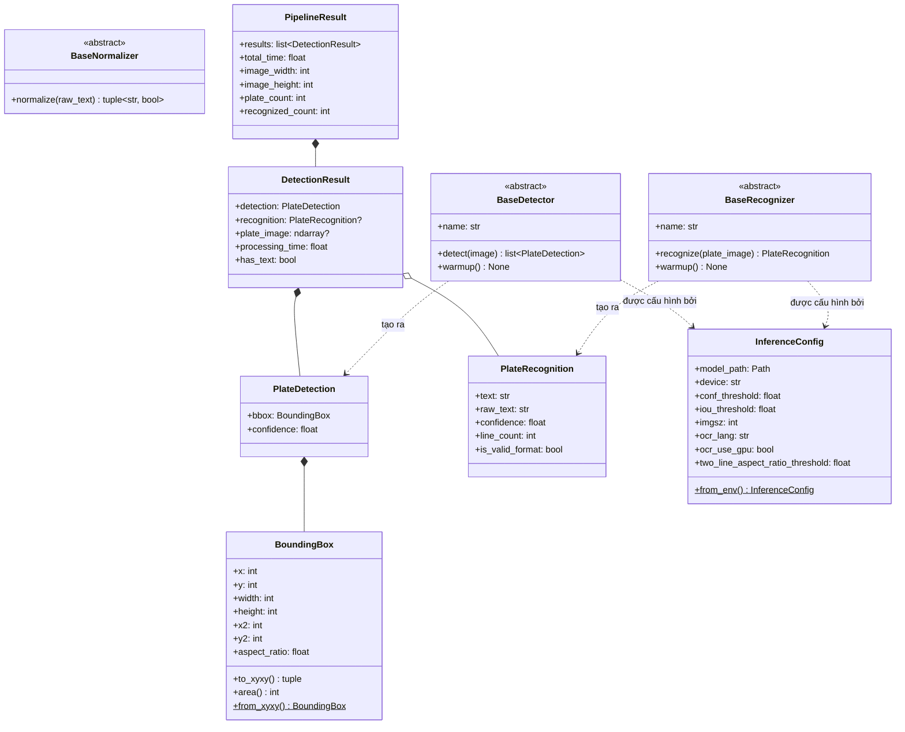

# `ai/inference` — Tầng hợp đồng của hệ thống nhận dạng biển số

Gói này là **nền móng** của toàn bộ hệ thống ALPR. Nó không chứa mô hình, không
chứa logic nghiệp vụ, không gọi cơ sở dữ liệu — nó chỉ định nghĩa **hợp đồng**
(contracts): các bên trao đổi dữ liệu gì, thay thế thành phần bằng cách nào,
cấu hình ra sao và báo lỗi thế nào.

Mọi thành phần khác trong dự án đều phụ thuộc vào gói này, còn gói này thì
**không phụ thuộc vào bất kỳ thành phần nào khác**. Đây là điểm mấu chốt của
kiến trúc.

---

## 1. Vai trò của package

| Tệp | Trách nhiệm |
|---|---|
| `types.py` | Các cấu trúc dữ liệu đi xuyên suốt pipeline (`BoundingBox`, `PlateDetection`, `PlateRecognition`, `DetectionResult`, `PipelineResult`) |
| `interfaces.py` | Các lớp trừu tượng cho ba giai đoạn thay thế được: phát hiện, đọc chữ, chuẩn hoá (NFR-M5) |
| `config.py` | Cấu hình tập trung — **mọi đường dẫn và tham số** đều đi qua đây (NFR-M4) |
| `exceptions.py` | Cây ngoại lệ với một gốc chung `ALPRError` |

Các mô-đun triển khai thực tế (`detector.py`, `recognizer.py`, `normalizer.py`,
`pipeline.py`) sẽ được bổ sung ở các phase sau và **phải** tuân theo các hợp
đồng định nghĩa tại đây.

---

## 2. Ràng buộc cứng: không import framework web (NFR-M1)

> Thư mục `ai/` **tuyệt đối không được import** FastAPI hay Pydantic.

Đây là **ràng buộc kiến trúc, không phải nguyện vọng**. Cách kiểm tra bằng lệnh
`grep` được ghi trong
[docs/architecture/system-architecture.md](../../docs/architecture/system-architecture.md)
— lệnh đó phải **không trả về kết quả nào**.

### Vì sao phải nghiêm ngặt như vậy?

Nếu tầng AI biết đến FastAPI, ta sẽ mất bốn thứ:

1. **Khả năng kiểm thử** — muốn test pipeline phải dựng cả một ứng dụng web.
2. **Khả năng tái sử dụng** — script huấn luyện và script đánh giá trong
   `ai/training`, `ai/evaluation` chạy độc lập, không có server nào cả.
3. **Khả năng thay thế** — đổi framework web sẽ kéo theo sửa mã AI.
4. **Sự rõ ràng về trách nhiệm** — HTTP, xác thực, phân trang là việc của tầng
   API; nhận dạng biển số là việc của tầng AI.

### Hệ quả thực tế: vì sao dùng `@dataclass` chứ không dùng Pydantic?

Pydantic rất tiện cho việc kiểm tra dữ liệu đầu vào từ HTTP, nhưng dùng nó ở
đây sẽ **buộc tầng AI phụ thuộc vào thư viện của tầng API**. Vì vậy:

* `ai/inference/types.py` dùng `@dataclass` thuần Python.
* `backend/schemas/` tự định nghĩa schema Pydantic riêng và **ánh xạ** từ các
  dataclass này sang.

Cái giá phải trả là một lớp chuyển đổi nhỏ ở tầng API. Đổi lại, định dạng dữ
liệu trả về cho client có thể thay đổi mà không đụng đến pipeline, và ngược lại.

---

## 3. Sơ đồ quan hệ các lớp



### Luồng dữ liệu qua các hợp đồng

```mermaid
flowchart LR
    IMG[Ảnh BGR<br/>numpy uint8] --> DET[BaseDetector.detect]
    DET -->|list PlateDetection| CROP[Cắt ảnh theo<br/>bbox.to_xyxy]
    CROP --> REC[BaseRecognizer.recognize]
    REC -->|raw_text| NORM[BaseNormalizer.normalize]
    NORM -->|text, is_valid_format| RES[DetectionResult]
    RES --> PIPE[PipelineResult]
    PIPE -.->|tầng API ánh xạ sang| DB[(detection_history)]
```



---

## 4. Hai quyết định thiết kế cần giải thích

### 4.1. Vì sao tách `confidence` và `ocr_confidence`?

`PlateDetection.confidence` là độ tin cậy của **bước phát hiện** (YOLO tìm thấy
một vật thể trông giống biển số). `PlateRecognition.confidence` là độ tin cậy
của **bước đọc chữ** (OCR đọc ra các ký tự).

Hai con số này đo hai việc hoàn toàn khác nhau. Nếu gộp lại thành một, khi hệ
thống cho kết quả sai ta **không thể biết** khâu nào yếu: YOLO cắt trượt biển số,
hay OCR đọc nhầm ký tự? Schema CSDL đã phê duyệt vì thế lưu chúng ở hai cột
riêng biệt.

### 4.2. Vì sao giữ cả `raw_text` lẫn `text`?

`raw_text` là chuỗi **thô** do OCR trả về; `text` là chuỗi **sau khi** đã chuẩn
hoá và sửa lỗi bằng regex.

Giữ cả hai là **bắt buộc**, vì đó là cách duy nhất đo được đóng góp của bước hậu
xử lý: so sánh độ chính xác tính trên `raw_ocr_text` với độ chính xác tính trên
`plate_number` sẽ cho biết chính xác khâu sửa lỗi cải thiện được bao nhiêu phần
trăm (yêu cầu NFR-A5 và NFR-A6). Nếu chỉ lưu chuỗi đã sửa, con số đó vĩnh viễn
không tính được.

Đây cũng là lý do `BaseNormalizer` tách khỏi `BaseRecognizer`: bộ OCR trả về
đúng những gì nó đọc được, việc sửa lỗi là một khâu riêng, quan sát được.

---

## 5. Cấu hình — không hard-code đường dẫn (NFR-M4)

`PROJECT_ROOT` được suy ra từ chính vị trí của tệp `config.py`
(`<gốc>/ai/inference/config.py` → lùi 2 cấp), **không** viết cứng chuỗi
`D:/DATN`. Nhờ đó cùng một đoạn mã chạy được trên Windows khi phát triển, trong
Docker image nền Linux, và trên Colab khi huấn luyện.

Mọi giá trị đều đọc được từ biến môi trường qua `InferenceConfig.from_env()`:

| Biến môi trường | Trường | Mặc định |
|---|---|---|
| `ALPR_MODEL_PATH` | `model_path` | `<gốc>/models/best.pt` |
| `ALPR_DEVICE` | `device` | `cpu` |
| `ALPR_CONF_THRESHOLD` | `conf_threshold` | `0.25` |
| `ALPR_IOU_THRESHOLD` | `iou_threshold` | `0.45` |
| `ALPR_IMGSZ` | `imgsz` | `640` |
| `ALPR_OCR_LANG` | `ocr_lang` | `en` |
| `ALPR_OCR_USE_GPU` | `ocr_use_gpu` | `false` |
| `ALPR_TWO_LINE_ASPECT_RATIO` | `two_line_aspect_ratio_threshold` | `2.5` |

Ghi chú:

* Mặc định `cpu` và `ocr_use_gpu=False` là do máy phát triển **không có GPU
  CUDA** (quyết định AD-06).
* `ocr_lang` mặc định là `en` vì biển số Việt Nam chỉ gồm chữ cái Latin và chữ
  số — mô hình tiếng Anh vừa đúng vừa nhanh hơn mô hình đa ngữ.
* Đường dẫn tương đối trong biến môi trường được resolve theo `PROJECT_ROOT`,
  **không** theo thư mục hiện hành — chạy từ đâu cũng cho kết quả như nhau.
* Giá trị sai (ngoài khoảng, sai kiểu) sẽ **báo lỗi ngay lúc khởi động** thay vì
  âm thầm dùng giá trị mặc định, để một lỗi gõ nhầm trong cấu hình triển khai
  không bị bỏ sót.

```python
from ai.inference import InferenceConfig

config = InferenceConfig.from_env()          # đọc từ biến môi trường
config = InferenceConfig(imgsz=1280)         # hoặc chỉ định trực tiếp khi test
```

---

## 6. Cách mở rộng: thêm một engine mới

Đây chính là mục đích tồn tại của `interfaces.py` (NFR-M5). Ví dụ thay PaddleOCR
bằng EasyOCR — **không sửa một dòng nào** ở tầng API:

```python
# ai/inference/easyocr_recognizer.py
import easyocr
import numpy as np

from ai.inference.config import InferenceConfig
from ai.inference.exceptions import ModelLoadError, RecognitionError
from ai.inference.interfaces import BaseNormalizer, BaseRecognizer
from ai.inference.types import ImageArray, PlateRecognition


class EasyOCRRecognizer(BaseRecognizer):
    """Bộ đọc biển số dùng EasyOCR."""

    def __init__(self, config: InferenceConfig, normalizer: BaseNormalizer) -> None:
        """Khởi tạo bộ đọc.

        Args:
            config: Cấu hình suy luận tập trung.
            normalizer: Bộ chuẩn hoá dùng để sửa lỗi chuỗi OCR thô.

        Raises:
            ModelLoadError: Nếu không nạp được mô hình.
        """
        self._normalizer = normalizer
        try:
            self._reader = easyocr.Reader(
                [config.ocr_lang], gpu=config.ocr_use_gpu
            )
        except Exception as error:
            raise ModelLoadError("Failed to load EasyOCR model") from error

    @property
    def name(self) -> str:
        """Định danh engine, dùng trong log và báo cáo benchmark."""
        return "easyocr"

    def recognize(self, plate_image: ImageArray) -> PlateRecognition:
        """Đọc chuỗi ký tự từ ảnh biển số đã cắt."""
        ...
```

Sau đó chỉ cần đổi engine ở nơi khởi tạo (dependency injection ở tầng
`backend/`), pipeline và các router giữ nguyên.

### Quy tắc bắt buộc khi viết engine mới

1. **Kế thừa** đúng lớp trừu tượng tương ứng và cài đặt đủ các phương thức
   `@abstractmethod` — thiếu một cái là Python báo lỗi ngay khi khởi tạo.
2. **Chỉ ném** các ngoại lệ trong `exceptions.py`. Ngoại lệ của thư viện bên thứ
   ba phải được bọc lại bằng `raise ... from error` để giữ nguyên nguyên nhân gốc
   trong log mà không lộ ra ngoài.
3. **Không tự dựng đường dẫn** — nhận tất cả qua `InferenceConfig`.
4. **Không import** thư viện của tầng web (mục 2).
5. **Đủ type hint và docstring** cho mọi hàm public (NFR-M3). Docstring trong mã
   nguồn viết bằng **tiếng Anh**; chỉ tài liệu trong `docs/` và tệp README này
   mới viết tiếng Việt.
6. **Không tìm thấy gì không phải là lỗi**: ảnh không có biển số thì trả về danh
   sách rỗng; biển số không đọc được thì trả về chuỗi rỗng với `confidence = 0`.
   Chỉ ném ngoại lệ khi bản thân engine hỏng.

---

## 7. Xử lý lỗi

```
ALPRError                 (gốc — tầng API bắt đúng lớp này)
├── ModelLoadError        thiếu tệp trọng số / tệp hỏng / sai phiên bản
├── DetectionError        bước phát hiện thất bại
├── RecognitionError      bước OCR thất bại
└── InvalidImageError     ảnh đầu vào không dùng được
```

Có một gốc chung để tầng API bắt trọn cả họ bằng **một** khối `except`, ghi chi
tiết kỹ thuật vào log phía server, rồi trả về cho người dùng một thông báo ngắn
gọn — **không bao giờ lộ stack trace** (NFR-S4).

Thông điệp trong các ngoại lệ này viết bằng tiếng Anh và hướng tới **lập trình
viên**. Việc chuyển thành thông báo thân thiện cho người dùng cuối là trách
nhiệm của tầng API.

---

## 8. Kiểm tra nhanh

```bash
# Từ thư mục gốc dự án
python -c "import ai.inference; print(ai.inference.__all__)"
```

Gói này chỉ phụ thuộc **NumPy** và **thư viện chuẩn** của Python, nên import
được ngay cả khi chưa cài PyTorch hay PaddleOCR.
