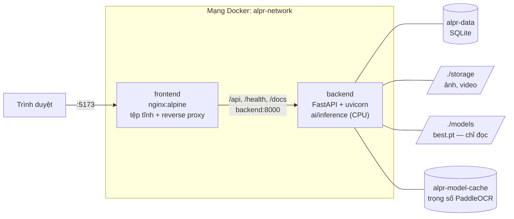

# Triển khai bằng Docker — Hệ thống nhận dạng biển số xe Việt Nam

Tài liệu này mô tả cách đóng gói và chạy toàn bộ hệ thống bằng Docker Compose:
cách build, cách chạy, ý nghĩa các biến môi trường, cách xử lý sự cố thường
gặp và lưu ý về dung lượng image.

> **Ngôn ngữ:** tài liệu này viết bằng tiếng Việt theo quy ước của dự án. Mã
> nguồn, comment và docstring trong các tệp Dockerfile/nginx.conf viết bằng
> **tiếng Anh**.

---

## 1. Kiến trúc triển khai



Chỉ **một cổng duy nhất** cần mở cho người dùng: `5173`. Mọi lời gọi API đi
qua nginx rồi mới tới backend, nhờ vậy trình duyệt luôn gọi cùng một origin và
không phát sinh vấn đề CORS trong trường hợp sử dụng thông thường.

| Tệp | Vai trò |
|---|---|
| `docker/Dockerfile.backend` | Image backend: FastAPI + gói `ai/` (multi-stage) |
| `docker/Dockerfile.frontend` | Image frontend: build Vite → phục vụ bằng nginx |
| `docker/nginx.conf` | Server block: SPA fallback, gzip, cache, proxy `/api` |
| `docker/.dockerignore` | Bản chuẩn của các quy tắc loại trừ (xem mục 8.3) |
| `docker/Dockerfile.*.dockerignore` | Bản **thực sự có hiệu lực** (BuildKit) |
| `.env.example` | Mẫu biến môi trường — chép ra thư mục gốc thành `.env` |
| `../docker-compose.yml` | Định nghĩa stack, đặt tại **thư mục gốc dự án** |

---

## 2. Trạng thái: ĐÃ BUILD VÀ CHẠY THẬT

> Mục này trước đây ghi rằng `docker compose build` sẽ thất bại vì thiếu tệp
> của Phase 5/6. **Điều đó không còn đúng.** Ngày 19/07/2026 cả hai image đã
> được build thật và cả stack đã chạy, được kiểm thử bằng HTTP thật từ ngoài
> container. Chi tiết số đo: `docs/reports/08-deployment-guide.md` *(nhánh `main`)*.

| Hạng mục | Trạng thái |
|---|---|
| `docker compose build` | ✅ thành công, mã thoát 0 |
| `alpr-backend` | ✅ 4,12 GB |
| `alpr-frontend` | ✅ 97,7 MB |
| `GET /health` → `model_loaded` | ✅ `true` |
| Nhận dạng ảnh thật đầu-cuối | ✅ đọc đúng biển 1 dòng và 2 dòng |
| `models/best.pt` | ✅ **đã có** — mô hình chính thức (YOLO11n, imgsz 640, split v3), mAP@0.5 0,9829 |

### Yêu cầu môi trường

* **Docker Engine ≥ 23** (bắt buộc, vì cần BuildKit — xem mục 8.3) và
  **Docker Compose ≥ 2.24** (cần cú pháp `env_file: required: false`).
* **RAM:** tối thiểu 8 GB; nên có 16 GB. Riêng backend được cấp hạn mức 4 GB.
  Đo thực tế khi chạy: backend dùng **719 MiB**, frontend **23,9 MiB**.
* **Dung lượng đĩa trống:** **tối thiểu 15 GB**. Đo thực tế: image chiếm
  4,12 GB + 97,7 MB, cộng thêm build cache của BuildKit (vài GB nữa, vì các
  wheel tải về được giữ lại để lần build sau dùng lại).
* Không cần GPU, không cần cài CUDA — xem mục 7.

---

## 3. Chuẩn bị trước lần chạy đầu tiên

```bash
# 1. Tạo tệp cấu hình môi trường ở THƯ MỤC GỐC (không phải trong deployment/)
cp deployment/.env.example .env

# 2. Tạo sẵn thư mục lưu trữ — xem giải thích bên dưới
mkdir -p storage models

# 3. Đặt trọng số đã huấn luyện vào models/best.pt
#    (kết quả của Phase 3, tải về từ Colab/Kaggle)
```

### Đưa mô hình vào container

Thư mục `models/` trên máy chủ được gắn vào `/app/models` ở chế độ **chỉ đọc**
(`:ro`). Trọng số **không** được sao chép vào image: làm vậy image sẽ phình to
và mỗi lần huấn luyện lại đều phải build lại image.

Mặc định container tìm `/app/models/best.pt` (mô hình chính thức, đã có). Nếu cần
trỏ sang tệp khác (ví dụ baseline đối chứng) thì dùng `ALPR_MODEL_FILE` — biến này
là **đường dẫn tương đối tính từ `models/`**:

```bash
# (tuỳ chọn) chạy đối chứng trên baseline
ALPR_MODEL_FILE=baseline-416-v1.pt docker compose up -d
```

Kiểm chứng đã nạp đúng tệp:

```bash
curl -s http://localhost:8000/health          # -> "model_loaded": true
docker exec alpr-backend sh -c 'echo $ALPR_MODEL_PATH'
```

Nếu tệp không tồn tại, dịch vụ **vẫn khởi động** nhưng `/health` báo
`model_loaded: false` và mọi yêu cầu nhận dạng đều lỗi sạch — nó **không** tự ý sinh
kết quả giả lập. Đó là chủ ý (`UnavailablePipeline` trong `backend/main.py`).

**Vì sao phải `mkdir -p storage` thủ công?** `./storage` được gắn theo kiểu
bind mount. Nếu thư mục chưa tồn tại, Docker sẽ tự tạo nó **với quyền sở hữu
của `root`**. Trong khi đó máy chủ chạy bằng người dùng không phải root
(UID 1000), nên tiến trình sẽ không ghi được vào đó và mọi thao tác tải tệp
lên đều hỏng. Tự tạo thư mục trước sẽ khiến nó thuộc về người dùng hiện tại.

Trên **Linux**, nếu UID của bạn khác 1000, hãy đặt thêm trong `.env`:

```bash
APP_UID=$(id -u)
APP_GID=$(id -g)
```

rồi build lại.

> **🔴 Đính chính (2026-07-20).** Phiên bản trước của mục này viết rằng *"trên
> Windows (Docker Desktop) và macOS, quyền truy cập bind mount được ánh xạ tự
> động nên không cần bước này"*. **Khẳng định đó sai** và đã gây sự cố thật:
> trên máy phát triển của nhóm (Windows 11 + Docker Desktop 29.4.3), thư mục
> host gắn vào hiện ra bên trong container là `root:root` quyền `755`, nên
> UID 1000 không tạo được `/app/storage/uploads`. Container backend **chết
> ngay khi khởi động** và lặp lại vô hạn:
>
> ```
> PermissionError: [Errno 13] Permission denied: '/app/storage/uploads'
> ```
>
> **Cách sửa đã áp dụng** (không cần thao tác thủ công nữa): image backend nay
> có entrypoint [`entrypoint-backend.sh`](docker/entrypoint-backend.sh). Nó
> khởi động bằng `root` **chỉ đủ lâu** để `chown` ba điểm gắn ghi được
> (`/app/storage`, `/app/data`, `/home/appuser`), rồi dùng `setpriv` **thay thế
> hẳn tiến trình** bằng máy chủ chạy dưới UID 1000. Không còn tiến trình `root`
> nào sống sót sang lúc phục vụ — kiểm chứng được bằng:
>
> ```bash
> docker compose exec backend sh -c 'grep ^Uid: /proc/1/status'
> # Uid:  1000  1000  1000  1000
> ```
>
> Nếu bạn tự đặt `user:` trong compose hoặc `--user` trên dòng lệnh, entrypoint
> nhận ra mình không phải root và chạy thẳng lệnh, không đụng vào quyền — người
> vận hành giữ toàn quyền quyết định.

---

## 4. Build và chạy

```bash
# Build cả hai image rồi chạy nền
docker compose up -d --build

# Theo dõi log (log có cấu trúc, mỗi request kèm request_id)
docker compose logs -f backend

# Kiểm tra tình trạng sức khoẻ
docker compose ps
```

Sau khi trạng thái backend chuyển sang `healthy`:

| Địa chỉ | Nội dung |
|---|---|
| <http://localhost:5173> | Giao diện người dùng |
| <http://localhost:5173/docs> | Swagger UI (proxy qua nginx) |
| <http://localhost:5173/health> | Kiểm tra sức khoẻ toàn stack |
| <http://localhost:8000/docs> | Swagger truy cập trực tiếp (chỉ từ localhost) |

Các lệnh thường dùng:

```bash
docker compose stop                  # dừng, giữ nguyên dữ liệu
docker compose down                  # xoá container, GIỮ volume
docker compose down -v               # ⚠️ xoá cả volume — MẤT CSDL
docker compose build --no-cache backend   # build lại sạch
docker compose exec backend sh       # mở shell trong container backend
docker compose restart backend       # nạp lại sau khi đổi biến môi trường
```

> **Lưu ý về thời gian build lần đầu:** khoảng **15–30 phút** tuỳ tốc độ mạng,
> chủ yếu là tải các wheel của PyTorch và PaddlePaddle. Các lần build sau chỉ
> mất vài phút nhờ layer cache — với điều kiện `requirements.txt` không đổi
> (xem mục 8.1).

---

## 5. Biến môi trường

Tất cả đều **tuỳ chọn**: `docker-compose.yml` đã ghi sẵn giá trị mặc định
tương ứng, nên stack chạy được ngay cả khi chưa có `.env`. Mẫu đầy đủ kèm chú
thích nằm ở [`.env.example`](.env.example).

### 5.1. Suy luận — đọc bởi `ai.inference.InferenceConfig.from_env()`

| Biến | Mặc định | Ý nghĩa |
|---|---|---|
| `ALPR_MODEL_PATH` | `/app/models/best.pt` | Đường dẫn trọng số YOLO11 |
| `ALPR_DEVICE` | `cpu` | Thiết bị suy luận (xem mục 7) |
| `ALPR_CONF_THRESHOLD` | `0.25` | Ngưỡng tin cậy tối thiểu của bộ phát hiện |
| `ALPR_IOU_THRESHOLD` | `0.45` | Ngưỡng IoU khi khử trùng lặp (NMS) |
| `ALPR_IMGSZ` | `640` | Kích thước ảnh đầu vào — phải là bội số dương của 32 |
| `ALPR_OCR_LANG` | `en` | Ngôn ngữ OCR |
| `ALPR_OCR_USE_GPU` | `false` | Cho phép OCR dùng GPU |
| `ALPR_TWO_LINE_ASPECT_RATIO` | `2.5` | Tỉ lệ rộng/cao để nhận biết biển 2 dòng |

### 5.2. Ứng dụng — đọc bởi tầng `backend/core` (Phase 5)

| Biến | Mặc định | Ý nghĩa |
|---|---|---|
| `ALPR_DATABASE_URL` | `sqlite:////app/data/alpr.db` | Chuỗi kết nối CSDL |
|  `ALPR_STORAGE_ROOT` | `/app/storage` | Thư mục lưu ảnh/video |
| `ALPR_LOG_LEVEL` | `info` | Mức log |
| `ALPR_CORS_ORIGINS` | `http://localhost:5173,...` | Danh sách origin được phép — **không dùng `*`** (NFR-S4) |
| `ALPR_MAX_UPLOAD_MB` | `200` | Giới hạn kích thước tệp tải lên (NFR-S3) |

> **Bốn dấu gạch chéo** trong `sqlite:////app/data/alpr.db` là cố ý:
> `sqlite:///` + đường dẫn tuyệt đối `/app/data/alpr.db`. Nếu chỉ viết ba dấu,
> đường dẫn sẽ được hiểu là tương đối so với thư mục làm việc và tệp CSDL sẽ
> nằm ở một chỗ khác — kèm theo hệ quả là dữ liệu **không** được lưu vào
> volume và sẽ mất khi container bị xoá.

> **Tên biến ở mục 5.2 là hợp đồng dành cho Phase 5.** Tầng `backend/core`
> phải đọc đúng những tên này. Chúng dùng chung tiền tố `ALPR_` với
> `InferenceConfig` để toàn hệ thống chỉ có một quy ước đặt tên duy nhất.

### 5.3. Số luồng CPU

| Biến | Mặc định | Ý nghĩa |
|---|---|---|
| `OMP_NUM_THREADS` | `4` | Số luồng OpenMP — **ảnh hưởng lớn nhất tới hiệu năng** |
| `MKL_NUM_THREADS` | `4` | Số luồng Intel MKL |
| `OPENBLAS_NUM_THREADS` | `4` | Số luồng OpenBLAS |

Đây là nhóm biến quan trọng nhất khi chạy trên CPU. **Quy tắc:** đặt bằng số
**nhân vật lý** của máy, và **không bao giờ vượt quá** `ALPR_CPU_LIMIT`.

Nếu để trống, OpenMP sẽ tự sinh mỗi nhân một luồng. Khi đó ba thư viện
(PyTorch, PaddlePaddle, OpenBLAS) mỗi thư viện dựng một nhóm luồng riêng và
cùng tranh nhau số nhân đó — hiện tượng *thread oversubscription*. Kết quả
thường **chậm hơn** so với khi giới hạn, đồng thời tiêu tốn thêm bộ nhớ và có
thể vượt ngân sách 2 GB của NFR-P7.

### 5.4. Cổng, đường dẫn và hạn mức tài nguyên

| Biến | Mặc định | Ý nghĩa |
|---|---|---|
| `ALPR_FRONTEND_PORT` | `5173` | Cổng giao diện trên máy chủ |
| `ALPR_BACKEND_BIND` | `127.0.0.1` | Địa chỉ công bố cổng backend |
| `ALPR_BACKEND_PORT` | `8000` | Cổng backend trên máy chủ |
| `ALPR_STORAGE_HOST_DIR` | `./storage` | Thư mục lưu trữ phía máy chủ |
| `ALPR_MODELS_HOST_DIR` | `./models` | Thư mục trọng số phía máy chủ |
| `ALPR_CPU_LIMIT` | `4` | Hạn mức CPU của backend |
| `ALPR_MEMORY_LIMIT` | `4g` | Hạn mức RAM của backend (NFR-P7) |

Mặc định backend chỉ lắng nghe trên `127.0.0.1`. Frontend vẫn gọi được backend
vì hai container nói chuyện qua **mạng nội bộ Docker**, không đi qua cổng công
bố. Chỉ đặt `ALPR_BACKEND_BIND=0.0.0.0` khi cần truy cập API trực tiếp từ máy
khác.

### 5.5. Biến chỉ dùng lúc build

| Biến | Mặc định | Ý nghĩa |
|---|---|---|
| `TORCH_INDEX_URL` | `https://download.pytorch.org/whl/cpu` | Index tải PyTorch — **xem mục 6** |
| `TORCH_VERSION` | *(trống)* | Ghim phiên bản torch nếu cần |
| `VITE_API_BASE_URL` | `/api` | Địa chỉ gốc của API, **nhúng lúc build** |
| `APP_UID` / `APP_GID` | `1000` | UID/GID của người dùng trong container |

> **`VITE_API_BASE_URL` được Vite nhúng thẳng vào bundle lúc build**, không
> phải lúc chạy. Sửa biến này rồi `docker compose restart` sẽ **không có tác
> dụng** — bắt buộc phải build lại frontend. Giá trị mặc định là đường dẫn
> tương đối `/api` để bundle không phụ thuộc tên máy chủ: trình duyệt gọi về
> đúng origin đã tải trang, còn nginx chuyển tiếp tới backend.

---

## 6. Dung lượng image — điểm cần lưu ý nhất

**Số ĐO THẬT** (`docker images`, sau lần build ngày 19/07/2026):

| Image | Dung lượng đo được | Ước lượng cũ | Ghi chú |
|---|---|---|---|
| `alpr-frontend` | **97,7 MB** | ~55 MB | nginx:alpine + bundle 729 KB |
| `alpr-backend` | **4,12 GB** | ~1,0–1,4 GB | ⚠️ lớn gấp ~3 lần dự kiến |

> **Ước lượng ~1,0–1,4 GB trong bảng cũ là SAI**, và sai vì nó chỉ tính torch.
> Thực tế PaddleOCR kéo theo cả `paddlex`, `modelscope`, `polars`, `pandas`,
> `matplotlib`, `huggingface-hub`… Riêng bánh xe `paddlepaddle` đã 194,8 MB và
> `torch` 191,8 MB *khi nén*; giải nén ra thì lớn hơn nhiều.

Một lần build trước đó cho ra image **6,41 GB**. Chênh lệch 2,29 GB là do
`backend/.venv` (2,0 GB, wheel Windows) lọt vào build context — xem mục 8.3.

Phân rã dung lượng backend (ước lượng, chưa đo tách từng lớp):

| Thành phần | Dung lượng |
|---|---|
| `python:3.12-slim-bookworm` | ~130 MB |
| Thư viện hệ thống (`libgl1`, `libglib2.0-0`, `libmagic1`, `libgomp1`) | ~120 MB |
| PyTorch (bản CPU) + torchvision | ~230 MB |
| Ultralytics + OpenCV + NumPy/SciPy/Matplotlib | ~250 MB |
| PaddlePaddle (bản CPU) | ~120 MB |
| PaddleOCR và các phụ thuộc | ~150 MB |
| FastAPI, uvicorn, SQLAlchemy, Alembic | ~30 MB |

### 6.1. ⚠️ Vì sao phải cài PyTorch từ index riêng

Đây là chi tiết **quan trọng nhất** trong toàn bộ cấu hình Docker này.

Lệnh `pip install torch` trên Linux, với index PyPI mặc định, sẽ tải **bản
biên dịch kèm CUDA** cùng toàn bộ thư viện runtime của NVIDIA
(`nvidia-cudnn-cu12`, `nvidia-cublas-cu12`, …): khoảng **2,5–3 GB** wheel cho
phần cứng mà máy này **không hề có** (quyết định AD-06).

`Dockerfile.backend` vì thế cài torch từ index CPU chuyên dụng
(`download.pytorch.org/whl/cpu`) **trước** khi xử lý `requirements.txt`, để pip
coi như phụ thuộc đã được thoả mãn. Cùng chức năng, nhưng chỉ ~200 MB.

> **Ràng buộc dành cho Phase 5:** tệp `backend/requirements.txt` **không nên
> ghim `torch`/`torchvision`**, hoặc nếu có thì phải ghim phiên bản cũng tồn
> tại trên index CPU. Ghim một phiên bản chỉ có trên PyPI sẽ khiến pip giải
> lại phụ thuộc và **kéo bản CUDA quay trở lại**, làm image phình lên gấp ba
> mà không có thông báo lỗi nào.

Cách kiểm tra sau khi build:

```bash
docker compose exec backend python -c "import torch; print(torch.__version__)"
# Đúng:  2.x.x+cpu     <- có hậu tố +cpu
# Sai:   2.x.x         <- không hậu tố = bản CUDA, image đang thừa ~2,5 GB

docker images alpr-backend --format "{{.Size}}"
```

### 6.2. Cách giảm dung lượng thêm

* **Dùng `opencv-python-headless`** thay cho `opencv-python` trong
  `requirements.txt`: tiết kiệm khoảng **200 MB** và cho phép bỏ hẳn `libgl1`,
  `libglib2.0-0` khỏi Dockerfile. Bản headless không có giao diện GUI — điều
  này hoàn toàn phù hợp vì server không bao giờ gọi `cv2.imshow()`.
* **Dọn cache build định kỳ:** `docker builder prune` — layer cache trung gian
  của các lần build có thể chiếm nhiều GB.
* Trọng số mô hình **không nằm trong image**: chúng được gắn read-only lúc
  chạy. Nhờ vậy huấn luyện lại mô hình chỉ cần thay tệp `models/best.pt` và
  khởi động lại container, **không phải build lại image**.

---

## 7. Ghi chú: đây là cấu hình CHỈ CHẠY CPU

`docker-compose.yml` **không có** bất kỳ cấu hình GPU passthrough nào: không
`deploy.resources.reservations.devices`, không `runtime: nvidia`, không biến
`NVIDIA_*`. Đây là lựa chọn có chủ đích theo quyết định kiến trúc **AD-06** —
máy triển khai không có GPU CUDA.

Việc **huấn luyện** mô hình diễn ra trên Colab/Kaggle GPU và nằm ngoài phạm vi
của stack này; stack chỉ nhận **trọng số đã huấn luyện** gắn vào ở chế độ chỉ
đọc.

Nếu sau này cần chạy trên GPU, phải làm **đồng thời cả bốn việc** sau — thiếu
một việc là container hỏng lúc nạp mô hình:

1. Sửa `Dockerfile.backend` để cài bản torch có CUDA (đổi `TORCH_INDEX_URL`).
2. Cài **NVIDIA Container Toolkit** trên máy chủ.
3. Thêm khối `deploy.resources.reservations.devices` vào service `backend`.
4. Đặt `ALPR_DEVICE=cuda` và `ALPR_OCR_USE_GPU=true`.

Chỉ đổi mỗi bước 4 là lỗi thường gặp nhất, và thông báo lỗi nhận được thường
không chỉ ra nguyên nhân thật.

---

## 8. Ghi chú thiết kế

### 8.1. Vì sao build context là thư mục gốc dự án?

Backend image cần **cả** `backend/` lẫn `ai/`. Quan trọng hơn,
`ai/inference/config.py` suy ra `PROJECT_ROOT` bằng cách lùi hai cấp từ chính
vị trí của nó. Đặt gói tại `/app/ai/inference/` khiến `/app` được nhận diện là
gốc dự án, nhờ đó `models/best.pt` và các đường dẫn khác phân giải đúng mà
**không cần gán cứng** đường dẫn nào (NFR-M4).

Frontend image cũng dùng context là thư mục gốc, vì nó cần chép
`deployment/docker/nginx.conf` — mà `COPY` thì không thể lấy tệp nằm ngoài
build context. Nhúng sẵn cấu hình vào image (thay vì bind mount từ compose)
giúp image tự chứa và chạy được độc lập.

`requirements.txt` và `package.json` được `COPY` **trước** phần mã nguồn để
tầng cài đặt phụ thuộc — tầng tốn kém nhất — chỉ bị dựng lại khi danh sách phụ
thuộc thực sự thay đổi.

### 8.2. Vì sao backend chỉ chạy **một** uvicorn worker?

Mỗi worker nạp **một bản sao riêng** của trọng số YOLO và OCR vào bộ nhớ. Bốn
worker nghĩa là nhân bốn lượng RAM thường trú, trong khi vẫn tranh nhau đúng
số nhân CPU đó. Yêu cầu về đồng thời (NFR-SC1, ≥ 5 request) được đáp ứng bằng
xử lý bất đồng bộ và hàng đợi tác vụ nền (AD-02), **không phải** bằng cách tăng
số tiến trình.

### 8.3. Vì sao có ba tệp `.dockerignore`?

Docker chỉ tự động đọc `.dockerignore` **ở gốc của build context**. Vì cả hai
image đều build từ thư mục gốc dự án, tệp mà Docker tìm sẽ là
`DATN/.dockerignore` — không phải tệp trong `deployment/docker/`.

BuildKit phân giải quy tắc loại trừ theo thứ tự:

1. `<đường-dẫn-Dockerfile>.dockerignore` ← **đang dùng cách này**
2. `<gốc-context>/.dockerignore` ← phương án dự phòng

Do đó các quy tắc **thực sự có hiệu lực** nằm ở hai tệp cạnh mỗi Dockerfile:
`Dockerfile.backend.dockerignore` và `Dockerfile.frontend.dockerignore`. Tệp
`docker/.dockerignore` là **bản chuẩn để đối chiếu**, đồng thời là tệp sẽ có
hiệu lực nếu sau này dự án chuyển sang dùng `.dockerignore` ở thư mục gốc.

> **Sửa cả ba tệp cùng lúc**, hoặc gộp thành một tệp duy nhất ở thư mục gốc dự
> án rồi xoá cả ba. Cách làm hiện tại giữ cho toàn bộ cấu hình Docker nằm gọn
> trong `deployment/`, đổi lại là phải đồng bộ thủ công.
>
> **Bắt buộc dùng BuildKit** (mặc định từ Docker 23). Với builder cũ, các tệp
> sidecar bị bỏ qua và **toàn bộ** context — kể cả `datasets/` — sẽ bị gửi cho
> daemon.

### 8.4. Vì sao SQLite dùng named volume còn `storage/` dùng bind mount?

SQLite khoá tệp bằng **POSIX file lock**. Cơ chế này hoạt động không đáng tin
qua lớp dịch bind mount của Docker Desktop trên Windows và macOS; triệu chứng
kinh điển là lỗi `database is locked` xuất hiện ngẫu nhiên khi có ghi đồng
thời. Named volume nằm hẳn trong hệ tệp Linux của máy ảo Docker nên tránh được
hoàn toàn vấn đề này.

Ngược lại, `storage/` dùng bind mount để có thể mở trực tiếp video đã xử lý và
ảnh biển số đã cắt từ máy chủ — rất tiện khi dựng demo và viết báo cáo.

---

## 9. Sao lưu và khôi phục

CSDL SQLite là **thứ duy nhất không thể tái tạo được** — mọi dữ liệu khác đều
là dẫn xuất.

```bash
# Sao lưu CSDL
docker run --rm -v alpr-data:/data -v "$(pwd)":/backup alpine \
    tar czf /backup/alpr-data-$(date +%Y%m%d).tar.gz -C /data .

# Khôi phục
docker compose down
docker run --rm -v alpr-data:/data -v "$(pwd)":/backup alpine \
    sh -c "rm -rf /data/* && tar xzf /backup/alpr-data-YYYYMMDD.tar.gz -C /data"
docker compose up -d

# Thư mục storage/ nằm ngay trên máy chủ nên chỉ cần chép thư mục là xong
```

> `docker compose down -v` **xoá vĩnh viễn** volume `alpr-data`. Hãy sao lưu
> trước khi chạy lệnh này.

---

## 10. Xử lý sự cố thường gặp

> Bốn mục đầu là **lỗi THẬT đã gặp** trong lần build ngày 19/07/2026, không
> phải lỗi giả định. Các mục sau là lỗi dự phòng.

### 🔴 ĐÃ GẶP — Image phình từ 4,12 GB lên 6,41 GB, build context 1,22 GB

**Triệu chứng.** Dòng `transferring context: 1.22GB` lúc build, và bước
`COPY backend/ /app/backend/` mất gần 10 giây thay vì tức thì.

**Nguyên nhân.** Ba tệp `.dockerignore` đều có dòng `.venv/`. Mẫu này **được
neo vào thư mục gốc**, nên nó chỉ khớp đúng `d:/DATN/.venv`. Các venv thật của
dự án khi đó tên là `.venv-ai`, `.venv-ocr` và `backend/.venv` — **không cái nào bị
loại trừ**. Riêng `backend/.venv` nặng 2,0 GB và chứa wheel **Windows**, tức là
2 GB nhị phân hoàn toàn vô dụng được nướng vào một image **Linux**.

**Cách sửa** (đã áp dụng cho cả ba tệp `.dockerignore`):

```
.venv*/
**/.venv/
**/.venv*/
**/venv/
```

Sau khi sửa: context còn **633 kB**, image còn **4,12 GB**.

**Bài học.** Mẫu trong `.dockerignore` không tự đệ quy. Luôn kiểm tra bằng dòng
`transferring context` chứ đừng tin là mình đã loại trừ đúng.

### 🔴 ĐÃ GẶP — Ảnh tải lên không xuất hiện trong `./storage` trên máy chủ

**Triệu chứng.** Stack chạy tốt, nhận dạng đúng, nhưng thư mục `./storage`
bind-mount vẫn rỗng. Ảnh nằm trong `/app/data/uploads` bên trong container.

**Nguyên nhân.** `docker-compose.yml` đặt biến `ALPR_STORAGE_DIR`, nhưng trường
cấu hình thật trong `backend/core/config.py` tên là `storage_root`, với tiền tố
`ALPR_` ⇒ biến đúng phải là **`ALPR_STORAGE_ROOT`**. Vì model cấu hình khai báo
`extra="ignore"`, biến sai tên **bị bỏ qua trong im lặng** — không có cảnh báo
nào. `storage_root` giữ giá trị mặc định `data`, nên mọi ảnh gốc và ảnh biển số
cắt ra đều rơi vào named volume của SQLite thay vì bind mount.

**Cách sửa.** Đổi thành `ALPR_STORAGE_ROOT` trong `docker-compose.yml`,
`Dockerfile.backend` và `deployment/.env.example`.

**Bài học.** `extra="ignore"` biến lỗi gõ sai tên biến thành lỗi âm thầm. Sau
khi đặt biến môi trường, hãy **kiểm chứng bằng hành vi quan sát được** (`ls`
thư mục trên máy chủ), đừng chỉ đọc lại tệp cấu hình.

### 🔴 ĐÃ GẶP — Biến trong `.env` gốc ghi đè sai đường dẫn của container

**Triệu chứng.** Tiềm ẩn: `.env` ở thư mục gốc chứa `ALPR_MODEL_PATH=models/best.pt`
và `ALPR_DATABASE_URL=sqlite:///./data/alpr.db` — đó là đường dẫn dành cho
**máy chủ Windows**. Compose nội suy `${ALPR_MODEL_PATH:-...}` từ chính tệp
`.env` đó, nên giá trị máy chủ chảy thẳng vào container.

**Cách sửa.** Cố định đường dẫn tuyệt đối trong container, chỉ cho phép cấu hình
**tên tệp** mô hình:

```yaml
ALPR_MODEL_PATH: /app/models/${ALPR_MODEL_FILE:-best.pt}
ALPR_DATABASE_URL: sqlite:////app/data/alpr.db
```

### 🔴 ĐÃ GẶP — `GET /api/health` trả về 404

**Đây KHÔNG phải lỗi.** Backend gắn router health ở **gốc**, ngoài tiền tố
`/api` (xem `frontend/src/services/api.ts` — client cũng gọi `/health`).
`nginx.conf` có sẵn khối `location = /health` riêng cho việc này.

Đường dẫn đúng để kiểm tra sức khoẻ qua nginx là **`http://localhost:5173/health`**
(đã đo: 200), không phải `/api/health` (đã đo: 404).

### Build thất bại: `failed to compute cache key: backend/requirements.txt not found`

Chạy `docker compose build` từ thư mục **gốc** dự án. Build context là thư mục
gốc chứ không phải `deployment/docker/` — xem mục 8.1.

### Build thất bại: `npm ci` báo lỗi thiếu lock file

`npm ci` bắt buộc phải có `frontend/package-lock.json` và tệp này phải được
commit. Nếu chưa có, chạy `npm install` một lần trong `frontend/` để sinh ra
lock file rồi commit nó. (`npm ci` được chọn thay cho `npm install` vì nó cài
đúng phiên bản đã khoá và báo lỗi ngay khi `package.json` lệch với lock file —
đó chính là điều làm cho bản build có thể tái lập.)

### Backend luôn ở trạng thái `unhealthy` — frontend không khởi động được

`depends_on: condition: service_healthy` cố ý chặn frontend cho tới khi backend
thực sự sẵn sàng. Kiểm tra theo thứ tự:

```bash
docker compose logs backend | tail -50
docker compose exec backend ls -la /app/models/    # best.pt có ở đó không?
docker compose exec backend python -c "import urllib.request; print(urllib.request.urlopen('http://127.0.0.1:8000/health').status)"
```

Nguyên nhân hay gặp: thiếu `models/best.pt`; endpoint `/health` chưa được cài
đặt; hoặc mô hình nạp lâu hơn `start-period` 60 giây (NFR-P4 cho phép tối đa
30 giây, nên vượt quá 60 giây là dấu hiệu có vấn đề thật sự).

### `502 Bad Gateway` khi mở giao diện

Backend chưa sẵn sàng hoặc đã thoát. Chạy `docker compose ps` để xem trạng
thái, rồi xem log backend. Nếu nginx thoát ngay lúc khởi động kèm lỗi
`host not found in upstream "backend"`, nghĩa là container backend không hề
chạy — nginx phân giải tên upstream ngay lúc khởi động.

### `permission denied` khi ghi vào `/app/storage` (Linux)

Thư mục `./storage` thuộc sở hữu của `root` còn container chạy bằng UID 1000:

```bash
sudo chown -R 1000:1000 ./storage
# hoặc build lại với UID của chính bạn:
echo "APP_UID=$(id -u)" >> .env && echo "APP_GID=$(id -g)" >> .env
docker compose up -d --build
```

### `database is locked`

Xem mục 8.4. Hãy đảm bảo CSDL đang nằm trên named volume `alpr-data` chứ không
phải trên một bind mount, và kiểm tra `ALPR_DATABASE_URL` có đủ **bốn** dấu
gạch chéo.

### Ảnh/video tải lên bị từ chối với mã 413

Có **hai** giới hạn phải khớp nhau: `client_max_body_size` trong
`docker/nginx.conf` (mặc định `200m`) và `ALPR_MAX_UPLOAD_MB` của backend
(mặc định `200`). Giới hạn của nginx phải **lớn hơn hoặc bằng** của backend;
nếu nhỏ hơn, nginx sẽ chặn trước và người dùng nhận trang 413 thô của nginx
thay vì thông báo lỗi có cấu trúc từ API. Sửa nginx.conf thì phải build lại
frontend.

### Trình duyệt báo lỗi CORS

Trong cấu hình mặc định thì không thể xảy ra, vì mọi lời gọi đều đi qua nginx
cùng origin. Lỗi này chỉ xuất hiện khi `VITE_API_BASE_URL` được đổi sang một
origin khác. Khi đó phải thêm **chính xác** origin mà trình duyệt đang dùng
(đúng như trên thanh địa chỉ) vào `ALPR_CORS_ORIGINS`. Không dùng `*`
(NFR-S4).

### Suy luận chậm hơn nhiều so với chỉ tiêu NFR-P1

Kiểm tra `OMP_NUM_THREADS` trước tiên (mục 5.3), sau đó xác nhận torch đúng là
bản CPU (mục 6.1). Cũng nên xem lại hạn mức CPU cấp cho Docker Desktop trong
phần Settings → Resources — mặc định của Docker Desktop thường thấp hơn số nhân
thực có của máy.

### Lần chạy đầu rất chậm hoặc lỗi mạng khi khởi động

PaddleOCR tải trọng số về trong lần dùng đầu tiên. Volume `alpr-model-cache`
giữ lại phần tải này để các lần khởi động sau không phải tải lại. Nếu máy chủ
không có Internet, cần tải sẵn trọng số và nạp vào volume đó trước.

### Cổng đã bị chiếm

```bash
# Đổi cổng trong .env, không sửa docker-compose.yml
echo "ALPR_FRONTEND_PORT=8080" >> .env
docker compose up -d
```

---

## 11. Tài liệu liên quan

* `docs/architecture/system-architecture.md` *(nhánh `main`)* — kiến trúc hệ thống và các quyết định AD-01…AD-08
* `docs/00-requirements/non-functional-requirements.md` *(nhánh `main`)* — các chỉ tiêu NFR được nhắc tới ở trên
* `docs/00-requirements/environment.md` *(nhánh `main`)* — môi trường phát triển và lý do chạy CPU
* [`ai/inference/README.md`](../ai/inference/README.md) — hợp đồng của tầng suy luận và bảng biến môi trường `ALPR_*`
