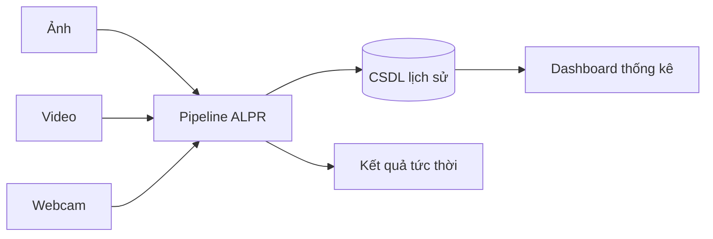

# Đặc tả yêu cầu phần mềm (SRS)

**Đề tài:** Xây dựng hệ thống nhận dạng biển số xe Việt Nam ứng dụng Trí tuệ nhân tạo
*(Developing an AI-based Vietnamese License Plate Recognition System)*

| Mục | Nội dung |
|---|---|
| Mã tài liệu | `SRS-ALPR-v1.0` |
| Phiên bản | 1.0 |
| Giai đoạn | Phase 0 — Requirement Analysis |
| Ngày lập | 2026-07-19 |
| Trạng thái | **Chờ phê duyệt** |

---

## 1. Giới thiệu

### 1.1. Mục đích tài liệu

Tài liệu này đặc tả đầy đủ các yêu cầu của hệ thống **ALPR (Automatic License Plate Recognition)** dành cho biển số xe Việt Nam. Tài liệu là cơ sở để:

- Thống nhất phạm vi công việc giữa sinh viên thực hiện và giảng viên hướng dẫn.
- Làm căn cứ thiết kế kiến trúc, cài đặt và kiểm thử.
- Làm đầu vào cho chương "Phân tích yêu cầu" của quyển đồ án.

### 1.2. Phạm vi hệ thống

Hệ thống cho phép người dùng đưa vào **ảnh**, **video** hoặc **khung hình thời gian thực** (qua API), tự động phát hiện vùng biển số, đọc ký tự trên biển số, chuẩn hoá theo quy chuẩn biển số Việt Nam, lưu lịch sử vào cơ sở dữ liệu và hiển thị thống kê trên giao diện web.

> ⚠️ **Thay đổi phạm vi 2026-07-20:** trang Webcam đã gỡ khỏi giao diện web; nhận dạng thời gian thực chỉ còn ở tầng API (`POST /api/detect/frame`). Chi tiết tại [functional-requirements.md — FR-3](functional-requirements.md#4-fr-3--nhận-dạng-thời-gian-thực-webcam).

Chi tiết phạm vi in/out được đặc tả riêng tại [project-scope.md](project-scope.md).

### 1.3. Định nghĩa và từ viết tắt

| Từ viết tắt | Giải nghĩa |
|---|---|
| ALPR / ANPR | Automatic (Number) License Plate Recognition — nhận dạng biển số tự động |
| YOLO | You Only Look Once — họ mô hình phát hiện đối tượng một giai đoạn |
| OCR | Optical Character Recognition — nhận dạng ký tự quang học |
| mAP | mean Average Precision — độ đo chính xác của bài toán detection |
| IoU | Intersection over Union — tỉ lệ chồng lấn giữa hai bounding box |
| E2E | End-to-End — toàn trình, từ đầu vào đến kết quả cuối |
| CER | Character Error Rate — tỉ lệ lỗi ở mức ký tự |
| p95 | Phân vị thứ 95 (95th percentile) |
| FR / NFR | Functional / Non-Functional Requirement |
| DI | Dependency Injection |

### 1.4. Tài liệu liên quan

| Tài liệu | Đường dẫn |
|---|---|
| Yêu cầu chức năng | [functional-requirements.md](functional-requirements.md) |
| Yêu cầu phi chức năng | [non-functional-requirements.md](non-functional-requirements.md) |
| Phạm vi dự án | [project-scope.md](project-scope.md) |
| Kế hoạch thực hiện | [timeline.md](timeline.md) |
| Môi trường phát triển | [environment.md](environment.md) |
| Kiến trúc hệ thống | [../architecture/system-architecture.md](../architecture/system-architecture.md) |

---

## 2. Mô tả tổng quan

### 2.1. Bối cảnh

Nhận dạng biển số xe là bài toán nền tảng trong các hệ thống bãi đỗ xe thông minh, trạm thu phí không dừng, giám sát giao thông và kiểm soát ra vào. Bài toán tại Việt Nam có các đặc thù riêng khiến không thể áp dụng trực tiếp các mô hình huấn luyện trên dữ liệu nước ngoài:

1. **Biển số hai dòng** rất phổ biến (xe máy, một phần ô tô) — đa số bộ dữ liệu quốc tế chỉ có biển một dòng.
2. **Nhiều nền màu mang ngữ nghĩa khác nhau** (trắng, vàng, xanh dương) theo **Thông tư 79/2024/TT-BCA** (ký 15/11/2024, hiệu lực 01/01/2025; được sửa đổi bởi **TT 13/2025/TT-BCA** và **TT 51/2025/TT-BCA**); kích thước và hình thức vật lý của biển theo **QCVN 08:2024/BCA** (ban hành kèm TT 81/2024/TT-BCA, hiệu lực 01/01/2025). Nền **đỏ** (xe quân đội) nằm **ngoài phạm vi** TT 79/2024, thuộc TT 169/2021/TT-BQP.
3. **Điều kiện thu nhận ảnh khắc nghiệt**: mật độ xe máy cao, biển bị che khuất, bụi bẩn, nghiêng, ngược sáng, ảnh đêm.
4. **Định dạng ký tự riêng** (mã tỉnh, ký tự sê-ri) cần luật hậu xử lý riêng để sửa các nhầm lẫn kinh điển như `O↔0`, `I↔1`, `B↔8`, `S↔5`, `Z↔2`.

> Nghiên cứu chi tiết về quy chuẩn biển số Việt Nam là nhiệm vụ của **Phase 1 — Research**. Ở Phase 0, quy chuẩn chỉ được ghi nhận như một **ràng buộc đầu vào**.

> **Cập nhật căn cứ pháp lý (sau Phase 1).** Bản Phase 0 của tài liệu này viện dẫn **Thông tư 24/2023/TT-BCA**. Kết quả khảo sát nguồn pháp lý gốc ở Phase 1 xác định văn bản đó **đã hết hiệu lực từ 01/01/2025**, bị thay thế bởi TT 79/2024/TT-BCA; kích thước biển số chuyển sang áp dụng QCVN 08:2024/BCA. Mục 2.1 đã được sửa theo căn cứ hiện hành. TT 24/2023 chỉ còn được nhắc tới như **bối cảnh lịch sử**. Xem đầy đủ tại [../reports/01-vn-plate-standards.md](../reports/01-vn-plate-standards.md).

### 2.2. Chức năng tổng quát

Bốn nhóm chức năng chính:

| Nhóm | Mô tả |
|---|---|
| **Nhận dạng ảnh** | Tải ảnh lên, phát hiện + đọc biển số, lưu và hiển thị kết quả |
| **Nhận dạng video** | Tải video lên, xử lý theo khung hình, xuất video đã gắn nhãn |
| **Nhận dạng thời gian thực** | Nhận khung hình liên tiếp qua API, phát hiện + OCR từng khung, gộp trùng theo phiên *(chỉ ở tầng API từ 2026-07-20 — không còn trang Webcam trên giao diện)* |
| **Dashboard** | Thống kê, lịch sử, tìm kiếm, lọc, xem trước ảnh, tải kết quả |

### 2.3. Đặc điểm người dùng

| Vai trò | Mô tả | Trình độ kỹ thuật | Tần suất |
|---|---|---|---|
| **Người vận hành** (Operator) | Tải ảnh/video, xem kết quả nhận dạng, tra cứu lịch sử | Cơ bản — biết dùng trình duyệt | Hằng ngày |
| **Người phân tích** (Analyst) | Xem thống kê, lọc, xuất báo cáo | Trung bình | Hằng tuần |
| **Nhà phát triển** (Developer) | Tích hợp qua REST API, đọc Swagger | Cao | Khi tích hợp |
| **Hội đồng đánh giá** | Xem demo, đọc tài liệu, đặt câu hỏi phản biện | Cao | Một lần (bảo vệ) |

> Hệ thống là đồ án tốt nghiệp, **không triển khai đa người dùng thực tế**. Vì vậy không có phân quyền phức tạp — xem [project-scope.md](project-scope.md) mục "Ngoài phạm vi".

### 2.4. Ràng buộc (Constraints)

| Mã | Ràng buộc | Nguồn gốc |
|---|---|---|
| **CON-01** | Công nghệ bắt buộc: Python 3.12+, PyTorch, YOLO11, PaddleOCR, FastAPI, SQLAlchemy, SQLite, React + Vite + TypeScript + TailwindCSS, Docker | `CLAUDE.md` |
| **CON-02** | **Máy phát triển không có GPU CUDA** — chỉ có Intel UHD 770. Suy luận (inference) local chạy **CPU-only** | Khảo sát môi trường thực tế |
| **CON-03** | Huấn luyện mô hình thực hiện trên **GPU miễn phí của Colab/Kaggle**, xuất `best.pt` về repo | Quyết định ngày 2026-07-19 |
| **CON-04** | CSDL là **SQLite** — đơn tệp, không hỗ trợ ghi đồng thời cao | `CLAUDE.md` |
| **CON-05** | Tài liệu học thuật viết bằng **tiếng Việt**; mã nguồn, docstring, Swagger viết bằng **tiếng Anh** | Quyết định ngày 2026-07-19 |
| **CON-06** | Mọi chỉ tiêu hiệu năng phải được công bố kèm cấu hình phần cứng CPU đã đo | Hệ quả của CON-02 |

### 2.5. Giả định và phụ thuộc

**Giả định:**

- A-01: Ảnh đầu vào có biển số chiếm tối thiểu ~1.5% diện tích khung hình và đọc được bằng mắt thường.
- A-02: Mỗi khung hình có thể chứa **nhiều biển số**; hệ thống phải xử lý được trường hợp này.
- A-03: Người dùng truy cập bằng trình duyệt hiện đại (Chrome/Edge/Firefox bản mới). *(Điều kiện "cấp quyền webcam" đã bỏ từ 2026-07-20 — giao diện không còn dùng camera.)*
- A-04: Hệ thống chạy trên mạng nội bộ hoặc `localhost`, không phơi ra Internet công cộng.

**Phụ thuộc:**

- D-01: Có bộ dữ liệu biển số Việt Nam công khai đủ lớn và có giấy phép cho phép sử dụng học thuật *(xác minh ở Phase 2)*.
- D-02: PaddleOCR hoạt động ổn định trên Windows + Python 3.13 *(đã xác nhận có wheel `cp313-win_amd64`)*.
- D-03: Colab/Kaggle còn cấp GPU miễn phí trong thời gian thực hiện đồ án.

---

## 3. Yêu cầu chức năng

Đặc tả đầy đủ tại [functional-requirements.md](functional-requirements.md). Tóm tắt:

| Nhóm | Mã | Số lượng | Mức ưu tiên chủ đạo |
|---|---|---|---|
| Nhận dạng ảnh | FR-1.x | 7 | Must |
| Nhận dạng video | FR-2.x | 6 | Must |
| Thời gian thực | FR-3.x | 5 | Must |
| Dashboard & lịch sử | FR-4.x | 8 | Must / Should |
| Quản lý dữ liệu | FR-5.x | 4 | Should / Could |
| Hệ thống & vận hành | FR-6.x | 4 | Must / Should |
| **Tổng** | | **34** | 24 Must · 7 Should · 3 Could |

---

## 4. Yêu cầu phi chức năng

Đặc tả đầy đủ tại [non-functional-requirements.md](non-functional-requirements.md). Các chỉ tiêu then chốt:

| Chỉ tiêu | Mục tiêu | Ghi chú |
|---|---|---|
| mAP@0.5 (detection) | ≥ 0.90 | Trên tập test độc lập |
| Độ chính xác biển đầy đủ (E2E) | ≥ 0.90 | Khớp tuyệt đối sau hậu xử lý |
| Độ trễ 1 ảnh (p95) | ≤ 800 ms | **CPU-only**, xem CON-02 |
| Thời gian thực (API khung hình) | ≥ 5 FPS hiệu dụng | Frame-skip do phía gọi API đảm nhiệm (giao diện webcam đã gỡ 2026-07-20) |

---

## 5. Yêu cầu giao diện

### 5.1. Giao diện người dùng

Ứng dụng web một trang (SPA) gồm các màn hình: **Nhận dạng ảnh (trang chủ)**, Nhận dạng video, Lịch sử, Tổng quan. Chi tiết wireframe thuộc **Phase 6**. *(Từ 2026-07-20: trang Webcam đã gỡ; trang chủ đổi từ Tổng quan sang Nhận dạng ảnh để phục vụ demo.)*

### 5.2. Giao diện lập trình (API)

REST API theo chuẩn OpenAPI 3.x, tự sinh tài liệu Swagger UI tại `/docs`. Đặc tả endpoint chi tiết thuộc **Phase 5**.

### 5.3. Giao diện phần cứng

Không yêu cầu phần cứng chuyên dụng. *(Trước 2026-07-20 từng yêu cầu webcam USB/tích hợp qua `getUserMedia`; yêu cầu này bỏ cùng trang Webcam — client bên ngoài muốn dùng chế độ thời gian thực tự cấp nguồn khung hình và gọi API.)*

### 5.4. Giao diện phần mềm

| Thành phần | Vai trò |
|---|---|
| Ultralytics YOLO11 | Phát hiện vùng biển số |
| PaddleOCR | Nhận dạng ký tự trên vùng đã cắt |
| OpenCV | Đọc/ghi ảnh, video, tiền xử lý |
| SQLAlchemy + Alembic | ORM và quản lý migration |

---

## 6. Mô hình dữ liệu

Thực thể trung tâm là `DetectionHistory` theo đặc tả trong `CLAUDE.md`. Mô hình chi tiết cùng **các đề xuất mở rộng cần phê duyệt** được trình bày tại [../architecture/system-architecture.md](../architecture/system-architecture.md#6-thiết-kế-dữ-liệu).

---

## 7. Tiêu chí chấp nhận Phase 0

Phase 0 được coi là hoàn thành khi:

- [x] Có tài liệu SRS được đánh phiên bản.
- [x] Yêu cầu chức năng được liệt kê, đánh mã, có tiêu chí chấp nhận kiểm chứng được.
- [x] Yêu cầu phi chức năng có chỉ tiêu **đo được bằng số**.
- [x] Phạm vi in/out được ghi rõ ràng.
- [x] Có kế hoạch thực hiện theo giai đoạn kèm ước lượng công sức.
- [x] Ràng buộc môi trường thực tế được khảo sát và ghi nhận.
- [ ] **Giảng viên hướng dẫn phê duyệt.**

---

## 8. Lịch sử thay đổi

| Phiên bản | Ngày | Nội dung | Người thực hiện |
|---|---|---|---|
| 1.0 | 2026-07-19 | Khởi tạo tài liệu — Phase 0 | Nhóm thực hiện đồ án |
