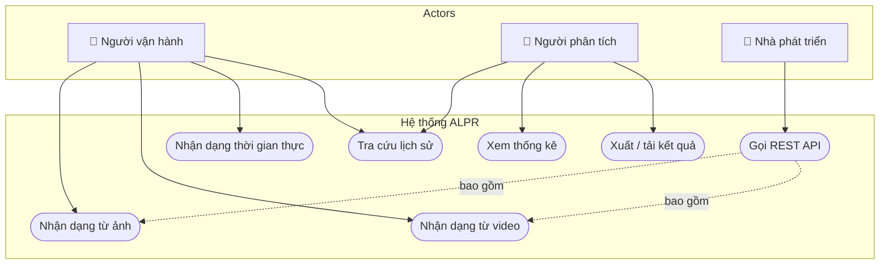

# Yêu cầu chức năng (Functional Requirements)

**Thuộc:** [SRS.md](SRS.md) — Phase 0
**Phiên bản:** 1.0 · **Ngày:** 2026-07-19

## Quy ước

**Mức ưu tiên (MoSCoW):**

| Ký hiệu | Ý nghĩa | Hệ quả |
|---|---|---|
| **M** (Must) | Bắt buộc | Thiếu ⇒ đồ án **không đạt** |
| **S** (Should) | Nên có | Thiếu ⇒ giảm chất lượng đáng kể |
| **C** (Could) | Có thì tốt | Làm khi còn thời gian |
| **W** (Won't) | Không làm ở bản này | Ghi rõ lý do và ngày quyết định; có thể khôi phục sau |

**Nguyên tắc viết tiêu chí chấp nhận:** mỗi tiêu chí phải **kiểm chứng được bằng một phép thử cụ thể** — hoặc bằng test tự động ở Phase 7, hoặc bằng thao tác demo quan sát được.

---

## 1. Sơ đồ Use Case

---

## 2. FR-1 — Nhận dạng từ ảnh

| Mã | Yêu cầu | Ưu tiên | Tiêu chí chấp nhận |
|---|---|:---:|---|
| **FR-1.1** | Người dùng tải lên một ảnh định dạng JPG, JPEG, PNG hoặc BMP | **M** | Tải file hợp lệ ⇒ hệ thống nhận và trả về `job_id` hoặc kết quả trực tiếp |
| **FR-1.2** | Hệ thống kiểm tra hợp lệ đầu vào: định dạng, kích thước ≤ 10 MB, ảnh giải mã được | **M** | File `.exe` đổi đuôi `.jpg` ⇒ bị từ chối với HTTP 400 và thông báo rõ ràng, **không** làm sập tiến trình |
| **FR-1.3** | Hệ thống phát hiện **tất cả** vùng biển số trong ảnh bằng YOLO11 | **M** | Ảnh có 3 biển số ⇒ trả về 3 bounding box với toạ độ và confidence |
| **FR-1.4** | Hệ thống cắt từng vùng biển số và nhận dạng ký tự bằng PaddleOCR | **M** | Mỗi bounding box sinh ra một chuỗi ký tự và một điểm tin cậy OCR |
| **FR-1.5** | Hệ thống hậu xử lý chuỗi OCR: chuẩn hoá, sửa lỗi nhầm ký tự bằng regex, kiểm tra hợp lệ theo định dạng biển số Việt Nam | **M** | Chuỗi thô `51A-I234O` ⇒ chuẩn hoá thành `51A-12340`; lưu **cả** chuỗi thô và chuỗi đã sửa |
| **FR-1.6** | Hệ thống lưu kết quả vào CSDL kèm ảnh gốc và ảnh biển số đã cắt | **M** | Sau nhận dạng, truy vấn CSDL thấy bản ghi mới; hai tệp ảnh tồn tại trên đĩa |
| **FR-1.7** | Giao diện hiển thị ảnh có vẽ bounding box, biển số đọc được, độ tin cậy và thời gian xử lý | **M** | Kết quả hiện trên màn hình trong cùng phiên, không cần tải lại trang |

> **Ghi chú thiết kế:** FR-1.5 yêu cầu lưu **cả chuỗi OCR thô lẫn chuỗi đã sửa**. Đây là chủ ý — nó cho phép đo **mức đóng góp riêng của bước hậu xử lý regex** trong Phase 4, một số liệu có giá trị học thuật cho quyển đồ án.

---

## 3. FR-2 — Nhận dạng từ video

| Mã | Yêu cầu | Ưu tiên | Tiêu chí chấp nhận |
|---|---|:---:|---|
| **FR-2.1** | Người dùng tải lên video định dạng MP4, AVI hoặc MOV, dung lượng ≤ 200 MB | **M** | Video hợp lệ được nhận, trả về mã tác vụ để theo dõi |
| **FR-2.2** | Hệ thống trích xuất khung hình theo bước nhảy cấu hình được (frame sampling) | **M** | Đặt `frame_stride=5` ⇒ chỉ 1/5 số khung hình được đưa vào mô hình; ghi log số khung đã xử lý |
| **FR-2.3** | Hệ thống phát hiện và nhận dạng biển số trên các khung hình đã trích | **M** | Video có biển số ⇒ sinh ra ≥ 1 kết quả nhận dạng |
| **FR-2.4** | Hệ thống **gộp trùng** kết quả của cùng một biển số xuất hiện ở nhiều khung hình, giữ lại kết quả có độ tin cậy cao nhất | **M** | Một xe xuất hiện 40 khung ⇒ lịch sử ghi nhận **1** bản ghi, không phải 40 |
| **FR-2.5** | Hệ thống xuất video kết quả có vẽ sẵn bounding box và biển số đọc được | **M** | Tải về được tệp video phát bình thường, thấy rõ nhãn |
| **FR-2.6** | Giao diện hiển thị tiến độ xử lý theo phần trăm và cho phép huỷ tác vụ | **S** | Thanh tiến độ tăng dần; bấm Huỷ ⇒ tác vụ dừng trong ≤ 3 giây |

> **Ghi chú thiết kế:** FR-2.4 (gộp trùng) là điểm dễ bị bỏ sót nhất trong các đồ án ALPR. Không có nó, một video 30 giây sẽ tạo ra hàng nghìn bản ghi rác và làm hỏng toàn bộ phần thống kê ở FR-4.

---

## 4. FR-3 — Nhận dạng thời gian thực (Webcam)

> ⚠️ **Thay đổi phạm vi 2026-07-20:** trang Webcam đã được **gỡ khỏi giao diện web** theo quyết định thu gọn phạm vi demo (xem Nhật ký quyết định trong CLAUDE.md). Năng lực nhận dạng thời gian thực **vẫn tồn tại ở tầng API** — `POST /api/detect/frame` với phiên gộp trùng theo `job_id`, có kiểm thử tự động — nên FR-3.2, FR-3.3, FR-3.5 vẫn được đáp ứng và kiểm chứng ở mức API. Hai yêu cầu thuần giao diện FR-3.1, FR-3.4 chuyển ưu tiên **M → W** (Won't — không triển khai ở bản này); mã giao diện tương ứng còn trong lịch sử git nếu cần khôi phục.

| Mã | Yêu cầu | Ưu tiên | Tiêu chí chấp nhận |
|---|---|:---:|---|
| **FR-3.1** | Giao diện xin quyền và hiển thị luồng webcam của người dùng | **W** | *(Đã gỡ khỏi giao diện 2026-07-20 — xem ghi chú đầu mục)* |
| **FR-3.2** | Hệ thống nhận khung hình gửi về backend để xử lý theo từng yêu cầu | **M** | Gọi `POST /api/detect/frame` liên tiếp ⇒ mỗi khung được xử lý độc lập |
| **FR-3.3** | Hệ thống phát hiện và nhận dạng biển số trên khung hình trực tiếp | **M** | Gửi khung chứa biển số ⇒ kết quả trả về trong ≤ 1 giây |
| **FR-3.4** | Giao diện vẽ bounding box và nhãn chồng lên khung hình trực tiếp | **W** | *(Đã gỡ khỏi giao diện 2026-07-20 — xem ghi chú đầu mục)* |
| **FR-3.5** | Hệ thống lưu lịch sử nhận dạng của phiên webcam, có gộp trùng | **M** | Gửi cùng biển số nhiều khung liên tiếp kèm `job_id` ⇒ tạo **1** bản ghi, không phải hàng chục |

> **Ràng buộc hiệu năng:** do CON-02 (không có GPU), chế độ thời gian thực **bắt buộc** dùng kỹ thuật bỏ bớt khung hình (frame skipping) và/hoặc hàng đợi một khe (single-slot queue) để không dồn ứ yêu cầu. Chỉ tiêu cụ thể tại [NFR-P2](non-functional-requirements.md). Ràng buộc này nay áp cho **phía gọi API** (client tự triển khai), vì giao diện webcam không còn trong phạm vi.

---

## 5. FR-4 — Dashboard, lịch sử và tra cứu

> ⚠️ **Thay đổi phạm vi 2026-07-20 (lần thứ hai trong ngày).** Trang **Tổng quan (Dashboard)** đã được **gỡ khỏi giao diện web**; ứng dụng còn ba trang: Nhận dạng ảnh (trang chủ), Nhận dạng video, Lịch sử.
>
> **Đây là lần đầu một yêu cầu mức Must bị đưa ra khỏi phạm vi** — FR-4.1 chuyển **M → W**, FR-4.2 chuyển **S → W**. Phải nêu thẳng điều này khi bảo vệ thay vì để hội đồng tự phát hiện.
>
> Điều **không** thay đổi: endpoint `GET /api/statistics` và `GET /health` vẫn phục vụ, vẫn có kiểm thử tích hợp, nên dữ liệu thống kê vẫn truy vấn được — chỉ là không còn màn hình hiển thị sẵn. FR-4.3 đến FR-4.8 thuộc trang Lịch sử và **không đổi**.
>
> Đánh đổi thu được: gỡ thư viện biểu đồ `recharts` làm gói tải về của giao diện giảm từ ~730 KB xuống **328,8 KB** (−55%).

| Mã | Yêu cầu | Ưu tiên | Tiêu chí chấp nhận |
|---|---|:---:|---|
| **FR-4.1** | Dashboard hiển thị các chỉ số tổng hợp: tổng lượt nhận dạng, độ tin cậy trung bình, thời gian xử lý trung bình, phân bố theo loại đầu vào | **W** | *(Đã gỡ khỏi giao diện 2026-07-20 — số liệu vẫn lấy được qua `GET /api/statistics`)* |
| **FR-4.2** | Dashboard hiển thị biểu đồ số lượt nhận dạng theo thời gian | **W** | *(Đã gỡ khỏi giao diện 2026-07-20 — xem ghi chú đầu mục)* |
| **FR-4.3** | Hiển thị danh sách lịch sử có phân trang | **M** | 1000 bản ghi ⇒ phân trang hoạt động, mỗi trang tải trong ≤ 1 giây |
| **FR-4.4** | Tìm kiếm theo biển số, hỗ trợ khớp một phần | **M** | Tìm `51A` ⇒ trả về mọi biển số chứa `51A` |
| **FR-4.5** | Lọc theo loại đầu vào, khoảng thời gian và ngưỡng độ tin cậy | **M** | Kết hợp nhiều bộ lọc cho kết quả giao nhau đúng |
| **FR-4.6** | Xem chi tiết một bản ghi: ảnh gốc, ảnh biển số đã cắt, toàn bộ metadata | **M** | Bấm vào một dòng ⇒ mở chi tiết đủ trường |
| **FR-4.7** | Tải về ảnh kết quả hoặc ảnh biển số đã cắt | **S** | Tệp tải về mở được, đúng nội dung |
| **FR-4.8** | Sắp xếp lịch sử theo thời gian hoặc độ tin cậy, tăng/giảm dần | **C** | Bấm tiêu đề cột ⇒ thứ tự đảo đúng |

---

## 6. FR-5 — Quản lý dữ liệu

| Mã | Yêu cầu | Ưu tiên | Tiêu chí chấp nhận |
|---|---|:---:|---|
| **FR-5.1** | Xoá một bản ghi lịch sử, đồng thời xoá tệp ảnh liên quan | **S** | Sau khi xoá: bản ghi biến mất **và** tệp trên đĩa bị gỡ (không để lại rác) |
| **FR-5.2** | Xuất lịch sử (có áp bộ lọc hiện hành) ra CSV hoặc JSON | **S** | Tệp CSV mở được bằng Excel, mã hoá UTF-8 có BOM để không lỗi tiếng Việt |
| **FR-5.3** | Có script dọn dẹp tệp phương tiện không còn bản ghi tham chiếu | **C** | Chạy script ⇒ báo cáo số tệp mồ côi đã xoá |
| **FR-5.4** | Xoá nhiều bản ghi theo lựa chọn | **C** | Chọn nhiều dòng ⇒ xoá hàng loạt trong một thao tác |

---

## 7. FR-6 — Hệ thống và vận hành

| Mã | Yêu cầu | Ưu tiên | Tiêu chí chấp nhận |
|---|---|:---:|---|
| **FR-6.1** | Cung cấp endpoint kiểm tra sức khoẻ, báo trạng thái nạp mô hình và kết nối CSDL | **S** | `GET /health` trả về 200 kèm trạng thái từng thành phần |
| **FR-6.2** | Ghi log có cấu trúc cho mọi lượt nhận dạng và mọi lỗi | **S** | Mỗi lượt sinh 1 dòng log có `request_id`, thời gian xử lý, số biển phát hiện |
| **FR-6.3** | Mọi lỗi trả về thông báo thân thiện; **không** rò rỉ stack trace ra người dùng cuối | **M** | Gây lỗi có chủ đích ⇒ giao diện hiện thông báo dễ hiểu, chi tiết chỉ nằm trong log |
| **FR-6.4** | Cấu hình hệ thống (đường dẫn mô hình, ngưỡng, thư mục lưu trữ) đọc từ biến môi trường / tệp cấu hình, **không hard-code** | **M** | Đổi ngưỡng confidence qua cấu hình ⇒ hành vi thay đổi, không phải sửa mã |

---

## 8. Ma trận truy vết yêu cầu

| Nhóm FR | Giai đoạn cài đặt | Kiểm chứng tại |
|---|---|---|
| FR-1 (Ảnh) | Phase 3, 4, 5, 6 | Phase 7 — unit + integration test |
| FR-2 (Video) | Phase 5, 6 | Phase 7 — integration + performance test |
| FR-3 (Thời gian thực) | Phase 5, 6 | Phase 7 — performance test |
| FR-4 (Dashboard) | Phase 5, 6 | Phase 7 — integration + UI test |
| FR-5 (Dữ liệu) | Phase 5, 6 | Phase 7 — unit test |
| FR-6 (Hệ thống) | Phase 5, 8 | Phase 7 — smoke + stress test |

**Tổng cộng:** 34 yêu cầu chức năng — **21 Must**, **6 Should**, **3 Could**, **4 Won't**.

Bốn yêu cầu mức Won't đều đến từ **hai lần thu gọn phạm vi giao diện trong ngày 2026-07-20**: FR-3.1 và FR-3.4 (gỡ trang Webcam), FR-4.1 và FR-4.2 (gỡ trang Tổng quan). Trong đó **FR-4.1 là yêu cầu mức Must đầu tiên bị đưa ra khỏi phạm vi** — xem ghi chú đầu mục 5.

| Nhóm | Must | Should | Could | Won't | Tổng |
|---|:---:|:---:|:---:|:---:|:---:|
| FR-1 Ảnh | 7 | 0 | 0 | 0 | 7 |
| FR-2 Video | 5 | 1 | 0 | 0 | 6 |
| FR-3 Thời gian thực | 3 | 0 | 0 | 2 | 5 |
| FR-4 Dashboard, lịch sử | 4 | 1 | 1 | 2 | 8 |
| FR-5 Dữ liệu | 0 | 2 | 2 | 0 | 4 |
| FR-6 Hệ thống | 2 | 2 | 0 | 0 | 4 |
| **Tổng** | **21** | **6** | **3** | **4** | **34** |
