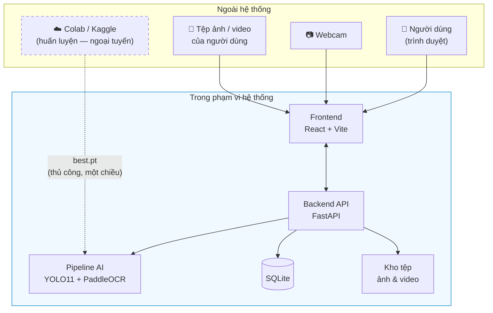

# Phạm vi dự án (Project Scope)

**Thuộc:** [SRS.md](SRS.md) — Phase 0
**Phiên bản:** 1.0 · **Ngày:** 2026-07-19

---

## 1. Tuyên bố phạm vi

Đồ án xây dựng một **hệ thống ALPR hoàn chỉnh, có chất lượng gần với sản phẩm thực tế** cho biển số xe Việt Nam, gồm mô hình AI tự huấn luyện, backend, frontend, cơ sở dữ liệu, đóng gói triển khai và bộ tài liệu học thuật đầy đủ.

Đây **không phải** một bản demo notebook, cũng **không phải** một sản phẩm thương mại triển khai thật.

---

## 2. Trong phạm vi (In Scope)

### 2.1. Trí tuệ nhân tạo

- ✅ Huấn luyện bộ phát hiện biển số YOLO11 trên dữ liệu biển số Việt Nam.
- ✅ So sánh các biến thể kích thước mô hình (n / s / m) để chọn điểm cân bằng tốc độ–độ chính xác.
- ✅ Tích hợp PaddleOCR để nhận dạng ký tự.
- ✅ Hậu xử lý bằng regex và luật kiểm tra tính hợp lệ theo định dạng biển số Việt Nam.
- ✅ Hỗ trợ **cả biển 1 dòng và 2 dòng**.
- ✅ Đánh giá đầy đủ: mAP, precision, recall, F1, ma trận nhầm lẫn, đường cong loss.
- ✅ Đo hiệu năng suy luận trên CPU.

### 2.2. Dữ liệu

- ✅ Thu thập, gộp và làm sạch các bộ dữ liệu công khai.
- ✅ Kiểm tra và sửa nhãn.
- ✅ Loại bỏ ảnh trùng lặp.
- ✅ Tăng cường dữ liệu (augmentation).
- ✅ Chia tập train / val / test có kiểm soát rò rỉ dữ liệu.
- ✅ Thống kê và trực quan hoá bộ dữ liệu.

### 2.3. Phần mềm

- ✅ REST API bằng FastAPI, có tài liệu Swagger.
- ✅ Nhận dạng từ ảnh, video và webcam.
- ✅ Lưu trữ lịch sử bằng SQLite + SQLAlchemy + Alembic.
- ✅ Giao diện web React + Vite + TypeScript + TailwindCSS.
- ✅ Dashboard thống kê, lịch sử, tìm kiếm, lọc.
- ✅ Đóng gói bằng Docker và Docker Compose.

### 2.4. Kiểm thử và tài liệu

- ✅ Unit test, integration test, kiểm thử độ chính xác AI, kiểm thử hiệu năng và chịu tải.
- ✅ Toàn bộ tài liệu theo Phase 9 và Phase 10 của lộ trình.

---

## 3. Ngoài phạm vi (Out of Scope)

Việc ghi rõ những gì **không làm** quan trọng ngang với việc ghi những gì sẽ làm — nó bảo vệ đồ án khỏi phình phạm vi và khỏi các câu hỏi phản biện lạc hướng.

| Hạng mục | Vì sao loại trừ |
|---|---|
| ❌ Xác thực và phân quyền người dùng | Hệ thống chạy nội bộ (giả định A-04); thêm vào sẽ tốn công mà không đóng góp học thuật |
| ❌ Hỗ trợ đa camera / đa luồng đồng thời | Nhân đôi độ phức tạp hạ tầng, không thêm giá trị nghiên cứu |
| ❌ Bám vết đối tượng qua các khung hình (tracking như SORT/DeepSORT) | Hệ thống dùng **gộp trùng theo chuỗi ký tự** thay thế (FR-2.4) — đơn giản hơn và đủ dùng. *Có thể nêu ở phần Hướng phát triển* |
| ❌ Phân loại loại xe (ô tô / xe máy / xe tải) | Bài toán khác, ngoài đề tài |
| ❌ Ước lượng tốc độ, phát hiện vi phạm | Bài toán khác |
| ❌ Nhận dạng biển số nước ngoài | Đề tài xác định rõ là biển số Việt Nam |
| ❌ Tích hợp phần cứng barie / cổng tự động | Cần thiết bị vật lý, không khả thi trong khuôn khổ đồ án |
| ❌ Triển khai cloud, multi-tenant, CI/CD production | Ngoài mục tiêu học thuật; Docker là mức đóng góp triển khai đã đủ |
| ❌ Ứng dụng di động | Web responsive đã đáp ứng đủ nhu cầu demo |
| ❌ Huấn luyện OCR từ đầu | Dùng PaddleOCR pre-trained + hậu xử lý; huấn luyện OCR riêng là một đồ án độc lập. *Nêu ở Hướng phát triển* |
| ❌ Suy luận thời gian thực trên GPU | Máy phát triển không có GPU (CON-02) |

---

## 4. Ranh giới hệ thống

**Điểm cần lưu ý:** Colab nằm **ngoài** ranh giới hệ thống chạy. Nó chỉ là công cụ sản xuất ra tệp `best.pt`. Hệ thống khi vận hành **không phụ thuộc vào bất kỳ dịch vụ ngoài nào** — đây là một điểm mạnh nên nhấn mạnh khi bảo vệ.

---

## 5. Sản phẩm bàn giao (Deliverables)

| # | Sản phẩm | Giai đoạn | Vị trí |
|---|---|---|---|
| 1 | Đặc tả yêu cầu | Phase 0 | `docs/00-requirements/` |
| 2 | Báo cáo nghiên cứu tổng quan | Phase 1 | `docs/reports/` |
| 3 | Bộ dữ liệu + báo cáo thống kê | Phase 2 | `datasets/`, `docs/reports/` |
| 4 | Mô hình đã huấn luyện `best.pt` + báo cáo đánh giá | Phase 3 | `models/`, `docs/reports/` |
| 5 | Module OCR + báo cáo benchmark | Phase 4 | `ai/inference/`, `docs/reports/` |
| 6 | Backend + tài liệu API | Phase 5 | `backend/`, `docs/` |
| 7 | Frontend + tài liệu giao diện | Phase 6 | `frontend/`, `docs/` |
| 8 | Bộ kiểm thử + báo cáo kiểm thử | Phase 7 | `tests/`, `docs/reports/` |
| 9 | Docker + hướng dẫn triển khai | Phase 8 | `deployment/`, `docs/` |
| 10 | Quyển đồ án + các sổ tay hướng dẫn | Phase 9 | `docs/papers/` |
| 11 | Slide bảo vệ, poster, kịch bản demo, Q&A | Phase 10 | `docs/slides/`, `docs/poster/` |
| 12 | Gói bàn giao cuối cùng | Phase 11 | Toàn repo |

---

## 6. Tiêu chí thành công

Đồ án được coi là thành công khi đồng thời đạt:

1. Toàn bộ yêu cầu **Must** trong [functional-requirements.md](functional-requirements.md) hoạt động được và demo được.
2. Toàn bộ chỉ tiêu **ngưỡng tối thiểu** trong [non-functional-requirements.md](non-functional-requirements.md) được đáp ứng và **đo đạc có bằng chứng**.
3. Toàn bộ 12 sản phẩm bàn giao ở mục 5 tồn tại.
4. Hệ thống khởi động được trên máy sạch bằng một lệnh `docker compose up`.
5. Demo trực tiếp chạy được không cần kết nối Internet.

---

## 7. Rủi ro và phương án ứng phó

| # | Rủi ro | Khả năng | Mức ảnh hưởng | Phương án ứng phó |
|---|---|:---:|:---:|---|
| R-01 | Không tìm được bộ dữ liệu biển số Việt Nam đủ lớn / đủ chất lượng | Trung bình | **Cao** | Gộp nhiều nguồn công khai; tự gán nhãn bổ sung một phần; dùng augmentation mạnh |
| R-02 | Nhãn của bộ dữ liệu công khai bị sai | Cao | Trung bình | Bố trí hẳn một bước kiểm tra nhãn ở Phase 2 |
| R-03 | Suy luận CPU không đạt chỉ tiêu độ trễ | Trung bình | Trung bình | Xuất sang ONNX/OpenVINO; giảm `imgsz`; dùng model nhỏ hơn *(xem NFR-P1)* |
| R-04 | PaddleOCR đọc kém trên biển 2 dòng | Cao | **Cao** | Tách biển 2 dòng thành 2 nửa rồi ghép kết quả; đây là kỹ thuật chuẩn cho biển VN |
| R-05 | Colab giới hạn hoặc cắt GPU miễn phí giữa chừng | Trung bình | Trung bình | Lưu checkpoint thường xuyên ra Drive; dùng Kaggle làm phương án dự phòng (30h GPU/tuần) |
| R-06 | Bất đồng bộ giữa mã nguồn và tài liệu | Cao | Trung bình | Quy tắc bắt buộc từ `CLAUDE.md`: mỗi lần cài đặt phải cập nhật tài liệu tương ứng |
| R-07 | Phình phạm vi | Trung bình | Trung bình | Danh sách "Ngoài phạm vi" ở mục 3 là ranh giới cứng |

> **R-04 đáng chú ý nhất.** Biển số 2 dòng chiếm tỉ lệ lớn ở Việt Nam (hầu hết xe máy) và là điểm gãy phổ biến nhất của các pipeline OCR dựng sẵn. Cần xử lý sớm ở Phase 4, không để đến cuối.
