# Kế hoạch thực hiện (Timeline)

**Thuộc:** [SRS.md](SRS.md) — Phase 0
**Phiên bản:** 1.3 · **Ngày:** 2026-07-20 *(cập nhật trạng thái sau khi mô hình chính thức `best.pt` huấn luyện xong và NFR-P1 được xác minh — xem mục 7)*

---

## 1. Cách lập kế hoạch

Đồ án **không có hạn nộp cố định** (xác nhận ngày 2026-07-19), do đó kế hoạch được lập theo **công sức ước lượng** và **quan hệ phụ thuộc giữa các giai đoạn**, không gắn với ngày tháng tuyệt đối.

Đơn vị: **ngày-người (person-day)**, quy ước 1 ngày-người ≈ 6 giờ làm việc tập trung.

> Nếu sau này có hạn nộp cụ thể, chỉ cần ánh xạ bảng công sức này lên lịch thực tế — cấu trúc phụ thuộc giữ nguyên.

---

## 2. Bảng công sức theo giai đoạn

| Phase | Tên | Công sức | Phụ thuộc | Đầu ra chính |
|:---:|---|:---:|---|---|
| **0** | Requirement Analysis | **2** | — | SRS, FR, NFR, Scope, Timeline |
| **1** | Research | 5 | P0 | Báo cáo tổng quan, bảng so sánh, tài liệu tham khảo |
| **2** | Dataset | **10** | P1 | Bộ dữ liệu đã làm sạch, thống kê, script |
| **3** | Model Training | **12** | P2 | `best.pt`, log huấn luyện, báo cáo đánh giá |
| **4** | OCR | 8 | P3 | Module OCR, luật hậu xử lý, benchmark |
| **5** | Backend | 8 | P4 | REST API, CSDL, Swagger |
| **6** | Frontend | 8 | P5 | Dashboard, các màn hình nhận dạng |
| **7** | Testing | 6 | P6 | Báo cáo kiểm thử, báo cáo benchmark |
| **8** | Deployment | 4 | P7 | Docker, Compose, hướng dẫn cài đặt |
| **9** | Documentation | 8 | P8 | Quyển đồ án, sổ tay kỹ thuật, sổ tay người dùng |
| **10** | Presentation | 4 | P9 | Slide, poster, kịch bản demo, Q&A |
| **11** | Final Package | 2 | P10 | Gói bàn giao hoàn chỉnh |
| | **Tổng** | **77 ngày-người** | | |

**Ba giai đoạn nặng nhất chiếm 42% tổng công sức:** Dataset (10), Model Training (12), và OCR (8). Đây là phần lõi kỹ thuật — không nên rút ngắn để lấy thời gian cho các phần khác.

---

## 3. Sơ đồ Gantt

```mermaid
gantt
    title Lộ trình thực hiện đồ án ALPR (đơn vị: ngày-người)
    dateFormat X
    axisFormat %s

    section Chuẩn bị
    P0 Requirement Analysis   :done, p0, 0, 2
    P1 Research               :done, p1, after p0, 5

    section Lõi AI
    P2 Dataset                :crit, active, p2, after p1, 10
    P3 Model Training         :crit, active, p3, after p2, 12
    P4 OCR                    :crit, active, p4, after p3, 8

    section Ứng dụng
    P5 Backend                :done, p5, after p4, 8
    P6 Frontend               :done, p6, after p5, 8

    section Hoàn thiện
    P7 Testing                :active, p7, after p6, 6
    P8 Deployment             :done, p8, after p7, 4
    P9 Documentation          :p9, after p8, 8
    P10 Presentation          :p10, after p9, 4
    P11 Final Package         :p11, after p10, 2
```



---

## 4. Đường găng (Critical Path)

```
P0 → P1 → P2 → P3 → P4 → P5 → P6 → P7 → P8 → P9 → P10 → P11
```

Lộ trình gần như tuyến tính hoàn toàn. Ba mắt xích rủi ro nhất nằm ở **P2 → P3 → P4**:

| Mắt xích | Vì sao rủi ro | Dấu hiệu cần cảnh giác |
|---|---|---|
| **P2 → P3** | Chất lượng dữ liệu quyết định trần độ chính xác của mô hình. Nhãn xấu ⇒ không có siêu tham số nào cứu được | Nhãn không nhất quán, ảnh trùng lặp giữa train và test |
| **P3 → P4** | Bounding box lệch ⇒ vùng cắt lệch ⇒ OCR sai, dù OCR hoàn hảo | mAP@0.5:0.95 thấp dù mAP@0.5 cao |
| **P4** | Biển 2 dòng (rủi ro R-04) | Độ chính xác biển 2 dòng thấp hơn biển 1 dòng rõ rệt |

---

## 5. Các việc có thể làm song song

Dù đường găng là tuyến tính, vẫn có thể chen các việc sau vào thời gian chờ:

| Việc | Có thể làm cùng lúc với | Lợi ích |
|---|---|---|
| Dựng khung backend (models, schema, cấu hình) | P3 — trong lúc chờ huấn luyện | Rút ngắn P5 |
| Dựng khung frontend (routing, layout, component) | P3–P4 | Rút ngắn P6 |
| Viết chương Tổng quan và Cơ sở lý thuyết của đồ án | P2–P4 | Giảm tải cho P9 |
| Chuẩn bị Dockerfile | P5 | Rút ngắn P8 |

> **Lưu ý:** huấn luyện trên Colab là thời gian chờ **thụ động** (chạy vài tiếng mà không cần can thiệp). Đây chính là lúc lý tưởng để dựng khung backend/frontend.

---

## 6. Điểm chốt phê duyệt

Theo quy tắc trong `CLAUDE.md`: **không tự động chuyển sang giai đoạn tiếp theo**. Mỗi giai đoạn kết thúc bằng một điểm chốt:

| Chốt | Sau Phase | Điều kiện thông qua |
|:---:|:---:|---|
| M0 | 0 | Yêu cầu được phê duyệt, phạm vi được chốt |
| M1 | 1 | Đã chọn xong công nghệ, có căn cứ trích dẫn |
| M2 | 2 | Bộ dữ liệu đạt chất lượng, thống kê hợp lý |
| M3 | 3 | Mô hình đạt chỉ tiêu NFR-A1, A2, A3 |
| M4 | 4 | Pipeline E2E đạt chỉ tiêu NFR-A7 |
| M5 | 5 | API hoạt động đầy đủ, Swagger đầy đủ |
| M6 | 6 | Giao diện dùng được toàn bộ yêu cầu Must |
| M7 | 7 | Mọi chỉ tiêu NFR được đo và đạt ngưỡng |
| M8 | 8 | `docker compose up` chạy được trên máy sạch |
| M9 | 9 | Bộ tài liệu đầy đủ |
| M10 | 10 | Slide và demo sẵn sàng bảo vệ |
| M11 | 11 | Gói bàn giao hoàn chỉnh theo Definition of Done |

---

## 7. Trạng thái hiện tại

> **Cập nhật ngày 2026-07-20** sau khi mô hình chính thức `best.pt` huấn luyện xong và NFR-P1 được xác minh. Bảng dưới đây
> phản ánh **trạng thái thực tế đã kiểm chứng bằng cách chạy thật**, không phải
> kế hoạch.

| Phase | Trạng thái | Căn cứ |
|---|---|---|
| **Phase 0** | ✅ **Hoàn thành — chốt M0 ngày 2026-07-19** | SRS, FR, NFR, Scope, Timeline |
| **Phase 1** | ✅ **Hoàn thành — chốt M1 ngày 2026-07-19** | 7 báo cáo nghiên cứu, 232 entry BibTeX |
| **Phase 2** | 🟢 **Bộ dữ liệu v3 sẵn sàng** — 15.133 ảnh, **đã chia lại ở ngưỡng gom nhóm 10** | [02-dataset-report.md](../reports/02-dataset-report.md) mục 6bis · 🟡 **rò rỉ đã giảm mạnh, chưa thể tuyên bố sạch**: ở ngưỡng Hamming 10, v2 có 9.126 cặp vắt split còn **v3 có 0** — nhưng con số 0 này **không phải bằng chứng độc lập**, nó **bảo đảm bởi cấu tạo** (v3 được chia theo nhóm gom ở đúng ngưỡng 10, nên đo lại ở chính ngưỡng đó là lập luận vòng tròn). Bằng chứng nằm **ngoài vùng bảo vệ**: ở **Hamming 12**, v3 vẫn còn **791 cặp train↔test** (tổng **2.462 cặp** trên cả ba cặp split). Điểm tựa thật của ngưỡng 10 là việc nó được kiểm chứng độc lập **bằng mắt** (mục 6bis.3), không phải con số 0 · ⚠️ chốt M2 **vẫn chưa qua**: tiêu chí Q6 trượt (10,91% box < 0,5% diện tích) và chưa có **test xuyên bộ dữ liệu** (rủi ro tồn dư: cùng xe / khác ngày, cặp `51F-155.85`) |
| **Phase 3** | ✅ **Mô hình chính thức `best.pt` xong — chốt M3 (detection) đạt** | `models/best.pt` **đã huấn luyện xong** (YOLO11n, `imgsz=640`, split v3, 20 epoch): mAP@0.5 = **0,9829** · mAP@0.5:0.95 = **0,7834** · P = **0,9837** · R = **0,9714** — **đạt cả bốn**, đo trên split v3 khử trùng lặp (không còn rò rỉ tên-tệp thổi phồng). `baseline-416-v1.pt` (`imgsz=416`, split v1, mAP@0.5 = 0,9933) giữ làm **mô hình đối chứng** — không báo cáo là "đạt" vì sai độ phân giải và có rò rỉ v1 |
| **Phase 4** | 🟠 **Đã đo xong — NFR-A4/A5/A6 TRƯỢT cả ba (kết quả thật)** | [04-ocr-report.md](../reports/04-ocr-report.md) · 2.801 biển: **A4 = 0,8734** (mục tiêu 0,95) · **A5 = 0,6098** (0,85) · **A6 = 0,6555** (0,90) · **A6 − A5 = +4,57 điểm** (128 biển sửa đúng, 0 biển hỏng). **Toàn bộ khoảng cách nằm ở biển 2 dòng**: biển 1 dòng đạt 0,9900 / 0,9418 / 0,9489 (**vượt cả ba mục tiêu**), biển 2 dòng chỉ 0,8462 / 0,5255 / 0,5810 — chênh **36,8 điểm**. NFR-A7 = 0,5227 nhưng **KHÔNG đại diện** (không có bộ dữ liệu nào vừa có ảnh toàn cảnh vừa có chuỗi biển) ⇒ **chốt M4 chưa qua** |
| **Phase 5** | ✅ **Hoàn thành** — API đầy đủ, đã nối `ALPRPipeline` thật | **10 endpoint** xác minh bằng HTTP sống (10 thao tác trên 9 đường dẫn; `/docs`, `/redoc`, `/openapi.json` do FastAPI tự sinh, không tính), Swagger đầy đủ, Alembic migrate xong ⇒ **chốt M5 đạt** |
| **Phase 6** | ✅ **Hoàn thành** — build sạch, 10 endpoint khớp | [06-ui-documentation.md](../reports/06-ui-documentation.md); ⚠️ chưa có kiểm thử tự động frontend |
| **Phase 7** | 🟠 **Đã đo xong; NFR-P1 ĐẠT trên `best.pt`, nút thắt ở OCR** | [07-testing-report.md](../reports/07-testing-report.md) · [07-benchmark-report.md](../reports/07-benchmark-report.md) — **882 test thu thập / 881 đạt / 1 `xfail`, 0 fail**; bao phủ tầng nghiệp vụ **87,7%** (đo 20/07/2026, [13-refactor-result.json](../reports/13-refactor-result.json); lần đo Phase 7 trước đó là 88,1%). ✅ **NFR-P1 ĐẠT trên `models/best.pt`, máy rảnh**: p95 **5.857 ms → 731,15 ms** client-side / **780,36 ms** in-process (mục tiêu 800 ms). Con số cũ 5.857 ms **bị bác bỏ** — nhiễm do tải cạnh tranh (~793% CPU) + sai checkpoint (epoch 7) + lỗi crop khiến OCR đọc ~1322 ms/ảnh. Phân rã đúng (T5.7b): OCR **64,3%** / detect **34,2%**. Detection A1/A2/A3 đo trên `best.pt`/v3 đạt cả bốn. ⚠️ **P2/P3 chưa đo trên `best.pt`** ⇒ **chốt M7 vẫn chưa qua**, nay bị chặn bởi **NFR-A4/A5/A6**, không còn bởi NFR-P1 |
| **Phase 8** | ✅ **Build Docker thật thành công** | [08-deployment-guide.md](../reports/08-deployment-guide.md) — 2 image, stack chạy, kiểm bằng `curl` ngoài container, 3 lỗi đã sửa ⇒ **chốt M8 đạt** |
| **Phase 9** | 🟢 **Cả sáu chương đã viết** — còn lại là việc ghép quyển | Phase 9a (chương 1–4, sổ tay kỹ thuật, tài liệu API) và chương 5–6 (`ch5-thuc-nghiem.md`, `ch6-ket-luan.md`) **đã viết xong** với số liệu thật từ [05-results.json](../reports/05-results.json) / [05-tables.md](../reports/05-tables.md); hai bản tóm tắt đã cập nhật số. Việc còn lại: điền thông tin cá nhân ở `01-front-matter.md`, sinh mục lục/danh mục hình-bảng và ghép quyển |
| **Phase 10** | 🟡 **Khung đã có (10a)** — 21 slide, poster, 56 câu Q&A, kịch bản demo | Số liệu cuối Phase 3–4–7 **đã có**, điền được vào các ô còn trống |
| **Phase 11** | ⚪ Chưa bắt đầu | |

**Việc còn lại tại thời điểm cập nhật:**

1. ✅ **Xong** — `models/best.pt` (`imgsz=640`, split v3, `runs/final-640-v3`) đã huấn luyện xong, chốt M3 (detection) đạt.
2. **Cải thiện độ chính xác OCR trên biển 2 dòng** — chặn chốt M4 **và** M7. NFR-P1 đã đạt, còn A4/A5/A6 thì trượt cả ba (kết quả thật).
3. Đo NFR-P2/P3 (webcam/video) trên `best.pt`; chạy soak đủ 60 phút cho NFR-R4; đo NFR-A9, R5.
4. ✅ **Xong** — chương 5–6 của quyển đồ án đã viết với số liệu thực nghiệm thật; còn lại là ghép quyển và điền thông tin cá nhân/biểu mẫu khoa.

### 7.1. Vì sao thứ tự thực hiện lệch khỏi đường găng đã lập

Kế hoạch ở mục 4 giả định đường găng tuyến tính P2 → P3 → P4 → P5 → P6 → P7 → P8.
Thực tế **P5, P6, P7, P8 đã hoàn thành trước khi P3 và P4 kết thúc**. Đây là
việc **áp dụng đúng mục 5** ("các việc có thể làm song song"): huấn luyện trên
CPU là thời gian chờ **thụ động** kéo dài nhiều giờ, và toàn bộ backend,
frontend, hạ tầng kiểm thử cùng Docker đã được dựng trong khoảng chờ đó.

**Lợi ích thu được:** đường dây triển khai, hạ tầng đo lường và bộ kiểm thử đều
đã sẵn sàng **trước khi** có mô hình cuối. Khi lượt huấn luyện kết thúc, chỉ cần
trỏ lại trọng số và chạy lại các bộ đo — không phải xây dựng gì thêm.

**Trạng thái hiện tại — nói thẳng:** chốt M3 (detection) nay **đã qua** với
`models/best.pt` (train đúng trên split v3). Các Phase 5–8 trước đây xác nhận bằng
`baseline-416-v1.pt` (mô hình đối chứng, sai độ phân giải + rò rỉ v1); số liệu độ
chính xác công bố **đã được đo lại** trên `models/best.pt`. Chốt M2 (test xuyên bộ
dữ liệu) và M4 (OCR biển 2 dòng) vẫn còn treo.

> #### ✅ Quy tắc đánh giá đã được tuân thủ
>
> Bản trước cảnh báo: **không** dùng `baseline-416-v1.pt` (train trên **v1**) để đo
> trên tập test **v3** — vì **289 / 1.514 ảnh test v3 (19,1%)** nằm trong train+val
> của v1 (trùng tên tệp chính xác), cho mAP@0.5 = 0,99668 với recall = 1,000 giả tạo.
>
> **Đã tuân thủ:** NFR-A1/A2/A3 công bố **chỉ** lấy từ `models/best.pt`
> (`runs/final-640-v3`, train **trên chính split v3**): mAP@0.5 = **0,9829**,
> mAP@0.5:0.95 = **0,7834**, P = **0,9837**, R = **0,9714**.

### 7.2. Ba việc chặn các chốt còn treo

| Chốt | Đang chặn bởi | Việc phải làm |
|:---:|---|---|
| **M2** | ~~Rò rỉ train↔test~~ ✅ **đã xử lý** (bộ v3, 0 cặp ở ngưỡng 10). Còn lại: tiêu chí **Q6** trượt; **chưa có test xuyên bộ dữ liệu** | Dựng tập test xuyên bộ dữ liệu (giữ nguyên `roboflow_traffic_camera` làm test) — cách duy nhất khép rủi ro **cùng xe / khác ngày**. Sửa `DEFAULT_THRESHOLD` trong `deduplicate.py` từ 5 lên 10 |
| **M3** | ✅ **đã qua** — `models/best.pt` (`imgsz=640`, split v3) đã huấn luyện xong, NFR-A1/A2/A3 đo trên nó đạt cả bốn (0,9829 / 0,7834 / 0,9837 / 0,9714) | — |
| **M4** | ✅ đã có số — nhưng **A4/A5/A6 trượt cả ba** (0,8734 / 0,6098 / 0,6555) | **Cải thiện OCR biển 2 dòng** — nơi chứa toàn bộ 36,8 điểm khoảng cách. Ba đầu mối cụ thể: (a) sửa hai quy tắc ánh xạ **sai đích** `L → 1` (phải là `L → 4`) và `7 → T` (phải là `7 → Z`); (b) 217 ca **mất trọn một dòng** sau khi tách nửa; (c) 95 ca **ký tự ma ở đường ghép** hstack (`J` chèn thừa 148 lần, mà `J` không hợp lệ trên biển VN). Sửa xong **phải đo lại** rồi mới công bố |
| **M7** | ~~NFR-P1~~ ✅ **đã đạt** trên `best.pt` (731 ms client / 780 ms in-process). Còn lại: **A4/A5/A6 trượt**; **P2/P3** chưa đo trên `best.pt`; **R4** mới soak 300 s; **A9, M3(auto)** chưa đo. **M6 đã đo thật** ở đợt refactor 2026-07-20: `black` sạch 96/96 tệp, `ruff` còn **83 `E501`** — toàn bộ nằm trong chuỗi tiếng Việt của script sinh tài liệu, **không tệp nào thuộc `ai/inference/` hay `backend/`** | Xử lý A4/A5/A6 (xem M4). Đo NFR-P2/P3 trên `best.pt`, soak đủ **60 phút**, đo A9. Đưa `ruff`/`black` vào CI để giữ M6. Phân rã độ trễ đúng trên `best.pt` (T5.7b): OCR **64,3%** / detect **34,2%** — OCR vẫn là bước tốn kém nhất nhưng không còn áp đảo như con số cũ |

**Quyết định kèm theo chốt M0:** phê duyệt mở rộng schema CSDL (6 trường bổ sung cho `DetectionHistory` + bảng mới `DetectionJob`). Chi tiết tại [system-architecture.md](../architecture/system-architecture.md#62-mở-rộng-so-với-claudemd--đã-phê-duyệt-2026-07-19).

**Quyết định kèm theo chốt M1:** phê duyệt 6/6 task và 3/3 deliverable của Phase 1 sau khi vòng phản biện phát hiện và sửa **25 lỗi** (3 lỗi mức critical). Cập nhật căn cứ pháp lý của toàn dự án: TT 24/2023/TT-BCA **đã hết hiệu lực từ 01/01/2025** → **TT 79/2024/TT-BCA** (sửa đổi bởi TT 13/2025, TT 51/2025) + **QCVN 08:2024/BCA**. Chỉ mục và tuyên bố hoàn thành: [01-README.md](../reports/01-README.md).

**Ba việc phải khởi động ngay đầu Phase 2** (độ trễ ngoài tầm kiểm soát, để muộn sẽ chặn đường găng):

| # | Việc | Vì sao gấp |
|:-:|---|---|
| **H3** | Xin xác nhận giấy phép bộ dữ liệu **VNLP** (và duydieunguyen, bomaich) | VNLP là dataset chính của cả 3 nhánh; không có xác nhận ⇒ buộc chuyển Phương án B, nơi nhánh layout classifier chỉ còn ~5.000 ảnh |
| **H1** | Đối chiếu **toàn văn Điều 34 TT 79/2024** để chốt hai danh sách chữ cái seri | Bỏ sót chữ `R` ⇒ mô hình OCR sai hệ thống trên một lớp biển xe máy; PDF chính phủ là bản scan, `thuvienphapluat.vn` trả HTTP 403 |
| **H2** | Chuẩn bị dữ liệu để dựng **confusion matrix ký tự 36×36** ở Phase 4 | Bảng luật sửa lỗi OCR hiện dựa trên suy luận hình dạng, chưa có số liệu đo |
