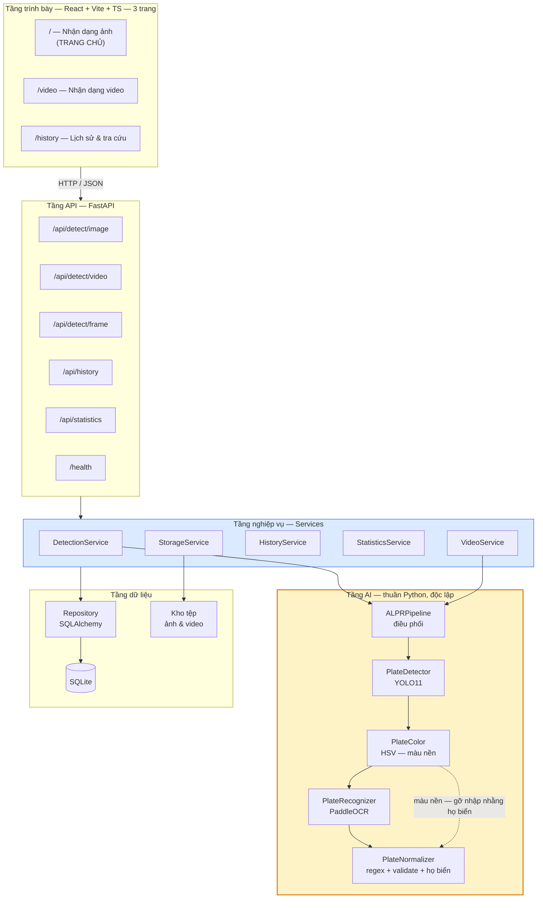
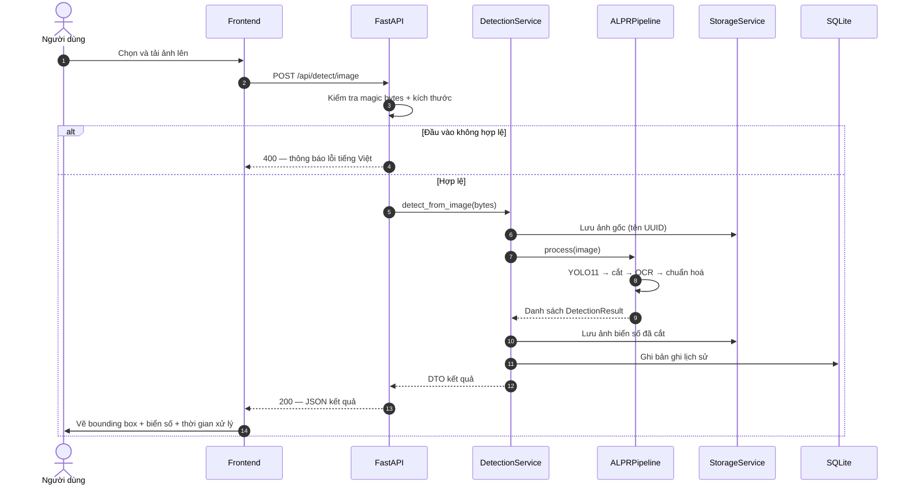
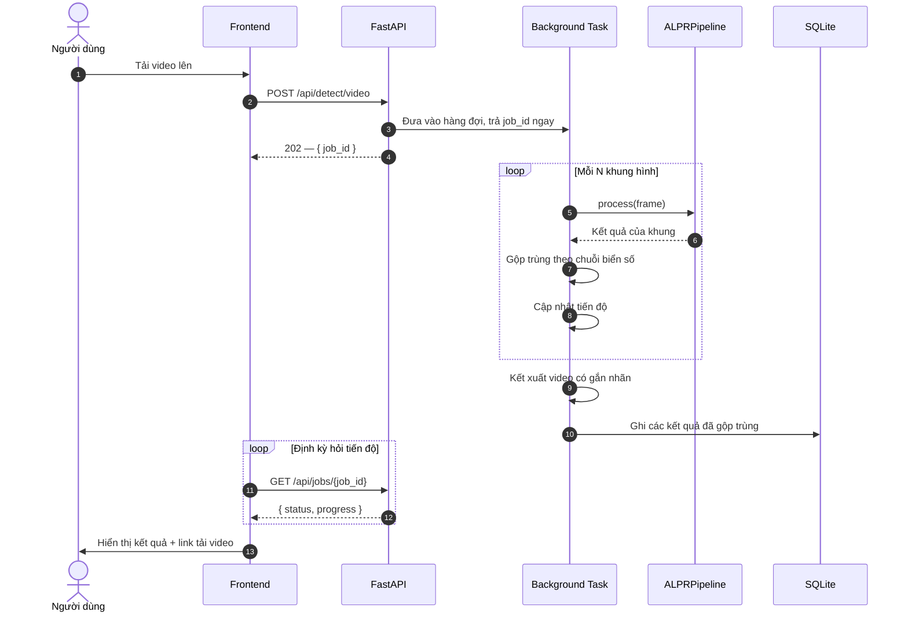
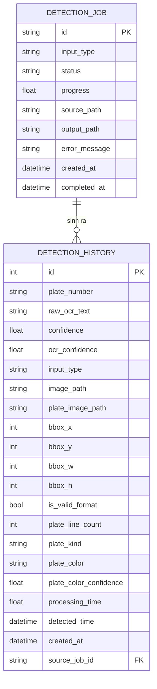

# Kiến trúc hệ thống (System Architecture)

**Thuộc:** Phase 0 — bản phác thảo kiến trúc
**Phiên bản:** 1.0 · **Ngày:** 2026-07-19
**Trạng thái:** Bản nháp kiến trúc — sẽ chi tiết hoá ở Phase 5 và Phase 6

---

## 1. Nguyên tắc kiến trúc

Kiến trúc được dẫn dắt bởi bốn ràng buộc, theo thứ tự quan trọng:

| # | Nguyên tắc | Nguồn | Hệ quả kiến trúc |
|---|---|---|---|
| 1 | **Không trộn mã AI với mã API** | `CLAUDE.md`, NFR-M1 | Pipeline AI là package độc lập, **không import FastAPI** |
| 2 | **Có thể thay thế thành phần** | NFR-M5 | Detector và OCR đứng sau interface trừu tượng |
| 3 | **Không hard-code đường dẫn** | `CLAUDE.md`, NFR-M4 | Mọi đường dẫn qua đối tượng cấu hình tập trung |
| 4 | **Chạy được không cần GPU** | CON-02, NFR-C2 | Thiết bị là tham số cấu hình, mặc định `cpu` |

Kiểm chứng nguyên tắc 1 rất đơn giản và nên tự động hoá ở Phase 7:

```bash
# Không được có kết quả nào
grep -r "fastapi\|pydantic" ai/inference/
```

---

## 2. Kiến trúc tổng thể



**Điểm mấu chốt:** khối màu vàng (Tầng AI) **không có mũi tên nào đi lên**. Nó không biết gì về HTTP, về CSDL, hay về việc ai gọi nó. Nhờ vậy có thể kiểm thử độc lập, tái sử dụng trong script huấn luyện, và thay thế được — thoả mãn NFR-M1 và NFR-M5.

> **Ghi chú (2026-07-20) — hai thay đổi phạm vi liên tiếp ở tầng trình bày.** Tầng L1 nay còn **3 trang**: Nhận dạng ảnh (`/`, trang chủ) → Nhận dạng video (`/video`) → Lịch sử (`/history`); đường dẫn không khớp chuyển hướng về `/`.
>
> * **Gỡ trang Webcam** — FR-3.1/FR-3.4 chuyển M → W.
> * **Gỡ trang Tổng quan (Dashboard)** — FR-4.1 chuyển M → W (yêu cầu mức Must đầu tiên bị gỡ khỏi phạm vi), FR-4.2 chuyển S → W.
>
> **Tầng API (L2) không đổi một dòng nào.** Ba route `/api/detect/frame`, `/api/statistics` và `/health` vẫn được phục vụ đầy đủ và vẫn có kiểm thử ở backend; `StatisticsService` ở tầng L3 cũng giữ nguyên. Thứ đã đổi là **bên tiêu thụ**: ba route này nay được gọi bởi **client bên ngoài** (script, công cụ giám sát, hoặc một giao diện dựng sau này), chứ không còn trang giao diện nào trong L1 gọi tới. Đây là minh chứng trực tiếp cho nguyên tắc số 1: thu hẹp tầng trình bày **không** kéo theo sửa đổi nào ở các tầng dưới.

---

## 3. Luồng xử lý AI

```mermaid
flowchart LR
    IN["Ảnh / Khung hình"] --> PRE[Tiền xử lý]
    PRE --> DET["YOLO11<br/>phát hiện biển số"]
    DET --> Q{"Có<br/>biển số?"}
    Q -->|Không| EMPTY["Trả kết quả rỗng<br/>(HTTP 200)"]
    Q -->|Có| CROP["Cắt vùng biển số"]
    CROP --> COLOR["Phân loại MÀU NỀN<br/>HSV vùng giữa ảnh cắt"]
    COLOR --> LINE{"Biển<br/>mấy dòng?"}
    LINE -->|1 dòng| OCR["PaddleOCR"]
    LINE -->|2 dòng| SPLIT["Tách trên / dưới"] --> OCR2["OCR từng nửa"] --> MERGE["Ghép kết quả"] --> NORM
    OCR --> NORM["Chuẩn hoá + sửa regex<br/>+ suy HỌ BIỂN từ chuỗi"]
    COLOR -.->|"gỡ nhập nhằng<br/>họ biển"| NORM
    NORM --> VAL{"Hợp lệ theo<br/>định dạng dân sự VN?"}
    VAL -->|Có| OK["Kết quả hợp lệ"]
    VAL -->|Không| WARN["Đánh dấu độ tin cậy thấp<br/>vẫn lưu lại"]
    OK --> SAVE[(Ghi CSDL)]
    WARN --> SAVE

    style LINE fill:#fecaca,stroke:#dc2626
    style SPLIT fill:#fecaca,stroke:#dc2626
    style COLOR fill:#dcfce7,stroke:#16a34a
```



> **Bước màu xanh lá — phân loại màu nền (bổ sung 20/07/2026).** Đặt **trước**
> OCR chứ không phải sau, vì kết quả của nó được tầng chuẩn hoá dùng để gỡ nhập
> nhằng họ biển. Đây là bằng chứng mà **không luật nào trên chuỗi ký tự lấy lại
> được**: theo TT 79/2024/TT-BCA, biển xe kinh doanh vận tải **nền vàng** mang bố
> cục ký tự **y hệt** biển cá nhân nền trắng, nên hai loại giống nhau tuyệt đối
> khi nhìn dưới dạng chuỗi. Chiều ngược lại cũng đúng — biển ngoại giao nền
> trắng như biển cá nhân, chỉ chuỗi mới tách được. Hai nguồn bằng chứng **bù trừ
> nhau và phải đọc cùng nhau**; chi tiết ở [Tài liệu API mục
> 4.4.7](../manuals/api-documentation.md).
>
> Chi phí gần như bằng không (một histogram HSV trên vùng giữa của một ảnh cắt
> nhỏ) và bước này **không bao giờ ném ngoại lệ**: ảnh cắt quá tối, cháy sáng
> hoặc không phải biển đều trả về `unknown` thay vì một phỏng đoán.

> **Lưu ý về nhánh `VAL`.** `is_valid_format` mang nghĩa hẹp: *khớp định dạng
> biển **dân sự** Việt Nam*. Biển quân đội đi vào nhánh `WARN` **có chủ đích** vì
> nó nằm ngoài hệ đăng ký dân sự — nó vẫn là biển thật, đọc đúng. Tầng trình bày
> **không được** diễn giải nhánh này thành "sai định dạng" mà chưa đọc `plate_kind`.

> **Nhánh màu đỏ là phần khó nhất của đồ án** (rủi ro R-04). Biển số 2 dòng chiếm phần lớn xe máy tại Việt Nam. Các pipeline OCR dựng sẵn thường đọc biển 2 dòng thành một chuỗi lộn xộn vì chúng giả định văn bản nằm trên một dòng. Việc **tách rồi ghép** là kỹ thuật xử lý chuẩn, cần làm sớm ở Phase 4.

> **Lưu ý ở nhánh `WARN`:** biển không khớp định dạng vẫn được **lưu lại**, chỉ bị đánh dấu. Không im lặng vứt bỏ dữ liệu — vì chính những trường hợp này là nguồn phân tích lỗi quý giá cho chương Đánh giá.

---

## 4. Sơ đồ tuần tự — Nhận dạng ảnh



---

## 5. Sơ đồ tuần tự — Nhận dạng video (chạy nền)



> **Quyết định thiết kế:** video xử lý **bất đồng bộ**, trả `202 Accepted` kèm `job_id`, không giữ kết nối chờ. Bắt buộc bởi NFR-SC3 — một video 60 giây trên CPU mất khoảng 200 giây, chắc chắn vượt timeout HTTP thông thường.

---

## 6. Thiết kế dữ liệu

### 6.1. Sơ đồ ER



`detection_history` hiện có **21 cột** (18 cột của lược đồ khởi tạo `0001_initial`
cộng 3 cột phân loại phương tiện thêm ở `0002_plate_kind_and_color`);
`detection_job` có **11 cột**, không đổi.

#### Lịch sử thay đổi lược đồ

| Revision | Ngày | Thay đổi | `detection_history` |
|---|---|---|---|
| `0001_initial` | 2026-07-19 | Tạo cả hai bảng theo lược đồ mở rộng đã duyệt ở mục 6.2 | 18 cột |
| `0002_plate_kind_and_color` | 2026-07-20 | Thêm `plate_kind` `String(16)`, `plate_color` `String(16)`, `plate_color_confidence` `Float` | **21 cột** |

**Ba cột của `0002` đều `NULL`-able và KHÔNG có giá trị mặc định.** Đây là chủ ý,
không phải sự lười biếng: những hàng ghi **trước** migration này thực sự chưa
từng được tính các giá trị đó — thông tin chưa bao giờ tồn tại với chúng. Điền
một giá trị đoán vào sẽ khiến nó **không phân biệt được với một giá trị đo thật**,
và mọi thống kê theo loại/màu biển sau này sẽ trộn lẫn dữ liệu bịa với dữ liệu
thật mà không có cách nào tách ra. `NULL` đọc là "chưa ghi nhận", đúng sự thật.

**Vì sao cần cả hai cột thay vì một.** `plate_kind` suy từ **chuỗi ký tự** và
không thấy được rằng biển vàng kinh doanh mang cùng bộ chữ với biển trắng cá
nhân — cả hai đều ra `car`. `plate_color` đọc từ **điểm ảnh** và không phân biệt
được biển ngoại giao với biển cá nhân — cả hai đều nền trắng. Chỉ cặp hai cột
mới định danh được loại phương tiện; chi tiết ở [Tài liệu API mục
4.4.7](../manuals/api-documentation.md).

**Động cơ trực tiếp của migration này** là một lỗi quan sát được: một biển quân
đội đọc **đúng** thành `KV6938` ở độ tin cậy OCR 0,999 được lưu với
`is_valid_format = 0` và **không có gì khác** — không phân biệt được với một biển
mà hệ thống đọc hỏng. Giao diện sau đó trình bày nó cho người dùng là "sai định
dạng biển số", điều này **không đúng**: biển quân đội là biển hợp lệ, chỉ nằm
ngoài hệ đăng ký dân sự. `SQLite` cho phép `ADD COLUMN` với cột nullable mà không
phải dựng lại bảng, nên chiều `upgrade` không cần chế độ batch; chiều `downgrade`
thì cần, vì xoá cột là thao tác SQLite thực hiện bằng cách tạo lại bảng.

### 6.2. Mở rộng so với `CLAUDE.md` — ĐÃ PHÊ DUYỆT (2026-07-19)

`CLAUDE.md` đặc tả `DetectionHistory` gồm 9 trường. Quá trình phân tích phát hiện một số thiếu sót về mặt chức năng và học thuật. Các mở rộng dưới đây **đã được phê duyệt toàn bộ** và là schema chính thức để cài đặt ở Phase 5.

| Trường bổ sung | Lý do | Trạng thái |
|---|---|---|
| `raw_ocr_text` | Lưu chuỗi OCR **trước** khi sửa regex. Không có trường này thì **không thể đo được NFR-A5 vs A6**, tức là mất luôn một đóng góp học thuật định lượng | ✅ Duyệt |
| `ocr_confidence` | Trường `confidence` gốc nhập nhằng giữa độ tin cậy phát hiện và độ tin cậy OCR. Tách ra mới phân tích lỗi được | ✅ Duyệt |
| `bbox_x/y/w/h` | Vẽ lại bounding box khi xem chi tiết mà không phải chạy lại mô hình | ✅ Duyệt |
| `is_valid_format` | Đánh dấu biển không khớp định dạng VN (nhánh `WARN` ở mục 3) | ✅ Duyệt |
| `plate_line_count` | Báo cáo độ chính xác tách theo biển 1 dòng / 2 dòng (NFR-A8) | ✅ Duyệt |
| `source_job_id` | Một ảnh/video có thể sinh **nhiều** biển số. Schema gốc không có cách nào nhóm chúng theo một lần tải lên | ✅ Duyệt |

**Bảng `DetectionJob` — bảng hoàn toàn mới, ✅ đã duyệt.** Cần thiết để đáp ứng FR-2.6 (theo dõi tiến độ) và FR-2.1 (trả `job_id`). Schema gốc không có chỗ nào lưu trạng thái tác vụ đang chạy.

#### Hệ quả cần thực hiện ở các phase sau

| Việc | Phase |
|---|---|
| Định nghĩa model SQLAlchemy theo đúng schema mở rộng này | 5 |
| Migration Alembic khởi tạo gồm cả 2 bảng | 5 |
| `ALPRPipeline` phải trả về `raw_ocr_text` và `ocr_confidence` tách biệt | 4 |
| Bộ chuẩn hoá phải xác định và trả về `plate_line_count` | 4 |
| Thống kê ở `GET /api/statistics` đếm theo `source_job_id`, **không** đếm theo số dòng `DetectionHistory` | 5, 6 |
| Báo cáo đánh giá so sánh độ chính xác trước/sau hậu xử lý (NFR-A5 vs A6) | 7 |

> **Vì sao đây là vấn đề đáng nêu, không phải chi tiết vụn vặt:** thiếu `source_job_id`, một ảnh chứa 3 biển số sẽ thành 3 bản ghi rời rạc không liên hệ gì với nhau — `GET /api/statistics` sẽ đếm thành "3 lượt nhận dạng" thay vì "1 ảnh có 3 biển số", và toàn bộ số liệu thống kê sẽ sai lệch. *(Ghi chú 2026-07-20: trang Tổng quan hiển thị các số này đã được gỡ và FR-4.1 chuyển sang mức W, nhưng endpoint vẫn phục vụ — rủi ro đếm sai nằm ở tầng dữ liệu nên **không** mất đi cùng trang.)*

---

## 7. Cấu trúc thư mục dự kiến

```
DATN/
├── ai/
│   ├── inference/          # ⚠️ Thuần Python — cấm import FastAPI
│   │   ├── detector.py         # PlateDetector (YOLO11)
│   │   ├── recognizer.py       # PlateRecognizer (PaddleOCR)
│   │   ├── normalizer.py       # Chuẩn hoá + regex + validate
│   │   ├── pipeline.py         # ALPRPipeline — điều phối
│   │   └── interfaces.py       # Lớp trừu tượng (NFR-M5)
│   ├── training/           # Script huấn luyện + cấu hình
│   └── evaluation/         # Script đánh giá, sinh biểu đồ
├── backend/
│   ├── api/                # Router FastAPI
│   ├── services/           # Tầng nghiệp vụ
│   ├── repositories/       # Truy cập dữ liệu
│   ├── models/             # Model SQLAlchemy
│   ├── schemas/            # Schema Pydantic
│   └── core/               # Cấu hình, log, exception
├── frontend/src/
│   ├── pages/  components/  hooks/  services/  types/
├── datasets/               # raw / processed / annotations / statistics
├── models/                 # best.pt và các model đã xuất
├── deployment/docker/
├── tests/
├── scripts/
└── docs/
```

---

## 8. Các quyết định kiến trúc

| # | Quyết định | Lựa chọn | Lý do | Đánh đổi |
|---|---|---|---|---|
| AD-01 | Tách tầng AI khỏi tầng API | Package độc lập | NFR-M1, kiểm thử được, tái dùng trong script huấn luyện | Thêm một lớp gián tiếp |
| AD-02 | Xử lý video | Bất đồng bộ + `job_id` | Vượt timeout HTTP (NFR-SC3) | Frontend phải hỏi tiến độ định kỳ |
| AD-03 | Nhận dạng thời gian thực | Client gửi từng khung qua HTTP (`/api/detect/frame`) | Đơn giản, dễ debug, đủ cho ~5 FPS | Nếu cần FPS cao hơn phải chuyển WebSocket. *Từ 2026-07-20 trang Webcam đã gỡ khỏi giao diện — bên gửi khung là client API, endpoint và kiểm thử không đổi* |
| AD-04 | Gộp trùng biển số | Theo chuỗi ký tự + cửa sổ thời gian | Đơn giản hơn nhiều so với tracking, đủ dùng (FR-2.4) | Kém chính xác khi hai xe cùng biển... thực tế không xảy ra |
| AD-05 | Backend suy luận | PyTorch trước, ONNX/OpenVINO nếu cần | Ưu tiên chạy đúng rồi mới tối ưu | Có thể phải làm lại bước xuất mô hình |
| AD-06 | Thiết bị | Cấu hình được, mặc định `cpu` | CON-02 | — |
| AD-07 | Lưu trữ ảnh | Tệp trên đĩa + đường dẫn trong CSDL | Tránh phình SQLite bằng BLOB | Phải giữ đồng bộ tệp và bản ghi (FR-5.1, FR-5.3) |
| AD-08 | Đặt tên tệp | UUID, không dùng tên gốc | NFR-S2 chống path traversal | Cần lưu tên gốc riêng nếu muốn hiển thị |

### Về AD-03 — vì sao chọn HTTP thay vì WebSocket

Với chỉ tiêu ~5 FPS trên CPU (NFR-P2), chi phí thiết lập HTTP không phải nút thắt — **thời gian suy luận mới là nút thắt**, chiếm khoảng 300–400 ms mỗi khung hình so với vài ms overhead của HTTP. WebSocket sẽ thêm quản lý trạng thái kết nối, logic kết nối lại và độ phức tạp khi debug mà **không cải thiện được nút thắt thực sự**. Nếu Phase 7 đo được và chứng minh HTTP là nút cổ chai, sẽ xem xét lại — và bản thân việc đo đạc đó chính là một nội dung tốt cho chương Đánh giá.

---

## 9. Việc còn treo ở các giai đoạn sau

| Việc | Giai đoạn quyết định |
|---|---|
| Chọn kích thước mô hình YOLO11 (n/s/m) | Phase 3 — dựa trên số đo thực tế |
| Chọn biến thể PaddleOCR (mobile / server) | Phase 4 — dựa trên benchmark |
| Thuật toán tách biển 2 dòng | Phase 4 |
| Đặc tả chi tiết endpoint API | Phase 5 |
| Wireframe và design system giao diện | Phase 6 |
| Có xuất ONNX/OpenVINO hay không | Phase 7 — tiêu chí đặt ra: chỉ làm khi NFR-P1 không đạt. **Kết quả thực tế: NFR-P1 ĐẠT** (p95 731,15 ms client-side / 780,36 ms in-process, mục tiêu 800 ms, đo trên `models/best.pt`) ⇒ việc xuất ONNX/OpenVINO là **tuỳ chọn tăng tốc**, không bắt buộc |
