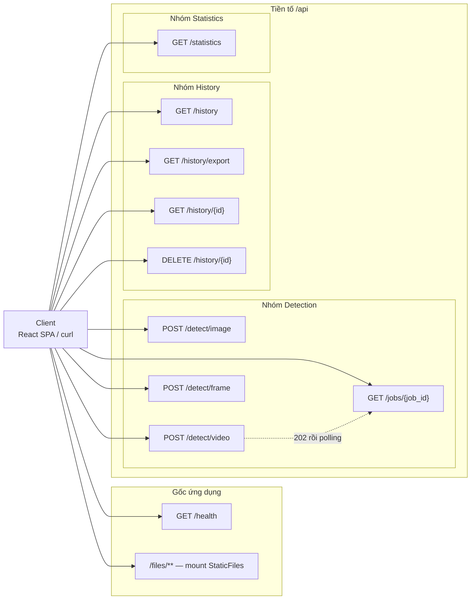
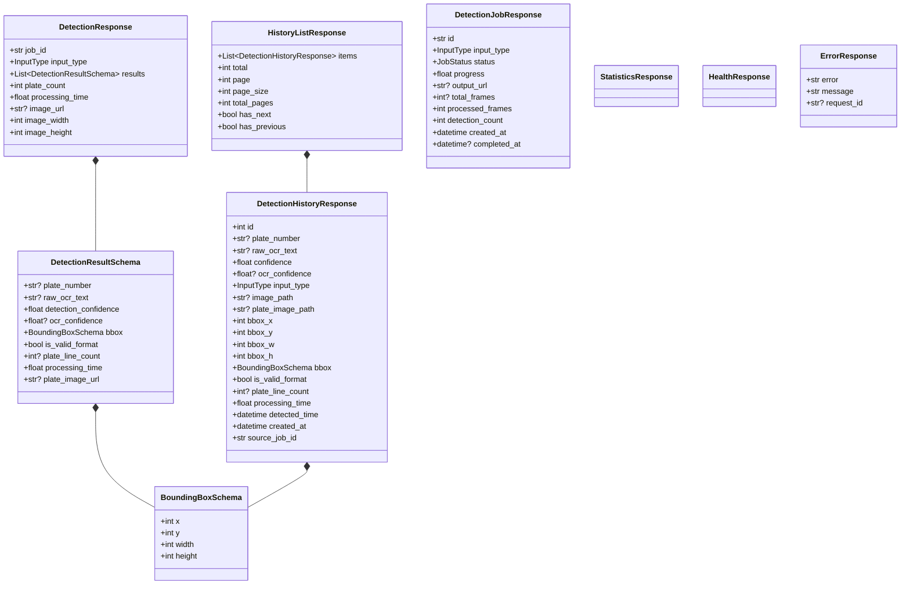
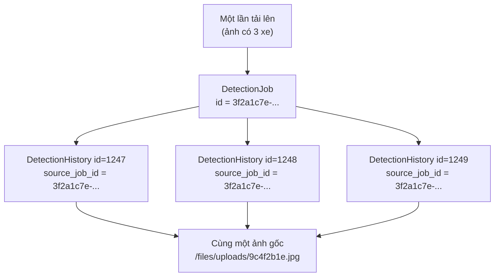
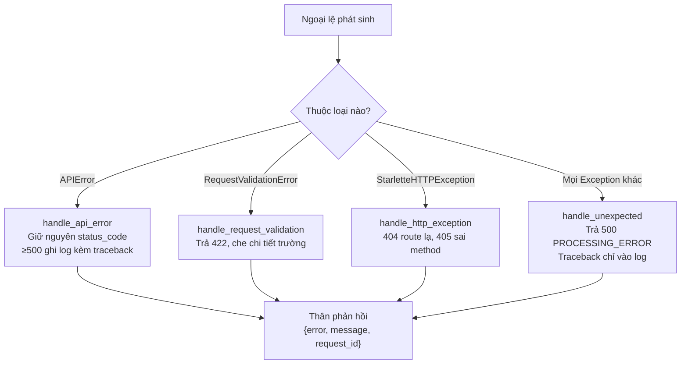
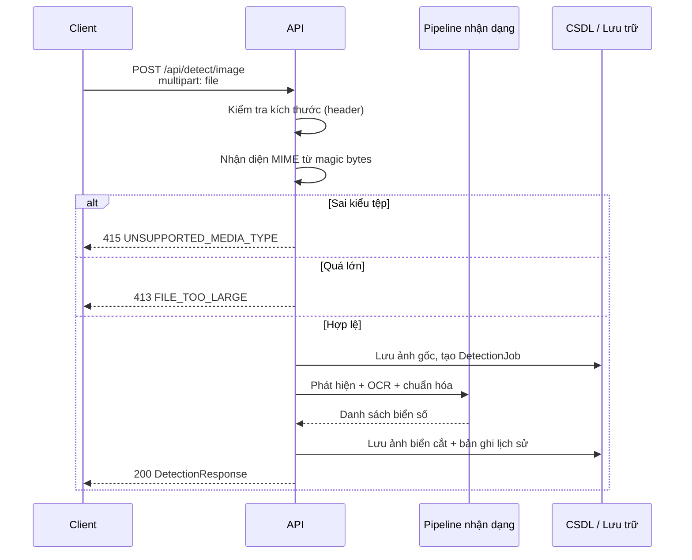
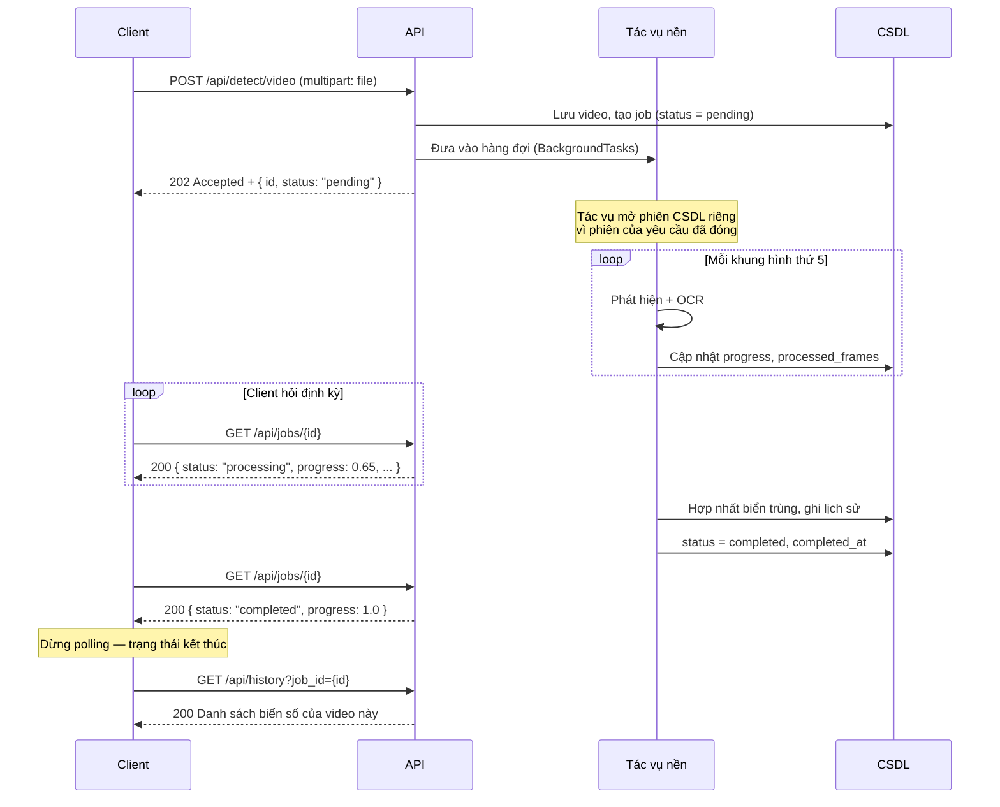
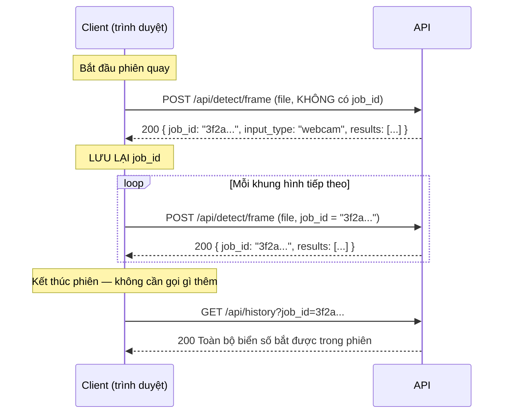
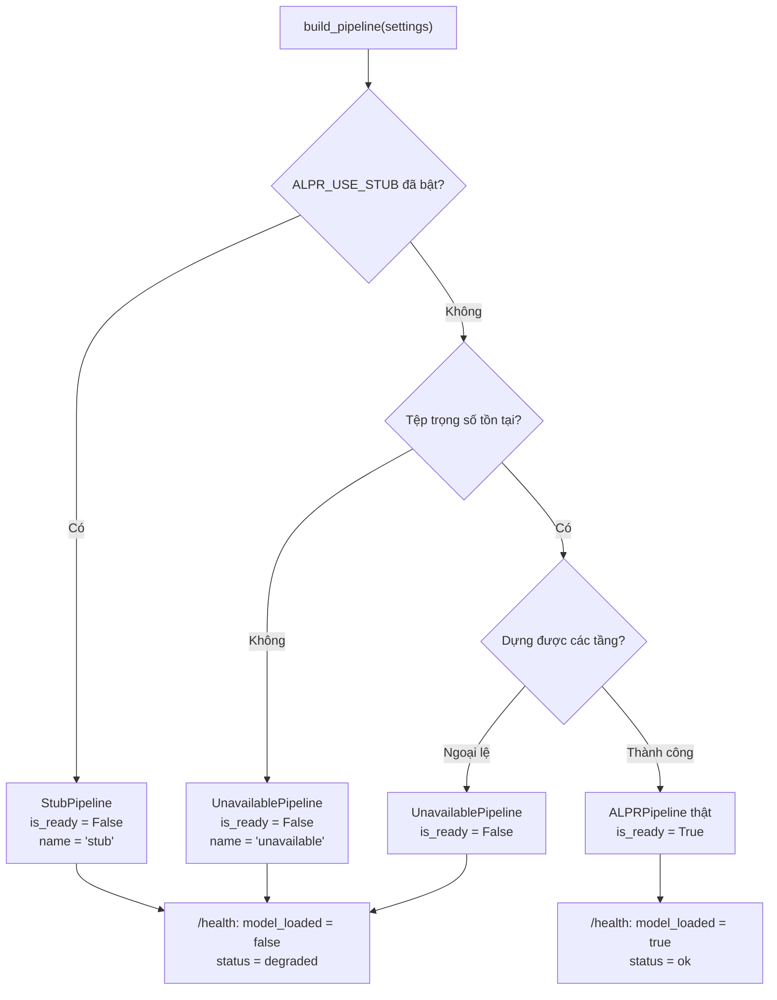

# Tài liệu API — Hệ thống nhận dạng biển số xe Việt Nam

**Phiên bản tài liệu:** 1.0
**Ngày lập:** 19/07/2026
**Phạm vi:** REST API của tầng backend (FastAPI), tương ứng module `backend/` trong kho mã nguồn.
**Nguồn đối chiếu:** toàn bộ nội dung dưới đây được đọc trực tiếp từ mã nguồn
`backend/api/routes/*.py`, `backend/schemas/detection.py`, `backend/core/config.py`,
`backend/core/exceptions.py`, `backend/services/*.py` và `backend/main.py`,
đồng thời được kiểm chứng lại bằng tài liệu OpenAPI sinh ra từ chính đối tượng
ứng dụng (`create_app().openapi()`).

> **Đính chính số liệu.** Hai con số sai từng lưu hành trong các báo cáo trước
> của đồ án: **12 endpoint** (do cộng nhầm cả `/docs` và `/openapi.json` là
> đường dẫn FastAPI tự sinh) và **9 endpoint** (do bỏ sót `/health`, vốn nằm
> ngoài tiền tố `/api`). Cả hai đều **không chính xác**. Việc đếm lại trực tiếp
> các decorator định tuyến trong `backend/api/routes/` và đối chiếu với tài liệu
> OpenAPI cho kết quả: **9 đường dẫn (path)** mang **10 thao tác (operation)**
> do nhóm tự định nghĩa — tức con số cần dùng thống nhất trong toàn bộ tài liệu
> là **10 endpoint**. Chi tiết cách đếm và nguyên nhân sai lệch được trình bày ở
> mục 4.2.

---

## 4.1 Tổng quan

### 4.1.1 Base URL và tiền tố đường dẫn

Ứng dụng được phục vụ bởi uvicorn từ đối tượng `backend.main:app`. Trong môi
trường phát triển, base URL mặc định là:

```
http://127.0.0.1:8000
```

Hệ thống sử dụng **hai không gian đường dẫn tách biệt**, và sự tách biệt này là
có chủ đích:

| Không gian | Giá trị mặc định | Cấu hình bởi | Nội dung |
|---|---|---|---|
| Tiền tố API nghiệp vụ | `/api` | `ALPR_API_PREFIX` (`Settings.api_prefix`) | 8 đường dẫn nghiệp vụ (phát hiện, lịch sử, thống kê) |
| Gốc ứng dụng | `/` | không cấu hình được | `/health` — endpoint kiểm tra tình trạng dịch vụ |
| Tệp tĩnh | `/files` | hằng `FILES_URL_PREFIX` trong `storage_service.py` | ảnh gốc, ảnh biển số đã cắt, video kết quả |

`/health` **cố tình nằm ngoài** tiền tố `/api`. Lý do được ghi rõ trong
`backend/main.py`: một endpoint kiểm tra sức khỏe mà lại dịch chuyển mỗi khi
tiền tố API thay đổi thì không còn giá trị đối với hệ thống giám sát hoặc
orchestrator. Mã nguồn frontend (`frontend/src/services/api.ts`) cũng gọi
`/health` ở gốc, tách khỏi hằng `API_PREFIX`.

### 4.1.2 Định dạng dữ liệu

- **Phản hồi:** `application/json` với mã hóa UTF-8, cho mọi endpoint trừ
  `GET /api/history/export` (trả `text/csv; charset=utf-8`).
- **Yêu cầu có tải tệp:** `multipart/form-data`. Ba endpoint phát hiện đều nhận
  tệp qua trường `file` của biểu mẫu, không nhận base64 trong thân JSON.
- **Yêu cầu chỉ có tham số:** tham số truyền qua query string, không có thân
  yêu cầu.
- **Thời gian:** mọi mốc thời gian là **UTC**, tuần tự hóa theo ISO 8601
  (ví dụ `2026-07-19T09:31:22.145Z`). Không có trường nào mang giờ địa phương.
- **Độ tin cậy:** mọi giá trị confidence là số thực trong đoạn `[0.0, 1.0]`,
  ràng buộc bằng kiểu `Confidence = Annotated[float, Field(ge=0.0, le=1.0)]`
  trong `backend/schemas/detection.py`.

### 4.1.3 Quy ước đặt tên trường

Toàn bộ trường JSON dùng **snake_case** (`plate_number`, `ocr_confidence`,
`source_job_id`, `total_pages`). Quy ước này được giữ nhất quán từ cột cơ sở dữ
liệu, qua lớp schema Pydantic, đến kiểu TypeScript ở frontend — mã nguồn schema
ghi rõ rằng tên cột được chọn trùng với tên trường schema để Pydantic có thể ánh
xạ trực tiếp qua `from_attributes=True` mà không cần lớp chuyển đổi trung gian.

Hệ quả cần lưu ý: frontend **không** chuyển đổi sang camelCase. Các interface
TypeScript trong `frontend/src/types/index.ts` giữ nguyên snake_case, đổi lấy
việc loại bỏ hoàn toàn một tầng ánh xạ có khả năng sai lệch.

### 4.1.4 Header đặc thù

Middleware `request_context_middleware` trong `backend/main.py` gắn hai header
vào **mọi** phản hồi, kể cả phản hồi lỗi:

| Header | Ý nghĩa |
|---|---|
| `X-Request-ID` | Định danh tương quan của yêu cầu. Nếu client (hoặc reverse proxy) gửi lên header cùng tên, giá trị đó được **giữ nguyên** để vết truy dấu không bị đứt đoạn; nếu không, hệ thống sinh mới. |
| `X-Process-Time` | Thời gian xử lý phía máy chủ, tính bằng giây, định dạng 4 chữ số thập phân. |

Cả hai được khai báo trong `expose_headers` của `CORSMiddleware`; nếu không khai
báo, trình duyệt sẽ che chúng khỏi mã JavaScript và định danh mà người dùng cần
trích dẫn khi báo lỗi sẽ không bao giờ đến được giao diện.

### 4.1.5 Xác thực

**Hệ thống hiện không có cơ chế xác thực hay phân quyền.** Mọi endpoint đều
truy cập được ẩn danh. Đây là quyết định phạm vi của đồ án chứ không phải thiếu
sót bị bỏ quên; hệ quả về an toàn và hướng khắc phục được ghi ở mục 4.6.5.

CORS được cấu hình bằng danh sách origin tường minh (mặc định
`http://localhost:5173` và `http://127.0.0.1:5173`). Lớp `Settings` **từ chối**
giá trị `*` ngay tại thời điểm khởi động, nên không thể nới lỏng CORS bằng một
biến môi trường đặt vội trong lúc gỡ lỗi.

---

## 4.2 Bảng tóm tắt endpoint

### 4.2.1 Phương pháp đếm và kết quả

Việc đếm được thực hiện theo hai cách độc lập và cho kết quả trùng khớp:

1. **Đếm decorator định tuyến** trong `backend/api/routes/`:

   | Tệp | Số decorator |
   |---|---|
   | `detection.py` | 4 |
   | `health.py` | 1 |
   | `history.py` | 4 |
   | `statistics.py` | 1 |
   | **Tổng** | **10** |

2. **Sinh tài liệu OpenAPI** từ đối tượng ứng dụng: kết quả là
   `PATHS: 9`, `OPERATIONS: 10`.

Chênh lệch giữa 9 và 10 **không phải lỗi**: đường dẫn
`/api/history/{detection_id}` mang **hai** thao tác trên cùng một tài nguyên —
`GET` để đọc và `DELETE` để xóa. OpenAPI gom chúng vào một mục `paths`.

Do đó, cách phát biểu chính xác là:

> Hệ thống định nghĩa **10 thao tác HTTP** phân bố trên **9 đường dẫn**.

### 4.2.2 Phân biệt route tự định nghĩa với route do FastAPI sinh

Con số 12 trong báo cáo cũ nhiều khả năng đến từ việc cộng thêm các đường dẫn
mà FastAPI **tự động** tạo ra. Những đường dẫn này có tồn tại và truy cập được,
nhưng chúng là hạ tầng tài liệu của framework, không phải hợp đồng API do nhóm
thiết kế, và không được tính vào số endpoint của hệ thống:

| Đường dẫn | Nguồn gốc | Vai trò |
|---|---|---|
| `/docs` | FastAPI, tham số `docs_url` | Giao diện Swagger UI |
| `/redoc` | FastAPI, tham số `redoc_url` | Giao diện ReDoc |
| `/openapi.json` | FastAPI, tham số `openapi_url` | Đặc tả OpenAPI dạng máy đọc |
| `/files/{path}` | `app.mount()` với `StaticFiles` | Phục vụ tệp tĩnh — là một **mount**, không phải route; không xuất hiện trong `paths` của OpenAPI |

`10 + 3 = 13`; nếu bỏ `/redoc` thì được 12. Dù nguyên nhân chính xác là gì, con
số được xác nhận bằng thực nghiệm là **10 thao tác / 9 đường dẫn** do nhóm định
nghĩa.

### 4.2.3 Bảng tóm tắt

| # | Phương thức | Đường dẫn | Mô tả ngắn | Mã thành công | Mã lỗi có thể gặp |
|---|---|---|---|---|---|
| 1 | `GET` | `/health` | Kiểm tra mức sẵn sàng của dịch vụ | `200` | — (luôn trả 200) |
| 2 | `POST` | `/api/detect/image` | Nhận dạng biển số trên một ảnh | `200` | `400`, `413`, `415`, `422`, `500` |
| 3 | `POST` | `/api/detect/video` | Đưa video vào hàng đợi xử lý nền | `202` | `400`, `413`, `415`, `422`, `500` |
| 4 | `POST` | `/api/detect/frame` | Nhận dạng trên một khung hình webcam | `200` | `400`, `413`, `415`, `422`, `500` |
| 5 | `GET` | `/api/jobs/{job_id}` | Truy vấn trạng thái và tiến độ tác vụ | `200` | `404`, `500` |
| 6 | `GET` | `/api/history` | Liệt kê lịch sử có tìm kiếm, lọc, sắp xếp, phân trang | `200` | `400`, `422`, `500` |
| 7 | `GET` | `/api/history/export` | Xuất bản ghi khớp bộ lọc ra CSV | `200` | `400`, `422`, `500` |
| 8 | `GET` | `/api/history/{detection_id}` | Đọc chi tiết một bản ghi | `200` | `404`, `422`, `500` |
| 9 | `DELETE` | `/api/history/{detection_id}` | Xóa một bản ghi | `204` | `404`, `422`, `500` |
| 10 | `GET` | `/api/statistics` | Số liệu tổng hợp cho bảng điều khiển | `200` | `400`, `422`, `500` |

Ghi chú: mã `422` không được khai báo tường minh trong `responses` của từng
route, nhưng vẫn có thể phát sinh ở mọi endpoint có tham số — nó do FastAPI
sinh ra khi tham số không ép được về kiểu đã khai báo, và được bộ xử lý
`RequestValidationError` trong `main.py` viết lại theo đúng cấu trúc lỗi chuẩn
của hệ thống (xem mục 4.5.3).

### 4.2.4 Sơ đồ phân nhóm



---

## 4.3 Đặc tả chi tiết từng endpoint

Quy ước trình bày: mỗi endpoint gồm tham số, ví dụ yêu cầu bằng `curl` chạy
được, ví dụ phản hồi lấy từ ví dụ khai báo trong mã nguồn, và bảng mã lỗi.

### 4.3.1 `GET /health` — Kiểm tra mức sẵn sàng

**Định nghĩa:** `backend/api/routes/health.py`, hàm `health`.

**Tham số:** không có.

**Đặc điểm quan trọng:** endpoint này **luôn trả về HTTP 200**, kể cả khi một
phụ thuộc hỏng. Client phải đọc trường `status` trong thân phản hồi chứ không
được kết luận từ dòng trạng thái HTTP. Lý do ghi trong mã nguồn: bản thân việc
endpoint còn trả lời đã là một thông tin, và một hệ thống giám sát cần phân
biệt "dịch vụ chết" với "dịch vụ suy giảm" thì phải đọc thân phản hồi.

**Ví dụ yêu cầu:**

```bash
curl -s http://127.0.0.1:8000/health | python -m json.tool
```

**Ví dụ phản hồi (200):**

```json
{
  "status": "ok",
  "app_name": "Vietnamese ALPR API",
  "version": "0.1.0",
  "database_connected": true,
  "model_loaded": true,
  "uptime_seconds": 1287.4,
  "timestamp": "2026-07-19T09:31:22.145Z"
}
```

**Mã lỗi:** endpoint được thiết kế để không ném ngoại lệ. Hai hàm thăm dò
`_probe_database` và `_probe_pipeline` đều bắt `Exception` và trả `False` thay
vì để lỗi lan ra ngoài — vì một health check trả 500 chỉ nói với hệ thống giám
sát rằng *phép kiểm tra* bị hỏng, chứ không nói gì về *dịch vụ*.

Diễn giải chi tiết từng trường ở mục 4.8.

---

### 4.3.2 `POST /api/detect/image` — Nhận dạng biển số trên ảnh

**Định nghĩa:** `backend/api/routes/detection.py`, hàm `detect_image`.

**Tham số:**

| Tên | Vị trí | Kiểu | Bắt buộc | Mặc định | Ràng buộc |
|---|---|---|---|---|---|
| `file` | form-data | tệp nhị phân | Có | — | Kích thước ≤ `ALPR_MAX_IMAGE_SIZE_MB` (mặc định 10 MB). Kiểu thật (đọc từ magic bytes) phải thuộc `image/jpeg`, `image/png`, `image/webp`, `image/bmp` |

**Ví dụ yêu cầu:**

```bash
curl -s -X POST http://127.0.0.1:8000/api/detect/image \
  -F "file=@./data/samples/51G-49539.jpg" \
  | python -m json.tool
```

**Ví dụ phản hồi (200):**

```json
{
  "job_id": "3f2a1c7e-9b4d-4e21-a0f6-77c2d1e5b840",
  "input_type": "image",
  "results": [
    {
      "plate_number": "51F-12345",
      "raw_ocr_text": "51FI2345",
      "detection_confidence": 0.94,
      "ocr_confidence": 0.87,
      "bbox": { "x": 142, "y": 318, "width": 186, "height": 64 },
      "is_valid_format": true,
      "plate_line_count": 1,
      "processing_time": 0.412,
      "plate_image_url": "/files/plates/3f2a1c7e-plate-0.jpg"
    }
  ],
  "plate_count": 1,
  "processing_time": 0.842,
  "image_url": "/files/uploads/9c4f2b1e7a634d8e9f0a1b2c3d4e5f60.jpg",
  "image_width": 1280,
  "image_height": 720
}
```

**Ba điểm ngữ nghĩa cần nắm:**

1. **Một lần tải lên là một job.** Ảnh chứa ba xe sinh ba phần tử trong
   `results`, cả ba dùng chung một `job_id`, và được tính là **một** lượt tải
   lên trong thống kê.
2. **Ảnh không có biển số là thành công, không phải lỗi.** Phản hồi vẫn là 200
   với `results` rỗng và `plate_count = 0`. Mã nguồn ghi rõ lý do: coi "không
   tìm thấy gì" là lỗi 4xx sẽ loại bỏ toàn bộ ca âm tính khỏi số liệu độ chính
   xác, khiến con số công bố chỉ đo trên những ảnh tình cờ chạy được.
3. **Kiểu tệp xác định bằng magic bytes**, không dựa vào phần mở rộng hay
   header `Content-Type`. Một tệp `.jpg` thực chất là kho nén ZIP sẽ bị từ chối
   với mã 415.

**Bảng mã lỗi:**

| Mã | `error` | Ý nghĩa |
|---|---|---|
| `400` | `VALIDATION_ERROR` | Không có phần tệp trong yêu cầu, hoặc ảnh không giải mã được |
| `413` | `FILE_TOO_LARGE` | Vượt ngưỡng dung lượng ảnh |
| `415` | `UNSUPPORTED_MEDIA_TYPE` | Kiểu thật của tệp không nằm trong danh sách cho phép |
| `422` | `VALIDATION_ERROR` | Yêu cầu không đúng lược đồ (thiếu trường `file`) |
| `500` | `PROCESSING_ERROR` | Pipeline nhận dạng hoặc thao tác lưu trữ thất bại |

---

### 4.3.3 `POST /api/detect/video` — Đưa video vào hàng đợi

**Định nghĩa:** `backend/api/routes/detection.py`, hàm `detect_video`.

**Tham số:**

| Tên | Vị trí | Kiểu | Bắt buộc | Mặc định | Ràng buộc |
|---|---|---|---|---|---|
| `file` | form-data | tệp nhị phân | Có | — | ≤ `ALPR_MAX_VIDEO_SIZE_MB` (mặc định 200 MB). Kiểu thật thuộc `video/mp4`, `video/x-msvideo`, `video/quicktime`, `video/x-matroska` |

**Mã trạng thái thành công: `202 Accepted`**, không phải 200. Đây là điểm khác
biệt cốt lõi so với endpoint ảnh. Mã nguồn nêu lý do định lượng: xử lý video
tốn khoảng 200 giây CPU cho mỗi 60 giây tư liệu (theo NFR-SC3), không client
HTTP hay proxy nào chờ được. Một endpoint đồng bộ sẽ hết thời gian chờ giữa
chừng, để lại công việc làm dở và client không có cách nào biết kết quả.

**Ví dụ yêu cầu:**

```bash
curl -s -X POST http://127.0.0.1:8000/api/detect/video \
  -F "file=@./data/samples/traffic-30s.mp4" \
  | python -m json.tool
```

**Ví dụ phản hồi (202):**

```json
{
  "id": "3f2a1c7e-9b4d-4e21-a0f6-77c2d1e5b840",
  "input_type": "video",
  "status": "pending",
  "progress": 0.0,
  "output_url": null,
  "total_frames": null,
  "processed_frames": 0,
  "detection_count": 0,
  "created_at": "2026-07-19T09:31:22.145Z",
  "completed_at": null
}
```

**Cơ chế lấy mẫu khung hình.** Hệ thống không xử lý mọi khung hình mà lấy mẫu
mỗi `frame_stride` khung (mặc định **5**, cấu hình qua `Settings.frame_stride`).
Các lần nhìn thấy lặp lại của cùng một biển số được hợp nhất thành **một** bản
ghi lịch sử trước khi ghi xuống cơ sở dữ liệu — một biển số xuất hiện trong bốn
mươi khung hình vẫn chỉ là một biển số.

**Bảng mã lỗi:** giống mục 4.3.2, với ngưỡng dung lượng và danh sách MIME của
video.

---

### 4.3.4 `POST /api/detect/frame` — Nhận dạng một khung hình webcam

**Định nghĩa:** `backend/api/routes/detection.py`, hàm `detect_frame`.

**Tham số:**

| Tên | Vị trí | Kiểu | Bắt buộc | Mặc định | Ràng buộc |
|---|---|---|---|---|---|
| `file` | form-data | tệp nhị phân | Có | — | Khung hình mã hóa JPEG hoặc PNG; áp cùng ngưỡng dung lượng như ảnh |
| `job_id` | form-data | chuỗi | Không | `null` | Định danh phiên webcam đang chạy, lấy từ phản hồi của khung hình đầu tiên |

**Quy tắc bắt buộc đối với client: phải gửi lại `job_id`.** Lần gọi đầu tiên bỏ
trống tham số này và nhận về một `job_id` mới; **mọi** lần gọi sau trong cùng
phiên phải gửi kèm giá trị đó. Bỏ qua sẽ tạo một phiên mới cho từng khung hình,
biến một lượt quay ba mươi giây thành hàng trăm lượt tải lên và làm số liệu sử
dụng mất ý nghĩa hoàn toàn.

Một `job_id` không tồn tại hoặc đã kết thúc **không gây lỗi**: hệ thống lặng lẽ
mở phiên mới, để việc người dùng tải lại trang không làm hỏng phiên quay.

**Khung hình không được lưu trữ.** Một phiên webcam sinh ra vài khung gần như
giống hệt nhau mỗi giây; lưu lại chúng sẽ lấp đầy đĩa mà không ghi được thông
tin gì mới. Chỉ ảnh biển số đã cắt được lưu. Hệ quả trên hợp đồng API: trường
`image_url` trong phản hồi luôn là `null` với `input_type = "webcam"`.

**Ví dụ yêu cầu (khung hình đầu tiên):**

```bash
curl -s -X POST http://127.0.0.1:8000/api/detect/frame \
  -F "file=@./frame-001.jpg" \
  | python -m json.tool
```

**Ví dụ yêu cầu (khung hình tiếp theo, cùng phiên):**

```bash
curl -s -X POST http://127.0.0.1:8000/api/detect/frame \
  -F "file=@./frame-002.jpg" \
  -F "job_id=3f2a1c7e-9b4d-4e21-a0f6-77c2d1e5b840" \
  | python -m json.tool
```

**Ví dụ phản hồi (200):**

```json
{
  "job_id": "3f2a1c7e-9b4d-4e21-a0f6-77c2d1e5b840",
  "input_type": "webcam",
  "results": [
    {
      "plate_number": "51F-12345",
      "raw_ocr_text": "51FI2345",
      "detection_confidence": 0.94,
      "ocr_confidence": 0.87,
      "bbox": { "x": 142, "y": 318, "width": 186, "height": 64 },
      "is_valid_format": true,
      "plate_line_count": 1,
      "processing_time": 0.412,
      "plate_image_url": "/files/plates/3f2a1c7e-plate-0.jpg"
    }
  ],
  "plate_count": 1,
  "processing_time": 0.842,
  "image_url": null,
  "image_width": 1280,
  "image_height": 720
}
```

**Bảng mã lỗi:** giống mục 4.3.2.

---

### 4.3.5 `GET /api/jobs/{job_id}` — Trạng thái tác vụ

**Định nghĩa:** `backend/api/routes/detection.py`, hàm `get_job`.

**Tham số:**

| Tên | Vị trí | Kiểu | Bắt buộc | Mặc định | Ràng buộc |
|---|---|---|---|---|---|
| `job_id` | path | chuỗi | Có | — | Định danh trả về khi tác vụ được chấp nhận |

**Ví dụ yêu cầu:**

```bash
curl -s http://127.0.0.1:8000/api/jobs/3f2a1c7e-9b4d-4e21-a0f6-77c2d1e5b840 \
  | python -m json.tool
```

**Ví dụ phản hồi (200):**

```json
{
  "id": "3f2a1c7e-9b4d-4e21-a0f6-77c2d1e5b840",
  "input_type": "video",
  "status": "processing",
  "progress": 0.65,
  "output_url": null,
  "total_frames": 1800,
  "processed_frames": 234,
  "detection_count": 7,
  "created_at": "2026-07-19T09:31:22.145Z",
  "completed_at": null
}
```

**Quy tắc dừng polling:** ngừng khi `status` nhận một trong ba giá trị kết thúc
`completed`, `failed`, `cancelled`. Ba trạng thái này là tận cùng, không có gì
thay đổi thêm.

**Tác vụ thất bại chỉ báo rằng nó thất bại.** Nguyên nhân kỹ thuật được ghi vào
nhật ký máy chủ dưới cùng `request_id` và **không bao giờ** xuất hiện trong
phản hồi này (yêu cầu NFR-S4). Trường `error_message` trong mô hình ORM
`DetectionJob` cố ý không được đưa vào schema phản hồi.

**Bảng mã lỗi:**

| Mã | `error` | Ý nghĩa |
|---|---|---|
| `404` | `NOT_FOUND` | Không tồn tại tác vụ với định danh đã cho |
| `500` | `PROCESSING_ERROR` | Lỗi phía máy chủ khi đọc trạng thái |

---

### 4.3.6 `GET /api/history` — Danh sách lịch sử

**Định nghĩa:** `backend/api/routes/history.py`, hàm `list_history`.

**Tham số (toàn bộ ở query string):**

| Tên | Kiểu | Bắt buộc | Mặc định | Ràng buộc |
|---|---|---|---|---|
| `page` | số nguyên | Không | `1` | `≥ 1` |
| `page_size` | số nguyên | Không | `20` | `1 ≤ page_size ≤ 200` (`MAX_PAGE_SIZE`) |
| `search` | chuỗi | Không | `null` | Độ dài tối đa 64 ký tự |
| `input_type` | enum | Không | `null` | `image` \| `video` \| `webcam` |
| `is_valid_format` | boolean | Không | `null` | Bỏ trống để lấy cả hai |
| `date_from` | datetime | Không | `null` | ISO 8601, UTC; chặn dưới **bao gồm** trên `detected_time` |
| `date_to` | datetime | Không | `null` | ISO 8601, UTC; chặn trên **bao gồm** |
| `min_confidence` | số thực | Không | `null` | `0.0 ≤ x ≤ 1.0`; lọc theo confidence **phát hiện** |
| `job_id` | chuỗi | Không | `null` | Chỉ giữ các biển số của một lượt tải lên |
| `sort_by` | enum | Không | `detected_time` | `detected_time` \| `created_at` \| `plate_number` \| `confidence` \| `ocr_confidence` \| `processing_time` \| `id` |
| `order` | enum | Không | `desc` | `asc` \| `desc` |

**Lưu ý về `search`:** truy vấn khớp **cả** `plate_number` (chuỗi đã hiệu chỉnh)
**và** `raw_ocr_text` (chuỗi OCR thô). Nhờ vậy một bản ghi vẫn tìm được ngay cả
khi hậu xử lý đã thay đổi văn bản.

**Lưu ý về `min_confidence`:** tham số này lọc theo độ tin cậy của **bước phát
hiện**, không phải bước OCR. Đây là điểm dễ nhầm; xem mục 4.4.2.

**Ví dụ yêu cầu:**

```bash
curl -s -G http://127.0.0.1:8000/api/history \
  --data-urlencode "page=1" \
  --data-urlencode "page_size=20" \
  --data-urlencode "search=51F" \
  --data-urlencode "input_type=image" \
  --data-urlencode "min_confidence=0.5" \
  --data-urlencode "sort_by=detected_time" \
  --data-urlencode "order=desc" \
  | python -m json.tool
```

**Ví dụ phản hồi (200):**

```json
{
  "items": [
    {
      "id": 1247,
      "plate_number": "51F-12345",
      "raw_ocr_text": "51FI2345",
      "confidence": 0.94,
      "ocr_confidence": 0.87,
      "input_type": "image",
      "image_path": "/files/uploads/9c4f2b1e.jpg",
      "plate_image_path": "/files/plates/3f2a1c7e-plate-0.jpg",
      "bbox_x": 142,
      "bbox_y": 318,
      "bbox_w": 186,
      "bbox_h": 64,
      "bbox": { "x": 142, "y": 318, "width": 186, "height": 64 },
      "is_valid_format": true,
      "plate_line_count": 1,
      "processing_time": 0.412,
      "detected_time": "2026-07-19T09:31:22.145Z",
      "created_at": "2026-07-19T09:31:22.150Z",
      "source_job_id": "3f2a1c7e-9b4d-4e21-a0f6-77c2d1e5b840"
    }
  ],
  "total": 1247,
  "page": 1,
  "page_size": 20,
  "total_pages": 63,
  "has_next": true,
  "has_previous": false
}
```

**Hai điểm ngữ nghĩa:**

1. **Một dòng là một biển số, không phải một lượt tải lên.** Ảnh chứa ba biển
   số xuất hiện thành ba dòng dùng chung một `source_job_id`.
2. **`total` đếm số bản ghi khớp bộ lọc trên toàn bộ các trang**, không phải số
   phần tử trong trang hiện tại. Nhờ vậy client dùng trực tiếp được để dựng bộ
   đếm trang.

**Không có biến thể không phân trang.** Bảng lịch sử được đặc tả chứa tới
100 000 bản ghi (NFR-SC2); một truy vấn không giới hạn sẽ nạp toàn bộ số dòng
đó vào bộ nhớ và vào một phản hồi duy nhất.

**Bảng mã lỗi:**

| Mã | `error` | Ý nghĩa |
|---|---|---|
| `400` | `VALIDATION_ERROR` | Tham số mâu thuẫn, ví dụ `date_from` sau `date_to`, hoặc `page_size` ngoài `[1, 200]` |
| `422` | `VALIDATION_ERROR` | Tham số sai kiểu, ví dụ `page=abc` |
| `500` | `PROCESSING_ERROR` | Lỗi truy vấn phía máy chủ |

---

### 4.3.7 `GET /api/history/export` — Xuất CSV

**Định nghĩa:** `backend/api/routes/history.py`, hàm `export_history`.

**Tham số:** **giống hệt** `GET /api/history` **trừ** `page` và `page_size` —
bản xuất không phân trang. Chín tham số lọc và sắp xếp còn lại được khai báo một
lần và dùng chung giữa hai endpoint, để hai bên diễn giải bộ lọc **giống nhau
tuyệt đối**. Mã nguồn nêu rõ lý do: một người dùng xuất đúng thứ họ đang nhìn
mà nhận về dữ liệu khác đã bị trao dữ liệu sai mà không có dấu hiệu nào cảnh báo.

**Kiểu phản hồi:** `text/csv; charset=utf-8`, kèm header
`Content-Disposition: attachment; filename="alpr-history-YYYYmmdd-HHMMSS.csv"`.

**Mã hóa: UTF-8 kèm BOM.** Đây là yêu cầu bắt buộc đối với Microsoft Excel —
phần mềm này không tự nhận diện UTF-8 trong tệp `.csv` và sẽ quay về bảng mã hệ
thống, biến mọi tiêu đề cột tiếng Việt thành ký tự rác.

**Tiêu đề cột bằng tiếng Việt**, vì tệp do người đọc chứ không phải chương
trình đọc. Mười một cột, theo thứ tự khai báo trong hằng `_CSV_HEADERS`:

`ID`, `Biển số`, `Chuỗi OCR thô`, `Độ tin cậy phát hiện`, `Độ tin cậy OCR`,
`Loại đầu vào`, `Đúng định dạng`, `Số dòng`, `Thời gian xử lý (giây)`,
`Thời điểm phát hiện (UTC)`, `Mã lượt tải lên`.

**Phản hồi được truyền theo luồng (streaming)** thay vì dựng sẵn trong bộ nhớ:
ở ngưỡng 100 000 bản ghi, tài liệu có kích thước hàng chục megabyte.

**Ví dụ yêu cầu:**

```bash
curl -s -G http://127.0.0.1:8000/api/history/export \
  --data-urlencode "input_type=image" \
  --data-urlencode "is_valid_format=true" \
  -o alpr-history.csv
```

**Ví dụ nội dung phản hồi:**

```csv
ID,Biển số,Chuỗi OCR thô,Độ tin cậy phát hiện,...
1247,51F-12345,51FI2345,0.9400,...
```

**Ghi chú kỹ thuật về thứ tự khai báo route.** Trong `history.py`,
`/history/export` **phải** được khai báo **trước** `/history/{detection_id}`.
FastAPI so khớp route theo thứ tự khai báo, và `detection_id` có kiểu `int`;
nếu đảo thứ tự, yêu cầu tới `/history/export` sẽ khớp route chi tiết trước, thất
bại khi ép chuỗi `"export"` sang số nguyên và trả về 422. Endpoint vẫn hiện
trong Swagger, mã nguồn vẫn trông đúng, và nó sẽ **không bao giờ** hoạt động.

**Bảng mã lỗi:** giống mục 4.3.6. Bộ lọc được kiểm tra **trước** khi luồng bắt
đầu (`criteria.validate()`), bởi vì một khi byte đầu tiên của phản hồi 200 đã
đi ra thì lỗi không còn có thể báo bằng mã trạng thái được nữa.

---

### 4.3.8 `GET /api/history/{detection_id}` — Chi tiết bản ghi

**Định nghĩa:** `backend/api/routes/history.py`, hàm `get_detection`.

**Tham số:**

| Tên | Vị trí | Kiểu | Bắt buộc | Mặc định | Ràng buộc |
|---|---|---|---|---|---|
| `detection_id` | path | số nguyên | Có | — | `≥ 1` |

**Ví dụ yêu cầu:**

```bash
curl -s http://127.0.0.1:8000/api/history/1247 | python -m json.tool
```

**Ví dụ phản hồi (200):** cấu trúc `DetectionHistoryResponse`, giống một phần
tử trong mảng `items` ở mục 4.3.6.

Bản ghi trả về chứa hộp giới hạn ở **cả hai dạng**: dạng phẳng (`bbox_x`,
`bbox_y`, `bbox_w`, `bbox_h`) đúng như lưu trong cơ sở dữ liệu, và dạng lồng
(`bbox`) được dẫn xuất qua `@computed_field` — vì client vẽ lớp phủ lên ảnh cần
một đối tượng duy nhất, còn cơ sở dữ liệu thì không cần biết điều đó.

**Đường dẫn được trả về dưới dạng URL, không phải đường dẫn hệ thống tệp.** Bố
cục thư mục của máy chủ không được công bố, và tệp chỉ tiếp cận được qua trình
xử lý đã kiểm tra yêu cầu (NFR-S2).

**Bảng mã lỗi:**

| Mã | `error` | Ý nghĩa |
|---|---|---|
| `404` | `NOT_FOUND` | Không tồn tại bản ghi với định danh đã cho |
| `422` | `VALIDATION_ERROR` | `detection_id` không phải số nguyên `≥ 1` |
| `500` | `PROCESSING_ERROR` | Lỗi phía máy chủ |

---

### 4.3.9 `DELETE /api/history/{detection_id}` — Xóa bản ghi

**Định nghĩa:** `backend/api/routes/history.py`, hàm `delete_detection`.

**Tham số:** giống mục 4.3.8.

**Mã thành công: `204 No Content`**, không có thân phản hồi.

**Ví dụ yêu cầu:**

```bash
curl -s -o /dev/null -w "%{http_code}\n" \
  -X DELETE http://127.0.0.1:8000/api/history/1247
```

Kết quả in ra: `204`.

**Quy tắc xóa tệp kèm theo.** Ảnh biển số đã cắt thuộc riêng bản ghi nên bị xóa
cùng. **Ảnh gốc thì được giữ lại** chừng nào còn bản ghi khác tham chiếu tới nó
— nhiều biển số tìm thấy trong cùng một bức ảnh dùng chung tệp đó, nên xóa nó
cùng bản ghi đầu tiên sẽ khiến các bản ghi còn lại trỏ vào hư vô.

**Xóa một bản ghi không tồn tại trả về 404, không phải thành công im lặng**, để
client phân biệt được một lệnh xóa đã hoàn tất với một lệnh trỏ nhầm định danh.

**Bảng mã lỗi:** giống mục 4.3.8.

---

### 4.3.10 `GET /api/statistics` — Số liệu tổng hợp

**Định nghĩa:** `backend/api/routes/statistics.py`, hàm `get_statistics`.

**Tham số:**

| Tên | Vị trí | Kiểu | Bắt buộc | Mặc định | Ràng buộc |
|---|---|---|---|---|---|
| `days` | query | số nguyên | Không | `7` (`DEFAULT_TREND_DAYS`) | `1 ≤ days ≤ 365` (`MAX_TREND_DAYS`) |

`days` là độ dài cửa sổ biểu đồ xu hướng theo ngày, kết thúc ở hôm nay (UTC).
Những ngày không có hoạt động vẫn được trả về với giá trị đếm bằng 0 chứ không
bị lược bỏ, để biểu đồ vẽ từ chuỗi này không tự động khép các khoảng trống lại.

**Ví dụ yêu cầu:**

```bash
curl -s "http://127.0.0.1:8000/api/statistics?days=7" | python -m json.tool
```

**Ví dụ phản hồi (200):**

```json
{
  "total_jobs": 412,
  "total_detections": 689,
  "unique_plates": 574,
  "valid_format_count": 601,
  "invalid_format_count": 52,
  "unreadable_count": 36,
  "average_confidence": 0.912,
  "average_ocr_confidence": 0.864,
  "average_processing_time": 0.437,
  "jobs_today": 12,
  "detections_today": 19,
  "by_input_type": [
    { "input_type": "image", "job_count": 318, "detection_count": 502 },
    { "input_type": "video", "job_count": 47, "detection_count": 143 },
    { "input_type": "webcam", "job_count": 47, "detection_count": 44 }
  ],
  "daily_counts": [
    { "date": "2026-07-18", "job_count": 23, "detection_count": 41 },
    { "date": "2026-07-19", "job_count": 12, "detection_count": 19 }
  ]
}
```

**Hai họ bộ đếm, tuyệt đối không được trộn lẫn:**

- **`*_jobs`** đếm **lượt tải lên và phiên quay** — mức độ hệ thống *được sử
  dụng*.
- **`*_detections`** đếm **biển số** — mức độ hệ thống *nhận dạng được*.

Một ảnh chứa ba biển số là **một** job và **ba** detection. Một ô trên bảng
điều khiển ghi nhãn "số ảnh đã xử lý" phải đọc `total_jobs`; lấy từ
`total_detections` sẽ thổi phồng con số theo số biển số trung bình mỗi ảnh, và
kết quả đủ hợp lý để lọt qua khâu rà soát.

**Ba bộ đếm loại trừ lẫn nhau:** `valid_format_count`, `invalid_format_count`
và `unreadable_count` cộng lại bằng `total_detections` — lần lượt là "đọc được
chữ và khớp mẫu biển Việt Nam", "đọc được chữ nhưng không khớp mẫu nào", và
"không đọc được chữ nào".

**Giá trị trung bình là `null` chứ không phải `0` khi không có gì để tính trung
bình.** Độ tin cậy trung bình bằng 0 sẽ được hiểu là "mô hình không chắc chắn
về bất cứ điều gì", một phát biểu hoàn toàn khác với "chưa có dữ liệu".

**Bảng mã lỗi:**

| Mã | `error` | Ý nghĩa |
|---|---|---|
| `400` | `VALIDATION_ERROR` | `days` ngoài đoạn `[1, 365]` |
| `422` | `VALIDATION_ERROR` | `days` không phải số nguyên |
| `500` | `PROCESSING_ERROR` | Lỗi tổng hợp phía máy chủ |

---

## 4.4 Các lớp dữ liệu (schema)

Toàn bộ schema định nghĩa trong `backend/schemas/detection.py` bằng Pydantic v2.
Các lớp này **không phải** mô hình ORM: lược đồ cơ sở dữ liệu và hợp đồng JSON
công khai được phép thay đổi độc lập, và một cột thêm vào vì lý do nội bộ không
tự động xuất hiện trong phản hồi công khai. Ví dụ rõ nhất là
`DetectionJob.error_message`, chứa mô tả kỹ thuật của lỗi và **không bao giờ**
được tuần tự hóa cho người dùng (NFR-S4).

### 4.4.1 Sơ đồ quan hệ giữa các schema



### 4.4.2 `confidence` (phát hiện) khác `ocr_confidence` (nhận dạng)

Đây là phân biệt quan trọng nhất trong toàn bộ hợp đồng API, và cũng là điều dễ
hiểu sai nhất.

| | Độ tin cậy phát hiện | Độ tin cậy OCR |
|---|---|---|
| **Tên trường** | `detection_confidence` (trong `DetectionResultSchema`)<br>`confidence` (trong `DetectionHistoryResponse`) | `ocr_confidence` (cả hai schema) |
| **Do bước nào sinh ra** | Bộ phát hiện đối tượng YOLO | Bộ nhận dạng ký tự PaddleOCR |
| **Trả lời câu hỏi** | "Vùng ảnh này *có phải* là một biển số không?" | "Các *ký tự* tôi đọc được có đúng không?" |
| **Có thể `null`** | Không — luôn có giá trị | Có — `null` khi không đọc được chữ nào |

Hai giá trị được giữ **tách biệt và không bao giờ gộp lại**, vì giá trị thấp ở
mỗi bên mang ý nghĩa hoàn toàn khác nhau:

- `detection_confidence` thấp: mô hình không chắc nó đang nhìn vào một biển số.
  Có thể đó là một tấm biển quảng cáo, một khung cửa sổ xe, một vùng nhiễu.
- `ocr_confidence` thấp: mô hình chắc chắn đó là biển số, nhưng không đọc rõ ký
  tự — có thể do mờ, nghiêng, bẩn, thiếu sáng.

Gộp hai số này thành một sẽ khiến hai kiểu thất bại rất khác nhau trở nên không
phân biệt được trong kết quả. Chính vì vậy, tham số lọc `min_confidence` của
endpoint lịch sử được ghi rõ trong mã nguồn là lọc theo **DETECTION**
confidence, và mô tả tham số viết hoa từ đó để tránh nhầm.

Ví dụ minh họa từ kết quả kiểm thử thật của hệ thống: các chuỗi
`51G-495.39`, `51F-734.20`, `47A-065.46`, `51A-897.14` được đọc với
`ocr_confidence` trong khoảng 0,94–0,9993; đây là chỉ số của **bước OCR**, độc
lập với chỉ số của bước phát hiện.

### 4.4.3 `raw_ocr_text` khác `plate_number`, và vì sao lưu cả hai

| Trường | Nội dung | Ví dụ |
|---|---|---|
| `raw_ocr_text` | Văn bản **nguyên trạng** do bộ OCR trả về, trước mọi hiệu chỉnh | `"51FI2345"` |
| `plate_number` | Văn bản **sau chuẩn hóa** và hiệu chỉnh theo mẫu biển số Việt Nam | `"51F-12345"` |

Sự khác biệt trong ví dụ trên là ký tự `I` bị bộ OCR đọc nhầm ở vị trí đáng lẽ
phải là chữ số `1`. Lớp `VietnamesePlateNormalizer` trong
`ai/inference/normalizer.py` phát hiện vị trí đó thuộc phần số theo cấu trúc
biển Việt Nam và sửa lại, đồng thời chèn dấu gạch nối phân tách.

**Lý do lưu cả hai — ba lý do độc lập:**

1. **Đo được hiệu quả của hậu xử lý.** Nếu chỉ lưu `plate_number`, không có cách
   nào định lượng bao nhiêu phần trăm kết quả đúng là nhờ mô hình OCR và bao
   nhiêu là nhờ tầng hiệu chỉnh dựa trên luật. Việc so sánh hai cột trên toàn bộ
   tập kiểm thử chính là phép đo đó. Mô tả trường trong mã nguồn ghi thẳng mục
   đích này: *"Exposed so the effect of post-processing can be measured against
   `plate_number`."*
2. **Truy vết được lỗi hiệu chỉnh.** Tầng chuẩn hóa có thể sửa *sai* — biến một
   chuỗi OCR đúng thành một biển số không tồn tại. Không có `raw_ocr_text` thì
   loại lỗi này không thể phân biệt với lỗi của chính bộ OCR.
3. **Tìm kiếm không bị mất bản ghi.** Tham số `search` của
   `GET /api/history` khớp trên **cả hai** cột, nên một bản ghi vẫn tìm được kể
   cả khi hậu xử lý đã đổi văn bản của nó.

Cả hai trường đều có thể là `null` khi OCR không đọc được gì. Khi đó bản ghi
vẫn được lưu và vẫn được trả về — vùng phát hiện là có thật, chỉ nội dung chữ
là chưa đọc được. Những bản ghi này rơi vào bộ đếm `unreadable_count`.

### 4.4.4 `source_job_id` — cơ chế nhóm nhiều biển số của một lần tải lên

`source_job_id` (trong `DetectionHistoryResponse`) và `job_id` (trong
`DetectionResponse`) tham chiếu tới **cùng một** thực thể: bản ghi
`DetectionJob`.

Vai trò của nó xuất phát từ một bất đối xứng nền tảng của bài toán:

> Một **lượt tải lên** có thể sinh ra **nhiều** biển số.

Bảng lịch sử lưu **một dòng cho mỗi biển số**. Không có `source_job_id`, ba
biển số phát hiện trong cùng một bức ảnh sẽ là ba dòng rời rạc, không có cách
nào biết chúng đến từ cùng một tấm ảnh.



Bốn công dụng cụ thể:

1. **Lọc lịch sử theo lượt tải lên:** tham số `job_id` của `GET /api/history`
   nhận đúng giá trị này.
2. **Duy trì phiên webcam:** client gửi lại `job_id` ở mỗi khung hình để các
   khung dồn vào một tác vụ duy nhất (mục 4.3.4).
3. **Theo dõi tiến độ video:** `GET /api/jobs/{job_id}` dùng chính định danh này.
4. **Đếm đúng trong thống kê:** `total_jobs` đếm số `DetectionJob` phân biệt,
   `total_detections` đếm số dòng lịch sử. Đây là cơ sở kỹ thuật của phân biệt
   nêu ở mục 4.3.10.

Trường này là **bắt buộc** trong `DetectionHistoryResponse` (không có giá trị
mặc định), tức mọi bản ghi lịch sử đều thuộc về đúng một tác vụ.

### 4.4.5 `plate_line_count` — số dòng chữ trên biển

**Kiểu:** `int | None`, ràng buộc `1 ≤ x ≤ 2`.

| Giá trị | Ý nghĩa |
|---|---|
| `1` | Biển một dòng — điển hình là biển ô tô |
| `2` | Biển hai dòng — điển hình là biển xe máy, cũng gặp ở một số biển ô tô vuông |
| `null` | Chưa xác định được số dòng |

Trường này **không chỉ là thông tin mô tả** — nó tham gia trực tiếp vào quá
trình quyết định loại biển. Trong `ai/inference/normalizer.py`, phương thức
`detect_plate_kind(text, line_count=...)` sử dụng nó để gỡ nhập nhằng:

- **`line_count = 1` chứng minh được điều gì đó.** Biển xe máy ở Việt Nam luôn
  là biển hai dòng, nên một chuỗi đến từ biển một dòng chắc chắn là biển ô tô,
  và sự nhập nhằng biến mất.
- **`line_count = 2` tự nó không chứng minh gì.** Cả xe máy lẫn một số loại
  biển ô tô đều có thể có hai dòng.

Số dòng được ước lượng ở tầng thị giác bởi hàm `estimate_line_count` trong
`ai/inference/two_line.py`, dựa trên **tỷ lệ khung hình** (aspect ratio) của
vùng biển đã cắt: vùng cắt "béo" hơn ngưỡng được xem là một dòng, "gầy" hơn thì
là hai dòng. Khi ước lượng không đủ tin cậy, giá trị trả về là `null` thay vì
một phỏng đoán.

Trường này cũng là cột thứ tám trong tệp CSV xuất ra, với tiêu đề `Số dòng`.

### 4.4.6 Bảng mô tả trường theo từng lớp

#### `BoundingBoxSchema`

Hộp giới hạn dùng quy ước `x, y, width, height` với gốc tọa độ ở **góc trên
bên trái** — cùng quy ước với OpenCV, với các cột trong cơ sở dữ liệu, và với
phần tử canvas mà frontend vẽ lên. Giữ một quy ước duy nhất từ đầu tới cuối
loại bỏ phép chuyển đổi tọa độ ở mỗi ranh giới, và cùng với đó là khả năng làm
sai một trong số chúng.

| Trường | Kiểu | Ràng buộc | Ý nghĩa |
|---|---|---|---|
| `x` | int | `≥ 0` | Cạnh trái của hộp, tính bằng pixel từ mép trái ảnh |
| `y` | int | `≥ 0` | Cạnh trên của hộp, tính bằng pixel từ mép trên ảnh |
| `width` | int | `> 0` | Chiều rộng hộp, pixel |
| `height` | int | `> 0` | Chiều cao hộp, pixel |

#### `DetectionResultSchema` — một biển số tìm được

| Trường | Kiểu | Mặc định | Ý nghĩa |
|---|---|---|---|
| `plate_number` | str \| null | `null` | Biển số sau chuẩn hóa. `null` khi OCR không đọc được; bản ghi phát hiện vẫn được trả về |
| `raw_ocr_text` | str \| null | `null` | Chuỗi OCR thô, trước hiệu chỉnh (mục 4.4.3) |
| `detection_confidence` | float | bắt buộc | Độ tin cậy bước phát hiện, `[0, 1]` |
| `ocr_confidence` | float \| null | `null` | Độ tin cậy bước OCR, `[0, 1]`. `null` khi không đọc được chữ |
| `bbox` | BoundingBoxSchema | bắt buộc | Vị trí biển trong ảnh nguồn |
| `is_valid_format` | bool | `false` | Chuỗi có khớp một mẫu biển số Việt Nam đã biết hay không. Giá trị `false` **đánh dấu** kết quả chứ không loại bỏ nó |
| `plate_line_count` | int \| null | `null` | Số dòng chữ, `1` hoặc `2` (mục 4.4.5) |
| `processing_time` | float | `0.0` | Số giây xử lý riêng biển này, gồm phát hiện và OCR |
| `plate_image_url` | str \| null | `null` | URL ảnh biển đã cắt, `null` khi không lưu được ảnh cắt |

#### `DetectionResponse` — kết quả một lần nhận dạng đồng bộ

Schema bọc danh sách kết quả thay vì trả thẳng một mảng, vì hai lý do chỉ lộ ra
về sau: `job_id` là thứ nhóm các biển này thành một lượt tải lên — không có nó,
client không thể hỏi lại về chúng và client webcam không thể báo cho máy chủ
biết khung hình tiếp theo thuộc cùng phiên; và một **đối tượng** JSON có thể
thêm trường ở phiên bản sau, còn một mảng ở mức cao nhất thì không, nếu không
phá vỡ mọi bên tiêu thụ.

| Trường | Kiểu | Mặc định | Ý nghĩa |
|---|---|---|---|
| `job_id` | str | bắt buộc | Định danh tác vụ sinh ra các kết quả này |
| `input_type` | enum | bắt buộc | `image` \| `video` \| `webcam` |
| `results` | list | `[]` | Một phần tử cho mỗi biển số. Rỗng khi ảnh không có biển — đây là kết quả thành công bình thường |
| `plate_count` | int | bắt buộc | Số biển tìm được, bằng độ dài `results` |
| `processing_time` | float | bắt buộc | Tổng thời gian thực của cả lần chạy. **Không phải** tổng các `processing_time` từng biển: nó còn bao gồm giải mã ảnh và tiền xử lý dùng chung |
| `image_url` | str \| null | `null` | URL ảnh nguồn đã lưu. Luôn `null` với khung hình webcam vì chúng không được lưu |
| `image_width` | int | `0` | Chiều rộng ảnh đã xử lý, pixel |
| `image_height` | int | `0` | Chiều cao ảnh đã xử lý, pixel |

#### `DetectionJobResponse` — trạng thái một tác vụ

| Trường | Kiểu | Mặc định | Ý nghĩa |
|---|---|---|---|
| `id` | str | bắt buộc | Định danh tác vụ |
| `input_type` | enum | bắt buộc | `image` \| `video` \| `webcam` |
| `status` | enum | bắt buộc | `pending` \| `processing` \| `completed` \| `failed` \| `cancelled`. Ba giá trị sau là trạng thái kết thúc |
| `progress` | float | bắt buộc | Tỷ lệ hoàn thành, `[0.0, 1.0]` |
| `output_url` | str \| null | `null` | URL ảnh có chú thích hoặc video kết quả. Xem cảnh báo bên dưới |
| `total_frames` | int \| null | `null` | Tổng số khung hình của video, `null` nếu chưa xác định hoặc không áp dụng |
| `processed_frames` | int | `0` | Số khung hình đã xử lý |
| `detection_count` | int | `0` | Số biển số tìm được tính đến hiện tại |
| `created_at` | datetime | bắt buộc | Thời điểm tác vụ được chấp nhận (UTC) |
| `completed_at` | datetime \| null | `null` | Thời điểm kết thúc, `null` khi còn đang chạy |

> **Hạn chế hiện tại của `output_url`.** Mô tả trường trong schema nói rằng giá
> trị này là "null cho đến khi tác vụ hoàn tất thành công", ngụ ý rằng nó sẽ có
> giá trị sau khi hoàn tất. Trên thực tế, `output_url` **luôn là `null`** với
> **mọi** loại tác vụ. Cột `DetectionJob.output_path` mà nó dẫn xuất ra không
> được gán giá trị ở bất kỳ đâu trong tầng service: phương thức
> `JobRepository.mark_completed` có nhận tham số `output_path`, nhưng không nơi
> gọi nào truyền vào. Việc kết xuất bản video có vẽ khung chú thích được đánh
> dấu `TODO (Phase 4)` trong `backend/services/detection_service.py`. Xem mục 4.9.

#### `DetectionHistoryResponse` — một bản ghi lịch sử

Ánh xạ trực tiếp từ mô hình `DetectionHistory`. Mọi trường của lược đồ được
phơi ra **trừ** đường dẫn hệ thống tệp thô, vốn được thay bằng URL.

| Trường | Kiểu | Ý nghĩa |
|---|---|---|
| `id` | int | Khóa chính của bản ghi |
| `plate_number` | str \| null | Biển số đã chuẩn hóa |
| `raw_ocr_text` | str \| null | Chuỗi OCR thô |
| `confidence` | float | Độ tin cậy bước **phát hiện** (xem cảnh báo đặt tên ở mục 4.9) |
| `ocr_confidence` | float \| null | Độ tin cậy bước OCR |
| `input_type` | enum | `image` \| `video` \| `webcam` |
| `image_path` | str \| null | **URL** tương đối của ảnh nguồn hoặc khung hình trích từ video |
| `plate_image_path` | str \| null | **URL** tương đối của ảnh biển đã cắt |
| `bbox_x`, `bbox_y`, `bbox_w`, `bbox_h` | int | Hộp giới hạn dạng phẳng, pixel |
| `bbox` | BoundingBoxSchema | Hộp giới hạn dạng lồng, dẫn xuất bằng `@computed_field` |
| `is_valid_format` | bool | Có khớp mẫu biển Việt Nam hay không |
| `plate_line_count` | int \| null | Số dòng chữ |
| `processing_time` | float | Số giây xử lý biển này |
| `detected_time` | datetime | Thời điểm phát hiện biển (UTC) |
| `created_at` | datetime | Thời điểm ghi bản ghi xuống cơ sở dữ liệu (UTC) |
| `source_job_id` | str | Định danh lượt tải lên (mục 4.4.4) |

#### `HistoryListResponse` — một trang lịch sử

| Trường | Kiểu | Ý nghĩa |
|---|---|---|
| `items` | list | Bản ghi trong trang này, mặc định mới nhất trước |
| `total` | int | Tổng số bản ghi khớp truy vấn **trên mọi trang** |
| `page` | int | Số trang hiện tại, bắt đầu từ 1 |
| `page_size` | int | Số bản ghi tối đa mỗi trang |
| `total_pages` | int | Tổng số trang cho truy vấn này |
| `has_next` | bool | Trường **dẫn xuất**: `page < total_pages` |
| `has_previous` | bool | Trường **dẫn xuất**: `page > 1` |

`total_pages` được tính bằng phép chia lấy trần trong phương thức lớp
`HistoryListResponse.build`, tập trung ở một chỗ duy nhất. Mã nguồn nêu lý do:
nếu để mỗi nơi gọi tự tính, sớm muộn sẽ có nơi viết `total // page_size` và
đánh rơi trang cuối chưa đầy.

#### `StatisticsResponse`

| Trường | Kiểu | Ý nghĩa |
|---|---|---|
| `total_jobs` | int | Tổng lượt tải lên và phiên quay — **chỉ số sử dụng** |
| `total_detections` | int | Tổng biển số phát hiện — **chỉ số nhận dạng** |
| `unique_plates` | int | Số biển số phân biệt đã nhận dạng |
| `valid_format_count` | int | Số detection có chuỗi khớp mẫu biển Việt Nam |
| `invalid_format_count` | int | Số detection có chuỗi không khớp mẫu nào |
| `unreadable_count` | int | Số biển được phát hiện nhưng OCR không đọc được |
| `average_confidence` | float \| null | Trung bình độ tin cậy phát hiện; `null` khi chưa có dữ liệu |
| `average_ocr_confidence` | float \| null | Trung bình độ tin cậy OCR trên các bản ghi có chữ; `null` khi chưa có |
| `average_processing_time` | float \| null | Trung bình số giây mỗi biển; `null` khi chưa có |
| `jobs_today` | int | Lượt tải lên và phiên quay tạo trong ngày hôm nay (UTC) |
| `detections_today` | int | Biển số phát hiện trong ngày hôm nay (UTC) |
| `by_input_type` | list | Phân rã theo loại đầu vào; mỗi phần tử gồm `input_type`, `job_count`, `detection_count` |
| `daily_counts` | list | Hoạt động theo ngày trong cửa sổ yêu cầu, **cũ nhất trước**; mỗi phần tử gồm `date`, `job_count`, `detection_count` |

#### `HealthResponse`

Xem mục 4.8.

#### `ErrorResponse`

Xem mục 4.5.

---

## 4.5 Quy ước lỗi

### 4.5.1 Cấu trúc thân phản hồi lỗi

**Mọi** yêu cầu thất bại đều trả về cùng một cấu trúc thân phản hồi, không có
ngoại lệ:

```json
{
  "error": "FILE_TOO_LARGE",
  "message": "Tệp tải lên có dung lượng 24.3 MB, vượt quá giới hạn 10 MB. Vui lòng chọn tệp nhỏ hơn.",
  "request_id": "8c1d4f9a2b7e4c5d9f0a1b2c3d4e5f60"
}
```

| Trường | Kiểu | Ý nghĩa |
|---|---|---|
| `error` | str | Mã lỗi **ổn định**, dạng máy đọc. Client phải rẽ nhánh theo trường này |
| `message` | str | Thông điệp **tiếng Việt** hướng tới người dùng cuối, an toàn để hiển thị nguyên văn |
| `request_id` | str \| null | Định danh tương quan của yêu cầu, trùng với header `X-Request-ID` |

**Quy tắc cho client:** rẽ nhánh theo `error`, **không** theo nội dung
`message`. Mã lỗi được cam kết ổn định; câu chữ của thông điệp có thể được viết
lại để rõ nghĩa hơn.

### 4.5.2 Nguyên tắc hai thông điệp

Cơ chế bảo đảm NFR-S4 nằm ở lớp `APIError` (`backend/core/exceptions.py`): mỗi
lỗi mang **hai** mô tả, hướng tới hai đối tượng đọc hoàn toàn khác nhau.

| Thuộc tính | Đối tượng đọc | Ngôn ngữ | Nơi đến |
|---|---|---|---|
| `user_message` | Người dùng cuối | Tiếng Việt, giản dị, chỉ ra hành động tiếp theo | **Thân phản hồi HTTP** |
| `internal_detail` | Lập trình viên | Tiếng Anh, kỹ thuật; có thể nêu tên tệp, kích thước, lỗi thư viện | **Chỉ ghi vào nhật ký** |

Việc tách thành hai thuộc tính riêng biệt thay vì một quy ước sử dụng loại bỏ
kiểu hỏng thường gặp: một chuỗi kỹ thuật lọt tới người dùng vì người viết lệnh
`raise` chỉ có một trường thông điệp và đã dùng nó cho thứ họ cần nhìn thấy
nhất.

Cơ chế được củng cố thêm ở phương thức `APIError.to_response_dict`, nơi thân
phản hồi được dựng từ một **danh sách khóa an toàn tường minh** chứ không phải
từ `self.__dict__`. Nhờ vậy, một trường thêm vào lớp ngoại lệ **không thể** vô
tình lọt ra ngoài; `internal_detail` và `context` không có đường nào xuất hiện
ở đó.

**Client không bao giờ nhận được:** stack trace, tên lớp ngoại lệ, câu lệnh
SQL, hay đường dẫn hệ thống tệp.

### 4.5.3 Bốn bộ xử lý ngoại lệ

Hàm `register_exception_handlers` trong `backend/main.py` cài đặt bốn bộ xử lý,
phủ mọi cách một yêu cầu có thể thất bại:



Bộ xử lý thứ tư là quan trọng nhất: nếu thiếu một bộ bắt-tất-cả, một ngoại lệ
không lường trước sẽ được framework kết xuất bằng bộ xử lý mặc định, vốn kèm cả
traceback trong cấu hình debug.

**Về bộ xử lý `RequestValidationError`:** thân phản hồi gốc của FastAPI liệt kê
từng trường sai kèm vị trí và **giá trị người dùng đã nhập**. Điều đó tuyệt vời
với lập trình viên và sai với người dùng cuối — nó nêu tên tham số nội bộ và
phản chiếu lại dữ liệu đầu vào. Chi tiết được ghi log; người dùng chỉ nhận
thông báo tiếng Việt rằng yêu cầu không hợp lệ.

Một chi tiết đáng chú ý trong bộ xử lý này: trường `status_code` của bản ghi
nhật ký được ghi đè thành `422` thay vì giữ giá trị mặc định `400` của lớp
`ValidationError`. Nếu không ghi đè, mọi phép thống kê "hệ thống trả về bao
nhiêu mã 422" dựa trên nhật ký sẽ bỏ sót toàn bộ.

**Về bộ xử lý `StarletteHTTPException`:** lỗi do chính framework sinh ra —
chủ yếu là 404 cho đường dẫn lạ và 405 cho sai phương thức — cũng được viết lại
theo đúng cấu trúc lỗi của hệ thống, để client chỉ phải phân tích **một** định
dạng thân phản hồi thay vì hai.

### 4.5.4 Danh mục mã lỗi

| Mã HTTP | `error` | Lớp ngoại lệ | Thông điệp tiếng Việt mặc định |
|---|---|---|---|
| `400` | `VALIDATION_ERROR` | `ValidationError` | "Dữ liệu gửi lên không hợp lệ. Vui lòng kiểm tra lại thông tin và thử lại." |
| `404` | `NOT_FOUND` | `NotFoundError` | "Không tìm thấy dữ liệu bạn yêu cầu." |
| `413` | `FILE_TOO_LARGE` | `FileTooLargeError` | "Tệp tải lên vượt quá dung lượng cho phép. Vui lòng chọn tệp có kích thước nhỏ hơn." |
| `415` | `UNSUPPORTED_MEDIA_TYPE` | `UnsupportedMediaTypeError` | "Định dạng tệp không được hỗ trợ. Vui lòng tải lên ảnh (JPG, PNG) hoặc video (MP4, AVI)." |
| `422` | `VALIDATION_ERROR` | `ValidationError` (viết lại từ `RequestValidationError`) | như mã 400 |
| `500` | `PROCESSING_ERROR` | `ProcessingError` | "Hệ thống không xử lý được yêu cầu của bạn. Vui lòng thử lại sau ít phút." |
| `500` | `INTERNAL_ERROR` | `APIError` (lớp cơ sở) | "Đã xảy ra lỗi không mong muốn. Vui lòng thử lại sau." |
| khác | `HTTP_<mã>` | `APIError` với mã ghi đè | "Yêu cầu không hợp lệ hoặc không được hỗ trợ." |

**Ngoại lệ có thông điệp chuyên biệt hóa.** `FileTooLargeError.with_limit`
sinh thông điệp nêu **cả hai** con số:

> "Tệp tải lên có dung lượng 24.3 MB, vượt quá giới hạn 10 MB. Vui lòng chọn
> tệp nhỏ hơn."

Kích thước là chi tiết kỹ thuật duy nhất thật sự hữu ích cho người dùng: biết
ngưỡng là 10 MB và tệp là 24 MB cho họ biết chính xác phải làm gì tiếp theo.
Tên tệp thì **không** đưa vào thông điệp — đó là chuỗi do chính người dùng nhập
và phản chiếu dữ liệu đầu vào vào một thông điệp được kết xuất là thói quen
không nên hình thành.

**Ranh giới ngữ nghĩa cần lưu ý:**

- `ValidationError` (400) dành cho những gì người gọi có thể sửa bằng cách gửi
  yêu cầu khác. **Không** dùng cho tệp quá lớn hay sai kiểu — hai trường hợp đó
  có mã trạng thái riêng (413, 415) mà client xử lý được ngay không cần đọc
  thông điệp.
- `NotFoundError` (404) **cố ý không phân biệt** "chưa từng tồn tại" với "đã bị
  xóa". Sự phân biệt này vô ích với người dùng và cho phép người ngoài dò xem
  định danh nào là có thật.
- `ProcessingError` (500) **không** dùng cho trường hợp ảnh không có biển số.
  Ảnh không có biển là một yêu cầu thành công với danh sách kết quả rỗng, phải
  trả về `200` với `plate_count = 0` — nếu không, thống kê mất toàn bộ ca âm
  tính và các con số độ chính xác trở nên vô nghĩa.

---

## 4.6 Giới hạn

### 4.6.1 Kích thước tệp tải lên

| Loại | Ngưỡng mặc định | Biến môi trường | Mã lỗi khi vượt |
|---|---|---|---|
| Ảnh (`/detect/image`, `/detect/frame`) | **10 MB** | `ALPR_MAX_IMAGE_SIZE_MB` | `413 FILE_TOO_LARGE` |
| Video (`/detect/video`) | **200 MB** | `ALPR_MAX_VIDEO_SIZE_MB` | `413 FILE_TOO_LARGE` |

Giới hạn được kiểm tra **hai lần**:

1. **Sớm, từ header.** Starlette báo kích thước trước khi thân yêu cầu được
   đụng tới, nên một tệp vượt ngưỡng bị từ chối mà không cần đọc chút nào. Đây
   thuần túy là tối ưu hóa.
2. **Muộn, từ độ dài thật.** Tầng service kiểm tra lại độ dài thực tế sau khi
   đọc. Đây mới là **điểm cưỡng chế** (NFR-S3), vì kích thước trong header chỉ
   là lời khai của client.

Giới hạn được cưỡng chế phía máy chủ dù frontend cũng có kiểm tra: kiểm tra ở
frontend chỉ là tiện ích, và bất cứ thứ gì đến API qua HTTP đều có thể chưa
từng đi qua nó.

### 4.6.2 Định dạng tệp được chấp nhận

**Kiểu tệp được xác định từ magic bytes**, không bao giờ từ phần mở rộng hay
header `Content-Type` (NFR-S1). Hàm `_sniff_signature` trong
`backend/services/storage_service.py` đọc 32 byte đầu để nhận diện.

| Nhóm | MIME được chấp nhận | Phần mở rộng tương ứng |
|---|---|---|
| Ảnh | `image/jpeg`, `image/png`, `image/webp`, `image/bmp` | `.jpg`, `.png`, `.webp`, `.bmp` |
| Video | `video/mp4`, `video/x-msvideo`, `video/quicktime`, `video/x-matroska` | `.mp4`, `.avi`, `.mov`, `.mkv` |

Cấu hình qua `ALPR_ALLOWED_IMAGE_TYPES` và `ALPR_ALLOWED_VIDEO_TYPES` (danh
sách phân tách bằng dấu phẩy).

Tệp lưu xuống đĩa được đặt **tên sinh tự động**; tên do client cung cấp không
bao giờ được dùng làm thành phần đường dẫn.

### 4.6.3 Trần phân trang

| Tham số | Giá trị | Hằng số | Vị trí |
|---|---|---|---|
| `page_size` tối đa **phía API** | **200** | `MAX_PAGE_SIZE` | `backend/repositories/base.py` |
| `page_size` tối đa **phía giao diện** | 100 | `MAX_PAGE_SIZE` / `PAGE_SIZE_OPTIONS` | `frontend/src/lib/constants.ts` — frontend tự đặt trần thấp hơn API |
| `page_size` mặc định | 20 | — | tham số route |
| `page` tối thiểu | 1 | — | ràng buộc `ge=1` |
| `search` độ dài tối đa | 64 ký tự | — | ràng buộc `max_length` |
| `days` (thống kê) tối đa | **365** | `MAX_TREND_DAYS` | `backend/services/statistics_service.py` |
| `days` (thống kê) mặc định | 7 | `DEFAULT_TREND_DAYS` | cùng tệp |

Vượt trần trả về `400 VALIDATION_ERROR` với thông điệp tiếng Việt nêu rõ khoảng
hợp lệ. Riêng `page_size` được FastAPI cưỡng chế ngay ở tham số route bằng ràng
buộc `le=MAX_PAGE_SIZE`, nên giá trị vượt trần trả về `422` chứ không phải `400`.

`GET /api/history/export` **không có** trần số bản ghi — đó chính là mục đích
của nó — nhưng bù lại phản hồi được truyền theo luồng.

### 4.6.4 Giới hạn về quy mô và hiệu năng

| Hạng mục | Giá trị đặc tả | Nguồn |
|---|---|---|
| Sức chứa bảng lịch sử | 100 000 bản ghi | NFR-SC2 |
| Chi phí xử lý video | ~200 giây CPU cho mỗi 60 giây tư liệu | NFR-SC3 |
| Bước lấy mẫu khung hình | mỗi 5 khung | `Settings.frame_stride` |

Về độ trễ đầu-cuối (NFR-P1), kết quả đo hiện tại **ĐẠT**: p95 = **731,15 ms**
(đo client-side qua HTTP) và **780,36 ms** (đo in-process), đều dưới mục tiêu
**800 ms** và ngưỡng tối thiểu 1.500 ms. Phép đo thực hiện trên mô hình chính
thức `models/best.pt` khi máy rảnh, warmup trước rồi đo 100 ảnh test. Phân rã độ
trễ: OCR **64,3%** (112,55 ms/biển), phát hiện **34,2%** (59,83 ms).

Nguồn xác minh: [`docs/reports/07-benchmark-p1-resolved.json`](../reports/07-benchmark-p1-resolved.json);
phân tích đầy đủ ở Chương 5 (mục 5.7).

> Con số cũ **5.857 ms** từng ghi trong bản nháp Phase 7 **đã bị bác bỏ** — nó đo
> khi một tiến trình huấn luyện chiếm ~793% CPU song song, trên checkpoint
> `best-cpu-epoch7.pt` chứ không phải `best.pt`, và trên một hệ thống còn lỗi
> crop khiến PaddleOCR đọc trên ảnh quá lớn (~1.322 ms/ảnh).

Lưu ý: **NFR-P2** (FPS webcam) và **NFR-P3** (tốc độ xử lý video) **chưa được đo**
trên `best.pt`.

### 4.6.5 Giới hạn không có cơ chế kiểm soát

Những giới hạn sau **chưa được cài đặt** và cần ghi nhận trung thực:

- **Không có xác thực, không có phân quyền.** Bất kỳ ai truy cập được cổng dịch
  vụ đều gọi được mọi endpoint, kể cả `DELETE /api/history/{id}`.
- **Không có giới hạn tần suất (rate limiting).** Không có cơ chế nào ngăn một
  client gửi yêu cầu liên tục. Với endpoint `/detect/frame` — vốn được thiết kế
  để gọi nhiều lần mỗi giây — đây là bề mặt tấn công từ chối dịch vụ đáng kể.
- **Không giới hạn số tác vụ nền đồng thời.** Tác vụ video chạy qua
  `BackgroundTasks` của FastAPI, không qua hàng đợi có kiểm soát nồng độ. Nhiều
  video tải lên cùng lúc sẽ cạnh tranh CPU không giới hạn.

---

## 4.7 Luồng sử dụng điển hình

### 4.7.1 Nhận dạng ảnh — luồng đồng bộ

Luồng đơn giản nhất: một yêu cầu, một phản hồi.



**Ghi chú:** endpoint được khai báo bằng `def` chứ không phải `async def`. Đây
là chủ ý: nhận dạng là tác vụ CPU-bound và chặn; trên một endpoint `async` nó
sẽ chiếm giữ event loop và làm đình trệ mọi yêu cầu khác trong tiến trình suốt
thời gian chạy. Endpoint đồng bộ được FastAPI chạy trong luồng worker, nên một
lần nhận dạng chậm chỉ làm chậm chính nó.

### 4.7.2 Nhận dạng video — luồng bất đồng bộ 202 + polling



**Quy tắc cho client:**

1. Gửi video, nhận `202` kèm `id`.
2. Hỏi `GET /api/jobs/{id}` theo chu kỳ (frontend hiện dùng hook
   `useJobPolling`).
3. **Dừng ngay** khi `status` thuộc `{completed, failed, cancelled}`.
4. Sau khi hoàn tất, lấy danh sách biển số qua
   `GET /api/history?job_id={id}`. Đây là cách duy nhất để lấy kết quả chi
   tiết, vì `DetectionJobResponse` chỉ mang `detection_count` chứ không mang
   danh sách biển.

> **Hạn chế: không có endpoint hủy tác vụ.** Tầng worker **có** tôn trọng việc
> hủy — nó đọc lại trạng thái tác vụ sau mỗi vài khung hình và dừng nếu thấy
> `cancelled` (hàm `_is_cancelled` trong `detection_service.py`), và repository
> có sẵn phương thức `mark_cancelled`. Nhưng **không có route HTTP nào đặt được
> trạng thái đó**. Vì vậy nút "Huỷ tác vụ" trên giao diện được để ở trạng thái
> **vô hiệu hóa**, kèm chú giải "Chức năng đang được phát triển", thay vì nối
> vào một endpoint không tồn tại — làm thế sẽ trả 404 và để người dùng tin rằng
> tác vụ đã dừng trong khi nó vẫn đang chạy. Yêu cầu FR-2.6 do đó **mới đạt một
> phần**.

### 4.7.3 Nhận dạng webcam — luồng lặp có trạng thái



**Sai lầm cần tránh:** bỏ qua `job_id` ở các khung hình sau. Hậu quả không phải
là lỗi HTTP — hệ thống vẫn trả 200 — mà là mỗi khung hình tạo một
`DetectionJob` riêng. Một phiên quay ba mươi giây ở tốc độ 2 khung/giây sẽ bị
ghi nhận thành 60 "lượt tải lên" trong `total_jobs`, làm sai lệch toàn bộ số
liệu sử dụng.

**Đặc điểm cần lưu ý:** `image_url` trong phản hồi luôn là `null` vì khung hình
không được lưu; chỉ ảnh biển đã cắt (`plate_image_url`) là có thật và truy cập
được.

Kết quả đo về tốc độ khung hình của luồng webcam (NFR-P2) đang trong quá trình
thực hiện; số liệu sẽ được trình bày ở Chương 5.

---

## 4.8 Ghi chú về `/health`

Endpoint này báo **mức sẵn sàng** (readiness), không phải **sự sống**
(liveness). Một tiến trình đang trả lời HTTP nhưng có trọng số mô hình phát
hiện nạp thất bại thì không phục vụ nổi một yêu cầu nhận dạng nào, và một
endpoint trả về "ok" trong trạng thái đó còn tệ hơn là không có: nó biến một
lỗi cấu hình thành một điều bí ẩn chỉ lộ ra khi người dùng tải tệp lên.

### 4.8.1 Ý nghĩa từng trường

| Trường | Kiểu | Ý nghĩa |
|---|---|---|
| `status` | `"ok"` \| `"degraded"` | Trạng thái tổng thể. `ok` khi **cả hai** phụ thuộc đều dùng được; `degraded` khi ít nhất một phụ thuộc hỏng |
| `app_name` | str | Tên dịch vụ, lấy từ `Settings.app_name` (mặc định `"Vietnamese ALPR API"`) |
| `version` | str | Phiên bản backend đang chạy (mặc định `"0.1.0"`) |
| `database_connected` | bool | Cơ sở dữ liệu có trả lời truy vấn thử hay không |
| `model_loaded` | bool | Trọng số mô hình đã nạp và sẵn sàng hay chưa — xem mục 4.8.2 |
| `uptime_seconds` | float | Số giây từ lúc dịch vụ khởi động, đo bằng `time.monotonic()` |
| `timestamp` | datetime | Thời điểm sinh phản hồi này (UTC) |

Công thức tổng hợp trong mã nguồn không có ngoại lệ:

```python
status = "ok" if database_connected and model_loaded else "degraded"
```

### 4.8.2 `model_loaded` — trường quan trọng nhất

`model_loaded` phản ánh thuộc tính `is_ready` của pipeline đang được cài đặt
trong tiến trình. Hàm `build_pipeline` trong `backend/main.py` là **điểm hợp
thành duy nhất** quyết định pipeline nào được nạp, và có đúng ba kết cục:



**Điểm thiết kế cốt lõi: `model_loaded = false` khi pipeline giả lập đang chạy.**

`StubPipeline` **bịa ra** kết quả nhận dạng. Nó chỉ được cài đặt khi biến
`ALPR_USE_STUB` được bật **tường minh**, và ngay cả khi đó, `is_ready` vẫn là
`False`. Lý do được ghi thẳng trong mã nguồn: *một triển khai đang sinh ra kết
quả bịa đặt tuyệt đối không được phép trông có vẻ khỏe mạnh.*

Tương tự, khi nạp trọng số thất bại, hệ thống cài `UnavailablePipeline` chứ
**không** quay về stub. Nếu quay về stub, một triển khai cấu hình sai sẽ trả
lời mọi lượt tải lên bằng một biển số hoàn toàn hư cấu nhưng đầy sức thuyết
phục — một kiểu hỏng **trông giống như thành công**. Việc bắt buộc phải bật
tường minh chính là ranh giới phân tách "tôi muốn dữ liệu giả" khỏi "mô hình
của tôi không nạp được".

**Ý nghĩa vận hành đối với người kiểm tra hệ thống:** nếu `/health` trả
`model_loaded: true` **và** trường `engine` trong nhật ký khởi động ghi tên
engine thật (dạng `yolo:...+paddleocr-...`), thì mọi kết quả nhận dạng nhận
được là kết quả thật. Nếu `model_loaded: false`, mọi kết quả — nếu có — đều
không đáng tin.

### 4.8.3 Cách thăm dò từng phụ thuộc

**Cơ sở dữ liệu** được kiểm tra bằng `SELECT 1` chứ không bằng cách xem xét đối
tượng kết nối. Một kết nối lấy từ pool có thể trông vẫn sống trong khi tệp cơ
sở dữ liệu phía sau đã bị xóa hoặc đĩa đã chuyển sang chỉ đọc; chỉ một vòng
gửi–nhận thật mới chứng minh được điều gì.

**Pipeline** được hỏi thuộc tính `is_ready`. Một pipeline ném ngoại lệ trong
lúc được hỏi được coi là **chưa sẵn sàng** — đây là cách diễn giải an toàn.

Cả hai hàm thăm dò đều bắt `Exception` và ghi log ở mức `warning`, không để lỗi
lan ra ngoài.

---

## 4.9 Các điểm lệch giữa mô tả trong mã nguồn và thực tế

Mục này ghi nhận các sai lệch phát hiện được trong quá trình đối chiếu, nhằm
bảo đảm tính trung thực của tài liệu.

| # | Điểm lệch | Chi tiết | Mức độ |
|---|---|---|---|
| 1 | Số endpoint trong báo cáo cũ | Báo cáo ghi 12 (cộng nhầm đường dẫn FastAPI tự sinh) hoặc 9 (bỏ sót `/health`); thực tế là **10 endpoint = 10 thao tác trên 9 đường dẫn** | Đã đính chính tại mục 4.2 |
| 2 | `output_url` luôn rỗng | Mô tả schema ngụ ý sẽ có giá trị sau khi hoàn tất; thực tế **luôn `null`** với mọi loại tác vụ vì cột `output_path` không được gán ở bất kỳ đâu trong tầng service (`mark_completed` có tham số nhưng không nơi gọi nào truyền). Phần kết xuất video có chú thích còn ở trạng thái `TODO (Phase 4)` | Cần sửa mô tả hoặc cài đặt tính năng |
| 3 | Ví dụ `plate_image_url` trong schema | Ví dụ trong `schemas/detection.py` ghi `/api/files/plates/...`, nhưng `FILES_URL_PREFIX` là `/files` gắn ở **gốc ứng dụng**, không nằm dưới `/api`. Ví dụ trong `routes/detection.py` ghi đúng là `/files/plates/...` | Ví dụ trong schema sai tiền tố |
| 4 | Tên trường độ tin cậy phát hiện không nhất quán | `DetectionResultSchema` gọi là `detection_confidence`; `DetectionHistoryResponse` gọi cùng đại lượng đó là `confidence`. Client phải xử lý hai tên cho một khái niệm | Bất tiện cho client, không phải lỗi |
| 5 | `image_path` / `plate_image_path` mang tên "path" nhưng chứa URL | Mô tả trường ghi rõ là "Relative URL", nhưng tên trường vẫn là `_path` do kế thừa từ tên cột cơ sở dữ liệu | Tên gây hiểu nhầm |
| 6 | Không có route hủy tác vụ | Tầng worker và repository đều hỗ trợ hủy (`_is_cancelled`, `mark_cancelled`), nhưng không có endpoint HTTP nào kích hoạt. Trạng thái `cancelled` trong enum hiện không thể đạt tới qua API | FR-2.6 mới đạt một phần |
| 7 | Mã `422` không được khai báo trong `responses` | Không route nào liệt kê 422 trong `responses`, dù mọi route có tham số đều có thể trả về mã này. Tài liệu OpenAPI sinh ra vì vậy thiếu mã 422 ở phần lớn endpoint | Tài liệu chưa đầy đủ |

---

## 4.10 Tra cứu nhanh

### 4.10.1 Kiểm tra toàn bộ endpoint bằng một đoạn lệnh

```bash
BASE=http://127.0.0.1:8000

curl -s "$BASE/health"
curl -s -X POST "$BASE/api/detect/image" -F "file=@sample.jpg"
curl -s -X POST "$BASE/api/detect/video" -F "file=@sample.mp4"
curl -s -X POST "$BASE/api/detect/frame"  -F "file=@frame.jpg"
curl -s "$BASE/api/jobs/<job_id>"
curl -s "$BASE/api/history?page=1&page_size=20"
curl -s "$BASE/api/history/export" -o export.csv
curl -s "$BASE/api/history/1"
curl -s -X DELETE "$BASE/api/history/1" -o /dev/null -w "%{http_code}\n"
curl -s "$BASE/api/statistics?days=7"
```

### 4.10.2 Sinh lại danh sách endpoint từ mã nguồn

Để kiểm chứng lại con số nêu trong tài liệu này bất cứ lúc nào:

```bash
python -c "
from backend.main import create_app
d = create_app().openapi()
print('PATHS:', len(d['paths']))
n = 0
for p, v in d['paths'].items():
    for m in v:
        n += 1
        print(' ', m.upper().ljust(6), p)
print('OPERATIONS:', n)
"
```

Kết quả tại thời điểm lập tài liệu:

```
PATHS: 9
  GET    /health
  POST   /api/detect/image
  POST   /api/detect/video
  POST   /api/detect/frame
  GET    /api/jobs/{job_id}
  GET    /api/history
  GET    /api/history/export
  GET    /api/history/{detection_id}
  DELETE /api/history/{detection_id}
  GET    /api/statistics
OPERATIONS: 10
```

### 4.10.3 Tài liệu tương tác

Khi dịch vụ đang chạy, ba giao diện sau do FastAPI tự sinh và luôn phản ánh
đúng trạng thái mã nguồn:

| Đường dẫn | Nội dung |
|---|---|
| `http://127.0.0.1:8000/docs` | Swagger UI — thử gọi endpoint trực tiếp trên trình duyệt |
| `http://127.0.0.1:8000/redoc` | ReDoc — bố cục thiên về đọc |
| `http://127.0.0.1:8000/openapi.json` | Đặc tả OpenAPI dạng JSON |

Mọi mô tả tiếng Anh hiển thị trong ba giao diện này đến từ tham số
`description=` của các trường Pydantic và của các decorator route. Chúng được
sinh ra chứ không viết riêng, nên không thể lệch khỏi mã nguồn theo thời gian.
