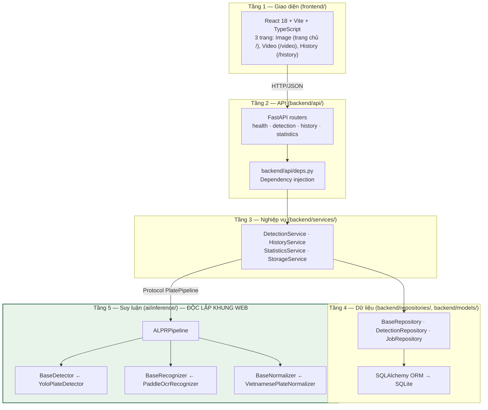
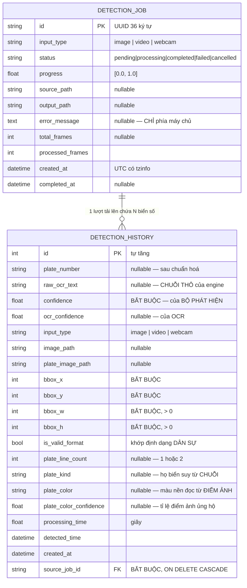
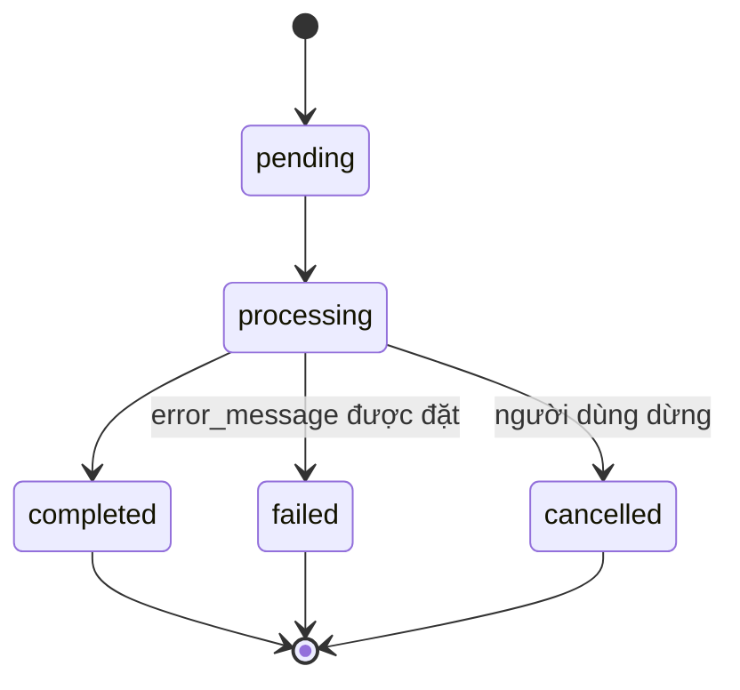

# Sổ tay kỹ thuật — Hệ thống nhận dạng biển số xe Việt Nam ứng dụng AI

**Đối tượng đọc:** lập trình viên tiếp quản và bảo trì hệ thống.
**Phiên bản tài liệu:** 1.2 — 2026-07-20 (bổ sung phân loại loại biển và màu biển: mục 8.4, 8.5 và ba cột mới ở mục 6).
**Kho mã:** `d:/DATN`.

> **Cách đọc tài liệu này.** Sổ tay kỹ thuật *không* lặp lại phần luận chứng thiết kế. Mọi câu hỏi dạng "vì sao lại thiết kế như vậy" được trả lời trong [`docs/architecture/system-architecture.md`](../architecture/system-architecture.md); mọi câu hỏi dạng "yêu cầu nào bắt buộc điều đó" được trả lời trong [`docs/00-requirements/`](../00-requirements/). Tài liệu này trả lời câu hỏi *"tôi phải làm gì để hệ thống chạy được, và tôi không được phá vỡ điều gì"*.
>
> **Cảnh báo về tình trạng dự án.** Hệ thống **chưa hoàn thiện**. Mô hình chính thức `models/best.pt` **đã huấn luyện xong và đang chạy** (`/health` báo `model_loaded=true`), khối phát hiện đạt cả bốn chỉ tiêu; nhưng **OCR biển hai dòng KHÔNG đạt chỉ tiêu** (NFR-A4/A5/A6 — kết quả thật) và một số chỉ tiêu phi chức năng (P2/P3) chưa đo. Mục [14](#14-lộ-trình-bảo-trì-và-nợ-kỹ-thuật) liệt kê đầy đủ và trung thực phần còn thiếu. Không đọc mục 14 trước khi báo cáo tình trạng hệ thống cho bất kỳ ai.

---

## Mục lục

1. [Tổng quan kiến trúc](#1-tổng-quan-kiến-trúc)
2. [Cấu trúc thư mục](#2-cấu-trúc-thư-mục)
3. [Các ràng buộc kiến trúc bắt buộc giữ](#3-các-ràng-buộc-kiến-trúc-bắt-buộc-giữ)
4. [Thiết lập môi trường phát triển](#4-thiết-lập-môi-trường-phát-triển)
5. [Bảng biến môi trường](#5-bảng-biến-môi-trường)
6. [Cơ sở dữ liệu](#6-cơ-sở-dữ-liệu)
7. [REST API](#7-rest-api)
8. [Đường ống AI](#8-đường-ống-ai)
9. [Bộ dữ liệu](#9-bộ-dữ-liệu)
10. [Huấn luyện mô hình](#10-huấn-luyện-mô-hình)
11. [Kiểm thử](#11-kiểm-thử)
12. [Triển khai bằng Docker](#12-triển-khai-bằng-docker)
13. [Các cạm bẫy đã biết](#13-các-cạm-bẫy-đã-biết)
14. [Lộ trình bảo trì và nợ kỹ thuật](#14-lộ-trình-bảo-trì-và-nợ-kỹ-thuật)

---

## 1. Tổng quan kiến trúc

### 1.1. Năm tầng và chiều phụ thuộc

Hệ thống được tổ chức thành năm tầng. Điều duy nhất cần nhớ là **chiều của mũi tên phụ thuộc**: `backend` được phép dùng `ai`, chiều ngược lại bị cấm và bị kiểm chứng tự động (mục [3.1](#31-ai-không-được-import-fastapipydantic)).



Chi tiết sơ đồ tuần tự cho luồng ảnh và luồng video, sơ đồ ER đầy đủ, cùng tám quyết định kiến trúc `AD-01`…`AD-08` nằm ở [`docs/architecture/system-architecture.md`](../architecture/system-architecture.md) §4, §5, §6.1 và §8. Tài liệu này chỉ trích những quyết định có hệ quả trực tiếp lên thao tác bảo trì.

> **Ghi chú 20/07/2026 — hai đợt thu gọn giao diện trong cùng một ngày.** Tầng 1 nay còn **3 trang**.
>
> **Bảng route hiện hành** (`frontend/src/App.tsx`, cả ba trang nạp trễ bằng `React.lazy` bên trong `Layout`):
>
> | Route | Component | Vai trò |
> |---|---|---|
> | `/` (index) | `ImageDetection` | Nhận dạng ảnh — **trang chủ** |
> | `/video` | `VideoDetection` | Nhận dạng video |
> | `/history` | `History` | Lịch sử và tra cứu |
> | `*` | — | `Navigate` về `/` |
>
> **Đã xoá khỏi `frontend/src/`:**
>
> | Đợt | Tệp / thành phần | Gói npm |
> |:--:|---|---|
> | 1 — gỡ trang Webcam | `pages/WebcamDetection.tsx`, `components/detection/webcam/`, hàm `detectFrame` trong `services/api.ts` | — |
> | 2 — gỡ trang Tổng quan | `pages/Dashboard.tsx`, cả thư mục `components/dashboard/` (10 tệp), `hooks/useApi.ts`, hai hàm `getStatistics` và `getHealth` trong `services/api.ts` | `recharts` |
>
> **Tầng backend không đổi một dòng nào.** Ba endpoint tương ứng vẫn phục vụ, vẫn nằm trong OpenAPI, vẫn có kiểm thử tích hợp:
>
> | Endpoint | Kiểm thử tích hợp |
> |---|---|
> | `POST /api/detect/frame` | `tests/integration/test_api_detection.py` |
> | `GET /api/statistics` | `tests/integration/test_api_statistics.py` |
> | `GET /health` | `tests/integration/test_api_health.py` |
>
> **Không được nói là endpoint đã bị xoá — chúng không bị xoá.** Hệ quả về yêu cầu: FR-3.1/FR-3.4 chuyển M→W ở đợt 1; **FR-4.1 chuyển M→W** (yêu cầu mức Must đầu tiên bị đưa ra khỏi phạm vi) và FR-4.2 chuyển S→W ở đợt 2 — xem `docs/00-requirements/functional-requirements.md`. Bảng đếm MoSCoW mới: 21 Must / 6 Should / 3 Could / 4 Won't trên tổng 34 FR.
>
> **Số liệu build sau đợt 2** (đo 20/07/2026): 48 mô-đun nguồn `.ts`/`.tsx` (trước là 60), `vite build` 1.670 mô-đun trong 2,15 s, gói tải về **328,8 KB** — giảm 55% so với ~730 KB, phần lớn nhờ gỡ `recharts`. Mã nguồn của cả hai trang còn trong lịch sử git.

### 1.2. Điểm hợp thành (composition root)

Toàn hệ thống có **đúng một chỗ** nêu tên lớp cụ thể của bộ phát hiện, bộ đọc ký tự và bộ chuẩn hoá: hàm `build_pipeline` trong [`backend/main.py`](../../backend/main.py). Mọi tầng khác chỉ nhìn thấy giao diện trừu tượng.

Hàm này có ba đường ra, và sự khác nhau giữa chúng là chủ ý:

| Kết quả trả về | Điều kiện | Hành vi |
|---|---|---|
| `ALPRPipeline` | Trọng số tồn tại và các gói phụ thuộc của `ai` đã cài | Đường ống thật; `/health` báo `model_loaded=true` |
| `UnavailablePipeline` | Không tìm thấy trọng số, **hoặc** dựng một thành phần bị lỗi | Tiến trình vẫn khởi động, mọi yêu cầu nhận dạng trả lỗi sạch. **Không bao giờ bịa biển số** |
| `StubPipeline` | **Chỉ khi** đặt tường minh `ALPR_USE_STUB=true` | Sinh kết quả giả, dùng để kiểm thử API và trình diễn giao diện khi chưa có trọng số |

> **Không được sửa `build_pipeline` để rơi về `StubPipeline` khi nạp mô hình thất bại.** Đó là lý do `UnavailablePipeline` tồn tại. Một hệ thống cấu hình sai mà trả về biển số bịa ra một cách thuyết phục là chế độ hỏng nguy hiểm nhất trong toàn bộ dự án: nó *trông giống như thành công*.

---

## 2. Cấu trúc thư mục

```
d:/DATN/
├── ai/                          # Tầng 5 — độc lập hoàn toàn với khung web
│   ├── inference/               # Đường ống suy luận (11 module chức năng
│   │   │                        #   + __init__.py, chạy lúc phục vụ)
│   │   ├── types.py             # BoundingBox, PlateDetection, PlateRecognition,
│   │   │                        #   DetectionResult, PipelineResult — dataclass thuần
│   │   ├── interfaces.py        # BaseDetector, BaseRecognizer, BaseNormalizer (ABC)
│   │   ├── config.py            # InferenceConfig — dataclass, đọc tiền tố ALPR_
│   │   ├── exceptions.py        # ALPRError và 4 lớp con
│   │   ├── plate_rules.py       # PlateKind, mặt nạ vị trí ký tự, clean_text()
│   │   ├── normalizer.py        # VietnamesePlateNormalizer
│   │   ├── plate_color.py       # PlateColor, classify_plate_color() — màu nền
│   │   │                        #   đọc từ điểm ảnh (HSV) — mục 8.4
│   │   ├── two_line.py          # Tách/ghép biển hai dòng, tiền xử lý ảnh cắt
│   │   ├── detector.py          # YoloPlateDetector (Ultralytics YOLO11)
│   │   ├── recognizer.py        # PaddleOcrRecognizer (PP-OCRv5 mobile)
│   │   └── pipeline.py          # ALPRPipeline — điều phối ba giai đoạn
│   ├── training/                # Ngoại tuyến — huấn luyện
│   │   ├── config.py            # TrainingConfig (dataclass) + nạp YAML
│   │   ├── train.py             # Điểm vào huấn luyện, bao quanh Ultralytics
│   │   ├── export.py            # Xuất ONNX / OpenVINO / TorchScript
│   │   └── configs/             # yolo11n_baseline · yolo11n_finetune · yolo11s_escalation
│   ├── evaluation/              # Ngoại tuyến — đo đạc (10 kịch bản)
│   │   ├── evaluate.py          # Đánh giá bộ phát hiện trên tập test
│   │   ├── benchmark_ocr.py     # Độ chính xác và độ trễ tầng OCR
│   │   ├── benchmark_system.py  # Đo E2E đối chiếu các chỉ tiêu NFR-P
│   │   ├── benchmark_cpu.py     # So PyTorch / ONNX / OpenVINO trên chính CPU này
│   │   ├── ocr_accuracy.py      # NFR-A4/A5/A6 — CER và biển đầy đủ trước/sau hậu xử lý
│   │   ├── color_accuracy.py    # Độ chính xác nhận MÀU NỀN — mục 8.4
│   │   ├── plate_type_audit.py  # Kiểm kê phân bố LOẠI BIỂN trong một bộ dữ liệu
│   │   ├── error_analysis.py    # Nhóm và xuất các ca OCR sai để soi bằng mắt
│   │   ├── leak_check.py        # Dò rò rỉ train/test bằng perceptual hash
│   │   └── stress_test.py       # Kiểm thử tải và ngâm (NFR-SC1, NFR-R4)
│   ├── data/schema.py           # Định nghĩa lược đồ bộ dữ liệu
│   └── requirements.txt         # ĐỌC PHẦN CHÚ THÍCH TRƯỚC KHI CÀI — mục 4
│
├── backend/                     # Tầng 2–4
│   ├── core/
│   │   ├── config.py            # Settings (pydantic-settings) — nguồn cấu hình DUY NHẤT
│   │   ├── exceptions.py        # APIError và 5 lớp con → ánh xạ mã HTTP
│   │   └── logging.py           # JsonFormatter, request_id theo ContextVar
│   ├── models/
│   │   ├── detection.py         # DetectionJob, DetectionHistory, UtcDateTime
│   │   └── database.py          # engine, SessionLocal, pragma SQLite
│   ├── schemas/detection.py     # Mô hình Pydantic vào/ra của API
│   ├── repositories/            # BaseRepository[Model, Id] + 2 kho cụ thể
│   ├── services/                # Nghiệp vụ: detection, history, statistics, storage
│   ├── api/
│   │   ├── deps.py              # Các dependency FastAPI (session, pipeline, service)
│   │   └── routes/              # health · detection · history · statistics
│   ├── migrations/              # Alembic: env.py + versions/0001_initial.py
│   │                            #   + versions/0002_plate_kind_and_color.py
│   ├── main.py                  # create_app, lifespan, build_pipeline, exception handler
│   ├── alembic.ini              # KHÔNG chứa sqlalchemy.url — xem mục 6.4
│   ├── requirements.txt         # Chỉ tầng API. Không có torch/ultralytics/paddle
│   └── requirements-inference.txt
│
├── frontend/src/                # Tầng 1 — 48 mô-đun .ts/.tsx
│   ├── types/index.ts           # Kiểu TypeScript ánh xạ 1–1 với schema backend.
│   │                            #   Statistics/StatisticsQuery/HealthStatus/
│   │                            #   InputTypeBreakdown GIỮ có chủ đích — mục 1.1
│   ├── services/api.ts          # Lớp bọc axios. 6 hàm gọi API + exportHistoryUrl + fileUrl
│   ├── hooks/                   # useDebounce · useJobPolling
│   ├── lib/                     # cn · constants · format
│   ├── components/
│   │   ├── ui/                  # 15 thành phần nguyên thuỷ dùng lại
│   │   ├── detection/{image,video}/
│   │   └── history/
│   └── pages/                   # ImageDetection (trang chủ /) · VideoDetection
│                                #   (/video) · History (/history)
│
├── scripts/
│   ├── dataset/                 # 11 script + run_pipeline.py điều phối — mục 9
│   ├── labeling/                # extract_plates.py, label_tool.py
│   └── benchmark_*.py           # Đo overhead API và truy vấn lịch sử
│
├── tests/                       # 913 test được thu thập — mục 11
│   ├── test_architecture.py     # ⚠ Thi hành tự động NFR-M1 và NFR-M4
│   ├── test_*.py                # Đơn vị: detector, normalizer, pipeline, plate_rules…
│   ├── backend/                 # Kho dữ liệu, schema, dịch vụ lưu trữ
│   └── integration/             # 4 tệp, chạy qua TestClient với pipeline giả
│
├── datasets/                    # raw/ · processed/ · annotations/ · statistics/ · reports/
├── models/                      # Trọng số. best.pt (chính thức) đã có — mAP@0.5 = 0,9829
├── runs/                        # Kết quả các lượt huấn luyện Ultralytics
├── data/                        # Lưu trữ lúc chạy: alpr.db, uploads/, plates/, outputs/
├── deployment/docker/           # Dockerfile.backend, Dockerfile.frontend, nginx.conf
├── docker-compose.yml
├── docs/                        # Toàn bộ tài liệu — xem docs/papers/THESIS-README.md
├── .coveragerc · pytest.ini · conftest.py
├── .env / .env.example          # .env CHỨA KHOÁ THẬT, đã nằm trong .gitignore
└── CLAUDE.md · README.md
```

**Ba thư mục ảo Python** (`.venv-ai`, `.venv-ocr`, `backend/.venv`) nằm ngay trong kho mã và bị `.gitignore` loại trừ. Lý do phải tách làm ba được trình bày ở mục [4.1](#41-ba-môi-trường-ảo-và-lý-do-phải-tách).

---

## 3. Các ràng buộc kiến trúc bắt buộc giữ

> Đây là mục quan trọng nhất của sổ tay. Bốn ràng buộc dưới đây **có kiểm chứng tự động**; phá vỡ chúng làm hỏng bộ kiểm thử ngay lập tức. Mục này không chỉ nêu quy tắc mà nêu **hậu quả cụ thể nếu vi phạm**, vì một quy tắc không kèm hậu quả sẽ bị bỏ qua ngay lần đầu nó gây bất tiện.

### 3.1. `ai/` không được import FastAPI/Pydantic

**Nội dung ràng buộc (NFR-M1).** Không tệp `.py` nào dưới `ai/` được import `fastapi`, `pydantic`, `pydantic_settings` hay `starlette`. Riêng `ai/inference/` còn nghiêm hơn: cấm thêm `sqlalchemy` và `backend`.

**Cách kiểm chứng tự động.** Tệp [`tests/test_architecture.py`](../../tests/test_architecture.py) thi hành ràng buộc bằng **ba tầng kiểm tra độc lập**:

| Lớp kiểm thử | Cơ chế | Bắt được điều gì |
|---|---|---|
| `TestAiPackageHasNoFrameworkImports` | Quét văn bản nguồn bằng biểu thức chính quy `_IMPORT_PATTERN`, chỉ khớp **câu lệnh import viết thường** | Import trực tiếp. Cố ý không khớp tên sản phẩm viết hoa trong docstring, để phần văn xuôi *giải thích* ràng buộc không bị nhầm là *vi phạm* ràng buộc |
| `TestImportingAiDoesNotLoadTheFramework` | Chạy `import ai.inference` trong **một tiến trình Python mới** rồi soi `sys.modules` | Import **bắc cầu** — một module trong `ai` import một hàm tưởng vô hại mà chính hàm đó kéo khung web vào |
| `test_the_pipeline_can_be_built_from_fakes_without_an_ml_runtime` | Dựng `ALPRPipeline` từ ba lớp giả, kiểm tra `ultralytics`/`paddleocr`/`torch` **không** có trong `sys.modules` | Phụ thuộc ngầm vào runtime học máy |

Chạy riêng nhóm này:

```bash
pytest tests/test_architecture.py -v
```

**Vì sao phải dùng tiến trình con.** Cách kiểm tra hiển nhiên — `import ai.inference` rồi nhìn `sys.modules` ngay trong bộ kiểm thử — là **vô giá trị**, vì các test tích hợp đã import `backend` và nạp FastAPI vào `sys.modules` trước khi tệp này chạy. Phép quan sát chỉ có nghĩa trong một thông dịch viên sạch. Không được "đơn giản hoá" tiến trình con này.

**Hậu quả nếu vi phạm.**

1. `ai/` không còn dùng được trong notebook, script benchmark hay runtime Colab không cài server — mà đó chính là nơi `ai/training/` và `ai/evaluation/` phải chạy.
2. Ảnh Docker của backend không còn tách được: hiện `backend/requirements.txt` **không** liệt kê `torch`/`ultralytics`/`paddleocr`, nên backend cài và kiểm thử được mà không kéo theo hàng gigabyte bánh xe CUDA. Một dòng `import pydantic` trong `ai/` không phá điều này ngay, nhưng một dòng `import backend` trong `ai/inference/` thì có: hai gói trở thành một khối vòng tròn.
3. Yêu cầu NFR-M1 là **ràng buộc cứng lấy từ `CLAUDE.md`**, không phải khuyến nghị.

**Ngoại lệ duy nhất, và điều kiện của nó.** `ai/evaluation/stress_test.py` *phải* import `backend` và `sqlalchemy`, vì nó đo chính lược đồ đó (NFR-P6, truy vấn lịch sử trên 10.000 bản ghi). Điều giữ cho ngoại lệ này không thành vi phạm là các import nằm **bên trong hàm**, nên chỉ import module thì không kéo theo gì. Test `test_the_evaluation_harness_keeps_its_backend_imports_function_local` ghim đúng điều kiện đó: dời một import lên đầu tệp sẽ làm test đỏ.

> **Lưu ý về `pip freeze`.** `pydantic` vẫn xuất hiện trong `.venv-ai` như phụ thuộc **bắc cầu** của `albumentations`, và trong `.venv-ocr` như phụ thuộc bắc cầu của `paddlex`. Điều đó không vi phạm gì: quy tắc là *không module nào dưới `ai/` được `import pydantic`*, chứ không phải *bánh xe đó phải vắng mặt*.

### 3.2. Không hard-code đường dẫn

**Nội dung ràng buộc (NFR-M4).** Không module nào trong `ai/` hay `backend/` được viết đường dẫn tuyệt đối dưới dạng chuỗi hằng. Mọi đường dẫn phải đi qua cấu hình.

**Hai gốc neo, cả hai suy ra từ `__file__`:**

```python
# ai/inference/config.py
PROJECT_ROOT: Path = Path(__file__).resolve().parents[2]

# backend/core/config.py
PROJECT_ROOT: Final[Path] = Path(__file__).resolve().parents[2]
```

**Quy tắc phân giải trong `Settings._resolve_paths`** (chạy sau khi mọi trường đã có giá trị, vì validator cấp trường không nhìn thấy trường anh em):

| Trường | Neo vào |
|---|---|
| `storage_root`, `model_path` | `PROJECT_ROOT` |
| `upload_dir`, `plate_dir`, `output_dir` | `storage_root` |
| `database_url` (chỉ khi là SQLite tệp) | `PROJECT_ROOT`, qua `_anchor_sqlite_url` |

**Cách kiểm chứng tự động.** Lớp `TestNoHardCodedPaths` trong `tests/test_architecture.py` quét mọi tệp `.py` dưới `ai/` và `backend/` (bỏ qua `__pycache__`, `migrations`, `.venv`) tìm mẫu `["'](?:[A-Za-z]:[\\/]|/(?:home|Users|mnt|opt|var)/)`. Một test thứ hai khẳng định cả hai module cấu hình đều chứa chuỗi `Path(__file__).resolve().parents`.

**Hậu quả nếu vi phạm.**

* Cùng một mã sẽ không chạy đồng thời trên máy phát triển Windows, trong ảnh Docker Linux và trên runtime Colab — chính là ba môi trường dự án bắt buộc phải hỗ trợ.
* Trường hợp nguy hiểm nhất là `database_url` tương đối. `sqlite:///./data/alpr.db` được phân giải theo **thư mục làm việc**, nên `uvicorn` chạy từ `backend/` và Alembic chạy từ gốc kho sẽ **mở hai tệp cơ sở dữ liệu khác nhau**. Triệu chứng không phải là lỗi cấu hình mà là *dữ liệu biến mất* — một trong những lỗi tốn thời gian nhất để truy nguyên. Hàm `_anchor_sqlite_url` loại bỏ khả năng đó.

### 3.3. Detector / Recognizer / Normalizer phải đứng sau abstract base class

**Nội dung ràng buộc (NFR-M5).** Ba giai đoạn của đường ống chỉ được truy cập qua ba lớp trừu tượng trong [`ai/inference/interfaces.py`](../../ai/inference/interfaces.py):

| Giai đoạn | Hợp đồng | Hiện thực tham chiếu |
|---|---|---|
| Định vị biển số | `BaseDetector` | `YoloPlateDetector` (YOLO11) |
| Đọc ký tự | `BaseRecognizer` | `PaddleOcrRecognizer` (PP-OCRv5 mobile) |
| Sửa lỗi và kiểm định dạng | `BaseNormalizer` | `VietnamesePlateNormalizer` (quy tắc regex) |

`ALPRPipeline.__init__` nhận cả ba qua tham số, không tự dựng cái nào. Ở phía backend, `DetectionService` thậm chí không biết tới `ALPRPipeline`: nó nhận một đối tượng thoả `Protocol` tên `PlatePipeline` (định nghĩa trong `backend/services/detection_service.py`), yêu cầu đúng ba thành viên `name`, `is_ready`, `process`.

**Vì sao tách `BaseRecognizer` khỏi `BaseNormalizer`.** Bộ đọc ký tự trả về **chuỗi thô**; bộ chuẩn hoá sửa nó. Hai kết quả được lưu vào hai cột riêng (`raw_ocr_text` và `plate_number`), nhờ vậy đóng góp của bước hậu xử lý **đo được** bằng cách so hai cột — đúng phép so mà NFR-A5 và NFR-A6 yêu cầu. Nếu gộp hai giai đoạn, bằng chứng đó bị xoá vĩnh viễn ngay lúc ghi.

**Hậu quả nếu vi phạm.**

* Thay PaddleOCR bằng EasyOCR đáng lẽ chỉ là *viết một lớp con mới của `BaseRecognizer` và đổi một dòng trong `build_pipeline`*. Nếu một service hoặc router chạm thẳng vào `PaddleOcrRecognizer`, thao tác đó lan ra toàn bộ tầng API và NFR-M5 mất hiệu lực.
* Việc này **không phải giả định**: kết quả khảo sát Phase 1 ghi nhận **không có bằng chứng công khai nào** cho thấy PaddleOCR vượt EasyOCR trên ảnh biển số, và phép so sánh tái lập được duy nhất tìm thấy lại nghiêng về EasyOCR (xem [`docs/reports/01-ocr-comparison.md`](../reports/01-ocr-comparison.md)). PaddleOCR ở đây là **đường cơ sở, không phải kết luận**. Khả năng thay thế là con đường thoát đã được tính trước, không phải tính năng trang trí.
* Test `test_the_pipeline_can_be_built_from_fakes_without_an_ml_runtime` sẽ đỏ ngay nếu `ALPRPipeline` tự với tay lấy một engine cụ thể.

### 3.4. Ngoại lệ: `ai/` chỉ ném các kiểu trong `ai/inference/exceptions.py`

Mọi hiện thực của ba giao diện trên chỉ được ném `ALPRError` hoặc một trong bốn lớp con: `ModelLoadError`, `DetectionError`, `RecognitionError`, `InvalidImageError`. Tầng backend bắt các kiểu này và dịch sang `APIError` (`backend/core/exceptions.py`), từ đó ra mã HTTP và thông điệp tiếng Việt cho người dùng.

**Hậu quả nếu vi phạm.** Một ngoại lệ lạ lọt qua tầng dịch sẽ rơi vào handler tổng, trả HTTP 500 với thông điệp chung chung, và người vận hành mất thông tin phân loại lỗi — trong khi NFR-R1 đòi 100% lỗi phải được bắt và xử lý.

---

## 4. Thiết lập môi trường phát triển

### 4.1. Ba môi trường ảo và lý do phải tách

Dự án dùng **ba** môi trường ảo Python. Đây không phải sự lộn xộn tích tụ mà là hệ quả trực tiếp của một xung đột phụ thuộc thật.

| Môi trường | Dùng cho | Gói then chốt |
|---|---|---|
| `.venv-ai` | Huấn luyện, đánh giá, xử lý bộ dữ liệu | `torch==2.13.0+cpu`, `torchvision==0.28.0+cpu`, `ultralytics==8.4.101`, `opencv-python==5.0.0.93`, `numpy==2.4.4`, `albumentations`, `imagehash` |
| `.venv-ocr` | Chạy và benchmark tầng OCR | `paddlepaddle==3.3.1`, `paddleocr==3.7.0`, `paddlex==3.7.2`, `opencv-python==4.10.0.84`, `opencv-contrib-python==4.10.0.84`, `numpy==2.3.5` |
| `backend/.venv` | Chạy API, chạy **đường ống suy luận thật** và bộ kiểm thử | `fastapi`, `uvicorn[standard]`, `pydantic`, `pydantic-settings`, `sqlalchemy`, `alembic`, cộng toàn bộ ngăn xếp ML: `torch==2.13.0+cpu`, `ultralytics==8.4.101`, `paddleocr==3.7.0`, `opencv-python==4.10.0.84`, `opencv-contrib-python==4.10.0.84`, `numpy==2.3.5` |

**Lý do tách `.venv-ocr` khỏi `.venv-ai`.** Cài `paddleocr` vào `.venv-ai` gây **hai tác dụng phụ không chấp nhận được**:

1. **Nó hạ cấp `numpy`** từ `2.4.4` xuống `2.3.5`.
2. **Nó kéo theo `opencv-contrib-python`**, gói này dùng chung không gian tên `cv2` với `opencv-python` đã ghim ở trên.

Không được phép để một trong hai điều đó xảy ra trong khi một lượt huấn luyện YOLO11n đang dùng `.venv-ai`. Vì vậy tầng OCR có môi trường riêng.

> **CẢNH BÁO — xung đột `cv2`.**
> Đây là cạm bẫy tốn thời gian nhất khi dựng lại môi trường. Có tới **ba** gói cùng cài vào không gian tên `cv2`: `opencv-python`, `opencv-python-headless` (do `ultralytics` kéo theo bắc cầu) và `opencv-contrib-python` (do `paddleocr` kéo theo).
>
> **Cách khắc phục đã áp dụng:** ghim **cùng một phiên bản** cho các gói cùng tồn tại, để `import cv2` luôn phân giải nhất quán. Trong `.venv-ai`, `opencv-python` và `opencv-python-headless` cùng ở `5.0.0.93`. Trong `.venv-ocr`, `opencv-contrib-python` được ghim ở `4.10.0.84` — **cố ý trùng phiên bản** với `opencv-python==4.10.0.84`.
>
> **Nếu `import cv2` vẫn giở chứng** (thiếu hàm, `AttributeError`, lỗi symbol khi nạp), hãy **gỡ TẤT CẢ các gói opencv rồi cài lại đúng một gói**:
> ```bash
> python -m pip uninstall -y opencv-python opencv-python-headless opencv-contrib-python
> python -m pip install --force-reinstall opencv-python==5.0.0.93
> ```
> Trong `.venv-ocr`, nếu buộc phải có `opencv-contrib-python` thì cài **cả hai gói ở cùng số phiên bản** bằng `--force-reinstall`, đừng để pip tự chọn.

> **CẢNH BÁO — `paddlepaddle 3.3.1` bắt buộc `enable_mkldnn=False`.**
> Với `paddlepaddle==3.3.1` trên Windows/CPU, chạy mô hình phát hiện văn bản PP-OCRv5 qua đường oneDNN (MKL-DNN) **làm sập tiến trình**:
> ```
> NotImplementedError: (Unimplemented) ConvertPirAttribute2RuntimeAttribute
> not support [pir::ArrayAttribute<pir::DoubleAttribute>]
> (at ..\paddle\fluid\framework\new_executor\instruction\onednn\onednn_instruction.cc:118)
> ```
> Đây là lỗi của Paddle ở khâu chuyển đổi thuộc tính PIR sang oneDNN, không phải lỗi mô hình hay lỗi ảnh đầu vào. Mã nguồn đã xử lý bằng hằng số `DEFAULT_ENABLE_MKLDNN = False` trong [`ai/inference/recognizer.py`](../../ai/inference/recognizer.py), truyền vào `PaddleOCR(..., enable_mkldnn=self._enable_mkldnn)`.
> **Cờ này không phải tuỳ chọn.** Nếu bật lại, tiến trình sẽ sập ngay lần gọi OCR đầu tiên. Chỉ bật lại sau khi lỗi thượng nguồn được sửa, và phải đo lại — đây thuần tuý là núm hiệu năng, không ảnh hưởng độ chính xác.

**Lý do `torch` phải là bản `+cpu`.** Máy đích không có GPU CUDA (quyết định `AD-06`). Nếu để pip tự chọn, nó lấy bánh xe CUDA từ PyPI: vài gigabyte và hoàn toàn vô dụng. Hậu tố phiên bản cục bộ `+cpu` trong `ai/requirements.txt` là thứ *bảo đảm* điều đó — phiên bản `2.13.0+cpu` không tồn tại trên PyPI, nên pip buộc phải phân giải qua chỉ mục CPU khai báo bằng `--extra-index-url`. **Không được bỏ hậu tố `+cpu`.** Cũng không được đổi `--extra-index-url` thành `--index-url`: dạng số ít **thay thế** PyPI hoàn toàn, mà chỉ mục PyTorch không chứa `ultralytics`, `albumentations`…

### 4.2. Trình tự cài đặt

```bash
# --- 0. Yêu cầu: Python 3.13, Node >= 18, Git ---
python --version            # 3.13.x
node --version              # >= 18.0.0  (bắt buộc, khai trong frontend/package.json engines)

# --- 1. Môi trường AI (huấn luyện + đánh giá + dữ liệu) ---
python -m venv d:/DATN/.venv-ai
d:/DATN/.venv-ai/Scripts/python.exe -m pip install --upgrade pip setuptools wheel
d:/DATN/.venv-ai/Scripts/python.exe -m pip install -r d:/DATN/ai/requirements.txt
# Kiểm tra nhanh — cuda=False LÀ ĐÚNG trên máy này:
d:/DATN/.venv-ai/Scripts/python.exe -c "import torch; print(torch.__version__, torch.cuda.is_available())"
# Kỳ vọng: 2.13.0+cpu False
# Dung lượng: venv này khoảng 1,25 GB (riêng torch ~1 GB kể cả bản CPU trên Windows)

# --- 2. Môi trường OCR (TÁCH RIÊNG — xem cảnh báo mục 4.1) ---
python -m venv d:/DATN/.venv-ocr
d:/DATN/.venv-ocr/Scripts/python.exe -m pip install --upgrade pip setuptools wheel
d:/DATN/.venv-ocr/Scripts/python.exe -m pip install \
    paddlepaddle==3.3.1 paddleocr==3.7.0 opencv-python==4.10.0.84 pytest==9.1.1

# --- 3. Môi trường backend ---
python -m venv d:/DATN/backend/.venv
d:/DATN/backend/.venv/Scripts/python.exe -m pip install --upgrade pip
d:/DATN/backend/.venv/Scripts/python.exe -m pip install -r d:/DATN/backend/requirements.txt
# BẮT BUỘC nếu muốn chạy đường ống nhận dạng THẬT (không phải stub):
# tệp này bổ sung torch / ultralytics / paddleocr. Bỏ qua bước này thì
# build_pipeline sẽ cài UnavailablePipeline và /health báo model_loaded=false.
d:/DATN/backend/.venv/Scripts/python.exe -m pip install -r d:/DATN/backend/requirements-inference.txt

# --- 4. Cấu hình ---
cp .env.example .env        # rồi điền khoá API nếu cần tải bộ dữ liệu

# --- 5. Cơ sở dữ liệu ---
d:/DATN/backend/.venv/Scripts/python.exe -m alembic -c backend/alembic.ini upgrade head

# --- 6. Chạy backend (từ thư mục gốc d:/DATN) ---
d:/DATN/backend/.venv/Scripts/python.exe -m uvicorn backend.main:app --port 8000
# Swagger: http://localhost:8000/docs

# --- 7. Frontend ---
cd frontend && npm install && npm run dev
# Giao diện: http://localhost:5173
```

**Ghi chú về Node.** `frontend/package.json` khai `"engines": { "node": ">=18" }`. Vite 5 và bộ công cụ TypeScript 5.6 không hỗ trợ Node cũ hơn. Kịch bản `npm run build` chạy `tsc --noEmit && vite build`, nghĩa là **lỗi kiểu TypeScript làm hỏng bản dựng** — đó là chủ ý.

**Tách môi trường là tạm thời.** Ghi chú trong `ai/requirements.txt` nêu rõ: sau khi huấn luyện xong, `.venv-ai` và `.venv-ocr` nên được hợp nhất, và các ghim `numpy`/`opencv` thương lượng lại theo yêu cầu của `paddleocr` tại thời điểm đó. Việc này nằm trong danh sách nợ kỹ thuật (mục [14](#14-lộ-trình-bảo-trì-và-nợ-kỹ-thuật)).

---

## 5. Bảng biến môi trường

Tất cả biến dùng **một tiền tố duy nhất `ALPR_`**. Hai module cấu hình — `backend/core/config.py` (lớp `Settings`, dựa trên `pydantic-settings`) và `ai/inference/config.py` (lớp `InferenceConfig`, dataclass thuần) — là **hai kiểu riêng biệt cố ý chia sẻ chung một hợp đồng môi trường**. Chúng phải là hai kiểu riêng vì `ai/` không được import Pydantic (mục 3.1). Kết quả: **một tệp `.env` cấu hình cả hai tầng, không giá trị nào phải khai hai lần**.

Thứ tự ưu tiên trong `Settings`: (1) tham số từ khoá tường minh — dùng trong test; (2) biến môi trường `ALPR_<TÊN_TRƯỜNG>` viết hoa; (3) cùng biến đó trong `.env`; (4) giá trị mặc định của trường. Biến rỗng được coi là **chưa đặt** (`env_ignore_empty=True`), nên một dòng `ALPR_DEVICE=` sót lại trong profile shell không thể âm thầm xoá trắng thiết lập.

Vị trí tệp `.env` được tìm: `<gốc>/.env` rồi `<gốc>/backend/.env`.

> **⚠ CẠM BẪY — `backend/.env` THẮNG `<gốc>/.env`.**
> Khai báo là `env_file=(PROJECT_ROOT / ".env", PROJECT_ROOT / "backend" / ".env")`. Trong `pydantic-settings`, khi truyền nhiều tệp thì **tệp đứng SAU thắng**. Vì vậy một biến khai trong `backend/.env` **ghi đè lặng lẽ** cùng biến đó trong `.env` ở gốc kho.
>
> Đây không phải giả thuyết. Đã có lúc `<gốc>/.env` trỏ một bản xuất OpenVINO còn `backend/.env` trỏ mô hình đối chứng `baseline-416-v1.pt`, và **giá trị thực sự có hiệu lực là cái sau** — người sửa `.env` ở gốc để chuyển sang OpenVINO thấy **không có gì thay đổi**, và không một cảnh báo nào được phát ra.
>
> Tình trạng kho hiện tại (kiểm chứng 13/08/2026): **cả hai tệp cùng trỏ `models/best.pt`**, nên cạm bẫy đang không lộ ra. Nó vẫn còn nguyên đó — chỉ cần một người sửa đúng một tệp là tái hiện.
>
> ```
> $ backend/.venv/Scripts/python.exe -c "from backend.core.config import get_settings; print(get_settings().model_path)"
> D:\DATN\models\best.pt
> ```
>
> **Cách xác minh trước khi kết luận** — luôn in ra giá trị hiệu lực thay vì đọc tệp `.env`:
> ```bash
> backend/.venv/Scripts/python.exe -c "from backend.core.config import get_settings; \
>     s = get_settings(); print(s.model_path, s.device, s.imgsz)"
> ```
> **Khuyến nghị:** giữ **một** tệp `.env` duy nhất ở gốc kho, và xoá `backend/.env` nếu không có lý do rõ ràng để nó tồn tại.

### 5.1. Biến dùng chung cho cả hai tầng

| Biến | Kiểu | Mặc định | `Settings` | `InferenceConfig` | Ý nghĩa |
|---|---|---|---|:---:|---|
| `ALPR_MODEL_PATH` | đường dẫn | `models/best.pt` | `model_path` | `model_path` | Trọng số bộ phát hiện. Đường dẫn tương đối neo vào **gốc kho**, không phải thư mục làm việc. Chấp nhận **tệp** `.pt`/`.onnx`/`.torchscript` **hoặc thư mục** mô hình OpenVINO — xem mục [13.10](#1310--build_pipeline-từ-chối-thư-mục-openvino-mà-detector-lại-chấp-nhận) trước khi trỏ vào thư mục |
| `ALPR_DEVICE` | chuỗi | `cpu` | `device` | `device` | `cpu` hoặc `cuda`. Mặc định `cpu` theo `AD-06` |
| `ALPR_CONF_THRESHOLD` | số thực `[0,1]` | `0.25` | `conf_threshold` | `conf_threshold` | Ngưỡng độ tin cậy tối thiểu để giữ một hộp |
| `ALPR_IOU_THRESHOLD` | số thực `[0,1]` | `0.45` | `iou_threshold` | `iou_threshold` | Ngưỡng IoU cho non-maximum suppression |
| `ALPR_IMGSZ` | số nguyên | `640` | `imgsz` | `imgsz` | Kích thước đầu vào vuông. **Bắt buộc là bội số dương của 32** — kiến trúc YOLO hạ mẫu 32 lần; giá trị khác sẽ bị thay đổi kích thước ngầm, nghĩa là con số cấu hình không phải con số thực sự dùng |

### 5.2. Biến chỉ tầng suy luận (`InferenceConfig.from_env`)

| Biến | Kiểu | Mặc định | Trường | Ý nghĩa |
|---|---|---|---|---|
| `ALPR_OCR_LANG` | chuỗi | `en` | `ocr_lang` | Mã ngôn ngữ cho engine OCR. Biển Việt Nam chỉ có chữ Latin và chữ số nên `en` vừa đúng vừa nhanh hơn mô hình đa ngữ. Tra trong `RECOGNITION_MODEL_BY_LANG` (`en` → `en_PP-OCRv5_mobile_rec`, `ch` → `PP-OCRv5_mobile_rec`) |
| `ALPR_OCR_USE_GPU` | bool | `false` | `ocr_use_gpu` | Cho phép engine OCR dùng GPU |
| `ALPR_TWO_LINE_ASPECT_RATIO` | số thực > 0 | `2.5` | `two_line_aspect_ratio_threshold` | Tỉ lệ rộng/cao dưới ngưỡng này thì ảnh cắt được coi là **biển hai dòng** và bị tách trước khi OCR |

Giá trị bool chấp nhận `1/true/yes/on` và `0/false/no/off`, không phân biệt hoa thường. Giá trị số hỏng **ném `ValueError` ngay** thay vì âm thầm về mặc định — che giấu lỗi gõ trong cấu hình triển khai còn tệ hơn là sập.

### 5.3. Biến chỉ tầng backend (`Settings`)

| Biến | Kiểu | Mặc định | Ý nghĩa và ghi chú |
|---|---|---|---|
| `ALPR_APP_NAME` | chuỗi | `Vietnamese ALPR API` | Tên hiển thị trên Swagger và `/health` |
| `ALPR_APP_VERSION` | chuỗi | `0.1.0` | Chuỗi phiên bản do `/health` báo |
| `ALPR_DEBUG` | bool | `false` | Bật SQL echo và log chi tiết phía máy chủ. **Không đổi thứ người dùng nhìn thấy** — thông điệp lỗi vẫn mờ đục theo NFR-S4 |
| `ALPR_API_PREFIX` | chuỗi | `/api` | Tiền tố gắn trước mọi router **trừ** `/health` |
| `ALPR_DATABASE_URL` | chuỗi | `sqlite:///./data/alpr.db` | URL SQLAlchemy. Đường dẫn SQLite tương đối được **viết lại thành tuyệt đối** lúc khởi tạo |
| `ALPR_STORAGE_ROOT` | đường dẫn | `data` | Neo vào `PROJECT_ROOT` |
| `ALPR_UPLOAD_DIR` | đường dẫn | `uploads` | Neo vào `storage_root` |
| `ALPR_PLATE_DIR` | đường dẫn | `plates` | Neo vào `storage_root` |
| `ALPR_OUTPUT_DIR` | đường dẫn | `outputs` | Neo vào `storage_root` |
| `ALPR_MAX_IMAGE_SIZE_MB` | số nguyên > 0 | `10` | Trần kích thước ảnh tải lên |
| `ALPR_MAX_VIDEO_SIZE_MB` | số nguyên > 0 | `200` | Trần kích thước video tải lên |
| `ALPR_ALLOWED_IMAGE_TYPES` | danh sách | `image/jpeg, image/png, image/webp, image/bmp` | Kiểm bằng **magic bytes**, không tin phần mở rộng (NFR-S1) |
| `ALPR_ALLOWED_VIDEO_TYPES` | danh sách | `video/mp4, video/x-msvideo, video/quicktime, video/x-matroska` | Như trên |
| `ALPR_CORS_ORIGINS` | danh sách | `http://localhost:5173, http://127.0.0.1:5173` | **Từ chối `*`** ngay lúc khởi động (NFR-S4). Danh sách rỗng cũng bị từ chối |
| `ALPR_FRAME_STRIDE` | số nguyên > 0 | `5` | Xử lý mỗi khung thứ N của video. Tăng lên nhanh tỉ lệ thuận, đổi lại có thể bỏ sót biển chỉ xuất hiện thoáng qua |
| `ALPR_USE_STUB` | bool | `false` | **Cài đặt đường ống bịa kết quả.** Chỉ bật tường minh — xem mục 1.2 |
| `ALPR_LOG_LEVEL` | chuỗi | `INFO` | Một trong `CRITICAL/ERROR/WARNING/INFO/DEBUG/NOTSET`, tự chuẩn hoá viết hoa |

> **Về các trường danh sách.** Kiểu `StringList = Annotated[list[str], NoDecode]` tồn tại để chặn một lỗi khó chịu. Không có `NoDecode`, `pydantic-settings` chạy `json.loads` trên trường kiểu danh sách **trước khi** validator chạy, nên dòng `.env` tự nhiên nhất — `ALPR_CORS_ORIGINS=http://localhost:5173,http://127.0.0.1:5173` — ném `JSONDecodeError` lúc khởi động. Tệ hơn: cùng giá trị đó truyền qua **tham số từ khoá** lại hoạt động, vì nguồn init không giải mã. Nghĩa là một unit test dựng `Settings(cors_origins="a,b")` sẽ **xanh** trong khi dịch vụ triển khai **từ chối khởi động**.

### 5.4. Biến của frontend

Chỉ biến bắt đầu bằng `VITE_` mới được đưa vào bundle trình duyệt. Khai trong `frontend/.env` (mẫu) hoặc `.env.local`.

| Biến | Mặc định | Ý nghĩa |
|---|---|---|
| `VITE_API_BASE_URL` | `/api` | Giữ mặc định khi chạy `npm run dev` — Vite proxy sang `http://localhost:8000` |
| `VITE_API_TIMEOUT_MS` | `60000` | Suy luận chạy trên CPU nên một ảnh có thể mất vài giây. **Không đặt quá thấp** |

### 5.5. Biến không thuộc ứng dụng

`.env` còn chứa khoá cho các script tải bộ dữ liệu: `ROBOFLOW_API_KEY`, `KAGGLE_USERNAME`, `KAGGLE_KEY`, `HF_TOKEN`. Tệp `.env` **chứa khoá thật và đã nằm trong `.gitignore`**; `.env.example` chỉ chứa tên biến và **được** commit. Script tải dữ liệu tự che credential trong log nên khoá không rò ra tệp log kể cả khi bật `--verbose`.

---

## 6. Cơ sở dữ liệu

### 6.1. Sơ đồ ER



`detection_history` có **21 cột**, `detection_job` có **11 cột** — đã kiểm chứng sau khi chạy `alembic upgrade head`.

**Lịch sử lược đồ:**

| Revision | Ngày | Thay đổi | Số cột `detection_history` |
|---|---|---|---|
| `0001_initial` | 2026-07-19 | Tạo cả hai bảng | 18 |
| `0002_plate_kind_and_color` | 2026-07-20 | `+ plate_kind`, `+ plate_color`, `+ plate_color_confidence` | **21** |

### 6.2. Bảng `detection_job`

Một `job` là **một lượt tải lên hoặc một phiên thu hình**, và là đơn vị mà thống kê "hệ thống được dùng bao nhiêu" đếm.

| Cột | Kiểu | Ràng buộc | Ghi chú |
|---|---|---|---|
| `id` | `String(36)` | PK, mặc định `uuid4()` | **UUID chứ không phải số tự tăng**: định danh này được trả cho client và dùng trong tên tệp sinh ra; một số tuần tự đoán được sẽ cho phép người này liệt kê tệp tải lên của người khác (`AD-08`, NFR-S2) |
| `input_type` | `String(16)` | `NOT NULL`, `CHECK IN ('image','video','webcam')` | |
| `status` | `String(16)` | `NOT NULL`, `CHECK IN (5 giá trị)`, mặc định `pending` | Xem vòng đời bên dưới |
| `progress` | `Float` | `NOT NULL`, `CHECK 0.0 ≤ progress ≤ 1.0` | Cho thanh tiến độ |
| `source_path` | `String(512)` | nullable | Nơi lưu tệp tải lên |
| `output_path` | `String(512)` | nullable | Ảnh đã vẽ chú giải hoặc video đã xử lý |
| `error_message` | `Text` | nullable | **Chỉ phía máy chủ.** Không bao giờ trả nguyên văn cho người dùng |
| `total_frames` | `Integer` | nullable | `NULL` khi chưa biết hoặc không áp dụng |
| `processed_frames` | `Integer` | `NOT NULL`, mặc định `0` | |
| `created_at` | `UtcDateTime` | `NOT NULL`, mặc định `utcnow()` | |
| `completed_at` | `UtcDateTime` | nullable | Đặt khi vào trạng thái kết thúc |

**Chỉ mục:** `ix_detection_job_input_type`, `ix_detection_job_status`, `ix_detection_job_created_at`.

**Vòng đời trạng thái:**



`pending` là trạng thái riêng biệt với `processing` vì tải video trả `202 Accepted` ngay lập tức (`AD-02`) trong khi worker nền có thể chưa nhận việc. Gộp hai trạng thái sẽ khiến một tác vụ đang xếp hàng không phân biệt được với một tác vụ đã treo. Thuộc tính `JobStatus.is_terminal` là thứ frontend dùng để quyết định khi nào ngừng hỏi tiến độ.

**Một phiên webcam là MỘT job, không phải một job mỗi khung hình.** Các khung đến trong phiên làm tăng `processed_frames` và gắn kết quả vào cùng job đó — nhờ vậy "một lượt sử dụng" có cùng ý nghĩa với cả ba loại đầu vào.

### 6.3. Bảng `detection_history`

Một hàng là **một biển số tìm được trong một job**. Một ảnh chứa ba biển sinh ba hàng cùng `source_job_id`.

| Cột | Kiểu | Ràng buộc | Ghi chú |
|---|---|---|---|
| `id` | `Integer` | PK tự tăng | |
| `plate_number` | `String(32)` | nullable | Chuỗi **đã chuẩn hoá**, ví dụ `51F-12345`. `NULL` khi OCR không đọc được gì |
| `raw_ocr_text` | `String(32)` | nullable | **Chuỗi thô nguyên bản** của engine. Giữ lại để đo đóng góp của bước hậu xử lý — xem mục 3.3 |
| `confidence` | `Float` | `NOT NULL`, `CHECK [0,1]` | Độ tin cậy của **BỘ PHÁT HIỆN** |
| `ocr_confidence` | `Float` | nullable, `CHECK NULL OR [0,1]` | Độ tin cậy của **OCR**. Cột riêng để một lần đọc không chắc không bị nhầm với một lần phát hiện không chắc |
| `input_type` | `String(16)` | `NOT NULL`, `CHECK` 3 giá trị | Phi chuẩn hoá từ job cha để lọc lịch sử không phải join mỗi truy vấn |
| `image_path` | `String(512)` | nullable | Ảnh nguồn, hoặc khung trích từ video |
| `plate_image_path` | `String(512)` | nullable | Ảnh cắt riêng vùng biển số |
| `bbox_x`, `bbox_y` | `Integer` | `NOT NULL` | Góc trên-trái hộp, tính bằng pixel của ảnh nguồn |
| `bbox_w`, `bbox_h` | `Integer` | `NOT NULL`, `CHECK w > 0 AND h > 0` | Kích thước hộp |
| `is_valid_format` | `Boolean` | `NOT NULL`, mặc định `false` | Nghĩa hẹp: khớp định dạng biển **DÂN SỰ**. `false` **đánh dấu** hàng chứ không loại bỏ nó. Biển quân đội trả `false` **có chủ đích** — đọc kèm `plate_kind`, xem mục 8.4 |
| `plate_line_count` | `Integer` | nullable, `CHECK NULL OR IN (1,2)` | Cho phép báo cáo độ chính xác tách riêng biển một dòng và hai dòng |
| `plate_kind` | `String(16)` | nullable, **không có** mặc định | Họ biển suy từ **chuỗi ký tự**: `car`, `motorcycle_new`, `motorcycle_old`, `blue_car`, `blue_motorcycle`, `special`, `diplomatic`, `military`, `unknown`. Thêm ở `0002` |
| `plate_color` | `String(16)` | nullable, **không có** mặc định | Màu nền đọc từ **điểm ảnh**: `white`, `yellow`, `blue`, `red`, `unknown`. Thêm ở `0002` |
| `plate_color_confidence` | `Float` | nullable, **không có** mặc định | Tỉ lệ điểm ảnh đã lấy mẫu ủng hộ `plate_color`. **Không phải xác suất** — là biên độ quyết định dựa vào. Thêm ở `0002` |
| `processing_time` | `Float` | `NOT NULL`, mặc định `0.0` | Giây, gồm cả phát hiện lẫn OCR cho biển này |
| `detected_time` | `UtcDateTime` | `NOT NULL` | Với video, đây là **thời điểm xử lý**, không phải vị trí trong video |
| `created_at` | `UtcDateTime` | `NOT NULL` | |
| `source_job_id` | `String(36)` | `NOT NULL`, FK → `detection_job.id`, `ON DELETE CASCADE` | **Không nullable là chủ ý** |

**Chỉ mục:** `ix_detection_history_plate_number`, `ix_detection_history_detected_time`, `ix_detection_history_input_type`, `ix_detection_history_source_job_id`, và chỉ mục **tổ hợp** `ix_detection_history_input_type_detected_time` — truy vấn mặc định của màn hình lịch sử là "mới nhất trước, có thể lọc theo loại đầu vào", chỉ mục tổ hợp cho phép SQLite thoả cả bộ lọc lẫn thứ tự từ một cấu trúc, và đó là thứ giữ truy vấn phân trang nằm trong ngưỡng NFR-P6.

**Ba cột của `0002` nullable KHÔNG có mặc định — đây là chủ ý.** Những hàng ghi trước migration này thực sự **chưa từng được tính** các giá trị đó; điền một giá trị đoán vào sẽ khiến nó không phân biệt được với một giá trị đo thật, và mọi thống kê theo loại/màu biển về sau sẽ trộn dữ liệu bịa với dữ liệu thật mà không có cách nào tách ra. `NULL` đọc là "chưa ghi nhận", đúng sự thật. Lưu ý về độ dài: `_ENUM_LENGTH = 16` được dùng chung với các cột enum sẵn có; giá trị dài nhất phải lưu là `motorcycle_new` (14 ký tự), tức chỉ còn **hai ký tự dư**. Một họ biển mới có tên dài hơn cần migration riêng — nới hằng số ở một chỗ sẽ làm model và lược đồ lệch nhau.

**Quy tắc nullable duy nhất:** *một lần phát hiện vẫn đáng lưu kể cả khi OCR không đọc được gì*. Đầu ra của bộ phát hiện — hộp và độ tin cậy — luôn có mặt nên các cột đó `NOT NULL`. Mọi cột dẫn xuất từ OCR đều nullable. **Vứt bỏ những hàng đó sẽ xoá đúng những ca thất bại mà chương đánh giá cần đếm, và làm độ chính xác nhận dạng trông hoàn hảo do cách xây dựng.**

**Kiểu `UtcDateTime`.** SQLite không có kiểu datetime bản địa: SQLAlchemy lưu thành chuỗi và định dạng đó **làm mất phần bù UTC**. Giá trị ghi vào là `2026-07-19 12:00:00+00:00` sẽ đọc ra thành `2026-07-19 12:00:00` không có tzinfo — không lỗi, không cảnh báo. Hai hệ quả, không cái nào tự lộ diện: `utcnow() - row.created_at` ném `TypeError`; và khi tuần tự hoá sang JSON, dấu thời gian không tzinfo không có hậu tố `Z` nên trình duyệt đọc là **giờ địa phương** — trên máy UTC+7 mọi dấu thời gian lệch bảy tiếng, đủ hợp lý để không ai nhận ra và đủ sai để vô hiệu hoá mọi phân tích thời gian. `TypeDecorator` này đóng khe hở ở mức kiểu.

### 6.4. Chạy migration

Migration dùng Alembic. **`backend/alembic.ini` cố ý KHÔNG chứa `sqlalchemy.url`**: đặt giá trị ở đó sẽ tạo ra hai nguồn sự thật cho URL cơ sở dữ liệu, vi phạm NFR-M4. URL được `backend/migrations/env.py` lấy từ `Settings`.

```bash
# Từ THƯ MỤC GỐC d:/DATN
backend/.venv/Scripts/python.exe -m alembic -c backend/alembic.ini upgrade head

# Xem revision hiện tại
backend/.venv/Scripts/python.exe -m alembic -c backend/alembic.ini current

# Sinh revision mới sau khi sửa model (LUÔN đọc lại tệp sinh ra trước khi commit)
backend/.venv/Scripts/python.exe -m alembic -c backend/alembic.ini revision --autogenerate -m "mo ta"

# Lùi một bước
backend/.venv/Scripts/python.exe -m alembic -c backend/alembic.ini downgrade -1
```

**Ba quy tắc bắt buộc khi viết migration:**

1. **Migration không được import gì từ `backend`.** Một migration là bản ghi lịch sử của lược đồ tại một thời điểm; nếu nó import model, việc sửa model sẽ *hồi tố* thay đổi hành vi của migration, và phát lại toàn bộ lịch sử từ cơ sở dữ liệu rỗng sẽ không còn tái tạo được lược đồ ban đầu. `0001_initial.py` viết thẳng bằng kiểu SQLAlchemy thuần, dùng `sa.DateTime(timezone=True)` ở chỗ model dùng `UtcDateTime` — vì `impl` của decorator đó chính là kiểu này, nên DDL giống hệt còn phụ thuộc thì không.
2. **Mọi ràng buộc và chỉ mục phải được đặt tên tường minh.** SQLite phải dựng lại bảng để thực hiện hầu hết thao tác `ALTER` (chế độ batch của Alembic), và nó chỉ tái tạo được ràng buộc mà nó gọi tên được. Một `CHECK` không tên sẽ **bị âm thầm loại bỏ** bởi migration đầu tiên thay đổi bảng.
3. **Mọi model phải kế thừa cùng một `Base`.** Alembic autogenerate đọc `Base.metadata`; một model trên `Base` thứ hai sẽ **vô hình** với migration và bảng của nó đơn giản là không bao giờ được tạo.

**Pragma SQLite** được đăng ký trong `backend/models/database.py` cho mọi kết nối, gồm `foreign_keys` (bắt buộc, nếu không thì `ON DELETE CASCADE` không hoạt động), `synchronous=NORMAL` và `busy_timeout`.

### 6.5. ⚠ Quy tắc đếm thống kê theo `source_job_id`

> **Đây là quy tắc dễ làm sai nhất trong toàn bộ hệ thống.** Nó chạy xuyên suốt API và mọi con số trong đáp ứng của `GET /api/statistics`.

**Phát biểu:**

* Mọi thống kê về **hệ thống được dùng bao nhiêu** phải đếm **job riêng biệt**.
* Mọi thống kê về **bao nhiêu biển số được đọc** đếm **hàng** của `detection_history`.

Một ảnh chứa ba xe là **1 lượt sử dụng chứa 3 biển số**, không phải "3 lần nhận dạng". Nhầm hai đại lượng này **thổi phồng con số sử dụng đúng bằng số biển trung bình trên mỗi ảnh**.

**Cách hiện thực đúng, đọc từ mã nguồn:**

```python
# backend/repositories/detection_repository.py :: _count_jobs
# Đếm hàng của detection_job, nơi khoá chính CHÍNH LÀ định danh job.
# Do đó đây là phép đếm job riêng biệt theo cách xây dựng, và số biển
# mỗi job tìm được không ảnh hưởng gì tới nó.
stmt = select(func.count(func.distinct(DetectionJob.id))).select_from(DetectionJob)
```

```python
# backend/repositories/detection_repository.py :: _count_detections
# Đếm hàng của detection_history. Đây là "bao nhiêu biển được đọc".
stmt = select(func.count()).select_from(DetectionHistory)
```

**Cạm bẫy `JOIN`.** Phương thức `_by_input_type` chạy **hai truy vấn nhóm riêng, mỗi bảng một truy vấn, rồi gộp trong Python**. Một truy vấn duy nhất `JOIN` hai bảng sẽ **nhân mỗi hàng job lên theo số detection của nó** và đếm một ảnh ba biển thành ba lượt tải lên — đúng cái sai mà module này tồn tại để ngăn, và là cái sai mà một `JOIN` gần như tự động tạo ra. Docstring trong mã ghi rõ điều này; đừng "tối ưu" thành một truy vấn.

**Phương thức `count_distinct_job_ids` là gì và KHÔNG phải là gì.** Nó chạy `COUNT(DISTINCT source_job_id)` trên các hàng lịch sử **đã lọc**. Nó **không** phải con số "lượt sử dụng" mà `GET /api/statistics` công bố: nó không nhìn thấy lượt tải lên nào không sinh ra detection nào, vì job như vậy không có hàng nào ở đây. Dùng nó làm **tử số của tỉ lệ trúng**, với `DetectionStatistics.total_jobs` làm mẫu số.

Lưu ý kỹ thuật: nó đếm trên chính câu lệnh đã lọc được bọc thành subquery, để `DISTINCT` nhìn đúng tập hàng mà bộ lọc chọn — dựng lại điều kiện lần thứ hai là cách một phép đếm trôi xa khỏi danh sách mà nó được cho là đang đếm.

**Ba bộ đếm định dạng là một phân hoạch.** Trong `StatisticsService.get_statistics`:

| Bộ đếm | Điều kiện |
|---|---|
| `unreadable_count` | `plate_number IS NULL` |
| `valid_format_count` | `is_valid_format = TRUE` |
| `invalid_format_count` | `is_valid_format = FALSE` **AND** `plate_number IS NOT NULL` |

Mệnh đề `plate_number IS NOT NULL` ở dòng cuối là thứ giữ cho ba bộ đếm tạo thành một phân hoạch. Bỏ nó đi thì các hàng không đọc được bị đếm hai lần.

**Về trung bình.** `AVG` của SQL bỏ qua `NULL`, nên `average_ocr_confidence` là trung bình trên **những lần đọc có ra chữ** — mẫu số duy nhất có ý nghĩa. Tính cả biển không đọc được như số 0 sẽ báo cáo một độ tin cậy mà không ai từng đo.

---

## 7. REST API

### 7.1. Nguồn sự thật

**Tài liệu API sống nằm ở Swagger:** `http://localhost:8000/docs` (hoặc `http://localhost:5173/docs` khi chạy sau Nginx trong Docker). Mọi tham số truy vấn, mọi lược đồ phản hồi, mọi ví dụ và mọi mã lỗi đều được sinh trực tiếp từ mã nguồn qua Pydantic và các khối `responses=` trong router. **Bảng dưới đây chỉ là bản đồ định hướng, không thay thế Swagger.**

Bốn router được gắn trong `create_app`:

```python
app.include_router(health_routes.router)                              # KHÔNG có tiền tố
app.include_router(detection_routes.router,  prefix=config.api_prefix)
app.include_router(history_routes.router,    prefix=config.api_prefix)
app.include_router(statistics_routes.router, prefix=config.api_prefix)
```

`/health` **cố ý nằm ở gốc**, không dưới `/api`, để một phép kiểm tra sức khoẻ không phải di chuyển khi tiền tố API đổi.

### 7.2. Bảng endpoint

Tài liệu OpenAPI đang phục vụ phơi ra **9 đường dẫn / 10 thao tác**, tức **10 endpoint** do nhóm định nghĩa (`/api/history/{detection_id}` mang cả `GET` lẫn `DELETE` nên OpenAPI gom vào một mục `paths`). `/docs`, `/redoc` và `/openapi.json` do FastAPI **tự sinh**, không tính vào 10.

| Phương thức | Đường dẫn | Nhóm | Chức năng | Ghi chú vận hành |
|---|---|---|---|---|
| `GET` | `/health` | Health | Báo mức sẵn sàng | **Luôn trả HTTP 200**, kể cả khi suy giảm. Đọc trường `status`: `ok` hoặc `degraded`. Trường `database_connected` và `model_loaded` nói rõ cái nào hỏng. `model_loaded=false` khi đang chạy đường ống thay thế — đó là hành vi đúng. ⚠ **Không còn hàm gọi phía giao diện** (từ 20/07/2026); hộ tiêu thụ hiện tại là `HEALTHCHECK` của Docker, kiểm thử tích hợp và giám sát vận hành |
| `POST` | `/api/detect/image` | Detection | Nhận dạng một ảnh | Đồng bộ. Trả kết quả ngay |
| `POST` | `/api/detect/video` | Detection | Nhận dạng một video | **Bất đồng bộ**, trả `202 Accepted` kèm `job_id` (`AD-02`) |
| `POST` | `/api/detect/frame` | Detection | Nhận dạng một khung webcam | Đồng bộ. Các khung cùng phiên gắn vào **cùng một job**. ⚠ **Không còn hàm gọi phía giao diện** (từ 20/07/2026); client thời gian thực gọi trực tiếp |
| `GET` | `/api/jobs/{job_id}` | Detection | Hỏi tiến độ tác vụ | Frontend hỏi định kỳ qua hook `useJobPolling` |
| `GET` | `/api/history` | History | Liệt kê bản ghi có tìm kiếm, lọc, sắp xếp | **Luôn phân trang, không có biến thể không phân trang.** `total` đếm số bản ghi khớp bộ lọc trên toàn bộ các trang |
| `GET` | `/api/history/export` | History | Xuất CSV | Trả về dạng luồng (streaming) |
| `GET` | `/api/history/{detection_id}` | History | Lấy một bản ghi | |
| `DELETE` | `/api/history/{detection_id}` | History | Xoá một bản ghi | Xoá cả tệp liên quan (FR-5.3) |
| `GET` | `/api/statistics` | Statistics | Số liệu thống kê tổng hợp và chuỗi số liệu theo ngày | Tham số `days` giới hạn trong `[1, 365]`. ⚠ **Không còn hàm gọi phía giao diện** (từ 20/07/2026, khi trang Tổng quan bị gỡ); endpoint vẫn phục vụ và vẫn có kiểm thử tích hợp |

**Không có endpoint huỷ tác vụ.** Xem mục [13.6](#136-nút-huỷ-tác-vụ-video-bị-vô-hiệu-hoá).

**Ba endpoint mang dấu ⚠ vẫn hoạt động đầy đủ.** Việc không có hàm gọi trong `frontend/src/services/api.ts` là hệ quả của hai đợt thu gọn giao diện ngày 20/07/2026 (mục [1.1](#11-năm-tầng-và-chiều-phụ-thuộc)), **không** phải dấu hiệu endpoint bị gỡ hay bị bỏ rơi. Cả ba vẫn nằm trong OpenAPI đang phục vụ và vẫn nằm trong bộ kiểm thử tích hợp. Đừng xoá chúng khi dọn mã.

### 7.3. Hai lớp tệp tĩnh

`StaticFiles` được gắn tại hằng `FILES_URL_PREFIX = "/files"` (khai trong `backend/services/storage_service.py`). Chính đường dẫn này là thứ quay về trong `image_path` và `plate_image_path`, ví dụ `/files/plates/3f2a1c7e-plate-0.jpg`. Hằng số nằm ở tầng lưu trữ chứ không ở router, vì chính tầng lưu trữ biến đường dẫn thành URL và hai bên phải nhất trí; đổi URL công khai là sửa **một dòng**.

Trong chế độ phát triển, `vite.config.ts` proxy cả ba tiền tố `/api`, `/files` và `/health` sang `http://localhost:8000`. **Thiếu mục `/files` thì mọi ảnh thu nhỏ kết quả đều là ảnh hỏng.**

### 7.4. Hình dạng lỗi thống nhất

Mọi thất bại trả về **cùng một hình dạng thân phản hồi**: mã `error` ổn định, `message` tiếng Việt hướng tới người dùng, và `request_id` của yêu cầu.

* **Rẽ nhánh theo `error`**, không theo văn bản `message` — văn bản có thể được viết lại.
* Phản hồi **không bao giờ** chứa stack trace hay chi tiết phía máy chủ. Tài liệu đó được ghi vào log máy chủ dưới cùng `request_id` (NFR-S4, NFR-S5).
* Bảng ánh xạ `APIError` → HTTP nằm trong `backend/core/exceptions.py`: `ValidationError`, `NotFoundError`, `FileTooLargeError` (→ 413), `UnsupportedMediaTypeError` (→ 415), `ProcessingError`.

### 7.5. Quy ước tải tệp

Kiểu tệp được xác định từ **magic bytes**, không bao giờ từ phần mở rộng hay header `Content-Type` (NFR-S1). Tệp được lưu dưới **tên sinh ra bằng UUID**; tên do client cung cấp không bao giờ được dùng làm đường dẫn (`AD-08`, NFR-S2).

---

## 8. Đường ống AI

### 8.1. Luồng xử lý

```mermaid
flowchart LR
    A["Ảnh BGR uint8<br/>(h, w, 3)"] --> B{"_validate_image"}
    B -->|"không hợp lệ"| E1["InvalidImageError"]
    B -->|"hợp lệ"| C["BaseDetector.detect()<br/>YOLO11 + NMS"]
    C --> D{"Có hộp nào?"}
    D -->|"không"| R0["PipelineResult rỗng<br/>KHÔNG phải lỗi"]
    D -->|"có"| E["_crop() theo từng hộp<br/>hộp đã kẹp trong biên ảnh"]
    E --> CL["classify_plate_color()<br/>HSV vùng giữa ảnh cắt"]
    CL --> F["estimate_line_count()<br/>theo tỉ lệ rộng/cao"]
    F -->|"2 dòng"| G["split_two_line() →<br/>merge_two_line()<br/>ghép thành dải một dòng"]
    F -->|"1 dòng"| H["preprocess_plate()<br/>phóng to + CLAHE"]
    G --> H
    H --> I["BaseRecognizer.recognize()<br/>PaddleOCR PP-OCRv5 mobile"]
    I --> J["raw_text + ocr_confidence"]
    J --> K["normalize_detailed()<br/>clean_text + mặt nạ vị trí"]
    K --> KC["refine_kind_with_color()<br/>màu gỡ nhập nhằng họ biển"]
    CL -.->|"plate_color"| KC
    KC --> L["(plate_number, is_valid_format,<br/>kind, display_text)"]
    L --> RQ{"should_rescue<br/>_two_line()?"}
    RQ -->|"có"| RS["rescue_two_line_upper()<br/>đọc lại NỬA TRÊN, ghép, validate"]
    RQ -->|"không"| M["DetectionResult<br/>+ plate_color, plate_color_confidence"]
    RS --> M
    M --> N["PipelineResult"]

    style C fill:#e3f2fd
    style I fill:#fff3e0
    style K fill:#f3e5f5
    style CL fill:#dcfce7,stroke:#16a34a
    style KC fill:#dcfce7,stroke:#16a34a
```



**Ba nguyên tắc của luồng này:**

1. **Ảnh không có biển số không phải lỗi.** `detect()` trả danh sách rỗng, `process()` trả `PipelineResult` có `plate_count == 0`, API trả HTTP 200 với danh sách rỗng (NFR-R2).
2. **Ảnh cắt không đọc được cũng không phải lỗi.** `recognize()` trả kết quả có text rỗng và độ tin cậy 0 thay vì ném ngoại lệ — một biển không đọc được là kết cục bình thường và **vẫn phải được ghi lại**.
3. **Hộp luôn được kẹp trong biên ảnh** (`_build_clamped_bbox`), nên mọi hộp trả về đều dùng trực tiếp để cắt được.

### 8.2. Xử lý biển hai dòng

Đây là ca khó nhất (rủi ro `R-04`), được uỷ nhiệm cho module [`ai/inference/two_line.py`](../../ai/inference/two_line.py):

| Hàm | Vai trò |
|---|---|
| `estimate_line_count()` | Đoán số dòng từ tỉ lệ rộng/cao, so với `two_line_aspect_ratio_threshold` |
| `split_two_line()` | Tách ảnh cắt thành hai nửa **chồng lấn** |
| `merge_two_line()` | Xếp hai nửa cạnh nhau thành một **dải một dòng** duy nhất trước khi OCR |
| `preprocess_plate()` | Phóng to lên tối thiểu `_MIN_OCR_HEIGHT = 64` px rồi tăng tương phản bằng CLAHE |

**Cạm bẫy đã gặp và đã xử lý.** CLAHE tất yếu khuếch đại mọi biến thiên có sẵn, và ở vùng gần đồng nhất, nhiễu cảm biến được khuếch đại có thể đủ kết cấu để bộ dò văn bản kích hoạt. Trên một biển tổng hợp, hiện tượng này sinh ra một mảnh giả cao 10 px đọc là `"cYanmaGaYGntaYellowb"` với độ tin cậy 0,84 — bên cạnh hai hàng thật cao 125 px và 87 px. **Ngưỡng độ tin cậy đơn thuần không tách được hai trường hợp này** (0,84 là điểm hoàn toàn bình thường). Hình học thì tách được: sau phép tách-và-ghép, mọi hàng ký tự hợp lệ theo cách xây dựng đều chiếm phần lớn chiều cao của dải. Hằng `MIN_FRAGMENT_HEIGHT_RATIO = 0.35` loại mọi mảnh thấp hơn 35% mảnh cao nhất. Đo theo **mảnh cao nhất** chứ không theo chiều cao ảnh giữ cho quy tắc không phụ thuộc vào việc khung được cắt chặt hay lỏng.

### 8.3. Thay thế engine OCR khác

Đây chính là mục đích tồn tại của `BaseRecognizer`. Quy trình đầy đủ:

**Bước 1.** Tạo tệp mới trong `ai/inference/`, ví dụ `easyocr_recognizer.py`:

```python
from ai.inference.interfaces import BaseRecognizer
from ai.inference.types import ImageArray, PlateRecognition
from ai.inference.exceptions import InvalidImageError, RecognitionError

class EasyOcrRecognizer(BaseRecognizer):
    @property
    def name(self) -> str:
        return "easyocr-1.7"          # Định danh này đi vào log và báo cáo benchmark

    def recognize(self, plate_image: ImageArray) -> PlateRecognition:
        ...                            # Chỉ được ném InvalidImageError / RecognitionError

    def warmup(self) -> None:
        ...                            # Tuỳ chọn; mặc định không làm gì
```

**Bước 2.** Đổi **một dòng** trong `build_pipeline` của [`backend/main.py`](../../backend/main.py):

```python
pipeline: PlatePipeline = ALPRPipeline(
    detector=YoloPlateDetector(config),
    recognizer=EasyOcrRecognizer(config),   # ← dòng duy nhất thay đổi
    normalizer=VietnamesePlateNormalizer(),
    config=config,
)
```

**Không có bước 3.** Tầng dịch vụ, các router, các schema và frontend không đổi một dòng nào. Đó chính là nội dung NFR-M5.

**Ba điều bắt buộc khi viết lớp con:**

* `name` phải trả về định danh nêu rõ **thứ thực sự được nạp**. Bài học đã trả giá: trước Phase 7, `PaddleOcrRecognizer.name` báo `-mobile` trong khi engine thực tế đang chạy bộ dò văn bản cỡ server, và **mọi con số benchmark công bố dưới cái tên đó đều bị dán nhãn sai**. Việc ghim tường minh `TEXT_DETECTION_MODEL = "PP-OCRv5_mobile_det"` là một **bản sửa hiệu năng, không phải sở thích**: cặp mô hình lẫn lộn tốn ~1.100 ms mỗi ảnh cắt so với ~400 ms của cặp toàn mobile trên CPU i5-14600K của dự án — mức phạt 2,77 lần đã trôi qua không bị phát hiện vì lớp đó vẫn tự gọi mình là "mobile".
* Chỉ ném các kiểu ngoại lệ trong `ai/inference/exceptions.py` (mục 3.4).
* Ảnh cắt không đọc được thì **trả kết quả rỗng**, đừng ném.

**Lưu ý cho benchmark.** `PaddleOcrRecognizer.__init__` nhận tham số `engine` để tiêm sẵn một engine đã dựng, và tham số `preprocess: bool` để **tắt chuỗi tiền xử lý** nhằm đo xem nó đóng góp bao nhiêu. Lớp con mới nên giữ hai lối vào tương tự.

### 8.4. Phân loại màu nền — [`ai/inference/plate_color.py`](../../ai/inference/plate_color.py)

> **Đọc mục này trước khi sửa bất cứ thứ gì liên quan tới `plate_kind` hoặc `plate_color`.** Hai trường này **bù trừ** cho nhau; dùng riêng một trong hai để kết luận loại phương tiện sẽ sai một cách có hệ thống chứ không phải sai ngẫu nhiên.

**Vì sao module này tồn tại.** `plate_rules.py` phân loại biển theo **hình dạng chuỗi ký tự** — mạnh, nhưng mù trước một phân biệt mà pháp luật đặt ra **chỉ bằng màu**. Thông tư 79/2024/TT-BCA cho xe kinh doanh vận tải biển **nền vàng** mang bố cục **y hệt** biển nền trắng của xe cá nhân: `29E-015.66` là cùng một chuỗi trong cả hai trường hợp. Không lượng công sức nào bỏ vào biểu thức chính quy tách được chúng, vì **khác biệt không nằm trong chuỗi**.

Chiều ngược lại cũng đúng, và đó là lý do màu **không** thay thế được chuỗi:

| Loại biển | Màu nền | `plate_kind` (từ chuỗi) |
|---|---|---|
| Xe cá nhân | trắng | `car` |
| Xe kinh doanh | **vàng** | `car` — *giống hệt!* |
| Cơ quan nhà nước | xanh | `blue_car` |
| Quân đội | đỏ | `military` |
| Ngoại giao | trắng, chữ seri đỏ | `diplomatic` |

Hai dòng đầu cho thấy chuỗi không đủ; dòng cuối cho thấy màu cũng không đủ — biển ngoại giao nền trắng như biển cá nhân, chỉ chuỗi mới nói nó là gì.

**API công khai của module:**

| Ký hiệu | Vai trò |
|---|---|
| `PlateColor` | `StrEnum`: `white`, `yellow`, `blue`, `red`, `unknown` |
| `ColorEstimate` | Kết quả một lần phân loại: `color`, `confidence`, `fractions` (tỉ lệ **từng dải màu**, kể cả dải thua), `.label` trả nhãn tiếng Việt |
| `classify_plate_color(plate_image)` | Nhận ảnh cắt BGR `uint8`, trả `ColorEstimate` |
| `CENTRE_INSET = 0.18` | Tỉ lệ cắt bỏ mỗi cạnh trước khi lấy mẫu |
| `MIN_DOMINANT_FRACTION = 0.30` | Tỉ lệ tối thiểu dải thắng phải đạt để được gọi tên |

**Cách hoạt động.** Ảnh cắt được chuyển sang HSV rồi rút gọn thành tỉ lệ điểm ảnh rơi vào từng dải màu. Dải lớn nhất thắng, **với điều kiện** vượt `MIN_DOMINANT_FRACTION`; không đạt thì kết quả là `PlateColor.UNKNOWN` chứ **không** phải một phỏng đoán — gọi sai tên một màu là **khẳng định** một loại phương tiện mà hệ thống không chứng minh được, tệ hơn hẳn việc thừa nhận không biết.

**Hai chi tiết quan trọng hơn cả các ngưỡng:**

* **Chỉ vùng GIỮA ảnh cắt được lấy mẫu** (`CENTRE_INSET = 0.18`, giữ khoảng hai phần ba mỗi chiều). Khung phát hiện hiếm khi bám sát nên dải ngoài thường là cản xe, kính chắn gió hoặc mặt đường — **một chiếc xe sơn đỏ phía sau tấm biển trắng sẽ thắng phiếu ngay** nếu lấy cả rìa.
* **Điểm ảnh của ký tự KHÔNG bị loại trừ**, và không cần loại: ký tự chiếm thiểu số diện tích biển, còn ngưỡng của mỗi dải là **tỉ lệ trên vùng đã lấy mẫu** chứ không phải đa số tuyệt đối. Che chúng đi đồng nghĩa với phân đoạn từng chữ — một bước mong manh hơn nhiều so với bước mà nó định bảo vệ.

**Không bao giờ ném ngoại lệ.** Ảnh rỗng, ảnh một kênh (xám) hay mảng không dùng được đều trả `UNKNOWN` với `confidence = 0.0`: một biển không đọc được màu là **kết cục bình thường vẫn phải ghi lại**, đúng như một biển không đọc được chữ. Ảnh xám bị từ chối chứ không đoán — một phán quyết về màu rút ra từ ảnh không có màu là chuyện bịa.

**Ngưỡng được hiệu chỉnh trên ảnh cắt thật do chính bộ phát hiện của dự án sinh ra**, không phải trên bảng màu chuẩn — điều cần quan tâm là biển **trông thế nào sau nén JPEG, nhoè do chuyển động và phơi sáng buổi tối**, không phải nước sơn đo dưới đèn studio.

**Kết quả đo (`ai/evaluation/color_accuracy.py`).** **97,89%** trên **1.565** ảnh có nhãn màu do người gán — nền vàng **98,56%** (684/694), nền trắng **97,40%** (787/808), nền xanh **96,83%** (61/63). Nguồn: [`docs/reports/19-color-accuracy.json`](../reports/19-color-accuracy.json).

> **Phải nêu kèm hai giới hạn khi trích con số này.** Bộ dữ liệu là `nguyenluanai/license-plate-color v4` trên Roboflow Universe (CC BY 4.0), 2.107 ảnh, trong đó **542 ảnh bị loại khỏi con số công bố** vì mang nhãn `bien_unknown` — ảnh chụp đêm/hồng ngoại lỗi cân bằng trắng, ám tím, đến **chính người gán nhãn cũng không đọc được màu nền**. Vậy 97,89% là độ chính xác **trên các ảnh mà màu nền còn đọc được**, không phải trên mọi ảnh đầu vào có thể gặp. Ngoài ra mọi ảnh trong bộ này đều bị **kéo méo về 640×640** trước khi tải lên, nên bộ này **không dùng được để đánh giá OCR** (bước ước lượng số dòng dựa trên tỉ lệ khung hình) — nhưng câu hỏi về màu thì nó trả lời được, vì phép kéo không làm đổi màu nền.

### 8.5. Ba hàm công khai mới trong [`pipeline.py`](../../ai/inference/pipeline.py)

Cả ba là **hàm tự do ở mức module**, không phải phương thức riêng của `ALPRPipeline`. Đây là chủ ý: [`ai/evaluation/ocr_accuracy.py`](../../ai/evaluation/ocr_accuracy.py) điều khiển trực tiếp bộ nhận dạng và bộ chuẩn hoá mà **không dựng pipeline**. Nếu chúng là phương thức, các con số NFR-A5/A6/A7 công bố sẽ đo một nhánh mã **mà bản chạy thật không dùng** — phép đánh giá sẽ âm thầm báo thấp hơn hệ thống đã giao.

#### `should_rescue_two_line(recognition) -> bool`

Trả `True` **chỉ khi** biển hai dòng có chuỗi đã chuẩn hoá **trượt** kiểm tra định dạng nhưng **vẫn còn chữ**. Kết quả đã hợp lệ **không bao giờ** bị thử lại — chính điều đó khiến bước giải cứu **không thể về mặt cấu trúc** làm hỏng một biển vốn đã đọc đúng.

#### `rescue_two_line_upper(recognizer, normalizer, plate_image, recognition, context=None, color="") -> PlateRecognition`

Đọc lại **riêng nửa trên** rồi ghép vào trước kết quả hỏng, và **chỉ giữ** khi chuỗi ghép được validate.

*Chữa lỗi gì.* Dải ghép ngang (mục 8.2) có một kiểu hỏng riêng: khi dòng trên nằm thấp trong một ảnh cắt lỏng, bộ dò văn bản chỉ tìm thấy **một** vùng chữ — dòng dưới — và mã tỉnh cùng chữ seri **mất hẳn**. `29E-015.66` trả về thành `015.66`: năm chữ số trần không khớp bố cục Việt Nam nào, nên validate **đúng khi từ chối** nó. Điều này khớp với hồ sơ lỗi đo được, nơi **lỗi thiếu ký tự nhiều hơn lỗi thay ký tự** trên biển hai dòng — mất nguyên một dòng chính là hình dạng của một hồ sơ lỗi thiên về thiếu.

*Vì sao chỉ đọc lại nửa trên chứ không đọc riêng từng nửa.* Đọc tách hai nửa rồi nối chuỗi đạt **3,5%** so với **64,5%** của dải ghép trên mẫu 200 biển: hai nửa **cố ý chồng lấn**, nên vùng chồng bị đọc hai lần và nhân đôi ký tự — `84G122593` trở về thành `84-G124E009.01225.93`. Ghép trước chính là thứ cho phép bộ dò văn bản loại bỏ dải chồng đó.

*Hiệu quả đã đo.* Trên 900 biển hai dòng qua hai mẫu độc lập: **+1,86 điểm** trên 700 biển (60,14% → 62,00%, cứu được 13 biển) và **+0,5 điểm** trên 200 biển, **không có trường hợp nào tụt lùi** ở cả hai. Lần gọi OCR thêm chỉ kích hoạt trên khoảng **một phần năm** ảnh cắt hai dòng — đúng những ảnh đã trượt — tốn khoảng **22 ms** độ trễ trung bình. Nguồn: [`docs/reports/15-two-line-fallback-700.json`](../reports/15-two-line-fallback-700.json).

*An toàn.* Mọi lỗi bên trong lần thử lại đều trả về **kết quả gốc không đổi**: một lần giải cứu không bao giờ được phép tốn nhiều hơn phần nó có thể thắng.

#### `refine_kind_with_color(outcome, color, line_count) -> str`

Gỡ một trường hợp nhập nhằng ở mức chuỗi bằng **màu nền**.

*Nhập nhằng nào.* Bố cục biển Việt Nam **không** là duy nhất cho mỗi họ biển. Hỏi phân loại `80A12345`, tầng luật ký tự trả về **bốn ứng viên** — `car`, `motorcycle_old`, `blue_car`, `blue_motorcycle` — và đánh dấu kết quả là nhập nhằng, vì cả bốn đều là cách đọc **hợp pháp** của chuỗi đó. Bộ chuẩn hoá buộc phải chọn một, và chọn cái phổ biến nhất: `car`. Câu trả lời đó **đúng phần lớn thời gian và sai âm thầm với mọi xe công vụ**, vốn mang đúng bộ ký tự đó trên nền **xanh**.

*Ranh giới quyền hạn — điểm quan trọng nhất.* Màu **chỉ được nâng một ứng viên mà chuỗi ĐÃ coi là hợp lý**, và không hơn. Nó **không thể** tạo ra một họ biển mà tầng luật ký tự đã loại. Nhờ ràng buộc đó, một lần đọc màu sai **không thể bịa ra một phân loại**: điều tệ nhất nó gây ra là chọn nhầm phần tử **trong chính tập ứng viên mà chuỗi đã coi là ngang nhau**. Cụ thể: chuỗi được phân loại **dứt khoát** (`military`, `diplomatic`, `special`) thì màu **không được** lật ngược — một biển quân đội bị đọc nhầm màu vẫn là biển quân đội.

*Bảng ưu tiên hiện tại* (`_COLOR_PREFERRED_KINDS`) chỉ có **một** mục: `blue → (blue_car, blue_motorcycle)`. Nền xanh là bằng chứng **duy nhất** tách được biển cơ quan nhà nước khỏi biển cá nhân. Chọn giữa hai thành viên của cặp dựa vào `line_count`; nếu `line_count` mâu thuẫn với cặp được ưu tiên thì **giữ nguyên kết luận gốc** — số dòng là đại lượng **đo được**, không phải suy diễn.

> **Hệ quả cho tầng trình bày.** `is_valid_format = false` mang nghĩa hẹp: *chuỗi không khớp định dạng biển **DÂN SỰ***. Biển quân đội trả `false` **có chủ đích** vì nó nằm ngoài hệ đăng ký dân sự — nó vẫn là biển thật, đọc đúng, độ tin cậy cao. Trình bày kết quả đó thành "sai định dạng biển số" là **sai**; đây là lỗi giao diện đã từng xảy ra và đã được sửa. Quy tắc: khi `is_valid_format = false`, **luôn** đọc `plate_kind` trước khi hiện bất kỳ thông điệp lỗi nào.

---

## 9. Bộ dữ liệu

### 9.1. Chạy lại toàn bộ đường ống

Điều phối viên là [`scripts/dataset/run_pipeline.py`](../../scripts/dataset/run_pipeline.py). Mỗi bước được gọi **trong tiến trình** bằng `main()` của nó, nên traceback chỉ đúng dòng lỗi thật chứ không dừng ở ranh giới tiến trình con.

```bash
# Xem kế hoạch, không đụng vào mạng hay đĩa
.venv-ai/Scripts/python.exe scripts/dataset/run_pipeline.py --dry-run

# Chạy đầy đủ (mặc định: download → verify → dedup → merge → split → stats)
.venv-ai/Scripts/python.exe scripts/dataset/run_pipeline.py

# Chạy một tập con
.venv-ai/Scripts/python.exe scripts/dataset/run_pipeline.py --steps dedup merge split stats
```

**Các bước luôn chạy theo thứ tự chính tắc** bất kể thứ tự gõ trên dòng lệnh, nên `--steps stats merge` vẫn gộp trước rồi mới thống kê. **Một bước lỗi làm dừng cả lượt chạy** theo mặc định: mọi bước sau đều tiêu thụ đầu ra của bước trước, tiếp tục sẽ sinh ra kết quả tính từ đầu vào hỏng mà không nói ra. Cờ `--continue-on-error` ghi đè điều này, chỉ dùng khi gỡ lỗi.

### 9.2. Thứ tự các bước và lý do

| Bước | Phụ thuộc | Lý do đứng ở vị trí đó |
|---|---|---|
| `download` | — | Mọi bước sau đều cần dữ liệu thô |
| `verify` | `download` | Bắt lỗi nhãn **khi còn truy ngược được về bộ gốc**, tức là trước khi gộp |
| `dedup` | `download` | Chạy trên `datasets/raw/` để báo cáo theo **đường dẫn gốc**; `split.py` sẽ dịch qua manifest gộp |
| `merge` | `download` | Thống nhất không gian lớp và đặt tên duy nhất |
| `split` | `merge` + `dedup` | Cần kết quả dedup để **giữ nguyên cụm ảnh trùng nhau trong cùng một split** — đây là cơ chế chống rò rỉ |
| `augment` | `split` | **Tắt mặc định**: nó nhân dung lượng đĩa lên nhiều lần, một quyết định người dùng phải chủ động chọn. Chỉ tác động lên tập train |
| `stats` | `split` | Biểu đồ và `statistics.json` trên bộ dữ liệu cuối cùng |

### 9.3. Vai trò từng script trong `scripts/dataset/`

| Tệp | Vai trò |
|---|---|
| `_common.py` | Hạ tầng dùng chung: `DatasetPaths`, `resolve_dataset_paths`, `bootstrap_project_path`, `configure_logging`, `write_json` |
| `download.py` | Tải các bộ khai trong `configs/datasets.yaml` vào `datasets/raw/`. Cờ: `--config`, `--datasets`, `--all`, `--dry-run`, `--force`, `--timeout` |
| `convert_segments.py` | Chuyển nhãn polygon YOLO-segmentation sang hộp giới hạn. Cờ `--line-count-map` ánh xạ class id gốc sang **số dòng thật** của biển |
| `verify_annotations.py` | Kiểm chất lượng nhãn **trước khi** bất kỳ dữ liệu nào tới bộ huấn luyện. Mức **lỗi**: thiếu tệp nhãn (YOLO sẽ coi ảnh là nền, dạy mô hình rằng biển số *không phải* biển số), nhãn không parse được, toạ độ ngoài `[0,1]`, diện tích hộp bằng 0 (gây NaN loss), hộp vượt khung, ảnh OpenCV không đọc được. Mức **cảnh báo**: hộp nhỏ hơn 0,5% diện tích ảnh, hộp trùng nhau |
| `deduplicate.py` | Tìm ảnh gần trùng bằng **perceptual hash**, cả trong một bộ lẫn chéo giữa các bộ. Cờ `--threshold` (khoảng cách Hamming, mặc định 5), `--priority` (thứ tự bộ được ưu tiên giữ lại; mặc định `vnlp` — bộ có nhãn ký tự), `--keep-strategy` (`priority` hoặc `quality`), `--apply` (xoá thật cả ảnh lẫn nhãn) |
| `merge.py` | Gộp các bộ về một không gian lớp thống nhất, đặt tên tệp duy nhất, sinh manifest |
| `split.py` | Chia train/val/test **giữ nguyên cụm trùng lặp**, để hai ảnh gần giống nhau không rơi vào hai split khác nhau |
| `augment.py` | Tăng cường tập train bằng albumentations, có nhận biết bounding box |
| `statistics.py` | Sinh `statistics.json` và biểu đồ vào `datasets/statistics/` |
| `verify_split_leakage.py` | **Đo** mức rò rỉ ảnh gần trùng giữa các split sau khi đã chia |
| `build_plate_text.py` | Tái tạo chuỗi biển số từ nhãn ký tự mức YOLO |

Hai script gán nhãn thủ công trong `scripts/labeling/`: `extract_plates.py` cắt mọi vùng biển ground-truth ra khỏi tập test để sẵn sàng gán nhãn, và `label_tool.py` là công cụ gán nhãn cục bộ điều khiển bằng bàn phím.

### 9.4. Kết quả hiện tại

Bộ dữ liệu hiện có **15.133 ảnh**, hợp nhất từ **7 bộ dữ liệu**, còn lại **6 nguồn nguyên tố** sau khử trùng lặp chéo bộ (bộ thứ 7, `roboflow_tran_ngoc_xuan_tin`, bị loại 100% — xem mục 5.3.1 của báo cáo dữ liệu). Tổng cộng đã tải về **9 bộ**; 2 bộ nhãn ký tự được tách riêng phục vụ đánh giá OCR. Khử trùng lặp chéo bộ đã loại **11.978 / 27.111 ảnh (44,2%)** — mẫu số là **toàn bộ ảnh của 7 bộ vào hợp nhất detection**, đo ở ngưỡng Hamming 5 và đã **xoá thật**. Đã tái tạo được **4.019 chuỗi biển số** từ 2 bộ có nhãn ký tự, trong đó **2.801 chuỗi hợp lệ**. Chi tiết đầy đủ ở [`docs/reports/02-dataset-report.md`](../reports/02-dataset-report.md).

> **⚠ Cảnh báo phải nêu khi báo cáo.** Vẫn còn **rò rỉ tồn dư không khử được bằng perceptual hash**. Xem mục [13.7](#137-phash-tóm-tắt-bố-cục-khung-ảnh-không-tóm-tắt-đối-tượng).

---

## 10. Huấn luyện mô hình

### 10.1. Chạy cục bộ

`ai/training/train.py` là một lớp bọc mỏng và có đo đạc quanh Ultralytics. **Mọi siêu tham số đến từ tệp YAML** trong `ai/training/configs/`; dòng lệnh chỉ nhận vài tham số vận hành.

```bash
# Tinh chỉnh trên phần cứng có sẵn
.venv-ai/Scripts/python.exe -m ai.training.train --config yolo11n_finetune.yaml

# Tiếp tục sau khi phiên Colab rớt
.venv-ai/Scripts/python.exe -m ai.training.train --config yolo11n_finetune.yaml --resume

# Kiểm tra nhanh đường ống chạy được (cố ý tí hon)
.venv-ai/Scripts/python.exe -m ai.training.train --config yolo11n_finetune.yaml \
    --device cpu --epochs 1 --fraction 0.01 --name smoke_test
```

Lớp bọc này tồn tại vì năm lý do cụ thể: phân giải tường minh `device: auto` **và cảnh báo lớn khi kết quả là CPU**; ghi log ra cả stdout lẫn tệp có dấu thời gian, để một phiên Colab chết vẫn để lại bằng chứng; chụp lại cấu hình hiệu lực cạnh các sản phẩm của lượt chạy; tiếp tục sạch sẽ từ `last.pt`; và **xuất bản `best.pt` thắng cuộc vào `models/`** khi lượt chạy kết thúc.

> **Huấn luyện trên CPU rất chậm.** Script in một banner cảnh báo: một epoch trên ~37.000 ảnh có thể mất nhiều giờ. Khuyến nghị chạy trên Google Colab GPU.

### 10.2. Chạy trên Colab

Dùng notebook [`notebooks/train_colab.ipynb`](../../notebooks/train_colab.ipynb). Cờ `--resume` được thiết kế cho đúng tình huống Colab ngắt kết nối giữa chừng: `find_resume_checkpoint` tìm `last.pt` trong thư mục run và tiếp tục từ đó.

### 10.3. Ý nghĩa các nhóm tham số trong `TrainingConfig`

Ba tệp cấu hình có sẵn: `yolo11n_baseline.yaml`, `yolo11n_finetune.yaml`, `yolo11s_escalation.yaml` (phương án nâng cấp nếu YOLO11n không đạt chỉ tiêu).

| Nhóm | Tham số | Mặc định | Ghi chú |
|---|---|---|---|
| **Mô hình** | `model_variant` / `pretrained_weights` | `yolo11n` / `yolo11n.pt` | |
| **Dữ liệu** | `data` | `DEFAULT_DATA_YAML` | Đường dẫn tới `data.yaml` của split |
| **Lịch huấn luyện** | `imgsz` / `epochs` / `batch` / `patience` | `640` / `100` / `16` / `20` | `patience` là early stopping |
| **Tối ưu hoá** | `optimizer` / `lrf` / `momentum` / `weight_decay` | `AdamW` / `0.01` / `0.937` / `0.0005` | |
| **Khởi động** | `warmup_epochs` / `warmup_momentum` / `warmup_bias_lr` / `cos_lr` | `3.0` / `0.8` / `0.1` / `False` | |
| **Trọng số hàm mất mát** | `box` / `cls` / `dfl` | `7.5` / `0.5` / `1.5` | |
| **Tăng cường** | `hsv_h/s/v`, `degrees=5.0`, `translate=0.1`, `scale=0.5`, `shear=2.0`, `perspective=0.0005`, `erasing=0.4`, `mosaic=1.0`, `close_mosaic=10` | | **`flipud=0.0` và `fliplr=0.0`** — lật ảnh biển số tạo ra chuỗi ký tự đối xứng gương không tồn tại trong thực tế |
| **Vận hành** | `device` / `workers` / `seed=42` / `deterministic=True` / `save_period=10` | `auto` / `8` | `seed` cố định và `deterministic` bật để kết quả tái lập được |

### 10.4. Đọc kết quả

Sản phẩm mỗi lượt chạy nằm trong `runs/<tên-run>/`:

| Tệp | Nội dung |
|---|---|
| `results.csv` | Chỉ số theo từng epoch — nguồn dữ liệu chính để lập bảng và vẽ đồ thị |
| `args.yaml` | Ảnh chụp cấu hình hiệu lực. **Luôn kiểm tra tệp này** khi một con số không như kỳ vọng |
| `weights/best.pt`, `weights/last.pt` | Trọng số |
| `BoxPR_curve.png`, `BoxF1_curve.png`, `BoxP_curve.png`, `BoxR_curve.png` | Đường cong Precision-Recall và F1 |
| `confusion_matrix.png`, `confusion_matrix_normalized.png` | Ma trận nhầm lẫn |
| `labels.jpg` | Phân bố nhãn |

Đánh giá trên tập test độc lập dùng `ai/evaluation/evaluate.py`. Ba chỉ tiêu liên quan: NFR-A1 (mAP@0.5 ≥ 0,90), NFR-A2 (mAP@0.5:0.95 ≥ 0,65), NFR-A3 (Precision ≥ 0,92 / Recall ≥ 0,90).

### 10.5. Xuất mô hình

```bash
.venv-ai/Scripts/python.exe -m ai.training.export --weights models/best.pt --format all
.venv-ai/Scripts/python.exe -m ai.training.export --weights models/best.pt --format onnx --imgsz 480
```

Ba định dạng hỗ trợ: `onnx` (đích CPU chính, di động), `openvino` (tối ưu cho Intel, **nhanh nhất trên máy này theo đo đạc**), `torchscript` (không cần runtime phụ, dùng làm phương án dự phòng và làm phép đo đối chứng).

**Các bản xuất đã có trong kho**: `models/best.onnx` và `models/best_openvino_model/`, cả hai xuất từ **`models/best.pt`** — mô hình chính thức. Sáu bản xuất cũ dưới `models/checkpoints/exported/` sinh từ checkpoint giữa chừng `best-cpu-epoch7.pt` đã **bị loại bỏ**: checkpoint đó là của lượt baseline `imgsz=416` split v1, mọi số đo trên nó đã bị bác bỏ.

**Kết quả đo Phase 7** trên i5-14600K (14 nhân vật lý / 20 nhân logic, CPU thuần):

| Cấu hình | p50 bước phát hiện | So với PyTorch |
|---|---:|---|
| OpenVINO, chạy riêng | **16,6 ms** | nhanh hơn **1,66×** |
| PyTorch, chạy riêng | 27,7 ms | — |
| OpenVINO, **chạy chung tiến trình với PaddleOCR** | **20,9 ms** | nhanh hơn **4,7×** |
| PyTorch, chạy chung tiến trình với PaddleOCR | 98,7 ms | — |

Khoảng cách **giãn rộng ra** khi chạy chung tiến trình với PaddleOCR, vì PyTorch tranh luồng với Paddle còn OpenVINO thì không. Đây là lý do bản xuất OpenVINO là cấu hình được khuyến nghị.

> **Về `imgsz`: giữ nguyên 640.** Hạ xuống 480 hoặc 416 **chỉ tiết kiệm khoảng 6 ms** ở bước phát hiện — không đáng để đánh đổi mAP, vì **nút thắt nằm ở tầng OCR chứ không ở bộ phát hiện**. Mọi nỗ lực tối ưu NFR-P1 phải nhắm vào OCR trước.

> **⚠ Trước khi trỏ `ALPR_MODEL_PATH` vào thư mục OpenVINO, đọc mục [13.10](#1310--build_pipeline-từ-chối-thư-mục-openvino-mà-detector-lại-chấp-nhận).** Hiện `build_pipeline` từ chối thư mục, nên cấu hình nhanh nhất này **chưa dùng được** qua đường cấu hình thông thường.

**Mọi lần xuất đều được kiểm chứng bằng cách nạp lại và chạy một lượt truyền xuôi thật** trên ảnh tổng hợp. Một lần xuất ghi ra tệp nhưng sinh mô hình không ai nạp được thì còn tệ hơn một lần xuất thất bại, vì nó chỉ bị phát hiện muộn hơn.

### 10.6. ✅ Tình trạng mô hình hiện tại

> **`models/best.pt` — mô hình chính thức — ĐÃ CÓ.** Lượt huấn luyện chính thức (YOLO11n, `imgsz=640` trên split v3 đã làm sạch rò rỉ, 20 epoch) đã hoàn tất: detection trên test v3 đạt mAP@0.5 = 0,9829, mAP@0.5:0.95 = 0,7834, P = 0,9837, R = 0,9714 — đạt cả bốn chỉ tiêu.
>
> Mô hình hệ thống đang dùng là **`models/best.pt`**. `models/baseline-416-v1.pt` giữ làm **mô hình đối chứng** — có hai khiếm khuyết đã biết (imgsz=416; split v1 có rò rỉ), chi tiết ở [`models/README.md`](../../models/README.md).
>
> **Hệ quả vận hành:** giá trị mặc định `ALPR_MODEL_PATH=models/best.pt` trỏ vào tệp **đã tồn tại**; `build_pipeline` nạp nó, `/health` báo `model_loaded=true`, engine `yolo:best.pt+...`.

---

## 11. Kiểm thử

### 11.1. Chạy bộ kiểm thử

```bash
# Toàn bộ, có đo bao phủ
backend/.venv/Scripts/python.exe -m pytest --cov=ai --cov=backend \
    --cov-report=term --cov-report=html

# Chỉ nhóm ràng buộc kiến trúc (chạy nhanh, nên chạy trước mỗi commit)
backend/.venv/Scripts/python.exe -m pytest tests/test_architecture.py -v

# Chỉ test tích hợp
backend/.venv/Scripts/python.exe -m pytest tests/integration/ -v

# Bỏ qua các test chậm
backend/.venv/Scripts/python.exe -m pytest -m "not slow"
```

Báo cáo HTML sinh vào `htmlcov/index.html`.

### 11.2. Cấu hình

`pytest.ini` bật `--strict-markers` (marker gõ sai làm hỏng test thay vì bị bỏ qua âm thầm), `--tb=short`, `-ra`. Hai marker được khai: `slow` và `integration`.

`conftest.py` ở gốc kho làm đúng một việc: đưa gốc kho vào `sys.path`, để `import ai.inference...` hoạt động bất kể pytest được khởi động từ thư mục nào.

### 11.3. Cấu trúc bộ kiểm thử

| Nhóm | Tệp | Nội dung |
|---|---|---|
| **Kiến trúc** | `tests/test_architecture.py` | Thi hành NFR-M1 và NFR-M4 — xem mục 3 |
| **Đơn vị — AI** | `test_config`, `test_detector`, `test_normalizer`, `test_pipeline`, `test_plate_rules`, `test_plate_color`, `test_recognizer`, `test_two_line`, `test_ocr_accuracy` | Logic suy luận. `test_plate_color` phủ module màu nền (mục 8.4); các hàm giải cứu biển hai dòng và `refine_kind_with_color` nằm trong `test_pipeline` |
| **Đơn vị — backend** | `tests/backend/test_repositories`, `test_job_repository`, `test_schemas`, `test_storage_service` | Tầng dữ liệu và lưu trữ |
| **Tích hợp** | `tests/integration/test_api_health`, `test_api_detection`, `test_api_history`, `test_api_statistics` | Chạy qua `TestClient`: router thật, middleware thật, exception handler thật, service thật, SQL thật |

**Ba thứ được thay thế trong test tích hợp, và chỉ ba thứ:** cơ sở dữ liệu (tệp SQLite dùng một lần mỗi test), gốc lưu trữ (thư mục tạm), và đường ống (lớp `FakePipeline`, để bộ kiểm thử chạy trong vài giây và không cần trọng số mô hình). Việc thay đường ống chỉ là **một dòng dependency override** thay vì monkey-patch — đó là phần thưởng của thiết kế tiêm phụ thuộc ở tầng dịch vụ.

`FakePipeline` **không kế thừa gì cả** — nó thoả `Protocol` một cách cấu trúc. Đó chính là điểm của việc diễn đạt hợp đồng `PlatePipeline` bằng `Protocol`: lớp giả không import tầng dịch vụ và tầng dịch vụ không biết lớp giả tồn tại.

**Vì sao lifespan không được chạy trong test tích hợp.** `TestClient` chỉ thực thi lifespan handler khi được dùng như context manager, và ở đây cố ý không dùng cách đó: handler sẽ dựng đường ống thật, khởi tạo cơ sở dữ liệu toàn tiến trình và nạp trọng số mô hình — tất cả đều đã bị các override thay thế.

**Vì sao `SessionLocal` bị monkey-patch chứ không chỉ override.** Hai đường mã cố ý tự mở session riêng thay vì nhận session của request: **xuất CSV** (generator của nó sống lâu hơn request đã trả về nó) và **worker video nền**. Cả hai import `SessionLocal` ở mức module tại thời điểm gọi, nên dependency override không với tới được — phải chuyển hướng ngay tại module.

### 11.4. Cấu hình bao phủ và ba gói bị loại trừ

Tệp `.coveragerc` bật `branch = True`, đo `source = ai, backend`.

**Nhóm loại trừ thứ nhất — không phải mã của dự án hoặc không do ứng dụng chạy:**

| Mẫu | Lý do |
|---|---|
| `*/tests/*` | Đo chính bộ kiểm thử sẽ tính bộ kiểm thử là bao phủ của chính nó, làm con số **mất hết ý nghĩa** |
| `*/migrations/*` | Revision Alembic do Alembic chạy, không do ứng dụng chạy; chúng được kiểm chứng bằng cách **chạy migration** |
| `*/.venv*/*` | Mã của bên thứ ba |

**Nhóm loại trừ thứ hai — ba gói công cụ ngoại tuyến.** Đây là phần cần giải thích kỹ nhất, vì nó ảnh hưởng trực tiếp tới con số báo cáo cho NFR-M2.

| Gói loại trừ | Lý do |
|---|---|
| `ai/training/*` | Điểm vào huấn luyện. Thực thi chúng nghĩa là **chạy một lượt huấn luyện thật** — hàng giờ thời gian GPU/CPU |
| `ai/evaluation/*` | Bộ đo benchmark và đánh giá. Chúng **sinh ra** các con số báo cáo trong đồ án; chúng là **dụng cụ đo, không phải đối tượng đo** |
| `ai/data/*` | Chuẩn bị bộ dữ liệu và định nghĩa lược đồ, được điều khiển bởi các script dựng dữ liệu |

**Vì sao loại trừ là đúng chứ không phải làm đẹp số liệu.** NFR-M2 đặt sàn cho bao phủ của **mã nghiệp vụ** — mã chạy khi hệ thống phục vụ một yêu cầu. Ba gói trên là công cụ dòng lệnh ngoại tuyến, được kiểm chứng bằng cách **được chạy**, không phải bằng unit test. Loại trừ chúng là thứ làm cho tỉ lệ báo cáo có nghĩa là *"mã đang phục vụ đã được phủ"*, thay vì bị pha loãng bởi khoảng 3.000 câu lệnh script mà không unit test nào nên chạy.

**Cả hai con số đều được báo cáo, và phải luôn được báo cáo cùng nhau:**

| Phạm vi đo | Kết quả | Mốc đo và nguồn | Chỉ tiêu |
|---|---:|---|---|
| Tầng nghiệp vụ (phạm vi NFR-M2) | **87,7%** | 2026-07-20 — [`docs/reports/13-refactor-result.json`](../reports/13-refactor-result.json) | ≥ 70% — **ĐẠT** |
| Tầng nghiệp vụ (phạm vi NFR-M2) | **88,1%** | Phase 7, trước đó — [`docs/reports/07-testing-report.md`](../reports/07-testing-report.md) | ≥ 70% — **ĐẠT** |
| Toàn kho, không loại trừ | **42,0%** | Phase 7 — [`docs/reports/07-testing-report.md`](../reports/07-testing-report.md) | Không có chỉ tiêu; đây **không phải** con số NFR-M2 nói tới |

> **Hai con số bao phủ, hai mốc đo.** 87,7% và 88,1% đều là số đo thật của **cùng
> một phạm vi** (`ai` + `backend`) ở **hai thời điểm khác nhau**. Phải trích kèm mốc
> và nguồn; không được trộn lẫn, và cũng không được chọn một con số rồi xoá con số kia.

**Số liệu hiện hành (13/08/2026): thu thập 1.002 test, 1.002 pass, 0 fail, 0
`xfail`, 17 cảnh báo.** `xfail` cuối cùng đã hết sau khi sửa lỗi `_create_job`
không commit — một lần tải ảnh thất bại từng để lại 0 dòng trong cơ sở dữ liệu.

Mốc cũ giữ lại để đối chiếu khi đọc tài liệu đời trước — đã chạy lại và xác minh
ngày 2026-07-20, lệnh `backend/.venv/Scripts/python.exe -m pytest -q` chạy từ gốc
kho: **thu thập 882** test; lần chạy đầy đủ cho **881 pass, 1 `xfail`, 0 fail,
0 skip, 0 error, 17 cảnh báo**
([`docs/reports/13-refactor-result.json`](../reports/13-refactor-result.json)).
Khi báo cáo phải nói rõ đang trích con số nào: **882 = số test *thu thập***,
**881 = số test *pass***; chênh lệch đúng bằng 1 `xfail`, không phải một test hỏng.
Cặp số **862/861** trong các bản tài liệu trước là kết quả **một lần chạy cũ hơn**
và đã bị thay bằng 882/881. Con số **199** xuất hiện trong một bản tổng kết trạng
thái Phase 4 cũng **không còn đúng** — đó là kết quả một lần chạy *con* chỉ gồm 5
tệp test của tầng AI, không phải toàn kho.

`exclude_lines` bỏ qua: `pragma: no cover`, `if __name__ == '__main__':`, `if TYPE_CHECKING:`, `raise NotImplementedError`, thân `...`, `@abstractmethod`.

---

## 12. Triển khai bằng Docker

Hướng dẫn triển khai đầy đủ nằm ở [`docs/reports/08-deployment-guide.md`](../reports/08-deployment-guide.md) và [`deployment/README.md`](../../deployment/README.md). Mục này chỉ nêu những gì người bảo trì cần biết ngay.

### 12.1. Khởi động nhanh

```bash
cp deployment/.env.example .env
mkdir -p storage models
docker compose up -d --build
# Giao diện : http://localhost:5173
# Swagger   : http://localhost:5173/docs
```

Kiểm tra cấu hình hợp lệ mà không khởi động gì:

```bash
docker compose config
```

### 12.2. Thành phần

| Dịch vụ | Ảnh | Dockerfile | Vai trò |
|---|---|---|---|
| `backend` | `alpr-backend:${ALPR_TAG:-latest}` | `deployment/docker/Dockerfile.backend` | FastAPI + đường ống `ai/` |
| `frontend` | `alpr-frontend:${ALPR_TAG:-latest}` | `deployment/docker/Dockerfile.frontend` | Bản dựng tĩnh sau Nginx (`deployment/docker/nginx.conf`) |

Mạng `alpr-net`; hai volume `alpr-data` và `alpr-model-cache`.

**Build context của backend là gốc kho**, không phải `deployment/docker`, vì ảnh cần cả `backend/` lẫn `ai/`, và `ai.inference.config.PROJECT_ROOT` phân giải tương đối theo vị trí gói (NFR-M4).

**Khoá `version:` cố ý vắng mặt** — nó đã lỗi thời trong Compose v2 và các bản hiện hành phát cảnh báo khi có nó.

### 12.3. ⚠ Cấu hình chỉ CPU

> **Không có bất kỳ chỗ nào truyền GPU vào container.** Đây là chủ ý theo quyết định `AD-06`: máy đích không có GPU CUDA. Vì vậy `docker-compose.yml` không chứa `deploy.resources.reservations.devices`, không có `runtime: nvidia`, không có biến `NVIDIA_*`, và ảnh backend cài bản PyTorch chỉ CPU.
>
> **Huấn luyện diễn ra trên GPU của Colab/Kaggle và nằm ngoài phạm vi stack này**; chỉ trọng số đã huấn luyện được gắn vào, ở chế độ chỉ đọc.
>
> Muốn thêm GPU về sau cần **đủ cả bốn** thứ: bản torch có CUDA trong `Dockerfile.backend`, NVIDIA Container Toolkit trên máy chủ, khối `deploy.resources.reservations.devices`, và `ALPR_DEVICE=cuda` cùng `ALPR_OCR_USE_GPU=true`. **Chỉ đổi thứ cuối cùng sẽ tạo ra một container sập ngay lúc nạp mô hình.**

### 12.4. ⚠ Cạm bẫy `ALPR_MODEL_PATH` trong Compose

Trong `docker-compose.yml`, biến này được viết **cố ý không dùng dạng `${ALPR_MODEL_PATH:-...}`**:

```yaml
ALPR_MODEL_PATH: /app/models/${ALPR_MODEL_FILE:-best.pt}
```

Lý do: Compose nội suy từ tệp `.env` ở gốc dự án, mà đó cũng là tệp công cụ chạy trên **máy chủ** dùng — nơi `ALPR_MODEL_PATH` là đường dẫn tương đối theo máy chủ (`models/best.pt`). Để giá trị đó lọt vào sẽ trỏ container tới một đường dẫn có nghĩa khác hẳn bên trong nó. **Đường dẫn trong container được cố định ở đây; chỉ TÊN TỆP là cấu hình được** — và đó đúng là thứ thực sự thay đổi (`best.pt` sau khi huấn luyện, một checkpoint trước đó).

`env_file` khai `required: false` để `docker compose config` và `up` vẫn chạy trước khi ai đó tạo `.env`. Mọi giá trị đều có mặc định nội tuyến, nên stack chạy được ngay từ một bản clone sạch.

---

## 13. Các cạm bẫy đã biết

> Mục này dành cho người tiếp quản. Mỗi mục dưới đây là một sự cố **đã thực sự xảy ra** trong quá trình phát triển, đã tốn thời gian truy nguyên, và sẽ tái diễn nếu không được cảnh báo.

### 13.1. Vite `strictPort: true` — cổng 5173 bị chiếm sẽ dừng hẳn

`frontend/vite.config.ts` đặt `strictPort: true`. Nếu cổng 5173 đang bị tiến trình khác chiếm, Vite **báo lỗi và dừng**, chứ **không** nhảy sang cổng khác.

**Đây là hành vi mong muốn, không phải lỗi.** Nếu Vite tự nhảy sang 5174, cấu hình proxy và origin CORS khai trong `ALPR_CORS_ORIGINS` sẽ không còn khớp thực tế, và triệu chứng người dùng nhìn thấy là "API không gọi được" — xa mười bước so với nguyên nhân thật.

**Cách xử lý:** tìm và tắt tiến trình đang giữ cổng, đừng đổi `strictPort`.

```powershell
netstat -ano | findstr :5173
taskkill /PID <pid> /F
```

### 13.2. PaddleOCR tải mô hình về cache ở lần chạy đầu — cần mạng lần đầu

Lần đầu `PaddleOcrRecognizer._ensure_engine()` dựng đối tượng `PaddleOCR`, thư viện **tải các mô hình PP-OCRv5 từ Internet về thư mục cache cục bộ**. Số đo ghi nhận: khởi tạo **1,6 giây khi đã ấm**, nhưng **13,2 giây khi nguội, bao gồm thời gian tải mô hình**.

**Hệ quả:**

* Máy hoàn toàn không có mạng ở lần chạy đầu tiên sẽ **thất bại nạp mô hình**, và `build_pipeline` trả `UnavailablePipeline`.
* Trong Docker, đây chính là lý do tồn tại volume `alpr-model-cache`: nó giữ cache qua các lần dựng lại container.
* Một container mới tinh không có mạng sẽ không khởi động được tầng OCR.

**Cách xử lý:** chạy đường ống một lần trên máy có mạng để mồi cache, hoặc gắn sẵn volume cache đã có.

### 13.3. `import backend.models` tự động dựng engine cơ sở dữ liệu

Đây là cạm bẫy nguy hiểm nhất khi viết test hoặc script mới.

Tệp `backend/models/database.py` có **hai câu lệnh ở mức module**:

```python
engine: Engine = create_database_engine()
SessionLocal: sessionmaker[Session] = sessionmaker(bind=engine, ...)
```

`create_database_engine()` gọi `get_settings()`, mà hàm này được bọc `@lru_cache(maxsize=1)` và **đọc môi trường cùng tệp `.env` đúng một lần cho cả tiến trình**.

**Hệ quả:** thời điểm bất kỳ mã nào `import backend.models` (kể cả bắc cầu, ví dụ qua `backend.main`), engine đã được tạo và **đã trỏ vào cơ sở dữ liệu mà cấu hình lúc đó chỉ định**. Đặt `ALPR_DATABASE_URL` **sau** lệnh import là **quá muộn** — cache của `get_settings` đã giữ giá trị cũ, và test sẽ ghi vào `data/alpr.db` thật của người phát triển.

**Quy tắc bắt buộc:**

```python
# ĐÚNG — đặt biến TRƯỚC mọi lệnh import backend
import os
os.environ["ALPR_DATABASE_URL"] = "sqlite:///:memory:"
from backend.models.database import SessionLocal   # ← sau khi đã đặt

# SAI — engine đã dựng xong, biến môi trường không còn tác dụng
from backend.models.database import SessionLocal
os.environ["ALPR_DATABASE_URL"] = "sqlite:///:memory:"
```

Trong bộ kiểm thử tích hợp, vấn đề này được xử lý theo cách khác: `Settings` được ghi đè qua `app.dependency_overrides`, **và** `SessionLocal` bị monkey-patch tại module (xem mục 11.3). Nếu bạn viết script mới không đi qua `TestClient`, bạn phải tự đặt biến môi trường trước import.

Hàm `create_database_engine(settings)` được **phơi ra như một hàm** chính là để test có thể trỏ một engine thứ hai vào cơ sở dữ liệu dùng một lần mà không đụng vào trạng thái toàn cục.

### 13.4. `ValidationError` — trùng tên với `pydantic.ValidationError`

Trong `backend/core/exceptions.py` có lớp:

```python
class ValidationError(APIError): ...
```

Tên này **trùng hoàn toàn** với `pydantic.ValidationError`, và cả hai đều xuất hiện trong tầng backend. Hai lớp có ý nghĩa hoàn toàn khác nhau:

| Lớp | Nguồn gốc | Ý nghĩa |
|---|---|---|
| `backend.core.exceptions.ValidationError` | Do mã nghiệp vụ chủ động ném | Đầu vào của người dùng vi phạm quy tắc nghiệp vụ. Mang theo `user_message` tiếng Việt, ánh xạ sang mã HTTP xác định |
| `pydantic.ValidationError` | Do Pydantic ném | Dữ liệu không khớp lược đồ, **hoặc** — trường hợp đáng chú ý nhất — cấu hình sai lúc khởi động, khi `get_settings()` không dựng nổi `Settings` |

**Cạm bẫy cụ thể:** một `except ValidationError:` viết vội, với import sai, sẽ bắt nhầm lớp và **nuốt mất** ngoại lệ kia. Nếu nuốt nhầm `pydantic.ValidationError` lúc khởi động, một cấu hình sai sẽ không còn làm tiến trình từ chối khởi động — nó sẽ chạy với thiết lập sai.

**Cách xử lý:** khi cần bắt loại của Pydantic, **luôn import có định danh module**:

```python
import pydantic
...
except pydantic.ValidationError as error:   # rõ ràng, không nhầm được
    ...
```

### 13.5. Cùng một tên `HistoryFilter` ở hai tầng

`HistoryFilter` là dataclass tồn tại ở **hai nơi**: `backend/services/history_service.py` và `backend/repositories/detection_repository.py`. Chúng phục vụ hai tầng khác nhau và **không thay thế cho nhau được**. Khi đọc traceback, hãy kiểm tra module đầy đủ trước khi kết luận.

Tương tự, `scripts/dataset/statistics.py` trùng tên với module `statistics` của thư viện chuẩn Python. `run_pipeline.py` xử lý bằng cách nạp nó theo đường dẫn dưới tên `dataset_statistics`, để tên của thư viện chuẩn không bị chiếm cho phần còn lại của tiến trình. **Đừng đổi thành `import statistics`** — nó sẽ chạy, nhưng bất kỳ đoạn mã nào sau đó gọi `statistics.median()` sẽ nhận `AttributeError` khó hiểu.

### 13.6. Nút "Huỷ tác vụ" video bị vô hiệu hoá

Trong `frontend/src/components/detection/video/JobProgressPanel.tsx`, nút "Huỷ tác vụ" được hiển thị nhưng **`disabled`**, kèm tooltip "Chức năng đang được phát triển".

**Tình trạng thật, cả hai phía:**

* **Backend đã sẵn sàng một nửa.** Worker video **có** tôn trọng lệnh huỷ: `DetectionService._is_cancelled()` đọc lại trạng thái job sau vài khung và dừng. `JobRepository.mark_cancelled()` tồn tại. Trạng thái `JobStatus.CANCELLED` tồn tại và là trạng thái kết thúc.
* **Nhưng không có route HTTP nào đặt được trạng thái đó.** Tài liệu OpenAPI đang phục vụ phơi ra 9 đường dẫn (mang 10 thao tác), không đường nào huỷ job.

**Vì sao để nút disabled chứ không nối vào một endpoint bịa ra.** Nối vào một đường dẫn không tồn tại sẽ trả 404 và **để người dùng tin rằng tác vụ đã dừng trong khi nó vẫn đang chạy** — sai lệch tệ hơn một nút xám.

**Hệ quả cho báo cáo:** **FR-2.6 chỉ đạt MỘT PHẦN.** Phần "hiển thị tiến độ theo phần trăm" đã đạt; phần "cho phép huỷ tác vụ" chưa. Tiêu chí chấp nhận của FR-2.6 ghi "bấm Huỷ ⇒ tác vụ dừng trong ≤ 3 giây", và tiêu chí này chưa thoả.

**Việc còn phải làm:** thêm một route `POST /api/jobs/{job_id}/cancel` gọi `JobRepository.mark_cancelled()`, thêm hàm tương ứng vào `frontend/src/services/api.ts`, rồi bỏ thuộc tính `disabled`. Phần khó nhất — worker tôn trọng lệnh huỷ — đã xong.

### 13.7. `phash` tóm tắt bố cục khung ảnh, không tóm tắt đối tượng

> Đây là bài học đắt giá nhất của khâu dữ liệu, và nó ảnh hưởng trực tiếp tới cách phải diễn giải mọi con số độ chính xác.

Perceptual hash (`imagehash`) tóm tắt **bố cục cường độ sáng của khung ảnh**. Nó **không** tóm tắt *đối tượng có mặt trong ảnh*. Hai điều đó khác nhau, và khoảng cách giữa chúng là chỗ rò rỉ lọt qua.

**Hệ quả thực tế.** Cùng một chiếc xe, cùng một chuỗi biển số, được quay lại **cùng một camera vào một ngày khác** — ánh sáng khác, góc lệch vài độ, nền khác — sẽ cho ra hai perceptual hash **cách xa nhau**. Bộ khử trùng lặp coi chúng là hai ảnh độc lập và có thể xếp chúng vào hai split khác nhau. Về mặt hash thì đúng; về mặt học máy thì đó là **rò rỉ**: mô hình đã nhìn thấy chính chuỗi biển đó lúc huấn luyện.

**Bằng chứng đo được.** Trên bộ chia v1, đo ở ngưỡng phash 10 — dải mà bộ chia **không** bảo vệ — tìm được **619 cặp ảnh gần trùng giữa train và test**. Kiểm tra bằng mắt xác nhận: cùng một chiếc xe, cùng chuỗi biển, xuất hiện ở cả hai split.

**Lập luận vòng tròn cần tránh.** Kết quả "0 cặp ở ngưỡng 5" từng được dùng làm bằng chứng là **lập luận vòng tròn**: đường ống gom nhóm ở ngưỡng 5 rồi đo lại cũng ở ngưỡng 5. Đương nhiên bằng 0. Phép đo chỉ có nghĩa khi thực hiện ở ngưỡng **cao hơn** ngưỡng dùng để gom nhóm. Phân tích đầy đủ ở [`docs/reports/07-testing-report.md`](../reports/07-testing-report.md) §6.

**Hệ quả bắt buộc phải nêu khi báo cáo:** chỉ số mAP đo trên split v1 **lạc quan hơn hiệu năng thật**. Split v3 đã siết lại nhưng **rò rỉ tồn dư vẫn còn** và **không khử được bằng phash**. Khử triệt để đòi phải so khớp ở mức *chuỗi biển số*, không phải ở mức hash ảnh — điều này chỉ làm được trên phần dữ liệu có nhãn ký tự.

### 13.8. Cấu hình rỗng ≠ cấu hình chưa đặt

`Settings` bật `env_ignore_empty=True`, nên `ALPR_DEVICE=` (rỗng) được coi là **chưa đặt** và rơi về mặc định. `InferenceConfig` cũng cư xử như vậy (`_read_str` trả `default` khi chuỗi rỗng).

Điều này bảo vệ khỏi một dòng sót trong profile shell âm thầm xoá trắng thiết lập. Nhưng nó cũng có nghĩa: **bạn không thể dùng chuỗi rỗng làm giá trị hợp lệ** cho bất kỳ biến nào.

### 13.9. `imgsz` không phải bội số của 32

Cả hai module cấu hình đều từ chối. Xương sống YOLO hạ mẫu 32 lần; giá trị khác sẽ **bị thay đổi kích thước ngầm lúc suy luận**, nghĩa là con số bạn cấu hình **không phải** con số thực sự được dùng — và mọi benchmark ghi theo con số cấu hình đều sai nhãn.

---

### 13.10. Hai tầng phải cùng định nghĩa "trọng số hợp lệ"

Bản xuất OpenVINO là một **thư mục** chứa cặp `.xml` + `.bin`, còn checkpoint
PyTorch và đồ thị ONNX là **tệp đơn**. Đã từng có lúc `backend/main.py` kiểm tra
bằng `is_file()` trong khi `ai/inference/detector.py` chấp nhận cả thư mục — hai
tầng bất đồng ý với nhau, và hệ quả là cấu hình nhanh nhất đã đo được của dự án
**không cấu hình nổi**: dịch vụ khởi động ở chế độ suy giảm và chỉ báo "không tìm
thấy trọng số", trong khi trọng số nằm ngay đó.

**Đã sửa.** `backend/main.py` nay dùng `settings.model_path.exists()`, khớp với
hợp đồng mà detector thực thi. Kiểm chứng 13/08/2026: `build_pipeline` dựng được
`ALPRPipeline` từ `models/best_openvino_model` và chạy đo được **6,310 FPS**.

> **Bất biến cần giữ khi sửa về sau:** mọi cổng chặn trên đường nạp mô hình phải
> dùng `exists()` chứ không `is_file()`. Thắt chặt lại thành `is_file()` sẽ làm
> hỏng nhánh OpenVINO mà không có test nào bắt được, vì bản giao hàng mặc định
> chạy bằng tệp `.pt`.

## 14. Lộ trình bảo trì và nợ kỹ thuật

> Mục này liệt kê **trung thực** những gì chưa xong. Không mục nào được bỏ qua khi báo cáo tình trạng hệ thống.

### 14.1. Đã chạy được và đã kiểm chứng

| Hạng mục | Trạng thái |
|---|---|
| Backend FastAPI | Kiểm chứng bằng HTTP thật vào tiến trình `uvicorn` sống. `/health` trả `model_loaded=true`, `engine = 'yolo:...+paddleocr-PP-OCRv5-mobile'`. 10/10 ảnh test thật nhận dạng được biển số |
| Chuỗi đọc được thật (ví dụ) | `51G-495.39`, `51F-734.20`, `47A-065.46`, `51A-897.14` — độ tin cậy OCR 0,94–0,9993 |
| Migration | `alembic upgrade head` chạy xong tới `0004_upper_char_count`: `detection_history` **23 cột**, `detection_job` 11 cột |
| Frontend | `typecheck` sạch, `lint` sạch, `build` thành công (2.381 module). 10 endpoint kiểm chứng qua HTTP thật, kiểu TypeScript khớp từng trường |
| Kiểm thử | **1.002 test thu thập; 1.002 pass, 0 fail, 0 `xfail`** (đo 13/08/2026; `xfail` cuối cùng đã hết sau khi sửa lỗi `_create_job` không commit — xem mục 11.4). Bao phủ tầng nghiệp vụ **87,7%** đo 2026-07-20 (`docs/reports/13-refactor-result.json`) — NFR-M2 ≥ 70% — **ĐẠT**; số đo Phase 7 trước đó là 88,1% tầng nghiệp vụ và 42,0% toàn kho (`docs/reports/07-testing-report.md`) |
| Docker | `Dockerfile` + `compose` đã có, `docker compose config` hợp lệ |
| Bộ dữ liệu | 15.133 ảnh, hợp nhất từ 7 bộ, còn 6 nguồn nguyên tố sau khử trùng lặp chéo bộ (9 bộ đã tải về, 2 bộ nhãn ký tự tách riêng cho OCR); khử trùng lặp chéo bộ loại **11.978/27.111 ảnh (44,2%)** trên toàn bộ ảnh của 7 bộ vào hợp nhất (ngưỡng 5, đã xoá thật). 4.019 chuỗi biển tái tạo từ 2 bộ có nhãn ký tự (2.801 hợp lệ) |

### 14.2. Chưa xong — chỉ tiêu phi chức năng

> **Nguồn số liệu duy nhất là Chương 5 của quyển đồ án.** Trước đây mục này
> chép lại bảng đối chiếu chỉ tiêu vào sổ tay, và hai bản đã trôi xa nhau: sổ
> tay còn ghi A4 = 0,8734 và "NFR-P2 chưa đo" trong khi quyển đã ghi 0,9454 và
> 5,257 FPS. Nay sổ tay **không chép lại số nữa** — chỉ nêu hạng mục còn hở và
> trỏ về nơi có số.

| Chỉ tiêu | Trạng thái | Xem số ở |
|---|---|---|
| **NFR-A5 · A6 · A7** — đúng cả chuỗi | ❌ **Không đạt**. Toàn bộ khoảng cách nằm ở **biển hai dòng**; biển một dòng đạt 0,9541, vượt mục tiêu | Quyển, mục 5.5 và Bảng 5.13 |
| **NFR-P1** — độ trễ một ảnh p95 | 🟡 Đạt sàn 1.500 ms, chưa đạt mục tiêu 800 ms. **Thoái lui có chủ ý** đổi lấy 34 biển đọc thêm | Quyển, mục 5.6.1 |
| **NFR-A9** — độ chính xác theo điều kiện ảnh | ⬜ **Không đo được**, không phải chưa tới lượt: bộ dữ liệu không có nhãn điều kiện chụp | Quyển, mục 5.9.2 |

Mọi chỉ tiêu còn lại — phát hiện, thông lượng, tài nguyên, độ tin cậy, chịu
tải, bảo trì — đều **đạt**. Bảng đối chiếu đầy đủ ở Bảng 5.13 của quyển.

### 14.3. Chưa xong — chức năng

Không còn hạng mục nào dở dang. `FR-2.5` (xuất video đã chú thích) và `FR-2.6`
(huỷ tác vụ đang chạy) đã **chuyển sang mức _Won't_** ngày 03/08/2026 và nút
huỷ đã gỡ khỏi giao diện, nên không còn là nợ mà là **quyết định phạm vi** —
ghi ở `docs/00-requirements/functional-requirements.md` và Bảng 4.10 của quyển.

### 14.4. Nợ kỹ thuật

Xếp theo mức độ ưu tiên đề xuất. Các mục đã giải quyết được **gỡ khỏi bảng**
thay vì đánh dấu ✅ — một bảng nợ mà quá nửa số dòng đã trả xong thì không còn
đọc được nữa.

| # | Nợ | Mức | Mô tả và hướng xử lý |
|---|---|:--:|---|
| 1 | **Rò rỉ tồn dư trong bộ dữ liệu** | Cao | Không khử được bằng `phash` (mục 13.7). Hướng xử lý: khử trùng ở **mức chuỗi biển số** thay vì mức ảnh — gom nhóm theo chuỗi ký tự, giải đúng loại rò rỉ mà `phash` không thấy |
| 2 | **Bộ dữ liệu lệch nặng về biển trắng** (97,68%) | Cao | Kết luận độ chính xác OCR **chỉ áp cho biển trắng**. Biển vàng còn n = 20 nên chưa kết luận được gì. Cần thu thập thêm biển vàng, xanh, đỏ, ngoại giao |
| 3 | **Bảng ánh xạ nhầm lẫn suy từ hình dạng ký tự** | Trung bình | Chỉ phủ 2 trên 10 cặp nhầm phổ biến nhất; 8 cặp còn lại chiếm **32,72%** tổng lỗi thay thế. Rẻ nhất trong danh sách: dữ liệu thay thế đã có sẵn ở Bảng 5.6, chỉ cần đổi hằng số |
| 4 | **Hợp nhất `.venv-ai` và `.venv-ocr`** | Trung bình | Việc tách là **tạm thời**, chỉ để bảo vệ lượt huấn luyện đang chạy khỏi xung đột phiên bản |
| 5 | **`enable_mkldnn=False`** | Thấp | Là workaround cho lỗi thượng nguồn của `paddlepaddle` 3.3.1 (mục 5.5.4 của quyển). Theo dõi bản vá; khi được sửa thì bật lại và đo lại |
| 6 | **Webcam dùng HTTP thay vì WebSocket** | Thấp | Quyết định `AD-03`: đơn giản, dễ gỡ lỗi, và đo được **5,257 FPS** nên đủ dùng. Chỉ xét lại nếu cần vượt xa mức đó |
| 7 | **`AD-04` — gộp trùng biển số theo chuỗi + cửa sổ thời gian** | Thấp | Đơn giản hơn nhiều so với object tracking, đủ cho phạm vi hiện tại |

**Bảy mục đã gỡ khỏi bảng vì đã trả xong**, ghi lại ở đây để không ai mở lại
nhầm: bản xuất ONNX/OpenVINO *đã* nối được vào hệ thống (kiểm chứng 13/08:
`build_pipeline` dựng `ALPRPipeline` từ thư mục OpenVINO, chạy 6,310 FPS);
`build_pipeline` **không** còn từ chối thư mục OpenVINO; NFR-P2 và NFR-P3 **đã
đo**; hai tệp `.env` nay **cùng trỏ** `models/best.pt` nên không còn ghi đè lặng
lẽ; so sánh PaddleOCR ↔ EasyOCR ↔ Tesseract **đã chạy** trên 2.801 mẫu
(`docs/reports/36-engine-benchmark.md`); `models/README.md` đã viết lại; và
`ALPR_MODEL_PATH` mặc định đã trỏ đúng `models/best.pt`.

### 14.5. Kiểm tra định kỳ nên chạy

```bash
# Trước mỗi commit
backend/.venv/Scripts/python.exe -m pytest tests/test_architecture.py -v
cd frontend && npm run typecheck && npm run lint

# Trước mỗi mốc bàn giao
backend/.venv/Scripts/python.exe -m pytest --cov=ai --cov=backend --cov-report=term
docker compose config
.venv-ai/Scripts/python.exe -m ai.evaluation.leak_check --threshold 10   # KHÔNG dùng ngưỡng 5
```

> **Ghi chú cuối.** Lệnh `leak_check` phải chạy ở **ngưỡng cao hơn** ngưỡng dùng để gom nhóm lúc chia dữ liệu. Chạy ở đúng ngưỡng gom nhóm sẽ luôn trả về 0 và không chứng minh được điều gì (mục 13.7).

---

## Tài liệu liên quan

| Tài liệu | Nội dung |
|---|---|
| [`docs/architecture/system-architecture.md`](../architecture/system-architecture.md) | Kiến trúc 5 tầng, sơ đồ ER, sơ đồ tuần tự, 8 quyết định `AD-01`…`AD-08` |
| [`docs/00-requirements/SRS.md`](../00-requirements/SRS.md) | Đặc tả yêu cầu phần mềm |
| [`docs/00-requirements/functional-requirements.md`](../00-requirements/functional-requirements.md) | 34 yêu cầu chức năng |
| [`docs/00-requirements/non-functional-requirements.md`](../00-requirements/non-functional-requirements.md) | Chỉ tiêu NFR-P, A, R, U, M, S, C |
| [`docs/00-requirements/environment.md`](../00-requirements/environment.md) | Môi trường thực tế và sai lệch so với `CLAUDE.md` |
| [`docs/reports/02-dataset-report.md`](../reports/02-dataset-report.md) | Báo cáo bộ dữ liệu |
| [`docs/reports/03-training-setup.md`](../reports/03-training-setup.md) | Thiết lập huấn luyện |
| [`docs/reports/04-ocr-report.md`](../reports/04-ocr-report.md) | Báo cáo tầng OCR |
| [`docs/reports/06-ui-documentation.md`](../reports/06-ui-documentation.md) | Tài liệu giao diện |
| [`docs/reports/07-testing-report.md`](../reports/07-testing-report.md) | Báo cáo kiểm thử, phân tích rò rỉ §6 |
| [`docs/reports/07-benchmark-report.md`](../reports/07-benchmark-report.md) | Báo cáo benchmark |
| [`docs/reports/08-deployment-guide.md`](../reports/08-deployment-guide.md) | Hướng dẫn triển khai đầy đủ |
| [`ai/inference/README.md`](../../ai/inference/README.md) | Ghi chú gói suy luận |
| [`ai/training/README.md`](../../ai/training/README.md) | Ghi chú gói huấn luyện |
| [`scripts/dataset/README.md`](../../scripts/dataset/README.md) | Tài liệu chi tiết từng script dữ liệu |
| [`deployment/README.md`](../../deployment/README.md) | Ghi chú triển khai |
