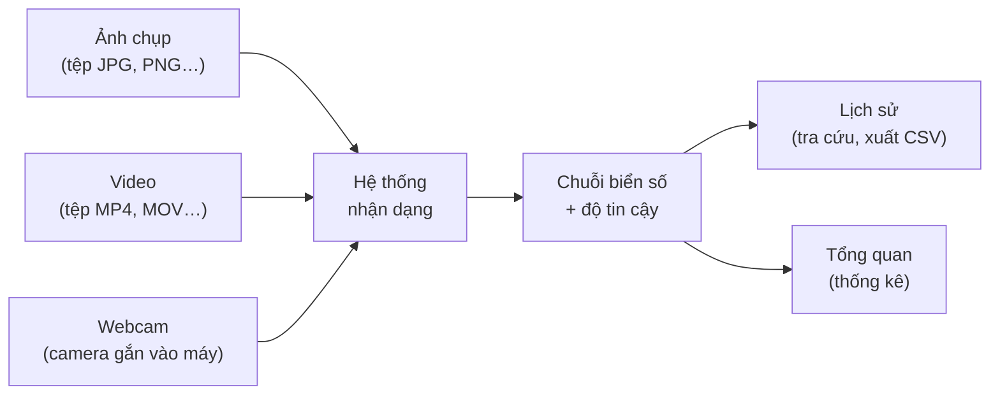

# Sổ tay người dùng — Hệ thống nhận dạng biển số xe Việt Nam

> **Phiên bản tài liệu:** 1.0 · **Ngày cập nhật:** 19/07/2026
> **Đối tượng đọc:** người vận hành hệ thống. Tài liệu này **không yêu cầu người đọc biết lập trình**.
> Mọi thao tác được mô tả đúng như những gì hiển thị trên màn hình tại thời điểm viết tài liệu.

---

## Cách đọc tài liệu này

Tài liệu được viết theo thứ tự công việc thực tế: hiểu hệ thống làm gì → chuẩn bị máy → khởi động → dùng từng chức năng → đọc hiểu kết quả → xử lý khi có sự cố.

Ba loại hộp thông tin xuất hiện xuyên suốt tài liệu:

> **Lưu ý** — thông tin giúp thao tác nhanh hơn hoặc tránh nhầm lẫn.

> ⚠️ **Cảnh báo** — chỗ dễ sai, cần đọc kỹ trước khi làm.

> 🚧 **Chức năng chưa hoàn chỉnh** — phần này *chưa làm được* hoặc *chỉ làm được một phần* trong phiên bản hiện tại. Tài liệu ghi rõ thay vì mô tả như đã xong.

**Cam kết trung thực của tài liệu.** Hệ thống đang trong giai đoạn hoàn thiện. Một số chức năng ghi trong đặc tả yêu cầu hiện chưa dùng được, và một số chỉ tiêu hiệu năng chưa đạt. Tất cả những điểm đó được liệt kê tại **mục 12 — Những gì hệ thống chưa làm được**, đồng thời được nhắc lại ngay tại mục hướng dẫn tương ứng.

---

## 1. Hệ thống này làm gì

### 1.1. Giải thích ngắn gọn

Hệ thống **tự động tìm biển số xe trong ảnh và đọc các ký tự trên biển số đó**, sau đó lưu kết quả lại để tra cứu về sau.

Nói theo cách khác: thay vì một người ngồi nhìn từng tấm ảnh rồi gõ tay biển số vào máy, người đó chỉ cần đưa ảnh cho hệ thống, và hệ thống trả về chuỗi ký tự biển số.

Công việc này gồm **hai bước riêng biệt**, và việc phân biệt hai bước rất quan trọng để hiểu kết quả ở mục 9:

| Bước | Tên gọi trong tài liệu | Câu hỏi bước đó trả lời | Kết quả bước đó tạo ra |
|---|---|---|---|
| 1 | **Phát hiện** (detection) | *Trong ảnh này, biển số nằm ở đâu?* | Một khung chữ nhật bao quanh biển số |
| 2 | **Đọc ký tự** (OCR) | *Trên tấm biển đó viết gì?* | Chuỗi ký tự, ví dụ `51G-495.39` |

Hai bước có thể thành công hoặc thất bại độc lập với nhau. Hệ thống có thể **tìm thấy** một tấm biển nhưng **không đọc được** chữ trên đó (biển quá mờ, quá nghiêng, bị che). Đây là tình huống bình thường, không phải lỗi phần mềm — mục 9.5 giải thích cách xử lý.

### 1.2. Ví dụ thực tế

**Ví dụ 1 — Bãi giữ xe.** Nhân viên chụp ảnh đầu xe khi xe vào bãi, tải ảnh lên hệ thống, hệ thống trả về `51F-734.20`. Nhân viên không phải gõ tay, và chuỗi biển số được lưu kèm thời điểm chụp để đối chiếu khi xe ra.

**Ví dụ 2 — Rà soát camera cổng.** Cuối ca trực, người vận hành tải lên đoạn video ghi từ camera cổng. Hệ thống chạy qua video và liệt kê các biển số đã đi qua trong đoạn đó. Người vận hành xuất danh sách ra tệp CSV để mở bằng Excel và gửi báo cáo.

**Ví dụ 3 — Kiểm tra tại chỗ.** Người vận hành mở trang Webcam, chĩa webcam về phía xe, hệ thống đọc biển số ngay trên màn hình mà không cần chụp ảnh rồi tải lên.

**Ví dụ 4 — Tra cứu về sau.** Có người báo mất xe biển `47A`. Người vận hành vào trang Lịch sử, gõ `47A` vào ô tìm kiếm và thấy toàn bộ những lần hệ thống từng ghi nhận biển số bắt đầu bằng `47A`, kèm ảnh gốc và thời điểm.

### 1.3. Ba cách đưa dữ liệu vào

Hệ thống nhận dữ liệu từ **ba nguồn**, tương ứng ba trang riêng trên giao diện:



### 1.4. Những gì hệ thống KHÔNG làm

Cần nói rõ ngay từ đầu để tránh kỳ vọng sai:

- Hệ thống **không tra cứu chủ sở hữu xe**. Nó chỉ đọc chuỗi ký tự trên tấm biển, không kết nối tới bất kỳ cơ sở dữ liệu đăng kiểm hay đăng ký xe nào.
- Hệ thống **không nhận dạng hãng xe, màu xe, khuôn mặt người, hay tốc độ xe**.
- Hệ thống **không cảnh báo tự động**. Nó không gửi email, không rung chuông khi thấy một biển số cụ thể.
- Hệ thống **không phải là bằng chứng pháp lý**. Kết quả đọc được có thể sai, và mục 9 giải thích cách nhận biết khi nào nên nghi ngờ.

---

## 2. Yêu cầu trước khi dùng

### 2.1. Trình duyệt

Hệ thống chạy hoàn toàn trong trình duyệt web, không phải cài phần mềm riêng.

| Trình duyệt | Dùng được | Ghi chú |
|---|---|---|
| Google Chrome (bản mới) | ✅ Khuyến nghị | Đã kiểm tra thực tế trong quá trình phát triển |
| Microsoft Edge (bản mới) | ✅ | Cùng nền tảng với Chrome |
| Mozilla Firefox (bản mới) | ✅ | |
| Safari | ⚠️ Chưa kiểm tra | Chức năng webcam có thể hoạt động khác |
| Internet Explorer | ❌ Không dùng được | Trình duyệt đã ngừng hỗ trợ |

> **Lưu ý.** Giao diện hiển thị được trên cả màn hình máy tính và màn hình điện thoại/máy tính bảng, nhưng trải nghiệm được thiết kế trước hết cho màn hình máy tính. Bảng lịch sử có nhiều cột nên trên màn hình hẹp sẽ phải kéo ngang.

### 2.2. Webcam (chỉ cần cho trang Webcam)

- Bất kỳ webcam nào mà hệ điều hành nhận diện được: webcam tích hợp trên laptop, hoặc webcam USB rời.
- Nếu máy có **nhiều camera**, hệ thống sẽ hiện danh sách để chọn.
- Camera **phải không bị ứng dụng khác chiếm dụng**. Nếu Zoom, Google Meet, Microsoft Teams hay một tab trình duyệt khác đang mở camera, hệ thống sẽ báo lỗi *"Không mở được camera vì thiết bị đang được ứng dụng khác sử dụng"*.

> ⚠️ **Cảnh báo về địa chỉ truy cập.** Trình duyệt chỉ cho phép mở camera khi trang web được mở qua **`http://localhost`** hoặc qua **`https://`**. Nếu mở bằng địa chỉ IP kiểu `http://192.168.1.50:5173`, trình duyệt sẽ **chặn camera** và hệ thống hiện thông báo *"Trình duyệt chỉ cho phép dùng camera trên kết nối an toàn"*. Đây là quy định bảo mật của trình duyệt, không phải lỗi hệ thống. Hai trang Nhận dạng ảnh và Nhận dạng video **không bị ràng buộc này**.

### 2.3. Định dạng tệp được hỗ trợ

| Loại | Định dạng chấp nhận | Kích thước tối đa |
|---|---|---|
| **Ảnh** | JPG (JPEG), PNG, WebP, BMP | **10 MB** một tệp |
| **Video** | MP4, MOV, AVI, MKV | **200 MB** một tệp |

Hai giới hạn này được đặt trong cấu hình hệ thống (`max_image_size_mb = 10`, `max_video_size_mb = 200` trong `backend/core/config.py`) và được kiểm tra ở **cả hai phía**: trình duyệt chặn trước để đỡ mất công tải lên, máy chủ kiểm tra lại lần nữa.

> ⚠️ **Đổi đuôi tệp không có tác dụng.** Hệ thống nhận biết loại tệp bằng cách **đọc nội dung bên trong tệp**, không dựa vào phần đuôi tên. Đổi tên `tailieu.zip` thành `anh.jpg` sẽ **vẫn bị từ chối**. Đây là biện pháp bảo mật cố ý.

### 2.4. Ảnh như thế nào thì cho kết quả tốt

Chất lượng ảnh đầu vào ảnh hưởng trực tiếp tới kết quả. Kinh nghiệm rút ra khi thử nghiệm:

**Nên:**
- Chụp tấm biển **càng lớn trong khung hình càng tốt**. Biển số chiếm phần rất nhỏ của ảnh là nguyên nhân thất bại phổ biến nhất.
- Chụp **chính diện hoặc gần chính diện**. Góc nghiêng lớn làm chữ bị bóp méo.
- Chụp ở nơi **đủ sáng**, tránh ngược sáng gay gắt.

**Tránh:**
- Ảnh **mờ do rung tay** hoặc do xe đang chạy nhanh.
- Biển số bị **che một phần** bởi giá đỡ, bùn đất, thanh chắn.
- Ảnh chụp **rất xa**, ví dụ toàn cảnh bãi xe từ trên cao — tấm biển chỉ còn vài chục điểm ảnh thì không đọc được.
- Ảnh đã bị **nén quá mạnh** khiến chữ vỡ hạt.

---

## 3. Khởi động hệ thống

Hệ thống gồm **hai phần phải chạy cùng lúc**:

- **Máy chủ xử lý** (backend) — phần làm việc nặng: chạy mô hình AI, đọc biển số, lưu dữ liệu.
- **Giao diện** (frontend) — phần người dùng nhìn thấy và bấm chuột.

Nếu chỉ chạy giao diện mà quên chạy máy chủ, mọi thao tác sẽ báo lỗi kết nối. Xem mục 10 để nhận biết.

### 3.1. Cách 1 — Chạy trực tiếp (đang dùng để phát triển)

Các lệnh dưới đây được lấy **nguyên văn từ tệp `README.md`** của dự án, mục 8 "Hướng dẫn cài đặt".

**Bước 1 — Mở cửa sổ dòng lệnh thứ nhất, chạy máy chủ xử lý.**

Trước hết chuyển vào thư mục gốc của dự án (`d:/DATN`), sau đó gõ:

```bash
backend/.venv/Scripts/python.exe -m uvicorn backend.main:app --port 8000
```

Chờ tới khi dòng chữ báo máy chủ đã sẵn sàng xuất hiện. **Không đóng cửa sổ này** — đóng là hệ thống tắt.

Để kiểm tra máy chủ đã chạy chưa, mở trình duyệt vào địa chỉ:

```
http://localhost:8000/docs
```

Nếu thấy một trang liệt kê các chức năng của máy chủ (trang Swagger) thì máy chủ đã chạy.

> **Lưu ý về thời gian khởi động.** Máy chủ cần **khoảng 8 giây** để nạp xong mô hình AI trước khi phục vụ được yêu cầu đầu tiên (đo thực tế: 8,36 giây trên máy Intel i5-14600K — nguồn: `docs/reports/07-benchmark-report.md`). Trong mấy giây đó, giao diện có thể báo hệ thống chưa sẵn sàng. Hãy chờ rồi tải lại trang.

**Bước 2 — Mở cửa sổ dòng lệnh thứ hai, chạy giao diện.**

```bash
cd frontend && npm install && npm run dev
```

Lệnh `npm install` chỉ cần chạy **lần đầu tiên** (nó tải các thành phần giao diện cần dùng, có thể mất vài phút). Những lần sau chỉ cần `npm run dev`.

**Bước 3 — Mở giao diện trong trình duyệt.**

```
http://localhost:5173
```

**Bước 4 — Kiểm tra hệ thống đã sẵn sàng.**

Trang đầu tiên hiện ra là trang **Tổng quan**. Nhìn xuống ô **Trạng thái hệ thống** — cả hai dòng **Cơ sở dữ liệu** và **Mô hình AI** phải báo đã sẵn sàng. Nếu dòng "Mô hình AI" báo chưa sẵn sàng, xem mục 10.

### 3.2. Cách 2 — Chạy bằng Docker

Nếu máy đã cài Docker, có thể khởi động cả hai phần bằng Docker. **Lần đầu tiên cần ba bước chuẩn bị**, không thể chạy ngay `docker compose up` từ một bản chép mới:

```bash
# Chạy từ thư mục gốc dự án d:/DATN

# 1. Tạo tệp cấu hình ở THƯ MỤC GỐC (không phải trong deployment/)
cp deployment/.env.example .env

# 2. Tạo sẵn hai thư mục — nếu để Docker tự tạo, chúng sẽ thuộc quyền root
#    và máy chủ trong container sẽ không ghi được tệp tải lên
mkdir -p storage models

# 3. Đặt tệp trọng số mô hình vào thư mục models/
#    (mô hình chính thức models/best.pt — xem mục 12.4)

# Sau đó mới khởi động:
docker compose up -d --build
```

> ⚠️ **Bỏ qua bước 1 hoặc bước 2 thì hệ thống vẫn khởi động nhưng mọi thao tác tải tệp lên đều hỏng.** Nguyên nhân và cách xử lý đầy đủ ở `deployment/README.md` mục 3.

Yêu cầu tối thiểu: Docker Engine ≥ 23, Docker Compose ≥ 2.24, RAM ≥ 8 GB, đĩa trống ≥ 15 GB. Cả hai image đã được build và chạy thật, kiểm chứng bằng HTTP từ ngoài container (chi tiết: `deployment/README.md` mục 2 và `docs/reports/08-deployment-guide.md`). Sau khi lệnh chạy xong, mở trình duyệt vào cùng địa chỉ giao diện như trên.

Để tắt hệ thống chạy bằng Docker: `docker compose stop` (dừng, giữ nguyên dữ liệu) hoặc `docker compose down` (xoá container nhưng **vẫn giữ** dữ liệu trong volume).

> ⚠️ **Không dùng `docker compose down -v`.** Cờ `-v` xoá cả volume, tức **xoá toàn bộ cơ sở dữ liệu lịch sử**.

### 3.3. Tắt hệ thống

- **Chạy trực tiếp (mục 3.1):** nhấn `Ctrl + C` trong **từng cửa sổ dòng lệnh** đang chạy.
- **Chạy bằng Docker (mục 3.2):** `docker compose stop`.

Dữ liệu lịch sử đã lưu **không bị mất** khi tắt theo cả hai cách — nó nằm trong cơ sở dữ liệu trên đĩa.

---

## 4. Màn hình Tổng quan (Dashboard)

Đây là trang đầu tiên hiện ra. Nó trả lời câu hỏi *"Hệ thống đã làm được bao nhiêu việc, và có đang khoẻ không?"*

### 4.1. Thanh điều hướng bên trái

Năm mục, luôn có mặt ở mọi trang:

| Mục | Dùng để |
|---|---|
| **Tổng quan** | Xem thống kê tổng hợp và trạng thái hệ thống |
| **Nhận dạng ảnh** | Tải một tấm ảnh lên và đọc biển số trong đó |
| **Nhận dạng video** | Tải một đoạn video lên và đọc biển số xuất hiện trong đó |
| **Webcam** | Đọc biển số trực tiếp qua camera của máy |
| **Lịch sử** | Tra cứu, lọc, xem chi tiết, xoá và xuất kết quả đã lưu |

Trên màn hình hẹp, thanh này thu lại thành nút mở menu ở góc trên bên trái.

### 4.2. Bốn ô số ở đầu trang

#### 4.2.1. ⚠️ "Lượt nhận dạng" khác "Biển số phát hiện" như thế nào

**Đây là chỗ dễ hiểu nhầm nhất trong toàn bộ hệ thống.** Hai con số này gần như luôn khác nhau, và khác nhau là **đúng**, không phải lỗi.

- **Lượt nhận dạng** đếm **số lần bạn đưa việc cho hệ thống**. Tải lên một tấm ảnh = 1 lượt. Tải lên một video = 1 lượt. Một phiên bật webcam = 1 lượt.
- **Biển số phát hiện** đếm **số tấm biển hệ thống tìm thấy**. Một tấm ảnh có 3 chiếc xe trong đó sẽ cho 3 biển số.

**Ví dụ cụ thể để ghi nhớ:**

> Bạn tải lên **một** tấm ảnh chụp bãi xe, trong ảnh có **ba** chiếc xe đỗ cạnh nhau.
> → **Lượt nhận dạng: 1** · **Biển số phát hiện: 3**

Quy tắc này đã được kiểm chứng bằng phép thử thực tế trên máy chủ đang chạy (nguồn: `README.md` mục 4 — *"1 ảnh chứa 3 biển = 1 lượt, không phải 3"*).

**Vì sao lại tách hai con số?**

Vì chúng trả lời hai câu hỏi khác nhau:

| Bạn muốn biết | Nhìn con số nào |
|---|---|
| *Hệ thống được dùng nhiều hay ít?* Bao nhiêu ảnh/video đã được xử lý? | **Lượt nhận dạng** |
| *Hệ thống thu về được bao nhiêu dữ liệu?* Bao nhiêu tấm biển đã ghi nhận? | **Biển số phát hiện** |

Nếu gộp làm một, một tấm ảnh chụp cả bãi xe 20 chiếc sẽ bị tính như thể đã dùng hệ thống 20 lần — con số sử dụng sẽ bị thổi phồng.

**Hệ quả cần nhớ:** *Biển số phát hiện* luôn **lớn hơn hoặc bằng** *Lượt nhận dạng*. Nếu thấy ngược lại, đó là dấu hiệu bất thường cần báo người quản trị.

> **Mẹo.** Trên giao diện, bên cạnh mỗi ô số có một **biểu tượng dấu hỏi nhỏ**. Rê chuột vào đó sẽ hiện đúng lời giải thích này ngay tại chỗ, không cần mở lại sổ tay.

#### 4.2.2. Bảng giải nghĩa cả bốn ô

| Ô số | Nghĩa chính xác | Đọc thế nào |
|---|---|---|
| **Lượt nhận dạng** | Số lần tải lên (ảnh / video / phiên webcam), bất kể mỗi lần tìm được bao nhiêu biển | Đây là con số "hệ thống được dùng bao nhiêu" |
| **Biển số phát hiện** | Tổng số tấm biển tìm được, đếm từng tấm một | Đây là con số "thu về được bao nhiêu dữ liệu" |
| **Độ tin cậy trung bình** | Mức chắc chắn trung bình. Số lớn là độ tin cậy của **bước phát hiện**; độ tin cậy của **bước đọc ký tự** ghi kèm bên cạnh | Xem mục 9.1 để biết bao nhiêu là đủ tin |
| **Thời gian xử lý trung bình** | Số giây trung bình để phát hiện và đọc **một** tấm biển | Phụ thuộc cấu hình máy chủ; hệ thống chạy trên CPU, không dùng card đồ hoạ |

> **Vì sao độ tin cậy lại có hai con số?** Vì như mục 1.1 đã nói, đây là hai bước riêng. Tách ra để biết bước nào đang kém chắc chắn: nếu bước phát hiện chắc chắn mà bước đọc ký tự thì không, vấn đề nằm ở chất lượng chữ trên biển chứ không phải ở việc tìm biển.

### 4.3. Ô "Trạng thái hệ thống"

Hai chỉ báo:

| Chỉ báo | Nghĩa khi bình thường | Nghĩa khi có vấn đề |
|---|---|---|
| **Cơ sở dữ liệu** | Nơi lưu lịch sử đang kết nối được | Không lưu được kết quả mới, không tra cứu được lịch sử |
| **Mô hình AI** | Mô hình nhận dạng đã nạp xong, sẵn sàng làm việc | **Không nhận dạng được gì cả.** Giao diện vẫn mở được nhưng mọi lần tải ảnh lên đều thất bại |

> ⚠️ **Nếu "Mô hình AI" báo chưa sẵn sàng, đừng cố tải ảnh lên.** Hãy chờ vài giây (mô hình cần thời gian nạp lúc khởi động) rồi tải lại trang. Nếu vẫn vậy, xem mục 10.

### 4.4. Biểu đồ và danh sách

- **Biểu đồ xu hướng theo ngày** — mỗi cột/điểm là một ngày. Ngày không có hoạt động vẫn được vẽ với giá trị 0, cố ý như vậy để biểu đồ không tự động "nối liền" và làm một tuần vắng vẻ trông như một tuần bận rộn.
- **Biểu đồ theo loại đầu vào** — tỷ lệ giữa ảnh, video và webcam. Cũng hiển thị theo cả hai cách đếm: theo *lượt* và theo *biển số*.
- **Danh sách nhận dạng gần đây** — vài kết quả mới nhất. Bấm vào một dòng để xem chi tiết.

> **Lưu ý.** Trang Tổng quan hiển thị số liệu tại thời điểm mở trang. Sau khi nhận dạng thêm, cần **tải lại trang** để thấy con số mới.

---

## 5. Nhận dạng từ ảnh

Đây là chức năng cơ bản nhất và cũng nhanh nhất.

### 5.1. Các bước thực hiện

**Bước 1 — Vào trang.** Bấm **"Nhận dạng ảnh"** ở thanh bên trái.

*Màn hình sẽ thấy:* trang chia làm hai phần. Bên trái là khung **"Tải ảnh lên"** với một vùng trống có viền đứt nét. Bên phải là khung kết quả, hiện đang trống với dòng chữ mời bạn chọn ảnh.

**Bước 2 — Chọn ảnh.** Có hai cách:
- **Kéo và thả**: kéo tệp ảnh từ thư mục vào vùng viền đứt nét rồi thả ra.
- **Bấm chọn**: bấm vào vùng đó, cửa sổ chọn tệp của máy sẽ mở ra.

*Màn hình sẽ thấy:* ảnh vừa chọn hiện ra ngay trong khung bên trái để bạn xem trước. Tên tệp và dung lượng hiện bên dưới. Nút **"Nhận dạng"** chuyển sang trạng thái bấm được. Bên cạnh có nút **"Xoá ảnh"** nếu bạn chọn nhầm.

> **Nếu tệp bị từ chối ngay lập tức**, nguyên nhân gần như chắc chắn là sai định dạng (không phải JPG/PNG/WebP/BMP) hoặc quá 10 MB. Thông báo lỗi sẽ nói rõ.

**Bước 3 — Bấm "Nhận dạng".**

*Màn hình sẽ thấy:* nút chuyển sang trạng thái đang xử lý. Với ảnh lớn, một thanh tiến trình tải lên xuất hiện trước, sau đó là giai đoạn chờ máy chủ xử lý.

> ⚠️ **Về thời gian chờ.** Trong đo đạc thực tế trên mô hình chính thức `models/best.pt` (máy rảnh), thời gian từ lúc bấm tới lúc có kết quả **đạt mục tiêu thiết kế**: p95 đo được **731 mili-giây** (khoảng 0,7 giây), dưới mục tiêu 800 mili-giây (nguồn: `docs/reports/07-benchmark-report.md`). Con số cũ 5.857 mili-giây đã bị **bác bỏ** (đo khi máy bị tải cạnh tranh, sai mô hình và có lỗi cắt ảnh). **Chờ chưa tới một giây cho một tấm ảnh là bình thường; nếu chậm hơn nhiều thì thường do máy đang bận việc khác.**

**Bước 4 — Xem kết quả.**

*Màn hình sẽ thấy* ở khung bên phải:

1. **Ảnh gốc có vẽ khung** — mỗi tấm biển tìm được được bao bởi một khung chữ nhật màu vẽ chồng lên ảnh. Nhìn khung là biết ngay hệ thống đã "nhìn" đúng chỗ hay chưa.
2. **Dòng tóm tắt** — tìm được bao nhiêu biển, mất bao nhiêu giây.
3. **Một thẻ kết quả cho mỗi tấm biển**, gồm:
   - Chuỗi biển số đọc được, in to và rõ.
   - Nhãn **"Đúng định dạng Việt Nam"** (nền xanh) hoặc **"Không khớp định dạng Việt Nam"** (nền vàng) — xem mục 9.3.
   - Hai thanh độ tin cậy: một cho bước phát hiện, một cho bước đọc ký tự.
   - Ảnh cắt riêng tấm biển đó, phóng to.
   - Nút **"Tải ảnh biển số"** để lưu riêng ảnh cắt đó về máy.

**Bước 5 — Lưu kết quả (tuỳ chọn).**

- Nút **"Tải ảnh kết quả"** ở đầu khung — lưu về máy tấm ảnh đã vẽ khung sẵn.
- Nút **"Tải ảnh biển số"** trên từng thẻ — lưu riêng ảnh cắt của một tấm biển.

**Bước 6 — Làm tiếp ảnh khác.** Bấm **"Chọn ảnh khác"** hoặc **"Xoá ảnh"** rồi quay lại bước 2.

### 5.2. Nếu không tìm thấy biển số nào

Màn hình hiện thông báo không tìm thấy biển số nào — **đây không phải lỗi**. Hệ thống đã xử lý xong và kết luận trong ảnh không có tấm biển nào nó nhận ra được.

Việc cần làm: xem lại mục 2.4 và thử ảnh khác — chụp gần hơn, sáng hơn, chính diện hơn.

### 5.3. Kết quả được lưu tự động

Mọi tấm biển tìm được **đều tự động lưu vào Lịch sử**, không cần bấm nút lưu. Ảnh gốc và ảnh cắt tấm biển cũng được giữ lại.

---

## 6. Nhận dạng từ video

### 6.1. Vì sao video phải chờ, còn ảnh thì không

Một tấm ảnh là **một khung hình**. Một đoạn video 60 giây quay ở tốc độ thường chứa **hơn một nghìn khung hình**. Hệ thống phải chạy qua nhiều khung hình trong số đó, và mỗi khung tốn thời gian tương đương một tấm ảnh.

Ước tính từ tài liệu kỹ thuật: **khoảng 200 giây xử lý cho mỗi 60 giây video** trên máy chỉ dùng CPU (nguồn: `backend/api/routes/detection.py`). Nghĩa là một video 1 phút có thể mất **hơn 3 phút** để xử lý xong.

Vì không trình duyệt nào chịu chờ lâu như vậy mà không báo lỗi, hệ thống được thiết kế theo kiểu **"nhận việc rồi làm sau"**: bạn tải video lên, hệ thống nhận ngay và trả về một *mã tác vụ*, rồi âm thầm xử lý ở phía sau. Giao diện tự động hỏi máy chủ **mỗi 1,5 giây** xem đã xong chưa và cập nhật thanh tiến độ.

### 6.2. Các bước thực hiện

**Bước 1 — Vào trang.** Bấm **"Nhận dạng video"** ở thanh bên trái.

*Màn hình sẽ thấy:* khung tải lên ghi rõ *"Hỗ trợ MP4, MOV, AVI, MKV · tối đa 200 MB"*.

**Bước 2 — Chọn tệp video.** Kéo thả hoặc bấm chọn, giống hệt trang ảnh.

> ⚠️ **Hãy chọn video NGẮN.** Xem cảnh báo ở mục 6.3 trước khi chọn tệp.

**Bước 3 — Bấm nút bắt đầu xử lý.**

*Màn hình sẽ thấy:* thanh tiến trình tải tệp lên trước (video 200 MB mất một lúc), sau đó khung **"Tiến độ xử lý"** xuất hiện.

**Bước 4 — Theo dõi tiến độ.**

*Màn hình sẽ thấy* trong khung "Tiến độ xử lý":

| Thứ hiển thị | Ý nghĩa |
|---|---|
| **Trạng thái** | `Đang chờ` → `Đang xử lý` → `Hoàn thành` (hoặc `Thất bại`) |
| **Thanh tiến độ** | Tỷ lệ phần trăm đã xử lý |
| **Số khung hình** | Đã xử lý bao nhiêu / tổng bao nhiêu khung |
| **Số biển số** | Đã tìm được bao nhiêu tấm biển tính tới lúc này — con số này **tăng dần** trong khi chạy |
| **Thời gian còn lại (ước tính)** | Dự đoán, càng về sau càng chính xác |
| Nút **"Làm mới"** | Hỏi lại trạng thái ngay, không chờ tới nhịp tự động |

> **Về thanh tiến độ "chạy qua chạy lại".** Đôi khi thanh tiến độ không hiện phần trăm mà chỉ chạy tới lui. Điều đó có nghĩa hệ thống **chưa đếm xong tổng số khung hình** của video nên chưa biết mốc đích ở đâu. Đây là trạng thái bình thường ở giai đoạn đầu; hệ thống cố ý **không** hiển thị một con số phần trăm bịa ra. Khi đếm xong, thanh sẽ chuyển sang hiện phần trăm thật.

**Bước 5 — Xem kết quả khi xong.**

*Màn hình sẽ thấy:* khung **"Kết quả nhận dạng"** với dòng *"Đã nhận dạng N biển số khác nhau trong video"* và các thẻ biển số bên dưới.

> **Vì sao là "biển số khác nhau"?** Một chiếc xe đi qua camera xuất hiện trong hàng chục khung hình liên tiếp. Nếu ghi lại từng lần thấy, một chiếc xe sẽ thành 40 bản ghi. Hệ thống **gộp các lần nhìn thấy cùng một tấm biển thành một bản ghi duy nhất** trước khi lưu. Một tấm biển thấy trong 40 khung hình vẫn chỉ là một tấm biển.

### 6.3. Nút "Huỷ tác vụ" — 🚧 hiện bị vô hiệu hoá

**Nút "Huỷ tác vụ" có trên màn hình nhưng KHÔNG bấm được.** Nút hiện màu mờ, rê chuột vào thấy dòng chú thích *"Chức năng đang được phát triển"*.

**Vì sao lại như vậy?** Phần xử lý phía máy chủ *đã biết cách* dừng giữa chừng, nhưng chưa có đường kết nối từ giao diện xuống để ra lệnh dừng. Nhóm phát triển chọn để nút **hiện mà không bấm được**, thay vì nối vào một lệnh không tồn tại — vì như thế người dùng sẽ tưởng đã dừng được trong khi tác vụ vẫn đang chạy tiếp. Thà mờ mà thật còn hơn sáng mà giả.

**Hệ quả thực tế đối với người vận hành:**

> ⚠️ **Một khi đã bấm bắt đầu xử lý video, KHÔNG có cách nào dừng lại từ giao diện.** Tác vụ sẽ chạy tới khi xong, dù bạn có đóng tab hay chuyển sang trang khác.

**Cách làm việc an toàn với hạn chế này:**

1. **Chọn video ngắn.** Khuyến nghị mạnh: dưới **30 giây** cho lần thử đầu tiên. Với tốc độ khoảng 200 giây xử lý cho mỗi 60 giây video, một clip 30 giây mất khoảng 1,5 phút — sai thì làm lại cũng không mất mát gì nhiều.
2. **Cắt video trước khi tải lên.** Nếu chỉ quan tâm đoạn từ phút 5 đến phút 6 của một video dài, hãy cắt riêng đoạn đó ra bằng phần mềm bất kỳ rồi mới tải lên.
3. **Thử một clip ngắn trước.** Trước khi tải video dài, hãy thử 10 giây để chắc chắn góc quay và chất lượng ảnh cho kết quả tốt.
4. **Nếu lỡ tải video quá dài:** giải pháp duy nhất là **khởi động lại máy chủ** (`Ctrl + C` ở cửa sổ dòng lệnh chạy máy chủ rồi chạy lại lệnh khởi động). Việc này dừng tác vụ nhưng cũng làm gián đoạn mọi người khác đang dùng — chỉ làm khi thật sự cần và đã báo trước.

### 6.4. 🚧 Video kết quả có vẽ khung — chưa có

Ở phiên bản hiện tại, hệ thống **chưa tạo ra bản video đã vẽ khung nhận dạng** để tải về. Màn hình sẽ hiện dòng thông báo:

> *"Video kết quả có gắn khung nhận dạng chưa khả dụng cho tác vụ này. Các biển số nhận được vẫn đã được lưu vào lịch sử và có thể xem hoặc xuất ra tệp CSV ở trang Lịch sử."*

**Những gì vẫn dùng được bình thường:** danh sách các biển số tìm được, ảnh cắt từng tấm biển, độ tin cậy, và toàn bộ dữ liệu đã lưu vào Lịch sử để tra cứu và xuất CSV.

---

## 7. Nhận dạng qua webcam

### 7.1. Cách hoạt động

Hệ thống **chụp ảnh từ webcam theo nhịp đều đặn** rồi gửi từng ảnh đi nhận dạng. Nó không truyền video liên tục.

Vì vậy kết quả **không hiện ra tức thì** mà nhấp nháy theo nhịp: cứ mỗi lần một khung hình được xử lý xong, khung nhận dạng trên màn hình lại cập nhật.

> **Về ảnh chụp từ webcam:** các khung hình chụp ra **không được lưu lại**. Một phiên webcam vài chục giây tạo ra hàng trăm ảnh gần giống hệt nhau; giữ hết sẽ đầy ổ đĩa mà chẳng ghi lại được gì thêm. **Chỉ ảnh cắt của tấm biển** là được lưu — vì đó mới là thứ người dùng cần xem lại.

### 7.2. Các bước thực hiện

**Bước 1 — Vào trang.** Bấm **"Webcam"** ở thanh bên trái.

**Bước 2 — Chọn camera và tốc độ chụp** (nếu cần).

*Màn hình sẽ thấy:* hai ô chọn.

- **Ô chọn camera** — nếu máy có nhiều camera. Trước khi cấp quyền lần đầu, danh sách có thể chưa hiện tên camera; điều này bình thường, tên sẽ hiện sau khi cấp quyền.
- **Ô chọn nhịp chụp** — bốn lựa chọn:

| Lựa chọn | Nghĩa | Khi nào chọn |
|---|---|---|
| Nhanh — 400 ms/khung | Chụp nhiều nhất | Máy mạnh, cần bắt xe di chuyển |
| **Cân bằng — 700 ms/khung** | **Mặc định** | Dùng cho hầu hết trường hợp |
| Tiết kiệm — 1 giây/khung | Chụp thưa | Máy yếu, hoặc xe đứng yên |
| Chậm — 2 giây/khung | Chụp rất thưa | Máy rất yếu |

> **Chọn "Nhanh" không làm hệ thống chạy nhanh hơn.** Đây là nhịp *thử* chụp, không phải tốc độ thực tế. Hệ thống chỉ gửi **một khung hình tại một thời điểm**. Nếu máy cần 600 ms để xử lý một khung mà bạn chọn nhịp 400 ms, kết quả không phải là nhanh hơn — mà là các khung dư bị **bỏ qua**. Mức mặc định 700 ms được chọn vì nó vừa cao hơn thời gian xử lý một khung trên máy thử nghiệm.

**Bước 3 — Bấm "Bật camera".**

*Màn hình sẽ thấy:* nút chuyển thành *"Đang khởi động…"*, và **trình duyệt hiện hộp thoại hỏi quyền truy cập camera** — thường ở góc trên bên trái, ngay dưới thanh địa chỉ.

**Bước 4 — Cho phép truy cập camera.**

Bấm **"Cho phép"** / **"Allow"** trong hộp thoại của trình duyệt.

> **Đây là hộp thoại của TRÌNH DUYỆT, không phải của hệ thống.** Hệ thống không thể tự cấp quyền cho mình — vì lý do bảo mật, chỉ người ngồi trước máy mới quyết định được. Nếu bấm nhầm "Chặn", xem mục 7.3.

*Màn hình sẽ thấy sau khi cho phép:* hình ảnh trực tiếp từ camera hiện trong khung lớn giữa trang. Đèn báo camera trên máy (nếu có) sáng lên.

**Bước 5 — Đưa biển số vào khung hình.**

*Màn hình sẽ thấy:* khi hệ thống nhận ra biển số, một khung chữ nhật vẽ chồng lên hình camera, và bảng bên dưới lần lượt thêm các biển số đọc được trong phiên này.

**Bước 6 — Theo dõi các chỉ số** trong khung số liệu:

| Chỉ số | Nghĩa |
|---|---|
| **Tốc độ thực tế** | Số khung hình thực sự xử lý được mỗi giây |
| **Thời gian xử lý** | Máy chủ mất bao lâu cho một khung |
| **Trọn vòng gửi–nhận** | Tổng thời gian từ lúc gửi tới lúc nhận kết quả |
| **Khung hình đã gửi** | Tổng số khung đã gửi, kèm số khung **bỏ qua** |

> **"Khung hình bị bỏ qua" là bình thường, không phải lỗi.** Khi khung trước chưa xử lý xong, khung mới bị bỏ qua thay vì xếp hàng chờ. Nếu xếp hàng, kết quả hiển thị sẽ ngày càng tụt lại so với hình ảnh thật trên màn hình.

**Bước 7 — Tắt camera.** Bấm **"Tắt camera"** khi xong. Đèn camera tắt, và camera được trả lại cho các ứng dụng khác.

> **Nên tắt camera khi không dùng.** Để camera bật liên tục vừa tốn tài nguyên máy, vừa khiến các ứng dụng khác không mở được camera.

### 7.3. Khi trình duyệt từ chối cấp quyền camera

Hệ thống hiển thị **đúng thông báo tương ứng với từng nguyên nhân**, kèm hướng dẫn khắc phục ngay trên màn hình. Bảng dưới liệt kê đầy đủ:

| Thông báo trên màn hình | Nguyên nhân | Cách xử lý |
|---|---|---|
| *"Trình duyệt đã chặn quyền truy cập camera."* | Đã bấm "Chặn", hoặc trước đó từng chặn và trình duyệt nhớ lại | Nhấn vào **biểu tượng ổ khoá hoặc biểu tượng camera ở đầu thanh địa chỉ**, chọn **"Cho phép"** cho mục Camera, **tải lại trang**, rồi bấm "Bật camera" lần nữa |
| *"Không tìm thấy camera nào trên thiết bị này."* | Máy không có webcam, hoặc webcam chưa cắm, hoặc bị tắt trong cài đặt hệ điều hành | Cắm webcam vào máy; kiểm tra camera đã bật trong **cài đặt quyền riêng tư của hệ điều hành**; bấm "Bật camera" lại |
| *"Không mở được camera vì thiết bị đang được ứng dụng khác sử dụng."* | Zoom, Google Meet, Microsoft Teams hoặc một tab trình duyệt khác đang chiếm camera | **Đóng các ứng dụng đó** rồi bấm "Bật camera" lại |
| *"Camera đã chọn không đáp ứng được cấu hình yêu cầu."* | Camera đã chọn không hỗ trợ độ phân giải hệ thống yêu cầu | **Chọn một camera khác** trong danh sách thiết bị rồi thử lại |
| *"Trình duyệt chỉ cho phép dùng camera trên kết nối an toàn."* | Đang mở trang qua địa chỉ IP trên `http://` | Mở lại qua **`http://localhost`** hoặc qua **`https://`**. Truy cập bằng địa chỉ IP trên HTTP sẽ luôn bị trình duyệt chặn camera |

> **Cách tìm nút cấp lại quyền trên Chrome/Edge:** bên trái thanh địa chỉ có một biểu tượng nhỏ (ổ khoá, hình trượt, hoặc hình camera bị gạch chéo). Bấm vào đó → tìm dòng **Camera** → đổi sang **Cho phép** → tải lại trang bằng `F5`.

---

## 8. Tra cứu lịch sử

Trang **Lịch sử** là nơi xem lại mọi kết quả đã lưu.

> **Nhắc lại quy tắc đếm.** Mỗi dòng trong bảng lịch sử là **một tấm biển số**, không phải một lần tải lên. Một tấm ảnh có 3 biển tạo ra **3 dòng** — cả ba dòng có cùng một mã tác vụ. Đây là cách đếm khác với ô "Lượt nhận dạng" ở trang Tổng quan (mục 4.2.1).

### 8.1. Tìm kiếm theo biển số

Ô **"Tìm theo biển số"** ở đầu trang.

- Gõ **một phần** của biển số cũng được. Gõ `51F` sẽ ra mọi biển số **có chứa** chuỗi `51F`.
- **Không phân biệt chữ hoa chữ thường**.
- Ví dụ gợi ý ngay trong ô nhập: `51F` hoặc `30D-044`.

> **Mẹo tìm nhanh.** Nếu không nhớ chính xác dấu gạch nối hay dấu chấm, hãy gõ phần chắc chắn nhất — thường là mã tỉnh và chữ cái đầu, ví dụ `51G`.

### 8.2. Lọc kết quả

| Bộ lọc | Dùng để |
|---|---|
| **Loại đầu vào** | Chỉ xem kết quả từ *Ảnh*, hoặc *Video*, hoặc *Webcam*. Mặc định là *Tất cả loại* |
| **Từ ngày** | Chỉ lấy kết quả **từ** ngày này trở đi |
| **Đến ngày** | Chỉ lấy kết quả **tới** ngày này |
| **Độ tin cậy tối thiểu** | Chỉ hiện những kết quả mà hệ thống chắc chắn từ mức này trở lên. Ví dụ đặt 80% để loại bớt kết quả đáng ngờ |

Các bộ lọc **cộng dồn với nhau**: chọn loại *Ảnh* + *từ ngày 01/07* + *độ tin cậy ≥ 80%* sẽ chỉ ra những kết quả thoả **cả ba** điều kiện.

Nút **"Xoá bộ lọc"** đưa mọi bộ lọc về mặc định.

### 8.3. Sắp xếp

Ô chọn cách sắp xếp có các lựa chọn:

- **Mới nhất trước** (mặc định)
- **Cũ nhất trước**
- **Độ tin cậy cao nhất** — hữu ích khi muốn xem kết quả đáng tin nhất
- **Độ tin cậy thấp nhất** — hữu ích khi **rà soát chất lượng**: xem những chỗ hệ thống dễ sai nhất
- **Biển số A → Z** và chiều ngược lại

### 8.4. Phân trang

Cuối bảng có thanh chuyển trang. Số dòng mỗi trang chọn được: **10, 20, 50** hoặc **100** (mặc định 20). Trên 100 dòng một trang thì hệ thống không cho — bảng quá dài vừa khó đọc vừa chậm.

### 8.5. Xem chi tiết một bản ghi

Bấm vào một dòng trong bảng.

*Màn hình sẽ thấy:* một cửa sổ nổi lên giữa màn hình, gồm:

- **Chuỗi biển số**, in lớn.
- **Nhãn định dạng**: *"Đúng định dạng Việt Nam"* (xanh) hoặc *"Không khớp định dạng Việt Nam"* (vàng).
- **Nhãn nguồn**: Ảnh / Video / Webcam.
- **Phần so sánh trước–sau** — chỉ hiện khi chuỗi đọc thô và chuỗi cuối cùng khác nhau. Đây là phần đáng chú ý nhất, xem mục 9.2.
- **Ảnh gốc** và **ảnh cắt tấm biển**.
- **Hai chỉ số độ tin cậy**, thời gian xử lý, thời điểm nhận dạng.

Đóng cửa sổ bằng nút đóng hoặc phím `Esc`.

### 8.6. Xoá một bản ghi

Trong cửa sổ chi tiết (hoặc từ bảng) có chức năng xoá. Hệ thống **luôn hỏi xác nhận** trước khi xoá.

> ⚠️ **Xoá là vĩnh viễn.** Bản ghi bị xoá cùng với ảnh gốc và ảnh cắt tấm biển của nó. **Không có thùng rác, không có nút hoàn tác.** Hãy đọc kỹ hộp xác nhận — nó hiện rõ biển số sắp bị xoá để bạn kiểm tra lại có đúng dòng cần xoá không.

### 8.7. Xuất ra tệp CSV

Nút **"Xuất CSV"** ở khu vực bộ lọc.

**Điều quan trọng nhất cần biết:** tệp xuất ra chứa **đúng những gì bộ lọc hiện tại đang chọn**, không phải toàn bộ dữ liệu.

- Nếu đang lọc *chỉ loại Ảnh, từ 01/07 tới 15/07* → tệp CSV chỉ có những dòng đó.
- Muốn xuất **tất cả** → bấm **"Xoá bộ lọc"** trước rồi mới bấm "Xuất CSV".

**Tệp xuất ra KHÔNG bị giới hạn theo trang.** Đang xem trang 1 trong số 40 trang thì tệp CSV vẫn chứa đủ cả 40 trang.

Nút này **mờ đi khi không có dòng nào khớp bộ lọc** — không có gì để xuất.

*File tải về* có tên dạng `alpr-history-<ngày giờ>.csv`.

> **Mở bằng Microsoft Excel.** Tệp được xuất kèm dấu hiệu đặc biệt ở đầu tệp (BOM) để Excel hiển thị **đúng tiếng Việt có dấu**. Nếu không có dấu hiệu này, Excel thường hiện chữ Việt thành ký tự lạ. Chỉ cần bấm đúp mở tệp như bình thường.

---

## 9. Đọc hiểu kết quả

> **Đây là mục quan trọng nhất của sổ tay.** Đọc được con số thì mới biết khi nào tin và khi nào phải kiểm tra lại bằng mắt.

### 9.1. Độ tin cậy là gì, bao nhiêu thì đáng tin

**Độ tin cậy** là mức độ chắc chắn của hệ thống về kết luận nó vừa đưa ra, tính theo phần trăm từ 0% đến 100%.

Hiểu cho đúng: **độ tin cậy không phải là tỷ lệ đúng.** Nó là *"hệ thống tự đánh giá mình chắc chắn tới đâu"*. Máy có thể **rất chắc chắn mà vẫn sai** — trường hợp này hiếm nhưng có thật, và đó chính là lý do mục 9.4 tồn tại.

**Ba mức màu trên giao diện** (ngưỡng lấy từ `frontend/src/lib/constants.ts`):

| Màu thanh | Khoảng giá trị | Chữ hiển thị | Nên làm gì |
|:---:|---|---|---|
| 🟢 Xanh lá | **từ 85% trở lên** | cao | Dùng được. Vẫn nên liếc qua ảnh nếu kết quả dùng cho việc quan trọng |
| 🟡 Vàng | **từ 60% đến dưới 85%** | trung bình | **Kiểm tra lại bằng mắt.** Mở chi tiết, nhìn ảnh cắt tấm biển, đối chiếu từng ký tự |
| 🔴 Đỏ | **dưới 60%** | thấp | **Không nên tin.** Coi như gợi ý, phải xác nhận thủ công |
| ⚪ Xám | không có giá trị | không có | Bước đọc ký tự không đọc được gì. Xem mục 9.5 |

> **Vì sao kết quả độ tin cậy thấp vẫn được hiển thị chứ không bị giấu đi?** Vì giấu đi thì người vận hành sẽ tưởng hệ thống bỏ sót tấm biển, trong khi thực tế nó đã tìm thấy nhưng không chắc chắn. Hiện ra kèm cảnh báo màu là trung thực hơn. Màu sắc **chỉ để hiển thị** — không có kết quả nào bị lọc bỏ vì màu.

**Hai thanh độ tin cậy, không phải một:**

| Thanh | Trả lời câu hỏi | Khi thanh này thấp nghĩa là |
|---|---|---|
| Độ tin cậy **phát hiện** | *Đây có đúng là một tấm biển số không?* | Có thể đây **không phải biển số** — xem mục 9.4 |
| Độ tin cậy **đọc ký tự (OCR)** | *Chữ trên tấm biển này có đúng như đã đọc không?* | Đúng là biển số, nhưng **chữ đọc ra có thể sai** |

**Ví dụ đọc kết hợp hai thanh:**

- Phát hiện 96%, OCR 99% → rất đáng tin, dùng được ngay.
- Phát hiện 95%, OCR 62% → đúng là biển số, nhưng **chữ có thể sai** → mở ảnh cắt ra đối chiếu.
- Phát hiện 48%, OCR 90% → **đáng ngờ**: hệ thống không chắc đây là biển số, chuỗi đọc ra có thể là chữ trên vật khác (biển quảng cáo, tem dán, số khung).

*Để tham khảo,* trong đợt kiểm thử thực tế trên 10 ảnh thật, độ tin cậy của bước đọc ký tự nằm trong khoảng **0,94 đến 0,9993** với các biển như `51G-495.39`, `51F-734.20`, `47A-065.46`, `51A-897.14`. Đây là mẫu nhỏ trên ảnh chất lượng tốt, **không đại diện cho mọi điều kiện sử dụng**.

### 9.2. Vì sao đôi khi hiện HAI chuỗi khác nhau

Trong cửa sổ chi tiết, đôi khi có **hai chuỗi biển số** cạnh nhau. Đây **không phải lỗi hiển thị**.

| Tên trên giao diện | Là gì |
|---|---|
| **Chuỗi đọc thô** (`raw_ocr_text`) | Những gì bước đọc ký tự **nhìn thấy trên tấm biển**, chưa qua chỉnh sửa gì |
| **Biển số** (`plate_number`) | Chuỗi **sau khi hệ thống sửa lại** cho khớp quy tắc biển số Việt Nam |

**Vì sao phải sửa?** Vì một số chữ cái và chữ số trông gần giống hệt nhau khi in trên biển kim loại, nhất là khi ảnh mờ hoặc chụp nghiêng:

| Máy dễ nhầm | Với |
|---|---|
| Chữ **O** | Số **0** |
| Chữ **I** | Số **1** |
| Chữ **B** | Số **8** |
| Chữ **S** | Số **5** |
| Chữ **Z** | Số **2** |

Hệ thống biết **cấu trúc biển số Việt Nam**: vị trí nào bắt buộc là chữ số, vị trí nào bắt buộc là chữ cái. Nhờ đó nó sửa được các nhầm lẫn này.

**Ví dụ cụ thể:**

> Chuỗi đọc thô: `51FI2345`
> Biển số: `51F-12345`
>
> Hệ thống biết rằng sau chữ cái sê-ri thì các vị trí tiếp theo phải là **chữ số**. Ký tự `I` nằm ở vị trí bắt buộc là số, nên nó được sửa thành `1`.

**Khi nào KHÔNG hiện hai chuỗi?** Khi chuỗi đọc thô đã đúng ngay từ đầu, không cần sửa gì. Đây là trường hợp phổ biến nhất với ảnh rõ nét.

**Ý nghĩa với người vận hành:**

- Thấy hai chuỗi khác nhau → **hệ thống đã sửa một chỗ nghi ngờ**. Bình thường, và thường là sửa đúng.
- Nếu hai chuỗi khác nhau **rất nhiều** (không phải một hai ký tự) → nên mở ảnh cắt tấm biển ra kiểm tra bằng mắt.

> **Vì sao giữ lại cả chuỗi thô mà không xoá đi?** Để có thể đo được bước sửa lỗi đóng góp bao nhiêu vào kết quả cuối. Nếu chỉ lưu chuỗi đã sửa, sẽ không còn cách nào biết bước sửa có ích hay có hại. Với người vận hành, chuỗi thô cũng là cách kiểm tra chéo khi nghi ngờ.

### 9.3. Nhãn "Không khớp định dạng Việt Nam" nghĩa là gì

Mỗi kết quả có một nhãn:

- 🟢 **"Đúng định dạng Việt Nam"** — chuỗi đọc được **khớp với một trong các mẫu biển số hợp lệ** của Việt Nam.
- 🟡 **"Không khớp định dạng Việt Nam"** — chuỗi đọc được **không khớp mẫu nào**.

**Nhãn vàng KHÔNG có nghĩa là "phần mềm bị lỗi".** Nó có nghĩa là *"chuỗi này không giống một biển số Việt Nam hợp lệ"*. Có bốn nguyên nhân, từ phổ biến tới hiếm:

| Nguyên nhân | Ví dụ | Đây có phải lỗi không |
|---|---|---|
| **Đọc sai ký tự** (phổ biến nhất) | Đọc thiếu một số → chuỗi ngắn hơn mẫu hợp lệ | Là hạn chế nhận dạng, không phải lỗi phần mềm |
| **Không phải biển số Việt Nam** | Biển nước ngoài, biển tạm, biển thử nghiệm | Hệ thống báo đúng |
| **Không phải biển số** | Đọc nhầm chữ trên tem dán, biển quảng cáo | Xem mục 9.4 |
| **Mẫu biển mới chưa được cập nhật** | Loại biển mới ban hành chưa có trong danh sách quy tắc | Là hạn chế của danh sách quy tắc, cần báo người quản trị |

**Việc cần làm khi thấy nhãn vàng:**

1. Mở chi tiết bản ghi.
2. Nhìn **ảnh cắt tấm biển**.
3. So từng ký tự trên ảnh với chuỗi hệ thống đọc ra.
4. Nếu ảnh rõ mà máy đọc sai → ghi nhận để báo người quản trị; đây là dữ liệu quý để cải thiện mô hình.
5. Nếu ảnh mờ tới mức người cũng không đọc nổi → đó là hạn chế của ảnh đầu vào, không phải của hệ thống.

**Kết quả nhãn vàng vẫn được lưu bình thường** vào lịch sử, và vẫn tìm kiếm/xuất CSV được. Có thể dùng bộ lọc để tách riêng nhóm này ra rà soát.

### 9.4. Vì sao đôi khi phát hiện nhầm (false positive)

**Phát hiện nhầm** là khi hệ thống khoanh một khung và bảo *"đây là biển số"* trong khi thực tế **không có biển số nào ở đó**.

Đây là hiện tượng có thật, xảy ra với **mọi** hệ thống nhận dạng, và người vận hành cần biết để không tin tuyệt đối vào kết quả.

**Vì sao xảy ra?** Mô hình AI học từ hàng nghìn ảnh biển số và rút ra các đặc điểm chung: *hình chữ nhật, nền sáng, có chữ và số tương phản mạnh, tỷ lệ chiều dài/chiều rộng nhất định*. Bất cứ vật gì trong ảnh **trông giống mô tả đó** đều có thể bị nhận nhầm.

**Những thứ hay bị nhận nhầm:**

- **Tem đăng kiểm, tem kiểm định** dán trên kính — hình chữ nhật, nền sáng, có chữ số.
- **Biển quảng cáo, bảng hiệu** có chữ số lớn ở nền ảnh.
- **Số nhà, biển tên đường** nằm phía sau xe.
- **Chữ in trên thân xe**: tên công ty, số điện thoại dán trên xe tải.
- **Vệt sáng phản chiếu** trên kính hoặc kim loại tạo thành hình chữ nhật sáng.
- **Biển số của xe khác** vô tình lọt vào nền ảnh — về mặt kỹ thuật đây là phát hiện *đúng*, nhưng có thể không phải điều bạn muốn.

**Cách nhận biết một phát hiện nhầm:**

| Dấu hiệu | Mức độ đáng ngờ |
|---|---|
| Độ tin cậy **phát hiện** thấp (dưới 60%) | Cao |
| Nhãn **"Không khớp định dạng Việt Nam"** | Cao |
| Nhìn ảnh có vẽ khung thấy khung **không nằm trên tấm biển nào** | Chắc chắn là nhầm |
| Chuỗi đọc ra **quá ngắn hoặc quá dài** so với biển số bình thường | Trung bình |

**Cách xử lý:**

1. **Nhìn ảnh có vẽ khung** — đây là cách kiểm tra nhanh và chắc chắn nhất. Khung nằm sai chỗ thì biết ngay.
2. **Dùng bộ lọc "Độ tin cậy tối thiểu"** ở trang Lịch sử để tạm ẩn nhóm đáng ngờ khi làm báo cáo.
3. **Xoá bản ghi sai** ở trang Lịch sử nếu chắc chắn nó vô nghĩa (nhớ mục 8.6: xoá là vĩnh viễn).
4. **Chụp lại ảnh gọn hơn** — khung hình càng ít thứ gây nhiễu, càng ít phát hiện nhầm.

**Hiện tượng ngược lại — bỏ sót (false negative):** hệ thống **không thấy** một tấm biển đang có thật trong ảnh. Nguyên nhân thường là biển quá nhỏ trong khung hình, quá mờ, quá nghiêng, hoặc bị che. Cách khắc phục vẫn là mục 2.4: chụp gần hơn, sáng hơn, chính diện hơn.

### 9.5. Khi biển số hiện là "không đọc được"

Trường hợp riêng: hệ thống **tìm thấy** tấm biển (có khung vẽ, có độ tin cậy phát hiện) nhưng **không đọc ra ký tự nào** — ô biển số trống, độ tin cậy OCR hiển thị màu xám.

Nghĩa là bước 1 thành công, bước 2 thất bại. Nguyên nhân thường gặp: biển quá mờ, quá nhỏ, bị bùn/vật che, hoặc chói sáng làm mất chữ.

Bản ghi này **vẫn được lưu** — cố ý như vậy, vì nó ghi nhận rằng *"có một chiếc xe ở đây, chỉ là không đọc được biển"*. Xoá đi sẽ làm mất thông tin.

---

## 10. Xử lý sự cố thường gặp

| Hiện tượng | Nguyên nhân thường gặp | Cách xử lý |
|---|---|---|
| Mở địa chỉ giao diện nhưng **trang trắng / không vào được** | Phần giao diện chưa chạy | Kiểm tra cửa sổ dòng lệnh chạy `npm run dev` còn mở không. Chạy lại theo mục 3.1 bước 2 |
| Giao diện mở được nhưng **mọi thao tác báo lỗi kết nối** | Máy chủ xử lý chưa chạy hoặc đã tắt | Mở `http://localhost:8000/docs`. Không vào được nghĩa là máy chủ chưa chạy → chạy lại theo mục 3.1 bước 1 |
| Ô **"Mô hình AI"** báo chưa sẵn sàng | Mô hình chưa nạp xong, hoặc tệp mô hình bị thiếu | Chờ khoảng 10 giây rồi tải lại trang. Vẫn vậy → báo người quản trị kiểm tra tệp mô hình trong thư mục `models/` |
| Ô **"Cơ sở dữ liệu"** báo chưa kết nối | Chưa chạy bước tạo bảng dữ liệu, hoặc tệp CSDL bị khoá | Báo người quản trị |
| **Tệp bị từ chối ngay khi chọn** | Sai định dạng, hoặc quá dung lượng cho phép | Ảnh: JPG/PNG/WebP/BMP ≤ 10 MB. Video: MP4/MOV/AVI/MKV ≤ 200 MB. Đổi đuôi tệp **không** giải quyết được (mục 2.3) |
| **Chờ rất lâu mới có kết quả ảnh** | Đây là hạn chế hiệu năng đã biết của phiên bản hiện tại | Vài giây là bình thường (p95 đo được ~5,9 giây). Nếu quá 30 giây, xem dòng dưới |
| **Treo hẳn, không bao giờ ra kết quả** | Máy chủ gặp sự cố | Xem cửa sổ dòng lệnh máy chủ có báo lỗi không. Khởi động lại máy chủ (`Ctrl + C` rồi chạy lại) |
| **Không tìm thấy biển số nào** trong ảnh có biển rõ ràng | Biển quá nhỏ trong khung, quá nghiêng, quá mờ, hoặc bị che | Chụp lại gần hơn và chính diện hơn (mục 2.4) |
| **Đọc sai vài ký tự** | Ảnh mờ; hoặc ký tự dễ nhầm (O/0, I/1, B/8) | Kiểm tra "chuỗi đọc thô" trong chi tiết (mục 9.2). Chụp lại rõ hơn nếu cần |
| **Khoanh nhầm vật không phải biển số** | Phát hiện nhầm — xem mục 9.4 | Kiểm tra ảnh có vẽ khung; xoá bản ghi nếu vô nghĩa |
| **Camera không bật được** | Nhiều nguyên nhân | Xem bảng đầy đủ ở mục 7.3 |
| **Camera bật được nhưng hình đen** | Ống kính bị che, hoặc phòng quá tối | Kiểm tra nắp che webcam; bật đèn |
| **Webcam chạy giật, bỏ nhiều khung** | Máy không xử lý kịp nhịp đã chọn | Đổi sang *"Tiết kiệm — 1 giây/khung"* hoặc *"Chậm — 2 giây/khung"* |
| **Video xử lý mãi không xong** | Video quá dài | ⚠️ Không huỷ được từ giao diện (mục 6.3). Chờ, hoặc khởi động lại máy chủ. Lần sau chọn video ngắn |
| **Thanh tiến độ video chạy tới lui, không có phần trăm** | Hệ thống chưa đếm xong tổng số khung hình | Bình thường, chờ thêm (mục 6.2 bước 4) |
| **Không có nút tải video kết quả** | 🚧 Chức năng tạo video có vẽ khung chưa có (mục 6.4) | Xem kết quả qua danh sách biển số hoặc xuất CSV ở trang Lịch sử |
| **Nút "Huỷ tác vụ" mờ, không bấm được** | 🚧 Đúng như thiết kế hiện tại (mục 6.3) | Chọn video ngắn để không cần huỷ |
| **Tệp CSV mở bằng Excel bị lỗi font tiếng Việt** | Hiếm gặp — tệp đã có sẵn dấu hiệu chống lỗi font | Thử mở bằng Google Sheets, hoặc dùng chức năng "Nhập dữ liệu" của Excel và chọn mã hoá UTF-8 |
| **Xuất CSV thiếu dữ liệu mong đợi** | Bộ lọc đang giới hạn kết quả | Bấm **"Xoá bộ lọc"** rồi xuất lại (mục 8.7) |
| **Nút "Xuất CSV" bị mờ** | Bộ lọc hiện tại không khớp dòng nào | Nới lỏng hoặc xoá bộ lọc |
| **Số trên trang Tổng quan không khớp** với số vừa nhận dạng | Trang Tổng quan hiển thị số liệu lúc mở trang | Tải lại trang bằng `F5` |
| **Số "Biển số phát hiện" lớn hơn "Lượt nhận dạng"** | **Đây là bình thường, không phải lỗi** | Xem mục 4.2.1 |
| **Lỡ xoá nhầm một bản ghi** | Không có chức năng hoàn tác | Không khôi phục được. Nếu còn ảnh gốc, hãy nhận dạng lại |

> **Khi báo lỗi cho người quản trị**, hãy cung cấp: (1) bạn đang làm gì ở trang nào, (2) **mã yêu cầu** (request id) nếu thông báo lỗi có hiện, (3) ảnh chụp màn hình thông báo lỗi. Mã yêu cầu giúp tìm đúng dòng ghi chép trong nhật ký máy chủ.

---

## 11. Câu hỏi thường gặp

**Hỏi: Hệ thống có cần kết nối Internet không?**
Đáp: Không, nếu chạy trên máy nội bộ. Mô hình AI chạy ngay trên máy chủ, không gửi ảnh ra ngoài.

**Hỏi: Ảnh tôi tải lên có bị gửi lên máy chủ nào của bên thứ ba không?**
Đáp: Không. Ảnh được xử lý và lưu ngay trên máy chủ bạn đang chạy.

**Hỏi: Có cần card đồ hoạ (GPU) không?**
Đáp: Không bắt buộc. Hệ thống được thiết kế để chạy hoàn toàn trên CPU khi vận hành. Đây cũng là lý do tốc độ xử lý phụ thuộc nhiều vào cấu hình máy.

**Hỏi: Nhiều người dùng cùng lúc được không?**
Đáp: Được. Trong kiểm thử, hệ thống xử lý **10 yêu cầu đồng thời không lỗi** (nguồn: `docs/reports/07-benchmark-report.md`). Càng nhiều người dùng cùng lúc, mỗi người càng phải chờ lâu hơn.

**Hỏi: Một ảnh chứa được tối đa bao nhiêu biển số?**
Đáp: Không có giới hạn cứng. Thực tế phụ thuộc vào việc các tấm biển có đủ lớn và rõ trong khung hình hay không. Ảnh chụp bãi xe từ xa thường chỉ nhận ra được vài tấm gần nhất.

**Hỏi: Hệ thống đọc được biển xe máy (biển hai dòng) không?**
Đáp: Có. Biển hai dòng — loại phổ biến trên xe máy Việt Nam — được xử lý riêng và là một điểm được chú trọng trong thiết kế. Kết quả có ghi lại biển thuộc loại 1 dòng hay 2 dòng.

**Hỏi: Hệ thống đọc được biển nước ngoài không?**
Đáp: Bước đọc ký tự có thể đọc ra chữ, nhưng chuỗi sẽ bị đánh nhãn **"Không khớp định dạng Việt Nam"** vì quy tắc kiểm tra chỉ dựng cho biển Việt Nam.

**Hỏi: Kết quả có được dùng làm bằng chứng xử phạt được không?**
Đáp: **Không.** Hệ thống có thể đọc sai và có thể phát hiện nhầm (mục 9). Kết quả là công cụ hỗ trợ, mọi việc có hệ quả pháp lý đều phải có người kiểm tra lại bằng mắt.

**Hỏi: Dữ liệu lưu ở đâu và giữ trong bao lâu?**
Đáp: Lưu trong cơ sở dữ liệu trên chính máy chủ, kèm ảnh trong thư mục lưu trữ. **Không có cơ chế tự động xoá theo thời gian** ở phiên bản hiện tại — dữ liệu giữ tới khi có người xoá thủ công.

**Hỏi: Ảnh chụp từ webcam có bị lưu lại không?**
Đáp: **Không.** Chỉ ảnh cắt của tấm biển được lưu. Các khung hình webcam bị bỏ đi ngay sau khi xử lý (mục 7.1).

**Hỏi: Tắt hệ thống thì mất dữ liệu không?**
Đáp: Không. Lịch sử nằm trên đĩa và còn nguyên sau khi khởi động lại.

**Hỏi: Vì sao ô "Lượt nhận dạng" và "Biển số phát hiện" khác nhau?**
Đáp: Đây là câu hỏi hay gặp nhất — xem mục 4.2.1. Tóm tắt: một ảnh có 3 biển = **1 lượt, 3 biển số**.

**Hỏi: Vì sao đôi khi thấy hai chuỗi biển số khác nhau trong chi tiết?**
Đáp: Một là chuỗi máy đọc thô, một là chuỗi sau khi sửa lỗi nhầm ký tự (O↔0, I↔1…). Xem mục 9.2.

**Hỏi: Vì sao nút "Huỷ tác vụ" không bấm được?**
Đáp: Chức năng chưa hoàn thiện. Xem mục 6.3 và cách làm việc an toàn với hạn chế này.

**Hỏi: Vì sao nhận dạng ảnh chậm hơn tôi nghĩ?**
Đáp: Đây là hạn chế hiệu năng đã biết và đã được đo: bước đọc ký tự chiếm phần lớn thời gian. Nhóm phát triển đang tối ưu. Xem mục 12.

**Hỏi: Tôi có thể thay đổi giới hạn 10 MB / 200 MB không?**
Đáp: Được, nhưng cần người quản trị sửa cấu hình hệ thống rồi khởi động lại máy chủ. Không đổi được từ giao diện.

**Hỏi: Kết quả nhận dạng chính xác bao nhiêu phần trăm?**
Đáp: **Chưa có con số chính thức.** Các phép đo độ chính xác đang được tiến hành và sẽ công bố trong báo cáo đánh giá. Không nên trích dẫn bất kỳ con số nào chưa có trong tài liệu chính thức của dự án. Xem mục 12.

---

## 12. Những gì hệ thống chưa làm được

Mục này liệt kê **trung thực** hiện trạng phiên bản hiện tại. Đây là thông tin cần thiết để người vận hành đặt kỳ vọng đúng.

### 12.1. Chức năng chưa hoàn chỉnh

| Chức năng | Hiện trạng | Ảnh hưởng tới người dùng |
|---|---|---|
| **Huỷ tác vụ xử lý video** | 🚧 Nút có trên màn hình nhưng **bị vô hiệu hoá** | Không dừng được video đang xử lý. **Hãy chọn video ngắn** (mục 6.3) |
| **Tải video kết quả có vẽ khung** | 🚧 **Chưa có** | Xem kết quả qua danh sách biển số và trang Lịch sử (mục 6.4) |
| **Tự động xoá dữ liệu cũ** | 🚧 Chưa có | Phải xoá thủ công ở trang Lịch sử |

### 12.2. Độ chính xác OCR biển hai dòng chưa đạt chỉ tiêu

**Tốc độ nhận dạng một ảnh đã đạt mục tiêu thiết kế.** Đo lại trên mô hình chính thức `models/best.pt` (máy rảnh) cho p95 (nghĩa là *"95 trên 100 lần chạy nhanh hơn con số này"*) ở mức **731 mili-giây** phía máy khách, dưới mục tiêu **800 mili-giây** (nguồn: `docs/reports/07-benchmark-report.md`). Con số cũ **5.857 mili-giây** đã bị **bác bỏ** — nó đo khi có một tiến trình khác chiếm CPU, đo nhầm mô hình giữa chừng và có lỗi cắt ảnh; không phải hiệu năng thật của hệ thống.

**Nút thắt hiện tại là độ chính xác đọc ký tự trên biển hai dòng (xe máy).** Với biển ô tô một dòng, kết quả đọc rất tốt (vượt cả ba mục tiêu). Với biển xe máy hai dòng, độ chính xác chuỗi biển thấp hơn hẳn và **chưa đạt chỉ tiêu** — đây là kết quả đo thật, không phải chưa đo xong.

*Với người vận hành:* với biển ô tô một dòng, kết quả đọc rất tốt; với biển xe máy hai dòng, nên **kiểm tra lại chuỗi biển số** trước khi dùng cho mục đích quan trọng.

### 12.3. Số liệu chưa đo đầy đủ

Một số phép đo phụ **chưa được tiến hành** trên phiên bản này: tốc độ khung hình của webcam và một vài chỉ tiêu phi chức năng khác (ví dụ P2/P3). Các phép đo về **độ chính xác đọc ký tự** thì **đã có kết quả** — xem mục 12.2 và báo cáo OCR.

> ⚠️ **Không nên trích dẫn bất kỳ con số độ chính xác nào từ nguồn ngoài** để mô tả hệ thống này. Các con số công bố trong tài liệu học thuật thường đo trên bộ dữ liệu của **nước khác** và **không áp dụng được** cho hệ thống này trên dữ liệu Việt Nam.

### 12.4. Mô hình đang dùng và giới hạn đã biết

Hệ thống chạy mô hình nhận dạng **chính thức** `models/best.pt`. Khối **phát hiện biển số** đạt chất lượng tốt (đúng cả bốn chỉ tiêu). Tuy nhiên khối **đọc ký tự (OCR) trên biển hai dòng (xe máy) còn yếu**: độ chính xác chuỗi biển hai dòng thấp hơn hẳn biển một dòng.

*Với người vận hành:* với biển ô tô một dòng, kết quả đọc rất tốt; với biển xe máy hai dòng, nên **kiểm tra lại chuỗi biển số** trước khi dùng cho mục đích quan trọng. Đây là giới hạn đã biết và đang được cải thiện.

Ngoài ra, do đặc điểm của dữ liệu huấn luyện hiện có, các con số đánh giá nội bộ được xem là **lạc quan hơn hiệu năng thực tế**. Đây là lý do thêm để **luôn kiểm tra lại bằng mắt** với các kết quả quan trọng.

---

## Phụ lục A — Tra cứu nhanh

### A.1. Địa chỉ

| Địa chỉ | Dùng để |
|---|---|
| `http://localhost:5173` | Giao diện chính |
| `http://localhost:8000/docs` | Trang kiểm tra máy chủ đã chạy chưa |

### A.2. Lệnh khởi động

```bash
# Máy chủ xử lý — chạy từ thư mục gốc d:/DATN
backend/.venv/Scripts/python.exe -m uvicorn backend.main:app --port 8000

# Giao diện
cd frontend && npm install && npm run dev

# Hoặc chạy cả hai bằng Docker (lần đầu cần ba bước chuẩn bị — xem mục 3.2)
cp deployment/.env.example .env
mkdir -p storage models
docker compose up -d --build
```

### A.3. Giới hạn tệp

| | Định dạng | Tối đa |
|---|---|---|
| Ảnh | JPG, PNG, WebP, BMP | 10 MB |
| Video | MP4, MOV, AVI, MKV | 200 MB |

### A.4. Ngưỡng độ tin cậy

| Màu | Giá trị | Kết luận |
|:---:|---|---|
| 🟢 | ≥ 85% | Cao — dùng được |
| 🟡 | 60% – dưới 85% | Trung bình — kiểm tra lại |
| 🔴 | < 60% | Thấp — không nên tin |
| ⚪ | không có | Không đọc được ký tự |

### A.5. Ba điều dễ hiểu nhầm nhất

1. **"Lượt nhận dạng" ≠ "Biển số phát hiện"** — một ảnh có 3 biển là **1 lượt, 3 biển số** (mục 4.2.1).
2. **Hai chuỗi biển số khác nhau là bình thường** — một chuỗi thô, một chuỗi đã sửa lỗi nhầm ký tự (mục 9.2).
3. **"Không khớp định dạng Việt Nam" không phải lỗi phần mềm** — đó là hệ thống báo chuỗi đọc được không giống biển số Việt Nam hợp lệ (mục 9.3).

---

## Phụ lục B — Nguồn của các số liệu trong tài liệu

Mọi con số nêu trong sổ tay này đều lấy từ mã nguồn hoặc từ báo cáo đo đạc của chính dự án, không có số liệu từ nguồn ngoài:

| Số liệu | Nguồn |
|---|---|
| Giới hạn 10 MB / 200 MB; danh sách định dạng chấp nhận | `backend/core/config.py`, `frontend/src/lib/constants.ts` |
| Ngưỡng độ tin cậy 85% / 60% | `frontend/src/lib/constants.ts` |
| Nhịp chụp webcam 400/700/1000/2000 ms, mặc định 700 ms | `frontend/src/components/detection/webcam/constants.ts` |
| Nhịp hỏi tiến độ 1,5 giây | `frontend/src/lib/constants.ts` |
| Ước tính ~200 giây xử lý cho 60 giây video | `backend/api/routes/detection.py` |
| Thời gian khởi động 8,36 giây; 10 yêu cầu đồng thời không lỗi; độ trễ E2E p95 ≈ 731–780 ms (đạt NFR-P1) | `docs/reports/07-benchmark-report.md`, `07-benchmark-p1-resolved.json` |
| Quy tắc đếm 1 ảnh 3 biển = 1 lượt / 3 biển số | `README.md` mục 4; `frontend/src/types/index.ts` |
| Các chuỗi biển ví dụ và khoảng độ tin cậy 0,94–0,9993 | Kết quả kiểm thử thực tế 10 ảnh, ghi nhận trong quá trình xác minh Phase 5 |
| Nút "Huỷ tác vụ" bị vô hiệu hoá | `frontend/src/components/detection/video/JobProgressPanel.tsx` |
| Video kết quả có vẽ khung chưa khả dụng | `frontend/src/components/detection/video/VideoResultPanel.tsx` |
| Thông báo lỗi camera và hướng dẫn khắc phục | `frontend/src/components/detection/webcam/useCameraStream.ts` |
| Mô hình hiện dùng `models/baseline-416-v1.pt` | `README.md` mục 4, giới hạn 1 |

---

*Hết sổ tay người dùng.*
