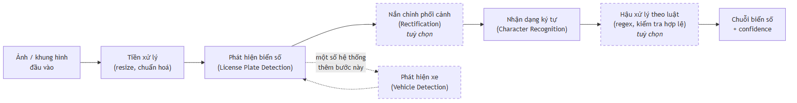
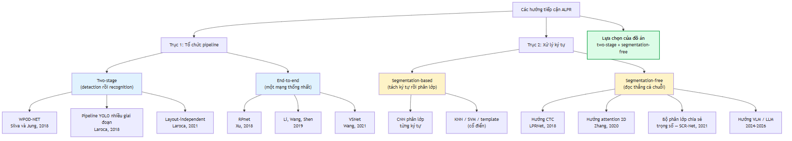

# CHƯƠNG 2. CƠ SỞ LÝ THUYẾT

Chương đặt nền lý thuyết và nền tư liệu cho phần thiết kế phía sau. Nguyên tắc giữ xuyên suốt: **mọi con số định lượng đều gắn nguồn gốc tại chính vị trí xuất hiện, và mọi cảnh báo về phạm vi áp dụng của con số đó đều được giữ nguyên** — lĩnh vực này thường công bố các con số trên 99% nhưng đo trên những tập dữ liệu và giao thức đánh giá rất khác nhau.

## 2.1. Tổng quan bài toán ALPR

### 2.1.1. Định nghĩa và các thành phần của một hệ thống ALPR

Nhận dạng biển số xe tự động (*Automatic License Plate Recognition*, ALPR) là bài toán xác định vị trí biển số trong ảnh hoặc khung hình video và chuyển nội dung ký tự trên biển thành chuỗi văn bản, đầu ra kèm vị trí và độ tin cậy (*confidence*). Khác nhận dạng văn bản trong ảnh cảnh (*scene text recognition*) tổng quát, ALPR có ràng buộc cấu trúc mạnh — kích thước chuẩn hoá, tỷ lệ khung hình cố định theo loại biển, bộ ký tự đóng, cú pháp theo luật. Đó vừa là lợi thế cho hậu xử lý theo luật, vừa là bẫy: mô hình dễ học thuộc cú pháp tập huấn luyện rồi suy giảm khi định dạng biển thay đổi, vấn đề nêu tường minh trong kiến trúc Transformer "bền vững với thay đổi định dạng" của Meyer và cộng sự [19]<!-- meyer_2025_salt -->.

Hai khảo sát kinh điển chuẩn hoá ALPR thành ba bước nối tiếp — trích xuất vùng biển, phân đoạn ký tự, nhận dạng ký tự [2]<!-- anagnostopoulos_2008_survey --> [3]<!-- du_2013_review -->; bài tổng quan cập nhật nhất giữ nguyên cách phân rã này, bổ sung thách thức biển đa quốc gia, camera chuyển động, góc nhìn thay đổi [20]<!-- li_2026_review -->. Ba khối tuỳ chọn thường được thêm: **phát hiện phương tiện** đặt trước để thu hẹp vùng tìm kiếm và giảm cảnh báo sai (*false positive*), đã áp dụng cho xe máy Việt Nam [21]<!-- le_2023_vnmotorcycle -->; **nắn chỉnh phối cảnh** (*rectification*) bằng *planar homography*, đóng góp cốt lõi của WPOD-NET [22]<!-- silva_2018_wpodnet -->; và **hậu xử lý theo luật**, mà Laroca và cộng sự hợp nhất hẳn bộ phân loại layout vào detector để chọn đúng bộ luật cho từng khu vực [23]<!-- laroca_2021_layout -->.

### 2.1.2. Ứng dụng thực tế

Bốn nhóm ứng dụng khác nhau ở điều kiện vận hành: bãi đỗ xe, kiểm soát ra vào khu công nghiệp và khu dân cư — camera cố định, khoảng cách gần, ánh sáng kiểm soát được, tức điều kiện **ràng buộc** (*constrained*); thu phí không dừng — camera cố định, xe chạy tốc độ trung bình; giám sát và xử phạt nguội — camera ngoài trời, mọi thời tiết và ánh sáng, tức điều kiện **không ràng buộc** (*unconstrained*); camera tuần tra — khó nhất vì cả camera lẫn đối tượng đều chuyển động. Phân biệt hai chế độ này là then chốt khi đọc mọi con số trong tài liệu chuyên ngành: AOLP tách ba tập con AC (*Access Control*), LE (*Law Enforcement*, camera ven đường), RP (*Road Patrol*, camera trên xe chạy), hai tập sau khó hơn đáng kể [24]<!-- hsu_2013_aolp -->; UFPR-ALPR đặt toàn bộ dữ liệu ở tình huống cả xe lẫn camera đều chuyển động [25]<!-- laroca_2018_ufpralpr -->. Riêng Việt Nam: trong thu phí không dừng đang vận hành, cơ chế nhận dạng chính là RFID, ảnh biển số chỉ để tra cứu, đối soát hoặc dự phòng khi đọc thẻ thất bại [5]<!-- vetc_nd_thuphikhongdung --> — ALPR là hệ thống bổ trợ chứ chưa phải hệ thống chính.

### 2.1.3. Các bước trong pipeline ALPR điển hình

**Hình 2.1.** Sơ đồ pipeline ALPR điển hình *(tổng hợp từ [2], [3], [20], [22], [23]; khối nét đứt là tuỳ chọn)*

Quan hệ giữa detection và recognition là **nhân quả một chiều, không có khả năng phục hồi**: bounding box lệch làm phần ký tự bị cắt cụt vĩnh viễn không có trong ảnh đưa vào OCR; ngược lại detection hoàn hảo mà OCR sai một ký tự thì cả chuỗi vẫn sai. Vì chỉ tiêu cuối cùng là khớp chuỗi tuyệt đối (*plate-level exact match*), sai số hai giai đoạn **nhân lên** chứ không bù trừ — lý do mục 2.7 nhấn mạnh chỉ số end-to-end.

## 2.2. Quy chuẩn biển số xe Việt Nam

### 2.2.1. Căn cứ pháp lý hiện hành

**Cảnh báo về văn bản đã hết hiệu lực.** Nhiều tài liệu, kể cả bài báo năm 2023 và 2024, vẫn viện dẫn **Thông tư 24/2023/TT-BCA**, văn bản **đã hết hiệu lực từ 01/01/2025** [12]<!-- bocongan_2023_tt24 -->; đồ án chỉ nhắc nó như **bối cảnh lịch sử** kèm ghi chú hiệu lực.

Bốn văn bản là căn cứ của đồ án: **TT 79/2024/TT-BCA** ký 15/11/2024, hiệu lực 01/01/2025, thay thế TT 24/2023, quy định cấu trúc biển, seri, màu sắc, ký hiệu [8]<!-- bocongan_2024_tt79 -->; **TT 13/2025/TT-BCA** ban hành 28/02/2025, sửa đổi bổ sung TT 79/2024 [9]<!-- bocongan_2025_tt13 -->; **TT 51/2025/TT-BCA** ban hành 30/6/2025, hiệu lực 01/7/2025, **thay toàn bộ Phụ lục mã tỉnh** sau sáp nhập còn 34 tỉnh/thành [10]<!-- bocongan_2025_tt51 -->; **QCVN 08:2024/BCA** kèm TT 81/2024/TT-BCA, hiệu lực 01/01/2025, là **quy chuẩn kỹ thuật quốc gia** về kết cấu, kích thước, vật liệu [11]<!-- bocongan_2024_qcvn08 -->. Biển số xe quân đội thuộc TT 169/2021/TT-BQP [15]<!-- boquocphong_2021_tt169 -->, **ngoài phạm vi** TT 79/2024.

Hai loại văn bản hay bị nhầm và module chuẩn hoá cần cả hai: TT 79/2024 quy định **nội dung** biển (mã tỉnh, seri, ký hiệu, màu) — cơ sở xây biểu thức chính quy; QCVN 08:2024/BCA quy định **hình thức vật lý** (kích thước, vật liệu, độ phản quang) — cơ sở xây ngưỡng phân loại theo tỷ lệ khung hình. Khung pháp lý đổi **ba lần trong hai năm** là rủi ro kỹ thuật trực tiếp, đúng kịch bản Meyer và cộng sự mô tả khi đề xuất kiến trúc giảm phụ thuộc cú pháp [19]. Ba hệ quả cụ thể nêu ở mục 2.2.7.

### 2.2.2. Cấu trúc biển số ô tô và xe máy

**a) Biển số ô tô** trong nước gồm **ba thành phần**, tổng **8 ký tự chữ–số**: `30A-123.45` (Hà Nội), `51K-999.99` (TP. Hồ Chí Minh, số thứ tự lớn nhất), `80B-123.45` (Cục Cảnh sát giao thông — không phải một địa phương). Ba thành phần là **mã địa phương** 2 chữ số lấy trong 81 mã hợp lệ thuộc dải 11 – 99 (mục 2.2.3) [10], [14]<!-- thuviennhadat_2025_kyhieu34tinh -->; **seri đăng ký** **1 chữ cái**, lấy trong 20 chữ cái với biển trắng và biển vàng, 11 chữ cái với biển xanh [13]<!-- bocongan_2024_nhandienbienso -->; **số thứ tự** **5 chữ số**, từ 000.01 đến 999.99 [8]. Trên đường vẫn còn **biển 4 chữ số kiểu cũ** như `29A-1234`; xe đã đăng ký **không bắt buộc đổi biển** [26]<!-- chinhphu_2025_kyhieubienso --> nên biển 4 số hợp lệ vô thời hạn, và biểu thức chính quy bắt buộc chấp nhận nhóm thứ tự **4 hoặc 5 chữ số**.

**b) Biển số xe máy** cá nhân dùng seri **2 chữ cái**, tổng **9 ký tự chữ–số**: 2 chữ số mã tỉnh, 2 chữ cái seri, 5 chữ số thứ tự — ví dụ `29-HA 002.33`. Quy tắc 2 chữ cái áp dụng từ **15/8/2023**, giữ nguyên trong TT 79/2024 [27]<!-- chinhphu_2023_seribiensoxemay -->. Hai kiểu seri cùng lưu hành: kiểu **mới** 2 chữ cái (`29-AA 123.45`) cấp từ 15/8/2023 và đang được cấp; kiểu **cũ** 1 chữ cái kết hợp 1 chữ số (`29-B1 123.45`) cấp trước 15/8/2023, vẫn lưu hành hợp pháp và trước đây **có phân biệt theo dung tích xi-lanh** — quy tắc đã bãi bỏ nhưng xe đã đăng ký không phải đổi biển [27]. Điều khoản chuyển tiếp ngày 31/12/2025 mà một số bài báo diễn giải thành "biển 1 chữ 1 số chỉ dùng đến hết năm 2025" là cách hiểu **không chính xác**: nó nói về việc dùng nốt phôi biển sản xuất trước 01/01/2025. Kết luận thực dụng: **biển kiểu cũ sẽ còn trên đường hàng chục năm**, biểu thức chính quy bắt buộc chấp nhận cả hai dạng.

**c) Một nhập nhằng cấu trúc quan trọng.** Chuỗi 8 ký tự dạng *hai chữ số – một chữ cái – năm chữ số* khớp **đồng thời** biển ô tô và biển xe máy kiểu cũ sau khi bỏ dấu phân cách, nên **không thể phân loại phương tiện chỉ bằng chuỗi ký tự** — bắt buộc thêm thông tin số dòng hoặc tỷ lệ khung hình, lý do hệ thống lưu trường số dòng như thuộc tính độc lập (Chương 4).

**d) Seri không còn cho biết loại xe.** Trước 2025 chữ cái seri mang ngữ nghĩa (`A` xe con dưới 9 chỗ, `B` xe khách trên 9 chỗ, `C` và `K` xe tải và bán tải), nhưng **từ 01/01/2025 quy định bị bãi bỏ**, seri cấp tuần tự [28]<!-- otocomvn_2025_seridangky -->; mọi heuristic "seri C suy ra xe tải" **sai về mặt pháp lý**, tín hiệu phân loại duy nhất còn hợp lệ là **màu nền biển** (mục 2.2.5).

### 2.2.3. Mã tỉnh, thành phố

Từ 01/7/2025 cả nước còn **34 tỉnh, thành phố**; ký hiệu địa phương sau hợp nhất **bao gồm toàn bộ ký hiệu của các địa phương được hợp nhất trước đó** [26], biển cũ **không mất giá trị pháp lý**, bảng tra cứu chỉ mở rộng. Dải 11 – 99 có **89 số**; theo Phụ lục TT 51/2025 có **81 mã đang dùng** (80 mã địa phương và 01 mã Cục Cảnh sát giao thông — mã 80) và đúng **8 mã không dùng** là **13, 42, 44, 45, 46, 87, 91, 96**, nằm trong kho dự trữ, không gán cho địa phương nào [14]. Kiểm tra nhất quán: 89 − 81 = 8, khớp danh sách; đếm địa phương từ bảng mã đầy đủ được 34, khớp số đơn vị hành chính sau sáp nhập. TP. Hồ Chí Minh nhiều mã nhất — 13 mã (41; 50 đến 59; 61; 72) — do sáp nhập Bình Dương (61) và Bà Rịa – Vũng Tàu (72); Hà Nội 6 mã (29; 30 đến 33; 40) [14].

Kiểm tra mã tỉnh biến 89 khả năng thành 81, loại khoảng 9,0% không gian tìm kiếm ở hai ký tự đầu; giá trị thực sự còn lớn hơn: nó biến lỗi OCR ở hai vị trí đầu từ **sai âm thầm** thành **sai phát hiện được** — đọc ra `46A-123.45` thì hệ thống biết ngay mã 46 không tồn tại và hạ cờ hợp lệ, thay vì lưu một biển số sai trông rất thuyết phục vào cơ sở dữ liệu. Giả thuyết phổ biến rằng mã 13 là mã cũ của tỉnh Hà Bắc **chưa kiểm chứng được nguồn chính thức**, chỉ nêu tham khảo, không dùng làm căn cứ.

### 2.2.4. Tập ký tự seri và các chữ cái bị loại trừ

Đây là mục dễ bị trình bày sai nhất của chương, và một cách trình bày sai đã được phát hiện, sửa trong quá trình khảo sát. Biển nền trắng và nền vàng chữ đen của tổ chức, cá nhân trong nước dùng seri là **một trong 20 chữ cái** [13]; đối chiếu 26 chữ Latin thì vắng 6 chữ `I`, `J`, `O`, `Q`, `R`, `W`, từ đó **suy diễn "26 trừ 20 bằng 6 chữ bị loại trừ" là SAI**, vì danh sách 20 chữ ấy **chỉ áp dụng cho chữ cái thứ nhất**, còn seri xe mô tô gồm **hai chữ cái** và danh sách ở **vị trí thứ hai** là tập khác — **có R**, **không có G**. Hợp hai vị trí, tập chữ không bao giờ xuất hiện trên biển số Việt Nam chỉ gồm **5 chữ: I, J, O, Q, W**; chữ R còn xuất hiện ở ký hiệu seri đặc biệt `R` và `RM` của rơ moóc, sơ mi rơ moóc [29]<!-- khobiensodep_2025_kyhieudacbiet -->.

**Bảng 2.1.** Tổng hợp các tập ký tự seri

| Tập | Số lượng | Nội dung |
|---|:--:|---|
| Chữ cái thứ nhất của seri | 20 | A B C D E F **G** H K L M N P S T U V X Y Z |
| Chữ cái thứ hai của seri xe máy | 20 | A B C D E F H K L M N P **R** S T U V X Y Z |
| Seri biển nền xanh | 11 | A B C D E F G H K L M |
| **Bị loại trừ khỏi toàn hệ thống** | **5** | **I, J, O, Q, W** |
| Tập ký tự an toàn tối thiểu cho OCR | 21 | 20 chữ ở vị trí thứ nhất, hợp thêm R |

**c) Hệ quả kỹ thuật thứ nhất — ràng buộc theo vị trí, không phải theo tập phẳng.** Xe mô tô biển nền xanh dùng 1 trong 11 chữ cái đó kết hợp 1 chữ số từ **1 đến 9** — **không có số 0** [13]. G hợp lệ ở vị trí thứ nhất nhưng không hợp lệ ở vị trí thứ hai của seri xe máy, R thì ngược lại; bộ luật hậu xử lý dùng danh sách phẳng áp chung cả chuỗi sẽ **vừa bỏ sót lỗi vừa sửa nhầm ký tự đúng**. Đây là điểm đồ án xử lý khác các mô tả hiện có, thuộc phần đóng góp kỹ thuật nêu ở Chương 1. Ràng buộc khai thác được là tập 5 chữ I, J, O, Q, W: ký tự nào trong nhóm này xuất hiện ở vị trí chữ cái đều chắc chắn là lỗi, trong đó ba ánh xạ có cơ sở hình dạng rõ ràng là `O → 0`, `I → 1`, `Q → 0`; `J` và `W` không có ứng viên thay thế hiển nhiên nên chỉ **hạ cờ hợp lệ**. Chữ R **không** thuộc nhóm này và **tuyệt đối không được ánh xạ đi**.

**d) Hệ quả kỹ thuật thứ hai — tập ký tự huấn luyện OCR.** Xây tập huấn luyện theo "20 chữ cái" thì mô hình **không bao giờ có khả năng dự đoán chữ R** và sai hệ thống trên mọi biển xe máy có R ở vị trí thứ hai; mất mát này xảy ra ở **tầng mô hình** nên hậu xử lý không cứu được.

> **Khuyến nghị áp dụng cho đồ án.** Huấn luyện tập ký tự **đầy đủ A–Z và 0–9, tức 36 ký tự**, rồi áp ràng buộc hợp lệ ở **tầng hậu xử lý** — nơi ghi log, hiệu chỉnh và đo được hiệu quả. Nếu buộc phải thu hẹp vì hiệu năng, phải dùng **21 chữ cái** (20 chữ hợp thêm R), tuyệt đối không dùng 20.

**e) Hạn chế kiểm chứng cần giữ nguyên khi trình bày.** Hai danh sách chữ cái ở Bảng 2.1 **chưa được đối chiếu với toàn văn Điều 34 Thông tư 79/2024/TT-BCA**: bản PDF chính thức trên cổng thông tin Chính phủ là bản quét không có lớp văn bản, còn cổng tra cứu văn bản pháp luật chặn truy cập tự động. Kết luận về chữ R do đó dựa trên trích dẫn điều khoản qua nguồn thứ cấp và cần được xác nhận lại khi tiếp cận được toàn văn. Việc ghi rõ hạn chế này là bắt buộc và không được lược bỏ khi rút gọn văn bản.

**f) Các ký hiệu seri đặc biệt** [29]: `CD`, `MK`, `MĐ` cho xe máy chuyên dùng, máy kéo, xe máy điện; `R`, `RM` cho rơ moóc, sơ mi rơ moóc; `HC` cho ô tô phạm vi hoạt động hạn chế và xe chở người hoặc hàng bốn bánh gắn động cơ; `KT`, `LD`, `DA` lần lượt cho doanh nghiệp quân đội, doanh nghiệp có vốn đầu tư nước ngoài cùng xe thuê từ nước ngoài, Ban quản lý dự án có vốn đầu tư nước ngoài; `T`, `TĐ` cho đăng ký tạm thời và xe sản xuất lắp ráp trong nước được thí điểm. Hai bẫy kỹ thuật: **chữ R xuất hiện ở đây** dù ngoài tập 20 chữ cái, củng cố khuyến nghị (d) rằng hậu xử lý không được cấm tuyệt đối chữ R; và `TĐ`, `MĐ` chứa `Đ` — ký tự **không thuộc bảng chữ cái Latin ASCII** — nên OCR huấn luyện trên tập Latin gần như chắc chắn trả về `D`, module chuẩn hoá phải chấp nhận cả hai dạng rồi quy về một dạng chuẩn tắc.

### 2.2.5. Màu nền và ý nghĩa

**Bảng 2.2.** Màu nền biển số và đối tượng áp dụng [13]

| Màu nền / màu chữ | Đối tượng | Ghi chú cho ALPR |
|---|---|---|
| Trắng / đen | Tổ chức, cá nhân trong nước, xe **không** kinh doanh vận tải | Phổ biến nhất |
| Vàng / đen | Xe **kinh doanh vận tải** | Tín hiệu phân loại **duy nhất còn hợp lệ** |
| Xanh dương / trắng | Cơ quan Đảng, Quốc hội, Chính phủ, Toà án, Viện kiểm sát, cơ quan nhà nước, công an | Seri chỉ dùng 11 chữ cái |
| Trắng / **đỏ** | Xe ngoại giao (`NG`) và tổ chức quốc tế (`QT`) | Cấu trúc chuỗi khác hẳn [30]<!-- vietnamnet_2023_biensongoaigiao --> |
| Đỏ / trắng | Xe quân đội và doanh nghiệp quân đội | **Ngoài phạm vi** TT 79/2024, thuộc TT 169/2021/TT-BQP [15] |

QCVN 08:2024/BCA chỉ quy định **4 tổ hợp màu** và **không có tổ hợp nền đỏ** [11] — biển nền đỏ chữ trắng của quân đội do Bộ Quốc phòng quản lý theo văn bản riêng [15], nguyên nhân của nhiều mâu thuẫn khi tra cứu. **Xe điện không có biển số riêng**: theo TT 79/2024 hiệu lực 01/01/2025, xe năng lượng sạch **không được cấp biển màu xanh lá cây** mà dùng biển thông thường kèm biểu tượng nhận diện [31]<!-- conganlangson_2024_tt79 -->, nên **không thể phát hiện xe điện qua màu biển**; `MĐ` chỉ dùng cho xe máy điện. Vì seri không còn phân biệt loại xe (mục 2.2.2d), màu nền là tín hiệu phân loại duy nhất còn hợp lệ [32]<!-- thuvienphapluat_2025_mausacseri -->; nhưng module chuẩn hoá làm việc trên **chuỗi ký tự** chứ không trên ảnh, nên phân loại theo màu nằm ngoài phạm vi của nó, cần một bước phân tích histogram màu trên ảnh crop nếu đưa vào phạm vi sau này.

### 2.2.6. Kích thước vật lý và tỷ lệ khung hình

Mục này cho cơ sở định lượng để phân biệt biển một dòng với biển hai dòng — bài toán mà mục 2.6.3 chỉ ra là then chốt với rủi ro R-04. Ô tô và xe máy chuyên dùng được cấp **02** biển gắn trước và sau, gồm 01 biển ngắn (**2 dòng**) và 01 biển dài (**1 dòng**); xe mô tô, xe gắn máy, rơ moóc và sơ mi rơ moóc được cấp **01** biển **2 dòng** gắn phía sau [32]. Hệ quả: **một ô tô mang cùng một chuỗi ký tự trên hai biển có hình dạng vật lý hoàn toàn khác nhau** — camera trước bắt biển một dòng, camera sau bắt biển hai dòng; cùng một xe nhưng là hai bài toán OCR.

**Bảng 2.3.** Kích thước và tỷ lệ khung hình của các loại biển số [11]

| Loại biển | Kích thước (dài × cao) | Tỷ lệ khung hình | Số dòng |
|---|---|:--:|:--:|
| Ô tô — biển **dài** | **520 × 110 mm** | **4,727** | **1 dòng** |
| Ô tô — biển **ngắn** | **330 × 165 mm** | **2,000** | **2 dòng** |
| **Xe mô tô, xe gắn máy** | **190 × 140 mm** | **1,357** | **2 dòng** |

> **⚠️ Cảnh báo về mốc hiệu lực của bộ số liệu kích thước.** Bộ số liệu trên **chỉ đúng từ 01/01/2025**; tiêu chuẩn trước đó quy định biển ô tô ngắn **200 × 280 mm**, biển dài **110 × 470 mm**, và rất nhiều tài liệu thứ cấp — kể cả bài báo năm 2023 — vẫn dùng bộ số cũ. Mọi trích dẫn kích thước biển số **bắt buộc ghi kèm mốc hiệu lực**; nếu không, người phản biện đối chiếu văn bản hiện hành sẽ kết luận là sai.

**Không loại biển nào rơi vào khoảng (2,000 ; 4,727)**, và khoảng trống rộng 2,727 đơn vị này khiến phân biệt một dòng với hai dòng bằng tỷ lệ khung hình trở nên đáng tin cậy. Từ đó đồ án đề xuất bộ ngưỡng phân loại bố cục: **AR < 2,5** kết luận biển **2 dòng**; **AR > 3,0** kết luận biển **1 dòng**; **2,5 ≤ AR ≤ 3,0** là **vùng nghi ngờ** — thử cả hai nhánh, chọn kết quả có độ tin cậy cao hơn.

> **Hai lưu ý bắt buộc về bộ ngưỡng này. Thứ nhất, đây là đề xuất của đồ án, KHÔNG phải quy định pháp luật:** ba giá trị 1,357 / 2,000 / 4,727 trích dẫn được từ QCVN 08:2024/BCA, nhưng ngưỡng 2,5 và 3,0 là **suy luận thiết kế của tác giả**, phải kiểm chứng bằng thực nghiệm — TT 79/2024 chỉ quy định kích thước vật lý, không chứa ngưỡng tỷ lệ khung hình nào cho bài toán phân loại thị giác máy tính, nên gán bộ ngưỡng này cho văn bản pháp luật là lỗi trích dẫn. **Thứ hai, điều kiện áp dụng bắt buộc:** phải đo tỷ lệ khung hình trên ảnh **đã nắn chỉnh phối cảnh** hoặc trên hộp bao xoay tối thiểu, **không** đo trên hộp bao thẳng trục do detector trả về, vì biển một dòng chụp nghiêng 30° có hộp bao thẳng trục với tỷ lệ tụt xuống dưới 3,0 và sẽ bị phân loại nhầm.

**d) Bố cục nội dung của biển hai dòng.** Ô tô biển ngắn: mã tỉnh và seri ở dòng trên, 5 chữ số ở dòng dưới (`30A` / `123.45`); xe máy kiểu mới: mã tỉnh và 2 chữ cái ở dòng trên, 5 chữ số ở dòng dưới (`29-AA` / `123.45`); xe máy kiểu cũ: mã tỉnh, chữ cái và chữ số ở dòng trên, 4 – 5 chữ số ở dòng dưới (`29-B1` / `123.45`).

**e) Dấu phân cách.** Quy định dùng dấu chấm phân cách ba chữ số đầu với hai chữ số sau của nhóm thứ tự và dấu gạch ngang phân cách các nhóm, nhưng các nguồn mô tả vị trí dấu gạch ngang không nhất quán và không tra cứu được nguyên văn phần quy cách in ấn của QCVN 08:2024/BCA. Thay vì đoán, đồ án chọn quyết định thiết kế an toàn: **module chuẩn hoá loại bỏ toàn bộ ký tự phân cách rồi kiểm tra hợp lệ trên chuỗi chữ–số thuần**, không cố định vị trí dấu gạch ngang trong biểu thức chính quy.

**f) Hai thông số vật lý khác.** Biển làm bằng hợp kim nhôm, có màng hoặc mực phản quang, bốn góc bo tròn, chiều cao dập nổi của chữ và số là **(1,7 ± 0,1) mm** [11]. Chữ **dập nổi** tạo bóng đổ và vùng loá phụ thuộc góc chiếu — nguồn nhiễu đặc thù của biển kim loại, nguyên nhân các lỗi kiểu `B` đọc thành `3` do loá; ngược lại chuẩn hoá vật liệu và font chữ toàn quốc là yếu tố tốt cho độ ổn định của OCR.

### 2.2.7. Ý nghĩa đối với thiết kế hệ thống nhận dạng

Bảy dữ kiện từ quy chuẩn kéo theo bảy quyết định thiết kế. **81 mã tỉnh hợp lệ trong dải 89 số** biến lỗi OCR ở hai ký tự đầu từ "sai âm thầm" thành "sai phát hiện được". **Tập ký tự seri khác nhau theo từng vị trí**, loại trừ toàn hệ thống chỉ 5 chữ I J O Q W và chữ R hợp lệ, buộc hậu xử lý ràng buộc **theo vị trí** thay vì danh sách phẳng, và buộc tập ký tự huấn luyện OCR dùng đủ 36 ký tự. **Hai kiểu seri xe máy cùng lưu hành, nhóm thứ tự có 4 hoặc 5 chữ số** buộc biểu thức chính quy chấp nhận nhiều nhánh cú pháp cùng lúc. **Chuỗi 8 ký tự khớp đồng thời biển ô tô và biển xe máy kiểu cũ** nên **không thể** phân loại phương tiện chỉ từ chuỗi ký tự, bắt buộc lưu trường số dòng như thuộc tính độc lập. **Seri không còn cho biết loại xe từ 01/01/2025** nên cấm mọi heuristic suy ra loại phương tiện từ chữ cái seri. **Ba tỷ lệ khung hình cách nhau đủ xa, khoảng trống rộng 2,727** là cơ sở định lượng cho ngưỡng phân loại bố cục (mục 2.2.6), làm lớp dự phòng cho phân loại bằng detector. Cuối cùng, **khung pháp lý đổi ba lần trong hai năm** trong khi các bộ dữ liệu công khai đều thu thập trước các mốc đó buộc hậu xử lý tách rời mô hình để cập nhật độc lập và phải lường trước lệch phân bố theo thời gian [19].

Về mức đóng góp: luận điểm dự kiến ban đầu là "khai thác tập 20 chữ cái, loại trừ 6 chữ I J O Q R W". Mệnh đề đó **sai**, và việc sửa lại làm **yếu đi** phần đóng góp nếu tính theo tiêu chí thu hẹp không gian tìm kiếm; đổi lại, phần có giá trị chuyển sang chỗ khó hơn là ràng buộc **phụ thuộc vị trí trong chuỗi**. Một hệ thống dùng danh sách phẳng 20 chữ cái sẽ sai hệ thống trên toàn bộ lớp biển xe máy có R ở vị trí thứ hai — lỗi mà bộ luật của đồ án ngăn được. Đóng góp vì vậy được trình bày là **đúng đắn về mặt pháp lý và đúng về cấu trúc**, không phải một cải thiện lớn về không gian tìm kiếm.

## 2.3. Lịch sử phát triển các phương pháp

### 2.3.1. Giai đoạn xử lý ảnh cổ điển

Trước học sâu, ALPR dùng đặc trưng thủ công (*hand-crafted features*): xám hoá, lọc cạnh dọc bằng **Sobel** (vùng biển có mật độ cạnh dọc cao bất thường), nhị phân hoá, **đóng/mở hình thái học** (*morphological closing/opening*), rồi chiếu ngang và dọc (*projection*) để khoanh vùng ứng viên [33]<!-- springer_2012_edgemorphology --> [34]<!-- ieee_2013_edgegeometrical -->; phân đoạn ký tự dựa trên thành phần liên thông (*connected components*) hoặc histogram chiếu; phân lớp ký tự dùng đối sánh mẫu (*template matching*), mạng nơ-ron nông hoặc **SVM**. Một công trình trên biển số Việt Nam phân đoạn ký tự cho **cả biển một dòng và hai dòng**, thử nghiệm trên 600 biển Việt Nam (300 một dòng và 300 hai dòng), đạt trung bình 98,03% với tiền xử lý gồm lượng tử hoá, chuẩn hoá, hiệu chỉnh contour ngang, khử nhiễu bằng morphology opening, rồi phân đoạn *peak-to-valley* dựa trên tham số thống kê của biển số Việt Nam [35]<!-- amr_2012_charsegmentation -->.

Điểm yếu cố hữu là tính giòn: mỗi ngưỡng phải hiệu chỉnh thủ công, hiệu năng sụt nhanh khi ánh sáng không đều, nền phức tạp hoặc biển nghiêng. Bằng chứng định lượng rõ nhất về khoảng cách hai thế hệ công nghệ đến từ một cài đặt cổ điển công khai cho biển số Việt Nam dùng KNN kết hợp OpenCV: phát hiện chỉ đạt **49,2% với biển một dòng** (182/370 mẫu) và **39,3% với biển hai dòng** (924/2.349 mẫu); trong số biển đã phát hiện, đọc đúng hoàn toàn chỉ 33,5% với biển một dòng và 31% với biển hai dòng [36]<!-- mrzaizai2k_2025_vietnameselp -->.

> **Lưu ý khi đọc hai con số 33,5% và 31%.** Chúng tính **trên số biển đã phát hiện được**, không phải trên toàn bộ tập kiểm thử; quy về end-to-end thì con số thực tế còn thấp hơn nhiều. Đây là ví dụ điển hình cho nguyên tắc phải đọc kỹ mẫu số của một chỉ số trước khi so sánh — phát biểu đầy đủ ở mục 2.7.1 (*"Ba lưu ý bắt buộc khi đọc Bảng 2.8"*), áp dụng lại ở mục 2.6.4.

### 2.3.2. Giai đoạn học sâu

Detector một giai đoạn (YOLO) và hai giai đoạn (Faster R-CNN) đã thay thế hoàn toàn khối phát hiện thủ công, theo hai nhịp. **Nhịp thứ nhất (khoảng 2016 – 2020) — pipeline học sâu hai giai đoạn:** Laroca và cộng sự dùng YOLO cho từng giai đoạn kèm CNN tinh chỉnh riêng, đạt **93,53% recognition rate ở 47 FPS** trên SSIG, vượt cả hai hệ thống thương mại đối chứng trên cùng benchmark [37]<!-- laroca_2018_yolo -->; Silva và Jung giới thiệu WPOD-NET để chính mạng học luôn phép biến đổi nắn chỉnh thay vì tách thành bước tiền xử lý riêng [22]; Xu và cộng sự công bố CCPD — bộ dữ liệu quy mô lớn đầu tiên của lĩnh vực — cùng baseline RPnet đạt **98,5% accuracy trên 61 FPS** [38]<!-- xu_2018_ccpd -->. **Nhịp thứ hai (2020 – 2026) — end-to-end, Transformer và mô hình ngôn ngữ–thị giác**, ba nhánh song song: hợp nhất detection và recognition vào một mạng huấn luyện end-to-end trong một lần lan truyền xuôi để tránh tích luỹ lỗi trung gian [39]<!-- li_2019_endtoend -->; bỏ hẳn phân đoạn ký tự, đọc thẳng cả chuỗi bằng CTC [40]<!-- zherzdev_2018_lprnet --> hoặc attention hai chiều trên bản đồ đặc trưng 2D [41]<!-- zhang_2020_attentional -->; và đưa mô hình ngôn ngữ–thị giác (*Vision-Language Model*, VLM) cùng mô hình ngôn ngữ lớn vào ALPR để nhận dạng không phụ thuộc layout [42]<!-- shabaninia_2025_layoutindependent --> [43]<!-- aldahoul_2024_vehiclepaligemma --> [44]<!-- gong_2026_lpllm -->.

### 2.3.3. So sánh ưu nhược điểm hai giai đoạn

**Bảng 2.4.** So sánh phương pháp xử lý ảnh cổ điển và phương pháp học sâu

| Tiêu chí | Xử lý ảnh cổ điển | Học sâu |
|---|---|---|
| Trích đặc trưng và phân lớp ký tự | Thủ công: Sobel, morphology, projection, contour; template matching, KNN, SVM, mạng nơ-ron nông | Học tự động qua các tầng tích chập; CNN, CRNN, Transformer, VLM |
| Dữ liệu gán nhãn và chi phí phát triển | Thấp, chủ yếu hiệu chỉnh ngưỡng; rẻ ban đầu nhưng tăng nhanh khi mở rộng điều kiện | Cao, cần hàng nghìn tới hàng trăm nghìn ảnh; đắt ban đầu, ổn định khi mở rộng |
| Chi phí tính toán khi suy luận | Rất thấp, chạy được trên phần cứng yếu | Cao hơn nhiều, thường cần tối ưu để chạy trên CPU |
| Chịu nghiêng, mờ, thiếu sáng; khả năng giải thích | Kém, mỗi ngưỡng phải chỉnh lại theo điều kiện; bù lại quan sát được từng bước | Tốt hơn rõ rệt nếu dữ liệu đủ đa dạng; nhưng mô hình là hộp đen |
| Bằng chứng định lượng trên biển số Việt Nam | Phát hiện 49,2% (một dòng) / 39,3% (hai dòng) [36] | Nhiều công trình báo cáo trên 90% (mục 2.7) |

Học sâu là lựa chọn bắt buộc về hiệu năng, nhưng ràng buộc **suy luận trên CPU** khiến đồ án không thể chọn tuỳ ý mô hình lớn nhất — ràng buộc chi phối toàn bộ phần lựa chọn công nghệ ở Chương 3. Kỹ thuật cổ điển không bị loại bỏ hoàn toàn: *peak-to-valley* [35] và các phép biến đổi hình học của OpenCV vẫn làm lớp dự phòng cho bài toán tách dòng (mục 2.6.3).

## 2.4. Phân loại các hướng tiếp cận hiện nay

Tài liệu chuyên ngành thường trộn lẫn hai trục vốn độc lập: **cách tổ chức pipeline** (two-stage hay end-to-end) và **cách xử lý ký tự bên trong khối nhận dạng** (segmentation-based hay segmentation-free). Một hệ thống two-stage hoàn toàn có thể dùng bộ nhận dạng segmentation-free và ngược lại.

### 2.4.1. Two-stage và end-to-end

**Two-stage** tách detection và recognition thành hai mô hình độc lập: tối ưu, thay thế, gỡ lỗi riêng được, tận dụng được OCR huấn luyện sẵn, xác định được khối nào gây lỗi; nhược điểm là lỗi detection lan truyền không có cơ chế phục hồi và thời gian suy luận là tổng hai bước. Đại diện: WPOD-NET [22], pipeline YOLO nhiều giai đoạn [37], hệ thống độc lập layout của Laroca và cộng sự [23]. **End-to-end** hợp nhất vào một mạng: Li, Wang và Shen trình bày mạng thống nhất định vị và nhận dạng trong **một lần lan truyền xuôi duy nhất**, vừa tránh tích luỹ lỗi trung gian vừa tăng tốc độ [39]; RPnet đồng thời dự đoán bounding box và đọc chuỗi [38]. Nhược điểm là mất tính module — thay bộ nhận dạng thì phải huấn luyện lại toàn mạng.

### 2.4.2. Segmentation-based và segmentation-free

**Segmentation-based** tách từng ký tự rồi phân lớp riêng lẻ — pipeline YOLO nhiều giai đoạn của Laroca và cộng sự theo hướng này, kết hợp tăng cường dữ liệu bằng biển đảo ngược và ký tự lật [37]; nhược điểm cố hữu là chất lượng phân đoạn quyết định toàn bộ kết quả, biển mờ, dính bẩn hoặc ký tự sát nhau khiến bước này thất bại. **Segmentation-free** bỏ hẳn tách ký tự, đọc thẳng cả chuỗi, gồm bốn nhánh: **CTC** huấn luyện end-to-end bằng *Connectionist Temporal Classification loss*, không cần căn chỉnh vị trí ký tự với nhãn — đại diện LPRNet, hệ thống thời gian thực không dùng RNN [40]; **attention / seq2seq** dùng attention hai chiều trên bản đồ đặc trưng 2D, không cần heuristic hay hậu xử lý — đại diện khung attention với encoder Xception [41]; **bộ phân lớp chia sẻ trọng số** bỏ cả RNN lẫn phân đoạn ký tự — đại diện SCR-Net trong VSNet [45]<!-- wang_2021_vsnet -->; và **VLM / LLM** đọc trực tiếp, bỏ luôn phân loại layout thủ công [42], [44]. Về đa layout có hai chiến lược đối lập: **phân loại layout tường minh** — Laroca và cộng sự hợp nhất phát hiện biển và phân loại layout vào cùng một mạng để chọn đúng luật hậu xử lý cho từng vùng lãnh thổ, đạt **96,9% end-to-end recognition rate trung bình trên 8 tập dữ liệu công khai từ 5 khu vực** [23]; và **không phụ thuộc layout** — dùng VLM kết hợp tinh chỉnh hậu-OCR để vừa nhận dạng vừa sửa lỗi, bỏ hoàn toàn bước phân loại layout thủ công [42].

### 2.4.3. Sơ đồ phân loại

**Hình 2.2.** Sơ đồ phân loại hai trục các hướng tiếp cận ALPR và định vị lựa chọn của đồ án

Đồ án theo **two-stage** ở trục thứ nhất và dùng bộ nhận dạng **segmentation-free** có sẵn ở trục thứ hai. Lựa chọn two-stage là hệ quả của một ràng buộc kiến trúc cứng — phải **thay được bộ OCR mà không huấn luyện lại toàn hệ thống** — vì như trình bày ở mục 3.3, quyết định về engine OCR chưa chốt ở giai đoạn thiết kế mà phụ thuộc thực nghiệm, trong khi end-to-end sẽ khoá cứng lựa chọn đó. Về đa layout, đồ án chọn **phân loại layout tường minh** thay vì VLM vì VLM có chi phí suy luận cao hơn nhiều bậc độ lớn, không tương thích ràng buộc CPU (số liệu ở mục 2.7.1), còn quy chuẩn Việt Nam đã cho sẵn cơ sở định lượng rất mạnh để phân loại layout (mục 2.2.6).

## 2.5. Cơ sở lý thuyết về phát hiện đối tượng

### 2.5.1. Bài toán object detection, IoU và NMS

**Phát hiện đối tượng** (*object detection*) đồng thời định vị và phân loại đối tượng: với ảnh $I$, mô hình trả về tập dự đoán gồm hộp bao (*bounding box*) $B = (x, y, w, h)$, nhãn lớp $c$ và điểm tin cậy $s \in [0, 1]$; bài toán của đồ án chỉ có một lớp `license_plate`. **Intersection over Union (IoU)** đo chồng lấp giữa hộp dự đoán $B_p$ và hộp thực $B_{gt}$:

$$\mathrm{IoU}(B_p, B_{gt}) = \frac{|B_p \cap B_{gt}|}{|B_p \cup B_{gt}|}$$

(2.1)

IoU nằm trong $[0, 1]$, bằng 1 khi hai hộp trùng khít; một dự đoán được coi là đúng (*true positive*) khi IoU vượt ngưỡng cho trước, thông thường 0,5, còn $P_{75}$ nghĩa là precision đo tại ngưỡng IoU 0,75 — chặt hơn đáng kể. Với biển số, **hộp bao rất dẹt** nên IoU nhạy với sai số định vị hơn hộp gần vuông: với hộp tỷ lệ 4,7:1, lệch vài pixel theo chiều cao làm IoU giảm mạnh hơn hẳn cùng mức lệch trên hộp vuông cùng diện tích — nguyên nhân khoảng cách rất lớn giữa mAP@0.5 và mAP@0.5:0.95 (mục 2.5.4).

**Non-Maximum Suppression (NMS)** khử các hộp chồng lấp cùng dự đoán một đối tượng: sắp xếp theo điểm tin cậy giảm dần, giữ hộp cao nhất, loại mọi hộp có IoU với nó vượt ngưỡng NMS, lặp lại. Ngưỡng NMS quá thấp xoá nhầm hai biển thật nằm sát nhau, quá cao để lọt hộp trùng lặp — với ảnh giao thông Việt Nam nhiều xe máy sát nhau, đây là tham số cần hiệu chỉnh cẩn thận, giá trị cụ thể xác định bằng thực nghiệm ở Chương 5; hạ ngưỡng tin cậy thì tăng recall và giảm precision. Hướng mới là **bỏ hẳn NMS**: YOLOv10 dùng *consistent dual assignments*, đầu one-to-many chỉ dùng khi huấn luyện và đầu one-to-one khi suy luận, sinh đúng một dự đoán mỗi đối tượng [46]<!-- wang_2024_yolov10paper -->; YOLO26 đưa NMS-free thành mặc định [47]<!-- jocher_2025_yolo26 -->.

### 2.5.2. Kiến trúc YOLO: nguyên lý one-stage và anchor-free

**Họ two-stage** (Faster R-CNN, Mask R-CNN) sinh vùng đề xuất (*region proposals*) rồi phân loại và tinh chỉnh từng đề xuất, chi phí tỷ lệ số đề xuất nên độ trễ cao; **họ one-stage** (YOLO, SSD, RetinaNet) hồi quy trực tiếp hộp bao và điểm phân lớp trong một lần lan truyền xuôi, chi phí cố định theo kích thước ảnh nên đạt thời gian thực. Ràng buộc CPU loại họ two-stage ngay từ đầu, và khoảng cách độ chính xác giữa hai họ cũng đã thu hẹp gần hết — một nghiên cứu ALPR trên 50.000 ảnh và 10.000 video clip so sánh YOLOv5, YOLOv8, YOLOv9, YOLOv10 với Faster R-CNN và SSD kết luận nhóm YOLO vượt trội cả về độ chính xác lẫn thời gian suy luận [48]<!-- scirep_2025_advanceddl -->.

**Hình 2.3.** Kiến trúc tổng quát backbone – neck – head của YOLO11 *(theo [49], [16])*

Ba phần của một mô hình YOLO hiện đại: **backbone** trích đặc trưng qua chuỗi khối tích chập, thường kết thúc bằng SPPF (*Spatial Pyramid Pooling – Fast*) gộp thông tin đa tỷ lệ; **neck** hợp nhất đặc trưng nhiều tầng theo hai chiều — đường đi xuống mang ngữ nghĩa từ tầng sâu về tầng nông, đường đi lên mang vị trí từ tầng nông lên tầng sâu; **head** sinh dự đoán, và từ YOLOv8 Ultralytics dùng **anchor-free split head** tách nhánh phân loại khỏi nhánh hồi quy, bỏ nhu cầu tinh chỉnh anchor box thủ công [49]<!-- jocher_2023_yolov8 -->. Anchor-free có ý nghĩa riêng với biển số: kiến trúc anchor-based (YOLOv5 trở về trước) hồi quy độ lệch so với tập hộp mẫu thiết kế theo phân bố tỷ lệ khung hình của tập huấn luyện — thường là COCO — mà biển số nằm ngoài phân bố đó (một dòng khoảng 4,7:1, hai dòng khoảng 1,4:1; số liệu chính xác ở mục 2.2.6), buộc thiết kế lại tập anchor hoặc chạy k-means; anchor-free hồi quy **trực tiếp khoảng cách từ tâm đến bốn cạnh** nên xử lý cả hai chế độ tỷ lệ bằng một cơ chế và bỏ hẳn một nhóm siêu tham số [16]<!-- jocher_2024_yolo11 -->.

### 2.5.3. YOLO11: các cải tiến kiến trúc

Bài tổng quan độc lập xác định ba thành phần chính của YOLO11 là **C3k2**, **SPPF**, **C2PSA** [50]<!-- khanam_2024_yolov11overview -->; phần dưới đối chiếu trực tiếp mã nguồn định nghĩa các khối trong Ultralytics [51]<!-- ultralytics_2026_blockpy --> thay vì dựa vào mô tả thứ cấp. **a) C3k2 — không phải kiến trúc mới, mà là C2f có thể hoán đổi khối con:** mã nguồn cho thấy `C3k2` **kế thừa trực tiếp từ `C2f`** của YOLOv8 và mang đúng mô tả *"Faster Implementation of CSP Bottleneck with 2 convolutions"*; khác biệt duy nhất là một cờ quyết định nội dung danh sách khối con — cờ tắt dùng `Bottleneck` tiêu chuẩn và **giống hệt C2f**, cờ bật dùng khối `C3k` kế thừa từ `C3`, cho phép tuỳ chỉnh kích thước nhân tích chập [51]. Điều đó giải thích vì sao YOLO11 giảm được tham số mà vẫn giữ hoặc tăng độ chính xác: không đổi triết lý CSP, chỉ cấu hình linh hoạt hơn ở mức khối. **b) C2PSA — thành phần mà YOLOv8 hoàn toàn không có**, khác biệt kiến trúc thực sự giữa hai phiên bản; vị trí **ngay sau SPPF trong backbone** là điểm bản đồ đặc trưng đã tổng hợp thông tin đa tỷ lệ, nơi attention theo vị trí tái phân bổ trọng số theo vị trí không gian. Tài liệu so sánh chính thức của Ultralytics khẳng định cơ chế này cải thiện mạnh phát hiện **đối tượng nhỏ** và xử lý **che khuất phức tạp** so với YOLOv8 [52]<!-- ultralytics_2025_yolo11vsyolov8 -->.

> **Lưu ý về mức độ chứng minh của luận cứ trên.** Phát biểu về cải thiện đối tượng nhỏ là **định tính**: Ultralytics không công bố AP_small, AP_medium, AP_large tách riêng theo chuẩn COCO cho từng biến thể, nên **không thể trích dẫn số liệu chính thức** để chứng minh định lượng YOLO11 tốt hơn YOLOv8 trên đối tượng nhỏ bao nhiêu [16]. Đồ án do đó phải **tự đo trên tập dữ liệu biển số của mình**; kết quả ở Chương 5.

**Bảng 2.5.** So sánh khác biệt kiến trúc giữa các phiên bản YOLO gần đây

| Phiên bản | Khối backbone | Cơ chế attention | Đầu dự đoán | NMS | Điểm mới đáng chú ý nhất |
|---|---|---|---|:--:|---|
| YOLOv8 [49] | C2f | Không có | Anchor-free, tách nhánh | Có | Chuyển sang anchor-free |
| YOLOv9 [53]<!-- wang_2024_yolov9 --> | GELAN | Không có | Anchor-free | Có | PGI chống mất mát thông tin |
| YOLOv10 [46] | Rank-guided blocks | Partial self-attention | Hai đầu song song | **Không** | Consistent dual assignments |
| **YOLO11** [16] | **C3k2** (kế thừa C2f) | **C2PSA** sau SPPF | Anchor-free, tách nhánh | Có | C2PSA cải thiện đối tượng nhỏ |
| YOLOv12 [54]<!-- tian_2025_yolov12 --> / YOLOv13 [55]<!-- lei_2025_yolov13 --> | R-ELAN / DS-C3k2 | Area Attention / HyperACE (hypergraph) | Anchor-free | Có | Attention làm trung tâm; tương quan bậc cao, FullPAD |
| YOLO26 [47] | Kế thừa dòng Ultralytics | Kế thừa dòng Ultralytics | **Bỏ DFL** | **Không** (mặc định) | Bỏ DFL, dễ xuất và lượng tử hoá |

Luận cứ chọn YOLO11 cho đồ án trình bày đầy đủ ở mục 3.2.

### 2.5.4. Các chỉ số đánh giá khối phát hiện

**a) Precision, Recall và F1.** Với $TP$ số dự đoán đúng, $FP$ số dự đoán sai, $FN$ số đối tượng bị bỏ sót:

$$\mathrm{Precision} = \frac{TP}{TP + FP}, \qquad \mathrm{Recall} = \frac{TP}{TP + FN}, \qquad F_1 = \frac{2 \cdot \mathrm{Precision} \cdot \mathrm{Recall}}{\mathrm{Precision} + \mathrm{Recall}}$$

(2.2)

$F_1$ là trung bình điều hoà, dùng khi cần một con số tổng hợp duy nhất. Với ALPR, **recall của detection quan trọng hơn precision**: biển bị bỏ sót là mất vĩnh viễn, còn vùng báo nhầm sẽ bị OCR và hậu xử lý loại ở bước sau vì chuỗi không khớp cú pháp biển số Việt Nam.

**b) AP và mAP.** AP của một lớp là diện tích dưới đường cong Precision–Recall với $p(r)$ là precision tại mức recall $r$; mAP là trung bình AP trên $N$ lớp, và bài toán một lớp của đồ án có $N = 1$ nên mAP trùng AP của lớp `license_plate`:

$$\mathrm{AP} = \int_0^1 p(r)\, \mathrm{d}r, \qquad \mathrm{mAP} = \frac{1}{N}\sum_{i=1}^{N} \mathrm{AP}_i$$

(2.3)

**c) mAP@0.5 và mAP@0.5:0.95 — hai chỉ số khác nhau, không được so sánh chéo.** **mAP@0.5** tính AP tại **một ngưỡng IoU cố định 0,5** — chỉ cần chồng lấp một nửa đã tính là đúng; **mAP@0.5:0.95** lấy **trung bình AP trên 10 ngưỡng IoU** từ 0,5 đến 0,95 bước 0,05:

$$\mathrm{mAP@0.5\!:\!0.95} = \frac{1}{10}\sum_{t \in \{0{,}50;\, 0{,}55;\, \ldots;\, 0{,}95\}} \mathrm{mAP@}t$$

(2.4)

> **Trên cùng một mô hình và cùng một tập dữ liệu, mAP@0.5:0.95 LUÔN nhỏ hơn hoặc bằng mAP@0.5** — vì mAP@0.5 là một trong mười số hạng của phép trung bình ở (2.4), và là số hạng lớn nhất.

Khoảng cách giữa hai chỉ số trong bài toán biển số thường rất lớn do hộp bao dẹt (mục 2.5.1), với ba minh chứng: Batra và cộng sự đạt **mAP@0.5 = 87,2%** trong khi **mAP@0.5:0.95 chỉ 46,5%** trên biển số Ấn Độ [56]<!-- batra_2022_yolov5 -->; một nghiên cứu YOLOv11 cho phát hiện biển số đạt **mAP@0.5 = 0,906** nhưng **mAP@0.5:0.95 = 0,631** [57]<!-- jaic_2025_yolov11alpr -->; một nghiên cứu trên biển xe máy Indonesia đạt **mAP@0.5 = 99,5%** nhưng **mAP@0.5:0.95 = 80,7%** [58]<!-- jcosine_2025_yolo11plate -->. Cả ba xác nhận: **biển số dễ phát hiện nhưng khó khớp hộp bao chính xác**.

> **⚠️ Cảnh báo phương pháp luận bắt buộc giữ nguyên.** Một cách trình bày phổ biến và **sai** là đặt mAP@0.5 của một nghiên cứu ALPR (khoảng 0,90 – 0,99) cạnh mAP@0.5:0.95 trên COCO của cùng lớp mô hình (khoảng 0,395 ở phân khúc nano [16]) rồi kết luận "bài toán biển số dễ hơn bài toán COCO". Đây là **so sánh giữa hai chỉ số có định nghĩa khác nhau**, và theo hệ quả toán học nêu trên, chênh lệch giữa chúng **không mang bất kỳ thông tin nào** về độ khó tương đối. Phép đối chiếu hợp lệ duy nhất là mAP@0.5 với mAP@0.5, hoặc mAP@0.5:0.95 với mAP@0.5:0.95, **và trên cùng một tập dữ liệu**; ngay cả khi cùng định nghĩa nhưng khác tập dữ liệu, so sánh cũng chỉ để cảm nhận độ khó chứ không làm luận cứ cho quyết định kỹ thuật. Lỗi này đã được phát hiện và sửa trong quá trình khảo sát tài liệu của đồ án, nêu tường minh ở đây vì hội đồng phản biện phát hiện rất nhanh.

**d) Chỉ tiêu của đồ án.** Vì mục tiêu của detection là cắt được vùng crop đủ tốt để OCR đọc chứ không phải khớp hộp bao đến từng pixel, đồ án dùng **mAP@0.5 làm chỉ tiêu chính**, còn **mAP@0.5:0.95 vẫn báo cáo đầy đủ** để thể hiện chất lượng định vị nhưng không đặt ngưỡng chấp nhận trên nó; giá trị thực tế của cả hai ở Chương 5. **e) mIoU.** Một số công trình dùng IoU trung bình toàn tập (*mean IoU*) thay mAP — nhóm Học viện Kỹ thuật Quân sự báo cáo mIoU 95,01% cho khâu phát hiện trên biển số Việt Nam [59]<!-- lqdtu_2021_vietnameselpr --> — đây là chỉ số khác mAP và cũng không so sánh chéo được.

## 2.6. Cơ sở lý thuyết về nhận dạng ký tự

### 2.6.1. Bài toán OCR và đặc thù khi áp dụng cho biển số

**Nhận dạng ký tự quang học** (*Optical Character Recognition*, OCR) chuyển văn bản trong ảnh thành chuỗi ký tự, thường gồm **text detection** khoanh vùng rồi **text recognition** đọc nội dung từng vùng. Một sai lầm phổ biến là lấy thẳng bảng xếp hạng OCR phổ thông làm căn cứ chọn engine cho ALPR.

**Bảng 2.6.** So sánh OCR văn bản tài liệu và OCR biển số xe

| Chiều so sánh | OCR văn bản tài liệu | OCR biển số xe |
|---|---|---|
| Nguồn ảnh | Ảnh quét hoặc chụp tài liệu, gần chính diện | Ảnh cảnh ngoài trời, phối cảnh nghiêng, chói sáng, nhoè do chuyển động |
| Độ dài chuỗi và tập ký tự | Hàng trăm đến hàng nghìn ký tự; tập lớn, mở, kèm dấu và dấu câu | 7 – 9 ký tự; tập đóng — **chỉ A–Z và 0–9** |
| Bố cục | Nhiều dòng, đa cột, ngắt dòng tuỳ ý | Cố định: 1 hoặc 2 dòng theo quy chuẩn nhà nước |
| Ràng buộc cú pháp và vai trò hậu xử lý | Gần như không có; hậu xử lý chỉ phụ trợ | Rất chặt, kiểm tra được bằng biểu thức chính quy; hậu xử lý **bắt buộc**, là lớp sửa lỗi chính |
| Tiêu chí đánh giá | CER / WER — chấp nhận sai lẻ tẻ | **Khớp chuỗi tuyệt đối** — sai 1 ký tự là hỏng cả bản ghi |
| Giá trị của thông tin ngôn ngữ | Cao — mô hình ngôn ngữ sửa lỗi hiệu quả | **Thấp** — không có từ vựng để dựa vào |

Bốn hệ quả cho thiết kế khối nhận dạng: **tập ký tự đóng là tài sản chứ không phải hạn chế** — biển số Việt Nam chỉ dùng A–Z và 0–9 không dấu nên ưu thế "hỗ trợ tiếng Việt" của các engine là **vô nghĩa**, tệ hơn, mô hình đa ngôn ngữ hệ Latin mang từ điển hàng trăm ký tự có dấu làm tăng cả không gian nhầm lẫn lẫn thời gian suy luận; **ràng buộc cú pháp bù được điểm yếu về whitelist** qua lớp hậu xử lý theo biểu thức chính quy sửa nhầm lẫn hình dạng theo từng vị trí (Chương 4); đây là **ảnh cảnh chứ không phải ảnh tài liệu** nên benchmark OCR trên hoá đơn hay trang văn bản chỉ có giá trị tham chiếu xu hướng; và **bố cục hai dòng là một lớp bài toán riêng** (mục 2.6.3).

### 2.6.2. Kiến trúc CRNN và hàm mất mát CTC

**CRNN** (*Convolutional Recurrent Neural Network*) gồm ba tầng: **tầng tích chập** trích đặc trưng và — điểm mấu chốt — downsample chiều cao ảnh **về 1**, biến bản đồ đặc trưng hai chiều thành **chuỗi vector đặc trưng** theo chiều rộng, mỗi vector ứng một dải dọc hẹp của ảnh gốc; **tầng hồi quy**, thường hai lớp Bi-LSTM, mô hình hoá ngữ cảnh theo cả hai chiều; **tầng phiên mã** giải mã chuỗi xác suất thành chuỗi ký tự, thường bằng CTC. EasyOCR dùng đúng kiến trúc này với backbone CNN mặc định ResNet, hai lớp Bi-LSTM và bộ giải mã CTC [60]<!-- jaided_2025_easyocrdeepwiki -->; PaddleOCR dùng SVTR-LCNet kết hợp GTC (CTC hướng dẫn bởi attention) [17]<!-- cui_2026_ppocrv5 -->, vẫn thuộc họ CTC.

**Hàm mất mát CTC** (*Connectionist Temporal Classification*) giải vấn đề khi huấn luyện ta biết chuỗi nhãn đúng (ví dụ `30A12345`) nhưng **không biết mỗi ký tự nằm ở cột đặc trưng nào**. CTC thêm **ký hiệu trống** (*blank*) $\varepsilon$, định nghĩa ánh xạ $\mathcal{B}$ từ chuỗi thô dài $T$ cột về chuỗi nhãn bằng cách gộp ký tự lặp liên tiếp rồi xoá $\varepsilon$ — ví dụ $\mathcal{B}(\texttt{3}\varepsilon\texttt{00}\varepsilon\texttt{A}) = \texttt{30A}$ — và tính xác suất chuỗi nhãn $\mathbf{l}$ bằng tổng xác suất của **mọi** đường đi thô $\boldsymbol{\pi}$ ánh xạ về nó, với $y^{t}_{k}$ là xác suất gán cho ký tự $k$ tại cột $t$:

$$p(\mathbf{l} \mid \mathbf{x}) = \sum_{\boldsymbol{\pi} \in \mathcal{B}^{-1}(\mathbf{l})} \prod_{t=1}^{T} y^{t}_{\pi_t}, \qquad \mathcal{L}_{\mathrm{CTC}} = -\log p(\mathbf{l} \mid \mathbf{x})$$

(2.5)

Tổng ở (2.5) tăng theo hàm mũ nhưng tính được hiệu quả bằng quy hoạch động tiến–lùi (*forward–backward*). Ưu điểm quyết định: **không cần nhãn vị trí từng ký tự** — lý do CTC là lựa chọn mặc định của hầu hết engine OCR mã nguồn mở, và cũng là lý do LPRNet đạt 3 ms mỗi biển trên GPU GTX 1080 và 1,3 ms trên CPU i7-6700K mà vẫn tới 95% accuracy trên biển số Trung Quốc [40].

### 2.6.3. Vì sao kiến trúc CTC gặp khó với văn bản nhiều dòng

Mục kỹ thuật quan trọng nhất của chương: nó thiết lập nền tảng lý thuyết cho rủi ro **R-04**, được đánh giá "khả năng xảy ra Cao, mức ảnh hưởng Cao" trong hồ sơ yêu cầu — và ở Việt Nam nơi xe máy chiếm áp đảo, biển hai dòng là dạng phổ biến chứ không phải ngoại lệ.

**a) Giả định alignment đơn điệu của CTC.** Ánh xạ $\mathcal{B}$ ở (2.5) hoạt động trên **chuỗi một chiều** theo trục $t$, mà $t$ chính là **trục chiều rộng ảnh**; CTC do đó giả định ngầm các ký tự xuất hiện **tuần tự trái sang phải trên một dòng duy nhất** — bản chất toán học của hàm mất mát, không phải tuỳ chọn cấu hình. Khi ảnh có hai dòng, giả định bị vi phạm nghiêm trọng: tầng tích chập đã downsample chiều cao **về 1** nên mỗi vector đặc trưng tại cột $t$ chứa **cả hai ký tự chồng nhau theo chiều dọc**, mạng bị ép chọn một trong hai, cho ra chuỗi lộn xộn hoặc chỉ đọc được một dòng [61]<!-- arxiv_2019_arbitraryshaped -->.

**Hình 2.4.** Cơ chế sụp đổ của CTC trên ảnh văn bản hai dòng *(theo [61])*

**b) Bằng chứng cụ thể trong PaddleOCR — tham số `rec_image_shape`.** Module recognition của PP-OCRv3, v4 và v5 resize mọi ảnh về **chiều cao cố định 48 pixel** theo mặc định `rec_image_shape = 3 × 48 × 320` [62]<!-- paddleocr_nd_issue14109 -->. Áp vào biển xe máy Việt Nam tỷ lệ 1,357 (mục 2.2.6): đưa thẳng crop biển 2 dòng vào module rec thì chiều rộng sau resize chỉ còn $48 \times 1{,}357 \approx$ **65 px** và mỗi dòng chỉ **≈ 24 px** chiều cao — không đủ phân biệt nét ký tự, **không đọc được**; sau khi tách dòng và ghép ngang (AR $\approx$ 5,43) chiều rộng thành $48 \times 5{,}43 \approx$ **261 px**, tức tăng khoảng 4 lần, và mỗi dòng được trọn vẹn **48 px** — **đọc được**. Đây là con số giải thích gọn toàn bộ rủi ro R-04, và kết luận kiến trúc rút ra là: **không tồn tại cấu hình nào của module recognition PP-OCR giải được bài toán này**; phải giải ở **tầng trên** bằng module tách dòng đặt trước OCR, hoặc thay hẳn mô hình recognition — lý do mục 3.3 kết luận việc chọn engine OCR **không quyết định** thành bại của R-04.

**c) Bằng chứng định lượng độc lập.** *Thứ nhất — điểm gãy của một hệ thống thương mại trưởng thành:* nghiên cứu về tổng quát hoá xuyên tập dữ liệu thiết kế tập kiểm thử cân bằng có chủ ý **trên bộ RodoSol-ALPR (Brazil)** gồm 4.000 ảnh ô tô (biển một dòng) và 4.000 ảnh xe máy (biển hai dòng); OpenALPR nhận đúng **3.772/4.000 ô tô, tức 94,3%**, nhưng chỉ **1.827/4.000 xe máy, tức 45,7%** — chênh **48,6 điểm phần trăm** trên cùng hệ thống, cùng tập kiểm thử, không biến số nào khác ngoài bố cục biển [7]<!-- laroca_2022_crossdataset -->; rộng hơn, cả 12 phương pháp và 2 hệ thống thương mại được đánh giá đều **không vượt quá 70% recognition rate** trên bộ này, và chính bài báo ghi nhận có công trình **không thể sửa được phương pháp để xử lý biển nhiều dòng** nên đã **loại bỏ hoàn toàn xe máy** khỏi thí nghiệm [7].

> **⚠️ Cảnh báo phạm vi áp dụng — bắt buộc giữ nguyên.** Cặp số 94,3% / 45,7% được đo trên bộ **RodoSol-ALPR của Brazil**, **không phải trên dữ liệu Việt Nam**. Nó được dẫn ở đây như một *analogue* định lượng về độ khó vượt trội của biển hai dòng xe máy tại một quốc gia cũng có tỷ lệ xe máy cao. Trích dẫn nhầm cặp số này thành số liệu Việt Nam là lỗi trích dẫn nghiêm trọng.

*Thứ hai — chỉ riêng kích thước ảnh đầu vào đã đủ phá huỷ hiệu năng:* trong PatrolVision, cùng một mô hình chỉ đổi kích thước ảnh vào thì với 240×80 (dạng dài, thiết kế cho biển một dòng) biển một dòng đạt 83% nhưng biển hai dòng **chỉ 30%**, còn với 288×200 (tỷ lệ khoảng 3:2, bao phủ cả hai bố cục) hiệu năng tổng thể lên 67% [63]<!-- arxiv_2025_patrolvision --> — xác nhận vấn đề nằm ở **hình học ảnh đưa vào** đúng như phân tích ở (b). *Thứ ba — hiệu quả của giải pháp tách và ghép:* các cài đặt tham chiếu xử lý biển hai tầng của Trung Quốc đều cắt crop thành hai phần theo chiều dọc rồi ghép nối tiếp theo chiều ngang, biến bài toán hai dòng thành một dòng trước khi vào OCR [64]<!-- we0091234_nd_doubleplatesplit --> — chính phương án đã chứng minh về mặt số học ở (b). **d) Điều kiện tiên quyết: nắn chỉnh trước khi tách.** Cả chiếu ngang tìm điểm trũng lẫn phân ngưỡng theo toạ độ dọc đều **vô hiệu khi biển nghiêng** — hai dòng chồng lấn theo trục dọc, không tồn tại đường cắt ngang nào tách được. Vì vậy nghiên cứu cổ điển về phân đoạn ký tự biển số Việt Nam đặt bước hiệu chỉnh contour ngang ngay ở tiền xử lý [35], còn các cài đặt hiện đại đều gọi biến đổi phối cảnh bốn điểm trước khi tách [64].

**Bảng 2.7.** Các phương pháp phân biệt biển một dòng và biển hai dòng

| Phương án | Cơ chế | Ưu điểm và hạn chế |
|---|---|---|
| **PA-1.** Lấy lớp từ chính detector | YOLO xuất thêm một lớp: `0` = một dòng, `1` = hai dòng [64] | Chính xác nhất, chi phí gần bằng 0 khi tự gán nhãn; phải gán nhãn hai lớp ngay từ đầu |
| **PA-2.** Ngưỡng tỷ lệ khung hình | So ngưỡng suy ra từ quy chuẩn (mục 2.2.6) | Rẻ nhất, không cần huấn luyện; sai khi biển nghiêng nếu đo trên hộp bao thô |
| **PA-3.** Chiếu ngang tìm điểm trũng | Tổng cường độ pixel theo hàng; biển hai dòng có điểm trũng sâu ở giữa [35] | Vị trí cắt thích nghi từng ảnh; điểm trũng biến mất khi biển nghiêng |
| **PA-4.** Phân cụm hộp bao theo toạ độ dọc | Dùng đầu ra text detection của engine OCR, gom nhóm theo tâm dọc [65]<!-- paddlepaddle_nd_ocrpipeline --> | Tái dùng kết quả sẵn có; phụ thuộc chất lượng text detection trên crop nhỏ |
| **PA-5.** Kiểm tra tính thẳng hàng của ký tự | Nối tâm ký tự trái nhất và phải nhất thành đường thẳng, đo độ lệch các ký tự còn lại [66]<!-- trungdinh22_nd_helper --> | Trực quan, dễ gỡ lỗi; cần phát hiện từng ký tự, ngưỡng pixel tuyệt đối phụ thuộc độ phân giải |

**e) Lựa chọn của đồ án.** Đồ án chọn **PA-1 làm phương án chính, PA-2 làm lớp dự phòng**; thiết kế chi tiết ở Chương 4, kết quả đo từng phương án ở Chương 5. **f) Fine-tune là bắt buộc, không phải tuỳ chọn.** Ứng dụng nhận dạng biển số nhẹ chính thức của PaddleOCR thử trên CCPD cho thấy khoảng cách giữa trọng số pre-trained và bản tinh chỉnh: detection tăng Hmean từ **76,12% lên 99,00%**, recognition từ **90,97% lên 94,54%** [67]<!-- paddlepaddle_nd_plateapp -->.

> **Lưu ý cách đọc số liệu này.** Tài liệu gốc ghi độ chính xác recognition pre-trained là 0,00%, nhưng con số đó **không** có nghĩa PaddleOCR không đọc được biển số: mô hình pre-trained sinh thêm một ký tự đặc biệt khiến cả chuỗi sai theo tiêu chí khớp tuyệt đối, chỉ cần một bước hậu xử lý loại ký tự đó là đạt 90,97% [67]. Trình bày "0% nghĩa là pre-trained vô dụng" là kết luận quá mạnh và sai; luận điểm đúng và vẫn rất mạnh là **tinh chỉnh nâng recognition từ 90,97% lên 94,54% và detection từ 76,12% lên 99,00%**. Cũng cần ghi nhận số liệu này đo trên **biển số Trung Quốc một dòng**, nên nó chứng minh sự cần thiết của tinh chỉnh chứ không chứng minh được điều gì về biển hai dòng Việt Nam.

**g) Vì sao không chọn kiến trúc thuần Transformer.** TrOCR resize ảnh thành ô vuông 384×384, chia 576 mảnh, mã hoá bởi BEiT và giải mã bởi RoBERTa [68]<!-- li_2021_trocr -->; hướng này bị loại vì ba lý do độc lập cùng chỉ về một phía: TrOCR huấn luyện cho văn bản **một dòng** nên với ảnh nhiều dòng **có thể sinh ra ảo giác** (*hallucinate*) — tạo ký tự không tồn tại trong ảnh [69]<!-- roboflow_2025_trocr -->; quy mô quá lớn cho ràng buộc CPU với TrOCR-base 334 triệu tham số và TrOCR-large 558 triệu [68], nặng hơn recognition của PP-OCRv5 mobile (5 triệu tham số [17]) từ 67 đến 112 lần; và ép ảnh về ô vuông bất kể tỷ lệ gốc là bất lợi cho crop biển số vốn hoặc rất rộng (một dòng, AR ≈ 4,73) hoặc gần vuông (hai dòng, AR ≈ 1,36).

### 2.6.4. Chỉ số CER và độ chính xác mức chuỗi

**a) Character Error Rate (CER)** dựa trên khoảng cách Levenshtein, với $S$ số phép thay thế (*substitutions*), $D$ số phép xoá (*deletions*), $I$ số phép chèn (*insertions*) để biến chuỗi dự đoán thành chuỗi thực và $N$ tổng số ký tự chuỗi thực; độ chính xác mức ký tự là $1 - \mathrm{CER}$:

$$\mathrm{CER} = \frac{S + D + I}{N}$$

(2.6)

CER **có thể vượt 1** khi chuỗi dự đoán dài hơn chuỗi thực rất nhiều — đúng tình huống CTC gặp ảnh hai dòng. **b) Word Error Rate (WER)** tương tự nhưng đơn vị là từ; một công trình về biển số Việt Nam báo cáo WER 0,014 trên dữ liệu bãi đỗ xe trong nhà [70]<!-- dang_2024_crnn -->. **c) Độ chính xác mức chuỗi** (*plate-level accuracy*, còn gọi *sequence-level accuracy* hoặc *exact match*) là chỉ số nghiêm ngặt nhất:

$$\mathrm{Acc}_{\text{plate}} = \frac{\#\{\text{biển số có TOÀN BỘ chuỗi ký tự khớp chính xác}\}}{\#\{\text{tổng số biển số trong tập kiểm thử}\}}$$

(2.7)

Sai đúng một ký tự vẫn tính là sai hoàn toàn — phản ánh đúng giá trị sử dụng, vì chuỗi sai một ký tự hoặc không khớp bản ghi nào, hoặc tệ hơn, khớp nhầm sang phương tiện khác. Quan hệ giữa CER và độ chính xác mức chuỗi là **không tuyến tính và bất lợi**: với biển 8 ký tự, giả sử các ký tự độc lập và cùng xác suất đọc đúng $p$, xác suất đúng cả chuỗi là $p^{8}$ — với $p = 0{,}99$ (CER 1%) chỉ còn khoảng $0{,}923$, với $p = 0{,}95$ tụt xuống khoảng $0{,}663$. Đây là lý do một engine có CER rất tốt trên văn bản tài liệu vẫn có thể thất bại trên biển số. **d) End-to-end Recognition Rate** là tỷ lệ biển đọc đúng hoàn toàn tính trên **toàn bộ pipeline** — chỉ số duy nhất phản ánh lỗi tích luỹ qua các giai đoạn và là chỉ tiêu quan trọng nhất của đồ án; cuộc thi ICPR 2026 về biển số độ phân giải thấp dùng chỉ số này làm chỉ số chính, đội vô địch đạt 82,13% [71]<!-- laroca_2026_icprlrlpr -->. Kèm theo là các chỉ số vận hành: **độ trễ** ở p50, p95, p99 (bắt buộc kèm cấu hình phần cứng), **kích thước mô hình** (MB), **bộ nhớ thường trú** và **số tham số**; giá trị thực tế ở Chương 5.

## 2.7. Các công trình liên quan

### 2.7.1. Công trình quốc tế tiêu biểu

**Bảng 2.8.** Các công trình quốc tế tiêu biểu về ALPR

| # | Tác giả, năm — đóng góp, dataset và kết quả chính |
|:--:|---|
| 1 | **Zherzdev và Gruzdev, 2018.** **LPRNet** — segmentation-free, CTC, không RNN; biển số Trung Quốc, tới **95%** accuracy, **3 ms/biển** trên GTX 1080 và **1,3 ms/biển** trên CPU i7-6700K [40] |
| 2 | **Laroca và cộng sự, 2018.** Pipeline YOLO nhiều giai đoạn kèm CNN tinh chỉnh, tăng cường bằng biển đảo ngược; SSIG (2.000 khung hình, 101 xe): **93,53%** recognition rate ở **47 FPS** [37] |
| 3 | **Xu và cộng sự, 2018.** **RPnet** end-to-end, dự đoán đồng thời hộp bao và chuỗi; công bố **CCPD**: **98,5%** accuracy, trên **61 FPS** [38] |
| 6 | **Laroca và cộng sự, 2021.** Hợp nhất detection và **phân loại layout** trong một mạng YOLO: **96,9%** end-to-end trung bình trên 8 tập công khai từ 5 khu vực [23] |
| 7 | **Wang và cộng sự, 2021.** **VSNet** (VertexNet, SCR-Net) cascade dựa trên lấy mẫu lại: trên **99%** trên CCPD và AOLP, **149 FPS trên GPU**, giảm hơn 50% lỗi tương đối; tổng quát hoá trên PKUData, CLPD [45] |
| 8 | **Laroca và cộng sự, 2022.** **Tổng quát hoá xuyên tập dữ liệu**, 9 tập công khai và 12 mô hình OCR; công bố **RodoSol-ALPR**: trung bình sụt **82,4% → 74,5%** với giao thức *leave-one-dataset-out*, AOLP sụt **90,8% → 62,7%** [7] |
| 9 | **Batra và cộng sự, 2022.** YOLOv5 học chuyển giao kết hợp EasyOCR cho thiết bị hạn chế tài nguyên; Google Open Images và biển số Ấn Độ (5.991 ảnh): **mAP@0.5 = 87,2%**, **mAP@0.5:0.95 = 46,5%**, Recall 82,2%, Precision 88,2%, mô hình **14 MB**, detection **4,8 ms trên Nvidia T4**, toàn hệ thống 85 ms [56] |
| 10 | **Del Castillo Velarde và Velarde, 2022.** Benchmark độc lập LPRNet với Tesseract bằng khoảng cách Levenshtein, 1.000 ảnh mỗi tập: LPRNet **90%** trên biển thật, 89% trên biển tổng hợp; Tesseract **93%** *chỉ* trên dữ liệu tổng hợp *và chỉ sau tiền xử lý* [72]<!-- velarde_2022_benchmarking --> |
| 11 | **Tao và cộng sự, 2024.** **YOLOv5-PDLPR** — Multi-Head Attention, giải mã song song, không phân đoạn ký tự, không nắn chỉnh; CCPD tổng thể **99,4%** ở **159,8 FPS trên GPU**, Base 99,9%, **Challenge chỉ 94,1%**, PKUData 95,5%, có đánh giá trên AOLP [73]<!-- tao_2024_pdlpr --> |
| 13 | **AlDahoul và cộng sự, 2024 – 2025.** **VehiclePaliGemma** — tinh chỉnh VLM PaliGemma cho biển số Malaysia điều kiện phức tạp: **87,6%** accuracy nhưng chỉ **7 FPS trên GPU A100-80GB** [43] |
| 14 | **Shpir và cộng sự, 2025.** Sinh dữ liệu biển số Ukraine bằng **mô hình khuếch tán**; tập tổng hợp gán nhãn giả cải thiện **+3%** so với baseline [74]<!-- shpir_2025_diffusion --> |
| 16 | **Xu và cộng sự, 2025.** **LPTR-AFLNet** hợp nhất nắn chỉnh phối cảnh và nhận dạng, xử lý cả biển 1 dòng và 2 dòng; biển số Trung Quốc: **99,37%** riêng trên biển 2 dòng với 2,7 triệu tham số [75]<!-- xu_2025_lptraflnet --> |
| 17 | **Wójcik và cộng sự, 2025.** **LPLC** — bộ dữ liệu và bài toán phân loại độ đọc được; cả ba baseline (ViT, ResNet, YOLO) đều **F1 dưới 80%** [76]<!-- wojcik_2025_lplc --> |
| 19 | **Vargoorani và cộng sự, 2025.** Gán nhãn giả bằng Grounding DINO kết hợp YOLOv8: **recall phát hiện** 94% trên CENPARMI và 91% trên UFPR-ALPR [77]<!-- vargoorani_2025_pseudolabel --> |
| 21 | **Laroca và cộng sự, 2026.** **ICPR 2026 LRLPR** — benchmark biển số độ phân giải thấp trên dữ liệu thật (LRLPR-26): đội vô địch chỉ **82,13%**, chỉ **4/99 đội** vượt mốc 80% [71] |

Sáu mốc kiến trúc còn lại — số 4, 5, 12, 15, 18, 20 — **không kèm số liệu đối chứng công bố được**: Li–Wang–Shen 2019 với mạng thống nhất detection và recognition một lần lan truyền xuôi [39]; Zhang và cộng sự 2020 với attention 2D dùng encoder Xception, segmentation-free, không cần heuristic hay hậu xử lý, công bố **CLPD**, đánh giá trên CCPD và CLPD [41]; Nascimento và cộng sự 2024 với **LCDNet** và hàm mất mát **LCOFL** siêu phân giải hướng layout và hướng ký tự, tích chập biến dạng, attention chia sẻ trọng số, GAN với bộ phân biệt là OCR [78]<!-- nascimento_2024_lpsr -->; Meyer và cộng sự 2025 với **SaLT** giảm phụ thuộc cú pháp thời điểm huấn luyện, giữ độ chính xác trên cả định dạng cũ lẫn mới [19]; Shabaninia và cộng sự 2025 với nhận dạng **không phụ thuộc layout** bằng vision transformer kết hợp mô hình ngôn ngữ trên IR-LPR, UFPR-ALPR, AOLP [42]; Gong–Liu 2026 với **LP-LLM** end-to-end trên Qwen3-VL dùng Character Slot Queries và LoRA cho biển số xuống cấp [44].

**Ba lưu ý bắt buộc khi đọc Bảng 2.8. Thứ nhất, không được so sánh trực tiếp các con số giữa các dòng**, vì mỗi công trình đo trên tập dữ liệu khác nhau với định nghĩa chỉ số khác nhau — có nơi báo cáo mức chuỗi nghiêm ngặt, có nơi cho phép sai một tới hai ký tự, có nơi chỉ báo cáo CER. Ví dụ nghiêm trọng nhất là dòng số 10: **tuyệt đối không được rút gọn thành "Tesseract (93%) tốt hơn LPRNet (90%)"**, vì 93% của Tesseract chỉ đạt trên dữ liệu **tổng hợp** và chỉ **sau tiền xử lý**, trong khi 90% của LPRNet là trên biển số **thật** — hai mẫu số hoàn toàn khác nhau. **Thứ hai, mọi con số tốc độ phải đi kèm phần cứng:** VSNet 149 FPS và YOLOv5-PDLPR 159,8 FPS đều **trên GPU**, còn 1,3 ms mỗi biển của LPRNet là **trên CPU**; riêng LPRNet có điểm phản trực giác là con số CPU (1,3 ms) *nhanh hơn* con số GPU (3 ms), đúng theo bài báo gốc và thường được giải thích bằng chi phí khởi tạo, truyền dữ liệu trên GPU khi lô nhỏ; tương tự, Batra và cộng sự tuy hướng tới thiết bị hạn chế tài nguyên nhưng phép đo 4,8 ms lại chạy trên **Nvidia T4** — GPU máy chủ, không phải thiết bị biên. **Thứ ba, hướng VLM đánh đổi tốc độ lấy khả năng tổng quát:** VehiclePaliGemma 87,6% accuracy nhưng chỉ **7 FPS trên GPU A100-80GB** [43], chậm hơn hai bậc độ lớn so với 149 – 160 FPS của các CNN chuyên dụng dù phần cứng đắt hơn nhiều — lý do trực tiếp khiến đồ án loại hướng này (mục 2.4.3).

Quan sát tổng hợp: **các con số vượt 99% chủ yếu đạt trên tập dữ liệu tương đối dễ và giao thức đánh giá dễ dãi.** Ngay trong cùng một bộ, YOLOv5-PDLPR đạt 99,9% trên CCPD-Base nhưng chỉ 94,1% trên CCPD-Challenge [73]; với giao thức nghiêm ngặt hơn — huấn luyện một tập, kiểm thử tập khác — độ chính xác trung bình tụt từ 82,4% xuống 74,5%, nặng nhất tụt 28,1 điểm [7]; trên dữ liệu độ phân giải thấp thật, đội vô địch một cuộc thi quốc tế chỉ đạt 82,13% [71]. Bài toán ALPR **chưa được giải quyết xong** như cách nó thường được mô tả.

### 2.7.2. Công trình về biển số Việt Nam

Nghiên cứu ALPR cho biển số Việt Nam có dòng chảy riêng, chủ yếu do tác giả Việt Nam công bố tại hội nghị, tạp chí trong khu vực; các công trình này **không xuất hiện trên các benchmark quốc tế lớn** và phần lớn đánh giá trên tập tự thu thập không công khai, khiến so sánh công bằng gần như bất khả thi.

**Bảng 2.9.** Các công trình về nhận dạng biển số xe Việt Nam

| # | Nhóm tác giả — năm — nơi công bố — phương pháp và kết quả |
|:--:|---|
| 1 | **Học viện Kỹ thuật Quân sự — 2021 — MAPR 2021.** Phát hiện điểm đặc trưng cho detection, encoder-decoder **segmentation-free** cho OCR, môi trường không ràng buộc: detection **mIoU 95,01%**, $P_{75}$ 99,5%; OCR **99,28% mức chuỗi**, 99,7% mức ký tự [59] |
| 2 | **Trần Anh Đạt, Trần Khánh Linh, Vũ Hoài Nam — 2023 — arXiv.** **Mô hình đa góc nhìn** trích đặc trưng thành phần văn bản từ 3 góc nhìn, kết hợp CnOCR; công bố **PTITPlates** (500 ảnh): **F1 91,3%** (baseline: YOLOv5 và OCR cơ bản 75,2%; YOLOv8 và Tesseract 82,9%; YOLOv8 và CnOCR 85,2%) [79]<!-- trananh_2023_multiangle --> |
| 3 | **Le, Mazumder, Quach, Banerjee, Nguyen — 2023 — FDSE 2023.** Kiến trúc **3 giai đoạn** toàn YOLOv8 (phát hiện xe máy, phát hiện biển trong vùng xe máy, nhận dạng ký tự): **mAP 93%** sau 300 epoch [21] |
| 4 | **Tran, Bui — 2024 — MIWAI 2024.** SSD backbone MobileNetV2 cho detection, YOLOv8-nano cho ký tự, chạy trên **Raspberry Pi 4**: **95,68%** độ chính xác trung bình, **0,478 giây/ảnh** [80]<!-- tran_2024_embeddedlpr --> |
| 5 | **Dang và cộng sự — 2024 — IJITSR.** YOLO phát hiện xe, WPOD-NET nắn phẳng biển, **CRNN cải tiến** huấn luyện đồng thời CTC và attention: **WER 0,014** trên bãi đỗ xe **trong nhà** (môi trường ràng buộc) [70] |
| 6 | **Trần Hải và cộng sự — 2023 — IJMRAP.** Tuỳ chỉnh OpenALPR cho Việt Nam, huấn luyện tăng dần, template hậu xử lý theo định dạng biển Việt Nam; tập kiểm thử chỉ 120 ảnh, bài **không công bố** con số độ chính xác cuối cùng [81]<!-- tran_2023_openalpr --> |
| 7 | **Đặng Thị Dung và cộng sự — 2024 — TNU Journal of Science and Technology.** So sánh YOLOv8 và YOLO-NAS cho phát hiện biển số trên 1.567 ảnh: YOLO-NAS-S Accuracy **83,92%**, F1 0,9125; YOLOv8n Accuracy 81,4%, F1 0,8979. Bài **không đo FPS** [82]<!-- dlu_2024_yolov8nas --> |
| 8 | **2012 — SoICT 2012.** ALPR cho trạm thu phí dùng *peak-to-valley* và tham số thống kê biển Việt Nam để tách ký tự trên **cả biển 1 dòng và 2 dòng**; nền tảng giai đoạn tiền học sâu [83]<!-- acm_2012_tollbooth --> |
| 9 | **VAPR và Trường ĐH Công nghệ Thông tin – ĐHQG TP.HCM — 2018 — MAPR 2018 Challenge.** Cuộc thi *Vietnamese Bike License Plate Recognition* hai bài toán con; dataset **3.000 ảnh xe máy** (2.000 huấn luyện, 1.000 kiểm thử), **kết quả xếp hạng các đội không được công bố** [84]<!-- vapr_2018_mapr --> |
| 10 | **Nguyễn Thanh Lợi và cộng sự — 2023 — Tạp chí Khoa học Trường ĐH Mở Hà Nội.** Đề xuất mô hình YOLOv5; bài chỉ ghi "mô hình có độ chính xác cao", **không công bố số liệu cụ thể** [85]<!-- nguyen_2023_yolov5bienso --> |

Con số cao nhất công bố cho biển số Việt Nam là **99,28% mức chuỗi** [59], nhưng **không dùng làm mốc so sánh trực tiếp được** vì ba lý do: đo trên tập riêng không công khai nên không ai tái lập hay đối chứng được; độ khó của tập đó không được mô tả định lượng nên không so được với 91,3% trên PTITPlates [79] hay bất kỳ con số nào khác; và chưa tồn tại benchmark công khai chuẩn cho biển số Việt Nam theo kiểu UFPR-ALPR hay RodoSol-ALPR của Brazil. Cũng không thể dùng trực tiếp mô hình huấn luyện trên dữ liệu nước ngoài: tính đến tháng 9/2024 Việt Nam có **77 triệu xe máy đăng ký, tương đương 770 xe trên 1.000 dân**, thuộc hàng cao nhất thế giới [1]<!-- dantri_2024_77trieuxemay -->, kéo theo ba hệ quả là **biển hai dòng gần vuông chiếm đa số tuyệt đối** chứ không phải thiểu số như ở Mỹ hay châu Âu trong khi CCPD, AOLP, SSIG đều lấy ô tô làm trung tâm, **mật độ phương tiện cao gây che khuất**, và **biển xe máy đặt thấp, gần mặt đất** nên dễ dính bùn đất, bị che bởi chân người lái, biến dạng cơ học do va chạm. Bộ ký tự, font chữ, tỷ lệ khung hình, màu nền và cú pháp chuỗi cũng khác biển Trung Quốc trong CCPD — bộ này chỉ có **biển một dòng, ký tự Hán tự, cấu trúc 7 ký tự, hoàn toàn không có biển hai dòng**. Bằng chứng đã nêu ở mục 2.6.3: với giao thức *leave-one-dataset-out*, độ chính xác trung bình tụt 7,9 điểm và nặng nhất tụt 28,1 điểm, nguyên nhân được chính tác giả quy cho khác biệt **font chữ của ký tự trên biển** [7]; với bài toán Việt Nam, mức dịch chuyển miền còn lớn hơn nhiều.

> **Kết luận kiến trúc.** Huấn luyện trước trên dữ liệu quốc tế chỉ nên áp dụng cho khối **detection** — nơi mô hình học đặc trưng hình dạng biển, khả năng chịu nghiêng và mờ. Khối **recognition bắt buộc phải được huấn luyện hoặc tinh chỉnh trên dữ liệu Việt Nam**, và hậu xử lý phải viết riêng theo quy chuẩn Việt Nam ở mục 2.2.

Khảo sát ghi nhận khoảng tám kho mã nguồn mở về biển số Việt Nam đang hoạt động, phần lớn **không công bố số liệu độ chính xác**, nhiều kho không ghi rõ giấy phép; về phía thương mại, không tồn tại số liệu độ chính xác công khai, độc lập, được kiểm chứng của bất kỳ giải pháp nào tại Việt Nam — các con số 98 – 99,9% đều do nhà cung cấp tự công bố trên định nghĩa "ảnh chuẩn" không thống nhất, chỉ dùng tham khảo bối cảnh, **không dùng làm mốc so sánh học thuật**.

### 2.7.3. Các bộ dữ liệu chuẩn trong lĩnh vực

**Bảng 2.10.** So sánh các bộ dữ liệu chuẩn quốc tế

| Bộ dữ liệu (năm, vùng) | Quy mô | Đặc điểm nổi bật và giấy phép |
|---|---|---|
| **CCPD** [86]<!-- xu_2018_ccpdrepo --> (2018 / 2019, Trung Quốc) | Trên **250.000** ảnh (bản 2018); trên **300.000** sau cập nhật 2019 | Nhãn nhúng trong **tên tệp**: tỷ lệ diện tích biển, độ nghiêng, hộp bao, **4 đỉnh**, chỉ số ký tự, độ sáng, độ mờ; có tập con cho từng điều kiện khó. MIT |
| **AOLP** [87]<!-- hyperai_nd_aolp --> (2013, Đài Loan) | **2.049** ảnh (AC 681, LE 757, RP 611) | Tách rõ ba kịch bản ứng dụng theo độ khó tăng dần. Học thuật, cấm thương mại |
| **UFPR-ALPR** [25] (2018, Brazil) | **4.500** ảnh gán nhãn đầy đủ, trên 30.000 ký tự, từ 150 xe | **Cả xe lẫn camera đều chuyển động**; chỉ ô tô và xe máy. Học thuật, cấm phân phối lại, phải xin quyền |
| **RodoSol-ALPR** [88]<!-- laroca_2022_rodosol --> (2022, Brazil) | **20.000** ảnh, chia đều 4 nhóm mỗi nhóm 5.000 | Camera tĩnh tại trạm thu phí; ngày và đêm, nắng và mưa; 2 layout; **số mẫu dễ và khó bằng nhau**. Xem kho chính thức |
| **CLPD** [41] (2020, Trung Quốc) | **1.200** ảnh từ cả 31 tỉnh thành | Kiểm tra tổng quát hoá trên phạm vi địa lý rộng. Xem kho chính thức |
| **OpenALPR benchmark** [89]<!-- openalpr_2016_benchmarks --> (2016, đa quốc gia) | 445 ảnh (EU 108, US 222, BR 115) | Quá nhỏ để huấn luyện; **chỉ để benchmark xuyên tập dữ liệu**. AGPL-3.0 |
| **LPLC** [76] (2025) | **10.210** ảnh xe, **12.687** biển gán nhãn | Nhãn che khuất ở cả cấp xe và cấp biển; **4 mức độ đọc được**. Xem kho chính thức |
| **LRLPR-26** [71] (2026, đa quốc gia) | **20.000** track huấn luyện và 3.000 track kiểm thử | Benchmark quy mô lớn đầu tiên cho biển số độ phân giải thấp với **dữ liệu thật**, không phải giảm mẫu nhân tạo. Theo điều lệ cuộc thi |
| **Global License Plate Dataset** [90]<!-- agrawal_2024_globallpdataset --> (2024, 74 quốc gia) | Trên **5.000.000** ảnh từ **74** quốc gia | Nhãn đầy đủ: ký tự, mặt nạ phân đoạn, 4 đỉnh, thông tin xe. Không phải giấy phép chuẩn — rủi ro pháp lý trung bình |

**Ba nhận xét khi chọn dữ liệu. Thứ nhất, bộ lớn nhất không phải bộ sạch nhất:** Laroca và cộng sự **loại trừ tường minh CCPD** khỏi thí nghiệm tổng quát hoá vì ảnh bị nén quá mạnh và sai số lớn khi gán nhãn các đỉnh [7], nên có thể dùng CCPD huấn luyện trước khối **detection** nhưng **không nên** tin toạ độ bốn đỉnh của nó làm nhãn chuẩn cho nắn chỉnh phối cảnh. **Thứ hai, báo cáo chỉ trên tập con dễ là không đủ thuyết phục:** khoảng cách 5,8 điểm giữa CCPD-Base (99,9%) và CCPD-Challenge (94,1%) trong cùng một công trình [73] cho thấy con số trung bình có thể che giấu điểm gãy — cơ sở cho quyết định **báo cáo tách bạch theo từng nhóm điều kiện**, đặc biệt tách riêng biển một dòng và hai dòng. **Thứ ba, dữ liệu biển số Việt Nam là điểm nghẽn thực sự:** **không tồn tại bộ dữ liệu biển số Việt Nam công khai nào được bình duyệt học thuật** theo nghĩa chặt chẽ; nguồn hiện có thuộc ba loại là kho GitHub cá nhân, Roboflow Universe và Kaggle. Bộ lớn nhất, đầy đủ nhãn nhất là VNLP với khoảng **37.300 ảnh** (19.086 biển một dòng và 18.211 biển hai dòng), có annotation mức ký tự và **tách rõ biển một dòng với hai dòng** theo tỷ lệ gần 50/50 — triết lý tương tự RodoSol-ALPR — nhưng kho này **không ghi rõ giấy phép** nên cần liên hệ tác giả xin xác nhận trước khi dùng trong công bố [91]<!-- fictlabs_2025_vnlp -->.

Ba đặc điểm chung của dữ liệu Việt Nam: phần lớn chỉ có hộp bao một lớp nên chỉ dùng được cho detection; rất ít bộ phân biệt tường minh biển một dòng và hai dòng thành lớp riêng; và **không bộ nào gán nhãn chuỗi biển số đầy đủ** ở dạng nhãn chuẩn văn bản — khoảng trống lớn nhất về dữ liệu. Tin tốt: nghiên cứu về nhu cầu dữ liệu cho ALPR cho thấy hiệu năng bão hoà quanh **4.750 ảnh thật, tại đó đạt 99,0% độ chính xác**, vượt ngưỡng này thì cả độ chính xác nhận dạng biển lẫn nhận dạng ký tự đều không cải thiện thêm, và chỉ cần **300 ảnh thật** kết hợp sinh dữ liệu cùng tăng cường là tương đương huấn luyện trên 200.000 ảnh thật [92]<!-- arxiv_2018_howmanyplates -->; tổng kho dữ liệu Việt Nam công khai đã vượt xa ngưỡng này cho detection, nút thắt thực sự là **nhãn mức ký tự và nhãn chuỗi biển số**. Ngoài ra có công cụ sinh ảnh biển số Việt Nam tổng hợp hỗ trợ **cả biển một dòng lẫn hai dòng**, giá trị cao cho việc cân bằng phân bố ký tự [93]<!-- nndam_2024_plategenerator -->.

### 2.7.4. Khoảng trống nghiên cứu và định vị đề tài

**Bảng 2.11.** Sáu khoảng trống nghiên cứu và cách đồ án lấp

| # | Khoảng trống được xác định từ khảo sát | Cách đồ án lấp |
|:--:|---|---|
| 1 | **Chưa có nghiên cứu Việt Nam nào công bố bảng so sánh tách riêng độ chính xác biển một dòng và biển hai dòng trên cùng một hệ thống** (mục 2.7.2) | Đồ án báo cáo tách bạch hai con số này |
| 2 | **Chưa có nghiên cứu Việt Nam nào mô tả có hệ thống bộ luật hậu xử lý ràng buộc theo VỊ TRÍ trong chuỗi** — các mô tả hiện có dừng ở danh sách ký tự cho phép dạng phẳng, phần lớn dùng nhầm con số 20 chữ cái cho toàn chuỗi (mục 2.2.4) | Thiết kế hậu xử lý **theo từng vị trí** và **đo tách bạch độ chính xác trước và sau hậu xử lý**; hiệu số giữa hai con số là đóng góp định lượng |
| 3 | **Hầu hết công trình trong nước chỉ báo cáo mAP của detection**, không báo cáo độ chính xác end-to-end mức chuỗi (mục 2.7.2) | Báo cáo cả hai, với end-to-end là chỉ tiêu quan trọng nhất |
| 4 | **Không tồn tại benchmark công khai nào so sánh các engine OCR trên riêng ảnh biển số xe máy Việt Nam hai dòng** (mục 3.3) | ✅ **Đã lấp 03/08/2026** — đo ba engine trên 2.801 biển, cùng tầng bao quanh: PaddleOCR 68,87% · EasyOCR 14,28% · Tesseract 10,28% (mục 3.3.3) |
| 5 | **Số liệu hiệu năng thường được công bố mà không kèm phần cứng** (mục 2.7.1) | Mọi số liệu hiệu năng kèm: model CPU, số luồng, kích thước ảnh vào, backend suy luận, cỡ mẫu đo |
| 6 | **Hầu hết kho mã nguồn mở Việt Nam không công bố số liệu và không có kiến trúc phần mềm** (mục 2.7.2) | Công bố đầy đủ giao thức đo, tập kiểm thử, toàn bộ chỉ số; bàn giao hệ thống có API, giao diện, cơ sở dữ liệu, kiểm thử, đóng gói |

Sáu khoảng trống trên đều là khoảng trống **kỹ nghệ và báo cáo**, không phải khoảng trống thuật toán: đồ án không đặt mục tiêu vượt các con số trên 99% ở Bảng 2.8 — trong đó có 99,28% của nhóm Học viện Kỹ thuật Quân sự, đo trên tập riêng không công khai nên không có cơ sở so sánh công bằng — và mọi số liệu hiệu năng của đồ án là **số liệu CPU**, không so trực tiếp được với các con số FPS đo trên GPU ở cùng bảng.

> Tuyên bố trung thực đầy đủ về mức đóng góp, cùng bốn điều đồ án **không** tuyên bố, đặt ở **mục 1.6.1 và 1.6.8** (Chương 1) — nơi chính danh để tuyên bố đóng góp.

## 2.8. Kết luận chương

**Thứ nhất, bài toán ALPR chưa được giải quyết xong như cách nó thường được mô tả:** với giao thức nghiêm ngặt hơn, độ chính xác trung bình sụt gần 8 điểm, nặng nhất 28,1 điểm [7]; trên dữ liệu độ phân giải thấp thật, đội vô địch một cuộc thi quốc tế chỉ đạt 82,13% [71]. **Thứ hai, đồ án định vị ở hướng two-stage kết hợp bộ nhận dạng segmentation-free**, hệ quả của ràng buộc phải thay được bộ OCR mà không huấn luyện lại toàn hệ thống. **Thứ ba, khối phát hiện dùng YOLO11n với hai chỉ số đánh giá không được so sánh chéo:** YOLO11 là phiên bản duy nhất trong nhóm gần đây vừa có số liệu tốc độ CPU chính thức, vừa có cơ chế kiến trúc (C2PSA, đầu anchor-free) phù hợp đối tượng nhỏ và tỷ lệ khung hình dẹt, vừa có bằng chứng thực nghiệm dày trên ALPR; chương đã chứng minh bằng định nghĩa rằng **mAP@0.5 và mAP@0.5:0.95 là hai chỉ số khác nhau và chênh lệch giữa chúng không mang thông tin nào về độ khó của bài toán**, nên đồ án dùng mAP@0.5 làm chỉ tiêu chính và báo cáo mAP@0.5:0.95 kèm theo mà không đặt ngưỡng chấp nhận trên nó.

**Thứ tư, bài toán biển hai dòng có nền tảng lý thuyết rõ ràng và không thể giải bằng cách đổi engine.** CTC giả định alignment đơn điệu trái sang phải trên **một dòng duy nhất**; module recognition resize về chiều cao cố định 48 pixel nên crop biển xe máy tỷ lệ 1,357 bị nén còn khoảng 65 pixel chiều rộng, mỗi dòng chỉ khoảng 24 pixel chiều cao — không đủ để đọc. Bằng chứng độc lập: OpenALPR đạt 94,3% trên biển một dòng nhưng chỉ 45,7% trên biển hai dòng, chênh 48,6 điểm, đo trên bộ RodoSol-ALPR của Brazil [7]. **Vấn đề phải giải ở tầng trên bằng module tách dòng, không phải bằng cách đổi engine OCR.**

**Thứ năm, quy chuẩn biển số Việt Nam đã được đặc tả đủ để cài đặt, với ba điểm đính chính so với cách hiểu phổ biến.** Căn cứ hiện hành là TT 79/2024/TT-BCA sửa đổi bởi TT 13/2025 và TT 51/2025, cùng QCVN 08:2024/BCA về kích thước — TT 24/2023/TT-BCA đã hết hiệu lực từ 01/01/2025, chỉ nhắc như bối cảnh lịch sử. Có 81 mã tỉnh đang dùng và 8 mã không dùng. Quan trọng nhất: **tập chữ cái bị loại trừ khỏi toàn hệ thống chỉ gồm 5 chữ I, J, O, Q, W chứ không phải 6; chữ R hợp lệ ở vị trí chữ cái thứ hai của seri xe máy** — kéo theo hai hệ quả cứng là hậu xử lý phải ràng buộc **theo từng vị trí trong chuỗi**, và tập ký tự huấn luyện OCR phải đủ 36 ký tự A–Z và 0–9. Ba tỷ lệ khung hình (1,357 / 2,000 / 4,727) tạo khoảng trống rộng 2,727 đơn vị, cơ sở định lượng cho ngưỡng phân loại bố cục đồ án đề xuất.

**Thứ sáu, sáu khoảng trống nghiên cứu đã được xác định** (Bảng 2.11), và cả sáu đều đã có cách lấp cụ thể. Khoảng trống số 4 — benchmark so sánh các engine OCR trên ảnh biển số Việt Nam — **đã lấp ngày 03/08/2026**: ba engine đo trên 2.801 biển trong cùng một tầng bao quanh, PaddleOCR 68,87% so với EasyOCR 14,28% và Tesseract 10,28% (mục 3.3.3). Đi kèm là một tuyên bố trung thực về giới hạn: đồ án không đặt mục tiêu tạo ra kết quả tốt nhất lĩnh vực, không đề xuất kiến trúc mạng mới, và không giải quyết các thách thức mở như biển số độ phân giải rất thấp hay tổng quát hoá xuyên tập dữ liệu.

Ba nguyên tắc phương pháp áp dụng nguyên vẹn cho phần thực nghiệm: **mọi số liệu hiệu năng bắt buộc kèm cấu hình phần cứng và cỡ mẫu đo**; **kết quả báo cáo tách bạch theo bố cục biển và theo điều kiện ảnh**; và **không so sánh chéo giữa các chỉ số có định nghĩa khác nhau hoặc đo trên tập dữ liệu khác nhau**. Cuối cùng, một lựa chọn để mở có chủ ý: **PaddleOCR hiện là baseline chứ chưa phải kết luận cuối cùng**, EasyOCR là ứng viên ngang hàng, vì không có bằng chứng công khai nào phân định hai engine này trên ảnh biển số Việt Nam. Quyết định cuối cùng lẽ ra thuộc về benchmark tự chạy; benchmark đó **đã không chạy được** trong khuôn khổ đồ án (mục 5.9.2), nên PaddleOCR được giữ vì lý do kỹ thuật chứ không vì lý do độ chính xác — một hạn chế ghi nhận tường minh, không phải một kết luận. Chương tiếp theo chuyển từ cơ sở lý thuyết sang lựa chọn công nghệ, rồi tới thiết kế cụ thể của hệ thống.
