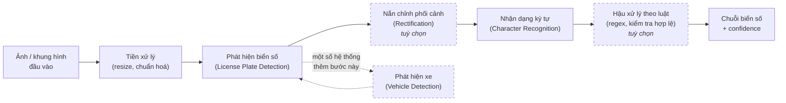
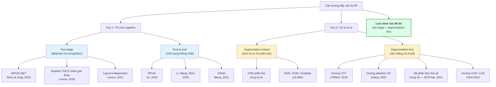
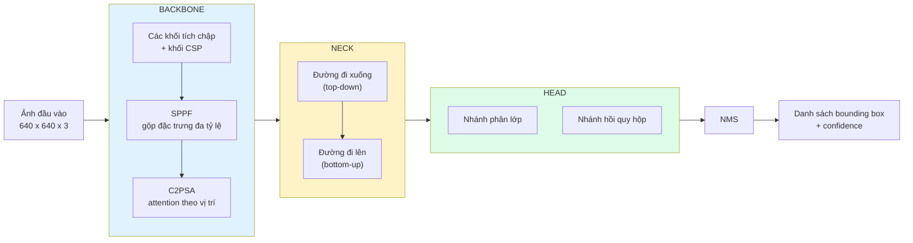
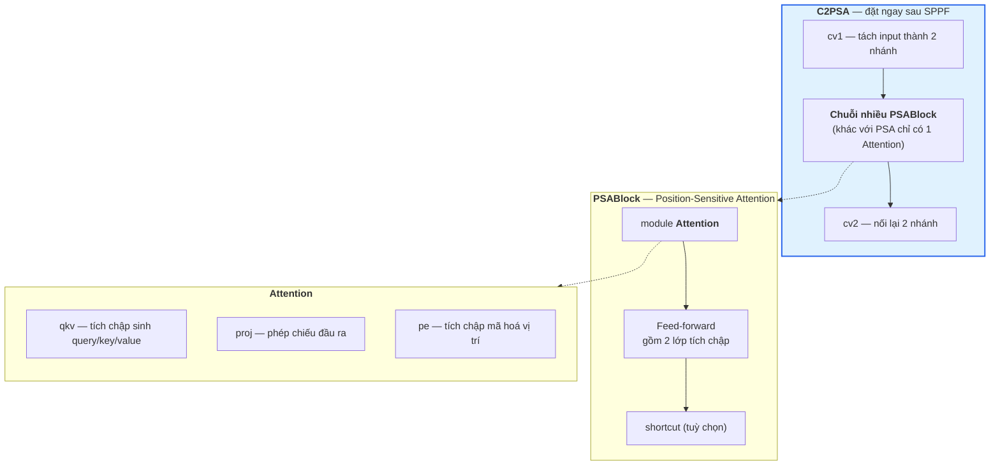
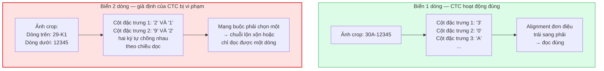
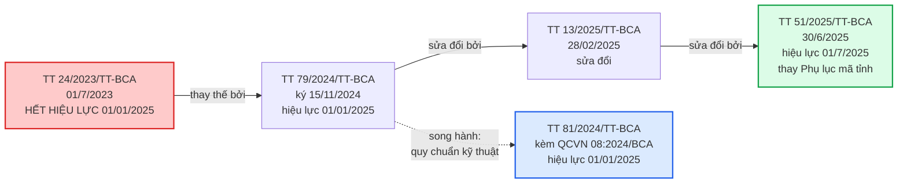
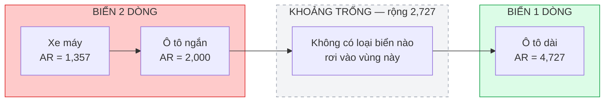

# CHƯƠNG 2. TỔNG QUAN VÀ CƠ SỞ LÝ THUYẾT

Chương 1 đã xác định vấn đề mà đồ án hướng tới: xây dựng một hệ thống nhận dạng biển số xe Việt Nam vận hành được trên máy tính không có GPU, hỗ trợ đồng thời biển một dòng và biển hai dòng. Chương này đặt nền lý thuyết và nền tư liệu cho toàn bộ phần thiết kế và cài đặt phía sau.

Nội dung chương được tổ chức theo bốn khối. Khối thứ nhất (mục 2.1 – 2.3) mô tả bài toán nhận dạng biển số tự động, quá trình phát triển của lĩnh vực và cách phân loại các hướng tiếp cận hiện có. Khối thứ hai (mục 2.4 – 2.5) trình bày cơ sở lý thuyết của hai khối tính toán cốt lõi: phát hiện đối tượng và nhận dạng ký tự, kèm hệ thống chỉ số đánh giá. Khối thứ ba (mục 2.6) đặc tả quy chuẩn biển số xe Việt Nam theo văn bản pháp luật đang có hiệu lực — đây là phần quyết định tính đúng đắn của khối hậu xử lý. Khối thứ tư (mục 2.7 – 2.8) khảo sát các công trình liên quan, xác định khoảng trống nghiên cứu và trình bày luận cứ cho từng lựa chọn công nghệ của đồ án.

Một nguyên tắc được giữ xuyên suốt chương: **mọi con số định lượng đều gắn với nguồn gốc tại chính vị trí xuất hiện, và mọi cảnh báo về phạm vi áp dụng của con số đó đều được giữ nguyên**. Lĩnh vực nhận dạng biển số có đặc điểm là các con số rất cao (trên 99%) được công bố thường xuyên nhưng đo trên những tập dữ liệu và giao thức đánh giá rất khác nhau; việc trích dẫn thiếu ngữ cảnh sẽ dẫn tới những so sánh khập khiễng mà người phản biện dễ dàng phát hiện.

---

## 2.1. Tổng quan bài toán ALPR

### 2.1.1. Định nghĩa và các thành phần của một hệ thống ALPR

Nhận dạng biển số xe tự động — *Automatic License Plate Recognition* (ALPR) — là bài toán tự động xác định vị trí biển số xe trong ảnh hoặc khung hình video và chuyển nội dung ký tự trên biển thành chuỗi văn bản mà máy tính xử lý được. Đầu vào là ảnh chụp cảnh giao thông thường không ràng buộc chặt về góc chụp, khoảng cách hay điều kiện chiếu sáng; đầu ra là danh sách các chuỗi biển số, kèm vị trí trong ảnh và độ tin cậy (*confidence*) của từng kết quả.

Điều làm ALPR khác biệt với bài toán nhận dạng văn bản trong ảnh cảnh (*scene text recognition*) tổng quát nằm ở các ràng buộc mạnh về cấu trúc. Biển số có kích thước vật lý được chuẩn hoá bằng quy chuẩn kỹ thuật quốc gia, tỷ lệ khung hình cố định theo từng loại biển, bộ ký tự đóng và giới hạn, và cú pháp chuỗi tuân theo quy định pháp luật của từng quốc gia. Những ràng buộc này vừa là lợi thế — chúng cho phép thiết kế một bước hậu xử lý theo luật rất hiệu quả — vừa là một cái bẫy: mô hình dễ học thuộc cú pháp của tập huấn luyện và suy giảm hiệu năng khi định dạng biển số thay đổi theo thời gian, một vấn đề được nêu tường minh trong công trình về kiến trúc Transformer "bền vững với thay đổi định dạng" của Meyer và cộng sự [1]<!-- meyer_2025_salt -->.

Hai khảo sát kinh điển của lĩnh vực đã chuẩn hoá cách mô tả ALPR thành ba bước xử lý nối tiếp: trích xuất vùng biển số, phân đoạn ký tự, và nhận dạng ký tự [2]<!-- anagnostopoulos_2008_survey --> [3]<!-- du_2013_review -->. Bài tổng quan cập nhật nhất của lĩnh vực vẫn giữ nguyên cách phân rã ba thành phần này, đồng thời bổ sung các thách thức mới liên quan tới biển số đa quốc gia, camera chuyển động và góc nhìn thay đổi [4]<!-- li_2026_review -->.

Trên thực tế, các hệ thống hiện đại thường bổ sung hai khối tuỳ chọn nhưng có ảnh hưởng lớn tới chất lượng cuối cùng:

- **Phát hiện phương tiện** đặt trước phát hiện biển số, nhằm thu hẹp vùng tìm kiếm và giảm số cảnh báo sai (*false positive*) trong cảnh đông đúc. Kiến trúc ba giai đoạn kiểu này đã được áp dụng cho bài toán xe máy Việt Nam [5]<!-- le_2023_vnmotorcycle -->.
- **Nắn chỉnh phối cảnh** (*rectification*), chuyển vùng biển bị chụp nghiêng về dạng chính diện bằng phép biến đổi *planar homography*. Đây chính là đóng góp cốt lõi của WPOD-NET, mạng vừa phát hiện vừa nắn chỉnh biển số bị biến dạng góc xiên [6]<!-- silva_2018_wpodnet -->.
- **Hậu xử lý theo luật**, sửa các nhầm lẫn hình dạng phổ biến và loại bỏ những chuỗi không hợp lệ dựa trên cú pháp biển số của vùng lãnh thổ. Laroca và cộng sự thậm chí hợp nhất hẳn một bộ phân loại layout vào detector để chọn đúng bộ luật hậu xử lý cho từng khu vực [7]<!-- laroca_2021_layout -->.

### 2.1.2. Ứng dụng thực tế

Bảng 2.1 tổng hợp các nhóm ứng dụng chính của ALPR cùng đặc điểm điều kiện vận hành tương ứng.

**Bảng 2.1.** Các nhóm ứng dụng của hệ thống ALPR

| Nhóm ứng dụng | Mô tả | Điều kiện vận hành |
|---|---|---|
| Quản lý bãi đỗ xe | Ghi nhận xe vào/ra, tính phí, đối soát | Camera cố định, khoảng cách gần, ánh sáng kiểm soát được — điều kiện **ràng buộc** (*constrained*) |
| Thu phí không dừng | Nhận diện phương tiện tại trạm thu phí | Camera cố định, xe di chuyển tốc độ trung bình |
| Giám sát và xử phạt nguội | Phát hiện vi phạm, truy vết phương tiện | Camera ngoài trời, mọi điều kiện thời tiết và ánh sáng — điều kiện **không ràng buộc** (*unconstrained*) |
| An ninh, kiểm soát ra vào | Kiểm soát cổng khu công nghiệp, khu dân cư | Ràng buộc, thường kết hợp barrier |
| Thực thi pháp luật | Camera tuần tra gắn trên xe đang di chuyển | Khó nhất — cả camera lẫn đối tượng đều chuyển động |

Sự phân biệt giữa điều kiện **ràng buộc** và **không ràng buộc** là then chốt khi đọc bất kỳ con số nào trong tài liệu chuyên ngành. Bộ dữ liệu AOLP tách rõ ba kịch bản này thành ba tập con riêng: AC (*Access Control*) với xe đi qua lối vào cố định, LE (*Law Enforcement*) với camera đặt ven đường, và RP (*Road Patrol*) với camera đặt trên xe đang di chuyển; hai tập sau khó hơn đáng kể [8]<!-- hsu_2013_aolp -->. Bộ UFPR-ALPR đi xa hơn, thiết kế toàn bộ dữ liệu ở tình huống cả xe mục tiêu lẫn camera đều đang chuyển động [9]<!-- laroca_2018_ufpralpr -->.

Đối với bối cảnh Việt Nam, cần ghi nhận một quan sát thực tiễn quan trọng: trong hệ thống thu phí không dừng đang vận hành, cơ chế nhận dạng chính là RFID, còn ảnh biển số chỉ đóng vai trò tra cứu và đối soát, hoặc làm lớp dự phòng khi việc đọc thẻ thất bại [10]<!-- vetc_nd_thuphikhongdung -->. Nói cách khác, ALPR ở đây là hệ thống bổ trợ chứ chưa phải hệ thống chính — một góc nhìn cần nêu đúng khi trình bày phần ứng dụng, thay vì phóng đại vai trò của công nghệ.

### 2.1.3. Các bước trong pipeline ALPR điển hình

Hình 2.1 mô tả sơ đồ đầy đủ của một pipeline ALPR hiện đại, trong đó các khối nét đứt là khối tuỳ chọn.



**Hình 2.1.** Sơ đồ pipeline ALPR điển hình *(tổng hợp từ [2], [3], [4], [6], [7])*

Quan hệ giữa khối phát hiện và khối nhận dạng là **quan hệ nhân quả một chiều và không có khả năng phục hồi**. Nếu detection trả về bounding box lệch, phần ký tự bị cắt cụt sẽ vĩnh viễn không xuất hiện trong ảnh đưa vào OCR, và không engine OCR nào — dù mạnh đến đâu — khôi phục được thông tin đã mất. Ngược lại, nếu detection hoàn hảo nhưng OCR đọc sai một ký tự thì toàn bộ chuỗi trả về vẫn sai. Vì chỉ tiêu đánh giá cuối cùng của ALPR là khớp chuỗi tuyệt đối (*plate-level exact match*), sai số của hai giai đoạn **nhân lên** chứ không bù trừ cho nhau. Đây là lý do vì sao mục 2.7 sẽ nhấn mạnh chỉ số end-to-end thay vì chỉ số của từng khối riêng lẻ.

---

## 2.2. Lịch sử phát triển các phương pháp

### 2.2.1. Giai đoạn xử lý ảnh cổ điển

Trước kỷ nguyên học sâu, ALPR được giải bằng đặc trưng thủ công (*hand-crafted features*). Quy trình phát hiện biển số điển hình gồm chuỗi bước: xám hoá ảnh, lọc cạnh dọc bằng toán tử **Sobel** (dựa trên quan sát rằng vùng biển số có mật độ cạnh dọc cao bất thường do các ký tự đứng sát nhau), nhị phân hoá, áp dụng phép **đóng/mở hình thái học** (*morphological closing/opening*) để nối các cạnh rời rạc thành khối liền, rồi dùng chiếu ngang và chiếu dọc (*projection*) để khoanh vùng ứng viên. Hai công trình đại diện cho họ phương pháp này là chương sách về định vị biển số dựa trên phát hiện cạnh và hình thái học [11]<!-- springer_2012_edgemorphology --> và bài báo về định vị biển số dựa trên đặc trưng cạnh–hình học [12]<!-- ieee_2013_edgegeometrical -->.

Bước phân đoạn ký tự dựa trên phân tích thành phần liên thông (*connected components*) hoặc histogram chiếu. Đáng chú ý, có một công trình thực hiện đúng trên biển số Việt Nam: nghiên cứu về phân đoạn ký tự cho **cả biển một dòng và biển hai dòng** thử nghiệm trên 600 biển Việt Nam (300 một dòng và 300 hai dòng), đạt độ chính xác trung bình 98,03% với quy trình gồm tiền xử lý (lượng tử hoá, chuẩn hoá, hiệu chỉnh contour ngang, khử nhiễu bằng morphology opening) rồi phân đoạn theo phương pháp *peak-to-valley* dựa trên tham số thống kê của biển số Việt Nam [13]<!-- amr_2012_charsegmentation -->. Bước phân lớp ký tự cuối cùng dùng đối sánh mẫu (*template matching*), mạng nơ-ron nông, hoặc **SVM**.

Điểm yếu cố hữu của toàn bộ họ phương pháp này là tính giòn. Mỗi tham số ngưỡng phải hiệu chỉnh thủ công theo điều kiện chụp cụ thể, và hiệu năng sụt rất nhanh khi gặp ánh sáng không đều, nền phức tạp hoặc biển bị nghiêng. Bằng chứng định lượng rõ nhất về khoảng cách giữa hai thế hệ công nghệ đến từ một cài đặt cổ điển công khai cho biển số Việt Nam dùng KNN kết hợp OpenCV: tỷ lệ phát hiện chỉ đạt **49,2% với biển một dòng** (182/370 mẫu) và **39,3% với biển hai dòng** (924/2.349 mẫu); trong số biển đã phát hiện được, tỷ lệ đọc đúng hoàn toàn chỉ đạt 33,5% với biển một dòng và 31% với biển hai dòng [14]<!-- mrzaizai2k_2025_vietnameselp -->.

> **Lưu ý khi đọc hai con số 33,5% và 31%.** Chúng được tính **trên số biển đã phát hiện được**, không phải trên toàn bộ tập kiểm thử. Quy về tỷ lệ end-to-end (ảnh vào cho ra chuỗi đúng hoàn toàn), con số thực tế còn thấp hơn nhiều. Đây là một ví dụ điển hình cho nguyên tắc phải đọc kỹ mẫu số của một chỉ số trước khi so sánh — nguyên tắc được phát biểu đầy đủ ở mục 2.7.1 (*"Ba lưu ý bắt buộc khi đọc Bảng 2.20"*) và được áp dụng lại khi định nghĩa các chỉ số đánh giá ở mục 2.5.4.

### 2.2.2. Giai đoạn học sâu

Sự trưởng thành của các detector một giai đoạn (YOLO) và hai giai đoạn (Faster R-CNN) đã thay thế hoàn toàn khối phát hiện thủ công. Quá trình chuyển đổi này diễn ra theo hai nhịp.

**Nhịp thứ nhất (khoảng 2016 – 2020) — pipeline học sâu hai giai đoạn.** Kiến trúc chủ đạo là chuỗi nối tiếp: một detector định vị biển số, một mạng khác đọc ký tự. Ba mốc tiêu biểu:

- Laroca và cộng sự dùng YOLO cho từng giai đoạn của pipeline, kết hợp các CNN tinh chỉnh riêng cho mỗi bước, đạt **93,53% recognition rate ở 47 FPS** trên tập SSIG — vượt cả hai hệ thống thương mại được đối chứng trên cùng benchmark [15]<!-- laroca_2018_yolo -->.
- Silva và Jung giới thiệu WPOD-NET, giải bài toán biển nghiêng bằng cách để chính mạng học luôn phép biến đổi nắn chỉnh, thay vì tách thành một bước tiền xử lý riêng [6]<!-- silva_2018_wpodnet -->.
- Xu và cộng sự công bố CCPD — bộ dữ liệu quy mô lớn đầu tiên của lĩnh vực — cùng mạng baseline RPnet đạt **98,5% accuracy ở tốc độ trên 61 FPS** [16]<!-- xu_2018_ccpd -->.

**Nhịp thứ hai (2020 – 2026) — end-to-end, Transformer và mô hình ngôn ngữ–thị giác.** Hướng phát triển gần đây đi theo ba nhánh song song:

1. **Hợp nhất detection và recognition vào một mạng duy nhất**, huấn luyện end-to-end trong một lần lan truyền xuôi, nhằm tránh tích luỹ lỗi giữa các module trung gian [17]<!-- li_2019_endtoend -->.
2. **Loại bỏ hoàn toàn bước phân đoạn ký tự**, chuyển sang đọc thẳng cả chuỗi bằng hàm mất mát CTC [18]<!-- zherzdev_2018_lprnet --> hoặc cơ chế attention hai chiều trên bản đồ đặc trưng 2D [19]<!-- zhang_2020_attentional -->.
3. **Đưa mô hình ngôn ngữ–thị giác (Vision-Language Model, VLM) và mô hình ngôn ngữ lớn vào ALPR**, cho phép nhận dạng không phụ thuộc layout [20]<!-- shabaninia_2025_layoutindependent --> [21]<!-- aldahoul_2024_vehiclepaligemma --> [22]<!-- gong_2026_lpllm -->.

### 2.2.3. So sánh ưu nhược điểm hai giai đoạn

Bảng 2.2 tổng hợp sự khác biệt giữa hai thế hệ công nghệ trên các chiều có ảnh hưởng trực tiếp tới quyết định kiến trúc của đồ án.

**Bảng 2.2.** So sánh phương pháp xử lý ảnh cổ điển và phương pháp học sâu

| Tiêu chí | Xử lý ảnh cổ điển | Học sâu |
|---|---|---|
| Cách trích đặc trưng | Thủ công: Sobel, morphology, projection, contour | Học tự động từ dữ liệu qua các tầng tích chập |
| Bộ phân lớp ký tự | Template matching, KNN, SVM, mạng nơ-ron nông | CNN, CRNN, Transformer, VLM |
| Nhu cầu dữ liệu gán nhãn | Thấp — chủ yếu cần hiệu chỉnh ngưỡng | Cao — cần hàng nghìn tới hàng trăm nghìn ảnh |
| Chi phí tính toán khi suy luận | Rất thấp, chạy được trên phần cứng yếu | Cao hơn nhiều, thường cần tối ưu để chạy trên CPU |
| Khả năng chịu nghiêng, mờ, thiếu sáng | Kém — mỗi ngưỡng phải chỉnh lại theo điều kiện | Tốt hơn rõ rệt nếu dữ liệu huấn luyện đủ đa dạng |
| Khả năng giải thích | Cao — từng bước quan sát được bằng mắt | Thấp — mô hình là hộp đen |
| Bằng chứng định lượng trên biển số Việt Nam | Phát hiện 49,2% (một dòng) / 39,3% (hai dòng) [14] | Nhiều công trình báo cáo trên 90% (mục 2.7) |
| Chi phí phát triển | Thấp ban đầu, tăng nhanh khi mở rộng điều kiện | Cao ban đầu, ổn định khi mở rộng |

Kết luận rút ra cho đồ án: hướng học sâu là lựa chọn bắt buộc về mặt hiệu năng, nhưng ràng buộc **suy luận trên CPU** khiến đồ án không thể chọn tuỳ ý mô hình lớn nhất. Đây chính là ràng buộc chi phối toàn bộ phần lựa chọn công nghệ ở mục 2.8. Tuy vậy, các kỹ thuật cổ điển không bị loại bỏ hoàn toàn: phương pháp *peak-to-valley* [13] và các phép biến đổi hình học của OpenCV vẫn được dùng làm lớp dự phòng cho bài toán tách dòng của biển hai dòng (mục 2.5.3).

---

## 2.3. Phân loại các hướng tiếp cận hiện nay

Tài liệu chuyên ngành thường trộn lẫn hai trục phân loại vốn độc lập với nhau. Trục thứ nhất mô tả **cách tổ chức pipeline tổng thể** (two-stage hay end-to-end). Trục thứ hai mô tả **cách xử lý ký tự bên trong khối nhận dạng** (segmentation-based hay segmentation-free). Một hệ thống two-stage hoàn toàn có thể dùng bộ nhận dạng segmentation-free, và ngược lại. Việc tách bạch hai trục này là điều kiện để định vị chính xác lựa chọn kiến trúc của đồ án.

### 2.3.1. Two-stage và end-to-end

**Hướng two-stage** tách bạch detection và recognition thành hai mô hình huấn luyện độc lập. Ưu điểm: mỗi khối có thể tối ưu, thay thế và gỡ lỗi riêng; có thể tận dụng các mô hình OCR đã được huấn luyện sẵn thay vì huấn luyện từ đầu; và khi một khối hỏng, có thể xác định chính xác khối nào gây lỗi. Nhược điểm: lỗi ở khối detection lan truyền sang khối recognition mà không có cơ chế phục hồi, và tổng thời gian suy luận là tổng thời gian của hai bước. Ba đại diện tiêu biểu là WPOD-NET [6], pipeline YOLO nhiều giai đoạn [15], và hệ thống độc lập với layout của Laroca và cộng sự [7].

**Hướng end-to-end** hợp nhất mọi thứ vào một mạng duy nhất. Li, Wang và Shen trình bày một mạng thống nhất định vị biển số và nhận dạng ký tự trong **một lần lan truyền xuôi duy nhất**, với lập luận rằng cách này vừa tránh tích luỹ lỗi trung gian vừa tăng tốc độ [17]. RPnet cũng đồng thời dự đoán bounding box và đọc chuỗi biển số [16]. Nhược điểm của hướng này là mất tính module: muốn thay bộ nhận dạng thì phải huấn luyện lại toàn bộ mạng.

### 2.3.2. Segmentation-based và segmentation-free

**Hướng segmentation-based** tách từng ký tự khỏi vùng biển rồi phân lớp riêng lẻ. Pipeline YOLO nhiều giai đoạn của Laroca và cộng sự vẫn theo hướng này, kết hợp tăng cường dữ liệu bằng biển số đảo ngược và ký tự lật [15]. Nhược điểm cố hữu: chất lượng phân đoạn quyết định toàn bộ kết quả, và biển mờ, dính bẩn hoặc có ký tự sát nhau khiến bước phân đoạn thất bại.

**Hướng segmentation-free** bỏ hẳn bước tách ký tự, đọc thẳng cả chuỗi. Bảng 2.3 tổng hợp bốn nhánh kỹ thuật chính của hướng này.

**Bảng 2.3.** Bốn nhánh kỹ thuật của hướng segmentation-free

| Nhánh | Cơ chế | Công trình đại diện |
|---|---|---|
| CTC | Huấn luyện end-to-end bằng *Connectionist Temporal Classification loss*, không cần căn chỉnh vị trí ký tự với nhãn | LPRNet — đáng chú ý vì là hệ thống thời gian thực không dùng RNN [18] |
| Attention / seq2seq | Attention hai chiều trên bản đồ đặc trưng 2D, không cần heuristic hay hậu xử lý | Khung attention với encoder Xception [19] |
| Bộ phân lớp chia sẻ trọng số | Bỏ cả RNN lẫn phân đoạn ký tự, dùng bộ phân lớp ký tự chia sẻ trọng số | SCR-Net trong VSNet [23]<!-- wang_2021_vsnet --> |
| VLM / LLM | Mô hình ngôn ngữ–thị giác đọc trực tiếp, loại bỏ luôn bước phân loại layout thủ công | [20], [22] |

Đáng chú ý là **hai chiến lược đối lập cho vấn đề đa layout**. Khi hệ thống phải xử lý nhiều định dạng biển số khác nhau — nhiều quốc gia, hoặc biển một dòng và hai dòng trong cùng một quốc gia như Việt Nam — tài liệu ghi nhận hai hướng trái ngược. Hướng thứ nhất là **phân loại layout tường minh**: Laroca và cộng sự hợp nhất phát hiện biển số và phân loại layout vào cùng một mạng để chọn đúng luật hậu xử lý cho từng vùng lãnh thổ, đạt **96,9% end-to-end recognition rate trung bình trên 8 tập dữ liệu công khai từ 5 khu vực** [7]. Hướng thứ hai là **không phụ thuộc layout**: dùng VLM kết hợp cơ chế tinh chỉnh hậu-OCR để vừa nhận dạng ký tự vừa sửa lỗi, loại bỏ hoàn toàn bước phân loại layout thủ công [20].

### 2.3.3. Sơ đồ phân loại

Hình 2.2 tổng hợp hai trục phân loại cùng các công trình đại diện.



**Hình 2.2.** Sơ đồ phân loại hai trục các hướng tiếp cận ALPR và định vị lựa chọn của đồ án

**Định vị lựa chọn của đồ án.** Đồ án theo hướng **two-stage** ở trục thứ nhất và dùng bộ nhận dạng **segmentation-free** có sẵn ở trục thứ hai. Lựa chọn two-stage không phải là sở thích mà là hệ quả của một ràng buộc kiến trúc cứng: hệ thống phải cho phép **thay thế bộ OCR mà không cần huấn luyện lại toàn bộ hệ thống**. Ràng buộc này có cơ sở thực tế rõ ràng — như sẽ trình bày ở mục 2.8.2, quyết định cuối cùng về engine OCR chưa được chốt ở giai đoạn thiết kế mà phụ thuộc vào kết quả thực nghiệm. Một kiến trúc end-to-end sẽ khoá cứng lựa chọn đó ngay từ đầu và loại bỏ khả năng đổi hướng.

Về vấn đề đa layout, đồ án chọn hướng **phân loại layout tường minh** thay vì hướng VLM, vì hai lý do: hướng VLM có chi phí suy luận cao hơn nhiều bậc độ lớn và không tương thích với ràng buộc chạy trên CPU (số liệu cụ thể ở mục 2.7.1), còn quy chuẩn biển số Việt Nam cung cấp sẵn một cơ sở định lượng rất mạnh để phân loại layout (mục 2.6.6).

---

## 2.4. Cơ sở lý thuyết về phát hiện đối tượng

### 2.4.1. Bài toán object detection, IoU và NMS

**Phát hiện đối tượng** (*object detection*) là bài toán đồng thời định vị và phân loại các đối tượng trong ảnh. Với ảnh đầu vào $I$, mô hình trả về một tập dự đoán, mỗi dự đoán gồm một hộp bao (*bounding box*) $B = (x, y, w, h)$, một nhãn lớp $c$ và một điểm tin cậy $s \in [0, 1]$. Với bài toán của đồ án, tập lớp chỉ có duy nhất một phần tử: `license_plate`.

**Intersection over Union (IoU)** là đại lượng đo mức chồng lấp giữa hộp dự đoán $B_p$ và hộp thực $B_{gt}$, định nghĩa bằng tỷ số giữa diện tích phần giao và diện tích phần hợp:

$$
\mathrm{IoU}(B_p, B_{gt}) = \frac{|B_p \cap B_{gt}|}{|B_p \cup B_{gt}|}
$$

<div align="right">(2.1)</div>

Giá trị IoU nằm trong đoạn $[0, 1]$; bằng 1 khi hai hộp trùng khít và bằng 0 khi hai hộp không giao nhau. Một dự đoán được coi là đúng (*true positive*) khi IoU vượt một ngưỡng cho trước, thông thường là 0,5. Ký hiệu $P_{75}$ xuất hiện trong một số công trình có nghĩa là precision đo tại ngưỡng IoU bằng 0,75 — chặt hơn đáng kể.

Đối với bài toán biển số, IoU có một đặc tính đáng lưu ý: **hộp bao của biển số rất dẹt**, nên IoU nhạy với sai số định vị hơn nhiều so với hộp gần vuông. Với một hộp có tỷ lệ khung hình 4,7:1, lệch vài pixel theo chiều cao làm IoU giảm mạnh hơn hẳn so với cùng mức lệch trên một hộp vuông có cùng diện tích. Đây chính là nguyên nhân của hiện tượng được quan sát nhất quán trong các nghiên cứu ALPR: khoảng cách rất lớn giữa mAP@0.5 và mAP@0.5:0.95 (phân tích ở mục 2.4.4).

**Non-Maximum Suppression (NMS)** là bước hậu xử lý giải quyết vấn đề một đối tượng bị dự đoán bởi nhiều hộp chồng lấp. Thuật toán hoạt động theo ba bước: (i) sắp xếp toàn bộ hộp dự đoán theo điểm tin cậy giảm dần; (ii) chọn hộp có điểm cao nhất, đưa vào tập kết quả; (iii) loại bỏ mọi hộp còn lại có IoU với hộp vừa chọn vượt ngưỡng NMS, rồi lặp lại từ bước (ii) cho tới khi hết hộp.

NMS có hai tham số cần cân nhắc. Ngưỡng tin cậy (*confidence threshold*) quyết định điểm cân bằng giữa precision và recall: hạ ngưỡng làm tăng recall và giảm precision. Ngưỡng IoU của NMS quyết định mức độ "khoan dung" với các hộp chồng lấp: đặt quá thấp sẽ xoá nhầm hai biển số thật nằm sát nhau, đặt quá cao sẽ để lọt các hộp trùng lặp. Với ảnh giao thông Việt Nam — nơi nhiều xe máy đứng sát nhau trong cùng khung hình — đây là tham số cần hiệu chỉnh cẩn thận, và giá trị cụ thể sẽ được xác định bằng thực nghiệm ở Chương 5.

Một hướng phát triển gần đây là **loại bỏ hoàn toàn NMS** khỏi quy trình suy luận. YOLOv10 đạt được điều này bằng cơ chế *consistent dual assignments* với hai đầu dự đoán song song: một đầu one-to-many chỉ dùng khi huấn luyện để tạo tín hiệu giám sát phong phú, và một đầu one-to-one dùng khi suy luận, sinh đúng một dự đoán cho mỗi đối tượng nên không cần NMS [24]<!-- wang_2024_yolov10paper -->. YOLO26 đưa chế độ NMS-free thành mặc định [25]<!-- jocher_2025_yolo26 -->.

### 2.4.2. Kiến trúc YOLO: nguyên lý one-stage và anchor-free

Các phương pháp phát hiện đối tượng học sâu chia thành hai họ. **Họ two-stage** (Faster R-CNN, Mask R-CNN) sinh các vùng đề xuất (*region proposals*) ở giai đoạn một, rồi phân loại và tinh chỉnh từng đề xuất ở giai đoạn hai; chi phí tính toán tỷ lệ với số đề xuất nên độ trễ cao. **Họ one-stage** (YOLO, SSD, RetinaNet) hồi quy trực tiếp hộp bao và điểm phân lớp trong một lần lan truyền xuôi duy nhất; chi phí cố định theo kích thước ảnh nên đạt được thời gian thực.

Với ràng buộc suy luận trên CPU, họ two-stage bị loại ngay từ đầu vì chi phí tính toán không tương thích với yêu cầu phản hồi tương tác của giao diện web. Điều đáng chú ý là khoảng cách độ chính xác giữa hai họ đã thu hẹp gần như hoàn toàn: một nghiên cứu ALPR quy mô lớn trên 50.000 ảnh và 10.000 video clip so sánh trực tiếp YOLOv5, YOLOv8, YOLOv9, YOLOv10 với Faster R-CNN và SSD, kết luận nhóm YOLO vượt trội cả về độ chính xác lẫn thời gian suy luận [26]<!-- scirep_2025_advanceddl -->. Với bài toán một lớp và đối tượng có biên rõ ràng như biển số, lợi thế lý thuyết của họ two-stage về độ chính xác định vị gần như không còn ý nghĩa thực tiễn.

Kiến trúc của một mô hình YOLO hiện đại gồm ba phần, minh hoạ ở Hình 2.3:



**Hình 2.3.** Kiến trúc tổng quát backbone – neck – head của YOLO11 *(theo [27], [28])*

- **Backbone** trích xuất đặc trưng từ ảnh qua một chuỗi khối tích chập, giảm dần độ phân giải không gian và tăng dần số kênh. Khối kết thúc backbone thường là SPPF (*Spatial Pyramid Pooling – Fast*), gộp thông tin ở nhiều tỷ lệ khác nhau.
- **Neck** hợp nhất đặc trưng từ nhiều tầng độ sâu khác nhau theo cả hai chiều: đường đi xuống mang thông tin ngữ nghĩa từ tầng sâu về tầng nông, đường đi lên mang thông tin vị trí từ tầng nông lên tầng sâu. Mục tiêu là phát hiện tốt cả đối tượng lớn lẫn đối tượng nhỏ.
- **Head** sinh dự đoán cuối cùng. Từ YOLOv8 trở đi, Ultralytics dùng **anchor-free split head**: một đầu dự đoán tách rời nhánh phân loại và nhánh hồi quy, đồng thời loại bỏ hoàn toàn nhu cầu tinh chỉnh anchor box thủ công [27]<!-- jocher_2023_yolov8 -->.

**Ý nghĩa của kiến trúc anchor-free đối với bài toán biển số.** Trong kiến trúc anchor-based (YOLOv5 trở về trước), mô hình hồi quy độ lệch so với một tập hộp mẫu (*anchor box*) định trước, và tập hộp mẫu này được thiết kế theo phân bố tỷ lệ khung hình của tập dữ liệu huấn luyện — thường là COCO. Biển số có tỷ lệ khung hình nằm ngoài phân bố đó: biển ô tô một dòng khoảng 4,7:1, biển xe máy hai dòng khoảng 1,4:1 (số liệu chính xác ở mục 2.6.6). Kiến trúc anchor-based do đó đòi hỏi phải thiết kế lại tập anchor hoặc chạy phân cụm k-means trên tập dữ liệu để tìm anchor phù hợp — một công đoạn tốn công và dễ sai. Kiến trúc anchor-free hồi quy **trực tiếp khoảng cách từ tâm đến bốn cạnh** của hộp bao, nên xử lý được cả hai chế độ tỷ lệ bằng một cơ chế duy nhất và loại bỏ hoàn toàn một nhóm siêu tham số [28]<!-- jocher_2024_yolo11 -->. Với một đồ án có thời hạn, đây là lợi ích thực tiễn đáng kể chứ không chỉ là ưu điểm lý thuyết.

### 2.4.3. YOLO11: các cải tiến kiến trúc

Bài tổng quan độc lập về YOLO11 xác định ba thành phần chính của kiến trúc này là **C3k2**, **SPPF** và **C2PSA** [29]<!-- khanam_2024_yolov11overview -->. Nội dung dưới đây được đối chiếu trực tiếp với mã nguồn định nghĩa các khối trong thư viện Ultralytics [30]<!-- ultralytics_2026_blockpy -->, thay vì dựa vào các mô tả thứ cấp vốn hay diễn giải sai.

**a) C3k2 — không phải kiến trúc mới, mà là C2f có thể hoán đổi khối con.** Đọc trực tiếp mã nguồn cho thấy lớp `C3k2` **kế thừa trực tiếp từ lớp `C2f`** của YOLOv8 và mang đúng mô tả *"Faster Implementation of CSP Bottleneck with 2 convolutions"*. Điểm khác biệt duy nhất là một cờ điều khiển quyết định nội dung của danh sách khối con: khi cờ tắt, khối dùng `Bottleneck` tiêu chuẩn và **giống hệt C2f**; khi cờ bật, khối dùng các khối `C3k` vốn kế thừa từ `C3` và cho phép tuỳ chỉnh kích thước nhân tích chập [30]. Nói cách khác, C3k2 là một C2f có thể hoán đổi khối con, chứ không phải một kiến trúc được thiết kế lại từ đầu. Chi tiết này giải thích chính xác vì sao YOLO11 giảm được số tham số mà vẫn giữ hoặc tăng độ chính xác: nó không thay đổi triết lý CSP mà chỉ cho phép cấu hình linh hoạt hơn ở mức khối.

**b) C2PSA — thành phần mà YOLOv8 hoàn toàn không có.** Đây mới là khác biệt kiến trúc thực sự giữa YOLO11 và YOLOv8. Cấu trúc phân cấp theo mã nguồn được minh hoạ ở Hình 2.4.



**Hình 2.4.** Cấu trúc phân cấp của khối C2PSA trong YOLO11 *(đối chiếu mã nguồn [30])*

Vị trí đặt C2PSA — **ngay sau SPPF trong backbone** — có ý nghĩa riêng: đây là điểm mà bản đồ đặc trưng đã tổng hợp thông tin đa tỷ lệ, và cơ chế attention theo vị trí được áp dụng để tái phân bổ trọng số theo vị trí không gian. Tài liệu so sánh chính thức của Ultralytics khẳng định rằng cơ chế này cải thiện mạnh khả năng phát hiện **đối tượng nhỏ** và khả năng xử lý **che khuất phức tạp** so với YOLOv8 [31]<!-- ultralytics_2025_yolo11vsyolov8 -->.

> **Lưu ý về mức độ chứng minh của luận cứ trên.** Phát biểu về cải thiện đối tượng nhỏ là **định tính**. Ultralytics không công bố các chỉ số AP_small, AP_medium, AP_large tách riêng theo chuẩn COCO cho từng biến thể, nên không thể trích dẫn số liệu chính thức để chứng minh định lượng YOLO11 tốt hơn YOLOv8 trên đối tượng nhỏ cụ thể bao nhiêu [28]. Đồ án do đó phải **tự đo trên tập dữ liệu biển số của mình**; kết quả sẽ được trình bày ở Chương 5.

**c) Vị trí của YOLO11 trong dòng phát triển.** Bảng 2.4 tổng hợp khác biệt kiến trúc giữa các phiên bản YOLO gần đây, để đặt YOLO11 vào đúng bối cảnh.

**Bảng 2.4.** So sánh khác biệt kiến trúc giữa các phiên bản YOLO gần đây

| Phiên bản | Khối backbone đặc trưng | Cơ chế attention | Đầu dự đoán | NMS khi suy luận | Điểm mới đáng chú ý nhất |
|---|---|---|---|:--:|---|
| YOLOv8 [27] | C2f | Không có | Anchor-free, tách nhánh | Có | Chuyển sang anchor-free |
| YOLOv9 [32]<!-- wang_2024_yolov9 --> | GELAN | Không có | Anchor-free | Có | PGI chống mất mát thông tin |
| YOLOv10 [24] | Rank-guided blocks | Partial self-attention | Hai đầu song song | **Không** | Consistent dual assignments |
| **YOLO11** [28] | **C3k2** (kế thừa C2f) | **C2PSA** sau SPPF | Anchor-free, tách nhánh | Có | C2PSA cải thiện đối tượng nhỏ |
| YOLOv12 [33]<!-- tian_2025_yolov12 --> | R-ELAN | Area Attention | Anchor-free | Có | Kiến trúc lấy attention làm trung tâm |
| YOLOv13 [34]<!-- lei_2025_yolov13 --> | DS-C3k2 | HyperACE (hypergraph) | Anchor-free | Có | Tương quan bậc cao, FullPAD |
| YOLO26 [25] | Kế thừa dòng Ultralytics | Kế thừa dòng Ultralytics | **Bỏ DFL** | **Không** (mặc định) | Bỏ DFL, dễ xuất và lượng tử hoá |

Luận cứ chọn YOLO11 cho đồ án được trình bày đầy đủ ở mục 2.8.1.

### 2.4.4. Các chỉ số đánh giá khối phát hiện

**a) Precision, Recall và F1.** Với $TP$ là số dự đoán đúng, $FP$ là số dự đoán sai (báo động nhầm) và $FN$ là số đối tượng bị bỏ sót:

$$
\mathrm{Precision} = \frac{TP}{TP + FP}
$$

<div align="right">(2.2)</div>

$$
\mathrm{Recall} = \frac{TP}{TP + FN}
$$

<div align="right">(2.3)</div>

$$
F_1 = \frac{2 \cdot \mathrm{Precision} \cdot \mathrm{Recall}}{\mathrm{Precision} + \mathrm{Recall}}
$$

<div align="right">(2.4)</div>

Precision trả lời câu hỏi "trong những gì mô hình báo là biển số, bao nhiêu phần trăm thực sự là biển số"; recall trả lời "trong toàn bộ biển số có thật, mô hình tìm được bao nhiêu phần trăm". $F_1$ là trung bình điều hoà của hai đại lượng, dùng khi cần một con số tổng hợp duy nhất.

Với bài toán ALPR, **recall của khối detection quan trọng hơn precision**, vì một biển số bị bỏ sót là mất vĩnh viễn, còn một vùng báo nhầm sẽ bị khối OCR và khối hậu xử lý loại bỏ ở bước sau (chuỗi đọc được sẽ không khớp cú pháp biển số Việt Nam).

**b) Average Precision (AP) và mean Average Precision (mAP).** AP của một lớp là diện tích dưới đường cong Precision–Recall:

$$
\mathrm{AP} = \int_0^1 p(r)\, \mathrm{d}r
$$

<div align="right">(2.5)</div>

trong đó $p(r)$ là precision đạt được tại mức recall $r$. mAP là trung bình AP trên toàn bộ $N$ lớp:

$$
\mathrm{mAP} = \frac{1}{N}\sum_{i=1}^{N} \mathrm{AP}_i
$$

<div align="right">(2.6)</div>

Với bài toán một lớp của đồ án, $N = 1$ nên mAP trùng với AP của lớp `license_plate`.

**c) mAP@0.5 và mAP@0.5:0.95 — hai chỉ số khác nhau, không được so sánh chéo.** Đây là điểm quan trọng nhất của mục này và là nguồn của một lỗi phương pháp luận rất phổ biến.

- **mAP@0.5** tính AP tại **một ngưỡng IoU cố định bằng 0,5**. Một dự đoán chỉ cần chồng lấp một nửa với hộp thực đã được tính là đúng.
- **mAP@0.5:0.95** lấy **trung bình AP trên 10 ngưỡng IoU** từ 0,5 đến 0,95 với bước nhảy 0,05:

$$
\mathrm{mAP@0.5\!:\!0.95} = \frac{1}{10}\sum_{t \in \{0{,}50;\, 0{,}55;\, \ldots;\, 0{,}95\}} \mathrm{mAP@}t
$$

<div align="right">(2.7)</div>

Chỉ số thứ hai chặt hơn hẳn vì nó đòi hỏi hộp dự đoán phải khớp chính xác chứ không chỉ chồng lấp. Từ định nghĩa, ta rút ra một hệ quả toán học không thể vi phạm:

> **Trên cùng một mô hình và cùng một tập dữ liệu, mAP@0.5:0.95 LUÔN nhỏ hơn hoặc bằng mAP@0.5.** Vì mAP@0.5 chính là một trong mười số hạng của phép trung bình ở công thức (2.7), và nó là số hạng lớn nhất trong mười số hạng đó.

Khoảng cách giữa hai chỉ số này trong bài toán biển số thường rất lớn, do đặc tính hộp bao dẹt đã phân tích ở mục 2.4.1. Ba minh chứng từ tài liệu:

- Batra và cộng sự báo cáo **mAP@0.5 = 87,2%** trong khi **mAP@0.5:0.95 chỉ đạt 46,5%** trên tập biển số Ấn Độ [35]<!-- batra_2022_yolov5 -->.
- Một nghiên cứu dùng YOLOv11 cho phát hiện biển số đạt **mAP@0.5 = 0,906** nhưng **mAP@0.5:0.95 = 0,631** [36]<!-- jaic_2025_yolov11alpr -->.
- Một nghiên cứu khác trên biển số xe máy Indonesia đạt **mAP@0.5 = 99,5%** nhưng **mAP@0.5:0.95 = 80,7%** [37]<!-- jcosine_2025_yolo11plate -->.

Cả ba trường hợp đều xác nhận cùng một kết luận: **biển số dễ phát hiện nhưng khó khớp hộp bao chính xác**.

> ### ⚠️ Cảnh báo phương pháp luận bắt buộc giữ nguyên
>
> Một cách trình bày phổ biến và **sai** là đặt con số mAP@0.5 của một nghiên cứu ALPR (khoảng 0,90 – 0,99) cạnh con số mAP@0.5:0.95 trên COCO của cùng lớp mô hình (khoảng 0,395 ở phân khúc nano [28]) rồi kết luận "bài toán biển số dễ hơn bài toán COCO". Đây là **phép so sánh giữa hai chỉ số có định nghĩa khác nhau**, và theo hệ quả toán học nêu trên, chênh lệch giữa chúng **không mang bất kỳ thông tin nào** về độ khó tương đối của hai bài toán.
>
> Phép đối chiếu duy nhất hợp lệ là so mAP@0.5 với mAP@0.5, hoặc mAP@0.5:0.95 với mAP@0.5:0.95, **và trên cùng một tập dữ liệu**. Ngay cả khi cùng định nghĩa chỉ số nhưng khác tập dữ liệu, phép so sánh cũng chỉ dùng để cảm nhận độ khó chứ không được dùng làm luận cứ cho bất kỳ quyết định kỹ thuật nào.
>
> Lỗi này đã được phát hiện và sửa trong quá trình khảo sát tài liệu của đồ án. Nó được nêu tường minh ở đây vì đây là loại lỗi mà hội đồng phản biện phát hiện rất nhanh.

**d) Hệ quả cho việc chọn chỉ tiêu của đồ án.** Vì mục tiêu cuối cùng của khối detection là cắt được vùng crop đủ tốt để OCR đọc được, chứ không phải khớp hộp bao đến từng pixel, đồ án dùng **mAP@0.5 làm chỉ tiêu chính** cho khối phát hiện. Chỉ số **mAP@0.5:0.95 vẫn được báo cáo đầy đủ** để thể hiện chất lượng định vị, nhưng không đặt ngưỡng chấp nhận dựa trên nó. Giá trị thực tế của cả hai chỉ số trên tập dữ liệu biển số Việt Nam sẽ được trình bày ở Chương 5.

**e) mIoU.** Một số công trình dùng IoU trung bình trên toàn tập (*mean IoU*) làm chỉ số chính thay cho mAP. Công trình về biển số Việt Nam của nhóm Học viện Kỹ thuật Quân sự báo cáo mIoU đạt 95,01% cho khâu phát hiện [38]<!-- lqdtu_2021_vietnameselpr -->. Đây là chỉ số khác với mAP và cũng không so sánh chéo được.

---

## 2.5. Cơ sở lý thuyết về nhận dạng ký tự

### 2.5.1. Bài toán OCR và đặc thù khi áp dụng cho biển số

**Nhận dạng ký tự quang học** (*Optical Character Recognition*, OCR) là bài toán chuyển nội dung văn bản trong ảnh thành chuỗi ký tự. Các engine OCR hiện đại thường tổ chức thành hai giai đoạn nối tiếp: **text detection** khoanh vùng chứa văn bản, rồi **text recognition** đọc nội dung của từng vùng.

Một sai lầm phổ biến khi chọn engine OCR cho ALPR là lấy thẳng bảng xếp hạng OCR phổ thông làm căn cứ. Bảng 2.5 chỉ ra vì sao điều đó không hợp lệ.

**Bảng 2.5.** So sánh OCR văn bản tài liệu và OCR biển số xe

| Chiều so sánh | OCR văn bản tài liệu | OCR biển số xe |
|---|---|---|
| Nguồn ảnh | Ảnh quét hoặc ảnh chụp tài liệu, gần chính diện | Ảnh cảnh ngoài trời, phối cảnh nghiêng, chói sáng, nhoè do chuyển động |
| Độ dài chuỗi | Hàng trăm đến hàng nghìn ký tự | 7 – 9 ký tự |
| Tập ký tự | Lớn, mở, kèm dấu và dấu câu | Đóng — **chỉ A–Z và 0–9** |
| Bố cục | Nhiều dòng, đa cột, ngắt dòng tuỳ ý | Cố định: 1 hoặc 2 dòng, theo quy chuẩn nhà nước |
| Ràng buộc cú pháp | Gần như không có | Rất chặt — kiểm tra được bằng biểu thức chính quy |
| Tiêu chí đánh giá | CER / WER — chấp nhận sai lẻ tẻ | **Khớp chuỗi tuyệt đối** — sai 1 ký tự là hỏng cả bản ghi |
| Giá trị của thông tin ngôn ngữ | Cao — mô hình ngôn ngữ sửa lỗi hiệu quả | **Thấp** — không có từ vựng để dựa vào |
| Vai trò hậu xử lý | Phụ trợ | **Bắt buộc** — biểu thức chính quy là lớp sửa lỗi chính |

Bốn hệ quả trực tiếp cho việc thiết kế khối nhận dạng của đồ án:

1. **Tập ký tự đóng là tài sản, không phải hạn chế.** Biển số Việt Nam chỉ dùng A–Z và 0–9, không dấu. Do đó toàn bộ ưu thế "hỗ trợ tiếng Việt" của các engine OCR là **vô nghĩa** với bài toán này. Tệ hơn, mô hình đa ngôn ngữ hệ Latin mang theo từ điển hàng trăm ký tự kèm dấu, làm tăng không gian nhầm lẫn và tăng thời gian suy luận.
2. **Ràng buộc cú pháp bù được điểm yếu về whitelist.** Vì định dạng biển số Việt Nam rất chặt, một lớp hậu xử lý theo biểu thức chính quy có thể sửa các nhầm lẫn hình dạng theo từng vị trí trong chuỗi. Đây chính là vai trò của module chuẩn hoá sẽ thiết kế ở Chương 3.
3. **Ảnh cảnh chứ không phải ảnh tài liệu.** Các benchmark OCR trên hoá đơn hay trang văn bản chỉ có giá trị tham chiếu xu hướng, không thể dùng làm căn cứ quyết định.
4. **Bố cục hai dòng là một lớp bài toán riêng**, được phân tích ở mục 2.5.3.

### 2.5.2. Kiến trúc CRNN và hàm mất mát CTC

**CRNN** (*Convolutional Recurrent Neural Network*) là kiến trúc nền tảng của phần lớn các engine OCR segmentation-free hiện nay, gồm ba tầng nối tiếp:

1. **Tầng tích chập** trích xuất đặc trưng từ ảnh đầu vào. Điểm mấu chốt là mạng downsample chiều cao của ảnh **về 1**, biến bản đồ đặc trưng hai chiều thành một **chuỗi vector đặc trưng** theo chiều rộng. Mỗi vector trong chuỗi tương ứng với một dải dọc hẹp của ảnh gốc.
2. **Tầng hồi quy** — thường là hai lớp Bi-LSTM — mô hình hoá quan hệ ngữ cảnh giữa các phần tử trong chuỗi đặc trưng theo cả hai chiều trái–phải và phải–trái.
3. **Tầng phiên mã** giải mã chuỗi xác suất thành chuỗi ký tự cuối cùng, thường bằng CTC.

EasyOCR dùng đúng kiến trúc này cho khối recognition: một backbone CNN (mặc định là ResNet) trích xuất chuỗi đặc trưng, hai lớp Bi-LSTM mô hình hoá chuỗi, và một bộ giải mã CTC [39]<!-- jaided_2025_easyocrdeepwiki -->. PaddleOCR dùng SVTR-LCNet kết hợp chiến lược GTC (CTC được hướng dẫn bởi attention) [40]<!-- cui_2026_ppocrv5 -->, tức vẫn thuộc họ CTC nhưng có bổ sung.

**Hàm mất mát CTC** (*Connectionist Temporal Classification*) giải quyết một vấn đề cốt lõi: khi huấn luyện, ta biết chuỗi nhãn đúng (ví dụ `30A12345`) nhưng **không biết mỗi ký tự nằm ở cột đặc trưng nào**. Việc gán nhãn thủ công vị trí từng ký tự là quá tốn kém. CTC giải bài toán này bằng cách:

- Mở rộng bảng ký tự thêm một **ký hiệu trống** (*blank*), ký hiệu là $\varepsilon$.
- Định nghĩa một phép ánh xạ $\mathcal{B}$ từ chuỗi đầu ra thô (dài bằng số cột đặc trưng $T$) về chuỗi nhãn cuối cùng, bằng hai bước: gộp các ký tự lặp liên tiếp, rồi xoá mọi $\varepsilon$. Ví dụ $\mathcal{B}(\texttt{3}\varepsilon\texttt{00}\varepsilon\texttt{A}) = \texttt{30A}$.
- Xác suất của một chuỗi nhãn $\mathbf{l}$ là tổng xác suất của **mọi** đường đi thô $\boldsymbol{\pi}$ ánh xạ về nó:

$$
p(\mathbf{l} \mid \mathbf{x}) = \sum_{\boldsymbol{\pi} \in \mathcal{B}^{-1}(\mathbf{l})} \prod_{t=1}^{T} y^{t}_{\pi_t}
$$

<div align="right">(2.8)</div>

trong đó $y^{t}_{k}$ là xác suất mô hình gán cho ký tự $k$ tại cột $t$. Hàm mất mát CTC là log hợp lý âm của đại lượng trên:

$$
\mathcal{L}_{\mathrm{CTC}} = -\log p(\mathbf{l} \mid \mathbf{x})
$$

<div align="right">(2.9)</div>

Tổng ở công thức (2.8) có số hạng tăng theo hàm mũ, nhưng tính được hiệu quả bằng thuật toán quy hoạch động tiến–lùi (*forward–backward*).

Ưu điểm quyết định của CTC: **không cần nhãn vị trí từng ký tự**, chỉ cần chuỗi nhãn. Đây là lý do CTC trở thành lựa chọn mặc định của hầu hết các engine OCR mã nguồn mở, và cũng là lý do LPRNet đạt được tốc độ rất cao — 3 ms mỗi biển trên GPU GTX 1080 và 1,3 ms trên CPU i7-6700K — mà vẫn đạt tới 95% accuracy trên biển số Trung Quốc [18].

### 2.5.3. Vì sao kiến trúc CTC gặp khó với văn bản nhiều dòng

Đây là mục kỹ thuật quan trọng nhất của chương, vì nó thiết lập nền tảng lý thuyết cho rủi ro **R-04** — rủi ro được đánh giá ở mức "khả năng xảy ra Cao, mức ảnh hưởng Cao" trong hồ sơ yêu cầu của đồ án. Với bối cảnh Việt Nam, nơi xe máy chiếm áp đảo và biển hai dòng là dạng phổ biến chứ không phải ngoại lệ, đây là rủi ro có thể quyết định thành bại của toàn hệ thống.

**a) Giả định alignment đơn điệu của CTC.** Quay lại công thức (2.8): phép ánh xạ $\mathcal{B}$ hoạt động trên một **chuỗi một chiều** theo trục $t$, và trục $t$ ở đây chính là **trục chiều rộng của ảnh**. CTC do đó giả định ngầm rằng các ký tự xuất hiện **tuần tự từ trái sang phải theo đúng thứ tự đọc, trên một dòng duy nhất**. Đây không phải là một tuỳ chọn cấu hình mà là bản chất toán học của hàm mất mát.

Khi ảnh đầu vào có hai dòng, giả định này bị vi phạm nghiêm trọng. Vì tầng tích chập của CRNN đã downsample chiều cao **về 1**, mỗi vector đặc trưng tại cột $t$ chứa thông tin của **cả hai ký tự chồng nhau theo chiều dọc** — một ở dòng trên, một ở dòng dưới. Mạng bị ép phải chọn một trong hai, cho ra chuỗi lộn xộn hoặc chỉ đọc được một dòng [41]<!-- arxiv_2019_arbitraryshaped -->. Hình 2.5 minh hoạ cơ chế này.



**Hình 2.5.** Cơ chế sụp đổ của CTC trên ảnh văn bản hai dòng *(theo [41])*

**b) Bằng chứng cụ thể trong PaddleOCR — tham số `rec_image_shape`.** Lập luận lý thuyết trên có một hệ quả định lượng rất cụ thể trong engine mà đồ án chọn làm baseline. Module recognition của PP-OCRv3, v4 và v5 resize mọi ảnh đầu vào về **chiều cao cố định 48 pixel**, theo cấu hình mặc định `rec_image_shape = 3 × 48 × 320` [42]<!-- paddleocr_nd_issue14109 -->.

Áp giá trị này vào biển số xe máy Việt Nam, vốn có tỷ lệ khung hình 1,357 (số liệu chi tiết ở mục 2.6.6), ta được Bảng 2.6.

**Bảng 2.6.** Tác động của việc resize về chiều cao cố định 48 px lên crop biển xe máy

| Tình huống | Chiều rộng sau resize | Chiều cao mỗi dòng | Đọc được? |
|---|---:|---:|:---:|
| Đưa thẳng crop biển 2 dòng vào module rec | $48 \times 1{,}357 \approx$ **65 px** | $\approx$ **24 px** | ❌ Không |
| Sau khi tách dòng và ghép ngang (AR $\approx$ 5,43) | $48 \times 5{,}43 \approx$ **261 px** | **48 px** (trọn vẹn) | ✅ Có |

**Đây là con số giải thích gọn toàn bộ rủi ro R-04.** Một crop biển xe máy đưa thẳng vào module recognition bị nén còn khoảng 65 pixel chiều rộng, và mỗi dòng chỉ còn khoảng 24 pixel chiều cao — không đủ để phân biệt các nét của ký tự. Sau khi tách hai dòng ra và ghép nối tiếp theo chiều ngang, chiều rộng tăng khoảng 4 lần và mỗi dòng được trọn vẹn 48 pixel.

Kết luận kiến trúc rút ra: **không tồn tại cấu hình nào của module recognition PP-OCR giải được bài toán này**. Vấn đề phải được giải ở **tầng trên** — bằng một module tách dòng đặt trước OCR — hoặc bằng cách thay hẳn mô hình recognition. Đây là lý do vì sao mục 2.8.2 kết luận rằng việc chọn engine OCR **không quyết định** thành bại của R-04.

**c) Bằng chứng định lượng độc lập.** Lập luận kiến trúc trên được củng cố bởi ba bằng chứng đo được từ tài liệu.

*Bằng chứng thứ nhất — điểm gãy của một hệ thống thương mại trưởng thành.* Nghiên cứu về khả năng tổng quát hoá xuyên tập dữ liệu thiết kế một tập kiểm thử cân bằng có chủ ý **trên bộ RodoSol-ALPR (Brazil)**: 4.000 ảnh ô tô (biển một dòng) và 4.000 ảnh xe máy (biển hai dòng). Hệ thống OpenALPR nhận đúng **3.772/4.000 ô tô, tức 94,3%**, nhưng chỉ **1.827/4.000 xe máy, tức 45,7%** — chênh lệch **48,6 điểm phần trăm** trên cùng một hệ thống, cùng một tập kiểm thử, không có biến số nào khác thay đổi ngoài bố cục biển [43]<!-- laroca_2022_crossdataset -->. Rộng hơn, cả 12 phương pháp và 2 hệ thống thương mại được đánh giá đều **không vượt quá 70% recognition rate** trên bộ dữ liệu này.

> **⚠️ Cảnh báo phạm vi áp dụng — bắt buộc giữ nguyên.** Cặp số 94,3% / 45,7% được đo trên bộ **RodoSol-ALPR của Brazil**, **không phải trên dữ liệu Việt Nam**. Nó được dẫn ở đây như một *analogue* định lượng về độ khó vượt trội của biển hai dòng xe máy tại một quốc gia cũng có tỷ lệ xe máy cao. Trích dẫn nhầm cặp số này thành số liệu Việt Nam là lỗi trích dẫn nghiêm trọng.

Chi tiết còn đáng lo hơn: chính bài báo ghi nhận có công trình **không thể sửa được phương pháp để xử lý biển nhiều dòng** nên đã phải **loại bỏ hoàn toàn xe máy** khỏi thí nghiệm [43].

*Bằng chứng thứ hai — chỉ riêng kích thước ảnh đầu vào đã đủ phá huỷ hiệu năng.* Một bảng khảo sát tham số trong công trình PatrolVision cho thấy với cùng một mô hình, chỉ thay đổi kích thước ảnh đầu vào, hiệu năng trên biển hai dòng dao động rất mạnh: với kích thước 240×80 (dạng dài, thiết kế cho biển một dòng), biển một dòng đạt 83% nhưng biển hai dòng **chỉ đạt 30%**; chuyển sang kích thước 288×200 (tỷ lệ khoảng 3:2, bao phủ được cả hai loại bố cục) nâng hiệu năng tổng thể lên 67% [44]<!-- arxiv_2025_patrolvision -->. Điều này xác nhận rằng vấn đề nằm ở **hình học của ảnh đưa vào**, đúng như phân tích ở điểm (b).

*Bằng chứng thứ ba — hiệu quả của giải pháp tách và ghép.* Các cài đặt tham chiếu xử lý biển hai tầng của Trung Quốc đều dùng chung một chiến lược: cắt ảnh crop thành hai phần theo chiều dọc rồi ghép nối tiếp theo chiều ngang, biến bài toán hai dòng thành bài toán một dòng trước khi đưa vào OCR [45]<!-- we0091234_nd_doubleplatesplit -->. Đây chính là phương án được Bảng 2.6 chứng minh về mặt số học.

**d) Điều kiện tiên quyết: nắn chỉnh trước khi tách.** Mọi phương pháp tách dòng đều đòi hỏi ảnh đã được nắn về dạng chính diện. Lý do: cả phương pháp chiếu ngang tìm điểm trũng lẫn phương pháp phân ngưỡng theo toạ độ dọc đều **vô hiệu khi biển bị nghiêng** — với biển nghiêng, hai dòng chồng lấn nhau theo trục dọc và không tồn tại một đường cắt ngang nào tách được chúng. Chính vì vậy nghiên cứu cổ điển về phân đoạn ký tự biển số Việt Nam phải đặt bước hiệu chỉnh contour ngang ngay ở module tiền xử lý [13], và các cài đặt hiện đại đều gọi phép biến đổi phối cảnh bốn điểm trước khi gọi hàm tách [45].

**e) Các phương pháp phân biệt biển một dòng và biển hai dòng.** Vì việc tách dòng chỉ được thực hiện trên biển hai dòng, hệ thống cần một bước quyết định loại bố cục. Bảng 2.7 tổng hợp năm phương án đã khảo sát.

**Bảng 2.7.** Các phương pháp phân biệt biển một dòng và biển hai dòng

| Phương án | Cơ chế | Ưu điểm | Hạn chế |
|---|---|---|---|
| **PA-1.** Lấy lớp từ chính detector | Huấn luyện YOLO xuất thêm một lớp: `0` = một dòng, `1` = hai dòng [45] | Chính xác nhất — mô hình "nhìn" được nội dung biển; chi phí gần bằng 0 khi tự gán nhãn dữ liệu | Phải gán nhãn hai lớp ngay từ đầu |
| **PA-2.** Ngưỡng tỷ lệ khung hình | So sánh tỷ lệ khung hình với ngưỡng suy ra từ quy chuẩn (mục 2.6.6) | Rẻ nhất, không cần huấn luyện | Sai khi biển nghiêng nếu đo trên hộp bao thô |
| **PA-3.** Chiếu ngang tìm điểm trũng | Tính tổng cường độ pixel theo từng hàng; biển hai dòng có điểm trũng sâu ở giữa [13] | Vị trí cắt thích nghi theo từng ảnh | Điểm trũng biến mất khi biển nghiêng; cần khử nghiêng trước |
| **PA-4.** Phân cụm hộp bao theo toạ độ dọc | Dùng chính đầu ra text detection của engine OCR, gom nhóm theo tâm dọc [46]<!-- paddlepaddle_nd_ocrpipeline --> | Tái dùng được kết quả sẵn có, không thêm tính toán | Phụ thuộc chất lượng text detection trên crop nhỏ |
| **PA-5.** Kiểm tra tính thẳng hàng của ký tự | Nối tâm ký tự trái nhất và phải nhất thành đường thẳng, kiểm tra độ lệch của các ký tự còn lại [47]<!-- trungdinh22_nd_helper --> | Trực quan, dễ gỡ lỗi | Cần bước phát hiện từng ký tự; ngưỡng tính bằng pixel tuyệt đối phụ thuộc độ phân giải |

Đồ án chọn **PA-1 làm phương án chính và PA-2 làm lớp dự phòng**, với cơ sở định lượng cho PA-2 được trình bày ở mục 2.6.6. Thiết kế chi tiết của module này thuộc Chương 3, và kết quả đo hiệu quả của từng phương án sẽ được trình bày ở Chương 5.

**f) Fine-tune là bắt buộc, không phải tuỳ chọn.** Ứng dụng nhận dạng biển số nhẹ chính thức của PaddleOCR, thử nghiệm trên tập CCPD, cho thấy khoảng cách giữa mô hình dùng nguyên trọng số pre-trained và mô hình đã tinh chỉnh: khối detection tăng Hmean từ **76,12% lên 99,00%**, khối recognition tăng từ **90,97% lên 94,54%** [48]<!-- paddlepaddle_nd_plateapp -->.

> **Lưu ý cách đọc số liệu này.** Tài liệu gốc ghi độ chính xác của mô hình recognition pre-trained là 0,00%. Con số đó **không** có nghĩa PaddleOCR không đọc được biển số: nguyên nhân là mô hình pre-trained sinh thêm một ký tự đặc biệt khiến toàn bộ chuỗi sai theo tiêu chí khớp tuyệt đối; chỉ cần một bước hậu xử lý loại bỏ ký tự đó là đạt 90,97% [48]. Trình bày "0% nghĩa là pre-trained vô dụng" là một kết luận quá mạnh và sai. Luận điểm đúng, và vẫn rất mạnh, là: **tinh chỉnh nâng recognition từ 90,97% lên 94,54% và detection từ 76,12% lên 99,00%**.

Cũng cần ghi nhận rằng số liệu này đo trên **biển số Trung Quốc một dòng**, nên nó chứng minh sự cần thiết của việc tinh chỉnh chứ không chứng minh được điều gì về biển hai dòng Việt Nam.

**g) Vì sao không chọn kiến trúc thuần Transformer.** Một hướng thay thế CTC là dùng kiến trúc encoder–decoder thuần transformer như TrOCR, trong đó ảnh được resize thành ô vuông 384×384, chia thành 576 mảnh, mã hoá bởi BEiT và giải mã bởi RoBERTa [49]<!-- li_2021_trocr -->. Hướng này bị loại khỏi phạm vi đồ án vì ba lý do độc lập cùng chỉ về một phía:

- TrOCR được huấn luyện để nhận dạng văn bản **một dòng**; khi đưa vào ảnh nhiều dòng, mô hình **có thể sinh ra ảo giác** (*hallucinate*) — tức tạo ra ký tự không tồn tại trong ảnh [50]<!-- roboflow_2025_trocr -->.
- Quy mô mô hình quá lớn cho ràng buộc CPU: TrOCR-base có 334 triệu tham số, TrOCR-large có 558 triệu [49] — nặng hơn mô hình recognition của PP-OCRv5 mobile (5 triệu tham số [40]) từ 67 đến 112 lần.
- Việc ép ảnh về ô vuông bất kể tỷ lệ gốc là bất lợi cho crop biển số, vốn hoặc rất rộng (biển một dòng, AR ≈ 4,73) hoặc gần vuông (biển hai dòng, AR ≈ 1,36).

### 2.5.4. Chỉ số CER và độ chính xác mức chuỗi

**a) Character Error Rate (CER)** dựa trên khoảng cách Levenshtein giữa chuỗi dự đoán và chuỗi thực:

$$
\mathrm{CER} = \frac{S + D + I}{N}
$$

<div align="right">(2.10)</div>

trong đó $S$ là số phép thay thế (*substitutions*), $D$ là số phép xoá (*deletions*), $I$ là số phép chèn (*insertions*) cần thực hiện để biến chuỗi dự đoán thành chuỗi thực, và $N$ là tổng số ký tự của chuỗi thực. Độ chính xác mức ký tự tương ứng là $1 - \mathrm{CER}$.

Lưu ý rằng CER **có thể vượt 1** khi chuỗi dự đoán dài hơn chuỗi thực rất nhiều — đúng tình huống xảy ra khi CTC gặp ảnh hai dòng và sinh ra chuỗi lộn xộn.

**b) Word Error Rate (WER)** định nghĩa tương tự nhưng lấy đơn vị là từ thay vì ký tự. Một công trình về biển số Việt Nam báo cáo WER bằng 0,014 trên dữ liệu bãi đỗ xe trong nhà [51]<!-- dang_2024_crnn -->.

**c) Độ chính xác mức chuỗi** (*plate-level accuracy*, còn gọi là *sequence-level accuracy* hoặc *exact match*) là chỉ số nghiêm ngặt nhất và quan trọng nhất:

$$
\mathrm{Acc}_{\text{plate}} = \frac{\#\{\text{biển số có TOÀN BỘ chuỗi ký tự khớp chính xác}\}}{\#\{\text{tổng số biển số trong tập kiểm thử}\}}
$$

<div align="right">(2.11)</div>

Một biển đọc sai đúng một ký tự vẫn bị tính là sai hoàn toàn. Đây là chỉ số phản ánh đúng giá trị sử dụng thực tế: một chuỗi biển số sai một ký tự thì vô dụng với hệ thống tra cứu, vì nó hoặc không khớp bản ghi nào, hoặc — tệ hơn — khớp nhầm sang phương tiện khác.

Quan hệ giữa CER và độ chính xác mức chuỗi là **không tuyến tính và bất lợi**. Với một biển số 8 ký tự, giả sử các ký tự độc lập và cùng xác suất đọc đúng $p$, xác suất đọc đúng cả chuỗi là $p^{8}$. Với $p = 0{,}99$ (CER 1%), độ chính xác mức chuỗi chỉ còn khoảng $0{,}923$; với $p = 0{,}95$, con số này tụt xuống khoảng $0{,}663$. Đây là lý do vì sao một engine OCR có CER rất tốt trên văn bản tài liệu vẫn có thể thất bại trên bài toán biển số.

**d) End-to-end Recognition Rate** là tỷ lệ biển số được đọc đúng hoàn toàn tính trên **toàn bộ pipeline**, từ ảnh đầu vào tới chuỗi đầu ra. Đây là chỉ số duy nhất phản ánh được lỗi tích luỹ qua các giai đoạn, và cũng là chỉ tiêu quan trọng nhất của đồ án. Cuộc thi ICPR 2026 về nhận dạng biển số độ phân giải thấp dùng chỉ số này làm chỉ số chính, với đội vô địch đạt 82,13% [52]<!-- laroca_2026_icprlrlpr -->.

Kèm theo các chỉ số độ chính xác, các chỉ số vận hành cần báo cáo gồm: **độ trễ** ở các phân vị p50, p95, p99 (bắt buộc kèm cấu hình phần cứng), **kích thước mô hình** tính bằng MB, **bộ nhớ thường trú**, và **số tham số**. Giá trị thực tế của toàn bộ các chỉ số này trên hệ thống của đồ án sẽ được trình bày ở Chương 5.

---

## 2.6. Quy chuẩn biển số xe Việt Nam

Mục này đặc tả quy chuẩn biển số xe Việt Nam ở mức đủ chi tiết để cài đặt module chuẩn hoá mà không phải tra cứu lại văn bản pháp luật. Đây là phần quyết định tính đúng đắn của khối hậu xử lý, và cũng là phần mà một sai sót nhỏ về căn cứ pháp lý sẽ bị hội đồng phản biện phát hiện ngay.

### 2.6.1. Căn cứ pháp lý hiện hành

**Cảnh báo về văn bản đã hết hiệu lực.** Nhiều tài liệu về biển số Việt Nam — kể cả các bài báo công bố năm 2023 và 2024 — vẫn viện dẫn **Thông tư 24/2023/TT-BCA** làm căn cứ. Văn bản này **đã hết hiệu lực từ ngày 01/01/2025** [53]<!-- bocongan_2023_tt24 -->. Toàn bộ đồ án viện dẫn theo chuỗi văn bản đang có hiệu lực, và Thông tư 24/2023 chỉ được nhắc tới như **bối cảnh lịch sử**, luôn kèm ghi chú về tình trạng hiệu lực.

Ngày 15/11/2024, Bộ trưởng Bộ Công an ký ban hành **Thông tư 79/2024/TT-BCA** quy định về cấp, thu hồi chứng nhận đăng ký xe, biển số xe cơ giới, xe máy chuyên dùng, thay thế Thông tư 24/2023/TT-BCA, hiệu lực từ **01/01/2025** [54]<!-- bocongan_2024_tt79 -->. Văn bản này sau đó được sửa đổi hai lần. Hình 2.6 và Bảng 2.8 mô tả chuỗi văn bản đang có hiệu lực.



**Hình 2.6.** Chuỗi văn bản pháp lý về biển số xe đang có hiệu lực

**Bảng 2.8.** Các văn bản pháp lý là căn cứ của đồ án

| Văn bản | Ngày ban hành | Hiệu lực | Nội dung liên quan tới đồ án |
|---|---|---|---|
| **TT 79/2024/TT-BCA** [54] | 15/11/2024 | 01/01/2025 | Văn bản gốc: cấu trúc biển, seri, màu sắc, ký hiệu |
| **TT 13/2025/TT-BCA** [55]<!-- bocongan_2025_tt13 --> | 28/02/2025 | — | Sửa đổi, bổ sung TT 79/2024 |
| **TT 51/2025/TT-BCA** [56]<!-- bocongan_2025_tt51 --> | 30/6/2025 | 01/7/2025 | **Thay toàn bộ Phụ lục mã tỉnh** sau sáp nhập đơn vị hành chính còn 34 tỉnh/thành |
| **QCVN 08:2024/BCA** (kèm TT 81/2024/TT-BCA) [57]<!-- bocongan_2024_qcvn08 --> | 15/11/2024 | 01/01/2025 | **Quy chuẩn kỹ thuật quốc gia về biển số xe**: kết cấu, kích thước, vật liệu |
| TT 169/2021/TT-BQP [58]<!-- boquocphong_2021_tt169 --> | 2021 | — | Biển số xe quân đội — **ngoài phạm vi** TT 79/2024 |

> **Phân biệt hai loại văn bản — điểm rất hay bị nhầm.** TT 79/2024 quy định **nội dung** biển số (mã tỉnh, seri, ký hiệu, màu sắc); QCVN 08:2024/BCA quy định **hình thức vật lý** (kích thước, vật liệu, độ phản quang). Module chuẩn hoá của đồ án cần cả hai: nội dung để xây biểu thức chính quy, hình thức để xây ngưỡng phân loại theo tỷ lệ khung hình.

**Ý nghĩa của việc khung pháp lý thay đổi nhanh.** Chỉ trong hai năm, khung pháp lý về biển số xe Việt Nam đã thay đổi ba lần. Đây không phải chi tiết hành chính mà là một nguồn rủi ro kỹ thuật trực tiếp: đây chính xác là kịch bản mà Meyer và cộng sự mô tả khi đề xuất kiến trúc giảm phụ thuộc cú pháp — mô hình học quá chặt cú pháp của tập huấn luyện sẽ suy giảm hiệu năng đáng kể theo thời gian khi định dạng biển số mới xuất hiện [1]. Ba hệ quả cụ thể cho đồ án được nêu ở mục 2.6.7.

### 2.6.2. Cấu trúc biển số ô tô và xe máy

**a) Biển số ô tô.** Biển số ô tô của tổ chức, cá nhân trong nước gồm **ba thành phần**, tổng cộng **8 ký tự chữ–số**:

```
        30    A    123.45
        └┬┘   │    └──┬──┘
         │    │       │
   Mã tỉnh   Seri    Số thứ tự đăng ký
   2 chữ số  1 chữ cái   5 chữ số
```

**Bảng 2.9.** Phân rã thành phần biển số ô tô

| Thành phần | Độ dài | Tập giá trị | Nguồn |
|---|---|---|---|
| Mã địa phương | 2 chữ số | 81 mã hợp lệ trong dải 11 – 99 (mục 2.6.3) | [56], [59]<!-- thuviennhadat_2025_kyhieu34tinh --> |
| Seri đăng ký | **1 chữ cái** | 20 chữ cái với biển trắng và biển vàng; 11 chữ cái với biển xanh | [60]<!-- bocongan_2024_nhandienbienso --> |
| Số thứ tự | **5 chữ số** | 000.01 đến 999.99 | [54] |

Ví dụ: `30A-123.45` (Hà Nội), `51K-999.99` (TP. Hồ Chí Minh, số thứ tự lớn nhất), `80B-123.45` (Cục Cảnh sát giao thông — không phải một địa phương).

**Biển số 4 chữ số kiểu cũ vẫn lưu hành.** Trên đường vẫn còn biển số có **4 chữ số** ở nhóm thứ tự, ví dụ `29A-1234`, là biển cấp theo quy định cũ. Xe đã đăng ký **không bắt buộc đổi biển** [61]<!-- chinhphu_2025_kyhieubienso -->, nên biển 4 số vẫn hợp lệ vô thời hạn. Hệ quả kỹ thuật: biểu thức chính quy bắt buộc chấp nhận nhóm số thứ tự có **4 hoặc 5 chữ số**, không được cố định 5 chữ số.

**b) Biển số xe máy.** Biển xe mô tô, xe gắn máy của cá nhân dùng seri gồm **2 chữ cái**, khác hẳn ô tô chỉ 1 chữ cái. Tổng cộng **9 ký tự chữ–số**:

```
      29    HA    002.33
      └┬┘   └┬┘   └──┬──┘
       │     │       │
  Mã tỉnh   Seri    Số thứ tự
  2 chữ số  2 CHỮ CÁI   5 chữ số
```

Quy tắc 2 chữ cái bắt đầu áp dụng từ **15/8/2023** và được giữ nguyên trong TT 79/2024 [62]<!-- chinhphu_2023_seribiensoxemay -->.

**Hai kiểu biển xe máy lưu hành song song — rủi ro lớn nhất khi xây biểu thức chính quy.** Bảng 2.10 mô tả hai kiểu này.

**Bảng 2.10.** Hai kiểu seri biển xe máy đang cùng lưu hành

| Kiểu | Cấu trúc seri | Ví dụ | Thời điểm cấp | Còn hợp lệ? |
|---|---|---|---|---|
| **Mới** | 2 chữ cái | `29-AA 123.45` | Từ 15/8/2023 | Đang được cấp |
| **Cũ** | 1 chữ cái + 1 chữ số | `29-B1 123.45` | Trước 15/8/2023 | Vẫn lưu hành hợp pháp |

Trước 15/8/2023, seri biển xe mô tô cá nhân là 1 chữ cái kết hợp 1 chữ số và **có phân biệt theo dung tích xi-lanh**; quy tắc này đã bị bãi bỏ, nhưng xe đã đăng ký không bắt buộc đổi biển [62]. Về điều khoản chuyển tiếp ngày 31/12/2025 mà một số bài báo diễn giải thành "biển xe máy 1 chữ 1 số chỉ được dùng đến hết năm 2025": cách hiểu này **không chính xác** — điều khoản nói về việc dùng nốt phôi biển đã sản xuất trước 01/01/2025, không phải bắt buộc chủ xe đang lưu hành đi đổi biển.

Kết luận thực dụng: **biển kiểu cũ sẽ còn trên đường hàng chục năm**, và biểu thức chính quy cho xe máy bắt buộc chấp nhận cả dạng hai chữ cái lẫn dạng một chữ cái kèm một chữ số.

**c) Một nhập nhằng cấu trúc quan trọng.** Chuỗi 8 ký tự dạng *hai chữ số – một chữ cái – năm chữ số* khớp **đồng thời** cả biển ô tô lẫn biển xe máy kiểu cũ (sau khi bỏ dấu phân cách). Hệ quả: **không thể phân loại loại phương tiện chỉ bằng chuỗi ký tự** — bắt buộc phải dùng thêm thông tin về số dòng hoặc tỷ lệ khung hình. Đây là lý do kỹ thuật trực tiếp cho việc hệ thống của đồ án lưu trữ trường số dòng của biển số như một thuộc tính độc lập, chi tiết ở Chương 3.

**d) Seri không còn cho biết loại xe.** Trước năm 2025, chữ cái seri mang ngữ nghĩa: `A` là xe con dưới 9 chỗ, `B` là xe khách trên 9 chỗ, `C` và `K` là xe tải và bán tải. **Từ 01/01/2025 quy định này bị bãi bỏ**, seri được cấp tuần tự không phân biệt loại xe [63]<!-- otocomvn_2025_seridangky -->. Mọi heuristic dạng "seri C suy ra xe tải" đều **sai về mặt pháp lý** kể từ thời điểm đó. Tín hiệu phân loại duy nhất còn hợp lệ là **màu nền biển** (mục 2.6.5).

### 2.6.3. Mã tỉnh, thành phố

**Bối cảnh sáp nhập đơn vị hành chính năm 2025.** Từ 01/7/2025, cả nước còn **34 tỉnh, thành phố**. Nguyên tắc gán mã được quy định rõ: ký hiệu của địa phương sau hợp nhất **bao gồm toàn bộ ký hiệu của các địa phương được hợp nhất trước đó** [61]. Hệ quả quan trọng: biển số cũ **không mất giá trị pháp lý**, chỉ được gộp về địa phương mới; bảng tra cứu vì vậy chỉ mở rộng chứ không thu hẹp.

Dải mã 11 – 99 có **89 số**. Theo Phụ lục Thông tư 51/2025/TT-BCA, **81 mã đang được sử dụng** — gồm 80 mã địa phương và 01 mã của Cục Cảnh sát giao thông (mã 80) — và đúng **8 mã không được sử dụng** [59]. Bảng 2.11 liệt kê tám mã trống.

**Bảng 2.11.** Tám mã không được sử dụng

| Mã không dùng | Ghi chú |
|---|---|
| **13, 42, 44, 45, 46, 87, 91, 96** | Nằm trong kho dự trữ, không gán cho bất kỳ địa phương nào |

Phép kiểm tra tính nhất quán: 89 − 81 = 8, khớp đúng danh sách trên. Số địa phương đếm từ bảng mã đầy đủ là 34, khớp với số đơn vị hành chính sau sáp nhập. TP. Hồ Chí Minh có nhiều mã nhất — 13 mã (41; 50 đến 59; 61; 72) — do sáp nhập Bình Dương (mã 61) và Bà Rịa – Vũng Tàu (mã 72); Hà Nội có 6 mã (29; 30 đến 33; 40) [59].

> **Vì sao phải kiểm tra mã tỉnh trong bước hậu xử lý.** Việc kiểm tra biến 89 khả năng thành 81, tức loại được khoảng 9,0% không gian tìm kiếm ở hai ký tự đầu. Nhưng giá trị thực sự nằm ở chỗ khác và quan trọng hơn nhiều: nó biến lỗi OCR ở hai vị trí đầu từ **sai âm thầm** thành **sai phát hiện được**. Nếu OCR đọc ra `46A-123.45`, hệ thống biết ngay mã 46 không tồn tại, hạ cờ hợp lệ và ghi nhận đây là kết quả đáng ngờ — thay vì trả về một biển số sai trông rất thuyết phục và được lưu thẳng vào cơ sở dữ liệu.

Một lưu ý về độ tin cậy nguồn: giả thuyết phổ biến cho rằng mã 13 là mã cũ của tỉnh Hà Bắc trước khi tách thành Bắc Ninh và Bắc Giang. Thông tin này **chưa kiểm chứng được nguồn chính thức**, chỉ nêu để tham khảo và không dùng làm căn cứ.

### 2.6.4. Tập ký tự seri và các chữ cái bị loại trừ

Đây là mục có nội dung dễ bị trình bày sai nhất trong toàn bộ chương, và một cách trình bày sai đã được phát hiện và sửa trong quá trình khảo sát tài liệu của đồ án.

**a) Tập 20 chữ cái ở vị trí seri thứ nhất.** Biển nền trắng chữ đen và biển nền vàng chữ đen của tổ chức, cá nhân trong nước dùng seri là **một trong 20 chữ cái** sau [60]:

```
A  B  C  D  E  F  G  H  K  L  M  N  P  S  T  U  V  X  Y  Z
```

**b) Suy diễn "26 trừ 20 bằng 6 chữ bị loại trừ" là SAI.** Đối chiếu với 26 chữ cái Latin, danh sách trên vắng mặt 6 chữ: `I`, `J`, `O`, `Q`, `R`, `W`. Từ đó, một kết luận rất tự nhiên nhưng **không chính xác** là "sáu chữ cái này không bao giờ xuất hiện trên biển số Việt Nam".

Lý do kết luận đó sai: danh sách 20 chữ cái nêu trên **chỉ áp dụng cho chữ cái thứ nhất** của seri. Với biển xe mô tô, seri gồm **hai chữ cái**, và danh sách hợp lệ ở **vị trí thứ hai** là một tập khác:

```
A  B  C  D  E  F  H  K  L  M  N  P  R  S  T  U  V  X  Y  Z
```

Danh sách này **có chữ R** và **không có chữ G**. Hợp hai vị trí lại, tập chữ cái thực sự không bao giờ xuất hiện trên biển số Việt Nam chỉ gồm **5 chữ: I, J, O, Q, W**. Chữ R còn xuất hiện thêm ở các ký hiệu seri đặc biệt `R` và `RM` dành cho rơ moóc và sơ mi rơ moóc [64]<!-- khobiensodep_2025_kyhieudacbiet -->.

**Bảng 2.12.** Tổng hợp các tập ký tự seri

| Tập | Số lượng | Nội dung |
|---|:--:|---|
| Chữ cái thứ nhất của seri | 20 | A B C D E F **G** H K L M N P S T U V X Y Z |
| Chữ cái thứ hai của seri xe máy | 20 | A B C D E F H K L M N P **R** S T U V X Y Z |
| Seri biển nền xanh | 11 | A B C D E F G H K L M |
| **Bị loại trừ khỏi toàn hệ thống** | **5** | **I, J, O, Q, W** |
| Tập ký tự an toàn tối thiểu cho OCR | 21 | 20 chữ ở vị trí thứ nhất, hợp thêm R |

Với xe mô tô mang biển nền xanh, seri là 1 trong 11 chữ cái đó kết hợp 1 chữ số tự nhiên từ **1 đến 9** — lưu ý **không có số 0** [60].

**c) Hệ quả kỹ thuật thứ nhất — ràng buộc là theo vị trí, không phải theo tập phẳng.** Chữ G hợp lệ ở vị trí thứ nhất nhưng không hợp lệ ở vị trí thứ hai của seri xe máy; chữ R thì ngược lại. Một bộ luật hậu xử lý chỉ dùng danh sách ký tự cho phép ở dạng phẳng, áp chung cho cả chuỗi, sẽ **vừa bỏ sót lỗi vừa sửa nhầm ký tự đúng**. Đây là điểm mà đồ án xử lý khác với các mô tả hiện có trong tài liệu về biển số Việt Nam, và là nội dung của phần đóng góp kỹ thuật đã nêu ở Chương 1.

Ràng buộc thực sự khai thác được là tập 5 chữ I, J, O, Q, W: bất kỳ ký tự nào trong nhóm này được OCR đọc ra ở vị trí chữ cái đều chắc chắn là lỗi. Ba ánh xạ có cơ sở hình dạng rõ ràng là `O → 0`, `I → 1`, `Q → 0`; hai chữ `J` và `W` không có ứng viên thay thế hiển nhiên nên chỉ dùng để **hạ cờ hợp lệ** chứ không tự động sửa. Chữ R **không** thuộc nhóm này và **tuyệt đối không được ánh xạ đi**.

**d) Hệ quả kỹ thuật thứ hai — khuyến nghị về tập ký tự huấn luyện OCR.** Nếu xây tập ký tự huấn luyện theo "20 chữ cái", mô hình OCR sẽ **không bao giờ có khả năng dự đoán chữ R** và sẽ sai một cách hệ thống trên mọi biển xe máy có R ở vị trí thứ hai. Mất mát thông tin này xảy ra ở **tầng mô hình**, nên không có bước hậu xử lý nào cứu được.

> **Khuyến nghị áp dụng cho đồ án.** Huấn luyện tập ký tự **đầy đủ A–Z và 0–9, tức 36 ký tự**, để mô hình được tự do dự đoán, rồi áp ràng buộc hợp lệ ở **tầng hậu xử lý** — nơi có thể ghi log, hiệu chỉnh và đo được hiệu quả. Nếu bắt buộc phải thu hẹp tập ký tự vì lý do hiệu năng, phải dùng **21 chữ cái** (20 chữ hợp thêm R), tuyệt đối không dùng 20.

**e) Hạn chế kiểm chứng cần giữ nguyên khi trình bày.** Hai danh sách chữ cái ở Bảng 2.12 **chưa được đối chiếu với toàn văn Điều 34 Thông tư 79/2024/TT-BCA**: bản PDF chính thức trên cổng thông tin Chính phủ là bản quét không có lớp văn bản, còn cổng tra cứu văn bản pháp luật chặn truy cập tự động. Kết luận về chữ R do đó dựa trên trích dẫn điều khoản qua nguồn thứ cấp và cần được xác nhận lại khi tiếp cận được toàn văn. Việc ghi rõ hạn chế này là bắt buộc và không được lược bỏ khi rút gọn văn bản.

**f) Các ký hiệu seri đặc biệt.** Ngoài seri thông thường, tồn tại các ký hiệu đặc biệt gồm hai ký tự không tuân theo quy tắc trên, tổng hợp ở Bảng 2.13.

**Bảng 2.13.** Các ký hiệu seri đặc biệt [64]

| Ký hiệu | Đối tượng áp dụng |
|---|---|
| `CD` | Xe máy chuyên dùng |
| `R`, `RM` | Rơ moóc, sơ mi rơ moóc |
| `MK` | Máy kéo |
| `HC` | Ô tô phạm vi hoạt động hạn chế; xe chở người hoặc hàng bốn bánh gắn động cơ |
| `KT` | Xe của doanh nghiệp quân đội |
| `LD` | Xe của doanh nghiệp có vốn đầu tư nước ngoài, xe thuê từ nước ngoài |
| `DA` | Xe của Ban quản lý dự án có vốn đầu tư nước ngoài |
| `T` | Xe đăng ký tạm thời |
| `TĐ` | Xe sản xuất lắp ráp trong nước được thí điểm |
| `MĐ` | Xe máy điện |

Nhóm ký hiệu này chứa hai bẫy kỹ thuật. Thứ nhất, **chữ R xuất hiện ở đây** dù nằm ngoài tập 20 chữ cái, củng cố thêm khuyến nghị ở điểm (d): bộ luật hậu xử lý không được cấm tuyệt đối chữ R. Thứ hai, hai ký hiệu `TĐ` và `MĐ` chứa chữ `Đ` — ký tự **không thuộc bảng chữ cái Latin ASCII**. Mô hình OCR huấn luyện trên tập ký tự Latin gần như chắc chắn trả về `D` thay vì `Đ`, nên module chuẩn hoá phải chấp nhận cả hai dạng và quy về một dạng chuẩn tắc duy nhất.

### 2.6.5. Màu nền và ý nghĩa

**Bảng 2.14.** Màu nền biển số và đối tượng áp dụng [60]

| Màu nền | Màu chữ | Đối tượng | Ghi chú cho hệ thống ALPR |
|---|---|---|---|
| Trắng | Đen | Tổ chức, cá nhân trong nước, xe **không** kinh doanh vận tải | Phổ biến nhất |
| Vàng | Đen | Xe hoạt động **kinh doanh vận tải** | Tín hiệu phân loại **duy nhất còn hợp lệ** |
| Xanh dương | Trắng | Cơ quan Đảng, Quốc hội, Chính phủ, Toà án, Viện kiểm sát, cơ quan nhà nước, công an | Seri chỉ dùng 11 chữ cái |
| Trắng | **Đỏ** | Xe ngoại giao (`NG`) và tổ chức quốc tế (`QT`) | Cấu trúc chuỗi khác hẳn [65]<!-- vietnamnet_2023_biensongoaigiao --> |
| Đỏ | Trắng | Xe quân đội và doanh nghiệp quân đội | **Ngoài phạm vi** TT 79/2024, thuộc TT 169/2021/TT-BQP [58] |

**Một điểm dễ hiểu nhầm.** QCVN 08:2024/BCA chỉ quy định **4 tổ hợp màu** và **không có tổ hợp nền đỏ** [57]. Biển nền đỏ chữ trắng của quân đội nằm ngoài phạm vi quy chuẩn này vì do Bộ Quốc phòng quản lý theo văn bản riêng [58]. Đây là nguyên nhân của nhiều mâu thuẫn khi tra cứu tài liệu về màu biển số.

**Xe điện không có biển số riêng.** Theo TT 79/2024 hiệu lực từ 01/01/2025, xe sử dụng năng lượng sạch **không được cấp biển số riêng màu xanh lá cây**; xe vẫn dùng biển số thông thường, chỉ gắn thêm biểu tượng nhận diện màu xanh lá cây [66]<!-- conganlangson_2024_tt79 -->. Hệ quả cho hệ thống ALPR: **không thể phát hiện xe điện qua màu biển số**, và ký hiệu `MĐ` chỉ dùng cho xe máy điện chứ không dùng cho ô tô điện.

**Hệ quả kiến trúc.** Vì seri không còn phân biệt loại xe (mục 2.6.2d), màu nền là tín hiệu phân loại duy nhất còn hợp lệ [67]<!-- thuvienphapluat_2025_mausacseri -->. Tuy nhiên module chuẩn hoá của đồ án làm việc trên **chuỗi ký tự** chứ không trên ảnh, nên việc phân loại theo màu nằm ngoài phạm vi của nó và sẽ cần một bước phân tích histogram màu trên ảnh crop nếu được đưa vào phạm vi ở giai đoạn sau.

### 2.6.6. Kích thước vật lý và tỷ lệ khung hình

Mục này cung cấp cơ sở định lượng trực tiếp cho việc phân biệt biển một dòng và biển hai dòng — bài toán đã được xác định ở mục 2.5.3 là then chốt đối với rủi ro R-04.

**a) Loại xe nào dùng loại biển nào.**

**Bảng 2.15.** Số lượng và dạng biển số theo loại phương tiện [67]

| Loại xe | Số biển được cấp | Dạng | Vị trí gắn |
|---|:--:|---|---|
| **Ô tô**, xe máy chuyên dùng | **02** | 01 biển ngắn (**2 dòng**) và 01 biển dài (**1 dòng**) | Trước và sau |
| **Xe mô tô, xe gắn máy** | **01** | **2 dòng** | Phía sau |
| Rơ moóc, sơ mi rơ moóc | **01** | 2 dòng | Phía sau |

Điều này có một hệ quả đáng chú ý: **một chiếc ô tô mang cùng một chuỗi ký tự trên hai biển có hình dạng vật lý hoàn toàn khác nhau**. Camera đặt phía trước bắt được biển một dòng; camera phía sau bắt được biển hai dòng. Cùng một xe, nhưng là hai bài toán OCR khác nhau.

**b) Kích thước vật lý theo QCVN 08:2024/BCA.**

**Bảng 2.16.** Kích thước và tỷ lệ khung hình của các loại biển số [57]

| Loại biển | Kích thước (dài × cao) | Tỷ lệ khung hình | Số dòng |
|---|---|:--:|:--:|
| Ô tô — biển **dài** | **520 × 110 mm** | **4,727** | **1 dòng** |
| Ô tô — biển **ngắn** | **330 × 165 mm** | **2,000** | **2 dòng** |
| **Xe mô tô, xe gắn máy** | **190 × 140 mm** | **1,357** | **2 dòng** |

> ### ⚠️ Cảnh báo về mốc hiệu lực của bộ số liệu kích thước
>
> Bộ số liệu trên **chỉ đúng từ 01/01/2025**. Tiêu chuẩn trước đó quy định biển ô tô ngắn là **200 × 280 mm** và biển dài là **110 × 470 mm**. Rất nhiều tài liệu thứ cấp về biển số Việt Nam — kể cả các bài báo công bố năm 2023 — vẫn dùng bộ số cũ. Mọi trích dẫn kích thước biển số trong đồ án đều **bắt buộc ghi kèm mốc hiệu lực**; nếu không, người phản biện đối chiếu văn bản hiện hành sẽ kết luận là sai.

**c) Khoảng trống tỷ lệ khung hình — cơ sở cho ngưỡng phân loại.** Ba giá trị tỷ lệ khung hình ở Bảng 2.16 có một đặc tính rất thuận lợi: **không có loại biển nào rơi vào khoảng (2,000 ; 4,727)**. Khoảng trống rộng 2,727 đơn vị này khiến việc phân biệt biển một dòng và biển hai dòng bằng tỷ lệ khung hình trở nên đáng tin cậy. Hình 2.7 minh hoạ.



**Hình 2.7.** Khoảng trống tỷ lệ khung hình giữa biển hai dòng và biển một dòng *(dẫn xuất từ [57])*

Từ đó, đồ án đề xuất bộ ngưỡng phân loại ở Bảng 2.17.

**Bảng 2.17.** Ngưỡng phân loại bố cục theo tỷ lệ khung hình — đề xuất của đồ án

| Điều kiện | Kết luận |
|---|---|
| AR < 2,5 | Biển **2 dòng** |
| AR > 3,0 | Biển **1 dòng** |
| 2,5 ≤ AR ≤ 3,0 | **Vùng nghi ngờ** — thử cả hai nhánh, chọn kết quả có độ tin cậy cao hơn |

> **Hai lưu ý bắt buộc về bộ ngưỡng này.**
>
> **Thứ nhất, đây là đề xuất của đồ án, KHÔNG phải quy định pháp luật.** Ba giá trị tỷ lệ khung hình 1,357 / 2,000 / 4,727 là số liệu trích dẫn được từ QCVN 08:2024/BCA; nhưng ngưỡng 2,5 và 3,0 là **suy luận thiết kế của tác giả** và phải được kiểm chứng bằng thực nghiệm. Thông tư 79/2024/TT-BCA chỉ quy định kích thước vật lý, không chứa bất kỳ ngưỡng tỷ lệ khung hình nào cho bài toán phân loại thị giác máy tính. Gán bộ ngưỡng này cho văn bản pháp luật là một lỗi trích dẫn.
>
> **Thứ hai, điều kiện áp dụng bắt buộc:** phải đo tỷ lệ khung hình trên ảnh **đã nắn chỉnh phối cảnh**, hoặc trên hộp bao xoay tối thiểu, **không** đo trên hộp bao thẳng trục do detector trả về. Một biển một dòng chụp nghiêng 30° có hộp bao thẳng trục với tỷ lệ tụt xuống dưới 3,0 và sẽ bị phân loại nhầm.

**d) Bố cục hai dòng.** Bảng 2.18 mô tả cách phân bố nội dung trên hai dòng, phục vụ trực tiếp cho bước ghép kết quả sau khi tách.

**Bảng 2.18.** Bố cục nội dung của biển hai dòng

| Loại biển | Dòng trên | Dòng dưới | Ví dụ |
|---|---|---|---|
| Ô tô biển ngắn | Mã tỉnh và seri | 5 chữ số | `30A` / `123.45` |
| Xe máy kiểu mới | Mã tỉnh và 2 chữ cái | 5 chữ số | `29-AA` / `123.45` |
| Xe máy kiểu cũ | Mã tỉnh, chữ cái và chữ số | 4 – 5 chữ số | `29-B1` / `123.45` |

**e) Dấu phân cách và quyết định thiết kế an toàn.** Quy định dùng dấu chấm để phân cách ba chữ số đầu với hai chữ số sau của nhóm thứ tự, và dấu gạch ngang để phân cách các nhóm. Tuy nhiên các nguồn mô tả vị trí dấu gạch ngang không nhất quán, và không tra cứu được nguyên văn phần quy cách in ấn của QCVN 08:2024/BCA để chốt. Thay vì đoán, đồ án chọn một quyết định thiết kế an toàn: **module chuẩn hoá loại bỏ toàn bộ ký tự phân cách rồi kiểm tra tính hợp lệ trên chuỗi chữ–số thuần**, tuyệt đối không cố định vị trí dấu gạch ngang trong biểu thức chính quy. Đây là ví dụ điển hình của việc biến một điểm không chắc chắn thành một quyết định thiết kế an toàn, thay vì suy đoán.

**f) Hai thông số vật lý khác có ảnh hưởng tới ALPR.** Quy chuẩn quy định biển làm bằng hợp kim nhôm, có màng hoặc mực phản quang, bốn góc bo tròn, và chiều cao dập nổi của chữ và số là **(1,7 ± 0,1) mm** [57]. Chữ **dập nổi** tạo bóng đổ và vùng loá sáng phụ thuộc góc chiếu sáng — đây là nguồn nhiễu đặc thù của biển số kim loại mà văn bản in trên giấy không có, và là nguyên nhân của các lỗi OCR kiểu `B` bị đọc thành `3` do loá. Ngược lại, việc quy chuẩn hoá vật liệu và font chữ trên toàn quốc là yếu tố tốt cho độ ổn định của mô hình OCR.

### 2.6.7. Ý nghĩa đối với thiết kế hệ thống nhận dạng

Toàn bộ nội dung mục 2.6 quy về bảy hệ quả thiết kế cụ thể, tổng hợp ở Bảng 2.19.

**Bảng 2.19.** Từ quy chuẩn pháp lý tới quyết định thiết kế

| # | Dữ kiện từ quy chuẩn | Hệ quả thiết kế |
|:--:|---|---|
| 1 | 81 mã tỉnh hợp lệ trong dải 89 số | Kiểm tra mã tỉnh biến lỗi OCR ở hai ký tự đầu từ "sai âm thầm" thành "sai phát hiện được" |
| 2 | Tập ký tự seri khác nhau **theo từng vị trí**; loại trừ toàn hệ thống chỉ 5 chữ I J O Q W; chữ R hợp lệ | Bộ luật hậu xử lý phải ràng buộc **theo vị trí**, không dùng danh sách phẳng; tập ký tự huấn luyện OCR dùng đủ 36 ký tự |
| 3 | Hai kiểu seri xe máy cùng lưu hành; nhóm số thứ tự có 4 hoặc 5 chữ số | Biểu thức chính quy phải chấp nhận nhiều nhánh cú pháp cùng lúc, không được tối giản về một dạng |
| 4 | Chuỗi 8 ký tự khớp đồng thời biển ô tô và biển xe máy kiểu cũ | **Không thể** phân loại phương tiện chỉ từ chuỗi ký tự; bắt buộc lưu trường số dòng như một thuộc tính độc lập |
| 5 | Seri không còn cho biết loại xe từ 01/01/2025 | Cấm mọi heuristic suy ra loại phương tiện từ chữ cái seri |
| 6 | Ba tỷ lệ khung hình cách nhau đủ xa, có khoảng trống rộng 2,727 | Cơ sở định lượng cho ngưỡng phân loại bố cục (Bảng 2.17), làm lớp dự phòng cho phương án phân loại bằng detector |
| 7 | Khung pháp lý thay đổi ba lần trong hai năm; các bộ dữ liệu công khai đều thu thập trước các mốc đó | Bộ luật hậu xử lý phải tách rời khỏi mô hình để cập nhật được độc lập; cần lường trước hiện tượng lệch phân bố theo thời gian [1] |

Điểm cần nhấn mạnh về mức độ đóng góp: trước khi rà soát lại căn cứ pháp lý, luận điểm dự kiến của đồ án là "khai thác tập 20 chữ cái, loại trừ 6 chữ I J O Q R W". Mệnh đề đó **sai**, và việc sửa lại làm **yếu đi** phần đóng góp nếu tính theo tiêu chí "thu hẹp không gian tìm kiếm được bao nhiêu". Đổi lại, phần thực sự có giá trị chuyển sang một chỗ khác và khó hơn: ràng buộc **phụ thuộc vị trí trong chuỗi**, chứ không phải một tập ký tự phẳng áp cho cả chuỗi. Một hệ thống dùng danh sách phẳng 20 chữ cái sẽ sai một cách hệ thống trên toàn bộ lớp biển xe máy có chữ R ở vị trí thứ hai — và đây mới là lỗi mà bộ luật của đồ án ngăn được. Đóng góp vì vậy được trình bày là **đúng đắn về mặt pháp lý và đúng về cấu trúc**, không phải một cải thiện lớn về không gian tìm kiếm.

---

## 2.7. Các công trình liên quan

Mục này khảo sát các công trình đã công bố trong lĩnh vực, chia theo ba nhóm: công trình quốc tế tiêu biểu, công trình về biển số Việt Nam, và các bộ dữ liệu chuẩn. Mục tiêu cuối cùng là xác định chính xác **khoảng trống nghiên cứu** mà đồ án có thể lấp, thay vì liệt kê tài liệu một cách hình thức.

### 2.7.1. Công trình quốc tế tiêu biểu

Bảng 2.20 tổng hợp các công trình có ảnh hưởng lớn nhất tới lĩnh vực, ưu tiên giai đoạn 2020 – 2026 nhưng có bổ sung ba mốc năm 2018 vì tính nền tảng của chúng.

**Bảng 2.20.** Các công trình quốc tế tiêu biểu về ALPR

| # | Tác giả | Năm | Phương pháp và đóng góp | Dataset đánh giá | Kết quả chính |
|:--:|---|:--:|---|---|---|
| 1 | Zherzdev và Gruzdev | 2018 | **LPRNet** — segmentation-free, CTC loss, không dùng RNN | Biển số Trung Quốc | Tới **95%** accuracy; **3 ms/biển** trên GTX 1080 và **1,3 ms/biển** trên CPU i7-6700K [18] |
| 2 | Laroca và cộng sự | 2018 | Pipeline YOLO nhiều giai đoạn kèm CNN tinh chỉnh; tăng cường dữ liệu bằng biển đảo ngược | SSIG (2.000 khung hình, 101 xe) | **93,53%** recognition rate ở **47 FPS** [15] |
| 3 | Xu và cộng sự | 2018 | **RPnet** — end-to-end, dự đoán đồng thời hộp bao và chuỗi; công bố bộ **CCPD** | CCPD | **98,5%** accuracy, trên **61 FPS** [16] |
| 4 | Li, Wang và Shen | 2019 | Mạng thống nhất detection và recognition trong một lần lan truyền xuôi | — | Mốc kiến trúc end-to-end [17] |
| 5 | Zhang và cộng sự | 2020 | Attention 2D kèm encoder Xception, segmentation-free; công bố bộ **CLPD** | CCPD, CLPD | Khung attention không cần heuristic hay hậu xử lý [19] |
| 6 | Laroca và cộng sự | 2021 | Hợp nhất detection và **phân loại layout** trong một mạng YOLO | 8 tập công khai từ 5 khu vực | **96,9%** end-to-end recognition rate trung bình [7] |
| 7 | Wang và cộng sự | 2021 | **VSNet** (VertexNet và SCR-Net) — cascade dựa trên lấy mẫu lại, dùng thông tin đỉnh | CCPD, AOLP; kiểm tra tổng quát hoá trên PKUData, CLPD | Trên **99%** trên CCPD và AOLP; **149 FPS trên GPU**; giảm hơn 50% tỷ lệ lỗi tương đối [23] |
| 8 | Laroca và cộng sự | 2022 | Nghiên cứu **tổng quát hoá xuyên tập dữ liệu**; công bố bộ **RodoSol-ALPR** | 9 tập công khai, 12 mô hình OCR | Trung bình sụt từ **82,4% xuống 74,5%** khi chuyển sang giao thức *leave-one-dataset-out*; AOLP sụt **90,8% xuống 62,7%** [43] |
| 9 | Batra và cộng sự | 2022 | YOLOv5 học chuyển giao kết hợp EasyOCR, hướng thiết bị hạn chế tài nguyên | Google Open Images và biển số Ấn Độ (5.991 ảnh) | **mAP@0.5 = 87,2%**, **mAP@0.5:0.95 = 46,5%**, Recall 82,2%, Precision 88,2%; mô hình **14 MB**; detection **4,8 ms trên Nvidia T4**, toàn hệ thống 85 ms [35] |
| 10 | Del Castillo Velarde và Velarde | 2022 | Benchmark độc lập LPRNet với Tesseract, dùng khoảng cách Levenshtein | 1.000 ảnh mỗi tập | LPRNet **90%** trên biển thật và 89% trên biển tổng hợp; Tesseract **93%** *chỉ* trên dữ liệu tổng hợp *và chỉ sau tiền xử lý* [68]<!-- velarde_2022_benchmarking --> |
| 11 | Tao và cộng sự | 2024 | **YOLOv5-PDLPR** — Multi-Head Attention và bộ giải mã song song, không cần phân đoạn ký tự và không cần nắn chỉnh | CCPD, PKUData, AOLP | CCPD tổng thể **99,4%** ở **159,8 FPS trên GPU**; Base 99,9%; **Challenge chỉ 94,1%**; PKUData 95,5% [69]<!-- tao_2024_pdlpr --> |
| 12 | Nascimento và cộng sự | 2024 | **LCDNet** và hàm mất mát **LCOFL** — siêu phân giải hướng layout và hướng ký tự | — | Tích chập biến dạng, attention chia sẻ trọng số, GAN với bộ phân biệt là OCR [70]<!-- nascimento_2024_lpsr --> |
| 13 | AlDahoul và cộng sự | 2024 – 2025 | **VehiclePaliGemma** — tinh chỉnh mô hình ngôn ngữ–thị giác PaliGemma cho biển số Malaysia | Biển số Malaysia, điều kiện phức tạp | **87,6%** accuracy nhưng chỉ **7 FPS trên GPU A100-80GB** [21] |
| 14 | Shpir và cộng sự | 2025 | Sinh dữ liệu biển số bằng **mô hình khuếch tán** | Biển số Ukraine | Mở rộng tập huấn luyện bằng dữ liệu tổng hợp đã gán nhãn giả cải thiện **+3%** so với baseline [71]<!-- shpir_2025_diffusion --> |
| 15 | Meyer và cộng sự | 2025 | **SaLT** — Transformer giảm phụ thuộc vào cú pháp thời điểm huấn luyện | — | Giữ độ chính xác trên cả định dạng biển cũ lẫn định dạng mới [1] |
| 16 | Xu và cộng sự | 2025 | **LPTR-AFLNet** — hợp nhất nắn chỉnh phối cảnh và nhận dạng; xử lý cả biển 1 dòng và 2 dòng | Biển số Trung Quốc | Đạt **99,37%** riêng trên biển 2 dòng với 2,7 triệu tham số [72]<!-- xu_2025_lptraflnet --> |
| 17 | Wójcik và cộng sự | 2025 | **LPLC** — bộ dữ liệu và bài toán phân loại độ đọc được của biển số | LPLC | Cả ba baseline (ViT, ResNet, YOLO) đều đạt **F1 dưới 80%** [73]<!-- wojcik_2025_lplc --> |
| 18 | Shabaninia và cộng sự | 2025 | Nhận dạng **không phụ thuộc layout** bằng tích hợp vision transformer và mô hình ngôn ngữ | IR-LPR, UFPR-ALPR, AOLP | Loại bỏ hoàn toàn bước phân loại layout thủ công [20] |
| 19 | Vargoorani và cộng sự | 2025 | Gán nhãn giả bằng Grounding DINO kết hợp YOLOv8 để giảm chi phí gán nhãn | CENPARMI, UFPR-ALPR | **Recall phát hiện** 94% và 91% [74]<!-- vargoorani_2025_pseudolabel --> |
| 20 | Gong và Liu | 2026 | **LP-LLM** — framework end-to-end trên Qwen3-VL, Character Slot Queries và LoRA | Biển số xuống cấp | Hướng mô hình đa phương thức cho biển số chất lượng thấp [22] |
| 21 | Laroca và cộng sự | 2026 | **Cuộc thi ICPR 2026 LRLPR** — benchmark nhận dạng biển số độ phân giải thấp trên dữ liệu thật | LRLPR-26 | Đội vô địch chỉ đạt **Recognition Rate 82,13%**; chỉ **4/99 đội** vượt mốc 80% [52] |

**Ba lưu ý bắt buộc khi đọc Bảng 2.20.**

**Thứ nhất, không được so sánh trực tiếp các con số giữa các dòng.** Mỗi công trình đánh giá trên tập dữ liệu khác nhau, với định nghĩa chỉ số khác nhau: có công trình báo cáo độ chính xác mức chuỗi nghiêm ngặt, có công trình cho phép sai một tới hai ký tự, có công trình chỉ báo cáo CER. Ví dụ nghiêm trọng nhất là dòng số 10: **tuyệt đối không được rút gọn thành "Tesseract (93%) tốt hơn LPRNet (90%)"**, vì con số 93% của Tesseract chỉ đạt được trên dữ liệu **tổng hợp** và chỉ **sau tiền xử lý**, trong khi 90% của LPRNet là trên biển số **thật**. Đây là hai mẫu số hoàn toàn khác nhau.

**Thứ hai, mọi con số tốc độ phải đi kèm phần cứng.** VSNet đạt 149 FPS và YOLOv5-PDLPR đạt 159,8 FPS — cả hai đều đo **trên GPU**. Ngược lại, con số 1,3 ms mỗi biển của LPRNet là **trên CPU**. Riêng trường hợp LPRNet có một điểm phản trực giác đáng lưu ý: con số CPU (1,3 ms) *nhanh hơn* con số GPU (3 ms); đây là số liệu đúng theo bài báo gốc và thường được giải thích bằng chi phí khởi tạo và truyền dữ liệu trên GPU khi kích thước lô nhỏ. Tương tự, công trình của Batra và cộng sự tuy được mô tả là hướng tới thiết bị hạn chế tài nguyên nhưng phép đo 4,8 ms lại chạy trên **Nvidia T4** — một GPU máy chủ, không phải thiết bị biên.

**Thứ ba, hướng mô hình ngôn ngữ–thị giác đánh đổi tốc độ lấy khả năng tổng quát.** VehiclePaliGemma đạt 87,6% accuracy nhưng chỉ **7 FPS trên GPU A100-80GB** [21] — chậm hơn hai bậc độ lớn so với 149 – 160 FPS của các CNN chuyên dụng, dù chạy trên phần cứng đắt hơn nhiều. Đây là dữ kiện quyết định khi cân nhắc kiến trúc cho một hệ thống phải chạy trên CPU, và là lý do trực tiếp khiến đồ án loại hướng này khỏi phạm vi (mục 2.3.3).

Một quan sát tổng hợp đáng chú ý: **các con số vượt 99% chủ yếu đạt được trên những tập dữ liệu tương đối dễ và theo giao thức đánh giá dễ dãi**. Ngay trong cùng một bộ dữ liệu, YOLOv5-PDLPR đạt 99,9% trên tập con CCPD-Base nhưng chỉ 94,1% trên tập con CCPD-Challenge [69]. Khi chuyển sang giao thức nghiêm ngặt hơn — huấn luyện trên một tập, kiểm thử trên tập khác — độ chính xác trung bình tụt từ 82,4% xuống 74,5%, trường hợp nặng nhất tụt 28,1 điểm [43]. Và trên dữ liệu độ phân giải thấp thật, đội vô địch một cuộc thi quốc tế chỉ đạt 82,13% [52]. Bài toán ALPR, do đó, **chưa được giải quyết xong** như cách nó thường được mô tả.

### 2.7.2. Công trình về biển số Việt Nam

Nghiên cứu ALPR cho biển số Việt Nam có một dòng chảy riêng, chủ yếu do tác giả Việt Nam thực hiện và công bố tại các hội nghị và tạp chí trong khu vực. Các công trình này **không xuất hiện trên các benchmark quốc tế lớn**, và phần lớn đánh giá trên tập dữ liệu tự thu thập không công khai — điều làm cho việc so sánh công bằng giữa chúng gần như bất khả thi. Bảng 2.21 tổng hợp.

**Bảng 2.21.** Các công trình về nhận dạng biển số xe Việt Nam

| # | Nhóm tác giả / đơn vị | Năm | Nơi công bố | Phương pháp | Kết quả |
|:--:|---|:--:|---|---|---|
| 1 | Học viện Kỹ thuật Quân sự | 2021 | MAPR 2021 | Phát hiện điểm đặc trưng cho khâu detection kết hợp encoder-decoder **segmentation-free** cho khâu OCR, môi trường không ràng buộc | Detection **mIoU 95,01%**, $P_{75}$ 99,5%; OCR **99,28% mức chuỗi** và 99,7% mức ký tự [38] |
| 2 | Trần Anh Đạt, Trần Khánh Linh, Vũ Hoài Nam | 2023 | arXiv | **Mô hình đa góc nhìn** — trích đặc trưng mô tả thành phần văn bản từ 3 góc nhìn, kết hợp CnOCR; công bố tập **PTITPlates** (500 ảnh) | **F1 91,3%** trên PTITPlates (các baseline: YOLOv5 và OCR cơ bản 75,2%; YOLOv8 và Tesseract 82,9%; YOLOv8 và CnOCR 85,2%) [75]<!-- trananh_2023_multiangle --> |
| 3 | Le, Mazumder, Quach, Banerjee, Nguyen | 2023 | FDSE 2023 | Kiến trúc **3 giai đoạn** toàn bằng YOLOv8: phát hiện xe máy, phát hiện biển bên trong vùng xe máy, nhận dạng ký tự | **mAP 93%** sau 300 epoch [5] |
| 4 | Tran, Bui | 2024 | MIWAI 2024 | SSD với backbone MobileNetV2 cho detection, YOLOv8-nano cho nhận dạng ký tự, triển khai trên **Raspberry Pi 4** | **95,68%** độ chính xác nhận dạng trung bình; **0,478 giây/ảnh** [76]<!-- tran_2024_embeddedlpr --> |
| 5 | Dang và cộng sự | 2024 | IJITSR | YOLO phát hiện xe, WPOD-NET trích và nắn phẳng biển, **CRNN cải tiến** huấn luyện đồng thời với CTC và attention | **WER 0,014** trên dữ liệu bãi đỗ xe **trong nhà** (môi trường ràng buộc) [51] |
| 6 | Trần Hải và cộng sự | 2023 | IJMRAP | Tuỳ chỉnh OpenALPR cho Việt Nam, huấn luyện tăng dần cho OCR, template hậu xử lý theo định dạng biển Việt Nam | Tập kiểm thử chỉ 120 ảnh; bài **không công bố** con số độ chính xác cuối cùng [77]<!-- tran_2023_openalpr --> |
| 7 | Đặng Thị Dung và cộng sự | 2024 | TNU Journal of Science and Technology | So sánh các phiên bản YOLOv8 và YOLO-NAS cho phát hiện biển số; 1.567 ảnh | YOLO-NAS-S: Accuracy **83,92%**, F1 0,9125. YOLOv8n: Accuracy 81,4%, F1 0,8979. Bài **không đo FPS** [78]<!-- dlu_2024_yolov8nas --> |
| 8 | — | 2012 | SoICT 2012 | Hệ ALPR cho trạm thu phí; dùng phương pháp *peak-to-valley* và tham số thống kê của biển Việt Nam để tách ký tự trên **cả biển 1 dòng và 2 dòng** | Công trình nền tảng giai đoạn tiền học sâu [79]<!-- acm_2012_tollbooth --> |
| 9 | VAPR và Trường ĐH Công nghệ Thông tin – ĐHQG TP.HCM | 2018 | MAPR 2018 Challenge | Cuộc thi *Vietnamese Bike License Plate Recognition* với hai bài toán con | Dataset **3.000 ảnh xe máy** (2.000 huấn luyện, 1.000 kiểm thử); **kết quả xếp hạng các đội không được công bố** [80]<!-- vapr_2018_mapr --> |
| 10 | Nguyễn Thanh Lợi và cộng sự | 2023 | Tạp chí Khoa học Trường ĐH Mở Hà Nội | Đề xuất mô hình YOLOv5 cho nhận diện biển số | Bài chỉ ghi "mô hình có độ chính xác cao", **không công bố số liệu cụ thể** [81]<!-- nguyen_2023_yolov5bienso --> |

**Hiện trạng kết quả tốt nhất công bố cho biển số Việt Nam.** Con số cao nhất là **99,28% ở mức chuỗi** của nhóm Học viện Kỹ thuật Quân sự [38]. Tuy nhiên con số này **không thể dùng làm mốc so sánh trực tiếp**, vì ba lý do: (i) nó được đo trên tập dữ liệu riêng không công khai, nên không ai tái lập hay đối chứng được; (ii) độ khó của tập dữ liệu đó không được mô tả định lượng, nên không so sánh được với 91,3% trên PTITPlates [75] hay bất kỳ con số nào khác; (iii) chưa tồn tại một benchmark công khai chuẩn cho biển số Việt Nam theo kiểu UFPR-ALPR hay RodoSol-ALPR của Brazil.

**Đặc thù khiến không thể dùng trực tiếp mô hình huấn luyện trên dữ liệu nước ngoài.** Tính đến tháng 9/2024, Việt Nam có **77 triệu xe máy đăng ký, tương đương 770 xe trên 1.000 dân**, thuộc hàng cao nhất thế giới [82]<!-- dantri_2024_77trieuxemay -->. Ba hệ quả kỹ thuật trực tiếp:

- **Biển hai dòng dạng gần vuông chiếm đa số tuyệt đối**, chứ không phải thiểu số như ở Mỹ hay châu Âu. Trong khi đó các bộ dữ liệu quốc tế lớn nhất — CCPD, AOLP, SSIG — đều lấy ô tô làm trung tâm.
- **Mật độ phương tiện cao gây che khuất** giữa các xe trong cùng khung hình.
- **Biển số xe máy đặt thấp, gần mặt đất**, dễ dính bùn đất, dễ bị che bởi chân người lái, và dễ biến dạng cơ học do va chạm.

Ngoài ra, bộ ký tự, font chữ, tỷ lệ khung hình, màu nền và cú pháp chuỗi của biển số Việt Nam đều khác biển số Trung Quốc trong CCPD — bộ dữ liệu này chỉ chứa **biển một dòng, có ký tự Hán tự và cấu trúc 7 ký tự, hoàn toàn không có biển hai dòng**.

Bằng chứng định lượng cho luận điểm này đã được nêu ở mục 2.5.3: khi chuyển sang giao thức *leave-one-dataset-out*, độ chính xác trung bình tụt 7,9 điểm và trường hợp nặng nhất tụt 28,1 điểm, mà nguyên nhân được chính tác giả quy cho khác biệt về **font chữ của ký tự trên biển** [43]. Với bài toán Việt Nam, mức độ dịch chuyển miền còn lớn hơn nhiều so với các cặp tập dữ liệu trong thí nghiệm đó.

> **Kết luận kiến trúc.** Việc huấn luyện trước trên dữ liệu quốc tế chỉ nên áp dụng cho khối **detection** — nơi mô hình học đặc trưng hình dạng biển, khả năng chịu nghiêng và mờ. Khối **recognition bắt buộc phải được huấn luyện hoặc tinh chỉnh trên dữ liệu Việt Nam**, và bước hậu xử lý phải viết riêng theo quy chuẩn Việt Nam đã đặc tả ở mục 2.6.

**Hệ sinh thái mã nguồn mở và giải pháp thương mại.** Khảo sát ghi nhận khoảng tám kho mã nguồn mở về biển số Việt Nam đang hoạt động, trong đó phần lớn **không công bố số liệu độ chính xác** và nhiều kho không ghi rõ giấy phép. Về phía thương mại, không tồn tại số liệu độ chính xác công khai, độc lập, được kiểm chứng của bất kỳ giải pháp nào tại Việt Nam; các con số 98 – 99,9% đều do chính nhà cung cấp công bố, trên định nghĩa "ảnh chuẩn" không thống nhất giữa các bên. Chúng chỉ nên dùng để tham khảo bối cảnh, **không dùng làm mốc so sánh học thuật**.

### 2.7.3. Các bộ dữ liệu chuẩn trong lĩnh vực

**Bảng 2.22.** So sánh các bộ dữ liệu chuẩn quốc tế

| Bộ dữ liệu | Năm | Quy mô | Vùng lãnh thổ | Đặc điểm nổi bật | Giấy phép |
|---|:--:|---|---|---|---|
| **CCPD** [83]<!-- xu_2018_ccpdrepo --> | 2018 / 2019 | Trên **250.000** ảnh (bản 2018); trên **300.000** sau cập nhật 2019 | Trung Quốc | Nhãn nhúng trực tiếp trong **tên tệp**: tỷ lệ diện tích biển, độ nghiêng, hộp bao, **4 đỉnh**, chỉ số ký tự, độ sáng, độ mờ. Có tập con riêng cho từng điều kiện khó | MIT |
| **AOLP** [84]<!-- hyperai_nd_aolp --> | 2013 | **2.049** ảnh (AC 681, LE 757, RP 611) | Đài Loan | Tách rõ ba kịch bản ứng dụng theo độ khó tăng dần | Học thuật, cấm thương mại |
| **UFPR-ALPR** [9] | 2018 | **4.500** ảnh gán nhãn đầy đủ, trên 30.000 ký tự, từ 150 xe | Brazil | **Cả xe mục tiêu lẫn camera đều chuyển động**; chỉ gồm ô tô và xe máy | Học thuật, cấm phân phối lại, phải xin quyền |
| **RodoSol-ALPR** [85]<!-- laroca_2022_rodosol --> | 2022 | **20.000** ảnh, chia đều 4 nhóm mỗi nhóm 5.000 | Brazil | Camera tĩnh tại trạm thu phí; ngày và đêm, nắng và mưa; chứa 2 layout; **số mẫu dễ và khó bằng nhau** | Xem kho chính thức |
| **CLPD** [19] | 2020 | **1.200** ảnh từ cả 31 tỉnh thành | Trung Quốc | Thiết kế để kiểm tra tổng quát hoá trên phạm vi địa lý rộng | Xem kho chính thức |
| **OpenALPR benchmark** [86]<!-- openalpr_2016_benchmarks --> | 2016 | 445 ảnh (EU 108, US 222, BR 115) | Đa quốc gia | Quá nhỏ để huấn luyện; **chỉ dùng để benchmark xuyên tập dữ liệu** | AGPL-3.0 |
| **LPLC** [73] | 2025 | **10.210** ảnh xe, **12.687** biển gán nhãn | — | Gán nhãn che khuất ở cả cấp xe và cấp biển; **4 mức độ đọc được** | Xem kho chính thức |
| **LRLPR-26** [52] | 2026 | **20.000** track huấn luyện và 3.000 track kiểm thử | Đa quốc gia | Benchmark quy mô lớn đầu tiên cho biển số độ phân giải thấp với **dữ liệu thật**, không phải giảm mẫu nhân tạo | Theo điều lệ cuộc thi |
| **Global License Plate Dataset** [87]<!-- agrawal_2024_globallpdataset --> | 2024 | Trên **5.000.000** ảnh từ **74** quốc gia | 74 quốc gia | Nhãn rất đầy đủ: ký tự, mặt nạ phân đoạn, 4 đỉnh, thông tin xe | Không phải giấy phép chuẩn — rủi ro pháp lý trung bình |

**Ba nhận xét quan trọng khi chọn dữ liệu.**

**Thứ nhất, bộ lớn nhất không phải bộ sạch nhất.** Trong nghiên cứu về tổng quát hoá xuyên tập dữ liệu, Laroca và cộng sự đã **loại trừ tường minh CCPD** khỏi thí nghiệm với hai lý do: ảnh bị nén quá mạnh và sai số lớn trong việc gán nhãn các đỉnh [43]. Hệ quả kiến trúc: có thể dùng CCPD để huấn luyện trước khối **detection**, nhưng **không nên** tin toạ độ bốn đỉnh của CCPD làm nhãn chuẩn cho bài toán nắn chỉnh phối cảnh.

**Thứ hai, báo cáo kết quả chỉ trên tập con dễ là không đủ thuyết phục.** Khoảng cách 5,8 điểm giữa CCPD-Base (99,9%) và CCPD-Challenge (94,1%) trong cùng một công trình [69] cho thấy một con số trung bình có thể che giấu điểm gãy. Đây là cơ sở phương pháp luận cho quyết định của đồ án: **báo cáo kết quả tách bạch theo từng nhóm điều kiện**, đặc biệt là tách riêng biển một dòng và biển hai dòng.

**Thứ ba, hiện trạng dữ liệu biển số Việt Nam là điểm nghẽn thực sự.** Khảo sát cho thấy **không tồn tại bộ dữ liệu biển số Việt Nam công khai nào được bình duyệt học thuật** theo nghĩa chặt chẽ. Các nguồn hiện có thuộc ba loại: kho GitHub cá nhân, Roboflow Universe và Kaggle. Bộ lớn nhất và đầy đủ nhãn nhất là VNLP, với khoảng **37.300 ảnh** (19.086 biển một dòng và 18.211 biển hai dòng), có annotation mức ký tự và **tách rõ biển một dòng với biển hai dòng** theo tỷ lệ gần 50/50 — triết lý thiết kế tương tự RodoSol-ALPR; tuy nhiên kho này **không ghi rõ giấy phép** nên cần liên hệ tác giả xin xác nhận trước khi sử dụng trong công bố [88]<!-- fictlabs_2025_vnlp -->.

Ba đặc điểm chung của bức tranh dữ liệu Việt Nam: phần lớn các bộ chỉ có hộp bao một lớp nên chỉ dùng được cho khâu detection; rất ít bộ phân biệt tường minh biển một dòng và hai dòng ở dạng lớp riêng; và **không bộ nào gán nhãn chuỗi biển số đầy đủ** ở dạng nhãn chuẩn văn bản. Đây là khoảng trống lớn nhất về dữ liệu cho bài toán Việt Nam.

**Tin tốt về quy mô dữ liệu cần thiết.** Nghiên cứu về nhu cầu dữ liệu cho ALPR cho thấy hiệu năng bão hoà quanh ngưỡng **4.750 ảnh thật, tại đó đạt 99,0% độ chính xác**, và vượt ngưỡng này thì cả độ chính xác nhận dạng biển số lẫn độ chính xác nhận dạng ký tự đều không cải thiện thêm; đồng thời chỉ cần **300 ảnh thật** kết hợp sinh dữ liệu và tăng cường là đạt hiệu năng tương đương với huấn luyện trên 200.000 ảnh thật [89]<!-- arxiv_2018_howmanyplates -->. Tổng kho dữ liệu Việt Nam công khai hiện có đã vượt xa ngưỡng này cho khâu detection; nút thắt thực sự nằm ở **nhãn mức ký tự và nhãn chuỗi biển số**, không phải ở số lượng ảnh. Ngoài ra tồn tại công cụ sinh ảnh biển số Việt Nam tổng hợp hỗ trợ **cả biển một dòng lẫn biển hai dòng**, có giá trị thực tiễn cao cho việc cân bằng phân bố ký tự [90]<!-- nndam_2024_plategenerator -->.

### 2.7.4. Khoảng trống nghiên cứu và định vị đề tài

**Bảng 2.23.** Sáu khoảng trống nghiên cứu và cách đồ án lấp

| # | Khoảng trống được xác định từ khảo sát | Cách đồ án lấp |
|:--:|---|---|
| 1 | **Chưa có nghiên cứu Việt Nam nào công bố bảng so sánh tách riêng độ chính xác biển một dòng và biển hai dòng trên cùng một hệ thống** (mục 2.7.2) | Đồ án báo cáo tách bạch hai con số này. Chỉ cần hai con số riêng biệt là đã lấp được khoảng trống |
| 2 | **Chưa có nghiên cứu Việt Nam nào mô tả có hệ thống bộ luật hậu xử lý ràng buộc theo VỊ TRÍ trong chuỗi biển số** — các mô tả hiện có đều dừng ở mức danh sách ký tự cho phép dạng phẳng, và phần lớn dùng nhầm con số 20 chữ cái cho toàn chuỗi (mục 2.6.4) | Đồ án thiết kế bộ luật hậu xử lý **theo từng vị trí** và **đo tách bạch độ chính xác trước và sau hậu xử lý**. Hiệu số giữa hai con số là đóng góp định lượng của khối này |
| 3 | **Hầu hết công trình trong nước chỉ báo cáo mAP của khâu detection**, không báo cáo độ chính xác end-to-end mức chuỗi (mục 2.7.2) | Đồ án báo cáo cả hai, với độ chính xác end-to-end là chỉ tiêu quan trọng nhất |
| 4 | **Không tồn tại benchmark công khai nào so sánh các engine OCR trên riêng ảnh biển số xe máy Việt Nam hai dòng** (mục 2.8.2) | Đồ án tự chạy benchmark so sánh trên chính tập kiểm thử biển số Việt Nam. Đây là **đóng góp khoa học có giá trị nhất** mà đồ án có thể tuyên bố |
| 5 | **Số liệu hiệu năng thường được công bố mà không kèm phần cứng** (mục 2.7.1) | Mọi số liệu hiệu năng của đồ án bắt buộc kèm: model CPU, số luồng, kích thước ảnh đầu vào, backend suy luận và cỡ mẫu đo |
| 6 | **Hầu hết kho mã nguồn mở Việt Nam không công bố số liệu và không có kiến trúc phần mềm** (mục 2.7.2) | Đồ án công bố đầy đủ giao thức đo, tập kiểm thử và toàn bộ chỉ số; đồng thời bàn giao một hệ thống có API, giao diện, cơ sở dữ liệu, kiểm thử và đóng gói |

**Định vị đề tài so với Bảng 2.20.** Sáu khoảng trống trên đều là khoảng trống **kỹ nghệ và báo cáo**, không phải khoảng trống thuật toán: đồ án không đặt mục tiêu vượt các con số vượt 99% ở Bảng 2.20 — trong đó có 99,28% của nhóm Học viện Kỹ thuật Quân sự, đo trên tập dữ liệu riêng không công khai nên không tồn tại cơ sở so sánh công bằng — và mọi số liệu hiệu năng của đồ án là **số liệu CPU**, không so sánh trực tiếp được với các con số FPS đo trên GPU ở cùng bảng.

> Tuyên bố trung thực đầy đủ về mức đóng góp, cùng bốn điều đồ án **không** tuyên bố, đặt ở **mục 1.6.1 và 1.6.8** (Chương 1) — nơi chính danh để tuyên bố đóng góp.

---

## 2.8. Lựa chọn công nghệ

Mục này trình bày luận cứ cho từng lựa chọn công nghệ của đồ án. Mỗi lựa chọn được trình bày theo cùng một khuôn: các phương án đã xét, tiêu chí đánh giá, kết luận, và **đánh đổi phải chấp nhận**. Nguyên tắc xuyên suốt là theo dữ liệu chứ không hợp thức hoá một lựa chọn có sẵn: khi bằng chứng không đủ để phân định, mục này nói rõ là không đủ, thay vì tạo ra vẻ chắc chắn giả tạo.

### 2.8.1. Mô hình phát hiện: YOLO11

**Các phương án đã xét.** Bảy thế hệ YOLO thuộc phạm vi cân nhắc, giới hạn từ YOLOv8 trở về sau vì đây là mốc chuyển sang kiến trúc anchor-free có ý nghĩa trực tiếp với bài toán biển số (mục 2.4.2): YOLOv8 [27], YOLOv9 [32], YOLOv10 [24], YOLO11 [28], YOLOv12 [33], YOLOv13 [34] và YOLO26 [25]. Họ two-stage (Faster R-CNN, Mask R-CNN) bị loại từ đầu vì chi phí tính toán không tương thích với ràng buộc CPU (mục 2.4.2).

**Tiêu chí đánh giá**, xếp theo mức độ chi phối:

1. **Có số liệu tốc độ CPU chính thức hay không.** Đây là ràng buộc chi phối vì đồ án triển khai trên máy không có GPU.
2. Mức độ phù hợp của cơ chế kiến trúc với đặc thù bài toán (đối tượng nhỏ, tỷ lệ khung hình dẹt).
3. Mật độ bằng chứng thực nghiệm trên đúng bài toán biển số.
4. Độ trưởng thành của hệ sinh thái và tình trạng giấy phép.

**Quá trình loại trừ.** Khảo sát các bảng benchmark chính thức phát hiện một điều then chốt: **chỉ các bản phát hành từ Ultralytics công bố tốc độ CPU**. YOLOv9 không công bố bất kỳ cột tốc độ nào; YOLOv10, YOLOv12 và YOLOv13 chỉ công bố tốc độ GPU. Bốn phiên bản này do đó bị loại vì **không có căn cứ để đánh giá** trên đúng chiều ràng buộc của đồ án; YOLOv13 còn có rủi ro bổ sung là kho mã nguồn không được tích hợp chính thức vào thư viện Ultralytics [34].

Còn lại ba ứng viên. YOLOv8 bị loại vì YOLO11n **vượt trội đồng thời ở cả hai chiều**: mAP@0.5:0.95 đạt 39,5 so với 37,3 (hơn 2,2 điểm) và tốc độ CPU với định dạng ONNX là **56,1 ± 0,8 ms so với 80,4 ms** — nhanh hơn khoảng 30% [28], [31]. Đây là phép so sánh CPU hợp lệ duy nhất có sẵn, vì cả hai đều đo bằng cùng quy trình xuất mô hình [91]<!-- ultralytics_2026_detecttask -->.

**Kết luận: chọn YOLO11, biến thể n (nano), với năm lý do.**

1. **Là phiên bản duy nhất trong nhóm gần đây có số liệu tốc độ CPU chính thức**, cho phép lập luận có căn cứ khi bảo vệ thay vì suy đoán.
2. **Có cơ chế kiến trúc phù hợp trực tiếp với bài toán:** khối C2PSA được khẳng định cải thiện phát hiện đối tượng nhỏ và xử lý che khuất phức tạp [31]; đầu dự đoán anchor-free giải quyết vấn đề tỷ lệ khung hình nằm ngoài phân bố COCO (mục 2.4.2).
3. **Có bằng chứng thực nghiệm dày nhất trên đúng bài toán biển số:** ít nhất ba nghiên cứu độc lập dùng YOLO11 cho ALPR với mAP@0.5 từ 0,906 đến 0,995 [36], [37], [92]<!-- sutikno_2025_clahe -->. Một nghiên cứu so sánh trực tiếp YOLOv8n, YOLOv9t, YOLOv10n và YOLO11n trên cùng một tập dữ liệu biển số với siêu tham số đồng nhất cũng kết luận YOLO11n tối ưu nhất [93]<!-- sciencedirect_2026_omanplates --> — tuy nhiên nguồn này **chưa kiểm chứng được toàn văn** do bị chặn truy cập, nên chỉ dùng làm trích dẫn phụ, không làm căn cứ chính.
4. **Hệ sinh thái trưởng thành:** tích hợp chính thức trong thư viện `ultralytics`, hỗ trợ hơn 20 định dạng xuất mô hình [94]<!-- ultralytics_2026_export --> và có chế độ benchmark tự động trên CPU [95]<!-- ultralytics_2026_benchmark -->.
5. **Giấy phép hợp lệ:** AGPL-3.0 được nhà phát hành khẳng định miễn phí cho nghiên cứu học thuật và bài tập đại học, với điều kiện công bố mã nguồn [96]<!-- ultralytics_2026_license -->.

**Chọn biến thể nano vì bài toán chỉ có một lớp.** Năng lực biểu diễn cần cho 80 lớp của COCO là dư thừa cho một lớp duy nhất. Số kênh đầu ra của nhánh phân loại giảm từ 80 xuống 1, làm nhẹ đầu dự đoán và giảm chi phí bước NMS. Bằng chứng ủng hộ: một nghiên cứu đạt mAP 99,3% với biến thể YOLOv8-s trên ba benchmark quốc tế ở tốc độ trên 30 FPS, hướng tới đúng kịch bản thiết bị hạn chế tài nguyên [97]<!-- etasr_2025_optimizedyolov8 -->. Biến thể s được giữ làm phương án leo thang nếu nano không đạt chỉ tiêu.

**Đánh đổi phải chấp nhận.**

- **Giấy phép AGPL-3.0 kéo theo nghĩa vụ copyleft.** Nghĩa vụ này bao gồm công bố toàn bộ mã nguồn tương ứng, các sửa đổi, tệp cấu hình và cả **trọng số mô hình**; và điều khoản mạng của AGPL-3.0 khiến không thể tránh nghĩa vụ này bằng cách chỉ cung cấp dịch vụ qua API [96]. Với một đồ án tốt nghiệp công bố mã nguồn công khai, đây là điều kiện chấp nhận được; nhưng nếu hệ thống được thương mại hoá sau này thì phải mua giấy phép doanh nghiệp. Không có phương án nào trong nhóm ứng viên tránh được nghĩa vụ copyleft.
- **Luận cứ về cải thiện đối tượng nhỏ chỉ ở mức định tính**, vì nhà phát hành không công bố chỉ số AP_small tách riêng (mục 2.4.3). Đồ án phải tự đo để chuyển luận cứ này sang định lượng.
- **Bỏ qua YOLO26 dù nó vượt trội trên giấy tờ.** YOLO26n có mAP@0.5:0.95 đạt 40,9 (hơn 1,4 điểm so với YOLO11n) và tốc độ CPU 38,9 ± 0,7 ms (nhanh hơn khoảng 30%), đồng thời thiết kế bỏ DFL giúp việc xuất và lượng tử hoá dễ hơn [25]. Lý do vẫn không chọn làm mặc định: YOLO26 phát hành tháng 09/2025 và **chưa có tiền lệ nào trên bài toán biển số** để đối chiếu, nên chọn nó làm phương án duy nhất là rủi ro không cần thiết cho một đồ án có thời hạn. Cách xử lý dự kiến: huấn luyện YOLO26n **song song làm đối chứng** trên cùng tập dữ liệu và cùng siêu tham số; nếu nó cho kết quả tốt hơn và ổn định khi xuất mô hình thì chuyển sang và ghi nhận đây là đóng góp mới. **Lượt đối chứng này cuối cùng đã không chạy được** vì toàn bộ ngân sách CPU dồn cho lượt huấn luyện `best.pt` chính thức; hạng mục được ghi nhận là chưa đo ở mục 5.11.2 và chuyển thành hướng phát triển.

### 2.8.2. Engine nhận dạng ký tự: PaddleOCR làm baseline

Đây là lựa chọn mà đồ án trình bày **trung thực nhất về mức độ chắc chắn**, vì bằng chứng hiện có không đủ để phân định dứt khoát.

**Các phương án đã xét.** Tám engine được khảo sát: PaddleOCR, EasyOCR, Tesseract, TrOCR, docTR, MMOCR, fast-plate-ocr và RapidOCR/OnnxTR. Bảng 2.24 tóm tắt các đặc tính quyết định.

**Bảng 2.24.** So sánh các engine OCR ứng viên

| Tiêu chí | **PaddleOCR** (PP-OCRv5 mobile) | **EasyOCR** | **Tesseract** | **TrOCR** |
|---|---|---|---|---|
| Kiến trúc | 2 giai đoạn: DB và SVTR-LCNet/CTC [40] | 2 giai đoạn: CRAFT và CRNN/CTC [39] | LSTM theo dòng [98]<!-- tesseract_2026_releasenotes --> | Encoder-decoder BEiT và RoBERTa [49] |
| Kích thước mô hình | **4,7 MB det + 16 MB rec ≈ 21 MB** [99]<!-- paddlepaddle_2026_textdetection -->, [100]<!-- paddlepaddle_2026_textrecognition --> | Khoảng 200 MB | Khoảng 30 MB mô hình | 334 – 558 triệu tham số [49] |
| Thời gian CPU | det 57,77 ms + rec 21,20 ms [99], [100] | Cần đo ở giai đoạn thực nghiệm | Nhanh nhất trong nhóm | Không đo — đã loại |
| Giấy phép | Apache 2.0 | Apache 2.0 | Apache 2.0 | MIT |
| Hỗ trợ nhiều dòng | Tự nhiên — mỗi dòng một hộp, **cần tự sắp xếp** | Tự nhiên — CRAFT tách vùng | Về lý thuyết có, thực tế kém [101]<!-- rosebrock_2021_psm --> | **Ảo giác trên đa dòng** [50] |
| Giới hạn tập ký tự khi suy luận | **Không có** — phải tinh chỉnh [102]<!-- paddleocr_2022_discussion7515 --> | Có, tham số native [103]<!-- jaided_2025_easyocrdocs --> | **Tốt nhất** [104]<!-- rosebrock_2021_whitelist --> | Không — dùng tokenizer subword |
| Độ khó triển khai trên Windows + CPU | Trung bình — framework riêng | **Dễ nhất** — chỉ cần PyTorch | Cần cài binary hệ thống | Dễ cài nhưng tải 1,3 – 2,2 GB |

*Ghi chú bắt buộc về cột thời gian CPU: các con số của PaddleOCR đo trên Intel Xeon Gold 6271C, chế độ FP32, trên tập đánh giá nội bộ đa ngôn ngữ gồm ảnh tài liệu — **không phải ảnh biển số**.*

Bốn engine bị loại sớm với lý do rõ ràng: **TrOCR** vì ảo giác trên văn bản đa dòng, quá nặng cho CPU và biến dạng tỷ lệ khung hình (mục 2.5.3g); **MMOCR** vì chuỗi phụ thuộc bốn tầng, rủi ro cài đặt cao nhất trên Windows không GPU [105]<!-- openmmlab_2023_mmocrrepo -->; **fast-plate-ocr** vì không có mô hình cho biển số Việt Nam và kiến trúc khe cố định không xử lý được biển hai dòng nếu chưa huấn luyện lại [106]<!-- kandratavicius_2026_fastplateocr -->; **docTR** vì tối ưu cho trang tài liệu chứ không cho ảnh crop nhỏ [107]<!-- mindee_2026_doctrmodels -->.

**Bằng chứng thực sự đứng vững cho PaddleOCR.** Trong quá trình khảo sát, hai số liệu thường được viện dẫn để chứng minh "PaddleOCR tốt cho biển số" đã **bị bác bỏ khi truy ngược về nguồn gốc**: cả hai đều đến từ một bài báo dùng **EasyOCR**, không phải PaddleOCR [108]<!-- scirep_2024_yolov8ocr -->. Việc trích dẫn nhầm này đã được loại bỏ hoàn toàn. Sau khi loại, những bằng chứng còn đứng vững là:

1. **Nhẹ nhất trong nhóm khả dụng:** khoảng 21 MB so với khoảng 200 MB của EasyOCR — yếu tố quyết định với ràng buộc bộ nhớ của đồ án.
2. **Thời gian CPU khả thi**, và trên giấy có lộ trình nâng cấp: PP-OCRv6 bản Tiny chỉ 1,5 triệu tham số và đạt 0,20 giây mỗi ảnh trên CPU, nhanh hơn PP-OCRv5 mobile khoảng 3,9 lần [109]<!-- paddlepaddle_2026_ppocrv6 -->. **Lộ trình này về sau không lấy được** — xem khối ngay dưới mục 2.8.
3. **Ràng buộc siêu nhẹ là chủ đích thiết kế xuyên suốt của dòng PP-OCR** chứ không phải kết quả ngẫu nhiên của một bản phát hành [110]<!-- du_2020_ppocr -->, [111]<!-- du_2021_ppocrv2 --> — đúng thứ mà ràng buộc CPU của đồ án cần.
4. **Có bằng chứng tinh chỉnh trên biển số cho kết quả tốt:** recognition tăng từ 90,97% lên 94,54%, detection Hmean tăng từ 76,12% lên 99,00% [48] — tuy nhiên đây là **biển số Trung Quốc một dòng**.
5. **Kiến trúc hai giai đoạn trả mỗi dòng một hộp** — đúng thứ cần cho biển hai dòng.
6. **Giấy phép Apache 2.0**, không ràng buộc copyleft.

**Những gì PaddleOCR thua.** Không có cơ chế giới hạn tập ký tự khi suy luận, phải tinh chỉnh mới có được [102]; khó cài hơn EasyOCR vì kéo theo một framework học sâu thứ hai bên cạnh PyTorch; và kém xa các mô hình chuyên biệt cho biển số như LPTR-AFLNet vốn đạt 99,37% riêng trên biển hai dòng với chỉ 2,7 triệu tham số [72] — nhưng mô hình đó không có gói cài đặt sẵn, không có bản cho biển số Việt Nam và không công bố số liệu CPU.

> ### 🎯 Kết luận trung thực — điểm quan trọng nhất của mục 2.8
>
> **PaddleOCR là lựa chọn hợp lý, nhưng KHÔNG phải lựa chọn đã được chứng minh là tốt nhất cho bài toán này.** Ba điểm phải nói rõ:
>
> 1. **Bằng chứng trực tiếp ủng hộ PaddleOCR trên ảnh biển số yếu hơn ta tưởng.** Hai số liệu mạnh nhất từng được viện dẫn đã bị bác bỏ. Các so sánh engine-với-engine trên ảnh biển số mà khảo sát kiểm chứng được lại **nghiêng về EasyOCR** [112]<!-- reddy_2024_yolov8ocr -->. **Không tồn tại số liệu công khai nào cho thấy PaddleOCR vượt EasyOCR trên ảnh biển số.**
> 2. **Lý do giữ PaddleOCR là lý do kỹ thuật và vận hành, không phải lý do độ chính xác:** nhẹ hơn EasyOCR gần 10 lần, có lộ trình tăng tốc rõ ràng, có bằng chứng tinh chỉnh, và mạnh trên ảnh xoay.
> 3. **Không engine nào giải sẵn bài toán hai dòng.** Như đã chứng minh ở mục 2.5.3, việc chọn engine **không quyết định** thành bại của rủi ro R-04 — module tách và ghép dòng mới quyết định.
>
> Cách xử lý đúng về mặt học thuật: **giữ PaddleOCR làm baseline** vì các lý do kỹ thuật ở điểm 2, nhưng coi **quyết định cuối cùng là kết luận của giai đoạn thực nghiệm**, dựa trên benchmark tự chạy trên chính tập dữ liệu biển số Việt Nam. **EasyOCR phải được coi là ứng viên ngang hàng, không phải phương án dự phòng hình thức.** Tesseract được giữ làm mốc so sánh dưới.
>
> Cách làm này vừa trung thực nhất, vừa biến điểm yếu "chưa chứng minh được" thành đóng góp khoa học "đồ án là bên đầu tiên đo" — đúng khoảng trống số 4 ở Bảng 2.23. **Cần ghi nhận trung thực rằng benchmark này cuối cùng đã không chạy được** trong khuôn khổ đồ án: PaddleOCR PP-OCRv5_mobile được giữ làm engine duy nhất vì các lý do kỹ thuật ở điểm 2 ở trên, **không phải vì đã chứng minh được nó chính xác hơn EasyOCR**. Hạng mục được ghi nhận là chưa đo ở mục 5.11.2 và chuyển thành hướng phát triển.

> ### Vì sao bậc `mobile` của v5, chứ không phải PP-OCRv6 — đo 02/08/2026
>
> Câu hỏi này khác với câu hỏi "PaddleOCR hay EasyOCR" ở trên, và phải trả lời
> riêng. Chi tiết ở `docs/reports/35-ppocrv6-evaluation.md`.
>
> **Gói `paddleocr 3.7.0` chỉ có bậc Medium của v6** — `PP-OCRv6_medium_det` và
> `PP-OCRv6_medium_rec`. **Không có Tiny, không có Small.** Đây là điểm quyết
> định: bậc hợp với ràng buộc CPU-only của đồ án chính là Tiny, và nó không tải
> được. Bậc duy nhất lấy được là bậc mà chính bài báo ghi 1,40 giây mỗi ảnh, tức
> *chậm hơn* v5 mobile 1,8 lần.
>
> Số của bài báo đo trên Intel Xeon 8350C có OpenVINO và trên **văn bản tài
> liệu**, không phải biển số, nên phải tự đo. Trên 200 vùng cắt biển số của đồ
> án, chỉ chạy nhánh nhận dạng, cùng máy:
>
> | Mô hình | Chuỗi đúng | Trung vị |
> |---|---:|---:|
> | **PP-OCRv5_mobile_rec** — *đang dùng* | 67,0% | **23,0 ms** |
> | PP-OCRv6_medium_rec | **72,5%** | 386,9 ms |
>
> **Chính xác hơn 5,5 điểm, chậm hơn 16,8 lần.**
>
> Năm phẩy năm điểm ấy vẫn không đủ, vì hệ thống đã căng độ trễ ở cả hai đầu:
> NFR-P1 đạt sàn sát nút (p95 1.143 ms, sàn 1.500) và NFR-P2 thì **đã trượt**
> (2,379 FPS, sàn 3). Nhánh nhận dạng chỉ chiếm khoảng 23 ms trong 108,28 ms của
> bước OCR, nên thay v5 bằng v6 Medium cộng thêm khoảng 364 ms mỗi biển — chiếu
> ra p95 khoảng 1.507 ms, tức **vượt sàn**. *(Đây là phép chiếu từ độ trễ đo cô
> lập, chưa chạy lại toàn đường ống; nhưng ngay cả với sai số rộng thì hướng kết
> luận không đổi.)*
>
> **Vì vậy quyết định giữ v5 mobile là một ràng buộc phần cứng, không phải một
> đánh giá rằng v6 kém hơn.** v6 Medium chính xác hơn thật. Nếu PaddleOCR phát
> hành bậc Tiny vào gói pip, hoặc nếu xuất được v6 Medium sang ONNX/OpenVINO đạt
> trên 8 lần tăng tốc, thì quyết định này phải xét lại — cả hai đều **đo được**,
> và cả hai đã nằm trong hướng phát triển ở Chương 6.

**Ma trận thí nghiệm dự kiến** gồm bốn trục: engine (PaddleOCR chưa tinh chỉnh, PaddleOCR đã tinh chỉnh, EasyOCR, Tesseract); phương án xử lý biển hai dòng (đưa thẳng, sắp xếp hộp theo toạ độ dọc, tách rồi ghép ngang, tách rồi gọi OCR hai lần); có hoặc không nắn chỉnh phối cảnh; và runtime suy luận. Chỉ số chính là **độ chính xác mức chuỗi tách riêng cho biển một dòng và biển hai dòng**, kèm độ trễ ở các phân vị p50, p95, p99 đo trên chính máy của đồ án.

### 2.8.3. Runtime suy luận trên CPU: ONNX Runtime

**Các phương án đã xét:** chạy trực tiếp tệp trọng số PyTorch, ONNX Runtime, và OpenVINO.

**Tiêu chí:** tốc độ trên CPU, mức độ đa nền tảng, độ nặng của phụ thuộc khi đóng gói, và khả năng cùng tồn tại với các framework khác.

**Bằng chứng định lượng.** Benchmark chính thức trên CPU laptop Intel Core i7-13700H, chế độ FP32, kích thước ảnh 640, cho thấy **ONNX Runtime nhanh gấp khoảng 3,73 lần so với chạy trực tiếp PyTorch ở phân khúc nano: 104,61 ms giảm còn 28,02 ms** [113]<!-- ultralytics_2026_openvinoexport -->. Lợi ích này lớn nhất đúng ở phân khúc mà đồ án sử dụng và thu hẹp dần khi mô hình lớn lên.

> **Cảnh báo trích dẫn bắt buộc.** Chỉ được dùng **phần số liệu tốc độ** của bảng benchmark này. Các con số mAP đi kèm trong bảng gốc được đo trên tập `coco8` chỉ gồm **8 ảnh**, nên **vô nghĩa về mặt thống kê** và không được trích dẫn dưới bất kỳ hình thức nào.

Ba kết luận bổ sung từ cùng nguồn dữ liệu:

- **OpenVINO không phải luôn nhanh hơn.** Trên CPU Intel thế hệ mới, OpenVINO ở chế độ FP32 **chậm hơn PyTorch** ở các biến thể lớn, do PyTorch hiện đại đã tối ưu tốt các thư viện tính toán trên CPU mới [113]. Hệ quả bắt buộc: đồ án phải **tự benchmark trên đúng máy chạy**, không được tin số liệu chung.
- **FP16 hoàn toàn vô ích trên CPU.** Đây là một hiểu nhầm phổ biến cần nêu rõ: trên CPU, OpenVINO chuyển nội bộ toàn bộ giá trị FP16 sang FP32 và thực hiện mọi phép tính ở FP32 [114]<!-- openvino_2025_precisioncontrol -->; số liệu benchmark xác nhận chênh lệch dưới 1% [113]. FP16 chỉ giảm một nửa dung lượng lưu trữ. Kết luận: bỏ qua FP16 trên CPU, đi thẳng từ FP32 sang INT8 nếu cần thêm tốc độ.
- **Lượng tử hoá INT8 là lợi thế thực sự của OpenVINO**, đạt mức tăng tốc 2,3 đến 3,6 lần với mất mát mAP tương đối chỉ 1,73 đến 2,47% [113]. Tuy nhiên với mô hình CNN phải dùng lượng tử hoá **tĩnh** kèm tập hiệu chuẩn, và cần kiểm tra CPU có hỗ trợ tập lệnh phù hợp trước khi đầu tư.

**Kết luận: mặc định dùng ONNX Runtime, coi OpenVINO là phương án tối ưu bổ sung.** Ba lý do:

1. **Nhanh hơn đáng kể** so với chạy trực tiếp tệp PyTorch ở đúng phân khúc mô hình mà đồ án dùng.
2. **Là chuẩn mở, không ràng buộc nhà sản xuất CPU**, và cùng một tệp mô hình phục vụ được cho cả khối detection lẫn khối OCR.
3. **Loại bỏ hoàn toàn rủi ro xung đột giữa hai framework học sâu.** Đồ án dùng PyTorch cho YOLO và PaddlePaddle cho PaddleOCR — hai framework khác nhau cùng tồn tại trong một môi trường Python trên Windows là một nguồn rủi ro thực sự. Nếu **cả hai** mô hình đều chạy bằng ONNX Runtime khi vận hành, rủi ro này biến mất. Đây có thể là lý do quan trọng nhất trong cả mục.

**Đánh đổi phải chấp nhận:** thêm một bước xuất mô hình vào quy trình; phải kiểm chứng tính tương thích của gói cài đặt với Python 3.13 trên Windows; và phải **đặt tường minh số luồng nội bộ** đồng thời với **giới hạn số yêu cầu suy luận đồng thời** ở tầng ứng dụng, vì cả ONNX Runtime lẫn PaddleOCR đều mặc định sinh số luồng bằng hoặc lớn hơn số lõi vật lý, dễ gây tranh chấp tài nguyên khi backend xử lý nhiều yêu cầu song song [115]<!-- onnxruntime_2025_threading -->.

### 2.8.4. Các lựa chọn công nghệ nền tảng khác

Bảng 2.25 tổng hợp các quyết định còn lại. Phần lớn các lựa chọn này là **ràng buộc của đề bài** chứ không phải lựa chọn tự do; chúng được ghi lại kèm lý do và đánh đổi để phần thiết kế ở Chương 3 có căn cứ tham chiếu.

**Bảng 2.25.** Tổng hợp quyết định công nghệ nền tảng

| # | Hạng mục | Lựa chọn | Lý do chính | Phương án thay thế | Đánh đổi phải chấp nhận |
|:--:|---|---|---|---|---|
| 1 | Web framework backend | **FastAPI** | Tự sinh đặc tả OpenAPI nên tạo sẵn một sản phẩm bàn giao; hỗ trợ sẵn WebSocket và tác vụ nền nên không phát sinh dịch vụ phụ trợ | Django, Flask | Phải hiểu rõ khi nào **không** dùng hàm bất đồng bộ; nguy cơ tranh chấp luồng với luồng suy luận |
| 2 | ORM và migration | **SQLAlchemy 2.0 + Alembic** | Tích hợp sâu hệ thống kiểu tĩnh; lược đồ cơ sở dữ liệu đã thay đổi một lần nên nhu cầu migration là có thật | Tortoise ORM, Peewee | Đường cong học dốc nhất trong nhóm |
| 3 | Cơ sở dữ liệu | **SQLite** | Ghi có thể xếp hàng vì suy luận trên CPU mới là nút cổ chai; không thêm dịch vụ khi đóng gói; nộp kèm được tệp dữ liệu | PostgreSQL, MySQL | **Chỉ một tiến trình ghi tại một thời điểm**; phải chuyển sang PostgreSQL nếu vượt ngưỡng tải |
| 4 | Frontend | **React + TypeScript + Vite + TailwindCSS** | Hệ sinh thái lớn nhất; công cụ build tiền nhiệm đã ngừng bảo trì; kiểu tĩnh nối tiếp chuỗi kiểu từ backend sang client | Vue, Angular, Svelte | Phải tự lắp ghép routing và quản lý trạng thái; tự dựng thành phần giao diện thay vì dùng thư viện có sẵn |
| 5 | Framework học sâu | **PyTorch** | Thư viện Ultralytics khai báo PyTorch là phụ thuộc lõi, nên chọn YOLO11 là chọn PyTorch | TensorFlow | Kéo theo một framework học sâu **thứ hai** (PaddlePaddle) do lựa chọn OCR — rủi ro xung đột được giải bằng quyết định ở mục 2.8.3 |
| 6 | Đóng gói | **Docker + Compose** | Yêu cầu về khả năng tái lập và khởi động bằng một lệnh | — | Kích thước image là rủi ro do có framework học sâu |

---

## 2.9. Kết luận chương

Chương 2 đã thiết lập toàn bộ nền lý thuyết và nền tư liệu cho phần thiết kế và cài đặt phía sau. Sáu kết luận chính:

**Thứ nhất, bài toán ALPR chưa được giải quyết xong như cách nó thường được mô tả.** Các con số vượt 99% được công bố phổ biến, nhưng chúng đạt được trên những tập dữ liệu tương đối dễ và theo giao thức đánh giá dễ dãi. Khi chuyển sang giao thức nghiêm ngặt hơn, độ chính xác trung bình sụt gần 8 điểm và trường hợp nặng nhất sụt 28,1 điểm [43]; trên dữ liệu độ phân giải thấp thật, đội vô địch một cuộc thi quốc tế chỉ đạt 82,13% [52]. Đây là cơ sở để đồ án đặt kỳ vọng ở mức thực tế thay vì hứa hẹn quá mức.

**Thứ hai, đồ án định vị ở hướng two-stage kết hợp bộ nhận dạng segmentation-free.** Lựa chọn này không phải sở thích mà là hệ quả của một ràng buộc kiến trúc cứng: phải thay thế được bộ OCR mà không huấn luyện lại toàn hệ thống — điều kiện cần vì quyết định về engine OCR chưa được chốt ở giai đoạn thiết kế.

**Thứ ba, khối phát hiện dùng YOLO11n với hai chỉ số đánh giá không được so sánh chéo.** YOLO11 là phiên bản duy nhất trong nhóm gần đây vừa có số liệu tốc độ CPU chính thức, vừa có cơ chế kiến trúc (C2PSA, đầu dự đoán anchor-free) phù hợp trực tiếp với đặc thù đối tượng nhỏ và tỷ lệ khung hình dẹt của biển số, vừa có bằng chứng thực nghiệm dày trên đúng bài toán ALPR. Về đo lường, chương đã chứng minh bằng định nghĩa rằng **mAP@0.5 và mAP@0.5:0.95 là hai chỉ số khác nhau và chênh lệch giữa chúng không mang thông tin nào về độ khó của bài toán**; đồ án dùng mAP@0.5 làm chỉ tiêu chính và báo cáo mAP@0.5:0.95 kèm theo mà không đặt ngưỡng chấp nhận dựa trên nó.

**Thứ tư, bài toán biển hai dòng có nền tảng lý thuyết rõ ràng và không thể giải bằng cách đổi engine.** CTC giả định alignment đơn điệu trái sang phải trên **một dòng duy nhất**; khi ảnh có hai dòng, mỗi cột đặc trưng chứa hai ký tự chồng nhau theo chiều dọc và mạng buộc phải chọn một. Hệ quả này có một con số cụ thể trong engine mà đồ án chọn: module recognition resize ảnh về chiều cao cố định 48 pixel, nên một crop biển xe máy tỷ lệ 1,357 bị nén còn khoảng 65 pixel chiều rộng với mỗi dòng chỉ khoảng 24 pixel chiều cao — không đủ để đọc. Bằng chứng định lượng độc lập: OpenALPR đạt 94,3% trên biển một dòng nhưng chỉ 45,7% trên biển hai dòng, chênh 48,6 điểm, đo trên bộ RodoSol-ALPR của Brazil [43]. **Vấn đề phải được giải ở tầng trên bằng module tách dòng, không phải bằng cách đổi engine OCR.**

**Thứ năm, quy chuẩn biển số Việt Nam đã được đặc tả đủ để cài đặt, với ba điểm được đính chính so với cách hiểu phổ biến.** Căn cứ pháp lý hiện hành là Thông tư 79/2024/TT-BCA sửa đổi bởi TT 13/2025 và TT 51/2025, cùng QCVN 08:2024/BCA về kích thước — Thông tư 24/2023/TT-BCA đã hết hiệu lực từ 01/01/2025 và chỉ được nhắc như bối cảnh lịch sử. Có 81 mã tỉnh đang dùng và 8 mã không dùng. Và điểm quan trọng nhất: **tập chữ cái bị loại trừ khỏi toàn hệ thống chỉ gồm 5 chữ I, J, O, Q, W chứ không phải 6; chữ R hợp lệ ở vị trí chữ cái thứ hai của seri xe máy**. Từ đó rút ra hai hệ quả cứng: bộ luật hậu xử lý phải ràng buộc **theo từng vị trí trong chuỗi** chứ không dùng danh sách phẳng, và tập ký tự huấn luyện OCR phải dùng đủ 36 ký tự A–Z và 0–9. Ba giá trị tỷ lệ khung hình theo quy chuẩn (1,357 / 2,000 / 4,727) tạo ra một khoảng trống rộng 2,727 đơn vị, là cơ sở định lượng cho ngưỡng phân loại bố cục do đồ án đề xuất.

**Thứ sáu, sáu khoảng trống nghiên cứu đã được xác định và mỗi khoảng trống đều có cách lấp cụ thể** (Bảng 2.23). Đóng góp lớn nhất mà đồ án có thể tuyên bố là lấp khoảng trống số 4: **không tồn tại benchmark công khai nào so sánh các engine OCR trên riêng ảnh biển số xe máy Việt Nam hai dòng**. Đi kèm với đó là một tuyên bố trung thực về giới hạn: đồ án không đặt mục tiêu tạo ra kết quả tốt nhất lĩnh vực, không đề xuất kiến trúc mạng mới, và không giải quyết các thách thức mở như biển số độ phân giải rất thấp hay tổng quát hoá xuyên tập dữ liệu.

Về mặt phương pháp, chương này đã thiết lập ba nguyên tắc sẽ được áp dụng nguyên vẹn cho phần thực nghiệm: **mọi số liệu hiệu năng bắt buộc kèm cấu hình phần cứng và cỡ mẫu đo**; **kết quả phải báo cáo tách bạch theo bố cục biển và theo điều kiện ảnh** thay vì chỉ đưa một con số trung bình; và **không so sánh chéo giữa các chỉ số có định nghĩa khác nhau hoặc đo trên các tập dữ liệu khác nhau**.

Cuối cùng, một lựa chọn được để mở một cách có chủ ý: **PaddleOCR hiện là baseline chứ chưa phải kết luận cuối cùng**, và EasyOCR được coi là ứng viên ngang hàng. Không tồn tại bằng chứng công khai nào phân định được hai engine này trên ảnh biển số Việt Nam, nên việc khẳng định ở giai đoạn thiết kế là không có căn cứ. Quyết định cuối cùng lẽ ra thuộc về kết quả benchmark tự chạy; benchmark đó **đã không chạy được** trong khuôn khổ đồ án (mục 5.11.2), nên PaddleOCR được giữ nguyên vì lý do kỹ thuật chứ không vì lý do độ chính xác — và đây là một hạn chế được ghi nhận tường minh, không phải một kết luận.

Chương tiếp theo chuyển từ cơ sở lý thuyết sang thiết kế cụ thể: phân tích yêu cầu, kiến trúc phân tầng của hệ thống, thiết kế luồng xử lý AI, thiết kế cơ sở dữ liệu và thiết kế giao diện.
