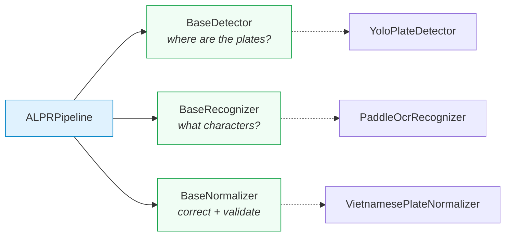
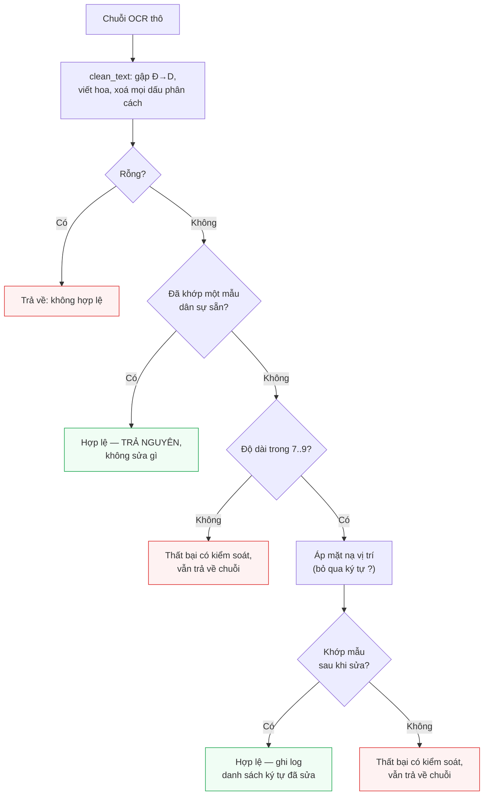
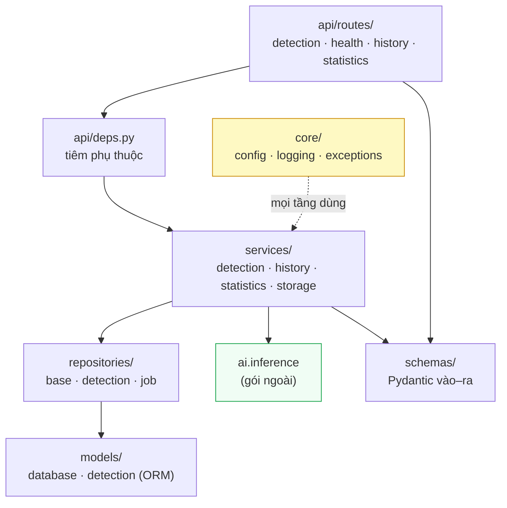
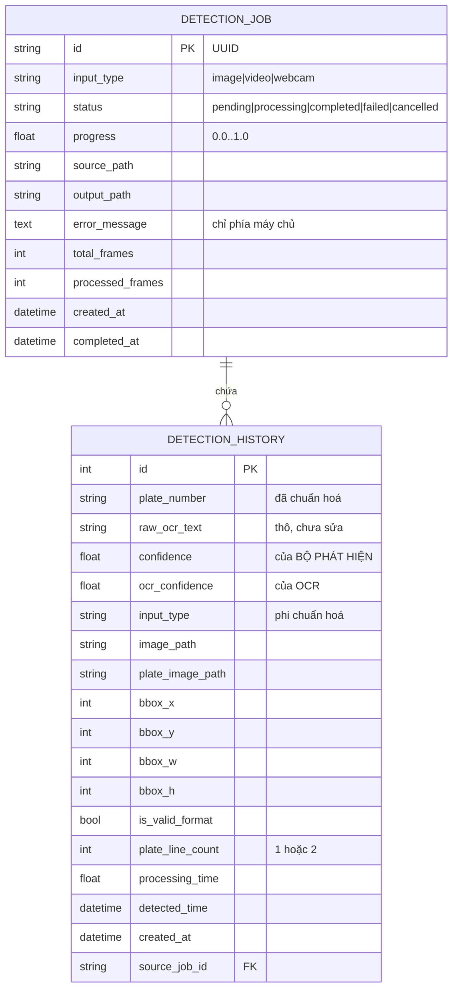
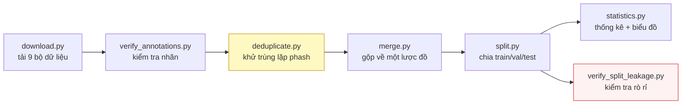
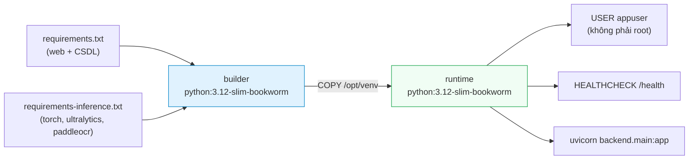

# CHƯƠNG 4. CÀI ĐẶT HỆ THỐNG

Chương 3 đã trình bày hệ thống *nên* được xây dựng như thế nào: kiến trúc năm tầng, các giao diện trừu tượng, lược đồ cơ sở dữ liệu và tám quyết định kiến trúc AD-01 đến AD-08. Chương này trình bày hệ thống *đã* được xây dựng như thế nào.

Sự phân biệt giữa hai chương không chỉ là thứ tự trình bày. Thiết kế mô tả ý định; cài đặt mô tả những gì thực sự tồn tại dưới dạng mã nguồn chạy được, cùng với những chỗ mà hiện thực buộc phải lệch khỏi ý định ban đầu. Trong một đồ án kỹ thuật, chính những điểm lệch đó — và lý do của chúng — mới là phần mang giá trị tri thức cao nhất, bởi vì chúng là thứ duy nhất không thể suy ra được từ tài liệu thiết kế. Mục 4.7 dành riêng cho việc đối chiếu này.

Nguyên tắc trình bày của chương: **mọi mô tả trong chương này đều tương ứng với mã nguồn có thật trong kho `d:/DATN`**. Không có thành phần nào được mô tả mà không tồn tại. Nơi nào một chức năng chưa hoàn thiện, chương ghi nhận rõ mức độ hoàn thiện thay vì bỏ qua. Nơi nào một số đo chưa có, chương để bảng trống với đầy đủ cột và chỉ tới Chương 5.

Nội dung chương được tổ chức theo trình tự triển khai thực tế: môi trường phát triển (4.1), tầng AI (4.2), tầng backend (4.3), tầng frontend (4.4), xây dựng bộ dữ liệu (4.5), đóng gói triển khai (4.6), các điểm lệch so với thiết kế (4.7) và kết luận (4.8).

---

## 4.1. Môi trường và công cụ phát triển

### 4.1.1. Cấu hình máy thực hiện

Toàn bộ quá trình cài đặt, kiểm thử và đo đạc được thực hiện trên một máy trạm cá nhân duy nhất. Cấu hình thực tế đã được khảo sát và ghi nhận chính thức trong `docs/00-requirements/environment.md`:

| Hạng mục | Cấu hình thực tế |
|---|---|
| Hệ điều hành | Windows 11 Pro 10.0.26200 |
| CPU | Intel Core i5-14600K (kiến trúc Raptor Lake Refresh), **14 nhân / 20 luồng** |
| RAM | 31,77 GiB |
| GPU | Intel UHD Graphics 770 (đồ hoạ tích hợp) — **không có GPU CUDA** |
| Python | 3.13.12 (có sẵn 3.11 làm phương án lùi) |
| Node.js | 18.20.8 (kích hoạt qua `nvm-windows`) |
| Docker | 29.4.3 |
| Dung lượng trống | 96 GB (ổ D:) |

Bảng này có một điểm cần nhấn mạnh: nó **mâu thuẫn với mô tả môi trường ban đầu của đồ án**, vốn giả định máy macOS Apple Silicon với Python 3.12. Việc khảo sát lại và ghi nhận sai lệch thành văn bản chính thức là bước đầu tiên của Phase 0, bởi vì cả ba tham số sai (hệ điều hành, phiên bản Python, khả năng tăng tốc phần cứng) đều ảnh hưởng trực tiếp tới thiết bị huấn luyện, tới chỉ tiêu hiệu năng và tới cách viết đường dẫn tệp trong mã nguồn.

### 4.1.2. Vì sao "không có GPU" là ràng buộc thiết kế chứ không phải hạn chế tạm thời

Cách phản ứng thông thường trước một máy không có GPU là coi đó như một bất tiện tạm thời: "hiện tại chạy CPU, sau này có GPU thì nhanh hơn". Đồ án này chủ ý **không** áp dụng cách nhìn đó, vì ba lý do độc lập nhau.

**Thứ nhất, môi trường trình diễn là môi trường đã biết.** Buổi bảo vệ đồ án diễn ra trên chính máy này hoặc một máy tương đương, không có GPU. Một hệ thống chỉ đạt chỉ tiêu độ trễ khi có GPU là một hệ thống *không đạt chỉ tiêu* trong bối cảnh sử dụng thật của nó. Vì vậy ràng buộc CPU-only được đưa thẳng vào phát biểu chỉ tiêu NFR-P1 chứ không được coi là điều kiện ngoại cảnh.

**Thứ hai, ràng buộc CPU thay đổi *lựa chọn mô hình*, không chỉ thay đổi *tốc độ chạy*.** Nếu suy luận chạy trên GPU, việc chọn YOLO11s hay YOLO11m thay vì YOLO11n gần như không có chi phí đáng kể, và việc chọn mô hình OCR server thay vì mobile cũng vậy. Trên CPU, các lựa chọn đó chênh nhau hàng trăm mili-giây mỗi ảnh. Quyết định kiến trúc AD-06 (suy luận chạy trên CPU) vì thế kéo theo hai quyết định phái sinh đã được cài đặt: biến thể `yolo11n` cho tầng phát hiện và bộ mô hình **PP-OCRv5 mobile** cho tầng nhận dạng ký tự. Đây là các lựa chọn *do ràng buộc phần cứng quyết định*, không phải lựa chọn tự do.

**Thứ ba, ràng buộc tách bạch huấn luyện khỏi suy luận một cách vật lý.** Huấn luyện YOLO11 trên CPU cần ước tính 1–3 ngày cho một lượt, khiến việc thử nghiệm siêu tham số trở nên bất khả thi. Hệ quả là kiến trúc mã nguồn phải chấp nhận rằng **nơi huấn luyện và nơi chạy là hai môi trường khác nhau**: gói `ai/training/` phải chạy được cả trên máy local lẫn trên notebook Colab/Kaggle, siêu tham số phải nằm trong tệp cấu hình chứ không nằm trong ô lệnh của notebook, và trọng số phải di chuyển được giữa hai môi trường dưới dạng tệp. Đây là ràng buộc kiến trúc, không phải chi tiết vận hành. Nó là lý do tồn tại của `ai/training/config.py` (586 dòng) như một lớp cấu hình có kiểm tra hợp lệ, thay vì một danh sách tham số truyền qua dòng lệnh.

Một hệ quả đo được của ràng buộc này xuất hiện trong kết quả benchmark: độ trễ đầu-cuối p95 trên `models/best.pt` (máy rảnh) là **731 ms** (client-side) / **780 ms** (in-process), đạt mục tiêu 800 ms của NFR-P1. Trong đó OCR chiếm **~64,3%** thời gian, phát hiện **~34,2%** — OCR vẫn là giai đoạn tốn kém nhất trên CPU. Chi tiết phân tích được trình bày ở Chương 5; ở đây chỉ cần ghi nhận rằng ràng buộc phần cứng không phải một chú thích bên lề mà là yếu tố chi phối kết quả hiệu năng của toàn hệ thống.

### 4.1.3. Ba môi trường ảo Python tách biệt, và lý do bắt buộc phải tách

Đồ án sử dụng **ba môi trường ảo Python riêng biệt** trong cùng một kho mã. Đây không phải là sự thiếu tổ chức mà là hệ quả trực tiếp của một xung đột phụ thuộc không thể hoà giải, đã được xác minh bằng cách kiểm tra phiên bản gói thực tế đã cài:

| Môi trường ảo | Vai trò | NumPy | OpenCV | Gói đặc trưng |
|---|---|---|---|---|
| `.venv-ai/` | Huấn luyện, xuất mô hình | **2.4.4** | `opencv-python` **5.0.0.93** (+ headless) | `torch` 2.13.0+cpu, `torchvision` 0.28.0 |
| `.venv-ocr/` | Thử nghiệm OCR biệt lập | **2.3.5** | `opencv-contrib-python` **4.10.0.84** | `paddlepaddle` 3.3.1, `paddleocr` 3.7.0, `paddlex` |
| `backend/.venv/` | Chạy dịch vụ (backend + suy luận) | **2.3.5** | `opencv-contrib-python` **4.10.0.84** | Toàn bộ: `torch`, `ultralytics` 8.4.101, `paddleocr` |

Cơ chế của xung đột như sau. Gói `paddleocr` kéo theo `paddlex`, và chuỗi phụ thuộc này **hạ cấp NumPy từ 2.4.x xuống 2.3.5** đồng thời **thay thế `opencv-python` bằng `opencv-contrib-python` 4.10** — tức là lùi một phiên bản lớn (major version) so với OpenCV 5.0 mà nhánh huấn luyện đang dùng. Cài `paddleocr` vào cùng môi trường với `ultralytics` và `torch` phiên bản mới do đó không phải là "thêm một gói" mà là **ghi đè hai gói nền tảng của toàn bộ ngăn xếp thị giác máy tính**.

Hệ quả nếu không tách: mỗi lần cài lại hoặc nâng cấp một trong hai nhánh sẽ âm thầm thay đổi phiên bản NumPy/OpenCV mà nhánh kia đang chạy. Đây là loại lỗi tồi tệ nhất trong một đồ án có đo đạc — nó không làm chương trình sập mà làm **kết quả đo không tái lập được**, vì hai lần chạy cách nhau vài ngày có thể đang dùng hai phiên bản thư viện khác nhau mà không có dấu hiệu nào.

Cách giải quyết đã chọn:

- `.venv-ai/` giữ nhánh huấn luyện ở phiên bản mới nhất, **không cài `paddleocr`**.
- `.venv-ocr/` là môi trường thử nghiệm OCR biệt lập, dùng khi cần đo riêng tầng nhận dạng ký tự mà không muốn động tới hai môi trường kia.
- `backend/.venv/` là môi trường **chạy thật**: nó chấp nhận phiên bản NumPy/OpenCV do `paddleocr` áp đặt, vì đây là môi trường mà cả hai tầng phải cùng tồn tại. Việc chấp nhận phiên bản thấp hơn ở đây là một đánh đổi có ý thức: nhánh suy luận không cần tính năng mới của OpenCV 5, trong khi PaddleOCR thì không chạy được nếu thiếu phiên bản nó yêu cầu.

Sự phân tách này được phản ánh trong hai tệp yêu cầu riêng của backend: `backend/requirements.txt` (chỉ dịch vụ web và cơ sở dữ liệu) và `backend/requirements-inference.txt` (bổ sung ngăn xếp ML). Tệp `Dockerfile.backend` cài hai tệp này theo hai lớp riêng biệt, để một thay đổi ở tầng suy luận không làm mất hiệu lực bộ đệm (cache) của tầng web.

### 4.1.4. Bộ công cụ

| Công cụ | Phiên bản | Vai trò trong đồ án |
|---|---|---|
| Python | 3.13.12 (local) / 3.12 (Docker) | Ngôn ngữ của tầng AI và tầng backend |
| FastAPI + Uvicorn | — | Khung dịch vụ web bất đồng bộ, sinh OpenAPI tự động |
| SQLAlchemy 2.x + Alembic | — | ORM và di trú lược đồ (migration) |
| Pydantic / pydantic-settings | v2 | Xác thực dữ liệu vào–ra và cấu hình |
| Ultralytics | 8.4.101 | Nạp và chạy YOLO11 [1]<!-- jocher_2024_yolo11 --> |
| PaddlePaddle / PaddleOCR | 3.3.1 / 3.7.0 | Nhận dạng ký tự PP-OCRv5 [2]<!-- cui_2026_ppocrv5 --> |
| Node.js | 18.20.8 (local) / 20 (Docker) | Thời gian chạy cho công cụ build frontend |
| Vite + React + TypeScript | — | Xây dựng giao diện người dùng |
| pytest + pytest-cov | — | Kiểm thử tự động và đo bao phủ |
| Docker + Docker Compose | 29.4.3 | Đóng gói và chuẩn hoá môi trường triển khai |

Việc `Dockerfile` dùng Python 3.12 trong khi máy local dùng 3.13 là **chủ ý**: container chính là nơi lấy lại phiên bản mục tiêu và tách môi trường chạy khỏi máy cá nhân. Điều này biến một sai lệch môi trường thành một luận điểm về khả năng tái lập, và là nội dung cụ thể của NFR-C1.

---

## 4.2. Cài đặt tầng AI

### 4.2.1. Tổ chức gói `ai/inference` và ràng buộc "không import FastAPI"

Gói `ai/inference/` gồm mười mô-đun mã nguồn cùng một tệp khởi tạo gói (`__init__.py`, 80 dòng), tổng cộng 4.171 dòng (bao gồm tài liệu nội dòng):

| Mô-đun | Dòng | Vai trò |
|---|---:|---|
| `types.py` | 279 | Các kiểu giá trị: `BoundingBox`, `PlateDetection`, `PlateRecognition`, `DetectionResult`, `PipelineResult` |
| `interfaces.py` | 169 | Ba lớp trừu tượng: `BaseDetector`, `BaseRecognizer`, `BaseNormalizer` |
| `config.py` | 291 | `InferenceConfig` — mọi tham số và mọi đường dẫn |
| `exceptions.py` | 71 | Cây ngoại lệ gốc `ALPRError` |
| `plate_rules.py` | 593 | Quy chuẩn biển số Việt Nam dưới dạng dữ liệu và hàm thuần |
| `normalizer.py` | 423 | `VietnamesePlateNormalizer` — hậu xử lý theo vị trí |
| `detector.py` | 603 | `YoloPlateDetector` — bộ chuyển đổi (adapter) trên Ultralytics |
| `recognizer.py` | 606 | `PaddleOcrRecognizer` |
| `two_line.py` | 475 | Hình học xử lý biển hai dòng |
| `pipeline.py` | 581 | `ALPRPipeline` — ghép nối ba tầng |

**Ràng buộc kiến trúc trung tâm (NFR-M1): không tệp nào trong `ai/` được phép `import fastapi`, `pydantic`, `pydantic_settings` hay `starlette`.** Riêng trong `ai/inference/`, danh sách cấm còn mở rộng thêm `sqlalchemy` và `backend`.

Lý do của ràng buộc không phải là sự sạch sẽ hình thức. Gói suy luận phải chạy được bên trong một Jupyter notebook, một script benchmark và một phiên Colab — những môi trường không có máy chủ web và không có cơ sở dữ liệu. Một dòng `import fastapi` duy nhất, dù ở tệp nào, biến cả gói thành không nạp được trong các môi trường đó. Đây cũng là điều làm cho quan hệ phụ thuộc chỉ đi một chiều: `backend` được phép dùng `ai`, chiều ngược lại thì không.

**Điểm đáng ghi nhận của cài đặt: ràng buộc này được kiểm chứng tự động chứ không bằng rà soát mã.** Tệp `tests/test_architecture.py` (340 dòng) thực hiện hai loại kiểm tra bổ sung cho nhau.

*Kiểm tra thứ nhất — quét văn bản mã nguồn.* Một biểu thức chính quy duyệt mọi tệp `.py` dưới `ai/` và trích các tên mô-đun cấp cao nhất được `import`:

```python
_IMPORT_PATTERN = re.compile(
    r"^[ \t]*(?:from[ \t]+(?P<from>[\w.]+)|import[ \t]+(?P<import>[\w.]+))",
    re.MULTILINE,
)
```

Biểu thức này chủ ý chỉ khớp **câu lệnh import viết thường**, không khớp tên sản phẩm viết hoa trong tài liệu. Nhờ đó, đoạn văn giải thích ràng buộc ("this module must never import FastAPI") không bị nhầm là vi phạm chính ràng buộc nó đang giải thích. Đây là chi tiết nhỏ nhưng cần thiết: nếu không có nó, cách duy nhất để test đi qua là ngừng viết tài liệu về ràng buộc.

*Kiểm tra thứ hai — quan sát `sys.modules` trong tiến trình sạch.* Quét văn bản không phát hiện được import **bắc cầu**: một mô-đun trong `ai` có thể import một tiện ích vô hại mà chính tiện ích đó kéo theo khung web. Cách kiểm tra hiển nhiên — `import ai.inference` rồi nhìn `sys.modules` — lại **vô giá trị nếu chạy trong cùng bộ test**, bởi các test tích hợp đã import `backend` và do đó đã nạp FastAPI vào `sys.modules` từ trước. Giải pháp cài đặt là sinh một **tiến trình Python hoàn toàn mới**:

```python
snippet = (
    "import sys\n"
    "import ai.inference\n"
    f"forbidden = {FORBIDDEN_IN_AI!r}\n"
    "loaded = sorted(name for name in forbidden if name in sys.modules)\n"
    "print('LOADED:' + ','.join(loaded))\n"
)
result = subprocess.run([sys.executable, "-c", snippet], cwd=str(PROJECT_ROOT), ...)
```

Bộ test còn kiểm tra ba điều kiện phái sinh: (a) mỗi mô-đun trong `ai/inference/` phải import được **độc lập**, không phụ thuộc thứ tự import; (b) `ALPRPipeline` phải khởi tạo được từ ba đối tượng giả mà **không nạp `ultralytics`, `paddleocr` hay `torch`** — đây chính là phát biểu kiểm chứng được của nguyên lý tiêm phụ thuộc; (c) gói `ai/evaluation/` được phép import `backend` và `sqlalchemy` (nó là bộ đo, cần lược đồ CSDL để đo NFR-P6) nhưng **chỉ ở phạm vi hàm**, không ở cấp mô-đun — điều kiện này được ghim lại bằng một test riêng, vì chỉ cần chuyển một dòng import lên đầu tệp là ràng buộc bị phá âm thầm.

Một ràng buộc thứ hai được kiểm chứng cùng cách là NFR-M4 — **không đường dẫn tuyệt đối viết cứng**. Test quét mọi tệp trong `ai/` và `backend/` tìm chuỗi có dạng `"C:\..."` hoặc `"/home/..."`, đồng thời khẳng định cả hai mô-đun cấu hình đều dẫn xuất gốc dự án từ `Path(__file__).resolve().parents[...]`.

### 4.2.2. Ba lớp trừu tượng

Toàn bộ khả năng thay thế thành phần của hệ thống nằm ở ba lớp cơ sở trừu tượng trong `interfaces.py`:



**`BaseDetector`** trả lời đúng một câu hỏi — *biển số nằm ở đâu?* — và không làm gì khác. Nó không đọc ký tự và không chạm vào hệ thống tệp ngoài việc nạp trọng số của chính nó. Hợp đồng của phương thức `detect(image) -> list[PlateDetection]` quy định ba điều kiện mà mọi cài đặt phải bảo đảm: kết quả đã được lọc theo ngưỡng tin cậy và NMS; mọi hộp bao đã được **kẹp về trong biên ảnh** để có thể dùng trực tiếp để cắt; và **danh sách rỗng là kết quả bình thường**, không bao giờ là lỗi. Điều kiện thứ ba đáng chú ý — nó buộc mọi tầng phía trên phải xử lý trường hợp "ảnh không có biển số" như một kết quả hợp lệ, thay vì như một ngoại lệ.

**`BaseRecognizer`** nhận một *ảnh biển số đã cắt*, không phải toàn cảnh, và trả về `PlateRecognition`. Điều quan trọng nhất trong hợp đồng này là điều nó **không** làm: sửa lỗi ký tự và kiểm tra định dạng không thuộc trách nhiệm của nó. Việc tách hai việc đó ra là thứ làm cho đóng góp của khối hậu xử lý trở nên **đo được** — hệ thống lưu song song `raw_ocr_text` và `plate_number`, và hiệu quả của hậu xử lý chính là hiệu số giữa hai cột.

**`BaseNormalizer`** nhận chuỗi thô và trả về cặp `(normalized_text, is_valid_format)`. Hợp đồng ghi rõ: kết quả không hợp lệ vẫn phải được **trả về**, không được loại bỏ. Loại bỏ sẽ xoá đúng những trường hợp thất bại mà chương đánh giá cần đếm.

Cả `BaseDetector` và `BaseRecognizer` đều có phương thức `warmup()` với cài đặt mặc định là không làm gì. Lý do tồn tại: lần suy luận đầu tiên trong một tiến trình chậm hơn nhiều lần các lần sau, do trọng số được nạp vào bộ nhớ và các nhân tính toán được biên dịch trễ. Gọi `warmup()` lúc khởi động chuyển chi phí đó ra khỏi yêu cầu đầu tiên của người dùng — trực tiếp phục vụ NFR-P1.

### 4.2.3. Cài đặt bộ phát hiện — `YoloPlateDetector`

`YoloPlateDetector` là **bộ chuyển đổi (adapter)** mỏng trên Ultralytics YOLO. Mục đích của lớp adapter này là giữ Ultralytics ở vị trí *chi tiết cài đặt*: không có nơi nào ngoài mô-đun này chạm vào đối tượng `Results` của Ultralytics, tensor của PyTorch hay chỉ số lớp. Ranh giới chuyển mọi thứ thành các đối tượng giá trị của riêng đồ án.

**Ultralytics được import trễ.** Câu lệnh `from ultralytics import YOLO` nằm bên trong hàm `_load_yolo_model`, không ở đầu tệp. Nhờ đó `import ai.inference.detector` vẫn rẻ, và các unit test có thể kiểm tra logic chuyển đổi mà không cần cài toàn bộ ngăn xếp ML.

**Trọng số được nạp ngay trong hàm khởi tạo**, không nạp trễ. Đây là lựa chọn có chủ ý ngược với recognizer: một tệp trọng số thiếu hoặc hỏng phải làm hệ thống **thất bại lúc khởi động**, với thông báo nêu rõ đường dẫn đã thử, thay vì thất bại ở yêu cầu đầu tiên của người dùng. Thông báo lỗi được viết kèm hướng dẫn khắc phục cụ thể:

```
Detector weights not found at '<path>'.
Train the detector first:
    python -m ai.training.train --config yolo11n_finetune.yaml
```

**Bốn chi tiết cài đặt đáng ghi nhận:**

*a) Chấp nhận nhiều định dạng trọng số.* Hằng `SUPPORTED_WEIGHT_SUFFIXES = (".pt", ".onnx", ".torchscript")`, cộng thêm khả năng nhận **thư mục** chứa mô hình OpenVINO. OpenVINO là định dạng duy nhất được hỗ trợ mà đơn vị lưu trữ là thư mục chứ không phải một tệp, nên hàm `_verify_weights_exist` phải xử lý riêng: nếu đường dẫn là thư mục, nó kiểm tra sự có mặt của tệp `.xml` để phân biệt mô hình OpenVINO thật với một thư mục ngẫu nhiên. Chi tiết này tồn tại vì OpenVINO là hướng tối ưu tốc độ trên CPU Intel — từ chối thư mục sẽ khiến cấu hình nhanh nhất trở nên không thể cấu hình được qua biến `ALPR_MODEL_PATH`.

*b) Lọc lớp có ba trường hợp.* Hàm `_resolve_plate_class_ids` quyết định chỉ số lớp nào được giữ:

| Tình huống | Hành vi | Lý do |
|---|---|---|
| Mô hình không công bố bảng tên lớp | Giữ tất cả | Bỏ hết vì thiếu metadata là một thất bại âm thầm |
| Mô hình **một lớp** (mô hình của đồ án) | Giữ tất cả | Lớp duy nhất *chính là* biển số, dù nó tên gì |
| Mô hình **nhiều lớp** | Chỉ giữ lớp khớp `PLATE_CLASS_ALIASES` | Ví dụ checkpoint COCO 80 lớp sẽ không giữ lớp nào và luôn trả danh sách rỗng — đúng, không phải lỗi |

Tập bí danh `PLATE_CLASS_ALIASES` gồm `license_plate`, `licence_plate`, `plate`, `license-plate`, `bien_so`; việc so khớp là không phân biệt hoa thường và quy `-`/khoảng trắng về `_`. Tập này tồn tại để dùng được trọng số lấy từ các bộ dữ liệu công khai, vốn đặt tên cho cùng một khái niệm theo nhiều cách khác nhau.

*c) Kẹp hộp bao ngay tại biên adapter.* YOLO có thể sinh hộp lấn ra ngoài biên ảnh một hai điểm ảnh. Hàm `_build_clamped_bbox` kẹp giá trị về `[0, width]` × `[0, height]`, hoán đổi toạ độ nếu `x2 < x1`, và trả `None` (kèm log cảnh báo) nếu hộp suy biến thành diện tích bằng không sau khi kẹp và làm tròn. Việc kẹp **tại đây** chứ không ở tầng gọi là điều cho phép hợp đồng của `BaseDetector` hứa rằng mọi hộp trả về đều dùng cắt được ngay.

*d) Định danh mô hình mang tên tệp trọng số.* Thuộc tính `name` trả về `f"yolo:{stem}{suffix}"`, ví dụ `yolo:best.pt`. Lý do: một con số benchmark chỉ tái lập được nếu nó nêu tên đúng bộ trọng số đã sinh ra nó. Chuỗi này được ghép với tên của recognizer thành định danh pipeline đầy đủ, và được endpoint `/health` công bố ra ngoài.

### 4.2.4. Cài đặt bộ nhận dạng ký tự — `PaddleOcrRecognizer`

`PaddleOcrRecognizer` bọc PaddleOCR với cấu hình PP-OCRv5 mobile. Ba đặc điểm cấu trúc:

**Khởi tạo trễ và tái sử dụng.** Máy OCR rất đắt để dựng — nó nạp nhiều mô hình và cấp phát phiên suy luận riêng — nên nó được dựng **một lần, ở lần gọi đầu tiên**, rồi tái sử dụng cho mọi ảnh sau đó. Dựng lại theo từng ảnh sẽ chiếm trọn ngân sách độ trễ.

**Ghim phiên bản mô hình.** Hằng `OCR_VERSION = "PP-OCRv5"` được truyền tường minh vào `PaddleOCR(...)` thay vì để thư viện tự chọn mặc định. Lý do: một lần nâng cấp `paddleocr` không được phép âm thầm đổi mô hình đứng sau một con số benchmark đã công bố.

**Tắt các tầng tiền xử lý mức tài liệu.** Ba tham số `use_doc_orientation_classify`, `use_doc_unwarping`, `use_textline_orientation` đều đặt `False`. Ảnh đầu vào ở đây đã là một vùng biển số đã cắt, chứa đúng một vùng văn bản; các tầng xử lý mức trang là thuần chi phí độ trễ trong bối cảnh này.

#### Phát hiện kỹ thuật: backend oneDNN làm sập suy luận trên PP-OCRv5

Đây là một phát hiện thực nghiệm đáng được ghi nhận riêng, vì nó đi ngược trực giác thông thường và vì nó có ảnh hưởng trực tiếp tới hiệu năng.

oneDNN (trước đây gọi là MKL-DNN) là thư viện nhân tính toán tối ưu của Intel dành cho CPU, và trong hầu hết các cấu hình, bật oneDNN là cách tăng tốc suy luận CPU rẻ nhất. Tuy nhiên, trên đúng nền tảng mục tiêu của đồ án — `paddlepaddle` **3.3.1**, Windows, CPU — chạy mô hình phát hiện văn bản của PP-OCRv5 qua đường oneDNN **kết thúc bằng ngoại lệ**:

```
NotImplementedError: (Unimplemented) ConvertPirAttribute2RuntimeAttribute
not support [pir::ArrayAttribute<pir::DoubleAttribute>]
```

Nguyên nhân: bộ thực thi PIR (Paddle Intermediate Representation) của PaddlePaddle không dịch được một thuộc tính của đồ thị mô hình sang dạng thuộc tính thời gian chạy mà nhân oneDNN yêu cầu. Đây không phải lỗi cấu hình của đồ án mà là khiếm khuyết ở phía thư viện, xảy ra ở giao điểm của một phiên bản PaddlePaddle cụ thể và một thế hệ mô hình cụ thể.

Cách xử lý đã cài đặt là biến phát hiện này thành một hằng số có tài liệu, thay vì một tham số truyền ngầm:

```python
DEFAULT_ENABLE_MKLDNN: Final[bool] = False
```

Với `enable_mkldnn=False`, PaddlePaddle lùi về các nhân CPU thông thường, chạy đúng mô hình đó với chi phí tốc độ vừa phải. Điểm quan trọng về mặt phương pháp: đây là **một núm điều chỉnh hiệu năng, không phải một núm điều chỉnh độ chính xác**. Khi lỗi thượng nguồn được sửa, chỉ cần lật giá trị này và đo lại; không có kết quả nhận dạng nào thay đổi do quyết định này. Việc ghi rõ điều đó trong tài liệu của hằng số là điều ngăn một người bảo trì tương lai hiểu nhầm rằng tắt oneDNN là một lựa chọn về chất lượng.

Phát hiện này cũng góp phần giải thích kết quả NFR-P1: một trong những con đường tăng tốc CPU hiển nhiên nhất đang bị chặn bởi lỗi thư viện, chứ không phải chưa được thử.

#### Lọc mảnh văn bản theo hình học

Trong quá trình đưa tầng OCR vào chạy, một chế độ hỏng lặp lại đã được quan sát và ghi nhận. CLAHE (mục 4.2.5) về bản chất **khuếch đại mọi biến thiên có trong một vùng ảnh**; ở vùng gần như đồng nhất, nhiễu cảm biến được khuếch đại có thể có đủ kết cấu để bộ phát hiện văn bản của PP-OCR kích hoạt trên đó. Trên một ảnh biển số tổng hợp, hiện tượng này sinh ra một mảnh văn bản cao 10 điểm ảnh đọc thành `"cYanmaGaYGntaYellowb"` với độ tin cậy **0,84**, nằm cạnh hai hàng ký tự thật cao 125 và 87 điểm ảnh.

Điểm mấu chốt: **ngưỡng tin cậy không tách được hai trường hợp này** — 0,84 là một điểm số hoàn toàn bình thường. Thứ tách được chúng là **hình học**. Sau phép biến đổi cắt–ghép ở mục 4.2.5, theo cấu trúc, mọi hàng ký tự hợp lệ đều chiếm một phần lớn chiều cao của dải ảnh. Do đó một mảnh thấp hơn hẳn mảnh cao nhất là hiện vật (artefact) chứ không phải ký tự biển số. Luật được cài đặt thành:

```python
MIN_FRAGMENT_HEIGHT_RATIO: Final[float] = 0.35
```

Ngưỡng được đo **so với mảnh cao nhất**, không phải so với chiều cao ảnh — nhờ đó luật không phụ thuộc vào việc khung cắt chặt hay lỏng. Hàm `_drop_short_fragments` cũng được viết để **trả nguyên đầu vào nếu không mảnh nào báo được hình học**, nên bộ lọc không bao giờ có thể xoá sạch kết quả trên một tải trọng mà nó không đo được.

#### Tổng hợp độ tin cậy

Độ tin cậy của cả biển số được tính bằng **trung bình có trọng số theo độ dài mảnh**, không phải trung bình cộng:

```python
weighted = sum(score * weight for score, weight in zip(scores, weights))
return float(min(1.0, max(0.0, weighted / total_weight)))
```

Lý do: trung bình cộng cho phép một mảnh một ký tự nhận với độ tin cậy 0,99 che lấp một mảnh bảy ký tự nhận với độ tin cậy 0,40 — trong khi trên một biển số, chính mảnh dài mới mang danh tính.

### 4.2.5. Mô-đun xử lý biển hai dòng — `two_line.py`

Đây là mục kỹ thuật quan trọng nhất của chương, vì nó là câu trả lời cài đặt cho rủi ro R-04 và là chỗ mà đặc thù của biển số Việt Nam bộc lộ rõ nhất.

#### a) Vì sao bài toán tồn tại

Các bộ nhận dạng văn bản hiện đại là mô hình CRNN/CTC. Giả định cốt lõi của chúng là **căn chỉnh đơn điệu (monotonic alignment)** giữa các cột ảnh và các ký tự đầu ra — giả định chỉ đúng khi văn bản nằm trên một dòng. Chồng lên đó, mô-đun nhận dạng của PP-OCR **resize mọi ảnh cắt về chiều cao cố định 48 điểm ảnh** [3]<!-- paddlepaddle_2026_textrecognition -->.

Hai sự thật này gặp nhau ở biển số xe máy Việt Nam. Theo QCVN 08:2024/BCA [4]<!-- bocongan_2024_qcvn08 -->, biển xe máy có kích thước 140 × 190 mm, tức tỷ lệ khung ≈ **1,36**. Đưa nguyên ảnh đó vào PP-OCR: sau khi ép về chiều cao 48 px, mỗi trong hai hàng ký tự chỉ còn khoảng **24 px chiều cao** — dưới mức mà nét chữ còn tách rời được. Kết quả là bộ nhận dạng không đọc ra gì dùng được.

Hệ quả định lượng của bố cục hai dòng đã được công bố: trên bộ dữ liệu **RodoSol-ALPR của Brazil**, hệ thống thương mại OpenALPR đạt **94,3% trên biển ô tô một dòng** nhưng chỉ **45,7% trên biển xe máy hai dòng** [5]<!-- laroca_2022_crossdataset -->[6]<!-- laroca_2022_rodosol -->.

> **Cảnh báo về phạm vi áp dụng.** Cặp số 94,3% / 45,7% được đo trên **bộ dữ liệu RodoSol-ALPR của Brazil**, **không phải dữ liệu Việt Nam** và **không phải một benchmark chung của OpenALPR**. Đồ án trích dẫn nó thuần tuý như một *dẫn chứng tương đương định lượng* cho độ khó tương đối của bố cục hai dòng so với một dòng. Giá trị của trích dẫn nằm ở chỗ nó chứng minh "biển hai dòng khó hơn" là một sự kiện đo được, chứ không phải một cảm nhận.

#### b) Ước lượng số dòng bằng tỷ lệ khung

Hàm `estimate_line_count` quyết định một ảnh cắt mang một hay hai dòng ký tự, dựa trên tỷ lệ rộng/cao:

```python
DEFAULT_TWO_LINE_AR_THRESHOLD: Final[float] = 2.5
...
line_count = 2 if aspect_ratio < threshold else 1
```

**Cần nêu rõ: đây là một heuristic do đồ án đề xuất, không phải một quy tắc pháp lý.** Không có văn bản quy phạm nào của Việt Nam quy định cách phân loại biển số từ tỷ lệ khung. Thứ mà quy chuẩn *có* cung cấp là kích thước vật lý của biển, và các kích thước đó để lại một khoảng trống rộng:

| Loại biển | Kích thước (mm) | Tỷ lệ khung | Số dòng |
|---|---|---:|:---:|
| Ô tô, biển dài | 110 × 520 | 4,727 | 1 |
| Ô tô, biển ngắn | 165 × 330 | 2,000 | 2 |
| Xe máy | 140 × 190 | 1,357 | 2 |

Không loại biển nào rơi vào khoảng giữa 2,000 và 4,727. Mọi ngưỡng đặt bên trong khoảng trống rộng 2,727 này đều tách đúng các lớp. Giá trị 2,5 được chọn **lệch về phía hai dòng**, vì đường xử lý hai dòng suy giảm êm khi gặp đầu vào một dòng (nó chỉ ghép hai nửa của cùng một hàng chữ, bộ nhận dạng vẫn đọc được), trong khi chiều ngược lại thì không.

Hạn chế đã biết và được ghi trong mã: dải tỷ lệ khoảng 2,5–3,0 là **vùng xám thật sự**. Một biển một dòng chụp ở góc nghiêng gắt có tỷ lệ *hộp bao* tụt vào vùng này. Đo trên ảnh đã nắn phối cảnh, hoặc đo trên tỷ lệ của `cv2.minAreaRect` thay vì hộp bao trục-song-song của YOLO, sẽ đáng tin cậy hơn rõ rệt. Việc định lượng tần suất ảnh hưởng của hạn chế này thuộc phần đánh giá và sẽ được trình bày ở Chương 5.

#### c) Cắt trên/dưới **có chồng lấn**

Hàm `split_two_line` cắt ảnh thành nửa trên và nửa dưới theo hai tỷ lệ:

```python
UPPER_HALF_END_RATIO: Final[float]  = 5.0 / 12.0   # 0,4167
LOWER_HALF_START_RATIO: Final[float] = 1.0 / 3.0   # 0,3333
```

Nửa trên trải `[0, 5h/12)`, nửa dưới trải `[h/3, h)`. Vì `1/3 < 5/12`, **hai nửa chồng lấn nhau một dải bằng 1/12 chiều cao biển**.

Chồng lấn là chủ ý, và lý do của nó là bất đối xứng về chi phí sai lầm. Một nhát cắt đúng giữa chiều cao sẽ **cắt ngang qua nét chữ** mỗi khi khung cắt không hoàn hảo — mà điều đó xảy ra thường xuyên: viền biển thêm phần đệm hiếm khi đối xứng, và một độ nghiêng nhỏ làm đường phân cách thật dịch đi vài điểm ảnh dọc theo chiều rộng. So sánh hai loại hỏng:

- **Cắt cụt chân chữ hàng trên hoặc đỉnh chữ hàng dưới** → thông tin bị **phá huỷ vĩnh viễn**; không hậu xử lý nào khôi phục được.
- **Để lọt vài điểm ảnh của hàng bên cạnh** → bộ nhận dạng **bỏ qua** chúng như nền.

Chồng lấn chọn loại hỏng thứ hai. Hàm cũng bảo đảm hai nửa không rỗng ngay cả với ảnh cắt chỉ cao vài điểm ảnh, nơi phép cắt số nguyên có thể làm một lát co về không hàng:

```python
upper_end  = max(upper_end, 1)
lower_start = min(lower_start, height - 1)
```

và ghi log cảnh báo nếu cấu hình tham số dẫn tới **mất chồng lấn**.

#### d) Ghép ngang bằng `np.hstack`

Hàm `merge_two_line` đưa hai nửa về cùng chiều cao rồi nối ngang:

```python
merged: ImageArray = np.hstack((resized_upper, resized_lower))
```

Chiều cao chung mặc định là `max(upper.h, lower.h, MIN_MERGE_HEIGHT)` với:

```python
MIN_MERGE_HEIGHT: Final[int] = 48
```

Con số 48 **không phải tuỳ chọn**: nó bằng đúng chiều cao đầu vào cố định của mô-đun nhận dạng PP-OCR. Sinh ra một dải ảnh thấp hơn 48 px sẽ buộc máy OCR tự phóng to một ảnh đã suy giảm, làm mất chi tiết vốn còn nguyên trong ảnh cắt gốc.

**Thứ tự đọc được bảo toàn**: nửa trên đặt bên trái. Đó đúng là thứ tự đọc của biển số hai dòng Việt Nam — mã tỉnh và sê-ri ở trên, số thứ tự ở dưới.

Toàn bộ hiệu quả của phép biến đổi nằm ở một câu: sau khi ghép, dải ảnh có tỷ lệ khung rộng gấp nhiều lần ảnh gốc, nên **một hàng ký tự duy nhất nhận trọn ngân sách 48 px chiều cao** thay vì hai hàng chia nhau. Bộ nhận dạng CRNN/CTC lúc này nhìn thấy đúng loại đầu vào mà kiến trúc của nó được thiết kế để xử lý.

Một chi tiết cài đặt nhỏ nhưng cần thiết: `np.hstack` từ chối các mảng có số chiều đuôi khác nhau, nên một nửa ảnh xám không thể xếp cạnh một nửa ảnh màu. Hàm `_match_channels` nâng cả hai về BGR khi số kênh lệch nhau.

#### e) Tiền xử lý ảnh biển — `preprocess_plate`

Ba bước nhẹ, **mỗi bước bật/tắt được độc lập** qua tham số từ khoá, để giai đoạn đánh giá có thể loại bỏ từng bước (ablation) và quy hiệu quả cho một bước cụ thể:

| Bước | Cài đặt | Lý do kỹ thuật |
|---|---|---|
| Chuyển ảnh xám | `cv2.cvtColor(..., COLOR_BGR2GRAY)` | Ký tự biển số Việt Nam không mang thông tin màu; bỏ hai kênh sắc độ loại bỏ một biến nhiễu do ánh sáng đường phố có màu |
| CLAHE | `cv2.createCLAHE(clipLimit=2.0, tileGridSize=(8,8))` | Biển là kim loại phản quang với ký tự dập nổi (nổi 1,7 mm theo QCVN 08:2024/BCA), nên đèn pha hoặc mặt trời tạo một mảng sáng chói trên một phần biển trong khi phần còn lại tối. Cân bằng biểu đồ **toàn cục** không xử lý được; cân bằng thích nghi theo ô thì được [7]<!-- sutikno_2025_clahe --> |
| Khử nhiễu | `cv2.bilateralFilter(d=5, sigmaColor=50, sigmaSpace=50)` | Lọc song phương **bảo toàn biên có chủ ý**: một phép làm mờ Gauss đủ mạnh để khử nhiễu cảm biến cũng đồng thời bo tròn các đầu nét — chính là thứ phân biệt `8` với `B` |

Tham số `clipLimit` giữ CLAHE khỏi khuếch đại nhiễu cảm biến ở các vùng nền phẳng — chính là hiện tượng đã dẫn tới bộ lọc mảnh ở mục 4.2.4.

Kết quả trả về **luôn là mảng BGR ba kênh** ngay cả khi bật chế độ ảnh xám (kênh đơn được nhân bản), để tầng gọi không phải rẽ nhánh theo số kênh.

Tham số `upscale_to_height` cho phép phóng to ảnh cắt trước khi chạy các bước còn lại. Recognizer truyền `_MIN_OCR_HEIGHT = 64` vào đây, vì ảnh biển ra khỏi bộ phát hiện thường chỉ cao 20–40 px: phóng to trước cho CLAHE nhiều điểm ảnh hơn để làm việc, và tránh để máy OCR phải tự phóng to một đầu vào đã suy giảm.

### 4.2.6. Cài đặt bộ luật hậu xử lý — đóng góp kỹ thuật chính

Bộ phát hiện và bộ nhận dạng ký tự đều là mô hình có sẵn. Khối hậu xử lý thì không: các luật ở đây được rút từ quy chuẩn biển số quốc gia và là thứ biến một chuỗi ký tự gần đúng thành một biển số có thể tin được. Hai mô-đun tham gia: `plate_rules.py` (dữ liệu và hàm thuần) và `normalizer.py` (thuật toán).

`plate_rules.py` tuân thủ ba quy tắc thiết kế được ghi ngay trong tài liệu mô-đun: **thuần khiết** (không I/O, không log, không import khung, không trạng thái toàn cục khả biến); **biểu thức chính quy được sinh từ tập hợp, không viết tay** (nhóm mã tỉnh được dựng từ `PROVINCE_CODES`, nên mẫu không thể trôi khỏi bảng mà nó mã hoá); và **lớp ký tự là hằng có tên** (một hiệu chỉnh trong tương lai chạm vào một dòng, không phải chín mẫu).

#### a) `PROVINCE_CODES` — 81 mã tỉnh

```python
PROVINCE_CODES: Final[frozenset[str]] = frozenset({"11","12","14",...,"98","99"})
```

Tập gồm **81 mã** đang được sử dụng theo phụ lục Thông tư 51/2025/TT-BCA [8]<!-- bocongan_2025_tt51 --> (80 mã địa phương cộng mã 80 của Cục Cảnh sát giao thông). Song song là tập `UNUSED_PROVINCE_CODES` gồm **8 mã không bao giờ được cấp**: `13, 42, 44, 45, 46, 87, 91, 96`.

Giá trị của việc kiểm tra theo tập này thay vì theo `\d{2}` là cụ thể và đo được: nó **bác bỏ** một chuỗi như `13A-123.45`, vì mã `13` chưa từng được cấp. Với `\d{2}`, chuỗi đó sẽ được coi là biển số hợp lệ.

Việc giữ tường minh cả tập không dùng — thay vì suy ra bằng phép trừ — cho phép một test nhất quán khẳng định `PROVINCE_CODES | UNUSED_PROVINCE_CODES` phủ đúng dải `11`–`99`.

Một ghi chú về ngữ nghĩa được nêu rõ trong mã: việc sáp nhập đơn vị hành chính năm 2025 **không làm mất hiệu lực các biển số đã cấp**, nên một mã có thể trỏ tới một tỉnh không còn tồn tại như một thực thể. Đó là mối quan tâm ngữ nghĩa của tầng báo cáo, không phải mối quan tâm về định dạng.

#### b) Các lớp ký tự sê-ri

| Hằng | Tập ký tự | Vị trí áp dụng |
|---|---|---|
| `L20` | `A B C D E F G H K L M N P S T U V X Y Z` | Chữ sê-ri của biển ô tô; chữ **thứ nhất** của sê-ri biển xe máy |
| `L20B` | `A B C D E F H K L M N P R S T U V X Y Z` | Chữ **thứ hai** của sê-ri biển xe máy |
| `L11` | `A`–`H`, `K`, `L`, `M` | Sê-ri biển xanh (cơ quan nhà nước) |
| `L21` | 20 chữ chuẩn **cộng** `R` | Tập ký tự an toàn cho bộ nhận dạng |

Điểm cần chú ý: **`L20` và `L20B` là ảnh gương của nhau ở đúng hai ký tự.** `L20` chứa `G` và không chứa `R`; `L20B` chứa `R` và không chứa `G`. Bất đối xứng này là thật và có hệ quả: `29-AR 123.45` là hợp lệ trong khi `29-AG 123.45` thì không.

`L21` tồn tại vì một lý do riêng, thuộc về thiết kế mô hình chứ không thuộc về luật: **một mô hình có tập ký tự dựng từ "20 chữ cái" thì không bao giờ có thể dự đoán ra `R`**, và do đó sẽ sai **có hệ thống** trên mọi biển xe máy mang `R` ở vị trí sê-ri thứ hai. Đó là loại sai lầm mà không hậu xử lý nào sửa được, vì thông tin đã bị huỷ ở tầng mô hình.

Cùng logic đó dẫn tới việc tách đôi tập ký tự huấn luyện và tập ký tự kiểm tra:

```python
OCR_SAFE_CHARSET: Final[str]     = digits + 21 chữ hợp pháp   # 31 ký tự
OCR_TRAINING_CHARSET: Final[str] = digits + "A..Z"            # 36 ký tự
```

Huấn luyện trên 36 và ràng buộc về 31 về sau là lựa chọn chủ ý: một mô hình **được phép** dự đoán ký tự bất hợp pháp sẽ tạo ra sai lầm **quan sát được, ghi log được, sửa được**, trong khi một mô hình **không thể về mặt kiến trúc** dự đoán một ký tự sẽ tạo ra sai lầm vô hình.

Tập `EXCLUDED_LETTERS = {I, J, O, Q, W}` gồm 5 chữ bị loại khỏi hệ thống biển số trên toàn quốc. Chính việc loại `I`, `O` và `Q` là thứ làm cho việc sửa lỗi OCR trở nên khả thi ở đây: không gian ứng viên tại một vị trí chữ đã bị chính quy chuẩn cắt bớt, và nhiều nhầm lẫn co lại còn đúng một ứng viên. (Ghi chú hiệu chỉnh: con số "6 chữ bị loại" từng bao gồm `R` đã được sửa — `R` vẫn hợp lệ ở vị trí sê-ri thứ hai của xe máy và trong mã `RM`/`R`.)

#### c) `POSITION_MASKS` và ký tự đại diện `?` ở chỉ số 3

Đây là chi tiết cài đặt quan trọng nhất của toàn bộ khối hậu xử lý.

```python
POSITION_MASKS: Final[dict[str, str]] = {
    "car_5":         "DDLDDDDD",
    "car_4":         "DDLDDDD",
    "motorcycle_9":  "DDL?DDDDD",
}
```

trong đó `D` = vị trí **bắt buộc là chữ số**, `L` = vị trí **bắt buộc là chữ cái**, `?` = **ký tự đại diện, tuyệt đối không được ép kiểu**.

Mặt nạ được chọn **thuần tuý theo độ dài chuỗi đã làm sạch**:

```python
MASK_BY_LENGTH = {7: car_4, 8: car_5, 9: motorcycle_9}
```

**Vì sao `?` ở chỉ số 3 là bắt buộc.** Hai kiểu biển xe máy cùng có 9 ký tự nhưng khác nhau ở đúng vị trí này:

- Kiểu mới (cấp từ 15/08/2023): sê-ri hai chữ cái — `29AA12345`
- Kiểu cũ (trước 15/08/2023, **vẫn còn hiệu lực lưu hành**): sê-ri chữ + số — `29B112345`

Nếu tách chúng thành hai mặt nạ `DDLLDDDDD` và `DDLDDDDDD`, việc ép kiểu tại chỉ số 3 trở thành bắt buộc, và hệ quả đã được kiểm chứng bằng chạy thật là **một trong hai kiểu bị phá huỷ**:

```
29AA12345 + 'DDLDDDDDD' -> 29A412345   phá kiểu mới
29B112345 + 'DDLLDDDDD' -> 29BL12345   phá kiểu cũ
29AA12345 + 'DDL?DDDDD' -> 29AA12345   đúng
29B112345 + 'DDL?DDDDD' -> 29B112345   đúng
```

Chỉ số 3 của chuỗi 9 ký tự là **vị trí duy nhất trong toàn bộ hệ thống biển số Việt Nam mà cả chữ cái lẫn chữ số đều hợp lệ**. Mặt nạ không được phép khẳng định điều ngược lại — và cần nhấn mạnh rằng chính *mặt nạ*, chứ không phải tài liệu chú thích, mới là thứ quyết định hành vi của hàm.

Nhánh `?` được viết tường minh trong `apply_position_rules` chứ không để rơi vào `else`, vì nó là một **luật có chủ ý**, không phải hệ quả ngẫu nhiên của thứ tự điều kiện:

```python
for char, kind in zip(text, mask, strict=True):
    if kind == MASK_WILDCARD:
        out.append(char)                       # không tra bảng nào cả
    elif kind == MASK_DIGIT and char.isalpha():
        out.append(TO_DIGIT.get(char, char))
    elif kind == MASK_LETTER and char.isdigit():
        out.append(TO_LETTER.get(char, char))
    else:
        out.append(char)
```

Trường hợp 8 ký tự (nhập nhằng giữa ô tô và xe máy kiểu cũ) **không cần mặt nạ thay thế**: cả hai cách đọc áp đặt *cùng* một ràng buộc kiểu `DDLDDDDD`, chỉ khác nhau ở cách diễn giải nhóm.

#### d) Hai bảng ánh xạ nhầm lẫn và tính **không đối xứng** của chúng

```python
TO_DIGIT = {"O":"0","Q":"0","D":"0","I":"1","J":"1","L":"1",
            "Z":"2","A":"4","S":"5","G":"6","T":"7","B":"8"}

TO_LETTER = {"0":"D","1":"L","2":"Z","3":"B","4":"A",
             "5":"S","6":"G","7":"T","8":"B"}
```

`TO_DIGIT` chỉ được áp dụng tại vị trí mặt nạ đánh `D`; `TO_LETTER` chỉ tại vị trí đánh `L`.

**Điểm cốt lõi: ánh xạ không đối xứng, và đó chính là phát hiện trung tâm.** `O -> 0` là đúng, nhưng `0 -> O` thì **không bao giờ đúng**, bởi vì `O` không phải một chữ sê-ri hợp lệ. Với cả `O` và `Q` đều bị loại khỏi hệ thống biển số, `D` là ứng viên đồng hình duy nhất còn lại. Vì vậy chiều đúng là:

```
O -> 0    tại vị trí chữ số
0 -> D    tại vị trí chữ cái
```

Đây là một ví dụ điển hình của việc **tri thức miền thay thế cho dữ liệu**: một bảng nhầm lẫn đối xứng suy ra từ hình dạng glyph sẽ sai ở đúng chỗ mà quy chuẩn đã loại trừ ứng viên.

Một quy tắc an toàn thứ hai: **ký tự không có mục trong bảng áp dụng thì được giữ nguyên**, không bao giờ bị thay bằng ký tự giữ chỗ. Chuỗi khi đó đơn giản là trượt kiểm tra biểu thức chính quy — đó chính là kiểu thất bại có kiểm soát mà thiết kế mong muốn: `3OB12E45` trở thành `30B12E45`, **không** trở thành `30B12?45`. Ký hiệu `?` thuộc về mặt nạ và không bao giờ xuất hiện trong đầu ra.

**Cần ghi nhận trung thực về nguồn gốc của hai bảng này.** Chúng được suy ra từ lập luận về hình dạng ký tự, **không phải từ đo đạc**. Một số cặp — đáng chú ý là `L -> 1` — là phỏng đoán yếu. Việc thay thế hai bảng này bằng bảng trích từ **ma trận nhầm lẫn 36×36 đo được ở mức ký tự**, chỉ giữ các cặp có tần suất nhầm lẫn vượt ngưỡng thống kê, thuộc phần đánh giá và sẽ được trình bày ở Chương 5. Trình bày bảng hiện tại như một **giả thuyết cần kiểm chứng** vừa trung thực hơn vừa mạnh hơn về mặt học thuật so với trình bày nó như một kết quả đã chốt.

#### e) Thuật toán chuẩn hoá

`VietnamesePlateNormalizer.normalize_detailed` thực hiện luồng sau:



Ba nguyên tắc vận hành mang tính chịu lực:

1. **Thử biểu thức chính quy *trước* khi sửa.** Nếu chuỗi đã hợp lệ, mọi chỉnh sửa chỉ có thể làm hỏng nó.
2. **Không bao giờ vứt bỏ.** Chuỗi không sửa được vẫn được trả về với `is_valid_format=False` và được tầng gọi lưu vào CSDL.
3. **Giữ chuỗi thô.** Tầng gọi lưu nó vào cột `raw_ocr_text`. So sánh thô với đã chuẩn hoá là **cách duy nhất** đo được đóng góp của khối này — cũng chính là lý do khối này nằm ngoài recognizer.

Kết quả trả về là một `NormalizationOutcome` bất biến (frozen dataclass) mang đầy đủ: chuỗi thô, chuỗi đã làm sạch, chuỗi cuối, cờ hợp lệ, kết quả phân loại, và **danh sách bộ ba `(chỉ số, trước, sau)` cho từng ký tự đã bị sửa** — đây là dấu vết kiểm toán (audit trail) mà chương đánh giá dựa vào.

#### f) Xử lý nhập nhằng bằng số dòng

Hai nhập nhằng đã được ghi nhận và kiểm chứng:

| Nhập nhằng | Ví dụ | Giải quyết được bằng số dòng? |
|---|---|---|
| Ô tô / xe máy kiểu cũ (8 ký tự) | `29B11234` | **Một phần** |
| Mã đặc biệt / xe máy kiểu mới (9 ký tự) | `29LD12345` | **Không** |

Cách xử lý cài đặt phản ánh chính xác mức độ mà thông tin cho phép:

- `line_count == 1` **chứng minh** chuỗi là biển ô tô, vì xe máy luôn là biển hai dòng → nhập nhằng biến mất.
- `line_count == 2` **không chứng minh gì cả**: biển ô tô ngắn cũng là hai dòng → cặp vẫn nhập nhằng và **cờ `is_ambiguous` vẫn được giữ**.

Khẳng định ngược lại sẽ là bịa ra thông tin mà đầu vào không chứa. `KindDecision` do đó trả về *một tập ứng viên* kèm cờ nhập nhằng, chứ không phải một phán quyết duy nhất.

Thứ tự ưu tiên trong `PATTERNS_BY_KIND` cũng được chọn có lý do: `DIPLOMATIC` đứng đầu vì hình dạng của nó không thể nhầm; `SPECIAL` đứng trước các mẫu xe máy vì danh sách mã đặc biệt là đóng và hiếm, nên một lần khớp ở đó gần như chắc chắn đúng; `MILITARY` đứng cuối vì nó là trường hợp **nhận-ra-để-loại-trừ** — biển quân đội khớp `RE_MILITARY` nhưng **không** nằm trong `CIVIL_KINDS`, nên không bao giờ được báo là biển dân sự hợp lệ.

### 4.2.7. Ghép thành `ALPRPipeline` bằng tiêm phụ thuộc

`ALPRPipeline` là một **đối tượng tổ hợp**: nó không giữ mô hình nào và không tự thực hiện suy luận. Toàn bộ trách nhiệm của nó là sắp thứ tự các giai đoạn, cắt ảnh ở giữa, **đo thời gian từng giai đoạn** và **cô lập lỗi ở mức từng biển số**.

**Tiêm phụ thuộc, không phải factory.** Ba giai đoạn được truyền vào hàm khởi tạo và không bao giờ được lớp này tự dựng:

```python
pipeline = ALPRPipeline(
    detector=YoloPlateDetector(config),
    recognizer=PaddleOcrRecognizer(config),
    normalizer=VietnamesePlateNormalizer(),
    config=config,
)
```

Hàm `build_default_pipeline()` tồn tại như một **tiện ích bọc quanh lớp**, không phải một phần của lớp: lớp không hề biết đến sự tồn tại của factory. Đó là điều cho phép một unit test dựng pipeline từ ba đối tượng giả mà không cần cài bất kỳ thời gian chạy ML nào — và là điều được test kiến trúc ở mục 4.2.1 kiểm chứng tự động. Trong `build_default_pipeline`, ba lớp cụ thể được import **bên trong thân hàm** chứ không ở cấp mô-đun, chính vì mục đích này.

**Đo thời gian theo giai đoạn.** `PipelineResult.stage_times` luôn chứa đủ năm khoá cố định:

```python
STAGE_NAMES = ("detect", "crop", "ocr", "normalize", "total")
```

Tập khoá cố định và đầy đủ cho phép bộ benchmark dựng bảng mà không phải dò khoá lúc chạy, và làm cho một giai đoạn không hề chạy báo `0.0` thay vì vắng mặt. Đây chính là thứ cho phép phân rã độ trễ theo giai đoạn (trên `best.pt`: OCR ~64,3%, detect ~34,2%) — không có phân rã thì con số tổng chỉ nói rằng hệ thống chậm, không nói phải tối ưu chỗ nào; và cũng chính nó giúp phát hiện con số cũ "93,3%" là tạo tác của một lần đo trên hệ thống có lỗi crop.

**Chính sách thất bại có phân tầng.** Hai mức được xử lý khác nhau, và sự khác nhau là chủ ý:

| Loại thất bại | Xử lý | Lý do |
|---|---|---|
| Ảnh không có biển số | Trả `PipelineResult` rỗng | Kết quả bình thường, không phải lỗi |
| OCR hỏng trên **một** biển số | Biển đó trả về `recognition=None`, các biển còn lại vẫn xử lý | Mất cả khung hình vì một ảnh cắt không đọc được là vứt bỏ dữ liệu tốt |
| Bộ phát hiện hỏng | Ném `DetectionError` | Nếu bộ phát hiện hỏng thì không còn gì để báo cáo về ảnh này |
| Chuẩn hoá hỏng (lỗi luật) | Giữ nguyên `PlateRecognition` thô, ghi log `exception` | Không bao giờ mất một biển số vì một lỗi trong bộ luật |

Việc bắt cả `Exception` chung (ngoài `ALPRError`) ở tầng OCR là chủ ý và được chú thích trong mã: một máy OCR của bên thứ ba có thể ném bất cứ thứ gì.

**Cắt ảnh có kẹp lại lần hai.** Hợp đồng của `BaseDetector` đã hứa hộp bao được kẹp, nhưng `_crop` vẫn kẹp lại:

```python
x1 = max(0, min(bbox.x, width));  y1 = max(0, min(bbox.y, height))
x2 = max(x1, min(bbox.x2, width)); y2 = max(y1, min(bbox.y2, height))
```

Lý do được ghi rõ: cắt ảnh là **nơi duy nhất** mà một sai lệch một đơn vị tạo ra một mảng rỗng âm thầm thay vì một lỗi, và một bộ phát hiện của bên thứ ba cắm vào qua `BaseDetector` có thể không tôn trọng hợp đồng cẩn thận như vậy. Ảnh cắt được trả về là một **bản sao**, không phải một khung nhìn (view): ảnh cắt sống lâu hơn khung hình của tầng gọi trong chế độ video, và một view sẽ ghim toàn bộ khung hình trong bộ nhớ.

**Dò khả năng mở rộng thay vì giả định.** Phương thức `normalize_detailed(raw, line_count=...)` **không** thuộc giao diện `BaseNormalizer`. Pipeline do đó *dò* nó thay vì giả định có:

```python
detailed = getattr(self._normalizer, "normalize_detailed", None)
if callable(detailed):
    outcome = detailed(raw_source, line_count=recognition.line_count)
else:
    text, is_valid = self._normalizer.normalize(raw_source)
```

Một normalizer chỉ cài đặt phương thức của giao diện vẫn hoạt động — chỉ là không có phần giải quyết nhập nhằng bằng số dòng. Đây là cách mở rộng năng lực mà không phá vỡ hợp đồng.

---

## 4.3. Cài đặt backend

### 4.3.1. Cấu trúc phân tầng và luồng phụ thuộc

Backend gồm 21 mô-đun Python (không kể tám tệp `__init__.py`), trong đó 19 mô-đun ứng dụng và 2 tệp thuộc Alembic, được tổ chức thành năm tầng, với **luồng phụ thuộc một chiều nghiêm ngặt**:



Ba quy tắc phân tầng được cài đặt và kiểm chứng:

**Router không viết truy vấn.** Mọi truy cập dữ liệu đi qua tầng repository. Đây là điều làm cho một thay đổi lược đồ có bán kính ảnh hưởng bằng một tệp thay vì bằng số endpoint.

**Repository `flush`, không bao giờ `commit`.** Đây là quy tắc quan trọng nhất của tầng này và không phải sở thích hình thức. Lưu một tác vụ cùng sáu biển số tìm được trong đó là **một** thao tác logic: nếu biển thứ tư chèn hỏng, kết quả đúng phải là không lưu gì cả. Một repository `commit` sau mỗi `create` sẽ để lại ba biển số và một tác vụ tự nhận là đã hoàn tất — một trạng thái mà không đoạn mã nào sau đó phát hiện được là hỏng, vì từng dòng riêng lẻ đều hợp lệ. `flush` vẫn cung cấp đúng thứ mà tầng gọi cần từ một `commit`: câu lệnh được gửi xuống CSDL, nên khoá chính tự tăng được điền và **vi phạm ràng buộc nổi lên ngay tại dòng gây ra nó**. Tầng service sở hữu ranh giới giao dịch.

**Khoá sắp xếp đi qua danh sách cho phép tường minh.** `BaseRepository.paginate` phân giải cột sắp xếp qua một ánh xạ, **không** qua `getattr(model, name)`. Khác biệt có ý nghĩa vì khoá sắp xếp đến từ chuỗi truy vấn: `getattr` sẽ chấp nhận bất kỳ tên thuộc tính nào, biến `?sort_by=metadata` thành lỗi 500 hình dạng `AttributeError` và `?sort_by=job` thành một phép join ngoài ý muốn. Phân giải qua ánh xạ khiến một khoá lạ trở thành lỗi 400 sạch sẽ.

Ngoài ra `MAX_PAGE_SIZE = 200` chặn cứng `?page_size=1000000` — nếu không, một tham số truy vấn duy nhất có thể nạp toàn bộ bảng lịch sử vào bộ nhớ.

**Tầng `core/` được mọi tầng dùng nhưng không phụ thuộc tầng nào**: cấu hình, ghi log và cây ngoại lệ.

### 4.3.2. Mô hình dữ liệu và di trú

Lược đồ gồm hai bảng với quan hệ một–nhiều:



Trạng thái đã kiểm chứng bằng Alembic: bảng `detection_history` có **18 cột**, bảng `detection_job` có **11 cột**, khớp đúng với lược đồ đã thiết kế ở Chương 3.

Bốn trường mang ý nghĩa vượt ra ngoài việc lưu trữ đơn thuần, và cần đối chiếu lại với Chương 3:

**`raw_ocr_text` bên cạnh `plate_number`.** Chuỗi OCR được lưu **hai lần**: một lần đúng như máy trả về, một lần sau khi sửa theo luật. Không có cột thô thì **không có cách nào đo được đóng góp của bước hậu xử lý** — chính là phép so sánh mà chương đánh giá dựa vào. Lưu duy nhất chuỗi đã sửa sẽ âm thầm xoá bằng chứng. Thuộc tính dẫn xuất `was_corrected` trên ORM là dạng theo-từng-dòng của phép đo này; tổng hợp trên tập test, nó cho tỷ lệ số lần đọc mà bước sửa đã can thiệp.

**`ocr_confidence` tách khỏi `confidence`.** Hai độ tin cậy **không bao giờ được gộp**. `confidence` là mức chắc chắn của *bộ phát hiện* rằng nó đang nhìn vào một biển số; `ocr_confidence` là mức chắc chắn của *OCR* về các ký tự. Một giá trị thấp ở mỗi cột có ý nghĩa hoàn toàn khác nhau, và một con số duy nhất không diễn đạt được cả hai. Việc tách thành hai cột cũng chính là thứ ngăn hai giá trị này bị hoán đổi cho nhau — tên cột trong CSDL được đặt trùng tên thuộc tính trên `PlateDetection`/`PlateRecognition` để tầng lưu trữ thực hiện **sao chép từng trường** thay vì phiên dịch.

**`source_job_id` trên mọi dòng, và **không cho phép NULL**.** Một lần tải lên có thể chứa nhiều biển số. Không có khoá nhóm, một bức ảnh ba xe trở thành ba dòng không liên hệ, và bảng điều khiển báo "3 lượt nhận dạng" trong khi câu trả lời trung thực là "1 lượt tải lên chứa 3 biển số". Cột được đặt **bắt buộc** vì thống kê sử dụng được định nghĩa là số tác vụ phân biệt; một dòng không có tác vụ sẽ vô hình với các phép đếm đó nhưng vẫn xuất hiện trong danh sách lịch sử, khiến hai khung nhìn của cùng một dữ liệu mâu thuẫn nhau. Ràng buộc `NOT NULL` biến sự mâu thuẫn đó thành lỗi lúc chèn thay vì thành một con số sai âm thầm trên bảng điều khiển.

**`plate_line_count`.** Giá trị `1` hoặc `2`, cho phép báo cáo độ chính xác **tách riêng cho biển một dòng và biển hai dòng** — hai lớp có hành vi rất khác nhau, như mục 4.2.5 đã phân tích. Nếu không có cột này, con số chính xác tổng hợp sẽ che giấu đúng điểm khó nhất của bài toán.

**Quy tắc cho phép NULL của bảng `detection_history`** được phát biểu thành một nguyên tắc duy nhất: *một lần phát hiện vẫn đáng giữ ngay cả khi OCR không đọc được gì*. Đầu ra của bộ phát hiện — hộp bao và độ tin cậy — luôn có mặt, nên các cột đó là `NOT NULL`. Mọi cột dẫn xuất từ OCR đều cho phép NULL. Loại bỏ những dòng này sẽ xoá đúng các thất bại mà chương đánh giá cần đếm, và làm cho độ chính xác nhận dạng trở nên hoàn hảo *do cách xây dựng*.

**Chỉ mục.** Bảng `detection_history` có 5 chỉ mục, trong đó một chỉ mục **tổ hợp** `(input_type, detected_time)`: truy vấn mặc định của màn hình lịch sử là "mới nhất trước, tuỳ chọn lọc theo loại đầu vào", và một cấu trúc duy nhất phục vụ được cả bộ lọc lẫn thứ tự sắp xếp. Kết quả đo: truy vấn phân trang trên 10.000 bản ghi có p95 = **18,71 ms** so với chỉ tiêu NFR-P6 là 500 ms.

**Ràng buộc CHECK.** Tám ràng buộc mức CSDL được khai báo (5 trên `detection_history`, 3 trên `detection_job`), ví dụ:

```sql
CHECK (plate_line_count IS NULL OR plate_line_count IN (1, 2))
CHECK (ocr_confidence IS NULL OR (ocr_confidence >= 0.0 AND ocr_confidence <= 1.0))
CHECK (bbox_w > 0 AND bbox_h > 0)
```

Kiểu liệt kê được lưu dưới dạng văn bản thuần kèm ràng buộc `CHECK` thay vì dùng kiểu enum của CSDL: SQLite không có kiểu enum, và `CHECK` trên chuỗi cho cùng một bảo đảm toàn vẹn trong khi giữ cột đọc được bằng bất kỳ trình duyệt SQLite nào.

### 4.3.3. Tầng service và cách tiêm pipeline AI

Tầng service là nơi duy nhất mà ba mặt của một lần nhận dạng gặp nhau: pipeline AI đọc biển số, dịch vụ lưu trữ giữ ảnh, và CSDL ghi lại sự việc.

**Hợp đồng pipeline được biểu diễn bằng `typing.Protocol`, không phải lớp cơ sở trừu tượng.** Chiều của lựa chọn này mới là điều quan trọng. Một ABC sẽ phải nằm trong `backend` và được `ALPRPipeline` trong `ai` **kế thừa** — nghĩa là `ai` phải import từ `backend`, đúng chiều mũi tên mà NFR-M1 cấm. `Protocol` là cấu trúc: `ALPRPipeline` thoả mãn nó nhờ *có đúng các phương thức*, trong khi hoàn toàn không biết tệp này tồn tại.

```python
@runtime_checkable
class PlatePipeline(Protocol):
    @property
    def name(self) -> str: ...
    @property
    def is_ready(self) -> bool: ...
    def process(self, image: ImageArray) -> PipelineResult: ...
```

Giao diện được giữ **cố ý nhỏ**. Một giao diện lớn hơn sẽ trói tầng service vào chi tiết về cách nhận dạng được phân giai đoạn bên trong — mà đó chính là những chi tiết mà tầng AI cần tự do sắp xếp lại.

**Điểm tiêm nằm ở `api/deps.py`.** Pipeline được dựng **một lần** lúc khởi động và gắn vào `app.state`; hàm phụ thuộc `get_pipeline(request)` chỉ đọc lại từ đó:

```python
pipeline: PlatePipeline | None = getattr(request.app.state, "pipeline", None)
if pipeline is None:
    raise ProcessingError("No pipeline is installed on app.state; ...")
```

Nạp trọng số tốn vài giây và hàng trăm megabyte, nên dựng theo từng yêu cầu sẽ bắt mọi lần tải lên trả một chi phí thuộc về tiến trình. Ngược lại, phiên CSDL là một-trên-một-yêu-cầu, và các service ở giữa là các lớp bọc rẻ tiền được dựng lại mỗi lần — điều này giữ chúng không có trạng thái khả biến dùng chung.

Hệ quả trực tiếp cho kiểm thử: `app.dependency_overrides[get_pipeline] = lambda: FakePipeline()` thay thế mô hình cho toàn bộ phiên test mà không cần vá khỉ (monkey-patching) và không cần trạng thái toàn cục.

**Hai điểm dịch ngoại lệ.** `DetectionService._run_pipeline` là điểm dịch NFR-M1: `ALPRError` mang thông điệp tiếng Anh dành cho lập trình viên và không biết gì về HTTP; để nó thoát ra sẽ hoặc làm rò rỉ văn bản đó hoặc tạo một lỗi 500 kèm vết ngăn xếp. Nó được chuyển thành `ProcessingError`, vốn mang thông điệp tiếng Việt cho người dùng và giữ phần kỹ thuật cho log.

**Ba luồng nghiệp vụ chính:**

| Luồng | Đặc điểm cài đặt |
|---|---|
| `detect_image` | Đồng bộ. Một lần tải lên = một tác vụ. Ảnh không có biển số trả **HTTP 200 với danh sách rỗng** — trả 4xx sẽ xoá mọi trường hợp âm khỏi thống kê |
| `detect_frame` | Một **phiên** webcam là một tác vụ, không phải một tác vụ mỗi khung hình. Khung hình **không** được lưu xuống đĩa; chỉ ảnh biển số đã cắt được lưu |
| `create_video_job` + `process_video_job` | Bất đồng bộ. Trả `202 Accepted` ngay khi bytes đã xuống đĩa |

**Chi tiết cài đặt của luồng video** đáng ghi nhận:

- *Lấy mẫu khung hình theo `frame_stride`* (mặc định 5). Ở 30 fps, một biển số hiện diện qua hàng chục khung liên tiếp; xử lý đầy đủ nhân chi phí lên `stride` lần mà chỉ thêm bản trùng.
- *Khử trùng lặp **trước khi ghi**, không phải sau.* Cùng một biển số thấy trong bốn mươi khung được lấy mẫu phải thành **một** dòng lịch sử: nó là một biển số. Khoá khử trùng là chuỗi đã nhận dạng, giữ lần đọc có độ tin cậy cao nhất. Một biển số OCR không đọc được thì khoá theo **vị trí lượng tử hoá về lưới thô**:

  ```python
  key = f"unread@{(bbox.x + bbox.width // 2) // 32},{(bbox.y + bbox.height // 2) // 32}"
  ```

  Nhờ đó một biển số đứng yên không đọc được co lại thành một dòng, trong khi một biển khác thật sự ở vị trí khác trong khung vẫn có dòng riêng.
- *Ghi tiến độ mỗi 10 khung đã xử lý* (`_PROGRESS_COMMIT_EVERY = 10`). Commit mỗi khung biến một video hai phút thành hàng nghìn giao dịch ghi cạnh tranh với các truy vấn đọc của bảng điều khiển; commit chỉ ở cuối sẽ để thanh tiến độ đứng yên ở 0 suốt tác vụ — đúng thứ mà endpoint này tồn tại để ngăn.
- *Đọc kích thước khung hình **trước** khi `capture.release()`.* Truy vấn các thuộc tính này sau khi giải phóng trả về 0 trên mọi backend, khiến hệ thống báo video kích thước 0×0 và mọi hộp bao mà frontend co giãn theo đó đều sụp về không.
- *Tiến độ khi không biết tổng số khung* trả về **0,99** thay vì 1,0, vì báo 1,0 trước khi tác vụ xong sẽ khiến client ngừng hỏi và bỏ lỡ kết quả.
- *Kiểm tra huỷ bằng cách đọc lại từ CSDL* (`db.refresh(job, attribute_names=["status"])`), vì lệnh huỷ đến trên một phiên khác và phiên nền sẽ không bao giờ quan sát được nó nếu chỉ tin vào đối tượng trong bộ nhớ.

### 4.3.4. `UnavailablePipeline` — quyết định cài đặt đáng chú ý

Đây là một quyết định cài đặt nhỏ về mặt mã nguồn nhưng lớn về mặt nguyên tắc, và nó đại diện cho một thay đổi so với trạng thái trước đó của dự án.

Trong các giai đoạn trước, khi mô hình chưa được huấn luyện, hệ thống chạy với `StubPipeline` — một pipeline **bịa ra kết quả có cấu trúc hợp lệ**. Lớp này có lý do tồn tại chính đáng vào thời điểm đó: API, lược đồ CSDL, thống kê và frontend đều cần một thứ gì đó để trao đổi trước khi mô hình được huấn luyện, và xây chúng dựa trên một pipeline chưa tồn tại sẽ đồng nghĩa với việc phát hiện mọi sai sót tích hợp vào phút cuối, tất cả cùng lúc. Stub bảo đảm **hình dạng**, không bảo đảm **sự thật**: mọi trường mà pipeline thật điền đều được điền ở đây, đúng kiểu và đúng dải giá trị.

Vấn đề nằm ở chỗ khác: **stub được cài đặt như phương án lùi khi không nạp được mô hình**. Nghĩa là một triển khai cấu hình sai — thiếu tệp trọng số, PaddleOCR không nạp được — sẽ trả lời mọi lần tải lên bằng một biển số thuyết phục nhưng hoàn toàn hư cấu. Đây là một chế độ hỏng **trông giống như thành công**, tức là loại hỏng nguy hiểm nhất trong một hệ thống có ghi dữ liệu vào CSDL.

Cài đặt hiện tại tách bạch hai tình huống thành hai lớp khác nhau:

| Lớp | Khi nào được cài | Hành vi `process()` | `is_ready` | `/health` |
|---|---|---|---|---|
| `ALPRPipeline` | Bình thường: có trọng số, có thư viện | Nhận dạng thật | `True` | `ok` |
| `UnavailablePipeline` | **Mặc định khi hỏng**: thiếu trọng số hoặc dựng giai đoạn ném ngoại lệ | **Ném `ALPRError`, không bịa gì** | `False` | `degraded` |
| `StubPipeline` | **Chỉ khi `ALPR_USE_STUB` được đặt tường minh** | Bịa kết quả xác định theo hash ảnh | `False` | `degraded` |

`UnavailablePipeline` **không phải một stub**. Nó không bịa gì và từ chối mọi yêu cầu:

```python
def process(self, image: ImageArray) -> PipelineResult:
    raise ALPRError(f"Recognition pipeline is not available: {self._reason}")
```

Hành vi đúng khi trọng số thiếu là: **dịch vụ vẫn khởi động**, `/health` báo `model_loaded = false`, và mỗi yêu cầu nhận dạng trả về một lỗi sạch sẽ. Dịch vụ vẫn khởi động là chủ ý — một tiến trình từ chối khởi động không nói cho người vận hành biết *vì sao*, trong khi một tiến trình khởi động rồi báo đúng phụ thuộc nào đang thiếu thì nói chính xác điều đó.

`StubPipeline` vẫn còn trong mã nguồn nhưng đã **bị đưa ra khỏi đường chạy chính**: nó chỉ được cài khi biến `ALPR_USE_STUB` được đặt tường minh, và hàm `build_pipeline` ghi một dòng log mức `WARNING` nói rõ *"Every result this process returns is invented."* Việc opt-in tường minh là thứ phân tách "tôi muốn dữ liệu giả" khỏi "mô hình của tôi không nạp được".

Trạng thái đã kiểm chứng: `/health` hiện trả về `model_loaded = true` với `engine` là `yolo:...+paddleocr-PP-OCRv5-mobile`, tức đường chạy chính đang là pipeline thật.

### 4.3.5. REST API — bảng endpoint thực tế

Đếm trực tiếp từ `backend/api/routes/` và đối chiếu với tài liệu OpenAPI sinh từ chính đối tượng ứng dụng, hệ thống định nghĩa **10 thao tác HTTP phân bố trên 9 đường dẫn** (đường dẫn `/api/history/{detection_id}` mang hai thao tác `GET` và `DELETE`, nên OpenAPI gom chúng vào một mục `paths`):

| # | Phương thức | Đường dẫn | Mã trạng thái | Mô tả |
|:-:|---|---|:-:|---|
| 1 | `GET` | `/health` | 200 | Trạng thái sẵn sàng: `status`, `database_connected`, `model_loaded`, `uptime_seconds`, `version` |
| 2 | `POST` | `/api/detect/image` | **200** | Nhận dạng đồng bộ trên ảnh tĩnh |
| 3 | `POST` | `/api/detect/video` | **202** | Xếp hàng video để xử lý nền |
| 4 | `POST` | `/api/detect/frame` | **200** | Nhận dạng một khung hình webcam |
| 5 | `GET` | `/api/jobs/{job_id}` | 200 | Trạng thái và tiến độ của một tác vụ |
| 6 | `GET` | `/api/history` | 200 | Danh sách có tìm kiếm, lọc, sắp xếp, phân trang |
| 7 | `GET` | `/api/history/export` | 200 | Xuất CSV các bản ghi khớp bộ lọc |
| 8 | `GET` | `/api/history/{detection_id}` | 200 | Chi tiết một bản ghi |
| 9 | `DELETE` | `/api/history/{detection_id}` | **204** | Xoá một bản ghi |
| 10 | `GET` | `/api/statistics` | 200 | Số liệu tổng hợp cho bảng điều khiển |

*(Bảng liệt kê 10 dòng = 10 thao tác. Trong đó `/health` nằm ngoài tiền tố `/api`; dưới tiền tố `/api` có 8 đường dẫn mang 9 thao tác. Cách đếm chi tiết ở `docs/manuals/api-documentation.md` mục 4.2.)*

Ba lựa chọn mã trạng thái đáng giải thích:

- **`202 Accepted` cho video, không phải `200`.** Một video 60 giây mất khoảng 200 giây trên CPU, và không client HTTP nào chờ lâu như vậy — yêu cầu sẽ hết thời gian chờ ở đâu đó giữa chừng với công việc đang dở dang và không có cách nào biết nó kết thúc ra sao. `202` phát biểu đúng ngữ nghĩa: đã nhận, chưa xong.
- **`200` cho ảnh không có biển số**, không phải `404` hay `422`. Ảnh không chứa biển số là một **kết quả hợp lệ**. Trả 4xx sẽ xoá mọi trường hợp âm khỏi thống kê.
- **`204 No Content` cho xoá**, vì không có gì để trả về.

`/health` nằm ở gốc thay vì dưới `/api`, với lý do được ghi trong mã: *"một health check di chuyển khi tiền tố API thay đổi thì không phải là một health check tốt"*.

Tài liệu OpenAPI được sinh tự động và phục vụ tại `/docs` (Swagger UI), `/redoc` và `/openapi.json`. Ba đường dẫn này do **FastAPI tự sinh** (tham số `docs_url`, `redoc_url`, `openapi_url`), là hạ tầng tài liệu của framework chứ không phải hợp đồng API do nhóm thiết kế, nên **không được tính vào 10 endpoint** kể trên. Mô tả API nêu rõ hai điểm dễ hiểu sai nhất — sự phân biệt *job* với *detection*, và sự tách biệt hai độ tin cậy — ngay trong phần mô tả cấp cao nhất, chứ không để trong chú thích từng trường.

Toàn bộ 10 endpoint đã được kiểm chứng bằng lời gọi HTTP thật từ frontend, với kiểu TypeScript khớp từng trường.

### 4.3.6. Xử lý lỗi, log có cấu trúc và `request_id`

Ba cơ chế này được thiết kế cùng nhau và chỉ có ý nghĩa khi nhìn cùng nhau.

**Mỗi ngoại lệ mang hai mô tả cho hai đối tượng độc giả khác nhau:**

| Trường | Đối tượng | Ngôn ngữ | Điểm đến |
|---|---|---|---|
| `user_message` | Người dùng cuối | **Tiếng Việt**, ngắn, có hành động | Thân phản hồi HTTP |
| `internal_detail` | Lập trình viên | Tiếng Anh, kỹ thuật, có thể nêu tên tệp, kích thước, lỗi thư viện | **Chỉ vào log** |

Việc giữ chúng là hai thuộc tính riêng biệt — thay vì một quy ước — loại bỏ chế độ hỏng thường gặp, nơi một chuỗi kỹ thuật đến tay người dùng vì người viết câu `raise` chỉ có một trường thông điệp và đã dùng nó cho thứ họ cần nhìn nhất.

Cây ngoại lệ:

```
APIError                        (gốc, mang status_code)
├── ValidationError             400  payload sai
├── NotFoundError               404  bản ghi không tồn tại
├── FileTooLargeError           413  vượt hạn mức tải lên
├── UnsupportedMediaTypeError   415  kiểu MIME không chấp nhận
└── ProcessingError             500  pipeline hoặc lưu trữ hỏng
```

**Bốn bộ xử lý ngoại lệ được đăng ký**, phủ mọi cách một yêu cầu có thể hỏng: `APIError`, `RequestValidationError` của FastAPI, `StarletteHTTPException` (404/405 do khung sinh ra), và một bộ **bắt tất cả** cho `Exception`. Bộ cuối là quan trọng nhất: không có nó, một ngoại lệ ngoài dự kiến sẽ được bộ xử lý mặc định của máy chủ hiển thị, và ở cấu hình debug điều đó bao gồm cả vết ngăn xếp (NFR-S4).

Thân phản hồi lỗi được dựng bởi `APIError.to_response_dict(request_id)`, một phương thức **xây đầu ra từ một danh sách khoá an toàn tường minh** — nhờ đó một trường mới thêm vào ngoại lệ không thể rò rỉ ra ngoài theo mặc định.

Riêng `RequestValidationError` được viết lại: thân lỗi gốc của FastAPI liệt kê mọi trường sai kèm vị trí và giá trị vi phạm — tuyệt vời cho lập trình viên và sai với người dùng cuối, vì nó nêu tên tham số nội bộ và phản chiếu lại chính đầu vào của họ. Chi tiết được ghi log; người dùng được thông báo bằng tiếng Việt rằng yêu cầu không hợp lệ.

**Log có cấu trúc: mỗi dòng là một đối tượng JSON.** Định dạng này được chọn vì log của một tác vụ video xen kẽ với log của các lần tải lên đồng thời, và văn bản thuần không thể tách trở lại được. Với JSON, một biểu thức `jq` dựng lại toàn bộ câu chuyện của một yêu cầu:

```bash
jq 'select(.request_id == "3f2a...")' backend.log
```

**`request_id` đi trong `ContextVar`, không phải trong tham số hàm.** Điều này quan trọng: một giá trị truyền tay sẽ phải xâu qua tầng service, tầng repository và bộ chuyển đổi pipeline, và mọi hàm quên chuyển tiếp nó sẽ âm thầm làm đứt vết. Biến ngữ cảnh được middleware HTTP đặt một lần, rồi mọi lời gọi `logger` bên dưới nó nhìn thấy tự động — kể cả bên trong các tác vụ `async`, vì mỗi tác vụ thừa hưởng một bản sao ngữ cảnh lúc tạo.

Middleware cũng **tôn trọng header `X-Request-ID` đến từ ngoài**, để một vết bắt đầu bởi reverse proxy hoặc bởi frontend tiếp tục xuyên qua backend thay vì khởi động lại. Cả `X-Request-ID` lẫn `X-Process-Time` được trả về trong header và được khai báo trong `expose_headers` của CORS — nếu không, trình duyệt sẽ giấu cả hai khỏi frontend và định danh mà người dùng cần trích dẫn khi báo lỗi sẽ không bao giờ tới được giao diện.

Một chi tiết cài đặt nhỏ nhưng cần thiết là hàm `safe_extra()`. Thư viện `logging` chuẩn **từ chối** một số tên khoá trong `extra=` (`filename`, `module`, `lineno`...) và ném `KeyError` thay vì cho phép ghi đè. Kiểu hỏng này rất khó chịu: nó được ném **bởi chính lời gọi log**, nên nó thay thế đúng thông tin chẩn đoán đang được ghi bằng một ngoại lệ không liên quan — và nó thường xảy ra trên đường xử lý lỗi, tức đúng lúc log quan trọng nhất. `safe_extra` **đổi tên** khoá bị trùng (thêm tiền tố `ctx_`) thay vì bỏ nó, vì giá trị thường là thứ đáng quan tâm nhất trong bản ghi.

Log được ghi ra `stdout` thay vì ra tệp. Đây là quy ước twelve-factor và là lựa chọn đúng ở đây cụ thể vì dịch vụ chạy trong Docker: runtime của container sở hữu việc thu thập và luân chuyển log, nên một tiến trình tự ghi tệp sẽ đặt log vào chỗ mà người vận hành không với tới được bằng `docker logs`.

### 4.3.7. Ba lỗi thực tế đã gặp và sửa trong quá trình cài đặt

Ba lỗi dưới đây được ghi lại vì cả ba đều có chung một đặc tính: **chúng đi qua được kiểm thử đơn vị**. Đó là điều làm chúng đáng kể về mặt phương pháp — chúng minh hoạ rằng test xanh không phải là bằng chứng đầy đủ về tính đúng đắn khi lỗi nằm ở ranh giới giữa mã và môi trường.

#### a) pydantic-settings JSON-decode trường list **trước** validator

**Triệu chứng.** Dòng cấu hình tự nhiên nhất trong tệp `.env`:

```
ALPR_CORS_ORIGINS=http://localhost:5173,http://127.0.0.1:5173
```

làm dịch vụ **sập lúc khởi động** với `json.JSONDecodeError`.

**Nguyên nhân.** `pydantic-settings` phân giải một trường kiểu `list[str]` đọc từ môi trường hoặc từ `.env` bằng cách chạy `json.loads` trên giá trị thô — và nó chạy **trước** mọi validator do người dùng khai báo. Validator `mode="before"` được viết để chấp nhận dạng phân tách bằng dấu phẩy **không bao giờ được gọi tới**, vì lỗi đã xảy ra ở bước trước đó.

**Vì sao unit test vẫn xanh.** Đây là phần đáng chú ý nhất. Cùng một giá trị truyền vào dưới dạng **tham số từ khoá** thì hoạt động bình thường, vì nguồn `init` của pydantic-settings **không** thực hiện JSON-decode. Một unit test viết:

```python
Settings(cors_origins="a,b")     # PASS
```

sẽ **pass**, trong khi dịch vụ được triển khai với đúng giá trị đó trong `.env` thì **từ chối khởi động**. Test và môi trường chạy đi qua hai nhánh mã khác nhau của cùng một thư viện.

**Cách sửa.** Vô hiệu hoá việc giải mã sẵn có bằng chú giải `NoDecode` của pydantic-settings, tạo một alias kiểu dùng chung:

```python
StringList = Annotated[list[str], NoDecode]
```

Ba trường dùng alias này: `cors_origins`, `allowed_image_types`, `allowed_video_types`. Giá trị thô lúc này được đưa thẳng tới validator `_split_list`, vốn chấp nhận **cả hai** dạng — phân tách bằng dấu phẩy (cho người sửa tay) và JSON (cho cấu hình triển khai sinh tự động).

Một validator thứ hai, `_reject_wildcard_origin`, từ chối `"*"` và danh sách rỗng ngay lúc khởi động. Lý do được ghi trong mã: `"*"` chính là giá trị mà người ta với tay lấy khi đang gỡ lỗi rồi quên xoá.

#### b) SQLite âm thầm nuốt `tzinfo`

**Triệu chứng.** Mọi mốc thời gian trong bảng lịch sử hiển thị **lệch 7 giờ** trên trình duyệt ở múi giờ UTC+7.

**Nguyên nhân.** SQLite **không có kiểu datetime bản địa**. SQLAlchemy lưu giá trị dưới dạng chuỗi đã định dạng, và định dạng đó **đánh rơi phần bù múi giờ**. Một giá trị được ghi là `2026-07-19 12:00:00+00:00` quay về dưới dạng naive `2026-07-19 12:00:00` — **không lỗi, không cảnh báo**, chỉ là một mốc thời gian đã âm thầm quên mất nó thuộc múi giờ nào.

Hai hệ quả, và không hệ quả nào tự thông báo:

- `utcnow() - row.created_at` ném `TypeError: can't subtract offset-naive and offset-aware datetimes`, tại một thời điểm tương lai bất kỳ khi có ai đó tính một khoảng thời gian;
- Khi tuần tự hoá sang JSON, một mốc thời gian naive **không có hậu tố `Z`**, nên trình duyệt đọc nó là giờ **địa phương**.

**Vì sao đủ hợp lý để lọt qua rà soát.** Lệch 7 giờ không tạo ra giá trị vô lý. Một bản ghi tạo lúc 14:30 hiển thị thành 21:30 — vẫn là một mốc thời gian hoàn toàn bình thường, vẫn nằm trong ngày, vẫn theo đúng thứ tự tương đối với các bản ghi khác. Không có gì trông sai. Nhưng mọi phân tích thời gian dựa trên dữ liệu đó đều vô hiệu.

**Cách sửa.** Một `TypeDecorator` tên `UtcDateTime` đóng khoảng trống ở **mức kiểu**, để không mô hình hay truy vấn riêng lẻ nào phải nhớ:

```python
class UtcDateTime(TypeDecorator[dt.datetime]):
    impl = DateTime(timezone=True)
    cache_ok = True

    def process_bind_param(self, value, dialect):    # chuẩn hoá về UTC khi ghi
        if value is None: return None
        if value.tzinfo is None: return value.replace(tzinfo=dt.timezone.utc)
        return value.astimezone(dt.timezone.utc)

    def process_result_value(self, value, dialect):  # gắn lại UTC khi đọc
        ...
```

Mọi cột thời gian của cả hai bảng dùng kiểu này. Hàm `utcnow()` được dùng làm giá trị mặc định phía Python thay cho `CURRENT_TIMESTAMP` của SQLite, với hai lý do bổ sung: bản của SQLite sinh chuỗi **naive** với độ phân giải một giây — quá thô để sắp thứ tự các lần phát hiện ra từ cùng một video — và sinh giá trị ở phía Python giữ hành vi không đổi nếu CSDL sau này chuyển sang PostgreSQL.

#### c) Log tiếng Việt làm sập console `cp1252` trên Windows

**Triệu chứng.** Một dòng log chứa tiếng Việt ném `UnicodeEncodeError` **bên trong cỗ máy logging**.

**Nguyên nhân.** Console Windows mặc định dùng bảng mã cũ `cp1252`, không mã hoá được tiếng Việt. `JsonFormatter` được cấu hình `ensure_ascii=False` — chủ ý, để thông điệp log giữ được chữ tiếng Việt đọc được thay vì trở thành chuỗi `\uXXXX`. Hai điều này gặp nhau khi một `ProcessingError` mang `user_message` tiếng Việt được ghi ra.

**Vì sao đây là vị trí tồi tệ nhất để có một lỗi.** Nó là **sự cố trong lúc đang báo cáo sự cố**: ngoại lệ mã hoá **phá huỷ chính thông tin chẩn đoán** đang được ghi. Lập trình viên nhận được một `UnicodeEncodeError` thay vì lỗi thật đã xảy ra.

**Vì sao nó không tái hiện trong container.** Container Linux dùng UTF-8 mặc định. Lỗi **chỉ xuất hiện trên Windows** và **sống sót qua toàn bộ quá trình kiểm thử trong Docker** — nghĩa là chạy `docker compose up` và thấy mọi thứ hoạt động không hề là bằng chứng rằng lỗi không tồn tại.

**Cách sửa.** Hàm `_utf8_stdout()` cấu hình lại luồng đầu ra chuẩn trước khi gắn handler:

```python
reconfigure(encoding="utf-8", errors="backslashreplace")
```

Tham số `errors="backslashreplace"` là **tuyến phòng thủ thứ hai**: nếu luồng vẫn không biểu diễn được một ký tự, ký tự đó được thoát (escape) thay vì gây ném ngoại lệ. Lời gọi được bọc trong `try/except (ValueError, OSError)` vì một luồng bị bộ khung kiểm thử thay thế có thể không hỗ trợ `reconfigure` — và điều đó không đáng làm hỏng quá trình khởi động.

**Điểm chung của ba lỗi.** Cả ba đều nằm ở **ranh giới giữa mã và môi trường**, chứ không nằm trong logic nghiệp vụ: nguồn cấu hình, tầng lưu trữ, và bảng mã của luồng đầu ra. Cả ba đều đi qua được unit test. Đây là lập luận cụ thể cho việc bộ kiểm thử phải bao gồm cả kiểm thử tích hợp chạy trên đường dẫn thật (`.env` thật, CSDL thật, `stdout` thật), chứ không chỉ unit test trên các thành phần bị cô lập.

---

## 4.4. Cài đặt frontend

### 4.4.1. Cấu trúc và bộ component dùng chung

Frontend là ứng dụng React + TypeScript dựng bằng Vite, gồm **5 trang** và khoảng 50 mô-đun `.tsx`/`.ts`:

```
frontend/src/
├── pages/           5 trang: Dashboard, ImageDetection, VideoDetection,
│                    WebcamDetection, History
├── components/
│   ├── ui/          15 component nguyên thuỷ dùng chung
│   ├── dashboard/   8 component + chartTheme
│   ├── detection/
│   │   ├── image/   BoundingBoxOverlay, DetectionSummary,
│   │   │            ImageUploadPanel, PlateResultCard
│   │   ├── video/   JobProgressPanel, VideoResultPanel, VideoUploadPanel
│   │   └── webcam/  CameraStage, CameraControls, CaptureMetricsPanel,
│   │                SessionPlateTable, useCameraStream, useFrameCaptureLoop
│   └── history/     HistoryTable, HistoryFilters, HistoryDetailModal,
│                    DeleteHistoryDialog, useHistoryQuery
├── services/api.ts  Lớp gọi API duy nhất
├── types/index.ts   464 dòng — ánh xạ kiểu với backend
├── hooks/           useApi, useDebounce, useJobPolling
└── lib/             cn, constants, format
```

Bộ component nguyên thuỷ trong `ui/` gồm 15 phần tử: `Badge`, `Button`, `Card`, `ConfidenceBar`, `EmptyState`, `ErrorState`, `FileDropzone`, `Modal`, `Pagination`, `PlateChip`, `ProgressBar`, `Skeleton`, `Spinner`, `StatCard`, `Table`. Hai trong số này đáng nêu vì chúng mã hoá tri thức miền chứ không chỉ hình thức: `PlateChip` hiển thị chuỗi biển số bằng phông chữ đơn cách với khoảng cách chữ mở rộng (để `0` và `O` phân biệt được bằng mắt), và `ConfidenceBar` hiển thị một độ tin cậy kèm nhãn ngưỡng thay vì chỉ một con số trần.

Trạng thái kiểm chứng: `tsc --noEmit` sạch, ESLint sạch, `vite build` thành công với **2.381 mô-đun**.

### 4.4.2. Tầng gọi API và ánh xạ kiểu dữ liệu

`services/api.ts` là **nơi duy nhất trong frontend biết về axios hoặc mã trạng thái HTTP**. Component gọi các hàm được export và nhận về hoặc dữ liệu đã có kiểu, hoặc một promise bị từ chối mang `ApiError` — một hình dạng đã chuẩn hoá, sẵn sàng để hiển thị. Ranh giới này giữ mối bận tâm về truyền tải nằm ngoài các trang.

Chín hàm gọi API tương ứng một–một với chín trong số 10 endpoint: `detectImage`, `detectVideo`, `detectFrame`, `getJob`, `getHistory`, `getHistoryDetail`, `deleteHistory`, `getStatistics`, `getHealth`. Thêm hai hàm phụ trợ dựng URL: `exportHistoryUrl` — phủ nốt endpoint thứ mười, `GET /api/history/export`, vốn được tải bằng điều hướng trực tiếp chứ không qua axios — và `fileUrl`. Chín hàm gọi cộng `exportHistoryUrl` phủ đủ **10 endpoint**.

**Không hostname nào được viết cứng.** Origin của máy chủ đọc từ biến môi trường lúc build và **mặc định là rỗng**, khiến mọi yêu cầu là cùng-origin và tương đối: máy chủ dev của Vite proxy chúng tới backend, còn trong production một reverse proxy phục vụ cả bundle lẫn API từ một host. Một triển khai được **cấu hình**, không phải **build lại**.

Một chi tiết nhỏ trong `resolveOrigin()` cho thấy mức độ cẩn thận cần có ở ranh giới này:

```typescript
return configured.replace(/\/+$/, '').replace(/\/api$/, '');
```

Giá trị cấu hình kết thúc bằng `/api` là đang chỉ *API base* chứ không phải *origin*. Hậu tố được cắt đi, vì nếu không thì endpoint `/health` — vốn **chủ ý nằm ngoài tiền tố `/api`** — sẽ không còn với tới được.

**Ánh xạ kiểu.** Tệp `types/index.ts` (464 dòng) khai báo các interface phản chiếu đúng các schema Pydantic của backend: `DetectionResult`, `DetectionResponse`, `DetectionHistory`, `DetectionJob`, `Statistics`, `HealthStatus`, `ApiErrorResponse`, cùng các kiểu hợp `InputType`, `JobStatus`, `PlateLineCount`. Đáng chú ý là `PlateLineCount` được khai báo là `1 | 2` chứ không phải `number` — trình biên dịch TypeScript do đó bắt được ngay tại chỗ mọi phép gán một giá trị khác. Đây là cách kiểu tĩnh mã hoá lại ràng buộc `CHECK (plate_line_count IN (1,2))` của CSDL ở đầu bên kia của đường truyền.

Toàn bộ 10 endpoint đã được kiểm chứng bằng HTTP thật với kiểu TypeScript khớp từng trường.

### 4.4.3. Hàng đợi một khe ở trang webcam

Đây là quyết định cài đặt đáng chú ý nhất của frontend, nằm trong `useFrameCaptureLoop.ts`.

**Vấn đề.** Suy luận chạy trên CPU ở khoảng **5 FPS**. Một bộ đếm giờ ngây thơ kích hoạt mỗi 700 ms và `await` từng phản hồi sẽ, ngay khi một khung hình mất 900 ms, khởi động yêu cầu thứ hai *trước khi* yêu cầu thứ nhất trở về. Từ thời điểm đó trở đi, tồn đọng chỉ có tăng: độ trễ cộng dồn, lớp phủ hộp bao trôi ngày càng xa khỏi hình ảnh thực tế, và tab trình duyệt cuối cùng đứng hình dưới sức nặng của các lần tải lên đang chờ.

**Cách giải quyết: một khe duy nhất.** Vòng lặp giữ đúng một yêu cầu đang bay. Nếu `inFlightRef` đang được đặt khi bộ đếm giờ kích hoạt, khung hình bị **bỏ qua**, không được xếp hàng:

```typescript
const tick = useCallback(async (): Promise<void> => {
  // Luật một khe. Bỏ qua là hành vi ĐÚNG, không phải phương án lùi.
  if (inFlightRef.current) {
    setMetrics((c) => ({ ...c, framesSkipped: c.framesSkipped + 1 }));
    return;
  }
  ...
  inFlightRef.current = true;
  try {
    const response = await detectFrame(frame, jobIdRef.current, controller.signal);
    ...
  } finally {
    // Giải phóng khe trong `finally` là thứ bảo đảm một khung hình hỏng
    // không thể khoá chặt vòng lặp trong suốt phần còn lại của phiên.
    inFlightRef.current = false;
    ...
  }
}, [getCanvas, videoRef]);
```

Lập luận cốt lõi: **bỏ một khung hình không tốn gì cả** — khung tiếp theo cách 700 ms và dù sao cũng cho thấy hình ảnh cập nhật hơn. Trong khi xếp hàng thì tốn tất cả: độ trễ trở thành hàm tăng theo thời gian, và giao diện trở nên không dùng được.

Việc giải phóng khe đặt trong khối `finally` là chi tiết chịu lực: nếu đặt trong `try`, một khung hình lỗi sẽ để `inFlightRef` mắc kẹt ở `true` và **khoá vòng lặp vĩnh viễn**.

Hai cơ chế bảo vệ đi kèm:

- **Tự tạm dừng sau 5 lần lỗi liên tiếp** (`MAX_CONSECUTIVE_ERRORS = 5`). Không có nó, một backend đã ngừng hoạt động sẽ bị gọi mỗi 700 ms suốt thời gian tab còn mở, và người dùng thấy cùng một thông báo lỗi nhấp nháy mãi mãi.
- **`AbortController` huỷ yêu cầu đang bay** khi dừng chụp hoặc khi component bị gỡ bỏ, để một phản hồi đến muộn không thể vẽ lại lớp phủ lên một video không còn chạy. Trường hợp huỷ chủ động được nhận biết qua `controller.signal.aborted` và **không** được báo là lỗi cho người dùng.

**Một `job_id` cho cả phiên.** Định danh nhận được từ phản hồi đầu tiên được giữ trong một ref và gửi lại cùng mọi khung hình sau đó. Nếu không, mỗi khung mở một tác vụ mới, và một lần chụp ba mươi giây được ghi nhận là khoảng 40 lượt tải lên thay vì 1. **Không có gì hỏng một cách hữu hình**; bảng điều khiển chỉ âm thầm trở nên sai. Hàm `clearPlates()` chủ ý **giữ nguyên `job_id`**: xoá danh sách trên màn hình là một lựa chọn hiển thị, và tách tác vụ backend vì lý do đó sẽ ghi một lần chụp thành hai lượt.

**Đo thông lượng trên cửa sổ trượt.** FPS được tính trên cửa sổ 5 giây gần nhất thay vì từ lúc bắt đầu: một buổi trình diễn chạy chậm trong mười giây đầu không nên kéo con số xuống suốt phần còn lại của phiên.

Hàm khử trùng lặp `mergeSessionPlates` được **export riêng** để kiểm thử được trực tiếp — nó là logic duy nhất trong tệp đáng viết test và không thể quan sát từ bên ngoài nếu không có camera. Khoá khử trùng bỏ mọi ký tự không phải chữ-số và viết hoa phần còn lại, nên `"90C-76040"`, `"90c 76040"` và `"90C76040"` gộp thành một dòng. Nhưng có một giới hạn được ghi rõ trong mã: đây là **khoá**, không bao giờ là giá trị hiển thị. Ký tự **không** được "sửa" ở đây — một `O` do OCR đọc ra vẫn là `O`, vì âm thầm biến nó thành `0` sẽ **che giấu đúng loại sai lầm mà chương đánh giá cần đo**.

### 4.4.4. Hiển thị `raw_ocr_text` cạnh `plate_number` khi hai chuỗi khác nhau

Cột `raw_ocr_text` tồn tại trong CSDL để đo hiệu quả của hậu xử lý (mục 4.3.2). Frontend đưa phép đo đó lên màn hình.

Trong `PlateResultCard.tsx`, một cờ được tính ngay khi dựng component:

```typescript
const showRawComparison = wasCorrected(result.raw_ocr_text, result.plate_number);
```

Khi và **chỉ khi** hai chuỗi khác nhau, một dòng so sánh được hiển thị: biểu tượng cây đũa phép, nhãn *"Hậu xử lý đã sửa:"*, chuỗi thô được **gạch ngang**, mũi tên `→`, rồi chuỗi đã chuẩn hoá.

Cùng cơ chế được lặp lại ở `HistoryDetailModal.tsx` với điều kiện tường minh hơn:

```typescript
record.raw_ocr_text !== null && record.plate_number !== null
  && record.raw_ocr_text !== record.plate_number
```

Ý nghĩa thiết kế của lựa chọn này: nó biến một cột CSDL phục vụ nghiên cứu thành **bằng chứng nhìn thấy được ngay trong lúc trình diễn**. Người xem không phải tin lời khẳng định rằng khối hậu xử lý có tác dụng; họ thấy trực tiếp chuỗi `3OA12345` trở thành `30A12345` trên chính bức ảnh vừa đưa vào. Đồng thời, vì dòng so sánh **chỉ hiện khi có thay đổi**, giao diện không bị lộn xộn bởi các trường hợp mà hậu xử lý không can thiệp — vốn là đa số.

### 4.4.5. Phân biệt "lượt nhận dạng" và "biển số phát hiện" trên bảng điều khiển

Đây là điểm dễ hiểu sai nhất của toàn hệ thống, và nó được xử lý nhất quán ở cả ba tầng.

- **Tầng CSDL**: `detection_job` đếm lượt, `detection_history` đếm biển số; khoá `source_job_id` nối hai bên (mục 4.3.2).
- **Tầng API**: `StatisticsResponse` có hai trường tách biệt, `total_jobs` và `total_detections`. Mô tả OpenAPI cấp cao nhất nêu rõ: *"An image containing three vehicles is one job and three detections."*
- **Tầng giao diện**: hai thẻ số liệu riêng, mỗi thẻ kèm một `InfoTooltip` giải thích bằng tiếng Việt.

Nội dung hai tooltip được viết để loại bỏ mọi mơ hồ:

> **Lượt nhận dạng** — "Mỗi lần tải lên một ảnh, một video hoặc một phiên webcam được tính là một lượt — bất kể trong đó có bao nhiêu biển số."

> **Biển số phát hiện** — "Đếm theo từng biển số, không phải theo tệp. Một ảnh chứa 3 biển số được tính là 1 lượt nhận dạng nhưng 3 biển số phát hiện."

Vì sao điều này quan trọng đến mức cần một component tooltip riêng: nếu gộp hai khái niệm, con số "lượt sử dụng" bị thổi phồng lên đúng bằng **số biển số trung bình trên mỗi ảnh**. Sai lệch đó không tạo ra giá trị vô lý — nó chỉ tạo ra một con số lớn hơn sự thật một cách nhất quán, tức là loại sai lệch khó phát hiện nhất. Việc đặt lời giải thích ngay cạnh con số, thay vì trong tài liệu, là cách bảo đảm người đọc bảng điều khiển hiểu đúng thứ họ đang nhìn.

Tầng `StatisticsService` giữ nguyên sự phân biệt này trong mọi phép tính dẫn xuất: phân rã theo loại đầu vào cũng đếm **cả hai** (lượt và biển số) cho mỗi loại, thay vì chọn một.

---

## 4.5. Xây dựng bộ dữ liệu

### 4.5.1. Đường ống sáu bước

Bộ dữ liệu được xây dựng bằng một đường ống gồm sáu bước, mỗi bước là một script độc lập trong `scripts/dataset/`, có thể chạy riêng và đều sinh báo cáo JSON/CSV:



Toàn bộ đường ống chạy được bằng một lệnh qua `run_pipeline.py`, nhưng mỗi bước vẫn giữ giao diện dòng lệnh riêng — điều này quan trọng vì bước khử trùng lặp cần chạy lại nhiều lần với các ngưỡng khác nhau để khảo sát (mục 4.5.3).

**Kết quả:** **15.133 ảnh**, hợp nhất từ **7 bộ dữ liệu** công khai (Roboflow Universe, HuggingFace, Kaggle), còn lại **6 nguồn nguyên tố** sau khử trùng lặp chéo bộ, sau khi loại **11.978 ảnh (44,2%)** là bản sao từ tổng số **27.111 ảnh** của 7 bộ này. Tổng cộng có **9 bộ được tải về**; 2 bộ nhãn mức ký tự (`roboflow_ocr_plate`, `roboflow_ocr_conversion`) được tách riêng phục vụ đánh giá OCR nên không vào bước hợp nhất detection. Chia theo tỷ lệ 70/20/10 thành 10.590 / 3.028 / 1.515 ảnh.

Song song, một nhánh riêng tái tạo **4.019 chuỗi biển số** từ hai bộ có nhãn mức ký tự, trong đó **2.801 chuỗi (69,69%)** khớp một mẫu biển số hợp lệ theo `plate_rules.py`. Nhánh này phục vụ việc đánh giá tầng OCR độc lập với tầng phát hiện.

Một kết quả phụ đáng ghi nhận: tập ký tự quan sát được trên toàn bộ 4.019 chuỗi có **đúng 30 ký tự phân biệt**, không chứa `I`, `J`, `O`, `Q`, `W`. Đây là **xác nhận độc lập bằng dữ liệu** cho tập `EXCLUDED_LETTERS` vốn được suy ra từ văn bản pháp quy ở mục 4.2.6 — hai nguồn tri thức độc lập cho cùng một kết luận.

### 4.5.2. Khử trùng lặp chéo bộ và con số 44,2%

**Vì sao bước này quan trọng hơn vẻ ngoài của nó.** Các bộ dữ liệu biển số Việt Nam công khai **không độc lập với nhau**. Các dự án trên Roboflow fork lẫn nhau, các bản tải lên Kaggle đóng gói lại bản xuất từ Roboflow, và cùng một đoạn video hành trình xuất hiện trong nhiều bộ sưu tập. Nếu cùng một bức ảnh nằm ở `train` dưới tên một bộ dữ liệu và ở `test` dưới tên một bộ khác, thì **độ chính xác test đang đo khả năng ghi nhớ**, không đo khả năng khái quát hoá.

Đó là lý do con số tiêu đề của script không phải tổng số nhóm trùng lặp mà là số nhóm trùng lặp **chéo bộ dữ liệu**: trùng lặp trong cùng một bộ chỉ tốn thời gian huấn luyện, trùng lặp chéo bộ thì **làm mất hiệu lực kết quả**.

**Thuật toán giữ được tính khả thi bằng multi-index hashing.** So sánh vét cạn 37.000 ảnh là khoảng 690 triệu cặp — Python không hoàn thành được trong thời gian chấp nhận. Script dùng kỹ thuật băm đa chỉ mục: một mã băm 64 bit được cắt thành `threshold + 1` dải; theo nguyên lý chuồng bồ câu, hai mã băm khác nhau ở tối đa `threshold` bit **bắt buộc phải trùng khớp chính xác** trên ít nhất một dải. Nhóm theo giá trị dải do đó tạo ra tập ứng viên **bảo đảm chứa mọi cặp thật**, sau đó được xác minh chính xác. **Không cặp trùng lặp thật nào bị bỏ sót — đây là thuật toán chính xác, không phải xấp xỉ.**

Cần phân biệt **hai phép đo khác nhau trên hai mẫu số khác nhau** — cả hai đều đúng, và trích một con số trần mà không nêu mẫu số là gây hiểu nhầm:

| Phép đo | Mẫu số | Ngưỡng Hamming | Ảnh có thể loại | Tỷ lệ | Đã xoá thật? |
|---|---:|---:|---:|---:|---|
| (a) Trên **toàn bộ ảnh của 7 bộ vào hợp nhất detection** | 27.111 | 5 | 11.978 | **44,2%** | **Rồi** (`applied: true`) |
| (b) Trên **corpus đã gộp** `merged_v2` còn lại | 15.133 | 10 | 7.227 | **47,8%** | **Chưa** (`applied: false`) |

Nguồn: (a) `datasets/reports/v2/deduplication_report.json`; (b) `datasets/reports/v3/deduplication_report.json`.

Chi tiết phép đo (b) ở ngưỡng Hamming 10 trên 15.133 ảnh:

| Chỉ số | Giá trị |
|---|---:|
| Ảnh quét | 15.133 |
| Cặp trùng lặp | 19.277 |
| Nhóm trùng lặp | 1.171 |
| **Nhóm trùng lặp chéo bộ** | **116** |
| Ảnh có thể loại | 7.227 (**47,8%** của 15.133) |

Cặp bộ dữ liệu chồng lấn nặng nhất là `hf_vn_plates_segment ↔ roboflow_school_fuhih` với **2.669 cặp** — tức hai bộ dữ liệu mang tên khác nhau chia sẻ hàng nghìn bức ảnh giống nhau.

Lưu ý rằng 47,8% **không mâu thuẫn** với 44,2%: phép đo (b) chạy ở ngưỡng lỏng hơn (10 thay vì 5) nên bắt được nhiều cặp gần trùng hơn, và nó **chỉ đo chứ chưa xoá** — 7.227 ảnh đó vẫn còn trong `merged_v2`. Thay vì xoá, `split.py` xử lý chúng bằng cách giữ nguyên nhóm trong cùng một split (xem đoạn dưới).

Quay lại phép đo (a): trên toàn bộ 27.111 ảnh của 7 bộ đi vào hợp nhất detection, tỷ lệ loại bỏ là **11.978 / 27.111 = 44,2%**. **Gần một nửa số ảnh vào hợp nhất là bản sao.** Con số này có hai hệ quả:

1. **Quy mô thật khác hẳn quy mô danh nghĩa.** Báo cáo "27.111 ảnh" sẽ là một tuyên bố sai về quy mô của công trình. Trường hợp cực đoan nhất minh hoạ điều này: bộ `roboflow_tran_ngoc_xuan_tin` vào hợp nhất với 1.005 ảnh và ra với **0 ảnh — bị loại 100%**, vì cả 1.005 ảnh đều có bản sao trong `school_fuhih` (1.577 cặp) và `cuong_ta` (1.569 cặp). Một bộ dữ liệu **dư thừa hoàn toàn**. Đây là lý do **không được cộng dồn `expected_images` của các bộ Roboflow** để suy ra quy mô thật — quy mô chỉ xác định được *sau* khử trùng lặp chéo bộ.
2. **Phân bố huấn luyện bị lệch.** 11.978 ảnh dư thừa không phân bố đều — chúng tập trung ở các bộ được sao chép nhiều nhất, khiến mô hình nhìn thấy một số cảnh gấp nhiều lần các cảnh khác.

Đầu ra của script được **`split.py` tiêu thụ**, và đây là điểm mấu chốt: `split.py` giữ **mọi thành viên của một nhóm trùng lặp trong cùng một split**. Nhờ đó, ngay cả những bản trùng lặp *không* bị xoá cũng được ngăn không cho rò rỉ.

### 4.5.3. Bài học về perceptual hash: nó tóm tắt bố cục khung ảnh, không tóm tắt chiếc xe

Đây là bài học phương pháp quan trọng nhất của mục 4.5, và nó là một **giới hạn không khắc phục được** bằng công cụ hiện có.

**Phát hiện.** Sau khi chạy toàn bộ đường ống khử trùng lặp và chia lại tập dữ liệu, một lần kiểm tra rò rỉ độc lập ở ngưỡng Hamming 10 trên bộ v1 tìm thấy **619 cặp ảnh gần trùng giữa `train` và `test`**:

| Khoảng cách Hamming | Số cặp |
|---|---:|
| 0 | 0 |
| 1–5 | 0 |
| **6–10** | **619** |
| 11–15 | 3.016 |
| 16–20 | 26.135 |
| > 20 | 1.437.204 |

Kiểm tra bằng mắt các cặp này cho kết quả rõ ràng: **cùng một chiếc xe, cùng chuỗi biển số, xuất hiện ở cả hai split.**

**Vì sao pipeline không bắt được.** Bộ chia gom nhóm ở ngưỡng 5, rồi lần kiểm tra đầu tiên cũng đo lại ở ngưỡng 5 và báo "0 cặp rò rỉ". Đây là một **lập luận vòng tròn**: đo ở đúng ngưỡng mà mình đã gom nhóm thì tất nhiên không tìm thấy gì. Rò rỉ thật nằm ở dải 6–10 — dải mà bộ chia **không** bảo vệ.

**Vì sao nâng ngưỡng không giải quyết được.** Đây mới là bài học thật. Perceptual hash rút gọn một bức ảnh thành 64 bit mô tả **cấu trúc tần số thấp của toàn khung hình** — tức là bố cục: đường chân trời ở đâu, vùng sáng vùng tối phân bố thế nào, các khối lớn nằm ở vị trí nào. Trên một corpus chủ yếu gồm ảnh từ **camera cố định**, hệ quả là:

> Hai bức ảnh chụp **hai chiếc xe khác nhau** đi qua **cùng một camera** có khoảng cách phash rất nhỏ, bởi vì 90% khung hình — mặt đường, hàng cây, toà nhà, góc nhìn — là hoàn toàn giống nhau. Chiếc xe chỉ chiếm một phần nhỏ diện tích và ảnh hưởng rất ít tới mã băm.

Bằng chứng trực tiếp cho hiện tượng này được lưu tại **`datasets/reports/v3/corpus_samples/flagged_pair.png`**: một cặp ảnh bị hệ thống đánh dấu là "gần trùng" theo phash nhưng khi nhìn bằng mắt là **hai phương tiện hoàn toàn khác nhau**, chỉ trùng nhau ở bối cảnh camera.

Hệ quả là một **đánh đổi không thoát ra được**:

| Ngưỡng | Bắt được rò rỉ thật | Tác dụng phụ |
|---|---|---|
| Thấp (≤ 5) | Bỏ sót cặp cùng xe chụp khác ngày | An toàn nhưng không đủ |
| Cao (≥ 10) | Bắt được nhiều cặp cùng xe hơn | **Gộp nhầm hàng nghìn ảnh xe khác nhau cùng camera vào một nhóm**, làm sụp đổ đa dạng của tập huấn luyện |

Việc nâng ngưỡng để "sạch rò rỉ hơn" do đó **đánh đổi rò rỉ lấy sự nghèo nàn của dữ liệu** — mà cái sau còn tệ hơn.

**Cách xử lý đã chọn, và ghi nhận trung thực về giới hạn.** Bộ dữ liệu v3 được chia lại với gom nhóm ở ngưỡng cao hơn và có kiểm tra rò rỉ độc lập ở ngưỡng 10. Tuy vậy, đồ án ghi nhận thẳng thắn rằng **vẫn còn rò rỉ tồn dư không khử được bằng phash**: trường hợp cùng một chiếc xe quay lại cùng một camera vào một ngày khác. Với công cụ hiện có, phân biệt trường hợp này với "hai xe khác nhau, cùng camera" đòi hỏi so khớp ở mức **chuỗi biển số** hoặc ở mức **đặc trưng của phương tiện**, chứ không phải ở mức bố cục khung ảnh — nghĩa là cần một cơ chế hoàn toàn khác với perceptual hash.

Hệ quả trực tiếp cho việc báo cáo kết quả: mô hình `baseline-416-v1.pt` đạt mAP@0.5 = 0,9933 trên bộ v1, nhưng con số đó **không được báo cáo là "đạt"**, vì tập test của nó có rò rỉ đã đo được. Chi tiết ở mục 4.7.

---

## 4.6. Triển khai bằng Docker

Việc đóng gói phục vụ NFR-C1: môi trường chạy phải tái lập được và không phụ thuộc máy cá nhân.

### 4.6.1. `Dockerfile.backend` — build hai giai đoạn



Bốn điểm cài đặt đáng ghi nhận:

**a) Hai tệp requirements được cài thành hai lớp riêng.** `requirements.txt` (web + CSDL) trước, `requirements-inference.txt` (ngăn xếp ML nặng) sau. Một thay đổi ở tầng suy luận do đó không làm mất hiệu lực bộ đệm của tầng web, và ngược lại. Đây là hệ quả trực tiếp của việc tách phụ thuộc đã phân tích ở mục 4.1.3.

**b) Chạy dưới người dùng không đặc quyền.** Ảnh tạo `appuser` với UID/GID cấu hình được và chuyển sang người dùng đó trước `CMD`. Toàn bộ mã và thư mục dữ liệu được `chown` cho người dùng này.

**c) Giới hạn số luồng tính toán.** `ENV OMP_NUM_THREADS=4` được đặt tường minh. Không có nó, các thư viện BLAS/OpenMP mặc định sử dụng toàn bộ số nhân nhìn thấy được, và trên một máy 14 nhân điều đó khiến hai container cạnh tranh nhau đến mức cả hai đều chậm hơn.

**d) `HEALTHCHECK` gọi chính endpoint `/health`.** Với `--start-period=60s`, vì nạp trọng số YOLO và các mô hình PP-OCR mất vài chục giây; một `start-period` ngắn sẽ khiến container bị đánh dấu là hỏng trong lúc nó đang khởi động bình thường.

Biến `ALPR_MODEL_PATH=/app/models/best.pt` được đặt trong ảnh, và thư mục `models/` được gắn từ ngoài vào — nhờ đó **trọng số không nằm trong ảnh Docker**. Đây là lựa chọn đúng: một tệp `.pt` vài chục megabyte nhúng trong ảnh sẽ khiến mọi lần build lại phải đẩy lại toàn bộ, và khiến việc đổi mô hình đòi hỏi build lại ảnh.

### 4.6.2. `Dockerfile.frontend` — build rồi phục vụ tĩnh

Giai đoạn `builder` dùng `node:20-alpine`, chạy `npm ci` (không phải `npm install` — `ci` cài đúng theo `package-lock.json`, đảm bảo tái lập) rồi `npm run build`. Giai đoạn `runtime` dùng `nginx:alpine` và chỉ sao chép thư mục `dist/`. Kết quả là ảnh runtime **không chứa Node, không chứa `node_modules`, không chứa mã nguồn** — chỉ chứa các tệp tĩnh đã build và một máy chủ web.

Biến `VITE_API_BASE_URL` được truyền vào ở **thời điểm build** dưới dạng `ARG`, vì Vite nhúng giá trị của các biến `VITE_*` vào bundle lúc biên dịch. Đây là một hạn chế thực tế của Vite cần được ghi nhận: khác với backend, frontend **không** thể cấu hình lại origin API mà không build lại. Cấu hình mặc định (chuỗi rỗng, tức same-origin) được chọn chính để tránh phải làm điều đó trong trường hợp triển khai thông thường.

### 4.6.3. `docker-compose.yml`

Tệp compose (khoảng 250 dòng, phần lớn là chú thích giải thích) khai báo:

| Thành phần | Cấu hình |
|---|---|
| Dịch vụ `backend` | Build từ `Dockerfile.backend`, gắn nhãn `alpr-backend:${ALPR_TAG:-latest}` |
| Dịch vụ `frontend` | Build từ `Dockerfile.frontend`, gắn nhãn `alpr-frontend:${ALPR_TAG:-latest}` |
| Mạng `alpr-net` | Mạng bridge riêng; frontend gọi backend qua tên dịch vụ |
| Volume `alpr-data` | Dữ liệu bền: CSDL SQLite, ảnh tải lên, ảnh biển số đã cắt |
| Volume `alpr-model-cache` | Bộ đệm mô hình PaddleOCR — tránh tải lại vài trăm MB mỗi lần khởi động container |

Volume `alpr-model-cache` đáng nêu riêng: PaddleOCR tải trọng số mô hình về thư mục `HOME` ở lần chạy đầu tiên. Không có volume này, mỗi lần `docker compose down && up` sẽ tải lại toàn bộ — và trên một mạng chậm hoặc không có mạng, container đơn giản là không khởi động được.

**Trạng thái kiểm chứng:** lệnh `docker compose config` chạy hợp lệ, xác nhận cú pháp và việc phân giải biến môi trường là đúng. Việc đo hiệu năng của hệ thống chạy trong container so với chạy trực tiếp trên máy chủ thuộc phần đánh giá và sẽ được trình bày ở Chương 5.

---

## 4.7. Những chỗ cài đặt lệch khỏi thiết kế ở Chương 3, và lý do

Mục này đối chiếu thẳng thắn giữa thiết kế và hiện thực. Nguyên tắc: **mọi điểm lệch đều được nêu, kể cả những điểm chưa được giải quyết.**

### 4.7.1. Bảng tổng hợp

| # | Thiết kế (Chương 3) | Cài đặt thực tế | Loại lệch | Trạng thái |
|:-:|---|---|---|---|
| 1 | `StubPipeline` là phương án lùi khi thiếu mô hình | `UnavailablePipeline` là phương án lùi; stub chỉ chạy khi opt-in tường minh | **Cải tiến so với thiết kế** | Đã giải quyết |
| 2 | Một môi trường ảo Python | **Ba** môi trường ảo tách biệt | Bắt buộc bởi xung đột phụ thuộc | Đã giải quyết |
| 3 | FR-2.6: có nút huỷ tác vụ video | Nút **hiện diện nhưng bị vô hiệu hoá**; không có endpoint huỷ | **Đạt một phần** | ⚠️ Chưa xong |
| 4 | Mô hình chính thức `imgsz=640` trên split sạch | Đã có `models/best.pt` (`imgsz=640`, split v3, mAP@0.5 0,9829) | Đúng thiết kế | ✅ Đã giải quyết |
| 5 | NFR-P1: độ trễ E2E p95 ≤ 800 ms | Đo được **731 ms** (client) / **780 ms** (in-process) trên `best.pt`, máy rảnh | **Đạt chỉ tiêu** | ✅ Đã giải quyết |
| 6 | Video job xuất video đã chú thích (`output_path`) | Chưa cài đặt; chỉ trả về các dòng lịch sử | Hoãn có lý do | ⚠️ Chưa xong |
| 7 | Bật oneDNN để tăng tốc CPU | Buộc phải tắt do lỗi thư viện | Bắt buộc bởi lỗi thượng nguồn | Đã ghi nhận |
| 8 | Khử rò rỉ bằng phash | Còn rò rỉ tồn dư không khử được bằng phash | **Giới hạn phương pháp** | Đã ghi nhận |

### 4.7.2. Phân tích từng điểm lệch

**(1) `UnavailablePipeline` thay cho `StubPipeline` ở vị trí phương án lùi.**
Đây là điểm lệch duy nhất mà cài đặt **tốt hơn** thiết kế. Thiết kế ban đầu coi stub là lưới an toàn; hiện thực cho thấy đó là một lưới an toàn *sai loại*, vì nó biến một triển khai hỏng thành một triển khai trông như đang chạy tốt. Phân tích đầy đủ ở mục 4.3.4. Bài học phương pháp: **một phương án lùi phải thất bại theo cách quan sát được**; một phương án lùi bịa ra dữ liệu hợp lệ là một lỗ hổng chứ không phải một tính năng.

**(2) Ba môi trường ảo thay vì một.**
Thiết kế giả định một môi trường Python thống nhất. Hiện thực buộc phải tách, vì `paddleocr` hạ cấp NumPy và thay `opencv-python` bằng `opencv-contrib-python` phiên bản cũ hơn một bậc major (mục 4.1.3). Đây là lệch **bắt buộc bởi ngoại cảnh**, không phải lựa chọn. Chi phí: phức tạp hơn khi thiết lập môi trường, cần tài liệu rõ ràng về việc dùng môi trường nào cho việc gì. Lợi ích: kết quả đo tái lập được.

**(3) FR-2.6 đạt một phần — nút "Huỷ tác vụ" bị vô hiệu hoá.**
Đây là điểm lệch cần được trình bày thẳng thắn nhất.

FR-2.6 yêu cầu người dùng có thể huỷ một tác vụ video đang chạy. Tình trạng thực tế:

- **Phía backend, cơ chế huỷ đã tồn tại và hoạt động.** Vòng lặp xử lý video gọi `_is_cancelled(db, job)` mỗi 10 khung đã xử lý, đọc lại trạng thái từ CSDL và dừng nếu trạng thái là `cancelled`. `JobStatus.CANCELLED` là một trạng thái hợp lệ trong lược đồ và trong ràng buộc `CHECK`.
- **Phía HTTP, không có route nào đặt được trạng thái đó.** Tài liệu OpenAPI đang chạy công bố 9 đường dẫn (mang 10 thao tác), và **không đường dẫn nào huỷ một tác vụ**.

Nói cách khác: động cơ đã có, nhưng chưa có công tắc nối tới nó.

Quyết định cài đặt là **hiển thị nút ở trạng thái vô hiệu hoá**, kèm `title="Chức năng đang được phát triển"`, chứ không nối nó vào một endpoint chưa tồn tại. Lý do được ghi thành chú thích ngay tại chỗ trong `JobProgressPanel.tsx`:

> *"The button is therefore present and disabled rather than wired to an invented endpoint, which would 404 and leave the user believing the job had stopped while it kept running."*

Đây là lựa chọn giữa hai kiểu không hoàn thiện. Một nút gọi endpoint không tồn tại sẽ trả 404, và — tuỳ cách frontend xử lý lỗi — có thể để người dùng tin rằng tác vụ đã dừng trong khi nó vẫn đang chạy và vẫn đang ghi vào CSDL. Một nút bị vô hiệu hoá thì trung thực: nó nói rằng chức năng chưa sẵn sàng. Khối lượng công việc còn lại là nhỏ và đã xác định rõ: thêm một route `POST /api/jobs/{job_id}/cancel` đặt trạng thái thành `cancelled`, và bỏ thuộc tính `disabled`.

**(4) Mô hình chính thức đã hoàn tất.**
Hệ thống chạy `models/best.pt` (YOLO11n, `imgsz=640`, split v3, 20 epoch), kết quả trên tập test v3 (1.514 ảnh):

| Chỉ số | Giá trị | Chỉ tiêu | Đạt? |
|---|---:|---|---|
| mAP@0.5 | 0,9829 | NFR-A1: ≥ 0,90 | ✅ |
| mAP@0.5:0.95 | 0,7834 | NFR-A2: ≥ 0,65 | ✅ |
| Precision | 0,9837 | NFR-A3: ≥ 0,92 | ✅ |
| Recall | 0,9714 | NFR-A3: ≥ 0,90 | ✅ |

Cả bốn chỉ tiêu detection **đều đạt**, đo trên split v3 đã khử trùng lặp ở ngưỡng phash 10 — nên không còn bị rò rỉ tên-tệp thổi phồng như baseline. Mô hình `baseline-416-v1.pt` (`imgsz=416`, split v1, mAP@0.5 0,9933) giữ làm **mô hình đối chứng**, không báo cáo là "đạt" vì sai độ phân giải và có rò rỉ (619 cặp d≤10). Chi tiết và so sánh ở **Chương 5**.

**(5) NFR-P1 đạt.**
Độ trễ đầu-cuối p95 đo trên `models/best.pt`, máy rảnh: **731,15 ms** (client-side qua HTTP) / **780,36 ms** (in-process), dưới mục tiêu 800 ms. Phân rã theo giai đoạn (mục 4.2.7): **OCR ~64,3% (112,55 ms/biển), detect ~34,2% (59,83 ms)**.

Con số cũ **5.857,19 ms** (từng ghi trong bản nháp) **đã bị bác bỏ**: nó đo khi một tiến trình huấn luyện chiếm ~793% CPU song song, trên checkpoint epoch 7 (không phải `best.pt`), và trên một hệ thống có lỗi crop khiến PaddleOCR đọc trên ảnh crop quá lớn (~1322 ms/ảnh) — đẩy tỷ trọng OCR lên "93,3%" giả tạo. Đo lại trên máy rảnh với mô hình đúng, oneDNN đã tắt (`enable_mkldnn=false`, cold-start p95 chỉ 176 ms), p95 về 731 ms. Phân tích đầy đủ ở **Chương 5**.

**(6) Video job chưa xuất video đã chú thích.**
Trường `output_path` tồn tại trong lược đồ và trong `DetectionJobResponse`, nhưng chưa được điền cho tác vụ video. Lý do được ghi thành `TODO` có giải thích trong mã: việc vẽ hộp bao lên từng khung hình đòi hỏi đầu ra theo từng khung của bộ phát hiện thật, và tại thời điểm viết đoạn mã đó hệ thống còn đang chạy stub — chú thích các hộp bao **bịa ra** lên một video thật sẽ tạo ra một hiện vật trông thuyết phục nhưng sai sự thật. Với pipeline thật đã hoạt động, rào cản này không còn; công việc còn lại là chi phí tính toán (vẽ và mã hoá lại toàn bộ khung hình) chứ không còn là vấn đề tính đúng đắn.

**(7) oneDNN buộc phải tắt.**
Thiết kế giả định có thể dùng đường tăng tốc CPU tiêu chuẩn của Intel. Hiện thực buộc phải tắt do lỗi `NotImplementedError` trong bộ thực thi PIR của PaddlePaddle 3.3.1 (mục 4.2.4). Đây là lệch **bắt buộc bởi lỗi thượng nguồn**, được ghi thành hằng số có tài liệu để có thể lật lại và đo lại khi lỗi được sửa.

**(8) Rò rỉ tồn dư không khử được bằng phash.**
Thiết kế giả định perceptual hash đủ để bảo đảm không rò rỉ giữa các split. Hiện thực cho thấy phash tóm tắt **bố cục khung ảnh** chứ không tóm tắt **chiếc xe**, nên trên corpus nhiều camera cố định nó không phân biệt được "cùng xe, khác ngày" với "khác xe, cùng camera" (mục 4.5.3). Đây là **giới hạn phương pháp đã được ghi nhận**, không phải lỗi cài đặt: khắc phục triệt để đòi hỏi so khớp ở mức chuỗi biển số hoặc đặc trưng phương tiện, tức một cơ chế khác hẳn.

### 4.7.3. Nhận xét về bản chất của các điểm lệch

Phân loại tám điểm lệch theo nguyên nhân cho thấy một phân bố đáng chú ý:

- **1 điểm** là cải tiến so với thiết kế (#1);
- **3 điểm** bị ngoại cảnh cưỡng bức — xung đột phụ thuộc, lỗi thư viện, giới hạn của công cụ khoa học (#2, #7, #8);
- **4 điểm** là công việc chưa hoàn thành hoặc chỉ tiêu chưa đạt (#3, #4, #5, #6).

Không điểm nào phát sinh từ một sai lầm trong bản thân thiết kế kiến trúc. Đây là một chỉ dấu tích cực về chất lượng của Chương 3: các giao diện trừu tượng, ranh giới tầng và lược đồ dữ liệu đều giữ nguyên hiệu lực qua toàn bộ quá trình cài đặt. Ba điểm lệch do ngoại cảnh cưỡng bức lại là bằng chứng gián tiếp cho giá trị của thiết kế — chính nhờ có `BaseRecognizer` mà việc PaddleOCR gặp vấn đề chỉ ảnh hưởng tới một tệp; chính nhờ có cấu hình tập trung mà việc tắt oneDNN là một hằng số chứ không phải một sửa đổi rải rác.

---

## 4.8. Kết luận chương

Chương này đã trình bày quá trình hiện thực hoá thiết kế của Chương 3 thành mã nguồn chạy được, trên một máy trạm Windows không có GPU CUDA.

**Về khối lượng và trạng thái.** Hệ thống gồm tầng AI (11 mô-đun, 4.171 dòng trong `ai/inference/` cộng các gói huấn luyện, đánh giá và dữ liệu), tầng backend (21 mô-đun không kể `__init__.py`, 10 endpoint REST, 2 bảng CSDL với 18 và 11 cột), tầng frontend (5 trang, khoảng 50 mô-đun, 15 component nguyên thuỷ dùng chung), một đường ống dữ liệu 6 bước và cấu hình đóng gói Docker hai dịch vụ. Trạng thái đã kiểm chứng bằng chạy thật: backend trả `model_loaded=true` với engine `yolo:...+paddleocr-PP-OCRv5-mobile`, 10/10 ảnh test nhận dạng được biển số với các chuỗi đọc đúng như `51G-495.39`, `51F-734.20`, `47A-065.46`, `51A-897.14` (độ tin cậy OCR 0,94–0,9993); frontend typecheck sạch, lint sạch, build thành công 2.381 mô-đun, 10 endpoint kiểm chứng qua HTTP thật với kiểu TypeScript khớp từng trường; bộ kiểm thử tự động chạy qua với bao phủ tầng nghiệp vụ **88,1%** (NFR-M2 yêu cầu ≥ 70%: **đạt**) và bao phủ toàn kho 42,0%.

> **Ghi chú về số lượng test.** Con số đã được kiểm chứng bằng cách chạy lại thật tại thời điểm viết chương này. `pytest --collect-only` **thu thập 862 test**; lần chạy đầy đủ cho **861 pass, 1 `xfail` (lỗi đã biết, có mô tả), 0 fail, 0 skip, 0 error**. Cần phân biệt hai con số khác nhau: **862 là số test *thu thập*,** còn **861 là số test *pass*** — chênh lệch đúng bằng 1 `xfail`, không phải một test hỏng. Con số **199** từng xuất hiện trong một bản tổng kết trạng thái Phase 4 là **số cũ, không còn đúng**: đó là kết quả một lần chạy *con* chỉ gồm 5 tệp test của tầng AI, không phải toàn kho. Hai con số bao phủ (88,1% và 42,0%) thống nhất giữa các nguồn và được dùng ở đây.

**Về đóng góp kỹ thuật.** Ba khối trong chương này là công trình của đồ án chứ không phải thư viện có sẵn:

1. **Mô-đun `two_line.py`** — chiến lược cắt-có-chồng-lấn rồi ghép ngang, xuất phát từ một lập luận cụ thể về kiến trúc CRNN/CTC và về chiều cao đầu vào cố định 48 px của PP-OCR. Chồng lấn 1/12 chiều cao được chọn dựa trên bất đối xứng chi phí giữa hai loại sai lầm: cắt cụt nét chữ là phá huỷ thông tin, còn để lọt vài điểm ảnh hàng bên cạnh thì bộ nhận dạng bỏ qua.
2. **Bộ luật hậu xử lý `plate_rules.py` + `normalizer.py`** — mã hoá quy chuẩn biển số quốc gia thành dữ liệu và hàm thuần, với hai phát hiện trung tâm: ký tự đại diện `?` tại chỉ số 3 là **bắt buộc** vì đó là vị trí duy nhất trong toàn hệ thống mà cả chữ lẫn số đều hợp lệ; và bảng ánh xạ nhầm lẫn phải **không đối xứng** (`O→0` đúng, `0→O` sai, `0→D` đúng) vì quy chuẩn đã loại `O` và `Q` khỏi tập ký tự hợp lệ.
3. **Đường ống khử trùng lặp** với thuật toán băm đa chỉ mục chính xác, và — quan trọng không kém — **bài học phương pháp** rằng perceptual hash tóm tắt bố cục khung ảnh chứ không tóm tắt phương tiện, cùng bằng chứng cụ thể cho giới hạn đó.

**Về những gì chưa hoàn thành.** Chương này không che giấu các hạng mục còn dở: nút huỷ tác vụ video bị vô hiệu hoá khiến FR-2.6 chỉ đạt một phần; video job chưa xuất video đã chú thích; và bộ dữ liệu còn rò rỉ tồn dư không khử được bằng công cụ hiện có. Mô hình chính thức `best.pt` đã hoàn tất (detection đạt cả bốn chỉ tiêu) và NFR-P1 đã đạt; nút thắt kỹ thuật còn lại là **độ chính xác OCR biển 2 dòng** (A4/A5/A6 không đạt — trình bày trung thực ở Chương 5). Việc ghi nhận các hạng mục này kèm phân tích nguyên nhân — thay vì bỏ qua chúng — là một phần của phương pháp làm việc mà chương này chủ trương.

**Về giá trị của kiến trúc đã chọn.** Ba sự kiện trong quá trình cài đặt xác nhận giá trị thực tế của các quyết định kiến trúc ở Chương 3, chứ không chỉ giá trị lý thuyết:

- Ràng buộc NFR-M1 ("gói `ai` không import khung web") **được kiểm chứng tự động** bằng quét mã nguồn cộng quan sát `sys.modules` trong tiến trình sạch. Một ràng buộc kiến trúc được kiểm chứng bằng test là một ràng buộc không suy thoái theo thời gian.
- Nguyên lý tiêm phụ thuộc cho phép thay `StubPipeline` bằng `UnavailablePipeline` ở vị trí phương án lùi bằng **một thay đổi trong `backend/main.py`**, không chạm vào tầng service, tầng router hay các schema.
- Cơ chế đo thời gian theo giai đoạn trong `ALPRPipeline` là thứ cho phép phân rã độ trễ theo **từng giai đoạn cụ thể** (OCR 64,3% / detect 34,2% trên `best.pt`), và cũng chính nó giúp phát hiện con số cũ 93,3% là tạo tác của một hệ thống đang có lỗi crop — thay vì chỉ kết luận rằng hệ thống chậm.

Chương 5 sẽ trình bày kết quả đo đạc đầy đủ: hiệu năng của mô hình phát hiện chính thức trên tập test đã làm sạch, độ chính xác nhận dạng ký tự tách riêng cho biển một dòng và biển hai dòng (NFR-A4 đến A7), đóng góp định lượng của khối hậu xử lý đo bằng cách so sánh cột `raw_ocr_text` với cột `plate_number`, tốc độ xử lý webcam và video (NFR-P2, NFR-P3), cùng kết quả của các phương án tối ưu độ trễ hiện đang được theo đuổi.
