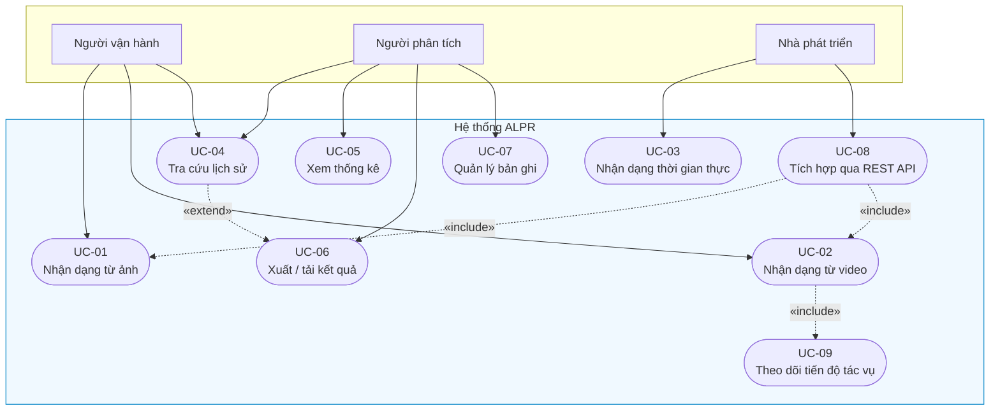
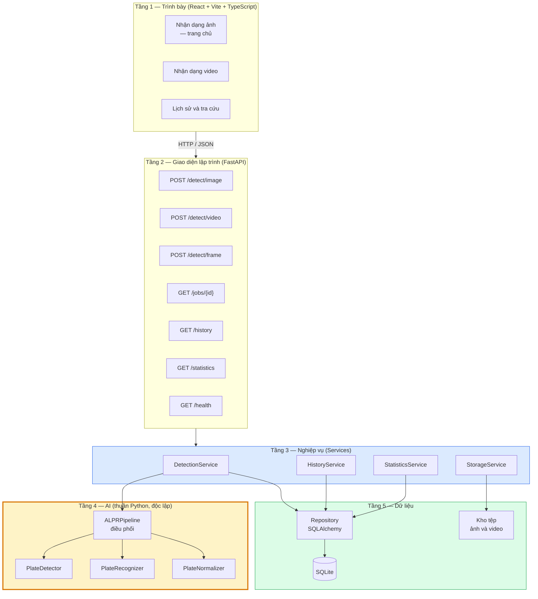
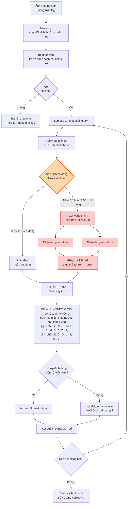
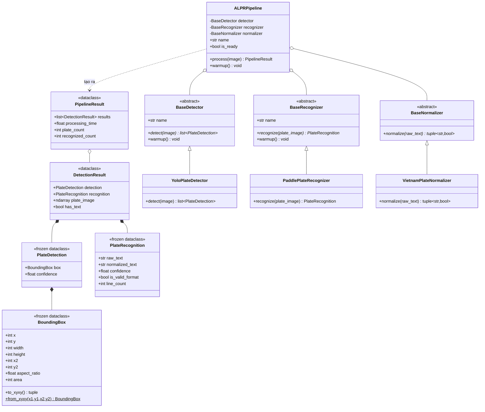
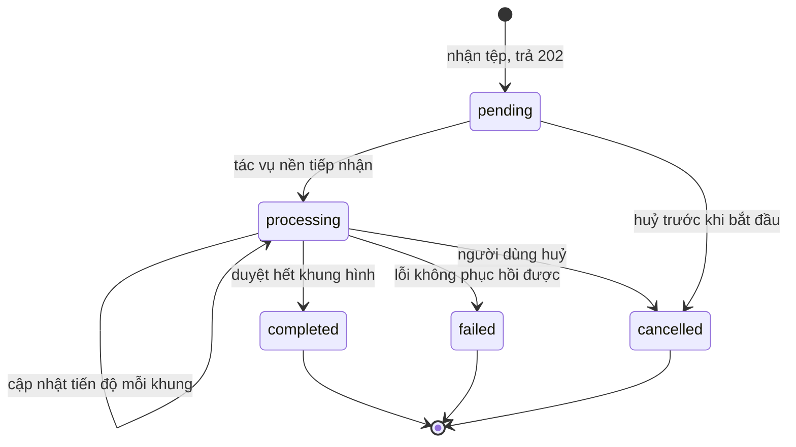
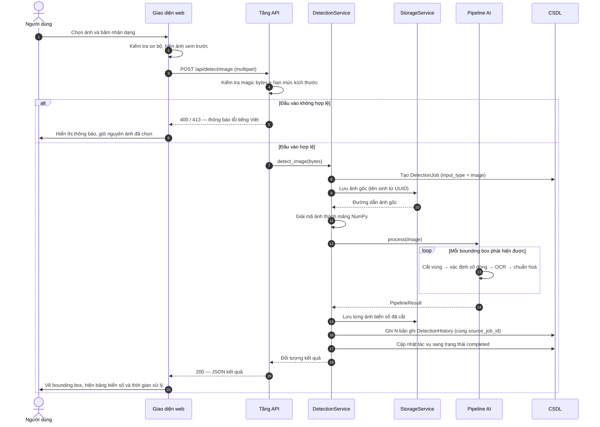
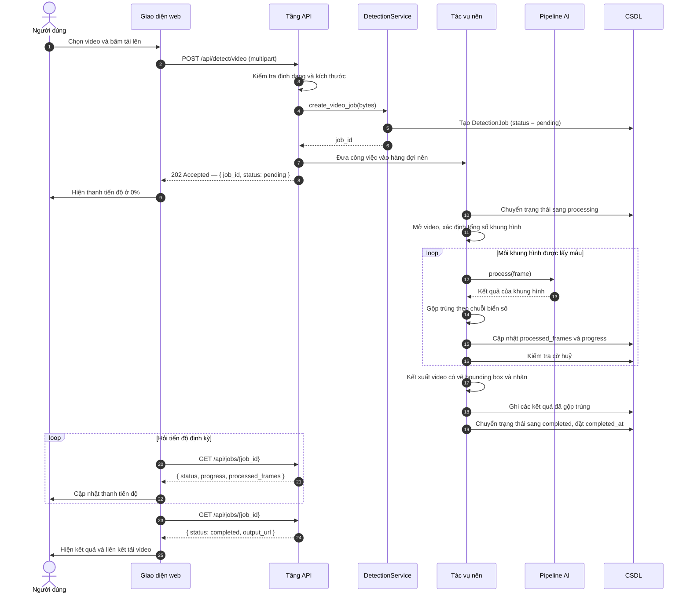
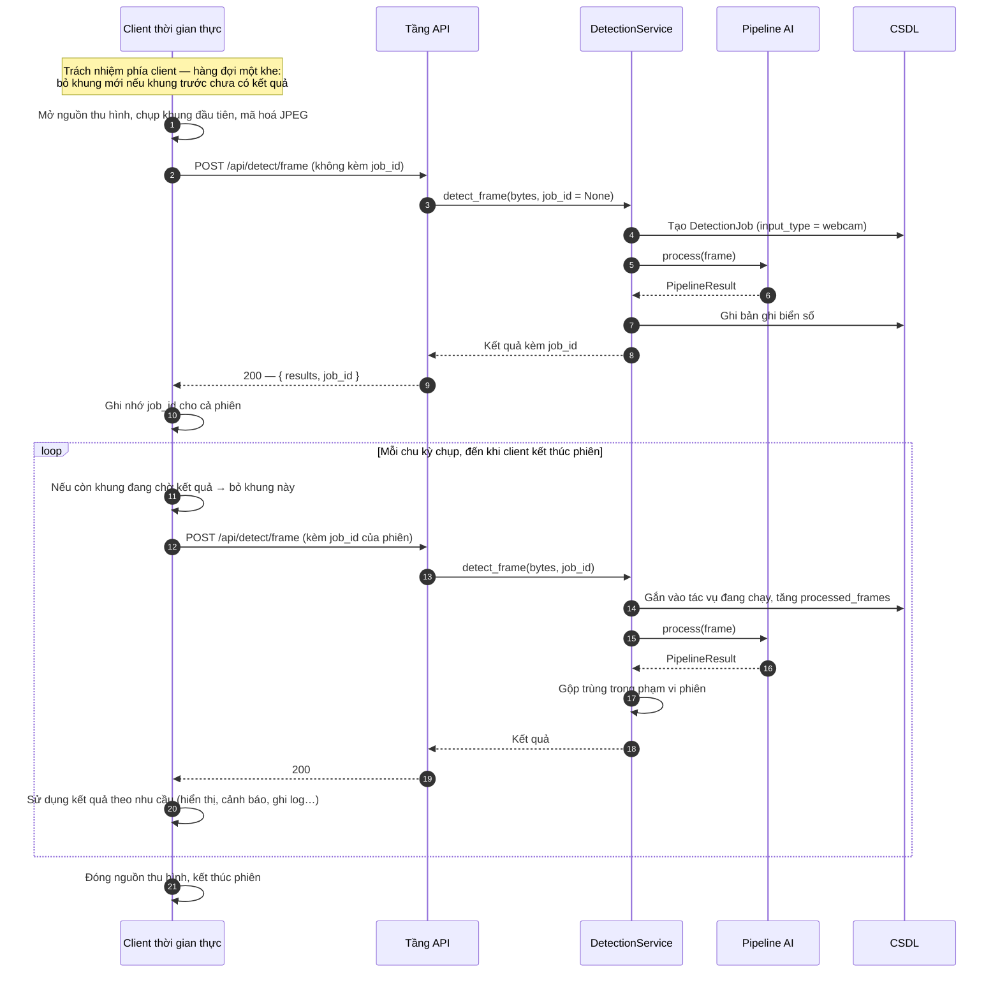
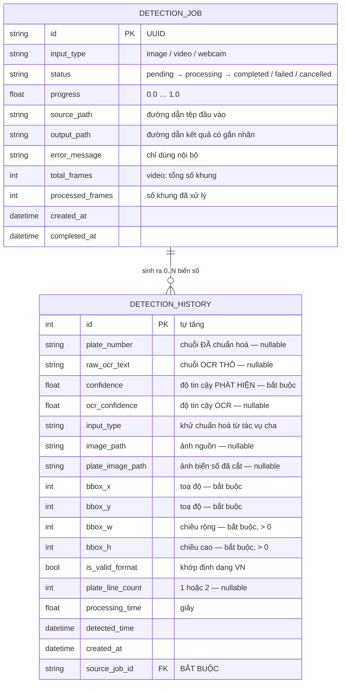
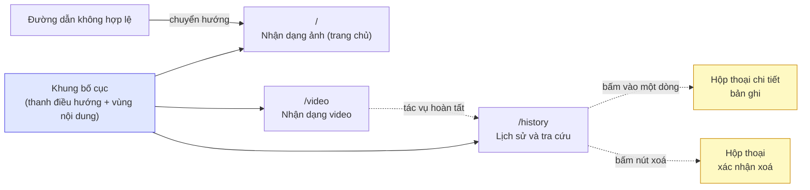

# CHƯƠNG 4. PHÂN TÍCH VÀ THIẾT KẾ HỆ THỐNG

Chương 2 đã trình bày cơ sở lý thuyết của bài toán nhận dạng biển số tự động và khảo sát các hướng tiếp cận hiện có. Chương này chuyển từ *biết* sang *làm*: từ các đặc thù của biển số Việt Nam và các ràng buộc thực tế của môi trường thực hiện, đồ án tiến hành phân tích yêu cầu, thiết lập kiến trúc và đặc tả thiết kế chi tiết cho toàn bộ hệ thống.

Nội dung chương được tổ chức theo trình tự chuẩn của quy trình kỹ nghệ phần mềm: phân tích yêu cầu (mục 4.1), thiết lập kiến trúc tổng thể (mục 4.2), thiết kế chi tiết các thành phần phần mềm (mục 4.3), thiết kế cơ sở dữ liệu (mục 4.4) và thiết kế giao diện người dùng (mục 4.5).

Hai điểm cần được lưu ý trước khi đi vào nội dung. Thứ nhất, chương này mô tả **thiết kế đã được cài đặt**, không phải thiết kế trên giấy: tầng API, tầng nghiệp vụ, tầng truy cập dữ liệu và lược đồ cơ sở dữ liệu đã tồn tại dưới dạng mã nguồn chạy được và đã được kiểm chứng bằng các lời gọi HTTP thực tế. Thứ hai, phần lớn nội dung chương này được viết trong giai đoạn hệ thống còn vận hành bằng một cài đặt pipeline giả lập (`StubPipeline`) tuân thủ đúng giao diện của pipeline thật; **tính đến bản cập nhật này, hệ thống đã chuyển sang pipeline thật với mô hình chính thức** (`ALPRPipeline` với `models/best.pt`, `/health` báo `model_loaded: true`, engine `yolo:best.pt+paddleocr-PP-OCRv5-mobile`), còn stub đã bị đưa ra khỏi đường chạy chính. Mô hình chính thức đã huấn luyện xong (mAP@0.5 = 0,9829), nhưng điều đó không làm thay đổi cách trình bày của chương: chương này nói về *thiết kế* và *khả năng kiểm chứng của thiết kế*, còn mọi số liệu thực nghiệm về độ chính xác và hiệu năng được trình bày ở Chương 6. Cách bố trí đó là chủ ý, và mục 4.2.3 sẽ chỉ ra rằng chính kiến trúc đã lựa chọn là thứ cho phép tách bạch hai việc này một cách sạch sẽ.

---

## 4.1. Phân tích yêu cầu

### 4.1.1. Khảo sát nhu cầu và các tác nhân

#### a) Bối cảnh nhu cầu

Nhận dạng biển số xe là bài toán nền tảng của nhiều hệ thống giao thông thông minh: bãi đỗ xe tự động, trạm thu phí không dừng, kiểm soát ra vào khu vực hạn chế, giám sát giao thông. Trong tất cả các ứng dụng này, biển số đóng vai trò định danh phương tiện duy nhất có thể quan sát được từ xa mà không cần thiết bị gắn trên xe.

Tuy vậy, việc áp dụng trực tiếp các mô hình hoặc thư viện ALPR được huấn luyện trên dữ liệu nước ngoài vào bối cảnh Việt Nam gặp bốn trở ngại đã được xác định trong quá trình phân tích:

**Thứ nhất, biển số hai dòng chiếm tỉ trọng lớn.** Toàn bộ xe mô tô, xe gắn máy và một phần ô tô tại Việt Nam sử dụng biển số hai dòng, trong khi đa số bộ dữ liệu và mô hình quốc tế được xây dựng quanh giả định biển một dòng. Đây không phải một suy đoán mà là một điểm gãy đã được đo lường: trên bộ dữ liệu RodoSol-ALPR — bộ được thiết kế với số mẫu biển một dòng và biển hai dòng cân bằng nhau — hệ thống thương mại OpenALPR nhận đúng 3.772/4.000 trường hợp ô tô biển một dòng (94,3%) nhưng chỉ 1.827/4.000 trường hợp xe máy biển hai dòng (45,7%), chênh lệch **48,6 điểm phần trăm** [7]<!-- laroca_2022_crossdataset -->[88]<!-- laroca_2022_rodosol -->.

> **Lưu ý về phạm vi áp dụng của số liệu.** Cặp số 94,3% / 45,7% được đo trên bộ **RodoSol-ALPR của Brazil**, **không phải dữ liệu Việt Nam**. Đồ án sử dụng nó như một dẫn chứng tương đương (analogue) về độ khó tương đối của bố cục hai dòng so với một dòng, tuyệt đối không trình bày như số liệu của biển số Việt Nam. Giá trị của nó nằm ở chỗ nó chứng minh rằng "biển hai dòng khó hơn" là một sự kiện định lượng chứ không phải một cảm nhận.

**Thứ hai, quy chuẩn biển số mang tính pháp lý và có cấu trúc chặt.** Biển số Việt Nam hiện hành được quy định tại Thông tư 79/2024/TT-BCA (ký ngày 15/11/2024, hiệu lực từ 01/01/2025) [8]<!-- bocongan_2024_tt79 -->, sau đó được sửa đổi bổ sung bởi Thông tư 13/2025/TT-BCA [9]<!-- bocongan_2025_tt13 --> và Thông tư 51/2025/TT-BCA [10]<!-- bocongan_2025_tt51 -->; các thông số vật lý của biển tuân theo QCVN 08:2024/BCA [11]<!-- bocongan_2024_qcvn08 -->. Cấu trúc chặt chẽ này vừa là ràng buộc, vừa là **cơ hội thiết kế**: vì tập ký hiệu hợp lệ ở từng vị trí là hữu hạn và biết trước, hệ thống có thể xây dựng một khối hậu xử lý dựa trên luật để sửa các nhầm lẫn ký tự kinh điển của OCR.

**Thứ ba, điều kiện thu nhận ảnh khắc nghiệt.** Mật độ xe máy cao dẫn tới che khuất lẫn nhau, biển bị bụi bẩn hoặc cong vênh, góc chụp nghiêng, ngược sáng và ảnh ban đêm.

**Thứ tư, không có phần cứng tăng tốc.** Máy thực hiện đồ án không có GPU CUDA. Toàn bộ suy luận và toàn bộ phần trình diễn khi bảo vệ chạy trên CPU. Ràng buộc này ảnh hưởng sâu tới thiết kế và được phân tích riêng ở mục 4.1.4.

#### b) Các tác nhân của hệ thống

Quá trình phân tích xác định bốn tác nhân, trong đó ba tác nhân tương tác trực tiếp với hệ thống:

| Tác nhân | Mô tả vai trò | Trình độ kỹ thuật | Tần suất sử dụng |
|---|---|---|---|
| **Người vận hành** (Operator) | Đưa ảnh hoặc video vào hệ thống qua giao diện web; xem kết quả nhận dạng; tra cứu lịch sử gần đây *(luồng thời gian thực từ webcam chuyển sang dùng qua API từ 2026-07-20 — xem mục 4.1.3b)* | Cơ bản — sử dụng được trình duyệt web | Hằng ngày |
| **Người phân tích** (Analyst) | Xem thống kê tổng hợp, lọc và tìm kiếm lịch sử, xuất dữ liệu ra tệp để báo cáo | Trung bình | Hằng tuần |
| **Nhà phát triển** (Developer) | Tích hợp hệ thống vào ứng dụng khác thông qua REST API, đọc tài liệu OpenAPI | Cao | Khi tích hợp |
| **Hội đồng đánh giá** | Quan sát trình diễn, đọc tài liệu, đặt câu hỏi phản biện | Cao | Một lần (bảo vệ) |

Do hệ thống được xác định là chạy trong mạng nội bộ hoặc trên `localhost` (giả định A-04), đồ án **không xây dựng cơ chế xác thực và phân quyền người dùng**. Quyết định này được ghi nhận rõ trong phạm vi dự án: thêm phân quyền sẽ tiêu tốn công sức đáng kể mà không đóng góp gì cho giá trị học thuật của đề tài. Hệ quả là ba tác nhân đầu tiên không được phân biệt bởi hệ thống ở mức kỹ thuật — chúng là các *vai trò sử dụng* khác nhau trên cùng một giao diện, chứ không phải các *tài khoản* khác nhau.

### 4.1.2. Sơ đồ use case tổng quát và đặc tả các use case chính

#### a) Sơ đồ use case



Ba quan hệ trên sơ đồ đáng được giải thích:

- **UC-02 «include» UC-09.** Nhận dạng video *bắt buộc* kéo theo việc theo dõi tiến độ, bởi vì xử lý video là tác vụ chạy nền bất đồng bộ; nếu không có cơ chế theo dõi thì người dùng không có cách nào biết công việc đã xong hay chưa.
- **UC-08 «include» UC-01, UC-02.** REST API không phải một chức năng song song mà là *một lối vào khác* cho cùng các nghiệp vụ nhận dạng. Điều này phản ánh đúng thiết kế: giao diện web cũng gọi chính các endpoint đó.
- **UC-04 «extend» UC-06.** Xuất kết quả là hành vi tùy chọn mở rộng từ tra cứu lịch sử — người dùng có thể tra cứu mà không xuất, nhưng không thể xuất mà chưa xác định tập bản ghi cần xuất.

Trên sơ đồ, UC-03 (nhận dạng thời gian thực) gắn với tác nhân **nhà phát triển** thay vì người vận hành: từ 2026-07-20, chức năng này chỉ còn lối vào qua REST API (`POST /api/detect/frame`) sau khi trang Webcam được gỡ khỏi giao diện web — xem đặc tả UC-03 ở mục d.

#### b) Đặc tả use case UC-01 — Nhận dạng biển số từ ảnh

| Mục | Nội dung |
|---|---|
| **Mã** | UC-01 |
| **Tên** | Nhận dạng biển số từ ảnh tĩnh |
| **Tác nhân chính** | Người vận hành |
| **Mức ưu tiên** | Bắt buộc (Must) |
| **Tiền điều kiện** | Hệ thống đang chạy; mô hình đã được nạp (endpoint `/health` báo trạng thái sẵn sàng) |
| **Hậu điều kiện thành công** | Kết quả nhận dạng được hiển thị trên giao diện; một bản ghi tác vụ và không hoặc nhiều bản ghi biển số được lưu vào CSDL; ảnh gốc và ảnh biển số đã cắt tồn tại trên đĩa |
| **Kích hoạt** | Người dùng chọn tệp ảnh và bấm nút nhận dạng |

**Luồng sự kiện chính:**

1. Người dùng chọn một tệp ảnh (JPEG, PNG, WebP hoặc BMP) từ máy cá nhân.
2. Giao diện kiểm tra sơ bộ phần mở rộng và kích thước tệp, hiển thị ảnh xem trước.
3. Người dùng xác nhận gửi. Giao diện chuyển sang trạng thái đang xử lý.
4. Hệ thống nhận tệp, kiểm tra tính hợp lệ ở phía máy chủ bằng **magic bytes** (không tin phần mở rộng) và kiểm tra hạn mức kích thước.
5. Hệ thống tạo một bản ghi tác vụ (`DetectionJob`) với loại đầu vào `image`, lưu tệp gốc xuống kho tệp bằng tên sinh từ UUID.
6. Hệ thống gọi pipeline AI: giải mã ảnh, phát hiện các vùng biển số, cắt từng vùng, nhận dạng ký tự, chuẩn hoá và kiểm tra tính hợp lệ theo định dạng Việt Nam.
7. Hệ thống lưu ảnh biển số đã cắt và ghi mỗi biển số phát hiện được thành một bản ghi `DetectionHistory` gắn với tác vụ ở bước 5.
8. Hệ thống trả về danh sách kết quả kèm toạ độ bounding box, chuỗi biển số, độ tin cậy phát hiện, độ tin cậy OCR và thời gian xử lý.
9. Giao diện vẽ bounding box chồng lên ảnh và hiển thị bảng kết quả.

**Luồng thay thế và ngoại lệ:**

| Mã | Tình huống | Xử lý |
|---|---|---|
| A1 | Tệp không đúng định dạng ảnh (ví dụ tệp thực thi đổi đuôi `.jpg`) | Trả HTTP 400 kèm thông báo tiếng Việt nêu rõ nguyên nhân; tiến trình **không** bị sập |
| A2 | Tệp vượt quá hạn mức kích thước | Trả HTTP 413; giao diện gợi ý giảm kích thước ảnh |
| A3 | Ảnh hợp lệ nhưng không chứa biển số nào | Trả HTTP **200** với danh sách rỗng — đây là kết quả hợp lệ, không phải lỗi. Giao diện hiển thị trạng thái "không tìm thấy biển số" |
| A4 | Phát hiện được biển số nhưng OCR không đọc ra ký tự | Bản ghi **vẫn được lưu** với `plate_number` rỗng; giao diện đánh dấu độ tin cậy thấp. Lý do được phân tích tại mục 4.4.3(e) |
| A5 | Chuỗi đọc được không khớp bất kỳ định dạng biển số Việt Nam nào | Bản ghi được lưu với cờ `is_valid_format = false`, không bị vứt bỏ |
| A6 | Lỗi nội bộ của pipeline | Trả HTTP 500 với thông báo thân thiện; chi tiết kỹ thuật chỉ ghi vào log, **không** hiển thị stack trace cho người dùng |

Hai điểm A3 và A4 đáng được nhấn mạnh vì chúng phân biệt một thiết kế nghiêm túc với một bản demo. Việc trả lỗi khi không tìm thấy biển số là một sai lầm ngữ nghĩa phổ biến: "không có biển số trong ảnh" là một *câu trả lời*, không phải một *sự cố*. Tương tự, việc âm thầm loại bỏ các trường hợp đọc không ra sẽ làm sai lệch chính các số liệu đánh giá mà Chương 6 cần đến.

#### c) Đặc tả use case UC-02 — Nhận dạng biển số từ video

| Mục | Nội dung |
|---|---|
| **Mã** | UC-02 |
| **Tác nhân chính** | Người vận hành |
| **Tiền điều kiện** | Hệ thống đang chạy; còn dung lượng đĩa cho tệp video |
| **Hậu điều kiện thành công** | Tác vụ ở trạng thái `completed`; các biển số đã gộp trùng được lưu; video kết quả có gắn nhãn tồn tại và tải về được |

**Luồng sự kiện chính:**

1. Người dùng chọn tệp video (MP4, AVI, MOV hoặc MKV) trong hạn mức kích thước.
2. Hệ thống kiểm tra hợp lệ, lưu tệp, tạo bản ghi `DetectionJob` với trạng thái `pending` và **trả ngay HTTP 202 kèm `job_id`**, không giữ kết nối chờ.
3. Một tác vụ nền tiếp nhận công việc, chuyển trạng thái sang `processing`.
4. Tác vụ nền trích xuất khung hình theo bước nhảy cấu hình được (frame sampling), đưa từng khung đã trích vào pipeline AI.
5. Sau mỗi khung, tác vụ cập nhật số khung đã xử lý và tỉ lệ tiến độ.
6. Kết quả của cùng một biển số xuất hiện trên nhiều khung được **gộp trùng**, chỉ giữ lại lần đọc có độ tin cậy cao nhất.
7. Khi duyệt hết khung hình, hệ thống kết xuất video có vẽ sẵn bounding box và nhãn, ghi các kết quả đã gộp vào CSDL, chuyển trạng thái sang `completed`.
8. Song song, giao diện hỏi tiến độ định kỳ qua `job_id` và cập nhật thanh tiến độ; khi trạng thái đạt tới trạng thái kết thúc, giao diện dừng hỏi và hiển thị kết quả.

**Vì sao phải bất đồng bộ.** Theo phân rã ngân sách độ trễ (mục 4.1.4), một khung hình mất khoảng 400 ms trên CPU. Một video 60 giây ở 30 khung/giây, ngay cả khi chỉ lấy mẫu 1/5 số khung, vẫn phải xử lý 360 khung, tương ứng khoảng 145 giây. Con số này vượt xa timeout mặc định của hầu hết proxy và trình duyệt. Việc xử lý đồng bộ vì thế **không phải là một lựa chọn kém, mà là một lựa chọn không khả thi**.

#### d) Đặc tả use case UC-03 — Nhận dạng thời gian thực qua webcam

> ⚠️ **Thay đổi phạm vi 2026-07-20:** trang Webcam đã được **gỡ khỏi giao diện web** theo quyết định thu gọn phạm vi demo. Use case này vì vậy được hiện thực và kiểm chứng **ở tầng API** (`POST /api/detect/frame`); tác nhân chính trở thành một *client thời gian thực* bất kỳ gọi API — trang webcam trước đây của giao diện chính là một client như vậy. Luồng sự kiện dưới đây được giữ làm đặc tả cho phía client; các bước thuần giao diện (tương ứng FR-3.1, FR-3.4) chuyển mức ưu tiên **M → W**.

| Mục | Nội dung |
|---|---|
| **Mã** | UC-03 |
| **Tác nhân chính** | Client thời gian thực (trước 2026-07-20: người vận hành, qua trang Webcam của giao diện) |
| **Tiền điều kiện** | Client có sẵn một nguồn thu hình và có thể mã hoá khung hình thành JPEG / PNG; máy chủ đang chạy và nạp được trọng số mô hình |
| **Hậu điều kiện thành công** | Các biển số quan sát được trong phiên đã được lưu, có gộp trùng; toàn bộ phiên là **một** bản ghi tác vụ |

**Luồng sự kiện chính:**

1. Client bật nguồn thu hình (với client chạy trong trình duyệt: xin quyền truy cập camera).
2. Client hiển thị luồng video trực tiếp, nếu có thành phần hiển thị.
3. Theo chu kỳ cấu hình được, client chụp một khung hình, mã hoá thành JPEG và gửi lên máy chủ. Lời gọi đầu tiên không kèm định danh phiên; máy chủ tạo tác vụ mới và trả `job_id` về.
4. Các lời gọi tiếp theo gửi kèm `job_id` đó, nhờ vậy toàn bộ khung hình của một phiên được quy về cùng một tác vụ.
5. Hệ thống xử lý khung hình và trả kết quả; client sử dụng kết quả theo nhu cầu (trang webcam trước đây vẽ bounding box chồng lên khung hình trực tiếp).
6. Kết quả trùng biển số trong phiên được gộp lại thành một bản ghi duy nhất.

**Ràng buộc riêng của chế độ này.** Vì không có GPU, hệ thống bắt buộc phải áp dụng kỹ thuật bỏ bớt khung hình (frame skipping) kết hợp hàng đợi một khe (single-slot queue) ở phía client gọi API: nếu một khung hình đang chờ kết quả thì khung mới chụp được sẽ bị bỏ qua thay vì xếp hàng. Nếu không làm vậy, tốc độ chụp của camera (khoảng 30 khung/giây) sẽ vượt xa tốc độ xử lý (khoảng 3–5 khung/giây), hàng đợi phình vô hạn và độ trễ hiển thị tăng tuyến tính theo thời gian phiên — hệ thống trông như "chạy được" trong 10 giây đầu rồi tụt hậu ngày càng xa so với thực tế.

Một chi tiết thiết kế nhỏ nhưng quan trọng: nếu `job_id` gửi lên không tồn tại hoặc thuộc về một phiên đã kết thúc, hệ thống **âm thầm mở phiên mới** thay vì báo lỗi. Điều này để việc người dùng tải lại trang giữa chừng không làm hỏng luồng chụp.

### 4.1.3. Yêu cầu chức năng

Đồ án đặc tả tổng cộng **34 yêu cầu chức năng**, tổ chức thành **6 nhóm**. Mỗi yêu cầu được gán một mã định danh, một mức ưu tiên theo thang MoSCoW (Must — bắt buộc, Should — nên có, Could — có thì tốt, Won't — không triển khai ở bản này) và **một tiêu chí chấp nhận kiểm chứng được bằng một phép thử cụ thể**. Nguyên tắc cuối cùng này là chủ ý: một yêu cầu không kèm cách kiểm chứng thì không thể tuyên bố là đã hoàn thành hay chưa.

#### a) Phân bố yêu cầu theo nhóm và mức ưu tiên

**Bảng 4.1.** Phân bố 34 yêu cầu chức năng theo nhóm và mức ưu tiên MoSCoW

| Nhóm | Mã | Phạm vi chức năng | Must | Should | Could | Won't | **Tổng** |
|---|---|---|:---:|:---:|:---:|:---:|:---:|
| FR-1 | FR-1.1 → 1.7 | Nhận dạng từ ảnh tĩnh | 7 | 0 | 0 | 0 | **7** |
| FR-2 | FR-2.1 → 2.6 | Nhận dạng từ video | 5 | 1 | 0 | 0 | **6** |
| FR-3 | FR-3.1 → 3.5 | Nhận dạng thời gian thực (tầng API) | 3 | 0 | 0 | 2 | **5** |
| FR-4 | FR-4.1 → 4.8 | Thống kê, lịch sử và tra cứu | 4 | 1 | 1 | 2 | **8** |
| FR-5 | FR-5.1 → 5.4 | Quản lý dữ liệu | 0 | 2 | 2 | 0 | **4** |
| FR-6 | FR-6.1 → 6.4 | Hệ thống và vận hành | 2 | 2 | 0 | 0 | **4** |
| | | **Tổng cộng** | **21** | **6** | **3** | **4** | **34** |

> ### Bốn yêu cầu mức Won't và hai đợt thu gọn phạm vi ngày 2026-07-20
>
> Cả bốn yêu cầu mức Won't đều là **yêu cầu thuần giao diện**, và đều chuyển mức trong cùng một ngày qua hai đợt thu gọn phạm vi giao diện web liên tiếp:
>
> | Đợt | Trang bị gỡ | Yêu cầu | Chuyển mức | Năng lực còn lại (vẫn phục vụ, vẫn có kiểm thử) |
> |:--:|---|---|:--:|---|
> | 1 | Webcam (`/webcam`) | FR-3.1, FR-3.4 | **M → W** | `POST /api/detect/frame` — phiên gộp trùng theo `job_id` |
> | 2 | Tổng quan / Dashboard (`/dashboard`) | FR-4.1 | **M → W** | `GET /api/statistics`, `GET /health` |
> | 2 | Tổng quan / Dashboard (`/dashboard`) | FR-4.2 | **S → W** | `GET /api/statistics` (chuỗi số liệu theo ngày nằm trong cùng đáp ứng) |
>
> **Phải nói thẳng: FR-4.1 là yêu cầu mức *Must* đầu tiên — và duy nhất — bị đưa ra khỏi phạm vi trong toàn bộ đồ án.** Trước đó, mọi thay đổi phạm vi chỉ đụng tới các yêu cầu mức Should trở xuống hoặc tới các yêu cầu thuần hiển thị của một năng lực vẫn còn nguyên. Ở đợt thứ hai, một chỉ tiêu từng được xếp là *bắt buộc* đã bị hạ mức. Bảng đếm ở trên vì vậy giảm từ 22/7/3/2 xuống **21/6/3/4**, và mục 7.3 của Chương 7 ghi nhận đây là một **hạn chế thật** chứ không phải một dòng ghi chú hành chính.
>
> Điều **không** thay đổi: cả hai đợt chỉ gỡ **màn hình hiển thị**, không gỡ **năng lực hệ thống**. Các endpoint tương ứng vẫn phục vụ, vẫn nằm trong tài liệu OpenAPI, và vẫn có kiểm thử tích hợp ở backend (`tests/integration/test_api_statistics.py`, `test_api_health.py`). Mã giao diện của cả hai trang còn nguyên trong lịch sử git. Đánh đổi đo được của đợt 2: gỡ thư viện biểu đồ `recharts` cùng trang Tổng quan làm gói tải về của giao diện giảm từ ~730 KB xuống **328,8 KB** (−55%).

#### b) Nội dung cốt lõi của từng nhóm

**FR-1 — Nhận dạng từ ảnh (7 yêu cầu, toàn bộ là Must).** Nhóm này định nghĩa nghiệp vụ trung tâm của hệ thống, đi từ tiếp nhận tệp, kiểm tra hợp lệ đầu vào, phát hiện *tất cả* vùng biển số trong ảnh, cắt và nhận dạng ký tự từng vùng, hậu xử lý chuỗi đọc được, lưu trữ kết quả cùng ảnh liên quan, cho tới hiển thị kết quả có vẽ bounding box. Việc toàn bộ nhóm này là Must phản ánh đúng bản chất: nếu thiếu bất kỳ bước nào, hệ thống không còn là một hệ thống ALPR.

Một yêu cầu trong nhóm đáng được nêu riêng. FR-1.5 quy định rằng bước hậu xử lý phải lưu **cả chuỗi OCR thô lẫn chuỗi đã sửa** — ví dụ chuỗi thô `51A-I234O` được chuẩn hoá thành `51A-12340`, và cả hai đều được ghi lại. Đây không phải sự dư thừa dữ liệu mà là điều kiện cần để đo được đóng góp riêng của khối hậu xử lý, một nội dung phân tích định lượng của Chương 6. Lập luận đầy đủ được trình bày tại mục 4.4.3(b).

**FR-2 — Nhận dạng từ video (6 yêu cầu: 5 Must, 1 Should).** Nhóm này bổ sung ba năng lực mà nhóm FR-1 không có: trích xuất khung hình theo bước nhảy cấu hình được, **gộp trùng kết quả** của cùng một biển số xuất hiện trên nhiều khung, và kết xuất video kết quả có gắn nhãn. Yêu cầu Should duy nhất là hiển thị tiến độ theo phần trăm và cho phép huỷ tác vụ.

Yêu cầu gộp trùng (FR-2.4) là điểm dễ bị bỏ sót nhất trong các đồ án ALPR và là một trong những yêu cầu có ảnh hưởng lan toả lớn nhất. Không có nó, một video 30 giây sẽ sinh ra hàng nghìn bản ghi mô tả cùng vài chiếc xe, làm hỏng toàn bộ phần thống kê ở nhóm FR-4 và biến bảng lịch sử thành vô dụng.

**FR-3 — Nhận dạng thời gian thực (5 yêu cầu: 3 Must, 2 Won't).** Nhóm này ban đầu gồm 5 yêu cầu Must, bao trùm việc xin quyền và hiển thị luồng webcam, gửi khung hình về máy chủ theo chu kỳ cấu hình được, nhận dạng trên luồng trực tiếp, vẽ chồng bounding box lên hình ảnh đang chạy, và lưu lịch sử phiên có gộp trùng. **Theo quyết định thu gọn phạm vi ngày 2026-07-20**, trang Webcam được gỡ khỏi giao diện web: hai yêu cầu thuần giao diện FR-3.1 (xin quyền, hiển thị luồng) và FR-3.4 (vẽ chồng bounding box) chuyển mức **M → W**; ba yêu cầu còn lại (FR-3.2, FR-3.3, FR-3.5) vẫn là Must và được đáp ứng, kiểm chứng **ở tầng API** qua `POST /api/detect/frame` với phiên gộp trùng theo `job_id`. Ràng buộc hiệu năng của nhóm gắn chặt với việc không có GPU và được cụ thể hoá thành chỉ tiêu định lượng NFR-P2.

**FR-4 — Thống kê, lịch sử và tra cứu (8 yêu cầu: 4 Must, 1 Should, 1 Could, 2 Won't).** Đây là nhóm đông yêu cầu nhất, và cũng là nhóm chịu tác động nặng nhất của thay đổi phạm vi. Nội dung ban đầu gồm: các chỉ số tổng hợp trên màn hình Tổng quan (tổng lượt sử dụng, độ tin cậy trung bình, thời gian xử lý trung bình, phân bố theo loại đầu vào — FR-4.1), biểu đồ số lượt theo thời gian (FR-4.2), danh sách lịch sử có phân trang, tìm kiếm theo biển số hỗ trợ khớp một phần, lọc theo loại đầu vào — khoảng thời gian — ngưỡng độ tin cậy, xem chi tiết một bản ghi với đầy đủ metadata, tải về ảnh kết quả, và sắp xếp theo cột.

**Theo quyết định thu gọn phạm vi ngày 2026-07-20 (đợt thứ hai trong ngày)**, trang Tổng quan (Dashboard) được gỡ khỏi giao diện web: **FR-4.1 chuyển M → W** và **FR-4.2 chuyển S → W**. Cần nhấn mạnh hai điều, theo đúng thứ tự quan trọng.

Thứ nhất, **đây là lần đầu một yêu cầu mức Must bị đưa ra khỏi phạm vi**. Nó không được trình bày như một chi tiết kỹ thuật nhỏ, vì nó không phải: một chỉ tiêu từng được xếp loại "thiếu ⇒ đồ án không đạt" nay không còn được đáp ứng ở tầng giao diện.

Thứ hai, phạm vi mất đi là phạm vi **hiển thị**, không phải phạm vi **năng lực**. Toàn bộ phép tính thống kê vẫn nằm trong `StatisticsService` (mục 4.3.2), vẫn phơi ra qua `GET /api/statistics` với đầy đủ các chỉ số và chuỗi số liệu theo ngày mà FR-4.1 và FR-4.2 yêu cầu, vẫn xuất hiện trong tài liệu OpenAPI, và vẫn có kiểm thử tích hợp ở backend. Thiết kế API ở mục 4.3.3 **giữ nguyên không sửa một dòng nào** — đó chính là bằng chứng thực tế cho nguyên tắc tách tầng ở mục 4.2: một thay đổi ở tầng trình bày không lan xuống các tầng dưới.

Sáu yêu cầu còn lại của nhóm — **FR-4.3 đến FR-4.8**, toàn bộ thuộc màn hình Lịch sử — **không đổi mức và không đổi nội dung**.

**FR-5 — Quản lý dữ liệu (4 yêu cầu: 2 Should, 2 Could).** Nhóm này gồm xoá bản ghi kèm xoá tệp ảnh liên quan (không để lại tệp mồ côi), xuất lịch sử đã áp bộ lọc ra CSV hoặc JSON, script dọn dẹp tệp không còn bản ghi tham chiếu, và xoá hàng loạt. Một chi tiết nhỏ nhưng thực dụng trong tiêu chí chấp nhận: tệp CSV phải được mã hoá UTF-8 **có BOM**, nếu không Excel sẽ hiển thị sai toàn bộ ký tự tiếng Việt.

**FR-6 — Hệ thống và vận hành (4 yêu cầu: 2 Must, 2 Should).** Nhóm này quy định các năng lực không nhìn thấy trên giao diện nhưng quyết định chất lượng vận hành: endpoint kiểm tra sức khoẻ báo trạng thái nạp mô hình và kết nối CSDL, ghi log có cấu trúc cho mọi lượt nhận dạng và mọi lỗi, thông báo lỗi thân thiện không rò rỉ stack trace, và toàn bộ cấu hình đọc từ biến môi trường hoặc tệp cấu hình thay vì hard-code.

#### c) Ma trận truy vết

Để bảo đảm không yêu cầu nào bị bỏ quên, mỗi nhóm được truy vết tới giai đoạn cài đặt và giai đoạn kiểm chứng tương ứng:

| Nhóm FR | Giai đoạn cài đặt | Hình thức kiểm chứng |
|---|---|---|
| FR-1 (Ảnh) | Phase 3, 4, 5, 6 | Unit test + integration test |
| FR-2 (Video) | Phase 5, 6 | Integration test + performance test |
| FR-3 (Thời gian thực) | Phase 5 (tầng API — phần giao diện đã gỡ 2026-07-20) | Performance test |
| FR-4 (Thống kê, lịch sử) | Phase 5, 6 (FR-4.1/4.2 chỉ còn ở tầng API — trang Tổng quan đã gỡ 2026-07-20) | Integration test (`test_api_statistics.py`, `test_api_health.py`) + UI test cho FR-4.3 → 4.8 |
| FR-5 (Dữ liệu) | Phase 5, 6 | Unit test |
| FR-6 (Hệ thống) | Phase 5, 8 | Smoke test + stress test |

Kết quả thực hiện của ma trận này sẽ được báo cáo ở Chương 6.

### 4.1.4. Yêu cầu phi chức năng

Yêu cầu phi chức năng được tổ chức thành bảy nhóm: hiệu năng (NFR-P), độ chính xác (NFR-A), độ tin cậy (NFR-R), khả năng sử dụng (NFR-U), khả năng bảo trì (NFR-M), bảo mật (NFR-S), tương thích và triển khai (NFR-C), cùng khả năng mở rộng (NFR-SC).

#### a) Nguyên tắc nền tảng: mọi chỉ tiêu hiệu năng đều là chỉ tiêu CPU

Trước khi liệt kê bất kỳ con số nào, cần phát biểu rõ một điều kiện bao trùm:

> **Toàn bộ chỉ tiêu hiệu năng của đồ án là chỉ tiêu đo trên CPU.**

Máy thực hiện đồ án chạy Windows 11 với Python 3.13, **không có GPU CUDA** — phần đồ hoạ là Intel UHD Graphics 770 tích hợp, không hỗ trợ CUDA và không được PyTorch dùng để tăng tốc suy luận. Việc huấn luyện mô hình sẽ được thực hiện trên GPU miễn phí của Google Colab hoặc Kaggle, nhưng **suy luận và toàn bộ phần trình diễn khi bảo vệ chạy trên CPU của máy cá nhân**.

**Vì sao đây là một ràng buộc thiết kế nghiêm túc chứ không phải một hạn chế tạm thời.**

Cần phân biệt hai loại giới hạn. Một *hạn chế tạm thời* là thứ sẽ biến mất khi hoàn cảnh thay đổi, và vì thế không nên để nó định hình kiến trúc — nếu chỉ cần đợi mượn được một chiếc máy có GPU là mọi thứ ổn thoả, thì việc thiết kế lại hệ thống quanh giới hạn đó là lãng phí. Một *ràng buộc thiết kế* thì khác: nó là điều kiện biên của bài toán, và mọi phương án kỹ thuật đều phải được đánh giá dưới điều kiện biên đó.

Việc không có GPU thuộc loại thứ hai, vì bốn lý do:

**Thứ nhất, nó cố định trong toàn bộ vòng đời của đồ án và tại chính thời điểm quan trọng nhất.** Buổi bảo vệ diễn ra trên máy cá nhân của người thực hiện. Không có kịch bản nào trong đó hệ thống được trình diễn trên phần cứng khác. Một thiết kế chỉ đạt chỉ tiêu khi có GPU là một thiết kế không bao giờ được chứng minh là đạt.

**Thứ hai, nó thay đổi bậc độ lớn của độ trễ, chứ không phải thay đổi vài phần trăm.** Chênh lệch giữa suy luận trên GPU và trên CPU với các mô hình phát hiện đối tượng là khoảng một bậc độ lớn. Một hệ thống được thiết kế quanh giả định "mỗi khung hình mất 20 ms" và một hệ thống được thiết kế quanh thực tế "mỗi khung hình mất 400 ms" **không phải là cùng một hệ thống**. Ở mốc 20 ms, xử lý video đồng bộ trong một lời gọi HTTP là hợp lý và webcam có thể xử lý mọi khung hình. Ở mốc 400 ms, cả hai đều bất khả thi: video buộc phải chạy nền bất đồng bộ với cơ chế theo dõi tiến độ (quyết định AD-02), và webcam buộc phải bỏ khung với hàng đợi một khe. Nói cách khác, **ràng buộc CPU trực tiếp sinh ra hai quyết định kiến trúc**, chứ không chỉ hạ thấp các con số mục tiêu.

**Thứ ba, nó chi phối việc lựa chọn thành phần ở mọi tầng.** Kích thước biến thể mô hình phát hiện (n/s/m), biến thể của bộ OCR (mobile hay server), kích thước ảnh đầu vào, và đặc biệt là **lựa chọn backend suy luận** đều phải được quyết định dựa trên số đo CPU. Đây là chỗ ràng buộc chuyển từ bất lợi thành một hướng kỹ thuật có nội dung: benchmark chính thức trên CPU Intel Core i7-13700H cho thấy mô hình YOLOv8n chạy qua ONNX Runtime nhanh hơn khoảng **3,73 lần** so với PyTorch thuần (104,61 ms giảm còn 28,02 ms) [18]<!-- ultralytics_2026_openvinoexport -->, và lợi ích này lớn nhất đúng ở phân khúc mô hình nhỏ mà đồ án sử dụng. Nếu đã có GPU, việc xuất mô hình sang ONNX/OpenVINO và tinh chỉnh số luồng [117]<!-- onnxruntime_2025_threading --> sẽ là một tối ưu hoá thứ yếu; không có GPU, nó trở thành một phương án chính đáng được cân nhắc ngay từ khâu thiết kế.

> **Cảnh báo về cách trích dẫn con số này.** Bảng benchmark nguồn có kèm cột mAP, nhưng cột đó được đo trên tập `coco8` chỉ gồm **8 ảnh**, nên không có ý nghĩa thống kê. Đồ án chỉ sử dụng cột thời gian suy luận của bảng và cố ý lược bỏ cột độ chính xác.

**Thứ tư, nó buộc phương pháp luận công bố số liệu phải chặt hơn.** Các bài báo ALPR thường công bố độ trễ đo trên GPU dòng RTX hoặc V100 và báo cáo con số vài chục mili-giây. Nếu đồ án công bố một con số FPS mà không kèm cấu hình phần cứng, con số đó vô nghĩa và sẽ bị chất vấn ngay. Vì vậy đồ án đặt ra một quy tắc bắt buộc: **mọi số liệu hiệu năng công bố phải kèm model CPU, số luồng, kích thước ảnh đầu vào, backend suy luận (PyTorch / ONNX / OpenVINO) và cỡ mẫu đo.** Quy tắc này được ghi thành ràng buộc chính thức CON-06 của dự án.

Hệ quả cuối cùng: các chỉ tiêu độ trễ dưới đây trông "rộng rãi" hơn so với văn liệu quốc tế. Đó không phải sự dễ dãi mà là sự trung thực về điều kiện đo.

#### b) NFR-P — Hiệu năng

**Bảng 4.2.** Chỉ tiêu phi chức năng nhóm hiệu năng (NFR-P)

| Mã | Chỉ tiêu | Mục tiêu | Ngưỡng tối thiểu | Phương pháp đo |
|---|---|---|---|---|
| **NFR-P1** | Độ trễ toàn trình một ảnh (p95) | ≤ 800 ms | ≤ 1500 ms | 100 ảnh test, báo cáo p50/p95/p99 |
| **NFR-P2** | Tốc độ khung hình chế độ thời gian thực (webcam — đo ở tầng API) | ≥ 5 FPS hiệu dụng | ≥ 3 FPS | Đo liên tục trong 60 giây |
| **NFR-P3** | Tốc độ xử lý video | ≥ 0,3× thời gian thực | ≥ 0,15× | Video 60 giây xử lý trong ≤ 200 giây |
| **NFR-P4** | Thời gian nạp mô hình khi khởi động | ≤ 15 giây | ≤ 30 giây | Từ lúc khởi động đến khi `/health` báo sẵn sàng |
| **NFR-P5** | Overhead của tầng API (không tính suy luận) | ≤ 50 ms | ≤ 100 ms | Hiệu giữa tổng thời gian request và thời gian pipeline |
| **NFR-P6** | Thời gian truy vấn lịch sử (10.000 bản ghi) | ≤ 500 ms | ≤ 1000 ms | Có áp phân trang và bộ lọc |
| **NFR-P7** | Bộ nhớ thường trú của backend | ≤ 2 GB | ≤ 4 GB | Theo dõi RSS khi chạy tải liên tục |

Chỉ tiêu NFR-P1 không được đặt tuỳ tiện mà xuất phát từ một **phân rã ngân sách độ trễ**, tức là ước lượng chi phí thời gian của từng bước rồi cộng lại:

| Bước xử lý | Ngân sách ước lượng |
|---|---|
| Giải mã ảnh và tiền xử lý | ~50 ms |
| Suy luận mô hình phát hiện @ 640 px trên CPU | ~150 ms |
| Cắt và tiền xử lý vùng biển số | ~30 ms |
| Nhận dạng ký tự (mỗi biển số) | ~120 ms |
| Hậu xử lý regex và kiểm tra hợp lệ | < 5 ms |
| Ghi CSDL và lưu ảnh | ~50 ms |
| **Tổng cho ảnh chứa một biển số** | **~405 ms** |

Ngân sách 800 ms do đó để lại khoảng hai lần dự phòng, dùng cho các ảnh chứa nhiều biển số (mỗi biển số bổ sung thêm khoảng 150 ms cho khâu cắt và OCR) và cho biến động tải của máy. Cần nhấn mạnh: các con số trên là **ước lượng thiết kế**, không phải kết quả đo. Số đo thực tế sẽ được trình bày ở Chương 6.

Cần lưu ý rằng ngân sách trên được lập cho **runtime suy luận mặc định đã chốt ở mục 3.4 là ONNX Runtime**, chứ không phải cho việc chạy trực tiếp tệp trọng số PyTorch. Đây là điểm đã thay đổi so với quyết định kiến trúc sơ bộ AD-05 ở giai đoạn phân tích ban đầu (*"PyTorch trước, ONNX/OpenVINO nếu cần"*): khảo sát Phase 1 cho thấy ONNX Runtime nhanh gấp khoảng 3,73 lần ở đúng phân khúc mô hình đồ án dùng, và quan trọng hơn, việc cho **cả bộ phát hiện lẫn bộ OCR cùng chạy trên một runtime duy nhất** loại bỏ hoàn toàn rủi ro xung đột giữa hai framework học sâu trong cùng một môi trường Python. Vì vậy ONNX Runtime được nâng từ *phương án tối ưu dự phòng* thành *lựa chọn mặc định ngay từ khâu thiết kế*, còn OpenVINO giữ vai trò tối ưu bổ sung.

Trường hợp đo thực tế vượt ngưỡng, thứ tự phương án giảm tải đã được xác định trước: (1) lượng tử hoá INT8 bằng OpenVINO kèm tập hiệu chuẩn; (2) giảm kích thước ảnh đầu vào xuống 480 px; (3) chuyển sang biến thể OCR nhẹ hơn. Chỉ hạ chỉ tiêu **sau khi** đã thử hết ba phương án này — nguyên tắc này được ghi rõ để tránh việc hạ chuẩn cho tiện.

#### c) NFR-A — Độ chính xác

**Bảng 4.3.** Chỉ tiêu phi chức năng nhóm độ chính xác (NFR-A)

| Mã | Chỉ tiêu | Mục tiêu | Ngưỡng tối thiểu |
|---|---|---|---|
| **NFR-A1** | mAP@0.5 của bộ phát hiện | ≥ 0,90 | ≥ 0,85 |
| **NFR-A2** | mAP@0.5:0.95 của bộ phát hiện | ≥ 0,65 | ≥ 0,55 |
| **NFR-A3** | Precision / Recall phát hiện | ≥ 0,92 / ≥ 0,90 | ≥ 0,88 / ≥ 0,85 |
| **NFR-A4** | Độ chính xác OCR mức ký tự (1 − CER) | ≥ 0,95 | ≥ 0,92 |
| **NFR-A5** | Độ chính xác biển đầy đủ **trước** hậu xử lý | ≥ 0,85 | ≥ 0,80 |
| **NFR-A6** | Độ chính xác biển đầy đủ **sau** hậu xử lý | ≥ 0,90 | ≥ 0,85 |
| **NFR-A7** | Độ chính xác toàn trình (ảnh vào → biển đúng) | ≥ 0,88 | ≥ 0,82 |

Cặp NFR-A5 và NFR-A6 được đặt ra như hai chỉ tiêu **tách bạch** một cách có chủ đích. Hiệu số giữa chúng chính là đóng góp định lượng của khối hậu xử lý — một đại lượng có thể đo, có thể trình bày và có thể bảo vệ, thay vì chỉ phát biểu định tính rằng "hệ thống có thêm bước sửa lỗi bằng regex". Việc đo được hiệu số này phụ thuộc hoàn toàn vào một quyết định ở tầng dữ liệu (lưu cả chuỗi thô lẫn chuỗi đã sửa) sẽ được phân tích tại mục 4.4.3(b). Đây là một ví dụ điển hình cho thấy một chỉ tiêu đánh giá học thuật có thể ràng buộc ngược lên lược đồ cơ sở dữ liệu.

Hai yêu cầu phân tích bổ sung phục vụ chương đánh giá:

- **NFR-A8:** báo cáo độ chính xác **tách riêng cho biển một dòng và biển hai dòng**. Căn cứ của yêu cầu này là số liệu 94,3% / 45,7% **đo trên bộ RodoSol-ALPR (Brazil)**, đã dẫn ở mục 4.1.1 — một con số tổng thể duy nhất sẽ **che giấu** đúng điểm gãy mà đồ án cần phân tích.
- **NFR-A9:** báo cáo độ chính xác theo điều kiện ảnh (ban ngày, ban đêm, nghiêng, mờ), nếu bộ dữ liệu có nhãn phù hợp.

#### d) Các nhóm yêu cầu phi chức năng còn lại

**NFR-R — Độ tin cậy.** Hệ thống không được sập khi gặp đầu vào hỏng, sai định dạng hoặc độc hại (mục tiêu 100% các lỗi đều bị bắt và xử lý). Ảnh không phát hiện được biển số phải trả kết quả rỗng hợp lệ với HTTP 200. Tác vụ video thất bại giữa chừng không được để lại bản ghi hoặc tệp rác. Tỉ lệ thành công khi chạy liên tục một giờ ≥ 99%. CSDL sống sót qua khởi động lại mà không mất dữ liệu.

**NFR-U — Khả năng sử dụng.** Người dùng mới hoàn thành lượt nhận dạng ảnh đầu tiên trong không quá ba thao tác nhấp chuột và không cần đọc tài liệu. Mọi thao tác kéo dài trên 500 ms phải có phản hồi trực quan. Thông báo lỗi bằng tiếng Việt, nêu rõ nguyên nhân và cách khắc phục, không hiển thị mã lỗi kỹ thuật. Giao diện dùng được từ độ phân giải 1366×768 trở lên. Tương phản màu cho chữ chính đạt chuẩn WCAG AA (tỉ lệ ≥ 4,5:1).

**NFR-M — Khả năng bảo trì.** Đây là nhóm có ảnh hưởng lớn nhất tới kiến trúc. Sáu chỉ tiêu gồm: mã AI tách biệt hoàn toàn khỏi mã API (NFR-M1); độ bao phủ test cho tầng nghiệp vụ ≥ 70% (NFR-M2); mọi hàm public có type hint và docstring (NFR-M3); không hard-code đường dẫn (NFR-M4); có thể thay bộ OCR khác mà không sửa mã tầng API (NFR-M5); mã tuân thủ định dạng và lint tự động (NFR-M6). Hai chỉ tiêu NFR-M1 và NFR-M5 **là các yêu cầu kiến trúc, không phải nguyện vọng** — chúng chính là lý do tồn tại của tầng AI độc lập được trình bày ở mục 4.2.

**NFR-S — Bảo mật.** Do hệ thống chạy nội bộ, mô hình đe doạ ở mức hạn chế, nhưng vẫn yêu cầu: kiểm tra tệp tải lên bằng magic bytes chứ không tin phần mở rộng; chống path traversal bằng cách sinh lại tên tệp từ UUID; giới hạn kích thước tệp thực thi ở phía máy chủ; CORS chỉ cho phép các origin đã khai báo, không dùng ký tự đại diện; không ghi dữ liệu nhạy cảm vào log; truy vấn CSDL luôn tham số hoá qua ORM.

**NFR-C — Tương thích và triển khai.** Chạy được trên Windows, Linux và macOS thông qua Docker với một lệnh duy nhất. Hoạt động **không cần GPU** — và điều quan trọng là đây là *chế độ mặc định*, không phải chế độ dự phòng. Hỗ trợ Chrome, Edge, Firefox bản mới. Cài đặt từ đầu trên máy sạch theo README trong không quá 15 phút.

**NFR-SC — Khả năng mở rộng.** Xử lý ổn định ít nhất 5 yêu cầu đồng thời; hiệu năng không suy giảm ở quy mô 100.000 bản ghi; tác vụ video chạy nền không chặn các yêu cầu khác.

> **Giới hạn đã biết cần công bố.** SQLite chỉ cho phép **một tiến trình ghi tại một thời điểm**. Với quy mô đồ án, giới hạn này chấp nhận được và không ảnh hưởng tới việc đạt các chỉ tiêu trên. Tuy nhiên nó phải được nêu rõ trong phần Hạn chế của đồ án, kèm hướng khắc phục (chuyển sang PostgreSQL) nếu triển khai thực tế. Việc chủ động nêu ra một giới hạn kèm phương án xử lý là cách trình bày trung thực hơn và cũng vững vàng hơn khi phản biện so với việc để nó bị phát hiện.

---

## 4.2. Kiến trúc hệ thống

### 4.2.1. Nguyên tắc kiến trúc

Kiến trúc của hệ thống được dẫn dắt bởi các nguyên tắc tổ chức mã nguồn phổ biến trong kỹ nghệ phần mềm hiện đại, cụ thể hoá thành bốn ràng buộc cứng của dự án.

#### a) Kiến trúc sạch và quy tắc phụ thuộc

Ý tưởng trung tâm của kiến trúc sạch (Clean Architecture) là **quy tắc phụ thuộc**: các phụ thuộc trong mã nguồn chỉ được hướng vào trong, từ các chi tiết kỹ thuật dễ thay đổi (framework web, cơ sở dữ liệu, giao diện) về phía các quy tắc nghiệp vụ ổn định. Thành phần nằm ở vòng trong **không được biết gì** về thành phần nằm ở vòng ngoài.

Áp dụng vào bài toán này, câu hỏi then chốt là: đâu là thứ ổn định và đâu là thứ dễ thay đổi? Câu trả lời khá rõ. Thuật toán nhận dạng biển số — phát hiện vùng, cắt, đọc ký tự, chuẩn hoá theo quy chuẩn Việt Nam — là bản chất của đề tài và tồn tại độc lập với việc kết quả được trả về qua HTTP, ghi vào tệp hay in ra màn hình. Ngược lại, việc dùng FastAPI hay Flask, SQLite hay PostgreSQL, React hay Vue là các quyết định kỹ thuật hoàn toàn có thể thay đổi. Do đó **pipeline AI phải nằm ở vòng trong cùng**, và tầng web phải phụ thuộc vào nó chứ không phải ngược lại.

#### b) Các nguyên lý SOLID được vận dụng

Trong năm nguyên lý SOLID, ba nguyên lý có ảnh hưởng trực tiếp và quan sát được lên thiết kế này:

**Nguyên lý trách nhiệm đơn nhất (Single Responsibility).** Mỗi thành phần của pipeline chịu trách nhiệm về đúng một việc: bộ phát hiện chỉ trả về các bounding box, bộ nhận dạng chỉ chuyển ảnh biển số thành chuỗi ký tự, bộ chuẩn hoá chỉ biến chuỗi thô thành chuỗi hợp quy chuẩn. Sự phân tách này không chỉ để mã sạch: nó cho phép **đo hiệu năng và độ chính xác của từng khối một cách riêng biệt**, điều kiện cần để chương đánh giá nói được rằng lỗi nằm ở khâu phát hiện hay khâu đọc ký tự.

**Nguyên lý thay thế Liskov (Liskov Substitution).** Mọi cài đặt bộ phát hiện phải thay thế được cho nhau mà không làm hỏng pipeline. Nguyên lý này đang được sử dụng theo nghĩa đen tại thời điểm hiện tại: hệ thống chạy với một cài đặt pipeline giả lập tuân thủ đúng hợp đồng của pipeline thật, nhờ đó toàn bộ tầng API, tầng nghiệp vụ và giao diện đã được xây dựng và kiểm chứng **trước khi** mô hình được huấn luyện.

**Nguyên lý đảo ngược phụ thuộc (Dependency Inversion).** Tầng nghiệp vụ không phụ thuộc vào một lớp pipeline cụ thể mà phụ thuộc vào một *hợp đồng trừu tượng*. Cài đặt cụ thể được tiêm vào từ bên ngoài (dependency injection). Đây là cơ chế kỹ thuật biến nguyên tắc "có thể thay thế thành phần" từ một lời hứa thành một ràng buộc do trình biên dịch và bộ kiểm tra kiểu bảo đảm.

#### c) Bốn ràng buộc cứng của dự án

Các nguyên tắc trên được cụ thể hoá thành bốn ràng buộc, xếp theo thứ tự quan trọng:

**Bảng 4.4.** Bốn ràng buộc kiến trúc và hệ quả trực tiếp

| # | Ràng buộc | Nguồn gốc | Hệ quả kiến trúc trực tiếp |
|---|---|---|---|
| **1** | **Không trộn mã AI với mã API** | NFR-M1 | Pipeline AI là một package Python độc lập, **không import bất cứ thành phần nào của framework web** |
| **2** | **Mọi thành phần AI phải thay thế được** | NFR-M5 | Bộ phát hiện, bộ nhận dạng và bộ chuẩn hoá đều đứng sau lớp trừu tượng |
| **3** | **Không hard-code đường dẫn** | NFR-M4 | Mọi đường dẫn đi qua một đối tượng cấu hình tập trung, đọc từ biến môi trường |
| **4** | **Chạy được không cần GPU** | CON-02, NFR-C2 | Thiết bị suy luận là tham số cấu hình, giá trị mặc định là `cpu` |

Ràng buộc thứ tư đáng lưu ý ở cách phát biểu. Nó **không** nói "hệ thống có chế độ dự phòng chạy CPU khi không tìm thấy GPU" — cách phát biểu đó ngầm coi CPU là trường hợp suy biến. Nó nói rằng CPU là *cấu hình mặc định*, và GPU nếu có chỉ là một giá trị khác của cùng một tham số. Sự khác biệt về cách phát biểu này dẫn tới sự khác biệt thật trong mã nguồn: đường dẫn thực thi trên CPU là đường được kiểm thử thường xuyên nhất, chứ không phải một nhánh hiếm khi chạy tới.

### 4.2.2. Kiến trúc phân tầng

Hệ thống được tổ chức thành năm tầng:



> **Ghi chú thay đổi phạm vi 2026-07-20 (hai đợt trong ngày):** tầng trình bày còn **ba trang** — trang Webcam thời gian thực và trang Tổng quan (Dashboard) đều đã được gỡ khỏi giao diện. **Tầng 2 đến tầng 5 không đổi một dòng nào:** `POST /detect/frame`, `GET /statistics` và `GET /health` vẫn giữ nguyên ở tầng 2, `StatisticsService` vẫn giữ nguyên ở tầng 3, và cả ba endpoint đều vẫn có kiểm thử tích hợp. Chúng nay phục vụ client gọi API trực tiếp thay vì phục vụ một trang giao diện. Sự kiện này là một phép thử ngoài dự kiến cho nguyên tắc phụ thuộc một chiều của kiến trúc: gỡ hai màn hình ở tầng trên cùng không gây một thay đổi nào ở bốn tầng dưới.

**Trách nhiệm của từng tầng:**

**Bảng 4.5.** Trách nhiệm của từng tầng trong kiến trúc phân tầng

| Tầng | Trách nhiệm | Được phép biết về |
|---|---|---|
| **1 — Trình bày** | Thu nhận thao tác người dùng, gọi API, hiển thị kết quả, quản lý trạng thái giao diện | Hợp đồng HTTP của tầng 2 |
| **2 — API** | Định tuyến, kiểm tra hợp lệ đầu vào, xác thực kiểu dữ liệu, ánh xạ ngoại lệ thành mã trạng thái HTTP, sinh tài liệu OpenAPI | Tầng 3 |
| **3 — Nghiệp vụ** | Điều phối các bước nghiệp vụ: tạo tác vụ, gọi pipeline, lưu tệp, ghi CSDL, gộp trùng, tổng hợp thống kê | Tầng 4 và tầng 5 |
| **4 — AI** | Phát hiện, nhận dạng, chuẩn hoá biển số | **Chỉ NumPy, OpenCV và các thư viện học sâu** |
| **5 — Dữ liệu** | Truy vấn và ghi CSDL, đọc ghi kho tệp | Lược đồ CSDL và hệ thống tệp |

**Điểm mấu chốt của sơ đồ:** khối màu vàng (tầng AI) **không có mũi tên nào đi lên**. Nó không biết gì về HTTP, về cơ sở dữ liệu, hay về việc thành phần nào đang gọi nó. Đây không phải một chi tiết thẩm mỹ của sơ đồ mà là quyết định kiến trúc quan trọng nhất của toàn bộ đồ án, và mục tiếp theo dành riêng để lập luận cho nó.

### 4.2.3. Nguyên tắc tách tầng AI khỏi tầng API

#### a) Phát biểu ràng buộc

Ràng buộc được phát biểu ở dạng có thể kiểm tra được, không phải ở dạng khuyến nghị:

> **Không một tệp mã nguồn nào trong package `ai/inference/` được phép import FastAPI, Pydantic, SQLAlchemy hay bất kỳ thành phần nào của tầng web và tầng dữ liệu.**

Chiều ngược lại thì được phép và là bắt buộc: tầng nghiệp vụ import các kiểu dữ liệu và lớp trừu tượng từ tầng AI.

#### b) Ba lợi ích cụ thể

**Lợi ích thứ nhất: kiểm thử độc lập.** Nếu bộ phát hiện phụ thuộc vào FastAPI, muốn kiểm thử nó phải dựng một ứng dụng web, một client thử nghiệm và một yêu cầu HTTP giả lập. Toàn bộ hạ tầng đó không liên quan gì tới câu hỏi thực sự cần trả lời — "với ảnh này, mô hình trả về những bounding box nào?" — nhưng lại là nơi phát sinh lỗi, làm chậm bộ test và khiến kết quả khó diễn giải. Khi tầng AI độc lập, một bài kiểm thử chỉ cần nạp một mảng NumPy và so sánh đầu ra. Chi phí viết test giảm, tốc độ chạy test tăng, và khi test đỏ thì nguyên nhân nằm đúng trong phạm vi mô hình.

**Lợi ích thứ hai: tái sử dụng trong script huấn luyện và đánh giá.** Đây là lợi ích thực dụng nhất trong bối cảnh đồ án. Script huấn luyện chạy trên Colab và script đánh giá chạy cục bộ **không phải là ứng dụng web**; chúng là các chương trình dòng lệnh duyệt qua một thư mục ảnh. Nếu logic tiền xử lý, cắt vùng biển số và chuẩn hoá chuỗi nằm lẫn trong các hàm xử lý HTTP, thì script đánh giá buộc phải sao chép lại logic đó. Và khi hai bản sao tồn tại, chúng sẽ lệch nhau — dẫn tới tình huống tệ nhất có thể xảy ra với một đồ án: **con số công bố trong báo cáo đánh giá không phải con số mà hệ thống thực sự tạo ra**. Việc tầng AI là một package thuần Python loại bỏ khả năng này về mặt cấu trúc, vì chỉ tồn tại đúng một bản cài đặt.

**Lợi ích thứ ba: thay thế engine mà không sửa tầng API.** Các quyết định về công nghệ AI vẫn còn để ngỏ ở thời điểm thiết kế: chọn kích thước mô hình phát hiện nào, dùng biến thể OCR nhẹ hay đầy đủ, có xuất sang ONNX Runtime hay không. Nếu tầng API gọi thẳng vào thư viện học sâu, mỗi quyết định trong số đó sẽ kéo theo việc sửa mã ở tầng web. Với thiết kế hiện tại, chúng chỉ là việc thay một cài đặt lớp con phía sau lớp trừu tượng; tầng API không có gì thay đổi và các bài test của nó vẫn xanh.

Đây không phải một lợi ích lý thuyết — nó **đã được kiểm chứng trên thực tế, hai lần**. Trong suốt Phase 5–7, hệ thống chạy với `StubPipeline` — một cài đặt sinh kết quả mô phỏng, tuân thủ đúng hợp đồng của pipeline thật. Nhờ đó, toàn bộ tầng API, tầng nghiệp vụ, lược đồ CSDL và giao diện đã được xây dựng, chạy thật và kiểm chứng bằng lời gọi HTTP **trước khi mô hình được huấn luyện**. Khi trọng số baseline sẵn sàng, việc chuyển sang `ALPRPipeline` thật chỉ là đổi thành phần được tiêm vào tầng nghiệp vụ — **không sửa một dòng nào** ở tầng router, tầng service hay các schema. Nếu không có ràng buộc tách tầng, thứ tự công việc bắt buộc phải là "huấn luyện xong mới xây dựng được phần mềm", và toàn bộ rủi ro sẽ dồn vào cuối lịch trình.

Để tránh việc trạng thái mô phỏng bị nhầm với trạng thái vận hành thật, endpoint `/health` báo trạng thái `degraded` chừng nào pipeline giả lập còn được sử dụng. Đây là một biện pháp phòng ngừa có chủ đích: một hệ thống trả về kết quả bịa mà báo cáo tình trạng "khoẻ mạnh" là một hệ thống nói dối.

#### c) Cách kiểm chứng ràng buộc bằng công cụ

Một ràng buộc kiến trúc chỉ tồn tại trong tài liệu là một ràng buộc sẽ bị vi phạm. Áp lực vi phạm rất thực tế: khi cần thêm một trường vào kết quả trả về, cách nhanh nhất luôn là import trực tiếp một lớp Pydantic vào module AI. Việc đó không gây lỗi ngay, không bị test bắt, và chỉ bộc lộ hậu quả nhiều tuần sau khi script đánh giá không chạy được nữa vì kéo theo cả tầng web.

Vì vậy đồ án đặt ra **hai lớp kiểm chứng tự động**, hoạt động ở hai thời điểm khác nhau.

**Lớp thứ nhất — kiểm tra tĩnh bằng grep.** Quét toàn bộ mã nguồn tầng AI tìm các câu lệnh import bị cấm. Điều kiện đạt là **không có kết quả nào**:

```bash
# Không được có bất kỳ dòng kết quả nào.
grep -rnE "^\s*(import|from)\s+(fastapi|pydantic|starlette|sqlalchemy|backend)" ai/inference/
```

Ưu điểm của phép kiểm tra này là cực rẻ, chạy trong vài mili-giây, và có thể gắn vào hook trước khi commit hoặc vào quy trình tích hợp liên tục. Nhược điểm là nó chỉ nhìn thấy các import viết tường minh ở đầu tệp; một import đặt bên trong thân hàm hoặc thực hiện gián tiếp qua `importlib` sẽ lọt lưới.

**Lớp thứ hai — kiểm tra động qua `sys.modules` lúc chạy.** Lớp này bịt đúng lỗ hổng trên. Ý tưởng: khởi động một tiến trình Python sạch, import *chỉ* package AI, rồi kiểm tra danh sách các module đã thực sự được nạp vào bộ nhớ. Nếu tầng AI thật sự độc lập, sau khi import nó, `sys.modules` không được chứa bất kỳ module web nào:

```python
"""Kiểm chứng động ràng buộc NFR-M1 — chạy trong tiến trình Python sạch."""
import subprocess, sys

CHECK = r"""
import sys
import ai.inference  # nạp toàn bộ tầng AI

CAM = ("fastapi", "starlette", "pydantic", "sqlalchemy", "backend")
viphạm = sorted(
    m for m in sys.modules
    if any(m == c or m.startswith(c + ".") for c in CAM)
)
if viphạm:
    print("VI PHẠM NFR-M1:", ", ".join(viphạm))
    sys.exit(1)
print("ĐẠT: tầng AI không kéo theo module web nào.")
"""

sys.exit(subprocess.run([sys.executable, "-c", CHECK]).returncode)
```

Phép kiểm tra động mạnh hơn phép kiểm tra tĩnh ở ba điểm: nó bắt được import muộn đặt trong thân hàm khi hàm đó được gọi trong quá trình khởi tạo; nó bắt được **import bắc cầu** — trường hợp module AI import một module tưởng chừng vô hại nhưng module đó lại kéo theo cả tầng web; và nó đo *thực tế đã nạp gì vào bộ nhớ* thay vì *mã trông như thế nào*.

Hai phép kiểm tra bổ trợ nhau và đều rẻ, nên đồ án chạy cả hai: bản grep chạy ở mọi lần commit, bản kiểm tra động chạy như một bài test trong bộ kiểm thử. Kết quả thực thi của chúng sẽ được báo cáo cùng bộ kiểm thử ở Chương 6.

Một hệ quả phụ đáng giá của phép kiểm tra động: nó cũng đo gián tiếp **thời gian nạp và dung lượng bộ nhớ** của riêng tầng AI, hai đại lượng liên quan trực tiếp tới chỉ tiêu NFR-P4 và NFR-P7.

### 4.2.4. Luồng xử lý của pipeline AI

Sơ đồ dưới đây mô tả luồng xử lý bên trong tầng AI cho một ảnh hoặc một khung hình đầu vào:



#### a) Nhánh xử lý biển hai dòng

Các khối tô đỏ là phần khó nhất của đồ án và là rủi ro kỹ thuật đã được xác định từ giai đoạn lập kế hoạch (rủi ro R-04).

**Vấn đề.** Các bộ OCR dựng sẵn được huấn luyện và thiết kế quanh giả định văn bản nằm trên một dòng ngang. Khi đưa vào một biển số hai dòng, chúng có xu hướng đọc theo thứ tự không xác định, ghép lẫn ký tự của hai dòng, hoặc bỏ sót một dòng. Kết quả là một chuỗi lộn xộn mà không luật hậu xử lý nào cứu được. Đây chính là cơ chế đứng sau chênh lệch 48,6 điểm phần trăm đã dẫn ở mục 4.1.1 [7]<!-- laroca_2022_crossdataset -->.

**Giải pháp thiết kế.** Thay vì đưa cả vùng biển số vào bộ OCR, hệ thống **tách vùng thành hai nửa trên và dưới, nhận dạng từng nửa độc lập, rồi ghép kết quả theo thứ tự trên trước dưới sau**. Mỗi nửa lúc này là một dòng văn bản ngang thông thường, đúng với giả định mà bộ OCR được thiết kế cho.

**Cách phân loại số dòng.** Theo kết luận khảo sát ở mục 2.5.3(e) của Chương 2, hệ thống dùng **hai cơ chế xếp chồng**, đúng thứ tự ưu tiên đã chốt ở đó:

- **Cơ chế chính — lấy lớp trực tiếp từ bộ phát hiện.** Bộ phát hiện được huấn luyện với hai lớp (`0` = biển một dòng, `1` = biển hai dòng) thay vì một lớp. Đây là phương án chính xác nhất vì mô hình "nhìn" được nội dung bên trong biển chứ không chỉ hình dạng hộp bao, và chi phí suy luận tăng thêm gần bằng không. Cái giá phải trả là dữ liệu huấn luyện phải được gán nhãn hai lớp ngay từ đầu — một ràng buộc đặt lên giai đoạn xây dựng bộ dữ liệu.
- **Cơ chế dự phòng — ngưỡng tỉ lệ khung (aspect ratio).** Dùng khi bộ phát hiện chưa có nhãn hai lớp, hoặc khi độ tin cậy phân lớp thấp. Cơ sở định lượng là kích thước vật lý chuẩn quy định tại QCVN 08:2024/BCA [11]<!-- bocongan_2024_qcvn08 -->:

| Loại biển | Kích thước danh định | Tỉ lệ khung | Số dòng |
|---|---|:---:|:---:|
| Ô tô, biển dài | 520 × 110 mm | 4,727 | 1 |
| Ô tô, biển ngắn | 330 × 165 mm | 2,000 | 2 |
| Xe mô tô, xe gắn máy | 190 × 140 mm | 1,357 | 2 |

Ba giá trị này tách biệt rõ rệt — không loại biển nào rơi vào khoảng mở (2,000 ; 4,727) — nên bộ ngưỡng đề xuất ở Bảng 2.17 của Chương 2 (AR < 2,5 là hai dòng; AR > 3,0 là một dòng; khoảng giữa là vùng nghi ngờ, thử cả hai nhánh) đủ dùng làm lớp dự phòng. Việc căn cứ vào quy chuẩn pháp lý thay vì vào một ngưỡng chọn theo cảm tính là điểm đáng chú ý về phương pháp: ngưỡng có căn cứ giải thích được và bảo vệ được.

> **Điều kiện áp dụng bắt buộc của cơ chế dự phòng.** Như đã cảnh báo ở mục 2.6.6(c), tỉ lệ khung phải được đo trên ảnh **đã nắn chỉnh phối cảnh** hoặc trên **hộp bao xoay tối thiểu**, tuyệt đối không đo trên hộp bao thẳng trục thô do bộ phát hiện trả về. Một biển một dòng chụp nghiêng có hộp bao thẳng trục với tỉ lệ tụt xuống dưới 3,0 và sẽ bị phân loại nhầm thành biển hai dòng. Đây cũng là lý do khối hiệu chỉnh hình học được đặt **trước** bước xác định số dòng trong sơ đồ trên. Ngoài ra, cần ghi nhận rằng ba giá trị 4,727 / 2,000 / 1,357 là tỉ lệ **danh định của biển vật lý**, trong khi thứ đo được là tỉ lệ của vùng ảnh sau phép chiếu phối cảnh — hai đại lượng chỉ trùng nhau khi biển gần chính diện.

Thuật toán tách chi tiết — cắt cứng theo tỉ lệ chiều cao, hay dựa trên phân tích hình chiếu ngang của ảnh nhị phân — sẽ được xác định và so sánh bằng thực nghiệm; kết quả trình bày ở Chương 6.

#### b) Nhánh giữ lại kết quả không hợp lệ

Khối `WARN` thể hiện một quyết định thiết kế cần được nêu rõ: biển số không khớp bất kỳ định dạng Việt Nam nào **vẫn được lưu lại**, chỉ bị đánh dấu bằng cờ `is_valid_format = false`.

Cách xử lý trực giác hơn — loại bỏ các kết quả không hợp lệ — có hai hậu quả xấu. Về mặt sản phẩm, nó khiến hệ thống im lặng vứt bỏ dữ liệu mà người dùng không hề biết. Về mặt học thuật, nó tiêu huỷ đúng những trường hợp có giá trị nhất cho phân tích lỗi: một biển đọc ra `51A-1234X` trong khi vị trí cuối chỉ được phép là chữ số cho biết chính xác bộ OCR đang nhầm ở đâu. Giữ lại chúng biến một tập lỗi thành một tập dữ liệu phân tích.

#### c) Thiết kế sẵn sàng cho việc đo lường

Sơ đồ trên có một đặc điểm ít gặp trong các sơ đồ pipeline thông thường: **chuỗi OCR thô được giữ lại như một sản phẩm đầu ra riêng biệt**, song song với chuỗi đã chuẩn hoá, chứ không bị khối chuẩn hoá ghi đè. Đây là biểu hiện ở tầng pipeline của cùng một quyết định sẽ xuất hiện lại ở tầng cơ sở dữ liệu (mục 4.4.3b) và ở tầng chỉ tiêu đánh giá (NFR-A5 so với NFR-A6). Một yêu cầu đo lường học thuật đã lan xuyên suốt ba tầng thiết kế — đó là dấu hiệu cho thấy nó được cân nhắc từ đầu chứ không phải chắp vá về sau.

### 4.2.5. Bảng tổng hợp các quyết định kiến trúc

Toàn bộ các quyết định kiến trúc của hệ thống được ghi lại dưới dạng một danh sách có mã định danh (`AD-01` … `AD-08`), mỗi quyết định kèm lý do và **đánh đổi phải chấp nhận**. Việc ghi rõ đánh đổi là chủ ý: một quyết định kiến trúc được trình bày như thể không có nhược điểm là một quyết định chưa được cân nhắc đủ.

**Bảng 4.6.** Các quyết định kiến trúc AD-01 … AD-08

| Mã | Quyết định về | Lựa chọn | Lý do | Đánh đổi phải chấp nhận |
|---|---|---|---|---|
| **AD-01** | Quan hệ giữa tầng AI và tầng API | Tầng AI là package Python độc lập | NFR-M1; kiểm thử độc lập, tái dùng được trong script huấn luyện và đánh giá (mục 4.2.3) | Thêm một lớp gián tiếp giữa hai tầng |
| **AD-02** | Xử lý video | **Bất đồng bộ, trả `job_id` ngay** | Thời gian xử lý vượt xa timeout HTTP (NFR-SC3); xem phân tích ở mục 4.1.2(c) | Giao diện phải hỏi tiến độ định kỳ; cần quản lý vòng đời tác vụ |
| **AD-03** | Thời gian thực (webcam) | Client gửi từng khung qua HTTP (`POST /detect/frame`) | Đơn giản, dễ gỡ lỗi, đủ cho mức ~5 FPS | Nếu cần tốc độ khung hình cao hơn thì phải chuyển sang WebSocket |
| **AD-04** | Gộp trùng biển số | Theo chuỗi ký tự kết hợp cửa sổ thời gian | Đơn giản hơn nhiều so với bám vết đối tượng, đủ dùng cho FR-2.4 | Kém chính xác nếu hai xe cùng biển số trong một video — thực tế không xảy ra |
| **AD-05** | Runtime suy luận | **ONNX Runtime làm mặc định**, OpenVINO là tối ưu bổ sung | Nhanh hơn PyTorch khoảng 3,73 lần ở phân khúc nano; một runtime duy nhất cho cả hai mô hình loại bỏ xung đột framework (mục 3.4) | Thêm bước xuất mô hình vào quy trình; phải đặt tường minh số luồng nội bộ |
| **AD-06** | Thiết bị suy luận | Cấu hình được, mặc định `cpu` | CON-02 — máy phát triển không có GPU CUDA | — |
| **AD-07** | Lưu trữ ảnh và video | Tệp trên đĩa, cơ sở dữ liệu chỉ giữ đường dẫn | Tránh phình tệp SQLite do BLOB (mục 4.3.2c) | Phải giữ đồng bộ giữa tệp và bản ghi (FR-5.1, FR-5.3) |
| **AD-08** | Đặt tên tệp | Sinh từ UUID, không dùng tên gốc | NFR-S2 — chống path traversal | Phải lưu tên gốc ở một trường riêng nếu muốn hiển thị lại cho người dùng |

> **Ghi chú về AD-03.** Sau khi trang Webcam được gỡ khỏi giao diện (thu gọn phạm vi 2026-07-20), "client" trong quyết định này là bất kỳ chương trình nào gọi API — trang webcam trước đây là một client như vậy. Bản thân quyết định không thay đổi: ở mức ~5 FPS trên CPU, nút thắt là thời gian suy luận từng khung, không phải overhead giao thức, nên HTTP vẫn là lựa chọn đúng.

> **Ghi chú về AD-05.** Đây là quyết định duy nhất đã **thay đổi** so với bản phác thảo kiến trúc ở giai đoạn phân tích ban đầu, vốn ghi *"PyTorch trước, ONNX/OpenVINO nếu cần"*. Bằng chứng định lượng thu được ở giai đoạn khảo sát công nghệ (mục 3.4) đủ mạnh để nâng ONNX Runtime từ một tối ưu hoá dự phòng thành lựa chọn mặc định. Việc ghi nhận tường minh sự thay đổi này — thay vì lặng lẽ sửa lại bảng — là một phần của yêu cầu truy vết quyết định thiết kế.

---

## 4.3. Thiết kế chi tiết

### 4.3.1. Thiết kế module tầng AI

Tầng AI được tổ chức quanh ba lớp trừu tượng, mỗi lớp tương ứng một giai đoạn của pipeline, cùng một tập kiểu dữ liệu bất biến dùng để truyền thông tin giữa các giai đoạn.



#### a) Các lớp trừu tượng

| Lớp | Phương thức trừu tượng | Hợp đồng |
|---|---|---|
| `BaseDetector` | `detect(image) → list[PlateDetection]` | Nhận một mảng ảnh, trả về danh sách vùng biển số kèm độ tin cậy. Ảnh không có biển số trả về danh sách rỗng, **không** ném ngoại lệ |
| `BaseRecognizer` | `recognize(plate_image) → PlateRecognition` | Nhận ảnh vùng biển số đã cắt, trả về chuỗi đọc được kèm độ tin cậy. Không đọc được ký tự nào trả về chuỗi rỗng, **không** ném ngoại lệ |
| `BaseNormalizer` | `normalize(raw_text) → tuple[str, bool]` | Nhận chuỗi thô, trả về cặp (chuỗi đã chuẩn hoá, cờ hợp lệ) |

Cả `BaseDetector` và `BaseRecognizer` cung cấp phương thức `warmup()` không trừu tượng với cài đặt mặc định rỗng. Phương thức này tồn tại vì một đặc điểm thực tế của thư viện học sâu: lần suy luận đầu tiên sau khi nạp mô hình chậm hơn đáng kể so với các lần sau, do việc cấp phát bộ nhớ và biên dịch nhân tính toán diễn ra ở lần chạy đầu. Nếu không làm nóng trước, lượt nhận dạng đầu tiên của người dùng sẽ chậm bất thường, và tệ hơn, phép đo độ trễ đầu tiên trong bộ benchmark sẽ bị nhiễu.

Hợp đồng "trả rỗng chứ không ném ngoại lệ" của hai lớp đầu là một quyết định thiết kế nhất quán với NFR-R2: **không tìm thấy** và **lỗi** là hai chuyện khác nhau, và việc trộn chúng ở tầng thấp sẽ buộc mọi tầng phía trên phải xử lý ngoại lệ cho một tình huống hoàn toàn bình thường.

#### b) Các kiểu dữ liệu

Các kiểu dữ liệu truyền giữa các giai đoạn được khai báo là **bất biến** (`frozen dataclass`) ở những chỗ có thể. Lý do: chúng đi qua nhiều tầng và được ghi vào cơ sở dữ liệu; nếu một tầng trung gian vô tình sửa đổi giá trị, việc truy vết sẽ rất khó. Riêng `DetectionResult` và `PipelineResult` không bất biến, vì `DetectionResult` chứa mảng ảnh của vùng biển số — một đối tượng nặng cần được giải phóng sau khi đã lưu xuống đĩa.

`BoundingBox` lưu toạ độ ở dạng `(x, y, width, height)` vì đây là dạng khớp trực tiếp với bốn cột `bbox_x`, `bbox_y`, `bbox_w`, `bbox_h` trong cơ sở dữ liệu, đồng thời cung cấp thuộc tính dẫn xuất `aspect_ratio` phục vụ việc phân loại số dòng đã mô tả ở mục 4.2.4.

Một chi tiết đáng chú ý về đặt tên: tên các thuộc tính của `PlateDetection` và `PlateRecognition` được đặt **trùng khớp có chủ đích** với tên các cột trong bảng cơ sở dữ liệu. Nhờ vậy, tầng lưu trữ thực hiện một phép sao chép trường-sang-trường thay vì một phép biên dịch. Một lớp biên dịch trung gian sẽ là thêm một chỗ để `confidence` và `ocr_confidence` bị hoán đổi cho nhau — đúng loại lỗi mà việc tách chúng thành hai cột được thiết kế để ngăn chặn (mục 4.4.3a).

#### c) Lớp điều phối

`ALPRPipeline` nhận ba thành phần qua hàm khởi tạo và chỉ làm nhiệm vụ điều phối: gọi bộ phát hiện, lặp qua từng bounding box, cắt vùng, gọi bộ nhận dạng, gọi bộ chuẩn hoá, đo thời gian, gom kết quả. Bản thân nó **không chứa logic học sâu nào**, nên có thể đọc hiểu và kiểm thử hoàn toàn bằng các thành phần giả lập.

### 4.3.2. Thiết kế tầng nghiệp vụ

Tầng nghiệp vụ gồm bốn service, mỗi service phụ trách một nhóm nghiệp vụ:

| Service | Trách nhiệm chính | Phụ thuộc |
|---|---|---|
| `DetectionService` | Điều phối toàn bộ nghiệp vụ nhận dạng: tạo tác vụ, gọi pipeline, lưu ảnh, ghi bản ghi, xử lý video nền, gộp trùng, quản lý vòng đời tác vụ | Pipeline (qua giao thức trừu tượng), `StorageService`, các repository |
| `HistoryService` | Truy vấn lịch sử có lọc, sắp xếp, phân trang; lấy chi tiết một bản ghi; xoá bản ghi kèm tệp; xuất dữ liệu | `StorageService`, repository |
| `StatisticsService` | Tổng hợp các chỉ số thống kê và chuỗi số liệu theo ngày (phục vụ `GET /api/statistics`) | Repository |
| `StorageService` | Lưu, đọc và xoá tệp trong kho tệp; sinh tên tệp an toàn từ UUID; ánh xạ đường dẫn nội bộ sang URL công khai | Cấu hình |

#### a) Hợp đồng pipeline được khai báo bằng giao thức cấu trúc

Một chi tiết thiết kế đáng phân tích: `DetectionService` không phụ thuộc vào lớp `ALPRPipeline` cụ thể, mà phụ thuộc vào một **giao thức** (`typing.Protocol`) khai báo ba thành viên cần có: thuộc tính `name`, thuộc tính `is_ready` và phương thức `process(image) → PipelineResult`.

Việc chọn giao thức cấu trúc thay vì lớp cơ sở trừu tượng là có chủ ý và có hệ quả kiến trúc. Một lớp cơ sở trừu tượng đòi hỏi cài đặt phải **kế thừa** từ nó, tức là package AI phải import một lớp do tầng nghiệp vụ định nghĩa — chính là phụ thuộc ngược chiều mà ràng buộc số 1 cấm. Giao thức cấu trúc thì ngược lại: một lớp thoả mãn nó chỉ bằng cách *có đúng các thành viên đó*, không cần biết giao thức tồn tại. Nhờ vậy mũi tên phụ thuộc vẫn chỉ đi một chiều, đúng như sơ đồ ở mục 4.2.2.

Giao thức này được thoả mãn đồng thời bởi ba cài đặt: `ALPRPipeline` (đường chạy chính hiện tại), `UnavailablePipeline` (phương án lùi khi thiếu trọng số — ném lỗi thay vì bịa kết quả) và `StubPipeline` (chỉ chạy khi đặt tường minh `ALPR_USE_STUB=true`). Việc chuyển từ stub sang pipeline thật đã diễn ra **mà không sửa dòng nào trong tầng nghiệp vụ**.

#### b) Xử lý video nền và gộp trùng

`DetectionService` chịu trách nhiệm cho toàn bộ vòng đời tác vụ video, gồm các chuyển trạng thái:



Trạng thái `pending` được giữ tách biệt với `processing` một cách có chủ đích. Vì lời gọi tải video trả về ngay lập tức, sẽ có một khoảng thời gian mà tác vụ đã được ghi nhận nhưng tác vụ nền chưa kịp tiếp nhận. Nếu gộp hai trạng thái làm một, sẽ không phân biệt được một tác vụ *đang xếp hàng* với một tác vụ *đã treo*.

Cơ chế gộp trùng (FR-2.4) hoạt động theo chuỗi ký tự biển số kết hợp cửa sổ thời gian: các kết quả có cùng chuỗi biển số xuất hiện trong cùng một tác vụ được gom lại thành một, giữ lần đọc có độ tin cậy cao nhất. Phương án thay thế là bám vết đối tượng qua các khung hình bằng các thuật toán tracking; đồ án cố ý **không** chọn phương án này và ghi rõ trong phạm vi. Lý do: tracking phức tạp hơn đáng kể, thêm một họ siêu tham số cần tinh chỉnh, trong khi gộp theo chuỗi ký tự đủ dùng cho mục tiêu đề tài. Nhược điểm đã biết — hai xe khác nhau mang cùng biển số trong cùng một video — không xảy ra trong thực tế.

#### c) Kho tệp tách khỏi cơ sở dữ liệu

`StorageService` cài đặt quyết định lưu ảnh và video **trên hệ thống tệp**, cơ sở dữ liệu chỉ giữ đường dẫn. Phương án ngược lại là lưu dữ liệu nhị phân trực tiếp trong CSDL dưới dạng BLOB. Với SQLite, cách đó khiến tệp CSDL phình rất nhanh (mỗi ảnh vài trăm KB, mỗi video hàng chục MB), làm chậm mọi truy vấn kể cả các truy vấn không đụng tới ảnh, và khiến việc sao lưu trở nên nặng nề. Cái giá phải trả cho phương án đã chọn là hai nguồn dữ liệu phải được giữ đồng bộ: xoá bản ghi phải xoá tệp (FR-5.1), và cần một script dọn dẹp tệp mồ côi (FR-5.3).

Tên tệp được sinh từ UUID thay vì dùng tên gốc do người dùng cung cấp. Đây là biện pháp bảo mật đáp ứng NFR-S2: tên tệp do người dùng kiểm soát là véc-tơ tấn công path traversal kinh điển, và một tên chứa `../` có thể khiến hệ thống ghi đè tệp ngoài thư mục lưu trữ.

### 4.3.3. Thiết kế REST API

API được thiết kế theo phong cách REST, tự sinh tài liệu OpenAPI 3.x và giao diện Swagger UI. Toàn bộ endpoint nghiệp vụ nằm dưới tiền tố `/api` cấu hình được; riêng endpoint kiểm tra sức khoẻ đặt ở gốc để công cụ giám sát và Docker healthcheck truy cập không phụ thuộc phiên bản API.

#### a) Bảng đặc tả endpoint

**Bảng 4.7.** Đặc tả các endpoint REST API

| # | Phương thức | Đường dẫn | Đầu vào | Đầu ra | Mã trạng thái |
|:--:|---|---|---|---|---|
| 1 | `POST` | `/api/detect/image` | `multipart/form-data`: trường `file` — ảnh JPEG / PNG / WebP / BMP | Danh sách kết quả: bounding box, `plate_number`, `raw_ocr_text`, `confidence`, `ocr_confidence`, `is_valid_format`, `plate_line_count`, thời gian xử lý, `job_id` | **200** OK · 400 sai định dạng · 413 vượt kích thước · 422 thiếu tham số · 500 lỗi nội bộ |
| 2 | `POST` | `/api/detect/video` | `multipart/form-data`: trường `file` — video MP4 / AVI / MOV / MKV | Đối tượng tác vụ: `job_id`, `status`, `progress`, `created_at` | **202** Accepted · 400 · 413 · 422 · 500 |
| 3 | `POST` | `/api/detect/frame` | `multipart/form-data`: `file` — một khung hình JPEG / PNG; `job_id` (tuỳ chọn, định danh phiên webcam) | Như endpoint 1, kèm `job_id` của phiên | **200** OK · 400 · 413 · 422 · 500 |
| 4 | `GET` | `/api/jobs/{job_id}` | Tham số đường dẫn `job_id` | `status`, `progress`, `total_frames`, `processed_frames`, `output_url`, `error_message` | **200** OK · 404 không tồn tại |
| 5 | `GET` | `/api/history` | Tham số truy vấn: `search`, `input_type`, `is_valid_format`, `date_from`, `date_to`, `min_confidence`, `job_id`, `sort_by`, `order`, `page`, `page_size` | Danh sách bản ghi kèm thông tin phân trang: `items`, `total`, `page`, `page_size`, `total_pages` | **200** OK · 422 tham số không hợp lệ |
| 6 | `GET` | `/api/history/{detection_id}` | Tham số đường dẫn `detection_id` (số nguyên ≥ 1) | Toàn bộ metadata của một bản ghi kèm URL ảnh gốc và ảnh biển số | **200** OK · 404 · 422 |
| 7 | `GET` | `/api/history/export` | Các tham số lọc như endpoint 5 (`search`, `input_type`, `is_valid_format`, `date_from`, `date_to`, `min_confidence`, `job_id`, `sort_by`, `order`) — **không** phân trang | Luồng tệp CSV, UTF-8 **có BOM** (để Excel đọc đúng tiếng Việt) | **200** OK (`text/csv`) · 400 · 422 · 500 |
| 8 | `DELETE` | `/api/history/{detection_id}` | Tham số đường dẫn `detection_id` | Không có nội dung | **204** No Content · 404 · 422 |
| 9 | `GET` | `/api/statistics` | Tham số truy vấn `days` (độ dài cửa sổ chuỗi thời gian) | Tổng số tác vụ, tổng số biển số, độ tin cậy trung bình, thời gian xử lý trung bình, phân bố theo loại đầu vào, chuỗi số liệu theo ngày | **200** OK · 422 |
| 10 | `GET` | `/health` | Không | Trạng thái tổng thể (`healthy` / `degraded` / `unhealthy`), trạng thái pipeline, trạng thái CSDL, tên pipeline đang dùng | **200** OK |

#### b) Các quyết định thiết kế API

**Về mã 202 cho video.** Endpoint tải video trả `202 Accepted` chứ không phải `200 OK`. Sự khác biệt không chỉ là hình thức: `200` có nghĩa "yêu cầu đã được xử lý xong", `202` có nghĩa "yêu cầu đã được tiếp nhận, việc xử lý sẽ diễn ra sau". Với thời gian xử lý hàng trăm giây trên CPU, `202` là mã đúng về mặt ngữ nghĩa và là cơ sở để client biết rằng nó cần hỏi tiến độ.

**Về mã 200 với danh sách rỗng.** Ảnh không chứa biển số nào trả `200` kèm danh sách rỗng, không phải `404`. Mã `404` có nghĩa "tài nguyên bạn yêu cầu không tồn tại", trong khi ở đây tài nguyên — kết quả nhận dạng của ảnh này — tồn tại và có giá trị là tập rỗng. Đây là ứng dụng trực tiếp của NFR-R2.

**Về mã 204 cho xoá.** Xoá thành công trả `204 No Content` thay vì `200` kèm một thông báo. Không có gì có ý nghĩa để trả về sau khi xoá, và việc trả một thân phản hồi rỗng với mã `200` là kém rõ ràng hơn.

**Về việc tìm kiếm khớp cả hai trường chuỗi.** Tham số `search` của endpoint lịch sử khớp đồng thời trên `plate_number` (đã chuẩn hoá) và `raw_ocr_text` (thô). Lý do thực dụng: nếu bước hậu xử lý đã sửa chuỗi đọc được, người dùng nhớ chuỗi nào cũng phải tìm ra được bản ghi. Chỉ tìm trên chuỗi đã chuẩn hoá sẽ khiến các bản ghi từng bị sửa trở nên khó tìm đúng vào lúc người ta cần xem chúng nhất.

**Về việc chuỗi thời gian trả về cả ngày không có dữ liệu.** Endpoint thống kê trả về các ngày không phát sinh hoạt động với giá trị bằng không, thay vì bỏ qua chúng. Nếu bỏ qua, biểu đồ vẽ từ chuỗi này sẽ **âm thầm nối liền các khoảng trống**, khiến một tuần không hoạt động trông giống một tuần hoạt động đều — một dạng biểu diễn sai dữ liệu.

**Về trạng thái `degraded` của `/health`.** Endpoint sức khoẻ phân biệt ba mức thay vì hai. Trạng thái `degraded` mô tả tình huống hệ thống chạy được và cơ sở dữ liệu kết nối tốt, nhưng pipeline chưa nạp được trọng số thật (thiếu tệp mô hình, hoặc chạy ở chế độ mô phỏng `ALPR_USE_STUB=true`) nên kết quả nhận dạng không có giá trị thực. Một hệ thống ở tình trạng này mà báo `healthy` sẽ gây hiểu lầm nghiêm trọng. Ở trạng thái hiện tại, `/health` trả về `healthy` vì mô hình chính thức đã nạp thành công.

#### c) Trạng thái cài đặt

Toàn bộ 10 endpoint trong bảng trên **đã được cài đặt và xác minh bằng lời gọi HTTP thực tế**: hệ thống khởi động được, migration cơ sở dữ liệu chạy xong, tài liệu Swagger render đầy đủ, và mỗi endpoint phản hồi đúng mã trạng thái mong đợi cho cả trường hợp thành công lẫn các trường hợp lỗi.

Hệ thống hiện **vận hành pipeline nhận dạng thật** — `/health` trả về `model_loaded: true` với engine `yolo:best.pt+paddleocr-PP-OCRv5-mobile` (mô hình chính thức). Lớp `StubPipeline` mô phỏng đã bị đưa ra khỏi đường chạy chính; phương án lùi khi thiếu trọng số là `UnavailablePipeline`, lớp này **ném lỗi thay vì sinh ra biển số giả**.

Cần nói rõ phạm vi của việc xác minh này: nó chứng minh **hợp đồng của API** hoạt động đúng, **không** chứng minh chất lượng nhận dạng. Mô hình đang chạy là mô hình chính thức `models/best.pt` (YOLO11n, `imgsz=640`, split v3). Mô hình đối chứng `models/baseline-416-v1.pt` **không nằm trên đường chạy chính** và số liệu của nó không được dùng làm kết quả đánh giá, do hai khiếm khuyết đã biết (`imgsz=416` trong khi chỉ tiêu đặt ở 640; split v1 có rò rỉ train↔test khiến chỉ số bị thổi phồng). Việc đánh giá chất lượng nhận dạng thuộc **Chương 6**.

### 4.3.4. Các sơ đồ tuần tự

#### a) Nhận dạng từ ảnh



Điểm cần chú ý ở bước ghi cơ sở dữ liệu: N bản ghi biển số đều mang cùng một `source_job_id`. Lý do và hậu quả của việc thiếu trường này được phân tích tại mục 4.4.3(c).

#### b) Nhận dạng video bất đồng bộ



Vòng lặp hỏi tiến độ ở phía giao diện chạy độc lập với vòng lặp xử lý ở tác vụ nền — hai bên chỉ giao tiếp gián tiếp qua bản ghi tác vụ trong cơ sở dữ liệu. Việc kiểm tra cờ huỷ được đặt bên trong vòng lặp xử lý để yêu cầu huỷ có hiệu lực trong vòng vài khung hình thay vì phải chờ hết video.

#### c) Nhận dạng thời gian thực qua webcam

> Sơ đồ dưới đây mô tả luồng thời gian thực với một **client gọi API** (từ 2026-07-20, trang Webcam đã gỡ khỏi giao diện web; trang đó trước đây chính là client trong sơ đồ). Toàn bộ phần phía máy chủ — tầng API, service, pipeline và CSDL — giữ nguyên.



*Ghi chú:* trước ngày 2026-07-20, client trong sơ đồ này chính là trang Webcam của giao diện web; nay giao diện không còn trang đó, nên sơ đồ mô tả **hợp đồng tương tác cho một client bất kỳ** gọi `POST /api/detect/frame`.

Ba chi tiết thiết kế thể hiện trên sơ đồ này. Thứ nhất, **hàng đợi một khe nằm ở phía client**, không phải phía máy chủ — việc bỏ khung nên xảy ra trước khi khung hình được truyền qua mạng, chứ không phải sau khi máy chủ đã nhận và giải mã; đây là một ràng buộc client phải tự tuân thủ, máy chủ không áp đặt được. Thứ hai, `job_id` do máy chủ sinh ở lời gọi đầu tiên và được client ghi nhớ, nhờ đó toàn bộ phiên là một tác vụ duy nhất. Thứ ba, việc gộp trùng diễn ra trong phạm vi phiên: giữ một biển số trước ống kính trong mười giây tạo ra một bản ghi, không phải hàng chục.

---

## 4.4. Thiết kế cơ sở dữ liệu

### 4.4.1. Sơ đồ thực thể — liên kết

Mô hình dữ liệu gồm hai thực thể có quan hệ một–nhiều:



Quan hệ được đọc như sau: **một lần sử dụng hệ thống** (một ảnh tải lên, một video, hoặc một phiên webcam) là một bản ghi `DetectionJob`; **mỗi biển số tìm thấy trong lần đó** là một bản ghi `DetectionHistory`. Số bản ghi con có thể bằng không (ảnh không có biển số nào), bằng một, hoặc nhiều.

Lược đồ này mở rộng đáng kể so với bản phác thảo ban đầu chỉ gồm 9 trường trong một bảng duy nhất. Toàn bộ các mở rộng đã được rà soát và phê duyệt, và mục 4.4.3 dành riêng để lập luận cho những mở rộng có nội dung thiết kế đáng chú ý.

### 4.4.2. Mô tả chi tiết các bảng

#### a) Bảng `detection_job`

**Bảng 4.8.** Đặc tả trường của bảng `detection_job`

| Trường | Kiểu | Ràng buộc | Mô tả |
|---|---|---|---|
| `id` | `VARCHAR(36)` | PK | Định danh dạng UUID |
| `input_type` | `VARCHAR(16)` | NOT NULL, CHECK ∈ {image, video, webcam} | Loại đầu vào đã sinh ra tác vụ |
| `status` | `VARCHAR(16)` | NOT NULL, CHECK ∈ 5 giá trị trạng thái | Trạng thái vòng đời hiện tại |
| `progress` | `FLOAT` | NOT NULL, CHECK 0 ≤ x ≤ 1 | Tỉ lệ hoàn thành, dùng cho thanh tiến độ |
| `source_path` | `VARCHAR(512)` | NULL | Nơi lưu tệp đầu vào |
| `output_path` | `VARCHAR(512)` | NULL | Nơi lưu ảnh hoặc video kết quả có gắn nhãn |
| `error_message` | `TEXT` | NULL | Nguyên nhân kỹ thuật khi thất bại; **chỉ dùng phía máy chủ**, không trả nguyên văn cho người dùng |
| `total_frames` | `INTEGER` | NULL | Tổng số khung của video; `NULL` khi không áp dụng hoặc chưa biết |
| `processed_frames` | `INTEGER` | NOT NULL, mặc định 0 | Số khung đã xử lý |
| `created_at` | `DATETIME` (UTC) | NOT NULL | Thời điểm tiếp nhận |
| `completed_at` | `DATETIME` (UTC) | NULL | Thời điểm đạt trạng thái kết thúc |

**Vì sao khoá chính là UUID chứ không phải số nguyên tự tăng.** Định danh này được trả về cho client và được dùng trong tên tệp sinh ra. Một số thứ tự có thể đoán được sẽ cho phép một người dùng liệt kê các tác vụ của người khác chỉ bằng cách thử các số liền kề. UUID loại bỏ khả năng này.

**Vì sao `error_message` không bao giờ được trả nguyên văn.** Thông báo lỗi kỹ thuật có thể chứa đường dẫn hệ thống tệp, tên thư viện và thông tin phiên bản. Trả chúng cho người dùng vừa vi phạm FR-6.3 (thông báo lỗi thân thiện) vừa là một dạng rò rỉ thông tin.

Bảng có bốn chỉ mục: theo `input_type`, theo `status`, theo `created_at`, phục vụ các truy vấn thống kê và danh sách hoạt động gần đây.

#### b) Bảng `detection_history`

**Bảng 4.9.** Đặc tả trường của bảng `detection_history`

| Trường | Kiểu | Ràng buộc | Mô tả |
|---|---|---|---|
| `id` | `INTEGER` | PK, tự tăng | Định danh bản ghi |
| `plate_number` | `VARCHAR(32)` | **NULL** | Chuỗi biển số **sau** chuẩn hoá, ví dụ `51F-12345` |
| `raw_ocr_text` | `VARCHAR(32)` | **NULL** | Chuỗi OCR **trước** chuẩn hoá, nguyên văn từ bộ nhận dạng |
| `confidence` | `FLOAT` | **NOT NULL**, CHECK 0 ≤ x ≤ 1 | Độ tin cậy của bộ **phát hiện** |
| `ocr_confidence` | `FLOAT` | **NULL**, CHECK NULL hoặc 0 ≤ x ≤ 1 | Độ tin cậy của bộ **nhận dạng ký tự** |
| `input_type` | `VARCHAR(16)` | NOT NULL, CHECK | Khử chuẩn hoá từ tác vụ cha, để lọc lịch sử không cần phép nối bảng |
| `image_path` | `VARCHAR(512)` | NULL | Ảnh nguồn, hoặc khung hình đã trích với video |
| `plate_image_path` | `VARCHAR(512)` | NULL | Ảnh vùng biển số đã cắt |
| `bbox_x`, `bbox_y` | `INTEGER` | **NOT NULL** | Toạ độ góc trên trái của bounding box, theo pixel ảnh gốc |
| `bbox_w`, `bbox_h` | `INTEGER` | **NOT NULL**, CHECK > 0 | Kích thước bounding box |
| `is_valid_format` | `BOOLEAN` | NOT NULL, mặc định `false` | Chuỗi đã chuẩn hoá có khớp một định dạng biển số Việt Nam hay không |
| `plate_line_count` | `INTEGER` | **NULL**, CHECK NULL hoặc ∈ {1, 2} | Số dòng của biển số |
| `processing_time` | `FLOAT` | NOT NULL, mặc định 0 | Thời gian xử lý riêng biển số này, tính bằng giây |
| `detected_time` | `DATETIME` (UTC) | NOT NULL | Thời điểm phát hiện |
| `created_at` | `DATETIME` (UTC) | NOT NULL | Thời điểm ghi bản ghi |
| `source_job_id` | `VARCHAR(36)` | **NOT NULL**, FK → `detection_job.id`, ON DELETE CASCADE | Tác vụ đã sinh ra biển số này |

Bảng có năm chỉ mục, trong đó có một chỉ mục kết hợp `(input_type, detected_time)`. Chỉ mục kết hợp này phục vụ truy vấn mặc định của màn hình lịch sử — "mới nhất trước, có thể lọc theo loại đầu vào" — bằng một cấu trúc duy nhất, đáp ứng đồng thời cả điều kiện lọc lẫn thứ tự sắp xếp. Đây là yếu tố quyết định để chỉ tiêu NFR-P6 còn giữ được ở quy mô hàng trăm nghìn bản ghi.

**Xử lý múi giờ.** Tất cả các cột thời gian được lưu ở UTC thông qua một kiểu tuỳ biến, vì SQLite không có kiểu dữ liệu thời gian gốc: giá trị được lưu dưới dạng chuỗi định dạng, và định dạng đó **làm mất phần chênh lệch múi giờ**. Một giá trị ghi vào là `2026-07-19 12:00:00+00:00` sẽ đọc ra thành `2026-07-19 12:00:00` không kèm múi giờ — không báo lỗi, không cảnh báo, chỉ là một mốc thời gian đã quên mất nó thuộc múi giờ nào. Hậu quả có hai mặt và đều không tự bộc lộ: phép trừ hai mốc thời gian sẽ ném ngoại lệ ở một thời điểm nào đó trong tương lai, và khi tuần tự hoá sang JSON, mốc thời gian không có hậu tố múi giờ sẽ được trình duyệt hiểu là **giờ địa phương** — trên máy múi giờ UTC+7, mọi mốc thời gian trong bảng lịch sử sẽ hiển thị lệch bảy giờ, đủ hợp lý để không ai để ý và đủ sai để làm hỏng mọi phân tích theo thời gian.

### 4.4.3. Các quyết định thiết kế dữ liệu đáng chú ý

Năm quyết định dưới đây không phải chi tiết cài đặt vụn vặt. Mỗi quyết định đều xuất phát từ một yêu cầu đo lường hoặc một tình huống sai lệch cụ thể, và nếu bỏ qua thì hậu quả là **một con số sai mà không có gì báo hiệu**.

#### a) Vì sao tách `confidence` và `ocr_confidence` thành hai cột

Bản phác thảo ban đầu chỉ có một cột `confidence`. Vấn đề là một hệ thống ALPR hai giai đoạn tạo ra **hai đại lượng độ tin cậy hoàn toàn khác nhau về bản chất**:

- **Độ tin cậy phát hiện** trả lời câu hỏi: *"vùng ảnh này có phải là một biển số không?"* Nó do bộ phát hiện sinh ra, đo mức chắc chắn về vị trí và sự tồn tại của đối tượng.
- **Độ tin cậy nhận dạng** trả lời câu hỏi: *"chuỗi ký tự đọc được từ vùng này có đúng không?"* Nó do bộ OCR sinh ra, đo mức chắc chắn về nội dung văn bản.

Gộp chúng vào một cột buộc phải chọn một trong hai, hoặc tệ hơn, ghép chúng bằng một công thức tuỳ tiện như phép nhân hay trung bình. Cả ba lựa chọn đều dẫn tới cùng một kết cục: **không phân tích lỗi được nữa**.

Xét bốn tổ hợp có thể xảy ra:

| Độ tin cậy phát hiện | Độ tin cậy OCR | Chẩn đoán | Hướng khắc phục |
|---|---|---|---|
| Cao | Cao | Trường hợp lý tưởng | — |
| Cao | Thấp | Định vị đúng biển, nhưng đọc kém — biển mờ, nghiêng, hoặc là biển hai dòng | Cải thiện tiền xử lý vùng cắt, hoặc thuật toán tách dòng |
| Thấp | Cao | Bộ phát hiện thiếu tự tin nhưng vùng cắt vẫn đọc được | Cân nhắc hạ ngưỡng phát hiện, huấn luyện thêm |
| Thấp | Thấp | Có thể là dương tính giả — vùng ảnh không phải biển số | Kiểm tra chất lượng nhãn, tăng cường dữ liệu âm |

Bảng chẩn đoán này là công cụ phân tích lỗi trực tiếp cho Chương 6, và nó **chỉ tồn tại khi hai đại lượng được lưu tách biệt**. Với một cột gộp, mọi trường hợp chỉ còn là "độ tin cậy thấp" và không có cách nào biết cần cải thiện khâu nào.

Một lý do phụ nhưng thực dụng: hai đại lượng này phục vụ hai mục đích lọc khác nhau. Bộ lọc `min_confidence` của endpoint lịch sử lọc theo độ tin cậy **phát hiện**, vì câu hỏi người dùng đặt ra là "chỉ hiện những vùng chắc chắn là biển số". Nếu chỉ có một cột gộp, ngữ nghĩa của bộ lọc này sẽ không thể phát biểu rõ ràng.

#### b) Vì sao lưu cả `raw_ocr_text` lẫn `plate_number`

Đây là quyết định có giá trị học thuật cao nhất trong toàn bộ lược đồ dữ liệu.

Khối hậu xử lý là một trong những đóng góp kỹ thuật của đồ án: nó nhận chuỗi thô từ bộ OCR, sửa các nhầm lẫn ký tự kinh điển dựa trên hiểu biết về cấu trúc biển số Việt Nam, rồi kiểm tra tính hợp lệ. Ví dụ chuỗi thô `51A-I234O` được sửa thành `51A-12340`, vì vị trí thứ tư trở đi trong định dạng này chỉ được phép là chữ số.

Cần nhấn mạnh rằng các ánh xạ sửa lỗi này là **một chiều và phụ thuộc vị trí**, không phải các cặp hoán đổi hai chiều — đúng như đã lập luận ở mục 1.6.3 của Chương 1. Với cặp `O` và `0`, ánh xạ đúng là `O → 0` tại vị trí chữ số và `0 → D` tại vị trí chữ cái; ánh xạ `0 → O` **không bao giờ hợp lệ**, vì `O` không thuộc tập chữ cái sê-ri của biển số Việt Nam. Tương tự, chữ `R` **tuyệt đối không được ánh xạ đi**, vì nó hợp lệ ở vị trí chữ cái thứ hai của sê-ri biển xe mô tô (mục 2.6.4). Việc trình bày các cặp này bằng ký hiệu hai chiều là một cách viết tắt sai và dẫn thẳng tới một cài đặt sai.

Câu hỏi tất yếu từ hội đồng sẽ là: **khối hậu xử lý đó đóng góp bao nhiêu?**

Nếu cơ sở dữ liệu chỉ lưu chuỗi đã sửa, câu trả lời duy nhất có thể đưa ra là định tính — "chúng em có thêm bước sửa lỗi bằng regex". Đó là một câu trả lời yếu, không kiểm chứng được, và về bản chất không khác gì một lời khẳng định không có bằng chứng.

Khi lưu cả hai chuỗi, câu trả lời trở thành định lượng và trực tiếp đo được. Trên tập kiểm thử, chỉ cần đối chiếu từng cột với nhãn đúng:

- Tỉ lệ `raw_ocr_text` khớp tuyệt đối nhãn đúng → đây chính là chỉ tiêu **NFR-A5** (độ chính xác **trước** hậu xử lý).
- Tỉ lệ `plate_number` khớp tuyệt đối nhãn đúng → đây chính là chỉ tiêu **NFR-A6** (độ chính xác **sau** hậu xử lý).
- **Hiệu số giữa hai tỉ lệ là đóng góp định lượng của khối hậu xử lý.**

Phép đo này còn cho phép các phân tích tinh hơn. Vì mỗi bản ghi biết được hai chuỗi có khác nhau hay không, có thể tính được tỉ lệ số lần hậu xử lý *đã can thiệp*, và quan trọng hơn, tách các can thiệp đó thành **sửa đúng** (chuỗi thô sai, chuỗi sửa đúng) và **sửa hỏng** (chuỗi thô đúng, chuỗi sửa sai). Loại thứ hai đặc biệt đáng quan tâm: một luật hậu xử lý quá mạnh tay có thể sửa hỏng những chuỗi vốn đã đúng, và hiện tượng này bị che khuất hoàn toàn nếu chỉ nhìn vào con số độ chính xác tổng thể.

Nói cách khác, việc lưu thêm một cột chuỗi ngắn — chi phí lưu trữ vài chục byte mỗi bản ghi — là điều kiện cần để một phần đóng góp của đồ án tồn tại dưới dạng có thể chứng minh. Nếu chỉ lưu chuỗi đã sửa, bằng chứng bị **xoá âm thầm ngay tại thời điểm ghi dữ liệu**, và không có cách nào khôi phục về sau ngoài việc chạy lại toàn bộ thực nghiệm.

#### c) Vì sao cần `source_job_id`

Ràng buộc thực tế đã được ghi nhận từ giai đoạn phân tích (giả định A-02): **một ảnh có thể chứa nhiều biển số**. Trong bối cảnh giao thông Việt Nam với mật độ xe máy cao, đây là trường hợp thông thường chứ không phải ngoại lệ.

Lược đồ ban đầu chỉ có một bảng lịch sử phẳng, không có bất kỳ khoá nào nhóm các biển số thuộc cùng một lần tải lên. Hậu quả: một ảnh chứa ba biển số sinh ra ba bản ghi rời rạc, không có gì cho biết chúng đến từ cùng một ảnh.

Sai lệch cụ thể phát sinh ở phần thống kê (FR-4.1). Chỉ số "tổng số lượt nhận dạng" là một chỉ số về **mức độ sử dụng hệ thống**. Không có khoá nhóm, cách duy nhất để tính nó là đếm số dòng của bảng lịch sử — và như vậy **một ảnh chứa ba biển số sẽ được đếm thành ba lượt sử dụng**. Con số thống kê bị thổi phồng lên đúng bằng số biển số trung bình trên mỗi ảnh.

Mức độ sai lệch không nhỏ. Với ảnh giao thông trung bình chứa 2–3 biển số, chỉ số sử dụng bị nhân lên 2–3 lần. Với video, sai lệch còn nghiêm trọng hơn: một video duy nhất có thể sinh ra hàng chục biển số sau khi gộp trùng, và toàn bộ số đó sẽ bị tính là hàng chục lượt sử dụng riêng biệt.

Điều nguy hiểm nhất của lỗi này là nó **không tự bộc lộ**. Không có ngoại lệ, không có dòng log, không có giá trị vô lý ở đầu ra. Đáp ứng của `GET /api/statistics` vẫn mang các con số trông hoàn toàn hợp lý, chỉ có điều chúng sai — và chúng sai theo một hướng có lợi cho ấn tượng ban đầu, khiến hệ thống trông như được sử dụng nhiều hơn thực tế. Lập luận này **không mất hiệu lực** khi trang Tổng quan bị gỡ khỏi giao diện ngày 2026-07-20: phép tính vẫn nằm ở `StatisticsService` và vẫn phục vụ qua API, nên một khoá nhóm sai vẫn cho ra một con số sai — chỉ là nó sai trong JSON thay vì sai trên màn hình.

Với `source_job_id`, hai loại thống kê được phân biệt rạch ròi và mỗi loại có định nghĩa rõ ràng:

| Câu hỏi thống kê | Cách tính đúng |
|---|---|
| Hệ thống được sử dụng bao nhiêu lần? | Đếm số bản ghi `detection_job` |
| Hệ thống đã đọc được bao nhiêu biển số? | Đếm số bản ghi `detection_history` |
| Trung bình mỗi lần dùng đọc được mấy biển? | Tỉ số giữa hai con số trên |

Câu hỏi thứ ba chỉ trở thành một chỉ số có ý nghĩa khi hai câu hỏi đầu được tính khác nhau. Với lược đồ ban đầu, cả ba câu hỏi đều cho cùng một câu trả lời, và câu trả lời đó chỉ đúng cho một trong ba.

Ngoài thống kê, khoá nhóm còn phục vụ hai chức năng khác: bộ lọc `job_id` của endpoint lịch sử cho phép xem tất cả biển số của một lần tải lên; và ràng buộc khoá ngoại với hành vi xoá lan truyền bảo đảm xoá một tác vụ sẽ xoá toàn bộ biển số con, không để lại bản ghi mồ côi.

Cần lưu ý rằng cột này được đặt là **bắt buộc**, không cho phép giá trị rỗng. Một bản ghi biển số không thuộc tác vụ nào sẽ vô hình với các thống kê tính theo tác vụ nhưng vẫn xuất hiện trong bảng lịch sử — hai cách nhìn vào cùng một dữ liệu sẽ mâu thuẫn với nhau. Đặt cột là bắt buộc biến sự mâu thuẫn tiềm ẩn đó thành một lỗi ngay tại thời điểm chèn dữ liệu, tức là chuyển một lỗi âm thầm thành một lỗi ồn ào.

#### d) Vì sao `plate_line_count` là trường bắt buộc về mặt nghiệp vụ

Trường này ghi nhận biển số thuộc loại một dòng hay hai dòng. Nó có hai vai trò, và vai trò thứ hai ít hiển nhiên hơn nhưng quan trọng hơn.

**Vai trò thứ nhất: báo cáo độ chính xác tách theo bố cục.** Yêu cầu NFR-A8 quy định phải báo cáo độ chính xác riêng cho biển một dòng và biển hai dòng. Căn cứ là số liệu 94,3% so với 45,7% **đo trên bộ RodoSol-ALPR (Brazil)**, đã dẫn ở mục 4.1.1 [7]<!-- laroca_2022_crossdataset -->: một con số độ chính xác tổng thể duy nhất **che giấu** đúng điểm gãy mà đồ án đặt trọng tâm xử lý. Nếu tập kiểm thử có 70% biển một dòng và mô hình đạt 95% trên nhóm đó nhưng chỉ 50% trên nhóm hai dòng, con số tổng thể sẽ là 81,5% — một con số trông chấp nhận được nhưng che lấp hoàn toàn việc hệ thống hoạt động rất kém trên nhóm phương tiện chiếm đa số ở Việt Nam. Không có cột này thì phép tách nhóm là bất khả thi.

**Vai trò thứ hai: khử nhập nhằng trong chính khối hậu xử lý.** Đây mới là điểm đáng chú ý về mặt kỹ thuật.

Xét chuỗi tám ký tự `29B11234` sau khi đã loại bỏ dấu gạch nối và khoảng trắng. Chuỗi này có thể được phân giải theo hai cách, tương ứng hai loại phương tiện khác nhau:

| Cách phân giải | Cấu trúc | Loại biển | Kết quả |
|---|---|---|---|
| Cách 1 | `29` + `B` + `11234` — mã tỉnh, **một** chữ cái sê-ri, **năm** chữ số | Ô tô, biển một dòng | `29B-112.34` |
| Cách 2 | `29` + `B1` + `1234` — mã tỉnh, sê-ri **một chữ cái kèm một chữ số**, **bốn** chữ số | Xe máy kiểu cũ, biển hai dòng | `29-B1 1234` |

Chỉ nhìn vào chuỗi ký tự, **không có cách nào phân biệt hai trường hợp**. Đây chính là sự nhập nhằng cấu trúc đã được nêu ở mục 2.6.2(c) của Chương 2: một chuỗi tám ký tự dạng *hai chữ số – một chữ cái – năm chữ số* khớp **đồng thời** cả biển ô tô lẫn biển xe máy kiểu cũ (loại có sê-ri gồm một chữ cái kèm một chữ số, cấp trước 15/8/2023 và vẫn lưu hành hợp pháp). Việc chèn dấu phân cách và định dạng hiển thị lại khác nhau giữa hai loại.

Cần lưu ý rằng ràng buộc về tập chữ cái sê-ri **không** giúp gỡ nhập nhằng này, và cũng không được phát biểu sai thành một khác biệt giữa ô tô và xe máy. Theo mục 2.6.4 của Chương 2, hai tập 20 chữ cái khác nhau là ràng buộc **theo vị trí trong sê-ri**: chữ cái ở **vị trí thứ nhất** thuộc tập có `G` và không có `R`, còn chữ cái ở **vị trí thứ hai của sê-ri biển xe mô tô** thuộc một tập khác, có `R` và không có `G`. Biển ô tô chỉ có **một** chữ cái sê-ri, nên nó luôn chịu ràng buộc của vị trí thứ nhất. Trong ví dụ trên, cả hai cách phân giải đều đặt chữ `B` ở vị trí thứ nhất — hợp lệ ở cả hai — nên tập ký tự không phân định được gì.

Thông tin số dòng đến từ một nguồn hoàn toàn khác nguồn của chuỗi ký tự: nó đến từ **hình học của bounding box** — cụ thể là tỉ lệ khung, đối chiếu với kích thước chuẩn theo QCVN 08:2024/BCA [11]<!-- bocongan_2024_qcvn08 --> (tỉ lệ 4,727 cho biển ô tô một dòng; 2,000 cho biển ô tô hai dòng; 1,357 cho biển xe máy). Đây là thông tin mà bộ OCR không có và không thể suy ra được từ chuỗi ký tự nó xuất ra.

Vì vậy `plate_line_count` không chỉ là một trường phục vụ báo cáo. Nó là **thông tin đầu vào cần thiết để khối hậu xử lý chọn đúng luật kiểm tra và đúng cách định dạng chuỗi kết quả**. Việc nó được truyền từ tầng phát hiện, đi qua khối hậu xử lý, rồi được lưu xuống cơ sở dữ liệu, phản ánh đúng vai trò đó.

Về mặt kỹ thuật, cột được khai báo cho phép giá trị rỗng — vì lý do trình bày ở mục (e) dưới đây — nhưng có ràng buộc kiểm tra bảo đảm giá trị nếu có thì chỉ được là 1 hoặc 2. Về mặt nghiệp vụ, nó là bắt buộc: mọi bản ghi có kết quả OCR đều phải có giá trị này.

#### e) Vì sao các cột liên quan tới OCR đều cho phép giá trị rỗng

Bốn cột `plate_number`, `raw_ocr_text`, `ocr_confidence` và `plate_line_count` đều cho phép giá trị rỗng. Trong khi đó, bốn cột toạ độ bounding box và cột `confidence` của bộ phát hiện thì **bắt buộc phải có giá trị**.

Sự bất đối xứng này không phải ngẫu nhiên mà tuân theo một quy tắc duy nhất, phát biểu được thành một câu:

> **Một biển số phát hiện được vẫn đáng lưu, kể cả khi bộ OCR không đọc ra ký tự nào.**

Đầu ra của bộ phát hiện — vị trí và độ tin cậy — luôn tồn tại đối với mọi bản ghi, vì chính sự tồn tại của bản ghi bắt nguồn từ việc bộ phát hiện đã tìm thấy một vùng. Do đó các cột đó là bắt buộc. Ngược lại, mọi cột dẫn xuất từ OCR đều có thể vắng mặt, vì một biển số **được định vị nhưng không đọc được** là một kết quả có thật, xảy ra thường xuyên, và cần được ghi nhận.

Các tình huống dẫn tới kết quả này rất phổ biến trong dữ liệu thực: biển số ở xa nên độ phân giải vùng cắt quá thấp; biển bị bụi bẩn hoặc che khuất một phần; ảnh chụp ngược sáng khiến biển bị cháy sáng; biển nghiêng quá mức làm hỏng bước hiệu chỉnh hình học; ảnh chụp ban đêm bị nhiễu nặng.

**Vì sao phương án ngược lại — vứt bỏ các bản ghi này — là sai.**

Cách xử lý trực giác là: nếu không đọc được thì không lưu. Cách này khiến bảng lịch sử "sạch hơn" và mọi bản ghi đều có chuỗi biển số. Nhưng nó dẫn tới một hậu quả nghiêm trọng về mặt đo lường.

Độ chính xác nhận dạng được định nghĩa là tỉ lệ giữa số biển số đọc đúng và tổng số biển số cần đọc. Nếu các trường hợp không đọc được bị loại khỏi cơ sở dữ liệu, chúng cũng biến mất khỏi mẫu số. Kết quả là hệ thống chỉ được đánh giá trên **chính những trường hợp mà nó đã xử lý thành công**.

Đây là một dạng thiên lệch chọn mẫu (selection bias) và nó làm cho chỉ số độ chính xác **đẹp lên một cách giả tạo**. Hãy xét một ví dụ số cụ thể: giả sử trên tập kiểm thử, bộ phát hiện tìm thấy 100 biển số; bộ OCR đọc ra chuỗi cho 80 biển, trong đó 76 chuỗi đúng; 20 biển còn lại không đọc ra ký tự nào.

| Cách tính | Công thức | Kết quả | Đánh giá |
|---|---|---|---|
| Giữ mọi bản ghi (đúng) | 76 / 100 | **76,0%** | Phản ánh đúng năng lực toàn trình |
| Vứt bỏ trường hợp không đọc được | 76 / 80 | **95,0%** | Sai lệch 19 điểm phần trăm |

Con số 95% ở dòng thứ hai không sai về mặt số học — nó là một con số đúng cho một câu hỏi khác: *"khi bộ OCR đọc được, nó đọc đúng bao nhiêu phần trăm?"* Vấn đề là câu hỏi đó **không phải câu hỏi mà hội đồng và người dùng quan tâm**. Câu hỏi thực sự là: đưa một ảnh vào, xác suất hệ thống trả về biển số đúng là bao nhiêu? Câu trả lời cho câu hỏi đó là 76%, và nó chỉ tính được nếu 20 trường hợp thất bại vẫn nằm trong cơ sở dữ liệu.

Điều làm cho lỗi này đặc biệt nguy hiểm là nó **thiên vị theo một chiều duy nhất và luôn theo hướng có lợi**. Nó không làm con số dao động ngẫu nhiên mà chỉ đẩy con số lên cao. Và vì kết quả trông ấn tượng hơn, nó ít có khả năng bị nghi ngờ và soát lại.

Cuối cùng, việc giữ lại các trường hợp thất bại còn mang giá trị phân tích trực tiếp. Kết hợp với việc tách hai cột độ tin cậy (mục a), các bản ghi có `confidence` cao nhưng `plate_number` rỗng tạo thành một tập dữ liệu chỉ đúng vào điểm yếu của hệ thống: những vùng mà bộ phát hiện chắc chắn là biển số nhưng bộ OCR bó tay. Đây là tập mẫu có giá trị nhất để phân tích lỗi ở Chương 6 — và nó chỉ tồn tại nếu ngay từ đầu ta quyết định không vứt bỏ chúng.

---

## 4.5. Thiết kế giao diện người dùng

### 4.5.1. Sơ đồ điều hướng

Giao diện được xây dựng dưới dạng ứng dụng một trang (Single Page Application) với **ba màn hình** chính, chia sẻ chung một khung bố cục gồm thanh điều hướng và vùng nội dung:



> **Ghi chú thay đổi phạm vi 2026-07-20 — hai đợt liên tiếp trong cùng một ngày.** Thiết kế ban đầu có **năm màn hình** và Dashboard là trang chủ. Đợt thứ nhất gỡ màn hình Webcam (`/webcam`) và chuyển trang chủ sang **Nhận dạng ảnh**; đợt thứ hai gỡ tiếp màn hình **Tổng quan / Dashboard** (`/dashboard`). Cả hai đợt đều nhằm thu gọn phạm vi demo, và cả hai đều **không** gỡ năng lực nào ở tầng dưới: `POST /api/detect/frame`, `GET /api/statistics` và `GET /health` vẫn phục vụ và vẫn có kiểm thử tích hợp. Hệ quả về yêu cầu: FR-3.1/FR-3.4 chuyển M → W ở đợt 1, **FR-4.1 chuyển M → W** và FR-4.2 chuyển S → W ở đợt 2 — xem khung ghi chú ở mục 4.1.3(a) về việc đây là yêu cầu mức Must đầu tiên bị đưa ra khỏi phạm vi. Mã giao diện của cả hai màn hình còn nguyên trong lịch sử git.

Cấu trúc điều hướng cố ý giữ ở mức **phẳng**: ba màn hình chính đều truy cập được trực tiếp từ thanh điều hướng, không có màn hình nào bị lồng sâu. Chi tiết một bản ghi và xác nhận xoá được trình bày dưới dạng hộp thoại chồng lên trang lịch sử thay vì một trang riêng, để người dùng không mất ngữ cảnh danh sách và các bộ lọc đang áp dụng khi xem xong một bản ghi.

Mọi đường dẫn không khớp đều được chuyển hướng về trang chủ (Nhận dạng ảnh) thay vì hiển thị trang lỗi.

### 4.5.2. Mô tả các màn hình chính

#### a) Màn hình Tổng quan / Dashboard (đã gỡ khỏi giao diện 2026-07-20)

Thiết kế ban đầu có màn hình Tổng quan tại `/dashboard`, gồm hàng thẻ chỉ số tổng hợp (tổng lượt sử dụng đếm theo tác vụ, tổng số biển đã đọc đếm theo bản ghi lịch sử, độ tin cậy trung bình, thời gian xử lý trung bình — FR-4.1), biểu đồ xu hướng theo ngày (FR-4.2), biểu đồ phân bố theo loại đầu vào, danh sách hoạt động gần đây, và một thẻ trạng thái hệ thống đọc từ endpoint sức khoẻ.

**Theo quyết định thu gọn phạm vi ngày 2026-07-20, màn hình này đã được gỡ khỏi giao diện web** — cùng đợt với việc chuyển **FR-4.1 từ Must sang Won't** và FR-4.2 từ Should sang Won't (mục 4.1.3a). Toàn bộ số liệu vẫn truy vấn được qua `GET /api/statistics` và `GET /health`, hai endpoint vẫn phục vụ và vẫn có kiểm thử tích hợp; mã trang cùng các thành phần biểu đồ còn trong lịch sử git.

Hai lập luận thiết kế của màn hình này vẫn còn hiệu lực và vì thế được giữ lại ở đây, vì chúng ràng buộc chính đáp ứng của API chứ không chỉ ràng buộc cách vẽ:

- **Hai con số "lượt sử dụng" và "số biển đã đọc" phải tính từ hai bảng khác nhau**, đúng theo quyết định thiết kế dữ liệu ở mục 4.4.3(c). Gộp chúng làm một là cách tạo ra một con số sai không tự bộc lộ.
- **Trạng thái `degraded` phải hiển thị rõ**, để trạng thái chạy pipeline mô phỏng không bị nhầm với trạng thái vận hành thật. Ràng buộc này nay nằm ở chính trường `status` của `GET /health`, và trách nhiệm hiển thị chuyển sang phía client gọi API.

#### b) Màn hình nhận dạng ảnh

Trang chủ của ứng dụng (`/`) — màn hình mặc định khi mở giao diện, phản ánh vai trò nghiệp vụ trung tâm của luồng nhận dạng ảnh. Bố cục hai cột. Cột trái là khu vực tải ảnh hỗ trợ kéo–thả và chọn tệp, kèm ảnh xem trước. Cột phải hiển thị kết quả: ảnh đã vẽ bounding box, danh sách thẻ kết quả cho từng biển số, và phần tóm tắt gồm số biển phát hiện được, số biển đọc được và thời gian xử lý.

Mỗi thẻ kết quả hiển thị: chuỗi biển số đã chuẩn hoá ở kích thước lớn, chuỗi OCR thô ở kích thước nhỏ hơn khi hai chuỗi khác nhau, hai thanh độ tin cậy riêng biệt cho phát hiện và OCR, nhãn số dòng, và cờ hợp lệ định dạng. Việc hiển thị **cả hai chuỗi** khi chúng khác nhau là một lựa chọn có chủ đích: nó cho phép người xem quan sát trực tiếp khối hậu xử lý đã can thiệp gì, và trong buổi bảo vệ, đây là bằng chứng trực quan cho đóng góp kỹ thuật được phân tích ở mục 4.4.3(b).

#### c) Màn hình nhận dạng video

Ba giai đoạn nối tiếp, phản ánh đúng bản chất bất đồng bộ của nghiệp vụ: khu vực tải tệp; bảng tiến độ hiển thị thanh phần trăm, số khung đã xử lý trên tổng số khung, trạng thái tác vụ và nút huỷ; bảng kết quả hiển thị video đã gắn nhãn, danh sách biển số đã gộp trùng và liên kết tải về.

#### d) Màn hình webcam (đã gỡ khỏi giao diện 2026-07-20)

Thiết kế ban đầu có màn hình webcam gồm khu vực hiển thị camera với lớp phủ vẽ bounding box theo thời gian thực, cụm điều khiển bật/tắt camera và chọn thiết bị, bảng số liệu phiên (tốc độ khung hình hiệu dụng, số khung đã gửi, số khung bị bỏ, độ trễ trung bình), và bảng biển số đã phát hiện trong phiên. Bảng số liệu phiên khi đó có vai trò kép: với người dùng, nó cho biết hệ thống đang chạy nhanh chậm ra sao; với người thực hiện đồ án, nó là công cụ đo tại chỗ cho chỉ tiêu NFR-P2 — việc số khung bị bỏ được hiển thị công khai giúp phân biệt rõ giữa "hệ thống xử lý được 5 khung mỗi giây" và "camera chụp 30 khung mỗi giây nhưng 25 khung bị bỏ".

**Theo quyết định thu gọn phạm vi ngày 2026-07-20, màn hình này đã được gỡ khỏi giao diện web.** Năng lực nhận dạng thời gian thực giữ nguyên ở tầng API (`POST /api/detect/frame`, mục 4.3.3), và phép đo NFR-P2 chuyển sang thực hiện bằng kịch bản gọi API trực tiếp. Mã nguồn màn hình còn trong lịch sử git nếu cần khôi phục.

#### e) Màn hình lịch sử

Gồm bảng dữ liệu có phân trang và sắp xếp theo cột, thanh bộ lọc (ô tìm kiếm, chọn loại đầu vào, khoảng thời gian, ngưỡng độ tin cậy, trạng thái hợp lệ định dạng), nút xuất dữ liệu, hộp thoại chi tiết bản ghi và hộp thoại xác nhận xoá.

Hộp thoại chi tiết hiển thị đầy đủ metadata: ảnh gốc có vẽ bounding box, ảnh biển số đã cắt, cả hai chuỗi thô và đã chuẩn hoá, cả hai độ tin cậy, số dòng, thời gian xử lý và định danh tác vụ nguồn. Việc bounding box vẽ lại được mà không cần chạy lại mô hình là nhờ bốn cột toạ độ được lưu trong cơ sở dữ liệu.

### 4.5.3. Nguyên tắc trải nghiệm người dùng

#### a) Bốn trạng thái bắt buộc của mọi thành phần hiển thị dữ liệu

Nguyên tắc này áp dụng cho **mọi** thành phần lấy dữ liệu từ máy chủ, không có ngoại lệ. Mỗi thành phần như vậy phải xử lý đủ bốn trạng thái:

| # | Trạng thái | Yêu cầu hiển thị | Nếu bỏ qua thì sao |
|:--:|---|---|---|
| 1 | **Đang tải** | Chỉ báo trực quan (spinner hoặc khung xương) cho mọi thao tác kéo dài trên 500 ms | Giao diện trông như bị treo; người dùng bấm lại nhiều lần, tạo thêm tải cho một hệ thống vốn đã chậm vì chạy CPU |
| 2 | **Có dữ liệu** | Nội dung thực tế | — |
| 3 | **Rỗng** | Thông báo giải thích vì sao chưa có gì, kèm gợi ý hành động tiếp theo | Màn hình trắng không phân biệt được với lỗi kỹ thuật |
| 4 | **Lỗi** | Thông báo tiếng Việt nêu nguyên nhân và cách khắc phục, kèm khả năng thử lại | Người dùng bế tắc, không biết nên làm gì |

Trạng thái rỗng đáng được nhấn mạnh vì nó thường bị bỏ sót nhất. Với hệ thống này, trạng thái rỗng xuất hiện ở nhiều chỗ có ý nghĩa khác nhau: bảng lịch sử khi chưa có lượt nhận dạng nào, bảng lịch sử khi bộ lọc không khớp bản ghi nào, và kết quả nhận dạng khi ảnh không chứa biển số. Ba tình huống này cần ba thông điệp khác nhau — "chưa có dữ liệu, hãy thử nhận dạng một ảnh", "không có bản ghi nào khớp bộ lọc, hãy nới lỏng điều kiện", và "không phát hiện được biển số trong ảnh này". Dùng chung một thông điệp cho cả ba sẽ khiến người dùng không biết vấn đề nằm ở đâu. *(Trường hợp thứ nhất trước 2026-07-20 xuất hiện trên màn hình Tổng quan; sau khi màn hình này được gỡ, nó biểu hiện ở bảng lịch sử rỗng.)*

Trường hợp thứ ba là biểu hiện ở tầng giao diện của cùng một quyết định đã xuất hiện ở tầng API (trả mã 200 với danh sách rỗng) và ở tầng thiết kế pipeline (trả kết quả rỗng, không ném ngoại lệ). Ba tầng nhất quán với nhau về ngữ nghĩa: **không tìm thấy không phải là lỗi**.

#### b) Thông báo lỗi tiếng Việt thân thiện

Yêu cầu NFR-U3 quy định thông báo lỗi phải bằng tiếng Việt, nêu rõ nguyên nhân và cách khắc phục, không hiển thị mã lỗi kỹ thuật cho người dùng cuối. Yêu cầu FR-6.3 bổ sung rằng stack trace tuyệt đối không được rò rỉ ra giao diện.

Nguyên tắc soạn thông báo lỗi của đồ án gồm ba phần: **nói rõ chuyện gì đã xảy ra**, **nói vì sao**, và **nói người dùng có thể làm gì**. Một thông báo thiếu phần thứ ba là một thông báo bỏ mặc người dùng.

| Tình huống | Thông báo kém | Thông báo đạt yêu cầu |
|---|---|---|
| Tệp sai định dạng | `400 Bad Request` | "Tệp bạn chọn không phải là ảnh hợp lệ. Hệ thống chỉ nhận các định dạng JPG, PNG, WebP và BMP. Vui lòng chọn tệp khác." |
| Tệp quá lớn | `413 Payload Too Large` | "Ảnh vượt quá dung lượng cho phép. Vui lòng chọn ảnh nhỏ hơn hoặc giảm kích thước ảnh trước khi tải lên." |
| Không phát hiện được biển số | "Lỗi: không có kết quả" | "Không tìm thấy biển số nào trong ảnh này. Hãy thử ảnh chụp gần hơn hoặc rõ nét hơn, sao cho biển số nhìn thấy rõ bằng mắt thường." |
| Không kết nối được máy chủ | `NetworkError: Failed to fetch` | "Không kết nối được tới máy chủ. Vui lòng kiểm tra máy chủ đã khởi động chưa, sau đó bấm Thử lại." |
| Lỗi nội bộ | Toàn bộ stack trace Python | "Đã xảy ra lỗi trong quá trình xử lý. Vui lòng thử lại. Nếu lỗi tiếp diễn, hãy liên hệ quản trị viên." |

Nguyên tắc vận hành đi kèm: **chi tiết kỹ thuật không bị vứt bỏ, mà được chuyển hướng**. Toàn bộ thông tin cần cho việc gỡ lỗi — loại ngoại lệ, stack trace, định danh yêu cầu — được ghi vào log có cấu trúc ở phía máy chủ theo FR-6.2. Người dùng nhận thông báo dễ hiểu; người phát triển nhận thông tin đầy đủ. Hai đối tượng, hai kênh, không đánh đổi giữa chúng.

#### c) Các nguyên tắc khác

**Tối thiểu hoá số thao tác.** Theo NFR-U1, người dùng mới phải hoàn thành lượt nhận dạng ảnh đầu tiên trong không quá ba thao tác nhấp chuột và không cần đọc tài liệu. Điều này định hình bố cục: khu vực tải ảnh chiếm vị trí trung tâm và hỗ trợ kéo–thả, không có bước cấu hình bắt buộc nào trước khi nhận dạng.

**Khả năng đọc và tương phản.** Toàn bộ chữ chính đạt tỉ lệ tương phản tối thiểu 4,5:1 theo chuẩn WCAG AA (NFR-U5). Độ tin cậy được biểu diễn bằng thanh trực quan kèm giá trị số, không chỉ bằng màu sắc — người dùng khó phân biệt màu vẫn đọc được thông tin.

**Bố cục thích ứng.** Giao diện hoạt động đúng từ độ phân giải 1366×768 trở lên (NFR-U4). Đây là độ phân giải phổ biến của máy chiếu trong phòng bảo vệ, nên yêu cầu này có tính thực dụng trực tiếp.

**Trạng thái cài đặt.** Phần giao diện **đã hoàn thành**: cấu trúc điều hướng, khung bố cục và toàn bộ thành phần của **ba màn hình hiện hành** đã được cài đặt, bản build production chạy sạch. Hai màn hình khác — Webcam và Tổng quan — từng được cài đặt đầy đủ và đã gỡ ngày 2026-07-20 theo hai đợt thu gọn phạm vi; ba endpoint tương ứng của backend (`POST /api/detect/frame`, `GET /api/statistics`, `GET /health`) nay phục vụ client API, không còn trang giao diện gọi tới. Chi tiết cài đặt cùng ảnh chụp màn hình được trình bày ở **Chương 5**; các hạng mục còn dở (đáng chú ý là nút huỷ tác vụ video) được ghi nhận ở mục 5.9.

---

## 4.6. Kết luận chương

Chương này đã trình bày toàn bộ quá trình phân tích yêu cầu và thiết kế hệ thống nhận dạng biển số xe Việt Nam.

Về **phân tích yêu cầu**, đồ án xác định ba tác nhân tương tác trực tiếp và chín use case, đặc tả 34 yêu cầu chức năng tổ chức thành 6 nhóm (**21 bắt buộc, 6 nên có, 3 có thì tốt, 4 không triển khai ở bản này**), mỗi yêu cầu kèm một tiêu chí chấp nhận kiểm chứng được. Bốn yêu cầu mức Won't đều thuần giao diện và đều chuyển mức trong hai đợt thu gọn phạm vi ngày 2026-07-20: FR-3.1/FR-3.4 khi gỡ trang Webcam, FR-4.1/FR-4.2 khi gỡ trang Tổng quan — trong đó **FR-4.1 là yêu cầu mức Must đầu tiên bị đưa ra khỏi phạm vi**, một sự việc được ghi thẳng ở mục 4.1.3(a) và được đánh giá là hạn chế thật ở Chương 7. Cả bốn đều mất màn hình hiển thị chứ không mất năng lực: các endpoint tương ứng vẫn phục vụ và vẫn có kiểm thử tích hợp. Yêu cầu phi chức năng được đặt ở dạng chỉ tiêu định lượng, trong đó điểm cần nhấn mạnh là **mọi chỉ tiêu hiệu năng đều là chỉ tiêu đo trên CPU**. Việc không có GPU được xác lập là một ràng buộc thiết kế nghiêm túc chứ không phải một hạn chế tạm thời, vì nó cố định trong toàn bộ vòng đời đồ án, thay đổi độ trễ theo bậc độ lớn chứ không theo tỉ lệ phần trăm, chi phối việc lựa chọn thành phần ở mọi tầng, và trực tiếp sinh ra hai quyết định kiến trúc — xử lý video bất đồng bộ và bỏ khung có kiểm soát ở chế độ webcam.

Về **kiến trúc**, hệ thống được tổ chức thành năm tầng theo nguyên tắc phụ thuộc một chiều. Quyết định kiến trúc quan trọng nhất là **tách hoàn toàn tầng AI khỏi tầng API**: package nhận dạng không import bất kỳ thành phần nào của framework web. Ba lợi ích của quyết định này — kiểm thử độc lập, tái sử dụng trong script huấn luyện và đánh giá, thay thế engine mà không sửa tầng API — không phải lập luận lý thuyết mà đang được sử dụng trong thực tế: nhờ nó, toàn bộ phần mềm đã được xây dựng và chạy được với một pipeline mô phỏng trước khi mô hình được huấn luyện. Ràng buộc này được kiểm chứng bằng hai công cụ bổ trợ nhau: kiểm tra tĩnh các câu lệnh import và kiểm tra động danh sách module đã nạp lúc chạy — phép thứ hai bắt được cả import muộn lẫn import bắc cầu mà phép thứ nhất bỏ sót.

Về **thiết kế chi tiết**, chương đã đặc tả cấu trúc lớp của tầng AI với ba lớp trừu tượng và tập kiểu dữ liệu bất biến, bốn service của tầng nghiệp vụ, mười endpoint REST kèm đầy đủ đầu vào, đầu ra và mã trạng thái, cùng ba sơ đồ tuần tự cho ba luồng nghiệp vụ chính.

Về **thiết kế cơ sở dữ liệu**, mô hình gồm hai bảng có quan hệ một–nhiều. Năm quyết định thiết kế dữ liệu được phân tích kỹ, và điểm chung của cả năm là chúng bảo vệ **tính đúng đắn của các số liệu sẽ được công bố ở chương đánh giá**: tách hai cột độ tin cậy để phân tích lỗi được; lưu cả chuỗi OCR thô lẫn chuỗi đã sửa để đo được đóng góp định lượng của khối hậu xử lý; thêm khoá nhóm tác vụ để thống kê sử dụng không bị thổi phồng theo số biển số trên mỗi ảnh; lưu số dòng của biển vì chuỗi ký tự tự nó nhập nhằng giữa biển ô tô và biển xe máy; và cho phép các cột OCR rỗng để những trường hợp đọc không ra vẫn nằm trong mẫu số khi tính độ chính xác. Mỗi quyết định trong số này, nếu bỏ qua, đều dẫn tới một con số sai mà **không có gì báo hiệu** — đó là lý do chúng được cân nhắc ngay từ khâu thiết kế lược đồ chứ không để lại xử lý sau.

Về **giao diện người dùng**, chương trình bày sơ đồ điều hướng phẳng gồm **ba màn hình** (sau hai đợt thu gọn phạm vi ngày 2026-07-20 đã gỡ màn hình Webcam rồi tới màn hình Tổng quan), mô tả chức năng từng màn hình, và xác lập hai nguyên tắc trải nghiệm bắt buộc: bốn trạng thái phải xử lý cho mọi thành phần hiển thị dữ liệu, và quy tắc soạn thông báo lỗi tiếng Việt gồm ba phần nguyên nhân — giải thích — hướng khắc phục.

Cần nói rõ giới hạn của chương này. Nội dung trình bày ở đây là **thiết kế và trạng thái cài đặt của thiết kế**, không phải kết quả thực nghiệm. Tầng API, tầng nghiệp vụ, tầng dữ liệu và lược đồ cơ sở dữ liệu đã được cài đặt và xác minh bằng lời gọi HTTP thực tế; giao diện đã hoàn thiện và build sạch; hệ thống **đã chạy pipeline nhận dạng thật với mô hình chính thức** `models/best.pt`. Mô hình đối chứng `models/baseline-416-v1.pt` không dùng làm kết quả đánh giá được (sai độ phân giải và split có rò rỉ). Toàn bộ số liệu về độ chính xác của mô hình, độ trễ thực đo trên CPU, mức đóng góp thực tế của khối hậu xử lý và độ chính xác tách theo số dòng biển số **được trình bày ở Chương 6**. Việc chương này tập trung vào tính đúng đắn có thể kiểm chứng của thiết kế, thay vì trình bày trước các con số thuộc chương đánh giá, là một lựa chọn có chủ đích về phương pháp.

Chương tiếp theo trình bày quá trình cài đặt hệ thống trên cơ sở thiết kế đã xác lập ở đây.
