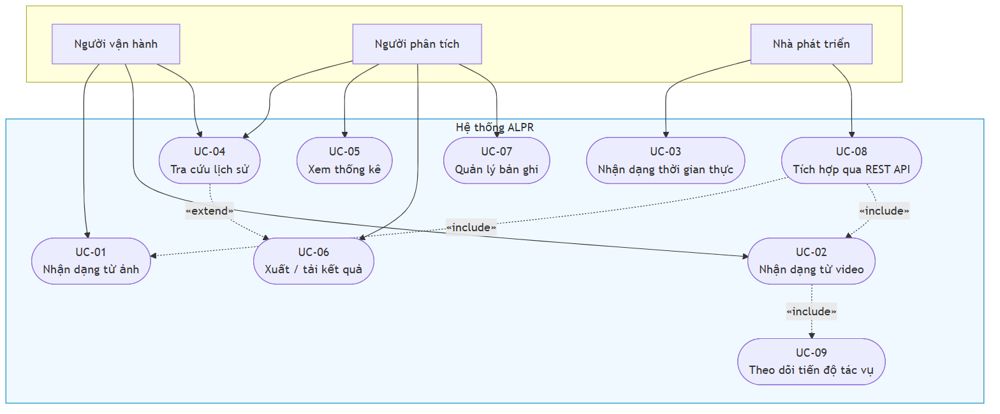
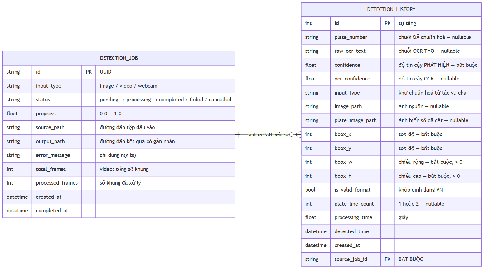

# CHƯƠNG 4. THIẾT KẾ VÀ CÀI ĐẶT HỆ THỐNG

Trên cơ sở lý thuyết ở Chương 2 và lựa chọn công nghệ ở Chương 3, chương này trình bày thiết kế và hiện thực của hệ thống trong cùng một mạch. Nguyên tắc: mọi mô tả tương ứng với mã nguồn có thật; chức năng chưa hoàn thiện ghi rõ mức độ; số đo chưa có thì nói thẳng là chưa có. Chương gồm phân tích yêu cầu (4.1), kiến trúc (4.2), môi trường phát triển (4.3), bộ dữ liệu (4.4), huấn luyện mô hình (4.5), tầng AI (4.6), backend và CSDL (4.7), giao diện (4.8), Docker (4.9) và bảng đối chiếu cài đặt lệch thiết kế (4.10).

Trạng thái bản này: hệ thống chạy `ALPRPipeline` với mô hình chính thức `models/best.pt` (`/health` báo `model_loaded: true`, engine `yolo:best.pt+paddleocr-PP-OCRv5-mobile`, mAP@0.5 = 0,9829); `StubPipeline` đã ra khỏi đường chạy chính. Mọi kết quả thực nghiệm trình bày ở Chương 5.

---

## 4.1. Phân tích yêu cầu

### 4.1.1. Khảo sát nhu cầu và các tác nhân

Nhận dạng biển số là bài toán nền tảng của bãi đỗ tự động, thu phí không dừng, kiểm soát ra vào và giám sát giao thông. Áp mô hình ALPR huấn luyện trên dữ liệu nước ngoài vào Việt Nam gặp bốn trở ngại. **Thứ nhất, biển hai dòng chiếm tỉ trọng lớn** (toàn bộ xe máy và một phần ô tô) trong khi đa số bộ dữ liệu quốc tế giả định biển một dòng; điểm gãy này đã đo được: trên **bộ RodoSol-ALPR của Brazil**, OpenALPR nhận đúng 3.772/4.000 ô tô biển một dòng (94,3%) nhưng chỉ 1.827/4.000 xe máy biển hai dòng (45,7%), chênh **48,6 điểm phần trăm** [7]<!-- laroca_2022_crossdataset -->[88]<!-- laroca_2022_rodosol -->. **Thứ hai, quy chuẩn biển số có tính pháp lý và cấu trúc chặt**: Thông tư 79/2024/TT-BCA [8]<!-- bocongan_2024_tt79 -->, sửa đổi bởi TT 13/2025 [9]<!-- bocongan_2025_tt13 --> và TT 51/2025 [10]<!-- bocongan_2025_tt51 -->, thông số vật lý theo QCVN 08:2024/BCA [11]<!-- bocongan_2024_qcvn08 --> — cấu trúc chặt vừa là ràng buộc vừa là cơ hội thiết kế cho khối hậu xử lý dựa trên luật. **Thứ ba, điều kiện thu nhận ảnh khắc nghiệt**: che khuất, bụi bẩn, nghiêng, ngược sáng, ban đêm. **Thứ tư, không có phần cứng tăng tốc**: máy thực hiện không có GPU CUDA, mọi suy luận và trình diễn chạy trên CPU (mục 4.1.4a, 4.3.1).

> **Lưu ý phạm vi số liệu.** Cặp 94,3% / 45,7% đo trên **bộ RodoSol-ALPR của Brazil**, **không phải dữ liệu Việt Nam**; đồ án chỉ dùng nó làm dẫn chứng định lượng rằng "biển hai dòng khó hơn" là sự kiện đo được, không phải cảm nhận.

Hệ thống có bốn tác nhân: **người vận hành** (đưa ảnh/video, xem kết quả, tra cứu), **người phân tích** (thống kê, lọc, xuất báo cáo), **nhà phát triển** (tích hợp REST API), **hội đồng đánh giá** (quan sát, phản biện). Do hệ thống chạy nội bộ/`localhost` (giả định A-04), đồ án **không xây dựng xác thực và phân quyền**; ba tác nhân đầu là các *vai trò* trên cùng một giao diện, không phải các *tài khoản*.

### 4.1.2. Sơ đồ use case và ba use case chính

**Hình 4.1.** Sơ đồ use case tổng quát của hệ thống

Ba quan hệ đáng chú ý: **UC-02 «include» UC-09** — video là tác vụ nền nên bắt buộc kéo theo theo dõi tiến độ; **UC-08 «include» UC-01, UC-02** — REST API là *một lối vào khác* cho cùng nghiệp vụ; **UC-04 «extend» UC-06** — xuất kết quả là mở rộng tuỳ chọn của tra cứu. UC-03 gắn với nhà phát triển vì từ 2026-07-20 chức năng này chỉ còn lối vào qua `POST /api/detect/frame`.

**UC-01 — Nhận dạng từ ảnh tĩnh** (bắt buộc). Luồng chính: người dùng chọn tệp (JPEG/PNG/WebP/BMP); máy chủ kiểm tra bằng **magic bytes** và hạn mức kích thước, tạo `DetectionJob` loại `image`, lưu tệp với tên sinh từ UUID, gọi pipeline AI, lưu ảnh biển đã cắt, ghi mỗi biển một bản ghi `DetectionHistory`, trả bounding box, chuỗi biển số, hai độ tin cậy và thời gian xử lý. **Ngoại lệ:** A1 — tệp không phải ảnh: HTTP 400, tiến trình không sập; A2 — vượt hạn mức: 413; A3 — ảnh không chứa biển số: HTTP **200** danh sách rỗng — một *câu trả lời*, không phải lỗi; A4 — phát hiện được nhưng OCR không đọc ra: bản ghi **vẫn lưu** với `plate_number` rỗng (4.7.2e); A5 — chuỗi không khớp định dạng: lưu với `is_valid_format = false`; A6 — lỗi nội bộ: 500, không lộ stack trace. A3 và A4 phân biệt thiết kế nghiêm túc với bản demo: âm thầm loại bỏ ca đọc hỏng sẽ làm sai lệch chính các số liệu Chương 5 cần.

**UC-02 — Nhận dạng từ video.** Hệ thống lưu tệp (MP4/AVI/MOV/MKV), tạo `DetectionJob` trạng thái `pending`, **trả ngay HTTP 202 kèm `job_id`**. Tác vụ nền chuyển `processing`, trích khung theo bước nhảy cấu hình được, cập nhật tiến độ; kết quả cùng biển số trên nhiều khung được **gộp trùng** giữ lần đọc tin cậy nhất; xong thì kết xuất video gắn nhãn, ghi CSDL, chuyển `completed`; giao diện hỏi tiến độ định kỳ. `pending` tách khỏi `processing` để phân biệt tác vụ *đang xếp hàng* với tác vụ *đã treo*. **Vì sao bất đồng bộ:** một khung mất ~400 ms trên CPU (4.1.4b); video 60 giây lấy mẫu 1/5 vẫn là 360 khung ≈ 145 giây — vượt timeout của hầu hết proxy và trình duyệt, nên xử lý đồng bộ là **không khả thi** chứ không phải lựa chọn kém.

> ⚠️ **Thay đổi phạm vi 2026-07-20:** trang Webcam đã được **gỡ khỏi giao diện web** theo quyết định thu gọn phạm vi demo. **UC-03 — Nhận dạng thời gian thực** vì vậy được hiện thực và kiểm chứng **ở tầng API** (`POST /api/detect/frame`); tác nhân chính trở thành một *client thời gian thực* bất kỳ gọi API — trang webcam trước đây của giao diện chính là một client như vậy. Các bước thuần giao diện (FR-3.1, FR-3.4) chuyển mức ưu tiên **M → W**.

**UC-03** yêu cầu client có nguồn thu hình, mã hoá khung thành JPEG/PNG, gửi theo chu kỳ cấu hình được. Lời gọi đầu không kèm định danh nên máy chủ tạo tác vụ mới trả `job_id`; các lời gọi sau gửi kèm nên cả phiên quy về **một** bản ghi tác vụ, biển đã gộp trùng trong phạm vi phiên. `job_id` không tồn tại thì hệ thống **âm thầm mở phiên mới** để tải lại trang không làm hỏng luồng chụp. **Ràng buộc riêng:** không có GPU nên bắt buộc bỏ bớt khung kết hợp hàng đợi một khe phía client — nếu không, tốc độ chụp (~30 fps) vượt xa tốc độ xử lý (~3–5 fps), hàng đợi phình vô hạn và độ trễ tăng tuyến tính (cài đặt ở 4.8.4).

### 4.1.3. Yêu cầu chức năng

Đồ án đặc tả **34 yêu cầu chức năng** trong **6 nhóm**, mỗi yêu cầu có mã, mức MoSCoW và một tiêu chí chấp nhận kiểm chứng được. Phân bố: FR-1 (ảnh tĩnh) **7 Must**; FR-2 (video) **5 Must + 1 Should**; FR-3 (thời gian thực, tầng API) **3 Must + 2 Won't**; FR-4 (thống kê – lịch sử – tra cứu) **4 Must + 1 Should + 1 Could + 2 Won't**; FR-5 (quản lý dữ liệu) **2 Should + 2 Could**; FR-6 (hệ thống, vận hành) **2 Must + 2 Should**. Tổng **21 Must, 6 Should, 3 Could, 4 Won't = 34**.

**FR-1:** tiếp nhận, kiểm tra hợp lệ, phát hiện *tất cả* vùng biển, cắt và nhận dạng, hậu xử lý, lưu kết quả, hiển thị có bounding box. FR-1.5 quy định lưu **cả chuỗi OCR thô lẫn chuỗi đã sửa** — điều kiện cần để đo đóng góp hậu xử lý ở Chương 5 (4.7.2b). **FR-2:** thêm trích khung theo bước nhảy, **gộp trùng** (FR-2.4 — thiếu nó một video 30 giây sinh hàng nghìn bản ghi về cùng vài chiếc xe, phá hỏng thống kê FR-4), kết xuất video gắn nhãn; Should duy nhất là tiến độ phần trăm và huỷ tác vụ. **FR-3:** theo quyết định 2026-07-20, hai yêu cầu thuần giao diện FR-3.1, FR-3.4 chuyển **M → W**; FR-3.2/3.3/3.5 vẫn Must, kiểm chứng ở tầng API. **FR-4:** chỉ số tổng hợp (FR-4.1), biểu đồ theo thời gian (FR-4.2), danh sách phân trang, tìm kiếm khớp một phần, lọc, chi tiết, tải ảnh, sắp xếp; **FR-4.3 → 4.8 không đổi**. **FR-5:** xoá bản ghi kèm tệp, xuất CSV/JSON (CSV phải UTF-8 **có BOM** kẻo Excel hiển thị sai tiếng Việt), dọn tệp mồ côi, xoá hàng loạt. **FR-6:** health check báo trạng thái mô hình và CSDL; log có cấu trúc; thông báo lỗi thân thiện không lộ stack trace; cấu hình qua biến môi trường.

> ### Bốn yêu cầu mức Won't và hai đợt thu gọn phạm vi ngày 2026-07-20
>
> Cả bốn yêu cầu Won't đều **thuần giao diện**, chuyển mức trong cùng ngày qua hai đợt: đợt 1 gỡ trang Webcam (FR-3.1, FR-3.4 **M → W**; năng lực còn ở `POST /api/detect/frame`); đợt 2 gỡ trang Tổng quan (**FR-4.1 M → W**, FR-4.2 S → W; năng lực còn ở `GET /api/statistics` và `GET /health`).
>
> **Phải nói thẳng: FR-4.1 là yêu cầu mức *Must* đầu tiên — và duy nhất — bị đưa ra khỏi phạm vi trong toàn bộ đồ án.** Con số đếm vì vậy giảm từ 22/7/3/2 xuống **21/6/3/4**, và mục 6.3 ghi nhận đây là **hạn chế thật**. Điều **không** thay đổi: cả hai đợt chỉ gỡ **màn hình hiển thị**, không gỡ **năng lực hệ thống** — các endpoint vẫn phục vụ, vẫn trong tài liệu OpenAPI, vẫn có kiểm thử tích hợp (`tests/integration/test_api_statistics.py`, `test_api_health.py`), thiết kế API ở 4.7.3 giữ nguyên không sửa một dòng — bằng chứng thực tế cho nguyên tắc tách tầng ở 4.2. Đánh đổi đo được của đợt 2: gỡ `recharts` làm gói tải về giảm từ ~730 KB xuống **328,8 KB** (−55%).

**Ma trận truy vết:** mỗi nhóm truy vết tới giai đoạn cài đặt và hình thức kiểm chứng (FR-1: unit + integration; FR-2: integration + performance; FR-3: performance ở tầng API; FR-4: integration + UI test cho FR-4.3→4.8; FR-5: unit; FR-6: smoke + stress). Kết quả ở Chương 5.

### 4.1.4. Yêu cầu phi chức năng

Bảy nhóm: hiệu năng (NFR-P), độ chính xác (NFR-A), tin cậy (NFR-R), khả dụng (NFR-U), bảo trì (NFR-M), bảo mật (NFR-S), tương thích – triển khai (NFR-C), mở rộng (NFR-SC).

#### a) Nguyên tắc nền tảng: mọi chỉ tiêu hiệu năng đều là chỉ tiêu CPU

> **Toàn bộ chỉ tiêu hiệu năng của đồ án là chỉ tiêu đo trên CPU.**

Máy thực hiện chạy Windows 11, Python 3.13, **không có GPU CUDA** (Intel UHD 770 tích hợp, PyTorch không dùng được để tăng tốc). Huấn luyện trên GPU miễn phí Colab/Kaggle, nhưng **suy luận và buổi bảo vệ chạy trên CPU máy cá nhân**. Đây là **ràng buộc thiết kế**, không phải hạn chế tạm thời, vì bốn lẽ: nó cố định trong toàn bộ vòng đời và tại chính buổi bảo vệ; nó đổi *bậc độ lớn* của độ trễ (ở 20 ms/khung, video đồng bộ và webcam xử lý mọi khung là hợp lý — ở mốc thực tế 400 ms cả hai bất khả thi, trực tiếp sinh ra hai quyết định kiến trúc: video bất đồng bộ AD-02 và webcam bỏ khung hàng đợi một khe); nó chi phối chọn biến thể mô hình (n/s/m), biến thể OCR (mobile/server), kích thước ảnh và **backend suy luận** — benchmark chính thức trên CPU i7-13700H cho thấy YOLOv8n qua ONNX Runtime nhanh hơn PyTorch khoảng **3,73 lần** (104,61 → 28,02 ms) [18]<!-- ultralytics_2026_openvinoexport -->, lợi ích lớn nhất đúng ở phân khúc mô hình nhỏ [117]<!-- onnxruntime_2025_threading -->; và nó buộc phương pháp công bố chặt hơn — quy tắc CON-06: **mọi số liệu hiệu năng phải kèm model CPU, số luồng, kích thước ảnh, backend suy luận và cỡ mẫu đo**. Các chỉ tiêu độ trễ vì vậy "rộng rãi" hơn văn liệu quốc tế đo trên GPU — đó là trung thực về điều kiện đo, không phải dễ dãi.

> **Cảnh báo trích dẫn.** Bảng benchmark nguồn có cột mAP nhưng đo trên tập `coco8` chỉ **8 ảnh**, không có ý nghĩa thống kê; đồ án chỉ dùng cột thời gian và cố ý lược bỏ cột độ chính xác.

#### b) Chỉ tiêu định lượng nhóm hiệu năng và nhóm độ chính xác

<!-- {{T4.1}} chi tieu phi chuc nang dinh luong NFR-P va NFR-A -->

**Bảng 4.1.** Chỉ tiêu phi chức năng định lượng: hiệu năng (NFR-P) và độ chính xác (NFR-A)

| Mã | Chỉ tiêu | Mục tiêu | Ngưỡng tối thiểu |
|---|---|---|---|
| **NFR-P1** | Độ trễ toàn trình một ảnh (p95) | ≤ 800 ms | ≤ 1500 ms |
| **NFR-P2** | Tốc độ khung hình thời gian thực (webcam — đo ở tầng API) | ≥ 5 FPS hiệu dụng | ≥ 3 FPS |
| **NFR-P3** | Tốc độ xử lý video | ≥ 0,3× thời gian thực | ≥ 0,15× |
| **NFR-P4** | Thời gian nạp mô hình khi khởi động | ≤ 15 giây | ≤ 30 giây |
| **NFR-P5** | Overhead của tầng API (không tính suy luận) | ≤ 50 ms | ≤ 100 ms |
| **NFR-P6** | Thời gian truy vấn lịch sử (10.000 bản ghi) | ≤ 500 ms | ≤ 1000 ms |
| **NFR-P7** | Bộ nhớ thường trú của backend | ≤ 2 GB | ≤ 4 GB |
| **NFR-A1** | mAP@0.5 của bộ phát hiện | ≥ 0,90 | ≥ 0,85 |
| **NFR-A2** | mAP@0.5:0.95 của bộ phát hiện | ≥ 0,65 | ≥ 0,55 |
| **NFR-A3** | Precision / Recall phát hiện | ≥ 0,92 / ≥ 0,90 | ≥ 0,88 / ≥ 0,85 |
| **NFR-A4** | Độ chính xác OCR mức ký tự (1 − CER) | ≥ 0,95 | ≥ 0,92 |
| **NFR-A5** | Độ chính xác biển đầy đủ **trước** hậu xử lý | ≥ 0,85 | ≥ 0,80 |
| **NFR-A6** | Độ chính xác biển đầy đủ **sau** hậu xử lý | ≥ 0,90 | ≥ 0,85 |
| **NFR-A7** | Độ chính xác toàn trình (ảnh vào → biển đúng) | ≥ 0,88 | ≥ 0,82 |

**Phương pháp đo NFR-P:** P1 trên 100 ảnh test, báo p50/p95/p99; P2 đo liên tục 60 giây; P3 bằng video 60 giây phải xong trong ≤ 200 giây; P4 từ khởi động đến khi `/health` sẵn sàng; P5 là hiệu tổng thời gian request trừ thời gian pipeline; P6 có phân trang và bộ lọc trên 10.000 bản ghi; P7 theo dõi RSS khi chạy tải liên tục.

NFR-P1 xuất phát từ **phân rã ngân sách độ trễ**: giải mã ~50 ms; phát hiện @640 px ~150 ms; cắt ~30 ms; OCR mỗi biển ~120 ms; hậu xử lý < 5 ms; ghi CSDL ~50 ms — **tổng ~405 ms cho ảnh một biển**; ngân sách 800 ms để dự phòng ảnh nhiều biển và biến động tải. Đây là **ước lượng thiết kế, không phải kết quả đo** (số đo ở Chương 5). Ngân sách lập cho runtime mặc định đã chốt ở mục 3.4 là **ONNX Runtime** — điểm đã đổi so với AD-05 sơ bộ. Nếu vượt ngưỡng, thứ tự giảm tải định trước: (1) INT8 OpenVINO; (2) giảm ảnh xuống 480 px; (3) biến thể OCR nhẹ hơn — chỉ hạ chỉ tiêu **sau khi** thử hết ba phương án.

Cặp NFR-A5/A6 đặt **tách bạch** có chủ đích: hiệu số giữa chúng là đóng góp định lượng của khối hậu xử lý — đo được nhờ quyết định lưu cả chuỗi thô lẫn chuỗi sửa ở tầng dữ liệu (4.7.2b). Bổ sung: **NFR-A8** — báo cáo độ chính xác **tách riêng biển một dòng và hai dòng**, căn cứ số liệu 94,3% / 45,7% **đo trên bộ RodoSol-ALPR (Brazil)** đã dẫn ở 4.1.1, vì một con số tổng thể sẽ che giấu đúng điểm gãy cần phân tích; **NFR-A9** — báo cáo theo điều kiện ảnh nếu bộ dữ liệu có nhãn phù hợp.

#### c) Các nhóm yêu cầu phi chức năng còn lại

**NFR-R:** không sập với đầu vào hỏng/độc hại (100% lỗi bị bắt); ảnh không biển trả rỗng hợp lệ HTTP 200; video thất bại không để lại rác; tỉ lệ thành công chạy liên tục một giờ ≥ 99%; CSDL sống sót khởi động lại. **NFR-U:** lượt nhận dạng đầu tiên ≤ 3 nhấp chuột, không cần tài liệu; thao tác > 500 ms có phản hồi trực quan; thông báo lỗi tiếng Việt nêu nguyên nhân và cách khắc phục; dùng được từ 1366×768; tương phản WCAG AA ≥ 4,5:1. **NFR-M:** mã AI tách hoàn toàn khỏi mã API (M1); bao phủ test tầng nghiệp vụ ≥ 70% (M2); type hint + docstring (M3); không hard-code đường dẫn (M4); thay bộ OCR không sửa tầng API (M5); lint tự động (M6) — M1 và M5 **là yêu cầu kiến trúc**, lý do tồn tại của tầng AI độc lập (4.2). **NFR-S:** kiểm tra magic bytes; chống path traversal bằng tên tệp UUID; giới hạn kích thước phía máy chủ; CORS không ký tự đại diện; không log dữ liệu nhạy cảm; truy vấn tham số hoá qua ORM. **NFR-C:** chạy Windows/Linux/macOS qua Docker một lệnh; **không cần GPU là chế độ mặc định**; Chrome/Edge/Firefox; cài từ máy sạch ≤ 15 phút. **NFR-SC:** ổn định ≥ 5 yêu cầu đồng thời; không suy giảm ở 100.000 bản ghi; video nền không chặn yêu cầu khác.

> **Giới hạn đã biết cần công bố.** SQLite chỉ cho **một tiến trình ghi tại một thời điểm** — chấp nhận được ở quy mô đồ án, nhưng phải nêu trong phần Hạn chế kèm hướng khắc phục (PostgreSQL) nếu triển khai thực tế.

---

## 4.2. Kiến trúc hệ thống

### 4.2.1. Nguyên tắc kiến trúc

**Kiến trúc sạch và quy tắc phụ thuộc:** phụ thuộc chỉ hướng vào trong, từ chi tiết dễ thay đổi (framework web, CSDL, giao diện) về quy tắc nghiệp vụ ổn định. Ở bài toán này, thứ ổn định là thuật toán nhận dạng biển số — phát hiện, cắt, đọc, chuẩn hoá theo quy chuẩn Việt Nam; thứ dễ đổi là FastAPI hay Flask, SQLite hay PostgreSQL. Do đó **pipeline AI nằm ở vòng trong cùng**, tầng web phụ thuộc nó chứ không ngược lại. SOLID vận dụng: *trách nhiệm đơn nhất* — detector chỉ trả bounding box, recognizer chỉ trả chuỗi, normalizer chỉ chuẩn hoá — cho phép đo từng khối riêng; *thay thế Liskov* — dùng theo nghĩa đen khi hệ thống chạy pipeline giả lập đúng hợp đồng pipeline thật; *đảo ngược phụ thuộc* — tầng nghiệp vụ phụ thuộc hợp đồng trừu tượng, cài đặt tiêm từ ngoài.

Bốn ràng buộc kiến trúc: (1) **không trộn mã AI với mã API** (NFR-M1) ⇒ pipeline AI là package Python độc lập, không import framework web; (2) **mọi thành phần AI thay thế được** (NFR-M5) ⇒ đều đứng sau lớp trừu tượng; (3) **không hard-code đường dẫn** (NFR-M4) ⇒ mọi đường dẫn qua đối tượng cấu hình đọc từ biến môi trường; (4) **chạy được không cần GPU** (CON-02, NFR-C2) ⇒ thiết bị suy luận là tham số cấu hình, mặc định `cpu` — phát biểu là *cấu hình mặc định* chứ không phải "chế độ dự phòng", nên đường chạy CPU là đường được kiểm thử thường xuyên nhất.

### 4.2.2. Kiến trúc phân tầng

**Hình 4.2.** Kiến trúc phân tầng năm tầng và chiều phụ thuộc

Năm tầng: **1 — Trình bày** (giao diện, chỉ biết hợp đồng HTTP của tầng 2); **2 — API** (định tuyến, kiểm tra hợp lệ, ánh xạ ngoại lệ thành mã HTTP, sinh OpenAPI); **3 — Nghiệp vụ** (điều phối: tạo tác vụ, gọi pipeline, lưu tệp, ghi CSDL, gộp trùng, thống kê); **4 — AI** (phát hiện, nhận dạng, chuẩn hoá — **chỉ biết NumPy, OpenCV và thư viện học sâu**); **5 — Dữ liệu** (CSDL, kho tệp). **Điểm mấu chốt:** khối tầng AI **không có mũi tên nào đi lên**. Sau hai đợt thu gọn 2026-07-20, tầng trình bày còn **ba trang** nhưng **tầng 2–5 không đổi một dòng**: `POST /detect/frame`, `GET /statistics`, `GET /health` vẫn phục vụ và vẫn có kiểm thử tích hợp — phép thử ngoài dự kiến cho nguyên tắc phụ thuộc một chiều.

### 4.2.3. Tách tầng AI khỏi tầng API và cách kiểm chứng ràng buộc

> **Không một tệp mã nguồn nào trong package `ai/inference/` được phép import FastAPI, Pydantic, SQLAlchemy hay bất kỳ thành phần nào của tầng web và tầng dữ liệu.** Chiều ngược lại được phép và là bắt buộc.

**Ba lợi ích.** *Kiểm thử độc lập*: test chỉ cần nạp mảng NumPy, không phải dựng ứng dụng web. *Tái sử dụng trong script huấn luyện và đánh giá*: nếu logic tiền xử lý nằm lẫn trong hàm HTTP thì script đánh giá phải sao chép, hai bản sẽ lệch nhau — dẫn tới tình huống tệ nhất: **con số công bố không phải con số hệ thống thực sự tạo ra** (đúng loại sự cố đã xảy ra thật, mục 4.6.4g và 4.10). *Thay engine không sửa tầng API* — **đã kiểm chứng trên thực tế**: suốt Phase 5–7 hệ thống chạy `StubPipeline`, toàn bộ tầng API, nghiệp vụ, CSDL, giao diện được xây và kiểm chứng **trước khi mô hình được huấn luyện**; khi trọng số sẵn sàng, chuyển sang `ALPRPipeline` chỉ là đổi thành phần được tiêm, **không sửa dòng nào** ở router, service, schema. Để trạng thái mô phỏng không bị nhầm với vận hành thật, `/health` báo `degraded` chừng nào stub còn được dùng.

**Kiểm chứng bằng công cụ, không bằng rà soát.** `tests/test_architecture.py` (340 dòng) đặt hai lớp bổ sung nhau. Lớp một: quét văn bản mã nguồn bằng regex chỉ khớp **câu lệnh import viết thường** (không khớp tên sản phẩm trong tài liệu); điều kiện đạt là `grep -rnE "^\s*(import|from)\s+(fastapi|pydantic|starlette|sqlalchemy|backend)" ai/inference/` không trả kết quả. Lớp hai: khởi động **tiến trình Python mới** bằng `subprocess.run`, import *chỉ* package AI, soi `sys.modules` — bắt được import muộn trong thân hàm, **import bắc cầu**, và đo *thực tế đã nạp gì* thay vì *mã trông thế nào* (kiểm ngay trong bộ test vô giá trị vì test tích hợp đã nạp FastAPI từ trước); phép động còn đo gián tiếp thời gian nạp và bộ nhớ riêng tầng AI (NFR-P4, P7). Ba điều kiện phái sinh: mỗi mô-đun import được độc lập; `ALPRPipeline` khởi tạo được từ ba đối tượng giả **không nạp `ultralytics`, `paddleocr`, `torch`**; `ai/evaluation/` được import `backend` nhưng chỉ ở phạm vi hàm. NFR-M4 kiểm cùng cách: quét chuỗi `"C:\..."` / `"/home/..."` và khẳng định các mô-đun cấu hình dẫn xuất gốc dự án từ `Path(__file__).resolve().parents[...]`.

### 4.2.4. Luồng xử lý của pipeline AI và nhánh biển hai dòng

**Hình 4.3.** Luồng xử lý của pipeline AI, các khối tô đỏ là nhánh biển hai dòng

**Nhánh biển hai dòng** là phần khó nhất của đồ án và là rủi ro đã xác định từ khâu lập kế hoạch (R-04). Bộ OCR dựng sẵn giả định văn bản một dòng ngang, nên với biển hai dòng chúng đọc theo thứ tự không xác định, ghép lẫn hoặc bỏ sót một dòng — cơ chế đứng sau chênh lệch 48,6 điểm phần trăm **đo trên bộ RodoSol-ALPR của Brazil** đã dẫn ở 4.1.1 [7]<!-- laroca_2022_crossdataset -->. Giải pháp: **tách vùng biển thành hai nửa, nhận dạng từng nửa, ghép theo thứ tự trên trước dưới sau** — mỗi nửa lúc này là một dòng ngang đúng giả định của bộ OCR (cài đặt ở 4.6.4).

**Phân loại số dòng** dùng hai cơ chế xếp chồng (kết luận 2.6.3e). *Cơ chế chính*: lấy lớp từ bộ phát hiện huấn luyện hai lớp (`0` = một dòng, `1` = hai dòng) — chính xác nhất, chi phí gần bằng không; giá là dữ liệu phải gán nhãn hai lớp. *Cơ chế dự phòng*: ngưỡng tỉ lệ khung theo kích thước chuẩn QCVN 08:2024/BCA [11]<!-- bocongan_2024_qcvn08 --> — ô tô biển dài 520×110 mm → 4,727 (một dòng), ô tô biển ngắn 330×165 mm → 2,000 (hai dòng), xe máy 190×140 mm → 1,357 (hai dòng); ba giá trị tách biệt rõ, không loại biển nào rơi vào khoảng (2,000; 4,727), nên bộ ngưỡng ở mục 2.2.6 (AR < 2,5 hai dòng; > 3,0 một dòng; giữa là vùng nghi ngờ) đủ làm lớp dự phòng, và ngưỡng căn cứ quy chuẩn pháp lý nên giải thích được.

> **Điều kiện áp dụng bắt buộc:** tỉ lệ khung phải đo trên ảnh **đã nắn phối cảnh** hoặc **hộp bao xoay tối thiểu**, không đo trên hộp bao thẳng trục thô — biển một dòng chụp nghiêng có tỉ lệ hộp thẳng trục tụt dưới 3,0 sẽ bị phân loại nhầm; đây là lý do khối hiệu chỉnh hình học đặt **trước** bước xác định số dòng. Ba giá trị 4,727 / 2,000 / 1,357 là tỉ lệ **danh định của biển vật lý**, chỉ trùng tỉ lệ vùng ảnh khi biển gần chính diện.

**Nhánh giữ kết quả không hợp lệ:** biển không khớp định dạng nào **vẫn được lưu** với cờ `is_valid_format = false` — loại bỏ chúng vừa vứt dữ liệu vừa tiêu huỷ đúng những ca giá trị nhất cho phân tích lỗi. Cùng tinh thần, **chuỗi OCR thô là sản phẩm đầu ra riêng**, không bị khối chuẩn hoá ghi đè — cùng một quyết định xuất hiện ở tầng CSDL (4.7.2b) và tầng chỉ tiêu (NFR-A5/A6).

### 4.2.5. Bảng tổng hợp các quyết định kiến trúc

Mỗi quyết định ghi kèm lý do và **đánh đổi phải chấp nhận** — một quyết định trình bày như không có nhược điểm là quyết định chưa cân nhắc đủ.

<!-- {{T4.2}} cac quyet dinh kien truc AD-01 den AD-08 -->

**Bảng 4.2.** Các quyết định kiến trúc AD-01 … AD-08

| Mã | Quyết định về | Lựa chọn | Lý do | Đánh đổi phải chấp nhận |
|---|---|---|---|---|
| **AD-01** | Quan hệ giữa tầng AI và tầng API | Tầng AI là package Python độc lập | NFR-M1; kiểm thử độc lập, tái dùng được trong script huấn luyện và đánh giá (mục 4.2.3) | Thêm một lớp gián tiếp giữa hai tầng |
| **AD-02** | Xử lý video | **Bất đồng bộ, trả `job_id` ngay** | Thời gian xử lý vượt xa timeout HTTP (NFR-SC3); xem mục 4.1.2 | Giao diện phải hỏi tiến độ định kỳ; cần quản lý vòng đời tác vụ |
| **AD-03** | Thời gian thực (webcam) | Client gửi từng khung qua HTTP (`POST /detect/frame`) | Đơn giản, dễ gỡ lỗi, đủ cho mức ~5 FPS | Cần tốc độ khung hình cao hơn thì phải chuyển sang WebSocket |
| **AD-04** | Gộp trùng biển số | Theo chuỗi ký tự kết hợp cửa sổ thời gian | Đơn giản hơn nhiều so với bám vết đối tượng, đủ dùng cho FR-2.4 | Kém chính xác nếu hai xe cùng biển số trong một video — thực tế không xảy ra |
| **AD-05** | Runtime suy luận | **ONNX Runtime làm mặc định**, OpenVINO là tối ưu bổ sung | Nhanh hơn PyTorch khoảng 3,73 lần ở phân khúc nano; một runtime duy nhất cho cả hai mô hình loại bỏ xung đột framework (mục 3.4) | Thêm bước xuất mô hình; phải đặt tường minh số luồng nội bộ |
| **AD-06** | Thiết bị suy luận | Cấu hình được, mặc định `cpu` | CON-02 — máy phát triển không có GPU CUDA | — |
| **AD-07** | Lưu trữ ảnh và video | Tệp trên đĩa, CSDL chỉ giữ đường dẫn | Tránh phình tệp SQLite do BLOB (mục 4.7.1) | Phải giữ đồng bộ giữa tệp và bản ghi (FR-5.1, FR-5.3) |
| **AD-08** | Đặt tên tệp | Sinh từ UUID, không dùng tên gốc | NFR-S2 — chống path traversal | Phải lưu tên gốc ở một trường riêng nếu muốn hiển thị lại |

Ghi chú: AD-03 không đổi sau khi gỡ trang Webcam vì ở ~5 FPS trên CPU, nút thắt là suy luận chứ không phải giao thức. AD-04 cố ý **không** chọn tracking vì phức tạp hơn đáng kể và thêm một họ siêu tham số. AD-05 là quyết định duy nhất **đã thay đổi** so với phác thảo (*"PyTorch trước, ONNX nếu cần"*) — ghi nhận tường minh thay vì lặng lẽ sửa bảng. AD-06 kéo theo hai quyết định phái sinh đã cài đặt: `yolo11n` và **PP-OCRv5 mobile** — ràng buộc CPU thay đổi *lựa chọn mô hình*, không chỉ tốc độ.

---

## 4.3. Môi trường và công cụ phát triển

### 4.3.1. Cấu hình máy thực hiện và hệ quả của ràng buộc CPU

Toàn bộ cài đặt, kiểm thử, đo đạc chạy trên một máy trạm duy nhất (`docs/00-requirements/environment.md`): Windows 11 Pro; Intel Core i5-14600K, 14 nhân / 20 luồng; RAM 31,77 GiB; Intel UHD 770 — **không có GPU CUDA**; Python 3.13.12; Node.js 18.20.8; Docker 29.4.3. Cấu hình này **mâu thuẫn với mô tả môi trường ban đầu** (macOS Apple Silicon, Python 3.12); ghi nhận sai lệch thành văn bản là bước đầu của Phase 0. Ràng buộc CPU để lại dấu vết cụ thể: NFR-P1 phát biểu thẳng cho CPU; AD-06 kéo theo `yolo11n` và PP-OCRv5 mobile; và vì huấn luyện trên CPU mất 1–3 ngày/lượt, `ai/training/` chạy được cả local lẫn Colab/Kaggle với siêu tham số trong tệp cấu hình (`ai/training/config.py`, 586 dòng). Hệ quả đo được: p95 đầu-cuối trên `models/best.pt` (máy rảnh) là **731 ms** (client-side) / **780 ms** (in-process), OCR chiếm **~64,3%**, phát hiện **~34,2%** (đối chiếu NFR-P1 ở 4.10).

### 4.3.2. Ba môi trường ảo Python tách biệt và bộ công cụ

Đồ án dùng **ba môi trường ảo tách biệt**: `.venv-ai/` (huấn luyện, xuất mô hình — NumPy 2.5.4, OpenCV 5.0, torch 2.13.0+cpu), `.venv-ocr/` (thử nghiệm OCR — paddlepaddle 3.3.1, paddleocr 3.7.0), `backend/.venv/` (dịch vụ — torch, ultralytics 8.4.101, paddleocr). Bắt buộc tách vì `paddleocr` kéo theo `paddlex`, **hạ cấp NumPy và thay `opencv-python` bằng `opencv-contrib-python` 4.10** — lùi một phiên bản lớn so với OpenCV 5.0 của nhánh huấn luyện; cài chung thì mỗi lần cài lại một nhánh âm thầm đổi phiên bản nhánh kia — lỗi không làm sập chương trình mà làm **kết quả đo không tái lập được**. Phân tách phản ánh ở `requirements.txt` và `requirements-inference.txt`, được `Dockerfile.backend` cài theo hai lớp riêng (4.9).

**Bộ công cụ:** FastAPI + Uvicorn; SQLAlchemy 2.x + Alembic; Pydantic v2; Ultralytics 8.4.101 chạy YOLO11 [16]<!-- jocher_2024_yolo11 -->; PaddleOCR 3.7.0 cho PP-OCRv5 [17]<!-- cui_2026_ppocrv5 -->; Vite + React + TypeScript; pytest + pytest-cov; Docker Compose. Docker dùng Python 3.12 trong khi local dùng 3.13 là **chủ ý**: container là nơi lấy lại phiên bản mục tiêu (NFR-C1).

---

## 4.4. Xây dựng bộ dữ liệu

### 4.4.1. Đường ống sáu bước và thành phần bộ dữ liệu

**Hình 4.4.** Đường ống sáu bước xây dựng bộ dữ liệu

Mỗi bước là một script độc lập trong `scripts/dataset/` có CLI riêng, sinh báo cáo JSON/CSV; `run_pipeline.py` chạy cả chuỗi một lệnh. **Kết quả:** **15.133 ảnh** hợp nhất từ **7 bộ công khai** (Roboflow, HuggingFace, Kaggle), còn **6 nguồn nguyên tố** sau khi loại **11.978 ảnh (44,2%)** bản sao từ **27.111 ảnh**; tổng 9 bộ tải về, 2 bộ nhãn mức ký tự tách riêng cho đánh giá OCR. Chia 70/20/10 thành **10.592 / 3.027 / 1.514 ảnh**. Bảng dưới **phải trích khi nói về dữ liệu của đồ án**; nguồn và giấy phép từng bộ ở **Phụ lục C.1**.

<!-- {{T4.4}} dong gop cua tung bo du lieu truoc va sau khu trung lap -->

**Bảng 4.3.** Đóng góp của từng bộ dữ liệu trước và sau khử trùng lặp

| # | Bộ (slug) | Vào gộp | **Còn lại** | Bị loại |
|---|---|---:|---:|---:|
| 1 | `roboflow_school_fuhih` | 8.357 | **6.868** (45,38%) | 17,8% |
| 2 | `hf_vn_plates_segment` | 4.578 | **4.375** (28,91%) | 4,4% |
| 3 | `roboflow_traffic_camera` | 3.843 | **3.162** (20,89%) | 17,7% |
| 4 | `roboflow_eric_nguyen` | 840 | **353** (2,33%) | 58,0% |
| 5 | `roboflow_demo_tracking` | 236 | **235** (1,55%) | 0,4% |
| 6 | `roboflow_cuong_ta` | 8.254 | **140** (0,93%) | **98,3%** |
| 7 | `roboflow_tran_ngoc_xuan_tin` | 1.005 | **0** | **100%** |
| | **Tổng** | **27.113** | **15.133** | **44,2%** |

Ba điều bảng nói ra mà con số tổng giấu đi: hai bộ đầu chiếm **74,3%** nên đồ án **không đa dạng nội dung** như con số "6 nguồn" gợi ý; `cuong_ta` mất **98,3%**, `tran_ngoc_xuan_tin` mất **100%** — bằng chứng các bộ công khai **không độc lập với nhau**; và `cuong_ta` là bộ cân bằng layout nhất (51,04% hai dòng) còn `school_fuhih` sống sót nhiều nhất lại lệch nặng nhất (88,85% hai dòng), nên khử trùng lặp **vô tình làm tập dữ liệu lệch layout hơn** (`docs/reports/02-dataset-report.md` mục 6.3). **Giấy phép:** năm bộ CC BY 4.0; một bộ tự khai Public Domain — **không được khẳng định là thật** vì ảnh có dấu hiệu báo chí; một bộ HuggingFace **chưa xác nhận được giấy phép**.

Song song, một nhánh riêng tái tạo **4.019 chuỗi biển số** từ hai bộ nhãn mức ký tự, trong đó **2.801 chuỗi (69,69%)** khớp mẫu hợp lệ theo `plate_rules.py` (`roboflow_ocr_plate` 2.650, `roboflow_ocr_conversion` 151, đều CC BY 4.0), phục vụ đánh giá OCR độc lập với tầng phát hiện. Kết quả phụ: tập ký tự trên 4.019 chuỗi có **đúng 30 ký tự phân biệt**, không chứa `I`, `J`, `O`, `Q`, `W` — **xác nhận độc lập bằng dữ liệu** cho tập `EXCLUDED_LETTERS` suy từ văn bản pháp quy (4.6.5b).

> **Cảnh báo phạm vi bắt buộc kèm mọi số liệu OCR.** Phân loại màu nền trên 2.801 ảnh cho: **2.736 biển trắng (97,68%)**, 20 vàng, 4 xanh, **0 đỏ, 0 ngoại giao**. Phát biểu đúng là *"1 − CER = 0,9454 trên một tập gồm 97,7% biển trắng"*, **không phải** *"trên biển số Việt Nam"* (`docs/reports/17-plate-type-audit.json`).

### 4.4.2. Khử trùng lặp chéo bộ và con số 44,2%

Các bộ công khai fork lẫn nhau, nên một ảnh nằm ở `train` dưới tên bộ này và `test` dưới tên bộ khác thì **độ chính xác test đang đo khả năng ghi nhớ**; con số tiêu đề vì vậy là số nhóm trùng **chéo bộ**. Vét cạn ~690 triệu cặp là bất khả thi nên script dùng **multi-index hashing**: cắt mã băm 64 bit thành `threshold + 1` dải — theo nguyên lý chuồng bồ câu, hai mã khác nhau tối đa `threshold` bit bắt buộc trùng khớp trên ít nhất một dải — nên tập ứng viên chứa mọi cặp thật rồi được xác minh chính xác: **thuật toán chính xác, không xấp xỉ**.

Có **hai phép đo trên hai mẫu số khác nhau** (đối chiếu ở **Phụ lục C.3**); trích một con số trần không nêu mẫu số là gây hiểu nhầm. **(a)** trên toàn bộ 7 bộ vào hợp nhất: mẫu số **27.111**, ngưỡng Hamming **5**, loại **11.978 = 44,2%**, **đã xoá thật** (`applied: true`). **(b)** trên corpus `merged_v2` còn lại: mẫu số **15.133**, ngưỡng **10**, chỉ ra **7.227 ảnh có thể loại = 47,8%** nhưng **chưa xoá** (`applied: false`); phép này thấy 1.171 nhóm trong đó **116 nhóm chéo bộ**, cặp nặng nhất `hf_vn_plates_segment ↔ roboflow_school_fuhih` **2.669 cặp**. 47,8% không mâu thuẫn 44,2%: ngưỡng lỏng hơn, và chỉ đo chứ chưa xoá. Hai hệ quả của tỷ lệ 44,2%: quy mô thật khác hẳn danh nghĩa (ca cực đoan `tran_ngoc_xuan_tin` vào 1.005 ra **0** — lý do **không được cộng dồn `expected_images`** của các bộ Roboflow), và phân bố huấn luyện lệch vì bản sao tập trung ở các bộ được chép nhiều nhất. `split.py` giữ **mọi thành viên của một nhóm trùng trong cùng split** nên bản trùng không bị xoá cũng không rò rỉ được.

### 4.4.3. Giới hạn của perceptual hash: nó tóm tắt bố cục khung ảnh, không tóm tắt chiếc xe

Đây là **giới hạn không khắc phục được** bằng công cụ hiện có. Một lần kiểm tra độc lập ở ngưỡng Hamming 10 trên bộ v1 tìm thấy **619 cặp gần trùng giữa `train` và `test`**, toàn bộ ở dải d = 6–10; kiểm bằng mắt cho thấy **cùng một chiếc xe, cùng chuỗi biển số, ở cả hai split**. Pipeline không bắt được vì bộ chia gom nhóm ở ngưỡng 5 rồi lần kiểm đầu cũng đo lại ở ngưỡng 5 và báo "0 cặp" — **lập luận vòng tròn**. Nâng ngưỡng cũng không giải quyết: phash rút ảnh thành 64 bit mô tả **cấu trúc tần số thấp của toàn khung** — hai xe khác nhau qua cùng một camera có khoảng cách phash rất nhỏ vì 90% khung hình giống hệt, chiếc xe chỉ chiếm phần nhỏ diện tích (bằng chứng: `datasets/reports/v3/corpus_samples/flagged_pair.png`). Đánh đổi không thoát được: ngưỡng thấp bỏ sót cặp cùng xe khác ngày; ngưỡng cao gộp nhầm hàng nghìn ảnh xe khác nhau cùng camera. Bộ v3 chia lại với gom nhóm ngưỡng cao hơn và kiểm độc lập ở ngưỡng 10, nhưng đồ án ghi nhận thẳng thắn: **vẫn còn rò rỉ tồn dư không khử được bằng phash** (cùng xe quay lại cùng camera ngày khác) — khắc phục đòi hỏi so khớp mức chuỗi biển số hoặc đặc trưng phương tiện. Hệ quả: `baseline-416-v1.pt` đạt mAP@0.5 = 0,9933 trên bộ v1 nhưng con số đó **không được báo cáo là "đạt"** vì tập test có rò rỉ đã đo được (4.10).

---

## 4.5. Huấn luyện mô hình

### 4.5.1. Siêu tham số và chi phí huấn luyện bộ phát hiện

Cấu hình lượt chính thức trích từ `runs/final-640-v3/args.yaml` — tệp Ultralytics tự sinh, là bản ghi *đã thực thi* chứ không phải *dự định*; bảng đầy đủ ở **Phụ lục B.1**. Giá trị chịu lực: `model` = `yolo11n.pt` (tiền huấn luyện COCO, **2.590.035** tham số — biến thể nano do ràng buộc CPU); `imgsz` = **640** (đúng độ phân giải NFR-A1/A2); `epochs` = **20**, `batch` = 8; `optimizer` = AdamW, `lr0` = 0.001, `cos_lr`; `close_mosaic` = 10; `device` = `cpu`; `seed` / `deterministic` = 42 / `true`. **`fliplr = 0.0`** lệch có chủ ý so với mặc định 0.5: lật ngang tạo ký tự gương hoá — phân bố không bao giờ có trong thực tế. Vì giới hạn thời gian CPU chỉ chạy được **một lượt huấn luyện duy nhất**, không có nhiều seed để ước lượng phương sai; cố định seed ít nhất bảo đảm lượt này tái lập được — mọi chỉ số là kết quả **một lần chạy**, không có khoảng tin cậy (hạn chế ghi ở 5.9.3). **Chi phí:** baseline `baseline-416-v1.pt` 40 epoch, `imgsz` 416, bộ v1 — **156 phút**; `best.pt` 20 epoch, `imgsz` 640, bộ v3 — **≈ 35,6 phút/epoch, tổng ≈ 712 phút (≈ 11,9 giờ)** trên CPU. Ba yếu tố cùng thay đổi (số ảnh ×3,3, diện tích ×2,37, epoch giảm nửa) khiến so sánh ở mục 3.6 **không quy kết được nguyên nhân cho từng biến**.

### 4.5.2. Tiến triển của quá trình huấn luyện

**Hình 4.5.** Đường cong huấn luyện theo epoch — ba hàm mất mát và bốn chỉ số trên tập validation *(nguồn: `runs/final-640-v3/results.csv`)*

Ba hàm mất mát giảm đơn điệu và **không có dấu hiệu quá khớp**: `box_loss` 1,252 → 0,809, `cls_loss` 0,833 → 0,313, `dfl_loss` 1,154 → 0,987; đường validation bám sát đường train suốt 20 epoch. Chỉ số trên tập validation đi lên rồi bão hoà sớm: mAP@0,5 đạt **0,9684 ngay ở epoch 1** và chỉ nhích lên **0,9830** ở epoch 20, trong khi mAP@0,5:0,95 — chỉ số nhạy với độ khít của hộp — tăng đáng kể hơn, **0,6526 → 0,7688**.

**Điều này nói lên hai việc.** Thứ nhất, bài toán *một lớp* dễ ở khâu **tìm ra** biển số (mAP@0,5 gần bão hoà sau một epoch) nhưng khó ở khâu **khoanh khít** (mAP@0,5:0,95 còn tăng tới cuối). Thứ hai, đường cong **chưa phẳng ở epoch 20** — mốc dừng do ngân sách thời gian CPU quyết định, không phải do hội tụ; huấn luyện dài hơn nhiều khả năng còn cải thiện, và đây là một hạn chế được ghi ở Chương 6.

<!-- {{T4.5a}} tien trien chi so tren tap validation theo epoch -->

**Bảng 4.4.** Tiến triển chỉ số trên tập validation theo mốc epoch

| Epoch | `box_loss` (val) | `cls_loss` (val) | `dfl_loss` (val) | mAP@0.5 | mAP@0.5:0.95 | Precision | Recall |
|:---:|---:|---:|---:|---:|---:|---:|---:|
| 1 | 1,1705 | 0,6858 | 1,1513 | **0,9684** | **0,6526** | 0,9552 | 0,9410 |
| 2 | 1,1861 | 0,5554 | 1,1307 | **0,9726** | **0,6653** | 0,9700 | 0,9450 |
| 3 | 1,1647 | 0,5651 | 1,1098 | **0,9723** | **0,6770** | 0,9731 | 0,9449 |
| 5 | 1,1074 | 0,4977 | 1,0863 | **0,9754** | **0,6950** | 0,9765 | 0,9525 |
| 10 | 1,0548 | 0,4168 | 1,0686 | **0,9808** | **0,7248** | 0,9850 | 0,9584 |
| 15 | 0,9420 | 0,3619 | 1,0205 | **0,9824** | **0,7609** | 0,9846 | 0,9686 |
| 20 | 0,9204 | 0,3331 | 1,0105 | **0,9830** | **0,7688** | 0,9846 | 0,9697 |
| **Epoch tốt nhất (= 20)** | **0,9204** | **0,3331** | **1,0105** | **0,9830** | **0,7688** | **0,9846** | **0,9697** |

> Số liệu từ `runs/final-640-v3/results.csv`. **mAP@0.5 gần bão hoà rất sớm** (≈0,97 từ epoch 1) trong khi **mAP@0.5:0.95 vẫn tăng đều** (0,653 → 0,769) — định vị là dễ, khớp box chính xác mới khó; đường vẫn còn dốc lên tại epoch 20 nên **phải phát biểu rõ 20 epoch là giới hạn ngân sách tính toán, không phải điểm hội tụ**. `val/cls_loss` giảm đơn điệu, chưa thấy dấu hiệu quá khớp. **Epoch tốt nhất chọn chỉ dựa trên tập validation**; tập test không dùng cho bất kỳ quyết định nào ở mục này.

### 4.5.3. Tinh chỉnh bộ nhận dạng ký tự và lý do không đưa vào bản giao hàng

PP-OCRv5 mobile huấn luyện trên chữ cảnh tổng quát; mục này trả lời bằng số câu hỏi fine-tune trên đúng miền dữ liệu thì được gì. **Cấu hình:** 30 epoch trên 6.672 mẫu (2.801 ảnh gốc + hai biến thể tăng cường mỗi ảnh), kiểm định 571 mẫu, charset đủ 36, khởi đầu từ `en_PP-OCRv5_mobile_rec_pretrained`; kết thúc train acc **0,9449**, val acc **0,8809**.

<!-- {{T4.5b}} so sanh fine-tune va model goc -->

**Bảng 4.5.** So sánh bộ nhận dạng gốc và bản tinh chỉnh trên cùng ngữ liệu

| Cấu hình | A5 (chuỗi thô) | A6 (sau hậu xử lý) | Đúng định dạng | ms/ảnh |
|---|---:|---:|---:|---:|
| **Model gốc, det + rec** — *bản giao hàng* | 0,6373 | **0,7512** | 0,9443 | 328,8 |
| Model fine-tune, det + rec | 0,5998 | 0,6762 | 0,9018 | — |
| Model gốc, chỉ rec | 0,6776 | 0,7508 | 0,9568 | 35,7 |
| Model fine-tune, chỉ rec | **0,8618** | **0,8758** | **0,9886** | 38,5 |

Nguồn: `docs/reports/28-ocr-accuracy-finetuned.json`, `29-reconly-ablation.json`. **Phải đọc theo hàng.** Hàng 2 so hàng 1: ở đúng chế độ hệ thống đang chạy, fine-tune **kém hơn 7,50 điểm** — kết luận là "fine-tune thất bại". Hàng 4 so hàng 1: bỏ bước phát hiện chữ, fine-tune **hơn 12,46 điểm** và đạt ngưỡng tối thiểu NFR-A6 — kết luận ngược hẳn. **Nguyên nhân là hai chế độ đo khác nhau, không phải model:** PaddleOCR đánh giá nhánh rec bằng **nguyên ảnh** biển, còn đường ống triển khai cắt ảnh thành nhiều mảnh rồi đọc từng mảnh — model fine-tune chỉ được dạy đọc cả biển một lần, chưa từng thấy mảnh vụn; đo trên chính các tệp nó đã huấn luyện: chế độ chỉ-rec model gốc 0,2933 / fine-tune **0,8233**, chế độ det+rec fine-tune tụt về **0,2667**, mẫu lỗi cụt đầu (`51U74598` ra `598`). **Vì vậy val acc 0,8809 không sai, nhưng nó đo một chế độ hệ thống không dùng** — cùng họ với ba lần trước trong đồ án (5.9.3): phép đo trả con số đẹp vì không chạm được chỗ hỏng. **Quyết định: không đem fine-tune đi giao, cũng không bật chế độ chỉ-rec** (ngữ liệu 2.801 mẫu toàn ảnh cắt sẵn nên không có thẩm quyền quyết định giữa hai chế độ; đo lại trên ảnh toàn cảnh thì thứ tự đảo ngược — 5.6.6). Model, công tắc `ALPR_OCR_REC_MODEL_DIR` và đường ray huấn luyện giữ nguyên trong kho, sẵn sàng cho lượt đo có tập nhãn ảnh hiện trường.

---

## 4.6. Tầng AI — thiết kế và cài đặt

### 4.6.1. Tổ chức gói `ai/inference` và ba lớp trừu tượng

Gói gồm mười một mô-đun cùng `__init__.py`, tổng **4.852 dòng**: `types.py`, `interfaces.py`, `config.py` (`InferenceConfig`), `exceptions.py` (cây `ALPRError`), `plate_rules.py`, `normalizer.py`, `detector.py`, `recognizer.py`, `two_line.py`, `plate_color.py`, `pipeline.py`. Ràng buộc "không import FastAPI" kiểm chứng tự động ở 4.2.3; lý do nền tảng: gói phải chạy được trong Jupyter, script benchmark và Colab.

Ba lớp trừu tượng: **`BaseDetector.detect(image) → list[PlateDetection]`** — đã lọc ngưỡng và NMS, mọi hộp **kẹp trong biên ảnh**, và **danh sách rỗng là kết quả bình thường**, không bao giờ là lỗi. **`BaseRecognizer.recognize(plate_image) → PlateRecognition`** — trả chuỗi thô kèm độ tin cậy; sửa lỗi ký tự và kiểm tra định dạng **không** thuộc trách nhiệm của nó — chính việc tách đó làm đóng góp hậu xử lý **đo được** qua hiệu giữa `raw_ocr_text` và `plate_number`; không đọc được thì trả chuỗi rỗng, không ném ngoại lệ. **`BaseNormalizer.normalize(raw_text) → tuple[str, bool]`** — kết quả không hợp lệ vẫn **trả về**, vì loại bỏ sẽ xoá đúng những thất bại chương đánh giá cần đếm. Hợp đồng "trả rỗng, không ném" nhất quán NFR-R2: **không tìm thấy** và **lỗi** là hai chuyện khác nhau. Hai lớp đầu có `warmup()` để chuyển chi phí nạp trọng số ra khỏi yêu cầu đầu tiên (NFR-P1).

Các kiểu dữ liệu khai báo **bất biến** (`frozen dataclass`) ở chỗ có thể; riêng `DetectionResult`/`PipelineResult` không bất biến vì chứa mảng ảnh nặng cần giải phóng sau khi lưu. `BoundingBox` lưu `(x, y, width, height)` khớp trực tiếp bốn cột `bbox_*`, kèm thuộc tính `aspect_ratio` phục vụ phân loại số dòng. Tên thuộc tính đặt **trùng tên cột CSDL có chủ đích** để tầng lưu trữ sao chép trường-sang-trường — một lớp biên dịch trung gian là thêm một chỗ để `confidence` và `ocr_confidence` bị hoán đổi (4.7.2a).

### 4.6.2. Bộ phát hiện — `YoloPlateDetector`

Adapter mỏng trên Ultralytics: không nơi nào ngoài mô-đun này chạm vào `Results` hay tensor. **Import trễ** (`from ultralytics import YOLO` trong `_load_yolo_model`) cho unit test không cần ngăn xếp ML; ngược lại **trọng số nạp ngay trong hàm khởi tạo** để tệp thiếu làm hệ thống thất bại lúc khởi động kèm hướng dẫn khắc phục. Bốn chi tiết: nhận `.pt`/`.onnx`/`.torchscript` cộng **thư mục** OpenVINO (kiểm tệp `.xml`) — từ chối thư mục sẽ khiến cấu hình nhanh nhất trên CPU Intel không cấu hình được; `_resolve_plate_class_ids` giữ tất cả khi mô hình một lớp (trường hợp của đồ án), mô hình nhiều lớp chỉ giữ lớp khớp `PLATE_CLASS_ALIASES` — checkpoint COCO 80 lớp trả danh sách rỗng là đúng, không phải lỗi; `_build_clamped_bbox` kẹp về biên, hoán đổi nếu `x2 < x1`, trả `None` kèm log nếu hộp suy biến; `name` trả `yolo:{stem}{suffix}` vì một con số benchmark chỉ tái lập được nếu nêu đúng bộ trọng số.

### 4.6.3. Bộ nhận dạng ký tự — `PaddleOcrRecognizer`

Ba đặc điểm: **khởi tạo trễ và tái sử dụng** (máy OCR đắt để dựng); **ghim phiên bản** `OCR_VERSION = "PP-OCRv5"` tường minh — nâng cấp thư viện không được âm thầm đổi mô hình đứng sau benchmark đã công bố; **tắt tiền xử lý mức tài liệu** vì đầu vào đã là vùng biển cắt sẵn.

**Phát hiện kỹ thuật: backend oneDNN làm sập suy luận trên PP-OCRv5.** Trên đúng nền tảng mục tiêu (`paddlepaddle` 3.3.1, Windows, CPU), chạy mô hình phát hiện văn bản qua oneDNN kết thúc bằng `NotImplementedError: (Unimplemented) ConvertPirAttribute2RuntimeAttribute not support [pir::ArrayAttribute<pir::DoubleAttribute>]` — khiếm khuyết phía thư viện, không phải lỗi cấu hình. Xử lý: hằng số có tài liệu `DEFAULT_ENABLE_MKLDNN: Final[bool] = False`. Đây là **núm hiệu năng, không phải núm độ chính xác** — khi lỗi thượng nguồn được sửa chỉ cần lật giá trị và đo lại; nó cũng giải thích một phần NFR-P1: một con đường tăng tốc CPU hiển nhiên đang bị chặn bởi lỗi thư viện chứ không phải chưa được thử.

**Lọc mảnh văn bản theo hình học.** CLAHE khuếch đại nhiễu ở vùng gần đồng nhất, có thể sinh mảnh rác đọc thành chuỗi vô nghĩa với độ tin cậy cao (đã gặp mảnh cao 10 px, độ tin cậy 0,84) — **ngưỡng tin cậy không tách được**, hình học mới tách được: `MIN_FRAGMENT_HEIGHT_RATIO = 0.35` đo **so với mảnh cao nhất**, và `_drop_short_fragments` trả nguyên đầu vào nếu không mảnh nào báo được hình học. **Tổng hợp độ tin cậy** dùng **trung bình có trọng số theo độ dài mảnh** — trung bình cộng cho phép mảnh một ký tự 0,99 che lấp mảnh bảy ký tự 0,40, trong khi mảnh dài mới mang danh tính biển số.

### 4.6.4. Mô-đun xử lý biển hai dòng — `two_line.py`

**a) Vì sao bài toán tồn tại.** Bộ nhận dạng hiện đại là CRNN/CTC với giả định **căn chỉnh đơn điệu** giữa cột ảnh và ký tự — chỉ đúng với văn bản một dòng; chồng lên đó, PP-OCR **resize mọi ảnh cắt về chiều cao 48 px** [103]<!-- paddlepaddle_2026_textrecognition -->. Biển xe máy 140 × 190 mm (QCVN 08:2024/BCA [11]<!-- bocongan_2024_qcvn08 -->) có tỷ lệ ≈ 1,36, nên sau khi ép về 48 px mỗi hàng ký tự chỉ còn ~24 px — dưới mức nét chữ còn tách rời. Hệ quả định lượng: trên bộ **RodoSol-ALPR của Brazil**, OpenALPR đạt **94,3% trên biển ô tô một dòng** nhưng chỉ **45,7% trên biển xe máy hai dòng** [7]<!-- laroca_2022_crossdataset -->[88]<!-- laroca_2022_rodosol --> — đồ án trích cặp số này thuần tuý làm dẫn chứng tương đương định lượng, không phải số liệu Việt Nam.

**b) Ước lượng số dòng bằng tỷ lệ khung.** `estimate_line_count` dùng `DEFAULT_TWO_LINE_AR_THRESHOLD = 2.5`: `line_count = 2 if aspect_ratio < threshold else 1`. **Đây là heuristic do đồ án đề xuất, không phải quy tắc pháp lý** — quy chuẩn chỉ cung cấp kích thước vật lý (4,727 / 2,000 / 1,357); 2,5 chọn **lệch về phía hai dòng** vì đường xử lý hai dòng suy giảm êm khi gặp đầu vào một dòng, chiều ngược lại thì không. Hạn chế ghi trong mã: dải 2,5–3,0 là vùng xám thật vì biển một dòng chụp nghiêng gắt có tỷ lệ hộp bao tụt vào đó; định lượng tần suất thuộc Chương 5.

**c) Cắt trên/dưới có chồng lấn.** `split_two_line` dùng `UPPER_HALF_END_RATIO = 5/12`, `LOWER_HALF_START_RATIO = 1/3` — hai nửa **chồng lấn 1/12 chiều cao biển**, chủ ý do bất đối xứng chi phí: cắt cụt chân/đỉnh chữ phá huỷ thông tin **vĩnh viễn**, còn lọt vài điểm ảnh hàng bên cạnh thì bộ nhận dạng bỏ qua như nền. Hàm ép hai nửa không rỗng và cảnh báo nếu tham số làm mất chồng lấn.

**d) Ghép ngang bằng `np.hstack`.** Chiều cao chung `max(upper.h, lower.h, MIN_MERGE_HEIGHT)` với `MIN_MERGE_HEIGHT = 48` — bằng đúng chiều cao đầu vào cố định của PP-OCR. Nửa trên đặt bên trái nên thứ tự đọc bảo toàn, và sau khi ghép, **một hàng ký tự duy nhất nhận trọn ngân sách 48 px** thay vì hai hàng chia nhau; `_match_channels` nâng cả hai nửa về BGR khi số kênh lệch.

**e) Tiền xử lý ảnh biển — `preprocess_plate`.** Ba bước, **mỗi bước bật/tắt độc lập** để ablation được: chuyển xám (ký tự không mang thông tin màu); CLAHE (`clipLimit=2.0`, ô 8×8) vì biển phản quang tạo mảng chói cục bộ mà cân bằng toàn cục không xử lý được [95]<!-- sutikno_2025_clahe -->; khử nhiễu `bilateralFilter(5, 50, 50)` vì lọc song phương **bảo toàn biên** — làm mờ Gauss đủ mạnh sẽ bo tròn đầu nét, thứ phân biệt `8` với `B`. Kết quả luôn là BGR ba kênh; recognizer truyền `upscale_to_height = 64` vì ảnh biển ra khỏi detector thường chỉ cao 20–40 px.

**f) Bước cứu dòng trên — một giả thuyết hợp lý bị chính dữ liệu bác bỏ.** Mục có giá trị phương pháp luận cao nhất: quan sát chế độ hỏng — đề xuất giả thuyết *nghe rất hợp lý* — **đo và bác bỏ** — và chính phép bác bỏ dẫn tới thiết kế đúng. Ảnh biển `29E-015.66` trả về `015.66`: hai giai đoạn đầu không sai, điểm gãy ở chỗ sau khi ghép, bộ phát hiện văn bản chỉ tìm thấy **một** vùng chữ và bỏ hẳn cụm `29E`. Giả thuyết đầu tiên — bỏ phép ghép, đọc riêng từng nửa rồi nối chuỗi — được **đo** trên 200 biển hai dòng có nhãn (`docs/reports/15-two-line-ab.json`): chiến lược **A** (ghép rồi OCR một lần — thiết kế hiện tại) đúng **129/200 = 64,5%**; chiến lược **B** (OCR từng nửa rồi nối) đúng **7/200 = 3,5%** — chênh **−61,0 điểm**, A thắng ở 122 ảnh, B thắng ở **0 ảnh**: một sự sụp đổ, không phải sai số lấy mẫu. Nguyên nhân nằm đúng ở chi tiết đã biện minh ở (c): hai nửa cắt **chồng lấn** đi vào OCR riêng rẽ thì dải chồng lấn **bị đọc hai lần**, sinh ký tự rác nối giữa chuỗi (`84G122593` → B đọc `84-G124E009.01225.93`). Kết luận đảo ngược cách hiểu về phép ghép: trên dải liền mạch, vùng lặp nằm giữa hai cụm chữ và **bị bộ phát hiện văn bản gạt đi** — hai ảnh rời thì không có ngữ cảnh để gạt. Bản sửa **giữ nguyên chiến lược A**, chỉ thêm một bước phục hồi hẹp qua vị từ `should_rescue_two_line(recognition)`: chỉ `True` khi đồng thời `line_count == 2`, `not is_valid_format`, và `raw_text` khác rỗng — khi đó tốn thêm **một** lần OCR trên riêng nửa trên, ghép `upper + raw`, chuẩn hoá lại; kết quả mới **chỉ được nhận nếu qua kiểm tra định dạng**, mọi trường hợp khác trả nguyên kết quả cũ. **Tính chất "không thể làm tệ đi" là tính chất cấu trúc:** cổng chỉ mở khi kết quả **đã hỏng sẵn**, nên tập bị ảnh hưởng và tập đang đúng là hai tập rời nhau; hai phép đo dưới là *kiểm chứng*, không phải *căn cứ*. Trên **700 mẫu, seed 7**: 60,14% → **62,00%**, cứu 13, **hỏng 0**, kích hoạt 21,14%, thời gian 362,41 → 383,52 ms. Trên **200 mẫu, seed khác**: 64,5% → **65,0%**, cứu 1, **hỏng 0**. Mức cải thiện **khiêm tốn** (+1,86 và +0,5 điểm), không trình bày như đột phá: nó vá một điểm mù cụ thể, không đụng nút thắt chính là chất lượng nhận dạng trên biển hai dòng; chi phí ~15–21 ms trung bình mỗi biển hai dòng.

**g) Một lỗi phương pháp đo, quan trọng hơn chính bản vá.** `ai/evaluation/ocr_accuracy.py` — nơi sinh các con số NFR-A4–A7 công bố ở Chương 5 — **không đi qua `ALPRPipeline`** mà gọi thẳng recognizer và normalizer, nên mọi logic ở tầng điều phối **vô hình với các con số công bố**: nếu bước cứu được cài như phương thức của pipeline (cách viết tự nhiên nhất) thì chương thực nghiệm sẽ đo một đường mã sản phẩm không chạy và **báo thấp hơn** năng lực thật. Cách sửa: **tách bước cứu thành hai hàm tự do cấp mô-đun** (`should_rescue_two_line`, `rescue_two_line_upper`) để cả pipeline lẫn bộ đo cùng gọi, lý do ghi thẳng vào docstring. Bài học vượt ra ngoài biển hai dòng: **một bộ đo đi tắt qua tầng điều phối sẽ đo một hệ thống khác với hệ thống được giao** — khoảng cách không gây lỗi, không sinh cảnh báo, chỉ lộ khi có người đối chiếu hai đường mã.

### 4.6.5. Bộ luật hậu xử lý — đóng góp kỹ thuật chính

Bộ phát hiện và bộ nhận dạng đều là mô hình có sẵn; khối hậu xử lý thì không. `plate_rules.py` tuân ba quy tắc: **thuần khiết** (không I/O, không trạng thái toàn cục khả biến); **regex sinh từ tập hợp, không viết tay** — mẫu không thể trôi khỏi bảng nó mã hoá; **lớp ký tự là hằng có tên**.

**a) `PROVINCE_CODES` — 81 mã tỉnh** đang dùng theo phụ lục TT 51/2025/TT-BCA [10]<!-- bocongan_2025_tt51 --> (80 mã địa phương + mã 80), song song `UNUSED_PROVINCE_CODES` gồm **8 mã không bao giờ được cấp**: `13, 42, 44, 45, 46, 87, 91, 96`. Giá trị so với `\d{2}`: nó **bác bỏ** `13A-123.45`; giữ tường minh tập không dùng cho phép test khẳng định hai tập phủ đúng dải `11`–`99`. Sáp nhập hành chính 2025 không làm mất hiệu lực biển đã cấp — mối quan tâm của tầng báo cáo, không phải của định dạng.

**b) Các lớp ký tự sê-ri.** Bốn hằng: `L20` (chữ sê-ri ô tô; chữ **thứ nhất** sê-ri xe máy), `L20B` (chữ **thứ hai** sê-ri xe máy), `L11` (sê-ri biển xanh), `L21` (20 chữ chuẩn **cộng** `R`). **`L20` và `L20B` là ảnh gương của nhau ở đúng hai ký tự** (`L20` có `G` không `R`, `L20B` có `R` không `G`): `29-AR 123.45` hợp lệ còn `29-AG 123.45` thì không. `L21` tồn tại vì một mô hình charset "20 chữ" **không bao giờ dự đoán ra `R`** nên sai **có hệ thống** trên mọi biển xe máy mang `R` ở sê-ri thứ hai — loại sai không hậu xử lý nào cứu được vì thông tin đã huỷ ở tầng mô hình. Cùng logic: `OCR_SAFE_CHARSET` = 31 ký tự, `OCR_TRAINING_CHARSET` = 36; huấn luyện trên 36 rồi ràng buộc về 31 là chủ ý — mô hình **được phép** dự đoán ký tự bất hợp pháp tạo sai lầm *quan sát được, sửa được*, mô hình *không thể về mặt kiến trúc* dự đoán nó tạo sai lầm vô hình. `EXCLUDED_LETTERS = {I, J, O, Q, W}` — 5 chữ bị loại toàn quốc; chính việc loại `I`, `O`, `Q` làm sửa lỗi OCR khả thi. (Ghi chú hiệu chỉnh: con số "6 chữ bị loại" từng gồm cả `R` đã được sửa.)

**c) `POSITION_MASKS` và ký tự đại diện `?` ở chỉ số 3** — chi tiết cài đặt quan trọng nhất của khối. Ba mặt nạ: `car_5 = "DDLDDDDD"`, `car_4 = "DDLDDDD"`, `motorcycle_9 = "DDL?DDDDD"`; `MASK_BY_LENGTH` ánh xạ độ dài 7/8/9. `D` = bắt buộc chữ số, `L` = bắt buộc chữ cái, `?` = **đại diện, tuyệt đối không ép kiểu**. Hai kiểu biển xe máy cùng 9 ký tự khác nhau ở đúng vị trí này — kiểu mới sê-ri hai chữ (`29AA12345`), kiểu cũ sê-ri chữ + số (`29B112345`, vẫn lưu hành) — nếu tách thành `DDLLDDDDD` và `DDLDDDDDD` thì ép kiểu tại chỉ số 3 là bắt buộc, và kết quả kiểm chứng bằng chạy thật: **một trong hai kiểu bị phá huỷ** (`29AA12345` → `29A412345`, hoặc `29B112345` → `29BL12345`), trong khi `DDL?DDDDD` trả lại đúng cả hai. Chỉ số 3 của chuỗi 9 ký tự là **vị trí duy nhất trong toàn hệ thống biển số Việt Nam mà cả chữ lẫn số đều hợp lệ**; nhánh `?` viết tường minh trong `apply_position_rules` chứ không rơi vào `else`. Chuỗi 8 ký tự không cần mặt nạ thay thế vì cả hai cách đọc áp cùng `DDLDDDDD`.

**d) Hai bảng ánh xạ nhầm lẫn và tính không đối xứng.** `TO_DIGIT` 12 mục (`O→0`, `Q→0`, `D→0`, `I→1`, `J→1`, `L→1`, `Z→2`, `A→4`, `S→5`, `G→6`, `T→7`, `B→8`), `TO_LETTER` 9 mục (`0→D`, `1→L`, `2→Z`, `3→B`, `4→A`, `5→S`, `6→G`, `7→T`, `8→B`); áp riêng tại vị trí `D` và `L`. **Ánh xạ không đối xứng, và đó là phát hiện trung tâm:** `O → 0` đúng, nhưng `0 → O` **không bao giờ đúng** vì `O` không phải chữ sê-ri hợp lệ — với cả `O` và `Q` bị loại, `D` là ứng viên đồng hình duy nhất còn lại, nên chiều đúng là `0 → D` tại vị trí chữ; chữ `R` **tuyệt đối không được ánh xạ đi** vì hợp lệ ở vị trí thứ hai sê-ri xe máy (2.2.4). Quy tắc an toàn: **ký tự không có mục trong bảng thì giữ nguyên**. **Ghi nhận trung thực về nguồn gốc:** hai bảng suy từ lập luận hình dạng ký tự, **không phải từ đo đạc**; vài cặp — đáng chú ý `L → 1` — là phỏng đoán yếu; thay bằng bảng trích từ ma trận nhầm lẫn 36×36 đo được thuộc Chương 5, và trình bày bảng hiện tại như **giả thuyết cần kiểm chứng** vừa trung thực vừa mạnh hơn về học thuật.

**e) Thuật toán chuẩn hoá.** `VietnamesePlateNormalizer.normalize_detailed` thực hiện luồng sau:

**Hình 4.6.** Thuật toán chuẩn hoá chuỗi biển số theo bộ luật ràng buộc vị trí

Ba nguyên tắc chịu lực: **thử regex *trước* khi sửa** (chuỗi đã hợp lệ thì mọi chỉnh sửa chỉ có thể làm hỏng); **không bao giờ vứt bỏ** — chuỗi không sửa được vẫn trả về với `is_valid_format=False` và được lưu; **giữ chuỗi thô** vào `raw_ocr_text`. Kết quả là `NormalizationOutcome` bất biến mang chuỗi thô, chuỗi cuối, cờ hợp lệ, kết quả phân loại và **danh sách bộ ba `(chỉ số, trước, sau)` cho từng ký tự đã sửa** — dấu vết kiểm toán mà chương đánh giá dựa vào.

**f) Xử lý nhập nhằng bằng số dòng.** `line_count == 1` **chứng minh** chuỗi là biển ô tô (xe máy luôn hai dòng), còn `line_count == 2` **không chứng minh gì** vì biển ô tô ngắn cũng hai dòng — cờ `is_ambiguous` được giữ, `KindDecision` trả *tập ứng viên* kèm cờ thay vì bịa thông tin đầu vào không chứa. Thứ tự `PATTERNS_BY_KIND`: `DIPLOMATIC` đầu (hình dạng không thể nhầm); `SPECIAL` trước các mẫu xe máy (danh sách mã đóng và hiếm); `MILITARY` cuối vì là trường hợp **nhận-ra-để-loại-trừ** — khớp `RE_MILITARY` nhưng không thuộc `CIVIL_KINDS` nên không bao giờ được báo là biển dân sự hợp lệ.

### 4.6.6. Ghép thành `ALPRPipeline` bằng tiêm phụ thuộc

`ALPRPipeline` là **đối tượng tổ hợp**: không giữ mô hình, chỉ sắp thứ tự giai đoạn, cắt ảnh, **đo thời gian từng giai đoạn** và **cô lập lỗi mức từng biển** — không chứa logic học sâu nên kiểm thử được bằng thành phần giả lập; `build_default_pipeline()` import ba lớp cụ thể **trong thân hàm**. `stage_times` luôn đủ năm khoá `("detect", "crop", "ocr", "normalize", "total")` — giai đoạn không chạy báo `0.0` thay vì vắng mặt; đây là thứ cho phép phân rã độ trễ (trên `best.pt`: OCR ~64,3%, detect ~34,2%) và cũng chính nó giúp phát hiện con số cũ "93,3%" là tạo tác của một lần đo trên hệ thống có lỗi crop. **Chính sách thất bại phân tầng:** ảnh không biển trả kết quả rỗng; OCR hỏng trên một biển thì biển đó `recognition=None`, biển khác vẫn xử lý; detector hỏng ném `DetectionError`; chuẩn hoá hỏng giữ nguyên kết quả thô và log. Cắt ảnh **kẹp lại lần hai** dù `BaseDetector` đã hứa — cắt là nơi duy nhất sai một đơn vị tạo mảng rỗng âm thầm; ảnh cắt là **bản sao**, không phải view, vì view sẽ ghim cả khung video trong bộ nhớ. `normalize_detailed(raw, line_count=...)` không thuộc `BaseNormalizer` nên pipeline dò bằng `getattr` và lùi về `normalize(raw)` nếu không có.

### 4.6.7. Nhận dạng họ biển và màu nền — `plate_color.py`

**a) Vấn đề đã quan sát: thông tin được tính ra rồi bị vứt đi.** Ảnh biển đỏ quân đội `KV6938` được OCR đọc **đúng** ở độ tin cậy 0,999 nhưng giao diện hiển thị "Sai định dạng biển số" — sai về phát biểu chứ không sai về tính toán: biển quân đội là biển hợp lệ nằm ngoài hệ dân sự (4.6.5f). Hai thông tin bị vứt trước khi tới CSDL: **họ biển** (`PlateKind`, chín giá trị: `car`, `motorcycle_new`, `motorcycle_old`, `blue_car`, `blue_motorcycle`, `special`, `diplomatic`, `military`, `unknown`) và **chuỗi hiển thị** do `format_for_display` dựng lại dấu phân cách (`29E01566` → `29E-015.66`). Bản sửa: **giữ lại** những gì đã tính (mục d, 4.7.2), và bổ sung nguồn bằng chứng mà chuỗi ký tự về nguyên tắc không thể mang — màu nền.

**b) Vì sao màu là nguồn bằng chứng *bổ trợ*.** Hai nguồn bù trừ: theo TT 79/2024, biển vàng xe kinh doanh vận tải mang **đúng cùng bố cục ký tự** với biển trắng xe cá nhân nên không regex nào phân biệt được; ngược lại biển ngoại giao nền trắng như biển cá nhân nên màu cũng không đủ. Chỉ *cặp* (chuỗi, màu) mới định danh được loại phương tiện.

**c) Thiết kế `classify_plate_color`.** Chuyển HSV, đếm tỷ lệ điểm ảnh theo dải màu, chọn dải lớn nhất. Ba quyết định: *(1) chỉ lấy mẫu vùng giữa* (`CENTRE_INSET = 0.18`) vì khung phát hiện hiếm khi ôm sát biển — ca được ngăn là xe sơn đỏ sau biển trắng thắng phiếu bầu nếu lấy cả rìa; *(2) không loại trừ điểm ảnh ký tự* — ký tự chiếm thiểu số diện tích, thêm bước phân đoạn glyph là đưa vào một khâu mong manh hơn khâu nó bảo vệ; *(3) trả `UNKNOWN` thay vì đoán* (`MIN_DOMINANT_FRACTION = 0.30`) — gọi sai màu là khẳng định một loại phương tiện không chứng minh được, thừa nhận không đọc được chỉ là ghi nhận một giới hạn. Các dải ngưỡng HSV (hai dải đỏ vắt qua điểm 0, hai cổng saturation/value chặn vùng vô sắc) ghi trong mã. `ColorEstimate` mang **tỷ lệ mọi dải, kể cả dải thua** phục vụ kiểm chứng, và hàm **không bao giờ ném ngoại lệ**: ảnh rỗng hay quá nhỏ trả `UNKNOWN` độ tin cậy 0.

**d) Hợp nhất chuỗi và màu — kèm một ràng buộc an toàn.** Chuỗi `80A12345` cho bốn ứng viên ngang nhau; normalizer chọn `car` — đúng đa số và **sai âm thầm với mọi xe cơ quan nhà nước** nền xanh. `refine_kind_with_color` giải quyết qua `_COLOR_PREFERRED_KINDS = {"blue": ("blue_car", "blue_motorcycle")}`. **Ràng buộc an toàn quan trọng hơn tác dụng của hàm:** màu chỉ được **nâng cấp một ứng viên mà chuỗi đã coi là hợp lý** — phán quyết gốc không nằm trong tập ứng viên thì trả nguyên, nên **màu không thể bịa ra một họ biển mà bộ luật ký tự đã bác bỏ**: một biển quân đội bị đọc nhầm màu vẫn là biển quân đội. Khi họ ưu tiên có cả biến thể ô tô lẫn xe máy thì chọn theo `line_count`; nếu `line_count` mâu thuẫn cả hai thì trả phán quyết gốc — số dòng *đo được* từ hình học, màu *suy ra* từ thống kê điểm ảnh, bên đo được thắng. Chỉ màu **xanh** nằm trong bảng vì đó là màu duy nhất chuỗi bó tay hoàn toàn; vàng không đổi *họ* mà chỉ đổi *mục đích sử dụng* nên lưu như trường độc lập.

**e) Độ chính xác đo được của bộ nhận màu.** Đo trên `nguyenluanai/license-plate-color` v4 (Roboflow, CC BY 4.0) — ảnh biển cắt sẵn, nhãn màu do người gán, và **bộ phân loại chưa từng được hiệu chỉnh theo bộ này** — phép đo **ngoài dữ liệu hiệu chỉnh**. Kết quả trên 1.565 ảnh dùng được (`docs/reports/19-color-accuracy.json`):

<!-- {{T4.6}} do chinh xac bo nhan mau nen bien so -->

**Bảng 4.6.** Độ chính xác bộ nhận màu nền trên bộ dữ liệu ngoài hiệu chỉnh

| Lớp nhãn người gán | Số ảnh | Đúng | Độ chính xác |
|---|---:|---:|---:|
| Biển vàng | 694 | 684 | **98,56%** |
| Biển trắng | 808 | 787 | **97,40%** |
| Biển xanh | 63 | 61 | **96,83%** |
| **Tổng** | **1.565** | **1.532** | **97,89%** |

Ba điều phải nói kèm: **542 ảnh bị loại** — toàn bộ lớp `bien_unknown`, ảnh đêm/hồng ngoại mà chính người gán nhãn cũng không đọc được màu, việc loại ghi tường minh trong tệp báo cáo; **dạng lỗi chủ đạo**: 21 ảnh trắng bị gọi thành xanh (2/3 của 33 ca sai) do một số điểm ảnh ám lạnh vượt cổng saturation; **phạm vi phép đo hẹp hơn phạm vi mô-đun**: bộ này **không chứa biển đỏ và biển ngoại giao** nên hai nhánh đó **chưa có số đo**, chỉ kiểm bằng ảnh lẻ và unit test — hạn chế thật, nêu lại ở 6.3.

> **Ghi chú phạm vi bắt buộc.** Mọi ảnh bộ `license-plate-color` bị **kéo méo về 640×640** trước khi tải lên, nên bộ này **không dùng được để đánh giá OCR** (phép kéo phá huỷ tỷ lệ khung mà `estimate_line_count` dựa vào); màu nền không bị ảnh hưởng, nên bộ chỉ được dùng cho đúng câu hỏi màu.

---

## 4.7. Backend và cơ sở dữ liệu

### 4.7.1. Cấu trúc phân tầng backend và tầng nghiệp vụ

Backend gồm 21 mô-đun Python (19 ứng dụng + 2 Alembic) trong năm tầng với **luồng phụ thuộc một chiều nghiêm ngặt**; `core/` được mọi tầng dùng nhưng không phụ thuộc tầng nào. Ba quy tắc: **router không viết truy vấn** — mọi truy cập qua repository, thay đổi lược đồ có bán kính ảnh hưởng một tệp; **repository `flush`, không bao giờ `commit`** — lưu một tác vụ cùng sáu biển là **một** thao tác logic, `commit` giữa chừng để lại trạng thái hỏng mà từng dòng riêng lẻ đều hợp lệ, ranh giới giao dịch thuộc tầng service; **khoá sắp xếp qua danh sách cho phép tường minh** — `getattr(model, name)` biến `?sort_by=metadata` thành lỗi 500, ánh xạ tường minh biến khoá lạ thành 400 sạch sẽ; `MAX_PAGE_SIZE = 200`.

**Bốn service:** `DetectionService` (điều phối nhận dạng, video nền, gộp trùng, vòng đời tác vụ), `HistoryService` (truy vấn, lọc, xoá kèm tệp, xuất), `StatisticsService` (chỉ số cho `GET /api/statistics`), `StorageService` (lưu/đọc/xoá tệp, tên UUID, ánh xạ URL). **Kho tệp tách khỏi CSDL:** ảnh video nằm trên hệ thống tệp, CSDL giữ đường dẫn — BLOB làm SQLite phình nhanh và chậm mọi truy vấn; giá phải trả là đồng bộ tệp–bản ghi (FR-5.1, FR-5.3). Tên tệp UUID đáp ứng NFR-S2 chống path traversal.

**Hợp đồng pipeline biểu diễn bằng `typing.Protocol`, không phải ABC:** ABC phải nằm trong `backend` và bị `ALPRPipeline` kế thừa — tức `ai` import từ `backend`, đúng chiều NFR-M1 cấm; `Protocol` là cấu trúc nên `ALPRPipeline` thoả mãn nhờ có đúng ba thành viên `name`, `is_ready`, `process(image) → PipelineResult` mà không biết tệp này tồn tại. Ba cài đặt thoả giao thức: `ALPRPipeline`, `UnavailablePipeline`, `StubPipeline` (4.7.4). **Điểm tiêm ở `api/deps.py`:** pipeline dựng **một lần** lúc khởi động, gắn `app.state`; kiểm thử chỉ cần `app.dependency_overrides`; chuyển stub → pipeline thật đã diễn ra **không sửa dòng nào ở tầng nghiệp vụ**. `DetectionService._run_pipeline` là điểm dịch ngoại lệ: `ALPRError` mang thông điệp tiếng Anh, không biết HTTP — để thoát ra sẽ rò rỉ hoặc thành 500 kèm stack trace.

**Ba luồng nghiệp vụ.** `detect_image` đồng bộ, ảnh không biển trả **200 danh sách rỗng**. `detect_frame` coi một **phiên** webcam là một tác vụ, khung hình không lưu đĩa. `create_video_job` + `process_video_job` bất đồng bộ, trả 202 ngay. Chi tiết luồng video: lấy mẫu theo `frame_stride` (mặc định 5); **khử trùng lặp trước khi ghi**, khoá là chuỗi đã nhận dạng, biển không đọc được khoá theo vị trí lượng tử hoá lưới thô (`unread@...`) để biển đứng yên co về một dòng; ghi tiến độ mỗi 10 khung (commit mỗi khung tạo hàng nghìn giao dịch, commit chỉ ở cuối làm thanh tiến độ đứng ở 0); đọc kích thước khung **trước** `capture.release()` (sau đó trả 0 và mọi hộp bao frontend sụp về không); tiến độ khi không biết tổng khung trả **0,99** thay vì 1,0 (báo 1,0 sớm khiến client ngừng hỏi); kiểm tra huỷ bằng `db.refresh(job, ...)` bên trong vòng lặp để lệnh huỷ (đến trên phiên khác) có hiệu lực trong vài khung.

### 4.7.2. Cơ sở dữ liệu: lược đồ, di trú và các quyết định thiết kế dữ liệu

**Hình 4.7.** Sơ đồ thực thể — liên kết của cơ sở dữ liệu

Hai thực thể quan hệ một–nhiều: một lần sử dụng (ảnh, video, phiên webcam) là một `DetectionJob`; mỗi biển tìm thấy là một `DetectionHistory` (không, một, hoặc nhiều bản ghi con). Sau ba lần di trú Alembic: `detection_history` **21 cột**, `detection_job` **11 cột**; đặc tả từng trường ở `backend/db/models.py`. Điểm chịu lực của `detection_job`: khoá chính **UUID** vì định danh trả cho client — số tự tăng đoán được cho phép liệt kê tác vụ người khác; `status` năm giá trị vòng đời, `progress` ràng buộc [0, 1]; `error_message` **chỉ dùng phía máy chủ** (có thể chứa đường dẫn, phiên bản — rò rỉ thông tin); bốn chỉ mục. `detection_history` có 5 chỉ mục, trong đó chỉ mục **tổ hợp** `(input_type, detected_time)` phục vụ truy vấn mặc định của màn hình lịch sử; đo được **p95 = 18,71 ms** trên 10.000 bản ghi so với chỉ tiêu NFR-P6 500 ms. **Tám ràng buộc CHECK** mức CSDL (ví dụ `CHECK (plate_line_count IS NULL OR plate_line_count IN (1, 2))`); enum lưu văn bản kèm CHECK vì SQLite không có enum. Năm quyết định dưới đây đều xuất phát từ một yêu cầu đo lường cụ thể — bỏ qua thì hậu quả là **một con số sai mà không có gì báo hiệu**.

**a) Tách `confidence` và `ocr_confidence`.** Hai đại lượng khác bản chất: "vùng này có phải biển số?" và "chuỗi đọc được có đúng?". Gộp một cột thì **không phân tích lỗi được nữa**; tách hai cột cho bảng chẩn đoán bốn tổ hợp (cao–thấp: định vị đúng đọc kém ⇒ cải thiện tiền xử lý/tách dòng; thấp–cao: hạ ngưỡng, huấn luyện thêm; thấp–thấp: dương tính giả). Bộ lọc `min_confidence` của endpoint lịch sử cũng chỉ phát biểu rõ được khi hai cột tách.

**b) Lưu cả `raw_ocr_text` lẫn `plate_number`** — quyết định có giá trị học thuật cao nhất trong lược đồ. Câu hỏi tất yếu từ hội đồng: khối hậu xử lý đóng góp bao nhiêu? Chỉ lưu chuỗi đã sửa thì câu trả lời là định tính; lưu cả hai thì tỉ lệ khớp của `raw_ocr_text` là **NFR-A5**, của `plate_number` là **NFR-A6**, và **hiệu số là đóng góp định lượng của hậu xử lý**. Phép đo còn tách được **sửa đúng** với **sửa hỏng** (thô đúng, sửa sai) — loại thứ hai bị che khuất hoàn toàn nếu chỉ nhìn con số tổng. Chi phí vài chục byte mỗi bản ghi; không lưu thì bằng chứng bị **xoá âm thầm ngay lúc ghi dữ liệu**.

**c) `source_job_id`.** Một ảnh có thể chứa nhiều biển (A-02) — thông thường chứ không ngoại lệ. Không có khoá nhóm thì "tổng lượt nhận dạng" chỉ đếm được bằng số dòng lịch sử: **một ảnh ba biển bị đếm thành ba lượt**, chỉ số nhân 2–3 lần, video còn nặng hơn — và lỗi **không tự bộc lộ**: con số vẫn trông hợp lý, chỉ sai theo hướng có lợi. Với khoá nhóm, ba câu hỏi tách bạch: lượt dùng đếm `detection_job`, biển đã đọc đếm `detection_history`, trung bình là tỉ số. Cột **NOT NULL** để bản ghi mồ côi thành lỗi ồn ào lúc chèn thay vì mâu thuẫn ngầm. Lập luận không mất hiệu lực khi trang Tổng quan bị gỡ: phép tính vẫn ở `StatisticsService`, khoá nhóm sai vẫn cho con số sai — chỉ là sai trong JSON thay vì trên màn hình.

**d) `plate_line_count` là trường bắt buộc về nghiệp vụ.** *Vai trò 1:* NFR-A8 yêu cầu báo cáo tách một dòng / hai dòng, căn cứ số liệu 94,3% / 45,7% **đo trên bộ RodoSol-ALPR (Brazil)** đã dẫn ở 4.1.1 [7]<!-- laroca_2022_crossdataset -->; một con số tổng (ví dụ 81,5% khi 70% tập là một dòng đạt 95% còn hai dòng chỉ 50%) che lấp hoàn toàn điểm gãy trên nhóm phương tiện đa số ở Việt Nam. *Vai trò 2:* khử nhập nhằng trong chính hậu xử lý — chuỗi `29B11234` phân giải được thành `29B-112.34` (ô tô, một dòng) hoặc `29-B1 1234` (xe máy kiểu cũ, hai dòng); chỉ nhìn chuỗi thì **không cách nào phân biệt** (2.2.2c), và ràng buộc tập chữ sê-ri không gỡ được vì cả hai cách phân giải đều đặt `B` ở vị trí thứ nhất. Thông tin số dòng đến từ nguồn khác hẳn — **hình học bounding box** đối chiếu kích thước chuẩn QCVN 08:2024/BCA [11]<!-- bocongan_2024_qcvn08 --> — thứ bộ OCR không có và không suy ra được từ chuỗi. Cột cho phép rỗng (lý do ở e) nhưng CHECK bảo đảm chỉ 1 hoặc 2.

**e) Vì sao các cột liên quan tới OCR đều cho phép giá trị rỗng.** Bốn cột `plate_number`, `raw_ocr_text`, `ocr_confidence`, `plate_line_count` cho phép rỗng; bốn cột toạ độ và `confidence` phát hiện thì bắt buộc. Quy tắc duy nhất:

> **Một biển số phát hiện được vẫn đáng lưu, kể cả khi bộ OCR không đọc ra ký tự nào.**

Bản ghi tồn tại vì bộ phát hiện đã tìm thấy vùng; mọi cột dẫn xuất từ OCR có thể vắng vì biển **được định vị nhưng không đọc được** là kết quả có thật, xảy ra thường xuyên (biển xa, bẩn, ngược sáng, nghiêng, đêm). Vứt bỏ các bản ghi này là **thiên lệch chọn mẫu**: chúng biến mất khỏi mẫu số và hệ thống chỉ được đánh giá trên chính những ca đã thành công. Ví dụ số: 100 biển phát hiện, 80 đọc ra chuỗi trong đó 76 đúng — giữ mọi bản ghi cho 76/100 = **76,0%** (năng lực toàn trình thật); vứt bỏ cho 76/80 = **95,0%**, lệch 19 điểm. Con số 95% đúng cho câu hỏi khác ("khi đọc được thì đúng bao nhiêu?"), nhưng câu hỏi thật là xác suất trả biển đúng khi đưa ảnh vào. Lỗi này nguy hiểm vì **luôn thiên vị theo hướng có lợi** nên ít bị nghi ngờ. Kết hợp (a), các bản ghi `confidence` cao nhưng `plate_number` rỗng là tập mẫu giá trị nhất để phân tích lỗi ở Chương 5.

**f) Ba cột phân loại phương tiện — di trú `0002_plate_kind_and_color`.** Thêm `plate_kind`, `plate_color`, `plate_color_confidence` — lặp lại nguyên tắc của cặp `raw_ocr_text`/`plate_number`: **thông tin đã tính ra thì phải được ghi lại** (biển quân đội đọc đúng 0,999 không được phép chỉ còn là `is_valid_format = 0`). **Cả ba cho phép NULL, không có mặc định:** dòng ghi trước di trú **thật sự không có giá trị**; `NULL` nghĩa là *chưa bao giờ đo*, `"unknown"` nghĩa là *đã đo, không kết luận được* — **một giá trị vắng mặt phải trông như vắng mặt.** SQLite hỗ trợ `ADD COLUMN` trực tiếp cho cột NULL nên không ràng buộc nào bị mất âm thầm.

**g) Xử lý múi giờ.** SQLite không có kiểu datetime bản địa và định dạng chuỗi của SQLAlchemy **đánh rơi phần bù múi giờ** — không lỗi, không cảnh báo. Hai hệ quả: `utcnow() - row.created_at` ném `TypeError`, và mốc naive sang JSON **không có hậu tố `Z`** nên trình duyệt đọc là giờ địa phương — trên máy UTC+7 mọi mốc lệch bảy giờ, đủ hợp lý để không ai để ý và đủ sai để hỏng mọi phân tích thời gian. Sửa ở **mức kiểu**: `TypeDecorator` tên `UtcDateTime` chuẩn hoá UTC khi ghi, gắn lại UTC khi đọc; `utcnow()` phía Python thay `CURRENT_TIMESTAMP` vì bản SQLite sinh chuỗi naive độ phân giải một giây — quá thô để sắp thứ tự các phát hiện từ cùng một video.

### 4.7.3. REST API

API kiểu REST, tự sinh OpenAPI 3.x và Swagger UI. Endpoint nghiệp vụ dưới tiền tố `/api`; health check đặt ở gốc để giám sát và Docker healthcheck không phụ thuộc phiên bản API. Đếm từ `backend/api/routes/` đối chiếu OpenAPI: **10 thao tác HTTP trên 9 đường dẫn** (`/api/history/{detection_id}` mang cả `GET` và `DELETE`); `/docs`, `/redoc`, `/openapi.json` do FastAPI tự sinh, không tính. Bảng đặc tả đầy đủ ở **Phụ lục F.1**. Tóm tắt: `GET /health` (200); `POST /api/detect/image` (200); `POST /api/detect/video` (**202**); `POST /api/detect/frame` (200, kèm `job_id` tuỳ chọn); `GET /api/jobs/{job_id}` (200/404); `GET /api/history` (200, các tham số lọc – sắp xếp – phân trang); `GET /api/history/export` (200 `text/csv`, UTF-8 **có BOM**, không phân trang); `GET /api/history/{detection_id}` (200/404/422); `DELETE /api/history/{detection_id}` (**204**); `GET /api/statistics` (200, tham số `days`). Lỗi chung: 400, 413, 422, 500.

**Các quyết định thiết kế API.** *202 cho video*: video 60 giây mất ~200 giây trên CPU, không client nào chờ — 202 đúng ngữ nghĩa "đã tiếp nhận". *200 với danh sách rỗng*: kết quả nhận dạng tồn tại và là tập rỗng (NFR-R2); trả 4xx sẽ xoá mọi trường hợp âm khỏi thống kê. *204 cho xoá*. *Tìm kiếm khớp cả `plate_number` lẫn `raw_ocr_text`*: người dùng nhớ chuỗi nào cũng tìm ra. *Chuỗi thời gian trả cả ngày không có dữ liệu*: bỏ qua thì biểu đồ âm thầm nối liền khoảng trống. *Hai trường thống kê tách biệt*: `total_jobs` và `total_detections`, mô tả OpenAPI nêu rõ *"An image containing three vehicles is one job and three detections."* *Trạng thái `degraded`*: pipeline chưa nạp trọng số thật thì báo `healthy` là gây hiểu lầm nghiêm trọng; hiện `/health` trả `healthy`, `model_loaded = true`. **Trạng thái kiểm chứng:** cả 10 endpoint **đã xác minh bằng lời gọi HTTP thực tế** với kiểu TypeScript khớp từng trường (trước hai đợt thu gọn giao diện; hợp đồng không đổi kể từ đó). Việc xác minh chứng minh **hợp đồng API** đúng, **không** chứng minh chất lượng nhận dạng — việc đó thuộc Chương 5.

### 4.7.4. `UnavailablePipeline` — một phương án lùi phải thất bại theo cách quan sát được

Giai đoạn chưa có mô hình, hệ thống chạy `StubPipeline` — bịa kết quả có cấu trúc hợp lệ, chính đáng lúc đó để xây API/CSDL/frontend. Vấn đề: **stub từng được cài làm phương án lùi khi không nạp được mô hình** — một triển khai cấu hình sai sẽ trả lời mọi lần tải lên bằng một biển số thuyết phục nhưng hư cấu: chế độ hỏng **trông giống thành công**, loại nguy hiểm nhất trong hệ thống có ghi CSDL. Ba lớp nay phân vai rõ: `ALPRPipeline` — nhận dạng thật, `is_ready = True`, `/health` `ok`; `UnavailablePipeline` — **mặc định khi hỏng**, ném `ALPRError` và **không bịa gì**, `/health` `degraded`; `StubPipeline` — **chỉ chạy khi `ALPR_USE_STUB` đặt tường minh**, `/health` `degraded`. Trọng số thiếu thì **dịch vụ vẫn khởi động** (tiến trình từ chối khởi động không nói được *vì sao*), mỗi yêu cầu trả lỗi sạch sẽ; `build_pipeline` log `WARNING`: *"Every result this process returns is invented."*

### 4.7.5. Xử lý lỗi, log có cấu trúc và `request_id`

**Mỗi ngoại lệ mang hai mô tả cho hai độc giả:** `user_message` — tiếng Việt, ngắn, có hành động, vào thân HTTP; `internal_detail` — tiếng Anh, kỹ thuật, chỉ vào log. Cây ngoại lệ: `APIError` (mang `status_code`) với `ValidationError` 400, `NotFoundError` 404, `FileTooLargeError` 413, `UnsupportedMediaTypeError` 415, `ProcessingError` 500. **Bốn bộ xử lý được đăng ký** — `APIError`, `RequestValidationError`, `StarletteHTTPException` và một bộ **bắt tất cả** cho `Exception` (không có nó, ngoại lệ ngoài dự kiến ở cấu hình debug hiển thị cả stack trace — NFR-S4). Thân lỗi dựng **từ danh sách khoá an toàn tường minh** nên trường mới không thể rò rỉ theo mặc định; `RequestValidationError` được viết lại vì thân lỗi gốc liệt kê giá trị vi phạm — tốt cho lập trình viên, sai với người dùng cuối.

**Log có cấu trúc: mỗi dòng một đối tượng JSON** — log video xen kẽ log tải lên đồng thời, văn bản thuần không tách lại được; với JSON, `jq 'select(.request_id == ...)'` dựng lại toàn bộ câu chuyện một yêu cầu. **`request_id` đi trong `ContextVar`**, không truyền tay — mọi hàm quên chuyển tiếp sẽ âm thầm đứt vết. Middleware tôn trọng `X-Request-ID` từ ngoài; cả `X-Request-ID` lẫn `X-Process-Time` khai trong `expose_headers` CORS. `safe_extra()` xử lý việc `logging` từ chối một số tên khoá trong `extra=` và ném `KeyError` — sự cố ném bởi chính lời gọi log, đúng lúc log quan trọng nhất — bằng cách **đổi tên** khoá trùng (tiền tố `ctx_`) thay vì bỏ. Log ra `stdout` vì runtime container sở hữu việc thu thập.

### 4.7.6. Ba lỗi thực tế đã gặp và sửa trong quá trình cài đặt

Cả ba đều **đi qua được kiểm thử đơn vị** — test xanh không phải bằng chứng đầy đủ khi lỗi nằm ở ranh giới giữa mã và môi trường.

**a) pydantic-settings JSON-decode trường list *trước* validator.** Dòng `.env` tự nhiên nhất (`ALPR_CORS_ORIGINS=a,b`) làm dịch vụ **sập lúc khởi động** với `json.JSONDecodeError`, vì thư viện chạy `json.loads` trên giá trị thô của trường `list[str]` trước mọi validator; unit test vẫn xanh vì nguồn `init` **không** JSON-decode — test và môi trường chạy đi qua hai nhánh mã khác nhau của cùng thư viện. Sửa: `StringList = Annotated[list[str], NoDecode]` cho ba trường danh sách, đưa giá trị thô tới `_split_list` nhận cả hai dạng; validator từ chối `"*"` và danh sách rỗng ngay lúc khởi động.

**b) SQLite âm thầm nuốt `tzinfo`** — cơ chế và cách sửa ở 4.7.2g. Lọt qua rà soát vì bản ghi 14:30 hiển thị 21:30 vẫn là mốc bình thường — không gì trông sai, nhưng mọi phân tích thời gian vô hiệu.

**c) Log tiếng Việt làm sập console `cp1252` trên Windows.** Một dòng log tiếng Việt ném `UnicodeEncodeError` **bên trong cỗ máy logging** (console Windows mặc định `cp1252`, `JsonFormatter` đặt `ensure_ascii=False` có chủ ý) — sự cố trong lúc đang báo cáo sự cố, phá huỷ chính thông tin chẩn đoán. Container Linux dùng UTF-8 nên lỗi **chỉ xuất hiện trên Windows** và **sống sót qua toàn bộ kiểm thử trong Docker**. Sửa: `_utf8_stdout()` gọi `reconfigure(encoding="utf-8", errors="backslashreplace")` trước khi gắn handler, bọc trong `try/except`.

**Điểm chung:** cả ba nằm ở ranh giới mã–môi trường (nguồn cấu hình, tầng lưu trữ, bảng mã đầu ra) — lập luận cụ thể cho việc bộ kiểm thử phải gồm kiểm thử tích hợp chạy trên đường dẫn thật.

---

## 4.8. Giao diện người dùng

### 4.8.1. Cấu trúc, điều hướng và các màn hình

Giao diện là SPA React + TypeScript dựng bằng Vite, gồm **3 trang** và 48 mô-đun `.tsx`/`.ts`: `pages/` (ImageDetection ở trang chủ `/`, VideoDetection `/video`, History `/history`); `components/ui/` 15 component nguyên thuỷ; các nhóm component detection/history; `services/api.ts`, `types/index.ts`, `hooks/`, `lib/`. Điều hướng cố ý **phẳng**: ba màn hình truy cập trực tiếp từ thanh điều hướng; chi tiết bản ghi và xác nhận xoá là hộp thoại chồng lên trang lịch sử để không mất ngữ cảnh bộ lọc; đường dẫn lạ `Navigate` về trang chủ.

> **Ghi chú thay đổi phạm vi 2026-07-20 — hai đợt trong cùng một ngày.** Thiết kế ban đầu có **năm màn hình**, Dashboard là trang chủ. **Đợt 1** gỡ `pages/WebcamDetection.tsx`, `components/detection/webcam/` (6 tệp) và hàm `detectFrame`, chuyển trang chủ sang Nhận dạng ảnh; `POST /api/detect/frame` **không đổi** (endpoint, test, benchmark). **Đợt 2** gỡ `pages/Dashboard.tsx`, thư mục `components/dashboard/` (10 tệp), `hooks/useApi.ts`, hai hàm `getStatistics`/`getHealth` và gói `recharts`; `GET /api/statistics` và `GET /health` **vẫn có kiểm thử tích hợp**. Số mô-đun giảm từ 60 xuống **48**; mã hai trang còn trong lịch sử git. Hệ quả yêu cầu — FR-3.1/FR-3.4 và **FR-4.1 (Must)**/FR-4.2 → Won't — phân tích ở 4.1.3. Các kiểu `Statistics`, `HealthStatus`… **giữ lại có chủ đích** vì là bản sao hợp đồng của hai endpoint vẫn phục vụ.

**Màn hình nhận dạng ảnh** (trang chủ): hai cột — tải ảnh kéo–thả kèm xem trước; ảnh đã vẽ bounding box, thẻ kết quả và tóm tắt. Mỗi thẻ hiển thị chuỗi đã chuẩn hoá cỡ lớn, chuỗi thô nhỏ hơn khi khác nhau, hai thanh độ tin cậy riêng, nhãn số dòng và cờ hợp lệ. **Màn hình video**: ba giai đoạn đúng bản chất bất đồng bộ — tải tệp; bảng tiến độ (thanh phần trăm, số khung, trạng thái, nút huỷ); bảng kết quả (video gắn nhãn, biển đã gộp trùng, liên kết tải về). **Màn hình lịch sử**: bảng phân trang sắp xếp theo cột, thanh bộ lọc, nút xuất, hộp thoại chi tiết hiển thị đầy đủ metadata — vẽ lại bounding box không cần chạy lại mô hình nhờ bốn cột toạ độ trong CSDL. **Hai màn hình đã gỡ** vẫn đáng ghi nhận vì lập luận của chúng ràng buộc chính đáp ứng API: Tổng quan đòi hai con số "lượt sử dụng" và "biển đã đọc" tính từ **hai bảng khác nhau** (4.7.2c) và trạng thái `degraded` hiển thị rõ — ràng buộc nay nằm ở `GET /health`; webcam có bảng số liệu phiên (FPS hiệu dụng, khung bị bỏ) vừa là công cụ đo tại chỗ NFR-P2 — phép đo nay chuyển sang kịch bản gọi API trực tiếp.

Bộ `ui/` gồm 15 nguyên thuỷ; hai trong đó mã hoá tri thức miền: `PlateChip` dùng phông đơn cách khoảng cách chữ mở rộng để `0`/`O` phân biệt bằng mắt, `ConfidenceBar` kèm nhãn ngưỡng thay vì con số trần. **Trạng thái kiểm chứng** (đo lại 2026-07-20 sau đợt gỡ thứ hai): `tsc --noEmit` sạch, ESLint sạch, `vite build` 2,15 giây với **1.670 mô-đun** (từ 2.381); gói tải về giảm từ ~730 KB xuống **328,8 KB (−55%)**, phần lớn nhờ gỡ `recharts`.

### 4.8.2. Tầng gọi API và ánh xạ kiểu dữ liệu

`services/api.ts` là **nơi duy nhất frontend biết về axios hoặc mã HTTP**: component nhận dữ liệu đã có kiểu hoặc `ApiError` chuẩn hoá. **Sáu hàm gọi API** ứng một–một với sáu endpoint (`detectImage`, `detectVideo`, `getJob`, `getHistory`, `getHistoryDetail`, `deleteHistory`), cộng hai hàm dựng URL (`exportHistoryUrl` — phủ endpoint xuất CSV, tải bằng điều hướng trực tiếp — và `fileUrl`). **Ba endpoint còn lại không còn hàm gọi phía giao diện** (đều do hai đợt 2026-07-20, đều vẫn hoạt động ở backend): `detect/frame` do client thời gian thực gọi, `statistics` do script và kiểm thử tích hợp, `health` do Docker HEALTHCHECK — cần phân biệt **hàm gọi bị xoá** với **endpoint thì không**. **Không hostname viết cứng:** origin đọc từ biến môi trường lúc build, **mặc định rỗng** (cùng-origin); `resolveOrigin()` cắt `/` cuối và hậu tố `/api` — nếu không cắt thì `/health` (chủ ý nằm ngoài tiền tố `/api`) không với tới được. `types/index.ts` khai báo đầy đủ các kiểu đáp ứng; riêng `PlateLineCount` là `1 | 2` chứ không `number` — kiểu tĩnh mã hoá lại ràng buộc `CHECK` của CSDL ở đầu bên kia đường truyền.

### 4.8.3. Nguyên tắc trải nghiệm người dùng

**Bốn trạng thái bắt buộc của mọi thành phần hiển thị dữ liệu:** *đang tải* (thiếu thì giao diện trông như treo, người dùng bấm lại tạo thêm tải); *có dữ liệu*; *rỗng* (thiếu thì màn hình trắng không phân biệt được với lỗi); *lỗi* (tiếng Việt, nêu nguyên nhân và cách khắc phục, có thử lại). Trạng thái rỗng xuất hiện với **ba nghĩa cần ba thông điệp**: chưa có lượt nhận dạng nào; bộ lọc không khớp; ảnh không chứa biển số — nghĩa thứ ba là biểu hiện giao diện của cùng quyết định ở tầng API (200 danh sách rỗng) và tầng pipeline: **không tìm thấy không phải là lỗi**.

**Thông báo lỗi tiếng Việt** (NFR-U3, FR-6.3): ba phần — chuyện gì xảy ra, vì sao, người dùng làm gì được; ví dụ `400` → "Tệp bạn chọn không phải là ảnh hợp lệ. Hệ thống chỉ nhận JPG, PNG, WebP và BMP. Vui lòng chọn tệp khác." Chi tiết kỹ thuật **không bị vứt mà được chuyển hướng** vào log có cấu trúc phía máy chủ (FR-6.2). NFR-U1 (≤ 3 nhấp chuột) định hình bố cục: khu tải ảnh trung tâm, kéo–thả, không bước cấu hình bắt buộc; tương phản đạt WCAG AA, độ tin cậy biểu diễn bằng thanh kèm số chứ không chỉ màu, hoạt động từ 1366×768 — độ phân giải phổ biến của máy chiếu phòng bảo vệ.

**Hiển thị `raw_ocr_text` cạnh `plate_number` khi hai chuỗi khác nhau.** `PlateResultCard.tsx` tính `showRawComparison = wasCorrected(...)`; **chỉ khi** hai chuỗi khác nhau mới hiện dòng "Hậu xử lý đã sửa:" với chuỗi thô gạch ngang, mũi tên, chuỗi chuẩn hoá; lặp lại ở `HistoryDetailModal.tsx`. Nó biến một cột CSDL phục vụ nghiên cứu thành **bằng chứng nhìn thấy được ngay lúc trình diễn**, và vì chỉ hiện khi có thay đổi, giao diện không lộn xộn bởi đa số trường hợp hậu xử lý không can thiệp.

**Phân biệt "lượt nhận dạng" và "biển số phát hiện"** — điểm dễ hiểu sai nhất, nhất quán ba tầng: CSDL (hai bảng nối bằng `source_job_id`), API (`total_jobs` / `total_detections`), giao diện (trang Tổng quan từng có hai thẻ số liệu kèm tooltip giải thích "một ảnh chứa 3 biển số = 1 lượt nhận dạng, 3 biển số phát hiện"). Gộp hai khái niệm thì "lượt sử dụng" bị thổi phồng đúng bằng số biển trung bình mỗi ảnh — sai lệch không tạo giá trị vô lý, chỉ tạo con số lớn hơn sự thật một cách nhất quán. Sau khi trang bị gỡ, gánh nặng giải thích chuyển sang mô tả trường trong OpenAPI; `StatisticsService` giữ nguyên phân biệt trong mọi phép tính.

### 4.8.4. Hàng đợi một khe ở client thời gian thực (trang webcam đã gỡ 2026-07-20)

> **Ghi chú thay đổi phạm vi:** trang webcam cùng mã trong mục này đã **gỡ khỏi frontend** 2026-07-20; mã còn trong lịch sử git. Năng lực giữ ở tầng API (`POST /api/detect/frame`), và kỹ thuật hàng đợi một khe trở thành **khuyến nghị bắt buộc cho bất kỳ client nào** gọi endpoint đó. Mục giữ lại ở thì quá khứ vì lập luận thiết kế vẫn đúng và cần cho tái lập.

Suy luận CPU ~5 FPS, nên bộ đếm giờ ngây thơ `await` từng phản hồi sẽ, ngay khi một khung mất 900 ms, khởi động yêu cầu thứ hai trước khi yêu cầu thứ nhất trở về — tồn đọng chỉ tăng và tab đứng hình. **Giải pháp: một khe duy nhất** — `useFrameCaptureLoop.ts` giữ đúng một yêu cầu đang bay; `inFlightRef` đang đặt thì khung bị **bỏ qua** (tăng `framesSkipped`) chứ không xếp hàng — *"Bỏ qua là hành vi ĐÚNG, không phải phương án lùi"*: bỏ một khung không tốn gì (khung sau cập nhật hơn), xếp hàng thì tốn tất cả. Giải phóng khe đặt trong `finally` — nếu trong `try`, một khung lỗi khoá vòng lặp vĩnh viễn. Hai bảo vệ kèm: **tự tạm dừng sau 5 lỗi liên tiếp** (không có nó, backend chết bị gọi mỗi 700 ms suốt thời gian tab mở); **`AbortController`** huỷ yêu cầu đang bay, huỷ chủ động không báo là lỗi. **Một `job_id` cho cả phiên** — nếu không, ba mươi giây chụp thành ~40 lượt tải lên thay vì 1. FPS tính trên **cửa sổ trượt 5 giây**. `mergeSessionPlates` export riêng để test trực tiếp; khoá khử trùng bỏ ký tự không phải chữ-số và viết hoa (`"90C-76040"` ≡ `"90c 76040"`), nhưng là **khoá, không phải giá trị hiển thị**: một `O` do OCR đọc ra vẫn là `O` — âm thầm sửa thành `0` sẽ **che giấu đúng loại sai lầm mà chương đánh giá cần đo**.

---

## 4.9. Triển khai bằng Docker

Đóng gói phục vụ NFR-C1: môi trường chạy tái lập được, không phụ thuộc máy cá nhân.

**`Dockerfile.backend` — build hai giai đoạn.** (a) **Hai tệp requirements cài thành hai lớp riêng** (web + CSDL trước, ngăn xếp ML sau) nên thay đổi một tầng không mất bộ đệm tầng kia — hệ quả trực tiếp của 4.3.2. (b) **Chạy dưới người dùng không đặc quyền** `appuser`. (c) **`ENV OMP_NUM_THREADS=4`** tường minh — không có nó BLAS/OpenMP dùng toàn bộ nhân, hai container cạnh tranh đến mức cùng chậm. (d) **`HEALTHCHECK` gọi `/health`** với `--start-period=60s` vì nạp trọng số mất vài chục giây. `ALPR_MODEL_PATH=/app/models/best.pt` đặt trong ảnh, `models/` gắn từ ngoài — **trọng số không nằm trong ảnh Docker**.

**`Dockerfile.frontend` — build rồi phục vụ tĩnh.** `builder` dùng `node:20-alpine`, `npm ci` (cài đúng theo lock file) rồi build; `runtime` dùng `nginx:alpine` chỉ chép `dist/` — không Node, không `node_modules`, không mã nguồn. `VITE_API_BASE_URL` truyền lúc **build** (`ARG`) vì Vite nhúng biến `VITE_*` vào bundle khi biên dịch — hạn chế thật: frontend không đổi được origin API mà không build lại; mặc định chuỗi rỗng (same-origin) được chọn chính để tránh điều đó.

**`docker-compose.yml`** (~250 dòng, phần lớn chú thích): dịch vụ `backend`, `frontend`, mạng bridge riêng `alpr-net`, volume `alpr-data` (CSDL, ảnh) và `alpr-model-cache` cho bộ đệm mô hình PaddleOCR — không có volume này, mỗi lần `down && up` tải lại vài trăm MB và không có mạng thì container không khởi động được. Chi tiết ở **Phụ lục F.2**. **Trạng thái kiểm chứng:** `docker compose config` hợp lệ; đo hiệu năng trong container thuộc Chương 5.

---

## 4.10. Những chỗ cài đặt lệch khỏi thiết kế, và lý do

Nguyên tắc: **mọi điểm lệch đều được nêu, kể cả những điểm chưa được giải quyết.**

<!-- {{T4.10a}} tong hop cac diem lech giua thiet ke va cai dat -->

**Bảng 4.7.** Tổng hợp chín điểm lệch giữa thiết kế và cài đặt

| # | Thiết kế | Cài đặt thực tế | Loại lệch | Trạng thái |
|:-:|---|---|---|---|
| 1 | `StubPipeline` là phương án lùi khi thiếu mô hình | `UnavailablePipeline` là phương án lùi; stub chỉ chạy khi opt-in tường minh | **Cải tiến so với thiết kế** | Đã giải quyết |
| 2 | Một môi trường ảo Python | **Ba** môi trường ảo tách biệt | Bắt buộc bởi xung đột phụ thuộc | Đã giải quyết |
| 3 | FR-2.6: có nút huỷ tác vụ video | Nút **hiện diện nhưng bị vô hiệu hoá**; không có endpoint huỷ | **Đạt một phần** | ⚠️ Chưa xong |
| 4 | Mô hình chính thức `imgsz=640` trên split sạch | Đã có `models/best.pt` (`imgsz=640`, split v3, mAP@0.5 0,9829) | Đúng thiết kế | ✅ Đã giải quyết |
| 5 | NFR-P1: độ trễ E2E p95 ≤ 800 ms | Đo được **1.143,10 ms** (in-process, cấu hình giao hàng có bậc thang thử-lại) — dưới ngưỡng tối thiểu 1.500 ms nhưng **vượt mục tiêu 800 ms** | 🟡 **Chỉ đạt sàn** | ⚠️ Thoái lui **có chủ ý**: đổi 34 biển đọc thêm lấy đuôi độ trễ (mục 5.5.7) |
| 6 | Video job xuất video đã chú thích (`output_path`) | Chưa cài đặt; chỉ trả về các dòng lịch sử | Hoãn có lý do | ⚠️ Chưa xong |
| 7 | Bật oneDNN để tăng tốc CPU | Buộc phải tắt do lỗi thư viện | Bắt buộc bởi lỗi thượng nguồn | Đã ghi nhận |
| 8 | Khử rò rỉ bằng phash | Còn rò rỉ tồn dư không khử được bằng phash | **Giới hạn phương pháp** | Đã ghi nhận |
| 9 | Bộ đo độ chính xác OCR đo hệ thống đang giao | Bộ đo gọi thẳng recognizer + normalizer, **bỏ qua tầng điều phối** | **Lỗi phương pháp đo** | ✅ Đã phát hiện và sửa |

**(1)** là điểm lệch duy nhất cài đặt **tốt hơn** thiết kế: stub là lưới an toàn *sai loại* vì biến triển khai hỏng thành triển khai trông như chạy tốt (4.7.4) — bài học: **một phương án lùi phải thất bại theo cách quan sát được**. **(2)** bắt buộc bởi ngoại cảnh (4.3.2): chi phí là thiết lập phức tạp hơn, lợi ích là kết quả đo tái lập được.

**(3) FR-2.6 đạt một phần — nút "Huỷ tác vụ" bị vô hiệu hoá.** Phía backend cơ chế huỷ **đã tồn tại và hoạt động** (vòng lặp video kiểm tra mỗi 10 khung, `JobStatus.CANCELLED` hợp lệ trong lược đồ), nhưng **phía HTTP không route nào đặt được trạng thái đó**. Quyết định: hiển thị nút ở trạng thái vô hiệu hoá kèm `title="Chức năng đang được phát triển"` thay vì nối vào một endpoint bịa — endpoint bịa sẽ 404 và khiến người dùng tin tác vụ đã dừng trong khi nó vẫn chạy. Việc còn lại nhỏ, đã xác định rõ: thêm `POST /api/jobs/{job_id}/cancel` và bỏ `disabled`.

**(4) Mô hình chính thức đã hoàn tất.** `models/best.pt` trên tập test v3 (1.514 ảnh) đạt **cả bốn chỉ tiêu detection**:

<!-- {{T4.10b}} ket qua detection tren tap test v3, doi chieu chi tieu NFR -->

**Bảng 4.8.** Kết quả bộ phát hiện trên tập test v3 đối chiếu chỉ tiêu NFR

| Chỉ số | Giá trị | Chỉ tiêu | Đạt? |
|---|---:|---|---|
| mAP@0.5 | 0,9829 | NFR-A1: ≥ 0,90 | ✅ |
| mAP@0.5:0.95 | 0,7834 | NFR-A2: ≥ 0,65 | ✅ |
| Precision | 0,9837 | NFR-A3: ≥ 0,92 | ✅ |
| Recall | 0,9714 | NFR-A3: ≥ 0,90 | ✅ |

Số liệu đo trên split v3 đã khử trùng lặp ở ngưỡng phash 10; `baseline-416-v1.pt` (mAP@0.5 0,9933) giữ làm mô hình đối chứng, **không nằm trên đường chạy chính** và số liệu **không được báo cáo là "đạt"** vì sai độ phân giải (416 so với chỉ tiêu 640) và split v1 có rò rỉ train↔test đã đo được (619 cặp d ≤ 10).

**(5) NFR-P1.** p95 trên `best.pt`, máy rảnh, cấu hình giao hàng: **1.143,10 ms** (in-process) — dưới sàn 1.500 ms nhưng vượt mục tiêu 800 ms; trung vị chỉ **405,77 ms**, chênh lệch do bậc thang thử-lại chỉ chạy khi lần đọc đầu thất bại (5.5.7, 5.6.1). Phân rã: **OCR ~64,3% (108,28 ms/biển), detect ~34,0% (57,27 ms)**. Con số cũ **5.857,19 ms** trong bản nháp **đã bị bác bỏ**: nó đo khi một tiến trình huấn luyện chiếm ~793% CPU song song, trên checkpoint epoch 7, và trên hệ thống có lỗi crop khiến PaddleOCR đọc ảnh quá lớn — đẩy tỷ trọng OCR lên "93,3%" giả tạo; đo lại trên máy rảnh với mô hình đúng, oneDNN đã tắt, p95 về **731 ms**.

**(6) Video job chưa xuất video chú thích:** `output_path` tồn tại trong lược đồ nhưng chưa điền, lý do ghi thành `TODO`: lúc viết đoạn mã đó hệ thống còn chạy stub, và chú thích các hộp bao **bịa ra** lên video thật sẽ tạo hiện vật trông thuyết phục nhưng sai sự thật; với pipeline thật, rào cản còn lại là chi phí tính toán. **(7) oneDNN buộc phải tắt** do lỗi PIR của PaddlePaddle 3.3.1 (4.6.3) — ghi thành hằng số có tài liệu để lật lại khi lỗi được sửa. **(8) Rò rỉ tồn dư:** phash tóm tắt bố cục khung ảnh, không tóm tắt chiếc xe (4.4.3) — giới hạn phương pháp, không phải lỗi cài đặt. **(9) Bộ đo OCR từng đi tắt qua tầng điều phối** — điểm lệch **thuộc về phép đo sản phẩm**, nguy hiểm hơn tám điểm trên vì nó không làm hệ thống chạy sai mà làm *các con số công bố* mô tả một thứ khác; đã sửa bằng hai hàm tự do cấp mô-đun (4.6.4g), giữ trong bảng vì bài học áp dụng cho mọi hạng mục đo còn lại.

**Nhận xét về bản chất các điểm lệch.** Phân loại: **1** cải tiến (#1); **3** bị ngoại cảnh cưỡng bức (#2, #7, #8); **4** chưa hoàn thành hoặc chưa đạt chỉ tiêu (#3, #4, #5, #6); **1** lỗi ở phương pháp đo (#9). Không điểm nào phát sinh từ sai lầm trong bản thân thiết kế kiến trúc; ba điểm do ngoại cảnh còn là bằng chứng gián tiếp cho giá trị thiết kế — nhờ `BaseRecognizer`, vấn đề PaddleOCR chỉ ảnh hưởng một tệp; nhờ cấu hình tập trung, tắt oneDNN là một hằng số. Điểm #9 cần đọc như cảnh báo chứ không như mục đã đóng: **ranh giới giữa "hệ thống" và "phép đo hệ thống" cũng là một ranh giới kiến trúc**, và ranh giới đó không được test nào ở 4.2.3 canh giữ — hạng mục còn thiếu cơ chế bảo vệ tự động, cần nêu khi bảo vệ nếu có câu hỏi về độ tin cậy các con số Chương 5.

---

## 4.11. Kết luận chương

**Về phân tích yêu cầu và kiến trúc.** Đồ án xác định ba tác nhân tương tác trực tiếp, chín use case, 34 yêu cầu chức năng trong 6 nhóm (**21 Must, 6 Should, 3 Could, 4 Won't**), mỗi yêu cầu kèm tiêu chí chấp nhận kiểm chứng được. Bốn yêu cầu Won't đều thuần giao diện, chuyển mức trong hai đợt thu gọn 2026-07-20 — trong đó **FR-4.1 là yêu cầu Must đầu tiên bị đưa ra khỏi phạm vi**, đánh giá là hạn chế thật ở Chương 6; cả bốn mất màn hình hiển thị chứ không mất năng lực. Yêu cầu phi chức năng đặt ở dạng chỉ tiêu định lượng với nguyên tắc **mọi chỉ tiêu hiệu năng đều đo trên CPU** — ràng buộc thiết kế trực tiếp sinh hai quyết định kiến trúc: video bất đồng bộ và bỏ khung có kiểm soát. Kiến trúc năm tầng phụ thuộc một chiều; quyết định quan trọng nhất là **tách hoàn toàn tầng AI khỏi tầng API**, kiểm chứng tự động bằng hai công cụ bổ trợ (quét import và soi `sys.modules` trong tiến trình sạch) nên không suy thoái theo thời gian; nhờ nó toàn bộ phần mềm được xây và chạy với pipeline mô phỏng **trước khi mô hình được huấn luyện**, và thay pipeline chỉ là một thay đổi trong `backend/main.py`.

**Về khối lượng và trạng thái cài đặt.** Tầng AI 12 mô-đun 4.852 dòng; backend 21 mô-đun, 10 endpoint REST, 2 bảng 21 và 11 cột; frontend **3 trang, 48 mô-đun**, 15 component nguyên thuỷ; đường ống dữ liệu 6 bước; Docker hai dịch vụ. Kiểm chứng bằng chạy thật: backend trả `model_loaded=true` với engine `yolo:...+paddleocr-PP-OCRv5-mobile`, 10/10 ảnh test nhận dạng được (độ tin cậy OCR 0,94–0,9993); frontend typecheck sạch, build 1.670 mô-đun / 2,15 giây, gói **328,8 KB** (−55%); bao phủ tầng nghiệp vụ **87,7%** ở lần đo 2026-07-20 (NFR-M2 ≥ 70%: **đạt**; lần đo Phase 7 trước là 88,1%, toàn kho 42,0%). NFR-M6 lần đầu **đo trực tiếp**: `ruff check .` *All checks passed*, `black --check` 79 tệp không cần sửa.

> **Ghi chú về số lượng test.** Kiểm chứng bằng chạy lại thật (`pytest -q`, 2026-07-20): thu thập **913 test**, kết quả **912 pass, 1 `xfail`** (lỗi đã biết có mô tả), 0 fail, 0 skip — 913 là số *thu thập*, 912 là số *pass*, chênh đúng 1 `xfail`. Các cặp cũ hơn 882/881 và 862/861 là số đo thật ở các thời điểm sớm hơn cùng ngày và trước đó, **không được trộn lẫn**; con số **199** từng xuất hiện là một lần chạy *con* chỉ gồm 5 tệp test tầng AI, không phải toàn kho.

**Về đóng góp kỹ thuật.** Năm khối là công trình của đồ án: **`two_line.py`** (cắt-có-chồng-lấn rồi ghép ngang, 4.6.4); **bộ luật hậu xử lý** với hai phát hiện trung tâm — ký tự đại diện `?` tại chỉ số 3 và tính không đối xứng của bảng ánh xạ nhầm lẫn (4.6.5c–d); **đường ống khử trùng lặp** băm đa chỉ mục chính xác kèm bài học phash tóm tắt bố cục chứ không tóm tắt phương tiện (4.4.2–4.4.3); **`plate_color.py` cùng phép hợp nhất chuỗi–màu** với ràng buộc an toàn còn đáng giá hơn con số 97,89% (4.6.7); và **bước cứu dòng trên**, đáng ghi nhận vì đường đi tới nó — giả thuyết đầu bị chính phép đo bác bỏ — hơn là mức cải thiện (4.6.4f). Về CSDL, năm quyết định thiết kế dữ liệu đều bảo vệ **tính đúng đắn của số liệu sẽ công bố**: tách hai cột độ tin cậy; lưu cả chuỗi thô lẫn chuỗi sửa; khoá nhóm tác vụ; lưu số dòng; cho phép cột OCR rỗng để ca đọc hỏng vẫn nằm trong mẫu số. Mỗi quyết định, nếu bỏ qua, đều dẫn tới một con số sai mà không có gì báo hiệu.

**Về những gì chưa hoàn thành.** Nút huỷ video bị vô hiệu hoá (FR-2.6 một phần); video job chưa xuất video chú thích; bộ dữ liệu còn rò rỉ tồn dư; ba hình đường cong huấn luyện **chưa sinh**; hai nhánh biển đỏ và ngoại giao của bộ nhận màu **chưa có số đo**. `best.pt` đã hoàn tất (detection đạt cả bốn chỉ tiêu); nút thắt còn lại là **độ chính xác OCR biển hai dòng** (A4/A5/A6 không đạt — trình bày trung thực ở Chương 5). Ghi nhận các hạng mục này kèm phân tích nguyên nhân là một phần của phương pháp làm việc mà chương này chủ trương. Chương 5 trình bày kết quả đo đầy đủ: hiệu năng phát hiện trên tập test sạch, độ chính xác nhận dạng tách một dòng / hai dòng (NFR-A4–A7), đóng góp định lượng của hậu xử lý, tốc độ webcam và video (NFR-P2, P3), cùng các phương án tối ưu độ trễ.
