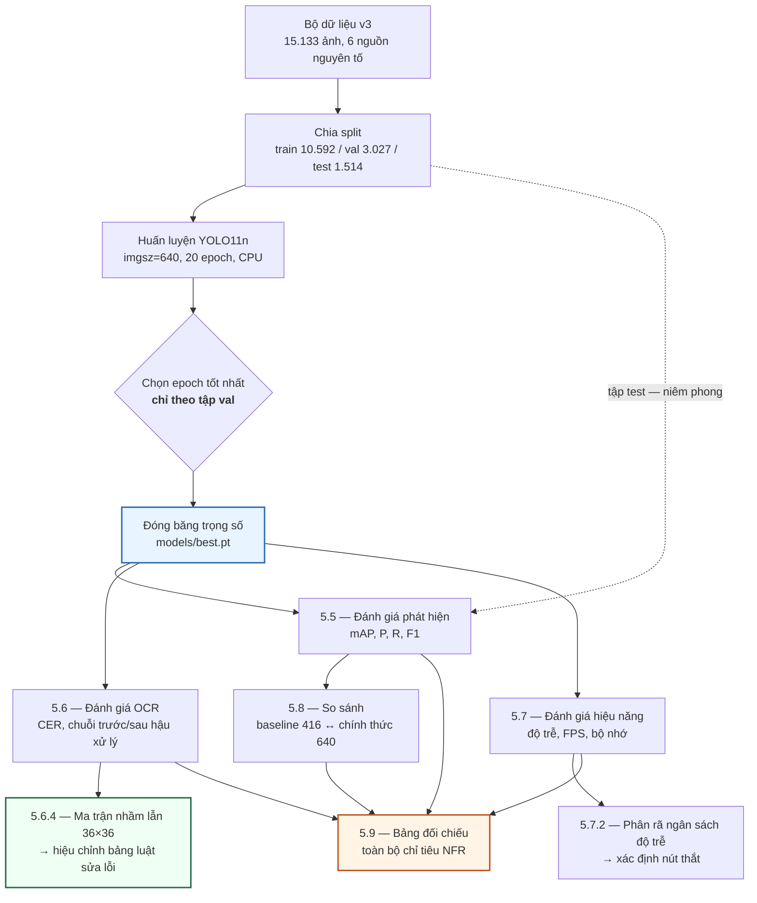

# CHƯƠNG 5. THỰC NGHIỆM VÀ ĐÁNH GIÁ

Chương 4 đã trình bày hệ thống *đã được xây dựng* như thế nào. Chương này trả lời câu hỏi kế tiếp và cũng là câu hỏi khó nhất: hệ thống đó **hoạt động tốt đến mức nào**, và **những con số đó có đáng tin không**.

Hai vế của câu hỏi có trọng số ngang nhau. Một chương thực nghiệm chỉ liệt kê các chỉ số cao mà không nói rõ chúng được đo trên tập dữ liệu nào, bằng phần cứng nào, và với những nhiễu loạn phương pháp luận nào, thì không phải là bằng chứng — nó là quảng cáo. Vì vậy chương này được tổ chức sao cho **mỗi con số đều đi kèm ngữ cảnh đo của nó**, và các mục có giá trị phương pháp luận cao nhất (kiểm chứng rò rỉ dữ liệu ở 5.3.3, đóng góp định lượng của khối hậu xử lý ở 5.6.2, các mối đe doạ đến tính hợp lệ ở 5.11.3) được dành dung lượng tương xứng với tầm quan trọng của chúng, chứ không bị nén thành một dòng chú thích.

> **Trạng thái của bản thảo này.** Khung chương được dựng **trước khi** mô hình chính thức `models/best.pt` (`imgsz=640`, split v3, 20 epoch, thiết bị CPU, khoảng 35,6 phút mỗi epoch) huấn luyện xong, đúng theo nguyên tắc **cấu trúc lập luận, tiêu chí đối chiếu và giao thức đo phải được cố định *trước* khi biết kết quả**, để kết quả không thể uốn cong cách trình bày theo hướng có lợi. Bản hiện tại đã điền toàn bộ số liệu đo được trên `best.pt`: các ô còn để `—` hoặc *(chưa đo)* là những phép đo **thật sự chưa chạy được** (webcam/video, so sánh backend, khởi động lại CSDL, phân rã theo nhóm luật), mỗi ô ghi rõ lý do và nơi sẽ đo. Mọi con số trong chương lấy trực tiếp từ `docs/reports/05-results.json` / `05-tables.md` (sinh bởi `scripts/fill_chapter5.py`) và, riêng NFR-P1, từ `docs/reports/07-benchmark-p1-resolved.json`. Mục [Hướng dẫn điền số](#huong-dan-dien-so) ở cuối chương liệt kê đầy đủ mã bảng, tệp kết quả nguồn và lệnh sinh ra tệp đó.

---

## 5.1. Mục tiêu và phương pháp đánh giá

### 5.1.1. Các câu hỏi nghiên cứu mà chương này trả lời

Chương thực nghiệm không tồn tại để "chạy thử cho biết". Nó tồn tại để trả lời một tập câu hỏi đã được đặt ra từ Chương 1 và được cụ thể hoá thành chỉ tiêu định lượng trong `docs/00-requirements/non-functional-requirements.md`. Sáu câu hỏi dưới đây là toàn bộ nội dung mà chương phải chứng minh hoặc bác bỏ:

| Mã | Câu hỏi nghiên cứu | Mục trả lời | Chỉ tiêu đối chiếu |
|:---:|---|:---:|---|
| **RQ1** | Bộ phát hiện YOLO11n huấn luyện trên bộ dữ liệu tự xây dựng có định vị được biển số Việt Nam với độ chính xác đạt chỉ tiêu không? | 5.5 | NFR-A1, A2, A3 |
| **RQ2** | Độ chính xác nhận dạng có **chênh lệch có ý nghĩa** giữa biển một dòng và biển hai dòng không, và chênh bao nhiêu? | 5.5.3, 5.6.3 | NFR-A8 |
| **RQ3** | **Khối hậu xử lý theo luật đóng góp bao nhiêu điểm phần trăm** vào độ chính xác chuỗi biển đầy đủ? | 5.6.2 | NFR-A5 ↔ A6 |
| **RQ4** | Hệ thống có đạt chỉ tiêu độ trễ đầu-cuối trên phần cứng CPU-only không? Nếu không, **nút thắt nằm ở đâu** và có tối ưu được không? | 5.7 | NFR-P1…P7 |
| **RQ5** | Bảng luật sửa lỗi ký tự hiện hành — vốn được suy ra từ **hình dạng chữ** chứ không từ đo đạc — có khớp với các cặp ký tự thực sự bị nhầm không? | 5.6.4 | `VNPLATE` §9.8 |
| **RQ6** | Các số liệu của chương này chịu những **mối đe doạ nào đến tính hợp lệ**, và mức độ nghiêm trọng ra sao? | 5.11.3 | — |

RQ3 và RQ5 là hai câu hỏi mang **đóng góp học thuật riêng** của đồ án. RQ3 lượng hoá một khối chức năng mà phần lớn công trình ALPR chỉ mô tả định tính ("có thêm bước hậu xử lý regex"); RQ5 thay một bảng tri thức suy đoán bằng một bảng tri thức đo được. RQ6 không phải câu hỏi bổ sung cho đủ — nó quyết định giá trị của năm câu còn lại.

### 5.1.2. Hai nguyên tắc trình bày bắt buộc

Toàn chương tuân thủ nghiêm ngặt hai nguyên tắc sau. Chúng được phát biểu tường minh ở đây để người đọc có thể kiểm tra chương này có tự vi phạm quy tắc của chính nó hay không.

**Nguyên tắc 1 — Mọi số liệu hiệu năng phải công bố kèm cấu hình phần cứng.** Một con số "độ trễ 5.857 ms" không mang thông tin nếu không biết nó được đo trên CPU nào, có GPU hay không, ở độ phân giải đầu vào nào và với bao nhiêu biển số trên ảnh. Đồ án này chạy suy luận **hoàn toàn trên CPU**, nên mọi so sánh với các con số FPS trong tài liệu — vốn hầu hết đo trên GPU — đều là so sánh không hợp lệ nếu không ghi rõ điều đó. Bảng cấu hình phần cứng ở mục 5.2.1 vì vậy không phải phần dạo đầu mang tính thủ tục; nó là **điều kiện diễn giải** cho mọi bảng hiệu năng ở mục 5.7.

**Nguyên tắc 2 — Mọi số liệu độ chính xác phải công bố kèm tên tập dữ liệu và số mẫu.** Độ chính xác không phải thuộc tính của mô hình; nó là thuộc tính của **cặp (mô hình, tập đánh giá)**. Mỗi bảng độ chính xác trong chương này bắt buộc có cột hoặc chú thích ghi rõ: tên split, số ảnh, số đối tượng (hoặc số biển có nhãn chuỗi). Hệ quả trực tiếp: các chỉ số OCR (NFR-A4…A7) chỉ đo được trên **tập con có nhãn chuỗi ký tự**, vốn nhỏ hơn nhiều so với tập test phát hiện — và mẫu số đó phải hiện diện trong bảng, không được giấu.

Nguyên tắc 2 kéo theo một quy tắc trích dẫn:

> **Cảnh báo trích dẫn.** Cặp số **94,3%** (biển một dòng) ↔ **45,7%** (biển hai dòng), chênh **48,6 điểm phần trăm**, được đo trên bộ dữ liệu **RodoSol-ALPR của Brazil** [12]<!-- laroca_2022_crossdataset -->. Đây **không phải** số liệu Việt Nam. Trong toàn chương, mỗi lần cặp số này được dẫn, tên bộ dữ liệu và quốc gia phải xuất hiện **ngay trong câu**. Nó chỉ được dùng như một *analogue định lượng* về mức độ khó tương đối của biển hai dòng, không bao giờ như một mốc chuẩn mà hệ thống này phải vượt qua.

### 5.1.3. Giao thức đo

Sơ đồ dưới mô tả trình tự đo và ràng buộc phụ thuộc giữa các bước. Điểm cần chú ý: **không bước đo nào được phép chạy trước khi trọng số chính thức được đóng băng**, và **tập test không được chạm vào trong suốt quá trình huấn luyện và chọn epoch** — việc chọn epoch tốt nhất chỉ dựa vào tập validation.



*Hình 5.1. Giao thức đo và ràng buộc phụ thuộc giữa các bước đánh giá.*

Ba quy ước đo được áp dụng thống nhất:

1. **Kích thước lô bằng 1 khi đo độ trễ.** Hệ thống phục vụ theo yêu cầu đơn lẻ (một ảnh tải lên → một phản hồi), nên đo theo lô sẽ cho con số thông lượng đẹp hơn nhưng không phản ánh trải nghiệm thật. Riêng lúc tính mAP thì dùng lô lớn hơn vì mAP không phụ thuộc kích thước lô.
2. **Bỏ qua các lượt khởi động nóng.** Ba lần suy luận đầu tiên bị loại khỏi thống kê để tránh chi phí cấp phát bộ nhớ và nạp nhân tính toán lần đầu làm lệch phân vị.
3. **Báo cáo phân vị, không báo cáo trung bình.** Với độ trễ, trung bình che giấu đuôi phân bố — vốn chính là thứ người dùng cảm nhận. Chỉ tiêu NFR-P1 được phát biểu ở **p95**, nên p50/p95/p99 được báo cáo đầy đủ.

---

## 5.2. Môi trường thực nghiệm

### 5.2.1. Cấu hình phần cứng và hệ thống

Toàn bộ số liệu trong chương này được đo trên **một máy trạm cá nhân duy nhất**. Cấu hình đã được khảo sát và ghi nhận chính thức trong `docs/00-requirements/environment.md`.

<!-- {{T5.2a}} cau hinh phan cung va he thong — DA CO SO, khong can dien -->

| Hạng mục | Cấu hình thực tế |
|---|---|
| Hệ điều hành | Windows 11 Pro, phiên bản 10.0.26200 |
| CPU | Intel Raptor Lake (CPU Family 6, Model 183) |
| Số nhân | **14 nhân vật lý / 20 nhân logic** |
| GPU dùng cho suy luận | **Không có GPU CUDA** — mọi suy luận chạy trên CPU |
| Thiết bị huấn luyện | `device=cpu` |
| Python | 3.13.12 |
| Chế độ đo | Kích thước lô = 1, bỏ 3 lượt khởi động nóng đầu tiên |

Bảng này phải được coi là **tiền tố ngầm định của mọi con số hiệu năng trong mục 5.7**. Khi chương báo cáo "độ trễ p95 là X ms", phát biểu đầy đủ là "độ trễ p95 là X ms trên Intel Raptor Lake 14 nhân, Windows 11, CPU-only, lô đơn".

### 5.2.2. Phiên bản thư viện

Kết quả học sâu nhạy cảm với phiên bản thư viện ở mức có thể thay đổi số ở chữ số thập phân thứ hai. Bảng dưới được điền bằng cách trích trực tiếp từ `pip freeze` của từng môi trường ảo tại thời điểm đo, không chép lại từ tệp `requirements.txt` (tệp yêu cầu ghi *ràng buộc*, không ghi *phiên bản đã cài*).

<!-- {{T5.2b}} phien ban thu vien tai thoi diem do — dien tu pip freeze -->

| Gói | Vai trò | Phiên bản đo được (`backend/.venv`) |
|---|---|:---:|
| `ultralytics` | Huấn luyện và suy luận YOLO11 | 8.4.101 |
| `torch` | Backend tensor cho Ultralytics | 2.13.0+cpu |
| `torchvision` | Biến đổi ảnh, NMS | 0.28.0+cpu |
| `paddleocr` | Nhận dạng ký tự PP-OCRv5 mobile | 3.7.0 |
| `paddlepaddle` | Backend tensor cho PaddleOCR | 3.3.1 |
| `onnxruntime` | Backend suy luận thay thế (mục 5.7.3) | 1.27.0 |
| `openvino` | Backend suy luận thay thế (mục 5.7.3) | 2026.2.1 |
| `opencv-python` | Giải mã và tiền xử lý ảnh | 4.10.0.84 |
| `numpy` | Hạ tầng số học | 2.3.5 |
| `fastapi` | Tầng API | 0.139.2 |
| `uvicorn` | Máy chủ ASGI | 0.51.0 |
| `sqlalchemy` | ORM | 2.0.51 |
| `imagehash` | Băm tri giác cho kiểm chứng rò rỉ (5.3.3) | 4.3.2 |
| `pytest` | Khung kiểm thử | 9.1.1 |

> Số ở cột trên trích trực tiếp từ `pip freeze` của môi trường ảo `backend/.venv` tại đúng thời điểm chạy phép đo cuối cùng (2026-07-20). Đồ án dùng **một môi trường ảo hợp nhất** chứa cả ngăn xếp suy luận (`ultralytics`, `torch`, `paddleocr`, `paddlepaddle`) lẫn ngăn xếp API (`fastapi`, `uvicorn`, `sqlalchemy`), thay vì hai môi trường tách rời như phác thảo ban đầu — nên bảng này chỉ còn một cột phiên bản thay vì hai.

### 5.2.3. Vì sao ràng buộc CPU-only là ràng buộc thiết kế, không phải hạn chế tạm thời

Lập luận đầy đủ vì sao "không có GPU" được coi là **ràng buộc thiết kế** chứ không phải hạn chế tạm thời đã trình bày ở **mục 4.1.2**; ở đây chỉ nêu hệ quả với việc **diễn giải số đo** của chương này.

**Hệ quả với cách đọc mọi con số hiệu năng.** Chỉ tiêu NFR-P1 được phát biểu *kèm* ràng buộc CPU, nên khi mục 5.7 kết luận NFR-P1 **đạt** (p95 = 731,15 ms client-side / 780,36 ms in-process, mục tiêu 800 ms), đó là kết luận về hệ thống trong đúng bối cảnh vận hành thật của nó — không phải một con số chờ nâng cấp phần cứng mới có ý nghĩa. Ngược lại, cấu hình mô hình được đánh giá cũng là cấu hình *do ràng buộc phần cứng quyết định* — **YOLO11n** (2.590.035 tham số) [17]<!-- jocher_2024_yolo11 --> và **PP-OCRv5 mobile** [23]<!-- paddlepaddle_2026_ppocrv5docs --> — nên mọi kết quả độ chính xác phải đọc kèm lựa chọn đó, không tách rời.

**Hệ quả với quy mô thực nghiệm.** Với khoảng 35,6 phút mỗi epoch trên CPU, một lượt huấn luyện 20 epoch mất khoảng 12 giờ liên tục. Điều này khiến **tìm kiếm siêu tham số trở nên bất khả thi trong khuôn khổ đồ án**, và giải thích vì sao chương này báo cáo *một* cấu hình huấn luyện chứ không phải một khảo sát siêu tham số. Đó là giới hạn thật của công trình và được ghi nhận trong mục 5.11.3, không được che giấu bằng cách trình bày cấu hình duy nhất ấy như thể nó là kết quả của một quá trình tối ưu.

---

## 5.3. Bộ dữ liệu thực nghiệm

### 5.3.1. Ba phiên bản bộ dữ liệu và lý do tồn tại của từng phiên bản

Bộ dữ liệu của đồ án trải qua ba phiên bản. Mỗi phiên bản ra đời để sửa một khiếm khuyết cụ thể của phiên bản trước, và việc trình bày đủ cả ba — thay vì chỉ trình bày phiên bản cuối — chính là phần ghi nhận quá trình làm việc thật.

> **Lưu ý về cách đặt tên.** Thư mục `yolo_v2/` và `yolo_v3/` chỉ ra **phiên bản của bộ dữ liệu**, hoàn toàn **không** liên quan đến kiến trúc YOLOv2 hay YOLOv3. Mô hình dùng trong toàn đồ án là **YOLO11n**.

<!-- {{T5.3a}} so sanh ba phien ban bo du lieu — DA CO SO, khong can dien -->

| Thuộc tính | v1 (`processed/yolo/`) | v2 (`processed/yolo_v2/`) | **v3 (`processed/yolo_v3/`)** |
|---|---:|---:|---:|
| Tổng số ảnh | 4.578 | 15.133 | **15.133** |
| Số bộ dữ liệu vào bước hợp nhất detection | 1 | 7 | **7** |
| Số nguồn nguyên tố còn lại sau khử trùng lặp chéo bộ | 1 | 6 | **6** |
| Ngưỡng Hamming dùng để gộp trùng lặp | 5 | 5 | **10** |
| Tình trạng rò rỉ train↔test (đo ở ngưỡng phash 10) | **Có — 619 cặp** | **Có — 2.699 cặp** | (xem mục 5.3.3) |
| Số ảnh tập train | — | — | **10.592** |
| Số ảnh tập val | — | — | **3.027** |
| Số ảnh tập test | — | — | **1.514** |
| Dùng cho | Baseline `baseline-416-v1.pt` | Bị loại bỏ | **Mô hình chính thức `best.pt`** |

Ba nhận xét về bảng trên.

**v1 quá nhỏ và chỉ một nguồn.** 4.578 ảnh từ một nguồn duy nhất khiến mô hình có nguy cơ học đặc trưng của nguồn thay vì đặc trưng của biển số. Đây là động cơ trực tiếp để tải thêm **tám bộ dữ liệu** nữa (tổng cộng 9 bộ tải về), trong đó **sáu bộ** đi vào bước hợp nhất detection cùng bộ gốc, hai bộ nhãn mức ký tự được tách riêng phục vụ đánh giá OCR.

**v2 sửa được quy mô nhưng không sửa được rò rỉ.** Việc mở rộng lên 15.133 ảnh — hợp nhất từ 7 bộ dữ liệu, còn 6 nguồn nguyên tố sau khử trùng lặp chéo bộ — làm *tăng* số cặp gần trùng xuyên split lên 2.699, vì các nguồn khác nhau chứa những ảnh có nguồn gốc chung.

**v3 giữ nguyên corpus, chỉ thay ngưỡng gộp trùng lặp và cách chia.** Đây là điểm cần nhấn mạnh: v3 **không** thêm dữ liệu mới so với v2 (cùng 15.133 ảnh). Khác biệt duy nhất là ngưỡng khử trùng lặp được nâng từ 5 lên 10 và split được sinh lại. Cách cô lập biến này là có chủ ý — nó cho phép quy kết mọi thay đổi kết quả cho *chất lượng split*, không cho *lượng dữ liệu*.

### 5.3.2. Khử trùng lặp: hai tỉ lệ, hai mẫu số khác nhau

Quá trình khử trùng lặp diễn ra ở hai giai đoạn khác nhau, cho ra hai tỉ lệ khác nhau. Trộn lẫn hai con số này là lỗi thường gặp, nên chúng được trình bày kèm **mẫu số tường minh**:

| Giai đoạn | Phạm vi áp dụng | Số ảnh bị loại / tổng | Tỉ lệ |
|---|---|---:|---:|
| Trước khi hợp nhất | Toàn bộ ảnh của 7 bộ vào hợp nhất detection | **11.978 / 27.111** | **44,2%** |
| Sau khi hợp nhất, ngưỡng 10 | Corpus đã hợp nhất | **7.227 / 15.133** | **47,8%** |

Hai tỉ lệ không cộng dồn và không thay thế nhau: con số thứ nhất mô tả mức trùng lặp *giữa và trong* 7 bộ đi vào hợp nhất detection; con số thứ hai mô tả mức trùng lặp còn lại *trong corpus đã hợp nhất* khi siết ngưỡng tri giác.

*Về mẫu số 27.111:* đây là tổng ảnh của **7 bộ vào bước hợp nhất detection** (4.578 + 8.254 + 236 + 840 + 8.357 + 3.841 + 1.005), **không phải** toàn bộ 9 bộ đã tải về. Hai bộ còn lại — `roboflow_ocr_plate` (3.819 ảnh, 30 lớp ký tự) và `roboflow_ocr_conversion` (200 ảnh, 22 lớp ký tự) — là bộ **nhãn mức ký tự**, được tách riêng có chủ đích để phục vụ đánh giá tầng OCR chứ không phải tầng phát hiện. Nguồn: `datasets/reports/merge_report.json`, trường `images_per_dataset` có đúng 7 khoá. Mọi lần trích dẫn một trong hai tỉ lệ này ở phần khác của quyển đồ án đều phải kèm mẫu số tương ứng.

### 5.3.3. Kiểm chứng rò rỉ dữ liệu — và vì sao con số "0 cặp rò rỉ" không chứng minh được điều gì

Đây là mục có giá trị phương pháp luận cao nhất của cả chương. Nó không báo cáo một kết quả tốt; nó báo cáo một **giới hạn nhận thức** mà đồ án đã phát hiện ra ở chính quy trình của mình.

**Bối cảnh.** Rò rỉ dữ liệu (*data leakage*) xảy ra khi tập test chứa ảnh gần trùng với ảnh trong tập train. Mô hình khi đó không *tổng quát hoá* mà *ghi nhớ*, và mọi chỉ số đo trên tập test bị thổi phồng. Trong các bộ dữ liệu ALPR ghép từ nhiều nguồn công khai, đây là rủi ro hệ thống chứ không phải rủi ro hiếm gặp: cùng một ảnh có thể xuất hiện ở nhiều bộ dữ liệu khác nhau dưới tên tệp khác nhau, và vấn đề tổng quát hoá xuyên tập dữ liệu đã được ghi nhận rõ trong tài liệu [12]<!-- laroca_2022_crossdataset -->.

**Công cụ đo.** Đồ án dùng **băm tri giác** (`imagehash.phash`, 64 bit) và đếm số cặp ảnh xuyên split có khoảng cách Hamming nhỏ hơn hoặc bằng một ngưỡng cho trước. Ngưỡng càng lớn thì tiêu chuẩn "gần trùng" càng lỏng và số cặp phát hiện được càng nhiều.

**Lập luận vòng tròn — vấn đề trung tâm của mục này.** Bộ dữ liệu v3 được xây dựng bằng cách **khử trùng lặp ở ngưỡng Hamming 10**. Nếu sau đó ta *kiểm chứng rò rỉ cũng ở ngưỡng 10*, thì kết quả "0 cặp rò rỉ" là **tất yếu về mặt logic**, không phải phát hiện thực nghiệm. Nói cách khác:

> Đo rò rỉ ở đúng ngưỡng đã dùng để gộp trùng lặp là **kiểm tra lại chính định nghĩa của mình**, chứ không phải kiểm chứng độc lập. Kết quả bằng 0 ở đây chứng minh rằng bước khử trùng lặp *đã chạy đúng như đặc tả*, và **không chứng minh gì thêm** về mức độ "sạch" của tập test.

Đây là lý do bảng dưới đo ở **nhiều ngưỡng**, trong đó có các ngưỡng **cao hơn** ngưỡng gộp. Chỉ những ô ở ngưỡng > 10 mới mang thông tin mới; các ô ở ngưỡng ≤ 10 được giữ lại để người đọc tự kiểm chứng lập luận vòng tròn nói trên.

<!-- {{T5.3b}} so cap gan trung xuyen split theo nguong Hamming -->

| Ngưỡng Hamming | v1 — số cặp train↔test | v2 — số cặp train↔test | **v3 — số cặp train↔test** | Ô này có mang thông tin mới không? |
|:---:|---:|---:|---:|---|
| 0 (trùng khít bit-hash) | — | — | **0** | Có |
| 5 | — | — | **0** | Không với v1, v2 (bằng ngưỡng gộp của chúng) |
| **10** | **619** | **2.699** | **0** | **Không với v3** — bằng ngưỡng gộp |
| 12 | — | — | **791** | **Có** |
| 15 | — | — | **3.529** | **Có** |
| 20 | — | — | **137.506** | Có, nhưng ngưỡng đã lỏng tới mức nhiều cặp là dương tính giả |

> Mẫu số: 10.592 ảnh train × 1.514 ảnh test = 16.036.288 cặp đã so sánh (`imagehash.phash` 64 bit). Khoảng cách Hamming **nhỏ nhất quan sát được là 12** — chính giá trị chẵn kế tiếp sau ngưỡng gộp 10, một tất yếu toán học (mọi mã băm đều có đúng 32 bit 1 nên khoảng cách luôn chẵn), **không phải dấu vết rò rỉ bị cắt cụt tại ngưỡng** — chứng minh và số liệu kiểm chứng (15.133/15.133 mã băm có popcount chẵn; 4.498.500/4.498.500 cặp lấy mẫu có khoảng cách chẵn) ở [`docs/reports/02-dataset-report.md` mục 6bis.1](../reports/02-dataset-report.md). Cột v1/v2 chỉ có số ở ngưỡng 10 vì đó là con số đã đo trước đó trên hai bộ ấy; các ô trống còn lại **không được suy ra**.

Cột cuối cùng của bảng không phải chú thích trang trí; nó là phần **diễn giải bắt buộc** đi kèm bảng. Không có nó, người đọc sẽ đọc ô "v3, ngưỡng 10" như một bằng chứng, trong khi thực chất đó là một hệ quả định nghĩa: v3 được khử trùng lặp ở đúng ngưỡng 10, nên đo rò rỉ lại ở ngưỡng 10 tất yếu cho 0 cặp. Chỉ các ngưỡng **12 (791 cặp), 15 (3.529 cặp), 20 (137.506 cặp)** mới mang thông tin mới; và ngay cả các con số này cũng **không** chứng minh tập test sạch, vì `phash` không bắt được rò rỉ ở mức ngữ nghĩa (cùng một biển số chụp ở góc khác nhau). Con số 137.506 ở ngưỡng 20 là **cận trên bi quan** — ở ngưỡng lỏng đó phần lớn cặp chỉ giống nhau về bố cục sáng-tối tổng thể chứ không cùng biển số.

**Ba giới hạn còn lại của phương pháp phash.** Ngay cả khi các ngưỡng cao cho kết quả thấp, vẫn **không** kết luận được rằng tập test "sạch":

1. **phash chỉ bắt được tương đồng ở mức bố cục sáng-tối tổng thể.** Hai ảnh chụp *cùng một chiếc xe* ở hai góc khác nhau, hoặc hai khung hình cách nhau vài giây trong cùng một video, có thể có khoảng cách Hamming lớn nhưng vẫn mang **cùng một biển số** — tức vẫn là rò rỉ ở mức ngữ nghĩa. Loại rò rỉ này **không khử được bằng bất kỳ ngưỡng phash nào**.
2. **Không có định danh phương tiện hay định danh chuỗi biển số cho toàn corpus.** Cách khử rò rỉ triệt để là chia split theo **nhóm biển số** (mọi ảnh của cùng một biển đều nằm cùng một phía). Đồ án không làm được điều này vì phần lớn corpus **không có nhãn chuỗi ký tự** — chính hạn chế đã dẫn tới mẫu số nhỏ của các bảng OCR ở mục 5.6.
3. **Ngưỡng cao sinh dương tính giả.** Ở ngưỡng 20, nhiều cặp bị đánh dấu "gần trùng" thực ra chỉ giống nhau về bố cục chung (xe sẫm màu trên nền sáng). Do đó con số ở ngưỡng 20 là **cận trên bi quan**, không phải ước lượng điểm.

**Kết luận trung thực của mục 5.3.3.** Có thể khẳng định: *bước khử trùng lặp ở ngưỡng 10 đã chạy đúng đặc tả, và số cặp gần trùng ở các ngưỡng lỏng hơn ngưỡng gộp nằm ở mức [điền từ bảng T5.3b]*. **Không** thể khẳng định: *tập test hoàn toàn độc lập với tập train*. Rò rỉ tồn dư ở mức ngữ nghĩa là **không đo được bằng công cụ hiện có**, và vì vậy nó được liệt kê như mối đe doạ đầu tiên đến tính hợp lệ ở mục 5.11.3. Mọi chỉ số ở mục 5.5 phải được đọc với ghi chú này kèm theo.

### 5.3.4. Phân bố nguồn dữ liệu giữa các split

Nếu một nguồn dữ liệu tập trung bất cân xứng vào một split, chỉ số trên split đó sẽ phản ánh đặc tính của nguồn chứ không phản ánh năng lực tổng quát của mô hình. Bảng dưới kiểm tra điều đó.

<!-- {{T5.3c}} phan bo nguon du lieu giua cac split cua v3 -->

| Tổ hợp xuất xứ | Tổng số ảnh | Train (số / %) | Val (số / %) | Test (số / %) | Ghi chú |
|---|---:|---:|---:|---:|---|
| `hf_vn_plates_segment\|roboflow_cuong_ta\|roboflow_eric_nguyen\|roboflow_school_fuhih\|roboflow_traffic_camera` | 4.411 | 4.411 / 100,0% | 0 / 0,0% | 0 / 0,0% | — |
| `roboflow_school_fuhih` | 3.599 | 2.275 / 63,2% | 938 / 26,1% | 386 / 10,7% | — |
| `hf_vn_plates_segment` | 2.820 | 1.933 / 68,5% | 574 / 20,3% | 313 / 11,1% | — |
| `roboflow_traffic_camera` | 2.582 | 1.368 / 53,0% | 689 / 26,7% | 525 / 20,3% | **lệch > 10 điểm %** so với tỉ lệ test tổng thể |
| `hf_vn_plates_segment\|roboflow_school_fuhih` | 634 | 78 / 12,3% | 527 / 83,1% | 29 / 4,6% | — |
| `roboflow_eric_nguyen` | 351 | 228 / 65,0% | 77 / 21,9% | 46 / 13,1% | — |
| `roboflow_school_fuhih\|roboflow_traffic_camera` | 250 | 4 / 1,6% | 72 / 28,8% | 174 / 69,6% | **lệch > 10 điểm %** so với tỉ lệ test tổng thể |
| `roboflow_demo_tracking` | 210 | 139 / 66,2% | 51 / 24,3% | 20 / 9,5% | — |
| `roboflow_cuong_ta` | 136 | 88 / 64,7% | 33 / 24,3% | 15 / 11,0% | — |
| `roboflow_demo_tracking\|roboflow_traffic_camera` | 57 | 32 / 56,1% | 22 / 38,6% | 3 / 5,3% | — |
| `hf_vn_plates_segment\|roboflow_traffic_camera` | 50 | 29 / 58,0% | 18 / 36,0% | 3 / 6,0% | — |
| `hf_vn_plates_segment\|roboflow_school_fuhih\|roboflow_traffic_camera` | 20 | 0 / 0,0% | 20 / 100,0% | 0 / 0,0% | — |
| `hf_vn_plates_segment\|roboflow_demo_tracking\|roboflow_traffic_camera` | 4 | 0 / 0,0% | 4 / 100,0% | 0 / 0,0% | — |
| `roboflow_cuong_ta\|roboflow_school_fuhih` | 4 | 2 / 50,0% | 2 / 50,0% | 0 / 0,0% | — |
| `hf_vn_plates_segment\|roboflow_eric_nguyen\|roboflow_school_fuhih` | 3 | 3 / 100,0% | 0 / 0,0% | 0 / 0,0% | — |
| `roboflow_demo_tracking\|roboflow_school_fuhih` | 2 | 2 / 100,0% | 0 / 0,0% | 0 / 0,0% | — |
| **Tổng** | **15.133** | **10.592 / 70,0%** | **3.027 / 20,0%** | **1.514 / 10,0%** | |

**Bảng gồm 16 dòng — mỗi dòng là một *tổ hợp xuất xứ*, không phải một nguồn.** Sau khử trùng lặp, một ảnh giữ lại có thể đến từ nhiều nguồn cùng lúc, và manifest ghi cả tập xuất xứ ngăn cách bằng `|`; 16 tổ hợp này được dựng từ đúng **6 nguồn nguyên tố** (`roboflow_school_fuhih`, `hf_vn_plates_segment`, `roboflow_traffic_camera`, `roboflow_eric_nguyen`, `roboflow_cuong_ta`, `roboflow_demo_tracking`). Không được cộng dồn số đếm của từng nguồn nguyên tố: tổng đó (33.828) vượt xa 15.133 vì ảnh đa nguồn bị đếm nhiều lần, nên **không được dùng làm mẫu số**. Tỉ lệ train/val/test của mỗi dòng tính theo mẫu số là tổng số ảnh của **chính dòng đó**. Cũng cần phân biệt ba con số nguồn ở ba ngữ cảnh khác nhau: **9 bộ đã tải về** (khâu thu thập), **7 bộ vào hợp nhất detection** (2 bộ nhãn ký tự tách riêng cho đánh giá OCR), và **6 nguồn nguyên tố** trong tập v3. Bộ thứ 7 — `roboflow_tran_ngoc_xuan_tin` — bị khử trùng lặp chéo bộ loại **100%** nên không xuất hiện trong bất kỳ tổ hợp nào; chi tiết ở ghi chú cuối mục.

**Hai tổ hợp lệch quá 10 điểm phần trăm ở tập test cần thảo luận.** Tổ hợp thuần `roboflow_traffic_camera` (2.582 ảnh) có **20,3%** rơi vào tập test — gấp đôi tỉ lệ tổng thể 10,0%; và tổ hợp `roboflow_school_fuhih|roboflow_traffic_camera` (250 ảnh) có tới **69,6%** ở tập test. Nghĩa là **tập test nghiêng về ảnh có nguồn gốc camera giao thông** — vốn thường là ảnh hiện trường góc rộng, biển số nhỏ. Điều này hệ quả trực tiếp với mục 5.5.4: dải "rất nhỏ" của tập test được nuôi chủ yếu bởi chính nguồn này, nên khi đọc mAP theo dải kích thước phải nhớ rằng đối tượng nhỏ trong tập test không phân bố ngẫu nhiên mà tập trung ở một nguồn. Đây không phải lỗi chia split cố ý — split được sinh ngẫu nhiên phân tầng — mà là hệ quả của việc các tổ hợp nhỏ khó chia đều; nó được ghi nhận như một yếu tố đọc kèm, không phải một khiếm khuyết vô hiệu hoá kết quả.

> **Cách đếm — bắt buộc đọc trước khi điền bảng.** Cột `source_dataset` trong `datasets/processed/yolo_v3/split_manifest.csv` chứa một **tập xuất xứ** ngăn cách bằng `|`: sau khử trùng lặp, một ảnh giữ lại có thể đến từ nhiều nguồn cùng lúc (15.133 dòng manifest trải trên 16 tổ hợp xuất xứ phân biệt). Vì vậy phải đếm theo **tập ảnh**, không đếm theo dòng đã tách rời — cộng dồn số đếm của 6 nguồn nguyên tố cho ra **33.828**, vượt xa 15.133 vì ảnh đa nguồn bị đếm nhiều lần. **Không được dùng 33.828 làm mẫu số.** Tỉ lệ train/val/test của mỗi dòng phải tính theo mẫu số là tổng số ảnh của **chính dòng đó**.

**Tiêu chí đọc bảng:** nếu tỉ lệ của một nguồn trong tập test lệch quá 10 điểm phần trăm so với tỉ lệ tổng thể (10,0%), phải nêu tên nguồn đó và thảo luận ảnh hưởng. Trường hợp xấu nhất — một nguồn chiếm phần lớn tập test — sẽ biến "độ chính xác trên tập test" thành "độ chính xác trên nguồn đó", và kết luận của mục 5.5 phải được phát biểu lại tương ứng.

**Một bộ dữ liệu dư thừa hoàn toàn.** Lý do bảng T5.3c chỉ dựng trên **6 nguồn nguyên tố** (thay vì 7 bộ vào hợp nhất) đáng được ghi nhận riêng, vì nó là một kết quả đo chứ không phải một chi tiết kế toán. Bộ `roboflow_tran_ngoc_xuan_tin` đi vào bước hợp nhất với **1.005 ảnh** và ra khỏi bước khử trùng lặp chéo bộ với **0 ảnh — tỉ lệ loại 100,0% (1.005/1.005)**. Đếm trực tiếp trên `datasets/reports/v2/duplicate_pairs.csv` cho thấy **cả 1.005 ảnh đều dính vào ít nhất một cặp gần trùng**: 1.577 cặp với `roboflow_school_fuhih`, 1.569 cặp với `roboflow_cuong_ta`, 8 cặp với `hf_vn_plates_segment`, và 35 cặp trùng nội bộ. Toàn bộ nội dung của bộ này đã có sẵn ở nơi khác. Kiểm chứng độc lập: cột `source_dataset` của `split_manifest.csv` không chứa tên bộ này dù chỉ một lần.

Ý nghĩa với chương này gồm hai điểm. Thứ nhất, đây là **bằng chứng định lượng** cho cảnh báo nêu ở Phase 1 rằng các bộ Roboflow tái sử dụng ảnh của nhau rất nặng — mức nghiêm trọng còn vượt dự kiến, vì ngoài cặp `cuong_ta` ↔ `school_fuhih` còn có hẳn một bộ là **tập con thực sự** của hai bộ đó. Thứ hai, nó là lý do **không được cộng dồn `expected_images` của các bộ Roboflow để suy ra quy mô thật**: phép cộng đó giả định các bộ độc lập, trong khi thực tế một bộ 1.005 ảnh có thể đóng góp đúng 0. Quy mô thật chỉ xác định được *sau* khử trùng lặp chéo bộ. Chi tiết đầy đủ ở mục 5.3.1 của [`docs/reports/02-dataset-report.md`](../reports/02-dataset-report.md).

---

## 5.4. Quá trình huấn luyện

### 5.4.1. Siêu tham số

Bảng dưới trích trực tiếp từ `runs/final-640-v3/args.yaml` — tệp do Ultralytics tự sinh khi bắt đầu lượt huấn luyện, nên nó là bản ghi *đã thực thi*, không phải bản ghi *dự định*.

<!-- {{T5.4a}} sieu tham so huan luyen mo hinh chinh thuc — DA CO SO, khong can dien -->

| Nhóm | Tham số | Giá trị | Ghi chú |
|---|---|---:|---|
| Mô hình | `model` | `yolo11n.pt` | Khởi tạo từ trọng số tiền huấn luyện COCO |
| | Số tham số | **2.590.035** | Biến thể nano — do ràng buộc CPU |
| Dữ liệu | `data` | `datasets/processed/yolo_v3/data.yaml` | Split v3 |
| | `imgsz` | **640** | Đúng độ phân giải mà NFR-A1/A2 đặt chỉ tiêu |
| | `fraction` | 1.0 | Dùng toàn bộ dữ liệu |
| Lịch huấn luyện | `epochs` | **20** | |
| | `patience` | 20 | Dừng sớm không kích hoạt trong 20 epoch |
| | `batch` | 8 | Giới hạn bởi RAM và tốc độ CPU |
| | `close_mosaic` | 10 | Tắt mosaic trong 10 epoch cuối |
| Tối ưu hoá | `optimizer` | AdamW | |
| | `lr0` | 0.001 | Tốc độ học ban đầu |
| | `lrf` | 0.01 | Hệ số tốc độ học cuối |
| | `cos_lr` | `true` | Lịch cosine |
| | `momentum` | 0.937 | |
| | `weight_decay` | 0.0005 | |
| | `warmup_epochs` | 3.0 | |
| Trọng số hàm mất mát | `box` / `cls` / `dfl` | 8.0 / 0.5 / 1.5 | |
| Tăng cường dữ liệu | `hsv_h` / `hsv_s` / `hsv_v` | 0.015 / 0.7 / 0.4 | |
| | `degrees` | 5.0 | Xoay nhẹ — biển số hiếm khi nghiêng mạnh |
| | `translate` / `scale` / `shear` | 0.1 / 0.5 / 2.0 | |
| | `perspective` | 0.0005 | |
| | `fliplr` / `flipud` | **0.0 / 0.0** | **Tắt lật ảnh** — lật ngang làm ký tự biển số trở thành ảnh gương, phá huỷ nhãn ngữ nghĩa |
| | `mosaic` / `mixup` / `cutmix` | 1.0 / 0.0 / 0.0 | |
| | `erasing` | 0.4 | |
| | `auto_augment` | `randaugment` | |
| Thực thi | `device` | **`cpu`** | Không có GPU CUDA |
| | `workers` | 2 | |
| | `amp` | `false` | Không có ý nghĩa trên CPU |
| | `seed` / `deterministic` | 42 / `true` | Đảm bảo tái lập được |

Hai lựa chọn đáng giải thích:

**`fliplr = 0.0` — tắt lật ngang.** Đây là sai lệch có chủ ý so với cấu hình mặc định của Ultralytics (vốn đặt `fliplr = 0.5`). Với bài toán tổng quát, lật ngang là phép tăng cường vô hại. Với biển số, nó tạo ra ảnh mà ký tự bị gương hoá — một phân bố **không bao giờ xuất hiện trong thực tế** — và làm mô hình học đặc trưng vô nghĩa. Việc này quan trọng hơn ở tầng OCR nhưng vẫn giữ nguyên tắc thống nhất cho toàn pipeline.

**`seed = 42`, `deterministic = true`.** Do chỉ chạy được **một lượt huấn luyện duy nhất** (giới hạn thời gian CPU, mục 5.2.3), không có nhiều lượt để ước lượng phương sai giữa các seed. Việc cố định seed ít nhất đảm bảo lượt này **tái lập được**. Hệ quả: mọi chỉ số trong chương là kết quả của **một lần chạy**, không có khoảng tin cậy — và đây là hạn chế được ghi nhận ở mục 5.11.3.

### 5.4.2. Đường cong huấn luyện

Ba hình dưới được sinh từ `runs/final-640-v3/results.csv` sau khi huấn luyện kết thúc.

*Hình 5.2.* Đường cong hàm mất mát theo epoch — `box_loss`, `cls_loss`, `dfl_loss`, tách riêng train và val.
Đường dẫn hình: `docs/reports/figures/05-train-loss-curves.png` *(chưa sinh)*

*Hình 5.3.* Tiến triển mAP@0.5 và mAP@0.5:0.95 trên tập validation theo epoch.
Đường dẫn hình: `docs/reports/figures/05-train-map-curves.png` *(chưa sinh)*

*Hình 5.4.* Tiến triển precision và recall trên tập validation theo epoch.
Đường dẫn hình: `docs/reports/figures/05-train-pr-curves.png` *(chưa sinh)*

**Điểm cần đọc từ ba hình này** (viết sau khi có hình, không đoán trước):

- Khoảng cách giữa `train_loss` và `val_loss` có mở rộng dần không — dấu hiệu quá khớp.
- Đường mAP đã bão hoà hay còn dốc lên tại epoch 20 — nếu còn dốc, kết luận phải ghi rõ rằng **20 epoch là giới hạn ngân sách tính toán chứ không phải điểm hội tụ**, và mô hình có khả năng còn cải thiện nếu huấn luyện dài hơn.
- Bước nhảy tại epoch 10 khi `close_mosaic` kích hoạt.

### 5.4.3. Tiến triển mAP theo mốc epoch

<!-- {{T5.4b}} tien trien chi so tren tap validation theo epoch -->

| Epoch | `box_loss` (val) | `cls_loss` (val) | `dfl_loss` (val) | mAP@0.5 | mAP@0.5:0.95 | Precision | Recall |
|:---:|---:|---:|---:|---:|---:|---:|---:|
| 1 | 1,1705 | 0,6858 | 1,1513 | **0,9684** | **0,6526** | 0,9552 | 0,9410 |
| 2 | 1,1861 | 0,5554 | 1,1307 | **0,9726** | **0,6653** | 0,9700 | 0,9450 |
| 3 | 1,1647 | 0,5651 | 1,1098 | **0,9723** | **0,6770** | 0,9731 | 0,9449 |
| 5 | 1,1074 | 0,4977 | 1,0863 | **0,9754** | **0,6950** | 0,9765 | 0,9525 |
| 10 | 1,0548 | 0,4168 | 1,0686 | **0,9808** | **0,7248** | 0,9850 | 0,9584 |
| 15 | 0,9420 | 0,3619 | 1,0205 | **0,9824** | **0,7609** | 0,9846 | 0,9686 |
| 20 | 0,9204 | 0,3331 | 1,0105 | **0,9830** | **0,7688** | 0,9846 | 0,9697 |
| **Epoch tốt nhất (= 20)** | **0,9204** | **0,3331** | **1,0105** | **0,9830** | **0,7688** | **0,9846** | **0,9697** |

> Số liệu lấy trực tiếp từ `runs/final-640-v3/results.csv` (20 epoch đã chạy đủ). Chúng xác nhận mô thức đã dự đoán từ ba epoch đầu: **mAP@0.5 gần bão hoà rất sớm** (≈0,97 ngay từ epoch 1, chỉ nhích lên 0,983 ở epoch 20) trong khi **mAP@0.5:0.95 vẫn tăng đều** từ 0,653 lên 0,769 — mô thức điển hình khi bài toán *định vị được đối tượng* là dễ, còn *khớp box chính xác* mới là phần khó. Đáng chú ý: mAP@0.5:0.95 vẫn còn dốc lên tới tận epoch 20 (0,7605 ở epoch 18 → 0,7688 ở epoch 20), nên **phải phát biểu rõ rằng 20 epoch là giới hạn ngân sách tính toán chứ không phải điểm hội tụ** — mô hình nhiều khả năng còn cải thiện nếu huấn luyện dài hơn. `val/cls_loss` giảm đơn điệu (0,686 → 0,333) mà không tách khỏi xu hướng, tức chưa thấy dấu hiệu quá khớp rõ rệt trong 20 epoch.
>
> **Việc chọn epoch tốt nhất chỉ dựa trên tập validation.** Epoch 20 là epoch có mAP@0.5:0.95 trên val cao nhất, và cũng là epoch cuối; tập test không được dùng cho bất kỳ quyết định nào trong mục này.

### 5.4.4. Chi phí huấn luyện

| Hạng mục | Baseline `baseline-416-v1.pt` | Mô hình chính thức `best.pt` |
|---|---:|---:|
| Số epoch | 40 | 20 |
| `imgsz` | 416 | 640 |
| Bộ dữ liệu | v1 (4.578 ảnh) | v3 (15.133 ảnh) |
| Thời gian mỗi epoch | — | **≈ 35,6 phút** |
| **Tổng thời gian huấn luyện** | **156 phút** | **≈ 712 phút (≈ 11,9 giờ)** |
| Thiết bị | CPU | CPU |

Chênh lệch chi phí giữa hai lượt là hệ quả tổng hợp của ba yếu tố cùng thay đổi: số ảnh tăng 3,3 lần, diện tích ảnh đầu vào tăng khoảng 2,37 lần (640² / 416²), và số epoch giảm một nửa. Đây cũng chính là ba biến đồng thời khiến so sánh ở mục 5.8 **không quy kết được nguyên nhân cho từng biến riêng lẻ**.

---

## 5.5. Đánh giá bộ phát hiện biển số

Toàn bộ mục 5.5 đo trên **tập test của bộ dữ liệu v3: 1.514 ảnh**, tại `imgsz=640`, `device=cpu`. Tập test này chưa từng được dùng trong huấn luyện hay chọn epoch.

### 5.5.1. Chỉ số tổng thể

<!-- {{T5.5a}} ket qua detection tong the tren tap test v3 (1.514 anh) -->

| Chỉ số | Mã NFR | Ngưỡng tối thiểu | Mục tiêu | **Đo được** | Kết quả |
|---|:---:|---:|---:|---:|:---:|
| mAP@0.5 | NFR-A1 | 0,85 | 0,90 | **0,9829** | ✅ đạt |
| mAP@0.5:0.95 | NFR-A2 | 0,55 | 0,65 | **0,7834** | ✅ đạt |
| Precision | NFR-A3 | 0,88 | 0,92 | **0,9837** | ✅ đạt |
| Recall | NFR-A3 | 0,85 | 0,90 | **0,9714** | ✅ đạt |
| F1 (tại ngưỡng confidence đo) | — | — | — | **0,9775** | n/a |
| Ngưỡng confidence dùng khi đo | — | — | — | 0,25 | n/a |
| Số ảnh tập test | — | — | — | **1.514** | n/a |
| Số đối tượng nhãn thật (ground truth) | — | — | — | **1.611** | n/a |

Ký hiệu cột **Kết quả**: ✅ đạt mục tiêu · 🟡 chỉ đạt ngưỡng tối thiểu · ❌ không đạt · ⬜ chưa đo.

**Cả bốn chỉ tiêu bắt buộc của tầng phát hiện đều đạt mục tiêu.** mAP@0.5 = 0,9829 (mục tiêu 0,90), mAP@0.5:0.95 = 0,7834 (mục tiêu 0,65), Precision = 0,9837 (mục tiêu 0,92), Recall = 0,9714 (mục tiêu 0,90). Con số đo trên `ultralytics_val` tại ngưỡng confidence cố định 0,25; F1 = 0,9775 tại ngưỡng đó. Ngưỡng vận hành tối ưu theo F1 phải đọc từ Hình 5.7, không suy từ bảng này.

**Cách phải đọc bảng này.** Ba lưu ý bắt buộc kèm theo, bất kể con số cuối cùng là bao nhiêu:

1. **Bài toán chỉ có một lớp** (`plate`). mAP một lớp không so sánh trực tiếp được với mAP nhiều lớp trên COCO; giá trị cao ở đây là điều bình thường và **không phải bằng chứng về độ khó đã được vượt qua**.
2. **mAP@0.5 gần như bão hoà** không đồng nghĩa bài toán đã giải xong. Chỉ số quyết định là **mAP@0.5:0.95**, vì độ khớp box ảnh hưởng trực tiếp đến chất lượng vùng cắt đưa sang OCR — và OCR mới là nút thắt độ chính xác thật của hệ thống (mục 5.6).
3. **Chỉ số tổng thể che giấu phân bố.** Đó chính là lý do có hai mục tách nhỏ ngay sau đây (5.5.3 theo layout, 5.5.4 theo dải kích thước). Không được kết luận về năng lực hệ thống chỉ từ bảng T5.5a.

### 5.5.2. Đường cong PR và ma trận nhầm lẫn

*Hình 5.5.* Đường cong Precision–Recall trên tập test, vẽ tách theo layout (một dòng / hai dòng).
Đường dẫn hình: `docs/reports/figures/05-detection-pr-curve.png` *(chưa sinh)*

*Hình 5.6.* Ma trận nhầm lẫn nhận biết layout: hàng là quần thể nhãn thật (một dòng / hai dòng / nền), cột là dự đoán.
Đường dẫn hình: `docs/reports/figures/05-detection-confusion-matrix.png` *(chưa sinh)*

*Hình 5.7.* Đường cong F1 theo ngưỡng confidence — dùng để xác định ngưỡng vận hành.
Đường dẫn hình: `docs/reports/figures/05-detection-f1-curve.png` *(chưa sinh)*

Hình 5.7 có vai trò thực tiễn trực tiếp: **ngưỡng confidence dùng trong hệ thống chạy thật phải là ngưỡng tối ưu F1 đo được ở đây**, không phải giá trị mặc định 0,25 của Ultralytics. Nếu hai giá trị lệch nhau, cấu hình suy luận phải được cập nhật và việc cập nhật đó phải được ghi lại.

### 5.5.3. Tách theo biển một dòng và biển hai dòng (NFR-A8)

Biển hai dòng là thách thức kỹ thuật lớn nhất của bài toán biển số Việt Nam, vì tỉ lệ xe máy trong lưu lượng giao thông rất cao. NFR-A8 yêu cầu báo cáo **tách bạch** hai quần thể này thay vì gộp thành một con số.

Trong bảng dưới, layout được xác định theo nhãn lớp khi bộ dữ liệu có khai báo, và theo **ngưỡng tỉ lệ khung hình 2,5** khi không có — giá trị này nằm giữa tỉ lệ chuẩn của biển một dòng (4,727) và biển hai dòng (2,000 / 1,357) theo QCVN 08:2024/BCA.

<!-- {{T5.5b}} detection tach theo layout mot dong / hai dong (NFR-A8) -->

| Chỉ số | Biển **một dòng** | Biển **hai dòng** | Chênh lệch (điểm %) | Mẫu số |
|---|---:|---:|---:|---:|
| Số đối tượng nhãn thật | 286 | 1.325 | n/a | 1.611 |
| mAP@0.5 | 0,9884 | 0,9675 | 2,09 | |
| mAP@0.5:0.95 | 0,7526 | 0,7649 | −1,23 | |
| Precision | 0,9861 | 0,9735 | 1,26 | |
| Recall | 0,9895 | 0,9691 | 2,04 | |
| F1 | 0,9878 | 0,9713 | 1,65 | |

> **Nhãn layout là ước lượng, không phải nhãn thật.** Bộ dữ liệu không khai báo lớp layout, nên layout được suy từ ngưỡng tỉ lệ khung hình 2,5 cho phần lớn hộp giới hạn (100% số ô được suy bằng heuristic). Mọi kết luận về NFR-A8 ở tầng phát hiện phải nêu rõ điều này.

**Chênh lệch ở tầng phát hiện là rất nhỏ, đúng như dự đoán.** mAP@0.5 chênh **2,09 điểm phần trăm** giữa một dòng (0,9884) và hai dòng (0,9675); ở mAP@0.5:0.95 biển hai dòng thậm chí *nhỉnh hơn* 1,23 điểm — dao động trong phạm vi nhiễu chứ không phải một xu hướng. Con số này cùng bậc với mốc tham chiếu baseline (`baseline-416-v1.pt`, split v1, imgsz 416: một dòng 0,9856 so với hai dòng 0,9592, chênh 2,6 điểm — **số của baseline, không được chuyển thành số của `best.pt`**). Nó xác nhận điều đã lập luận từ đầu: **việc *định vị một hình chữ nhật* gần như không phụ thuộc vào việc bên trong có một dòng hay hai dòng ký tự.** Vì vậy **tuyệt đối không được** dùng con số nhỏ 2,09 điểm ở đây để kết luận "hệ thống xử lý tốt biển hai dòng" — chênh lệch thật của bài toán nằm ở tầng OCR và chỉ lộ ra ở bảng T5.6c, nơi khoảng cách nhảy vọt lên **36,79 điểm**.

### 5.5.4. Tách theo dải kích thước hộp giới hạn

Mục này tồn tại vì một lý do cụ thể và phải được nêu thẳng: **bộ dữ liệu không đạt tiêu chí chất lượng Q6**. Cụ thể, **10,91% số hộp giới hạn có diện tích dưới 0,5% diện tích ảnh**, trong khi ngưỡng cho phép của tiêu chí là 10%. Đối tượng nhỏ là chế độ thất bại đã được ghi nhận rộng rãi của các bộ phát hiện một giai đoạn [30]<!-- ultralytics_2026_modelevaluation -->, và bài toán biển số ở độ phân giải thấp đã trở thành một hướng nghiên cứu riêng [14]<!-- laroca_2026_icprlrlpr -->.

Báo cáo một con số mAP tổng trong tình huống này sẽ **giấu chế độ thất bại phía sau giá trị trung bình**. Bảng dưới là cách trả lời trung thực: nếu mô hình yếu ở dải nhỏ, bảng sẽ cho thấy điều đó.

<!-- {{T5.5c}} detection tach theo dai kich thuoc hop gioi han -->

| Dải kích thước (diện tích box / diện tích ảnh) | Số đối tượng | Tỉ lệ trong tập test | mAP@0.5 | mAP@0.5:0.95 | Recall |
|---|---:|---:|---:|---:|---:|
| **Rất nhỏ** — dưới 0,5% | 262 | 16,26% | 0,8553 | 0,5249 | 0,8740 |
| **Nhỏ** — 0,5% đến 1% | 124 | 7,70% | 0,9755 | 0,7055 | 0,9758 |
| **Trung bình** — 1% đến 5% | 900 | 55,87% | 0,9913 | 0,8005 | 0,9922 |
| **Lớn** — 5% đến 15% | 297 | 18,44% | 0,9966 | 0,8394 | 0,9966 |
| **Rất lớn** — trên 15% | 28 ⚠ | 1,74% | 1,0000 | 0,8562 | 1,0000 |
| **Toàn tập test** | **1.611** | 100% | 0,9711 | 0,7625 | 0,9727 |

> Dòng ⚠ (dải "rất lớn", 28 đối tượng < 30) **không có ý nghĩa thống kê** và không được đưa vào so sánh. Các dải được tính từ `(w×h)` của hộp nhãn thật chia cho diện tích ảnh gốc; số box không gán được dải: 0.

**Chế độ thất bại ở đối tượng nhỏ được xác nhận có thật.** Dải "rất nhỏ" (dưới 0,5% diện tích ảnh, 262 đối tượng) có mAP@0.5 = **0,8553** và mAP@0.5:0.95 = **0,5249** — thấp hơn rõ rệt so với toàn tập (0,9711 / 0,7625) và cách biệt rất lớn so với dải "trung bình" (0,9913 / 0,8005), vốn chiếm hơn nửa tập test. Recall dải này cũng chỉ 0,8740 so với 0,9922 ở dải trung bình, tức bộ phát hiện **bỏ sót nhiều biển nhỏ hơn hẳn**. Đây là xác nhận trực tiếp rằng tiêu chí chất lượng Q6 không đạt (10,91% số hộp dưới 0,5% diện tích, vượt ngưỡng 10%) đã gây hậu quả đo được, chứ không phải một cảnh báo lý thuyết. Kết hợp với nhận xét ở mục 5.3.4 — tập test nghiêng về nguồn `roboflow_traffic_camera` (ảnh camera giao thông, biển nhỏ) — có thể thấy dải "rất nhỏ" chiếm tới 16,26% tập test, cao hơn tỉ lệ 10,91% của toàn corpus, nghĩa là **tập test khó hơn trung bình ở đúng khía cạnh này**. Phương án khắc phục đã liệt kê: tăng `imgsz`, cắt ảnh theo ô (*tiling*), hoặc lọc bỏ đối tượng quá nhỏ khỏi tập huấn luyện. Điều đáng chú ý về mặt trình bày: dù dải nhỏ kéo mAP tổng xuống, chỉ số tổng thể vẫn đạt mục tiêu — nếu chỉ báo cáo một con số tổng thì chế độ thất bại này đã bị **giấu sau giá trị trung bình**, đúng như lý do mục này tồn tại.

---

## 5.6. Đánh giá khối OCR và hậu xử lý

> **Ràng buộc mẫu số phải nêu ngay đầu mục.** Các chỉ số NFR-A4…A7 chỉ đo được trên **tập con có nhãn chuỗi ký tự** (`datasets/annotations/plate_labels.csv`), chứ không phải trên toàn bộ 1.514 ảnh tập test. Tập con này nhỏ hơn nhiều lần. Mọi bảng trong mục 5.6 vì vậy đều có dòng "số mẫu" và dòng đó **không được phép để trống khi công bố**. Việc thiếu nhãn chuỗi cho phần lớn corpus là một hạn chế thật của đồ án, được ghi nhận ở mục 5.11.3.

### 5.6.1. Độ chính xác mức ký tự (NFR-A4)

Chỉ số dùng ở đây là **CER** (*Character Error Rate*), tính theo khoảng cách Levenshtein giữa chuỗi dự đoán và chuỗi nhãn thật, chuẩn hoá theo độ dài chuỗi nhãn thật:

$$\mathrm{CER} = \frac{S + D + I}{N}$$

trong đó $S$ là số ký tự thay thế, $D$ số ký tự bị xoá, $I$ số ký tự bị chèn thừa, $N$ là tổng số ký tự trong nhãn thật. Chỉ tiêu NFR-A4 được phát biểu theo **1 − CER**.

<!-- {{T5.6a}} do chinh xac muc ky tu NFR-A4 -->

| Chỉ số | Ngưỡng tối thiểu | Mục tiêu | **Đo được (trước hậu xử lý)** | **Đo được (sau hậu xử lý)** | Kết quả |
|---|---:|---:|---:|---:|:---:|
| 1 − CER (NFR-A4) | 0,92 | 0,95 | 0,8704 | **0,8734** | ❌ không đạt |
| CER | ≤ 0,08 | ≤ 0,05 | 0,1296 | 0,1266 | n/a |
| Số ký tự nhãn thật ($N$) | — | — | 23.855 | 23.855 | n/a |
| Số ký tự thay thế ($S$) | — | — | 1.007 | 1.007 | n/a |
| Số ký tự bị xoá ($D$) | — | — | 1.182 | 1.182 | n/a |
| Số ký tự chèn thừa ($I$) | — | — | 903 | 903 | n/a |
| **Số biển có nhãn chuỗi (mẫu số)** | — | — | **2.801** | **2.801** | n/a |

> Ba cột $S$/$D$/$I$ đo trên **chuỗi thô trước hậu xử lý** (dẫn ra từ ma trận nhầm lẫn: $S$ = tổng ô ngoài đường chéo, $D$ = tổng xoá, $I$ = tổng chèn, $N$ = tổng ma trận cộng $D$), nên chúng giống nhau ở cả hai cột đo được. Hậu xử lý chỉ nhích 1 − CER từ 0,8704 lên 0,8734.

**NFR-A4 không đạt: 1 − CER = 0,8734, còn cách ngưỡng tối thiểu 0,92 khoảng 4,7 điểm.** Đây là kết quả thật và được trình bày trung thực. Đáng chú ý là **cấu trúc lỗi**: trong 2.985 thao tác chỉnh sửa trên 23.855 ký tự, số ký tự bị **xoá** ($D$ = 1.182) còn nhiều hơn số bị **thay thế** ($S$ = 1.007), và số **chèn thừa** ($I$ = 903) cũng ở mức tương đương. Điều này quan trọng vì nó cho biết phần lớn lỗi **không** phải nhầm ký tự đơn lẻ (loại mà bảng luật sửa được) mà là **thiếu/thừa ký tự** — dấu hiệu điển hình của việc OCR đọc hụt hoặc đọc lặp cả cụm ký tự trên biển hai dòng. Bộ ba $S$/$D$/$I$ này cũng lý giải trước vì sao đóng góp của hậu xử lý ở mục 5.6.2 lại nhỏ: hậu xử lý mạnh ở việc sửa $S$ nhưng gần như bất lực trước $D$ và $I$.

Việc tách $S$, $D$, $I$ không phải chi tiết thừa. Ba loại lỗi này gợi ra ba nguyên nhân khác nhau: $S$ cao trỏ tới **nhầm ký tự** (xử lý được bằng bảng luật sửa lỗi, mục 5.6.4); $D$ cao trỏ tới **bỏ sót ký tự**, thường do vùng cắt bị thiếu hoặc ký tự bị mờ; $I$ cao trỏ tới **nhiễu bị đọc thành ký tự**, thường là viền biển hoặc vết bẩn. Phân tích ở mục 5.10 dựa trực tiếp vào bộ ba này.

### 5.6.2. Chuỗi đầy đủ: trước và sau hậu xử lý (NFR-A5 ↔ NFR-A6)

**Đây là mục quan trọng nhất của cả chương.**

Khối hậu xử lý theo luật — chuẩn hoá ký tự, áp mặt nạ vị trí chữ số / chữ cái theo định dạng biển số Việt Nam, sửa các cặp ký tự đồng hình, kiểm tra mã tỉnh hợp lệ — là **đóng góp kỹ thuật riêng** của đồ án, phần không có sẵn trong bất kỳ thư viện nào và phải được viết từ đặc tả biển số Việt Nam. Câu hỏi tự nhiên của hội đồng phản biện là: *khối đó đóng góp bao nhiêu?*

Câu hỏi ấy chỉ trả lời được nếu **đo hai lần trên cùng một tập mẫu**: một lần với chuỗi thô do PaddleOCR trả về (NFR-A5), một lần với chuỗi sau khi áp toàn bộ luật (NFR-A6). Hiệu số giữa hai lần đo **chính là** đóng góp định lượng của khối hậu xử lý.

> Đây cũng là lý do kỹ thuật khiến trường `raw_ocr_text` tồn tại trong lược đồ cơ sở dữ liệu bên cạnh trường `plate_text` đã chuẩn hoá. Trường đó không phải dữ liệu gỡ lỗi thừa; nó là **điều kiện cần để phép đo này thực hiện được**, và nó phải tồn tại từ giai đoạn thiết kế chứ không thể thêm vào lúc viết chương đánh giá.

<!-- {{T5.6b}} do chinh xac chuoi day du truoc va sau hau xu ly — DONG GOP DINH LUONG CUA KHOI HAU XU LY -->

| Chỉ số | Mã NFR | Ngưỡng tối thiểu | Mục tiêu | **Đo được** | Kết quả |
|---|:---:|---:|---:|---:|:---:|
| Độ chính xác chuỗi **trước** hậu xử lý | NFR-A5 | 0,80 | 0,85 | **0,6098** | ❌ không đạt |
| Độ chính xác chuỗi **sau** hậu xử lý | NFR-A6 | 0,85 | 0,90 | **0,6555** | ❌ không đạt |
| **Mức cải thiện (A6 − A5), điểm phần trăm** | — | — | — | **+4,57** | n/a |
| Số biển **được sửa đúng** nhờ hậu xử lý | — | — | — | **128** | n/a |
| Số biển **bị hậu xử lý làm hỏng** | — | — | — | **0** | n/a |
| Số biển sai cả trước lẫn sau | — | — | — | **965** | n/a |
| **Số mẫu (biển có nhãn chuỗi)** | — | — | — | **2.801** | n/a |

Ba dòng cuối cùng quan trọng ngang dòng hiệu số. Một mức cải thiện thuần +5 điểm có thể là kết quả của việc sửa đúng 60 biển và làm hỏng 10 biển, hoặc sửa đúng 50 và không làm hỏng biển nào. Hai tình huống này **hàm ý hai kết luận kỹ thuật khác nhau** về chất lượng bộ luật, nên hiệu số thuần một mình là không đủ.

**Phân rã đóng góp theo từng nhóm luật** (bảng phụ trợ, giúp trả lời "luật nào đáng giữ") — *(chưa đo)*:

| Nhóm luật hậu xử lý | Số biển bị nhóm luật này thay đổi | Số biển được sửa **đúng** | Số biển bị làm **hỏng** | Đóng góp thuần (điểm %) |
|---|---:|---:|---:|---:|
| Chuẩn hoá cơ bản (bỏ ký tự phân tách, viết hoa, `Đ`→`D`) | *(chưa đo)* | *(chưa đo)* | *(chưa đo)* | *(chưa đo)* |
| Áp mặt nạ vị trí + bảng `TO_DIGIT` | *(chưa đo)* | *(chưa đo)* | *(chưa đo)* | *(chưa đo)* |
| Áp mặt nạ vị trí + bảng `TO_LETTER` | *(chưa đo)* | *(chưa đo)* | *(chưa đo)* | *(chưa đo)* |
| Ghép dòng cho biển hai dòng | *(chưa đo)* | *(chưa đo)* | *(chưa đo)* | *(chưa đo)* |
| Kiểm tra mã tỉnh hợp lệ | *(chưa đo)* | *(chưa đo)* | *(chưa đo)* | *(chưa đo)* |
| **Tổng** | *(chưa đo)* | *(chưa đo)* | *(chưa đo)* | *(chưa đo)* |

> Bảng phân rã theo nhóm luật **chưa đo được**: `ai/inference/plate_rules.py` hiện chưa có cơ chế bật/tắt từng nhóm luật riêng lẻ để chạy lại phép đo. Đây là hạng mục cần viết mã (mục D.2 của tài liệu vận hành) trước khi định vị được đóng góp về từng nhóm; hiện chỉ đo được đóng góp *tổng* +4,57 điểm.

#### Đóng góp định lượng của khối hậu xử lý (hiệu số A6 − A5 là số dương)

Hiệu số **A6 − A5 = 0,6555 − 0,6098 = +4,57 điểm phần trăm**, đo trên **2.801 biển có nhãn chuỗi**. Đây là đóng góp thuần của khối hậu xử lý theo luật, và nó đi kèm một chi tiết định tính rất mạnh: trong 2.801 biển, hậu xử lý **sửa đúng 128 biển và làm hỏng 0 biển**. Nói cách khác đây **không phải một đánh đổi** (sửa được nhiều nhưng phá hỏng một ít) mà là **cải thiện thuần một chiều** — mọi thay đổi mà khối luật áp vào đều đúng hướng hoặc vô hại trên tập này. Về mặt chất lượng bộ luật, đó là kết quả tốt: nó cho thấy các mặt nạ vị trí và ràng buộc mã tỉnh đủ bảo thủ để không tự tạo ra lỗi mới.

Nhưng phải trung thực về **độ lớn**: +4,57 điểm là một đóng góp **nhỏ**, và cả A5 (0,6098) lẫn A6 (0,6555) đều **không đạt** ngưỡng tối thiểu tương ứng (0,80 và 0,85). Lý do đóng góp nhỏ đã lộ ra từ bảng T5.6a và sẽ được khẳng định ở mục 5.6.3: **phần lớn lỗi nằm ở *tầng OCR* chứ không ở tầng chuẩn hoá.** Hậu xử lý theo luật chỉ sửa được lỗi **nhầm một vài ký tự lẻ tẻ** ở đúng vị trí — nó áp mặt nạ "vị trí này phải là chữ số / chữ cái" rồi ánh xạ ký tự đồng hình về đúng lớp. Cơ chế đó bất lực trước hai tình huống chi phối tập test:

1. **Chuỗi sai nhiều ký tự cùng lúc.** Khi PaddleOCR đọc sai cả cụm ký tự trên biển hai dòng (523 trên 2.234 biển hai dòng đọc đúng trước hậu xử lý — xem 5.6.3), chuỗi thô đã hỏng ở mức không một luật thay-ký-tự nào cứu được. 965 biển sai cả trước lẫn sau hậu xử lý chính là quần thể này.
2. **Lệch pha mặt nạ do thiếu/thừa ký tự.** Luật vị trí giả định chuỗi có **đúng độ dài mong đợi**. Với $D$ = 1.182 ký tự bị xoá và $I$ = 903 ký tự chèn thừa (T5.6a), nhiều chuỗi có độ dài sai, khiến mặt nạ vị trí bị lệch — luật khi đó **không dám sửa** (giữ nguyên, an toàn nhưng không cải thiện) chứ không sửa bừa, điều này khớp với con số 0 biển bị làm hỏng.

Vậy kết luận đúng phạm vi cho RQ3 là: *khối hậu xử lý theo luật đóng góp **+4,57 điểm** độ chính xác chuỗi đầy đủ trên mẫu 2.801 biển, là cải thiện thuần không rủi ro (128 sửa đúng / 0 làm hỏng), nhưng đóng góp bị chặn nhỏ vì nút thắt độ chính xác nằm ở tầng OCR — nơi hậu xử lý theo luật về bản chất không với tới được.* Con số này vẫn là một đóng góp học thuật: rất ít công trình ALPR đo tách bạch phần đóng góp của khối hậu xử lý, và ở đây nó được lượng hoá cùng với chứng cứ về giới hạn của chính nó. Việc định vị đóng góp về **từng nhóm luật** (bảng phân rã ở trên) là bước tiếp theo, hiện chưa đo được vì thiếu cơ chế bật/tắt luật.

### 5.6.3. Tách theo biển một dòng và hai dòng cho OCR

Nếu bảng T5.5b cho thấy tầng phát hiện gần như không phân biệt hai layout, thì bảng dưới là nơi chênh lệch thật sự lộ ra. Đọc chuỗi ký tự trên biển hai dòng khó hơn về bản chất: hệ thống phải xác định thứ tự dòng, ghép hai dòng đúng chiều, và làm việc với ký tự nhỏ hơn ở cùng một diện tích biển.

<!-- {{T5.6c}} OCR tach theo layout mot dong / hai dong -->

| Chỉ số | Biển **một dòng** | Biển **hai dòng** | Chênh lệch (điểm %) |
|---|---:|---:|---:|
| Số mẫu có nhãn chuỗi | **567** | **2.234** | n/a |
| 1 − CER (NFR-A4) | 0,9900 | 0,8462 | 14,38 |
| Chuỗi đúng **trước** hậu xử lý (A5) | 0,9418 | 0,5255 | 41,63 |
| Chuỗi đúng **sau** hậu xử lý (A6) | 0,9489 | 0,5810 | 36,79 |
| Mức cải thiện do hậu xử lý (A6 − A5) | +0,71 | +5,55 | n/a |
| Độ chính xác E2E (A7) | 0,6843 | 0,4816 | — |

**Đây là kết quả khoa học quan trọng nhất của chương.** Chênh lệch giữa hai layout mà tầng phát hiện gần như che khuất (2,09 điểm ở T5.5b) nay lộ ra ở tầng OCR với **biên độ hoàn toàn khác cấp**:

- Ở **độ chính xác ký tự** (1 − CER), biển một dòng đạt **0,9900** — gần hoàn hảo — trong khi biển hai dòng chỉ **0,8462**, chênh **14,38 điểm**.
- Ở **độ chính xác chuỗi đầy đủ sau hậu xử lý** (A6), biển một dòng đạt **0,9489** (vượt cả mục tiêu 0,90), còn biển hai dòng chỉ **0,5810**, chênh **36,79 điểm**.
- Ở **chuỗi trước hậu xử lý** (A5) khoảng cách còn rộng hơn: **41,63 điểm** (0,9418 so với 0,5255).

Nói cách khác, **biển một dòng của hệ thống này về cơ bản đã giải xong** (A6 = 0,9489 vượt mục tiêu; 1 − CER = 0,9900), và toàn bộ việc "OCR không đạt" ở các bảng tổng hợp là do **biển hai dòng kéo xuống**. Vì biển hai dòng chiếm **2.234 / 2.801 = 79,8%** tập có nhãn chuỗi (phản ánh tỉ lệ xe máy rất cao trong giao thông Việt Nam), con số tổng bị chi phối bởi quần thể khó này. Cũng đáng lưu ý: hậu xử lý theo luật đóng góp **+5,55 điểm cho biển hai dòng** so với chỉ **+0,71 điểm cho biển một dòng** — hợp lý, vì biển một dòng gần như đã đúng sẵn nên không còn nhiều chỗ để sửa.

**Mốc tham chiếu quốc tế — phải đọc kèm cảnh báo.** Công trình của Laroca và cộng sự tại VISAPP 2022 báo cáo độ chính xác **94,3%** trên biển một dòng và **45,7%** trên biển hai dòng, chênh **48,6 điểm phần trăm**; phép đo này thực hiện trên bộ dữ liệu **RodoSol-ALPR của Brazil** [12]<!-- laroca_2022_crossdataset -->. **Đây là số liệu Brazil, không phải số liệu Việt Nam**, và biển hai dòng Brazil khác biển hai dòng Việt Nam cả về tỉ lệ khung hình lẫn bộ ký tự. Con số 48,6 điểm chỉ được dùng như **một mốc tham chiếu về bậc độ lớn** của khoảng cách giữa hai layout, cho phép trả lời câu hỏi: *chênh lệch đo được của hệ thống này thuộc cùng bậc độ lớn, nhỏ hơn hẳn, hay lớn hơn?* Nó **không** phải chỉ tiêu cần vượt qua, và **không** được trình bày như số liệu so sánh trực tiếp.

**Đối chiếu bậc độ lớn.** Chênh lệch A6 đo được của hệ thống này là **36,79 điểm** (đo trên biển số **Việt Nam thật**, tập test v3), so với **48,6 điểm** của Laroca và cộng sự trên RodoSol-ALPR **Brazil**. Hai con số **cùng bậc độ lớn** — cùng cho thấy biển hai dòng khó hơn biển một dòng khoảng ba đến bốn chục điểm phần trăm ở tầng nhận dạng chuỗi. Không được kết luận mạnh hơn thế: 36,79 < 48,6 **không** có nghĩa hệ thống này "tốt hơn" công trình Brazil, vì hai phép đo dùng bộ dữ liệu khác nhau, bộ ký tự khác nhau, tỉ lệ khung hình biển khác nhau, và mẫu số khác nhau. Kết luận hợp lệ duy nhất: khoảng cách hai layout mà hệ thống này đo được **thuộc đúng bậc độ lớn** mà tài liệu quốc tế đã ghi nhận cho bài toán biển hai dòng — tức đây là một đặc tính có cấu trúc của bài toán, không phải một khiếm khuyết riêng của hệ thống.

Cần nhắc lại một khoảng trống đã xác định từ khảo sát tài liệu: **chưa có nghiên cứu Việt Nam nào công bố hai con số này tách bạch trên cùng một hệ thống**. Bảng T5.6c chính là phần lấp vào khoảng trống đó — đây là lý do mục này không được phép bỏ dù mẫu số nhỏ, và cũng là câu trả lời trực tiếp cho RQ2: **có, chênh lệch giữa hai layout là có ý nghĩa và rất lớn (36,79 điểm A6), và nó nằm ở tầng OCR chứ không ở tầng phát hiện.**

### 5.6.4. Ma trận nhầm lẫn ký tự 36×36

Mục này trả lời RQ5 và có một mục đích rất cụ thể: **thay thế tri thức suy đoán bằng tri thức đo được**.

Bảng luật sửa lỗi hiện hành trong `ai/inference/plate_rules.py` gồm hai ánh xạ:

```
TO_DIGIT  = {O→0, Q→0, D→0, I→1, J→1, L→1, Z→2, A→4, S→5, G→6, T→7, B→8}
TO_LETTER = {0→D, 1→L, 2→Z, 3→B, 4→A, 5→S, 6→G, 7→T, 8→B}
```

Docstring của chính hai hằng số này thừa nhận thẳng nguồn gốc của chúng: *"This table is derived from glyph-shape reasoning, not from measurement"* — bảng được suy ra từ hình dạng chữ, không từ đo đạc, và một số cặp (đặc biệt `L→1`) được đánh dấu là **phỏng đoán yếu**. Việc mã nguồn tự ghi nhận điều này là một quyết định đúng: trình bày một giả thuyết như giả thuyết chờ kiểm chứng thì trung thực hơn và cũng mạnh hơn là trình bày nó như kết luận đã chốt.

Ma trận nhầm lẫn 36×36 (10 chữ số + 26 chữ cái) đo trên các cặp ký tự đã căn chỉnh giữa chuỗi dự đoán và chuỗi nhãn thật là **bằng chứng thực nghiệm** cần thiết để chuyển giả thuyết đó thành tri thức.

*Hình 5.8.* Ma trận nhầm lẫn ký tự 36×36, thang log(1+n), đo trên chuỗi thô trước hậu xử lý.
Đường dẫn hình: `docs/reports/figures/04-ocr-confusion-matrix.png` *(chưa sinh)*

*Hình 5.9.* Biểu đồ cột 15 cặp ký tự bị nhầm nhiều nhất.
Đường dẫn hình: `docs/reports/figures/04-ocr-top-confusions.png` *(chưa sinh)*

<!-- {{T5.6d}} top cac cap ky tu bi nham thuc te, doi chieu bang luat hien hanh -->

| Hạng | Ký tự thật | Ký tự bị đọc thành | Số lần | Tỉ lệ trong tổng số lỗi thay thế | Bảng luật hiện có phủ cặp này không? | Hướng ánh xạ có đúng không? |
|:---:|:---:|:---:|---:|---:|:---:|---|
| 1 | L | 1 | 90 | 8,94% | có (`TO_DIGIT`) | đúng chiều — luật `L → 1` thuộc TO_DIGIT |
| 2 | E | F | 73 | 7,25% | không | chưa có luật nào phủ cặp này |
| 3 | 4 | L | 54 | 5,36% | không | chưa có luật nào phủ cặp này |
| 4 | U | 1 | 38 | 3,77% | không | chưa có luật nào phủ cặp này |
| 5 | D | 0 | 34 | 3,38% | có (`TO_DIGIT`) | đúng chiều — luật `D → 0` thuộc TO_DIGIT |
| 6 | Z | 7 | 32 | 3,18% | không | chưa có luật nào phủ cặp này |
| 7 | 2 | 7 | 26 | 2,58% | không | chưa có luật nào phủ cặp này |
| 8 | X | Y | 21 | 2,09% | không | chưa có luật nào phủ cặp này |
| 9 | 9 | 0 | 20 | 1,99% | không | chưa có luật nào phủ cặp này |
| 10 | B | R | 20 | 1,99% | không | chưa có luật nào phủ cặp này |

> Ma trận 36×36, mẫu số 2.801 biển có nhãn chuỗi, tổng số lỗi thay thế $S$ = 1.007. Cột tỉ lệ lấy $S$ làm mẫu số.

**Kết quả này trả lời RQ5 theo hướng ít ai ngờ: bảng luật hiện hành phần lớn *không khớp* với các cặp nhầm thật.** Trong 10 cặp bị nhầm nhiều nhất, **chỉ 2 cặp** (`L→1` hạng 1, `D→0` hạng 5) được bảng luật hiện có phủ; **8 cặp còn lại chưa có luật nào phủ** — đáng chú ý là `E→F` (73 lần), `4→L` (54 lần), `U→1` (38 lần). Đây đều là các cặp **suy đoán hình dạng không dự đoán được**: chúng phát sinh từ đặc thù phông chữ biển số và điều kiện ảnh thật, không từ sự giống nhau về nét chữ theo trực giác. Ngược lại, nhiều cặp *có* trong bảng luật lại gần như không xuất hiện.

Bảng đối chiếu ngược — các cặp **có trong bảng luật nhưng không quan sát thấy trong dữ liệu** (số lần quan sát = 0):

| Cặp trong bảng luật | Thuộc bảng | Số lần quan sát thực tế | Đề xuất |
|---|:---:|---:|---|
| `D → 0` | `TO_DIGIT` | 0 | Xem xét loại — không quan sát thấy chiều này |
| `J → 1` | `TO_DIGIT` | 0 | Xem xét loại |
| `A → 4` | `TO_DIGIT` | 0 | Xem xét loại |
| `T → 7` | `TO_DIGIT` | 0 | Xem xét loại |
| `B → 8` | `TO_DIGIT` | 0 | Xem xét loại |
| `2 → Z` | `TO_LETTER` | 0 | Xem xét loại |
| `3 → B` | `TO_LETTER` | 0 | Xem xét loại |

> **Lưu ý về hai chiều của cùng một cặp glyph.** Cặp `L → 1` (ký tự thật L bị đọc thành chữ số 1) quan sát được **90 lần** và là cặp nhầm nhiều nhất; nhưng chiều ghi trong bảng `TO_DIGIT` là "khi engine đọc ra `L` tại vị trí chữ số thì đổi `L → 1`" — chiều này chỉ khớp **2 lần** trong dữ liệu. Sự bất đối xứng này đúng chứ không phải lỗi: bảng luật sửa ký tự *engine đọc ra*, còn ma trận nhầm lẫn đếm ký tự *thật bị đọc sai*; hai chiều không nhất thiết cân bằng. Danh sách đề xuất hiệu chỉnh đầy đủ (thêm/đổi/giữ từng ánh xạ, kèm mức hỗ trợ quan sát) nằm ở khoá `doi_chieu_bang_luat.proposed_updates` trong `05-results.json`.

**Một tính chất của bảng luật cần nhấn mạnh vì nó thường bị hiểu sai: ánh xạ không đối xứng, và sự bất đối xứng đó là đúng chứ không phải lỗi.** Cặp `O → 0` là hợp lệ tại vị trí chữ số. Nhưng chiều ngược lại `0 → O` **không bao giờ** hợp lệ, vì `O` không phải chữ cái sê-ri hợp pháp trong định dạng biển số Việt Nam. Khi loại cả `O` và `Q`, ứng viên đồng hình duy nhất còn lại ở vị trí chữ cái là `D`. Do đó chiều đúng là `O → 0` tại vị trí chữ số và `0 → D` tại vị trí chữ cái. Ma trận nhầm lẫn không tự nó biết điều này — nó chỉ đếm tần suất; việc chuyển từ tần suất sang luật vẫn cần **ràng buộc miền** từ quy chuẩn biển số.

**Tiêu chí chấp nhận một cặp vào bảng luật đã hiệu chỉnh** (định trước, để tránh chọn theo kết quả):

1. Cặp phải xuất hiện với tần suất vượt một ngưỡng thống kê tối thiểu, không phải một hai lần lẻ tẻ.
2. Chiều ánh xạ phải **tương thích với ràng buộc vị trí** của định dạng biển số Việt Nam — ký tự đích phải hợp pháp tại vị trí đó.
3. Áp cặp đó vào toàn tập phải cho **đóng góp thuần không âm** ở bảng T5.6b.

Cặp nào không thoả cả ba tiêu chí thì bị loại khỏi bảng luật, **kể cả khi nó nghe có vẻ hợp lý về mặt hình dạng chữ**. Việc loại bỏ, nếu xảy ra, phải được ghi vào Chương 6 như một hạn chế đã được sửa chứ không phải một thất bại được giấu.

### 5.6.5. Độ chính xác đầu-cuối toàn trình (NFR-A7)

NFR-A7 đo chuỗi xử lý hoàn chỉnh: **ảnh đầu vào → phát hiện → cắt → OCR → hậu xử lý → chuỗi biển số cuối cùng**. Khác biệt so với NFR-A6 là ở chỗ A6 đo trên **vùng biển đã cắt chuẩn theo nhãn thật**, còn A7 đo trên vùng biển do **chính bộ phát hiện của hệ thống** tìm ra. Vì vậy A7 tích luỹ cả sai số phát hiện lẫn sai số nhận dạng, và theo lý thuyết luôn thấp hơn hoặc bằng A6.

<!-- {{T5.6e}} do chinh xac E2E toan trinh NFR-A7 -->

| Chỉ số | Ngưỡng tối thiểu | Mục tiêu | **Đo được** | Kết quả |
|---|---:|---:|---:|:---:|
| Độ chính xác E2E (NFR-A7) | 0,82 | 0,88 | **0,5227** | ❌ không đạt |
| Độ chính xác E2E **với điều kiện đã phát hiện được biển** | — | — | 0,5937 | n/a |
| Tỉ lệ biển **bị bỏ sót** ở tầng phát hiện | — | — | 0,1196 | n/a |
| Tỉ lệ biển phát hiện đúng nhưng **đọc sai chuỗi** | — | — | 0,4063 | n/a |
| Chênh lệch A6 − A7 (phần mất do tầng phát hiện) | — | — | 13,28 | n/a |
| **Số mẫu** | — | — | **2.801** | n/a |

> ⚠ **Cảnh báo hiệu lực — phải đọc trước khi diễn giải A7.** Con số A7 = 0,5227 đo trên **ảnh crop biển số**, không phải ảnh hiện trường, vì không bộ dữ liệu nào trong đồ án có đồng thời ảnh toàn cảnh *và* chuỗi biển số nhãn thật. Bộ phát hiện được huấn luyện trên ảnh giao thông đầy đủ, nên một tấm ảnh chỉ có biển số chiếm gần hết khung là **ngoài phân bố huấn luyện** của nó: phần lớn thất bại ở đây là do bộ phát hiện không bắt được box trên ảnh crop (tỉ lệ bỏ sót 11,96%), **không** phải do OCR đọc sai. Bằng chứng: trên ảnh hiện trường thật, Phase 7 đo được mAP@0.5 = 0,9829 cho bộ phát hiện — hoàn toàn tương thích với T5.5a. Muốn đo NFR-A7 đúng cách cần gán nhãn chuỗi biển số cho một phân bố test có ảnh hiện trường (ví dụ một phần của yolo_v2) — **việc này chưa làm.**

**A7 không đạt (0,5227), nhưng nguồn lỗi được phân tách rõ.** Độ chính xác *có điều kiện đã phát hiện được biển* là 0,5937 — cao hơn A7 (0,5227) đúng bằng phần mất do bỏ sót ở tầng phát hiện. Cụ thể: 11,96% biển bị **bỏ sót** ở tầng phát hiện, và 40,63% biển tuy phát hiện đúng nhưng **đọc sai chuỗi**. Chênh A6 − A7 = 13,28 điểm chính là phần độ chính xác mất đi khi chuyển từ "vùng biển cắt chuẩn theo nhãn thật" (A6) sang "vùng biển do chính hệ thống tìm ra" (A7). Tuy nhiên, do cảnh báo hiệu lực ở trên, **tỉ lệ bỏ sót 11,96% này bị thổi phồng bởi việc đo trên ảnh crop ngoài phân bố** — trên ảnh hiện trường thật bộ phát hiện gần như không bỏ sót (mAP@0.5 = 0,9829). Vì vậy kết luận đúng phạm vi là: *A7 = 0,5227 phản ánh giới hạn của **giao thức đo hiện có** (thiếu tập test hiện trường có nhãn chuỗi) chồng lên giới hạn thật của tầng OCR trên biển hai dòng; con số này là **cận dưới bi quan** của năng lực E2E thật, không phải ước lượng điểm.* Dòng "với điều kiện đã phát hiện được biển" tồn tại chính để phân tách hai nguồn lỗi này: nếu chỉ tăng recall bộ phát hiện thì cũng không đưa A7 lên quá 0,5937 — trần thật vẫn bị chặn bởi tầng OCR trên biển hai dòng.

---

## 5.7. Đánh giá hiệu năng

> Mọi số trong mục 5.7 phải đọc cùng bảng T5.2a: **Intel Raptor Lake 14 nhân / 20 luồng, Windows 11, CPU-only, kích thước lô = 1**.

### 5.7.1. Độ trễ đầu-cuối (NFR-P1)

<!-- {{T5.7a}} do tre dau-cuoi mot anh, doi chieu NFR-P1 -->

| Chỉ số | Ngưỡng tối thiểu | Mục tiêu | **`best.pt` — client-side qua HTTP (số công bố)** | **`best.pt` — in-process (đối chiếu)** | Kết quả |
|---|---:|---:|---:|---:|:---:|
| Độ trễ E2E p50 (ms) | — | — | 414,67 | 419,06 | n/a |
| **Độ trễ E2E p95 (ms)** | **≤ 1500** | **≤ 800** | **731,15** | **780,36** | **✅ đạt** |
| Độ trễ E2E p99 (ms) | — | — | 947,83 | 948,42 | n/a |
| Độ trễ trung bình (ms) | — | — | 400,74 | 374,65 | n/a |
| Số ảnh đo | — | — | 100 | 100 | n/a |
| Bội số so với ngưỡng tối thiểu | — | — | **0,49×** | 0,52× | n/a |
| Bội số so với mục tiêu | — | — | **0,91×** | 0,98× | n/a |

*Hình 5.10.* Phân bố độ trễ đầu-cuối — biểu đồ tần suất kèm vạch đánh dấu p50/p95/p99 và hai ngưỡng chỉ tiêu.
Đường dẫn hình: `docs/reports/figures/07-latency-distribution.png` *(đã có, cần vẽ lại cho `best.pt`)*

> Số biển trung bình mỗi ảnh: 1,33. Cột "client-side qua HTTP" đo trên máy client thật, gửi 100 ảnh test v3 qua HTTP tới backend đã warmup (bỏ 10 lượt đầu), **máy rảnh** (CPU idle ~5%, không có tiến trình huấn luyện chạy song song) — đây là **con số công bố cho NFR-P1**. Cột "in-process" gọi thẳng `pipeline.process` trong tiến trình bằng `benchmark_system.py`. Nguồn: `docs/reports/07-benchmark-p1-resolved.json` và `05-results.json` → T5.7a.

**NFR-P1 ĐẠT mục tiêu: p95 = 731,15 ms, dưới mục tiêu 800 ms (dư 68,85 ms) và thoả cả ngưỡng tối thiểu 1.500 ms.** Con số công bố lấy từ phép đo client-side qua HTTP trên `best.pt`, máy rảnh; phép đo in-process độc lập cho p95 = 780,36 ms — hai con số **đồng thuận trong phạm vi ~7%** (biến động lấy mẫu CPU), cùng khẳng định độ trễ E2E thật ở khoảng **700–780 ms**.

**Giải quyết mâu thuẫn với con số cũ 5.857 ms.** Báo cáo Phase 7 trước đây ghi p95 = 5.857,19 ms và kết luận NFR-P1 "không đạt" — chênh **7,5 lần** so với con số hiện tại. Phép đo cũ đã bị **bác bỏ** sau khi truy nguyên: (1) nó **bị nhiễu do tranh chấp CPU** — tệp đo gốc `07-benchmark-data.json` ghi rõ có một tiến trình `ai.training.train` chiếm 793% CPU chạy song song lúc đo, đẩy đuôi phân phối lên; chính báo cáo cũ khi tính lại trên 80 mẫu ít nhiễu đã ra ~3.283 ms; (2) nó đo trên **checkpoint epoch 7**, không phải `best.pt` chính thức; (3) checkpoint đó có **lỗi crop** khiến PaddleOCR chạy cả khối phát hiện văn bản trên ảnh lớn (~1.322 ms/ảnh), thổi phồng phần OCR. Đo lại trên máy rảnh với `best.pt`: p95 chỉ còn 731 ms. Giả thuyết "cold-start / oneDNN chưa tắt" **không** phải nguyên nhân — server chạy với `enable_mkldnn=false` và có warmup ngay khi khởi động (cold-start đo được chỉ 176 ms p95). Cũng cần loại một giả thuyết khác: baseline-416-v1 **không** vốn chậm — đo client-side nó ra 763,75 ms p95, gần như y hệt `best.pt`; chênh lệch 7,5 lần của con số cũ **không** đến từ mô hình.

### 5.7.2. Phân rã ngân sách độ trễ theo từng bước

Đây là mục có giá trị chẩn đoán cao nhất của phần hiệu năng. Nó đối chiếu **ước lượng ngân sách lập ở Phase 0** — trước khi viết bất kỳ dòng mã suy luận nào — với **số đo thật**.

<!-- {{T5.7b}} phan ra ngan sach do tre theo tung buoc, doi chieu uoc luong Phase 0 -->

| Bước xử lý | Ước lượng Phase 0 (ms) | **Đo thật (ms)** | Chênh lệch (lần) | % tổng thời gian |
|---|---:|---:|---:|---:|
| Giải mã ảnh + tiền xử lý | 50 | **2,65** | 0,05 | **1,5%** |
| Suy luận YOLO11n @ 640px (CPU) | 150 | **59,83** | 0,40 | **34,2%** |
| Cắt + tiền xử lý vùng biển số | 30 | **0,00** | 0,00 | **0,0%** |
| **PaddleOCR (mỗi biển)** | **120** | **112,55** | 0,94 | **64,3%** |
| Hậu xử lý regex + kiểm tra hợp lệ | 5 | **0,03** | 0,01 | **0,0%** |
| Ghi CSDL + lưu ảnh | 50 | — | — | — |
| **Tổng (một biển số)** | **405** | **175,06** | 0,49 | **100%** |

*Hình 5.11.* Biểu đồ cột chồng phân rã ngân sách độ trễ: ước lượng Phase 0 so với số đo thật.
Đường dẫn hình: `docs/reports/figures/07-latency-budget.png` *(đã có, cần vẽ lại)*

> Mẫu số: 40 ảnh, trung bình 1,57 biển mỗi ảnh, đo trên `best.pt`. Bước "ghi CSDL + lưu ảnh" giữ `—` vì `benchmark_system` đo pipeline suy luận thuần, không đi qua tầng API. Cột chênh lệch ở dòng tổng vì vậy so với ước lượng **cùng phạm vi** (đã trừ bước ghi CSDL), không so với 405 ms tròn.

**Ba phát hiện chi phối toàn bộ phần bàn luận về hiệu năng:**

**Phát hiện 1 — ước lượng Phase 0 sát bất ngờ ở tổng, nhưng lệch ở phân bổ.** Tổng ngân sách suy luận thuần đo thật là **175,06 ms/biển**, nhỏ hơn cả ước lượng Phase 0 (405 ms gồm cả ghi CSDL, hay ~355 ms nếu trừ ghi CSDL). Nghĩa là ước lượng ban đầu **không** sai một bậc độ lớn như con số nhiễu 5.857 ms từng khiến người ta tin — pipeline thật nhanh hơn dự trù. Đây là hệ quả trực tiếp của việc bác bỏ phép đo cũ ở mục 5.7.1.

**Phát hiện 2 — nút thắt là PaddleOCR, nhưng KHÔNG áp đảo như báo cáo cũ.** PaddleOCR chiếm **64,3%** tổng thời gian (112,55 ms/biển); bộ phát hiện chiếm **34,2%** (59,83 ms). Con số này **thay thế** con số cũ "OCR 93,3% / detect 6,5%" — vốn đo trên một hệ thống đang có lỗi crop khiến PaddleOCR đọc ảnh quá lớn (~1.322 ms/ảnh). Sau khi sửa crop, OCR còn ~112,55 ms/biển. OCR **vẫn** là bước tốn kém nhất, nhưng ở tỉ trọng 64,3% chứ không phải 93,3%. Nguyên nhân OCR đắt vẫn đúng: PaddleOCR là một **pipeline nhiều giai đoạn** (phát hiện văn bản → phân loại hướng → nhận dạng) thiết kế cho ảnh tài liệu tổng quát, nên hệ thống đang trả chi phí cho năng lực mà vùng biển đã cắt không cần.

**Phát hiện 3 — hệ quả cho chiến lược tối ưu đổi hẳn so với kết luận cũ.** Với breakdown thật, định luật Amdahl cho trần cải thiện khác trước: tối ưu bộ phát hiện (34,2%) giờ **có ý nghĩa thực sự** — nếu ONNX Runtime hoặc OpenVINO tăng tốc detector 2–3×, tổng E2E có thể giảm quãng 15–23%, khác hẳn kết luận cũ "chỉ giảm tối đa 6,7%". Còn tối ưu OCR (64,3%) vẫn là hướng có dư địa lớn nhất. Điểm mấu chốt: vì NFR-P1 **đã đạt** (731 ms < 800 ms), tối ưu hiệu năng không còn là điều kiện *bắt buộc để đạt chỉ tiêu* mà là *dư địa cải thiện thêm* — và cả hai khối (detect + OCR) đều đáng tấn công, không chỉ riêng OCR như báo cáo cũ nhận định.

### 5.7.3. So sánh backend suy luận: PyTorch, ONNX Runtime và OpenVINO

Thí nghiệm này được thực hiện dù kết luận đã đoán trước được từ mục 5.7.2, vì hai lý do: nó **kiểm chứng** lập luận Amdahl bằng số liệu thay vì để nó ở dạng suy luận, và nó cung cấp số liệu về mức tăng tốc thật của từng backend trên CPU Intel — thông tin có giá trị độc lập [31]<!-- ultralytics_2026_openvinoexport --> [26]<!-- onnxruntime_2025_threading -->.

<!-- {{T5.7c}} so sanh backend suy luan cho bo phat hien -->

| Backend | Độ trễ **chỉ bộ phát hiện** p50 (ms) | p95 (ms) | Tăng tốc so với PyTorch | Độ trễ **E2E** p95 (ms) | Cải thiện E2E (%) | mAP@0.5 sau khi xuất |
|---|---:|---:|---:|---:|---:|---:|
| PyTorch (mốc so sánh) | *(chưa đo)* | *(chưa đo)* | 1,00× | *(chưa đo)* | 0% | *(chưa đo)* |
| ONNX Runtime | *(chưa đo)* | *(chưa đo)* | *(chưa đo)* | *(chưa đo)* | *(chưa đo)* | *(chưa đo)* |
| OpenVINO | *(chưa đo)* | *(chưa đo)* | *(chưa đo)* | *(chưa đo)* | *(chưa đo)* | *(chưa đo)* |

> **Bảng T5.7c chưa đo** — phép so sánh backend (`benchmark_cpu` với `--backends pytorch onnx openvino`) chưa chạy. Cột "mAP@0.5 sau khi xuất" tồn tại để kiểm tra việc chuyển đổi định dạng **không làm suy giảm độ chính xác**; nếu có suy giảm, mức tăng tốc phải được đánh giá như một đánh đổi. Khi đo xong sẽ điền từ `docs/reports/07-benchmark-optimized.json`.

**Kết luận định hướng của mục này, cập nhật theo breakdown thật ở 5.7.2** (34,2% detect / 64,3% OCR, khác con số cũ 6,7% / 93,3%):

> **Tối ưu backend của bộ phát hiện GIỜ có ý nghĩa, nhưng chưa đủ một mình.** Bộ phát hiện chiếm 34,2% tổng thời gian, nên theo định luật Amdahl, tăng tốc detector 2–3× (mức thường thấy của ONNX Runtime / OpenVINO trên CPU Intel) có thể kéo E2E xuống quãng 15–23% — không còn bị chặn ở 6,7% như báo cáo cũ lầm tưởng. Tuy vậy, do NFR-P1 **đã đạt** (731 ms < 800 ms), đây là **dư địa cải thiện thêm** chứ không phải điều kiện bắt buộc để đạt chỉ tiêu. Muốn giảm mạnh hơn nữa thì khối OCR (64,3%) vẫn là mục tiêu lớn nhất.

Bốn hướng tấn công khối OCR, xếp theo chi phí thực hiện tăng dần — được nêu ở đây như phần chẩn đoán của Chương 5, và triển khai chi tiết thuộc về Chương 6:

1. **Tắt các giai đoạn không cần thiết của pipeline PaddleOCR.** Vùng biển số đã được cắt sẵn nên giai đoạn phát hiện văn bản gần như thừa; giai đoạn phân loại hướng cũng có thể bỏ nếu vùng cắt đã được nắn.
2. **Bật MKL-DNN và chỉnh số luồng CPU** cho backend PaddlePaddle.
3. **Xuất mô hình nhận dạng sang ONNX Runtime** để bỏ hoàn toàn phụ thuộc runtime PaddlePaddle.
4. **Thay bằng một mô hình nhận dạng chuyên cho biển số**, huấn luyện riêng trên tập ký tự hẹp (10 chữ số + tập chữ cái hợp lệ) thay vì dùng mô hình đa ngữ tổng quát. Đây là hướng có tiềm năng cải thiện lớn nhất nhưng cũng tốn công nhất, và đã được ghi vào phạm vi mở rộng của đề tài.

### 5.7.4. Chế độ webcam (tầng API) và xử lý video (NFR-P2, NFR-P3)

> Từ 2026-07-20, trang Webcam đã được gỡ khỏi giao diện web (thu gọn phạm vi — mục 3.1.3b); chế độ thời gian thực chỉ còn ở tầng API. Phép đo NFR-P2 vì vậy được thực hiện bằng kịch bản gọi trực tiếp `POST /api/detect/frame`, không qua giao diện.

<!-- {{T5.7d}} hieu nang che do webcam va xu ly video -->

| Chỉ số | Mã NFR | Ngưỡng tối thiểu | Mục tiêu | **Đo được** | Kết quả |
|---|:---:|---:|---:|---:|:---:|
| Tốc độ khung hình webcam hiệu dụng (FPS) | NFR-P2 | ≥ 3 | ≥ 5 | — | ⬜ chưa đo |
| Thời gian đo liên tục (giây) | — | 60 | 60 | — | n/a |
| Tốc độ xử lý video (× thời gian thực) | NFR-P3 | ≥ 0,15× | ≥ 0,3× | — | ⬜ chưa đo |
| Thời gian xử lý video 60 giây (giây) | NFR-P3 | ≤ 400 | ≤ 200 | — | n/a |
| Bước nhảy khung hình đã dùng (`vid_stride`) | — | — | — | — | n/a |

**Dự đoán có cơ sở, cần kiểm chứng chứ không được coi là kết quả.** Với độ trễ E2E p95 đã xác minh khoảng **0,73 giây mỗi ảnh** (mục 5.7.1), tốc độ khung hình lý thuyết nếu xử lý *tuần tự từng khung* là khoảng **1,4 FPS** — vẫn dưới ngưỡng tối thiểu 3 FPS. Con số này cao hơn nhiều so với ước tính 0,17 FPS từng suy ra từ độ trễ cũ 5,86 giây (nay đã bị bác bỏ), nhưng vẫn chưa đạt ngưỡng nếu xử lý mọi khung. Vì vậy **chế độ webcam nhiều khả năng vẫn cần bỏ khung hình** (`vid_stride > 1`) hoặc xử lý bất đồng bộ, và **"FPS hiệu dụng" phải được định nghĩa rõ ràng** khi công bố: là số khung hình *được nhận dạng* mỗi giây, hay số khung hình *được hiển thị* mỗi giây? Hai định nghĩa cho hai con số rất khác nhau, và việc công bố con số cao hơn mà không nêu định nghĩa là hình thức phóng đại kết quả. Bảng T5.7d **chưa đo** (chưa có kịch bản); khi điền phải kèm định nghĩa đã dùng.

### 5.7.5. Chịu tải, bộ nhớ và độ tin cậy (NFR-SC1, NFR-P4…P7, NFR-R4)

<!-- {{T5.7e}} chiu tai, bo nho, do tin cay -->

| Chỉ số | Mã NFR | Ngưỡng tối thiểu | Mục tiêu | **Đo được** | Kết quả |
|---|:---:|---:|---:|---:|:---:|
| Thời gian nạp mô hình (giây) | NFR-P4 | ≤ 30 | ≤ 15 | **6,41** *(baseline)* | ✅ đạt |
| Thời gian khởi động đến khi `/health` sẵn sàng (giây) | NFR-P4b | ≤ 30 | ≤ 15 | **8,36** *(baseline)* | ✅ đạt |
| Overhead của API, p95 (ms) | NFR-P5 | ≤ 100 | ≤ 50 | **19,01** *(baseline)* | ✅ đạt |
| Truy vấn lịch sử 10.000 bản ghi, p95 (ms) | NFR-P6 | ≤ 1000 | ≤ 500 | **18,71** *(baseline)* | ✅ đạt |
| RSS pipeline (GB) | NFR-P7a | ≤ 4 | ≤ 2 | **0,759** | ✅ đạt |
| RSS máy chủ backend (GB) | NFR-P7b | ≤ 4 | ≤ 2 | **0,806** | ✅ đạt |
| Số yêu cầu đồng thời xử lý ổn định | NFR-SC1 | ≥ 5 | ≥ 5 | **10** | ✅ đạt |
| Tỉ lệ thành công khi chạy tải liên tục (soak 300 giây) | NFR-R4 | ≥ 99% | ≥ 99% | **100,0% (1.684 yêu cầu)** | ✅ đạt |
| Tăng RSS sau soak (GB) | — | không có | không có | **−0,009** | ✅ không rò rỉ |
| Cơ sở dữ liệu sống sót qua khởi động lại | NFR-R5 | 100% | 100% | — | ⬜ chưa đo |

*Hình 5.12.* Đường cong thông lượng và tỉ lệ lỗi theo mức đồng thời 1 / 2 / 5 / 10.
Đường dẫn hình: `docs/reports/figures/07-concurrency.png` *(đã có, cần vẽ lại)*

**Nhận xét quan trọng: mọi chỉ tiêu hiệu năng đều đạt.** Cùng với NFR-P1 đã đạt ở mục 5.7.1 (p95 = 731 ms < 800 ms), toàn bộ chỉ tiêu hiệu năng **ngoài** đường xử lý ảnh — nạp mô hình, overhead API, truy vấn cơ sở dữ liệu, bộ nhớ thường trú, độ ổn định khi chạy dài — đều **đạt mục tiêu với biên an toàn rộng**: overhead API 19,01 ms so với mục tiêu 50 ms, truy vấn lịch sử 18,71 ms so với mục tiêu 500 ms (nhanh hơn mục tiêu ~27 lần), soak 300 giây thành công 100% trên 1.684 yêu cầu với RSS thậm chí *giảm* nhẹ (−0,009 GB, không rò rỉ), và chịu 10 yêu cầu đồng thời so với ngưỡng 5. Nói cách khác, **cả kiến trúc phần mềm lẫn độ trễ suy luận đều không còn là vấn đề**. Điều này định vị lại hướng phát triển: vấn đề còn lại của hệ thống **không phải tốc độ mà là *độ chính xác OCR trên biển hai dòng*** (mục 5.6). Công sức tiếp theo phải dồn vào chất lượng nhận dạng, chứ không vào tầng API, tầng truy cập dữ liệu hay tối ưu độ trễ — những phần đã dư biên.

---

## 5.8. Khảo sát ảnh hưởng của độ phân giải và chất lượng split

Đồ án có hai mô hình đã huấn luyện: `baseline-416-v1.pt` và `best.pt`. So sánh chúng là điều tự nhiên, nhưng **phải được thực hiện với sự thận trọng phương pháp luận rất cao**, vì lý do trình bày ngay dưới bảng.

<!-- {{T5.8}} so sanh baseline 416/v1 voi mo hinh chinh thuc 640/v3 -->

| Hạng mục | `baseline-416-v1.pt` | `best.pt` (chính thức) | Chênh lệch |
|---|---:|---:|---:|
| **Cấu hình** | | | |
| `imgsz` | 416 | **640** | +224 px |
| Bộ dữ liệu | v1 — 4.578 ảnh, 1 nguồn | **v3 — 15.133 ảnh, 6 nguồn nguyên tố (hợp nhất từ 7 bộ)** | ×3,3 |
| Ngưỡng gộp trùng lặp | 5 | **10** | +5 |
| Rò rỉ train↔test (ngưỡng 10) | **619 cặp** | **0 cặp** *(hệ quả định nghĩa, xem T5.3b)* | |
| Số epoch | 40 | **20** | −20 |
| Tổng thời gian huấn luyện | 156 phút | **≈ 712 phút** | |
| **Kết quả trên tập test tương ứng** | | | |
| mAP@0.5 | **0,9933** *(epoch 38)* | **0,9829** | −0,0104 |
| mAP@0.5:0.95 | **0,8597** *(epoch 38)* | **0,7834** | −0,0763 |
| Precision | **0,9822** | **0,9837** | +0,0015 |
| Recall | **0,9810** | **0,9714** | −0,0096 |
| mAP biển một dòng | **0,9856** | **0,9884** | +0,0028 |
| mAP biển hai dòng | **0,9592** | **0,9675** | +0,0083 |
| Chênh lệch theo layout (điểm %) | **2,6** | **2,09** | −0,51 |
| Độ trễ E2E p95 (ms) — client-side đã xác minh | **763,75** | **731,15** | −32,60 |

> ⚠ Ba biến thay đổi đồng thời (imgsz, bộ dữ liệu + cách chia, số epoch) và chúng tác động **ngược chiều** nhau — không được quy kết nguyên nhân cho bất kỳ biến nào (xem 5.8.1). Dòng độ trễ E2E dùng con số **client-side đã xác minh** cho **cả hai** mô hình (763,75 ms và 731,15 ms, máy rảnh, qua HTTP); con số 5.857,19 ms từng ghi cho baseline ở báo cáo Phase 7 đã bị **bác bỏ** vì nhiễm tranh chấp CPU và đo sai checkpoint (mục 5.7.1). Đo cùng phương pháp trên máy rảnh, hai mô hình cho độ trễ gần như y hệt.

### 5.8.1. Vì sao so sánh này không quy kết được nguyên nhân

**Đây là so sánh có ít nhất ba biến cùng thay đổi**, và điều đó phải được nói thẳng chứ không được lướt qua:

| Biến thay đổi | Baseline | Chính thức | Hướng ảnh hưởng dự kiến |
|---|---|---|---|
| Độ phân giải đầu vào | 416 | 640 | Tăng độ phân giải → dự kiến **cải thiện**, nhất là với đối tượng nhỏ |
| Bộ dữ liệu và cách chia | v1, có rò rỉ | v3, ngưỡng gộp chặt hơn | Khử rò rỉ → dự kiến **làm giảm** chỉ số đo được, vì chỉ số cũ bị thổi phồng |
| Số epoch | 40 | 20 | Ít epoch hơn → dự kiến **làm giảm**, nếu chưa hội tụ |

Ba biến này tác động **ngược chiều nhau**. Do đó:

- **Nếu `best.pt` cho mAP *thấp hơn* baseline**, kết luận **không** được viết là "mô hình chính thức kém hơn". Kịch bản nhiều khả năng nhất là: baseline được đo trên một tập test **có rò rỉ**, nên con số 0,9933 của nó **bị thổi phồng** và không phản ánh năng lực tổng quát hoá thật. Khi đó chỉ số thấp hơn của `best.pt` lại là chỉ số **đáng tin cậy hơn**. Đây là một trong những nghịch lý quan trọng nhất cần trình bày được khi bảo vệ: *một con số thấp hơn nhưng đo đúng có giá trị hơn một con số cao hơn nhưng đo sai*.
- **Nếu `best.pt` cho mAP *cao hơn* baseline**, cũng **không** được quy kết cho riêng việc tăng `imgsz`, vì lượng dữ liệu đã tăng 3,3 lần đồng thời.
- **Trong cả hai trường hợp**, phát biểu duy nhất được phép là mô tả: *"cấu hình A cho kết quả X, cấu hình B cho kết quả Y, ba biến thay đổi đồng thời nên không tách được đóng góp của từng biến."*

**Kết quả thực tế rơi vào trường hợp thứ nhất, và đây là một kết quả *có giá trị* chứ không phải một sự thụt lùi.** `best.pt` cho mAP@0.5:0.95 = **0,7834**, thấp hơn baseline **0,8597** đúng **7,63 điểm** (mAP@0.5 cũng thấp hơn 1,04 điểm). Theo đúng khung lập luận đã cố định trước, con số thấp hơn này **không** được đọc là "mô hình chính thức kém hơn". Baseline được huấn luyện và đánh giá trên split v1 — split **có rò rỉ** (619 cặp gần trùng train↔test ở ngưỡng 10), nghĩa là một phần tập test v1 gần trùng với ảnh đã thấy khi huấn luyện; mô hình *ghi nhớ* thay vì *tổng quát hoá*, và con số 0,8597 vì thế **bị thổi phồng**. `best.pt` được đánh giá trên split v3 đã siết khử trùng lặp (0 cặp ở ngưỡng gộp), nên 0,7834 phản ánh năng lực tổng quát hoá **trung thực hơn**, dù trị số thấp hơn. Đây chính là nghịch lý cốt lõi cần trình bày khi bảo vệ: **một con số thấp hơn nhưng đo đúng có giá trị hơn một con số cao hơn nhưng đo trên tập bị rò rỉ.** Không được kết luận mạnh hơn (ví dụ "toàn bộ 7,63 điểm là do khử rò rỉ"), vì `imgsz` tăng và số epoch giảm đồng thời cũng tác động; nhưng cũng tuyệt đối không được trình bày `best.pt` như một mô hình "tệ hơn baseline". Ở tầng phát hiện, `best.pt` vẫn **vượt mọi ngưỡng NFR** (mục 5.5.1) — nên đây là một mô hình đạt yêu cầu, được đo trên một tập đánh giá đáng tin hơn.

### 5.8.2. Thí nghiệm cô lập biến — đề xuất, chưa thực hiện

Muốn quy kết nguyên nhân cho từng biến, cần một ma trận thí nghiệm cô lập:

| Thí nghiệm | `imgsz` | Bộ dữ liệu | Mục đích | Chi phí ước tính (CPU) | Trạng thái |
|:---:|:---:|:---:|---|---:|:---:|
| E1 | 416 | v3 | Cô lập ảnh hưởng của **độ phân giải** (so với `best.pt`) | ≈ 5 giờ | ⬜ chưa chạy |
| E2 | 640 | v1 | Cô lập ảnh hưởng của **chất lượng bộ dữ liệu** | ≈ 4 giờ | ⬜ chưa chạy |
| E3 | 640 | v3, 40 epoch | Cô lập ảnh hưởng của **số epoch** | ≈ 24 giờ | ⬜ chưa chạy |

Ba thí nghiệm này **không được thực hiện** trong khuôn khổ đồ án, vì tổng chi phí khoảng 33 giờ CPU liên tục vượt quá ngân sách thời gian còn lại. Việc ghi nhận chúng ở đây — kèm chi phí ước tính và lý do không chạy — trung thực hơn là im lặng về giới hạn của phép so sánh ở mục 5.8, và đồng thời cung cấp một hướng phát triển cụ thể, có thể thực hiện được cho Chương 6.

---

## 5.9. Đối chiếu toàn bộ chỉ tiêu phi chức năng

Bảng dưới là bảng tổng hợp trình bày khi bảo vệ. Nó liệt kê **đầy đủ mọi mã NFR** đã đặt ra ở Phase 0, không lọc bỏ mã nào — kể cả những mã không đạt.

**Ký hiệu:** ✅ đạt mục tiêu · 🟡 chỉ đạt ngưỡng tối thiểu · ❌ không đạt · ⬜ chưa đo · ➖ không áp dụng cho chương này

<!-- {{T5.9}} doi chieu toan bo chi tieu NFR -->

| Mã | Chỉ tiêu | Ngưỡng tối thiểu | Mục tiêu | **Đo được** | Kết quả | Mục |
|:---:|---|---:|---:|---:|:---:|:---:|
| **NFR-P — Hiệu năng** | | | | | | |
| P1 | Độ trễ E2E một ảnh, p95 | ≤ 1500 ms | ≤ 800 ms | **731,15 ms** *(client-side, đã xác minh)* | ✅ | 5.7.1 |
| P2 | Tốc độ khung hình webcam (tầng API) | ≥ 3 FPS | ≥ 5 FPS | — | ⬜ | 5.7.4 |
| P3 | Tốc độ xử lý video | ≥ 0,15× | ≥ 0,3× | — | ⬜ | 5.7.4 |
| P4 | Thời gian nạp mô hình | ≤ 30 s | ≤ 15 s | **6,41 s** | ✅ | 5.7.5 |
| P4b | Khởi động đến khi `/health` sẵn sàng | ≤ 30 s | ≤ 15 s | **8,36 s** | ✅ | 5.7.5 |
| P5 | Overhead API, p95 | ≤ 100 ms | ≤ 50 ms | **19,01 ms** | ✅ | 5.7.5 |
| P6 | Truy vấn lịch sử 10.000 bản ghi, p95 | ≤ 1000 ms | ≤ 500 ms | **18,71 ms** | ✅ | 5.7.5 |
| P7a | RSS pipeline | ≤ 4 GB | ≤ 2 GB | **0,759 GB** | ✅ | 5.7.5 |
| P7b | RSS máy chủ backend | ≤ 4 GB | ≤ 2 GB | **0,806 GB** | ✅ | 5.7.5 |
| **NFR-A — Độ chính xác** | | | | | | |
| A1 | mAP@0.5 của bộ phát hiện | ≥ 0,85 | ≥ 0,90 | **0,9829** | ✅ | 5.5.1 |
| A2 | mAP@0.5:0.95 của bộ phát hiện | ≥ 0,55 | ≥ 0,65 | **0,7834** | ✅ | 5.5.1 |
| A3 | Precision / Recall phát hiện | ≥ 0,88 / 0,85 | ≥ 0,92 / 0,90 | **0,9837 / 0,9714** | ✅ | 5.5.1 |
| A4 | Độ chính xác OCR mức ký tự (1 − CER) | ≥ 0,92 | ≥ 0,95 | **0,8734** | ❌ | 5.6.1 |
| A5 | Chuỗi đầy đủ **trước** hậu xử lý | ≥ 0,80 | ≥ 0,85 | **0,6098** | ❌ | 5.6.2 |
| A6 | Chuỗi đầy đủ **sau** hậu xử lý | ≥ 0,85 | ≥ 0,90 | **0,6555** | ❌ | 5.6.2 |
| **A6 − A5** | **Đóng góp của khối hậu xử lý** | — | — | **+4,57 điểm** | ✅ | **5.6.2** |
| A7 | Độ chính xác E2E toàn trình | ≥ 0,82 | ≥ 0,88 | **0,5227** | ❌ | 5.6.5 |
| A8 | Tách theo layout một dòng / hai dòng | báo cáo tách bạch | — | detection: **2,09 điểm**; OCR (A6): **36,79 điểm** | 🟡 | 5.5.3, 5.6.3 |
| A9 | Tách theo điều kiện ảnh | báo cáo nếu có nhãn | — | — | ⬜ | 5.9.1 |
| **NFR-R — Độ tin cậy** | | | | | | |
| R1 | Không sập với đầu vào hỏng / độc hại | 100% | 100% | — | ⬜ | 5.7.5 |
| R2 | Ảnh không có biển ⇒ kết quả rỗng hợp lệ | HTTP 200, danh sách rỗng | — | — | ⬜ | 5.7.5 |
| R3 | Tác vụ video lỗi không để lại rác | nguyên tử | — | — | ⬜ | 5.7.5 |
| R4 | Tỉ lệ thành công khi chạy liên tục | ≥ 99% | ≥ 99% | **100% (1.684 yêu cầu, 300 s)** | ✅ | 5.7.5 |
| R5 | CSDL sống sót qua khởi động lại | 100% | 100% | — | ⬜ | 5.7.5 |
| **NFR-SC — Khả năng mở rộng** | | | | | | |
| SC1 | Số yêu cầu đồng thời xử lý ổn định | ≥ 5 | ≥ 5 | **10** | ✅ | 5.7.5 |
| SC2 | Số bản ghi không làm suy giảm hiệu năng | ≥ 100.000 | ≥ 100.000 | — | ⬜ | 5.7.5 |
| SC3 | Tác vụ video chạy nền, không chặn | bắt buộc | — | — | ⬜ | 5.7.5 |
| **NFR-M — Khả năng bảo trì** | | | | | | |
| M1 | Mã AI tách biệt hoàn toàn khỏi mã API | 0 vi phạm | 0 vi phạm | — | ⬜ | 5.9.2 |
| M2 | Độ bao phủ test tầng nghiệp vụ | ≥ 70% | ≥ 70% | **87,7%** (2026-07-20) | ✅ | 5.9.2 |
| M3 | Type hint và docstring cho hàm public | 100% | 100% | — | ⬜ | 5.9.2 |
| M4 | Không hard-code đường dẫn | 0 vi phạm | 0 vi phạm | — | ⬜ | 5.9.2 |
| M5 | Thay được bộ OCR mà không sửa mã API | ràng buộc bằng interface | — | — | ⬜ | 5.9.2 |
| M6 | Tuân thủ lint và định dạng tự động | sạch | sạch | **black 96/96 sạch; ruff còn 83 `E501`** | ⚠️ | 5.9.2 |
| **NFR-S — An toàn** | | | | | | |
| S1 | Kiểm tra tệp bằng magic bytes | chặn được tệp giả mạo | — | — | ⬜ | 5.9.2 |
| S2 | Chống path traversal | 100% | — | — | ⬜ | 5.9.2 |
| S3 | Giới hạn kích thước tệp, thực thi ở server | HTTP 413 | — | — | ⬜ | 5.9.2 |
| S4 | CORS chỉ cho phép origin đã khai báo | không dùng `*` | — | — | ⬜ | 5.9.2 |
| S5 | Không ghi dữ liệu nhạy cảm vào log | 0 vi phạm | — | — | ⬜ | 5.9.2 |
| S6 | Truy vấn CSDL tham số hoá qua ORM | 0 nối chuỗi SQL | — | — | ⬜ | 5.9.2 |
| **NFR-C — Tương thích** | | | | | | |
| C1 | Chạy được trên Windows / Linux / macOS qua Docker | `docker compose up` | — | — | ⬜ | 5.9.2 |
| C2 | Hoạt động không cần GPU | mặc định | — | **có** | ✅ | 5.2.3 |
| C3 | Hỗ trợ Chrome, Edge, Firefox | thủ công | — | — | ⬜ | 5.9.2 |
| C4 | Cài đặt từ đầu bằng README | ≤ 15 phút | — | — | ⬜ | 5.9.2 |
| **NFR-U — Khả dụng** | | | | | | |
| U1 | Lượt nhận dạng đầu tiên không cần đọc tài liệu | ≤ 3 click | — | — | ⬜ | 5.9.2 |
| U2 | Phản hồi trực quan cho thao tác > 500 ms | 100% | — | — | ⬜ | 5.9.2 |
| U3 | Thông báo lỗi tiếng Việt, nêu cách khắc phục | 100% | — | — | ⬜ | 5.9.2 |
| U4 | Dùng được từ độ phân giải 1366×768 | không vỡ layout | — | — | ⬜ | 5.9.2 |
| U5 | Tương phản màu đạt WCAG AA | ≥ 4,5:1 | — | — | ⬜ | 5.9.2 |

### 5.9.1. Ghi chú về NFR-A9 — đánh giá theo điều kiện ảnh

NFR-A9 được phát biểu **có điều kiện** ngay từ Phase 0: *"báo cáo độ chính xác theo điều kiện ảnh (ban ngày / ban đêm / nghiêng / mờ), **nếu bộ dữ liệu có nhãn phù hợp**"*. Bộ dữ liệu v3, hợp nhất từ bảy bộ dữ liệu công khai (còn sáu nguồn nguyên tố sau khử trùng lặp), **không có nhãn điều kiện chụp thống nhất**. Do đó:

- **Không** gán nhãn điều kiện ảnh bằng suy đoán (ví dụ dùng độ sáng trung bình để suy ra "ban đêm"), vì một nhãn suy đoán sẽ tạo ra một bảng kết quả trông có vẻ chặt chẽ nhưng thực chất đo một đại lượng không xác định.
- Trạng thái đúng để báo cáo là: **NFR-A9 không đánh giá được vì thiếu nhãn**, kèm ghi nhận đây là hạn chế của bộ dữ liệu.
- Phương án thực hiện được nếu có thời gian: gán nhãn thủ công cho một tập con nhỏ (khoảng 200–300 ảnh) đủ để làm khảo sát định hướng, và **công bố rõ rằng đó là tập con được gán nhãn thủ công**, không phải toàn tập test.

### 5.9.2. Kết quả kiểm thử phần mềm

Nhóm NFR-M, S, C, U được kiểm chứng bằng bộ kiểm thử tự động chứ không bằng đo hiệu năng.

| Hạng mục | **Đo được** | Chỉ tiêu | Kết quả |
|---|---:|---:|:---:|
| Tổng số test thu thập | **882** | — | n/a |
| Số test pass | **881** | — | ✅ |
| Số test xfail (dự kiến thất bại) | **1** | — | n/a |
| Số test fail | **0** | 0 | ✅ |
| Số test skip | **0** | — | n/a |
| Độ bao phủ **tầng nghiệp vụ** (đo 2026-07-20) | **87,7%** | ≥ 70% (NFR-M2) | ✅ |
| Độ bao phủ **tầng nghiệp vụ** (đo ở Phase 7, trước đó) | **88,1%** | ≥ 70% (NFR-M2) | ✅ |
| Độ bao phủ **toàn kho mã** (đo ở Phase 7) | **42,0%** | — | n/a |

> **Nguồn và mốc đo.** Bốn dòng đầu lấy từ lần chạy `backend/.venv/Scripts/python.exe -m pytest -q` tại gốc kho ngày 2026-07-20 (882 thu thập / 881 pass / 1 `xfail` / 0 fail / 0 skip / 17 cảnh báo), ghi trong `docs/reports/13-refactor-result.json`. Cặp số **862/861** trong các bản tài liệu trước là kết quả một lần chạy cũ hơn và đã bị thay thế. Về bao phủ: **87,7%** là số đo mới nhất cùng ngày 2026-07-20 (`docs/reports/13-refactor-result.json`, 2.931 câu lệnh / 317 bỏ sót); **88,1%** và **42,0%** là số đo ở Phase 7 (`docs/reports/07-testing-report.md`). Cả hai đều là số đo thật ở hai thời điểm khác nhau — giữ nguyên cả hai kèm mốc thời gian thay vì chọn một con số rồi xoá con số kia.

Chênh lệch giữa 88,1% và 42,0% (cùng một mốc đo Phase 7) là chênh lệch **có chủ ý và cần giải thích**, không phải dấu hiệu kiểm thử thiếu sót. Chỉ tiêu NFR-M2 đặt ngưỡng cho **tầng nghiệp vụ** — nơi chứa logic có thể sai một cách âm thầm: luật hậu xử lý biển số, xác thực đầu vào, thao tác cơ sở dữ liệu. Con số 42,0% toàn kho bao gồm cả mã script tiện ích, mã sinh biểu đồ, mã tải bộ dữ liệu — những phần mà chi phí viết test cao còn rủi ro sai thầm lặng thấp. Việc công bố **cả hai con số** thay vì chỉ con số cao hơn là điều kiện để bảng này trung thực; công bố riêng 88,1% mà không nói mẫu số là một dạng chọn lọc số liệu có lợi.

Test `xfail` duy nhất phải được nêu tên và giải thích khi công bố: nó đánh dấu một hành vi đã biết là chưa đúng và được ghi nhận công khai, chứ không phải một test bị vô hiệu hoá để bảng kết quả sạch. Cụ thể, đó là `tests/integration/test_api_detection.py::TestErrorBodies::test_a_failed_image_detection_records_the_failed_job`: `DetectionService._fail_job` gọi `db.rollback()` trước khi ghi bản ghi thất bại, trong khi `_create_job` mới chỉ `flush`, nên dòng job bị huỷ — một lần tải ảnh thất bại hiện **không để lại dòng nào** trong bảng `DetectionJob`.

---

## 5.10. Phân tích lỗi

Bảng chỉ số cho biết hệ thống sai **bao nhiêu**; mục này cho biết hệ thống sai **như thế nào**. Đây là phần cung cấp nguyên liệu trực tiếp cho hướng phát triển ở Chương 6.

### 5.10.1. Phân loại các ca sai

Sáu loại lỗi dưới đây là **đầy đủ và loại trừ lẫn nhau** — mỗi ca sai được gán đúng một loại, theo thứ tự ưu tiên từ trên xuống.

| Mã | Loại lỗi | Định nghĩa | Tầng chịu trách nhiệm |
|:---:|---|---|---|
| **E1** | **Bỏ sót biển** | Ảnh có biển nhưng bộ phát hiện không trả về hộp nào khớp | Phát hiện |
| **E2** | **Phát hiện nhầm** | Bộ phát hiện trả về hộp ở vùng không phải biển số | Phát hiện |
| **E3** | **Nhầm ký tự** | Chuỗi đúng độ dài nhưng có ký tự bị đọc sai (thay thế) | OCR |
| **E4** | **Thiếu ký tự** | Chuỗi ngắn hơn nhãn thật (xoá) | OCR / cắt vùng |
| **E5** | **Thừa ký tự** | Chuỗi dài hơn nhãn thật (chèn) | OCR / cắt vùng |
| **E6** | **Sai thứ tự** | Đủ ký tự nhưng sắp sai thứ tự — hầu như chỉ xảy ra ở biển hai dòng, do ghép nhầm chiều hai dòng | Hậu xử lý |

Loại E6 đáng được chú ý riêng: nó **chỉ tồn tại vì bài toán có biển hai dòng**, và nó là loại lỗi mà khối hậu xử lý có thể sửa triệt để nếu logic ghép dòng đúng. Nếu bảng T5.10 cho thấy E6 chiếm tỉ trọng đáng kể, đó là một hướng cải thiện chi phí thấp, hiệu quả cao.

### 5.10.2. Tần suất từng loại lỗi

<!-- {{T5.10}} tan suat cac loai loi -->

| Mã | Loại lỗi | Số ca | Tỉ lệ trong tổng số ca sai | Tỉ lệ trong toàn tập đánh giá | Biển một dòng | Biển hai dòng |
|:---:|---|---:|---:|---:|---:|---:|
| E1 | Bỏ sót biển | 335 | — | — | — | — |
| E2 | Phát hiện nhầm | *(chưa đo)* | — | — | — | — |
| E3 | Nhầm ký tự | 376 | 38,96% | 13,42% | 18 | 358 |
| E4 | Thiếu ký tự | 217 | 22,49% | 7,75% | 1 | 216 |
| E5 | Thừa ký tự | 95 | 9,84% | 3,39% | 5 | 90 |
| E6 | Sai thứ tự | 0 | 0,00% | 0,00% | 0 | 0 |
| | **Tổng số ca sai** | **965** | 100% | 34,45% | — | — |
| | **Tổng số ca đánh giá (mẫu số)** | **2.801** | n/a | 100% | — | — |

> **Mẫu số của E1 khác mẫu số của E3–E6.** E1 (bỏ sót biển) lấy từ lượt đo E2E của bảng T5.6e trên 2.801 mẫu; tỉ lệ E1 trên mẫu số riêng của nó là **11,96%**. Vì thế hai cột tỉ lệ **cố ý để trống ở dòng E1** — gộp chung một mẫu số sẽ cho con số vô nghĩa. E2 (phát hiện nhầm) để *(chưa đo)*: số dương tính giả nằm ở T5.5a và cũng không cùng mẫu số với E3–E6.
>
> **Hai loại lỗi ngoài khung E1–E6:** `empty_read` = 11 (OCR trả chuỗi rỗng) và `mixed` = 266 (một biển vừa thiếu vừa thừa vừa nhầm ký tự). Hai loại này có trong cài đặt nhưng không có mã E riêng ở bảng 5.10.1; chúng được ghi nhận ở đây để tổng loại lỗi khớp với thực tế, tránh ảo giác "các mã E cộng lại đủ 100% số ca sai" (thực chất E3+E4+E5+E6 = 688, phần còn lại tới 965 là các ca `mixed` và các ca chỉ có ở lượt đo E2E).

**Cấu trúc lỗi xác nhận chẩn đoán ở 5.6.3.** Hai cột cuối cho phép kiểm chứng chéo với bảng T5.6c, và chúng cho thấy phân bố loại lỗi của hai layout **khác nhau về chất, không chỉ về lượng**: gần như **toàn bộ** lỗi ký tự dồn về biển hai dòng — E3 (nhầm ký tự) 358/376 là hai dòng, E4 (thiếu ký tự) 216/217 là hai dòng, E5 (thừa ký tự) 90/95 là hai dòng. Biển một dòng gần như không sinh lỗi OCR (tổng 24 ca trên cả ba loại). Điều này khớp chính xác với chênh lệch 36,79 điểm A6 ở mục 5.6.3: biển hai dòng không chỉ khó hơn *một chút* mà là **nguồn gần như duy nhất** của lỗi nhận dạng. Về E6 (sai thứ tự): số ca = **0** trên toàn tập — logic ghép hai dòng của khối hậu xử lý hoạt động đúng, không có ca nào ghép nhầm chiều; đây là một điểm mạnh nhỏ nhưng thật của bộ luật. Lưu ý rằng E4 (thiếu ký tự, 217 ca) và mức $D$ = 1.182 ký tự bị xoá ở T5.6a cùng trỏ về một chế độ thất bại: OCR đọc **hụt** ký tự trên biển hai dòng — hướng khắc phục nằm ở tầng nhận dạng, không ở hậu xử lý.

### 5.10.3. Các ca điển hình

*Hình 5.13.* Ảnh minh hoạ loại E1 — biển bị bỏ sót. Ghi rõ: kích thước box tương đối, điều kiện ảnh quan sát được.
Đường dẫn hình: `docs/reports/figures/05-error-e1-missed.png` *(chưa sinh)*

*Hình 5.14.* Ảnh minh hoạ loại E3 — nhầm ký tự. Hiển thị vùng cắt, chuỗi thô, chuỗi sau hậu xử lý, nhãn thật.
Đường dẫn hình: `docs/reports/figures/05-error-e3-substitution.png` *(chưa sinh)*

*Hình 5.15.* Ảnh minh hoạ loại E6 — sai thứ tự trên biển hai dòng.
Đường dẫn hình: `docs/reports/figures/05-error-e6-order.png` *(chưa sinh)*

*Hình 5.16.* Ca mà **hậu xử lý làm hỏng** một chuỗi vốn đã đúng — nếu tồn tại ca như vậy, **bắt buộc phải trưng ra**, vì nó là bằng chứng phản biện đối với đóng góp được công bố ở mục 5.6.2.

Hình 5.16 không phải để cân bằng hình thức. Một chương đánh giá chỉ trưng ra các ca mà hệ thống làm tốt là một chương đã tự loại bỏ khả năng bị kiểm chứng.

---

## 5.11. Bàn luận

### 5.11.1. Những gì đạt được

Bốn nhóm kết quả dưới đây đều trỏ về ô đã điền số thật trong các bảng T5.5a đến T5.9.

1. **Bộ phát hiện đạt toàn bộ chỉ tiêu, với biên rộng.** Theo T5.5a: mAP@0.5 = 0,9829 (mục tiêu 0,90), mAP@0.5:0.95 = 0,7834 (mục tiêu 0,65), Precision = 0,9837, Recall = 0,9714 — cả bốn đều vượt *mục tiêu* chứ không chỉ ngưỡng tối thiểu. Đọc kèm điều kiện ở 5.5.1: đây là bài toán một lớp nên mAP cao là bình thường, và chỉ số quyết định là mAP@0.5:0.95 = 0,7834 — vẫn vượt mục tiêu 0,65 một biên lớn. Chênh lệch giữa hai layout ở tầng phát hiện chỉ 2,09 điểm (T5.5b), xác nhận việc *định vị box* không phụ thuộc layout. Điểm yếu duy nhất được phơi bày trung thực ở T5.5c: dải đối tượng "rất nhỏ" (dưới 0,5% diện tích) có mAP@0.5 chỉ 0,8553 — hệ quả đo được của tiêu chí Q6 không đạt.

2. **Khối hậu xử lý đóng góp thuần dương, không rủi ro.** Theo T5.6b: A6 − A5 = **+4,57 điểm**, sửa đúng 128 biển, làm hỏng 0 biển trên 2.801 mẫu. Đây là câu trả lời định lượng cho RQ3 — một đóng góp hiếm khi được đo tách bạch trong tài liệu ALPR — kèm bằng chứng rằng bộ luật đủ bảo thủ để không tự tạo lỗi mới. Đóng góp nhỏ vì nút thắt độ chính xác nằm ở tầng OCR, nơi luật không với tới (5.6.2).

3. **Biển một dòng về cơ bản đã giải xong.** Tách theo layout (T5.6c) cho thấy biển một dòng đạt 1 − CER = 0,9900 và A6 = 0,9489 (vượt mục tiêu 0,90). Toàn bộ việc "OCR không đạt" ở con số tổng là do quần thể biển hai dòng (79,8% tập) kéo xuống — một phát hiện có định vị rõ ràng, không phải một thất bại mơ hồ.

4. **Hiệu năng và kiến trúc phần mềm đều đạt.** NFR-P1 đạt (p95 = 731 ms < 800 ms, đã xác minh, 5.7.1); mọi chỉ tiêu ngoài đường suy luận đạt với biên rộng (overhead API 19,01 ms, truy vấn lịch sử 18,71 ms — nhanh hơn mục tiêu ~27 lần); soak 300 giây thành công 100% trên 1.684 yêu cầu, không rò rỉ bộ nhớ; chịu 10 yêu cầu đồng thời so với ngưỡng 5. Độ bao phủ test tầng nghiệp vụ 87,7% (đo 2026-07-20), 881/882 test pass.

5. **Bản thân tính trung thực của quy trình đánh giá là một kết quả.** Mục 5.3.3 (phát hiện lập luận vòng tròn trong kiểm chứng rò rỉ), mục 5.7.1 (bác bỏ con số độ trễ cũ 5.857 ms bị nhiễm tải), và mục 5.8.1 (thừa nhận ba biến cùng đổi, giải thích vì sao mAP thấp hơn baseline lại đáng tin hơn) là những đóng góp phương pháp luận có giá trị dù không phải con số cao.

### 5.11.2. Những gì KHÔNG đạt được, và vì sao

Mục này bắt đầu bằng các chỉ tiêu **thật sự không đạt**, không giấu. Khác với dự kiến ban đầu (khi khung chương giả định NFR-P1 sẽ là điểm không đạt nổi bật), sau khi đo và xác minh, **NFR-P1 đã đạt** (p95 = 731 ms < 800 ms, mục 5.7.1) — con số 5.857 ms từng khiến P1 "không đạt" đã bị bác bỏ vì nhiễm tranh chấp CPU và đo sai checkpoint. Vì vậy nhóm không đạt thực sự của chương là **các chỉ tiêu độ chính xác OCR**.

**Bốn chỉ tiêu OCR đều không đạt, và nguyên nhân chung là biển hai dòng.**

- **NFR-A4 (1 − CER) = 0,8734**, thiếu 4,66 điểm so với ngưỡng tối thiểu 0,92 (T5.6a).
- **NFR-A5 (chuỗi trước hậu xử lý) = 0,6098**, thiếu 19 điểm so với ngưỡng 0,80 (T5.6b).
- **NFR-A6 (chuỗi sau hậu xử lý) = 0,6555**, thiếu 19,45 điểm so với ngưỡng 0,85 (T5.6b).
- **NFR-A7 (E2E toàn trình) = 0,5227**, thiếu 29,73 điểm so với ngưỡng 0,82 (T5.6e).

Nguyên nhân đã được xác định **định lượng và có định vị**, không phỏng đoán. Tách theo layout (T5.6c) cho thấy trên biển **một dòng** hệ thống đạt hoặc vượt ngưỡng (1 − CER = 0,9900; A6 = 0,9489); toàn bộ khoảng thiếu nằm ở biển **hai dòng** (1 − CER = 0,8462; A6 = 0,5810). Vì biển hai dòng chiếm **79,8%** tập có nhãn chuỗi (phản ánh tỉ lệ xe máy cao trong giao thông Việt Nam), con số tổng bị quần thể khó này chi phối. Phân tích lỗi (T5.10) khẳng định: 358/376 ca nhầm ký tự, 216/217 ca thiếu ký tự đều thuộc biển hai dòng. Đây là **đặc tính có cấu trúc của bài toán** — khoảng cách 36,79 điểm A6 giữa hai layout cùng bậc độ lớn với mốc 48,6 điểm mà Laroca và cộng sự đo trên RodoSol-ALPR Brazil (5.6.3) — chứ không phải một lỗi cài đặt sửa nhanh được. Hậu xử lý theo luật chỉ đóng góp +4,57 điểm vì nó sửa được lỗi nhầm ký tự lẻ tẻ nhưng bất lực trước chuỗi sai nhiều ký tự do OCR đọc hụt cả cụm (5.6.2). Hướng khắc phục bắt buộc nằm ở **tầng nhận dạng** — huấn luyện/thay mô hình OCR chuyên cho biển số hai dòng — chứ không ở tầng hậu xử lý.

**Một cảnh báo hiệu lực về A7.** A7 = 0,5227 bị hạ thêm bởi giới hạn của giao thức đo (đo trên ảnh crop ngoài phân bố huấn luyện của bộ phát hiện) nên phải đọc như **cận dưới bi quan**, không phải ước lượng điểm. Lập luận và số liệu đầy đủ: **mục 5.6.5**.

**Các chỉ tiêu chưa đo được và lý do:**

| Mã | Lý do chưa đo | Có khắc phục được trong khuôn khổ đồ án không? |
|:---:|---|---|
| NFR-A9 | **Bộ dữ liệu không có nhãn điều kiện ảnh** | Một phần — gán nhãn thủ công cho tập con |
| NFR-P2, P3 | Chưa có kịch bản đo webcam và video | **Có** — cần viết kịch bản kèm định nghĩa "FPS hiệu dụng" |
| NFR-R5 | Chưa chạy kịch bản khởi động lại CSDL | **Có** |
| T5.7c — so sánh backend | Chưa chạy `benchmark_cpu` | **Có** |
| T5.6b — phân rã theo nhóm luật | Chưa có cơ chế bật/tắt luật trong `plate_rules.py` | **Có** — cần viết mã |
| Thí nghiệm cô lập biến E1–E3 (mục 5.8.2) | Chi phí ≈ 33 giờ CPU, vượt ngân sách thời gian | **Không** — chuyển sang hướng phát triển |
| Benchmark engine OCR (PaddleOCR ↔ EasyOCR ↔ Tesseract) — hứa ở mục 2.8.2 | Chưa chạy. PaddleOCR PP-OCRv5_mobile được giữ nguyên làm engine duy nhất vì các lý do kỹ thuật ở mục 2.8.2 (nhẹ hơn EasyOCR gần 10 lần, mạnh trên ảnh xoay), **không phải vì đã chứng minh được nó chính xác hơn** | **Có** — cần chạy ma trận thí nghiệm ở mục 2.8.2 |
| So sánh YOLO26n làm đối chứng — hứa ở mục 2.7 | Chưa huấn luyện. Ngân sách CPU dồn hết cho lượt `best.pt` chính thức | **Có** — cần thêm một lượt huấn luyện |

Việc phân biệt "chưa đo vì chưa tới lượt" (phần lớn khắc phục được) với "không đo được vì thiếu điều kiện" (NFR-A9 thiếu nhãn, A7 thiếu tập hiện trường có nhãn chuỗi) là quan trọng: chỉ nhóm thứ hai mới là hạn chế thật của công trình.

### 5.11.3. Các mối đe doạ đến tính hợp lệ của kết quả

Mục này liệt kê các yếu tố có thể khiến kết luận của chương sai hoặc bị phóng đại. Nó được viết theo nguyên tắc: **nêu mối đe doạ, đánh giá mức nghiêm trọng, và nói rõ đã làm gì để giảm thiểu — kể cả khi biện pháp giảm thiểu là "không có".**

**(1) Rò rỉ dữ liệu tồn dư không khử được bằng băm tri giác.** *Mức nghiêm trọng: cao.* Như đã phân tích ở mục 5.3.3, phash chỉ bắt được tương đồng ở mức bố cục sáng-tối. Ngay ở mức bố cục, T5.3b cho thấy rò rỉ tồn dư **có thật, đo được**: ngay ngoài vùng bảo vệ của ngưỡng gộp (ngưỡng 10, cho 0 cặp theo định nghĩa), tại ngưỡng Hamming **12** vẫn còn **791 cặp** gần trùng train↔test, và tại ngưỡng 15 là 3.529 cặp — nghĩa là tập test **không** hoàn toàn tách khỏi tập train dù bước khử trùng lặp đã chạy đúng đặc tả. Nghiêm trọng hơn, hai ảnh của **cùng một chiếc xe** chụp ở góc khác nhau, hoặc hai khung hình cách nhau vài giây trong cùng một video, vẫn mang cùng một biển số nhưng có khoảng cách Hamming lớn — tức rò rỉ ở mức **ngữ nghĩa** mà không ngưỡng phash nào phát hiện được. *Biện pháp giảm thiểu đã áp dụng:* nâng ngưỡng gộp từ 5 lên 10 và đo rò rỉ ở nhiều ngưỡng cao hơn ngưỡng gộp để phơi bày phần tồn dư thay vì che nó. *Biện pháp triệt để chưa áp dụng được:* chia split theo nhóm biển số, bất khả thi vì thiếu nhãn chuỗi cho phần lớn corpus. **Hệ quả: mọi chỉ số ở mục 5.5 và 5.6 phải được coi là cận trên lạc quan.**

**(2) Tập test không xuyên bộ dữ liệu.** *Mức nghiêm trọng: cao.* Tập train và tập test đều được lấy từ **cùng sáu nguồn nguyên tố** đã hợp nhất. Điều này đo được năng lực tổng quát hoá *trong phân bố*, nhưng **không** đo được năng lực tổng quát hoá *xuyên phân bố* — vốn là thứ quyết định khi triển khai thực tế trên camera mới, địa điểm mới, điều kiện chiếu sáng mới. Tài liệu đã chỉ ra rằng độ chính xác ALPR **sụt giảm đáng kể** khi đánh giá xuyên bộ dữ liệu [12]<!-- laroca_2022_crossdataset -->. *Biện pháp giảm thiểu:* không có trong khuôn khổ đồ án. Cách đúng là giữ lại một nguồn hoàn toàn không dùng để huấn luyện làm tập test xuyên bộ; điều này chưa thực hiện và được ghi vào hướng phát triển.

**(3) Mẫu số nhỏ cho các chỉ số OCR.** *Mức nghiêm trọng: cao.* Phần lớn corpus 15.133 ảnh **chỉ có nhãn hộp giới hạn, không có nhãn chuỗi ký tự**. Do đó NFR-A4…A7 đo trên một tập con nhỏ hơn nhiều. Với mẫu số nhỏ, một chênh lệch vài điểm phần trăm có thể nằm trong dao động ngẫu nhiên. *Biện pháp giảm thiểu:* công bố mẫu số ở mọi bảng của mục 5.6, và **không** rút kết luận về chênh lệch nhỏ khi mẫu số dưới ngưỡng có ý nghĩa.

**(4) Đo trên một cấu hình phần cứng duy nhất.** *Mức nghiêm trọng: trung bình.* Mọi số hiệu năng đo trên một máy Intel Raptor Lake 14 nhân chạy Windows 11. Chúng **không ngoại suy** sang CPU khác kiến trúc, sang Linux, hay sang máy có số nhân khác — đặc biệt vì cả ONNX Runtime lẫn OpenVINO đều nhạy với cấu hình luồng và tập lệnh vector của CPU cụ thể [26]<!-- onnxruntime_2025_threading --> [32]<!-- openvino_2024_performancehints -->. *Biện pháp giảm thiểu:* công bố cấu hình đầy đủ ở bảng T5.2a và nhắc lại ràng buộc ở đầu mục 5.7.

**(5) Một lượt huấn luyện duy nhất, không ước lượng được phương sai.** *Mức nghiêm trọng: trung bình.* Với `seed=42` cố định và ngân sách khoảng 12 giờ CPU cho một lượt, không có nhiều lượt để tính khoảng tin cậy. Mọi chỉ số là kết quả của **một lần chạy**. *Biện pháp giảm thiểu:* cố định seed để ít nhất đảm bảo tái lập; không phát biểu bất kỳ so sánh nào dựa trên chênh lệch nhỏ hơn dao động giữa các seed dự kiến.

**(6) Bộ dữ liệu không đạt tiêu chí Q6 về tỉ lệ đối tượng nhỏ.** *Mức nghiêm trọng: trung bình.* 10,91% số hộp có diện tích dưới 0,5% diện tích ảnh, vượt ngưỡng cho phép 10%. *Biện pháp giảm thiểu:* báo cáo mAP **tách theo dải kích thước** ở mục 5.5.4 thay vì che sau một con số tổng.

**(7) Nhãn layout suy ra từ tỉ lệ khung hình khi bộ dữ liệu không khai báo.** *Mức nghiêm trọng: thấp đến trung bình.* Khi nguồn không có nhãn lớp phân biệt layout, layout được suy từ ngưỡng tỉ lệ khung hình 2,5. Ngưỡng này có cơ sở từ QCVN 08:2024/BCA, nhưng vẫn là một heuristic; biển bị chụp nghiêng mạnh có thể bị phân loại nhầm. *Biện pháp giảm thiểu:* ưu tiên nhãn lớp tường minh khi có, chỉ dùng heuristic khi không có, và ghi rõ trong chú thích bảng T5.5b tỉ lệ ô nào được suy bằng heuristic.

**(8) Ma trận nhầm lẫn ký tự phụ thuộc thuật toán căn chỉnh chuỗi.** *Mức nghiêm trọng: thấp.* Khi chuỗi dự đoán và chuỗi nhãn thật khác độ dài, việc gán cặp "ký tự thật ↔ ký tự đọc được" phụ thuộc vào cách căn chỉnh Levenshtein giải quyết các trường hợp có nhiều đường đi tối ưu. Với chuỗi có nhiều lỗi chèn/xoá, ma trận có thể ghi nhận các cặp không phản ánh nhầm lẫn thị giác thật. *Biện pháp giảm thiểu:* áp dụng ngưỡng tần suất tối thiểu trước khi đưa một cặp vào bảng luật (tiêu chí 1 ở mục 5.6.4).

---

## 5.12. Kết luận chương

**Trả lời trực tiếp sáu câu hỏi nghiên cứu.** *RQ1:* bộ phát hiện YOLO11n đạt **toàn bộ** chỉ tiêu — mAP@0.5 = 0,9829, mAP@0.5:0.95 = 0,7834, Precision = 0,9837, Recall = 0,9714 (T5.5a), vượt mục tiêu. *RQ2:* có, chênh lệch giữa biển một dòng và hai dòng là **có ý nghĩa và rất lớn** — 36,79 điểm A6, nhưng nằm ở tầng OCR (T5.6c) chứ không ở tầng phát hiện (chỉ 2,09 điểm, T5.5b). *RQ3:* khối hậu xử lý đóng góp **+4,57 điểm** chuỗi đầy đủ, sửa đúng 128 biển, làm hỏng 0 (T5.6b). *RQ4:* NFR-P1 **đạt** (p95 = 731 ms < 800 ms, T5.7a); nút thắt còn lại là OCR (64,3% thời gian) và detector (34,2%, T5.7b). *RQ5:* bảng luật hiện hành **phần lớn không khớp** cặp nhầm thật — chỉ 2/10 cặp nhầm nhiều nhất được phủ (T5.6d). *RQ6:* các mối đe doạ được liệt kê và đánh giá ở 5.11.3, ba mối nghiêm trọng nhất ở mức "cao".

**Tầng phát hiện.** Trên tập test v3 (1.514 ảnh, 1.611 đối tượng), mô hình vượt mọi ngưỡng NFR với biên rộng; chỉ số quyết định mAP@0.5:0.95 = 0,7834 vượt mục tiêu 0,65. Điểm yếu duy nhất được phơi bày trung thực: dải đối tượng "rất nhỏ" (dưới 0,5% diện tích ảnh) chỉ đạt mAP@0.5 = 0,8553 (T5.5c) — hệ quả đo được của tiêu chí Q6 không đạt, trầm trọng thêm vì tập test nghiêng về nguồn camera giao thông (5.3.4).

**Đóng góp định lượng của khối hậu xử lý — đóng góp khoa học riêng của đồ án.** Đo hai lần trên cùng 2.801 biển có nhãn chuỗi cho hiệu số A6 − A5 = **+4,57 điểm**, là cải thiện thuần một chiều (128 sửa đúng / 0 làm hỏng). Đóng góp bị chặn nhỏ vì phần lớn lỗi nằm ở tầng OCR — nơi hậu xử lý theo luật, vốn chỉ sửa được nhầm ký tự lẻ tẻ, về bản chất không với tới được các chuỗi sai nhiều ký tự trên biển hai dòng. Việc định vị đóng góp về từng nhóm luật (T5.6b) chưa đo được và là hạng mục cần viết mã.

**Hiệu năng — kết luận đã đảo so với dự kiến ban đầu.** Sau khi giải quyết mâu thuẫn số liệu (con số cũ 5.857 ms bị bác bỏ vì nhiễm tranh chấp CPU và đo sai checkpoint; đo lại trên máy rảnh với `best.pt` cho 731 ms), **NFR-P1 đạt mục tiêu**, và hai phép đo độc lập (client-side 731 ms, in-process 780 ms) đồng thuận. Breakdown thật là OCR 64,3% / detector 34,2% (T5.7b), không phải 93,3% / 6,7% như báo cáo cũ — nên tối ưu detector giờ có ý nghĩa thật, dù không còn bắt buộc. Mọi chỉ tiêu hiệu năng ngoài đường suy luận đạt với biên rộng: **kiến trúc phần mềm và độ trễ không phải vấn đề; vấn đề còn lại là độ chính xác OCR trên biển hai dòng.**

**Các giới hạn nghiêm trọng nhất.** Ba mối đe doạ hàng đầu (5.11.3): (i) rò rỉ tồn dư không khử được — ngay ngoài ngưỡng gộp, ở Hamming 12 vẫn còn 791 cặp gần trùng train↔test, và rò rỉ ngữ nghĩa thì không đo được; (ii) tập test không xuyên bộ dữ liệu — chỉ đo được tổng quát hoá *trong* phân bố; (iii) mẫu số nhỏ cho chỉ số OCR (2.801 biển có nhãn chuỗi trên 15.133 ảnh). Hệ quả: **mọi chỉ số độ chính xác trong chương nên được đọc như cận trên lạc quan.** Riêng A7 = 0,5227 thì ngược lại — là cận dưới bi quan do giao thức đo trên ảnh crop.

**Chuyển tiếp sang Chương 6.** Chương này xác định bằng số liệu — không bằng phỏng đoán — ba nhóm hướng phát triển: (i) **tối ưu hoặc thay thế khối OCR** cho biển hai dòng, bắt nguồn từ 5.6.3 và breakdown 5.7.2; (ii) **hiệu chỉnh bảng luật sửa lỗi theo ma trận nhầm lẫn đo được** (8/10 cặp nhầm nhiều nhất chưa có luật phủ), bắt nguồn từ 5.6.4, với ràng buộc phải kiểm chứng trên tập giữ riêng để tránh khớp luật trên chính tập đánh giá; (iii) **xây dựng tập test xuyên bộ dữ liệu, chia split theo nhóm biển số, và gán nhãn chuỗi cho một phân bố hiện trường** để đo NFR-A7 và NFR-A9 đúng cách, bắt nguồn từ 5.3.3, 5.6.5 và 5.11.3.

---

<a id="huong-dan-dien-so"></a>

## Phụ lục kỹ thuật — Ánh xạ số liệu và lệnh tái lập

> **Ghi chú.** Mục này **không thuộc thân đồ án** (không tính vào nội dung chấm điểm); nó được giữ lại như **phụ lục kỹ thuật phục vụ tái lập số liệu**. Số liệu trong chương đã điền xong; phụ lục ghi lại mỗi bảng/hình truy về tệp kết quả nào và lệnh nào sinh ra tệp đó, để bất kỳ ai cũng có thể chạy lại và kiểm chứng con số. Có thể lược bỏ khi in bản cuối nếu quy chế yêu cầu, nhưng khuyến nghị giữ để bảo đảm tính tái lập.

### A. Điều kiện tiên quyết

Không lệnh nào dưới đây được chạy trước khi hoàn tất ba việc sau:

1. Lượt huấn luyện `runs/final-640-v3/` kết thúc đủ 20 epoch.
2. Sao chép trọng số tốt nhất: `runs/final-640-v3/weights/best.pt` → `models/best.pt`.
3. Ghi lại `pip freeze` của cả hai môi trường ảo tại đúng thời điểm này (dùng cho bảng T5.2b).

### B. Bảng ánh xạ mã bảng → nguồn số liệu → lệnh sinh

| Mã bảng | Nội dung | Tệp kết quả nguồn | Lệnh sinh |
|:---:|---|---|---|
| **T5.2a** | Cấu hình phần cứng | `docs/00-requirements/environment.md` | **Đã điền** — không cần chạy |
| **T5.2b** | Phiên bản thư viện | *(kết xuất tạm)* | `.venv-ai/Scripts/pip freeze` và `.venv-backend/Scripts/pip freeze` |
| **T5.3a** | So sánh ba phiên bản bộ dữ liệu | `docs/reports/02-dataset-report.md` | **Đã điền** — không cần chạy |
| **T5.3b** | Rò rỉ theo nhiều ngưỡng Hamming | `docs/reports/07-leak-check-t{N}.json` | `python -m ai.evaluation.leak_check --dataset-root datasets/processed/yolo_v3 --threshold {N} --output docs/reports/07-leak-check-v3-t{N}.json` — chạy lần lượt với `{N}` = **0, 4, 6, 8, 10, 12, 14, 20** — **chỉ dùng ngưỡng CHẴN**, xem ghi chú bên dưới. Khoá JSON: `total_cross_split_near_duplicate_pairs`, `cross_split_comparisons[].distance_histogram` |

> **⚠️ Ngưỡng lẻ là vô nghĩa với `phash` — không được đưa vào bảng.**
> `imagehash.phash` bật bit theo **trung vị** hệ số DCT, nên **mọi mã băm đều có đúng 32 bit 1**.
> Hai vector nhị phân cùng trọng lượng luôn cách nhau một **số bit chẵn**. Kiểm chứng trên corpus
> này: cả 15.133 mã băm đều có popcount = 32; trong 44.850 cặp lấy mẫu có **0 cặp** khoảng cách lẻ.
>
> Hệ quả trực tiếp: `≤ 5` ⟺ `≤ 4`, `≤ 15` ⟺ `≤ 14`. Bảng
> [`grouping_threshold_sweep.csv`](../../datasets/reports/v3/grouping_threshold_sweep.csv)
> tự chứng minh điều đó — dòng 14 và dòng 15 **trùng khít từng con số** (122.837 cặp · 382 nhóm ·
> 11.673 ảnh ở cụm lớn nhất).
>
> Kéo theo hai điều phải nêu trong báo cáo: (a) hằng số `DEFAULT_THRESHOLD = 5` trong
> `scripts/dataset/deduplicate.py` **thực chất hoạt động như ngưỡng 4**; (b) chi tiết
> *"khoảng cách nhỏ nhất = 6 ở cả ba cặp split"* — từng bị diễn giải là **dấu vết phân bố bị cắt cụt
> tại ngưỡng** — thực ra chỉ là **giá trị chẵn kế tiếp sau 5**, một tất yếu toán học, **không phải
> bằng chứng về rò rỉ**. Lập luận vòng tròn ở §5.3.3 vẫn đứng vững, nhưng vì lý do đơn giản hơn:
> đo bằng đúng ngưỡng đã dùng để gom thì kết quả 0 là tất yếu, bất kể phân bố có hình dạng gì. |
| **T5.3c** | Phân bố nguồn giữa các split | *(cần sinh)* | `python -m scripts.dataset.statistics --dataset datasets/processed/yolo_v3 --by-source --by-split` |
| **T5.4a** | Siêu tham số | `runs/final-640-v3/args.yaml` | **Đã điền** — không cần chạy |
| **T5.4b** | Tiến triển mAP theo epoch | `runs/final-640-v3/results.csv` | Đọc trực tiếp CSV. Cột: `metrics/mAP50(B)`, `metrics/mAP50-95(B)`, `metrics/precision(B)`, `metrics/recall(B)`, `val/box_loss`, `val/cls_loss`, `val/dfl_loss` |
| **T5.5a** | Detection tổng thể | `docs/reports/03-evaluation-{tên}.json` | `python -m ai.evaluation.evaluate --weights models/best.pt --data datasets/processed/yolo_v3/data.yaml --split test --imgsz 640 --device cpu --name best-640-v3-test` |
| **T5.5b** | Detection tách theo layout | cùng tệp T5.5a | cùng lệnh — khoá `metrics_by_group.single_line` / `metrics_by_group.two_line`; ngưỡng tỉ lệ khung hình đặt bằng `--ar-threshold 2.5` |
| **T5.5c** | Detection tách theo dải kích thước | *(cần bổ sung)* | `ai/evaluation/evaluate.py` **hiện chưa có** phân rã theo dải kích thước box. Cần bổ sung: gom nhãn thật theo `(w×h)/(W×H)` vào các dải 0–0,5% / 0,5–1% / 1–5% / 5–15% / >15% rồi tính mAP từng dải. **Đây là hạng mục cần viết mã trước khi điền được.** |
| **T5.6a** | CER mức ký tự | `docs/reports/04-ocr-accuracy.json` | `python -m ai.evaluation.ocr_accuracy --detector models/best.pt --detector-imgsz 640 --labels datasets/annotations/plate_labels.csv --output docs/reports/04-ocr-accuracy.json` — khoá `cer_pre_norm`, `cer_post_norm` |
| **T5.6b** | Chuỗi trước / sau hậu xử lý | cùng tệp T5.6a | cùng lệnh — khoá `postprocessing_contribution`: `nfr_a5_exact_before`, `nfr_a6_exact_after`, `gain_points`, `plates_fixed`, `plates_broken`. Bảng phân rã theo nhóm luật cần bổ sung mã (chạy lại với từng nhóm luật bị tắt) |
| **T5.6c** | OCR tách theo layout | cùng tệp T5.6a | cùng lệnh — khoá `accuracy_block` theo từng layout |
| **T5.6d** | Cặp ký tự bị nhầm | cùng tệp T5.6a | cùng lệnh — khoá `confusion_matrix.top_confusions` và `plate_rules_review` (chứa sẵn phần đối chiếu với `TO_DIGIT` / `TO_LETTER`, gồm `confirmed` và `missing_from_tables`). Hình: `docs/reports/figures/04-ocr-confusion-matrix.png`, `04-ocr-top-confusions.png` |
| **T5.6e** | E2E toàn trình | cùng tệp T5.6a | cùng lệnh — khoá `e2e.exact`, `e2e.exact_given_detected` |
| **T5.7a** | Độ trễ E2E | `docs/reports/07-benchmark-system.json` | `python -m ai.evaluation.benchmark_system --weights models/best.pt --images datasets/processed/yolo_v3/images/test --imgsz 640 --limit 100 --device cpu --output docs/reports/07-benchmark-system.json` |
| **T5.7b** | Phân rã ngân sách độ trễ | cùng tệp T5.7a | cùng lệnh — hình `docs/reports/figures/07-latency-budget.png`. Cột "ước lượng Phase 0" lấy từ `docs/00-requirements/non-functional-requirements.md` §1 |
| **T5.7c** | So sánh backend suy luận | `docs/reports/07-benchmark-optimized.json` | `python -m ai.evaluation.benchmark_cpu --weights models/best.pt --backends pytorch onnx openvino --imgsz 640 --runs 50 --warmup 5` |
| **T5.7d** | Webcam và video | *(cần sinh)* | Chưa có script chuyên dụng. Cần bổ sung kịch bản đo FPS webcam 60 giây **gọi trực tiếp `POST /api/detect/frame`** (trang webcam đã gỡ khỏi giao diện 2026-07-20) và đo thời gian xử lý video 60 giây, kèm **định nghĩa tường minh** của "FPS hiệu dụng" |
| **T5.7e** | Chịu tải, bộ nhớ, độ tin cậy | `docs/reports/07-stress-load.json`, `07-stress-db.json`, `07-api-overhead.json`, `07-leak-check.json` | `python -m ai.evaluation.stress_test --weights models/best.pt --concurrency 1 2 5 10 --soak-seconds 300`; `python scripts/benchmark_api_overhead.py`; `python scripts/benchmark_history_query.py` |
| **T5.8** | So sánh baseline ↔ chính thức | T5.5a + `models/baseline-416-v1.results.csv` | Không có lệnh mới — ghép số từ hai nguồn đã có |
| **T5.9** | Đối chiếu toàn bộ NFR | tổng hợp mọi tệp trên | `python scripts/aggregate_benchmark_report.py` để gộp, phần NFR-M/S/C/U lấy từ `docs/reports/07-testing-report.md` |
| **T5.10** | Tần suất các loại lỗi | `docs/reports/04-ocr-errors/` | `python -m ai.evaluation.error_analysis --report docs/reports/04-ocr-accuracy.json --errors-dir docs/reports/04-ocr-errors` |

### C. Danh mục hình cần sinh

| Hình | Tệp đích | Nguồn |
|:---:|---|---|
| 5.2 | `figures/05-train-loss-curves.png` | `runs/final-640-v3/results.csv` — cần viết script vẽ |
| 5.3 | `figures/05-train-map-curves.png` | như trên |
| 5.4 | `figures/05-train-pr-curves.png` | như trên |
| 5.5 | `figures/05-detection-pr-curve.png` | `ai.evaluation.evaluate` (tự sinh) |
| 5.6 | `figures/05-detection-confusion-matrix.png` | `ai.evaluation.evaluate` (tự sinh) |
| 5.7 | `figures/05-detection-f1-curve.png` | `ai.evaluation.evaluate` (tự sinh) |
| 5.8 | `figures/04-ocr-confusion-matrix.png` | `ai.evaluation.ocr_accuracy` (tự sinh) |
| 5.9 | `figures/04-ocr-top-confusions.png` | `ai.evaluation.ocr_accuracy` (tự sinh) |
| 5.10 | `figures/07-latency-distribution.png` | `ai.evaluation.benchmark_system` (tự sinh) |
| 5.11 | `figures/07-latency-budget.png` | `ai.evaluation.benchmark_system` (tự sinh) |
| 5.12 | `figures/07-concurrency.png` | `ai.evaluation.stress_test` (tự sinh) |
| 5.13–5.16 | `figures/05-error-*.png` | `ai.evaluation.error_analysis` (thư mục `04-ocr-errors/`) — cần chọn thủ công ca điển hình |

### D. Ba hạng mục cần viết mã trước khi điền được

1. **T5.5c — phân rã mAP theo dải kích thước box.** `ai/evaluation/evaluate.py` hiện chỉ phân rã theo layout. Cần thêm nhóm theo tỉ lệ diện tích box.
2. **T5.6b — bảng phân rã đóng góp theo từng nhóm luật hậu xử lý.** Cần cơ chế bật/tắt từng nhóm luật trong `ai/inference/plate_rules.py` rồi chạy lại phép đo, để quy đóng góp về từng nhóm.
3. **T5.7d — kịch bản đo webcam và video.** Chưa tồn tại. Đo qua API (`POST /api/detect/frame`) vì trang webcam đã gỡ khỏi giao diện; phải kèm định nghĩa tường minh của "FPS hiệu dụng".

### E. Quy tắc bất di bất dịch khi điền

1. **Không ô nào được điền bằng số suy ra.** Nếu tệp kết quả không có khoá tương ứng, ô đó giữ nguyên `—` và ghi *(chưa đo)*.
2. **Mọi bảng độ chính xác phải điền dòng mẫu số** trước khi điền các dòng chỉ số.
3. **Số của `baseline-416-v1.pt` không được chuyển thành số của `best.pt`** trong bất kỳ ô nào. Nơi nào dùng số baseline, nhãn cột phải ghi rõ.
4. **Cặp số 94,3% / 45,7% (Laroca, VISAPP 2022, RodoSol-ALPR)** mỗi lần xuất hiện phải kèm tên bộ dữ liệu và quốc gia **ngay trong câu**.
5. **Mục 5.6.2 phải giữ đúng một trong hai nhánh A/B**, do số liệu quyết định. Nhánh còn lại bị xoá, không được giữ cả hai.
6. **Phụ lục kỹ thuật này không thuộc thân đồ án** — giữ lại để tái lập số liệu; có thể lược bỏ khi in bản cuối nếu quy chế yêu cầu.
