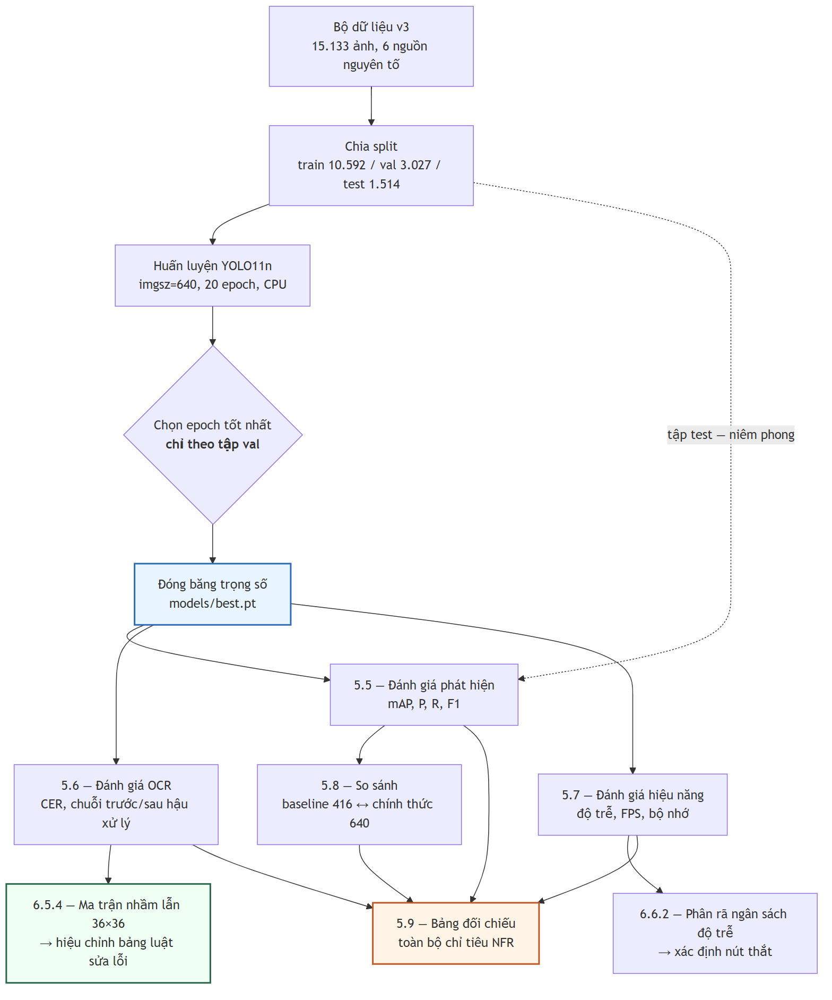

# CHƯƠNG 5. THỰC NGHIỆM VÀ ĐÁNH GIÁ

Chương 5 trình bày kết quả đánh giá hệ thống sau khi xây dựng. Chương này tập trung trả lời hai câu hỏi trọng tâm: hệ thống **đáp ứng yêu cầu kỹ thuật ở mức độ nào**, và **độ tin cậy của các số liệu đo lường**; do đó, mọi số liệu đều được trình bày kèm theo ngữ cảnh thực nghiệm cụ thể.

---

## 5.1. Mục tiêu và phương pháp đánh giá

### 5.1.1. Các câu hỏi nghiên cứu mà chương này trả lời

Chương này trả lời sáu câu hỏi từ đặc tả phi chức năng: **RQ1** — YOLO11n có đạt chỉ tiêu phát hiện biển số Việt Nam không (5.4; NFR-A1…A3)? **RQ2** — độ chính xác khác nhau thế nào giữa biển một dòng và hai dòng (NFR-A8; 5.4.2, 5.5.3)? **RQ3** — hậu xử lý đóng góp bao nhiêu vào độ chính xác chuỗi (NFR-A5 ↔ A6; 5.5.2)? **RQ4** — hệ thống có đạt chỉ tiêu độ trễ trên CPU không và điểm nghẽn ở đâu (5.6; NFR-P1…P7)? **RQ5** — bảng luật sửa ký tự có khớp các cặp nhầm lẫn đo được không (5.5.4)? **RQ6** — yếu tố nào đe doạ tính hợp lệ của kết quả (5.9.3)? RQ3 và RQ5 lần lượt lượng hoá đóng góp của hậu xử lý và thay giả định bằng dữ liệu đo được.

### 5.1.2. Hai nguyên tắc trình bày bắt buộc

**Một — mọi số hiệu năng phải kèm cấu hình phần cứng**: đồ án suy luận **hoàn toàn trên CPU** nên so với các con số FPS đo trên GPU là không hợp lệ nếu không ghi rõ; cấu hình ở 5.2 là điều kiện diễn giải cho toàn mục 5.6. **Hai — mọi số độ chính xác phải kèm tên tập dữ liệu và số mẫu**, vì độ chính xác là thuộc tính của **cặp (mô hình, tập đánh giá)**; hệ quả: NFR-A4…A7 chỉ đo được trên tập con có nhãn chuỗi, nhỏ hơn nhiều tập test phát hiện, mẫu số đó không được giấu. **Ký hiệu:** ✅ đạt mục tiêu · 🟡 chỉ đạt ngưỡng tối thiểu · ❌ không đạt · ⬜ chưa đo · ➖ không áp dụng.

> **Ghi chú về cách trích dẫn.** Cặp số **94,3%** (biển một dòng) ↔ **45,7%** (biển hai dòng), chênh **48,6 điểm phần trăm**, đo trên bộ dữ liệu **RodoSol-ALPR của Brazil** [2]<!-- laroca_2022_crossdataset -->. Đây **không phải** số liệu Việt Nam; mỗi lần dẫn, tên bộ dữ liệu và quốc gia phải xuất hiện **ngay trong câu**, và nó chỉ dùng như _analogue định lượng_ về độ khó tương đối của biển hai dòng, không bao giờ như mốc chuẩn phải vượt.

### 5.1.3. Giao thức đo

**Hình 5.1.** Giao thức đo và ràng buộc phụ thuộc giữa các bước đánh giá.

**Không bước đo nào chạy trước khi trọng số được đóng băng**; **tập test không được chạm vào trong huấn luyện lẫn chọn epoch** — chọn epoch chỉ dựa vào validation. Ba quy ước: **kích thước lô = 1 khi đo độ trễ** (riêng mAP dùng lô lớn hơn vì không phụ thuộc kích thước lô); **bỏ 3 lượt khởi động nóng**; **báo cáo p50/p95/p99, không báo cáo trung bình**, vì trung bình che đuôi phân bố còn NFR-P1 phát biểu ở p95.

---

## 5.2. Môi trường thực nghiệm

Toàn bộ số liệu đo trên **một máy trạm cá nhân duy nhất**: **Windows 11 Pro 10.0.26200**, **Python 3.13.12**, CPU **Intel Raptor Lake** (Family 6, Model 183) — **14 nhân vật lý / 20 nhân logic**, **không có GPU CUDA** nên mọi suy luận và huấn luyện chạy trên CPU; chế độ đo **lô = 1, bỏ 3 lượt khởi động nóng**. Đây là **tiền tố ngầm định của mọi con số hiệu năng ở 5.6**.

Phiên bản thư viện được trích từ môi trường thực thi đúng thời điểm chạy phép đo cuối cùng (20/07/2026) chứ không lấy từ tệp khai báo phụ thuộc, vì tệp khai báo ghi _ràng buộc phiên bản_ chứ không ghi _phiên bản đã cài đặt_: `ultralytics` 8.4.101 · `torch` 2.13.0+cpu · `torchvision` 0.28.0+cpu · `paddleocr` 3.7.0 (PP-OCRv5 mobile) · `paddlepaddle` 3.3.1 · `onnxruntime` 1.27.0 · `openvino` 2026.2.1 (nền tảng suy luận thay thế, 5.6.3) · `opencv-python` 4.10.0.84 · `numpy` 2.4.5 · `fastapi` 0.139.2 · `uvicorn` 0.51.0 · `sqlalchemy` 2.0.51 · `imagehash` 4.7.2 · `pytest` 9.1.1.

### 5.2.1. Ràng buộc CPU-only: Quyết định thiết kế cốt lõi

Lập luận đầy đủ ở **4.3.1**. NFR-P1 phát biểu _kèm_ ràng buộc CPU, nên kết luận "đạt sàn, không đạt mục tiêu" ở 5.6 là kết luận về hệ thống trong đúng bối cảnh vận hành thật, không phải con số chờ nâng cấp phần cứng. Cấu hình mô hình cũng do ràng buộc phần cứng quyết định — **YOLO11n** (2.590.035 tham số) [9]<!-- jocher_2024_yolo11 --> và **PP-OCRv5 mobile** [10]<!-- cui_2026_ppocrv5 -->. Về quy mô: **30,2 phút mỗi epoch**, một lượt 20 epoch mất **10,05 giờ** liên tục, khiến **tìm kiếm siêu tham số bất khả thi**; chương này báo cáo _một_ cấu hình huấn luyện, không phải kết quả của một quá trình tối ưu — giới hạn thật, ghi ở 5.9.3.

---

## 5.3. Bộ dữ liệu thực nghiệm

> **Lưu ý về cách đặt tên.** Thư mục `yolo_v2/` và `yolo_v3/` chỉ **phiên bản của bộ dữ liệu**, **không** liên quan đến kiến trúc YOLOv2 hay YOLOv3. Mô hình dùng trong toàn đồ án là **YOLO11n**.

<!-- {{T5.3a}} so sanh ba phien ban bo du lieu — DA CO SO, khong can dien -->

<!-- {{T5.3b}} so cap gan trung xuyen split theo nguong Hamming -->

**Bảng 5.1.** Ba phiên bản bộ dữ liệu và số cặp ảnh gần trùng xuyên tập con theo ngưỡng Hamming

| Thuộc tính / ngưỡng                  |                   v1 |         v2 |                                                             **v3** |
| ------------------------------------ | -------------------: | ---------: | -----------------------------------------------------------------: |
| Tổng số ảnh                          |                4.578 |     15.133 |                                                         **15.133** |
| Ngưỡng Hamming gộp trùng lặp         |                    5 |          5 |                                                             **10** |
| Số ảnh train / val / test            |                    — |          — |                                         **10.592 / 3.027 / 1.514** |
| Dùng cho                             | `baseline-416-v1.pt` | bị loại bỏ |                                                      **`best.pt`** |
| Cặp gần trùng xuyên tập con, Hamming 0 |                    — |          — |                                            **0** _(thông tin mới)_ |
| Hamming 5                            |                    — |          — |           **0** _(= ngưỡng gộp v1, v2 — không mang thông tin mới)_ |
| **Hamming 10**                       |              **619** |  **2.699** |               **0** _(= ngưỡng gộp v3 — không mang thông tin mới)_ |
| Hamming 12 · 15                      |                    — |          — |                              **791** · **3.529** _(thông tin mới)_ |
| Hamming 20                           |                    — |          — | **137.506** _(ngưỡng đã lỏng tới mức nhiều cặp là dương tính giả)_ |

**v1 quá nhỏ và chỉ một nguồn** (1 bộ vào hợp nhất, 1 nguồn nguyên tố) — động cơ tải thêm **tám bộ** (tổng **9 bộ**), trong đó **sáu bộ** vào hợp nhất cho bài toán phát hiện cùng bộ gốc (v2, v3: **7 bộ vào hợp nhất, 6 nguồn nguyên tố**), hai bộ nhãn mức ký tự tách riêng cho OCR. **v2 sửa được quy mô nhưng không sửa được rò rỉ:** lên 15.133 ảnh lại _tăng_ cặp gần trùng xuyên tập con lên 2.699 vì các nguồn chứa ảnh có nguồn gốc chung. **v3 giữ nguyên ngữ liệu** (cùng 15.133 ảnh), khác biệt duy nhất là ngưỡng khử trùng lặp 5 → 10 và phép chia tập sinh lại — cô lập biến có chủ ý, cho phép quy kết mọi thay đổi kết quả cho _chất lượng phép chia tập_, không cho _lượng dữ liệu_.

### 5.3.1. Khử trùng lặp: hai tỉ lệ, hai mẫu số khác nhau

Có **hai tỉ lệ khử trùng lặp trên hai mẫu số khác nhau**: **44,2%** (11.978/27.111, trước hợp nhất, trên 7 bộ vào hợp nhất cho bài toán phát hiện) và **47,8%** (7.227/15.133, sau hợp nhất). Hai số **không cộng dồn và không thay thế nhau**; cơ chế và cách đọc trình bày ở mục 4.4.2. Điểm phải nhớ khi trích: mẫu số 27.111 là tổng ảnh của **7 bộ vào hợp nhất cho bài toán phát hiện**, **không phải** 9 bộ đã tải — hai bộ còn lại mang **nhãn mức ký tự**, tách riêng cho tầng OCR.

### 5.3.2. Kiểm chứng rò rỉ dữ liệu — và vì sao con số "0 cặp rò rỉ" không chứng minh được điều gì

Rò rỉ xảy ra khi tập test chứa ảnh gần trùng ảnh train: mô hình _ghi nhớ_ thay vì _tổng quát hoá_, mọi chỉ số bị đánh giá cao hơn thực tế — với ngữ liệu ghép từ nhiều nguồn công khai đây là rủi ro hệ thống [2]<!-- laroca_2022_crossdataset -->. Công cụ đo là **băm tri giác** (`imagehash.phash`, 64 bit).

> **Tính hợp lệ của phép đo.** Bộ dữ liệu v3 được khử trùng lặp ở ngưỡng Hamming 10; việc đo đạc rò rỉ tại đúng ngưỡng này chỉ mang tính chất **kiểm chứng lại quy trình**, không phải là một phép đo độc lập. Kết quả bằng 0 tại ngưỡng này chứng minh rằng bước khử trùng lặp _đã thực thi đúng đặc tả_, nhưng **không đủ cơ sở để khẳng định** tính "sạch" tuyệt đối của tập kiểm thử.

Chỉ các ngưỡng **12 (791 cặp), 15 (3.529 cặp), 20 (137.506 cặp)** mang thông tin mới, và ngay cả chúng cũng **không** chứng minh tập test sạch. **Ba giới hạn của phash:** (1) phash chỉ bắt tương đồng ở mức **bố cục sáng-tối tổng thể** — hai ảnh _cùng một chiếc xe_ ở hai góc khác nhau, hay hai khung hình cách nhau vài giây trong cùng video, vẫn mang **cùng một biển số** dù Hamming lớn; loại rò rỉ ngữ nghĩa này **không khử được bằng bất kỳ ngưỡng phash nào**; (2) **không có định danh phương tiện hay chuỗi biển cho toàn ngữ liệu** nên không chia phép chia tập theo **nhóm biển số** được — chính hạn chế dẫn tới mẫu số nhỏ của các bảng OCR ở 5.5; (3) **ngưỡng cao sinh dương tính giả**, nên 137.506 là **cận trên bi quan**. **Kết luận trung thực:** khẳng định được _bước khử trùng lặp ở ngưỡng 10 đã chạy đúng đặc tả_; **không** khẳng định được _tập test độc lập với tập train_. Rò rỉ tồn dư ở mức ngữ nghĩa **không đo được bằng công cụ hiện có** — mối đe doạ đầu tiên ở 5.9.3; mọi chỉ số ở 5.4 phải đọc kèm ghi chú này.

### 5.3.3. Phân bố nguồn dữ liệu giữa các phép chia tập

Toàn tập chia **15.133 = 10.592 / 3.027 / 1.514**, tức **70,0% / 20,0% / 10,0%**. Hai đặc điểm cần lưu ý khi đọc mọi kết quả của chương. **Thứ nhất, tập test nghiêng về ảnh camera giao thông** — một nguồn ảnh camera giao thông có **20,3%** số ảnh rơi vào test, gấp đôi tỉ lệ tổng thể 10,0% — nên khi đọc mAP theo dải kích thước (5.4.3) phải nhớ rằng đối tượng nhỏ trong tập test tập trung ở một nguồn. **Thứ hai, một bộ dữ liệu dư thừa hoàn toàn:** một bộ vào hợp nhất với 1.005 ảnh và ra khỏi khử trùng lặp chéo bộ với **0 ảnh — loại 100,0%**, bằng chứng định lượng cho việc các bộ Roboflow tái sử dụng ảnh của nhau rất nặng và là lý do **không được cộng dồn số ảnh công bố của từng bộ để suy ra quy mô thật**.

---

## 5.4. Đánh giá bộ phát hiện biển số

Toàn bộ 5.4 đo trên **tập test v3: 1.514 ảnh, 1.611 đối tượng nhãn thật**, `imgsz=640`, `device=cpu`; tập test chưa từng dùng trong huấn luyện hay chọn epoch.

### 5.4.1. Chỉ số tổng thể

<!-- {{T5.4a}} ket qua detection tong the tren tap test v3 (1.514 anh) — chuyen thanh van xuoi, doi chieu nguong o T5.7 -->

**Cả bốn chỉ tiêu bắt buộc đều đạt mục tiêu**, đo bằng công cụ đánh giá chuẩn của thư viện: **mAP@0.5 = 0,9829** (NFR-A1; sàn 0,85, mục tiêu 0,90 ✅), **mAP@0.5:0.95 = 0,7834** (NFR-A2; sàn 0,55, mục tiêu 0,65 ✅), **Precision = 0,9837** và **Recall = 0,9714** (NFR-A3; sàn 0,88 / 0,85, mục tiêu 0,92 / 0,90 ✅), **F1 = 0,9775** tại ngưỡng confidence 0,25; đối chiếu ở Bảng 5.13. Ba lưu ý: (1) **bài toán chỉ có một lớp**, mAP một lớp không so trực tiếp được với mAP nhiều lớp trên COCO nên giá trị cao là bình thường, **không phải bằng chứng về độ khó đã vượt qua**; (2) chỉ số quyết định là **mAP@0.5:0.95** vì độ khớp box ảnh hưởng trực tiếp đến chất lượng vùng cắt đưa sang OCR; (3) **chỉ số tổng thể che giấu phân bố**.

### 5.4.2. Tách theo biển một dòng và biển hai dòng (NFR-A8)

Bố cục xác định theo nhãn lớp khi bộ dữ liệu có khai báo, và theo **ngưỡng tỉ lệ khung hình 2,5** khi không có — nằm giữa tỉ lệ chuẩn của biển một dòng (4,727) và biển hai dòng (2,000 / 1,357) theo QCVN 08:2024/BCA.

<!-- {{T5.4b}} detection tach theo layout mot dong / hai dong (NFR-A8) -->

**Bảng 5.2.** Kết quả phát hiện tách theo biển một dòng và hai dòng (NFR-A8)

| Chỉ số                                |        Biển **một dòng** |        Biển **hai dòng** |     Chênh (điểm %) |
| ------------------------------------- | -----------------------: | -----------------------: | -----------------: |
| Số đối tượng nhãn thật _(tổng 1.611)_ |                      286 |                    1.325 |                n/a |
| mAP@0.5                               |                   0,9884 |                   0,9675 |               2,09 |
| mAP@0.5:0.95                          |                   0,7526 |                   0,7649 |              −1,23 |
| Precision · Recall · F1               | 0,9861 · 0,9895 · 0,9878 | 0,9735 · 0,9691 · 0,9713 | 1,26 · 2,04 · 1,65 |

### 5.4.3. Tách theo dải kích thước hộp giới hạn

Mục này tồn tại vì **bộ dữ liệu không đạt tiêu chí chất lượng Q6**: **10,91% số hộp có diện tích dưới 0,5% diện tích ảnh**, vượt ngưỡng 10%. Đối tượng nhỏ là chế độ thất bại đã ghi nhận rộng rãi của bộ phát hiện một giai đoạn, và biển số độ phân giải thấp đã thành hướng nghiên cứu riêng [18]<!-- laroca_2026_icprlrlpr -->; một con số mAP tổng sẽ **giấu chế độ thất bại sau giá trị trung bình**.

<!-- {{T5.4c}} detection tach theo dai kich thuoc hop gioi han -->

**Bảng 5.3.** Kết quả phát hiện tách theo dải kích thước hộp giới hạn

| Dải (diện tích box / diện tích ảnh) | Số đối tượng | Tỉ lệ tập test | mAP@0.5 | mAP@0.5:0.95 | Recall |
| ----------------------------------- | -----------: | -------------: | ------: | -----------: | -----: |
| **Rất nhỏ** — dưới 0,5%             |          262 |         16,26% |  0,8553 |       0,5249 | 0,8740 |
| **Nhỏ** — 0,5% đến 1%               |          124 |          7,70% |  0,9755 |       0,7055 | 0,9758 |
| **Trung bình** — 1% đến 5%          |          900 |         55,87% |  0,9913 |       0,8005 | 0,9922 |
| **Lớn** — 5% đến 15%                |          297 |         18,44% |  0,9966 |       0,8394 | 0,9966 |
| **Rất lớn** — trên 15%              |         28 † |          1,74% |  1,0000 |       0,8562 | 1,0000 |
| **Toàn tập test**                   |    **1.611** |           100% |  0,9711 |       0,7625 | 0,9727 |

> Dòng đánh dấu (†) chỉ có 28 đối tượng, dưới ngưỡng 30 nên không có ý nghĩa thống kê và không được đưa vào so sánh. Dải được tính bằng diện tích hộp nhãn thật chia cho diện tích ảnh gốc; không hộp nào thiếu dải.

## 5.5. Đánh giá khối OCR và hậu xử lý

> **Ràng buộc mẫu số.** NFR-A4…A7 chỉ đo được trên **tập con có nhãn chuỗi ký tự** — **2.801 biển**, không phải trên 1.514 ảnh test. Thiếu nhãn chuỗi cho phần lớn ngữ liệu là hạn chế thật, ghi ở 5.9.3.

### 5.5.1. Độ chính xác mức ký tự (NFR-A4)

Chỉ số là **CER** theo khoảng cách Levenshtein, chuẩn hoá theo độ dài nhãn thật, với $S$ ký tự thay thế, $D$ bị xoá, $I$ chèn thừa, $N$ tổng ký tự nhãn thật; NFR-A4 phát biểu theo **1 − CER**.

### 5.5.2. Chuỗi đầy đủ: trước và sau hậu xử lý (NFR-A5 ↔ NFR-A6)

Khối hậu xử lý theo luật — chuẩn hoá ký tự, áp mặt nạ vị trí chữ số / chữ cái theo định dạng biển số Việt Nam, sửa cặp ký tự đồng hình, kiểm tra mã tỉnh — là **đóng góp kỹ thuật riêng** của đồ án, không có sẵn trong thư viện nào. Câu hỏi _khối đó đóng góp bao nhiêu?_ chỉ trả lời được nếu **đo hai lần trên cùng một tập mẫu**: chuỗi thô PaddleOCR trả về (A5) và chuỗi sau khi áp toàn bộ luật (A6). Đây cũng là lý do kỹ thuật khiến hai cột riêng cho chuỗi thô và chuỗi đã chuẩn hoá cùng tồn tại trong lược đồ cơ sở dữ liệu — **điều kiện cần để phép đo này thực hiện được**, phải có từ giai đoạn thiết kế.

<!-- {{T5.5a}} do chinh xac muc ky tu NFR-A4 -->

<!-- {{T5.5b}} do chinh xac chuoi day du truoc va sau hau xu ly — DONG GOP DINH LUONG CUA KHOI HAU XU LY -->

**Bảng 5.4.** Độ chính xác OCR trước và sau hậu xử lý, trên 2.801 biển có nhãn chuỗi

| Chỉ số                                                     |         Sàn |    Mục tiêu |        **Trước hậu xử lý** |         **Sau hậu xử lý** | Chênh (điểm %) |
| ---------------------------------------------------------- | ----------: | ----------: | -------------------------: | ------------------------: | -------------: |
| 1 − CER (NFR-A4)                                           |        0,92 |        0,95 |                     0,9061 |             **0,9454** 🟡 |            n/a |
| CER                                                        |      ≤ 0,08 |      ≤ 0,05 |                     0,0939 |                    0,0546 |            n/a |
| Chuỗi đầy đủ đúng (A5 → A6)                                | 0,80 → 0,85 | 0,85 → 0,90 |              **0,6373** ❌ |             **0,7512** ❌ |     **+11,39** |
| $N$ / $S$ / $D$ / $I$ trên chuỗi thô                       |           — |           — | 23.855 / 862 / 1.272 / 107 |               (không đổi) |            n/a |
| Biển **sửa đúng** / **bị làm hỏng** / sai cả trước lẫn sau |           — |           — |                          — | **319** / **0** / **697** |            n/a |

### 5.5.3. Tách theo biển một dòng và hai dòng cho OCR

<!-- {{T5.5c}} OCR tach theo layout mot dong / hai dong -->

**Bảng 5.5.** Độ chính xác nhận dạng tách theo biển một dòng và hai dòng

| Chỉ số                              | Biển **một dòng** | Biển **hai dòng** | Chênh (điểm %) |
| ----------------------------------- | ----------------: | ----------------: | -------------: |
| Số mẫu có nhãn chuỗi _(tổng 2.801)_ |           **567** |         **2.234** |            n/a |
| 1 − CER (NFR-A4)                    |            0,9925 |            0,9344 |           5,81 |
| Chuỗi đúng **trước** hậu xử lý (A5) |            0,9418 |            0,5600 |          38,18 |
| Chuỗi đúng **sau** hậu xử lý (A6)   |            0,9541 |            0,6996 |          25,45 |
| Cải thiện do hậu xử lý (A6 − A5)    |             +1,23 |            +13,97 |            n/a |
| Độ chính xác E2E (A7)               |            0,6861 |            0,5219 |              — |

Chênh lệch 2,09 điểm ở tầng phát hiện tăng lên ở tầng OCR: 5,81 điểm ở mức ký tự, **25,45 điểm** ở A6 và **38,18 điểm** ở A5. Biển một dòng đạt A6 = 0,9541, vượt mục tiêu 0,90; kết quả OCR chung chưa đạt chủ yếu do biển hai dòng, chiếm **2.234 / 2.801 = 79,8%** tập có nhãn chuỗi. Sau hai bậc cứu chữa (5.5.6, 5.5.7), khoảng cách A6 giảm từ 36,79 xuống **25,45 điểm**, tức giảm **11,34 điểm**. Phần còn lại thuộc về năng lực nhận dạng ký tự, không phải khâu cắt, ghép hoặc hiệu chỉnh hình học.

### 5.5.4. Ma trận nhầm lẫn ký tự 36×36

**Bảng 5.6.** Các cặp ký tự bị nhầm nhiều nhất, đối chiếu bảng luật hiện hành

| Hạng | Ký tự thật → bị đọc thành | Số lần | Tỉ lệ trong tổng lỗi thay thế | Bảng luật có phủ không? |
| :--: | :-----------------------: | -----: | ----------------------------: | ----------------------- |
|  1   |           L → 1           |     90 |                        10,44% | có — đúng chiều         |
|  2   |           E → F           |     73 |                         8,47% | không                   |
|  3   |           4 → L           |     53 |                         6,15% | không                   |
|  4   |           U → 1           |     38 |                         4,41% | không                   |
|  5   |           D → 0           |     34 |                         3,94% | có — đúng chiều         |
|  6   |           Z → 7           |     32 |                         3,71% | không                   |
|  7   |           2 → 7           |     26 |                         3,02% | không                   |
|  8   |           X → Y           |     21 |                         2,44% | không                   |
|  9   |           B → R           |     20 |                         2,32% | không                   |
|  10  |           9 → 0           |     19 |                         2,20% | không                   |

### 5.5.5. Độ chính xác đầu cuối toàn trình (NFR-A7)

<!-- {{T5.5e}} do chinh xac E2E toan trinh NFR-A7 — chuyen thanh van xuoi -->

NFR-A7 đo **ảnh đầu vào → phát hiện → cắt → OCR → hậu xử lý → chuỗi cuối**; khác A6 ở chỗ A6 đo trên **vùng biển cắt chuẩn theo nhãn thật** còn A7 đo trên vùng biển do **chính bộ phát hiện** tìm ra, nên A7 tích luỹ cả hai nguồn sai số và theo lý thuyết luôn ≤ A6. Trên 2.801 mẫu: **A7 = 0,5552** (sàn 0,82, mục tiêu 0,88 — ❌); **E2E với điều kiện đã phát hiện được biển = 0,6306**; tỉ lệ biển **bỏ sót** ở tầng phát hiện **0,1196**; phát hiện đúng nhưng **đọc sai chuỗi 0,3694**; chênh **A6 − A7 = 19,60 điểm**.

> **Ghi chú về phạm vi hiệu lực của chỉ số A7.** Cần lưu ý rằng con số 0,5552 được đo trên **ảnh vùng biển đã cắt**, không phải ảnh hiện trường, vì không bộ dữ liệu nào trong đồ án có đồng thời ảnh toàn cảnh _và_ chuỗi biển số nhãn thật. Bộ phát hiện được huấn luyện trên ảnh giao thông đầy đủ nên ảnh chỉ có biển số chiếm gần hết khung là **ngoài phân bố huấn luyện**: phần lớn thất bại ở đây do bộ phát hiện không bắt được box trên ảnh vùng biển đã cắt (bỏ sót 11,96%), **không** phải do OCR đọc sai. Bằng chứng: trên ảnh hiện trường thật, phép đo ở giai đoạn kiểm thử cho mAP@0.5 = 0,9829, tương thích với 5.4.1. Muốn đo NFR-A7 đúng cách cần gán nhãn chuỗi cho một phân bố test có ảnh hiện trường — việc này chưa thực hiện.

### 5.5.6. Bước "phục hồi dòng trên" cho biển hai dòng — thiết kế, kiểm chứng A/B và kết quả trên toàn tập

<!-- {{T5.5f}} A/B hai chien luoc doc bien hai dong — chuyen thanh van xuoi -->

<!-- {{T5.5g}} A/B buoc cuu dong tren, hai mau doc lap — chuyen thanh van xuoi -->

<!-- {{T5.5h}} truoc/sau buoc cuu dong tren tren toan tap co nhan chuoi — chuyen thanh van xuoi -->

Hồ sơ lỗi thiên về _xoá_ ($D$ = 1.272 > $S$ = 862) trên biển hai dòng có cách giải thích tự nhiên: **mất hẳn một dòng**. Hệ thống đọc biển hai dòng bằng **ghép rồi đọc** (_split-then-hstack_): cắt vùng biển thành hai nửa chồng lấn, xếp cạnh nhau thành dải ngang, chạy OCR **một lần**. Phương án thay thế — đọc riêng từng nửa rồi nối chuỗi — đã được đo A/B chứ không bị loại bằng lập luận, trên 200 biển hai dòng với hạt giống ngẫu nhiên cố định: **A, ghép rồi OCR một lần** _(đang dùng)_ đúng **129/200 = 64,50%**, 2 ca OCR trả chuỗi rỗng, 340,11 ms; **B, OCR từng nửa rồi nối** đúng **7/200 = 3,50%**, 9 ca chuỗi rỗng, 391,35 ms — B kém A **61,00 điểm phần trăm** và tốn thêm **51,24 ms**; **122** ca A thắng B, **0** ca B thắng A. **Giả thuyết "đọc riêng từng dòng thì chính xác hơn" bị bác bỏ dứt khoát.** Nguyên nhân đọc được ngay trong dữ liệu: hai nửa **cố ý chồng lấn** để không cắt cụt ký tự, nên đọc riêng thì dải chồng lấn bị đọc **hai lần** và ký tự bị nhân đôi — `84G122593` thành `84-G124E009.01225.93`. Một kết quả âm có giá trị: lựa chọn kiến trúc ở Chương 5 không tuỳ tiện.

> **Ghi chú về mốc thời gian.** Số liệu toàn tập của riêng bước phục hồi dòng trên thuộc lượt đo ngày 20/07 và được giữ nguyên mốc. Trên 2.801 ảnh có nhãn chuỗi (cùng mô hình và cùng độ phân giải đầu vào; cột "trước" là lượt đo trước đó trên đúng cùng tập mẫu và cùng mô hình): A4 0,8734 → **0,8848** (**+1,14**; sàn 0,92 ❌); A5 0,6098 → **0,6098** (**0,00**; sàn 0,80 ❌); A6 0,6555 → **0,6730** (**+1,75**; sàn 0,85 ❌); A7 0,5227 → **0,5295** (**+0,68**; sàn 0,82 ❌); A6 riêng biển **một dòng** 0,9489 → **0,9489** (**0,00**); A6 riêng biển **hai dòng** 0,5810 → **0,6030** (**+2,20**); biển bị can thiệp / thành đúng hoàn toàn / bị làm hỏng = **89 / 2.801** · **49** · **0**. Bảng số này trả lời đúng một câu hỏi — _riêng bước phục hồi dòng trên đóng góp bao nhiêu_ — và câu trả lời ấy không đổi theo thời gian; nhưng **các giá trị tuyệt đối đã bị vượt qua** (A6 hiện là 0,7512 chứ không phải 0,6730) nên **không được trích cột "sau bước cứu" như số hiện hành**. Trên lượt 28/07, bước phục hồi dòng trên cho câu trả lời cuối ở **209 biển**.

### 5.5.7. Bậc thang thử lại cho biển nghiêng/méo — chi phí, lợi ích và một quyết định tắt tính năng

## 5.6. Đánh giá hiệu năng

> Mọi số trong 5.6 phải đọc cùng cấu hình ở 5.2: **Intel Raptor Lake 14 nhân / 20 luồng, Windows 11, CPU-only, kích thước lô = 1**.

### 5.6.1. Độ trễ đầu cuối (NFR-P1)

<!-- {{T5.6a}} do tre dau-cuoi mot anh, doi chieu NFR-P1 -->

**Bảng 5.7.** Độ trễ đầu cuối một ảnh, đối chiếu NFR-P1

| Chỉ số                       |        Sàn |  Mục tiêu | **Trước bậc thang (20/07)** | **Cấu hình giao hàng (28/07)** | Kết quả |
| ---------------------------- | ---------: | --------: | --------------------------: | -----------------------------: | :-----: |
| p50 (ms)                     |          — |         — |                      414,67 |                         405,77 |   n/a   |
| **p95 (ms)**                 | **≤ 1500** | **≤ 800** |                  **731,15** |                   **1.143,10** | **🟡**  |
| p99 (ms)                     |          — |         — |                      947,83 |                       1.420,07 |   n/a   |
| Trung bình (ms)              |          — |         — |                      400,74 |                         447,38 |   n/a   |
| Số ảnh đo                    |          — |         — |                         100 |                            100 |   n/a   |
| Bội số so với sàn / mục tiêu |          — |         — |               0,49× / 0,91× |          **0,76×** / **1,43×** |   n/a   |

**NFR-P1 đạt ngưỡng tối thiểu nhưng không đạt mục tiêu**, và đây là **thoái lui có chủ ý và đã định lượng**: tắt hẳn bậc thang thử lại đưa p95 về **866,3 ms**, tức toàn bộ **+277 ms** là của nó; nhưng vì bậc thang chỉ chạy **sau khi lần đọc đầu thất bại** nên nó không chạm vào trường hợp thường — **trung vị thậm chí giảm nhẹ** (414,67 → 405,77 ms), chi phí dồn hết vào đuôi. Với hệ thống mà 95% ảnh xong dưới 1,15 giây và một nửa xong dưới 0,41 giây, p50 mô tả trải nghiệm điển hình còn p95 mô tả trường hợp xấu; NFR-P1 phát biểu theo p95 nên kết luận chính thức là **đạt sàn, không đạt mục tiêu**. Ở lượt đo đầu với cả ba biến thể bật, p95 là **1.514,26 ms** — **vượt cả ngưỡng tối thiểu**; bóc tách chỉ ra bậc siêu phân giải chiếm hơn nửa chi phí đó mà không cải thiện được biển nào đo được nên nó bị **tắt mặc định**, đưa p95 về 1.143,10 ms.

### 5.6.2. Phân rã ngân sách độ trễ theo từng bước

<!-- {{T5.6b}} phan ra ngan sach do tre theo tung buoc, doi chieu uoc luong ban dau -->

**Bảng 5.8.** Phân rã ngân sách độ trễ theo từng bước

| Bước xử lý                        | Ước lượng ban đầu (ms) | **Đo thật (ms)** | Chênh (lần) |    % tổng |
| --------------------------------- | ---------------------: | ---------------: | ----------: | --------: |
| Giải mã ảnh + tiền xử lý          |                     50 |         **2,83** |        0,06 |  **1,7%** |
| Suy luận YOLO11n @ 640px (CPU)    |                    150 |        **57,27** |        0,38 | **34,0%** |
| Cắt + tiền xử lý vùng biển số     |                     30 |         **0,00** |        0,00 |  **0,0%** |
| **PaddleOCR (mỗi biển)**          |                **120** |       **108,28** |        0,90 | **64,3%** |
| Hậu xử lý regex + kiểm tra hợp lệ |                      5 |         **0,03** |        0,01 |  **0,0%** |
| Ghi CSDL + lưu ảnh                |                     50 |                — |           — |         — |
| **Tổng (một biển số)**            |                **405** |       **168,41** |        0,47 |  **100%** |

Ba phát hiện. **Một, ước lượng ở giai đoạn phân tích yêu cầu khá sát ở tổng nhưng lệch ở phân bổ:** tổng suy luận thuần **168,41 ms/biển**, nhỏ hơn cả ước lượng ban đầu. Sai lệch **không** tới một bậc độ lớn. **Hai, điểm nghẽn là PaddleOCR nhưng KHÔNG áp đảo như báo cáo cũ:** 64,3% so với 34,0% của bộ phát hiện, **thay thế** con số cũ "OCR 93,3% / detect 6,5%" vốn đo trên hệ thống đang có lỗi cắt ảnh (~1.322 ms/ảnh); nguyên nhân OCR đắt vẫn đúng — PaddleOCR là **đường ống nhiều giai đoạn** (phát hiện văn bản → phân loại hướng → nhận dạng) thiết kế cho ảnh tài liệu tổng quát, nên hệ thống trả chi phí cho năng lực mà vùng biển đã cắt không cần. **Ba, chiến lược tối ưu đổi hẳn:** theo định luật Amdahl, tăng tốc detector 2–3× có thể kéo E2E xuống quãng **15–23%**, khác hẳn kết luận cũ "chỉ giảm tối đa 6,7%". Dự đoán này **đã được kiểm chứng** ở 5.6.3: OpenVINO nhanh 1,57× ở tầng bộ phát hiện và nâng thông lượng đầu cuối **+20,0%** — nằm trong khoảng dự đoán. Vì NFR-P1 mới đạt sàn, tối ưu hiệu năng vẫn nằm trên đường tới chỉ tiêu chứ không chỉ là _dư địa cải thiện thêm_.

### 5.6.3. So sánh nền tảng suy luận: PyTorch, ONNX Runtime và OpenVINO

Nhóm thực hiện xuất mô hình sang cả hai định dạng rồi đo trên 50 ảnh thật của tập kiểm tra, 50 lượt suy luận mỗi nền tảng, 5 lượt làm nóng bị bỏ, `imgsz = 640`, batch = 1 [23]<!-- ultralytics_2026_openvinoexport --> [24]<!-- onnxruntime_2025_threading -->.

<!-- {{T5.8b}} do tre bo phat hien tren ba nen tang suy luan CPU -->

**Bảng 5.9.** Độ trễ riêng bộ phát hiện trên ba nền tảng suy luận CPU

| Nền tảng | Trung bình | p50 | p95 | p99 | FPS | Nhanh hơn PyTorch |
|---|---:|---:|---:|---:|---:|---:|
| PyTorch 2.13 (CPU) | 33,09 ms | 32,37 | 40,54 | 54,42 | 30,2 | 1,00× |
| ONNX Runtime 1.27 | 24,48 ms | 24,01 | 27,18 | 31,75 | 40,9 | **1,35×** |
| **OpenVINO 2026.2** | **21,12 ms** | 20,98 | 23,37 | 25,68 | 47,4 | **1,57×** |

OpenVINO thắng ở mọi phân vị, và thắng đậm nhất ở **đuôi**: p99 từ 54,42 ms xuống 25,68 ms, hẹp lại 2,1 lần. Với kỷ luật hàng đợi một khe ở chế độ thời gian thực — nơi thông lượng bị chi phối bởi những lần chậm nhất — đuôi hẹp đáng giá hơn trung bình thấp.

**Độ chính xác sau khi xuất: không suy giảm.** Điều kiện đặt ra ban đầu là phải đo mAP cùng lúc, vì tăng tốc kèm mất độ chính xác là một *đánh đổi* chứ không phải khoản lãi. Đo trên toàn bộ 1.514 ảnh tập kiểm tra, qua **hai đường đo độc lập**: validator Ultralytics cho mAP@0,5 = **0,983** so với 0,9829 của PyTorch, và mAP@0,5:0,95 = 0,781 so với 0,7834; harness riêng của đồ án cho 0,9718 so với 0,9712. Không chỉ số nào giảm quá 0,0024 — nằm trong dao động giữa các lượt chạy. Vậy **1,57× là khoản lãi thật**.

> **Một cái bẫy đã suýt mắc.** So thẳng 0,9718 (harness riêng, OpenVINO) với 0,9829 (validator Ultralytics, PyTorch) sẽ kết luận sai rằng xuất mô hình làm mất 1,1 điểm mAP. Hai vế đi qua **hai đường đo khác nhau** nên chênh lệch là chuyện đương nhiên. Chỉ khi chạy lại chính bản PyTorch qua chính harness riêng (0,9712) mới thấy OpenVINO thực ra nhỉnh hơn. So sánh chỉ có nghĩa khi hai vế cùng đường đo.

Đầu cuối, đổi sang OpenVINO nâng tốc độ khung hình thời gian thực từ **5,257 lên 6,310 FPS (+20,0%)** — xác nhận lập luận Amdahl ở 5.6.2 bằng số đo. Nhóm thực hiện **vẫn giữ PyTorch làm mặc định của bản giao hàng**: NFR-P2 đã đạt mà không cần đổi, còn đổi mô hình mặc định sẽ làm mọi con số độ trễ trong chương này lệch khỏi bản đang giao. Cả `best.onnx` lẫn `best_openvino_model/` đều nằm sẵn trong kho; bật lên chỉ cần đổi một dòng `ALPR_MODEL_PATH` vì tầng nạp mô hình đã hỗ trợ sẵn thư mục OpenVINO. Chi tiết ở [báo cáo 38](../reports/38-runtime-backend-and-nfr-p2.md).

Bốn hướng tấn công khối OCR theo chi phí tăng dần (chi tiết ở Chương 6): **tắt các giai đoạn không cần thiết của đường ống PaddleOCR**; **bật MKL-DNN và chỉnh số luồng CPU**; **xuất mô hình nhận dạng sang ONNX Runtime**; **thay bằng mô hình nhận dạng chuyên cho biển số** huấn luyện trên tập ký tự hẹp — tiềm năng lớn nhất, tốn công nhất.

### 5.6.4. Chế độ webcam (tầng API) và xử lý video (NFR-P2, NFR-P3)

<!-- {{T5.6d}} hieu nang che do webcam va xu ly video — gop vao T5.7 -->

**NFR-P2 đạt: 5,257 FPS** (sàn 3, mục tiêu 5) — vượt cả mục tiêu, không chỉ sàn. Giao diện thời gian thực dùng **hàng đợi một khe**: chỉ một yêu cầu bay tại một thời điểm, khung sinh ra trong lúc chờ bị bỏ thay vì xếp hàng; ở kỷ luật đó thông lượng bị chi phối bởi những lần chậm nhất, nên phân vị đuôi mới là đại lượng quyết định. Đo được p50 = **164,08 ms**, p95 = **204,52 ms** — đuôi chỉ rộng gấp 1,25 lần trung vị. NFR-P3 cũng **đạt**: video 14,25 giây xử lý hết **18,2 giây** (sàn ≤ 95 s, mục tiêu ≤ 47,5 s), tức **0,785×** thời gian thực, `vid_stride = 5`.

**Con số này thay thế một số liệu cũ đã công bố, và lý do phải kể ra.** Lượt đo ngày 02/08 cho **2,379 FPS — trượt sàn**, và quyển từng quy nguyên nhân cho bậc thang thử-lại. Đo lại ngày 13/08 trên **mã nguồn giống hệt từng byte** (`git diff` trên `ai/` giữa hai thời điểm chỉ trả về một công cụ đo mới thêm), cùng cấu hình, cùng dãy ảnh phát lại, cho 5,257 rồi 5,213 FPS ở hai lần chạy độc lập.

<!-- {{T5.9b}} sau lan do NFR-P2 trong cac dieu kien may khac nhau -->

**Bảng 5.10.** Sáu lần đo NFR-P2 trong các điều kiện máy khác nhau

| Điều kiện | FPS hiệu dụng | p50 | p95 | p95/p50 | Kết luận |
|---|---:|---:|---:|---:|:--:|
| 02/08 — máy đang tải nặng | 2,379 | 180,05 | **1.247,70** | **6,93** | ❌ |
| Máy rảnh, lần 1 | **5,257** | 164,08 | 204,52 | 1,25 | ✅ |
| Máy rảnh, lần 2 | **5,213** | 165,13 | 199,33 | 1,21 | ✅ |
| Ép tải 6 lõi | 4,367 | 201,76 | 238,97 | 1,18 | 🟡 |
| Ép tải 12 lõi | 4,057 | 215,69 | 268,40 | 1,24 | 🟡 |
| OpenVINO, máy rảnh | **6,310** | 129,60 | 148,50 | 1,15 | ✅ |

Log lần đo cũ cho thấy máy khi đó đang cõng khoảng **560% CPU** của tiến trình khác (Explorer, VS Code, Visual Studio, một bản dựng đang chạy), và harness **đã in cảnh báo** rằng mọi số liệu bên dưới là *bi quan*. Giả thuyết đầu tiên vì thế là tải cạnh tranh. Nhóm thực hiện **kiểm chứng thay vì tin**: dựng tải tổng hợp 6 rồi 12 lõi và đo lại — và **thí nghiệm bác bỏ chính giả thuyết đó**. Tải cạnh tranh nâng *cả* phân bố một cách đều tay, giữ tỉ lệ p95/p50 quanh 1,2; còn lần 02/08 có trung vị gần như của máy rảnh (180 ms) nhưng đuôi **gấp 6,93 lần trung vị**. Hai chữ ký khác hẳn nhau.

**Quy kết cũ cho bậc thang thử-lại cũng không đứng vững:** log máy chủ lần đó cho thấy bậc thang chỉ nổ **6 lần trên 144 khung**, và với giá trị chậm nhất đo được là 1.484,91 ms thì 6 lần nổ chỉ giải thích khoảng **52 ms** trong khoảng chênh 225 ms của trung bình. Nguyên nhân *chính xác* của đuôi hôm đó **không xác định được** — ứng viên còn lại là tranh chấp đĩa (tiến trình `System` chiếm 136% là thời gian nhân, thường đi kèm quét đĩa) mà tải tổng hợp thuần CPU ở đây không mô phỏng. Đây là **suy đoán có cơ sở, không phải kết luận đã đo**, và được ghi đúng như vậy.

**Con số nên dùng khi nói về biên an toàn là 4,057 FPS** — mức xấu nhất đo được, khi 12 trên 20 luồng bị tiến trình khác chiếm trọn, vẫn **trên sàn 35%**.

### 5.6.5. Chịu tải, bộ nhớ và độ tin cậy (NFR-SC1, NFR-P4…P7, NFR-R4)

<!-- {{T5.6e}} chiu tai, bo nho, do tin cay — gop vao T5.7 -->

**Mọi chỉ tiêu hiệu năng _ngoài đường xử lý ảnh_ đều đạt với biên rất rộng.**

**Bảng 5.11.** Các chỉ tiêu hiệu năng ngoài đường xử lý ảnh

| Chỉ tiêu | Đo được | Ngưỡng | Biên |
|---|---:|---:|---:|
| Nạp mô hình | **6,41 s** | ≤ 30 s | 4,7× |
| Khởi động tới khi `/health` sẵn sàng | **8,36 s** | ≤ 30 s | 3,6× |
| Overhead tầng API (p95) | **19,01 ms** | ≤ 100 ms | 5,3× |
| Truy vấn lịch sử 10.000 bản ghi (p95) | **18,71 ms** | ≤ 500 ms | **~27×** |
| Bộ nhớ thường trú — đường ống · máy chủ | **0,759 · 0,806 GB** | ≤ 4 GB | ~5× |
| Yêu cầu đồng thời ổn định | **10** | ≥ 5 | 2× |
| Chạy liên tục 15 phút | **100,0% / 2.028 yêu cầu**, bộ nhớ chỉ tăng 0,094 GB | ≥ 99% | — |
| Khởi động lại cơ sở dữ liệu | **0/9.031 bản ghi mất** | 0 mất | — |

Hai dòng cuối là bằng chứng **không rò rỉ bộ nhớ** và **không mất dữ liệu**; đối chiếu đầy đủ từng mã chỉ tiêu ở Bảng 5.13.

**Trên chính đường xử lý ảnh, chỉ còn NFR-P1 là chưa trọn:** p95 một ảnh **1.143,10 ms** — đạt sàn 1.500 ms nhưng chưa tới mục tiêu 800 ms, đây là **thoái lui có chủ ý** đổi lấy 34 biển đọc thêm (5.5.7). NFR-P2 và NFR-P3 đều đạt. **Kiến trúc phần mềm không còn là vấn đề** — tầng API, tầng dữ liệu, bộ nhớ, độ ổn định đều dư biên. Hai nhánh đi tiếp: nâng _độ chính xác_ OCR biển hai dòng (5.5), và cắt _đuôi độ trễ_ của chế độ ảnh tĩnh — đặt trần thời gian cho bậc thang, hoặc chuyển bộ phát hiện sang OpenVINO, hướng đã đo được **1,57×** ở 5.6.3.

### 5.6.6. Ảnh hưởng của việc bỏ bước phát hiện chữ trong PaddleOCR

Mục 4.5.3 để ngỏ một câu hỏi: chế độ **chỉ nhận dạng** cho model fine-tune thêm **12,46 điểm** A6 và tiết kiệm **~290 ms** mỗi ảnh — vì sao không bật? Vì ngữ liệu chứng minh nó **không có thẩm quyền trả lời câu hỏi đó**.

<!-- {{T5.6f}} bo buoc phat hien chu: hai ngu lieu, hai ket luan nguoc nhau -->

**Bảng 5.12.** Bỏ bước phát hiện chữ — ba ngữ liệu, hai kết luận ngược nhau

| Cấu hình                               | A6 trên 2.801 ảnh **cắt sẵn** | Bộ demo **ảnh toàn cảnh** | Tầng dễ _(n=372)_ | Tầng khó _(n=236)_ | **A7 hiện trường** |    KTC 95%    |
| -------------------------------------- | ----------------------------: | ------------------------: | ----------------: | -----------------: | -----------------: | :-----------: |
| Model gốc, det + rec — _bản bàn giao_ |                        0,7512 |               **17 / 22** |             96,8% |              44,1% |          **56,3%** | [52,0 ; 60,7] |
| Model gốc, chỉ rec                     |                        0,7508 |                   13 / 22 |             96,8% |              19,9% |              37,8% | [34,3 ; 41,3] |
| Model fine-tune, det + rec             |                        0,6762 |                   14 / 22 |             96,8% |              30,9% |              46,3% | [42,2 ; 50,3] |
| Model fine-tune, chỉ rec               |                    **0,8758** |                   15 / 22 |         **94,1%** |              44,5% |              56,0% | [51,7 ; 60,4] |

## 5.7. Đối chiếu toàn bộ chỉ tiêu phi chức năng

Bảng tổng hợp trình bày khi bảo vệ, liệt kê **đầy đủ mọi mã chỉ tiêu phi chức năng** đã đặt ra ở giai đoạn phân tích yêu cầu, không lọc bỏ mã nào — kể cả những mã không đạt.

<!-- {{T5.7}} doi chieu toan bo chi tieu NFR -->

**Bảng 5.13.** Đối chiếu chỉ tiêu phi chức năng, gom theo nhóm

| Nhóm                                                   | Số chỉ tiêu | Kết quả                     | Con số quyết định                                                                                                                                          |
| ------------------------------------------------------ | :---------: | --------------------------- | ---------------------------------------------------------------------------------------------------------------------------------------------------------- |
| **Độ chính xác — phát hiện** (A1, A2, A3)              |      3      | ✅ **đạt cả ba, biên rộng** | mAP@0,5 = **0,9829** (mục tiêu 0,90); Precision · Recall = 0,9837 · 0,9714                                                                                 |
| **Độ chính xác — nhận dạng chuỗi** (A4 – A7)           |      4      | 🟡 **một**, ❌ **ba**       | A4 = **0,9454** (vượt sàn 0,92, dưới mục tiêu 0,95); A5 · A6 · A7 = **0,6373 · 0,7512 · 0,5552**, cả ba dưới sàn                                           |
| **Đóng góp hậu xử lý** (A6 − A5)                       |      1      | ✅                          | **+11,39 điểm** — 319 sửa đúng, **0 làm hỏng**, trên 2.801 biển                                                                                            |
| **Báo cáo tách bạch** (A8, A9)                         |      2      | 🟡 A8, ⬜ A9                | Chênh lệch bố cục: **2,09 điểm** ở phát hiện so với **25,45 điểm** ở nhận dạng. A9 không đo được — bộ dữ liệu **không có nhãn điều kiện chụp**             |
| **Hiệu năng — độ trễ** (P1, P2, P3)                    |      3      | 🟡 P1, ✅ P2, ✅ P3         | p95 một ảnh **1.143,10 ms** (sàn 1.500, mục tiêu 800; p50 chỉ 405,77 ms). FPS thời gian thực **5,257** — vượt cả mục tiêu 5; xấu nhất đo được dưới tải nặng **4,057**, vẫn trên sàn 3. Video **0,785×** — vượt mục tiêu 0,3× |
| **Hiệu năng — tài nguyên** (P4 – P7)                   |      5      | ✅ **đạt cả năm**           | Nạp mô hình **6,41 s**; overhead API **19,01 ms**; truy vấn 10.000 bản ghi **18,71 ms**; RSS **0,806 GB**                                                  |
| **Độ tin cậy và chịu tải** (R1 – R5, SC1 – SC3)        |      8      | ✅ **đạt cả tám**           | **100,0%** thành công qua 2.028 yêu cầu soak 15 phút; **0/9.031** bản ghi mất sau khởi động lại; **10** yêu cầu đồng thời ổn định                          |
| **Bảo trì, bảo mật, khả dụng, ràng buộc** (M, S, U, C) |     14      | ✅ **đạt cả mười bốn**      | Bao phủ kiểm thử tầng nghiệp vụ **87,7%** (sàn 70%); chạy không cần GPU; M6 đã sạch — `ruff check` trả về **0 cảnh báo** trên toàn kho                     |

## 5.8. Phân tích lỗi

**Bảng 5.14.** Tần suất từng loại lỗi

| Mã  | Loại lỗi                      |       Số ca | Tỉ lệ trong tổng ca sai | Tỉ lệ toàn tập đánh giá | Một dòng | Hai dòng |
| :-: | ----------------------------- | ----------: | ----------------------: | ----------------------: | -------: | -------: |
| E1  | Bỏ sót biển                   |         335 |                       — |                       — |        — |        — |
| E2  | Phát hiện nhầm                | _(chưa đo)_ |                       — |                       — |        — |        — |
| E3  | Nhầm ký tự                    |         445 |                  63,85% |                  15,89% |       17 |      428 |
| E4  | Thiếu ký tự                   |          73 |                  10,47% |                   2,61% |        0 |       73 |
| E5  | Thừa ký tự                    |          18 |                   2,58% |                   0,64% |        5 |       13 |
| E6  | Sai thứ tự                    |           0 |                   0,00% |                   0,00% |        0 |        0 |
|     | **Tổng số ca sai**            |     **697** |                    100% |                  24,88% |        — |        — |
|     | **Tổng ca đánh giá (mẫu số)** |   **2.801** |                     n/a |                    100% |        — |        — |

## 5.9. Bàn luận

### 5.9.1. Đọc kết quả: đạt gì, không đạt gì

Chương 6 tổng hợp đầy đủ kết quả và hạn chế; mục này chỉ nêu **cách đọc** bộ số liệu vừa trình bày. **Vạch ngăn nằm giữa hai tầng, không rải đều:** bộ phát hiện đạt toàn bộ chỉ tiêu với biên rộng và điểm yếu duy nhất — dải "rất nhỏ" ở 5.4.3 — được phơi bày chứ không giấu; khối hậu xử lý đóng góp **thuần dương, không rủi ro** (+11,39 điểm, 0 ca hồi quy); còn ba chỉ tiêu độ chính xác chuỗi thì không đạt.

### 5.9.2. Hai hạng mục không đo được, và vì sao

Cần phân biệt **"chưa đo vì chưa tới lượt"** với **"không đo được vì thiếu điều kiện"**. Nhóm thứ nhất — so sánh nền tảng suy luận, huấn luyện mô hình đối chứng, phân rã đóng góp theo từng nhóm luật — đều có phương pháp và công cụ sẵn sàng, chỉ thiếu thời gian máy, và được ghi thành hướng phát triển ở mục 6.3. Chỉ hai hạng mục dưới đây là hạn chế thật của công trình.

**NFR-A9 — độ chính xác theo điều kiện ảnh.** Chỉ tiêu này được phát biểu có điều kiện ngay từ giai đoạn phân tích: _báo cáo độ chính xác theo điều kiện chụp, nếu bộ dữ liệu có nhãn phù hợp_. Điều kiện đó không thoả — không bộ dữ liệu nguồn nào gán nhãn ban ngày, ban đêm, chụp nghiêng hay ảnh mờ. Đây là lý do bảng đối chiếu ghi ⬜ _không đo được_ thay vì ❌ _không đạt_: một chỉ tiêu chưa có dữ liệu để đo khác hẳn một chỉ tiêu đã đo và trượt.

**NFR-A7 — giao thức đo bị giới hạn.** Con số 0,5552 đo trên ảnh biển đã cắt sẵn chứ không phải ảnh hiện trường, vì ở thời điểm đo không bộ dữ liệu nào có đồng thời ảnh toàn cảnh và nhãn chuỗi ký tự. Bộ phát hiện được huấn luyện trên ảnh giao thông đầy đủ, nên ảnh mà biển số chiếm gần hết khung nằm ngoài phân bố huấn luyện và tỉ lệ bỏ sót bị đánh giá cao hơn thực tế. Giá trị này vì vậy phải đọc như **cận dưới bi quan**, không phải ước lượng trung tâm.

### 5.9.3. Các mối đe doạ đến tính hợp lệ của kết quả

Nguyên tắc: **nêu mối đe doạ, đánh giá mức nghiêm trọng, nói rõ đã làm gì để giảm thiểu — kể cả khi biện pháp giảm thiểu là "không có".**

**Bảng 5.15.** Tám mối đe doạ đến tính hợp lệ của kết quả

|  #  | Mối đe doạ                                                               |    Mức     | Biện pháp giảm thiểu đã áp dụng                                                                                                                                                                                                                   |
| :-: | ------------------------------------------------------------------------ | :--------: | ------------------------------------------------------------------------------------------------------------------------------------------------------------------------------------------------------------------------------------------------- |
|  1  | **Rò rỉ dữ liệu tồn dư không khử được bằng băm tri giác**                |    Cao     | Nâng ngưỡng gộp 5 → 10 và đo ở nhiều ngưỡng cao hơn ngưỡng gộp. Vẫn còn **791 cặp** ở Hamming 12; rò rỉ _ngữ nghĩa_ (cùng một xe, góc khác) **không ngưỡng phash nào phát hiện được** ⇒ mọi chỉ số ở 5.4 và 5.6 phải coi là **cận trên lạc quan** |
|  2  | **Tập test không xuyên bộ dữ liệu**                                      |    Cao     | **Không có** — cách đúng là giữ lại một nguồn hoàn toàn không dùng để huấn luyện; **chưa thực hiện**                                                                                                                                              |
|  3  | **Mẫu số nhỏ cho các chỉ số OCR** (2.801 / 15.133 ảnh có nhãn chuỗi)     |    Cao     | Công bố mẫu số ở mọi bảng của 5.5; **không** rút kết luận về chênh lệch nhỏ                                                                                                                                                                       |
|  4  | Đo trên **một cấu hình phần cứng duy nhất**                              | Trung bình | Công bố cấu hình đầy đủ ở 5.2; **không ngoại suy** sang CPU, hệ điều hành hay số nhân khác                                                                                                                                                        |
|  5  | **Một lượt huấn luyện duy nhất**, không ước lượng được phương sai        | Trung bình | Cố định `seed = 42` để tái lập; không phát biểu so sánh dựa trên chênh lệch nhỏ                                                                                                                                                                   |
|  6  | Bộ dữ liệu **không đạt tiêu chí Q6** về tỉ lệ đối tượng nhỏ (10,91%)     | Trung bình | Báo cáo mAP **tách theo dải kích thước** ở 5.4.3                                                                                                                                                                                                  |
|  7  | Nhãn bố cục **suy ra từ tỉ lệ khung hình** khi bộ dữ liệu không khai báo | Thấp – TB  | Ưu tiên nhãn lớp tường minh khi có; ghi rõ tỉ lệ ô suy bằng heuristic                                                                                                                                                                             |
|  8  | Ma trận nhầm lẫn ký tự **phụ thuộc thuật toán căn chỉnh chuỗi**          |    Thấp    | Áp ngưỡng tần suất tối thiểu trước khi đưa một cặp vào bảng luật (5.5.4)                                                                                                                                                                          |

## 5.10. Đối chiếu với các công trình đã công bố

Ba khác biệt khiến việc đặt cạnh nhau hai con số độ chính xác của hai công trình là **không hợp lệ về phương pháp**, trừ khi cả ba đều trùng. **Bộ dữ liệu và quốc gia:** biển Trung Quốc chủ yếu một dòng, biển Brazil có bố cục và phông chữ riêng, biển Việt Nam có tỷ lệ biển hai dòng cao. **Định nghĩa chỉ số:** _"accuracy"_ trong các bài được khảo sát khi thì là mức ký tự, khi là mức chuỗi, khi là toàn trình tính cả bước phát hiện. **Điều kiện ảnh:** camera tĩnh ở trạm thu phí khác hẳn ảnh chụp tự do. Bằng chứng mạnh nhất đến từ chính lĩnh vực: Laroca và cộng sự (2022) chạy **12 mô hình OCR trên 9 tập dữ liệu công khai**, độ chính xác trung bình **sụt từ 82,4% xuống 45,2%** khi đánh giá xuyên tập dữ liệu.

> **Hệ quả áp dụng cho toàn mục này.** Mọi con số của công trình khác đều **kèm tên bộ dữ liệu và quốc gia ngay trong bảng**, và không con số nào được dùng để kết luận rằng hệ thống của đồ án tốt hơn hay kém hơn. Chúng chỉ trả lời một câu hỏi hẹp hơn nhiều: _kết quả của đồ án có nằm trong vùng giá trị mà lĩnh vực đã ghi nhận hay không._

<!-- {{T5.10}} doi chieu ket qua voi cac cong trinh da cong bo -->

**Bảng 5.16.** Đối chiếu với các công trình đã công bố — mọi dòng kèm bộ dữ liệu và quốc gia

| Khối      | Công trình                                   | Bộ dữ liệu · quốc gia                        | Chỉ số công bố                   |             Giá trị |
| --------- | -------------------------------------------- | -------------------------------------------- | -------------------------------- | ------------------: |
| Phát hiện | Batra và cộng sự (2022)                      | Google Open Images + biển Ấn Độ, 5.991 ảnh   | mAP@0.5                          |               87,2% |
| Phát hiện | Ba nghiên cứu dùng YOLO11 cho ALPR (mục 3.2) | các tập khác nhau                            | mAP@0.5                          |       90,6% – 99,5% |
| Phát hiện | **Đồ án này**                                | **ngữ liệu Việt Nam hợp nhất, 1.514 ảnh test** | mAP@0.5                          |          **98,29%** |
| Nhận dạng | Xu và cộng sự — RPnet (2018)                 | CCPD · Trung Quốc                            | accuracy end-to-end              |               98,5% |
| Nhận dạng | Laroca và cộng sự (2021)                     | 8 tập từ 5 khu vực                           | recognition rate trung bình      |               96,9% |
| Nhận dạng | Xu và cộng sự — LPTR-AFLNet (2025)           | biển Trung Quốc                              | accuracy **riêng biển hai dòng** |              99,37% |
| Nhận dạng | Tran và Bui (2024)                           | biển Việt Nam, chạy trên Raspberry Pi 4      | accuracy                         |              95,68% |
| Nhận dạng | **Đồ án này**                                | **2.801 biển Việt Nam có nhãn chuỗi**        | **A6 / A7**                      | **75,12% / 55,52%** |
