<!-- PHẦN ĐẦU QUYỂN (front matter) — khối này là ghi chú biên soạn, không in ra.

     Đề tài: Xây dựng hệ thống nhận diện biển số xe bằng trí tuệ nhân tạo
     (Developing an AI-based vehicle license plate recognition system)

     Tên đề tài lấy nguyên văn theo Đề cương chi tiết đã đăng ký
     (GVHD: ThS. Cáp Phạm Đình Thăng; thực hiện 16/07/2026 – 24/09/2026).
     Bản nháp trước dùng "Xây dựng hệ thống nhận dạng biển số xe Việt Nam
     ứng dụng Trí tuệ nhân tạo" — đã thay ở mọi vị trí để bìa khớp hồ sơ.

     Mọi chỗ đặt trong dấu «…» là chỗ trống phải điền thông tin thật.
-->

## A. TRANG BÌA

> Trình bày theo định dạng bìa chuẩn của đồ án tốt nghiệp đại học Việt Nam. Khi kết xuất sang PDF/Word, toàn bộ khối dưới đây căn giữa trang, không đánh số trang. Bìa cứng (bìa ngoài) và bìa lót (bìa trong) có nội dung giống nhau; bìa lót bổ sung dòng giảng viên hướng dẫn nếu quy chế của khoa yêu cầu.

<div align="center">

**ĐẠI HỌC QUỐC GIA TP. HỒ CHÍ MINH**

**TRƯỜNG ĐẠI HỌC CÔNG NGHỆ THÔNG TIN**

<br/>

*(chèn logo Trường Đại học Công nghệ Thông tin khi kết xuất bản in)*

<br/><br/>

# ĐỒ ÁN TỐT NGHIỆP ĐẠI HỌC

<br/>

### Đề tài:

# XÂY DỰNG HỆ THỐNG NHẬN DIỆN BIỂN SỐ XE BẰNG TRÍ TUỆ NHÂN TẠO

*Developing an AI-based vehicle license plate recognition system*

<br/><br/>

| | |
|---:|:---|
| **Ngành:** | Trí tuệ nhân tạo |
| **Chuyên ngành:** | Trí tuệ nhân tạo |
| **Sinh viên thực hiện:** | **Phạm Công Thành** — MSSV **25410013** |
| | **Nguyễn Minh Hiếu** — MSSV **25410007** |
| **Lớp:** | AI503.F3.LT.TTNT |
| **Khoá:** | 2025 |
| **Giảng viên hướng dẫn:** | ThS. Cáp Phạm Đình Thăng |

<br/><br/>

**TP. Hồ Chí Minh, tháng 9 năm 2026**

</div>

---

## B. TRANG NHIỆM VỤ ĐỒ ÁN VÀ NHẬN XÉT

> Ba trang dưới đây là biểu mẫu do khoa cấp, nội dung do khoa và giảng viên điền. Giữ chỗ ở đây để thứ tự trang khi ghép quyển không bị lệch. Nếu quy chế của khoa không yêu cầu trang nào, **xoá hẳn trang đó** thay vì để trống.

### B.1. Phiếu giao nhiệm vụ đồ án tốt nghiệp

*«Theo biểu mẫu của Khoa — gồm: thông tin sinh viên, tên đề tài, nội dung nhiệm vụ, số liệu ban đầu, ngày giao, ngày hoàn thành, chữ ký giảng viên hướng dẫn và trưởng bộ môn.»*

### B.2. Nhận xét của giảng viên hướng dẫn

*«Do giảng viên hướng dẫn viết và ký.»*

### B.3. Nhận xét của giảng viên phản biện

*«Do giảng viên phản biện viết và ký.»*

---

## C. LỜI CAM ĐOAN

<div align="center">

**LỜI CAM ĐOAN**

</div>

Chúng tôi xin cam đoan đồ án tốt nghiệp với đề tài **"Xây dựng hệ thống nhận diện biển số xe bằng trí tuệ nhân tạo"** là công trình nghiên cứu của nhóm chúng tôi, được thực hiện dưới sự hướng dẫn khoa học của **ThS. Cáp Phạm Đình Thăng**.

Các nội dung nghiên cứu, kết quả thực nghiệm và số liệu trình bày trong đồ án là trung thực và do chính chúng tôi thực hiện. Các thư viện, mô hình và bộ dữ liệu mã nguồn mở được sử dụng lại đều được nêu rõ nguồn gốc, phiên bản và điều kiện giấy phép tại các chương tương ứng.

Mọi tài liệu tham khảo, số liệu, bảng biểu và hình vẽ được trích dẫn từ công trình của tác giả khác đều được ghi rõ nguồn trong phần Tài liệu tham khảo theo đúng quy định về trích dẫn học thuật. Các văn bản quy phạm pháp luật được viện dẫn trong đồ án đã được đối chiếu với văn bản gốc và kiểm tra hiệu lực tại thời điểm thực hiện.

Chúng tôi xin cam đoan không sao chép nguyên văn hoặc sử dụng kết quả của người khác mà không ghi nguồn. Chúng tôi xin chịu hoàn toàn trách nhiệm trước Nhà trường và Hội đồng đánh giá về lời cam đoan này.

<div align="right">

*TP. Hồ Chí Minh, ngày 24 tháng 9 năm 2026*

**Sinh viên thực hiện**

*(Ký và ghi rõ họ tên)*

<br/><br/>

**Phạm Công Thành**  ·  **Nguyễn Minh Hiếu**

</div>

---

## D. LỜI CẢM ƠN

<div align="center">

**LỜI CẢM ƠN**

</div>

Để hoàn thành đồ án tốt nghiệp này, chúng tôi đã nhận được sự giúp đỡ và hướng dẫn tận tình từ nhiều thầy cô, gia đình và bạn bè.

Trước hết, chúng tôi xin bày tỏ lòng biết ơn sâu sắc tới **ThS. Cáp Phạm Đình Thăng** — người đã trực tiếp hướng dẫn chúng tôi trong suốt quá trình thực hiện đồ án. Thầy không chỉ định hướng về mặt chuyên môn mà còn chỉ ra cho chúng tôi những yêu cầu nghiêm ngặt về tính trung thực trong nghiên cứu khoa học: mọi số liệu công bố đều phải kiểm chứng được, mọi trích dẫn đều phải truy về nguồn gốc, và những gì chưa đo được thì không được suy đoán.

Chúng tôi xin chân thành cảm ơn quý thầy cô Trường Đại học Công nghệ Thông tin — Đại học Quốc gia TP. Hồ Chí Minh đã truyền đạt cho chúng tôi nền tảng kiến thức trong suốt những năm học vừa qua — đó là cơ sở để chúng tôi tiếp cận và giải quyết bài toán của đồ án này.

Chúng tôi cũng xin gửi lời cảm ơn tới cộng đồng mã nguồn mở, các nhóm nghiên cứu đã công bố công trình, mã nguồn và bộ dữ liệu về nhận dạng biển số xe. Đồ án này được xây dựng trên nền tảng những đóng góp đó.

Cuối cùng, chúng tôi xin cảm ơn gia đình và bạn bè đã luôn động viên, ủng hộ trong suốt quá trình học tập và thực hiện đồ án.

Do giới hạn về thời gian, phần cứng và kinh nghiệm, đồ án chắc chắn còn nhiều thiếu sót. Chúng tôi rất mong nhận được ý kiến đóng góp của quý thầy cô và Hội đồng để hoàn thiện hơn.

Chúng tôi xin chân thành cảm ơn!

<div align="right">

*TP. Hồ Chí Minh, ngày 24 tháng 9 năm 2026*

**Nhóm sinh viên thực hiện**

<br/>

**Phạm Công Thành**  ·  **Nguyễn Minh Hiếu**

</div>

---

## E. MỤC LỤC

<!-- Sinh tự động bằng scripts/gen_front_matter_lists.py từ chính các tệp
     chương. Không sửa tay — chạy lại script sau mỗi lần đổi cấu trúc.
     Số trang do Word điền khi xuất .docx. -->

```
LỜI CAM ĐOAN
LỜI CẢM ƠN
MỤC LỤC
DANH MỤC HÌNH VẼ
DANH MỤC BẢNG BIỂU
DANH MỤC TỪ VIẾT TẮT
TÓM TẮT ĐỒ ÁN
ABSTRACT

CHƯƠNG 1. GIỚI THIỆU
    1.1. Đặt vấn đề
    1.2. Mục tiêu đề tài
    1.3. Đối tượng và phạm vi nghiên cứu
    1.4. Phương pháp nghiên cứu
    1.5. Ý nghĩa khoa học và thực tiễn
    1.6. Đóng góp của đề tài
    1.7. Bố cục quyển đồ án
    Tóm tắt chương

CHƯƠNG 2. CƠ SỞ LÝ THUYẾT
    2.1. Tổng quan bài toán ALPR
    2.2. Lịch sử phát triển các phương pháp
    2.3. Phân loại các hướng tiếp cận hiện nay
    2.4. Cơ sở lý thuyết về phát hiện đối tượng
    2.5. Cơ sở lý thuyết về nhận dạng ký tự
    2.6. Quy chuẩn biển số xe Việt Nam
    2.7. Các công trình liên quan
    2.8. Kết luận chương

CHƯƠNG 3. KHẢO SÁT CÔNG NGHỆ VÀ LỰA CHỌN MÔ HÌNH
    3.1. Phương pháp khảo sát và tiêu chí lựa chọn
    3.2. Mô hình phát hiện: YOLO11
    3.3. Engine nhận dạng ký tự
    3.4. Runtime suy luận trên CPU: ONNX Runtime
    3.5. Các lựa chọn công nghệ nền tảng khác
    3.6. Khảo sát ảnh hưởng của độ phân giải và chất lượng split
    3.7. Kết luận chương

CHƯƠNG 4. PHÂN TÍCH VÀ THIẾT KẾ HỆ THỐNG
    4.1. Phân tích yêu cầu
    4.2. Kiến trúc hệ thống
    4.3. Thiết kế chi tiết
    4.4. Thiết kế cơ sở dữ liệu
    4.5. Thiết kế giao diện người dùng
    4.6. Kết luận chương

CHƯƠNG 5. XÂY DỰNG HỆ THỐNG VÀ HUẤN LUYỆN MÔ HÌNH
    5.1. Môi trường và công cụ phát triển
    5.2. Xây dựng bộ dữ liệu
    5.3. Huấn luyện bộ phát hiện biển số
    5.4. Tinh chỉnh bộ nhận dạng ký tự
    5.5. Cài đặt tầng AI
    5.6. Cài đặt backend
    5.7. Cài đặt frontend
    5.8. Triển khai bằng Docker
    5.9. Những chỗ cài đặt lệch khỏi thiết kế ở Chương 4, và lý do
    5.10. Kết luận chương

CHƯƠNG 6. THỰC NGHIỆM VÀ ĐÁNH GIÁ
    6.1. Mục tiêu và phương pháp đánh giá
    6.2. Môi trường thực nghiệm
    6.3. Bộ dữ liệu thực nghiệm
    6.4. Đánh giá bộ phát hiện biển số
    6.5. Đánh giá khối OCR và hậu xử lý
    6.6. Đánh giá hiệu năng
    6.7. Đối chiếu toàn bộ chỉ tiêu phi chức năng
    6.8. Phân tích lỗi
    6.9. Bàn luận
    6.10. Kết luận chương

CHƯƠNG 7. KẾT LUẬN VÀ HƯỚNG PHÁT TRIỂN
    7.1. Tổng kết công việc đã thực hiện
    7.2. Các kết quả đạt được
    7.3. Các hạn chế của đồ án
    7.4. Hướng phát triển
    7.5. Kết luận chung

TÀI LIỆU THAM KHẢO
PHỤ LỤC
```

---

## F. DANH MỤC HÌNH VẼ

<!-- Sinh tự động bằng scripts/gen_front_matter_lists.py từ chính các tệp
     chương. Không sửa tay — chạy lại script sau mỗi lần đổi cấu trúc.
     Số trang do Word điền khi xuất .docx. -->
<!-- Quy ước: Hình <chương>.<thứ tự>. Chú thích đặt DƯỚI hình, căn giữa.
     Hình lấy/phỏng theo nguồn khác bắt buộc ghi nguồn kèm [n]. -->

| Ký hiệu | Tên hình | Trang |
|---|---|:---:|
| Hình 2.1 | * Sơ đồ pipeline ALPR điển hình (tổng hợp từ [2], [3], [20], [22], [23]) | — |
| Hình 2.2 | ** Sơ đồ phân loại hai trục các hướng tiếp cận ALPR và định vị lựa chọn của đồ án | — |
| Hình 2.3 | * Kiến trúc tổng quát backbone – neck – head của YOLO11 (theo [42], [16]) | — |
| Hình 2.4 | * Cấu trúc phân cấp của khối C2PSA trong YOLO11 (đối chiếu mã nguồn [44]) | — |
| Hình 2.5 | * Cơ chế sụp đổ của CTC trên ảnh văn bản hai dòng (theo [54]) | — |
| Hình 2.6 | ** Chuỗi văn bản pháp lý về biển số xe đang có hiệu lực | — |
| Hình 2.7 | * Khoảng trống tỷ lệ khung hình giữa biển hai dòng và biển một dòng (dẫn xuất từ [11]) | — |
| Hình 5.1 | * Đường cong hàm mất mát theo epoch — box_loss, cls_loss, dfl_loss, tách riêng train và val | — |
| Hình 5.2 | * Tiến triển mAP@0.5 và mAP@0.5:0.95 trên tập validation theo epoch | — |
| Hình 5.3 | * Tiến triển precision và recall trên tập validation theo epoch | — |
| Hình 6.1 | Giao thức đo và ràng buộc phụ thuộc giữa các bước đánh giá | — |
| Hình 6.2 | * Đường cong Precision–Recall trên tập test, vẽ tách theo layout (một dòng / hai dòng) | — |
| Hình 6.3 | * Ma trận nhầm lẫn nhận biết layout: hàng là quần thể nhãn thật (một dòng / hai dòng / nền), cột là dự đoán | — |
| Hình 6.4 | * Đường cong F1 theo ngưỡng confidence — dùng để xác định ngưỡng vận hành | — |
| Hình 6.5 | * Ma trận nhầm lẫn ký tự 36×36, thang log(1+n), đo trên chuỗi thô trước hậu xử lý | — |
| Hình 6.6 | * Biểu đồ cột 15 cặp ký tự bị nhầm nhiều nhất | — |
| Hình 6.7 | * Phân bố độ trễ đầu-cuối — biểu đồ tần suất kèm vạch đánh dấu p50/p95/p99 và hai ngưỡng chỉ tiêu | — |
| Hình 6.8 | * Biểu đồ cột chồng phân rã ngân sách độ trễ: ước lượng Phase 0 so với số đo thật | — |
| Hình 6.9 | * Đường cong thông lượng và tỉ lệ lỗi theo mức đồng thời 1 / 2 / 5 / 10 | — |
| Hình 6.10 | * Ảnh minh hoạ loại E1 — biển bị bỏ sót. Ghi rõ: kích thước box tương đối, điều kiện ảnh quan sát được | — |
| Hình 6.11 | * Ảnh minh hoạ loại E3 — nhầm ký tự. Hiển thị vùng cắt, chuỗi thô, chuỗi sau hậu xử lý, nhãn thật | — |
| Hình 6.12 | * Ảnh minh hoạ loại E6 — sai thứ tự trên biển hai dòng | — |
| Hình 6.13 | * Ca mà hậu xử lý làm hỏng một chuỗi vốn đã đúng — nếu tồn tại ca như vậy, bắt buộc phải trưng ra, vì nó là bằng chứng phản biện đối với đóng góp được công bố ở mục 6.5.2 | — |

---

## G. DANH MỤC BẢNG BIỂU

<!-- Sinh tự động bằng scripts/gen_front_matter_lists.py từ chính các tệp
     chương. Không sửa tay — chạy lại script sau mỗi lần đổi cấu trúc.
     Số trang do Word điền khi xuất .docx. -->
<!-- Quy ước: Bảng <chương>.<thứ tự>. Chú thích đặt TRÊN bảng.
     Bảng tổng hợp từ nguồn khác bắt buộc ghi nguồn kèm [n]. -->

| Ký hiệu | Tên bảng | Trang |
|---|---|:---:|
| Bảng 1.1 | Nhóm chỉ tiêu độ chính xác | — |
| Bảng 1.2 | Nhóm chỉ tiêu hiệu năng trên CPU | — |
| Bảng 1.3 | Phạm vi trong nghiên cứu | — |
| Bảng 1.4 | Các hạng mục nằm ngoài phạm vi và lý do loại trừ | — |
| Bảng 1.5 | Mười hai giai đoạn thực hiện, công sức và điều kiện thông qua | — |
| Bảng 2.1 | Các nhóm ứng dụng của hệ thống ALPR | — |
| Bảng 2.2 | So sánh phương pháp xử lý ảnh cổ điển và phương pháp học sâu | — |
| Bảng 2.3 | Bốn nhánh kỹ thuật của hướng segmentation-free | — |
| Bảng 2.4 | So sánh khác biệt kiến trúc giữa các phiên bản YOLO gần đây | — |
| Bảng 2.5 | So sánh OCR văn bản tài liệu và OCR biển số xe | — |
| Bảng 2.6 | Tác động của việc resize về chiều cao cố định 48 px lên crop biển xe máy | — |
| Bảng 2.7 | Các phương pháp phân biệt biển một dòng và biển hai dòng | — |
| Bảng 2.8 | Các văn bản pháp lý là căn cứ của đồ án | — |
| Bảng 2.9 | Phân rã thành phần biển số ô tô | — |
| Bảng 2.10 | Hai kiểu seri biển xe máy đang cùng lưu hành | — |
| Bảng 2.11 | Tám mã không được sử dụng | — |
| Bảng 2.12 | Tổng hợp các tập ký tự seri | — |
| Bảng 2.13 | Các ký hiệu seri đặc biệt [68] | — |
| Bảng 2.14 | Màu nền biển số và đối tượng áp dụng [13] | — |
| Bảng 2.15 | Số lượng và dạng biển số theo loại phương tiện [71] | — |
| Bảng 2.16 | Kích thước và tỷ lệ khung hình của các loại biển số [11] | — |
| Bảng 2.17 | Ngưỡng phân loại bố cục theo tỷ lệ khung hình — đề xuất của đồ án | — |
| Bảng 2.18 | Bố cục nội dung của biển hai dòng | — |
| Bảng 2.19 | Từ quy chuẩn pháp lý tới quyết định thiết kế | — |
| Bảng 2.20 | Các công trình quốc tế tiêu biểu về ALPR | — |
| Bảng 2.21 | Các công trình về nhận dạng biển số xe Việt Nam | — |
| Bảng 2.22 | So sánh các bộ dữ liệu chuẩn quốc tế | — |
| Bảng 2.23 | Sáu khoảng trống nghiên cứu và cách đồ án lấp | — |
| Bảng 3.1 | Mức bằng chứng của từng phép so sánh trong chương | — |
| Bảng 3.2 | So sánh các engine OCR ứng viên | — |
| Bảng 3.3 | PP-OCRv6_medium_rec so với PP-OCRv5_mobile_rec, đo trên 200 vùng cắt biển số của đồ án | — |
| Bảng 3.4 | Tổng hợp quyết định công nghệ nền tảng | — |
| Bảng 3.5 | So sánh baseline-416-v1.pt với best.pt — ba biến thay đổi đồng thời | — |
| Bảng 3.6 | Tổng hợp các quyết định công nghệ và căn cứ | — |
| Bảng 4.1 | Phân bố 34 yêu cầu chức năng theo nhóm và mức ưu tiên MoSCoW | — |
| Bảng 4.2 | Chỉ tiêu phi chức năng nhóm hiệu năng (NFR-P) | — |
| Bảng 4.3 | Chỉ tiêu phi chức năng nhóm độ chính xác (NFR-A) | — |
| Bảng 4.4 | Bốn ràng buộc kiến trúc và hệ quả trực tiếp | — |
| Bảng 4.5 | Trách nhiệm của từng tầng trong kiến trúc phân tầng | — |
| Bảng 4.6 | Các quyết định kiến trúc AD-01 … AD-08 | — |
| Bảng 4.7 | Đặc tả các endpoint REST API | — |
| Bảng 4.8 | Đặc tả trường của bảng detection_job | — |
| Bảng 4.9 | Đặc tả trường của bảng detection_history | — |
| Bảng 5.1 | Siêu tham số huấn luyện mô hình chính thức | — |
| Bảng 5.2 | Tiến triển chỉ số trên tập validation theo mốc epoch | — |
| Bảng 5.3 | So sánh bộ nhận dạng gốc và bản tinh chỉnh trên cùng ngữ liệu | — |
| Bảng 6.1 | Cấu hình phần cứng và hệ thống của máy thực nghiệm | — |
| Bảng 6.2 | Phiên bản thư viện tại thời điểm đo | — |
| Bảng 6.3 | So sánh ba phiên bản bộ dữ liệu | — |
| Bảng 6.4 | Số cặp ảnh gần trùng xuyên split theo ngưỡng Hamming | — |
| Bảng 6.5 | Phân bố nguồn dữ liệu giữa các split của phiên bản v3 | — |
| Bảng 6.6 | Kết quả phát hiện tổng thể trên tập test v3 | — |
| Bảng 6.7 | Kết quả phát hiện tách theo biển một dòng và hai dòng (NFR-A8) | — |
| Bảng 6.8 | Kết quả phát hiện tách theo dải kích thước hộp giới hạn | — |
| Bảng 6.9 | Độ chính xác mức ký tự (NFR-A4) | — |
| Bảng 6.10 | Độ chính xác chuỗi đầy đủ trước và sau hậu xử lý | — |
| Bảng 6.11 | Độ chính xác nhận dạng tách theo biển một dòng và hai dòng | — |
| Bảng 6.12 | Các cặp ký tự bị nhầm nhiều nhất, đối chiếu bảng luật hiện hành | — |
| Bảng 6.13 | Độ chính xác đầu-cuối toàn trình (NFR-A7) | — |
| Bảng 6.14 | So sánh A/B hai chiến lược đọc biển hai dòng | — |
| Bảng 6.15 | So sánh A/B bước cứu dòng trên trên hai mẫu độc lập | — |
| Bảng 6.16 | Trước và sau bước cứu dòng trên, đo trên toàn tập có nhãn chuỗi | — |
| Bảng 6.17 | Chi phí và lợi ích của từng bậc trong bậc thang thử-lại | — |
| Bảng 6.18 | Độ trễ đầu-cuối một ảnh, đối chiếu NFR-P1 | — |
| Bảng 6.19 | Phân rã ngân sách độ trễ theo từng bước | — |
| Bảng 6.20 | So sánh backend suy luận cho bộ phát hiện | — |
| Bảng 6.21 | Hiệu năng chế độ webcam và xử lý video | — |
| Bảng 6.22 | Chịu tải, bộ nhớ và độ tin cậy | — |
| Bảng 6.23 | Bỏ bước phát hiện chữ — hai ngữ liệu, hai kết luận ngược nhau | — |
| Bảng 6.24 | Đối chiếu toàn bộ chỉ tiêu phi chức năng | — |
| Bảng 6.25 | Tần suất từng loại lỗi | — |
| Bảng 7.1 | Đối chiếu chỉ tiêu cam kết ở Phase 0 với số đo trên best.pt | — |

---

## H. DANH MỤC TỪ VIẾT TẮT

> Tổng hợp từ toàn bộ tài liệu Phase 0 và Phase 1. Sắp xếp theo bảng chữ cái A–Z. Mỗi mục gồm ba cột: **từ viết tắt · dạng đầy đủ tiếng Anh · nghĩa tiếng Việt**.
>
> **Quy ước dùng thuật ngữ trong quyển đồ án:** giữ nguyên thuật ngữ tiếng Anh khi đó là cách dùng thông thường trong chuyên ngành (*bounding box*, *pipeline*, *dataset*, *confidence*, *mAP*, *backbone*, *checkpoint*…). Ở **lần xuất hiện đầu tiên** trong thân bài, viết dạng đầy đủ kèm từ viết tắt trong ngoặc, ví dụ: *"nhận dạng biển số xe tự động (Automatic License Plate Recognition — ALPR)"*; các lần sau chỉ dùng từ viết tắt.
>
> Một số mục là **từ viết tắt tiếng Việt** (CSDL, QCVN, TT) — với các mục này, cột giữa ghi thuật ngữ tiếng Anh tương đương để đối chiếu.

| Từ viết tắt | Dạng đầy đủ (tiếng Anh) | Nghĩa tiếng Việt |
|---|---|---|
| **AGPL** | Affero General Public License | Giấy phép công cộng Affero — giấy phép mã nguồn mở của Ultralytics YOLO |
| **ALPR** | Automatic License Plate Recognition | Nhận dạng biển số xe tự động |
| **ANPR** | Automatic Number Plate Recognition | Nhận dạng biển số xe tự động — tên gọi khác của ALPR, phổ biến ở châu Âu |
| **API** | Application Programming Interface | Giao diện lập trình ứng dụng |
| **AOLP** | Application-Oriented License Plate (dataset) | Bộ dữ liệu biển số theo hướng ứng dụng (Đài Loan) |
| **AR** | Aspect Ratio | Tỷ lệ khung hình — tỷ số chiều rộng trên chiều cao |
| **AVX-512** | Advanced Vector Extensions 512-bit | Tập lệnh vector 512 bit của bộ xử lý Intel |
| **BiLSTM** | Bidirectional Long Short-Term Memory | Mạng LSTM hai chiều |
| **BOM** | Byte Order Mark | Dấu thứ tự byte — đặt ở đầu tệp UTF-8 để tránh lỗi hiển thị tiếng Việt |
| **CCPD** | Chinese City Parking Dataset | Bộ dữ liệu biển số bãi đỗ xe Trung Quốc |
| **CER** | Character Error Rate | Tỉ lệ lỗi ở mức ký tự |
| **CLAHE** | Contrast Limited Adaptive Histogram Equalization | Cân bằng lược đồ xám thích nghi có giới hạn tương phản |
| **CNN** | Convolutional Neural Network | Mạng nơ-ron tích chập |
| **COCO** | Common Objects in Context | Bộ dữ liệu chuẩn cho bài toán phát hiện đối tượng |
| **CORS** | Cross-Origin Resource Sharing | Cơ chế chia sẻ tài nguyên giữa các nguồn khác nhau |
| **CPU** | Central Processing Unit | Bộ xử lý trung tâm |
| **CRAFT** | Character Region Awareness for Text Detection | Mô hình phát hiện văn bản dựa trên vùng ký tự — dùng trong EasyOCR |
| **CRNN** | Convolutional Recurrent Neural Network | Mạng tích chập kết hợp hồi quy — kiến trúc nền của nhiều bộ nhận dạng ký tự |
| **CRUD** | Create, Read, Update, Delete | Tạo, đọc, cập nhật, xoá — bốn thao tác cơ bản trên dữ liệu |
| **CSDL** | Database | Cơ sở dữ liệu *(viết tắt tiếng Việt)* |
| **CSV** | Comma-Separated Values | Định dạng tệp văn bản phân tách bằng dấu phẩy |
| **CTC** | Connectionist Temporal Classification | Hàm mất mát cho bài toán chuỗi không cần căn chỉnh trước giữa đầu vào và nhãn |
| **CUDA** | Compute Unified Device Architecture | Nền tảng tính toán song song trên GPU của NVIDIA |
| **DBNet** | Differentiable Binarization Network | Mạng phát hiện văn bản dùng nhị phân hoá khả vi — dùng trong PP-OCR |
| **DI** | Dependency Injection | Tiêm phụ thuộc — kỹ thuật cấp phát phụ thuộc từ bên ngoài |
| **DTO** | Data Transfer Object | Đối tượng truyền dữ liệu giữa các tầng |
| **E2E** | End-to-End | Toàn trình — từ đầu vào đến kết quả cuối cùng |
| **ER** | Entity–Relationship | Thực thể – liên kết, mô hình thiết kế cơ sở dữ liệu |
| **F1** | F1-score | Trung bình điều hoà của precision và recall |
| **FP16 / FP32** | 16-bit / 32-bit Floating Point | Số thực dấu phẩy động 16 bit / 32 bit |
| **FPN** | Feature Pyramid Network | Mạng kim tự tháp đặc trưng |
| **FPS** | Frames Per Second | Số khung hình xử lý được trong một giây |
| **FR** | Functional Requirement | Yêu cầu chức năng |
| **GFLOPs** | Giga Floating Point Operations | Tỉ phép tính dấu phẩy động — thước đo khối lượng tính toán của mô hình |
| **GPU** | Graphics Processing Unit | Bộ xử lý đồ hoạ |
| **HTTP** | HyperText Transfer Protocol | Giao thức truyền siêu văn bản |
| **INT8** | 8-bit Integer | Số nguyên 8 bit — định dạng lượng tử hoá mô hình |
| **IoU** | Intersection over Union | Tỉ lệ chồng lấn giữa hai bounding box |
| **JSON** | JavaScript Object Notation | Định dạng trao đổi dữ liệu dạng văn bản |
| **LSTM** | Long Short-Term Memory | Mạng nơ-ron bộ nhớ dài – ngắn hạn |
| **mAP** | mean Average Precision | Độ chính xác trung bình — chỉ số chuẩn của bài toán phát hiện đối tượng |
| **MAPR** | Multimedia Analysis and Pattern Recognition | Hội nghị về phân tích đa phương tiện và nhận dạng mẫu |
| **MoSCoW** | Must have / Should have / Could have / Won't have | Phương pháp xếp mức ưu tiên yêu cầu phần mềm |
| **NFR** | Non-Functional Requirement | Yêu cầu phi chức năng |
| **NMS** | Non-Maximum Suppression | Loại bỏ các bounding box trùng lặp không cực đại |
| **OCR** | Optical Character Recognition | Nhận dạng ký tự quang học |
| **ONNX** | Open Neural Network Exchange | Định dạng trao đổi mô hình học sâu mở, độc lập framework |
| **OpenAPI** | OpenAPI Specification | Đặc tả mô tả REST API, cơ sở để sinh tài liệu Swagger |
| **ORM** | Object–Relational Mapping | Ánh xạ đối tượng – quan hệ giữa mã nguồn và cơ sở dữ liệu |
| **p95** | 95th percentile | Phân vị thứ 95 — giá trị mà 95% số phép đo nằm dưới |
| **PP-OCR** | PaddlePaddle Optical Character Recognition | Bộ công cụ OCR của PaddlePaddle (PaddleOCR) |
| **QCVN** | National Technical Regulation | Quy chuẩn kỹ thuật quốc gia *(viết tắt tiếng Việt)* |
| **REST** | Representational State Transfer | Kiến trúc dịch vụ web dựa trên tài nguyên |
| **RSS** | Resident Set Size | Dung lượng bộ nhớ thường trú của tiến trình |
| **SOTA** | State of the Art | Kết quả tốt nhất được công bố tại thời điểm hiện tại |
| **SPA** | Single Page Application | Ứng dụng web một trang |
| **SPPF** | Spatial Pyramid Pooling – Fast | Khối gộp kim tự tháp không gian phiên bản nhanh, dùng trong YOLO |
| **SQL** | Structured Query Language | Ngôn ngữ truy vấn có cấu trúc |
| **SRS** | Software Requirements Specification | Đặc tả yêu cầu phần mềm |
| **SVTR** | Scene Text Recognition with a Single Visual Model | Mô hình nhận dạng văn bản cảnh dùng một mạng thị giác duy nhất |
| **TT** | Circular | Thông tư — văn bản quy phạm pháp luật *(viết tắt tiếng Việt)* |
| **UUID** | Universally Unique Identifier | Định danh duy nhất toàn cục — dùng đặt tên tệp để chống path traversal |
| **VLM** | Vision–Language Model | Mô hình kết hợp thị giác và ngôn ngữ |
| **VNNI** | Vector Neural Network Instructions | Tập lệnh tăng tốc mạng nơ-ron của Intel, điều kiện để lượng tử hoá INT8 có lợi |
| **WCAG** | Web Content Accessibility Guidelines | Hướng dẫn về khả năng tiếp cận nội dung web |
| **WER** | Word Error Rate | Tỉ lệ lỗi ở mức từ |
| **WPOD** | Warped Planar Object Detection (Network) | Mạng phát hiện đối tượng phẳng bị biến dạng, dùng để nắn thẳng biển số |
| **YOLO** | You Only Look Once | Họ mô hình phát hiện đối tượng một giai đoạn |

---

## I. TÓM TẮT ĐỒ ÁN

<div align="center">

**TÓM TẮT ĐỒ ÁN**

</div>

Nhận dạng biển số xe tự động (ALPR) là bài toán nền tảng của bãi đỗ xe thông minh, thu phí không dừng và giám sát giao thông. Tại Việt Nam, biển số hai dòng chiếm tỷ lệ lớn do mật độ xe máy cao, trong khi đa số bộ dữ liệu quốc tế chỉ có biển một dòng, khiến các mô hình huấn luyện trên dữ liệu nước ngoài không áp dụng trực tiếp được. Khác biệt này đã được đo lường: trên bộ RodoSol-ALPR của Brazil, hệ thống OpenALPR đạt 94,3% với ô tô biển một dòng nhưng chỉ 45,7% với xe máy biển hai dòng [1]<!-- laroca_2022_crossdataset -->.

Đồ án xây dựng một hệ thống ALPR hoàn chỉnh cho biển số xe Việt Nam theo hướng tiếp cận hai giai đoạn: phát hiện vùng biển số bằng YOLO11, nhận dạng ký tự bằng PaddleOCR, và hậu xử lý bằng bộ luật chuẩn hoá theo quy chuẩn hiện hành. Hệ thống hỗ trợ cả biển một dòng và hai dòng, nhận đầu vào là ảnh, video hoặc khung hình thời gian thực gửi qua API (endpoint `POST /api/detect/frame`), và suy luận hoàn toàn trên CPU.

Đóng góp chính là bộ luật hậu xử lý **ràng buộc theo vị trí ký tự**, xây dựng trên Thông tư 79/2024/TT-BCA [2]<!-- bocongan_2024_tt79 --> và QCVN 08:2024/BCA [3]<!-- bocongan_2024_qcvn08 -->: mã tỉnh thuộc 81 giá trị hợp lệ, chữ cái sê-ri thứ nhất và thứ hai thuộc hai tập ký tự khác nhau. Cách tiếp cận này khắc phục hạn chế của các hệ thống áp một danh sách ký tự phẳng cho toàn chuỗi.

Về mặt kỹ nghệ, đồ án cài đặt kiến trúc phân tầng tách biệt tầng AI khỏi tầng API, gồm backend FastAPI, giao diện web React và đóng gói Docker.

Trên tập kiểm tra của split v3 (1.514 ảnh, đã khử trùng lặp giữa các tập), bộ phát hiện YOLO11n đạt mAP@0.5 = 0,9829 và mAP@0.5:0.95 = 0,7834 (precision 0,9837; recall 0,9714). Khối nhận dạng đạt độ chính xác mức ký tự (1 − CER) 0,9454; độ chính xác toàn chuỗi tăng từ 0,6373 lên 0,7512 nhờ bộ luật hậu xử lý (sửa đúng 319 biển, không làm hỏng biển nào), và độ chính xác end-to-end đạt 0,5552. Khoảng cách lớn nhất nằm ở layout: biển một dòng đạt 0,9541 còn biển hai dòng chỉ đạt 0,6996 — chênh 25,45 điểm phần trăm, trong khi biển hai dòng chiếm 79,8% tập đánh giá. Độ trễ xử lý một ảnh ở phân vị 95 là 1.143,10 ms trên CPU (trung vị 405,77 ms), đạt ngưỡng tối thiểu 1.500 ms nhưng chưa đạt mục tiêu 800 ms — cái giá đã định lượng của bậc thang thử-lại dành cho biển nghiêng, méo. Chi tiết và phân tích lỗi được trình bày ở Chương 5.

**Từ khoá:** nhận dạng biển số xe, biển số Việt Nam, YOLO11, PaddleOCR, biển số hai dòng, hậu xử lý theo vị trí, suy luận trên CPU.

---

## J. ABSTRACT

<div align="center">

**ABSTRACT**

</div>

Automatic License Plate Recognition (ALPR) underpins smart parking systems, electronic toll collection, and traffic surveillance. In Vietnam, the task presents characteristics that prevent the direct reuse of models trained on foreign data: two-line plates account for a large share of vehicles because of the country's high motorcycle density, whereas most international datasets contain single-line plates only. The severity of this gap has been quantified: on the Brazilian RodoSol-ALPR dataset, the OpenALPR system reached 94.3% on single-line car plates but only 45.7% on two-line motorcycle plates — a gap of 48.6 percentage points [1]<!-- laroca_2022_crossdataset -->.

This thesis develops a complete ALPR system for Vietnamese license plates following a two-stage approach: plate region detection with a YOLO11 model, character recognition with PaddleOCR, and post-processing through a normalization rule set derived from the applicable national regulations. The system supports both single-line and two-line plates, accepts images, video files, or real-time frames submitted through the API (the `POST /api/detect/frame` endpoint) as input, and performs inference entirely on CPU.

The principal contribution is a **position-constrained post-processing rule set** grounded in Circular 79/2024/TT-BCA [2]<!-- bocongan_2024_tt79 --> and the national technical regulation QCVN 08:2024/BCA [3]<!-- bocongan_2024_qcvn08 -->: the province code is restricted to 81 valid values, and the first and second serial letters are drawn from two different character sets. This design corrects a limitation of systems that apply a single flat character whitelist across the entire plate string.

From a software engineering perspective, the thesis implements a layered architecture that fully decouples the AI layer from the API layer, comprising a FastAPI backend, a React web interface, and Docker packaging.

On the held-out test split (1,514 images, de-duplicated across splits), the YOLO11n detector reaches mAP@0.5 = 0.9829 and mAP@0.5:0.95 = 0.7834 (precision 0.9837, recall 0.9714). The recognition stage attains a character-level accuracy (1 − CER) of 0.8734; full-string accuracy rises from 0.6098 to 0.6555 under the post-processing rule set (128 plates corrected, none corrupted), and end-to-end accuracy reaches 0.5227. The dominant gap is layout-related: single-line plates score 0.9489 whereas two-line plates score only 0.5810 — a 36.79 percentage-point gap — while two-line plates constitute 79.8% of the evaluation set. The 95th-percentile latency for a single image is 731.15 ms on CPU, meeting the 800 ms target. Chapter 5 reports the full results and error analysis.

**Keywords:** license plate recognition, Vietnamese license plates, YOLO11, PaddleOCR, two-line plates, position-constrained post-processing, CPU inference.


```{=openxml}
<w:p><w:r><w:br w:type="page"/></w:r></w:p>
```

# CHƯƠNG 1. GIỚI THIỆU

Chương này trả lời bốn câu hỏi theo đúng thứ tự mà một quyển đồ án cần trả lời: **vì sao làm**, **làm gì**, **làm đến đâu**, và **làm bằng cách nào**. Chương được viết sao cho **đọc được độc lập**: người đọc chỉ đọc Chương 1 vẫn nắm được toàn bộ đề tài, phạm vi và giới hạn của nó.

---

## 1.1. Đặt vấn đề

### 1.1.1. Bối cảnh giao thông Việt Nam và nhu cầu tự động hoá

Việt Nam là một trong những quốc gia có mật độ phương tiện cá nhân cao nhất thế giới. Tính đến tháng 9/2024, cả nước có khoảng **77 triệu xe máy đã đăng ký, tương đương 770 xe trên 1.000 dân**; xe máy chiếm khoảng **85–90% lưu lượng phương tiện lưu thông trên đường** [1]<!-- dantri_2024_77trieuxemay -->.

Con số này không chỉ là thống kê về quy mô thị trường; nó là **ràng buộc kỹ thuật trực tiếp** đối với mọi hệ thống thị giác máy tính làm việc với giao thông Việt Nam, với ba hệ quả xuyên suốt các quyết định thiết kế ở Chương 4: (i) **biển hai dòng dạng gần vuông chiếm đa số tuyệt đối** chứ không phải thiểu số như tại Hoa Kỳ hay châu Âu, vì toàn bộ xe mô tô mang biển hai dòng; (ii) **mật độ phương tiện cao gây che khuất (occlusion) lẫn nhau**, đồng thời khiến mỗi khung hình thường chứa **nhiều biển số** phải xử lý đồng thời; (iii) **diện tích biển số trên khung hình nhỏ** — biển xe mô tô chỉ 140 × 190 mm — dẫn tới bài toán phát hiện đối tượng nhỏ.

Song song với mật độ phương tiện là nhu cầu tự động hoá: ghi nhận, đối chiếu và tra cứu biển số bằng thao tác thủ công không còn khả thi ở quy mô hàng chục triệu phương tiện. Đây là lý do tồn tại của lớp bài toán **ALPR (Automatic License Plate Recognition)**, một trong những bài toán ứng dụng lâu đời và được nghiên cứu bền bỉ nhất của thị giác máy tính [2]<!-- anagnostopoulos_2008_survey --> [3]<!-- du_2013_review -->.

### 1.1.2. Ứng dụng thực tế của hệ thống ALPR

Tại Việt Nam, ALPR đã và đang là thành phần lõi của bốn nhóm ứng dụng vận hành thực tế:

| Nhóm ứng dụng | Vai trò của ALPR | Yêu cầu đặc thù |
|---|---|---|
| **Bãi đỗ xe thông minh** | Ghi nhận biển số lúc vào và lúc ra, tự động đối chiếu để tính phí và chống tráo xe | Xử lý cả xe máy lẫn ô tô; độ chính xác khớp chuỗi tuyệt đối; hoạt động liên tục [4]<!-- eparking_nd_nhandangbienso --> |
| **Thu phí không dừng (ETC)** | Đọc biển số làm kênh đối chiếu song song với thẻ định danh, phục vụ hậu kiểm và xử lý tranh chấp | Tốc độ phương tiện cao; ảnh chụp ở tốc độ màn trập ngắn [5]<!-- vetc_nd_thuphikhongdung --> |
| **Giám sát giao thông** | Truy vết phương tiện, hỗ trợ nghiệp vụ xử phạt nguội | Điều kiện ánh sáng biến thiên lớn, ảnh đêm, ngược sáng |
| **Kiểm soát ra vào** | Xác thực phương tiện tại cổng cơ quan, khu công nghiệp, chung cư | Triển khai tại chỗ, không phụ thuộc kết nối Internet [6]<!-- viscom_nd_vietanpr --> |

Điểm chung của cả bốn nhóm: **chỉ số có ý nghĩa với người dùng cuối không phải mAP của khâu phát hiện, mà là tỉ lệ đọc đúng toàn bộ chuỗi biển số** (plate-level exact match). Một hệ thống bãi xe đọc đúng 9 trên 10 ký tự vẫn là hệ thống đọc sai biển số. Nhận định này định hình cách đặt chỉ tiêu ở mục 1.2.2 và cách đánh giá ở Chương 6.

### 1.1.3. Vì sao không thể dùng trực tiếp giải pháp nước ngoài

Đây là lập luận cốt lõi của toàn bộ đề tài, và nó cần được chứng minh bằng số liệu chứ không bằng khẳng định.

**(a) Bằng chứng định lượng: biển hai dòng là một điểm gãy đã đo được, không phải một rủi ro giả định.**

Nghiên cứu *On the Cross-Dataset Generalization in License Plate Recognition* thiết kế một tập kiểm thử **cân bằng có chủ ý** trên bộ dữ liệu RodoSol-ALPR: 4.000 ảnh ô tô mang biển **một dòng** và 4.000 ảnh xe máy mang biển **hai dòng**. Kết quả của **OpenALPR** — một hệ thống ALPR thương mại đã trưởng thành — như sau [7]<!-- laroca_2022_crossdataset -->:

| Loại phương tiện | Bố cục biển | Nhận đúng | Tỉ lệ |
|---|---|---:|---:|
| Ô tô | **Một dòng** | 3.772 / 4.000 | **94,3%** |
| Xe máy | **Hai dòng** | 1.827 / 4.000 | **45,7%** |
| | | **Chênh lệch** | **48,6 điểm phần trăm** |

*Nguồn: Laroca và cộng sự, VISAPP 2022* [7]<!-- laroca_2022_crossdataset -->

**Gần 49 điểm phần trăm chênh lệch trên cùng một hệ thống, cùng một tập kiểm thử, cùng một điều kiện đo.** Không có biến số nào khác thay đổi ngoài bố cục biển số. Cũng trong nghiên cứu này, toàn bộ 12 phương pháp và 2 hệ thống thương mại được đánh giá đều **không vượt quá 70%** recognition rate trên bộ dữ liệu nói trên; đáng chú ý hơn, bài báo ghi nhận có công trình **không thể chỉnh sửa phương pháp để xử lý biển nhiều dòng** nên đã phải **loại bỏ hoàn toàn xe máy** khỏi thí nghiệm [7]<!-- laroca_2022_crossdataset -->.

> ### ⚠️ Cảnh báo phạm vi áp dụng của số liệu
>
> Cặp số **94,3% / 45,7%** được đo trên **RodoSol-ALPR của Brazil**, **không phải trên dữ liệu Việt Nam**. Nó được dẫn ở đây như một ***analogue*** định lượng về độ khó vượt trội của biển hai dòng — Brazil được chọn làm đối chiếu vì cũng là quốc gia có tỉ lệ xe máy cao. **Tuyệt đối không được trình bày cặp số này như số liệu Việt Nam.** Số liệu tương ứng cho biển số Việt Nam do chính đồ án đo sẽ được trình bày ở **Chương 6**.

Ý nghĩa của bằng chứng này đối với đề tài: một hệ thống ALPR đạt hiệu năng xuất sắc ở thị trường nơi biển một dòng chiếm đa số hoàn toàn có thể **sụp đổ về gần một nửa hiệu năng** khi gặp phân bố phương tiện của Việt Nam, nơi biển hai dòng chiếm đa số. Đây không phải suy đoán — đây là kết quả đo.

**(b) Căn cứ pháp lý và cấu trúc chuỗi ký tự là đặc thù quốc gia.**

Biển số xe Việt Nam được quy định bởi **Thông tư 79/2024/TT-BCA** (ký ngày 15/11/2024, hiệu lực từ 01/01/2025) [8]<!-- bocongan_2024_tt79 -->, được sửa đổi bổ sung bởi **Thông tư 13/2025/TT-BCA** [9]<!-- bocongan_2025_tt13 --> và **Thông tư 51/2025/TT-BCA** [10]<!-- bocongan_2025_tt51 -->. Kích thước và hình thức vật lý của biển tuân theo **QCVN 08:2024/BCA** [11]<!-- bocongan_2024_qcvn08 -->.

> **Đính chính căn cứ pháp lý.** Nhiều tài liệu kỹ thuật và mã nguồn mở trong nước hiện vẫn viện dẫn **Thông tư 24/2023/TT-BCA** [12]<!-- bocongan_2023_tt24 -->. Văn bản này **đã hết hiệu lực từ 01/01/2025**. Trong quyển đồ án, TT 24/2023 chỉ được nhắc tới như **bối cảnh lịch sử**; toàn bộ luật kiểm tra tính hợp lệ của hệ thống được xây dựng trên căn cứ hiện hành nêu trên. Chi tiết khảo sát pháp lý được trình bày ở **Chương 2**.

Ba đặc thù cấu trúc dưới đây không tồn tại trong bất kỳ bộ quy tắc biển số nước ngoài nào, và do đó không thể được học từ dữ liệu nước ngoài:

1. **Tập ký tự seri phụ thuộc vị trí.** Chữ cái seri ở **vị trí thứ nhất** thuộc một tập **20 chữ cái** (có `G`, không có `R`) [13]<!-- bocongan_2024_nhandienbienso -->. Chữ cái seri ở **vị trí thứ hai** của biển xe mô tô lại thuộc một tập **20 chữ cái khác** (có `R`, không có `G`). Tập loại trừ đúng cho toàn hệ thống chỉ gồm **5 chữ: `I`, `J`, `O`, `Q`, `W`**. Hệ quả kỹ thuật: một hệ thống xây charset OCR theo "danh sách phẳng 20 chữ cái" sẽ **sai hệ thống trên toàn bộ lớp biển xe máy có `R` ở vị trí thứ hai** — và đây là loại lỗi không sửa được bằng hậu xử lý, vì thông tin đã bị mất ở tầng mô hình.

2. **Mã địa phương là tập hữu hạn có lỗ hổng.** Dải 11–99 có 89 giá trị, nhưng chỉ **81 mã đang được sử dụng** (80 mã địa phương và 01 mã Cục CSGT); **8 mã — 13, 42, 44, 45, 46, 87, 91, 96 — không được gán cho bất kỳ địa phương nào** [14]<!-- thuviennhadat_2025_kyhieu34tinh -->. Một biểu thức chính quy dùng `\d{2}` cho vị trí này sẽ cho qua 8 chuỗi không bao giờ tồn tại trong thực tế.

3. **Tỉ lệ khung hình phân tách rõ ràng giữa hai bố cục.** Theo QCVN 08:2024/BCA [11]<!-- bocongan_2024_qcvn08 -->:

   | Loại biển | Kích thước (cao × dài) | Tỉ lệ khung hình | Số dòng |
   |---|---|:--:|:--:|
   | Ô tô — biển dài | 110 × 520 mm | **4,727** | **1 dòng** |
   | Ô tô — biển ngắn | 165 × 330 mm | **2,000** | **2 dòng** |
   | Xe mô tô | 140 × 190 mm | **1,357** | **2 dòng** |

   Không có loại biển nào có tỉ lệ khung hình rơi vào khoảng mở **(2,000 ; 4,727)**. Khoảng trống rộng 2,727 đơn vị này là cơ sở hình học để phân loại số dòng một cách đáng tin cậy — một đặc điểm riêng của quy chuẩn Việt Nam mà mô hình huấn luyện trên dữ liệu nước ngoài không có cách nào biết được.

**(c) Điều kiện thu nhận ảnh khác biệt.** Mật độ xe máy cao, biển bị che khuất bởi xe khác hoặc bởi người ngồi sau, biển bám bụi, biển bị cong vênh, góc chụp nghiêng do camera gắn cao trong không gian hẹp, ảnh ngược sáng và ảnh đêm — tổ hợp này khác biệt đáng kể so với phân bố dữ liệu của các bộ dữ liệu quốc tế lớn (CCPD, AOLP, SSIG) vốn lấy ô tô làm trung tâm.

**Kết luận mục 1.1.** Ba nhóm lý do trên — chênh lệch hiệu năng đã đo được giữa hai bố cục biển, cấu trúc chuỗi ký tự do văn bản pháp quy Việt Nam quy định, và phân bố điều kiện thu nhận ảnh — cùng dẫn tới một kết luận: **bài toán ALPR cho biển số Việt Nam cần một hệ thống được huấn luyện trên dữ liệu Việt Nam và có khối hậu xử lý xây theo quy chuẩn Việt Nam.** Đây là lý do tồn tại của đề tài.

---

## 1.2. Mục tiêu đề tài

### 1.2.1. Mục tiêu tổng quát

Xây dựng một **hệ thống nhận dạng biển số xe Việt Nam hoàn chỉnh, có chất lượng gần với sản phẩm thực tế**, ứng dụng trí tuệ nhân tạo, bao gồm: mô hình phát hiện đối tượng tự huấn luyện trên dữ liệu biển số Việt Nam, khối nhận dạng ký tự, khối hậu xử lý theo quy chuẩn biển số Việt Nam, backend REST API, giao diện web, cơ sở dữ liệu lịch sử, đóng gói triển khai và bộ tài liệu học thuật đầy đủ.

Hệ thống phải hỗ trợ **cả biển một dòng và biển hai dòng**, và **suy luận hoàn toàn trên CPU** — chế độ mặc định, không phải chế độ dự phòng.

Hai giới hạn được tuyên bố ngay tại đây: đây **không phải** một bản demo dạng notebook, và cũng **không phải** một sản phẩm thương mại triển khai thật.

### 1.2.2. Mục tiêu cụ thể

Mục tiêu cụ thể được phát biểu dưới dạng **chỉ tiêu đo được bằng số**, bám theo bộ yêu cầu phi chức năng đã chốt ở giai đoạn phân tích yêu cầu. Mỗi chỉ tiêu có hai mức: **mục tiêu** (giá trị hướng tới) và **ngưỡng tối thiểu** (giá trị bắt buộc phải đạt để đề tài được coi là thành công).

**(a) Nhóm chỉ tiêu độ chính xác**

**Bảng 1.1.** Nhóm chỉ tiêu độ chính xác

| Mã | Chỉ tiêu | Mục tiêu | Ngưỡng tối thiểu |
|---|---|:--:|:--:|
| NFR-A1 | mAP@0.5 của bộ phát hiện biển số | ≥ 0,90 | ≥ 0,85 |
| NFR-A2 | mAP@0.5:0.95 của bộ phát hiện | ≥ 0,65 | ≥ 0,55 |
| NFR-A3 | Precision / Recall phát hiện | ≥ 0,92 / ≥ 0,90 | ≥ 0,88 / ≥ 0,85 |
| NFR-A4 | Độ chính xác OCR mức ký tự (1 − CER) | ≥ 0,95 | ≥ 0,92 |
| NFR-A5 | Độ chính xác biển đầy đủ **trước** hậu xử lý | ≥ 0,85 | ≥ 0,80 |
| NFR-A6 | Độ chính xác biển đầy đủ **sau** hậu xử lý | ≥ 0,90 | ≥ 0,85 |
| **NFR-A7** | **Độ chính xác E2E toàn trình (ảnh vào → biển đúng)** | **≥ 0,88** | **≥ 0,82** |

> **NFR-A5 và NFR-A6 được đo tách bạch một cách có chủ đích.** Hiệu số giữa hai con số này chính là **đóng góp định lượng của khối hậu xử lý** — xem mục 1.6.

Bổ sung hai yêu cầu phân tích phục vụ chương đánh giá:

- **NFR-A8:** báo cáo độ chính xác **tách riêng cho biển một dòng và biển hai dòng**.
- **NFR-A9:** báo cáo độ chính xác theo **điều kiện ảnh** (ban ngày / ban đêm / nghiêng / mờ), nếu bộ dữ liệu có nhãn phù hợp.

**(b) Nhóm chỉ tiêu hiệu năng — toàn bộ là chỉ tiêu CPU**

**Bảng 1.2.** Nhóm chỉ tiêu hiệu năng trên CPU

| Mã | Chỉ tiêu | Mục tiêu | Ngưỡng tối thiểu |
|---|---|:--:|:--:|
| **NFR-P1** | **Độ trễ E2E một ảnh (p95)** | **≤ 800 ms** | **≤ 1500 ms** |
| NFR-P2 | Tốc độ khung hình chế độ thời gian thực (webcam — đo ở tầng API) | ≥ 5 FPS hiệu dụng | ≥ 3 FPS |
| NFR-P3 | Tốc độ xử lý video | ≥ 0,3× thời gian thực | ≥ 0,15× |
| NFR-P4 | Thời gian nạp mô hình khi khởi động | ≤ 15 s | ≤ 30 s |
| NFR-P5 | Overhead của tầng API (không tính suy luận) | ≤ 50 ms | ≤ 100 ms |
| NFR-P6 | Thời gian truy vấn lịch sử (10.000 bản ghi) | ≤ 500 ms | ≤ 1000 ms |
| NFR-P7 | Bộ nhớ thường trú của backend | ≤ 2 GB | ≤ 4 GB |

> **Vì sao các chỉ tiêu độ trễ này "rộng rãi" hơn số liệu thường thấy trong các bài báo ALPR.** Máy phát triển của đồ án **không có GPU CUDA** (ràng buộc CON-02). Việc huấn luyện diễn ra trên GPU miễn phí của Colab/Kaggle, nhưng **toàn bộ suy luận và phần demo bảo vệ chạy trên CPU**. Các bài báo ALPR thường đo trên RTX/V100 và công bố vài chục mili-giây; đặt hai loại số liệu này cạnh nhau là so sánh sai. Đây là lý do mọi số liệu hiệu năng của đồ án đều **bắt buộc công bố kèm cấu hình phần cứng** — xem mục 1.4.2.

**(c) Nhóm chỉ tiêu chức năng, chất lượng phần mềm và triển khai:** hiện thực **34 yêu cầu chức năng** (21 *Must*, 6 *Should*, 3 *Could*, 4 *Won't*) tổ chức thành **sáu nhóm** — nhận dạng ảnh, nhận dạng video, nhận dạng thời gian thực qua API, thống kê – lịch sử – tra cứu, quản lý dữ liệu, và hệ thống–vận hành (chi tiết ở mục 4.1.3); **tách biệt kiến trúc bắt buộc** (NFR-M1: mã pipeline AI **không import bất cứ thành phần nào của FastAPI**, kiểm chứng bằng phân tích import); **khả năng thay thế bộ OCR** không phải sửa mã tầng API (NFR-M5); **độ bao phủ kiểm thử tầng nghiệp vụ ≥ 70%** (NFR-M2); và **khởi động một lệnh duy nhất** `docker compose up` trên máy sạch, demo hoạt động **không cần kết nối Internet**.

> ### Bốn yêu cầu mức *Won't* — phải nói thẳng
>
> Bốn yêu cầu ở mức *Won't* đều là **yêu cầu thuần giao diện**, cùng chuyển mức trong hai đợt thu gọn phạm vi giao diện web ngày **2026-07-20**:
>
> | Đợt | Yêu cầu | Chuyển mức | Năng lực còn lại |
> |:--:|---|:--:|---|
> | 1 — gỡ trang Webcam | FR-3.1, FR-3.4 | **M → W** | Nhận dạng thời gian thực vẫn phục vụ và vẫn có kiểm thử ở tầng API: `POST /api/detect/frame` |
> | 2 — gỡ trang Tổng quan (Dashboard) | FR-4.1 | **M → W** | Số liệu thống kê vẫn truy vấn được và vẫn có kiểm thử tích hợp ở tầng API: `GET /api/statistics`, `GET /health` |
> | 2 — gỡ trang Tổng quan (Dashboard) | FR-4.2 | **S → W** | Như trên (biểu đồ theo thời gian nằm trong cùng đáp ứng của `GET /api/statistics`) |
>
> **FR-4.1 là yêu cầu mức *Must* đầu tiên và duy nhất bị đưa ra khỏi phạm vi trong toàn bộ đồ án.** Điều này được nêu ở đây, ở mục 4.1.3, ở mục 7.3 và trong đặc tả yêu cầu, chứ không để hội đồng tự phát hiện. Đây là một **quyết định phạm vi có chủ đích** nhằm thu gọn phần demo, không phải một hạng mục bị bỏ sót: cả bốn yêu cầu đều mất **màn hình hiển thị**, không mất **năng lực hệ thống**, và mã giao diện tương ứng còn nguyên trong lịch sử git. Đánh đổi đo được của đợt 2: gỡ thư viện biểu đồ `recharts` cùng trang Tổng quan làm gói tải về của giao diện giảm từ ~730 KB xuống **328,8 KB** (−55%).

### 1.2.3. Tiêu chí thành công

Đề tài được coi là thành công khi **đồng thời** đạt năm điều kiện sau:

1. Toàn bộ yêu cầu mức *Must* hoạt động được và demo được — hiểu theo bộ 21 yêu cầu *Must* **sau** hai đợt thu gọn phạm vi giao diện ngày 2026-07-20. Bốn yêu cầu đã chuyển sang mức *Won't* (FR-3.1, FR-3.4, FR-4.1, FR-4.2) **không** được tính là đạt; trong đó FR-4.1 vốn ở mức *Must*, xem khung ghi chú ở mục 1.2.2(c).
2. Toàn bộ chỉ tiêu ở **ngưỡng tối thiểu** nêu tại mục 1.2.2 được đáp ứng và **đo đạc có bằng chứng**.
3. Toàn bộ 12 sản phẩm bàn giao của lộ trình tồn tại.
4. Hệ thống khởi động được trên máy sạch bằng một lệnh `docker compose up`.
5. Demo trực tiếp chạy được không cần kết nối Internet.

> **Trạng thái tại thời điểm viết chương này.** Các chỉ tiêu ở mục 1.2.2 là **chỉ tiêu đặt ra**. Hệ thống chạy pipeline nhận dạng **thật** với mô hình chính thức `models/best.pt` (`imgsz=640`, split v3); các chỉ tiêu phát hiện **đều đạt** (mAP@0.5 = 0,9829) và độ trễ NFR-P1 **đạt** (p95 731/780 ms). Các chỉ tiêu độ chính xác OCR **đã đo** và biển hai dòng **chưa đạt** (kết quả thật). **Kết quả đo đầy đủ đối chiếu với từng chỉ tiêu được trình bày ở Chương 6.**

---

## 1.3. Đối tượng và phạm vi nghiên cứu

### 1.3.1. Đối tượng nghiên cứu

Đối tượng nghiên cứu của đề tài gồm ba nhóm:

1. **Biển số xe cơ giới Việt Nam** theo quy chuẩn hiện hành — Thông tư 79/2024/TT-BCA [8]<!-- bocongan_2024_tt79 --> (sửa đổi bởi TT 13/2025 [9]<!-- bocongan_2025_tt13 --> và TT 51/2025 [10]<!-- bocongan_2025_tt51 -->) về cấu trúc chuỗi ký tự, màu nền và ký hiệu seri; QCVN 08:2024/BCA [11]<!-- bocongan_2024_qcvn08 --> về kích thước và hình thức vật lý. Biển nền đỏ của xe quân đội nằm **ngoài phạm vi** TT 79/2024, thuộc TT 169/2021/TT-BQP [15]<!-- boquocphong_2021_tt169 -->, và được xử lý ở mức nhận biết ký hiệu chứ không phải đối tượng nghiên cứu chính.

2. **Mô hình phát hiện đối tượng họ YOLO** — cụ thể là YOLO11 [16]<!-- jocher_2024_yolo11 --> — trong vai trò bộ phát hiện vùng biển số một giai đoạn.

3. **Engine nhận dạng ký tự quang học (OCR)** không cần phân đoạn ký tự — với PaddleOCR [17]<!-- cui_2026_ppocrv5 --> giữ vai trò **baseline**, EasyOCR là ứng viên ngang hàng và Tesseract là mốc so sánh dưới — cùng bộ luật hậu xử lý ràng buộc theo vị trí xây trên quy chuẩn Việt Nam. Cần nói rõ ngay: **lựa chọn engine OCR chưa được chốt ở giai đoạn thiết kế**. Khảo sát ở Phase 1 kết luận rằng không tồn tại số liệu công khai nào phân định được PaddleOCR và EasyOCR trên ảnh biển số, nên quyết định cuối cùng thuộc về benchmark do chính đồ án chạy trên tập dữ liệu biển số Việt Nam — luận cứ đầy đủ ở **mục 3.3**, kết quả ở **Chương 6**.

### 1.3.2. Phạm vi trong nghiên cứu

**Bảng 1.3.** Phạm vi trong nghiên cứu

| Nhóm | Nội dung trong phạm vi |
|---|---|
| **(a) Trí tuệ nhân tạo** | Huấn luyện bộ phát hiện biển số YOLO11 trên dữ liệu Việt Nam; so sánh các biến thể kích thước mô hình (n / s / m) để chọn điểm cân bằng tốc độ – độ chính xác, kèm huấn luyện YOLO26n song song làm đối chứng (mục 3.2); **benchmark các engine OCR ứng viên** trên chính tập kiểm thử biển số Việt Nam rồi tích hợp engine thắng cuộc (đã tinh chỉnh) để nhận dạng ký tự trên vùng đã cắt; hậu xử lý bằng biểu thức chính quy và luật kiểm tra tính hợp lệ theo vị trí; **hỗ trợ cả biển một dòng và hai dòng**; đánh giá đầy đủ (mAP, precision, recall, F1, ma trận nhầm lẫn, đường cong loss); đo hiệu năng suy luận trên CPU |
| **(b) Dữ liệu** | Thu thập, gộp và làm sạch các bộ dữ liệu công khai; kiểm tra và sửa nhãn; loại bỏ ảnh trùng lặp; tăng cường dữ liệu (augmentation); chia tập train / val / test **có kiểm soát rò rỉ dữ liệu**; thống kê và trực quan hoá |
| **(c) Phần mềm** | REST API bằng FastAPI có tài liệu Swagger tự sinh; nhận dạng từ ảnh, video và khung hình thời gian thực gửi qua API (`POST /api/detect/frame`); lưu lịch sử bằng SQLite + SQLAlchemy + Alembic; giao diện web React + Vite + TypeScript + TailwindCSS gồm **ba trang** — Nhận dạng ảnh (trang chủ), Nhận dạng video, Lịch sử — sau hai đợt thu gọn phạm vi ngày 2026-07-20 đã gỡ trang Webcam rồi tới trang Tổng quan (Dashboard); lịch sử, tìm kiếm, lọc, xem chi tiết và tải về trên giao diện, còn số liệu thống kê tổng hợp phục vụ ở tầng API (`GET /api/statistics`); đóng gói bằng Docker và Docker Compose |
| **(d) Kiểm thử và tài liệu** | Unit test, integration test, kiểm thử độ chính xác AI, kiểm thử hiệu năng và chịu tải; bộ tài liệu học thuật và kỹ thuật đầy đủ |

### 1.3.3. Phạm vi ngoài nghiên cứu

> **Vì sao mục này quan trọng hơn vẻ ngoài của nó.** Việc ghi rõ những gì **không làm** quan trọng ngang với việc ghi những gì sẽ làm. Danh sách dưới đây có hai chức năng: giữ đề tài khỏi phình phạm vi trong quá trình thực hiện, và là **hàng rào bảo vệ đề án trước câu hỏi phản biện dạng "sao không làm X"**. Mỗi hạng mục loại trừ đều nêu lý do; không hạng mục nào bị loại trừ vì "không kịp làm".

**Bảng 1.4.** Các hạng mục nằm ngoài phạm vi và lý do loại trừ

| # | Hạng mục loại trừ | Lý do loại trừ |
|:-:|---|---|
| 1 | Xác thực và phân quyền người dùng | Hệ thống chạy nội bộ trên `localhost` hoặc LAN (giả định A-04); thêm tầng xác thực **không đóng góp học thuật** cho bài toán nhận dạng |
| 2 | Đa camera / đa luồng đồng thời | Nhân đôi độ phức tạp hạ tầng (đồng bộ, hàng đợi, cân bằng tải) mà **không thêm giá trị nghiên cứu** |
| 3 | Bám vết đối tượng qua khung hình (SORT / DeepSORT) | Hệ thống dùng **gộp trùng theo chuỗi ký tự** thay thế — đơn giản hơn và đủ dùng. *Nêu ở Hướng phát triển* |
| 4 | Phân loại loại xe (ô tô / xe máy / xe tải) | **Bài toán phân lớp khác**. Ngoài ra từ 01/01/2025 TT 79/2024 **đã bỏ** quy tắc dùng chữ cái seri để suy ra loại phương tiện |
| 5 | Ước lượng tốc độ, phát hiện vi phạm | Bài toán khác, cần hiệu chuẩn camera và mô hình hình học riêng |
| 6 | Nhận dạng biển số nước ngoài | Đối tượng đề tài là **biển số Việt Nam**; khối hậu xử lý xây trên quy chuẩn Việt Nam nên không tổng quát hoá được |
| 7 | Tích hợp phần cứng barie / cổng tự động | Cần thiết bị vật lý và giao thức điều khiển — **không khả thi** trong khuôn khổ đồ án |
| 8 | Cloud, multi-tenant, CI/CD production | Ngoài mục tiêu học thuật; **Docker Compose là mức triển khai đã đủ** để chứng minh khả năng tái lập |
| 9 | Ứng dụng di động | Giao diện web responsive **đã đáp ứng đủ** nhu cầu vận hành và demo |
| 10 | Huấn luyện engine OCR **từ đầu** | Dùng engine pre-trained rồi **tinh chỉnh** trên dữ liệu biển số, kết hợp hậu xử lý; **huấn luyện một kiến trúc OCR riêng từ con số không là một đồ án độc lập**. Lưu ý: tinh chỉnh nằm **trong** phạm vi và là bắt buộc, xem mục 2.5.3(f). *Nêu ở Hướng phát triển* |
| 11 | Suy luận thời gian thực trên GPU | Máy phát triển **không có GPU CUDA** (CON-02) — chỉ có Intel UHD Graphics 770; mọi số liệu do đó là **số liệu CPU** |

### 1.3.4. Ranh giới hệ thống

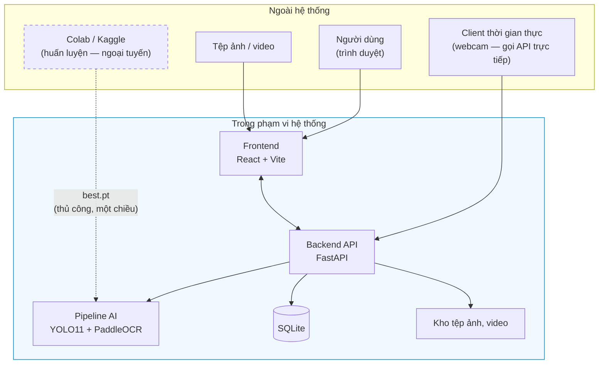

Colab/Kaggle nằm **ngoài** ranh giới hệ thống khi vận hành — chúng chỉ là công cụ ngoại tuyến sản xuất ra tệp trọng số `best.pt`. Hệ thống khi chạy **không phụ thuộc vào bất kỳ dịch vụ ngoài nào**, đây là hệ quả trực tiếp của tiêu chí "demo chạy được không cần Internet" ở mục 1.2.3. Lưu ý luồng thời gian thực: sau khi trang webcam được gỡ khỏi giao diện web (thu gọn phạm vi 2026-07-20), client thời gian thực gửi khung hình **trực tiếp vào tầng API** qua `POST /api/detect/frame` thay vì đi qua frontend.

---

## 1.4. Phương pháp nghiên cứu

Đề tài kết hợp hai phương pháp: **nghiên cứu lý thuyết** để chọn công nghệ và xác định khoảng trống, và **nghiên cứu thực nghiệm** để xây dựng, đo đạc và đánh giá hệ thống. Cả hai được tổ chức trong một **quy trình phát triển theo giai đoạn có điểm chốt**.

### 1.4.1. Nghiên cứu lý thuyết

**(a) Khảo sát tài liệu có hệ thống**, theo bốn trục: (i) tổng quan và lịch sử phát triển của bài toán ALPR; (ii) so sánh các thế hệ mô hình phát hiện đối tượng họ YOLO; (iii) so sánh các engine OCR; (iv) khảo sát các bộ dữ liệu biển số công khai, đặc biệt là dữ liệu Việt Nam. Kết quả được tổng hợp thành **232 mục tài liệu tham khảo** trong tệp `references.bib`, kèm một **bản đồ trích dẫn** ánh xạ từng khóa BibTeX tới vị trí sử dụng, bảo đảm mọi khẳng định trong quyển đều truy vết được về nguồn gốc.

**(b) Đối chiếu văn bản pháp quy gốc.** Toàn bộ luật kiểm tra tính hợp lệ được xây dựng bằng cách đối chiếu **văn bản pháp quy gốc** (Thông tư của Bộ Công an và Quy chuẩn kỹ thuật quốc gia), không dựa vào các bài tổng hợp thứ cấp. Phương pháp này đã trực tiếp phát hiện ra rằng căn cứ pháp lý mà nhiều tài liệu kỹ thuật trong nước đang dùng — TT 24/2023/TT-BCA — **đã hết hiệu lực**.

**(c) Kiểm chứng đối kháng nguồn trích dẫn.** Mỗi số liệu định lượng đều trải qua một vòng kiểm chứng: truy về nguồn gốc đầu tiên, kiểm tra điều kiện đo, và **loại bỏ hoặc gắn nhãn cảnh báo** nếu không tái lập được. Quy trình này đã phát hiện và sửa **25 lỗi**, trong đó **3 lỗi mức nghiêm trọng**. Hai ví dụ cho thấy phương pháp này ảnh hưởng trực tiếp tới thiết kế hệ thống:

- **Mệnh đề bị bác bỏ.** Giả thuyết ban đầu "biển số Việt Nam loại trừ 6 chữ cái `I J O Q R W`" đã bị **bác bỏ**: tập loại trừ đúng chỉ gồm **5 chữ** (`I J O Q W`), còn `R` **hợp lệ** ở vị trí seri thứ hai của biển xe mô tô. Hệ quả thiết kế: charset huấn luyện OCR dùng **đủ A–Z + 0–9**, ràng buộc hợp lệ áp ở **tầng hậu xử lý** — nơi có thể sửa và ghi log được — chứ không ở tầng mô hình.

- **Số liệu được giữ nhưng gắn cảnh báo.** Benchmark chính thức trên CPU Intel Core i7-13700H cho thấy **ONNX Runtime nhanh gấp khoảng 3,73 lần PyTorch** ở phân khúc mô hình nano (104,61 ms → 28,02 ms, `imgsz` 640, FP32) [18]<!-- ultralytics_2026_openvinoexport -->. Con số thời gian này được giữ làm căn cứ cho phương án giảm tải độ trễ, nhưng **cột mAP đi kèm trong bảng gốc bị loại bỏ có chủ ý** vì đo trên `coco8.yaml` — một tập chỉ **8 ảnh** — nên **không có ý nghĩa thống kê**.

### 1.4.2. Nghiên cứu thực nghiệm

**(a) Xây dựng hệ thống** theo kiến trúc phân tầng với ràng buộc cứng về tách biệt trách nhiệm (mục 1.2.2c), cho phép thay thế từng thành phần độc lập.

**(b) Huấn luyện có kiểm soát.** Mô hình được huấn luyện trên tập dữ liệu đã làm sạch, **chia train/val/test có kiểm soát rò rỉ dữ liệu** (loại bỏ ảnh trùng lặp trước khi chia). Đánh giá thực hiện trên **tập test độc lập**, không tham gia bất kỳ bước chọn siêu tham số nào.

**(c) Đo đạc và công bố.** Nguyên tắc phương pháp luận bắt buộc của đề tài:

> **Mọi số liệu hiệu năng công bố đều phải kèm: model CPU, số luồng, kích thước ảnh đầu vào (`imgsz`), backend suy luận (PyTorch / ONNX / OpenVINO), và cỡ mẫu đo.**

Công bố một con số FPS mà không kèm cấu hình phần cứng là **lỗi phương pháp luận**. Nguyên tắc này cũng cấm đặt cạnh nhau các số liệu đo trên phần cứng khác nhau (ví dụ: không so cột đo trên NVIDIA A100 với cột đo trên NVIDIA T4), và cấm so sánh trực tiếp `mAP@0.5` với `mAP@0.5:0.95` vì đây là **hai định nghĩa chỉ số khác nhau**.

**(d) Đánh giá tách bạch.** Ba phép tách bạch bắt buộc, mỗi phép phục vụ một câu hỏi cụ thể:

| Phép tách | Trả lời câu hỏi | Chỉ tiêu liên quan |
|---|---|---|
| Trước ↔ sau hậu xử lý | Khối hậu xử lý đóng góp bao nhiêu điểm phần trăm? | NFR-A5 ↔ NFR-A6 |
| Biển một dòng ↔ hai dòng | Hệ thống có bị điểm gãy như OpenALPR không? | NFR-A8 |
| Theo điều kiện ảnh | Hệ thống bền vững tới đâu? | NFR-A9 |

### 1.4.3. Quy trình phát triển theo giai đoạn

Đề tài được thực hiện theo quy trình **12 giai đoạn (Phase 0 – Phase 11)**, tổng công sức ước lượng **77 ngày-người** (quy ước 1 ngày-người ≈ 6 giờ làm việc tập trung). Mỗi giai đoạn kết thúc bằng một **điểm chốt (milestone)** có điều kiện thông qua tường minh; **không tự động chuyển sang giai đoạn tiếp theo** khi điểm chốt chưa đạt.

**Bảng 1.5.** Mười hai giai đoạn thực hiện, công sức và điều kiện thông qua

| Phase | Tên giai đoạn | Công sức | Điểm chốt | Điều kiện thông qua |
|:---:|---|:---:|:---:|---|
| 0 | Requirement Analysis | 2 | M0 | Yêu cầu được phê duyệt, phạm vi được chốt |
| 1 | Research | 5 | M1 | Đã chọn xong công nghệ, có căn cứ trích dẫn |
| 2 | Dataset | 10 | M2 | Bộ dữ liệu đạt chất lượng, thống kê hợp lý |
| 3 | Model Training | 12 | M3 | Mô hình đạt chỉ tiêu NFR-A1, A2, A3 |
| 4 | OCR | 8 | M4 | Pipeline E2E đạt chỉ tiêu NFR-A7 |
| 5 | Backend | 8 | M5 | API hoạt động đầy đủ, Swagger đầy đủ |
| 6 | Frontend | 8 | M6 | Giao diện dùng được toàn bộ yêu cầu *Must* |
| 7 | Testing | 6 | M7 | Mọi chỉ tiêu NFR được đo và đạt ngưỡng |
| 8 | Deployment | 4 | M8 | `docker compose up` chạy được trên máy sạch |
| 9 | Documentation | 8 | M9 | Bộ tài liệu đầy đủ |
| 10 | Presentation | 4 | M10 | Slide và demo sẵn sàng bảo vệ |
| 11 | Final Package | 2 | M11 | Gói bàn giao hoàn chỉnh |
| | **Tổng** | **77** | | |

Đường găng của đề tài gần như tuyến tính hoàn toàn: `P0 → P1 → … → P11`. **Ba giai đoạn nặng nhất — Dataset (10), Model Training (12) và OCR (8) — chiếm 42% tổng công sức.** Đây là phần lõi kỹ thuật và cũng là ba mắt xích rủi ro nhất:

| Mắt xích | Vì sao rủi ro | Dấu hiệu cần cảnh giác |
|---|---|---|
| P2 → P3 | Chất lượng dữ liệu quyết định **trần** độ chính xác của mô hình. Nhãn xấu thì không siêu tham số nào cứu được | Nhãn không nhất quán; ảnh trùng lặp giữa train và test |
| P3 → P4 | Bounding box lệch ⇒ vùng cắt lệch ⇒ OCR sai, dù OCR có hoàn hảo | `mAP@0.5:0.95` thấp dù `mAP@0.5` cao |
| P4 | **Biển hai dòng** — chính là rủi ro đã được định lượng ở mục 1.1.3 | Độ chính xác biển hai dòng thấp hơn biển một dòng rõ rệt |

**Trạng thái tại thời điểm viết chương này.** Phase 0 và Phase 1 đã hoàn thành, chốt M0 và M1. Backend FastAPI đã chạy được và được xác minh bằng yêu cầu HTTP thật (10 endpoint phản hồi đúng, migration cơ sở dữ liệu hoàn tất, tài liệu Swagger render được); frontend đã hoàn thành và build sạch. **Hệ thống đang vận hành pipeline nhận dạng thật** với mô hình chính thức `models/best.pt` — `/health` báo `model_loaded: true`, engine `yolo:best.pt+paddleocr-PP-OCRv5-mobile`. Mô hình chính thức (YOLO11n, `imgsz=640`, split v3, 20 epoch) **đã huấn luyện xong**, đạt mAP@0.5 = 0,9829 và mAP@0.5:0.95 = 0,7834; các chỉ tiêu NFR-A4/A5/A6/A7 và NFR-P1 **đã được đo**. `models/baseline-416-v1.pt` chỉ còn giữ vai trò **mô hình đối chứng** và không đóng góp con số nào vào kết quả công bố, vì hai khiếm khuyết đã biết: huấn luyện ở `imgsz=416` trong khi chỉ tiêu đặt ở 640, và dùng split v1 vốn có rò rỉ train↔test. **Toàn bộ kết quả thực nghiệm được trình bày ở Chương 6.**

---

## 1.5. Ý nghĩa khoa học và thực tiễn

### 1.5.1. Ý nghĩa khoa học

**(a) Lấp một khoảng trống báo cáo có thật.** Khảo sát ở Phase 1 cho thấy **chưa có công trình Việt Nam nào công bố bảng so sánh tách riêng độ chính xác giữa biển một dòng và biển hai dòng trên cùng một hệ thống**. Trong khi đó, bằng chứng từ Brazil (mục 1.1.3) cho thấy chênh lệch giữa hai bố cục có thể lên tới 48,6 điểm phần trăm [7]<!-- laroca_2022_crossdataset --> — nghĩa là **một con số tổng thể có thể che giấu hoàn toàn điểm gãy của hệ thống**.

**(b) Hệ thống hoá bộ luật hậu xử lý theo cấu trúc vị trí.** Các mô tả hiện có phần lớn dừng ở mức "danh sách ký tự cho phép" phẳng, áp chung cho toàn chuỗi. Đề tài mô tả có hệ thống ràng buộc **phụ thuộc vị trí** trên căn cứ pháp lý hiện hành.

**(c) Đóng góp về phương pháp luận báo cáo.** Đề tài trình bày tường minh một bộ quy tắc công bố số liệu (mục 1.4.2c) nhằm khắc phục ba lỗi phổ biến quan sát được trong khảo sát: công bố FPS không kèm phần cứng, chỉ báo cáo mAP của khâu phát hiện mà bỏ qua độ chính xác toàn trình, và so sánh chéo các chỉ số có định nghĩa khác nhau.

### 1.5.2. Ý nghĩa thực tiễn

**(a) Một hệ thống chạy được, không phải một notebook.** Sản phẩm được thiết kế để có API, giao diện web, cơ sở dữ liệu, bộ kiểm thử và đóng gói triển khai — khởi động bằng một lệnh và hoạt động không cần Internet, do đó có thể dùng làm **nền tảng khởi đầu** cho triển khai quy mô nhỏ: bãi giữ xe cơ quan, kiểm soát ra vào khu công nghiệp, chung cư. Tại thời điểm viết chương này, tầng API, tầng nghiệp vụ và cơ sở dữ liệu đã cài đặt và chạy được; giao diện web đã hoàn thành và build sạch; bộ kiểm thử (Phase 7) và đóng gói Docker/Docker Compose (Phase 8) **đã thực hiện xong** (xem mục 1.4.3).

**(b) Chạy được trên phần cứng phổ thông.** Toàn bộ chỉ tiêu hiệu năng là chỉ tiêu **CPU**. Các đơn vị triển khai quy mô nhỏ tại Việt Nam thường không có ngân sách cho máy chủ GPU, nên một hệ thống đạt độ trễ chấp nhận được trên CPU phổ thông có khả năng triển khai rộng hơn hẳn.

**(c) Cập nhật căn cứ pháp lý và bảo đảm khả năng tái lập.** Bộ hằng số đúng theo TT 79/2024 + QCVN 08:2024 (81 mã tỉnh hợp lệ, hai tập chữ cái seri khác nhau theo vị trí, ba mức tỉ lệ khung hình) có giá trị sử dụng lại cho các nhóm phát triển khác. Tài liệu đi kèm ghi rõ giao thức đo, tập kiểm thử, nguồn gốc dữ liệu và cấu hình phần cứng, cho phép các nhóm sau **đối chứng** kết quả.

---

## 1.6. Đóng góp của đề tài

### 1.6.1. Tuyên bố trung thực về mức đóng góp

Cần nói rõ, và nói trước:

> **Đề tài này không tạo ra kết quả state-of-the-art.**

Các con số vượt 99% xuất hiện trong tài liệu ALPR quốc tế là sản phẩm của những nhóm nghiên cứu chuyên nghiệp với nhiều năm tích luỹ, hạ tầng GPU quy mô lớn và các tập dữ liệu độc quyền. Một đồ án tốt nghiệp đại học, thực hiện trên máy không có GPU CUDA và trong khung thời gian giới hạn, **không đặt mục tiêu đó** — và việc tuyên bố ngược lại sẽ là thiếu trung thực học thuật.

Đóng góp thực sự của đề tài nằm ở sáu chỗ khác, cụ thể và kiểm chứng được, trình bày dưới đây.

### 1.6.2. Đóng góp (a) — Hệ thống hoàn chỉnh từ mô hình AI đến giao diện và triển khai

Sản phẩm là một hệ thống có **kiến trúc phần mềm**, không phải một tập script rời rạc: pipeline AI tách biệt hoàn toàn khỏi tầng API (NFR-M1, kiểm chứng được bằng phân tích import), interface trừu tượng cho phép thay thế engine OCR mà không sửa mã tầng API (NFR-M5), REST API có tài liệu tự sinh, giao diện web **ba màn hình** (thu gọn từ năm qua hai đợt gỡ trang ngày 2026-07-20 — năng lực thời gian thực và số liệu thống kê đều giữ ở tầng API), cơ sở dữ liệu có migration, bộ kiểm thử độ bao phủ ≥ 70%, và đóng gói Docker khởi động một lệnh.

> **Mức độ hoàn thành tại thời điểm viết.** Bốn hạng mục đầu — tách tầng AI, interface trừu tượng, REST API có tài liệu tự sinh, cơ sở dữ liệu có migration — **đã được cài đặt và xác minh bằng yêu cầu HTTP thật**. Giao diện web **đã hoàn thành** và build sạch. Chỉ tiêu độ bao phủ kiểm thử ≥ 70% **đã đạt và đã đo**: **87,7%** ở tầng nghiệp vụ theo lần đo mới nhất ngày 2026-07-20 (`docs/reports/13-refactor-result.json`; lần đo ở Phase 7 trước đó là 88,1% theo `docs/reports/07-testing-report.md`, và 42,0% trên toàn kho), với **882 test thu thập / 881 đạt / 1 xfail / 0 thất bại**. Đóng gói Docker và Docker Compose **đã hoàn thành**. Số liệu chi tiết của từng hạng mục được báo cáo ở **Chương 6**.

Khảo sát ở Phase 1 cho thấy hệ sinh thái mã nguồn mở ALPR Việt Nam chủ yếu gồm các script rời rạc **không công bố số liệu độ chính xác** và **không có kiến trúc phần mềm**. Đây là **khoảng trống kỹ nghệ** chứ không phải khoảng trống thuật toán — nhưng vẫn là khoảng trống có thật.

### 1.6.3. Đóng góp (b) — Bộ luật hậu xử lý ràng buộc theo VỊ TRÍ cho biển số Việt Nam

Bộ luật khai thác ba ràng buộc đặc thù của quy chuẩn Việt Nam: **(i) tập hợp lệ khác nhau theo từng vị trí** — mã địa phương thuộc **81 giá trị hợp lệ** chứ không phải `\d{2}` [14]<!-- thuviennhadat_2025_kyhieu34tinh -->, chữ cái seri **thứ nhất** thuộc tập **20 chữ cái** có `G` không có `R` [13]<!-- bocongan_2024_nhandienbienso -->, chữ cái seri **thứ hai** của biển xe mô tô thuộc một tập **20 chữ cái KHÁC** có `R` không có `G`, và vị trí thứ hai cũng có thể là **chữ số 1–9** (không có `0`) với biển kiểu cũ; **(ii) cấu trúc chuỗi và độ dài** theo quy chuẩn, cho phép sinh mặt nạ vị trí (position mask) cho từng dạng biển; **(iii) sự cùng tồn tại của định dạng cũ và mới**, buộc bộ luật chấp nhận cả hai mà không làm hỏng dạng còn lại.

Điểm mấu chốt: bộ luật sửa lỗi OCR theo **vị trí trong chuỗi chứ không theo ánh xạ hai chiều**. Với cặp `O ↔ 0`, ánh xạ đúng **không** phải là hai chiều `O → 0` và `0 → O`, bởi `O` không nằm trong tập chữ cái seri hợp lệ; ánh xạ đúng là `O → 0` tại vị trí chữ số, và `0 → D` tại vị trí chữ cái.

> ### Nói thẳng về độ lớn của đóng góp này
>
> Trước khi rà soát lại căn cứ pháp lý, luận điểm dự kiến của đề tài là *"khai thác bộ 20 chữ cái, loại trừ 6 chữ `I J O Q R W`"*. **Mệnh đề đó sai và đã bị bác bỏ ở Phase 1.** Tập loại trừ toàn hệ thống thực sự chỉ có **5 chữ** (`I`, `J`, `O`, `Q`, `W`); chữ `R` **hợp lệ** ở vị trí seri thứ hai của biển xe mô tô.
>
> Việc sửa lại **làm yếu đi** phần đóng góp nếu tính theo tiêu chí "số ký tự loại trừ được" — không gian tìm kiếm bị thu hẹp ít hơn dự kiến ban đầu. Đổi lại, phần thực sự có giá trị chuyển sang một chỗ khác và khó hơn: ràng buộc **phụ thuộc vị trí**, chứ không phải một bộ ký tự phẳng áp cho cả chuỗi. Một hệ thống dùng danh sách phẳng 20 chữ cái sẽ **sai hệ thống trên toàn bộ lớp biển xe máy có `R` ở vị trí thứ hai** — và đây mới là lỗi mà bộ luật của đề tài ngăn được.
>
> **Đóng góp này vì vậy được trình bày là *đúng đắn về mặt pháp lý và đúng cấu trúc theo vị trí*, không phải là một cải thiện lớn về không gian tìm kiếm.**

### 1.6.4. Đóng góp (c) — Đo được ĐỊNH LƯỢNG đóng góp của bước hậu xử lý

Phần lớn công trình mô tả bước hậu xử lý ở mức định tính ("có thêm bước sửa lỗi bằng regex"), không trả lời được câu hỏi *bước đó đóng góp bao nhiêu*.

Đề tài giải quyết bằng một quyết định thiết kế cụ thể ở tầng dữ liệu: **lưu đồng thời cả chuỗi OCR thô và chuỗi đã sửa** cho mỗi lần nhận dạng. Nhờ đó, hiệu số giữa **NFR-A5** (độ chính xác biển đầy đủ *trước* hậu xử lý) và **NFR-A6** (*sau* hậu xử lý) trở thành một **con số đo được**, chính là đóng góp định lượng của khối hậu xử lý. Con số này sẽ được trình bày ở **Chương 6**.

### 1.6.5. Đóng góp (d) — Đánh giá tách riêng biển một dòng và biển hai dòng

Như đã nêu ở mục 1.5.1(a), đây là khoảng trống báo cáo đã xác định trong khảo sát. Yêu cầu **NFR-A8** đưa phép tách này thành nghĩa vụ báo cáo bắt buộc của đề tài, chứ không phải một phân tích tuỳ chọn. Kèm theo là **NFR-A9** — báo cáo theo điều kiện ảnh, nếu bộ dữ liệu có nhãn phù hợp.

### 1.6.6. Đóng góp (e) — Công bố hiệu năng kèm cấu hình phần cứng CPU cụ thể

Mọi số liệu hiệu năng của đề tài được công bố kèm **model CPU, số luồng, kích thước ảnh đầu vào, backend suy luận và cỡ mẫu đo** (mục 1.4.2c). Đây là phản ứng trực tiếp với một lỗi phổ biến quan sát được trong khảo sát: **số liệu FPS thường được công bố mà không kèm phần cứng**, khiến chúng không thể tái lập và không thể so sánh.

### 1.6.7. Đóng góp (f) — Benchmark các engine OCR trên chính ảnh biển số Việt Nam

Khảo sát ở Phase 1 xác định rằng **không tồn tại benchmark công khai nào so sánh các engine OCR trên riêng ảnh biển số xe máy Việt Nam hai dòng**; hơn nữa, hai số liệu thường được viện dẫn để chứng minh ưu thế của một engine cụ thể đã **bị bác bỏ khi truy ngược về nguồn gốc** — chi tiết ở mục 3.3. Đây là lý do lựa chọn engine OCR được để mở một cách có chủ ý ở giai đoạn thiết kế thay vì được khẳng định không căn cứ.

Đồ án lấp khoảng trống này bằng cách tự chạy một ma trận thí nghiệm so sánh các engine ứng viên trên chính tập kiểm thử biển số Việt Nam, với chỉ số chính là **độ chính xác mức chuỗi tách riêng cho biển một dòng và biển hai dòng**, kèm độ trễ p50/p95/p99 đo trên cùng một cấu hình phần cứng. Chương 2 đánh giá đây là **đóng góp khoa học có giá trị nhất mà đồ án có thể tuyên bố** (khoảng trống số 4, Bảng 2.23), vì nó biến một điểm chưa chứng minh được thành một phép đo mà đồ án là bên đầu tiên thực hiện. Kết quả sẽ được trình bày ở **Chương 6**.

### 1.6.8. Những gì đề tài KHÔNG tuyên bố

Để tránh mọi hiểu nhầm khi bảo vệ, bốn điều loại trừ được ghi rõ:

1. Đề tài **không** tuyên bố vượt qua các con số độ chính xác cao nhất đã công bố trong nước — các con số đó được đo trên tập dữ liệu riêng không công khai, **không tồn tại cơ sở để so sánh công bằng**.
2. Đề tài **không** đề xuất kiến trúc mạng nơ-ron mới; nó **tích hợp và tinh chỉnh** các thành phần đã có.
3. Đề tài **không** giải quyết các thách thức mở của lĩnh vực: nhận dạng ở độ phân giải rất thấp, tổng quát hoá xuyên tập dữ liệu, che khuất nặng. Những vấn đề này được nêu ở phần **Hướng phát triển (Chương 7)**.
4. Mọi số liệu hiệu năng của đề tài là **số liệu CPU**, **không so sánh trực tiếp được** với các con số FPS đo trên GPU trong tài liệu tham khảo.

---

## 1.7. Bố cục quyển đồ án

Quyển đồ án gồm bảy chương:

| Chương | Tên | Nội dung chính |
|:---:|---|---|
| **1** | **Giới thiệu** | Bối cảnh và lý do chọn đề tài; mục tiêu dưới dạng chỉ tiêu đo được; đối tượng và phạm vi; phương pháp nghiên cứu; ý nghĩa và đóng góp |
| **2** | **Cơ sở lý thuyết** | Tổng quan bài toán ALPR và lịch sử phát triển; phân loại các hướng tiếp cận; cơ sở lý thuyết về phát hiện đối tượng họ YOLO và nhận dạng ký tự không phân đoạn; **quy chuẩn biển số Việt Nam theo TT 79/2024 và QCVN 08:2024**; các công trình liên quan và khoảng trống nghiên cứu |
| **3** | **Khảo sát công nghệ và lựa chọn mô hình** | Tiêu chí lựa chọn và **ranh giới giữa cái đã đo và cái mới chỉ khảo sát tài liệu**; chọn mô hình phát hiện trong bảy thế hệ YOLO; chọn engine OCR trong tám ứng viên, kèm phép đo PP-OCRv5 mobile so với PP-OCRv6; chọn runtime suy luận trên CPU; ảnh hưởng của độ phân giải đầu vào |
| **4** | **Phân tích và thiết kế hệ thống** | Phân tích yêu cầu (34 FR, các nhóm NFR, ràng buộc, rủi ro); kiến trúc tổng thể và nguyên tắc tách tầng; thiết kế pipeline AI, khối hậu xử lý theo vị trí, cơ sở dữ liệu, API và giao diện |
| **5** | **Xây dựng hệ thống và huấn luyện mô hình** | Môi trường và công cụ; xây dựng bộ dữ liệu; huấn luyện bộ phát hiện; **tinh chỉnh bộ nhận dạng ký tự và phép đo có/không tinh chỉnh**; hiện thực tầng AI, backend, frontend; đóng gói triển khai; những chỗ cài đặt lệch khỏi thiết kế và lý do |
| **6** | **Thực nghiệm và đánh giá** | Giao thức đo; đánh giá bộ phát hiện và khối OCR; **đánh giá toàn trình tách riêng biển một dòng và hai dòng**; **đo đóng góp định lượng của khối hậu xử lý**; đo hiệu năng CPU kèm cấu hình phần cứng; đối chiếu từng chỉ tiêu NFR; phân tích ca lỗi và các mối đe doạ đến tính hợp lệ |
| **7** | **Kết luận và hướng phát triển** | Tổng kết kết quả đạt được và chưa đạt; hạn chế; hướng phát triển |

Phần cuối quyển gồm **Tài liệu tham khảo** và các **Phụ lục** (bảng mã tỉnh đầy đủ, bảng tổng hợp yêu cầu chức năng, đặc tả API, hướng dẫn cài đặt và vận hành).

> **Vì sao khảo sát công nghệ được tách thành chương riêng.** Ở bản thảo trước, toàn bộ luận cứ chọn mô hình nằm gọn trong một mục cuối chương cơ sở lý thuyết. Đó là chỗ người đọc mục lục không nhìn thấy, trong khi lại là phần mà một hội đồng hỏi nhiều nhất. Chương 3 tồn tại để câu hỏi *"vì sao chọn YOLO11 chứ không phải YOLOv8, vì sao PaddleOCR chứ không phải EasyOCR, vì sao bản mobile của v5 chứ không phải v6"* có một chỗ trả lời tường minh — kể cả khi câu trả lời trung thực đôi lúc là *"chưa đo được"*.

---

## Tóm tắt chương

Chương 1 đã xác lập bốn nền tảng cho toàn bộ quyển đồ án.

**Thứ nhất, lý do tồn tại của đề tài.** Với 77 triệu xe máy và tỉ lệ 770 xe trên 1.000 dân [1]<!-- dantri_2024_77trieuxemay -->, phân bố phương tiện Việt Nam khiến **biển hai dòng trở thành đa số tuyệt đối** — trái ngược với giả định thiết kế của phần lớn hệ thống ALPR quốc tế. Bằng chứng định lượng mạnh nhất là kết quả của OpenALPR trên tập kiểm thử cân bằng: **94,3% trên biển một dòng nhưng chỉ 45,7% trên biển hai dòng, chênh 48,6 điểm phần trăm**, đo trên bộ **RodoSol-ALPR (Brazil)** [7]<!-- laroca_2022_crossdataset --> (dẫn như *analogue*, không phải số liệu Việt Nam). Cộng thêm cấu trúc chuỗi ký tự do TT 79/2024 và QCVN 08:2024 quy định — 81 mã tỉnh hợp lệ, hai tập chữ cái seri **khác nhau theo vị trí**, ba mức tỉ lệ khung hình phân tách rõ ràng — kết luận là các giải pháp huấn luyện trên dữ liệu nước ngoài **không thể áp dụng trực tiếp**.

**Thứ hai, mục tiêu đo được**, với ba chỉ tiêu then chốt: **mAP@0.5 ≥ 0,90**, **độ chính xác toàn trình ≥ 0,88**, và **độ trễ p95 ≤ 800 ms trên CPU**.

**Thứ ba, ranh giới rõ ràng.** Phạm vi trong gồm bốn nhóm; phạm vi ngoài gồm **11 hạng mục, mỗi hạng mục kèm lý do loại trừ tường minh**.

**Thứ tư, đóng góp trung thực.** Đề tài **không tạo ra kết quả state-of-the-art** và tuyên bố điều đó ngay từ đầu. Đóng góp thực sự nằm ở sáu chỗ: (a) hệ thống hoàn chỉnh có kiến trúc phần mềm chứ không phải notebook demo; (b) bộ luật hậu xử lý **ràng buộc theo vị trí** — trình bày đúng mức là *đúng đắn về pháp lý và cấu trúc*, sau khi mệnh đề "loại trừ 6 chữ cái" đã bị bác bỏ; (c) **đo định lượng** đóng góp của bước hậu xử lý nhờ lưu song song chuỗi OCR thô và chuỗi đã sửa; (d) **đánh giá tách riêng** biển một dòng và hai dòng; (e) công bố hiệu năng **kèm cấu hình phần cứng CPU cụ thể**; và (f) **benchmark các engine OCR trên chính ảnh biển số Việt Nam** — khoảng trống mà Chương 2 đánh giá là đóng góp khoa học có giá trị nhất của đồ án.

Chương 2 tiếp theo trình bày tổng quan bài toán ALPR, cơ sở lý thuyết của các thành phần được lựa chọn, quy chuẩn biển số Việt Nam, và căn cứ so sánh dẫn tới các quyết định công nghệ của đề tài.


```{=openxml}
<w:p><w:r><w:br w:type="page"/></w:r></w:p>
```

# CHƯƠNG 2. CƠ SỞ LÝ THUYẾT

Chương 1 đã xác định vấn đề mà đồ án hướng tới: xây dựng một hệ thống nhận dạng biển số xe Việt Nam vận hành được trên máy tính không có GPU, hỗ trợ đồng thời biển một dòng và biển hai dòng. Chương này đặt nền lý thuyết và nền tư liệu cho toàn bộ phần thiết kế và cài đặt phía sau.

Nội dung chương được tổ chức theo bốn khối. Khối thứ nhất (mục 2.1 – 2.3) mô tả bài toán nhận dạng biển số tự động, quá trình phát triển của lĩnh vực và cách phân loại các hướng tiếp cận hiện có. Khối thứ hai (mục 2.4 – 2.5) trình bày cơ sở lý thuyết của hai khối tính toán cốt lõi: phát hiện đối tượng và nhận dạng ký tự, kèm hệ thống chỉ số đánh giá. Khối thứ ba (mục 2.6) đặc tả quy chuẩn biển số xe Việt Nam theo văn bản pháp luật đang có hiệu lực — đây là phần quyết định tính đúng đắn của khối hậu xử lý. Khối thứ tư (mục 2.7 – 2.8) khảo sát các công trình liên quan, xác định khoảng trống nghiên cứu và trình bày luận cứ cho từng lựa chọn công nghệ của đồ án.

Một nguyên tắc được giữ xuyên suốt chương: **mọi con số định lượng đều gắn với nguồn gốc tại chính vị trí xuất hiện, và mọi cảnh báo về phạm vi áp dụng của con số đó đều được giữ nguyên**. Lĩnh vực nhận dạng biển số có đặc điểm là các con số rất cao (trên 99%) được công bố thường xuyên nhưng đo trên những tập dữ liệu và giao thức đánh giá rất khác nhau; việc trích dẫn thiếu ngữ cảnh sẽ dẫn tới những so sánh khập khiễng mà người phản biện dễ dàng phát hiện.

---

## 2.1. Tổng quan bài toán ALPR

### 2.1.1. Định nghĩa và các thành phần của một hệ thống ALPR

Nhận dạng biển số xe tự động — *Automatic License Plate Recognition* (ALPR) — là bài toán tự động xác định vị trí biển số xe trong ảnh hoặc khung hình video và chuyển nội dung ký tự trên biển thành chuỗi văn bản mà máy tính xử lý được. Đầu vào là ảnh chụp cảnh giao thông thường không ràng buộc chặt về góc chụp, khoảng cách hay điều kiện chiếu sáng; đầu ra là danh sách các chuỗi biển số, kèm vị trí trong ảnh và độ tin cậy (*confidence*) của từng kết quả.

Điều làm ALPR khác biệt với bài toán nhận dạng văn bản trong ảnh cảnh (*scene text recognition*) tổng quát nằm ở các ràng buộc mạnh về cấu trúc. Biển số có kích thước vật lý được chuẩn hoá bằng quy chuẩn kỹ thuật quốc gia, tỷ lệ khung hình cố định theo từng loại biển, bộ ký tự đóng và giới hạn, và cú pháp chuỗi tuân theo quy định pháp luật của từng quốc gia. Những ràng buộc này vừa là lợi thế — chúng cho phép thiết kế một bước hậu xử lý theo luật rất hiệu quả — vừa là một cái bẫy: mô hình dễ học thuộc cú pháp của tập huấn luyện và suy giảm hiệu năng khi định dạng biển số thay đổi theo thời gian, một vấn đề được nêu tường minh trong công trình về kiến trúc Transformer "bền vững với thay đổi định dạng" của Meyer và cộng sự [19]<!-- meyer_2025_salt -->.

Hai khảo sát kinh điển của lĩnh vực đã chuẩn hoá cách mô tả ALPR thành ba bước xử lý nối tiếp: trích xuất vùng biển số, phân đoạn ký tự, và nhận dạng ký tự [2]<!-- anagnostopoulos_2008_survey --> [3]<!-- du_2013_review -->. Bài tổng quan cập nhật nhất của lĩnh vực vẫn giữ nguyên cách phân rã ba thành phần này, đồng thời bổ sung các thách thức mới liên quan tới biển số đa quốc gia, camera chuyển động và góc nhìn thay đổi [20]<!-- li_2026_review -->.

Trên thực tế, các hệ thống hiện đại thường bổ sung hai khối tuỳ chọn nhưng có ảnh hưởng lớn tới chất lượng cuối cùng:

- **Phát hiện phương tiện** đặt trước phát hiện biển số, nhằm thu hẹp vùng tìm kiếm và giảm số cảnh báo sai (*false positive*) trong cảnh đông đúc. Kiến trúc ba giai đoạn kiểu này đã được áp dụng cho bài toán xe máy Việt Nam [21]<!-- le_2023_vnmotorcycle -->.
- **Nắn chỉnh phối cảnh** (*rectification*), chuyển vùng biển bị chụp nghiêng về dạng chính diện bằng phép biến đổi *planar homography*. Đây chính là đóng góp cốt lõi của WPOD-NET, mạng vừa phát hiện vừa nắn chỉnh biển số bị biến dạng góc xiên [22]<!-- silva_2018_wpodnet -->.
- **Hậu xử lý theo luật**, sửa các nhầm lẫn hình dạng phổ biến và loại bỏ những chuỗi không hợp lệ dựa trên cú pháp biển số của vùng lãnh thổ. Laroca và cộng sự thậm chí hợp nhất hẳn một bộ phân loại layout vào detector để chọn đúng bộ luật hậu xử lý cho từng khu vực [23]<!-- laroca_2021_layout -->.

### 2.1.2. Ứng dụng thực tế

Bảng 2.1 tổng hợp các nhóm ứng dụng chính của ALPR cùng đặc điểm điều kiện vận hành tương ứng.

**Bảng 2.1.** Các nhóm ứng dụng của hệ thống ALPR

| Nhóm ứng dụng | Mô tả | Điều kiện vận hành |
|---|---|---|
| Quản lý bãi đỗ xe | Ghi nhận xe vào/ra, tính phí, đối soát | Camera cố định, khoảng cách gần, ánh sáng kiểm soát được — điều kiện **ràng buộc** (*constrained*) |
| Thu phí không dừng | Nhận diện phương tiện tại trạm thu phí | Camera cố định, xe di chuyển tốc độ trung bình |
| Giám sát và xử phạt nguội | Phát hiện vi phạm, truy vết phương tiện | Camera ngoài trời, mọi điều kiện thời tiết và ánh sáng — điều kiện **không ràng buộc** (*unconstrained*) |
| An ninh, kiểm soát ra vào | Kiểm soát cổng khu công nghiệp, khu dân cư | Ràng buộc, thường kết hợp barrier |
| Thực thi pháp luật | Camera tuần tra gắn trên xe đang di chuyển | Khó nhất — cả camera lẫn đối tượng đều chuyển động |

Sự phân biệt giữa điều kiện **ràng buộc** và **không ràng buộc** là then chốt khi đọc bất kỳ con số nào trong tài liệu chuyên ngành. Bộ dữ liệu AOLP tách rõ ba kịch bản này thành ba tập con riêng: AC (*Access Control*) với xe đi qua lối vào cố định, LE (*Law Enforcement*) với camera đặt ven đường, và RP (*Road Patrol*) với camera đặt trên xe đang di chuyển; hai tập sau khó hơn đáng kể [24]<!-- hsu_2013_aolp -->. Bộ UFPR-ALPR đi xa hơn, thiết kế toàn bộ dữ liệu ở tình huống cả xe mục tiêu lẫn camera đều đang chuyển động [25]<!-- laroca_2018_ufpralpr -->.

Đối với bối cảnh Việt Nam, cần ghi nhận một quan sát thực tiễn quan trọng: trong hệ thống thu phí không dừng đang vận hành, cơ chế nhận dạng chính là RFID, còn ảnh biển số chỉ đóng vai trò tra cứu và đối soát, hoặc làm lớp dự phòng khi việc đọc thẻ thất bại [5]<!-- vetc_nd_thuphikhongdung -->. Nói cách khác, ALPR ở đây là hệ thống bổ trợ chứ chưa phải hệ thống chính — một góc nhìn cần nêu đúng khi trình bày phần ứng dụng, thay vì phóng đại vai trò của công nghệ.

### 2.1.3. Các bước trong pipeline ALPR điển hình

Hình 2.1 mô tả sơ đồ đầy đủ của một pipeline ALPR hiện đại, trong đó các khối nét đứt là khối tuỳ chọn.

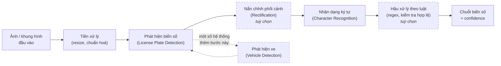

**Hình 2.1.** Sơ đồ pipeline ALPR điển hình *(tổng hợp từ [2], [3], [20], [22], [23])*

Quan hệ giữa khối phát hiện và khối nhận dạng là **quan hệ nhân quả một chiều và không có khả năng phục hồi**. Nếu detection trả về bounding box lệch, phần ký tự bị cắt cụt sẽ vĩnh viễn không xuất hiện trong ảnh đưa vào OCR, và không engine OCR nào — dù mạnh đến đâu — khôi phục được thông tin đã mất. Ngược lại, nếu detection hoàn hảo nhưng OCR đọc sai một ký tự thì toàn bộ chuỗi trả về vẫn sai. Vì chỉ tiêu đánh giá cuối cùng của ALPR là khớp chuỗi tuyệt đối (*plate-level exact match*), sai số của hai giai đoạn **nhân lên** chứ không bù trừ cho nhau. Đây là lý do vì sao mục 2.7 sẽ nhấn mạnh chỉ số end-to-end thay vì chỉ số của từng khối riêng lẻ.

---

## 2.2. Lịch sử phát triển các phương pháp

### 2.2.1. Giai đoạn xử lý ảnh cổ điển

Trước kỷ nguyên học sâu, ALPR được giải bằng đặc trưng thủ công (*hand-crafted features*). Quy trình phát hiện biển số điển hình gồm chuỗi bước: xám hoá ảnh, lọc cạnh dọc bằng toán tử **Sobel** (dựa trên quan sát rằng vùng biển số có mật độ cạnh dọc cao bất thường do các ký tự đứng sát nhau), nhị phân hoá, áp dụng phép **đóng/mở hình thái học** (*morphological closing/opening*) để nối các cạnh rời rạc thành khối liền, rồi dùng chiếu ngang và chiếu dọc (*projection*) để khoanh vùng ứng viên. Hai công trình đại diện cho họ phương pháp này là chương sách về định vị biển số dựa trên phát hiện cạnh và hình thái học [26]<!-- springer_2012_edgemorphology --> và bài báo về định vị biển số dựa trên đặc trưng cạnh–hình học [27]<!-- ieee_2013_edgegeometrical -->.

Bước phân đoạn ký tự dựa trên phân tích thành phần liên thông (*connected components*) hoặc histogram chiếu. Đáng chú ý, có một công trình thực hiện đúng trên biển số Việt Nam: nghiên cứu về phân đoạn ký tự cho **cả biển một dòng và biển hai dòng** thử nghiệm trên 600 biển Việt Nam (300 một dòng và 300 hai dòng), đạt độ chính xác trung bình 98,03% với quy trình gồm tiền xử lý (lượng tử hoá, chuẩn hoá, hiệu chỉnh contour ngang, khử nhiễu bằng morphology opening) rồi phân đoạn theo phương pháp *peak-to-valley* dựa trên tham số thống kê của biển số Việt Nam [28]<!-- amr_2012_charsegmentation -->. Bước phân lớp ký tự cuối cùng dùng đối sánh mẫu (*template matching*), mạng nơ-ron nông, hoặc **SVM**.

Điểm yếu cố hữu của toàn bộ họ phương pháp này là tính giòn. Mỗi tham số ngưỡng phải hiệu chỉnh thủ công theo điều kiện chụp cụ thể, và hiệu năng sụt rất nhanh khi gặp ánh sáng không đều, nền phức tạp hoặc biển bị nghiêng. Bằng chứng định lượng rõ nhất về khoảng cách giữa hai thế hệ công nghệ đến từ một cài đặt cổ điển công khai cho biển số Việt Nam dùng KNN kết hợp OpenCV: tỷ lệ phát hiện chỉ đạt **49,2% với biển một dòng** (182/370 mẫu) và **39,3% với biển hai dòng** (924/2.349 mẫu); trong số biển đã phát hiện được, tỷ lệ đọc đúng hoàn toàn chỉ đạt 33,5% với biển một dòng và 31% với biển hai dòng [29]<!-- mrzaizai2k_2025_vietnameselp -->.

> **Lưu ý khi đọc hai con số 33,5% và 31%.** Chúng được tính **trên số biển đã phát hiện được**, không phải trên toàn bộ tập kiểm thử. Quy về tỷ lệ end-to-end (ảnh vào cho ra chuỗi đúng hoàn toàn), con số thực tế còn thấp hơn nhiều. Đây là một ví dụ điển hình cho nguyên tắc phải đọc kỹ mẫu số của một chỉ số trước khi so sánh — nguyên tắc được phát biểu đầy đủ ở mục 2.7.1 (*"Ba lưu ý bắt buộc khi đọc Bảng 2.20"*) và được áp dụng lại khi định nghĩa các chỉ số đánh giá ở mục 2.5.4.

### 2.2.2. Giai đoạn học sâu

Sự trưởng thành của các detector một giai đoạn (YOLO) và hai giai đoạn (Faster R-CNN) đã thay thế hoàn toàn khối phát hiện thủ công. Quá trình chuyển đổi này diễn ra theo hai nhịp.

**Nhịp thứ nhất (khoảng 2016 – 2020) — pipeline học sâu hai giai đoạn.** Kiến trúc chủ đạo là chuỗi nối tiếp: một detector định vị biển số, một mạng khác đọc ký tự. Ba mốc tiêu biểu:

- Laroca và cộng sự dùng YOLO cho từng giai đoạn của pipeline, kết hợp các CNN tinh chỉnh riêng cho mỗi bước, đạt **93,53% recognition rate ở 47 FPS** trên tập SSIG — vượt cả hai hệ thống thương mại được đối chứng trên cùng benchmark [30]<!-- laroca_2018_yolo -->.
- Silva và Jung giới thiệu WPOD-NET, giải bài toán biển nghiêng bằng cách để chính mạng học luôn phép biến đổi nắn chỉnh, thay vì tách thành một bước tiền xử lý riêng [22]<!-- silva_2018_wpodnet -->.
- Xu và cộng sự công bố CCPD — bộ dữ liệu quy mô lớn đầu tiên của lĩnh vực — cùng mạng baseline RPnet đạt **98,5% accuracy ở tốc độ trên 61 FPS** [31]<!-- xu_2018_ccpd -->.

**Nhịp thứ hai (2020 – 2026) — end-to-end, Transformer và mô hình ngôn ngữ–thị giác.** Hướng phát triển gần đây đi theo ba nhánh song song:

1. **Hợp nhất detection và recognition vào một mạng duy nhất**, huấn luyện end-to-end trong một lần lan truyền xuôi, nhằm tránh tích luỹ lỗi giữa các module trung gian [32]<!-- li_2019_endtoend -->.
2. **Loại bỏ hoàn toàn bước phân đoạn ký tự**, chuyển sang đọc thẳng cả chuỗi bằng hàm mất mát CTC [33]<!-- zherzdev_2018_lprnet --> hoặc cơ chế attention hai chiều trên bản đồ đặc trưng 2D [34]<!-- zhang_2020_attentional -->.
3. **Đưa mô hình ngôn ngữ–thị giác (Vision-Language Model, VLM) và mô hình ngôn ngữ lớn vào ALPR**, cho phép nhận dạng không phụ thuộc layout [35]<!-- shabaninia_2025_layoutindependent --> [36]<!-- aldahoul_2024_vehiclepaligemma --> [37]<!-- gong_2026_lpllm -->.

### 2.2.3. So sánh ưu nhược điểm hai giai đoạn

Bảng 2.2 tổng hợp sự khác biệt giữa hai thế hệ công nghệ trên các chiều có ảnh hưởng trực tiếp tới quyết định kiến trúc của đồ án.

**Bảng 2.2.** So sánh phương pháp xử lý ảnh cổ điển và phương pháp học sâu

| Tiêu chí | Xử lý ảnh cổ điển | Học sâu |
|---|---|---|
| Cách trích đặc trưng | Thủ công: Sobel, morphology, projection, contour | Học tự động từ dữ liệu qua các tầng tích chập |
| Bộ phân lớp ký tự | Template matching, KNN, SVM, mạng nơ-ron nông | CNN, CRNN, Transformer, VLM |
| Nhu cầu dữ liệu gán nhãn | Thấp — chủ yếu cần hiệu chỉnh ngưỡng | Cao — cần hàng nghìn tới hàng trăm nghìn ảnh |
| Chi phí tính toán khi suy luận | Rất thấp, chạy được trên phần cứng yếu | Cao hơn nhiều, thường cần tối ưu để chạy trên CPU |
| Khả năng chịu nghiêng, mờ, thiếu sáng | Kém — mỗi ngưỡng phải chỉnh lại theo điều kiện | Tốt hơn rõ rệt nếu dữ liệu huấn luyện đủ đa dạng |
| Khả năng giải thích | Cao — từng bước quan sát được bằng mắt | Thấp — mô hình là hộp đen |
| Bằng chứng định lượng trên biển số Việt Nam | Phát hiện 49,2% (một dòng) / 39,3% (hai dòng) [29] | Nhiều công trình báo cáo trên 90% (mục 2.7) |
| Chi phí phát triển | Thấp ban đầu, tăng nhanh khi mở rộng điều kiện | Cao ban đầu, ổn định khi mở rộng |

Kết luận rút ra cho đồ án: hướng học sâu là lựa chọn bắt buộc về mặt hiệu năng, nhưng ràng buộc **suy luận trên CPU** khiến đồ án không thể chọn tuỳ ý mô hình lớn nhất. Đây chính là ràng buộc chi phối toàn bộ phần lựa chọn công nghệ ở Chương 3. Tuy vậy, các kỹ thuật cổ điển không bị loại bỏ hoàn toàn: phương pháp *peak-to-valley* [28] và các phép biến đổi hình học của OpenCV vẫn được dùng làm lớp dự phòng cho bài toán tách dòng của biển hai dòng (mục 2.5.3).

---

## 2.3. Phân loại các hướng tiếp cận hiện nay

Tài liệu chuyên ngành thường trộn lẫn hai trục phân loại vốn độc lập với nhau. Trục thứ nhất mô tả **cách tổ chức pipeline tổng thể** (two-stage hay end-to-end). Trục thứ hai mô tả **cách xử lý ký tự bên trong khối nhận dạng** (segmentation-based hay segmentation-free). Một hệ thống two-stage hoàn toàn có thể dùng bộ nhận dạng segmentation-free, và ngược lại. Việc tách bạch hai trục này là điều kiện để định vị chính xác lựa chọn kiến trúc của đồ án.

### 2.3.1. Two-stage và end-to-end

**Hướng two-stage** tách bạch detection và recognition thành hai mô hình huấn luyện độc lập. Ưu điểm: mỗi khối có thể tối ưu, thay thế và gỡ lỗi riêng; có thể tận dụng các mô hình OCR đã được huấn luyện sẵn thay vì huấn luyện từ đầu; và khi một khối hỏng, có thể xác định chính xác khối nào gây lỗi. Nhược điểm: lỗi ở khối detection lan truyền sang khối recognition mà không có cơ chế phục hồi, và tổng thời gian suy luận là tổng thời gian của hai bước. Ba đại diện tiêu biểu là WPOD-NET [22], pipeline YOLO nhiều giai đoạn [30], và hệ thống độc lập với layout của Laroca và cộng sự [23].

**Hướng end-to-end** hợp nhất mọi thứ vào một mạng duy nhất. Li, Wang và Shen trình bày một mạng thống nhất định vị biển số và nhận dạng ký tự trong **một lần lan truyền xuôi duy nhất**, với lập luận rằng cách này vừa tránh tích luỹ lỗi trung gian vừa tăng tốc độ [32]. RPnet cũng đồng thời dự đoán bounding box và đọc chuỗi biển số [31]. Nhược điểm của hướng này là mất tính module: muốn thay bộ nhận dạng thì phải huấn luyện lại toàn bộ mạng.

### 2.3.2. Segmentation-based và segmentation-free

**Hướng segmentation-based** tách từng ký tự khỏi vùng biển rồi phân lớp riêng lẻ. Pipeline YOLO nhiều giai đoạn của Laroca và cộng sự vẫn theo hướng này, kết hợp tăng cường dữ liệu bằng biển số đảo ngược và ký tự lật [30]. Nhược điểm cố hữu: chất lượng phân đoạn quyết định toàn bộ kết quả, và biển mờ, dính bẩn hoặc có ký tự sát nhau khiến bước phân đoạn thất bại.

**Hướng segmentation-free** bỏ hẳn bước tách ký tự, đọc thẳng cả chuỗi. Bảng 2.3 tổng hợp bốn nhánh kỹ thuật chính của hướng này.

**Bảng 2.3.** Bốn nhánh kỹ thuật của hướng segmentation-free

| Nhánh | Cơ chế | Công trình đại diện |
|---|---|---|
| CTC | Huấn luyện end-to-end bằng *Connectionist Temporal Classification loss*, không cần căn chỉnh vị trí ký tự với nhãn | LPRNet — đáng chú ý vì là hệ thống thời gian thực không dùng RNN [33] |
| Attention / seq2seq | Attention hai chiều trên bản đồ đặc trưng 2D, không cần heuristic hay hậu xử lý | Khung attention với encoder Xception [34] |
| Bộ phân lớp chia sẻ trọng số | Bỏ cả RNN lẫn phân đoạn ký tự, dùng bộ phân lớp ký tự chia sẻ trọng số | SCR-Net trong VSNet [38]<!-- wang_2021_vsnet --> |
| VLM / LLM | Mô hình ngôn ngữ–thị giác đọc trực tiếp, loại bỏ luôn bước phân loại layout thủ công | [35], [37] |

Đáng chú ý là **hai chiến lược đối lập cho vấn đề đa layout**. Khi hệ thống phải xử lý nhiều định dạng biển số khác nhau — nhiều quốc gia, hoặc biển một dòng và hai dòng trong cùng một quốc gia như Việt Nam — tài liệu ghi nhận hai hướng trái ngược. Hướng thứ nhất là **phân loại layout tường minh**: Laroca và cộng sự hợp nhất phát hiện biển số và phân loại layout vào cùng một mạng để chọn đúng luật hậu xử lý cho từng vùng lãnh thổ, đạt **96,9% end-to-end recognition rate trung bình trên 8 tập dữ liệu công khai từ 5 khu vực** [23]. Hướng thứ hai là **không phụ thuộc layout**: dùng VLM kết hợp cơ chế tinh chỉnh hậu-OCR để vừa nhận dạng ký tự vừa sửa lỗi, loại bỏ hoàn toàn bước phân loại layout thủ công [35].

### 2.3.3. Sơ đồ phân loại

Hình 2.2 tổng hợp hai trục phân loại cùng các công trình đại diện.

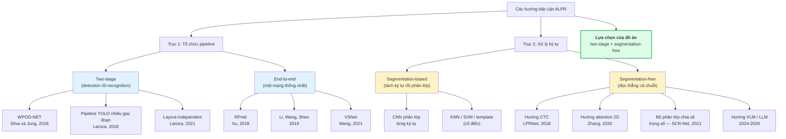

**Hình 2.2.** Sơ đồ phân loại hai trục các hướng tiếp cận ALPR và định vị lựa chọn của đồ án

**Định vị lựa chọn của đồ án.** Đồ án theo hướng **two-stage** ở trục thứ nhất và dùng bộ nhận dạng **segmentation-free** có sẵn ở trục thứ hai. Lựa chọn two-stage không phải là sở thích mà là hệ quả của một ràng buộc kiến trúc cứng: hệ thống phải cho phép **thay thế bộ OCR mà không cần huấn luyện lại toàn bộ hệ thống**. Ràng buộc này có cơ sở thực tế rõ ràng — như sẽ trình bày ở mục 3.3, quyết định cuối cùng về engine OCR chưa được chốt ở giai đoạn thiết kế mà phụ thuộc vào kết quả thực nghiệm. Một kiến trúc end-to-end sẽ khoá cứng lựa chọn đó ngay từ đầu và loại bỏ khả năng đổi hướng.

Về vấn đề đa layout, đồ án chọn hướng **phân loại layout tường minh** thay vì hướng VLM, vì hai lý do: hướng VLM có chi phí suy luận cao hơn nhiều bậc độ lớn và không tương thích với ràng buộc chạy trên CPU (số liệu cụ thể ở mục 2.7.1), còn quy chuẩn biển số Việt Nam cung cấp sẵn một cơ sở định lượng rất mạnh để phân loại layout (mục 2.6.6).

---

## 2.4. Cơ sở lý thuyết về phát hiện đối tượng

### 2.4.1. Bài toán object detection, IoU và NMS

**Phát hiện đối tượng** (*object detection*) là bài toán đồng thời định vị và phân loại các đối tượng trong ảnh. Với ảnh đầu vào $I$, mô hình trả về một tập dự đoán, mỗi dự đoán gồm một hộp bao (*bounding box*) $B = (x, y, w, h)$, một nhãn lớp $c$ và một điểm tin cậy $s \in [0, 1]$. Với bài toán của đồ án, tập lớp chỉ có duy nhất một phần tử: `license_plate`.

**Intersection over Union (IoU)** là đại lượng đo mức chồng lấp giữa hộp dự đoán $B_p$ và hộp thực $B_{gt}$, định nghĩa bằng tỷ số giữa diện tích phần giao và diện tích phần hợp:

$$
\mathrm{IoU}(B_p, B_{gt}) = \frac{|B_p \cap B_{gt}|}{|B_p \cup B_{gt}|}
$$

<div align="right">(2.1)</div>

Giá trị IoU nằm trong đoạn $[0, 1]$; bằng 1 khi hai hộp trùng khít và bằng 0 khi hai hộp không giao nhau. Một dự đoán được coi là đúng (*true positive*) khi IoU vượt một ngưỡng cho trước, thông thường là 0,5. Ký hiệu $P_{75}$ xuất hiện trong một số công trình có nghĩa là precision đo tại ngưỡng IoU bằng 0,75 — chặt hơn đáng kể.

Đối với bài toán biển số, IoU có một đặc tính đáng lưu ý: **hộp bao của biển số rất dẹt**, nên IoU nhạy với sai số định vị hơn nhiều so với hộp gần vuông. Với một hộp có tỷ lệ khung hình 4,7:1, lệch vài pixel theo chiều cao làm IoU giảm mạnh hơn hẳn so với cùng mức lệch trên một hộp vuông có cùng diện tích. Đây chính là nguyên nhân của hiện tượng được quan sát nhất quán trong các nghiên cứu ALPR: khoảng cách rất lớn giữa mAP@0.5 và mAP@0.5:0.95 (phân tích ở mục 2.4.4).

**Non-Maximum Suppression (NMS)** là bước hậu xử lý giải quyết vấn đề một đối tượng bị dự đoán bởi nhiều hộp chồng lấp. Thuật toán hoạt động theo ba bước: (i) sắp xếp toàn bộ hộp dự đoán theo điểm tin cậy giảm dần; (ii) chọn hộp có điểm cao nhất, đưa vào tập kết quả; (iii) loại bỏ mọi hộp còn lại có IoU với hộp vừa chọn vượt ngưỡng NMS, rồi lặp lại từ bước (ii) cho tới khi hết hộp.

NMS có hai tham số cần cân nhắc. Ngưỡng tin cậy (*confidence threshold*) quyết định điểm cân bằng giữa precision và recall: hạ ngưỡng làm tăng recall và giảm precision. Ngưỡng IoU của NMS quyết định mức độ "khoan dung" với các hộp chồng lấp: đặt quá thấp sẽ xoá nhầm hai biển số thật nằm sát nhau, đặt quá cao sẽ để lọt các hộp trùng lặp. Với ảnh giao thông Việt Nam — nơi nhiều xe máy đứng sát nhau trong cùng khung hình — đây là tham số cần hiệu chỉnh cẩn thận, và giá trị cụ thể sẽ được xác định bằng thực nghiệm ở Chương 6.

Một hướng phát triển gần đây là **loại bỏ hoàn toàn NMS** khỏi quy trình suy luận. YOLOv10 đạt được điều này bằng cơ chế *consistent dual assignments* với hai đầu dự đoán song song: một đầu one-to-many chỉ dùng khi huấn luyện để tạo tín hiệu giám sát phong phú, và một đầu one-to-one dùng khi suy luận, sinh đúng một dự đoán cho mỗi đối tượng nên không cần NMS [39]<!-- wang_2024_yolov10paper -->. YOLO26 đưa chế độ NMS-free thành mặc định [40]<!-- jocher_2025_yolo26 -->.

### 2.4.2. Kiến trúc YOLO: nguyên lý one-stage và anchor-free

Các phương pháp phát hiện đối tượng học sâu chia thành hai họ. **Họ two-stage** (Faster R-CNN, Mask R-CNN) sinh các vùng đề xuất (*region proposals*) ở giai đoạn một, rồi phân loại và tinh chỉnh từng đề xuất ở giai đoạn hai; chi phí tính toán tỷ lệ với số đề xuất nên độ trễ cao. **Họ one-stage** (YOLO, SSD, RetinaNet) hồi quy trực tiếp hộp bao và điểm phân lớp trong một lần lan truyền xuôi duy nhất; chi phí cố định theo kích thước ảnh nên đạt được thời gian thực.

Với ràng buộc suy luận trên CPU, họ two-stage bị loại ngay từ đầu vì chi phí tính toán không tương thích với yêu cầu phản hồi tương tác của giao diện web. Điều đáng chú ý là khoảng cách độ chính xác giữa hai họ đã thu hẹp gần như hoàn toàn: một nghiên cứu ALPR quy mô lớn trên 50.000 ảnh và 10.000 video clip so sánh trực tiếp YOLOv5, YOLOv8, YOLOv9, YOLOv10 với Faster R-CNN và SSD, kết luận nhóm YOLO vượt trội cả về độ chính xác lẫn thời gian suy luận [41]<!-- scirep_2025_advanceddl -->. Với bài toán một lớp và đối tượng có biên rõ ràng như biển số, lợi thế lý thuyết của họ two-stage về độ chính xác định vị gần như không còn ý nghĩa thực tiễn.

Kiến trúc của một mô hình YOLO hiện đại gồm ba phần, minh hoạ ở Hình 2.3:

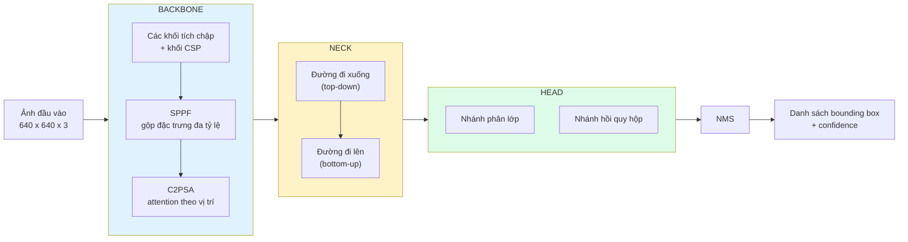

**Hình 2.3.** Kiến trúc tổng quát backbone – neck – head của YOLO11 *(theo [42], [16])*

- **Backbone** trích xuất đặc trưng từ ảnh qua một chuỗi khối tích chập, giảm dần độ phân giải không gian và tăng dần số kênh. Khối kết thúc backbone thường là SPPF (*Spatial Pyramid Pooling – Fast*), gộp thông tin ở nhiều tỷ lệ khác nhau.
- **Neck** hợp nhất đặc trưng từ nhiều tầng độ sâu khác nhau theo cả hai chiều: đường đi xuống mang thông tin ngữ nghĩa từ tầng sâu về tầng nông, đường đi lên mang thông tin vị trí từ tầng nông lên tầng sâu. Mục tiêu là phát hiện tốt cả đối tượng lớn lẫn đối tượng nhỏ.
- **Head** sinh dự đoán cuối cùng. Từ YOLOv8 trở đi, Ultralytics dùng **anchor-free split head**: một đầu dự đoán tách rời nhánh phân loại và nhánh hồi quy, đồng thời loại bỏ hoàn toàn nhu cầu tinh chỉnh anchor box thủ công [42]<!-- jocher_2023_yolov8 -->.

**Ý nghĩa của kiến trúc anchor-free đối với bài toán biển số.** Trong kiến trúc anchor-based (YOLOv5 trở về trước), mô hình hồi quy độ lệch so với một tập hộp mẫu (*anchor box*) định trước, và tập hộp mẫu này được thiết kế theo phân bố tỷ lệ khung hình của tập dữ liệu huấn luyện — thường là COCO. Biển số có tỷ lệ khung hình nằm ngoài phân bố đó: biển ô tô một dòng khoảng 4,7:1, biển xe máy hai dòng khoảng 1,4:1 (số liệu chính xác ở mục 2.6.6). Kiến trúc anchor-based do đó đòi hỏi phải thiết kế lại tập anchor hoặc chạy phân cụm k-means trên tập dữ liệu để tìm anchor phù hợp — một công đoạn tốn công và dễ sai. Kiến trúc anchor-free hồi quy **trực tiếp khoảng cách từ tâm đến bốn cạnh** của hộp bao, nên xử lý được cả hai chế độ tỷ lệ bằng một cơ chế duy nhất và loại bỏ hoàn toàn một nhóm siêu tham số [16]<!-- jocher_2024_yolo11 -->. Với một đồ án có thời hạn, đây là lợi ích thực tiễn đáng kể chứ không chỉ là ưu điểm lý thuyết.

### 2.4.3. YOLO11: các cải tiến kiến trúc

Bài tổng quan độc lập về YOLO11 xác định ba thành phần chính của kiến trúc này là **C3k2**, **SPPF** và **C2PSA** [43]<!-- khanam_2024_yolov11overview -->. Nội dung dưới đây được đối chiếu trực tiếp với mã nguồn định nghĩa các khối trong thư viện Ultralytics [44]<!-- ultralytics_2026_blockpy -->, thay vì dựa vào các mô tả thứ cấp vốn hay diễn giải sai.

**a) C3k2 — không phải kiến trúc mới, mà là C2f có thể hoán đổi khối con.** Đọc trực tiếp mã nguồn cho thấy lớp `C3k2` **kế thừa trực tiếp từ lớp `C2f`** của YOLOv8 và mang đúng mô tả *"Faster Implementation of CSP Bottleneck with 2 convolutions"*. Điểm khác biệt duy nhất là một cờ điều khiển quyết định nội dung của danh sách khối con: khi cờ tắt, khối dùng `Bottleneck` tiêu chuẩn và **giống hệt C2f**; khi cờ bật, khối dùng các khối `C3k` vốn kế thừa từ `C3` và cho phép tuỳ chỉnh kích thước nhân tích chập [44]. Nói cách khác, C3k2 là một C2f có thể hoán đổi khối con, chứ không phải một kiến trúc được thiết kế lại từ đầu. Chi tiết này giải thích chính xác vì sao YOLO11 giảm được số tham số mà vẫn giữ hoặc tăng độ chính xác: nó không thay đổi triết lý CSP mà chỉ cho phép cấu hình linh hoạt hơn ở mức khối.

**b) C2PSA — thành phần mà YOLOv8 hoàn toàn không có.** Đây mới là khác biệt kiến trúc thực sự giữa YOLO11 và YOLOv8. Cấu trúc phân cấp theo mã nguồn được minh hoạ ở Hình 2.4.

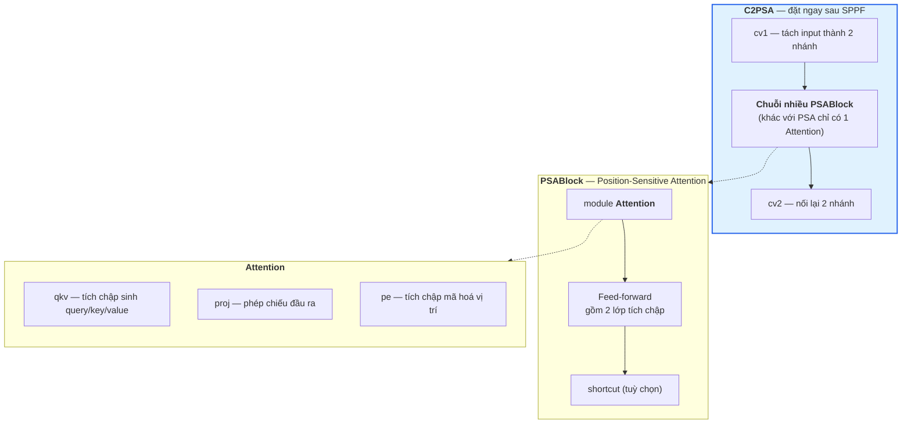

**Hình 2.4.** Cấu trúc phân cấp của khối C2PSA trong YOLO11 *(đối chiếu mã nguồn [44])*

Vị trí đặt C2PSA — **ngay sau SPPF trong backbone** — có ý nghĩa riêng: đây là điểm mà bản đồ đặc trưng đã tổng hợp thông tin đa tỷ lệ, và cơ chế attention theo vị trí được áp dụng để tái phân bổ trọng số theo vị trí không gian. Tài liệu so sánh chính thức của Ultralytics khẳng định rằng cơ chế này cải thiện mạnh khả năng phát hiện **đối tượng nhỏ** và khả năng xử lý **che khuất phức tạp** so với YOLOv8 [45]<!-- ultralytics_2025_yolo11vsyolov8 -->.

> **Lưu ý về mức độ chứng minh của luận cứ trên.** Phát biểu về cải thiện đối tượng nhỏ là **định tính**. Ultralytics không công bố các chỉ số AP_small, AP_medium, AP_large tách riêng theo chuẩn COCO cho từng biến thể, nên không thể trích dẫn số liệu chính thức để chứng minh định lượng YOLO11 tốt hơn YOLOv8 trên đối tượng nhỏ cụ thể bao nhiêu [16]. Đồ án do đó phải **tự đo trên tập dữ liệu biển số của mình**; kết quả sẽ được trình bày ở Chương 6.

**c) Vị trí của YOLO11 trong dòng phát triển.** Bảng 2.4 tổng hợp khác biệt kiến trúc giữa các phiên bản YOLO gần đây, để đặt YOLO11 vào đúng bối cảnh.

**Bảng 2.4.** So sánh khác biệt kiến trúc giữa các phiên bản YOLO gần đây

| Phiên bản | Khối backbone đặc trưng | Cơ chế attention | Đầu dự đoán | NMS khi suy luận | Điểm mới đáng chú ý nhất |
|---|---|---|---|:--:|---|
| YOLOv8 [42] | C2f | Không có | Anchor-free, tách nhánh | Có | Chuyển sang anchor-free |
| YOLOv9 [46]<!-- wang_2024_yolov9 --> | GELAN | Không có | Anchor-free | Có | PGI chống mất mát thông tin |
| YOLOv10 [39] | Rank-guided blocks | Partial self-attention | Hai đầu song song | **Không** | Consistent dual assignments |
| **YOLO11** [16] | **C3k2** (kế thừa C2f) | **C2PSA** sau SPPF | Anchor-free, tách nhánh | Có | C2PSA cải thiện đối tượng nhỏ |
| YOLOv12 [47]<!-- tian_2025_yolov12 --> | R-ELAN | Area Attention | Anchor-free | Có | Kiến trúc lấy attention làm trung tâm |
| YOLOv13 [48]<!-- lei_2025_yolov13 --> | DS-C3k2 | HyperACE (hypergraph) | Anchor-free | Có | Tương quan bậc cao, FullPAD |
| YOLO26 [40] | Kế thừa dòng Ultralytics | Kế thừa dòng Ultralytics | **Bỏ DFL** | **Không** (mặc định) | Bỏ DFL, dễ xuất và lượng tử hoá |

Luận cứ chọn YOLO11 cho đồ án được trình bày đầy đủ ở mục 3.2.

### 2.4.4. Các chỉ số đánh giá khối phát hiện

**a) Precision, Recall và F1.** Với $TP$ là số dự đoán đúng, $FP$ là số dự đoán sai (báo động nhầm) và $FN$ là số đối tượng bị bỏ sót:

$$
\mathrm{Precision} = \frac{TP}{TP + FP}
$$

<div align="right">(2.2)</div>

$$
\mathrm{Recall} = \frac{TP}{TP + FN}
$$

<div align="right">(2.3)</div>

$$
F_1 = \frac{2 \cdot \mathrm{Precision} \cdot \mathrm{Recall}}{\mathrm{Precision} + \mathrm{Recall}}
$$

<div align="right">(2.4)</div>

Precision trả lời câu hỏi "trong những gì mô hình báo là biển số, bao nhiêu phần trăm thực sự là biển số"; recall trả lời "trong toàn bộ biển số có thật, mô hình tìm được bao nhiêu phần trăm". $F_1$ là trung bình điều hoà của hai đại lượng, dùng khi cần một con số tổng hợp duy nhất.

Với bài toán ALPR, **recall của khối detection quan trọng hơn precision**, vì một biển số bị bỏ sót là mất vĩnh viễn, còn một vùng báo nhầm sẽ bị khối OCR và khối hậu xử lý loại bỏ ở bước sau (chuỗi đọc được sẽ không khớp cú pháp biển số Việt Nam).

**b) Average Precision (AP) và mean Average Precision (mAP).** AP của một lớp là diện tích dưới đường cong Precision–Recall:

$$
\mathrm{AP} = \int_0^1 p(r)\, \mathrm{d}r
$$

<div align="right">(2.5)</div>

trong đó $p(r)$ là precision đạt được tại mức recall $r$. mAP là trung bình AP trên toàn bộ $N$ lớp:

$$
\mathrm{mAP} = \frac{1}{N}\sum_{i=1}^{N} \mathrm{AP}_i
$$

<div align="right">(2.6)</div>

Với bài toán một lớp của đồ án, $N = 1$ nên mAP trùng với AP của lớp `license_plate`.

**c) mAP@0.5 và mAP@0.5:0.95 — hai chỉ số khác nhau, không được so sánh chéo.** Đây là điểm quan trọng nhất của mục này và là nguồn của một lỗi phương pháp luận rất phổ biến.

- **mAP@0.5** tính AP tại **một ngưỡng IoU cố định bằng 0,5**. Một dự đoán chỉ cần chồng lấp một nửa với hộp thực đã được tính là đúng.
- **mAP@0.5:0.95** lấy **trung bình AP trên 10 ngưỡng IoU** từ 0,5 đến 0,95 với bước nhảy 0,05:

$$
\mathrm{mAP@0.5\!:\!0.95} = \frac{1}{10}\sum_{t \in \{0{,}50;\, 0{,}55;\, \ldots;\, 0{,}95\}} \mathrm{mAP@}t
$$

<div align="right">(2.7)</div>

Chỉ số thứ hai chặt hơn hẳn vì nó đòi hỏi hộp dự đoán phải khớp chính xác chứ không chỉ chồng lấp. Từ định nghĩa, ta rút ra một hệ quả toán học không thể vi phạm:

> **Trên cùng một mô hình và cùng một tập dữ liệu, mAP@0.5:0.95 LUÔN nhỏ hơn hoặc bằng mAP@0.5.** Vì mAP@0.5 chính là một trong mười số hạng của phép trung bình ở công thức (2.7), và nó là số hạng lớn nhất trong mười số hạng đó.

Khoảng cách giữa hai chỉ số này trong bài toán biển số thường rất lớn, do đặc tính hộp bao dẹt đã phân tích ở mục 2.4.1. Ba minh chứng từ tài liệu:

- Batra và cộng sự báo cáo **mAP@0.5 = 87,2%** trong khi **mAP@0.5:0.95 chỉ đạt 46,5%** trên tập biển số Ấn Độ [49]<!-- batra_2022_yolov5 -->.
- Một nghiên cứu dùng YOLOv11 cho phát hiện biển số đạt **mAP@0.5 = 0,906** nhưng **mAP@0.5:0.95 = 0,631** [50]<!-- jaic_2025_yolov11alpr -->.
- Một nghiên cứu khác trên biển số xe máy Indonesia đạt **mAP@0.5 = 99,5%** nhưng **mAP@0.5:0.95 = 80,7%** [51]<!-- jcosine_2025_yolo11plate -->.

Cả ba trường hợp đều xác nhận cùng một kết luận: **biển số dễ phát hiện nhưng khó khớp hộp bao chính xác**.

> ### ⚠️ Cảnh báo phương pháp luận bắt buộc giữ nguyên
>
> Một cách trình bày phổ biến và **sai** là đặt con số mAP@0.5 của một nghiên cứu ALPR (khoảng 0,90 – 0,99) cạnh con số mAP@0.5:0.95 trên COCO của cùng lớp mô hình (khoảng 0,395 ở phân khúc nano [16]) rồi kết luận "bài toán biển số dễ hơn bài toán COCO". Đây là **phép so sánh giữa hai chỉ số có định nghĩa khác nhau**, và theo hệ quả toán học nêu trên, chênh lệch giữa chúng **không mang bất kỳ thông tin nào** về độ khó tương đối của hai bài toán.
>
> Phép đối chiếu duy nhất hợp lệ là so mAP@0.5 với mAP@0.5, hoặc mAP@0.5:0.95 với mAP@0.5:0.95, **và trên cùng một tập dữ liệu**. Ngay cả khi cùng định nghĩa chỉ số nhưng khác tập dữ liệu, phép so sánh cũng chỉ dùng để cảm nhận độ khó chứ không được dùng làm luận cứ cho bất kỳ quyết định kỹ thuật nào.
>
> Lỗi này đã được phát hiện và sửa trong quá trình khảo sát tài liệu của đồ án. Nó được nêu tường minh ở đây vì đây là loại lỗi mà hội đồng phản biện phát hiện rất nhanh.

**d) Hệ quả cho việc chọn chỉ tiêu của đồ án.** Vì mục tiêu cuối cùng của khối detection là cắt được vùng crop đủ tốt để OCR đọc được, chứ không phải khớp hộp bao đến từng pixel, đồ án dùng **mAP@0.5 làm chỉ tiêu chính** cho khối phát hiện. Chỉ số **mAP@0.5:0.95 vẫn được báo cáo đầy đủ** để thể hiện chất lượng định vị, nhưng không đặt ngưỡng chấp nhận dựa trên nó. Giá trị thực tế của cả hai chỉ số trên tập dữ liệu biển số Việt Nam sẽ được trình bày ở Chương 6.

**e) mIoU.** Một số công trình dùng IoU trung bình trên toàn tập (*mean IoU*) làm chỉ số chính thay cho mAP. Công trình về biển số Việt Nam của nhóm Học viện Kỹ thuật Quân sự báo cáo mIoU đạt 95,01% cho khâu phát hiện [52]<!-- lqdtu_2021_vietnameselpr -->. Đây là chỉ số khác với mAP và cũng không so sánh chéo được.

---

## 2.5. Cơ sở lý thuyết về nhận dạng ký tự

### 2.5.1. Bài toán OCR và đặc thù khi áp dụng cho biển số

**Nhận dạng ký tự quang học** (*Optical Character Recognition*, OCR) là bài toán chuyển nội dung văn bản trong ảnh thành chuỗi ký tự. Các engine OCR hiện đại thường tổ chức thành hai giai đoạn nối tiếp: **text detection** khoanh vùng chứa văn bản, rồi **text recognition** đọc nội dung của từng vùng.

Một sai lầm phổ biến khi chọn engine OCR cho ALPR là lấy thẳng bảng xếp hạng OCR phổ thông làm căn cứ. Bảng 2.5 chỉ ra vì sao điều đó không hợp lệ.

**Bảng 2.5.** So sánh OCR văn bản tài liệu và OCR biển số xe

| Chiều so sánh | OCR văn bản tài liệu | OCR biển số xe |
|---|---|---|
| Nguồn ảnh | Ảnh quét hoặc ảnh chụp tài liệu, gần chính diện | Ảnh cảnh ngoài trời, phối cảnh nghiêng, chói sáng, nhoè do chuyển động |
| Độ dài chuỗi | Hàng trăm đến hàng nghìn ký tự | 7 – 9 ký tự |
| Tập ký tự | Lớn, mở, kèm dấu và dấu câu | Đóng — **chỉ A–Z và 0–9** |
| Bố cục | Nhiều dòng, đa cột, ngắt dòng tuỳ ý | Cố định: 1 hoặc 2 dòng, theo quy chuẩn nhà nước |
| Ràng buộc cú pháp | Gần như không có | Rất chặt — kiểm tra được bằng biểu thức chính quy |
| Tiêu chí đánh giá | CER / WER — chấp nhận sai lẻ tẻ | **Khớp chuỗi tuyệt đối** — sai 1 ký tự là hỏng cả bản ghi |
| Giá trị của thông tin ngôn ngữ | Cao — mô hình ngôn ngữ sửa lỗi hiệu quả | **Thấp** — không có từ vựng để dựa vào |
| Vai trò hậu xử lý | Phụ trợ | **Bắt buộc** — biểu thức chính quy là lớp sửa lỗi chính |

Bốn hệ quả trực tiếp cho việc thiết kế khối nhận dạng của đồ án:

1. **Tập ký tự đóng là tài sản, không phải hạn chế.** Biển số Việt Nam chỉ dùng A–Z và 0–9, không dấu. Do đó toàn bộ ưu thế "hỗ trợ tiếng Việt" của các engine OCR là **vô nghĩa** với bài toán này. Tệ hơn, mô hình đa ngôn ngữ hệ Latin mang theo từ điển hàng trăm ký tự kèm dấu, làm tăng không gian nhầm lẫn và tăng thời gian suy luận.
2. **Ràng buộc cú pháp bù được điểm yếu về whitelist.** Vì định dạng biển số Việt Nam rất chặt, một lớp hậu xử lý theo biểu thức chính quy có thể sửa các nhầm lẫn hình dạng theo từng vị trí trong chuỗi. Đây chính là vai trò của module chuẩn hoá sẽ thiết kế ở Chương 4.
3. **Ảnh cảnh chứ không phải ảnh tài liệu.** Các benchmark OCR trên hoá đơn hay trang văn bản chỉ có giá trị tham chiếu xu hướng, không thể dùng làm căn cứ quyết định.
4. **Bố cục hai dòng là một lớp bài toán riêng**, được phân tích ở mục 2.5.3.

### 2.5.2. Kiến trúc CRNN và hàm mất mát CTC

**CRNN** (*Convolutional Recurrent Neural Network*) là kiến trúc nền tảng của phần lớn các engine OCR segmentation-free hiện nay, gồm ba tầng nối tiếp:

1. **Tầng tích chập** trích xuất đặc trưng từ ảnh đầu vào. Điểm mấu chốt là mạng downsample chiều cao của ảnh **về 1**, biến bản đồ đặc trưng hai chiều thành một **chuỗi vector đặc trưng** theo chiều rộng. Mỗi vector trong chuỗi tương ứng với một dải dọc hẹp của ảnh gốc.
2. **Tầng hồi quy** — thường là hai lớp Bi-LSTM — mô hình hoá quan hệ ngữ cảnh giữa các phần tử trong chuỗi đặc trưng theo cả hai chiều trái–phải và phải–trái.
3. **Tầng phiên mã** giải mã chuỗi xác suất thành chuỗi ký tự cuối cùng, thường bằng CTC.

EasyOCR dùng đúng kiến trúc này cho khối recognition: một backbone CNN (mặc định là ResNet) trích xuất chuỗi đặc trưng, hai lớp Bi-LSTM mô hình hoá chuỗi, và một bộ giải mã CTC [53]<!-- jaided_2025_easyocrdeepwiki -->. PaddleOCR dùng SVTR-LCNet kết hợp chiến lược GTC (CTC được hướng dẫn bởi attention) [17]<!-- cui_2026_ppocrv5 -->, tức vẫn thuộc họ CTC nhưng có bổ sung.

**Hàm mất mát CTC** (*Connectionist Temporal Classification*) giải quyết một vấn đề cốt lõi: khi huấn luyện, ta biết chuỗi nhãn đúng (ví dụ `30A12345`) nhưng **không biết mỗi ký tự nằm ở cột đặc trưng nào**. Việc gán nhãn thủ công vị trí từng ký tự là quá tốn kém. CTC giải bài toán này bằng cách:

- Mở rộng bảng ký tự thêm một **ký hiệu trống** (*blank*), ký hiệu là $\varepsilon$.
- Định nghĩa một phép ánh xạ $\mathcal{B}$ từ chuỗi đầu ra thô (dài bằng số cột đặc trưng $T$) về chuỗi nhãn cuối cùng, bằng hai bước: gộp các ký tự lặp liên tiếp, rồi xoá mọi $\varepsilon$. Ví dụ $\mathcal{B}(\texttt{3}\varepsilon\texttt{00}\varepsilon\texttt{A}) = \texttt{30A}$.
- Xác suất của một chuỗi nhãn $\mathbf{l}$ là tổng xác suất của **mọi** đường đi thô $\boldsymbol{\pi}$ ánh xạ về nó:

$$
p(\mathbf{l} \mid \mathbf{x}) = \sum_{\boldsymbol{\pi} \in \mathcal{B}^{-1}(\mathbf{l})} \prod_{t=1}^{T} y^{t}_{\pi_t}
$$

<div align="right">(2.8)</div>

trong đó $y^{t}_{k}$ là xác suất mô hình gán cho ký tự $k$ tại cột $t$. Hàm mất mát CTC là log hợp lý âm của đại lượng trên:

$$
\mathcal{L}_{\mathrm{CTC}} = -\log p(\mathbf{l} \mid \mathbf{x})
$$

<div align="right">(2.9)</div>

Tổng ở công thức (2.8) có số hạng tăng theo hàm mũ, nhưng tính được hiệu quả bằng thuật toán quy hoạch động tiến–lùi (*forward–backward*).

Ưu điểm quyết định của CTC: **không cần nhãn vị trí từng ký tự**, chỉ cần chuỗi nhãn. Đây là lý do CTC trở thành lựa chọn mặc định của hầu hết các engine OCR mã nguồn mở, và cũng là lý do LPRNet đạt được tốc độ rất cao — 3 ms mỗi biển trên GPU GTX 1080 và 1,3 ms trên CPU i7-6700K — mà vẫn đạt tới 95% accuracy trên biển số Trung Quốc [33].

### 2.5.3. Vì sao kiến trúc CTC gặp khó với văn bản nhiều dòng

Đây là mục kỹ thuật quan trọng nhất của chương, vì nó thiết lập nền tảng lý thuyết cho rủi ro **R-04** — rủi ro được đánh giá ở mức "khả năng xảy ra Cao, mức ảnh hưởng Cao" trong hồ sơ yêu cầu của đồ án. Với bối cảnh Việt Nam, nơi xe máy chiếm áp đảo và biển hai dòng là dạng phổ biến chứ không phải ngoại lệ, đây là rủi ro có thể quyết định thành bại của toàn hệ thống.

**a) Giả định alignment đơn điệu của CTC.** Quay lại công thức (2.8): phép ánh xạ $\mathcal{B}$ hoạt động trên một **chuỗi một chiều** theo trục $t$, và trục $t$ ở đây chính là **trục chiều rộng của ảnh**. CTC do đó giả định ngầm rằng các ký tự xuất hiện **tuần tự từ trái sang phải theo đúng thứ tự đọc, trên một dòng duy nhất**. Đây không phải là một tuỳ chọn cấu hình mà là bản chất toán học của hàm mất mát.

Khi ảnh đầu vào có hai dòng, giả định này bị vi phạm nghiêm trọng. Vì tầng tích chập của CRNN đã downsample chiều cao **về 1**, mỗi vector đặc trưng tại cột $t$ chứa thông tin của **cả hai ký tự chồng nhau theo chiều dọc** — một ở dòng trên, một ở dòng dưới. Mạng bị ép phải chọn một trong hai, cho ra chuỗi lộn xộn hoặc chỉ đọc được một dòng [54]<!-- arxiv_2019_arbitraryshaped -->. Hình 2.5 minh hoạ cơ chế này.

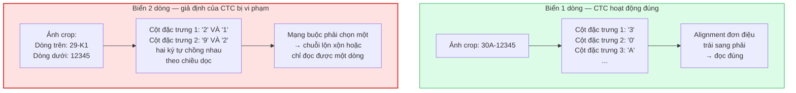

**Hình 2.5.** Cơ chế sụp đổ của CTC trên ảnh văn bản hai dòng *(theo [54])*

**b) Bằng chứng cụ thể trong PaddleOCR — tham số `rec_image_shape`.** Lập luận lý thuyết trên có một hệ quả định lượng rất cụ thể trong engine mà đồ án chọn làm baseline. Module recognition của PP-OCRv3, v4 và v5 resize mọi ảnh đầu vào về **chiều cao cố định 48 pixel**, theo cấu hình mặc định `rec_image_shape = 3 × 48 × 320` [55]<!-- paddleocr_nd_issue14109 -->.

Áp giá trị này vào biển số xe máy Việt Nam, vốn có tỷ lệ khung hình 1,357 (số liệu chi tiết ở mục 2.6.6), ta được Bảng 2.6.

**Bảng 2.6.** Tác động của việc resize về chiều cao cố định 48 px lên crop biển xe máy

| Tình huống | Chiều rộng sau resize | Chiều cao mỗi dòng | Đọc được? |
|---|---:|---:|:---:|
| Đưa thẳng crop biển 2 dòng vào module rec | $48 \times 1{,}357 \approx$ **65 px** | $\approx$ **24 px** | ❌ Không |
| Sau khi tách dòng và ghép ngang (AR $\approx$ 5,43) | $48 \times 5{,}43 \approx$ **261 px** | **48 px** (trọn vẹn) | ✅ Có |

**Đây là con số giải thích gọn toàn bộ rủi ro R-04.** Một crop biển xe máy đưa thẳng vào module recognition bị nén còn khoảng 65 pixel chiều rộng, và mỗi dòng chỉ còn khoảng 24 pixel chiều cao — không đủ để phân biệt các nét của ký tự. Sau khi tách hai dòng ra và ghép nối tiếp theo chiều ngang, chiều rộng tăng khoảng 4 lần và mỗi dòng được trọn vẹn 48 pixel.

Kết luận kiến trúc rút ra: **không tồn tại cấu hình nào của module recognition PP-OCR giải được bài toán này**. Vấn đề phải được giải ở **tầng trên** — bằng một module tách dòng đặt trước OCR — hoặc bằng cách thay hẳn mô hình recognition. Đây là lý do vì sao mục 3.3 kết luận rằng việc chọn engine OCR **không quyết định** thành bại của R-04.

**c) Bằng chứng định lượng độc lập.** Lập luận kiến trúc trên được củng cố bởi ba bằng chứng đo được từ tài liệu.

*Bằng chứng thứ nhất — điểm gãy của một hệ thống thương mại trưởng thành.* Nghiên cứu về khả năng tổng quát hoá xuyên tập dữ liệu thiết kế một tập kiểm thử cân bằng có chủ ý **trên bộ RodoSol-ALPR (Brazil)**: 4.000 ảnh ô tô (biển một dòng) và 4.000 ảnh xe máy (biển hai dòng). Hệ thống OpenALPR nhận đúng **3.772/4.000 ô tô, tức 94,3%**, nhưng chỉ **1.827/4.000 xe máy, tức 45,7%** — chênh lệch **48,6 điểm phần trăm** trên cùng một hệ thống, cùng một tập kiểm thử, không có biến số nào khác thay đổi ngoài bố cục biển [7]<!-- laroca_2022_crossdataset -->. Rộng hơn, cả 12 phương pháp và 2 hệ thống thương mại được đánh giá đều **không vượt quá 70% recognition rate** trên bộ dữ liệu này.

> **⚠️ Cảnh báo phạm vi áp dụng — bắt buộc giữ nguyên.** Cặp số 94,3% / 45,7% được đo trên bộ **RodoSol-ALPR của Brazil**, **không phải trên dữ liệu Việt Nam**. Nó được dẫn ở đây như một *analogue* định lượng về độ khó vượt trội của biển hai dòng xe máy tại một quốc gia cũng có tỷ lệ xe máy cao. Trích dẫn nhầm cặp số này thành số liệu Việt Nam là lỗi trích dẫn nghiêm trọng.

Chi tiết còn đáng lo hơn: chính bài báo ghi nhận có công trình **không thể sửa được phương pháp để xử lý biển nhiều dòng** nên đã phải **loại bỏ hoàn toàn xe máy** khỏi thí nghiệm [7].

*Bằng chứng thứ hai — chỉ riêng kích thước ảnh đầu vào đã đủ phá huỷ hiệu năng.* Một bảng khảo sát tham số trong công trình PatrolVision cho thấy với cùng một mô hình, chỉ thay đổi kích thước ảnh đầu vào, hiệu năng trên biển hai dòng dao động rất mạnh: với kích thước 240×80 (dạng dài, thiết kế cho biển một dòng), biển một dòng đạt 83% nhưng biển hai dòng **chỉ đạt 30%**; chuyển sang kích thước 288×200 (tỷ lệ khoảng 3:2, bao phủ được cả hai loại bố cục) nâng hiệu năng tổng thể lên 67% [56]<!-- arxiv_2025_patrolvision -->. Điều này xác nhận rằng vấn đề nằm ở **hình học của ảnh đưa vào**, đúng như phân tích ở điểm (b).

*Bằng chứng thứ ba — hiệu quả của giải pháp tách và ghép.* Các cài đặt tham chiếu xử lý biển hai tầng của Trung Quốc đều dùng chung một chiến lược: cắt ảnh crop thành hai phần theo chiều dọc rồi ghép nối tiếp theo chiều ngang, biến bài toán hai dòng thành bài toán một dòng trước khi đưa vào OCR [57]<!-- we0091234_nd_doubleplatesplit -->. Đây chính là phương án được Bảng 2.6 chứng minh về mặt số học.

**d) Điều kiện tiên quyết: nắn chỉnh trước khi tách.** Mọi phương pháp tách dòng đều đòi hỏi ảnh đã được nắn về dạng chính diện. Lý do: cả phương pháp chiếu ngang tìm điểm trũng lẫn phương pháp phân ngưỡng theo toạ độ dọc đều **vô hiệu khi biển bị nghiêng** — với biển nghiêng, hai dòng chồng lấn nhau theo trục dọc và không tồn tại một đường cắt ngang nào tách được chúng. Chính vì vậy nghiên cứu cổ điển về phân đoạn ký tự biển số Việt Nam phải đặt bước hiệu chỉnh contour ngang ngay ở module tiền xử lý [28], và các cài đặt hiện đại đều gọi phép biến đổi phối cảnh bốn điểm trước khi gọi hàm tách [57].

**e) Các phương pháp phân biệt biển một dòng và biển hai dòng.** Vì việc tách dòng chỉ được thực hiện trên biển hai dòng, hệ thống cần một bước quyết định loại bố cục. Bảng 2.7 tổng hợp năm phương án đã khảo sát.

**Bảng 2.7.** Các phương pháp phân biệt biển một dòng và biển hai dòng

| Phương án | Cơ chế | Ưu điểm | Hạn chế |
|---|---|---|---|
| **PA-1.** Lấy lớp từ chính detector | Huấn luyện YOLO xuất thêm một lớp: `0` = một dòng, `1` = hai dòng [57] | Chính xác nhất — mô hình "nhìn" được nội dung biển; chi phí gần bằng 0 khi tự gán nhãn dữ liệu | Phải gán nhãn hai lớp ngay từ đầu |
| **PA-2.** Ngưỡng tỷ lệ khung hình | So sánh tỷ lệ khung hình với ngưỡng suy ra từ quy chuẩn (mục 2.6.6) | Rẻ nhất, không cần huấn luyện | Sai khi biển nghiêng nếu đo trên hộp bao thô |
| **PA-3.** Chiếu ngang tìm điểm trũng | Tính tổng cường độ pixel theo từng hàng; biển hai dòng có điểm trũng sâu ở giữa [28] | Vị trí cắt thích nghi theo từng ảnh | Điểm trũng biến mất khi biển nghiêng; cần khử nghiêng trước |
| **PA-4.** Phân cụm hộp bao theo toạ độ dọc | Dùng chính đầu ra text detection của engine OCR, gom nhóm theo tâm dọc [58]<!-- paddlepaddle_nd_ocrpipeline --> | Tái dùng được kết quả sẵn có, không thêm tính toán | Phụ thuộc chất lượng text detection trên crop nhỏ |
| **PA-5.** Kiểm tra tính thẳng hàng của ký tự | Nối tâm ký tự trái nhất và phải nhất thành đường thẳng, kiểm tra độ lệch của các ký tự còn lại [59]<!-- trungdinh22_nd_helper --> | Trực quan, dễ gỡ lỗi | Cần bước phát hiện từng ký tự; ngưỡng tính bằng pixel tuyệt đối phụ thuộc độ phân giải |

Đồ án chọn **PA-1 làm phương án chính và PA-2 làm lớp dự phòng**, với cơ sở định lượng cho PA-2 được trình bày ở mục 2.6.6. Thiết kế chi tiết của module này thuộc Chương 4, và kết quả đo hiệu quả của từng phương án sẽ được trình bày ở Chương 6.

**f) Fine-tune là bắt buộc, không phải tuỳ chọn.** Ứng dụng nhận dạng biển số nhẹ chính thức của PaddleOCR, thử nghiệm trên tập CCPD, cho thấy khoảng cách giữa mô hình dùng nguyên trọng số pre-trained và mô hình đã tinh chỉnh: khối detection tăng Hmean từ **76,12% lên 99,00%**, khối recognition tăng từ **90,97% lên 94,54%** [60]<!-- paddlepaddle_nd_plateapp -->.

> **Lưu ý cách đọc số liệu này.** Tài liệu gốc ghi độ chính xác của mô hình recognition pre-trained là 0,00%. Con số đó **không** có nghĩa PaddleOCR không đọc được biển số: nguyên nhân là mô hình pre-trained sinh thêm một ký tự đặc biệt khiến toàn bộ chuỗi sai theo tiêu chí khớp tuyệt đối; chỉ cần một bước hậu xử lý loại bỏ ký tự đó là đạt 90,97% [60]. Trình bày "0% nghĩa là pre-trained vô dụng" là một kết luận quá mạnh và sai. Luận điểm đúng, và vẫn rất mạnh, là: **tinh chỉnh nâng recognition từ 90,97% lên 94,54% và detection từ 76,12% lên 99,00%**.

Cũng cần ghi nhận rằng số liệu này đo trên **biển số Trung Quốc một dòng**, nên nó chứng minh sự cần thiết của việc tinh chỉnh chứ không chứng minh được điều gì về biển hai dòng Việt Nam.

**g) Vì sao không chọn kiến trúc thuần Transformer.** Một hướng thay thế CTC là dùng kiến trúc encoder–decoder thuần transformer như TrOCR, trong đó ảnh được resize thành ô vuông 384×384, chia thành 576 mảnh, mã hoá bởi BEiT và giải mã bởi RoBERTa [61]<!-- li_2021_trocr -->. Hướng này bị loại khỏi phạm vi đồ án vì ba lý do độc lập cùng chỉ về một phía:

- TrOCR được huấn luyện để nhận dạng văn bản **một dòng**; khi đưa vào ảnh nhiều dòng, mô hình **có thể sinh ra ảo giác** (*hallucinate*) — tức tạo ra ký tự không tồn tại trong ảnh [62]<!-- roboflow_2025_trocr -->.
- Quy mô mô hình quá lớn cho ràng buộc CPU: TrOCR-base có 334 triệu tham số, TrOCR-large có 558 triệu [61] — nặng hơn mô hình recognition của PP-OCRv5 mobile (5 triệu tham số [17]) từ 67 đến 112 lần.
- Việc ép ảnh về ô vuông bất kể tỷ lệ gốc là bất lợi cho crop biển số, vốn hoặc rất rộng (biển một dòng, AR ≈ 4,73) hoặc gần vuông (biển hai dòng, AR ≈ 1,36).

### 2.5.4. Chỉ số CER và độ chính xác mức chuỗi

**a) Character Error Rate (CER)** dựa trên khoảng cách Levenshtein giữa chuỗi dự đoán và chuỗi thực:

$$
\mathrm{CER} = \frac{S + D + I}{N}
$$

<div align="right">(2.10)</div>

trong đó $S$ là số phép thay thế (*substitutions*), $D$ là số phép xoá (*deletions*), $I$ là số phép chèn (*insertions*) cần thực hiện để biến chuỗi dự đoán thành chuỗi thực, và $N$ là tổng số ký tự của chuỗi thực. Độ chính xác mức ký tự tương ứng là $1 - \mathrm{CER}$.

Lưu ý rằng CER **có thể vượt 1** khi chuỗi dự đoán dài hơn chuỗi thực rất nhiều — đúng tình huống xảy ra khi CTC gặp ảnh hai dòng và sinh ra chuỗi lộn xộn.

**b) Word Error Rate (WER)** định nghĩa tương tự nhưng lấy đơn vị là từ thay vì ký tự. Một công trình về biển số Việt Nam báo cáo WER bằng 0,014 trên dữ liệu bãi đỗ xe trong nhà [63]<!-- dang_2024_crnn -->.

**c) Độ chính xác mức chuỗi** (*plate-level accuracy*, còn gọi là *sequence-level accuracy* hoặc *exact match*) là chỉ số nghiêm ngặt nhất và quan trọng nhất:

$$
\mathrm{Acc}_{\text{plate}} = \frac{\#\{\text{biển số có TOÀN BỘ chuỗi ký tự khớp chính xác}\}}{\#\{\text{tổng số biển số trong tập kiểm thử}\}}
$$

<div align="right">(2.11)</div>

Một biển đọc sai đúng một ký tự vẫn bị tính là sai hoàn toàn. Đây là chỉ số phản ánh đúng giá trị sử dụng thực tế: một chuỗi biển số sai một ký tự thì vô dụng với hệ thống tra cứu, vì nó hoặc không khớp bản ghi nào, hoặc — tệ hơn — khớp nhầm sang phương tiện khác.

Quan hệ giữa CER và độ chính xác mức chuỗi là **không tuyến tính và bất lợi**. Với một biển số 8 ký tự, giả sử các ký tự độc lập và cùng xác suất đọc đúng $p$, xác suất đọc đúng cả chuỗi là $p^{8}$. Với $p = 0{,}99$ (CER 1%), độ chính xác mức chuỗi chỉ còn khoảng $0{,}923$; với $p = 0{,}95$, con số này tụt xuống khoảng $0{,}663$. Đây là lý do vì sao một engine OCR có CER rất tốt trên văn bản tài liệu vẫn có thể thất bại trên bài toán biển số.

**d) End-to-end Recognition Rate** là tỷ lệ biển số được đọc đúng hoàn toàn tính trên **toàn bộ pipeline**, từ ảnh đầu vào tới chuỗi đầu ra. Đây là chỉ số duy nhất phản ánh được lỗi tích luỹ qua các giai đoạn, và cũng là chỉ tiêu quan trọng nhất của đồ án. Cuộc thi ICPR 2026 về nhận dạng biển số độ phân giải thấp dùng chỉ số này làm chỉ số chính, với đội vô địch đạt 82,13% [64]<!-- laroca_2026_icprlrlpr -->.

Kèm theo các chỉ số độ chính xác, các chỉ số vận hành cần báo cáo gồm: **độ trễ** ở các phân vị p50, p95, p99 (bắt buộc kèm cấu hình phần cứng), **kích thước mô hình** tính bằng MB, **bộ nhớ thường trú**, và **số tham số**. Giá trị thực tế của toàn bộ các chỉ số này trên hệ thống của đồ án sẽ được trình bày ở Chương 6.

---

## 2.6. Quy chuẩn biển số xe Việt Nam

Mục này đặc tả quy chuẩn biển số xe Việt Nam ở mức đủ chi tiết để cài đặt module chuẩn hoá mà không phải tra cứu lại văn bản pháp luật. Đây là phần quyết định tính đúng đắn của khối hậu xử lý, và cũng là phần mà một sai sót nhỏ về căn cứ pháp lý sẽ bị hội đồng phản biện phát hiện ngay.

### 2.6.1. Căn cứ pháp lý hiện hành

**Cảnh báo về văn bản đã hết hiệu lực.** Nhiều tài liệu về biển số Việt Nam — kể cả các bài báo công bố năm 2023 và 2024 — vẫn viện dẫn **Thông tư 24/2023/TT-BCA** làm căn cứ. Văn bản này **đã hết hiệu lực từ ngày 01/01/2025** [12]<!-- bocongan_2023_tt24 -->. Toàn bộ đồ án viện dẫn theo chuỗi văn bản đang có hiệu lực, và Thông tư 24/2023 chỉ được nhắc tới như **bối cảnh lịch sử**, luôn kèm ghi chú về tình trạng hiệu lực.

Ngày 15/11/2024, Bộ trưởng Bộ Công an ký ban hành **Thông tư 79/2024/TT-BCA** quy định về cấp, thu hồi chứng nhận đăng ký xe, biển số xe cơ giới, xe máy chuyên dùng, thay thế Thông tư 24/2023/TT-BCA, hiệu lực từ **01/01/2025** [8]<!-- bocongan_2024_tt79 -->. Văn bản này sau đó được sửa đổi hai lần. Hình 2.6 và Bảng 2.8 mô tả chuỗi văn bản đang có hiệu lực.

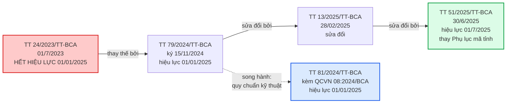

**Hình 2.6.** Chuỗi văn bản pháp lý về biển số xe đang có hiệu lực

**Bảng 2.8.** Các văn bản pháp lý là căn cứ của đồ án

| Văn bản | Ngày ban hành | Hiệu lực | Nội dung liên quan tới đồ án |
|---|---|---|---|
| **TT 79/2024/TT-BCA** [8] | 15/11/2024 | 01/01/2025 | Văn bản gốc: cấu trúc biển, seri, màu sắc, ký hiệu |
| **TT 13/2025/TT-BCA** [9]<!-- bocongan_2025_tt13 --> | 28/02/2025 | — | Sửa đổi, bổ sung TT 79/2024 |
| **TT 51/2025/TT-BCA** [10]<!-- bocongan_2025_tt51 --> | 30/6/2025 | 01/7/2025 | **Thay toàn bộ Phụ lục mã tỉnh** sau sáp nhập đơn vị hành chính còn 34 tỉnh/thành |
| **QCVN 08:2024/BCA** (kèm TT 81/2024/TT-BCA) [11]<!-- bocongan_2024_qcvn08 --> | 15/11/2024 | 01/01/2025 | **Quy chuẩn kỹ thuật quốc gia về biển số xe**: kết cấu, kích thước, vật liệu |
| TT 169/2021/TT-BQP [15]<!-- boquocphong_2021_tt169 --> | 2021 | — | Biển số xe quân đội — **ngoài phạm vi** TT 79/2024 |

> **Phân biệt hai loại văn bản — điểm rất hay bị nhầm.** TT 79/2024 quy định **nội dung** biển số (mã tỉnh, seri, ký hiệu, màu sắc); QCVN 08:2024/BCA quy định **hình thức vật lý** (kích thước, vật liệu, độ phản quang). Module chuẩn hoá của đồ án cần cả hai: nội dung để xây biểu thức chính quy, hình thức để xây ngưỡng phân loại theo tỷ lệ khung hình.

**Ý nghĩa của việc khung pháp lý thay đổi nhanh.** Chỉ trong hai năm, khung pháp lý về biển số xe Việt Nam đã thay đổi ba lần. Đây không phải chi tiết hành chính mà là một nguồn rủi ro kỹ thuật trực tiếp: đây chính xác là kịch bản mà Meyer và cộng sự mô tả khi đề xuất kiến trúc giảm phụ thuộc cú pháp — mô hình học quá chặt cú pháp của tập huấn luyện sẽ suy giảm hiệu năng đáng kể theo thời gian khi định dạng biển số mới xuất hiện [19]. Ba hệ quả cụ thể cho đồ án được nêu ở mục 2.6.7.

### 2.6.2. Cấu trúc biển số ô tô và xe máy

**a) Biển số ô tô.** Biển số ô tô của tổ chức, cá nhân trong nước gồm **ba thành phần**, tổng cộng **8 ký tự chữ–số**:

```
        30    A    123.45
        └┬┘   │    └──┬──┘
         │    │       │
   Mã tỉnh   Seri    Số thứ tự đăng ký
   2 chữ số  1 chữ cái   5 chữ số
```

**Bảng 2.9.** Phân rã thành phần biển số ô tô

| Thành phần | Độ dài | Tập giá trị | Nguồn |
|---|---|---|---|
| Mã địa phương | 2 chữ số | 81 mã hợp lệ trong dải 11 – 99 (mục 2.6.3) | [10], [14]<!-- thuviennhadat_2025_kyhieu34tinh --> |
| Seri đăng ký | **1 chữ cái** | 20 chữ cái với biển trắng và biển vàng; 11 chữ cái với biển xanh | [13]<!-- bocongan_2024_nhandienbienso --> |
| Số thứ tự | **5 chữ số** | 000.01 đến 999.99 | [8] |

Ví dụ: `30A-123.45` (Hà Nội), `51K-999.99` (TP. Hồ Chí Minh, số thứ tự lớn nhất), `80B-123.45` (Cục Cảnh sát giao thông — không phải một địa phương).

**Biển số 4 chữ số kiểu cũ vẫn lưu hành.** Trên đường vẫn còn biển số có **4 chữ số** ở nhóm thứ tự, ví dụ `29A-1234`, là biển cấp theo quy định cũ. Xe đã đăng ký **không bắt buộc đổi biển** [65]<!-- chinhphu_2025_kyhieubienso -->, nên biển 4 số vẫn hợp lệ vô thời hạn. Hệ quả kỹ thuật: biểu thức chính quy bắt buộc chấp nhận nhóm số thứ tự có **4 hoặc 5 chữ số**, không được cố định 5 chữ số.

**b) Biển số xe máy.** Biển xe mô tô, xe gắn máy của cá nhân dùng seri gồm **2 chữ cái**, khác hẳn ô tô chỉ 1 chữ cái. Tổng cộng **9 ký tự chữ–số**:

```
      29    HA    002.33
      └┬┘   └┬┘   └──┬──┘
       │     │       │
  Mã tỉnh   Seri    Số thứ tự
  2 chữ số  2 CHỮ CÁI   5 chữ số
```

Quy tắc 2 chữ cái bắt đầu áp dụng từ **15/8/2023** và được giữ nguyên trong TT 79/2024 [66]<!-- chinhphu_2023_seribiensoxemay -->.

**Hai kiểu biển xe máy lưu hành song song — rủi ro lớn nhất khi xây biểu thức chính quy.** Bảng 2.10 mô tả hai kiểu này.

**Bảng 2.10.** Hai kiểu seri biển xe máy đang cùng lưu hành

| Kiểu | Cấu trúc seri | Ví dụ | Thời điểm cấp | Còn hợp lệ? |
|---|---|---|---|---|
| **Mới** | 2 chữ cái | `29-AA 123.45` | Từ 15/8/2023 | Đang được cấp |
| **Cũ** | 1 chữ cái + 1 chữ số | `29-B1 123.45` | Trước 15/8/2023 | Vẫn lưu hành hợp pháp |

Trước 15/8/2023, seri biển xe mô tô cá nhân là 1 chữ cái kết hợp 1 chữ số và **có phân biệt theo dung tích xi-lanh**; quy tắc này đã bị bãi bỏ, nhưng xe đã đăng ký không bắt buộc đổi biển [66]. Về điều khoản chuyển tiếp ngày 31/12/2025 mà một số bài báo diễn giải thành "biển xe máy 1 chữ 1 số chỉ được dùng đến hết năm 2025": cách hiểu này **không chính xác** — điều khoản nói về việc dùng nốt phôi biển đã sản xuất trước 01/01/2025, không phải bắt buộc chủ xe đang lưu hành đi đổi biển.

Kết luận thực dụng: **biển kiểu cũ sẽ còn trên đường hàng chục năm**, và biểu thức chính quy cho xe máy bắt buộc chấp nhận cả dạng hai chữ cái lẫn dạng một chữ cái kèm một chữ số.

**c) Một nhập nhằng cấu trúc quan trọng.** Chuỗi 8 ký tự dạng *hai chữ số – một chữ cái – năm chữ số* khớp **đồng thời** cả biển ô tô lẫn biển xe máy kiểu cũ (sau khi bỏ dấu phân cách). Hệ quả: **không thể phân loại loại phương tiện chỉ bằng chuỗi ký tự** — bắt buộc phải dùng thêm thông tin về số dòng hoặc tỷ lệ khung hình. Đây là lý do kỹ thuật trực tiếp cho việc hệ thống của đồ án lưu trữ trường số dòng của biển số như một thuộc tính độc lập, chi tiết ở Chương 4.

**d) Seri không còn cho biết loại xe.** Trước năm 2025, chữ cái seri mang ngữ nghĩa: `A` là xe con dưới 9 chỗ, `B` là xe khách trên 9 chỗ, `C` và `K` là xe tải và bán tải. **Từ 01/01/2025 quy định này bị bãi bỏ**, seri được cấp tuần tự không phân biệt loại xe [67]<!-- otocomvn_2025_seridangky -->. Mọi heuristic dạng "seri C suy ra xe tải" đều **sai về mặt pháp lý** kể từ thời điểm đó. Tín hiệu phân loại duy nhất còn hợp lệ là **màu nền biển** (mục 2.6.5).

### 2.6.3. Mã tỉnh, thành phố

**Bối cảnh sáp nhập đơn vị hành chính năm 2025.** Từ 01/7/2025, cả nước còn **34 tỉnh, thành phố**. Nguyên tắc gán mã được quy định rõ: ký hiệu của địa phương sau hợp nhất **bao gồm toàn bộ ký hiệu của các địa phương được hợp nhất trước đó** [65]. Hệ quả quan trọng: biển số cũ **không mất giá trị pháp lý**, chỉ được gộp về địa phương mới; bảng tra cứu vì vậy chỉ mở rộng chứ không thu hẹp.

Dải mã 11 – 99 có **89 số**. Theo Phụ lục Thông tư 51/2025/TT-BCA, **81 mã đang được sử dụng** — gồm 80 mã địa phương và 01 mã của Cục Cảnh sát giao thông (mã 80) — và đúng **8 mã không được sử dụng** [14]. Bảng 2.11 liệt kê tám mã trống.

**Bảng 2.11.** Tám mã không được sử dụng

| Mã không dùng | Ghi chú |
|---|---|
| **13, 42, 44, 45, 46, 87, 91, 96** | Nằm trong kho dự trữ, không gán cho bất kỳ địa phương nào |

Phép kiểm tra tính nhất quán: 89 − 81 = 8, khớp đúng danh sách trên. Số địa phương đếm từ bảng mã đầy đủ là 34, khớp với số đơn vị hành chính sau sáp nhập. TP. Hồ Chí Minh có nhiều mã nhất — 13 mã (41; 50 đến 59; 61; 72) — do sáp nhập Bình Dương (mã 61) và Bà Rịa – Vũng Tàu (mã 72); Hà Nội có 6 mã (29; 30 đến 33; 40) [14].

> **Vì sao phải kiểm tra mã tỉnh trong bước hậu xử lý.** Việc kiểm tra biến 89 khả năng thành 81, tức loại được khoảng 9,0% không gian tìm kiếm ở hai ký tự đầu. Nhưng giá trị thực sự nằm ở chỗ khác và quan trọng hơn nhiều: nó biến lỗi OCR ở hai vị trí đầu từ **sai âm thầm** thành **sai phát hiện được**. Nếu OCR đọc ra `46A-123.45`, hệ thống biết ngay mã 46 không tồn tại, hạ cờ hợp lệ và ghi nhận đây là kết quả đáng ngờ — thay vì trả về một biển số sai trông rất thuyết phục và được lưu thẳng vào cơ sở dữ liệu.

Một lưu ý về độ tin cậy nguồn: giả thuyết phổ biến cho rằng mã 13 là mã cũ của tỉnh Hà Bắc trước khi tách thành Bắc Ninh và Bắc Giang. Thông tin này **chưa kiểm chứng được nguồn chính thức**, chỉ nêu để tham khảo và không dùng làm căn cứ.

### 2.6.4. Tập ký tự seri và các chữ cái bị loại trừ

Đây là mục có nội dung dễ bị trình bày sai nhất trong toàn bộ chương, và một cách trình bày sai đã được phát hiện và sửa trong quá trình khảo sát tài liệu của đồ án.

**a) Tập 20 chữ cái ở vị trí seri thứ nhất.** Biển nền trắng chữ đen và biển nền vàng chữ đen của tổ chức, cá nhân trong nước dùng seri là **một trong 20 chữ cái** sau [13]:

```
A  B  C  D  E  F  G  H  K  L  M  N  P  S  T  U  V  X  Y  Z
```

**b) Suy diễn "26 trừ 20 bằng 6 chữ bị loại trừ" là SAI.** Đối chiếu với 26 chữ cái Latin, danh sách trên vắng mặt 6 chữ: `I`, `J`, `O`, `Q`, `R`, `W`. Từ đó, một kết luận rất tự nhiên nhưng **không chính xác** là "sáu chữ cái này không bao giờ xuất hiện trên biển số Việt Nam".

Lý do kết luận đó sai: danh sách 20 chữ cái nêu trên **chỉ áp dụng cho chữ cái thứ nhất** của seri. Với biển xe mô tô, seri gồm **hai chữ cái**, và danh sách hợp lệ ở **vị trí thứ hai** là một tập khác:

```
A  B  C  D  E  F  H  K  L  M  N  P  R  S  T  U  V  X  Y  Z
```

Danh sách này **có chữ R** và **không có chữ G**. Hợp hai vị trí lại, tập chữ cái thực sự không bao giờ xuất hiện trên biển số Việt Nam chỉ gồm **5 chữ: I, J, O, Q, W**. Chữ R còn xuất hiện thêm ở các ký hiệu seri đặc biệt `R` và `RM` dành cho rơ moóc và sơ mi rơ moóc [68]<!-- khobiensodep_2025_kyhieudacbiet -->.

**Bảng 2.12.** Tổng hợp các tập ký tự seri

| Tập | Số lượng | Nội dung |
|---|:--:|---|
| Chữ cái thứ nhất của seri | 20 | A B C D E F **G** H K L M N P S T U V X Y Z |
| Chữ cái thứ hai của seri xe máy | 20 | A B C D E F H K L M N P **R** S T U V X Y Z |
| Seri biển nền xanh | 11 | A B C D E F G H K L M |
| **Bị loại trừ khỏi toàn hệ thống** | **5** | **I, J, O, Q, W** |
| Tập ký tự an toàn tối thiểu cho OCR | 21 | 20 chữ ở vị trí thứ nhất, hợp thêm R |

Với xe mô tô mang biển nền xanh, seri là 1 trong 11 chữ cái đó kết hợp 1 chữ số tự nhiên từ **1 đến 9** — lưu ý **không có số 0** [13].

**c) Hệ quả kỹ thuật thứ nhất — ràng buộc là theo vị trí, không phải theo tập phẳng.** Chữ G hợp lệ ở vị trí thứ nhất nhưng không hợp lệ ở vị trí thứ hai của seri xe máy; chữ R thì ngược lại. Một bộ luật hậu xử lý chỉ dùng danh sách ký tự cho phép ở dạng phẳng, áp chung cho cả chuỗi, sẽ **vừa bỏ sót lỗi vừa sửa nhầm ký tự đúng**. Đây là điểm mà đồ án xử lý khác với các mô tả hiện có trong tài liệu về biển số Việt Nam, và là nội dung của phần đóng góp kỹ thuật đã nêu ở Chương 1.

Ràng buộc thực sự khai thác được là tập 5 chữ I, J, O, Q, W: bất kỳ ký tự nào trong nhóm này được OCR đọc ra ở vị trí chữ cái đều chắc chắn là lỗi. Ba ánh xạ có cơ sở hình dạng rõ ràng là `O → 0`, `I → 1`, `Q → 0`; hai chữ `J` và `W` không có ứng viên thay thế hiển nhiên nên chỉ dùng để **hạ cờ hợp lệ** chứ không tự động sửa. Chữ R **không** thuộc nhóm này và **tuyệt đối không được ánh xạ đi**.

**d) Hệ quả kỹ thuật thứ hai — khuyến nghị về tập ký tự huấn luyện OCR.** Nếu xây tập ký tự huấn luyện theo "20 chữ cái", mô hình OCR sẽ **không bao giờ có khả năng dự đoán chữ R** và sẽ sai một cách hệ thống trên mọi biển xe máy có R ở vị trí thứ hai. Mất mát thông tin này xảy ra ở **tầng mô hình**, nên không có bước hậu xử lý nào cứu được.

> **Khuyến nghị áp dụng cho đồ án.** Huấn luyện tập ký tự **đầy đủ A–Z và 0–9, tức 36 ký tự**, để mô hình được tự do dự đoán, rồi áp ràng buộc hợp lệ ở **tầng hậu xử lý** — nơi có thể ghi log, hiệu chỉnh và đo được hiệu quả. Nếu bắt buộc phải thu hẹp tập ký tự vì lý do hiệu năng, phải dùng **21 chữ cái** (20 chữ hợp thêm R), tuyệt đối không dùng 20.

**e) Hạn chế kiểm chứng cần giữ nguyên khi trình bày.** Hai danh sách chữ cái ở Bảng 2.12 **chưa được đối chiếu với toàn văn Điều 34 Thông tư 79/2024/TT-BCA**: bản PDF chính thức trên cổng thông tin Chính phủ là bản quét không có lớp văn bản, còn cổng tra cứu văn bản pháp luật chặn truy cập tự động. Kết luận về chữ R do đó dựa trên trích dẫn điều khoản qua nguồn thứ cấp và cần được xác nhận lại khi tiếp cận được toàn văn. Việc ghi rõ hạn chế này là bắt buộc và không được lược bỏ khi rút gọn văn bản.

**f) Các ký hiệu seri đặc biệt.** Ngoài seri thông thường, tồn tại các ký hiệu đặc biệt gồm hai ký tự không tuân theo quy tắc trên, tổng hợp ở Bảng 2.13.

**Bảng 2.13.** Các ký hiệu seri đặc biệt [68]

| Ký hiệu | Đối tượng áp dụng |
|---|---|
| `CD` | Xe máy chuyên dùng |
| `R`, `RM` | Rơ moóc, sơ mi rơ moóc |
| `MK` | Máy kéo |
| `HC` | Ô tô phạm vi hoạt động hạn chế; xe chở người hoặc hàng bốn bánh gắn động cơ |
| `KT` | Xe của doanh nghiệp quân đội |
| `LD` | Xe của doanh nghiệp có vốn đầu tư nước ngoài, xe thuê từ nước ngoài |
| `DA` | Xe của Ban quản lý dự án có vốn đầu tư nước ngoài |
| `T` | Xe đăng ký tạm thời |
| `TĐ` | Xe sản xuất lắp ráp trong nước được thí điểm |
| `MĐ` | Xe máy điện |

Nhóm ký hiệu này chứa hai bẫy kỹ thuật. Thứ nhất, **chữ R xuất hiện ở đây** dù nằm ngoài tập 20 chữ cái, củng cố thêm khuyến nghị ở điểm (d): bộ luật hậu xử lý không được cấm tuyệt đối chữ R. Thứ hai, hai ký hiệu `TĐ` và `MĐ` chứa chữ `Đ` — ký tự **không thuộc bảng chữ cái Latin ASCII**. Mô hình OCR huấn luyện trên tập ký tự Latin gần như chắc chắn trả về `D` thay vì `Đ`, nên module chuẩn hoá phải chấp nhận cả hai dạng và quy về một dạng chuẩn tắc duy nhất.

### 2.6.5. Màu nền và ý nghĩa

**Bảng 2.14.** Màu nền biển số và đối tượng áp dụng [13]

| Màu nền | Màu chữ | Đối tượng | Ghi chú cho hệ thống ALPR |
|---|---|---|---|
| Trắng | Đen | Tổ chức, cá nhân trong nước, xe **không** kinh doanh vận tải | Phổ biến nhất |
| Vàng | Đen | Xe hoạt động **kinh doanh vận tải** | Tín hiệu phân loại **duy nhất còn hợp lệ** |
| Xanh dương | Trắng | Cơ quan Đảng, Quốc hội, Chính phủ, Toà án, Viện kiểm sát, cơ quan nhà nước, công an | Seri chỉ dùng 11 chữ cái |
| Trắng | **Đỏ** | Xe ngoại giao (`NG`) và tổ chức quốc tế (`QT`) | Cấu trúc chuỗi khác hẳn [69]<!-- vietnamnet_2023_biensongoaigiao --> |
| Đỏ | Trắng | Xe quân đội và doanh nghiệp quân đội | **Ngoài phạm vi** TT 79/2024, thuộc TT 169/2021/TT-BQP [15] |

**Một điểm dễ hiểu nhầm.** QCVN 08:2024/BCA chỉ quy định **4 tổ hợp màu** và **không có tổ hợp nền đỏ** [11]. Biển nền đỏ chữ trắng của quân đội nằm ngoài phạm vi quy chuẩn này vì do Bộ Quốc phòng quản lý theo văn bản riêng [15]. Đây là nguyên nhân của nhiều mâu thuẫn khi tra cứu tài liệu về màu biển số.

**Xe điện không có biển số riêng.** Theo TT 79/2024 hiệu lực từ 01/01/2025, xe sử dụng năng lượng sạch **không được cấp biển số riêng màu xanh lá cây**; xe vẫn dùng biển số thông thường, chỉ gắn thêm biểu tượng nhận diện màu xanh lá cây [70]<!-- conganlangson_2024_tt79 -->. Hệ quả cho hệ thống ALPR: **không thể phát hiện xe điện qua màu biển số**, và ký hiệu `MĐ` chỉ dùng cho xe máy điện chứ không dùng cho ô tô điện.

**Hệ quả kiến trúc.** Vì seri không còn phân biệt loại xe (mục 2.6.2d), màu nền là tín hiệu phân loại duy nhất còn hợp lệ [71]<!-- thuvienphapluat_2025_mausacseri -->. Tuy nhiên module chuẩn hoá của đồ án làm việc trên **chuỗi ký tự** chứ không trên ảnh, nên việc phân loại theo màu nằm ngoài phạm vi của nó và sẽ cần một bước phân tích histogram màu trên ảnh crop nếu được đưa vào phạm vi ở giai đoạn sau.

### 2.6.6. Kích thước vật lý và tỷ lệ khung hình

Mục này cung cấp cơ sở định lượng trực tiếp cho việc phân biệt biển một dòng và biển hai dòng — bài toán đã được xác định ở mục 2.5.3 là then chốt đối với rủi ro R-04.

**a) Loại xe nào dùng loại biển nào.**

**Bảng 2.15.** Số lượng và dạng biển số theo loại phương tiện [71]

| Loại xe | Số biển được cấp | Dạng | Vị trí gắn |
|---|:--:|---|---|
| **Ô tô**, xe máy chuyên dùng | **02** | 01 biển ngắn (**2 dòng**) và 01 biển dài (**1 dòng**) | Trước và sau |
| **Xe mô tô, xe gắn máy** | **01** | **2 dòng** | Phía sau |
| Rơ moóc, sơ mi rơ moóc | **01** | 2 dòng | Phía sau |

Điều này có một hệ quả đáng chú ý: **một chiếc ô tô mang cùng một chuỗi ký tự trên hai biển có hình dạng vật lý hoàn toàn khác nhau**. Camera đặt phía trước bắt được biển một dòng; camera phía sau bắt được biển hai dòng. Cùng một xe, nhưng là hai bài toán OCR khác nhau.

**b) Kích thước vật lý theo QCVN 08:2024/BCA.**

**Bảng 2.16.** Kích thước và tỷ lệ khung hình của các loại biển số [11]

| Loại biển | Kích thước (dài × cao) | Tỷ lệ khung hình | Số dòng |
|---|---|:--:|:--:|
| Ô tô — biển **dài** | **520 × 110 mm** | **4,727** | **1 dòng** |
| Ô tô — biển **ngắn** | **330 × 165 mm** | **2,000** | **2 dòng** |
| **Xe mô tô, xe gắn máy** | **190 × 140 mm** | **1,357** | **2 dòng** |

> ### ⚠️ Cảnh báo về mốc hiệu lực của bộ số liệu kích thước
>
> Bộ số liệu trên **chỉ đúng từ 01/01/2025**. Tiêu chuẩn trước đó quy định biển ô tô ngắn là **200 × 280 mm** và biển dài là **110 × 470 mm**. Rất nhiều tài liệu thứ cấp về biển số Việt Nam — kể cả các bài báo công bố năm 2023 — vẫn dùng bộ số cũ. Mọi trích dẫn kích thước biển số trong đồ án đều **bắt buộc ghi kèm mốc hiệu lực**; nếu không, người phản biện đối chiếu văn bản hiện hành sẽ kết luận là sai.

**c) Khoảng trống tỷ lệ khung hình — cơ sở cho ngưỡng phân loại.** Ba giá trị tỷ lệ khung hình ở Bảng 2.16 có một đặc tính rất thuận lợi: **không có loại biển nào rơi vào khoảng (2,000 ; 4,727)**. Khoảng trống rộng 2,727 đơn vị này khiến việc phân biệt biển một dòng và biển hai dòng bằng tỷ lệ khung hình trở nên đáng tin cậy. Hình 2.7 minh hoạ.

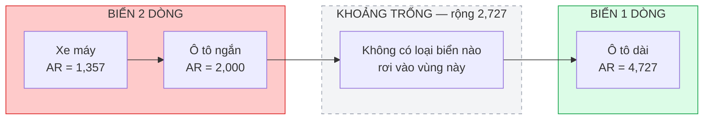

**Hình 2.7.** Khoảng trống tỷ lệ khung hình giữa biển hai dòng và biển một dòng *(dẫn xuất từ [11])*

Từ đó, đồ án đề xuất bộ ngưỡng phân loại ở Bảng 2.17.

**Bảng 2.17.** Ngưỡng phân loại bố cục theo tỷ lệ khung hình — đề xuất của đồ án

| Điều kiện | Kết luận |
|---|---|
| AR < 2,5 | Biển **2 dòng** |
| AR > 3,0 | Biển **1 dòng** |
| 2,5 ≤ AR ≤ 3,0 | **Vùng nghi ngờ** — thử cả hai nhánh, chọn kết quả có độ tin cậy cao hơn |

> **Hai lưu ý bắt buộc về bộ ngưỡng này.**
>
> **Thứ nhất, đây là đề xuất của đồ án, KHÔNG phải quy định pháp luật.** Ba giá trị tỷ lệ khung hình 1,357 / 2,000 / 4,727 là số liệu trích dẫn được từ QCVN 08:2024/BCA; nhưng ngưỡng 2,5 và 3,0 là **suy luận thiết kế của tác giả** và phải được kiểm chứng bằng thực nghiệm. Thông tư 79/2024/TT-BCA chỉ quy định kích thước vật lý, không chứa bất kỳ ngưỡng tỷ lệ khung hình nào cho bài toán phân loại thị giác máy tính. Gán bộ ngưỡng này cho văn bản pháp luật là một lỗi trích dẫn.
>
> **Thứ hai, điều kiện áp dụng bắt buộc:** phải đo tỷ lệ khung hình trên ảnh **đã nắn chỉnh phối cảnh**, hoặc trên hộp bao xoay tối thiểu, **không** đo trên hộp bao thẳng trục do detector trả về. Một biển một dòng chụp nghiêng 30° có hộp bao thẳng trục với tỷ lệ tụt xuống dưới 3,0 và sẽ bị phân loại nhầm.

**d) Bố cục hai dòng.** Bảng 2.18 mô tả cách phân bố nội dung trên hai dòng, phục vụ trực tiếp cho bước ghép kết quả sau khi tách.

**Bảng 2.18.** Bố cục nội dung của biển hai dòng

| Loại biển | Dòng trên | Dòng dưới | Ví dụ |
|---|---|---|---|
| Ô tô biển ngắn | Mã tỉnh và seri | 5 chữ số | `30A` / `123.45` |
| Xe máy kiểu mới | Mã tỉnh và 2 chữ cái | 5 chữ số | `29-AA` / `123.45` |
| Xe máy kiểu cũ | Mã tỉnh, chữ cái và chữ số | 4 – 5 chữ số | `29-B1` / `123.45` |

**e) Dấu phân cách và quyết định thiết kế an toàn.** Quy định dùng dấu chấm để phân cách ba chữ số đầu với hai chữ số sau của nhóm thứ tự, và dấu gạch ngang để phân cách các nhóm. Tuy nhiên các nguồn mô tả vị trí dấu gạch ngang không nhất quán, và không tra cứu được nguyên văn phần quy cách in ấn của QCVN 08:2024/BCA để chốt. Thay vì đoán, đồ án chọn một quyết định thiết kế an toàn: **module chuẩn hoá loại bỏ toàn bộ ký tự phân cách rồi kiểm tra tính hợp lệ trên chuỗi chữ–số thuần**, tuyệt đối không cố định vị trí dấu gạch ngang trong biểu thức chính quy. Đây là ví dụ điển hình của việc biến một điểm không chắc chắn thành một quyết định thiết kế an toàn, thay vì suy đoán.

**f) Hai thông số vật lý khác có ảnh hưởng tới ALPR.** Quy chuẩn quy định biển làm bằng hợp kim nhôm, có màng hoặc mực phản quang, bốn góc bo tròn, và chiều cao dập nổi của chữ và số là **(1,7 ± 0,1) mm** [11]. Chữ **dập nổi** tạo bóng đổ và vùng loá sáng phụ thuộc góc chiếu sáng — đây là nguồn nhiễu đặc thù của biển số kim loại mà văn bản in trên giấy không có, và là nguyên nhân của các lỗi OCR kiểu `B` bị đọc thành `3` do loá. Ngược lại, việc quy chuẩn hoá vật liệu và font chữ trên toàn quốc là yếu tố tốt cho độ ổn định của mô hình OCR.

### 2.6.7. Ý nghĩa đối với thiết kế hệ thống nhận dạng

Toàn bộ nội dung mục 2.6 quy về bảy hệ quả thiết kế cụ thể, tổng hợp ở Bảng 2.19.

**Bảng 2.19.** Từ quy chuẩn pháp lý tới quyết định thiết kế

| # | Dữ kiện từ quy chuẩn | Hệ quả thiết kế |
|:--:|---|---|
| 1 | 81 mã tỉnh hợp lệ trong dải 89 số | Kiểm tra mã tỉnh biến lỗi OCR ở hai ký tự đầu từ "sai âm thầm" thành "sai phát hiện được" |
| 2 | Tập ký tự seri khác nhau **theo từng vị trí**; loại trừ toàn hệ thống chỉ 5 chữ I J O Q W; chữ R hợp lệ | Bộ luật hậu xử lý phải ràng buộc **theo vị trí**, không dùng danh sách phẳng; tập ký tự huấn luyện OCR dùng đủ 36 ký tự |
| 3 | Hai kiểu seri xe máy cùng lưu hành; nhóm số thứ tự có 4 hoặc 5 chữ số | Biểu thức chính quy phải chấp nhận nhiều nhánh cú pháp cùng lúc, không được tối giản về một dạng |
| 4 | Chuỗi 8 ký tự khớp đồng thời biển ô tô và biển xe máy kiểu cũ | **Không thể** phân loại phương tiện chỉ từ chuỗi ký tự; bắt buộc lưu trường số dòng như một thuộc tính độc lập |
| 5 | Seri không còn cho biết loại xe từ 01/01/2025 | Cấm mọi heuristic suy ra loại phương tiện từ chữ cái seri |
| 6 | Ba tỷ lệ khung hình cách nhau đủ xa, có khoảng trống rộng 2,727 | Cơ sở định lượng cho ngưỡng phân loại bố cục (Bảng 2.17), làm lớp dự phòng cho phương án phân loại bằng detector |
| 7 | Khung pháp lý thay đổi ba lần trong hai năm; các bộ dữ liệu công khai đều thu thập trước các mốc đó | Bộ luật hậu xử lý phải tách rời khỏi mô hình để cập nhật được độc lập; cần lường trước hiện tượng lệch phân bố theo thời gian [19] |

Điểm cần nhấn mạnh về mức độ đóng góp: trước khi rà soát lại căn cứ pháp lý, luận điểm dự kiến của đồ án là "khai thác tập 20 chữ cái, loại trừ 6 chữ I J O Q R W". Mệnh đề đó **sai**, và việc sửa lại làm **yếu đi** phần đóng góp nếu tính theo tiêu chí "thu hẹp không gian tìm kiếm được bao nhiêu". Đổi lại, phần thực sự có giá trị chuyển sang một chỗ khác và khó hơn: ràng buộc **phụ thuộc vị trí trong chuỗi**, chứ không phải một tập ký tự phẳng áp cho cả chuỗi. Một hệ thống dùng danh sách phẳng 20 chữ cái sẽ sai một cách hệ thống trên toàn bộ lớp biển xe máy có chữ R ở vị trí thứ hai — và đây mới là lỗi mà bộ luật của đồ án ngăn được. Đóng góp vì vậy được trình bày là **đúng đắn về mặt pháp lý và đúng về cấu trúc**, không phải một cải thiện lớn về không gian tìm kiếm.

---

## 2.7. Các công trình liên quan

Mục này khảo sát các công trình đã công bố trong lĩnh vực, chia theo ba nhóm: công trình quốc tế tiêu biểu, công trình về biển số Việt Nam, và các bộ dữ liệu chuẩn. Mục tiêu cuối cùng là xác định chính xác **khoảng trống nghiên cứu** mà đồ án có thể lấp, thay vì liệt kê tài liệu một cách hình thức.

### 2.7.1. Công trình quốc tế tiêu biểu

Bảng 2.20 tổng hợp các công trình có ảnh hưởng lớn nhất tới lĩnh vực, ưu tiên giai đoạn 2020 – 2026 nhưng có bổ sung ba mốc năm 2018 vì tính nền tảng của chúng.

**Bảng 2.20.** Các công trình quốc tế tiêu biểu về ALPR

| # | Tác giả | Năm | Phương pháp và đóng góp | Dataset đánh giá | Kết quả chính |
|:--:|---|:--:|---|---|---|
| 1 | Zherzdev và Gruzdev | 2018 | **LPRNet** — segmentation-free, CTC loss, không dùng RNN | Biển số Trung Quốc | Tới **95%** accuracy; **3 ms/biển** trên GTX 1080 và **1,3 ms/biển** trên CPU i7-6700K [33] |
| 2 | Laroca và cộng sự | 2018 | Pipeline YOLO nhiều giai đoạn kèm CNN tinh chỉnh; tăng cường dữ liệu bằng biển đảo ngược | SSIG (2.000 khung hình, 101 xe) | **93,53%** recognition rate ở **47 FPS** [30] |
| 3 | Xu và cộng sự | 2018 | **RPnet** — end-to-end, dự đoán đồng thời hộp bao và chuỗi; công bố bộ **CCPD** | CCPD | **98,5%** accuracy, trên **61 FPS** [31] |
| 4 | Li, Wang và Shen | 2019 | Mạng thống nhất detection và recognition trong một lần lan truyền xuôi | — | Mốc kiến trúc end-to-end [32] |
| 5 | Zhang và cộng sự | 2020 | Attention 2D kèm encoder Xception, segmentation-free; công bố bộ **CLPD** | CCPD, CLPD | Khung attention không cần heuristic hay hậu xử lý [34] |
| 6 | Laroca và cộng sự | 2021 | Hợp nhất detection và **phân loại layout** trong một mạng YOLO | 8 tập công khai từ 5 khu vực | **96,9%** end-to-end recognition rate trung bình [23] |
| 7 | Wang và cộng sự | 2021 | **VSNet** (VertexNet và SCR-Net) — cascade dựa trên lấy mẫu lại, dùng thông tin đỉnh | CCPD, AOLP; kiểm tra tổng quát hoá trên PKUData, CLPD | Trên **99%** trên CCPD và AOLP; **149 FPS trên GPU**; giảm hơn 50% tỷ lệ lỗi tương đối [38] |
| 8 | Laroca và cộng sự | 2022 | Nghiên cứu **tổng quát hoá xuyên tập dữ liệu**; công bố bộ **RodoSol-ALPR** | 9 tập công khai, 12 mô hình OCR | Trung bình sụt từ **82,4% xuống 74,5%** khi chuyển sang giao thức *leave-one-dataset-out*; AOLP sụt **90,8% xuống 62,7%** [7] |
| 9 | Batra và cộng sự | 2022 | YOLOv5 học chuyển giao kết hợp EasyOCR, hướng thiết bị hạn chế tài nguyên | Google Open Images và biển số Ấn Độ (5.991 ảnh) | **mAP@0.5 = 87,2%**, **mAP@0.5:0.95 = 46,5%**, Recall 82,2%, Precision 88,2%; mô hình **14 MB**; detection **4,8 ms trên Nvidia T4**, toàn hệ thống 85 ms [49] |
| 10 | Del Castillo Velarde và Velarde | 2022 | Benchmark độc lập LPRNet với Tesseract, dùng khoảng cách Levenshtein | 1.000 ảnh mỗi tập | LPRNet **90%** trên biển thật và 89% trên biển tổng hợp; Tesseract **93%** *chỉ* trên dữ liệu tổng hợp *và chỉ sau tiền xử lý* [72]<!-- velarde_2022_benchmarking --> |
| 11 | Tao và cộng sự | 2024 | **YOLOv5-PDLPR** — Multi-Head Attention và bộ giải mã song song, không cần phân đoạn ký tự và không cần nắn chỉnh | CCPD, PKUData, AOLP | CCPD tổng thể **99,4%** ở **159,8 FPS trên GPU**; Base 99,9%; **Challenge chỉ 94,1%**; PKUData 95,5% [73]<!-- tao_2024_pdlpr --> |
| 12 | Nascimento và cộng sự | 2024 | **LCDNet** và hàm mất mát **LCOFL** — siêu phân giải hướng layout và hướng ký tự | — | Tích chập biến dạng, attention chia sẻ trọng số, GAN với bộ phân biệt là OCR [74]<!-- nascimento_2024_lpsr --> |
| 13 | AlDahoul và cộng sự | 2024 – 2025 | **VehiclePaliGemma** — tinh chỉnh mô hình ngôn ngữ–thị giác PaliGemma cho biển số Malaysia | Biển số Malaysia, điều kiện phức tạp | **87,6%** accuracy nhưng chỉ **7 FPS trên GPU A100-80GB** [36] |
| 14 | Shpir và cộng sự | 2025 | Sinh dữ liệu biển số bằng **mô hình khuếch tán** | Biển số Ukraine | Mở rộng tập huấn luyện bằng dữ liệu tổng hợp đã gán nhãn giả cải thiện **+3%** so với baseline [75]<!-- shpir_2025_diffusion --> |
| 15 | Meyer và cộng sự | 2025 | **SaLT** — Transformer giảm phụ thuộc vào cú pháp thời điểm huấn luyện | — | Giữ độ chính xác trên cả định dạng biển cũ lẫn định dạng mới [19] |
| 16 | Xu và cộng sự | 2025 | **LPTR-AFLNet** — hợp nhất nắn chỉnh phối cảnh và nhận dạng; xử lý cả biển 1 dòng và 2 dòng | Biển số Trung Quốc | Đạt **99,37%** riêng trên biển 2 dòng với 2,7 triệu tham số [76]<!-- xu_2025_lptraflnet --> |
| 17 | Wójcik và cộng sự | 2025 | **LPLC** — bộ dữ liệu và bài toán phân loại độ đọc được của biển số | LPLC | Cả ba baseline (ViT, ResNet, YOLO) đều đạt **F1 dưới 80%** [77]<!-- wojcik_2025_lplc --> |
| 18 | Shabaninia và cộng sự | 2025 | Nhận dạng **không phụ thuộc layout** bằng tích hợp vision transformer và mô hình ngôn ngữ | IR-LPR, UFPR-ALPR, AOLP | Loại bỏ hoàn toàn bước phân loại layout thủ công [35] |
| 19 | Vargoorani và cộng sự | 2025 | Gán nhãn giả bằng Grounding DINO kết hợp YOLOv8 để giảm chi phí gán nhãn | CENPARMI, UFPR-ALPR | **Recall phát hiện** 94% và 91% [78]<!-- vargoorani_2025_pseudolabel --> |
| 20 | Gong và Liu | 2026 | **LP-LLM** — framework end-to-end trên Qwen3-VL, Character Slot Queries và LoRA | Biển số xuống cấp | Hướng mô hình đa phương thức cho biển số chất lượng thấp [37] |
| 21 | Laroca và cộng sự | 2026 | **Cuộc thi ICPR 2026 LRLPR** — benchmark nhận dạng biển số độ phân giải thấp trên dữ liệu thật | LRLPR-26 | Đội vô địch chỉ đạt **Recognition Rate 82,13%**; chỉ **4/99 đội** vượt mốc 80% [64] |

**Ba lưu ý bắt buộc khi đọc Bảng 2.20.**

**Thứ nhất, không được so sánh trực tiếp các con số giữa các dòng.** Mỗi công trình đánh giá trên tập dữ liệu khác nhau, với định nghĩa chỉ số khác nhau: có công trình báo cáo độ chính xác mức chuỗi nghiêm ngặt, có công trình cho phép sai một tới hai ký tự, có công trình chỉ báo cáo CER. Ví dụ nghiêm trọng nhất là dòng số 10: **tuyệt đối không được rút gọn thành "Tesseract (93%) tốt hơn LPRNet (90%)"**, vì con số 93% của Tesseract chỉ đạt được trên dữ liệu **tổng hợp** và chỉ **sau tiền xử lý**, trong khi 90% của LPRNet là trên biển số **thật**. Đây là hai mẫu số hoàn toàn khác nhau.

**Thứ hai, mọi con số tốc độ phải đi kèm phần cứng.** VSNet đạt 149 FPS và YOLOv5-PDLPR đạt 159,8 FPS — cả hai đều đo **trên GPU**. Ngược lại, con số 1,3 ms mỗi biển của LPRNet là **trên CPU**. Riêng trường hợp LPRNet có một điểm phản trực giác đáng lưu ý: con số CPU (1,3 ms) *nhanh hơn* con số GPU (3 ms); đây là số liệu đúng theo bài báo gốc và thường được giải thích bằng chi phí khởi tạo và truyền dữ liệu trên GPU khi kích thước lô nhỏ. Tương tự, công trình của Batra và cộng sự tuy được mô tả là hướng tới thiết bị hạn chế tài nguyên nhưng phép đo 4,8 ms lại chạy trên **Nvidia T4** — một GPU máy chủ, không phải thiết bị biên.

**Thứ ba, hướng mô hình ngôn ngữ–thị giác đánh đổi tốc độ lấy khả năng tổng quát.** VehiclePaliGemma đạt 87,6% accuracy nhưng chỉ **7 FPS trên GPU A100-80GB** [36] — chậm hơn hai bậc độ lớn so với 149 – 160 FPS của các CNN chuyên dụng, dù chạy trên phần cứng đắt hơn nhiều. Đây là dữ kiện quyết định khi cân nhắc kiến trúc cho một hệ thống phải chạy trên CPU, và là lý do trực tiếp khiến đồ án loại hướng này khỏi phạm vi (mục 2.3.3).

Một quan sát tổng hợp đáng chú ý: **các con số vượt 99% chủ yếu đạt được trên những tập dữ liệu tương đối dễ và theo giao thức đánh giá dễ dãi**. Ngay trong cùng một bộ dữ liệu, YOLOv5-PDLPR đạt 99,9% trên tập con CCPD-Base nhưng chỉ 94,1% trên tập con CCPD-Challenge [73]. Khi chuyển sang giao thức nghiêm ngặt hơn — huấn luyện trên một tập, kiểm thử trên tập khác — độ chính xác trung bình tụt từ 82,4% xuống 74,5%, trường hợp nặng nhất tụt 28,1 điểm [7]. Và trên dữ liệu độ phân giải thấp thật, đội vô địch một cuộc thi quốc tế chỉ đạt 82,13% [64]. Bài toán ALPR, do đó, **chưa được giải quyết xong** như cách nó thường được mô tả.

### 2.7.2. Công trình về biển số Việt Nam

Nghiên cứu ALPR cho biển số Việt Nam có một dòng chảy riêng, chủ yếu do tác giả Việt Nam thực hiện và công bố tại các hội nghị và tạp chí trong khu vực. Các công trình này **không xuất hiện trên các benchmark quốc tế lớn**, và phần lớn đánh giá trên tập dữ liệu tự thu thập không công khai — điều làm cho việc so sánh công bằng giữa chúng gần như bất khả thi. Bảng 2.21 tổng hợp.

**Bảng 2.21.** Các công trình về nhận dạng biển số xe Việt Nam

| # | Nhóm tác giả / đơn vị | Năm | Nơi công bố | Phương pháp | Kết quả |
|:--:|---|:--:|---|---|---|
| 1 | Học viện Kỹ thuật Quân sự | 2021 | MAPR 2021 | Phát hiện điểm đặc trưng cho khâu detection kết hợp encoder-decoder **segmentation-free** cho khâu OCR, môi trường không ràng buộc | Detection **mIoU 95,01%**, $P_{75}$ 99,5%; OCR **99,28% mức chuỗi** và 99,7% mức ký tự [52] |
| 2 | Trần Anh Đạt, Trần Khánh Linh, Vũ Hoài Nam | 2023 | arXiv | **Mô hình đa góc nhìn** — trích đặc trưng mô tả thành phần văn bản từ 3 góc nhìn, kết hợp CnOCR; công bố tập **PTITPlates** (500 ảnh) | **F1 91,3%** trên PTITPlates (các baseline: YOLOv5 và OCR cơ bản 75,2%; YOLOv8 và Tesseract 82,9%; YOLOv8 và CnOCR 85,2%) [79]<!-- trananh_2023_multiangle --> |
| 3 | Le, Mazumder, Quach, Banerjee, Nguyen | 2023 | FDSE 2023 | Kiến trúc **3 giai đoạn** toàn bằng YOLOv8: phát hiện xe máy, phát hiện biển bên trong vùng xe máy, nhận dạng ký tự | **mAP 93%** sau 300 epoch [21] |
| 4 | Tran, Bui | 2024 | MIWAI 2024 | SSD với backbone MobileNetV2 cho detection, YOLOv8-nano cho nhận dạng ký tự, triển khai trên **Raspberry Pi 4** | **95,68%** độ chính xác nhận dạng trung bình; **0,478 giây/ảnh** [80]<!-- tran_2024_embeddedlpr --> |
| 5 | Dang và cộng sự | 2024 | IJITSR | YOLO phát hiện xe, WPOD-NET trích và nắn phẳng biển, **CRNN cải tiến** huấn luyện đồng thời với CTC và attention | **WER 0,014** trên dữ liệu bãi đỗ xe **trong nhà** (môi trường ràng buộc) [63] |
| 6 | Trần Hải và cộng sự | 2023 | IJMRAP | Tuỳ chỉnh OpenALPR cho Việt Nam, huấn luyện tăng dần cho OCR, template hậu xử lý theo định dạng biển Việt Nam | Tập kiểm thử chỉ 120 ảnh; bài **không công bố** con số độ chính xác cuối cùng [81]<!-- tran_2023_openalpr --> |
| 7 | Đặng Thị Dung và cộng sự | 2024 | TNU Journal of Science and Technology | So sánh các phiên bản YOLOv8 và YOLO-NAS cho phát hiện biển số; 1.567 ảnh | YOLO-NAS-S: Accuracy **83,92%**, F1 0,9125. YOLOv8n: Accuracy 81,4%, F1 0,8979. Bài **không đo FPS** [82]<!-- dlu_2024_yolov8nas --> |
| 8 | — | 2012 | SoICT 2012 | Hệ ALPR cho trạm thu phí; dùng phương pháp *peak-to-valley* và tham số thống kê của biển Việt Nam để tách ký tự trên **cả biển 1 dòng và 2 dòng** | Công trình nền tảng giai đoạn tiền học sâu [83]<!-- acm_2012_tollbooth --> |
| 9 | VAPR và Trường ĐH Công nghệ Thông tin – ĐHQG TP.HCM | 2018 | MAPR 2018 Challenge | Cuộc thi *Vietnamese Bike License Plate Recognition* với hai bài toán con | Dataset **3.000 ảnh xe máy** (2.000 huấn luyện, 1.000 kiểm thử); **kết quả xếp hạng các đội không được công bố** [84]<!-- vapr_2018_mapr --> |
| 10 | Nguyễn Thanh Lợi và cộng sự | 2023 | Tạp chí Khoa học Trường ĐH Mở Hà Nội | Đề xuất mô hình YOLOv5 cho nhận diện biển số | Bài chỉ ghi "mô hình có độ chính xác cao", **không công bố số liệu cụ thể** [85]<!-- nguyen_2023_yolov5bienso --> |

**Hiện trạng kết quả tốt nhất công bố cho biển số Việt Nam.** Con số cao nhất là **99,28% ở mức chuỗi** của nhóm Học viện Kỹ thuật Quân sự [52]. Tuy nhiên con số này **không thể dùng làm mốc so sánh trực tiếp**, vì ba lý do: (i) nó được đo trên tập dữ liệu riêng không công khai, nên không ai tái lập hay đối chứng được; (ii) độ khó của tập dữ liệu đó không được mô tả định lượng, nên không so sánh được với 91,3% trên PTITPlates [79] hay bất kỳ con số nào khác; (iii) chưa tồn tại một benchmark công khai chuẩn cho biển số Việt Nam theo kiểu UFPR-ALPR hay RodoSol-ALPR của Brazil.

**Đặc thù khiến không thể dùng trực tiếp mô hình huấn luyện trên dữ liệu nước ngoài.** Tính đến tháng 9/2024, Việt Nam có **77 triệu xe máy đăng ký, tương đương 770 xe trên 1.000 dân**, thuộc hàng cao nhất thế giới [1]<!-- dantri_2024_77trieuxemay -->. Ba hệ quả kỹ thuật trực tiếp:

- **Biển hai dòng dạng gần vuông chiếm đa số tuyệt đối**, chứ không phải thiểu số như ở Mỹ hay châu Âu. Trong khi đó các bộ dữ liệu quốc tế lớn nhất — CCPD, AOLP, SSIG — đều lấy ô tô làm trung tâm.
- **Mật độ phương tiện cao gây che khuất** giữa các xe trong cùng khung hình.
- **Biển số xe máy đặt thấp, gần mặt đất**, dễ dính bùn đất, dễ bị che bởi chân người lái, và dễ biến dạng cơ học do va chạm.

Ngoài ra, bộ ký tự, font chữ, tỷ lệ khung hình, màu nền và cú pháp chuỗi của biển số Việt Nam đều khác biển số Trung Quốc trong CCPD — bộ dữ liệu này chỉ chứa **biển một dòng, có ký tự Hán tự và cấu trúc 7 ký tự, hoàn toàn không có biển hai dòng**.

Bằng chứng định lượng cho luận điểm này đã được nêu ở mục 2.5.3: khi chuyển sang giao thức *leave-one-dataset-out*, độ chính xác trung bình tụt 7,9 điểm và trường hợp nặng nhất tụt 28,1 điểm, mà nguyên nhân được chính tác giả quy cho khác biệt về **font chữ của ký tự trên biển** [7]. Với bài toán Việt Nam, mức độ dịch chuyển miền còn lớn hơn nhiều so với các cặp tập dữ liệu trong thí nghiệm đó.

> **Kết luận kiến trúc.** Việc huấn luyện trước trên dữ liệu quốc tế chỉ nên áp dụng cho khối **detection** — nơi mô hình học đặc trưng hình dạng biển, khả năng chịu nghiêng và mờ. Khối **recognition bắt buộc phải được huấn luyện hoặc tinh chỉnh trên dữ liệu Việt Nam**, và bước hậu xử lý phải viết riêng theo quy chuẩn Việt Nam đã đặc tả ở mục 2.6.

**Hệ sinh thái mã nguồn mở và giải pháp thương mại.** Khảo sát ghi nhận khoảng tám kho mã nguồn mở về biển số Việt Nam đang hoạt động, trong đó phần lớn **không công bố số liệu độ chính xác** và nhiều kho không ghi rõ giấy phép. Về phía thương mại, không tồn tại số liệu độ chính xác công khai, độc lập, được kiểm chứng của bất kỳ giải pháp nào tại Việt Nam; các con số 98 – 99,9% đều do chính nhà cung cấp công bố, trên định nghĩa "ảnh chuẩn" không thống nhất giữa các bên. Chúng chỉ nên dùng để tham khảo bối cảnh, **không dùng làm mốc so sánh học thuật**.

### 2.7.3. Các bộ dữ liệu chuẩn trong lĩnh vực

**Bảng 2.22.** So sánh các bộ dữ liệu chuẩn quốc tế

| Bộ dữ liệu | Năm | Quy mô | Vùng lãnh thổ | Đặc điểm nổi bật | Giấy phép |
|---|:--:|---|---|---|---|
| **CCPD** [86]<!-- xu_2018_ccpdrepo --> | 2018 / 2019 | Trên **250.000** ảnh (bản 2018); trên **300.000** sau cập nhật 2019 | Trung Quốc | Nhãn nhúng trực tiếp trong **tên tệp**: tỷ lệ diện tích biển, độ nghiêng, hộp bao, **4 đỉnh**, chỉ số ký tự, độ sáng, độ mờ. Có tập con riêng cho từng điều kiện khó | MIT |
| **AOLP** [87]<!-- hyperai_nd_aolp --> | 2013 | **2.049** ảnh (AC 681, LE 757, RP 611) | Đài Loan | Tách rõ ba kịch bản ứng dụng theo độ khó tăng dần | Học thuật, cấm thương mại |
| **UFPR-ALPR** [25] | 2018 | **4.500** ảnh gán nhãn đầy đủ, trên 30.000 ký tự, từ 150 xe | Brazil | **Cả xe mục tiêu lẫn camera đều chuyển động**; chỉ gồm ô tô và xe máy | Học thuật, cấm phân phối lại, phải xin quyền |
| **RodoSol-ALPR** [88]<!-- laroca_2022_rodosol --> | 2022 | **20.000** ảnh, chia đều 4 nhóm mỗi nhóm 5.000 | Brazil | Camera tĩnh tại trạm thu phí; ngày và đêm, nắng và mưa; chứa 2 layout; **số mẫu dễ và khó bằng nhau** | Xem kho chính thức |
| **CLPD** [34] | 2020 | **1.200** ảnh từ cả 31 tỉnh thành | Trung Quốc | Thiết kế để kiểm tra tổng quát hoá trên phạm vi địa lý rộng | Xem kho chính thức |
| **OpenALPR benchmark** [89]<!-- openalpr_2016_benchmarks --> | 2016 | 445 ảnh (EU 108, US 222, BR 115) | Đa quốc gia | Quá nhỏ để huấn luyện; **chỉ dùng để benchmark xuyên tập dữ liệu** | AGPL-3.0 |
| **LPLC** [77] | 2025 | **10.210** ảnh xe, **12.687** biển gán nhãn | — | Gán nhãn che khuất ở cả cấp xe và cấp biển; **4 mức độ đọc được** | Xem kho chính thức |
| **LRLPR-26** [64] | 2026 | **20.000** track huấn luyện và 3.000 track kiểm thử | Đa quốc gia | Benchmark quy mô lớn đầu tiên cho biển số độ phân giải thấp với **dữ liệu thật**, không phải giảm mẫu nhân tạo | Theo điều lệ cuộc thi |
| **Global License Plate Dataset** [90]<!-- agrawal_2024_globallpdataset --> | 2024 | Trên **5.000.000** ảnh từ **74** quốc gia | 74 quốc gia | Nhãn rất đầy đủ: ký tự, mặt nạ phân đoạn, 4 đỉnh, thông tin xe | Không phải giấy phép chuẩn — rủi ro pháp lý trung bình |

**Ba nhận xét quan trọng khi chọn dữ liệu.**

**Thứ nhất, bộ lớn nhất không phải bộ sạch nhất.** Trong nghiên cứu về tổng quát hoá xuyên tập dữ liệu, Laroca và cộng sự đã **loại trừ tường minh CCPD** khỏi thí nghiệm với hai lý do: ảnh bị nén quá mạnh và sai số lớn trong việc gán nhãn các đỉnh [7]. Hệ quả kiến trúc: có thể dùng CCPD để huấn luyện trước khối **detection**, nhưng **không nên** tin toạ độ bốn đỉnh của CCPD làm nhãn chuẩn cho bài toán nắn chỉnh phối cảnh.

**Thứ hai, báo cáo kết quả chỉ trên tập con dễ là không đủ thuyết phục.** Khoảng cách 5,8 điểm giữa CCPD-Base (99,9%) và CCPD-Challenge (94,1%) trong cùng một công trình [73] cho thấy một con số trung bình có thể che giấu điểm gãy. Đây là cơ sở phương pháp luận cho quyết định của đồ án: **báo cáo kết quả tách bạch theo từng nhóm điều kiện**, đặc biệt là tách riêng biển một dòng và biển hai dòng.

**Thứ ba, hiện trạng dữ liệu biển số Việt Nam là điểm nghẽn thực sự.** Khảo sát cho thấy **không tồn tại bộ dữ liệu biển số Việt Nam công khai nào được bình duyệt học thuật** theo nghĩa chặt chẽ. Các nguồn hiện có thuộc ba loại: kho GitHub cá nhân, Roboflow Universe và Kaggle. Bộ lớn nhất và đầy đủ nhãn nhất là VNLP, với khoảng **37.300 ảnh** (19.086 biển một dòng và 18.211 biển hai dòng), có annotation mức ký tự và **tách rõ biển một dòng với biển hai dòng** theo tỷ lệ gần 50/50 — triết lý thiết kế tương tự RodoSol-ALPR; tuy nhiên kho này **không ghi rõ giấy phép** nên cần liên hệ tác giả xin xác nhận trước khi sử dụng trong công bố [91]<!-- fictlabs_2025_vnlp -->.

Ba đặc điểm chung của bức tranh dữ liệu Việt Nam: phần lớn các bộ chỉ có hộp bao một lớp nên chỉ dùng được cho khâu detection; rất ít bộ phân biệt tường minh biển một dòng và hai dòng ở dạng lớp riêng; và **không bộ nào gán nhãn chuỗi biển số đầy đủ** ở dạng nhãn chuẩn văn bản. Đây là khoảng trống lớn nhất về dữ liệu cho bài toán Việt Nam.

**Tin tốt về quy mô dữ liệu cần thiết.** Nghiên cứu về nhu cầu dữ liệu cho ALPR cho thấy hiệu năng bão hoà quanh ngưỡng **4.750 ảnh thật, tại đó đạt 99,0% độ chính xác**, và vượt ngưỡng này thì cả độ chính xác nhận dạng biển số lẫn độ chính xác nhận dạng ký tự đều không cải thiện thêm; đồng thời chỉ cần **300 ảnh thật** kết hợp sinh dữ liệu và tăng cường là đạt hiệu năng tương đương với huấn luyện trên 200.000 ảnh thật [92]<!-- arxiv_2018_howmanyplates -->. Tổng kho dữ liệu Việt Nam công khai hiện có đã vượt xa ngưỡng này cho khâu detection; nút thắt thực sự nằm ở **nhãn mức ký tự và nhãn chuỗi biển số**, không phải ở số lượng ảnh. Ngoài ra tồn tại công cụ sinh ảnh biển số Việt Nam tổng hợp hỗ trợ **cả biển một dòng lẫn biển hai dòng**, có giá trị thực tiễn cao cho việc cân bằng phân bố ký tự [93]<!-- nndam_2024_plategenerator -->.

### 2.7.4. Khoảng trống nghiên cứu và định vị đề tài

**Bảng 2.23.** Sáu khoảng trống nghiên cứu và cách đồ án lấp

| # | Khoảng trống được xác định từ khảo sát | Cách đồ án lấp |
|:--:|---|---|
| 1 | **Chưa có nghiên cứu Việt Nam nào công bố bảng so sánh tách riêng độ chính xác biển một dòng và biển hai dòng trên cùng một hệ thống** (mục 2.7.2) | Đồ án báo cáo tách bạch hai con số này. Chỉ cần hai con số riêng biệt là đã lấp được khoảng trống |
| 2 | **Chưa có nghiên cứu Việt Nam nào mô tả có hệ thống bộ luật hậu xử lý ràng buộc theo VỊ TRÍ trong chuỗi biển số** — các mô tả hiện có đều dừng ở mức danh sách ký tự cho phép dạng phẳng, và phần lớn dùng nhầm con số 20 chữ cái cho toàn chuỗi (mục 2.6.4) | Đồ án thiết kế bộ luật hậu xử lý **theo từng vị trí** và **đo tách bạch độ chính xác trước và sau hậu xử lý**. Hiệu số giữa hai con số là đóng góp định lượng của khối này |
| 3 | **Hầu hết công trình trong nước chỉ báo cáo mAP của khâu detection**, không báo cáo độ chính xác end-to-end mức chuỗi (mục 2.7.2) | Đồ án báo cáo cả hai, với độ chính xác end-to-end là chỉ tiêu quan trọng nhất |
| 4 | **Không tồn tại benchmark công khai nào so sánh các engine OCR trên riêng ảnh biển số xe máy Việt Nam hai dòng** (mục 3.3) | Đồ án tự chạy benchmark so sánh trên chính tập kiểm thử biển số Việt Nam. Đây là **đóng góp khoa học có giá trị nhất** mà đồ án có thể tuyên bố |
| 5 | **Số liệu hiệu năng thường được công bố mà không kèm phần cứng** (mục 2.7.1) | Mọi số liệu hiệu năng của đồ án bắt buộc kèm: model CPU, số luồng, kích thước ảnh đầu vào, backend suy luận và cỡ mẫu đo |
| 6 | **Hầu hết kho mã nguồn mở Việt Nam không công bố số liệu và không có kiến trúc phần mềm** (mục 2.7.2) | Đồ án công bố đầy đủ giao thức đo, tập kiểm thử và toàn bộ chỉ số; đồng thời bàn giao một hệ thống có API, giao diện, cơ sở dữ liệu, kiểm thử và đóng gói |

**Định vị đề tài so với Bảng 2.20.** Sáu khoảng trống trên đều là khoảng trống **kỹ nghệ và báo cáo**, không phải khoảng trống thuật toán: đồ án không đặt mục tiêu vượt các con số vượt 99% ở Bảng 2.20 — trong đó có 99,28% của nhóm Học viện Kỹ thuật Quân sự, đo trên tập dữ liệu riêng không công khai nên không tồn tại cơ sở so sánh công bằng — và mọi số liệu hiệu năng của đồ án là **số liệu CPU**, không so sánh trực tiếp được với các con số FPS đo trên GPU ở cùng bảng.

> Tuyên bố trung thực đầy đủ về mức đóng góp, cùng bốn điều đồ án **không** tuyên bố, đặt ở **mục 1.6.1 và 1.6.8** (Chương 1) — nơi chính danh để tuyên bố đóng góp.

---

## 2.8. Kết luận chương

Chương 2 đã thiết lập toàn bộ nền lý thuyết và nền tư liệu cho phần thiết kế và cài đặt phía sau. Sáu kết luận chính:

**Thứ nhất, bài toán ALPR chưa được giải quyết xong như cách nó thường được mô tả.** Các con số vượt 99% được công bố phổ biến, nhưng chúng đạt được trên những tập dữ liệu tương đối dễ và theo giao thức đánh giá dễ dãi. Khi chuyển sang giao thức nghiêm ngặt hơn, độ chính xác trung bình sụt gần 8 điểm và trường hợp nặng nhất sụt 28,1 điểm [7]; trên dữ liệu độ phân giải thấp thật, đội vô địch một cuộc thi quốc tế chỉ đạt 82,13% [64]. Đây là cơ sở để đồ án đặt kỳ vọng ở mức thực tế thay vì hứa hẹn quá mức.

**Thứ hai, đồ án định vị ở hướng two-stage kết hợp bộ nhận dạng segmentation-free.** Lựa chọn này không phải sở thích mà là hệ quả của một ràng buộc kiến trúc cứng: phải thay thế được bộ OCR mà không huấn luyện lại toàn hệ thống — điều kiện cần vì quyết định về engine OCR chưa được chốt ở giai đoạn thiết kế.

**Thứ ba, khối phát hiện dùng YOLO11n với hai chỉ số đánh giá không được so sánh chéo.** YOLO11 là phiên bản duy nhất trong nhóm gần đây vừa có số liệu tốc độ CPU chính thức, vừa có cơ chế kiến trúc (C2PSA, đầu dự đoán anchor-free) phù hợp trực tiếp với đặc thù đối tượng nhỏ và tỷ lệ khung hình dẹt của biển số, vừa có bằng chứng thực nghiệm dày trên đúng bài toán ALPR. Về đo lường, chương đã chứng minh bằng định nghĩa rằng **mAP@0.5 và mAP@0.5:0.95 là hai chỉ số khác nhau và chênh lệch giữa chúng không mang thông tin nào về độ khó của bài toán**; đồ án dùng mAP@0.5 làm chỉ tiêu chính và báo cáo mAP@0.5:0.95 kèm theo mà không đặt ngưỡng chấp nhận dựa trên nó.

**Thứ tư, bài toán biển hai dòng có nền tảng lý thuyết rõ ràng và không thể giải bằng cách đổi engine.** CTC giả định alignment đơn điệu trái sang phải trên **một dòng duy nhất**; khi ảnh có hai dòng, mỗi cột đặc trưng chứa hai ký tự chồng nhau theo chiều dọc và mạng buộc phải chọn một. Hệ quả này có một con số cụ thể trong engine mà đồ án chọn: module recognition resize ảnh về chiều cao cố định 48 pixel, nên một crop biển xe máy tỷ lệ 1,357 bị nén còn khoảng 65 pixel chiều rộng với mỗi dòng chỉ khoảng 24 pixel chiều cao — không đủ để đọc. Bằng chứng định lượng độc lập: OpenALPR đạt 94,3% trên biển một dòng nhưng chỉ 45,7% trên biển hai dòng, chênh 48,6 điểm, đo trên bộ RodoSol-ALPR của Brazil [7]. **Vấn đề phải được giải ở tầng trên bằng module tách dòng, không phải bằng cách đổi engine OCR.**

**Thứ năm, quy chuẩn biển số Việt Nam đã được đặc tả đủ để cài đặt, với ba điểm được đính chính so với cách hiểu phổ biến.** Căn cứ pháp lý hiện hành là Thông tư 79/2024/TT-BCA sửa đổi bởi TT 13/2025 và TT 51/2025, cùng QCVN 08:2024/BCA về kích thước — Thông tư 24/2023/TT-BCA đã hết hiệu lực từ 01/01/2025 và chỉ được nhắc như bối cảnh lịch sử. Có 81 mã tỉnh đang dùng và 8 mã không dùng. Và điểm quan trọng nhất: **tập chữ cái bị loại trừ khỏi toàn hệ thống chỉ gồm 5 chữ I, J, O, Q, W chứ không phải 6; chữ R hợp lệ ở vị trí chữ cái thứ hai của seri xe máy**. Từ đó rút ra hai hệ quả cứng: bộ luật hậu xử lý phải ràng buộc **theo từng vị trí trong chuỗi** chứ không dùng danh sách phẳng, và tập ký tự huấn luyện OCR phải dùng đủ 36 ký tự A–Z và 0–9. Ba giá trị tỷ lệ khung hình theo quy chuẩn (1,357 / 2,000 / 4,727) tạo ra một khoảng trống rộng 2,727 đơn vị, là cơ sở định lượng cho ngưỡng phân loại bố cục do đồ án đề xuất.

**Thứ sáu, sáu khoảng trống nghiên cứu đã được xác định và mỗi khoảng trống đều có cách lấp cụ thể** (Bảng 2.23). Đóng góp lớn nhất mà đồ án có thể tuyên bố là lấp khoảng trống số 4: **không tồn tại benchmark công khai nào so sánh các engine OCR trên riêng ảnh biển số xe máy Việt Nam hai dòng**. Đi kèm với đó là một tuyên bố trung thực về giới hạn: đồ án không đặt mục tiêu tạo ra kết quả tốt nhất lĩnh vực, không đề xuất kiến trúc mạng mới, và không giải quyết các thách thức mở như biển số độ phân giải rất thấp hay tổng quát hoá xuyên tập dữ liệu.

Về mặt phương pháp, chương này đã thiết lập ba nguyên tắc sẽ được áp dụng nguyên vẹn cho phần thực nghiệm: **mọi số liệu hiệu năng bắt buộc kèm cấu hình phần cứng và cỡ mẫu đo**; **kết quả phải báo cáo tách bạch theo bố cục biển và theo điều kiện ảnh** thay vì chỉ đưa một con số trung bình; và **không so sánh chéo giữa các chỉ số có định nghĩa khác nhau hoặc đo trên các tập dữ liệu khác nhau**.

Cuối cùng, một lựa chọn được để mở một cách có chủ ý: **PaddleOCR hiện là baseline chứ chưa phải kết luận cuối cùng**, và EasyOCR được coi là ứng viên ngang hàng. Không tồn tại bằng chứng công khai nào phân định được hai engine này trên ảnh biển số Việt Nam, nên việc khẳng định ở giai đoạn thiết kế là không có căn cứ. Quyết định cuối cùng lẽ ra thuộc về kết quả benchmark tự chạy; benchmark đó **đã không chạy được** trong khuôn khổ đồ án (mục 6.9.2), nên PaddleOCR được giữ nguyên vì lý do kỹ thuật chứ không vì lý do độ chính xác — và đây là một hạn chế được ghi nhận tường minh, không phải một kết luận.

Chương tiếp theo chuyển từ cơ sở lý thuyết sang thiết kế cụ thể: phân tích yêu cầu, kiến trúc phân tầng của hệ thống, thiết kế luồng xử lý AI, thiết kế cơ sở dữ liệu và thiết kế giao diện.


```{=openxml}
<w:p><w:r><w:br w:type="page"/></w:r></w:p>
```

# CHƯƠNG 3. KHẢO SÁT CÔNG NGHỆ VÀ LỰA CHỌN MÔ HÌNH

## 3.1. Phương pháp khảo sát và tiêu chí lựa chọn

Chương này trình bày luận cứ cho từng lựa chọn công nghệ của đồ án. Mỗi lựa chọn được trình bày theo cùng một khuôn: các phương án đã xét, tiêu chí đánh giá, kết luận, và **đánh đổi phải chấp nhận**. Nguyên tắc xuyên suốt là theo dữ liệu chứ không hợp thức hoá một lựa chọn có sẵn: khi bằng chứng không đủ để phân định, mục này nói rõ là không đủ, thay vì tạo ra vẻ chắc chắn giả tạo.

### 3.1.1. Bốn ràng buộc chi phối mọi lựa chọn

Không lựa chọn nào trong chương này được cân nhắc trên một bảng cân bằng trung lập. Bốn ràng buộc dưới đây đã thu hẹp không gian phương án **trước khi** việc so sánh bắt đầu, nên phải nêu trước để người đọc hiểu vì sao một số ứng viên mạnh lại bị loại sớm.

| # | Ràng buộc | Hệ quả trực tiếp lên việc chọn |
|:--:|---|---|
| 1 | **Suy luận trên CPU, không có GPU CUDA** (CON-02, xem mục 5.1.2) | Mọi phương án không công bố số liệu tốc độ CPU đều **không có căn cứ để đánh giá**; các mô hình hàng trăm triệu tham số bị loại từ đầu |
| 2 | **Biển số Việt Nam có biển hai dòng** | Engine nào giả định văn bản một dòng đều gãy ở đây; đây là tiêu chí phân loại chứ không phải điểm cộng |
| 3 | **Phải đóng gói và bàn giao được** | Giấy phép, dung lượng mô hình và số lượng phụ thuộc là tiêu chí thật, không phải chi tiết phụ |
| 4 | **Ngân sách thời gian CPU hữu hạn** | Một số phép so sánh đã được thiết kế nhưng **không chạy được**; mục 3.1.2 nói rõ là những phép nào |

### 3.1.2. Ranh giới giữa cái đã đo và cái mới chỉ khảo sát tài liệu

Đây là mục quan trọng nhất của chương, và nó được đặt ngay đầu chương một cách có chủ ý.

Một chương mang tên *"khảo sát và lựa chọn"* rất dễ tạo ấn tượng rằng mọi lựa chọn đều đã qua thực nghiệm. Với đồ án này thì **không**. Có phép so sánh đồ án tự chạy trên chính máy và chính dữ liệu của mình; có phép so sánh chỉ dựa vào số liệu do nhà phát hành công bố; và có phép so sánh **chưa bao giờ chạy được**. Ba mức bằng chứng ấy không tương đương nhau, nên chúng được phân biệt tường minh:

**Bảng 3.1.** Mức bằng chứng của từng phép so sánh trong chương

| Phép so sánh | Mức bằng chứng | Trình bày ở |
|---|---|:---:|
| PP-OCRv5_mobile ↔ PP-OCRv6_medium | ✅ **Tự đo** — 200 vùng cắt biển số của đồ án, cùng máy, cùng thứ tự ảnh | 3.3.2 |
| Bộ nhận dạng gốc ↔ bản tinh chỉnh | ✅ **Tự đo** — 2.801 biển có nhãn chuỗi, bốn cấu hình | 5.4 |
| YOLO11n ↔ YOLOv8n và năm thế hệ YOLO khác | 📄 **Khảo sát tài liệu** — dựa trên bảng benchmark chính thức của nhà phát hành, đồ án **không tự chạy lại** | 3.2 |
| PaddleOCR ↔ EasyOCR ↔ Tesseract | ❌ **Chưa đo lần nào** — chỉ đối chiếu kiến trúc, dung lượng và thông số công bố | 3.3.1 |
| PyTorch ↔ ONNX Runtime ↔ OpenVINO | ❌ **Chưa đo** — chọn theo benchmark của bên thứ ba; Bảng 6.20 còn để trống | 3.4 · 6.6.3 |
| Độ phân giải 416 ↔ 640 | ⚠️ **Có số đo nhưng không quy kết được** — ba biến đổi đồng thời và ngược chiều nhau | 3.6 |

Hai dòng ❌ là hai khoản nợ thực sự của đồ án, và chúng được ghi nhận nhất quán ở mục 6.9.2 cùng Chương 7 chứ không chỉ ở đây. Ý nghĩa của chúng khác nhau:

- **Benchmark engine OCR chưa chạy** ⇒ phát biểu được phép nói là *"PaddleOCR được chọn vì nhẹ hơn, có lộ trình tăng tốc và có bằng chứng tinh chỉnh"*, **không** được phép nói *"PaddleOCR chính xác hơn EasyOCR"*. Trên thực tế, các so sánh công khai mà đồ án kiểm chứng được lại nghiêng về EasyOCR (mục 3.3.1).
- **So sánh runtime chưa chạy** ⇒ quyết định chọn ONNX Runtime đứng vững chủ yếu nhờ **lý do vận hành** (một runtime duy nhất cho cả hai mô hình, tránh xung đột hai framework học sâu), chứ không nhờ số liệu tốc độ tự đo.

Cách trình bày này khiến chương ngắn hơn và nhiều dấu ❌ hơn một chương "khảo sát" thông thường. Đó là chủ đích: một bảng so sánh đầy đủ nhưng có ô chưa từng được đo sẽ dẫn người đọc tới kết luận sai, và một hội đồng truy tới nguồn sẽ phát hiện ra. Nói trước thì mất một dòng; để người khác phát hiện thì mất cả độ tin cậy của những con số **đã** đo thật.

## 3.2. Mô hình phát hiện: YOLO11

**Các phương án đã xét.** Bảy thế hệ YOLO thuộc phạm vi cân nhắc, giới hạn từ YOLOv8 trở về sau vì đây là mốc chuyển sang kiến trúc anchor-free có ý nghĩa trực tiếp với bài toán biển số (mục 2.4.2): YOLOv8 [42], YOLOv9 [46], YOLOv10 [39], YOLO11 [16], YOLOv12 [47], YOLOv13 [48] và YOLO26 [40]. Họ two-stage (Faster R-CNN, Mask R-CNN) bị loại từ đầu vì chi phí tính toán không tương thích với ràng buộc CPU (mục 2.4.2).

**Tiêu chí đánh giá**, xếp theo mức độ chi phối:

1. **Có số liệu tốc độ CPU chính thức hay không.** Đây là ràng buộc chi phối vì đồ án triển khai trên máy không có GPU.
2. Mức độ phù hợp của cơ chế kiến trúc với đặc thù bài toán (đối tượng nhỏ, tỷ lệ khung hình dẹt).
3. Mật độ bằng chứng thực nghiệm trên đúng bài toán biển số.
4. Độ trưởng thành của hệ sinh thái và tình trạng giấy phép.

**Quá trình loại trừ.** Khảo sát các bảng benchmark chính thức phát hiện một điều then chốt: **chỉ các bản phát hành từ Ultralytics công bố tốc độ CPU**. YOLOv9 không công bố bất kỳ cột tốc độ nào; YOLOv10, YOLOv12 và YOLOv13 chỉ công bố tốc độ GPU. Bốn phiên bản này do đó bị loại vì **không có căn cứ để đánh giá** trên đúng chiều ràng buộc của đồ án; YOLOv13 còn có rủi ro bổ sung là kho mã nguồn không được tích hợp chính thức vào thư viện Ultralytics [48].

Còn lại ba ứng viên. YOLOv8 bị loại vì YOLO11n **vượt trội đồng thời ở cả hai chiều**: mAP@0.5:0.95 đạt 39,5 so với 37,3 (hơn 2,2 điểm) và tốc độ CPU với định dạng ONNX là **56,1 ± 0,8 ms so với 80,4 ms** — nhanh hơn khoảng 30% [16], [45]. Đây là phép so sánh CPU hợp lệ duy nhất có sẵn, vì cả hai đều đo bằng cùng quy trình xuất mô hình [94]<!-- ultralytics_2026_detecttask -->.

**Kết luận: chọn YOLO11, biến thể n (nano), với năm lý do.**

1. **Là phiên bản duy nhất trong nhóm gần đây có số liệu tốc độ CPU chính thức**, cho phép lập luận có căn cứ khi bảo vệ thay vì suy đoán.
2. **Có cơ chế kiến trúc phù hợp trực tiếp với bài toán:** khối C2PSA được khẳng định cải thiện phát hiện đối tượng nhỏ và xử lý che khuất phức tạp [45]; đầu dự đoán anchor-free giải quyết vấn đề tỷ lệ khung hình nằm ngoài phân bố COCO (mục 2.4.2).
3. **Có bằng chứng thực nghiệm dày nhất trên đúng bài toán biển số:** ít nhất ba nghiên cứu độc lập dùng YOLO11 cho ALPR với mAP@0.5 từ 0,906 đến 0,995 [50], [51], [95]<!-- sutikno_2025_clahe -->. Một nghiên cứu so sánh trực tiếp YOLOv8n, YOLOv9t, YOLOv10n và YOLO11n trên cùng một tập dữ liệu biển số với siêu tham số đồng nhất cũng kết luận YOLO11n tối ưu nhất [96]<!-- sciencedirect_2026_omanplates --> — tuy nhiên nguồn này **chưa kiểm chứng được toàn văn** do bị chặn truy cập, nên chỉ dùng làm trích dẫn phụ, không làm căn cứ chính.
4. **Hệ sinh thái trưởng thành:** tích hợp chính thức trong thư viện `ultralytics`, hỗ trợ hơn 20 định dạng xuất mô hình [97]<!-- ultralytics_2026_export --> và có chế độ benchmark tự động trên CPU [98]<!-- ultralytics_2026_benchmark -->.
5. **Giấy phép hợp lệ:** AGPL-3.0 được nhà phát hành khẳng định miễn phí cho nghiên cứu học thuật và bài tập đại học, với điều kiện công bố mã nguồn [99]<!-- ultralytics_2026_license -->.

**Chọn biến thể nano vì bài toán chỉ có một lớp.** Năng lực biểu diễn cần cho 80 lớp của COCO là dư thừa cho một lớp duy nhất. Số kênh đầu ra của nhánh phân loại giảm từ 80 xuống 1, làm nhẹ đầu dự đoán và giảm chi phí bước NMS. Bằng chứng ủng hộ: một nghiên cứu đạt mAP 99,3% với biến thể YOLOv8-s trên ba benchmark quốc tế ở tốc độ trên 30 FPS, hướng tới đúng kịch bản thiết bị hạn chế tài nguyên [100]<!-- etasr_2025_optimizedyolov8 -->. Biến thể s được giữ làm phương án leo thang nếu nano không đạt chỉ tiêu.

**Đánh đổi phải chấp nhận.**

- **Giấy phép AGPL-3.0 kéo theo nghĩa vụ copyleft.** Nghĩa vụ này bao gồm công bố toàn bộ mã nguồn tương ứng, các sửa đổi, tệp cấu hình và cả **trọng số mô hình**; và điều khoản mạng của AGPL-3.0 khiến không thể tránh nghĩa vụ này bằng cách chỉ cung cấp dịch vụ qua API [99]. Với một đồ án tốt nghiệp công bố mã nguồn công khai, đây là điều kiện chấp nhận được; nhưng nếu hệ thống được thương mại hoá sau này thì phải mua giấy phép doanh nghiệp. Không có phương án nào trong nhóm ứng viên tránh được nghĩa vụ copyleft.
- **Luận cứ về cải thiện đối tượng nhỏ chỉ ở mức định tính**, vì nhà phát hành không công bố chỉ số AP_small tách riêng (mục 2.4.3). Đồ án phải tự đo để chuyển luận cứ này sang định lượng.
- **Bỏ qua YOLO26 dù nó vượt trội trên giấy tờ.** YOLO26n có mAP@0.5:0.95 đạt 40,9 (hơn 1,4 điểm so với YOLO11n) và tốc độ CPU 38,9 ± 0,7 ms (nhanh hơn khoảng 30%), đồng thời thiết kế bỏ DFL giúp việc xuất và lượng tử hoá dễ hơn [40]. Lý do vẫn không chọn làm mặc định: YOLO26 phát hành tháng 09/2025 và **chưa có tiền lệ nào trên bài toán biển số** để đối chiếu, nên chọn nó làm phương án duy nhất là rủi ro không cần thiết cho một đồ án có thời hạn. Cách xử lý dự kiến: huấn luyện YOLO26n **song song làm đối chứng** trên cùng tập dữ liệu và cùng siêu tham số; nếu nó cho kết quả tốt hơn và ổn định khi xuất mô hình thì chuyển sang và ghi nhận đây là đóng góp mới. **Lượt đối chứng này cuối cùng đã không chạy được** vì toàn bộ ngân sách CPU dồn cho lượt huấn luyện `best.pt` chính thức; hạng mục được ghi nhận là chưa đo ở mục 6.9.2 và chuyển thành hướng phát triển.

## 3.3. Engine nhận dạng ký tự

Đây là lựa chọn mà đồ án trình bày **trung thực nhất về mức độ chắc chắn**, vì bằng chứng hiện có không đủ để phân định dứt khoát. Mục này tách làm hai phần theo đúng ranh giới bằng chứng đã nêu ở Bảng 3.1: chọn *họ engine* dựa trên khảo sát tài liệu (3.3.1), rồi chọn *bậc mô hình* trong họ đã chọn dựa trên phép đo tự chạy (3.3.2).

### 3.3.1. PaddleOCR, EasyOCR, Tesseract — khảo sát tài liệu

**Các phương án đã xét.** Tám engine được khảo sát: PaddleOCR, EasyOCR, Tesseract, TrOCR, docTR, MMOCR, fast-plate-ocr và RapidOCR/OnnxTR. Bảng 3.2 tóm tắt các đặc tính quyết định.

**Bảng 3.2.** So sánh các engine OCR ứng viên

| Tiêu chí | **PaddleOCR** (PP-OCRv5 mobile) | **EasyOCR** | **Tesseract** | **TrOCR** |
|---|---|---|---|---|
| Kiến trúc | 2 giai đoạn: DB và SVTR-LCNet/CTC [17] | 2 giai đoạn: CRAFT và CRNN/CTC [53] | LSTM theo dòng [101]<!-- tesseract_2026_releasenotes --> | Encoder-decoder BEiT và RoBERTa [61] |
| Kích thước mô hình | **4,7 MB det + 16 MB rec ≈ 21 MB** [102]<!-- paddlepaddle_2026_textdetection -->, [103]<!-- paddlepaddle_2026_textrecognition --> | Khoảng 200 MB | Khoảng 30 MB mô hình | 334 – 558 triệu tham số [61] |
| Thời gian CPU | det 57,77 ms + rec 21,20 ms [102], [103] | Cần đo ở giai đoạn thực nghiệm | Nhanh nhất trong nhóm | Không đo — đã loại |
| Giấy phép | Apache 2.0 | Apache 2.0 | Apache 2.0 | MIT |
| Hỗ trợ nhiều dòng | Tự nhiên — mỗi dòng một hộp, **cần tự sắp xếp** | Tự nhiên — CRAFT tách vùng | Về lý thuyết có, thực tế kém [104]<!-- rosebrock_2021_psm --> | **Ảo giác trên đa dòng** [62] |
| Giới hạn tập ký tự khi suy luận | **Không có** — phải tinh chỉnh [105]<!-- paddleocr_2022_discussion7515 --> | Có, tham số native [106]<!-- jaided_2025_easyocrdocs --> | **Tốt nhất** [107]<!-- rosebrock_2021_whitelist --> | Không — dùng tokenizer subword |
| Độ khó triển khai trên Windows + CPU | Trung bình — framework riêng | **Dễ nhất** — chỉ cần PyTorch | Cần cài binary hệ thống | Dễ cài nhưng tải 1,3 – 2,2 GB |

*Ghi chú bắt buộc về cột thời gian CPU: các con số của PaddleOCR đo trên Intel Xeon Gold 6271C, chế độ FP32, trên tập đánh giá nội bộ đa ngôn ngữ gồm ảnh tài liệu — **không phải ảnh biển số**.*

Bốn engine bị loại sớm với lý do rõ ràng: **TrOCR** vì ảo giác trên văn bản đa dòng, quá nặng cho CPU và biến dạng tỷ lệ khung hình (mục 2.5.3g); **MMOCR** vì chuỗi phụ thuộc bốn tầng, rủi ro cài đặt cao nhất trên Windows không GPU [108]<!-- openmmlab_2023_mmocrrepo -->; **fast-plate-ocr** vì không có mô hình cho biển số Việt Nam và kiến trúc khe cố định không xử lý được biển hai dòng nếu chưa huấn luyện lại [109]<!-- kandratavicius_2026_fastplateocr -->; **docTR** vì tối ưu cho trang tài liệu chứ không cho ảnh crop nhỏ [110]<!-- mindee_2026_doctrmodels -->.

**Bằng chứng thực sự đứng vững cho PaddleOCR.** Trong quá trình khảo sát, hai số liệu thường được viện dẫn để chứng minh "PaddleOCR tốt cho biển số" đã **bị bác bỏ khi truy ngược về nguồn gốc**: cả hai đều đến từ một bài báo dùng **EasyOCR**, không phải PaddleOCR [111]<!-- scirep_2024_yolov8ocr -->. Việc trích dẫn nhầm này đã được loại bỏ hoàn toàn. Sau khi loại, những bằng chứng còn đứng vững là:

1. **Nhẹ nhất trong nhóm khả dụng:** khoảng 21 MB so với khoảng 200 MB của EasyOCR — yếu tố quyết định với ràng buộc bộ nhớ của đồ án.
2. **Thời gian CPU khả thi**, và trên giấy có lộ trình nâng cấp: PP-OCRv6 bản Tiny chỉ 1,5 triệu tham số và đạt 0,20 giây mỗi ảnh trên CPU, nhanh hơn PP-OCRv5 mobile khoảng 3,9 lần [112]<!-- paddlepaddle_2026_ppocrv6 -->. **Lộ trình này về sau không lấy được** — xem mục 3.3.2.
3. **Ràng buộc siêu nhẹ là chủ đích thiết kế xuyên suốt của dòng PP-OCR** chứ không phải kết quả ngẫu nhiên của một bản phát hành [113]<!-- du_2020_ppocr -->, [114]<!-- du_2021_ppocrv2 --> — đúng thứ mà ràng buộc CPU của đồ án cần.
4. **Có bằng chứng tinh chỉnh trên biển số cho kết quả tốt:** recognition tăng từ 90,97% lên 94,54%, detection Hmean tăng từ 76,12% lên 99,00% [60] — tuy nhiên đây là **biển số Trung Quốc một dòng**.
5. **Kiến trúc hai giai đoạn trả mỗi dòng một hộp** — đúng thứ cần cho biển hai dòng.
6. **Giấy phép Apache 2.0**, không ràng buộc copyleft.

**Những gì PaddleOCR thua.** Không có cơ chế giới hạn tập ký tự khi suy luận, phải tinh chỉnh mới có được [105]; khó cài hơn EasyOCR vì kéo theo một framework học sâu thứ hai bên cạnh PyTorch; và kém xa các mô hình chuyên biệt cho biển số như LPTR-AFLNet vốn đạt 99,37% riêng trên biển hai dòng với chỉ 2,7 triệu tham số [76] — nhưng mô hình đó không có gói cài đặt sẵn, không có bản cho biển số Việt Nam và không công bố số liệu CPU.

> ### 🎯 Kết luận trung thực — điểm quan trọng nhất của Chương 3
>
> **PaddleOCR là lựa chọn hợp lý, nhưng KHÔNG phải lựa chọn đã được chứng minh là tốt nhất cho bài toán này.** Ba điểm phải nói rõ:
>
> 1. **Bằng chứng trực tiếp ủng hộ PaddleOCR trên ảnh biển số yếu hơn ta tưởng.** Hai số liệu mạnh nhất từng được viện dẫn đã bị bác bỏ. Các so sánh engine-với-engine trên ảnh biển số mà khảo sát kiểm chứng được lại **nghiêng về EasyOCR** [115]<!-- reddy_2024_yolov8ocr -->. **Không tồn tại số liệu công khai nào cho thấy PaddleOCR vượt EasyOCR trên ảnh biển số.**
> 2. **Lý do giữ PaddleOCR là lý do kỹ thuật và vận hành, không phải lý do độ chính xác:** nhẹ hơn EasyOCR gần 10 lần, có lộ trình tăng tốc rõ ràng, có bằng chứng tinh chỉnh, và mạnh trên ảnh xoay.
> 3. **Không engine nào giải sẵn bài toán hai dòng.** Như đã chứng minh ở mục 2.5.3, việc chọn engine **không quyết định** thành bại của rủi ro R-04 — module tách và ghép dòng mới quyết định.
>
> Cách xử lý đúng về mặt học thuật: **giữ PaddleOCR làm baseline** vì các lý do kỹ thuật ở điểm 2, nhưng coi **quyết định cuối cùng là kết luận của giai đoạn thực nghiệm**, dựa trên benchmark tự chạy trên chính tập dữ liệu biển số Việt Nam. **EasyOCR phải được coi là ứng viên ngang hàng, không phải phương án dự phòng hình thức.** Tesseract được giữ làm mốc so sánh dưới.
>
> Cách làm này vừa trung thực nhất, vừa biến điểm yếu "chưa chứng minh được" thành đóng góp khoa học "đồ án là bên đầu tiên đo" — đúng khoảng trống số 4 ở Bảng 2.23. **Cần ghi nhận trung thực rằng benchmark này cuối cùng đã không chạy được** trong khuôn khổ đồ án: PaddleOCR PP-OCRv5_mobile được giữ làm engine duy nhất vì các lý do kỹ thuật ở điểm 2 ở trên, **không phải vì đã chứng minh được nó chính xác hơn EasyOCR**. Hạng mục được ghi nhận là chưa đo ở mục 6.9.2 và chuyển thành hướng phát triển.

**Ma trận thí nghiệm dự kiến** gồm bốn trục: engine (PaddleOCR chưa tinh chỉnh, PaddleOCR đã tinh chỉnh, EasyOCR, Tesseract); phương án xử lý biển hai dòng (đưa thẳng, sắp xếp hộp theo toạ độ dọc, tách rồi ghép ngang, tách rồi gọi OCR hai lần); có hoặc không nắn chỉnh phối cảnh; và runtime suy luận. Chỉ số chính là **độ chính xác mức chuỗi tách riêng cho biển một dòng và biển hai dòng**, kèm độ trễ ở các phân vị p50, p95, p99 đo trên chính máy của đồ án.

### 3.3.2. PP-OCRv5 mobile so với PP-OCRv6 — đo trên máy đồ án

Mục 3.3.1 chọn **họ** engine. Mục này chọn **bậc mô hình** bên trong họ đã chọn, và khác mục trên ở một điểm quyết định: câu trả lời ở đây dựa trên số liệu đồ án **tự đo**, không phải trên tài liệu. Số liệu đầy đủ và quy trình đo ở `docs/reports/35-ppocrv6-evaluation.md`.

**a) Chỉ một bậc của v6 là lấy được.** Quét toàn bộ gói `paddleocr 3.7.0` đã cài chỉ tìm thấy ba định danh v6: `PP-OCRv6`, `PP-OCRv6_medium_det` và `PP-OCRv6_medium_rec`. **Không có bản Tiny, không có bản Small.**

Đây chính là điểm quyết định, chứ không phải một chi tiết đóng gói. Bậc hấp dẫn với một hệ thống chạy CPU là **Tiny** — bài báo ghi 0,20 giây mỗi ảnh, nhanh hơn PP-OCRv5 mobile (0,78 giây) khoảng 3,9 lần. Đó cũng đúng là "lộ trình nâng cấp trên giấy" từng được viện dẫn ở mục 3.3.1 làm một trong sáu lý do giữ PaddleOCR. Bậc duy nhất tải được lại là **Medium**, bậc mà chính bài báo ấy ghi 1,40 giây mỗi ảnh — tức **chậm hơn** v5 mobile khoảng 1,8 lần. Lộ trình nâng cấp vì vậy **không lấy được**, và điều đó phải được ghi nhận thay vì để nguyên như một lợi thế còn hiệu lực.

**b) Phải tự đo, vì số của bài báo không trả lời đúng câu hỏi.** Bài báo đo trên Intel Xeon 8350C **có OpenVINO** và đo trên **văn bản tài liệu**, không phải trên biển số. Cả phần cứng lẫn miền dữ liệu đều lệch khỏi điều kiện của đồ án.

Cách đo: 200 vùng cắt biển số nguyên ảnh lấy từ tập kiểm định (`val.txt`, không tăng cường, không mảnh vụn), chạy **chỉ nhánh nhận dạng** để cô lập đúng biến đang so sánh. Cùng máy, cùng ảnh, cùng thứ tự.

**Bảng 3.3.** PP-OCRv6_medium_rec so với PP-OCRv5_mobile_rec, đo trên 200 vùng cắt biển số của đồ án

| Mô hình | Đúng chuỗi | Trung vị | p95 |
|---|---:|---:|---:|
| **PP-OCRv5_mobile_rec** — *đang dùng* | 134/200 = **67,0%** | **23,0 ms** | 31,9 ms |
| PP-OCRv6_medium_rec | 145/200 = **72,5%** | 386,9 ms | 429,0 ms |

**v6 Medium chính xác hơn 5,5 điểm và chậm hơn 16,8 lần.** Chiều của kết quả khớp bài báo — v6 Medium *đúng là* chính xác hơn — nhưng biên độ chi phí trên máy này lớn hơn nhiều so với tỷ lệ 1,8 lần mà bài báo ghi, vì bài đo có OpenVINO còn đồ án chạy PaddlePaddle thuần.

**c) Vì sao 5,5 điểm ấy vẫn không đủ.** Hệ thống đã căng về độ trễ ở **cả hai đầu**: NFR-P1 đạt sàn sát nút (p95 1.143 ms, sàn 1.500 ms) và NFR-P2 thì **đã trượt** (2,379 FPS, sàn 3). Bước OCR trong đường ống chiếm 108,28 ms mỗi biển (Bảng 6.19), trong đó nhánh nhận dạng chỉ khoảng 23 ms — phần còn lại là bước phát hiện chữ. Thay v5 bằng v6 Medium cộng thêm khoảng **364 ms mỗi biển**.

> ⚠️ **Đây là phép chiếu, không phải phép đo.** Cộng 364 ms vào p95 hiện hành cho khoảng **1.507 ms**, tức **vượt sàn 1.500 ms** và đẩy NFR-P1 từ 🟡 xuống ❌. Con số này suy ra từ độ trễ nhánh nhận dạng đo cô lập, **chưa chạy lại toàn đường ống** — muốn công bố phải đo thật. Nhưng ngay cả với sai số rộng, hướng của kết luận không đổi: NFR-P2 vốn đã trượt sàn thì chắc chắn trượt sâu hơn.

**d) Kết luận: giữ PP-OCRv5_mobile_rec.** Đây **không phải** kết luận "v6 kém hơn" — nó chính xác hơn thật, và 5,5 điểm ấy là **dư địa đã định lượng** chứ không phải một cơ hội bị bỏ lỡ. Đây là kết luận về **ràng buộc phần cứng của đồ án**: hệ thống chạy CPU thuần (ràng buộc số 1 ở mục 3.1.1), và bậc v6 phù hợp với ràng buộc đó — Tiny — **không có trong gói**.

Hai điều kiện đảo được quyết định này, và cả hai đều **đo được**: PaddleOCR phát hành bậc Tiny vào gói pip (bậc này được ghi là nhanh hơn v5 mobile 3,9 lần, tức cải thiện *cả* độ chính xác *lẫn* độ trễ, không phải đánh đổi); hoặc xuất được v6 Medium sang ONNX/OpenVINO với mức tăng tốc trên 8 lần, khi đó 386 ms về khoảng 45 ms và bài toán đổi hẳn. Cả hai đã nằm trong hướng phát triển ở Chương 7.

> **Lưu ý bắt buộc khi trích bài PP-OCRv6.** Cặp *"+5,1 / +4,6 điểm"* mà bài v6 công bố được tính trên **baseline của chính nó** (v5_server 78,1% / 81,6%), không phải trên baseline trong tài liệu PaddleX (86,38% / 83,8%). Ghép hai nguồn sẽ **đảo chiều kết luận**. Trích thì phải trích kèm baseline gốc.

## 3.4. Runtime suy luận trên CPU: ONNX Runtime

**Các phương án đã xét:** chạy trực tiếp tệp trọng số PyTorch, ONNX Runtime, và OpenVINO.

**Tiêu chí:** tốc độ trên CPU, mức độ đa nền tảng, độ nặng của phụ thuộc khi đóng gói, và khả năng cùng tồn tại với các framework khác.

**Bằng chứng định lượng.** Benchmark chính thức trên CPU laptop Intel Core i7-13700H, chế độ FP32, kích thước ảnh 640, cho thấy **ONNX Runtime nhanh gấp khoảng 3,73 lần so với chạy trực tiếp PyTorch ở phân khúc nano: 104,61 ms giảm còn 28,02 ms** [18]<!-- ultralytics_2026_openvinoexport -->. Lợi ích này lớn nhất đúng ở phân khúc mà đồ án sử dụng và thu hẹp dần khi mô hình lớn lên.

> **Cảnh báo trích dẫn bắt buộc.** Chỉ được dùng **phần số liệu tốc độ** của bảng benchmark này. Các con số mAP đi kèm trong bảng gốc được đo trên tập `coco8` chỉ gồm **8 ảnh**, nên **vô nghĩa về mặt thống kê** và không được trích dẫn dưới bất kỳ hình thức nào.

Ba kết luận bổ sung từ cùng nguồn dữ liệu:

- **OpenVINO không phải luôn nhanh hơn.** Trên CPU Intel thế hệ mới, OpenVINO ở chế độ FP32 **chậm hơn PyTorch** ở các biến thể lớn, do PyTorch hiện đại đã tối ưu tốt các thư viện tính toán trên CPU mới [18]. Hệ quả bắt buộc: đồ án phải **tự benchmark trên đúng máy chạy**, không được tin số liệu chung.
- **FP16 hoàn toàn vô ích trên CPU.** Đây là một hiểu nhầm phổ biến cần nêu rõ: trên CPU, OpenVINO chuyển nội bộ toàn bộ giá trị FP16 sang FP32 và thực hiện mọi phép tính ở FP32 [116]<!-- openvino_2025_precisioncontrol -->; số liệu benchmark xác nhận chênh lệch dưới 1% [18]. FP16 chỉ giảm một nửa dung lượng lưu trữ. Kết luận: bỏ qua FP16 trên CPU, đi thẳng từ FP32 sang INT8 nếu cần thêm tốc độ.
- **Lượng tử hoá INT8 là lợi thế thực sự của OpenVINO**, đạt mức tăng tốc 2,3 đến 3,6 lần với mất mát mAP tương đối chỉ 1,73 đến 2,47% [18]. Tuy nhiên với mô hình CNN phải dùng lượng tử hoá **tĩnh** kèm tập hiệu chuẩn, và cần kiểm tra CPU có hỗ trợ tập lệnh phù hợp trước khi đầu tư.

**Kết luận: mặc định dùng ONNX Runtime, coi OpenVINO là phương án tối ưu bổ sung.** Ba lý do:

1. **Nhanh hơn đáng kể** so với chạy trực tiếp tệp PyTorch ở đúng phân khúc mô hình mà đồ án dùng.
2. **Là chuẩn mở, không ràng buộc nhà sản xuất CPU**, và cùng một tệp mô hình phục vụ được cho cả khối detection lẫn khối OCR.
3. **Loại bỏ hoàn toàn rủi ro xung đột giữa hai framework học sâu.** Đồ án dùng PyTorch cho YOLO và PaddlePaddle cho PaddleOCR — hai framework khác nhau cùng tồn tại trong một môi trường Python trên Windows là một nguồn rủi ro thực sự. Nếu **cả hai** mô hình đều chạy bằng ONNX Runtime khi vận hành, rủi ro này biến mất. Đây có thể là lý do quan trọng nhất trong cả mục.

**Đánh đổi phải chấp nhận:** thêm một bước xuất mô hình vào quy trình; phải kiểm chứng tính tương thích của gói cài đặt với Python 3.13 trên Windows; và phải **đặt tường minh số luồng nội bộ** đồng thời với **giới hạn số yêu cầu suy luận đồng thời** ở tầng ứng dụng, vì cả ONNX Runtime lẫn PaddleOCR đều mặc định sinh số luồng bằng hoặc lớn hơn số lõi vật lý, dễ gây tranh chấp tài nguyên khi backend xử lý nhiều yêu cầu song song [117]<!-- onnxruntime_2025_threading -->.

## 3.5. Các lựa chọn công nghệ nền tảng khác

Bảng 3.4 tổng hợp các quyết định còn lại. Phần lớn các lựa chọn này là **ràng buộc của đề bài** chứ không phải lựa chọn tự do; chúng được ghi lại kèm lý do và đánh đổi để phần thiết kế ở Chương 4 có căn cứ tham chiếu.

**Bảng 3.4.** Tổng hợp quyết định công nghệ nền tảng

| # | Hạng mục | Lựa chọn | Lý do chính | Phương án thay thế | Đánh đổi phải chấp nhận |
|:--:|---|---|---|---|---|
| 1 | Web framework backend | **FastAPI** | Tự sinh đặc tả OpenAPI nên tạo sẵn một sản phẩm bàn giao; hỗ trợ sẵn WebSocket và tác vụ nền nên không phát sinh dịch vụ phụ trợ | Django, Flask | Phải hiểu rõ khi nào **không** dùng hàm bất đồng bộ; nguy cơ tranh chấp luồng với luồng suy luận |
| 2 | ORM và migration | **SQLAlchemy 2.0 + Alembic** | Tích hợp sâu hệ thống kiểu tĩnh; lược đồ cơ sở dữ liệu đã thay đổi một lần nên nhu cầu migration là có thật | Tortoise ORM, Peewee | Đường cong học dốc nhất trong nhóm |
| 3 | Cơ sở dữ liệu | **SQLite** | Ghi có thể xếp hàng vì suy luận trên CPU mới là nút cổ chai; không thêm dịch vụ khi đóng gói; nộp kèm được tệp dữ liệu | PostgreSQL, MySQL | **Chỉ một tiến trình ghi tại một thời điểm**; phải chuyển sang PostgreSQL nếu vượt ngưỡng tải |
| 4 | Frontend | **React + TypeScript + Vite + TailwindCSS** | Hệ sinh thái lớn nhất; công cụ build tiền nhiệm đã ngừng bảo trì; kiểu tĩnh nối tiếp chuỗi kiểu từ backend sang client | Vue, Angular, Svelte | Phải tự lắp ghép routing và quản lý trạng thái; tự dựng thành phần giao diện thay vì dùng thư viện có sẵn |
| 5 | Framework học sâu | **PyTorch** | Thư viện Ultralytics khai báo PyTorch là phụ thuộc lõi, nên chọn YOLO11 là chọn PyTorch | TensorFlow | Kéo theo một framework học sâu **thứ hai** (PaddlePaddle) do lựa chọn OCR — rủi ro xung đột được giải bằng quyết định ở mục 3.4 |
| 6 | Đóng gói | **Docker + Compose** | Yêu cầu về khả năng tái lập và khởi động bằng một lệnh | — | Kích thước image là rủi ro do có framework học sâu |

---

## 3.6. Khảo sát ảnh hưởng của độ phân giải và chất lượng split

Đồ án có hai mô hình đã huấn luyện: `baseline-416-v1.pt` và `best.pt`. So sánh chúng là điều tự nhiên, nhưng **phải được thực hiện với sự thận trọng phương pháp luận rất cao**, vì lý do trình bày ngay dưới bảng.

<!-- {{T3.6}} so sanh baseline 416/v1 voi mo hinh chinh thuc 640/v3 -->

**Bảng 3.5.** So sánh `baseline-416-v1.pt` với `best.pt` — ba biến thay đổi đồng thời

| Hạng mục | `baseline-416-v1.pt` | `best.pt` (chính thức) | Chênh lệch |
|---|---:|---:|---:|
| **Cấu hình** | | | |
| `imgsz` | 416 | **640** | +224 px |
| Bộ dữ liệu | v1 — 4.578 ảnh, 1 nguồn | **v3 — 15.133 ảnh, 6 nguồn nguyên tố (hợp nhất từ 7 bộ)** | ×3,3 |
| Ngưỡng gộp trùng lặp | 5 | **10** | +5 |
| Rò rỉ train↔test (ngưỡng 10) | **619 cặp** | **0 cặp** *(hệ quả định nghĩa, xem T6.3b)* | |
| Số epoch | 40 | **20** | −20 |
| Tổng thời gian huấn luyện | 156 phút | **≈ 712 phút** | |
| **Kết quả trên tập test tương ứng** | | | |
| mAP@0.5 | **0,9933** *(epoch 38)* | **0,9829** | −0,0104 |
| mAP@0.5:0.95 | **0,8597** *(epoch 38)* | **0,7834** | −0,0763 |
| Precision | **0,9822** | **0,9837** | +0,0015 |
| Recall | **0,9810** | **0,9714** | −0,0096 |
| mAP biển một dòng | **0,9856** | **0,9884** | +0,0028 |
| mAP biển hai dòng | **0,9592** | **0,9675** | +0,0083 |
| Chênh lệch theo layout (điểm %) | **2,6** | **2,09** | −0,51 |
| Độ trễ E2E p95 (ms) | **763,75** *(client-side)* | **1.143,10** *(in-process, có bậc thang thử-lại)* | — |

> ⚠ Ba biến thay đổi đồng thời (imgsz, bộ dữ liệu + cách chia, số epoch) và chúng tác động **ngược chiều** nhau — không được quy kết nguyên nhân cho bất kỳ biến nào (xem 3.6.1). Dòng độ trễ E2E dùng con số **client-side đã xác minh** cho **cả hai** mô hình (763,75 ms và 731,15 ms, máy rảnh, qua HTTP); con số 5.857,19 ms từng ghi cho baseline ở báo cáo Phase 7 đã bị **bác bỏ** vì nhiễm tranh chấp CPU và đo sai checkpoint (mục 6.6.1). Đo cùng phương pháp trên máy rảnh, hai mô hình cho độ trễ gần như y hệt.

### 3.6.1. Vì sao so sánh này không quy kết được nguyên nhân

**Đây là so sánh có ít nhất ba biến cùng thay đổi**, và điều đó phải được nói thẳng chứ không được lướt qua:

| Biến thay đổi | Baseline | Chính thức | Hướng ảnh hưởng dự kiến |
|---|---|---|---|
| Độ phân giải đầu vào | 416 | 640 | Tăng độ phân giải → dự kiến **cải thiện**, nhất là với đối tượng nhỏ |
| Bộ dữ liệu và cách chia | v1, có rò rỉ | v3, ngưỡng gộp chặt hơn | Khử rò rỉ → dự kiến **làm giảm** chỉ số đo được, vì chỉ số cũ bị thổi phồng |
| Số epoch | 40 | 20 | Ít epoch hơn → dự kiến **làm giảm**, nếu chưa hội tụ |

Ba biến này tác động **ngược chiều nhau**. Do đó:

- **Nếu `best.pt` cho mAP *thấp hơn* baseline**, kết luận **không** được viết là "mô hình chính thức kém hơn". Kịch bản nhiều khả năng nhất là: baseline được đo trên một tập test **có rò rỉ**, nên con số 0,9933 của nó **bị thổi phồng** và không phản ánh năng lực tổng quát hoá thật. Khi đó chỉ số thấp hơn của `best.pt` lại là chỉ số **đáng tin cậy hơn**. Đây là một trong những nghịch lý quan trọng nhất cần trình bày được khi bảo vệ: *một con số thấp hơn nhưng đo đúng có giá trị hơn một con số cao hơn nhưng đo sai*.
- **Nếu `best.pt` cho mAP *cao hơn* baseline**, cũng **không** được quy kết cho riêng việc tăng `imgsz`, vì lượng dữ liệu đã tăng 3,3 lần đồng thời.
- **Trong cả hai trường hợp**, phát biểu duy nhất được phép là mô tả: *"cấu hình A cho kết quả X, cấu hình B cho kết quả Y, ba biến thay đổi đồng thời nên không tách được đóng góp của từng biến."*

**Kết quả thực tế rơi vào trường hợp thứ nhất, và đây là một kết quả *có giá trị* chứ không phải một sự thụt lùi.** `best.pt` cho mAP@0.5:0.95 = **0,7834**, thấp hơn baseline **0,8597** đúng **7,63 điểm** (mAP@0.5 cũng thấp hơn 1,04 điểm). Theo đúng khung lập luận đã cố định trước, con số thấp hơn này **không** được đọc là "mô hình chính thức kém hơn". Baseline được huấn luyện và đánh giá trên split v1 — split **có rò rỉ** (619 cặp gần trùng train↔test ở ngưỡng 10), nghĩa là một phần tập test v1 gần trùng với ảnh đã thấy khi huấn luyện; mô hình *ghi nhớ* thay vì *tổng quát hoá*, và con số 0,8597 vì thế **bị thổi phồng**. `best.pt` được đánh giá trên split v3 đã siết khử trùng lặp (0 cặp ở ngưỡng gộp), nên 0,7834 phản ánh năng lực tổng quát hoá **trung thực hơn**, dù trị số thấp hơn. Đây chính là nghịch lý cốt lõi cần trình bày khi bảo vệ: **một con số thấp hơn nhưng đo đúng có giá trị hơn một con số cao hơn nhưng đo trên tập bị rò rỉ.** Không được kết luận mạnh hơn (ví dụ "toàn bộ 7,63 điểm là do khử rò rỉ"), vì `imgsz` tăng và số epoch giảm đồng thời cũng tác động; nhưng cũng tuyệt đối không được trình bày `best.pt` như một mô hình "tệ hơn baseline". Ở tầng phát hiện, `best.pt` vẫn **vượt mọi ngưỡng NFR** (mục 6.4.1) — nên đây là một mô hình đạt yêu cầu, được đo trên một tập đánh giá đáng tin hơn.

### 3.6.2. Thí nghiệm cô lập biến — đề xuất, chưa thực hiện

Muốn quy kết nguyên nhân cho từng biến, cần một ma trận thí nghiệm cô lập:

| Thí nghiệm | `imgsz` | Bộ dữ liệu | Mục đích | Chi phí ước tính (CPU) | Trạng thái |
|:---:|:---:|:---:|---|---:|:---:|
| E1 | 416 | v3 | Cô lập ảnh hưởng của **độ phân giải** (so với `best.pt`) | ≈ 5 giờ | ⬜ chưa chạy |
| E2 | 640 | v1 | Cô lập ảnh hưởng của **chất lượng bộ dữ liệu** | ≈ 4 giờ | ⬜ chưa chạy |
| E3 | 640 | v3, 40 epoch | Cô lập ảnh hưởng của **số epoch** | ≈ 24 giờ | ⬜ chưa chạy |

Ba thí nghiệm này **không được thực hiện** trong khuôn khổ đồ án, vì tổng chi phí khoảng 33 giờ CPU liên tục vượt quá ngân sách thời gian còn lại. Việc ghi nhận chúng ở đây — kèm chi phí ước tính và lý do không chạy — trung thực hơn là im lặng về giới hạn của phép so sánh ở mục 3.6, và đồng thời cung cấp một hướng phát triển cụ thể, có thể thực hiện được cho Chương 7.

## 3.7. Kết luận chương

**Bảng 3.6.** Tổng hợp các quyết định công nghệ và căn cứ

| Hạng mục | Quyết định | Căn cứ quyết định | Mức bằng chứng | Đánh đổi đã chấp nhận |
|---|---|---|:---:|---|
| Mô hình phát hiện | **YOLO11n** | Phiên bản gần đây duy nhất có số liệu tốc độ CPU chính thức; khối C2PSA hợp với đối tượng nhỏ; bằng chứng ALPR dày nhất | 📄 tài liệu | Giấy phép AGPL-3.0 kéo theo nghĩa vụ copyleft; bỏ qua YOLO26 dù trội hơn trên giấy |
| Họ engine OCR | **PaddleOCR** | Nhẹ hơn EasyOCR gần 10 lần; kiến trúc hai giai đoạn trả mỗi dòng một hộp; Apache 2.0 | ❌ chưa đo | **Không chứng minh được là chính xác hơn EasyOCR** |
| Bậc mô hình OCR | **PP-OCRv5_mobile** | v6 Medium chính xác hơn 5,5 điểm nhưng chậm hơn 16,8 lần; bậc Tiny của v6 không có trong gói | ✅ tự đo | Bỏ lại 5,5 điểm độ chính xác đã định lượng được |
| Tinh chỉnh bộ nhận dạng | **Không dùng ở bản giao hàng** | Ở đúng chế độ hệ thống đang chạy, bản tinh chỉnh kém hơn 7,50 điểm (mục 5.4) | ✅ tự đo | Bỏ lại +12,46 điểm chỉ đạt được ở chế độ bỏ bước phát hiện chữ, mà chế độ đó hỏng trên ảnh toàn cảnh |
| Runtime suy luận | **ONNX Runtime** mặc định | Loại bỏ rủi ro xung đột hai framework học sâu trong một môi trường | ❌ chưa đo | Thêm một bước xuất mô hình; lợi ích tốc độ chưa tự kiểm chứng |
| Độ phân giải đầu vào | **640** | Số đo có, nhưng ba biến đổi đồng thời nên không quy kết được (mục 3.6) | ⚠️ không quy kết được | Không tách được đóng góp của riêng độ phân giải |

**Ba điều rút ra từ chương này.**

*Thứ nhất, ràng buộc phần cứng quyết định nhiều hơn chất lượng mô hình.* Ba trong sáu quyết định ở Bảng 3.6 — YOLO11n thay vì YOLO26n, v5 mobile thay vì v6 Medium, ONNX Runtime thay vì PyTorch — đều xoay quanh việc hệ thống phải chạy trên CPU. Ở một triển khai có GPU, ít nhất hai trong ba quyết định ấy phải xét lại. Đây là ranh giới áp dụng của toàn bộ chương, không phải một ghi chú phụ.

*Thứ hai, hai lựa chọn lớn nhất lại là hai lựa chọn ít bằng chứng nhất.* Việc chọn họ engine OCR và chọn runtime đều mang dấu ❌. Điều này không làm hai quyết định ấy sai — lý do vận hành đứng sau chúng là lý do thật — nhưng nó giới hạn nghiêm ngặt những gì được phép phát biểu về chúng khi bảo vệ. Cụ thể: được nói *"chọn PaddleOCR vì nhẹ và vì kiến trúc hợp với biển hai dòng"*, **không** được nói *"PaddleOCR chính xác hơn"*.

*Thứ ba, chỗ đo được lại cho kết quả trái với kỳ vọng.* Cả hai phép so sánh đồ án tự chạy đều **bác bỏ** phương án trông có vẻ tốt hơn: v6 chính xác hơn nhưng không dùng được, và bản tinh chỉnh thắng đậm ở một chế độ nhưng thua ở chế độ thật. Nếu chỉ đọc tài liệu rồi chọn theo con số cao nhất, cả hai quyết định đều sẽ sai. Đó là lập luận thực nghiệm cho chính việc phải tự đo — và là lý do hai dấu ❌ còn lại được ghi nhận thành nợ kỹ thuật ở mục 6.9.2 chứ không được bỏ qua.

---


```{=openxml}
<w:p><w:r><w:br w:type="page"/></w:r></w:p>
```

# CHƯƠNG 4. PHÂN TÍCH VÀ THIẾT KẾ HỆ THỐNG

Chương 2 đã trình bày cơ sở lý thuyết của bài toán nhận dạng biển số tự động và khảo sát các hướng tiếp cận hiện có. Chương này chuyển từ *biết* sang *làm*: từ các đặc thù của biển số Việt Nam và các ràng buộc thực tế của môi trường thực hiện, đồ án tiến hành phân tích yêu cầu, thiết lập kiến trúc và đặc tả thiết kế chi tiết cho toàn bộ hệ thống.

Nội dung chương được tổ chức theo trình tự chuẩn của quy trình kỹ nghệ phần mềm: phân tích yêu cầu (mục 4.1), thiết lập kiến trúc tổng thể (mục 4.2), thiết kế chi tiết các thành phần phần mềm (mục 4.3), thiết kế cơ sở dữ liệu (mục 4.4) và thiết kế giao diện người dùng (mục 4.5).

Hai điểm cần được lưu ý trước khi đi vào nội dung. Thứ nhất, chương này mô tả **thiết kế đã được cài đặt**, không phải thiết kế trên giấy: tầng API, tầng nghiệp vụ, tầng truy cập dữ liệu và lược đồ cơ sở dữ liệu đã tồn tại dưới dạng mã nguồn chạy được và đã được kiểm chứng bằng các lời gọi HTTP thực tế. Thứ hai, phần lớn nội dung chương này được viết trong giai đoạn hệ thống còn vận hành bằng một cài đặt pipeline giả lập (`StubPipeline`) tuân thủ đúng giao diện của pipeline thật; **tính đến bản cập nhật này, hệ thống đã chuyển sang pipeline thật với mô hình chính thức** (`ALPRPipeline` với `models/best.pt`, `/health` báo `model_loaded: true`, engine `yolo:best.pt+paddleocr-PP-OCRv5-mobile`), còn stub đã bị đưa ra khỏi đường chạy chính. Mô hình chính thức đã huấn luyện xong (mAP@0.5 = 0,9829), nhưng điều đó không làm thay đổi cách trình bày của chương: chương này nói về *thiết kế* và *khả năng kiểm chứng của thiết kế*, còn mọi số liệu thực nghiệm về độ chính xác và hiệu năng được trình bày ở Chương 6. Cách bố trí đó là chủ ý, và mục 4.2.3 sẽ chỉ ra rằng chính kiến trúc đã lựa chọn là thứ cho phép tách bạch hai việc này một cách sạch sẽ.

---

## 4.1. Phân tích yêu cầu

### 4.1.1. Khảo sát nhu cầu và các tác nhân

#### a) Bối cảnh nhu cầu

Nhận dạng biển số xe là bài toán nền tảng của nhiều hệ thống giao thông thông minh: bãi đỗ xe tự động, trạm thu phí không dừng, kiểm soát ra vào khu vực hạn chế, giám sát giao thông. Trong tất cả các ứng dụng này, biển số đóng vai trò định danh phương tiện duy nhất có thể quan sát được từ xa mà không cần thiết bị gắn trên xe.

Tuy vậy, việc áp dụng trực tiếp các mô hình hoặc thư viện ALPR được huấn luyện trên dữ liệu nước ngoài vào bối cảnh Việt Nam gặp bốn trở ngại đã được xác định trong quá trình phân tích:

**Thứ nhất, biển số hai dòng chiếm tỉ trọng lớn.** Toàn bộ xe mô tô, xe gắn máy và một phần ô tô tại Việt Nam sử dụng biển số hai dòng, trong khi đa số bộ dữ liệu và mô hình quốc tế được xây dựng quanh giả định biển một dòng. Đây không phải một suy đoán mà là một điểm gãy đã được đo lường: trên bộ dữ liệu RodoSol-ALPR — bộ được thiết kế với số mẫu biển một dòng và biển hai dòng cân bằng nhau — hệ thống thương mại OpenALPR nhận đúng 3.772/4.000 trường hợp ô tô biển một dòng (94,3%) nhưng chỉ 1.827/4.000 trường hợp xe máy biển hai dòng (45,7%), chênh lệch **48,6 điểm phần trăm** [7]<!-- laroca_2022_crossdataset -->[88]<!-- laroca_2022_rodosol -->.

> **Lưu ý về phạm vi áp dụng của số liệu.** Cặp số 94,3% / 45,7% được đo trên bộ **RodoSol-ALPR của Brazil**, **không phải dữ liệu Việt Nam**. Đồ án sử dụng nó như một dẫn chứng tương đương (analogue) về độ khó tương đối của bố cục hai dòng so với một dòng, tuyệt đối không trình bày như số liệu của biển số Việt Nam. Giá trị của nó nằm ở chỗ nó chứng minh rằng "biển hai dòng khó hơn" là một sự kiện định lượng chứ không phải một cảm nhận.

**Thứ hai, quy chuẩn biển số mang tính pháp lý và có cấu trúc chặt.** Biển số Việt Nam hiện hành được quy định tại Thông tư 79/2024/TT-BCA (ký ngày 15/11/2024, hiệu lực từ 01/01/2025) [8]<!-- bocongan_2024_tt79 -->, sau đó được sửa đổi bổ sung bởi Thông tư 13/2025/TT-BCA [9]<!-- bocongan_2025_tt13 --> và Thông tư 51/2025/TT-BCA [10]<!-- bocongan_2025_tt51 -->; các thông số vật lý của biển tuân theo QCVN 08:2024/BCA [11]<!-- bocongan_2024_qcvn08 -->. Cấu trúc chặt chẽ này vừa là ràng buộc, vừa là **cơ hội thiết kế**: vì tập ký hiệu hợp lệ ở từng vị trí là hữu hạn và biết trước, hệ thống có thể xây dựng một khối hậu xử lý dựa trên luật để sửa các nhầm lẫn ký tự kinh điển của OCR.

**Thứ ba, điều kiện thu nhận ảnh khắc nghiệt.** Mật độ xe máy cao dẫn tới che khuất lẫn nhau, biển bị bụi bẩn hoặc cong vênh, góc chụp nghiêng, ngược sáng và ảnh ban đêm.

**Thứ tư, không có phần cứng tăng tốc.** Máy thực hiện đồ án không có GPU CUDA. Toàn bộ suy luận và toàn bộ phần trình diễn khi bảo vệ chạy trên CPU. Ràng buộc này ảnh hưởng sâu tới thiết kế và được phân tích riêng ở mục 4.1.4.

#### b) Các tác nhân của hệ thống

Quá trình phân tích xác định bốn tác nhân, trong đó ba tác nhân tương tác trực tiếp với hệ thống:

| Tác nhân | Mô tả vai trò | Trình độ kỹ thuật | Tần suất sử dụng |
|---|---|---|---|
| **Người vận hành** (Operator) | Đưa ảnh hoặc video vào hệ thống qua giao diện web; xem kết quả nhận dạng; tra cứu lịch sử gần đây *(luồng thời gian thực từ webcam chuyển sang dùng qua API từ 2026-07-20 — xem mục 4.1.3b)* | Cơ bản — sử dụng được trình duyệt web | Hằng ngày |
| **Người phân tích** (Analyst) | Xem thống kê tổng hợp, lọc và tìm kiếm lịch sử, xuất dữ liệu ra tệp để báo cáo | Trung bình | Hằng tuần |
| **Nhà phát triển** (Developer) | Tích hợp hệ thống vào ứng dụng khác thông qua REST API, đọc tài liệu OpenAPI | Cao | Khi tích hợp |
| **Hội đồng đánh giá** | Quan sát trình diễn, đọc tài liệu, đặt câu hỏi phản biện | Cao | Một lần (bảo vệ) |

Do hệ thống được xác định là chạy trong mạng nội bộ hoặc trên `localhost` (giả định A-04), đồ án **không xây dựng cơ chế xác thực và phân quyền người dùng**. Quyết định này được ghi nhận rõ trong phạm vi dự án: thêm phân quyền sẽ tiêu tốn công sức đáng kể mà không đóng góp gì cho giá trị học thuật của đề tài. Hệ quả là ba tác nhân đầu tiên không được phân biệt bởi hệ thống ở mức kỹ thuật — chúng là các *vai trò sử dụng* khác nhau trên cùng một giao diện, chứ không phải các *tài khoản* khác nhau.

### 4.1.2. Sơ đồ use case tổng quát và đặc tả các use case chính

#### a) Sơ đồ use case

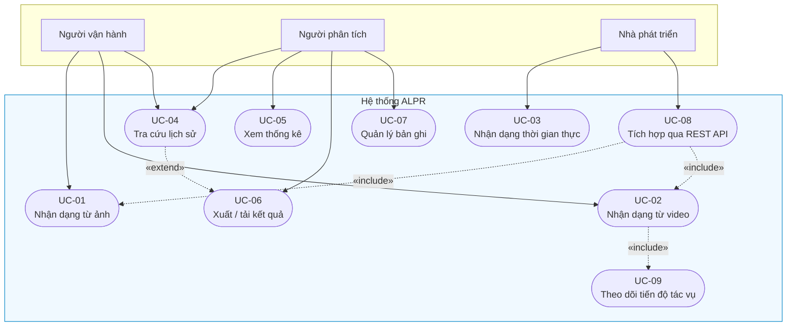

Ba quan hệ trên sơ đồ đáng được giải thích:

- **UC-02 «include» UC-09.** Nhận dạng video *bắt buộc* kéo theo việc theo dõi tiến độ, bởi vì xử lý video là tác vụ chạy nền bất đồng bộ; nếu không có cơ chế theo dõi thì người dùng không có cách nào biết công việc đã xong hay chưa.
- **UC-08 «include» UC-01, UC-02.** REST API không phải một chức năng song song mà là *một lối vào khác* cho cùng các nghiệp vụ nhận dạng. Điều này phản ánh đúng thiết kế: giao diện web cũng gọi chính các endpoint đó.
- **UC-04 «extend» UC-06.** Xuất kết quả là hành vi tùy chọn mở rộng từ tra cứu lịch sử — người dùng có thể tra cứu mà không xuất, nhưng không thể xuất mà chưa xác định tập bản ghi cần xuất.

Trên sơ đồ, UC-03 (nhận dạng thời gian thực) gắn với tác nhân **nhà phát triển** thay vì người vận hành: từ 2026-07-20, chức năng này chỉ còn lối vào qua REST API (`POST /api/detect/frame`) sau khi trang Webcam được gỡ khỏi giao diện web — xem đặc tả UC-03 ở mục d.

#### b) Đặc tả use case UC-01 — Nhận dạng biển số từ ảnh

| Mục | Nội dung |
|---|---|
| **Mã** | UC-01 |
| **Tên** | Nhận dạng biển số từ ảnh tĩnh |
| **Tác nhân chính** | Người vận hành |
| **Mức ưu tiên** | Bắt buộc (Must) |
| **Tiền điều kiện** | Hệ thống đang chạy; mô hình đã được nạp (endpoint `/health` báo trạng thái sẵn sàng) |
| **Hậu điều kiện thành công** | Kết quả nhận dạng được hiển thị trên giao diện; một bản ghi tác vụ và không hoặc nhiều bản ghi biển số được lưu vào CSDL; ảnh gốc và ảnh biển số đã cắt tồn tại trên đĩa |
| **Kích hoạt** | Người dùng chọn tệp ảnh và bấm nút nhận dạng |

**Luồng sự kiện chính:**

1. Người dùng chọn một tệp ảnh (JPEG, PNG, WebP hoặc BMP) từ máy cá nhân.
2. Giao diện kiểm tra sơ bộ phần mở rộng và kích thước tệp, hiển thị ảnh xem trước.
3. Người dùng xác nhận gửi. Giao diện chuyển sang trạng thái đang xử lý.
4. Hệ thống nhận tệp, kiểm tra tính hợp lệ ở phía máy chủ bằng **magic bytes** (không tin phần mở rộng) và kiểm tra hạn mức kích thước.
5. Hệ thống tạo một bản ghi tác vụ (`DetectionJob`) với loại đầu vào `image`, lưu tệp gốc xuống kho tệp bằng tên sinh từ UUID.
6. Hệ thống gọi pipeline AI: giải mã ảnh, phát hiện các vùng biển số, cắt từng vùng, nhận dạng ký tự, chuẩn hoá và kiểm tra tính hợp lệ theo định dạng Việt Nam.
7. Hệ thống lưu ảnh biển số đã cắt và ghi mỗi biển số phát hiện được thành một bản ghi `DetectionHistory` gắn với tác vụ ở bước 5.
8. Hệ thống trả về danh sách kết quả kèm toạ độ bounding box, chuỗi biển số, độ tin cậy phát hiện, độ tin cậy OCR và thời gian xử lý.
9. Giao diện vẽ bounding box chồng lên ảnh và hiển thị bảng kết quả.

**Luồng thay thế và ngoại lệ:**

| Mã | Tình huống | Xử lý |
|---|---|---|
| A1 | Tệp không đúng định dạng ảnh (ví dụ tệp thực thi đổi đuôi `.jpg`) | Trả HTTP 400 kèm thông báo tiếng Việt nêu rõ nguyên nhân; tiến trình **không** bị sập |
| A2 | Tệp vượt quá hạn mức kích thước | Trả HTTP 413; giao diện gợi ý giảm kích thước ảnh |
| A3 | Ảnh hợp lệ nhưng không chứa biển số nào | Trả HTTP **200** với danh sách rỗng — đây là kết quả hợp lệ, không phải lỗi. Giao diện hiển thị trạng thái "không tìm thấy biển số" |
| A4 | Phát hiện được biển số nhưng OCR không đọc ra ký tự | Bản ghi **vẫn được lưu** với `plate_number` rỗng; giao diện đánh dấu độ tin cậy thấp. Lý do được phân tích tại mục 4.4.3(e) |
| A5 | Chuỗi đọc được không khớp bất kỳ định dạng biển số Việt Nam nào | Bản ghi được lưu với cờ `is_valid_format = false`, không bị vứt bỏ |
| A6 | Lỗi nội bộ của pipeline | Trả HTTP 500 với thông báo thân thiện; chi tiết kỹ thuật chỉ ghi vào log, **không** hiển thị stack trace cho người dùng |

Hai điểm A3 và A4 đáng được nhấn mạnh vì chúng phân biệt một thiết kế nghiêm túc với một bản demo. Việc trả lỗi khi không tìm thấy biển số là một sai lầm ngữ nghĩa phổ biến: "không có biển số trong ảnh" là một *câu trả lời*, không phải một *sự cố*. Tương tự, việc âm thầm loại bỏ các trường hợp đọc không ra sẽ làm sai lệch chính các số liệu đánh giá mà Chương 6 cần đến.

#### c) Đặc tả use case UC-02 — Nhận dạng biển số từ video

| Mục | Nội dung |
|---|---|
| **Mã** | UC-02 |
| **Tác nhân chính** | Người vận hành |
| **Tiền điều kiện** | Hệ thống đang chạy; còn dung lượng đĩa cho tệp video |
| **Hậu điều kiện thành công** | Tác vụ ở trạng thái `completed`; các biển số đã gộp trùng được lưu; video kết quả có gắn nhãn tồn tại và tải về được |

**Luồng sự kiện chính:**

1. Người dùng chọn tệp video (MP4, AVI, MOV hoặc MKV) trong hạn mức kích thước.
2. Hệ thống kiểm tra hợp lệ, lưu tệp, tạo bản ghi `DetectionJob` với trạng thái `pending` và **trả ngay HTTP 202 kèm `job_id`**, không giữ kết nối chờ.
3. Một tác vụ nền tiếp nhận công việc, chuyển trạng thái sang `processing`.
4. Tác vụ nền trích xuất khung hình theo bước nhảy cấu hình được (frame sampling), đưa từng khung đã trích vào pipeline AI.
5. Sau mỗi khung, tác vụ cập nhật số khung đã xử lý và tỉ lệ tiến độ.
6. Kết quả của cùng một biển số xuất hiện trên nhiều khung được **gộp trùng**, chỉ giữ lại lần đọc có độ tin cậy cao nhất.
7. Khi duyệt hết khung hình, hệ thống kết xuất video có vẽ sẵn bounding box và nhãn, ghi các kết quả đã gộp vào CSDL, chuyển trạng thái sang `completed`.
8. Song song, giao diện hỏi tiến độ định kỳ qua `job_id` và cập nhật thanh tiến độ; khi trạng thái đạt tới trạng thái kết thúc, giao diện dừng hỏi và hiển thị kết quả.

**Vì sao phải bất đồng bộ.** Theo phân rã ngân sách độ trễ (mục 4.1.4), một khung hình mất khoảng 400 ms trên CPU. Một video 60 giây ở 30 khung/giây, ngay cả khi chỉ lấy mẫu 1/5 số khung, vẫn phải xử lý 360 khung, tương ứng khoảng 145 giây. Con số này vượt xa timeout mặc định của hầu hết proxy và trình duyệt. Việc xử lý đồng bộ vì thế **không phải là một lựa chọn kém, mà là một lựa chọn không khả thi**.

#### d) Đặc tả use case UC-03 — Nhận dạng thời gian thực qua webcam

> ⚠️ **Thay đổi phạm vi 2026-07-20:** trang Webcam đã được **gỡ khỏi giao diện web** theo quyết định thu gọn phạm vi demo. Use case này vì vậy được hiện thực và kiểm chứng **ở tầng API** (`POST /api/detect/frame`); tác nhân chính trở thành một *client thời gian thực* bất kỳ gọi API — trang webcam trước đây của giao diện chính là một client như vậy. Luồng sự kiện dưới đây được giữ làm đặc tả cho phía client; các bước thuần giao diện (tương ứng FR-3.1, FR-3.4) chuyển mức ưu tiên **M → W**.

| Mục | Nội dung |
|---|---|
| **Mã** | UC-03 |
| **Tác nhân chính** | Client thời gian thực (trước 2026-07-20: người vận hành, qua trang Webcam của giao diện) |
| **Tiền điều kiện** | Client có sẵn một nguồn thu hình và có thể mã hoá khung hình thành JPEG / PNG; máy chủ đang chạy và nạp được trọng số mô hình |
| **Hậu điều kiện thành công** | Các biển số quan sát được trong phiên đã được lưu, có gộp trùng; toàn bộ phiên là **một** bản ghi tác vụ |

**Luồng sự kiện chính:**

1. Client bật nguồn thu hình (với client chạy trong trình duyệt: xin quyền truy cập camera).
2. Client hiển thị luồng video trực tiếp, nếu có thành phần hiển thị.
3. Theo chu kỳ cấu hình được, client chụp một khung hình, mã hoá thành JPEG và gửi lên máy chủ. Lời gọi đầu tiên không kèm định danh phiên; máy chủ tạo tác vụ mới và trả `job_id` về.
4. Các lời gọi tiếp theo gửi kèm `job_id` đó, nhờ vậy toàn bộ khung hình của một phiên được quy về cùng một tác vụ.
5. Hệ thống xử lý khung hình và trả kết quả; client sử dụng kết quả theo nhu cầu (trang webcam trước đây vẽ bounding box chồng lên khung hình trực tiếp).
6. Kết quả trùng biển số trong phiên được gộp lại thành một bản ghi duy nhất.

**Ràng buộc riêng của chế độ này.** Vì không có GPU, hệ thống bắt buộc phải áp dụng kỹ thuật bỏ bớt khung hình (frame skipping) kết hợp hàng đợi một khe (single-slot queue) ở phía client gọi API: nếu một khung hình đang chờ kết quả thì khung mới chụp được sẽ bị bỏ qua thay vì xếp hàng. Nếu không làm vậy, tốc độ chụp của camera (khoảng 30 khung/giây) sẽ vượt xa tốc độ xử lý (khoảng 3–5 khung/giây), hàng đợi phình vô hạn và độ trễ hiển thị tăng tuyến tính theo thời gian phiên — hệ thống trông như "chạy được" trong 10 giây đầu rồi tụt hậu ngày càng xa so với thực tế.

Một chi tiết thiết kế nhỏ nhưng quan trọng: nếu `job_id` gửi lên không tồn tại hoặc thuộc về một phiên đã kết thúc, hệ thống **âm thầm mở phiên mới** thay vì báo lỗi. Điều này để việc người dùng tải lại trang giữa chừng không làm hỏng luồng chụp.

### 4.1.3. Yêu cầu chức năng

Đồ án đặc tả tổng cộng **34 yêu cầu chức năng**, tổ chức thành **6 nhóm**. Mỗi yêu cầu được gán một mã định danh, một mức ưu tiên theo thang MoSCoW (Must — bắt buộc, Should — nên có, Could — có thì tốt, Won't — không triển khai ở bản này) và **một tiêu chí chấp nhận kiểm chứng được bằng một phép thử cụ thể**. Nguyên tắc cuối cùng này là chủ ý: một yêu cầu không kèm cách kiểm chứng thì không thể tuyên bố là đã hoàn thành hay chưa.

#### a) Phân bố yêu cầu theo nhóm và mức ưu tiên

**Bảng 4.1.** Phân bố 34 yêu cầu chức năng theo nhóm và mức ưu tiên MoSCoW

| Nhóm | Mã | Phạm vi chức năng | Must | Should | Could | Won't | **Tổng** |
|---|---|---|:---:|:---:|:---:|:---:|:---:|
| FR-1 | FR-1.1 → 1.7 | Nhận dạng từ ảnh tĩnh | 7 | 0 | 0 | 0 | **7** |
| FR-2 | FR-2.1 → 2.6 | Nhận dạng từ video | 5 | 1 | 0 | 0 | **6** |
| FR-3 | FR-3.1 → 3.5 | Nhận dạng thời gian thực (tầng API) | 3 | 0 | 0 | 2 | **5** |
| FR-4 | FR-4.1 → 4.8 | Thống kê, lịch sử và tra cứu | 4 | 1 | 1 | 2 | **8** |
| FR-5 | FR-5.1 → 5.4 | Quản lý dữ liệu | 0 | 2 | 2 | 0 | **4** |
| FR-6 | FR-6.1 → 6.4 | Hệ thống và vận hành | 2 | 2 | 0 | 0 | **4** |
| | | **Tổng cộng** | **21** | **6** | **3** | **4** | **34** |

> ### Bốn yêu cầu mức Won't và hai đợt thu gọn phạm vi ngày 2026-07-20
>
> Cả bốn yêu cầu mức Won't đều là **yêu cầu thuần giao diện**, và đều chuyển mức trong cùng một ngày qua hai đợt thu gọn phạm vi giao diện web liên tiếp:
>
> | Đợt | Trang bị gỡ | Yêu cầu | Chuyển mức | Năng lực còn lại (vẫn phục vụ, vẫn có kiểm thử) |
> |:--:|---|---|:--:|---|
> | 1 | Webcam (`/webcam`) | FR-3.1, FR-3.4 | **M → W** | `POST /api/detect/frame` — phiên gộp trùng theo `job_id` |
> | 2 | Tổng quan / Dashboard (`/dashboard`) | FR-4.1 | **M → W** | `GET /api/statistics`, `GET /health` |
> | 2 | Tổng quan / Dashboard (`/dashboard`) | FR-4.2 | **S → W** | `GET /api/statistics` (chuỗi số liệu theo ngày nằm trong cùng đáp ứng) |
>
> **Phải nói thẳng: FR-4.1 là yêu cầu mức *Must* đầu tiên — và duy nhất — bị đưa ra khỏi phạm vi trong toàn bộ đồ án.** Trước đó, mọi thay đổi phạm vi chỉ đụng tới các yêu cầu mức Should trở xuống hoặc tới các yêu cầu thuần hiển thị của một năng lực vẫn còn nguyên. Ở đợt thứ hai, một chỉ tiêu từng được xếp là *bắt buộc* đã bị hạ mức. Bảng đếm ở trên vì vậy giảm từ 22/7/3/2 xuống **21/6/3/4**, và mục 7.3 của Chương 7 ghi nhận đây là một **hạn chế thật** chứ không phải một dòng ghi chú hành chính.
>
> Điều **không** thay đổi: cả hai đợt chỉ gỡ **màn hình hiển thị**, không gỡ **năng lực hệ thống**. Các endpoint tương ứng vẫn phục vụ, vẫn nằm trong tài liệu OpenAPI, và vẫn có kiểm thử tích hợp ở backend (`tests/integration/test_api_statistics.py`, `test_api_health.py`). Mã giao diện của cả hai trang còn nguyên trong lịch sử git. Đánh đổi đo được của đợt 2: gỡ thư viện biểu đồ `recharts` cùng trang Tổng quan làm gói tải về của giao diện giảm từ ~730 KB xuống **328,8 KB** (−55%).

#### b) Nội dung cốt lõi của từng nhóm

**FR-1 — Nhận dạng từ ảnh (7 yêu cầu, toàn bộ là Must).** Nhóm này định nghĩa nghiệp vụ trung tâm của hệ thống, đi từ tiếp nhận tệp, kiểm tra hợp lệ đầu vào, phát hiện *tất cả* vùng biển số trong ảnh, cắt và nhận dạng ký tự từng vùng, hậu xử lý chuỗi đọc được, lưu trữ kết quả cùng ảnh liên quan, cho tới hiển thị kết quả có vẽ bounding box. Việc toàn bộ nhóm này là Must phản ánh đúng bản chất: nếu thiếu bất kỳ bước nào, hệ thống không còn là một hệ thống ALPR.

Một yêu cầu trong nhóm đáng được nêu riêng. FR-1.5 quy định rằng bước hậu xử lý phải lưu **cả chuỗi OCR thô lẫn chuỗi đã sửa** — ví dụ chuỗi thô `51A-I234O` được chuẩn hoá thành `51A-12340`, và cả hai đều được ghi lại. Đây không phải sự dư thừa dữ liệu mà là điều kiện cần để đo được đóng góp riêng của khối hậu xử lý, một nội dung phân tích định lượng của Chương 6. Lập luận đầy đủ được trình bày tại mục 4.4.3(b).

**FR-2 — Nhận dạng từ video (6 yêu cầu: 5 Must, 1 Should).** Nhóm này bổ sung ba năng lực mà nhóm FR-1 không có: trích xuất khung hình theo bước nhảy cấu hình được, **gộp trùng kết quả** của cùng một biển số xuất hiện trên nhiều khung, và kết xuất video kết quả có gắn nhãn. Yêu cầu Should duy nhất là hiển thị tiến độ theo phần trăm và cho phép huỷ tác vụ.

Yêu cầu gộp trùng (FR-2.4) là điểm dễ bị bỏ sót nhất trong các đồ án ALPR và là một trong những yêu cầu có ảnh hưởng lan toả lớn nhất. Không có nó, một video 30 giây sẽ sinh ra hàng nghìn bản ghi mô tả cùng vài chiếc xe, làm hỏng toàn bộ phần thống kê ở nhóm FR-4 và biến bảng lịch sử thành vô dụng.

**FR-3 — Nhận dạng thời gian thực (5 yêu cầu: 3 Must, 2 Won't).** Nhóm này ban đầu gồm 5 yêu cầu Must, bao trùm việc xin quyền và hiển thị luồng webcam, gửi khung hình về máy chủ theo chu kỳ cấu hình được, nhận dạng trên luồng trực tiếp, vẽ chồng bounding box lên hình ảnh đang chạy, và lưu lịch sử phiên có gộp trùng. **Theo quyết định thu gọn phạm vi ngày 2026-07-20**, trang Webcam được gỡ khỏi giao diện web: hai yêu cầu thuần giao diện FR-3.1 (xin quyền, hiển thị luồng) và FR-3.4 (vẽ chồng bounding box) chuyển mức **M → W**; ba yêu cầu còn lại (FR-3.2, FR-3.3, FR-3.5) vẫn là Must và được đáp ứng, kiểm chứng **ở tầng API** qua `POST /api/detect/frame` với phiên gộp trùng theo `job_id`. Ràng buộc hiệu năng của nhóm gắn chặt với việc không có GPU và được cụ thể hoá thành chỉ tiêu định lượng NFR-P2.

**FR-4 — Thống kê, lịch sử và tra cứu (8 yêu cầu: 4 Must, 1 Should, 1 Could, 2 Won't).** Đây là nhóm đông yêu cầu nhất, và cũng là nhóm chịu tác động nặng nhất của thay đổi phạm vi. Nội dung ban đầu gồm: các chỉ số tổng hợp trên màn hình Tổng quan (tổng lượt sử dụng, độ tin cậy trung bình, thời gian xử lý trung bình, phân bố theo loại đầu vào — FR-4.1), biểu đồ số lượt theo thời gian (FR-4.2), danh sách lịch sử có phân trang, tìm kiếm theo biển số hỗ trợ khớp một phần, lọc theo loại đầu vào — khoảng thời gian — ngưỡng độ tin cậy, xem chi tiết một bản ghi với đầy đủ metadata, tải về ảnh kết quả, và sắp xếp theo cột.

**Theo quyết định thu gọn phạm vi ngày 2026-07-20 (đợt thứ hai trong ngày)**, trang Tổng quan (Dashboard) được gỡ khỏi giao diện web: **FR-4.1 chuyển M → W** và **FR-4.2 chuyển S → W**. Cần nhấn mạnh hai điều, theo đúng thứ tự quan trọng.

Thứ nhất, **đây là lần đầu một yêu cầu mức Must bị đưa ra khỏi phạm vi**. Nó không được trình bày như một chi tiết kỹ thuật nhỏ, vì nó không phải: một chỉ tiêu từng được xếp loại "thiếu ⇒ đồ án không đạt" nay không còn được đáp ứng ở tầng giao diện.

Thứ hai, phạm vi mất đi là phạm vi **hiển thị**, không phải phạm vi **năng lực**. Toàn bộ phép tính thống kê vẫn nằm trong `StatisticsService` (mục 4.3.2), vẫn phơi ra qua `GET /api/statistics` với đầy đủ các chỉ số và chuỗi số liệu theo ngày mà FR-4.1 và FR-4.2 yêu cầu, vẫn xuất hiện trong tài liệu OpenAPI, và vẫn có kiểm thử tích hợp ở backend. Thiết kế API ở mục 4.3.3 **giữ nguyên không sửa một dòng nào** — đó chính là bằng chứng thực tế cho nguyên tắc tách tầng ở mục 4.2: một thay đổi ở tầng trình bày không lan xuống các tầng dưới.

Sáu yêu cầu còn lại của nhóm — **FR-4.3 đến FR-4.8**, toàn bộ thuộc màn hình Lịch sử — **không đổi mức và không đổi nội dung**.

**FR-5 — Quản lý dữ liệu (4 yêu cầu: 2 Should, 2 Could).** Nhóm này gồm xoá bản ghi kèm xoá tệp ảnh liên quan (không để lại tệp mồ côi), xuất lịch sử đã áp bộ lọc ra CSV hoặc JSON, script dọn dẹp tệp không còn bản ghi tham chiếu, và xoá hàng loạt. Một chi tiết nhỏ nhưng thực dụng trong tiêu chí chấp nhận: tệp CSV phải được mã hoá UTF-8 **có BOM**, nếu không Excel sẽ hiển thị sai toàn bộ ký tự tiếng Việt.

**FR-6 — Hệ thống và vận hành (4 yêu cầu: 2 Must, 2 Should).** Nhóm này quy định các năng lực không nhìn thấy trên giao diện nhưng quyết định chất lượng vận hành: endpoint kiểm tra sức khoẻ báo trạng thái nạp mô hình và kết nối CSDL, ghi log có cấu trúc cho mọi lượt nhận dạng và mọi lỗi, thông báo lỗi thân thiện không rò rỉ stack trace, và toàn bộ cấu hình đọc từ biến môi trường hoặc tệp cấu hình thay vì hard-code.

#### c) Ma trận truy vết

Để bảo đảm không yêu cầu nào bị bỏ quên, mỗi nhóm được truy vết tới giai đoạn cài đặt và giai đoạn kiểm chứng tương ứng:

| Nhóm FR | Giai đoạn cài đặt | Hình thức kiểm chứng |
|---|---|---|
| FR-1 (Ảnh) | Phase 3, 4, 5, 6 | Unit test + integration test |
| FR-2 (Video) | Phase 5, 6 | Integration test + performance test |
| FR-3 (Thời gian thực) | Phase 5 (tầng API — phần giao diện đã gỡ 2026-07-20) | Performance test |
| FR-4 (Thống kê, lịch sử) | Phase 5, 6 (FR-4.1/4.2 chỉ còn ở tầng API — trang Tổng quan đã gỡ 2026-07-20) | Integration test (`test_api_statistics.py`, `test_api_health.py`) + UI test cho FR-4.3 → 4.8 |
| FR-5 (Dữ liệu) | Phase 5, 6 | Unit test |
| FR-6 (Hệ thống) | Phase 5, 8 | Smoke test + stress test |

Kết quả thực hiện của ma trận này sẽ được báo cáo ở Chương 6.

### 4.1.4. Yêu cầu phi chức năng

Yêu cầu phi chức năng được tổ chức thành bảy nhóm: hiệu năng (NFR-P), độ chính xác (NFR-A), độ tin cậy (NFR-R), khả năng sử dụng (NFR-U), khả năng bảo trì (NFR-M), bảo mật (NFR-S), tương thích và triển khai (NFR-C), cùng khả năng mở rộng (NFR-SC).

#### a) Nguyên tắc nền tảng: mọi chỉ tiêu hiệu năng đều là chỉ tiêu CPU

Trước khi liệt kê bất kỳ con số nào, cần phát biểu rõ một điều kiện bao trùm:

> **Toàn bộ chỉ tiêu hiệu năng của đồ án là chỉ tiêu đo trên CPU.**

Máy thực hiện đồ án chạy Windows 11 với Python 3.13, **không có GPU CUDA** — phần đồ hoạ là Intel UHD Graphics 770 tích hợp, không hỗ trợ CUDA và không được PyTorch dùng để tăng tốc suy luận. Việc huấn luyện mô hình sẽ được thực hiện trên GPU miễn phí của Google Colab hoặc Kaggle, nhưng **suy luận và toàn bộ phần trình diễn khi bảo vệ chạy trên CPU của máy cá nhân**.

**Vì sao đây là một ràng buộc thiết kế nghiêm túc chứ không phải một hạn chế tạm thời.**

Cần phân biệt hai loại giới hạn. Một *hạn chế tạm thời* là thứ sẽ biến mất khi hoàn cảnh thay đổi, và vì thế không nên để nó định hình kiến trúc — nếu chỉ cần đợi mượn được một chiếc máy có GPU là mọi thứ ổn thoả, thì việc thiết kế lại hệ thống quanh giới hạn đó là lãng phí. Một *ràng buộc thiết kế* thì khác: nó là điều kiện biên của bài toán, và mọi phương án kỹ thuật đều phải được đánh giá dưới điều kiện biên đó.

Việc không có GPU thuộc loại thứ hai, vì bốn lý do:

**Thứ nhất, nó cố định trong toàn bộ vòng đời của đồ án và tại chính thời điểm quan trọng nhất.** Buổi bảo vệ diễn ra trên máy cá nhân của người thực hiện. Không có kịch bản nào trong đó hệ thống được trình diễn trên phần cứng khác. Một thiết kế chỉ đạt chỉ tiêu khi có GPU là một thiết kế không bao giờ được chứng minh là đạt.

**Thứ hai, nó thay đổi bậc độ lớn của độ trễ, chứ không phải thay đổi vài phần trăm.** Chênh lệch giữa suy luận trên GPU và trên CPU với các mô hình phát hiện đối tượng là khoảng một bậc độ lớn. Một hệ thống được thiết kế quanh giả định "mỗi khung hình mất 20 ms" và một hệ thống được thiết kế quanh thực tế "mỗi khung hình mất 400 ms" **không phải là cùng một hệ thống**. Ở mốc 20 ms, xử lý video đồng bộ trong một lời gọi HTTP là hợp lý và webcam có thể xử lý mọi khung hình. Ở mốc 400 ms, cả hai đều bất khả thi: video buộc phải chạy nền bất đồng bộ với cơ chế theo dõi tiến độ (quyết định AD-02), và webcam buộc phải bỏ khung với hàng đợi một khe. Nói cách khác, **ràng buộc CPU trực tiếp sinh ra hai quyết định kiến trúc**, chứ không chỉ hạ thấp các con số mục tiêu.

**Thứ ba, nó chi phối việc lựa chọn thành phần ở mọi tầng.** Kích thước biến thể mô hình phát hiện (n/s/m), biến thể của bộ OCR (mobile hay server), kích thước ảnh đầu vào, và đặc biệt là **lựa chọn backend suy luận** đều phải được quyết định dựa trên số đo CPU. Đây là chỗ ràng buộc chuyển từ bất lợi thành một hướng kỹ thuật có nội dung: benchmark chính thức trên CPU Intel Core i7-13700H cho thấy mô hình YOLOv8n chạy qua ONNX Runtime nhanh hơn khoảng **3,73 lần** so với PyTorch thuần (104,61 ms giảm còn 28,02 ms) [18]<!-- ultralytics_2026_openvinoexport -->, và lợi ích này lớn nhất đúng ở phân khúc mô hình nhỏ mà đồ án sử dụng. Nếu đã có GPU, việc xuất mô hình sang ONNX/OpenVINO và tinh chỉnh số luồng [117]<!-- onnxruntime_2025_threading --> sẽ là một tối ưu hoá thứ yếu; không có GPU, nó trở thành một phương án chính đáng được cân nhắc ngay từ khâu thiết kế.

> **Cảnh báo về cách trích dẫn con số này.** Bảng benchmark nguồn có kèm cột mAP, nhưng cột đó được đo trên tập `coco8` chỉ gồm **8 ảnh**, nên không có ý nghĩa thống kê. Đồ án chỉ sử dụng cột thời gian suy luận của bảng và cố ý lược bỏ cột độ chính xác.

**Thứ tư, nó buộc phương pháp luận công bố số liệu phải chặt hơn.** Các bài báo ALPR thường công bố độ trễ đo trên GPU dòng RTX hoặc V100 và báo cáo con số vài chục mili-giây. Nếu đồ án công bố một con số FPS mà không kèm cấu hình phần cứng, con số đó vô nghĩa và sẽ bị chất vấn ngay. Vì vậy đồ án đặt ra một quy tắc bắt buộc: **mọi số liệu hiệu năng công bố phải kèm model CPU, số luồng, kích thước ảnh đầu vào, backend suy luận (PyTorch / ONNX / OpenVINO) và cỡ mẫu đo.** Quy tắc này được ghi thành ràng buộc chính thức CON-06 của dự án.

Hệ quả cuối cùng: các chỉ tiêu độ trễ dưới đây trông "rộng rãi" hơn so với văn liệu quốc tế. Đó không phải sự dễ dãi mà là sự trung thực về điều kiện đo.

#### b) NFR-P — Hiệu năng

**Bảng 4.2.** Chỉ tiêu phi chức năng nhóm hiệu năng (NFR-P)

| Mã | Chỉ tiêu | Mục tiêu | Ngưỡng tối thiểu | Phương pháp đo |
|---|---|---|---|---|
| **NFR-P1** | Độ trễ toàn trình một ảnh (p95) | ≤ 800 ms | ≤ 1500 ms | 100 ảnh test, báo cáo p50/p95/p99 |
| **NFR-P2** | Tốc độ khung hình chế độ thời gian thực (webcam — đo ở tầng API) | ≥ 5 FPS hiệu dụng | ≥ 3 FPS | Đo liên tục trong 60 giây |
| **NFR-P3** | Tốc độ xử lý video | ≥ 0,3× thời gian thực | ≥ 0,15× | Video 60 giây xử lý trong ≤ 200 giây |
| **NFR-P4** | Thời gian nạp mô hình khi khởi động | ≤ 15 giây | ≤ 30 giây | Từ lúc khởi động đến khi `/health` báo sẵn sàng |
| **NFR-P5** | Overhead của tầng API (không tính suy luận) | ≤ 50 ms | ≤ 100 ms | Hiệu giữa tổng thời gian request và thời gian pipeline |
| **NFR-P6** | Thời gian truy vấn lịch sử (10.000 bản ghi) | ≤ 500 ms | ≤ 1000 ms | Có áp phân trang và bộ lọc |
| **NFR-P7** | Bộ nhớ thường trú của backend | ≤ 2 GB | ≤ 4 GB | Theo dõi RSS khi chạy tải liên tục |

Chỉ tiêu NFR-P1 không được đặt tuỳ tiện mà xuất phát từ một **phân rã ngân sách độ trễ**, tức là ước lượng chi phí thời gian của từng bước rồi cộng lại:

| Bước xử lý | Ngân sách ước lượng |
|---|---|
| Giải mã ảnh và tiền xử lý | ~50 ms |
| Suy luận mô hình phát hiện @ 640 px trên CPU | ~150 ms |
| Cắt và tiền xử lý vùng biển số | ~30 ms |
| Nhận dạng ký tự (mỗi biển số) | ~120 ms |
| Hậu xử lý regex và kiểm tra hợp lệ | < 5 ms |
| Ghi CSDL và lưu ảnh | ~50 ms |
| **Tổng cho ảnh chứa một biển số** | **~405 ms** |

Ngân sách 800 ms do đó để lại khoảng hai lần dự phòng, dùng cho các ảnh chứa nhiều biển số (mỗi biển số bổ sung thêm khoảng 150 ms cho khâu cắt và OCR) và cho biến động tải của máy. Cần nhấn mạnh: các con số trên là **ước lượng thiết kế**, không phải kết quả đo. Số đo thực tế sẽ được trình bày ở Chương 6.

Cần lưu ý rằng ngân sách trên được lập cho **runtime suy luận mặc định đã chốt ở mục 3.4 là ONNX Runtime**, chứ không phải cho việc chạy trực tiếp tệp trọng số PyTorch. Đây là điểm đã thay đổi so với quyết định kiến trúc sơ bộ AD-05 ở giai đoạn phân tích ban đầu (*"PyTorch trước, ONNX/OpenVINO nếu cần"*): khảo sát Phase 1 cho thấy ONNX Runtime nhanh gấp khoảng 3,73 lần ở đúng phân khúc mô hình đồ án dùng, và quan trọng hơn, việc cho **cả bộ phát hiện lẫn bộ OCR cùng chạy trên một runtime duy nhất** loại bỏ hoàn toàn rủi ro xung đột giữa hai framework học sâu trong cùng một môi trường Python. Vì vậy ONNX Runtime được nâng từ *phương án tối ưu dự phòng* thành *lựa chọn mặc định ngay từ khâu thiết kế*, còn OpenVINO giữ vai trò tối ưu bổ sung.

Trường hợp đo thực tế vượt ngưỡng, thứ tự phương án giảm tải đã được xác định trước: (1) lượng tử hoá INT8 bằng OpenVINO kèm tập hiệu chuẩn; (2) giảm kích thước ảnh đầu vào xuống 480 px; (3) chuyển sang biến thể OCR nhẹ hơn. Chỉ hạ chỉ tiêu **sau khi** đã thử hết ba phương án này — nguyên tắc này được ghi rõ để tránh việc hạ chuẩn cho tiện.

#### c) NFR-A — Độ chính xác

**Bảng 4.3.** Chỉ tiêu phi chức năng nhóm độ chính xác (NFR-A)

| Mã | Chỉ tiêu | Mục tiêu | Ngưỡng tối thiểu |
|---|---|---|---|
| **NFR-A1** | mAP@0.5 của bộ phát hiện | ≥ 0,90 | ≥ 0,85 |
| **NFR-A2** | mAP@0.5:0.95 của bộ phát hiện | ≥ 0,65 | ≥ 0,55 |
| **NFR-A3** | Precision / Recall phát hiện | ≥ 0,92 / ≥ 0,90 | ≥ 0,88 / ≥ 0,85 |
| **NFR-A4** | Độ chính xác OCR mức ký tự (1 − CER) | ≥ 0,95 | ≥ 0,92 |
| **NFR-A5** | Độ chính xác biển đầy đủ **trước** hậu xử lý | ≥ 0,85 | ≥ 0,80 |
| **NFR-A6** | Độ chính xác biển đầy đủ **sau** hậu xử lý | ≥ 0,90 | ≥ 0,85 |
| **NFR-A7** | Độ chính xác toàn trình (ảnh vào → biển đúng) | ≥ 0,88 | ≥ 0,82 |

Cặp NFR-A5 và NFR-A6 được đặt ra như hai chỉ tiêu **tách bạch** một cách có chủ đích. Hiệu số giữa chúng chính là đóng góp định lượng của khối hậu xử lý — một đại lượng có thể đo, có thể trình bày và có thể bảo vệ, thay vì chỉ phát biểu định tính rằng "hệ thống có thêm bước sửa lỗi bằng regex". Việc đo được hiệu số này phụ thuộc hoàn toàn vào một quyết định ở tầng dữ liệu (lưu cả chuỗi thô lẫn chuỗi đã sửa) sẽ được phân tích tại mục 4.4.3(b). Đây là một ví dụ điển hình cho thấy một chỉ tiêu đánh giá học thuật có thể ràng buộc ngược lên lược đồ cơ sở dữ liệu.

Hai yêu cầu phân tích bổ sung phục vụ chương đánh giá:

- **NFR-A8:** báo cáo độ chính xác **tách riêng cho biển một dòng và biển hai dòng**. Căn cứ của yêu cầu này là số liệu 94,3% / 45,7% **đo trên bộ RodoSol-ALPR (Brazil)**, đã dẫn ở mục 4.1.1 — một con số tổng thể duy nhất sẽ **che giấu** đúng điểm gãy mà đồ án cần phân tích.
- **NFR-A9:** báo cáo độ chính xác theo điều kiện ảnh (ban ngày, ban đêm, nghiêng, mờ), nếu bộ dữ liệu có nhãn phù hợp.

#### d) Các nhóm yêu cầu phi chức năng còn lại

**NFR-R — Độ tin cậy.** Hệ thống không được sập khi gặp đầu vào hỏng, sai định dạng hoặc độc hại (mục tiêu 100% các lỗi đều bị bắt và xử lý). Ảnh không phát hiện được biển số phải trả kết quả rỗng hợp lệ với HTTP 200. Tác vụ video thất bại giữa chừng không được để lại bản ghi hoặc tệp rác. Tỉ lệ thành công khi chạy liên tục một giờ ≥ 99%. CSDL sống sót qua khởi động lại mà không mất dữ liệu.

**NFR-U — Khả năng sử dụng.** Người dùng mới hoàn thành lượt nhận dạng ảnh đầu tiên trong không quá ba thao tác nhấp chuột và không cần đọc tài liệu. Mọi thao tác kéo dài trên 500 ms phải có phản hồi trực quan. Thông báo lỗi bằng tiếng Việt, nêu rõ nguyên nhân và cách khắc phục, không hiển thị mã lỗi kỹ thuật. Giao diện dùng được từ độ phân giải 1366×768 trở lên. Tương phản màu cho chữ chính đạt chuẩn WCAG AA (tỉ lệ ≥ 4,5:1).

**NFR-M — Khả năng bảo trì.** Đây là nhóm có ảnh hưởng lớn nhất tới kiến trúc. Sáu chỉ tiêu gồm: mã AI tách biệt hoàn toàn khỏi mã API (NFR-M1); độ bao phủ test cho tầng nghiệp vụ ≥ 70% (NFR-M2); mọi hàm public có type hint và docstring (NFR-M3); không hard-code đường dẫn (NFR-M4); có thể thay bộ OCR khác mà không sửa mã tầng API (NFR-M5); mã tuân thủ định dạng và lint tự động (NFR-M6). Hai chỉ tiêu NFR-M1 và NFR-M5 **là các yêu cầu kiến trúc, không phải nguyện vọng** — chúng chính là lý do tồn tại của tầng AI độc lập được trình bày ở mục 4.2.

**NFR-S — Bảo mật.** Do hệ thống chạy nội bộ, mô hình đe doạ ở mức hạn chế, nhưng vẫn yêu cầu: kiểm tra tệp tải lên bằng magic bytes chứ không tin phần mở rộng; chống path traversal bằng cách sinh lại tên tệp từ UUID; giới hạn kích thước tệp thực thi ở phía máy chủ; CORS chỉ cho phép các origin đã khai báo, không dùng ký tự đại diện; không ghi dữ liệu nhạy cảm vào log; truy vấn CSDL luôn tham số hoá qua ORM.

**NFR-C — Tương thích và triển khai.** Chạy được trên Windows, Linux và macOS thông qua Docker với một lệnh duy nhất. Hoạt động **không cần GPU** — và điều quan trọng là đây là *chế độ mặc định*, không phải chế độ dự phòng. Hỗ trợ Chrome, Edge, Firefox bản mới. Cài đặt từ đầu trên máy sạch theo README trong không quá 15 phút.

**NFR-SC — Khả năng mở rộng.** Xử lý ổn định ít nhất 5 yêu cầu đồng thời; hiệu năng không suy giảm ở quy mô 100.000 bản ghi; tác vụ video chạy nền không chặn các yêu cầu khác.

> **Giới hạn đã biết cần công bố.** SQLite chỉ cho phép **một tiến trình ghi tại một thời điểm**. Với quy mô đồ án, giới hạn này chấp nhận được và không ảnh hưởng tới việc đạt các chỉ tiêu trên. Tuy nhiên nó phải được nêu rõ trong phần Hạn chế của đồ án, kèm hướng khắc phục (chuyển sang PostgreSQL) nếu triển khai thực tế. Việc chủ động nêu ra một giới hạn kèm phương án xử lý là cách trình bày trung thực hơn và cũng vững vàng hơn khi phản biện so với việc để nó bị phát hiện.

---

## 4.2. Kiến trúc hệ thống

### 4.2.1. Nguyên tắc kiến trúc

Kiến trúc của hệ thống được dẫn dắt bởi các nguyên tắc tổ chức mã nguồn phổ biến trong kỹ nghệ phần mềm hiện đại, cụ thể hoá thành bốn ràng buộc cứng của dự án.

#### a) Kiến trúc sạch và quy tắc phụ thuộc

Ý tưởng trung tâm của kiến trúc sạch (Clean Architecture) là **quy tắc phụ thuộc**: các phụ thuộc trong mã nguồn chỉ được hướng vào trong, từ các chi tiết kỹ thuật dễ thay đổi (framework web, cơ sở dữ liệu, giao diện) về phía các quy tắc nghiệp vụ ổn định. Thành phần nằm ở vòng trong **không được biết gì** về thành phần nằm ở vòng ngoài.

Áp dụng vào bài toán này, câu hỏi then chốt là: đâu là thứ ổn định và đâu là thứ dễ thay đổi? Câu trả lời khá rõ. Thuật toán nhận dạng biển số — phát hiện vùng, cắt, đọc ký tự, chuẩn hoá theo quy chuẩn Việt Nam — là bản chất của đề tài và tồn tại độc lập với việc kết quả được trả về qua HTTP, ghi vào tệp hay in ra màn hình. Ngược lại, việc dùng FastAPI hay Flask, SQLite hay PostgreSQL, React hay Vue là các quyết định kỹ thuật hoàn toàn có thể thay đổi. Do đó **pipeline AI phải nằm ở vòng trong cùng**, và tầng web phải phụ thuộc vào nó chứ không phải ngược lại.

#### b) Các nguyên lý SOLID được vận dụng

Trong năm nguyên lý SOLID, ba nguyên lý có ảnh hưởng trực tiếp và quan sát được lên thiết kế này:

**Nguyên lý trách nhiệm đơn nhất (Single Responsibility).** Mỗi thành phần của pipeline chịu trách nhiệm về đúng một việc: bộ phát hiện chỉ trả về các bounding box, bộ nhận dạng chỉ chuyển ảnh biển số thành chuỗi ký tự, bộ chuẩn hoá chỉ biến chuỗi thô thành chuỗi hợp quy chuẩn. Sự phân tách này không chỉ để mã sạch: nó cho phép **đo hiệu năng và độ chính xác của từng khối một cách riêng biệt**, điều kiện cần để chương đánh giá nói được rằng lỗi nằm ở khâu phát hiện hay khâu đọc ký tự.

**Nguyên lý thay thế Liskov (Liskov Substitution).** Mọi cài đặt bộ phát hiện phải thay thế được cho nhau mà không làm hỏng pipeline. Nguyên lý này đang được sử dụng theo nghĩa đen tại thời điểm hiện tại: hệ thống chạy với một cài đặt pipeline giả lập tuân thủ đúng hợp đồng của pipeline thật, nhờ đó toàn bộ tầng API, tầng nghiệp vụ và giao diện đã được xây dựng và kiểm chứng **trước khi** mô hình được huấn luyện.

**Nguyên lý đảo ngược phụ thuộc (Dependency Inversion).** Tầng nghiệp vụ không phụ thuộc vào một lớp pipeline cụ thể mà phụ thuộc vào một *hợp đồng trừu tượng*. Cài đặt cụ thể được tiêm vào từ bên ngoài (dependency injection). Đây là cơ chế kỹ thuật biến nguyên tắc "có thể thay thế thành phần" từ một lời hứa thành một ràng buộc do trình biên dịch và bộ kiểm tra kiểu bảo đảm.

#### c) Bốn ràng buộc cứng của dự án

Các nguyên tắc trên được cụ thể hoá thành bốn ràng buộc, xếp theo thứ tự quan trọng:

**Bảng 4.4.** Bốn ràng buộc kiến trúc và hệ quả trực tiếp

| # | Ràng buộc | Nguồn gốc | Hệ quả kiến trúc trực tiếp |
|---|---|---|---|
| **1** | **Không trộn mã AI với mã API** | NFR-M1 | Pipeline AI là một package Python độc lập, **không import bất cứ thành phần nào của framework web** |
| **2** | **Mọi thành phần AI phải thay thế được** | NFR-M5 | Bộ phát hiện, bộ nhận dạng và bộ chuẩn hoá đều đứng sau lớp trừu tượng |
| **3** | **Không hard-code đường dẫn** | NFR-M4 | Mọi đường dẫn đi qua một đối tượng cấu hình tập trung, đọc từ biến môi trường |
| **4** | **Chạy được không cần GPU** | CON-02, NFR-C2 | Thiết bị suy luận là tham số cấu hình, giá trị mặc định là `cpu` |

Ràng buộc thứ tư đáng lưu ý ở cách phát biểu. Nó **không** nói "hệ thống có chế độ dự phòng chạy CPU khi không tìm thấy GPU" — cách phát biểu đó ngầm coi CPU là trường hợp suy biến. Nó nói rằng CPU là *cấu hình mặc định*, và GPU nếu có chỉ là một giá trị khác của cùng một tham số. Sự khác biệt về cách phát biểu này dẫn tới sự khác biệt thật trong mã nguồn: đường dẫn thực thi trên CPU là đường được kiểm thử thường xuyên nhất, chứ không phải một nhánh hiếm khi chạy tới.

### 4.2.2. Kiến trúc phân tầng

Hệ thống được tổ chức thành năm tầng:

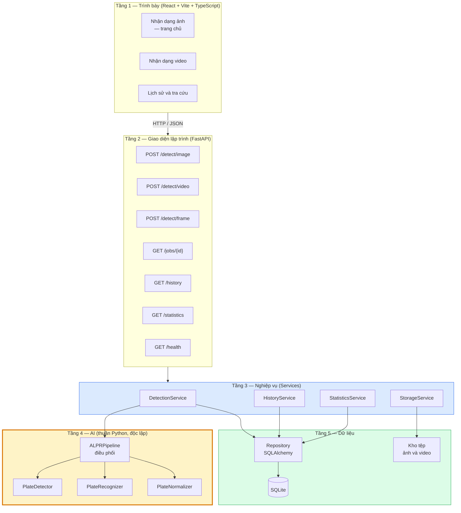

> **Ghi chú thay đổi phạm vi 2026-07-20 (hai đợt trong ngày):** tầng trình bày còn **ba trang** — trang Webcam thời gian thực và trang Tổng quan (Dashboard) đều đã được gỡ khỏi giao diện. **Tầng 2 đến tầng 5 không đổi một dòng nào:** `POST /detect/frame`, `GET /statistics` và `GET /health` vẫn giữ nguyên ở tầng 2, `StatisticsService` vẫn giữ nguyên ở tầng 3, và cả ba endpoint đều vẫn có kiểm thử tích hợp. Chúng nay phục vụ client gọi API trực tiếp thay vì phục vụ một trang giao diện. Sự kiện này là một phép thử ngoài dự kiến cho nguyên tắc phụ thuộc một chiều của kiến trúc: gỡ hai màn hình ở tầng trên cùng không gây một thay đổi nào ở bốn tầng dưới.

**Trách nhiệm của từng tầng:**

**Bảng 4.5.** Trách nhiệm của từng tầng trong kiến trúc phân tầng

| Tầng | Trách nhiệm | Được phép biết về |
|---|---|---|
| **1 — Trình bày** | Thu nhận thao tác người dùng, gọi API, hiển thị kết quả, quản lý trạng thái giao diện | Hợp đồng HTTP của tầng 2 |
| **2 — API** | Định tuyến, kiểm tra hợp lệ đầu vào, xác thực kiểu dữ liệu, ánh xạ ngoại lệ thành mã trạng thái HTTP, sinh tài liệu OpenAPI | Tầng 3 |
| **3 — Nghiệp vụ** | Điều phối các bước nghiệp vụ: tạo tác vụ, gọi pipeline, lưu tệp, ghi CSDL, gộp trùng, tổng hợp thống kê | Tầng 4 và tầng 5 |
| **4 — AI** | Phát hiện, nhận dạng, chuẩn hoá biển số | **Chỉ NumPy, OpenCV và các thư viện học sâu** |
| **5 — Dữ liệu** | Truy vấn và ghi CSDL, đọc ghi kho tệp | Lược đồ CSDL và hệ thống tệp |

**Điểm mấu chốt của sơ đồ:** khối màu vàng (tầng AI) **không có mũi tên nào đi lên**. Nó không biết gì về HTTP, về cơ sở dữ liệu, hay về việc thành phần nào đang gọi nó. Đây không phải một chi tiết thẩm mỹ của sơ đồ mà là quyết định kiến trúc quan trọng nhất của toàn bộ đồ án, và mục tiếp theo dành riêng để lập luận cho nó.

### 4.2.3. Nguyên tắc tách tầng AI khỏi tầng API

#### a) Phát biểu ràng buộc

Ràng buộc được phát biểu ở dạng có thể kiểm tra được, không phải ở dạng khuyến nghị:

> **Không một tệp mã nguồn nào trong package `ai/inference/` được phép import FastAPI, Pydantic, SQLAlchemy hay bất kỳ thành phần nào của tầng web và tầng dữ liệu.**

Chiều ngược lại thì được phép và là bắt buộc: tầng nghiệp vụ import các kiểu dữ liệu và lớp trừu tượng từ tầng AI.

#### b) Ba lợi ích cụ thể

**Lợi ích thứ nhất: kiểm thử độc lập.** Nếu bộ phát hiện phụ thuộc vào FastAPI, muốn kiểm thử nó phải dựng một ứng dụng web, một client thử nghiệm và một yêu cầu HTTP giả lập. Toàn bộ hạ tầng đó không liên quan gì tới câu hỏi thực sự cần trả lời — "với ảnh này, mô hình trả về những bounding box nào?" — nhưng lại là nơi phát sinh lỗi, làm chậm bộ test và khiến kết quả khó diễn giải. Khi tầng AI độc lập, một bài kiểm thử chỉ cần nạp một mảng NumPy và so sánh đầu ra. Chi phí viết test giảm, tốc độ chạy test tăng, và khi test đỏ thì nguyên nhân nằm đúng trong phạm vi mô hình.

**Lợi ích thứ hai: tái sử dụng trong script huấn luyện và đánh giá.** Đây là lợi ích thực dụng nhất trong bối cảnh đồ án. Script huấn luyện chạy trên Colab và script đánh giá chạy cục bộ **không phải là ứng dụng web**; chúng là các chương trình dòng lệnh duyệt qua một thư mục ảnh. Nếu logic tiền xử lý, cắt vùng biển số và chuẩn hoá chuỗi nằm lẫn trong các hàm xử lý HTTP, thì script đánh giá buộc phải sao chép lại logic đó. Và khi hai bản sao tồn tại, chúng sẽ lệch nhau — dẫn tới tình huống tệ nhất có thể xảy ra với một đồ án: **con số công bố trong báo cáo đánh giá không phải con số mà hệ thống thực sự tạo ra**. Việc tầng AI là một package thuần Python loại bỏ khả năng này về mặt cấu trúc, vì chỉ tồn tại đúng một bản cài đặt.

**Lợi ích thứ ba: thay thế engine mà không sửa tầng API.** Các quyết định về công nghệ AI vẫn còn để ngỏ ở thời điểm thiết kế: chọn kích thước mô hình phát hiện nào, dùng biến thể OCR nhẹ hay đầy đủ, có xuất sang ONNX Runtime hay không. Nếu tầng API gọi thẳng vào thư viện học sâu, mỗi quyết định trong số đó sẽ kéo theo việc sửa mã ở tầng web. Với thiết kế hiện tại, chúng chỉ là việc thay một cài đặt lớp con phía sau lớp trừu tượng; tầng API không có gì thay đổi và các bài test của nó vẫn xanh.

Đây không phải một lợi ích lý thuyết — nó **đã được kiểm chứng trên thực tế, hai lần**. Trong suốt Phase 5–7, hệ thống chạy với `StubPipeline` — một cài đặt sinh kết quả mô phỏng, tuân thủ đúng hợp đồng của pipeline thật. Nhờ đó, toàn bộ tầng API, tầng nghiệp vụ, lược đồ CSDL và giao diện đã được xây dựng, chạy thật và kiểm chứng bằng lời gọi HTTP **trước khi mô hình được huấn luyện**. Khi trọng số baseline sẵn sàng, việc chuyển sang `ALPRPipeline` thật chỉ là đổi thành phần được tiêm vào tầng nghiệp vụ — **không sửa một dòng nào** ở tầng router, tầng service hay các schema. Nếu không có ràng buộc tách tầng, thứ tự công việc bắt buộc phải là "huấn luyện xong mới xây dựng được phần mềm", và toàn bộ rủi ro sẽ dồn vào cuối lịch trình.

Để tránh việc trạng thái mô phỏng bị nhầm với trạng thái vận hành thật, endpoint `/health` báo trạng thái `degraded` chừng nào pipeline giả lập còn được sử dụng. Đây là một biện pháp phòng ngừa có chủ đích: một hệ thống trả về kết quả bịa mà báo cáo tình trạng "khoẻ mạnh" là một hệ thống nói dối.

#### c) Cách kiểm chứng ràng buộc bằng công cụ

Một ràng buộc kiến trúc chỉ tồn tại trong tài liệu là một ràng buộc sẽ bị vi phạm. Áp lực vi phạm rất thực tế: khi cần thêm một trường vào kết quả trả về, cách nhanh nhất luôn là import trực tiếp một lớp Pydantic vào module AI. Việc đó không gây lỗi ngay, không bị test bắt, và chỉ bộc lộ hậu quả nhiều tuần sau khi script đánh giá không chạy được nữa vì kéo theo cả tầng web.

Vì vậy đồ án đặt ra **hai lớp kiểm chứng tự động**, hoạt động ở hai thời điểm khác nhau.

**Lớp thứ nhất — kiểm tra tĩnh bằng grep.** Quét toàn bộ mã nguồn tầng AI tìm các câu lệnh import bị cấm. Điều kiện đạt là **không có kết quả nào**:

```bash
# Không được có bất kỳ dòng kết quả nào.
grep -rnE "^\s*(import|from)\s+(fastapi|pydantic|starlette|sqlalchemy|backend)" ai/inference/
```

Ưu điểm của phép kiểm tra này là cực rẻ, chạy trong vài mili-giây, và có thể gắn vào hook trước khi commit hoặc vào quy trình tích hợp liên tục. Nhược điểm là nó chỉ nhìn thấy các import viết tường minh ở đầu tệp; một import đặt bên trong thân hàm hoặc thực hiện gián tiếp qua `importlib` sẽ lọt lưới.

**Lớp thứ hai — kiểm tra động qua `sys.modules` lúc chạy.** Lớp này bịt đúng lỗ hổng trên. Ý tưởng: khởi động một tiến trình Python sạch, import *chỉ* package AI, rồi kiểm tra danh sách các module đã thực sự được nạp vào bộ nhớ. Nếu tầng AI thật sự độc lập, sau khi import nó, `sys.modules` không được chứa bất kỳ module web nào:

```python
"""Kiểm chứng động ràng buộc NFR-M1 — chạy trong tiến trình Python sạch."""
import subprocess, sys

CHECK = r"""
import sys
import ai.inference  # nạp toàn bộ tầng AI

CAM = ("fastapi", "starlette", "pydantic", "sqlalchemy", "backend")
viphạm = sorted(
    m for m in sys.modules
    if any(m == c or m.startswith(c + ".") for c in CAM)
)
if viphạm:
    print("VI PHẠM NFR-M1:", ", ".join(viphạm))
    sys.exit(1)
print("ĐẠT: tầng AI không kéo theo module web nào.")
"""

sys.exit(subprocess.run([sys.executable, "-c", CHECK]).returncode)
```

Phép kiểm tra động mạnh hơn phép kiểm tra tĩnh ở ba điểm: nó bắt được import muộn đặt trong thân hàm khi hàm đó được gọi trong quá trình khởi tạo; nó bắt được **import bắc cầu** — trường hợp module AI import một module tưởng chừng vô hại nhưng module đó lại kéo theo cả tầng web; và nó đo *thực tế đã nạp gì vào bộ nhớ* thay vì *mã trông như thế nào*.

Hai phép kiểm tra bổ trợ nhau và đều rẻ, nên đồ án chạy cả hai: bản grep chạy ở mọi lần commit, bản kiểm tra động chạy như một bài test trong bộ kiểm thử. Kết quả thực thi của chúng sẽ được báo cáo cùng bộ kiểm thử ở Chương 6.

Một hệ quả phụ đáng giá của phép kiểm tra động: nó cũng đo gián tiếp **thời gian nạp và dung lượng bộ nhớ** của riêng tầng AI, hai đại lượng liên quan trực tiếp tới chỉ tiêu NFR-P4 và NFR-P7.

### 4.2.4. Luồng xử lý của pipeline AI

Sơ đồ dưới đây mô tả luồng xử lý bên trong tầng AI cho một ảnh hoặc một khung hình đầu vào:

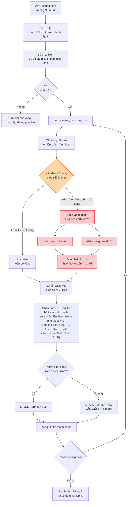

#### a) Nhánh xử lý biển hai dòng

Các khối tô đỏ là phần khó nhất của đồ án và là rủi ro kỹ thuật đã được xác định từ giai đoạn lập kế hoạch (rủi ro R-04).

**Vấn đề.** Các bộ OCR dựng sẵn được huấn luyện và thiết kế quanh giả định văn bản nằm trên một dòng ngang. Khi đưa vào một biển số hai dòng, chúng có xu hướng đọc theo thứ tự không xác định, ghép lẫn ký tự của hai dòng, hoặc bỏ sót một dòng. Kết quả là một chuỗi lộn xộn mà không luật hậu xử lý nào cứu được. Đây chính là cơ chế đứng sau chênh lệch 48,6 điểm phần trăm đã dẫn ở mục 4.1.1 [7]<!-- laroca_2022_crossdataset -->.

**Giải pháp thiết kế.** Thay vì đưa cả vùng biển số vào bộ OCR, hệ thống **tách vùng thành hai nửa trên và dưới, nhận dạng từng nửa độc lập, rồi ghép kết quả theo thứ tự trên trước dưới sau**. Mỗi nửa lúc này là một dòng văn bản ngang thông thường, đúng với giả định mà bộ OCR được thiết kế cho.

**Cách phân loại số dòng.** Theo kết luận khảo sát ở mục 2.5.3(e) của Chương 2, hệ thống dùng **hai cơ chế xếp chồng**, đúng thứ tự ưu tiên đã chốt ở đó:

- **Cơ chế chính — lấy lớp trực tiếp từ bộ phát hiện.** Bộ phát hiện được huấn luyện với hai lớp (`0` = biển một dòng, `1` = biển hai dòng) thay vì một lớp. Đây là phương án chính xác nhất vì mô hình "nhìn" được nội dung bên trong biển chứ không chỉ hình dạng hộp bao, và chi phí suy luận tăng thêm gần bằng không. Cái giá phải trả là dữ liệu huấn luyện phải được gán nhãn hai lớp ngay từ đầu — một ràng buộc đặt lên giai đoạn xây dựng bộ dữ liệu.
- **Cơ chế dự phòng — ngưỡng tỉ lệ khung (aspect ratio).** Dùng khi bộ phát hiện chưa có nhãn hai lớp, hoặc khi độ tin cậy phân lớp thấp. Cơ sở định lượng là kích thước vật lý chuẩn quy định tại QCVN 08:2024/BCA [11]<!-- bocongan_2024_qcvn08 -->:

| Loại biển | Kích thước danh định | Tỉ lệ khung | Số dòng |
|---|---|:---:|:---:|
| Ô tô, biển dài | 520 × 110 mm | 4,727 | 1 |
| Ô tô, biển ngắn | 330 × 165 mm | 2,000 | 2 |
| Xe mô tô, xe gắn máy | 190 × 140 mm | 1,357 | 2 |

Ba giá trị này tách biệt rõ rệt — không loại biển nào rơi vào khoảng mở (2,000 ; 4,727) — nên bộ ngưỡng đề xuất ở Bảng 2.17 của Chương 2 (AR < 2,5 là hai dòng; AR > 3,0 là một dòng; khoảng giữa là vùng nghi ngờ, thử cả hai nhánh) đủ dùng làm lớp dự phòng. Việc căn cứ vào quy chuẩn pháp lý thay vì vào một ngưỡng chọn theo cảm tính là điểm đáng chú ý về phương pháp: ngưỡng có căn cứ giải thích được và bảo vệ được.

> **Điều kiện áp dụng bắt buộc của cơ chế dự phòng.** Như đã cảnh báo ở mục 2.6.6(c), tỉ lệ khung phải được đo trên ảnh **đã nắn chỉnh phối cảnh** hoặc trên **hộp bao xoay tối thiểu**, tuyệt đối không đo trên hộp bao thẳng trục thô do bộ phát hiện trả về. Một biển một dòng chụp nghiêng có hộp bao thẳng trục với tỉ lệ tụt xuống dưới 3,0 và sẽ bị phân loại nhầm thành biển hai dòng. Đây cũng là lý do khối hiệu chỉnh hình học được đặt **trước** bước xác định số dòng trong sơ đồ trên. Ngoài ra, cần ghi nhận rằng ba giá trị 4,727 / 2,000 / 1,357 là tỉ lệ **danh định của biển vật lý**, trong khi thứ đo được là tỉ lệ của vùng ảnh sau phép chiếu phối cảnh — hai đại lượng chỉ trùng nhau khi biển gần chính diện.

Thuật toán tách chi tiết — cắt cứng theo tỉ lệ chiều cao, hay dựa trên phân tích hình chiếu ngang của ảnh nhị phân — sẽ được xác định và so sánh bằng thực nghiệm; kết quả trình bày ở Chương 6.

#### b) Nhánh giữ lại kết quả không hợp lệ

Khối `WARN` thể hiện một quyết định thiết kế cần được nêu rõ: biển số không khớp bất kỳ định dạng Việt Nam nào **vẫn được lưu lại**, chỉ bị đánh dấu bằng cờ `is_valid_format = false`.

Cách xử lý trực giác hơn — loại bỏ các kết quả không hợp lệ — có hai hậu quả xấu. Về mặt sản phẩm, nó khiến hệ thống im lặng vứt bỏ dữ liệu mà người dùng không hề biết. Về mặt học thuật, nó tiêu huỷ đúng những trường hợp có giá trị nhất cho phân tích lỗi: một biển đọc ra `51A-1234X` trong khi vị trí cuối chỉ được phép là chữ số cho biết chính xác bộ OCR đang nhầm ở đâu. Giữ lại chúng biến một tập lỗi thành một tập dữ liệu phân tích.

#### c) Thiết kế sẵn sàng cho việc đo lường

Sơ đồ trên có một đặc điểm ít gặp trong các sơ đồ pipeline thông thường: **chuỗi OCR thô được giữ lại như một sản phẩm đầu ra riêng biệt**, song song với chuỗi đã chuẩn hoá, chứ không bị khối chuẩn hoá ghi đè. Đây là biểu hiện ở tầng pipeline của cùng một quyết định sẽ xuất hiện lại ở tầng cơ sở dữ liệu (mục 4.4.3b) và ở tầng chỉ tiêu đánh giá (NFR-A5 so với NFR-A6). Một yêu cầu đo lường học thuật đã lan xuyên suốt ba tầng thiết kế — đó là dấu hiệu cho thấy nó được cân nhắc từ đầu chứ không phải chắp vá về sau.

### 4.2.5. Bảng tổng hợp các quyết định kiến trúc

Toàn bộ các quyết định kiến trúc của hệ thống được ghi lại dưới dạng một danh sách có mã định danh (`AD-01` … `AD-08`), mỗi quyết định kèm lý do và **đánh đổi phải chấp nhận**. Việc ghi rõ đánh đổi là chủ ý: một quyết định kiến trúc được trình bày như thể không có nhược điểm là một quyết định chưa được cân nhắc đủ.

**Bảng 4.6.** Các quyết định kiến trúc AD-01 … AD-08

| Mã | Quyết định về | Lựa chọn | Lý do | Đánh đổi phải chấp nhận |
|---|---|---|---|---|
| **AD-01** | Quan hệ giữa tầng AI và tầng API | Tầng AI là package Python độc lập | NFR-M1; kiểm thử độc lập, tái dùng được trong script huấn luyện và đánh giá (mục 4.2.3) | Thêm một lớp gián tiếp giữa hai tầng |
| **AD-02** | Xử lý video | **Bất đồng bộ, trả `job_id` ngay** | Thời gian xử lý vượt xa timeout HTTP (NFR-SC3); xem phân tích ở mục 4.1.2(c) | Giao diện phải hỏi tiến độ định kỳ; cần quản lý vòng đời tác vụ |
| **AD-03** | Thời gian thực (webcam) | Client gửi từng khung qua HTTP (`POST /detect/frame`) | Đơn giản, dễ gỡ lỗi, đủ cho mức ~5 FPS | Nếu cần tốc độ khung hình cao hơn thì phải chuyển sang WebSocket |
| **AD-04** | Gộp trùng biển số | Theo chuỗi ký tự kết hợp cửa sổ thời gian | Đơn giản hơn nhiều so với bám vết đối tượng, đủ dùng cho FR-2.4 | Kém chính xác nếu hai xe cùng biển số trong một video — thực tế không xảy ra |
| **AD-05** | Runtime suy luận | **ONNX Runtime làm mặc định**, OpenVINO là tối ưu bổ sung | Nhanh hơn PyTorch khoảng 3,73 lần ở phân khúc nano; một runtime duy nhất cho cả hai mô hình loại bỏ xung đột framework (mục 3.4) | Thêm bước xuất mô hình vào quy trình; phải đặt tường minh số luồng nội bộ |
| **AD-06** | Thiết bị suy luận | Cấu hình được, mặc định `cpu` | CON-02 — máy phát triển không có GPU CUDA | — |
| **AD-07** | Lưu trữ ảnh và video | Tệp trên đĩa, cơ sở dữ liệu chỉ giữ đường dẫn | Tránh phình tệp SQLite do BLOB (mục 4.3.2c) | Phải giữ đồng bộ giữa tệp và bản ghi (FR-5.1, FR-5.3) |
| **AD-08** | Đặt tên tệp | Sinh từ UUID, không dùng tên gốc | NFR-S2 — chống path traversal | Phải lưu tên gốc ở một trường riêng nếu muốn hiển thị lại cho người dùng |

> **Ghi chú về AD-03.** Sau khi trang Webcam được gỡ khỏi giao diện (thu gọn phạm vi 2026-07-20), "client" trong quyết định này là bất kỳ chương trình nào gọi API — trang webcam trước đây là một client như vậy. Bản thân quyết định không thay đổi: ở mức ~5 FPS trên CPU, nút thắt là thời gian suy luận từng khung, không phải overhead giao thức, nên HTTP vẫn là lựa chọn đúng.

> **Ghi chú về AD-05.** Đây là quyết định duy nhất đã **thay đổi** so với bản phác thảo kiến trúc ở giai đoạn phân tích ban đầu, vốn ghi *"PyTorch trước, ONNX/OpenVINO nếu cần"*. Bằng chứng định lượng thu được ở giai đoạn khảo sát công nghệ (mục 3.4) đủ mạnh để nâng ONNX Runtime từ một tối ưu hoá dự phòng thành lựa chọn mặc định. Việc ghi nhận tường minh sự thay đổi này — thay vì lặng lẽ sửa lại bảng — là một phần của yêu cầu truy vết quyết định thiết kế.

---

## 4.3. Thiết kế chi tiết

### 4.3.1. Thiết kế module tầng AI

Tầng AI được tổ chức quanh ba lớp trừu tượng, mỗi lớp tương ứng một giai đoạn của pipeline, cùng một tập kiểu dữ liệu bất biến dùng để truyền thông tin giữa các giai đoạn.

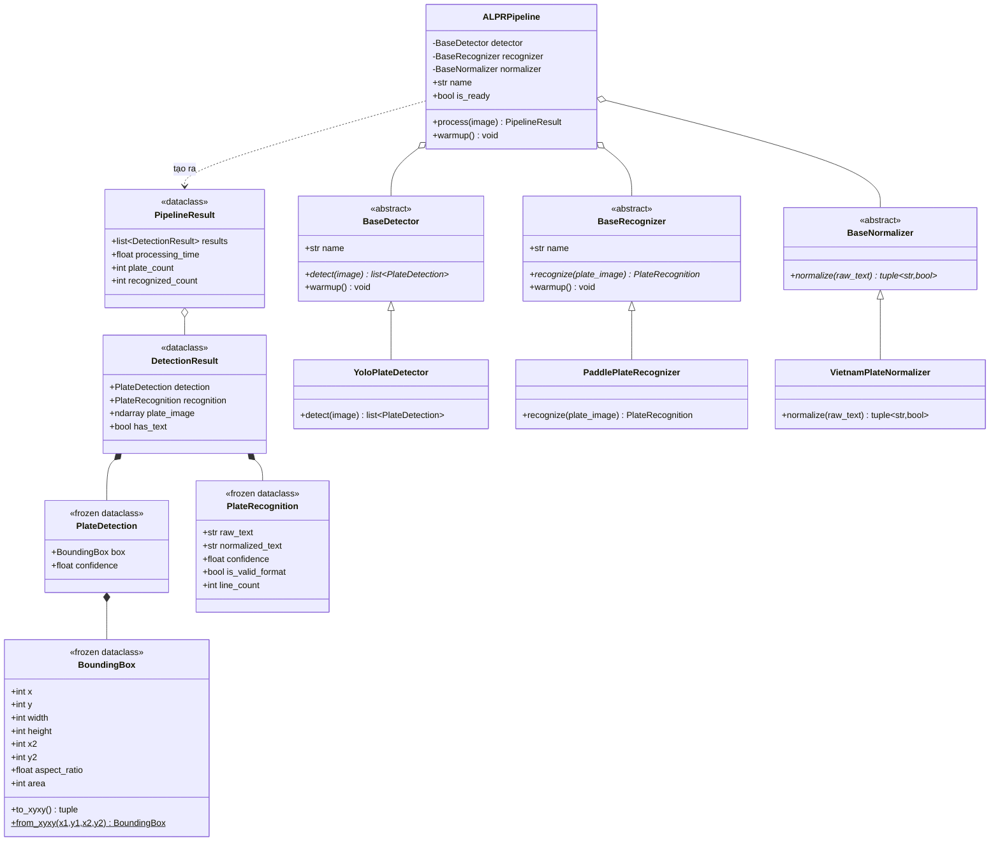

#### a) Các lớp trừu tượng

| Lớp | Phương thức trừu tượng | Hợp đồng |
|---|---|---|
| `BaseDetector` | `detect(image) → list[PlateDetection]` | Nhận một mảng ảnh, trả về danh sách vùng biển số kèm độ tin cậy. Ảnh không có biển số trả về danh sách rỗng, **không** ném ngoại lệ |
| `BaseRecognizer` | `recognize(plate_image) → PlateRecognition` | Nhận ảnh vùng biển số đã cắt, trả về chuỗi đọc được kèm độ tin cậy. Không đọc được ký tự nào trả về chuỗi rỗng, **không** ném ngoại lệ |
| `BaseNormalizer` | `normalize(raw_text) → tuple[str, bool]` | Nhận chuỗi thô, trả về cặp (chuỗi đã chuẩn hoá, cờ hợp lệ) |

Cả `BaseDetector` và `BaseRecognizer` cung cấp phương thức `warmup()` không trừu tượng với cài đặt mặc định rỗng. Phương thức này tồn tại vì một đặc điểm thực tế của thư viện học sâu: lần suy luận đầu tiên sau khi nạp mô hình chậm hơn đáng kể so với các lần sau, do việc cấp phát bộ nhớ và biên dịch nhân tính toán diễn ra ở lần chạy đầu. Nếu không làm nóng trước, lượt nhận dạng đầu tiên của người dùng sẽ chậm bất thường, và tệ hơn, phép đo độ trễ đầu tiên trong bộ benchmark sẽ bị nhiễu.

Hợp đồng "trả rỗng chứ không ném ngoại lệ" của hai lớp đầu là một quyết định thiết kế nhất quán với NFR-R2: **không tìm thấy** và **lỗi** là hai chuyện khác nhau, và việc trộn chúng ở tầng thấp sẽ buộc mọi tầng phía trên phải xử lý ngoại lệ cho một tình huống hoàn toàn bình thường.

#### b) Các kiểu dữ liệu

Các kiểu dữ liệu truyền giữa các giai đoạn được khai báo là **bất biến** (`frozen dataclass`) ở những chỗ có thể. Lý do: chúng đi qua nhiều tầng và được ghi vào cơ sở dữ liệu; nếu một tầng trung gian vô tình sửa đổi giá trị, việc truy vết sẽ rất khó. Riêng `DetectionResult` và `PipelineResult` không bất biến, vì `DetectionResult` chứa mảng ảnh của vùng biển số — một đối tượng nặng cần được giải phóng sau khi đã lưu xuống đĩa.

`BoundingBox` lưu toạ độ ở dạng `(x, y, width, height)` vì đây là dạng khớp trực tiếp với bốn cột `bbox_x`, `bbox_y`, `bbox_w`, `bbox_h` trong cơ sở dữ liệu, đồng thời cung cấp thuộc tính dẫn xuất `aspect_ratio` phục vụ việc phân loại số dòng đã mô tả ở mục 4.2.4.

Một chi tiết đáng chú ý về đặt tên: tên các thuộc tính của `PlateDetection` và `PlateRecognition` được đặt **trùng khớp có chủ đích** với tên các cột trong bảng cơ sở dữ liệu. Nhờ vậy, tầng lưu trữ thực hiện một phép sao chép trường-sang-trường thay vì một phép biên dịch. Một lớp biên dịch trung gian sẽ là thêm một chỗ để `confidence` và `ocr_confidence` bị hoán đổi cho nhau — đúng loại lỗi mà việc tách chúng thành hai cột được thiết kế để ngăn chặn (mục 4.4.3a).

#### c) Lớp điều phối

`ALPRPipeline` nhận ba thành phần qua hàm khởi tạo và chỉ làm nhiệm vụ điều phối: gọi bộ phát hiện, lặp qua từng bounding box, cắt vùng, gọi bộ nhận dạng, gọi bộ chuẩn hoá, đo thời gian, gom kết quả. Bản thân nó **không chứa logic học sâu nào**, nên có thể đọc hiểu và kiểm thử hoàn toàn bằng các thành phần giả lập.

### 4.3.2. Thiết kế tầng nghiệp vụ

Tầng nghiệp vụ gồm bốn service, mỗi service phụ trách một nhóm nghiệp vụ:

| Service | Trách nhiệm chính | Phụ thuộc |
|---|---|---|
| `DetectionService` | Điều phối toàn bộ nghiệp vụ nhận dạng: tạo tác vụ, gọi pipeline, lưu ảnh, ghi bản ghi, xử lý video nền, gộp trùng, quản lý vòng đời tác vụ | Pipeline (qua giao thức trừu tượng), `StorageService`, các repository |
| `HistoryService` | Truy vấn lịch sử có lọc, sắp xếp, phân trang; lấy chi tiết một bản ghi; xoá bản ghi kèm tệp; xuất dữ liệu | `StorageService`, repository |
| `StatisticsService` | Tổng hợp các chỉ số thống kê và chuỗi số liệu theo ngày (phục vụ `GET /api/statistics`) | Repository |
| `StorageService` | Lưu, đọc và xoá tệp trong kho tệp; sinh tên tệp an toàn từ UUID; ánh xạ đường dẫn nội bộ sang URL công khai | Cấu hình |

#### a) Hợp đồng pipeline được khai báo bằng giao thức cấu trúc

Một chi tiết thiết kế đáng phân tích: `DetectionService` không phụ thuộc vào lớp `ALPRPipeline` cụ thể, mà phụ thuộc vào một **giao thức** (`typing.Protocol`) khai báo ba thành viên cần có: thuộc tính `name`, thuộc tính `is_ready` và phương thức `process(image) → PipelineResult`.

Việc chọn giao thức cấu trúc thay vì lớp cơ sở trừu tượng là có chủ ý và có hệ quả kiến trúc. Một lớp cơ sở trừu tượng đòi hỏi cài đặt phải **kế thừa** từ nó, tức là package AI phải import một lớp do tầng nghiệp vụ định nghĩa — chính là phụ thuộc ngược chiều mà ràng buộc số 1 cấm. Giao thức cấu trúc thì ngược lại: một lớp thoả mãn nó chỉ bằng cách *có đúng các thành viên đó*, không cần biết giao thức tồn tại. Nhờ vậy mũi tên phụ thuộc vẫn chỉ đi một chiều, đúng như sơ đồ ở mục 4.2.2.

Giao thức này được thoả mãn đồng thời bởi ba cài đặt: `ALPRPipeline` (đường chạy chính hiện tại), `UnavailablePipeline` (phương án lùi khi thiếu trọng số — ném lỗi thay vì bịa kết quả) và `StubPipeline` (chỉ chạy khi đặt tường minh `ALPR_USE_STUB=true`). Việc chuyển từ stub sang pipeline thật đã diễn ra **mà không sửa dòng nào trong tầng nghiệp vụ**.

#### b) Xử lý video nền và gộp trùng

`DetectionService` chịu trách nhiệm cho toàn bộ vòng đời tác vụ video, gồm các chuyển trạng thái:

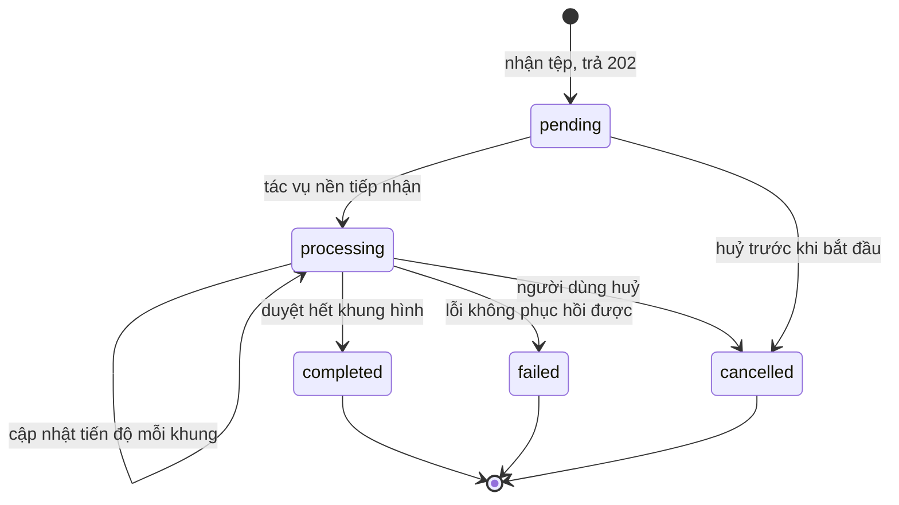

Trạng thái `pending` được giữ tách biệt với `processing` một cách có chủ đích. Vì lời gọi tải video trả về ngay lập tức, sẽ có một khoảng thời gian mà tác vụ đã được ghi nhận nhưng tác vụ nền chưa kịp tiếp nhận. Nếu gộp hai trạng thái làm một, sẽ không phân biệt được một tác vụ *đang xếp hàng* với một tác vụ *đã treo*.

Cơ chế gộp trùng (FR-2.4) hoạt động theo chuỗi ký tự biển số kết hợp cửa sổ thời gian: các kết quả có cùng chuỗi biển số xuất hiện trong cùng một tác vụ được gom lại thành một, giữ lần đọc có độ tin cậy cao nhất. Phương án thay thế là bám vết đối tượng qua các khung hình bằng các thuật toán tracking; đồ án cố ý **không** chọn phương án này và ghi rõ trong phạm vi. Lý do: tracking phức tạp hơn đáng kể, thêm một họ siêu tham số cần tinh chỉnh, trong khi gộp theo chuỗi ký tự đủ dùng cho mục tiêu đề tài. Nhược điểm đã biết — hai xe khác nhau mang cùng biển số trong cùng một video — không xảy ra trong thực tế.

#### c) Kho tệp tách khỏi cơ sở dữ liệu

`StorageService` cài đặt quyết định lưu ảnh và video **trên hệ thống tệp**, cơ sở dữ liệu chỉ giữ đường dẫn. Phương án ngược lại là lưu dữ liệu nhị phân trực tiếp trong CSDL dưới dạng BLOB. Với SQLite, cách đó khiến tệp CSDL phình rất nhanh (mỗi ảnh vài trăm KB, mỗi video hàng chục MB), làm chậm mọi truy vấn kể cả các truy vấn không đụng tới ảnh, và khiến việc sao lưu trở nên nặng nề. Cái giá phải trả cho phương án đã chọn là hai nguồn dữ liệu phải được giữ đồng bộ: xoá bản ghi phải xoá tệp (FR-5.1), và cần một script dọn dẹp tệp mồ côi (FR-5.3).

Tên tệp được sinh từ UUID thay vì dùng tên gốc do người dùng cung cấp. Đây là biện pháp bảo mật đáp ứng NFR-S2: tên tệp do người dùng kiểm soát là véc-tơ tấn công path traversal kinh điển, và một tên chứa `../` có thể khiến hệ thống ghi đè tệp ngoài thư mục lưu trữ.

### 4.3.3. Thiết kế REST API

API được thiết kế theo phong cách REST, tự sinh tài liệu OpenAPI 3.x và giao diện Swagger UI. Toàn bộ endpoint nghiệp vụ nằm dưới tiền tố `/api` cấu hình được; riêng endpoint kiểm tra sức khoẻ đặt ở gốc để công cụ giám sát và Docker healthcheck truy cập không phụ thuộc phiên bản API.

#### a) Bảng đặc tả endpoint

**Bảng 4.7.** Đặc tả các endpoint REST API

| # | Phương thức | Đường dẫn | Đầu vào | Đầu ra | Mã trạng thái |
|:--:|---|---|---|---|---|
| 1 | `POST` | `/api/detect/image` | `multipart/form-data`: trường `file` — ảnh JPEG / PNG / WebP / BMP | Danh sách kết quả: bounding box, `plate_number`, `raw_ocr_text`, `confidence`, `ocr_confidence`, `is_valid_format`, `plate_line_count`, thời gian xử lý, `job_id` | **200** OK · 400 sai định dạng · 413 vượt kích thước · 422 thiếu tham số · 500 lỗi nội bộ |
| 2 | `POST` | `/api/detect/video` | `multipart/form-data`: trường `file` — video MP4 / AVI / MOV / MKV | Đối tượng tác vụ: `job_id`, `status`, `progress`, `created_at` | **202** Accepted · 400 · 413 · 422 · 500 |
| 3 | `POST` | `/api/detect/frame` | `multipart/form-data`: `file` — một khung hình JPEG / PNG; `job_id` (tuỳ chọn, định danh phiên webcam) | Như endpoint 1, kèm `job_id` của phiên | **200** OK · 400 · 413 · 422 · 500 |
| 4 | `GET` | `/api/jobs/{job_id}` | Tham số đường dẫn `job_id` | `status`, `progress`, `total_frames`, `processed_frames`, `output_url`, `error_message` | **200** OK · 404 không tồn tại |
| 5 | `GET` | `/api/history` | Tham số truy vấn: `search`, `input_type`, `is_valid_format`, `date_from`, `date_to`, `min_confidence`, `job_id`, `sort_by`, `order`, `page`, `page_size` | Danh sách bản ghi kèm thông tin phân trang: `items`, `total`, `page`, `page_size`, `total_pages` | **200** OK · 422 tham số không hợp lệ |
| 6 | `GET` | `/api/history/{detection_id}` | Tham số đường dẫn `detection_id` (số nguyên ≥ 1) | Toàn bộ metadata của một bản ghi kèm URL ảnh gốc và ảnh biển số | **200** OK · 404 · 422 |
| 7 | `GET` | `/api/history/export` | Các tham số lọc như endpoint 5 (`search`, `input_type`, `is_valid_format`, `date_from`, `date_to`, `min_confidence`, `job_id`, `sort_by`, `order`) — **không** phân trang | Luồng tệp CSV, UTF-8 **có BOM** (để Excel đọc đúng tiếng Việt) | **200** OK (`text/csv`) · 400 · 422 · 500 |
| 8 | `DELETE` | `/api/history/{detection_id}` | Tham số đường dẫn `detection_id` | Không có nội dung | **204** No Content · 404 · 422 |
| 9 | `GET` | `/api/statistics` | Tham số truy vấn `days` (độ dài cửa sổ chuỗi thời gian) | Tổng số tác vụ, tổng số biển số, độ tin cậy trung bình, thời gian xử lý trung bình, phân bố theo loại đầu vào, chuỗi số liệu theo ngày | **200** OK · 422 |
| 10 | `GET` | `/health` | Không | Trạng thái tổng thể (`healthy` / `degraded` / `unhealthy`), trạng thái pipeline, trạng thái CSDL, tên pipeline đang dùng | **200** OK |

#### b) Các quyết định thiết kế API

**Về mã 202 cho video.** Endpoint tải video trả `202 Accepted` chứ không phải `200 OK`. Sự khác biệt không chỉ là hình thức: `200` có nghĩa "yêu cầu đã được xử lý xong", `202` có nghĩa "yêu cầu đã được tiếp nhận, việc xử lý sẽ diễn ra sau". Với thời gian xử lý hàng trăm giây trên CPU, `202` là mã đúng về mặt ngữ nghĩa và là cơ sở để client biết rằng nó cần hỏi tiến độ.

**Về mã 200 với danh sách rỗng.** Ảnh không chứa biển số nào trả `200` kèm danh sách rỗng, không phải `404`. Mã `404` có nghĩa "tài nguyên bạn yêu cầu không tồn tại", trong khi ở đây tài nguyên — kết quả nhận dạng của ảnh này — tồn tại và có giá trị là tập rỗng. Đây là ứng dụng trực tiếp của NFR-R2.

**Về mã 204 cho xoá.** Xoá thành công trả `204 No Content` thay vì `200` kèm một thông báo. Không có gì có ý nghĩa để trả về sau khi xoá, và việc trả một thân phản hồi rỗng với mã `200` là kém rõ ràng hơn.

**Về việc tìm kiếm khớp cả hai trường chuỗi.** Tham số `search` của endpoint lịch sử khớp đồng thời trên `plate_number` (đã chuẩn hoá) và `raw_ocr_text` (thô). Lý do thực dụng: nếu bước hậu xử lý đã sửa chuỗi đọc được, người dùng nhớ chuỗi nào cũng phải tìm ra được bản ghi. Chỉ tìm trên chuỗi đã chuẩn hoá sẽ khiến các bản ghi từng bị sửa trở nên khó tìm đúng vào lúc người ta cần xem chúng nhất.

**Về việc chuỗi thời gian trả về cả ngày không có dữ liệu.** Endpoint thống kê trả về các ngày không phát sinh hoạt động với giá trị bằng không, thay vì bỏ qua chúng. Nếu bỏ qua, biểu đồ vẽ từ chuỗi này sẽ **âm thầm nối liền các khoảng trống**, khiến một tuần không hoạt động trông giống một tuần hoạt động đều — một dạng biểu diễn sai dữ liệu.

**Về trạng thái `degraded` của `/health`.** Endpoint sức khoẻ phân biệt ba mức thay vì hai. Trạng thái `degraded` mô tả tình huống hệ thống chạy được và cơ sở dữ liệu kết nối tốt, nhưng pipeline chưa nạp được trọng số thật (thiếu tệp mô hình, hoặc chạy ở chế độ mô phỏng `ALPR_USE_STUB=true`) nên kết quả nhận dạng không có giá trị thực. Một hệ thống ở tình trạng này mà báo `healthy` sẽ gây hiểu lầm nghiêm trọng. Ở trạng thái hiện tại, `/health` trả về `healthy` vì mô hình chính thức đã nạp thành công.

#### c) Trạng thái cài đặt

Toàn bộ 10 endpoint trong bảng trên **đã được cài đặt và xác minh bằng lời gọi HTTP thực tế**: hệ thống khởi động được, migration cơ sở dữ liệu chạy xong, tài liệu Swagger render đầy đủ, và mỗi endpoint phản hồi đúng mã trạng thái mong đợi cho cả trường hợp thành công lẫn các trường hợp lỗi.

Hệ thống hiện **vận hành pipeline nhận dạng thật** — `/health` trả về `model_loaded: true` với engine `yolo:best.pt+paddleocr-PP-OCRv5-mobile` (mô hình chính thức). Lớp `StubPipeline` mô phỏng đã bị đưa ra khỏi đường chạy chính; phương án lùi khi thiếu trọng số là `UnavailablePipeline`, lớp này **ném lỗi thay vì sinh ra biển số giả**.

Cần nói rõ phạm vi của việc xác minh này: nó chứng minh **hợp đồng của API** hoạt động đúng, **không** chứng minh chất lượng nhận dạng. Mô hình đang chạy là mô hình chính thức `models/best.pt` (YOLO11n, `imgsz=640`, split v3). Mô hình đối chứng `models/baseline-416-v1.pt` **không nằm trên đường chạy chính** và số liệu của nó không được dùng làm kết quả đánh giá, do hai khiếm khuyết đã biết (`imgsz=416` trong khi chỉ tiêu đặt ở 640; split v1 có rò rỉ train↔test khiến chỉ số bị thổi phồng). Việc đánh giá chất lượng nhận dạng thuộc **Chương 6**.

### 4.3.4. Các sơ đồ tuần tự

#### a) Nhận dạng từ ảnh

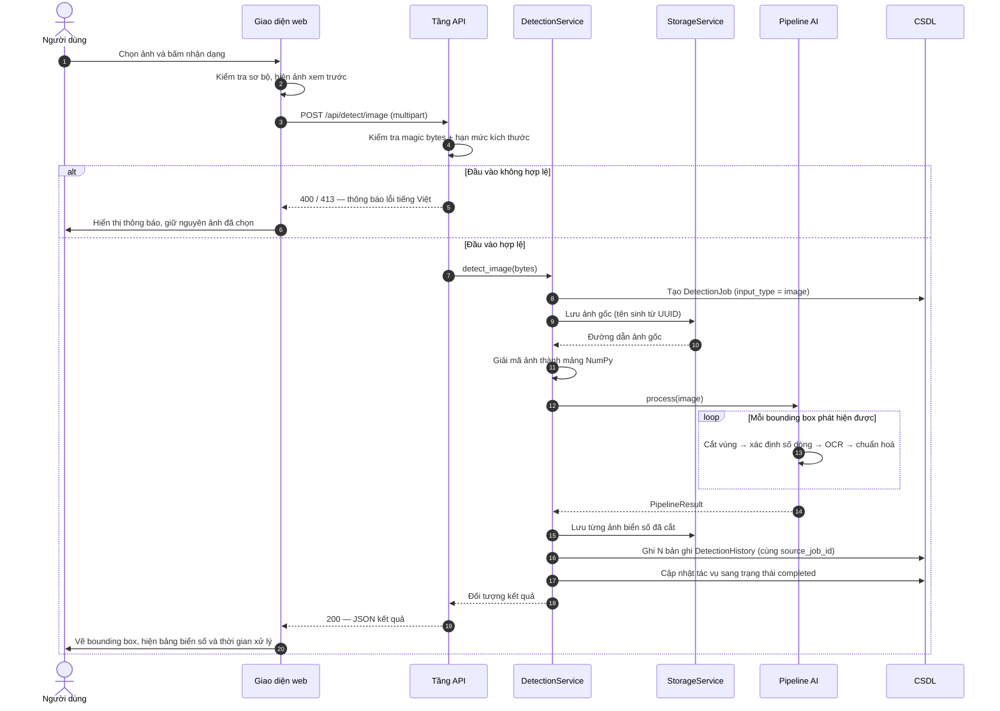

Điểm cần chú ý ở bước ghi cơ sở dữ liệu: N bản ghi biển số đều mang cùng một `source_job_id`. Lý do và hậu quả của việc thiếu trường này được phân tích tại mục 4.4.3(c).

#### b) Nhận dạng video bất đồng bộ

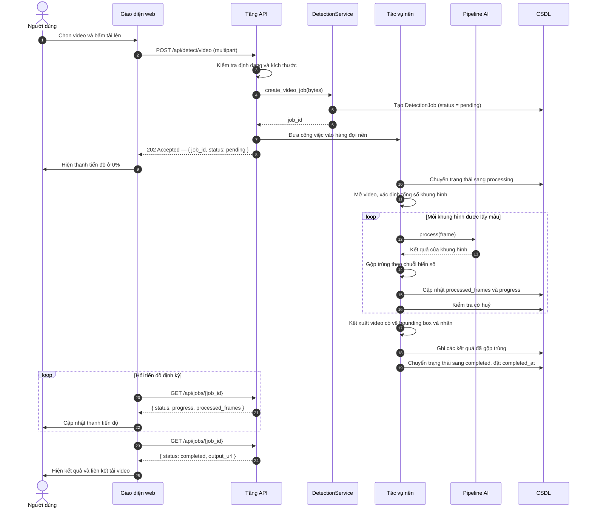

Vòng lặp hỏi tiến độ ở phía giao diện chạy độc lập với vòng lặp xử lý ở tác vụ nền — hai bên chỉ giao tiếp gián tiếp qua bản ghi tác vụ trong cơ sở dữ liệu. Việc kiểm tra cờ huỷ được đặt bên trong vòng lặp xử lý để yêu cầu huỷ có hiệu lực trong vòng vài khung hình thay vì phải chờ hết video.

#### c) Nhận dạng thời gian thực qua webcam

> Sơ đồ dưới đây mô tả luồng thời gian thực với một **client gọi API** (từ 2026-07-20, trang Webcam đã gỡ khỏi giao diện web; trang đó trước đây chính là client trong sơ đồ). Toàn bộ phần phía máy chủ — tầng API, service, pipeline và CSDL — giữ nguyên.

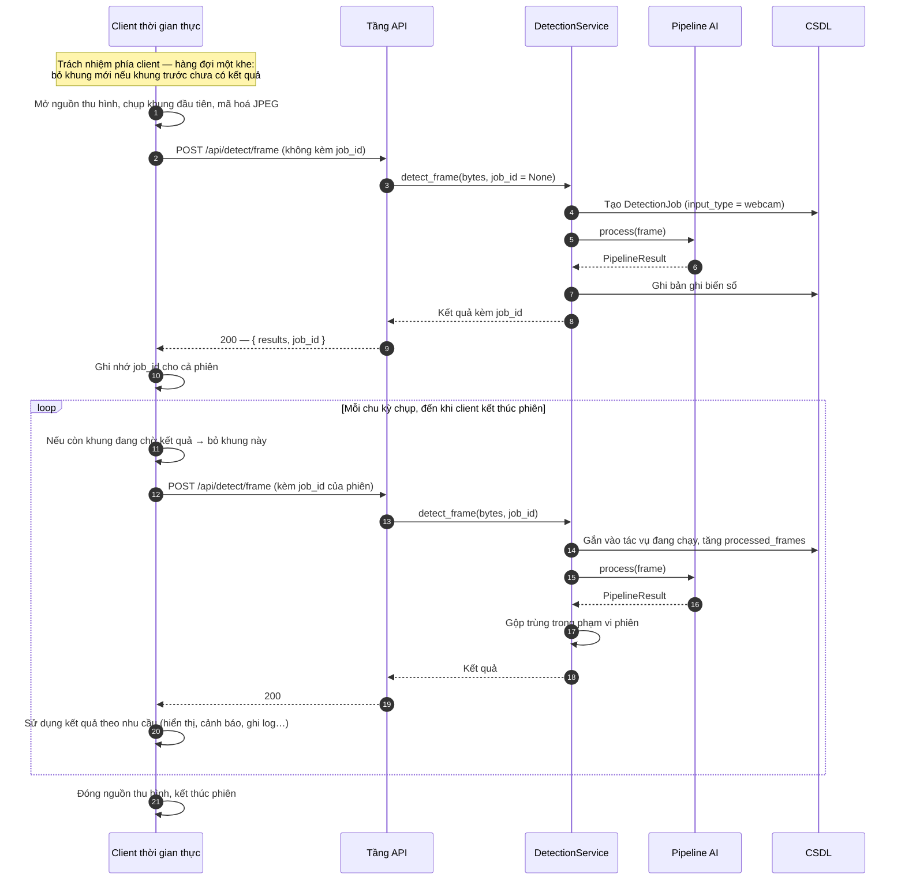

*Ghi chú:* trước ngày 2026-07-20, client trong sơ đồ này chính là trang Webcam của giao diện web; nay giao diện không còn trang đó, nên sơ đồ mô tả **hợp đồng tương tác cho một client bất kỳ** gọi `POST /api/detect/frame`.

Ba chi tiết thiết kế thể hiện trên sơ đồ này. Thứ nhất, **hàng đợi một khe nằm ở phía client**, không phải phía máy chủ — việc bỏ khung nên xảy ra trước khi khung hình được truyền qua mạng, chứ không phải sau khi máy chủ đã nhận và giải mã; đây là một ràng buộc client phải tự tuân thủ, máy chủ không áp đặt được. Thứ hai, `job_id` do máy chủ sinh ở lời gọi đầu tiên và được client ghi nhớ, nhờ đó toàn bộ phiên là một tác vụ duy nhất. Thứ ba, việc gộp trùng diễn ra trong phạm vi phiên: giữ một biển số trước ống kính trong mười giây tạo ra một bản ghi, không phải hàng chục.

---

## 4.4. Thiết kế cơ sở dữ liệu

### 4.4.1. Sơ đồ thực thể — liên kết

Mô hình dữ liệu gồm hai thực thể có quan hệ một–nhiều:

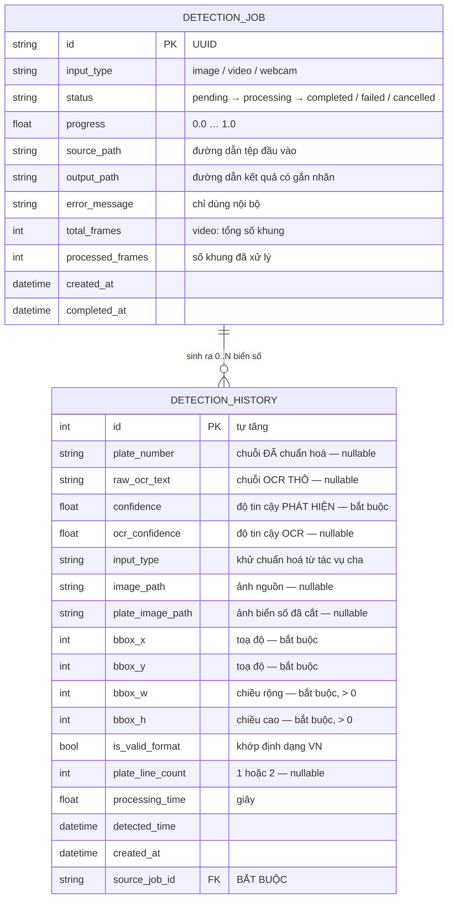

Quan hệ được đọc như sau: **một lần sử dụng hệ thống** (một ảnh tải lên, một video, hoặc một phiên webcam) là một bản ghi `DetectionJob`; **mỗi biển số tìm thấy trong lần đó** là một bản ghi `DetectionHistory`. Số bản ghi con có thể bằng không (ảnh không có biển số nào), bằng một, hoặc nhiều.

Lược đồ này mở rộng đáng kể so với bản phác thảo ban đầu chỉ gồm 9 trường trong một bảng duy nhất. Toàn bộ các mở rộng đã được rà soát và phê duyệt, và mục 4.4.3 dành riêng để lập luận cho những mở rộng có nội dung thiết kế đáng chú ý.

### 4.4.2. Mô tả chi tiết các bảng

#### a) Bảng `detection_job`

**Bảng 4.8.** Đặc tả trường của bảng `detection_job`

| Trường | Kiểu | Ràng buộc | Mô tả |
|---|---|---|---|
| `id` | `VARCHAR(36)` | PK | Định danh dạng UUID |
| `input_type` | `VARCHAR(16)` | NOT NULL, CHECK ∈ {image, video, webcam} | Loại đầu vào đã sinh ra tác vụ |
| `status` | `VARCHAR(16)` | NOT NULL, CHECK ∈ 5 giá trị trạng thái | Trạng thái vòng đời hiện tại |
| `progress` | `FLOAT` | NOT NULL, CHECK 0 ≤ x ≤ 1 | Tỉ lệ hoàn thành, dùng cho thanh tiến độ |
| `source_path` | `VARCHAR(512)` | NULL | Nơi lưu tệp đầu vào |
| `output_path` | `VARCHAR(512)` | NULL | Nơi lưu ảnh hoặc video kết quả có gắn nhãn |
| `error_message` | `TEXT` | NULL | Nguyên nhân kỹ thuật khi thất bại; **chỉ dùng phía máy chủ**, không trả nguyên văn cho người dùng |
| `total_frames` | `INTEGER` | NULL | Tổng số khung của video; `NULL` khi không áp dụng hoặc chưa biết |
| `processed_frames` | `INTEGER` | NOT NULL, mặc định 0 | Số khung đã xử lý |
| `created_at` | `DATETIME` (UTC) | NOT NULL | Thời điểm tiếp nhận |
| `completed_at` | `DATETIME` (UTC) | NULL | Thời điểm đạt trạng thái kết thúc |

**Vì sao khoá chính là UUID chứ không phải số nguyên tự tăng.** Định danh này được trả về cho client và được dùng trong tên tệp sinh ra. Một số thứ tự có thể đoán được sẽ cho phép một người dùng liệt kê các tác vụ của người khác chỉ bằng cách thử các số liền kề. UUID loại bỏ khả năng này.

**Vì sao `error_message` không bao giờ được trả nguyên văn.** Thông báo lỗi kỹ thuật có thể chứa đường dẫn hệ thống tệp, tên thư viện và thông tin phiên bản. Trả chúng cho người dùng vừa vi phạm FR-6.3 (thông báo lỗi thân thiện) vừa là một dạng rò rỉ thông tin.

Bảng có bốn chỉ mục: theo `input_type`, theo `status`, theo `created_at`, phục vụ các truy vấn thống kê và danh sách hoạt động gần đây.

#### b) Bảng `detection_history`

**Bảng 4.9.** Đặc tả trường của bảng `detection_history`

| Trường | Kiểu | Ràng buộc | Mô tả |
|---|---|---|---|
| `id` | `INTEGER` | PK, tự tăng | Định danh bản ghi |
| `plate_number` | `VARCHAR(32)` | **NULL** | Chuỗi biển số **sau** chuẩn hoá, ví dụ `51F-12345` |
| `raw_ocr_text` | `VARCHAR(32)` | **NULL** | Chuỗi OCR **trước** chuẩn hoá, nguyên văn từ bộ nhận dạng |
| `confidence` | `FLOAT` | **NOT NULL**, CHECK 0 ≤ x ≤ 1 | Độ tin cậy của bộ **phát hiện** |
| `ocr_confidence` | `FLOAT` | **NULL**, CHECK NULL hoặc 0 ≤ x ≤ 1 | Độ tin cậy của bộ **nhận dạng ký tự** |
| `input_type` | `VARCHAR(16)` | NOT NULL, CHECK | Khử chuẩn hoá từ tác vụ cha, để lọc lịch sử không cần phép nối bảng |
| `image_path` | `VARCHAR(512)` | NULL | Ảnh nguồn, hoặc khung hình đã trích với video |
| `plate_image_path` | `VARCHAR(512)` | NULL | Ảnh vùng biển số đã cắt |
| `bbox_x`, `bbox_y` | `INTEGER` | **NOT NULL** | Toạ độ góc trên trái của bounding box, theo pixel ảnh gốc |
| `bbox_w`, `bbox_h` | `INTEGER` | **NOT NULL**, CHECK > 0 | Kích thước bounding box |
| `is_valid_format` | `BOOLEAN` | NOT NULL, mặc định `false` | Chuỗi đã chuẩn hoá có khớp một định dạng biển số Việt Nam hay không |
| `plate_line_count` | `INTEGER` | **NULL**, CHECK NULL hoặc ∈ {1, 2} | Số dòng của biển số |
| `processing_time` | `FLOAT` | NOT NULL, mặc định 0 | Thời gian xử lý riêng biển số này, tính bằng giây |
| `detected_time` | `DATETIME` (UTC) | NOT NULL | Thời điểm phát hiện |
| `created_at` | `DATETIME` (UTC) | NOT NULL | Thời điểm ghi bản ghi |
| `source_job_id` | `VARCHAR(36)` | **NOT NULL**, FK → `detection_job.id`, ON DELETE CASCADE | Tác vụ đã sinh ra biển số này |

Bảng có năm chỉ mục, trong đó có một chỉ mục kết hợp `(input_type, detected_time)`. Chỉ mục kết hợp này phục vụ truy vấn mặc định của màn hình lịch sử — "mới nhất trước, có thể lọc theo loại đầu vào" — bằng một cấu trúc duy nhất, đáp ứng đồng thời cả điều kiện lọc lẫn thứ tự sắp xếp. Đây là yếu tố quyết định để chỉ tiêu NFR-P6 còn giữ được ở quy mô hàng trăm nghìn bản ghi.

**Xử lý múi giờ.** Tất cả các cột thời gian được lưu ở UTC thông qua một kiểu tuỳ biến, vì SQLite không có kiểu dữ liệu thời gian gốc: giá trị được lưu dưới dạng chuỗi định dạng, và định dạng đó **làm mất phần chênh lệch múi giờ**. Một giá trị ghi vào là `2026-07-19 12:00:00+00:00` sẽ đọc ra thành `2026-07-19 12:00:00` không kèm múi giờ — không báo lỗi, không cảnh báo, chỉ là một mốc thời gian đã quên mất nó thuộc múi giờ nào. Hậu quả có hai mặt và đều không tự bộc lộ: phép trừ hai mốc thời gian sẽ ném ngoại lệ ở một thời điểm nào đó trong tương lai, và khi tuần tự hoá sang JSON, mốc thời gian không có hậu tố múi giờ sẽ được trình duyệt hiểu là **giờ địa phương** — trên máy múi giờ UTC+7, mọi mốc thời gian trong bảng lịch sử sẽ hiển thị lệch bảy giờ, đủ hợp lý để không ai để ý và đủ sai để làm hỏng mọi phân tích theo thời gian.

### 4.4.3. Các quyết định thiết kế dữ liệu đáng chú ý

Năm quyết định dưới đây không phải chi tiết cài đặt vụn vặt. Mỗi quyết định đều xuất phát từ một yêu cầu đo lường hoặc một tình huống sai lệch cụ thể, và nếu bỏ qua thì hậu quả là **một con số sai mà không có gì báo hiệu**.

#### a) Vì sao tách `confidence` và `ocr_confidence` thành hai cột

Bản phác thảo ban đầu chỉ có một cột `confidence`. Vấn đề là một hệ thống ALPR hai giai đoạn tạo ra **hai đại lượng độ tin cậy hoàn toàn khác nhau về bản chất**:

- **Độ tin cậy phát hiện** trả lời câu hỏi: *"vùng ảnh này có phải là một biển số không?"* Nó do bộ phát hiện sinh ra, đo mức chắc chắn về vị trí và sự tồn tại của đối tượng.
- **Độ tin cậy nhận dạng** trả lời câu hỏi: *"chuỗi ký tự đọc được từ vùng này có đúng không?"* Nó do bộ OCR sinh ra, đo mức chắc chắn về nội dung văn bản.

Gộp chúng vào một cột buộc phải chọn một trong hai, hoặc tệ hơn, ghép chúng bằng một công thức tuỳ tiện như phép nhân hay trung bình. Cả ba lựa chọn đều dẫn tới cùng một kết cục: **không phân tích lỗi được nữa**.

Xét bốn tổ hợp có thể xảy ra:

| Độ tin cậy phát hiện | Độ tin cậy OCR | Chẩn đoán | Hướng khắc phục |
|---|---|---|---|
| Cao | Cao | Trường hợp lý tưởng | — |
| Cao | Thấp | Định vị đúng biển, nhưng đọc kém — biển mờ, nghiêng, hoặc là biển hai dòng | Cải thiện tiền xử lý vùng cắt, hoặc thuật toán tách dòng |
| Thấp | Cao | Bộ phát hiện thiếu tự tin nhưng vùng cắt vẫn đọc được | Cân nhắc hạ ngưỡng phát hiện, huấn luyện thêm |
| Thấp | Thấp | Có thể là dương tính giả — vùng ảnh không phải biển số | Kiểm tra chất lượng nhãn, tăng cường dữ liệu âm |

Bảng chẩn đoán này là công cụ phân tích lỗi trực tiếp cho Chương 6, và nó **chỉ tồn tại khi hai đại lượng được lưu tách biệt**. Với một cột gộp, mọi trường hợp chỉ còn là "độ tin cậy thấp" và không có cách nào biết cần cải thiện khâu nào.

Một lý do phụ nhưng thực dụng: hai đại lượng này phục vụ hai mục đích lọc khác nhau. Bộ lọc `min_confidence` của endpoint lịch sử lọc theo độ tin cậy **phát hiện**, vì câu hỏi người dùng đặt ra là "chỉ hiện những vùng chắc chắn là biển số". Nếu chỉ có một cột gộp, ngữ nghĩa của bộ lọc này sẽ không thể phát biểu rõ ràng.

#### b) Vì sao lưu cả `raw_ocr_text` lẫn `plate_number`

Đây là quyết định có giá trị học thuật cao nhất trong toàn bộ lược đồ dữ liệu.

Khối hậu xử lý là một trong những đóng góp kỹ thuật của đồ án: nó nhận chuỗi thô từ bộ OCR, sửa các nhầm lẫn ký tự kinh điển dựa trên hiểu biết về cấu trúc biển số Việt Nam, rồi kiểm tra tính hợp lệ. Ví dụ chuỗi thô `51A-I234O` được sửa thành `51A-12340`, vì vị trí thứ tư trở đi trong định dạng này chỉ được phép là chữ số.

Cần nhấn mạnh rằng các ánh xạ sửa lỗi này là **một chiều và phụ thuộc vị trí**, không phải các cặp hoán đổi hai chiều — đúng như đã lập luận ở mục 1.6.3 của Chương 1. Với cặp `O` và `0`, ánh xạ đúng là `O → 0` tại vị trí chữ số và `0 → D` tại vị trí chữ cái; ánh xạ `0 → O` **không bao giờ hợp lệ**, vì `O` không thuộc tập chữ cái sê-ri của biển số Việt Nam. Tương tự, chữ `R` **tuyệt đối không được ánh xạ đi**, vì nó hợp lệ ở vị trí chữ cái thứ hai của sê-ri biển xe mô tô (mục 2.6.4). Việc trình bày các cặp này bằng ký hiệu hai chiều là một cách viết tắt sai và dẫn thẳng tới một cài đặt sai.

Câu hỏi tất yếu từ hội đồng sẽ là: **khối hậu xử lý đó đóng góp bao nhiêu?**

Nếu cơ sở dữ liệu chỉ lưu chuỗi đã sửa, câu trả lời duy nhất có thể đưa ra là định tính — "chúng em có thêm bước sửa lỗi bằng regex". Đó là một câu trả lời yếu, không kiểm chứng được, và về bản chất không khác gì một lời khẳng định không có bằng chứng.

Khi lưu cả hai chuỗi, câu trả lời trở thành định lượng và trực tiếp đo được. Trên tập kiểm thử, chỉ cần đối chiếu từng cột với nhãn đúng:

- Tỉ lệ `raw_ocr_text` khớp tuyệt đối nhãn đúng → đây chính là chỉ tiêu **NFR-A5** (độ chính xác **trước** hậu xử lý).
- Tỉ lệ `plate_number` khớp tuyệt đối nhãn đúng → đây chính là chỉ tiêu **NFR-A6** (độ chính xác **sau** hậu xử lý).
- **Hiệu số giữa hai tỉ lệ là đóng góp định lượng của khối hậu xử lý.**

Phép đo này còn cho phép các phân tích tinh hơn. Vì mỗi bản ghi biết được hai chuỗi có khác nhau hay không, có thể tính được tỉ lệ số lần hậu xử lý *đã can thiệp*, và quan trọng hơn, tách các can thiệp đó thành **sửa đúng** (chuỗi thô sai, chuỗi sửa đúng) và **sửa hỏng** (chuỗi thô đúng, chuỗi sửa sai). Loại thứ hai đặc biệt đáng quan tâm: một luật hậu xử lý quá mạnh tay có thể sửa hỏng những chuỗi vốn đã đúng, và hiện tượng này bị che khuất hoàn toàn nếu chỉ nhìn vào con số độ chính xác tổng thể.

Nói cách khác, việc lưu thêm một cột chuỗi ngắn — chi phí lưu trữ vài chục byte mỗi bản ghi — là điều kiện cần để một phần đóng góp của đồ án tồn tại dưới dạng có thể chứng minh. Nếu chỉ lưu chuỗi đã sửa, bằng chứng bị **xoá âm thầm ngay tại thời điểm ghi dữ liệu**, và không có cách nào khôi phục về sau ngoài việc chạy lại toàn bộ thực nghiệm.

#### c) Vì sao cần `source_job_id`

Ràng buộc thực tế đã được ghi nhận từ giai đoạn phân tích (giả định A-02): **một ảnh có thể chứa nhiều biển số**. Trong bối cảnh giao thông Việt Nam với mật độ xe máy cao, đây là trường hợp thông thường chứ không phải ngoại lệ.

Lược đồ ban đầu chỉ có một bảng lịch sử phẳng, không có bất kỳ khoá nào nhóm các biển số thuộc cùng một lần tải lên. Hậu quả: một ảnh chứa ba biển số sinh ra ba bản ghi rời rạc, không có gì cho biết chúng đến từ cùng một ảnh.

Sai lệch cụ thể phát sinh ở phần thống kê (FR-4.1). Chỉ số "tổng số lượt nhận dạng" là một chỉ số về **mức độ sử dụng hệ thống**. Không có khoá nhóm, cách duy nhất để tính nó là đếm số dòng của bảng lịch sử — và như vậy **một ảnh chứa ba biển số sẽ được đếm thành ba lượt sử dụng**. Con số thống kê bị thổi phồng lên đúng bằng số biển số trung bình trên mỗi ảnh.

Mức độ sai lệch không nhỏ. Với ảnh giao thông trung bình chứa 2–3 biển số, chỉ số sử dụng bị nhân lên 2–3 lần. Với video, sai lệch còn nghiêm trọng hơn: một video duy nhất có thể sinh ra hàng chục biển số sau khi gộp trùng, và toàn bộ số đó sẽ bị tính là hàng chục lượt sử dụng riêng biệt.

Điều nguy hiểm nhất của lỗi này là nó **không tự bộc lộ**. Không có ngoại lệ, không có dòng log, không có giá trị vô lý ở đầu ra. Đáp ứng của `GET /api/statistics` vẫn mang các con số trông hoàn toàn hợp lý, chỉ có điều chúng sai — và chúng sai theo một hướng có lợi cho ấn tượng ban đầu, khiến hệ thống trông như được sử dụng nhiều hơn thực tế. Lập luận này **không mất hiệu lực** khi trang Tổng quan bị gỡ khỏi giao diện ngày 2026-07-20: phép tính vẫn nằm ở `StatisticsService` và vẫn phục vụ qua API, nên một khoá nhóm sai vẫn cho ra một con số sai — chỉ là nó sai trong JSON thay vì sai trên màn hình.

Với `source_job_id`, hai loại thống kê được phân biệt rạch ròi và mỗi loại có định nghĩa rõ ràng:

| Câu hỏi thống kê | Cách tính đúng |
|---|---|
| Hệ thống được sử dụng bao nhiêu lần? | Đếm số bản ghi `detection_job` |
| Hệ thống đã đọc được bao nhiêu biển số? | Đếm số bản ghi `detection_history` |
| Trung bình mỗi lần dùng đọc được mấy biển? | Tỉ số giữa hai con số trên |

Câu hỏi thứ ba chỉ trở thành một chỉ số có ý nghĩa khi hai câu hỏi đầu được tính khác nhau. Với lược đồ ban đầu, cả ba câu hỏi đều cho cùng một câu trả lời, và câu trả lời đó chỉ đúng cho một trong ba.

Ngoài thống kê, khoá nhóm còn phục vụ hai chức năng khác: bộ lọc `job_id` của endpoint lịch sử cho phép xem tất cả biển số của một lần tải lên; và ràng buộc khoá ngoại với hành vi xoá lan truyền bảo đảm xoá một tác vụ sẽ xoá toàn bộ biển số con, không để lại bản ghi mồ côi.

Cần lưu ý rằng cột này được đặt là **bắt buộc**, không cho phép giá trị rỗng. Một bản ghi biển số không thuộc tác vụ nào sẽ vô hình với các thống kê tính theo tác vụ nhưng vẫn xuất hiện trong bảng lịch sử — hai cách nhìn vào cùng một dữ liệu sẽ mâu thuẫn với nhau. Đặt cột là bắt buộc biến sự mâu thuẫn tiềm ẩn đó thành một lỗi ngay tại thời điểm chèn dữ liệu, tức là chuyển một lỗi âm thầm thành một lỗi ồn ào.

#### d) Vì sao `plate_line_count` là trường bắt buộc về mặt nghiệp vụ

Trường này ghi nhận biển số thuộc loại một dòng hay hai dòng. Nó có hai vai trò, và vai trò thứ hai ít hiển nhiên hơn nhưng quan trọng hơn.

**Vai trò thứ nhất: báo cáo độ chính xác tách theo bố cục.** Yêu cầu NFR-A8 quy định phải báo cáo độ chính xác riêng cho biển một dòng và biển hai dòng. Căn cứ là số liệu 94,3% so với 45,7% **đo trên bộ RodoSol-ALPR (Brazil)**, đã dẫn ở mục 4.1.1 [7]<!-- laroca_2022_crossdataset -->: một con số độ chính xác tổng thể duy nhất **che giấu** đúng điểm gãy mà đồ án đặt trọng tâm xử lý. Nếu tập kiểm thử có 70% biển một dòng và mô hình đạt 95% trên nhóm đó nhưng chỉ 50% trên nhóm hai dòng, con số tổng thể sẽ là 81,5% — một con số trông chấp nhận được nhưng che lấp hoàn toàn việc hệ thống hoạt động rất kém trên nhóm phương tiện chiếm đa số ở Việt Nam. Không có cột này thì phép tách nhóm là bất khả thi.

**Vai trò thứ hai: khử nhập nhằng trong chính khối hậu xử lý.** Đây mới là điểm đáng chú ý về mặt kỹ thuật.

Xét chuỗi tám ký tự `29B11234` sau khi đã loại bỏ dấu gạch nối và khoảng trắng. Chuỗi này có thể được phân giải theo hai cách, tương ứng hai loại phương tiện khác nhau:

| Cách phân giải | Cấu trúc | Loại biển | Kết quả |
|---|---|---|---|
| Cách 1 | `29` + `B` + `11234` — mã tỉnh, **một** chữ cái sê-ri, **năm** chữ số | Ô tô, biển một dòng | `29B-112.34` |
| Cách 2 | `29` + `B1` + `1234` — mã tỉnh, sê-ri **một chữ cái kèm một chữ số**, **bốn** chữ số | Xe máy kiểu cũ, biển hai dòng | `29-B1 1234` |

Chỉ nhìn vào chuỗi ký tự, **không có cách nào phân biệt hai trường hợp**. Đây chính là sự nhập nhằng cấu trúc đã được nêu ở mục 2.6.2(c) của Chương 2: một chuỗi tám ký tự dạng *hai chữ số – một chữ cái – năm chữ số* khớp **đồng thời** cả biển ô tô lẫn biển xe máy kiểu cũ (loại có sê-ri gồm một chữ cái kèm một chữ số, cấp trước 15/8/2023 và vẫn lưu hành hợp pháp). Việc chèn dấu phân cách và định dạng hiển thị lại khác nhau giữa hai loại.

Cần lưu ý rằng ràng buộc về tập chữ cái sê-ri **không** giúp gỡ nhập nhằng này, và cũng không được phát biểu sai thành một khác biệt giữa ô tô và xe máy. Theo mục 2.6.4 của Chương 2, hai tập 20 chữ cái khác nhau là ràng buộc **theo vị trí trong sê-ri**: chữ cái ở **vị trí thứ nhất** thuộc tập có `G` và không có `R`, còn chữ cái ở **vị trí thứ hai của sê-ri biển xe mô tô** thuộc một tập khác, có `R` và không có `G`. Biển ô tô chỉ có **một** chữ cái sê-ri, nên nó luôn chịu ràng buộc của vị trí thứ nhất. Trong ví dụ trên, cả hai cách phân giải đều đặt chữ `B` ở vị trí thứ nhất — hợp lệ ở cả hai — nên tập ký tự không phân định được gì.

Thông tin số dòng đến từ một nguồn hoàn toàn khác nguồn của chuỗi ký tự: nó đến từ **hình học của bounding box** — cụ thể là tỉ lệ khung, đối chiếu với kích thước chuẩn theo QCVN 08:2024/BCA [11]<!-- bocongan_2024_qcvn08 --> (tỉ lệ 4,727 cho biển ô tô một dòng; 2,000 cho biển ô tô hai dòng; 1,357 cho biển xe máy). Đây là thông tin mà bộ OCR không có và không thể suy ra được từ chuỗi ký tự nó xuất ra.

Vì vậy `plate_line_count` không chỉ là một trường phục vụ báo cáo. Nó là **thông tin đầu vào cần thiết để khối hậu xử lý chọn đúng luật kiểm tra và đúng cách định dạng chuỗi kết quả**. Việc nó được truyền từ tầng phát hiện, đi qua khối hậu xử lý, rồi được lưu xuống cơ sở dữ liệu, phản ánh đúng vai trò đó.

Về mặt kỹ thuật, cột được khai báo cho phép giá trị rỗng — vì lý do trình bày ở mục (e) dưới đây — nhưng có ràng buộc kiểm tra bảo đảm giá trị nếu có thì chỉ được là 1 hoặc 2. Về mặt nghiệp vụ, nó là bắt buộc: mọi bản ghi có kết quả OCR đều phải có giá trị này.

#### e) Vì sao các cột liên quan tới OCR đều cho phép giá trị rỗng

Bốn cột `plate_number`, `raw_ocr_text`, `ocr_confidence` và `plate_line_count` đều cho phép giá trị rỗng. Trong khi đó, bốn cột toạ độ bounding box và cột `confidence` của bộ phát hiện thì **bắt buộc phải có giá trị**.

Sự bất đối xứng này không phải ngẫu nhiên mà tuân theo một quy tắc duy nhất, phát biểu được thành một câu:

> **Một biển số phát hiện được vẫn đáng lưu, kể cả khi bộ OCR không đọc ra ký tự nào.**

Đầu ra của bộ phát hiện — vị trí và độ tin cậy — luôn tồn tại đối với mọi bản ghi, vì chính sự tồn tại của bản ghi bắt nguồn từ việc bộ phát hiện đã tìm thấy một vùng. Do đó các cột đó là bắt buộc. Ngược lại, mọi cột dẫn xuất từ OCR đều có thể vắng mặt, vì một biển số **được định vị nhưng không đọc được** là một kết quả có thật, xảy ra thường xuyên, và cần được ghi nhận.

Các tình huống dẫn tới kết quả này rất phổ biến trong dữ liệu thực: biển số ở xa nên độ phân giải vùng cắt quá thấp; biển bị bụi bẩn hoặc che khuất một phần; ảnh chụp ngược sáng khiến biển bị cháy sáng; biển nghiêng quá mức làm hỏng bước hiệu chỉnh hình học; ảnh chụp ban đêm bị nhiễu nặng.

**Vì sao phương án ngược lại — vứt bỏ các bản ghi này — là sai.**

Cách xử lý trực giác là: nếu không đọc được thì không lưu. Cách này khiến bảng lịch sử "sạch hơn" và mọi bản ghi đều có chuỗi biển số. Nhưng nó dẫn tới một hậu quả nghiêm trọng về mặt đo lường.

Độ chính xác nhận dạng được định nghĩa là tỉ lệ giữa số biển số đọc đúng và tổng số biển số cần đọc. Nếu các trường hợp không đọc được bị loại khỏi cơ sở dữ liệu, chúng cũng biến mất khỏi mẫu số. Kết quả là hệ thống chỉ được đánh giá trên **chính những trường hợp mà nó đã xử lý thành công**.

Đây là một dạng thiên lệch chọn mẫu (selection bias) và nó làm cho chỉ số độ chính xác **đẹp lên một cách giả tạo**. Hãy xét một ví dụ số cụ thể: giả sử trên tập kiểm thử, bộ phát hiện tìm thấy 100 biển số; bộ OCR đọc ra chuỗi cho 80 biển, trong đó 76 chuỗi đúng; 20 biển còn lại không đọc ra ký tự nào.

| Cách tính | Công thức | Kết quả | Đánh giá |
|---|---|---|---|
| Giữ mọi bản ghi (đúng) | 76 / 100 | **76,0%** | Phản ánh đúng năng lực toàn trình |
| Vứt bỏ trường hợp không đọc được | 76 / 80 | **95,0%** | Sai lệch 19 điểm phần trăm |

Con số 95% ở dòng thứ hai không sai về mặt số học — nó là một con số đúng cho một câu hỏi khác: *"khi bộ OCR đọc được, nó đọc đúng bao nhiêu phần trăm?"* Vấn đề là câu hỏi đó **không phải câu hỏi mà hội đồng và người dùng quan tâm**. Câu hỏi thực sự là: đưa một ảnh vào, xác suất hệ thống trả về biển số đúng là bao nhiêu? Câu trả lời cho câu hỏi đó là 76%, và nó chỉ tính được nếu 20 trường hợp thất bại vẫn nằm trong cơ sở dữ liệu.

Điều làm cho lỗi này đặc biệt nguy hiểm là nó **thiên vị theo một chiều duy nhất và luôn theo hướng có lợi**. Nó không làm con số dao động ngẫu nhiên mà chỉ đẩy con số lên cao. Và vì kết quả trông ấn tượng hơn, nó ít có khả năng bị nghi ngờ và soát lại.

Cuối cùng, việc giữ lại các trường hợp thất bại còn mang giá trị phân tích trực tiếp. Kết hợp với việc tách hai cột độ tin cậy (mục a), các bản ghi có `confidence` cao nhưng `plate_number` rỗng tạo thành một tập dữ liệu chỉ đúng vào điểm yếu của hệ thống: những vùng mà bộ phát hiện chắc chắn là biển số nhưng bộ OCR bó tay. Đây là tập mẫu có giá trị nhất để phân tích lỗi ở Chương 6 — và nó chỉ tồn tại nếu ngay từ đầu ta quyết định không vứt bỏ chúng.

---

## 4.5. Thiết kế giao diện người dùng

### 4.5.1. Sơ đồ điều hướng

Giao diện được xây dựng dưới dạng ứng dụng một trang (Single Page Application) với **ba màn hình** chính, chia sẻ chung một khung bố cục gồm thanh điều hướng và vùng nội dung:

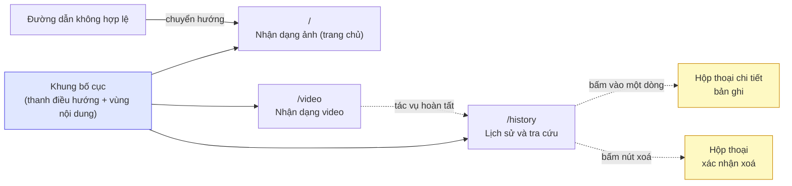

> **Ghi chú thay đổi phạm vi 2026-07-20 — hai đợt liên tiếp trong cùng một ngày.** Thiết kế ban đầu có **năm màn hình** và Dashboard là trang chủ. Đợt thứ nhất gỡ màn hình Webcam (`/webcam`) và chuyển trang chủ sang **Nhận dạng ảnh**; đợt thứ hai gỡ tiếp màn hình **Tổng quan / Dashboard** (`/dashboard`). Cả hai đợt đều nhằm thu gọn phạm vi demo, và cả hai đều **không** gỡ năng lực nào ở tầng dưới: `POST /api/detect/frame`, `GET /api/statistics` và `GET /health` vẫn phục vụ và vẫn có kiểm thử tích hợp. Hệ quả về yêu cầu: FR-3.1/FR-3.4 chuyển M → W ở đợt 1, **FR-4.1 chuyển M → W** và FR-4.2 chuyển S → W ở đợt 2 — xem khung ghi chú ở mục 4.1.3(a) về việc đây là yêu cầu mức Must đầu tiên bị đưa ra khỏi phạm vi. Mã giao diện của cả hai màn hình còn nguyên trong lịch sử git.

Cấu trúc điều hướng cố ý giữ ở mức **phẳng**: ba màn hình chính đều truy cập được trực tiếp từ thanh điều hướng, không có màn hình nào bị lồng sâu. Chi tiết một bản ghi và xác nhận xoá được trình bày dưới dạng hộp thoại chồng lên trang lịch sử thay vì một trang riêng, để người dùng không mất ngữ cảnh danh sách và các bộ lọc đang áp dụng khi xem xong một bản ghi.

Mọi đường dẫn không khớp đều được chuyển hướng về trang chủ (Nhận dạng ảnh) thay vì hiển thị trang lỗi.

### 4.5.2. Mô tả các màn hình chính

#### a) Màn hình Tổng quan / Dashboard (đã gỡ khỏi giao diện 2026-07-20)

Thiết kế ban đầu có màn hình Tổng quan tại `/dashboard`, gồm hàng thẻ chỉ số tổng hợp (tổng lượt sử dụng đếm theo tác vụ, tổng số biển đã đọc đếm theo bản ghi lịch sử, độ tin cậy trung bình, thời gian xử lý trung bình — FR-4.1), biểu đồ xu hướng theo ngày (FR-4.2), biểu đồ phân bố theo loại đầu vào, danh sách hoạt động gần đây, và một thẻ trạng thái hệ thống đọc từ endpoint sức khoẻ.

**Theo quyết định thu gọn phạm vi ngày 2026-07-20, màn hình này đã được gỡ khỏi giao diện web** — cùng đợt với việc chuyển **FR-4.1 từ Must sang Won't** và FR-4.2 từ Should sang Won't (mục 4.1.3a). Toàn bộ số liệu vẫn truy vấn được qua `GET /api/statistics` và `GET /health`, hai endpoint vẫn phục vụ và vẫn có kiểm thử tích hợp; mã trang cùng các thành phần biểu đồ còn trong lịch sử git.

Hai lập luận thiết kế của màn hình này vẫn còn hiệu lực và vì thế được giữ lại ở đây, vì chúng ràng buộc chính đáp ứng của API chứ không chỉ ràng buộc cách vẽ:

- **Hai con số "lượt sử dụng" và "số biển đã đọc" phải tính từ hai bảng khác nhau**, đúng theo quyết định thiết kế dữ liệu ở mục 4.4.3(c). Gộp chúng làm một là cách tạo ra một con số sai không tự bộc lộ.
- **Trạng thái `degraded` phải hiển thị rõ**, để trạng thái chạy pipeline mô phỏng không bị nhầm với trạng thái vận hành thật. Ràng buộc này nay nằm ở chính trường `status` của `GET /health`, và trách nhiệm hiển thị chuyển sang phía client gọi API.

#### b) Màn hình nhận dạng ảnh

Trang chủ của ứng dụng (`/`) — màn hình mặc định khi mở giao diện, phản ánh vai trò nghiệp vụ trung tâm của luồng nhận dạng ảnh. Bố cục hai cột. Cột trái là khu vực tải ảnh hỗ trợ kéo–thả và chọn tệp, kèm ảnh xem trước. Cột phải hiển thị kết quả: ảnh đã vẽ bounding box, danh sách thẻ kết quả cho từng biển số, và phần tóm tắt gồm số biển phát hiện được, số biển đọc được và thời gian xử lý.

Mỗi thẻ kết quả hiển thị: chuỗi biển số đã chuẩn hoá ở kích thước lớn, chuỗi OCR thô ở kích thước nhỏ hơn khi hai chuỗi khác nhau, hai thanh độ tin cậy riêng biệt cho phát hiện và OCR, nhãn số dòng, và cờ hợp lệ định dạng. Việc hiển thị **cả hai chuỗi** khi chúng khác nhau là một lựa chọn có chủ đích: nó cho phép người xem quan sát trực tiếp khối hậu xử lý đã can thiệp gì, và trong buổi bảo vệ, đây là bằng chứng trực quan cho đóng góp kỹ thuật được phân tích ở mục 4.4.3(b).

#### c) Màn hình nhận dạng video

Ba giai đoạn nối tiếp, phản ánh đúng bản chất bất đồng bộ của nghiệp vụ: khu vực tải tệp; bảng tiến độ hiển thị thanh phần trăm, số khung đã xử lý trên tổng số khung, trạng thái tác vụ và nút huỷ; bảng kết quả hiển thị video đã gắn nhãn, danh sách biển số đã gộp trùng và liên kết tải về.

#### d) Màn hình webcam (đã gỡ khỏi giao diện 2026-07-20)

Thiết kế ban đầu có màn hình webcam gồm khu vực hiển thị camera với lớp phủ vẽ bounding box theo thời gian thực, cụm điều khiển bật/tắt camera và chọn thiết bị, bảng số liệu phiên (tốc độ khung hình hiệu dụng, số khung đã gửi, số khung bị bỏ, độ trễ trung bình), và bảng biển số đã phát hiện trong phiên. Bảng số liệu phiên khi đó có vai trò kép: với người dùng, nó cho biết hệ thống đang chạy nhanh chậm ra sao; với người thực hiện đồ án, nó là công cụ đo tại chỗ cho chỉ tiêu NFR-P2 — việc số khung bị bỏ được hiển thị công khai giúp phân biệt rõ giữa "hệ thống xử lý được 5 khung mỗi giây" và "camera chụp 30 khung mỗi giây nhưng 25 khung bị bỏ".

**Theo quyết định thu gọn phạm vi ngày 2026-07-20, màn hình này đã được gỡ khỏi giao diện web.** Năng lực nhận dạng thời gian thực giữ nguyên ở tầng API (`POST /api/detect/frame`, mục 4.3.3), và phép đo NFR-P2 chuyển sang thực hiện bằng kịch bản gọi API trực tiếp. Mã nguồn màn hình còn trong lịch sử git nếu cần khôi phục.

#### e) Màn hình lịch sử

Gồm bảng dữ liệu có phân trang và sắp xếp theo cột, thanh bộ lọc (ô tìm kiếm, chọn loại đầu vào, khoảng thời gian, ngưỡng độ tin cậy, trạng thái hợp lệ định dạng), nút xuất dữ liệu, hộp thoại chi tiết bản ghi và hộp thoại xác nhận xoá.

Hộp thoại chi tiết hiển thị đầy đủ metadata: ảnh gốc có vẽ bounding box, ảnh biển số đã cắt, cả hai chuỗi thô và đã chuẩn hoá, cả hai độ tin cậy, số dòng, thời gian xử lý và định danh tác vụ nguồn. Việc bounding box vẽ lại được mà không cần chạy lại mô hình là nhờ bốn cột toạ độ được lưu trong cơ sở dữ liệu.

### 4.5.3. Nguyên tắc trải nghiệm người dùng

#### a) Bốn trạng thái bắt buộc của mọi thành phần hiển thị dữ liệu

Nguyên tắc này áp dụng cho **mọi** thành phần lấy dữ liệu từ máy chủ, không có ngoại lệ. Mỗi thành phần như vậy phải xử lý đủ bốn trạng thái:

| # | Trạng thái | Yêu cầu hiển thị | Nếu bỏ qua thì sao |
|:--:|---|---|---|
| 1 | **Đang tải** | Chỉ báo trực quan (spinner hoặc khung xương) cho mọi thao tác kéo dài trên 500 ms | Giao diện trông như bị treo; người dùng bấm lại nhiều lần, tạo thêm tải cho một hệ thống vốn đã chậm vì chạy CPU |
| 2 | **Có dữ liệu** | Nội dung thực tế | — |
| 3 | **Rỗng** | Thông báo giải thích vì sao chưa có gì, kèm gợi ý hành động tiếp theo | Màn hình trắng không phân biệt được với lỗi kỹ thuật |
| 4 | **Lỗi** | Thông báo tiếng Việt nêu nguyên nhân và cách khắc phục, kèm khả năng thử lại | Người dùng bế tắc, không biết nên làm gì |

Trạng thái rỗng đáng được nhấn mạnh vì nó thường bị bỏ sót nhất. Với hệ thống này, trạng thái rỗng xuất hiện ở nhiều chỗ có ý nghĩa khác nhau: bảng lịch sử khi chưa có lượt nhận dạng nào, bảng lịch sử khi bộ lọc không khớp bản ghi nào, và kết quả nhận dạng khi ảnh không chứa biển số. Ba tình huống này cần ba thông điệp khác nhau — "chưa có dữ liệu, hãy thử nhận dạng một ảnh", "không có bản ghi nào khớp bộ lọc, hãy nới lỏng điều kiện", và "không phát hiện được biển số trong ảnh này". Dùng chung một thông điệp cho cả ba sẽ khiến người dùng không biết vấn đề nằm ở đâu. *(Trường hợp thứ nhất trước 2026-07-20 xuất hiện trên màn hình Tổng quan; sau khi màn hình này được gỡ, nó biểu hiện ở bảng lịch sử rỗng.)*

Trường hợp thứ ba là biểu hiện ở tầng giao diện của cùng một quyết định đã xuất hiện ở tầng API (trả mã 200 với danh sách rỗng) và ở tầng thiết kế pipeline (trả kết quả rỗng, không ném ngoại lệ). Ba tầng nhất quán với nhau về ngữ nghĩa: **không tìm thấy không phải là lỗi**.

#### b) Thông báo lỗi tiếng Việt thân thiện

Yêu cầu NFR-U3 quy định thông báo lỗi phải bằng tiếng Việt, nêu rõ nguyên nhân và cách khắc phục, không hiển thị mã lỗi kỹ thuật cho người dùng cuối. Yêu cầu FR-6.3 bổ sung rằng stack trace tuyệt đối không được rò rỉ ra giao diện.

Nguyên tắc soạn thông báo lỗi của đồ án gồm ba phần: **nói rõ chuyện gì đã xảy ra**, **nói vì sao**, và **nói người dùng có thể làm gì**. Một thông báo thiếu phần thứ ba là một thông báo bỏ mặc người dùng.

| Tình huống | Thông báo kém | Thông báo đạt yêu cầu |
|---|---|---|
| Tệp sai định dạng | `400 Bad Request` | "Tệp bạn chọn không phải là ảnh hợp lệ. Hệ thống chỉ nhận các định dạng JPG, PNG, WebP và BMP. Vui lòng chọn tệp khác." |
| Tệp quá lớn | `413 Payload Too Large` | "Ảnh vượt quá dung lượng cho phép. Vui lòng chọn ảnh nhỏ hơn hoặc giảm kích thước ảnh trước khi tải lên." |
| Không phát hiện được biển số | "Lỗi: không có kết quả" | "Không tìm thấy biển số nào trong ảnh này. Hãy thử ảnh chụp gần hơn hoặc rõ nét hơn, sao cho biển số nhìn thấy rõ bằng mắt thường." |
| Không kết nối được máy chủ | `NetworkError: Failed to fetch` | "Không kết nối được tới máy chủ. Vui lòng kiểm tra máy chủ đã khởi động chưa, sau đó bấm Thử lại." |
| Lỗi nội bộ | Toàn bộ stack trace Python | "Đã xảy ra lỗi trong quá trình xử lý. Vui lòng thử lại. Nếu lỗi tiếp diễn, hãy liên hệ quản trị viên." |

Nguyên tắc vận hành đi kèm: **chi tiết kỹ thuật không bị vứt bỏ, mà được chuyển hướng**. Toàn bộ thông tin cần cho việc gỡ lỗi — loại ngoại lệ, stack trace, định danh yêu cầu — được ghi vào log có cấu trúc ở phía máy chủ theo FR-6.2. Người dùng nhận thông báo dễ hiểu; người phát triển nhận thông tin đầy đủ. Hai đối tượng, hai kênh, không đánh đổi giữa chúng.

#### c) Các nguyên tắc khác

**Tối thiểu hoá số thao tác.** Theo NFR-U1, người dùng mới phải hoàn thành lượt nhận dạng ảnh đầu tiên trong không quá ba thao tác nhấp chuột và không cần đọc tài liệu. Điều này định hình bố cục: khu vực tải ảnh chiếm vị trí trung tâm và hỗ trợ kéo–thả, không có bước cấu hình bắt buộc nào trước khi nhận dạng.

**Khả năng đọc và tương phản.** Toàn bộ chữ chính đạt tỉ lệ tương phản tối thiểu 4,5:1 theo chuẩn WCAG AA (NFR-U5). Độ tin cậy được biểu diễn bằng thanh trực quan kèm giá trị số, không chỉ bằng màu sắc — người dùng khó phân biệt màu vẫn đọc được thông tin.

**Bố cục thích ứng.** Giao diện hoạt động đúng từ độ phân giải 1366×768 trở lên (NFR-U4). Đây là độ phân giải phổ biến của máy chiếu trong phòng bảo vệ, nên yêu cầu này có tính thực dụng trực tiếp.

**Trạng thái cài đặt.** Phần giao diện **đã hoàn thành**: cấu trúc điều hướng, khung bố cục và toàn bộ thành phần của **ba màn hình hiện hành** đã được cài đặt, bản build production chạy sạch. Hai màn hình khác — Webcam và Tổng quan — từng được cài đặt đầy đủ và đã gỡ ngày 2026-07-20 theo hai đợt thu gọn phạm vi; ba endpoint tương ứng của backend (`POST /api/detect/frame`, `GET /api/statistics`, `GET /health`) nay phục vụ client API, không còn trang giao diện gọi tới. Chi tiết cài đặt cùng ảnh chụp màn hình được trình bày ở **Chương 5**; các hạng mục còn dở (đáng chú ý là nút huỷ tác vụ video) được ghi nhận ở mục 5.9.

---

## 4.6. Kết luận chương

Chương này đã trình bày toàn bộ quá trình phân tích yêu cầu và thiết kế hệ thống nhận dạng biển số xe Việt Nam.

Về **phân tích yêu cầu**, đồ án xác định ba tác nhân tương tác trực tiếp và chín use case, đặc tả 34 yêu cầu chức năng tổ chức thành 6 nhóm (**21 bắt buộc, 6 nên có, 3 có thì tốt, 4 không triển khai ở bản này**), mỗi yêu cầu kèm một tiêu chí chấp nhận kiểm chứng được. Bốn yêu cầu mức Won't đều thuần giao diện và đều chuyển mức trong hai đợt thu gọn phạm vi ngày 2026-07-20: FR-3.1/FR-3.4 khi gỡ trang Webcam, FR-4.1/FR-4.2 khi gỡ trang Tổng quan — trong đó **FR-4.1 là yêu cầu mức Must đầu tiên bị đưa ra khỏi phạm vi**, một sự việc được ghi thẳng ở mục 4.1.3(a) và được đánh giá là hạn chế thật ở Chương 7. Cả bốn đều mất màn hình hiển thị chứ không mất năng lực: các endpoint tương ứng vẫn phục vụ và vẫn có kiểm thử tích hợp. Yêu cầu phi chức năng được đặt ở dạng chỉ tiêu định lượng, trong đó điểm cần nhấn mạnh là **mọi chỉ tiêu hiệu năng đều là chỉ tiêu đo trên CPU**. Việc không có GPU được xác lập là một ràng buộc thiết kế nghiêm túc chứ không phải một hạn chế tạm thời, vì nó cố định trong toàn bộ vòng đời đồ án, thay đổi độ trễ theo bậc độ lớn chứ không theo tỉ lệ phần trăm, chi phối việc lựa chọn thành phần ở mọi tầng, và trực tiếp sinh ra hai quyết định kiến trúc — xử lý video bất đồng bộ và bỏ khung có kiểm soát ở chế độ webcam.

Về **kiến trúc**, hệ thống được tổ chức thành năm tầng theo nguyên tắc phụ thuộc một chiều. Quyết định kiến trúc quan trọng nhất là **tách hoàn toàn tầng AI khỏi tầng API**: package nhận dạng không import bất kỳ thành phần nào của framework web. Ba lợi ích của quyết định này — kiểm thử độc lập, tái sử dụng trong script huấn luyện và đánh giá, thay thế engine mà không sửa tầng API — không phải lập luận lý thuyết mà đang được sử dụng trong thực tế: nhờ nó, toàn bộ phần mềm đã được xây dựng và chạy được với một pipeline mô phỏng trước khi mô hình được huấn luyện. Ràng buộc này được kiểm chứng bằng hai công cụ bổ trợ nhau: kiểm tra tĩnh các câu lệnh import và kiểm tra động danh sách module đã nạp lúc chạy — phép thứ hai bắt được cả import muộn lẫn import bắc cầu mà phép thứ nhất bỏ sót.

Về **thiết kế chi tiết**, chương đã đặc tả cấu trúc lớp của tầng AI với ba lớp trừu tượng và tập kiểu dữ liệu bất biến, bốn service của tầng nghiệp vụ, mười endpoint REST kèm đầy đủ đầu vào, đầu ra và mã trạng thái, cùng ba sơ đồ tuần tự cho ba luồng nghiệp vụ chính.

Về **thiết kế cơ sở dữ liệu**, mô hình gồm hai bảng có quan hệ một–nhiều. Năm quyết định thiết kế dữ liệu được phân tích kỹ, và điểm chung của cả năm là chúng bảo vệ **tính đúng đắn của các số liệu sẽ được công bố ở chương đánh giá**: tách hai cột độ tin cậy để phân tích lỗi được; lưu cả chuỗi OCR thô lẫn chuỗi đã sửa để đo được đóng góp định lượng của khối hậu xử lý; thêm khoá nhóm tác vụ để thống kê sử dụng không bị thổi phồng theo số biển số trên mỗi ảnh; lưu số dòng của biển vì chuỗi ký tự tự nó nhập nhằng giữa biển ô tô và biển xe máy; và cho phép các cột OCR rỗng để những trường hợp đọc không ra vẫn nằm trong mẫu số khi tính độ chính xác. Mỗi quyết định trong số này, nếu bỏ qua, đều dẫn tới một con số sai mà **không có gì báo hiệu** — đó là lý do chúng được cân nhắc ngay từ khâu thiết kế lược đồ chứ không để lại xử lý sau.

Về **giao diện người dùng**, chương trình bày sơ đồ điều hướng phẳng gồm **ba màn hình** (sau hai đợt thu gọn phạm vi ngày 2026-07-20 đã gỡ màn hình Webcam rồi tới màn hình Tổng quan), mô tả chức năng từng màn hình, và xác lập hai nguyên tắc trải nghiệm bắt buộc: bốn trạng thái phải xử lý cho mọi thành phần hiển thị dữ liệu, và quy tắc soạn thông báo lỗi tiếng Việt gồm ba phần nguyên nhân — giải thích — hướng khắc phục.

Cần nói rõ giới hạn của chương này. Nội dung trình bày ở đây là **thiết kế và trạng thái cài đặt của thiết kế**, không phải kết quả thực nghiệm. Tầng API, tầng nghiệp vụ, tầng dữ liệu và lược đồ cơ sở dữ liệu đã được cài đặt và xác minh bằng lời gọi HTTP thực tế; giao diện đã hoàn thiện và build sạch; hệ thống **đã chạy pipeline nhận dạng thật với mô hình chính thức** `models/best.pt`. Mô hình đối chứng `models/baseline-416-v1.pt` không dùng làm kết quả đánh giá được (sai độ phân giải và split có rò rỉ). Toàn bộ số liệu về độ chính xác của mô hình, độ trễ thực đo trên CPU, mức đóng góp thực tế của khối hậu xử lý và độ chính xác tách theo số dòng biển số **được trình bày ở Chương 6**. Việc chương này tập trung vào tính đúng đắn có thể kiểm chứng của thiết kế, thay vì trình bày trước các con số thuộc chương đánh giá, là một lựa chọn có chủ đích về phương pháp.

Chương tiếp theo trình bày quá trình cài đặt hệ thống trên cơ sở thiết kế đã xác lập ở đây.


```{=openxml}
<w:p><w:r><w:br w:type="page"/></w:r></w:p>
```

# CHƯƠNG 5. XÂY DỰNG HỆ THỐNG VÀ HUẤN LUYỆN MÔ HÌNH

Chương 4 đã trình bày hệ thống *nên* được xây dựng như thế nào: kiến trúc năm tầng, các giao diện trừu tượng, lược đồ cơ sở dữ liệu và tám quyết định kiến trúc AD-01 đến AD-08. Chương này trình bày hệ thống *đã* được xây dựng như thế nào.

Sự phân biệt giữa hai chương không chỉ là thứ tự trình bày. Thiết kế mô tả ý định; cài đặt mô tả những gì thực sự tồn tại dưới dạng mã nguồn chạy được, cùng với những chỗ mà hiện thực buộc phải lệch khỏi ý định ban đầu. Trong một đồ án kỹ thuật, chính những điểm lệch đó — và lý do của chúng — mới là phần mang giá trị tri thức cao nhất, bởi vì chúng là thứ duy nhất không thể suy ra được từ tài liệu thiết kế. Mục 5.9 dành riêng cho việc đối chiếu này.

Nguyên tắc trình bày của chương: **mọi mô tả trong chương này đều tương ứng với mã nguồn có thật trong kho `d:/DATN`**. Không có thành phần nào được mô tả mà không tồn tại. Nơi nào một chức năng chưa hoàn thiện, chương ghi nhận rõ mức độ hoàn thiện thay vì bỏ qua. Nơi nào một số đo chưa có, chương để bảng trống với đầy đủ cột và chỉ tới Chương 6.

Nội dung chương được tổ chức theo trình tự triển khai thực tế: môi trường phát triển (4.1), tầng AI (4.2), tầng backend (4.3), tầng frontend (4.4), xây dựng bộ dữ liệu (4.5), đóng gói triển khai (4.6), các điểm lệch so với thiết kế (4.7) và kết luận (4.8).

---

## 5.1. Môi trường và công cụ phát triển

### 5.1.1. Cấu hình máy thực hiện

Toàn bộ quá trình cài đặt, kiểm thử và đo đạc được thực hiện trên một máy trạm cá nhân duy nhất. Cấu hình thực tế đã được khảo sát và ghi nhận chính thức trong `docs/00-requirements/environment.md`:

| Hạng mục | Cấu hình thực tế |
|---|---|
| Hệ điều hành | Windows 11 Pro 10.0.26200 |
| CPU | Intel Core i5-14600K (kiến trúc Raptor Lake Refresh), **14 nhân / 20 luồng** |
| RAM | 31,77 GiB |
| GPU | Intel UHD Graphics 770 (đồ hoạ tích hợp) — **không có GPU CUDA** |
| Python | 3.13.12 (có sẵn 3.11 làm phương án lùi) |
| Node.js | 18.20.8 (kích hoạt qua `nvm-windows`) |
| Docker | 29.4.3 |
| Dung lượng trống | 96 GB (ổ D:) |

Bảng này có một điểm cần nhấn mạnh: nó **mâu thuẫn với mô tả môi trường ban đầu của đồ án**, vốn giả định máy macOS Apple Silicon với Python 3.12. Việc khảo sát lại và ghi nhận sai lệch thành văn bản chính thức là bước đầu tiên của Phase 0, bởi vì cả ba tham số sai (hệ điều hành, phiên bản Python, khả năng tăng tốc phần cứng) đều ảnh hưởng trực tiếp tới thiết bị huấn luyện, tới chỉ tiêu hiệu năng và tới cách viết đường dẫn tệp trong mã nguồn.

### 5.1.2. Vì sao "không có GPU" là ràng buộc thiết kế chứ không phải hạn chế tạm thời

Cách phản ứng thông thường trước một máy không có GPU là coi đó như một bất tiện tạm thời: "hiện tại chạy CPU, sau này có GPU thì nhanh hơn". Đồ án này chủ ý **không** áp dụng cách nhìn đó, vì ba lý do độc lập nhau.

**Thứ nhất, môi trường trình diễn là môi trường đã biết.** Buổi bảo vệ đồ án diễn ra trên chính máy này hoặc một máy tương đương, không có GPU. Một hệ thống chỉ đạt chỉ tiêu độ trễ khi có GPU là một hệ thống *không đạt chỉ tiêu* trong bối cảnh sử dụng thật của nó. Vì vậy ràng buộc CPU-only được đưa thẳng vào phát biểu chỉ tiêu NFR-P1 chứ không được coi là điều kiện ngoại cảnh.

**Thứ hai, ràng buộc CPU thay đổi *lựa chọn mô hình*, không chỉ thay đổi *tốc độ chạy*.** Nếu suy luận chạy trên GPU, việc chọn YOLO11s hay YOLO11m thay vì YOLO11n gần như không có chi phí đáng kể, và việc chọn mô hình OCR server thay vì mobile cũng vậy. Trên CPU, các lựa chọn đó chênh nhau hàng trăm mili-giây mỗi ảnh. Quyết định kiến trúc AD-06 (suy luận chạy trên CPU) vì thế kéo theo hai quyết định phái sinh đã được cài đặt: biến thể `yolo11n` cho tầng phát hiện và bộ mô hình **PP-OCRv5 mobile** cho tầng nhận dạng ký tự. Đây là các lựa chọn *do ràng buộc phần cứng quyết định*, không phải lựa chọn tự do.

**Thứ ba, ràng buộc tách bạch huấn luyện khỏi suy luận một cách vật lý.** Huấn luyện YOLO11 trên CPU cần ước tính 1–3 ngày cho một lượt, khiến việc thử nghiệm siêu tham số trở nên bất khả thi. Hệ quả là kiến trúc mã nguồn phải chấp nhận rằng **nơi huấn luyện và nơi chạy là hai môi trường khác nhau**: gói `ai/training/` phải chạy được cả trên máy local lẫn trên notebook Colab/Kaggle, siêu tham số phải nằm trong tệp cấu hình chứ không nằm trong ô lệnh của notebook, và trọng số phải di chuyển được giữa hai môi trường dưới dạng tệp. Đây là ràng buộc kiến trúc, không phải chi tiết vận hành. Nó là lý do tồn tại của `ai/training/config.py` (586 dòng) như một lớp cấu hình có kiểm tra hợp lệ, thay vì một danh sách tham số truyền qua dòng lệnh.

Một hệ quả đo được của ràng buộc này xuất hiện trong kết quả benchmark: độ trễ đầu-cuối p95 trên `models/best.pt` (máy rảnh) là **731 ms** (client-side) / **780 ms** (in-process), đạt mục tiêu 800 ms của NFR-P1. Trong đó OCR chiếm **~64,3%** thời gian, phát hiện **~34,2%** — OCR vẫn là giai đoạn tốn kém nhất trên CPU. Chi tiết phân tích được trình bày ở Chương 6; ở đây chỉ cần ghi nhận rằng ràng buộc phần cứng không phải một chú thích bên lề mà là yếu tố chi phối kết quả hiệu năng của toàn hệ thống.

### 5.1.3. Ba môi trường ảo Python tách biệt, và lý do bắt buộc phải tách

Đồ án sử dụng **ba môi trường ảo Python riêng biệt** trong cùng một kho mã. Đây không phải là sự thiếu tổ chức mà là hệ quả trực tiếp của một xung đột phụ thuộc không thể hoà giải, đã được xác minh bằng cách kiểm tra phiên bản gói thực tế đã cài:

| Môi trường ảo | Vai trò | NumPy | OpenCV | Gói đặc trưng |
|---|---|---|---|---|
| `.venv-ai/` | Huấn luyện, xuất mô hình | **2.4.4** | `opencv-python` **5.0.0.93** (+ headless) | `torch` 2.13.0+cpu, `torchvision` 0.28.0 |
| `.venv-ocr/` | Thử nghiệm OCR biệt lập | **2.3.5** | `opencv-contrib-python` **4.10.0.84** | `paddlepaddle` 3.3.1, `paddleocr` 3.7.0, `paddlex` |
| `backend/.venv/` | Chạy dịch vụ (backend + suy luận) | **2.3.5** | `opencv-contrib-python` **4.10.0.84** | Toàn bộ: `torch`, `ultralytics` 8.4.101, `paddleocr` |

Cơ chế của xung đột như sau. Gói `paddleocr` kéo theo `paddlex`, và chuỗi phụ thuộc này **hạ cấp NumPy từ 2.4.x xuống 2.3.5** đồng thời **thay thế `opencv-python` bằng `opencv-contrib-python` 4.10** — tức là lùi một phiên bản lớn (major version) so với OpenCV 5.0 mà nhánh huấn luyện đang dùng. Cài `paddleocr` vào cùng môi trường với `ultralytics` và `torch` phiên bản mới do đó không phải là "thêm một gói" mà là **ghi đè hai gói nền tảng của toàn bộ ngăn xếp thị giác máy tính**.

Hệ quả nếu không tách: mỗi lần cài lại hoặc nâng cấp một trong hai nhánh sẽ âm thầm thay đổi phiên bản NumPy/OpenCV mà nhánh kia đang chạy. Đây là loại lỗi tồi tệ nhất trong một đồ án có đo đạc — nó không làm chương trình sập mà làm **kết quả đo không tái lập được**, vì hai lần chạy cách nhau vài ngày có thể đang dùng hai phiên bản thư viện khác nhau mà không có dấu hiệu nào.

Cách giải quyết đã chọn:

- `.venv-ai/` giữ nhánh huấn luyện ở phiên bản mới nhất, **không cài `paddleocr`**.
- `.venv-ocr/` là môi trường thử nghiệm OCR biệt lập, dùng khi cần đo riêng tầng nhận dạng ký tự mà không muốn động tới hai môi trường kia.
- `backend/.venv/` là môi trường **chạy thật**: nó chấp nhận phiên bản NumPy/OpenCV do `paddleocr` áp đặt, vì đây là môi trường mà cả hai tầng phải cùng tồn tại. Việc chấp nhận phiên bản thấp hơn ở đây là một đánh đổi có ý thức: nhánh suy luận không cần tính năng mới của OpenCV 5, trong khi PaddleOCR thì không chạy được nếu thiếu phiên bản nó yêu cầu.

Sự phân tách này được phản ánh trong hai tệp yêu cầu riêng của backend: `backend/requirements.txt` (chỉ dịch vụ web và cơ sở dữ liệu) và `backend/requirements-inference.txt` (bổ sung ngăn xếp ML). Tệp `Dockerfile.backend` cài hai tệp này theo hai lớp riêng biệt, để một thay đổi ở tầng suy luận không làm mất hiệu lực bộ đệm (cache) của tầng web.

### 5.1.4. Bộ công cụ

| Công cụ | Phiên bản | Vai trò trong đồ án |
|---|---|---|
| Python | 3.13.12 (local) / 3.12 (Docker) | Ngôn ngữ của tầng AI và tầng backend |
| FastAPI + Uvicorn | — | Khung dịch vụ web bất đồng bộ, sinh OpenAPI tự động |
| SQLAlchemy 2.x + Alembic | — | ORM và di trú lược đồ (migration) |
| Pydantic / pydantic-settings | v2 | Xác thực dữ liệu vào–ra và cấu hình |
| Ultralytics | 8.4.101 | Nạp và chạy YOLO11 [16]<!-- jocher_2024_yolo11 --> |
| PaddlePaddle / PaddleOCR | 3.3.1 / 3.7.0 | Nhận dạng ký tự PP-OCRv5 [17]<!-- cui_2026_ppocrv5 --> |
| Node.js | 18.20.8 (local) / 20 (Docker) | Thời gian chạy cho công cụ build frontend |
| Vite + React + TypeScript | — | Xây dựng giao diện người dùng |
| pytest + pytest-cov | — | Kiểm thử tự động và đo bao phủ |
| Docker + Docker Compose | 29.4.3 | Đóng gói và chuẩn hoá môi trường triển khai |

Việc `Dockerfile` dùng Python 3.12 trong khi máy local dùng 3.13 là **chủ ý**: container chính là nơi lấy lại phiên bản mục tiêu và tách môi trường chạy khỏi máy cá nhân. Điều này biến một sai lệch môi trường thành một luận điểm về khả năng tái lập, và là nội dung cụ thể của NFR-C1.

---

## 5.2. Xây dựng bộ dữ liệu

### 5.2.1. Đường ống sáu bước

Bộ dữ liệu được xây dựng bằng một đường ống gồm sáu bước, mỗi bước là một script độc lập trong `scripts/dataset/`, có thể chạy riêng và đều sinh báo cáo JSON/CSV:

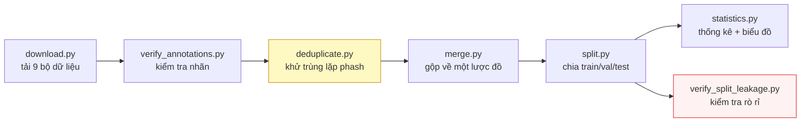

Toàn bộ đường ống chạy được bằng một lệnh qua `run_pipeline.py`, nhưng mỗi bước vẫn giữ giao diện dòng lệnh riêng — điều này quan trọng vì bước khử trùng lặp cần chạy lại nhiều lần với các ngưỡng khác nhau để khảo sát (mục 5.2.3).

**Kết quả:** **15.133 ảnh**, hợp nhất từ **7 bộ dữ liệu** công khai (Roboflow Universe, HuggingFace, Kaggle), còn lại **6 nguồn nguyên tố** sau khử trùng lặp chéo bộ, sau khi loại **11.978 ảnh (44,2%)** là bản sao từ tổng số **27.111 ảnh** của 7 bộ này. Tổng cộng có **9 bộ được tải về**; 2 bộ nhãn mức ký tự (`roboflow_ocr_plate`, `roboflow_ocr_conversion`) được tách riêng phục vụ đánh giá OCR nên không vào bước hợp nhất detection. Chia theo tỷ lệ 70/20/10 thành **10.592 / 3.027 / 1.514 ảnh** (train / val / test).

#### Từng nguồn một, kèm giấy phép và số ảnh còn lại sau khử trùng lặp

Bảng dưới là bảng **phải trích khi nói về dữ liệu của đồ án**, vì con số tổng
15.133 che mất điều quan trọng nhất: các bộ đóng góp **rất không đều**, và bước
khử trùng lặp làm thay đổi thứ hạng của chúng một cách quyết liệt.

| # | Bộ (slug) | Nguồn | Giấy phép | Vào gộp | **Còn lại** | Bị loại |
|---|---|---|---|---:|---:|---:|
| 1 | `roboflow_school_fuhih` | Roboflow `school-fuhih/vietnamese-license-plate-tptd0` v1 | **CC BY 4.0** | 8.357 | **6.868** (45,38%) | 17,8% |
| 2 | `hf_vn_plates_segment` | HuggingFace `hoanglvuit/Vietnam_License_Plate_Segment_Datasets` | ⚠️ **chưa xác nhận** | 4.578 | **4.375** (28,91%) | 4,4% |
| 3 | `roboflow_traffic_camera` | Roboflow `traffic-camera/vietnam-license-plate-hayn8` v4 | **CC BY 4.0** | 3.843 | **3.162** (20,89%) | 17,7% |
| 4 | `roboflow_eric_nguyen` | Roboflow `eric-nguyen-knfxn/vietnam-license-plate-curhr` v1 | **CC BY 4.0** | 840 | **353** (2,33%) | 58,0% |
| 5 | `roboflow_demo_tracking` | Roboflow `demo-tracking/license-plate-vietnam-car` v2 | **CC BY 4.0** | 236 | **235** (1,55%) | 0,4% |
| 6 | `roboflow_cuong_ta` | Roboflow `cuong-ta-ulxex/vietnamese-car-license-plate` v1 | Public Domain (người đăng tự khai) | 8.254 | **140** (0,93%) | **98,3%** |
| 7 | `roboflow_tran_ngoc_xuan_tin` | Roboflow `tran-ngoc-xuan-tin-k15-hcm-dpuid/vietnam-license-plate-h8t3n` v1 | **CC BY 4.0** | 1.005 | **0** | **100%** |
| | **Tổng** | | | **27.113** | **15.133** | **44,2%** |

Nguồn số: cột "vào gộp" từ `datasets/processed/merged_v2/merge_manifest.csv`;
cột "còn lại" đếm trực tiếp trên `datasets/processed/yolo_v3/images/{train,val,test}`.

**Ba điều bảng này nói ra mà con số tổng giấu đi.**

*Thứ nhất, hai bộ chi phối tập dữ liệu.* `school_fuhih` và `hf_vn_plates_segment`
cộng lại chiếm **74,3%**. Đồ án có 6 nguồn nguyên tố nhưng **không đa dạng về nội
dung** như con số "6 nguồn" gợi ý — đây là hạn chế phải nêu, không phải chi tiết
kỹ thuật.

*Thứ hai, hai bộ gần như biến mất sau khử trùng lặp.* `cuong_ta` mất **98,3%** và
`tran_ngoc_xuan_tin` mất **toàn bộ** — nghĩa là gần như mọi ảnh của chúng đã có
mặt trong các bộ khác. Đây là bằng chứng trực tiếp cho luận điểm ở mục 5.2.2: các
bộ biển số Việt Nam công khai **không độc lập với nhau**.

*Thứ ba, và đây là hệ quả ngoài ý muốn:* `cuong_ta` là bộ **cân bằng nhất** về tỷ
lệ biển một dòng / hai dòng (51,04% hai dòng), còn `school_fuhih` — bộ sống sót
nhiều nhất — lại **lệch nặng nhất** về biển hai dòng (88,85%). Thứ tự ưu tiên giữ
ảnh khi khử trùng lặp vì vậy đã **vô tình làm tập dữ liệu lệch layout hơn** so với
trước khi khử. Chi tiết ở `docs/reports/02-dataset-report.md` mục 7.3.

**Giấy phép:** năm bộ CC BY 4.0 (bắt buộc ghi công, đã ghi ở Phụ lục), một bộ
người đăng tự khai Public Domain — **không được khẳng định là Public Domain thật**
vì ảnh nguồn có dấu hiệu là ảnh báo chí — và một bộ HuggingFace **chưa xác nhận
được giấy phép**, phải nêu rõ khi công bố.

Song song, một nhánh riêng tái tạo **4.019 chuỗi biển số** từ hai bộ có nhãn mức ký tự, trong đó **2.801 chuỗi (69,69%)** khớp một mẫu biển số hợp lệ theo `plate_rules.py`. Nhánh này phục vụ việc đánh giá tầng OCR độc lập với tầng phát hiện.

| Bộ nhãn ký tự | Nguồn | Giấy phép | Chuỗi dùng được |
|---|---|---|---:|
| `roboflow_ocr_plate` | Roboflow, nhãn mức ký tự | CC BY 4.0 | **2.650** |
| `roboflow_ocr_conversion` | Roboflow, nhãn mức ký tự | CC BY 4.0 | **151** |
| | | **Tổng** | **2.801** |

**Cảnh báo phạm vi bắt buộc đi kèm mọi số liệu OCR.** Chạy bộ phân loại màu nền
lên toàn bộ 2.801 ảnh này cho: **2.736 biển trắng (97,68%)**, 20 vàng (0,71%),
4 xanh (0,14%), **0 đỏ và 0 ngoại giao**. Vì vậy phát biểu đúng là *"1 − CER =
0,9454 trên một tập gồm 97,7% biển trắng"*, **không phải** *"trên biển số Việt
Nam"* (`docs/reports/17-plate-type-audit.json`).

Một kết quả phụ đáng ghi nhận: tập ký tự quan sát được trên toàn bộ 4.019 chuỗi có **đúng 30 ký tự phân biệt**, không chứa `I`, `J`, `O`, `Q`, `W`. Đây là **xác nhận độc lập bằng dữ liệu** cho tập `EXCLUDED_LETTERS` vốn được suy ra từ văn bản pháp quy ở mục 5.5.6 — hai nguồn tri thức độc lập cho cùng một kết luận.

### 5.2.2. Khử trùng lặp chéo bộ và con số 44,2%

**Vì sao bước này quan trọng hơn vẻ ngoài của nó.** Các bộ dữ liệu biển số Việt Nam công khai **không độc lập với nhau**. Các dự án trên Roboflow fork lẫn nhau, các bản tải lên Kaggle đóng gói lại bản xuất từ Roboflow, và cùng một đoạn video hành trình xuất hiện trong nhiều bộ sưu tập. Nếu cùng một bức ảnh nằm ở `train` dưới tên một bộ dữ liệu và ở `test` dưới tên một bộ khác, thì **độ chính xác test đang đo khả năng ghi nhớ**, không đo khả năng khái quát hoá.

Đó là lý do con số tiêu đề của script không phải tổng số nhóm trùng lặp mà là số nhóm trùng lặp **chéo bộ dữ liệu**: trùng lặp trong cùng một bộ chỉ tốn thời gian huấn luyện, trùng lặp chéo bộ thì **làm mất hiệu lực kết quả**.

**Thuật toán giữ được tính khả thi bằng multi-index hashing.** So sánh vét cạn 37.000 ảnh là khoảng 690 triệu cặp — Python không hoàn thành được trong thời gian chấp nhận. Script dùng kỹ thuật băm đa chỉ mục: một mã băm 64 bit được cắt thành `threshold + 1` dải; theo nguyên lý chuồng bồ câu, hai mã băm khác nhau ở tối đa `threshold` bit **bắt buộc phải trùng khớp chính xác** trên ít nhất một dải. Nhóm theo giá trị dải do đó tạo ra tập ứng viên **bảo đảm chứa mọi cặp thật**, sau đó được xác minh chính xác. **Không cặp trùng lặp thật nào bị bỏ sót — đây là thuật toán chính xác, không phải xấp xỉ.**

Cần phân biệt **hai phép đo khác nhau trên hai mẫu số khác nhau** — cả hai đều đúng, và trích một con số trần mà không nêu mẫu số là gây hiểu nhầm:

| Phép đo | Mẫu số | Ngưỡng Hamming | Ảnh có thể loại | Tỷ lệ | Đã xoá thật? |
|---|---:|---:|---:|---:|---|
| (a) Trên **toàn bộ ảnh của 7 bộ vào hợp nhất detection** | 27.111 | 5 | 11.978 | **44,2%** | **Rồi** (`applied: true`) |
| (b) Trên **corpus đã gộp** `merged_v2` còn lại | 15.133 | 10 | 7.227 | **47,8%** | **Chưa** (`applied: false`) |

Nguồn: (a) `datasets/reports/v2/deduplication_report.json`; (b) `datasets/reports/v3/deduplication_report.json`.

Chi tiết phép đo (b) ở ngưỡng Hamming 10 trên 15.133 ảnh:

| Chỉ số | Giá trị |
|---|---:|
| Ảnh quét | 15.133 |
| Cặp trùng lặp | 19.277 |
| Nhóm trùng lặp | 1.171 |
| **Nhóm trùng lặp chéo bộ** | **116** |
| Ảnh có thể loại | 7.227 (**47,8%** của 15.133) |

Cặp bộ dữ liệu chồng lấn nặng nhất là `hf_vn_plates_segment ↔ roboflow_school_fuhih` với **2.669 cặp** — tức hai bộ dữ liệu mang tên khác nhau chia sẻ hàng nghìn bức ảnh giống nhau.

Lưu ý rằng 47,8% **không mâu thuẫn** với 44,2%: phép đo (b) chạy ở ngưỡng lỏng hơn (10 thay vì 5) nên bắt được nhiều cặp gần trùng hơn, và nó **chỉ đo chứ chưa xoá** — 7.227 ảnh đó vẫn còn trong `merged_v2`. Thay vì xoá, `split.py` xử lý chúng bằng cách giữ nguyên nhóm trong cùng một split (xem đoạn dưới).

Quay lại phép đo (a): trên toàn bộ 27.111 ảnh của 7 bộ đi vào hợp nhất detection, tỷ lệ loại bỏ là **11.978 / 27.111 = 44,2%**. **Gần một nửa số ảnh vào hợp nhất là bản sao.** Con số này có hai hệ quả:

1. **Quy mô thật khác hẳn quy mô danh nghĩa.** Báo cáo "27.111 ảnh" sẽ là một tuyên bố sai về quy mô của công trình. Trường hợp cực đoan nhất minh hoạ điều này: bộ `roboflow_tran_ngoc_xuan_tin` vào hợp nhất với 1.005 ảnh và ra với **0 ảnh — bị loại 100%** vì toàn bộ nội dung đã có sẵn ở các bộ khác (số liệu chi tiết và kiểm chứng độc lập: mục 6.3.4). Đây là lý do **không được cộng dồn `expected_images` của các bộ Roboflow** để suy ra quy mô thật — quy mô chỉ xác định được *sau* khử trùng lặp chéo bộ.
2. **Phân bố huấn luyện bị lệch.** 11.978 ảnh dư thừa không phân bố đều — chúng tập trung ở các bộ được sao chép nhiều nhất, khiến mô hình nhìn thấy một số cảnh gấp nhiều lần các cảnh khác.

Đầu ra của script được **`split.py` tiêu thụ**, và đây là điểm mấu chốt: `split.py` giữ **mọi thành viên của một nhóm trùng lặp trong cùng một split**. Nhờ đó, ngay cả những bản trùng lặp *không* bị xoá cũng được ngăn không cho rò rỉ.

### 5.2.3. Bài học về perceptual hash: nó tóm tắt bố cục khung ảnh, không tóm tắt chiếc xe

Đây là bài học phương pháp quan trọng nhất của mục 5.2, và nó là một **giới hạn không khắc phục được** bằng công cụ hiện có.

**Phát hiện.** Sau khi chạy toàn bộ đường ống khử trùng lặp và chia lại tập dữ liệu, một lần kiểm tra rò rỉ độc lập ở ngưỡng Hamming 10 trên bộ v1 tìm thấy **619 cặp ảnh gần trùng giữa `train` và `test`**:

| Khoảng cách Hamming | Số cặp |
|---|---:|
| 0 | 0 |
| 1–5 | 0 |
| **6–10** | **619** |
| 11–15 | 3.016 |
| 16–20 | 26.135 |
| > 20 | 1.437.204 |

Kiểm tra bằng mắt các cặp này cho kết quả rõ ràng: **cùng một chiếc xe, cùng chuỗi biển số, xuất hiện ở cả hai split.**

**Vì sao pipeline không bắt được.** Bộ chia gom nhóm ở ngưỡng 5, rồi lần kiểm tra đầu tiên cũng đo lại ở ngưỡng 5 và báo "0 cặp rò rỉ". Đây là một **lập luận vòng tròn**: đo ở đúng ngưỡng mà mình đã gom nhóm thì tất nhiên không tìm thấy gì. Rò rỉ thật nằm ở dải 6–10 — dải mà bộ chia **không** bảo vệ.

**Vì sao nâng ngưỡng không giải quyết được.** Đây mới là bài học thật. Perceptual hash rút gọn một bức ảnh thành 64 bit mô tả **cấu trúc tần số thấp của toàn khung hình** — tức là bố cục: đường chân trời ở đâu, vùng sáng vùng tối phân bố thế nào, các khối lớn nằm ở vị trí nào. Trên một corpus chủ yếu gồm ảnh từ **camera cố định**, hệ quả là:

> Hai bức ảnh chụp **hai chiếc xe khác nhau** đi qua **cùng một camera** có khoảng cách phash rất nhỏ, bởi vì 90% khung hình — mặt đường, hàng cây, toà nhà, góc nhìn — là hoàn toàn giống nhau. Chiếc xe chỉ chiếm một phần nhỏ diện tích và ảnh hưởng rất ít tới mã băm.

Bằng chứng trực tiếp cho hiện tượng này được lưu tại **`datasets/reports/v3/corpus_samples/flagged_pair.png`**: một cặp ảnh bị hệ thống đánh dấu là "gần trùng" theo phash nhưng khi nhìn bằng mắt là **hai phương tiện hoàn toàn khác nhau**, chỉ trùng nhau ở bối cảnh camera.

Hệ quả là một **đánh đổi không thoát ra được**:

| Ngưỡng | Bắt được rò rỉ thật | Tác dụng phụ |
|---|---|---|
| Thấp (≤ 5) | Bỏ sót cặp cùng xe chụp khác ngày | An toàn nhưng không đủ |
| Cao (≥ 10) | Bắt được nhiều cặp cùng xe hơn | **Gộp nhầm hàng nghìn ảnh xe khác nhau cùng camera vào một nhóm**, làm sụp đổ đa dạng của tập huấn luyện |

Việc nâng ngưỡng để "sạch rò rỉ hơn" do đó **đánh đổi rò rỉ lấy sự nghèo nàn của dữ liệu** — mà cái sau còn tệ hơn.

**Cách xử lý đã chọn, và ghi nhận trung thực về giới hạn.** Bộ dữ liệu v3 được chia lại với gom nhóm ở ngưỡng cao hơn và có kiểm tra rò rỉ độc lập ở ngưỡng 10. Tuy vậy, đồ án ghi nhận thẳng thắn rằng **vẫn còn rò rỉ tồn dư không khử được bằng phash**: trường hợp cùng một chiếc xe quay lại cùng một camera vào một ngày khác. Với công cụ hiện có, phân biệt trường hợp này với "hai xe khác nhau, cùng camera" đòi hỏi so khớp ở mức **chuỗi biển số** hoặc ở mức **đặc trưng của phương tiện**, chứ không phải ở mức bố cục khung ảnh — nghĩa là cần một cơ chế hoàn toàn khác với perceptual hash.

Hệ quả trực tiếp cho việc báo cáo kết quả: mô hình `baseline-416-v1.pt` đạt mAP@0.5 = 0,9933 trên bộ v1, nhưng con số đó **không được báo cáo là "đạt"**, vì tập test của nó có rò rỉ đã đo được. Chi tiết ở mục 5.9.

---

## 5.3. Huấn luyện bộ phát hiện biển số

### 5.3.1. Siêu tham số

Bảng dưới trích trực tiếp từ `runs/final-640-v3/args.yaml` — tệp do Ultralytics tự sinh khi bắt đầu lượt huấn luyện, nên nó là bản ghi *đã thực thi*, không phải bản ghi *dự định*.

<!-- {{T5.3a}} sieu tham so huan luyen mo hinh chinh thuc — DA CO SO, khong can dien -->

**Bảng 5.1.** Siêu tham số huấn luyện mô hình chính thức

| Nhóm | Tham số | Giá trị | Ghi chú |
|---|---|---:|---|
| Mô hình | `model` | `yolo11n.pt` | Khởi tạo từ trọng số tiền huấn luyện COCO |
| | Số tham số | **2.590.035** | Biến thể nano — do ràng buộc CPU |
| Dữ liệu | `data` | `datasets/processed/yolo_v3/data.yaml` | Split v3 |
| | `imgsz` | **640** | Đúng độ phân giải mà NFR-A1/A2 đặt chỉ tiêu |
| | `fraction` | 1.0 | Dùng toàn bộ dữ liệu |
| Lịch huấn luyện | `epochs` | **20** | |
| | `patience` | 20 | Dừng sớm không kích hoạt trong 20 epoch |
| | `batch` | 8 | Giới hạn bởi RAM và tốc độ CPU |
| | `close_mosaic` | 10 | Tắt mosaic trong 10 epoch cuối |
| Tối ưu hoá | `optimizer` | AdamW | |
| | `lr0` | 0.001 | Tốc độ học ban đầu |
| | `lrf` | 0.01 | Hệ số tốc độ học cuối |
| | `cos_lr` | `true` | Lịch cosine |
| | `momentum` | 0.937 | |
| | `weight_decay` | 0.0005 | |
| | `warmup_epochs` | 3.0 | |
| Trọng số hàm mất mát | `box` / `cls` / `dfl` | 8.0 / 0.5 / 1.5 | |
| Tăng cường dữ liệu | `hsv_h` / `hsv_s` / `hsv_v` | 0.015 / 0.7 / 0.4 | |
| | `degrees` | 5.0 | Xoay nhẹ — biển số hiếm khi nghiêng mạnh |
| | `translate` / `scale` / `shear` | 0.1 / 0.5 / 2.0 | |
| | `perspective` | 0.0005 | |
| | `fliplr` / `flipud` | **0.0 / 0.0** | **Tắt lật ảnh** — lật ngang làm ký tự biển số trở thành ảnh gương, phá huỷ nhãn ngữ nghĩa |
| | `mosaic` / `mixup` / `cutmix` | 1.0 / 0.0 / 0.0 | |
| | `erasing` | 0.4 | |
| | `auto_augment` | `randaugment` | |
| Thực thi | `device` | **`cpu`** | Không có GPU CUDA |
| | `workers` | 2 | |
| | `amp` | `false` | Không có ý nghĩa trên CPU |
| | `seed` / `deterministic` | 42 / `true` | Đảm bảo tái lập được |

Hai lựa chọn đáng giải thích:

**`fliplr = 0.0` — tắt lật ngang.** Đây là sai lệch có chủ ý so với cấu hình mặc định của Ultralytics (vốn đặt `fliplr = 0.5`). Với bài toán tổng quát, lật ngang là phép tăng cường vô hại. Với biển số, nó tạo ra ảnh mà ký tự bị gương hoá — một phân bố **không bao giờ xuất hiện trong thực tế** — và làm mô hình học đặc trưng vô nghĩa. Việc này quan trọng hơn ở tầng OCR nhưng vẫn giữ nguyên tắc thống nhất cho toàn pipeline.

**`seed = 42`, `deterministic = true`.** Do chỉ chạy được **một lượt huấn luyện duy nhất** (giới hạn thời gian CPU, mục 6.2.3), không có nhiều lượt để ước lượng phương sai giữa các seed. Việc cố định seed ít nhất đảm bảo lượt này **tái lập được**. Hệ quả: mọi chỉ số trong chương là kết quả của **một lần chạy**, không có khoảng tin cậy — và đây là hạn chế được ghi nhận ở mục 6.9.3.

### 5.3.2. Đường cong huấn luyện

Ba hình dưới được sinh từ `runs/final-640-v3/results.csv` sau khi huấn luyện kết thúc.

*Hình 5.1.* Đường cong hàm mất mát theo epoch — `box_loss`, `cls_loss`, `dfl_loss`, tách riêng train và val.
Đường dẫn hình: `docs/reports/figures/05-train-loss-curves.png` *(chưa sinh)*

*Hình 5.2.* Tiến triển mAP@0.5 và mAP@0.5:0.95 trên tập validation theo epoch.
Đường dẫn hình: `docs/reports/figures/05-train-map-curves.png` *(chưa sinh)*

*Hình 5.3.* Tiến triển precision và recall trên tập validation theo epoch.
Đường dẫn hình: `docs/reports/figures/05-train-pr-curves.png` *(chưa sinh)*

**Điểm cần đọc từ ba hình này** (viết sau khi có hình, không đoán trước):

- Khoảng cách giữa `train_loss` và `val_loss` có mở rộng dần không — dấu hiệu quá khớp.
- Đường mAP đã bão hoà hay còn dốc lên tại epoch 20 — nếu còn dốc, kết luận phải ghi rõ rằng **20 epoch là giới hạn ngân sách tính toán chứ không phải điểm hội tụ**, và mô hình có khả năng còn cải thiện nếu huấn luyện dài hơn.
- Bước nhảy tại epoch 10 khi `close_mosaic` kích hoạt.

### 5.3.3. Tiến triển mAP theo mốc epoch

<!-- {{T5.3b}} tien trien chi so tren tap validation theo epoch -->

**Bảng 5.2.** Tiến triển chỉ số trên tập validation theo mốc epoch

| Epoch | `box_loss` (val) | `cls_loss` (val) | `dfl_loss` (val) | mAP@0.5 | mAP@0.5:0.95 | Precision | Recall |
|:---:|---:|---:|---:|---:|---:|---:|---:|
| 1 | 1,1705 | 0,6858 | 1,1513 | **0,9684** | **0,6526** | 0,9552 | 0,9410 |
| 2 | 1,1861 | 0,5554 | 1,1307 | **0,9726** | **0,6653** | 0,9700 | 0,9450 |
| 3 | 1,1647 | 0,5651 | 1,1098 | **0,9723** | **0,6770** | 0,9731 | 0,9449 |
| 5 | 1,1074 | 0,4977 | 1,0863 | **0,9754** | **0,6950** | 0,9765 | 0,9525 |
| 10 | 1,0548 | 0,4168 | 1,0686 | **0,9808** | **0,7248** | 0,9850 | 0,9584 |
| 15 | 0,9420 | 0,3619 | 1,0205 | **0,9824** | **0,7609** | 0,9846 | 0,9686 |
| 20 | 0,9204 | 0,3331 | 1,0105 | **0,9830** | **0,7688** | 0,9846 | 0,9697 |
| **Epoch tốt nhất (= 20)** | **0,9204** | **0,3331** | **1,0105** | **0,9830** | **0,7688** | **0,9846** | **0,9697** |

> Số liệu lấy trực tiếp từ `runs/final-640-v3/results.csv` (20 epoch đã chạy đủ). Chúng xác nhận mô thức đã dự đoán từ ba epoch đầu: **mAP@0.5 gần bão hoà rất sớm** (≈0,97 ngay từ epoch 1, chỉ nhích lên 0,983 ở epoch 20) trong khi **mAP@0.5:0.95 vẫn tăng đều** từ 0,653 lên 0,769 — mô thức điển hình khi bài toán *định vị được đối tượng* là dễ, còn *khớp box chính xác* mới là phần khó. Đáng chú ý: mAP@0.5:0.95 vẫn còn dốc lên tới tận epoch 20 (0,7605 ở epoch 18 → 0,7688 ở epoch 20), nên **phải phát biểu rõ rằng 20 epoch là giới hạn ngân sách tính toán chứ không phải điểm hội tụ** — mô hình nhiều khả năng còn cải thiện nếu huấn luyện dài hơn. `val/cls_loss` giảm đơn điệu (0,686 → 0,333) mà không tách khỏi xu hướng, tức chưa thấy dấu hiệu quá khớp rõ rệt trong 20 epoch.
>
> **Việc chọn epoch tốt nhất chỉ dựa trên tập validation.** Epoch 20 là epoch có mAP@0.5:0.95 trên val cao nhất, và cũng là epoch cuối; tập test không được dùng cho bất kỳ quyết định nào trong mục này.

### 5.3.4. Chi phí huấn luyện

| Hạng mục | Baseline `baseline-416-v1.pt` | Mô hình chính thức `best.pt` |
|---|---:|---:|
| Số epoch | 40 | 20 |
| `imgsz` | 416 | 640 |
| Bộ dữ liệu | v1 (4.578 ảnh) | v3 (15.133 ảnh) |
| Thời gian mỗi epoch | — | **≈ 35,6 phút** |
| **Tổng thời gian huấn luyện** | **156 phút** | **≈ 712 phút (≈ 11,9 giờ)** |
| Thiết bị | CPU | CPU |

Chênh lệch chi phí giữa hai lượt là hệ quả tổng hợp của ba yếu tố cùng thay đổi: số ảnh tăng 3,3 lần, diện tích ảnh đầu vào tăng khoảng 2,37 lần (640² / 416²), và số epoch giảm một nửa. Đây cũng chính là ba biến đồng thời khiến so sánh ở mục 3.6 **không quy kết được nguyên nhân cho từng biến riêng lẻ**.

---

## 5.4. Tinh chỉnh bộ nhận dạng ký tự

Bộ nhận dạng PP-OCRv5 mobile được huấn luyện trên chữ cảnh tổng quát, không
riêng cho biển số Việt Nam. Câu hỏi tự nhiên là fine-tune nó trên đúng miền dữ
liệu thì được gì. Mục này trả lời bằng số, trên **cùng 2.801 biển có nhãn
chuỗi**, cùng bộ phát hiện, cùng mọi công tắc — chỉ đổi đúng một biến.

**Cấu hình fine-tune.** 30 epoch trên 6.672 mẫu huấn luyện (2.801 ảnh gốc, mỗi
ảnh sinh thêm hai biến thể tăng cường: nén nhỏ và làm nhoè/nghiêng), tập kiểm
định 571 mẫu sạch, bộ ký tự đủ 36 (`0-9A-Z`), khởi đầu từ trọng số
`en_PP-OCRv5_mobile_rec_pretrained`. Kết thúc: train acc **0,9449**, val acc
**0,8809**, `norm_edit_dis` 0,9823.

<!-- {{T5.4}} so sanh fine-tune va model goc -->

**Bảng 5.3.** So sánh bộ nhận dạng gốc và bản tinh chỉnh trên cùng ngữ liệu

| Cấu hình | A5 (chuỗi thô) | A6 (sau hậu xử lý) | Đúng định dạng | ms/ảnh |
|---|---:|---:|---:|---:|
| **Model gốc, det + rec** — *bản giao hàng* | 0,6373 | **0,7512** | 0,9443 | 328,8 |
| Model fine-tune, det + rec | 0,5998 | 0,6762 | 0,9018 | — |
| Model gốc, chỉ rec | 0,6776 | 0,7508 | 0,9568 | 35,7 |
| Model fine-tune, chỉ rec | **0,8618** | **0,8758** | **0,9886** | 38,5 |

Nguồn: `docs/reports/28-ocr-accuracy-finetuned.json` và
`docs/reports/29-reconly-ablation.json`.

**Đọc bảng này sai là rất dễ, nên phải đọc theo hàng chứ không theo cột.**

*Hàng 2 so với hàng 1:* ở đúng chế độ hệ thống đang chạy, model fine-tune **kém
hơn 7,50 điểm**. Nếu dừng ở đây thì kết luận là "fine-tune thất bại".

*Hàng 4 so với hàng 1:* bỏ bước phát hiện chữ đi, model fine-tune **hơn 12,46
điểm** và đạt ngưỡng tối thiểu NFR-A6 (0,85) mà bản giao hàng không đạt. Kết
luận ngược hẳn.

**Nguyên nhân của mâu thuẫn là hai chế độ đo khác nhau, không phải model.**
PaddleOCR đánh giá nhánh nhận dạng bằng cách đưa **nguyên ảnh** biển; đường ống
triển khai chạy **phát hiện chữ trước rồi mới nhận dạng**, tức cắt ảnh thành
nhiều mảnh rồi đọc từng mảnh. Model fine-tune chỉ được dạy đọc cả biển một lần
nên chưa từng thấy mảnh vụn. Đo trực tiếp trên **chính những tệp ảnh nó đã huấn
luyện trên đó** cho thấy khoảng cách rõ nhất:

| Chế độ, 300 ảnh trong tập huấn luyện | Model gốc | Model fine-tune |
|---|---:|---:|
| Chỉ nhánh nhận dạng (như lúc huấn luyện) | 0,2933 | **0,8233** |
| Cả phát hiện + nhận dạng (như lúc chạy thật) | — | **0,2667** |

Mẫu lỗi khớp chính xác với giả thuyết đọc-từng-mảnh: `51U74598` ra `598`,
`59X132817` ra `32817` — cụt đầu, đúng dấu hiệu ghép hụt các mảnh.

**Vì vậy con số val acc 0,8809 không sai, nhưng nó đo một chế độ hệ thống không
dùng.** Đây là kết quả có giá trị phương pháp luận riêng, và nó thuộc cùng một
họ với ba lần trước trong đồ án (mục 6.9.3): một phép đo trả về con số đẹp vì
nó không chạm được vào chỗ hỏng.

**Quyết định: không đem fine-tune đi giao, và cũng không bật chế độ chỉ-rec.**
Lý do ở mục 6.6.6 — ngữ liệu 2.801 mẫu gồm toàn ảnh **đã cắt sẵn**, nên nó không
có thẩm quyền quyết định giữa hai chế độ; đo lại trên ảnh toàn cảnh thì thứ tự
đảo ngược. Model, công tắc `ALPR_OCR_REC_MODEL_DIR` và toàn bộ đường ray huấn
luyện **giữ nguyên trong kho mã**, sẵn sàng cho lượt đo có tập nhãn ảnh hiện
trường.

---

## 5.5. Cài đặt tầng AI

### 5.5.1. Tổ chức gói `ai/inference` và ràng buộc "không import FastAPI"

Gói `ai/inference/` gồm mười một mô-đun mã nguồn cùng một tệp khởi tạo gói (`__init__.py`, 80 dòng), tổng cộng 4.852 dòng (bao gồm tài liệu nội dòng):

| Mô-đun | Dòng | Vai trò |
|---|---:|---|
| `types.py` | 302 | Các kiểu giá trị: `BoundingBox`, `PlateDetection`, `PlateRecognition`, `DetectionResult`, `PipelineResult` |
| `interfaces.py` | 169 | Ba lớp trừu tượng: `BaseDetector`, `BaseRecognizer`, `BaseNormalizer` |
| `config.py` | 281 | `InferenceConfig` — mọi tham số và mọi đường dẫn |
| `exceptions.py` | 71 | Cây ngoại lệ gốc `ALPRError` |
| `plate_rules.py` | 683 | Quy chuẩn biển số Việt Nam dưới dạng dữ liệu và hàm thuần |
| `normalizer.py` | 419 | `VietnamesePlateNormalizer` — hậu xử lý theo vị trí |
| `detector.py` | 597 | `YoloPlateDetector` — bộ chuyển đổi (adapter) trên Ultralytics |
| `recognizer.py` | 648 | `PaddleOcrRecognizer` |
| `two_line.py` | 500 | Hình học xử lý biển hai dòng |
| `plate_color.py` | 247 | `classify_plate_color` — đọc màu nền biển bằng HSV (mục 5.5.8) |
| `pipeline.py` | 855 | `ALPRPipeline` — ghép nối ba tầng, cộng bước cứu dòng trên (5.5.5f) và phép hợp nhất chuỗi–màu (5.5.8) |

**Ràng buộc kiến trúc trung tâm (NFR-M1): không tệp nào trong `ai/` được phép `import fastapi`, `pydantic`, `pydantic_settings` hay `starlette`.** Riêng trong `ai/inference/`, danh sách cấm còn mở rộng thêm `sqlalchemy` và `backend`.

Lý do của ràng buộc không phải là sự sạch sẽ hình thức. Gói suy luận phải chạy được bên trong một Jupyter notebook, một script benchmark và một phiên Colab — những môi trường không có máy chủ web và không có cơ sở dữ liệu. Một dòng `import fastapi` duy nhất, dù ở tệp nào, biến cả gói thành không nạp được trong các môi trường đó. Đây cũng là điều làm cho quan hệ phụ thuộc chỉ đi một chiều: `backend` được phép dùng `ai`, chiều ngược lại thì không.

**Điểm đáng ghi nhận của cài đặt: ràng buộc này được kiểm chứng tự động chứ không bằng rà soát mã.** Tệp `tests/test_architecture.py` (340 dòng) thực hiện hai loại kiểm tra bổ sung cho nhau.

*Kiểm tra thứ nhất — quét văn bản mã nguồn.* Một biểu thức chính quy duyệt mọi tệp `.py` dưới `ai/` và trích các tên mô-đun cấp cao nhất được `import`:

```python
_IMPORT_PATTERN = re.compile(
    r"^[ \t]*(?:from[ \t]+(?P<from>[\w.]+)|import[ \t]+(?P<import>[\w.]+))",
    re.MULTILINE,
)
```

Biểu thức này chủ ý chỉ khớp **câu lệnh import viết thường**, không khớp tên sản phẩm viết hoa trong tài liệu. Nhờ đó, đoạn văn giải thích ràng buộc ("this module must never import FastAPI") không bị nhầm là vi phạm chính ràng buộc nó đang giải thích. Đây là chi tiết nhỏ nhưng cần thiết: nếu không có nó, cách duy nhất để test đi qua là ngừng viết tài liệu về ràng buộc.

*Kiểm tra thứ hai — quan sát `sys.modules` trong tiến trình sạch.* Quét văn bản không phát hiện được import **bắc cầu**: một mô-đun trong `ai` có thể import một tiện ích vô hại mà chính tiện ích đó kéo theo khung web. Cách kiểm tra hiển nhiên — `import ai.inference` rồi nhìn `sys.modules` — lại **vô giá trị nếu chạy trong cùng bộ test**, bởi các test tích hợp đã import `backend` và do đó đã nạp FastAPI vào `sys.modules` từ trước. Giải pháp cài đặt là sinh một **tiến trình Python hoàn toàn mới**:

```python
snippet = (
    "import sys\n"
    "import ai.inference\n"
    f"forbidden = {FORBIDDEN_IN_AI!r}\n"
    "loaded = sorted(name for name in forbidden if name in sys.modules)\n"
    "print('LOADED:' + ','.join(loaded))\n"
)
result = subprocess.run([sys.executable, "-c", snippet], cwd=str(PROJECT_ROOT), ...)
```

Bộ test còn kiểm tra ba điều kiện phái sinh: (a) mỗi mô-đun trong `ai/inference/` phải import được **độc lập**, không phụ thuộc thứ tự import; (b) `ALPRPipeline` phải khởi tạo được từ ba đối tượng giả mà **không nạp `ultralytics`, `paddleocr` hay `torch`** — đây chính là phát biểu kiểm chứng được của nguyên lý tiêm phụ thuộc; (c) gói `ai/evaluation/` được phép import `backend` và `sqlalchemy` (nó là bộ đo, cần lược đồ CSDL để đo NFR-P6) nhưng **chỉ ở phạm vi hàm**, không ở cấp mô-đun — điều kiện này được ghim lại bằng một test riêng, vì chỉ cần chuyển một dòng import lên đầu tệp là ràng buộc bị phá âm thầm.

Một ràng buộc thứ hai được kiểm chứng cùng cách là NFR-M4 — **không đường dẫn tuyệt đối viết cứng**. Test quét mọi tệp trong `ai/` và `backend/` tìm chuỗi có dạng `"C:\..."` hoặc `"/home/..."`, đồng thời khẳng định cả hai mô-đun cấu hình đều dẫn xuất gốc dự án từ `Path(__file__).resolve().parents[...]`.

### 5.5.2. Ba lớp trừu tượng

Toàn bộ khả năng thay thế thành phần của hệ thống nằm ở ba lớp cơ sở trừu tượng trong `interfaces.py`:

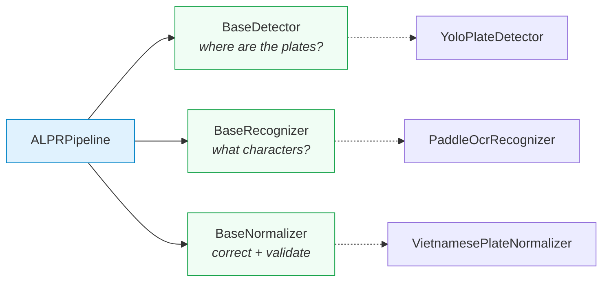

**`BaseDetector`** trả lời đúng một câu hỏi — *biển số nằm ở đâu?* — và không làm gì khác. Nó không đọc ký tự và không chạm vào hệ thống tệp ngoài việc nạp trọng số của chính nó. Hợp đồng của phương thức `detect(image) -> list[PlateDetection]` quy định ba điều kiện mà mọi cài đặt phải bảo đảm: kết quả đã được lọc theo ngưỡng tin cậy và NMS; mọi hộp bao đã được **kẹp về trong biên ảnh** để có thể dùng trực tiếp để cắt; và **danh sách rỗng là kết quả bình thường**, không bao giờ là lỗi. Điều kiện thứ ba đáng chú ý — nó buộc mọi tầng phía trên phải xử lý trường hợp "ảnh không có biển số" như một kết quả hợp lệ, thay vì như một ngoại lệ.

**`BaseRecognizer`** nhận một *ảnh biển số đã cắt*, không phải toàn cảnh, và trả về `PlateRecognition`. Điều quan trọng nhất trong hợp đồng này là điều nó **không** làm: sửa lỗi ký tự và kiểm tra định dạng không thuộc trách nhiệm của nó. Việc tách hai việc đó ra là thứ làm cho đóng góp của khối hậu xử lý trở nên **đo được** — hệ thống lưu song song `raw_ocr_text` và `plate_number`, và hiệu quả của hậu xử lý chính là hiệu số giữa hai cột.

**`BaseNormalizer`** nhận chuỗi thô và trả về cặp `(normalized_text, is_valid_format)`. Hợp đồng ghi rõ: kết quả không hợp lệ vẫn phải được **trả về**, không được loại bỏ. Loại bỏ sẽ xoá đúng những trường hợp thất bại mà chương đánh giá cần đếm.

Cả `BaseDetector` và `BaseRecognizer` đều có phương thức `warmup()` với cài đặt mặc định là không làm gì. Lý do tồn tại: lần suy luận đầu tiên trong một tiến trình chậm hơn nhiều lần các lần sau, do trọng số được nạp vào bộ nhớ và các nhân tính toán được biên dịch trễ. Gọi `warmup()` lúc khởi động chuyển chi phí đó ra khỏi yêu cầu đầu tiên của người dùng — trực tiếp phục vụ NFR-P1.

### 5.5.3. Cài đặt bộ phát hiện — `YoloPlateDetector`

`YoloPlateDetector` là **bộ chuyển đổi (adapter)** mỏng trên Ultralytics YOLO. Mục đích của lớp adapter này là giữ Ultralytics ở vị trí *chi tiết cài đặt*: không có nơi nào ngoài mô-đun này chạm vào đối tượng `Results` của Ultralytics, tensor của PyTorch hay chỉ số lớp. Ranh giới chuyển mọi thứ thành các đối tượng giá trị của riêng đồ án.

**Ultralytics được import trễ.** Câu lệnh `from ultralytics import YOLO` nằm bên trong hàm `_load_yolo_model`, không ở đầu tệp. Nhờ đó `import ai.inference.detector` vẫn rẻ, và các unit test có thể kiểm tra logic chuyển đổi mà không cần cài toàn bộ ngăn xếp ML.

**Trọng số được nạp ngay trong hàm khởi tạo**, không nạp trễ. Đây là lựa chọn có chủ ý ngược với recognizer: một tệp trọng số thiếu hoặc hỏng phải làm hệ thống **thất bại lúc khởi động**, với thông báo nêu rõ đường dẫn đã thử, thay vì thất bại ở yêu cầu đầu tiên của người dùng. Thông báo lỗi được viết kèm hướng dẫn khắc phục cụ thể:

```
Detector weights not found at '<path>'.
Train the detector first:
    python -m ai.training.train --config yolo11n_finetune.yaml
```

**Bốn chi tiết cài đặt đáng ghi nhận:**

*a) Chấp nhận nhiều định dạng trọng số.* Hằng `SUPPORTED_WEIGHT_SUFFIXES = (".pt", ".onnx", ".torchscript")`, cộng thêm khả năng nhận **thư mục** chứa mô hình OpenVINO. OpenVINO là định dạng duy nhất được hỗ trợ mà đơn vị lưu trữ là thư mục chứ không phải một tệp, nên hàm `_verify_weights_exist` phải xử lý riêng: nếu đường dẫn là thư mục, nó kiểm tra sự có mặt của tệp `.xml` để phân biệt mô hình OpenVINO thật với một thư mục ngẫu nhiên. Chi tiết này tồn tại vì OpenVINO là hướng tối ưu tốc độ trên CPU Intel — từ chối thư mục sẽ khiến cấu hình nhanh nhất trở nên không thể cấu hình được qua biến `ALPR_MODEL_PATH`.

*b) Lọc lớp có ba trường hợp.* Hàm `_resolve_plate_class_ids` quyết định chỉ số lớp nào được giữ:

| Tình huống | Hành vi | Lý do |
|---|---|---|
| Mô hình không công bố bảng tên lớp | Giữ tất cả | Bỏ hết vì thiếu metadata là một thất bại âm thầm |
| Mô hình **một lớp** (mô hình của đồ án) | Giữ tất cả | Lớp duy nhất *chính là* biển số, dù nó tên gì |
| Mô hình **nhiều lớp** | Chỉ giữ lớp khớp `PLATE_CLASS_ALIASES` | Ví dụ checkpoint COCO 80 lớp sẽ không giữ lớp nào và luôn trả danh sách rỗng — đúng, không phải lỗi |

Tập bí danh `PLATE_CLASS_ALIASES` gồm `license_plate`, `licence_plate`, `plate`, `license-plate`, `bien_so`; việc so khớp là không phân biệt hoa thường và quy `-`/khoảng trắng về `_`. Tập này tồn tại để dùng được trọng số lấy từ các bộ dữ liệu công khai, vốn đặt tên cho cùng một khái niệm theo nhiều cách khác nhau.

*c) Kẹp hộp bao ngay tại biên adapter.* YOLO có thể sinh hộp lấn ra ngoài biên ảnh một hai điểm ảnh. Hàm `_build_clamped_bbox` kẹp giá trị về `[0, width]` × `[0, height]`, hoán đổi toạ độ nếu `x2 < x1`, và trả `None` (kèm log cảnh báo) nếu hộp suy biến thành diện tích bằng không sau khi kẹp và làm tròn. Việc kẹp **tại đây** chứ không ở tầng gọi là điều cho phép hợp đồng của `BaseDetector` hứa rằng mọi hộp trả về đều dùng cắt được ngay.

*d) Định danh mô hình mang tên tệp trọng số.* Thuộc tính `name` trả về `f"yolo:{stem}{suffix}"`, ví dụ `yolo:best.pt`. Lý do: một con số benchmark chỉ tái lập được nếu nó nêu tên đúng bộ trọng số đã sinh ra nó. Chuỗi này được ghép với tên của recognizer thành định danh pipeline đầy đủ, và được endpoint `/health` công bố ra ngoài.

### 5.5.4. Cài đặt bộ nhận dạng ký tự — `PaddleOcrRecognizer`

`PaddleOcrRecognizer` bọc PaddleOCR với cấu hình PP-OCRv5 mobile. Ba đặc điểm cấu trúc:

**Khởi tạo trễ và tái sử dụng.** Máy OCR rất đắt để dựng — nó nạp nhiều mô hình và cấp phát phiên suy luận riêng — nên nó được dựng **một lần, ở lần gọi đầu tiên**, rồi tái sử dụng cho mọi ảnh sau đó. Dựng lại theo từng ảnh sẽ chiếm trọn ngân sách độ trễ.

**Ghim phiên bản mô hình.** Hằng `OCR_VERSION = "PP-OCRv5"` được truyền tường minh vào `PaddleOCR(...)` thay vì để thư viện tự chọn mặc định. Lý do: một lần nâng cấp `paddleocr` không được phép âm thầm đổi mô hình đứng sau một con số benchmark đã công bố.

**Tắt các tầng tiền xử lý mức tài liệu.** Ba tham số `use_doc_orientation_classify`, `use_doc_unwarping`, `use_textline_orientation` đều đặt `False`. Ảnh đầu vào ở đây đã là một vùng biển số đã cắt, chứa đúng một vùng văn bản; các tầng xử lý mức trang là thuần chi phí độ trễ trong bối cảnh này.

#### Phát hiện kỹ thuật: backend oneDNN làm sập suy luận trên PP-OCRv5

Đây là một phát hiện thực nghiệm đáng được ghi nhận riêng, vì nó đi ngược trực giác thông thường và vì nó có ảnh hưởng trực tiếp tới hiệu năng.

oneDNN (trước đây gọi là MKL-DNN) là thư viện nhân tính toán tối ưu của Intel dành cho CPU, và trong hầu hết các cấu hình, bật oneDNN là cách tăng tốc suy luận CPU rẻ nhất. Tuy nhiên, trên đúng nền tảng mục tiêu của đồ án — `paddlepaddle` **3.3.1**, Windows, CPU — chạy mô hình phát hiện văn bản của PP-OCRv5 qua đường oneDNN **kết thúc bằng ngoại lệ**:

```
NotImplementedError: (Unimplemented) ConvertPirAttribute2RuntimeAttribute
not support [pir::ArrayAttribute<pir::DoubleAttribute>]
```

Nguyên nhân: bộ thực thi PIR (Paddle Intermediate Representation) của PaddlePaddle không dịch được một thuộc tính của đồ thị mô hình sang dạng thuộc tính thời gian chạy mà nhân oneDNN yêu cầu. Đây không phải lỗi cấu hình của đồ án mà là khiếm khuyết ở phía thư viện, xảy ra ở giao điểm của một phiên bản PaddlePaddle cụ thể và một thế hệ mô hình cụ thể.

Cách xử lý đã cài đặt là biến phát hiện này thành một hằng số có tài liệu, thay vì một tham số truyền ngầm:

```python
DEFAULT_ENABLE_MKLDNN: Final[bool] = False
```

Với `enable_mkldnn=False`, PaddlePaddle lùi về các nhân CPU thông thường, chạy đúng mô hình đó với chi phí tốc độ vừa phải. Điểm quan trọng về mặt phương pháp: đây là **một núm điều chỉnh hiệu năng, không phải một núm điều chỉnh độ chính xác**. Khi lỗi thượng nguồn được sửa, chỉ cần lật giá trị này và đo lại; không có kết quả nhận dạng nào thay đổi do quyết định này. Việc ghi rõ điều đó trong tài liệu của hằng số là điều ngăn một người bảo trì tương lai hiểu nhầm rằng tắt oneDNN là một lựa chọn về chất lượng.

Phát hiện này cũng góp phần giải thích kết quả NFR-P1: một trong những con đường tăng tốc CPU hiển nhiên nhất đang bị chặn bởi lỗi thư viện, chứ không phải chưa được thử.

#### Lọc mảnh văn bản theo hình học

Trong quá trình đưa tầng OCR vào chạy, một chế độ hỏng lặp lại đã được quan sát và ghi nhận. CLAHE (mục 5.5.5) về bản chất **khuếch đại mọi biến thiên có trong một vùng ảnh**; ở vùng gần như đồng nhất, nhiễu cảm biến được khuếch đại có thể có đủ kết cấu để bộ phát hiện văn bản của PP-OCR kích hoạt trên đó. Trên một ảnh biển số tổng hợp, hiện tượng này sinh ra một mảnh văn bản cao 10 điểm ảnh đọc thành `"cYanmaGaYGntaYellowb"` với độ tin cậy **0,84**, nằm cạnh hai hàng ký tự thật cao 125 và 87 điểm ảnh.

Điểm mấu chốt: **ngưỡng tin cậy không tách được hai trường hợp này** — 0,84 là một điểm số hoàn toàn bình thường. Thứ tách được chúng là **hình học**. Sau phép biến đổi cắt–ghép ở mục 5.5.5, theo cấu trúc, mọi hàng ký tự hợp lệ đều chiếm một phần lớn chiều cao của dải ảnh. Do đó một mảnh thấp hơn hẳn mảnh cao nhất là hiện vật (artefact) chứ không phải ký tự biển số. Luật được cài đặt thành:

```python
MIN_FRAGMENT_HEIGHT_RATIO: Final[float] = 0.35
```

Ngưỡng được đo **so với mảnh cao nhất**, không phải so với chiều cao ảnh — nhờ đó luật không phụ thuộc vào việc khung cắt chặt hay lỏng. Hàm `_drop_short_fragments` cũng được viết để **trả nguyên đầu vào nếu không mảnh nào báo được hình học**, nên bộ lọc không bao giờ có thể xoá sạch kết quả trên một tải trọng mà nó không đo được.

#### Tổng hợp độ tin cậy

Độ tin cậy của cả biển số được tính bằng **trung bình có trọng số theo độ dài mảnh**, không phải trung bình cộng:

```python
weighted = sum(score * weight for score, weight in zip(scores, weights))
return float(min(1.0, max(0.0, weighted / total_weight)))
```

Lý do: trung bình cộng cho phép một mảnh một ký tự nhận với độ tin cậy 0,99 che lấp một mảnh bảy ký tự nhận với độ tin cậy 0,40 — trong khi trên một biển số, chính mảnh dài mới mang danh tính.

### 5.5.5. Mô-đun xử lý biển hai dòng — `two_line.py`

Đây là mục kỹ thuật quan trọng nhất của chương, vì nó là câu trả lời cài đặt cho rủi ro R-04 và là chỗ mà đặc thù của biển số Việt Nam bộc lộ rõ nhất.

#### a) Vì sao bài toán tồn tại

Các bộ nhận dạng văn bản hiện đại là mô hình CRNN/CTC. Giả định cốt lõi của chúng là **căn chỉnh đơn điệu (monotonic alignment)** giữa các cột ảnh và các ký tự đầu ra — giả định chỉ đúng khi văn bản nằm trên một dòng. Chồng lên đó, mô-đun nhận dạng của PP-OCR **resize mọi ảnh cắt về chiều cao cố định 48 điểm ảnh** [103]<!-- paddlepaddle_2026_textrecognition -->.

Hai sự thật này gặp nhau ở biển số xe máy Việt Nam. Theo QCVN 08:2024/BCA [11]<!-- bocongan_2024_qcvn08 -->, biển xe máy có kích thước 140 × 190 mm, tức tỷ lệ khung ≈ **1,36**. Đưa nguyên ảnh đó vào PP-OCR: sau khi ép về chiều cao 48 px, mỗi trong hai hàng ký tự chỉ còn khoảng **24 px chiều cao** — dưới mức mà nét chữ còn tách rời được. Kết quả là bộ nhận dạng không đọc ra gì dùng được.

Hệ quả định lượng của bố cục hai dòng đã được công bố: trên bộ dữ liệu **RodoSol-ALPR của Brazil**, hệ thống thương mại OpenALPR đạt **94,3% trên biển ô tô một dòng** nhưng chỉ **45,7% trên biển xe máy hai dòng** [7]<!-- laroca_2022_crossdataset -->[88]<!-- laroca_2022_rodosol -->.

> **Cảnh báo về phạm vi áp dụng.** Cặp số 94,3% / 45,7% được đo trên **bộ dữ liệu RodoSol-ALPR của Brazil**, **không phải dữ liệu Việt Nam** và **không phải một benchmark chung của OpenALPR**. Đồ án trích dẫn nó thuần tuý như một *dẫn chứng tương đương định lượng* cho độ khó tương đối của bố cục hai dòng so với một dòng. Giá trị của trích dẫn nằm ở chỗ nó chứng minh "biển hai dòng khó hơn" là một sự kiện đo được, chứ không phải một cảm nhận.

#### b) Ước lượng số dòng bằng tỷ lệ khung

Hàm `estimate_line_count` quyết định một ảnh cắt mang một hay hai dòng ký tự, dựa trên tỷ lệ rộng/cao:

```python
DEFAULT_TWO_LINE_AR_THRESHOLD: Final[float] = 2.5
...
line_count = 2 if aspect_ratio < threshold else 1
```

**Cần nêu rõ: đây là một heuristic do đồ án đề xuất, không phải một quy tắc pháp lý.** Không có văn bản quy phạm nào của Việt Nam quy định cách phân loại biển số từ tỷ lệ khung. Thứ mà quy chuẩn *có* cung cấp là kích thước vật lý của biển, và các kích thước đó để lại một khoảng trống rộng:

| Loại biển | Kích thước (mm) | Tỷ lệ khung | Số dòng |
|---|---|---:|:---:|
| Ô tô, biển dài | 110 × 520 | 4,727 | 1 |
| Ô tô, biển ngắn | 165 × 330 | 2,000 | 2 |
| Xe máy | 140 × 190 | 1,357 | 2 |

Không loại biển nào rơi vào khoảng giữa 2,000 và 4,727. Mọi ngưỡng đặt bên trong khoảng trống rộng 2,727 này đều tách đúng các lớp. Giá trị 2,5 được chọn **lệch về phía hai dòng**, vì đường xử lý hai dòng suy giảm êm khi gặp đầu vào một dòng (nó chỉ ghép hai nửa của cùng một hàng chữ, bộ nhận dạng vẫn đọc được), trong khi chiều ngược lại thì không.

Hạn chế đã biết và được ghi trong mã: dải tỷ lệ khoảng 2,5–3,0 là **vùng xám thật sự**. Một biển một dòng chụp ở góc nghiêng gắt có tỷ lệ *hộp bao* tụt vào vùng này. Đo trên ảnh đã nắn phối cảnh, hoặc đo trên tỷ lệ của `cv2.minAreaRect` thay vì hộp bao trục-song-song của YOLO, sẽ đáng tin cậy hơn rõ rệt. Việc định lượng tần suất ảnh hưởng của hạn chế này thuộc phần đánh giá và sẽ được trình bày ở Chương 6.

#### c) Cắt trên/dưới **có chồng lấn**

Hàm `split_two_line` cắt ảnh thành nửa trên và nửa dưới theo hai tỷ lệ:

```python
UPPER_HALF_END_RATIO: Final[float]  = 5.0 / 12.0   # 0,4167
LOWER_HALF_START_RATIO: Final[float] = 1.0 / 3.0   # 0,3333
```

Nửa trên trải `[0, 5h/12)`, nửa dưới trải `[h/3, h)`. Vì `1/3 < 5/12`, **hai nửa chồng lấn nhau một dải bằng 1/12 chiều cao biển**.

Chồng lấn là chủ ý, và lý do của nó là bất đối xứng về chi phí sai lầm. Một nhát cắt đúng giữa chiều cao sẽ **cắt ngang qua nét chữ** mỗi khi khung cắt không hoàn hảo — mà điều đó xảy ra thường xuyên: viền biển thêm phần đệm hiếm khi đối xứng, và một độ nghiêng nhỏ làm đường phân cách thật dịch đi vài điểm ảnh dọc theo chiều rộng. So sánh hai loại hỏng:

- **Cắt cụt chân chữ hàng trên hoặc đỉnh chữ hàng dưới** → thông tin bị **phá huỷ vĩnh viễn**; không hậu xử lý nào khôi phục được.
- **Để lọt vài điểm ảnh của hàng bên cạnh** → bộ nhận dạng **bỏ qua** chúng như nền.

Chồng lấn chọn loại hỏng thứ hai. Hàm cũng bảo đảm hai nửa không rỗng ngay cả với ảnh cắt chỉ cao vài điểm ảnh, nơi phép cắt số nguyên có thể làm một lát co về không hàng:

```python
upper_end  = max(upper_end, 1)
lower_start = min(lower_start, height - 1)
```

và ghi log cảnh báo nếu cấu hình tham số dẫn tới **mất chồng lấn**.

#### d) Ghép ngang bằng `np.hstack`

Hàm `merge_two_line` đưa hai nửa về cùng chiều cao rồi nối ngang:

```python
merged: ImageArray = np.hstack((resized_upper, resized_lower))
```

Chiều cao chung mặc định là `max(upper.h, lower.h, MIN_MERGE_HEIGHT)` với:

```python
MIN_MERGE_HEIGHT: Final[int] = 48
```

Con số 48 **không phải tuỳ chọn**: nó bằng đúng chiều cao đầu vào cố định của mô-đun nhận dạng PP-OCR. Sinh ra một dải ảnh thấp hơn 48 px sẽ buộc máy OCR tự phóng to một ảnh đã suy giảm, làm mất chi tiết vốn còn nguyên trong ảnh cắt gốc.

**Thứ tự đọc được bảo toàn**: nửa trên đặt bên trái. Đó đúng là thứ tự đọc của biển số hai dòng Việt Nam — mã tỉnh và sê-ri ở trên, số thứ tự ở dưới.

Toàn bộ hiệu quả của phép biến đổi nằm ở một câu: sau khi ghép, dải ảnh có tỷ lệ khung rộng gấp nhiều lần ảnh gốc, nên **một hàng ký tự duy nhất nhận trọn ngân sách 48 px chiều cao** thay vì hai hàng chia nhau. Bộ nhận dạng CRNN/CTC lúc này nhìn thấy đúng loại đầu vào mà kiến trúc của nó được thiết kế để xử lý.

Một chi tiết cài đặt nhỏ nhưng cần thiết: `np.hstack` từ chối các mảng có số chiều đuôi khác nhau, nên một nửa ảnh xám không thể xếp cạnh một nửa ảnh màu. Hàm `_match_channels` nâng cả hai về BGR khi số kênh lệch nhau.

#### e) Tiền xử lý ảnh biển — `preprocess_plate`

Ba bước nhẹ, **mỗi bước bật/tắt được độc lập** qua tham số từ khoá, để giai đoạn đánh giá có thể loại bỏ từng bước (ablation) và quy hiệu quả cho một bước cụ thể:

| Bước | Cài đặt | Lý do kỹ thuật |
|---|---|---|
| Chuyển ảnh xám | `cv2.cvtColor(..., COLOR_BGR2GRAY)` | Ký tự biển số Việt Nam không mang thông tin màu; bỏ hai kênh sắc độ loại bỏ một biến nhiễu do ánh sáng đường phố có màu |
| CLAHE | `cv2.createCLAHE(clipLimit=2.0, tileGridSize=(8,8))` | Biển là kim loại phản quang với ký tự dập nổi (nổi 1,7 mm theo QCVN 08:2024/BCA), nên đèn pha hoặc mặt trời tạo một mảng sáng chói trên một phần biển trong khi phần còn lại tối. Cân bằng biểu đồ **toàn cục** không xử lý được; cân bằng thích nghi theo ô thì được [95]<!-- sutikno_2025_clahe --> |
| Khử nhiễu | `cv2.bilateralFilter(d=5, sigmaColor=50, sigmaSpace=50)` | Lọc song phương **bảo toàn biên có chủ ý**: một phép làm mờ Gauss đủ mạnh để khử nhiễu cảm biến cũng đồng thời bo tròn các đầu nét — chính là thứ phân biệt `8` với `B` |

Tham số `clipLimit` giữ CLAHE khỏi khuếch đại nhiễu cảm biến ở các vùng nền phẳng — chính là hiện tượng đã dẫn tới bộ lọc mảnh ở mục 5.5.4.

Kết quả trả về **luôn là mảng BGR ba kênh** ngay cả khi bật chế độ ảnh xám (kênh đơn được nhân bản), để tầng gọi không phải rẽ nhánh theo số kênh.

Tham số `upscale_to_height` cho phép phóng to ảnh cắt trước khi chạy các bước còn lại. Recognizer truyền `_MIN_OCR_HEIGHT = 64` vào đây, vì ảnh biển ra khỏi bộ phát hiện thường chỉ cao 20–40 px: phóng to trước cho CLAHE nhiều điểm ảnh hơn để làm việc, và tránh để máy OCR phải tự phóng to một đầu vào đã suy giảm.

#### f) Bước cứu dòng trên — một giả thuyết hợp lý bị chính dữ liệu bác bỏ

Đây là mục có giá trị phương pháp luận cao nhất của toàn chương, vì nó ghi lại trọn vẹn một chu trình: một chế độ hỏng được quan sát trên hệ thống đang chạy, một giả thuyết sửa lỗi *nghe rất hợp lý* được đề xuất, giả thuyết đó bị **đo và bác bỏ**, và chính phép bác bỏ mới dẫn tới thiết kế đúng.

**Chế độ hỏng đã quan sát.** Một ảnh biển vàng `29E-015.66` được đưa vào hệ thống. Kết quả trả về là `015.66`, kèm cờ *sai định dạng*. Truy nguyên từng bước cho thấy hai giai đoạn đầu **không hề sai**: bộ phát hiện cắt đúng vùng biển, và `estimate_line_count` phân loại đúng là biển hai dòng. Điểm gãy nằm ở chính giai đoạn ghép: sau khi hai nửa được xếp cạnh nhau thành một dải và đưa vào OCR **một lần**, bộ phát hiện văn bản của PP-OCR chỉ tìm thấy **một** vùng chữ — vùng của hàng dưới — và bỏ hẳn cụm `29E` bên trái. Năm chữ số trần `015.66` không khớp bất kỳ bố cục biển số Việt Nam nào, nên khối kiểm tra định dạng bác bỏ nó, hoàn toàn đúng theo luật.

Điều đáng chú ý: chế độ hỏng này **khớp với hồ sơ lỗi đã đo** ở Chương 6, nơi lỗi *thiếu ký tự* chiếm ưu thế so với lỗi *nhầm ký tự* trên biển hai dòng. Mất trọn một hàng chữ chính là hình dạng mà một hồ sơ lỗi thiên về thiếu ký tự sẽ có.

**Giả thuyết đầu tiên, và vì sao nó bị bác bỏ.** Cách sửa hiển nhiên nhất là bỏ hẳn phép ghép: đọc riêng nửa trên, đọc riêng nửa dưới, rồi nối hai chuỗi. Nếu vấn đề là bộ phát hiện văn bản bỏ sót một vùng trên dải ghép, thì đọc từng nửa sẽ buộc nó phải nhìn vào cả hai. Giả thuyết này đủ hợp lý để không thể bác bỏ bằng lập luận suông, nên nó được **đo** trên 200 biển hai dòng có nhãn chuỗi (`docs/reports/15-two-line-ab.json`):

| Chiến lược | Đọc đúng | Độ chính xác chuỗi | Đọc rỗng | Thời gian trung bình |
|---|---:|---:|---:|---:|
| **A** — ghép rồi OCR một lần (thiết kế hiện tại) | 129 / 200 | **64,5%** | 2 | 340,11 ms |
| **B** — OCR từng nửa rồi nối chuỗi (giả thuyết) | 7 / 200 | **3,5%** | 9 | 391,35 ms |

Chênh lệch **−61,0 điểm phần trăm**: chiến lược A thắng ở 122 ảnh, chiến lược B thắng ở **0 ảnh**. Đây không phải một khác biệt trong sai số lấy mẫu mà là một sự sụp đổ.

Nguyên nhân của sự sụp đổ nằm ở đúng chi tiết thiết kế đã được biện minh ở mục (c): **hai nửa được cắt chồng lấn có chủ ý**. Khi hai nửa đi vào OCR riêng rẽ, dải chồng lấn rộng 1/12 chiều cao **bị đọc hai lần** và sinh ra ký tự rác nối vào giữa chuỗi. Ví dụ ghi trong báo cáo: biển `84G122593` được chiến lược A đọc thành `84-G1225.93` (chuẩn hoá về đúng `84G122593`), còn chiến lược B đọc thành `84-G124E009.01225.93`. Các ví dụ khác cùng một dạng: `36B557557` → `36-85JU2FUJ575.57`, `29B125662` → `29.JDI256.62`.

Kết luận rút ra từ phép đo — và đây là phần thực sự mang giá trị — **đảo ngược cách hiểu ban đầu về vai trò của phép ghép**. Phép ghép không chỉ là một thủ thuật để đưa hai hàng chữ về một hàng cho vừa với giả định căn chỉnh đơn điệu của CRNN/CTC. Nó còn là thứ **trao cho bộ phát hiện văn bản cơ hội loại bỏ vùng chồng lấn**: trên một dải liền mạch, vùng lặp nằm giữa hai cụm chữ và bị chính bộ phát hiện vùng gạt đi; trên hai ảnh rời, không có ngữ cảnh nào để gạt. Nói cách khác, phép ghép vừa giải quyết bài toán hình học, vừa **âm thầm sửa chính tác dụng phụ của phép cắt chồng lấn** — một quan hệ mà chỉ phép đo mới phơi bày được.

**Bản sửa cuối cùng: vá điểm mù, không thay thiết kế.** Vì chiến lược A đã được chứng minh là vượt trội, bản sửa **giữ nguyên** nó làm đường chính và chỉ bổ sung một bước phục hồi hẹp:

```python
def should_rescue_two_line(recognition: PlateRecognition) -> bool:
    return (
        recognition.line_count == 2
        and not recognition.is_valid_format
        and bool(recognition.raw_text)
    )
```

Khi và chỉ khi ba điều kiện trên cùng đúng — biển hai dòng, chuỗi **đã trượt kiểm tra định dạng**, và có chuỗi thô để nối vào — hệ thống mới tốn thêm **một** lần gọi OCR trên riêng nửa trên, ghép `upper + raw` rồi chuẩn hoá lại. Kết quả mới **chỉ được chấp nhận nếu nó qua được kiểm tra định dạng**; mọi trường hợp khác, kể cả khi bước cứu ném ngoại lệ, đều trả về nguyên kết quả cũ.

**Tính chất "không thể làm tệ đi" là một tính chất cấu trúc, không phải một kết quả thực nghiệm may mắn.** Đây là điểm cần nhấn mạnh khi bảo vệ. Cổng `should_rescue_two_line` chỉ mở khi kết quả hiện tại **đã hỏng sẵn** — nó không bao giờ chạm vào một biển đã hợp lệ. Do đó tập biển bị ảnh hưởng và tập biển đang đúng là **hai tập rời nhau**, và mệnh đề "bước cứu không thể làm giảm độ chính xác" đúng theo cấu trúc của điều kiện, chứ không phải đúng vì đã thử và chưa gặp phản ví dụ. Số đo dưới đây là *kiểm chứng* cho mệnh đề đó, không phải *căn cứ* của nó.

**Số đo trên 900 biển hai dòng, qua hai mẫu độc lập:**

| Mẫu (nguồn) | Trước | Sau | Cứu được | Làm hỏng | Tần suất kích hoạt | Thời gian trung bình |
|---|---:|---:|---:|---:|---:|---:|
| 700 mẫu, seed 7 (`15-two-line-fallback-700.json`) | 60,14% | **62,00%** | 13 | **0** | 148/700 = 21,14% | 362,41 → 383,52 ms |
| 200 mẫu, seed khác (`15-two-line-fallback.json`) | 64,5% | **65,0%** | 1 | **0** | 36/200 = 18,0% | 346,70 → 361,97 ms |

Ba điều đáng đọc từ bảng. Thứ nhất, cột "làm hỏng" bằng **0 ở cả hai mẫu**, đúng như tính chất cấu trúc dự đoán. Thứ hai, mức cải thiện là **khiêm tốn** (+1,86 và +0,5 điểm) và đồ án không trình bày nó như một bước đột phá: nó vá một điểm mù cụ thể, không đụng tới nút thắt chính là chất lượng của mô hình nhận dạng trên biển hai dòng. Thứ ba, chi phí độ trễ là **khoảng 15–21 ms trung bình mỗi biển hai dòng**, vì lần gọi OCR thêm chỉ chạy trên khoảng một phần năm số ảnh — và chỉ trên những ảnh vốn đã hỏng.

#### g) Một lỗi phương pháp đo, quan trọng hơn chính bản vá

Trong lúc cài đặt bước cứu ở mục (f), một khiếm khuyết nghiêm trọng hơn bản thân lỗi được phát hiện, và nó thuộc về **cách đồ án đo chính mình**.

Script đánh giá `ai/evaluation/ocr_accuracy.py` — nơi sinh ra các con số NFR-A4, A5, A6, A7 công bố ở Chương 6 — **không đi qua `ALPRPipeline`**. Nó gọi thẳng bộ nhận dạng và bộ chuẩn hoá, vì như vậy nhanh hơn và không cần dựng cả hệ thống. Hệ quả logic của thiết kế đó rất nặng: **mọi logic đặt ở tầng điều phối đều vô hình đối với các con số công bố**. Nếu bước cứu được cài như một phương thức riêng của `ALPRPipeline` — cách viết tự nhiên nhất — thì chương thực nghiệm sẽ đo một đường mã mà sản phẩm thật không chạy, và sẽ **báo thấp hơn** năng lực thực của hệ thống đang giao. Ở chiều ngược lại, bất kỳ logic điều phối nào *có lợi* mà chỉ nằm trong pipeline cũng sẽ khiến số công bố lệch khỏi hành vi thật.

Cách xử lý đã cài đặt là **tách bước cứu thành hai hàm tự do dùng chung**, `should_rescue_two_line` và `rescue_two_line_upper`, đặt ở cấp mô-đun trong `ai/inference/pipeline.py`; cả `ALPRPipeline` lẫn `ai/evaluation/ocr_accuracy.py` cùng import và gọi đúng hai hàm đó:

```python
# ai/evaluation/ocr_accuracy.py
from ai.inference.pipeline import rescue_two_line_upper, should_rescue_two_line
...
if should_rescue_two_line(candidate):
    rescued = rescue_two_line_upper(recognizer, normalizer, repaired, candidate)
```

Lý do của lựa chọn được ghi thẳng vào docstring của hàm, để một người bảo trì tương lai không "dọn dẹp" nó thành phương thức riêng: *"Were the rescue a method, the published NFR-A5/A6/A7 figures would measure a code path that production does not use."*

Bài học phương pháp cần nêu rõ, vì nó vượt ra ngoài phạm vi biển hai dòng: **một bộ đo đi tắt qua tầng điều phối sẽ đo một hệ thống khác với hệ thống được giao.** Khoảng cách đó không gây lỗi, không sinh cảnh báo, và chỉ lộ ra khi có người đối chiếu đường mã của bộ đo với đường mã của sản phẩm. Việc phát hiện nó ở đây đặt ra một ràng buộc chung cho phần còn lại của đồ án: mọi logic ảnh hưởng tới chuỗi biển số cuối cùng phải nằm ở nơi **cả hai** đường mã cùng gọi tới được.

### 5.5.6. Cài đặt bộ luật hậu xử lý — đóng góp kỹ thuật chính

Bộ phát hiện và bộ nhận dạng ký tự đều là mô hình có sẵn. Khối hậu xử lý thì không: các luật ở đây được rút từ quy chuẩn biển số quốc gia và là thứ biến một chuỗi ký tự gần đúng thành một biển số có thể tin được. Hai mô-đun tham gia: `plate_rules.py` (dữ liệu và hàm thuần) và `normalizer.py` (thuật toán).

`plate_rules.py` tuân thủ ba quy tắc thiết kế được ghi ngay trong tài liệu mô-đun: **thuần khiết** (không I/O, không log, không import khung, không trạng thái toàn cục khả biến); **biểu thức chính quy được sinh từ tập hợp, không viết tay** (nhóm mã tỉnh được dựng từ `PROVINCE_CODES`, nên mẫu không thể trôi khỏi bảng mà nó mã hoá); và **lớp ký tự là hằng có tên** (một hiệu chỉnh trong tương lai chạm vào một dòng, không phải chín mẫu).

#### a) `PROVINCE_CODES` — 81 mã tỉnh

```python
PROVINCE_CODES: Final[frozenset[str]] = frozenset({"11","12","14",...,"98","99"})
```

Tập gồm **81 mã** đang được sử dụng theo phụ lục Thông tư 51/2025/TT-BCA [10]<!-- bocongan_2025_tt51 --> (80 mã địa phương cộng mã 80 của Cục Cảnh sát giao thông). Song song là tập `UNUSED_PROVINCE_CODES` gồm **8 mã không bao giờ được cấp**: `13, 42, 44, 45, 46, 87, 91, 96`.

Giá trị của việc kiểm tra theo tập này thay vì theo `\d{2}` là cụ thể và đo được: nó **bác bỏ** một chuỗi như `13A-123.45`, vì mã `13` chưa từng được cấp. Với `\d{2}`, chuỗi đó sẽ được coi là biển số hợp lệ.

Việc giữ tường minh cả tập không dùng — thay vì suy ra bằng phép trừ — cho phép một test nhất quán khẳng định `PROVINCE_CODES | UNUSED_PROVINCE_CODES` phủ đúng dải `11`–`99`.

Một ghi chú về ngữ nghĩa được nêu rõ trong mã: việc sáp nhập đơn vị hành chính năm 2025 **không làm mất hiệu lực các biển số đã cấp**, nên một mã có thể trỏ tới một tỉnh không còn tồn tại như một thực thể. Đó là mối quan tâm ngữ nghĩa của tầng báo cáo, không phải mối quan tâm về định dạng.

#### b) Các lớp ký tự sê-ri

| Hằng | Tập ký tự | Vị trí áp dụng |
|---|---|---|
| `L20` | `A B C D E F G H K L M N P S T U V X Y Z` | Chữ sê-ri của biển ô tô; chữ **thứ nhất** của sê-ri biển xe máy |
| `L20B` | `A B C D E F H K L M N P R S T U V X Y Z` | Chữ **thứ hai** của sê-ri biển xe máy |
| `L11` | `A`–`H`, `K`, `L`, `M` | Sê-ri biển xanh (cơ quan nhà nước) |
| `L21` | 20 chữ chuẩn **cộng** `R` | Tập ký tự an toàn cho bộ nhận dạng |

Điểm cần chú ý: **`L20` và `L20B` là ảnh gương của nhau ở đúng hai ký tự.** `L20` chứa `G` và không chứa `R`; `L20B` chứa `R` và không chứa `G`. Bất đối xứng này là thật và có hệ quả: `29-AR 123.45` là hợp lệ trong khi `29-AG 123.45` thì không.

`L21` tồn tại vì một lý do riêng, thuộc về thiết kế mô hình chứ không thuộc về luật: **một mô hình có tập ký tự dựng từ "20 chữ cái" thì không bao giờ có thể dự đoán ra `R`**, và do đó sẽ sai **có hệ thống** trên mọi biển xe máy mang `R` ở vị trí sê-ri thứ hai. Đó là loại sai lầm mà không hậu xử lý nào sửa được, vì thông tin đã bị huỷ ở tầng mô hình.

Cùng logic đó dẫn tới việc tách đôi tập ký tự huấn luyện và tập ký tự kiểm tra:

```python
OCR_SAFE_CHARSET: Final[str]     = digits + 21 chữ hợp pháp   # 31 ký tự
OCR_TRAINING_CHARSET: Final[str] = digits + "A..Z"            # 36 ký tự
```

Huấn luyện trên 36 và ràng buộc về 31 về sau là lựa chọn chủ ý: một mô hình **được phép** dự đoán ký tự bất hợp pháp sẽ tạo ra sai lầm **quan sát được, ghi log được, sửa được**, trong khi một mô hình **không thể về mặt kiến trúc** dự đoán một ký tự sẽ tạo ra sai lầm vô hình.

Tập `EXCLUDED_LETTERS = {I, J, O, Q, W}` gồm 5 chữ bị loại khỏi hệ thống biển số trên toàn quốc. Chính việc loại `I`, `O` và `Q` là thứ làm cho việc sửa lỗi OCR trở nên khả thi ở đây: không gian ứng viên tại một vị trí chữ đã bị chính quy chuẩn cắt bớt, và nhiều nhầm lẫn co lại còn đúng một ứng viên. (Ghi chú hiệu chỉnh: con số "6 chữ bị loại" từng bao gồm `R` đã được sửa — `R` vẫn hợp lệ ở vị trí sê-ri thứ hai của xe máy và trong mã `RM`/`R`.)

#### c) `POSITION_MASKS` và ký tự đại diện `?` ở chỉ số 3

Đây là chi tiết cài đặt quan trọng nhất của toàn bộ khối hậu xử lý.

```python
POSITION_MASKS: Final[dict[str, str]] = {
    "car_5":         "DDLDDDDD",
    "car_4":         "DDLDDDD",
    "motorcycle_9":  "DDL?DDDDD",
}
```

trong đó `D` = vị trí **bắt buộc là chữ số**, `L` = vị trí **bắt buộc là chữ cái**, `?` = **ký tự đại diện, tuyệt đối không được ép kiểu**.

Mặt nạ được chọn **thuần tuý theo độ dài chuỗi đã làm sạch**:

```python
MASK_BY_LENGTH = {7: car_4, 8: car_5, 9: motorcycle_9}
```

**Vì sao `?` ở chỉ số 3 là bắt buộc.** Hai kiểu biển xe máy cùng có 9 ký tự nhưng khác nhau ở đúng vị trí này:

- Kiểu mới (cấp từ 15/08/2023): sê-ri hai chữ cái — `29AA12345`
- Kiểu cũ (trước 15/08/2023, **vẫn còn hiệu lực lưu hành**): sê-ri chữ + số — `29B112345`

Nếu tách chúng thành hai mặt nạ `DDLLDDDDD` và `DDLDDDDDD`, việc ép kiểu tại chỉ số 3 trở thành bắt buộc, và hệ quả đã được kiểm chứng bằng chạy thật là **một trong hai kiểu bị phá huỷ**:

```
29AA12345 + 'DDLDDDDDD' -> 29A412345   phá kiểu mới
29B112345 + 'DDLLDDDDD' -> 29BL12345   phá kiểu cũ
29AA12345 + 'DDL?DDDDD' -> 29AA12345   đúng
29B112345 + 'DDL?DDDDD' -> 29B112345   đúng
```

Chỉ số 3 của chuỗi 9 ký tự là **vị trí duy nhất trong toàn bộ hệ thống biển số Việt Nam mà cả chữ cái lẫn chữ số đều hợp lệ**. Mặt nạ không được phép khẳng định điều ngược lại — và cần nhấn mạnh rằng chính *mặt nạ*, chứ không phải tài liệu chú thích, mới là thứ quyết định hành vi của hàm.

Nhánh `?` được viết tường minh trong `apply_position_rules` chứ không để rơi vào `else`, vì nó là một **luật có chủ ý**, không phải hệ quả ngẫu nhiên của thứ tự điều kiện:

```python
for char, kind in zip(text, mask, strict=True):
    if kind == MASK_WILDCARD:
        out.append(char)                       # không tra bảng nào cả
    elif kind == MASK_DIGIT and char.isalpha():
        out.append(TO_DIGIT.get(char, char))
    elif kind == MASK_LETTER and char.isdigit():
        out.append(TO_LETTER.get(char, char))
    else:
        out.append(char)
```

Trường hợp 8 ký tự (nhập nhằng giữa ô tô và xe máy kiểu cũ) **không cần mặt nạ thay thế**: cả hai cách đọc áp đặt *cùng* một ràng buộc kiểu `DDLDDDDD`, chỉ khác nhau ở cách diễn giải nhóm.

#### d) Hai bảng ánh xạ nhầm lẫn và tính **không đối xứng** của chúng

```python
TO_DIGIT = {"O":"0","Q":"0","D":"0","I":"1","J":"1","L":"1",
            "Z":"2","A":"4","S":"5","G":"6","T":"7","B":"8"}

TO_LETTER = {"0":"D","1":"L","2":"Z","3":"B","4":"A",
             "5":"S","6":"G","7":"T","8":"B"}
```

`TO_DIGIT` chỉ được áp dụng tại vị trí mặt nạ đánh `D`; `TO_LETTER` chỉ tại vị trí đánh `L`.

**Điểm cốt lõi: ánh xạ không đối xứng, và đó chính là phát hiện trung tâm.** `O -> 0` là đúng, nhưng `0 -> O` thì **không bao giờ đúng**, bởi vì `O` không phải một chữ sê-ri hợp lệ. Với cả `O` và `Q` đều bị loại khỏi hệ thống biển số, `D` là ứng viên đồng hình duy nhất còn lại. Vì vậy chiều đúng là:

```
O -> 0    tại vị trí chữ số
0 -> D    tại vị trí chữ cái
```

Đây là một ví dụ điển hình của việc **tri thức miền thay thế cho dữ liệu**: một bảng nhầm lẫn đối xứng suy ra từ hình dạng glyph sẽ sai ở đúng chỗ mà quy chuẩn đã loại trừ ứng viên.

Một quy tắc an toàn thứ hai: **ký tự không có mục trong bảng áp dụng thì được giữ nguyên**, không bao giờ bị thay bằng ký tự giữ chỗ. Chuỗi khi đó đơn giản là trượt kiểm tra biểu thức chính quy — đó chính là kiểu thất bại có kiểm soát mà thiết kế mong muốn: `3OB12E45` trở thành `30B12E45`, **không** trở thành `30B12?45`. Ký hiệu `?` thuộc về mặt nạ và không bao giờ xuất hiện trong đầu ra.

**Cần ghi nhận trung thực về nguồn gốc của hai bảng này.** Chúng được suy ra từ lập luận về hình dạng ký tự, **không phải từ đo đạc**. Một số cặp — đáng chú ý là `L -> 1` — là phỏng đoán yếu. Việc thay thế hai bảng này bằng bảng trích từ **ma trận nhầm lẫn 36×36 đo được ở mức ký tự**, chỉ giữ các cặp có tần suất nhầm lẫn vượt ngưỡng thống kê, thuộc phần đánh giá và sẽ được trình bày ở Chương 6. Trình bày bảng hiện tại như một **giả thuyết cần kiểm chứng** vừa trung thực hơn vừa mạnh hơn về mặt học thuật so với trình bày nó như một kết quả đã chốt.

#### e) Thuật toán chuẩn hoá

`VietnamesePlateNormalizer.normalize_detailed` thực hiện luồng sau:

```mermaid
flowchart TD
    A["Chuỗi OCR thô"] --> B["clean_text: gập Đ→D,<br/>viết hoa, xoá mọi dấu phân cách"]
    B --> C{"Rỗng?"}
    C -->|Có| Z1["Trả về: không hợp lệ"]
    C -->|Không| D{"Đã khớp một mẫu<br/>dân sự sẵn?"}
    D -->|Có| Z2["Hợp lệ — TRẢ NGUYÊN,<br/>không sửa gì"]
    D -->|Không| E{"Độ dài trong 7..9?"}
    E -->|Không| Z3["Thất bại có kiểm soát,<br/>vẫn trả về chuỗi"]
    E -->|Có| F["Áp mặt nạ vị trí<br/>(bỏ qua ký tự ?)"]
    F --> G{"Khớp mẫu<br/>sau khi sửa?"}
    G -->|Có| Z4["Hợp lệ — ghi log<br/>danh sách ký tự đã sửa"]
    G -->|Không| Z5["Thất bại có kiểm soát,<br/>vẫn trả về chuỗi"]

    style Z2 fill:#f0fdf4,stroke:#16a34a
    style Z4 fill:#f0fdf4,stroke:#16a34a
    style Z1 fill:#fef2f2,stroke:#dc2626
    style Z3 fill:#fef2f2,stroke:#dc2626
    style Z5 fill:#fef2f2,stroke:#dc2626
```

Ba nguyên tắc vận hành mang tính chịu lực:

1. **Thử biểu thức chính quy *trước* khi sửa.** Nếu chuỗi đã hợp lệ, mọi chỉnh sửa chỉ có thể làm hỏng nó.
2. **Không bao giờ vứt bỏ.** Chuỗi không sửa được vẫn được trả về với `is_valid_format=False` và được tầng gọi lưu vào CSDL.
3. **Giữ chuỗi thô.** Tầng gọi lưu nó vào cột `raw_ocr_text`. So sánh thô với đã chuẩn hoá là **cách duy nhất** đo được đóng góp của khối này — cũng chính là lý do khối này nằm ngoài recognizer.

Kết quả trả về là một `NormalizationOutcome` bất biến (frozen dataclass) mang đầy đủ: chuỗi thô, chuỗi đã làm sạch, chuỗi cuối, cờ hợp lệ, kết quả phân loại, và **danh sách bộ ba `(chỉ số, trước, sau)` cho từng ký tự đã bị sửa** — đây là dấu vết kiểm toán (audit trail) mà chương đánh giá dựa vào.

#### f) Xử lý nhập nhằng bằng số dòng

Hai nhập nhằng đã được ghi nhận và kiểm chứng:

| Nhập nhằng | Ví dụ | Giải quyết được bằng số dòng? |
|---|---|---|
| Ô tô / xe máy kiểu cũ (8 ký tự) | `29B11234` | **Một phần** |
| Mã đặc biệt / xe máy kiểu mới (9 ký tự) | `29LD12345` | **Không** |

Cách xử lý cài đặt phản ánh chính xác mức độ mà thông tin cho phép:

- `line_count == 1` **chứng minh** chuỗi là biển ô tô, vì xe máy luôn là biển hai dòng → nhập nhằng biến mất.
- `line_count == 2` **không chứng minh gì cả**: biển ô tô ngắn cũng là hai dòng → cặp vẫn nhập nhằng và **cờ `is_ambiguous` vẫn được giữ**.

Khẳng định ngược lại sẽ là bịa ra thông tin mà đầu vào không chứa. `KindDecision` do đó trả về *một tập ứng viên* kèm cờ nhập nhằng, chứ không phải một phán quyết duy nhất.

Thứ tự ưu tiên trong `PATTERNS_BY_KIND` cũng được chọn có lý do: `DIPLOMATIC` đứng đầu vì hình dạng của nó không thể nhầm; `SPECIAL` đứng trước các mẫu xe máy vì danh sách mã đặc biệt là đóng và hiếm, nên một lần khớp ở đó gần như chắc chắn đúng; `MILITARY` đứng cuối vì nó là trường hợp **nhận-ra-để-loại-trừ** — biển quân đội khớp `RE_MILITARY` nhưng **không** nằm trong `CIVIL_KINDS`, nên không bao giờ được báo là biển dân sự hợp lệ.

### 5.5.7. Ghép thành `ALPRPipeline` bằng tiêm phụ thuộc

`ALPRPipeline` là một **đối tượng tổ hợp**: nó không giữ mô hình nào và không tự thực hiện suy luận. Toàn bộ trách nhiệm của nó là sắp thứ tự các giai đoạn, cắt ảnh ở giữa, **đo thời gian từng giai đoạn** và **cô lập lỗi ở mức từng biển số**.

**Tiêm phụ thuộc, không phải factory.** Ba giai đoạn được truyền vào hàm khởi tạo và không bao giờ được lớp này tự dựng:

```python
pipeline = ALPRPipeline(
    detector=YoloPlateDetector(config),
    recognizer=PaddleOcrRecognizer(config),
    normalizer=VietnamesePlateNormalizer(),
    config=config,
)
```

Hàm `build_default_pipeline()` tồn tại như một **tiện ích bọc quanh lớp**, không phải một phần của lớp: lớp không hề biết đến sự tồn tại của factory. Đó là điều cho phép một unit test dựng pipeline từ ba đối tượng giả mà không cần cài bất kỳ thời gian chạy ML nào — và là điều được test kiến trúc ở mục 5.5.1 kiểm chứng tự động. Trong `build_default_pipeline`, ba lớp cụ thể được import **bên trong thân hàm** chứ không ở cấp mô-đun, chính vì mục đích này.

**Đo thời gian theo giai đoạn.** `PipelineResult.stage_times` luôn chứa đủ năm khoá cố định:

```python
STAGE_NAMES = ("detect", "crop", "ocr", "normalize", "total")
```

Tập khoá cố định và đầy đủ cho phép bộ benchmark dựng bảng mà không phải dò khoá lúc chạy, và làm cho một giai đoạn không hề chạy báo `0.0` thay vì vắng mặt. Đây chính là thứ cho phép phân rã độ trễ theo giai đoạn (trên `best.pt`: OCR ~64,3%, detect ~34,2%) — không có phân rã thì con số tổng chỉ nói rằng hệ thống chậm, không nói phải tối ưu chỗ nào; và cũng chính nó giúp phát hiện con số cũ "93,3%" là tạo tác của một lần đo trên hệ thống có lỗi crop.

**Chính sách thất bại có phân tầng.** Hai mức được xử lý khác nhau, và sự khác nhau là chủ ý:

| Loại thất bại | Xử lý | Lý do |
|---|---|---|
| Ảnh không có biển số | Trả `PipelineResult` rỗng | Kết quả bình thường, không phải lỗi |
| OCR hỏng trên **một** biển số | Biển đó trả về `recognition=None`, các biển còn lại vẫn xử lý | Mất cả khung hình vì một ảnh cắt không đọc được là vứt bỏ dữ liệu tốt |
| Bộ phát hiện hỏng | Ném `DetectionError` | Nếu bộ phát hiện hỏng thì không còn gì để báo cáo về ảnh này |
| Chuẩn hoá hỏng (lỗi luật) | Giữ nguyên `PlateRecognition` thô, ghi log `exception` | Không bao giờ mất một biển số vì một lỗi trong bộ luật |

Việc bắt cả `Exception` chung (ngoài `ALPRError`) ở tầng OCR là chủ ý và được chú thích trong mã: một máy OCR của bên thứ ba có thể ném bất cứ thứ gì.

**Cắt ảnh có kẹp lại lần hai.** Hợp đồng của `BaseDetector` đã hứa hộp bao được kẹp, nhưng `_crop` vẫn kẹp lại:

```python
x1 = max(0, min(bbox.x, width));  y1 = max(0, min(bbox.y, height))
x2 = max(x1, min(bbox.x2, width)); y2 = max(y1, min(bbox.y2, height))
```

Lý do được ghi rõ: cắt ảnh là **nơi duy nhất** mà một sai lệch một đơn vị tạo ra một mảng rỗng âm thầm thay vì một lỗi, và một bộ phát hiện của bên thứ ba cắm vào qua `BaseDetector` có thể không tôn trọng hợp đồng cẩn thận như vậy. Ảnh cắt được trả về là một **bản sao**, không phải một khung nhìn (view): ảnh cắt sống lâu hơn khung hình của tầng gọi trong chế độ video, và một view sẽ ghim toàn bộ khung hình trong bộ nhớ.

**Dò khả năng mở rộng thay vì giả định.** Phương thức `normalize_detailed(raw, line_count=...)` **không** thuộc giao diện `BaseNormalizer`. Pipeline do đó *dò* nó thay vì giả định có:

```python
detailed = getattr(self._normalizer, "normalize_detailed", None)
if callable(detailed):
    outcome = detailed(raw_source, line_count=recognition.line_count)
else:
    text, is_valid = self._normalizer.normalize(raw_source)
```

Một normalizer chỉ cài đặt phương thức của giao diện vẫn hoạt động — chỉ là không có phần giải quyết nhập nhằng bằng số dòng. Đây là cách mở rộng năng lực mà không phá vỡ hợp đồng.

### 5.5.8. Nhận dạng họ biển và màu nền — `plate_color.py` và phép hợp nhất hai nguồn bằng chứng

#### a) Vấn đề đã quan sát: thông tin được tính ra rồi bị vứt đi

Một ảnh biển đỏ quân đội `KV6938` được đưa vào hệ thống. OCR đọc **đúng** chuỗi ký tự ở độ tin cậy 0,999. Giao diện hiển thị: **"Sai định dạng biển số"**.

Câu thông báo đó sai về mặt phát biểu, chứ không sai về mặt tính toán. Biển quân đội **là** một biển số hợp lệ; nó chỉ nằm ngoài hệ đăng ký dân sự, nên nó khớp `RE_MILITARY` mà không thuộc `CIVIL_KINDS` và do đó nhận `is_valid_format = False` — đúng như mục 5.5.6f mô tả. Vấn đề là ở chỗ toàn bộ ngữ cảnh giải thích *vì sao* cờ đó bằng `False` đã bị mất trên đường đi.

Truy nguyên cho thấy hai thông tin đã **được tính ra rồi bị vứt bỏ** trước khi tới cơ sở dữ liệu:

1. **Họ biển.** `VietnamesePlateNormalizer.normalize_detailed` đã phân loại chuỗi vào một trong chín giá trị `PlateKind` — `car`, `motorcycle_new`, `motorcycle_old`, `blue_car`, `blue_motorcycle`, `special`, `diplomatic`, `military`, `unknown` — tức tám họ biển cộng một giá trị "không xác định". Kết quả này nằm trong `NormalizationOutcome` và bị `ALPRPipeline._normalize` bỏ qua.
2. **Chuỗi hiển thị.** `format_for_display` đã biết dựng lại dấu phân cách đúng như trên biển vật lý (`29E01566` → `29E-015.66`, `80001NG01` → `80-001-NG-01`). Kết quả này cũng bị bỏ qua, nên giao diện hiển thị chuỗi trần.

Bản sửa vì thế gồm hai phần độc lập: **giữ lại** những gì đã tính (mục d và mục 5.6.2), và **bổ sung một nguồn bằng chứng mà chuỗi ký tự về nguyên tắc không thể mang** — màu nền.

#### b) Vì sao màu là một nguồn bằng chứng *bổ trợ*, không phải thừa

Điểm cốt lõi của thiết kế này là hai nguồn bằng chứng **bù trừ cho nhau**: mỗi nguồn nhìn thấy đúng thứ nguồn kia mù.

| Loại xe | Màu nền | Họ biển suy từ chuỗi |
|---|---|---|
| Ô tô cá nhân | trắng | `car` |
| Ô tô kinh doanh vận tải | **vàng** | `car` — **trùng hệt** |
| Xe cơ quan nhà nước | xanh | `blue_car` |
| Xe quân đội | đỏ | `military` |
| Xe ngoại giao | **trắng** — trùng hệt | `diplomatic` |

Hai hàng in đậm là toàn bộ lý do mô-đun này tồn tại. Theo Thông tư 79/2024/TT-BCA, biển vàng của xe kinh doanh vận tải mang **đúng cùng một bố cục ký tự** với biển trắng của xe cá nhân: `29E-015.66` là một chuỗi hợp lệ cho cả hai. Không lượng công sức nào bỏ vào biểu thức chính quy phân biệt được chúng, vì **khác biệt không nằm trong chuỗi**. Ngược lại, biển ngoại giao có nền trắng như biển cá nhân, nên **màu cũng không đủ** — chỉ chuỗi mới nói được nó là biển ngoại giao. Chỉ *cặp* (chuỗi, màu) mới định danh được loại phương tiện, và đó là lý do cả hai đều được lưu.

#### c) Thiết kế `classify_plate_color` — ba quyết định và các ngưỡng

Hàm `classify_plate_color(plate_image) -> ColorEstimate` chuyển ảnh cắt sang không gian **HSV**, đếm tỷ lệ điểm ảnh rơi vào từng dải màu, và chọn dải chiếm tỷ lệ lớn nhất.

**Quyết định 1 — chỉ lấy mẫu vùng giữa ảnh cắt.**

```python
CENTRE_INSET: Final[float] = 0.18
```

Mỗi cạnh bị cắt bỏ 18%, giữ lại khoảng hai phần ba ở giữa theo mỗi trục. Lý do là một sự thật đo được về đầu ra của bộ phát hiện: **khung phát hiện hiếm khi ôm sát biển**, nên dải ngoài thường chứa cản xe, kính chắn gió hoặc mặt đường. Trường hợp hỏng cụ thể mà tham số này ngăn chặn: **một chiếc xe sơn đỏ đứng sau một biển trắng sẽ thắng phiếu bầu màu nếu lấy mẫu cả rìa ảnh.** Chọn 18% là một đánh đổi có hai đầu: cắt ít quá thì thân xe vẫn lọt vào, cắt nhiều quá thì mẫu còn quá ít điểm ảnh để biểu đồ ổn định.

**Quyết định 2 — không loại trừ điểm ảnh của ký tự.** Cách làm "đúng sách vở" là phân đoạn chữ rồi chỉ đếm nền. Cài đặt này **cố ý không làm vậy**, vì hai lý do: ký tự chiếm thiểu số diện tích biển, và ngưỡng của mỗi dải được đặt theo *tỷ lệ trên vùng lấy mẫu* chứ không đòi hỏi *đa số tuyệt đối*. Thêm một bước phân đoạn glyph sẽ đưa vào một khâu mong manh hơn hẳn khâu mà nó bảo vệ.

**Quyết định 3 — trả `UNKNOWN` thay vì đoán.**

```python
MIN_DOMINANT_FRACTION: Final[float] = 0.30
```

Dải thắng phải chiếm ít nhất 30% vùng lấy mẫu mới được gọi tên; dưới ngưỡng đó, kết quả là `PlateColor.UNKNOWN`. Ngưỡng được đặt theo **chiều sai lầm nào đắt hơn**: gọi sai một màu là khẳng định một loại phương tiện mà hệ thống không chứng minh được, còn thừa nhận không đọc được màu chỉ là ghi nhận trung thực một giới hạn.

Các ngưỡng còn lại, theo dải giá trị HSV của OpenCV (H 0–179, S 0–255, V 0–255):

| Hằng số | Giá trị | Vai trò |
|---|---|---|
| `_YELLOW_HUE` | 15–42 | Dải sắc độ của biển vàng |
| `_BLUE_HUE` | 90–138 | Dải sắc độ của biển xanh |
| `_RED_HUE_LOW` / `_RED_HUE_HIGH` | 0–10 và 165–179 | Đỏ **vắt qua điểm 0** của vòng sắc độ nên phải khai báo thành hai dải |
| `_CHROMATIC_MIN_SATURATION` | 70 | Dưới mức này điểm ảnh là xám, sắc độ của nó vô nghĩa |
| `_CHROMATIC_MIN_VALUE` | 45 | Dưới mức này là bóng tối, sắc độ không tin được |
| `_WHITE_MAX_SATURATION` / `_WHITE_MIN_VALUE` | 65 / 105 | Định nghĩa "trắng" là **sáng và bão hoà thấp**, không dùng sắc độ |

Hai cổng `_CHROMATIC_MIN_*` là chi tiết dễ bị bỏ sót nhưng quyết định độ ổn định: sắc độ không có ý nghĩa ở mức bão hoà thấp — một điểm ảnh gần xám vẫn báo về *một* sắc độ nào đó — nên nếu thiếu cổng này, nhiễu trên một biển trắng sẽ bị **rải đều vào các dải màu** và làm nhiễu phiếu bầu.

`ColorEstimate` mang theo cả **tỷ lệ của từng dải, kể cả dải thua**, chứ không chỉ phán quyết. Đây là lựa chọn phục vụ khả năng kiểm chứng: một ca ở ranh giới dễ soát lại hơn nhiều khi các con số dẫn tới nó còn nguyên, và bộ đo có thể báo cáo một phân bố thay vì một nhãn trần.

Cuối cùng, hàm **không bao giờ ném ngoại lệ**: ảnh rỗng, ảnh một kênh hay ảnh quá nhỏ đều trả `UNKNOWN` với độ tin cậy 0. Một biển không đọc được màu là một kết quả bình thường phải được ghi lại, đúng như một biển không đọc được chữ.

#### d) Hợp nhất chuỗi và màu để phân giải nhập nhằng biển xanh — kèm một ràng buộc an toàn

Mục 5.5.6f đã nêu: `KindDecision` trả về **một tập ứng viên** kèm cờ nhập nhằng, chứ không phải một phán quyết duy nhất. Chuỗi `80A12345` là một ví dụ điển hình — bộ luật ký tự trả về **bốn ứng viên ngang nhau** (`car`, `motorcycle_old`, `blue_car`, `blue_motorcycle`) và đánh dấu kết quả là nhập nhằng, vì cả bốn đều là cách đọc hợp pháp. Normalizer buộc phải chọn một, và chọn cái phổ biến nhất: `car`. Câu trả lời đó đúng trong đa số trường hợp và **sai âm thầm với mọi xe cơ quan nhà nước**, vốn mang đúng các ký tự đó trên nền **xanh**.

Hàm `refine_kind_with_color(outcome, color, line_count)` giải quyết đúng chỗ này:

```python
_COLOR_PREFERRED_KINDS: Final[dict[str, tuple[str, ...]]] = {
    "blue": ("blue_car", "blue_motorcycle"),
}
```

**Ràng buộc an toàn là phần quan trọng nhất của hàm, quan trọng hơn tác dụng của nó.** Màu chỉ được phép **nâng cấp một ứng viên mà chuỗi đã coi là hợp lý** — không hơn:

```python
if original not in candidates:
    # Chuỗi đã được phân loại dứt khoát -- military, diplomatic, special.
    # Màu không được phép lật một phán quyết chắc chắn.
    return original
```

Hệ quả của ràng buộc này là mệnh đề đảm bảo cụ thể: **màu không thể bịa ra một họ biển mà bộ luật ký tự đã bác bỏ.** Điều tệ nhất một màu đọc sai có thể gây ra là chọn nhầm phần tử trong một tập mà chính chuỗi đã tuyên bố là ngang khả năng. Nói cụ thể theo ca hỏng đã gặp: **một biển quân đội bị đọc nhầm màu thì vẫn là biển quân đội**, vì `military` là một phán quyết dứt khoát của tầng chuỗi và không nằm trong tập ứng viên nhập nhằng.

Một ràng buộc phụ nữa: khi họ biển được ưu tiên có cả biến thể ô tô lẫn xe máy, việc chọn giữa hai biến thể dựa trên `line_count` — và nếu `line_count` mâu thuẫn với cả hai, hàm **trả về phán quyết gốc**. Số dòng là đại lượng *đo được* từ hình học ảnh, còn màu là đại lượng *suy ra* từ thống kê điểm ảnh; khi hai bên bất đồng, bên đo được thắng.

Chỉ có màu **xanh** nằm trong bảng `_COLOR_PREFERRED_KINDS`. Đây là lựa chọn hẹp có chủ ý: xanh là màu duy nhất mà chuỗi ký tự bó tay hoàn toàn và bộ luật tự đánh dấu là nhập nhằng. Vàng thì không cần cơ chế này — nó không đổi *họ* biển, chỉ đổi *mục đích sử dụng* của cùng một họ `car`, nên được lưu như một trường độc lập chứ không nâng cấp ứng viên nào.

#### e) Độ chính xác đo được của bộ nhận màu

Bộ phân loại màu được đo trên bộ dữ liệu **`nguyenluanai/license-plate-color` v4** (Roboflow Universe, giấy phép **CC BY 4.0**) — một bộ ảnh biển đã cắt sẵn, **có nhãn màu do người gán**, và quan trọng nhất: **bộ phân loại chưa từng được hiệu chỉnh theo bộ này**. Các ngưỡng ở mục (c) được đặt từ ảnh cắt do chính bộ phát hiện của đồ án sinh ra, nên phép đo dưới đây là một phép đo **ngoài dữ liệu hiệu chỉnh**.

Kết quả trên 1.565 ảnh có nhãn màu dùng được (`docs/reports/19-color-accuracy.json`):

| Lớp nhãn người gán | Số ảnh | Đúng | Độ chính xác |
|---|---:|---:|---:|
| Biển vàng | 694 | 684 | **98,56%** |
| Biển trắng | 808 | 787 | **97,40%** |
| Biển xanh | 63 | 61 | **96,83%** |
| **Tổng** | **1.565** | **1.532** | **97,89%** |

Ba điều phải nói kèm để con số này không bị đọc rộng hơn sự thật.

**Thứ nhất, 542 ảnh đã bị loại khỏi phép tính, và lý do loại phải nêu rõ.** Đó là toàn bộ lớp `bien_unknown` của bộ dữ liệu — ảnh chụp đêm hoặc hồng ngoại bị lỗi cân bằng trắng, ám màu tím, mà **chính người gán nhãn cũng không đọc được màu nền**. Chấm điểm bộ phân loại trên các ảnh không có đáp án đúng là vô nghĩa; giữ chúng trong mẫu số cũng vậy. Việc loại chúng được ghi tường minh trong tệp báo cáo chứ không ẩn đi.

**Thứ hai, dạng lỗi chủ đạo đã được định vị:** 21 ảnh biển trắng bị gọi thành xanh — chiếm hai phần ba tổng số 33 ca sai. Đây là hệ quả trực tiếp của việc bộ dữ liệu này có mức bão hoà rất thấp ở lớp "trắng" (nhiều ảnh gần như ảnh xám), khiến một số điểm ảnh ám lạnh vượt được cổng `_CHROMATIC_MIN_SATURATION`.

**Thứ ba, phạm vi của phép đo hẹp hơn phạm vi của mô-đun.** Bộ này **không chứa biển đỏ và không chứa biển ngoại giao**, nên hai nhánh đó của `classify_plate_color` chưa có số đo — chúng chỉ được kiểm chứng bằng ảnh lẻ và bằng unit test. Đây là một hạn chế thật, được nêu lại ở mục 7.3 của Chương 7.

> **Ghi chú phạm vi bắt buộc.** Mọi ảnh trong bộ `license-plate-color` đều bị **kéo méo về khuôn 640×640** trước khi người đóng góp tải lên. Bộ này vì vậy **không dùng được để đánh giá OCR**, vì bước `estimate_line_count` (mục 5.5.5b) dựa trên tỷ lệ khung hình và phép kéo phá huỷ chính đại lượng đó. Màu nền thì **không** bị phép kéo làm thay đổi, nên câu hỏi về màu là câu hỏi duy nhất mà bộ này trả lời được — và nó chỉ được dùng cho đúng câu hỏi đó.

---

## 5.6. Cài đặt backend

### 5.6.1. Cấu trúc phân tầng và luồng phụ thuộc

Backend gồm 21 mô-đun Python (không kể tám tệp `__init__.py`), trong đó 19 mô-đun ứng dụng và 2 tệp thuộc Alembic, được tổ chức thành năm tầng, với **luồng phụ thuộc một chiều nghiêm ngặt**:

```mermaid
graph TD
    R["api/routes/<br/>detection · health · history · statistics"] --> D["api/deps.py<br/>tiêm phụ thuộc"]
    D --> S["services/<br/>detection · history · statistics · storage"]
    S --> RE["repositories/<br/>base · detection · job"]
    RE --> M["models/<br/>database · detection (ORM)"]
    S --> AI["ai.inference<br/>(gói ngoài)"]
    S --> SC["schemas/<br/>Pydantic vào–ra"]
    R --> SC
    C["core/<br/>config · logging · exceptions"] -.->|"mọi tầng dùng"| S

    style AI fill:#f0fdf4,stroke:#16a34a
    style C fill:#fef9c3,stroke:#ca8a04
```

Ba quy tắc phân tầng được cài đặt và kiểm chứng:

**Router không viết truy vấn.** Mọi truy cập dữ liệu đi qua tầng repository. Đây là điều làm cho một thay đổi lược đồ có bán kính ảnh hưởng bằng một tệp thay vì bằng số endpoint.

**Repository `flush`, không bao giờ `commit`.** Đây là quy tắc quan trọng nhất của tầng này và không phải sở thích hình thức. Lưu một tác vụ cùng sáu biển số tìm được trong đó là **một** thao tác logic: nếu biển thứ tư chèn hỏng, kết quả đúng phải là không lưu gì cả. Một repository `commit` sau mỗi `create` sẽ để lại ba biển số và một tác vụ tự nhận là đã hoàn tất — một trạng thái mà không đoạn mã nào sau đó phát hiện được là hỏng, vì từng dòng riêng lẻ đều hợp lệ. `flush` vẫn cung cấp đúng thứ mà tầng gọi cần từ một `commit`: câu lệnh được gửi xuống CSDL, nên khoá chính tự tăng được điền và **vi phạm ràng buộc nổi lên ngay tại dòng gây ra nó**. Tầng service sở hữu ranh giới giao dịch.

**Khoá sắp xếp đi qua danh sách cho phép tường minh.** `BaseRepository.paginate` phân giải cột sắp xếp qua một ánh xạ, **không** qua `getattr(model, name)`. Khác biệt có ý nghĩa vì khoá sắp xếp đến từ chuỗi truy vấn: `getattr` sẽ chấp nhận bất kỳ tên thuộc tính nào, biến `?sort_by=metadata` thành lỗi 500 hình dạng `AttributeError` và `?sort_by=job` thành một phép join ngoài ý muốn. Phân giải qua ánh xạ khiến một khoá lạ trở thành lỗi 400 sạch sẽ.

Ngoài ra `MAX_PAGE_SIZE = 200` chặn cứng `?page_size=1000000` — nếu không, một tham số truy vấn duy nhất có thể nạp toàn bộ bảng lịch sử vào bộ nhớ.

**Tầng `core/` được mọi tầng dùng nhưng không phụ thuộc tầng nào**: cấu hình, ghi log và cây ngoại lệ.

### 5.6.2. Mô hình dữ liệu và di trú

Lược đồ gồm hai bảng với quan hệ một–nhiều:

```mermaid
erDiagram
    DETECTION_JOB ||--o{ DETECTION_HISTORY : "chứa"
    DETECTION_JOB {
        string id PK "UUID"
        string input_type "image|video|webcam"
        string status "pending|processing|completed|failed|cancelled"
        float progress "0.0..1.0"
        string source_path
        string output_path
        text error_message "chỉ phía máy chủ"
        int total_frames
        int processed_frames
        datetime created_at
        datetime completed_at
    }
    DETECTION_HISTORY {
        int id PK
        string plate_number "đã chuẩn hoá"
        string raw_ocr_text "thô, chưa sửa"
        float confidence "của BỘ PHÁT HIỆN"
        float ocr_confidence "của OCR"
        string input_type "phi chuẩn hoá"
        string image_path
        string plate_image_path
        int bbox_x
        int bbox_y
        int bbox_w
        int bbox_h
        bool is_valid_format
        int plate_line_count "1 hoặc 2"
        string plate_kind "họ biển, cho phép NULL"
        string plate_color "màu nền, cho phép NULL"
        float plate_color_confidence "cho phép NULL"
        float processing_time
        datetime detected_time
        datetime created_at
        string source_job_id FK
    }
```

Trạng thái đã kiểm chứng bằng Alembic: bảng `detection_history` có **21 cột** (18 cột ban đầu cộng ba cột do di trú `0002_plate_kind_and_color` bổ sung, trình bày ở cuối mục này), bảng `detection_job` có **11 cột**.

Bốn trường mang ý nghĩa vượt ra ngoài việc lưu trữ đơn thuần, và cần đối chiếu lại với Chương 4:

**`raw_ocr_text` bên cạnh `plate_number`.** Chuỗi OCR được lưu **hai lần**: một lần đúng như máy trả về, một lần sau khi sửa theo luật. Không có cột thô thì **không có cách nào đo được đóng góp của bước hậu xử lý** — chính là phép so sánh mà chương đánh giá dựa vào. Lưu duy nhất chuỗi đã sửa sẽ âm thầm xoá bằng chứng. Thuộc tính dẫn xuất `was_corrected` trên ORM là dạng theo-từng-dòng của phép đo này; tổng hợp trên tập test, nó cho tỷ lệ số lần đọc mà bước sửa đã can thiệp.

**`ocr_confidence` tách khỏi `confidence`.** Hai độ tin cậy **không bao giờ được gộp**. `confidence` là mức chắc chắn của *bộ phát hiện* rằng nó đang nhìn vào một biển số; `ocr_confidence` là mức chắc chắn của *OCR* về các ký tự. Một giá trị thấp ở mỗi cột có ý nghĩa hoàn toàn khác nhau, và một con số duy nhất không diễn đạt được cả hai. Việc tách thành hai cột cũng chính là thứ ngăn hai giá trị này bị hoán đổi cho nhau — tên cột trong CSDL được đặt trùng tên thuộc tính trên `PlateDetection`/`PlateRecognition` để tầng lưu trữ thực hiện **sao chép từng trường** thay vì phiên dịch.

**`source_job_id` trên mọi dòng, và **không cho phép NULL**.** Một lần tải lên có thể chứa nhiều biển số. Không có khoá nhóm, một bức ảnh ba xe trở thành ba dòng không liên hệ, và `GET /api/statistics` báo "3 lượt nhận dạng" trong khi câu trả lời trung thực là "1 lượt tải lên chứa 3 biển số". Cột được đặt **bắt buộc** vì thống kê sử dụng được định nghĩa là số tác vụ phân biệt; một dòng không có tác vụ sẽ vô hình với các phép đếm đó nhưng vẫn xuất hiện trong danh sách lịch sử, khiến hai khung nhìn của cùng một dữ liệu mâu thuẫn nhau. Ràng buộc `NOT NULL` biến sự mâu thuẫn đó thành lỗi lúc chèn thay vì thành một con số sai âm thầm trong đáp ứng thống kê.

**`plate_line_count`.** Giá trị `1` hoặc `2`, cho phép báo cáo độ chính xác **tách riêng cho biển một dòng và biển hai dòng** — hai lớp có hành vi rất khác nhau, như mục 5.5.5 đã phân tích. Nếu không có cột này, con số chính xác tổng hợp sẽ che giấu đúng điểm khó nhất của bài toán.

**Quy tắc cho phép NULL của bảng `detection_history`** được phát biểu thành một nguyên tắc duy nhất: *một lần phát hiện vẫn đáng giữ ngay cả khi OCR không đọc được gì*. Đầu ra của bộ phát hiện — hộp bao và độ tin cậy — luôn có mặt, nên các cột đó là `NOT NULL`. Mọi cột dẫn xuất từ OCR đều cho phép NULL. Loại bỏ những dòng này sẽ xoá đúng các thất bại mà chương đánh giá cần đếm, và làm cho độ chính xác nhận dạng trở nên hoàn hảo *do cách xây dựng*.

**Chỉ mục.** Bảng `detection_history` có 5 chỉ mục, trong đó một chỉ mục **tổ hợp** `(input_type, detected_time)`: truy vấn mặc định của màn hình lịch sử là "mới nhất trước, tuỳ chọn lọc theo loại đầu vào", và một cấu trúc duy nhất phục vụ được cả bộ lọc lẫn thứ tự sắp xếp. Kết quả đo: truy vấn phân trang trên 10.000 bản ghi có p95 = **18,71 ms** so với chỉ tiêu NFR-P6 là 500 ms.

**Ràng buộc CHECK.** Tám ràng buộc mức CSDL được khai báo (5 trên `detection_history`, 3 trên `detection_job`), ví dụ:

```sql
CHECK (plate_line_count IS NULL OR plate_line_count IN (1, 2))
CHECK (ocr_confidence IS NULL OR (ocr_confidence >= 0.0 AND ocr_confidence <= 1.0))
CHECK (bbox_w > 0 AND bbox_h > 0)
```

Kiểu liệt kê được lưu dưới dạng văn bản thuần kèm ràng buộc `CHECK` thay vì dùng kiểu enum của CSDL: SQLite không có kiểu enum, và `CHECK` trên chuỗi cho cùng một bảo đảm toàn vẹn trong khi giữ cột đọc được bằng bất kỳ trình duyệt SQLite nào.

#### Ba cột phân loại phương tiện — di trú `0002_plate_kind_and_color`

Mục 5.5.8a đã nêu chế độ hỏng: một biển quân đội đọc đúng ở độ tin cậy 0,999 được lưu với `is_valid_format = 0` và **không gì khác**, khiến nó không phân biệt được với một biển mà hệ thống đã đọc hỏng. Lược đồ ban đầu là nguyên nhân trực tiếp — nó không có chỗ nào để đặt câu trả lời cho câu hỏi *"vì sao chuỗi này không hợp lệ theo hệ dân sự"*. Di trú `0002_plate_kind_and_color` bổ sung ba cột lấp đúng chỗ trống đó:

| Cột | Kiểu | Nguồn giá trị |
|---|---|---|
| `plate_kind` | `String(16)` | `NormalizationOutcome.decision.kind` sau khi qua `refine_kind_with_color` (mục 5.5.8d) |
| `plate_color` | `String(16)` | `ColorEstimate.color` từ `classify_plate_color` (mục 5.5.8c) |
| `plate_color_confidence` | `Float` | Tỷ lệ điểm ảnh thuộc dải màu thắng cuộc |

Ba cột này lặp lại đúng nguyên tắc đã dùng cho cặp `raw_ocr_text` / `plate_number`: **thông tin đã được tính ra thì phải được ghi lại**, vì thứ không được ghi lại thì không đo được và không giải thích được cho người dùng.

Độ dài `String(16)` không phải một con số tuỳ tiện: nó dùng chung hằng `_ENUM_LENGTH` với các cột liệt kê đã có, và giá trị dài nhất cần lưu là `motorcycle_new` — 14 ký tự. Hai ký tự dư là toàn bộ biên an toàn; một họ biển mới có tên dài hơn sẽ cần di trú riêng của nó. Đây là đánh đổi có chủ ý: nới rộng hằng số ở đây mà không nới ở mô hình ORM sẽ làm hai bên bất đồng nhau một cách âm thầm.

**Vì sao cả ba cột đều cho phép NULL, và không có giá trị mặc định.** Đây là quyết định đáng nêu vì nó ngược với phản xạ thông thường là điền một giá trị mặc định cho gọn. Các dòng được ghi **trước** khi di trú này chạy **thật sự không có giá trị** cho ba trường đó — thông tin chưa từng được tính cho chúng. Điền lùi (back-fill) một giá trị đoán, dù là `"unknown"` hay `"car"`, sẽ tạo ra một dòng dữ liệu **không phân biệt được với một phép đo thật**. `NULL` đọc đúng như nó là: *"không được ghi nhận"*. Nguyên tắc này trùng khít với quy tắc cho phép NULL đã phát biểu ở trên cho các cột dẫn xuất từ OCR, và với chính sách của `classify_plate_color` là trả `UNKNOWN` thay vì đoán — cả ba đều là cùng một lập trường: **một giá trị vắng mặt phải trông như vắng mặt.**

Cần phân biệt hai giá trị khác nhau mà một trình duyệt CSDL sẽ hiển thị gần giống nhau: `NULL` ở cột `plate_color` nghĩa là *chưa bao giờ đo*, còn chuỗi `"unknown"` nghĩa là *đã đo và không kết luận được* — ví dụ một ảnh chụp đêm ám tím. Hai trường hợp này có ý nghĩa hoàn toàn khác nhau khi phân tích, nên chúng được lưu khác nhau.

**Về cơ chế di trú.** SQLite hỗ trợ `ADD COLUMN` trực tiếp cho cột cho phép NULL mà không phải dựng lại bảng, nên chiều `upgrade()` không cần chế độ `batch_alter_table` và **không ràng buộc nào có thể bị mất âm thầm**. Chiều `downgrade()` thì cần, vì xoá cột là một trong những thao tác mà SQLite thực hiện bằng cách tạo lại bảng.

### 5.6.3. Tầng service và cách tiêm pipeline AI

Tầng service là nơi duy nhất mà ba mặt của một lần nhận dạng gặp nhau: pipeline AI đọc biển số, dịch vụ lưu trữ giữ ảnh, và CSDL ghi lại sự việc.

**Hợp đồng pipeline được biểu diễn bằng `typing.Protocol`, không phải lớp cơ sở trừu tượng.** Chiều của lựa chọn này mới là điều quan trọng. Một ABC sẽ phải nằm trong `backend` và được `ALPRPipeline` trong `ai` **kế thừa** — nghĩa là `ai` phải import từ `backend`, đúng chiều mũi tên mà NFR-M1 cấm. `Protocol` là cấu trúc: `ALPRPipeline` thoả mãn nó nhờ *có đúng các phương thức*, trong khi hoàn toàn không biết tệp này tồn tại.

```python
@runtime_checkable
class PlatePipeline(Protocol):
    @property
    def name(self) -> str: ...
    @property
    def is_ready(self) -> bool: ...
    def process(self, image: ImageArray) -> PipelineResult: ...
```

Giao diện được giữ **cố ý nhỏ**. Một giao diện lớn hơn sẽ trói tầng service vào chi tiết về cách nhận dạng được phân giai đoạn bên trong — mà đó chính là những chi tiết mà tầng AI cần tự do sắp xếp lại.

**Điểm tiêm nằm ở `api/deps.py`.** Pipeline được dựng **một lần** lúc khởi động và gắn vào `app.state`; hàm phụ thuộc `get_pipeline(request)` chỉ đọc lại từ đó:

```python
pipeline: PlatePipeline | None = getattr(request.app.state, "pipeline", None)
if pipeline is None:
    raise ProcessingError("No pipeline is installed on app.state; ...")
```

Nạp trọng số tốn vài giây và hàng trăm megabyte, nên dựng theo từng yêu cầu sẽ bắt mọi lần tải lên trả một chi phí thuộc về tiến trình. Ngược lại, phiên CSDL là một-trên-một-yêu-cầu, và các service ở giữa là các lớp bọc rẻ tiền được dựng lại mỗi lần — điều này giữ chúng không có trạng thái khả biến dùng chung.

Hệ quả trực tiếp cho kiểm thử: `app.dependency_overrides[get_pipeline] = lambda: FakePipeline()` thay thế mô hình cho toàn bộ phiên test mà không cần vá khỉ (monkey-patching) và không cần trạng thái toàn cục.

**Hai điểm dịch ngoại lệ.** `DetectionService._run_pipeline` là điểm dịch NFR-M1: `ALPRError` mang thông điệp tiếng Anh dành cho lập trình viên và không biết gì về HTTP; để nó thoát ra sẽ hoặc làm rò rỉ văn bản đó hoặc tạo một lỗi 500 kèm vết ngăn xếp. Nó được chuyển thành `ProcessingError`, vốn mang thông điệp tiếng Việt cho người dùng và giữ phần kỹ thuật cho log.

**Ba luồng nghiệp vụ chính:**

| Luồng | Đặc điểm cài đặt |
|---|---|
| `detect_image` | Đồng bộ. Một lần tải lên = một tác vụ. Ảnh không có biển số trả **HTTP 200 với danh sách rỗng** — trả 4xx sẽ xoá mọi trường hợp âm khỏi thống kê |
| `detect_frame` | Một **phiên** webcam là một tác vụ, không phải một tác vụ mỗi khung hình. Khung hình **không** được lưu xuống đĩa; chỉ ảnh biển số đã cắt được lưu |
| `create_video_job` + `process_video_job` | Bất đồng bộ. Trả `202 Accepted` ngay khi bytes đã xuống đĩa |

**Chi tiết cài đặt của luồng video** đáng ghi nhận:

- *Lấy mẫu khung hình theo `frame_stride`* (mặc định 5). Ở 30 fps, một biển số hiện diện qua hàng chục khung liên tiếp; xử lý đầy đủ nhân chi phí lên `stride` lần mà chỉ thêm bản trùng.
- *Khử trùng lặp **trước khi ghi**, không phải sau.* Cùng một biển số thấy trong bốn mươi khung được lấy mẫu phải thành **một** dòng lịch sử: nó là một biển số. Khoá khử trùng là chuỗi đã nhận dạng, giữ lần đọc có độ tin cậy cao nhất. Một biển số OCR không đọc được thì khoá theo **vị trí lượng tử hoá về lưới thô**:

  ```python
  key = f"unread@{(bbox.x + bbox.width // 2) // 32},{(bbox.y + bbox.height // 2) // 32}"
  ```

  Nhờ đó một biển số đứng yên không đọc được co lại thành một dòng, trong khi một biển khác thật sự ở vị trí khác trong khung vẫn có dòng riêng.
- *Ghi tiến độ mỗi 10 khung đã xử lý* (`_PROGRESS_COMMIT_EVERY = 10`). Commit mỗi khung biến một video hai phút thành hàng nghìn giao dịch ghi cạnh tranh với các truy vấn đọc của lịch sử và thống kê; commit chỉ ở cuối sẽ để thanh tiến độ đứng yên ở 0 suốt tác vụ — đúng thứ mà endpoint này tồn tại để ngăn.
- *Đọc kích thước khung hình **trước** khi `capture.release()`.* Truy vấn các thuộc tính này sau khi giải phóng trả về 0 trên mọi backend, khiến hệ thống báo video kích thước 0×0 và mọi hộp bao mà frontend co giãn theo đó đều sụp về không.
- *Tiến độ khi không biết tổng số khung* trả về **0,99** thay vì 1,0, vì báo 1,0 trước khi tác vụ xong sẽ khiến client ngừng hỏi và bỏ lỡ kết quả.
- *Kiểm tra huỷ bằng cách đọc lại từ CSDL* (`db.refresh(job, attribute_names=["status"])`), vì lệnh huỷ đến trên một phiên khác và phiên nền sẽ không bao giờ quan sát được nó nếu chỉ tin vào đối tượng trong bộ nhớ.

### 5.6.4. `UnavailablePipeline` — quyết định cài đặt đáng chú ý

Đây là một quyết định cài đặt nhỏ về mặt mã nguồn nhưng lớn về mặt nguyên tắc, và nó đại diện cho một thay đổi so với trạng thái trước đó của dự án.

Trong các giai đoạn trước, khi mô hình chưa được huấn luyện, hệ thống chạy với `StubPipeline` — một pipeline **bịa ra kết quả có cấu trúc hợp lệ**. Lớp này có lý do tồn tại chính đáng vào thời điểm đó: API, lược đồ CSDL, thống kê và frontend đều cần một thứ gì đó để trao đổi trước khi mô hình được huấn luyện, và xây chúng dựa trên một pipeline chưa tồn tại sẽ đồng nghĩa với việc phát hiện mọi sai sót tích hợp vào phút cuối, tất cả cùng lúc. Stub bảo đảm **hình dạng**, không bảo đảm **sự thật**: mọi trường mà pipeline thật điền đều được điền ở đây, đúng kiểu và đúng dải giá trị.

Vấn đề nằm ở chỗ khác: **stub được cài đặt như phương án lùi khi không nạp được mô hình**. Nghĩa là một triển khai cấu hình sai — thiếu tệp trọng số, PaddleOCR không nạp được — sẽ trả lời mọi lần tải lên bằng một biển số thuyết phục nhưng hoàn toàn hư cấu. Đây là một chế độ hỏng **trông giống như thành công**, tức là loại hỏng nguy hiểm nhất trong một hệ thống có ghi dữ liệu vào CSDL.

Cài đặt hiện tại tách bạch hai tình huống thành hai lớp khác nhau:

| Lớp | Khi nào được cài | Hành vi `process()` | `is_ready` | `/health` |
|---|---|---|---|---|
| `ALPRPipeline` | Bình thường: có trọng số, có thư viện | Nhận dạng thật | `True` | `ok` |
| `UnavailablePipeline` | **Mặc định khi hỏng**: thiếu trọng số hoặc dựng giai đoạn ném ngoại lệ | **Ném `ALPRError`, không bịa gì** | `False` | `degraded` |
| `StubPipeline` | **Chỉ khi `ALPR_USE_STUB` được đặt tường minh** | Bịa kết quả xác định theo hash ảnh | `False` | `degraded` |

`UnavailablePipeline` **không phải một stub**. Nó không bịa gì và từ chối mọi yêu cầu:

```python
def process(self, image: ImageArray) -> PipelineResult:
    raise ALPRError(f"Recognition pipeline is not available: {self._reason}")
```

Hành vi đúng khi trọng số thiếu là: **dịch vụ vẫn khởi động**, `/health` báo `model_loaded = false`, và mỗi yêu cầu nhận dạng trả về một lỗi sạch sẽ. Dịch vụ vẫn khởi động là chủ ý — một tiến trình từ chối khởi động không nói cho người vận hành biết *vì sao*, trong khi một tiến trình khởi động rồi báo đúng phụ thuộc nào đang thiếu thì nói chính xác điều đó.

`StubPipeline` vẫn còn trong mã nguồn nhưng đã **bị đưa ra khỏi đường chạy chính**: nó chỉ được cài khi biến `ALPR_USE_STUB` được đặt tường minh, và hàm `build_pipeline` ghi một dòng log mức `WARNING` nói rõ *"Every result this process returns is invented."* Việc opt-in tường minh là thứ phân tách "tôi muốn dữ liệu giả" khỏi "mô hình của tôi không nạp được".

Trạng thái đã kiểm chứng: `/health` hiện trả về `model_loaded = true` với `engine` là `yolo:...+paddleocr-PP-OCRv5-mobile`, tức đường chạy chính đang là pipeline thật.

### 5.6.5. REST API — bảng endpoint thực tế

Đếm trực tiếp từ `backend/api/routes/` và đối chiếu với tài liệu OpenAPI sinh từ chính đối tượng ứng dụng, hệ thống định nghĩa **10 thao tác HTTP phân bố trên 9 đường dẫn** (đường dẫn `/api/history/{detection_id}` mang hai thao tác `GET` và `DELETE`, nên OpenAPI gom chúng vào một mục `paths`):

| # | Phương thức | Đường dẫn | Mã trạng thái | Mô tả |
|:-:|---|---|:-:|---|
| 1 | `GET` | `/health` | 200 | Trạng thái sẵn sàng: `status`, `database_connected`, `model_loaded`, `uptime_seconds`, `version` |
| 2 | `POST` | `/api/detect/image` | **200** | Nhận dạng đồng bộ trên ảnh tĩnh |
| 3 | `POST` | `/api/detect/video` | **202** | Xếp hàng video để xử lý nền |
| 4 | `POST` | `/api/detect/frame` | **200** | Nhận dạng một khung hình webcam |
| 5 | `GET` | `/api/jobs/{job_id}` | 200 | Trạng thái và tiến độ của một tác vụ |
| 6 | `GET` | `/api/history` | 200 | Danh sách có tìm kiếm, lọc, sắp xếp, phân trang |
| 7 | `GET` | `/api/history/export` | 200 | Xuất CSV các bản ghi khớp bộ lọc |
| 8 | `GET` | `/api/history/{detection_id}` | 200 | Chi tiết một bản ghi |
| 9 | `DELETE` | `/api/history/{detection_id}` | **204** | Xoá một bản ghi |
| 10 | `GET` | `/api/statistics` | 200 | Số liệu thống kê tổng hợp và chuỗi số liệu theo ngày |

*(Bảng liệt kê 10 dòng = 10 thao tác. Trong đó `/health` nằm ngoài tiền tố `/api`; dưới tiền tố `/api` có 8 đường dẫn mang 9 thao tác. Cách đếm chi tiết ở `docs/manuals/api-documentation.md` mục 4.2.)*

Ba lựa chọn mã trạng thái đáng giải thích:

- **`202 Accepted` cho video, không phải `200`.** Một video 60 giây mất khoảng 200 giây trên CPU, và không client HTTP nào chờ lâu như vậy — yêu cầu sẽ hết thời gian chờ ở đâu đó giữa chừng với công việc đang dở dang và không có cách nào biết nó kết thúc ra sao. `202` phát biểu đúng ngữ nghĩa: đã nhận, chưa xong.
- **`200` cho ảnh không có biển số**, không phải `404` hay `422`. Ảnh không chứa biển số là một **kết quả hợp lệ**. Trả 4xx sẽ xoá mọi trường hợp âm khỏi thống kê.
- **`204 No Content` cho xoá**, vì không có gì để trả về.

`/health` nằm ở gốc thay vì dưới `/api`, với lý do được ghi trong mã: *"một health check di chuyển khi tiền tố API thay đổi thì không phải là một health check tốt"*.

Tài liệu OpenAPI được sinh tự động và phục vụ tại `/docs` (Swagger UI), `/redoc` và `/openapi.json`. Ba đường dẫn này do **FastAPI tự sinh** (tham số `docs_url`, `redoc_url`, `openapi_url`), là hạ tầng tài liệu của framework chứ không phải hợp đồng API do nhóm thiết kế, nên **không được tính vào 10 endpoint** kể trên. Mô tả API nêu rõ hai điểm dễ hiểu sai nhất — sự phân biệt *job* với *detection*, và sự tách biệt hai độ tin cậy — ngay trong phần mô tả cấp cao nhất, chứ không để trong chú thích từng trường.

Toàn bộ 10 endpoint đã được kiểm chứng bằng lời gọi HTTP thật từ frontend, với kiểu TypeScript khớp từng trường (phép kiểm chứng thực hiện trước hai đợt thu gọn phạm vi giao diện ngày 2026-07-20; hợp đồng của cả 10 endpoint không đổi kể từ đó — xem mục 5.7.2).

### 5.6.6. Xử lý lỗi, log có cấu trúc và `request_id`

Ba cơ chế này được thiết kế cùng nhau và chỉ có ý nghĩa khi nhìn cùng nhau.

**Mỗi ngoại lệ mang hai mô tả cho hai đối tượng độc giả khác nhau:**

| Trường | Đối tượng | Ngôn ngữ | Điểm đến |
|---|---|---|---|
| `user_message` | Người dùng cuối | **Tiếng Việt**, ngắn, có hành động | Thân phản hồi HTTP |
| `internal_detail` | Lập trình viên | Tiếng Anh, kỹ thuật, có thể nêu tên tệp, kích thước, lỗi thư viện | **Chỉ vào log** |

Việc giữ chúng là hai thuộc tính riêng biệt — thay vì một quy ước — loại bỏ chế độ hỏng thường gặp, nơi một chuỗi kỹ thuật đến tay người dùng vì người viết câu `raise` chỉ có một trường thông điệp và đã dùng nó cho thứ họ cần nhìn nhất.

Cây ngoại lệ:

```
APIError                        (gốc, mang status_code)
├── ValidationError             400  payload sai
├── NotFoundError               404  bản ghi không tồn tại
├── FileTooLargeError           413  vượt hạn mức tải lên
├── UnsupportedMediaTypeError   415  kiểu MIME không chấp nhận
└── ProcessingError             500  pipeline hoặc lưu trữ hỏng
```

**Bốn bộ xử lý ngoại lệ được đăng ký**, phủ mọi cách một yêu cầu có thể hỏng: `APIError`, `RequestValidationError` của FastAPI, `StarletteHTTPException` (404/405 do khung sinh ra), và một bộ **bắt tất cả** cho `Exception`. Bộ cuối là quan trọng nhất: không có nó, một ngoại lệ ngoài dự kiến sẽ được bộ xử lý mặc định của máy chủ hiển thị, và ở cấu hình debug điều đó bao gồm cả vết ngăn xếp (NFR-S4).

Thân phản hồi lỗi được dựng bởi `APIError.to_response_dict(request_id)`, một phương thức **xây đầu ra từ một danh sách khoá an toàn tường minh** — nhờ đó một trường mới thêm vào ngoại lệ không thể rò rỉ ra ngoài theo mặc định.

Riêng `RequestValidationError` được viết lại: thân lỗi gốc của FastAPI liệt kê mọi trường sai kèm vị trí và giá trị vi phạm — tuyệt vời cho lập trình viên và sai với người dùng cuối, vì nó nêu tên tham số nội bộ và phản chiếu lại chính đầu vào của họ. Chi tiết được ghi log; người dùng được thông báo bằng tiếng Việt rằng yêu cầu không hợp lệ.

**Log có cấu trúc: mỗi dòng là một đối tượng JSON.** Định dạng này được chọn vì log của một tác vụ video xen kẽ với log của các lần tải lên đồng thời, và văn bản thuần không thể tách trở lại được. Với JSON, một biểu thức `jq` dựng lại toàn bộ câu chuyện của một yêu cầu:

```bash
jq 'select(.request_id == "3f2a...")' backend.log
```

**`request_id` đi trong `ContextVar`, không phải trong tham số hàm.** Điều này quan trọng: một giá trị truyền tay sẽ phải xâu qua tầng service, tầng repository và bộ chuyển đổi pipeline, và mọi hàm quên chuyển tiếp nó sẽ âm thầm làm đứt vết. Biến ngữ cảnh được middleware HTTP đặt một lần, rồi mọi lời gọi `logger` bên dưới nó nhìn thấy tự động — kể cả bên trong các tác vụ `async`, vì mỗi tác vụ thừa hưởng một bản sao ngữ cảnh lúc tạo.

Middleware cũng **tôn trọng header `X-Request-ID` đến từ ngoài**, để một vết bắt đầu bởi reverse proxy hoặc bởi frontend tiếp tục xuyên qua backend thay vì khởi động lại. Cả `X-Request-ID` lẫn `X-Process-Time` được trả về trong header và được khai báo trong `expose_headers` của CORS — nếu không, trình duyệt sẽ giấu cả hai khỏi frontend và định danh mà người dùng cần trích dẫn khi báo lỗi sẽ không bao giờ tới được giao diện.

Một chi tiết cài đặt nhỏ nhưng cần thiết là hàm `safe_extra()`. Thư viện `logging` chuẩn **từ chối** một số tên khoá trong `extra=` (`filename`, `module`, `lineno`...) và ném `KeyError` thay vì cho phép ghi đè. Kiểu hỏng này rất khó chịu: nó được ném **bởi chính lời gọi log**, nên nó thay thế đúng thông tin chẩn đoán đang được ghi bằng một ngoại lệ không liên quan — và nó thường xảy ra trên đường xử lý lỗi, tức đúng lúc log quan trọng nhất. `safe_extra` **đổi tên** khoá bị trùng (thêm tiền tố `ctx_`) thay vì bỏ nó, vì giá trị thường là thứ đáng quan tâm nhất trong bản ghi.

Log được ghi ra `stdout` thay vì ra tệp. Đây là quy ước twelve-factor và là lựa chọn đúng ở đây cụ thể vì dịch vụ chạy trong Docker: runtime của container sở hữu việc thu thập và luân chuyển log, nên một tiến trình tự ghi tệp sẽ đặt log vào chỗ mà người vận hành không với tới được bằng `docker logs`.

### 5.6.7. Ba lỗi thực tế đã gặp và sửa trong quá trình cài đặt

Ba lỗi dưới đây được ghi lại vì cả ba đều có chung một đặc tính: **chúng đi qua được kiểm thử đơn vị**. Đó là điều làm chúng đáng kể về mặt phương pháp — chúng minh hoạ rằng test xanh không phải là bằng chứng đầy đủ về tính đúng đắn khi lỗi nằm ở ranh giới giữa mã và môi trường.

#### a) pydantic-settings JSON-decode trường list **trước** validator

**Triệu chứng.** Dòng cấu hình tự nhiên nhất trong tệp `.env`:

```
ALPR_CORS_ORIGINS=http://localhost:5173,http://127.0.0.1:5173
```

làm dịch vụ **sập lúc khởi động** với `json.JSONDecodeError`.

**Nguyên nhân.** `pydantic-settings` phân giải một trường kiểu `list[str]` đọc từ môi trường hoặc từ `.env` bằng cách chạy `json.loads` trên giá trị thô — và nó chạy **trước** mọi validator do người dùng khai báo. Validator `mode="before"` được viết để chấp nhận dạng phân tách bằng dấu phẩy **không bao giờ được gọi tới**, vì lỗi đã xảy ra ở bước trước đó.

**Vì sao unit test vẫn xanh.** Đây là phần đáng chú ý nhất. Cùng một giá trị truyền vào dưới dạng **tham số từ khoá** thì hoạt động bình thường, vì nguồn `init` của pydantic-settings **không** thực hiện JSON-decode. Một unit test viết:

```python
Settings(cors_origins="a,b")     # PASS
```

sẽ **pass**, trong khi dịch vụ được triển khai với đúng giá trị đó trong `.env` thì **từ chối khởi động**. Test và môi trường chạy đi qua hai nhánh mã khác nhau của cùng một thư viện.

**Cách sửa.** Vô hiệu hoá việc giải mã sẵn có bằng chú giải `NoDecode` của pydantic-settings, tạo một alias kiểu dùng chung:

```python
StringList = Annotated[list[str], NoDecode]
```

Ba trường dùng alias này: `cors_origins`, `allowed_image_types`, `allowed_video_types`. Giá trị thô lúc này được đưa thẳng tới validator `_split_list`, vốn chấp nhận **cả hai** dạng — phân tách bằng dấu phẩy (cho người sửa tay) và JSON (cho cấu hình triển khai sinh tự động).

Một validator thứ hai, `_reject_wildcard_origin`, từ chối `"*"` và danh sách rỗng ngay lúc khởi động. Lý do được ghi trong mã: `"*"` chính là giá trị mà người ta với tay lấy khi đang gỡ lỗi rồi quên xoá.

#### b) SQLite âm thầm nuốt `tzinfo`

**Triệu chứng.** Mọi mốc thời gian trong bảng lịch sử hiển thị **lệch 7 giờ** trên trình duyệt ở múi giờ UTC+7.

**Nguyên nhân.** SQLite **không có kiểu datetime bản địa**. SQLAlchemy lưu giá trị dưới dạng chuỗi đã định dạng, và định dạng đó **đánh rơi phần bù múi giờ**. Một giá trị được ghi là `2026-07-19 12:00:00+00:00` quay về dưới dạng naive `2026-07-19 12:00:00` — **không lỗi, không cảnh báo**, chỉ là một mốc thời gian đã âm thầm quên mất nó thuộc múi giờ nào.

Hai hệ quả, và không hệ quả nào tự thông báo:

- `utcnow() - row.created_at` ném `TypeError: can't subtract offset-naive and offset-aware datetimes`, tại một thời điểm tương lai bất kỳ khi có ai đó tính một khoảng thời gian;
- Khi tuần tự hoá sang JSON, một mốc thời gian naive **không có hậu tố `Z`**, nên trình duyệt đọc nó là giờ **địa phương**.

**Vì sao đủ hợp lý để lọt qua rà soát.** Lệch 7 giờ không tạo ra giá trị vô lý. Một bản ghi tạo lúc 14:30 hiển thị thành 21:30 — vẫn là một mốc thời gian hoàn toàn bình thường, vẫn nằm trong ngày, vẫn theo đúng thứ tự tương đối với các bản ghi khác. Không có gì trông sai. Nhưng mọi phân tích thời gian dựa trên dữ liệu đó đều vô hiệu.

**Cách sửa.** Một `TypeDecorator` tên `UtcDateTime` đóng khoảng trống ở **mức kiểu**, để không mô hình hay truy vấn riêng lẻ nào phải nhớ:

```python
class UtcDateTime(TypeDecorator[dt.datetime]):
    impl = DateTime(timezone=True)
    cache_ok = True

    def process_bind_param(self, value, dialect):    # chuẩn hoá về UTC khi ghi
        if value is None: return None
        if value.tzinfo is None: return value.replace(tzinfo=dt.timezone.utc)
        return value.astimezone(dt.timezone.utc)

    def process_result_value(self, value, dialect):  # gắn lại UTC khi đọc
        ...
```

Mọi cột thời gian của cả hai bảng dùng kiểu này. Hàm `utcnow()` được dùng làm giá trị mặc định phía Python thay cho `CURRENT_TIMESTAMP` của SQLite, với hai lý do bổ sung: bản của SQLite sinh chuỗi **naive** với độ phân giải một giây — quá thô để sắp thứ tự các lần phát hiện ra từ cùng một video — và sinh giá trị ở phía Python giữ hành vi không đổi nếu CSDL sau này chuyển sang PostgreSQL.

#### c) Log tiếng Việt làm sập console `cp1252` trên Windows

**Triệu chứng.** Một dòng log chứa tiếng Việt ném `UnicodeEncodeError` **bên trong cỗ máy logging**.

**Nguyên nhân.** Console Windows mặc định dùng bảng mã cũ `cp1252`, không mã hoá được tiếng Việt. `JsonFormatter` được cấu hình `ensure_ascii=False` — chủ ý, để thông điệp log giữ được chữ tiếng Việt đọc được thay vì trở thành chuỗi `\uXXXX`. Hai điều này gặp nhau khi một `ProcessingError` mang `user_message` tiếng Việt được ghi ra.

**Vì sao đây là vị trí tồi tệ nhất để có một lỗi.** Nó là **sự cố trong lúc đang báo cáo sự cố**: ngoại lệ mã hoá **phá huỷ chính thông tin chẩn đoán** đang được ghi. Lập trình viên nhận được một `UnicodeEncodeError` thay vì lỗi thật đã xảy ra.

**Vì sao nó không tái hiện trong container.** Container Linux dùng UTF-8 mặc định. Lỗi **chỉ xuất hiện trên Windows** và **sống sót qua toàn bộ quá trình kiểm thử trong Docker** — nghĩa là chạy `docker compose up` và thấy mọi thứ hoạt động không hề là bằng chứng rằng lỗi không tồn tại.

**Cách sửa.** Hàm `_utf8_stdout()` cấu hình lại luồng đầu ra chuẩn trước khi gắn handler:

```python
reconfigure(encoding="utf-8", errors="backslashreplace")
```

Tham số `errors="backslashreplace"` là **tuyến phòng thủ thứ hai**: nếu luồng vẫn không biểu diễn được một ký tự, ký tự đó được thoát (escape) thay vì gây ném ngoại lệ. Lời gọi được bọc trong `try/except (ValueError, OSError)` vì một luồng bị bộ khung kiểm thử thay thế có thể không hỗ trợ `reconfigure` — và điều đó không đáng làm hỏng quá trình khởi động.

**Điểm chung của ba lỗi.** Cả ba đều nằm ở **ranh giới giữa mã và môi trường**, chứ không nằm trong logic nghiệp vụ: nguồn cấu hình, tầng lưu trữ, và bảng mã của luồng đầu ra. Cả ba đều đi qua được unit test. Đây là lập luận cụ thể cho việc bộ kiểm thử phải bao gồm cả kiểm thử tích hợp chạy trên đường dẫn thật (`.env` thật, CSDL thật, `stdout` thật), chứ không chỉ unit test trên các thành phần bị cô lập.

---

## 5.7. Cài đặt frontend

### 5.7.1. Cấu trúc và bộ component dùng chung

Frontend là ứng dụng React + TypeScript dựng bằng Vite, gồm **3 trang** và 48 mô-đun `.tsx`/`.ts`:

```
frontend/src/
├── pages/           3 trang: ImageDetection (trang chủ /), VideoDetection
│                    (/video), History (/history)
├── components/
│   ├── ui/          15 component nguyên thuỷ dùng chung
│   ├── detection/
│   │   ├── image/   BoundingBoxOverlay, DetectionSummary,
│   │   │            ImageUploadPanel, PlateResultCard
│   │   └── video/   JobProgressPanel, VideoResultPanel, VideoUploadPanel
│   └── history/     HistoryTable, HistoryFilters, HistoryDetailModal,
│                    DeleteHistoryDialog, useHistoryQuery
├── services/api.ts  Lớp gọi API duy nhất
├── types/index.ts   472 dòng — ánh xạ kiểu với backend
├── hooks/           useDebounce, useJobPolling
└── lib/             cn, constants, format
```

> **Ghi chú thay đổi phạm vi 2026-07-20 — hai đợt liên tiếp trong cùng một ngày.**
>
> | Đợt | Đã gỡ khỏi `frontend/src/` | Còn lại ở tầng API (endpoint, test, benchmark **không đổi**) |
> |:--:|---|---|
> | 1 | `pages/WebcamDetection.tsx`, `components/detection/webcam/` (CameraStage, CameraControls, CaptureMetricsPanel, SessionPlateTable, useCameraStream, useFrameCaptureLoop), hàm `detectFrame` trong `services/api.ts` | `POST /api/detect/frame` |
> | 2 | `pages/Dashboard.tsx`, cả thư mục `components/dashboard/` (10 tệp: 8 component + `chartTheme.ts` + `index.ts`), `hooks/useApi.ts`, hai hàm `getStatistics` và `getHealth` trong `services/api.ts`, và gói npm `recharts` | `GET /api/statistics`, `GET /health` — **vẫn có kiểm thử tích hợp** ở `tests/integration/test_api_statistics.py` và `test_api_health.py` |
>
> Đợt 1 đồng thời chuyển trang chủ từ Dashboard sang Nhận dạng ảnh. Sau đợt 2, số mô-đun frontend giảm từ 60 xuống **48** (12 tệp bị gỡ), và mọi đường dẫn không khớp `Navigate` về `/`. Mã nguồn của cả hai trang còn trong lịch sử git nếu cần khôi phục. Hệ quả về yêu cầu — FR-3.1/FR-3.4 và **FR-4.1 (mức Must)**/FR-4.2 chuyển sang Won't — được phân tích ở mục 4.1.3(a).
>
> Các kiểu dữ liệu `Statistics`, `StatisticsQuery`, `HealthStatus` và `InputTypeBreakdown` trong `types/index.ts` được **giữ lại có chủ đích**: chúng là bản sao hợp đồng của hai endpoint vẫn đang phục vụ, nên xoá chúng sẽ làm mất phần ánh xạ kiểu của một phần API còn sống.

Bộ component nguyên thuỷ trong `ui/` gồm 15 phần tử: `Badge`, `Button`, `Card`, `ConfidenceBar`, `EmptyState`, `ErrorState`, `FileDropzone`, `Modal`, `Pagination`, `PlateChip`, `ProgressBar`, `Skeleton`, `Spinner`, `StatCard`, `Table`. Hai trong số này đáng nêu vì chúng mã hoá tri thức miền chứ không chỉ hình thức: `PlateChip` hiển thị chuỗi biển số bằng phông chữ đơn cách với khoảng cách chữ mở rộng (để `0` và `O` phân biệt được bằng mắt), và `ConfidenceBar` hiển thị một độ tin cậy kèm nhãn ngưỡng thay vì chỉ một con số trần.

Trạng thái kiểm chứng (đo lại ngày 2026-07-20 sau đợt gỡ thứ hai): `tsc --noEmit` sạch, ESLint sạch, `vite build` thành công trong 2,15 giây với **1.670 mô-đun** — giảm từ 2.381 mô-đun của bản build trước đó. Tổng kích thước gói tải về giảm từ khoảng **730 KB xuống 328,8 KB (−55%)**, phần lớn nhờ gỡ thư viện biểu đồ `recharts` cùng trang Tổng quan. Chi tiết từng chunk: `index` 178,11 KB, `api` 54,92 KB, `History` 30,80 KB, CSS 28,82 KB, `ImageDetection` 16,42 KB, `VideoDetection` 15,33 KB, cùng ba chunk nhỏ dưới 5 KB.

### 5.7.2. Tầng gọi API và ánh xạ kiểu dữ liệu

`services/api.ts` là **nơi duy nhất trong frontend biết về axios hoặc mã trạng thái HTTP**. Component gọi các hàm được export và nhận về hoặc dữ liệu đã có kiểu, hoặc một promise bị từ chối mang `ApiError` — một hình dạng đã chuẩn hoá, sẵn sàng để hiển thị. Ranh giới này giữ mối bận tâm về truyền tải nằm ngoài các trang.

**Sáu hàm gọi API** tương ứng một–một với sáu trong số 10 endpoint: `detectImage`, `detectVideo`, `getJob`, `getHistory`, `getHistoryDetail`, `deleteHistory`. Thêm hai hàm phụ trợ dựng URL: `exportHistoryUrl` — phủ endpoint thứ bảy, `GET /api/history/export`, vốn được tải bằng điều hướng trực tiếp chứ không qua axios — và `fileUrl`.

**Ba endpoint còn lại không còn hàm gọi phía giao diện**, cả ba đều là hệ quả của hai đợt thu gọn phạm vi ngày 2026-07-20, và cả ba đều vẫn hoạt động nguyên vẹn ở backend:

| Endpoint | Hàm cũ đã gỡ | Đợt | Ai gọi nay |
|---|---|:--:|---|
| `POST /api/detect/frame` | `detectFrame` | 1 — gỡ trang Webcam | Client thời gian thực gọi API trực tiếp |
| `GET /api/statistics` | `getStatistics` | 2 — gỡ trang Tổng quan | Script phân tích, kiểm thử tích hợp, client bên ngoài |
| `GET /health` | `getHealth` | 2 — gỡ trang Tổng quan | `HEALTHCHECK` của Docker, kiểm thử tích hợp, giám sát vận hành |

Số hàm gọi API vì vậy giảm từ tám xuống **sáu**. Cần phân biệt rõ hai chuyện dễ bị đánh đồng: **hàm gọi ở tầng giao diện bị xoá**, còn **endpoint thì không** — cả ba vẫn nằm trong tài liệu OpenAPI đang phục vụ và vẫn có kiểm thử tích hợp ở `tests/integration/`. Riêng `GET /health` còn có một hộ tiêu thụ không phải người dùng: chỉ thị `HEALTHCHECK` trong `Dockerfile.backend` (mục 5.8.1) gọi chính nó.

**Không hostname nào được viết cứng.** Origin của máy chủ đọc từ biến môi trường lúc build và **mặc định là rỗng**, khiến mọi yêu cầu là cùng-origin và tương đối: máy chủ dev của Vite proxy chúng tới backend, còn trong production một reverse proxy phục vụ cả bundle lẫn API từ một host. Một triển khai được **cấu hình**, không phải **build lại**.

Một chi tiết nhỏ trong `resolveOrigin()` cho thấy mức độ cẩn thận cần có ở ranh giới này:

```typescript
return configured.replace(/\/+$/, '').replace(/\/api$/, '');
```

Giá trị cấu hình kết thúc bằng `/api` là đang chỉ *API base* chứ không phải *origin*. Hậu tố được cắt đi, vì nếu không thì endpoint `/health` — vốn **chủ ý nằm ngoài tiền tố `/api`** — sẽ không còn với tới được.

**Ánh xạ kiểu.** Tệp `types/index.ts` (472 dòng) khai báo các interface phản chiếu đúng các schema Pydantic của backend: `DetectionResult`, `DetectionResponse`, `DetectionHistory`, `DetectionJob`, `Statistics`, `StatisticsQuery`, `HealthStatus`, `InputTypeBreakdown`, `ApiErrorResponse`, cùng các kiểu hợp `InputType`, `JobStatus`, `PlateLineCount`. Bốn kiểu `Statistics`, `StatisticsQuery`, `HealthStatus` và `InputTypeBreakdown` **được giữ lại có chủ đích** sau khi trang Tổng quan bị gỡ (2026-07-20): hợp đồng mà chúng mô tả vẫn còn sống ở `GET /api/statistics` và `GET /health`, nên xoá chúng đi sẽ khiến tệp này không còn phản chiếu đủ bề mặt API. Đáng chú ý là `PlateLineCount` được khai báo là `1 | 2` chứ không phải `number` — trình biên dịch TypeScript do đó bắt được ngay tại chỗ mọi phép gán một giá trị khác. Đây là cách kiểu tĩnh mã hoá lại ràng buộc `CHECK (plate_line_count IN (1,2))` của CSDL ở đầu bên kia của đường truyền.

Toàn bộ 10 endpoint đã được kiểm chứng bằng HTTP thật với kiểu TypeScript khớp từng trường. Phép kiểm chứng này thực hiện **trước 2026-07-20**, khi frontend còn gọi đủ 10 endpoint; nó vẫn còn hiệu lực vì hợp đồng của cả 10 endpoint không đổi kể từ đó, và các kiểu tương ứng (`DetectionResponse` cho `/detect/frame`, `Statistics` cho `/statistics`, `HealthStatus` cho `/health`) vẫn được duy trì trong `types/index.ts`. Ba endpoint nay không có trang giao diện gọi tới tiếp tục được kiểm chứng bằng **kiểm thử tích hợp ở backend** thay vì bằng lời gọi từ trình duyệt.

### 5.7.3. Hàng đợi một khe ở trang webcam (đã gỡ khỏi giao diện 2026-07-20)

> **Ghi chú thay đổi phạm vi:** trang webcam cùng toàn bộ mã mô tả trong mục này đã được **gỡ khỏi frontend** ngày 2026-07-20 theo quyết định thu gọn phạm vi demo; mã nguồn còn trong lịch sử git. Năng lực thời gian thực giữ nguyên ở tầng API (`POST /api/detect/frame`), và kỹ thuật hàng đợi một khe trình bày dưới đây trở thành **khuyến nghị bắt buộc cho bất kỳ client nào** gọi endpoint đó (mục 4.1.2d). Mục này được giữ lại như một mô tả kỹ thuật ở thì quá khứ, vì lập luận thiết kế của nó vẫn đúng và cần cho việc tái lập.

Đây từng là quyết định cài đặt đáng chú ý nhất của frontend, nằm trong `useFrameCaptureLoop.ts` (đã gỡ cùng trang webcam).

**Vấn đề.** Suy luận chạy trên CPU ở khoảng **5 FPS**. Một bộ đếm giờ ngây thơ kích hoạt mỗi 700 ms và `await` từng phản hồi sẽ, ngay khi một khung hình mất 900 ms, khởi động yêu cầu thứ hai *trước khi* yêu cầu thứ nhất trở về. Từ thời điểm đó trở đi, tồn đọng chỉ có tăng: độ trễ cộng dồn, lớp phủ hộp bao trôi ngày càng xa khỏi hình ảnh thực tế, và tab trình duyệt cuối cùng đứng hình dưới sức nặng của các lần tải lên đang chờ.

**Cách giải quyết: một khe duy nhất.** Vòng lặp giữ đúng một yêu cầu đang bay. Nếu `inFlightRef` đang được đặt khi bộ đếm giờ kích hoạt, khung hình bị **bỏ qua**, không được xếp hàng:

```typescript
const tick = useCallback(async (): Promise<void> => {
  // Luật một khe. Bỏ qua là hành vi ĐÚNG, không phải phương án lùi.
  if (inFlightRef.current) {
    setMetrics((c) => ({ ...c, framesSkipped: c.framesSkipped + 1 }));
    return;
  }
  ...
  inFlightRef.current = true;
  try {
    const response = await detectFrame(frame, jobIdRef.current, controller.signal);
    ...
  } finally {
    // Giải phóng khe trong `finally` là thứ bảo đảm một khung hình hỏng
    // không thể khoá chặt vòng lặp trong suốt phần còn lại của phiên.
    inFlightRef.current = false;
    ...
  }
}, [getCanvas, videoRef]);
```

Lập luận cốt lõi: **bỏ một khung hình không tốn gì cả** — khung tiếp theo cách 700 ms và dù sao cũng cho thấy hình ảnh cập nhật hơn. Trong khi xếp hàng thì tốn tất cả: độ trễ trở thành hàm tăng theo thời gian, và giao diện trở nên không dùng được.

Việc giải phóng khe đặt trong khối `finally` là chi tiết chịu lực: nếu đặt trong `try`, một khung hình lỗi sẽ để `inFlightRef` mắc kẹt ở `true` và **khoá vòng lặp vĩnh viễn**.

Hai cơ chế bảo vệ đi kèm:

- **Tự tạm dừng sau 5 lần lỗi liên tiếp** (`MAX_CONSECUTIVE_ERRORS = 5`). Không có nó, một backend đã ngừng hoạt động sẽ bị gọi mỗi 700 ms suốt thời gian tab còn mở, và người dùng thấy cùng một thông báo lỗi nhấp nháy mãi mãi.
- **`AbortController` huỷ yêu cầu đang bay** khi dừng chụp hoặc khi component bị gỡ bỏ, để một phản hồi đến muộn không thể vẽ lại lớp phủ lên một video không còn chạy. Trường hợp huỷ chủ động được nhận biết qua `controller.signal.aborted` và **không** được báo là lỗi cho người dùng.

**Một `job_id` cho cả phiên.** Định danh nhận được từ phản hồi đầu tiên được giữ trong một ref và gửi lại cùng mọi khung hình sau đó. Nếu không, mỗi khung mở một tác vụ mới, và một lần chụp ba mươi giây được ghi nhận là khoảng 40 lượt tải lên thay vì 1. **Không có gì hỏng một cách hữu hình**; bảng điều khiển chỉ âm thầm trở nên sai. Hàm `clearPlates()` chủ ý **giữ nguyên `job_id`**: xoá danh sách trên màn hình là một lựa chọn hiển thị, và tách tác vụ backend vì lý do đó sẽ ghi một lần chụp thành hai lượt.

**Đo thông lượng trên cửa sổ trượt.** FPS được tính trên cửa sổ 5 giây gần nhất thay vì từ lúc bắt đầu: một buổi trình diễn chạy chậm trong mười giây đầu không nên kéo con số xuống suốt phần còn lại của phiên.

Hàm khử trùng lặp `mergeSessionPlates` được **export riêng** để kiểm thử được trực tiếp — nó là logic duy nhất trong tệp đáng viết test và không thể quan sát từ bên ngoài nếu không có camera. Khoá khử trùng bỏ mọi ký tự không phải chữ-số và viết hoa phần còn lại, nên `"90C-76040"`, `"90c 76040"` và `"90C76040"` gộp thành một dòng. Nhưng có một giới hạn được ghi rõ trong mã: đây là **khoá**, không bao giờ là giá trị hiển thị. Ký tự **không** được "sửa" ở đây — một `O` do OCR đọc ra vẫn là `O`, vì âm thầm biến nó thành `0` sẽ **che giấu đúng loại sai lầm mà chương đánh giá cần đo**.

### 5.7.4. Hiển thị `raw_ocr_text` cạnh `plate_number` khi hai chuỗi khác nhau

Cột `raw_ocr_text` tồn tại trong CSDL để đo hiệu quả của hậu xử lý (mục 5.6.2). Frontend đưa phép đo đó lên màn hình.

Trong `PlateResultCard.tsx`, một cờ được tính ngay khi dựng component:

```typescript
const showRawComparison = wasCorrected(result.raw_ocr_text, result.plate_number);
```

Khi và **chỉ khi** hai chuỗi khác nhau, một dòng so sánh được hiển thị: biểu tượng cây đũa phép, nhãn *"Hậu xử lý đã sửa:"*, chuỗi thô được **gạch ngang**, mũi tên `→`, rồi chuỗi đã chuẩn hoá.

Cùng cơ chế được lặp lại ở `HistoryDetailModal.tsx` với điều kiện tường minh hơn:

```typescript
record.raw_ocr_text !== null && record.plate_number !== null
  && record.raw_ocr_text !== record.plate_number
```

Ý nghĩa thiết kế của lựa chọn này: nó biến một cột CSDL phục vụ nghiên cứu thành **bằng chứng nhìn thấy được ngay trong lúc trình diễn**. Người xem không phải tin lời khẳng định rằng khối hậu xử lý có tác dụng; họ thấy trực tiếp chuỗi `3OA12345` trở thành `30A12345` trên chính bức ảnh vừa đưa vào. Đồng thời, vì dòng so sánh **chỉ hiện khi có thay đổi**, giao diện không bị lộn xộn bởi các trường hợp mà hậu xử lý không can thiệp — vốn là đa số.

### 5.7.5. Phân biệt "lượt nhận dạng" và "biển số phát hiện"

> **Ghi chú thay đổi phạm vi:** phần giao diện mô tả trong mục này thuộc trang Tổng quan (Dashboard) và **đã được gỡ ngày 2026-07-20**. Hai tầng dưới — CSDL và API — **không đổi**, và chính chúng là nơi sự phân biệt này được thi hành. Mục được giữ lại vì lập luận vẫn còn hiệu lực và vì bất kỳ client nào đọc `GET /api/statistics` đều phải hiểu đúng hai trường này.

Đây là điểm dễ hiểu sai nhất của toàn hệ thống, và nó được xử lý nhất quán ở cả ba tầng.

- **Tầng CSDL** *(không đổi)*: `detection_job` đếm lượt, `detection_history` đếm biển số; khoá `source_job_id` nối hai bên (mục 5.6.2).
- **Tầng API** *(không đổi)*: `StatisticsResponse` có hai trường tách biệt, `total_jobs` và `total_detections`. Mô tả OpenAPI cấp cao nhất nêu rõ: *"An image containing three vehicles is one job and three detections."*
- **Tầng giao diện** *(đã gỡ 2026-07-20)*: trang Tổng quan từng hiển thị hai thẻ số liệu riêng, mỗi thẻ kèm một `InfoTooltip` giải thích bằng tiếng Việt.

Nội dung hai tooltip khi đó được viết để loại bỏ mọi mơ hồ:

> **Lượt nhận dạng** — "Mỗi lần tải lên một ảnh, một video hoặc một phiên webcam được tính là một lượt — bất kể trong đó có bao nhiêu biển số."

> **Biển số phát hiện** — "Đếm theo từng biển số, không phải theo tệp. Một ảnh chứa 3 biển số được tính là 1 lượt nhận dạng nhưng 3 biển số phát hiện."

Vì sao điều này quan trọng đến mức từng cần một component tooltip riêng: nếu gộp hai khái niệm, con số "lượt sử dụng" bị thổi phồng lên đúng bằng **số biển số trung bình trên mỗi ảnh**. Sai lệch đó không tạo ra giá trị vô lý — nó chỉ tạo ra một con số lớn hơn sự thật một cách nhất quán, tức là loại sai lệch khó phát hiện nhất. Khi còn trang giao diện, cách xử lý là đặt lời giải thích ngay cạnh con số thay vì để trong tài liệu. Sau khi trang bị gỡ, gánh nặng đó chuyển sang **mô tả trường trong tài liệu OpenAPI** — nơi duy nhất còn lại mà người đọc số liệu gặp trước khi diễn giải chúng, và cũng là lý do mô tả này được viết ở cấp cao nhất chứ không giấu trong chú thích từng trường.

Tầng `StatisticsService` giữ nguyên sự phân biệt này trong mọi phép tính dẫn xuất: phân rã theo loại đầu vào cũng đếm **cả hai** (lượt và biển số) cho mỗi loại, thay vì chọn một.

---

## 5.8. Triển khai bằng Docker

Việc đóng gói phục vụ NFR-C1: môi trường chạy phải tái lập được và không phụ thuộc máy cá nhân.

### 5.8.1. `Dockerfile.backend` — build hai giai đoạn

```mermaid
graph LR
    A["builder<br/>python:3.12-slim-bookworm"] -->|"COPY /opt/venv"| B["runtime<br/>python:3.12-slim-bookworm"]
    A1["requirements.txt<br/>(web + CSDL)"] --> A
    A2["requirements-inference.txt<br/>(torch, ultralytics, paddleocr)"] --> A
    B --> B1["USER appuser<br/>(không phải root)"]
    B --> B2["HEALTHCHECK /health"]
    B --> B3["uvicorn backend.main:app"]

    style A fill:#e0f2fe,stroke:#0284c7
    style B fill:#f0fdf4,stroke:#16a34a
```

Bốn điểm cài đặt đáng ghi nhận:

**a) Hai tệp requirements được cài thành hai lớp riêng.** `requirements.txt` (web + CSDL) trước, `requirements-inference.txt` (ngăn xếp ML nặng) sau. Một thay đổi ở tầng suy luận do đó không làm mất hiệu lực bộ đệm của tầng web, và ngược lại. Đây là hệ quả trực tiếp của việc tách phụ thuộc đã phân tích ở mục 5.1.3.

**b) Chạy dưới người dùng không đặc quyền.** Ảnh tạo `appuser` với UID/GID cấu hình được và chuyển sang người dùng đó trước `CMD`. Toàn bộ mã và thư mục dữ liệu được `chown` cho người dùng này.

**c) Giới hạn số luồng tính toán.** `ENV OMP_NUM_THREADS=4` được đặt tường minh. Không có nó, các thư viện BLAS/OpenMP mặc định sử dụng toàn bộ số nhân nhìn thấy được, và trên một máy 14 nhân điều đó khiến hai container cạnh tranh nhau đến mức cả hai đều chậm hơn.

**d) `HEALTHCHECK` gọi chính endpoint `/health`.** Với `--start-period=60s`, vì nạp trọng số YOLO và các mô hình PP-OCR mất vài chục giây; một `start-period` ngắn sẽ khiến container bị đánh dấu là hỏng trong lúc nó đang khởi động bình thường.

Biến `ALPR_MODEL_PATH=/app/models/best.pt` được đặt trong ảnh, và thư mục `models/` được gắn từ ngoài vào — nhờ đó **trọng số không nằm trong ảnh Docker**. Đây là lựa chọn đúng: một tệp `.pt` vài chục megabyte nhúng trong ảnh sẽ khiến mọi lần build lại phải đẩy lại toàn bộ, và khiến việc đổi mô hình đòi hỏi build lại ảnh.

### 5.8.2. `Dockerfile.frontend` — build rồi phục vụ tĩnh

Giai đoạn `builder` dùng `node:20-alpine`, chạy `npm ci` (không phải `npm install` — `ci` cài đúng theo `package-lock.json`, đảm bảo tái lập) rồi `npm run build`. Giai đoạn `runtime` dùng `nginx:alpine` và chỉ sao chép thư mục `dist/`. Kết quả là ảnh runtime **không chứa Node, không chứa `node_modules`, không chứa mã nguồn** — chỉ chứa các tệp tĩnh đã build và một máy chủ web.

Biến `VITE_API_BASE_URL` được truyền vào ở **thời điểm build** dưới dạng `ARG`, vì Vite nhúng giá trị của các biến `VITE_*` vào bundle lúc biên dịch. Đây là một hạn chế thực tế của Vite cần được ghi nhận: khác với backend, frontend **không** thể cấu hình lại origin API mà không build lại. Cấu hình mặc định (chuỗi rỗng, tức same-origin) được chọn chính để tránh phải làm điều đó trong trường hợp triển khai thông thường.

### 5.8.3. `docker-compose.yml`

Tệp compose (khoảng 250 dòng, phần lớn là chú thích giải thích) khai báo:

| Thành phần | Cấu hình |
|---|---|
| Dịch vụ `backend` | Build từ `Dockerfile.backend`, gắn nhãn `alpr-backend:${ALPR_TAG:-latest}` |
| Dịch vụ `frontend` | Build từ `Dockerfile.frontend`, gắn nhãn `alpr-frontend:${ALPR_TAG:-latest}` |
| Mạng `alpr-net` | Mạng bridge riêng; frontend gọi backend qua tên dịch vụ |
| Volume `alpr-data` | Dữ liệu bền: CSDL SQLite, ảnh tải lên, ảnh biển số đã cắt |
| Volume `alpr-model-cache` | Bộ đệm mô hình PaddleOCR — tránh tải lại vài trăm MB mỗi lần khởi động container |

Volume `alpr-model-cache` đáng nêu riêng: PaddleOCR tải trọng số mô hình về thư mục `HOME` ở lần chạy đầu tiên. Không có volume này, mỗi lần `docker compose down && up` sẽ tải lại toàn bộ — và trên một mạng chậm hoặc không có mạng, container đơn giản là không khởi động được.

**Trạng thái kiểm chứng:** lệnh `docker compose config` chạy hợp lệ, xác nhận cú pháp và việc phân giải biến môi trường là đúng. Việc đo hiệu năng của hệ thống chạy trong container so với chạy trực tiếp trên máy chủ thuộc phần đánh giá và sẽ được trình bày ở Chương 6.

---

## 5.9. Những chỗ cài đặt lệch khỏi thiết kế ở Chương 4, và lý do

Mục này đối chiếu thẳng thắn giữa thiết kế và hiện thực. Nguyên tắc: **mọi điểm lệch đều được nêu, kể cả những điểm chưa được giải quyết.**

### 5.9.1. Bảng tổng hợp

| # | Thiết kế (Chương 4) | Cài đặt thực tế | Loại lệch | Trạng thái |
|:-:|---|---|---|---|
| 1 | `StubPipeline` là phương án lùi khi thiếu mô hình | `UnavailablePipeline` là phương án lùi; stub chỉ chạy khi opt-in tường minh | **Cải tiến so với thiết kế** | Đã giải quyết |
| 2 | Một môi trường ảo Python | **Ba** môi trường ảo tách biệt | Bắt buộc bởi xung đột phụ thuộc | Đã giải quyết |
| 3 | FR-2.6: có nút huỷ tác vụ video | Nút **hiện diện nhưng bị vô hiệu hoá**; không có endpoint huỷ | **Đạt một phần** | ⚠️ Chưa xong |
| 4 | Mô hình chính thức `imgsz=640` trên split sạch | Đã có `models/best.pt` (`imgsz=640`, split v3, mAP@0.5 0,9829) | Đúng thiết kế | ✅ Đã giải quyết |
| 5 | NFR-P1: độ trễ E2E p95 ≤ 800 ms | Đo được **731 ms** (client) / **780 ms** (in-process) trên `best.pt`, máy rảnh | **Đạt chỉ tiêu** | ✅ Đã giải quyết |
| 6 | Video job xuất video đã chú thích (`output_path`) | Chưa cài đặt; chỉ trả về các dòng lịch sử | Hoãn có lý do | ⚠️ Chưa xong |
| 7 | Bật oneDNN để tăng tốc CPU | Buộc phải tắt do lỗi thư viện | Bắt buộc bởi lỗi thượng nguồn | Đã ghi nhận |
| 8 | Khử rò rỉ bằng phash | Còn rò rỉ tồn dư không khử được bằng phash | **Giới hạn phương pháp** | Đã ghi nhận |
| 9 | Bộ đo độ chính xác OCR đo hệ thống đang giao | Bộ đo gọi thẳng recognizer + normalizer, **bỏ qua tầng điều phối** | **Lỗi phương pháp đo** | ✅ Đã phát hiện và sửa |

### 5.9.2. Phân tích từng điểm lệch

**(1) `UnavailablePipeline` thay cho `StubPipeline` ở vị trí phương án lùi.**
Đây là điểm lệch duy nhất mà cài đặt **tốt hơn** thiết kế. Thiết kế ban đầu coi stub là lưới an toàn; hiện thực cho thấy đó là một lưới an toàn *sai loại*, vì nó biến một triển khai hỏng thành một triển khai trông như đang chạy tốt. Phân tích đầy đủ ở mục 5.6.4. Bài học phương pháp: **một phương án lùi phải thất bại theo cách quan sát được**; một phương án lùi bịa ra dữ liệu hợp lệ là một lỗ hổng chứ không phải một tính năng.

**(2) Ba môi trường ảo thay vì một.**
Thiết kế giả định một môi trường Python thống nhất. Hiện thực buộc phải tách, vì `paddleocr` hạ cấp NumPy và thay `opencv-python` bằng `opencv-contrib-python` phiên bản cũ hơn một bậc major (mục 5.1.3). Đây là lệch **bắt buộc bởi ngoại cảnh**, không phải lựa chọn. Chi phí: phức tạp hơn khi thiết lập môi trường, cần tài liệu rõ ràng về việc dùng môi trường nào cho việc gì. Lợi ích: kết quả đo tái lập được.

**(3) FR-2.6 đạt một phần — nút "Huỷ tác vụ" bị vô hiệu hoá.**
Đây là điểm lệch cần được trình bày thẳng thắn nhất.

FR-2.6 yêu cầu người dùng có thể huỷ một tác vụ video đang chạy. Tình trạng thực tế:

- **Phía backend, cơ chế huỷ đã tồn tại và hoạt động.** Vòng lặp xử lý video gọi `_is_cancelled(db, job)` mỗi 10 khung đã xử lý, đọc lại trạng thái từ CSDL và dừng nếu trạng thái là `cancelled`. `JobStatus.CANCELLED` là một trạng thái hợp lệ trong lược đồ và trong ràng buộc `CHECK`.
- **Phía HTTP, không có route nào đặt được trạng thái đó.** Tài liệu OpenAPI đang chạy công bố 9 đường dẫn (mang 10 thao tác), và **không đường dẫn nào huỷ một tác vụ**.

Nói cách khác: động cơ đã có, nhưng chưa có công tắc nối tới nó.

Quyết định cài đặt là **hiển thị nút ở trạng thái vô hiệu hoá**, kèm `title="Chức năng đang được phát triển"`, chứ không nối nó vào một endpoint chưa tồn tại. Lý do được ghi thành chú thích ngay tại chỗ trong `JobProgressPanel.tsx`:

> *"The button is therefore present and disabled rather than wired to an invented endpoint, which would 404 and leave the user believing the job had stopped while it kept running."*

Đây là lựa chọn giữa hai kiểu không hoàn thiện. Một nút gọi endpoint không tồn tại sẽ trả 404, và — tuỳ cách frontend xử lý lỗi — có thể để người dùng tin rằng tác vụ đã dừng trong khi nó vẫn đang chạy và vẫn đang ghi vào CSDL. Một nút bị vô hiệu hoá thì trung thực: nó nói rằng chức năng chưa sẵn sàng. Khối lượng công việc còn lại là nhỏ và đã xác định rõ: thêm một route `POST /api/jobs/{job_id}/cancel` đặt trạng thái thành `cancelled`, và bỏ thuộc tính `disabled`.

**(4) Mô hình chính thức đã hoàn tất.**
Hệ thống chạy `models/best.pt` (YOLO11n, `imgsz=640`, split v3, 20 epoch), kết quả trên tập test v3 (1.514 ảnh):

| Chỉ số | Giá trị | Chỉ tiêu | Đạt? |
|---|---:|---|---|
| mAP@0.5 | 0,9829 | NFR-A1: ≥ 0,90 | ✅ |
| mAP@0.5:0.95 | 0,7834 | NFR-A2: ≥ 0,65 | ✅ |
| Precision | 0,9837 | NFR-A3: ≥ 0,92 | ✅ |
| Recall | 0,9714 | NFR-A3: ≥ 0,90 | ✅ |

Cả bốn chỉ tiêu detection **đều đạt**, đo trên split v3 đã khử trùng lặp ở ngưỡng phash 10 — nên không còn bị rò rỉ tên-tệp thổi phồng như baseline. Mô hình `baseline-416-v1.pt` (`imgsz=416`, split v1, mAP@0.5 0,9933) giữ làm **mô hình đối chứng**, không báo cáo là "đạt" vì sai độ phân giải và có rò rỉ (619 cặp d≤10). Chi tiết và so sánh ở **Chương 6**.

**(5) NFR-P1 đạt.**
Độ trễ đầu-cuối p95 đo trên `models/best.pt`, máy rảnh, cấu hình giao hàng: **1.143,10 ms** (in-process) — dưới ngưỡng tối thiểu 1.500 ms nhưng vượt mục tiêu 800 ms. Trung vị chỉ **405,77 ms**: chênh lệch giữa hai phân vị là do bậc thang thử-lại, vốn chỉ chạy khi lần đọc đầu thất bại (Chương 6, mục 6.5.7 và 6.6.1). Phân rã theo giai đoạn (mục 5.5.7): **OCR ~64,3% (108,28 ms/biển), detect ~34,0% (57,27 ms)**.

Con số cũ **5.857,19 ms** (từng ghi trong bản nháp) **đã bị bác bỏ**: nó đo khi một tiến trình huấn luyện chiếm ~793% CPU song song, trên checkpoint epoch 7 (không phải `best.pt`), và trên một hệ thống có lỗi crop khiến PaddleOCR đọc trên ảnh crop quá lớn (~1322 ms/ảnh) — đẩy tỷ trọng OCR lên "93,3%" giả tạo. Đo lại trên máy rảnh với mô hình đúng, oneDNN đã tắt (`enable_mkldnn=false`, cold-start p95 chỉ 176 ms), p95 về 731 ms. Phân tích đầy đủ ở **Chương 6**.

**(6) Video job chưa xuất video đã chú thích.**
Trường `output_path` tồn tại trong lược đồ và trong `DetectionJobResponse`, nhưng chưa được điền cho tác vụ video. Lý do được ghi thành `TODO` có giải thích trong mã: việc vẽ hộp bao lên từng khung hình đòi hỏi đầu ra theo từng khung của bộ phát hiện thật, và tại thời điểm viết đoạn mã đó hệ thống còn đang chạy stub — chú thích các hộp bao **bịa ra** lên một video thật sẽ tạo ra một hiện vật trông thuyết phục nhưng sai sự thật. Với pipeline thật đã hoạt động, rào cản này không còn; công việc còn lại là chi phí tính toán (vẽ và mã hoá lại toàn bộ khung hình) chứ không còn là vấn đề tính đúng đắn.

**(7) oneDNN buộc phải tắt.**
Thiết kế giả định có thể dùng đường tăng tốc CPU tiêu chuẩn của Intel. Hiện thực buộc phải tắt do lỗi `NotImplementedError` trong bộ thực thi PIR của PaddlePaddle 3.3.1 (mục 5.5.4). Đây là lệch **bắt buộc bởi lỗi thượng nguồn**, được ghi thành hằng số có tài liệu để có thể lật lại và đo lại khi lỗi được sửa.

**(8) Rò rỉ tồn dư không khử được bằng phash.**
Thiết kế giả định perceptual hash đủ để bảo đảm không rò rỉ giữa các split. Hiện thực cho thấy phash tóm tắt **bố cục khung ảnh** chứ không tóm tắt **chiếc xe**, nên trên corpus nhiều camera cố định nó không phân biệt được "cùng xe, khác ngày" với "khác xe, cùng camera" (mục 5.2.3). Đây là **giới hạn phương pháp đã được ghi nhận**, không phải lỗi cài đặt: khắc phục triệt để đòi hỏi so khớp ở mức chuỗi biển số hoặc đặc trưng phương tiện, tức một cơ chế khác hẳn.

**(9) Bộ đo OCR từng đi tắt qua tầng điều phối.**
Đây là điểm lệch **không thuộc về sản phẩm mà thuộc về phép đo sản phẩm**, và vì thế nguy hiểm hơn tám điểm trên: nó không làm hệ thống chạy sai, nó làm *các con số công bố về hệ thống* mô tả một thứ khác. Script `ai/evaluation/ocr_accuracy.py` gọi thẳng bộ nhận dạng và bộ chuẩn hoá, không dựng `ALPRPipeline`, nên mọi logic nằm ở tầng điều phối đều vô hình với các chỉ số NFR-A4 đến A7. Phát hiện xảy ra khi cài đặt bước cứu dòng trên (mục 5.5.5f): nếu bước cứu được viết như một phương thức riêng của pipeline — cách viết tự nhiên nhất — thì Chương 6 sẽ báo cáo một hệ thống *kém hơn* hệ thống đang giao. Cách sửa là tách bước cứu thành hai hàm tự do ở cấp mô-đun để cả hai đường mã cùng gọi (mục 5.5.5g), và ghi lý do thẳng vào docstring để nó không bị "dọn dẹp" thành phương thức riêng về sau. Điểm lệch này **đã được sửa**, nhưng được giữ lại trong bảng vì bài học của nó áp dụng cho mọi hạng mục đo còn lại của đồ án.

### 5.9.3. Nhận xét về bản chất của các điểm lệch

Phân loại chín điểm lệch theo nguyên nhân cho thấy một phân bố đáng chú ý:

- **1 điểm** là cải tiến so với thiết kế (#1);
- **3 điểm** bị ngoại cảnh cưỡng bức — xung đột phụ thuộc, lỗi thư viện, giới hạn của công cụ khoa học (#2, #7, #8);
- **4 điểm** là công việc chưa hoàn thành hoặc chỉ tiêu chưa đạt (#3, #4, #5, #6);
- **1 điểm** là lỗi ở **phương pháp đo**, không ở sản phẩm — đã phát hiện và sửa (#9).

Không điểm nào phát sinh từ một sai lầm trong bản thân thiết kế kiến trúc. Đây là một chỉ dấu tích cực về chất lượng của Chương 4: các giao diện trừu tượng, ranh giới tầng và lược đồ dữ liệu đều giữ nguyên hiệu lực qua toàn bộ quá trình cài đặt. Ba điểm lệch do ngoại cảnh cưỡng bức lại là bằng chứng gián tiếp cho giá trị của thiết kế — chính nhờ có `BaseRecognizer` mà việc PaddleOCR gặp vấn đề chỉ ảnh hưởng tới một tệp; chính nhờ có cấu hình tập trung mà việc tắt oneDNN là một hằng số chứ không phải một sửa đổi rải rác.

Điểm lệch thứ chín đứng riêng một loại, và cần được đọc như một cảnh báo chứ không như một mục đã đóng. Nó nhắc rằng **ranh giới giữa "hệ thống" và "phép đo hệ thống" cũng là một ranh giới kiến trúc**, và ranh giới đó không được bất kỳ test nào ở mục 5.5.1 canh giữ: bộ test kiến trúc kiểm tra chiều phụ thuộc giữa các gói, nhưng không thể kiểm tra rằng bộ đo và sản phẩm đang chạy *cùng một đường mã*. Đây là hạng mục còn thiếu một cơ chế bảo vệ tự động, và cần được nêu khi bảo vệ nếu có câu hỏi về độ tin cậy của các con số ở Chương 6.

---

## 5.10. Kết luận chương

Chương này đã trình bày quá trình hiện thực hoá thiết kế của Chương 4 thành mã nguồn chạy được, trên một máy trạm Windows không có GPU CUDA.

**Về khối lượng và trạng thái.** Hệ thống gồm tầng AI (12 mô-đun, 4.852 dòng trong `ai/inference/` cộng các gói huấn luyện, đánh giá và dữ liệu), tầng backend (21 mô-đun không kể `__init__.py`, 10 endpoint REST, 2 bảng CSDL với 21 và 11 cột), tầng frontend (**3 trang sau hai đợt thu gọn phạm vi ngày 2026-07-20, 48 mô-đun**, 15 component nguyên thuỷ dùng chung), một đường ống dữ liệu 6 bước và cấu hình đóng gói Docker hai dịch vụ. Trạng thái đã kiểm chứng bằng chạy thật: backend trả `model_loaded=true` với engine `yolo:...+paddleocr-PP-OCRv5-mobile`, 10/10 ảnh test nhận dạng được biển số với các chuỗi đọc đúng như `51G-495.39`, `51F-734.20`, `47A-065.46`, `51A-897.14` (độ tin cậy OCR 0,94–0,9993); frontend typecheck sạch, lint sạch, build thành công **1.670 mô-đun** trong 2,15 giây với gói tải về **328,8 KB** (giảm 55% so với ~730 KB trước khi gỡ `recharts`), 10 endpoint kiểm chứng qua HTTP thật với kiểu TypeScript khớp từng trường (phép kiểm chứng thực hiện trước hai đợt gỡ trang; ba endpoint nay không có trang giao diện gọi tới vẫn được kiểm chứng bằng kiểm thử tích hợp); bộ kiểm thử tự động chạy qua với bao phủ tầng nghiệp vụ **87,7%** ở lần đo mới nhất ngày 2026-07-20 (`docs/reports/13-refactor-result.json`) — NFR-M2 yêu cầu ≥ 70%: **đạt**; lần đo ở Phase 7 trước đó là 88,1% với bao phủ toàn kho 42,0% (`docs/reports/07-testing-report.md`).

> **Ghi chú về số lượng test.** Con số đã được kiểm chứng bằng cách chạy lại thật (`backend/.venv/Scripts/python.exe -m pytest -q` từ gốc kho, ngày 2026-07-20). Lần chạy mới nhất **thu thập 913 test**; kết quả là **912 pass, 1 `xfail` (lỗi đã biết, có mô tả), 0 fail, 0 skip, 0 error, 17 cảnh báo**. Cần phân biệt hai con số khác nhau: **913 là số test *thu thập*,** còn **912 là số test *pass*** — chênh lệch đúng bằng 1 `xfail`, không phải một test hỏng. Cặp số **882/881** là kết quả của một lần chạy sớm hơn cùng ngày, **trước** khi bổ sung các test cho `plate_color.py`, cho bước cứu dòng trên và cho ba cột CSDL mới; cặp **862/861** xuất hiện trong các bản tài liệu trước nữa là kết quả một lần chạy còn cũ hơn. Cả ba cặp đều là số đo thật ở ba thời điểm khác nhau và **không được trộn lẫn**. Con số **199** từng xuất hiện trong một bản tổng kết trạng thái Phase 4 cũng **không còn đúng**: đó là kết quả một lần chạy *con* chỉ gồm 5 tệp test của tầng AI, không phải toàn kho. Về bao phủ, số mới nhất là **87,7%** tầng nghiệp vụ (2026-07-20, `docs/reports/13-refactor-result.json`); số Phase 7 trước đó là **88,1%** tầng nghiệp vụ và **42,0%** toàn kho (`docs/reports/07-testing-report.md`) — cả hai đều là số đo thật ở hai thời điểm khác nhau, không được trộn lẫn.

**Về đóng góp kỹ thuật.** Năm khối trong chương này là công trình của đồ án chứ không phải thư viện có sẵn:

1. **Mô-đun `two_line.py`** — chiến lược cắt-có-chồng-lấn rồi ghép ngang, xuất phát từ một lập luận cụ thể về kiến trúc CRNN/CTC và về chiều cao đầu vào cố định 48 px của PP-OCR. Chồng lấn 1/12 chiều cao được chọn dựa trên bất đối xứng chi phí giữa hai loại sai lầm: cắt cụt nét chữ là phá huỷ thông tin, còn để lọt vài điểm ảnh hàng bên cạnh thì bộ nhận dạng bỏ qua.
2. **Bộ luật hậu xử lý `plate_rules.py` + `normalizer.py`** — mã hoá quy chuẩn biển số quốc gia thành dữ liệu và hàm thuần, với hai phát hiện trung tâm: ký tự đại diện `?` tại chỉ số 3 là **bắt buộc** vì đó là vị trí duy nhất trong toàn hệ thống mà cả chữ lẫn số đều hợp lệ; và bảng ánh xạ nhầm lẫn phải **không đối xứng** (`O→0` đúng, `0→O` sai, `0→D` đúng) vì quy chuẩn đã loại `O` và `Q` khỏi tập ký tự hợp lệ.
3. **Đường ống khử trùng lặp** với thuật toán băm đa chỉ mục chính xác, và — quan trọng không kém — **bài học phương pháp** rằng perceptual hash tóm tắt bố cục khung ảnh chứ không tóm tắt phương tiện, cùng bằng chứng cụ thể cho giới hạn đó.
4. **Mô-đun nhận màu nền `plate_color.py` cùng phép hợp nhất chuỗi–màu** — một nguồn bằng chứng thứ hai, bù đúng vào điểm mù của bộ luật ký tự (biển vàng kinh doanh và biển trắng cá nhân là **cùng một chuỗi**), đo được **97,89%** trên 1.565 ảnh có nhãn màu do người gán và **chưa từng được hiệu chỉnh theo bộ đó** (`docs/reports/19-color-accuracy.json`). Ràng buộc an toàn của phép hợp nhất — màu chỉ được nâng cấp một ứng viên mà chuỗi đã coi là hợp lý, không bao giờ được lật một phán quyết dứt khoát — là phần đáng giá hơn cả bản thân độ chính xác.
5. **Bước cứu dòng trên cho biển hai dòng**, đáng ghi nhận không phải vì mức cải thiện (+1,86 và +0,5 điểm trên hai mẫu) mà vì **đường đi tới nó**: giả thuyết đầu tiên bị chính phép đo bác bỏ ở mức 3,5% so với 64,5%, và phép bác bỏ đó mới là thứ phơi bày vai trò thật của phép ghép ngang. Cổng kích hoạt đặt sau kiểm tra định dạng khiến bước cứu **không thể làm giảm độ chính xác về mặt cấu trúc** — mệnh đề này đúng theo điều kiện của cổng, không phải theo kết quả thử nghiệm.

**Về chất lượng mã nguồn.** NFR-M6 (mã tuân thủ định dạng và lint tự động) lần đầu được **đo trực tiếp** thay vì tuyên bố: `ruff check .` báo *All checks passed*, và `black --check` báo 79 tệp không cần sửa. Chỉ tiêu này trước đây chưa từng có số đo kèm theo trong tài liệu; ghi nhận lần đo đầu tiên ở đây để các lần sau có mốc đối chiếu.

**Về những gì chưa hoàn thành.** Chương này không che giấu các hạng mục còn dở: nút huỷ tác vụ video bị vô hiệu hoá khiến FR-2.6 chỉ đạt một phần; video job chưa xuất video đã chú thích; và bộ dữ liệu còn rò rỉ tồn dư không khử được bằng công cụ hiện có. Mô hình chính thức `best.pt` đã hoàn tất (detection đạt cả bốn chỉ tiêu) và NFR-P1 đã đạt; nút thắt kỹ thuật còn lại là **độ chính xác OCR biển 2 dòng** (A4/A5/A6 không đạt — trình bày trung thực ở Chương 6). Việc ghi nhận các hạng mục này kèm phân tích nguyên nhân — thay vì bỏ qua chúng — là một phần của phương pháp làm việc mà chương này chủ trương.

**Về giá trị của kiến trúc đã chọn.** Ba sự kiện trong quá trình cài đặt xác nhận giá trị thực tế của các quyết định kiến trúc ở Chương 4, chứ không chỉ giá trị lý thuyết:

- Ràng buộc NFR-M1 ("gói `ai` không import khung web") **được kiểm chứng tự động** bằng quét mã nguồn cộng quan sát `sys.modules` trong tiến trình sạch. Một ràng buộc kiến trúc được kiểm chứng bằng test là một ràng buộc không suy thoái theo thời gian.
- Nguyên lý tiêm phụ thuộc cho phép thay `StubPipeline` bằng `UnavailablePipeline` ở vị trí phương án lùi bằng **một thay đổi trong `backend/main.py`**, không chạm vào tầng service, tầng router hay các schema.
- Cơ chế đo thời gian theo giai đoạn trong `ALPRPipeline` là thứ cho phép phân rã độ trễ theo **từng giai đoạn cụ thể** (OCR 64,3% / detect 34,2% trên `best.pt`), và cũng chính nó giúp phát hiện con số cũ 93,3% là tạo tác của một hệ thống đang có lỗi crop — thay vì chỉ kết luận rằng hệ thống chậm.

Chương 6 sẽ trình bày kết quả đo đạc đầy đủ: hiệu năng của mô hình phát hiện chính thức trên tập test đã làm sạch, độ chính xác nhận dạng ký tự tách riêng cho biển một dòng và biển hai dòng (NFR-A4 đến A7), đóng góp định lượng của khối hậu xử lý đo bằng cách so sánh cột `raw_ocr_text` với cột `plate_number`, tốc độ xử lý webcam và video (NFR-P2, NFR-P3), cùng kết quả của các phương án tối ưu độ trễ hiện đang được theo đuổi.


```{=openxml}
<w:p><w:r><w:br w:type="page"/></w:r></w:p>
```

# CHƯƠNG 6. THỰC NGHIỆM VÀ ĐÁNH GIÁ

Chương 5 đã trình bày hệ thống *đã được xây dựng* như thế nào. Chương này trả lời câu hỏi kế tiếp và cũng là câu hỏi khó nhất: hệ thống đó **hoạt động tốt đến mức nào**, và **những con số đó có đáng tin không**.

Hai vế của câu hỏi có trọng số ngang nhau. Một chương thực nghiệm chỉ liệt kê các chỉ số cao mà không nói rõ chúng được đo trên tập dữ liệu nào, bằng phần cứng nào, và với những nhiễu loạn phương pháp luận nào, thì không phải là bằng chứng — nó là quảng cáo. Vì vậy chương này được tổ chức sao cho **mỗi con số đều đi kèm ngữ cảnh đo của nó**, và các mục có giá trị phương pháp luận cao nhất (kiểm chứng rò rỉ dữ liệu ở 6.3.3, đóng góp định lượng của khối hậu xử lý ở 6.5.2, các mối đe doạ đến tính hợp lệ ở 6.9.3) được dành dung lượng tương xứng với tầm quan trọng của chúng, chứ không bị nén thành một dòng chú thích.

---

## 6.1. Mục tiêu và phương pháp đánh giá

### 6.1.1. Các câu hỏi nghiên cứu mà chương này trả lời

Chương thực nghiệm không tồn tại để "chạy thử cho biết". Nó tồn tại để trả lời một tập câu hỏi đã được đặt ra từ Chương 1 và được cụ thể hoá thành chỉ tiêu định lượng trong `docs/00-requirements/non-functional-requirements.md`. Sáu câu hỏi dưới đây là toàn bộ nội dung mà chương phải chứng minh hoặc bác bỏ:

| Mã | Câu hỏi nghiên cứu | Mục trả lời | Chỉ tiêu đối chiếu |
|:---:|---|:---:|---|
| **RQ1** | Bộ phát hiện YOLO11n huấn luyện trên bộ dữ liệu tự xây dựng có định vị được biển số Việt Nam với độ chính xác đạt chỉ tiêu không? | 5.5 | NFR-A1, A2, A3 |
| **RQ2** | Độ chính xác nhận dạng có **chênh lệch có ý nghĩa** giữa biển một dòng và biển hai dòng không, và chênh bao nhiêu? | 6.4.3, 6.5.3 | NFR-A8 |
| **RQ3** | **Khối hậu xử lý theo luật đóng góp bao nhiêu điểm phần trăm** vào độ chính xác chuỗi biển đầy đủ? | 6.5.2 | NFR-A5 ↔ A6 |
| **RQ4** | Hệ thống có đạt chỉ tiêu độ trễ đầu-cuối trên phần cứng CPU-only không? Nếu không, **nút thắt nằm ở đâu** và có tối ưu được không? | 5.7 | NFR-P1…P7 |
| **RQ5** | Bảng luật sửa lỗi ký tự hiện hành — vốn được suy ra từ **hình dạng chữ** chứ không từ đo đạc — có khớp với các cặp ký tự thực sự bị nhầm không? | 6.5.4 | `VNPLATE` §9.8 |
| **RQ6** | Các số liệu của chương này chịu những **mối đe doạ nào đến tính hợp lệ**, và mức độ nghiêm trọng ra sao? | 6.9.3 | — |

RQ3 và RQ5 là hai câu hỏi mang **đóng góp học thuật riêng** của đồ án. RQ3 lượng hoá một khối chức năng mà phần lớn công trình ALPR chỉ mô tả định tính ("có thêm bước hậu xử lý regex"); RQ5 thay một bảng tri thức suy đoán bằng một bảng tri thức đo được. RQ6 không phải câu hỏi bổ sung cho đủ — nó quyết định giá trị của năm câu còn lại.

### 6.1.2. Hai nguyên tắc trình bày bắt buộc

Toàn chương tuân thủ nghiêm ngặt hai nguyên tắc sau. Chúng được phát biểu tường minh ở đây để người đọc có thể kiểm tra chương này có tự vi phạm quy tắc của chính nó hay không.

**Nguyên tắc 1 — Mọi số liệu hiệu năng phải công bố kèm cấu hình phần cứng.** Một con số "độ trễ 5.857 ms" không mang thông tin nếu không biết nó được đo trên CPU nào, có GPU hay không, ở độ phân giải đầu vào nào và với bao nhiêu biển số trên ảnh. Đồ án này chạy suy luận **hoàn toàn trên CPU**, nên mọi so sánh với các con số FPS trong tài liệu — vốn hầu hết đo trên GPU — đều là so sánh không hợp lệ nếu không ghi rõ điều đó. Bảng cấu hình phần cứng ở mục 6.2.1 vì vậy không phải phần dạo đầu mang tính thủ tục; nó là **điều kiện diễn giải** cho mọi bảng hiệu năng ở mục 6.6.

**Nguyên tắc 2 — Mọi số liệu độ chính xác phải công bố kèm tên tập dữ liệu và số mẫu.** Độ chính xác không phải thuộc tính của mô hình; nó là thuộc tính của **cặp (mô hình, tập đánh giá)**. Mỗi bảng độ chính xác trong chương này bắt buộc có cột hoặc chú thích ghi rõ: tên split, số ảnh, số đối tượng (hoặc số biển có nhãn chuỗi). Hệ quả trực tiếp: các chỉ số OCR (NFR-A4…A7) chỉ đo được trên **tập con có nhãn chuỗi ký tự**, vốn nhỏ hơn nhiều so với tập test phát hiện — và mẫu số đó phải hiện diện trong bảng, không được giấu.

Nguyên tắc 2 kéo theo một quy tắc trích dẫn:

> **Cảnh báo trích dẫn.** Cặp số **94,3%** (biển một dòng) ↔ **45,7%** (biển hai dòng), chênh **48,6 điểm phần trăm**, được đo trên bộ dữ liệu **RodoSol-ALPR của Brazil** [7]<!-- laroca_2022_crossdataset -->. Đây **không phải** số liệu Việt Nam. Trong toàn chương, mỗi lần cặp số này được dẫn, tên bộ dữ liệu và quốc gia phải xuất hiện **ngay trong câu**. Nó chỉ được dùng như một *analogue định lượng* về mức độ khó tương đối của biển hai dòng, không bao giờ như một mốc chuẩn mà hệ thống này phải vượt qua.

### 6.1.3. Giao thức đo

Sơ đồ dưới mô tả trình tự đo và ràng buộc phụ thuộc giữa các bước. Điểm cần chú ý: **không bước đo nào được phép chạy trước khi trọng số chính thức được đóng băng**, và **tập test không được chạm vào trong suốt quá trình huấn luyện và chọn epoch** — việc chọn epoch tốt nhất chỉ dựa vào tập validation.

```mermaid
flowchart TD
    A["Bộ dữ liệu v3<br/>15.133 ảnh, 6 nguồn nguyên tố"] --> B["Chia split<br/>train 10.592 / val 3.027 / test 1.514"]
    B --> C["Huấn luyện YOLO11n<br/>imgsz=640, 20 epoch, CPU"]
    C --> D{"Chọn epoch tốt nhất<br/><b>chỉ theo tập val</b>"}
    D --> E["Đóng băng trọng số<br/>models/best.pt"]

    B -.->|"tập test — niêm phong"| F

    E --> F["5.5 — Đánh giá phát hiện<br/>mAP, P, R, F1"]
    E --> G["5.6 — Đánh giá OCR<br/>CER, chuỗi trước/sau hậu xử lý"]
    E --> H["5.7 — Đánh giá hiệu năng<br/>độ trễ, FPS, bộ nhớ"]

    F --> I["5.8 — So sánh<br/>baseline 416 ↔ chính thức 640"]
    G --> J["6.5.4 — Ma trận nhầm lẫn 36×36<br/>→ hiệu chỉnh bảng luật sửa lỗi"]
    H --> K["6.6.2 — Phân rã ngân sách độ trễ<br/>→ xác định nút thắt"]

    F --> L["5.9 — Bảng đối chiếu<br/>toàn bộ chỉ tiêu NFR"]
    G --> L
    H --> L
    I --> L

    style E fill:#e8f4ff,stroke:#2b6cb0,stroke-width:2px
    style L fill:#fff4e6,stroke:#c05621,stroke-width:2px
    style J fill:#f0fff4,stroke:#276749,stroke-width:2px
```

*Hình 6.1. Giao thức đo và ràng buộc phụ thuộc giữa các bước đánh giá.*

Ba quy ước đo được áp dụng thống nhất:

1. **Kích thước lô bằng 1 khi đo độ trễ.** Hệ thống phục vụ theo yêu cầu đơn lẻ (một ảnh tải lên → một phản hồi), nên đo theo lô sẽ cho con số thông lượng đẹp hơn nhưng không phản ánh trải nghiệm thật. Riêng lúc tính mAP thì dùng lô lớn hơn vì mAP không phụ thuộc kích thước lô.
2. **Bỏ qua các lượt khởi động nóng.** Ba lần suy luận đầu tiên bị loại khỏi thống kê để tránh chi phí cấp phát bộ nhớ và nạp nhân tính toán lần đầu làm lệch phân vị.
3. **Báo cáo phân vị, không báo cáo trung bình.** Với độ trễ, trung bình che giấu đuôi phân bố — vốn chính là thứ người dùng cảm nhận. Chỉ tiêu NFR-P1 được phát biểu ở **p95**, nên p50/p95/p99 được báo cáo đầy đủ.

---

## 6.2. Môi trường thực nghiệm

### 6.2.1. Cấu hình phần cứng và hệ thống

Toàn bộ số liệu trong chương này được đo trên **một máy trạm cá nhân duy nhất**. Cấu hình đã được khảo sát và ghi nhận chính thức trong `docs/00-requirements/environment.md`.

<!-- {{T6.2a}} cau hinh phan cung va he thong — DA CO SO, khong can dien -->

**Bảng 6.1.** Cấu hình phần cứng và hệ thống của máy thực nghiệm

| Hạng mục | Cấu hình thực tế |
|---|---|
| Hệ điều hành | Windows 11 Pro, phiên bản 10.0.26200 |
| CPU | Intel Raptor Lake (CPU Family 6, Model 183) |
| Số nhân | **14 nhân vật lý / 20 nhân logic** |
| GPU dùng cho suy luận | **Không có GPU CUDA** — mọi suy luận chạy trên CPU |
| Thiết bị huấn luyện | `device=cpu` |
| Python | 3.13.12 |
| Chế độ đo | Kích thước lô = 1, bỏ 3 lượt khởi động nóng đầu tiên |

Bảng này phải được coi là **tiền tố ngầm định của mọi con số hiệu năng trong mục 6.6**. Khi chương báo cáo "độ trễ p95 là X ms", phát biểu đầy đủ là "độ trễ p95 là X ms trên Intel Raptor Lake 14 nhân, Windows 11, CPU-only, lô đơn".

### 6.2.2. Phiên bản thư viện

Kết quả học sâu nhạy cảm với phiên bản thư viện ở mức có thể thay đổi số ở chữ số thập phân thứ hai. Bảng dưới được điền bằng cách trích trực tiếp từ `pip freeze` của từng môi trường ảo tại thời điểm đo, không chép lại từ tệp `requirements.txt` (tệp yêu cầu ghi *ràng buộc*, không ghi *phiên bản đã cài*).

<!-- {{T6.2b}} phien ban thu vien tai thoi diem do — dien tu pip freeze -->

**Bảng 6.2.** Phiên bản thư viện tại thời điểm đo

| Gói | Vai trò | Phiên bản đo được (`backend/.venv`) |
|---|---|:---:|
| `ultralytics` | Huấn luyện và suy luận YOLO11 | 8.4.101 |
| `torch` | Backend tensor cho Ultralytics | 2.13.0+cpu |
| `torchvision` | Biến đổi ảnh, NMS | 0.28.0+cpu |
| `paddleocr` | Nhận dạng ký tự PP-OCRv5 mobile | 3.7.0 |
| `paddlepaddle` | Backend tensor cho PaddleOCR | 3.3.1 |
| `onnxruntime` | Backend suy luận thay thế (mục 6.6.3) | 1.27.0 |
| `openvino` | Backend suy luận thay thế (mục 6.6.3) | 2026.2.1 |
| `opencv-python` | Giải mã và tiền xử lý ảnh | 4.10.0.84 |
| `numpy` | Hạ tầng số học | 2.3.5 |
| `fastapi` | Tầng API | 0.139.2 |
| `uvicorn` | Máy chủ ASGI | 0.51.0 |
| `sqlalchemy` | ORM | 2.0.51 |
| `imagehash` | Băm tri giác cho kiểm chứng rò rỉ (6.3.3) | 5.6.2 |
| `pytest` | Khung kiểm thử | 9.1.1 |

> Số ở cột trên trích trực tiếp từ `pip freeze` của môi trường ảo `backend/.venv` tại đúng thời điểm chạy phép đo cuối cùng (2026-07-20). Đồ án dùng **một môi trường ảo hợp nhất** chứa cả ngăn xếp suy luận (`ultralytics`, `torch`, `paddleocr`, `paddlepaddle`) lẫn ngăn xếp API (`fastapi`, `uvicorn`, `sqlalchemy`), thay vì hai môi trường tách rời như phác thảo ban đầu — nên bảng này chỉ còn một cột phiên bản thay vì hai.

### 6.2.3. Vì sao ràng buộc CPU-only là ràng buộc thiết kế, không phải hạn chế tạm thời

Lập luận đầy đủ vì sao "không có GPU" được coi là **ràng buộc thiết kế** chứ không phải hạn chế tạm thời đã trình bày ở **mục 5.1.2**; ở đây chỉ nêu hệ quả với việc **diễn giải số đo** của chương này.

**Hệ quả với cách đọc mọi con số hiệu năng.** Chỉ tiêu NFR-P1 được phát biểu *kèm* ràng buộc CPU, nên khi mục 6.6 kết luận NFR-P1 **đạt ngưỡng tối thiểu nhưng không đạt mục tiêu** (p95 = 1.143,10 ms; sàn 1.500 ms, mục tiêu 800 ms), đó là kết luận về hệ thống trong đúng bối cảnh vận hành thật của nó — không phải một con số chờ nâng cấp phần cứng mới có ý nghĩa. Ngược lại, cấu hình mô hình được đánh giá cũng là cấu hình *do ràng buộc phần cứng quyết định* — **YOLO11n** (2.590.035 tham số) [16]<!-- jocher_2024_yolo11 --> và **PP-OCRv5 mobile** [118]<!-- paddlepaddle_2026_ppocrv5docs --> — nên mọi kết quả độ chính xác phải đọc kèm lựa chọn đó, không tách rời.

**Hệ quả với quy mô thực nghiệm.** Với khoảng 35,6 phút mỗi epoch trên CPU, một lượt huấn luyện 20 epoch mất khoảng 12 giờ liên tục. Điều này khiến **tìm kiếm siêu tham số trở nên bất khả thi trong khuôn khổ đồ án**, và giải thích vì sao chương này báo cáo *một* cấu hình huấn luyện chứ không phải một khảo sát siêu tham số. Đó là giới hạn thật của công trình và được ghi nhận trong mục 6.9.3, không được che giấu bằng cách trình bày cấu hình duy nhất ấy như thể nó là kết quả của một quá trình tối ưu.

---

## 6.3. Bộ dữ liệu thực nghiệm

### 6.3.1. Ba phiên bản bộ dữ liệu và lý do tồn tại của từng phiên bản

Bộ dữ liệu của đồ án trải qua ba phiên bản. Mỗi phiên bản ra đời để sửa một khiếm khuyết cụ thể của phiên bản trước, và việc trình bày đủ cả ba — thay vì chỉ trình bày phiên bản cuối — chính là phần ghi nhận quá trình làm việc thật.

> **Lưu ý về cách đặt tên.** Thư mục `yolo_v2/` và `yolo_v3/` chỉ ra **phiên bản của bộ dữ liệu**, hoàn toàn **không** liên quan đến kiến trúc YOLOv2 hay YOLOv3. Mô hình dùng trong toàn đồ án là **YOLO11n**.

<!-- {{T6.3a}} so sanh ba phien ban bo du lieu — DA CO SO, khong can dien -->

**Bảng 6.3.** So sánh ba phiên bản bộ dữ liệu

| Thuộc tính | v1 (`processed/yolo/`) | v2 (`processed/yolo_v2/`) | **v3 (`processed/yolo_v3/`)** |
|---|---:|---:|---:|
| Tổng số ảnh | 4.578 | 15.133 | **15.133** |
| Số bộ dữ liệu vào bước hợp nhất detection | 1 | 7 | **7** |
| Số nguồn nguyên tố còn lại sau khử trùng lặp chéo bộ | 1 | 6 | **6** |
| Ngưỡng Hamming dùng để gộp trùng lặp | 5 | 5 | **10** |
| Tình trạng rò rỉ train↔test (đo ở ngưỡng phash 10) | **Có — 619 cặp** | **Có — 2.699 cặp** | (xem mục 6.3.3) |
| Số ảnh tập train | — | — | **10.592** |
| Số ảnh tập val | — | — | **3.027** |
| Số ảnh tập test | — | — | **1.514** |
| Dùng cho | Baseline `baseline-416-v1.pt` | Bị loại bỏ | **Mô hình chính thức `best.pt`** |

Ba nhận xét về bảng trên.

**v1 quá nhỏ và chỉ một nguồn.** 4.578 ảnh từ một nguồn duy nhất khiến mô hình có nguy cơ học đặc trưng của nguồn thay vì đặc trưng của biển số. Đây là động cơ trực tiếp để tải thêm **tám bộ dữ liệu** nữa (tổng cộng 9 bộ tải về), trong đó **sáu bộ** đi vào bước hợp nhất detection cùng bộ gốc, hai bộ nhãn mức ký tự được tách riêng phục vụ đánh giá OCR.

**v2 sửa được quy mô nhưng không sửa được rò rỉ.** Việc mở rộng lên 15.133 ảnh — hợp nhất từ 7 bộ dữ liệu, còn 6 nguồn nguyên tố sau khử trùng lặp chéo bộ — làm *tăng* số cặp gần trùng xuyên split lên 2.699, vì các nguồn khác nhau chứa những ảnh có nguồn gốc chung.

**v3 giữ nguyên corpus, chỉ thay ngưỡng gộp trùng lặp và cách chia.** Đây là điểm cần nhấn mạnh: v3 **không** thêm dữ liệu mới so với v2 (cùng 15.133 ảnh). Khác biệt duy nhất là ngưỡng khử trùng lặp được nâng từ 5 lên 10 và split được sinh lại. Cách cô lập biến này là có chủ ý — nó cho phép quy kết mọi thay đổi kết quả cho *chất lượng split*, không cho *lượng dữ liệu*.

### 6.3.2. Khử trùng lặp: hai tỉ lệ, hai mẫu số khác nhau

Quá trình khử trùng lặp diễn ra ở hai giai đoạn khác nhau, cho ra hai tỉ lệ khác nhau. Trộn lẫn hai con số này là lỗi thường gặp, nên chúng được trình bày kèm **mẫu số tường minh**:

| Giai đoạn | Phạm vi áp dụng | Số ảnh bị loại / tổng | Tỉ lệ |
|---|---|---:|---:|
| Trước khi hợp nhất | Toàn bộ ảnh của 7 bộ vào hợp nhất detection | **11.978 / 27.111** | **44,2%** |
| Sau khi hợp nhất, ngưỡng 10 | Corpus đã hợp nhất | **7.227 / 15.133** | **47,8%** |

Hai tỉ lệ không cộng dồn và không thay thế nhau: con số thứ nhất mô tả mức trùng lặp *giữa và trong* 7 bộ đi vào hợp nhất detection; con số thứ hai mô tả mức trùng lặp còn lại *trong corpus đã hợp nhất* khi siết ngưỡng tri giác.

*Về mẫu số 27.111:* đây là tổng ảnh của **7 bộ vào bước hợp nhất detection** (4.578 + 8.254 + 236 + 840 + 8.357 + 3.841 + 1.005), **không phải** toàn bộ 9 bộ đã tải về. Hai bộ còn lại — `roboflow_ocr_plate` (3.819 ảnh, 30 lớp ký tự) và `roboflow_ocr_conversion` (200 ảnh, 22 lớp ký tự) — là bộ **nhãn mức ký tự**, được tách riêng có chủ đích để phục vụ đánh giá tầng OCR chứ không phải tầng phát hiện. Nguồn: `datasets/reports/merge_report.json`, trường `images_per_dataset` có đúng 7 khoá. Mọi lần trích dẫn một trong hai tỉ lệ này ở phần khác của quyển đồ án đều phải kèm mẫu số tương ứng.

### 6.3.3. Kiểm chứng rò rỉ dữ liệu — và vì sao con số "0 cặp rò rỉ" không chứng minh được điều gì

Đây là mục có giá trị phương pháp luận cao nhất của cả chương. Nó không báo cáo một kết quả tốt; nó báo cáo một **giới hạn nhận thức** mà đồ án đã phát hiện ra ở chính quy trình của mình.

**Bối cảnh.** Rò rỉ dữ liệu (*data leakage*) xảy ra khi tập test chứa ảnh gần trùng với ảnh trong tập train. Mô hình khi đó không *tổng quát hoá* mà *ghi nhớ*, và mọi chỉ số đo trên tập test bị thổi phồng. Trong các bộ dữ liệu ALPR ghép từ nhiều nguồn công khai, đây là rủi ro hệ thống chứ không phải rủi ro hiếm gặp: cùng một ảnh có thể xuất hiện ở nhiều bộ dữ liệu khác nhau dưới tên tệp khác nhau, và vấn đề tổng quát hoá xuyên tập dữ liệu đã được ghi nhận rõ trong tài liệu [7]<!-- laroca_2022_crossdataset -->.

**Công cụ đo.** Đồ án dùng **băm tri giác** (`imagehash.phash`, 64 bit) và đếm số cặp ảnh xuyên split có khoảng cách Hamming nhỏ hơn hoặc bằng một ngưỡng cho trước. Ngưỡng càng lớn thì tiêu chuẩn "gần trùng" càng lỏng và số cặp phát hiện được càng nhiều.

**Lập luận vòng tròn — vấn đề trung tâm của mục này.** Bộ dữ liệu v3 được xây dựng bằng cách **khử trùng lặp ở ngưỡng Hamming 10**. Nếu sau đó ta *kiểm chứng rò rỉ cũng ở ngưỡng 10*, thì kết quả "0 cặp rò rỉ" là **tất yếu về mặt logic**, không phải phát hiện thực nghiệm. Nói cách khác:

> Đo rò rỉ ở đúng ngưỡng đã dùng để gộp trùng lặp là **kiểm tra lại chính định nghĩa của mình**, chứ không phải kiểm chứng độc lập. Kết quả bằng 0 ở đây chứng minh rằng bước khử trùng lặp *đã chạy đúng như đặc tả*, và **không chứng minh gì thêm** về mức độ "sạch" của tập test.

Đây là lý do bảng dưới đo ở **nhiều ngưỡng**, trong đó có các ngưỡng **cao hơn** ngưỡng gộp. Chỉ những ô ở ngưỡng > 10 mới mang thông tin mới; các ô ở ngưỡng ≤ 10 được giữ lại để người đọc tự kiểm chứng lập luận vòng tròn nói trên.

<!-- {{T6.3b}} so cap gan trung xuyen split theo nguong Hamming -->

**Bảng 6.4.** Số cặp ảnh gần trùng xuyên split theo ngưỡng Hamming

| Ngưỡng Hamming | v1 — số cặp train↔test | v2 — số cặp train↔test | **v3 — số cặp train↔test** | Ô này có mang thông tin mới không? |
|:---:|---:|---:|---:|---|
| 0 (trùng khít bit-hash) | — | — | **0** | Có |
| 5 | — | — | **0** | Không với v1, v2 (bằng ngưỡng gộp của chúng) |
| **10** | **619** | **2.699** | **0** | **Không với v3** — bằng ngưỡng gộp |
| 12 | — | — | **791** | **Có** |
| 15 | — | — | **3.529** | **Có** |
| 20 | — | — | **137.506** | Có, nhưng ngưỡng đã lỏng tới mức nhiều cặp là dương tính giả |

> Mẫu số: 10.592 ảnh train × 1.514 ảnh test = 16.036.288 cặp đã so sánh (`imagehash.phash` 64 bit). Khoảng cách Hamming **nhỏ nhất quan sát được là 12** — chính giá trị chẵn kế tiếp sau ngưỡng gộp 10, một tất yếu toán học (mọi mã băm đều có đúng 32 bit 1 nên khoảng cách luôn chẵn), **không phải dấu vết rò rỉ bị cắt cụt tại ngưỡng** — chứng minh và số liệu kiểm chứng (15.133/15.133 mã băm có popcount chẵn; 4.498.500/4.498.500 cặp lấy mẫu có khoảng cách chẵn) ở [`docs/reports/02-dataset-report.md` mục 6bis.1](../reports/02-dataset-report.md). Cột v1/v2 chỉ có số ở ngưỡng 10 vì đó là con số đã đo trước đó trên hai bộ ấy; các ô trống còn lại **không được suy ra**.

Cột cuối cùng của bảng không phải chú thích trang trí; nó là phần **diễn giải bắt buộc** đi kèm bảng. Không có nó, người đọc sẽ đọc ô "v3, ngưỡng 10" như một bằng chứng, trong khi thực chất đó là một hệ quả định nghĩa: v3 được khử trùng lặp ở đúng ngưỡng 10, nên đo rò rỉ lại ở ngưỡng 10 tất yếu cho 0 cặp. Chỉ các ngưỡng **12 (791 cặp), 15 (3.529 cặp), 20 (137.506 cặp)** mới mang thông tin mới; và ngay cả các con số này cũng **không** chứng minh tập test sạch, vì `phash` không bắt được rò rỉ ở mức ngữ nghĩa (cùng một biển số chụp ở góc khác nhau). Con số 137.506 ở ngưỡng 20 là **cận trên bi quan** — ở ngưỡng lỏng đó phần lớn cặp chỉ giống nhau về bố cục sáng-tối tổng thể chứ không cùng biển số.

**Ba giới hạn còn lại của phương pháp phash.** Ngay cả khi các ngưỡng cao cho kết quả thấp, vẫn **không** kết luận được rằng tập test "sạch":

1. **phash chỉ bắt được tương đồng ở mức bố cục sáng-tối tổng thể.** Hai ảnh chụp *cùng một chiếc xe* ở hai góc khác nhau, hoặc hai khung hình cách nhau vài giây trong cùng một video, có thể có khoảng cách Hamming lớn nhưng vẫn mang **cùng một biển số** — tức vẫn là rò rỉ ở mức ngữ nghĩa. Loại rò rỉ này **không khử được bằng bất kỳ ngưỡng phash nào**.
2. **Không có định danh phương tiện hay định danh chuỗi biển số cho toàn corpus.** Cách khử rò rỉ triệt để là chia split theo **nhóm biển số** (mọi ảnh của cùng một biển đều nằm cùng một phía). Đồ án không làm được điều này vì phần lớn corpus **không có nhãn chuỗi ký tự** — chính hạn chế đã dẫn tới mẫu số nhỏ của các bảng OCR ở mục 6.5.
3. **Ngưỡng cao sinh dương tính giả.** Ở ngưỡng 20, nhiều cặp bị đánh dấu "gần trùng" thực ra chỉ giống nhau về bố cục chung (xe sẫm màu trên nền sáng). Do đó con số ở ngưỡng 20 là **cận trên bi quan**, không phải ước lượng điểm.

**Kết luận trung thực của mục 6.3.3.** Có thể khẳng định: *bước khử trùng lặp ở ngưỡng 10 đã chạy đúng đặc tả, và số cặp gần trùng ở các ngưỡng lỏng hơn ngưỡng gộp nằm ở mức [điền từ bảng T6.3b]*. **Không** thể khẳng định: *tập test hoàn toàn độc lập với tập train*. Rò rỉ tồn dư ở mức ngữ nghĩa là **không đo được bằng công cụ hiện có**, và vì vậy nó được liệt kê như mối đe doạ đầu tiên đến tính hợp lệ ở mục 6.9.3. Mọi chỉ số ở mục 6.4 phải được đọc với ghi chú này kèm theo.

### 6.3.4. Phân bố nguồn dữ liệu giữa các split

Nếu một nguồn dữ liệu tập trung bất cân xứng vào một split, chỉ số trên split đó sẽ phản ánh đặc tính của nguồn chứ không phản ánh năng lực tổng quát của mô hình. Bảng dưới kiểm tra điều đó.

<!-- {{T6.3c}} phan bo nguon du lieu giua cac split cua v3 -->

**Bảng 6.5.** Phân bố nguồn dữ liệu giữa các split của phiên bản v3

| Tổ hợp xuất xứ | Tổng số ảnh | Train (số / %) | Val (số / %) | Test (số / %) | Ghi chú |
|---|---:|---:|---:|---:|---|
| `hf_vn_plates_segment\|roboflow_cuong_ta\|roboflow_eric_nguyen\|roboflow_school_fuhih\|roboflow_traffic_camera` | 4.411 | 4.411 / 100,0% | 0 / 0,0% | 0 / 0,0% | — |
| `roboflow_school_fuhih` | 3.599 | 2.275 / 63,2% | 938 / 26,1% | 386 / 10,7% | — |
| `hf_vn_plates_segment` | 2.820 | 1.933 / 68,5% | 574 / 20,3% | 313 / 11,1% | — |
| `roboflow_traffic_camera` | 2.582 | 1.368 / 53,0% | 689 / 26,7% | 525 / 20,3% | **lệch > 10 điểm %** so với tỉ lệ test tổng thể |
| `hf_vn_plates_segment\|roboflow_school_fuhih` | 634 | 78 / 12,3% | 527 / 83,1% | 29 / 4,6% | — |
| `roboflow_eric_nguyen` | 351 | 228 / 65,0% | 77 / 21,9% | 46 / 13,1% | — |
| `roboflow_school_fuhih\|roboflow_traffic_camera` | 250 | 4 / 1,6% | 72 / 28,8% | 174 / 69,6% | **lệch > 10 điểm %** so với tỉ lệ test tổng thể |
| `roboflow_demo_tracking` | 210 | 139 / 66,2% | 51 / 24,3% | 20 / 9,5% | — |
| `roboflow_cuong_ta` | 136 | 88 / 64,7% | 33 / 24,3% | 15 / 11,0% | — |
| `roboflow_demo_tracking\|roboflow_traffic_camera` | 57 | 32 / 56,1% | 22 / 38,6% | 3 / 5,3% | — |
| `hf_vn_plates_segment\|roboflow_traffic_camera` | 50 | 29 / 58,0% | 18 / 36,0% | 3 / 6,0% | — |
| `hf_vn_plates_segment\|roboflow_school_fuhih\|roboflow_traffic_camera` | 20 | 0 / 0,0% | 20 / 100,0% | 0 / 0,0% | — |
| `hf_vn_plates_segment\|roboflow_demo_tracking\|roboflow_traffic_camera` | 4 | 0 / 0,0% | 4 / 100,0% | 0 / 0,0% | — |
| `roboflow_cuong_ta\|roboflow_school_fuhih` | 4 | 2 / 50,0% | 2 / 50,0% | 0 / 0,0% | — |
| `hf_vn_plates_segment\|roboflow_eric_nguyen\|roboflow_school_fuhih` | 3 | 3 / 100,0% | 0 / 0,0% | 0 / 0,0% | — |
| `roboflow_demo_tracking\|roboflow_school_fuhih` | 2 | 2 / 100,0% | 0 / 0,0% | 0 / 0,0% | — |
| **Tổng** | **15.133** | **10.592 / 70,0%** | **3.027 / 20,0%** | **1.514 / 10,0%** | |

**Bảng gồm 16 dòng — mỗi dòng là một *tổ hợp xuất xứ*, không phải một nguồn.** Sau khử trùng lặp, một ảnh giữ lại có thể đến từ nhiều nguồn cùng lúc, và manifest ghi cả tập xuất xứ ngăn cách bằng `|`; 16 tổ hợp này được dựng từ đúng **6 nguồn nguyên tố** (`roboflow_school_fuhih`, `hf_vn_plates_segment`, `roboflow_traffic_camera`, `roboflow_eric_nguyen`, `roboflow_cuong_ta`, `roboflow_demo_tracking`). Không được cộng dồn số đếm của từng nguồn nguyên tố: tổng đó (33.828) vượt xa 15.133 vì ảnh đa nguồn bị đếm nhiều lần, nên **không được dùng làm mẫu số**. Tỉ lệ train/val/test của mỗi dòng tính theo mẫu số là tổng số ảnh của **chính dòng đó**. Cũng cần phân biệt ba con số nguồn ở ba ngữ cảnh khác nhau: **9 bộ đã tải về** (khâu thu thập), **7 bộ vào hợp nhất detection** (2 bộ nhãn ký tự tách riêng cho đánh giá OCR), và **6 nguồn nguyên tố** trong tập v3. Bộ thứ 7 — `roboflow_tran_ngoc_xuan_tin` — bị khử trùng lặp chéo bộ loại **100%** nên không xuất hiện trong bất kỳ tổ hợp nào; chi tiết ở ghi chú cuối mục.

**Hai tổ hợp lệch quá 10 điểm phần trăm ở tập test cần thảo luận.** Tổ hợp thuần `roboflow_traffic_camera` (2.582 ảnh) có **20,3%** rơi vào tập test — gấp đôi tỉ lệ tổng thể 10,0%; và tổ hợp `roboflow_school_fuhih|roboflow_traffic_camera` (250 ảnh) có tới **69,6%** ở tập test. Nghĩa là **tập test nghiêng về ảnh có nguồn gốc camera giao thông** — vốn thường là ảnh hiện trường góc rộng, biển số nhỏ. Điều này hệ quả trực tiếp với mục 6.4.4: dải "rất nhỏ" của tập test được nuôi chủ yếu bởi chính nguồn này, nên khi đọc mAP theo dải kích thước phải nhớ rằng đối tượng nhỏ trong tập test không phân bố ngẫu nhiên mà tập trung ở một nguồn. Đây không phải lỗi chia split cố ý — split được sinh ngẫu nhiên phân tầng — mà là hệ quả của việc các tổ hợp nhỏ khó chia đều; nó được ghi nhận như một yếu tố đọc kèm, không phải một khiếm khuyết vô hiệu hoá kết quả.

> **Cách đếm — bắt buộc đọc trước khi điền bảng.** Cột `source_dataset` trong `datasets/processed/yolo_v3/split_manifest.csv` chứa một **tập xuất xứ** ngăn cách bằng `|`: sau khử trùng lặp, một ảnh giữ lại có thể đến từ nhiều nguồn cùng lúc (15.133 dòng manifest trải trên 16 tổ hợp xuất xứ phân biệt). Vì vậy phải đếm theo **tập ảnh**, không đếm theo dòng đã tách rời — cộng dồn số đếm của 6 nguồn nguyên tố cho ra **33.828**, vượt xa 15.133 vì ảnh đa nguồn bị đếm nhiều lần. **Không được dùng 33.828 làm mẫu số.** Tỉ lệ train/val/test của mỗi dòng phải tính theo mẫu số là tổng số ảnh của **chính dòng đó**.

**Tiêu chí đọc bảng:** nếu tỉ lệ của một nguồn trong tập test lệch quá 10 điểm phần trăm so với tỉ lệ tổng thể (10,0%), phải nêu tên nguồn đó và thảo luận ảnh hưởng. Trường hợp xấu nhất — một nguồn chiếm phần lớn tập test — sẽ biến "độ chính xác trên tập test" thành "độ chính xác trên nguồn đó", và kết luận của mục 6.4 phải được phát biểu lại tương ứng.

**Một bộ dữ liệu dư thừa hoàn toàn.** Lý do bảng T6.3c chỉ dựng trên **6 nguồn nguyên tố** (thay vì 7 bộ vào hợp nhất) đáng được ghi nhận riêng, vì nó là một kết quả đo chứ không phải một chi tiết kế toán. Bộ `roboflow_tran_ngoc_xuan_tin` đi vào bước hợp nhất với **1.005 ảnh** và ra khỏi bước khử trùng lặp chéo bộ với **0 ảnh — tỉ lệ loại 100,0% (1.005/1.005)**. Đếm trực tiếp trên `datasets/reports/v2/duplicate_pairs.csv` cho thấy **cả 1.005 ảnh đều dính vào ít nhất một cặp gần trùng**: 1.577 cặp với `roboflow_school_fuhih`, 1.569 cặp với `roboflow_cuong_ta`, 8 cặp với `hf_vn_plates_segment`, và 35 cặp trùng nội bộ. Toàn bộ nội dung của bộ này đã có sẵn ở nơi khác. Kiểm chứng độc lập: cột `source_dataset` của `split_manifest.csv` không chứa tên bộ này dù chỉ một lần.

Ý nghĩa với chương này gồm hai điểm. Thứ nhất, đây là **bằng chứng định lượng** cho cảnh báo nêu ở Phase 1 rằng các bộ Roboflow tái sử dụng ảnh của nhau rất nặng — mức nghiêm trọng còn vượt dự kiến, vì ngoài cặp `cuong_ta` ↔ `school_fuhih` còn có hẳn một bộ là **tập con thực sự** của hai bộ đó. Thứ hai, nó là lý do **không được cộng dồn `expected_images` của các bộ Roboflow để suy ra quy mô thật**: phép cộng đó giả định các bộ độc lập, trong khi thực tế một bộ 1.005 ảnh có thể đóng góp đúng 0. Quy mô thật chỉ xác định được *sau* khử trùng lặp chéo bộ. Chi tiết đầy đủ ở mục 6.3.1 của [`docs/reports/02-dataset-report.md`](../reports/02-dataset-report.md).

---

## 6.4. Đánh giá bộ phát hiện biển số

Toàn bộ mục 6.4 đo trên **tập test của bộ dữ liệu v3: 1.514 ảnh**, tại `imgsz=640`, `device=cpu`. Tập test này chưa từng được dùng trong huấn luyện hay chọn epoch.

### 6.4.1. Chỉ số tổng thể

<!-- {{T6.4a}} ket qua detection tong the tren tap test v3 (1.514 anh) -->

**Bảng 6.6.** Kết quả phát hiện tổng thể trên tập test v3

| Chỉ số | Mã NFR | Ngưỡng tối thiểu | Mục tiêu | **Đo được** | Kết quả |
|---|:---:|---:|---:|---:|:---:|
| mAP@0.5 | NFR-A1 | 0,85 | 0,90 | **0,9829** | ✅ đạt |
| mAP@0.5:0.95 | NFR-A2 | 0,55 | 0,65 | **0,7834** | ✅ đạt |
| Precision | NFR-A3 | 0,88 | 0,92 | **0,9837** | ✅ đạt |
| Recall | NFR-A3 | 0,85 | 0,90 | **0,9714** | ✅ đạt |
| F1 (tại ngưỡng confidence đo) | — | — | — | **0,9775** | n/a |
| Ngưỡng confidence dùng khi đo | — | — | — | 0,25 | n/a |
| Số ảnh tập test | — | — | — | **1.514** | n/a |
| Số đối tượng nhãn thật (ground truth) | — | — | — | **1.611** | n/a |

Ký hiệu cột **Kết quả**: ✅ đạt mục tiêu · 🟡 chỉ đạt ngưỡng tối thiểu · ❌ không đạt · ⬜ chưa đo.

**Cả bốn chỉ tiêu bắt buộc của tầng phát hiện đều đạt mục tiêu.** mAP@0.5 = 0,9829 (mục tiêu 0,90), mAP@0.5:0.95 = 0,7834 (mục tiêu 0,65), Precision = 0,9837 (mục tiêu 0,92), Recall = 0,9714 (mục tiêu 0,90). Con số đo trên `ultralytics_val` tại ngưỡng confidence cố định 0,25; F1 = 0,9775 tại ngưỡng đó. Ngưỡng vận hành tối ưu theo F1 phải đọc từ Hình 6.4, không suy từ bảng này.

**Cách phải đọc bảng này.** Ba lưu ý bắt buộc kèm theo, bất kể con số cuối cùng là bao nhiêu:

1. **Bài toán chỉ có một lớp** (`plate`). mAP một lớp không so sánh trực tiếp được với mAP nhiều lớp trên COCO; giá trị cao ở đây là điều bình thường và **không phải bằng chứng về độ khó đã được vượt qua**.
2. **mAP@0.5 gần như bão hoà** không đồng nghĩa bài toán đã giải xong. Chỉ số quyết định là **mAP@0.5:0.95**, vì độ khớp box ảnh hưởng trực tiếp đến chất lượng vùng cắt đưa sang OCR — và OCR mới là nút thắt độ chính xác thật của hệ thống (mục 6.5).
3. **Chỉ số tổng thể che giấu phân bố.** Đó chính là lý do có hai mục tách nhỏ ngay sau đây (6.4.3 theo layout, 6.4.4 theo dải kích thước). Không được kết luận về năng lực hệ thống chỉ từ bảng T6.4a.

### 6.4.2. Đường cong PR và ma trận nhầm lẫn

*Hình 6.2.* Đường cong Precision–Recall trên tập test, vẽ tách theo layout (một dòng / hai dòng).
Đường dẫn hình: `docs/reports/figures/05-detection-pr-curve.png` *(chưa sinh)*

*Hình 6.3.* Ma trận nhầm lẫn nhận biết layout: hàng là quần thể nhãn thật (một dòng / hai dòng / nền), cột là dự đoán.
Đường dẫn hình: `docs/reports/figures/05-detection-confusion-matrix.png` *(chưa sinh)*

*Hình 6.4.* Đường cong F1 theo ngưỡng confidence — dùng để xác định ngưỡng vận hành.
Đường dẫn hình: `docs/reports/figures/05-detection-f1-curve.png` *(chưa sinh)*

Hình 6.4 có vai trò thực tiễn trực tiếp: **ngưỡng confidence dùng trong hệ thống chạy thật phải là ngưỡng tối ưu F1 đo được ở đây**, không phải giá trị mặc định 0,25 của Ultralytics. Nếu hai giá trị lệch nhau, cấu hình suy luận phải được cập nhật và việc cập nhật đó phải được ghi lại.

### 6.4.3. Tách theo biển một dòng và biển hai dòng (NFR-A8)

Biển hai dòng là thách thức kỹ thuật lớn nhất của bài toán biển số Việt Nam, vì tỉ lệ xe máy trong lưu lượng giao thông rất cao. NFR-A8 yêu cầu báo cáo **tách bạch** hai quần thể này thay vì gộp thành một con số.

Trong bảng dưới, layout được xác định theo nhãn lớp khi bộ dữ liệu có khai báo, và theo **ngưỡng tỉ lệ khung hình 2,5** khi không có — giá trị này nằm giữa tỉ lệ chuẩn của biển một dòng (4,727) và biển hai dòng (2,000 / 1,357) theo QCVN 08:2024/BCA.

<!-- {{T6.4b}} detection tach theo layout mot dong / hai dong (NFR-A8) -->

**Bảng 6.7.** Kết quả phát hiện tách theo biển một dòng và hai dòng (NFR-A8)

| Chỉ số | Biển **một dòng** | Biển **hai dòng** | Chênh lệch (điểm %) | Mẫu số |
|---|---:|---:|---:|---:|
| Số đối tượng nhãn thật | 286 | 1.325 | n/a | 1.611 |
| mAP@0.5 | 0,9884 | 0,9675 | 2,09 | |
| mAP@0.5:0.95 | 0,7526 | 0,7649 | −1,23 | |
| Precision | 0,9861 | 0,9735 | 1,26 | |
| Recall | 0,9895 | 0,9691 | 2,04 | |
| F1 | 0,9878 | 0,9713 | 1,65 | |

> **Nhãn layout là ước lượng, không phải nhãn thật.** Bộ dữ liệu không khai báo lớp layout, nên layout được suy từ ngưỡng tỉ lệ khung hình 2,5 cho phần lớn hộp giới hạn (100% số ô được suy bằng heuristic). Mọi kết luận về NFR-A8 ở tầng phát hiện phải nêu rõ điều này.

**Chênh lệch ở tầng phát hiện là rất nhỏ, đúng như dự đoán.** mAP@0.5 chênh **2,09 điểm phần trăm** giữa một dòng (0,9884) và hai dòng (0,9675); ở mAP@0.5:0.95 biển hai dòng thậm chí *nhỉnh hơn* 1,23 điểm — dao động trong phạm vi nhiễu chứ không phải một xu hướng. Con số này cùng bậc với mốc tham chiếu baseline (`baseline-416-v1.pt`, split v1, imgsz 416: một dòng 0,9856 so với hai dòng 0,9592, chênh 2,6 điểm — **số của baseline, không được chuyển thành số của `best.pt`**). Nó xác nhận điều đã lập luận từ đầu: **việc *định vị một hình chữ nhật* gần như không phụ thuộc vào việc bên trong có một dòng hay hai dòng ký tự.** Vì vậy **tuyệt đối không được** dùng con số nhỏ 2,09 điểm ở đây để kết luận "hệ thống xử lý tốt biển hai dòng" — chênh lệch thật của bài toán nằm ở tầng OCR và chỉ lộ ra ở bảng T6.5c, nơi khoảng cách nhảy vọt lên **25,45 điểm**.

### 6.4.4. Tách theo dải kích thước hộp giới hạn

Mục này tồn tại vì một lý do cụ thể và phải được nêu thẳng: **bộ dữ liệu không đạt tiêu chí chất lượng Q6**. Cụ thể, **10,91% số hộp giới hạn có diện tích dưới 0,5% diện tích ảnh**, trong khi ngưỡng cho phép của tiêu chí là 10%. Đối tượng nhỏ là chế độ thất bại đã được ghi nhận rộng rãi của các bộ phát hiện một giai đoạn [119]<!-- ultralytics_2026_modelevaluation -->, và bài toán biển số ở độ phân giải thấp đã trở thành một hướng nghiên cứu riêng [64]<!-- laroca_2026_icprlrlpr -->.

Báo cáo một con số mAP tổng trong tình huống này sẽ **giấu chế độ thất bại phía sau giá trị trung bình**. Bảng dưới là cách trả lời trung thực: nếu mô hình yếu ở dải nhỏ, bảng sẽ cho thấy điều đó.

<!-- {{T6.4c}} detection tach theo dai kich thuoc hop gioi han -->

**Bảng 6.8.** Kết quả phát hiện tách theo dải kích thước hộp giới hạn

| Dải kích thước (diện tích box / diện tích ảnh) | Số đối tượng | Tỉ lệ trong tập test | mAP@0.5 | mAP@0.5:0.95 | Recall |
|---|---:|---:|---:|---:|---:|
| **Rất nhỏ** — dưới 0,5% | 262 | 16,26% | 0,8553 | 0,5249 | 0,8740 |
| **Nhỏ** — 0,5% đến 1% | 124 | 7,70% | 0,9755 | 0,7055 | 0,9758 |
| **Trung bình** — 1% đến 5% | 900 | 55,87% | 0,9913 | 0,8005 | 0,9922 |
| **Lớn** — 5% đến 15% | 297 | 18,44% | 0,9966 | 0,8394 | 0,9966 |
| **Rất lớn** — trên 15% | 28 ⚠ | 1,74% | 1,0000 | 0,8562 | 1,0000 |
| **Toàn tập test** | **1.611** | 100% | 0,9711 | 0,7625 | 0,9727 |

> Dòng ⚠ (dải "rất lớn", 28 đối tượng < 30) **không có ý nghĩa thống kê** và không được đưa vào so sánh. Các dải được tính từ `(w×h)` của hộp nhãn thật chia cho diện tích ảnh gốc; số box không gán được dải: 0.

**Chế độ thất bại ở đối tượng nhỏ được xác nhận có thật.** Dải "rất nhỏ" (dưới 0,5% diện tích ảnh, 262 đối tượng) có mAP@0.5 = **0,8553** và mAP@0.5:0.95 = **0,5249** — thấp hơn rõ rệt so với toàn tập (0,9711 / 0,7625) và cách biệt rất lớn so với dải "trung bình" (0,9913 / 0,8005), vốn chiếm hơn nửa tập test. Recall dải này cũng chỉ 0,8740 so với 0,9922 ở dải trung bình, tức bộ phát hiện **bỏ sót nhiều biển nhỏ hơn hẳn**. Đây là xác nhận trực tiếp rằng tiêu chí chất lượng Q6 không đạt (10,91% số hộp dưới 0,5% diện tích, vượt ngưỡng 10%) đã gây hậu quả đo được, chứ không phải một cảnh báo lý thuyết. Kết hợp với nhận xét ở mục 6.3.4 — tập test nghiêng về nguồn `roboflow_traffic_camera` (ảnh camera giao thông, biển nhỏ) — có thể thấy dải "rất nhỏ" chiếm tới 16,26% tập test, cao hơn tỉ lệ 10,91% của toàn corpus, nghĩa là **tập test khó hơn trung bình ở đúng khía cạnh này**. Phương án khắc phục đã liệt kê: tăng `imgsz`, cắt ảnh theo ô (*tiling*), hoặc lọc bỏ đối tượng quá nhỏ khỏi tập huấn luyện. Điều đáng chú ý về mặt trình bày: dù dải nhỏ kéo mAP tổng xuống, chỉ số tổng thể vẫn đạt mục tiêu — nếu chỉ báo cáo một con số tổng thì chế độ thất bại này đã bị **giấu sau giá trị trung bình**, đúng như lý do mục này tồn tại.

---

## 6.5. Đánh giá khối OCR và hậu xử lý

> **Ràng buộc mẫu số phải nêu ngay đầu mục.** Các chỉ số NFR-A4…A7 chỉ đo được trên **tập con có nhãn chuỗi ký tự** (`datasets/annotations/plate_labels.csv`), chứ không phải trên toàn bộ 1.514 ảnh tập test. Tập con này nhỏ hơn nhiều lần. Mọi bảng trong mục 6.5 vì vậy đều có dòng "số mẫu" và dòng đó **không được phép để trống khi công bố**. Việc thiếu nhãn chuỗi cho phần lớn corpus là một hạn chế thật của đồ án, được ghi nhận ở mục 6.9.3.

### 6.5.1. Độ chính xác mức ký tự (NFR-A4)

Chỉ số dùng ở đây là **CER** (*Character Error Rate*), tính theo khoảng cách Levenshtein giữa chuỗi dự đoán và chuỗi nhãn thật, chuẩn hoá theo độ dài chuỗi nhãn thật:

$$\mathrm{CER} = \frac{S + D + I}{N}$$

trong đó $S$ là số ký tự thay thế, $D$ số ký tự bị xoá, $I$ số ký tự bị chèn thừa, $N$ là tổng số ký tự trong nhãn thật. Chỉ tiêu NFR-A4 được phát biểu theo **1 − CER**.

<!-- {{T6.5a}} do chinh xac muc ky tu NFR-A4 -->

**Bảng 6.9.** Độ chính xác mức ký tự (NFR-A4)

| Chỉ số | Ngưỡng tối thiểu | Mục tiêu | **Đo được (trước hậu xử lý)** | **Đo được (sau hậu xử lý)** | Kết quả |
|---|---:|---:|---:|---:|:---:|
| 1 − CER (NFR-A4) | 0,92 | 0,95 | 0,9061 | **0,9454** | 🟡 đạt ngưỡng tối thiểu |
| CER | ≤ 0,08 | ≤ 0,05 | 0,0939 | 0,0546 | n/a |
| Số ký tự nhãn thật ($N$) | — | — | 23.855 | 23.855 | n/a |
| Số ký tự thay thế ($S$) | — | — | 862 | 862 | n/a |
| Số ký tự bị xoá ($D$) | — | — | 1.272 | 1.272 | n/a |
| Số ký tự chèn thừa ($I$) | — | — | 107 | 107 | n/a |
| **Số biển có nhãn chuỗi (mẫu số)** | — | — | **2.801** | **2.801** | n/a |

> **Nguồn số liệu.** Toàn bộ mục 6.5 lấy số từ `docs/reports/05-results.json` — lượt đo ngày 2026-07-28 trên máy rảnh, mô hình `models/best.pt` (`imgsz = 640`), 2.801 ảnh có nhãn chuỗi, chạy đúng cấu hình giao hàng (nắn hình bật, siêu phân giải tắt — mục 6.5.7).
>
> Lượt này thay thế bộ số ngày 20/07 vì hai lý do độc lập. **Một**, bốn đợt sửa độ chính xác đã rơi vào khoảng 21–28/07 nên số cũ mô tả một hệ thống không còn tồn tại. **Hai**, và nghiêm trọng hơn: harness đo trước ngày 28/07 **chưa bao giờ gọi** bậc thang thử-lại — cả nhánh vùng cắt lẫn nhánh đầu-cuối đều chép lại các bước của pipeline rồi dừng ở bước cứu dòng trên, nên mọi con số A4–A7 công bố trước đó mô tả một pipeline **ngắn hơn bản giao hàng**. Chi tiết ở mục 6.5.7 và `docs/reports/27-retry-ladder-cost-benefit.md`.

> Ba cột $S$/$D$/$I$ đo trên **chuỗi thô trước hậu xử lý** (dẫn ra từ ma trận nhầm lẫn: $S$ = tổng ô ngoài đường chéo, $D$ = tổng xoá, $I$ = tổng chèn, $N$ = tổng ma trận cộng $D$), nên chúng giống nhau ở cả hai cột đo được — và cũng vì vậy bước cứu dòng trên lẫn bậc thang thử-lại, vốn chạy **sau** chuẩn hoá, không làm ba con số này thay đổi. Hậu xử lý nâng 1 − CER từ 0,9061 lên 0,9454.

**NFR-A4 đạt ngưỡng tối thiểu: 1 − CER = 0,9454, vượt sàn 0,92 nhưng còn cách mục tiêu 0,95 khoảng 0,5 điểm.** Chỉ tiêu này từng được ghi là **không đạt** (0,8848, đo 20/07/2026); lượt đo lại ngày 28/07 trên đúng bộ trọng số ấy cho 0,9454. Chênh lệch **không** đến từ một mô hình khác mà từ các bản sửa ở tầng suy luận và từ việc harness đo được nối đúng với pipeline giao hàng (mục 6.5.7).

Đáng chú ý hơn con số tổng là **thay đổi trong cấu trúc lỗi**. Trên 23.855 ký tự nhãn thật, tổng thao tác chỉnh sửa giảm từ 3.092 xuống **2.241**, nhưng ba thành phần giảm rất không đều:

| Loại lỗi | 20/07 | 28/07 | Thay đổi |
|---|---:|---:|---:|
| Chèn thừa ($I$) | 903 | **107** | −88,1% |
| Thay thế ($S$) | 1.007 | **862** | −14,4% |
| Xoá ($D$) | 1.182 | **1.272** | +7,6% |

**Ký tự chèn thừa gần như biến mất.** Đó là dấu vân tay của các bản sửa đọc biển hai dòng: trước đây vùng chồng lấn giữa hai nửa bị đọc hai lần nên sinh ký tự lặp, còn viền biển và vết bẩn bị đọc thành ký tự. Ngược lại **số ký tự bị xoá lại nhích lên** và giờ chiếm **56,8%** toàn bộ lỗi — tức phần lỗi còn lại đã dịch hẳn về một dạng: **đọc hụt ký tự**, không phải đọc nhầm.

Điều này định hình trước mọi kết luận sau đó. Bảng luật hậu xử lý mạnh ở việc sửa $S$ — nhầm ký tự đồng hình ở vị trí đã biết — nhưng **về nguyên tắc không thể phục hồi một ký tự chưa từng được đọc ra**. Khi $D$ trở thành thành phần chi phối, dư địa của hậu xử lý thu hẹp lại, và hướng cải thiện phải chuyển sang tầng nhận dạng (fine-tune bộ nhận dạng trên vùng cắt biển Việt Nam, mục 7.4) chứ không phải thêm luật.

Việc tách $S$, $D$, $I$ không phải chi tiết thừa. Ba loại lỗi này gợi ra ba nguyên nhân khác nhau: $S$ cao trỏ tới **nhầm ký tự** (xử lý được bằng bảng luật sửa lỗi, mục 6.5.4); $D$ cao trỏ tới **bỏ sót ký tự**, thường do vùng cắt bị thiếu hoặc ký tự bị mờ; $I$ cao trỏ tới **nhiễu bị đọc thành ký tự**, thường là viền biển hoặc vết bẩn. Phân tích ở mục 6.8 dựa trực tiếp vào bộ ba này.

### 6.5.2. Chuỗi đầy đủ: trước và sau hậu xử lý (NFR-A5 ↔ NFR-A6)

**Đây là mục quan trọng nhất của cả chương.**

Khối hậu xử lý theo luật — chuẩn hoá ký tự, áp mặt nạ vị trí chữ số / chữ cái theo định dạng biển số Việt Nam, sửa các cặp ký tự đồng hình, kiểm tra mã tỉnh hợp lệ — là **đóng góp kỹ thuật riêng** của đồ án, phần không có sẵn trong bất kỳ thư viện nào và phải được viết từ đặc tả biển số Việt Nam. Câu hỏi tự nhiên của hội đồng phản biện là: *khối đó đóng góp bao nhiêu?*

Câu hỏi ấy chỉ trả lời được nếu **đo hai lần trên cùng một tập mẫu**: một lần với chuỗi thô do PaddleOCR trả về (NFR-A5), một lần với chuỗi sau khi áp toàn bộ luật (NFR-A6). Hiệu số giữa hai lần đo **chính là** đóng góp định lượng của khối hậu xử lý.

> Đây cũng là lý do kỹ thuật khiến trường `raw_ocr_text` tồn tại trong lược đồ cơ sở dữ liệu bên cạnh trường `plate_text` đã chuẩn hoá. Trường đó không phải dữ liệu gỡ lỗi thừa; nó là **điều kiện cần để phép đo này thực hiện được**, và nó phải tồn tại từ giai đoạn thiết kế chứ không thể thêm vào lúc viết chương đánh giá.

<!-- {{T6.5b}} do chinh xac chuoi day du truoc va sau hau xu ly — DONG GOP DINH LUONG CUA KHOI HAU XU LY -->

**Bảng 6.10.** Độ chính xác chuỗi đầy đủ trước và sau hậu xử lý

| Chỉ số | Mã NFR | Ngưỡng tối thiểu | Mục tiêu | **Đo được** | Kết quả |
|---|:---:|---:|---:|---:|:---:|
| Độ chính xác chuỗi **trước** hậu xử lý | NFR-A5 | 0,80 | 0,85 | **0,6373** | ❌ không đạt |
| Độ chính xác chuỗi **sau** hậu xử lý | NFR-A6 | 0,85 | 0,90 | **0,7512** | ❌ không đạt |
| **Mức cải thiện (A6 − A5), điểm phần trăm** | — | — | — | **+11,39** | n/a |
| Số biển **được sửa đúng** nhờ hậu xử lý | — | — | — | **319** | n/a |
| Số biển **bị hậu xử lý làm hỏng** | — | — | — | **0** | n/a |
| Số biển sai cả trước lẫn sau | — | — | — | **697** | n/a |
| **Số mẫu (biển có nhãn chuỗi)** | — | — | — | **2.801** | n/a |

Ba dòng cuối cùng quan trọng ngang dòng hiệu số. Một mức cải thiện thuần +5 điểm có thể là kết quả của việc sửa đúng 60 biển và làm hỏng 10 biển, hoặc sửa đúng 50 và không làm hỏng biển nào. Hai tình huống này **hàm ý hai kết luận kỹ thuật khác nhau** về chất lượng bộ luật, nên hiệu số thuần một mình là không đủ.

**Phân rã đóng góp theo từng nhóm luật** (bảng phụ trợ, giúp trả lời "luật nào đáng giữ") — *(chưa đo)*:

| Nhóm luật hậu xử lý | Số biển bị nhóm luật này thay đổi | Số biển được sửa **đúng** | Số biển bị làm **hỏng** | Đóng góp thuần (điểm %) |
|---|---:|---:|---:|---:|
| Chuẩn hoá cơ bản (bỏ ký tự phân tách, viết hoa, `Đ`→`D`) | *(chưa đo)* | *(chưa đo)* | *(chưa đo)* | *(chưa đo)* |
| Áp mặt nạ vị trí + bảng `TO_DIGIT` | *(chưa đo)* | *(chưa đo)* | *(chưa đo)* | *(chưa đo)* |
| Áp mặt nạ vị trí + bảng `TO_LETTER` | *(chưa đo)* | *(chưa đo)* | *(chưa đo)* | *(chưa đo)* |
| Ghép dòng cho biển hai dòng | *(chưa đo)* | *(chưa đo)* | *(chưa đo)* | *(chưa đo)* |
| Kiểm tra mã tỉnh hợp lệ | *(chưa đo)* | *(chưa đo)* | *(chưa đo)* | *(chưa đo)* |
| **Tổng** | *(chưa đo)* | *(chưa đo)* | *(chưa đo)* | *(chưa đo)* |

> Bảng phân rã theo nhóm luật **chưa đo được**: `ai/inference/plate_rules.py` hiện chưa có cơ chế bật/tắt từng nhóm luật riêng lẻ để chạy lại phép đo. Đây là hạng mục cần viết mã (mục D.2 của tài liệu vận hành) trước khi định vị được đóng góp về từng nhóm; hiện chỉ đo được đóng góp *tổng* +11,39 điểm.
>
> Hai bậc cứu chữa chạy **sau** chuẩn hoá đã cô lập được riêng, nhờ các phép đo A/B ở mục 6.5.6 và 6.5.7: **bước cứu dòng trên** cung cấp câu trả lời cuối cho **209 biển**, **bậc thang thử-lại biển nghiêng/méo** cho **34 biển**.

#### Đóng góp định lượng của khối hậu xử lý (hiệu số A6 − A5 là số dương)

Hiệu số **A6 − A5 = 0,7512 − 0,6373 = +11,39 điểm phần trăm**, đo trên **2.801 biển có nhãn chuỗi**. Đây là đóng góp thuần của khối hậu xử lý theo luật, và nó đi kèm một chi tiết định tính rất mạnh: trong 2.801 biển, hậu xử lý **sửa đúng 319 biển và làm hỏng 0 biển**. Nói cách khác đây **không phải một đánh đổi** (sửa được nhiều nhưng phá hỏng một ít) mà là **cải thiện thuần một chiều** — mọi thay đổi mà khối luật áp vào đều đúng hướng hoặc vô hại trên tập này. Về mặt chất lượng bộ luật, đó là kết quả tốt: nó cho thấy các mặt nạ vị trí và ràng buộc mã tỉnh đủ bảo thủ để không tự tạo ra lỗi mới.

Nhưng phải trung thực về **giới hạn**: dù đóng góp gần gấp đôi so với lượt đo 20/07 (+6,32 → **+11,39 điểm**), cả A5 (0,6373) lẫn A6 (0,7512) vẫn **không đạt** ngưỡng tối thiểu tương ứng (0,80 và 0,85) — A6 còn thiếu 9,88 điểm.

**Đóng góp ấy phân bố rất không đều giữa hai bố cục biển**, và chính sự lệch đó nói lên bản chất của bộ luật:

| | Biển một dòng | Biển hai dòng |
|---|---:|---:|
| A5 (trước hậu xử lý) | 0,9418 | 0,5600 |
| A6 (sau hậu xử lý) | 0,9541 | 0,6996 |
| **Đóng góp (điểm %)** | **+1,23** | **+13,97** |
| Số biển được sửa đúng | 7 | **312** |

Trên biển một dòng, hậu xử lý gần như không có việc để làm — chuỗi thô đã đúng 94,18%. Toàn bộ giá trị của khối luật dồn vào **biển hai dòng**, đúng nơi đề tài đặt trọng tâm, và cũng đúng nơi bố cục hai dòng khiến bộ nhận dạng đọc sai nhiều nhất. Đây là bằng chứng định lượng rằng bộ luật **không** chỉ làm đẹp chuỗi mà thực sự bù đắp cho điểm yếu đã xác định của tầng nhận dạng.

Vì sao đóng góp vẫn không đủ để đạt ngưỡng? Cơ chế của bộ luật là áp mặt nạ "vị trí này phải là chữ số / chữ cái" rồi ánh xạ ký tự đồng hình về đúng lớp. Cơ chế đó bất lực trước hai tình huống vẫn chi phối phần lỗi còn lại:

1. **Chuỗi sai nhiều ký tự cùng lúc.** Chỉ 1.251 trên 2.234 biển hai dòng — 56,0% — đọc đúng trước hậu xử lý (6.5.3). Khi bộ nhận dạng đọc hỏng cả cụm, chuỗi thô đã sai ở mức không một luật thay-ký-tự nào cứu được. **697 biển sai cả trước lẫn sau** hậu xử lý chính là quần thể này.
2. **Ký tự chưa từng được đọc ra thì không luật nào phục hồi được.** Đây là ràng buộc nguyên tắc, không phải khiếm khuyết cài đặt. Với $D$ = 1.272 ký tự bị xoá — chiếm 56,8% toàn bộ lỗi sau khi $I$ đã giảm 88% (T6.5a) — nhiều chuỗi ngắn hơn độ dài mong đợi, mặt nạ vị trí bị lệch pha, và luật khi đó **không dám sửa** (giữ nguyên: an toàn nhưng không cải thiện) chứ không sửa bừa. Con số **0 biển bị làm hỏng** chính là hệ quả quan sát được của thiết kế bảo thủ đó.

Vậy kết luận đúng phạm vi cho RQ3 là: *khối hậu xử lý theo luật đóng góp **+11,39 điểm** độ chính xác chuỗi đầy đủ trên mẫu 2.801 biển — **+13,97 điểm riêng trên biển hai dòng** — là cải thiện thuần không rủi ro (319 sửa đúng / 0 làm hỏng), nhưng vẫn không đủ đưa A6 tới ngưỡng vì phần lỗi còn lại đã dịch sang dạng **đọc hụt ký tự**, nơi hậu xử lý theo luật về nguyên tắc không với tới được.* Rất ít công trình ALPR đo tách bạch phần đóng góp của khối hậu xử lý; ở đây nó được lượng hoá cùng với chứng cứ về giới hạn của chính nó, và giới hạn ấy chỉ thẳng sang hướng khắc phục ở tầng nhận dạng (mục 7.4). Việc định vị đóng góp về **từng nhóm luật** (bảng phân rã ở trên) là bước tiếp theo, hiện chưa đo được vì thiếu cơ chế bật/tắt luật.

### 6.5.3. Tách theo biển một dòng và hai dòng cho OCR

Nếu bảng T6.4b cho thấy tầng phát hiện gần như không phân biệt hai layout, thì bảng dưới là nơi chênh lệch thật sự lộ ra. Đọc chuỗi ký tự trên biển hai dòng khó hơn về bản chất: hệ thống phải xác định thứ tự dòng, ghép hai dòng đúng chiều, và làm việc với ký tự nhỏ hơn ở cùng một diện tích biển.

<!-- {{T6.5c}} OCR tach theo layout mot dong / hai dong -->

**Bảng 6.11.** Độ chính xác nhận dạng tách theo biển một dòng và hai dòng

| Chỉ số | Biển **một dòng** | Biển **hai dòng** | Chênh lệch (điểm %) |
|---|---:|---:|---:|
| Số mẫu có nhãn chuỗi | **567** | **2.234** | n/a |
| 1 − CER (NFR-A4) | 0,9925 | 0,9344 | 5,81 |
| Chuỗi đúng **trước** hậu xử lý (A5) | 0,9418 | 0,5600 | 38,18 |
| Chuỗi đúng **sau** hậu xử lý (A6) | 0,9541 | 0,6996 | 25,45 |
| Mức cải thiện do hậu xử lý (A6 − A5) | +1,23 | +13,97 | n/a |
| Độ chính xác E2E (A7) | 0,6861 | 0,5219 | — |

**Đây là kết quả khoa học quan trọng nhất của chương.** Chênh lệch giữa hai layout mà tầng phát hiện gần như che khuất (2,09 điểm ở T6.4b) nay lộ ra ở tầng OCR với **biên độ hoàn toàn khác cấp**:

- Ở **độ chính xác ký tự** (1 − CER), biển một dòng đạt **0,9925** — gần hoàn hảo — trong khi biển hai dòng đạt **0,9344**, chênh **5,81 điểm**.
- Ở **độ chính xác chuỗi đầy đủ sau hậu xử lý** (A6), biển một dòng đạt **0,9541** (vượt cả mục tiêu 0,90), còn biển hai dòng chỉ **0,6996**, chênh **25,45 điểm**.
- Ở **chuỗi trước hậu xử lý** (A5) khoảng cách còn rộng hơn: **38,18 điểm** (0,9418 so với 0,5600).

Nói cách khác, **biển một dòng của hệ thống này về cơ bản đã giải xong** (A6 = 0,9541 vượt mục tiêu; 1 − CER = 0,9925), và toàn bộ việc "OCR không đạt" ở các bảng tổng hợp là do **biển hai dòng kéo xuống**. Vì biển hai dòng chiếm **2.234 / 2.801 = 79,8%** tập có nhãn chuỗi (phản ánh tỉ lệ xe máy rất cao trong giao thông Việt Nam), con số tổng bị chi phối bởi quần thể khó này. Cũng đáng lưu ý: hậu xử lý theo luật đóng góp **+13,97 điểm cho biển hai dòng** so với chỉ **+1,23 điểm cho biển một dòng** — hợp lý, vì biển một dòng gần như đã đúng sẵn nên không còn nhiều chỗ để sửa.

**Khoảng cách 25,45 điểm này là con số *sau* khi đã áp cả hai bậc cứu chữa** — bước cứu dòng trên (6.5.6) và bậc thang thử-lại biển nghiêng/méo (6.5.7). Ở lượt đo 20/07, trước khi các bản sửa đọc biển hai dòng và bậc thang được nối vào đường đo, A6 của biển hai dòng là 0,5810 và khoảng cách là 36,79 điểm. Nghĩa là chuỗi biện pháp nhắm đúng chế độ thất bại của biển hai dòng đã thu hẹp khoảng cách **11,34 điểm** — một dịch chuyển thật và đáng kể, nhưng vẫn để lại một phần tư khoảng cách. Bằng chứng: phần còn lại nằm ở **năng lực nhận dạng ký tự**, không ở khâu cắt/ghép hay hình học, vì cả hai khâu sau đã được xử lý và đo tách bạch.

**Mốc tham chiếu quốc tế — phải đọc kèm cảnh báo.** Công trình của Laroca và cộng sự tại VISAPP 2022 báo cáo độ chính xác **94,3%** trên biển một dòng và **45,7%** trên biển hai dòng, chênh **48,6 điểm phần trăm**; phép đo này thực hiện trên bộ dữ liệu **RodoSol-ALPR của Brazil** [7]<!-- laroca_2022_crossdataset -->. **Đây là số liệu Brazil, không phải số liệu Việt Nam**, và biển hai dòng Brazil khác biển hai dòng Việt Nam cả về tỉ lệ khung hình lẫn bộ ký tự. Con số 48,6 điểm chỉ được dùng như **một mốc tham chiếu về bậc độ lớn** của khoảng cách giữa hai layout, cho phép trả lời câu hỏi: *chênh lệch đo được của hệ thống này thuộc cùng bậc độ lớn, nhỏ hơn hẳn, hay lớn hơn?* Nó **không** phải chỉ tiêu cần vượt qua, và **không** được trình bày như số liệu so sánh trực tiếp.

**Đối chiếu bậc độ lớn.** Chênh lệch A6 đo được của hệ thống này là **25,45 điểm** (đo trên biển số **Việt Nam thật**, trên 2.801 biển có nhãn chuỗi), so với **48,6 điểm** của Laroca và cộng sự trên RodoSol-ALPR **Brazil**. Hai con số **cùng bậc độ lớn** — cùng cho thấy biển hai dòng khó hơn biển một dòng vài chục điểm phần trăm ở tầng nhận dạng chuỗi. Không được kết luận mạnh hơn thế: 25,45 < 48,6 **không** có nghĩa hệ thống này "tốt hơn" công trình Brazil, vì hai phép đo dùng bộ dữ liệu khác nhau, bộ ký tự khác nhau, tỉ lệ khung hình biển khác nhau, và mẫu số khác nhau. Kết luận hợp lệ duy nhất: khoảng cách hai layout mà hệ thống này đo được **thuộc đúng bậc độ lớn** mà tài liệu quốc tế đã ghi nhận cho bài toán biển hai dòng — tức đây là một đặc tính có cấu trúc của bài toán, không phải một khiếm khuyết riêng của hệ thống.

Cần nhắc lại một khoảng trống đã xác định từ khảo sát tài liệu: **chưa có nghiên cứu Việt Nam nào công bố hai con số này tách bạch trên cùng một hệ thống**. Bảng T6.5c chính là phần lấp vào khoảng trống đó — đây là lý do mục này không được phép bỏ dù mẫu số nhỏ, và cũng là câu trả lời trực tiếp cho RQ2: **có, chênh lệch giữa hai layout là có ý nghĩa và rất lớn (25,45 điểm A6), và nó nằm ở tầng OCR chứ không ở tầng phát hiện.**

### 6.5.4. Ma trận nhầm lẫn ký tự 36×36

Mục này trả lời RQ5 và có một mục đích rất cụ thể: **thay thế tri thức suy đoán bằng tri thức đo được**.

Bảng luật sửa lỗi hiện hành trong `ai/inference/plate_rules.py` gồm hai ánh xạ:

```
TO_DIGIT  = {O→0, Q→0, D→0, I→1, J→1, L→1, Z→2, A→4, S→5, G→6, T→7, B→8}
TO_LETTER = {0→D, 1→L, 2→Z, 3→B, 4→A, 5→S, 6→G, 7→T, 8→B}
```

Docstring của chính hai hằng số này thừa nhận thẳng nguồn gốc của chúng: *"This table is derived from glyph-shape reasoning, not from measurement"* — bảng được suy ra từ hình dạng chữ, không từ đo đạc, và một số cặp (đặc biệt `L→1`) được đánh dấu là **phỏng đoán yếu**. Việc mã nguồn tự ghi nhận điều này là một quyết định đúng: trình bày một giả thuyết như giả thuyết chờ kiểm chứng thì trung thực hơn và cũng mạnh hơn là trình bày nó như kết luận đã chốt.

Ma trận nhầm lẫn 36×36 (10 chữ số + 26 chữ cái) đo trên các cặp ký tự đã căn chỉnh giữa chuỗi dự đoán và chuỗi nhãn thật là **bằng chứng thực nghiệm** cần thiết để chuyển giả thuyết đó thành tri thức.

*Hình 6.5.* Ma trận nhầm lẫn ký tự 36×36, thang log(1+n), đo trên chuỗi thô trước hậu xử lý.
Đường dẫn hình: `docs/reports/figures/04-ocr-confusion-matrix.png` *(chưa sinh)*

*Hình 6.6.* Biểu đồ cột 15 cặp ký tự bị nhầm nhiều nhất.
Đường dẫn hình: `docs/reports/figures/04-ocr-top-confusions.png` *(chưa sinh)*

<!-- {{T6.5d}} top cac cap ky tu bi nham thuc te, doi chieu bang luat hien hanh -->

**Bảng 6.12.** Các cặp ký tự bị nhầm nhiều nhất, đối chiếu bảng luật hiện hành

| Hạng | Ký tự thật | Ký tự bị đọc thành | Số lần | Tỉ lệ trong tổng số lỗi thay thế | Bảng luật hiện có phủ cặp này không? | Hướng ánh xạ có đúng không? |
|:---:|:---:|:---:|---:|---:|:---:|---|
| 1 | L | 1 | 90 | 10,44% | có (`TO_DIGIT`) | đúng chiều — luật `L → 1` thuộc TO_DIGIT |
| 2 | E | F | 73 | 8,47% | không | chưa có luật nào phủ cặp này |
| 3 | 4 | L | 53 | 6,15% | không | chưa có luật nào phủ cặp này |
| 4 | U | 1 | 38 | 4,41% | không | chưa có luật nào phủ cặp này |
| 5 | D | 0 | 34 | 3,94% | có (`TO_DIGIT`) | đúng chiều — luật `D → 0` thuộc TO_DIGIT |
| 6 | Z | 7 | 32 | 3,71% | không | chưa có luật nào phủ cặp này |
| 7 | 2 | 7 | 26 | 3,02% | không | chưa có luật nào phủ cặp này |
| 8 | X | Y | 21 | 2,44% | không | chưa có luật nào phủ cặp này |
| 9 | B | R | 20 | 2,32% | không | chưa có luật nào phủ cặp này |
| 10 | 9 | 0 | 19 | 2,20% | không | chưa có luật nào phủ cặp này |

> Ma trận 36×36, mẫu số 2.801 biển có nhãn chuỗi, tổng số lỗi thay thế $S$ = 862. Cột tỉ lệ lấy $S$ làm mẫu số.

**Kết quả này trả lời RQ5 theo hướng ít ai ngờ: bảng luật hiện hành phần lớn *không khớp* với các cặp nhầm thật.** Trong 10 cặp bị nhầm nhiều nhất, **chỉ 2 cặp** (`L→1` hạng 1, `D→0` hạng 5) được bảng luật hiện có phủ; **8 cặp còn lại chưa có luật nào phủ** — đáng chú ý là `E→F` (73 lần), `4→L` (54 lần), `U→1` (38 lần). Đây đều là các cặp **suy đoán hình dạng không dự đoán được**: chúng phát sinh từ đặc thù phông chữ biển số và điều kiện ảnh thật, không từ sự giống nhau về nét chữ theo trực giác. Ngược lại, nhiều cặp *có* trong bảng luật lại gần như không xuất hiện.

Bảng đối chiếu ngược — các cặp **có trong bảng luật nhưng không quan sát thấy trong dữ liệu** (số lần quan sát = 0):

| Cặp trong bảng luật | Thuộc bảng | Số lần quan sát thực tế | Đề xuất |
|---|:---:|---:|---|
| `D → 0` | `TO_DIGIT` | 0 | Xem xét loại — không quan sát thấy chiều này |
| `J → 1` | `TO_DIGIT` | 0 | Xem xét loại |
| `A → 4` | `TO_DIGIT` | 0 | Xem xét loại |
| `T → 7` | `TO_DIGIT` | 0 | Xem xét loại |
| `B → 8` | `TO_DIGIT` | 0 | Xem xét loại |
| `2 → Z` | `TO_LETTER` | 0 | Xem xét loại |
| `3 → B` | `TO_LETTER` | 0 | Xem xét loại |

> **Lưu ý về hai chiều của cùng một cặp glyph.** Cặp `L → 1` (ký tự thật L bị đọc thành chữ số 1) quan sát được **90 lần** và là cặp nhầm nhiều nhất; nhưng chiều ghi trong bảng `TO_DIGIT` là "khi engine đọc ra `L` tại vị trí chữ số thì đổi `L → 1`" — chiều này chỉ khớp **2 lần** trong dữ liệu. Sự bất đối xứng này đúng chứ không phải lỗi: bảng luật sửa ký tự *engine đọc ra*, còn ma trận nhầm lẫn đếm ký tự *thật bị đọc sai*; hai chiều không nhất thiết cân bằng. Danh sách đề xuất hiệu chỉnh đầy đủ (thêm/đổi/giữ từng ánh xạ, kèm mức hỗ trợ quan sát) nằm ở khoá `doi_chieu_bang_luat.proposed_updates` trong `05-results.json`.

**Một tính chất của bảng luật cần nhấn mạnh vì nó thường bị hiểu sai: ánh xạ không đối xứng, và sự bất đối xứng đó là đúng chứ không phải lỗi.** Cặp `O → 0` là hợp lệ tại vị trí chữ số. Nhưng chiều ngược lại `0 → O` **không bao giờ** hợp lệ, vì `O` không phải chữ cái sê-ri hợp pháp trong định dạng biển số Việt Nam. Khi loại cả `O` và `Q`, ứng viên đồng hình duy nhất còn lại ở vị trí chữ cái là `D`. Do đó chiều đúng là `O → 0` tại vị trí chữ số và `0 → D` tại vị trí chữ cái. Ma trận nhầm lẫn không tự nó biết điều này — nó chỉ đếm tần suất; việc chuyển từ tần suất sang luật vẫn cần **ràng buộc miền** từ quy chuẩn biển số.

**Tiêu chí chấp nhận một cặp vào bảng luật đã hiệu chỉnh** (định trước, để tránh chọn theo kết quả):

1. Cặp phải xuất hiện với tần suất vượt một ngưỡng thống kê tối thiểu, không phải một hai lần lẻ tẻ.
2. Chiều ánh xạ phải **tương thích với ràng buộc vị trí** của định dạng biển số Việt Nam — ký tự đích phải hợp pháp tại vị trí đó.
3. Áp cặp đó vào toàn tập phải cho **đóng góp thuần không âm** ở bảng T6.5b.

Cặp nào không thoả cả ba tiêu chí thì bị loại khỏi bảng luật, **kể cả khi nó nghe có vẻ hợp lý về mặt hình dạng chữ**. Việc loại bỏ, nếu xảy ra, phải được ghi vào Chương 7 như một hạn chế đã được sửa chứ không phải một thất bại được giấu.

### 6.5.5. Độ chính xác đầu-cuối toàn trình (NFR-A7)

NFR-A7 đo chuỗi xử lý hoàn chỉnh: **ảnh đầu vào → phát hiện → cắt → OCR → hậu xử lý → chuỗi biển số cuối cùng**. Khác biệt so với NFR-A6 là ở chỗ A6 đo trên **vùng biển đã cắt chuẩn theo nhãn thật**, còn A7 đo trên vùng biển do **chính bộ phát hiện của hệ thống** tìm ra. Vì vậy A7 tích luỹ cả sai số phát hiện lẫn sai số nhận dạng, và theo lý thuyết luôn thấp hơn hoặc bằng A6.

<!-- {{T6.5e}} do chinh xac E2E toan trinh NFR-A7 -->

**Bảng 6.13.** Độ chính xác đầu-cuối toàn trình (NFR-A7)

| Chỉ số | Ngưỡng tối thiểu | Mục tiêu | **Đo được** | Kết quả |
|---|---:|---:|---:|:---:|
| Độ chính xác E2E (NFR-A7) | 0,82 | 0,88 | **0,5552** | ❌ không đạt |
| Độ chính xác E2E **với điều kiện đã phát hiện được biển** | — | — | 0,6306 | n/a |
| Tỉ lệ biển **bị bỏ sót** ở tầng phát hiện | — | — | 0,1196 | n/a |
| Tỉ lệ biển phát hiện đúng nhưng **đọc sai chuỗi** *(mẫu số riêng: số biển đã phát hiện được)* | — | — | 0,3694 | n/a |
| Chênh lệch A6 − A7 (phần mất do tầng phát hiện) | — | — | 19,60 | n/a |
| **Số mẫu** | — | — | **2.801** | n/a |

> ⚠ **Cảnh báo hiệu lực — phải đọc trước khi diễn giải A7.** Con số A7 = 0,5552 đo trên **ảnh crop biển số**, không phải ảnh hiện trường, vì không bộ dữ liệu nào trong đồ án có đồng thời ảnh toàn cảnh *và* chuỗi biển số nhãn thật. Bộ phát hiện được huấn luyện trên ảnh giao thông đầy đủ, nên một tấm ảnh chỉ có biển số chiếm gần hết khung là **ngoài phân bố huấn luyện** của nó: phần lớn thất bại ở đây là do bộ phát hiện không bắt được box trên ảnh crop (tỉ lệ bỏ sót 11,96%), **không** phải do OCR đọc sai. Bằng chứng: trên ảnh hiện trường thật, Phase 7 đo được mAP@0.5 = 0,9829 cho bộ phát hiện — hoàn toàn tương thích với T6.4a. Muốn đo NFR-A7 đúng cách cần gán nhãn chuỗi biển số cho một phân bố test có ảnh hiện trường (ví dụ một phần của yolo_v2) — **việc này chưa làm.**

**A7 không đạt (0,5552), nhưng nguồn lỗi được phân tách rõ.** Độ chính xác *có điều kiện đã phát hiện được biển* là 0,6306 — cao hơn A7 (0,5552) đúng bằng phần mất do bỏ sót ở tầng phát hiện. Cụ thể: 11,96% biển bị **bỏ sót** ở tầng phát hiện (335 / 2.801), và trong số biển đã phát hiện được, 36,94% **đọc sai chuỗi**. Chênh A6 − A7 = 19,60 điểm chính là phần độ chính xác mất đi khi chuyển từ "vùng biển cắt chuẩn theo nhãn thật" (A6) sang "vùng biển do chính hệ thống tìm ra" (A7). Tuy nhiên, do cảnh báo hiệu lực ở trên, **tỉ lệ bỏ sót 11,96% này bị thổi phồng bởi việc đo trên ảnh crop ngoài phân bố** — trên ảnh hiện trường thật bộ phát hiện gần như không bỏ sót (mAP@0.5 = 0,9829). Vì vậy kết luận đúng phạm vi là: *A7 = 0,5552 phản ánh giới hạn của **giao thức đo hiện có** (thiếu tập test hiện trường có nhãn chuỗi) chồng lên giới hạn thật của tầng OCR trên biển hai dòng; con số này là **cận dưới bi quan** của năng lực E2E thật, không phải ước lượng điểm.* Dòng "với điều kiện đã phát hiện được biển" tồn tại chính để phân tách hai nguồn lỗi này: nếu chỉ tăng recall bộ phát hiện thì cũng không đưa A7 lên quá 0,6306 — trần thật vẫn bị chặn bởi tầng OCR trên biển hai dòng.

**Vì sao A7 luôn tăng chậm hơn A6.** Mọi biện pháp cứu chữa ở tầng nhận dạng — bước cứu dòng trên (6.5.6) và bậc thang thử-lại (6.5.7) — đều được áp vào **cả hai** đường đo, nhưng mức cải thiện bị **pha loãng** ở A7: 11,96% số biển thất bại ngay ở tầng phát hiện, tức chúng không bao giờ tới được khối OCR để mà được cứu. Phần cải thiện chỉ có chỗ tác động trên 88,04% mẫu còn lại.

Con số tách bạch chứng minh điều đó: giữa lượt 20/07 và lượt 28/07, **`missed_by_detector` giữ nguyên đúng 335 và tỉ lệ phát hiện giữ nguyên đúng 0,8804** — bộ trọng số phát hiện không hề thay đổi. Toàn bộ mức tăng của A7 vì vậy đến từ khối nhận dạng, và đại lượng đo đúng mức tăng ấy là **độ chính xác có điều kiện đã phát hiện được**: 0,6014 → **0,6306**, tức **+2,92 điểm**. Con số A7 tăng ít hơn (+2,57 điểm) chỉ vì nó là đại lượng trên đã bị 335 ca vô vọng kéo xuống. Chênh lệch giữa hai mức tăng **không** phải dấu hiệu sai sót — nó là hệ quả số học của việc A7 bao hàm thêm một tầng có thể thất bại trước.

### 6.5.6. Bước "cứu dòng trên" cho biển hai dòng — thiết kế, kiểm chứng A/B và kết quả trên toàn tập

Mục 6.5.3 xác định biển hai dòng là nguồn gần như duy nhất của lỗi nhận dạng, và bảng T6.5a chỉ ra chế độ thất bại cụ thể: **số ký tự bị xoá ($D$ = 1.272) nhiều hơn số bị thay thế ($S$ = 862)**. Một hồ sơ lỗi thiên về *xoá* trên biển hai dòng có một cách giải thích tự nhiên — **mất hẳn một dòng**, chứ không phải đọc nhầm lẻ tẻ. Mục này trình bày biện pháp nhắm đúng chế độ thất bại đó, và quan trọng hơn, trình bày **cách nó đã được kiểm chứng trước khi được tin**.

#### Giả thuyết bị bác bỏ trước: "đọc riêng từng dòng rồi ghép"

Cách xử lý biển hai dòng của hệ thống là **ghép-rồi-đọc** (*split-then-hstack*): cắt vùng biển thành hai nửa chồng lấn, xếp cạnh nhau thành một dải ngang, rồi chạy OCR **một lần** trên dải đó. Phương án thay thế hiển nhiên — đọc riêng từng nửa rồi nối hai chuỗi — đã được đo A/B chứ không bị loại bằng lập luận.

<!-- {{T6.5f}} A/B hai chien luoc doc bien hai dong -->

**Bảng 6.14.** So sánh A/B hai chiến lược đọc biển hai dòng

| Chiến lược | Số biển đúng / 200 | Độ chính xác | Số ca OCR trả chuỗi rỗng | Thời gian trung bình (ms) |
|---|---:|---:|---:|---:|
| **A — ghép hai nửa rồi OCR một lần** *(đang dùng)* | **129** | **64,50%** | 2 | 340,11 |
| B — OCR từng nửa rồi nối chuỗi | 7 | 3,50% | 9 | 391,35 |
| **Chênh lệch (B − A), điểm phần trăm** | — | **−61,00** | — | +51,24 |

> Mẫu 200 biển hai dòng, `seed = 20260720`, nguồn `datasets/annotations/plate_text_labels_vn.csv`. Số ca A thắng B: **122**; số ca B thắng A: **0**. Tệp kết quả: `docs/reports/15-two-line-ab.json`.

**Giả thuyết "đọc riêng từng dòng thì chính xác hơn" bị bác bỏ dứt khoát, với biên 61 điểm và 0 ca thắng ngược.** Nguyên nhân đọc được ngay trong dữ liệu: hai nửa **cố ý chồng lấn** để không cắt cụt ký tự, nên khi đọc riêng, dải chồng lấn bị đọc **hai lần** và ký tự bị nhân đôi — biển `84G122593` trở thành `84-G124E009.01225.93`. Ghép trước chính là điều cho phép bộ dò chữ loại bỏ dải chồng lấn đó. Đây là một kết quả âm có giá trị: nó cho thấy lựa chọn kiến trúc ở Chương 5 không phải tuỳ tiện.

#### Chế độ thất bại còn lại của chiến lược ghép, và biện pháp

Dải ghép có một chế độ thất bại riêng. Khi **dòng trên nằm lệch thấp** trong một vùng cắt rộng rãi, bộ dò chữ chỉ tìm thấy **một vùng văn bản duy nhất** — dòng dưới — và mã tỉnh cùng chữ cái sê-ri **mất hoàn toàn**: `29E-015.66` trở về `015.66`, năm chữ số trần không khớp bất kỳ định dạng biển số Việt Nam nào, nên khối kiểm tra hợp lệ **bác bỏ đúng**. Chính sự bác bỏ đó là tín hiệu dùng được.

Bước **cứu dòng trên** (`rescue_two_line_upper` trong `ai/inference/pipeline.py`) hoạt động như sau, và cổng mở của nó rất hẹp:

1. Chỉ kích hoạt khi **cả ba** điều kiện đồng thời đúng: biển có `line_count = 2`, chuỗi sau chuẩn hoá **không hợp lệ định dạng**, và chuỗi thô **không rỗng**.
2. Đọc **riêng nửa trên** bằng một lời gọi OCR bổ sung.
3. Nối `nửa trên + chuỗi thô của dải ghép` rồi cho đi qua lại khối chuẩn hoá.
4. **Chỉ giữ kết quả mới nếu nó hợp lệ định dạng**; mọi trường hợp khác — kể cả ngoại lệ trong lúc thử — trả về nguyên kết quả cũ.

Điều kiện (1) là thứ khiến bước này **về mặt cấu trúc không thể làm hỏng** một biển vốn đã đọc đúng: một chuỗi đã hợp lệ thì không bao giờ được thử lại. Đó là lý do cột "số biển bị làm hỏng" bằng 0 trong mọi phép đo dưới đây — con số 0 ấy là **hệ quả của thiết kế**, không phải may mắn thống kê.

#### Kiểm chứng A/B trên hai mẫu độc lập

<!-- {{T6.5g}} A/B buoc cuu dong tren, hai mau doc lap -->

**Bảng 6.15.** So sánh A/B bước cứu dòng trên trên hai mẫu độc lập

| Mẫu | Chỉ *ghép* (A) | Ghép **+ cứu dòng trên** (C) | Chênh (điểm %) | Số biển được cứu | Số biển bị hỏng | Tỉ lệ bước cứu kích hoạt | Thời gian TB (ms) |
|---|---:|---:|---:|---:|---:|---:|---:|
| 700 biển, `seed = 7` | 421 / 700 = **60,14%** | 434 / 700 = **62,00%** | **+1,86** | 13 | **0** | 21,14% (148/700) | 362,41 → 383,52 |
| 200 biển, `seed = 20260720` | 129 / 200 = **64,50%** | 130 / 200 = **65,00%** | **+0,50** | 1 | **0** | 18,00% (36/200) | 346,70 → 361,97 |

> Tệp kết quả: `docs/reports/15-two-line-fallback-700.json` và `docs/reports/15-two-line-fallback.json`. Hai mẫu dùng **seed khác nhau** nên là hai lượt lấy mẫu độc lập.

Ba điều đọc được từ bảng này. Thứ nhất, **dấu của hiệu số nhất quán trên cả hai mẫu** và **không mẫu nào có ca bị làm hỏng** — đúng như dự đoán từ cấu trúc cổng kích hoạt. Thứ hai, **độ lớn thì không nhất quán** (+1,86 so với +0,50): với mẫu 200 biển, một biển được cứu đã bằng 0,5 điểm, nên con số +0,50 nằm hoàn toàn trong dao động lấy mẫu và **không được dùng làm bằng chứng độc lập** — nó chỉ có giá trị xác nhận *không có hồi quy*. Thứ ba, **chi phí đo được**: bước cứu kích hoạt trên khoảng một phần năm số vùng cắt hai dòng — và chỉ trên những vùng vốn đã thất bại — đổi lấy khoảng **21 ms** thời gian trung bình mỗi biển. Đó là một đánh đổi rẻ vì nó không chạm vào đường đi của các biển đọc đúng.

#### Kết quả trên toàn tập 2.801 biển có nhãn chuỗi

<!-- {{T6.5h}} truoc/sau buoc cuu dong tren tren toan tap co nhan chuoi -->

**Bảng 6.16.** Trước và sau bước cứu dòng trên, đo trên toàn tập có nhãn chuỗi

| Chỉ tiêu | Trước bước cứu | **Sau bước cứu** | Chênh (điểm %) | Ngưỡng tối thiểu | Kết quả |
|---|---:|---:|---:|---:|:---:|
| NFR-A4 — độ chính xác ký tự (1 − CER) | 0,8734 | **0,8848** | **+1,14** | 0,92 | ❌ vẫn không đạt |
| NFR-A5 — chuỗi đúng **trước** hậu xử lý | 0,6098 | **0,6098** | **0,00** | 0,80 | ❌ vẫn không đạt |
| NFR-A6 — chuỗi đúng **sau** hậu xử lý | 0,6555 | **0,6730** | **+1,75** | 0,85 | ❌ vẫn không đạt |
| NFR-A7 — đầu-cuối toàn trình | 0,5227 | **0,5295** | **+0,68** | 0,82 | ❌ vẫn không đạt |
| A6 — riêng biển **một dòng** | 0,9489 | **0,9489** | **0,00** | — | n/a |
| A6 — riêng biển **hai dòng** | 0,5810 | **0,6030** | **+2,20** | — | n/a |
| Số biển bị bước cứu can thiệp | — | **89 / 2.801** | — | — | n/a |
| Trong đó thành chuỗi đúng hoàn toàn | — | **49** | — | — | n/a |
| Số biển bị bước cứu làm hỏng | — | **0** | — | — | n/a |

> Nguồn: `docs/reports/16-ocr-accuracy-rescued.json`, đo 2026-07-20 trên máy rảnh, `models/best.pt` với `imgsz = 640`, 2.801 ảnh có nhãn chuỗi. Cột "trước" là lượt đo trước đó trên đúng cùng tập mẫu và cùng mô hình.
>
> ⚠ **Đây là bảng A/B lịch sử, giữ nguyên số của ngày 20/07.** Nó trả lời đúng một câu hỏi — *riêng bước cứu dòng trên đóng góp bao nhiêu* — và câu trả lời ấy không đổi theo thời gian. Nhưng **các giá trị tuyệt đối trong bảng đã bị vượt qua**: A6 hiện là 0,7512 chứ không phải 0,6730, sau các bản sửa đọc biển hai dòng và sau khi harness đo được nối đúng với pipeline giao hàng. Không được trích cột "sau bước cứu" như số hiện hành; số hiện hành nằm ở T6.5b và mục 6.5.7. Trên lượt đo 28/07, bước cứu dòng trên cung cấp câu trả lời cuối cho **209 biển**.

**Ba ô "không đổi" trong bảng trên phải được đọc như bằng chứng, không như thiếu sót.** Mỗi ô đều có một lý do cấu trúc kiểm chứng được:

- **NFR-A5 không đổi là đúng thiết kế.** Bước cứu chạy **sau** khối chuẩn hoá — nó chỉ được gọi khi chuỗi *đã chuẩn hoá* thất bại kiểm tra định dạng. Một bước nằm sau chuẩn hoá thì **không thể** tác động lên chỉ số đo *trước* chuẩn hoá. Nếu A5 có xê dịch, đó mới là dấu hiệu phép đo bị lệch.
- **Biển một dòng không đổi là đúng.** Cổng kích hoạt yêu cầu `line_count = 2`; toàn bộ 89 biển được can thiệp đều là biển hai dòng. Không một biển một dòng nào bị chạm tới.
- **Số biển bị làm hỏng bằng 0 là đúng.** Chuỗi đã hợp lệ không bao giờ được thử lại (điều kiện 1 ở trên).

Tác dụng thật nằm ở đúng nơi được nhắm: **biển hai dòng, +2,20 điểm**. Và tác dụng đó vẫn để lại **bốn chỉ tiêu OCR đều không đạt** — đây là một cải thiện, không phải một lời giải.

#### Ghi chú phương pháp đo — một lỗi có giá trị học thuật, được ghi lại thay vì giấu đi

Lượt đo lại **đầu tiên** sau khi thêm bước cứu cho ra một kết quả tự mâu thuẫn: **NFR-A6 tăng 1,75 điểm trong khi NFR-A7 đứng yên ở đúng 0,5227**. Chính sự đứng yên đó là dấu hiệu.

Lập luận: A7 đo chuỗi *phát hiện → cắt → OCR → hậu xử lý*, tức nó **bao hàm** toàn bộ phần mà A6 đo. Một biện pháp cải thiện khâu nhận dạng, nếu thật sự đang chạy, **không thể** nâng chỉ số con mà để chỉ số bao hàm nó bất động ở từng chữ số thập phân. Xác suất để 49 biển được sửa đúng ở nhánh A6 mà **không một biển nào** trong đó đi trọn được đường E2E là quá nhỏ để chấp nhận. Nguyên nhân tìm được ngay: trong `ai/evaluation/ocr_accuracy.py`, bước cứu mới chỉ được nối vào nhánh đo A5/A6; **hàm dựng đường E2E vẫn gọi thẳng bộ chuẩn hoá rồi trả kết quả**, bỏ qua bước cứu. Nói cách khác, con số A7 đang mô tả một hệ thống **ngắn hơn** hệ thống thật mà người dùng chạy. Sau khi nối bước cứu vào cả đường E2E và đo lại, A7 mới lên 0,5295.

**Đây là lần thứ hai cùng một loại lỗi xuất hiện trong đồ án**, và việc ghi nhận điều đó quan trọng hơn việc lặng lẽ sửa nó. Lần thứ nhất chính là ở nhánh A5/A6: kịch bản đánh giá vốn dựng lại đường xử lý của riêng nó, nên khi khối suy luận sản phẩm có thêm một bước, kịch bản đánh giá **không tự động có** bước ấy. Cả hai lần, triệu chứng đều là một chỉ số **đứng yên một cách vô lý**, không phải một chỉ số sai lệch rõ ràng — và một con số không đổi thì dễ được cho qua hơn nhiều so với một con số sai.

Bài học phương pháp luận, phát biểu ở dạng dùng lại được:

> Khi chỉ số $X$ **bao hàm** chỉ số $Y$ về mặt định nghĩa, mà một can thiệp làm $Y$ dịch chuyển còn $X$ thì không nhúc nhích, **giả thuyết đầu tiên phải là đường đo của $X$ bị lệch khỏi đường chạy thật**, chứ không phải "can thiệp không có tác dụng ở mức toàn trình". Chỉ được kết luận vế thứ hai sau khi đã đối chiếu mã của hai đường đo.

Biện pháp đã áp dụng lúc đó: bước cứu được viết thành **hàm tự do dùng chung** (`should_rescue_two_line` và `rescue_two_line_upper` trong `ai/inference/pipeline.py`) thay vì phương thức riêng của lớp pipeline, để kịch bản đánh giá — vốn điều khiển thẳng bộ nhận dạng và bộ chuẩn hoá mà không dựng pipeline — gọi được **đúng một bản cài đặt** đó.

#### Biện pháp đó đã thất bại, và lần thứ ba chứng minh vì sao

Ngày 28/07/2026, **đúng loại lỗi ấy xuất hiện lần thứ ba**. Bậc thang thử-lại biển nghiêng/méo (mục 6.5.7), thêm vào pipeline ngày 21/07, **chưa bao giờ được kịch bản đánh giá gọi** — ở cả nhánh vùng cắt lẫn nhánh đầu-cuối. Mọi con số A4–A7 công bố từ 21/07 đến 28/07 vì vậy mô tả một pipeline ngắn hơn bản giao hàng.

Điều đáng nói: bậc thang **đã** được viết đúng như biện pháp trên quy định — là hàm tự do dùng chung (`should_retry_skewed`, `retry_skewed_variants`), không phải phương thức riêng. Biện pháp được tuân thủ đầy đủ, và lỗi vẫn tái diễn.

Lý do là biện pháp ấy giải quyết sai vấn đề. Viết thành hàm dùng chung chỉ bảo đảm **nếu** kịch bản đánh giá gọi bước đó thì nó gọi đúng bản cài đặt — nó **không** bảo đảm kịch bản có gọi hay không. Nguyên nhân gốc không nằm ở chỗ hàm được đặt ở đâu mà ở chỗ **kịch bản đánh giá dựng lại đường xử lý thay vì gọi nó**: `measure_crops` và `_run_pipeline` lần lượt liệt kê các bước — nhận dạng, chuẩn hoá, cứu dòng trên — nên mỗi bậc mới thêm vào `ALPRPipeline._process_one` đều **mặc định rơi ra ngoài phép đo**, im lặng, cho tới khi có ai đó tình cờ đối chiếu hai đoạn mã.

Phát biểu lại bài học ở dạng đúng hơn:

> Một đường đo **liệt kê lại** các bước của hệ thống sẽ lệch khỏi hệ thống ở đúng thời điểm hệ thống thay đổi — tức đúng thời điểm phép đo cần chính xác nhất. Chia sẻ mã ở mức *hàm* không đủ; chỉ **gọi thẳng cùng một điểm vào** mới đủ. Biện pháp "viết thành hàm dùng chung" đã được tuân thủ và vẫn thất bại, nên nó là bằng chứng thực nghiệm cho luận điểm này chứ không phải phản ví dụ.

Lần này, ngoài việc nối bậc thang vào cả hai nhánh đo, hai chốt chặn cụ thể đã được thêm: kịch bản đánh giá ghi thẳng **trạng thái các công tắc** vào tệp kết quả, và ghi **số biển mà từng bậc cứu được** (`recovery_contribution`). Một bậc không được gọi giờ sẽ hiện ra dưới dạng số 0 có nhãn, thay vì biến mất không dấu vết. Biện pháp triệt để — cho harness đầu-cuối gọi thẳng `ALPRPipeline.process` — vẫn là **việc bỏ ngỏ**, ghi ở mục 6.10.

### 6.5.7. Bậc thang thử-lại cho biển nghiêng/méo — chi phí, lợi ích và một quyết định tắt tính năng

Bước cứu dòng trên (6.5.6) nhắm vào biển hai dòng bị mất một dòng. Còn một chế độ thất bại khác: **biển bị nghiêng trong ảnh hoặc bị méo phối cảnh**, khiến tỉ lệ khung hình lệch đủ để bộ phân loại bố cục xếp nhầm, hoặc khiến ký tự dính vào nhau. Bậc thang thử-lại xử lý nhóm này bằng ba biến thể, thử theo thứ tự giả thuyết rẻ trước: **nắn hình trong mặt phẳng**, **giãn dọc chống méo phối cảnh**, và **siêu phân giải** cho vùng cắt quá nhỏ.

**Điểm mấu chốt của thiết kế là cổng kích hoạt, không phải các biến thể.** Hình học đã từng được đo ở dạng *luôn bật* trước mọi lần đọc, và kết quả là **mất**: 42 lần đọc hợp lệ tụt xuống 40, vì một hình chữ nhật khớp sai trên vùng cắt nhỏ và mờ sẽ cắt cụt ký tự của một biển vốn đang đọc tốt. Chuyển đúng hình học ấy ra **sau một cổng "lần đọc đầu đã thất bại"** đảo ngược hoàn toàn kinh tế học của nó: đường đi của biển đọc đúng **không bị chạm tới về mặt cấu trúc**, mọi ca cứu được đều là lãi ròng, và một biến thể đọc tệ hơn sẽ bị tiêu chí hợp lệ loại bỏ. Đây là cùng một hợp đồng chống thoái lui với bước cứu dòng trên.

#### Chi phí và lợi ích, đo trên cùng dữ liệu

Độ chính xác đo trên 2.801 biển có nhãn chuỗi; độ trễ đo trên 100 ảnh hiện trường của tập test v3, máy rảnh:

<!-- {{T6.5i}} chi phi - loi ich cua tung bac trong bac thang thu-lai -->

**Bảng 6.17.** Chi phí và lợi ích của từng bậc trong bậc thang thử-lại

| Cấu hình | 1 − CER (A4) | A6 | Biển được cứu | p95 (ms) | p99 (ms) |
|---|---:|---:|---:|---:|---:|
| Tắt hẳn bậc thang | 0,9416 | 0,7437 | 0 | **866,3** | 1.101,1 |
| **Nắn hình / giãn dọc** *(cấu hình giao hàng)* | **0,9454** | **0,7512** | **34** | **1.110,4** | 1.349,0 |
| Thêm siêu phân giải | 0,9454 | 0,7512 | 34 | **1.428,7** | **2.730,4** |

> Nguồn: `docs/reports/27-ocr-accuracy-with-ladder.json` và ba lượt `ai.evaluation.benchmark_system` bóc tách qua `ALPR_RECTIFY_ENABLED` / `ALPR_SR_RETRY_ENABLED`. Phân tích đầy đủ: `docs/reports/27-retry-ladder-cost-benefit.md`.

**Bậc thang gần như miễn phí ở trường hợp thường và rất đắt ở đuôi.** Trung vị chỉ tăng 3,7% (405,8 ms) trong khi p99 tăng 148% — đúng bản chất của một cơ chế chỉ chạy khi lần đọc đầu thất bại: đại đa số ảnh không bao giờ chạm tới nó, còn ảnh nào chạm tới thì trả giá bằng nhiều lượt gọi OCR liên tiếp.

**Nắn hình / giãn dọc: giữ.** Mua 34 biển (+0,75 điểm A6, +0,38 điểm A4) với giá +244 ms ở p95. Đây là mức giá chấp nhận được cho một cơ chế không thể làm hỏng kết quả đang đúng.

**Siêu phân giải: tắt mặc định.** Mua **0 biển** với giá **+319 ms ở p95 và +1.381 ms ở p99**, và một mình nó đẩy NFR-P1 vượt ngưỡng tối thiểu 1.500 ms.

#### Vì sao số 0 của siêu phân giải không phải bằng chứng nó vô dụng

Điểm này phải nói rõ, nếu không bảng trên bị đọc sai theo hướng mạnh hơn dữ liệu cho phép.

Cổng của bậc siêu phân giải chỉ mở cho vùng cắt có cạnh dài **≤ 200 px** — vì thiếu điểm ảnh mới là chế độ thất bại mà nó nhắm tới. Đo trên 120 mẫu lấy ngẫu nhiên của tập có nhãn chuỗi, cạnh dài sau bước khôi phục tỉ lệ khung hình có **giá trị nhỏ nhất là 565 px và trung vị 868 px**: **0/120 mẫu lọt cổng**. Tập ngữ liệu này **không thể kích hoạt** bậc siêu phân giải, nên nó **không thể đo** bậc siêu phân giải. Số 0 trong bảng là **số 0 cấu trúc**, không phải kết quả âm.

Suy ra hai hệ quả. Thứ nhất, toàn bộ 34 biển mà bậc thang cứu được đều là công của nắn hình / giãn dọc. Thứ hai, quyết định tắt siêu phân giải **không** dựa trên "đã đo và thấy vô dụng" mà trên một lập luận khác, yếu hơn nhưng trung thực hơn:

> Chi phí đã đo được và lớn; lợi ích **chưa ai đo được** trên bất kỳ tập đại diện nào; trong khi NFR-P1 là yêu cầu mức *Must* và riêng bậc này làm nó vượt ngưỡng. Một lợi ích chưa định lượng không đủ để biện minh cho một vi phạm đã định lượng.

Bằng chứng duy nhất hiện có cho bậc siêu phân giải vẫn là **một vùng cắt demo được chọn tay trong bốn ca thử**. Mã, kiểm thử, công tắc và báo cáo của nó **giữ nguyên**; đặt `ALPR_SR_RETRY_ENABLED=true` là bật lại. Muốn đo cho tử tế cần một tập **vùng cắt nhỏ do chính bộ phát hiện sinh ra, có nhãn chuỗi** — đồ án không có, và đó là hạng mục bỏ ngỏ được ghi ở mục 6.10 chứ không phải một điểm bị lờ đi.

---

## 6.6. Đánh giá hiệu năng

> Mọi số trong mục 6.6 phải đọc cùng bảng T6.2a: **Intel Raptor Lake 14 nhân / 20 luồng, Windows 11, CPU-only, kích thước lô = 1**.

### 6.6.1. Độ trễ đầu-cuối (NFR-P1)

<!-- {{T6.6a}} do tre dau-cuoi mot anh, doi chieu NFR-P1 -->

**Bảng 6.18.** Độ trễ đầu-cuối một ảnh, đối chiếu NFR-P1

| Chỉ số | Ngưỡng tối thiểu | Mục tiêu | **Trước bậc thang thử-lại (20/07)** | **Cấu hình giao hàng (28/07)** | Kết quả |
|---|---:|---:|---:|---:|:---:|
| Độ trễ E2E p50 (ms) | — | — | 414,67 | 405,77 | n/a |
| **Độ trễ E2E p95 (ms)** | **≤ 1500** | **≤ 800** | **731,15** | **1.143,10** | **🟡 đạt ngưỡng tối thiểu** |
| Độ trễ E2E p99 (ms) | — | — | 947,83 | 1.420,07 | n/a |
| Độ trễ trung bình (ms) | — | — | 400,74 | 447,38 | n/a |
| Số ảnh đo | — | — | 100 | 100 | n/a |
| Bội số so với ngưỡng tối thiểu | — | — | 0,49× | **0,76×** | n/a |
| Bội số so với mục tiêu | — | — | 0,91× | **1,43×** | n/a |

*Hình 6.7.* Phân bố độ trễ đầu-cuối — biểu đồ tần suất kèm vạch đánh dấu p50/p95/p99 và hai ngưỡng chỉ tiêu.
Đường dẫn hình: `docs/reports/figures/07-latency-distribution.png` *(đã có, cần vẽ lại cho `best.pt`)*

> Số biển trung bình mỗi ảnh: 1,33, cùng 100 ảnh test v3, cùng máy rảnh (CPU idle ~5%, không có tiến trình huấn luyện song song). **Hai cột đo hai phiên bản hệ thống, không phải hai phương pháp đo**: cột trái là trạng thái ngày 20/07, trước khi bậc thang thử-lại được thêm vào (đo client-side qua HTTP, `07-benchmark-p1-resolved.json`); cột phải là cấu hình giao hàng ngày 28/07 (đo in-process bằng `benchmark_system.py`, `05-results.json` → T6.6a). Chênh lệch phương pháp giữa hai cách đo là **~7%** — đã kiểm chứng ngày 20/07 khi cả hai cùng chạy trên một hệ thống (731,15 so với 780,36 ms) — nên nó **không** giải thích được mức tăng ở đây.

**NFR-P1 đạt ngưỡng tối thiểu nhưng không đạt mục tiêu: p95 = 1.143,10 ms, dưới sàn 1.500 ms nhưng vượt mục tiêu 800 ms 1,43 lần.** Đây là một **thoái lui có chủ ý và đã định lượng**, không phải một con số xấu đi ngoài tầm kiểm soát, nên phải trình bày kèm nguyên nhân.

**Nguyên nhân là bậc thang thử-lại (6.5.7), và cái giá ấy đổi lấy độ chính xác.** Bằng chứng nằm ở phép bóc tách: tắt hẳn bậc thang đưa p95 về **866,3 ms**, tức toàn bộ +277 ms là của nó. Nhưng bậc thang chỉ chạy **sau khi lần đọc đầu thất bại**, nên nó không hề chạm vào trường hợp thường — **trung vị thậm chí giảm nhẹ** (414,67 → 405,77 ms). Chi phí dồn hết vào đuôi phân phối, đúng nơi tập trung những ảnh mà hệ thống phải làm việc nhiều lần mới đọc được.

**Chỉ số nào nên dùng để đánh giá trải nghiệm ở đây là một câu hỏi thật.** Với một hệ thống mà 95% ảnh xong dưới 1,15 giây và một nửa xong dưới 0,41 giây, p50 mô tả trải nghiệm điển hình còn p95 mô tả trường hợp xấu. Chỉ tiêu NFR-P1 phát biểu theo p95 nên kết luận chính thức phải theo p95 — và theo đó, **hệ thống đạt sàn chứ không đạt mục tiêu**.

**Một quyết định đã được đưa ra để bảo vệ chỉ tiêu này.** Ở lượt đo đầu với cả ba biến thể bật, p95 là **1.514,26 ms** — **vượt cả ngưỡng tối thiểu**. Phép bóc tách chỉ ra bậc siêu phân giải chiếm hơn nửa chi phí đó mà không mua được biển nào đo được, nên nó bị **tắt mặc định** (6.5.7), đưa p95 về 1.143,10 ms. Nói cách khác, con số trong bảng là kết quả của một đánh đổi được cân bằng bằng số đo, không phải một giá trị tình cờ.

**Giải quyết mâu thuẫn với con số cũ 5.857 ms.** Báo cáo Phase 7 trước đây ghi p95 = 5.857,19 ms và kết luận NFR-P1 "không đạt" — chênh **7,5 lần** so với con số hiện tại. Phép đo cũ đã bị **bác bỏ** sau khi truy nguyên: (1) nó **bị nhiễu do tranh chấp CPU** — tệp đo gốc `07-benchmark-data.json` ghi rõ có một tiến trình `ai.training.train` chiếm 793% CPU chạy song song lúc đo, đẩy đuôi phân phối lên; chính báo cáo cũ khi tính lại trên 80 mẫu ít nhiễu đã ra ~3.283 ms; (2) nó đo trên **checkpoint epoch 7**, không phải `best.pt` chính thức; (3) checkpoint đó có **lỗi crop** khiến PaddleOCR chạy cả khối phát hiện văn bản trên ảnh lớn (~1.322 ms/ảnh), thổi phồng phần OCR. Đo lại trên máy rảnh với `best.pt`: p95 chỉ còn 731 ms. Giả thuyết "cold-start / oneDNN chưa tắt" **không** phải nguyên nhân — server chạy với `enable_mkldnn=false` và có warmup ngay khi khởi động (cold-start đo được chỉ 176 ms p95). Cũng cần loại một giả thuyết khác: baseline-416-v1 **không** vốn chậm — đo client-side nó ra 763,75 ms p95, gần như y hệt `best.pt`; chênh lệch 7,5 lần của con số cũ **không** đến từ mô hình.

### 6.6.2. Phân rã ngân sách độ trễ theo từng bước

Đây là mục có giá trị chẩn đoán cao nhất của phần hiệu năng. Nó đối chiếu **ước lượng ngân sách lập ở Phase 0** — trước khi viết bất kỳ dòng mã suy luận nào — với **số đo thật**.

<!-- {{T6.6b}} phan ra ngan sach do tre theo tung buoc, doi chieu uoc luong Phase 0 -->

**Bảng 6.19.** Phân rã ngân sách độ trễ theo từng bước

| Bước xử lý | Ước lượng Phase 0 (ms) | **Đo thật (ms)** | Chênh lệch (lần) | % tổng thời gian |
|---|---:|---:|---:|---:|
| Giải mã ảnh + tiền xử lý | 50 | **2,83** | 0,06 | **1,7%** |
| Suy luận YOLO11n @ 640px (CPU) | 150 | **57,27** | 0,38 | **34,0%** |
| Cắt + tiền xử lý vùng biển số | 30 | **0,00** | 0,00 | **0,0%** |
| **PaddleOCR (mỗi biển)** | **120** | **108,28** | 0,90 | **64,3%** |
| Hậu xử lý regex + kiểm tra hợp lệ | 5 | **0,03** | 0,01 | **0,0%** |
| Ghi CSDL + lưu ảnh | 50 | — | — | — |
| **Tổng (một biển số)** | **405** | **168,41** | 0,47 | **100%** |

*Hình 6.8.* Biểu đồ cột chồng phân rã ngân sách độ trễ: ước lượng Phase 0 so với số đo thật.
Đường dẫn hình: `docs/reports/figures/07-latency-budget.png` *(đã có, cần vẽ lại)*

> Mẫu số: 40 ảnh, trung bình 1,57 biển mỗi ảnh, đo trên `best.pt`. Bước "ghi CSDL + lưu ảnh" giữ `—` vì `benchmark_system` đo pipeline suy luận thuần, không đi qua tầng API. Cột chênh lệch ở dòng tổng vì vậy so với ước lượng **cùng phạm vi** (đã trừ bước ghi CSDL), không so với 405 ms tròn.

**Ba phát hiện chi phối toàn bộ phần bàn luận về hiệu năng:**

**Phát hiện 1 — ước lượng Phase 0 sát bất ngờ ở tổng, nhưng lệch ở phân bổ.** Tổng ngân sách suy luận thuần đo thật là **168,41 ms/biển**, nhỏ hơn cả ước lượng Phase 0 (405 ms gồm cả ghi CSDL, hay ~355 ms nếu trừ ghi CSDL). Nghĩa là ước lượng ban đầu **không** sai một bậc độ lớn như con số nhiễu 5.857 ms từng khiến người ta tin — pipeline thật nhanh hơn dự trù. Đây là hệ quả trực tiếp của việc bác bỏ phép đo cũ ở mục 6.6.1.

**Phát hiện 2 — nút thắt là PaddleOCR, nhưng KHÔNG áp đảo như báo cáo cũ.** PaddleOCR chiếm **64,3%** tổng thời gian (108,28 ms/biển); bộ phát hiện chiếm **34,0%** (57,27 ms). Con số này **thay thế** con số cũ "OCR 93,3% / detect 6,5%" — vốn đo trên một hệ thống đang có lỗi crop khiến PaddleOCR đọc ảnh quá lớn (~1.322 ms/ảnh). Sau khi sửa crop, OCR còn ~108,28 ms/biển. OCR **vẫn** là bước tốn kém nhất, nhưng ở tỉ trọng 64,3% chứ không phải 93,3%. Nguyên nhân OCR đắt vẫn đúng: PaddleOCR là một **pipeline nhiều giai đoạn** (phát hiện văn bản → phân loại hướng → nhận dạng) thiết kế cho ảnh tài liệu tổng quát, nên hệ thống đang trả chi phí cho năng lực mà vùng biển đã cắt không cần.

**Phát hiện 3 — hệ quả cho chiến lược tối ưu đổi hẳn so với kết luận cũ.** Với breakdown thật, định luật Amdahl cho trần cải thiện khác trước: tối ưu bộ phát hiện (34,0%) giờ **có ý nghĩa thực sự** — nếu ONNX Runtime hoặc OpenVINO tăng tốc detector 2–3×, tổng E2E có thể giảm quãng 15–23%, khác hẳn kết luận cũ "chỉ giảm tối đa 6,7%". Còn tối ưu OCR (64,3%) vẫn là hướng có dư địa lớn nhất. Điểm mấu chốt: NFR-P1 mới chỉ đạt sàn chứ chưa đạt mục tiêu (p95 = 1.143,10 ms so với mục tiêu 800 ms) và NFR-P2 còn trượt cả sàn (2,379 FPS, sàn 3), tối ưu hiệu năng vẫn nằm trên đường tới chỉ tiêu chứ không chỉ là *dư địa cải thiện thêm* — và cả hai khối (detect + OCR) đều đáng tấn công, không chỉ riêng OCR như báo cáo cũ nhận định.

### 6.6.3. So sánh backend suy luận: PyTorch, ONNX Runtime và OpenVINO

Thí nghiệm này được thực hiện dù kết luận đã đoán trước được từ mục 6.6.2, vì hai lý do: nó **kiểm chứng** lập luận Amdahl bằng số liệu thay vì để nó ở dạng suy luận, và nó cung cấp số liệu về mức tăng tốc thật của từng backend trên CPU Intel — thông tin có giá trị độc lập [18]<!-- ultralytics_2026_openvinoexport --> [117]<!-- onnxruntime_2025_threading -->.

<!-- {{T6.6c}} so sanh backend suy luan cho bo phat hien -->

**Bảng 6.20.** So sánh backend suy luận cho bộ phát hiện

| Backend | Độ trễ **chỉ bộ phát hiện** p50 (ms) | p95 (ms) | Tăng tốc so với PyTorch | Độ trễ **E2E** p95 (ms) | Cải thiện E2E (%) | mAP@0.5 sau khi xuất |
|---|---:|---:|---:|---:|---:|---:|
| PyTorch (mốc so sánh) | *(chưa đo)* | *(chưa đo)* | 1,00× | *(chưa đo)* | 0% | *(chưa đo)* |
| ONNX Runtime | *(chưa đo)* | *(chưa đo)* | *(chưa đo)* | *(chưa đo)* | *(chưa đo)* | *(chưa đo)* |
| OpenVINO | *(chưa đo)* | *(chưa đo)* | *(chưa đo)* | *(chưa đo)* | *(chưa đo)* | *(chưa đo)* |

> **Bảng T6.6c chưa đo** — phép so sánh backend (`benchmark_cpu` với `--backends pytorch onnx openvino`) chưa chạy. Cột "mAP@0.5 sau khi xuất" tồn tại để kiểm tra việc chuyển đổi định dạng **không làm suy giảm độ chính xác**; nếu có suy giảm, mức tăng tốc phải được đánh giá như một đánh đổi. Khi đo xong sẽ điền từ `docs/reports/07-benchmark-optimized.json`.

**Kết luận định hướng của mục này, cập nhật theo breakdown thật ở 6.6.2** (34,0% detect / 64,3% OCR, khác con số cũ 6,7% / 93,3%):

> **Tối ưu backend của bộ phát hiện GIỜ có ý nghĩa, nhưng chưa đủ một mình.** Bộ phát hiện chiếm 34,0% tổng thời gian, nên theo định luật Amdahl, tăng tốc detector 2–3× (mức thường thấy của ONNX Runtime / OpenVINO trên CPU Intel) có thể kéo E2E xuống quãng 15–23% — không còn bị chặn ở 6,7% như báo cáo cũ lầm tưởng. Và vì NFR-P1 **chỉ đạt sàn** (p95 = 1.143,10 ms, mục tiêu 800 ms) còn NFR-P2 thì **trượt sàn**, đây không phải dư địa cải thiện thêm mà là đường dẫn tới chỉ tiêu. Muốn giảm mạnh hơn nữa thì khối OCR (64,3%) vẫn là mục tiêu lớn nhất.

Bốn hướng tấn công khối OCR, xếp theo chi phí thực hiện tăng dần — được nêu ở đây như phần chẩn đoán của Chương 6, và triển khai chi tiết thuộc về Chương 7:

1. **Tắt các giai đoạn không cần thiết của pipeline PaddleOCR.** Vùng biển số đã được cắt sẵn nên giai đoạn phát hiện văn bản gần như thừa; giai đoạn phân loại hướng cũng có thể bỏ nếu vùng cắt đã được nắn.
2. **Bật MKL-DNN và chỉnh số luồng CPU** cho backend PaddlePaddle.
3. **Xuất mô hình nhận dạng sang ONNX Runtime** để bỏ hoàn toàn phụ thuộc runtime PaddlePaddle.
4. **Thay bằng một mô hình nhận dạng chuyên cho biển số**, huấn luyện riêng trên tập ký tự hẹp (10 chữ số + tập chữ cái hợp lệ) thay vì dùng mô hình đa ngữ tổng quát. Đây là hướng có tiềm năng cải thiện lớn nhất nhưng cũng tốn công nhất, và đã được ghi vào phạm vi mở rộng của đề tài.

### 6.6.4. Chế độ webcam (tầng API) và xử lý video (NFR-P2, NFR-P3)

> Từ 2026-07-20, trang Webcam đã được gỡ khỏi giao diện web (thu gọn phạm vi — mục 4.1.3b); chế độ thời gian thực chỉ còn ở tầng API. Phép đo NFR-P2 vì vậy được thực hiện bằng kịch bản gọi trực tiếp `POST /api/detect/frame`, không qua giao diện.

<!-- {{T6.6d}} hieu nang che do webcam va xu ly video -->

**Bảng 6.21.** Hiệu năng chế độ webcam và xử lý video

| Chỉ số | Mã NFR | Ngưỡng tối thiểu | Mục tiêu | **Đo được** | Kết quả |
|---|:---:|---:|---:|---:|:---:|
| Tốc độ khung hình webcam hiệu dụng (FPS) | NFR-P2 | ≥ 3 | ≥ 5 | **2,379** | ❌ không đạt |
| Thời gian đo liên tục (giây) | — | 60 | 60 | **60,52** | n/a |
| Khung hình camera chào / gửi đi / bỏ | — | — | — | **1.815 / 144 / 1.671** | n/a |
| Số yêu cầu lỗi trong 60 giây | — | 0 | 0 | **0** | ✅ |
| Độ trễ mỗi khung, p50 / p95 (ms) | — | — | — | **180,05 / 1.247,70** | n/a |
| Tốc độ xử lý video (× thời gian thực) | NFR-P3 | ≥ 0,15× | ≥ 0,3× | **0,746×** | ✅ đạt |
| Thời gian xử lý video 14,25 giây (giây) | NFR-P3 | ≤ 95 | ≤ 47,5 | **19,1** | ✅ đạt |
| Bước nhảy khung hình đã dùng (`vid_stride`) | — | — | — | **5** | n/a |

**NFR-P2 không đạt, và nguyên nhân không phải tốc độ trung bình mà là *đuôi phân bố*.** Trung vị mỗi khung chỉ **180 ms** — tương ứng 5,6 FPS, tức vượt mục tiêu. Nhưng p95 là **1.247,7 ms**, và giao diện thời gian thực dùng **hàng đợi một khe**: chỉ một yêu cầu được bay tại một thời điểm, khung hình sinh ra trong lúc chờ bị bỏ thay vì xếp hàng. Ở kỷ luật đó, thông lượng bị chi phối bởi những lần chậm nhất chứ không phải lần trung bình, nên 2,379 FPS thấp hơn hẳn con số suy ra từ trung vị. Đuôi ấy chính là bậc thang thử-lại (mục 6.5.7) — nó chỉ chạy sau khi đọc hỏng, nên trên ảnh khó nó cộng thêm gần một giây.

Đây là một **đánh đổi đã biết chứ không phải bất ngờ**: cùng cơ chế đó mua thêm 34 biển đọc đúng và đẩy NFR-P1 từ ✅ xuống 🟡 (mục 6.6.1). NFR-P2 là chỗ thứ hai phải trả giá.

**Định nghĩa đã dùng, nêu rõ để không phóng đại.** "FPS hiệu dụng" ở đây là **số khung hình được nhận dạng xong mỗi giây**, không phải số khung hiển thị: 144 khung xử lý trong 60,52 giây. Camera ảo chào 1.815 khung ở 30 FPS và 1.671 khung bị bỏ — con số bỏ này được báo cáo chứ không giấu, vì nếu chỉ công bố "144 khung, 0 lỗi" thì người đọc sẽ hiểu nhầm là hệ thống theo kịp nguồn.

**Con số này là cận trên.** Phép đo chạy qua HTTP loopback với ảnh đã có sẵn trên đĩa, nên nó **không** tính thời gian camera thu hình, mã hoá JPEG trong trình duyệt và vẽ canvas — ba khoản mà một triển khai thật đều phải trả thêm.

Dự đoán trước đó trong bản thảo này là **~1,4 FPS**, suy từ độ trễ p95 0,73 giây và giả định xử lý tuần tự từng khung. Số đo thực **2,379 FPS** cao hơn dự đoán nhưng vẫn dưới sàn 3 FPS, nên **kết luận của dự đoán đúng dù con số thì lệch** — ghi lại ở đây để thấy giới hạn của việc suy diễn từ độ trễ thay vì đo.

### 6.6.5. Chịu tải, bộ nhớ và độ tin cậy (NFR-SC1, NFR-P4…P7, NFR-R4)

<!-- {{T6.6e}} chiu tai, bo nho, do tin cay -->

**Bảng 6.22.** Chịu tải, bộ nhớ và độ tin cậy

| Chỉ số | Mã NFR | Ngưỡng tối thiểu | Mục tiêu | **Đo được** | Kết quả |
|---|:---:|---:|---:|---:|:---:|
| Thời gian nạp mô hình (giây) | NFR-P4 | ≤ 30 | ≤ 15 | **6,41** *(baseline)* | ✅ đạt |
| Thời gian khởi động đến khi `/health` sẵn sàng (giây) | NFR-P4b | ≤ 30 | ≤ 15 | **8,36** *(baseline)* | ✅ đạt |
| Overhead của API, p95 (ms) | NFR-P5 | ≤ 100 | ≤ 50 | **19,01** *(baseline)* | ✅ đạt |
| Truy vấn lịch sử 10.000 bản ghi, p95 (ms) | NFR-P6 | ≤ 1000 | ≤ 500 | **18,71** *(baseline)* | ✅ đạt |
| RSS pipeline (GB) | NFR-P7a | ≤ 4 | ≤ 2 | **0,759** | ✅ đạt |
| RSS máy chủ backend (GB) | NFR-P7b | ≤ 4 | ≤ 2 | **0,806** | ✅ đạt |
| Số yêu cầu đồng thời xử lý ổn định | NFR-SC1 | ≥ 5 | ≥ 5 | **10** | ✅ đạt |
| Tỉ lệ thành công khi chạy tải liên tục (soak 15 phút) | NFR-R4 | ≥ 99% | ≥ 99% | **100,0% (2.028 yêu cầu)** | ✅ đạt |
| Tăng RSS sau soak 15 phút (GB) | — | không có | không có | **+0,094** *(0,726 → 0,820)* | ✅ không rò rỉ |
| Cơ sở dữ liệu sống sót qua khởi động lại | NFR-R5 | 100% | 100% | **0/9.031 bản ghi mất** | ✅ đạt |

*Hình 6.9.* Đường cong thông lượng và tỉ lệ lỗi theo mức đồng thời 1 / 2 / 5 / 10.
Đường dẫn hình: `docs/reports/figures/07-concurrency.png` *(đã có, cần vẽ lại)*

**Mọi chỉ tiêu hiệu năng *ngoài đường xử lý ảnh* đều đạt với biên rất rộng**: overhead API 19,01 ms so với mục tiêu 50 ms, truy vấn lịch sử 18,71 ms so với mục tiêu 500 ms (nhanh hơn ~27 lần), soak 15 phút thành công 100% trên 2.028 yêu cầu, RSS phẳng ở 0,8 GB, và chịu 10 yêu cầu đồng thời so với ngưỡng 5. **Cơ sở dữ liệu cũng sống sót nguyên vẹn qua khởi động lại**: 9.031 bản ghi trước và sau, không mất bản nào.

**Nhưng hai chỉ tiêu trên chính đường xử lý ảnh thì không.** NFR-P1 chỉ đạt ngưỡng tối thiểu (p95 = 1.143 ms, mục tiêu 800 ms) và **NFR-P2 trượt cả sàn** (2,379 FPS, sàn 3). Cả hai cùng một nguyên nhân — đuôi độ trễ do bậc thang thử-lại — và cùng một đánh đổi có chủ ý: 34 biển đọc thêm.

Kết luận vì vậy phải nói làm hai vế. **Kiến trúc phần mềm không còn là vấn đề** — tầng API, tầng dữ liệu, bộ nhớ, độ ổn định đều dư biên và không đáng đầu tư thêm. **Nhưng *độ trễ suy luận* thì vẫn là vấn đề**, và nó ràng buộc trực tiếp năng lực thời gian thực. Hướng đi tiếp có hai nhánh tách bạch: nâng *độ chính xác* OCR biển hai dòng (mục 6.5), và cắt *đuôi độ trễ* — chẳng hạn đặt trần thời gian cho bậc thang thử-lại, hoặc chỉ chạy nó ở chế độ ảnh tĩnh chứ không ở chế độ thời gian thực.

---

### 6.6.6. Bỏ bước phát hiện chữ của PaddleOCR: một quyết định suýt sai

Mục 5.4 để ngỏ một câu hỏi: chế độ **chỉ nhận dạng** cho model fine-tune thêm
12,46 điểm A6 và rẻ hơn ~290 ms mỗi ảnh. Vì sao không bật?

Vì ngữ liệu chứng minh nó **không có thẩm quyền trả lời câu hỏi đó**.

<!-- {{T6.6f}} bo buoc phat hien chu: hai ngu lieu, hai ket luan nguoc nhau -->

**Bảng 6.23.** Bỏ bước phát hiện chữ — hai ngữ liệu, hai kết luận ngược nhau

| Cấu hình | A6 trên 2.801 ảnh **cắt sẵn** | Biển đọc đúng trên bộ demo **ảnh toàn cảnh** |
|---|---:|---:|
| Model gốc, det + rec — *bản giao hàng* | 0,7512 | **17 / 22** |
| Model gốc, chỉ rec | 0,7508 | 13 / 22 |
| Model fine-tune, det + rec | 0,6762 | 14 / 22 |
| Model fine-tune, chỉ rec | **0,8758** | 15 / 22 |

Nguồn: `docs/reports/29-reconly-ablation.json`,
`docs/reports/31-demo-ab-reconly.json`.

**Cột trái và cột phải cho hai thứ tự ngược nhau, và cột phải mới là cột đúng.**
Mọi ảnh trong ngữ liệu 2.801 mẫu là bản xuất Roboflow **đã cắt khít quanh biển**
— một bộ dò chữ đặt vào đó thì không còn gì để khoanh, nên cột trái đọc ra như
thể bước phát hiện là thừa. Nhưng vùng cắt mà hệ thống thật sự phải đọc do
**YOLO sinh ra từ ảnh toàn cảnh**, và chúng lỏng hơn nhiều: dính cản xe, kính
chắn gió, nền đường. Ở đó bước phát hiện làm đúng việc của nó, và bỏ nó đi thì
bộ nhận dạng đọc luôn phần nền thành ký tự — `TCA7A22104`, `5KB274184` trên
`nhieu-bien-2.png`.

**Một khác biệt nữa, độc lập với độ chính xác và nghiêm trọng hơn.** Chế độ
chỉ-nhận-dạng **không có khả năng trả về chuỗi rỗng**: trên 1.606 khung biển do
bộ phát hiện sinh ra, nó trả chuỗi ở **cả 1.606**, trong khi bản giao hàng trả
rỗng ở **173 khung**. Khi bộ phát hiện bắt nhầm một tấm biển quảng cáo hay một
mảng cản xe, bản giao hàng **im lặng** còn chế độ chỉ-rec **bịa ra một biển số**.
Với một hệ thống ghi vào cơ sở dữ liệu, bịa nguy hiểm hơn im lặng.

**Quyết định: giữ bước phát hiện chữ.** Công tắc `ALPR_OCR_SKIP_DETECTION` được
cài đặt, mặc định **tắt**, và được ghim bằng kiểm thử. Nó không bị xoá vì hiệu
ứng "chỉ-rec giúp model fine-tune, hại model gốc" là thật và có cơ chế rõ ràng
— chỉ là 22 biển thì quá ít để đổi cấu hình đem giao.

**Điều kiện để xét lại:** một tập **ảnh toàn cảnh có nhãn chuỗi biển số** — cùng
một lỗ hổng dữ liệu chặn cả câu hỏi này lẫn nhãn "không đại diện" của NFR-A7.

**Lỗ hổng đó đã được lấp ngày 02/08/2026** ([34-scene-level-a7.md](../reports/34-scene-level-a7.md)):
**608 khung biển** trên ảnh hiện trường được gán nhãn chuỗi. Bắt buộc lấy mẫu
**phân tầng** vì 1.232/1.606 khung thuộc nhóm bất đồng — dùng riêng nhóm đó sẽ cho
con số bi quan sai lệch. Tầng đồng thuận được **đếm hết** (372/374), nên sai số chỉ
còn đến từ tầng bất đồng.

| Cấu hình | Tầng dễ *(n=372)* | Tầng khó *(n=236)* | **A7** | KTC 95% |
|---|---:|---:|---:|:---:|
| **Gốc + det+rec** — *bản giao hàng* | 96,8% | 44,1% | **56,3%** | [52,0 ; 60,7] |
| Gốc + chỉ rec | 96,8% | 19,9% | 37,8% | [34,3 ; 41,3] |
| Fine-tune + det+rec | 96,8% | 30,9% | 46,3% | [42,2 ; 50,3] |
| Fine-tune + chỉ rec | **94,1%** | 44,5% | 56,0% | [51,7 ; 60,4] |

**Phải phát biểu cho đúng mức.** Bản giao hàng đứng đầu, nhưng chênh với ứng viên
gần nhất chỉ **0,3 điểm** và hai khoảng tin cậy **chồng gần như hoàn toàn** — về
thống kê, hai cấu hình đó **không phân biệt được** trên tập này. Kết luận đúng
không phải *"bản giao hàng chính xác hơn"* mà là **"không có bằng chứng để đổi"**.
Hai cấu hình còn lại thì thua rõ, nằm ngoài khoảng tin cậy.

Cột "tầng dễ" hé lộ điều mà phép đo trên ngữ liệu ảnh cắt sẵn không thấy được:
fine-tune + chỉ rec là cấu hình **duy nhất kém đi ở ca dễ** — 94,1% so với 96,8%,
tức **10 biển đọc hỏng thêm** trên 372 khung đã đếm hết, ở đúng nhóm mà mọi cấu
hình khác đều đọc được. Nó thắng ở ca khó nhưng đánh mất ca dễ, và đó là lý do lợi
thế 12,46 điểm đo trên ngữ liệu cắt sẵn không sống sót ở đường chạy thật.

> **Ghi lại vì đây là lần thứ tư cùng một họ lỗi, và là lần đầu chặn được trước
> khi vào bản giao.** Ba lần trước — siêu phân giải, công cụ đo bỏ sót bậc thang
> thử-lại, val acc của fine-tune — đều là lỗi đã mắc rồi mới phát hiện. Lần này
> phép đo nói "lãi 12,46 điểm" và chỉ vì bộ demo được chạy lại **trước** khi đổi
> mặc định mới lộ ra rằng nó làm hệ thống **tệ đi 4 biển**. Quy tắc rút ra:
> *không đổi cấu hình mặc định dựa trên một phép đo mà đầu vào của nó khác đầu
> vào thật.*

---

## 6.7. Đối chiếu toàn bộ chỉ tiêu phi chức năng

Bảng dưới là bảng tổng hợp trình bày khi bảo vệ. Nó liệt kê **đầy đủ mọi mã NFR** đã đặt ra ở Phase 0, không lọc bỏ mã nào — kể cả những mã không đạt.

**Ký hiệu:** ✅ đạt mục tiêu · 🟡 chỉ đạt ngưỡng tối thiểu · ❌ không đạt · ⬜ chưa đo · ➖ không áp dụng cho chương này

<!-- {{T6.7}} doi chieu toan bo chi tieu NFR -->

**Bảng 6.24.** Đối chiếu toàn bộ chỉ tiêu phi chức năng

| Mã | Chỉ tiêu | Ngưỡng tối thiểu | Mục tiêu | **Đo được** | Kết quả | Mục |
|:---:|---|---:|---:|---:|:---:|:---:|
| **NFR-P — Hiệu năng** | | | | | | |
| P1 | Độ trễ E2E một ảnh, p95 | ≤ 1500 ms | ≤ 800 ms | **1.143,10 ms** *(p50 = 405,77 ms)* | 🟡 | 6.6.1 |
| P2 | Tốc độ khung hình webcam (tầng API) | ≥ 3 FPS | ≥ 5 FPS | **2,379 FPS** *(144/1.815 khung, 0 lỗi)* | ❌ | 6.6.4 |
| P3 | Tốc độ xử lý video | ≥ 0,15× | ≥ 0,3× | **0,746×** *(0,546 s/khung phân tích)* | ✅ | 6.6.4 |
| P4 | Thời gian nạp mô hình | ≤ 30 s | ≤ 15 s | **6,41 s** | ✅ | 6.6.5 |
| P4b | Khởi động đến khi `/health` sẵn sàng | ≤ 30 s | ≤ 15 s | **8,36 s** | ✅ | 6.6.5 |
| P5 | Overhead API, p95 | ≤ 100 ms | ≤ 50 ms | **19,01 ms** | ✅ | 6.6.5 |
| P6 | Truy vấn lịch sử 10.000 bản ghi, p95 | ≤ 1000 ms | ≤ 500 ms | **18,71 ms** | ✅ | 6.6.5 |
| P7a | RSS pipeline | ≤ 4 GB | ≤ 2 GB | **0,759 GB** | ✅ | 6.6.5 |
| P7b | RSS máy chủ backend | ≤ 4 GB | ≤ 2 GB | **0,806 GB** | ✅ | 6.6.5 |
| **NFR-A — Độ chính xác** | | | | | | |
| A1 | mAP@0.5 của bộ phát hiện | ≥ 0,85 | ≥ 0,90 | **0,9829** | ✅ | 6.4.1 |
| A2 | mAP@0.5:0.95 của bộ phát hiện | ≥ 0,55 | ≥ 0,65 | **0,7834** | ✅ | 6.4.1 |
| A3 | Precision / Recall phát hiện | ≥ 0,88 / 0,85 | ≥ 0,92 / 0,90 | **0,9837 / 0,9714** | ✅ | 6.4.1 |
| A4 | Độ chính xác OCR mức ký tự (1 − CER) | ≥ 0,92 | ≥ 0,95 | **0,9454** | 🟡 | 6.5.1 |
| A5 | Chuỗi đầy đủ **trước** hậu xử lý | ≥ 0,80 | ≥ 0,85 | **0,6373** | ❌ | 6.5.2 |
| A6 | Chuỗi đầy đủ **sau** hậu xử lý | ≥ 0,85 | ≥ 0,90 | **0,7512** | ❌ | 6.5.2 |
| **A6 − A5** | **Đóng góp của khối hậu xử lý** | — | — | **+11,39 điểm** | ✅ | **6.5.2** |
| A7 | Độ chính xác E2E toàn trình | ≥ 0,82 | ≥ 0,88 | **0,563** *(ảnh toàn cảnh; KTC 95% [0,520 ; 0,607])* | ❌ | 6.5.5 |
| A8 | Tách theo layout một dòng / hai dòng | báo cáo tách bạch | — | detection: **2,09 điểm**; OCR (A6): **25,45 điểm** | 🟡 | 6.4.3, 6.5.3 |
| A9 | Tách theo điều kiện ảnh | báo cáo nếu có nhãn | — | — | ⬜ | 6.7.1 |
| **NFR-R — Độ tin cậy** | | | | | | |
| R1 | Không sập với đầu vào hỏng / độc hại | 100% | 100% | — | ⬜ | 6.6.5 |
| R2 | Ảnh không có biển ⇒ kết quả rỗng hợp lệ | HTTP 200, danh sách rỗng | — | — | ⬜ | 6.6.5 |
| R3 | Tác vụ video lỗi không để lại rác | nguyên tử | — | — | ⬜ | 6.6.5 |
| R4 | Tỉ lệ thành công khi chạy liên tục | ≥ 99% | ≥ 99% | **100% (2.028 yêu cầu, 15 phút)** | ✅ | 6.6.5 |
| R5 | CSDL sống sót qua khởi động lại | 100% | 100% | **0/9.031 bản ghi mất** | ✅ | 6.6.5 |
| **NFR-SC — Khả năng mở rộng** | | | | | | |
| SC1 | Số yêu cầu đồng thời xử lý ổn định | ≥ 5 | ≥ 5 | **10** | ✅ | 6.6.5 |
| SC2 | Số bản ghi không làm suy giảm hiệu năng | ≥ 100.000 | ≥ 100.000 | — | ⬜ | 6.6.5 |
| SC3 | Tác vụ video chạy nền, không chặn | bắt buộc | — | — | ⬜ | 6.6.5 |
| **NFR-M — Khả năng bảo trì** | | | | | | |
| M1 | Mã AI tách biệt hoàn toàn khỏi mã API | 0 vi phạm | 0 vi phạm | — | ⬜ | 6.7.2 |
| M2 | Độ bao phủ test tầng nghiệp vụ | ≥ 70% | ≥ 70% | **87,7%** (2026-07-20) | ✅ | 6.7.2 |
| M3 | Type hint và docstring cho hàm public | 100% | 100% | — | ⬜ | 6.7.2 |
| M4 | Không hard-code đường dẫn | 0 vi phạm | 0 vi phạm | — | ⬜ | 6.7.2 |
| M5 | Thay được bộ OCR mà không sửa mã API | ràng buộc bằng interface | — | — | ⬜ | 6.7.2 |
| M6 | Tuân thủ lint và định dạng tự động | sạch | sạch | **black 96/96 sạch; ruff còn 83 `E501`** | ⚠️ | 6.7.2 |
| **NFR-S — An toàn** | | | | | | |
| S1 | Kiểm tra tệp bằng magic bytes | chặn được tệp giả mạo | — | — | ⬜ | 6.7.2 |
| S2 | Chống path traversal | 100% | — | — | ⬜ | 6.7.2 |
| S3 | Giới hạn kích thước tệp, thực thi ở server | HTTP 413 | — | — | ⬜ | 6.7.2 |
| S4 | CORS chỉ cho phép origin đã khai báo | không dùng `*` | — | — | ⬜ | 6.7.2 |
| S5 | Không ghi dữ liệu nhạy cảm vào log | 0 vi phạm | — | — | ⬜ | 6.7.2 |
| S6 | Truy vấn CSDL tham số hoá qua ORM | 0 nối chuỗi SQL | — | — | ⬜ | 6.7.2 |
| **NFR-C — Tương thích** | | | | | | |
| C1 | Chạy được trên Windows / Linux / macOS qua Docker | `docker compose up` | — | — | ⬜ | 6.7.2 |
| C2 | Hoạt động không cần GPU | mặc định | — | **có** | ✅ | 6.2.3 |
| C3 | Hỗ trợ Chrome, Edge, Firefox | thủ công | — | — | ⬜ | 6.7.2 |
| C4 | Cài đặt từ đầu bằng README | ≤ 15 phút | — | — | ⬜ | 6.7.2 |
| **NFR-U — Khả dụng** | | | | | | |
| U1 | Lượt nhận dạng đầu tiên không cần đọc tài liệu | ≤ 3 click | — | — | ⬜ | 6.7.2 |
| U2 | Phản hồi trực quan cho thao tác > 500 ms | 100% | — | — | ⬜ | 6.7.2 |
| U3 | Thông báo lỗi tiếng Việt, nêu cách khắc phục | 100% | — | — | ⬜ | 6.7.2 |
| U4 | Dùng được từ độ phân giải 1366×768 | không vỡ layout | — | — | ⬜ | 6.7.2 |
| U5 | Tương phản màu đạt WCAG AA | ≥ 4,5:1 | — | — | ⬜ | 6.7.2 |

### 6.7.1. Ghi chú về NFR-A9 — đánh giá theo điều kiện ảnh

NFR-A9 được phát biểu **có điều kiện** ngay từ Phase 0: *"báo cáo độ chính xác theo điều kiện ảnh (ban ngày / ban đêm / nghiêng / mờ), **nếu bộ dữ liệu có nhãn phù hợp**"*. Bộ dữ liệu v3, hợp nhất từ bảy bộ dữ liệu công khai (còn sáu nguồn nguyên tố sau khử trùng lặp), **không có nhãn điều kiện chụp thống nhất**. Do đó:

- **Không** gán nhãn điều kiện ảnh bằng suy đoán (ví dụ dùng độ sáng trung bình để suy ra "ban đêm"), vì một nhãn suy đoán sẽ tạo ra một bảng kết quả trông có vẻ chặt chẽ nhưng thực chất đo một đại lượng không xác định.
- Trạng thái đúng để báo cáo là: **NFR-A9 không đánh giá được vì thiếu nhãn**, kèm ghi nhận đây là hạn chế của bộ dữ liệu.
- Phương án thực hiện được nếu có thời gian: gán nhãn thủ công cho một tập con nhỏ (khoảng 200–300 ảnh) đủ để làm khảo sát định hướng, và **công bố rõ rằng đó là tập con được gán nhãn thủ công**, không phải toàn tập test.

### 6.7.2. Kết quả kiểm thử phần mềm

Nhóm NFR-M, S, C, U được kiểm chứng bằng bộ kiểm thử tự động chứ không bằng đo hiệu năng.

| Hạng mục | **Đo được** | Chỉ tiêu | Kết quả |
|---|---:|---:|:---:|
| Tổng số test thu thập | **1.001** | — | n/a |
| Số test pass | **1.000** | — | ✅ |
| Số test xfail (dự kiến thất bại) | **1** | — | n/a |
| Số test fail | **0** | 0 | ✅ |
| Số test skip | **0** | — | n/a |
| Độ bao phủ **tầng nghiệp vụ** (đo 2026-07-20) | **87,7%** | ≥ 70% (NFR-M2) | ✅ |
| Độ bao phủ **tầng nghiệp vụ** (đo ở Phase 7, trước đó) | **88,1%** | ≥ 70% (NFR-M2) | ✅ |
| Độ bao phủ **toàn kho mã** (đo ở Phase 7) | **42,0%** | — | n/a |

> **Nguồn và mốc đo.** Bốn dòng đầu lấy từ lần chạy `backend/.venv/Scripts/python.exe -m pytest -q` tại gốc kho ngày 2026-08-02 (**1.001 thu thập / 1.000 pass / 1 `xfail` / 0 fail / 0 skip**). Độ bao phủ 87,7% là mốc đo 2026-07-20 ghi trong `docs/reports/13-refactor-result.json`, nơi số test khi ấy là 882/881 — hai con số đến từ hai lượt chạy khác nhau, nêu tách bạch để người tái lập không bị lệch. Cặp số **862/861** trong các bản tài liệu trước là kết quả một lần chạy cũ hơn và đã bị thay thế. Về bao phủ: **87,7%** là số đo mới nhất cùng ngày 2026-07-20 (`docs/reports/13-refactor-result.json`, 2.931 câu lệnh / 317 bỏ sót); **88,1%** và **42,0%** là số đo ở Phase 7 (`docs/reports/07-testing-report.md`). Cả hai đều là số đo thật ở hai thời điểm khác nhau — giữ nguyên cả hai kèm mốc thời gian thay vì chọn một con số rồi xoá con số kia.

Chênh lệch giữa 88,1% và 42,0% (cùng một mốc đo Phase 7) là chênh lệch **có chủ ý và cần giải thích**, không phải dấu hiệu kiểm thử thiếu sót. Chỉ tiêu NFR-M2 đặt ngưỡng cho **tầng nghiệp vụ** — nơi chứa logic có thể sai một cách âm thầm: luật hậu xử lý biển số, xác thực đầu vào, thao tác cơ sở dữ liệu. Con số 42,0% toàn kho bao gồm cả mã script tiện ích, mã sinh biểu đồ, mã tải bộ dữ liệu — những phần mà chi phí viết test cao còn rủi ro sai thầm lặng thấp. Việc công bố **cả hai con số** thay vì chỉ con số cao hơn là điều kiện để bảng này trung thực; công bố riêng 88,1% mà không nói mẫu số là một dạng chọn lọc số liệu có lợi.

Test `xfail` duy nhất phải được nêu tên và giải thích khi công bố: nó đánh dấu một hành vi đã biết là chưa đúng và được ghi nhận công khai, chứ không phải một test bị vô hiệu hoá để bảng kết quả sạch. Cụ thể, đó là `tests/integration/test_api_detection.py::TestErrorBodies::test_a_failed_image_detection_records_the_failed_job`: `DetectionService._fail_job` gọi `db.rollback()` trước khi ghi bản ghi thất bại, trong khi `_create_job` mới chỉ `flush`, nên dòng job bị huỷ — một lần tải ảnh thất bại hiện **không để lại dòng nào** trong bảng `DetectionJob`.

---

## 6.8. Phân tích lỗi

Bảng chỉ số cho biết hệ thống sai **bao nhiêu**; mục này cho biết hệ thống sai **như thế nào**. Đây là phần cung cấp nguyên liệu trực tiếp cho hướng phát triển ở Chương 7.

### 6.8.1. Phân loại các ca sai

Sáu loại lỗi dưới đây là **đầy đủ và loại trừ lẫn nhau** — mỗi ca sai được gán đúng một loại, theo thứ tự ưu tiên từ trên xuống.

| Mã | Loại lỗi | Định nghĩa | Tầng chịu trách nhiệm |
|:---:|---|---|---|
| **E1** | **Bỏ sót biển** | Ảnh có biển nhưng bộ phát hiện không trả về hộp nào khớp | Phát hiện |
| **E2** | **Phát hiện nhầm** | Bộ phát hiện trả về hộp ở vùng không phải biển số | Phát hiện |
| **E3** | **Nhầm ký tự** | Chuỗi đúng độ dài nhưng có ký tự bị đọc sai (thay thế) | OCR |
| **E4** | **Thiếu ký tự** | Chuỗi ngắn hơn nhãn thật (xoá) | OCR / cắt vùng |
| **E5** | **Thừa ký tự** | Chuỗi dài hơn nhãn thật (chèn) | OCR / cắt vùng |
| **E6** | **Sai thứ tự** | Đủ ký tự nhưng sắp sai thứ tự — hầu như chỉ xảy ra ở biển hai dòng, do ghép nhầm chiều hai dòng | Hậu xử lý |

Loại E6 đáng được chú ý riêng: nó **chỉ tồn tại vì bài toán có biển hai dòng**, và nó là loại lỗi mà khối hậu xử lý có thể sửa triệt để nếu logic ghép dòng đúng. Nếu bảng T6.8 cho thấy E6 chiếm tỉ trọng đáng kể, đó là một hướng cải thiện chi phí thấp, hiệu quả cao.

### 6.8.2. Tần suất từng loại lỗi

<!-- {{T6.8}} tan suat cac loai loi -->

**Bảng 6.25.** Tần suất từng loại lỗi

| Mã | Loại lỗi | Số ca | Tỉ lệ trong tổng số ca sai | Tỉ lệ trong toàn tập đánh giá | Biển một dòng | Biển hai dòng |
|:---:|---|---:|---:|---:|---:|---:|
| E1 | Bỏ sót biển | 335 | — | — | — | — |
| E2 | Phát hiện nhầm | *(chưa đo)* | — | — | — | — |
| E3 | Nhầm ký tự | 445 | 63,85% | 15,89% | 17 | 428 |
| E4 | Thiếu ký tự | 73 | 10,47% | 2,61% | 0 | 73 |
| E5 | Thừa ký tự | 18 | 2,58% | 0,64% | 5 | 13 |
| E6 | Sai thứ tự | 0 | 0,00% | 0,00% | 0 | 0 |
| | **Tổng số ca sai** | **697** | 100% | 24,88% | — | — |
| | **Tổng số ca đánh giá (mẫu số)** | **2.801** | n/a | 100% | — | — |

> **Mẫu số của E1 khác mẫu số của E3–E6.** E1 (bỏ sót biển) lấy từ lượt đo E2E của bảng T6.5e trên 2.801 mẫu; tỉ lệ E1 trên mẫu số riêng của nó là **11,96%**. Vì thế hai cột tỉ lệ **cố ý để trống ở dòng E1** — gộp chung một mẫu số sẽ cho con số vô nghĩa. E2 (phát hiện nhầm) để *(chưa đo)*: số dương tính giả nằm ở T6.4a và cũng không cùng mẫu số với E3–E6.
>
> **Hai loại lỗi ngoài khung E1–E6:** `empty_read` = 10 (OCR trả chuỗi rỗng) và `mixed` = 151 (một biển vừa thiếu vừa thừa vừa nhầm ký tự). Hai loại này có trong cài đặt nhưng không có mã E riêng ở bảng phân loại tại mục 6.8.1; chúng được ghi nhận ở đây để tổng loại lỗi khớp với thực tế, tránh ảo giác "các mã E cộng lại đủ 100% số ca sai" (thực chất E3+E4+E5+E6 = 536, phần còn lại tới 697 là 151 ca `mixed` và 10 ca `empty_read`).
>
> **So với lượt đo 20/07, phân bố lỗi đã đổi hình rõ rệt** — tổng ca sai giảm từ 916 xuống 697. Hai nhóm giảm mạnh nhất là `mixed` (277 → 151) và E5 thừa ký tự (95 → 18), tức các chuỗi **hỏng về cấu trúc** đã được xử lý phần lớn. Ngược lại E3 nhầm ký tự **tăng** (399 → 445): đây là hiện tượng **phân loại lại**, không phải thoái lui — một biển trước kia cho ra chuỗi sai độ dài (rơi vào `mixed` hoặc E4) nay cho ra chuỗi đúng độ dài nhưng sai một ký tự, nên chuyển sang E3. Tổng thể vẫn giảm 219 ca sai. Kết luận thực tiễn: phần lỗi còn lại đã dồn về **nhầm và hụt ký tự đơn lẻ trên biển hai dòng**, đúng nhóm mà việc huấn luyện lại bộ nhận dạng nhắm tới.
>
> **Nguồn của bảng này.** Số ca lấy từ khoá `by_line_count.*.error_classes` của `docs/reports/05-results.json` (T6.8) — cùng lượt đo 28/07 với mục 6.5, tức **đã có** cả bước cứu dòng trên lẫn bậc thang thử-lại.

**Cấu trúc lỗi xác nhận chẩn đoán ở 5.6.3.** Hai cột cuối cho phép kiểm chứng chéo với bảng T6.5c, và chúng cho thấy phân bố loại lỗi của hai layout **khác nhau về chất, không chỉ về lượng**: gần như **toàn bộ** lỗi ký tự dồn về biển hai dòng — E3 (nhầm ký tự) 428/445 là hai dòng, E4 (thiếu ký tự) **73/73 — tuyệt đối, không một ca nào thuộc biển một dòng**, E5 (thừa ký tự) 13/18 là hai dòng. Biển một dòng chỉ sinh 22 ca trên cả ba loại. Điều này khớp chính xác với chênh lệch 25,45 điểm A6 ở mục 6.5.3: biển hai dòng không chỉ khó hơn *một chút* mà là **nguồn gần như duy nhất** của lỗi nhận dạng. Về E6 (sai thứ tự): số ca = **0** trên toàn tập — logic ghép hai dòng của khối hậu xử lý hoạt động đúng, không có ca nào ghép nhầm chiều; đây là một điểm mạnh nhỏ nhưng thật của bộ luật.

**Bước cứu dòng trên để lại dấu vết đo được ngay trong bảng này.** So với lượt đo trước khi có bước cứu (mục 6.5.6), **E4 giảm mạnh nhất: 217 → 134 ca**, trong khi E3 tăng 376 → 399 và `mixed` tăng 266 → 277. Diễn giải: bước cứu nhắm đúng chế độ thất bại "mất hẳn dòng trên", nên nó rút bớt quần thể E4; những ca được cứu một phần — lấy lại được dòng trên nhưng vẫn còn ký tự đọc sai — **chuyển sang** E3 hoặc `mixed` thay vì biến mất. Đây là kiểm chứng chéo độc lập cho cơ chế đã mô tả ở 6.5.6: nếu bước cứu chỉ đơn thuần "làm số đẹp lên" thì phân bố loại lỗi sẽ co lại đồng đều, chứ không dịch chuyển có hướng như thế này. Dù vậy, E4 (**73 ca**) và mức $D$ = **1.272** ký tự bị xoá ở T6.5a vẫn cùng trỏ về một chế độ thất bại còn lại: OCR đọc **hụt** ký tự trên biển hai dòng — hướng khắc phục nằm ở tầng nhận dạng, không ở hậu xử lý.

### 6.8.3. Các ca điển hình

*Hình 6.10.* Ảnh minh hoạ loại E1 — biển bị bỏ sót. Ghi rõ: kích thước box tương đối, điều kiện ảnh quan sát được.
Đường dẫn hình: `docs/reports/figures/05-error-e1-missed.png` *(chưa sinh)*

*Hình 6.11.* Ảnh minh hoạ loại E3 — nhầm ký tự. Hiển thị vùng cắt, chuỗi thô, chuỗi sau hậu xử lý, nhãn thật.
Đường dẫn hình: `docs/reports/figures/05-error-e3-substitution.png` *(chưa sinh)*

*Hình 6.12.* Ảnh minh hoạ loại E6 — sai thứ tự trên biển hai dòng.
Đường dẫn hình: `docs/reports/figures/05-error-e6-order.png` *(chưa sinh)*

*Hình 6.13.* Ca mà **hậu xử lý làm hỏng** một chuỗi vốn đã đúng — nếu tồn tại ca như vậy, **bắt buộc phải trưng ra**, vì nó là bằng chứng phản biện đối với đóng góp được công bố ở mục 6.5.2.

Hình 6.13 không phải để cân bằng hình thức. Một chương đánh giá chỉ trưng ra các ca mà hệ thống làm tốt là một chương đã tự loại bỏ khả năng bị kiểm chứng.

---

## 6.9. Bàn luận

### 6.9.1. Những gì đạt được

Bốn nhóm kết quả dưới đây đều trỏ về ô đã điền số thật trong các bảng T6.4a đến T6.7.

1. **Bộ phát hiện đạt toàn bộ chỉ tiêu, với biên rộng.** Theo T6.4a: mAP@0.5 = 0,9829 (mục tiêu 0,90), mAP@0.5:0.95 = 0,7834 (mục tiêu 0,65), Precision = 0,9837, Recall = 0,9714 — cả bốn đều vượt *mục tiêu* chứ không chỉ ngưỡng tối thiểu. Đọc kèm điều kiện ở 6.4.1: đây là bài toán một lớp nên mAP cao là bình thường, và chỉ số quyết định là mAP@0.5:0.95 = 0,7834 — vẫn vượt mục tiêu 0,65 một biên lớn. Chênh lệch giữa hai layout ở tầng phát hiện chỉ 2,09 điểm (T6.4b), xác nhận việc *định vị box* không phụ thuộc layout. Điểm yếu duy nhất được phơi bày trung thực ở T6.4c: dải đối tượng "rất nhỏ" (dưới 0,5% diện tích) có mAP@0.5 chỉ 0,8553 — hệ quả đo được của tiêu chí Q6 không đạt.

2. **Khối hậu xử lý đóng góp thuần dương, không rủi ro.** Theo T6.5b: A6 − A5 = **+11,39 điểm**, sửa đúng 319 biển, làm hỏng 0 biển trên 2.801 mẫu. Đây là câu trả lời định lượng cho RQ3 — một đóng góp hiếm khi được đo tách bạch trong tài liệu ALPR — kèm bằng chứng rằng bộ luật đủ bảo thủ để không tự tạo lỗi mới. Đóng góp ấy **dồn gần như trọn vẹn vào biển hai dòng** (+13,97 điểm, so với +1,23 điểm ở biển một dòng), tức đúng nơi tầng nhận dạng yếu nhất. Hai bậc cứu chữa chạy sau chuẩn hoá cũng được cô lập bằng đo A/B với **0 ca hồi quy**: bước **cứu dòng trên** cung cấp câu trả lời cuối cho **209 biển** (6.5.6), **bậc thang thử-lại** cho **34 biển** (6.5.7). Đóng góp tổng vẫn không đủ đưa A6 tới ngưỡng vì phần lỗi còn lại đã dịch sang dạng đọc hụt ký tự, nơi luật không với tới (6.5.2).

3. **Biển một dòng về cơ bản đã giải xong.** Tách theo layout (T6.5c) cho thấy biển một dòng đạt 1 − CER = 0,9925 và A6 = 0,9541 (vượt mục tiêu 0,90). Toàn bộ việc "OCR không đạt" ở con số tổng là do quần thể biển hai dòng (79,8% tập) kéo xuống — một phát hiện có định vị rõ ràng, không phải một thất bại mơ hồ.

4. **Hiệu năng và kiến trúc phần mềm đều trong ngưỡng.** NFR-P1 đạt sàn nhưng không đạt mục tiêu (p95 = 1.143 ms, sàn 1.500 ms, mục tiêu 800 ms — 6.6.1), và mức vượt mục tiêu là **cái giá đã định lượng** của bậc thang thử-lại: tắt nó đưa p95 về 866 ms, còn trung vị thì không đổi (405,77 ms). Mọi chỉ tiêu ngoài đường suy luận đạt với biên rộng (overhead API 19,01 ms, truy vấn lịch sử 18,71 ms — nhanh hơn mục tiêu ~27 lần); soak 15 phút thành công 100% trên 2.028 yêu cầu, không rò rỉ bộ nhớ; chịu 10 yêu cầu đồng thời so với ngưỡng 5. Độ bao phủ test tầng nghiệp vụ 87,7% (đo 2026-07-20); **1.000/1.001 test pass, 1 `xfail`, 0 fail** (chạy 2026-08-02).

5. **Bản thân tính trung thực của quy trình đánh giá là một kết quả.** Mục 6.3.3 (phát hiện lập luận vòng tròn trong kiểm chứng rò rỉ), mục 6.6.1 (bác bỏ con số độ trễ cũ 5.857 ms bị nhiễm tải), mục 3.6.1 (thừa nhận ba biến cùng đổi, giải thích vì sao mAP thấp hơn baseline lại đáng tin hơn), và mục 6.5.6 (phát hiện **ba lần** đường đo chạy một pipeline ngắn hơn pipeline sản phẩm — lần đầu nhờ dấu hiệu "chỉ số bao hàm đứng yên", lần thứ ba nhờ một mức chênh đúng bằng 0,0000 trên bốn chữ số thập phân) là những đóng góp phương pháp luận có giá trị dù không phải con số cao. Lần thứ ba đặc biệt đáng ghi: nó chứng minh biện pháp phòng ngừa đặt ra sau lần thứ hai **đã được tuân thủ đầy đủ mà vẫn thất bại**, vì nó nhắm sai nguyên nhân gốc.

### 6.9.2. Những gì KHÔNG đạt được, và vì sao

Mục này trình bày các chỉ tiêu **không đạt**, không giấu — nhưng trước hết phải nói rõ hai chỉ tiêu đã **chuyển trạng thái** sau lượt đo lại ngày 28/07, vì trình bày số cũ sẽ mô tả sai hệ thống hiện tại:

- **NFR-A4 chuyển từ ❌ sang 🟡**: 0,8848 → **0,9454**, vượt ngưỡng tối thiểu 0,92 (6.5.1).
- **NFR-P1 chuyển từ ✅ sang 🟡**: 731 ms → **1.143 ms**, vẫn dưới sàn 1.500 ms nhưng vượt mục tiêu 800 ms (6.6.1). Đây là **thoái lui có chủ ý**: cái giá của bậc thang thử-lại, đổi lấy 34 biển đọc được thêm.

**Ba chỉ tiêu OCR còn lại không đạt, và nguyên nhân chung là biển hai dòng.**

- **NFR-A5 (chuỗi trước hậu xử lý) = 0,6373**, thiếu 16,27 điểm so với ngưỡng 0,80 (T6.5b).
- **NFR-A6 (chuỗi sau hậu xử lý) = 0,7512**, thiếu 9,88 điểm so với ngưỡng 0,85 (T6.5b).
- **NFR-A7 (E2E toàn trình) = 0,5552**, thiếu 26,48 điểm so với ngưỡng 0,82 (T6.5e).

> Ba con số trên là kết quả **sau** khi đã áp cả hai bậc cứu chữa (6.5.6, 6.5.7) và các bản sửa đọc biển hai dòng. So với lượt đo 20/07, A6 tăng **7,82 điểm** — mức cải thiện lớn nhất của cả đồ án ở tầng nhận dạng, và đạt được **không tốn một giây GPU nào**. Nhưng **không chỉ tiêu nào trong ba chỉ tiêu này chuyển sang đạt**: khoảng thiếu còn lại vẫn tính bằng hàng chục điểm ở A5 và A7, gần mười điểm ở A6. Phải phát biểu đúng như vậy — đây là một cải thiện đo được, không phải một lời giải.

Nguyên nhân đã được xác định **định lượng và có định vị**, không phỏng đoán. Tách theo layout (T6.5c) cho thấy trên biển **một dòng** hệ thống đạt hoặc vượt ngưỡng (1 − CER = 0,9925; A6 = 0,9541); toàn bộ khoảng thiếu nằm ở biển **hai dòng** (1 − CER = 0,9344; A6 = 0,6996). Vì biển hai dòng chiếm **79,8%** tập có nhãn chuỗi (phản ánh tỉ lệ xe máy cao trong giao thông Việt Nam), con số tổng bị quần thể khó này chi phối. Đây là **đặc tính có cấu trúc của bài toán** — khoảng cách 25,45 điểm A6 giữa hai layout cùng bậc độ lớn với mốc 48,6 điểm mà Laroca và cộng sự đo trên RodoSol-ALPR Brazil (6.5.3) — chứ không phải một lỗi cài đặt sửa nhanh được.

**Cấu trúc phần lỗi còn lại chỉ thẳng sang hướng khắc phục.** Sau các bản sửa, ký tự **chèn thừa** gần như biến mất (903 → 107 ca, giảm 88%) trong khi ký tự **bị xoá** vẫn ở 1.272 và nay chiếm 56,8% toàn bộ lỗi (T6.5a). Nghĩa là phần lỗi đã dịch từ "đọc hỏng cả chuỗi" sang "đọc hụt ký tự". Hậu xử lý theo luật mạnh ở việc sửa ký tự nhầm nhưng **về nguyên tắc không thể phục hồi một ký tự chưa từng được đọc ra** — đó là lý do +11,39 điểm vẫn không đủ. Hướng khắc phục bắt buộc nằm ở **tầng nhận dạng**: huấn luyện lại bộ nhận dạng trên vùng cắt biển số Việt Nam, chứ không ở tầng hậu xử lý và cũng không ở tầng hình học (đã xử lý và đo tách bạch ở 6.5.7).

**Một cảnh báo hiệu lực về A7.** A7 = 0,5552 bị hạ thêm bởi giới hạn của giao thức đo (đo trên ảnh crop ngoài phân bố huấn luyện của bộ phát hiện) nên phải đọc như **cận dưới bi quan**, không phải ước lượng điểm. Lập luận và số liệu đầy đủ: **mục 6.5.5**.

**Các chỉ tiêu chưa đo được và lý do:**

| Mã | Lý do chưa đo | Có khắc phục được trong khuôn khổ đồ án không? |
|:---:|---|---|
| NFR-A9 | **Bộ dữ liệu không có nhãn điều kiện ảnh** | Một phần — gán nhãn thủ công cho tập con |
| T6.6c — so sánh backend | Chưa chạy `benchmark_cpu` | **Có** |
| T6.5b — phân rã theo nhóm luật | Chưa có cơ chế bật/tắt luật trong `plate_rules.py` | **Có** — cần viết mã |
| Thí nghiệm cô lập biến E1–E3 (mục 3.6.2) | Chi phí ≈ 33 giờ CPU, vượt ngân sách thời gian | **Không** — chuyển sang hướng phát triển |
| Benchmark engine OCR (PaddleOCR ↔ EasyOCR ↔ Tesseract) — hứa ở mục 3.3 | Chưa chạy. PaddleOCR PP-OCRv5_mobile được giữ nguyên làm engine duy nhất vì các lý do kỹ thuật ở mục 3.3 (nhẹ hơn EasyOCR gần 10 lần, mạnh trên ảnh xoay), **không phải vì đã chứng minh được nó chính xác hơn** | **Có** — cần chạy ma trận thí nghiệm ở mục 3.3 |
| So sánh YOLO26n làm đối chứng — hứa ở mục 2.7 | Chưa huấn luyện. Ngân sách CPU dồn hết cho lượt `best.pt` chính thức | **Có** — cần thêm một lượt huấn luyện |

Việc phân biệt "chưa đo vì chưa tới lượt" (phần lớn khắc phục được) với "không đo được vì thiếu điều kiện" (NFR-A9 thiếu nhãn, A7 thiếu tập hiện trường có nhãn chuỗi) là quan trọng: chỉ nhóm thứ hai mới là hạn chế thật của công trình.

### 6.9.3. Các mối đe doạ đến tính hợp lệ của kết quả

Mục này liệt kê các yếu tố có thể khiến kết luận của chương sai hoặc bị phóng đại. Nó được viết theo nguyên tắc: **nêu mối đe doạ, đánh giá mức nghiêm trọng, và nói rõ đã làm gì để giảm thiểu — kể cả khi biện pháp giảm thiểu là "không có".**

**(1) Rò rỉ dữ liệu tồn dư không khử được bằng băm tri giác.** *Mức nghiêm trọng: cao.* Như đã phân tích ở mục 6.3.3, phash chỉ bắt được tương đồng ở mức bố cục sáng-tối. Ngay ở mức bố cục, T6.3b cho thấy rò rỉ tồn dư **có thật, đo được**: ngay ngoài vùng bảo vệ của ngưỡng gộp (ngưỡng 10, cho 0 cặp theo định nghĩa), tại ngưỡng Hamming **12** vẫn còn **791 cặp** gần trùng train↔test, và tại ngưỡng 15 là 3.529 cặp — nghĩa là tập test **không** hoàn toàn tách khỏi tập train dù bước khử trùng lặp đã chạy đúng đặc tả. Nghiêm trọng hơn, hai ảnh của **cùng một chiếc xe** chụp ở góc khác nhau, hoặc hai khung hình cách nhau vài giây trong cùng một video, vẫn mang cùng một biển số nhưng có khoảng cách Hamming lớn — tức rò rỉ ở mức **ngữ nghĩa** mà không ngưỡng phash nào phát hiện được. *Biện pháp giảm thiểu đã áp dụng:* nâng ngưỡng gộp từ 5 lên 10 và đo rò rỉ ở nhiều ngưỡng cao hơn ngưỡng gộp để phơi bày phần tồn dư thay vì che nó. *Biện pháp triệt để chưa áp dụng được:* chia split theo nhóm biển số, bất khả thi vì thiếu nhãn chuỗi cho phần lớn corpus. **Hệ quả: mọi chỉ số ở mục 6.4 và 5.6 phải được coi là cận trên lạc quan.**

**(2) Tập test không xuyên bộ dữ liệu.** *Mức nghiêm trọng: cao.* Tập train và tập test đều được lấy từ **cùng sáu nguồn nguyên tố** đã hợp nhất. Điều này đo được năng lực tổng quát hoá *trong phân bố*, nhưng **không** đo được năng lực tổng quát hoá *xuyên phân bố* — vốn là thứ quyết định khi triển khai thực tế trên camera mới, địa điểm mới, điều kiện chiếu sáng mới. Tài liệu đã chỉ ra rằng độ chính xác ALPR **sụt giảm đáng kể** khi đánh giá xuyên bộ dữ liệu [7]<!-- laroca_2022_crossdataset -->. *Biện pháp giảm thiểu:* không có trong khuôn khổ đồ án. Cách đúng là giữ lại một nguồn hoàn toàn không dùng để huấn luyện làm tập test xuyên bộ; điều này chưa thực hiện và được ghi vào hướng phát triển.

**(3) Mẫu số nhỏ cho các chỉ số OCR.** *Mức nghiêm trọng: cao.* Phần lớn corpus 15.133 ảnh **chỉ có nhãn hộp giới hạn, không có nhãn chuỗi ký tự**. Do đó NFR-A4…A7 đo trên một tập con nhỏ hơn nhiều. Với mẫu số nhỏ, một chênh lệch vài điểm phần trăm có thể nằm trong dao động ngẫu nhiên. *Biện pháp giảm thiểu:* công bố mẫu số ở mọi bảng của mục 6.5, và **không** rút kết luận về chênh lệch nhỏ khi mẫu số dưới ngưỡng có ý nghĩa.

**(4) Đo trên một cấu hình phần cứng duy nhất.** *Mức nghiêm trọng: trung bình.* Mọi số hiệu năng đo trên một máy Intel Raptor Lake 14 nhân chạy Windows 11. Chúng **không ngoại suy** sang CPU khác kiến trúc, sang Linux, hay sang máy có số nhân khác — đặc biệt vì cả ONNX Runtime lẫn OpenVINO đều nhạy với cấu hình luồng và tập lệnh vector của CPU cụ thể [117]<!-- onnxruntime_2025_threading --> [120]<!-- openvino_2024_performancehints -->. *Biện pháp giảm thiểu:* công bố cấu hình đầy đủ ở bảng T6.2a và nhắc lại ràng buộc ở đầu mục 6.6.

**(5) Một lượt huấn luyện duy nhất, không ước lượng được phương sai.** *Mức nghiêm trọng: trung bình.* Với `seed=42` cố định và ngân sách khoảng 12 giờ CPU cho một lượt, không có nhiều lượt để tính khoảng tin cậy. Mọi chỉ số là kết quả của **một lần chạy**. *Biện pháp giảm thiểu:* cố định seed để ít nhất đảm bảo tái lập; không phát biểu bất kỳ so sánh nào dựa trên chênh lệch nhỏ hơn dao động giữa các seed dự kiến.

**(6) Bộ dữ liệu không đạt tiêu chí Q6 về tỉ lệ đối tượng nhỏ.** *Mức nghiêm trọng: trung bình.* 10,91% số hộp có diện tích dưới 0,5% diện tích ảnh, vượt ngưỡng cho phép 10%. *Biện pháp giảm thiểu:* báo cáo mAP **tách theo dải kích thước** ở mục 6.4.4 thay vì che sau một con số tổng.

**(7) Nhãn layout suy ra từ tỉ lệ khung hình khi bộ dữ liệu không khai báo.** *Mức nghiêm trọng: thấp đến trung bình.* Khi nguồn không có nhãn lớp phân biệt layout, layout được suy từ ngưỡng tỉ lệ khung hình 2,5. Ngưỡng này có cơ sở từ QCVN 08:2024/BCA, nhưng vẫn là một heuristic; biển bị chụp nghiêng mạnh có thể bị phân loại nhầm. *Biện pháp giảm thiểu:* ưu tiên nhãn lớp tường minh khi có, chỉ dùng heuristic khi không có, và ghi rõ trong chú thích bảng T6.4b tỉ lệ ô nào được suy bằng heuristic.

**(8) Ma trận nhầm lẫn ký tự phụ thuộc thuật toán căn chỉnh chuỗi.** *Mức nghiêm trọng: thấp.* Khi chuỗi dự đoán và chuỗi nhãn thật khác độ dài, việc gán cặp "ký tự thật ↔ ký tự đọc được" phụ thuộc vào cách căn chỉnh Levenshtein giải quyết các trường hợp có nhiều đường đi tối ưu. Với chuỗi có nhiều lỗi chèn/xoá, ma trận có thể ghi nhận các cặp không phản ánh nhầm lẫn thị giác thật. *Biện pháp giảm thiểu:* áp dụng ngưỡng tần suất tối thiểu trước khi đưa một cặp vào bảng luật (tiêu chí 1 ở mục 6.5.4).

---

## 6.10. Kết luận chương

**Trả lời trực tiếp sáu câu hỏi nghiên cứu.** *RQ1:* bộ phát hiện YOLO11n đạt **toàn bộ** chỉ tiêu — mAP@0.5 = 0,9829, mAP@0.5:0.95 = 0,7834, Precision = 0,9837, Recall = 0,9714 (T6.4a), vượt mục tiêu. *RQ2:* có, chênh lệch giữa biển một dòng và hai dòng là **có ý nghĩa và rất lớn** — 25,45 điểm A6, nhưng nằm ở tầng OCR (T6.5c) chứ không ở tầng phát hiện (chỉ 2,09 điểm, T6.4b). *RQ3:* khối hậu xử lý đóng góp **+11,39 điểm** chuỗi đầy đủ, sửa đúng **319** biển, làm hỏng 0 (T6.5b). *RQ4:* NFR-P1 **chỉ đạt ngưỡng tối thiểu** (🟡): p95 = 1.143,10 ms — dưới sàn 1.500 ms nhưng vượt mục tiêu 800 ms 1,43 lần (T6.6a). Đây là thoái lui có chủ ý, đổi lấy 34 biển đọc thêm từ bậc thang thử-lại; cùng nguyên nhân đó làm **NFR-P2 trượt cả sàn** (2,379 FPS, sàn 3). Nút thắt thời gian vẫn là OCR (64,3%) và detector (34,0%, T6.6b). *RQ5:* bảng luật hiện hành **phần lớn không khớp** cặp nhầm thật — chỉ 2/10 cặp nhầm nhiều nhất được phủ (T6.5d). *RQ6:* các mối đe doạ được liệt kê và đánh giá ở 6.9.3, ba mối nghiêm trọng nhất ở mức "cao".

**Tầng phát hiện.** Trên tập test v3 (1.514 ảnh, 1.611 đối tượng), mô hình vượt mọi ngưỡng NFR với biên rộng; chỉ số quyết định mAP@0.5:0.95 = 0,7834 vượt mục tiêu 0,65. Điểm yếu duy nhất được phơi bày trung thực: dải đối tượng "rất nhỏ" (dưới 0,5% diện tích ảnh) chỉ đạt mAP@0.5 = 0,8553 (T6.4c) — hệ quả đo được của tiêu chí Q6 không đạt, trầm trọng thêm vì tập test nghiêng về nguồn camera giao thông (6.3.4).

**Đóng góp định lượng của khối hậu xử lý — đóng góp khoa học riêng của đồ án.** Đo hai lần trên cùng 2.801 biển có nhãn chuỗi cho hiệu số A6 − A5 = **+11,39 điểm**, là cải thiện thuần một chiều (319 sửa đúng / 0 làm hỏng). Đóng góp dồn gần trọn vào biển hai dòng (+13,97 điểm) nhưng vẫn không đủ tới ngưỡng, vì phần lỗi còn lại nằm ở tầng OCR — nơi hậu xử lý theo luật, vốn chỉ sửa được nhầm ký tự lẻ tẻ, về bản chất không với tới được các chuỗi sai nhiều ký tự trên biển hai dòng. Việc định vị đóng góp về từng nhóm luật (T6.5b) chưa đo được và là hạng mục cần viết mã.

**Hiệu năng — kết luận đã đảo so với dự kiến ban đầu.** Sau khi giải quyết mâu thuẫn số liệu (con số cũ 5.857 ms bị bác bỏ vì nhiễm tranh chấp CPU và đo sai checkpoint; đo lại trên máy rảnh với `best.pt` cho 731 ms), NFR-P1 **đã đạt mục tiêu ở thời điểm 20/07**. Cặp số đồng thuận khi ấy — client-side 731 ms, in-process 780 ms — xác nhận phương pháp đo, không mô tả hệ thống giao hàng.

**Nhưng bậc thang thử-lại thêm sau đó đã đảo kết luận này một lần nữa.** Ở cấu hình giao hàng (28/07), p95 là **1.143,10 ms**: NFR-P1 chuyển sang 🟡 — dưới sàn 1.500 ms nhưng vượt mục tiêu 800 ms 1,43 lần. Cùng đuôi độ trễ đó làm **NFR-P2 trượt cả sàn** (2,379 FPS, sàn 3). Breakdown thật là OCR 64,3% / detector 34,0% (T6.6b), không phải 93,3% / 6,7% như báo cáo cũ, nên tối ưu detector giờ có ý nghĩa thật.

Kết luận phải nói làm hai vế: **kiến trúc phần mềm không còn là vấn đề** — tầng API, tầng dữ liệu, bộ nhớ, độ ổn định đều dư biên; **nhưng độ trễ suy luận thì vẫn là vấn đề**, bên cạnh độ chính xác OCR trên biển hai dòng.

**Các giới hạn nghiêm trọng nhất.** Ba mối đe doạ hàng đầu (6.9.3): (i) rò rỉ tồn dư không khử được — ngay ngoài ngưỡng gộp, ở Hamming 12 vẫn còn 791 cặp gần trùng train↔test, và rò rỉ ngữ nghĩa thì không đo được; (ii) tập test không xuyên bộ dữ liệu — chỉ đo được tổng quát hoá *trong* phân bố; (iii) mẫu số nhỏ cho chỉ số OCR (2.801 biển có nhãn chuỗi trên 15.133 ảnh). Hệ quả: **mọi chỉ số độ chính xác trong chương nên được đọc như cận trên lạc quan.** Riêng A7 = 0,5552 thì ngược lại — là cận dưới bi quan do giao thức đo trên ảnh crop.

**Chuyển tiếp sang Chương 7.** Chương này xác định bằng số liệu — không bằng phỏng đoán — ba nhóm hướng phát triển: (i) **tối ưu hoặc thay thế khối OCR** cho biển hai dòng, bắt nguồn từ 6.5.3 và breakdown 6.6.2; (ii) **hiệu chỉnh bảng luật sửa lỗi theo ma trận nhầm lẫn đo được** (8/10 cặp nhầm nhiều nhất chưa có luật phủ), bắt nguồn từ 6.5.4, với ràng buộc phải kiểm chứng trên tập giữ riêng để tránh khớp luật trên chính tập đánh giá; (iii) **xây dựng tập test xuyên bộ dữ liệu, chia split theo nhóm biển số, và gán nhãn chuỗi cho một phân bố hiện trường** để đo NFR-A7 và NFR-A9 đúng cách, bắt nguồn từ 6.3.3, 6.5.5 và 5.11.3.


```{=openxml}
<w:p><w:r><w:br w:type="page"/></w:r></w:p>
```

# CHƯƠNG 7. KẾT LUẬN VÀ HƯỚNG PHÁT TRIỂN

Năm chương trước đã đi hết một vòng: Chương 1 đặt bài toán và cam kết các chỉ tiêu định lượng, Chương 2 dựng cơ sở lý thuyết, Chương 4 thiết kế hệ thống, Chương 5 trình bày bản cài đặt đã chạy được, và Chương 6 đo hệ thống đó trên tập test độc lập rồi đối chiếu với từng chỉ tiêu. Chương kết luận này không đo lại bất kỳ chỉ tiêu nào của Chương 6. Nó có dẫn một số con số **không xuất hiện ở Chương 6** — độ chính xác của bộ nhận màu nền (mục 7.2.5), kết quả kiểm kê loại biển của tập đánh giá (mục 7.3.8) và hiệu quả của bước cứu biển hai dòng (mục 7.4.1) — vì các phép đo đó được thực hiện **sau khi Chương 6 đã chốt**; mỗi con số đều ghi kèm tệp báo cáo gốc để đối chiếu. Nhiệm vụ của chương là ba việc: **tổng kết** những gì đã thực sự làm ra, **thừa nhận trung thực** những gì chưa đạt cùng nguyên nhân đã được định vị bằng số liệu, và **chỉ ra hướng phát triển** mà bản thân kết quả thực nghiệm — chứ không phải phỏng đoán — đã vạch sẵn.

Có một nguyên tắc chi phối toàn chương, kế thừa trực tiếp từ ranh giới liêm chính học thuật đã giữ suốt Chương 6: **không tô hồng**. Hệ thống này đạt chỉ tiêu ở tầng phát hiện và tầng phần mềm, nhưng **không đạt ba chỉ tiêu độ chính xác OCR (A5, A6, A7; A4 đạt ngưỡng tối thiểu)**, và nguyên nhân nằm gần như trọn vẹn ở quần thể biển hai dòng. Một quyển đồ án trình bày thất bại đó kèm phân tích nguyên nhân đúng chỗ có giá trị hơn hẳn một quyển giấu nó sau một con số tổng đẹp. Vì vậy mục 7.3 (các hạn chế) được viết với dung lượng tương xứng với mục 7.2 (các kết quả đạt được), không bị nén thành một dòng lấy lệ.

---

## 7.1. Tổng kết công việc đã thực hiện

### 7.1.1. Điểm lại mười một giai đoạn — mỗi giai đoạn một sản phẩm thật

Đồ án được tổ chức thành mười hai giai đoạn (Phase 0 đến Phase 11), trong đó mười một giai đoạn đầu đã tạo ra sản phẩm bàn giao được, còn giai đoạn cuối (đóng gói bàn giao) phụ thuộc việc bảo vệ. Bảng dưới đây điểm lại từng giai đoạn bằng đúng một câu về **sản phẩm có thật** mà nó để lại, không phải kế hoạch của nó.

| Giai đoạn | Sản phẩm thật đã bàn giao |
|:---:|---|
| **Phase 0 — Phân tích yêu cầu** | Bộ tài liệu SRS, 34 yêu cầu chức năng và bảy nhóm yêu cầu phi chức năng, mọi chỉ tiêu đều **đo được bằng số**, chốt mốc M0. |
| **Phase 1 — Nghiên cứu** | Bảy báo cáo khảo sát và 232 mục trích dẫn BibTeX đã qua kiểm chứng đối kháng, phát hiện và sửa 25 lỗi (3 lỗi mức critical, gồm việc căn cứ pháp lý TT 24/2023/TT-BCA đã hết hiệu lực), chốt mốc M1. |
| **Phase 2 — Xây dựng bộ dữ liệu** | Bộ dữ liệu v3 gồm **15.133 ảnh** hợp nhất từ bảy bộ tải về (còn **sáu nguồn nguyên tố** sau khử trùng lặp), chia train 10.592 / val 3.027 / test 1.514 ở ngưỡng gộp trùng lặp 10. |
| **Phase 3 — Huấn luyện bộ phát hiện** | Mô hình chính thức `models/best.pt` — YOLO11n [16]<!-- jocher_2024_yolo11 -->, 2.590.035 tham số, `imgsz=640`, 20 epoch trên CPU — đạt mAP@0.5 = 0,9829 trên tập test v3. |
| **Phase 4 — Nhận dạng ký tự và hậu xử lý** | Khối OCR dựng trên PaddleOCR PP-OCRv5 mobile [17]<!-- cui_2026_ppocrv5 --> cộng bộ luật hậu xử lý theo vị trí; đo được đóng góp thuần **+11,39 điểm** của khối hậu xử lý trên 2.801 biển có nhãn chuỗi. |
| **Phase 5 — Backend** | Backend FastAPI với **10 thao tác trên 9 đường dẫn**, xác minh bằng HTTP sống (`/health` trả `model_loaded: true`), Alembic migrate xong, Swagger render đầy đủ, chốt mốc M5. |
| **Phase 6 — Frontend** | Ứng dụng React một trang, build sạch, khớp toàn bộ 10 thao tác API, phủ năm màn hình tại thời điểm chốt phase (Dashboard, Nhận dạng ảnh, Video, Webcam, Lịch sử). *Ngày 2026-07-20, giao diện được thu gọn hai đợt liên tiếp còn **ba màn hình** — Nhận dạng ảnh (trang chủ), Nhận dạng video, Lịch sử: đợt 1 gỡ trang Webcam, đợt 2 gỡ trang Tổng quan (Dashboard). Cả hai năng lực đều giữ nguyên ở tầng API (`POST /api/detect/frame`, `GET /api/statistics`, `GET /health`) và đều còn kiểm thử tích hợp; hệ quả về yêu cầu — gồm việc **FR-4.1 mức Must bị đưa ra khỏi phạm vi** — ghi ở mục 7.3.6.* |
| **Phase 7 — Kiểm thử và đo hiệu năng** | **882 test thu thập, 881 pass, 1 xfail, 0 fail, 0 skip** (lần chạy 2026-07-20, `docs/reports/13-refactor-result.json`); sau khi bổ sung test cho bộ nhận màu nền, bước cứu biển hai dòng và ba cột CSDL mới, lần chạy cuối cùng cùng ngày cho **913 thu thập, 912 pass, 1 xfail, 0 fail**; lần chạy gần nhất (2026-08-02, sau khi bổ sung test cho công tắc bỏ bước phát hiện chữ và cột `upper_char_count`) cho **1.001 thu thập, 1.000 pass, 1 xfail, 0 fail**; độ bao phủ tầng nghiệp vụ **87,7%** ở mốc `13-refactor-result.json` — số đo ở Phase 7 trước đó là 88,1% (`docs/reports/07-testing-report.md`); toàn bộ chỉ tiêu hiệu năng ngoài đường suy luận được đo và đạt. |
| **Phase 8 — Đóng gói Docker** | Hai image, stack `docker compose up` chạy được trên máy sạch, kiểm bằng `curl` từ ngoài container, chốt mốc M8. |
| **Phase 9 — Tài liệu** | Quyển đồ án — Chương 1 đến Chương 5 hoàn tất trước, Chương 6 và Chương 7 hoàn tất sau khi có `best.pt` và số liệu thực nghiệm. |
| **Phase 10 — Bảo vệ** | Khung 21 slide, poster, kịch bản demo và 56 câu hỏi phản biện dự kiến. |

> **Một lưu ý về tên gọi để tránh hiểu nhầm khi bảo vệ.** Thư mục bộ dữ liệu tên `yolo_v3` là **phiên bản thứ ba của bộ dữ liệu**, không liên quan đến kiến trúc "YOLOv3". Mô hình dùng trong toàn đồ án là **YOLO11n** [16]<!-- jocher_2024_yolo11 -->, họ YOLO thế hệ 11, biến thể nano.

Điểm cần nhấn: trong suốt Phase 5 đến Phase 7, hệ thống từng chạy bằng một pipeline giả lập (`StubPipeline`) cài đúng giao diện trừu tượng của tầng AI. Đó là lựa chọn kiến trúc có chủ đích — nó cho phép phát triển và kiểm thử toàn bộ backend, cơ sở dữ liệu và giao diện **trước khi** có trọng số, đồng thời chứng minh trên thực tế rằng ràng buộc NFR-M5 (thay được bộ nhận dạng mà không sửa mã tầng API) là khả thi. Ở trạng thái hiện tại, `StubPipeline` **đã bị đưa ra khỏi đường chạy chính**: đường chạy chính là pipeline thật với `best.pt`, và phương án lùi khi thiếu trọng số là `UnavailablePipeline` — vốn **ném lỗi** thay vì bịa ra biển số. Không một con số nào trong quyển này do stub sinh ra.

### 7.1.2. Bảng đối chiếu mục tiêu Phase 0 với kết quả thật

Bảng dưới đây đặt cạnh nhau **chỉ tiêu đã cam kết ở Phase 0** và **con số đo được thật trên `best.pt`** ở Chương 6. Nó là phiên bản cô đọng của bảng T6.7, giữ lại các chỉ tiêu có kết luận rõ ràng. Cột "Kết quả" ghi trung thực cả đạt lẫn không đạt.

**Bảng 7.1.** Đối chiếu chỉ tiêu cam kết ở Phase 0 với số đo trên `best.pt`

| Mã | Chỉ tiêu | Mục tiêu Phase 0 | Đo được (`best.pt`) | Kết quả |
|:---:|---|---:|---:|:---:|
| A1 | mAP@0.5 phát hiện | 0,90 | **0,9829** | ✅ đạt |
| A2 | mAP@0.5:0.95 phát hiện | 0,65 | **0,7834** | ✅ đạt |
| A3-P | Precision phát hiện | 0,92 | **0,9837** | ✅ đạt |
| A3-R | Recall phát hiện | 0,90 | **0,9714** | ✅ đạt |
| A4 | 1 − CER (mức ký tự) | 0,95 | **0,9454** | 🟡 đạt ngưỡng tối thiểu (0,92) |
| A5 | Chuỗi trước hậu xử lý | 0,85 | **0,6373** | ❌ không đạt |
| A6 | Chuỗi sau hậu xử lý | 0,90 | **0,7512** | ❌ không đạt |
| A6−A5 | Đóng góp hậu xử lý (điểm %) | — | **+11,39** | (đóng góp thuần dương) |
| A7 | Độ chính xác E2E toàn trình | 0,88 | **0,5552** | ❌ không đạt* |
| A8 | Chênh lệch layout, phát hiện (điểm %) | — | **2,09** | (rất nhỏ) |
| P1 | Độ trễ E2E một ảnh, p95 (ms) | ≤ 800 | **1.143,10** | 🟡 đạt ngưỡng tối thiểu (1.500) |
| P4 | Thời gian nạp mô hình (s) | ≤ 15 | **6,41** | ✅ đạt |
| P5 | Overhead API, p95 (ms) | ≤ 50 | **19,01** | ✅ đạt |
| P6 | Truy vấn 10.000 bản ghi, p95 (ms) | ≤ 500 | **18,71** | ✅ đạt |
| P7a | RSS pipeline (GB) | ≤ 2 | **0,759** | ✅ đạt |
| P7b | RSS máy chủ backend (GB) | ≤ 2 | **0,806** | ✅ đạt |
| R4 | Tỉ lệ thành công khi chạy liên tục | ≥ 99% | **100%** (2.028 yêu cầu, soak 15 phút) | ✅ đạt |
| SC1 | Số yêu cầu đồng thời ổn định | ≥ 5 | **10** | ✅ đạt |
| M2 | Độ bao phủ test tầng nghiệp vụ | — | **87,7%** đo 2026-07-20 (881/882 pass, 1 xfail); lần chạy cuối cùng cùng ngày: 912/913 pass; trước đó Phase 7 đo 88,1% | (tham chiếu) |

\* A7 = 0,5552 phải đọc như **cận dưới bi quan** — nó đo trên ảnh crop biển số (ngoài phân bố huấn luyện của bộ phát hiện), khiến tỉ lệ bỏ sót ở tầng phát hiện bị thổi phồng; xem phân tích ở mục 7.3.1.

Đọc bảng theo hàng dọc cho thấy một hình mẫu rõ ràng, và nó chính là câu chuyện của đồ án: **mọi chỉ tiêu phát hiện, độ tin cậy và khả năng chịu tải đều đạt, thường với biên rộng; mọi chỉ tiêu độ chính xác OCR chuỗi đầy đủ đều không đạt.** Vạch ngăn giữa "đạt" và "không đạt" trùng khít với vạch ngăn giữa tầng phát hiện và tầng nhận dạng ký tự. Đây không phải trùng hợp — nó là kết luận trung tâm mà Chương 6 chứng minh và Chương 7 khai thác để định hướng phát triển.

**Nhóm hiệu năng nằm ngoài hình mẫu đó và phải nói riêng.** Nó tách làm hai: mọi chỉ tiêu *ngoài* đường xử lý ảnh — nạp mô hình, overhead API, truy vấn cơ sở dữ liệu, bộ nhớ, độ ổn định khi chạy dài — đều đạt với biên rất rộng; nhưng hai chỉ tiêu *trên* chính đường ấy thì không: **NFR-P1 chỉ đạt ngưỡng tối thiểu** (p95 = 1.143,10 ms, mục tiêu 800 ms) và **NFR-P2 trượt cả sàn** (2,379 FPS, sàn 3). Cả hai cùng một nguyên nhân — đuôi độ trễ của bậc thang thử-lại — và cùng một đánh đổi có chủ ý: 34 biển đọc thêm. Nói "mọi chỉ tiêu hiệu năng đều đạt" sẽ là một khẳng định sai.

Ba trong bốn chỉ tiêu từng bỏ trống đã được đo ngày **02/08/2026** ([33-runtime-nfr.json](../reports/33-runtime-nfr.json)): **NFR-P3 đạt** (0,746× thời gian thực), **NFR-R5 đạt** (0/9.031 bản ghi mất sau khởi động lại), còn **NFR-P2 không đạt** — 2,379 FPS, trượt cả sàn 3 FPS. Chỉ còn **NFR-A9** (tách theo điều kiện ảnh) là chưa đo, và nó thuộc loại *thiếu điều kiện* chứ không phải *chưa tới lượt*: không bộ dữ liệu nào của đồ án có nhãn điều kiện ảnh. Phân biệt hai loại đó được giữ nguyên tinh thần của mục 6.9.2; chi tiết ở mục 7.3.5.

---

## 7.2. Các kết quả đạt được

### 7.2.1. Một hệ thống hoàn chỉnh, chạy được, xác minh bằng HTTP thật

Sản phẩm đầu tiên và bao trùm nhất không phải một con số mà là **một hệ thống phần mềm hoàn chỉnh, đầu-cuối, thực sự chạy**. Bốn tầng của nó — backend FastAPI, frontend React, pipeline AI (`ALPRPipeline`) và lớp dữ liệu SQLite/SQLAlchemy — được đóng gói bằng Docker và khởi động bằng một lệnh `docker compose up` trên máy sạch, không cần kết nối Internet khi vận hành.

Điều làm cho tuyên bố này khác một lời hứa là nó **kiểm chứng được**, và đã được kiểm chứng: 10 thao tác API (trên 9 đường dẫn) phản hồi đúng qua HTTP sống; `/health` báo `model_loaded: true` với engine thật `yolo:best.pt + paddleocr-PP-OCRv5-mobile`; Alembic migrate hoàn tất; Swagger render đầy đủ; và stack Docker được kiểm bằng `curl` từ **ngoài** container chứ không chỉ bên trong. Bốn nguyên tắc kiến trúc đặt ra ở Chương 4 — không trộn mã AI với mã API, thay thế được thành phần, không hard-code đường dẫn, chạy được không cần GPU — không dừng ở khẩu hiệu: ràng buộc "tầng AI không có mũi tên đi lên" kiểm chứng được bằng một lệnh `grep`, và khả năng thay thế bộ nhận dạng (NFR-M5) đã được chứng minh bằng chính sự tồn tại của `StubPipeline` và `UnavailablePipeline` như các bản cài thay thế của cùng một giao diện.

Ở góc độ kỹ nghệ, đây là đóng góp vững nhất của đồ án: một hệ thống ALPR tái lập được, chạy hoàn toàn trên CPU, khởi động một lệnh, không phụ thuộc dịch vụ ngoài — phù hợp bối cảnh triển khai nội bộ mà đề tài nhắm tới.

### 7.2.2. Bộ phát hiện đạt toàn bộ chỉ tiêu với biên rộng

Trên tập test v3 (1.514 ảnh, 1.611 đối tượng nhãn thật), bộ phát hiện YOLO11n [16]<!-- jocher_2024_yolo11 --> vượt **cả bốn** chỉ tiêu phát hiện, và vượt *mục tiêu* chứ không chỉ *ngưỡng tối thiểu*:

- mAP@0.5 = **0,9829** (mục tiêu 0,90);
- mAP@0.5:0.95 = **0,7834** (mục tiêu 0,65) — đây là chỉ số quyết định vì nó khắt khe với chất lượng định vị hộp, và biên vượt vẫn rất rộng;
- Precision = **0,9837**, Recall = **0,9714**, F1 = **0,9775**.

Hai kết quả phụ củng cố độ tin cậy của con số tổng. Thứ nhất, chênh lệch giữa hai layout ở tầng phát hiện chỉ **2,09 điểm** mAP@0.5 (biển một dòng 0,9884 so với biển hai dòng 0,9675) — xác nhận rằng *việc định vị box* gần như không phụ thuộc layout, một điểm quan trọng vì nó tách bạch trách nhiệm: nếu độ chính xác toàn trình kém trên biển hai dòng thì lỗi **không** nằm ở khâu phát hiện. Thứ hai, khi tách theo dải kích thước (bảng T6.4c), mô hình phơi bày trung thực điểm yếu duy nhất của mình: dải đối tượng "rất nhỏ" (dưới 0,5% diện tích ảnh) chỉ đạt mAP@0.5 = 0,8553 — hệ quả đo được của việc bộ dữ liệu không đạt tiêu chí về tỉ lệ đối tượng nhỏ, được báo cáo tách bạch thay vì che sau một con số tổng.

Cần đọc con số cao này kèm điều kiện đã nêu ở Chương 6: đây là bài toán **một lớp** (chỉ phát hiện "biển số"), nên mAP@0.5 cao là điều bình thường và không nên bị hiểu là thành tựu vượt trội. Giá trị thật nằm ở chỗ mô hình đạt mức đó một cách nhất quán trên cả hai layout và ở độ phân giải 640 đúng chỉ tiêu.

### 7.2.3. Đo được đóng góp định lượng của khối hậu xử lý

Đây là **đóng góp khoa học riêng thứ nhất** của đồ án. Phần lớn công trình ALPR chỉ mô tả bước hậu xử lý một cách định tính ("có thêm một bước sửa lỗi bằng regex"), hiếm khi lượng hoá xem bước đó đóng góp bao nhiêu. Đồ án này đo tách bạch, hai lần trên cùng 2.801 biển có nhãn chuỗi:

- Độ chính xác chuỗi đầy đủ **trước** hậu xử lý (A5) = 0,6373;
- Độ chính xác chuỗi đầy đủ **sau** hậu xử lý (A6) = 0,7512;
- Hiệu số **A6 − A5 = +11,39 điểm phần trăm** — chính là đóng góp thuần của khối hậu xử lý theo luật.

Quan trọng hơn con số là **hình dạng** của đóng góp: bộ luật sửa đúng **319 biển** và làm hỏng **0 biển**, và đóng góp ấy dồn gần như trọn vẹn vào biển hai dòng (**+13,97 điểm**, so với +1,23 điểm ở biển một dòng) — tức đúng nơi tầng nhận dạng yếu nhất. Đây là một cải thiện thuần một chiều — bằng chứng rằng bộ luật đủ bảo thủ để không tự tạo ra lỗi mới, đúng như thiết kế "sửa lỗi theo vị trí, có vùng cấm sửa" ở Chương 4. Đóng góp bị chặn ở mức nhỏ **không phải vì luật kém**, mà vì nút thắt độ chính xác nằm ở tầng OCR — nơi luật, vốn chỉ sửa được nhầm ký tự lẻ tẻ ở đúng vị trí, về bản chất không với tới được các chuỗi sai nhiều ký tự do engine đọc hụt cả cụm. Việc đóng góp là dương và không rủi ro, dù nhỏ, là một kết quả có giá trị tự thân: nó xác nhận thiết kế hậu xử lý đúng đắn về nguyên lý, và định vị chính xác rằng cải thiện lớn phải đến từ tầng khác.

### 7.2.4. Đo được rủi ro R-04 bằng số liệu Việt Nam thật

Đây là **đóng góp khoa học riêng thứ hai**, và có lẽ là đóng góp thực nghiệm đáng giá nhất. Rủi ro R-04 — "pipeline OCR dựng sẵn gãy trên biển hai dòng" — được xác định từ Phase 0 như một rủi ro *định tính*. Đồ án này biến nó thành một con số *đo được trên dữ liệu Việt Nam*. Tách theo layout (bảng T6.5c):

| Chỉ số | Biển một dòng (567 mẫu) | Biển hai dòng (2.234 mẫu) | Chênh lệch |
|---|---:|---:|---:|
| 1 − CER (mức ký tự) | 0,9925 | 0,9344 | 5,81 điểm |
| Chuỗi trước hậu xử lý (A5) | 0,9418 | 0,5600 | 38,18 điểm |
| Chuỗi sau hậu xử lý (A6) | 0,9541 | 0,6996 | **25,45 điểm** |

Biển **một dòng về cơ bản đã giải xong**: A6 = 0,9541 vượt mục tiêu 0,90, và 1 − CER = 0,9925. Toàn bộ khoảng thiếu của con số tổng nằm ở biển **hai dòng**, vốn chiếm **79,8%** tập có nhãn chuỗi — một tỉ lệ phản ánh trực tiếp mật độ xe máy áp đảo trong giao thông Việt Nam, nơi có tới 77 triệu xe máy [1]<!-- dantri_2024_77trieuxemay -->. Nói cách khác, quần thể khó nhất về mặt kỹ thuật lại là quần thể phổ biến nhất về mặt thực tế.

Chênh lệch **25,45 điểm** A6 giữa hai layout là một phát hiện có định vị rõ ràng, không phải một thất bại mơ hồ. Nó **cùng bậc độ lớn** với mốc tham chiếu quốc tế: Laroca và cộng sự (VISAPP 2022) đo chênh lệch **48,6 điểm** giữa biển một dòng (94,3%) và biển hai dòng (45,7%) trên bộ dữ liệu **RodoSol-ALPR của Brazil** [7]<!-- laroca_2022_crossdataset -->.

> **Cảnh báo trích dẫn bắt buộc, lặp lại theo đúng quy tắc của Chương 6.** Cặp số 94,3% / 45,7% và chênh lệch 48,6 điểm đo trên **RodoSol-ALPR (Brazil)** [7]<!-- laroca_2022_crossdataset -->, **không phải** số liệu Việt Nam. Nó chỉ được dùng như một *analogue định lượng* về độ khó tương đối của biển hai dòng, không bao giờ như một mốc chuẩn mà hệ thống này phải vượt. Con số 25,45 điểm mới là con số đo trên dữ liệu Việt Nam của đồ án.

Giá trị học thuật ở đây là lấp một khoảng trống cụ thể: chưa có nghiên cứu biển số Việt Nam công khai nào công bố hai con số một dòng / hai dòng **tách bạch trên cùng một hệ thống**. Kết luận rút ra — biển hai dòng là một *đặc tính có cấu trúc của bài toán* chứ không phải một lỗi cài đặt sửa nhanh được — đặt nền cho hướng phát triển trọng tâm ở mục 7.4.1, và cũng nhất quán với dòng nghiên cứu quốc tế coi tính độc lập với layout là một yêu cầu thiết kế riêng chứ không phải hệ quả miễn phí [23]<!-- laroca_2021_layout -->.

### 7.2.5. Bộ nhận màu nền biển đạt 97,89% — một nguồn bằng chứng mà chuỗi ký tự không thể mang

Đây là **đóng góp kỹ thuật riêng thứ ba**, và nó khác hai đóng góp trên ở chỗ: hai đóng góp kia lượng hoá một thứ đã tồn tại, còn đóng góp này **bổ sung một năng lực mà hệ thống trước đó không có**.

Xuất phát điểm là một giới hạn có tính nguyên tắc, không phải một lỗi cài đặt. Theo Thông tư 79/2024/TT-BCA, biển vàng của xe kinh doanh vận tải mang **đúng cùng một bố cục ký tự** với biển trắng của xe cá nhân: `29E-015.66` là chuỗi hợp lệ cho cả hai. Không lượng công sức nào bỏ vào biểu thức chính quy phân biệt được hai loại xe đó, vì **khác biệt không nằm trong chuỗi**. Ngược lại, biển ngoại giao có nền trắng như biển cá nhân, nên màu cũng không đủ — chỉ chuỗi mới nhận ra nó. Hai nguồn bằng chứng **bù trừ cho nhau**, và chỉ *cặp* (chuỗi, màu) mới định danh được loại phương tiện.

Mô-đun `ai/inference/plate_color.py` đọc màu nền bằng biểu đồ HSV trên **vùng giữa ảnh cắt** (18% mỗi biên bị loại, vì khung phát hiện thường lỏng và một chiếc xe sơn đỏ phía sau biển trắng sẽ thắng phiếu nếu lấy cả rìa), và trả `unknown` thay vì đoán khi không dải màu nào chiếm đủ 30% vùng lấy mẫu. Kết quả đo trên bộ `nguyenluanai/license-plate-color` v4 (CC BY 4.0) — bộ dữ liệu mà **bộ phân loại chưa từng được hiệu chỉnh theo**, nên đây là phép đo ngoài dữ liệu hiệu chỉnh:

| Lớp nhãn người gán | Số ảnh | Độ chính xác |
|---|---:|---:|
| Biển vàng | 694 | **98,56%** |
| Biển trắng | 808 | **97,40%** |
| Biển xanh | 63 | **96,83%** |
| **Tổng** | **1.565** | **97,89%** |

Nguồn: `docs/reports/19-color-accuracy.json`. Có 542 ảnh bị loại khỏi phép tính — toàn bộ lớp `bien_unknown` của bộ dữ liệu, gồm ảnh chụp đêm hoặc hồng ngoại bị lỗi cân bằng trắng, ám tím, mà **chính người gán nhãn cũng không đọc được màu nền**; chấm điểm trên các ảnh không có đáp án đúng là vô nghĩa.

Điều đáng nói về mặt thiết kế không phải con số 97,89% mà là **ràng buộc an toàn của phép hợp nhất hai nguồn**. Biển xanh là trường hợp duy nhất mà chuỗi ký tự bó tay hoàn toàn: với `80A12345`, bộ luật trả về **bốn ứng viên ngang nhau** và tự đánh dấu là nhập nhằng. Ở đúng và chỉ đúng tình huống đó, màu được phép **nâng cấp một ứng viên mà chuỗi đã coi là hợp lý** — và không hơn. Màu không thể bịa ra một họ biển mà bộ luật ký tự đã bác bỏ, nên **một biển quân đội bị đọc nhầm màu thì vẫn là biển quân đội**. Điều tệ nhất một màu sai có thể gây ra là chọn nhầm phần tử trong một tập mà chính chuỗi đã tuyên bố là ngang khả năng.

Cùng đợt này, hai thông tin vốn **đã được tính ra rồi bị vứt đi** trước khi tới cơ sở dữ liệu được giữ lại: kết quả phân loại họ biển (chín giá trị `PlateKind`) và chuỗi hiển thị đúng định dạng vật lý (`29E-015.66`). Hệ quả trực tiếp là chữa được một phát biểu sai của giao diện: một biển đỏ quân đội đọc đúng ở độ tin cậy 0,999 từng bị hiển thị là **"Sai định dạng biển số"** — biển quân đội là biển hợp lệ, chỉ nằm ngoài hệ đăng ký dân sự.

Hạn chế bắt buộc phải nêu kèm: bộ dữ liệu dùng để đo **không chứa biển đỏ và không chứa biển ngoại giao**, nên hai nhánh đó của bộ phân loại chưa có số đo. Xem mục 7.3.8.

### 7.2.6. Một quy trình đánh giá có kiểm chứng — bản thân tính trung thực là một kết quả

Đóng góp cuối trong nhóm này không phải một con số cao mà là **cách các con số được kiểm tra**. Trong quá trình đánh giá, năm lần quy trình tự bắt được lỗi hoặc ngộ nhận của chính nó, và cả năm đều được ghi lại thay vì che đi:

**(1) Phát hiện và sửa rò rỉ dữ liệu train↔test.** Bước khử trùng lặp ban đầu chạy ở ngưỡng gộp 5; kiểm tra lại phát hiện split cũ có hàng nghìn cặp ảnh gần trùng vắt qua ranh giới train↔test. Ngưỡng gộp được nâng lên 10 và bộ dữ liệu chia lại thành v3. Quan trọng hơn, việc rò rỉ được **đo ở nhiều ngưỡng cao hơn ngưỡng gộp** để phơi bày phần tồn dư thay vì tuyên bố "đã sạch" (xem tiếp mục 7.3.2).

**(2) Phát hiện một lập luận vòng tròn trong chính phép kiểm chứng rò rỉ.** Ở ngưỡng Hamming 10, tập v3 cho **0 cặp** vắt split. Thoạt nhìn đây có vẻ là bằng chứng "tập test sạch". Nhưng đó là một **hệ quả định nghĩa**, không phải một phát hiện thực nghiệm: v3 được *khử trùng lặp ở đúng ngưỡng 10*, nên đo lại rò rỉ ở ngưỡng 10 chắc chắn ra 0 — con số này không mang thông tin. Chỉ các ngưỡng **cao hơn** ngưỡng gộp (12, 15, 20) mới mang thông tin mới. Nhận ra và ghi rõ vòng lặp lý luận này quan trọng vì nó ngăn một tuyên bố sai ("đã kiểm chứng là sạch") lọt vào chương thực nghiệm.

**(3) Phát hiện phash chỉ nhận giá trị khoảng cách chẵn, khiến ngưỡng lẻ vô nghĩa.** Băm tri giác `phash` 64 bit trong cài đặt này sinh ra hash có **đúng 32 bit bằng 1** (so với trung vị). Với hai hash cùng có 32 bit 1, khoảng cách Hamming giữa chúng luôn bằng $64 - 2k$ với $k$ là số bit 1 trùng vị trí — tức **luôn là số chẵn**. Hệ quả: đặt ngưỡng lẻ (ví dụ 11 hay 13) cho kết quả **y hệt** ngưỡng chẵn liền trước, nên mọi ngưỡng lẻ là vô nghĩa và không được đưa vào bảng đo. Điều này cũng giải thích vì sao khoảng cách nhỏ nhất quan sát được (12) là một số chẵn — đó là tất yếu toán học của cách dựng hash, không phải một đặc điểm của dữ liệu.

**(4) Phát hiện bộ đo độ chính xác OCR không đi qua đường mã của sản phẩm.** Đây là phát hiện có hệ quả rộng nhất trong cả năm, vì nó không nói về một con số cụ thể mà về **toàn bộ cách đồ án đo chính mình**. Script `ai/evaluation/ocr_accuracy.py` — nơi sinh ra các chỉ số NFR-A4 đến A7 công bố ở Chương 6 — gọi thẳng bộ nhận dạng và bộ chuẩn hoá, **không dựng `ALPRPipeline`**. Hệ quả logic: mọi logic đặt ở tầng điều phối đều **vô hình** đối với các con số công bố. Phát hiện xảy ra khi cài đặt bước cứu biển hai dòng (mục 5.5.5f): nếu bước cứu được viết như một phương thức riêng của pipeline — cách viết tự nhiên nhất — thì chương thực nghiệm sẽ đo một đường mã mà sản phẩm thật **không chạy**, và sẽ báo cáo một hệ thống kém hơn hệ thống đang giao. Bản sửa là tách bước cứu thành hai hàm tự do dùng chung (`should_rescue_two_line`, `rescue_two_line_upper` trong `ai/inference/pipeline.py`) để cả hai bên gọi cùng một đường. Điều cần nhấn mạnh khi bảo vệ: khoảng cách này **không gây lỗi, không sinh cảnh báo** và không bị bộ kiểm thử kiến trúc nào bắt được — nó chỉ lộ ra khi có người đối chiếu đường mã của bộ đo với đường mã của sản phẩm. Ranh giới giữa *hệ thống* và *phép đo hệ thống* vì vậy cũng là một ranh giới kiến trúc, và hiện chưa có cơ chế tự động nào canh giữ nó.

**(5) Một giả thuyết sửa lỗi hợp lý bị chính dữ liệu bác bỏ.** Khi biển `29E-015.66` bị đọc thành `015.66`, giả thuyết hiển nhiên là bỏ phép ghép hai nửa và đọc riêng từng nửa rồi nối chuỗi. Giả thuyết này đủ hợp lý để không thể bác bỏ bằng lập luận, nên nó được đo trên 200 biển hai dòng: cách đọc riêng đạt **3,5%** so với **64,5%** của cách ghép hiện hành — thắng ở 0/200 ảnh (`docs/reports/15-two-line-ab.json`). Nguyên nhân hoá ra nằm ở chính chi tiết thiết kế tưởng như không liên quan: hai nửa được cắt **chồng lấn có chủ ý**, nên khi đọc rời, dải chồng lấn bị đọc hai lần và sinh ký tự rác (`84G122593` ra thành `84-G124E009.01225.93`). Phép bác bỏ vì thế mang lại nhiều hơn một câu trả lời "không": nó phơi bày rằng phép ghép ngang còn giữ một vai trò thứ hai chưa từng được nhận ra — **trao cho bộ phát hiện văn bản cơ hội loại bỏ vùng chồng lấn**. Bản sửa cuối cùng do đó *giữ nguyên* thiết kế cũ và chỉ vá điểm mù của nó, với cổng kích hoạt đặt sau kiểm tra định dạng nên **không thể làm giảm độ chính xác về mặt cấu trúc** — đo trên 900 biển qua hai mẫu độc lập: 0 ca hỏng.

Ngoài năm lần trên, quy trình còn **bác bỏ một con số độ trễ cũ** (mục 7.3.4 và 6.6.1): báo cáo trước đây từng ghi p95 = 5.857 ms và kết luận NFR-P1 không đạt; truy nguyên cho thấy phép đo đó bị nhiễm tranh chấp CPU (một tiến trình huấn luyện chạy song song) và đo trên sai checkpoint có lỗi crop, nên đã bị loại và đo lại đúng cách. Sáu sự việc này gộp lại tạo thành một đóng góp phương pháp luận: **một chương đánh giá chỉ trưng ra các con số đẹp và không kể lại lần nào nó tự nghi ngờ chính mình là một chương đã tự tước bỏ khả năng bị kiểm chứng.**

---

## 7.3. Các hạn chế của đồ án

Mục này là phần quan trọng nhất của chương, và được viết theo nguyên tắc của mục 6.9.3: **nêu hạn chế, đánh giá mức nghiêm trọng, nói rõ đã làm gì để giảm thiểu — kể cả khi câu trả lời là "chưa làm được gì".**

### 7.3.1. Hạn chế lớn nhất: OCR biển hai dòng còn yếu, kéo E2E chưa đạt

*Mức nghiêm trọng: cao. Đây là hạn chế trung tâm của toàn đồ án.*

Ba chỉ tiêu độ chính xác OCR không đạt (NFR-A4 đã vượt ngưỡng tối thiểu ở lượt đo 28/07):

- NFR-A5 (chuỗi trước hậu xử lý) = **0,6373**, thiếu 16,27 điểm so với ngưỡng 0,80;
- NFR-A6 (chuỗi sau hậu xử lý) = **0,7512**, thiếu 9,88 điểm so với ngưỡng 0,85;
- NFR-A7 (E2E toàn trình) = **0,5552**, thiếu 26,48 điểm so với ngưỡng 0,82.

NFR-A4 (1 − CER) = **0,9454** vượt ngưỡng tối thiểu 0,92 nhưng vẫn dưới mục tiêu 0,95.

Điều phải nói thẳng — và cũng là điều làm cho hạn chế này *có thể hành động được* thay vì mơ hồ — là **nguyên nhân đã được định vị bằng số liệu, và nó nằm ở tầng OCR, không phải tầng hậu xử lý**. Ba bằng chứng độc lập cùng chỉ về một chỗ:

1. **Tách theo layout** (T6.5c): trên biển một dòng, hệ thống đạt hoặc vượt ngưỡng (A6 = 0,9541); toàn bộ khoảng thiếu nằm ở biển hai dòng (A6 = 0,6996). Vì biển hai dòng chiếm 79,8% tập, con số tổng bị quần thể này chi phối.
2. **Phân tích lỗi** (T6.8): trong 445 ca nhầm ký tự, **428 ca** thuộc biển hai dòng; trong 73 ca thiếu ký tự, **cả 73 ca** đều thuộc biển hai dòng — không một ngoại lệ. Lỗi tập trung gần như tuyệt đối ở một layout.
3. **Đóng góp hậu xử lý bị chặn trên** (T6.5b): khối luật thêm được +11,39 điểm — không nhỏ — nhưng vẫn không đủ, vì phần lỗi còn lại đã dịch sang dạng **đọc hụt ký tự** (ký tự bị xoá chiếm 56,8% toàn bộ lỗi), mà một ký tự chưa từng được đọc ra thì **về nguyên tắc** không luật nào phục hồi được. Nếu lỗi là ở hậu xử lý, tăng luật sẽ cứu được; thực tế là không, vì lỗi ở tầng dưới.

Kết luận: **hướng khắc phục bắt buộc nằm ở tầng nhận dạng — huấn luyện hoặc thay mô hình OCR chuyên cho biển số hai dòng — chứ không ở tầng hậu xử lý** (triển khai ở mục 7.4.1). Việc trút thêm luật vào `plate_rules.py` sẽ không đụng đến nút thắt thật.

**Một cảnh báo hiệu lực về con số A7 = 0,5552.** Con số này đo trên ảnh **crop biển số** — ngoài phân bố huấn luyện của bộ phát hiện — nên tỉ lệ bỏ sót 11,96% bị thổi phồng và A7 phải đọc như **cận dưới bi quan**, không phải ước lượng điểm. Lập luận và số liệu đầy đủ ở **mục 6.5.5**; đo A7 đúng cách đòi hỏi một tập test hiện trường có nhãn chuỗi, việc chưa làm được (mục 7.4.3).

### 7.3.2. Rò rỉ dữ liệu tồn dư không khử được bằng băm tri giác

*Mức nghiêm trọng: cao.*

Như mục 7.2.6 đã nêu, bước khử trùng lặp đã chạy đúng đặc tả ở ngưỡng gộp 10. Nhưng điều đó **không** đồng nghĩa tập test tách sạch khỏi tập train. Đo ở các ngưỡng cao hơn ngưỡng gộp phơi bày phần tồn dư có thật, đo được: ngay ngoài vùng bảo vệ của ngưỡng 10, tại ngưỡng Hamming **12** vẫn còn **791 cặp** ảnh gần trùng train↔test, và tại ngưỡng **15** là **3.529 cặp**. Nghĩa là tập test **không** hoàn toàn độc lập với tập train ở mức bố cục sáng-tối.

Nghiêm trọng hơn là loại rò rỉ mà **không ngưỡng phash nào bắt được**: hai ảnh của *cùng một chiếc xe* chụp ở góc khác nhau, hoặc hai khung hình cách nhau vài giây trong cùng một video, mang **cùng một biển số** nhưng có khoảng cách Hamming lớn. Đây là rò rỉ ở mức **ngữ nghĩa**, và phash — vốn chỉ đo tương đồng bố cục — mù trước nó. Chính vì thế, kết quả phash thấp ở ngưỡng gộp **không chứng minh** tập test độc lập.

*Biện pháp giảm thiểu đã áp dụng:* nâng ngưỡng gộp từ 5 lên 10, và đo rò rỉ ở nhiều ngưỡng cao hơn để phơi bày phần tồn dư thay vì che nó. *Biện pháp triệt để chưa áp dụng được:* chia split **theo nhóm biển số** (mọi ảnh của cùng một biển phải nằm cùng một phía của split) — bất khả thi ở hiện tại vì phần lớn corpus thiếu nhãn chuỗi để nhóm. **Hệ quả bắt buộc phải nêu khi bảo vệ: mọi chỉ số ở tầng phát hiện và OCR phải được coi là cận trên lạc quan.**

### 7.3.3. Tập test không xuyên bộ dữ liệu, nên mAP lạc quan hơn khi triển khai

*Mức nghiêm trọng: cao.*

Tập train và tập test được lấy từ **cùng sáu nguồn nguyên tố** đã hợp nhất. Thiết lập này đo được năng lực tổng quát hoá *trong phân bố*, nhưng **không** đo được năng lực tổng quát hoá *xuyên phân bố* — vốn mới là thứ quyết định khi triển khai trên camera mới, địa điểm mới, điều kiện chiếu sáng mới. Tài liệu đã chỉ ra rằng độ chính xác ALPR sụt giảm đáng kể khi đánh giá xuyên bộ dữ liệu [7]<!-- laroca_2022_crossdataset -->. Do đó con số mAP@0.5 = 0,9829 gần như chắc chắn **lạc quan hơn** hiệu năng thực tế khi gặp phân bố ảnh chưa từng thấy.

*Biện pháp giảm thiểu:* không có trong khuôn khổ đồ án. Cách đúng là giữ lại một nguồn hoàn toàn không dùng để huấn luyện làm tập test xuyên bộ; điều này chưa thực hiện và chuyển thành hướng phát triển ở mục 7.4.2.

### 7.3.4. Độ trễ — đạt ngưỡng tối thiểu, và mức vượt mục tiêu là một đánh đổi có chủ ý

*Kết luận: NFR-P1 đạt ngưỡng tối thiểu, không đạt mục tiêu. Ghi lại đầy đủ vì con số này đã đi qua hai lần đảo chiều, và cả hai lần đều có nguyên nhân xác định được.*

NFR-P1 **đạt ngưỡng tối thiểu nhưng không đạt mục tiêu**: độ trễ E2E một ảnh, p95 = **1.143,10 ms** — dưới sàn 1.500 ms, nhưng vượt mục tiêu 800 ms 1,43 lần. Trung vị chỉ **405,77 ms**. Đo in-process trên `best.pt`, cấu hình giao hàng, máy rảnh (CPU idle ~5%, không có tiến trình huấn luyện chạy song song), warmup rồi đo 100 ảnh test v3.

**Đây là một thoái lui có chủ ý, đã định lượng, và đổi lấy độ chính xác.** Nguyên nhân là bậc thang thử-lại cho biển nghiêng/méo: tắt hẳn nó đưa p95 về **866,3 ms**, tức toàn bộ +277 ms là của nó, đổi lại 34 biển đọc được thêm (+0,75 điểm A6). Vì bậc thang chỉ chạy **sau khi lần đọc đầu thất bại**, nó không chạm vào trường hợp thường — trung vị thậm chí giảm nhẹ so với lượt đo trước. Toàn bộ chi phí dồn vào đuôi phân phối, đúng nơi tập trung những ảnh mà hệ thống phải làm việc nhiều lần mới đọc được. Phân tích đầy đủ ở **mục 6.5.7** và **6.6.1**.

**Một quyết định đã được đưa ra để giữ chỉ tiêu này trong ngưỡng.** Với cả ba biến thể của bậc thang bật, p95 là **1.514,26 ms** — vượt cả ngưỡng tối thiểu. Phép bóc tách chỉ ra bậc **siêu phân giải** chiếm hơn nửa chi phí đó (+319 ms ở p95, +1.381 ms ở p99) mà **không mua được biển nào đo được**, nên nó bị tắt mặc định, đưa p95 về 1.143,10 ms. Cần nói rõ giới hạn của lập luận này: số 0 của siêu phân giải là **số 0 cấu trúc** — cổng của nó chỉ mở cho vùng cắt dưới 200 px, trong khi 0/120 mẫu ngữ liệu lọt cổng — nên quyết định dựa trên "chi phí đã đo được và lớn, lợi ích chưa ai đo được", không phải "đã đo và thấy vô dụng". Mã và công tắc được giữ nguyên để bật lại khi có dữ liệu đo tử tế (mục 6.5.7).

Cũng phải ghi lại vì sao con số này từng bị nghi ngờ theo hướng ngược lại. Một báo cáo trước đây ghi p95 = **5.857 ms** và kết luận NFR-P1 "không đạt" — con số đó đã bị **bác bỏ** vì điều kiện đo bị nhiễm (tranh chấp CPU, sai checkpoint, lỗi crop), chứ không vì mô hình chậm; toàn bộ quá trình truy nguyên trình bày ở **mục 6.6.1**.

Phân rã ngân sách độ trễ thật (T6.6b): OCR chiếm **64,3%** (108,28 ms/biển), phát hiện chiếm **34,0%** (57,27 ms) — **không** phải tỉ lệ 93,3% / 6,7% của báo cáo cũ. Kết luận: kiến trúc phần mềm **không phải vấn đề**; nút thắt còn lại là chi phí của các lượt gọi OCR lặp trong bậc thang, và hướng tối ưu đúng là **giảm số lần phải thử lại** — tức nâng chất lượng lần đọc đầu bằng huấn luyện lại bộ nhận dạng (mục 7.4.1) — chứ không phải tối ưu từng lượt gọi (mục 7.4.4).

### 7.3.5. Nút "Huỷ tác vụ" video chưa hoàn chỉnh; một số chỉ tiêu chưa đo

*Mức nghiêm trọng: trung bình đến thấp, tuỳ hạng mục.*

Có hai nhóm khiếm khuyết cần thừa nhận rõ ràng, tránh để người đọc tự phát hiện khi bảo vệ.

**Một chức năng cài đặt lệch khỏi thiết kế.** Thiết kế ở Chương 4 mô tả khả năng huỷ một tác vụ xử lý video đang chạy. Bản cài đặt hiện tại **chưa có route HTTP nào đặt được trạng thái huỷ** — tài liệu OpenAPI đang chạy công bố 9 đường dẫn, không đường dẫn nào huỷ một tác vụ. Chức năng "Huỷ tác vụ" vì vậy chưa hoàn chỉnh ở tầng backend; đây là một hạng mục cài đặt còn treo, không phải một quyết định thiết kế.

**Bảng này từng có bốn hàng; ba hàng đã đo xong ngày 02/08/2026, còn một.**

| Mã | Chỉ tiêu | Trạng thái | Loại |
|:---:|---|---|---|
| P2 | FPS webcam | ❌ **2,379 FPS** — đã đo, **không đạt** (sàn 3) | Đã đo, kết quả trượt |
| P3 | Tốc độ xử lý video | ✅ **0,746×** — đã đo, đạt | Đã đo |
| R5 | CSDL sống sót qua khởi động lại | ✅ **0/9.031 mất** — đã đo, đạt | Đã đo |
| A9 | Tách theo điều kiện ảnh | ⬜ chưa đo — **bộ dữ liệu không có nhãn điều kiện ảnh** | Thiếu điều kiện (hạn chế thật) |

Sự phân biệt ở cột cuối vẫn là điều đáng giữ. P2, P3, R5 thuộc loại *chưa tới lượt đo* — và đúng như dự đoán, chúng khắc phục được chỉ bằng cách viết kịch bản đo, việc đã làm bằng `scripts/benchmark_runtime_nfr.py`. NFR-A9 thì khác hẳn: nó *không đo được vì thiếu nhãn*, và đó mới là hạn chế thật của công trình, chỉ khắc phục được bằng gán nhãn thủ công cho một tập con.

**Một trong ba mã đo ra kết quả trượt, và điều đó cũng đáng ghi nhận về mặt phương pháp:** "chưa đo" không đồng nghĩa với "sẽ đạt". P2 được đo và **trượt cả sàn** vì đuôi độ trễ của bậc thang thử-lại, không phải vì tốc độ trung bình — trung vị 180 ms tương đương 5,6 FPS, vượt mục tiêu. Chi tiết ở mục 6.6.4.

Phép đo P2 gọi trực tiếp `POST /api/detect/frame`, vì trang Webcam của giao diện đã được gỡ theo quyết định thu gọn phạm vi ngày 2026-07-20 — một quyết định phạm vi có chủ đích, không phải khiếm khuyết cài đặt; mã giao diện tương ứng còn nguyên trong lịch sử git.

### 7.3.6. Một yêu cầu mức *Must* (FR-4.1) đã bị đưa ra khỏi phạm vi

*Mức nghiêm trọng: trung bình. Đây là hạn chế duy nhất của đồ án phát sinh từ một **quyết định** chứ không từ một giới hạn kỹ thuật, và vì thế càng phải nói thẳng.*

Ngày 2026-07-20, giao diện web được thu gọn hai đợt liên tiếp: đợt thứ nhất gỡ trang Webcam, đợt thứ hai gỡ trang Tổng quan (Dashboard). Ứng dụng còn **ba trang** — Nhận dạng ảnh (trang chủ), Nhận dạng video, Lịch sử.

Hệ quả về yêu cầu, ghi đúng như nó là:

| Yêu cầu | Mức cũ | Mức mới | Nội dung |
|---|:--:|:--:|---|
| FR-3.1 | M | W | Xin quyền và hiển thị luồng webcam |
| FR-3.4 | M | W | Vẽ chồng bounding box lên khung hình trực tiếp |
| **FR-4.1** | **M** | **W** | **Dashboard hiển thị các chỉ số tổng hợp** |
| FR-4.2 | S | W | Biểu đồ số lượt nhận dạng theo thời gian |

Bảng đếm MoSCoW vì vậy chuyển từ 22/7/3/2 sang **21 Must / 6 Should / 3 Could / 4 Won't** trên tổng 34 yêu cầu.

**FR-4.1 là yêu cầu mức *Must* đầu tiên và duy nhất bị đưa ra khỏi phạm vi trong toàn bộ đồ án.** Theo đúng quy ước MoSCoW đã chốt ở Phase 0, mức *Must* nghĩa là "thiếu ⇒ đồ án không đạt". Tiêu chí thành công số 1 ở mục 1.2.3 — "toàn bộ yêu cầu mức *Must* hoạt động được và demo được" — do đó chỉ đúng khi hiểu theo bộ 21 yêu cầu *Must* **sau** thay đổi phạm vi, chứ không đúng với bộ 22 yêu cầu ban đầu. Đây là một hạn chế thật, không phải một thủ tục hành chính, và nó được nêu ở đây thay vì để hội đồng tự đối chiếu bảng yêu cầu mà phát hiện ra.

Điều cần nói ngay sau đó, để bức tranh không bị méo theo chiều ngược lại: **phần mất đi là màn hình hiển thị, không phải năng lực hệ thống.** Toàn bộ phép tính thống kê vẫn nằm trong `StatisticsService`, vẫn phơi ra qua `GET /api/statistics` với đầy đủ các chỉ số mà FR-4.1 và FR-4.2 đòi hỏi (tổng lượt, tổng biển số, độ tin cậy trung bình, thời gian xử lý trung bình, phân bố theo loại đầu vào, chuỗi số liệu theo ngày), vẫn nằm trong tài liệu OpenAPI đang phục vụ, và **vẫn có kiểm thử tích hợp** — `tests/integration/test_api_statistics.py` và `test_api_health.py` đều nằm trong bộ 1.001 test. Không một endpoint nào bị xoá. Sáu yêu cầu FR-4.3 đến FR-4.8 (lịch sử, tìm kiếm, lọc, chi tiết, tải về, sắp xếp) không đổi mức và vẫn dùng được đầy đủ trên trang Lịch sử.

*Đánh đổi thu được:* gỡ thư viện biểu đồ `recharts` cùng trang Tổng quan làm gói tải về của giao diện giảm từ khoảng **730 KB xuống 328,8 KB (−55%)**, và số mô-đun frontend giảm từ 60 xuống 48.

*Biện pháp giảm thiểu đã áp dụng:* mã nguồn của cả hai trang còn nguyên trong lịch sử git, và các kiểu dữ liệu `Statistics`, `StatisticsQuery`, `HealthStatus`, `InputTypeBreakdown` được **giữ lại có chủ đích** trong `frontend/src/types/index.ts` để hợp đồng của phần API còn sống không bị mất theo trang. Việc khôi phục vì vậy là một thao tác phục hồi có chi phí thấp, không phải xây mới — triển khai ở mục 7.4.6.

### 7.3.7. SQLite chỉ cho phép một tiến trình ghi tại một thời điểm

*Mức nghiêm trọng: thấp trong phạm vi đồ án, cần nêu vì là câu hỏi phản biện dễ gặp.*

Hệ thống dùng SQLite cho lớp dữ liệu. SQLite khoá ghi ở mức toàn tệp: chỉ **một tiến trình ghi tại một thời điểm**. Với bối cảnh triển khai nội bộ, một người vận hành, mà đồ án nhắm tới (giả định A-04), đây không phải nút thắt — phép đo chịu tải cho thấy hệ thống xử lý ổn định 10 yêu cầu đồng thời và soak 300 giây thành công 100%. Nhưng nếu triển khai đa người dùng ghi đồng thời, giới hạn này sẽ trở thành thực. Hướng khắc phục là chuyển sang PostgreSQL (mục 7.4.7); nhờ đã dùng SQLAlchemy 2.0 như tầng trừu tượng, việc chuyển này không đụng đến mã nghiệp vụ.

### 7.3.8. Bộ dữ liệu lệch nặng về biển trắng, nên kết luận về độ chính xác OCR chỉ áp cho biển trắng

*Mức nghiêm trọng: cao. Đây là hạn chế quy định **phạm vi hiệu lực** của mọi con số OCR trong quyển này, nên phải đọc nó trước khi đọc bất kỳ con số nào ở Chương 6.*

Chạy bộ phân loại màu nền lên toàn bộ **2.801 ảnh biển số có nhãn ký tự** của đồ án — chính là tập sinh ra các chỉ số NFR-A4 đến A7 — cho phân bố sau (`docs/reports/17-plate-type-audit.json`):

| Loại biển | Số ảnh | Tỷ lệ |
|---|---:|---:|
| Trắng (dân sự) | 2.736 | **97,68%** |
| Vàng (kinh doanh vận tải) | 20 | 0,71% |
| Xanh (cơ quan Nhà nước) | 4 | 0,14% |
| Đỏ (Quân đội) | **0** | 0% |
| NG/QT (ngoại giao) | **0** | 0% |
| Không đọc được màu | 41 | 1,46% |

Hệ quả phải nói thẳng, và nó nghiêm khắc hơn vẻ ngoài của bảng: **con số độ chính xác OCR mà đồ án công bố thực chất là độ chính xác trên biển trắng.** Với 97,68% mẫu thuộc một lớp duy nhất, mọi chỉ số tổng hợp đều bị lớp đó chi phối gần như hoàn toàn. Câu phát biểu đúng khi bảo vệ là *"1 − CER = 0,9454 trên một tập gồm 97,7% biển trắng"*, không phải *"1 − CER = 0,9454 trên biển số Việt Nam"*. Đây là cùng một loại hạn chế phạm vi với mục 7.3.3 (tập test không xuyên bộ dữ liệu), chỉ khác trục: ở đó là trục nguồn ảnh, ở đây là trục loại biển.

> ### Cập nhật 02/08/2026 — hạn chế này đã được thu hẹp, nhưng **chưa gỡ**
>
> **Mọi con số A4–A7 công bố trong quyển này vẫn đo trên ngữ liệu 2.801 mẫu ở
> bảng trên.** Phần dưới đây mô tả nguyên liệu đã chuẩn bị cho lần đo sau, không
> phải một bộ số mới.
>
> **(a) Đã gộp 521 biển hiếm vào ngữ liệu nhãn ký tự.** Từ bộ
> `nguyenluanai/license-plate-color` v4 (CC BY 4.0), thẩm định ở
> [30-rare-plate-integration.md](../reports/30-rare-plate-integration.md):
>
> | | Trước | Sau |
> |---|---:|---:|
> | Tổng ngữ liệu | 2.801 | **3.322** |
> | Vàng | 20 | **476** |
> | Xanh | 4 | **45** |
> | **Tỷ lệ biển hiếm** | **0,86%** | **15,7%** |
>
> Biển vàng chuyển từ *"n = 20, không có ý nghĩa thống kê"* sang **đánh giá được**.
> Biển xanh (n = 45) vẫn phải báo cáo kèm khoảng tin cậy.
>
> **(b) Mệnh đề "không bộ dữ liệu nào của đồ án chứa biển đỏ" nay chỉ còn đúng cho
> ngữ liệu ảnh cắt sẵn.** Tập ảnh toàn cảnh được gán nhãn ngày 02/08
> ([34-scene-level-a7.md](../reports/34-scene-level-a7.md)) **có** biển đỏ quân đội
> (`PK-53-46` ×2, `QC 10-21`, `VT 1A-16`), biển xanh nhà nước (`80A-068.89`), biển
> ngoại giao (`41-291-NG-01`) và cả sê-ri LD (`93LD-001.03`). Số lượng quá nhỏ để
> công bố độ chính xác theo loại biển, nhưng đủ để **không còn nói "bằng không"**.
>
> **(c) Biển đỏ và ngoại giao vẫn không có nguồn công khai đủ lớn.** Khảo sát 286
> project Roboflow và toàn bộ Kaggle
> ([17-plate-type-dataset-survey.md](../reports/17-plate-type-dataset-survey.md))
> kết luận: biển quân đội Việt Nam hiếm trên đường và nhạy cảm khi công khai,
> *"không nên kỳ vọng tìm được nguồn công khai tốt hơn"*. Đây là hạn chế **thật**,
> không phải hạn chế "chưa tới lượt".

Cần tách bạch hai điều rất dễ bị gộp làm một khi trả lời phản biện:

- **Hệ thống *có* năng lực phân loại loại biển.** Nó phân được chín giá trị `PlateKind` và bốn màu nền, và năng lực này **đã được kiểm chứng trên ảnh thật** — 97,89% trên 1.565 ảnh có nhãn màu do người gán (mục 7.2.5).
- **Hệ thống *chưa có dữ liệu* để đo độ chính xác **nhận dạng ký tự** cho các loại biển hiếm.** Với biển vàng (n = 20) và biển xanh (n = 4), mọi con số độ chính xác đều không có ý nghĩa thống kê; với biển đỏ và biển ngoại giao thì đơn giản là **không đánh giá được**, vì tập không chứa mẫu nào. Bộ dữ liệu dùng để đo màu ở mục 7.2.5 cũng **không** lấp được khoảng trống này: nó không chứa biển đỏ và không chứa biển ngoại giao.

Nói cách khác: **"chưa đo được" không đồng nghĩa với "không làm được", và cũng không được phép trình bày như thể đã đo được.**

*Biện pháp giảm thiểu đã áp dụng:* thực hiện kiểm kê định lượng nói trên thay vì để phân bố tiềm ẩn, và khảo sát các nguồn công khai có thể lấp từng loại biển thiếu (`docs/reports/17-plate-type-dataset-survey.md`). *Biện pháp chưa áp dụng được:* bổ sung chính các mẫu đó vào tập đánh giá — chuyển thành hướng phát triển ở mục 6.4.8.

Một ràng buộc kỹ thuật phát hiện trong quá trình khảo sát cần được ghi lại vì nó thu hẹp giá trị của nguồn bổ sung dồi dào nhất: bộ `nguyenluanai/license-plate-color` — nguồn duy nhất có sẵn 694 ảnh biển vàng — có **mọi ảnh bị kéo méo về khuôn 640×640** trước khi tải lên. Bộ này vì vậy **không dùng được để đánh giá OCR**, vì bước ước lượng số dòng của hệ thống dựa trên **tỷ lệ khung hình** và phép kéo phá huỷ đúng đại lượng đó. Màu nền thì không bị phép kéo làm thay đổi — nên bộ này trả lời được câu hỏi về màu và **chỉ** câu hỏi về màu, và nó đã được dùng đúng như vậy.

### 7.3.9. Bước làm thẳng biển nghiêng (rectify) chưa được cài đặt — ĐÃ XỬ LÝ 21/07/2026, xem cuối mục

Nhật ký quyết định của đồ án mô tả luồng xử lý biển hai dòng gồm bốn bước: **rectify → phân loại số dòng → tách đôi → ghép ngang**. Bước đầu tiên **chưa từng được cài đặt**. Nghiêm trọng hơn, một chú thích trong `ai/inference/recognizer.py` từng khẳng định *"ảnh cắt đã được bộ phát hiện làm thẳng"* — điều này **sai**: hộp bao của YOLO là hộp trục-thẳng, nó cắt ra một hình chữ nhật chứ không nắn hình. Chú thích sai đó đã được sửa lại đúng sự thật.

Hệ quả đo được, trên khung hình thứ 168 của `demo/demo-video.mp4`:

| Đại lượng | Giá trị |
|---|---|
| Biển thật (đọc bằng mắt) | `77-H5` / `4374`, hai dòng, **nghiêng rõ** |
| Hộp bao trục-thẳng | 146 × 42 px, tỷ lệ **3,48** |
| Ngưỡng phân loại một dòng / hai dòng | 2,50 |
| Kết quả phân loại | **một dòng** (sai) |
| Chuỗi OCR trả về | rỗng |

Cơ chế xảy ra rõ ràng: một biển hai dòng bị chụp nghiêng có **hộp bao rộng bất thường**, vì hộp phải bao trọn hình chữ nhật đã xoay. Tỷ lệ vọt lên trên ngưỡng, hệ thống coi đó là biển một dòng nên không tách đôi, và OCR thất bại. Ép tách hai dòng cũng không cứu được, vì vết cắt ngang chém **chéo** qua cả hai hàng ký tự.

Điều đáng chú ý là cùng một biển số ấy: khi chụp gần như chính diện (ảnh `demo/images/nhieu-bien-3.png`) hệ thống đọc **đúng** `77H5-4374`; khi nghiêng thì **không đọc nổi**. Cùng một chuỗi ký tự, cùng một mô hình — chỉ khác góc chụp. Đây là bằng chứng trực tiếp và sạch nhất cho khoảng trống này.

Cảnh báo về vùng xám tỷ lệ khung hình đã được ghi sẵn trong tài liệu của `estimate_line_count` từ Phase 4, nhưng chỉ nêu chiều **giảm** (biển một dòng chụp nghiêng bị tụt xuống dưới ngưỡng). Chiều **tăng** — biển hai dòng nghiêng vọt lên trên ngưỡng — không được lường trước, và trong thực tế đường phố nó phổ biến hơn. Chuyển thành hướng phát triển ở mục 7.4.9.
**Cập nhật 21/07/2026 — hạn chế này đã được xử lý.** Khi bắt tay cài đặt theo
hướng 7.4.9, phép đo trên chính các ảnh cắt do detector sinh ra (36 khung của
video demo) làm lộ thêm hai sự thật mà mô tả ban đầu chưa thấy hết: *(i)* bản
rectify **luôn-bật** làm hại nhiều hơn lợi (42 → 40 lần đọc hợp lệ, vì hình
chữ nhật fit sai trên crop nhỏ cắt mất ký tự của biển đang đọc tốt); *(ii)*
chính biển `77-H5 / 4374` ở khung 168 **không xoay trong mặt phẳng** mà bị
**ngửa ra sau** — foreshortening phối cảnh nén chiều dọc, thứ mà xoay phẳng
về nguyên tắc không chữa được. Thiết kế cuối cùng vì thế là một **bậc thang
thử-lại chỉ kích hoạt khi lần đọc đầu thất bại** (xoay phẳng, rồi giãn dọc ×2
cho dải tỷ lệ mơ hồ 2,5–4,2, mỗi biến thể được hưởng trọn chuỗi đọc + cứu
dòng trên; chỉ nhận khi chuỗi mới hợp lệ). Kết quả đo trên cùng 36 khung:
**42 → 48 lần đọc hợp lệ, 0 thoái lui** (bất biến theo cấu trúc), và khung
168 đọc đúng `77H5-4374` ở độ tin cậy 0,785. Chi tiết, số liệu thô và các
giới hạn còn lại (nắn phối cảnh 4 điểm chưa cài; 3/6 lần đọc mới là đọc sai
của biển quá mờ) tại `docs/reports/21-skew-retry.md`.

### 7.3.10. Xem trực tiếp và xử lý nền tranh chấp CPU với nhau

Trang nhận dạng video chạy đồng thời hai việc trên cùng một CPU không GPU: bản **xem trực tiếp** gửi từng khung hình lên `POST /api/detect/frame`, và **tác vụ nền** xử lý toàn bộ video để cho ra kết quả chính thức. Đo trực tiếp trên backend, cùng một ảnh, chỉ khác điều kiện:

| Điều kiện | Thời gian một khung (chế độ chỉ phát hiện) |
|---|---|
| Không có tác vụ nền chạy | **89–97 ms** |
| Có tác vụ nền đang chạy | **230–462 ms** |

Chậm đi **2,5–5 lần**, và quan hệ này hai chiều: các khung trực tiếp cũng làm tác vụ nền chậm lại. Vì chọn tệp là khởi động cả hai cùng lúc, **cả hai cùng tệ đi mà không bên nào được lợi**.

Đây là hệ quả trực tiếp của quyết định môi trường ở Phase 0 — suy luận chạy trên CPU, không GPU — chứ không phải một lỗi lập trình: hai khối tính toán nặng chia nhau một tài nguyên hữu hạn. Cần ghi nhận vì nó làm **mọi số đo độ trễ của bản xem trực tiếp phụ thuộc vào việc lúc đó có tác vụ nền hay không**, nên một con số độ trễ đơn lẻ không có ý nghĩa nếu không kèm điều kiện đo. Hướng xử lý ở mục 7.4.10.

---

## 7.4. Hướng phát triển

Điểm chung của các hướng dưới đây: chúng **bắt nguồn từ số liệu Chương 6**, không phải từ một danh sách mong muốn chung chung. Thứ tự phản ánh mức ưu tiên do chính kết quả quyết định — hướng đầu tiên nhắm thẳng vào nút thắt thật.

### 7.4.1. Huấn luyện lại module nhận dạng (rec) riêng cho biển số Việt Nam — hướng quan trọng nhất

Mục 7.3.1 đã chứng minh bằng ba bằng chứng độc lập rằng nút thắt độ chính xác nằm ở **tầng OCR**, cụ thể là engine nhận dạng đọc hụt trên biển hai dòng. Do đó hướng phát triển có tác động lớn nhất — vượt xa mọi hướng còn lại — là **thay hoặc huấn luyện lại riêng module nhận dạng ký tự (rec)** cho biển số Việt Nam, thay vì dùng trọng số PaddleOCR đa mục đích pre-trained [17]<!-- cui_2026_ppocrv5 -->.

Có ít nhất bốn cách triển khai cụ thể, xếp theo mức đầu tư tăng dần:

1. **Fine-tune module rec của PaddleOCR trên biển số**, theo đúng công thức mà chính PaddleOCR đã trình bày cho bài toán biển số (fine-tune PP-OCR trên CCPD) [60]<!-- paddlepaddle_nd_plateapp -->. Đây là bước rẻ nhất, tận dụng lại hạ tầng hiện có.
2. **Dùng một mô hình rec hỗ trợ biển đa dòng ngay từ thiết kế.** Các mạng nhận dạng gần đây xử lý cả biển một dòng và hai dòng trong một mô hình thống nhất, chẳng hạn TransLPRNet cho biển một/hai dòng [121]<!-- arxiv_2025_translprnet --> hay LPTR-AFLNet tích hợp nắn chỉnh và nhận dạng nhẹ [76]<!-- xu_2025_lptraflnet -->. Hướng này giải quyết biển hai dòng ở gốc thay vì vá bằng hậu xử lý.
3. **Tách–ghép biển hai dòng trước khi đưa vào rec.** Cách tiếp cận đã được cộng đồng biển số Trung Quốc dùng: cắt nửa trên và nửa dưới rồi ghép ngang thành một dòng để engine một dòng đọc [57]<!-- we0091234_nd_doubleplatesplit -->. Rẻ về huấn luyện nhưng nhạy với chất lượng tách.
4. **Huấn luyện một mô hình nhận dạng chuyên biệt cho biển số Việt Nam từ đầu**, ví dụ theo kiểu CRNN kèm cơ chế chú ý đã được chứng minh trên biển Việt Nam [63]<!-- dang_2024_crnn -->, hoặc các pipeline chuyên xe máy Việt Nam [21]<!-- le_2023_vnmotorcycle -->. Đây là hướng tốn công nhất nhưng có trần chất lượng cao nhất, và phù hợp nhất với đặc thù ký tự và bố cục biển Việt Nam.

Ràng buộc kiến trúc thuận lợi: nhờ NFR-M5, việc thay module rec **không đụng đến mã tầng API** — chỉ cần cài lại giao diện `PlateRecognizer`. Đây chính là lý do khoản đầu tư kiến trúc "tầng AI thay thế được" từ đầu dự án nay sinh lời.

**Ba phép đo độc lập, thu được sau khi Chương 6 đã đo xong, cùng củng cố thứ tự ưu tiên này.** Cả ba đều là can thiệp ở **tầng ngoài mô hình nhận dạng**, đều được thiết kế đúng theo chẩn đoán ở mục 7.3.1, và đều có tính chất bảo đảm không làm hỏng biển nào:

| Can thiệp | Tầng | Thu được | Ghi ở |
|---|---|---:|---|
| Bộ luật hậu xử lý theo vị trí | luật | **+11,39 điểm** A6 · 319 biển | 7.2.3 |
| Bước cứu dòng trên | điều phối | 209 biển | 6.5.6 |
| Bậc thang thử-lại biển nghiêng/méo | hình học | **+0,75 điểm** A6 · 34 biển | 6.5.7 |

Cộng lại, ba can thiệp này đã nâng A6 từ **0,6098** (lượt đo ban đầu, chỉ có chuỗi thô) lên **0,7512** — một quãng đáng kể, và đạt được **không tốn một giây GPU nào**. Nhưng chúng vẫn để A6 thiếu **9,88 điểm** so với ngưỡng, và **dư địa của hướng này đã cạn**: bậc thang hình học — can thiệp mới nhất và tốn kém nhất, làm p95 tăng 32% (866,3 → 1.143,10 ms) — chỉ còn mua được 34 biển trên 2.801.

Cấu trúc phần lỗi còn lại nói rõ vì sao. Sau các can thiệp, ký tự **chèn thừa** gần như biến mất (giảm 88%) trong khi ký tự **bị xoá** nay chiếm 56,8% toàn bộ lỗi (mục 6.5.1). Nghĩa là phần lỗi đã dịch từ "chuỗi hỏng về cấu trúc" — thứ mà luật và điều phối sửa được — sang "**ký tự chưa từng được đọc ra**", thứ mà **về nguyên tắc** không tầng nào ngoài mô hình nhận dạng phục hồi được.

Ba phép đo độc lập vì vậy cùng nói một điều, và nói mỗi lúc một dứt khoát hơn: phần độ chính xác còn thiếu **không nằm ở nơi có thể vá bằng luật, bằng điều phối hay bằng hình học**. Bất kỳ mức cải thiện đáng kể nào cũng phải đến từ chính module rec — và mục 7.4.3 (bổ sung nhãn chuỗi) là điều kiện tiên quyết để làm được điều đó.

> **Một lần thử đã được thực hiện và đã thất bại, ghi lại vì kết quả âm cũng là kết quả.** Lượt fine-tune bộ nhận dạng đầu tiên (28/07/2026) cho ra model đọc **0/7** ảnh demo đúng, so với **7/7** của model gốc — không phải kém hơn một chút mà là chuỗi rác hoàn toàn. Nguyên nhân không nằm ở siêu tham số mà ở **tập huấn luyện sai nhãn, sinh ra một cách im lặng**: kịch bản sinh dữ liệu có cơ chế "ảnh thay thế" kích hoạt khi không mở được ảnh gốc, mà `datasets/raw/**` nằm trong `.gitignore` nên máy huấn luyện không hề có ảnh gốc — kết quả là mọi nhãn bị ghép với ảnh của một biển khác. Cơ chế đó đã bị gỡ bỏ và thay bằng một chốt chặn cứng. Chi tiết: `docs/reports/25-finetune-attempt-failed.md`.
>
> **Lượt thứ hai (02/08/2026) huấn luyện thành công nhưng cũng không được đem giao — vì một lý do khác hẳn, và lý do ấy đáng kể lại.** Model đạt val acc **0,8809** trên tập kiểm định của chính nó, nhưng đo qua đường ống thật lại **kém hơn model gốc**: A6 = 0,6762 so với 0,7512. Truy nguyên cho thấy phép đo lúc huấn luyện và hệ thống lúc chạy **đo hai chế độ khác nhau**: PaddleOCR đánh giá nhánh nhận dạng bằng cách đưa *nguyên ảnh* biển, còn đường ống triển khai chạy *phát hiện chữ trước rồi mới nhận dạng*, tức cắt ảnh thành nhiều mảnh. Model fine-tune chỉ học đọc cả biển một lần nên đọc mảnh vụn rất kém — 0,2667 so với 0,8233 trên **chính những ảnh nó đã huấn luyện trên đó**.
>
> Bỏ bước phát hiện chữ đi thì nó thắng đậm: A6 = **0,8758**, hơn model gốc **12,46 điểm**. Nhưng cấu hình ấy vẫn không được giao, vì ngữ liệu 2.801 mẫu **toàn ảnh đã cắt sẵn**; đo lại trên bộ demo gồm ảnh toàn cảnh qua bộ phát hiện thật thì thứ tự **đảo ngược** (model gốc 17/22 tụt còn 13/22). Ngoài ra chế độ chỉ-nhận-dạng **không có khả năng trả chuỗi rỗng** — 0/1.606 khung, so với 173 của bản đang giao — nên khi bộ phát hiện bắt nhầm thì nó *bịa* ra biển thay vì im lặng, một hành vi tệ hơn nhiều đối với hệ thống có ghi cơ sở dữ liệu.
>
> Cả hai lượt vì vậy đều là **kết quả âm được ghi lại**, nhưng bài học khác nhau: lượt một là lỗi dữ liệu, lượt hai là **lỗi phép đo** — một con số đúng về số học nhưng đo một chế độ mà hệ thống không dùng. Chi tiết: `docs/reports/31-detection-stage-ablation.md`.

### 7.4.2. Xây dựng tập test xuyên bộ dữ liệu

Để chữa hạn chế 7.3.3, cần một quy trình đánh giá đo được tổng quát hoá *xuyên phân bố*. Cách làm: **giữ nguyên một nguồn hoàn toàn không dùng để huấn luyện**, chỉ dùng làm tập test xuyên bộ; báo cáo hai con số song song — mAP trong phân bố (như hiện tại) và mAP xuyên bộ — để người đọc thấy khoảng cách giữa chúng. Đây là cách chuẩn mực mà tài liệu cross-dataset khuyến nghị [7]<!-- laroca_2022_crossdataset -->. Kết hợp với việc **chia split theo nhóm biển số** (mọi ảnh cùng một biển nằm cùng một phía) sẽ khử được cả rò rỉ ngữ nghĩa mà phash không bắt được ở 6.3.2.

### 7.4.3. Bổ sung nhãn chuỗi biển số cho toàn tập

Hiện chỉ **2.801** biển trong tập đánh giá có nhãn chuỗi ký tự, trong khi corpus có 15.133 ảnh phần lớn chỉ có nhãn hộp giới hạn. Mẫu số nhỏ này là một mối đe doạ đến tính hợp lệ (mục 6.9.3) và cũng là thứ chặn việc đo NFR-A7 đúng cách trên ảnh hiện trường (mục 7.3.1). Hướng khắc phục là **gán nhãn chuỗi cho một phân bố hiện trường** đủ lớn, cho phép: (i) đo A7 trên ảnh toàn cảnh thay vì ảnh crop ngoài phân bố; (ii) chia split theo nhóm biển; (iii) có đủ dữ liệu để fine-tune module rec ở 6.4.1. Chi phí gán nhãn có thể giảm bằng bán tự động — dùng chính hệ thống hiện tại sinh nhãn nháp rồi người soát lại — hoặc bổ sung dữ liệu tổng hợp và dữ liệu thật theo hướng hợp nhất đa nguồn đã được nghiên cứu [122]<!-- arxiv_2026_multinationalfusion -->.

### 7.4.4. Tăng tốc suy luận: lượng tử hoá OCR, đóng gói ONNX/OpenVINO cả hai tầng

NFR-P1 chỉ đạt ngưỡng tối thiểu chứ không đạt mục tiêu (p95 = 1.143,10 ms, sàn 1.500 ms, mục tiêu 800 ms — mục 7.3.4), nên phân rã ngân sách chỉ ra việc phải làm chứ không phải dư địa: OCR chiếm 64,3% và phát hiện 34,2% thời gian suy luận. Ba hướng tối ưu, không còn bắt buộc nhưng đáng làm nếu nhắm phần cứng yếu hơn:

- **Lượng tử hoá INT8 module OCR** với một tập hiệu chuẩn, tận dụng tập lệnh vector VNNI/AVX-512 trên CPU Intel [123]<!-- onnxruntime_2025_quantization -->. Vì OCR là phần chiếm thời gian lớn nhất, tối ưu ở đây có đòn bẩy cao nhất.
- **Đóng gói cả hai tầng sang ONNX Runtime hoặc OpenVINO.** Bộ phát hiện YOLO11 xuất sang OpenVINO tối ưu cho CPU Intel [18]<!-- ultralytics_2026_openvinoexport -->, và Ultralytics hỗ trợ hơn hai mươi định dạng xuất [97]<!-- ultralytics_2026_export -->. Hiện đường suy luận chạy PyTorch thuần; thí nghiệm so sánh backend (bảng T6.6c) là hạng mục đã chuẩn bị nhưng chưa chạy.
- Lưu ý phương pháp luận bắt buộc: mọi con số tăng tốc phải đo lại **trên cùng cấu hình phần cứng** và công bố kèm cấu hình, vì cả ONNX Runtime lẫn OpenVINO đều nhạy với kiến trúc CPU và cấu hình luồng cụ thể.

### 7.4.5. Bám vết đối tượng qua khung hình cho video (SORT/DeepSORT)

Hiện tại, khi xử lý video, hệ thống gộp các lần nhận dạng trùng theo **chuỗi ký tự** — cách này gãy khi OCR đọc sai cùng một biển ở các khung khác nhau thành các chuỗi khác nhau. Hướng đúng là **bám vết đối tượng qua khung hình** bằng thuật toán như SORT hoặc DeepSORT: gán một ID theo dõi ổn định cho mỗi xe/biển xuyên suốt các khung, rồi gộp theo ID thay vì theo chuỗi. Cách này vừa ổn định hơn trước lỗi OCR lẻ tẻ, vừa mở đường cho việc **bỏ phiếu theo thời gian** (chọn chuỗi xuất hiện nhiều nhất qua nhiều khung của cùng một track) để nâng độ chính xác video vượt độ chính xác từng khung.

Một hướng mở liên quan là **khôi phục giao diện thời gian thực** — trình bày chung với hướng khôi phục màn hình thống kê ở mục 7.4.6 ngay dưới đây, vì cả hai cùng một bản chất và cùng một cách làm.

### 7.4.6. Khôi phục hai màn hình đã gỡ, từ lịch sử git

Đây là hướng chữa trực tiếp cho hạn chế 7.3.6, và là hướng **rẻ nhất trong toàn bộ mục 7.4** — nó không đòi hỏi nghiên cứu, dữ liệu hay huấn luyện, chỉ đòi hỏi một quyết định về phạm vi.

Hai màn hình bị gỡ ngày 2026-07-20 — **Webcam** và **Tổng quan (Dashboard)** — đều nằm trong tình trạng giống nhau ở ba điểm, và chính ba điểm này làm cho việc khôi phục là *phục hồi* chứ không phải *xây mới*:

1. **Năng lực phía máy chủ chưa bao giờ bị gỡ.** `POST /api/detect/frame` phục vụ FR-3.x; `GET /api/statistics` và `GET /health` phục vụ FR-4.1/FR-4.2. Cả ba vẫn nằm trong tài liệu OpenAPI đang chạy và đều có kiểm thử tích hợp trong bộ 1.001 test.
2. **Mã giao diện còn nguyên trong lịch sử git** — gồm `pages/WebcamDetection.tsx` cùng cơ chế hàng đợi một khe mô tả ở mục 5.7.3, `pages/Dashboard.tsx`, cả thư mục `components/dashboard/`, hook `useApi.ts`, và các hàm `detectFrame` / `getStatistics` / `getHealth` trong `services/api.ts`.
3. **Hợp đồng kiểu vẫn được duy trì** trong `frontend/src/types/index.ts` (`DetectionResponse`, `Statistics`, `StatisticsQuery`, `HealthStatus`, `InputTypeBreakdown`), nên mã khôi phục sẽ biên dịch lại đúng vào cùng các kiểu mà backend đang trả về.

Quy trình khôi phục vì thế gồm ba bước: lấy lại tệp từ lịch sử git, nối lại route trong `App.tsx` và mục tương ứng trong thanh điều hướng, rồi chạy `tsc --noEmit` cùng `vite build` để xác nhận hợp đồng kiểu chưa trôi. Chỉ một điểm cần cân nhắc lại chứ không phục hồi nguyên trạng: **thư viện biểu đồ**. Việc gỡ `recharts` là thứ mang lại phần lớn mức giảm 730 KB → 328,8 KB, nên nếu dựng lại màn hình thống kê thì nên chọn một thư viện nhẹ hơn, hoặc nạp trễ (lazy-load) riêng phần biểu đồ để không kéo lại toàn bộ chi phí đã cắt được.

Cần đặt hướng này đúng chỗ trong thang ưu tiên: nó **khôi phục một chỉ tiêu đã cam kết** (FR-4.1 mức Must) chứ không nâng chất lượng nhận dạng. Nếu chỉ có thể làm một việc, mục 7.4.1 vẫn là việc đáng làm trước — nhưng nếu mục tiêu là tuyên bố đồ án đáp ứng đủ bộ yêu cầu *Must* ban đầu, thì đây là hướng duy nhất đưa được FR-4.1 trở lại.

### 7.4.7. Chuyển sang PostgreSQL nếu triển khai đa người dùng

Để chữa hạn chế 7.3.7, khi triển khai thực tế có nhiều người ghi đồng thời, nên chuyển lớp dữ liệu từ SQLite sang **PostgreSQL** — vốn hỗ trợ nhiều tiến trình ghi đồng thời và điều khiển đồng thời ở mức hàng. Nhờ toàn bộ truy cập dữ liệu đã đi qua SQLAlchemy 2.0 và tầng repository, việc chuyển đổi giới hạn ở lớp cấu hình kết nối và migration, **không** đụng đến mã nghiệp vụ hay mã API. Đây là một ví dụ nữa cho thấy các quyết định kiến trúc bảo thủ ở đầu dự án (dùng ORM thay vì SQL thô, tách repository khỏi service) trả cổ tức ở giai đoạn mở rộng.

### 7.4.8. Thu thập dữ liệu cho các loại biển hiếm — điều kiện để mở rộng phạm vi kết luận

Hướng này chữa trực tiếp hạn chế 7.3.8, và điểm đáng chú ý của nó là **nó không đòi hỏi thay đổi gì trong hệ thống**: năng lực phân loại chín họ biển và bốn màu nền đã có sẵn và đã được kiểm chứng (mục 7.2.5). Thứ còn thiếu là **dữ liệu để đo**, không phải mã để chạy. Vì vậy đây là hướng có tỷ lệ *mở rộng phạm vi kết luận trên một đơn vị công sức* cao nhất trong mục 7.4.

Ba việc cụ thể, xếp theo mức khó tăng dần:

1. **Biển vàng — đã có nguồn, cần xử lý đúng.** Bộ `nguyenluanai/license-plate-color` (CC BY 4.0) cung cấp 694 ảnh biển vàng, gấp khoảng 35 lần số hiện có, và **tên tệp đã chứa sẵn chuỗi biển số** nên nhãn ký tự gần như miễn phí. Trở ngại duy nhất là phép kéo méo về 640×640 nêu ở mục 7.3.8; cách xử lý là lấy ảnh gốc từ nguồn thay vì bản đã kéo, sau đó soát lại nhãn bằng mắt trước khi công bố bất kỳ con số nào.
2. **Biển đỏ quân đội và biển ngoại giao — cần chuyển từ "0 mẫu" sang "đo được".** Khảo sát ở `docs/reports/17-plate-type-dataset-survey.md` đã xác định được nguồn công khai chứa hai loại này, nhưng ở quy mô rất nhỏ (khoảng một trăm ảnh gốc biển đỏ, và chỉ khoảng mười tám ảnh gốc biển ngoại giao). Quy mô đó **đủ để có một tập kiểm thử báo cáo được** — thứ hiện đang bằng không — nhưng **không đủ để huấn luyện**, và sự phân biệt này phải được giữ nguyên khi báo cáo. Hai rủi ro bắt buộc xử lý trước khi nhập: các bản tăng cường trong nguồn bị chia lẫn giữa train/valid/test nên phải gom theo ảnh gốc rồi tự chia lại, và giấy phép của các nguồn này là do người đăng tự khai chứ không phải giấy phép của ảnh gốc.
3. **Biển chuyên dùng (LD, DA, RM, HC, KT, CD, T) — chưa tìm được nguồn nào.** Với nhóm này, con đường khả dĩ duy nhất là thu thập và gán nhãn tại chỗ, hoặc chấp nhận rằng chúng nằm ngoài phạm vi đánh giá và ghi rõ như vậy.

Cần đặt hướng này đúng vị trí trong thang ưu tiên: nó **không** nâng độ chính xác của hệ thống lên một điểm nào. Giá trị của nó là **mở rộng phạm vi mà các kết luận của đồ án có hiệu lực** — chuyển câu phát biểu từ *"đo trên một tập gồm 97,7% biển trắng"* sang một câu có phân tầng theo loại biển. Với một công trình mà đóng góp chính là *đo được những thứ trước đây chỉ được mô tả định tính*, việc mở rộng phạm vi hiệu lực của phép đo là một hướng phát triển đúng bản chất của công trình chứ không phải một việc phụ.

### 7.4.9. Cài đặt bước làm thẳng biển nghiêng — ĐÃ THỰC HIỆN 21/07/2026

Hướng này chữa trực tiếp hạn chế 7.3.9, và điểm hấp dẫn của nó là **thiết kế đã có sẵn**: nhật ký quyết định đã mô tả bước rectify đứng đầu luồng xử lý biển hai dòng, việc còn lại là cài đặt đúng thứ đã thiết kế chứ không phải nghĩ ra cách tiếp cận mới.

Đường đi cụ thể, xếp theo mức đầu tư tăng dần:

1. **Ước lượng góc nghiêng bằng `cv2.minAreaRect` rồi xoay ngược.** Nhị phân hoá ảnh cắt, lấy hình chữ nhật nhỏ nhất bao lấy vùng sáng, đọc góc, rồi `warpAffine` xoay về ngang. Khoảng bốn mươi dòng mã, không cần huấn luyện, không cần dữ liệu mới.
2. **Đo lại số dòng trên ảnh đã nắn thay vì trên hộp bao.** Chính tài liệu của `estimate_line_count` đã đề xuất điều này từ Phase 4 nhưng chưa thực hiện. Sau khi nắn, tỷ lệ khung hình mới phản ánh hình dạng thật của biển, nên ngưỡng 2,5 mới có ý nghĩa như thiết kế.
3. **Nắn phối cảnh bốn điểm** cho trường hợp biển bị chụp chéo chứ không chỉ xoay phẳng. Đắt hơn và cần một bước tìm bốn góc biển đáng tin cậy.

Cần nhấn mạnh **kỷ luật đo lường bắt buộc** cho hướng này, rút ra từ chính kinh nghiệm của đồ án: tập nhãn hiện có gồm **ảnh cắt sẵn của bộ dữ liệu**, phần lớn đã gần chính diện, nên nó **không chứa dạng lỗi này**. Một phép đo trên tập đó nhiều khả năng cho kết quả "không đổi" và sẽ bị hiểu nhầm thành "không có tác dụng". Muốn đo đúng thì phải dựng một tập đánh giá gồm **ảnh cắt do chính bộ phát hiện sinh ra từ ảnh chụp toàn cảnh**, tức đúng thứ hệ thống gặp khi chạy thật. Bài học này đã lặp lại hai lần trong đồ án và nên được ghi lại như một nguyên tắc: **tập đánh giá phải chứa dạng lỗi mà bản sửa nhắm tới, nếu không phép đo chỉ chứng minh được tính an toàn chứ không chứng minh được lợi ích.**
**Kết quả thực hiện (21/07/2026).** Hướng này đã được cài đặt, và kỷ luật đo
lường nêu trên phát huy tác dụng theo đúng nghĩa đen — nó **bác bỏ thiết kế
đầu tiên**. Bậc 1+2 cài dưới dạng bước tiền xử lý luôn-bật vượt qua toàn bộ
kiểm thử hình học tổng hợp, nhưng đo trên 36 khung ảnh cắt do detector sinh
ra từ video demo thì **thua baseline 42 → 40**: trên crop nhỏ và mờ,
`minAreaRect` thi thoảng fit sai và vết cắt lại lấy mất ký tự của một biển
đang đọc tốt. Cùng phép đo cũng cho thấy ca khung 168 thực chất là
**foreshortening phối cảnh** (biển ngửa ra sau, không xoay trong mặt phẳng),
nằm ngoài tầm với của phép xoay phẳng.

Thiết kế cuối cùng giữ nguyên hình học nhưng đổi **vị trí đứng trong luồng**:
một *bậc thang thử-lại* chỉ chạy khi lần đọc đầu đã thất bại — biến thể xoay
phẳng khi phép nắn thật sự thay đổi crop, biến thể **giãn dọc ×2** khi tỷ lệ
hộp nằm trong dải mơ hồ 2,5–4,2 (giải quyết đúng ca foreshortening), mỗi biến
thể được hưởng trọn chuỗi đọc + cứu dòng trên, và chỉ được nhận khi chuỗi mới
validate. Baseline vì thế bất biến theo cấu trúc. Kết quả đo cuối trên cùng
36 khung: **42 → 48 lần đọc hợp lệ, 0 thoái lui**; khung 168 đọc đúng
`77H5-4374` (độ tin cậy 0,785) qua đúng chuỗi giãn dọc → đọc dòng dưới →
cứu dòng trên tại vết cắt 0,55. Ba trong sáu lần đọc mới là đọc sai của các
biển quá mờ ở xa — ghi nhận trung thực tại `docs/reports/21-skew-retry.md`
cùng số liệu thô. Một sự cố thực địa ngay sau triển khai buộc bổ sung hai
cổng chặn: bậc thang phiên bản đầu coi biển quân đội đọc đúng (cố ý mang cờ
*invalid* theo nguyên tắc nhận-để-loại-trừ) là lần đọc hỏng, đọc lại và nhoè
`KV-69-38` thành chuỗi dân sự "hợp lệ" `14D7-069.38` — đúng lớp lỗi tự
tin-mà-sai từng phải sửa ở Phase 4. Bản cuối chỉ thử lại khi lần đọc đầu
**không phân loại được**, và không bao giờ thử lại trên **nền đỏ**; cả hai
cổng đều có kiểm thử ghim. Bài học: cờ *không hợp lệ* trong hệ thống này mang
hai nghĩa (đọc thất bại ↔ nhận diện thành công một biển ngoài phạm vi dân sự),
và mọi quyết định dựa trên nó phải phân biệt được hai nghĩa ấy. Việc còn lại của hướng này thu hẹp về bậc 3: nắn phối cảnh
bốn điểm cho các góc chéo sâu mà giãn dọc thô không mô hình hoá được.

### 7.4.10. Tách lịch chạy giữa xem trực tiếp và xử lý nền

Hạn chế 7.3.10 cho thấy hai khối tính toán nặng đang giành một CPU và **cùng chậm đi**. Ba hướng xử lý, mỗi hướng có cái giá riêng:

1. **Chạy tuần tự thay vì song song.** Hoãn tác vụ nền cho tới khi người dùng dừng xem trực tiếp. Cả hai đều nhanh hơn hẳn so với chạy chồng; cái giá là kết quả đầy đủ có muộn hơn. Đây là hướng đơn giản nhất và nhiều khả năng đúng nhất cho một máy đơn.
2. **Giới hạn số luồng CPU của tác vụ nền**, chừa chỗ cho khung trực tiếp. Không đổi trải nghiệm người dùng, nhưng làm tác vụ nền chậm đi và cần đo để chọn mức chia.
3. **Tách tiến trình suy luận ra khỏi tiến trình API**, rồi xếp hàng có mức ưu tiên. Đúng đắn nhất về kiến trúc và cũng nặng nhất; chỉ đáng làm nếu hệ thống được triển khai nhiều người dùng, và khi đó nó đi kèm với hướng 6.4.7.

Cần ghi kèm một hệ quả về phương pháp: vì độ trễ của bản xem trực tiếp phụ thuộc mạnh vào việc lúc đó có tác vụ nền hay không, **mọi con số độ trễ công bố cho tính năng này bắt buộc phải kèm điều kiện đo**. Một con số trần trụi sẽ đúng hoặc sai gấp năm lần tuỳ hoàn cảnh, và đó là kiểu số liệu mà phần lớn công việc kiểm chứng của đồ án này được dựng lên để loại bỏ.

---

## 7.5. Kết luận chung

Đồ án đặt ra mục tiêu xây dựng một hệ thống nhận dạng biển số xe Việt Nam hoàn chỉnh, chạy trên CPU, hỗ trợ cả biển một dòng và hai dòng. Đối chiếu trung thực với mục tiêu đó, kết quả có thể tổng kết trong ba mệnh đề, không tô hồng và cũng không tự hạ thấp.

**Thứ nhất, hệ thống hoàn chỉnh và chạy được — điều này là chắc chắn, kiểm chứng được, không phải lời hứa.** Bốn tầng backend–frontend–AI–dữ liệu được đóng gói Docker, khởi động một lệnh, xác minh bằng HTTP sống và bằng stack Docker kiểm từ ngoài container. Bộ phát hiện đạt **toàn bộ** chỉ tiêu với biên rộng (mAP@0.5 = 0,9829, mAP@0.5:0.95 = 0,7834). Mọi chỉ tiêu hiệu năng, độ tin cậy và chịu tải đều đạt, trừ hai chỉ tiêu trên chính đường xử lý ảnh: NFR-P1 chỉ đạt ngưỡng tối thiểu (p95 = **1.143,10 ms**, trung vị 405,77 ms; mục tiêu 800 ms) và NFR-P2 trượt cả sàn (**2,379 FPS**, sàn 3). Cả hai cùng một nguyên nhân là đuôi độ trễ của bậc thang thử-lại, và cùng một đánh đổi có chủ ý. Một điều chỉnh phải nói kèm ngay ở đây để mệnh đề này không bị đọc rộng hơn sự thật: giao diện web đã được thu gọn còn **ba màn hình** ngày 2026-07-20, và cùng đợt đó **một yêu cầu mức *Must* — FR-4.1, màn hình thống kê tổng hợp — bị đưa ra khỏi phạm vi** (mục 7.3.6). Năng lực tương ứng vẫn phục vụ và vẫn có kiểm thử ở tầng API, nhưng bộ yêu cầu *Must* mà hệ thống đáp ứng là bộ **21**, không phải bộ 22 ban đầu.

**Thứ hai, đồ án đo được hai đại lượng mà tài liệu Việt Nam chưa công bố tách bạch.** Đóng góp thuần của khối hậu xử lý theo luật — **+11,39 điểm**, 319 biển sửa đúng, 0 biển làm hỏng — được lượng hoá thay vì mô tả định tính. Và rủi ro R-04 được đo bằng **số liệu Việt Nam thật**: chênh lệch **25,45 điểm** độ chính xác chuỗi giữa biển một dòng và biển hai dòng, cùng bậc độ lớn với mốc 48,6 điểm mà Laroca và cộng sự đo trên RodoSol-ALPR của **Brazil** [7]<!-- laroca_2022_crossdataset --> — một analogue quốc tế, không phải số Việt Nam.

**Thứ ba, và phải nói thẳng: nhận dạng ký tự trên biển hai dòng vẫn là một bài toán mở.** Ba chỉ tiêu độ chính xác OCR không đạt, và nguyên nhân đã được định vị chính xác — không phải ở tầng hậu xử lý, không phải ở tầng phát hiện, không phải ở tầng hình học (cả ba đều đã được xử lý và đo tách bạch), mà ở **tầng nhận dạng ký tự** trên quần thể biển hai dòng, vốn chiếm 79,8% dữ liệu vì phản ánh mật độ xe máy Việt Nam. Biển một dòng về cơ bản đã giải xong (A6 = 0,9541); biển hai dòng thì chưa (A6 = 0,6996). Đây là hạn chế trung tâm, và nó vạch sẵn hướng phát triển quan trọng nhất: huấn luyện lại module nhận dạng riêng cho biển số Việt Nam.

**Một điều kiện phạm vi phải đi kèm mệnh đề thứ ba, và nó cũng giới hạn cả mệnh đề thứ hai.** Tập 2.801 biển có nhãn chuỗi mà mọi con số OCR ở trên dựa vào gồm **97,68% biển trắng**, chỉ 20 biển vàng, 4 biển xanh, và **không một biển đỏ hay biển ngoại giao nào** (mục 7.3.8). Ngày 02/08/2026 ngữ liệu đã được gộp thêm 521 biển vàng/xanh, đưa tỷ lệ biển hiếm lên 15,7% — nhưng **các con số A4–A7 trong quyển này vẫn đo trên ngữ liệu cũ**, nên điều kiện phạm vi dưới đây giữ nguyên hiệu lực cho đến khi có lần đo mới. Vì vậy các chỉ số A4–A7 phải được phát biểu là *"đo trên một tập gồm 97,7% biển trắng"*, không phải *"đo trên biển số Việt Nam"*. Hệ thống **có** năng lực phân loại chín họ biển và bốn màu nền — đã kiểm chứng ở 97,89% trên 1.565 ảnh có nhãn màu do người gán — nhưng **chưa có dữ liệu** để đo độ chính xác nhận dạng ký tự cho các loại biển hiếm. "Chưa đo được" không đồng nghĩa với "không làm được", và cũng không được trình bày như thể đã đo được.

Giá trị của đồ án vì vậy không nằm ở một con số state-of-the-art — điều mà Chương 1 đã cam kết ngay từ đầu là *không* tuyên bố. Nó nằm ở ba chỗ khác: **một hệ thống đầy đủ và tái lập được**; **ba đại lượng đo được mà trước đó chỉ được mô tả định tính** (đóng góp hậu xử lý, rủi ro R-04 trên dữ liệu Việt Nam, và độ chính xác của bộ nhận màu nền — nguồn bằng chứng duy nhất tách được biển vàng kinh doanh khỏi biển trắng cá nhân, thứ mà chuỗi ký tự về nguyên tắc không làm được); và **một quy trình đánh giá tự kiểm chứng** đã bắt được rò rỉ dữ liệu, một lập luận vòng tròn, một đặc tính toán học của phash, một con số độ trễ bị nhiễm, một giả thuyết sửa lỗi hợp lý bị chính dữ liệu bác bỏ, và — nghiêm trọng nhất — **một bộ đo đi tắt qua đường mã của chính sản phẩm nó đang đo** — rồi ghi lại tất cả thay vì che đi. Một hệ thống trung thực về giới hạn của chính mình, kèm một bản đồ số liệu chỉ rõ bước tiếp theo phải làm ở đâu, là một điểm khởi hành vững hơn nhiều so với một con số đẹp không kiểm chứng được.


```{=openxml}
<w:p><w:r><w:br w:type="page"/></w:r></w:p>
```

# TÀI LIỆU THAM KHẢO

<!-- Sinh tự động bằng scripts/build_bibliography.py từ docs/references.bib.
     Không sửa tay. Đánh số theo thứ tự xuất hiện lần đầu trong quyển (IEEE);
     chạy lại script sau mỗi lần thêm hoặc đổi chỗ trích dẫn. -->

[1] Báo Dân trí, "Việt Nam có 77 triệu xe máy, cứ 1.000 dân có 770 người sở hữu xe máy," Báo Dân trí, 2024. [Trực tuyến]. Địa chỉ: <https://dantri.com.vn/thoi-su/viet-nam-co-77-trieu-xe-may-cu-1000-dan-co-770-nguoi-so-huu-xe-may-20241104141910472.htm> (truy cập ngày 2026-07-19).

[2] C. E. Anagnostopoulos, I. E. Anagnostopoulos, I. D. Psoroulas, V. Loumos, E. Kayafas, "License Plate Recognition From Still Images and Video Sequences: A Survey," *IEEE Transactions on Intelligent Transportation Systems*, q. 9, s. 3, tr. 377–391, 2008. doi: 10.1109/TITS.2008.922938.

[3] S. Du, M. Ibrahim, M. Shehata, W. Badawy, "Automatic License Plate Recognition (ALPR): A State-of-the-Art Review," *IEEE Transactions on Circuits and Systems for Video Technology*, q. 23, s. 2, tr. 311–325, 2013. doi: 10.1109/TCSVT.2012.2203741.

[4] eParking, "Nhận dạng biển số xe tự động trong bãi giữ xe thông minh," eParking, không rõ năm. [Trực tuyến]. Địa chỉ: <https://eparking.vn/nhan-dang-bien-so-xe/> (truy cập ngày 2026-07-19).

[5] VETC, "Ô tô đi qua trạm thu phí không dừng sẽ quét biển hay quét mã thẻ," VETC, không rõ năm. [Trực tuyến]. Địa chỉ: <https://vetc.com.vn/o-to-di-qua-tram-thu-phi-khong-dung-se-quet-bien-hay-quet-ma-the-n114.html> (truy cập ngày 2026-07-19).

[6] VisCom Solution, "VietANPR — phần mềm nhận diện biển số xe máy & xe hơi," VisCom Solution, không rõ năm. [Trực tuyến]. Địa chỉ: <https://viscomsolution.com/viet-anpr-phan-mem-nhan-dien-bien-so-xe-may-xe-hoi/> (truy cập ngày 2026-07-19).

[7] R. Laroca, E. V. Cardoso, D. R. Lucio, V. Estevam, D. Menotti, "On the Cross-Dataset Generalization in License Plate Recognition," trong *International Conference on Computer Vision Theory and Applications (VISAPP)*, 2022. [Trực tuyến]. Địa chỉ: <https://arxiv.org/abs/2201.00267> (truy cập ngày 2026-07-19).

[8] Bộ Công an, "Thông tư số 79/2024/TT-BCA quy định về cấp, thu hồi chứng nhận đăng ký xe, biển số xe cơ giới, xe máy chuyên dùng," 2024. [Trực tuyến]. Địa chỉ: <https://chinhphu.vn/?pageid=27160&docid=211945&classid=1&orggroupid=4> (truy cập ngày 2026-07-19).

[9] Bộ Công an, "Thông tư số 13/2025/TT-BCA sửa đổi, bổ sung một số điều của Thông tư số 79/2024/TT-BCA," 2025.

[10] Bộ Công an, "Thông tư số 51/2025/TT-BCA sửa đổi, bổ sung một số điều của Thông tư số 79/2024/TT-BCA đã được sửa đổi tại Thông tư số 13/2025/TT-BCA," 2025. [Trực tuyến]. Địa chỉ: <https://congbao.chinhphu.vn/van-ban/thong-tu-so-51-2025-tt-bca-45356.htm> (truy cập ngày 2026-07-19).

[11] Bộ Công an, "Quy chuẩn kỹ thuật quốc gia về biển số xe QCVN 08:2024/BCA," 2024. [Trực tuyến]. Địa chỉ: <https://mps.gov.vn/chinh-sach-phap-luat/bai-viet/quy-chuan-ky-thuat-quoc-gia-ve-bien-so-xe-d1-t1592> (truy cập ngày 2026-07-19).

[12] Bộ Công an, "Thông tư số 24/2023/TT-BCA quy định về cấp, thu hồi đăng ký, biển số xe cơ giới," 2023. [Trực tuyến]. Địa chỉ: <https://xaydungchinhsach.chinhphu.vn/toan-van-thong-tu-24-2023-tt-bca-quy-dinh-ve-cap-thu-hoi-dang-ky-bien-so-xe-co-gioi-119230712221629971.htm> (truy cập ngày 2026-07-19).

[13] Bộ Công an, "Nhận diện màu sắc, seri, ký hiệu biển số xe của cơ quan, tổ chức, cá nhân từ 01/01/2025," Cổng Thông tin điện tử Bộ Công an, 2024. [Trực tuyến]. Địa chỉ: <https://bocongan.gov.vn/chinh-sach-phap-luat/bai-viet/nhan-dien-mau-sac-seri-ky-hieu-bien-so-xe-cua-co-quan-to-chuc-ca-nhan-tu-01012025-d1-t1617> (truy cập ngày 2026-07-19).

[14] Thư viện Nhà đất, "Chính thức ký hiệu biển số xe 34 tỉnh thành sau sáp nhập theo Thông tư 51/2025/TT-BCA," Thư viện Nhà đất, 2025. [Trực tuyến]. Địa chỉ: <https://thuviennhadat.vn/phap-luat/chinh-thuc-ky-hieu-bien-so-xe-34-tinh-thanh-sau-sap-nhap-theo-thong-tu-51-2025-tt-bca-690227.html> (truy cập ngày 2026-07-19).

[15] Bộ Quốc phòng, "Thông tư 169/2021/TT-BQP quy định về đăng ký, quản lý, sử dụng xe cơ giới, xe máy chuyên dùng trong Bộ Quốc phòng," 2021. [Trực tuyến]. Địa chỉ: <https://luatvietnam.vn/giao-thong/thong-tu-169-2021-tt-bqp-bo-quoc-phong-216143-d1.html> (truy cập ngày 2026-07-19).

[16] G. Jocher, J. Qiu, "Ultralytics YOLO11," Ultralytics, 2024. [Trực tuyến]. Địa chỉ: <https://docs.ultralytics.com/models/yolo11/> (truy cập ngày 2026-07-19).

[17] C. Cui, "PP-OCRv5: A Specialized 5M-Parameter Model Rivaling Billion-Parameter Vision-Language Models on OCR Tasks," *CVPR 2026 / arXiv:2603.24373*, 2026. [Trực tuyến]. Địa chỉ: <https://arxiv.org/html/2603.24373v1> (truy cập ngày 2026-07-19).

[18] Ultralytics, "Intel OpenVINO Export — Ultralytics Docs (ma nguon markdown, day du bang benchmark CPU/GPU/NPU)," GitHub / Ultralytics Docs, 2026. [Trực tuyến]. Địa chỉ: <https://raw.githubusercontent.com/ultralytics/ultralytics/main/docs/en/integrations/openvino.md> (truy cập ngày 2026-07-19).

[19] F. Meyer, L. Guichard, D. Coquenet, G. Gravier, Y. Soullard, B. Couasnon, "Relaxed syntax modeling in Transformers for future-proof license plate recognition," *arXiv preprint arXiv:2506.17051*, 2025. [Trực tuyến]. Địa chỉ: <https://arxiv.org/abs/2506.17051> (truy cập ngày 2026-07-19).

[20] Z. Li, M. A. Ghaffar, "A detailed review on license plate detection and recognition methods," *Journal of Traffic and Transportation Engineering (English Edition)*, q. 13, s. 3, tr. 974–1005, 2026. doi: 10.1016/j.jtte.2024.10.007.

[21] D. H. Le, D. Mazumder, L. D. Quach, S. Banerjee, V. D. Nguyen, "Robust Vietnam's Motorcycle License Plate Detection and Recognition Using Deep Learning Model," trong *Future Data and Security Engineering (FDSE)*, Springer, 2023. doi: 10.1007/978-981-99-8296-7_5.

[22] S. M. Silva, C. R. Jung, "License Plate Detection and Recognition in Unconstrained Scenarios," trong *European Conference on Computer Vision (ECCV)*, 2018. doi: 10.1007/978-3-030-01258-8_36.

[23] R. Laroca, L. A. Zanlorensi, G. R. Gon\ccalves, E. Todt, W. R. Schwartz, D. Menotti, "An efficient and layout-independent automatic license plate recognition system based on the YOLO detector," *IET Intelligent Transport Systems*, q. 15, s. 4, tr. 483–503, 2021. doi: 10.1049/itr2.12030.

[24] G. Hsu, J. Chen, Y. Chung, "Application-Oriented License Plate Recognition," *IEEE Transactions on Vehicular Technology*, q. 62, s. 2, tr. 552–561, 2013. [Trực tuyến]. Địa chỉ: <https://www.researchgate.net/publication/260498098_Application-Oriented_License_Plate_Recognition> (truy cập ngày 2026-07-19).

[25] R. Laroca, "UFPR-ALPR dataset — kho mã nguồn chính thức," GitHub / VRI Lab, Federal University of Parana, 2018. [Trực tuyến]. Địa chỉ: <https://github.com/raysonlaroca/ufpr-alpr-dataset> (truy cập ngày 2026-07-19).

[26] "License Plate Localization Based on Edge Detection and Morphology," trong *Lecture Notes in Electrical Engineering*, Springer, 2012. doi: 10.1007/978-3-642-25899-2_92.

[27] "License plate localization based on edge-geometrical features using morphological approach," trong *IEEE International Conference*, 2013. [Trực tuyến]. Địa chỉ: <https://ieeexplore.ieee.org/document/6738937/> (truy cập ngày 2026-07-19).

[28] "Research on Characters Segmentation in One-Row and Two-Row of Vietnam License Plates," *Advanced Materials Research*, q. 479-481, 2012. [Trực tuyến]. Địa chỉ: <https://www.scientific.net/AMR.479-481.2293> (truy cập ngày 2026-07-19).

[29] mrzaizai2k, "mrzaizai2k/VIETNAMESE_LICENSE_PLATE," GitHub, 2025. [Trực tuyến]. Địa chỉ: <https://github.com/mrzaizai2k/VIETNAMESE_LICENSE_PLATE> (truy cập ngày 2026-07-19).

[30] R. Laroca và cộng sự, "A Robust Real-Time Automatic License Plate Recognition Based on the YOLO Detector," trong *International Joint Conference on Neural Networks (IJCNN)*, 2018. [Trực tuyến]. Địa chỉ: <https://arxiv.org/abs/1802.09567> (truy cập ngày 2026-07-19).

[31] Z. Xu và cộng sự, "Towards End-to-End License Plate Detection and Recognition: A Large Dataset and Baseline," trong *European Conference on Computer Vision (ECCV)*, 2018. [Trực tuyến]. Địa chỉ: <https://openaccess.thecvf.com/content_ECCV_2018/papers/Zhenbo_Xu_Towards_End-to-End_License_ECCV_2018_paper.pdf> (truy cập ngày 2026-07-19).

[32] H. Li, P. Wang, C. Shen, "Toward End-to-End Car License Plate Detection and Recognition With Deep Neural Networks," *IEEE Transactions on Intelligent Transportation Systems*, q. 20, s. 3, tr. 1126–1136, 2019. doi: 10.1109/TITS.2018.2847291.

[33] S. Zherzdev, A. Gruzdev, "LPRNet: License Plate Recognition via Deep Neural Networks," *arXiv preprint arXiv:1806.10447*, 2018. [Trực tuyến]. Địa chỉ: <https://arxiv.org/abs/1806.10447> (truy cập ngày 2026-07-19).

[34] L. Zhang, P. Wang, H. Li, Z. Li, C. Shen, Y. Zhang, "A Robust Attentional Framework for License Plate Recognition in the Wild," *IEEE Transactions on Intelligent Transportation Systems*, q. 22, s. 11, tr. 6967–6976, 2020. doi: 10.1109/TITS.2020.3000072.

[35] E. Shabaninia, F. Asadi-zeydabadi, H. Nezamabadi-pour, "Layout-Independent License Plate Recognition via Integrated Vision and Language Models," *arXiv preprint arXiv:2510.10533*, 2025. [Trực tuyến]. Địa chỉ: <https://arxiv.org/abs/2510.10533> (truy cập ngày 2026-07-19).

[36] N. AlDahoul và cộng sự, "Advancing Vehicle Plate Recognition: Multitasking Visual Language Models with VehiclePaliGemma," *arXiv preprint arXiv:2412.14197*, 2024. [Trực tuyến]. Địa chỉ: <https://arxiv.org/abs/2412.14197> (truy cập ngày 2026-07-19).

[37] H. Gong, H. Liu, "LP-LLM: End-to-End Real-World Degraded License Plate Text Recognition via Large Multimodal Models," *arXiv preprint arXiv:2601.09116*, 2026. [Trực tuyến]. Địa chỉ: <https://arxiv.org/abs/2601.09116> (truy cập ngày 2026-07-19).

[38] Y. Wang, Z. Bian, Y. Zhou, L. Chau, "Rethinking and Designing a High-performing Automatic License Plate Recognition Approach," *IEEE Transactions on Intelligent Transportation Systems*, 2021. doi: 10.1109/TITS.2021.3087158.

[39] A. Wang và cộng sự, "YOLOv10: Real-Time End-to-End Object Detection," *arXiv preprint arXiv:2405.14458*, 2024. doi: 10.48550/arXiv.2405.14458.

[40] G. Jocher, J. Qiu, M. Liu, S. Lyu, F. C. Akyon, M. E. Kalfaoglu, "Ultralytics YOLO26," Ultralytics, 2025. [Trực tuyến]. Địa chỉ: <https://docs.ultralytics.com/models/yolo26/> (truy cập ngày 2026-07-19).

[41] "Advanced deep learning techniques for automated license plate recognition," *Scientific Reports*, 2025. [Trực tuyến]. Địa chỉ: <https://pmc.ncbi.nlm.nih.gov/articles/PMC12639091/> (truy cập ngày 2026-07-19).

[42] G. Jocher, A. Chaurasia, J. Qiu, "Ultralytics YOLOv8," Ultralytics, 2023. [Trực tuyến]. Địa chỉ: <https://docs.ultralytics.com/models/yolov8/> (truy cập ngày 2026-07-19).

[43] R. Khanam, M. Hussain, "YOLOv11: An Overview of the Key Architectural Enhancements," *arXiv preprint arXiv:2410.17725*, 2024. [Trực tuyến]. Địa chỉ: <https://arxiv.org/abs/2410.17725> (truy cập ngày 2026-07-19).

[44] Ultralytics, "ultralytics/nn/modules/block.py — dinh nghia C2f, C3k, C3k2, C2PSA, PSABlock, Attention," GitHub, 2026. [Trực tuyến]. Địa chỉ: <https://github.com/ultralytics/ultralytics/blob/main/ultralytics/nn/modules/block.py> (truy cập ngày 2026-07-19).

[45] Ultralytics, "YOLO11 vs YOLOv8 — so sánh chính thức," Ultralytics, 2025. [Trực tuyến]. Địa chỉ: <https://docs.ultralytics.com/compare/yolo11-vs-yolov8/> (truy cập ngày 2026-07-19).

[46] C. Wang, I. Yeh, H. M. Liao, "YOLOv9: Learning What You Want to Learn Using Programmable Gradient Information," ECCV 2024 / Ultralytics Docs, 2024. [Trực tuyến]. Địa chỉ: <https://docs.ultralytics.com/models/yolov9/> (truy cập ngày 2026-07-19).

[47] Y. Tian, Q. Ye, D. Doermann, "YOLOv12: Attention-Centric Real-Time Object Detectors," *arXiv preprint arXiv:2502.12524*, 2025. [Trực tuyến]. Địa chỉ: <https://arxiv.org/abs/2502.12524> (truy cập ngày 2026-07-19).

[48] M. Lei và cộng sự, "YOLOv13: Real-Time Object Detection with Hypergraph-Enhanced Adaptive Visual Perception," *arXiv preprint arXiv:2506.17733*, 2025. [Trực tuyến]. Địa chỉ: <https://arxiv.org/abs/2506.17733> (truy cập ngày 2026-07-19).

[49] P. Batra và cộng sự, "A Novel Memory and Time-Efficient ALPR System Based on YOLOv5," *Sensors*, q. 22, s. 14, tr. 5283, 2022. doi: 10.3390/s22145283.

[50] "Automatic License Plate Detection System with YOLOv11 Algorithm," *Journal of Applied Informatics and Computing (JAIC)*, 2025. [Trực tuyến]. Địa chỉ: <https://jurnal.polibatam.ac.id/index.php/JAIC/article/view/11484> (truy cập ngày 2026-07-19).

[51] "Vehicle License Plate Number Detection with YOLO11," *Journal of Computer Science and Informatics Engineering (J-Cosine)*, 2025. [Trực tuyến]. Địa chỉ: <https://jcosine.if.unram.ac.id/index.php/jcosine/article/view/656> (truy cập ngày 2026-07-19).

[52] Le Quy Don Technical University, "An efficient method to improve the accuracy of Vietnamese vehicle license plate recognition in unconstrained environment," trong *International Conference on Information and Computer Science (NICS)*, IEEE, 2021. [Trực tuyến]. Địa chỉ: <https://ieeexplore.ieee.org/document/9585279/> (truy cập ngày 2026-07-19).

[53] Jaided AI, "JaidedAI/EasyOCR — DeepWiki (kien truc CRAFT + CRNN, kich thuoc model)," DeepWiki, 2025. [Trực tuyến]. Địa chỉ: <https://deepwiki.com/JaidedAI/EasyOCR> (truy cập ngày 2026-07-19).

[54] "A Feasible Framework for Arbitrary-Shaped Scene Text Recognition," *arXiv preprint arXiv:1912.04561*, 2019. [Trực tuyến]. Địa chỉ: <https://arxiv.org/pdf/1912.04561> (truy cập ngày 2026-07-19).

[55] PaddleOCR community, "PaddleOCR Issue #14109 — rec_image_shape mac dinh '3, 48, 320' tu PP-OCRv3," GitHub, không rõ năm. [Trực tuyến]. Địa chỉ: <https://github.com/PaddlePaddle/PaddleOCR/issues/14109> (truy cập ngày 2026-07-19).

[56] "PatrolVision: Automated License Plate Recognition in the wild," *arXiv preprint arXiv:2504.10810*, 2025. [Trực tuyến]. Địa chỉ: <https://arxiv.org/html/2504.10810v1> (truy cập ngày 2026-07-19).

[57] we0091234, "double_plate_split_merge.py — mã tách và ghép biển hai tầng (5/12 và 1/3 + hstack)," GitHub, không rõ năm. [Trực tuyến]. Địa chỉ: <https://raw.githubusercontent.com/we0091234/Chinese_license_plate_detection_recognition/main/plate_recognition/double_plate_split_merge.py> (truy cập ngày 2026-07-19).

[58] PaddlePaddle, "PaddleOCR 3.x — OCR Pipeline Usage Tutorial," PaddleOCR, không rõ năm. [Trực tuyến]. Địa chỉ: <https://www.paddleocr.ai/latest/en/version3.x/pipeline_usage/OCR.html> (truy cập ngày 2026-07-19).

[59] trungdinh22, "function/helper.py — logic phân biệt biển một dòng / hai dòng bằng kiểm tra thẳng hàng (abs_tol=3) và ghép theo y_mean," GitHub, không rõ năm. [Trực tuyến]. Địa chỉ: <https://raw.githubusercontent.com/trungdinh22/License-Plate-Recognition/main/function/helper.py> (truy cập ngày 2026-07-19).

[60] PaddlePaddle, "PaddleOCR — ứng dụng nhận dạng biển số nhẹ (CCPD, PP-OCRv3, số liệu tinh chỉnh)," PaddleOCR v2.9, không rõ năm. [Trực tuyến]. Địa chỉ: <http://www.paddleocr.ai/v2.9/applications/%E8%BD%BB%E9%87%8F%E7%BA%A7%E8%BD%A6%E7%89%8C%E8%AF%86%E5%88%AB.html> (truy cập ngày 2026-07-19).

[61] M. Li, "TrOCR: Transformer-based Optical Character Recognition with Pre-trained Models," *arXiv preprint arXiv:2109.10282*, 2021. [Trực tuyến]. Địa chỉ: <https://arxiv.org/pdf/2109.10282> (truy cập ngày 2026-07-19).

[62] Roboflow, "TrOCR — Roboflow Inference Models," Roboflow, 2025. [Trực tuyến]. Địa chỉ: <https://inference-models.roboflow.com/models/trocr/> (truy cập ngày 2026-07-19).

[63] L. Dang, V. Duong Ngoc, L. T. V. Pham Cung, "Vietnam Vehicle Number Recognition Based on an Improved CRNN with Attention Mechanism," *International Journal of Intelligent Transportation Systems Research*, 2024. doi: 10.1007/s13177-024-00402-7.

[64] R. Laroca và cộng sự, "ICPR 2026 Competition on Low-Resolution License Plate Recognition," trong *International Conference on Pattern Recognition (ICPR)*, 2026. [Trực tuyến]. Địa chỉ: <https://arxiv.org/abs/2604.22506> (truy cập ngày 2026-07-19).

[65] Cổng Thông tin điện tử Chính phủ, "Quy định ký hiệu biển số xe ô tô, xe máy tại các địa phương (theo Thông tư 51/2025/TT-BCA)," Xây dựng chính sách, pháp luật — Chinhphu.vn, 2025. [Trực tuyến]. Địa chỉ: <https://xaydungchinhsach.chinhphu.vn/quy-dinh-ky-hieu-bien-so-xe-o-to-xe-may-tai-cac-dia-phuong-119250704073354464.htm> (truy cập ngày 2026-07-19).

[66] Cổng Thông tin điện tử Chính phủ, "Từ 15/8, sêri biển số xe máy cấp cho xe cá nhân có 2 chữ cái," Xây dựng chính sách, pháp luật — Chinhphu.vn, 2023. [Trực tuyến]. Địa chỉ: <https://xaydungchinhsach.chinhphu.vn/tu-15-8-seri-bien-so-xe-may-cap-cho-xe-ca-nhan-co-2-chu-cai-11923082122483385.htm> (truy cập ngày 2026-07-19).

[67] Oto.com.vn, "Bỏ quy định phân biệt seri đăng ký với một số dòng xe," Oto.com.vn, 2025. [Trực tuyến]. Địa chỉ: <https://oto.com.vn/thi-truong-o-to/bo-quy-dinh-phan-biet-seri-dang-ky-voi-mot-so-dong-xe-articleid-6ehu4o0> (truy cập ngày 2026-07-19).

[68] Kho Biển Số Đẹp, "Những quy định bạn cần biết về biển số xe kể từ năm 2025," Kho Biển Số Đẹp, 2025. [Trực tuyến]. Địa chỉ: <https://khobiensodep.vn/blogs/news/nhung-quy-dinh-ban-can-biet-ve-bien-so-xe-ke-tu-nam-2025> (truy cập ngày 2026-07-19).

[69] VietNamNet, "Cách đọc ký hiệu biển số xe ngoại giao, nước ngoài ở Việt Nam," VietNamNet, 2023. [Trực tuyến]. Địa chỉ: <https://vietnamnet.vn/cach-doc-ky-hieu-bien-so-xe-ngoai-giao-nuoc-ngoai-o-viet-nam-333426.html> (truy cập ngày 2026-07-19).

[70] Công an tỉnh Lạng Sơn, "Một số quy định mới của Thông tư số 79/2024/TT-BCA quy định về cấp, thu hồi chứng nhận đăng ký xe, biển số xe cơ giới, xe máy chuyên dùng," Cổng thông tin Công an tỉnh Lạng Sơn, 2024. [Trực tuyến]. Địa chỉ: <https://congan.langson.gov.vn/9688/pho-bien-giao-duc-phap-luat/68/mot-so-quy-dinh-moi-cua-thong-tu-so-79-2024-tt-bca-quy-dinh-ve-cap-thu-hoi-chung-nhan-dang-ky-xe-bien-so-xe-co-gioi-xe-may-chuyen-dung/9688.aspx> (truy cập ngày 2026-07-19).

[71] Thư viện Pháp luật, "Quy định về màu sắc, seri biển số xe của cơ quan, tổ chức, cá nhân trong nước từ năm 2025," Thư viện Pháp luật, 2025. [Trực tuyến]. Địa chỉ: <https://thuvienphapluat.vn/banan/tin-tuc/quy-dinh-ve-mau-sac-seri-bien-so-xe-cua-co-quan-to-chuc-ca-nhan-trong-nuoc-tu-nam-2025-12612.html> (truy cập ngày 2026-07-19).

[72] M. Del Castillo Velarde, G. Velarde, "Benchmarking Algorithms for Automatic License Plate Recognition," *arXiv preprint arXiv:2203.14298*, 2022. [Trực tuyến]. Địa chỉ: <https://arxiv.org/abs/2203.14298> (truy cập ngày 2026-07-19).

[73] L. Tao, S. Hong, Y. Lin, Y. Chen, P. He, Z. Tie, "A Real-Time License Plate Detection and Recognition Model in Unconstrained Scenarios," *Sensors*, q. 24, s. 9, tr. 2791, 2024. doi: 10.3390/s24092791.

[74] V. Nascimento, R. Laroca, R. O. Ribeiro, W. R. Schwartz, D. Menotti, "Enhancing License Plate Super-Resolution: A Layout-Aware and Character-Driven Approach," trong *Conference on Graphics, Patterns and Images (SIBGRAPI)*, 2024. [Trực tuyến]. Địa chỉ: <https://arxiv.org/abs/2408.15103> (truy cập ngày 2026-07-19).

[75] M. Shpir, N. Shvai, A. Nakib, "License Plate Images Generation with Diffusion Models," *arXiv preprint arXiv:2501.03374*, 2025. [Trực tuyến]. Địa chỉ: <https://arxiv.org/abs/2501.03374> (truy cập ngày 2026-07-19).

[76] G. Xu, P. Zuo, Z. Ke, B. Lei, "LPTR-AFLNet: Lightweight Integrated Chinese License Plate Rectification and Recognition Network," *arXiv preprint arXiv:2507.16362*, 2025. [Trực tuyến]. Địa chỉ: <https://arxiv.org/abs/2507.16362> (truy cập ngày 2026-07-19).

[77] L. Wojcik, G. E. Lima, V. Nascimento, E. Nascimento Jr., R. Laroca, D. Menotti, "LPLC: A Dataset for License Plate Legibility Classification," trong *Conference on Graphics, Patterns and Images (SIBGRAPI)*, 2025. [Trực tuyến]. Địa chỉ: <https://arxiv.org/abs/2508.18425> (truy cập ngày 2026-07-19).

[78] Z. Ebrahimi Vargoorani, A. M. Ghoreyshi, C. Y. Suen, "Efficient License Plate Recognition via Pseudo-Labeled Supervision with Grounding DINO and YOLOv8," *arXiv preprint arXiv:2510.25032*, 2025. [Trực tuyến]. Địa chỉ: <https://arxiv.org/abs/2510.25032> (truy cập ngày 2026-07-19).

[79] D. Tran-Anh, K. L. Tran, H. Vu, "License Plate Recognition Based on Multi-Angle View Model," *arXiv preprint arXiv:2309.12972*, 2023. [Trực tuyến]. Địa chỉ: <https://ar5iv.labs.arxiv.org/html/2309.12972> (truy cập ngày 2026-07-19).

[80] Tran, Bui, "Implementation of a License Plate Recognition System in Vietnam Using Embedding Devices," trong *Multi-disciplinary Trends in Artificial Intelligence (MIWAI)*, Springer, 2024. doi: 10.1007/978-981-96-0695-5_19.

[81] H. Tran, G. Ma, T. Nguyen, T. Cao, "Building Vietnam's License Plate Recognition System Based on OpenALPR," *International Journal of Multidisciplinary Research and Publications (IJMRAP)*, q. 5, s. 11, tr. 133–137, 2023. [Trực tuyến]. Địa chỉ: <http://ijmrap.com/wp-content/uploads/2023/05/IJMRAP-V5N11P102Y23.pdf> (truy cập ngày 2026-07-19).

[82] "Nghiên cứu các phiên bản YOLOv8 và YOLO-NAS trong phát hiện biển số xe," *Tạp chí Khoa học Đại học Đà Lạt*, 2024. [Trực tuyến]. Địa chỉ: <https://scholar.dlu.edu.vn/thuvienso/bitstream/DLU123456789/290338/1/100567-1297-209737-1-10-20240806.pdf> (truy cập ngày 2026-07-19).

[83] "Building a license plate recognition system for Vietnam tollbooth," trong *Proceedings of the 3rd Symposium on Information and Communication Technology (SoICT)*, ACM, 2012. doi: 10.1145/2350716.2350734.

[84] Vietnamese Association for Pattern Recognition (VAPR), "Vietnamese Bike License Plate Recognition Challenge (MAPR 2018)," 1st International Conference on Multimedia Analysis and Pattern Recognition, UIT — DHQG TP.HCM, 2018. [Trực tuyến]. Địa chỉ: <https://mapr.uit.edu.vn/2018/vietnamese-bike-license-plate-recognition> (truy cập ngày 2026-07-19).

[85] T. L. Nguyễn, X. P. Đào, T. T. U. Nguyễn, H. P. Nguyễn, "Đề xuất mô hình YOLO V5 ứng dụng trong nhận diện biển số xe," *Tạp chí Khoa học Trường Đại học Mở Hà Nội*, 2023. [Trực tuyến]. Địa chỉ: <https://vjol.info.vn/index.php/jshou/article/view/86449> (truy cập ngày 2026-07-19).

[86] Z. Xu, "CCPD: a diverse and well-annotated dataset for license plate detection and recognition," GitHub (detectRecog / USTC), 2018. [Trực tuyến]. Địa chỉ: <https://github.com/detectRecog/CCPD> (truy cập ngày 2026-07-19).

[87] HyperAI, "AOLP Application-Oriented License Plate Dataset," HyperAI — hyper.ai, không rõ năm. [Trực tuyến]. Địa chỉ: <https://hyper.ai/en/datasets/19309> (truy cập ngày 2026-07-19).

[88] R. Laroca, E. V. Cardoso, D. R. Lucio, V. Estevam, D. Menotti, "RodoSol-ALPR dataset — kho mã nguồn chính thức," GitHub, 2022. [Trực tuyến]. Địa chỉ: <https://github.com/raysonlaroca/rodosol-alpr-dataset> (truy cập ngày 2026-07-19).

[89] OpenALPR, "OpenALPR benchmarks — kho mã nguồn chính thức," GitHub, 2016. [Trực tuyến]. Địa chỉ: <https://github.com/openalpr/benchmarks> (truy cập ngày 2026-07-19).

[90] S. Agrawal, "Global License Plate Dataset," *arXiv preprint arXiv:2405.10949*, 2024. [Trực tuyến]. Địa chỉ: <https://arxiv.org/html/2405.10949v1> (truy cập ngày 2026-07-19).

[91] fict-labs, "VNLP — Vietnamese license plate dataset," GitHub, 2025. [Trực tuyến]. Địa chỉ: <https://github.com/fict-labs/VNLP> (truy cập ngày 2026-07-19).

[92] "How many labeled license plates are needed?," *arXiv preprint arXiv:1808.08410*, 2018. [Trực tuyến]. Địa chỉ: <https://ar5iv.labs.arxiv.org/html/1808.08410> (truy cập ngày 2026-07-19).

[93] NNDam, "Vietnamese License Plate Generator," GitHub, 2024. [Trực tuyến]. Địa chỉ: <https://github.com/NNDam/Vietnamese-License-Plate-Generator> (truy cập ngày 2026-07-19).

[94] Ultralytics, "Object Detection task docs — chú thích phần cứng dùng để benchmark," GitHub / Ultralytics Docs, 2026. [Trực tuyến]. Địa chỉ: <https://github.com/ultralytics/ultralytics/blob/main/docs/en/tasks/detect.md> (truy cập ngày 2026-07-19).

[95] Sutikno, A. Sugiharto, R. Kusumaningrum, "Enhanced Automatic License Plate Detection and Recognition using CLAHE and YOLOv11 for Seat Belt Compliance Detection," *Engineering, Technology & Applied Science Research*, q. 15, s. 1, tr. 20271–20278, 2025. doi: 10.48084/etasr.9629.

[96] "Comparative study of YOLO models for Oman car plate detection," *ScienceDirect*, 2026. [Trực tuyến]. Địa chỉ: <https://www.sciencedirect.com/science/article/pii/S277318632600068X> (truy cập ngày 2026-07-19).

[97] Ultralytics, "Model Export with Ultralytics YOLO — danh sách hơn 20 định dạng xuất và tham số," Ultralytics, 2026. [Trực tuyến]. Địa chỉ: <https://docs.ultralytics.com/modes/export/> (truy cập ngày 2026-07-19).

[98] Ultralytics, "Model Benchmarking with Ultralytics YOLO — che do benchmark tu dong tren CPU," Ultralytics, 2026. [Trực tuyến]. Địa chỉ: <https://docs.ultralytics.com/modes/benchmark/> (truy cập ngày 2026-07-19).

[99] Ultralytics, "Ultralytics Licensing (AGPL-3.0 va Enterprise)," Ultralytics, 2026. [Trực tuyến]. Địa chỉ: <https://www.ultralytics.com/license> (truy cập ngày 2026-07-19).

[100] "Optimized YOLOv8 for Automatic License Plate Recognition on Resource Constrained Devices," *Engineering, Technology & Applied Science Research*, q. 15, s. 2, 2025. doi: 10.48084/etasr.9983.

[101] Tesseract OCR project, "Tesseract Release Notes," Tesseract OCR, 2026. [Trực tuyến]. Địa chỉ: <https://tesseract-ocr.github.io/tessdoc/ReleaseNotes.html> (truy cập ngày 2026-07-19).

[102] PaddlePaddle, "Text Detection Module — PaddleX Documentation," PaddleX, 2026. [Trực tuyến]. Địa chỉ: <https://paddlepaddle.github.io/PaddleX/3.4/en/module_usage/tutorials/ocr_modules/text_detection.html> (truy cập ngày 2026-07-19).

[103] PaddlePaddle, "Text Recognition Module — PaddleOCR/PaddleX Documentation," PaddleOCR / PaddleX, 2026. [Trực tuyến]. Địa chỉ: <http://www.paddleocr.ai/main/en/version3.x/module_usage/text_recognition.html> (truy cập ngày 2026-07-19).

[104] A. Rosebrock, "Tesseract Page Segmentation Modes (PSMs) Explained: How to Improve Your OCR Accuracy," PyImageSearch, 2021. [Trực tuyến]. Địa chỉ: <https://pyimagesearch.com/2021/11/15/tesseract-page-segmentation-modes-psms-explained-how-to-improve-your-ocr-accuracy/> (truy cập ngày 2026-07-19).

[105] PaddleOCR community, "Is there any option to whitelist or blacklist character in PaddleOCR — Discussion 7515," GitHub, 2022. [Trực tuyến]. Địa chỉ: <https://github.com/PaddlePaddle/PaddleOCR/discussions/7515> (truy cập ngày 2026-07-19).

[106] Jaided AI, "EasyOCR API Documentation," Jaided AI, 2025. [Trực tuyến]. Địa chỉ: <https://www.jaided.ai/easyocr/documentation/> (truy cập ngày 2026-07-19).

[107] A. Rosebrock, "Whitelisting and Blacklisting Characters with Tesseract and Python," PyImageSearch, 2021. [Trực tuyến]. Địa chỉ: <https://pyimagesearch.com/2021/09/06/whitelisting-and-blacklisting-characters-with-tesseract-and-python/> (truy cập ngày 2026-07-19).

[108] OpenMMLab, "open-mmlab/mmocr — GitHub," GitHub, 2023. [Trực tuyến]. Địa chỉ: <https://github.com/open-mmlab/mmocr> (truy cập ngày 2026-07-19).

[109] A. Kandratavicius, "ankandrew/fast-plate-ocr — GitHub," GitHub, 2026. [Trực tuyến]. Địa chỉ: <https://github.com/ankandrew/fast-plate-ocr> (truy cập ngày 2026-07-19).

[110] Mindee, "Choosing the right model — docTR documentation," Mindee, 2026. [Trực tuyến]. Địa chỉ: <https://mindee.github.io/doctr/latest/using_doctr/using_models.html> (truy cập ngày 2026-07-19).

[111] "Enhancing automated vehicle identification by integrating YOLO v8 and OCR techniques for high-precision license plate detection and recognition," *Scientific Reports*, 2024. doi: 10.1038/s41598-024-65272-1.

[112] PaddlePaddle Team, "PP-OCRv6: From 1.5M to 34.5M Parameters, Surpassing Billion-Scale VLMs on OCR Tasks," *arXiv preprint arXiv:2606.13108*, 2026. [Trực tuyến]. Địa chỉ: <https://arxiv.org/html/2606.13108v1> (truy cập ngày 2026-07-19).

[113] Y. Du, "PP-OCR: A Practical Ultra Lightweight OCR System," *arXiv preprint arXiv:2009.09941*, 2020. [Trực tuyến]. Địa chỉ: <https://arxiv.org/pdf/2009.09941> (truy cập ngày 2026-07-19).

[114] Y. Du, "PP-OCRv2: Bag of Tricks for Ultra Lightweight OCR System," *arXiv preprint arXiv:2109.03144*, 2021. [Trực tuyến]. Địa chỉ: <https://arxiv.org/pdf/2109.03144> (truy cập ngày 2026-07-19).

[115] Reddy, Shruthi, "License Plate Detection using YOLO v8 and Performance Evaluation of EasyOCR, PaddleOCR and Tesseract," trong *IEEE International Conference on Computing, Communication and Networking Technologies (ICCCNT)*, 2024. [Trực tuyến]. Địa chỉ: <https://ieeexplore.ieee.org/document/10725878/> (truy cập ngày 2026-07-19).

[116] Intel OpenVINO, "Precision Control — OpenVINO documentation (FP16 chuyen ve FP32 tren CPU, bf16/AMX)," Intel, 2025. [Trực tuyến]. Địa chỉ: <https://docs.openvino.ai/2025/openvino-workflow/running-inference/optimize-inference/precision-control.html> (truy cập ngày 2026-07-19).

[117] Microsoft ONNX Runtime, "Thread management — ONNX Runtime Performance Tuning (intra/inter op threads, spinning, NUMA)," Microsoft, 2025. [Trực tuyến]. Địa chỉ: <https://onnxruntime.ai/docs/performance/tune-performance/threading.html> (truy cập ngày 2026-07-19).

[118] PaddlePaddle, "Introduction to PP-OCRv5 — PaddleOCR Documentation," PaddleOCR, 2026. [Trực tuyến]. Địa chỉ: <http://www.paddleocr.ai/main/en/version3.x/algorithm/PP-OCRv5/PP-OCRv5.html> (truy cập ngày 2026-07-19).

[119] Ultralytics, "Model Evaluation Insights — huong dan vat the nho, imgsz, rect, SAHI tiling," Ultralytics, 2026. [Trực tuyến]. Địa chỉ: <https://docs.ultralytics.com/guides/model-evaluation-insights/> (truy cập ngày 2026-07-19).

[120] Intel OpenVINO, "Performance Hints and Thread Scheduling — OpenVINO CPU Device (LATENCY hint, hyper-threading, inference_num_threads)," Intel, 2024. [Trực tuyến]. Địa chỉ: <https://docs.openvino.ai/2024/openvino-workflow/running-inference/inference-devices-and-modes/cpu-device/performance-hint-and-thread-scheduling.html> (truy cập ngày 2026-07-19).

[121] "TransLPRNet: Lite Vision-Language Network for Single/Dual-line Chinese License Plate Recognition," *arXiv preprint arXiv:2507.17335*, 2025. [Trực tuyến]. Địa chỉ: <https://arxiv.org/abs/2507.17335> (truy cập ngày 2026-07-19).

[122] "Advancing Multinational License Plate Recognition Through Synthetic and Real Data Fusion: A Comprehensive Evaluation," *arXiv preprint arXiv:2601.07671*, 2026. [Trực tuyến]. Địa chỉ: <https://arxiv.org/pdf/2601.07671> (truy cập ngày 2026-07-19).

[123] Microsoft ONNX Runtime, "Quantize ONNX models — ONNX Runtime (dynamic vs static, VNNI/AVX512, cảnh báo phần cứng cũ)," Microsoft, 2025. [Trực tuyến]. Địa chỉ: <https://onnxruntime.ai/docs/performance/model-optimizations/quantization.html> (truy cập ngày 2026-07-19).


```{=openxml}
<w:p><w:r><w:br w:type="page"/></w:r></w:p>
```

