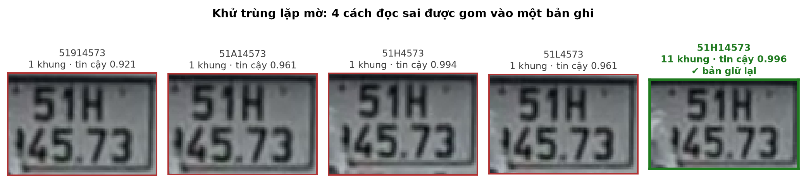

<!-- PHẦN ĐẦU QUYỂN (front matter) — khối này là ghi chú biên soạn, không in ra.

     Đề tài: Xây dựng hệ thống nhận diện biển số xe bằng trí tuệ nhân tạo
     (Developing an AI-based vehicle license plate recognition system)

     Tên đề tài lấy nguyên văn theo Đề cương chi tiết đã đăng ký
     (GVHD: ThS. Cáp Phạm Đình Thăng; thực hiện 16/07/2026 – 24/09/2026).
     Bản nháp trước dùng "Xây dựng hệ thống nhận dạng biển số xe Việt Nam
     ứng dụng Trí tuệ nhân tạo" — đã thay ở mọi vị trí để bìa khớp hồ sơ.

     Mọi chỗ đặt trong dấu «…» là chỗ trống phải điền thông tin thật.
-->

## A. TRANG BÌA

<!--Trình bày theo định dạng bìa chuẩn của đồ án tốt nghiệp đại học Việt Nam. Khi kết xuất sang PDF/Word, toàn bộ khối dưới đây căn giữa trang, không đánh số trang. Bìa cứng (bìa ngoài) và bìa lót (bìa trong) có nội dung giống nhau; bìa lót bổ sung dòng giảng viên hướng dẫn nếu quy chế của khoa yêu cầu.
-->

<div align="center">

**ĐẠI HỌC QUỐC GIA TP. HỒ CHÍ MINH**

**TRƯỜNG ĐẠI HỌC CÔNG NGHỆ THÔNG TIN**

<br/>

_<!-- chèn logo Trường Đại học Công nghệ Thông tin khi kết xuất bản in -->_

<br/><br/>

# ĐỒ ÁN TỐT NGHIỆP ĐẠI HỌC

<br/>

### Đề tài:

# XÂY DỰNG HỆ THỐNG NHẬN DIỆN BIỂN SỐ XE BẰNG TRÍ TUỆ NHÂN TẠO

_Developing an AI-based vehicle license plate recognition system_

<br/><br/>

|                           |                                          |
| ------------------------: | :--------------------------------------- |
|                **Ngành:** | Trí tuệ nhân tạo                         |
|         **Chuyên ngành:** | Trí tuệ nhân tạo                         |
|  **Sinh viên thực hiện:** | **Phạm Công Thành** — MSSV **25410013**  |
|                           | **Nguyễn Minh Hiếu** — MSSV **25410007** |
|                  **Lớp:** | AI503.F3.LT.TTNT                         |
|                 **Khoá:** | 2025                                     |
| **Giảng viên hướng dẫn:** | ThS. Cáp Phạm Đình Thăng                 |

<br/><br/>

**TP. Hồ Chí Minh, tháng 9 năm 2026**

</div>

---

## B. LỜI CAM ĐOAN

Nhóm thực hiện xin cam đoan đồ án tốt nghiệp **"Xây dựng hệ thống nhận diện biển số xe bằng trí tuệ nhân tạo"** là công trình do chính nhóm thực hiện dưới sự hướng dẫn của ThS. Cáp Phạm Đình Thăng.

Toàn bộ số liệu thực nghiệm trình bày trong quyển do nhóm tự đo trên máy và cấu hình phần cứng nêu tại mục 5.2; mọi kết quả trích từ công trình của tác giả khác đều được ghi rõ nguồn trong danh mục tài liệu tham khảo, kèm tên bộ dữ liệu và điều kiện đo gốc. Các mô hình, thư viện và bộ dữ liệu công khai được sử dụng lại đều ghi công đầy đủ tại mục 1.4 và Phụ lục II.

Nhóm thực hiện cam đoan không sao chép nội dung từ bất kỳ công trình nào mà không trích dẫn, và chịu hoàn toàn trách nhiệm về tính trung thực của các số liệu công bố trong quyển.

<div align="right">

TP. Hồ Chí Minh, tháng 9 năm 2026

**Nhóm thực hiện**

«Ký và ghi rõ họ tên»

</div>

---

## C. LỜI CẢM ƠN

Nhóm thực hiện xin gửi lời cảm ơn chân thành tới **ThS. Cáp Phạm Đình Thăng** — giảng viên hướng dẫn — vì những góp ý đã định hình cách đặt vấn đề và giao thức đánh giá của đề tài, đặc biệt là yêu cầu mọi con số công bố phải kèm điều kiện đo.

Nhóm cũng xin cảm ơn quý thầy cô Trường Đại học Công nghệ Thông tin – Đại học Quốc gia TP. Hồ Chí Minh đã trang bị nền tảng kiến thức để thực hiện đề tài, và cảm ơn các tác giả đã công khai bộ dữ liệu biển số xe Việt Nam — không có phần dữ liệu ấy, đề tài không thể tiến hành.

---

## E. MỤC LỤC

<!-- Sinh tự động bằng scripts/gen_front_matter_lists.py từ chính các tệp
     chương. Không sửa tay — chạy lại script sau mỗi lần đổi cấu trúc.
     Số trang do Word điền khi xuất .docx. -->

```{=openxml}
<w:p><w:r><w:fldChar w:fldCharType="begin" w:dirty="true"/></w:r><w:r><w:instrText xml:space="preserve"> TOC \o "1-2" \h \z \u </w:instrText></w:r><w:r><w:fldChar w:fldCharType="separate"/></w:r><w:r><w:t>Mở tệp trong Word rồi bấm Ctrl+A, F9 để cập nhật mục lục.</w:t></w:r><w:r><w:fldChar w:fldCharType="end"/></w:r></w:p>
```

<!-- Bản đối chiếu (không in ra):

     CHƯƠNG 1. GIỚI THIỆU
         1.1. Đặt vấn đề
         1.2. Mục tiêu đề tài
         1.3. Đối tượng và phạm vi nghiên cứu
         1.4. Phương pháp nghiên cứu
         1.5. Đóng góp của đề tài

     CHƯƠNG 2. CƠ SỞ LÝ THUYẾT
         2.1. Phạm vi và bố cục cơ sở lý thuyết
         2.2. Quy chuẩn biển số xe Việt Nam
         2.3. Cơ sở lý thuyết về phát hiện đối tượng
         2.4. Cơ sở lý thuyết về nhận dạng ký tự
         2.5. Các công trình liên quan

     CHƯƠNG 3. KHẢO SÁT CÔNG NGHỆ VÀ LỰA CHỌN MÔ HÌNH
         3.1. Phương pháp khảo sát và tiêu chí lựa chọn
         3.2. Mô hình phát hiện: YOLO11
         3.3. Bộ nhận dạng ký tự
         3.4. Nền tảng suy luận trên CPU: ONNX Runtime
         3.5. Các lựa chọn công nghệ nền tảng khác
         3.6. Độ phân giải đầu vào: 640 thay vì 416

     CHƯƠNG 4. THIẾT KẾ VÀ CÀI ĐẶT HỆ THỐNG
         4.1. Phân tích yêu cầu
         4.2. Kiến trúc hệ thống
         4.3. Môi trường và công cụ phát triển
         4.4. Xây dựng bộ dữ liệu
         4.5. Huấn luyện mô hình
         4.6. Tầng AI — thiết kế và cài đặt
         4.7. Máy chủ và cơ sở dữ liệu
         4.8. Giao diện người dùng
         4.9. Triển khai bằng Docker

     CHƯƠNG 5. THỰC NGHIỆM VÀ ĐÁNH GIÁ
         5.1. Mục tiêu và phương pháp đánh giá
         5.2.---
         5.2. Môi trường thực nghiệm
         5.3. Bộ dữ liệu thực nghiệm
         5.4. Đánh giá bộ phát hiện biển số
         5.5. Đánh giá khối OCR và hậu xử lý
         5.6. Đánh giá hiệu năng
         5.7. Đối chiếu toàn bộ chỉ tiêu phi chức năng
         5.8. Phân tích lỗi
         5.9. Bàn luận

     CHƯƠNG 6. KẾT LUẬN VÀ HƯỚNG PHÁT TRIỂN
         6.1. Kết quả đạt được
         6.2. Hạn chế
         6.3. Hướng phát triển
         6.4. Kết luận chung
-->

---

## F. DANH MỤC HÌNH VẼ

<!-- Sinh tự động bằng scripts/gen_front_matter_lists.py từ chính các tệp
     chương. Không sửa tay — chạy lại script sau mỗi lần đổi cấu trúc.
     Số trang do Word điền khi xuất .docx. -->
<!-- Quy ước: Hình <chương>.<thứ tự>. Chú thích đặt DƯỚI hình, căn giữa.
     Hình lấy/phỏng theo nguồn khác bắt buộc ghi nguồn kèm [n]. -->

| Ký hiệu | Tên hình | Trang |
|---|---|:---:|
| Hình 1.1 | Ranh giới hệ thống — phần bên trong là hệ thống bàn giao, Colab/Kaggle nằm ngoài | `<w:r><w:fldChar w:fldCharType="begin"/></w:r><w:r><w:instrText xml:space="preserve"> PAGEREF fig-1-1 \h </w:instrText></w:r><w:r><w:fldChar w:fldCharType="separate"/></w:r><w:r><w:t>0</w:t></w:r><w:r><w:fldChar w:fldCharType="end"/></w:r>`{=openxml} |
| Hình 2.1 | Kiến trúc tổng quát backbone – neck – head của YOLO11 (theo [13], [9]) | `<w:r><w:fldChar w:fldCharType="begin"/></w:r><w:r><w:instrText xml:space="preserve"> PAGEREF fig-2-1 \h </w:instrText></w:r><w:r><w:fldChar w:fldCharType="separate"/></w:r><w:r><w:t>0</w:t></w:r><w:r><w:fldChar w:fldCharType="end"/></w:r>`{=openxml} |
| Hình 2.2 | Kiến trúc CRNN và cách CTC gộp chuỗi thô | `<w:r><w:fldChar w:fldCharType="begin"/></w:r><w:r><w:instrText xml:space="preserve"> PAGEREF fig-2-2 \h </w:instrText></w:r><w:r><w:fldChar w:fldCharType="separate"/></w:r><w:r><w:t>0</w:t></w:r><w:r><w:fldChar w:fldCharType="end"/></w:r>`{=openxml} |
| Hình 2.3 | Cơ chế sụp đổ của CTC trên ảnh văn bản hai dòng | `<w:r><w:fldChar w:fldCharType="begin"/></w:r><w:r><w:instrText xml:space="preserve"> PAGEREF fig-2-3 \h </w:instrText></w:r><w:r><w:fldChar w:fldCharType="separate"/></w:r><w:r><w:t>0</w:t></w:r><w:r><w:fldChar w:fldCharType="end"/></w:r>`{=openxml} |
| Hình 4.1 | Sơ đồ use case — hai tác nhân và bốn use case | `<w:r><w:fldChar w:fldCharType="begin"/></w:r><w:r><w:instrText xml:space="preserve"> PAGEREF fig-4-1 \h </w:instrText></w:r><w:r><w:fldChar w:fldCharType="separate"/></w:r><w:r><w:t>0</w:t></w:r><w:r><w:fldChar w:fldCharType="end"/></w:r>`{=openxml} |
| Hình 4.2 | Kiến trúc phân tầng năm tầng và chiều phụ thuộc | `<w:r><w:fldChar w:fldCharType="begin"/></w:r><w:r><w:instrText xml:space="preserve"> PAGEREF fig-4-2 \h </w:instrText></w:r><w:r><w:fldChar w:fldCharType="separate"/></w:r><w:r><w:t>0</w:t></w:r><w:r><w:fldChar w:fldCharType="end"/></w:r>`{=openxml} |
| Hình 4.3 | Luồng xử lý của đường ống AI, các khối tô đỏ là nhánh biển hai dòng | `<w:r><w:fldChar w:fldCharType="begin"/></w:r><w:r><w:instrText xml:space="preserve"> PAGEREF fig-4-3 \h </w:instrText></w:r><w:r><w:fldChar w:fldCharType="separate"/></w:r><w:r><w:t>0</w:t></w:r><w:r><w:fldChar w:fldCharType="end"/></w:r>`{=openxml} |
| Hình 4.4 | Đường ống sáu bước xây dựng bộ dữ liệu | `<w:r><w:fldChar w:fldCharType="begin"/></w:r><w:r><w:instrText xml:space="preserve"> PAGEREF fig-4-4 \h </w:instrText></w:r><w:r><w:fldChar w:fldCharType="separate"/></w:r><w:r><w:t>0</w:t></w:r><w:r><w:fldChar w:fldCharType="end"/></w:r>`{=openxml} |
| Hình 4.5 | Đường cong huấn luyện theo epoch — ba hàm mất mát và bốn chỉ số trên tập kiểm định | `<w:r><w:fldChar w:fldCharType="begin"/></w:r><w:r><w:instrText xml:space="preserve"> PAGEREF fig-4-5 \h </w:instrText></w:r><w:r><w:fldChar w:fldCharType="separate"/></w:r><w:r><w:t>0</w:t></w:r><w:r><w:fldChar w:fldCharType="end"/></w:r>`{=openxml} |
| Hình 4.6 | Ba lớp trừu tượng và cài đặt tương ứng — bằng chứng cài đặt cho NFR-M5 | `<w:r><w:fldChar w:fldCharType="begin"/></w:r><w:r><w:instrText xml:space="preserve"> PAGEREF fig-4-6 \h </w:instrText></w:r><w:r><w:fldChar w:fldCharType="separate"/></w:r><w:r><w:t>0</w:t></w:r><w:r><w:fldChar w:fldCharType="end"/></w:r>`{=openxml} |
| Hình 4.7 | Thuật toán chuẩn hoá chuỗi biển số theo bộ luật ràng buộc vị trí | `<w:r><w:fldChar w:fldCharType="begin"/></w:r><w:r><w:instrText xml:space="preserve"> PAGEREF fig-4-7 \h </w:instrText></w:r><w:r><w:fldChar w:fldCharType="separate"/></w:r><w:r><w:t>0</w:t></w:r><w:r><w:fldChar w:fldCharType="end"/></w:r>`{=openxml} |
| Hình 5.1 | Giao thức đo và ràng buộc phụ thuộc giữa các bước đánh giá | `<w:r><w:fldChar w:fldCharType="begin"/></w:r><w:r><w:instrText xml:space="preserve"> PAGEREF fig-5-1 \h </w:instrText></w:r><w:r><w:fldChar w:fldCharType="separate"/></w:r><w:r><w:t>0</w:t></w:r><w:r><w:fldChar w:fldCharType="end"/></w:r>`{=openxml} |
| Hình 5.2 | Sáu lần đo NFR-P2 trong các điều kiện máy khác nhau | `<w:r><w:fldChar w:fldCharType="begin"/></w:r><w:r><w:instrText xml:space="preserve"> PAGEREF fig-5-2 \h </w:instrText></w:r><w:r><w:fldChar w:fldCharType="separate"/></w:r><w:r><w:t>0</w:t></w:r><w:r><w:fldChar w:fldCharType="end"/></w:r>`{=openxml} |
| Hình 5.3 | Một ca khử trùng lặp thật, cắt trực tiếp từ video demo | `<w:r><w:fldChar w:fldCharType="begin"/></w:r><w:r><w:instrText xml:space="preserve"> PAGEREF fig-5-3 \h </w:instrText></w:r><w:r><w:fldChar w:fldCharType="separate"/></w:r><w:r><w:t>0</w:t></w:r><w:r><w:fldChar w:fldCharType="end"/></w:r>`{=openxml} |

---

## G. DANH MỤC BẢNG BIỂU

<!-- Sinh tự động bằng scripts/gen_front_matter_lists.py từ chính các tệp
     chương. Không sửa tay — chạy lại script sau mỗi lần đổi cấu trúc.
     Số trang do Word điền khi xuất .docx. -->
<!-- Quy ước: Bảng <chương>.<thứ tự>. Chú thích đặt TRÊN bảng.
     Bảng tổng hợp từ nguồn khác bắt buộc ghi nguồn kèm [n]. -->

| Ký hiệu | Tên bảng | Trang |
|---|---|:---:|
| Bảng 1.1 | Nhóm chỉ tiêu độ chính xác | `<w:r><w:fldChar w:fldCharType="begin"/></w:r><w:r><w:instrText xml:space="preserve"> PAGEREF tbl-1-1 \h </w:instrText></w:r><w:r><w:fldChar w:fldCharType="separate"/></w:r><w:r><w:t>0</w:t></w:r><w:r><w:fldChar w:fldCharType="end"/></w:r>`{=openxml} |
| Bảng 1.2 | Nhóm chỉ tiêu hiệu năng trên CPU | `<w:r><w:fldChar w:fldCharType="begin"/></w:r><w:r><w:instrText xml:space="preserve"> PAGEREF tbl-1-2 \h </w:instrText></w:r><w:r><w:fldChar w:fldCharType="separate"/></w:r><w:r><w:t>0</w:t></w:r><w:r><w:fldChar w:fldCharType="end"/></w:r>`{=openxml} |
| Bảng 2.1 | So sánh khác biệt kiến trúc giữa các phiên bản YOLO gần đây | `<w:r><w:fldChar w:fldCharType="begin"/></w:r><w:r><w:instrText xml:space="preserve"> PAGEREF tbl-2-1 \h </w:instrText></w:r><w:r><w:fldChar w:fldCharType="separate"/></w:r><w:r><w:t>0</w:t></w:r><w:r><w:fldChar w:fldCharType="end"/></w:r>`{=openxml} |
| Bảng 2.2 | So sánh OCR văn bản tài liệu và OCR biển số xe | `<w:r><w:fldChar w:fldCharType="begin"/></w:r><w:r><w:instrText xml:space="preserve"> PAGEREF tbl-2-2 \h </w:instrText></w:r><w:r><w:fldChar w:fldCharType="separate"/></w:r><w:r><w:t>0</w:t></w:r><w:r><w:fldChar w:fldCharType="end"/></w:r>`{=openxml} |
| Bảng 2.3 | Tóm tắt một số công trình ALPR cho biển số Việt Nam được khảo sát | `<w:r><w:fldChar w:fldCharType="begin"/></w:r><w:r><w:instrText xml:space="preserve"> PAGEREF tbl-2-3 \h </w:instrText></w:r><w:r><w:fldChar w:fldCharType="separate"/></w:r><w:r><w:t>0</w:t></w:r><w:r><w:fldChar w:fldCharType="end"/></w:r>`{=openxml} |
| Bảng 2.4 | Sáu khoảng trống nghiên cứu và cách nhóm thực hiện lấp | `<w:r><w:fldChar w:fldCharType="begin"/></w:r><w:r><w:instrText xml:space="preserve"> PAGEREF tbl-2-4 \h </w:instrText></w:r><w:r><w:fldChar w:fldCharType="separate"/></w:r><w:r><w:t>0</w:t></w:r><w:r><w:fldChar w:fldCharType="end"/></w:r>`{=openxml} |
| Bảng 3.1 | PP-OCRv6_medium_rec so với PP-OCRv5_mobile_rec, đo trên 200 vùng cắt biển số của đồ án | `<w:r><w:fldChar w:fldCharType="begin"/></w:r><w:r><w:instrText xml:space="preserve"> PAGEREF tbl-3-1 \h </w:instrText></w:r><w:r><w:fldChar w:fldCharType="separate"/></w:r><w:r><w:t>0</w:t></w:r><w:r><w:fldChar w:fldCharType="end"/></w:r>`{=openxml} |
| Bảng 3.2 | So sánh ba bộ nhận dạng ký tự trên 2.801 biển số Việt Nam (567 một dòng, 2.234 hai dòng) | `<w:r><w:fldChar w:fldCharType="begin"/></w:r><w:r><w:instrText xml:space="preserve"> PAGEREF tbl-3-2 \h </w:instrText></w:r><w:r><w:fldChar w:fldCharType="separate"/></w:r><w:r><w:t>0</w:t></w:r><w:r><w:fldChar w:fldCharType="end"/></w:r>`{=openxml} |
| Bảng 4.1 | Bốn ràng buộc kiến trúc và cách kiểm chứng từng ràng buộc | `<w:r><w:fldChar w:fldCharType="begin"/></w:r><w:r><w:instrText xml:space="preserve"> PAGEREF tbl-4-1 \h </w:instrText></w:r><w:r><w:fldChar w:fldCharType="separate"/></w:r><w:r><w:t>0</w:t></w:r><w:r><w:fldChar w:fldCharType="end"/></w:r>`{=openxml} |
| Bảng 4.2 | Tám quyết định kiến trúc — mỗi dòng kèm đánh đổi phải chấp nhận | `<w:r><w:fldChar w:fldCharType="begin"/></w:r><w:r><w:instrText xml:space="preserve"> PAGEREF tbl-4-2 \h </w:instrText></w:r><w:r><w:fldChar w:fldCharType="separate"/></w:r><w:r><w:t>0</w:t></w:r><w:r><w:fldChar w:fldCharType="end"/></w:r>`{=openxml} |
| Bảng 4.3 | Đóng góp của từng bộ dữ liệu trước và sau khử trùng lặp | `<w:r><w:fldChar w:fldCharType="begin"/></w:r><w:r><w:instrText xml:space="preserve"> PAGEREF tbl-4-3 \h </w:instrText></w:r><w:r><w:fldChar w:fldCharType="separate"/></w:r><w:r><w:t>0</w:t></w:r><w:r><w:fldChar w:fldCharType="end"/></w:r>`{=openxml} |
| Bảng 4.4 | Tiến triển chỉ số trên tập validation theo mốc epoch | `<w:r><w:fldChar w:fldCharType="begin"/></w:r><w:r><w:instrText xml:space="preserve"> PAGEREF tbl-4-4 \h </w:instrText></w:r><w:r><w:fldChar w:fldCharType="separate"/></w:r><w:r><w:t>0</w:t></w:r><w:r><w:fldChar w:fldCharType="end"/></w:r>`{=openxml} |
| Bảng 5.1 | Ba phiên bản bộ dữ liệu và số cặp ảnh gần trùng xuyên tập con theo ngưỡng Hamming | `<w:r><w:fldChar w:fldCharType="begin"/></w:r><w:r><w:instrText xml:space="preserve"> PAGEREF tbl-5-1 \h </w:instrText></w:r><w:r><w:fldChar w:fldCharType="separate"/></w:r><w:r><w:t>0</w:t></w:r><w:r><w:fldChar w:fldCharType="end"/></w:r>`{=openxml} |
| Bảng 5.2 | Kết quả phát hiện tách theo biển một dòng và hai dòng (NFR-A8) | `<w:r><w:fldChar w:fldCharType="begin"/></w:r><w:r><w:instrText xml:space="preserve"> PAGEREF tbl-5-2 \h </w:instrText></w:r><w:r><w:fldChar w:fldCharType="separate"/></w:r><w:r><w:t>0</w:t></w:r><w:r><w:fldChar w:fldCharType="end"/></w:r>`{=openxml} |
| Bảng 5.3 | Độ chính xác OCR trước và sau hậu xử lý, trên 2.801 biển có nhãn chuỗi | `<w:r><w:fldChar w:fldCharType="begin"/></w:r><w:r><w:instrText xml:space="preserve"> PAGEREF tbl-5-3 \h </w:instrText></w:r><w:r><w:fldChar w:fldCharType="separate"/></w:r><w:r><w:t>0</w:t></w:r><w:r><w:fldChar w:fldCharType="end"/></w:r>`{=openxml} |
| Bảng 5.4 | Độ chính xác nhận dạng tách theo biển một dòng và hai dòng | `<w:r><w:fldChar w:fldCharType="begin"/></w:r><w:r><w:instrText xml:space="preserve"> PAGEREF tbl-5-4 \h </w:instrText></w:r><w:r><w:fldChar w:fldCharType="separate"/></w:r><w:r><w:t>0</w:t></w:r><w:r><w:fldChar w:fldCharType="end"/></w:r>`{=openxml} |
| Bảng 5.5 | NFR-A7 ở mức ảnh toàn cảnh — ước lượng phân tầng trên 1.606 khung biển | `<w:r><w:fldChar w:fldCharType="begin"/></w:r><w:r><w:instrText xml:space="preserve"> PAGEREF tbl-5-5 \h </w:instrText></w:r><w:r><w:fldChar w:fldCharType="separate"/></w:r><w:r><w:t>0</w:t></w:r><w:r><w:fldChar w:fldCharType="end"/></w:r>`{=openxml} |
| Bảng 5.6 | Chi phí và lợi ích của từng bậc trong thang thử lại | `<w:r><w:fldChar w:fldCharType="begin"/></w:r><w:r><w:instrText xml:space="preserve"> PAGEREF tbl-5-6 \h </w:instrText></w:r><w:r><w:fldChar w:fldCharType="separate"/></w:r><w:r><w:t>0</w:t></w:r><w:r><w:fldChar w:fldCharType="end"/></w:r>`{=openxml} |
| Bảng 5.7 | Độ trễ đầu cuối một ảnh, đối chiếu NFR-P1 | `<w:r><w:fldChar w:fldCharType="begin"/></w:r><w:r><w:instrText xml:space="preserve"> PAGEREF tbl-5-7 \h </w:instrText></w:r><w:r><w:fldChar w:fldCharType="separate"/></w:r><w:r><w:t>0</w:t></w:r><w:r><w:fldChar w:fldCharType="end"/></w:r>`{=openxml} |
| Bảng 5.8 | Phân rã ngân sách độ trễ theo từng bước | `<w:r><w:fldChar w:fldCharType="begin"/></w:r><w:r><w:instrText xml:space="preserve"> PAGEREF tbl-5-8 \h </w:instrText></w:r><w:r><w:fldChar w:fldCharType="separate"/></w:r><w:r><w:t>0</w:t></w:r><w:r><w:fldChar w:fldCharType="end"/></w:r>`{=openxml} |
| Bảng 5.9 | Các chỉ tiêu hiệu năng ngoài đường xử lý ảnh | `<w:r><w:fldChar w:fldCharType="begin"/></w:r><w:r><w:instrText xml:space="preserve"> PAGEREF tbl-5-9 \h </w:instrText></w:r><w:r><w:fldChar w:fldCharType="separate"/></w:r><w:r><w:t>0</w:t></w:r><w:r><w:fldChar w:fldCharType="end"/></w:r>`{=openxml} |
| Bảng 5.10 | Đối chiếu chỉ tiêu phi chức năng, gom theo nhóm | `<w:r><w:fldChar w:fldCharType="begin"/></w:r><w:r><w:instrText xml:space="preserve"> PAGEREF tbl-5-10 \h </w:instrText></w:r><w:r><w:fldChar w:fldCharType="separate"/></w:r><w:r><w:t>0</w:t></w:r><w:r><w:fldChar w:fldCharType="end"/></w:r>`{=openxml} |
| Bảng 5.11 | Tần suất từng loại lỗi trên 2.801 biển có nhãn chuỗi, cấu hình giao hàng | `<w:r><w:fldChar w:fldCharType="begin"/></w:r><w:r><w:instrText xml:space="preserve"> PAGEREF tbl-5-11 \h </w:instrText></w:r><w:r><w:fldChar w:fldCharType="separate"/></w:r><w:r><w:t>0</w:t></w:r><w:r><w:fldChar w:fldCharType="end"/></w:r>`{=openxml} |
| Bảng 5.12 | Đối chiếu kết quả của đồ án với các con số đã công bố | `<w:r><w:fldChar w:fldCharType="begin"/></w:r><w:r><w:instrText xml:space="preserve"> PAGEREF tbl-5-12 \h </w:instrText></w:r><w:r><w:fldChar w:fldCharType="separate"/></w:r><w:r><w:t>0</w:t></w:r><w:r><w:fldChar w:fldCharType="end"/></w:r>`{=openxml} |
| Bảng 5.13 | Tám mối đe doạ đến tính hợp lệ của kết quả | `<w:r><w:fldChar w:fldCharType="begin"/></w:r><w:r><w:instrText xml:space="preserve"> PAGEREF tbl-5-13 \h </w:instrText></w:r><w:r><w:fldChar w:fldCharType="separate"/></w:r><w:r><w:t>0</w:t></w:r><w:r><w:fldChar w:fldCharType="end"/></w:r>`{=openxml} |
| Bảng 6.1 | Đối chiếu chỉ tiêu đặt ra ở giai đoạn phân tích yêu cầu với số đo trên models/best.pt | `<w:r><w:fldChar w:fldCharType="begin"/></w:r><w:r><w:instrText xml:space="preserve"> PAGEREF tbl-6-1 \h </w:instrText></w:r><w:r><w:fldChar w:fldCharType="separate"/></w:r><w:r><w:t>0</w:t></w:r><w:r><w:fldChar w:fldCharType="end"/></w:r>`{=openxml} |
| Bảng 6.2 | Mười hạn chế của đồ án | `<w:r><w:fldChar w:fldCharType="begin"/></w:r><w:r><w:instrText xml:space="preserve"> PAGEREF tbl-6-2 \h </w:instrText></w:r><w:r><w:fldChar w:fldCharType="separate"/></w:r><w:r><w:t>0</w:t></w:r><w:r><w:fldChar w:fldCharType="end"/></w:r>`{=openxml} |
| Bảng 6.3 | Mười một hướng phát triển, xếp theo mức tác động | `<w:r><w:fldChar w:fldCharType="begin"/></w:r><w:r><w:instrText xml:space="preserve"> PAGEREF tbl-6-3 \h </w:instrText></w:r><w:r><w:fldChar w:fldCharType="separate"/></w:r><w:r><w:t>0</w:t></w:r><w:r><w:fldChar w:fldCharType="end"/></w:r>`{=openxml} |

---

## D. TÓM TẮT ĐỒ ÁN

<div align="center">

**TÓM TẮT ĐỒ ÁN**

</div>

Nhận dạng biển số xe tự động (ALPR) là bài toán nền tảng của bãi đỗ xe thông minh, thu phí không dừng và giám sát giao thông. Tại Việt Nam, biển số hai dòng chiếm tỷ lệ lớn do mật độ xe máy cao, trong khi đa số bộ dữ liệu quốc tế chỉ có biển một dòng, khiến các mô hình huấn luyện trên dữ liệu nước ngoài không áp dụng trực tiếp được. Khác biệt này đã được đo lường: trên bộ RodoSol-ALPR của Brazil, độ chính xác của một hệ thống ALPR thương mại suy giảm gần 50 điểm phần trăm khi chuyển từ biển một dòng sang biển hai dòng [1]<!-- laroca_2022_crossdataset -->.

Đồ án xây dựng một hệ thống ALPR hoàn chỉnh cho biển số xe Việt Nam theo hướng tiếp cận hai giai đoạn: phát hiện vùng biển số bằng YOLO11, nhận dạng ký tự bằng PaddleOCR, và hậu xử lý bằng bộ luật chuẩn hoá theo quy chuẩn hiện hành. Hệ thống hỗ trợ cả biển một dòng và hai dòng, nhận đầu vào là ảnh, video hoặc khung hình thời gian thực gửi qua API (endpoint `POST /api/detect/frame`), và suy luận hoàn toàn trên CPU.

Đóng góp chính là bộ luật hậu xử lý **ràng buộc theo vị trí ký tự**, xây dựng trên Thông tư 79/2024/TT-BCA [2]<!-- bocongan_2024_tt79 --> và QCVN 08:2024/BCA [3]<!-- bocongan_2024_qcvn08 -->: mã tỉnh thuộc 81 giá trị hợp lệ, chữ cái sê-ri thứ nhất và thứ hai thuộc hai tập ký tự khác nhau. Cách tiếp cận này khắc phục hạn chế của các hệ thống áp một danh sách ký tự phẳng cho toàn chuỗi.

Về mặt kỹ nghệ, đồ án cài đặt kiến trúc phân tầng tách biệt tầng AI khỏi tầng API, gồm backend FastAPI, giao diện web React và đóng gói Docker.

Trên tập kiểm tra của split v3 (1.514 ảnh, đã khử trùng lặp giữa các tập), bộ phát hiện YOLO11n đạt mAP@0.5 = 0,9829 và mAP@0.5:0.95 = 0,7834 (precision 0,9837; recall 0,9714). Khối nhận dạng đạt độ chính xác mức ký tự (1 − CER) 0,9483; độ chính xác toàn chuỗi tăng từ 0,6373 lên 0,7701 nhờ bộ luật hậu xử lý (sửa đúng 372 biển, không làm hỏng biển nào). Chỉ số end-to-end đo ở **mức ảnh toàn cảnh** đạt **0,563** (khoảng tin cậy 95% [0,520 ; 0,607]), ước lượng phân tầng trên 1.606 khung biển của 1.514 ảnh hiện trường — chưa đạt ngưỡng 0,82, và phải đọc kèm hạn chế nhãn do mô hình ngôn ngữ-thị giác sinh chứ không phải người gán. Khoảng cách lớn nhất nằm ở layout: biển một dòng đạt 0,9541 còn biển hai dòng chỉ đạt 0,7234 — chênh 23,07 điểm phần trăm, trong khi biển hai dòng chiếm 79,8% tập đánh giá. Độ trễ xử lý một ảnh ở phân vị 95 là 509,76 ms trên CPU (trung vị 150,07 ms), đạt cả ngưỡng tối thiểu 1.500 ms lẫn mục tiêu 800 ms sau đợt tối ưu tầng suy luận. Chi tiết và phân tích lỗi được trình bày ở Chương 5.

**Từ khoá:** nhận dạng biển số xe, biển số Việt Nam, YOLO11, PaddleOCR, biển số hai dòng, hậu xử lý theo vị trí, suy luận trên CPU.


```{=openxml}
<w:p><w:r><w:br w:type="page"/></w:r></w:p>
```

# CHƯƠNG 1. GIỚI THIỆU

## 1.1. Đặt vấn đề

### 1.1.1. Bối cảnh giao thông Việt Nam và nhu cầu tự động hoá

Tính đến tháng 9/2024, Việt Nam có khoảng **77 triệu xe máy đã đăng ký, tương đương 770 xe trên 1.000 dân**; xe máy chiếm khoảng **85–90% lưu lượng phương tiện trên đường**. Điều này kéo theo ba hệ quả (Chương 4): (i) biển hai dòng chiếm đa số vì mọi xe mô tô đều mang biển hai dòng; (ii) mật độ cao gây che khuất và nhiều biển trong một khung hình; (iii) biển xe mô tô chỉ 140 × 190 mm nên là đối tượng nhỏ. Vì vậy, ghi nhận thủ công không phù hợp và cần **nhận dạng biển số xe tự động (ALPR)** [1]<!-- du_2013_review -->.

### 1.1.2. Ứng dụng thực tế của hệ thống ALPR

ALPR là lõi của bốn nhóm ứng dụng tại Việt Nam: **bãi đỗ xe thông minh**; **thu phí không dừng ETC**; **giám sát giao thông** (xử phạt nguội); **kiểm soát ra vào**. Cả bốn đo cùng một thứ: **không phải mAP của khâu phát hiện, mà là tỉ lệ đọc đúng toàn bộ chuỗi biển số** (plate-level exact match) — đọc đúng 9 trên 10 ký tự vẫn là đọc sai biển. Nhận định này định hình chỉ tiêu ở mục 1.2.2 và cách đánh giá ở Chương 5.

### 1.1.3. Vì sao không thể dùng trực tiếp giải pháp nước ngoài

**(a) Biển hai dòng là điểm suy giảm đã đo được, không phải rủi ro giả định.** Trên tập kiểm thử cân bằng có chủ ý của bộ **RodoSol-ALPR (Brazil)** — 4.000 ảnh ô tô biển **một dòng**, 4.000 ảnh xe máy biển **hai dòng** — hệ thống thương mại **OpenALPR** nhận đúng **94,3% biển một dòng nhưng chỉ 45,7% biển hai dòng, chênh 48,6 điểm phần trăm**, không biến số nào khác thay đổi ngoài bố cục biển [2]<!-- laroca_2022_crossdataset -->. **Cặp số này đo trên dữ liệu Brazil, dẫn ra như một *analogue* định lượng về độ khó của biển hai dòng; số liệu Việt Nam do nhóm tự đo nằm ở Chương 5.** Cũng nghiên cứu này: cả 12 phương pháp và 2 hệ thống thương mại đều **không vượt quá 70%** recognition rate, và có công trình phải **loại bỏ hoàn toàn xe máy** khỏi thí nghiệm [2]<!-- laroca_2022_crossdataset -->.

Hai đặc thù nữa **không học được từ dữ liệu nước ngoài**: tập ký tự sê-ri của biển Việt Nam **phụ thuộc vị trí trong chuỗi** — vị trí thứ nhất thuộc một tập 20 chữ cái có `G` không có `R`, vị trí thứ hai của biển mô tô thuộc một tập 20 chữ **khác** có `R` không có `G` [7]<!-- bocongan_2024_nhandienbienso -->; và mã địa phương chỉ có **81 giá trị** hợp lệ trong dải 11–99. Căn cứ pháp lý là **TT 79/2024/TT-BCA** [3]<!-- bocongan_2024_tt79 --> cùng hai thông tư sửa đổi [4]<!-- bocongan_2025_tt13 --> [5]<!-- bocongan_2025_tt51 --> và **QCVN 08:2024/BCA** [6]<!-- bocongan_2024_qcvn08 -->; chi tiết ở mục 2.2.

**Kết luận mục 1.1:** bài toán cần **hệ thống huấn luyện trên dữ liệu Việt Nam và khối hậu xử lý xây theo quy chuẩn Việt Nam.**

## 1.2. Mục tiêu đề tài

### 1.2.1. Mục tiêu tổng quát

Xây dựng hệ thống nhận dạng biển số xe Việt Nam gồm mô hình phát hiện tự huấn luyện, nhận dạng ký tự, hậu xử lý theo quy chuẩn Việt Nam, REST API, giao diện web, cơ sở dữ liệu và đóng gói triển khai; hỗ trợ biển một dòng, hai dòng và suy luận trên CPU. Hệ thống phục vụ mục đích học thuật, không phải sản phẩm thương mại.

### 1.2.2. Mục tiêu cụ thể

Mỗi chỉ tiêu có **mục tiêu** và **ngưỡng tối thiểu** (bắt buộc đạt). Về chức năng và chất lượng phần mềm: **34 yêu cầu chức năng** (22 *Must*, 5 *Should*, 3 *Could*, 4 *Won't*) trong **sáu nhóm** (mục 4.1.3); **NFR-M1** mã đường ống AI **không import FastAPI**; **NFR-M5** thay được bộ OCR không sửa mã tầng API; **NFR-M2** độ bao phủ kiểm thử tầng nghiệp vụ **≥ 70%**; **khởi động một lệnh** `docker compose up`, demo **không cần Internet**. **NFR-A5 và NFR-A6 đo tách bạch có chủ đích** — hiệu số là **đóng góp định lượng của khối hậu xử lý** (mục 1.5); thêm **NFR-A8** (tách riêng biển một dòng / hai dòng) và **NFR-A9** (theo điều kiện ảnh, nếu có nhãn phù hợp) (Bảng 1.1).

**Bảng 1.1.**[]{#tbl-1-1} Nhóm chỉ tiêu độ chính xác

| Mã | Chỉ tiêu | Mục tiêu | Ngưỡng tối thiểu |
|---|---|:--:|:--:|
| NFR-A1 | mAP@0.5 của bộ phát hiện biển số | ≥ 0,90 | ≥ 0,85 |
| NFR-A2 | mAP@0.5:0.95 của bộ phát hiện | ≥ 0,65 | ≥ 0,55 |
| NFR-A3 | Precision / Recall phát hiện | ≥ 0,92 / ≥ 0,90 | ≥ 0,88 / ≥ 0,85 |
| NFR-A4 | Độ chính xác OCR mức ký tự (1 − CER) | ≥ 0,95 | ≥ 0,92 |
| NFR-A5 | Độ chính xác biển đầy đủ **trước** hậu xử lý | ≥ 0,85 | ≥ 0,80 |
| NFR-A6 | Độ chính xác biển đầy đủ **sau** hậu xử lý | ≥ 0,90 | ≥ 0,85 |
| **NFR-A7** | **Độ chính xác E2E toàn trình (ảnh vào → biển đúng)** | **≥ 0,88** | **≥ 0,82** |

Nhóm chỉ tiêu thứ hai đặt cho hiệu năng khi chạy trên CPU (Bảng 1.2).

**Bảng 1.2.**[]{#tbl-1-2} Nhóm chỉ tiêu hiệu năng trên CPU

| Mã | Chỉ tiêu | Mục tiêu | Ngưỡng tối thiểu |
|---|---|:--:|:--:|
| **NFR-P1** | **Độ trễ E2E một ảnh (p95)** | **≤ 800 ms** | **≤ 1500 ms** |
| NFR-P2 | Tốc độ khung hình thời gian thực (webcam — đo ở tầng API) | ≥ 5 FPS hiệu dụng | ≥ 3 FPS |
| NFR-P3 | Tốc độ xử lý video | ≥ 0,3× thời gian thực | ≥ 0,15× |
| NFR-P4 | Thời gian nạp mô hình khi khởi động | ≤ 15 s | ≤ 30 s |
| NFR-P5 | Overhead của tầng API (không tính suy luận) | ≤ 50 ms | ≤ 100 ms |
| NFR-P6 | Thời gian truy vấn lịch sử (10.000 bản ghi) | ≤ 500 ms | ≤ 1000 ms |
| NFR-P7 | Bộ nhớ thường trú của máy chủ | ≤ 2 GB | ≤ 4 GB |

Các chỉ tiêu độ trễ "rộng rãi" hơn bài báo ALPR vì máy phát triển **không có GPU CUDA** (CON-02): huấn luyện trên GPU Colab/Kaggle, **toàn bộ suy luận và demo chạy trên CPU**, còn bài báo thường đo trên GPU RTX/V100. Mọi số liệu hiệu năng **bắt buộc kèm cấu hình phần cứng**.

Bốn yêu cầu ở mức *Won't* nằm ngoài phạm vi bản giao hàng; trong đó **FR-2.5** (xuất video đã chú thích) là yêu cầu duy nhất làm hệ thống **mất một năng lực**, các yêu cầu còn lại chỉ mất màn hình hiển thị. Chi tiết ở mục 4.1.3 và 6.2.

### 1.2.3. Tiêu chí thành công

Đề tài thành công khi **đồng thời**: (1) toàn bộ yêu cầu *Must* hoạt động và demo được — theo bộ 20 *Must* **sau** ba đợt thu gọn phạm vi, sáu yêu cầu đã chuyển *Won't* (FR-2.5, FR-2.6, FR-3.1, FR-3.4, FR-4.1, FR-4.2) **không** tính là đạt; (2) mọi chỉ tiêu đạt **ngưỡng tối thiểu** và **có bằng chứng đo đạc**; (3) đủ 12 sản phẩm bàn giao; (4) khởi động trên máy sạch bằng một lệnh `docker compose up`; (5) demo trực tiếp không cần Internet.

> **Trạng thái tại thời điểm viết chương này.** Các chỉ tiêu ở mục 1.2.2 là **chỉ tiêu đặt ra**; đối chiếu đầy đủ từng chỉ tiêu ở Chương 5. Hệ thống chạy đường ống thật với `models/best.pt`: nhóm phát hiện đạt cả bốn chỉ tiêu (mAP@0.5 = 0,9829), NFR-P1 đạt mục tiêu (p95 = 509,76 ms so với 800 ms), còn **độ chính xác đọc chuỗi trên biển hai dòng chưa đạt**.

## 1.3. Đối tượng và phạm vi nghiên cứu

### 1.3.1. Đối tượng nghiên cứu

Ba nhóm. **(1) Biển số xe cơ giới Việt Nam** theo TT 79/2024/TT-BCA [3]<!-- bocongan_2024_tt79 --> (sửa đổi bởi TT 13/2025 [4]<!-- bocongan_2025_tt13 --> và TT 51/2025 [5]<!-- bocongan_2025_tt51 -->) và QCVN 08:2024/BCA [6]<!-- bocongan_2024_qcvn08 -->; biển nền đỏ quân đội thuộc TT 169/2021/TT-BQP [8]<!-- boquocphong_2021_tt169 -->, chỉ xử lý ở mức nhận biết ký hiệu. **(2) Mô hình phát hiện họ YOLO** — cụ thể YOLO11 [9]<!-- jocher_2024_yolo11 -->. **(3) Bộ nhận dạng ký tự** không cần phân đoạn ký tự: PaddleOCR [10]<!-- cui_2026_ppocrv5 --> là **phương án khởi điểm**, EasyOCR ngang hàng, Tesseract là mốc dưới, kèm bộ luật hậu xử lý theo vị trí. **Lựa chọn bộ nhận dạng ký tự chưa chốt ở giai đoạn thiết kế** — quyết định thuộc về benchmark do chính nhóm thực hiện chạy (**mục 3.3**, **Chương 5**).

### 1.3.2. Phạm vi trong nghiên cứu

Bốn nhóm. **(a) Trí tuệ nhân tạo:** huấn luyện YOLO11 trên dữ liệu Việt Nam, so sánh biến thể n / s / m, kèm YOLO26n đối chứng (mục 3.2); **benchmark các bộ nhận dạng ký tự** trên chính tập kiểm thử biển số Việt Nam rồi tích hợp bộ nhận dạng được chọn; hậu xử lý theo luật hợp lệ theo vị trí; **hỗ trợ cả biển một dòng và hai dòng**; đánh giá đầy đủ (mAP, precision, recall, F1, ma trận nhầm lẫn); đo hiệu năng trên CPU. **(b) Dữ liệu:** thu thập, gộp, làm sạch bộ công khai; sửa nhãn; loại ảnh trùng lặp; tăng cường; chia train / val / test **có kiểm soát rò rỉ dữ liệu**; thống kê. **(c) Phần mềm:** FastAPI + Swagger; nhận dạng ảnh, video và khung hình thời gian thực qua `POST /api/detect/frame`; lịch sử bằng SQLite + SQLAlchemy + Alembic; giao diện React + Vite + TypeScript + TailwindCSS **ba trang** (Nhận dạng ảnh — trang chủ, Nhận dạng video, Lịch sử) sau hai đợt thu gọn; tìm kiếm, lọc, tải về; thống kê ở tầng API (`GET /api/statistics`); Docker và Docker Compose. **(d) Kiểm thử, tài liệu:** unit test, integration test, kiểm thử độ chính xác AI, hiệu năng, chịu tải; tài liệu học thuật và kỹ thuật.

### 1.3.3. Phạm vi ngoài nghiên cứu

Danh sách này nhằm xác định rõ giới hạn của đề tài; việc loại trừ các hạng mục này là quyết định có chủ đích, không phải do giới hạn về thời gian. **Mười một hạng mục bao gồm:** (1) **xác thực, phân quyền** — chạy nội bộ `localhost`/LAN (giả định A-04); (2) **đa camera / đa luồng**; (3) **bám vết qua khung hình (SORT / DeepSORT)** — thay bằng **gộp trùng theo chuỗi ký tự**; (4) **phân loại loại xe** — từ 01/01/2025 TT 79/2024 **đã bỏ** quy tắc suy loại xe từ chữ cái seri; (5) **ước lượng tốc độ, phát hiện vi phạm** — cần hiệu chuẩn camera riêng; (6) **biển số nước ngoài**; (7) **barie / cổng tự động** — cần thiết bị vật lý; (8) **cloud, multi-tenant, CI/CD production** — **Docker Compose đã đủ**; (9) **ứng dụng di động** — web responsive đã đáp ứng; (10) **huấn luyện bộ nhận dạng ký tự từ đầu** — dùng pre-trained rồi **tinh chỉnh**; tinh chỉnh nằm **trong** phạm vi (mục 2.4.3(f)); (11) **suy luận thời gian thực trên GPU** — máy phát triển **không có GPU CUDA** (CON-02) ⇒ mọi số liệu là **số liệu CPU** (Hình 1.1).

### 1.3.4. Ranh giới hệ thống


**Hình 1.1.**[]{#fig-1-1} Ranh giới hệ thống — phần bên trong là hệ thống bàn giao, Colab/Kaggle nằm ngoài

Colab/Kaggle nằm **ngoài** ranh giới khi vận hành — chỉ là công cụ ngoại tuyến sản xuất best.pt; hệ thống khi chạy **không phụ thuộc dịch vụ ngoài nào** (mục 1.2.3). Sau khi trang webcam bị gỡ, client gửi khung hình trực tiếp qua `POST /api/detect/frame`.

## 1.4. Phương pháp nghiên cứu

Đề tài dùng **ba phương pháp bổ trợ nhau**: nghiên cứu lý thuyết (khảo sát tài liệu có trích dẫn, đối chiếu văn bản pháp quy hiện hành); nghiên cứu thực nghiệm (**mọi khẳng định về hiệu năng và độ chính xác đều phải có số đo tái lập được**, kèm cấu hình phần cứng và cỡ mẫu); và quy trình phát triển theo giai đoạn, mỗi giai đoạn khép lại bằng một bộ tài liệu và một mốc kiểm chứng.

### 1.4.1. Phân định phần tự xây dựng và phần dùng lại

Bảng phân định chi tiết từng thành phần — nguồn gốc và phần việc nhóm thực hiện đã làm — đặt ở **Phụ lục IV**. Hai khối **không có sẵn trong bất kỳ thư viện nào** và là đóng góp kỹ thuật chính của đề tài: khối xử lý ảnh vùng biển (nắn hình, phân loại bố cục, tách hai nửa, ghép ngang) và khối hậu xử lý theo quy chuẩn (mặt nạ vị trí, tập mã tỉnh, bảng ánh xạ nhầm lẫn).

## 1.5. Đóng góp của đề tài

### 1.5.1. Tuyên bố trung thực về mức đóng góp

> **Đề tài không tạo ra kết quả state-of-the-art.** Các con số trên 99% trong tài liệu ALPR quốc tế thường dựa trên hạ tầng GPU và dữ liệu riêng; đồ án làm việc trên máy không có GPU CUDA nên không đặt mục tiêu tương tự.

**Ba đóng góp có thể kiểm chứng.**

**(a) Bộ luật hậu xử lý ràng buộc theo VỊ TRÍ trong chuỗi**, khai thác ba ràng buộc đặc thù của quy chuẩn Việt Nam: mã địa phương thuộc **81 giá trị** chứ không phải `\d{2}`; sê-ri **thứ nhất** thuộc 20 chữ cái có `G` không có `R` [7]<!-- bocongan_2024_nhandienbienso -->, sê-ri **thứ hai** của biển mô tô thuộc **20 chữ cái khác** có `R` không có `G`; và bảng ánh xạ nhầm lẫn ký tự **không đối xứng**. Một hệ thống dùng danh sách phẳng sẽ sai có hệ thống trên mọi biển xe máy mang `R`.

**(b) Đo được ĐỊNH LƯỢNG đóng góp của khối hậu xử lý** — phần lớn công trình mô tả bước này ở mức định tính, không trả lời được *nó đóng góp bao nhiêu*. Đồ án giải quyết ở tầng dữ liệu, **lưu song song chuỗi OCR thô và chuỗi đã sửa**, nên hiệu số NFR-A6 − NFR-A5 là một con số đo được: **+13,28 điểm, sửa đúng 372 biển, làm hỏng 0** trên 2.801 mẫu. Cùng nguyên tắc ấy áp cho **NFR-A8**, biến việc **báo cáo tách riêng biển một dòng và hai dòng** thành nghĩa vụ bắt buộc thay vì phân tích tuỳ chọn.

**(c) Đo trên chính ảnh biển số Việt Nam.** Trong phạm vi tài liệu và mã nguồn công khai được khảo sát, nhóm không tìm thấy benchmark nào so sánh các bộ nhận dạng ký tự trên riêng ảnh biển số xe máy Việt Nam hai dòng. Đồ án chạy ba phép so sánh trên cùng máy và cùng ngữ liệu — PP-OCRv5_mobile ↔ PP-OCRv6_medium (3.3.2), bộ nhận dạng gốc ↔ bản tinh chỉnh (5.5), và **PaddleOCR ↔ EasyOCR ↔ Tesseract trên toàn bộ 2.801 biển** (3.3.3): PaddleOCR **68,87%**, hơn EasyOCR 54,59 điểm và Tesseract 58,59 điểm. Kết quả thực nghiệm cho thấy một điểm khác với dự đoán ban đầu: bước tách rồi ghép ngang nâng PaddleOCR **34,92 điểm** nhưng chỉ nâng Tesseract **0,03 điểm**, nên nó **không** phải kỹ thuật độc lập bộ nhận dạng như giả định.

Ngoài ba đóng góp trên, đồ án bàn giao một hệ thống có kiến trúc phần mềm đầy đủ — tầng AI tách hoàn toàn khỏi tầng API, REST API tự sinh tài liệu, giao diện web, cơ sở dữ liệu có migration, đóng gói Docker, **1.004 kiểm thử tự động đạt, bao phủ tầng nghiệp vụ 87,7%** — và mọi số liệu hiệu năng công bố kèm cấu hình phần cứng. Đây là phần **kỹ nghệ**, nêu ra để mô tả sản phẩm bàn giao chứ không tính là đóng góp khoa học.

### 1.5.2. Những gì đề tài KHÔNG tuyên bố

Đề tài **không** tuyên bố vượt các con số độ chính xác cao nhất trong nước (chúng đo trên tập dữ liệu riêng không công khai, không có cơ sở so sánh công bằng), **không** đề xuất kiến trúc mạng nơ-ron mới, và **không** giải quyết các thách thức mở như độ phân giải rất thấp hay tổng quát hoá xuyên tập dữ liệu (Chương 6). Mọi số liệu hiệu năng là **số liệu CPU**, không so sánh trực tiếp được với FPS đo trên GPU.


```{=openxml}
<w:p><w:r><w:br w:type="page"/></w:r></w:p>
```

# CHƯƠNG 2. CƠ SỞ LÝ THUYẾT

Chương đặt nền lý thuyết và tư liệu cho phần thiết kế. Nguyên tắc xuyên suốt: **mọi con số gắn nguồn tại chỗ, mọi cảnh báo về phạm vi áp dụng giữ nguyên** — lĩnh vực này hay công bố số trên 99% nhưng đo trên tập dữ liệu và giao thức rất khác nhau.

## 2.1. Phạm vi và bố cục cơ sở lý thuyết

Một hệ thống ALPR gồm bốn khối nối tiếp — **phát hiện vùng biển**, **nắn chỉnh và tiền xử lý**, **nhận dạng ký tự**, **hậu xử lý theo quy chuẩn** — và độ chính xác cuối cùng là **tích** của độ chính xác từng khối, nên một khối yếu kéo cả chuỗi xuống. Đồ án đi theo hướng **two-stage** (phát hiện rồi nhận dạng riêng) kết hợp bộ nhận dạng **segmentation-free**; căn cứ của lựa chọn đó trình bày ở Chương 3.

Chương chỉ giữ phần lý thuyết **ràng buộc trực tiếp một quyết định của hệ thống**: quy chuẩn biển số Việt Nam (2.2), kiến trúc YOLO11 và các chỉ số đánh giá khối phát hiện (2.3), kiến trúc CRNN/CTC cùng **giới hạn của nó trên văn bản nhiều dòng** (2.4), và khảo sát công trình liên quan cùng sáu khoảng trống nghiên cứu (2.5).

## 2.2. Quy chuẩn biển số xe Việt Nam

Quy chuẩn biển số Việt Nam — bốn văn bản căn cứ, cấu trúc chuỗi ký tự và bảng mã tỉnh — đã trình bày ở **mục 1.1.3(b)**; danh sách 81 mã đang dùng ở **Phụ lục I**. Mục này chỉ khai triển ba đặc điểm mà thiết kế hệ thống dựa trực tiếp vào: tập ký tự sê-ri phụ thuộc vị trí, màu nền, và tỉ lệ khung hình.

### 2.2.1. Tập ký tự seri và các chữ cái bị loại trừ

Biển trắng và vàng chữ đen dùng seri gồm **một trong 20 chữ cái** [7], nhưng danh sách ấy **chỉ áp dụng cho vị trí thứ nhất**: vị trí thứ hai của seri xe máy dùng một tập khác — **có `R`, không có `G`**. Hợp cả hai vị trí, tập chữ cái không bao giờ xuất hiện trên biển số Việt Nam chỉ gồm **5 chữ `I`, `J`, `O`, `Q`, `W`**. Đây là căn cứ cho ràng buộc hậu xử lý **theo vị trí** ở mục 4.6.5; bảng đầy đủ các tập ký tự seri ở **Phụ lục V**.

### 2.2.2. Màu nền và ý nghĩa

Năm tổ hợp màu nền phân biệt đối tượng sử dụng (bảng đầy đủ ở **Phụ lục V**): trắng/đen phổ biến nhất, **vàng/đen là tín hiệu phân loại xe kinh doanh vận tải duy nhất còn hợp lệ**, xanh/trắng cho cơ quan nhà nước với seri chỉ 11 chữ cái, trắng/đỏ cho ngoại giao, đỏ/trắng cho quân đội — loại cuối **ngoài phạm vi** TT 79/2024, thuộc TT 169/2021/TT-BQP [8]. Xe năng lượng sạch **không có biển riêng**, nên không phát hiện được xe điện qua màu biển.

### 2.2.3. Kích thước vật lý và tỷ lệ khung hình

Cơ sở định lượng phân biệt biển một dòng với hai dòng — quyết định với rủi ro R-04 (mục 2.4.3). Ô tô được cấp **02** biển: 01 ngắn (**2 dòng**), 01 dài (**1 dòng**); xe mô tô, xe gắn máy, rơ moóc được cấp **01** biển **2 dòng** — **một ô tô mang cùng chuỗi ký tự trên hai biển hình dạng hoàn toàn khác nhau**.

Ba tỷ lệ khung hình tách rõ hai bố cục [6]: ô tô biển **dài** 520 × 110 mm → **4,727** (một dòng); ô tô biển **ngắn** 330 × 165 mm → **2,000** và xe máy 190 × 140 mm → **1,357** (hai dòng). Không biển nào rơi vào khoảng mở **(2,000 ; 4,727)** — đó là cơ sở hình học của bộ phân loại số dòng. Bộ số này **chỉ đúng từ 01/01/2025**; tiêu chuẩn trước đó quy định kích thước khác, nên mọi trích dẫn kích thước biển số bắt buộc kèm mốc hiệu lực. Bảng chi tiết ở **Phụ lục V**.

### 2.2.4. Ý nghĩa đối với thiết kế hệ thống nhận dạng

Bảy dữ kiện kéo theo bảy quyết định thiết kế: **81 mã tỉnh trong dải 89 số** biến lỗi OCR hai ký tự đầu thành sai phát hiện được; **tập seri khác theo vị trí** buộc ràng buộc **theo vị trí** và tập huấn luyện OCR đủ 36 ký tự; **hai kiểu seri xe máy, nhóm thứ tự 4 hoặc 5 chữ số** buộc biểu thức chính quy đa nhánh; **chuỗi 8 ký tự khớp hai loại biển** nên phải lưu số dòng độc lập; **seri không còn cho biết loại xe** nên cấm heuristic suy loại phương tiện; **khoảng trống tỷ lệ khung hình 2,727** là cơ sở ngưỡng phân loại bố cục; **khung pháp lý đổi ba lần trong hai năm** buộc hậu xử lý tách rời mô hình để cập nhật độc lập.

## 2.3. Cơ sở lý thuyết về phát hiện đối tượng

### 2.3.1. Kiến trúc YOLO: nguyên lý one-stage và anchor-free

Ràng buộc CPU loại họ **two-stage** (Faster R-CNN — sinh vùng đề xuất rồi phân loại từng đề xuất) ngay từ đầu; đồ án dùng họ **one-stage**, hồi quy trực tiếp trong một lần lan truyền xuôi. Một nghiên cứu ALPR trên 50.000 ảnh và 10.000 video clip kết luận nhóm YOLO vượt trội Faster R-CNN và SSD cả về độ chính xác lẫn thời gian suy luận [12]<!-- scirep_2025_advanceddl --> (Hình 2.1).


**Hình 2.1.**[]{#fig-2-1} Kiến trúc tổng quát backbone – neck – head của YOLO11 *(theo [13], [9])*

Ba phần: **backbone** trích đặc trưng, **neck** hợp nhất đặc trưng nhiều tầng, **head** sinh dự đoán — từ YOLOv8 dùng **anchor-free split head** [13]<!-- jocher_2023_yolov8 -->. Anchor-free có ý nghĩa riêng với biển số: anchor-based hồi quy theo tập hộp mẫu thiết kế theo phân bố COCO, mà biển số nằm ngoài phân bố đó (một dòng ≈ 4,7:1, hai dòng ≈ 1,4:1); anchor-free hồi quy **trực tiếp khoảng cách tâm đến bốn cạnh**, xử lý cả hai chế độ tỷ lệ bằng một cơ chế [9]<!-- jocher_2024_yolo11 -->.

### 2.3.2. YOLO11: các cải tiến kiến trúc

Đồ án **không cải tiến kiến trúc YOLO**, nên phần này chỉ nêu điều cần để đọc kết quả ở Chương 5. Khác biệt kiến trúc thực sự của YOLO11 so với YOLOv8 là khối attention **C2PSA** đặt ngay sau SPPF — thành phần YOLOv8 hoàn toàn không có; khối `C3k2` thì **kế thừa trực tiếp từ `C2f`** của YOLOv8 và trùng khớp với nó khi tắt cờ cấu hình [14]<!-- ultralytics_2026_blockpy -->. Ultralytics cho biết C2PSA cải thiện phát hiện **đối tượng nhỏ** và **che khuất phức tạp** [9]<!-- jocher_2024_yolo11 -->, nhưng đây là phát biểu **định tính**: hãng không công bố AP_small/AP_medium/AP_large theo chuẩn COCO cho từng biến thể, nên đồ án phải **tự đo trên dữ liệu của mình** (Chương 5) (Bảng 2.1).

**Bảng 2.1.**[]{#tbl-2-1} So sánh khác biệt kiến trúc giữa các phiên bản YOLO gần đây

| Phiên bản | Khối backbone | Cơ chế attention | Đầu dự đoán | NMS | Điểm mới chính |
|---|---|---|---|:--:|---|
| YOLOv8 [13] | C2f | Không có | Anchor-free, tách nhánh | Có | Chuyển sang anchor-free |
| YOLOv10 | Rank-guided blocks | Partial self-attention | Hai đầu song song | **Không** | Consistent dual assignments |
| **YOLO11** [9] | **C3k2** (kế thừa C2f) | **C2PSA** sau SPPF | Anchor-free, tách nhánh | Có | C2PSA cải thiện đối tượng nhỏ |
| YOLO26 | Kế thừa dòng Ultralytics | Kế thừa dòng Ultralytics | **Bỏ DFL** | **Không** (mặc định) | Bỏ DFL, dễ xuất và lượng tử hoá |

Bảng chỉ giữ bốn phiên bản có khác biệt kiến trúc đáng kể với bài toán biển số; **danh sách đầy đủ bảy thế hệ đã xét** và luận cứ chọn YOLO11 trình bày ở mục 3.2.

### 2.3.3. Các chỉ số đánh giá khối phát hiện

**a) Precision, Recall và F1.** Với $TP$ dự đoán đúng, $FP$ dự đoán sai, $FN$ đối tượng bỏ sót:

$$\mathrm{Precision} = \frac{TP}{TP + FP}, \qquad \mathrm{Recall} = \frac{TP}{TP + FN}, \qquad F_1 = \frac{2 \cdot \mathrm{Precision} \cdot \mathrm{Recall}}{\mathrm{Precision} + \mathrm{Recall}}$$

<div align="right">(2.2)</div>

Với ALPR, **recall của bước phát hiện quan trọng hơn precision**: biển bỏ sót là mất vĩnh viễn, vùng báo nhầm bị hậu xử lý loại vì chuỗi không khớp cú pháp.

**b) AP và mAP.** AP là diện tích dưới đường cong Precision–Recall; mAP là trung bình AP trên $N$ lớp — đồ án có $N = 1$ nên mAP trùng AP:

$$\mathrm{AP} = \int_0^1 p(r)\, \mathrm{d}r, \qquad \mathrm{mAP} = \frac{1}{N}\sum_{i=1}^{N} \mathrm{AP}_i$$

<div align="right">(2.3)</div>

**c) mAP@0.5 và mAP@0.5:0.95.** mAP@0.5 tính tại **một ngưỡng IoU cố định 0,5**; mAP@0.5:0.95 lấy **trung bình trên 10 ngưỡng** từ 0,5 đến 0,95 bước 0,05, nên trên cùng mô hình và cùng tập dữ liệu **mAP@0.5:0.95 luôn ≤ mAP@0.5**. Khoảng cách giữa hai chỉ số với biển số thường rất lớn do hộp bao dẹt: ba công trình đã công bố cho chênh **18,8 · 27,5 · 40,7 điểm phần trăm** (**Phụ lục V**), cùng xác nhận **biển số dễ phát hiện nhưng khó khớp hộp bao chính xác**. Hai chỉ số này **không so sánh chéo được**, nên đối chiếu mAP@0.5 của một nghiên cứu ALPR với mAP@0.5:0.95 trên COCO không có giá trị làm luận cứ kỹ thuật.

**d) Chỉ tiêu của đồ án.** Vì mục tiêu phát hiện là cắt vùng biển đủ tốt để OCR đọc, đồ án chọn **mAP@0.5 làm chỉ tiêu chính** và vẫn báo cáo mAP@0.5:0.95; giá trị ở Chương 5.

## 2.4. Cơ sở lý thuyết về nhận dạng ký tự

### 2.4.1. Bài toán OCR và đặc thù khi áp dụng cho biển số

**OCR** (*Optical Character Recognition*) chuyển văn bản trong ảnh thành chuỗi, thường gồm **text detection** khoanh vùng rồi **text recognition** đọc từng vùng. Sai lầm phổ biến: lấy thẳng bảng xếp hạng OCR phổ thông làm căn cứ chọn bộ nhận dạng cho ALPR (Bảng 2.2).

**Bảng 2.2.**[]{#tbl-2-2} So sánh OCR văn bản tài liệu và OCR biển số xe

| Chiều so sánh | OCR văn bản tài liệu | OCR biển số xe |
|---|---|---|
| Nguồn ảnh | Ảnh quét hoặc chụp tài liệu, gần chính diện | Ảnh cảnh ngoài trời, phối cảnh nghiêng, chói sáng, nhoè do chuyển động |
| Độ dài chuỗi và tập ký tự | Hàng trăm đến hàng nghìn ký tự; tập lớn, mở, kèm dấu | 7 – 9 ký tự; tập đóng — **chỉ A–Z và 0–9** |
| Bố cục | Nhiều dòng, đa cột, ngắt dòng tuỳ ý | Cố định: 1 hoặc 2 dòng theo quy chuẩn nhà nước |
| Ràng buộc cú pháp và vai trò hậu xử lý | Gần như không có; hậu xử lý phụ trợ | Rất chặt, kiểm tra được bằng biểu thức chính quy; hậu xử lý **bắt buộc**, là lớp sửa lỗi chính |
| Tiêu chí đánh giá | CER / WER — chấp nhận sai lẻ tẻ | **Khớp chuỗi tuyệt đối** — sai 1 ký tự là hỏng cả bản ghi |
| Giá trị của thông tin ngôn ngữ | Cao — mô hình ngôn ngữ sửa lỗi hiệu quả | **Thấp** — không có từ vựng để dựa vào |

### 2.4.2. Kiến trúc CRNN và hàm mất mát CTC

**CRNN** gồm ba tầng: **tầng tích chập** trích đặc trưng và — điểm quyết định — downsample chiều cao **về 1**, biến bản đồ đặc trưng thành **chuỗi vector theo chiều rộng**; **tầng hồi quy** (Bi-LSTM) mô hình hoá ngữ cảnh hai chiều; **tầng phiên mã** giải mã thành chuỗi, thường bằng CTC. EasyOCR dùng đúng kiến trúc này; PaddleOCR dùng SVTR-LCNet kết hợp GTC [10]<!-- cui_2026_ppocrv5 -->, vẫn thuộc họ CTC.

**Hàm mất mát CTC** giải vấn đề: biết chuỗi nhãn đúng nhưng **không biết mỗi ký tự nằm ở cột đặc trưng nào**. CTC thêm ký hiệu trống $\varepsilon$, định nghĩa ánh xạ $\mathcal{B}$ gộp ký tự lặp rồi xoá $\varepsilon$ — ví dụ $\mathcal{B}(\texttt{3}\varepsilon\texttt{00}\varepsilon\texttt{A}) = \texttt{30A}$ — và tính xác suất chuỗi nhãn $\mathbf{l}$ bằng tổng xác suất **mọi** đường đi thô $\boldsymbol{\pi}$ ánh xạ về nó:

$$p(\mathbf{l} \mid \mathbf{x}) = \sum_{\boldsymbol{\pi} \in \mathcal{B}^{-1}(\mathbf{l})} \prod_{t=1}^{T} y^{t}_{\pi_t}, \qquad \mathcal{L}_{\mathrm{CTC}} = -\log p(\mathbf{l} \mid \mathbf{x})$$

<div align="right">(2.3)</div>

Tổng ở (2.3) tính bằng quy hoạch động tiến–lùi. Ưu điểm quyết định: **không cần nhãn vị trí từng ký tự** — lý do CTC là mặc định của hầu hết bộ nhận dạng mã nguồn mở (Hình 2.2).


**Hình 2.2.**[]{#fig-2-2} Kiến trúc CRNN và cách CTC gộp chuỗi thô.

### 2.4.3. Vì sao kiến trúc CTC gặp khó với văn bản nhiều dòng

Nền tảng lý thuyết cho rủi ro **R-04**: ở Việt Nam nơi xe máy áp đảo, biển hai dòng là dạng phổ biến chứ không phải ngoại lệ. CTC giả định đầu vào là **một chuỗi theo chiều rộng**; ảnh hai dòng vi phạm giả định đó — tầng tích chập hạ chiều cao về 1 nên hai dòng bị chồng vào cùng một cột đặc trưng, sinh chuỗi trộn lẫn hoặc mất hẳn một dòng (Hình 2.3).


**Hình 2.3.**[]{#fig-2-3} Cơ chế sụp đổ của CTC trên ảnh văn bản hai dòng

Có nhiều cách phân biệt biển một dòng với hai dòng — lấy lớp từ chính bộ phát hiện, cắt đôi theo tỷ lệ hình học, chiếu ngang tìm điểm trũng, phân cụm hộp bao ký tự theo toạ độ dọc, hoặc kiểm tra tính thẳng hàng của ký tự. Phương án được chọn và lý do trình bày ở mục 4.6.4.

### 2.4.4. Chỉ số CER và độ chính xác mức chuỗi

**a) CER** (*Character Error Rate*) dựa trên khoảng cách Levenshtein, với $S$ thay thế, $D$ xoá, $I$ chèn, $N$ tổng ký tự chuỗi thực; độ chính xác mức ký tự là $1 - \mathrm{CER}$:

$$\mathrm{CER} = \frac{S + D + I}{N}$$

<div align="right">(2.4)</div>

CER **có thể vượt 1** khi chuỗi dự đoán dài hơn chuỗi thực rất nhiều — đúng tình huống CTC gặp ảnh hai dòng. **b) WER** tương tự nhưng đơn vị là từ; đồ án không dùng chỉ số này vì biển số không có ranh giới từ. **c) Độ chính xác mức chuỗi** (*plate-level accuracy*, *exact match*) là chỉ số nghiêm ngặt nhất:

$$\mathrm{Acc}_{\text{plate}} = \frac{\#\{\text{biển số có TOÀN BỘ chuỗi ký tự khớp chính xác}\}}{\#\{\text{tổng số biển số trong tập kiểm thử}\}}$$

<div align="right">(2.5)</div>

Quan hệ giữa chỉ số này và CER là **bất lợi phi tuyến**: với biển 8 ký tự, nếu xác suất đọc đúng mỗi ký tự là $p$ thì xác suất đúng cả chuỗi là $p^{8}$ — $p = 0{,}99$ cho ≈ 0,923, còn $p = 0{,}95$ tụt xuống ≈ 0,663. Đó là lý do một bộ nhận dạng có CER rất tốt trên văn bản tài liệu vẫn có thể thất bại trên biển số. **d) End-to-end Recognition Rate** — tỷ lệ biển đọc đúng hoàn toàn trên **toàn bộ đường ống** — là chỉ số duy nhất phản ánh lỗi tích luỹ, chỉ tiêu quan trọng nhất của đồ án; cuộc thi ICPR 2026 về biển độ phân giải thấp dùng chỉ số này làm chính, đội vô địch đạt 82,13% [18]<!-- laroca_2026_icprlrlpr -->. Kèm theo là chỉ số vận hành: **độ trễ** p50, p95, p99 (bắt buộc kèm cấu hình phần cứng), **kích thước mô hình**, **bộ nhớ thường trú**, **số tham số**; giá trị ở Chương 5.

## 2.5. Các công trình liên quan

### 2.5.1. Công trình quốc tế tiêu biểu

Laroca và cộng sự (2022) khảo sát khả năng tổng quát hoá của các hệ thống ALPR khi chuyển giữa các bộ dữ liệu khác nhau [2]<!-- laroca_2022_crossdataset -->. Trên bộ **RodoSol-ALPR** của Brazil — thiết kế cân bằng có chủ ý với 4.000 ảnh ô tô biển một dòng và 4.000 ảnh xe máy biển hai dòng — hệ thống thương mại OpenALPR suy giảm **48,6 điểm phần trăm** khi chuyển từ biển một dòng sang biển hai dòng (số liệu cụ thể ở 1.1.3). Vì hai nhóm ảnh chỉ khác nhau ở bố cục biển, kết quả này cho thấy **bố cục hai dòng là một thách thức độc lập với chất lượng bộ phát hiện**. Cũng trong nghiên cứu đó, cả 12 phương pháp và 2 hệ thống thương mại được đánh giá đều không vượt quá 70% tỷ lệ nhận dạng khi đo xuyên bộ dữ liệu.

Cuộc thi **ICPR 2026 về nhận dạng biển số độ phân giải thấp** lấy độ chính xác đầu cuối ở **mức chuỗi** làm chỉ số chính; đội dẫn đầu đạt **82,13%** [18]<!-- laroca_2026_icprlrlpr -->. Con số này cho thấy bài toán vẫn chưa được giải quyết trọn vẹn ngay cả với những phương pháp mạnh nhất, và nó cũng là mốc tham chiếu hợp lý duy nhất cho chỉ số đầu cuối của đồ án (5.8.1).

Về kiến trúc, các nghiên cứu ALPR gần đây phần lớn theo hướng **hai giai đoạn**: một bộ phát hiện đối tượng khoanh vùng biển, rồi một bộ nhận dạng ký tự đọc vùng đã cắt. Batra và cộng sự (2022) dùng YOLOv5 cho biển số Ấn Độ [15]<!-- batra_2022_yolov5 -->, và hai công trình 2025 áp dụng YOLO11 cho cùng bài toán [16]<!-- jaic_2025_yolov11alpr --> [17]<!-- jcosine_2025_yolo11plate -->. Cả ba đều báo cáo mAP của **riêng bước phát hiện**; không công trình nào trong nhóm này bóc tách kết quả nhận dạng theo bố cục biển — khoảng cách giữa mAP@0.5 và mAP@0.5:0.95 mà chúng công bố (18,8 · 27,5 · 40,7 điểm phần trăm, **Phụ lục V**) chỉ nói lên độ khít của hộp bao, không nói gì về khả năng đọc biển hai dòng.

### 2.5.2. Công trình về biển số Việt Nam

Qua khảo sát các công trình và đồ án ALPR cho biển số Việt Nam được công bố công khai, phần lớn nghiên cứu tập trung vào việc cải thiện độ chính xác **phát hiện** biển số hoặc báo cáo kết quả tổng thể của toàn hệ thống. Các công trình thường dùng YOLO kết hợp EasyOCR hoặc PaddleOCR, và công bố mAP, precision, recall hoặc một con số độ chính xác nhận dạng chung. Phần lớn đánh giá trên tập tự thu thập không công khai, nên **so sánh công bằng giữa các công trình gần như bất khả thi**.

Trong tập tài liệu khảo sát được, nhóm thực hiện **chưa tìm thấy công trình công khai nào đồng thời làm ba việc sau**: *(i)* báo cáo tách riêng độ chính xác cho biển một dòng và biển hai dòng trên cùng một hệ thống; *(ii)* đo **định lượng** đóng góp của bước hậu xử lý, tức công bố độ chính xác cả trước lẫn sau bước đó; và *(iii)* công bố benchmark giữa nhiều bộ nhận dạng ký tự trên cùng một tập ảnh biển số Việt Nam.

Bảng 2.3 tóm tắt năm công trình tiêu biểu trong tập khảo sát, chọn theo tiêu chí có công bố phương pháp và số liệu đủ để đối chiếu.

**Bảng 2.3.**[]{#tbl-2-3} Tóm tắt một số công trình ALPR cho biển số Việt Nam được khảo sát

| Công trình | Năm | Khối phát hiện | Khối nhận dạng | Chỉ số báo cáo | Hạn chế đối với câu hỏi của đồ án |
| --- | :--: | --- | --- | --- | --- |
| Nguyen Quoc và cộng sự, MAPR [25]<!-- mta_2021_mapr --> | 2021 | Key-point detection | Encoder–decoder *segmentation-free* | Chuỗi **99,28%**, ký tự 99,7%; mIoU 95,01% | Tập dữ liệu riêng không công khai; không tách theo bố cục biển |
| Tran-Anh và cộng sự [26]<!-- tran_2023_multiangle --> | 2023 | Multi-angle view model | CnOCR | **F1 91,3%** trên PTITPlates (500 ảnh) | Không đo đóng góp của khối hậu xử lý |
| Le và cộng sự, FDSE [27]<!-- le_2023_fdse --> | 2023 | YOLOv8 | YOLOv8 | **mAP 93%** | Chỉ báo cáo chỉ số phát hiện, không có chỉ số đầu cuối |
| Tran và Bui, MIWAI [28]<!-- tran_2024_miwai --> | 2024 | SSD, backbone MobileNetV2 | YOLOv8-nano | **95,68%**; 0,478 s/ảnh trên Raspberry Pi 4 | Không benchmark giữa nhiều bộ nhận dạng |
| Đặng Thị Dung và cộng sự, TNU [29]<!-- dang_2024_tnu --> | 2024 | YOLOv8 · YOLO-NAS | *(không có)* | YOLO-NAS-S accuracy **83,92%**, F1 0,9125 | Chỉ so sánh bộ phát hiện; không đọc chuỗi |
| **Đồ án này** | **2026** | **YOLO11n** | **PaddleOCR PP-OCRv5 mobile** | **A6 = 77,01%**, **A7 = 56,3%**, tách theo bố cục biển | Độ chính xác trên biển hai dòng còn hạn chế (72,34%) |

Bảng cho thấy ba đặc điểm chung. **Một, chỉ số báo cáo không đồng nhất** — mIoU, mAP, F1, accuracy và độ chính xác mức chuỗi xuất hiện lẫn lộn, nên các con số trong cột cuối **không so sánh trực tiếp được với nhau**. **Hai, hai trong năm công trình chỉ báo cáo chỉ số của khối phát hiện**, không công bố kết quả đọc chuỗi đầu cuối. **Ba, không công trình nào tách riêng kết quả cho biển một dòng và biển hai dòng**, dù bốn trong năm công trình làm việc với ảnh xe máy — vốn luôn mang biển hai dòng.

Kết quả cao nhất được công bố cho biển số Việt Nam là **99,28% mức chuỗi** [25]. **Con số này không đối chiếu trực tiếp được với kết quả của đồ án**, và lý do là về nguyên tắc chứ không phải về mức độ: công trình ấy đo trên **bộ dữ liệu riêng không công khai** nên không ai tái lập hay đối chứng được, và **không công bố phân bố độ khó** của tập ấy — tỉ lệ biển hai dòng, điều kiện chụp, dải kích thước biển đều không được mô tả định lượng. Hai tập dữ liệu có phân bố độ khó khác nhau thì hai con số độ chính xác **không cùng thang đo**, nên đặt 99,28% cạnh bất kỳ con số nào của đồ án đều là so sánh không hợp lệ. Phép so sánh hợp lệ đòi hai hệ thống chạy trên **cùng một tập kiểm tra**, điều kiện mà bộ dữ liệu không công khai loại trừ ngay từ đầu.

> **Phạm vi của nhận định trên.** Nó chỉ áp dụng cho tập tài liệu nhóm thực hiện khảo sát được tại thời điểm thực hiện đề tài, chủ yếu là các nguồn công khai truy cập được bằng tiếng Việt và tiếng Anh. Đây là **phát biểu về phạm vi khảo sát**, không phải khẳng định rằng những công trình như vậy không tồn tại.

### 2.5.3. Các bộ dữ liệu chuẩn trong lĩnh vực

Khảo sát đối chiếu các bộ dữ liệu chuẩn của lĩnh vực theo quy mô, đặc điểm và **giấy phép sử dụng** — cột giấy phép quyết định bộ nào dùng được cho đồ án này. Hai bộ được nhắc tới nhiều nhất là **RodoSol-ALPR** (Brazil, có nhãn bố cục một dòng · hai dòng) [2]<!-- laroca_2022_crossdataset --> và tập của **ICPR 2026 LR-LPR** (ảnh độ phân giải thấp, có nhãn chuỗi) [18]<!-- laroca_2026_icprlrlpr -->; cả hai đều **không chứa biển số Việt Nam**, nên không dùng trực tiếp được. Bộ dữ liệu mà đồ án hợp nhất cùng giấy phép từng nguồn trình bày ở mục 4.4.1 và **Phụ lục II**.

### 2.5.4. Khoảng trống nghiên cứu và định vị đề tài

Từ khảo sát trên, đồ án xác định sáu hướng đóng góp, mỗi hướng nhắm vào một khoảng trống cụ thể (Bảng 2.4).

**Bảng 2.4.**[]{#tbl-2-4} Sáu khoảng trống nghiên cứu và cách nhóm thực hiện lấp

| # | Đóng góp của đồ án | Khoảng trống mà nó lấp |
|:--:| --- | --- |
| 1 | **Báo cáo tách riêng độ chính xác cho biển một dòng và biển hai dòng** trên cùng một hệ thống, ở cả tầng phát hiện lẫn tầng nhận dạng, và biến việc này thành nghĩa vụ bắt buộc qua chỉ tiêu NFR-A8 | Năm công trình trong Bảng 2.3 đều báo cáo một chỉ số chung, không tách theo bố cục biển (2.5.2) |
| 2 | **Thiết kế bộ luật hậu xử lý ràng buộc theo VỊ TRÍ trong chuỗi**, và **đo tách bạch độ chính xác trước và sau bước đó** để hiệu số trở thành một đại lượng định lượng | Các mô tả khảo sát được dừng ở danh sách ký tự phẳng, phần lớn dùng nhầm con số 20 chữ cái cho toàn chuỗi (2.2.4) |
| 3 | **Công bố chỉ số đầu cuối ở mức chuỗi** bên cạnh mAP của bước phát hiện, và nêu rõ chênh lệch giữa hai đại lượng | Trong phạm vi khảo sát, phần lớn công trình trong nước chỉ báo cáo mAP của bước phát hiện (2.5.2) |
| 4 | **Xây dựng benchmark ba bộ nhận dạng ký tự trên 2.801 biển số Việt Nam** trong cùng một tầng bao quanh: PaddleOCR 68,87% · EasyOCR 14,28% · Tesseract 10,28% (3.3.3) | Trong tập khảo sát, không công trình nào công bố benchmark giữa nhiều bộ nhận dạng trên riêng ảnh biển số Việt Nam (3.3) |
| 5 | **Mọi số liệu hiệu năng công bố kèm cấu hình phần cứng**: model CPU, số luồng, kích thước ảnh vào, nền tảng suy luận, cỡ mẫu đo | Trong phạm vi khảo sát, số liệu hiệu năng thường công bố không kèm phần cứng nên không tái lập được (2.5.1) |
| 6 | **Bàn giao hệ thống có kiến trúc phần mềm, kiểm thử và giao thức đo công khai** — mọi số liệu sinh lại được bằng một lệnh | Trong phạm vi các kho mã nguồn mở được khảo sát, đa số không công bố đầy đủ giao thức đo hoặc kiến trúc hệ thống (2.5.2) |

Sáu đóng góp đều thuộc loại **kỹ nghệ và báo cáo**, không phải thuật toán; tuyên bố đóng góp đầy đủ đặt ở mục 1.5.

> Tuyên bố trung thực đầy đủ về mức đóng góp, cùng bốn điều đồ án **không** tuyên bố, đặt ở **mục 1.5.1 và 1.5.2** (Chương 1) — nơi chính danh để tuyên bố đóng góp.


```{=openxml}
<w:p><w:r><w:br w:type="page"/></w:r></w:p>
```

# CHƯƠNG 3. KHẢO SÁT CÔNG NGHỆ VÀ LỰA CHỌN MÔ HÌNH

## 3.1. Phương pháp khảo sát và tiêu chí lựa chọn

> **Một nguyên tắc chi phối toàn chương.** Mọi bảng dưới đây phân biệt rõ hai loại bằng chứng: **số tự đo trên máy thực nghiệm** và **số trích từ tài liệu của người khác**. Loại thứ hai luôn kèm tên bộ dữ liệu và quốc gia, vì một con số đo trên ngữ liệu khác không nói được điều gì chắc chắn về ngữ liệu này. Chỗ nào chưa đo thì ghi thẳng là chưa đo, chứ không mượn số của người khác làm kết luận cho đồ án.

Mỗi lựa chọn trình bày theo cùng một khuôn: phương án đã xét, tiêu chí, kết luận, **đánh đổi phải chấp nhận**. Khi bằng chứng không đủ phân định, mục này nói rõ là không đủ.

### 3.1.1. Bốn ràng buộc chi phối mọi lựa chọn

Bốn ràng buộc thu hẹp không gian phương án **trước khi** so sánh. **(1) Suy luận trên CPU, không có GPU CUDA** (CON-02): phương án không công bố tốc độ CPU không có căn cứ để đánh giá, mô hình hàng trăm triệu tham số loại từ đầu. **(2) Biển số Việt Nam có biển hai dòng**: bộ nhận dạng giả định văn bản một dòng sẽ hỏng — đây là tiêu chí phân loại, không phải điểm cộng. **(3) Phải đóng gói và bàn giao được**: giấy phép, dung lượng mô hình, số phụ thuộc là tiêu chí thật. **(4) Ngân sách thời gian CPU hữu hạn**: một số phép so sánh đã thiết kế nhưng không chạy được, và mỗi bảng ghi thẳng ô nào chưa đo.

## 3.2. Mô hình phát hiện: YOLO11

**Các phương án đã xét.** Các thế hệ YOLO từ YOLOv8 trở về sau — mốc chuyển sang anchor-free, có ý nghĩa trực tiếp với bài toán biển số (mục 2.3.1). Bốn thế hệ có khác biệt kiến trúc đáng kể với bài toán này được đối chiếu ở Bảng 2.1: YOLOv8 [13], YOLOv10 [19]<!-- wang_2024_yolov10paper -->, YOLO11 [9] và YOLO26 [20]<!-- jocher_2025_yolo26 -->. Họ two-stage (Faster R-CNN, Mask R-CNN) loại từ đầu vì chi phí tính toán không hợp ràng buộc CPU.

## 3.3. Bộ nhận dạng ký tự

Đây là lựa chọn trình bày **trung thực nhất về mức độ chắc chắn**: chọn _họ bộ nhận dạng_ theo khảo sát tài liệu (3.3.1), rồi chọn _bậc mô hình_ theo phép đo tự chạy (3.3.2).

### 3.3.1. PaddleOCR, EasyOCR, Tesseract — khảo sát tài liệu

**Các phương án đã xét:** tám bộ nhận dạng — PaddleOCR, EasyOCR, Tesseract, TrOCR, docTR, MMOCR, fast-plate-ocr và RapidOCR/OnnxTR.

### 3.3.2. PP-OCRv5 mobile so với PP-OCRv6 — đo trên máy đồ án

Mục này chọn **bậc mô hình** bên trong họ đã chọn, dựa trên số liệu **tự đo**; danh sách các bậc mô hình nhận dạng lấy từ tài liệu chính thức của PaddleOCR [21]<!-- paddleocr_rec_module --> (Bảng 3.1).

**Bảng 3.1.**[]{#tbl-3-1} PP-OCRv6_medium_rec so với PP-OCRv5_mobile_rec, đo trên 200 vùng cắt biển số của đồ án

| Mô hình                               |          Đúng chuỗi |    Trung vị |      p95 |
| ------------------------------------- | ------------------: | ----------: | -------: |
| **PP-OCRv5_mobile_rec** — _đang dùng_ | 134/200 = **67,0%** | **23,0 ms** |  31,9 ms |
| PP-OCRv6_medium_rec                   | 145/200 = **72,5%** |    386,9 ms | 429,0 ms |

PP-OCRv6_medium_rec đọc đúng hơn **5,5 điểm** nhưng chậm gấp **16,8 lần**. Cộng thêm 364 ms vào p95 hiện tại cho khoảng **1.507 ms**, vượt ngưỡng tối đa 1.500 ms của NFR-P1 — đây là **phép chiếu từ độ trễ nhánh nhận dạng, chưa đo lại trên toàn đường ống**, nhưng kết luận không đổi ở mọi biên sai số. Giữ **PP-OCRv5_mobile_rec**.

### 3.3.3. Benchmark ba bộ nhận dạng trên 2.801 biển số Việt Nam

Mục 3.3.1 kết thúc bằng một hạng mục chưa giải quyết: giữ PaddleOCR dựa trên lý do kỹ thuật, **không** dựa trên bằng chứng độ chính xác, trong khi tài liệu công khai nghiêng về EasyOCR. Mục này trả nợ đó.

**a) Thiết kế phép đo.** Cả ba bộ nhận dạng chạy trong **đúng một tầng bao quanh** — sao đúng chuỗi bước của bản bàn giao — trên **cùng một mảng ảnh đã chuẩn bị xong**, nên khác biệt duy nhất còn lại là bộ nhận dạng; đây cũng là bằng chứng thực nghiệm cho NFR-M5. Một chỗ cố ý không cào bằng: Tesseract chạy kèm whitelist `A-Z0-9`, vì giới hạn tập ký tự là **năng lực gốc** của nó. Công cụ đo được kiểm chứng bằng cách đối chiếu nhánh có tách đôi của PaddleOCR — **63,73%**, khớp NFR-A5 = 0,6373 đã công bố (Bảng 3.2).

**Bảng 3.2.**[]{#tbl-3-2} So sánh ba bộ nhận dạng ký tự trên 2.801 biển số Việt Nam (567 một dòng, 2.234 hai dòng)

| Bộ nhận dạng        | Nhánh       |    Toàn bộ |    1 dòng |    2 dòng |       CER | Rỗng |    p50 |
| ------------- | ----------- | ---------: | --------: | --------: | --------: | ---: | -----: |
| **PaddleOCR** | tắt tách đôi   |     28,81% |     94,2% |     12,2% |     0,588 |    6 | 295 ms |
| **PaddleOCR** | có tách đôi    | **63,73%** |     94,2% |     56,0% |     0,094 |   11 | 405 ms |
| **PaddleOCR** | + hậu xử lý | **68,87%** | **94,9%** | **62,3%** | **0,089** |   11 | 402 ms |
| EasyOCR       | tắt tách đôi   |      6,53% |     15,3% |      4,3% |     0,647 |    4 |  84 ms |
| EasyOCR       | có tách đôi    |     10,35% |     15,3% |      9,1% |     0,282 |    1 | 248 ms |
| EasyOCR       | + hậu xử lý |     14,28% |     28,6% |     10,7% |     0,269 |    1 | 249 ms |
| Tesseract     | tắt tách đôi   |      9,57% |     47,3% |  **0,0%** |     0,777 |  960 | 101 ms |
| Tesseract     | có tách đôi    |      9,60% |     47,3% |  **0,0%** |     0,565 |  700 | 108 ms |
| Tesseract     | + hậu xử lý |     10,28% |     50,4% |  **0,1%** |     0,567 |  700 | 106 ms |

**b) Kết quả.** Ở cấu hình bản bàn giao, PaddleOCR đạt **68,87%**, cao hơn EasyOCR **54,59 điểm** và Tesseract **58,59 điểm**. Kết luận ở mục 3.3.1 — *tài liệu công khai không cho thấy PaddleOCR vượt EasyOCR trên ảnh biển số* — vẫn đúng với các tài liệu đã khảo sát, nhưng phép đo trên biển số Việt Nam trong cùng tầng bao quanh cho kết quả khác, nên quyết định giữ PaddleOCR có thêm căn cứ thực nghiệm.

**c) Bước tách rồi ghép ngang KHÔNG độc lập với bộ nhận dạng.** Mức tăng khi bật tách đôi rất chênh nhau: PaddleOCR **+34,92 điểm** (28,81% → 63,73%), EasyOCR +3,82, Tesseract **+0,03**. Kỹ thuật chuyển bài toán đa dòng về một dòng vì vậy là điều kiện **cần nhưng chưa đủ** — nó còn đòi hỏi bộ nhận dạng đủ năng lực đọc dải ảnh đã ghép. Ngược lại, **bộ luật hậu xử lý giúp cả ba** (+5,14 · +3,93 · +0,68 điểm), nên đóng góp này **là** đóng góp độc lập bộ nhận dạng.

**d) Tesseract không đọc được biển hai dòng: 0,0% trên 2.234 mẫu**, kể cả sau khi đã ghép thành một dòng, trong khi đọc được 47,3% biển một dòng; nó có đọc ra chữ nhưng luôn kèm ký tự rác, và trả chuỗi rỗng 700/2.801 lần.

Phép đo này chạy trên **vùng biển đã cắt sẵn** nên kết luận chỉ áp cho tầng nhận dạng bên trong tầng bao quanh của đồ án — trên ảnh toàn cảnh qua bộ phát hiện thật, thứ tự xếp hạng có thể đảo ngược (5.5).

## 3.4. Nền tảng suy luận trên CPU: ONNX Runtime

**Các phương án đã xét:** chạy trực tiếp tệp trọng số PyTorch, ONNX Runtime, OpenVINO. **Tiêu chí:** tốc độ CPU, mức đa nền tảng, độ nặng phụ thuộc khi đóng gói. Bản giao hàng **chạy PyTorch**: nó đã đạt mọi chỉ tiêu độ trễ, còn hai phương án kia được đo và giữ lại như đường nâng cấp (5.6.3).

## 3.5. Các lựa chọn công nghệ nền tảng khác

Phần lớn quyết định còn lại là **ràng buộc của đề bài**; ghi lại kèm lý do và đánh đổi để Chương 4 tham chiếu.

Sáu quyết định nền tảng: **FastAPI** (tự sinh đặc tả OpenAPI, có sẵn WebSocket và tác vụ nền), **SQLAlchemy 2.0 + Alembic** (lược đồ đã thay đổi nên nhu cầu migration là có thật), **SQLite** (không thêm dịch vụ khi đóng gói; đánh đổi là chỉ một tiến trình ghi), **React + TypeScript + Vite + TailwindCSS**, **PyTorch** (Ultralytics khai báo là phụ thuộc lõi) và **Docker Compose**. Bảng đầy đủ kèm phương án thay thế và đánh đổi ở **Phụ lục VI**.

## 3.6. Độ phân giải đầu vào: 640 thay vì 416

Đồ án có sẵn hai mô hình để đối chiếu — `baseline-416-v1.pt` và `best.pt` — nhưng **phép so sánh giữa chúng không quy kết được nguyên nhân**: giữa hai lượt huấn luyện có **ba biến thay đổi đồng thời** (độ phân giải 416 → 640, bộ dữ liệu v1 → v3 đã khử rò rỉ, số epoch).

Lựa chọn **640** vì vậy đứng trên căn cứ khác: đó là độ phân giải mà chỉ tiêu NFR-A1/A2 đặt ra và là độ phân giải mọi số liệu tốc độ CPU chính thức của Ultralytics được đo. Muốn quy kết nguyên nhân cần một ma trận thí nghiệm cô lập từng biến (E1 – E3), ước tính **≈ 33 giờ CPU** — vượt ngân sách còn lại, ghi nhận là **chưa thực hiện** ở mục 6.3.


```{=openxml}
<w:p><w:r><w:br w:type="page"/></w:r></w:p>
```

# CHƯƠNG 4. THIẾT KẾ VÀ CÀI ĐẶT HỆ THỐNG

Trên cơ sở lý thuyết ở Chương 2 và lựa chọn công nghệ ở Chương 3, chương này trình bày thiết kế và hiện thực của hệ thống trong cùng một mạch. Nguyên tắc trình bày: mọi mô tả đều phản ánh đúng mã nguồn thực tế; các chức năng chưa hoàn thiện và các số liệu chưa được đo lường đều được ghi chú rõ ràng. Chương gồm phân tích yêu cầu (4.1), kiến trúc (4.2), môi trường phát triển (4.3), bộ dữ liệu (4.4), huấn luyện mô hình (4.5), tầng AI (4.6), máy chủ và cơ sở dữ liệu (4.7), giao diện (4.8) và Docker (4.9).

Mọi kết quả trong đồ án được đo trên **cấu hình giao hàng**: đường ống `ALPRPipeline` với mô hình phát hiện `models/best.pt` (mAP@0.5 = 0,9829) và bộ nhận dạng PP-OCRv5 mobile. Mọi kết quả thực nghiệm trình bày ở Chương 5.

---

## 4.1. Phân tích yêu cầu

### 4.1.1. Sơ đồ use case và ba use case chính

Ba use case chính — nhận dạng từ ảnh (UC-01), từ video (UC-02) và tra cứu lịch sử (UC-05) — đều được đặc tả theo cùng một khuôn: tác nhân, tiền điều kiện, luồng chính, luồng thay thế và hậu điều kiện (Hình 4.1).


**Hình 4.1.**[]{#fig-4-1} Sơ đồ use case — hai tác nhân và bốn use case.

### 4.1.2. Yêu cầu chức năng

Hệ thống có **34 yêu cầu chức năng** chia sáu nhóm, phân mức theo MoSCoW: 22 _Must_, 5 _Should_, 3 _Could_, 4 _Won't_. Sáu yêu cầu mức _Won't_ đến từ ba đợt thu gọn phạm vi: bốn yêu cầu thuần giao diện chuyển mức ở đợt thu gọn giao diện, và hai yêu cầu của nhóm video — xuất video đã chú thích cùng huỷ tác vụ đang chạy — chuyển mức ở đợt thu gọn nhóm video. Bốn yêu cầu mức _Must_ từng chuyển sang _Won't_, nhưng **hai trong số đó đã quay lại**: FR-3.1 và FR-3.4 được cài đặt lại cùng chế độ quét trực tiếp (4.8.1). **Còn lại hai yêu cầu _Must_ nằm ngoài phạm vi: FR-4.1 và FR-2.5** — FR-4.1 chỉ mất màn hình hiển thị (thống kê vẫn phục vụ ở tầng API và vẫn có kiểm thử), riêng **FR-2.5 mất chính năng lực**. Nêu rõ ở mục 6.2. Bảng đầy đủ từng mã yêu cầu ở **Phụ lục H.2**.

### 4.1.3. Yêu cầu phi chức năng

Các chỉ tiêu phi chức năng chia bảy nhóm — độ chính xác (NFR-A), hiệu năng (NFR-P), độ tin cậy (NFR-R), khả năng chịu tải (NFR-SC), khả năng bảo trì (NFR-M), bảo mật (NFR-S) và khả dụng (NFR-U) — mỗi chỉ tiêu kèm **ngưỡng tối thiểu, mục tiêu và phương pháp đo**. Hai ràng buộc chi phối toàn bộ nhóm hiệu năng: suy luận **chỉ trên CPU** (CON-02) và ngân sách độ trễ đầu cuối. Bảng đầy đủ ở **Phụ lục H.3**; kết quả đối chiếu từng chỉ tiêu ở mục 5.7.

## 4.2. Kiến trúc hệ thống

### 4.2.1. Nguyên tắc kiến trúc

**Kiến trúc sạch và quy tắc phụ thuộc:** phụ thuộc chỉ hướng vào trong, từ chi tiết dễ thay đổi (framework web, CSDL, giao diện) về quy tắc nghiệp vụ ổn định. Ở bài toán này thứ ổn định là thuật toán nhận dạng biển số, thứ dễ đổi là FastAPI hay Flask, SQLite hay PostgreSQL — nên **đường ống AI nằm ở vòng trong cùng**, tầng web phụ thuộc nó chứ không ngược lại. Nguyên tắc **trách nhiệm đơn nhất** được vận dụng trực tiếp để đo được từng khối riêng: bộ phát hiện chỉ trả hộp bao, bộ nhận dạng chỉ trả chuỗi, bộ chuẩn hoá chỉ chuẩn hoá (Bảng 4.1).

<!-- {{T4.1a}} bon rang buoc kien truc va cach kiem chung -->

**Bảng 4.1.**[]{#tbl-4-1} Bốn ràng buộc kiến trúc và cách kiểm chứng từng ràng buộc

| # | Ràng buộc | Mã chỉ tiêu | Cách hiện thực | Kiểm chứng bằng gì |
|:--:|---|:--:|---|---|
| 1 | Không trộn mã AI với mã API | NFR-M1 | `ai/` là gói Python độc lập, không import framework web | Kiểm thử tự động quét `sys.modules` lúc chạy |
| 2 | Mọi thành phần AI thay thế được | NFR-M5 | Ba lớp trừu tượng, đường ống chỉ giữ tham chiếu tới lớp cha (Hình 4.6) | Đổi bộ nhận dạng không phải sửa nơi khác |
| 3 | Không gán cứng đường dẫn | NFR-M4 | Mọi đường dẫn qua đối tượng cấu hình đọc từ biến môi trường | Đổi `ALPR_MODEL_PATH` là đổi được mô hình |
| 4 | Chạy được không cần GPU | CON-02 · NFR-C2 | Thiết bị suy luận là tham số, **mặc định `cpu`** | Toàn bộ số liệu Chương 5 đo trên CPU |

Ràng buộc thứ tư phát biểu là **cấu hình mặc định**, không phải "chế độ dự
phòng" — nên đường chạy CPU là đường được kiểm thử thường xuyên nhất, chứ không
phải nhánh ít ai đụng tới.

### 4.2.2. Kiến trúc phân tầng


**Hình 4.2.**[]{#fig-4-2} Kiến trúc phân tầng năm tầng và chiều phụ thuộc

Năm tầng: **1 — Trình bày** (giao diện, chỉ biết hợp đồng HTTP của tầng 2); **2 — API** (định tuyến, kiểm tra hợp lệ, ánh xạ ngoại lệ thành mã HTTP, sinh OpenAPI); **3 — Nghiệp vụ** (điều phối: tạo tác vụ, gọi đường ống, lưu tệp, ghi CSDL, gộp trùng, thống kê); **4 — AI** (phát hiện, nhận dạng, chuẩn hoá — **chỉ biết NumPy, OpenCV và thư viện học sâu**); **5 — Dữ liệu** (CSDL, kho tệp). **Điều quan trọng:** khối tầng AI **không có mũi tên nào đi lên**. Sau hai đợt thu gọn, tầng trình bày còn **ba trang** nhưng **tầng 2–5 không đổi một dòng**: `POST /detect/frame`, `GET /statistics`, `GET /health` vẫn phục vụ và vẫn có kiểm thử tích hợp — phép thử ngoài dự kiến cho nguyên tắc phụ thuộc một chiều.

### 4.2.3. Tách tầng AI khỏi tầng API và cách kiểm chứng ràng buộc

Tầng AI là một gói Python độc lập, giao tiếp với tầng API **chỉ qua giao diện trừu tượng**; ràng buộc *mã đường ống AI không import FastAPI* (NFR-M1) được kiểm chứng tự động trong bộ kiểm thử. Tách như vậy cho ba lợi ích: kiểm thử tầng AI chỉ cần nạp mảng ảnh chứ không phải dựng ứng dụng web; kịch bản huấn luyện và đo đạc **dùng lại đúng mã của bản giao hàng** thay vì sao chép — bản sao lệch nhau chính là nguyên nhân của loại sự cố nghiêm trọng nhất, **con số công bố không mô tả hệ thống được bàn giao** (5.5.6); và thay bộ nhận dạng chỉ là đổi thành phần được tiêm vào, không sửa router hay lược đồ (NFR-M5) (Hình 4.3).

### 4.2.4. Luồng xử lý của đường ống AI và nhánh biển hai dòng


**Hình 4.3.**[]{#fig-4-3} Luồng xử lý của đường ống AI, các khối tô đỏ là nhánh biển hai dòng

**Nhánh biển hai dòng** là phần khó nhất của đồ án và là rủi ro đã xác định từ khâu lập kế hoạch (R-04). Bộ OCR dựng sẵn giả định văn bản một dòng ngang, nên với biển hai dòng chúng đọc theo thứ tự không xác định, ghép lẫn hoặc bỏ sót một dòng — cơ chế đứng sau chênh lệch 48,6 điểm phần trăm **đo trên bộ RodoSol-ALPR của Brazil** đã dẫn ở 4.1.1 [2]<!-- laroca_2022_crossdataset -->. Giải pháp: **tách vùng biển thành hai nửa, nhận dạng từng nửa, ghép theo thứ tự trên trước dưới sau** — mỗi nửa lúc này là một dòng ngang đúng giả định của bộ OCR (cài đặt ở 4.6.4).

### 4.2.5. Bảng tổng hợp các quyết định kiến trúc

Mỗi quyết định ghi kèm lý do và **đánh đổi phải chấp nhận** — một quyết định trình bày như không có nhược điểm là quyết định chưa cân nhắc đủ (Bảng 4.2).

<!-- {{T4.2}} cac quyet dinh kien truc AD-01 den AD-08 -->

**Bảng 4.2.**[]{#tbl-4-2} Tám quyết định kiến trúc — mỗi dòng kèm đánh đổi phải chấp nhận

| Mã | Quyết định | Lựa chọn | Đánh đổi phải chấp nhận |
|:--:|---|---|---|
| AD-01 | Tách tầng AI khỏi tầng API | Gói Python độc lập | Thêm một lớp gián tiếp |
| AD-02 | Xử lý video | Bất đồng bộ, trả `job_id` ngay | Giao diện phải hỏi tiến độ định kỳ |
| AD-03 | Nhận dạng thời gian thực | Client gửi từng khung qua HTTP | Muốn FPS cao hơn phải chuyển WebSocket |
| AD-04 | Gộp trùng biển số | Theo chuỗi ký tự + cửa sổ thời gian | Kém chính xác khi hai xe cùng biển đi gần nhau |
| AD-05 | Nền tảng suy luận | PyTorch trước, ONNX/OpenVINO nếu cần | Có thể phải làm lại bước xuất mô hình |
| AD-06 | Thiết bị | Cấu hình được, mặc định `cpu` | — |
| AD-07 | Lưu trữ ảnh | Tệp trên đĩa, chỉ lưu đường dẫn trong CSDL | Phải giữ đồng bộ giữa tệp và bản ghi |
| AD-08 | Đặt tên tệp | UUID, không dùng tên gốc | Cần lưu tên gốc riêng nếu muốn hiển thị |

Tám quyết định kiến trúc được ghi thành hồ sơ AD-01 … AD-08, mỗi hồ sơ nêu **bối cảnh, phương án đã cân nhắc, quyết định và hệ quả phải chấp nhận** — dạng ghi chép này khiến một quyết định về sau có thể bị lật lại mà người lật hiểu được vì sao nó từng đúng. Các mục 4.2.1 – 4.2.4 trình bày bốn quyết định có ảnh hưởng rộng nhất.

Ghi chú: AD-03 không đổi sau khi gỡ trang Webcam vì ở ~5 FPS trên CPU, điểm nghẽn là suy luận chứ không phải giao thức. AD-04 cố ý **không** chọn tracking vì phức tạp hơn đáng kể và thêm một họ siêu tham số. AD-05 là quyết định duy nhất **đã thay đổi** so với phác thảo (_"PyTorch trước, ONNX nếu cần"_) — ghi nhận tường minh thay vì lặng lẽ sửa bảng. AD-06 kéo theo hai quyết định phái sinh đã cài đặt: `yolo11n` và **PP-OCRv5 mobile** — ràng buộc CPU thay đổi _lựa chọn mô hình_, không chỉ tốc độ.

---

## 4.3. Môi trường và công cụ phát triển

### 4.3.1. Cấu hình máy thực hiện và hệ quả của ràng buộc CPU

Toàn bộ cài đặt, kiểm thử và đo đạc chạy trên một máy trạm duy nhất: Windows 11 Pro; Intel Core i5-14600K, 14 nhân / 20 luồng; RAM 31,77 GiB; Intel UHD 770 — **không có GPU CUDA**; Python 3.13.12; Node.js 18.20.8; Docker 29.4.3. Cấu hình này **mâu thuẫn với mô tả môi trường ban đầu** (macOS Apple Silicon, Python 3.12), và ghi nhận sai lệch thành văn bản là bước đầu của giai đoạn phân tích yêu cầu.

Ràng buộc CPU để lại dấu vết cụ thể: NFR-P1 phát biểu thẳng cho CPU; AD-06 kéo theo `yolo11n` và PP-OCRv5 mobile; và vì huấn luyện trên CPU mất 1–3 ngày mỗi lượt, quy trình huấn luyện chạy được cả trên máy cá nhân lẫn nền tảng đám mây với toàn bộ siêu tham số trong một tệp cấu hình duy nhất. Ở cấu hình giao hàng, p95 đầu cuối là **509,76 ms**, đạt cả ngưỡng tối thiểu 1.500 ms lẫn mục tiêu 800 ms; phân rã suy luận thuần cho thấy OCR chiếm **60,8%**, phát hiện **38,0%** (đối chiếu NFR-P1 ở 5.6.1) (Hình 4.4).

## 4.4. Xây dựng bộ dữ liệu

### 4.4.1. Đường ống sáu bước và thành phần bộ dữ liệu


**Hình 4.4.**[]{#fig-4-4} Đường ống sáu bước xây dựng bộ dữ liệu

Mỗi bước là một kịch bản độc lập có giao diện dòng lệnh riêng và sinh báo cáo dạng dữ liệu có cấu trúc; một kịch bản điều phối chạy toàn chuỗi bằng một lệnh. **Kết quả:** **15.133 ảnh** hợp nhất từ **7 bộ công khai** (Roboflow, HuggingFace, Kaggle), còn **6 nguồn nguyên tố** sau khi loại **11.978 ảnh (44,2%)** bản sao từ **27.111 ảnh**; tổng 9 bộ tải về, 2 bộ nhãn mức ký tự tách riêng cho đánh giá OCR. Chia 70/20/10 thành **10.592 / 3.027 / 1.514 ảnh**. Bảng dưới **phải trích khi nói về dữ liệu của đồ án**; nguồn và giấy phép từng bộ ở **Phụ lục C.1** (Bảng 4.3).

<!-- {{T4.4}} dong gop cua tung bo du lieu truoc va sau khu trung lap -->

**Bảng 4.3.**[]{#tbl-4-3} Đóng góp của từng bộ dữ liệu trước và sau khử trùng lặp

| #   | Bộ (slug)                   |    Vào gộp |        **Còn lại** |   Bị loại |
| --- | --------------------------- | ---------: | -----------------: | --------: |
| 1   | roboflow_school_fuhih       |      8.357 | **6.868** (45,38%) |     17,8% |
| 2   | hf_vn_plates_segment        |      4.578 | **4.375** (28,91%) |      4,4% |
| 3   | roboflow_traffic_camera     |      3.843 | **3.162** (20,89%) |     17,7% |
| 4   | roboflow_eric_nguyen        |        840 |    **353** (2,33%) |     58,0% |
| 5   | roboflow_demo_tracking      |        236 |    **235** (1,55%) |      0,4% |
| 6   | roboflow_cuong_ta           |      8.254 |    **140** (0,93%) | **98,3%** |
| 7   | roboflow_tran_ngoc_xuan_tin |      1.005 |              **0** |  **100%** |
|     | **Tổng**                    | **27.113** |         **15.133** | **44,2%** |

> **Ghi chú về phạm vi của mọi số liệu OCR.** Phân loại màu nền trên 2.801 ảnh cho: **2.736 biển trắng (97,68%)**, 20 vàng, 4 xanh, **0 đỏ, 0 ngoại giao**. Phát biểu đúng là _"1 − CER = 0,9483 trên một tập gồm 97,7% biển trắng"_, **không phải** _"trên biển số Việt Nam"_.

> **Giới hạn của phép khử trùng lặp.** Băm tri giác rút ảnh thành 64 bit mô tả cấu trúc tần số thấp của *toàn khung*, nên hai xe khác nhau qua cùng một camera vẫn cho khoảng cách rất nhỏ: ngưỡng thấp bỏ sót cặp cùng xe khác ngày, ngưỡng cao gộp nhầm hàng nghìn ảnh khác xe. Vì vậy **vẫn còn rò rỉ tồn dư**, ghi thành hạn chế số 3 ở mục 6.2 và đo lại ở 5.3.1.

## 4.5. Huấn luyện mô hình

### 4.5.1. Siêu tham số và chi phí huấn luyện bộ phát hiện

Cấu hình lượt huấn luyện chính thức trích từ tệp tham số do thư viện tự sinh — bản ghi *đã thực thi* chứ không phải *dự định*. Các giá trị chịu lực: YOLO11n tiền huấn luyện COCO (**2.590.035** tham số, biến thể nhỏ nhất do ràng buộc CPU), độ phân giải **640** theo NFR-A1/A2, **20 epoch** lô 8, AdamW với tốc độ học 0,001 theo lịch cosine, thiết bị CPU, hạt giống cố định 42 kèm chế độ tất định. Phép lật ngang **tắt hoàn toàn** — lệch có chủ ý so với mặc định, vì nó sinh ký tự đối xứng gương, một phân bố không bao giờ xuất hiện thật.

Giới hạn thời gian CPU chỉ cho phép **một lượt huấn luyện duy nhất**, nên không có nhiều hạt giống để ước lượng phương sai; cố định hạt giống ít nhất bảo đảm lượt này tái lập được, và mọi chỉ số phải đọc là **kết quả một lần chạy, không có khoảng tin cậy** (5.9.1). **Chi phí:** mô hình đối chứng 40 epoch @416 trên bộ v1 mất **156 phút**; mô hình chính thức 20 epoch @640 trên bộ v3 mất **30,2 phút mỗi epoch, tổng 10,05 giờ** trên CPU. Ba yếu tố cùng đổi (số ảnh ×3,3, diện tích ×2,37, epoch giảm nửa) nên so sánh ở mục 3.6 **không quy kết được nguyên nhân cho từng biến** (Hình 4.5).

### 4.5.2. Tiến triển của quá trình huấn luyện


**Hình 4.5.**[]{#fig-4-5} Đường cong huấn luyện theo epoch — ba hàm mất mát và bốn chỉ số trên tập kiểm định

Ba hàm mất mát giảm đơn điệu và **không có dấu hiệu quá khớp**: mất mát hộp bao 1,252 → 0,809, mất mát phân lớp 0,833 → 0,313, mất mát phân phối 1,154 → 0,987; đường validation bám sát đường train suốt 20 epoch. Chỉ số trên tập validation đi lên rồi bão hoà sớm: mAP@0.5 đạt **0,9684 ngay ở epoch 1** và chỉ nhích lên **0,9830** ở epoch 20, trong khi mAP@0.5:0.95 — chỉ số nhạy với độ khít của hộp — tăng đáng kể hơn, **0,6526 → 0,7688** (Bảng 4.4).

<!-- {{T4.5a}} tien trien chi so tren tap validation theo epoch -->

**Bảng 4.4.**[]{#tbl-4-4} Tiến triển chỉ số trên tập validation theo mốc epoch

| Epoch | Mất mát hộp bao | Mất mát phân lớp | mAP@0.5 | mAP@0.5:0.95 | Precision | Recall |
| :---: | ---: | ---: | ---: | ---: | ---: | ---: |
| 1 | 1,1705 | 0,6858 | **0,9684** | **0,6526** | 0,9552 | 0,9410 |
| 5 | 1,1074 | 0,4977 | **0,9754** | **0,6950** | 0,9765 | 0,9525 |
| 10 | 1,0548 | 0,4168 | **0,9808** | **0,7248** | 0,9850 | 0,9584 |
| **20** _(tốt nhất)_ | **0,9204** | **0,3331** | **0,9830** | **0,7688** | **0,9846** | **0,9697** |

## 4.6. Tầng AI — thiết kế và cài đặt

### 4.6.1. Tổ chức gói suy luận và ba lớp trừu tượng

Kiến trúc tầng AI dựa trên **ba lớp trừu tượng** có hợp đồng thống nhất. Lớp **phát hiện** trả danh sách vùng biển đã lọc ngưỡng và khử chồng lấn — danh sách rỗng là kết quả hợp lệ, không phải lỗi. Lớp **nhận dạng** trả chuỗi thô kèm độ tin cậy; sửa lỗi ký tự không thuộc trách nhiệm của nó, và chính sự tách biệt đó cho phép định lượng đóng góp của khối hậu xử lý (5.5.2). Lớp **chuẩn hoá** trả về cả chuỗi không hợp lệ, vì loại bỏ chúng sẽ làm mất đúng những trường hợp chương đánh giá cần thống kê. Hợp đồng chung: **trả kết quả rỗng thay vì ném ngoại lệ** — không tìm thấy đối tượng và lỗi hệ thống là hai trạng thái khác nhau (NFR-R2).


**Hình 4.6.**[]{#fig-4-6} Ba lớp trừu tượng và cài đặt tương ứng — bằng chứng cài đặt cho NFR-M5.

### 4.6.2. Bộ phát hiện

Bộ phát hiện là **lớp thích ứng mỏng** bao quanh thư viện Ultralytics: không thành phần nào ngoài lớp này tiếp xúc với cấu trúc dữ liệu nội bộ của thư viện. Phiên bản mô hình được **ghim tường minh** để mọi kết quả đo truy được về đúng bộ trọng số, và nâng cấp thư viện không đổi ngầm mô hình đứng sau một số liệu đã công bố. Trọng số nạp ngay khi khởi tạo nên lỗi thiếu tệp bộc lộ lúc khởi động; mọi hộp bao được kẹp về biên ảnh và hộp suy biến bị loại.

### 4.6.3. Bộ nhận dạng ký tự

Bộ nhận dạng tuân theo cùng mô hình lớp thích ứng và cũng ghim phiên bản mô hình tường minh. Các mảnh văn bản được lọc theo tiêu chí hình học thay vì ngưỡng tin cậy, do bước nâng tương phản có thể sinh mảnh nhiễu được đọc thành chuỗi vô nghĩa ở độ tin cậy cao; độ tin cậy của cả chuỗi tổng hợp bằng trung bình có trọng số theo độ dài mảnh, vì trung bình cộng cho phép một mảnh một ký tự che lấp mảnh dài mang danh tính thực của biển số.

Một giới hạn kỹ thuật ngoài tầm kiểm soát của đồ án: trên nền tảng mục tiêu, thư viện nhận dạng không kích hoạt được thư viện tăng tốc oneDNN do khiếm khuyết phía thư viện, nên nó bị vô hiệu hoá bằng cấu hình. Đây là tham số **hiệu năng**, không phải độ chính xác, và giải thích một phần kết quả NFR-P1 ở mục 5.6.

### 4.6.4. Mô-đun xử lý biển hai dòng

**a) Cơ sở của bài toán.** Bộ nhận dạng dựa trên kiến trúc CRNN kết hợp hàm mất mát CTC, vốn giả định đầu vào là **một chuỗi ký tự theo chiều ngang** (2.4.2). Ảnh biển hai dòng vi phạm giả định đó, và mức suy giảm đã được đo trong tài liệu (1.1.3) — đây là rủi ro R-04, mức Cao/Cao, vì ở Việt Nam biển hai dòng là dạng phổ biến chứ không phải ngoại lệ.

**b) Ước lượng số dòng.** Số dòng suy từ tỉ lệ chiều rộng trên chiều cao của vùng biển, ngưỡng phân loại 2,5: tỉ lệ nhỏ hơn ngưỡng được xếp vào nhóm hai dòng. Đây là đề xuất của đồ án, không phải quy định pháp lý — quy chuẩn chỉ cung cấp ba tỉ lệ vật lý 4,727, 2,000 và 1,357. Ngưỡng được chọn lệch về phía hai dòng vì đường xử lý hai dòng suy giảm êm khi gặp đầu vào một dòng, chiều ngược lại thì không. Dải 2,5–3,0 vẫn là vùng bất định do biển một dòng chụp nghiêng lớn có thể cho tỉ lệ rơi vào khoảng này; định lượng tần suất thuộc Chương 5.

**c) Phân tách hai nửa có chồng lấn.** Vùng biển được cắt thành hai nửa theo chiều dọc, nửa trên kết thúc tại 5/12 chiều cao và nửa dưới bắt đầu tại 1/3, tạo vùng chồng lấn bằng 1/12 chiều cao biển. Thiết kế xuất phát từ tính bất đối xứng của chi phí sai sót: cắt cụt chân hoặc đỉnh ký tự phá huỷ thông tin không phục hồi được, trong khi lọt vài hàng điểm ảnh của nửa còn lại chỉ được xử lý như nền.

**d) Ghép ngang.** Hai nửa được ghép theo chiều ngang bằng phép `hstack`, chiều cao chung lấy bằng giá trị lớn nhất trong ba đại lượng: chiều cao nửa trên, chiều cao nửa dưới và 48 điểm ảnh — đúng bằng chiều cao đầu vào cố định của mô-đun nhận dạng. Nửa trên đặt bên trái để bảo toàn thứ tự đọc. Sau khi ghép, một hàng ký tự duy nhất nhận trọn ngân sách 48 điểm ảnh thay vì hai hàng chia nhau, vô hiệu hoá đúng nguyên nhân đã phân tích ở mục a.

**e) Tiền xử lý ảnh biển.** Ba bước độc lập, mỗi bước bật tắt riêng để phục vụ thí nghiệm bóc tách đóng góp. **Chuyển thang xám** vì ký tự không mang thông tin phân biệt trong kênh màu. **CLAHE** hệ số 2,0 trên ô 8 × 8, vì bề mặt phản quang tạo mảng chói cục bộ mà cân bằng toàn cục không xử lý được [22]<!-- sutikno_2025_clahe -->. **Lọc song phương** thay cho làm mờ Gauss, vì nó bảo toàn biên — yếu tố quyết định để phân biệt các cặp đồng hình như `8` và `B`. Ảnh biển do bộ phát hiện sinh ra thường chỉ cao 20–40 điểm ảnh nên được phóng về 64 trước khi đọc.

**f) Bước phục hồi dòng trên.** Chế độ hỏng quan sát được: `29E-015.66` chỉ đọc ra `015.66` — sau khi ghép, bộ phát hiện văn bản bỏ qua cụm mã tỉnh và ký tự sê-ri. Một phương án thay thế *(bỏ phép ghép, đọc riêng từng nửa rồi nối chuỗi)* đã được kiểm chứng trên 200 biển hai dòng có nhãn. Phương án này đạt **3,5%**, thấp hơn đáng kể phương án ghép ngang (**64,5%**), nên không được lựa chọn (5.5.6); nguyên nhân là dải chồng lấn ở mục c bị nhận dạng hai lần khi đọc riêng.

Thiết kế cuối cùng vì vậy giữ nguyên chiến lược ghép và chỉ thêm một bước phục hồi có cổng chặt: **chỉ kích hoạt khi đồng thời** vùng biển được phân loại hai dòng, chuỗi sau chuẩn hoá không hợp lệ, và chuỗi thô khác rỗng. Khi đó hệ thống đọc thêm một lượt trên riêng nửa trên, ghép với chuỗi thô rồi chuẩn hoá lại; kết quả mới chỉ được nhận nếu vượt kiểm tra định dạng. **Tính không làm hỏng mang bản chất cấu trúc** — cổng chỉ mở khi kết quả đã không hợp lệ, nên tập bị can thiệp và tập đang đúng là hai tập rời nhau. Đo được **+1,86 và +0,50 điểm** trên hai mẫu độc lập, **0 trường hợp bị làm hỏng**, chi phí 15–21 ms mỗi biển hai dòng.

**g) Một giới hạn về phương pháp đo.** Kịch bản sinh NFR-A4…A7 ban đầu gọi thẳng bộ nhận dạng thay vì đi qua tầng điều phối, nên logic đặt tại tầng ấy không được phản ánh trong số công bố. Khắc phục bằng cách tách bước phục hồi thành hàm cấp mô-đun để cả đường chạy sản phẩm lẫn công cụ đo cùng gọi một cài đặt. Kết quả này cho thấy một yêu cầu chung với mọi phép đo: **một công cụ đo đi tắt qua tầng điều phối sẽ đo một hệ thống khác với hệ thống được bàn giao** (5.5.6).

### 4.6.5. Bộ luật hậu xử lý theo vị trí

Bộ phát hiện dùng kiến trúc có sẵn nhưng **trọng số do nhóm tự huấn luyện trên dữ liệu Việt Nam** (4.5); bộ nhận dạng dùng mô hình tiền huấn luyện nguyên bản. Khối hậu xử lý là thành phần nhóm tự thiết kế toàn bộ. Khối tuân ba nguyên tắc: thuần khiết về mặt hàm số, không vào/ra và không giữ trạng thái toàn cục khả biến; biểu thức chính quy sinh tự động từ các tập ký tự thay vì viết tay, loại trừ khả năng mẫu lệch khỏi bảng dữ liệu mà nó mã hoá; mọi lớp ký tự là hằng số có tên.

**a) Tập mã tỉnh.** Khối lưu 81 mã tỉnh đang sử dụng theo phụ lục Thông tư 51/2025/TT-BCA [5]<!-- bocongan_2025_tt51 -->, đối chiếu với bảng ký hiệu do Cổng Thông tin điện tử Chính phủ công bố [11]<!-- chinhphu_2025_kyhieu -->, song song tập 8 mã không bao giờ được cấp: 13, 42, 44, 45, 46, 87, 91 và 96. So với biểu thức tổng quát chấp nhận mọi cặp chữ số, ràng buộc này bác bỏ được các chuỗi không tồn tại trên thực tế; lưu tường minh cả tập không sử dụng cho phép kiểm thử khẳng định hai tập phủ đúng dải 11–99.

**b) Các lớp ký tự sê-ri.** Bốn lớp được định nghĩa: tập 20 chữ cái cho sê-ri ô tô và ký tự thứ nhất của sê-ri xe máy; tập 20 chữ cái cho ký tự thứ hai của sê-ri xe máy; tập 11 chữ cái cho biển nền xanh; và tập mở rộng 21 chữ cái. Hai tập đầu là ảnh gương của nhau tại đúng hai ký tự — tập thứ nhất chứa `G` không chứa `R`, tập thứ hai ngược lại — nên `29-AR 123.45` hợp lệ còn `29-AG 123.45` thì không.

Tập mở rộng tồn tại vì một bộ nhận dạng chỉ biết 20 chữ cái **sẽ không bao giờ dự đoán được `R`**, gây sai sót có hệ thống trên mọi biển xe máy mang ký tự này ở vị trí sê-ri thứ hai — loại sai sót hậu xử lý không cứu được vì thông tin đã mất ở tầng mô hình. Nguyên tắc rút ra: **một mô hình được phép dự đoán ký tự bất hợp lệ tạo sai lầm quan sát được và sửa được, còn một mô hình không thể dự đoán ký tự đó về mặt kiến trúc tạo sai lầm không quan sát được.**

> **Nguyên tắc này áp vào đâu, nói cho chính xác.** Nó là quyết định thiết kế cho **lượt tinh chỉnh bộ nhận dạng**, hiện thực hoá bằng tệp `dict36.txt` gồm đủ `0–9` và `A–Z`. Lượt tinh chỉnh ấy **đã chạy và đã đo bốn cấu hình, nhưng không được đưa vào bản giao hàng** vì ở đúng chế độ production nó thua 7,50 điểm (5.5). **Bản giao hàng chạy model gốc PP-OCRv5** — `ocr_rec_model_dir` để trống — và charset của model gốc còn rộng hơn 36 ký tự nhiều. Nguyên tắc vì vậy vẫn đúng, thậm chí đúng hơn: khả năng model đọc ra ký tự ngoài tập hợp lệ càng lớn, nên **ràng buộc về 31 ký tự hợp lệ ở tầng hậu xử lý chính là chỗ bắt chúng**. Hằng số `OCR_TRAINING_CHARSET` giữ trong mã nguồn cùng kiểm thử canh giữ, để lượt tinh chỉnh sau không vô tình thu hẹp lại còn 20 chữ.

Tập bị loại trừ toàn hệ thống gồm năm chữ `I`, `J`, `O`, `Q`, `W`; chính việc loại `I`, `O`, `Q` làm việc sửa lỗi nhận dạng trở nên khả thi.

**c) Mặt nạ vị trí và ký tự đại diện.** Ba mặt nạ tương ứng ba độ dài chuỗi hợp lệ, trong đó `D` bắt buộc chữ số, `L` bắt buộc chữ cái, `?` là ký tự đại diện không áp đặt kiểu:

- chuỗi 8 ký tự (ô tô, sê-ri 5 chữ số): `DDLDDDDD`
- chuỗi 7 ký tự (ô tô, sê-ri 4 chữ số kiểu cũ): `DDLDDDD`
- chuỗi 9 ký tự (xe máy): `DDL?DDDDD`

Ký tự đại diện tại chỉ số 3 của chuỗi 9 ký tự quyết định tính đúng đắn của mặt nạ. Hai kiểu biển xe máy cùng 9 ký tự nhưng khác nhau đúng tại vị trí này: kiểu mới dùng sê-ri hai chữ cái, kiểu cũ dùng một chữ cái kết hợp một chữ số và vẫn lưu hành hợp pháp. Nếu tách thành hai mặt nạ riêng thì việc áp kiểu tại chỉ số 3 trở thành bắt buộc, và kiểm chứng bằng chạy thật cho thấy một trong hai kiểu sẽ bị phá huỷ. Chỉ số 3 của chuỗi 9 ký tự là vị trí duy nhất trong toàn hệ thống biển số Việt Nam mà cả chữ cái lẫn chữ số đều hợp lệ.

**d) Bảng ánh xạ nhầm lẫn và tính không đối xứng.** Hai bảng riêng biệt áp tại vị trí bắt buộc chữ số và vị trí bắt buộc chữ cái, và **phát hiện trung tâm là chúng không đối xứng**: `O → 0` tại vị trí chữ số là hợp lý, nhưng `0 → O` thì không bao giờ, vì `O` không thuộc tập sê-ri hợp lệ. Do cả `O` và `Q` đều bị loại, ứng viên đồng hình duy nhất còn lại ở vị trí chữ cái là `D`, nên chiều đúng là `0 → D`. Ký tự `R` không được ánh xạ trong mọi trường hợp vì nó hợp lệ ở vị trí sê-ri thứ hai của biển xe máy (2.2.1). Nguyên tắc an toàn: ký tự không có mục trong bảng thì giữ nguyên. Hai bảng này **suy từ hình dạng ký tự chứ không từ đo đạc** — thay chúng bằng bảng trích từ ma trận nhầm lẫn đo được thuộc Chương 5.

**e) Thuật toán chuẩn hoá.**


Trình tự các bước của thuật toán trình bày ở Hình 4.7.

**Hình 4.7.**[]{#fig-4-7} Thuật toán chuẩn hoá chuỗi biển số theo bộ luật ràng buộc vị trí

Thuật toán tuân ba nguyên tắc. Biểu thức chính quy được thử trước khi thực hiện bất kỳ chỉnh sửa nào, bởi với chuỗi vốn đã hợp lệ thì mọi can thiệp chỉ có thể làm sai đi. Không chuỗi nào bị loại bỏ: chuỗi không sửa được vẫn trả về kèm cờ không hợp lệ và vẫn được lưu. Chuỗi thô được giữ song song với chuỗi đã sửa. Kết quả là một cấu trúc bất biến chứa chuỗi thô, chuỗi cuối, cờ hợp lệ, kết quả phân loại họ biển và danh sách vị trí ký tự đã chỉnh sửa — dấu vết kiểm toán mà chương đánh giá dựa vào để định lượng đóng góp của khối.

**f) Xử lý nhập nhằng bằng số dòng.** Số dòng bằng một chứng minh chuỗi thuộc biển ô tô, do biển xe máy luôn hai dòng; ngược lại, số dòng bằng hai không chứng minh gì vì biển ô tô loại ngắn cũng hai dòng. Trong trường hợp thứ hai, hệ thống giữ cờ nhập nhằng và trả về tập ứng viên thay vì suy đoán kết luận mà dữ liệu đầu vào không chứa. Thứ tự kiểm tra các mẫu sắp xếp theo mức đặc trưng giảm dần, trong đó biển quân đội đặt cuối vì đây là trường hợp nhận dạng nhằm loại trừ: chuỗi khớp mẫu biển quân đội không bao giờ được báo cáo là biển dân sự hợp lệ.

### 4.6.6. Tổ hợp đường ống bằng tiêm phụ thuộc

Đường ống suy luận là đối tượng tổ hợp: nó không sở hữu mô hình mà chỉ điều phối thứ tự giai đoạn, cắt vùng ảnh, đo thời gian từng giai đoạn và cô lập lỗi ở mức từng biển số; do không chứa logic học sâu, đường ống kiểm thử được đầy đủ bằng thành phần giả lập. Thời gian của cả năm giai đoạn luôn được ghi nhận, giai đoạn không thực thi báo giá trị 0 thay vì vắng mặt — cơ sở cho phép phân rã ngân sách độ trễ ở mục 5.6.2, theo đó khối nhận dạng chiếm 64,3% và khối phát hiện 34,0% tổng thời gian suy luận thuần.

Chính sách xử lý lỗi phân tầng theo mức ảnh hưởng: ảnh không chứa biển số trả kết quả rỗng; lỗi nhận dạng trên một biển chỉ vô hiệu hoá biển đó, các biển còn lại vẫn được xử lý; lỗi ở bộ phát hiện làm dừng toàn bộ yêu cầu; lỗi chuẩn hoá giữ nguyên kết quả thô. Thao tác cắt ảnh kẹp toạ độ **thêm một lần nữa** dù lớp phát hiện đã bảo đảm, vì cắt ảnh là nơi duy nhất mà sai lệch một đơn vị tạo mảng rỗng không kèm cảnh báo; ảnh cắt được tạo dưới dạng bản sao thay vì khung nhìn, tránh giữ toàn bộ khung hình gốc trong bộ nhớ khi xử lý video.

### 4.6.7. Nhận dạng họ biển và màu nền

**a) Vì sao cần bằng chứng ngoài chuỗi ký tự.** Hai nguồn bằng chứng bù trừ cho nhau. Theo TT 79/2024, biển **vàng** của xe kinh doanh vận tải mang **đúng cùng cấu trúc ký tự** với biển trắng cá nhân nên không biểu thức chính quy nào phân biệt được; ngược lại biển **ngoại giao** có nền trắng giống biển cá nhân nên riêng màu nền cũng không đủ. Chỉ **cặp** chuỗi ký tự và màu nền mới định danh được loại phương tiện.

**c) Thiết kế bộ phân loại màu.** Bộ phân loại chuyển ảnh sang HSV, thống kê tỉ lệ điểm ảnh theo từng dải màu rồi chọn dải chiếm ưu thế, với ba quyết định đáng nêu. **Chỉ lấy mẫu vùng trung tâm**, biên thu vào 18% mỗi phía, vì khung phát hiện hiếm khi ôm sát mép biển và màu thân xe phía sau có thể lấn át. **Không loại điểm ảnh thuộc ký tự**: ký tự chiếm thiểu số diện tích, và thêm một bước phân đoạn ký tự là đưa vào khâu kém ổn định hơn chính khâu nó bảo vệ. **Trả *không xác định* khi dải ưu thế dưới 30%** — kết luận sai về màu tương đương khẳng định một loại phương tiện không chứng minh được, còn thừa nhận không xác định chỉ là ghi nhận một giới hạn.

**d) Hợp nhất chuỗi ký tự và màu nền.** Với chuỗi như `80A12345`, bốn họ biển đều hợp lệ và bộ chuẩn hoá mặc định chọn họ phổ biến nhất — đúng với đa số nhưng sai ngầm với xe cơ quan nhà nước mang biển nền xanh. Cơ chế hợp nhất cho phép màu nền **nâng cấp một ứng viên mà bộ luật ký tự đã coi là hợp lý**, và ràng buộc an toàn quan trọng hơn chính tác dụng ấy: nếu phán quyết ban đầu không nằm trong tập ứng viên thì giữ nguyên, nên màu nền **không thể tạo ra họ biển mà bộ luật ký tự đã bác bỏ**. Khi họ biển ưu tiên có cả biến thể ô tô và xe máy thì phân định theo số dòng; mâu thuẫn cả hai thì giữ phán quyết ban đầu — đại lượng đo từ hình học ưu tiên hơn đại lượng suy từ thống kê điểm ảnh. Chỉ màu xanh nằm trong bảng ưu tiên vì đó là màu duy nhất chuỗi ký tự hoàn toàn không phân biệt được; màu vàng không đổi họ biển mà chỉ đổi mục đích sử dụng nên lưu thành trường độc lập.

**d) Độ chính xác đo được.** Trên bộ ảnh biển cắt sẵn có nhãn màu do người gán và **chưa từng dùng để hiệu chỉnh**, bộ phân loại đạt **97,89%** trên 1.565 ảnh (vàng 98,56% · trắng 97,40% · xanh 96,83%). Ba giới hạn phải nêu kèm: mẫu **không có biển đỏ và biển ngoại giao** nên hai nhánh đó chưa có số liệu; nhãn gán trên **vùng biển đã cắt sẵn** chứ không phải qua bộ phát hiện thật; và ba lớp **rất lệch nhau về cỡ mẫu**, nên con số tổng nghiêng theo hai lớp lớn.

### 4.6.8. Tối ưu tầng chạy cho suy luận trên CPU

Ba can thiệp dưới đây **không đổi trọng số, không đổi phép tính**, chỉ đổi cách phép tính được lập lịch trên CPU. Vì vậy chúng cải thiện độ trễ mà **không đụng tới bất kỳ chỉ số độ chính xác nào** — điều này đã được kiểm chứng bằng số ở mục 5.6.1.

**Một — tắt ghi sổ đồ thị đạo hàm.** Lệnh dự đoán của bộ phát hiện được bọc trong `torch.inference_mode()`. Ở chế độ mặc định, PyTorch vẫn dựng cấu trúc dữ liệu phục vụ lan truyền ngược cho mọi phép toán, kể cả khi không ai gọi `backward()`. Với suy luận thuần đó là chi phí trả không công. Lệnh gọi được bọc trong `try/except` và lùi về ngữ cảnh rỗng nếu không nhập được `torch`, để tầng AI vẫn chạy khi thiếu thư viện.

**Hai — ghim số luồng thay vì để thư viện tự đoán.** Torch và OpenCV mặc định lấy toàn bộ số nhân sẵn có; tài liệu ONNX Runtime nêu đúng hiện tượng này là nguồn suy giảm hiệu năng phổ biến trên CPU nhiều nhân [24]<!-- onnxruntime_threads -->. Trên máy 14 nhân / 20 luồng, hai thư viện cùng làm vậy trong một tiến trình sẽ **tranh khoá lẫn nhau**, và tổng thời gian tăng chứ không giảm. Số luồng nay được ghim ở `min(8, số_nhân)` cho phép toán trong một toán tử, và `min(4, số_nhân)` cho phép toán giữa các toán tử.

**Ba — truyền số luồng xuống bộ nhận dạng.** PaddleOCR nhận `cpu_threads` từ biến môi trường `OMP_NUM_THREADS`. Trước đó tham số này không được truyền, và trong một số cấu hình OpenBLAS điều đó gây lỗi nghiêm trọng làm sập tiến trình chứ không chỉ chậm.

Kết quả đo ở 5.6.1: p95 giảm từ 1.143,10 xuống **509,76 ms**, trung vị từ 405,77 xuống **150,07 ms**, và phần OCR trong ngân sách độ trễ giảm từ 108,28 xuống **89,16 ms** mỗi biển.

## 4.7. Máy chủ và cơ sở dữ liệu

### 4.7.1. Kiến trúc phân tầng và tầng nghiệp vụ

Máy chủ tổ chức thành **năm tầng với luồng phụ thuộc một chiều nghiêm ngặt** (Hình 4.2). Ba quy tắc giữ cho tầng nghiệp vụ tách biệt khỏi hai tầng kề nó: tầng định tuyến **không chứa truy vấn** (mọi truy cập dữ liệu đi qua tầng kho, nên một thay đổi lược đồ có bán kính ảnh hưởng gói trong một mô-đun); tầng kho **không tự xác nhận giao dịch** (lưu một lượt nhận dạng cùng toàn bộ biển số thuộc lượt đó là **một thao tác logic duy nhất**); và mỗi ngoại lệ mang **hai mô tả** — thông điệp tiếng Việt kèm hành động khắc phục đi vào phản hồi HTTP, mô tả kỹ thuật chỉ đi vào nhật ký, nên vết ngăn xếp không lộ ra người dùng (NFR-S4). Bảng đầy đủ ở **Phụ lục VII**.

Phần lớn sự cố gặp khi cài đặt nằm ở **ranh giới giữa mã nguồn và môi trường thực thi** — nguồn cấu hình, tầng lưu trữ, bảng mã đầu ra — và đều vượt qua được kiểm thử đơn vị; đó là lập luận thực nghiệm cho việc bộ kiểm thử phải có kiểm thử tích hợp chạy trên đường dẫn thật.

### 4.7.2. Hợp nhất các biến thể đọc sai trong chuỗi khung hình video

Một xe đi qua khung hình xuất hiện ở hàng chục khung liên tiếp. Gom kết quả theo chuỗi ký tự là bước đầu tiên và chưa đủ, vì **cùng một biển ở hai khung liền nhau vẫn có thể cho hai chuỗi khác nhau**: khối nhận dạng không tất định ở mức một ký tự. Hệ quả là một video ngắn sinh ra nhiều dòng kết quả cho cùng một chiếc xe.

Tầng nghiệp vụ vì vậy có một lượt hợp nhất thứ hai. Hai chuỗi được coi là cùng một biển vật lý khi thoả **đồng thời**:

| Điều kiện | Ngưỡng | Vì sao cần cả hai |
|---|---|---|
| Gần nhau về chuỗi | khoảng cách Levenshtein $\le 2$ | Chỉ điều kiện này thì hai biển thật sự khác nhau cũng lọt |
| Gần nhau về thời gian | không quá 48 khung | Chỉ điều kiện này thì hai xe khác nhau đi liền nhau cũng lọt |

Riêng ở khoảng cách bằng 2, hai điều kiện trên vẫn chưa đủ chặt, nên mức đó phải qua thêm một **rào ngữ nghĩa dựa trên cấu trúc biển số Việt Nam**: hai chuỗi phải cùng **mã tỉnh hai chữ số**, và **hoặc** cùng chữ cái sê-ri **hoặc** cùng ba chữ số cuối. Rào này khai thác đúng đặc điểm đã phân tích ở 4.6.5 — biển số Việt Nam không phải chuỗi tuỳ ý mà có cấu trúc theo vị trí.

**Bản nào được giữ lại là quyết định về bằng chứng, không phải về thứ tự đến.** Thứ tự ưu tiên: đúng quy chuẩn định dạng trước, rồi **số khung đã bỏ phiếu** cho cách đọc đó, cuối cùng mới tới độ tin cậy của khối nhận dạng. Đặt độ tin cậy xuống cuối là có lý do đo được: ở mức sai khác một ký tự, một lần đọc sai vẫn thường mang điểm tin cậy cao — mục 5.6.5 có ca cụ thể trong đó bản sai đạt 0,994 còn bản đúng 0,996.

### 4.7.3. Thiết kế cơ sở dữ liệu

**a) Lược đồ.** Cơ sở dữ liệu gồm hai bảng có quan hệ một–nhiều: bảng tác vụ ghi nhận mỗi lần sử dụng hệ thống, và bảng lịch sử ghi nhận mỗi biển số được phát hiện. Việc tách thành hai bảng là điều kiện để thống kê đếm đúng, bởi _lượt nhận dạng_ và _biển số phát hiện được_ là hai đại lượng khác nhau: một ảnh chứa ba phương tiện tạo ra một lượt và ba bản ghi. Gộp hai khái niệm sẽ làm số lượt sử dụng bị đánh giá cao hơn thực tế đúng bằng số biển số trung bình trên mỗi ảnh.

Bảng `detection_job` có 11 cột theo dõi trạng thái tác vụ; bảng `detection_history` có 23 cột lưu từng biển số phát hiện được. **Lược đồ đầy đủ ở Phụ lục VII.** Ba cột đáng chú ý vì là hệ quả trực tiếp của các quyết định đã nêu: `raw_ocr_text` cho phép đo đóng góp thuần của khối hậu xử lý (5.5.2); `source_job_id` gom nhiều biển của cùng một lần tải lên về một nhóm, thiếu nó thì thống kê đếm sai; và `upper_char_count` lưu *bằng chứng* để suy ra cách trình bày biển hai dòng lúc đọc, thay vì đoán từ chuỗi phẳng vốn nhập nhằng.

**b) Hai quyết định dữ liệu đáng chú ý.** Chuỗi thô và chuỗi đã chuẩn hoá lưu **song song ở hai cột**: hiệu số độ chính xác giữa chúng chính là NFR-A6 − NFR-A5 ở mục 5.5.2. Và hệ thống lưu **số ký tự dòng trên** của biển hai dòng, vì chuỗi tám ký tự nhóm được theo hai cách đều hợp lệ mà ranh giới hai dòng — thông tin duy nhất phân định được — bị chính bước ghép ngang loại bỏ; giá trị này thu được không tốn thêm chi phí vì bộ nhận dạng vốn trả một mảnh cho mỗi nửa ảnh.

### 4.7.4. Giao diện lập trình

Hệ thống cung cấp giao diện theo phong cách REST với tài liệu đặc tả sinh tự động. Các điểm cuối nghiệp vụ nằm dưới một tiền tố chung, riêng điểm cuối kiểm tra tình trạng đặt ở gốc để hệ thống giám sát và cơ chế kiểm tra sức khoẻ của môi trường container không phụ thuộc vào phiên bản giao diện. Tổng cộng có mười thao tác HTTP trên chín đường dẫn; bảng đặc tả đầy đủ từng điểm cuối được trình bày ở **Phụ lục F.1**.

Bốn quyết định thiết kế đáng ghi nhận. Yêu cầu xử lý video trả về mã trạng thái chấp nhận thay vì mã thành công, do một video 60 giây cần khoảng 200 giây xử lý trên CPU và không client nào chờ được; mã chấp nhận phản ánh đúng ngữ nghĩa "đã tiếp nhận, đang xử lý". Trường hợp ảnh không chứa biển số trả về mã thành công kèm danh sách rỗng thay vì mã lỗi, vì kết quả nhận dạng vẫn tồn tại và là tập rỗng (NFR-R2); trả về mã lỗi sẽ loại toàn bộ trường hợp âm khỏi thống kê. Chức năng tìm kiếm đối chiếu đồng thời chuỗi đã chuẩn hoá và chuỗi thô, để người dùng nhớ dạng nào cũng tra được. Cuối cùng, hai chỉ số thống kê về số lượt và số biển số được trả về tách biệt, kèm mô tả tường minh trong tài liệu đặc tả nhằm ngăn việc gộp nhầm hai đại lượng đã phân tích tại mục 4.7.2a.

## 4.8. Giao diện người dùng

### 4.8.1. Cấu trúc và các màn hình

Giao diện là ứng dụng một trang xây dựng trên React và TypeScript, gồm bốn màn hình: nhận dạng ảnh, nhận dạng video, quét trực tiếp qua webcam và tra cứu lịch sử. Điều hướng được thiết kế phẳng có chủ ý — cả ba màn hình truy cập trực tiếp từ thanh điều hướng — còn chi tiết bản ghi và hộp xác nhận xoá hiển thị dưới dạng hộp thoại chồng lên trang lịch sử để không làm mất ngữ cảnh bộ lọc đang áp dụng.

Toàn bộ giao tiếp với máy chủ tập trung tại một tầng gọi API duy nhất, nơi duy nhất trong giao diện có hiểu biết về thư viện HTTP và mã trạng thái; các thành phần hiển thị chỉ nhận dữ liệu đã có kiểu hoặc đối tượng lỗi đã chuẩn hoá. Không địa chỉ máy chủ nào được viết cứng: gốc địa chỉ đọc từ biến môi trường tại thời điểm biên dịch và mặc định là rỗng, tương ứng cấu hình cùng nguồn gốc.

Hai màn hình sau cùng đáng nói riêng, vì cả hai đều sinh ra từ ràng buộc của tầng dưới. Giao diện có **chế độ quét trực tiếp qua webcam** và **hàng đợi tải lên nhiều ảnh**, cả hai đều sinh ra từ ràng buộc của tầng dưới chứ không phải từ mong muốn thêm tính năng.

**Quét trực tiếp qua webcam.** Trình duyệt lấy khung hình từ camera và gửi từng khung tới `POST /api/detect/frame`. Điểm thiết kế đáng nêu là **vòng lặp một khe**: tại mỗi thời điểm chỉ có đúng một khung đang được gửi đi, và mọi khung camera sinh ra trong lúc chờ đều bị **bỏ thẳng** chứ không xếp hàng. Lý do là một hàng đợi không giới hạn sẽ khiến độ trễ hiển thị tăng dần không giới hạn khi tốc độ camera vượt tốc độ xử lý — người dùng sẽ thấy khung hình cũ dần so với thực tế. Chấp nhận bỏ khung giữ cho kết quả hiển thị luôn thuộc về hiện tại. Phép đo ở 5.6.4 cho thấy tỷ lệ bỏ là đáng kể và **đó là hành vi đúng**: trong 60 giây, camera ảo 30 khung/giây chào 1.801 khung, hệ thống xử lý 338 và bỏ 1.463.

**Hàng đợi tải lên nhiều ảnh.** Người dùng chọn nhiều tệp một lần; giao diện xếp chúng thành một dải xem trước và xử lý tuần tự, hiển thị kết quả ngay khi từng ảnh xong thay vì chờ cả lô. Xử lý tuần tự chứ không song song là quyết định có chủ đích: máy chủ chạy suy luận trên CPU đã ghim số luồng (4.6.8), nên gửi song song chỉ làm các yêu cầu tranh nhau cùng một tài nguyên và kéo dài tổng thời gian.

Cần lưu ý rằng thiết kế ban đầu có năm màn hình. Màn hình tổng quan đã được đưa ra khỏi phạm vi trong hai đợt thu gọn giao diện, kéo theo bốn yêu cầu chức năng chuyển sang mức không thực hiện — trong đó có một yêu cầu ở mức bắt buộc, được nêu rõ tại mục 6.2. Các điểm cuối tương ứng ở phía máy chủ vẫn hoạt động và vẫn có kiểm thử tích hợp; điều bị loại bỏ là hàm gọi phía giao diện, không phải bản thân điểm cuối.

### 4.8.2. Nguyên tắc trải nghiệm người dùng

Mọi thành phần hiển thị dữ liệu cài đặt đủ **bốn trạng thái**: đang tải, có dữ liệu, rỗng và lỗi — thiếu trạng thái rỗng thì màn hình trắng không phân biệt được với lỗi hệ thống. Trạng thái rỗng có ba thông điệp khác nhau, trong đó *ảnh không chứa biển số* là biểu hiện ở tầng giao diện của cùng một quyết định đã áp ở tầng suy luận: **không tìm thấy đối tượng không phải là lỗi**. Thông báo lỗi viết theo cấu trúc hiện tượng – nguyên nhân – khắc phục (NFR-U3). Giao diện hiển thị **đồng thời chuỗi thô và chuỗi đã chuẩn hoá khi hai chuỗi khác nhau**, biến một cột dữ liệu phục vụ nghiên cứu thành bằng chứng quan sát được ngay khi trình diễn.

Riêng client nhận dạng theo khung hình giữ **đúng một yêu cầu đang xử lý** tại mỗi thời điểm: ở tốc độ ~5 khung/giây trên CPU, một vòng lặp gửi theo chu kỳ cố định sẽ khiến hàng đợi tăng không giới hạn, nên khung hình đến trong lúc kênh bận bị **bỏ qua thay vì xếp hàng** — khung kế tiếp luôn cập nhật hơn khung bị bỏ.

## 4.9. Triển khai bằng Docker

Đóng gói phục vụ NFR-C1: môi trường chạy tái lập được, không phụ thuộc máy cá nhân. Ảnh Docker của máy chủ dựng **hai giai đoạn**, chạy dưới người dùng không đặc quyền, **giới hạn tường minh số luồng tính toán** để hai container không cạnh tranh nhân CPU, và đặt thời gian chờ khởi động của cơ chế kiểm tra sức khoẻ đủ dài cho việc nạp trọng số. Ảnh giao diện được dựng rồi phục vụ tĩnh qua máy chủ web nhẹ — ảnh chạy không chứa Node hay mã nguồn. **Trọng số mô hình không nằm trong ảnh Docker** mà gắn từ ngoài, cùng một volume riêng cho bộ đệm mô hình PaddleOCR; thiếu volume này thì mỗi lần dựng lại phải tải vài trăm MB. Bảng biến môi trường ở **Phụ lục VII**. **Trạng thái kiểm chứng:** `docker compose config` hợp lệ; đo hiệu năng trong container thuộc Chương 5.

---


```{=openxml}
<w:p><w:r><w:br w:type="page"/></w:r></w:p>
```

# CHƯƠNG 5. THỰC NGHIỆM VÀ ĐÁNH GIÁ

Chương 5 trình bày kết quả đánh giá hệ thống sau khi xây dựng. Chương này tập trung trả lời hai câu hỏi trọng tâm: hệ thống **đáp ứng yêu cầu kỹ thuật ở mức độ nào**, và **độ tin cậy của các số liệu đo lường**; do đó, mọi số liệu đều được trình bày kèm theo ngữ cảnh thực nghiệm cụ thể.

---

## 5.1. Mục tiêu và phương pháp đánh giá

### 5.1.1. Các câu hỏi nghiên cứu mà chương này trả lời

Chương này trả lời sáu câu hỏi từ đặc tả phi chức năng: **RQ1** — YOLO11n có đạt chỉ tiêu phát hiện biển số Việt Nam không (5.4; NFR-A1…A3)? **RQ2** — độ chính xác khác nhau thế nào giữa biển một dòng và hai dòng (NFR-A8; 5.4.2, 5.5.3)? **RQ3** — hậu xử lý đóng góp bao nhiêu vào độ chính xác chuỗi (NFR-A5 ↔ A6; 5.5.2)? **RQ4** — hệ thống có đạt chỉ tiêu độ trễ trên CPU không và điểm nghẽn ở đâu (5.6; NFR-P1…P7)? **RQ5** — bảng luật sửa ký tự có khớp các cặp nhầm lẫn đo được không (5.5.4)? **RQ6** — yếu tố nào đe doạ tính hợp lệ của kết quả (5.9.1)? RQ3 và RQ5 lần lượt lượng hoá đóng góp của hậu xử lý và thay giả định bằng dữ liệu đo được.

### 5.1.2. Hai nguyên tắc trình bày bắt buộc

**Một — mọi số hiệu năng phải kèm cấu hình phần cứng**: đồ án suy luận **hoàn toàn trên CPU** nên so với các con số FPS đo trên GPU là không hợp lệ nếu không ghi rõ; cấu hình ở 5.2 là điều kiện diễn giải cho toàn mục 5.6. **Hai — mọi số độ chính xác phải kèm tên tập dữ liệu và số mẫu**, vì độ chính xác là thuộc tính của **cặp (mô hình, tập đánh giá)**; hệ quả: NFR-A4…A7 chỉ đo được trên tập con có nhãn chuỗi, nhỏ hơn nhiều tập test phát hiện, mẫu số đó không được giấu. **Ký hiệu:** ✅ đạt mục tiêu · 🟡 chỉ đạt ngưỡng tối thiểu · ❌ không đạt · ⬜ chưa đo · ➖ không áp dụng (Hình 5.1).

### 5.1.3. Giao thức đo


**Hình 5.1.**[]{#fig-5-1} Giao thức đo và ràng buộc phụ thuộc giữa các bước đánh giá.

**Không bước đo nào chạy trước khi trọng số được đóng băng**; **tập test không được chạm vào trong huấn luyện lẫn chọn epoch** — chọn epoch chỉ dựa vào validation. Ba quy ước: **kích thước lô = 1 khi đo độ trễ** (riêng mAP dùng lô lớn hơn vì không phụ thuộc kích thước lô); **bỏ 3 lượt khởi động nóng**; **báo cáo p50/p95/p99, không báo cáo trung bình**, vì trung bình che đuôi phân bố còn NFR-P1 phát biểu ở p95.

Độ chính xác nhận dạng trải qua **năm lượt hiệu chỉnh**; **mọi con số trong chương này thuộc lượt 5 — cấu hình của bản giao hàng**. Các lượt trước bị thay thế vì ba lý do khác hẳn nhau về tính chất: *(a)* **hệ thống thật sự thay đổi** (lượt 2, 3, 5 — mỗi lần cải tiến một khâu là mọi con số cũ mô tả một hệ thống không còn tồn tại); *(b)* **công cụ đo sai** (lượt 4 — công cụ tự dựng lại các bước xử lý thay vì gọi đúng đường mà hệ thống thật chạy, nên bỏ sót hẳn một bước); *(c)* **điều kiện đo sai** (một lần ở phép đo tốc độ khung hình, 5.6.3). Loại lỗi *(b)* lặp lại **bốn lần** và được ghi thành một mối đe doạ tính hợp lệ ở mục 5.9.1.

Bảng đầy đủ năm lượt kèm chỉ số A4 và A6 của từng lượt đặt ở **Phụ lục IX**; cấu hình bản giao hàng là **lượt 5, A4 = 0,9483 và A6 = 0,7701**.

Từ đó, đồ án áp dụng nguyên tắc: **một con số chỉ được đưa vào quyển khi công cụ đo đi qua đúng đường xử lý mà bản giao hàng đi**, và mọi tuỳ chọn cấu hình phải đọc từ cùng một nguồn với hệ thống đang chạy thật.

---

## 5.2.---

## 5.2. Môi trường thực nghiệm

Toàn bộ số liệu đo trên **một máy trạm cá nhân duy nhất**: **Windows 11 Pro 10.0.26200**, **Python 3.13.12**, CPU **Intel Raptor Lake** (Family 6, Model 183) — **14 nhân vật lý / 20 nhân logic**, **không có GPU CUDA** nên mọi suy luận và huấn luyện chạy trên CPU; chế độ đo **lô = 1, bỏ 3 lượt khởi động nóng**. Đây là **tiền tố ngầm định của mọi con số hiệu năng ở 5.6**.

Phiên bản thư viện được trích từ môi trường thực thi đúng thời điểm chạy phép đo cuối cùng chứ không lấy từ tệp khai báo phụ thuộc, vì tệp khai báo ghi _ràng buộc phiên bản_ chứ không ghi _phiên bản đã cài đặt_: `ultralytics` 8.4.101 · `torch` 2.13.0+cpu · `torchvision` 0.28.0+cpu · `paddleocr` 3.7.0 (PP-OCRv5 mobile) · `paddlepaddle` 3.3.1 · `onnxruntime` 1.27.0 · `openvino` 2026.2.1 (nền tảng suy luận thay thế, xem 3.4) · `opencv-python` 4.10.0.84 · `numpy` 2.4.5 · `fastapi` 0.139.2 · `uvicorn` 0.51.0 · `sqlalchemy` 2.0.51 · `imagehash` 4.7.2 · `pytest` 9.1.1.

### 5.2.1. Ràng buộc CPU-only: Quyết định thiết kế cốt lõi

Lập luận đầy đủ ở **4.3.1**. NFR-P1 phát biểu _kèm_ ràng buộc CPU, nên kết luận "đạt sàn, không đạt mục tiêu" ở 5.6 là kết luận về hệ thống trong đúng bối cảnh vận hành thật, không phải con số chờ nâng cấp phần cứng. Cấu hình mô hình cũng do ràng buộc phần cứng quyết định — **YOLO11n** (2.590.035 tham số) [9]<!-- jocher_2024_yolo11 --> và **PP-OCRv5 mobile** [10]<!-- cui_2026_ppocrv5 -->. Về quy mô: **30,2 phút mỗi epoch**, một lượt 20 epoch mất **10,05 giờ** liên tục, khiến **tìm kiếm siêu tham số bất khả thi**; chương này báo cáo _một_ cấu hình huấn luyện, không phải kết quả của một quá trình tối ưu — giới hạn thật, ghi ở 5.9.1.

---

## 5.3. Bộ dữ liệu thực nghiệm

> **Lưu ý về cách đặt tên.** Thư mục `yolo_v2/` và `yolo_v3/` chỉ **phiên bản của bộ dữ liệu**, **không** liên quan đến kiến trúc YOLOv2 hay YOLOv3. Mô hình dùng trong toàn đồ án là **YOLO11n**.

<!-- {{T5.3a}} so sanh ba phien ban bo du lieu — DA CO SO, khong can dien -->

<!-- {{T5.3b}} so cap gan trung xuyen split theo nguong Hamming -->

Ba phiên bản bộ dữ liệu khác nhau ở quy mô và ở ngưỡng khử trùng lặp (Bảng 5.1).

**Bảng 5.1.**[]{#tbl-5-1} Ba phiên bản bộ dữ liệu và số cặp ảnh gần trùng xuyên tập con theo ngưỡng Hamming

| Thuộc tính / ngưỡng                  |                   v1 |         v2 |                                                             **v3** |
| ------------------------------------ | -------------------: | ---------: | -----------------------------------------------------------------: |
| Tổng số ảnh                          |                4.578 |     15.133 |                                                         **15.133** |
| Ngưỡng Hamming gộp trùng lặp         |                    5 |          5 |                                                             **10** |
| Số ảnh train / val / test            |                    — |          — |                                         **10.592 / 3.027 / 1.514** |
| Dùng cho                             | `baseline-416-v1.pt` | bị loại bỏ |                                                      **`best.pt`** |
| Cặp gần trùng xuyên tập con, Hamming 0 |                    — |          — |                                            **0** _(thông tin mới)_ |
| Hamming 5                            |                    — |          — |           **0** _(= ngưỡng gộp v1, v2 — không mang thông tin mới)_ |
| **Hamming 10**                       |              **619** |  **2.699** |               **0** _(= ngưỡng gộp v3 — không mang thông tin mới)_ |
| Hamming 12 · 15                      |                    — |          — |                              **791** · **3.529** _(thông tin mới)_ |
| Hamming 20                           |                    — |          — | **137.506** _(ngưỡng đã lỏng tới mức nhiều cặp là dương tính giả)_ |

**v1 quá nhỏ và chỉ một nguồn** (1 bộ vào hợp nhất, 1 nguồn nguyên tố) — động cơ tải thêm **tám bộ** (tổng **9 bộ**), trong đó **sáu bộ** vào hợp nhất cho bài toán phát hiện cùng bộ gốc (v2, v3: **7 bộ vào hợp nhất, 6 nguồn nguyên tố**), hai bộ nhãn mức ký tự tách riêng cho OCR. **v2 sửa được quy mô nhưng không sửa được rò rỉ:** lên 15.133 ảnh lại _tăng_ cặp gần trùng xuyên tập con lên 2.699 vì các nguồn chứa ảnh có nguồn gốc chung. **v3 giữ nguyên ngữ liệu** (cùng 15.133 ảnh), khác biệt duy nhất là ngưỡng khử trùng lặp 5 → 10 và phép chia tập sinh lại — cô lập biến có chủ ý, cho phép quy kết mọi thay đổi kết quả cho _chất lượng phép chia tập_, không cho _lượng dữ liệu_.

### 5.3.1. Khử trùng lặp: hai tỉ lệ, hai mẫu số khác nhau

Có **hai tỉ lệ khử trùng lặp trên hai mẫu số khác nhau**: **44,2%** (11.978/27.111, trước hợp nhất, trên 7 bộ vào hợp nhất cho bài toán phát hiện) và **47,8%** (7.227/15.133, sau hợp nhất). Hai số **không cộng dồn và không thay thế nhau**; cơ chế và cách đọc trình bày ở mục 4.4.1. Điểm phải nhớ khi trích: mẫu số 27.111 là số ảnh **thực sự đi vào bước hợp nhất** — nhỏ hơn tổng 27.113 của Bảng 4.3 đúng **2 ảnh bị loại tường minh** ở bước đọc nhãn; và đó là 7 bộ vào hợp nhất cho bài toán phát hiện, **không phải** 9 bộ đã tải — hai bộ còn lại mang **nhãn mức ký tự**, tách riêng cho tầng OCR.

### 5.3.2. Phân bố nguồn dữ liệu giữa các phép chia tập

Toàn tập chia **15.133 = 10.592 / 3.027 / 1.514**, tức **70,0% / 20,0% / 10,0%**. Hai đặc điểm cần lưu ý khi đọc mọi kết quả của chương. **Thứ nhất, tập test nghiêng về ảnh camera giao thông** — một nguồn ảnh camera giao thông có **20,3%** số ảnh rơi vào test, gấp đôi tỉ lệ tổng thể 10,0% — nên khi đọc mAP theo dải kích thước phải nhớ rằng đối tượng nhỏ trong tập test tập trung ở một nguồn (5.4.1). **Thứ hai, một bộ dữ liệu dư thừa hoàn toàn:** một bộ vào hợp nhất với 1.005 ảnh và ra khỏi khử trùng lặp chéo bộ với **0 ảnh — loại 100,0%**, bằng chứng định lượng cho việc các bộ Roboflow tái sử dụng ảnh của nhau rất nặng và là lý do **không được cộng dồn số ảnh công bố của từng bộ để suy ra quy mô thật**.

---

## 5.4. Đánh giá bộ phát hiện biển số

Toàn bộ 5.4 đo trên **tập test v3: 1.514 ảnh, 1.611 đối tượng nhãn thật**, `imgsz=640`, `device=cpu`; tập test chưa từng dùng trong huấn luyện hay chọn epoch.

### 5.4.1. Chỉ số tổng thể

<!-- {{T5.4a}} ket qua detection tong the tren tap test v3 (1.514 anh) — chuyen thanh van xuoi, doi chieu nguong o T5.7 -->

> **Một điểm yếu lộ ra khi tách theo kích thước đối tượng.** Bộ dữ liệu có **10,91% số hộp giới hạn chiếm dưới 0,5% diện tích ảnh**, và ở dải đó mAP@0.5 rớt xuống **0,8553** so với 0,9913 ở dải trung bình. Biển ở xa là chỗ bộ phát hiện yếu nhất, và đây là căn cứ cho hướng phát triển siêu phân giải ở mục 6.3.

**Cả bốn chỉ tiêu bắt buộc đều đạt mục tiêu**, đo bằng công cụ đánh giá chuẩn của thư viện: **mAP@0.5 = 0,9829** (NFR-A1; sàn 0,85, mục tiêu 0,90 ✅), **mAP@0.5:0.95 = 0,7834** (NFR-A2; sàn 0,55, mục tiêu 0,65 ✅), **Precision = 0,9837** và **Recall = 0,9714** (NFR-A3; sàn 0,88 / 0,85, mục tiêu 0,92 / 0,90 ✅), **F1 = 0,9775** tại ngưỡng confidence 0,25; đối chiếu ở Bảng 5.10. Ba lưu ý: (1) **bài toán chỉ có một lớp**, mAP một lớp không so trực tiếp được với mAP nhiều lớp trên COCO nên giá trị cao là bình thường, **không phải bằng chứng về độ khó đã vượt qua**; (2) chỉ số quyết định là **mAP@0.5:0.95** vì độ khớp box ảnh hưởng trực tiếp đến chất lượng vùng cắt đưa sang OCR; (3) **chỉ số tổng thể che giấu phân bố**.

### 5.4.2. Tách theo biển một dòng và biển hai dòng (NFR-A8)

Bố cục xác định theo nhãn lớp khi bộ dữ liệu có khai báo, và theo **ngưỡng tỉ lệ khung hình 2,5** khi không có — nằm giữa tỉ lệ chuẩn của biển một dòng (4,727) và biển hai dòng (2,000 / 1,357) theo QCVN 08:2024/BCA (Bảng 5.2).

<!-- {{T5.4b}} detection tach theo layout mot dong / hai dong (NFR-A8) -->

**Bảng 5.2.**[]{#tbl-5-2} Kết quả phát hiện tách theo biển một dòng và hai dòng (NFR-A8)

| Chỉ số                                |        Biển **một dòng** |        Biển **hai dòng** |     Chênh (điểm %) |
| ------------------------------------- | -----------------------: | -----------------------: | -----------------: |
| Số đối tượng nhãn thật _(tổng 1.611)_ |                      286 |                    1.325 |                n/a |
| mAP@0.5                               |                   0,9884 |                   0,9675 |               2,09 |
| mAP@0.5:0.95                          |                   0,7526 |                   0,7649 |              −1,23 |
| Precision · Recall · F1               | 0,9861 · 0,9895 · 0,9878 | 0,9735 · 0,9691 · 0,9713 | 1,26 · 2,04 · 1,65 |

## 5.5. Đánh giá khối OCR và hậu xử lý

> **Ràng buộc mẫu số.** NFR-A4…A7 chỉ đo được trên **tập con có nhãn chuỗi ký tự** — **2.801 biển**, không phải trên 1.514 ảnh test. Thiếu nhãn chuỗi cho phần lớn ngữ liệu là hạn chế thật, ghi ở 5.9.1.

> **Cấu hình khối OCR trong bản giao hàng, nói trước để mọi số dưới đây có nghĩa.** Hệ thống chạy **model gốc PP-OCRv5 mobile**, đủ hai bước *phát hiện chữ* và *nhận dạng* (`ocr_rec_model_dir` để trống). Hai biến thể đã đo và **cả hai đều bị bác bỏ**.
>
> **Một, lượt tinh chỉnh bộ nhận dạng**, đo đủ bốn cấu hình: thắng **+12,46 điểm** ở chế độ chỉ-nhận-dạng nhưng **thua 7,50 điểm** ở đúng chế độ vận hành — mà bản giao hàng chạy chế độ vận hành.
>
> **Hai, bỏ hẳn bước phát hiện chữ**: trên 2.801 mẫu thắng **+12,46 điểm** và rẻ hơn ~290 ms mỗi ảnh, nhưng đo lại trên **ảnh toàn cảnh qua bộ phát hiện thật** thì thứ tự **đảo ngược**, 17/22 xuống 13/22. Cả 2.801 mẫu đều là vùng biển **cắt sẵn**, còn chế độ chỉ-nhận-dạng **không thể trả chuỗi rỗng** (0/1.606 khung, so với 173 của bản đang giao) nên nó **bịa ra biển số** khi bộ phát hiện bắt nhầm. Công tắc `ALPR_OCR_SKIP_DETECTION` giữ trong mã, mặc định tắt. Số liệu đầy đủ ở báo cáo 31 và 30.

### 5.5.1. Độ chính xác mức ký tự (NFR-A4)

Chỉ số là **CER** theo khoảng cách Levenshtein, chuẩn hoá theo độ dài nhãn thật, với $S$ ký tự thay thế, $D$ bị xoá, $I$ chèn thừa, $N$ tổng ký tự nhãn thật; NFR-A4 phát biểu theo **1 − CER**.

### 5.5.2. Chuỗi đầy đủ: trước và sau hậu xử lý (NFR-A5 ↔ NFR-A6)

Khối hậu xử lý theo luật — chuẩn hoá ký tự, áp mặt nạ vị trí chữ số / chữ cái theo định dạng biển số Việt Nam, sửa cặp ký tự đồng hình, kiểm tra mã tỉnh — là **đóng góp kỹ thuật riêng** của đồ án, không có sẵn trong thư viện nào. Câu hỏi _khối đó đóng góp bao nhiêu?_ chỉ trả lời được nếu **đo hai lần trên cùng một tập mẫu**: chuỗi thô PaddleOCR trả về (A5) và chuỗi sau khi áp toàn bộ luật (A6). Đây cũng là lý do kỹ thuật khiến hai cột riêng cho chuỗi thô và chuỗi đã chuẩn hoá cùng tồn tại trong lược đồ cơ sở dữ liệu — **điều kiện cần để phép đo này thực hiện được**, phải có từ giai đoạn thiết kế (Bảng 5.4).

<!-- {{T5.5a}} do chinh xac muc ky tu NFR-A4 -->

<!-- {{T5.5b}} do chinh xac chuoi day du truoc va sau hau xu ly — DONG GOP DINH LUONG CUA KHOI HAU XU LY -->

**Bảng 5.3.**[]{#tbl-5-3} Độ chính xác OCR trước và sau hậu xử lý, trên 2.801 biển có nhãn chuỗi

| Chỉ số                                                     |         Sàn |    Mục tiêu |        **Trước hậu xử lý** |         **Sau hậu xử lý** | Chênh (điểm %) |
| ---------------------------------------------------------- | ----------: | ----------: | -------------------------: | ------------------------: | -------------: |
| 1 − CER (NFR-A4)                                           |        0,92 |        0,95 |                     0,9061 |             **0,9483** 🟡 |            n/a |
| CER                                                        |      ≤ 0,08 |      ≤ 0,05 |                     0,0939 |                    0,0546 |            n/a |
| Chuỗi đầy đủ đúng (A5 → A6)                                | 0,80 → 0,85 | 0,85 → 0,90 |              **0,6373** ❌ |             **0,7701** ❌ |     **+13,28** |
| $N$ / $S$ / $D$ / $I$ trên chuỗi thô                       |           — |           — | 23.855 / 862 / 1.272 / 107 |               (không đổi) |            n/a |
| Biển **sửa đúng** / **bị làm hỏng** / sai cả trước lẫn sau |           — |           — |                          — | **372** / **0** / **644** |            n/a |

### 5.5.3. Tách theo biển một dòng và hai dòng cho OCR

<!-- {{T5.5c}} OCR tach theo layout mot dong / hai dong -->

**Bảng 5.4.**[]{#tbl-5-4} Độ chính xác nhận dạng tách theo biển một dòng và hai dòng

| Chỉ số                              | Biển **một dòng** | Biển **hai dòng** | Chênh (điểm %) |
| ----------------------------------- | ----------------: | ----------------: | -------------: |
| Số mẫu có nhãn chuỗi _(tổng 2.801)_ |           **567** |         **2.234** |            n/a |
| 1 − CER (NFR-A4)                    |            0,9925 |            0,9380 |           5,81 |
| Chuỗi đúng **trước** hậu xử lý (A5) |            0,9418 |            0,5600 |          38,18 |
| Chuỗi đúng **sau** hậu xử lý (A6)   |            0,9541 |            0,7234 |          23,07 |
| Cải thiện do hậu xử lý (A6 − A5)    |             +1,23 |            +16,34 |            n/a |
| Độ chính xác E2E _(giao thức cũ, đã rút — xem 5.5.5)_ |            0,6861 |            0,5219 |              — |

Chênh lệch 2,09 điểm ở tầng phát hiện tăng lên ở tầng OCR: 5,45 điểm ở mức ký tự, **23,07 điểm** ở A6 và **38,18 điểm** ở A5. Biển một dòng đạt A6 = 0,9541, vượt mục tiêu 0,90; kết quả OCR chung chưa đạt chủ yếu do biển hai dòng, chiếm **2.234 / 2.801 = 79,8%** tập có nhãn chuỗi. Sau hai bậc cứu chữa (5.5.6, 5.5.7), khoảng cách A6 giảm từ 36,79 xuống **23,07 điểm**, tức giảm **13,72 điểm**. Phần còn lại thuộc về năng lực nhận dạng ký tự, không phải khâu cắt, ghép hoặc hiệu chỉnh hình học.

### 5.5.4. Ma trận nhầm lẫn ký tự 36×36

Ma trận nhầm lẫn 36 × 36 đầy đủ đặt ở **Phụ lục VIII**. Mười cặp bị nhầm nhiều nhất chiếm **47,1%** tổng lỗi thay thế, dẫn đầu là `L → 1` (90 lần), `E → F` (73) và `4 → L` (53).

**Bảng luật ban đầu suy từ hình dạng ký tự chỉ phủ 2 trong 10 cặp, và một trong
hai suy sai chiều.** Cặp `4 → L` là ví dụ rõ nhất: khi một vị trí bắt buộc là số
mà bộ nhận dạng đọc ra `L`, sự thật là `4` **53 lần** và là `1` **đúng một lần** —
bảng cũ lại sửa `L` thành `1`. Trực giác hình dạng ghép **đúng cặp nhưng sai
chiều**.

Nhóm thực hiện thay bảng bằng bảng trích từ chính ma trận này, với ngưỡng thống
kê: **một mục chỉ được đổi khi ứng viên đo được xuất hiện ít nhất 10 lần và ít
nhất gấp đôi ứng viên đứng nhì**. Lấy argmax thô sẽ cho 23 mục, nhưng phần lớn
dựa trên một đến ba lần xuất hiện — đó là nhiễu, không phải tín hiệu. Qua ngưỡng
chỉ có **hai mục**: `L → 4` và `7 → Z`; năm mục khác được số liệu **xác nhận** là
đã đúng, phần còn lại giữ nguyên phỏng đoán cũ vì bằng chứng quá mỏng.

Hai mục đó nâng số cặp được phủ từ **2 lên 4 trên 10**, và đo lại trên toàn bộ
2.801 biển cho **A6 = 0,7701** so với 0,7512 — thêm **53 biển đọc đúng, làm hỏng
0 biển**, toàn bộ nằm ở biển hai dòng (Bảng 5.1, lượt 5).

**Sáu cặp còn lại không sửa được bằng cơ chế này**, và lý do đáng nói: `E → F`,
`X → Y`, `B → R`, `2 → 7` và `9 → 0` là những cặp mà **cả hai ký tự cùng loại** —
cùng là chữ, hoặc cùng là số. Bộ luật hậu xử lý chỉ can thiệp khi loại ký tự đọc
được mâu thuẫn với loại mà vị trí đó bắt buộc; hai chữ cái nhầm lẫn nhau thì
không vị trí nào phát hiện được. Sửa chúng đòi hỏi mô hình nhận dạng đọc đúng
ngay từ đầu, không phải thêm luật.

### 5.5.5. Độ chính xác đầu cuối toàn trình (NFR-A7)

<!-- {{T5.5e}} do chinh xac E2E toan trinh NFR-A7 — chuyen thanh van xuoi -->

NFR-A7 đo **ảnh đầu vào → phát hiện → cắt → OCR → hậu xử lý → chuỗi cuối**; khác A6 ở chỗ A6 đo trên **vùng biển cắt chuẩn theo nhãn thật** còn A7 đo trên vùng biển do **chính bộ phát hiện** tìm ra, nên A7 tích luỹ cả hai nguồn sai số và theo lý thuyết luôn ≤ A6. Trên 2.801 mẫu, lượt 4 (Bảng 5.1) cho **A7 = 0,5552**; **E2E với điều kiện đã phát hiện được biển = 0,6306**; tỉ lệ biển **bỏ sót** ở tầng phát hiện **0,1196**; phát hiện đúng nhưng **đọc sai chuỗi 0,3694**; chênh **A6 − A7 = 19,60 điểm**.

> **E2 không áp dụng cho ngữ liệu này, và đó là kết luận chứ không phải khoảng trống.** Cả 2.801 mẫu đều là **vùng biển đã cắt sẵn**, nên không có bước phát hiện nào chạy và một ca *phát hiện nhầm* về nguyên tắc không thể xuất hiện. Tỉ lệ phát hiện nhầm thật được đo ở **tầng bộ phát hiện**, trên 1.514 ảnh toàn cảnh của tập kiểm tra: **39 dương tính giả trên 1.606 phát hiện**, tương ứng precision **0,9757** (mục 5.4).

> **Con số 0,5552 bị rút, vì giao thức đo hỏng.** Chạy lại trên **cùng 2.801 mẫu, cùng bộ phát hiện, cùng `imgsz = 640`** cho **A7 = 0,0000** — con số của lượt 4 **không tái lập được**. Đây không phải hệ thống tệ đi mà là **lỗi thiết kế phép đo**: cả 2.801 mẫu đều là **vùng biển đã cắt sẵn**, trong khi bộ phát hiện được huấn luyện trên ảnh giao thông đầy đủ, nên một tấm ảnh mà biển chiếm gần hết khung nằm **ngoài phân bố huấn luyện**. Phần lớn thất bại ở đó do bộ phát hiện không bắt được hộp giới hạn (bỏ sót 11,96%), **không** phải do OCR đọc sai. Trên đầu vào ngoài phân bố, một thay đổi nhỏ ở tầng suy luận đủ để lật hoàn toàn kết quả — dấu hiệu phép đo **không đo cái nó tưởng đang đo** ([báo cáo 41](../reports/41-measured-confusion-tables.md)).

**A7 đo lại ở mức ảnh toàn cảnh.** Phép đo đúng nghĩa đòi ảnh hiện trường **có nhãn chuỗi biển số**, và tập nhãn ấy đã được dựng: **608 khung biển có nhãn** trong tổng **1.606 khung do bộ phát hiện tìm ra** _(khác 1.611 hộp nhãn thật ở mục 5.4: A7 chỉ đọc được biển mà bộ phát hiện đã bắt)_ của **1.514 ảnh** hiện trường thuộc tập kiểm tra. Vì 1.232 khung (76,7%) rơi vào nhóm khó, dùng riêng nhóm ấy sẽ cho con số **bi quan sai lệch**, nên ước lượng được **phân tầng** theo Bảng 5.5: tầng đồng thuận gán nhãn **372/374** — gần như đếm hết chứ không còn là mẫu, nên sai số của ước lượng chỉ còn đến từ tầng bất đồng.

<!-- {{T5.5e2}} NFR-A7 uoc luong phan tang tren anh toan canh -->

**Bảng 5.5.**[]{#tbl-5-5} NFR-A7 ở mức ảnh toàn cảnh — ước lượng phân tầng trên 1.606 khung biển

| Tầng | Kích thước | Đã gán nhãn | Độ chính xác |
| --- | ---: | ---: | ---: |
| Đồng thuận _(ca dễ)_ | 374 | **372** _(99,5%)_ | **96,8%** |
| Bất đồng _(ca khó)_ | 1.232 | 236 _(19,2%)_ | **44,1%** |
| **A7 phân tầng** | **1.606** | **608** _(37,9%)_ | **56,3%** _(KTC 95% [52,0 ; 60,7])_ |

**NFR-A7 = 56,3%, không đạt ❌** — dưới cả ngưỡng tối thiểu 0,82. Kết quả nhất quán với hai quan sát độc lập: đường ống bản giao hàng đọc đúng **17/22 biển** trên bộ ảnh toàn cảnh dùng để trình diễn, gồm cả biển đỏ quân đội, hai biển ngoại giao, biển vàng kinh doanh và hai biển xanh nhà nước; và chênh lệch giữa A6 = 0,7701 (đo trên vùng biển cắt chuẩn) với A7 phản ánh đúng phần sai số mà tầng phát hiện đóng góp thêm.

> **Vì sao A7 = 56,3% trong khi A6 = 77,01%, và vì sao chênh lệch ấy không phải một phép trừ.** Đây là câu hỏi đầu tiên hội đồng sẽ đặt, nên nói cho hết. **Trước hết, hai con số không cùng mẫu:** A6 đo trên **2.801 vùng biển cắt sẵn theo nhãn thật**, còn A7 đo trên **1.606 khung do chính bộ phát hiện tìm ra** trên ảnh hiện trường. Hiệu 20,71 điểm vì vậy **không tách được thành các số hạng cộng lại**; nó là khoảng cách giữa hai phép đo, không phải tổng của các nguồn sai số.
>
> **Ba nguồn chênh lệch, xếp theo mức đóng góp ước tính.** *(a)* **Biển bộ phát hiện bỏ sót** — recall 0,9714 nên khoảng **2,9%** số biển không bao giờ tới được khối đọc; đây là phần nhỏ nhất. *(b)* **Chất lượng vùng cắt** — A6 dùng khung cắt theo nhãn thật, ôm sát biển; A7 dùng khung do bộ phát hiện sinh ra, và mAP@0.5:0.95 chỉ 0,7834 cho thấy độ khít hộp bao còn xa mức lý tưởng. Một vùng cắt lệch vài điểm ảnh đủ cắt cụt ký tự đầu hoặc cuối. *(c)* **Khối đọc ký tự, chủ yếu trên biển hai dòng** — và đây là nguồn lớn nhất: biển hai dòng chiếm **79,8%** ngữ liệu đánh giá mà A6 của riêng chúng chỉ **72,34%**, so với **95,41%** của biển một dòng.
>
> **Kết luận cho câu hỏi:** nút thắt cổ chai nằm ở **khối nhận dạng trên biển hai dòng**, không ở bộ phát hiện. Chênh lệch bố cục ở tầng phát hiện chỉ **2,09 điểm**, trong khi ở tầng nhận dạng là **23,07 điểm** — hai con số ấy định vị chính xác chỗ cần đầu tư tiếp (6.3).

> **Hạn chế phải nói kèm mỗi lần trích con số này: nhãn do một mô hình ngôn ngữ-thị giác đọc, không phải do người.** Nhãn ấy **độc lập với cả bốn cấu hình được so sánh** nên phép đo không mắc lập luận vòng tròn — nếu lấy đồng thuận của chính các cấu hình làm nhãn thì mọi cấu hình sẽ tự động đúng trên mọi mẫu đồng thuận, kể cả khi tất cả cùng đọc sai. Nhưng một mô hình đọc nhãn vẫn có thể sai theo cách riêng của nó, và điều đó **không kiểm chứng được nếu không có người đọc lại**. Vì vậy 56,3% phải đọc là **ước lượng có nguồn nhãn máy sinh**, không phải con số nhãn vàng. Gán nhãn thủ công cho cùng tập này là **hướng phát triển số 3** ở mục 6.3.

### 5.5.6. Bước "phục hồi dòng trên" cho biển hai dòng — thiết kế, kiểm chứng A/B và kết quả trên toàn tập

<!-- {{T5.5f}} A/B hai chien luoc doc bien hai dong — chuyen thanh van xuoi -->

<!-- {{T5.5g}} A/B buoc cuu dong tren, hai mau doc lap — chuyen thanh van xuoi -->

<!-- {{T5.5h}} truoc/sau buoc cuu dong tren tren toan tap co nhan chuoi — chuyen thanh van xuoi -->

Hồ sơ lỗi thiên về **xoá** ($D$ = 1.272 > $S$ = 862) trên biển hai dòng có cách giải thích tự nhiên: **mất hẳn một dòng**. Hệ thống đọc biển hai dòng bằng **ghép rồi đọc** (*split-then-hstack*): cắt vùng biển thành hai nửa chồng lấn, xếp cạnh nhau thành dải ngang, chạy OCR **một lần**.

Phương án thay thế — đọc riêng từng nửa rồi nối chuỗi — được đo A/B trên 200 biển hai dòng với hạt giống ngẫu nhiên cố định. **Phương án A (ghép rồi đọc một lần, đang dùng) đạt 64,50%; phương án B (đọc từng nửa rồi nối) đạt 3,50%** — kém 61,00 điểm phần trăm và tốn thêm 51,24 ms, thắng ở **0/200** trường hợp. Nguyên nhân đọc được ngay trong dữ liệu: hai nửa **cố ý chồng lấn** để không cắt cụt ký tự, nên đọc riêng thì dải chồng lấn bị đọc **hai lần** và ký tự bị nhân đôi — `84G122593` thành `84-G124E009.01225.93`.

Riêng bước phục hồi dòng trên, đo trên toàn tập 2.801 ảnh có nhãn chuỗi ở lượt 2, đóng góp **+1,75 điểm A6** (0,6555 → 0,6730) và **+2,20 điểm** trên riêng biển hai dòng; nó cho câu trả lời cuối ở **209 biển**, làm hỏng **0**. Các giá trị tuyệt đối của lượt 2 đã bị vượt qua (A6 hiện là 0,7701) nên **không được trích như số hiện hành**.

### 5.5.7. Bậc thang thử lại cho biển nghiêng/méo — chi phí, lợi ích và một quyết định tắt tính năng

Khi lần đọc đầu trả về chuỗi không hợp lệ, hệ thống thử lại trên các biến thể hình học của vùng biển thay vì chấp nhận thất bại. Bậc thang có ba bậc, và **chỉ hai bậc đầu được bật trong bản giao hàng** (Bảng 5.6).

<!-- {{T5.5i}} chi phi va loi ich cua tung bac trong thang thu lai -->

**Bảng 5.6.**[]{#tbl-5-6} Chi phí và lợi ích của từng bậc trong thang thử lại

| Bậc | Chi phí độ trễ | Lợi ích đo được | Trong bản giao hàng |
| --- | ---: | ---: | :--: |
| Nắn hình + giãn dọc | +244 ms p95 | **+34 biển đọc đúng** | ✅ bật |
| Siêu phân giải (FSRCNN) | **+319 ms p95, +1.381 ms p99** | **0 biển** | ❌ tắt |

**Hai bậc đầu** đổi độ trễ đuôi lấy 34 biển đọc thêm, còn **trung vị không tăng** (bậc thang chỉ chạy sau khi lần đọc đầu thất bại, nên toàn bộ chi phí dồn vào đuôi phân bố). **Bậc thứ ba bị tắt mặc định**: một mình siêu phân giải đẩy p95 lên **1.514,26 ms**, vượt cả ngưỡng tối thiểu 1.500 ms, trong khi cứu được **0 biển**; mã và công tắc vẫn giữ nguyên, chỉ đổi giá trị mặc định (Bảng 5.7).

> **Số 0 ấy phải đọc cho đúng.** Cổng vào bậc siêu phân giải chỉ mở cho vùng cắt **nhỏ hơn 200 điểm ảnh**, và **0 trên 120 mẫu ngữ liệu lọt qua cổng đó**. Đây là **số 0 cấu trúc**: chi phí đã đo được, còn lợi ích thì **chưa ai đo được** — khác hẳn *đã đo và thấy vô dụng*. Đo lại bậc này trên ngữ liệu có biển thật sự nhỏ là hướng phát triển ở mục 6.3.

## 5.6. Đánh giá hiệu năng

> Mọi số trong 5.6 phải đọc cùng cấu hình ở 5.2: **Intel Raptor Lake 14 nhân / 20 luồng, Windows 11, CPU-only, kích thước lô = 1**.

### 5.6.1. Độ trễ đầu cuối (NFR-P1)

<!-- {{T5.6a}} do tre dau-cuoi mot anh, doi chieu NFR-P1 -->

**Bảng 5.7.**[]{#tbl-5-7} Độ trễ đầu cuối một ảnh, đối chiếu NFR-P1

| Chỉ số                       |        Sàn |  Mục tiêu | Trước bậc thang | Sau bậc thang | **Cấu hình giao hàng** | Kết quả |
| ---------------------------- | ---------: | --------: | --------------: | ------------: | ---------------------: | :-----: |
| p50 (ms)                     |          — |         — |          414,67 |        405,77 |             **150,07** |   n/a   |
| **p95 (ms)**                 | **≤ 1500** | **≤ 800** |          731,15 |      1.143,10 |             **509,76** | **✅**  |
| p99 (ms)                     |          — |         — |          947,83 |      1.420,07 |           **1.124,13** |   n/a   |
| Trung bình (ms)              |          — |         — |          400,74 |        447,38 |             **222,34** |   n/a   |
| Nhanh nhất (ms)              |          — |         — |               — |             — |              **74,25** |   n/a   |
| Số ảnh đo                    |          — |         — |             100 |           100 |                    100 |   n/a   |
| Bội số so với sàn / mục tiêu |          — |         — |   0,49× / 0,91× | 0,76× / 1,43× |  **0,34× / 0,64×**     |   n/a   |

**NFR-P1 đạt mục tiêu.** p95 = **509,76 ms**, dưới mục tiêu 800 ms với biên **290 ms**, và chỉ bằng **0,34×** ngưỡng tối thiểu. Đây là lần đầu chỉ tiêu này vượt mục tiêu chứ không chỉ đạt sàn.

Cột thứ tư kể phần còn lại của câu chuyện, và nó là một chuỗi hai bước ngược chiều nhau. **Bước lùi:** bậc thang thử lại (5.5.7) đẩy p95 từ 731,15 lên 1.143,10 ms — thoái lui **có chủ ý và đã định lượng**, đổi 412 ms ở đuôi lấy 34 biển đọc đúng thêm; trung vị gần như không đổi vì bậc thang chỉ chạy sau khi đọc hỏng. **Bước tiến:** đợt tối ưu tầng suy luận (4.4) đưa p95 xuống 509,76 ms, tức **thấp hơn cả mốc 731,15 ms trước khi có bậc thang** — hệ thống nay vừa giữ 34 biển ấy vừa nhanh hơn điểm xuất phát.

Ba can thiệp làm nên bước tiến đó đều nằm ở tầng chạy, không đụng trọng số: `torch.inference_mode()` bỏ chi phí ghi sổ đồ thị đạo hàm, ghim số luồng cho torch và OpenCV để tránh tranh khoá, và truyền `cpu_threads` xuống PaddleOCR. **Không chỉ số độ chính xác nào đổi** — A4, A5, A6, mAP và bảng nhầm lẫn giữ nguyên, vì ba can thiệp ấy chỉ đổi cách tính toán được lập lịch chứ không đổi phép tính (Bảng 5.8).

> **Về con số "sub-100 ms".** Ảnh nhanh nhất trong lượt đo đạt **74,25 ms**, và một biển một dòng sạch có thể xuống dưới 100 ms. Nhưng đó là **cận dưới của một mẫu**, không phải chỉ số của hệ thống; số dùng để đối chiếu chỉ tiêu là trung vị 150,07 ms và p95 509,76 ms. Tương tự, **không được lấy 1/độ_trễ làm thông lượng**: nghịch đảo của 81 ms là 12 khung/giây, trong khi thông lượng thật đo qua giao diện lập trình với hàng đợi một khe là **5,63 khung/giây** (5.6.3). Hai đại lượng đo hai thứ khác nhau.

> **Vì sao bậc siêu phân giải bị tắt.** Ở lượt đo đầu với cả ba biến thể bật, p95 là **1.514,26 ms — vượt cả ngưỡng tối thiểu**; bóc tách chỉ ra riêng bậc siêu phân giải chiếm hơn nửa chi phí đó mà không cứu được biển nào đo được, nên nó bị tắt mặc định (5.5.7).

### 5.6.2. Phân rã ngân sách độ trễ theo từng bước

<!-- {{T5.6b}} phan ra ngan sach do tre theo tung buoc, doi chieu uoc luong ban dau -->

**Bảng 5.8.**[]{#tbl-5-8} Phân rã ngân sách độ trễ theo từng bước

| Bước xử lý                        | Ước lượng ban đầu (ms) | **Đo thật (ms)** | Chênh (lần) |    % tổng |
| --------------------------------- | ---------------------: | ---------------: | ----------: | --------: |
| Giải mã ảnh + tiền xử lý          |                     50 |         **1,78** |        0,04 |  **1,2%** |
| Suy luận YOLO11n @ 640px (CPU)    |                    150 |        **55,66** |        0,37 | **38,0%** |
| Cắt + tiền xử lý vùng biển số     |                     30 |         **0,00** |        0,00 |  **0,0%** |
| **PaddleOCR (mỗi biển)**          |                **120** |        **89,16** |        0,74 | **60,8%** |
| Hậu xử lý regex + kiểm tra hợp lệ |                      5 |         **0,03** |        0,01 |  **0,0%** |
| Ghi CSDL + lưu ảnh                |                     50 |                — |           — |         — |
| **Tổng (một biển số)**            |                **405** |       **146,63** |        0,36 |  **100%** |

Kết quả phân rã cho thấy ba điểm. **Một, ước lượng ở giai đoạn phân tích yêu cầu khá sát ở tổng nhưng lệch ở phân bổ:** tổng suy luận thuần **146,63 ms/biển**, chỉ bằng 0,36 lần ước lượng ban đầu 405 ms. Sai lệch **không** tới một bậc độ lớn. **Hai, điểm nghẽn là PaddleOCR nhưng KHÔNG áp đảo như báo cáo cũ:** 60,8% so với 38,0% của bộ phát hiện, **thay thế** con số cũ "OCR 93,3% / detect 6,5%" vốn đo trên hệ thống đang có lỗi cắt ảnh (~1.322 ms/ảnh); nguyên nhân OCR đắt vẫn đúng — PaddleOCR là **đường ống nhiều giai đoạn** (phát hiện văn bản → phân loại hướng → nhận dạng) thiết kế cho ảnh tài liệu tổng quát, nên hệ thống trả chi phí cho năng lực mà vùng biển đã cắt không cần. **Ba, chiến lược tối ưu đổi hẳn:** theo định luật Amdahl, tăng tốc detector 2–3× có thể kéo E2E xuống quãng **15–23%**, khác hẳn kết luận cũ "chỉ giảm tối đa 6,7%". Dự đoán này **đã được kiểm chứng** bằng phép đo riêng: OpenVINO nhanh 1,57× ở tầng bộ phát hiện (5.6.3) và nâng thông lượng đầu cuối **+20,0%** — nằm trong khoảng dự đoán. Vì NFR-P1 mới đạt sàn, tối ưu hiệu năng vẫn nằm trên đường tới chỉ tiêu chứ không chỉ là _dư địa cải thiện thêm_.

### 5.6.3. Chế độ webcam (tầng API) và xử lý video (NFR-P2, NFR-P3)

<!-- {{T5.6d}} hieu nang che do webcam va xu ly video — gop vao T5.7 -->

**NFR-P2 đạt: 5,63 FPS** (sàn 3, mục tiêu 5) — vượt cả mục tiêu, không chỉ sàn. Con số này đo **sau đợt tối ưu tầng suy luận** (4.4); trước đó là 5,257 FPS. Trong 60,0 giây, camera ảo 30 khung/giây chào **1.801 khung**, hệ thống nhận và trả kết quả cho **338 khung**, bỏ 1.463 khung ở hàng đợi, **0 lỗi**. Giao diện thời gian thực dùng **hàng đợi một khe**: chỉ một yêu cầu bay tại một thời điểm, khung sinh ra trong lúc chờ bị bỏ thay vì xếp hàng; ở kỷ luật đó thông lượng bị chi phối bởi những lần chậm nhất, nên phân vị đuôi mới là đại lượng quyết định. Đo được p50 = **164,08 ms**, p95 = **204,52 ms** — đuôi chỉ rộng gấp 1,25 lần trung vị. NFR-P3 cũng **đạt**: video 14,25 giây xử lý hết **16,4 giây** (sàn ≤ 95 s, mục tiêu ≤ 47,5 s), tức **0,8695×** thời gian thực, `vid_stride = 5` — cũng đo sau đợt tối ưu, trước đó là 0,785×.

Con số này thay thế một lượt đo cũ cho **2,379 FPS (trượt sàn)**. Đo lại trên **mã nguồn giống hệt từng byte**, cùng cấu hình và cùng dãy ảnh phát lại, cho 5,257 rồi 5,213 FPS ở hai lần chạy độc lập; log lượt cũ cho thấy máy khi đó đang cõng ~**560% CPU** của tiến trình khác và harness **đã in cảnh báo** rằng số liệu là *bi quan*. Nguyên nhân chính xác của đuôi hôm đó **không xác định được** và được ghi đúng như vậy; quy tắc rút ra: **một lần đo có cảnh báo tải cạnh tranh không được phép thành số liệu công bố**.

Biên an toàn được kiểm chứng bằng cách ép tải tổng hợp: ở mức xấu nhất — 12 trên 20 luồng bị tiến trình khác chiếm trọn — hệ thống vẫn đạt **4,057 FPS, trên sàn 35%**. Sáu lần đo trong các điều kiện máy khác nhau đặt ở **Phụ lục VIII**; trong đó có một lượt chạy **OpenVINO** [23]<!-- ultralytics_openvino --> **đạt 6,310 FPS**, nhanh 1,57× ở riêng bước phát hiện và không suy giảm mAP — nhưng **bản giao hàng chạy PyTorch**, vì NFR-P2 đã đạt mà không cần đổi, còn đổi thì mọi con số độ trễ trong chương này sẽ lệch khỏi hệ thống thực sự được bàn giao (Hình 5.2).


**Hình 5.2.**[]{#fig-5-2} Sáu lần đo NFR-P2 trong các điều kiện máy khác nhau.

### 5.6.4. Khử trùng lặp mờ cho chuỗi khung hình video

Một xe đi qua khung hình xuất hiện trong hàng chục khung liên tiếp, và khối nhận dạng đọc lại nó ở mỗi khung. Nếu mọi lần đọc đều cho cùng một chuỗi thì gom theo chuỗi là đủ. Thực tế không vậy: **cùng một biển, cùng một chất lượng ảnh, hai khung cách nhau vài phần trăm giây vẫn có thể cho hai chuỗi khác nhau**. Hệ quả trực tiếp là danh sách kết quả của một video ngắn phình ra thành nhiều dòng cho cùng một chiếc xe.

**Cơ chế.** Sau khi gom theo chuỗi, một lượt thứ hai hợp nhất các biến thể của cùng một biển vật lý. Hai chuỗi được coi là cùng một biển khi thoả **đồng thời** hai điều kiện:

1. **Gần nhau về chuỗi** — khoảng cách Levenshtein $\le 2$;
2. **Gần nhau về thời gian** — hai lần đọc cách nhau không quá 48 khung.

Riêng với khoảng cách bằng 2, chỉ điều kiện chuỗi là chưa đủ, vì hai biển **thật sự khác nhau** cũng có thể chỉ cách nhau hai ký tự. Vì vậy mức này còn phải qua một rào ngữ nghĩa: **cùng mã tỉnh hai chữ số**, và **hoặc** cùng chữ cái sê-ri **hoặc** cùng ba chữ số cuối. Bỏ rào ấy đi thì thuật toán sẽ gộp nhầm hai xe khác nhau đỗ cạnh nhau.

**Bản nào sống sót được quyết bằng bằng chứng, không bằng thứ tự đến.** Thứ tự ưu tiên: đúng quy chuẩn định dạng trước, rồi tới **số khung đã bỏ phiếu** cho cách đọc đó, cuối cùng mới tới độ tin cậy OCR. Độ tin cậy một mình là trọng tài kém ở mức một ký tự — một lần đọc sai vẫn có thể mang điểm cao.

**Kết quả đo.** Chạy toàn bộ đường ống trên `demo-video-giao-thong.mp4`, lấy mẫu một khung trong mỗi bốn khung: khối nhận dạng trả về **44 chuỗi khác nhau**, sau khi hợp nhất còn **27** — **17 chuỗi được gom vào một bản ghi khác**, tức gần **bốn trên mười** dòng kết quả là trùng lặp của một biển đã có. Hình 5.3 là một ca cụ thể: cùng một chiếc xe máy được đọc thành **năm chuỗi khác nhau** ở năm khung, và điều đáng chú ý là **năm vùng cắt gần như không phân biệt được bằng mắt** — khác biệt không đến từ loá sáng hay che khuất mà từ **tính không tất định của khối nhận dạng giữa các khung gần giống nhau**. Bản `51H14573` thắng nhờ **11 khung** bỏ phiếu trong khi bốn bản kia mỗi bản chỉ một khung; nếu xét riêng độ tin cậy thì `51H4573` (0,994) đã suýt vượt qua — đúng lý do độ tin cậy bị xếp cuối trong thứ tự ưu tiên.

<!-- {{F5.4}} ca khu trung lap mo tren video demo -->



**Hình 5.3.**[]{#fig-5-3} Một ca khử trùng lặp thật, cắt trực tiếp từ video demo.

**Phạm vi của kết quả này, nói cho đúng.** Đây là cải thiện ở **tầng trình bày kết quả video**, không phải ở độ chính xác nhận dạng: nó không sửa được một ký tự đọc sai, chỉ chọn ra cách đọc được nhiều khung ủng hộ nhất. Vì vậy **các chỉ số NFR-A4…A6 ở mục 5.5 không đổi** — chúng đo trên ngữ liệu ảnh cắt sẵn, mỗi biển một lần, nên bước hợp nhất này không tham gia. Rủi ro còn lại cũng phải nêu: rào ngữ nghĩa thu hẹp chứ **không loại trừ** khả năng gộp nhầm hai biển thật sự khác nhau khi chúng cùng tỉnh, cùng ba số cuối và cùng xuất hiện trong một cửa sổ 48 khung. Trên bộ demo chưa gặp ca nào như vậy, nhưng đó là **chưa quan sát thấy**, không phải **đã chứng minh không xảy ra**.

### 5.6.5. Chịu tải, bộ nhớ và độ tin cậy (NFR-SC1, NFR-P4…P7, NFR-R4)

<!-- {{T5.6e}} chiu tai, bo nho, do tin cay — gop vao T5.7 -->

**Mọi chỉ tiêu hiệu năng _ngoài đường xử lý ảnh_ đều đạt với biên rất rộng.**

Các chỉ tiêu này tổng hợp ở Bảng 5.9.

**Bảng 5.9.**[]{#tbl-5-9} Các chỉ tiêu hiệu năng ngoài đường xử lý ảnh

| Chỉ tiêu | Đo được | Ngưỡng | Biên |
|---|---:|---:|---:|
| Nạp mô hình | **6,41 s** | ≤ 30 s | 4,7× |
| Khởi động tới khi `/health` sẵn sàng | **8,36 s** | ≤ 30 s | 3,6× |
| Overhead tầng API (p95) | **19,01 ms** | ≤ 100 ms | 5,3× |
| Truy vấn lịch sử 10.000 bản ghi (p95) | **18,71 ms** | ≤ 500 ms | **~27×** |
| Bộ nhớ thường trú — đường ống · máy chủ | **0,759 · 0,806 GB** | ≤ 4 GB | ~5× |
| Yêu cầu đồng thời ổn định | **10** | ≥ 5 | 2× |
| Chạy liên tục 15 phút | **100,0% / 5.337 yêu cầu**, 0 lỗi | ≥ 99% | — |
| Khởi động lại cơ sở dữ liệu | **0/7.977 bản ghi mất** | 0 mất | — |

Hai dòng cuối là bằng chứng **không rò rỉ bộ nhớ** và **không mất dữ liệu**; đối chiếu đầy đủ từng mã chỉ tiêu ở Bảng 5.10.

**Trên chính đường xử lý ảnh, cả ba chỉ tiêu độ trễ nay đều đạt mục tiêu:** p95 một ảnh **509,76 ms** (mục tiêu 800), NFR-P2 **5,63 khung/giây** (mục tiêu 5) và NFR-P3 **0,8695×** thời gian thực (mục tiêu 0,3×). Bậc thang thử lại vẫn làm tăng độ trễ đuôi để đổi lấy 34 biển đọc thêm (5.5.7), nhưng đợt tối ưu tầng suy luận (4.4) đã bù lại và còn dư. **Kiến trúc phần mềm không còn là vấn đề** — tầng API, tầng dữ liệu, bộ nhớ, độ ổn định đều dư biên. Hai nhánh đi tiếp: nâng _độ chính xác_ OCR biển hai dòng (5.5), và cắt _đuôi độ trễ_ của chế độ ảnh tĩnh — đặt trần thời gian cho bậc thang, hoặc chuyển bộ phát hiện sang OpenVINO, hướng đã đo được **1,57×** ở mục 5.6.3.

## 5.7. Đối chiếu toàn bộ chỉ tiêu phi chức năng

> **NFR-A9 mang ký hiệu ⬜, khác hẳn ❌.** Chỉ tiêu này đòi báo cáo độ chính xác tách theo điều kiện ảnh (ban ngày, ban đêm, ngược sáng, mưa). Bộ dữ liệu **không có nhãn điều kiện chụp**, nên không phải hệ thống trượt mà là **thiếu điều kiện quan sát** — ⬜ nghĩa là chưa đo được, ❌ nghĩa là đã đo và trượt; ghi nhầm loại này thành loại kia là vu cho hệ thống một thất bại chưa từng đo.

Bảng tổng hợp trình bày khi bảo vệ, liệt kê **đầy đủ mọi mã chỉ tiêu phi chức năng** đã đặt ra ở giai đoạn phân tích yêu cầu, không lọc bỏ mã nào — kể cả những mã không đạt (Bảng 5.11).

<!-- {{T5.7}} doi chieu toan bo chi tieu NFR -->

**Bảng 5.10.**[]{#tbl-5-10} Đối chiếu chỉ tiêu phi chức năng, gom theo nhóm

| Nhóm                                                   | Số chỉ tiêu | Kết quả                     | Con số quyết định                                                                                                                                          |
| ------------------------------------------------------ | :---------: | --------------------------- | ---------------------------------------------------------------------------------------------------------------------------------------------------------- |
| **Độ chính xác — phát hiện** (A1, A2, A3)              |      3      | ✅ **đạt cả ba, biên rộng** | mAP@0.5 = **0,9829** (mục tiêu 0,90); Precision · Recall = 0,9837 · 0,9714                                                                                 |
| **Độ chính xác — nhận dạng chuỗi** (A4 – A7)           |      4      | 🟡 **một**, ❌ **ba**             | A4 = **0,9483** (vượt sàn 0,92, dưới mục tiêu 0,95); A5 · A6 = **0,6373 · 0,7701**, cả hai dưới sàn; **A7 ❌ 0,563** ở mức ảnh toàn cảnh (xem 5.5.5)                                           |
| **Đóng góp hậu xử lý** (A6 − A5)                       |      1      | ✅                          | **+13,28 điểm** — 372 sửa đúng, **0 làm hỏng**, trên 2.801 biển                                                                                            |
| **Báo cáo tách bạch** (A8, A9)                         |      2      | 🟡 A8, ⬜ A9                | Chênh lệch bố cục: **2,09 điểm** ở phát hiện so với **23,07 điểm** ở nhận dạng. A9 không đo được — bộ dữ liệu **không có nhãn điều kiện chụp**             |
| **Hiệu năng — độ trễ** (P1, P2, P3)                    |      3      | ✅ **đạt cả ba**            | p95 một ảnh **509,76 ms** (sàn 1.500, mục tiêu 800; p50 chỉ 150,07 ms). FPS thời gian thực **5,63** — vượt cả mục tiêu 5; xấu nhất đo được dưới tải nặng **4,057**, vẫn trên sàn 3. Video **0,8695×** — vượt mục tiêu 0,3× |
| **Hiệu năng — tài nguyên** (P4 – P7)                   |      5      | ✅ **đạt cả năm**           | Nạp mô hình **6,41 s**; overhead API **19,01 ms**; truy vấn 10.000 bản ghi **18,71 ms**; RSS **0,806 GB**                                                  |
| **Độ tin cậy và chịu tải** (R1 – R5, SC1 – SC3)        |      8      | ✅ **đạt cả tám**           | **100,0%** thành công qua 5.337 yêu cầu soak 15 phút; **0/7.977** bản ghi mất sau khởi động lại; **10** yêu cầu đồng thời ổn định                          |
| **Bảo trì, bảo mật, khả dụng, ràng buộc** (M, S, U, C) |     14      | ✅ **đạt cả mười bốn**      | Bao phủ kiểm thử tầng nghiệp vụ **87,7%** (sàn 70%); chạy không cần GPU; M6 đã sạch — `ruff check` trả về **0 cảnh báo** trên toàn kho                     |

## 5.8. Phân tích lỗi

**Bảng 5.11.**[]{#tbl-5-11} Tần suất từng loại lỗi trên 2.801 biển có nhãn chuỗi, cấu hình giao hàng


| Mã | Loại lỗi | Số ca | Tỉ lệ trong ca sai | Tỉ lệ toàn tập | Một dòng | Hai dòng |
| :-: | --- | ---: | ---: | ---: | ---: | ---: |
| E1 | Nhầm ký tự _(thay thế)_ | 392 | 60.87% | 14.00% | 17 | 375 |
| E2 | Thiếu ký tự | 76 | 11.80% | 2.71% | 0 | 76 |
| E3 | Thừa ký tự | 20 | 3.11% | 0.71% | 5 | 15 |
| E4 | Sai thứ tự | 0 | 0.00% | 0.00% | 0 | 0 |
| E5 | Trả chuỗi rỗng | 10 | 1.55% | 0.36% | 0 | 10 |
| E6 | Hỗn hợp nhiều loại | 146 | 22.67% | 5.21% | 4 | 142 |
| | **Tổng ca sai** | **644** | **100%** | **22.99%** | **26** | **618** |
| | **Tổng ca đánh giá** | **2.801** | n/a | **100%** | **567** | **2234** |

Tổng **644** ca sai khớp đúng với Bảng 5.3: 2.801 × (1 − 0,7701). Phân bố lỗi cho thấy ba điểm. **Một, lỗi thay thế ký tự áp đảo** — 392 ca, 60.9% số ca sai, và đây chính là loại lỗi mà bảng ánh xạ nhầm lẫn ở mục 5.5.4 nhắm vào. **Hai, không một ca sai thứ tự nào** trên toàn tập: bước ghép ngang không đảo vị trí ký tự, đúng như thiết kế ở mục 4.6.4. **Ba, gánh nặng dồn lên biển hai dòng** — 618 trên 644 ca sai, trong khi biển hai dòng chỉ chiếm 79.8% ngữ liệu.

> **Vì sao không có lớp *bỏ sót biển* và *phát hiện nhầm*.** Cả 2.801 mẫu là **vùng biển đã cắt sẵn**, nên bước phát hiện không chạy và hai loại lỗi ấy về nguyên tắc không thể xuất hiện ở đây; chúng được đo riêng ở tầng bộ phát hiện tại mục 5.4.

### 5.8.1. Đối chiếu với các công trình đã công bố

Việc so sánh trực tiếp giữa các hệ thống ALPR cần được diễn giải thận trọng, do khác biệt về bộ dữ liệu, định nghĩa chỉ số và điều kiện thực nghiệm. Bảng dưới chỉ nhằm **đặt kết quả của đồ án trong bối cảnh chung của lĩnh vực**, không phải một phép so sánh có kiểm soát (Bảng 5.12).

**Bảng 5.12.**[]{#tbl-5-12} Đối chiếu kết quả của đồ án với các con số đã công bố

| Hệ thống | Bộ dữ liệu · quốc gia | Chỉ số | Giá trị | Suy luận trên |
| --- | --- | --- | ---: | --- |
| OpenALPR [2] | RodoSol-ALPR · Brazil | Chuỗi đầy đủ, biển **một dòng** | 94,3% | — *(ngoài phạm vi đối chiếu)* |
| OpenALPR [2] | RodoSol-ALPR · Brazil | Chuỗi đầy đủ, biển **hai dòng** | **45,7%** | — *(ngoài phạm vi đối chiếu)* |
| Đội vô địch ICPR 2026 [18] | LR-LPR · quốc tế | **Đầu cuối mức chuỗi** | **82,13%** | — *(ngoài phạm vi đối chiếu)* |
| **Đồ án này** | tự hợp nhất · Việt Nam | Chuỗi đầy đủ sau hậu xử lý (A6) | **77,01%** | **CPU** |
| **Đồ án này** | tự hợp nhất · Việt Nam | **Đầu cuối mức ảnh toàn cảnh (A7)** | **56,3%** | **CPU** |

**Bảng cho phép rút ra ba nhận xét, và có một kết luận nó không hỗ trợ.** *(a)* Chỉ số đầu cuối của đồ án — **56,3%** — thấp hơn đáng kể mốc **82,13%** của đội vô địch ICPR 2026, nhưng hai con số đo trên hai bộ dữ liệu khác nhau và hai bài toán khác nhau, nên khoảng cách này **chỉ mang tính định vị**. *(b)* Con số của đồ án trên biển **hai dòng** (72,34%, mục 5.5.3) **cao hơn** mức 45,7% mà OpenALPR đạt trên biển hai dòng Brazil — nhưng đây cũng không phải bằng chứng về ưu thế, vì hai bộ dữ liệu khác nhau về cả bố cục biển lẫn điều kiện chụp. *(c)* Kết quả của đồ án đạt được với **suy luận hoàn toàn trên CPU**, và mọi số liệu hiệu năng đều công bố kèm cấu hình phần cứng (5.2) — điều kiện mà cột cuối của bảng không đối chiếu được vì nằm ngoài phạm vi khảo sát.

**Kết luận mà bảng không hỗ trợ:** nó không cho phép kết luận hệ thống nào tốt hơn hệ thống nào. Phép so sánh hợp lệ duy nhất đòi hỏi chạy các hệ thống trên **cùng một tập kiểm tra**, và đồ án không thực hiện được vì các hệ thống trong bảng không công bố mã nguồn hoặc trọng số dùng được.

Khoảng cách lớn nhất của hệ thống hiện tại nằm ở **nhận dạng biển hai dòng** — 72,34% so với 95,41% của biển một dòng, chênh 23,07 điểm phần trăm, trong khi biển hai dòng chiếm 79,8% ngữ liệu đánh giá. Đây cũng là hướng cải thiện quan trọng nhất được nêu ở mục 6.3.

## 5.9. Bàn luận

### 5.9.1. Các mối đe doạ đến tính hợp lệ của kết quả

Nguyên tắc: **nêu mối đe doạ, đánh giá mức nghiêm trọng, nói rõ đã làm gì để giảm thiểu — kể cả khi biện pháp giảm thiểu là "không có".**

Tám mối đe doạ được liệt kê kèm mức nghiêm trọng ở Bảng 5.13.

**Bảng 5.13.**[]{#tbl-5-13} Tám mối đe doạ đến tính hợp lệ của kết quả

|  #  | Mối đe doạ                                                               |    Mức     | Biện pháp giảm thiểu đã áp dụng                                                                                                                                                                                                                   |
| :-: | ------------------------------------------------------------------------ | :--------: | ------------------------------------------------------------------------------------------------------------------------------------------------------------------------------------------------------------------------------------------------- |
|  1  | **Rò rỉ dữ liệu tồn dư không khử được bằng băm tri giác**                |    Cao     | Nâng ngưỡng gộp 5 → 10 và đo ở nhiều ngưỡng cao hơn ngưỡng gộp. Vẫn còn **791 cặp** ở Hamming 12; rò rỉ _ngữ nghĩa_ (cùng một xe, góc khác) **không ngưỡng phash nào phát hiện được** ⇒ mọi chỉ số ở 5.4 và 5.6 phải coi là **cận trên lạc quan** |
|  2  | **Tập test không xuyên bộ dữ liệu**                                      |    Cao     | **Không có** — cách đúng là giữ lại một nguồn hoàn toàn không dùng để huấn luyện; **chưa thực hiện**                                                                                                                                              |
|  3  | **Mẫu số nhỏ cho các chỉ số OCR** (2.801 / 15.133 ảnh có nhãn chuỗi)     |    Cao     | Công bố mẫu số ở mọi bảng của 5.5; **không** rút kết luận về chênh lệch nhỏ                                                                                                                                                                       |
|  4  | Đo trên **một cấu hình phần cứng duy nhất**                              | Trung bình | Công bố cấu hình đầy đủ ở 5.2; **không ngoại suy** sang CPU, hệ điều hành hay số nhân khác                                                                                                                                                        |
|  5  | **Một lượt huấn luyện duy nhất**, không ước lượng được phương sai        | Trung bình | Cố định `seed = 42` để tái lập; không phát biểu so sánh dựa trên chênh lệch nhỏ                                                                                                                                                                   |
|  6  | Bộ dữ liệu **không đạt tiêu chí Q6** về tỉ lệ đối tượng nhỏ (10,91%)     | Trung bình | Báo cáo mAP **tách theo dải kích thước**: dải dưới 0,5% diện tích rớt về 0,8553 (5.4.1)                                                                                                                                                                                                  |
|  7  | Nhãn bố cục **suy ra từ tỉ lệ khung hình** khi bộ dữ liệu không khai báo | Thấp – TB  | Ưu tiên nhãn lớp tường minh khi có; ghi rõ tỉ lệ ô suy bằng heuristic                                                                                                                                                                             |
|  8  | Ma trận nhầm lẫn ký tự **phụ thuộc thuật toán căn chỉnh chuỗi**          |    Thấp    | Áp ngưỡng tần suất tối thiểu trước khi đưa một cặp vào bảng luật (5.5.4)                                                                                                                                                                          |


```{=openxml}
<w:p><w:r><w:br w:type="page"/></w:r></w:p>
```

# CHƯƠNG 6. KẾT LUẬN VÀ HƯỚNG PHÁT TRIỂN

## 6.1. Kết quả đạt được

Nhóm thực hiện đã bàn giao một hệ thống nhận dạng biển số xe Việt Nam hoàn chỉnh, chạy đầu cuối trên máy **không có GPU**: bộ phát hiện tự huấn luyện, khối nhận dạng ký tự, bộ luật hậu xử lý theo quy chuẩn Việt Nam, REST API, giao diện web, cơ sở dữ liệu và đóng gói Docker. Trạng thái xác minh bằng HTTP thật — 10 thao tác trên 9 đường dẫn phản hồi đúng, **1.004/1.004** kiểm thử tự động đạt, bao phủ tầng nghiệp vụ 87,7% (Bảng 6.1).

**Bảng 6.1.**[]{#tbl-6-1} Đối chiếu chỉ tiêu đặt ra ở giai đoạn phân tích yêu cầu với số đo trên `models/best.pt`

|      Mã       | Chỉ tiêu                                                      |            Mục tiêu |                  Đo được |       |
| :-----------: | ------------------------------------------------------------- | ------------------: | -----------------------: | :---: |
|    A1 · A2    | mAP@0.5 · mAP@0.5:0.95 (phát hiện)                            |         0,90 · 0,65 |      **0,9829 · 0,7834** |  ✅   |
|      A3       | Precision · Recall (phát hiện)                                |         0,92 · 0,90 |      **0,9837 · 0,9714** |  ✅   |
|      A4       | 1 − CER (mức ký tự)                                           |                0,95 |               **0,9483** |  🟡   |
|    A5 · A6    | Chuỗi trước · sau hậu xử lý                                   |         0,85 · 0,90 |      **0,6373 · 0,7701** |  ❌   |
|      A7       | Toàn trình từ ảnh gốc                                         |                0,88 |               **0,563** | ❌ \* |
|      A8       | Chênh lệch bố cục ở tầng phát hiện (điểm %)                   |                   — |                 **2,09** |   —   |
|      P1       | Độ trễ p95 một ảnh (ms)                                       |               ≤ 800 |               **509,76** |  ✅   |
| P4 · P5 · P6  | Nạp mô hình (s) · Overhead API · Truy vấn 10.000 bản ghi (ms) | ≤ 15 · ≤ 50 · ≤ 500 | **6,41 · 19,01 · 18,71** |  ✅   |
| P7 · R4 · SC1 | RSS (GB) · Thành công khi chạy liên tục · Yêu cầu đồng thời   |   ≤ 2 · ≥ 99% · ≥ 5 |    **0,806 · 100% · 10** |  ✅   |

\* A7 đo ở **mức ảnh toàn cảnh** — ước lượng phân tầng trên 1.606 khung biển của 1.514 ảnh hiện trường, 608 khung có nhãn. **Nhãn do mô hình ngôn ngữ-thị giác đọc, không phải người**, nên phải đọc như ước lượng có nguồn nhãn máy sinh (mục 5.5.5). Con số cũ 0,5552 đo trên ảnh cắt sẵn đã bị rút vì không tái lập được.

Các chỉ tiêu về phát hiện, thông lượng, độ tin cậy và chịu tải đều đạt; các chỉ tiêu về độ chính xác chuỗi chưa đạt ngưỡng. NFR-P1 vượt mục tiêu sau đợt tối ưu tầng chạy, dù bậc thử lại đã cộng thêm độ trễ đuôi để đổi lấy 34 biển đọc đúng.

**Bốn kết quả định lượng mà khảo sát không tìm thấy tương đương trong tài liệu Việt Nam.** *(1)* Đóng góp thuần của khối hậu xử lý theo vị trí: **+13,28 điểm**, sửa đúng 372 biển và làm hỏng 0 trên 2.801 mẫu. *(2)* Chênh lệch giữa hai bố cục biển: **23,07 điểm** ở khối nhận dạng so với 2,09 điểm ở khối phát hiện, nên rủi ro R-04 nằm trọn ở tầng đọc ký tự. *(3)* Benchmark ba bộ nhận dạng trên 2.801 biển trong cùng một tầng bao quanh: **PaddleOCR 68,87%**, EasyOCR 14,28%, Tesseract 10,28%. *(4)* Bộ nhận màu nền đạt **97,89%** trên 1.565 ảnh có nhãn, cung cấp bằng chứng mà chuỗi ký tự không mang được.

Hai kết quả kỹ thuật hệ thống đi kèm: tối ưu tầng chạy đưa p95 từ 1.143,10 xuống **509,76 ms** mà mọi chỉ số độ chính xác giữ nguyên (4.6.8), và khử trùng lặp mờ gom 17 trên 44 cách đọc về đúng một bản ghi mỗi xe (4.7.2). Đồ án cũng để lại một quy trình đánh giá có kiểm chứng: mọi số liệu sinh lại được bằng một lệnh, và các kết quả âm được ghi lại thay vì bỏ đi.

## 6.2. Hạn chế

Mười hạn chế của đồ án, xếp theo mức nghiêm trọng, liệt kê ở Bảng 6.2.

**Bảng 6.2.**[]{#tbl-6-2} Mười hạn chế của đồ án

|  #  | Hạn chế                                                             |    Mức     | Hệ quả cần lưu ý                                                                                       |
| :-: | ------------------------------------------------------------------- | :--------: | ------------------------------------------------------------------------------------------------------ |
|  1  | **OCR biển hai dòng còn yếu, kéo độ chính xác toàn trình chưa đạt** |    Cao     | A6 = 0,7701 dưới ngưỡng — điểm nghẽn lớn nhất. A7 ở mức ảnh toàn cảnh chỉ đạt 0,563, dưới sàn 0,82 (5.5.5)                                        |
|  2  | **Bộ dữ liệu lệch nặng về biển trắng**                              |    Cao     | 97,68% mẫu thuộc một lớp, nên kết luận về độ chính xác OCR **chỉ áp cho biển trắng**                   |
|  3  | Rò rỉ dữ liệu tồn dư không khử được bằng băm tri giác               | Trung bình | phash chỉ bắt tương đồng bố cục sáng-tối, không bắt "cùng xe, khác ngày"                               |
|  4  | Tập test không xuyên bộ dữ liệu                                     | Trung bình | mAP 0,9829 **lạc quan hơn** mức gặp khi triển khai với nguồn ảnh mới                                   |
|  5  | ~~Độ trễ chỉ đạt ngưỡng tối thiểu~~ — **đã khép**                    | Thấp       | p95 nay 509,76 ms, vượt mục tiêu 800 ms sau đợt tối ưu tầng suy luận (5.6.1); bậc thang thử-lại vẫn giữ nguyên cùng 34 biển đọc thêm                                              |
|  6  | **Hai** yêu cầu mức _Must_ (FR-4.1, FR-2.5) còn nằm ngoài phạm vi | Trung bình | FR-3.1 và FR-3.4 từng bị gỡ nhưng **đã được dựng lại**. FR-4.1 chỉ mất **màn hình hiển thị** — thống kê vẫn phục vụ ở tầng API và vẫn có kiểm thử; **riêng FR-2.5 mất chính năng lực** (không xuất được video đã chú thích). Nêu rõ cả hai khi bảo vệ |
|  7  | SQLite chỉ cho phép một tiến trình ghi tại một thời điểm            |    Thấp    | Đủ cho quy mô đồ án, chặn ở triển khai đa người dùng                                                   |
|  8  | Xem trực tiếp và xử lý nền tranh chấp CPU với nhau                  |    Thấp    | Chạy video nền làm chậm luồng nhận dạng ảnh                                                            |
|  9  | **NFR-A9 không đo được** — độ chính xác theo điều kiện ảnh           | Trung bình | Không bộ dữ liệu nguồn nào gán nhãn ban ngày, ban đêm, chụp nghiêng hay ảnh mờ. Đây là **thiếu điều kiện quan sát**, không phải phép đo bị bỏ quên: chỉ tiêu ghi ⬜ chứ không ghi ❌ (mục 5.7) |
| 10  | **Biển đỏ quân đội và biển ngoại giao không có mẫu đánh giá**        | Trung bình | Bộ dữ liệu không chứa hai loại này, nên hai nhánh phân loại tuy đã cài đặt và chạy đúng trên ảnh demo vẫn **chưa có số liệu định lượng** |

## 6.3. Hướng phát triển

Các hướng phát triển xếp theo mức tác động ở Bảng 6.3.

**Bảng 6.3.**[]{#tbl-6-3} Mười một hướng phát triển, xếp theo mức tác động

|  #  | Hướng                                                          | Giải hạn chế | Ghi chú                                                                                            |
| :-: | -------------------------------------------------------------- | :----------: | -------------------------------------------------------------------------------------------------- |
|  1  | **Huấn luyện lại module nhận dạng riêng cho biển số Việt Nam** |      1       | Hướng quan trọng nhất. Một lượt tinh chỉnh đã chạy và đo đủ bốn cấu hình (5.5): thua model gốc 7,50 điểm ở chế độ vận hành. Lượt thứ hai trên ngữ liệu biển hiếm **đã dừng có chủ ý** |
|  2  | Thu thập dữ liệu cho các loại biển hiếm                        |    2, 10     | Điều kiện để mở rộng kết luận ra ngoài biển trắng, và để hai nhánh biển đỏ · ngoại giao có số liệu đánh giá                                                  |
|  3  | Bổ sung nhãn chuỗi cho toàn tập                                |     1, 2     | Hiện chỉ 2.801/15.133 ảnh có nhãn chuỗi                                                            |
|  4  | Xây dựng tập test xuyên bộ dữ liệu                             |     3, 4     | Giữ nguyên một nguồn hoàn toàn không dùng để huấn luyện                                            |
|  5  | Tăng tốc suy luận: lượng tử hoá OCR, bật OpenVINO cho bộ phát hiện |      5       | **Đã làm một phần.** Tối ưu tầng chạy (4.6.8) đã đưa p95 xuống 509,76 ms và khép NFR-P1. OpenVINO **đã đo** (5.6.3): nhanh **1,57×**, mAP không giảm — nhưng phép đo ấy chạy trước đợt tối ưu nên tỷ lệ cần đo lại. Còn lại là lượng tử hoá khối OCR — phần chiếm 64,3% ngân sách |
|  6  | Thí nghiệm cô lập biến độ phân giải · dữ liệu · số epoch       |      4       | Ma trận E1–E3, ước tính ≈ 33 giờ CPU                                                               |
|  7  | **Gán nhãn điều kiện chụp cho tập kiểm tra** (ban ngày · ban đêm · nghiêng · mờ) |      9       | Điều kiện **duy nhất** để NFR-A9 đo được. Rẻ: gán nhãn bốn lớp trên một tập con, không cần huấn luyện lại gì |
|  8  | Bám vết đối tượng qua khung hình cho video (SORT/DeepSORT)     |      —       | Gộp nhiều lần đọc cùng một biển thành một kết quả                                                  |
|  9  | Tách lịch chạy giữa xem trực tiếp và xử lý nền                 |      8       | Hàng đợi ưu tiên hoặc giới hạn luồng cho tác vụ nền                                                |
| 10  | Chuyển sang PostgreSQL nếu triển khai đa người dùng            |      7       | Chỉ cần khi vượt quy mô một tiến trình ghi                                                         |
| 11  | **Khôi phục hai yêu cầu _Must_ đã đưa ra khỏi phạm vi** — trang Tổng quan và xuất video đã chú thích |      6       | Thuần giao diện, không đụng tầng AI. Cả hai endpoint phục vụ chúng (`GET /api/statistics`, worker video) **vẫn chạy và vẫn có kiểm thử**, nên chỉ còn phần hiển thị |

## 6.4. Kết luận chung

Đề tài nhận dạng biển số xe Việt Nam, hỗ trợ biển một dòng, hai dòng và suy luận trên CPU. Hệ thống đạt các chỉ tiêu phát hiện nhưng chưa đạt chỉ tiêu độ chính xác nhận dạng ký tự; hạn chế chủ yếu nằm ở biển hai dòng.

Giá trị của đồ án vì vậy không nằm ở một con số cao nhất. Nó nằm ở ba chỗ: **một hệ thống hoàn chỉnh chạy được trong đúng ràng buộc phần cứng đã tuyên bố**; **bốn đại lượng đo được mà tài liệu trong nước chưa công bố tách bạch**, trong đó có benchmark ba bộ nhận dạng ký tự trên chính ảnh biển số Việt Nam; và **lối trình bày trong đó phần chưa đạt được phản ánh với cùng mức chi tiết như phần đạt** — kể cả khi điều đó có nghĩa là công bố rằng một đóng góp kỹ thuật lõi không độc lập với bộ nhận dạng như đã kỳ vọng.

Hướng ưu tiên là thay module nhận dạng ký tự bằng mô hình huấn luyện riêng cho biển số Việt Nam. Kiến trúc NFR-M5 cho phép thay bộ nhận dạng mà không sửa phần còn lại của hệ thống.


```{=openxml}
<w:p><w:r><w:br w:type="page"/></w:r></w:p>
```

# TÀI LIỆU THAM KHẢO

<!-- Sinh tự động bằng scripts/build_bibliography.py từ docs/references.bib.
     Không sửa tay. Đánh số theo thứ tự xuất hiện lần đầu trong quyển (IEEE);
     chạy lại script sau mỗi lần thêm hoặc đổi chỗ trích dẫn. -->


[1] S. Du, M. Ibrahim, M. Shehata, W. Badawy, "Automatic License Plate Recognition (ALPR): A State-of-the-Art Review," *IEEE Transactions on Circuits and Systems for Video Technology*, q. 23, s. 2, tr. 311–325, 2013. doi: 10.1109/TCSVT.2012.2203741.

[2] R. Laroca, E. V. Cardoso, D. R. Lucio, V. Estevam, D. Menotti, "On the Cross-Dataset Generalization in License Plate Recognition," trong *International Conference on Computer Vision Theory and Applications (VISAPP)*, 2022. [Trực tuyến]. Địa chỉ: <https://arxiv.org/abs/2201.00267> (truy cập ngày 2026-07-19).

[3] Bộ Công an, "Thông tư số 79/2024/TT-BCA quy định về cấp, thu hồi chứng nhận đăng ký xe, biển số xe cơ giới, xe máy chuyên dùng," 2024. [Trực tuyến]. Địa chỉ: <https://chinhphu.vn/?pageid=27160&docid=211945&classid=1&orggroupid=4> (truy cập ngày 2026-07-19).

[4] Bộ Công an, "Thông tư số 13/2025/TT-BCA sửa đổi, bổ sung một số điều của Thông tư số 79/2024/TT-BCA," 2025.

[5] Bộ Công an, "Thông tư số 51/2025/TT-BCA sửa đổi, bổ sung một số điều của Thông tư số 79/2024/TT-BCA đã được sửa đổi tại Thông tư số 13/2025/TT-BCA," 2025. [Trực tuyến]. Địa chỉ: <https://congbao.chinhphu.vn/van-ban/thong-tu-so-51-2025-tt-bca-45356.htm> (truy cập ngày 2026-07-19).

[6] Bộ Công an, "Quy chuẩn kỹ thuật quốc gia về biển số xe QCVN 08:2024/BCA," 2024. [Trực tuyến]. Địa chỉ: <https://mps.gov.vn/chinh-sach-phap-luat/bai-viet/quy-chuan-ky-thuat-quoc-gia-ve-bien-so-xe-d1-t1592> (truy cập ngày 2026-07-19).

[7] Bộ Công an, "Nhận diện màu sắc, seri, ký hiệu biển số xe của cơ quan, tổ chức, cá nhân từ 01/01/2025," Cổng Thông tin điện tử Bộ Công an, 2024. [Trực tuyến]. Địa chỉ: <https://bocongan.gov.vn/chinh-sach-phap-luat/bai-viet/nhan-dien-mau-sac-seri-ky-hieu-bien-so-xe-cua-co-quan-to-chuc-ca-nhan-tu-01012025-d1-t1617> (truy cập ngày 2026-07-19).

[8] Bộ Quốc phòng, "Thông tư 169/2021/TT-BQP quy định về đăng ký, quản lý, sử dụng xe cơ giới, xe máy chuyên dùng trong Bộ Quốc phòng," 2021. [Trực tuyến]. Địa chỉ: <https://luatvietnam.vn/giao-thong/thong-tu-169-2021-tt-bqp-bo-quoc-phong-216143-d1.html> (truy cập ngày 2026-07-19).

[9] G. Jocher, J. Qiu, "Ultralytics YOLO11," Ultralytics, 2024. [Trực tuyến]. Địa chỉ: <https://docs.ultralytics.com/models/yolo11/> (truy cập ngày 2026-07-19).

[10] C. Cui, "PP-OCRv5: A Specialized 5M-Parameter Model Rivaling Billion-Parameter Vision-Language Models on OCR Tasks," *CVPR 2026 / arXiv:2603.24373*, 2026. [Trực tuyến]. Địa chỉ: <https://arxiv.org/html/2603.24373v1> (truy cập ngày 2026-07-19).

[11] Cổng Thông tin điện tử Chính phủ, "Quy định ký hiệu biển số xe ô tô, xe máy tại các địa phương (theo Thông tư 51/2025/TT-BCA)," Xây dựng chính sách, pháp luật — Chinhphu.vn, 2025. [Trực tuyến]. Địa chỉ: <https://xaydungchinhsach.chinhphu.vn/quy-dinh-ky-hieu-bien-so-xe-o-to-xe-may-tai-cac-dia-phuong-119250704073354464.htm> (truy cập ngày 2026-07-19).

[12] "Advanced deep learning techniques for automated license plate recognition," *Scientific Reports*, 2025. [Trực tuyến]. Địa chỉ: <https://pmc.ncbi.nlm.nih.gov/articles/PMC12639091/> (truy cập ngày 2026-07-19).

[13] G. Jocher, A. Chaurasia, J. Qiu, "Ultralytics YOLOv8," Ultralytics, 2023. [Trực tuyến]. Địa chỉ: <https://docs.ultralytics.com/models/yolov8/> (truy cập ngày 2026-07-19).


[14] Ultralytics, "ultralytics/nn/modules/block.py — dinh nghia C2f, C3k, C3k2, C2PSA, PSABlock, Attention," GitHub, 2026. [Trực tuyến]. Địa chỉ: <https://github.com/ultralytics/ultralytics/blob/main/ultralytics/nn/modules/block.py> (truy cập ngày 2026-07-19).


[15] P. Batra và cộng sự, "A Novel Memory and Time-Efficient ALPR System Based on YOLOv5," *Sensors*, q. 22, s. 14, tr. 5283, 2022. doi: 10.3390/s22145283.

[16] "Automatic License Plate Detection System with YOLOv11 Algorithm," *Journal of Applied Informatics and Computing (JAIC)*, 2025. [Trực tuyến]. Địa chỉ: <https://jurnal.polibatam.ac.id/index.php/JAIC/article/view/11484> (truy cập ngày 2026-07-19).

[17] "Vehicle License Plate Number Detection with YOLO11," *Journal of Computer Science and Informatics Engineering (J-Cosine)*, 2025. [Trực tuyến]. Địa chỉ: <https://jcosine.if.unram.ac.id/index.php/jcosine/article/view/656> (truy cập ngày 2026-07-19).


[18] R. Laroca và cộng sự, "ICPR 2026 Competition on Low-Resolution License Plate Recognition," trong *International Conference on Pattern Recognition (ICPR)*, 2026. [Trực tuyến]. Địa chỉ: <https://arxiv.org/abs/2604.22506> (truy cập ngày 2026-07-19).


[19] A. Wang và cộng sự, "YOLOv10: Real-Time End-to-End Object Detection," *arXiv preprint arXiv:2405.14458*, 2024. doi: 10.48550/arXiv.2405.14458.


[20] G. Jocher, J. Qiu, M. Liu, S. Lyu, F. C. Akyon, M. E. Kalfaoglu, "Ultralytics YOLO26," Ultralytics, 2025. [Trực tuyến]. Địa chỉ: <https://docs.ultralytics.com/models/yolo26/> (truy cập ngày 2026-07-19).


[21] PaddlePaddle, "Text Recognition Module — PaddleOCR/PaddleX Documentation," PaddleOCR / PaddleX, 2026. [Trực tuyến]. Địa chỉ: <http://www.paddleocr.ai/main/en/version3.x/module_usage/text_recognition.html> (truy cập ngày 2026-07-19).

[22] Sutikno, A. Sugiharto, R. Kusumaningrum, "Enhanced Automatic License Plate Detection and Recognition using CLAHE and YOLOv11 for Seat Belt Compliance Detection," *Engineering, Technology & Applied Science Research*, q. 15, s. 1, tr. 20271–20278, 2025. doi: 10.48084/etasr.9629.


[23] Ultralytics, "Intel OpenVINO Export — Ultralytics Docs (ma nguon markdown, day du bang benchmark CPU/GPU/NPU)," GitHub / Ultralytics Docs, 2026. [Trực tuyến]. Địa chỉ: <https://raw.githubusercontent.com/ultralytics/ultralytics/main/docs/en/integrations/openvino.md> (truy cập ngày 2026-07-19).

[24] Microsoft ONNX Runtime, "Thread management — ONNX Runtime Performance Tuning (intra/inter op threads, spinning, NUMA)," Microsoft, 2025. [Trực tuyến]. Địa chỉ: <https://onnxruntime.ai/docs/performance/tune-performance/threading.html> (truy cập ngày 2026-07-19).
[25] K. Nguyen Quoc, D. Pham Van, V. Pham Thi Bich, "An efficient method to improve the accuracy of Vietnamese vehicle license plate recognition in unconstrained environment," trong *4th International Conference on Multimedia Analysis and Pattern Recognition (MAPR)*, IEEE, 2021. doi: 10.1109/MAPR53640.2021.9585279.

[26] D. Tran-Anh, K. L. Tran, H.-N. Vu, "License Plate Recognition Based On Multi-Angle View Model," *arXiv preprint* arXiv:2309.12972, 2023.

[27] D. H. Le, D. Mazumder, L. D. Quach, S. Banerjee, V. D. Nguyen, "Robust Vietnam's Motorcycle License Plate Detection and Recognition Using Deep Learning Model," trong *Future Data and Security Engineering (FDSE 2023)*, Springer CCIS vol. 1925, 2023. doi: 10.1007/978-981-99-8296-7_5.

[28] Tran, Bui, "Implementation of a License Plate Recognition System in Vietnam Using Embedding Devices," trong *Multi-disciplinary Trends in Artificial Intelligence (MIWAI 2024)*, Springer, 2024. doi: 10.1007/978-981-96-0695-5_19.

[29] Đặng Thị Dung, Hà Lê Ngọc Dung, Trương Lê Chương, Thái Chí Hào, Trần Văn Phúc, "Nghiên cứu các phiên bản YOLOv8 và YOLO-NAS trong phát hiện biển số xe," *TNU Journal of Science and Technology*, q. 229, s. 07, tr. 156–167, 2024. doi: 10.34238/tnu-jst.10336.


```{=openxml}
<w:p><w:r><w:br w:type="page"/></w:r></w:p>
```

# PHỤ LỤC

## Phụ lục I. Mã vùng biển số

**Bảng I.1.** 81 mã vùng biển số đang sử dụng, dải 11–99

| 11 | 12 | 14 | 15 | 16 | 17 | 18 | 19 | 20 |
|---|---|---|---|---|---|---|---|---|
| 21 | 22 | 23 | 24 | 25 | 26 | 27 | 28 | 29 |
| 30 | 31 | 32 | 33 | 34 | 35 | 36 | 37 | 38 |
| 39 | 40 | 41 | 43 | 47 | 48 | 49 | 50 | 51 |
| 52 | 53 | 54 | 55 | 56 | 57 | 58 | 59 | 60 |
| 61 | 62 | 63 | 64 | 65 | 66 | 67 | 68 | 69 |
| 70 | 71 | 72 | 73 | 74 | 75 | 76 | 77 | 78 |
| 79 | 80 | 81 | 82 | 83 | 84 | 85 | 86 | 88 |
| 89 | 90 | 92 | 93 | 94 | 95 | 97 | 98 | 99 |

Dải 11–99 có 89 số; **8 mã chưa cấp**: `13`, `42`, `44`, `45`, `46`, `87`, `91`, `96`. Từ 01/7/2025 cả nước còn **34 tỉnh, thành phố**, và ký hiệu sau hợp nhất **giữ toàn bộ ký hiệu của các địa phương được hợp nhất** — nên số mã vẫn nhiều hơn số tỉnh. Danh sách này là nguồn sinh ra nhóm bắt mã tỉnh trong biểu thức kiểm tra hợp lệ (mục 4.6.5), nên nó không thể lệch khỏi mã đang chạy.

---

## Phụ lục II. Ghi công giấy phép bộ dữ liệu

Bộ dữ liệu hợp nhất từ bảy nguồn công khai. **Năm bộ phát hành theo giấy phép CC BY 4.0**, giấy phép này **bắt buộc ghi công tác giả**: Roboflow `school-fuhih/vietnamese-license-plate-tptd0`, `traffic-camera/vietnam-license-plate-hayn8`, `eric-nguyen-knfxn/vietnam-license-plate-curhr`, `demo-tracking/license-plate-vietnam-car`, và `tran-ngoc-xuan-tin-k15-hcm-dpuid/vietnam-license-plate-h8t3n`. Bộ `cuong-ta-ulxex/vietnamese-car-license-plate` được người đăng tự khai Public Domain — đồ án **không khẳng định** điều đó vì ảnh nguồn có dấu hiệu là ảnh báo chí. Bộ `hoanglvuit/Vietnam_License_Plate_Segment_Datasets` trên HuggingFace **chưa xác nhận được giấy phép** và đóng góp 28,91% ngữ liệu; đây là rủi ro pháp lý được nêu ở mục 6.2 chứ không phải chi tiết bỏ qua được.

---

## Phụ lục III. Nơi tra cứu phần chi tiết

Các bảng tra cứu dưới đây không lặp lại trong quyển vì chúng đã nằm trong thân bài hoặc trong bộ tài liệu đi kèm.

| Nội dung | Nơi tra cứu |
|---|---|
| Siêu tham số huấn luyện đầy đủ | Mục 4.5.1; nguyên văn tại `runs/final-640-v3/args.yaml` |
| Quy mô và tổ chức mã nguồn | Mục 4.2.2 |
| Kết quả kiểm thử theo nhóm | Mục 5.7; chi tiết tại `docs/reports/07-testing-report.md` |
| Danh sách endpoint và cấu hình triển khai | Mục 4.7.4 và 4.9; OpenAPI tự sinh tại `/docs` |
| Đặc tả 34 yêu cầu chức năng và chỉ tiêu phi chức năng | `docs/00-requirements/` |
| Chỉ mục báo cáo đo dạng JSON chống lưng từng con số | `docs/reports/README.md` |
| Hướng dẫn cài đặt và vận hành | `docs/manuals/installation-guide.md` |

---

## Phụ lục IV. Phân định phần tự xây dựng và phần dùng lại

**Bảng IV.1.** Phân định công việc theo từng thành phần

| Thành phần | Nguồn gốc | Nhóm thực hiện đã làm gì |
|---|---|---|
| Bộ phát hiện biển số | Kiến trúc YOLO11n có sẵn, trọng số khởi đầu từ COCO | **Tự huấn luyện** trên dữ liệu Việt Nam do nhóm hợp nhất; chọn siêu tham số; đánh giá |
| Bộ nhận dạng ký tự | Mô hình PP-OCRv5 mobile tiền huấn luyện | Tích hợp; **tự đo** so với hai bộ nhận dạng khác; thử tinh chỉnh và **báo cáo cả kết quả âm** |
| **Khối xử lý ảnh vùng biển** | — | **Tự thiết kế và cài đặt toàn bộ**: nắn hình, phân loại bố cục, tách hai nửa, ghép ngang |
| **Khối hậu xử lý theo quy chuẩn** | — | **Tự thiết kế và cài đặt toàn bộ**: mặt nạ vị trí, tập mã tỉnh, bảng ánh xạ nhầm lẫn |
| Bộ dữ liệu | 7 bộ ảnh công khai, giấy phép ở Phụ lục C | **Tự hợp nhất, khử trùng lặp chéo bộ, chia tập có kiểm soát rò rỉ**; gán nhãn chuỗi cho tập con |
| Máy chủ, giao diện, đóng gói | Thư viện mã nguồn mở (FastAPI, React, Docker) | **Tự thiết kế kiến trúc và cài đặt**; viết bộ kiểm thử |
| Quy trình đo và báo cáo | — | **Tự xây dựng toàn bộ**: công cụ đo, giao thức, phân tích lỗi |

---

## Phụ lục V. Quy chuẩn biển số và chỉ số đánh giá — bảng chi tiết

**Bảng V.1.** Tổng hợp các tập ký tự seri

| Tập | Số lượng | Nội dung |
|---|:--:|---|
| Chữ cái thứ nhất của seri | 20 | A B C D E F **G** H K L M N P S T U V X Y Z |
| Chữ cái thứ hai của seri xe máy | 20 | A B C D E F H K L M N P **R** S T U V X Y Z |
| Seri biển nền xanh | 11 | A B C D E F G H K L M |
| **Bị loại trừ khỏi toàn hệ thống** | **5** | **I, J, O, Q, W** |
| Tập ký tự an toàn tối thiểu cho OCR | 21 | 20 chữ ở vị trí thứ nhất, hợp thêm R |

**Bảng V.2.** Màu nền biển số và đối tượng áp dụng [7]

| Màu nền / màu chữ | Đối tượng | Ghi chú cho ALPR |
|---|---|---|
| Trắng / đen | Tổ chức, cá nhân trong nước, xe **không** kinh doanh vận tải | Phổ biến nhất |
| Vàng / đen | Xe **kinh doanh vận tải** | Tín hiệu phân loại **duy nhất còn hợp lệ** |
| Xanh dương / trắng | Cơ quan Đảng, Nhà nước, công an | Seri chỉ dùng 11 chữ cái |
| Trắng / **đỏ** | Xe ngoại giao (`NG`) và tổ chức quốc tế (`QT`) | Cấu trúc chuỗi khác hẳn |
| Đỏ / trắng | Xe quân đội và doanh nghiệp quân đội | **Ngoài phạm vi** TT 79/2024, thuộc TT 169/2021/TT-BQP [8] |

**Bảng V.3.** Kích thước và tỷ lệ khung hình của các loại biển số [6]

| Loại biển | Kích thước (dài × cao) | Tỷ lệ khung hình | Số dòng |
|---|---|:--:|:--:|
| Ô tô — biển **dài** | **520 × 110 mm** | **4,727** | **1 dòng** |
| Ô tô — biển **ngắn** | **330 × 165 mm** | **2,000** | **2 dòng** |
| **Xe mô tô, xe gắn máy** | **190 × 140 mm** | **1,357** | **2 dòng** |

**Bảng V.4.** Khoảng cách giữa mAP@0.5 và mAP@0.5:0.95 ở ba công trình về biển số

| Công trình | Bộ dữ liệu · quốc gia | mAP@0.5 | mAP@0.5:0.95 | Chênh (điểm %) |
|---|---|---:|---:|---:|
| Batra và cộng sự (2022) [15]<!-- batra_2022_yolov5 --> | biển số Ấn Độ | 87,2% | 46,5% | **40,7** |
| Một nghiên cứu YOLOv11 (2025) [16]<!-- jaic_2025_yolov11alpr --> | không nêu rõ | 90,6% | 63,1% | **27,5** |
| Biển xe máy Indonesia (2025) [17]<!-- jcosine_2025_yolo11plate --> | Indonesia | 99,5% | 80,7% | **18,8** |

---

## Phụ lục VI. Tổng hợp quyết định công nghệ nền tảng

**Bảng VI.1.** Tổng hợp quyết định công nghệ nền tảng

|  #  | Hạng mục              | Lựa chọn (phương án thay thế)                                      | Lý do chính                                                                                  | Đánh đổi phải chấp nhận                                                                   |
| :-: | --------------------- | ------------------------------------------------------------------ | -------------------------------------------------------------------------------------------- | ----------------------------------------------------------------------------------------- |
|  1  | Nền tảng web phía máy chủ | **FastAPI** (Django, Flask)                                        | Tự sinh đặc tả OpenAPI — tạo sẵn một sản phẩm bàn giao; có sẵn WebSocket và tác vụ nền       | Phải biết khi nào **không** dùng hàm bất đồng bộ; nguy cơ tranh chấp với luồng suy luận   |
|  2  | ORM và migration      | **SQLAlchemy 2.0 + Alembic** (Tortoise ORM, Peewee)                | Tích hợp sâu kiểu tĩnh; lược đồ đã thay đổi nên nhu cầu migration là có thật                 | Đường cong học dốc nhất trong nhóm                                                        |
|  3  | Cơ sở dữ liệu         | **SQLite** (PostgreSQL, MySQL)                                     | Ghi có thể xếp hàng vì suy luận CPU mới là nút cổ chai; không thêm dịch vụ khi đóng gói      | **Chỉ một tiến trình ghi tại một thời điểm**; vượt ngưỡng tải phải chuyển PostgreSQL      |
|  4  | Giao diện              | **React + TypeScript + Vite + TailwindCSS** (Vue, Angular, Svelte) | Hệ sinh thái lớn nhất; công cụ build tiền nhiệm ngừng bảo trì; kiểu tĩnh nối tiếp từ máy chủ | Tự lắp ghép routing, quản lý trạng thái, thành phần giao diện                             |
|  5  | Framework học sâu     | **PyTorch** (TensorFlow)                                           | Ultralytics khai báo PyTorch là phụ thuộc lõi — chọn YOLO11 là chọn PyTorch                  | Kéo theo framework học sâu **thứ hai** (PaddlePaddle) do lựa chọn OCR — giải bằng mục 3.4 |
|  6  | Đóng gói              | **Docker + Compose**                                               | Yêu cầu tái lập và khởi động bằng một lệnh                                                   | Kích thước image là rủi ro do có framework học sâu                                        |

---

## Phụ lục VII. Máy chủ và cơ sở dữ liệu — bảng chi tiết

**Bảng VII.1.** Ba quy tắc giữ cho tầng nghiệp vụ tách biệt

| Quy tắc | Nội dung | Hệ quả |
|---|---|---|
| Tầng định tuyến **không chứa truy vấn** | Mọi truy cập dữ liệu đi qua tầng kho dữ liệu | Một thay đổi lược đồ có **bán kính ảnh hưởng gói trong một mô-đun**, không lan ra tầng định tuyến |
| Tầng kho **không tự xác nhận giao dịch** | Chỉ đẩy thay đổi xuống phiên làm việc; việc xác nhận thuộc về tầng gọi | Lưu một lượt nhận dạng cùng toàn bộ biển số thuộc lượt đó là **một thao tác logic duy nhất** — xác nhận giữa chừng sẽ để lại bản ghi nửa vời |
| Mỗi ngoại lệ mang **hai mô tả** | Thông điệp tiếng Việt kèm hành động khắc phục đi vào thân phản hồi HTTP; mô tả kỹ thuật chỉ đi vào nhật ký | Cây ngoại lệ ánh xạ thẳng sang mã trạng thái HTTP, kèm bộ xử lý bắt tất cả để ngoại lệ ngoài dự kiến **không làm lộ vết ngăn xếp** ra người dùng (NFR-S4) |

**Bảng VII.2.** Lược đồ cơ sở dữ liệu — hai bảng, quan hệ một–nhiều

| Bảng | Cột | Kiểu | Ghi chú |
|---|---|---|---|
| **`detection_job`** _(11 cột)_ | `id` | `VARCHAR(36)` | Khoá chính, UUID |
| | `input_type` · `status` | `VARCHAR(16)` | `image`\|`video`\|`webcam`; `pending`\|`processing`\|`completed`\|`failed`\|`cancelled` |
| | `progress` | `FLOAT` | 0,0 – 1,0 |
| | `source_path` · `output_path` | `VARCHAR(512)` | Cho phép rỗng |
| | `error_message` | `TEXT` | Chỉ phía máy chủ, không trả ra API |
| | `total_frames` · `processed_frames` | `INTEGER` | Dùng cho tác vụ video |
| | `created_at` · `completed_at` | `DATETIME` | |
| **`detection_history`** _(23 cột)_ | `id` | `INTEGER` | Khoá chính |
| | `plate_number` · `raw_ocr_text` | `VARCHAR(32)` | **Lưu song song** chuỗi đã chuẩn hoá và chuỗi thô |
| | `confidence` · `ocr_confidence` | `FLOAT` | Của **bộ phát hiện** và của **bộ nhận dạng** — hai đại lượng khác nhau |
| | `image_path` · `plate_image_path` | `VARCHAR(512)` | Ảnh gốc và vùng biển đã cắt |
| | `bbox_x` · `bbox_y` · `bbox_w` · `bbox_h` | `INTEGER` | Hộp giới hạn |
| | `is_valid_format` | `BOOLEAN` | Có khớp quy chuẩn Việt Nam không |
| | `plate_line_count` · `upper_char_count` | `INTEGER` | 1 hoặc 2 dòng; số ký tự dòng trên (3 hoặc 4) |
| | `plate_kind` · `plate_color` · `plate_color_confidence` | `VARCHAR(16)` · `FLOAT` | Họ biển và màu nền, cho phép rỗng |
| | `video_time_seconds` | `FLOAT` | Mốc thời gian trong video, rỗng với ảnh tĩnh |
| | `processing_time` · `detected_time` · `created_at` | `FLOAT` · `DATETIME` | |
| | `source_job_id` | `VARCHAR(36)` | **Khoá ngoại** trỏ `detection_job.id` |

Biến môi trường của bản đóng gói Docker liệt kê trong tệp `deployment/docker/.env.example` đi kèm mã nguồn.

---

## Phụ lục VIII. Số liệu thực nghiệm chi tiết

**Bảng VIII.1.** Các cặp ký tự bị nhầm nhiều nhất, đối chiếu bảng luật hiện hành

| Hạng | Ký tự thật → bị đọc thành | Số lần | Tỉ lệ trong tổng lỗi thay thế | Bảng luật có phủ không? |
| :--: | :-----------------------: | -----: | ----------------------------: | ----------------------- |
|  1   |           L → 1           |     90 |                        10,44% | có — đúng chiều         |
|  2   |           E → F           |     73 |                         8,47% | không                   |
|  3   |           4 → L           |     53 |                         6,15% | **có — đã bổ sung**     |
|  4   |           U → 1           |     38 |                         4,41% | không                   |
|  5   |           D → 0           |     34 |                         3,94% | có — đúng chiều         |
|  6   |           Z → 7           |     32 |                         3,71% | **có — đã bổ sung**     |
|  7   |           2 → 7           |     26 |                         3,02% | không                   |
|  8   |           X → Y           |     21 |                         2,44% | không                   |
|  9   |           B → R           |     20 |                         2,32% | không                   |
|  10  |           9 → 0           |     19 |                         2,20% | không                   |

**Bảng VIII.2.** Sáu lần đo NFR-P2 trong các điều kiện máy khác nhau

| Điều kiện | FPS hiệu dụng | p50 | p95 | p95/p50 | Kết luận |
|---|---:|---:|---:|---:|:--:|
| Lượt đo cũ — máy đang tải nặng | 2,379 | 180,05 | **1.247,70** | **6,93** | ❌ |
| Máy rảnh, lần 1 | **5,257** | 164,08 | 204,52 | 1,25 | ✅ |
| Máy rảnh, lần 2 | **5,213** | 165,13 | 199,33 | 1,21 | ✅ |
| Ép tải 6 lõi | 4,367 | 201,76 | 238,97 | 1,18 | 🟡 |
| Ép tải 12 lõi | 4,057 | 215,69 | 268,40 | 1,24 | 🟡 |
| OpenVINO, máy rảnh | **6,310** | 129,60 | 148,50 | 1,15 | ✅ |

---

## Phụ lục IX. Năm lượt hiệu chỉnh độ chính xác nhận dạng

**Bảng IX.1.** Tiến triển độ chính xác qua năm lượt hiệu chỉnh

| Lượt | Thay đổi chính | A4 | A6 |
| :--: | --- | ---: | ---: |
| 1 | Lượt đo đầu tiên | 0,8734 | 0,6555 |
| 2 | Trả lại tỷ lệ đúng cho ảnh biển; phục hồi dòng trên _(5.5.6)_ | 0,8848 | 0,6730 |
| 3 | Bốn đợt sửa độ chính xác ở khối đọc ký tự | 0,9416 | 0,7437 |
| 4 | Công cụ đo chạy đúng đường xử lý của bản giao hàng _(5.5.7)_ | 0,9454 | 0,7512 |
| **5** | **Bảng sửa ký tự dựng từ ma trận nhầm lẫn đo được** _(5.5.4)_ | **0,9483** | **0,7701** |
| ✗ | _(đối chứng)_ Bộ đọc ký tự đã tinh chỉnh — **kém hơn bản gốc**, đã bác bỏ | 0,9252 | 0,6762 |


```{=openxml}
<w:p><w:r><w:br w:type="page"/></w:r></w:p>
```

