<!-- PHẦN ĐẦU QUYỂN (front matter) — khối này là ghi chú biên soạn, không in ra.

     Đề tài: Xây dựng hệ thống nhận diện biển số xe bằng trí tuệ nhân tạo
     (Developing an AI-based vehicle license plate recognition system)

     Tên đề tài lấy nguyên văn theo Đề cương chi tiết đã đăng ký
     (GVHD: ThS. Cáp Phạm Đình Thăng; thực hiện 16/07/2026 – 24/09/2026).
     Bản nháp trước dùng "Xây dựng hệ thống nhận dạng biển số xe Việt Nam
     ứng dụng Trí tuệ nhân tạo" — đã thay ở mọi vị trí để bìa khớp hồ sơ.

     Mọi chỗ đặt trong dấu «…» là chỗ trống phải điền thông tin thật.
-->

## A. TRANG BÌA

> Trình bày theo định dạng bìa chuẩn của đồ án tốt nghiệp đại học Việt Nam. Khi kết xuất sang PDF/Word, toàn bộ khối dưới đây căn giữa trang, không đánh số trang. Bìa cứng (bìa ngoài) và bìa lót (bìa trong) có nội dung giống nhau; bìa lót bổ sung dòng giảng viên hướng dẫn nếu quy chế của khoa yêu cầu.

<div align="center">

**ĐẠI HỌC QUỐC GIA TP. HỒ CHÍ MINH**

**TRƯỜNG ĐẠI HỌC CÔNG NGHỆ THÔNG TIN**

<br/>

*(chèn logo Trường Đại học Công nghệ Thông tin khi kết xuất bản in)*

<br/><br/>

# ĐỒ ÁN TỐT NGHIỆP ĐẠI HỌC

<br/>

### Đề tài:

# XÂY DỰNG HỆ THỐNG NHẬN DIỆN BIỂN SỐ XE BẰNG TRÍ TUỆ NHÂN TẠO

*Developing an AI-based vehicle license plate recognition system*

<br/><br/>

| | |
|---:|:---|
| **Ngành:** | Trí tuệ nhân tạo |
| **Chuyên ngành:** | Trí tuệ nhân tạo |
| **Sinh viên thực hiện:** | **Phạm Công Thành** — MSSV **25410013** |
| | **Nguyễn Minh Hiếu** — MSSV **25410007** |
| **Lớp:** | AI503.F3.LT.TTNT |
| **Khoá:** | 2025 |
| **Giảng viên hướng dẫn:** | ThS. Cáp Phạm Đình Thăng |

<br/><br/>

**TP. Hồ Chí Minh, tháng 9 năm 2026**

</div>

---

## B. TRANG NHIỆM VỤ ĐỒ ÁN VÀ NHẬN XÉT

> Ba trang dưới đây là biểu mẫu do khoa cấp, nội dung do khoa và giảng viên điền. Giữ chỗ ở đây để thứ tự trang khi ghép quyển không bị lệch. Nếu quy chế của khoa không yêu cầu trang nào, **xoá hẳn trang đó** thay vì để trống.

### B.1. Phiếu giao nhiệm vụ đồ án tốt nghiệp

*«Theo biểu mẫu của Khoa — gồm: thông tin sinh viên, tên đề tài, nội dung nhiệm vụ, số liệu ban đầu, ngày giao, ngày hoàn thành, chữ ký giảng viên hướng dẫn và trưởng bộ môn.»*

### B.2. Nhận xét của giảng viên hướng dẫn

*«Do giảng viên hướng dẫn viết và ký.»*

### B.3. Nhận xét của giảng viên phản biện

*«Do giảng viên phản biện viết và ký.»*

---

## C. LỜI CAM ĐOAN

<div align="center">

**LỜI CAM ĐOAN**

</div>

Chúng tôi xin cam đoan đồ án tốt nghiệp với đề tài **"Xây dựng hệ thống nhận diện biển số xe bằng trí tuệ nhân tạo"** là công trình nghiên cứu của nhóm chúng tôi, được thực hiện dưới sự hướng dẫn khoa học của **ThS. Cáp Phạm Đình Thăng**.

Các nội dung nghiên cứu, kết quả thực nghiệm và số liệu trình bày trong đồ án là trung thực và do chính chúng tôi thực hiện. Các thư viện, mô hình và bộ dữ liệu mã nguồn mở được sử dụng lại đều được nêu rõ nguồn gốc, phiên bản và điều kiện giấy phép tại các chương tương ứng.

Mọi tài liệu tham khảo, số liệu, bảng biểu và hình vẽ được trích dẫn từ công trình của tác giả khác đều được ghi rõ nguồn trong phần Tài liệu tham khảo theo đúng quy định về trích dẫn học thuật. Các văn bản quy phạm pháp luật được viện dẫn trong đồ án đã được đối chiếu với văn bản gốc và kiểm tra hiệu lực tại thời điểm thực hiện.

Chúng tôi xin cam đoan không sao chép nguyên văn hoặc sử dụng kết quả của người khác mà không ghi nguồn. Chúng tôi xin chịu hoàn toàn trách nhiệm trước Nhà trường và Hội đồng đánh giá về lời cam đoan này.

<div align="right">

*TP. Hồ Chí Minh, ngày 24 tháng 9 năm 2026*

**Sinh viên thực hiện**

*(Ký và ghi rõ họ tên)*

<br/><br/>

**Phạm Công Thành**  ·  **Nguyễn Minh Hiếu**

</div>

---

## D. LỜI CẢM ƠN

<div align="center">

**LỜI CẢM ƠN**

</div>

Để hoàn thành đồ án tốt nghiệp này, chúng tôi đã nhận được sự giúp đỡ và hướng dẫn tận tình từ nhiều thầy cô, gia đình và bạn bè.

Trước hết, chúng tôi xin bày tỏ lòng biết ơn sâu sắc tới **ThS. Cáp Phạm Đình Thăng** — người đã trực tiếp hướng dẫn chúng tôi trong suốt quá trình thực hiện đồ án. Thầy không chỉ định hướng về mặt chuyên môn mà còn chỉ ra cho chúng tôi những yêu cầu nghiêm ngặt về tính trung thực trong nghiên cứu khoa học: mọi số liệu công bố đều phải kiểm chứng được, mọi trích dẫn đều phải truy về nguồn gốc, và những gì chưa đo được thì không được suy đoán.

Chúng tôi xin chân thành cảm ơn quý thầy cô Trường Đại học Công nghệ Thông tin — Đại học Quốc gia TP. Hồ Chí Minh đã truyền đạt cho chúng tôi nền tảng kiến thức trong suốt những năm học vừa qua — đó là cơ sở để chúng tôi tiếp cận và giải quyết bài toán của đồ án này.

Chúng tôi cũng xin gửi lời cảm ơn tới cộng đồng mã nguồn mở, các nhóm nghiên cứu đã công bố công trình, mã nguồn và bộ dữ liệu về nhận dạng biển số xe. Đồ án này được xây dựng trên nền tảng những đóng góp đó.

Cuối cùng, chúng tôi xin cảm ơn gia đình và bạn bè đã luôn động viên, ủng hộ trong suốt quá trình học tập và thực hiện đồ án.

Do giới hạn về thời gian, phần cứng và kinh nghiệm, đồ án chắc chắn còn nhiều thiếu sót. Chúng tôi rất mong nhận được ý kiến đóng góp của quý thầy cô và Hội đồng để hoàn thiện hơn.

Chúng tôi xin chân thành cảm ơn!

<div align="right">

*TP. Hồ Chí Minh, ngày 24 tháng 9 năm 2026*

**Nhóm sinh viên thực hiện**

<br/>

**Phạm Công Thành**  ·  **Nguyễn Minh Hiếu**

</div>

---

## E. MỤC LỤC

<!-- Sinh tự động bằng scripts/gen_front_matter_lists.py từ chính các tệp
     chương. Không sửa tay — chạy lại script sau mỗi lần đổi cấu trúc.
     Số trang do Word điền khi xuất .docx. -->

```
LỜI CAM ĐOAN
LỜI CẢM ƠN
MỤC LỤC
DANH MỤC HÌNH VẼ
DANH MỤC BẢNG BIỂU
DANH MỤC TỪ VIẾT TẮT
TÓM TẮT ĐỒ ÁN
ABSTRACT

CHƯƠNG 1. GIỚI THIỆU
    1.1. Đặt vấn đề
    1.2. Mục tiêu đề tài
    1.3. Đối tượng và phạm vi nghiên cứu
    1.4. Phương pháp nghiên cứu
    1.5. Ý nghĩa khoa học và thực tiễn
    1.6. Đóng góp của đề tài
    1.7. Bố cục quyển đồ án
    Tóm tắt chương

CHƯƠNG 2. CƠ SỞ LÝ THUYẾT
    2.1. Tổng quan bài toán ALPR
    2.2. Quy chuẩn biển số xe Việt Nam
    2.3. Lịch sử phát triển các phương pháp
    2.4. Phân loại các hướng tiếp cận hiện nay
    2.5. Cơ sở lý thuyết về phát hiện đối tượng
    2.6. Cơ sở lý thuyết về nhận dạng ký tự
    2.7. Các công trình liên quan
    2.8. Kết luận chương

CHƯƠNG 3. KHẢO SÁT CÔNG NGHỆ VÀ LỰA CHỌN MÔ HÌNH
    3.1. Phương pháp khảo sát và tiêu chí lựa chọn
    3.2. Mô hình phát hiện: YOLO11
    3.3. Engine nhận dạng ký tự
    3.4. Runtime suy luận trên CPU: ONNX Runtime
    3.5. Các lựa chọn công nghệ nền tảng khác
    3.6. Khảo sát ảnh hưởng của độ phân giải và chất lượng split
    3.7. Kết luận chương

CHƯƠNG 4. PHÂN TÍCH VÀ THIẾT KẾ HỆ THỐNG
    4.1. Phân tích yêu cầu
    4.2. Kiến trúc hệ thống
    4.3. Thiết kế chi tiết
    4.4. Thiết kế cơ sở dữ liệu
    4.5. Thiết kế giao diện người dùng
    4.6. Kết luận chương

CHƯƠNG 5. XÂY DỰNG HỆ THỐNG VÀ HUẤN LUYỆN MÔ HÌNH
    5.1. Môi trường và công cụ phát triển
    5.2. Xây dựng bộ dữ liệu
    5.3. Huấn luyện bộ phát hiện biển số
    5.4. Tinh chỉnh bộ nhận dạng ký tự
    5.5. Cài đặt tầng AI
    5.6. Cài đặt backend
    5.7. Cài đặt frontend
    5.8. Triển khai bằng Docker
    5.9. Những chỗ cài đặt lệch khỏi thiết kế ở Chương 4, và lý do
    5.10. Kết luận chương

CHƯƠNG 6. THỰC NGHIỆM VÀ ĐÁNH GIÁ
    6.1. Mục tiêu và phương pháp đánh giá
    6.2. Môi trường thực nghiệm
    6.3. Bộ dữ liệu thực nghiệm
    6.4. Đánh giá bộ phát hiện biển số
    6.5. Đánh giá khối OCR và hậu xử lý
    6.6. Đánh giá hiệu năng
    6.7. Đối chiếu toàn bộ chỉ tiêu phi chức năng
    6.8. Phân tích lỗi
    6.9. Bàn luận
    6.10. Đối chiếu với các công trình đã công bố
    6.11. Kết luận chương

CHƯƠNG 7. KẾT LUẬN VÀ HƯỚNG PHÁT TRIỂN
    7.1. Tổng kết công việc đã thực hiện
    7.2. Các kết quả đạt được
    7.3. Các hạn chế của đồ án
    7.4. Hướng phát triển
    7.5. Kết luận chung

TÀI LIỆU THAM KHẢO
PHỤ LỤC
```

---

## F. DANH MỤC HÌNH VẼ

<!-- Sinh tự động bằng scripts/gen_front_matter_lists.py từ chính các tệp
     chương. Không sửa tay — chạy lại script sau mỗi lần đổi cấu trúc.
     Số trang do Word điền khi xuất .docx. -->
<!-- Quy ước: Hình <chương>.<thứ tự>. Chú thích đặt DƯỚI hình, căn giữa.
     Hình lấy/phỏng theo nguồn khác bắt buộc ghi nguồn kèm [n]. -->

| Ký hiệu | Tên hình | Trang |
|---|---|:---:|
| Hình 1.1 | ** Ranh giới hệ thống — phần bên trong là hệ thống bàn giao, Colab/Kaggle nằm ngoài | — |
| Hình 2.1 |   * Sơ đồ pipeline ALPR điển hình (tổng hợp từ [2], [3], [20], [22], [23]; khối nét đứt là tuỳ chọn) | — |
| Hình 2.2 |   ** Chuỗi văn bản pháp lý về biển số xe đang có hiệu lực | — |
| Hình 2.3 |   * Khoảng trống tỷ lệ khung hình giữa biển hai dòng và biển một dòng (dẫn xuất từ [11]) | — |
| Hình 2.4 |   ** Sơ đồ phân loại hai trục các hướng tiếp cận ALPR và định vị lựa chọn của đồ án | — |
| Hình 2.5 |   * Kiến trúc tổng quát backbone – neck – head của YOLO11 (theo [49], [16]) | — |
| Hình 2.6 |   * Cấu trúc phân cấp của khối C2PSA trong YOLO11 (đối chiếu mã nguồn [51]) | — |
| Hình 2.7 |   * Cơ chế sụp đổ của CTC trên ảnh văn bản hai dòng (theo [61]) | — |
| Hình 4.1 | ** Sơ đồ use case tổng quát của hệ thống | — |
| Hình 4.2 | ** Kiến trúc phân tầng năm tầng và chiều phụ thuộc | — |
| Hình 4.3 | ** Luồng xử lý của pipeline AI, các khối tô đỏ là nhánh biển hai dòng | — |
| Hình 4.4 | ** Sơ đồ lớp của tầng AI — ba lớp trừu tượng và các kiểu dữ liệu bất biến | — |
| Hình 4.5 | ** Sơ đồ trạng thái của tác vụ xử lý video nền | — |
| Hình 4.6 | ** Sơ đồ tuần tự — nhận dạng biển số từ ảnh tĩnh | — |
| Hình 4.7 | ** Sơ đồ tuần tự — nhận dạng video bất đồng bộ | — |
| Hình 4.8 | ** Sơ đồ tuần tự — nhận dạng thời gian thực qua tầng API | — |
| Hình 4.9 | ** Sơ đồ thực thể — liên kết của cơ sở dữ liệu | — |
| Hình 4.10 | ** Sơ đồ điều hướng giữa ba màn hình của giao diện | — |
| Hình 5.1 | ** Đường ống sáu bước xây dựng bộ dữ liệu | — |
| Hình 5.1 |  Đường cong hàm mất mát theo epoch — box_loss, cls_loss, dfl_loss, tách riêng train và val. docs/reports/figures/05-train-loss-curves.png (chưa sinh) | — |
| Hình 5.2 |  Tiến triển mAP@0.5 và mAP@0.5:0.95 trên tập validation. docs/reports/figures/05-train-map-curves.png (chưa sinh) | — |
| Hình 5.3 |  Tiến triển precision và recall trên tập validation. docs/reports/figures/05-train-pr-curves.png (chưa sinh) | — |
| Hình 5.2 | ** Ba lớp trừu tượng của tầng AI và quan hệ giữa chúng | — |
| Hình 5.3 | ** Thuật toán chuẩn hoá chuỗi biển số theo bộ luật ràng buộc vị trí | — |
| Hình 5.4 | ** Cấu trúc phân tầng của backend và luồng phụ thuộc một chiều | — |
| Hình 5.5 | ** Mô hình dữ liệu sau ba lần di trú Alembic | — |
| Hình 5.6 | ** Build hai giai đoạn của Dockerfile.backend | — |
| Hình 6.1 |   Giao thức đo và ràng buộc phụ thuộc giữa các bước đánh giá | — |
| Hình 6.2 |  Đường cong Precision–Recall tách theo layout — 05-detection-pr-curve.png (chưa sinh). Hình 6.3. Ma trận nhầm lẫn nhận biết layout (hàng: nhãn thật một dòng / hai dòng / nền; cột: dự đoán) — 05-detection-confusion-matrix.png (chưa sinh). Hình 6.4. Đường cong F1 theo ngưỡng confidence — 05-detection-f1-curve.png (chưa sinh)*. Cả ba ở docs/reports/figures/ | — |
| Hình 6.5 |  Ma trận nhầm lẫn ký tự 36×36, thang log(1+n), đo trên chuỗi thô trước hậu xử lý — 04-ocr-confusion-matrix.png (chưa sinh). Hình 6.6. Biểu đồ cột 15 cặp ký tự bị nhầm nhiều nhất — 04-ocr-top-confusions.png (chưa sinh) | — |
| Hình 6.7 |  Phân bố độ trễ đầu-cuối — biểu đồ tần suất kèm vạch p50/p95/p99 và hai ngưỡng chỉ tiêu — 07-latency-distribution.png (đã có, cần vẽ lại cho best.pt) | — |
| Hình 6.8 |  Biểu đồ cột chồng phân rã ngân sách độ trễ: ước lượng Phase 0 so với số đo thật — 07-latency-budget.png (đã có, cần vẽ lại) | — |
| Hình 6.9 |  Đường cong thông lượng và tỉ lệ lỗi theo mức đồng thời 1 / 2 / 5 / 10 — 07-concurrency.png (đã có, cần vẽ lại) | — |
| Hình 6.10 |  Loại E1 — biển bị bỏ sót, ghi rõ kích thước box tương đối và điều kiện ảnh quan sát được — 05-error-e1-missed.png (chưa sinh). Hình 6.11. Loại E3 — nhầm ký tự, hiển thị vùng cắt, chuỗi thô, chuỗi sau hậu xử lý, nhãn thật — 05-error-e3-substitution.png (chưa sinh). Hình 6.12. Loại E6 — sai thứ tự trên biển hai dòng — 05-error-e6-order.png (chưa sinh). Hình 6.13.* Ca mà hậu xử lý làm hỏng một chuỗi vốn đã đúng — nếu tồn tại ca như vậy, bắt buộc phải trưng ra, vì nó là bằng chứng phản biện đối với đóng góp công bố ở 6.5.2; một chương đánh giá chỉ trưng ra các ca hệ thống làm tốt là một chương đã tự loại bỏ khả năng bị kiểm chứng | — |

---

## G. DANH MỤC BẢNG BIỂU

<!-- Sinh tự động bằng scripts/gen_front_matter_lists.py từ chính các tệp
     chương. Không sửa tay — chạy lại script sau mỗi lần đổi cấu trúc.
     Số trang do Word điền khi xuất .docx. -->
<!-- Quy ước: Bảng <chương>.<thứ tự>. Chú thích đặt TRÊN bảng.
     Bảng tổng hợp từ nguồn khác bắt buộc ghi nguồn kèm [n]. -->

| Ký hiệu | Tên bảng | Trang |
|---|---|:---:|
| Bảng 1.1 | Nhóm chỉ tiêu độ chính xác | — |
| Bảng 1.2 | Nhóm chỉ tiêu hiệu năng trên CPU | — |
| Bảng 1.3 | Phạm vi trong nghiên cứu | — |
| Bảng 1.4 | Các hạng mục nằm ngoài phạm vi và lý do loại trừ | — |
| Bảng 1.5 | Mười hai giai đoạn thực hiện, công sức và điều kiện thông qua | — |
| Bảng 2.1 | Các nhóm ứng dụng của hệ thống ALPR | — |
| Bảng 2.2 | Các văn bản pháp lý là căn cứ của đồ án | — |
| Bảng 2.3 | Phân rã thành phần biển số ô tô | — |
| Bảng 2.4 | Hai kiểu seri biển xe máy đang cùng lưu hành | — |
| Bảng 2.5 | Tám mã không được sử dụng | — |
| Bảng 2.6 | Tổng hợp các tập ký tự seri | — |
| Bảng 2.7 | Các ký hiệu seri đặc biệt [29] | — |
| Bảng 2.8 | Màu nền biển số và đối tượng áp dụng [13] | — |
| Bảng 2.9 | Số lượng và dạng biển số theo loại phương tiện [32] | — |
| Bảng 2.10 | Kích thước và tỷ lệ khung hình của các loại biển số [11] | — |
| Bảng 2.11 | Ngưỡng phân loại bố cục theo tỷ lệ khung hình — đề xuất của đồ án | — |
| Bảng 2.12 | Bố cục nội dung của biển hai dòng | — |
| Bảng 2.13 | Từ quy chuẩn pháp lý tới quyết định thiết kế | — |
| Bảng 2.14 | So sánh phương pháp xử lý ảnh cổ điển và phương pháp học sâu | — |
| Bảng 2.15 | Bốn nhánh kỹ thuật của hướng segmentation-free | — |
| Bảng 2.16 | So sánh khác biệt kiến trúc giữa các phiên bản YOLO gần đây | — |
| Bảng 2.17 | So sánh OCR văn bản tài liệu và OCR biển số xe | — |
| Bảng 2.18 | Tác động của việc resize về chiều cao cố định 48 px lên crop biển xe máy | — |
| Bảng 2.19 | Các phương pháp phân biệt biển một dòng và biển hai dòng | — |
| Bảng 2.20 | Các công trình quốc tế tiêu biểu về ALPR | — |
| Bảng 2.21 | Các công trình về nhận dạng biển số xe Việt Nam | — |
| Bảng 2.22 | So sánh các bộ dữ liệu chuẩn quốc tế | — |
| Bảng 2.23 | Sáu khoảng trống nghiên cứu và cách đồ án lấp | — |
| Bảng 3.1 | Mức bằng chứng của từng phép so sánh trong chương | — |
| Bảng 3.2 | So sánh các engine OCR ứng viên | — |
| Bảng 3.3 | PP-OCRv6_medium_rec so với PP-OCRv5_mobile_rec, đo trên 200 vùng cắt biển số của đồ án | — |
| Bảng 3.5 | So sánh ba engine OCR trên 2.801 biển số Việt Nam (567 một dòng, 2.234 hai dòng) | — |
| Bảng 3.4 | Tổng hợp quyết định công nghệ nền tảng | — |
| Bảng 3.5 | So sánh baseline-416-v1.pt với best.pt — ba biến thay đổi đồng thời | — |
| Bảng 3.6 | Tổng hợp các quyết định công nghệ và căn cứ | — |
| Bảng 4.1 | Phân bố 34 yêu cầu chức năng theo nhóm và mức ưu tiên MoSCoW | — |
| Bảng 4.2 | Chỉ tiêu phi chức năng nhóm hiệu năng (NFR-P) | — |
| Bảng 4.3 | Chỉ tiêu phi chức năng nhóm độ chính xác (NFR-A) | — |
| Bảng 4.4 | Bốn ràng buộc kiến trúc và hệ quả trực tiếp | — |
| Bảng 4.5 | Trách nhiệm của từng tầng trong kiến trúc phân tầng | — |
| Bảng 4.6 | Các quyết định kiến trúc AD-01 … AD-08 | — |
| Bảng 4.7 | Đặc tả các endpoint REST API | — |
| Bảng 4.8 | Đặc tả trường của bảng detection_job | — |
| Bảng 4.9 | Đặc tả trường của bảng detection_history | — |
| Bảng 5.1 | Siêu tham số huấn luyện mô hình chính thức | — |
| Bảng 5.2 | Tiến triển chỉ số trên tập validation theo mốc epoch | — |
| Bảng 5.3 | So sánh bộ nhận dạng gốc và bản tinh chỉnh trên cùng ngữ liệu | — |
| Bảng 6.1 | Cấu hình phần cứng và hệ thống của máy thực nghiệm | — |
| Bảng 6.2 | Phiên bản thư viện tại thời điểm đo | — |
| Bảng 6.3 | So sánh ba phiên bản bộ dữ liệu | — |
| Bảng 6.4 | Số cặp ảnh gần trùng xuyên split theo ngưỡng Hamming | — |
| Bảng 6.5 | Phân bố nguồn dữ liệu giữa các split của phiên bản v3 | — |
| Bảng 6.6 | Kết quả phát hiện tổng thể trên tập test v3 | — |
| Bảng 6.7 | Kết quả phát hiện tách theo biển một dòng và hai dòng (NFR-A8) | — |
| Bảng 6.8 | Kết quả phát hiện tách theo dải kích thước hộp giới hạn | — |
| Bảng 6.9 | Độ chính xác mức ký tự (NFR-A4) | — |
| Bảng 6.10 | Độ chính xác chuỗi đầy đủ trước và sau hậu xử lý | — |
| Bảng 6.11 | Độ chính xác nhận dạng tách theo biển một dòng và hai dòng | — |
| Bảng 6.12 | Các cặp ký tự bị nhầm nhiều nhất, đối chiếu bảng luật hiện hành | — |
| Bảng 6.13 | Độ chính xác đầu-cuối toàn trình (NFR-A7) | — |
| Bảng 6.14 | So sánh A/B hai chiến lược đọc biển hai dòng | — |
| Bảng 6.15 | So sánh A/B bước cứu dòng trên trên hai mẫu độc lập | — |
| Bảng 6.16 | Trước và sau bước cứu dòng trên, đo trên toàn tập có nhãn chuỗi | — |
| Bảng 6.17 | Chi phí và lợi ích của từng bậc trong bậc thang thử-lại | — |
| Bảng 6.18 | Độ trễ đầu-cuối một ảnh, đối chiếu NFR-P1 | — |
| Bảng 6.19 | Phân rã ngân sách độ trễ theo từng bước | — |
| Bảng 6.20 | So sánh backend suy luận cho bộ phát hiện | — |
| Bảng 6.21 | Hiệu năng chế độ webcam và xử lý video | — |
| Bảng 6.22 | Chịu tải, bộ nhớ và độ tin cậy | — |
| Bảng 6.23 | Bỏ bước phát hiện chữ — hai ngữ liệu, hai kết luận ngược nhau | — |
| Bảng 6.24 | Đối chiếu toàn bộ chỉ tiêu phi chức năng | — |
| Bảng 6.25 | Tần suất từng loại lỗi | — |
| Bảng 7.1 | Đối chiếu chỉ tiêu cam kết ở Phase 0 với số đo trên best.pt (bản cô đọng của T6.7) | — |

---

## H. DANH MỤC TỪ VIẾT TẮT

> Tổng hợp từ toàn bộ tài liệu Phase 0 và Phase 1. Sắp xếp theo bảng chữ cái A–Z. Mỗi mục gồm ba cột: **từ viết tắt · dạng đầy đủ tiếng Anh · nghĩa tiếng Việt**.
>
> **Quy ước dùng thuật ngữ trong quyển đồ án:** giữ nguyên thuật ngữ tiếng Anh khi đó là cách dùng thông thường trong chuyên ngành (*bounding box*, *pipeline*, *dataset*, *confidence*, *mAP*, *backbone*, *checkpoint*…). Ở **lần xuất hiện đầu tiên** trong thân bài, viết dạng đầy đủ kèm từ viết tắt trong ngoặc, ví dụ: *"nhận dạng biển số xe tự động (Automatic License Plate Recognition — ALPR)"*; các lần sau chỉ dùng từ viết tắt.
>
> Một số mục là **từ viết tắt tiếng Việt** (CSDL, QCVN, TT) — với các mục này, cột giữa ghi thuật ngữ tiếng Anh tương đương để đối chiếu.

| Từ viết tắt | Dạng đầy đủ (tiếng Anh) | Nghĩa tiếng Việt |
|---|---|---|
| **AGPL** | Affero General Public License | Giấy phép công cộng Affero — giấy phép mã nguồn mở của Ultralytics YOLO |
| **ALPR** | Automatic License Plate Recognition | Nhận dạng biển số xe tự động |
| **ANPR** | Automatic Number Plate Recognition | Nhận dạng biển số xe tự động — tên gọi khác của ALPR, phổ biến ở châu Âu |
| **API** | Application Programming Interface | Giao diện lập trình ứng dụng |
| **AOLP** | Application-Oriented License Plate (dataset) | Bộ dữ liệu biển số theo hướng ứng dụng (Đài Loan) |
| **AR** | Aspect Ratio | Tỷ lệ khung hình — tỷ số chiều rộng trên chiều cao |
| **AVX-512** | Advanced Vector Extensions 512-bit | Tập lệnh vector 512 bit của bộ xử lý Intel |
| **BiLSTM** | Bidirectional Long Short-Term Memory | Mạng LSTM hai chiều |
| **BOM** | Byte Order Mark | Dấu thứ tự byte — đặt ở đầu tệp UTF-8 để tránh lỗi hiển thị tiếng Việt |
| **CCPD** | Chinese City Parking Dataset | Bộ dữ liệu biển số bãi đỗ xe Trung Quốc |
| **CER** | Character Error Rate | Tỉ lệ lỗi ở mức ký tự |
| **CLAHE** | Contrast Limited Adaptive Histogram Equalization | Cân bằng lược đồ xám thích nghi có giới hạn tương phản |
| **CNN** | Convolutional Neural Network | Mạng nơ-ron tích chập |
| **COCO** | Common Objects in Context | Bộ dữ liệu chuẩn cho bài toán phát hiện đối tượng |
| **CORS** | Cross-Origin Resource Sharing | Cơ chế chia sẻ tài nguyên giữa các nguồn khác nhau |
| **CPU** | Central Processing Unit | Bộ xử lý trung tâm |
| **CRAFT** | Character Region Awareness for Text Detection | Mô hình phát hiện văn bản dựa trên vùng ký tự — dùng trong EasyOCR |
| **CRNN** | Convolutional Recurrent Neural Network | Mạng tích chập kết hợp hồi quy — kiến trúc nền của nhiều bộ nhận dạng ký tự |
| **CRUD** | Create, Read, Update, Delete | Tạo, đọc, cập nhật, xoá — bốn thao tác cơ bản trên dữ liệu |
| **CSDL** | Database | Cơ sở dữ liệu *(viết tắt tiếng Việt)* |
| **CSV** | Comma-Separated Values | Định dạng tệp văn bản phân tách bằng dấu phẩy |
| **CTC** | Connectionist Temporal Classification | Hàm mất mát cho bài toán chuỗi không cần căn chỉnh trước giữa đầu vào và nhãn |
| **CUDA** | Compute Unified Device Architecture | Nền tảng tính toán song song trên GPU của NVIDIA |
| **DBNet** | Differentiable Binarization Network | Mạng phát hiện văn bản dùng nhị phân hoá khả vi — dùng trong PP-OCR |
| **DI** | Dependency Injection | Tiêm phụ thuộc — kỹ thuật cấp phát phụ thuộc từ bên ngoài |
| **DTO** | Data Transfer Object | Đối tượng truyền dữ liệu giữa các tầng |
| **E2E** | End-to-End | Toàn trình — từ đầu vào đến kết quả cuối cùng |
| **ER** | Entity–Relationship | Thực thể – liên kết, mô hình thiết kế cơ sở dữ liệu |
| **F1** | F1-score | Trung bình điều hoà của precision và recall |
| **FP16 / FP32** | 16-bit / 32-bit Floating Point | Số thực dấu phẩy động 16 bit / 32 bit |
| **FPN** | Feature Pyramid Network | Mạng kim tự tháp đặc trưng |
| **FPS** | Frames Per Second | Số khung hình xử lý được trong một giây |
| **FR** | Functional Requirement | Yêu cầu chức năng |
| **GFLOPs** | Giga Floating Point Operations | Tỉ phép tính dấu phẩy động — thước đo khối lượng tính toán của mô hình |
| **GPU** | Graphics Processing Unit | Bộ xử lý đồ hoạ |
| **HTTP** | HyperText Transfer Protocol | Giao thức truyền siêu văn bản |
| **INT8** | 8-bit Integer | Số nguyên 8 bit — định dạng lượng tử hoá mô hình |
| **IoU** | Intersection over Union | Tỉ lệ chồng lấn giữa hai bounding box |
| **JSON** | JavaScript Object Notation | Định dạng trao đổi dữ liệu dạng văn bản |
| **LSTM** | Long Short-Term Memory | Mạng nơ-ron bộ nhớ dài – ngắn hạn |
| **mAP** | mean Average Precision | Độ chính xác trung bình — chỉ số chuẩn của bài toán phát hiện đối tượng |
| **MAPR** | Multimedia Analysis and Pattern Recognition | Hội nghị về phân tích đa phương tiện và nhận dạng mẫu |
| **MoSCoW** | Must have / Should have / Could have / Won't have | Phương pháp xếp mức ưu tiên yêu cầu phần mềm |
| **NFR** | Non-Functional Requirement | Yêu cầu phi chức năng |
| **NMS** | Non-Maximum Suppression | Loại bỏ các bounding box trùng lặp không cực đại |
| **OCR** | Optical Character Recognition | Nhận dạng ký tự quang học |
| **ONNX** | Open Neural Network Exchange | Định dạng trao đổi mô hình học sâu mở, độc lập framework |
| **OpenAPI** | OpenAPI Specification | Đặc tả mô tả REST API, cơ sở để sinh tài liệu Swagger |
| **ORM** | Object–Relational Mapping | Ánh xạ đối tượng – quan hệ giữa mã nguồn và cơ sở dữ liệu |
| **p95** | 95th percentile | Phân vị thứ 95 — giá trị mà 95% số phép đo nằm dưới |
| **PP-OCR** | PaddlePaddle Optical Character Recognition | Bộ công cụ OCR của PaddlePaddle (PaddleOCR) |
| **QCVN** | National Technical Regulation | Quy chuẩn kỹ thuật quốc gia *(viết tắt tiếng Việt)* |
| **REST** | Representational State Transfer | Kiến trúc dịch vụ web dựa trên tài nguyên |
| **RSS** | Resident Set Size | Dung lượng bộ nhớ thường trú của tiến trình |
| **SOTA** | State of the Art | Kết quả tốt nhất được công bố tại thời điểm hiện tại |
| **SPA** | Single Page Application | Ứng dụng web một trang |
| **SPPF** | Spatial Pyramid Pooling – Fast | Khối gộp kim tự tháp không gian phiên bản nhanh, dùng trong YOLO |
| **SQL** | Structured Query Language | Ngôn ngữ truy vấn có cấu trúc |
| **SRS** | Software Requirements Specification | Đặc tả yêu cầu phần mềm |
| **SVTR** | Scene Text Recognition with a Single Visual Model | Mô hình nhận dạng văn bản cảnh dùng một mạng thị giác duy nhất |
| **TT** | Circular | Thông tư — văn bản quy phạm pháp luật *(viết tắt tiếng Việt)* |
| **UUID** | Universally Unique Identifier | Định danh duy nhất toàn cục — dùng đặt tên tệp để chống path traversal |
| **VLM** | Vision–Language Model | Mô hình kết hợp thị giác và ngôn ngữ |
| **VNNI** | Vector Neural Network Instructions | Tập lệnh tăng tốc mạng nơ-ron của Intel, điều kiện để lượng tử hoá INT8 có lợi |
| **WCAG** | Web Content Accessibility Guidelines | Hướng dẫn về khả năng tiếp cận nội dung web |
| **WER** | Word Error Rate | Tỉ lệ lỗi ở mức từ |
| **WPOD** | Warped Planar Object Detection (Network) | Mạng phát hiện đối tượng phẳng bị biến dạng, dùng để nắn thẳng biển số |
| **YOLO** | You Only Look Once | Họ mô hình phát hiện đối tượng một giai đoạn |

---

## I. TÓM TẮT ĐỒ ÁN

<div align="center">

**TÓM TẮT ĐỒ ÁN**

</div>

Nhận dạng biển số xe tự động (ALPR) là bài toán nền tảng của bãi đỗ xe thông minh, thu phí không dừng và giám sát giao thông. Tại Việt Nam, biển số hai dòng chiếm tỷ lệ lớn do mật độ xe máy cao, trong khi đa số bộ dữ liệu quốc tế chỉ có biển một dòng, khiến các mô hình huấn luyện trên dữ liệu nước ngoài không áp dụng trực tiếp được. Khác biệt này đã được đo lường: trên bộ RodoSol-ALPR của Brazil, hệ thống OpenALPR đạt 94,3% với ô tô biển một dòng nhưng chỉ 45,7% với xe máy biển hai dòng [1]<!-- laroca_2022_crossdataset -->.

Đồ án xây dựng một hệ thống ALPR hoàn chỉnh cho biển số xe Việt Nam theo hướng tiếp cận hai giai đoạn: phát hiện vùng biển số bằng YOLO11, nhận dạng ký tự bằng PaddleOCR, và hậu xử lý bằng bộ luật chuẩn hoá theo quy chuẩn hiện hành. Hệ thống hỗ trợ cả biển một dòng và hai dòng, nhận đầu vào là ảnh, video hoặc khung hình thời gian thực gửi qua API (endpoint `POST /api/detect/frame`), và suy luận hoàn toàn trên CPU.

Đóng góp chính là bộ luật hậu xử lý **ràng buộc theo vị trí ký tự**, xây dựng trên Thông tư 79/2024/TT-BCA [2]<!-- bocongan_2024_tt79 --> và QCVN 08:2024/BCA [3]<!-- bocongan_2024_qcvn08 -->: mã tỉnh thuộc 81 giá trị hợp lệ, chữ cái sê-ri thứ nhất và thứ hai thuộc hai tập ký tự khác nhau. Cách tiếp cận này khắc phục hạn chế của các hệ thống áp một danh sách ký tự phẳng cho toàn chuỗi.

Về mặt kỹ nghệ, đồ án cài đặt kiến trúc phân tầng tách biệt tầng AI khỏi tầng API, gồm backend FastAPI, giao diện web React và đóng gói Docker.

Trên tập kiểm tra của split v3 (1.514 ảnh, đã khử trùng lặp giữa các tập), bộ phát hiện YOLO11n đạt mAP@0.5 = 0,9829 và mAP@0.5:0.95 = 0,7834 (precision 0,9837; recall 0,9714). Khối nhận dạng đạt độ chính xác mức ký tự (1 − CER) 0,9454; độ chính xác toàn chuỗi tăng từ 0,6373 lên 0,7512 nhờ bộ luật hậu xử lý (sửa đúng 319 biển, không làm hỏng biển nào), và độ chính xác end-to-end đạt 0,5552. Khoảng cách lớn nhất nằm ở layout: biển một dòng đạt 0,9541 còn biển hai dòng chỉ đạt 0,6996 — chênh 25,45 điểm phần trăm, trong khi biển hai dòng chiếm 79,8% tập đánh giá. Độ trễ xử lý một ảnh ở phân vị 95 là 1.143,10 ms trên CPU (trung vị 405,77 ms), đạt ngưỡng tối thiểu 1.500 ms nhưng chưa đạt mục tiêu 800 ms — cái giá đã định lượng của bậc thang thử-lại dành cho biển nghiêng, méo. Chi tiết và phân tích lỗi được trình bày ở Chương 5.

**Từ khoá:** nhận dạng biển số xe, biển số Việt Nam, YOLO11, PaddleOCR, biển số hai dòng, hậu xử lý theo vị trí, suy luận trên CPU.

---

## J. ABSTRACT

<div align="center">

**ABSTRACT**

</div>

Automatic License Plate Recognition (ALPR) underpins smart parking systems, electronic toll collection, and traffic surveillance. In Vietnam, the task presents characteristics that prevent the direct reuse of models trained on foreign data: two-line plates account for a large share of vehicles because of the country's high motorcycle density, whereas most international datasets contain single-line plates only. The severity of this gap has been quantified: on the Brazilian RodoSol-ALPR dataset, the OpenALPR system reached 94.3% on single-line car plates but only 45.7% on two-line motorcycle plates — a gap of 48.6 percentage points [1]<!-- laroca_2022_crossdataset -->.

This thesis develops a complete ALPR system for Vietnamese license plates following a two-stage approach: plate region detection with a YOLO11 model, character recognition with PaddleOCR, and post-processing through a normalization rule set derived from the applicable national regulations. The system supports both single-line and two-line plates, accepts images, video files, or real-time frames submitted through the API (the `POST /api/detect/frame` endpoint) as input, and performs inference entirely on CPU.

The principal contribution is a **position-constrained post-processing rule set** grounded in Circular 79/2024/TT-BCA [2]<!-- bocongan_2024_tt79 --> and the national technical regulation QCVN 08:2024/BCA [3]<!-- bocongan_2024_qcvn08 -->: the province code is restricted to 81 valid values, and the first and second serial letters are drawn from two different character sets. This design corrects a limitation of systems that apply a single flat character whitelist across the entire plate string.

From a software engineering perspective, the thesis implements a layered architecture that fully decouples the AI layer from the API layer, comprising a FastAPI backend, a React web interface, and Docker packaging.

On the held-out test split (1,514 images, de-duplicated across splits), the YOLO11n detector reaches mAP@0.5 = 0.9829 and mAP@0.5:0.95 = 0.7834 (precision 0.9837, recall 0.9714). The recognition stage attains a character-level accuracy (1 − CER) of 0.8734; full-string accuracy rises from 0.6098 to 0.6555 under the post-processing rule set (128 plates corrected, none corrupted), and end-to-end accuracy reaches 0.5227. The dominant gap is layout-related: single-line plates score 0.9489 whereas two-line plates score only 0.5810 — a 36.79 percentage-point gap — while two-line plates constitute 79.8% of the evaluation set. The 95th-percentile latency for a single image is 731.15 ms on CPU, meeting the 800 ms target. Chapter 5 reports the full results and error analysis.

**Keywords:** license plate recognition, Vietnamese license plates, YOLO11, PaddleOCR, two-line plates, position-constrained post-processing, CPU inference.


```{=openxml}
<w:p><w:r><w:br w:type="page"/></w:r></w:p>
```

# CHƯƠNG 1. GIỚI THIỆU

## 1.1. Đặt vấn đề

### 1.1.1. Bối cảnh giao thông Việt Nam và nhu cầu tự động hoá

Tính đến tháng 9/2024, Việt Nam có khoảng **77 triệu xe máy đã đăng ký, tương đương 770 xe trên 1.000 dân**; xe máy chiếm khoảng **85–90% lưu lượng phương tiện lưu thông trên đường** [1]<!-- dantri_2024_77trieuxemay -->. Đây không chỉ là thống kê quy mô mà là **ràng buộc kỹ thuật trực tiếp** đối với mọi hệ thống thị giác máy tính làm việc với giao thông Việt Nam, với ba hệ quả xuyên suốt các quyết định thiết kế ở Chương 4: (i) **biển hai dòng dạng gần vuông chiếm đa số tuyệt đối** chứ không phải thiểu số như tại Hoa Kỳ hay châu Âu, vì toàn bộ xe mô tô mang biển hai dòng; (ii) **mật độ phương tiện cao gây che khuất (occlusion) lẫn nhau**, đồng thời khiến mỗi khung hình thường chứa **nhiều biển số** phải xử lý đồng thời; (iii) **diện tích biển số trên khung hình nhỏ** — biển xe mô tô chỉ 140 × 190 mm — dẫn tới bài toán phát hiện đối tượng nhỏ. Ở quy mô hàng chục triệu phương tiện, ghi nhận và tra cứu biển số thủ công không còn khả thi; đó là lý do tồn tại của lớp bài toán **ALPR (Automatic License Plate Recognition)**, một trong những bài toán ứng dụng lâu đời và được nghiên cứu bền bỉ nhất của thị giác máy tính [2]<!-- anagnostopoulos_2008_survey --> [3]<!-- du_2013_review -->.

### 1.1.2. Ứng dụng thực tế của hệ thống ALPR

Tại Việt Nam, ALPR là thành phần lõi của bốn nhóm ứng dụng vận hành thực tế: **bãi đỗ xe thông minh** (ghi nhận biển lúc vào và lúc ra để tính phí và chống tráo xe — xử lý cả xe máy lẫn ô tô, đòi khớp chuỗi tuyệt đối, hoạt động liên tục [4]<!-- eparking_nd_nhandangbienso -->); **thu phí không dừng ETC** (đọc biển làm kênh đối chiếu song song với thẻ định danh phục vụ hậu kiểm và xử lý tranh chấp — phương tiện tốc độ cao, ảnh chụp ở tốc độ màn trập ngắn [5]<!-- vetc_nd_thuphikhongdung -->); **giám sát giao thông** (truy vết phương tiện, xử phạt nguội — ánh sáng biến thiên lớn, ảnh đêm, ngược sáng); và **kiểm soát ra vào** cơ quan, khu công nghiệp, chung cư (triển khai tại chỗ, không phụ thuộc kết nối Internet [6]<!-- viscom_nd_vietanpr -->). Điểm chung của cả bốn nhóm: **chỉ số có ý nghĩa với người dùng cuối không phải mAP của khâu phát hiện, mà là tỉ lệ đọc đúng toàn bộ chuỗi biển số** (plate-level exact match) — một hệ thống bãi xe đọc đúng 9 trên 10 ký tự vẫn là hệ thống đọc sai biển số. Nhận định này định hình cách đặt chỉ tiêu ở mục 1.2.2 và cách đánh giá ở Chương 6.

### 1.1.3. Vì sao không thể dùng trực tiếp giải pháp nước ngoài

**(a) Biển hai dòng là một điểm gãy đã đo được, không phải một rủi ro giả định.** Nghiên cứu *On the Cross-Dataset Generalization in License Plate Recognition* thiết kế một tập kiểm thử **cân bằng có chủ ý** trên bộ dữ liệu RodoSol-ALPR: 4.000 ảnh ô tô mang biển **một dòng** và 4.000 ảnh xe máy mang biển **hai dòng**. Trên cùng một hệ thống, cùng tập kiểm thử, cùng điều kiện đo, **OpenALPR** — một hệ thống ALPR thương mại đã trưởng thành — nhận đúng **3.772 / 4.000 biển một dòng (94,3%)** nhưng chỉ **1.827 / 4.000 biển hai dòng (45,7%)**, **chênh lệch 48,6 điểm phần trăm**, không có biến số nào khác thay đổi ngoài bố cục biển số [7]<!-- laroca_2022_crossdataset -->. Cũng trong nghiên cứu này, toàn bộ 12 phương pháp và 2 hệ thống thương mại được đánh giá đều **không vượt quá 70%** recognition rate; đáng chú ý hơn, bài báo ghi nhận có công trình **không thể chỉnh sửa phương pháp để xử lý biển nhiều dòng** nên đã phải **loại bỏ hoàn toàn xe máy** khỏi thí nghiệm [7]<!-- laroca_2022_crossdataset -->. Ý nghĩa với đề tài: một hệ thống ALPR xuất sắc ở thị trường nơi biển một dòng chiếm đa số hoàn toàn có thể **sụp đổ về gần một nửa hiệu năng** khi gặp phân bố phương tiện Việt Nam — đây không phải suy đoán mà là kết quả đo.

> ⚠️ **Cảnh báo phạm vi áp dụng của số liệu.** Cặp số **94,3% / 45,7%** được đo trên **RodoSol-ALPR của Brazil**, **không phải trên dữ liệu Việt Nam**. Nó được dẫn ở đây như một ***analogue*** định lượng về độ khó vượt trội của biển hai dòng — Brazil được chọn làm đối chiếu vì cũng là quốc gia có tỉ lệ xe máy cao. **Tuyệt đối không được trình bày cặp số này như số liệu Việt Nam.** Số liệu tương ứng cho biển số Việt Nam do chính đồ án đo sẽ được trình bày ở **Chương 6**.

**(b) Căn cứ pháp lý và cấu trúc chuỗi ký tự là đặc thù quốc gia.** Biển số xe Việt Nam được quy định bởi **Thông tư 79/2024/TT-BCA** (ký 15/11/2024, hiệu lực từ 01/01/2025) [8]<!-- bocongan_2024_tt79 -->, sửa đổi bổ sung bởi **Thông tư 13/2025/TT-BCA** [9]<!-- bocongan_2025_tt13 --> và **Thông tư 51/2025/TT-BCA** [10]<!-- bocongan_2025_tt51 -->; kích thước và hình thức vật lý theo **QCVN 08:2024/BCA** [11]<!-- bocongan_2024_qcvn08 -->. **Đính chính căn cứ pháp lý:** nhiều tài liệu kỹ thuật và mã nguồn mở trong nước hiện vẫn viện dẫn **Thông tư 24/2023/TT-BCA** [12]<!-- bocongan_2023_tt24 -->, văn bản này **đã hết hiệu lực từ 01/01/2025** và trong quyển chỉ được nhắc tới như bối cảnh lịch sử; toàn bộ luật kiểm tra tính hợp lệ được xây trên căn cứ hiện hành (chi tiết khảo sát pháp lý ở **Chương 2**). Ba đặc thù cấu trúc dưới đây không tồn tại trong bất kỳ bộ quy tắc biển số nước ngoài nào, do đó không thể học được từ dữ liệu nước ngoài. **Thứ nhất, tập ký tự seri phụ thuộc vị trí:** chữ cái seri ở **vị trí thứ nhất** thuộc một tập **20 chữ cái** (có `G`, không có `R`) [13]<!-- bocongan_2024_nhandienbienso -->, còn chữ cái seri ở **vị trí thứ hai** của biển xe mô tô thuộc một tập **20 chữ cái khác** (có `R`, không có `G`); tập loại trừ đúng cho toàn hệ thống chỉ gồm **5 chữ `I`, `J`, `O`, `Q`, `W`** — nên một hệ thống xây charset OCR theo "danh sách phẳng 20 chữ cái" sẽ **sai hệ thống trên toàn bộ lớp biển xe máy có `R` ở vị trí thứ hai**, loại lỗi không sửa được bằng hậu xử lý vì thông tin đã mất ở tầng mô hình. **Thứ hai, mã địa phương là tập hữu hạn có lỗ hổng:** dải 11–99 có 89 giá trị nhưng chỉ **81 mã đang được sử dụng** (80 mã địa phương và 01 mã Cục CSGT); **8 mã — 13, 42, 44, 45, 46, 87, 91, 96 — không được gán cho bất kỳ địa phương nào** [14]<!-- thuviennhadat_2025_kyhieu34tinh -->, nên biểu thức chính quy dùng `\d{2}` sẽ cho qua 8 chuỗi không bao giờ tồn tại. **Thứ ba, tỉ lệ khung hình phân tách rõ ràng giữa hai bố cục** theo QCVN 08:2024/BCA [11]<!-- bocongan_2024_qcvn08 -->: ô tô biển dài 110 × 520 mm cho tỉ lệ **4,727** (1 dòng), ô tô biển ngắn 165 × 330 mm cho **2,000** (2 dòng), xe mô tô 140 × 190 mm cho **1,357** (2 dòng) — không loại biển nào rơi vào khoảng mở **(2,000 ; 4,727)**, và khoảng trống rộng 2,727 đơn vị này là cơ sở hình học để phân loại số dòng một cách đáng tin cậy.

**(c) Điều kiện thu nhận ảnh khác biệt:** mật độ xe máy cao, biển bị che khuất bởi xe khác hoặc người ngồi sau, biển bám bụi, cong vênh, góc chụp nghiêng do camera gắn cao trong không gian hẹp, ảnh ngược sáng và ảnh đêm — tổ hợp này khác biệt đáng kể so với các bộ dữ liệu quốc tế lớn (CCPD, AOLP, SSIG) vốn lấy ô tô làm trung tâm. **Kết luận mục 1.1:** chênh lệch hiệu năng đã đo giữa hai bố cục biển, cấu trúc chuỗi do văn bản pháp quy Việt Nam quy định, và phân bố điều kiện thu nhận ảnh cùng dẫn tới một kết luận — **bài toán ALPR cho biển số Việt Nam cần một hệ thống được huấn luyện trên dữ liệu Việt Nam và có khối hậu xử lý xây theo quy chuẩn Việt Nam.** Đây là lý do tồn tại của đề tài.

## 1.2. Mục tiêu đề tài

### 1.2.1. Mục tiêu tổng quát

Xây dựng một **hệ thống nhận dạng biển số xe Việt Nam hoàn chỉnh, có chất lượng gần với sản phẩm thực tế**, gồm: mô hình phát hiện đối tượng tự huấn luyện trên dữ liệu biển số Việt Nam, khối nhận dạng ký tự, khối hậu xử lý theo quy chuẩn Việt Nam, backend REST API, giao diện web, cơ sở dữ liệu lịch sử, đóng gói triển khai và bộ tài liệu học thuật đầy đủ. Hệ thống phải hỗ trợ **cả biển một dòng và biển hai dòng**, và **suy luận hoàn toàn trên CPU** — chế độ mặc định, không phải chế độ dự phòng. Hai giới hạn được tuyên bố ngay tại đây: đây **không phải** một bản demo dạng notebook, và cũng **không phải** một sản phẩm thương mại triển khai thật.

### 1.2.2. Mục tiêu cụ thể

Mục tiêu cụ thể được phát biểu dưới dạng **chỉ tiêu đo được bằng số**, bám theo bộ yêu cầu phi chức năng đã chốt ở giai đoạn phân tích yêu cầu; mỗi chỉ tiêu có hai mức: **mục tiêu** và **ngưỡng tối thiểu** (bắt buộc phải đạt để đề tài được coi là thành công). Về **chức năng, chất lượng phần mềm và triển khai**, đề tài phải hiện thực **34 yêu cầu chức năng** (21 *Must*, 6 *Should*, 3 *Could*, 4 *Won't*) tổ chức thành **sáu nhóm** — nhận dạng ảnh, nhận dạng video, nhận dạng thời gian thực qua API, thống kê – lịch sử – tra cứu, quản lý dữ liệu, và hệ thống–vận hành (chi tiết ở mục 4.1.3); bảo đảm **tách biệt kiến trúc bắt buộc** (NFR-M1: mã pipeline AI **không import bất cứ thành phần nào của FastAPI**, kiểm chứng bằng phân tích import) và **khả năng thay thế bộ OCR** không phải sửa mã tầng API (NFR-M5); đạt **độ bao phủ kiểm thử tầng nghiệp vụ ≥ 70%** (NFR-M2); và **khởi động một lệnh duy nhất** `docker compose up` trên máy sạch, demo hoạt động **không cần kết nối Internet**. Trong nhóm độ chính xác, **NFR-A5 và NFR-A6 được đo tách bạch một cách có chủ đích** vì hiệu số giữa hai con số này chính là **đóng góp định lượng của khối hậu xử lý** (mục 1.6); bổ sung hai yêu cầu phân tích phục vụ chương đánh giá là **NFR-A8** — báo cáo độ chính xác **tách riêng cho biển một dòng và biển hai dòng** — và **NFR-A9** — báo cáo theo **điều kiện ảnh** (ban ngày / ban đêm / nghiêng / mờ), nếu bộ dữ liệu có nhãn phù hợp.

**Bảng 1.1.** Nhóm chỉ tiêu độ chính xác

| Mã | Chỉ tiêu | Mục tiêu | Ngưỡng tối thiểu |
|---|---|:--:|:--:|
| NFR-A1 | mAP@0.5 của bộ phát hiện biển số | ≥ 0,90 | ≥ 0,85 |
| NFR-A2 | mAP@0.5:0.95 của bộ phát hiện | ≥ 0,65 | ≥ 0,55 |
| NFR-A3 | Precision / Recall phát hiện | ≥ 0,92 / ≥ 0,90 | ≥ 0,88 / ≥ 0,85 |
| NFR-A4 | Độ chính xác OCR mức ký tự (1 − CER) | ≥ 0,95 | ≥ 0,92 |
| NFR-A5 | Độ chính xác biển đầy đủ **trước** hậu xử lý | ≥ 0,85 | ≥ 0,80 |
| NFR-A6 | Độ chính xác biển đầy đủ **sau** hậu xử lý | ≥ 0,90 | ≥ 0,85 |
| **NFR-A7** | **Độ chính xác E2E toàn trình (ảnh vào → biển đúng)** | **≥ 0,88** | **≥ 0,82** |

**Bảng 1.2.** Nhóm chỉ tiêu hiệu năng trên CPU

| Mã | Chỉ tiêu | Mục tiêu | Ngưỡng tối thiểu |
|---|---|:--:|:--:|
| **NFR-P1** | **Độ trễ E2E một ảnh (p95)** | **≤ 800 ms** | **≤ 1500 ms** |
| NFR-P2 | Tốc độ khung hình thời gian thực (webcam — đo ở tầng API) | ≥ 5 FPS hiệu dụng | ≥ 3 FPS |
| NFR-P3 | Tốc độ xử lý video | ≥ 0,3× thời gian thực | ≥ 0,15× |
| NFR-P4 | Thời gian nạp mô hình khi khởi động | ≤ 15 s | ≤ 30 s |
| NFR-P5 | Overhead của tầng API (không tính suy luận) | ≤ 50 ms | ≤ 100 ms |
| NFR-P6 | Thời gian truy vấn lịch sử (10.000 bản ghi) | ≤ 500 ms | ≤ 1000 ms |
| NFR-P7 | Bộ nhớ thường trú của backend | ≤ 2 GB | ≤ 4 GB |

> **Vì sao các chỉ tiêu độ trễ này "rộng rãi" hơn số liệu thường thấy trong các bài báo ALPR.** Máy phát triển của đồ án **không có GPU CUDA** (ràng buộc CON-02); huấn luyện diễn ra trên GPU miễn phí của Colab/Kaggle, nhưng **toàn bộ suy luận và phần demo bảo vệ chạy trên CPU**. Các bài báo ALPR thường đo trên RTX/V100 và công bố vài chục mili-giây; đặt hai loại số liệu này cạnh nhau là so sánh sai. Đây là lý do mọi số liệu hiệu năng của đồ án đều **bắt buộc công bố kèm cấu hình phần cứng** — xem mục 1.4.2.

> ⚠️ **Bốn yêu cầu mức *Won't* — phải nói thẳng.** Cả bốn đều là **yêu cầu thuần giao diện**, cùng chuyển mức trong hai đợt thu gọn phạm vi giao diện web ngày **2026-07-20**: đợt 1 gỡ trang Webcam khiến **FR-3.1 và FR-3.4 chuyển M → W** (nhận dạng thời gian thực vẫn phục vụ và vẫn có kiểm thử ở tầng API qua `POST /api/detect/frame`); đợt 2 gỡ trang Tổng quan (Dashboard) khiến **FR-4.1 chuyển M → W** và **FR-4.2 chuyển S → W** (số liệu thống kê và biểu đồ theo thời gian vẫn truy vấn được và vẫn có kiểm thử tích hợp qua `GET /api/statistics`, `GET /health`). **FR-4.1 là yêu cầu mức *Must* đầu tiên và duy nhất bị đưa ra khỏi phạm vi trong toàn bộ đồ án.** Điều này được nêu ở đây, ở mục 4.1.3, ở mục 7.3 và trong đặc tả yêu cầu, chứ không để hội đồng tự phát hiện. Đây là một **quyết định phạm vi có chủ đích** nhằm thu gọn phần demo, không phải một hạng mục bị bỏ sót: cả bốn yêu cầu đều mất **màn hình hiển thị**, không mất **năng lực hệ thống**, và mã giao diện tương ứng còn nguyên trong lịch sử git. Đánh đổi đo được của đợt 2: gỡ thư viện biểu đồ `recharts` cùng trang Tổng quan làm gói tải về của giao diện giảm từ ~730 KB xuống **328,8 KB** (−55%).

### 1.2.3. Tiêu chí thành công

Đề tài được coi là thành công khi **đồng thời** đạt năm điều kiện: (1) toàn bộ yêu cầu mức *Must* hoạt động được và demo được — hiểu theo bộ 21 yêu cầu *Must* **sau** hai đợt thu gọn phạm vi giao diện ngày 2026-07-20, trong đó bốn yêu cầu đã chuyển sang mức *Won't* (FR-3.1, FR-3.4, FR-4.1, FR-4.2) **không** được tính là đạt và riêng FR-4.1 vốn ở mức *Must* (xem khung ghi chú ở mục 1.2.2); (2) toàn bộ chỉ tiêu ở **ngưỡng tối thiểu** nêu tại mục 1.2.2 được đáp ứng và **đo đạc có bằng chứng**; (3) toàn bộ 12 sản phẩm bàn giao của lộ trình tồn tại; (4) hệ thống khởi động được trên máy sạch bằng một lệnh `docker compose up`; (5) demo trực tiếp chạy được không cần kết nối Internet.

> **Trạng thái tại thời điểm viết chương này.** Các chỉ tiêu ở mục 1.2.2 là **chỉ tiêu đặt ra**. Hệ thống chạy pipeline nhận dạng **thật** với mô hình chính thức `models/best.pt` (`imgsz=640`, split v3); các chỉ tiêu phát hiện **đều đạt** (mAP@0.5 = 0,9829) và độ trễ NFR-P1 **đạt** (p95 731/780 ms). Các chỉ tiêu độ chính xác OCR **đã đo** và biển hai dòng **chưa đạt** (kết quả thật). **Kết quả đo đầy đủ đối chiếu với từng chỉ tiêu được trình bày ở Chương 6.**

## 1.3. Đối tượng và phạm vi nghiên cứu

### 1.3.1. Đối tượng nghiên cứu

Đối tượng nghiên cứu gồm ba nhóm. **(1) Biển số xe cơ giới Việt Nam** theo quy chuẩn hiện hành — Thông tư 79/2024/TT-BCA [8]<!-- bocongan_2024_tt79 --> (sửa đổi bởi TT 13/2025 [9]<!-- bocongan_2025_tt13 --> và TT 51/2025 [10]<!-- bocongan_2025_tt51 -->) về cấu trúc chuỗi ký tự, màu nền và ký hiệu seri, cùng QCVN 08:2024/BCA [11]<!-- bocongan_2024_qcvn08 --> về kích thước và hình thức vật lý; biển nền đỏ của xe quân đội nằm **ngoài phạm vi** TT 79/2024, thuộc TT 169/2021/TT-BQP [15]<!-- boquocphong_2021_tt169 -->, và chỉ được xử lý ở mức nhận biết ký hiệu. **(2) Mô hình phát hiện đối tượng họ YOLO** — cụ thể là YOLO11 [16]<!-- jocher_2024_yolo11 --> — trong vai trò bộ phát hiện vùng biển số một giai đoạn. **(3) Engine nhận dạng ký tự quang học (OCR)** không cần phân đoạn ký tự, với PaddleOCR [17]<!-- cui_2026_ppocrv5 --> giữ vai trò **baseline**, EasyOCR là ứng viên ngang hàng và Tesseract là mốc so sánh dưới, cùng bộ luật hậu xử lý ràng buộc theo vị trí. Cần nói rõ ngay: **lựa chọn engine OCR chưa được chốt ở giai đoạn thiết kế** — khảo sát ở Phase 1 kết luận không tồn tại số liệu công khai nào phân định được PaddleOCR và EasyOCR trên ảnh biển số, nên quyết định cuối cùng thuộc về benchmark do chính đồ án chạy (luận cứ ở **mục 3.3**, kết quả ở **Chương 6**).

### 1.3.2. Phạm vi trong nghiên cứu

**Bảng 1.3.** Phạm vi trong nghiên cứu

| Nhóm | Nội dung trong phạm vi |
|---|---|
| **(a) Trí tuệ nhân tạo** | Huấn luyện bộ phát hiện biển số YOLO11 trên dữ liệu Việt Nam; so sánh các biến thể kích thước (n / s / m) để chọn điểm cân bằng tốc độ – độ chính xác, kèm huấn luyện YOLO26n song song làm đối chứng (mục 3.2); **benchmark các engine OCR ứng viên** trên chính tập kiểm thử biển số Việt Nam rồi tích hợp engine thắng cuộc (đã tinh chỉnh); hậu xử lý bằng biểu thức chính quy và luật kiểm tra tính hợp lệ theo vị trí; **hỗ trợ cả biển một dòng và hai dòng**; đánh giá đầy đủ (mAP, precision, recall, F1, ma trận nhầm lẫn, đường cong loss); đo hiệu năng suy luận trên CPU |
| **(b) Dữ liệu** | Thu thập, gộp và làm sạch các bộ dữ liệu công khai; kiểm tra và sửa nhãn; loại bỏ ảnh trùng lặp; tăng cường dữ liệu; chia tập train / val / test **có kiểm soát rò rỉ dữ liệu**; thống kê và trực quan hoá |
| **(c) Phần mềm** | REST API bằng FastAPI có Swagger tự sinh; nhận dạng từ ảnh, video và khung hình thời gian thực gửi qua API (`POST /api/detect/frame`); lưu lịch sử bằng SQLite + SQLAlchemy + Alembic; giao diện web React + Vite + TypeScript + TailwindCSS gồm **ba trang** — Nhận dạng ảnh (trang chủ), Nhận dạng video, Lịch sử — sau hai đợt thu gọn phạm vi ngày 2026-07-20 đã gỡ trang Webcam rồi tới trang Tổng quan; tìm kiếm, lọc, xem chi tiết và tải về trên giao diện, còn thống kê tổng hợp phục vụ ở tầng API (`GET /api/statistics`); đóng gói bằng Docker và Docker Compose |
| **(d) Kiểm thử và tài liệu** | Unit test, integration test, kiểm thử độ chính xác AI, kiểm thử hiệu năng và chịu tải; bộ tài liệu học thuật và kỹ thuật đầy đủ |

### 1.3.3. Phạm vi ngoài nghiên cứu

Ghi rõ những gì **không làm** quan trọng ngang với ghi những gì sẽ làm: danh sách dưới đây giữ đề tài khỏi phình phạm vi và là **hàng rào bảo vệ trước câu hỏi phản biện dạng "sao không làm X"**; mỗi hạng mục đều nêu lý do, không hạng mục nào bị loại trừ vì "không kịp làm".

**Bảng 1.4.** Các hạng mục nằm ngoài phạm vi và lý do loại trừ

| # | Hạng mục loại trừ | Lý do loại trừ |
|:-:|---|---|
| 1 | Xác thực và phân quyền người dùng | Hệ thống chạy nội bộ trên `localhost` hoặc LAN (giả định A-04); **không đóng góp học thuật** cho bài toán nhận dạng |
| 2 | Đa camera / đa luồng đồng thời | Nhân đôi độ phức tạp hạ tầng (đồng bộ, hàng đợi, cân bằng tải) mà **không thêm giá trị nghiên cứu** |
| 3 | Bám vết đối tượng qua khung hình (SORT / DeepSORT) | Hệ thống dùng **gộp trùng theo chuỗi ký tự** thay thế — đơn giản hơn và đủ dùng. *Nêu ở Hướng phát triển* |
| 4 | Phân loại loại xe (ô tô / xe máy / xe tải) | **Bài toán phân lớp khác**; ngoài ra từ 01/01/2025 TT 79/2024 **đã bỏ** quy tắc dùng chữ cái seri để suy ra loại phương tiện |
| 5 | Ước lượng tốc độ, phát hiện vi phạm | Bài toán khác, cần hiệu chuẩn camera và mô hình hình học riêng |
| 6 | Nhận dạng biển số nước ngoài | Đối tượng đề tài là **biển số Việt Nam**; khối hậu xử lý xây trên quy chuẩn Việt Nam nên không tổng quát hoá được |
| 7 | Tích hợp phần cứng barie / cổng tự động | Cần thiết bị vật lý và giao thức điều khiển — **không khả thi** trong khuôn khổ đồ án |
| 8 | Cloud, multi-tenant, CI/CD production | Ngoài mục tiêu học thuật; **Docker Compose là mức triển khai đã đủ** để chứng minh khả năng tái lập |
| 9 | Ứng dụng di động | Giao diện web responsive **đã đáp ứng đủ** nhu cầu vận hành và demo |
| 10 | Huấn luyện engine OCR **từ đầu** | Dùng engine pre-trained rồi **tinh chỉnh** trên dữ liệu biển số, kết hợp hậu xử lý; **huấn luyện một kiến trúc OCR riêng từ con số không là một đồ án độc lập**. Tinh chỉnh nằm **trong** phạm vi và là bắt buộc, xem mục 2.6.3(f). *Nêu ở Hướng phát triển* |
| 11 | Suy luận thời gian thực trên GPU | Máy phát triển **không có GPU CUDA** (CON-02) — chỉ có Intel UHD Graphics 770; mọi số liệu do đó là **số liệu CPU** |

### 1.3.4. Ranh giới hệ thống


**Hình 1.1.** Ranh giới hệ thống — phần bên trong là hệ thống bàn giao, Colab/Kaggle nằm ngoài

Colab/Kaggle nằm **ngoài** ranh giới hệ thống khi vận hành — chúng chỉ là công cụ ngoại tuyến sản xuất ra tệp trọng số `best.pt`. Hệ thống khi chạy **không phụ thuộc vào bất kỳ dịch vụ ngoài nào**, đây là hệ quả trực tiếp của tiêu chí "demo chạy được không cần Internet" ở mục 1.2.3. Với luồng thời gian thực, sau khi trang webcam được gỡ khỏi giao diện web (thu gọn phạm vi 2026-07-20), client gửi khung hình **trực tiếp vào tầng API** qua `POST /api/detect/frame` thay vì đi qua frontend.

## 1.4. Phương pháp nghiên cứu

Đề tài kết hợp **nghiên cứu lý thuyết** để chọn công nghệ và xác định khoảng trống với **nghiên cứu thực nghiệm** để xây dựng, đo đạc và đánh giá hệ thống; cả hai được tổ chức trong một **quy trình phát triển theo giai đoạn có điểm chốt**.

### 1.4.1. Nghiên cứu lý thuyết

**(a) Khảo sát tài liệu có hệ thống** theo bốn trục: tổng quan và lịch sử bài toán ALPR; so sánh các thế hệ mô hình phát hiện đối tượng họ YOLO; so sánh các engine OCR; khảo sát các bộ dữ liệu biển số công khai, đặc biệt là dữ liệu Việt Nam. Kết quả được tổng hợp thành **232 mục tài liệu tham khảo** trong `references.bib`, kèm một **bản đồ trích dẫn** ánh xạ từng khoá BibTeX tới vị trí sử dụng, bảo đảm mọi khẳng định đều truy vết được về nguồn gốc. **(b) Đối chiếu văn bản pháp quy gốc** (Thông tư của Bộ Công an và Quy chuẩn kỹ thuật quốc gia) thay vì dựa vào bài tổng hợp thứ cấp — phương pháp này đã trực tiếp phát hiện ra rằng căn cứ pháp lý mà nhiều tài liệu kỹ thuật trong nước đang dùng, TT 24/2023/TT-BCA, **đã hết hiệu lực**. **(c) Kiểm chứng đối kháng nguồn trích dẫn:** mỗi số liệu định lượng đều được truy về nguồn gốc đầu tiên, kiểm tra điều kiện đo, và **loại bỏ hoặc gắn nhãn cảnh báo** nếu không tái lập được. Quy trình này đã phát hiện và sửa **25 lỗi**, trong đó **3 lỗi mức nghiêm trọng**. Hai ví dụ cho thấy nó ảnh hưởng trực tiếp tới thiết kế hệ thống. **Mệnh đề bị bác bỏ:** giả thuyết ban đầu "biển số Việt Nam loại trừ 6 chữ cái `I J O Q R W`" đã bị **bác bỏ** — tập loại trừ đúng chỉ gồm **5 chữ** (`I J O Q W`), còn `R` **hợp lệ** ở vị trí seri thứ hai của biển xe mô tô; hệ quả thiết kế là charset huấn luyện OCR dùng **đủ A–Z + 0–9**, ràng buộc hợp lệ áp ở **tầng hậu xử lý** nơi có thể sửa và ghi log được. **Số liệu được giữ nhưng gắn cảnh báo:** benchmark chính thức trên CPU Intel Core i7-13700H cho thấy **ONNX Runtime nhanh gấp khoảng 3,73 lần PyTorch** ở phân khúc mô hình nano (104,61 ms → 28,02 ms, `imgsz` 640, FP32) [18]<!-- ultralytics_2026_openvinoexport -->; con số thời gian này được giữ làm căn cứ cho phương án giảm tải độ trễ, nhưng **cột mAP đi kèm trong bảng gốc bị loại bỏ có chủ ý** vì đo trên `coco8.yaml` — một tập chỉ **8 ảnh** — nên **không có ý nghĩa thống kê**.

### 1.4.2. Nghiên cứu thực nghiệm

**(a) Xây dựng hệ thống** theo kiến trúc phân tầng với ràng buộc cứng về tách biệt trách nhiệm (mục 1.2.2), cho phép thay thế từng thành phần độc lập. **(b) Huấn luyện có kiểm soát:** mô hình được huấn luyện trên tập dữ liệu đã làm sạch, **chia train/val/test có kiểm soát rò rỉ dữ liệu** (loại bỏ ảnh trùng lặp trước khi chia); đánh giá thực hiện trên **tập test độc lập**, không tham gia bất kỳ bước chọn siêu tham số nào. **(c) Đo đạc và công bố** theo một nguyên tắc phương pháp luận bắt buộc:

> **Mọi số liệu hiệu năng công bố đều phải kèm: model CPU, số luồng, kích thước ảnh đầu vào (`imgsz`), backend suy luận (PyTorch / ONNX / OpenVINO), và cỡ mẫu đo.**

Công bố một con số FPS mà không kèm cấu hình phần cứng là **lỗi phương pháp luận**. Nguyên tắc này cũng cấm đặt cạnh nhau các số liệu đo trên phần cứng khác nhau (ví dụ: không so cột đo trên NVIDIA A100 với cột đo trên NVIDIA T4), và cấm so sánh trực tiếp `mAP@0.5` với `mAP@0.5:0.95` vì đây là **hai định nghĩa chỉ số khác nhau**. **(d) Đánh giá tách bạch** — ba phép tách bắt buộc, mỗi phép phục vụ một câu hỏi: trước ↔ sau hậu xử lý trả lời *khối hậu xử lý đóng góp bao nhiêu điểm phần trăm* (NFR-A5 ↔ NFR-A6); biển một dòng ↔ hai dòng trả lời *hệ thống có bị điểm gãy như OpenALPR không* (NFR-A8); và theo điều kiện ảnh trả lời *hệ thống bền vững tới đâu* (NFR-A9).

### 1.4.3. Quy trình phát triển theo giai đoạn

Đề tài được thực hiện theo quy trình **12 giai đoạn (Phase 0 – Phase 11)**, tổng công sức ước lượng **77 ngày-người** (quy ước 1 ngày-người ≈ 6 giờ làm việc tập trung). Mỗi giai đoạn kết thúc bằng một **điểm chốt (milestone)** có điều kiện thông qua tường minh; **không tự động chuyển sang giai đoạn tiếp theo** khi điểm chốt chưa đạt.

**Bảng 1.5.** Mười hai giai đoạn thực hiện, công sức và điều kiện thông qua

| Phase | Tên giai đoạn | Công sức | Điểm chốt | Điều kiện thông qua |
|:---:|---|:---:|:---:|---|
| 0 | Requirement Analysis | 2 | M0 | Yêu cầu được phê duyệt, phạm vi được chốt |
| 1 | Research | 5 | M1 | Đã chọn xong công nghệ, có căn cứ trích dẫn |
| 2 | Dataset | 10 | M2 | Bộ dữ liệu đạt chất lượng, thống kê hợp lý |
| 3 | Model Training | 12 | M3 | Mô hình đạt chỉ tiêu NFR-A1, A2, A3 |
| 4 | OCR | 8 | M4 | Pipeline E2E đạt chỉ tiêu NFR-A7 |
| 5 | Backend | 8 | M5 | API hoạt động đầy đủ, Swagger đầy đủ |
| 6 | Frontend | 8 | M6 | Giao diện dùng được toàn bộ yêu cầu *Must* |
| 7 | Testing | 6 | M7 | Mọi chỉ tiêu NFR được đo và đạt ngưỡng |
| 8 | Deployment | 4 | M8 | `docker compose up` chạy được trên máy sạch |
| 9 | Documentation | 8 | M9 | Bộ tài liệu đầy đủ |
| 10 | Presentation | 4 | M10 | Slide và demo sẵn sàng bảo vệ |
| 11 | Final Package | 2 | M11 | Gói bàn giao hoàn chỉnh |
| | **Tổng** | **77** | | |

Đường găng gần như tuyến tính hoàn toàn (`P0 → P1 → … → P11`), và **ba giai đoạn nặng nhất — Dataset (10), Model Training (12) và OCR (8) — chiếm 42% tổng công sức**. Đây cũng là ba mắt xích rủi ro nhất: **P2 → P3** vì chất lượng dữ liệu quyết định **trần** độ chính xác của mô hình, nhãn xấu thì không siêu tham số nào cứu được (dấu hiệu cảnh giác: nhãn không nhất quán, ảnh trùng lặp giữa train và test); **P3 → P4** vì bounding box lệch ⇒ vùng cắt lệch ⇒ OCR sai dù OCR có hoàn hảo (dấu hiệu: `mAP@0.5:0.95` thấp dù `mAP@0.5` cao); và **P4** với **biển hai dòng** — chính là rủi ro đã được định lượng ở mục 1.1.3 (dấu hiệu: độ chính xác biển hai dòng thấp hơn biển một dòng rõ rệt). **Trạng thái tại thời điểm viết chương này:** Phase 0 và Phase 1 đã hoàn thành, chốt M0 và M1. Backend FastAPI đã chạy được và được xác minh bằng yêu cầu HTTP thật (10 endpoint phản hồi đúng, migration cơ sở dữ liệu hoàn tất, tài liệu Swagger render được); frontend đã hoàn thành và build sạch. **Hệ thống đang vận hành pipeline nhận dạng thật** với mô hình chính thức `models/best.pt` — `/health` báo `model_loaded: true`, engine `yolo:best.pt+paddleocr-PP-OCRv5-mobile`. Mô hình chính thức (YOLO11n, `imgsz=640`, split v3, 20 epoch) **đã huấn luyện xong**, đạt mAP@0.5 = 0,9829 và mAP@0.5:0.95 = 0,7834; các chỉ tiêu NFR-A4/A5/A6/A7 và NFR-P1 **đã được đo**. `models/baseline-416-v1.pt` chỉ còn giữ vai trò **mô hình đối chứng** và không đóng góp con số nào vào kết quả công bố, vì hai khiếm khuyết đã biết: huấn luyện ở `imgsz=416` trong khi chỉ tiêu đặt ở 640, và dùng split v1 vốn có rò rỉ train↔test. **Toàn bộ kết quả thực nghiệm được trình bày ở Chương 6.**

## 1.5. Ý nghĩa khoa học và thực tiễn

### 1.5.1. Ý nghĩa khoa học

**(a) Lấp một khoảng trống báo cáo có thật:** khảo sát ở Phase 1 cho thấy **chưa có công trình Việt Nam nào công bố bảng so sánh tách riêng độ chính xác giữa biển một dòng và biển hai dòng trên cùng một hệ thống**, trong khi bằng chứng từ Brazil (mục 1.1.3) cho thấy chênh lệch giữa hai bố cục có thể lên tới 48,6 điểm phần trăm [7]<!-- laroca_2022_crossdataset --> — nghĩa là **một con số tổng thể có thể che giấu hoàn toàn điểm gãy của hệ thống**. **(b) Hệ thống hoá bộ luật hậu xử lý theo cấu trúc vị trí:** các mô tả hiện có phần lớn dừng ở mức "danh sách ký tự cho phép" phẳng áp chung cho toàn chuỗi, còn đề tài mô tả có hệ thống ràng buộc **phụ thuộc vị trí** trên căn cứ pháp lý hiện hành. **(c) Đóng góp về phương pháp luận báo cáo:** đề tài trình bày tường minh một bộ quy tắc công bố số liệu (mục 1.4.2) nhằm khắc phục ba lỗi phổ biến quan sát được trong khảo sát — công bố FPS không kèm phần cứng, chỉ báo cáo mAP của khâu phát hiện mà bỏ qua độ chính xác toàn trình, và so sánh chéo các chỉ số có định nghĩa khác nhau.

### 1.5.2. Ý nghĩa thực tiễn

**(a) Một hệ thống chạy được, không phải một notebook:** sản phẩm có API, giao diện web, cơ sở dữ liệu, bộ kiểm thử và đóng gói triển khai — khởi động bằng một lệnh và hoạt động không cần Internet, do đó có thể dùng làm **nền tảng khởi đầu** cho triển khai quy mô nhỏ (bãi giữ xe cơ quan, kiểm soát ra vào khu công nghiệp, chung cư); tại thời điểm viết, tầng API, tầng nghiệp vụ và cơ sở dữ liệu đã cài đặt và chạy được, giao diện web đã hoàn thành và build sạch, bộ kiểm thử (Phase 7) và đóng gói Docker/Docker Compose (Phase 8) **đã thực hiện xong** (xem mục 1.4.3). **(b) Chạy được trên phần cứng phổ thông:** toàn bộ chỉ tiêu hiệu năng là chỉ tiêu **CPU**, mà các đơn vị triển khai quy mô nhỏ tại Việt Nam thường không có ngân sách cho máy chủ GPU, nên một hệ thống đạt độ trễ chấp nhận được trên CPU phổ thông có khả năng triển khai rộng hơn hẳn. **(c) Cập nhật căn cứ pháp lý và bảo đảm khả năng tái lập:** bộ hằng số đúng theo TT 79/2024 + QCVN 08:2024 (81 mã tỉnh hợp lệ, hai tập chữ cái seri khác nhau theo vị trí, ba mức tỉ lệ khung hình) có giá trị sử dụng lại cho các nhóm phát triển khác, và tài liệu đi kèm ghi rõ giao thức đo, tập kiểm thử, nguồn gốc dữ liệu và cấu hình phần cứng, cho phép các nhóm sau **đối chứng** kết quả.

## 1.6. Đóng góp của đề tài

### 1.6.1. Tuyên bố trung thực về mức đóng góp

> **Đề tài này không tạo ra kết quả state-of-the-art.**

Các con số vượt 99% xuất hiện trong tài liệu ALPR quốc tế là sản phẩm của những nhóm nghiên cứu chuyên nghiệp với nhiều năm tích luỹ, hạ tầng GPU quy mô lớn và các tập dữ liệu độc quyền. Một đồ án tốt nghiệp đại học, thực hiện trên máy không có GPU CUDA và trong khung thời gian giới hạn, **không đặt mục tiêu đó** — và việc tuyên bố ngược lại sẽ là thiếu trung thực học thuật. Đóng góp thực sự nằm ở sáu chỗ khác, cụ thể và kiểm chứng được, trình bày dưới đây.

### 1.6.2. Đóng góp (a) — Hệ thống hoàn chỉnh từ mô hình AI đến giao diện và triển khai

Sản phẩm là một hệ thống có **kiến trúc phần mềm**, không phải một tập script rời rạc: pipeline AI tách biệt hoàn toàn khỏi tầng API (NFR-M1, kiểm chứng được bằng phân tích import), interface trừu tượng cho phép thay thế engine OCR mà không sửa mã tầng API (NFR-M5), REST API có tài liệu tự sinh, giao diện web **ba màn hình** (thu gọn từ năm qua hai đợt gỡ trang ngày 2026-07-20 — năng lực thời gian thực và số liệu thống kê đều giữ ở tầng API), cơ sở dữ liệu có migration, bộ kiểm thử độ bao phủ ≥ 70%, và đóng gói Docker khởi động một lệnh. Khảo sát ở Phase 1 cho thấy hệ sinh thái mã nguồn mở ALPR Việt Nam chủ yếu gồm các script rời rạc **không công bố số liệu độ chính xác** và **không có kiến trúc phần mềm** — đây là **khoảng trống kỹ nghệ** chứ không phải khoảng trống thuật toán, nhưng vẫn là khoảng trống có thật.

> **Mức độ hoàn thành tại thời điểm viết.** Bốn hạng mục đầu — tách tầng AI, interface trừu tượng, REST API có tài liệu tự sinh, cơ sở dữ liệu có migration — **đã được cài đặt và xác minh bằng yêu cầu HTTP thật**. Giao diện web **đã hoàn thành** và build sạch. Chỉ tiêu độ bao phủ kiểm thử ≥ 70% **đã đạt và đã đo**: **87,7%** ở tầng nghiệp vụ theo lần đo mới nhất ngày 2026-07-20 (`docs/reports/13-refactor-result.json`; lần đo ở Phase 7 trước đó là 88,1% theo `docs/reports/07-testing-report.md`, và 42,0% trên toàn kho), với **882 test thu thập / 881 đạt / 1 xfail / 0 thất bại**. Đóng gói Docker và Docker Compose **đã hoàn thành**. Số liệu chi tiết của từng hạng mục được báo cáo ở **Chương 6**.

### 1.6.3. Đóng góp (b) — Bộ luật hậu xử lý ràng buộc theo VỊ TRÍ cho biển số Việt Nam

Bộ luật khai thác ba ràng buộc đặc thù của quy chuẩn Việt Nam: **(i) tập hợp lệ khác nhau theo từng vị trí** — mã địa phương thuộc **81 giá trị hợp lệ** chứ không phải `\d{2}` [14]<!-- thuviennhadat_2025_kyhieu34tinh -->, chữ cái seri **thứ nhất** thuộc tập **20 chữ cái** có `G` không có `R` [13]<!-- bocongan_2024_nhandienbienso -->, chữ cái seri **thứ hai** của biển xe mô tô thuộc một tập **20 chữ cái KHÁC** có `R` không có `G`, và vị trí thứ hai cũng có thể là **chữ số 1–9** (không có `0`) với biển kiểu cũ; **(ii) cấu trúc chuỗi và độ dài** theo quy chuẩn, cho phép sinh mặt nạ vị trí cho từng dạng biển; **(iii) sự cùng tồn tại của định dạng cũ và mới**, buộc bộ luật chấp nhận cả hai mà không làm hỏng dạng còn lại. Điểm mấu chốt: bộ luật sửa lỗi OCR theo **vị trí trong chuỗi chứ không theo ánh xạ hai chiều** — với cặp `O ↔ 0`, ánh xạ đúng **không** phải là hai chiều `O → 0` và `0 → O` (bởi `O` không nằm trong tập chữ cái seri hợp lệ), mà là `O → 0` tại vị trí chữ số và `0 → D` tại vị trí chữ cái.

> ⚠️ **Nói thẳng về độ lớn của đóng góp này.** Trước khi rà soát lại căn cứ pháp lý, luận điểm dự kiến của đề tài là *"khai thác bộ 20 chữ cái, loại trừ 6 chữ `I J O Q R W`"*. **Mệnh đề đó sai và đã bị bác bỏ ở Phase 1:** tập loại trừ toàn hệ thống thực sự chỉ có **5 chữ** (`I`, `J`, `O`, `Q`, `W`), chữ `R` **hợp lệ** ở vị trí seri thứ hai của biển xe mô tô. Việc sửa lại **làm yếu đi** phần đóng góp nếu tính theo tiêu chí "số ký tự loại trừ được" — không gian tìm kiếm bị thu hẹp ít hơn dự kiến ban đầu. Đổi lại, phần thực sự có giá trị chuyển sang một chỗ khác và khó hơn: ràng buộc **phụ thuộc vị trí**, chứ không phải một bộ ký tự phẳng áp cho cả chuỗi — một hệ thống dùng danh sách phẳng 20 chữ cái sẽ **sai hệ thống trên toàn bộ lớp biển xe máy có `R` ở vị trí thứ hai**, và đây mới là lỗi mà bộ luật của đề tài ngăn được. **Đóng góp này vì vậy được trình bày là *đúng đắn về mặt pháp lý và đúng cấu trúc theo vị trí*, không phải là một cải thiện lớn về không gian tìm kiếm.**

### 1.6.4. Đóng góp (c) — Đo được ĐỊNH LƯỢNG đóng góp của bước hậu xử lý

Phần lớn công trình mô tả bước hậu xử lý ở mức định tính ("có thêm bước sửa lỗi bằng regex"), không trả lời được câu hỏi *bước đó đóng góp bao nhiêu*. Đề tài giải quyết bằng một quyết định thiết kế cụ thể ở tầng dữ liệu: **lưu đồng thời cả chuỗi OCR thô và chuỗi đã sửa** cho mỗi lần nhận dạng; nhờ đó hiệu số giữa **NFR-A5** (độ chính xác biển đầy đủ *trước* hậu xử lý) và **NFR-A6** (*sau* hậu xử lý) trở thành một **con số đo được** — chính là đóng góp định lượng của khối hậu xử lý, sẽ được trình bày ở **Chương 6**.

### 1.6.5. Đóng góp (d) — Đánh giá tách riêng biển một dòng và biển hai dòng

Như đã nêu ở mục 1.5.1, đây là khoảng trống báo cáo đã xác định trong khảo sát. Yêu cầu **NFR-A8** đưa phép tách này thành nghĩa vụ báo cáo bắt buộc của đề tài, chứ không phải một phân tích tuỳ chọn; kèm theo là **NFR-A9** — báo cáo theo điều kiện ảnh, nếu bộ dữ liệu có nhãn phù hợp.

### 1.6.6. Đóng góp (e) — Công bố hiệu năng kèm cấu hình phần cứng CPU cụ thể

Mọi số liệu hiệu năng của đề tài được công bố kèm **model CPU, số luồng, kích thước ảnh đầu vào, backend suy luận và cỡ mẫu đo** (mục 1.4.2). Đây là phản ứng trực tiếp với một lỗi phổ biến quan sát được trong khảo sát: **số liệu FPS thường được công bố mà không kèm phần cứng**, khiến chúng không thể tái lập và không thể so sánh.

### 1.6.7. Đóng góp (f) — Đo trên chính ảnh biển số Việt Nam, và một khoản nợ được ghi nhận

Khảo sát ở Phase 1 xác định rằng **không tồn tại benchmark công khai nào so sánh các engine OCR trên riêng ảnh biển số xe máy Việt Nam hai dòng**; hơn nữa, hai số liệu thường được viện dẫn để chứng minh ưu thế của một engine cụ thể đã **bị bác bỏ khi truy ngược về nguồn gốc** (chi tiết ở mục 3.3) — đây là lý do lựa chọn engine OCR được để mở một cách có chủ ý ở giai đoạn thiết kế thay vì được khẳng định không căn cứ. **Phần đã làm được:** đồ án tự chạy hai phép so sánh trên chính ảnh biển số Việt Nam của mình, cùng máy và cùng ngữ liệu — **PP-OCRv5_mobile so với PP-OCRv6_medium** trên 200 vùng cắt biển số (67,0% ở 23,0 ms so với 72,5% ở 386,9 ms, mục 3.3.2), và **bộ nhận dạng gốc so với bản tinh chỉnh** trên 2.801 biển có nhãn chuỗi với bốn cấu hình (mục 5.4). Cả hai đều cho kết quả **trái với kỳ vọng ban đầu**, và đó chính là giá trị của việc tự đo: nếu chỉ đọc tài liệu rồi chọn theo con số cao nhất thì cả hai quyết định đều sẽ sai.

> ✅ **Khoản nợ này đã trả, ngày 03/08/2026.** Ma trận so sánh **PaddleOCR ↔ EasyOCR ↔ Tesseract** — đúng khoảng trống số 4 mà Chương 2 đánh giá là có giá trị khoa học cao nhất — **đã chạy trên toàn bộ 2.801 biển** (mục 3.3.3). Kết quả: PaddleOCR **68,87%**, hơn EasyOCR 54,59 điểm và hơn Tesseract 58,59 điểm. Điều này **bác bỏ** tài liệu công khai vốn nghiêng về EasyOCR, và bổ sung căn cứ độ chính xác cho một quyết định trước đó chỉ dựa trên lý do kỹ thuật. Phép đo còn cho một kết quả **trái kỳ vọng**: bước tách-rồi-ghép-ngang mua 34,92 điểm cho PaddleOCR nhưng chỉ 0,03 điểm cho Tesseract, nên nó **không** phải kỹ thuật độc lập engine — chỉ bộ luật hậu xử lý mới là.

### 1.6.8. Những gì đề tài KHÔNG tuyên bố

Để tránh mọi hiểu nhầm khi bảo vệ, bốn điều loại trừ được ghi rõ. Đề tài **không** tuyên bố vượt qua các con số độ chính xác cao nhất đã công bố trong nước, vì các con số đó được đo trên tập dữ liệu riêng không công khai nên **không tồn tại cơ sở để so sánh công bằng**. Đề tài **không** đề xuất kiến trúc mạng nơ-ron mới; nó **tích hợp và tinh chỉnh** các thành phần đã có. Đề tài **không** giải quyết các thách thức mở của lĩnh vực — nhận dạng ở độ phân giải rất thấp, tổng quát hoá xuyên tập dữ liệu, che khuất nặng — những vấn đề này được nêu ở phần **Hướng phát triển (Chương 7)**. Và mọi số liệu hiệu năng của đề tài là **số liệu CPU**, **không so sánh trực tiếp được** với các con số FPS đo trên GPU trong tài liệu tham khảo.

## 1.7. Bố cục quyển đồ án

Quyển đồ án gồm bảy chương. **Chương 1 — Giới thiệu:** bối cảnh và lý do chọn đề tài, mục tiêu dưới dạng chỉ tiêu đo được, đối tượng và phạm vi, phương pháp nghiên cứu, ý nghĩa và đóng góp. **Chương 2 — Cơ sở lý thuyết:** tổng quan bài toán ALPR và lịch sử phát triển, phân loại các hướng tiếp cận, cơ sở lý thuyết về phát hiện đối tượng họ YOLO và nhận dạng ký tự không phân đoạn, **quy chuẩn biển số Việt Nam theo TT 79/2024 và QCVN 08:2024**, các công trình liên quan và khoảng trống nghiên cứu. **Chương 3 — Khảo sát công nghệ và lựa chọn mô hình:** tiêu chí lựa chọn và **ranh giới giữa cái đã đo và cái mới chỉ khảo sát tài liệu**, chọn mô hình phát hiện trong bảy thế hệ YOLO, chọn engine OCR trong tám ứng viên kèm phép đo PP-OCRv5 mobile so với PP-OCRv6, chọn runtime suy luận trên CPU, ảnh hưởng của độ phân giải đầu vào. **Chương 4 — Phân tích và thiết kế hệ thống:** phân tích yêu cầu (34 FR, các nhóm NFR, ràng buộc, rủi ro), kiến trúc tổng thể và nguyên tắc tách tầng, thiết kế pipeline AI, khối hậu xử lý theo vị trí, cơ sở dữ liệu, API và giao diện. **Chương 5 — Xây dựng hệ thống và huấn luyện mô hình:** môi trường và công cụ, xây dựng bộ dữ liệu, huấn luyện bộ phát hiện, **tinh chỉnh bộ nhận dạng ký tự và phép đo có/không tinh chỉnh**, hiện thực tầng AI – backend – frontend, đóng gói triển khai, những chỗ cài đặt lệch khỏi thiết kế và lý do. **Chương 6 — Thực nghiệm và đánh giá:** giao thức đo, đánh giá bộ phát hiện và khối OCR, **đánh giá toàn trình tách riêng biển một dòng và hai dòng**, **đo đóng góp định lượng của khối hậu xử lý**, đo hiệu năng CPU kèm cấu hình phần cứng, đối chiếu từng chỉ tiêu NFR, phân tích ca lỗi và các mối đe doạ đến tính hợp lệ. **Chương 7 — Kết luận và hướng phát triển:** tổng kết kết quả đạt được và chưa đạt, hạn chế, hướng phát triển. Phần cuối quyển gồm **Tài liệu tham khảo** và các **Phụ lục** (bảng mã tỉnh đầy đủ, bảng tổng hợp yêu cầu chức năng, đặc tả API, hướng dẫn cài đặt và vận hành).

> **Vì sao khảo sát công nghệ được tách thành chương riêng.** Ở bản thảo trước, toàn bộ luận cứ chọn mô hình nằm gọn trong một mục cuối chương cơ sở lý thuyết — chỗ người đọc mục lục không nhìn thấy, trong khi lại là phần một hội đồng hỏi nhiều nhất. Chương 3 tồn tại để câu hỏi *"vì sao chọn YOLO11 chứ không phải YOLOv8, vì sao PaddleOCR chứ không phải EasyOCR, vì sao bản mobile của v5 chứ không phải v6"* có một chỗ trả lời tường minh — kể cả khi câu trả lời trung thực đôi lúc là *"chưa đo được"*.

## Tóm tắt chương

Chương 1 đã xác lập bốn nền tảng cho toàn bộ quyển. **Thứ nhất, lý do tồn tại của đề tài:** với 77 triệu xe máy và tỉ lệ 770 xe trên 1.000 dân [1]<!-- dantri_2024_77trieuxemay -->, phân bố phương tiện Việt Nam khiến **biển hai dòng trở thành đa số tuyệt đối** — trái ngược với giả định thiết kế của phần lớn hệ thống ALPR quốc tế; bằng chứng định lượng mạnh nhất là kết quả của OpenALPR trên tập kiểm thử cân bằng — **94,3% trên biển một dòng nhưng chỉ 45,7% trên biển hai dòng, chênh 48,6 điểm phần trăm**, đo trên bộ **RodoSol-ALPR (Brazil)** [7]<!-- laroca_2022_crossdataset --> (dẫn như *analogue*, không phải số liệu Việt Nam) — cộng thêm cấu trúc chuỗi ký tự do TT 79/2024 và QCVN 08:2024 quy định (81 mã tỉnh hợp lệ, hai tập chữ cái seri **khác nhau theo vị trí**, ba mức tỉ lệ khung hình phân tách rõ ràng), dẫn tới kết luận các giải pháp huấn luyện trên dữ liệu nước ngoài **không thể áp dụng trực tiếp**. **Thứ hai, mục tiêu đo được**, với ba chỉ tiêu then chốt: **mAP@0.5 ≥ 0,90**, **độ chính xác toàn trình ≥ 0,88**, và **độ trễ p95 ≤ 800 ms trên CPU**. **Thứ ba, ranh giới rõ ràng:** phạm vi trong gồm bốn nhóm, phạm vi ngoài gồm **11 hạng mục, mỗi hạng mục kèm lý do loại trừ tường minh**. **Thứ tư, đóng góp trung thực.** Đề tài **không tạo ra kết quả state-of-the-art** và tuyên bố điều đó ngay từ đầu. Đóng góp thực sự nằm ở sáu chỗ: (a) hệ thống hoàn chỉnh có kiến trúc phần mềm chứ không phải notebook demo; (b) bộ luật hậu xử lý **ràng buộc theo vị trí** — trình bày đúng mức là *đúng đắn về pháp lý và cấu trúc*, sau khi mệnh đề "loại trừ 6 chữ cái" đã bị bác bỏ; (c) **đo định lượng** đóng góp của bước hậu xử lý nhờ lưu song song chuỗi OCR thô và chuỗi đã sửa; (d) **đánh giá tách riêng** biển một dòng và hai dòng; (e) công bố hiệu năng **kèm cấu hình phần cứng CPU cụ thể**; và (f) **benchmark các engine OCR trên chính ảnh biển số Việt Nam** — khoảng trống mà Chương 2 đánh giá là đóng góp khoa học có giá trị nhất của đồ án. Chương 2 tiếp theo trình bày tổng quan bài toán ALPR, cơ sở lý thuyết của các thành phần được lựa chọn, quy chuẩn biển số Việt Nam, và căn cứ so sánh dẫn tới các quyết định công nghệ của đề tài.


```{=openxml}
<w:p><w:r><w:br w:type="page"/></w:r></w:p>
```

# CHƯƠNG 2. CƠ SỞ LÝ THUYẾT

Chương đặt nền lý thuyết và nền tư liệu cho phần thiết kế phía sau. Nguyên tắc giữ xuyên suốt: **mọi con số định lượng đều gắn nguồn gốc tại chính vị trí xuất hiện, và mọi cảnh báo về phạm vi áp dụng của con số đó đều được giữ nguyên** — lĩnh vực này thường xuyên công bố các con số trên 99% nhưng đo trên những tập dữ liệu và giao thức đánh giá rất khác nhau.

## 2.1. Tổng quan bài toán ALPR

### 2.1.1. Định nghĩa và các thành phần của một hệ thống ALPR

Nhận dạng biển số xe tự động (*Automatic License Plate Recognition*, ALPR) là bài toán xác định vị trí biển số trong ảnh hoặc khung hình video và chuyển nội dung ký tự trên biển thành chuỗi văn bản, đầu ra kèm vị trí và độ tin cậy (*confidence*). Khác nhận dạng văn bản trong ảnh cảnh (*scene text recognition*) tổng quát, ALPR có ràng buộc mạnh về cấu trúc — kích thước chuẩn hoá, tỷ lệ khung hình cố định theo loại biển, bộ ký tự đóng, cú pháp theo luật — vừa là lợi thế cho hậu xử lý theo luật, vừa là bẫy: mô hình dễ học thuộc cú pháp tập huấn luyện rồi suy giảm khi định dạng biển thay đổi, vấn đề nêu tường minh trong kiến trúc Transformer "bền vững với thay đổi định dạng" của Meyer và cộng sự [19]<!-- meyer_2025_salt -->.

Hai khảo sát kinh điển chuẩn hoá ALPR thành ba bước nối tiếp — trích xuất vùng biển, phân đoạn ký tự, nhận dạng ký tự [2]<!-- anagnostopoulos_2008_survey --> [3]<!-- du_2013_review --> — và bài tổng quan cập nhật nhất giữ nguyên cách phân rã này, bổ sung thách thức biển đa quốc gia, camera chuyển động, góc nhìn thay đổi [20]<!-- li_2026_review -->. Ba khối tuỳ chọn thường được thêm: **phát hiện phương tiện** đặt trước để thu hẹp vùng tìm kiếm và giảm cảnh báo sai (*false positive*), đã áp dụng cho xe máy Việt Nam [21]<!-- le_2023_vnmotorcycle -->; **nắn chỉnh phối cảnh** (*rectification*) bằng *planar homography*, đóng góp cốt lõi của WPOD-NET [22]<!-- silva_2018_wpodnet -->; và **hậu xử lý theo luật**, mà Laroca và cộng sự hợp nhất hẳn bộ phân loại layout vào detector để chọn đúng bộ luật cho từng khu vực [23]<!-- laroca_2021_layout -->.

### 2.1.2. Ứng dụng thực tế

**Bảng 2.1.** Các nhóm ứng dụng của hệ thống ALPR

| Nhóm ứng dụng | Điều kiện vận hành |
|---|---|
| Bãi đỗ xe; kiểm soát ra vào khu công nghiệp, khu dân cư | Camera cố định, khoảng cách gần, ánh sáng kiểm soát được — điều kiện **ràng buộc** (*constrained*) |
| Thu phí không dừng | Camera cố định, xe di chuyển tốc độ trung bình |
| Giám sát và xử phạt nguội | Camera ngoài trời, mọi thời tiết và ánh sáng — điều kiện **không ràng buộc** (*unconstrained*) |
| Thực thi pháp luật bằng camera tuần tra | Khó nhất — cả camera lẫn đối tượng đều chuyển động |

Phân biệt **ràng buộc** với **không ràng buộc** là then chốt khi đọc mọi con số trong tài liệu chuyên ngành: AOLP tách ba kịch bản thành ba tập con AC (*Access Control*), LE (*Law Enforcement*, camera ven đường), RP (*Road Patrol*, camera trên xe chạy), hai tập sau khó hơn đáng kể [24]<!-- hsu_2013_aolp -->; UFPR-ALPR thiết kế toàn bộ dữ liệu ở tình huống cả xe lẫn camera đều chuyển động [25]<!-- laroca_2018_ufpralpr -->. Riêng Việt Nam cần ghi nhận: trong thu phí không dừng đang vận hành, cơ chế nhận dạng chính là RFID, ảnh biển số chỉ để tra cứu, đối soát hoặc dự phòng khi đọc thẻ thất bại [5]<!-- vetc_nd_thuphikhongdung --> — ALPR là hệ thống bổ trợ chứ chưa phải hệ thống chính.

### 2.1.3. Các bước trong pipeline ALPR điển hình


**Hình 2.1.** ** ** Sơ đồ pipeline ALPR điển hình *(tổng hợp từ [2], [3], [20], [22], [23]; khối nét đứt là tuỳ chọn)

Quan hệ giữa detection và recognition là **nhân quả một chiều, không có khả năng phục hồi**: bounding box lệch làm phần ký tự bị cắt cụt vĩnh viễn không có trong ảnh đưa vào OCR; ngược lại detection hoàn hảo mà OCR sai một ký tự thì cả chuỗi vẫn sai. Vì chỉ tiêu cuối cùng là khớp chuỗi tuyệt đối (*plate-level exact match*), sai số hai giai đoạn **nhân lên** chứ không bù trừ — lý do mục 2.7 nhấn mạnh chỉ số end-to-end.

## 2.2. Quy chuẩn biển số xe Việt Nam

### 2.2.1. Căn cứ pháp lý hiện hành

**Cảnh báo về văn bản đã hết hiệu lực.** Nhiều tài liệu, kể cả bài báo năm 2023 và 2024, vẫn viện dẫn **Thông tư 24/2023/TT-BCA**, văn bản **đã hết hiệu lực từ 01/01/2025** [12]<!-- bocongan_2023_tt24 -->; đồ án chỉ nhắc nó như **bối cảnh lịch sử** kèm ghi chú hiệu lực. Ngày 15/11/2024 Bộ trưởng Bộ Công an ký **Thông tư 79/2024/TT-BCA** thay thế Thông tư 24/2023, hiệu lực **01/01/2025** [8]<!-- bocongan_2024_tt79 -->, sau đó sửa đổi hai lần.

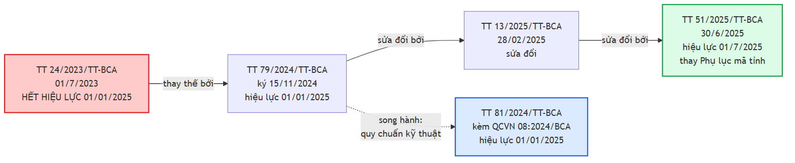

**Hình 2.2.** ** ** Chuỗi văn bản pháp lý về biển số xe đang có hiệu lực

**Bảng 2.2.** Các văn bản pháp lý là căn cứ của đồ án

| Văn bản | Ban hành | Hiệu lực | Nội dung liên quan |
|---|---|---|---|
| **TT 79/2024/TT-BCA** [8] | 15/11/2024 | 01/01/2025 | Văn bản gốc: cấu trúc biển, seri, màu sắc, ký hiệu |
| **TT 13/2025/TT-BCA** [9]<!-- bocongan_2025_tt13 --> | 28/02/2025 | — | Sửa đổi, bổ sung TT 79/2024 |
| **TT 51/2025/TT-BCA** [10]<!-- bocongan_2025_tt51 --> | 30/6/2025 | 01/7/2025 | **Thay toàn bộ Phụ lục mã tỉnh** sau sáp nhập còn 34 tỉnh/thành |
| **QCVN 08:2024/BCA** (kèm TT 81/2024/TT-BCA) [11]<!-- bocongan_2024_qcvn08 --> | 15/11/2024 | 01/01/2025 | **Quy chuẩn kỹ thuật quốc gia**: kết cấu, kích thước, vật liệu |
| TT 169/2021/TT-BQP [15]<!-- boquocphong_2021_tt169 --> | 2021 | — | Biển số xe quân đội — **ngoài phạm vi** TT 79/2024 |

Hai loại văn bản rất hay bị nhầm và module chuẩn hoá cần cả hai: TT 79/2024 quy định **nội dung** biển (mã tỉnh, seri, ký hiệu, màu) — cơ sở xây biểu thức chính quy; QCVN 08:2024/BCA quy định **hình thức vật lý** (kích thước, vật liệu, độ phản quang) — cơ sở xây ngưỡng phân loại theo tỷ lệ khung hình. Khung pháp lý đổi **ba lần trong hai năm** là nguồn rủi ro kỹ thuật trực tiếp, đúng kịch bản Meyer và cộng sự mô tả khi đề xuất kiến trúc giảm phụ thuộc cú pháp [19]. Ba hệ quả cụ thể nêu ở mục 2.2.7.

### 2.2.2. Cấu trúc biển số ô tô và xe máy

**a) Biển số ô tô** trong nước gồm **ba thành phần**, tổng **8 ký tự chữ–số**: `30A-123.45` (Hà Nội), `51K-999.99` (TP. Hồ Chí Minh, số thứ tự lớn nhất), `80B-123.45` (Cục Cảnh sát giao thông — không phải một địa phương).

**Bảng 2.3.** Phân rã thành phần biển số ô tô

| Thành phần | Độ dài | Tập giá trị | Nguồn |
|---|---|---|---|
| Mã địa phương | 2 chữ số | 81 mã hợp lệ trong dải 11 – 99 (mục 2.2.3) | [10], [14]<!-- thuviennhadat_2025_kyhieu34tinh --> |
| Seri đăng ký | **1 chữ cái** | 20 chữ cái với biển trắng và vàng; 11 chữ cái với biển xanh | [13]<!-- bocongan_2024_nhandienbienso --> |
| Số thứ tự | **5 chữ số** | 000.01 đến 999.99 | [8] |

Trên đường vẫn còn **biển 4 chữ số kiểu cũ** như `29A-1234`; xe đã đăng ký **không bắt buộc đổi biển** [26]<!-- chinhphu_2025_kyhieubienso --> nên biển 4 số hợp lệ vô thời hạn, và biểu thức chính quy bắt buộc chấp nhận nhóm thứ tự **4 hoặc 5 chữ số**.

**b) Biển số xe máy** cá nhân dùng seri **2 chữ cái**, tổng **9 ký tự chữ–số**: 2 chữ số mã tỉnh, 2 chữ cái seri, 5 chữ số thứ tự — ví dụ `29-HA 002.33`. Quy tắc 2 chữ cái áp dụng từ **15/8/2023**, giữ nguyên trong TT 79/2024 [27]<!-- chinhphu_2023_seribiensoxemay -->.

**Bảng 2.4.** Hai kiểu seri biển xe máy đang cùng lưu hành

| Kiểu | Cấu trúc seri | Ví dụ | Thời điểm cấp | Còn hợp lệ? |
|---|---|---|---|---|
| **Mới** | 2 chữ cái | `29-AA 123.45` | Từ 15/8/2023 | Đang được cấp |
| **Cũ** | 1 chữ cái + 1 chữ số | `29-B1 123.45` | Trước 15/8/2023 | Vẫn lưu hành hợp pháp |

Seri kiểu cũ **có phân biệt theo dung tích xi-lanh**, quy tắc đã bãi bỏ nhưng xe đã đăng ký không phải đổi biển [27]. Điều khoản chuyển tiếp ngày 31/12/2025 mà một số bài báo diễn giải thành "biển 1 chữ 1 số chỉ dùng đến hết năm 2025" là cách hiểu **không chính xác**: nó nói về việc dùng nốt phôi biển sản xuất trước 01/01/2025. Kết luận thực dụng: **biển kiểu cũ sẽ còn trên đường hàng chục năm**, biểu thức chính quy bắt buộc chấp nhận cả hai dạng.

**c) Một nhập nhằng cấu trúc quan trọng.** Chuỗi 8 ký tự dạng *hai chữ số – một chữ cái – năm chữ số* khớp **đồng thời** biển ô tô và biển xe máy kiểu cũ sau khi bỏ dấu phân cách, nên **không thể phân loại phương tiện chỉ bằng chuỗi ký tự** — bắt buộc thêm thông tin số dòng hoặc tỷ lệ khung hình, lý do hệ thống lưu trường số dòng như thuộc tính độc lập (Chương 4).

**d) Seri không còn cho biết loại xe.** Trước 2025 chữ cái seri mang ngữ nghĩa (`A` xe con dưới 9 chỗ, `B` xe khách trên 9 chỗ, `C` và `K` xe tải và bán tải), nhưng **từ 01/01/2025 quy định bị bãi bỏ**, seri cấp tuần tự [28]<!-- otocomvn_2025_seridangky -->; mọi heuristic "seri C suy ra xe tải" **sai về mặt pháp lý**, tín hiệu phân loại duy nhất còn hợp lệ là **màu nền biển** (mục 2.2.5).

### 2.2.3. Mã tỉnh, thành phố

Từ 01/7/2025 cả nước còn **34 tỉnh, thành phố**, ký hiệu địa phương sau hợp nhất **bao gồm toàn bộ ký hiệu của các địa phương được hợp nhất trước đó** [26]; biển cũ **không mất giá trị pháp lý**, bảng tra cứu chỉ mở rộng. Dải 11 – 99 có **89 số**, theo Phụ lục TT 51/2025 có **81 mã đang dùng** (80 mã địa phương và 01 mã Cục Cảnh sát giao thông — mã 80) và đúng **8 mã không dùng** [14].

**Bảng 2.5.** Tám mã không được sử dụng

| Mã không dùng | Ghi chú |
|---|---|
| **13, 42, 44, 45, 46, 87, 91, 96** | Nằm trong kho dự trữ, không gán cho bất kỳ địa phương nào |

Kiểm tra nhất quán: 89 − 81 = 8, khớp danh sách; đếm địa phương từ bảng mã đầy đủ được 34, khớp số đơn vị hành chính sau sáp nhập. TP. Hồ Chí Minh nhiều mã nhất — 13 mã (41; 50 đến 59; 61; 72) — do sáp nhập Bình Dương (61) và Bà Rịa – Vũng Tàu (72); Hà Nội 6 mã (29; 30 đến 33; 40) [14]. Kiểm tra mã tỉnh biến 89 khả năng thành 81, loại khoảng 9,0% không gian tìm kiếm ở hai ký tự đầu; nhưng giá trị thực sự lớn hơn nhiều: nó biến lỗi OCR ở hai vị trí đầu từ **sai âm thầm** thành **sai phát hiện được** — đọc ra `46A-123.45` thì hệ thống biết ngay mã 46 không tồn tại và hạ cờ hợp lệ, thay vì lưu một biển số sai trông rất thuyết phục vào cơ sở dữ liệu. Giả thuyết phổ biến rằng mã 13 là mã cũ của tỉnh Hà Bắc **chưa kiểm chứng được nguồn chính thức**, chỉ nêu tham khảo, không dùng làm căn cứ.

### 2.2.4. Tập ký tự seri và các chữ cái bị loại trừ

Đây là mục dễ bị trình bày sai nhất của chương, và một cách trình bày sai đã được phát hiện, sửa trong quá trình khảo sát. Biển nền trắng và nền vàng chữ đen của tổ chức, cá nhân trong nước dùng seri là **một trong 20 chữ cái** [13]; đối chiếu 26 chữ Latin thì vắng 6 chữ `I`, `J`, `O`, `Q`, `R`, `W`, từ đó **suy diễn "26 trừ 20 bằng 6 chữ bị loại trừ" là SAI**, vì danh sách 20 chữ ấy **chỉ áp dụng cho chữ cái thứ nhất**, còn seri xe mô tô gồm **hai chữ cái** và danh sách ở **vị trí thứ hai** là tập khác — **có R**, **không có G**. Hợp hai vị trí, tập chữ không bao giờ xuất hiện trên biển số Việt Nam chỉ gồm **5 chữ: I, J, O, Q, W**; chữ R còn xuất hiện ở ký hiệu seri đặc biệt `R` và `RM` của rơ moóc, sơ mi rơ moóc [29]<!-- khobiensodep_2025_kyhieudacbiet -->.

**Bảng 2.6.** Tổng hợp các tập ký tự seri

| Tập | Số lượng | Nội dung |
|---|:--:|---|
| Chữ cái thứ nhất của seri | 20 | A B C D E F **G** H K L M N P S T U V X Y Z |
| Chữ cái thứ hai của seri xe máy | 20 | A B C D E F H K L M N P **R** S T U V X Y Z |
| Seri biển nền xanh | 11 | A B C D E F G H K L M |
| **Bị loại trừ khỏi toàn hệ thống** | **5** | **I, J, O, Q, W** |
| Tập ký tự an toàn tối thiểu cho OCR | 21 | 20 chữ ở vị trí thứ nhất, hợp thêm R |

Xe mô tô biển nền xanh dùng 1 trong 11 chữ cái đó kết hợp 1 chữ số từ **1 đến 9** — **không có số 0** [13].

**c) Hệ quả kỹ thuật thứ nhất — ràng buộc theo vị trí, không phải theo tập phẳng.** G hợp lệ ở vị trí thứ nhất nhưng không hợp lệ ở vị trí thứ hai của seri xe máy, R thì ngược lại; bộ luật hậu xử lý dùng danh sách phẳng áp chung cả chuỗi sẽ **vừa bỏ sót lỗi vừa sửa nhầm ký tự đúng**. Đây là điểm đồ án xử lý khác các mô tả hiện có, thuộc phần đóng góp kỹ thuật nêu ở Chương 1. Ràng buộc khai thác được là tập 5 chữ I, J, O, Q, W: ký tự nào trong nhóm này xuất hiện ở vị trí chữ cái đều chắc chắn là lỗi, trong đó ba ánh xạ có cơ sở hình dạng rõ ràng là `O → 0`, `I → 1`, `Q → 0`, còn `J` và `W` không có ứng viên thay thế hiển nhiên nên chỉ **hạ cờ hợp lệ**. Chữ R **không** thuộc nhóm này và **tuyệt đối không được ánh xạ đi**.

**d) Hệ quả kỹ thuật thứ hai — tập ký tự huấn luyện OCR.** Xây tập huấn luyện theo "20 chữ cái" thì mô hình **không bao giờ có khả năng dự đoán chữ R** và sai hệ thống trên mọi biển xe máy có R ở vị trí thứ hai; mất mát này xảy ra ở **tầng mô hình** nên hậu xử lý không cứu được.

> **Khuyến nghị áp dụng cho đồ án.** Huấn luyện tập ký tự **đầy đủ A–Z và 0–9, tức 36 ký tự**, rồi áp ràng buộc hợp lệ ở **tầng hậu xử lý** — nơi ghi log, hiệu chỉnh và đo được hiệu quả. Nếu buộc phải thu hẹp vì hiệu năng, phải dùng **21 chữ cái** (20 chữ hợp thêm R), tuyệt đối không dùng 20.

**e) Hạn chế kiểm chứng cần giữ nguyên khi trình bày.** Hai danh sách chữ cái ở Bảng 2.6 **chưa được đối chiếu với toàn văn Điều 34 Thông tư 79/2024/TT-BCA**: bản PDF chính thức trên cổng thông tin Chính phủ là bản quét không có lớp văn bản, còn cổng tra cứu văn bản pháp luật chặn truy cập tự động. Kết luận về chữ R do đó dựa trên trích dẫn điều khoản qua nguồn thứ cấp và cần được xác nhận lại khi tiếp cận được toàn văn. Việc ghi rõ hạn chế này là bắt buộc và không được lược bỏ khi rút gọn văn bản.

**Bảng 2.7.** Các ký hiệu seri đặc biệt [29]

| Ký hiệu | Đối tượng áp dụng |
|---|---|
| `CD`, `MK`, `MĐ` | Xe máy chuyên dùng; máy kéo; xe máy điện |
| `R`, `RM` | Rơ moóc, sơ mi rơ moóc |
| `HC` | Ô tô phạm vi hoạt động hạn chế; xe chở người hoặc hàng bốn bánh gắn động cơ |
| `KT`, `LD`, `DA` | Doanh nghiệp quân đội; doanh nghiệp có vốn đầu tư nước ngoài và xe thuê từ nước ngoài; Ban quản lý dự án có vốn đầu tư nước ngoài |
| `T`, `TĐ` | Đăng ký tạm thời; xe sản xuất lắp ráp trong nước được thí điểm |

Hai bẫy kỹ thuật: **chữ R xuất hiện ở đây** dù ngoài tập 20 chữ cái, củng cố khuyến nghị (d) rằng hậu xử lý không được cấm tuyệt đối chữ R; và `TĐ`, `MĐ` chứa `Đ` — ký tự **không thuộc bảng chữ cái Latin ASCII** — nên OCR huấn luyện trên tập Latin gần như chắc chắn trả về `D`, module chuẩn hoá phải chấp nhận cả hai dạng rồi quy về một dạng chuẩn tắc.

### 2.2.5. Màu nền và ý nghĩa

**Bảng 2.8.** Màu nền biển số và đối tượng áp dụng [13]

| Màu nền | Màu chữ | Đối tượng | Ghi chú cho ALPR |
|---|---|---|---|
| Trắng | Đen | Tổ chức, cá nhân trong nước, xe **không** kinh doanh vận tải | Phổ biến nhất |
| Vàng | Đen | Xe **kinh doanh vận tải** | Tín hiệu phân loại **duy nhất còn hợp lệ** |
| Xanh dương | Trắng | Cơ quan Đảng, Quốc hội, Chính phủ, Toà án, Viện kiểm sát, cơ quan nhà nước, công an | Seri chỉ dùng 11 chữ cái |
| Trắng | **Đỏ** | Xe ngoại giao (`NG`) và tổ chức quốc tế (`QT`) | Cấu trúc chuỗi khác hẳn [30]<!-- vietnamnet_2023_biensongoaigiao --> |
| Đỏ | Trắng | Xe quân đội và doanh nghiệp quân đội | **Ngoài phạm vi** TT 79/2024, thuộc TT 169/2021/TT-BQP [15] |

QCVN 08:2024/BCA chỉ quy định **4 tổ hợp màu** và **không có tổ hợp nền đỏ** [11] — biển nền đỏ chữ trắng của quân đội do Bộ Quốc phòng quản lý theo văn bản riêng [15], nguyên nhân của nhiều mâu thuẫn khi tra cứu. **Xe điện không có biển số riêng**: theo TT 79/2024 hiệu lực 01/01/2025, xe năng lượng sạch **không được cấp biển màu xanh lá cây** mà dùng biển thông thường kèm biểu tượng nhận diện [31]<!-- conganlangson_2024_tt79 -->, nên **không thể phát hiện xe điện qua màu biển** và `MĐ` chỉ dùng cho xe máy điện. Vì seri không còn phân biệt loại xe (mục 2.2.2d), màu nền là tín hiệu phân loại duy nhất còn hợp lệ [32]<!-- thuvienphapluat_2025_mausacseri -->; nhưng module chuẩn hoá làm việc trên **chuỗi ký tự** chứ không trên ảnh, nên phân loại theo màu nằm ngoài phạm vi của nó, cần một bước phân tích histogram màu trên ảnh crop nếu đưa vào phạm vi sau này.

### 2.2.6. Kích thước vật lý và tỷ lệ khung hình

Mục này cho cơ sở định lượng để phân biệt biển một dòng với biển hai dòng — bài toán mà mục 2.6.3 chỉ ra là then chốt với rủi ro R-04.

**Bảng 2.9.** Số lượng và dạng biển số theo loại phương tiện [32]

| Loại xe | Số biển | Dạng | Vị trí gắn |
|---|:--:|---|---|
| **Ô tô**, xe máy chuyên dùng | **02** | 01 biển ngắn (**2 dòng**) và 01 biển dài (**1 dòng**) | Trước và sau |
| **Xe mô tô, xe gắn máy**; rơ moóc, sơ mi rơ moóc | **01** | **2 dòng** | Phía sau |

Hệ quả: **một ô tô mang cùng một chuỗi ký tự trên hai biển có hình dạng vật lý hoàn toàn khác nhau** — camera trước bắt biển một dòng, camera sau bắt biển hai dòng; cùng một xe nhưng là hai bài toán OCR.

**Bảng 2.10.** Kích thước và tỷ lệ khung hình của các loại biển số [11]

| Loại biển | Kích thước (dài × cao) | Tỷ lệ khung hình | Số dòng |
|---|---|:--:|:--:|
| Ô tô — biển **dài** | **520 × 110 mm** | **4,727** | **1 dòng** |
| Ô tô — biển **ngắn** | **330 × 165 mm** | **2,000** | **2 dòng** |
| **Xe mô tô, xe gắn máy** | **190 × 140 mm** | **1,357** | **2 dòng** |

> **⚠️ Cảnh báo về mốc hiệu lực của bộ số liệu kích thước.** Bộ số liệu trên **chỉ đúng từ 01/01/2025**; tiêu chuẩn trước đó quy định biển ô tô ngắn **200 × 280 mm**, biển dài **110 × 470 mm**, và rất nhiều tài liệu thứ cấp — kể cả bài báo năm 2023 — vẫn dùng bộ số cũ. Mọi trích dẫn kích thước biển số **bắt buộc ghi kèm mốc hiệu lực**; nếu không, người phản biện đối chiếu văn bản hiện hành sẽ kết luận là sai.

Ba giá trị trên có đặc tính rất thuận lợi: **không loại biển nào rơi vào khoảng (2,000 ; 4,727)**, và khoảng trống rộng 2,727 đơn vị này khiến phân biệt một dòng với hai dòng bằng tỷ lệ khung hình trở nên đáng tin cậy.

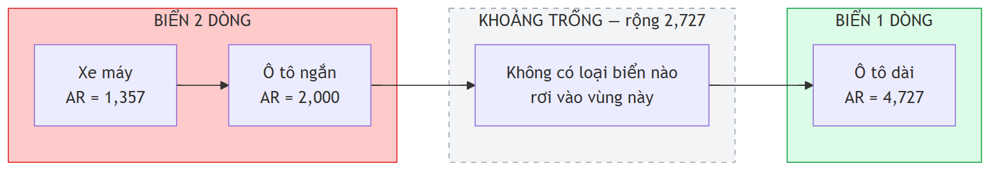

**Hình 2.3.** ** ** Khoảng trống tỷ lệ khung hình giữa biển hai dòng và biển một dòng *(dẫn xuất từ [11])

**Bảng 2.11.** Ngưỡng phân loại bố cục theo tỷ lệ khung hình — đề xuất của đồ án

| Điều kiện | Kết luận |
|---|---|
| AR < 2,5 | Biển **2 dòng** |
| AR > 3,0 | Biển **1 dòng** |
| 2,5 ≤ AR ≤ 3,0 | **Vùng nghi ngờ** — thử cả hai nhánh, chọn kết quả có độ tin cậy cao hơn |

> **Hai lưu ý bắt buộc về bộ ngưỡng này. Thứ nhất, đây là đề xuất của đồ án, KHÔNG phải quy định pháp luật:** ba giá trị 1,357 / 2,000 / 4,727 trích dẫn được từ QCVN 08:2024/BCA, nhưng ngưỡng 2,5 và 3,0 là **suy luận thiết kế của tác giả**, phải kiểm chứng bằng thực nghiệm — TT 79/2024 chỉ quy định kích thước vật lý, không chứa ngưỡng tỷ lệ khung hình nào cho bài toán phân loại thị giác máy tính, nên gán bộ ngưỡng này cho văn bản pháp luật là lỗi trích dẫn. **Thứ hai, điều kiện áp dụng bắt buộc:** phải đo tỷ lệ khung hình trên ảnh **đã nắn chỉnh phối cảnh** hoặc trên hộp bao xoay tối thiểu, **không** đo trên hộp bao thẳng trục do detector trả về, vì biển một dòng chụp nghiêng 30° có hộp bao thẳng trục với tỷ lệ tụt xuống dưới 3,0 và sẽ bị phân loại nhầm.

**Bảng 2.12.** Bố cục nội dung của biển hai dòng

| Loại biển | Dòng trên | Dòng dưới | Ví dụ |
|---|---|---|---|
| Ô tô biển ngắn | Mã tỉnh và seri | 5 chữ số | `30A` / `123.45` |
| Xe máy kiểu mới | Mã tỉnh và 2 chữ cái | 5 chữ số | `29-AA` / `123.45` |
| Xe máy kiểu cũ | Mã tỉnh, chữ cái và chữ số | 4 – 5 chữ số | `29-B1` / `123.45` |

**e) Dấu phân cách.** Quy định dùng dấu chấm phân cách ba chữ số đầu với hai chữ số sau của nhóm thứ tự và dấu gạch ngang phân cách các nhóm, nhưng các nguồn mô tả vị trí dấu gạch ngang không nhất quán và không tra cứu được nguyên văn phần quy cách in ấn của QCVN 08:2024/BCA. Thay vì đoán, đồ án chọn quyết định thiết kế an toàn: **module chuẩn hoá loại bỏ toàn bộ ký tự phân cách rồi kiểm tra hợp lệ trên chuỗi chữ–số thuần**, không cố định vị trí dấu gạch ngang trong biểu thức chính quy.

**f) Hai thông số vật lý khác.** Biển làm bằng hợp kim nhôm, có màng hoặc mực phản quang, bốn góc bo tròn, chiều cao dập nổi của chữ và số là **(1,7 ± 0,1) mm** [11]. Chữ **dập nổi** tạo bóng đổ và vùng loá phụ thuộc góc chiếu — nguồn nhiễu đặc thù của biển kim loại, nguyên nhân các lỗi kiểu `B` đọc thành `3` do loá; ngược lại việc chuẩn hoá vật liệu và font chữ toàn quốc là yếu tố tốt cho độ ổn định của OCR.

### 2.2.7. Ý nghĩa đối với thiết kế hệ thống nhận dạng

**Bảng 2.13.** Từ quy chuẩn pháp lý tới quyết định thiết kế

| # | Dữ kiện từ quy chuẩn | Hệ quả thiết kế |
|:--:|---|---|
| 1 | 81 mã tỉnh hợp lệ trong dải 89 số | Kiểm tra mã tỉnh biến lỗi OCR ở hai ký tự đầu từ "sai âm thầm" thành "sai phát hiện được" |
| 2 | Tập ký tự seri khác nhau **theo từng vị trí**; loại trừ toàn hệ thống chỉ 5 chữ I J O Q W; chữ R hợp lệ | Hậu xử lý phải ràng buộc **theo vị trí**, không dùng danh sách phẳng; tập ký tự huấn luyện OCR dùng đủ 36 ký tự |
| 3 | Hai kiểu seri xe máy cùng lưu hành; nhóm thứ tự có 4 hoặc 5 chữ số | Biểu thức chính quy phải chấp nhận nhiều nhánh cú pháp cùng lúc |
| 4 | Chuỗi 8 ký tự khớp đồng thời biển ô tô và biển xe máy kiểu cũ | **Không thể** phân loại phương tiện chỉ từ chuỗi ký tự; bắt buộc lưu trường số dòng như thuộc tính độc lập |
| 5 | Seri không còn cho biết loại xe từ 01/01/2025 | Cấm mọi heuristic suy ra loại phương tiện từ chữ cái seri |
| 6 | Ba tỷ lệ khung hình cách nhau đủ xa, khoảng trống rộng 2,727 | Cơ sở định lượng cho ngưỡng phân loại bố cục (Bảng 2.11), làm lớp dự phòng cho phân loại bằng detector |
| 7 | Khung pháp lý đổi ba lần trong hai năm; các bộ dữ liệu công khai đều thu thập trước các mốc đó | Hậu xử lý phải tách rời mô hình để cập nhật độc lập; cần lường trước lệch phân bố theo thời gian [19] |

Về mức đóng góp: luận điểm dự kiến ban đầu là "khai thác tập 20 chữ cái, loại trừ 6 chữ I J O Q R W". Mệnh đề đó **sai**, và việc sửa lại làm **yếu đi** phần đóng góp nếu tính theo tiêu chí thu hẹp không gian tìm kiếm; đổi lại, phần có giá trị chuyển sang chỗ khó hơn là ràng buộc **phụ thuộc vị trí trong chuỗi**. Một hệ thống dùng danh sách phẳng 20 chữ cái sẽ sai hệ thống trên toàn bộ lớp biển xe máy có R ở vị trí thứ hai — lỗi mà bộ luật của đồ án ngăn được. Đóng góp vì vậy được trình bày là **đúng đắn về mặt pháp lý và đúng về cấu trúc**, không phải một cải thiện lớn về không gian tìm kiếm.

## 2.3. Lịch sử phát triển các phương pháp

### 2.3.1. Giai đoạn xử lý ảnh cổ điển

Trước học sâu, ALPR dùng đặc trưng thủ công (*hand-crafted features*): xám hoá, lọc cạnh dọc bằng **Sobel** (vùng biển có mật độ cạnh dọc cao bất thường), nhị phân hoá, **đóng/mở hình thái học** (*morphological closing/opening*), rồi chiếu ngang và dọc (*projection*) để khoanh vùng ứng viên [33]<!-- springer_2012_edgemorphology --> [34]<!-- ieee_2013_edgegeometrical -->; phân đoạn ký tự dựa trên thành phần liên thông (*connected components*) hoặc histogram chiếu; phân lớp ký tự dùng đối sánh mẫu (*template matching*), mạng nơ-ron nông hoặc **SVM**. Một công trình thực hiện đúng trên biển số Việt Nam: phân đoạn ký tự cho **cả biển một dòng và hai dòng**, thử nghiệm trên 600 biển Việt Nam (300 một dòng và 300 hai dòng), đạt trung bình 98,03% với tiền xử lý gồm lượng tử hoá, chuẩn hoá, hiệu chỉnh contour ngang, khử nhiễu bằng morphology opening, rồi phân đoạn *peak-to-valley* dựa trên tham số thống kê của biển số Việt Nam [35]<!-- amr_2012_charsegmentation -->.

Điểm yếu cố hữu là tính giòn: mỗi ngưỡng phải hiệu chỉnh thủ công, hiệu năng sụt nhanh khi ánh sáng không đều, nền phức tạp hoặc biển nghiêng. Bằng chứng định lượng rõ nhất về khoảng cách hai thế hệ công nghệ đến từ một cài đặt cổ điển công khai cho biển số Việt Nam dùng KNN kết hợp OpenCV: phát hiện chỉ đạt **49,2% với biển một dòng** (182/370 mẫu) và **39,3% với biển hai dòng** (924/2.349 mẫu); trong số biển đã phát hiện, đọc đúng hoàn toàn chỉ 33,5% với biển một dòng và 31% với biển hai dòng [36]<!-- mrzaizai2k_2025_vietnameselp -->.

> **Lưu ý khi đọc hai con số 33,5% và 31%.** Chúng tính **trên số biển đã phát hiện được**, không phải trên toàn bộ tập kiểm thử; quy về end-to-end thì con số thực tế còn thấp hơn nhiều. Đây là ví dụ điển hình cho nguyên tắc phải đọc kỹ mẫu số của một chỉ số trước khi so sánh — phát biểu đầy đủ ở mục 2.7.1 (*"Ba lưu ý bắt buộc khi đọc Bảng 2.20"*), áp dụng lại ở mục 2.6.4.

### 2.3.2. Giai đoạn học sâu

Detector một giai đoạn (YOLO) và hai giai đoạn (Faster R-CNN) đã thay thế hoàn toàn khối phát hiện thủ công, theo hai nhịp. **Nhịp thứ nhất (khoảng 2016 – 2020) — pipeline học sâu hai giai đoạn**, ba mốc tiêu biểu: Laroca và cộng sự dùng YOLO cho từng giai đoạn kèm CNN tinh chỉnh riêng, đạt **93,53% recognition rate ở 47 FPS** trên SSIG, vượt cả hai hệ thống thương mại đối chứng trên cùng benchmark [37]<!-- laroca_2018_yolo -->; Silva và Jung giới thiệu WPOD-NET để chính mạng học luôn phép biến đổi nắn chỉnh thay vì tách thành bước tiền xử lý riêng [22]; Xu và cộng sự công bố CCPD — bộ dữ liệu quy mô lớn đầu tiên của lĩnh vực — cùng baseline RPnet đạt **98,5% accuracy trên 61 FPS** [38]<!-- xu_2018_ccpd -->.

**Nhịp thứ hai (2020 – 2026) — end-to-end, Transformer và mô hình ngôn ngữ–thị giác**, ba nhánh song song: hợp nhất detection và recognition vào một mạng huấn luyện end-to-end trong một lần lan truyền xuôi để tránh tích luỹ lỗi trung gian [39]<!-- li_2019_endtoend -->; bỏ hẳn phân đoạn ký tự, đọc thẳng cả chuỗi bằng CTC [40]<!-- zherzdev_2018_lprnet --> hoặc attention hai chiều trên bản đồ đặc trưng 2D [41]<!-- zhang_2020_attentional -->; và đưa mô hình ngôn ngữ–thị giác (*Vision-Language Model*, VLM) cùng mô hình ngôn ngữ lớn vào ALPR để nhận dạng không phụ thuộc layout [42]<!-- shabaninia_2025_layoutindependent --> [43]<!-- aldahoul_2024_vehiclepaligemma --> [44]<!-- gong_2026_lpllm -->.

### 2.3.3. So sánh ưu nhược điểm hai giai đoạn

**Bảng 2.14.** So sánh phương pháp xử lý ảnh cổ điển và phương pháp học sâu

| Tiêu chí | Xử lý ảnh cổ điển | Học sâu |
|---|---|---|
| Trích đặc trưng và phân lớp ký tự | Thủ công: Sobel, morphology, projection, contour; template matching, KNN, SVM, mạng nơ-ron nông | Học tự động qua các tầng tích chập; CNN, CRNN, Transformer, VLM |
| Dữ liệu gán nhãn và chi phí phát triển | Thấp, chủ yếu hiệu chỉnh ngưỡng; rẻ ban đầu nhưng tăng nhanh khi mở rộng điều kiện | Cao, cần hàng nghìn tới hàng trăm nghìn ảnh; đắt ban đầu, ổn định khi mở rộng |
| Chi phí tính toán khi suy luận | Rất thấp, chạy được trên phần cứng yếu | Cao hơn nhiều, thường cần tối ưu để chạy trên CPU |
| Chịu nghiêng, mờ, thiếu sáng; khả năng giải thích | Kém, mỗi ngưỡng phải chỉnh lại theo điều kiện; bù lại quan sát được từng bước | Tốt hơn rõ rệt nếu dữ liệu đủ đa dạng; nhưng mô hình là hộp đen |
| Bằng chứng định lượng trên biển số Việt Nam | Phát hiện 49,2% (một dòng) / 39,3% (hai dòng) [36] | Nhiều công trình báo cáo trên 90% (mục 2.7) |

Kết luận: học sâu là lựa chọn bắt buộc về hiệu năng, nhưng ràng buộc **suy luận trên CPU** khiến đồ án không thể chọn tuỳ ý mô hình lớn nhất — ràng buộc chi phối toàn bộ phần lựa chọn công nghệ ở Chương 3. Kỹ thuật cổ điển không bị loại bỏ hoàn toàn: *peak-to-valley* [35] và các phép biến đổi hình học của OpenCV vẫn làm lớp dự phòng cho bài toán tách dòng (mục 2.6.3).

## 2.4. Phân loại các hướng tiếp cận hiện nay

Tài liệu chuyên ngành thường trộn lẫn hai trục vốn độc lập: **cách tổ chức pipeline** (two-stage hay end-to-end) và **cách xử lý ký tự bên trong khối nhận dạng** (segmentation-based hay segmentation-free). Một hệ thống two-stage hoàn toàn có thể dùng bộ nhận dạng segmentation-free và ngược lại.

### 2.4.1. Two-stage và end-to-end

**Two-stage** tách detection và recognition thành hai mô hình độc lập: tối ưu, thay thế, gỡ lỗi riêng được, tận dụng được OCR huấn luyện sẵn, xác định được khối nào gây lỗi; nhược điểm là lỗi detection lan truyền không có cơ chế phục hồi và thời gian suy luận là tổng hai bước. Đại diện: WPOD-NET [22], pipeline YOLO nhiều giai đoạn [37], hệ thống độc lập layout của Laroca và cộng sự [23]. **End-to-end** hợp nhất vào một mạng: Li, Wang và Shen trình bày mạng thống nhất định vị và nhận dạng trong **một lần lan truyền xuôi duy nhất**, vừa tránh tích luỹ lỗi trung gian vừa tăng tốc độ [39]; RPnet đồng thời dự đoán bounding box và đọc chuỗi [38]. Nhược điểm là mất tính module — thay bộ nhận dạng thì phải huấn luyện lại toàn mạng.

### 2.4.2. Segmentation-based và segmentation-free

**Segmentation-based** tách từng ký tự rồi phân lớp riêng lẻ — pipeline YOLO nhiều giai đoạn của Laroca và cộng sự theo hướng này, kết hợp tăng cường dữ liệu bằng biển đảo ngược và ký tự lật [37]; nhược điểm cố hữu là chất lượng phân đoạn quyết định toàn bộ kết quả, biển mờ, dính bẩn hoặc ký tự sát nhau khiến bước này thất bại. **Segmentation-free** bỏ hẳn tách ký tự, đọc thẳng cả chuỗi.

**Bảng 2.15.** Bốn nhánh kỹ thuật của hướng segmentation-free

| Nhánh | Cơ chế | Công trình đại diện |
|---|---|---|
| CTC | Huấn luyện end-to-end bằng *Connectionist Temporal Classification loss*, không cần căn chỉnh vị trí ký tự với nhãn | LPRNet — hệ thống thời gian thực không dùng RNN [40] |
| Attention / seq2seq | Attention hai chiều trên bản đồ đặc trưng 2D, không cần heuristic hay hậu xử lý | Khung attention với encoder Xception [41] |
| Bộ phân lớp chia sẻ trọng số | Bỏ cả RNN lẫn phân đoạn ký tự | SCR-Net trong VSNet [45]<!-- wang_2021_vsnet --> |
| VLM / LLM | Mô hình ngôn ngữ–thị giác đọc trực tiếp, bỏ luôn phân loại layout thủ công | [42], [44] |

**Hai chiến lược đối lập cho vấn đề đa layout.** Hướng **phân loại layout tường minh**: Laroca và cộng sự hợp nhất phát hiện biển và phân loại layout vào cùng một mạng để chọn đúng luật hậu xử lý cho từng vùng lãnh thổ, đạt **96,9% end-to-end recognition rate trung bình trên 8 tập dữ liệu công khai từ 5 khu vực** [23]. Hướng **không phụ thuộc layout**: dùng VLM kết hợp tinh chỉnh hậu-OCR để vừa nhận dạng vừa sửa lỗi, bỏ hoàn toàn bước phân loại layout thủ công [42].

### 2.4.3. Sơ đồ phân loại


**Hình 2.4.** ** ** Sơ đồ phân loại hai trục các hướng tiếp cận ALPR và định vị lựa chọn của đồ án

Đồ án theo **two-stage** ở trục thứ nhất và dùng bộ nhận dạng **segmentation-free** có sẵn ở trục thứ hai. Lựa chọn two-stage là hệ quả của một ràng buộc kiến trúc cứng — phải **thay được bộ OCR mà không huấn luyện lại toàn hệ thống** — vì như trình bày ở mục 3.3, quyết định về engine OCR chưa chốt ở giai đoạn thiết kế mà phụ thuộc thực nghiệm, trong khi end-to-end sẽ khoá cứng lựa chọn đó. Về đa layout, đồ án chọn **phân loại layout tường minh** thay vì VLM vì VLM có chi phí suy luận cao hơn nhiều bậc độ lớn, không tương thích ràng buộc CPU (số liệu ở mục 2.7.1), còn quy chuẩn Việt Nam đã cho sẵn cơ sở định lượng rất mạnh để phân loại layout (mục 2.2.6).

## 2.5. Cơ sở lý thuyết về phát hiện đối tượng

### 2.5.1. Bài toán object detection, IoU và NMS

**Phát hiện đối tượng** (*object detection*) đồng thời định vị và phân loại đối tượng: với ảnh $I$, mô hình trả về tập dự đoán gồm hộp bao (*bounding box*) $B = (x, y, w, h)$, nhãn lớp $c$ và điểm tin cậy $s \in [0, 1]$; bài toán của đồ án chỉ có một lớp `license_plate`. **Intersection over Union (IoU)** đo chồng lấp giữa hộp dự đoán $B_p$ và hộp thực $B_{gt}$:

$$\mathrm{IoU}(B_p, B_{gt}) = \frac{|B_p \cap B_{gt}|}{|B_p \cup B_{gt}|}$$

<div align="right">(2.1)</div>

IoU nằm trong $[0, 1]$, bằng 1 khi hai hộp trùng khít; một dự đoán được coi là đúng (*true positive*) khi IoU vượt ngưỡng cho trước, thông thường 0,5, còn $P_{75}$ nghĩa là precision đo tại ngưỡng IoU 0,75 — chặt hơn đáng kể. Với biển số, **hộp bao rất dẹt** nên IoU nhạy với sai số định vị hơn hộp gần vuông: với hộp tỷ lệ 4,7:1, lệch vài pixel theo chiều cao làm IoU giảm mạnh hơn hẳn cùng mức lệch trên hộp vuông cùng diện tích — nguyên nhân khoảng cách rất lớn giữa mAP@0.5 và mAP@0.5:0.95 (mục 2.5.4).

**Non-Maximum Suppression (NMS)** xử lý việc một đối tượng bị dự đoán bởi nhiều hộp chồng lấp: sắp xếp hộp theo điểm tin cậy giảm dần, chọn hộp cao nhất, loại mọi hộp có IoU với nó vượt ngưỡng NMS, rồi lặp lại. Hạ ngưỡng tin cậy làm tăng recall và giảm precision; ngưỡng IoU của NMS đặt quá thấp sẽ xoá nhầm hai biển thật nằm sát nhau, quá cao sẽ để lọt hộp trùng lặp — với ảnh giao thông Việt Nam nhiều xe máy sát nhau, đây là tham số cần hiệu chỉnh cẩn thận, giá trị cụ thể xác định bằng thực nghiệm ở Chương 6. Hướng mới là **bỏ hẳn NMS**: YOLOv10 dùng *consistent dual assignments* với đầu one-to-many chỉ dùng khi huấn luyện và đầu one-to-one khi suy luận, sinh đúng một dự đoán mỗi đối tượng [46]<!-- wang_2024_yolov10paper -->; YOLO26 đưa NMS-free thành mặc định [47]<!-- jocher_2025_yolo26 -->.

### 2.5.2. Kiến trúc YOLO: nguyên lý one-stage và anchor-free

**Họ two-stage** (Faster R-CNN, Mask R-CNN) sinh vùng đề xuất (*region proposals*) rồi phân loại và tinh chỉnh từng đề xuất, chi phí tỷ lệ số đề xuất nên độ trễ cao; **họ one-stage** (YOLO, SSD, RetinaNet) hồi quy trực tiếp hộp bao và điểm phân lớp trong một lần lan truyền xuôi, chi phí cố định theo kích thước ảnh nên đạt thời gian thực. Ràng buộc CPU loại họ two-stage ngay từ đầu; đồng thời khoảng cách độ chính xác giữa hai họ đã thu hẹp gần hết — một nghiên cứu ALPR trên 50.000 ảnh và 10.000 video clip so sánh YOLOv5, YOLOv8, YOLOv9, YOLOv10 với Faster R-CNN và SSD, kết luận nhóm YOLO vượt trội cả về độ chính xác lẫn thời gian suy luận [48]<!-- scirep_2025_advanceddl -->.


**Hình 2.5.** ** ** Kiến trúc tổng quát backbone – neck – head của YOLO11 *(theo [49], [16])

Ba phần của một mô hình YOLO hiện đại: **backbone** trích đặc trưng qua chuỗi khối tích chập, thường kết thúc bằng SPPF (*Spatial Pyramid Pooling – Fast*) gộp thông tin đa tỷ lệ; **neck** hợp nhất đặc trưng nhiều tầng theo hai chiều — đường đi xuống mang ngữ nghĩa từ tầng sâu về tầng nông, đường đi lên mang vị trí từ tầng nông lên tầng sâu — để phát hiện tốt cả đối tượng lớn lẫn nhỏ; **head** sinh dự đoán, và từ YOLOv8 Ultralytics dùng **anchor-free split head** tách nhánh phân loại khỏi nhánh hồi quy, bỏ hoàn toàn nhu cầu tinh chỉnh anchor box thủ công [49]<!-- jocher_2023_yolov8 -->.

Anchor-free có ý nghĩa riêng với biển số: kiến trúc anchor-based (YOLOv5 trở về trước) hồi quy độ lệch so với tập hộp mẫu thiết kế theo phân bố tỷ lệ khung hình của tập huấn luyện — thường là COCO — trong khi biển số nằm ngoài phân bố đó (biển ô tô một dòng khoảng 4,7:1, biển xe máy hai dòng khoảng 1,4:1; số liệu chính xác ở mục 2.2.6), buộc phải thiết kế lại tập anchor hoặc chạy k-means, công đoạn tốn công và dễ sai. Anchor-free hồi quy **trực tiếp khoảng cách từ tâm đến bốn cạnh** nên xử lý cả hai chế độ tỷ lệ bằng một cơ chế và bỏ hẳn một nhóm siêu tham số [16]<!-- jocher_2024_yolo11 -->.

### 2.5.3. YOLO11: các cải tiến kiến trúc

Bài tổng quan độc lập xác định ba thành phần chính của YOLO11 là **C3k2**, **SPPF**, **C2PSA** [50]<!-- khanam_2024_yolov11overview -->; phần dưới đối chiếu trực tiếp mã nguồn định nghĩa các khối trong Ultralytics [51]<!-- ultralytics_2026_blockpy --> thay vì dựa vào mô tả thứ cấp hay diễn giải sai.

**a) C3k2 — không phải kiến trúc mới, mà là C2f có thể hoán đổi khối con.** Mã nguồn cho thấy `C3k2` **kế thừa trực tiếp từ `C2f`** của YOLOv8 và mang đúng mô tả *"Faster Implementation of CSP Bottleneck with 2 convolutions"*; khác biệt duy nhất là một cờ quyết định nội dung danh sách khối con — cờ tắt dùng `Bottleneck` tiêu chuẩn và **giống hệt C2f**, cờ bật dùng khối `C3k` kế thừa từ `C3`, cho phép tuỳ chỉnh kích thước nhân tích chập [51]. Điều này giải thích vì sao YOLO11 giảm được tham số mà vẫn giữ hoặc tăng độ chính xác: không đổi triết lý CSP, chỉ cấu hình linh hoạt hơn ở mức khối.

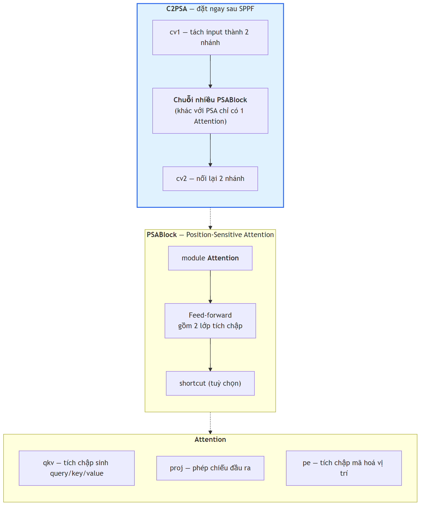

**Hình 2.6.** ** ** Cấu trúc phân cấp của khối C2PSA trong YOLO11 *(đối chiếu mã nguồn [51])

**b) C2PSA — thành phần mà YOLOv8 hoàn toàn không có**, khác biệt kiến trúc thực sự giữa hai phiên bản. Vị trí **ngay sau SPPF trong backbone** là điểm bản đồ đặc trưng đã tổng hợp thông tin đa tỷ lệ, nơi attention theo vị trí tái phân bổ trọng số theo vị trí không gian. Tài liệu so sánh chính thức của Ultralytics khẳng định cơ chế này cải thiện mạnh phát hiện **đối tượng nhỏ** và xử lý **che khuất phức tạp** so với YOLOv8 [52]<!-- ultralytics_2025_yolo11vsyolov8 -->.

> **Lưu ý về mức độ chứng minh của luận cứ trên.** Phát biểu về cải thiện đối tượng nhỏ là **định tính**: Ultralytics không công bố AP_small, AP_medium, AP_large tách riêng theo chuẩn COCO cho từng biến thể, nên **không thể trích dẫn số liệu chính thức** để chứng minh định lượng YOLO11 tốt hơn YOLOv8 trên đối tượng nhỏ bao nhiêu [16]. Đồ án do đó phải **tự đo trên tập dữ liệu biển số của mình**; kết quả ở Chương 6.

**Bảng 2.16.** So sánh khác biệt kiến trúc giữa các phiên bản YOLO gần đây

| Phiên bản | Khối backbone | Cơ chế attention | Đầu dự đoán | NMS | Điểm mới đáng chú ý nhất |
|---|---|---|---|:--:|---|
| YOLOv8 [49] | C2f | Không có | Anchor-free, tách nhánh | Có | Chuyển sang anchor-free |
| YOLOv9 [53]<!-- wang_2024_yolov9 --> | GELAN | Không có | Anchor-free | Có | PGI chống mất mát thông tin |
| YOLOv10 [46] | Rank-guided blocks | Partial self-attention | Hai đầu song song | **Không** | Consistent dual assignments |
| **YOLO11** [16] | **C3k2** (kế thừa C2f) | **C2PSA** sau SPPF | Anchor-free, tách nhánh | Có | C2PSA cải thiện đối tượng nhỏ |
| YOLOv12 [54]<!-- tian_2025_yolov12 --> / YOLOv13 [55]<!-- lei_2025_yolov13 --> | R-ELAN / DS-C3k2 | Area Attention / HyperACE (hypergraph) | Anchor-free | Có | Kiến trúc lấy attention làm trung tâm; tương quan bậc cao, FullPAD |
| YOLO26 [47] | Kế thừa dòng Ultralytics | Kế thừa dòng Ultralytics | **Bỏ DFL** | **Không** (mặc định) | Bỏ DFL, dễ xuất và lượng tử hoá |

Luận cứ chọn YOLO11 cho đồ án trình bày đầy đủ ở mục 3.2.

### 2.5.4. Các chỉ số đánh giá khối phát hiện

**a) Precision, Recall và F1.** Với $TP$ số dự đoán đúng, $FP$ số dự đoán sai, $FN$ số đối tượng bị bỏ sót:

$$\mathrm{Precision} = \frac{TP}{TP + FP}$$

<div align="right">(2.2)</div>

$$\mathrm{Recall} = \frac{TP}{TP + FN}$$

<div align="right">(2.3)</div>

$$F_1 = \frac{2 \cdot \mathrm{Precision} \cdot \mathrm{Recall}}{\mathrm{Precision} + \mathrm{Recall}}$$

<div align="right">(2.4)</div>

$F_1$ là trung bình điều hoà, dùng khi cần một con số tổng hợp duy nhất. Với ALPR, **recall của detection quan trọng hơn precision**: biển bị bỏ sót là mất vĩnh viễn, còn vùng báo nhầm sẽ bị OCR và hậu xử lý loại ở bước sau vì chuỗi không khớp cú pháp biển số Việt Nam.

**b) AP và mAP.** AP của một lớp là diện tích dưới đường cong Precision–Recall, mAP là trung bình AP trên $N$ lớp:

$$\mathrm{AP} = \int_0^1 p(r)\, \mathrm{d}r$$

<div align="right">(2.5)</div>

$$\mathrm{mAP} = \frac{1}{N}\sum_{i=1}^{N} \mathrm{AP}_i$$

<div align="right">(2.6)</div>

với $p(r)$ là precision tại mức recall $r$. Bài toán một lớp của đồ án có $N = 1$ nên mAP trùng AP của lớp `license_plate`.

**c) mAP@0.5 và mAP@0.5:0.95 — hai chỉ số khác nhau, không được so sánh chéo.** **mAP@0.5** tính AP tại **một ngưỡng IoU cố định 0,5** — chỉ cần chồng lấp một nửa đã tính là đúng; **mAP@0.5:0.95** lấy **trung bình AP trên 10 ngưỡng IoU** từ 0,5 đến 0,95 bước 0,05:

$$\mathrm{mAP@0.5\!:\!0.95} = \frac{1}{10}\sum_{t \in \{0{,}50;\, 0{,}55;\, \ldots;\, 0{,}95\}} \mathrm{mAP@}t$$

<div align="right">(2.7)</div>

> **Trên cùng một mô hình và cùng một tập dữ liệu, mAP@0.5:0.95 LUÔN nhỏ hơn hoặc bằng mAP@0.5** — vì mAP@0.5 là một trong mười số hạng của phép trung bình ở (2.7), và là số hạng lớn nhất.

Khoảng cách giữa hai chỉ số trong bài toán biển số thường rất lớn do hộp bao dẹt (mục 2.5.1), với ba minh chứng: Batra và cộng sự đạt **mAP@0.5 = 87,2%** trong khi **mAP@0.5:0.95 chỉ 46,5%** trên biển số Ấn Độ [56]<!-- batra_2022_yolov5 -->; một nghiên cứu YOLOv11 cho phát hiện biển số đạt **mAP@0.5 = 0,906** nhưng **mAP@0.5:0.95 = 0,631** [57]<!-- jaic_2025_yolov11alpr -->; một nghiên cứu trên biển xe máy Indonesia đạt **mAP@0.5 = 99,5%** nhưng **mAP@0.5:0.95 = 80,7%** [58]<!-- jcosine_2025_yolo11plate -->. Cả ba xác nhận: **biển số dễ phát hiện nhưng khó khớp hộp bao chính xác**.

> **⚠️ Cảnh báo phương pháp luận bắt buộc giữ nguyên.** Một cách trình bày phổ biến và **sai** là đặt mAP@0.5 của một nghiên cứu ALPR (khoảng 0,90 – 0,99) cạnh mAP@0.5:0.95 trên COCO của cùng lớp mô hình (khoảng 0,395 ở phân khúc nano [16]) rồi kết luận "bài toán biển số dễ hơn bài toán COCO". Đây là **so sánh giữa hai chỉ số có định nghĩa khác nhau**, và theo hệ quả toán học nêu trên, chênh lệch giữa chúng **không mang bất kỳ thông tin nào** về độ khó tương đối. Phép đối chiếu hợp lệ duy nhất là mAP@0.5 với mAP@0.5, hoặc mAP@0.5:0.95 với mAP@0.5:0.95, **và trên cùng một tập dữ liệu**; ngay cả khi cùng định nghĩa nhưng khác tập dữ liệu, so sánh cũng chỉ để cảm nhận độ khó chứ không làm luận cứ cho quyết định kỹ thuật. Lỗi này đã được phát hiện và sửa trong quá trình khảo sát tài liệu của đồ án, nêu tường minh ở đây vì hội đồng phản biện phát hiện rất nhanh.

**d) Chỉ tiêu của đồ án.** Vì mục tiêu của detection là cắt được vùng crop đủ tốt để OCR đọc chứ không phải khớp hộp bao đến từng pixel, đồ án dùng **mAP@0.5 làm chỉ tiêu chính**, còn **mAP@0.5:0.95 vẫn báo cáo đầy đủ** để thể hiện chất lượng định vị nhưng không đặt ngưỡng chấp nhận trên nó; giá trị thực tế của cả hai ở Chương 6. **e) mIoU.** Một số công trình dùng IoU trung bình toàn tập (*mean IoU*) thay mAP — nhóm Học viện Kỹ thuật Quân sự báo cáo mIoU 95,01% cho khâu phát hiện trên biển số Việt Nam [59]<!-- lqdtu_2021_vietnameselpr --> — đây là chỉ số khác mAP và cũng không so sánh chéo được.

## 2.6. Cơ sở lý thuyết về nhận dạng ký tự

### 2.6.1. Bài toán OCR và đặc thù khi áp dụng cho biển số

**Nhận dạng ký tự quang học** (*Optical Character Recognition*, OCR) chuyển văn bản trong ảnh thành chuỗi ký tự, thường gồm **text detection** khoanh vùng rồi **text recognition** đọc nội dung từng vùng. Một sai lầm phổ biến là lấy thẳng bảng xếp hạng OCR phổ thông làm căn cứ chọn engine cho ALPR.

**Bảng 2.17.** So sánh OCR văn bản tài liệu và OCR biển số xe

| Chiều so sánh | OCR văn bản tài liệu | OCR biển số xe |
|---|---|---|
| Nguồn ảnh | Ảnh quét hoặc chụp tài liệu, gần chính diện | Ảnh cảnh ngoài trời, phối cảnh nghiêng, chói sáng, nhoè do chuyển động |
| Độ dài chuỗi và tập ký tự | Hàng trăm đến hàng nghìn ký tự; tập lớn, mở, kèm dấu và dấu câu | 7 – 9 ký tự; tập đóng — **chỉ A–Z và 0–9** |
| Bố cục | Nhiều dòng, đa cột, ngắt dòng tuỳ ý | Cố định: 1 hoặc 2 dòng theo quy chuẩn nhà nước |
| Ràng buộc cú pháp và vai trò hậu xử lý | Gần như không có; hậu xử lý chỉ phụ trợ | Rất chặt, kiểm tra được bằng biểu thức chính quy; hậu xử lý **bắt buộc**, là lớp sửa lỗi chính |
| Tiêu chí đánh giá | CER / WER — chấp nhận sai lẻ tẻ | **Khớp chuỗi tuyệt đối** — sai 1 ký tự là hỏng cả bản ghi |
| Giá trị của thông tin ngôn ngữ | Cao — mô hình ngôn ngữ sửa lỗi hiệu quả | **Thấp** — không có từ vựng để dựa vào |

Bốn hệ quả cho thiết kế khối nhận dạng: **tập ký tự đóng là tài sản chứ không phải hạn chế** — biển số Việt Nam chỉ dùng A–Z và 0–9 không dấu nên ưu thế "hỗ trợ tiếng Việt" của các engine là **vô nghĩa**, tệ hơn, mô hình đa ngôn ngữ hệ Latin mang từ điển hàng trăm ký tự có dấu làm tăng cả không gian nhầm lẫn lẫn thời gian suy luận; **ràng buộc cú pháp bù được điểm yếu về whitelist** qua lớp hậu xử lý theo biểu thức chính quy sửa nhầm lẫn hình dạng theo từng vị trí (Chương 4); đây là **ảnh cảnh chứ không phải ảnh tài liệu** nên benchmark OCR trên hoá đơn hay trang văn bản chỉ có giá trị tham chiếu xu hướng; và **bố cục hai dòng là một lớp bài toán riêng** (mục 2.6.3).

### 2.6.2. Kiến trúc CRNN và hàm mất mát CTC

**CRNN** (*Convolutional Recurrent Neural Network*) gồm ba tầng: **tầng tích chập** trích đặc trưng và — điểm mấu chốt — downsample chiều cao ảnh **về 1**, biến bản đồ đặc trưng hai chiều thành **chuỗi vector đặc trưng** theo chiều rộng, mỗi vector ứng một dải dọc hẹp của ảnh gốc; **tầng hồi quy**, thường hai lớp Bi-LSTM, mô hình hoá ngữ cảnh theo cả hai chiều; **tầng phiên mã** giải mã chuỗi xác suất thành chuỗi ký tự, thường bằng CTC. EasyOCR dùng đúng kiến trúc này với backbone CNN mặc định ResNet, hai lớp Bi-LSTM và bộ giải mã CTC [60]<!-- jaided_2025_easyocrdeepwiki -->; PaddleOCR dùng SVTR-LCNet kết hợp GTC (CTC hướng dẫn bởi attention) [17]<!-- cui_2026_ppocrv5 -->, vẫn thuộc họ CTC.

**Hàm mất mát CTC** (*Connectionist Temporal Classification*) giải vấn đề khi huấn luyện ta biết chuỗi nhãn đúng (ví dụ `30A12345`) nhưng **không biết mỗi ký tự nằm ở cột đặc trưng nào**. CTC thêm **ký hiệu trống** (*blank*) $\varepsilon$, định nghĩa ánh xạ $\mathcal{B}$ từ chuỗi thô dài $T$ cột về chuỗi nhãn bằng cách gộp ký tự lặp liên tiếp rồi xoá $\varepsilon$ — ví dụ $\mathcal{B}(\texttt{3}\varepsilon\texttt{00}\varepsilon\texttt{A}) = \texttt{30A}$ — và tính xác suất chuỗi nhãn $\mathbf{l}$ bằng tổng xác suất của **mọi** đường đi thô $\boldsymbol{\pi}$ ánh xạ về nó:

$$p(\mathbf{l} \mid \mathbf{x}) = \sum_{\boldsymbol{\pi} \in \mathcal{B}^{-1}(\mathbf{l})} \prod_{t=1}^{T} y^{t}_{\pi_t}$$

<div align="right">(2.8)</div>

$$\mathcal{L}_{\mathrm{CTC}} = -\log p(\mathbf{l} \mid \mathbf{x})$$

<div align="right">(2.9)</div>

với $y^{t}_{k}$ là xác suất gán cho ký tự $k$ tại cột $t$. Tổng ở (2.8) tăng theo hàm mũ nhưng tính được hiệu quả bằng quy hoạch động tiến–lùi (*forward–backward*). Ưu điểm quyết định: **không cần nhãn vị trí từng ký tự** — lý do CTC là lựa chọn mặc định của hầu hết engine OCR mã nguồn mở, và cũng là lý do LPRNet đạt 3 ms mỗi biển trên GPU GTX 1080 và 1,3 ms trên CPU i7-6700K mà vẫn tới 95% accuracy trên biển số Trung Quốc [40].

### 2.6.3. Vì sao kiến trúc CTC gặp khó với văn bản nhiều dòng

Mục kỹ thuật quan trọng nhất của chương: nó thiết lập nền tảng lý thuyết cho rủi ro **R-04**, được đánh giá "khả năng xảy ra Cao, mức ảnh hưởng Cao" trong hồ sơ yêu cầu — và ở Việt Nam nơi xe máy chiếm áp đảo, biển hai dòng là dạng phổ biến chứ không phải ngoại lệ.

**a) Giả định alignment đơn điệu của CTC.** Ánh xạ $\mathcal{B}$ ở (2.8) hoạt động trên **chuỗi một chiều** theo trục $t$, mà $t$ chính là **trục chiều rộng ảnh**; CTC do đó giả định ngầm các ký tự xuất hiện **tuần tự trái sang phải trên một dòng duy nhất** — bản chất toán học của hàm mất mát, không phải tuỳ chọn cấu hình. Khi ảnh có hai dòng, giả định bị vi phạm nghiêm trọng: tầng tích chập đã downsample chiều cao **về 1** nên mỗi vector đặc trưng tại cột $t$ chứa **cả hai ký tự chồng nhau theo chiều dọc**, mạng bị ép chọn một trong hai, cho ra chuỗi lộn xộn hoặc chỉ đọc được một dòng [61]<!-- arxiv_2019_arbitraryshaped -->.


**Hình 2.7.** ** ** Cơ chế sụp đổ của CTC trên ảnh văn bản hai dòng *(theo [61])

**b) Bằng chứng cụ thể trong PaddleOCR — tham số `rec_image_shape`.** Module recognition của PP-OCRv3, v4 và v5 resize mọi ảnh về **chiều cao cố định 48 pixel** theo mặc định `rec_image_shape = 3 × 48 × 320` [62]<!-- paddleocr_nd_issue14109 -->. Áp vào biển xe máy Việt Nam tỷ lệ 1,357 (mục 2.2.6):

**Bảng 2.18.** Tác động của việc resize về chiều cao cố định 48 px lên crop biển xe máy

| Tình huống | Chiều rộng sau resize | Chiều cao mỗi dòng | Đọc được? |
|---|---:|---:|:---:|
| Đưa thẳng crop biển 2 dòng vào module rec | $48 \times 1{,}357 \approx$ **65 px** | $\approx$ **24 px** | ❌ Không |
| Sau khi tách dòng và ghép ngang (AR $\approx$ 5,43) | $48 \times 5{,}43 \approx$ **261 px** | **48 px** (trọn vẹn) | ✅ Có |

**Đây là con số giải thích gọn toàn bộ rủi ro R-04:** crop đưa thẳng vào module recognition bị nén còn khoảng 65 pixel chiều rộng, mỗi dòng chỉ khoảng 24 pixel chiều cao — không đủ phân biệt nét ký tự — trong khi tách hai dòng rồi ghép ngang làm chiều rộng tăng khoảng 4 lần và mỗi dòng được trọn vẹn 48 pixel. Kết luận kiến trúc: **không tồn tại cấu hình nào của module recognition PP-OCR giải được bài toán này**; phải giải ở **tầng trên** bằng module tách dòng đặt trước OCR, hoặc thay hẳn mô hình recognition — lý do mục 3.3 kết luận việc chọn engine OCR **không quyết định** thành bại của R-04.

**c) Bằng chứng định lượng độc lập.** *Thứ nhất — điểm gãy của một hệ thống thương mại trưởng thành:* nghiên cứu về tổng quát hoá xuyên tập dữ liệu thiết kế tập kiểm thử cân bằng có chủ ý **trên bộ RodoSol-ALPR (Brazil)** gồm 4.000 ảnh ô tô (biển một dòng) và 4.000 ảnh xe máy (biển hai dòng); OpenALPR nhận đúng **3.772/4.000 ô tô, tức 94,3%**, nhưng chỉ **1.827/4.000 xe máy, tức 45,7%** — chênh **48,6 điểm phần trăm** trên cùng hệ thống, cùng tập kiểm thử, không biến số nào khác ngoài bố cục biển [7]<!-- laroca_2022_crossdataset -->; rộng hơn, cả 12 phương pháp và 2 hệ thống thương mại được đánh giá đều **không vượt quá 70% recognition rate** trên bộ này, và chính bài báo ghi nhận có công trình **không thể sửa được phương pháp để xử lý biển nhiều dòng** nên đã **loại bỏ hoàn toàn xe máy** khỏi thí nghiệm [7].

> **⚠️ Cảnh báo phạm vi áp dụng — bắt buộc giữ nguyên.** Cặp số 94,3% / 45,7% được đo trên bộ **RodoSol-ALPR của Brazil**, **không phải trên dữ liệu Việt Nam**. Nó được dẫn ở đây như một *analogue* định lượng về độ khó vượt trội của biển hai dòng xe máy tại một quốc gia cũng có tỷ lệ xe máy cao. Trích dẫn nhầm cặp số này thành số liệu Việt Nam là lỗi trích dẫn nghiêm trọng.

*Thứ hai — chỉ riêng kích thước ảnh đầu vào đã đủ phá huỷ hiệu năng:* trong PatrolVision, cùng một mô hình chỉ đổi kích thước ảnh vào thì với 240×80 (dạng dài, thiết kế cho biển một dòng) biển một dòng đạt 83% nhưng biển hai dòng **chỉ 30%**, còn với 288×200 (tỷ lệ khoảng 3:2, bao phủ cả hai bố cục) hiệu năng tổng thể lên 67% [63]<!-- arxiv_2025_patrolvision --> — xác nhận vấn đề nằm ở **hình học ảnh đưa vào** đúng như phân tích ở (b). *Thứ ba — hiệu quả của giải pháp tách và ghép:* các cài đặt tham chiếu xử lý biển hai tầng của Trung Quốc đều cắt crop thành hai phần theo chiều dọc rồi ghép nối tiếp theo chiều ngang, biến bài toán hai dòng thành một dòng trước khi vào OCR [64]<!-- we0091234_nd_doubleplatesplit --> — chính phương án Bảng 2.18 chứng minh về mặt số học.

**d) Điều kiện tiên quyết: nắn chỉnh trước khi tách.** Cả chiếu ngang tìm điểm trũng lẫn phân ngưỡng theo toạ độ dọc đều **vô hiệu khi biển nghiêng** — hai dòng chồng lấn theo trục dọc, không tồn tại đường cắt ngang nào tách được. Vì vậy nghiên cứu cổ điển về phân đoạn ký tự biển số Việt Nam đặt bước hiệu chỉnh contour ngang ngay ở tiền xử lý [35], còn các cài đặt hiện đại đều gọi biến đổi phối cảnh bốn điểm trước khi tách [64].

**Bảng 2.19.** Các phương pháp phân biệt biển một dòng và biển hai dòng

| Phương án | Cơ chế | Ưu điểm và hạn chế |
|---|---|---|
| **PA-1.** Lấy lớp từ chính detector | YOLO xuất thêm một lớp: `0` = một dòng, `1` = hai dòng [64] | Chính xác nhất, chi phí gần bằng 0 khi tự gán nhãn; phải gán nhãn hai lớp ngay từ đầu |
| **PA-2.** Ngưỡng tỷ lệ khung hình | So ngưỡng suy ra từ quy chuẩn (mục 2.2.6) | Rẻ nhất, không cần huấn luyện; sai khi biển nghiêng nếu đo trên hộp bao thô |
| **PA-3.** Chiếu ngang tìm điểm trũng | Tổng cường độ pixel theo hàng; biển hai dòng có điểm trũng sâu ở giữa [35] | Vị trí cắt thích nghi từng ảnh; điểm trũng biến mất khi biển nghiêng |
| **PA-4.** Phân cụm hộp bao theo toạ độ dọc | Dùng đầu ra text detection của engine OCR, gom nhóm theo tâm dọc [65]<!-- paddlepaddle_nd_ocrpipeline --> | Tái dùng kết quả sẵn có; phụ thuộc chất lượng text detection trên crop nhỏ |
| **PA-5.** Kiểm tra tính thẳng hàng của ký tự | Nối tâm ký tự trái nhất và phải nhất thành đường thẳng, đo độ lệch các ký tự còn lại [66]<!-- trungdinh22_nd_helper --> | Trực quan, dễ gỡ lỗi; cần phát hiện từng ký tự, ngưỡng pixel tuyệt đối phụ thuộc độ phân giải |

Đồ án chọn **PA-1 làm phương án chính, PA-2 làm lớp dự phòng**; thiết kế chi tiết ở Chương 4, kết quả đo từng phương án ở Chương 6.

**f) Fine-tune là bắt buộc, không phải tuỳ chọn.** Ứng dụng nhận dạng biển số nhẹ chính thức của PaddleOCR thử trên CCPD cho thấy khoảng cách giữa trọng số pre-trained và bản tinh chỉnh: detection tăng Hmean từ **76,12% lên 99,00%**, recognition từ **90,97% lên 94,54%** [67]<!-- paddlepaddle_nd_plateapp -->.

> **Lưu ý cách đọc số liệu này.** Tài liệu gốc ghi độ chính xác recognition pre-trained là 0,00%, nhưng con số đó **không** có nghĩa PaddleOCR không đọc được biển số: mô hình pre-trained sinh thêm một ký tự đặc biệt khiến cả chuỗi sai theo tiêu chí khớp tuyệt đối, chỉ cần một bước hậu xử lý loại ký tự đó là đạt 90,97% [67]. Trình bày "0% nghĩa là pre-trained vô dụng" là kết luận quá mạnh và sai; luận điểm đúng và vẫn rất mạnh là **tinh chỉnh nâng recognition từ 90,97% lên 94,54% và detection từ 76,12% lên 99,00%**. Cũng cần ghi nhận số liệu này đo trên **biển số Trung Quốc một dòng**, nên nó chứng minh sự cần thiết của tinh chỉnh chứ không chứng minh được điều gì về biển hai dòng Việt Nam.

**g) Vì sao không chọn kiến trúc thuần Transformer.** TrOCR resize ảnh thành ô vuông 384×384, chia 576 mảnh, mã hoá bởi BEiT và giải mã bởi RoBERTa [68]<!-- li_2021_trocr -->; hướng này bị loại vì ba lý do độc lập cùng chỉ về một phía: TrOCR huấn luyện cho văn bản **một dòng** nên với ảnh nhiều dòng **có thể sinh ra ảo giác** (*hallucinate*) — tạo ký tự không tồn tại trong ảnh [69]<!-- roboflow_2025_trocr -->; quy mô quá lớn cho ràng buộc CPU với TrOCR-base 334 triệu tham số và TrOCR-large 558 triệu [68], nặng hơn recognition của PP-OCRv5 mobile (5 triệu tham số [17]) từ 67 đến 112 lần; và ép ảnh về ô vuông bất kể tỷ lệ gốc là bất lợi cho crop biển số vốn hoặc rất rộng (một dòng, AR ≈ 4,73) hoặc gần vuông (hai dòng, AR ≈ 1,36).

### 2.6.4. Chỉ số CER và độ chính xác mức chuỗi

**a) Character Error Rate (CER)** dựa trên khoảng cách Levenshtein:

$$\mathrm{CER} = \frac{S + D + I}{N}$$

<div align="right">(2.10)</div>

với $S$ số phép thay thế (*substitutions*), $D$ số phép xoá (*deletions*), $I$ số phép chèn (*insertions*) để biến chuỗi dự đoán thành chuỗi thực, $N$ tổng số ký tự chuỗi thực; độ chính xác mức ký tự là $1 - \mathrm{CER}$. CER **có thể vượt 1** khi chuỗi dự đoán dài hơn chuỗi thực rất nhiều — đúng tình huống CTC gặp ảnh hai dòng. **b) Word Error Rate (WER)** tương tự nhưng đơn vị là từ; một công trình về biển số Việt Nam báo cáo WER 0,014 trên dữ liệu bãi đỗ xe trong nhà [70]<!-- dang_2024_crnn -->.

**c) Độ chính xác mức chuỗi** (*plate-level accuracy*, còn gọi *sequence-level accuracy* hoặc *exact match*) là chỉ số nghiêm ngặt nhất:

$$\mathrm{Acc}_{\text{plate}} = \frac{\#\{\text{biển số có TOÀN BỘ chuỗi ký tự khớp chính xác}\}}{\#\{\text{tổng số biển số trong tập kiểm thử}\}}$$

<div align="right">(2.11)</div>

Sai đúng một ký tự vẫn tính là sai hoàn toàn — phản ánh đúng giá trị sử dụng, vì chuỗi sai một ký tự hoặc không khớp bản ghi nào, hoặc tệ hơn, khớp nhầm sang phương tiện khác. Quan hệ giữa CER và độ chính xác mức chuỗi là **không tuyến tính và bất lợi**: với biển 8 ký tự, giả sử các ký tự độc lập và cùng xác suất đọc đúng $p$, xác suất đúng cả chuỗi là $p^{8}$ — với $p = 0{,}99$ (CER 1%) chỉ còn khoảng $0{,}923$, với $p = 0{,}95$ tụt xuống khoảng $0{,}663$. Đây là lý do một engine có CER rất tốt trên văn bản tài liệu vẫn có thể thất bại trên biển số.

**d) End-to-end Recognition Rate** là tỷ lệ biển đọc đúng hoàn toàn tính trên **toàn bộ pipeline** — chỉ số duy nhất phản ánh lỗi tích luỹ qua các giai đoạn và là chỉ tiêu quan trọng nhất của đồ án; cuộc thi ICPR 2026 về biển số độ phân giải thấp dùng chỉ số này làm chỉ số chính, đội vô địch đạt 82,13% [71]<!-- laroca_2026_icprlrlpr -->. Kèm theo là các chỉ số vận hành: **độ trễ** ở p50, p95, p99 (bắt buộc kèm cấu hình phần cứng), **kích thước mô hình** (MB), **bộ nhớ thường trú** và **số tham số**; giá trị thực tế ở Chương 6.

## 2.7. Các công trình liên quan

### 2.7.1. Công trình quốc tế tiêu biểu

**Bảng 2.20.** Các công trình quốc tế tiêu biểu về ALPR

| # | Tác giả, năm | Đóng góp, dataset và kết quả chính |
|:--:|---|---|
| 1 | Zherzdev và Gruzdev, 2018 | **LPRNet** — segmentation-free, CTC, không RNN; biển số Trung Quốc, tới **95%** accuracy, **3 ms/biển** trên GTX 1080 và **1,3 ms/biển** trên CPU i7-6700K [40] |
| 2 | Laroca và cộng sự, 2018 | Pipeline YOLO nhiều giai đoạn kèm CNN tinh chỉnh, tăng cường bằng biển đảo ngược; SSIG (2.000 khung hình, 101 xe): **93,53%** recognition rate ở **47 FPS** [37] |
| 3 | Xu và cộng sự, 2018 | **RPnet** end-to-end, dự đoán đồng thời hộp bao và chuỗi; công bố **CCPD**: **98,5%** accuracy, trên **61 FPS** [38] |
| 6 | Laroca và cộng sự, 2021 | Hợp nhất detection và **phân loại layout** trong một mạng YOLO: **96,9%** end-to-end trung bình trên 8 tập công khai từ 5 khu vực [23] |
| 7 | Wang và cộng sự, 2021 | **VSNet** (VertexNet, SCR-Net) cascade dựa trên lấy mẫu lại: trên **99%** trên CCPD và AOLP, **149 FPS trên GPU**, giảm hơn 50% lỗi tương đối; tổng quát hoá trên PKUData, CLPD [45] |
| 8 | Laroca và cộng sự, 2022 | **Tổng quát hoá xuyên tập dữ liệu**, 9 tập công khai và 12 mô hình OCR; công bố **RodoSol-ALPR**: trung bình sụt **82,4% → 74,5%** với giao thức *leave-one-dataset-out*, AOLP sụt **90,8% → 62,7%** [7] |
| 9 | Batra và cộng sự, 2022 | YOLOv5 học chuyển giao kết hợp EasyOCR cho thiết bị hạn chế tài nguyên; Google Open Images và biển số Ấn Độ (5.991 ảnh): **mAP@0.5 = 87,2%**, **mAP@0.5:0.95 = 46,5%**, Recall 82,2%, Precision 88,2%, mô hình **14 MB**, detection **4,8 ms trên Nvidia T4**, toàn hệ thống 85 ms [56] |
| 10 | Del Castillo Velarde và Velarde, 2022 | Benchmark độc lập LPRNet với Tesseract bằng khoảng cách Levenshtein, 1.000 ảnh mỗi tập: LPRNet **90%** trên biển thật, 89% trên biển tổng hợp; Tesseract **93%** *chỉ* trên dữ liệu tổng hợp *và chỉ sau tiền xử lý* [72]<!-- velarde_2022_benchmarking --> |
| 11 | Tao và cộng sự, 2024 | **YOLOv5-PDLPR** — Multi-Head Attention, giải mã song song, không phân đoạn ký tự, không nắn chỉnh; CCPD tổng thể **99,4%** ở **159,8 FPS trên GPU**, Base 99,9%, **Challenge chỉ 94,1%**, PKUData 95,5%, có đánh giá trên AOLP [73]<!-- tao_2024_pdlpr --> |
| 13 | AlDahoul và cộng sự, 2024 – 2025 | **VehiclePaliGemma** — tinh chỉnh VLM PaliGemma cho biển số Malaysia điều kiện phức tạp: **87,6%** accuracy nhưng chỉ **7 FPS trên GPU A100-80GB** [43] |
| 14 | Shpir và cộng sự, 2025 | Sinh dữ liệu biển số Ukraine bằng **mô hình khuếch tán**; tập tổng hợp gán nhãn giả cải thiện **+3%** so với baseline [74]<!-- shpir_2025_diffusion --> |
| 16 | Xu và cộng sự, 2025 | **LPTR-AFLNet** hợp nhất nắn chỉnh phối cảnh và nhận dạng, xử lý cả biển 1 dòng và 2 dòng; biển số Trung Quốc: **99,37%** riêng trên biển 2 dòng với 2,7 triệu tham số [75]<!-- xu_2025_lptraflnet --> |
| 17 | Wójcik và cộng sự, 2025 | **LPLC** — bộ dữ liệu và bài toán phân loại độ đọc được; cả ba baseline (ViT, ResNet, YOLO) đều **F1 dưới 80%** [76]<!-- wojcik_2025_lplc --> |
| 19 | Vargoorani và cộng sự, 2025 | Gán nhãn giả bằng Grounding DINO kết hợp YOLOv8: **recall phát hiện** 94% trên CENPARMI và 91% trên UFPR-ALPR [77]<!-- vargoorani_2025_pseudolabel --> |
| 21 | Laroca và cộng sự, 2026 | **ICPR 2026 LRLPR** — benchmark biển số độ phân giải thấp trên dữ liệu thật (LRLPR-26): đội vô địch chỉ **82,13%**, chỉ **4/99 đội** vượt mốc 80% [71] |
| 4, 5, 12, 15, 18, 20 | Li–Wang–Shen 2019; Zhang và cộng sự 2020; Nascimento và cộng sự 2024; Meyer và cộng sự 2025; Shabaninia và cộng sự 2025; Gong–Liu 2026 | Các mốc kiến trúc **không kèm số liệu đối chứng công bố được**: mạng thống nhất detection và recognition một lần lan truyền xuôi [39]; attention 2D với encoder Xception, segmentation-free, không cần heuristic hay hậu xử lý, công bố **CLPD**, đánh giá trên CCPD và CLPD [41]; **LCDNet** và hàm mất mát **LCOFL** siêu phân giải hướng layout và hướng ký tự, tích chập biến dạng, attention chia sẻ trọng số, GAN với bộ phân biệt là OCR [78]<!-- nascimento_2024_lpsr -->; **SaLT** giảm phụ thuộc cú pháp thời điểm huấn luyện, giữ độ chính xác trên cả định dạng cũ lẫn mới [19]; nhận dạng **không phụ thuộc layout** bằng vision transformer kết hợp mô hình ngôn ngữ trên IR-LPR, UFPR-ALPR, AOLP [42]; **LP-LLM** end-to-end trên Qwen3-VL với Character Slot Queries và LoRA cho biển số xuống cấp [44] |

**Ba lưu ý bắt buộc khi đọc Bảng 2.20. Thứ nhất, không được so sánh trực tiếp các con số giữa các dòng**, vì mỗi công trình đo trên tập dữ liệu khác nhau với định nghĩa chỉ số khác nhau — có nơi báo cáo mức chuỗi nghiêm ngặt, có nơi cho phép sai một tới hai ký tự, có nơi chỉ báo cáo CER. Ví dụ nghiêm trọng nhất là dòng số 10: **tuyệt đối không được rút gọn thành "Tesseract (93%) tốt hơn LPRNet (90%)"**, vì 93% của Tesseract chỉ đạt trên dữ liệu **tổng hợp** và chỉ **sau tiền xử lý**, trong khi 90% của LPRNet là trên biển số **thật** — hai mẫu số hoàn toàn khác nhau. **Thứ hai, mọi con số tốc độ phải đi kèm phần cứng:** VSNet 149 FPS và YOLOv5-PDLPR 159,8 FPS đều **trên GPU**, còn 1,3 ms mỗi biển của LPRNet là **trên CPU**; riêng LPRNet có điểm phản trực giác là con số CPU (1,3 ms) *nhanh hơn* con số GPU (3 ms), đúng theo bài báo gốc và thường được giải thích bằng chi phí khởi tạo, truyền dữ liệu trên GPU khi lô nhỏ; tương tự, Batra và cộng sự tuy hướng tới thiết bị hạn chế tài nguyên nhưng phép đo 4,8 ms lại chạy trên **Nvidia T4** — GPU máy chủ, không phải thiết bị biên. **Thứ ba, hướng VLM đánh đổi tốc độ lấy khả năng tổng quát:** VehiclePaliGemma 87,6% accuracy nhưng chỉ **7 FPS trên GPU A100-80GB** [43], chậm hơn hai bậc độ lớn so với 149 – 160 FPS của các CNN chuyên dụng dù phần cứng đắt hơn nhiều — lý do trực tiếp khiến đồ án loại hướng này (mục 2.4.3).

Quan sát tổng hợp: **các con số vượt 99% chủ yếu đạt trên tập dữ liệu tương đối dễ và giao thức đánh giá dễ dãi.** Ngay trong cùng một bộ, YOLOv5-PDLPR đạt 99,9% trên CCPD-Base nhưng chỉ 94,1% trên CCPD-Challenge [73]; với giao thức nghiêm ngặt hơn — huấn luyện một tập, kiểm thử tập khác — độ chính xác trung bình tụt từ 82,4% xuống 74,5%, nặng nhất tụt 28,1 điểm [7]; trên dữ liệu độ phân giải thấp thật, đội vô địch một cuộc thi quốc tế chỉ đạt 82,13% [71]. Bài toán ALPR **chưa được giải quyết xong** như cách nó thường được mô tả.

### 2.7.2. Công trình về biển số Việt Nam

Nghiên cứu ALPR cho biển số Việt Nam có dòng chảy riêng, chủ yếu do tác giả Việt Nam công bố tại hội nghị, tạp chí trong khu vực; các công trình này **không xuất hiện trên các benchmark quốc tế lớn** và phần lớn đánh giá trên tập tự thu thập không công khai, khiến so sánh công bằng gần như bất khả thi.

**Bảng 2.21.** Các công trình về nhận dạng biển số xe Việt Nam

| # | Nhóm tác giả — năm — nơi công bố | Phương pháp và kết quả |
|:--:|---|---|
| 1 | Học viện Kỹ thuật Quân sự — 2021 — MAPR 2021 | Phát hiện điểm đặc trưng cho detection, encoder-decoder **segmentation-free** cho OCR, môi trường không ràng buộc: detection **mIoU 95,01%**, $P_{75}$ 99,5%; OCR **99,28% mức chuỗi**, 99,7% mức ký tự [59] |
| 2 | Trần Anh Đạt, Trần Khánh Linh, Vũ Hoài Nam — 2023 — arXiv | **Mô hình đa góc nhìn** trích đặc trưng thành phần văn bản từ 3 góc nhìn, kết hợp CnOCR; công bố **PTITPlates** (500 ảnh): **F1 91,3%** (baseline: YOLOv5 và OCR cơ bản 75,2%; YOLOv8 và Tesseract 82,9%; YOLOv8 và CnOCR 85,2%) [79]<!-- trananh_2023_multiangle --> |
| 3 | Le, Mazumder, Quach, Banerjee, Nguyen — 2023 — FDSE 2023 | Kiến trúc **3 giai đoạn** toàn YOLOv8 (phát hiện xe máy, phát hiện biển trong vùng xe máy, nhận dạng ký tự): **mAP 93%** sau 300 epoch [21] |
| 4 | Tran, Bui — 2024 — MIWAI 2024 | SSD backbone MobileNetV2 cho detection, YOLOv8-nano cho ký tự, chạy trên **Raspberry Pi 4**: **95,68%** độ chính xác trung bình, **0,478 giây/ảnh** [80]<!-- tran_2024_embeddedlpr --> |
| 5 | Dang và cộng sự — 2024 — IJITSR | YOLO phát hiện xe, WPOD-NET nắn phẳng biển, **CRNN cải tiến** huấn luyện đồng thời CTC và attention: **WER 0,014** trên bãi đỗ xe **trong nhà** (môi trường ràng buộc) [70] |
| 6 | Trần Hải và cộng sự — 2023 — IJMRAP | Tuỳ chỉnh OpenALPR cho Việt Nam, huấn luyện tăng dần, template hậu xử lý theo định dạng biển Việt Nam; tập kiểm thử chỉ 120 ảnh, bài **không công bố** con số độ chính xác cuối cùng [81]<!-- tran_2023_openalpr --> |
| 7 | Đặng Thị Dung và cộng sự — 2024 — TNU Journal of Science and Technology | So sánh YOLOv8 và YOLO-NAS cho phát hiện biển số trên 1.567 ảnh: YOLO-NAS-S Accuracy **83,92%**, F1 0,9125; YOLOv8n Accuracy 81,4%, F1 0,8979. Bài **không đo FPS** [82]<!-- dlu_2024_yolov8nas --> |
| 8 | — — 2012 — SoICT 2012 | ALPR cho trạm thu phí dùng *peak-to-valley* và tham số thống kê biển Việt Nam để tách ký tự trên **cả biển 1 dòng và 2 dòng**; nền tảng giai đoạn tiền học sâu [83]<!-- acm_2012_tollbooth --> |
| 9 | VAPR và Trường ĐH Công nghệ Thông tin – ĐHQG TP.HCM — 2018 — MAPR 2018 Challenge | Cuộc thi *Vietnamese Bike License Plate Recognition* hai bài toán con; dataset **3.000 ảnh xe máy** (2.000 huấn luyện, 1.000 kiểm thử), **kết quả xếp hạng các đội không được công bố** [84]<!-- vapr_2018_mapr --> |
| 10 | Nguyễn Thanh Lợi và cộng sự — 2023 — Tạp chí Khoa học Trường ĐH Mở Hà Nội | Đề xuất mô hình YOLOv5; bài chỉ ghi "mô hình có độ chính xác cao", **không công bố số liệu cụ thể** [85]<!-- nguyen_2023_yolov5bienso --> |

Con số cao nhất công bố cho biển số Việt Nam là **99,28% mức chuỗi** [59], nhưng **không dùng làm mốc so sánh trực tiếp được** vì ba lý do: đo trên tập riêng không công khai nên không ai tái lập hay đối chứng được; độ khó của tập đó không được mô tả định lượng nên không so được với 91,3% trên PTITPlates [79] hay bất kỳ con số nào khác; và chưa tồn tại benchmark công khai chuẩn cho biển số Việt Nam theo kiểu UFPR-ALPR hay RodoSol-ALPR của Brazil.

Không thể dùng trực tiếp mô hình huấn luyện trên dữ liệu nước ngoài. Tính đến tháng 9/2024 Việt Nam có **77 triệu xe máy đăng ký, tương đương 770 xe trên 1.000 dân**, thuộc hàng cao nhất thế giới [1]<!-- dantri_2024_77trieuxemay -->, kéo theo ba hệ quả: **biển hai dòng gần vuông chiếm đa số tuyệt đối** chứ không phải thiểu số như ở Mỹ hay châu Âu, trong khi CCPD, AOLP, SSIG đều lấy ô tô làm trung tâm; **mật độ phương tiện cao gây che khuất**; và **biển xe máy đặt thấp, gần mặt đất**, dễ dính bùn đất, bị che bởi chân người lái, biến dạng cơ học do va chạm. Bộ ký tự, font chữ, tỷ lệ khung hình, màu nền và cú pháp chuỗi cũng khác biển Trung Quốc trong CCPD — bộ này chỉ có **biển một dòng, ký tự Hán tự, cấu trúc 7 ký tự, hoàn toàn không có biển hai dòng**. Bằng chứng đã nêu ở mục 2.6.3: với giao thức *leave-one-dataset-out*, độ chính xác trung bình tụt 7,9 điểm và nặng nhất tụt 28,1 điểm, nguyên nhân được chính tác giả quy cho khác biệt **font chữ của ký tự trên biển** [7]; với bài toán Việt Nam, mức dịch chuyển miền còn lớn hơn nhiều.

> **Kết luận kiến trúc.** Huấn luyện trước trên dữ liệu quốc tế chỉ nên áp dụng cho khối **detection** — nơi mô hình học đặc trưng hình dạng biển, khả năng chịu nghiêng và mờ. Khối **recognition bắt buộc phải được huấn luyện hoặc tinh chỉnh trên dữ liệu Việt Nam**, và hậu xử lý phải viết riêng theo quy chuẩn Việt Nam ở mục 2.2.

Khảo sát ghi nhận khoảng tám kho mã nguồn mở về biển số Việt Nam đang hoạt động, phần lớn **không công bố số liệu độ chính xác**, nhiều kho không ghi rõ giấy phép; về phía thương mại, không tồn tại số liệu độ chính xác công khai, độc lập, được kiểm chứng của bất kỳ giải pháp nào tại Việt Nam — các con số 98 – 99,9% đều do nhà cung cấp tự công bố trên định nghĩa "ảnh chuẩn" không thống nhất, chỉ dùng tham khảo bối cảnh, **không dùng làm mốc so sánh học thuật**.

### 2.7.3. Các bộ dữ liệu chuẩn trong lĩnh vực

**Bảng 2.22.** So sánh các bộ dữ liệu chuẩn quốc tế

| Bộ dữ liệu (năm, vùng) | Quy mô | Đặc điểm nổi bật và giấy phép |
|---|---|---|
| **CCPD** [86]<!-- xu_2018_ccpdrepo --> (2018 / 2019, Trung Quốc) | Trên **250.000** ảnh (bản 2018); trên **300.000** sau cập nhật 2019 | Nhãn nhúng trong **tên tệp**: tỷ lệ diện tích biển, độ nghiêng, hộp bao, **4 đỉnh**, chỉ số ký tự, độ sáng, độ mờ; có tập con cho từng điều kiện khó. MIT |
| **AOLP** [87]<!-- hyperai_nd_aolp --> (2013, Đài Loan) | **2.049** ảnh (AC 681, LE 757, RP 611) | Tách rõ ba kịch bản ứng dụng theo độ khó tăng dần. Học thuật, cấm thương mại |
| **UFPR-ALPR** [25] (2018, Brazil) | **4.500** ảnh gán nhãn đầy đủ, trên 30.000 ký tự, từ 150 xe | **Cả xe lẫn camera đều chuyển động**; chỉ ô tô và xe máy. Học thuật, cấm phân phối lại, phải xin quyền |
| **RodoSol-ALPR** [88]<!-- laroca_2022_rodosol --> (2022, Brazil) | **20.000** ảnh, chia đều 4 nhóm mỗi nhóm 5.000 | Camera tĩnh tại trạm thu phí; ngày và đêm, nắng và mưa; 2 layout; **số mẫu dễ và khó bằng nhau**. Xem kho chính thức |
| **CLPD** [41] (2020, Trung Quốc) | **1.200** ảnh từ cả 31 tỉnh thành | Kiểm tra tổng quát hoá trên phạm vi địa lý rộng. Xem kho chính thức |
| **OpenALPR benchmark** [89]<!-- openalpr_2016_benchmarks --> (2016, đa quốc gia) | 445 ảnh (EU 108, US 222, BR 115) | Quá nhỏ để huấn luyện; **chỉ để benchmark xuyên tập dữ liệu**. AGPL-3.0 |
| **LPLC** [76] (2025) | **10.210** ảnh xe, **12.687** biển gán nhãn | Nhãn che khuất ở cả cấp xe và cấp biển; **4 mức độ đọc được**. Xem kho chính thức |
| **LRLPR-26** [71] (2026, đa quốc gia) | **20.000** track huấn luyện và 3.000 track kiểm thử | Benchmark quy mô lớn đầu tiên cho biển số độ phân giải thấp với **dữ liệu thật**, không phải giảm mẫu nhân tạo. Theo điều lệ cuộc thi |
| **Global License Plate Dataset** [90]<!-- agrawal_2024_globallpdataset --> (2024, 74 quốc gia) | Trên **5.000.000** ảnh từ **74** quốc gia | Nhãn đầy đủ: ký tự, mặt nạ phân đoạn, 4 đỉnh, thông tin xe. Không phải giấy phép chuẩn — rủi ro pháp lý trung bình |

**Ba nhận xét khi chọn dữ liệu. Thứ nhất, bộ lớn nhất không phải bộ sạch nhất:** Laroca và cộng sự **loại trừ tường minh CCPD** khỏi thí nghiệm tổng quát hoá vì ảnh bị nén quá mạnh và sai số lớn khi gán nhãn các đỉnh [7], nên có thể dùng CCPD huấn luyện trước khối **detection** nhưng **không nên** tin toạ độ bốn đỉnh của nó làm nhãn chuẩn cho nắn chỉnh phối cảnh. **Thứ hai, báo cáo chỉ trên tập con dễ là không đủ thuyết phục:** khoảng cách 5,8 điểm giữa CCPD-Base (99,9%) và CCPD-Challenge (94,1%) trong cùng một công trình [73] cho thấy con số trung bình có thể che giấu điểm gãy — cơ sở cho quyết định **báo cáo tách bạch theo từng nhóm điều kiện**, đặc biệt tách riêng biển một dòng và hai dòng. **Thứ ba, dữ liệu biển số Việt Nam là điểm nghẽn thực sự:** **không tồn tại bộ dữ liệu biển số Việt Nam công khai nào được bình duyệt học thuật** theo nghĩa chặt chẽ; nguồn hiện có thuộc ba loại là kho GitHub cá nhân, Roboflow Universe và Kaggle. Bộ lớn nhất, đầy đủ nhãn nhất là VNLP với khoảng **37.300 ảnh** (19.086 biển một dòng và 18.211 biển hai dòng), có annotation mức ký tự và **tách rõ biển một dòng với hai dòng** theo tỷ lệ gần 50/50 — triết lý tương tự RodoSol-ALPR — nhưng kho này **không ghi rõ giấy phép** nên cần liên hệ tác giả xin xác nhận trước khi dùng trong công bố [91]<!-- fictlabs_2025_vnlp -->.

Ba đặc điểm chung của dữ liệu Việt Nam: phần lớn chỉ có hộp bao một lớp nên chỉ dùng được cho detection; rất ít bộ phân biệt tường minh biển một dòng và hai dòng thành lớp riêng; và **không bộ nào gán nhãn chuỗi biển số đầy đủ** ở dạng nhãn chuẩn văn bản — khoảng trống lớn nhất về dữ liệu. Tin tốt: nghiên cứu về nhu cầu dữ liệu cho ALPR cho thấy hiệu năng bão hoà quanh **4.750 ảnh thật, tại đó đạt 99,0% độ chính xác**, vượt ngưỡng này thì cả độ chính xác nhận dạng biển lẫn nhận dạng ký tự đều không cải thiện thêm, và chỉ cần **300 ảnh thật** kết hợp sinh dữ liệu cùng tăng cường là tương đương huấn luyện trên 200.000 ảnh thật [92]<!-- arxiv_2018_howmanyplates -->; tổng kho dữ liệu Việt Nam công khai đã vượt xa ngưỡng này cho detection, nút thắt thực sự là **nhãn mức ký tự và nhãn chuỗi biển số**. Ngoài ra có công cụ sinh ảnh biển số Việt Nam tổng hợp hỗ trợ **cả biển một dòng lẫn hai dòng**, giá trị cao cho việc cân bằng phân bố ký tự [93]<!-- nndam_2024_plategenerator -->.

### 2.7.4. Khoảng trống nghiên cứu và định vị đề tài

**Bảng 2.23.** Sáu khoảng trống nghiên cứu và cách đồ án lấp

| # | Khoảng trống được xác định từ khảo sát | Cách đồ án lấp |
|:--:|---|---|
| 1 | **Chưa có nghiên cứu Việt Nam nào công bố bảng so sánh tách riêng độ chính xác biển một dòng và biển hai dòng trên cùng một hệ thống** (mục 2.7.2) | Đồ án báo cáo tách bạch hai con số này |
| 2 | **Chưa có nghiên cứu Việt Nam nào mô tả có hệ thống bộ luật hậu xử lý ràng buộc theo VỊ TRÍ trong chuỗi** — các mô tả hiện có dừng ở danh sách ký tự cho phép dạng phẳng, phần lớn dùng nhầm con số 20 chữ cái cho toàn chuỗi (mục 2.2.4) | Thiết kế hậu xử lý **theo từng vị trí** và **đo tách bạch độ chính xác trước và sau hậu xử lý**; hiệu số giữa hai con số là đóng góp định lượng |
| 3 | **Hầu hết công trình trong nước chỉ báo cáo mAP của detection**, không báo cáo độ chính xác end-to-end mức chuỗi (mục 2.7.2) | Báo cáo cả hai, với end-to-end là chỉ tiêu quan trọng nhất |
| 4 | **Không tồn tại benchmark công khai nào so sánh các engine OCR trên riêng ảnh biển số xe máy Việt Nam hai dòng** (mục 3.3) | ✅ **Đã lấp 03/08/2026** — đo ba engine trên 2.801 biển, cùng tầng bao quanh: PaddleOCR 68,87% · EasyOCR 14,28% · Tesseract 10,28% (mục 3.3.3) |
| 5 | **Số liệu hiệu năng thường được công bố mà không kèm phần cứng** (mục 2.7.1) | Mọi số liệu hiệu năng kèm: model CPU, số luồng, kích thước ảnh vào, backend suy luận, cỡ mẫu đo |
| 6 | **Hầu hết kho mã nguồn mở Việt Nam không công bố số liệu và không có kiến trúc phần mềm** (mục 2.7.2) | Công bố đầy đủ giao thức đo, tập kiểm thử, toàn bộ chỉ số; bàn giao hệ thống có API, giao diện, cơ sở dữ liệu, kiểm thử, đóng gói |

Sáu khoảng trống trên đều là khoảng trống **kỹ nghệ và báo cáo**, không phải khoảng trống thuật toán: đồ án không đặt mục tiêu vượt các con số trên 99% ở Bảng 2.20 — trong đó có 99,28% của nhóm Học viện Kỹ thuật Quân sự, đo trên tập riêng không công khai nên không có cơ sở so sánh công bằng — và mọi số liệu hiệu năng của đồ án là **số liệu CPU**, không so trực tiếp được với các con số FPS đo trên GPU ở cùng bảng.

> Tuyên bố trung thực đầy đủ về mức đóng góp, cùng bốn điều đồ án **không** tuyên bố, đặt ở **mục 1.6.1 và 1.6.8** (Chương 1) — nơi chính danh để tuyên bố đóng góp.

## 2.8. Kết luận chương

**Thứ nhất, bài toán ALPR chưa được giải quyết xong như cách nó thường được mô tả:** với giao thức nghiêm ngặt hơn, độ chính xác trung bình sụt gần 8 điểm, nặng nhất 28,1 điểm [7]; trên dữ liệu độ phân giải thấp thật, đội vô địch một cuộc thi quốc tế chỉ đạt 82,13% [71]. **Thứ hai, đồ án định vị ở hướng two-stage kết hợp bộ nhận dạng segmentation-free**, hệ quả của ràng buộc phải thay được bộ OCR mà không huấn luyện lại toàn hệ thống.

**Thứ ba, khối phát hiện dùng YOLO11n với hai chỉ số đánh giá không được so sánh chéo.** YOLO11 là phiên bản duy nhất trong nhóm gần đây vừa có số liệu tốc độ CPU chính thức, vừa có cơ chế kiến trúc (C2PSA, đầu anchor-free) phù hợp đối tượng nhỏ và tỷ lệ khung hình dẹt, vừa có bằng chứng thực nghiệm dày trên ALPR. Chương đã chứng minh bằng định nghĩa rằng **mAP@0.5 và mAP@0.5:0.95 là hai chỉ số khác nhau và chênh lệch giữa chúng không mang thông tin nào về độ khó của bài toán**; đồ án dùng mAP@0.5 làm chỉ tiêu chính và báo cáo mAP@0.5:0.95 kèm theo mà không đặt ngưỡng chấp nhận trên nó.

**Thứ tư, bài toán biển hai dòng có nền tảng lý thuyết rõ ràng và không thể giải bằng cách đổi engine.** CTC giả định alignment đơn điệu trái sang phải trên **một dòng duy nhất**; module recognition resize về chiều cao cố định 48 pixel nên crop biển xe máy tỷ lệ 1,357 bị nén còn khoảng 65 pixel chiều rộng, mỗi dòng chỉ khoảng 24 pixel chiều cao — không đủ để đọc. Bằng chứng độc lập: OpenALPR đạt 94,3% trên biển một dòng nhưng chỉ 45,7% trên biển hai dòng, chênh 48,6 điểm, đo trên bộ RodoSol-ALPR của Brazil [7]. **Vấn đề phải giải ở tầng trên bằng module tách dòng, không phải bằng cách đổi engine OCR.**

**Thứ năm, quy chuẩn biển số Việt Nam đã được đặc tả đủ để cài đặt, với ba điểm đính chính so với cách hiểu phổ biến.** Căn cứ hiện hành là TT 79/2024/TT-BCA sửa đổi bởi TT 13/2025 và TT 51/2025, cùng QCVN 08:2024/BCA về kích thước — TT 24/2023/TT-BCA đã hết hiệu lực từ 01/01/2025, chỉ nhắc như bối cảnh lịch sử. Có 81 mã tỉnh đang dùng và 8 mã không dùng. Quan trọng nhất: **tập chữ cái bị loại trừ khỏi toàn hệ thống chỉ gồm 5 chữ I, J, O, Q, W chứ không phải 6; chữ R hợp lệ ở vị trí chữ cái thứ hai của seri xe máy** — kéo theo hai hệ quả cứng là hậu xử lý phải ràng buộc **theo từng vị trí trong chuỗi**, và tập ký tự huấn luyện OCR phải đủ 36 ký tự A–Z và 0–9. Ba tỷ lệ khung hình (1,357 / 2,000 / 4,727) tạo khoảng trống rộng 2,727 đơn vị, cơ sở định lượng cho ngưỡng phân loại bố cục đồ án đề xuất.

**Thứ sáu, sáu khoảng trống nghiên cứu đã được xác định** (Bảng 2.23), và cả sáu đều đã có cách lấp cụ thể. Khoảng trống số 4 — benchmark so sánh các engine OCR trên ảnh biển số Việt Nam — **đã lấp ngày 03/08/2026**: ba engine đo trên 2.801 biển trong cùng một tầng bao quanh, PaddleOCR 68,87% so với EasyOCR 14,28% và Tesseract 10,28% (mục 3.3.3). Đi kèm với đó là một tuyên bố trung thực về giới hạn: đồ án không đặt mục tiêu tạo ra kết quả tốt nhất lĩnh vực, không đề xuất kiến trúc mạng mới, và không giải quyết các thách thức mở như biển số độ phân giải rất thấp hay tổng quát hoá xuyên tập dữ liệu.

Ba nguyên tắc phương pháp áp dụng nguyên vẹn cho phần thực nghiệm: **mọi số liệu hiệu năng bắt buộc kèm cấu hình phần cứng và cỡ mẫu đo**; **kết quả báo cáo tách bạch theo bố cục biển và theo điều kiện ảnh**; và **không so sánh chéo giữa các chỉ số có định nghĩa khác nhau hoặc đo trên tập dữ liệu khác nhau**. Cuối cùng, một lựa chọn để mở có chủ ý: **PaddleOCR hiện là baseline chứ chưa phải kết luận cuối cùng**, EasyOCR là ứng viên ngang hàng, vì không có bằng chứng công khai nào phân định hai engine này trên ảnh biển số Việt Nam. Quyết định cuối cùng lẽ ra thuộc về benchmark tự chạy; benchmark đó **đã không chạy được** trong khuôn khổ đồ án (mục 6.9.2), nên PaddleOCR được giữ vì lý do kỹ thuật chứ không vì lý do độ chính xác — một hạn chế ghi nhận tường minh, không phải một kết luận.

Chương tiếp theo chuyển từ cơ sở lý thuyết sang lựa chọn công nghệ, rồi tới thiết kế cụ thể của hệ thống.


```{=openxml}
<w:p><w:r><w:br w:type="page"/></w:r></w:p>
```

# CHƯƠNG 3. KHẢO SÁT CÔNG NGHỆ VÀ LỰA CHỌN MÔ HÌNH

## 3.1. Phương pháp khảo sát và tiêu chí lựa chọn

Mỗi lựa chọn dưới đây trình bày theo cùng một khuôn: phương án đã xét, tiêu chí, kết luận, **đánh đổi phải chấp nhận**. Khi bằng chứng không đủ phân định, mục này nói rõ là không đủ.

### 3.1.1. Bốn ràng buộc chi phối mọi lựa chọn

Bốn ràng buộc sau thu hẹp không gian phương án **trước khi** việc so sánh bắt đầu, nên giải thích vì sao một số ứng viên mạnh bị loại sớm.

| # | Ràng buộc | Hệ quả trực tiếp lên việc chọn |
|:--:|---|---|
| 1 | **Suy luận trên CPU, không có GPU CUDA** (CON-02, xem mục 5.1.2) | Mọi phương án không công bố số liệu tốc độ CPU đều **không có căn cứ để đánh giá**; các mô hình hàng trăm triệu tham số bị loại từ đầu |
| 2 | **Biển số Việt Nam có biển hai dòng** | Engine nào giả định văn bản một dòng đều gãy ở đây; đây là tiêu chí phân loại chứ không phải điểm cộng |
| 3 | **Phải đóng gói và bàn giao được** | Giấy phép, dung lượng mô hình và số lượng phụ thuộc là tiêu chí thật, không phải chi tiết phụ |
| 4 | **Ngân sách thời gian CPU hữu hạn** | Một số phép so sánh đã được thiết kế nhưng **không chạy được**; mục 3.1.2 nói rõ là những phép nào |

### 3.1.2. Ranh giới giữa cái đã đo và cái mới chỉ khảo sát tài liệu

Một chương mang tên *"khảo sát và lựa chọn"* dễ gây ấn tượng rằng mọi lựa chọn đều đã qua thực nghiệm; với đồ án này thì **không**: có phép đồ án tự chạy trên chính máy và dữ liệu của mình, có phép chỉ dựa vào số liệu nhà phát hành công bố, và có phép **chưa bao giờ chạy được**.

**Bảng 3.1.** Mức bằng chứng của từng phép so sánh trong chương

| Phép so sánh | Mức bằng chứng | Trình bày ở |
|---|---|:---:|
| PP-OCRv5_mobile ↔ PP-OCRv6_medium | ✅ **Tự đo** — 200 vùng cắt biển số của đồ án, cùng máy, cùng thứ tự ảnh | 3.3.2 |
| Bộ nhận dạng gốc ↔ bản tinh chỉnh | ✅ **Tự đo** — 2.801 biển có nhãn chuỗi, bốn cấu hình | 5.4 |
| YOLO11n ↔ YOLOv8n và năm thế hệ YOLO khác | 📄 **Khảo sát tài liệu** — dựa trên bảng benchmark chính thức của nhà phát hành, đồ án **không tự chạy lại** | 3.2 |
| PaddleOCR ↔ EasyOCR ↔ Tesseract | ✅ **Tự đo 03/08/2026** — 2.801 biển có nhãn chuỗi, ba nhánh, cùng tầng bao quanh | 3.3.3 |
| PyTorch ↔ ONNX Runtime ↔ OpenVINO | ❌ **Chưa đo** — chọn theo benchmark của bên thứ ba; Bảng 6.20 còn để trống | 3.4 · 6.6.3 |
| Độ phân giải 416 ↔ 640 | ⚠️ **Có số đo nhưng không quy kết được** — ba biến đổi đồng thời và ngược chiều nhau | 3.6 |

Dòng ❌ còn lại là khoản nợ thực sự, ghi nhận nhất quán ở mục 6.9.2 và Chương 7:

- **So sánh runtime chưa chạy** ⇒ chọn ONNX Runtime đứng vững nhờ **lý do vận hành** (một runtime duy nhất cho cả hai mô hình, tránh xung đột hai framework học sâu), không nhờ số liệu tốc độ tự đo.

## 3.2. Mô hình phát hiện: YOLO11

**Các phương án đã xét.** Bảy thế hệ YOLO từ YOLOv8 trở về sau — mốc chuyển sang anchor-free, có ý nghĩa trực tiếp với bài toán biển số (mục 2.5.2): YOLOv8 [49], YOLOv9 [53], YOLOv10 [46], YOLO11 [16], YOLOv12 [54], YOLOv13 [55], YOLO26 [47]. Họ two-stage (Faster R-CNN, Mask R-CNN) loại từ đầu vì chi phí tính toán không hợp ràng buộc CPU.

**Tiêu chí**, theo mức chi phối: (1) có số liệu tốc độ CPU chính thức hay không; (2) kiến trúc hợp đối tượng nhỏ và tỷ lệ khung hình dẹt; (3) mật độ bằng chứng thực nghiệm trên bài toán biển số; (4) hệ sinh thái và giấy phép.

**Quá trình loại trừ.** **Chỉ các bản phát hành từ Ultralytics công bố tốc độ CPU**: YOLOv9 không công bố cột tốc độ nào, YOLOv10/YOLOv12/YOLOv13 chỉ công bố tốc độ GPU — bốn phiên bản này bị loại vì **không có căn cứ để đánh giá** trên đúng chiều ràng buộc của đồ án; YOLOv13 còn có rủi ro kho mã nguồn không được tích hợp chính thức vào Ultralytics [55]. YOLOv8 bị loại vì YOLO11n **vượt trội đồng thời cả hai chiều**: mAP@0.5:0.95 đạt 39,5 so với 37,3 (hơn 2,2 điểm) và tốc độ CPU định dạng ONNX **56,1 ± 0,8 ms so với 80,4 ms**, nhanh hơn khoảng 30% [16], [52] — phép so sánh CPU hợp lệ duy nhất có sẵn, vì cả hai đo bằng cùng quy trình xuất mô hình [94]<!-- ultralytics_2026_detecttask -->.

**Kết luận: chọn YOLO11 biến thể n (nano)**, với năm lý do: là phiên bản gần đây **duy nhất có số liệu tốc độ CPU chính thức**; khối C2PSA được khẳng định cải thiện phát hiện đối tượng nhỏ và xử lý che khuất phức tạp [52], đầu anchor-free giải quyết tỷ lệ khung hình ngoài phân bố COCO (mục 2.5.2); **bằng chứng thực nghiệm dày nhất trên bài toán biển số** — ít nhất ba nghiên cứu độc lập dùng YOLO11 cho ALPR đạt mAP@0.5 từ 0,906 đến 0,995 [57], [58], [95]<!-- sutikno_2025_clahe -->; hệ sinh thái trưởng thành (tích hợp chính thức trong `ultralytics`, hơn 20 định dạng xuất [96]<!-- ultralytics_2026_export -->, benchmark tự động trên CPU [97]<!-- ultralytics_2026_benchmark -->); giấy phép AGPL-3.0 miễn phí cho nghiên cứu học thuật với điều kiện công bố mã nguồn [98]<!-- ultralytics_2026_license -->. Một nghiên cứu so sánh trực tiếp YOLOv8n, YOLOv9t, YOLOv10n và YOLO11n trên cùng tập biển số với siêu tham số đồng nhất cũng kết luận YOLO11n tối ưu nhất [99]<!-- sciencedirect_2026_omanplates -->, nhưng nguồn này **chưa kiểm chứng được toàn văn** do bị chặn truy cập nên chỉ dùng làm trích dẫn phụ.

**Chọn nano vì bài toán chỉ có một lớp:** số kênh đầu ra nhánh phân loại giảm từ 80 xuống 1, làm nhẹ đầu dự đoán và giảm chi phí NMS; một nghiên cứu đạt mAP 99,3% với YOLOv8-s trên ba benchmark quốc tế ở tốc độ trên 30 FPS, đúng kịch bản thiết bị hạn chế tài nguyên [100]<!-- etasr_2025_optimizedyolov8 -->. Biến thể s giữ làm phương án leo thang nếu nano không đạt chỉ tiêu.

**Đánh đổi phải chấp nhận.**

- **AGPL-3.0 kéo theo nghĩa vụ copyleft:** công bố toàn bộ mã nguồn tương ứng, sửa đổi, tệp cấu hình và cả **trọng số mô hình**; điều khoản mạng khiến không né được bằng cách chỉ cung cấp dịch vụ qua API [98]. Đồ án công bố mã nguồn công khai nên chấp nhận được, nhưng thương mại hoá sau này phải mua giấy phép doanh nghiệp; không ứng viên nào tránh được copyleft.
- **Luận cứ về cải thiện đối tượng nhỏ chỉ ở mức định tính**, vì nhà phát hành không công bố AP_small tách riêng (mục 2.5.3); đồ án phải tự đo để chuyển sang định lượng.
- **Bỏ qua YOLO26 dù trội trên giấy tờ:** mAP@0.5:0.95 đạt 40,9 (hơn 1,4 điểm so với YOLO11n), tốc độ CPU 38,9 ± 0,7 ms (nhanh hơn khoảng 30%), bỏ DFL giúp xuất và lượng tử hoá dễ hơn [47] — nhưng phát hành tháng 09/2025 và **chưa có tiền lệ nào trên bài toán biển số**, nên chọn làm phương án duy nhất là rủi ro không cần thiết. Dự kiến huấn luyện YOLO26n **song song làm đối chứng** trên cùng dữ liệu và siêu tham số; **lượt đối chứng này cuối cùng đã không chạy được** vì toàn bộ ngân sách CPU dồn cho lượt huấn luyện `best.pt` — ghi nhận là chưa đo ở mục 6.9.2 và chuyển thành hướng phát triển.

## 3.3. Engine nhận dạng ký tự

Đây là lựa chọn đồ án trình bày **trung thực nhất về mức độ chắc chắn**: chọn *họ engine* theo khảo sát tài liệu (3.3.1), rồi chọn *bậc mô hình* trong họ ấy theo phép đo tự chạy (3.3.2).

### 3.3.1. PaddleOCR, EasyOCR, Tesseract — khảo sát tài liệu

**Các phương án đã xét:** tám engine — PaddleOCR, EasyOCR, Tesseract, TrOCR, docTR, MMOCR, fast-plate-ocr và RapidOCR/OnnxTR.

**Bảng 3.2.** So sánh các engine OCR ứng viên

| Tiêu chí | **PaddleOCR** (PP-OCRv5 mobile) | **EasyOCR** | **Tesseract** |
|---|---|---|---|
| Kiến trúc | 2 giai đoạn: DB và SVTR-LCNet/CTC [17] | 2 giai đoạn: CRAFT và CRNN/CTC [60] | LSTM theo dòng [101]<!-- tesseract_2026_releasenotes --> |
| Kích thước mô hình | **4,7 MB det + 16 MB rec ≈ 21 MB** [102]<!-- paddlepaddle_2026_textdetection -->, [103]<!-- paddlepaddle_2026_textrecognition --> | Khoảng 200 MB | Khoảng 30 MB mô hình |
| Thời gian CPU | det 57,77 ms + rec 21,20 ms [102], [103] | Cần đo ở giai đoạn thực nghiệm | Nhanh nhất trong nhóm |
| Giấy phép | Apache 2.0 | Apache 2.0 | Apache 2.0 |
| Hỗ trợ nhiều dòng | Tự nhiên — mỗi dòng một hộp, **cần tự sắp xếp** | Tự nhiên — CRAFT tách vùng | Về lý thuyết có, thực tế kém [104]<!-- rosebrock_2021_psm --> |
| Giới hạn tập ký tự khi suy luận | **Không có** — phải tinh chỉnh [105]<!-- paddleocr_2022_discussion7515 --> | Có, tham số native [106]<!-- jaided_2025_easyocrdocs --> | **Tốt nhất** [107]<!-- rosebrock_2021_whitelist --> |
| Độ khó triển khai trên Windows + CPU | Trung bình — framework riêng | **Dễ nhất** — chỉ cần PyTorch | Cần cài binary hệ thống |

*Ghi chú bắt buộc về cột thời gian CPU: các con số của PaddleOCR đo trên Intel Xeon Gold 6271C, chế độ FP32, trên tập đánh giá nội bộ đa ngôn ngữ gồm ảnh tài liệu — **không phải ảnh biển số**.*

Bốn engine bị loại sớm nên không vào bảng: **TrOCR** (kiến trúc encoder-decoder BEiT và RoBERTa, giấy phép MIT) vì **ảo giác trên văn bản đa dòng** [69], quá nặng cho CPU — 334 – 558 triệu tham số [68], gói tải 1,3 – 2,2 GB — và biến dạng tỷ lệ khung hình (mục 2.6.3g); **MMOCR** vì chuỗi phụ thuộc bốn tầng, rủi ro cài đặt cao nhất trên Windows không GPU [108]<!-- openmmlab_2023_mmocrrepo -->; **fast-plate-ocr** vì không có mô hình cho biển số Việt Nam và kiến trúc khe cố định không xử lý được biển hai dòng nếu chưa huấn luyện lại [109]<!-- kandratavicius_2026_fastplateocr -->; **docTR** vì tối ưu cho trang tài liệu chứ không cho ảnh crop nhỏ [110]<!-- mindee_2026_doctrmodels -->.

**Bằng chứng thực sự đứng vững cho PaddleOCR.** Hai số liệu thường được viện dẫn để chứng minh "PaddleOCR tốt cho biển số" đã **bị bác bỏ khi truy ngược nguồn gốc**: cả hai đến từ một bài báo dùng **EasyOCR**, không phải PaddleOCR [111]<!-- scirep_2024_yolov8ocr -->. Còn đứng vững: **nhẹ nhất nhóm khả dụng** — khoảng 21 MB so với khoảng 200 MB của EasyOCR; **thời gian CPU khả thi** và trên giấy có lộ trình nâng cấp — PP-OCRv6 bản Tiny chỉ 1,5 triệu tham số, 0,20 giây mỗi ảnh trên CPU, nhanh hơn PP-OCRv5 mobile khoảng 3,9 lần [112]<!-- paddlepaddle_2026_ppocrv6 -->, nhưng **lộ trình này về sau không lấy được** (mục 3.3.2); **ràng buộc siêu nhẹ là chủ đích thiết kế xuyên suốt của dòng PP-OCR** [113]<!-- du_2020_ppocr -->, [114]<!-- du_2021_ppocrv2 -->; **có bằng chứng tinh chỉnh trên biển số cho kết quả tốt** — recognition từ 90,97% lên 94,54%, detection Hmean từ 76,12% lên 99,00% [67], tuy nhiên đây là **biển số Trung Quốc một dòng**; **kiến trúc hai giai đoạn trả mỗi dòng một hộp**; **giấy phép Apache 2.0**, không copyleft.

**Những gì PaddleOCR thua.** Không có cơ chế giới hạn tập ký tự khi suy luận, phải tinh chỉnh mới có [105]; khó cài hơn EasyOCR vì kéo theo framework học sâu thứ hai bên cạnh PyTorch; kém xa mô hình chuyên biệt như LPTR-AFLNet vốn đạt 99,37% riêng trên biển hai dòng với chỉ 2,7 triệu tham số [75] — nhưng mô hình đó không có gói cài đặt sẵn, không có bản cho biển số Việt Nam và không công bố số liệu CPU.

> ### 🎯 Kết luận trung thực — điểm quan trọng nhất của Chương 3
>
> **PaddleOCR là lựa chọn hợp lý, nhưng KHÔNG phải lựa chọn đã được chứng minh là tốt nhất cho bài toán này.** Ba điểm phải nói rõ:
>
> 1. **Tài liệu công khai không ủng hộ PaddleOCR:** hai số liệu mạnh nhất từng được viện dẫn đã bị bác bỏ, và các so sánh engine-với-engine trên ảnh biển số mà khảo sát kiểm chứng được lại **nghiêng về EasyOCR** [115]<!-- reddy_2024_yolov8ocr -->. Đây là tình trạng bằng chứng **tại thời điểm chọn công nghệ**; mục 3.3.3 trình bày phép đo mà đồ án tự chạy về sau, và nó nói ngược lại.
> 2. **Lý do giữ PaddleOCR là lý do kỹ thuật và vận hành, không phải độ chính xác:** nhẹ hơn EasyOCR gần 10 lần, có lộ trình tăng tốc, có bằng chứng tinh chỉnh, mạnh trên ảnh xoay.
> 3. **Không engine nào giải sẵn bài toán hai dòng.** Như đã chứng minh ở mục 2.6.3, việc chọn engine **không quyết định** thành bại của rủi ro R-04 — module tách và ghép dòng mới quyết định.
>
> Cách xử lý đúng ở thời điểm đó: giữ PaddleOCR làm baseline vì lý do ở điểm 2, coi **EasyOCR là ứng viên ngang hàng, không phải phương án dự phòng hình thức** (Tesseract làm mốc so sánh dưới), và **để một benchmark tự chạy trên chính tập biển số Việt Nam quyết định**. Benchmark đó **đã chạy ngày 03/08/2026** — kết quả ở mục 3.3.3.

**Ma trận thí nghiệm** gồm bốn trục: engine, cách xử lý biển hai dòng, có hoặc không nắn chỉnh phối cảnh, và runtime. Ba trục đầu đã chạy (mục 3.3.3); trục runtime chưa (mục 6.6.3).

### 3.3.2. PP-OCRv5 mobile so với PP-OCRv6 — đo trên máy đồ án

Mục này chọn **bậc mô hình** bên trong họ đã chọn, dựa trên số liệu đồ án **tự đo**. Quy trình đo đầy đủ ở `docs/reports/35-ppocrv6-evaluation.md`.

**a) Chỉ một bậc của v6 là lấy được.** Quét toàn bộ gói `paddleocr 3.7.0` đã cài chỉ tìm thấy ba định danh v6: `PP-OCRv6`, `PP-OCRv6_medium_det` và `PP-OCRv6_medium_rec` — **không có bản Tiny, không có bản Small.** Đây là điểm quyết định chứ không phải chi tiết đóng gói: bậc hấp dẫn với hệ thống chạy CPU là **Tiny**, bậc mà bài báo ghi 0,20 giây mỗi ảnh, nhanh hơn PP-OCRv5 mobile (0,78 giây) khoảng 3,9 lần — cũng đúng là "lộ trình nâng cấp trên giấy" từng viện dẫn ở mục 3.3.1. Bậc duy nhất tải được lại là **Medium**, bậc mà chính bài báo ấy ghi 1,40 giây mỗi ảnh, tức **chậm hơn** v5 mobile khoảng 1,8 lần. Lộ trình nâng cấp vì vậy **không lấy được**.

**b) Phải tự đo, vì số của bài báo không trả lời đúng câu hỏi:** bài báo đo trên Intel Xeon 8350C **có OpenVINO** và trên **văn bản tài liệu**, không phải biển số — cả phần cứng lẫn miền dữ liệu đều lệch khỏi điều kiện của đồ án. Cách đo: 200 vùng cắt biển số nguyên ảnh lấy từ tập kiểm định (`val.txt`, không tăng cường, không mảnh vụn), chạy **chỉ nhánh nhận dạng** để cô lập đúng biến đang so sánh; cùng máy, cùng ảnh, cùng thứ tự.

**Bảng 3.3.** PP-OCRv6_medium_rec so với PP-OCRv5_mobile_rec, đo trên 200 vùng cắt biển số của đồ án

| Mô hình | Đúng chuỗi | Trung vị | p95 |
|---|---:|---:|---:|
| **PP-OCRv5_mobile_rec** — *đang dùng* | 134/200 = **67,0%** | **23,0 ms** | 31,9 ms |
| PP-OCRv6_medium_rec | 145/200 = **72,5%** | 386,9 ms | 429,0 ms |

**v6 Medium chính xác hơn 5,5 điểm và chậm hơn 16,8 lần.** Chiều kết quả khớp bài báo, nhưng biên độ chi phí trên máy này lớn hơn nhiều so với tỷ lệ 1,8 lần bài báo ghi, vì bài đo có OpenVINO còn đồ án chạy PaddlePaddle thuần.

**c) Vì sao 5,5 điểm ấy vẫn không đủ.** Hệ thống đã căng độ trễ ở **cả hai đầu**: NFR-P1 đạt sàn sát nút (p95 1.143 ms, sàn 1.500 ms) và NFR-P2 thì **đã trượt** (2,379 FPS, sàn 3). Bước OCR chiếm 108,28 ms mỗi biển (Bảng 6.19), trong đó nhánh nhận dạng chỉ khoảng 23 ms — phần còn lại là bước phát hiện chữ. Thay v5 bằng v6 Medium cộng thêm khoảng **364 ms mỗi biển**.

> ⚠️ **Đây là phép chiếu, không phải phép đo.** Cộng 364 ms vào p95 hiện hành cho khoảng **1.507 ms**, tức **vượt sàn 1.500 ms** và đẩy NFR-P1 từ 🟡 xuống ❌. Con số này suy ra từ độ trễ nhánh nhận dạng đo cô lập, **chưa chạy lại toàn đường ống** — muốn công bố phải đo thật. Nhưng ngay cả với sai số rộng, hướng của kết luận không đổi: NFR-P2 vốn đã trượt sàn thì chắc chắn trượt sâu hơn.

**d) Kết luận: giữ PP-OCRv5_mobile_rec.** Đây **không phải** kết luận "v6 kém hơn" — 5,5 điểm ấy là **dư địa đã định lượng** — mà là kết luận về **ràng buộc phần cứng**: hệ thống chạy CPU thuần (ràng buộc số 1, mục 3.1.1) và bậc v6 hợp ràng buộc đó, Tiny, **không có trong gói**. Hai điều kiện đảo được quyết định này, cả hai đều **đo được**: PaddleOCR phát hành bậc Tiny vào gói pip (nhanh hơn v5 mobile 3,9 lần, tức cải thiện *cả* độ chính xác *lẫn* độ trễ); hoặc xuất được v6 Medium sang ONNX/OpenVINO với mức tăng tốc trên 8 lần, khi đó 386 ms về khoảng 45 ms. Cả hai nằm trong hướng phát triển ở Chương 7.

> **Lưu ý bắt buộc khi trích bài PP-OCRv6.** Cặp *"+5,1 / +4,6 điểm"* mà bài v6 công bố được tính trên **baseline của chính nó** (v5_server 78,1% / 81,6%), không phải trên baseline trong tài liệu PaddleX (86,38% / 83,8%). Ghép hai nguồn sẽ **đảo chiều kết luận**. Trích thì phải trích kèm baseline gốc.

### 3.3.3. Benchmark ba engine trên 2.801 biển số Việt Nam — đo 03/08/2026

Mục 3.3.1 kết thúc bằng một khoản nợ: quyết định giữ PaddleOCR dựa trên lý do kỹ thuật, **không** dựa trên bằng chứng độ chính xác, và tài liệu công khai thậm chí nghiêng về EasyOCR. Mục này trả nợ đó. Số liệu đầy đủ ở `docs/reports/36-engine-benchmark.md`.

**a) Vì sao phép đo này khó làm đúng.** Bốn lượt chạy đầu đều cho số vô nghĩa, và mỗi lượt hỏng chỉ ra một điều kiện bắt buộc: PaddleOCR 3.7 âm thầm nạp PP-OCRv6_medium nếu chỉ truyền một tên model; backend oneDNN làm sập suy luận (mục 5.5.4); thiếu bước khôi phục tỷ lệ khung hình thì **cả ba** engine đọc ra ~0%; và thiếu bộ lọc mảnh vụn thì PaddleOCR tụt từ 65% xuống 40% vì mảnh rác ở mép dải ghép.

Bài học chung: **phần lớn năng lực đọc biển số không nằm trong engine** mà nằm ở tầng bao quanh nó. So sánh ba engine với ba tầng bao quanh khác nhau là đo tầng bao quanh chứ không đo engine.

**b) Thiết kế.** Cả ba engine chạy trong **đúng một tầng bao quanh** — sao đúng chuỗi bước của bộ nhận dạng bản giao hàng — trên **cùng một mảng NumPy đã chuẩn bị xong**. Khác biệt duy nhất còn lại là engine. Đây cũng là bằng chứng thực nghiệm cho NFR-M5. Một chỗ cố ý không cào bằng: Tesseract chạy kèm whitelist `A-Z0-9` vì giới hạn tập ký tự là **năng lực gốc** của nó mà hai engine kia không có; cắt bỏ "cho công bằng" mới là làm sai.

*Kiểm chứng harness:* PaddleOCR nhánh có-split đo được **63,73%**, khớp **chính xác** NFR-A5 = 0,6373 mà quyển công bố từ trước bằng một đường đo hoàn toàn khác. Hai đường độc lập, cùng một số tới bốn chữ số.

**Bảng 3.5.** So sánh ba engine OCR trên 2.801 biển số Việt Nam (567 một dòng, 2.234 hai dòng)

| Engine | Nhánh | Toàn bộ | 1 dòng | 2 dòng | CER | Rỗng | p50 |
|---|---|---:|---:|---:|---:|---:|---:|
| **PaddleOCR** | tắt split | 28,81% | 94,2% | 12,2% | 0,588 | 6 | 295 ms |
| **PaddleOCR** | có split | **63,73%** | 94,2% | 56,0% | 0,094 | 11 | 405 ms |
| **PaddleOCR** | + hậu xử lý | **68,87%** | **94,9%** | **62,3%** | **0,089** | 11 | 402 ms |
| EasyOCR | tắt split | 6,53% | 15,3% | 4,3% | 0,647 | 4 | 84 ms |
| EasyOCR | có split | 10,35% | 15,3% | 9,1% | 0,282 | 1 | 248 ms |
| EasyOCR | + hậu xử lý | 14,28% | 28,6% | 10,7% | 0,269 | 1 | 249 ms |
| Tesseract | tắt split | 9,57% | 47,3% | **0,0%** | 0,777 | 960 | 101 ms |
| Tesseract | có split | 9,60% | 47,3% | **0,0%** | 0,565 | 700 | 108 ms |
| Tesseract | + hậu xử lý | 10,28% | 50,4% | **0,1%** | 0,567 | 700 | 106 ms |

**c) PaddleOCR thắng dứt khoát — và điều này bác bỏ tài liệu công khai.** Ở cấu hình bản giao hàng, PaddleOCR đạt **68,87%**, hơn EasyOCR **54,59 điểm** và hơn Tesseract **58,59 điểm**. Khoảng cách quá lớn để quy cho nhiễu. Câu ở mục 3.3.1 — *"không tồn tại số liệu công khai nào cho thấy PaddleOCR vượt EasyOCR trên ảnh biển số"* — **vẫn đúng về tài liệu công khai**, nhưng nay đồ án có số liệu của chính mình trên biển số Việt Nam và nó nói ngược lại. Quyết định giữ PaddleOCR, vốn chỉ dựa trên lý do kỹ thuật, nay **có thêm căn cứ độ chính xác**.

**d) Tách-rồi-ghép-ngang KHÔNG độc lập engine — kết quả bất ngờ nhất.**

| Engine | tắt split → có split | Mức tăng |
|---|---|---:|
| PaddleOCR | 28,81% → 63,73% | **+34,92 điểm** |
| EasyOCR | 6,53% → 10,35% | +3,82 điểm |
| Tesseract | 9,57% → 9,60% | **+0,03 điểm** |

Nếu cả ba cùng tăng mạnh thì đóng góp kỹ thuật của đồ án sẽ độc lập với engine — một khẳng định mạnh. **Dữ liệu không cho phép nói thế.** Phát biểu đúng và dè dặt hơn: tách-rồi-ghép-ngang là điều kiện **cần** để đọc biển hai dòng — nó biến bài toán đa dòng thành bài toán một dòng — nhưng **không đủ**; engine phải đủ mạnh để tận dụng dải ảnh đã ghép.

Ngược lại, **bộ luật hậu xử lý giúp cả ba** (+5,14 · +3,93 · +0,68 điểm). Đóng góp (b) của đồ án vì vậy **là** đóng góp độc lập engine, khác với tách-rồi-ghép-ngang.

**e) Tesseract không đọc được biển hai dòng.** **0,0% trên 2.234 biển hai dòng**, kể cả sau khi đã ghép thành một dòng, trong khi đọc được 47,3% biển một dòng. Đã kiểm bằng mắt để loại khả năng lỗi công cụ: nó **có** đọc ra chữ nhưng luôn kèm ký tự rác — `59L214999` → `B507B149991` — và 700/2.801 lần trả chuỗi rỗng. Mục 3.3.1 đã dự đoán *"Tesseract vỡ khi crop nhiều dòng"* dựa trên tài liệu; phép đo xác nhận, ở mức nghiêm trọng hơn dự đoán.

> ⚠️ **Hai điều phép đo này không trả lời.** Thứ nhất, nó đo trên **vùng biển đã cắt sẵn**; báo cáo 31 cho thấy thứ tự xếp hạng có thể **đảo ngược** trên ảnh toàn cảnh qua bộ phát hiện thật, nên kết luận chỉ áp cho tầng nhận dạng. Thứ hai, nó **không** kết luận engine nào tốt hơn nói chung — chỉ kết luận engine nào đọc biển số Việt Nam tốt hơn *bên trong tầng bao quanh của đồ án*; một hệ thống thiết kế quanh EasyOCR, với tiền xử lý riêng của nó, có thể cho số khác.

## 3.4. Runtime suy luận trên CPU: ONNX Runtime

**Các phương án đã xét:** chạy trực tiếp tệp trọng số PyTorch, ONNX Runtime, OpenVINO. **Tiêu chí:** tốc độ trên CPU, mức đa nền tảng, độ nặng phụ thuộc khi đóng gói, khả năng cùng tồn tại với framework khác.

**Bằng chứng định lượng.** Benchmark chính thức trên CPU laptop Intel Core i7-13700H, chế độ FP32, kích thước ảnh 640: **ONNX Runtime nhanh gấp khoảng 3,73 lần so với chạy trực tiếp PyTorch ở phân khúc nano — 104,61 ms giảm còn 28,02 ms** [18]<!-- ultralytics_2026_openvinoexport -->. Lợi ích lớn nhất đúng ở phân khúc đồ án dùng và thu hẹp dần khi mô hình lớn lên.

> **Cảnh báo trích dẫn bắt buộc.** Chỉ được dùng **phần số liệu tốc độ** của bảng benchmark này. Các con số mAP đi kèm trong bảng gốc được đo trên tập `coco8` chỉ gồm **8 ảnh**, nên **vô nghĩa về mặt thống kê** và không được trích dẫn dưới bất kỳ hình thức nào.

Ba kết luận bổ sung từ cùng nguồn. **OpenVINO không phải luôn nhanh hơn:** trên CPU Intel thế hệ mới, OpenVINO ở FP32 **chậm hơn PyTorch** ở các biến thể lớn, do PyTorch hiện đại đã tối ưu tốt thư viện tính toán trên CPU mới [18] — hệ quả bắt buộc là phải **tự benchmark trên đúng máy chạy**, không tin số liệu chung. **FP16 hoàn toàn vô ích trên CPU:** OpenVINO chuyển nội bộ toàn bộ giá trị FP16 sang FP32 và tính ở FP32 [116]<!-- openvino_2025_precisioncontrol -->, benchmark xác nhận chênh lệch dưới 1% [18], FP16 chỉ giảm một nửa dung lượng lưu trữ — nên bỏ qua FP16, đi thẳng từ FP32 sang INT8 nếu cần thêm tốc độ. **Lượng tử hoá INT8 là lợi thế thực sự của OpenVINO:** tăng tốc 2,3 đến 3,6 lần với mất mát mAP tương đối chỉ 1,73 đến 2,47% [18]; tuy nhiên với CNN phải dùng lượng tử hoá **tĩnh** kèm tập hiệu chuẩn, và cần kiểm tra CPU có hỗ trợ tập lệnh phù hợp.

**Kết luận: mặc định dùng ONNX Runtime, coi OpenVINO là phương án tối ưu bổ sung.** Ba lý do: nhanh hơn đáng kể so với chạy trực tiếp tệp PyTorch ở đúng phân khúc đồ án dùng; là chuẩn mở không ràng buộc nhà sản xuất CPU, cùng một tệp mô hình phục vụ cả khối detection lẫn khối OCR; và — có thể là lý do quan trọng nhất — **loại bỏ hoàn toàn rủi ro xung đột giữa hai framework học sâu**, vì đồ án dùng PyTorch cho YOLO và PaddlePaddle cho PaddleOCR, còn nếu **cả hai** mô hình đều chạy bằng ONNX Runtime khi vận hành thì rủi ro này biến mất.

**Đánh đổi phải chấp nhận:** thêm một bước xuất mô hình; phải kiểm chứng tương thích của gói cài đặt với Python 3.13 trên Windows; và phải **đặt tường minh số luồng nội bộ** đồng thời với **giới hạn số yêu cầu suy luận đồng thời** ở tầng ứng dụng, vì cả ONNX Runtime lẫn PaddleOCR đều mặc định sinh số luồng bằng hoặc lớn hơn số lõi vật lý, dễ gây tranh chấp tài nguyên [117]<!-- onnxruntime_2025_threading -->.

## 3.5. Các lựa chọn công nghệ nền tảng khác

Phần lớn các quyết định còn lại là **ràng buộc của đề bài** chứ không phải lựa chọn tự do; ghi lại kèm lý do và đánh đổi để Chương 4 có căn cứ tham chiếu.

**Bảng 3.4.** Tổng hợp quyết định công nghệ nền tảng

| # | Hạng mục | Lựa chọn (phương án thay thế) | Lý do chính | Đánh đổi phải chấp nhận |
|:--:|---|---|---|---|
| 1 | Web framework backend | **FastAPI** (Django, Flask) | Tự sinh đặc tả OpenAPI nên tạo sẵn một sản phẩm bàn giao; có sẵn WebSocket và tác vụ nền | Phải biết khi nào **không** dùng hàm bất đồng bộ; nguy cơ tranh chấp luồng với luồng suy luận |
| 2 | ORM và migration | **SQLAlchemy 2.0 + Alembic** (Tortoise ORM, Peewee) | Tích hợp sâu hệ thống kiểu tĩnh; lược đồ đã thay đổi một lần nên nhu cầu migration là có thật | Đường cong học dốc nhất trong nhóm |
| 3 | Cơ sở dữ liệu | **SQLite** (PostgreSQL, MySQL) | Ghi có thể xếp hàng vì suy luận CPU mới là nút cổ chai; không thêm dịch vụ khi đóng gói | **Chỉ một tiến trình ghi tại một thời điểm**; phải chuyển sang PostgreSQL nếu vượt ngưỡng tải |
| 4 | Frontend | **React + TypeScript + Vite + TailwindCSS** (Vue, Angular, Svelte) | Hệ sinh thái lớn nhất; công cụ build tiền nhiệm đã ngừng bảo trì; kiểu tĩnh nối tiếp từ backend sang client | Tự lắp ghép routing, quản lý trạng thái và thành phần giao diện |
| 5 | Framework học sâu | **PyTorch** (TensorFlow) | Ultralytics khai báo PyTorch là phụ thuộc lõi, nên chọn YOLO11 là chọn PyTorch | Kéo theo framework học sâu **thứ hai** (PaddlePaddle) do lựa chọn OCR — giải bằng quyết định ở mục 3.4 |
| 6 | Đóng gói | **Docker + Compose** | Yêu cầu tái lập và khởi động bằng một lệnh | Kích thước image là rủi ro do có framework học sâu |

---

## 3.6. Khảo sát ảnh hưởng của độ phân giải và chất lượng split

Đồ án có hai mô hình đã huấn luyện: `baseline-416-v1.pt` và `best.pt`. So sánh chúng là tự nhiên, nhưng **phải rất thận trọng về phương pháp luận**, vì lý do ngay dưới bảng.

<!-- {{T3.6}} so sanh baseline 416/v1 voi mo hinh chinh thuc 640/v3 -->

**Bảng 3.5.** So sánh `baseline-416-v1.pt` với `best.pt` — ba biến thay đổi đồng thời

| Hạng mục | `baseline-416-v1.pt` | `best.pt` (chính thức) | Chênh lệch |
|---|---:|---:|---:|
| **Cấu hình** | | | |
| `imgsz` | 416 | **640** | +224 px |
| Bộ dữ liệu | v1 — 4.578 ảnh, 1 nguồn | **v3 — 15.133 ảnh, 6 nguồn nguyên tố (hợp nhất từ 7 bộ)** | ×3,3 |
| Ngưỡng gộp trùng lặp | 5 | **10** | +5 |
| Rò rỉ train↔test (ngưỡng 10) | **619 cặp** | **0 cặp** *(hệ quả định nghĩa, xem T6.3b)* | |
| Số epoch | 40 | **20** | −20 |
| Tổng thời gian huấn luyện | 156 phút | **≈ 712 phút** | |
| **Kết quả trên tập test tương ứng** | | | |
| mAP@0.5 | **0,9933** *(epoch 38)* | **0,9829** | −0,0104 |
| mAP@0.5:0.95 | **0,8597** *(epoch 38)* | **0,7834** | −0,0763 |
| Precision | **0,9822** | **0,9837** | +0,0015 |
| Recall | **0,9810** | **0,9714** | −0,0096 |
| mAP biển một dòng | **0,9856** | **0,9884** | +0,0028 |
| mAP biển hai dòng | **0,9592** | **0,9675** | +0,0083 |
| Chênh lệch theo layout (điểm %) | **2,6** | **2,09** | −0,51 |
| Độ trễ E2E p95 (ms) | **763,75** *(client-side)* | **1.143,10** *(in-process, có bậc thang thử-lại)* | — |

> ⚠ Ba biến thay đổi đồng thời (imgsz, bộ dữ liệu + cách chia, số epoch) và chúng tác động **ngược chiều** nhau — không được quy kết nguyên nhân cho bất kỳ biến nào (xem 3.6.1). Dòng độ trễ E2E dùng con số **client-side đã xác minh** cho **cả hai** mô hình (763,75 ms và 731,15 ms, máy rảnh, qua HTTP); con số 5.857,19 ms từng ghi cho baseline ở báo cáo Phase 7 đã bị **bác bỏ** vì nhiễm tranh chấp CPU và đo sai checkpoint (mục 6.6.1). Đo cùng phương pháp trên máy rảnh, hai mô hình cho độ trễ gần như y hệt.

### 3.6.1. Vì sao so sánh này không quy kết được nguyên nhân

**So sánh này có ít nhất ba biến cùng thay đổi**, và chúng tác động **ngược chiều nhau**:

| Biến thay đổi | Baseline | Chính thức | Hướng ảnh hưởng dự kiến |
|---|---|---|---|
| Độ phân giải đầu vào | 416 | 640 | Tăng độ phân giải → dự kiến **cải thiện**, nhất là với đối tượng nhỏ |
| Bộ dữ liệu và cách chia | v1, có rò rỉ | v3, ngưỡng gộp chặt hơn | Khử rò rỉ → dự kiến **làm giảm** chỉ số đo được, vì chỉ số cũ bị thổi phồng |
| Số epoch | 40 | 20 | Ít epoch hơn → dự kiến **làm giảm**, nếu chưa hội tụ |

Do đó phát biểu duy nhất được phép là mô tả: *"cấu hình A cho kết quả X, cấu hình B cho kết quả Y, ba biến thay đổi đồng thời nên không tách được đóng góp của từng biến."*

**Kết quả thực tế: `best.pt` cho mAP@0.5:0.95 = 0,7834, thấp hơn baseline 0,8597 đúng 7,63 điểm** (mAP@0.5 cũng thấp hơn 1,04 điểm) — và đây là kết quả *có giá trị* chứ không phải một sự thụt lùi. Baseline được huấn luyện và đánh giá trên split v1, split **có rò rỉ** (619 cặp gần trùng train↔test ở ngưỡng 10), nên mô hình *ghi nhớ* thay vì *tổng quát hoá* và con số 0,8597 **bị thổi phồng**; `best.pt` được đánh giá trên split v3 đã siết khử trùng lặp (0 cặp ở ngưỡng gộp), nên 0,7834 phản ánh năng lực tổng quát hoá **trung thực hơn** dù trị số thấp hơn. Đây là nghịch lý cốt lõi cần trình bày khi bảo vệ: **một con số thấp hơn nhưng đo đúng có giá trị hơn một con số cao hơn nhưng đo trên tập bị rò rỉ.** Không được kết luận mạnh hơn (ví dụ "toàn bộ 7,63 điểm là do khử rò rỉ") vì `imgsz` tăng và số epoch giảm cũng tác động — và nếu kết quả đi chiều ngược lại thì cũng **không** được quy kết riêng cho `imgsz`, vì lượng dữ liệu đã tăng 3,3 lần đồng thời. Ngược lại, tuyệt đối không được trình bày `best.pt` như một mô hình "tệ hơn baseline": ở tầng phát hiện nó vẫn **vượt mọi ngưỡng NFR** (mục 6.4.1).

### 3.6.2. Thí nghiệm cô lập biến — đề xuất, chưa thực hiện

Muốn quy kết nguyên nhân cho từng biến, cần một ma trận thí nghiệm cô lập:

| Thí nghiệm | `imgsz` | Bộ dữ liệu | Mục đích | Chi phí ước tính (CPU) | Trạng thái |
|:---:|:---:|:---:|---|---:|:---:|
| E1 | 416 | v3 | Cô lập ảnh hưởng của **độ phân giải** (so với `best.pt`) | ≈ 5 giờ | ⬜ chưa chạy |
| E2 | 640 | v1 | Cô lập ảnh hưởng của **chất lượng bộ dữ liệu** | ≈ 4 giờ | ⬜ chưa chạy |
| E3 | 640 | v3, 40 epoch | Cô lập ảnh hưởng của **số epoch** | ≈ 24 giờ | ⬜ chưa chạy |

Ba thí nghiệm này **không được thực hiện** trong khuôn khổ đồ án, vì tổng chi phí khoảng 33 giờ CPU liên tục vượt quá ngân sách thời gian còn lại; ghi nhận chúng kèm chi phí ước tính trung thực hơn là im lặng về giới hạn của phép so sánh ở mục 3.6, đồng thời là một hướng phát triển cụ thể cho Chương 7.

## 3.7. Kết luận chương

**Bảng 3.6.** Tổng hợp các quyết định công nghệ và căn cứ

| Hạng mục | Quyết định | Căn cứ quyết định | Mức bằng chứng | Đánh đổi đã chấp nhận |
|---|---|---|:---:|---|
| Mô hình phát hiện | **YOLO11n** | Phiên bản gần đây duy nhất có số liệu tốc độ CPU chính thức; khối C2PSA hợp đối tượng nhỏ; bằng chứng ALPR dày nhất | 📄 tài liệu | AGPL-3.0 kéo theo nghĩa vụ copyleft; bỏ qua YOLO26 dù trội hơn trên giấy |
| Họ engine OCR | **PaddleOCR** | Nhẹ hơn EasyOCR gần 10 lần; kiến trúc hai giai đoạn trả mỗi dòng một hộp; Apache 2.0 | ❌ chưa đo | **Không chứng minh được là chính xác hơn EasyOCR** |
| Bậc mô hình OCR | **PP-OCRv5_mobile** | v6 Medium chính xác hơn 5,5 điểm nhưng chậm hơn 16,8 lần; bậc Tiny của v6 không có trong gói | ✅ tự đo | Bỏ lại 5,5 điểm độ chính xác đã định lượng được |
| Tinh chỉnh bộ nhận dạng | **Không dùng ở bản giao hàng** | Ở đúng chế độ hệ thống đang chạy, bản tinh chỉnh kém hơn 7,50 điểm (mục 5.4) | ✅ tự đo | Bỏ lại +12,46 điểm chỉ đạt được ở chế độ bỏ bước phát hiện chữ, mà chế độ đó hỏng trên ảnh toàn cảnh |
| Runtime suy luận | **ONNX Runtime** mặc định | Loại bỏ rủi ro xung đột hai framework học sâu trong một môi trường | ❌ chưa đo | Thêm một bước xuất mô hình; lợi ích tốc độ chưa tự kiểm chứng |
| Độ phân giải đầu vào | **640** | Số đo có, nhưng ba biến đổi đồng thời nên không quy kết được (mục 3.6) | ⚠️ không quy kết được | Không tách được đóng góp của riêng độ phân giải |

**Ba điều rút ra từ chương này.**

*Thứ nhất, ràng buộc phần cứng quyết định nhiều hơn chất lượng mô hình.* Ba trong sáu quyết định ở Bảng 3.6 — YOLO11n thay vì YOLO26n, v5 mobile thay vì v6 Medium, ONNX Runtime thay vì PyTorch — đều xoay quanh việc hệ thống phải chạy trên CPU; ở một triển khai có GPU, ít nhất hai trong ba phải xét lại. Đây là ranh giới áp dụng của toàn bộ chương.

*Thứ hai, hai lựa chọn lớn nhất lại là hai lựa chọn ít bằng chứng nhất.* Chọn họ engine OCR và chọn runtime đều mang dấu ❌ — không làm hai quyết định ấy sai, nhưng giới hạn nghiêm ngặt những gì được phát biểu khi bảo vệ: được nói *"chọn PaddleOCR vì nhẹ và vì kiến trúc hợp với biển hai dòng"*, **không** được nói *"PaddleOCR chính xác hơn"*.

*Thứ ba, chỗ đo được lại cho kết quả trái với kỳ vọng.* Cả hai phép so sánh đồ án tự chạy đều **bác bỏ** phương án trông có vẻ tốt hơn: v6 chính xác hơn nhưng không dùng được, và bản tinh chỉnh thắng đậm ở một chế độ nhưng thua ở chế độ thật. Chỉ đọc tài liệu rồi chọn theo con số cao nhất thì cả hai quyết định đều sai — đó là lập luận thực nghiệm cho việc phải tự đo, và là lý do hai dấu ❌ còn lại được ghi nhận thành nợ kỹ thuật ở mục 6.9.2 chứ không được bỏ qua.

---


```{=openxml}
<w:p><w:r><w:br w:type="page"/></w:r></w:p>
```

# CHƯƠNG 4. PHÂN TÍCH VÀ THIẾT KẾ HỆ THỐNG

Trên cơ sở lý thuyết ở Chương 2, chương này phân tích yêu cầu (4.1), thiết lập kiến trúc (4.2), thiết kế chi tiết các thành phần (4.3), thiết kế cơ sở dữ liệu (4.4) và thiết kế giao diện (4.5).

Chương mô tả **thiết kế đã được cài đặt**: tầng API, tầng nghiệp vụ, tầng dữ liệu và lược đồ CSDL đã tồn tại dưới dạng mã chạy được, kiểm chứng bằng lời gọi HTTP thực tế. Phần lớn nội dung được viết khi hệ thống còn chạy pipeline giả lập (`StubPipeline`); tính đến bản cập nhật này hệ thống đã chuyển sang `ALPRPipeline` với mô hình chính thức `models/best.pt` (`/health` báo `model_loaded: true`, engine `yolo:best.pt+paddleocr-PP-OCRv5-mobile`, mAP@0.5 = 0,9829), stub đã ra khỏi đường chạy chính. Điều đó không đổi cách trình bày: chương này nói về *thiết kế* và *khả năng kiểm chứng của thiết kế*, mọi số liệu thực nghiệm nằm ở Chương 6.

---

## 4.1. Phân tích yêu cầu

### 4.1.1. Khảo sát nhu cầu và các tác nhân

Nhận dạng biển số là bài toán nền tảng của bãi đỗ xe tự động, thu phí không dừng, kiểm soát ra vào và giám sát giao thông: biển số là định danh phương tiện duy nhất quan sát được từ xa mà không cần thiết bị gắn trên xe. Áp dụng trực tiếp mô hình ALPR huấn luyện trên dữ liệu nước ngoài vào bối cảnh Việt Nam gặp bốn trở ngại.

**Thứ nhất, biển hai dòng chiếm tỉ trọng lớn** — toàn bộ xe mô tô, xe gắn máy và một phần ô tô — trong khi đa số bộ dữ liệu và mô hình quốc tế giả định biển một dòng. Đây là điểm gãy đã đo được: trên **bộ dữ liệu RodoSol-ALPR của Brazil** (số mẫu một dòng và hai dòng cân bằng nhau), OpenALPR nhận đúng 3.772/4.000 ô tô biển một dòng (94,3%) nhưng chỉ 1.827/4.000 xe máy biển hai dòng (45,7%), chênh **48,6 điểm phần trăm** [7]<!-- laroca_2022_crossdataset -->[88]<!-- laroca_2022_rodosol -->.

> **Lưu ý về phạm vi áp dụng của số liệu.** Cặp số 94,3% / 45,7% được đo trên **bộ RodoSol-ALPR của Brazil**, **không phải dữ liệu Việt Nam**. Đồ án dùng nó như một dẫn chứng tương đương (analogue) về độ khó tương đối của bố cục hai dòng so với một dòng, tuyệt đối không trình bày như số liệu của biển số Việt Nam. Giá trị của nó là chứng minh "biển hai dòng khó hơn" là một sự kiện định lượng chứ không phải một cảm nhận.

**Thứ hai, quy chuẩn biển số mang tính pháp lý và có cấu trúc chặt**: Thông tư 79/2024/TT-BCA (ký 15/11/2024, hiệu lực 01/01/2025) [8]<!-- bocongan_2024_tt79 -->, sửa đổi bởi Thông tư 13/2025/TT-BCA [9]<!-- bocongan_2025_tt13 --> và Thông tư 51/2025/TT-BCA [10]<!-- bocongan_2025_tt51 -->, thông số vật lý theo QCVN 08:2024/BCA [11]<!-- bocongan_2024_qcvn08 -->. Cấu trúc chặt vừa là ràng buộc vừa là **cơ hội thiết kế**: tập ký hiệu hợp lệ ở từng vị trí là hữu hạn và biết trước nên có thể xây khối hậu xử lý dựa trên luật. **Thứ ba, điều kiện thu nhận ảnh khắc nghiệt**: che khuất do mật độ xe máy cao, biển bụi bẩn hoặc cong vênh, góc nghiêng, ngược sáng, ảnh ban đêm. **Thứ tư, không có phần cứng tăng tốc**: máy thực hiện không có GPU CUDA, toàn bộ suy luận và phần trình diễn khi bảo vệ chạy trên CPU (mục 4.1.4).

Hệ thống có bốn tác nhân, ba trong đó tương tác trực tiếp: **người vận hành** (đưa ảnh/video qua giao diện, xem kết quả, tra cứu lịch sử; trình độ cơ bản, hằng ngày — luồng thời gian thực chuyển sang dùng qua API từ 2026-07-20, xem 4.1.3b), **người phân tích** (xem thống kê, lọc và tìm kiếm lịch sử, xuất tệp báo cáo; trung bình, hằng tuần), **nhà phát triển** (tích hợp qua REST API và tài liệu OpenAPI; cao, khi tích hợp), và **hội đồng đánh giá** (quan sát trình diễn, phản biện). Do hệ thống chạy trong mạng nội bộ hoặc `localhost` (giả định A-04), đồ án **không xây dựng xác thực và phân quyền**: việc đó tốn công sức đáng kể mà không đóng góp cho giá trị học thuật. Ba tác nhân đầu vì vậy là các *vai trò sử dụng* trên cùng một giao diện, không phải các *tài khoản* khác nhau.

### 4.1.2. Sơ đồ use case tổng quát và đặc tả các use case chính

#### a) Sơ đồ use case


**Hình 4.1.** Sơ đồ use case tổng quát của hệ thống

Ba quan hệ đáng giải thích. **UC-02 «include» UC-09**: video là tác vụ nền bất đồng bộ nên bắt buộc kéo theo theo dõi tiến độ. **UC-08 «include» UC-01, UC-02**: REST API không phải chức năng song song mà là *một lối vào khác* cho cùng nghiệp vụ — giao diện web cũng gọi chính các endpoint đó. **UC-04 «extend» UC-06**: xuất kết quả là mở rộng tuỳ chọn của tra cứu lịch sử. UC-03 gắn với **nhà phát triển** thay vì người vận hành vì từ 2026-07-20 chức năng này chỉ còn lối vào qua `POST /api/detect/frame`, sau khi trang Webcam bị gỡ khỏi giao diện web.

#### b) Đặc tả use case UC-01 — Nhận dạng biển số từ ảnh

UC-01 *Nhận dạng biển số từ ảnh tĩnh*, tác nhân chính là người vận hành, mức **bắt buộc (Must)**. Tiền điều kiện: hệ thống đang chạy, mô hình đã nạp (`/health` báo sẵn sàng). Hậu điều kiện thành công: kết quả hiển thị trên giao diện, một bản ghi tác vụ và không hoặc nhiều bản ghi biển số được lưu, ảnh gốc và ảnh biển số đã cắt tồn tại trên đĩa.

**Luồng chính.** Người dùng chọn tệp ảnh (JPEG, PNG, WebP hoặc BMP); máy chủ kiểm tra hợp lệ bằng **magic bytes** (không tin phần mở rộng) và hạn mức kích thước, tạo `DetectionJob` loại `image`, lưu tệp gốc bằng tên sinh từ UUID, gọi pipeline AI (giải mã, phát hiện các vùng biển số, cắt từng vùng, nhận dạng ký tự, chuẩn hoá và kiểm tra hợp lệ theo định dạng Việt Nam), lưu ảnh biển đã cắt, ghi mỗi biển thành một bản ghi `DetectionHistory` gắn với tác vụ, rồi trả về toạ độ bounding box, chuỗi biển số, độ tin cậy phát hiện, độ tin cậy OCR và thời gian xử lý.

**Ngoại lệ.** A1 — tệp không đúng định dạng ảnh (ví dụ tệp thực thi đổi đuôi `.jpg`): HTTP 400 kèm thông báo tiếng Việt, tiến trình **không** sập. A2 — vượt hạn mức: HTTP 413. A3 — ảnh hợp lệ nhưng không chứa biển số: HTTP **200** với danh sách rỗng, đây là kết quả hợp lệ chứ không phải lỗi. A4 — phát hiện được biển nhưng OCR không đọc ra ký tự: bản ghi **vẫn được lưu** với `plate_number` rỗng (lý do ở 4.4.3(e)). A5 — chuỗi không khớp định dạng Việt Nam nào: lưu với cờ `is_valid_format = false`, không vứt bỏ. A6 — lỗi nội bộ: HTTP 500 với thông báo thân thiện, chi tiết kỹ thuật chỉ ghi log, **không** hiện stack trace. A3 và A4 phân biệt một thiết kế nghiêm túc với một bản demo: "không có biển số trong ảnh" là một *câu trả lời* chứ không phải *sự cố*, còn âm thầm loại bỏ các trường hợp đọc không ra sẽ làm sai lệch chính các số liệu đánh giá mà Chương 6 cần đến.

#### c) Đặc tả use case UC-02 — Nhận dạng biển số từ video

UC-02, tác nhân chính là người vận hành; hậu điều kiện thành công là tác vụ ở trạng thái `completed`, các biển số đã gộp trùng được lưu, video kết quả có gắn nhãn tải về được. Người dùng chọn tệp video (MP4, AVI, MOV hoặc MKV) trong hạn mức; hệ thống lưu tệp, tạo `DetectionJob` trạng thái `pending` và **trả ngay HTTP 202 kèm `job_id`**, không giữ kết nối chờ. Tác vụ nền chuyển sang `processing`, trích khung theo bước nhảy cấu hình được và cập nhật tiến độ sau mỗi khung; kết quả cùng một biển số trên nhiều khung được **gộp trùng**, chỉ giữ lần đọc có độ tin cậy cao nhất. Duyệt hết khung, hệ thống kết xuất video có vẽ bounding box và nhãn, ghi kết quả vào CSDL, chuyển sang `completed`; giao diện hỏi tiến độ định kỳ qua `job_id` và dừng khi tác vụ kết thúc.

**Vì sao phải bất đồng bộ.** Theo phân rã ngân sách độ trễ (4.1.4), một khung mất khoảng 400 ms trên CPU. Video 60 giây ở 30 khung/giây, ngay cả khi chỉ lấy mẫu 1/5 số khung, vẫn phải xử lý 360 khung ≈ 145 giây — vượt xa timeout mặc định của hầu hết proxy và trình duyệt. Xử lý đồng bộ vì thế **không phải một lựa chọn kém mà là một lựa chọn không khả thi**.

#### d) Đặc tả use case UC-03 — Nhận dạng thời gian thực qua webcam

> ⚠️ **Thay đổi phạm vi 2026-07-20:** trang Webcam đã được **gỡ khỏi giao diện web** theo quyết định thu gọn phạm vi demo. Use case này vì vậy được hiện thực và kiểm chứng **ở tầng API** (`POST /api/detect/frame`); tác nhân chính trở thành một *client thời gian thực* bất kỳ gọi API — trang webcam trước đây của giao diện chính là một client như vậy. Các bước thuần giao diện (FR-3.1, FR-3.4) chuyển mức ưu tiên **M → W**.

Tiền điều kiện: client có nguồn thu hình và mã hoá được khung thành JPEG / PNG, máy chủ nạp được trọng số. Hậu điều kiện: các biển quan sát được trong phiên đã lưu có gộp trùng, toàn bộ phiên là **một** bản ghi tác vụ. Client theo chu kỳ cấu hình được chụp một khung và gửi lên máy chủ; lời gọi đầu tiên không kèm định danh phiên nên máy chủ tạo tác vụ mới và trả `job_id`, các lời gọi sau gửi kèm `job_id` đó nên toàn bộ khung của một phiên quy về cùng một tác vụ. Nếu `job_id` không tồn tại hoặc thuộc phiên đã kết thúc, hệ thống **âm thầm mở phiên mới** thay vì báo lỗi, để việc tải lại trang giữa chừng không làm hỏng luồng chụp.

**Ràng buộc riêng.** Vì không có GPU, bắt buộc bỏ bớt khung (frame skipping) kết hợp hàng đợi một khe ở phía client: khung mới bị bỏ qua nếu còn khung đang chờ kết quả. Nếu không, tốc độ chụp (khoảng 30 khung/giây) vượt xa tốc độ xử lý (khoảng 3–5 khung/giây), hàng đợi phình vô hạn và độ trễ hiển thị tăng tuyến tính — hệ thống trông như "chạy được" trong 10 giây đầu rồi tụt hậu ngày càng xa.

### 4.1.3. Yêu cầu chức năng

Đồ án đặc tả **34 yêu cầu chức năng** trong **6 nhóm**, mỗi yêu cầu có mã định danh, mức ưu tiên MoSCoW (Must, Should, Could, Won't) và **một tiêu chí chấp nhận kiểm chứng được bằng một phép thử cụ thể** — một yêu cầu không kèm cách kiểm chứng thì không thể tuyên bố là đã hoàn thành hay chưa.

#### a) Phân bố yêu cầu theo nhóm và mức ưu tiên

**Bảng 4.1.** Phân bố 34 yêu cầu chức năng theo nhóm và mức ưu tiên MoSCoW

| Nhóm | Mã | Phạm vi chức năng | Must | Should | Could | Won't | **Tổng** |
|---|---|---|:---:|:---:|:---:|:---:|:---:|
| FR-1 | FR-1.1 → 1.7 | Nhận dạng từ ảnh tĩnh | 7 | 0 | 0 | 0 | **7** |
| FR-2 | FR-2.1 → 2.6 | Nhận dạng từ video | 5 | 1 | 0 | 0 | **6** |
| FR-3 | FR-3.1 → 3.5 | Nhận dạng thời gian thực (tầng API) | 3 | 0 | 0 | 2 | **5** |
| FR-4 | FR-4.1 → 4.8 | Thống kê, lịch sử và tra cứu | 4 | 1 | 1 | 2 | **8** |
| FR-5 | FR-5.1 → 5.4 | Quản lý dữ liệu | 0 | 2 | 2 | 0 | **4** |
| FR-6 | FR-6.1 → 6.4 | Hệ thống và vận hành | 2 | 2 | 0 | 0 | **4** |
| | | **Tổng cộng** | **21** | **6** | **3** | **4** | **34** |

> ### Bốn yêu cầu mức Won't và hai đợt thu gọn phạm vi ngày 2026-07-20
>
> Cả bốn yêu cầu mức Won't đều **thuần giao diện** và đều chuyển mức trong cùng một ngày qua hai đợt: đợt 1 gỡ trang Webcam (`/webcam`) khiến FR-3.1 và FR-3.4 chuyển **M → W** (năng lực còn lại: `POST /api/detect/frame`, phiên gộp trùng theo `job_id`); đợt 2 gỡ trang Tổng quan / Dashboard (`/dashboard`) khiến **FR-4.1 chuyển M → W** và FR-4.2 chuyển **S → W** (năng lực còn lại: `GET /api/statistics`, chuỗi số liệu theo ngày nằm trong cùng đáp ứng, và `GET /health`).
>
> **Phải nói thẳng: FR-4.1 là yêu cầu mức *Must* đầu tiên — và duy nhất — bị đưa ra khỏi phạm vi trong toàn bộ đồ án.** Trước đó mọi thay đổi phạm vi chỉ đụng tới yêu cầu mức Should trở xuống hoặc tới phần hiển thị của một năng lực vẫn còn nguyên. Bảng đếm ở trên vì vậy giảm từ 22/7/3/2 xuống **21/6/3/4**, và mục 7.3 của Chương 7 ghi nhận đây là một **hạn chế thật** chứ không phải một dòng ghi chú hành chính. Điều **không** thay đổi: cả hai đợt chỉ gỡ **màn hình hiển thị**, không gỡ **năng lực hệ thống** — các endpoint vẫn phục vụ, vẫn nằm trong tài liệu OpenAPI, vẫn có kiểm thử tích hợp (`tests/integration/test_api_statistics.py`, `test_api_health.py`), mã giao diện của cả hai trang còn nguyên trong lịch sử git. Đánh đổi đo được của đợt 2: gỡ thư viện biểu đồ `recharts` cùng trang Tổng quan làm gói tải về của giao diện giảm từ ~730 KB xuống **328,8 KB** (−55%).

#### b) Nội dung cốt lõi của từng nhóm

**FR-1 — Nhận dạng từ ảnh (7 yêu cầu, toàn bộ Must).** Tiếp nhận tệp, kiểm tra hợp lệ, phát hiện *tất cả* vùng biển số, cắt và nhận dạng từng vùng, hậu xử lý chuỗi, lưu kết quả cùng ảnh liên quan, hiển thị có vẽ bounding box — thiếu bất kỳ bước nào thì hệ thống không còn là một hệ thống ALPR. FR-1.5 quy định lưu **cả chuỗi OCR thô lẫn chuỗi đã sửa** (chuỗi thô `51A-I234O` chuẩn hoá thành `51A-12340`, cả hai đều được ghi lại): điều kiện cần để đo đóng góp riêng của khối hậu xử lý ở Chương 6 (lập luận ở 4.4.3(b)).

**FR-2 — Nhận dạng từ video (5 Must, 1 Should).** Bổ sung ba năng lực FR-1 không có: trích khung theo bước nhảy cấu hình được, **gộp trùng** kết quả cùng một biển trên nhiều khung, kết xuất video có gắn nhãn; yêu cầu Should duy nhất là hiển thị tiến độ phần trăm và cho huỷ tác vụ. Không có gộp trùng (FR-2.4), một video 30 giây sinh hàng nghìn bản ghi mô tả cùng vài chiếc xe, làm hỏng toàn bộ thống kê nhóm FR-4 và biến bảng lịch sử thành vô dụng.

**FR-3 — Thời gian thực (3 Must, 2 Won't).** Ban đầu là 5 yêu cầu Must: xin quyền và hiển thị luồng webcam, gửi khung theo chu kỳ cấu hình được, nhận dạng trên luồng trực tiếp, vẽ chồng bounding box, lưu lịch sử phiên có gộp trùng. Theo quyết định 2026-07-20, hai yêu cầu thuần giao diện FR-3.1 và FR-3.4 chuyển **M → W**; FR-3.2, FR-3.3, FR-3.5 vẫn Must và được kiểm chứng **ở tầng API** qua `POST /api/detect/frame`. Ràng buộc hiệu năng của nhóm gắn với việc không có GPU, cụ thể hoá thành NFR-P2.

**FR-4 — Thống kê, lịch sử và tra cứu (4 Must, 1 Should, 1 Could, 2 Won't).** Nhóm đông nhất và chịu tác động nặng nhất: chỉ số tổng hợp trên màn hình Tổng quan (tổng lượt sử dụng, độ tin cậy trung bình, thời gian xử lý trung bình, phân bố theo loại đầu vào — FR-4.1), biểu đồ số lượt theo thời gian (FR-4.2), danh sách lịch sử phân trang, tìm kiếm biển số khớp một phần, lọc theo loại đầu vào / khoảng thời gian / ngưỡng độ tin cậy, xem chi tiết bản ghi, tải ảnh kết quả, sắp xếp theo cột. Đợt thu gọn thứ hai ngày 2026-07-20 gỡ trang Tổng quan: **FR-4.1 chuyển M → W**, **FR-4.2 chuyển S → W**. Đây là lần đầu một yêu cầu mức Must bị đưa ra khỏi phạm vi, không phải một chi tiết kỹ thuật nhỏ: một chỉ tiêu từng được xếp loại "thiếu ⇒ đồ án không đạt" nay không còn được đáp ứng ở tầng giao diện. Nhưng phạm vi mất đi là phạm vi **hiển thị**, không phải **năng lực**: phép tính vẫn nằm trong `StatisticsService` (4.3.2), vẫn phơi ra qua `GET /api/statistics` với đầy đủ chỉ số và chuỗi số liệu theo ngày mà FR-4.1 và FR-4.2 yêu cầu, vẫn có trong OpenAPI và vẫn có kiểm thử tích hợp; thiết kế API ở 4.3.3 **giữ nguyên không sửa một dòng nào** — bằng chứng thực tế cho nguyên tắc tách tầng ở 4.2. Sáu yêu cầu **FR-4.3 đến FR-4.8** (màn hình Lịch sử) **không đổi mức và không đổi nội dung**.

**FR-5 — Quản lý dữ liệu (2 Should, 2 Could).** Xoá bản ghi kèm xoá tệp ảnh (không để lại tệp mồ côi), xuất lịch sử đã lọc ra CSV hoặc JSON, script dọn tệp không còn bản ghi tham chiếu, xoá hàng loạt. Tiêu chí chấp nhận có một chi tiết thực dụng: CSV phải mã hoá UTF-8 **có BOM**, nếu không Excel hiển thị sai toàn bộ ký tự tiếng Việt.

**FR-6 — Hệ thống và vận hành (2 Must, 2 Should).** Endpoint kiểm tra sức khoẻ báo trạng thái nạp mô hình và kết nối CSDL; log có cấu trúc cho mọi lượt nhận dạng và mọi lỗi; thông báo lỗi thân thiện không rò rỉ stack trace; toàn bộ cấu hình đọc từ biến môi trường hoặc tệp cấu hình thay vì hard-code.

#### c) Ma trận truy vết

Mỗi nhóm được truy vết tới giai đoạn cài đặt và hình thức kiểm chứng: FR-1 (Phase 3, 4, 5, 6) — unit test và integration test; FR-2 (Phase 5, 6) — integration test và performance test; FR-3 (Phase 5, tầng API; phần giao diện đã gỡ 2026-07-20) — performance test; FR-4 (Phase 5, 6; FR-4.1/4.2 chỉ còn ở tầng API) — integration test `test_api_statistics.py`, `test_api_health.py` cùng UI test cho FR-4.3 → 4.8; FR-5 (Phase 5, 6) — unit test; FR-6 (Phase 5, 8) — smoke test và stress test. Kết quả thực hiện được báo cáo ở Chương 6.

### 4.1.4. Yêu cầu phi chức năng

Yêu cầu phi chức năng gồm bảy nhóm: hiệu năng (NFR-P), độ chính xác (NFR-A), độ tin cậy (NFR-R), khả năng sử dụng (NFR-U), khả năng bảo trì (NFR-M), bảo mật (NFR-S), tương thích và triển khai (NFR-C), cùng khả năng mở rộng (NFR-SC).

#### a) Nguyên tắc nền tảng: mọi chỉ tiêu hiệu năng đều là chỉ tiêu CPU

> **Toàn bộ chỉ tiêu hiệu năng của đồ án là chỉ tiêu đo trên CPU.**

Máy thực hiện chạy Windows 11 với Python 3.13, **không có GPU CUDA** — phần đồ hoạ là Intel UHD Graphics 770 tích hợp, không hỗ trợ CUDA và không được PyTorch dùng để tăng tốc suy luận. Huấn luyện thực hiện trên GPU miễn phí của Google Colab hoặc Kaggle, nhưng **suy luận và toàn bộ phần trình diễn khi bảo vệ chạy trên CPU của máy cá nhân**.

Đây là **ràng buộc thiết kế** — điều kiện biên mà mọi phương án kỹ thuật phải được đánh giá dưới nó — chứ không phải một hạn chế tạm thời, vì bốn lý do. **Thứ nhất**, nó cố định trong toàn bộ vòng đời đồ án và tại chính thời điểm quan trọng nhất là buổi bảo vệ trên máy cá nhân: một thiết kế chỉ đạt chỉ tiêu khi có GPU là một thiết kế không bao giờ được chứng minh là đạt. **Thứ hai**, nó thay đổi bậc độ lớn của độ trễ chứ không phải vài phần trăm — ở mốc 20 ms mỗi khung hình, xử lý video đồng bộ trong một lời gọi HTTP là hợp lý và webcam xử lý được mọi khung; ở mốc thực tế 400 ms cả hai đều bất khả thi, nên **ràng buộc CPU trực tiếp sinh ra hai quyết định kiến trúc**: video chạy nền bất đồng bộ có theo dõi tiến độ (AD-02) và webcam bỏ khung với hàng đợi một khe. **Thứ ba**, nó chi phối lựa chọn biến thể mô hình phát hiện (n/s/m), biến thể OCR (mobile hay server), kích thước ảnh đầu vào và đặc biệt là **backend suy luận**: benchmark chính thức trên CPU Intel Core i7-13700H cho thấy YOLOv8n chạy qua ONNX Runtime nhanh hơn khoảng **3,73 lần** so với PyTorch thuần (104,61 ms giảm còn 28,02 ms) [18]<!-- ultralytics_2026_openvinoexport -->, lợi ích lớn nhất đúng ở phân khúc mô hình nhỏ đồ án dùng — có GPU thì việc xuất ONNX/OpenVINO và tinh chỉnh số luồng [117]<!-- onnxruntime_2025_threading --> chỉ là tối ưu thứ yếu, không có GPU thì nó thành một phương án chính đáng ngay từ khâu thiết kế. **Thứ tư**, nó buộc phương pháp luận công bố số liệu chặt hơn: văn liệu ALPR thường công bố độ trễ đo trên GPU dòng RTX hoặc V100 với vài chục mili-giây, nên một con số FPS không kèm cấu hình phần cứng là vô nghĩa; đồ án đặt quy tắc bắt buộc — **mọi số liệu hiệu năng công bố phải kèm model CPU, số luồng, kích thước ảnh đầu vào, backend suy luận (PyTorch / ONNX / OpenVINO) và cỡ mẫu đo** — ghi thành ràng buộc chính thức CON-06. Hệ quả: các chỉ tiêu độ trễ dưới đây trông "rộng rãi" hơn văn liệu quốc tế; đó không phải sự dễ dãi mà là sự trung thực về điều kiện đo.

> **Cảnh báo về cách trích dẫn con số này.** Bảng benchmark nguồn có kèm cột mAP, nhưng cột đó được đo trên tập `coco8` chỉ gồm **8 ảnh**, nên không có ý nghĩa thống kê. Đồ án chỉ sử dụng cột thời gian suy luận của bảng và cố ý lược bỏ cột độ chính xác.

#### b) NFR-P — Hiệu năng

**Bảng 4.2.** Chỉ tiêu phi chức năng nhóm hiệu năng (NFR-P)

| Mã | Chỉ tiêu | Mục tiêu | Ngưỡng tối thiểu | Phương pháp đo |
|---|---|---|---|---|
| **NFR-P1** | Độ trễ toàn trình một ảnh (p95) | ≤ 800 ms | ≤ 1500 ms | 100 ảnh test, báo cáo p50/p95/p99 |
| **NFR-P2** | Tốc độ khung hình thời gian thực (webcam — đo ở tầng API) | ≥ 5 FPS hiệu dụng | ≥ 3 FPS | Đo liên tục trong 60 giây |
| **NFR-P3** | Tốc độ xử lý video | ≥ 0,3× thời gian thực | ≥ 0,15× | Video 60 giây xử lý trong ≤ 200 giây |
| **NFR-P4** | Thời gian nạp mô hình khi khởi động | ≤ 15 giây | ≤ 30 giây | Từ lúc khởi động đến khi `/health` báo sẵn sàng |
| **NFR-P5** | Overhead của tầng API (không tính suy luận) | ≤ 50 ms | ≤ 100 ms | Hiệu giữa tổng thời gian request và thời gian pipeline |
| **NFR-P6** | Thời gian truy vấn lịch sử (10.000 bản ghi) | ≤ 500 ms | ≤ 1000 ms | Có áp phân trang và bộ lọc |
| **NFR-P7** | Bộ nhớ thường trú của backend | ≤ 2 GB | ≤ 4 GB | Theo dõi RSS khi chạy tải liên tục |

NFR-P1 xuất phát từ một **phân rã ngân sách độ trễ**: giải mã ảnh và tiền xử lý ~50 ms; suy luận mô hình phát hiện @ 640 px trên CPU ~150 ms; cắt và tiền xử lý vùng biển ~30 ms; nhận dạng ký tự mỗi biển ~120 ms; hậu xử lý regex và kiểm tra hợp lệ < 5 ms; ghi CSDL và lưu ảnh ~50 ms — **tổng cho ảnh chứa một biển số ~405 ms**. Ngân sách 800 ms để lại khoảng hai lần dự phòng cho ảnh nhiều biển (mỗi biển thêm khoảng 150 ms) và cho biến động tải. Các con số này là **ước lượng thiết kế, không phải kết quả đo**; số đo thực tế ở Chương 6.

Ngân sách trên lập cho **runtime suy luận mặc định đã chốt ở mục 3.4 là ONNX Runtime**, không phải cho việc chạy trực tiếp trọng số PyTorch — điểm đã đổi so với quyết định sơ bộ AD-05 (*"PyTorch trước, ONNX/OpenVINO nếu cần"*): ONNX Runtime nhanh gấp khoảng 3,73 lần ở đúng phân khúc đồ án dùng, và việc cho **cả bộ phát hiện lẫn bộ OCR chạy trên một runtime duy nhất** loại bỏ rủi ro xung đột giữa hai framework học sâu trong cùng môi trường Python. Nếu đo thực tế vượt ngưỡng, thứ tự giảm tải đã định trước: (1) lượng tử hoá INT8 bằng OpenVINO kèm tập hiệu chuẩn; (2) giảm kích thước ảnh đầu vào xuống 480 px; (3) chuyển sang biến thể OCR nhẹ hơn — chỉ hạ chỉ tiêu **sau khi** đã thử hết ba phương án, để tránh hạ chuẩn cho tiện.

#### c) NFR-A — Độ chính xác

**Bảng 4.3.** Chỉ tiêu phi chức năng nhóm độ chính xác (NFR-A)

| Mã | Chỉ tiêu | Mục tiêu | Ngưỡng tối thiểu |
|---|---|---|---|
| **NFR-A1** | mAP@0.5 của bộ phát hiện | ≥ 0,90 | ≥ 0,85 |
| **NFR-A2** | mAP@0.5:0.95 của bộ phát hiện | ≥ 0,65 | ≥ 0,55 |
| **NFR-A3** | Precision / Recall phát hiện | ≥ 0,92 / ≥ 0,90 | ≥ 0,88 / ≥ 0,85 |
| **NFR-A4** | Độ chính xác OCR mức ký tự (1 − CER) | ≥ 0,95 | ≥ 0,92 |
| **NFR-A5** | Độ chính xác biển đầy đủ **trước** hậu xử lý | ≥ 0,85 | ≥ 0,80 |
| **NFR-A6** | Độ chính xác biển đầy đủ **sau** hậu xử lý | ≥ 0,90 | ≥ 0,85 |
| **NFR-A7** | Độ chính xác toàn trình (ảnh vào → biển đúng) | ≥ 0,88 | ≥ 0,82 |

Cặp NFR-A5 và NFR-A6 được đặt **tách bạch** có chủ đích: hiệu số giữa chúng chính là đóng góp định lượng của khối hậu xử lý — đại lượng đo được và bảo vệ được, thay vì chỉ phát biểu định tính rằng "hệ thống có thêm bước sửa lỗi bằng regex". Đo được hiệu số này phụ thuộc hoàn toàn vào một quyết định ở tầng dữ liệu (lưu cả chuỗi thô lẫn chuỗi đã sửa, 4.4.3(b)) — ví dụ điển hình cho thấy một chỉ tiêu đánh giá học thuật ràng buộc ngược lên lược đồ CSDL. Hai yêu cầu phân tích bổ sung: **NFR-A8** — báo cáo độ chính xác **tách riêng biển một dòng và biển hai dòng**, căn cứ là số liệu 94,3% / 45,7% **đo trên bộ RodoSol-ALPR (Brazil)** đã dẫn ở 4.1.1, vì một con số tổng thể duy nhất sẽ **che giấu** đúng điểm gãy cần phân tích; **NFR-A9** — báo cáo theo điều kiện ảnh (ban ngày, ban đêm, nghiêng, mờ) nếu bộ dữ liệu có nhãn phù hợp.

#### d) Các nhóm yêu cầu phi chức năng còn lại

**NFR-R — Độ tin cậy.** Không sập khi gặp đầu vào hỏng, sai định dạng hoặc độc hại (mục tiêu 100% lỗi đều bị bắt và xử lý); ảnh không có biển số trả kết quả rỗng hợp lệ với HTTP 200; tác vụ video thất bại giữa chừng không để lại bản ghi hoặc tệp rác; tỉ lệ thành công khi chạy liên tục một giờ ≥ 99%; CSDL sống sót qua khởi động lại mà không mất dữ liệu.

**NFR-U — Khả năng sử dụng.** Người dùng mới hoàn thành lượt nhận dạng ảnh đầu tiên trong không quá ba thao tác nhấp chuột và không cần đọc tài liệu; mọi thao tác trên 500 ms phải có phản hồi trực quan; thông báo lỗi bằng tiếng Việt nêu rõ nguyên nhân và cách khắc phục, không hiển thị mã lỗi kỹ thuật; giao diện dùng được từ độ phân giải 1366×768 trở lên; tương phản chữ chính đạt WCAG AA (≥ 4,5:1).

**NFR-M — Khả năng bảo trì.** Nhóm ảnh hưởng lớn nhất tới kiến trúc: mã AI tách biệt hoàn toàn khỏi mã API (NFR-M1); bao phủ test tầng nghiệp vụ ≥ 70% (NFR-M2); mọi hàm public có type hint và docstring (NFR-M3); không hard-code đường dẫn (NFR-M4); thay được bộ OCR khác mà không sửa mã tầng API (NFR-M5); mã tuân thủ định dạng và lint tự động (NFR-M6). NFR-M1 và NFR-M5 **là yêu cầu kiến trúc, không phải nguyện vọng** — chúng là lý do tồn tại của tầng AI độc lập ở mục 4.2.

**NFR-S — Bảo mật.** Mô hình đe doạ ở mức hạn chế do hệ thống chạy nội bộ, nhưng vẫn yêu cầu: kiểm tra tệp tải lên bằng magic bytes; chống path traversal bằng cách sinh lại tên tệp từ UUID; giới hạn kích thước tệp ở phía máy chủ; CORS chỉ cho phép origin đã khai báo, không dùng ký tự đại diện; không ghi dữ liệu nhạy cảm vào log; truy vấn CSDL luôn tham số hoá qua ORM.

**NFR-C — Tương thích và triển khai.** Chạy trên Windows, Linux và macOS qua Docker với một lệnh duy nhất; hoạt động **không cần GPU** và đây là *chế độ mặc định* chứ không phải chế độ dự phòng; hỗ trợ Chrome, Edge, Firefox bản mới; cài từ đầu trên máy sạch theo README trong không quá 15 phút. **NFR-SC — Khả năng mở rộng.** Ổn định với ít nhất 5 yêu cầu đồng thời; hiệu năng không suy giảm ở quy mô 100.000 bản ghi; tác vụ video chạy nền không chặn các yêu cầu khác.

> **Giới hạn đã biết cần công bố.** SQLite chỉ cho phép **một tiến trình ghi tại một thời điểm**. Với quy mô đồ án, giới hạn này chấp nhận được và không ảnh hưởng tới việc đạt các chỉ tiêu trên. Tuy nhiên nó phải được nêu rõ trong phần Hạn chế của đồ án, kèm hướng khắc phục (chuyển sang PostgreSQL) nếu triển khai thực tế. Việc chủ động nêu ra một giới hạn kèm phương án xử lý là cách trình bày trung thực hơn và cũng vững vàng hơn khi phản biện so với việc để nó bị phát hiện.

---

## 4.2. Kiến trúc hệ thống

### 4.2.1. Nguyên tắc kiến trúc

**Kiến trúc sạch và quy tắc phụ thuộc.** Phụ thuộc chỉ được hướng vào trong, từ các chi tiết kỹ thuật dễ thay đổi (framework web, CSDL, giao diện) về phía các quy tắc nghiệp vụ ổn định; thành phần vòng trong **không được biết gì** về thành phần vòng ngoài. Ở bài toán này, thứ ổn định là thuật toán nhận dạng biển số — phát hiện vùng, cắt, đọc ký tự, chuẩn hoá theo quy chuẩn Việt Nam — vì nó là bản chất đề tài và tồn tại độc lập với việc kết quả được trả qua HTTP, ghi vào tệp hay in ra màn hình; thứ dễ thay đổi là việc dùng FastAPI hay Flask, SQLite hay PostgreSQL, React hay Vue. Do đó **pipeline AI phải nằm ở vòng trong cùng**, tầng web phụ thuộc vào nó chứ không ngược lại.

**Các nguyên lý SOLID được vận dụng.** *Trách nhiệm đơn nhất*: bộ phát hiện chỉ trả bounding box, bộ nhận dạng chỉ chuyển ảnh biển số thành chuỗi, bộ chuẩn hoá chỉ biến chuỗi thô thành chuỗi hợp quy chuẩn — phân tách này cho phép **đo hiệu năng và độ chính xác của từng khối riêng biệt**, điều kiện cần để chương đánh giá nói được lỗi nằm ở khâu phát hiện hay khâu đọc ký tự. *Thay thế Liskov*: mọi cài đặt bộ phát hiện phải thay thế được cho nhau mà không làm hỏng pipeline — được dùng theo nghĩa đen khi hệ thống chạy bằng pipeline giả lập tuân thủ đúng hợp đồng của pipeline thật. *Đảo ngược phụ thuộc*: tầng nghiệp vụ phụ thuộc vào một *hợp đồng trừu tượng* chứ không vào lớp pipeline cụ thể, cài đặt được tiêm từ bên ngoài.

**Bảng 4.4.** Bốn ràng buộc kiến trúc và hệ quả trực tiếp

| # | Ràng buộc | Nguồn gốc | Hệ quả kiến trúc trực tiếp |
|---|---|---|---|
| **1** | **Không trộn mã AI với mã API** | NFR-M1 | Pipeline AI là một package Python độc lập, **không import bất cứ thành phần nào của framework web** |
| **2** | **Mọi thành phần AI phải thay thế được** | NFR-M5 | Bộ phát hiện, bộ nhận dạng và bộ chuẩn hoá đều đứng sau lớp trừu tượng |
| **3** | **Không hard-code đường dẫn** | NFR-M4 | Mọi đường dẫn đi qua một đối tượng cấu hình tập trung, đọc từ biến môi trường |
| **4** | **Chạy được không cần GPU** | CON-02, NFR-C2 | Thiết bị suy luận là tham số cấu hình, giá trị mặc định là `cpu` |

Ràng buộc thứ tư đáng lưu ý ở cách phát biểu: nó **không** nói "hệ thống có chế độ dự phòng chạy CPU khi không tìm thấy GPU" — cách nói đó ngầm coi CPU là trường hợp suy biến — mà nói CPU là *cấu hình mặc định*, GPU nếu có chỉ là một giá trị khác của cùng tham số. Khác biệt này dẫn tới khác biệt thật trong mã nguồn: đường chạy trên CPU là đường được kiểm thử thường xuyên nhất, không phải một nhánh hiếm khi chạy tới.

### 4.2.2. Kiến trúc phân tầng


**Hình 4.2.** Kiến trúc phân tầng năm tầng và chiều phụ thuộc

**Bảng 4.5.** Trách nhiệm của từng tầng trong kiến trúc phân tầng

| Tầng | Trách nhiệm | Được phép biết về |
|---|---|---|
| **1 — Trình bày** | Thu nhận thao tác người dùng, gọi API, hiển thị kết quả, quản lý trạng thái giao diện | Hợp đồng HTTP của tầng 2 |
| **2 — API** | Định tuyến, kiểm tra hợp lệ đầu vào, xác thực kiểu dữ liệu, ánh xạ ngoại lệ thành mã trạng thái HTTP, sinh tài liệu OpenAPI | Tầng 3 |
| **3 — Nghiệp vụ** | Điều phối các bước nghiệp vụ: tạo tác vụ, gọi pipeline, lưu tệp, ghi CSDL, gộp trùng, tổng hợp thống kê | Tầng 4 và tầng 5 |
| **4 — AI** | Phát hiện, nhận dạng, chuẩn hoá biển số | **Chỉ NumPy, OpenCV và các thư viện học sâu** |
| **5 — Dữ liệu** | Truy vấn và ghi CSDL, đọc ghi kho tệp | Lược đồ CSDL và hệ thống tệp |

Sau hai đợt thu gọn phạm vi ngày 2026-07-20, tầng trình bày còn **ba trang** (đã gỡ trang Webcam và trang Tổng quan), nhưng **tầng 2 đến tầng 5 không đổi một dòng nào**: `POST /detect/frame`, `GET /statistics`, `GET /health` vẫn ở tầng 2, `StatisticsService` vẫn ở tầng 3, cả ba endpoint vẫn có kiểm thử tích hợp và nay phục vụ client gọi API. Đây là phép thử ngoài dự kiến cho nguyên tắc phụ thuộc một chiều. **Điểm mấu chốt của sơ đồ:** khối tầng AI **không có mũi tên nào đi lên** — nó không biết gì về HTTP, về CSDL, hay về việc thành phần nào đang gọi nó.

### 4.2.3. Nguyên tắc tách tầng AI khỏi tầng API

> **Không một tệp mã nguồn nào trong package `ai/inference/` được phép import FastAPI, Pydantic, SQLAlchemy hay bất kỳ thành phần nào của tầng web và tầng dữ liệu.** Chiều ngược lại được phép và là bắt buộc: tầng nghiệp vụ import các kiểu dữ liệu và lớp trừu tượng từ tầng AI.

**Ba lợi ích.** *Kiểm thử độc lập*: một bài kiểm thử chỉ cần nạp một mảng NumPy và so sánh đầu ra, không phải dựng ứng dụng web và yêu cầu HTTP giả lập — hạ tầng vốn không liên quan tới câu hỏi cần trả lời nhưng lại là nơi phát sinh lỗi. *Tái sử dụng trong script huấn luyện và đánh giá*: script huấn luyện trên Colab và script đánh giá cục bộ là chương trình dòng lệnh, không phải ứng dụng web; nếu logic tiền xử lý, cắt vùng và chuẩn hoá chuỗi nằm lẫn trong hàm xử lý HTTP thì script đánh giá phải sao chép lại, và hai bản sao sẽ lệch nhau, dẫn tới tình huống tệ nhất có thể xảy ra với một đồ án — **con số công bố trong báo cáo đánh giá không phải con số mà hệ thống thực sự tạo ra**. *Thay engine không sửa tầng API*: chọn kích thước mô hình, biến thể OCR hay có xuất ONNX hay không chỉ là thay một cài đặt lớp con sau lớp trừu tượng.

Lợi ích này **đã được kiểm chứng trên thực tế**: suốt Phase 5–7 hệ thống chạy với `StubPipeline`, nhờ đó toàn bộ tầng API, tầng nghiệp vụ, lược đồ CSDL và giao diện đã được xây dựng và kiểm chứng bằng lời gọi HTTP **trước khi mô hình được huấn luyện**; khi trọng số sẵn sàng, việc chuyển sang `ALPRPipeline` chỉ là đổi thành phần được tiêm vào tầng nghiệp vụ, **không sửa một dòng nào** ở router, service hay schema. Không có ràng buộc tách tầng thì thứ tự công việc bắt buộc phải là "huấn luyện xong mới xây được phần mềm", dồn toàn bộ rủi ro vào cuối lịch trình. Để trạng thái mô phỏng không bị nhầm với vận hành thật, `/health` báo `degraded` chừng nào pipeline giả lập còn được dùng: một hệ thống trả kết quả bịa mà báo "khoẻ mạnh" là một hệ thống nói dối.

**Kiểm chứng ràng buộc bằng công cụ.** Một ràng buộc chỉ nằm trong tài liệu là ràng buộc sẽ bị vi phạm — cách nhanh nhất để thêm một trường vào kết quả trả về luôn là import thẳng một lớp Pydantic vào module AI, việc không gây lỗi ngay và chỉ bộc lộ nhiều tuần sau khi script đánh giá không chạy được nữa. Đồ án vì vậy đặt **hai lớp kiểm chứng tự động**. Lớp thứ nhất là kiểm tra tĩnh bằng grep, điều kiện đạt là **không có kết quả nào**:

```bash
grep -rnE "^\s*(import|from)\s+(fastapi|pydantic|starlette|sqlalchemy|backend)" ai/inference/
```

Phép này cực rẻ và gắn được vào hook trước khi commit, nhưng chỉ thấy các import tường minh ở đầu tệp. Lớp thứ hai bịt lỗ hổng đó: khởi động một tiến trình Python sạch, import *chỉ* package AI, rồi soi `sys.modules` — nếu tầng AI thật sự độc lập thì danh sách module đã nạp không được chứa module nào thuộc `fastapi`, `starlette`, `pydantic`, `sqlalchemy` hay `backend`; ngược lại tiến trình in danh sách vi phạm và thoát với mã lỗi. Phép động mạnh hơn ở ba điểm: bắt được import muộn trong thân hàm khi hàm đó chạy lúc khởi tạo; bắt được **import bắc cầu** khi module AI kéo theo một module tưởng vô hại nhưng module đó kéo theo cả tầng web; và nó đo *thực tế đã nạp gì vào bộ nhớ* thay vì *mã trông như thế nào*. Cả hai đều rẻ nên đồ án chạy cả hai (grep ở mọi lần commit, kiểm tra động như một bài test), kết quả thực thi báo cáo ở Chương 6; phép động còn đo gián tiếp **thời gian nạp và dung lượng bộ nhớ** của riêng tầng AI, liên quan trực tiếp tới NFR-P4 và NFR-P7.

### 4.2.4. Luồng xử lý của pipeline AI


**Hình 4.3.** Luồng xử lý của pipeline AI, các khối tô đỏ là nhánh biển hai dòng

**Nhánh xử lý biển hai dòng.** Các khối tô đỏ là phần khó nhất của đồ án và là rủi ro kỹ thuật đã xác định từ khâu lập kế hoạch (R-04). Các bộ OCR dựng sẵn được huấn luyện quanh giả định văn bản nằm trên một dòng ngang, nên với biển hai dòng chúng đọc theo thứ tự không xác định, ghép lẫn ký tự của hai dòng hoặc bỏ sót một dòng — cho ra chuỗi lộn xộn mà không luật hậu xử lý nào cứu được; đây chính là cơ chế đứng sau chênh lệch 48,6 điểm phần trăm đã dẫn ở 4.1.1 [7]<!-- laroca_2022_crossdataset -->. Giải pháp: **tách vùng biển thành hai nửa trên và dưới, nhận dạng từng nửa độc lập, rồi ghép kết quả theo thứ tự trên trước dưới sau** — mỗi nửa lúc này là một dòng văn bản ngang thông thường, đúng giả định mà bộ OCR được thiết kế cho.

**Phân loại số dòng.** Theo kết luận ở mục 2.6.3(e), hệ thống dùng **hai cơ chế xếp chồng**. *Cơ chế chính*: lấy lớp trực tiếp từ bộ phát hiện, vốn được huấn luyện hai lớp (`0` = một dòng, `1` = hai dòng) — chính xác nhất vì mô hình "nhìn" được nội dung bên trong biển chứ không chỉ hình dạng hộp bao, chi phí suy luận tăng gần bằng không; cái giá là dữ liệu huấn luyện phải gán nhãn hai lớp ngay từ đầu. *Cơ chế dự phòng*: ngưỡng tỉ lệ khung, dùng khi bộ phát hiện chưa có nhãn hai lớp hoặc độ tin cậy phân lớp thấp, căn cứ kích thước vật lý chuẩn tại QCVN 08:2024/BCA [11]<!-- bocongan_2024_qcvn08 --> — ô tô biển dài 520 × 110 mm cho tỉ lệ 4,727 (một dòng), ô tô biển ngắn 330 × 165 mm cho 2,000 (hai dòng), xe mô tô và xe gắn máy 190 × 140 mm cho 1,357 (hai dòng). Ba giá trị tách biệt rõ rệt, không loại biển nào rơi vào khoảng mở (2,000 ; 4,727), nên bộ ngưỡng ở Bảng 2.11 của Chương 2 (AR < 2,5 là hai dòng; AR > 3,0 là một dòng; khoảng giữa là vùng nghi ngờ, thử cả hai nhánh) đủ dùng làm lớp dự phòng. Căn cứ vào quy chuẩn pháp lý thay vì một ngưỡng chọn theo cảm tính khiến ngưỡng giải thích được và bảo vệ được.

> **Điều kiện áp dụng bắt buộc của cơ chế dự phòng.** Như đã cảnh báo ở mục 2.2.6(c), tỉ lệ khung phải được đo trên ảnh **đã nắn chỉnh phối cảnh** hoặc trên **hộp bao xoay tối thiểu**, tuyệt đối không đo trên hộp bao thẳng trục thô do bộ phát hiện trả về: một biển một dòng chụp nghiêng có hộp bao thẳng trục với tỉ lệ tụt xuống dưới 3,0 và sẽ bị phân loại nhầm thành biển hai dòng. Đây cũng là lý do khối hiệu chỉnh hình học được đặt **trước** bước xác định số dòng. Ngoài ra, ba giá trị 4,727 / 2,000 / 1,357 là tỉ lệ **danh định của biển vật lý**, trong khi thứ đo được là tỉ lệ của vùng ảnh sau phép chiếu phối cảnh — hai đại lượng chỉ trùng nhau khi biển gần chính diện.

Thuật toán tách chi tiết — cắt cứng theo tỉ lệ chiều cao, hay dựa trên phân tích hình chiếu ngang của ảnh nhị phân — sẽ được xác định và so sánh bằng thực nghiệm, kết quả ở Chương 6.

**Nhánh giữ lại kết quả không hợp lệ.** Khối `WARN` thể hiện quyết định: biển không khớp định dạng Việt Nam nào **vẫn được lưu**, chỉ bị đánh cờ `is_valid_format = false`. Loại bỏ chúng vừa khiến hệ thống im lặng vứt bỏ dữ liệu, vừa tiêu huỷ đúng những trường hợp giá trị nhất cho phân tích lỗi: một biển đọc ra `51A-1234X` trong khi vị trí cuối chỉ được phép là chữ số cho biết chính xác bộ OCR đang nhầm ở đâu.

**Thiết kế sẵn sàng cho việc đo lường.** **Chuỗi OCR thô được giữ lại như một sản phẩm đầu ra riêng biệt**, song song với chuỗi đã chuẩn hoá, chứ không bị khối chuẩn hoá ghi đè — biểu hiện ở tầng pipeline của cùng một quyết định xuất hiện lại ở tầng CSDL (4.4.3b) và ở tầng chỉ tiêu đánh giá (NFR-A5 so với NFR-A6).

### 4.2.5. Bảng tổng hợp các quyết định kiến trúc

Mỗi quyết định được ghi kèm lý do và **đánh đổi phải chấp nhận** — chủ ý, vì một quyết định được trình bày như thể không có nhược điểm là một quyết định chưa được cân nhắc đủ.

**Bảng 4.6.** Các quyết định kiến trúc AD-01 … AD-08

| Mã | Quyết định về | Lựa chọn | Lý do | Đánh đổi phải chấp nhận |
|---|---|---|---|---|
| **AD-01** | Quan hệ giữa tầng AI và tầng API | Tầng AI là package Python độc lập | NFR-M1; kiểm thử độc lập, tái dùng được trong script huấn luyện và đánh giá (mục 4.2.3) | Thêm một lớp gián tiếp giữa hai tầng |
| **AD-02** | Xử lý video | **Bất đồng bộ, trả `job_id` ngay** | Thời gian xử lý vượt xa timeout HTTP (NFR-SC3); xem mục 4.1.2(c) | Giao diện phải hỏi tiến độ định kỳ; cần quản lý vòng đời tác vụ |
| **AD-03** | Thời gian thực (webcam) | Client gửi từng khung qua HTTP (`POST /detect/frame`) | Đơn giản, dễ gỡ lỗi, đủ cho mức ~5 FPS | Cần tốc độ khung hình cao hơn thì phải chuyển sang WebSocket |
| **AD-04** | Gộp trùng biển số | Theo chuỗi ký tự kết hợp cửa sổ thời gian | Đơn giản hơn nhiều so với bám vết đối tượng, đủ dùng cho FR-2.4 | Kém chính xác nếu hai xe cùng biển số trong một video — thực tế không xảy ra |
| **AD-05** | Runtime suy luận | **ONNX Runtime làm mặc định**, OpenVINO là tối ưu bổ sung | Nhanh hơn PyTorch khoảng 3,73 lần ở phân khúc nano; một runtime duy nhất cho cả hai mô hình loại bỏ xung đột framework (mục 3.4) | Thêm bước xuất mô hình; phải đặt tường minh số luồng nội bộ |
| **AD-06** | Thiết bị suy luận | Cấu hình được, mặc định `cpu` | CON-02 — máy phát triển không có GPU CUDA | — |
| **AD-07** | Lưu trữ ảnh và video | Tệp trên đĩa, CSDL chỉ giữ đường dẫn | Tránh phình tệp SQLite do BLOB (mục 4.3.2c) | Phải giữ đồng bộ giữa tệp và bản ghi (FR-5.1, FR-5.3) |
| **AD-08** | Đặt tên tệp | Sinh từ UUID, không dùng tên gốc | NFR-S2 — chống path traversal | Phải lưu tên gốc ở một trường riêng nếu muốn hiển thị lại |

Về **AD-03**: sau khi trang Webcam bị gỡ (2026-07-20), "client" là bất kỳ chương trình nào gọi API; quyết định không đổi vì ở mức ~5 FPS trên CPU, nút thắt là thời gian suy luận từng khung chứ không phải overhead giao thức. Về **AD-05**: đây là quyết định duy nhất đã **thay đổi** so với bản phác thảo ban đầu (*"PyTorch trước, ONNX/OpenVINO nếu cần"*); ghi nhận tường minh thay đổi này thay vì lặng lẽ sửa bảng là một phần của yêu cầu truy vết quyết định thiết kế.

---

## 4.3. Thiết kế chi tiết

### 4.3.1. Thiết kế module tầng AI

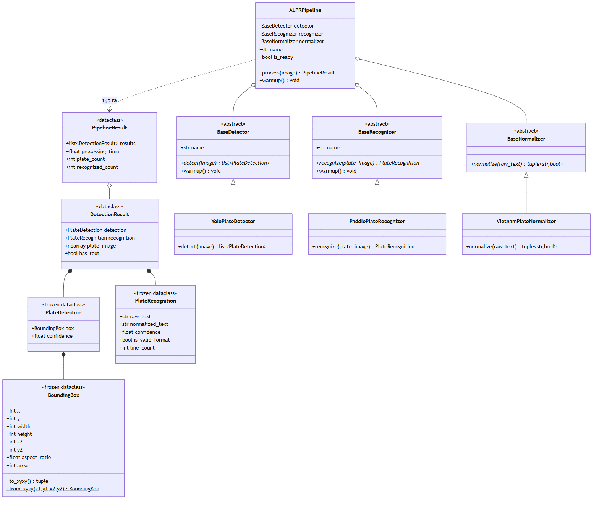

**Hình 4.4.** Sơ đồ lớp của tầng AI — ba lớp trừu tượng và các kiểu dữ liệu bất biến

Tầng AI tổ chức quanh ba lớp trừu tượng cùng một tập kiểu dữ liệu bất biến truyền giữa các giai đoạn. `BaseDetector.detect(image) → list[PlateDetection]` trả danh sách vùng biển số kèm độ tin cậy; ảnh không có biển số trả danh sách rỗng, **không** ném ngoại lệ. `BaseRecognizer.recognize(plate_image) → PlateRecognition` trả chuỗi đọc được kèm độ tin cậy; không đọc được ký tự nào thì trả chuỗi rỗng, **không** ném ngoại lệ. `BaseNormalizer.normalize(raw_text) → tuple[str, bool]` trả cặp (chuỗi đã chuẩn hoá, cờ hợp lệ). Hợp đồng "trả rỗng chứ không ném ngoại lệ" nhất quán với NFR-R2: **không tìm thấy** và **lỗi** là hai chuyện khác nhau, trộn chúng ở tầng thấp buộc mọi tầng trên phải xử lý ngoại lệ cho một tình huống bình thường. Hai lớp đầu còn có `warmup()` với cài đặt mặc định rỗng, vì lần suy luận đầu tiên sau khi nạp mô hình chậm hơn đáng kể do cấp phát bộ nhớ và biên dịch nhân tính toán: không làm nóng trước thì lượt nhận dạng đầu của người dùng chậm bất thường và phép đo độ trễ đầu tiên trong benchmark bị nhiễu.

Các kiểu dữ liệu được khai báo **bất biến** (`frozen dataclass`) ở những chỗ có thể, vì chúng đi qua nhiều tầng và được ghi vào CSDL nên một tầng trung gian vô tình sửa giá trị sẽ khiến việc truy vết rất khó; riêng `DetectionResult` và `PipelineResult` không bất biến vì `DetectionResult` chứa mảng ảnh vùng biển số — đối tượng nặng cần giải phóng sau khi lưu xuống đĩa. `BoundingBox` lưu toạ độ dạng `(x, y, width, height)` để khớp trực tiếp bốn cột `bbox_x`, `bbox_y`, `bbox_w`, `bbox_h`, đồng thời cung cấp thuộc tính dẫn xuất `aspect_ratio` phục vụ phân loại số dòng ở 4.2.4. Tên thuộc tính của `PlateDetection` và `PlateRecognition` được đặt **trùng khớp có chủ đích** với tên cột CSDL, nhờ vậy tầng lưu trữ chỉ sao chép trường-sang-trường: một lớp biên dịch trung gian sẽ là thêm một chỗ để `confidence` và `ocr_confidence` bị hoán đổi — đúng loại lỗi mà việc tách chúng thành hai cột được thiết kế để ngăn (4.4.3a). Lớp điều phối `ALPRPipeline` nhận ba thành phần qua hàm khởi tạo và chỉ điều phối, **không chứa logic học sâu nào**, nên kiểm thử được hoàn toàn bằng thành phần giả lập.

### 4.3.2. Thiết kế tầng nghiệp vụ

Tầng nghiệp vụ gồm bốn service: `DetectionService` điều phối toàn bộ nghiệp vụ nhận dạng (tạo tác vụ, gọi pipeline, lưu ảnh, ghi bản ghi, xử lý video nền, gộp trùng, quản lý vòng đời tác vụ); `HistoryService` truy vấn lịch sử có lọc, sắp xếp, phân trang, lấy chi tiết, xoá bản ghi kèm tệp và xuất dữ liệu; `StatisticsService` tổng hợp chỉ số và chuỗi số liệu theo ngày cho `GET /api/statistics`; `StorageService` lưu, đọc, xoá tệp, sinh tên tệp an toàn từ UUID và ánh xạ đường dẫn nội bộ sang URL công khai.

#### a) Hợp đồng pipeline được khai báo bằng giao thức cấu trúc

`DetectionService` phụ thuộc vào một **giao thức** (`typing.Protocol`) khai báo ba thành viên — `name`, `is_ready`, `process(image) → PipelineResult` — chứ không vào lớp `ALPRPipeline` cụ thể. Chọn giao thức cấu trúc thay vì lớp cơ sở trừu tượng là có chủ ý: lớp cơ sở trừu tượng đòi hỏi cài đặt phải **kế thừa**, tức package AI phải import một lớp do tầng nghiệp vụ định nghĩa — đúng phụ thuộc ngược chiều mà ràng buộc số 1 cấm; còn một lớp thoả mãn giao thức cấu trúc chỉ bằng cách *có đúng các thành viên đó*, nên mũi tên phụ thuộc vẫn đi một chiều. Giao thức được thoả mãn bởi ba cài đặt: `ALPRPipeline` (đường chạy chính), `UnavailablePipeline` (phương án lùi khi thiếu trọng số — ném lỗi thay vì bịa kết quả) và `StubPipeline` (chỉ chạy khi đặt tường minh `ALPR_USE_STUB=true`). Việc chuyển từ stub sang pipeline thật đã diễn ra **mà không sửa dòng nào trong tầng nghiệp vụ**.

#### b) Xử lý video nền và gộp trùng

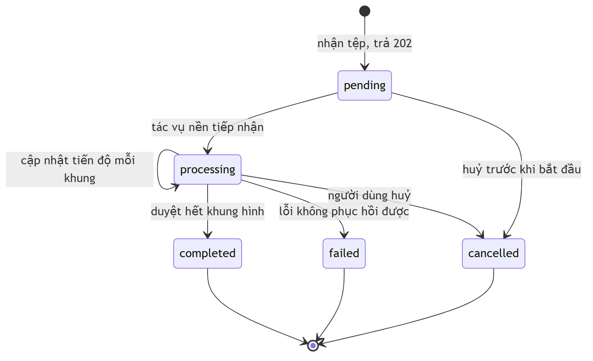

**Hình 4.5.** Sơ đồ trạng thái của tác vụ xử lý video nền

Trạng thái `pending` được giữ tách biệt với `processing` có chủ đích: vì lời gọi tải video trả về ngay, có một khoảng thời gian tác vụ đã được ghi nhận nhưng tác vụ nền chưa kịp tiếp nhận — gộp hai trạng thái thì không phân biệt được một tác vụ *đang xếp hàng* với một tác vụ *đã treo*. Gộp trùng (FR-2.4) hoạt động theo chuỗi ký tự biển số kết hợp cửa sổ thời gian, giữ lần đọc có độ tin cậy cao nhất. Phương án thay thế là bám vết đối tượng qua các khung hình; đồ án cố ý **không** chọn và ghi rõ trong phạm vi, vì tracking phức tạp hơn đáng kể và thêm một họ siêu tham số cần tinh chỉnh, trong khi nhược điểm đã biết của gộp theo chuỗi ký tự — hai xe khác nhau mang cùng biển số trong một video — không xảy ra trong thực tế.

#### c) Kho tệp tách khỏi cơ sở dữ liệu

`StorageService` lưu ảnh và video **trên hệ thống tệp**, CSDL chỉ giữ đường dẫn. Lưu nhị phân dưới dạng BLOB sẽ khiến tệp SQLite phình rất nhanh (mỗi ảnh vài trăm KB, mỗi video hàng chục MB), làm chậm mọi truy vấn kể cả truy vấn không đụng tới ảnh và khiến việc sao lưu nặng nề. Cái giá phải trả là hai nguồn dữ liệu phải giữ đồng bộ: xoá bản ghi phải xoá tệp (FR-5.1) và cần script dọn tệp mồ côi (FR-5.3). Tên tệp sinh từ UUID thay vì tên gốc do người dùng cung cấp là biện pháp đáp ứng NFR-S2, vì tên tệp do người dùng kiểm soát là véc-tơ path traversal kinh điển và một tên chứa `../` có thể khiến hệ thống ghi đè tệp ngoài thư mục lưu trữ.

### 4.3.3. Thiết kế REST API

API theo phong cách REST, tự sinh tài liệu OpenAPI 3.x và Swagger UI. Endpoint nghiệp vụ nằm dưới tiền tố `/api` cấu hình được; riêng endpoint kiểm tra sức khoẻ đặt ở gốc để công cụ giám sát và Docker healthcheck truy cập không phụ thuộc phiên bản API.

**Bảng 4.7.** Đặc tả các endpoint REST API

| # | Phương thức | Đường dẫn | Đầu vào | Đầu ra | Mã trạng thái |
|:--:|---|---|---|---|---|
| 1 | `POST` | `/api/detect/image` | `file` — ảnh JPEG / PNG / WebP / BMP | Danh sách kết quả: bounding box, `plate_number`, `raw_ocr_text`, `confidence`, `ocr_confidence`, `is_valid_format`, `plate_line_count`, thời gian xử lý, `job_id` | **200** OK · 400 sai định dạng · 413 vượt kích thước · 422 thiếu tham số · 500 lỗi nội bộ |
| 2 | `POST` | `/api/detect/video` | `file` — video MP4 / AVI / MOV / MKV | `job_id`, `status`, `progress`, `created_at` | **202** Accepted · 400 · 413 · 422 · 500 |
| 3 | `POST` | `/api/detect/frame` | `file` — khung hình JPEG / PNG; `job_id` (tuỳ chọn, định danh phiên webcam) | Như endpoint 1, kèm `job_id` của phiên | **200** OK · 400 · 413 · 422 · 500 |
| 4 | `GET` | `/api/jobs/{job_id}` | `job_id` | `status`, `progress`, `total_frames`, `processed_frames`, `output_url`, `error_message` | **200** OK · 404 không tồn tại |
| 5 | `GET` | `/api/history` | `search`, `input_type`, `is_valid_format`, `date_from`, `date_to`, `min_confidence`, `job_id`, `sort_by`, `order`, `page`, `page_size` | `items`, `total`, `page`, `page_size`, `total_pages` | **200** OK · 422 tham số không hợp lệ |
| 6 | `GET` | `/api/history/{detection_id}` | `detection_id` (số nguyên ≥ 1) | Toàn bộ metadata của một bản ghi kèm URL ảnh gốc và ảnh biển số | **200** OK · 404 · 422 |
| 7 | `GET` | `/api/history/export` | Các tham số lọc như endpoint 5 — **không** phân trang | Luồng tệp CSV, UTF-8 **có BOM** (để Excel đọc đúng tiếng Việt) | **200** OK (`text/csv`) · 400 · 422 · 500 |
| 8 | `DELETE` | `/api/history/{detection_id}` | `detection_id` | Không có nội dung | **204** No Content · 404 · 422 |
| 9 | `GET` | `/api/statistics` | `days` (độ dài cửa sổ chuỗi thời gian) | Tổng số tác vụ, tổng số biển số, độ tin cậy trung bình, thời gian xử lý trung bình, phân bố theo loại đầu vào, chuỗi số liệu theo ngày | **200** OK · 422 |
| 10 | `GET` | `/health` | Không | Trạng thái tổng thể (`healthy` / `degraded` / `unhealthy`), trạng thái pipeline, trạng thái CSDL, tên pipeline đang dùng | **200** OK |

**Các quyết định thiết kế API.** *Mã 202 cho video*: `200` nghĩa là "đã xử lý xong", `202` nghĩa là "đã tiếp nhận, việc xử lý sẽ diễn ra sau" — với hàng trăm giây xử lý trên CPU, `202` đúng ngữ nghĩa và là cơ sở để client biết cần hỏi tiến độ. *Mã 200 với danh sách rỗng*: ảnh không chứa biển số trả `200` chứ không phải `404`, vì tài nguyên — kết quả nhận dạng của ảnh này — tồn tại và có giá trị là tập rỗng (NFR-R2). *Mã 204 cho xoá*: không có gì có ý nghĩa để trả về sau khi xoá. *Tìm kiếm khớp cả hai trường chuỗi*: `search` khớp đồng thời `plate_number` (đã chuẩn hoá) và `raw_ocr_text` (thô), vì nếu hậu xử lý đã sửa chuỗi thì người dùng nhớ chuỗi nào cũng phải tìm ra được bản ghi. *Chuỗi thời gian trả cả ngày không có dữ liệu*: ngày không phát sinh hoạt động vẫn trả giá trị không, vì bỏ qua thì biểu đồ sẽ **âm thầm nối liền các khoảng trống**, khiến một tuần không hoạt động trông giống một tuần hoạt động đều. *Trạng thái `degraded`*: hệ thống chạy được và CSDL kết nối tốt nhưng pipeline chưa nạp được trọng số thật (thiếu tệp mô hình, hoặc chạy `ALPR_USE_STUB=true`) nên kết quả không có giá trị thực — báo `healthy` khi đó sẽ gây hiểu lầm nghiêm trọng; hiện `/health` trả `healthy` vì mô hình chính thức đã nạp thành công.

**Trạng thái cài đặt.** Toàn bộ 10 endpoint **đã được cài đặt và xác minh bằng lời gọi HTTP thực tế**: hệ thống khởi động được, migration CSDL chạy xong, Swagger render đầy đủ, mỗi endpoint phản hồi đúng mã trạng thái mong đợi cho cả trường hợp thành công lẫn lỗi. Hệ thống hiện **vận hành pipeline nhận dạng thật** (`model_loaded: true`, engine `yolo:best.pt+paddleocr-PP-OCRv5-mobile`); `StubPipeline` đã ra khỏi đường chạy chính, phương án lùi là `UnavailablePipeline` — lớp này **ném lỗi thay vì sinh biển số giả**. Cần nói rõ phạm vi: việc xác minh này chứng minh **hợp đồng của API** hoạt động đúng, **không** chứng minh chất lượng nhận dạng. Mô hình đang chạy là `models/best.pt` (YOLO11n, `imgsz=640`, split v3); mô hình đối chứng `models/baseline-416-v1.pt` **không nằm trên đường chạy chính** và số liệu của nó không được dùng làm kết quả đánh giá, do hai khiếm khuyết đã biết (`imgsz=416` trong khi chỉ tiêu đặt ở 640; split v1 có rò rỉ train↔test khiến chỉ số bị thổi phồng). Đánh giá chất lượng nhận dạng thuộc **Chương 6**.

### 4.3.4. Các sơ đồ tuần tự

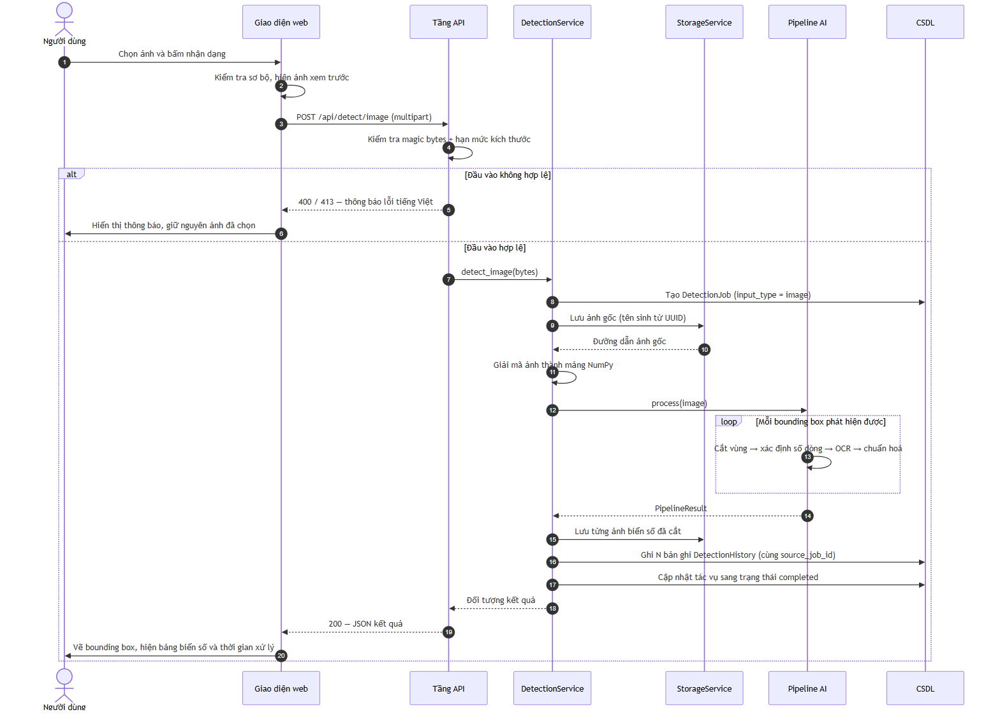

**Hình 4.6.** Sơ đồ tuần tự — nhận dạng biển số từ ảnh tĩnh

**Nhận dạng từ ảnh (sơ đồ trên).** Điểm cần chú ý ở bước ghi CSDL: N bản ghi biển số đều mang cùng một `source_job_id`; lý do và hậu quả của việc thiếu trường này được phân tích tại mục 4.4.3(c).

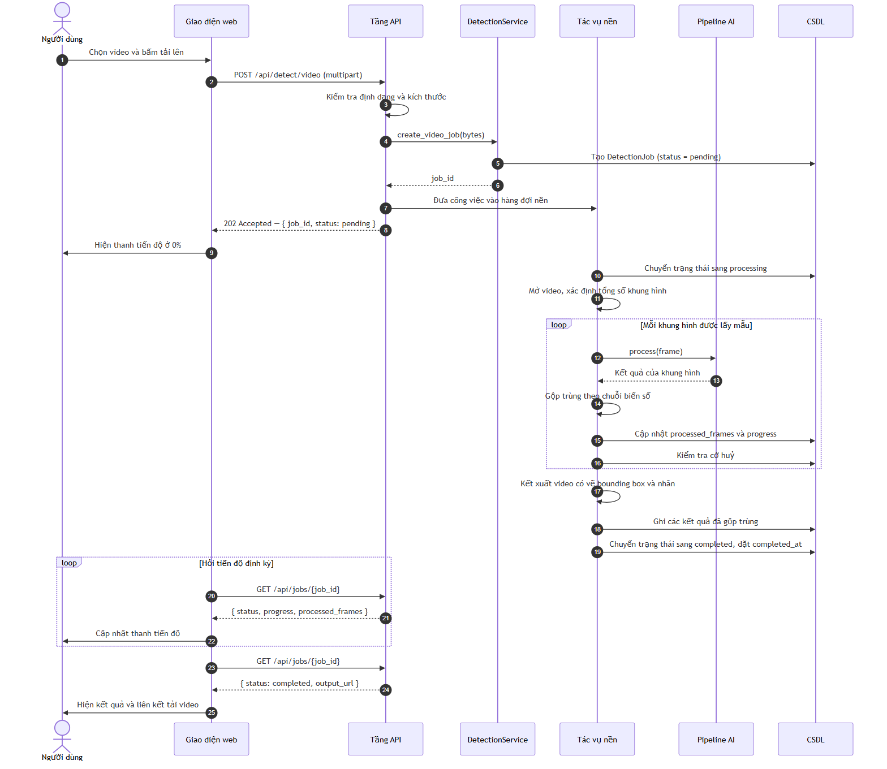

**Hình 4.7.** Sơ đồ tuần tự — nhận dạng video bất đồng bộ

**Nhận dạng video bất đồng bộ (sơ đồ trên).** Vòng lặp hỏi tiến độ ở phía giao diện chạy độc lập với vòng lặp xử lý ở tác vụ nền, hai bên chỉ giao tiếp gián tiếp qua bản ghi tác vụ trong CSDL. Việc kiểm tra cờ huỷ đặt bên trong vòng lặp xử lý để yêu cầu huỷ có hiệu lực trong vòng vài khung hình thay vì phải chờ hết video.


**Hình 4.8.** Sơ đồ tuần tự — nhận dạng thời gian thực qua tầng API

**Nhận dạng thời gian thực qua webcam (sơ đồ trên).** Từ 2026-07-20 trang Webcam đã gỡ khỏi giao diện web — trang đó trước đây chính là client trong sơ đồ — nên sơ đồ nay mô tả **hợp đồng tương tác cho một client bất kỳ** gọi `POST /api/detect/frame`; phía máy chủ giữ nguyên. Ba chi tiết: **hàng đợi một khe nằm ở phía client** chứ không phải phía máy chủ, vì việc bỏ khung nên xảy ra trước khi khung được truyền qua mạng, và đây là ràng buộc client phải tự tuân thủ; `job_id` do máy chủ sinh ở lời gọi đầu tiên và được client ghi nhớ, nhờ đó toàn bộ phiên là một tác vụ duy nhất; gộp trùng diễn ra trong phạm vi phiên, nên giữ một biển số trước ống kính mười giây tạo ra một bản ghi chứ không phải hàng chục.

---

## 4.4. Thiết kế cơ sở dữ liệu

### 4.4.1. Sơ đồ thực thể — liên kết


**Hình 4.9.** Sơ đồ thực thể — liên kết của cơ sở dữ liệu

Mô hình gồm hai thực thể quan hệ một–nhiều: **một lần sử dụng hệ thống** (một ảnh tải lên, một video, hoặc một phiên webcam) là một bản ghi `DetectionJob`; **mỗi biển số tìm thấy trong lần đó** là một bản ghi `DetectionHistory`. Số bản ghi con có thể bằng không (ảnh không có biển số nào), bằng một, hoặc nhiều. Lược đồ mở rộng đáng kể so với bản phác thảo ban đầu chỉ gồm 9 trường trong một bảng duy nhất; toàn bộ mở rộng đã được rà soát và phê duyệt, mục 4.4.3 lập luận cho những mở rộng đáng chú ý.

### 4.4.2. Mô tả chi tiết các bảng

#### a) Bảng `detection_job`

**Bảng 4.8.** Đặc tả trường của bảng `detection_job`

| Trường | Kiểu | Ràng buộc | Mô tả |
|---|---|---|---|
| `id` | `VARCHAR(36)` | PK | Định danh dạng UUID |
| `input_type` | `VARCHAR(16)` | NOT NULL, CHECK ∈ {image, video, webcam} | Loại đầu vào đã sinh ra tác vụ |
| `status` | `VARCHAR(16)` | NOT NULL, CHECK ∈ 5 giá trị trạng thái | Trạng thái vòng đời hiện tại |
| `progress` | `FLOAT` | NOT NULL, CHECK 0 ≤ x ≤ 1 | Tỉ lệ hoàn thành, dùng cho thanh tiến độ |
| `source_path`, `output_path` | `VARCHAR(512)` | NULL | Nơi lưu tệp đầu vào; nơi lưu ảnh hoặc video kết quả có gắn nhãn |
| `error_message` | `TEXT` | NULL | Nguyên nhân kỹ thuật khi thất bại; **chỉ dùng phía máy chủ**, không trả nguyên văn cho người dùng |
| `total_frames` / `processed_frames` | `INTEGER` | NULL / NOT NULL, mặc định 0 | Tổng số khung của video (`NULL` khi không áp dụng hoặc chưa biết); số khung đã xử lý |
| `created_at`, `completed_at` | `DATETIME` (UTC) | NOT NULL / NULL | Thời điểm tiếp nhận; thời điểm đạt trạng thái kết thúc |

Khoá chính là UUID chứ không phải số nguyên tự tăng vì định danh này được trả cho client và dùng trong tên tệp sinh ra: một số thứ tự đoán được sẽ cho phép một người dùng liệt kê tác vụ của người khác bằng cách thử các số liền kề. `error_message` không bao giờ trả nguyên văn vì nó có thể chứa đường dẫn hệ thống tệp, tên thư viện và thông tin phiên bản — vừa vi phạm FR-6.3 vừa là một dạng rò rỉ thông tin. Bảng có bốn chỉ mục (theo `input_type`, `status`, `created_at`) phục vụ truy vấn thống kê và danh sách hoạt động gần đây.

#### b) Bảng `detection_history`

**Bảng 4.9.** Đặc tả trường của bảng `detection_history`

| Trường | Kiểu | Ràng buộc | Mô tả |
|---|---|---|---|
| `id` | `INTEGER` | PK, tự tăng | Định danh bản ghi |
| `plate_number` | `VARCHAR(32)` | **NULL** | Chuỗi biển số **sau** chuẩn hoá, ví dụ `51F-12345` |
| `raw_ocr_text` | `VARCHAR(32)` | **NULL** | Chuỗi OCR **trước** chuẩn hoá, nguyên văn từ bộ nhận dạng |
| `confidence` | `FLOAT` | **NOT NULL**, CHECK 0 ≤ x ≤ 1 | Độ tin cậy của bộ **phát hiện** |
| `ocr_confidence` | `FLOAT` | **NULL**, CHECK NULL hoặc 0 ≤ x ≤ 1 | Độ tin cậy của bộ **nhận dạng ký tự** |
| `input_type` | `VARCHAR(16)` | NOT NULL, CHECK | Khử chuẩn hoá từ tác vụ cha, để lọc lịch sử không cần phép nối bảng |
| `image_path`, `plate_image_path` | `VARCHAR(512)` | NULL | Ảnh nguồn (hoặc khung hình đã trích với video); ảnh vùng biển số đã cắt |
| `bbox_x`, `bbox_y`, `bbox_w`, `bbox_h` | `INTEGER` | **NOT NULL**; `bbox_w`, `bbox_h` CHECK > 0 | Toạ độ góc trên trái theo pixel ảnh gốc và kích thước bounding box |
| `is_valid_format` | `BOOLEAN` | NOT NULL, mặc định `false` | Chuỗi đã chuẩn hoá có khớp một định dạng biển số Việt Nam hay không |
| `plate_line_count` | `INTEGER` | **NULL**, CHECK NULL hoặc ∈ {1, 2} | Số dòng của biển số |
| `processing_time` | `FLOAT` | NOT NULL, mặc định 0 | Thời gian xử lý riêng biển số này, tính bằng giây |
| `detected_time`, `created_at` | `DATETIME` (UTC) | NOT NULL | Thời điểm phát hiện; thời điểm ghi bản ghi |
| `source_job_id` | `VARCHAR(36)` | **NOT NULL**, FK → `detection_job.id`, ON DELETE CASCADE | Tác vụ đã sinh ra biển số này |

Bảng có năm chỉ mục, trong đó chỉ mục kết hợp `(input_type, detected_time)` phục vụ truy vấn mặc định của màn hình lịch sử — "mới nhất trước, có thể lọc theo loại đầu vào" — bằng một cấu trúc duy nhất đáp ứng đồng thời cả điều kiện lọc lẫn thứ tự sắp xếp; đây là yếu tố quyết định để NFR-P6 còn giữ được ở quy mô hàng trăm nghìn bản ghi.

**Xử lý múi giờ.** Mọi cột thời gian lưu ở UTC qua một kiểu tuỳ biến, vì SQLite không có kiểu thời gian gốc: giá trị lưu dưới dạng chuỗi định dạng, và định dạng đó **làm mất phần chênh lệch múi giờ** — `2026-07-19 12:00:00+00:00` ghi vào sẽ đọc ra thành `2026-07-19 12:00:00`, không báo lỗi, không cảnh báo. Hậu quả có hai mặt và đều không tự bộc lộ: phép trừ hai mốc thời gian sẽ ném ngoại lệ ở một thời điểm nào đó trong tương lai; và khi tuần tự hoá sang JSON, mốc không có hậu tố múi giờ sẽ được trình duyệt hiểu là **giờ địa phương** — trên máy múi giờ UTC+7, mọi mốc thời gian trong bảng lịch sử hiển thị lệch bảy giờ, đủ hợp lý để không ai để ý và đủ sai để làm hỏng mọi phân tích theo thời gian.

### 4.4.3. Các quyết định thiết kế dữ liệu đáng chú ý

Năm quyết định dưới đây đều xuất phát từ một yêu cầu đo lường hoặc một tình huống sai lệch cụ thể, và nếu bỏ qua thì hậu quả là **một con số sai mà không có gì báo hiệu**.

#### a) Vì sao tách `confidence` và `ocr_confidence` thành hai cột

Hệ thống ALPR hai giai đoạn tạo ra **hai đại lượng khác nhau về bản chất**: độ tin cậy phát hiện trả lời *"vùng ảnh này có phải biển số không?"*, độ tin cậy nhận dạng trả lời *"chuỗi ký tự đọc được từ vùng này có đúng không?"*. Bản phác thảo ban đầu chỉ có một cột `confidence`; gộp như vậy buộc phải chọn một trong hai hoặc ghép bằng công thức tuỳ tiện, và cả ba lựa chọn đều dẫn tới cùng kết cục: **không phân tích lỗi được nữa**. Bốn tổ hợp cho bốn chẩn đoán: cao–cao là lý tưởng; **cao–thấp** là định vị đúng nhưng đọc kém (biển mờ, nghiêng, hoặc hai dòng) ⇒ cải thiện tiền xử lý vùng cắt hoặc thuật toán tách dòng; **thấp–cao** là bộ phát hiện thiếu tự tin nhưng vùng cắt vẫn đọc được ⇒ cân nhắc hạ ngưỡng, huấn luyện thêm; **thấp–thấp** có thể là dương tính giả ⇒ kiểm tra chất lượng nhãn, tăng cường dữ liệu âm. Bảng chẩn đoán này **chỉ tồn tại khi hai đại lượng được lưu tách biệt**. Một lý do phụ: bộ lọc `min_confidence` của endpoint lịch sử lọc theo độ tin cậy **phát hiện** ("chỉ hiện những vùng chắc chắn là biển số") — với một cột gộp thì ngữ nghĩa bộ lọc không thể phát biểu rõ ràng.

#### b) Vì sao lưu cả `raw_ocr_text` lẫn `plate_number`

Đây là quyết định có giá trị học thuật cao nhất trong lược đồ. Khối hậu xử lý sửa các nhầm lẫn ký tự kinh điển dựa trên cấu trúc biển số Việt Nam rồi kiểm tra hợp lệ — ví dụ chuỗi thô `51A-I234O` được sửa thành `51A-12340` vì vị trí thứ tư trở đi chỉ được phép là chữ số. Các ánh xạ này là **một chiều và phụ thuộc vị trí**, không phải cặp hoán đổi hai chiều — như đã lập luận ở mục 1.6.3: với cặp `O` và `0`, ánh xạ đúng là `O → 0` tại vị trí chữ số và `0 → D` tại vị trí chữ cái, còn `0 → O` **không bao giờ hợp lệ** vì `O` không thuộc tập chữ cái sê-ri của biển số Việt Nam; chữ `R` **tuyệt đối không được ánh xạ đi** vì nó hợp lệ ở vị trí chữ cái thứ hai của sê-ri biển xe mô tô (mục 2.2.4). Trình bày các cặp này bằng ký hiệu hai chiều là một cách viết tắt sai, dẫn thẳng tới một cài đặt sai.

Câu hỏi tất yếu từ hội đồng là **khối hậu xử lý đó đóng góp bao nhiêu?** Nếu chỉ lưu chuỗi đã sửa, câu trả lời duy nhất là định tính — "chúng em có thêm bước sửa lỗi bằng regex" — không kiểm chứng được. Khi lưu cả hai chuỗi, câu trả lời thành định lượng: tỉ lệ `raw_ocr_text` khớp tuyệt đối nhãn đúng chính là **NFR-A5**, tỉ lệ `plate_number` khớp tuyệt đối nhãn đúng chính là **NFR-A6**, và **hiệu số giữa hai tỉ lệ là đóng góp định lượng của khối hậu xử lý**. Phép đo còn tách được các can thiệp thành **sửa đúng** (chuỗi thô sai, chuỗi sửa đúng) và **sửa hỏng** (chuỗi thô đúng, chuỗi sửa sai) — loại thứ hai đáng quan tâm vì một luật quá mạnh tay có thể sửa hỏng chuỗi vốn đã đúng, hiện tượng bị che khuất hoàn toàn nếu chỉ nhìn con số độ chính xác tổng thể. Chi phí là vài chục byte mỗi bản ghi; nếu chỉ lưu chuỗi đã sửa thì bằng chứng bị **xoá âm thầm ngay tại thời điểm ghi dữ liệu**, không cách nào khôi phục ngoài việc chạy lại toàn bộ thực nghiệm.

#### c) Vì sao cần `source_job_id`

Giả định A-02 đã ghi nhận: **một ảnh có thể chứa nhiều biển số** — với mật độ xe máy ở Việt Nam, đây là trường hợp thông thường chứ không phải ngoại lệ. Lược đồ ban đầu là một bảng lịch sử phẳng không có khoá nhóm, nên sai lệch phát sinh ngay ở thống kê (FR-4.1): chỉ số "tổng số lượt nhận dạng" đo **mức độ sử dụng hệ thống**, nhưng không có khoá nhóm thì cách duy nhất để tính là đếm số dòng bảng lịch sử — **một ảnh ba biển số bị đếm thành ba lượt sử dụng**. Với ảnh giao thông trung bình chứa 2–3 biển số, chỉ số bị nhân lên 2–3 lần; với video còn nặng hơn vì một video có thể sinh hàng chục biển số sau khi gộp trùng. Nguy hiểm nhất là lỗi này **không tự bộc lộ**: không ngoại lệ, không log, không giá trị vô lý — đáp ứng của `GET /api/statistics` vẫn mang những con số trông hợp lý, chỉ có điều chúng sai theo hướng có lợi cho ấn tượng ban đầu. Lập luận này **không mất hiệu lực** khi trang Tổng quan bị gỡ ngày 2026-07-20: phép tính vẫn ở `StatisticsService` và vẫn phục vụ qua API, nên khoá nhóm sai vẫn cho con số sai — chỉ là sai trong JSON thay vì sai trên màn hình.

Với `source_job_id`, ba câu hỏi thống kê tách bạch: số lần hệ thống được sử dụng đếm bằng bản ghi `detection_job`; số biển số đã đọc đếm bằng bản ghi `detection_history`; trung bình mỗi lần dùng đọc được mấy biển là tỉ số giữa hai con số — với lược đồ ban đầu cả ba cho cùng một câu trả lời và câu trả lời đó chỉ đúng cho một trong ba. Khoá nhóm còn phục vụ bộ lọc `job_id` của endpoint lịch sử và ràng buộc khoá ngoại với xoá lan truyền. Cột đặt là **bắt buộc** vì một bản ghi không thuộc tác vụ nào sẽ vô hình với thống kê tính theo tác vụ nhưng vẫn xuất hiện trong bảng lịch sử — đặt bắt buộc chuyển mâu thuẫn tiềm ẩn đó thành một lỗi ồn ào ngay lúc chèn dữ liệu.

#### d) Vì sao `plate_line_count` là trường bắt buộc về mặt nghiệp vụ

**Vai trò thứ nhất: báo cáo độ chính xác tách theo bố cục.** NFR-A8 yêu cầu báo cáo riêng cho biển một dòng và hai dòng, căn cứ là số liệu 94,3% so với 45,7% **đo trên bộ RodoSol-ALPR (Brazil)** đã dẫn ở 4.1.1 [7]<!-- laroca_2022_crossdataset -->. Nếu tập kiểm thử có 70% biển một dòng và mô hình đạt 95% trên nhóm đó nhưng chỉ 50% trên nhóm hai dòng, con số tổng thể là 81,5% — trông chấp nhận được nhưng che lấp hoàn toàn việc hệ thống hoạt động rất kém trên nhóm phương tiện chiếm đa số ở Việt Nam.

**Vai trò thứ hai: khử nhập nhằng trong chính khối hậu xử lý.** Chuỗi tám ký tự `29B11234` sau khi bỏ dấu gạch nối có thể phân giải thành `29` + `B` + `11234` (mã tỉnh, **một** chữ cái sê-ri, **năm** chữ số) ⇒ biển ô tô một dòng, hiển thị `29B-112.34`; hoặc thành `29` + `B1` + `1234` (mã tỉnh, sê-ri **một chữ cái kèm một chữ số**, **bốn** chữ số) ⇒ biển xe máy kiểu cũ hai dòng, hiển thị `29-B1 1234`. Chỉ nhìn chuỗi ký tự thì **không có cách nào phân biệt hai trường hợp** — đây chính là nhập nhằng cấu trúc đã nêu ở mục 2.2.2(c): dạng *hai chữ số – một chữ cái – năm chữ số* khớp **đồng thời** cả biển ô tô lẫn biển xe máy kiểu cũ (sê-ri gồm một chữ cái kèm một chữ số, cấp trước 15/8/2023 và vẫn lưu hành hợp pháp), trong khi cách chèn dấu phân cách lại khác nhau. Ràng buộc về tập chữ cái sê-ri **không** gỡ được nhập nhằng này: theo mục 2.2.4, hai tập 20 chữ cái là ràng buộc **theo vị trí trong sê-ri** — chữ ở **vị trí thứ nhất** thuộc tập có `G` và không có `R`, chữ ở **vị trí thứ hai của sê-ri biển xe mô tô** thuộc tập có `R` và không có `G` — mà cả hai cách phân giải trên đều đặt `B` ở vị trí thứ nhất. Thông tin số dòng đến từ nguồn khác hẳn: **hình học của bounding box**, cụ thể là tỉ lệ khung đối chiếu kích thước chuẩn theo QCVN 08:2024/BCA [11]<!-- bocongan_2024_qcvn08 --> (4,727 cho biển ô tô một dòng; 2,000 cho biển ô tô hai dòng; 1,357 cho biển xe máy) — thông tin mà bộ OCR không có và không thể suy ra từ chuỗi nó xuất ra. Vì vậy `plate_line_count` là **đầu vào cần thiết để khối hậu xử lý chọn đúng luật kiểm tra và đúng cách định dạng chuỗi kết quả**. Cột cho phép giá trị rỗng vì lý do ở mục (e), nhưng ràng buộc kiểm tra bảo đảm giá trị chỉ được là 1 hoặc 2; về nghiệp vụ, mọi bản ghi có kết quả OCR đều phải có giá trị này.

#### e) Vì sao các cột liên quan tới OCR đều cho phép giá trị rỗng

Bốn cột `plate_number`, `raw_ocr_text`, `ocr_confidence`, `plate_line_count` cho phép giá trị rỗng, trong khi bốn cột toạ độ bounding box và cột `confidence` của bộ phát hiện **bắt buộc phải có giá trị**. Sự bất đối xứng này tuân theo một quy tắc duy nhất:

> **Một biển số phát hiện được vẫn đáng lưu, kể cả khi bộ OCR không đọc ra ký tự nào.**

Đầu ra của bộ phát hiện luôn tồn tại với mọi bản ghi, vì chính sự tồn tại của bản ghi bắt nguồn từ việc bộ phát hiện đã tìm thấy một vùng; ngược lại, mọi cột dẫn xuất từ OCR đều có thể vắng mặt, vì một biển **được định vị nhưng không đọc được** là kết quả có thật và xảy ra thường xuyên: biển ở xa nên độ phân giải vùng cắt quá thấp, biển bụi bẩn hoặc bị che một phần, ảnh ngược sáng, biển nghiêng quá mức làm hỏng bước hiệu chỉnh hình học, ảnh ban đêm nhiễu nặng.

**Vì sao vứt bỏ các bản ghi này là sai.** Độ chính xác nhận dạng là tỉ lệ giữa số biển đọc đúng và tổng số biển cần đọc; nếu các trường hợp không đọc được bị loại khỏi CSDL thì chúng cũng biến mất khỏi mẫu số, và hệ thống chỉ được đánh giá trên **chính những trường hợp nó đã xử lý thành công** — một dạng thiên lệch chọn mẫu (selection bias) làm chỉ số **đẹp lên một cách giả tạo**. Ví dụ số cụ thể: bộ phát hiện tìm thấy 100 biển số, bộ OCR đọc ra chuỗi cho 80 biển trong đó 76 chuỗi đúng, 20 biển còn lại không đọc ra ký tự nào. Giữ mọi bản ghi cho 76 / 100 = **76,0%**, phản ánh đúng năng lực toàn trình; vứt bỏ cho 76 / 80 = **95,0%**, sai lệch 19 điểm phần trăm. Con số 95% không sai về số học — nó đúng cho một câu hỏi khác (*"khi bộ OCR đọc được, nó đọc đúng bao nhiêu phần trăm?"*) — nhưng câu hỏi thực sự là xác suất hệ thống trả về biển số đúng khi đưa một ảnh vào, và câu trả lời 76% chỉ tính được nếu 20 trường hợp thất bại vẫn nằm trong CSDL. Lỗi này đặc biệt nguy hiểm vì nó **thiên vị theo một chiều duy nhất và luôn theo hướng có lợi**, nên ít có khả năng bị nghi ngờ và soát lại. Kết hợp với việc tách hai cột độ tin cậy (mục a), các bản ghi có `confidence` cao nhưng `plate_number` rỗng còn tạo thành tập mẫu giá trị nhất để phân tích lỗi ở Chương 6: những vùng mà bộ phát hiện chắc chắn là biển số nhưng bộ OCR bó tay.

---

## 4.5. Thiết kế giao diện người dùng

### 4.5.1. Sơ đồ điều hướng

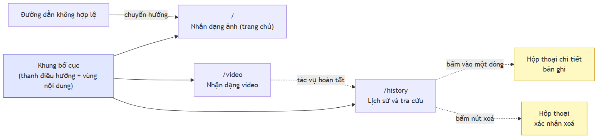

**Hình 4.10.** Sơ đồ điều hướng giữa ba màn hình của giao diện

Giao diện là ứng dụng một trang (SPA) với **ba màn hình** chính chia sẻ chung một khung bố cục gồm thanh điều hướng và vùng nội dung. Cấu trúc điều hướng cố ý giữ **phẳng**: ba màn hình đều truy cập trực tiếp từ thanh điều hướng; chi tiết một bản ghi và xác nhận xoá là hộp thoại chồng lên trang lịch sử thay vì trang riêng, để người dùng không mất ngữ cảnh danh sách và bộ lọc đang áp dụng. Mọi đường dẫn không khớp đều chuyển hướng về trang chủ (Nhận dạng ảnh) thay vì hiển thị trang lỗi.

> **Ghi chú thay đổi phạm vi 2026-07-20 — hai đợt liên tiếp trong cùng một ngày.** Thiết kế ban đầu có **năm màn hình** và Dashboard là trang chủ. Đợt thứ nhất gỡ màn hình Webcam (`/webcam`) và chuyển trang chủ sang **Nhận dạng ảnh**; đợt thứ hai gỡ tiếp màn hình **Tổng quan / Dashboard** (`/dashboard`). Cả hai đợt đều nhằm thu gọn phạm vi demo và đều **không** gỡ năng lực nào ở tầng dưới: `POST /api/detect/frame`, `GET /api/statistics` và `GET /health` vẫn phục vụ và vẫn có kiểm thử tích hợp. Hệ quả: FR-3.1/FR-3.4 chuyển M → W ở đợt 1, **FR-4.1 chuyển M → W** và FR-4.2 chuyển S → W ở đợt 2 — xem khung ghi chú ở mục 4.1.3(a) về việc đây là yêu cầu mức Must đầu tiên bị đưa ra khỏi phạm vi. Mã giao diện của cả hai màn hình còn nguyên trong lịch sử git.

### 4.5.2. Mô tả các màn hình chính

**Màn hình Tổng quan / Dashboard (đã gỡ khỏi giao diện 2026-07-20).** Thiết kế ban đầu đặt màn hình này tại `/dashboard` gồm hàng thẻ chỉ số tổng hợp (tổng lượt sử dụng đếm theo tác vụ, tổng số biển đã đọc đếm theo bản ghi lịch sử, độ tin cậy trung bình, thời gian xử lý trung bình — FR-4.1), biểu đồ xu hướng theo ngày (FR-4.2), biểu đồ phân bố theo loại đầu vào, danh sách hoạt động gần đây và thẻ trạng thái hệ thống. Màn hình đã bị gỡ cùng đợt với việc chuyển **FR-4.1 từ Must sang Won't** và FR-4.2 từ Should sang Won't (mục 4.1.3a); số liệu vẫn truy vấn được qua `GET /api/statistics` và `GET /health`, hai endpoint vẫn có kiểm thử tích hợp. Hai lập luận thiết kế của nó vẫn còn hiệu lực vì chúng ràng buộc chính đáp ứng của API: **hai con số "lượt sử dụng" và "số biển đã đọc" phải tính từ hai bảng khác nhau** đúng theo 4.4.3(c); và **trạng thái `degraded` phải hiển thị rõ** để pipeline mô phỏng không bị nhầm với vận hành thật, ràng buộc nay nằm ở trường `status` của `GET /health`.

**Màn hình nhận dạng ảnh** là trang chủ (`/`), phản ánh vai trò nghiệp vụ trung tâm của luồng nhận dạng ảnh. Bố cục hai cột: cột trái là khu vực tải ảnh hỗ trợ kéo–thả kèm ảnh xem trước; cột phải hiển thị ảnh đã vẽ bounding box, danh sách thẻ kết quả và phần tóm tắt gồm số biển phát hiện được, số biển đọc được và thời gian xử lý. Mỗi thẻ hiển thị chuỗi biển số đã chuẩn hoá ở kích thước lớn, chuỗi OCR thô nhỏ hơn khi hai chuỗi khác nhau, hai thanh độ tin cậy riêng cho phát hiện và OCR, nhãn số dòng và cờ hợp lệ định dạng. Hiển thị **cả hai chuỗi** khi chúng khác nhau cho phép quan sát trực tiếp khối hậu xử lý đã can thiệp gì, và khi bảo vệ đây là bằng chứng trực quan cho đóng góp kỹ thuật ở mục 4.4.3(b).

**Màn hình nhận dạng video** gồm ba giai đoạn nối tiếp đúng bản chất bất đồng bộ: khu vực tải tệp; bảng tiến độ với thanh phần trăm, số khung đã xử lý trên tổng số khung, trạng thái tác vụ và nút huỷ; bảng kết quả với video đã gắn nhãn, danh sách biển số đã gộp trùng và liên kết tải về.

**Màn hình webcam (đã gỡ khỏi giao diện 2026-07-20)** gồm khu vực hiển thị camera với lớp phủ bounding box thời gian thực, cụm điều khiển bật/tắt camera và chọn thiết bị, bảng số liệu phiên (tốc độ khung hình hiệu dụng, số khung đã gửi, số khung bị bỏ, độ trễ trung bình) và bảng biển số đã phát hiện trong phiên. Bảng số liệu phiên có vai trò kép: với người dùng, nó cho biết hệ thống chạy nhanh chậm ra sao; với người thực hiện đồ án, nó là công cụ đo tại chỗ cho NFR-P2 — việc số khung bị bỏ được hiển thị công khai giúp phân biệt "hệ thống xử lý được 5 khung mỗi giây" với "camera chụp 30 khung mỗi giây nhưng 25 khung bị bỏ". Sau khi màn hình bị gỡ, năng lực thời gian thực giữ nguyên ở tầng API (`POST /api/detect/frame`, mục 4.3.3) và phép đo NFR-P2 chuyển sang kịch bản gọi API trực tiếp.

**Màn hình lịch sử** gồm bảng dữ liệu có phân trang và sắp xếp theo cột, thanh bộ lọc (tìm kiếm, loại đầu vào, khoảng thời gian, ngưỡng độ tin cậy, trạng thái hợp lệ định dạng), nút xuất dữ liệu, hộp thoại chi tiết và hộp thoại xác nhận xoá. Hộp thoại chi tiết hiển thị đầy đủ metadata: ảnh gốc có vẽ bounding box, ảnh biển số đã cắt, cả hai chuỗi thô và đã chuẩn hoá, cả hai độ tin cậy, số dòng, thời gian xử lý và định danh tác vụ nguồn — việc vẽ lại bounding box mà không cần chạy lại mô hình là nhờ bốn cột toạ độ lưu trong CSDL.

### 4.5.3. Nguyên tắc trải nghiệm người dùng

**Bốn trạng thái bắt buộc của mọi thành phần hiển thị dữ liệu**, không ngoại lệ. (1) *Đang tải* — chỉ báo trực quan cho mọi thao tác trên 500 ms; bỏ qua thì giao diện trông như treo, người dùng bấm lại nhiều lần và tạo thêm tải cho một hệ thống vốn đã chậm vì chạy CPU. (2) *Có dữ liệu* — nội dung thực tế. (3) *Rỗng* — thông báo giải thích vì sao chưa có gì kèm gợi ý hành động; bỏ qua thì màn hình trắng không phân biệt được với lỗi kỹ thuật. (4) *Lỗi* — thông báo tiếng Việt nêu nguyên nhân và cách khắc phục kèm khả năng thử lại; bỏ qua thì người dùng bế tắc.

Trạng thái rỗng thường bị bỏ sót nhất và ở hệ thống này nó xuất hiện với ba ý nghĩa khác nhau, cần ba thông điệp khác nhau: bảng lịch sử khi chưa có lượt nhận dạng nào ("chưa có dữ liệu, hãy thử nhận dạng một ảnh"), bảng lịch sử khi bộ lọc không khớp bản ghi nào ("không có bản ghi nào khớp bộ lọc, hãy nới lỏng điều kiện"), và kết quả nhận dạng khi ảnh không chứa biển số ("không phát hiện được biển số trong ảnh này"). *(Trường hợp thứ nhất trước 2026-07-20 xuất hiện trên màn hình Tổng quan; sau khi màn hình này được gỡ, nó biểu hiện ở bảng lịch sử rỗng.)* Trường hợp thứ ba là biểu hiện ở tầng giao diện của cùng quyết định đã xuất hiện ở tầng API (mã 200 với danh sách rỗng) và ở tầng pipeline (trả kết quả rỗng, không ném ngoại lệ) — ba tầng nhất quán về ngữ nghĩa: **không tìm thấy không phải là lỗi**.

**Thông báo lỗi tiếng Việt thân thiện.** NFR-U3 quy định thông báo phải bằng tiếng Việt, nêu rõ nguyên nhân và cách khắc phục, không hiển thị mã lỗi kỹ thuật; FR-6.3 bổ sung rằng stack trace tuyệt đối không được rò rỉ ra giao diện. Nguyên tắc soạn gồm ba phần — **chuyện gì đã xảy ra**, **vì sao**, **người dùng có thể làm gì** — và một thông báo thiếu phần thứ ba là một thông báo bỏ mặc người dùng. Năm tình huống điển hình được soạn lại thay cho thông báo kém tương ứng: `400 Bad Request` → "Tệp bạn chọn không phải là ảnh hợp lệ. Hệ thống chỉ nhận các định dạng JPG, PNG, WebP và BMP. Vui lòng chọn tệp khác."; `413 Payload Too Large` → "Ảnh vượt quá dung lượng cho phép. Vui lòng chọn ảnh nhỏ hơn hoặc giảm kích thước ảnh trước khi tải lên."; "Lỗi: không có kết quả" → "Không tìm thấy biển số nào trong ảnh này. Hãy thử ảnh chụp gần hơn hoặc rõ nét hơn."; `NetworkError: Failed to fetch` → "Không kết nối được tới máy chủ. Vui lòng kiểm tra máy chủ đã khởi động chưa, sau đó bấm Thử lại."; toàn bộ stack trace Python → "Đã xảy ra lỗi trong quá trình xử lý. Vui lòng thử lại. Nếu lỗi tiếp diễn, hãy liên hệ quản trị viên." Nguyên tắc vận hành đi kèm: **chi tiết kỹ thuật không bị vứt bỏ mà được chuyển hướng** — loại ngoại lệ, stack trace và định danh yêu cầu được ghi vào log có cấu trúc ở phía máy chủ theo FR-6.2.

**Các nguyên tắc khác.** Theo NFR-U1, người dùng mới phải hoàn thành lượt nhận dạng ảnh đầu tiên trong không quá ba thao tác nhấp chuột và không cần đọc tài liệu — điều này định hình bố cục: khu vực tải ảnh ở vị trí trung tâm, hỗ trợ kéo–thả, không có bước cấu hình bắt buộc nào. Toàn bộ chữ chính đạt tương phản tối thiểu 4,5:1 theo WCAG AA (NFR-U5), và độ tin cậy được biểu diễn bằng thanh trực quan kèm giá trị số chứ không chỉ bằng màu. Giao diện hoạt động đúng từ độ phân giải 1366×768 trở lên (NFR-U4) — độ phân giải phổ biến của máy chiếu trong phòng bảo vệ.

**Trạng thái cài đặt.** Phần giao diện **đã hoàn thành**: cấu trúc điều hướng, khung bố cục và toàn bộ thành phần của **ba màn hình hiện hành** đã cài đặt, bản build production chạy sạch. Hai màn hình Webcam và Tổng quan từng được cài đặt đầy đủ và đã gỡ ngày 2026-07-20; ba endpoint tương ứng (`POST /api/detect/frame`, `GET /api/statistics`, `GET /health`) nay phục vụ client API. Chi tiết cài đặt và ảnh chụp màn hình ở **Chương 5**; các hạng mục còn dở (đáng chú ý là nút huỷ tác vụ video) được ghi nhận ở mục 5.9.

---

## 4.6. Kết luận chương

Về **phân tích yêu cầu**, đồ án xác định ba tác nhân tương tác trực tiếp và chín use case, đặc tả 34 yêu cầu chức năng trong 6 nhóm (**21 bắt buộc, 6 nên có, 3 có thì tốt, 4 không triển khai ở bản này**), mỗi yêu cầu kèm một tiêu chí chấp nhận kiểm chứng được. Bốn yêu cầu mức Won't đều thuần giao diện và đều chuyển mức trong hai đợt thu gọn phạm vi ngày 2026-07-20 — FR-3.1/FR-3.4 khi gỡ trang Webcam, FR-4.1/FR-4.2 khi gỡ trang Tổng quan — trong đó **FR-4.1 là yêu cầu mức Must đầu tiên bị đưa ra khỏi phạm vi**, được ghi thẳng ở mục 4.1.3(a) và đánh giá là hạn chế thật ở Chương 7; cả bốn đều mất màn hình hiển thị chứ không mất năng lực. Yêu cầu phi chức năng đặt ở dạng chỉ tiêu định lượng, với điểm cần nhấn mạnh là **mọi chỉ tiêu hiệu năng đều là chỉ tiêu đo trên CPU**: việc không có GPU là ràng buộc thiết kế nghiêm túc chứ không phải hạn chế tạm thời, vì nó cố định trong toàn bộ vòng đời đồ án, thay đổi độ trễ theo bậc độ lớn chứ không theo tỉ lệ phần trăm, chi phối lựa chọn thành phần ở mọi tầng, và trực tiếp sinh ra hai quyết định kiến trúc — video bất đồng bộ và bỏ khung có kiểm soát ở chế độ webcam.

Về **kiến trúc**, hệ thống gồm năm tầng theo nguyên tắc phụ thuộc một chiều, và quyết định quan trọng nhất là **tách hoàn toàn tầng AI khỏi tầng API**: package nhận dạng không import bất kỳ thành phần nào của framework web. Ba lợi ích — kiểm thử độc lập, tái sử dụng trong script huấn luyện và đánh giá, thay engine mà không sửa tầng API — đã dùng trong thực tế: nhờ nó, toàn bộ phần mềm đã được xây dựng và chạy được với pipeline mô phỏng trước khi mô hình được huấn luyện. Ràng buộc được kiểm chứng bằng hai công cụ bổ trợ: kiểm tra tĩnh các câu lệnh import và kiểm tra động danh sách module đã nạp lúc chạy — phép thứ hai bắt được cả import muộn lẫn import bắc cầu mà phép thứ nhất bỏ sót.

Về **thiết kế chi tiết**, chương đặc tả tầng AI với ba lớp trừu tượng và tập kiểu dữ liệu bất biến, bốn service của tầng nghiệp vụ, mười endpoint REST kèm đầy đủ đầu vào, đầu ra, mã trạng thái, cùng ba sơ đồ tuần tự. Về **cơ sở dữ liệu**, mô hình gồm hai bảng quan hệ một–nhiều; năm quyết định thiết kế dữ liệu đều bảo vệ **tính đúng đắn của các số liệu sẽ công bố ở chương đánh giá**: tách hai cột độ tin cậy để phân tích lỗi được; lưu cả chuỗi OCR thô lẫn chuỗi đã sửa để đo được đóng góp định lượng của khối hậu xử lý; thêm khoá nhóm tác vụ để thống kê sử dụng không bị thổi phồng theo số biển số trên mỗi ảnh; lưu số dòng của biển vì chuỗi ký tự tự nó nhập nhằng giữa biển ô tô và biển xe máy; cho phép các cột OCR rỗng để những trường hợp đọc không ra vẫn nằm trong mẫu số khi tính độ chính xác. Mỗi quyết định, nếu bỏ qua, đều dẫn tới một con số sai mà **không có gì báo hiệu**. Về **giao diện**, chương trình bày sơ đồ điều hướng phẳng gồm **ba màn hình** (sau hai đợt thu gọn phạm vi ngày 2026-07-20) và hai nguyên tắc trải nghiệm bắt buộc: bốn trạng thái phải xử lý cho mọi thành phần hiển thị dữ liệu, và quy tắc soạn thông báo lỗi tiếng Việt gồm ba phần nguyên nhân — giải thích — hướng khắc phục.

Cần nói rõ giới hạn của chương: nội dung ở đây là **thiết kế và trạng thái cài đặt của thiết kế**, không phải kết quả thực nghiệm. Hệ thống **đã chạy pipeline nhận dạng thật với mô hình chính thức** `models/best.pt`, còn mô hình đối chứng `models/baseline-416-v1.pt` không dùng làm kết quả đánh giá được (sai độ phân giải và split có rò rỉ). Toàn bộ số liệu về độ chính xác của mô hình, độ trễ thực đo trên CPU, mức đóng góp thực tế của khối hậu xử lý và độ chính xác tách theo số dòng biển số **được trình bày ở Chương 6**. Chương tiếp theo trình bày quá trình cài đặt hệ thống trên cơ sở thiết kế đã xác lập ở đây.


```{=openxml}
<w:p><w:r><w:br w:type="page"/></w:r></w:p>
```

# CHƯƠNG 5. XÂY DỰNG HỆ THỐNG VÀ HUẤN LUYỆN MÔ HÌNH

Chương 4 trình bày hệ thống *nên* được xây dựng thế nào; chương này trình bày hệ thống *đã* được xây dựng thế nào. Nguyên tắc: **mọi mô tả đều tương ứng với mã nguồn có thật trong kho `d:/DATN`**; chức năng chưa hoàn thiện thì ghi rõ mức độ, số đo chưa có thì để bảng trống với đầy đủ cột và chỉ tới Chương 6. Mục 5.9 đối chiếu thiết kế với hiện thực.

---

## 5.1. Môi trường và công cụ phát triển

### 5.1.1. Cấu hình máy thực hiện

Toàn bộ cài đặt, kiểm thử và đo đạc chạy trên một máy trạm duy nhất (`docs/00-requirements/environment.md`): Windows 11 Pro 10.0.26200; Intel Core i5-14600K (Raptor Lake Refresh), **14 nhân / 20 luồng**; RAM 31,77 GiB; GPU Intel UHD Graphics 770 tích hợp — **không có GPU CUDA**; Python 3.13.12 (dự phòng 3.11); Node.js 18.20.8 qua `nvm-windows`; Docker 29.4.3; 96 GB trống ổ D:. Cấu hình này **mâu thuẫn với mô tả môi trường ban đầu của đồ án** (macOS Apple Silicon, Python 3.12); ghi nhận sai lệch thành văn bản là bước đầu của Phase 0, vì cả ba tham số sai đều ảnh hưởng tới thiết bị huấn luyện, chỉ tiêu hiệu năng và cách viết đường dẫn tệp.

### 5.1.2. Vì sao "không có GPU" là ràng buộc thiết kế chứ không phải hạn chế tạm thời

Ba lý do độc lập: buổi bảo vệ chạy trên máy không GPU nên ràng buộc CPU-only nằm thẳng trong phát biểu NFR-P1; ràng buộc CPU thay đổi *lựa chọn mô hình* chứ không chỉ tốc độ, vì chênh lệch giữa YOLO11n và YOLO11s/m hay giữa OCR mobile và server lên tới hàng trăm mili-giây mỗi ảnh, nên AD-06 kéo theo hai quyết định phái sinh đã cài đặt là `yolo11n` và **PP-OCRv5 mobile**; và huấn luyện YOLO11 trên CPU ước tính 1–3 ngày một lượt nên `ai/training/` phải chạy được cả local lẫn Colab/Kaggle với siêu tham số nằm trong tệp cấu hình — lý do tồn tại của `ai/training/config.py` (586 dòng) như một lớp cấu hình có kiểm tra hợp lệ. Hệ quả đo được: p95 đầu-cuối trên `models/best.pt` (máy rảnh) là **731 ms** (client-side) / **780 ms** (in-process), đạt mục tiêu 800 ms của NFR-P1, với OCR chiếm **~64,3%** và phát hiện **~34,2%**.

### 5.1.3. Ba môi trường ảo Python tách biệt, và lý do bắt buộc phải tách

| Môi trường ảo | Vai trò | NumPy | OpenCV | Gói đặc trưng |
|---|---|---|---|---|
| `.venv-ai/` | Huấn luyện, xuất mô hình | **2.5.4** | `opencv-python` **5.0.0.93** (+ headless) | `torch` 2.13.0+cpu, `torchvision` 0.28.0 |
| `.venv-ocr/` | Thử nghiệm OCR biệt lập | **2.4.5** | `opencv-contrib-python` **4.10.0.84** | `paddlepaddle` 3.3.1, `paddleocr` 3.7.0, `paddlex` |
| `backend/.venv/` | Chạy dịch vụ (backend + suy luận) | **2.4.5** | `opencv-contrib-python` **4.10.0.84** | `torch`, `ultralytics` 8.4.101, `paddleocr` |

`paddleocr` kéo theo `paddlex`, **hạ cấp NumPy từ 2.4.x xuống 2.4.5** và **thay `opencv-python` bằng `opencv-contrib-python` 4.10** — lùi một phiên bản lớn so với OpenCV 5.0 của nhánh huấn luyện; cài chung là **ghi đè hai gói nền tảng của ngăn xếp thị giác máy tính**, và nếu không tách thì mỗi lần cài lại một nhánh âm thầm đổi phiên bản nhánh kia đang chạy — lỗi không làm chương trình sập mà làm **kết quả đo không tái lập được**. Phân tách này phản ánh ở `requirements.txt` (web + CSDL) và `requirements-inference.txt` (ngăn xếp ML), được `Dockerfile.backend` cài theo hai lớp riêng.

### 5.1.4. Bộ công cụ

Python 3.13.12 (local) / 3.12 (Docker); FastAPI + Uvicorn; SQLAlchemy 2.x + Alembic; Pydantic v2 / pydantic-settings; Ultralytics 8.4.101 chạy YOLO11 [16]<!-- jocher_2024_yolo11 -->; PaddlePaddle 3.3.1 / PaddleOCR 3.7.0 cho PP-OCRv5 [17]<!-- cui_2026_ppocrv5 -->; Node.js 18.20.8 (local) / 20 (Docker); Vite + React + TypeScript; pytest + pytest-cov; Docker + Docker Compose 29.4.3. Docker dùng Python 3.12 trong khi local dùng 3.13 là **chủ ý**: container là nơi lấy lại phiên bản mục tiêu và tách môi trường chạy khỏi máy cá nhân — nội dung cụ thể của NFR-C1.

---

## 5.2. Xây dựng bộ dữ liệu

### 5.2.1. Đường ống sáu bước


**Hình 5.1.** Đường ống sáu bước xây dựng bộ dữ liệu

Mỗi bước là một script độc lập trong `scripts/dataset/` có CLI riêng và sinh báo cáo JSON/CSV; `run_pipeline.py` chạy cả chuỗi bằng một lệnh, nhưng CLI riêng vẫn cần vì bước khử trùng lặp phải chạy lại nhiều lần với ngưỡng khác nhau (mục 5.2.3). **Kết quả:** **15.133 ảnh** hợp nhất từ **7 bộ công khai** (Roboflow Universe, HuggingFace, Kaggle), còn **6 nguồn nguyên tố** sau khử trùng lặp chéo bộ, sau khi loại **11.978 ảnh (44,2%)** bản sao từ **27.111 ảnh**; tổng **9 bộ được tải về**, 2 bộ nhãn mức ký tự tách riêng cho đánh giá OCR nên không vào hợp nhất detection. Chia 70/20/10 thành **10.592 / 3.027 / 1.514 ảnh**. Bảng dưới **phải trích khi nói về dữ liệu của đồ án**, vì con số tổng che mất việc các bộ đóng góp **rất không đều**:

| # | Bộ (slug) | Nguồn | Giấy phép | Vào gộp | **Còn lại** | Bị loại |
|---|---|---|---|---:|---:|---:|
| 1 | `roboflow_school_fuhih` | Roboflow `school-fuhih/vietnamese-license-plate-tptd0` v1 | **CC BY 4.0** | 8.357 | **6.868** (45,38%) | 17,8% |
| 2 | `hf_vn_plates_segment` | HuggingFace `hoanglvuit/Vietnam_License_Plate_Segment_Datasets` | ⚠️ **chưa xác nhận** | 4.578 | **4.375** (28,91%) | 4,4% |
| 3 | `roboflow_traffic_camera` | Roboflow `traffic-camera/vietnam-license-plate-hayn8` v4 | **CC BY 4.0** | 3.843 | **3.162** (20,89%) | 17,7% |
| 4 | `roboflow_eric_nguyen` | Roboflow `eric-nguyen-knfxn/vietnam-license-plate-curhr` v1 | **CC BY 4.0** | 840 | **353** (2,33%) | 58,0% |
| 5 | `roboflow_demo_tracking` | Roboflow `demo-tracking/license-plate-vietnam-car` v2 | **CC BY 4.0** | 236 | **235** (1,55%) | 0,4% |
| 6 | `roboflow_cuong_ta` | Roboflow `cuong-ta-ulxex/vietnamese-car-license-plate` v1 | Public Domain (người đăng tự khai) | 8.254 | **140** (0,93%) | **98,3%** |
| 7 | `roboflow_tran_ngoc_xuan_tin` | Roboflow `tran-ngoc-xuan-tin-k15-hcm-dpuid/vietnam-license-plate-h8t3n` v1 | **CC BY 4.0** | 1.005 | **0** | **100%** |
| | **Tổng** | | | **27.113** | **15.133** | **44,2%** |

Nguồn: cột "vào gộp" từ `datasets/processed/merged_v2/merge_manifest.csv`; cột "còn lại" đếm trên `datasets/processed/yolo_v3/images/{train,val,test}`. Ba điều bảng nói ra mà con số tổng giấu đi: `school_fuhih` và `hf_vn_plates_segment` chiếm **74,3%** nên đồ án **không đa dạng về nội dung** như con số "6 nguồn" gợi ý; `cuong_ta` mất **98,3%** và `tran_ngoc_xuan_tin` mất **toàn bộ**, bằng chứng trực tiếp rằng các bộ công khai **không độc lập với nhau**; và — hệ quả ngoài ý muốn — `cuong_ta` là bộ **cân bằng nhất** về layout (51,04% hai dòng) còn `school_fuhih` sống sót nhiều nhất lại **lệch nặng nhất** (88,85% hai dòng), nên khử trùng lặp đã **vô tình làm tập dữ liệu lệch layout hơn** trước khi khử (`docs/reports/02-dataset-report.md` mục 7.3). **Giấy phép:** năm bộ CC BY 4.0, một bộ tự khai Public Domain — **không được khẳng định là Public Domain thật** vì ảnh nguồn có dấu hiệu là ảnh báo chí — và một bộ HuggingFace **chưa xác nhận được giấy phép**, phải nêu rõ khi công bố.

Song song, một nhánh riêng tái tạo **4.019 chuỗi biển số** từ hai bộ nhãn mức ký tự, trong đó **2.801 chuỗi (69,69%)** khớp mẫu hợp lệ theo `plate_rules.py` — `roboflow_ocr_plate` đóng góp **2.650**, `roboflow_ocr_conversion` **151**, cả hai CC BY 4.0 — phục vụ đánh giá OCR độc lập với tầng phát hiện.

> **Cảnh báo phạm vi bắt buộc đi kèm mọi số liệu OCR.** Chạy bộ phân loại màu nền lên toàn bộ 2.801 ảnh này cho: **2.736 biển trắng (97,68%)**, 20 vàng (0,71%), 4 xanh (0,14%), **0 đỏ và 0 ngoại giao**. Vì vậy phát biểu đúng là *"1 − CER = 0,9454 trên một tập gồm 97,7% biển trắng"*, **không phải** *"trên biển số Việt Nam"* (`docs/reports/17-plate-type-audit.json`).

Kết quả phụ: tập ký tự quan sát trên toàn bộ 4.019 chuỗi có **đúng 30 ký tự phân biệt**, không chứa `I`, `J`, `O`, `Q`, `W` — **xác nhận độc lập bằng dữ liệu** cho tập `EXCLUDED_LETTERS` vốn suy từ văn bản pháp quy (mục 5.5.6).

### 5.2.2. Khử trùng lặp chéo bộ và con số 44,2%

Các bộ công khai **không độc lập với nhau** (dự án Roboflow fork lẫn nhau, bản Kaggle đóng gói lại bản xuất Roboflow), nên nếu một bức ảnh nằm ở `train` dưới tên bộ này và ở `test` dưới tên bộ khác thì **độ chính xác test đang đo khả năng ghi nhớ**; vì vậy con số tiêu đề của script là số nhóm trùng lặp **chéo bộ**, còn trùng trong cùng bộ chỉ tốn thời gian huấn luyện. Vét cạn 37.000 ảnh là khoảng 690 triệu cặp nên script dùng **multi-index hashing**: cắt mã băm 64 bit thành `threshold + 1` dải, và theo nguyên lý chuồng bồ câu, hai mã khác nhau tối đa `threshold` bit **bắt buộc trùng khớp chính xác** trên ít nhất một dải, nên tập ứng viên **bảo đảm chứa mọi cặp thật** rồi được xác minh chính xác — **thuật toán chính xác chứ không xấp xỉ.** Cần phân biệt **hai phép đo trên hai mẫu số khác nhau**; trích một con số trần mà không nêu mẫu số là gây hiểu nhầm:

| Phép đo | Mẫu số | Ngưỡng Hamming | Ảnh có thể loại | Tỷ lệ | Đã xoá thật? |
|---|---:|---:|---:|---:|---|
| (a) Trên **toàn bộ ảnh của 7 bộ vào hợp nhất detection** | 27.111 | 5 | 11.978 | **44,2%** | **Rồi** (`applied: true`) |
| (b) Trên **corpus đã gộp** `merged_v2` còn lại | 15.133 | 10 | 7.227 | **47,8%** | **Chưa** (`applied: false`) |

Nguồn: (a) `datasets/reports/v2/deduplication_report.json`; (b) `datasets/reports/v3/deduplication_report.json`. Phép đo (b) quét 15.133 ảnh, thấy 19.277 cặp thuộc 1.171 nhóm, trong đó **116 nhóm chéo bộ**; cặp bộ chồng lấn nặng nhất là `hf_vn_plates_segment ↔ roboflow_school_fuhih` với **2.669 cặp**. 47,8% **không mâu thuẫn** với 44,2%: (b) chạy ngưỡng lỏng hơn nên bắt nhiều cặp gần trùng hơn, và **chỉ đo chứ chưa xoá**. Tỷ lệ **11.978 / 27.111 = 44,2%** — **gần một nửa là bản sao** — có hai hệ quả: quy mô thật khác hẳn quy mô danh nghĩa (ca cực đoan nhất là `roboflow_tran_ngoc_xuan_tin` vào với 1.005 ảnh và ra với **0 ảnh — loại 100%**, kiểm chứng độc lập ở mục 6.3.4; đây là lý do **không được cộng dồn `expected_images` của các bộ Roboflow**), và phân bố huấn luyện bị lệch vì 11.978 ảnh dư thừa tập trung ở các bộ được sao chép nhiều nhất. Đầu ra được `split.py` tiêu thụ, và nó giữ **mọi thành viên của một nhóm trùng lặp trong cùng một split** nên ngay cả bản trùng *không* bị xoá cũng không rò rỉ được.

### 5.2.3. Bài học về perceptual hash: nó tóm tắt bố cục khung ảnh, không tóm tắt chiếc xe

Đây là **giới hạn không khắc phục được** bằng công cụ hiện có. Một lần kiểm tra rò rỉ độc lập ở ngưỡng Hamming 10 trên bộ v1 tìm thấy **619 cặp gần trùng giữa `train` và `test`**; phân bố: 0 cặp ở d = 0 và d = 1–5, **619 cặp ở d = 6–10**, 3.016 cặp ở 11–15, 26.135 cặp ở 16–20, 1.437.204 cặp ở d > 20. Kiểm tra bằng mắt dải 6–10 cho thấy **cùng một chiếc xe, cùng chuỗi biển số, ở cả hai split**. Pipeline không bắt được vì bộ chia gom nhóm ở ngưỡng 5 rồi lần kiểm tra đầu cũng đo lại ở ngưỡng 5 và báo "0 cặp rò rỉ" — **lập luận vòng tròn**; rò rỉ thật nằm ở dải 6–10 mà bộ chia **không** bảo vệ. Nâng ngưỡng cũng không giải quyết được, vì perceptual hash rút một bức ảnh thành 64 bit mô tả **cấu trúc tần số thấp của toàn khung hình**, tức bố cục:

> Hai bức ảnh chụp **hai chiếc xe khác nhau** đi qua **cùng một camera** có khoảng cách phash rất nhỏ, bởi vì 90% khung hình — mặt đường, hàng cây, toà nhà, góc nhìn — là hoàn toàn giống nhau. Chiếc xe chỉ chiếm một phần nhỏ diện tích và ảnh hưởng rất ít tới mã băm.

Bằng chứng lưu tại **`datasets/reports/v3/corpus_samples/flagged_pair.png`**. Đánh đổi không thoát ra được: ngưỡng thấp (≤ 5) bỏ sót cặp cùng xe chụp khác ngày; ngưỡng cao (≥ 10) bắt thêm cặp cùng xe nhưng **gộp nhầm hàng nghìn ảnh xe khác nhau cùng camera vào một nhóm**, tức đánh đổi rò rỉ lấy sự nghèo nàn của dữ liệu. Bộ v3 được chia lại với gom nhóm ở ngưỡng cao hơn và kiểm tra rò rỉ độc lập ở ngưỡng 10, nhưng đồ án ghi nhận thẳng thắn rằng **vẫn còn rò rỉ tồn dư không khử được bằng phash** — trường hợp cùng một chiếc xe quay lại cùng một camera vào ngày khác; phân biệt nó với "hai xe khác nhau, cùng camera" đòi hỏi so khớp ở mức **chuỗi biển số** hoặc **đặc trưng phương tiện**, một cơ chế khác hẳn. Hệ quả: `baseline-416-v1.pt` đạt mAP@0.5 = 0,9933 trên bộ v1 nhưng con số đó **không được báo cáo là "đạt"** vì tập test của nó có rò rỉ đã đo được (mục 5.9).

---

## 5.3. Huấn luyện bộ phát hiện biển số

### 5.3.1. Siêu tham số

Bảng dưới trích từ `runs/final-640-v3/args.yaml` — tệp Ultralytics tự sinh khi bắt đầu lượt huấn luyện, nên là bản ghi *đã thực thi*, không phải *dự định*.

<!-- {{T5.3a}} sieu tham so huan luyen mo hinh chinh thuc — DA CO SO, khong can dien -->

**Bảng 5.1.** Siêu tham số huấn luyện mô hình chính thức

| Nhóm | Tham số và giá trị |
|---|---|
| Mô hình | `model` = `yolo11n.pt` (khởi tạo từ trọng số tiền huấn luyện COCO); **2.590.035** tham số — biến thể nano, do ràng buộc CPU |
| Dữ liệu | `data` = `datasets/processed/yolo_v3/data.yaml` (split v3); `imgsz` = **640** (đúng độ phân giải NFR-A1/A2 đặt chỉ tiêu); `fraction` = 1.0 |
| Lịch huấn luyện | `epochs` = **20**; `patience` = 20 (dừng sớm không kích hoạt); `batch` = 8 (giới hạn bởi RAM và tốc độ CPU); `close_mosaic` = 10 |
| Tối ưu hoá | `optimizer` = AdamW; `lr0` = 0.001; `lrf` = 0.01; `cos_lr` = `true`; `momentum` = 0.937; `weight_decay` = 0.0005; `warmup_epochs` = 3.0 |
| Trọng số hàm mất mát | `box` / `cls` / `dfl` = 8.0 / 0.5 / 1.5 |
| Tăng cường dữ liệu | `hsv_h`/`hsv_s`/`hsv_v` = 0.015 / 0.7 / 0.4; `degrees` = 5.0; `translate`/`scale`/`shear` = 0.1 / 0.5 / 2.0; `perspective` = 0.0005; `fliplr`/`flipud` = **0.0 / 0.0**; `mosaic`/`mixup`/`cutmix` = 1.0 / 0.0 / 0.0; `erasing` = 0.4; `auto_augment` = `randaugment` |
| Thực thi | `device` = **`cpu`**; `workers` = 2; `amp` = `false`; `seed` / `deterministic` = 42 / `true` |

**`fliplr = 0.0`** lệch có chủ ý so với mặc định `0.5` của Ultralytics: lật ngang tạo ảnh mà ký tự bị gương hoá — phân bố **không bao giờ xuất hiện trong thực tế**. **`seed = 42`, `deterministic = true`:** chỉ chạy được **một lượt huấn luyện duy nhất** (giới hạn thời gian CPU, mục 6.2.3) nên không có nhiều lượt để ước lượng phương sai giữa các seed; cố định seed ít nhất đảm bảo lượt này **tái lập được**, và mọi chỉ số trong chương là kết quả của **một lần chạy**, không có khoảng tin cậy — hạn chế ghi nhận ở mục 6.9.3.

### 5.3.2. Đường cong huấn luyện

Ba hình dưới sinh từ `runs/final-640-v3/results.csv` sau khi huấn luyện kết thúc.

*Hình 5.1.* Đường cong hàm mất mát theo epoch — `box_loss`, `cls_loss`, `dfl_loss`, tách riêng train và val. `docs/reports/figures/05-train-loss-curves.png` *(chưa sinh)*

*Hình 5.2.* Tiến triển mAP@0.5 và mAP@0.5:0.95 trên tập validation. `docs/reports/figures/05-train-map-curves.png` *(chưa sinh)*

*Hình 5.3.* Tiến triển precision và recall trên tập validation. `docs/reports/figures/05-train-pr-curves.png` *(chưa sinh)*

**Điểm cần đọc từ ba hình** (viết sau khi có hình, không đoán trước): khoảng cách `train_loss` – `val_loss` có mở rộng dần không, dấu hiệu quá khớp; đường mAP đã bão hoà hay còn dốc lên tại epoch 20 — nếu còn dốc thì phải ghi rõ **20 epoch là giới hạn ngân sách tính toán chứ không phải điểm hội tụ**; và bước nhảy tại epoch 10 khi `close_mosaic` kích hoạt.

### 5.3.3. Tiến triển mAP theo mốc epoch

<!-- {{T5.3b}} tien trien chi so tren tap validation theo epoch -->

**Bảng 5.2.** Tiến triển chỉ số trên tập validation theo mốc epoch

| Epoch | `box_loss` (val) | `cls_loss` (val) | `dfl_loss` (val) | mAP@0.5 | mAP@0.5:0.95 | Precision | Recall |
|:---:|---:|---:|---:|---:|---:|---:|---:|
| 1 | 1,1705 | 0,6858 | 1,1513 | **0,9684** | **0,6526** | 0,9552 | 0,9410 |
| 2 | 1,1861 | 0,5554 | 1,1307 | **0,9726** | **0,6653** | 0,9700 | 0,9450 |
| 3 | 1,1647 | 0,5651 | 1,1098 | **0,9723** | **0,6770** | 0,9731 | 0,9449 |
| 5 | 1,1074 | 0,4977 | 1,0863 | **0,9754** | **0,6950** | 0,9765 | 0,9525 |
| 10 | 1,0548 | 0,4168 | 1,0686 | **0,9808** | **0,7248** | 0,9850 | 0,9584 |
| 15 | 0,9420 | 0,3619 | 1,0205 | **0,9824** | **0,7609** | 0,9846 | 0,9686 |
| 20 | 0,9204 | 0,3331 | 1,0105 | **0,9830** | **0,7688** | 0,9846 | 0,9697 |
| **Epoch tốt nhất (= 20)** | **0,9204** | **0,3331** | **1,0105** | **0,9830** | **0,7688** | **0,9846** | **0,9697** |

> Số liệu từ `runs/final-640-v3/results.csv` (20 epoch đã chạy đủ). **mAP@0.5 gần bão hoà rất sớm** (≈0,97 ngay từ epoch 1, chỉ nhích lên 0,983 ở epoch 20) trong khi **mAP@0.5:0.95 vẫn tăng đều** từ 0,653 lên 0,769 — mô thức điển hình khi *định vị đối tượng* là dễ còn *khớp box chính xác* mới khó. mAP@0.5:0.95 vẫn còn dốc lên tới epoch 20 (0,7605 ở epoch 18 → 0,7688 ở epoch 20) nên **phải phát biểu rõ rằng 20 epoch là giới hạn ngân sách tính toán chứ không phải điểm hội tụ**. `val/cls_loss` giảm đơn điệu (0,686 → 0,333) không tách khỏi xu hướng, tức chưa thấy dấu hiệu quá khớp rõ rệt.
>
> **Việc chọn epoch tốt nhất chỉ dựa trên tập validation.** Epoch 20 có mAP@0.5:0.95 trên val cao nhất và cũng là epoch cuối; tập test không được dùng cho bất kỳ quyết định nào trong mục này.

### 5.3.4. Chi phí huấn luyện

Baseline `baseline-416-v1.pt`: 40 epoch, `imgsz` 416, bộ v1 (4.578 ảnh), **tổng 156 phút**, CPU. Mô hình chính thức `best.pt`: 20 epoch, `imgsz` 640, bộ v3 (15.133 ảnh), **≈ 35,6 phút/epoch**, **tổng ≈ 712 phút (≈ 11,9 giờ)**, CPU. Chênh lệch là hệ quả của ba yếu tố cùng thay đổi — số ảnh tăng 3,3 lần, diện tích ảnh tăng khoảng 2,37 lần (640²/416²), số epoch giảm một nửa — cũng chính là ba biến đồng thời khiến so sánh ở mục 3.6 **không quy kết được nguyên nhân cho từng biến riêng lẻ**.

---

## 5.4. Tinh chỉnh bộ nhận dạng ký tự

PP-OCRv5 mobile được huấn luyện trên chữ cảnh tổng quát; mục này trả lời bằng số câu hỏi fine-tune nó trên đúng miền dữ liệu thì được gì, trên **cùng 2.801 biển có nhãn chuỗi**, cùng bộ phát hiện, cùng mọi công tắc. **Cấu hình:** 30 epoch trên 6.672 mẫu (2.801 ảnh gốc, mỗi ảnh thêm hai biến thể tăng cường: nén nhỏ và làm nhoè/nghiêng), kiểm định 571 mẫu sạch, bộ ký tự đủ 36 (`0-9A-Z`), khởi đầu từ `en_PP-OCRv5_mobile_rec_pretrained`; kết thúc train acc **0,9449**, val acc **0,8809**, `norm_edit_dis` 0,9823.

<!-- {{T5.4}} so sanh fine-tune va model goc -->

**Bảng 5.3.** So sánh bộ nhận dạng gốc và bản tinh chỉnh trên cùng ngữ liệu

| Cấu hình | A5 (chuỗi thô) | A6 (sau hậu xử lý) | Đúng định dạng | ms/ảnh |
|---|---:|---:|---:|---:|
| **Model gốc, det + rec** — *bản giao hàng* | 0,6373 | **0,7512** | 0,9443 | 328,8 |
| Model fine-tune, det + rec | 0,5998 | 0,6762 | 0,9018 | — |
| Model gốc, chỉ rec | 0,6776 | 0,7508 | 0,9568 | 35,7 |
| Model fine-tune, chỉ rec | **0,8618** | **0,8758** | **0,9886** | 38,5 |

Nguồn: `docs/reports/28-ocr-accuracy-finetuned.json` và `docs/reports/29-reconly-ablation.json`. **Phải đọc theo hàng chứ không theo cột.** Hàng 2 so hàng 1: ở đúng chế độ hệ thống đang chạy, fine-tune **kém hơn 7,50 điểm** — dừng ở đây thì kết luận là "fine-tune thất bại". Hàng 4 so hàng 1: bỏ bước phát hiện chữ, fine-tune **hơn 12,46 điểm** và đạt ngưỡng tối thiểu NFR-A6 (0,85) mà bản giao hàng không đạt — kết luận ngược hẳn. **Nguyên nhân mâu thuẫn là hai chế độ đo khác nhau, không phải model:** PaddleOCR đánh giá nhánh nhận dạng bằng cách đưa **nguyên ảnh** biển, còn đường ống triển khai cắt ảnh thành nhiều mảnh rồi đọc từng mảnh, mà model fine-tune chỉ được dạy đọc cả biển một lần nên chưa từng thấy mảnh vụn. Đo trên **chính những tệp ảnh nó đã huấn luyện trên đó** (300 ảnh trong tập huấn luyện): chế độ chỉ nhận dạng — như lúc huấn luyện — model gốc 0,2933, fine-tune **0,8233**; chế độ phát hiện + nhận dạng — như lúc chạy thật — fine-tune tụt về **0,2667**. Mẫu lỗi khớp giả thuyết đọc-từng-mảnh: `51U74598` ra `598`, `59X132817` ra `32817` — cụt đầu.

**Vì vậy con số val acc 0,8809 không sai, nhưng nó đo một chế độ hệ thống không dùng** — thuộc cùng họ với ba lần trước trong đồ án (mục 6.9.3): một phép đo trả về con số đẹp vì nó không chạm được vào chỗ hỏng. **Quyết định: không đem fine-tune đi giao, và cũng không bật chế độ chỉ-rec** (lý do ở mục 6.6.6 — ngữ liệu 2.801 mẫu toàn ảnh **đã cắt sẵn** nên không có thẩm quyền quyết định giữa hai chế độ; đo lại trên ảnh toàn cảnh thì thứ tự đảo ngược). Model, công tắc `ALPR_OCR_REC_MODEL_DIR` và toàn bộ đường ray huấn luyện **giữ nguyên trong kho mã**, sẵn sàng cho lượt đo có tập nhãn ảnh hiện trường.

---

## 5.5. Cài đặt tầng AI

### 5.5.1. Tổ chức gói `ai/inference` và ràng buộc "không import FastAPI"

Gói gồm mười một mô-đun cùng `__init__.py` (80 dòng), tổng **4.852 dòng**: `types.py` 302 (`BoundingBox`, `PlateDetection`, `PlateRecognition`, `DetectionResult`, `PipelineResult`), `interfaces.py` 169, `config.py` 281 (`InferenceConfig`), `exceptions.py` 71 (cây `ALPRError`), `plate_rules.py` 683, `normalizer.py` 419, `detector.py` 597, `recognizer.py` 648, `two_line.py` 500, `plate_color.py` 247, `pipeline.py` 855.

**Ràng buộc kiến trúc trung tâm (NFR-M1): không tệp nào trong `ai/` được `import fastapi`, `pydantic`, `pydantic_settings` hay `starlette`**; riêng `ai/inference/` cấm thêm `sqlalchemy` và `backend`. Lý do: gói suy luận phải chạy được trong Jupyter, script benchmark và Colab — nơi không có máy chủ web lẫn CSDL. **Ràng buộc được kiểm chứng tự động chứ không bằng rà soát mã**, qua `tests/test_architecture.py` (340 dòng) với hai kiểm tra bổ sung nhau: quét văn bản mã nguồn bằng regex chỉ khớp **câu lệnh import viết thường** chứ không khớp tên sản phẩm viết hoa trong tài liệu — nếu không, cách duy nhất để test đi qua là ngừng viết tài liệu về ràng buộc; và quan sát `sys.modules` trong **tiến trình Python hoàn toàn mới** sinh bằng `subprocess.run`, vì quét văn bản không thấy được import **bắc cầu** còn kiểm tra ngay trong bộ test lại vô giá trị do các test tích hợp đã nạp FastAPI từ trước. Ba điều kiện phái sinh cũng được ghim: mỗi mô-đun phải import được **độc lập**; `ALPRPipeline` phải khởi tạo được từ ba đối tượng giả mà **không nạp `ultralytics`, `paddleocr` hay `torch`**; và `ai/evaluation/` được import `backend`/`sqlalchemy` nhưng **chỉ ở phạm vi hàm**. NFR-M4 (**không đường dẫn tuyệt đối viết cứng**) kiểm cùng cách: quét chuỗi dạng `"C:\..."` / `"/home/..."` và khẳng định hai mô-đun cấu hình đều dẫn xuất gốc dự án từ `Path(__file__).resolve().parents[...]`.

### 5.5.2. Ba lớp trừu tượng

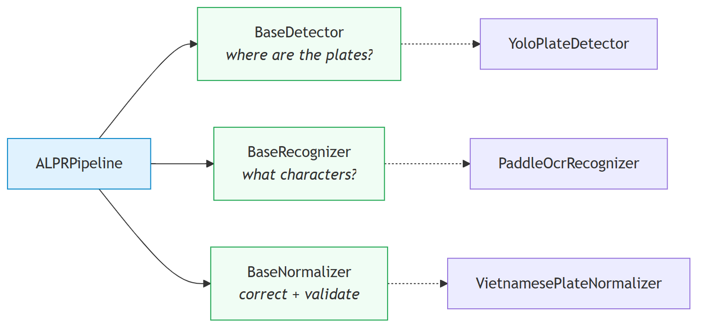

**Hình 5.2.** Ba lớp trừu tượng của tầng AI và quan hệ giữa chúng

**`BaseDetector`** trả lời đúng một câu hỏi — *biển số nằm ở đâu?* Hợp đồng `detect(image) -> list[PlateDetection]` quy định ba điều kiện: đã lọc theo ngưỡng tin cậy và NMS; mọi hộp bao đã **kẹp về trong biên ảnh** để cắt được ngay; và **danh sách rỗng là kết quả bình thường**, không bao giờ là lỗi. **`BaseRecognizer`** nhận *ảnh biển đã cắt*, và quan trọng nhất là điều nó **không** làm — sửa lỗi ký tự và kiểm tra định dạng không thuộc trách nhiệm của nó, chính việc tách đó làm đóng góp của hậu xử lý trở nên **đo được** qua hiệu số giữa `raw_ocr_text` và `plate_number`. **`BaseNormalizer`** trả cặp `(normalized_text, is_valid_format)`, và kết quả không hợp lệ vẫn phải được **trả về** chứ không loại bỏ, vì loại bỏ sẽ xoá đúng những thất bại mà chương đánh giá cần đếm. Cả hai lớp đầu có `warmup()` mặc định rỗng để chuyển chi phí nạp trọng số và biên dịch trễ ra khỏi yêu cầu đầu tiên của người dùng — phục vụ NFR-P1.

### 5.5.3. Cài đặt bộ phát hiện — `YoloPlateDetector`

Adapter mỏng trên Ultralytics, giữ Ultralytics ở vị trí *chi tiết cài đặt*: không nơi nào ngoài mô-đun này chạm vào `Results`, tensor PyTorch hay chỉ số lớp. **Import trễ** (`from ultralytics import YOLO` nằm trong `_load_yolo_model`) cho unit test kiểm tra logic chuyển đổi mà không cần ngăn xếp ML; ngược lại **trọng số nạp ngay trong hàm khởi tạo** để tệp thiếu hoặc hỏng làm hệ thống **thất bại lúc khởi động**, kèm đường dẫn đã thử và hướng dẫn khắc phục. Bốn chi tiết: `SUPPORTED_WEIGHT_SUFFIXES = (".pt", ".onnx", ".torchscript")` cộng khả năng nhận **thư mục** OpenVINO (định dạng duy nhất lưu theo thư mục, nên `_verify_weights_exist` kiểm tệp `.xml`), vì từ chối thư mục sẽ khiến cấu hình nhanh nhất trên CPU Intel không cấu hình được qua `ALPR_MODEL_PATH`; `_resolve_plate_class_ids` giữ tất cả khi mô hình không công bố bảng tên lớp hoặc chỉ có **một lớp** (trường hợp của đồ án), còn mô hình **nhiều lớp** chỉ giữ lớp khớp `PLATE_CLASS_ALIASES` (`license_plate`, `licence_plate`, `plate`, `license-plate`, `bien_so`) nên checkpoint COCO 80 lớp luôn trả danh sách rỗng — đúng, không phải lỗi; `_build_clamped_bbox` kẹp về `[0, width]` × `[0, height]`, hoán đổi nếu `x2 < x1` và trả `None` kèm log nếu hộp suy biến, cho phép hợp đồng `BaseDetector` hứa mọi hộp đều cắt được ngay; và `name` trả `f"yolo:{stem}{suffix}"` (ví dụ `yolo:best.pt`) vì một con số benchmark chỉ tái lập được nếu nêu tên đúng bộ trọng số sinh ra nó.

### 5.5.4. Cài đặt bộ nhận dạng ký tự — `PaddleOcrRecognizer`

Ba đặc điểm cấu trúc: **khởi tạo trễ và tái sử dụng** vì máy OCR rất đắt để dựng; **ghim phiên bản** `OCR_VERSION = "PP-OCRv5"` truyền tường minh, vì nâng cấp `paddleocr` không được phép âm thầm đổi mô hình đứng sau một con số benchmark đã công bố; **tắt tiền xử lý mức tài liệu** (`use_doc_orientation_classify`, `use_doc_unwarping`, `use_textline_orientation` = `False`) vì đầu vào đã là vùng biển đã cắt.

**Phát hiện kỹ thuật: backend oneDNN làm sập suy luận trên PP-OCRv5.** Trên đúng nền tảng mục tiêu — `paddlepaddle` **3.3.1**, Windows, CPU — chạy mô hình phát hiện văn bản của PP-OCRv5 qua oneDNN **kết thúc bằng ngoại lệ** `NotImplementedError: (Unimplemented) ConvertPirAttribute2RuntimeAttribute not support [pir::ArrayAttribute<pir::DoubleAttribute>]`, vì bộ thực thi PIR không dịch được một thuộc tính của đồ thị sang dạng nhân oneDNN yêu cầu — khiếm khuyết phía thư viện, không phải lỗi cấu hình của đồ án. Cách xử lý là hằng số có tài liệu `DEFAULT_ENABLE_MKLDNN: Final[bool] = False`. Đây là **núm điều chỉnh hiệu năng, không phải núm điều chỉnh độ chính xác** — khi lỗi thượng nguồn được sửa thì chỉ cần lật giá trị và đo lại; nó cũng giải thích một phần kết quả NFR-P1, vì một con đường tăng tốc CPU hiển nhiên đang bị chặn bởi lỗi thư viện chứ không phải chưa được thử.

**Lọc mảnh văn bản theo hình học.** CLAHE khuếch đại mọi biến thiên trong vùng ảnh, nên ở vùng gần đồng nhất nhiễu cảm biến được khuếch đại có thể đủ kết cấu để bộ phát hiện văn bản kích hoạt: trên một ảnh biển tổng hợp, hiện tượng này sinh một mảnh cao 10 điểm ảnh đọc thành `"cYanmaGaYGntaYellowb"` với độ tin cậy **0,84**, cạnh hai hàng ký tự thật cao 125 và 87 điểm ảnh. **Ngưỡng tin cậy không tách được hai trường hợp này** — 0,84 hoàn toàn bình thường — mà thứ tách được là **hình học**, vì sau phép cắt–ghép mọi hàng ký tự hợp lệ đều chiếm phần lớn chiều cao dải ảnh; luật là `MIN_FRAGMENT_HEIGHT_RATIO: Final[float] = 0.35` đo **so với mảnh cao nhất** nên không phụ thuộc khung cắt chặt hay lỏng, và `_drop_short_fragments` **trả nguyên đầu vào nếu không mảnh nào báo được hình học**. **Tổng hợp độ tin cậy** dùng **trung bình có trọng số theo độ dài mảnh**, vì trung bình cộng cho phép một mảnh một ký tự ở 0,99 che lấp một mảnh bảy ký tự ở 0,40 trong khi chính mảnh dài mới mang danh tính biển số.

### 5.5.5. Mô-đun xử lý biển hai dòng — `two_line.py`

**a) Vì sao bài toán tồn tại.** Bộ nhận dạng hiện đại là CRNN/CTC với giả định **căn chỉnh đơn điệu** giữa cột ảnh và ký tự đầu ra — chỉ đúng khi văn bản một dòng; chồng lên đó, PP-OCR **resize mọi ảnh cắt về chiều cao cố định 48 điểm ảnh** [103]<!-- paddlepaddle_2026_textrecognition -->. Theo QCVN 08:2024/BCA [11]<!-- bocongan_2024_qcvn08 -->, biển xe máy 140 × 190 mm cho tỷ lệ khung ≈ **1,36**, nên sau khi ép về 48 px thì mỗi hàng ký tự chỉ còn khoảng **24 px** — dưới mức nét chữ còn tách rời được. Hệ quả định lượng đã được công bố: trên bộ **RodoSol-ALPR của Brazil**, OpenALPR đạt **94,3% trên biển ô tô một dòng** nhưng chỉ **45,7% trên biển xe máy hai dòng** [7]<!-- laroca_2022_crossdataset -->[88]<!-- laroca_2022_rodosol -->.

> **Cảnh báo về phạm vi áp dụng.** Cặp số 94,3% / 45,7% được đo trên **bộ dữ liệu RodoSol-ALPR của Brazil**, **không phải dữ liệu Việt Nam** và **không phải một benchmark chung của OpenALPR**. Đồ án trích dẫn nó thuần tuý như một *dẫn chứng tương đương định lượng* cho độ khó tương đối của bố cục hai dòng so với một dòng: nó chứng minh "biển hai dòng khó hơn" là sự kiện đo được, không phải cảm nhận.

**b) Ước lượng số dòng bằng tỷ lệ khung.** `estimate_line_count` dùng `DEFAULT_TWO_LINE_AR_THRESHOLD: Final[float] = 2.5` với `line_count = 2 if aspect_ratio < threshold else 1`. **Đây là heuristic do đồ án đề xuất, không phải quy tắc pháp lý.** Thứ quy chuẩn *có* cung cấp là kích thước vật lý: ô tô biển dài 110 × 520 mm → 4,727 (1 dòng), ô tô biển ngắn 165 × 330 mm → 2,000 (2 dòng), xe máy 140 × 190 mm → 1,357 (2 dòng); không loại nào rơi vào khoảng trống rộng 2,727 giữa 2,000 và 4,727, và 2,5 chọn **lệch về phía hai dòng** vì đường xử lý hai dòng suy giảm êm khi gặp đầu vào một dòng còn chiều ngược lại thì không. Hạn chế đã ghi trong mã: dải 2,5–3,0 là **vùng xám thật sự** vì biển một dòng chụp góc nghiêng gắt có tỷ lệ *hộp bao* tụt vào đó; đo trên ảnh đã nắn phối cảnh hoặc trên `cv2.minAreaRect` sẽ đáng tin cậy hơn, và định lượng tần suất ảnh hưởng thuộc Chương 6.

**c) Cắt trên/dưới có chồng lấn.** `split_two_line` dùng `UPPER_HALF_END_RATIO = 5.0/12.0` (0,4167) và `LOWER_HALF_START_RATIO = 1.0/3.0` (0,3333), nên **hai nửa chồng lấn một dải bằng 1/12 chiều cao biển**. Chồng lấn là chủ ý, do bất đối xứng chi phí sai lầm: **cắt cụt chân chữ hàng trên hoặc đỉnh chữ hàng dưới** phá huỷ thông tin **vĩnh viễn**, còn **để lọt vài điểm ảnh hàng bên cạnh** thì bộ nhận dạng **bỏ qua** như nền. Hàm ép hai nửa không rỗng (`upper_end = max(upper_end, 1)`, `lower_start = min(lower_start, height - 1)`) và ghi log cảnh báo nếu tham số dẫn tới **mất chồng lấn**.

**d) Ghép ngang bằng `np.hstack`.** Chiều cao chung là `max(upper.h, lower.h, MIN_MERGE_HEIGHT)` với `MIN_MERGE_HEIGHT: Final[int] = 48` — **không phải tuỳ chọn**, vì nó bằng đúng chiều cao đầu vào cố định của PP-OCR và một dải thấp hơn buộc máy OCR tự phóng to một ảnh đã suy giảm. Nửa trên đặt bên trái nên **thứ tự đọc được bảo toàn**, và sau khi ghép thì **một hàng ký tự duy nhất nhận trọn ngân sách 48 px** thay vì hai hàng chia nhau. `_match_channels` nâng cả hai nửa về BGR khi số kênh lệch, vì `np.hstack` từ chối mảng có số chiều đuôi khác nhau.

**e) Tiền xử lý ảnh biển — `preprocess_plate`.** Ba bước nhẹ, **mỗi bước bật/tắt độc lập** để đánh giá có thể ablation từng bước: *chuyển ảnh xám* (`COLOR_BGR2GRAY`) vì ký tự biển số không mang thông tin màu; *CLAHE* (`clipLimit=2.0, tileGridSize=(8,8)`) vì biển là kim loại phản quang với ký tự dập nổi 1,7 mm theo QCVN 08:2024/BCA nên đèn pha tạo mảng chói trên một phần biển mà cân bằng biểu đồ **toàn cục** không xử lý được, còn thích nghi theo ô thì được [95]<!-- sutikno_2025_clahe -->; và *khử nhiễu* (`bilateralFilter(d=5, sigmaColor=50, sigmaSpace=50)`) vì lọc song phương **bảo toàn biên có chủ ý**, trong khi làm mờ Gauss đủ mạnh để khử nhiễu cũng bo tròn đầu nét — thứ phân biệt `8` với `B`. Kết quả **luôn là mảng BGR ba kênh**; recognizer truyền `upscale_to_height = _MIN_OCR_HEIGHT = 64` vì ảnh biển ra khỏi bộ phát hiện thường chỉ cao 20–40 px.

**f) Bước cứu dòng trên — một giả thuyết hợp lý bị chính dữ liệu bác bỏ.** Mục có giá trị phương pháp luận cao nhất của chương, vì nó ghi trọn một chu trình: quan sát chế độ hỏng — đề xuất giả thuyết *nghe rất hợp lý* — **đo và bác bỏ** — và chính phép bác bỏ dẫn tới thiết kế đúng. Ảnh biển vàng `29E-015.66` trả về `015.66` kèm cờ *sai định dạng*; hai giai đoạn đầu **không hề sai** (cắt đúng vùng biển, phân loại đúng là hai dòng), điểm gãy nằm ở giai đoạn ghép vì sau khi hai nửa xếp cạnh nhau và đưa vào OCR **một lần**, bộ phát hiện văn bản chỉ tìm thấy **một** vùng chữ và bỏ hẳn cụm `29E` — **khớp với hồ sơ lỗi đã đo** ở Chương 6, nơi lỗi *thiếu ký tự* chiếm ưu thế so với lỗi *nhầm ký tự* trên biển hai dòng. Giả thuyết đầu tiên — bỏ phép ghép, đọc riêng từng nửa rồi nối chuỗi — đủ hợp lý để không bác bỏ được bằng lập luận suông, nên nó được **đo** trên 200 biển hai dòng có nhãn chuỗi (`docs/reports/15-two-line-ab.json`):

| Chiến lược | Đọc đúng | Độ chính xác chuỗi | Đọc rỗng | Thời gian trung bình |
|---|---:|---:|---:|---:|
| **A** — ghép rồi OCR một lần (thiết kế hiện tại) | 129 / 200 | **64,5%** | 2 | 340,11 ms |
| **B** — OCR từng nửa rồi nối chuỗi (giả thuyết) | 7 / 200 | **3,5%** | 9 | 391,35 ms |

Chênh **−61,0 điểm phần trăm**: A thắng ở 122 ảnh, B thắng ở **0 ảnh** — một sự sụp đổ, không phải khác biệt trong sai số lấy mẫu. Nguyên nhân nằm ở đúng chi tiết đã biện minh ở mục (c): khi hai nửa **cắt chồng lấn có chủ ý** đi vào OCR riêng rẽ, dải chồng lấn 1/12 chiều cao **bị đọc hai lần** và sinh ký tự rác nối vào giữa chuỗi — `84G122593` được A đọc thành `84-G1225.93` (chuẩn hoá về đúng `84G122593`) còn B đọc thành `84-G124E009.01225.93`; cùng dạng: `36B557557` → `36-85JU2FUJ575.57`, `29B125662` → `29.JDI256.62`. Kết luận **đảo ngược cách hiểu ban đầu về vai trò của phép ghép**: nó còn **trao cho bộ phát hiện văn bản cơ hội loại bỏ vùng chồng lấn**, vì trên dải liền mạch vùng lặp nằm giữa hai cụm chữ và bị gạt đi, còn trên hai ảnh rời thì không có ngữ cảnh nào để gạt. Bản sửa vì thế **giữ nguyên** chiến lược A và chỉ thêm một bước phục hồi hẹp:

```python
def should_rescue_two_line(recognition: PlateRecognition) -> bool:
    return (recognition.line_count == 2
            and not recognition.is_valid_format
            and bool(recognition.raw_text))
```

Khi và chỉ khi ba điều kiện cùng đúng, hệ thống mới tốn thêm **một** lần gọi OCR trên riêng nửa trên, ghép `upper + raw` rồi chuẩn hoá lại; kết quả mới **chỉ được chấp nhận nếu qua kiểm tra định dạng**, mọi trường hợp khác kể cả khi bước cứu ném ngoại lệ đều trả nguyên kết quả cũ. **Tính chất "không thể làm tệ đi" là tính chất cấu trúc, không phải kết quả thực nghiệm may mắn:** cổng chỉ mở khi kết quả **đã hỏng sẵn**, nên tập biển bị ảnh hưởng và tập biển đang đúng là **hai tập rời nhau**; số đo dưới đây là *kiểm chứng*, không phải *căn cứ*:

| Mẫu (nguồn) | Trước | Sau | Cứu được | Làm hỏng | Tần suất kích hoạt | Thời gian trung bình |
|---|---:|---:|---:|---:|---:|---:|
| 700 mẫu, seed 7 (`15-two-line-fallback-700.json`) | 60,14% | **62,00%** | 13 | **0** | 148/700 = 21,14% | 362,41 → 383,52 ms |
| 200 mẫu, seed khác (`15-two-line-fallback.json`) | 64,5% | **65,0%** | 1 | **0** | 36/200 = 18,0% | 346,70 → 361,97 ms |

Cột "làm hỏng" bằng **0 ở cả hai mẫu** trên tổng 900 biển hai dòng, đúng như tính chất cấu trúc dự đoán. Mức cải thiện **khiêm tốn** (+1,86 và +0,5 điểm) và không được trình bày như bước đột phá: nó vá một điểm mù cụ thể, không đụng tới nút thắt chính là chất lượng mô hình nhận dạng trên biển hai dòng. Chi phí độ trễ khoảng **15–21 ms trung bình mỗi biển hai dòng**, vì lần gọi thêm chỉ chạy trên khoảng một phần năm số ảnh và chỉ trên ảnh vốn đã hỏng.

**g) Một lỗi phương pháp đo, quan trọng hơn chính bản vá.** Script `ai/evaluation/ocr_accuracy.py` — nơi sinh các con số NFR-A4, A5, A6, A7 công bố ở Chương 6 — **không đi qua `ALPRPipeline`** mà gọi thẳng bộ nhận dạng và bộ chuẩn hoá, nên **mọi logic đặt ở tầng điều phối đều vô hình đối với các con số công bố**: nếu bước cứu được cài như một phương thức riêng của pipeline — cách viết tự nhiên nhất — thì chương thực nghiệm sẽ đo một đường mã mà sản phẩm thật không chạy và **báo thấp hơn** năng lực thực của hệ thống đang giao. Cách sửa là **tách bước cứu thành hai hàm tự do dùng chung** (`should_rescue_two_line`, `rescue_two_line_upper`) ở cấp mô-đun để cả pipeline lẫn bộ đo cùng gọi, kèm lý do ghi thẳng vào docstring: *"Were the rescue a method, the published NFR-A5/A6/A7 figures would measure a code path that production does not use."* Bài học vượt ra ngoài phạm vi biển hai dòng: **một bộ đo đi tắt qua tầng điều phối sẽ đo một hệ thống khác với hệ thống được giao** — khoảng cách đó không gây lỗi, không sinh cảnh báo, chỉ lộ ra khi có người đối chiếu hai đường mã.

### 5.5.6. Cài đặt bộ luật hậu xử lý — đóng góp kỹ thuật chính

Bộ phát hiện và bộ nhận dạng đều là mô hình có sẵn; khối hậu xử lý thì không. `plate_rules.py` tuân thủ ba quy tắc ghi trong tài liệu mô-đun: **thuần khiết** (không I/O, log, import khung hay trạng thái toàn cục khả biến); **regex sinh từ tập hợp, không viết tay** nên mẫu không thể trôi khỏi bảng nó mã hoá; **lớp ký tự là hằng có tên**.

**a) `PROVINCE_CODES` — 81 mã tỉnh** đang dùng theo phụ lục Thông tư 51/2025/TT-BCA [10]<!-- bocongan_2025_tt51 --> (80 mã địa phương cộng mã 80 của Cục Cảnh sát giao thông), song song với `UNUSED_PROVINCE_CODES` gồm **8 mã không bao giờ được cấp**: `13, 42, 44, 45, 46, 87, 91, 96`. Giá trị so với `\d{2}` là cụ thể và đo được: nó **bác bỏ** `13A-123.45` vì mã `13` chưa từng được cấp; giữ tường minh cả tập không dùng cho phép một test khẳng định `PROVINCE_CODES | UNUSED_PROVINCE_CODES` phủ đúng dải `11`–`99`. Ghi chú trong mã: sáp nhập đơn vị hành chính năm 2025 **không làm mất hiệu lực biển số đã cấp**, nên một mã có thể trỏ tới tỉnh không còn tồn tại — mối quan tâm của tầng báo cáo, không phải của định dạng.

**b) Các lớp ký tự sê-ri.**

| Hằng | Tập ký tự | Vị trí áp dụng |
|---|---|---|
| `L20` | `A B C D E F G H K L M N P S T U V X Y Z` | Chữ sê-ri biển ô tô; chữ **thứ nhất** của sê-ri biển xe máy |
| `L20B` | `A B C D E F H K L M N P R S T U V X Y Z` | Chữ **thứ hai** của sê-ri biển xe máy |
| `L11` | `A`–`H`, `K`, `L`, `M` | Sê-ri biển xanh (cơ quan nhà nước) |
| `L21` | 20 chữ chuẩn **cộng** `R` | Tập ký tự an toàn cho bộ nhận dạng |

**`L20` và `L20B` là ảnh gương của nhau ở đúng hai ký tự** (`L20` có `G` không có `R`, `L20B` có `R` không có `G`), bất đối xứng thật và có hệ quả: `29-AR 123.45` hợp lệ còn `29-AG 123.45` thì không. `L21` tồn tại vì **một mô hình có tập ký tự dựng từ "20 chữ cái" không bao giờ dự đoán ra `R`** nên sẽ sai **có hệ thống** trên mọi biển xe máy mang `R` ở sê-ri thứ hai — loại sai không hậu xử lý nào sửa được vì thông tin đã bị huỷ ở tầng mô hình. Cùng logic dẫn tới tách đôi tập ký tự: `OCR_SAFE_CHARSET` = chữ số + 21 chữ hợp pháp (**31 ký tự**), `OCR_TRAINING_CHARSET` = chữ số + `A..Z` (**36 ký tự**); huấn luyện trên 36 rồi ràng buộc về 31 là chủ ý, vì một mô hình **được phép** dự đoán ký tự bất hợp pháp tạo ra sai lầm **quan sát được, ghi log được, sửa được**, còn mô hình **không thể về mặt kiến trúc** dự đoán một ký tự tạo ra sai lầm vô hình. `EXCLUDED_LETTERS = {I, J, O, Q, W}` gồm 5 chữ bị loại trên toàn quốc, và chính việc loại `I`, `O`, `Q` làm việc sửa lỗi OCR khả thi. (Ghi chú hiệu chỉnh: con số "6 chữ bị loại" từng bao gồm `R` đã được sửa — `R` vẫn hợp lệ ở sê-ri thứ hai của xe máy và trong mã `RM`/`R`.)

**c) `POSITION_MASKS` và ký tự đại diện `?` ở chỉ số 3** — chi tiết cài đặt quan trọng nhất của khối hậu xử lý.

```python
POSITION_MASKS: Final[dict[str, str]] = {
    "car_5": "DDLDDDDD", "car_4": "DDLDDDD", "motorcycle_9": "DDL?DDDDD",
}
MASK_BY_LENGTH = {7: car_4, 8: car_5, 9: motorcycle_9}
```

`D` = **bắt buộc chữ số**, `L` = **bắt buộc chữ cái**, `?` = **ký tự đại diện, tuyệt đối không ép kiểu**; mặt nạ chọn **thuần tuý theo độ dài chuỗi đã làm sạch**. Hai kiểu biển xe máy cùng 9 ký tự nhưng khác nhau ở đúng vị trí này — kiểu mới cấp từ 15/08/2023 có sê-ri hai chữ cái (`29AA12345`), kiểu cũ trước 15/08/2023 (**vẫn còn hiệu lực lưu hành**) có sê-ri chữ + số (`29B112345`) — nên nếu tách thành `DDLLDDDDD` và `DDLDDDDDD` thì ép kiểu tại chỉ số 3 là bắt buộc, và hệ quả đã kiểm chứng bằng chạy thật là **một trong hai kiểu bị phá huỷ**:

```
29AA12345 + 'DDLDDDDDD' -> 29A412345   phá kiểu mới
29B112345 + 'DDLLDDDDD' -> 29BL12345   phá kiểu cũ
29AA12345 + 'DDL?DDDDD' -> 29AA12345   đúng
29B112345 + 'DDL?DDDDD' -> 29B112345   đúng
```

Chỉ số 3 của chuỗi 9 ký tự là **vị trí duy nhất trong toàn bộ hệ thống biển số Việt Nam mà cả chữ cái lẫn chữ số đều hợp lệ**, và chính *mặt nạ* — không phải tài liệu chú thích — mới quyết định hành vi của hàm; nhánh `?` vì vậy viết tường minh trong `apply_position_rules` chứ không để rơi vào `else`. Chuỗi 8 ký tự (nhập nhằng ô tô / xe máy kiểu cũ) **không cần mặt nạ thay thế** vì cả hai cách đọc áp cùng ràng buộc `DDLDDDDD`, chỉ khác cách diễn giải nhóm.

**d) Hai bảng ánh xạ nhầm lẫn và tính không đối xứng của chúng.**

```python
TO_DIGIT = {"O":"0","Q":"0","D":"0","I":"1","J":"1","L":"1",
            "Z":"2","A":"4","S":"5","G":"6","T":"7","B":"8"}
TO_LETTER = {"0":"D","1":"L","2":"Z","3":"B","4":"A","5":"S","6":"G","7":"T","8":"B"}
```

`TO_DIGIT` chỉ áp tại vị trí `D`, `TO_LETTER` chỉ tại vị trí `L`. **Ánh xạ không đối xứng, và đó chính là phát hiện trung tâm:** `O -> 0` đúng, nhưng `0 -> O` **không bao giờ đúng** vì `O` không phải chữ sê-ri hợp lệ; với cả `O` và `Q` đều bị loại, `D` là ứng viên đồng hình duy nhất còn lại, nên chiều đúng là `O -> 0` tại vị trí chữ số và `0 -> D` tại vị trí chữ cái — **tri thức miền thay thế cho dữ liệu**. Quy tắc an toàn thứ hai: **ký tự không có mục trong bảng thì giữ nguyên** — `3OB12E45` thành `30B12E45`, **không** thành `30B12?45`. **Cần ghi nhận trung thực về nguồn gốc hai bảng:** chúng suy từ lập luận hình dạng ký tự, **không phải từ đo đạc**, và vài cặp — đáng chú ý `L -> 1` — là phỏng đoán yếu; việc thay chúng bằng bảng trích từ **ma trận nhầm lẫn 36×36 đo được ở mức ký tự** thuộc Chương 6, và trình bày bảng hiện tại như một **giả thuyết cần kiểm chứng** vừa trung thực hơn vừa mạnh hơn về mặt học thuật.

**e) Thuật toán chuẩn hoá.** `VietnamesePlateNormalizer.normalize_detailed` thực hiện luồng sau:


**Hình 5.3.** Thuật toán chuẩn hoá chuỗi biển số theo bộ luật ràng buộc vị trí

Ba nguyên tắc chịu lực: **thử regex *trước* khi sửa** vì chuỗi đã hợp lệ thì mọi chỉnh sửa chỉ có thể làm hỏng nó; **không bao giờ vứt bỏ** — chuỗi không sửa được vẫn trả về với `is_valid_format=False` và được lưu vào CSDL; **giữ chuỗi thô** vào `raw_ocr_text`, vì so sánh thô với đã chuẩn hoá là **cách duy nhất** đo được đóng góp của khối này. Kết quả là `NormalizationOutcome` bất biến mang chuỗi thô, chuỗi đã làm sạch, chuỗi cuối, cờ hợp lệ, kết quả phân loại và **danh sách bộ ba `(chỉ số, trước, sau)` cho từng ký tự đã sửa** — dấu vết kiểm toán mà chương đánh giá dựa vào.

**f) Xử lý nhập nhằng bằng số dòng.** Ô tô / xe máy kiểu cũ ở chuỗi 8 ký tự (`29B11234`) giải quyết được **một phần**; mã đặc biệt / xe máy kiểu mới ở chuỗi 9 ký tự (`29LD12345`) thì **không**. `line_count == 1` **chứng minh** chuỗi là biển ô tô vì xe máy luôn hai dòng, còn `line_count == 2` **không chứng minh gì cả** vì biển ô tô ngắn cũng hai dòng nên **cờ `is_ambiguous` vẫn được giữ** — khẳng định ngược lại là bịa ra thông tin mà đầu vào không chứa; `KindDecision` do đó trả *một tập ứng viên* kèm cờ. Thứ tự trong `PATTERNS_BY_KIND`: `DIPLOMATIC` đầu vì hình dạng không thể nhầm; `SPECIAL` trước các mẫu xe máy vì danh sách mã đặc biệt là đóng và hiếm; `MILITARY` cuối vì nó là trường hợp **nhận-ra-để-loại-trừ** — khớp `RE_MILITARY` nhưng **không** thuộc `CIVIL_KINDS` nên không bao giờ được báo là biển dân sự hợp lệ.

### 5.5.7. Ghép thành `ALPRPipeline` bằng tiêm phụ thuộc

`ALPRPipeline` là **đối tượng tổ hợp**: không giữ mô hình, không tự suy luận, chỉ sắp thứ tự giai đoạn, cắt ảnh ở giữa, **đo thời gian từng giai đoạn** và **cô lập lỗi ở mức từng biển số**. Ba giai đoạn được truyền vào hàm khởi tạo; `build_default_pipeline()` là tiện ích bọc quanh lớp mà lớp không biết đến, với ba lớp cụ thể import **bên trong thân hàm** — điều cho phép unit test dựng pipeline từ ba đối tượng giả mà không cần thời gian chạy ML. `stage_times` luôn đủ năm khoá cố định `STAGE_NAMES = ("detect", "crop", "ocr", "normalize", "total")`, làm một giai đoạn không chạy báo `0.0` thay vì vắng mặt; đây là thứ cho phép phân rã độ trễ (trên `best.pt`: OCR ~64,3%, detect ~34,2%) — không có phân rã thì con số tổng chỉ nói hệ thống chậm, không nói phải tối ưu chỗ nào — và cũng chính nó giúp phát hiện con số cũ "93,3%" là tạo tác của một lần đo trên hệ thống có lỗi crop.

**Chính sách thất bại có phân tầng**, khác nhau là chủ ý: ảnh không có biển số trả `PipelineResult` rỗng; OCR hỏng trên **một** biển thì biển đó trả `recognition=None` còn các biển khác vẫn xử lý; bộ phát hiện hỏng thì ném `DetectionError`; chuẩn hoá hỏng thì giữ nguyên `PlateRecognition` thô và ghi log `exception`. Bắt cả `Exception` chung ở tầng OCR là chủ ý vì một máy OCR bên thứ ba có thể ném bất cứ thứ gì. **Cắt ảnh kẹp lại lần hai** dù `BaseDetector` đã hứa, vì cắt ảnh là **nơi duy nhất** mà sai lệch một đơn vị tạo ra mảng rỗng âm thầm thay vì một lỗi; ảnh cắt trả về là **bản sao** chứ không phải khung nhìn, vì một view sẽ ghim toàn bộ khung hình video trong bộ nhớ. Cuối cùng, `normalize_detailed(raw, line_count=...)` không thuộc giao diện `BaseNormalizer` nên pipeline dùng `getattr` để **dò** nó và lùi về `normalize(raw_source)` nếu không có.

### 5.5.8. Nhận dạng họ biển và màu nền — `plate_color.py` và phép hợp nhất hai nguồn bằng chứng

**a) Vấn đề đã quan sát: thông tin được tính ra rồi bị vứt đi.** Ảnh biển đỏ quân đội `KV6938` được OCR đọc **đúng** ở độ tin cậy 0,999, nhưng giao diện hiển thị **"Sai định dạng biển số"** — sai về phát biểu chứ không sai về tính toán, vì biển quân đội **là** biển hợp lệ, chỉ nằm ngoài hệ đăng ký dân sự nên khớp `RE_MILITARY` mà không thuộc `CIVIL_KINDS` (mục 5.5.6f). Hai thông tin **được tính ra rồi bị vứt bỏ** trước khi tới CSDL: **họ biển** do `normalize_detailed` phân loại vào một trong chín giá trị `PlateKind` (`car`, `motorcycle_new`, `motorcycle_old`, `blue_car`, `blue_motorcycle`, `special`, `diplomatic`, `military`, `unknown` — tám họ cộng một giá trị "không xác định"), và **chuỗi hiển thị** do `format_for_display` dựng lại dấu phân cách như trên biển vật lý (`29E01566` → `29E-015.66`, `80001NG01` → `80-001-NG-01`). Bản sửa gồm hai phần: **giữ lại** những gì đã tính (mục d và 5.6.2), và **bổ sung một nguồn bằng chứng mà chuỗi ký tự về nguyên tắc không thể mang** — màu nền.

**b) Vì sao màu là nguồn bằng chứng *bổ trợ*, không phải thừa.** Hai nguồn **bù trừ nhau**: mỗi nguồn thấy đúng thứ nguồn kia mù.

| Loại xe | Màu nền | Họ biển suy từ chuỗi |
|---|---|---|
| Ô tô cá nhân | trắng | `car` |
| Ô tô kinh doanh vận tải | **vàng** | `car` — **trùng hệt** |
| Xe cơ quan nhà nước | xanh | `blue_car` |
| Xe quân đội | đỏ | `military` |
| Xe ngoại giao | **trắng** — trùng hệt | `diplomatic` |

Hai hàng in đậm là toàn bộ lý do mô-đun tồn tại: theo Thông tư 79/2024/TT-BCA, biển vàng xe kinh doanh vận tải mang **đúng cùng bố cục ký tự** với biển trắng xe cá nhân (`29E-015.66` hợp lệ cho cả hai) nên không regex nào phân biệt được vì **khác biệt không nằm trong chuỗi**; ngược lại biển ngoại giao nền trắng như biển cá nhân nên **màu cũng không đủ**. Chỉ *cặp* (chuỗi, màu) mới định danh được loại phương tiện.

**c) Thiết kế `classify_plate_color` — ba quyết định và các ngưỡng.** Hàm chuyển ảnh cắt sang **HSV**, đếm tỷ lệ điểm ảnh theo từng dải màu và chọn dải lớn nhất. *(1) Chỉ lấy mẫu vùng giữa* (`CENTRE_INSET = 0.18`, mỗi cạnh cắt bỏ 18%) vì **khung phát hiện hiếm khi ôm sát biển** nên dải ngoài thường chứa cản xe, kính chắn gió hoặc mặt đường — ca hỏng được ngăn là **một chiếc xe sơn đỏ đứng sau một biển trắng sẽ thắng phiếu bầu màu nếu lấy mẫu cả rìa ảnh**. *(2) Không loại trừ điểm ảnh của ký tự*, dù cách "đúng sách vở" là phân đoạn chữ rồi chỉ đếm nền: ký tự chiếm thiểu số diện tích và ngưỡng đặt theo *tỷ lệ trên vùng lấy mẫu* chứ không đòi *đa số tuyệt đối*, nên thêm bước phân đoạn glyph là đưa vào một khâu mong manh hơn hẳn khâu nó bảo vệ. *(3) Trả `UNKNOWN` thay vì đoán* (`MIN_DOMINANT_FRACTION = 0.30`), ngưỡng đặt theo **chiều sai lầm nào đắt hơn** — gọi sai màu là khẳng định một loại phương tiện không chứng minh được, còn thừa nhận không đọc được màu chỉ là ghi nhận trung thực một giới hạn.

Các ngưỡng còn lại theo dải HSV của OpenCV (H 0–179, S 0–255, V 0–255): `_YELLOW_HUE` 15–42; `_BLUE_HUE` 90–138; `_RED_HUE_LOW` / `_RED_HUE_HIGH` là 0–10 và 165–179 vì đỏ **vắt qua điểm 0** của vòng sắc độ; `_CHROMATIC_MIN_SATURATION` = 70 và `_CHROMATIC_MIN_VALUE` = 45 (dưới hai mức này là xám hoặc bóng tối, sắc độ vô nghĩa — thiếu hai cổng này thì nhiễu trên biển trắng bị **rải đều vào các dải màu**); `_WHITE_MAX_SATURATION` / `_WHITE_MIN_VALUE` = 65 / 105, định nghĩa "trắng" là **sáng và bão hoà thấp**, không dùng sắc độ. `ColorEstimate` mang cả **tỷ lệ từng dải, kể cả dải thua** để phục vụ khả năng kiểm chứng, và hàm **không bao giờ ném ngoại lệ**: ảnh rỗng, một kênh hay quá nhỏ đều trả `UNKNOWN` với độ tin cậy 0.

**d) Hợp nhất chuỗi và màu để phân giải nhập nhằng biển xanh — kèm một ràng buộc an toàn.** Chuỗi `80A12345` cho **bốn ứng viên ngang nhau** (`car`, `motorcycle_old`, `blue_car`, `blue_motorcycle`); normalizer chọn cái phổ biến nhất là `car` — đúng đa số trường hợp và **sai âm thầm với mọi xe cơ quan nhà nước**, vốn mang đúng các ký tự đó trên nền **xanh**. `refine_kind_with_color(outcome, color, line_count)` giải quyết qua bảng `_COLOR_PREFERRED_KINDS = {"blue": ("blue_car", "blue_motorcycle")}`. **Ràng buộc an toàn quan trọng hơn cả tác dụng của hàm:** màu chỉ được **nâng cấp một ứng viên mà chuỗi đã coi là hợp lý** — nếu phán quyết gốc không nằm trong tập ứng viên (`military`, `diplomatic`, `special`) thì hàm trả nguyên phán quyết gốc, nên **màu không thể bịa ra một họ biển mà bộ luật ký tự đã bác bỏ**: **một biển quân đội bị đọc nhầm màu thì vẫn là biển quân đội**. Ràng buộc phụ: khi họ biển ưu tiên có cả biến thể ô tô lẫn xe máy thì chọn theo `line_count`, và nếu `line_count` mâu thuẫn cả hai thì **trả về phán quyết gốc** — số dòng *đo được* từ hình học còn màu *suy ra* từ thống kê điểm ảnh, nên khi bất đồng, bên đo được thắng. Chỉ màu **xanh** nằm trong bảng vì đó là màu duy nhất mà chuỗi bó tay hoàn toàn; vàng không đổi *họ* biển mà chỉ đổi *mục đích sử dụng* của cùng họ `car` nên được lưu như trường độc lập.

**e) Độ chính xác đo được của bộ nhận màu.** Đo trên **`nguyenluanai/license-plate-color` v4** (Roboflow Universe, **CC BY 4.0**) — ảnh biển đã cắt sẵn, **có nhãn màu do người gán**, và **bộ phân loại chưa từng được hiệu chỉnh theo bộ này** (ngưỡng ở mục c đặt từ ảnh cắt do chính bộ phát hiện của đồ án sinh ra), nên đây là phép đo **ngoài dữ liệu hiệu chỉnh**. Kết quả trên 1.565 ảnh dùng được (`docs/reports/19-color-accuracy.json`):

| Lớp nhãn người gán | Số ảnh | Đúng | Độ chính xác |
|---|---:|---:|---:|
| Biển vàng | 694 | 684 | **98,56%** |
| Biển trắng | 808 | 787 | **97,40%** |
| Biển xanh | 63 | 61 | **96,83%** |
| **Tổng** | **1.565** | **1.532** | **97,89%** |

Ba điều phải nói kèm. **542 ảnh đã bị loại khỏi phép tính, và lý do loại phải nêu rõ:** toàn bộ lớp `bien_unknown` — ảnh đêm hoặc hồng ngoại lỗi cân bằng trắng, ám tím, mà **chính người gán nhãn cũng không đọc được màu nền**; việc loại chúng được ghi tường minh trong tệp báo cáo chứ không ẩn đi. **Dạng lỗi chủ đạo đã được định vị:** 21 ảnh biển trắng bị gọi thành xanh, chiếm hai phần ba tổng số 33 ca sai — hệ quả của việc bộ này có mức bão hoà rất thấp ở lớp "trắng", khiến một số điểm ảnh ám lạnh vượt được cổng `_CHROMATIC_MIN_SATURATION`. **Phạm vi phép đo hẹp hơn phạm vi mô-đun:** bộ này **không chứa biển đỏ và không chứa biển ngoại giao**, nên hai nhánh đó **chưa có số đo** — chỉ được kiểm chứng bằng ảnh lẻ và unit test; hạn chế thật, nêu lại ở mục 7.3.

> **Ghi chú phạm vi bắt buộc.** Mọi ảnh trong bộ `license-plate-color` đều bị **kéo méo về khuôn 640×640** trước khi tải lên. Bộ này vì vậy **không dùng được để đánh giá OCR**, vì `estimate_line_count` (mục 5.5.5b) dựa trên tỷ lệ khung hình và phép kéo phá huỷ chính đại lượng đó. Màu nền thì **không** bị phép kéo làm thay đổi, nên câu hỏi về màu là câu hỏi duy nhất mà bộ này trả lời được — và nó chỉ được dùng cho đúng câu hỏi đó.

---

## 5.6. Cài đặt backend

### 5.6.1. Cấu trúc phân tầng và luồng phụ thuộc

Backend gồm 21 mô-đun Python (không kể tám `__init__.py`), trong đó 19 mô-đun ứng dụng và 2 tệp Alembic, tổ chức thành năm tầng với **luồng phụ thuộc một chiều nghiêm ngặt**:

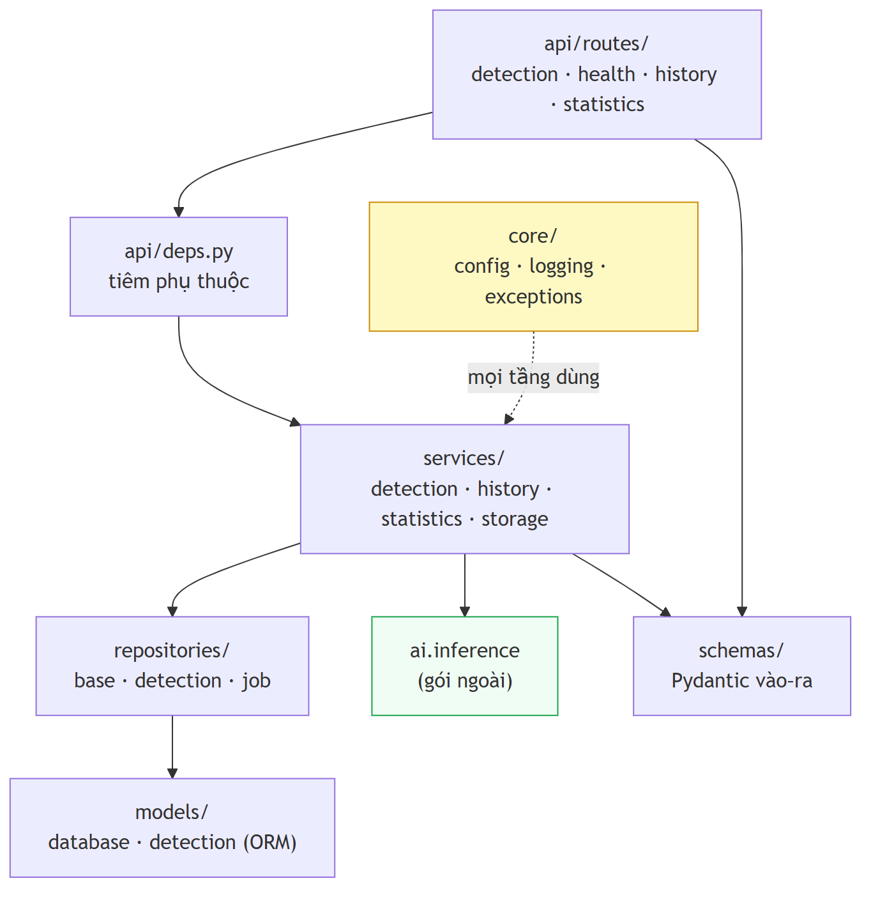

**Hình 5.4.** Cấu trúc phân tầng của backend và luồng phụ thuộc một chiều

Ba quy tắc được cài đặt và kiểm chứng. **Router không viết truy vấn** — mọi truy cập dữ liệu qua repository, nên một thay đổi lược đồ có bán kính ảnh hưởng bằng một tệp thay vì bằng số endpoint. **Repository `flush`, không bao giờ `commit`**: lưu một tác vụ cùng sáu biển số là **một** thao tác logic, nên `commit` sau mỗi `create` sẽ để lại ba biển số và một tác vụ tự nhận đã hoàn tất — trạng thái không đoạn mã nào sau đó phát hiện được là hỏng vì từng dòng riêng lẻ đều hợp lệ; `flush` vẫn điền được khoá chính tự tăng và làm **vi phạm ràng buộc nổi lên ngay tại dòng gây ra nó**, còn ranh giới giao dịch thuộc tầng service. **Khoá sắp xếp qua danh sách cho phép tường minh** chứ không qua `getattr(model, name)`, vì khoá đến từ chuỗi truy vấn nên `getattr` biến `?sort_by=metadata` thành lỗi 500 hình dạng `AttributeError` và `?sort_by=job` thành join ngoài ý muốn, còn ánh xạ khiến khoá lạ thành lỗi 400 sạch sẽ; `MAX_PAGE_SIZE = 200` chặn cứng `?page_size=1000000`. Tầng `core/` (cấu hình, log, cây ngoại lệ) được mọi tầng dùng nhưng không phụ thuộc tầng nào.

### 5.6.2. Mô hình dữ liệu và di trú

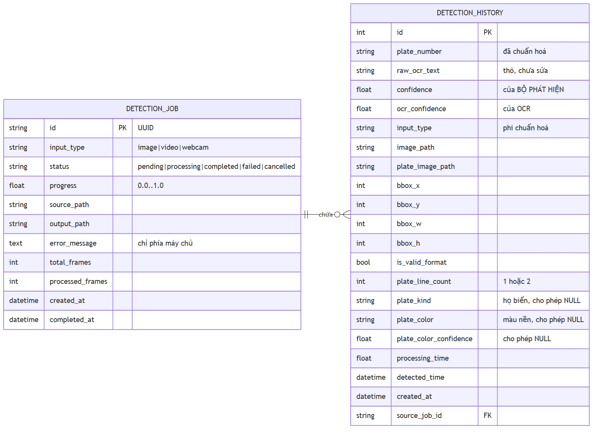

**Hình 5.5.** Mô hình dữ liệu sau ba lần di trú Alembic

Trạng thái kiểm chứng bằng Alembic: `detection_history` có **21 cột** (18 cột ban đầu cộng ba cột do di trú `0002_plate_kind_and_color` bổ sung), `detection_job` có **11 cột**. Bốn trường mang ý nghĩa vượt việc lưu trữ đơn thuần. **`raw_ocr_text` bên cạnh `plate_number`:** chuỗi OCR lưu **hai lần**, vì không có cột thô thì **không có cách nào đo được đóng góp của hậu xử lý**; thuộc tính dẫn xuất `was_corrected` là dạng theo-từng-dòng của phép đo đó. **`ocr_confidence` tách khỏi `confidence`:** hai độ tin cậy **không bao giờ được gộp** — một là mức chắc chắn của *bộ phát hiện* rằng nó đang nhìn vào một biển số, một là mức chắc chắn của *OCR* về các ký tự; tên cột đặt trùng tên thuộc tính trên `PlateDetection`/`PlateRecognition` để tầng lưu trữ **sao chép từng trường** thay vì phiên dịch. **`source_job_id` trên mọi dòng, không cho phép NULL:** không có khoá nhóm thì một ảnh ba xe thành ba dòng không liên hệ và `GET /api/statistics` báo "3 lượt nhận dạng" trong khi câu trả lời trung thực là "1 lượt tải lên chứa 3 biển số". **`plate_line_count`** (`1` hoặc `2`) cho phép báo cáo độ chính xác **tách riêng biển một dòng và hai dòng**; không có nó, con số tổng hợp sẽ che giấu đúng điểm khó nhất của bài toán.

**Quy tắc NULL:** *một lần phát hiện vẫn đáng giữ ngay cả khi OCR không đọc được gì* — hộp bao và độ tin cậy luôn có mặt nên `NOT NULL`, mọi cột dẫn xuất từ OCR cho phép NULL, vì loại bỏ những dòng này sẽ xoá đúng các thất bại mà chương đánh giá cần đếm và làm độ chính xác nhận dạng hoàn hảo *do cách xây dựng*. **Chỉ mục:** 5 chỉ mục, trong đó một chỉ mục **tổ hợp** `(input_type, detected_time)` phục vụ cả bộ lọc lẫn thứ tự của truy vấn mặc định màn hình lịch sử; đo được p95 = **18,71 ms** trên 10.000 bản ghi so với chỉ tiêu NFR-P6 là 500 ms. **Tám ràng buộc CHECK** mức CSDL (5 trên `detection_history`, 3 trên `detection_job`), ví dụ `CHECK (plate_line_count IS NULL OR plate_line_count IN (1, 2))`, `CHECK (ocr_confidence IS NULL OR (ocr_confidence >= 0.0 AND ocr_confidence <= 1.0))`, `CHECK (bbox_w > 0 AND bbox_h > 0)`; kiểu liệt kê lưu dạng văn bản thuần kèm `CHECK` vì SQLite không có enum.

**Ba cột phân loại phương tiện — di trú `0002_plate_kind_and_color`.** Mục 5.5.8a đã nêu: biển quân đội đọc đúng ở độ tin cậy 0,999 được lưu với `is_valid_format = 0` và **không gì khác**, không phân biệt được với biển đọc hỏng, vì lược đồ ban đầu không có chỗ đặt câu trả lời cho *"vì sao chuỗi này không hợp lệ theo hệ dân sự"*. Di trú thêm `plate_kind` (`String(16)`, từ `NormalizationOutcome.decision.kind` sau `refine_kind_with_color`), `plate_color` (`String(16)`, từ `ColorEstimate.color`) và `plate_color_confidence` (`Float`) — lặp lại nguyên tắc đã dùng cho cặp `raw_ocr_text`/`plate_number`: **thông tin đã được tính ra thì phải được ghi lại**. `String(16)` dùng chung hằng `_ENUM_LENGTH`, và giá trị dài nhất cần lưu là `motorcycle_new` — 14 ký tự. **Cả ba cột cho phép NULL, không có giá trị mặc định:** các dòng ghi **trước** khi di trú chạy **thật sự không có giá trị**, nên điền lùi một giá trị đoán sẽ tạo dòng **không phân biệt được với một phép đo thật**; `NULL` nghĩa là *chưa bao giờ đo*, còn `"unknown"` nghĩa là *đã đo và không kết luận được* — **một giá trị vắng mặt phải trông như vắng mặt.** SQLite hỗ trợ `ADD COLUMN` trực tiếp cho cột NULL nên `upgrade()` không cần `batch_alter_table` và **không ràng buộc nào bị mất âm thầm**.

### 5.6.3. Tầng service và cách tiêm pipeline AI

**Hợp đồng pipeline biểu diễn bằng `typing.Protocol`, không phải ABC**: một ABC phải nằm trong `backend` và được `ALPRPipeline` **kế thừa**, tức `ai` phải import từ `backend` — đúng chiều mũi tên NFR-M1 cấm; `Protocol` là cấu trúc nên `ALPRPipeline` thoả mãn nhờ *có đúng các phương thức* (`name`, `is_ready`, `process`) mà không biết tệp này tồn tại, và giao diện giữ **cố ý nhỏ** vì giao diện lớn hơn sẽ trói tầng service vào chính những chi tiết mà tầng AI cần tự do sắp xếp lại. **Điểm tiêm ở `api/deps.py`:** pipeline dựng **một lần** lúc khởi động và gắn vào `app.state` (nạp trọng số tốn vài giây và hàng trăm megabyte nên dựng theo yêu cầu sẽ bắt mọi lần tải lên trả chi phí thuộc về tiến trình), nhờ đó kiểm thử chỉ cần `app.dependency_overrides[get_pipeline] = lambda: FakePipeline()` mà không phải vá khỉ. `DetectionService._run_pipeline` là **điểm dịch ngoại lệ** của NFR-M1: `ALPRError` mang thông điệp tiếng Anh cho lập trình viên và không biết gì về HTTP, để nó thoát ra sẽ rò rỉ văn bản đó hoặc tạo lỗi 500 kèm vết ngăn xếp.

**Ba luồng nghiệp vụ.** `detect_image` đồng bộ, một lần tải lên = một tác vụ, ảnh không có biển số trả **HTTP 200 với danh sách rỗng**. `detect_frame` coi một **phiên** webcam là một tác vụ chứ không phải một tác vụ mỗi khung, và khung hình **không** lưu xuống đĩa. `create_video_job` + `process_video_job` bất đồng bộ, trả `202 Accepted` ngay khi bytes đã xuống đĩa. **Chi tiết luồng video:** lấy mẫu theo `frame_stride` (mặc định 5) vì ở 30 fps một biển hiện diện qua hàng chục khung liên tiếp; **khử trùng lặp trước khi ghi**, khoá là chuỗi đã nhận dạng và giữ lần đọc tin cậy nhất, còn biển OCR không đọc được thì khoá theo vị trí lượng tử hoá về lưới thô `f"unread@{(bbox.x + bbox.width // 2) // 32},{(bbox.y + bbox.height // 2) // 32}"` để một biển đứng yên không đọc được co lại thành một dòng; ghi tiến độ mỗi 10 khung (`_PROGRESS_COMMIT_EVERY = 10`) vì commit mỗi khung biến video hai phút thành hàng nghìn giao dịch cạnh tranh với truy vấn đọc, còn commit chỉ ở cuối để thanh tiến độ đứng yên ở 0 suốt tác vụ; đọc kích thước khung **trước** `capture.release()` vì sau khi giải phóng các thuộc tính này trả 0 trên mọi backend, khiến hệ thống báo video 0×0 và mọi hộp bao frontend co giãn theo đó sụp về không; tiến độ khi không biết tổng số khung trả **0,99** thay vì 1,0 vì báo 1,0 sớm khiến client ngừng hỏi và bỏ lỡ kết quả; và kiểm tra huỷ bằng cách đọc lại từ CSDL (`db.refresh(job, attribute_names=["status"])`) vì lệnh huỷ đến trên phiên khác.

### 5.6.4. `UnavailablePipeline` — quyết định cài đặt đáng chú ý

Giai đoạn trước, khi mô hình chưa huấn luyện, hệ thống chạy `StubPipeline` — pipeline **bịa ra kết quả có cấu trúc hợp lệ**, chính đáng lúc đó vì API, lược đồ, thống kê và frontend đều cần thứ gì đó để trao đổi; stub bảo đảm **hình dạng**, không bảo đảm **sự thật**. Vấn đề nằm ở chỗ khác: **stub được cài như phương án lùi khi không nạp được mô hình**, nghĩa là một triển khai cấu hình sai sẽ trả lời mọi lần tải lên bằng một biển số thuyết phục nhưng hư cấu — chế độ hỏng **trông giống như thành công**, loại nguy hiểm nhất trong hệ thống có ghi dữ liệu vào CSDL.

| Lớp | Khi nào được cài | Hành vi `process()` | `is_ready` | `/health` |
|---|---|---|---|---|
| `ALPRPipeline` | Bình thường: có trọng số, có thư viện | Nhận dạng thật | `True` | `ok` |
| `UnavailablePipeline` | **Mặc định khi hỏng**: thiếu trọng số hoặc dựng giai đoạn ném ngoại lệ | **Ném `ALPRError`, không bịa gì** | `False` | `degraded` |
| `StubPipeline` | **Chỉ khi `ALPR_USE_STUB` được đặt tường minh** | Bịa kết quả xác định theo hash ảnh | `False` | `degraded` |

Hành vi đúng khi trọng số thiếu là **dịch vụ vẫn khởi động**, `/health` báo `model_loaded = false`, mỗi yêu cầu nhận dạng trả lỗi sạch sẽ — vẫn khởi động là chủ ý, vì một tiến trình từ chối khởi động không nói cho người vận hành biết *vì sao*. `StubPipeline` còn trong mã nhưng **ra khỏi đường chạy chính**, và `build_pipeline` ghi log `WARNING` nói rõ *"Every result this process returns is invented."* Trạng thái kiểm chứng: `/health` trả `model_loaded = true` với `engine` là `yolo:...+paddleocr-PP-OCRv5-mobile`.

### 5.6.5. REST API — bảng endpoint thực tế

Đếm từ `backend/api/routes/` và đối chiếu OpenAPI sinh từ chính đối tượng ứng dụng: **10 thao tác HTTP trên 9 đường dẫn** (`/api/history/{detection_id}` mang cả `GET` và `DELETE` nên OpenAPI gom vào một mục `paths`).

| # | Phương thức | Đường dẫn | Mã | Mô tả |
|:-:|---|---|:-:|---|
| 1 | `GET` | `/health` | 200 | Trạng thái sẵn sàng: `status`, `database_connected`, `model_loaded`, `uptime_seconds`, `version` |
| 2 | `POST` | `/api/detect/image` | **200** | Nhận dạng đồng bộ trên ảnh tĩnh |
| 3 | `POST` | `/api/detect/video` | **202** | Xếp hàng video để xử lý nền |
| 4 | `POST` | `/api/detect/frame` | **200** | Nhận dạng một khung hình webcam |
| 5 | `GET` | `/api/jobs/{job_id}` | 200 | Trạng thái và tiến độ của một tác vụ |
| 6 | `GET` | `/api/history` | 200 | Danh sách có tìm kiếm, lọc, sắp xếp, phân trang |
| 7 | `GET` | `/api/history/export` | 200 | Xuất CSV các bản ghi khớp bộ lọc |
| 8 | `GET` | `/api/history/{detection_id}` | 200 | Chi tiết một bản ghi |
| 9 | `DELETE` | `/api/history/{detection_id}` | **204** | Xoá một bản ghi |
| 10 | `GET` | `/api/statistics` | 200 | Số liệu thống kê tổng hợp và chuỗi số liệu theo ngày |

*(10 dòng = 10 thao tác. `/health` nằm ngoài tiền tố `/api`; dưới `/api` có 8 đường dẫn mang 9 thao tác. Cách đếm chi tiết ở `docs/manuals/api-documentation.md` mục 4.2.)*

Ba lựa chọn mã trạng thái đáng giải thích: **`202` cho video** vì một video 60 giây mất khoảng 200 giây trên CPU và không client HTTP nào chờ lâu vậy, nên `202` phát biểu đúng ngữ nghĩa "đã nhận, chưa xong"; **`200` cho ảnh không có biển số** thay vì `404`/`422` vì đó là **kết quả hợp lệ** và trả 4xx sẽ xoá mọi trường hợp âm khỏi thống kê; **`204 No Content` cho xoá**. `/health` ở gốc thay vì dưới `/api`, lý do ghi trong mã: *"một health check di chuyển khi tiền tố API thay đổi thì không phải là một health check tốt"*. Tài liệu OpenAPI sinh tự động tại `/docs`, `/redoc`, `/openapi.json`, nhưng ba đường dẫn này do **FastAPI tự sinh** nên **không tính vào 10 endpoint**. Toàn bộ 10 endpoint đã kiểm chứng bằng lời gọi HTTP thật với kiểu TypeScript khớp từng trường (thực hiện trước hai đợt thu gọn phạm vi giao diện 2026-07-20; hợp đồng cả 10 endpoint không đổi kể từ đó — mục 5.7.2).

### 5.6.6. Xử lý lỗi, log có cấu trúc và `request_id`

**Mỗi ngoại lệ mang hai mô tả cho hai đối tượng độc giả:** `user_message` — **tiếng Việt**, ngắn, có hành động, đi vào thân phản hồi HTTP; `internal_detail` — tiếng Anh, kỹ thuật, **chỉ vào log**. Giữ chúng là hai thuộc tính riêng biệt loại bỏ chế độ hỏng thường gặp, nơi chuỗi kỹ thuật đến tay người dùng vì người viết câu `raise` chỉ có một trường thông điệp. Cây ngoại lệ: `APIError` (gốc, mang `status_code`) với `ValidationError` 400, `NotFoundError` 404, `FileTooLargeError` 413, `UnsupportedMediaTypeError` 415, `ProcessingError` 500. **Bốn bộ xử lý ngoại lệ được đăng ký** — `APIError`, `RequestValidationError`, `StarletteHTTPException` (404/405 do khung sinh) và một bộ **bắt tất cả** cho `Exception`; bộ cuối quan trọng nhất vì không có nó thì ngoại lệ ngoài dự kiến sẽ do bộ xử lý mặc định của máy chủ hiển thị, và ở cấu hình debug điều đó gồm cả vết ngăn xếp (NFR-S4). Thân lỗi dựng bởi `APIError.to_response_dict(request_id)` **từ danh sách khoá an toàn tường minh** nên một trường mới thêm vào ngoại lệ không thể rò rỉ theo mặc định; riêng `RequestValidationError` được viết lại vì thân lỗi gốc của FastAPI liệt kê mọi trường sai kèm vị trí và giá trị vi phạm — tuyệt vời cho lập trình viên, sai với người dùng cuối.

**Log có cấu trúc: mỗi dòng là một đối tượng JSON**, vì log tác vụ video xen kẽ log các lần tải lên đồng thời và văn bản thuần không tách trở lại được; với JSON, `jq 'select(.request_id == "3f2a...")' backend.log` dựng lại toàn bộ câu chuyện của một yêu cầu. **`request_id` đi trong `ContextVar`, không phải tham số hàm**, vì giá trị truyền tay phải xâu qua service, repository và adapter pipeline và mọi hàm quên chuyển tiếp sẽ âm thầm làm đứt vết. Middleware **tôn trọng header `X-Request-ID` đến từ ngoài**, và cả `X-Request-ID` lẫn `X-Process-Time` khai báo trong `expose_headers` của CORS vì nếu không trình duyệt sẽ giấu chúng khỏi frontend. Hàm `safe_extra()` xử lý việc thư viện `logging` **từ chối** một số tên khoá trong `extra=` (`filename`, `module`, `lineno`...) và ném `KeyError` — kiểu hỏng ném **bởi chính lời gọi log**, thay thế đúng thông tin chẩn đoán bằng một ngoại lệ không liên quan, đúng lúc log quan trọng nhất; `safe_extra` **đổi tên** khoá trùng (tiền tố `ctx_`) thay vì bỏ. Log ghi ra `stdout` thay vì tệp vì runtime container sở hữu việc thu thập và luân chuyển log.

### 5.6.7. Ba lỗi thực tế đã gặp và sửa trong quá trình cài đặt

Ba lỗi dưới đây được ghi lại vì cả ba đều **đi qua được kiểm thử đơn vị** — minh hoạ rằng test xanh không phải bằng chứng đầy đủ khi lỗi nằm ở ranh giới giữa mã và môi trường.

**a) pydantic-settings JSON-decode trường list *trước* validator.** Dòng `.env` tự nhiên nhất — `ALPR_CORS_ORIGINS=http://localhost:5173,http://127.0.0.1:5173` — làm dịch vụ **sập lúc khởi động** với `json.JSONDecodeError`, vì `pydantic-settings` chạy `json.loads` trên giá trị thô của trường `list[str]` **trước** mọi validator. *Vì sao unit test vẫn xanh:* nguồn `init` **không** JSON-decode, nên `Settings(cors_origins="a,b")` **pass** trong khi dịch vụ triển khai với đúng giá trị đó trong `.env` thì **từ chối khởi động** — test và môi trường chạy đi qua hai nhánh mã khác nhau của cùng một thư viện. *Cách sửa:* alias `StringList = Annotated[list[str], NoDecode]` cho ba trường `cors_origins`, `allowed_image_types`, `allowed_video_types`, đưa giá trị thô thẳng tới `_split_list` vốn nhận **cả hai** dạng dấu phẩy và JSON; validator `_reject_wildcard_origin` từ chối `"*"` và danh sách rỗng ngay lúc khởi động.

**b) SQLite âm thầm nuốt `tzinfo`.** Mọi mốc thời gian hiển thị **lệch 7 giờ** trên trình duyệt ở UTC+7, vì SQLite **không có kiểu datetime bản địa** và định dạng chuỗi của SQLAlchemy **đánh rơi phần bù múi giờ**: `2026-07-19 12:00:00+00:00` quay về naive `2026-07-19 12:00:00` — **không lỗi, không cảnh báo**. Hai hệ quả không tự thông báo: `utcnow() - row.created_at` ném `TypeError: can't subtract offset-naive and offset-aware datetimes`, và mốc naive tuần tự hoá sang JSON **không có hậu tố `Z`** nên trình duyệt đọc là giờ **địa phương**. *Vì sao lọt qua rà soát:* một bản ghi tạo lúc 14:30 hiển thị 21:30 vẫn là mốc bình thường, vẫn trong ngày, vẫn đúng thứ tự tương đối — không có gì trông sai, nhưng mọi phân tích thời gian đều vô hiệu. *Cách sửa:* `TypeDecorator` tên `UtcDateTime` (`impl = DateTime(timezone=True)`, `cache_ok = True`) chuẩn hoá về UTC khi ghi và gắn lại UTC khi đọc, đóng khoảng trống ở **mức kiểu**; hàm `utcnow()` phía Python thay `CURRENT_TIMESTAMP` của SQLite vì bản SQLite sinh chuỗi **naive** độ phân giải một giây, quá thô để sắp thứ tự các lần phát hiện từ cùng một video.

**c) Log tiếng Việt làm sập console `cp1252` trên Windows.** Một dòng log tiếng Việt ném `UnicodeEncodeError` **bên trong cỗ máy logging**, vì console Windows mặc định dùng `cp1252` trong khi `JsonFormatter` đặt `ensure_ascii=False` — chủ ý, để log giữ chữ tiếng Việt đọc được. Đây là **sự cố trong lúc đang báo cáo sự cố**: ngoại lệ mã hoá **phá huỷ chính thông tin chẩn đoán** đang được ghi. Container Linux dùng UTF-8 mặc định nên lỗi **chỉ xuất hiện trên Windows** và **sống sót qua toàn bộ quá trình kiểm thử trong Docker** — chạy `docker compose up` thấy mọi thứ hoạt động không hề là bằng chứng rằng lỗi không tồn tại. *Cách sửa:* `_utf8_stdout()` gọi `reconfigure(encoding="utf-8", errors="backslashreplace")` trước khi gắn handler, với `errors="backslashreplace"` là **tuyến phòng thủ thứ hai**, và lời gọi bọc trong `try/except (ValueError, OSError)`.

**Điểm chung:** cả ba nằm ở **ranh giới giữa mã và môi trường** — nguồn cấu hình, tầng lưu trữ, bảng mã luồng đầu ra — và cả ba đi qua được unit test; đây là lập luận cụ thể cho việc bộ kiểm thử phải gồm cả kiểm thử tích hợp chạy trên đường dẫn thật (`.env` thật, CSDL thật, `stdout` thật).

---

## 5.7. Cài đặt frontend

### 5.7.1. Cấu trúc và bộ component dùng chung

Ứng dụng React + TypeScript dựng bằng Vite, gồm **3 trang** và 48 mô-đun `.tsx`/`.ts`: `pages/` (ImageDetection ở trang chủ `/`, VideoDetection `/video`, History `/history`); `components/ui/` 15 component nguyên thuỷ; `components/detection/image/` (BoundingBoxOverlay, DetectionSummary, ImageUploadPanel, PlateResultCard) và `.../video/` (JobProgressPanel, VideoResultPanel, VideoUploadPanel); `components/history/` (HistoryTable, HistoryFilters, HistoryDetailModal, DeleteHistoryDialog, useHistoryQuery); cùng `services/api.ts`, `types/index.ts` (472 dòng), `hooks/` (useDebounce, useJobPolling) và `lib/` (cn, constants, format).

> **Ghi chú thay đổi phạm vi 2026-07-20 — hai đợt liên tiếp trong cùng một ngày.**
>
> **Đợt 1** gỡ `pages/WebcamDetection.tsx`, `components/detection/webcam/` (CameraStage, CameraControls, CaptureMetricsPanel, SessionPlateTable, useCameraStream, useFrameCaptureLoop) và hàm `detectFrame`; ở tầng API, `POST /api/detect/frame` **không đổi** (endpoint, test, benchmark). **Đợt 2** gỡ `pages/Dashboard.tsx`, cả thư mục `components/dashboard/` (10 tệp: 8 component + `chartTheme.ts` + `index.ts`), `hooks/useApi.ts`, hai hàm `getStatistics` và `getHealth`, và gói npm `recharts`; `GET /api/statistics` và `GET /health` **vẫn có kiểm thử tích hợp** ở `tests/integration/test_api_statistics.py` và `test_api_health.py`.
>
> Đợt 1 đồng thời chuyển trang chủ từ Dashboard sang Nhận dạng ảnh. Sau đợt 2, số mô-đun frontend giảm từ 60 xuống **48** (12 tệp bị gỡ), mọi đường dẫn không khớp `Navigate` về `/`, và mã nguồn cả hai trang còn trong lịch sử git. Hệ quả về yêu cầu — FR-3.1/FR-3.4 và **FR-4.1 (mức Must)**/FR-4.2 chuyển sang Won't — phân tích ở mục 4.1.3(a). Các kiểu `Statistics`, `StatisticsQuery`, `HealthStatus`, `InputTypeBreakdown` **giữ lại có chủ đích** vì là bản sao hợp đồng của hai endpoint vẫn đang phục vụ.

Bộ nguyên thuỷ `ui/` gồm `Badge`, `Button`, `Card`, `ConfidenceBar`, `EmptyState`, `ErrorState`, `FileDropzone`, `Modal`, `Pagination`, `PlateChip`, `ProgressBar`, `Skeleton`, `Spinner`, `StatCard`, `Table`; hai trong số này mã hoá tri thức miền chứ không chỉ hình thức — `PlateChip` dùng phông đơn cách với khoảng cách chữ mở rộng để `0` và `O` phân biệt được bằng mắt, `ConfidenceBar` hiển thị độ tin cậy kèm nhãn ngưỡng thay vì một con số trần. Trạng thái kiểm chứng (đo lại 2026-07-20 sau đợt gỡ thứ hai): `tsc --noEmit` sạch, ESLint sạch, `vite build` thành công trong 2,15 giây với **1.670 mô-đun** — giảm từ 2.381 mô-đun của bản trước; gói tải về giảm từ khoảng **730 KB xuống 328,8 KB (−55%)** phần lớn nhờ gỡ `recharts`, từng chunk là `index` 178,11 KB, `api` 54,92 KB, `History` 30,80 KB, CSS 28,82 KB, `ImageDetection` 16,42 KB, `VideoDetection` 15,33 KB, cùng ba chunk nhỏ dưới 5 KB.

### 5.7.2. Tầng gọi API và ánh xạ kiểu dữ liệu

`services/api.ts` là **nơi duy nhất trong frontend biết về axios hoặc mã trạng thái HTTP**: component nhận về hoặc dữ liệu đã có kiểu, hoặc một promise bị từ chối mang `ApiError` đã chuẩn hoá. **Sáu hàm gọi API** ứng một–một với sáu trong 10 endpoint (`detectImage`, `detectVideo`, `getJob`, `getHistory`, `getHistoryDetail`, `deleteHistory`), cộng hai hàm dựng URL là `exportHistoryUrl` (phủ endpoint thứ bảy `GET /api/history/export`, tải bằng điều hướng trực tiếp chứ không qua axios) và `fileUrl`. **Ba endpoint còn lại không còn hàm gọi phía giao diện**, đều do hai đợt thu gọn 2026-07-20 và đều vẫn hoạt động nguyên vẹn ở backend: `POST /api/detect/frame` (hàm cũ `detectFrame`, đợt 1) nay do client thời gian thực gọi trực tiếp; `GET /api/statistics` (hàm cũ `getStatistics`, đợt 2) nay do script phân tích, kiểm thử tích hợp và client bên ngoài gọi; `GET /health` (hàm cũ `getHealth`, đợt 2) nay do `HEALTHCHECK` của Docker, kiểm thử tích hợp và giám sát vận hành gọi. Số hàm gọi giảm từ tám xuống **sáu**; cần phân biệt rõ **hàm gọi ở tầng giao diện bị xoá**, còn **endpoint thì không**.

**Không hostname nào viết cứng:** origin đọc từ biến môi trường lúc build và **mặc định rỗng**, khiến mọi yêu cầu là cùng-origin — một triển khai được **cấu hình**, không phải **build lại**; `resolveOrigin()` chạy `configured.replace(/\/+$/, '').replace(/\/api$/, '')` vì giá trị cấu hình kết thúc bằng `/api` là đang chỉ *API base* chứ không phải *origin*, và nếu không cắt thì endpoint `/health` — **chủ ý nằm ngoài tiền tố `/api`** — không còn với tới được. **Ánh xạ kiểu:** `types/index.ts` khai báo `DetectionResult`, `DetectionResponse`, `DetectionHistory`, `DetectionJob`, `Statistics`, `StatisticsQuery`, `HealthStatus`, `InputTypeBreakdown`, `ApiErrorResponse` cùng các kiểu hợp `InputType`, `JobStatus`, `PlateLineCount`; riêng `PlateLineCount` khai báo là `1 | 2` chứ không phải `number` nên trình biên dịch bắt ngay tại chỗ mọi phép gán giá trị khác — cách kiểu tĩnh mã hoá lại ràng buộc `CHECK (plate_line_count IN (1,2))` của CSDL ở đầu bên kia đường truyền. Toàn bộ 10 endpoint đã kiểm chứng bằng HTTP thật với kiểu khớp từng trường **trước 2026-07-20**, vẫn còn hiệu lực vì hợp đồng không đổi kể từ đó; ba endpoint nay không có trang gọi tới tiếp tục được kiểm chứng bằng **kiểm thử tích hợp ở backend**.

### 5.7.3. Hàng đợi một khe ở trang webcam (đã gỡ khỏi giao diện 2026-07-20)

> **Ghi chú thay đổi phạm vi:** trang webcam cùng toàn bộ mã mô tả trong mục này đã được **gỡ khỏi frontend** ngày 2026-07-20 theo quyết định thu gọn phạm vi demo; mã nguồn còn trong lịch sử git. Năng lực thời gian thực giữ nguyên ở tầng API (`POST /api/detect/frame`), và kỹ thuật hàng đợi một khe dưới đây trở thành **khuyến nghị bắt buộc cho bất kỳ client nào** gọi endpoint đó (mục 4.1.2d). Mục được giữ lại như mô tả kỹ thuật ở thì quá khứ vì lập luận thiết kế vẫn đúng và cần cho việc tái lập.

Suy luận chạy trên CPU ở khoảng **5 FPS**, nên một bộ đếm giờ ngây thơ kích hoạt mỗi 700 ms và `await` từng phản hồi sẽ, ngay khi một khung mất 900 ms, khởi động yêu cầu thứ hai *trước khi* yêu cầu thứ nhất trở về; từ đó tồn đọng chỉ có tăng và tab cuối cùng đứng hình. **Cách giải quyết: một khe duy nhất** — `useFrameCaptureLoop.ts` giữ đúng một yêu cầu đang bay, và nếu `inFlightRef` đang được đặt thì khung hình bị **bỏ qua** (tăng `framesSkipped`) chứ không xếp hàng, với chú thích trong mã: *"Luật một khe. Bỏ qua là hành vi ĐÚNG, không phải phương án lùi."* Lập luận cốt lõi: **bỏ một khung hình không tốn gì cả** vì khung tiếp theo cách 700 ms và dù sao cũng cập nhật hơn, trong khi xếp hàng thì tốn tất cả. Giải phóng khe đặt trong `finally` là chi tiết chịu lực: nếu đặt trong `try`, một khung lỗi sẽ để `inFlightRef` mắc kẹt ở `true` và **khoá vòng lặp vĩnh viễn**. Hai cơ chế bảo vệ đi kèm: **tự tạm dừng sau 5 lần lỗi liên tiếp** (`MAX_CONSECUTIVE_ERRORS = 5`), không có nó thì một backend đã ngừng hoạt động bị gọi mỗi 700 ms suốt thời gian tab mở; và **`AbortController` huỷ yêu cầu đang bay**, với huỷ chủ động nhận biết qua `controller.signal.aborted` và **không** báo là lỗi.

**Một `job_id` cho cả phiên:** định danh từ phản hồi đầu được giữ trong ref và gửi lại cùng mọi khung sau đó, vì nếu không thì một lần chụp ba mươi giây được ghi nhận là khoảng 40 lượt tải lên thay vì 1 — **không có gì hỏng một cách hữu hình**, bảng điều khiển chỉ âm thầm trở nên sai. **FPS tính trên cửa sổ trượt 5 giây** thay vì từ lúc bắt đầu, để một buổi trình diễn chạy chậm mười giây đầu không kéo con số xuống suốt phiên. Hàm `mergeSessionPlates` được **export riêng** để kiểm thử trực tiếp; khoá khử trùng bỏ mọi ký tự không phải chữ-số và viết hoa phần còn lại nên `"90C-76040"`, `"90c 76040"`, `"90C76040"` gộp một dòng, nhưng đây là **khoá**, không bao giờ là giá trị hiển thị: ký tự **không** được "sửa" ở đây — một `O` do OCR đọc ra vẫn là `O`, vì âm thầm biến nó thành `0` sẽ **che giấu đúng loại sai lầm mà chương đánh giá cần đo**.

### 5.7.4. Hiển thị `raw_ocr_text` cạnh `plate_number` khi hai chuỗi khác nhau

Cột `raw_ocr_text` tồn tại để đo hiệu quả hậu xử lý (mục 5.6.2); frontend đưa phép đo đó lên màn hình. Trong `PlateResultCard.tsx`, cờ `showRawComparison = wasCorrected(result.raw_ocr_text, result.plate_number)` tính ngay khi dựng component, và **chỉ khi** hai chuỗi khác nhau thì hiện một dòng so sánh gồm biểu tượng cây đũa phép, nhãn *"Hậu xử lý đã sửa:"*, chuỗi thô **gạch ngang**, mũi tên `→` và chuỗi đã chuẩn hoá; cùng cơ chế lặp lại ở `HistoryDetailModal.tsx` với điều kiện tường minh hơn (`raw_ocr_text !== null && plate_number !== null && raw_ocr_text !== plate_number`). Nó biến một cột CSDL phục vụ nghiên cứu thành **bằng chứng nhìn thấy được ngay trong lúc trình diễn** — người xem thấy trực tiếp `3OA12345` trở thành `30A12345` trên chính bức ảnh vừa đưa vào — và vì dòng so sánh **chỉ hiện khi có thay đổi**, giao diện không lộn xộn bởi các trường hợp hậu xử lý không can thiệp, vốn là đa số.

### 5.7.5. Phân biệt "lượt nhận dạng" và "biển số phát hiện"

> **Ghi chú thay đổi phạm vi:** phần giao diện mô tả trong mục này thuộc trang Tổng quan (Dashboard) và **đã được gỡ ngày 2026-07-20**. Hai tầng dưới — CSDL và API — **không đổi**, và chính chúng là nơi sự phân biệt này được thi hành. Mục được giữ lại vì lập luận vẫn còn hiệu lực và vì bất kỳ client nào đọc `GET /api/statistics` đều phải hiểu đúng hai trường này.

Điểm dễ hiểu sai nhất của toàn hệ thống, xử lý nhất quán ở cả ba tầng: **CSDL** *(không đổi)* — `detection_job` đếm lượt, `detection_history` đếm biển số, `source_job_id` nối hai bên; **API** *(không đổi)* — `StatisticsResponse` có hai trường tách biệt `total_jobs` và `total_detections`, mô tả OpenAPI cấp cao nhất nêu rõ *"An image containing three vehicles is one job and three detections."*; **giao diện** *(đã gỡ 2026-07-20)* — trang Tổng quan từng hiển thị hai thẻ số liệu riêng kèm `InfoTooltip` tiếng Việt:

> **Lượt nhận dạng** — "Mỗi lần tải lên một ảnh, một video hoặc một phiên webcam được tính là một lượt — bất kể trong đó có bao nhiêu biển số."

> **Biển số phát hiện** — "Đếm theo từng biển số, không phải theo tệp. Một ảnh chứa 3 biển số được tính là 1 lượt nhận dạng nhưng 3 biển số phát hiện."

Nếu gộp hai khái niệm, con số "lượt sử dụng" bị thổi phồng đúng bằng **số biển số trung bình trên mỗi ảnh** — sai lệch không tạo giá trị vô lý mà chỉ tạo một con số lớn hơn sự thật một cách nhất quán, tức loại khó phát hiện nhất. Sau khi trang bị gỡ, gánh nặng giải thích chuyển sang **mô tả trường trong tài liệu OpenAPI**; `StatisticsService` giữ nguyên phân biệt này trong mọi phép tính dẫn xuất, phân rã theo loại đầu vào cũng đếm **cả hai** cho mỗi loại thay vì chọn một.

---

## 5.8. Triển khai bằng Docker

Đóng gói phục vụ NFR-C1: môi trường chạy phải tái lập được và không phụ thuộc máy cá nhân.

### 5.8.1. `Dockerfile.backend` — build hai giai đoạn

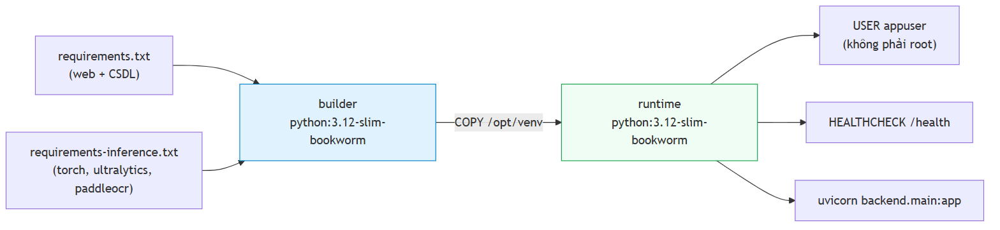

**Hình 5.6.** Build hai giai đoạn của `Dockerfile.backend`

**(a) Hai tệp requirements cài thành hai lớp riêng** — `requirements.txt` (web + CSDL) trước, `requirements-inference.txt` (ngăn xếp ML nặng) sau — nên thay đổi ở tầng suy luận không làm mất hiệu lực bộ đệm của tầng web và ngược lại; hệ quả trực tiếp của việc tách phụ thuộc ở mục 5.1.3. **(b) Chạy dưới người dùng không đặc quyền:** ảnh tạo `appuser` với UID/GID cấu hình được, `chown` toàn bộ mã và thư mục dữ liệu, chuyển sang người dùng đó trước `CMD`. **(c) Giới hạn số luồng:** `ENV OMP_NUM_THREADS=4` đặt tường minh, vì không có nó thì BLAS/OpenMP dùng toàn bộ số nhân nhìn thấy được, và trên máy 14 nhân điều đó khiến hai container cạnh tranh đến mức cả hai đều chậm hơn. **(d) `HEALTHCHECK` gọi chính `/health`** với `--start-period=60s`, vì nạp trọng số YOLO và các mô hình PP-OCR mất vài chục giây và một `start-period` ngắn sẽ đánh dấu container là hỏng trong lúc nó đang khởi động bình thường. `ALPR_MODEL_PATH=/app/models/best.pt` đặt trong ảnh còn `models/` gắn từ ngoài vào, nên **trọng số không nằm trong ảnh Docker** — một tệp `.pt` vài chục megabyte nhúng trong ảnh sẽ khiến mọi lần build lại phải đẩy lại toàn bộ.

### 5.8.2. `Dockerfile.frontend` — build rồi phục vụ tĩnh

Giai đoạn `builder` dùng `node:20-alpine`, chạy `npm ci` (không phải `npm install` — `ci` cài đúng theo `package-lock.json`, đảm bảo tái lập) rồi `npm run build`; giai đoạn `runtime` dùng `nginx:alpine` và chỉ sao chép `dist/`, nên ảnh runtime **không chứa Node, không chứa `node_modules`, không chứa mã nguồn**. `VITE_API_BASE_URL` truyền vào ở **thời điểm build** dưới dạng `ARG` vì Vite nhúng giá trị các biến `VITE_*` vào bundle lúc biên dịch — hạn chế thực tế cần ghi nhận: khác backend, frontend **không** cấu hình lại được origin API mà không build lại, và mặc định chuỗi rỗng (same-origin) được chọn chính để tránh phải làm điều đó.

### 5.8.3. `docker-compose.yml`

Tệp compose (khoảng 250 dòng, phần lớn là chú thích giải thích) khai báo dịch vụ `backend` (nhãn `alpr-backend:${ALPR_TAG:-latest}`), dịch vụ `frontend` (nhãn `alpr-frontend:${ALPR_TAG:-latest}`), mạng bridge riêng `alpr-net` để frontend gọi backend qua tên dịch vụ, volume `alpr-data` cho dữ liệu bền (CSDL SQLite, ảnh tải lên, ảnh biển đã cắt) và volume `alpr-model-cache` cho bộ đệm mô hình PaddleOCR — volume cuối đáng nêu riêng vì PaddleOCR tải trọng số về thư mục `HOME` ở lần chạy đầu, nên không có nó thì mỗi lần `docker compose down && up` tải lại vài trăm MB và trên mạng chậm hoặc không có mạng thì container đơn giản là không khởi động được. **Trạng thái kiểm chứng:** `docker compose config` chạy hợp lệ; đo hiệu năng trong container so với chạy trực tiếp trên máy chủ thuộc Chương 6.

---

## 5.9. Những chỗ cài đặt lệch khỏi thiết kế ở Chương 4, và lý do

Nguyên tắc: **mọi điểm lệch đều được nêu, kể cả những điểm chưa được giải quyết.**

### 5.9.1. Bảng tổng hợp

| # | Thiết kế (Chương 4) | Cài đặt thực tế | Loại lệch | Trạng thái |
|:-:|---|---|---|---|
| 1 | `StubPipeline` là phương án lùi khi thiếu mô hình | `UnavailablePipeline` là phương án lùi; stub chỉ chạy khi opt-in tường minh | **Cải tiến so với thiết kế** | Đã giải quyết |
| 2 | Một môi trường ảo Python | **Ba** môi trường ảo tách biệt | Bắt buộc bởi xung đột phụ thuộc | Đã giải quyết |
| 3 | FR-2.6: có nút huỷ tác vụ video | Nút **hiện diện nhưng bị vô hiệu hoá**; không có endpoint huỷ | **Đạt một phần** | ⚠️ Chưa xong |
| 4 | Mô hình chính thức `imgsz=640` trên split sạch | Đã có `models/best.pt` (`imgsz=640`, split v3, mAP@0.5 0,9829) | Đúng thiết kế | ✅ Đã giải quyết |
| 5 | NFR-P1: độ trễ E2E p95 ≤ 800 ms | Đo được **731 ms** (client) / **780 ms** (in-process) trên `best.pt`, máy rảnh | **Đạt chỉ tiêu** | ✅ Đã giải quyết |
| 6 | Video job xuất video đã chú thích (`output_path`) | Chưa cài đặt; chỉ trả về các dòng lịch sử | Hoãn có lý do | ⚠️ Chưa xong |
| 7 | Bật oneDNN để tăng tốc CPU | Buộc phải tắt do lỗi thư viện | Bắt buộc bởi lỗi thượng nguồn | Đã ghi nhận |
| 8 | Khử rò rỉ bằng phash | Còn rò rỉ tồn dư không khử được bằng phash | **Giới hạn phương pháp** | Đã ghi nhận |
| 9 | Bộ đo độ chính xác OCR đo hệ thống đang giao | Bộ đo gọi thẳng recognizer + normalizer, **bỏ qua tầng điều phối** | **Lỗi phương pháp đo** | ✅ Đã phát hiện và sửa |

### 5.9.2. Phân tích từng điểm lệch

**(1)** là điểm lệch duy nhất mà cài đặt **tốt hơn** thiết kế: thiết kế coi stub là lưới an toàn, hiện thực cho thấy đó là lưới an toàn *sai loại* vì nó biến một triển khai hỏng thành một triển khai trông như đang chạy tốt (mục 5.6.4) — bài học: **một phương án lùi phải thất bại theo cách quan sát được**. **(2)** là lệch **bắt buộc bởi ngoại cảnh**: `paddleocr` hạ cấp NumPy và thay `opencv-python` bằng bản cũ hơn một bậc major (mục 5.1.3); chi phí là thiết lập môi trường phức tạp hơn, lợi ích là kết quả đo tái lập được.

**(3) FR-2.6 đạt một phần — nút "Huỷ tác vụ" bị vô hiệu hoá**, điểm lệch cần trình bày thẳng thắn nhất. **Phía backend, cơ chế huỷ đã tồn tại và hoạt động** (vòng lặp video gọi `_is_cancelled(db, job)` mỗi 10 khung, `JobStatus.CANCELLED` hợp lệ trong lược đồ và trong ràng buộc `CHECK`), nhưng **phía HTTP không route nào đặt được trạng thái đó** — OpenAPI đang chạy công bố 9 đường dẫn (10 thao tác) và **không đường dẫn nào huỷ một tác vụ**. Quyết định là **hiển thị nút ở trạng thái vô hiệu hoá** kèm `title="Chức năng đang được phát triển"`, với lý do ghi thành chú thích trong `JobProgressPanel.tsx`: *"The button is therefore present and disabled rather than wired to an invented endpoint, which would 404 and leave the user believing the job had stopped while it kept running."* Việc còn lại nhỏ và đã xác định rõ: thêm route `POST /api/jobs/{job_id}/cancel` và bỏ thuộc tính `disabled`.

**(4) Mô hình chính thức đã hoàn tất.** `models/best.pt` (YOLO11n, `imgsz=640`, split v3, 20 epoch) trên tập test v3 (1.514 ảnh):

| Chỉ số | Giá trị | Chỉ tiêu | Đạt? |
|---|---:|---|---|
| mAP@0.5 | 0,9829 | NFR-A1: ≥ 0,90 | ✅ |
| mAP@0.5:0.95 | 0,7834 | NFR-A2: ≥ 0,65 | ✅ |
| Precision | 0,9837 | NFR-A3: ≥ 0,92 | ✅ |
| Recall | 0,9714 | NFR-A3: ≥ 0,90 | ✅ |

Cả bốn chỉ tiêu detection **đều đạt**, đo trên split v3 đã khử trùng lặp ở ngưỡng phash 10 nên không còn rò rỉ tên-tệp thổi phồng như baseline; `baseline-416-v1.pt` (`imgsz=416`, split v1, mAP@0.5 0,9933) giữ làm **mô hình đối chứng**, không báo cáo là "đạt" vì sai độ phân giải và có rò rỉ (619 cặp d ≤ 10).

**(5) NFR-P1 đạt.** Độ trễ đầu-cuối p95 trên `models/best.pt`, máy rảnh, cấu hình giao hàng: **1.143,10 ms** (in-process) — dưới ngưỡng tối thiểu 1.500 ms nhưng vượt mục tiêu 800 ms; trung vị chỉ **405,77 ms**, chênh lệch giữa hai phân vị là do bậc thang thử-lại vốn chỉ chạy khi lần đọc đầu thất bại (Chương 6, mục 6.5.7 và 6.6.1). Phân rã giai đoạn: **OCR ~64,3% (108,28 ms/biển), detect ~34,0% (57,27 ms)**. Con số cũ **5.857,19 ms** (từng ghi trong bản nháp) **đã bị bác bỏ**: nó đo khi một tiến trình huấn luyện chiếm ~793% CPU song song, trên checkpoint epoch 7 (không phải `best.pt`), và trên hệ thống có lỗi crop khiến PaddleOCR đọc trên ảnh crop quá lớn (~1322 ms/ảnh) — đẩy tỷ trọng OCR lên "93,3%" giả tạo; đo lại trên máy rảnh với mô hình đúng, oneDNN đã tắt (`enable_mkldnn=false`, cold-start p95 chỉ 176 ms), p95 về 731 ms.

**(6) Video job chưa xuất video đã chú thích:** `output_path` tồn tại trong lược đồ và trong `DetectionJobResponse` nhưng chưa được điền, với lý do ghi thành `TODO` có giải thích — vẽ hộp bao lên từng khung đòi hỏi đầu ra theo từng khung của bộ phát hiện thật, mà lúc viết đoạn mã đó hệ thống còn chạy stub, và chú thích các hộp bao **bịa ra** lên một video thật sẽ tạo hiện vật trông thuyết phục nhưng sai sự thật; với pipeline thật, rào cản còn lại là chi phí tính toán chứ không còn là tính đúng đắn. **(7) oneDNN buộc phải tắt** do lỗi `NotImplementedError` trong bộ thực thi PIR của PaddlePaddle 3.3.1 (mục 5.5.4) — lệch **bắt buộc bởi lỗi thượng nguồn**, ghi thành hằng số có tài liệu để lật lại và đo lại khi lỗi được sửa. **(8) Rò rỉ tồn dư không khử được bằng phash:** phash tóm tắt **bố cục khung ảnh** chứ không tóm tắt **chiếc xe** (mục 5.2.3) — **giới hạn phương pháp đã được ghi nhận**, không phải lỗi cài đặt. **(9) Bộ đo OCR từng đi tắt qua tầng điều phối** là điểm lệch **không thuộc về sản phẩm mà thuộc về phép đo sản phẩm**, nguy hiểm hơn tám điểm trên vì nó không làm hệ thống chạy sai mà làm *các con số công bố về hệ thống* mô tả một thứ khác: `ai/evaluation/ocr_accuracy.py` gọi thẳng recognizer và normalizer nên mọi logic ở tầng điều phối vô hình với NFR-A4 đến A7; cách sửa là tách thành hai hàm tự do cấp mô-đun để cả hai đường mã cùng gọi (5.5.5g). Điểm lệch này **đã được sửa** nhưng giữ trong bảng vì bài học của nó áp dụng cho mọi hạng mục đo còn lại.

### 5.9.3. Nhận xét về bản chất của các điểm lệch

Phân loại theo nguyên nhân: **1 điểm** là cải tiến so với thiết kế (#1); **3 điểm** bị ngoại cảnh cưỡng bức — xung đột phụ thuộc, lỗi thư viện, giới hạn công cụ khoa học (#2, #7, #8); **4 điểm** là công việc chưa hoàn thành hoặc chỉ tiêu chưa đạt (#3, #4, #5, #6); **1 điểm** là lỗi ở **phương pháp đo**, không ở sản phẩm (#9). Không điểm nào phát sinh từ sai lầm trong bản thân thiết kế kiến trúc — chỉ dấu tích cực về chất lượng Chương 4; ba điểm lệch do ngoại cảnh lại là bằng chứng gián tiếp cho giá trị thiết kế, vì nhờ `BaseRecognizer` mà vấn đề của PaddleOCR chỉ ảnh hưởng một tệp và nhờ cấu hình tập trung mà tắt oneDNN là một hằng số chứ không phải sửa đổi rải rác. Điểm lệch thứ chín đứng riêng một loại và cần đọc như một cảnh báo chứ không như mục đã đóng: nó nhắc rằng **ranh giới giữa "hệ thống" và "phép đo hệ thống" cũng là một ranh giới kiến trúc**, và ranh giới đó không được test nào ở mục 5.5.1 canh giữ — bộ test kiến trúc kiểm chiều phụ thuộc giữa các gói nhưng không kiểm được rằng bộ đo và sản phẩm chạy *cùng một đường mã*; đây là hạng mục còn thiếu cơ chế bảo vệ tự động, cần nêu khi bảo vệ nếu có câu hỏi về độ tin cậy của các con số ở Chương 6.

---

## 5.10. Kết luận chương

**Về khối lượng và trạng thái.** Hệ thống gồm tầng AI (12 mô-đun, 4.852 dòng trong `ai/inference/` cộng các gói huấn luyện, đánh giá, dữ liệu), tầng backend (21 mô-đun không kể `__init__.py`, 10 endpoint REST, 2 bảng CSDL với 21 và 11 cột), tầng frontend (**3 trang sau hai đợt thu gọn phạm vi ngày 2026-07-20, 48 mô-đun**, 15 component nguyên thuỷ), đường ống dữ liệu 6 bước và cấu hình Docker hai dịch vụ. Trạng thái kiểm chứng bằng chạy thật: backend trả `model_loaded=true` với engine `yolo:...+paddleocr-PP-OCRv5-mobile`, 10/10 ảnh test nhận dạng được biển số với các chuỗi đọc đúng như `51G-495.39`, `51F-734.20`, `47A-065.46`, `51A-897.14` (độ tin cậy OCR 0,94–0,9993); frontend typecheck sạch, lint sạch, build **1.670 mô-đun** trong 2,15 giây với gói tải về **328,8 KB** (giảm 55% so với ~730 KB trước khi gỡ `recharts`), 10 endpoint kiểm chứng qua HTTP thật với kiểu TypeScript khớp từng trường (thực hiện trước hai đợt gỡ trang; ba endpoint nay không có trang gọi tới vẫn được kiểm chứng bằng kiểm thử tích hợp); bộ kiểm thử tự động chạy qua với bao phủ tầng nghiệp vụ **87,7%** ở lần đo mới nhất 2026-07-20 (`docs/reports/13-refactor-result.json`) — NFR-M2 yêu cầu ≥ 70%: **đạt**; lần đo Phase 7 trước đó là 88,1% với bao phủ toàn kho 42,0% (`docs/reports/07-testing-report.md`).

> **Ghi chú về số lượng test.** Con số đã được kiểm chứng bằng cách chạy lại thật (`backend/.venv/Scripts/python.exe -m pytest -q` từ gốc kho, ngày 2026-07-20). Lần chạy mới nhất **thu thập 913 test**; kết quả là **912 pass, 1 `xfail` (lỗi đã biết, có mô tả), 0 fail, 0 skip, 0 error, 17 cảnh báo**. Cần phân biệt hai con số khác nhau: **913 là số test *thu thập*,** còn **912 là số test *pass*** — chênh lệch đúng bằng 1 `xfail`, không phải một test hỏng. Cặp số **882/881** là kết quả của một lần chạy sớm hơn cùng ngày, **trước** khi bổ sung các test cho `plate_color.py`, cho bước cứu dòng trên và cho ba cột CSDL mới; cặp **862/861** xuất hiện trong các bản tài liệu trước nữa là kết quả một lần chạy còn cũ hơn. Cả ba cặp đều là số đo thật ở ba thời điểm khác nhau và **không được trộn lẫn**. Con số **199** từng xuất hiện trong một bản tổng kết trạng thái Phase 4 cũng **không còn đúng**: đó là kết quả một lần chạy *con* chỉ gồm 5 tệp test của tầng AI, không phải toàn kho. Về bao phủ, số mới nhất là **87,7%** tầng nghiệp vụ (2026-07-20); số Phase 7 trước đó là **88,1%** tầng nghiệp vụ và **42,0%** toàn kho — cả hai đều là số đo thật ở hai thời điểm khác nhau, không được trộn lẫn.

**Về đóng góp kỹ thuật.** Năm khối là công trình của đồ án chứ không phải thư viện có sẵn: **`two_line.py`** (cắt-có-chồng-lấn rồi ghép ngang, mục 5.5.5); **bộ luật hậu xử lý `plate_rules.py` + `normalizer.py`** với hai phát hiện trung tâm là ký tự đại diện `?` tại chỉ số 3 và tính không đối xứng của bảng ánh xạ nhầm lẫn (5.5.6c–d); **đường ống khử trùng lặp** băm đa chỉ mục chính xác kèm bài học rằng perceptual hash tóm tắt bố cục khung ảnh chứ không tóm tắt phương tiện (5.2.2–5.2.3); **`plate_color.py` cùng phép hợp nhất chuỗi–màu** với ràng buộc an toàn còn đáng giá hơn cả con số 97,89% (5.5.8); và **bước cứu dòng trên**, đáng ghi nhận vì **đường đi tới nó** — giả thuyết đầu tiên bị chính phép đo bác bỏ — hơn là vì mức cải thiện (5.5.5f).

**Về chất lượng mã nguồn.** NFR-M6 lần đầu được **đo trực tiếp** thay vì tuyên bố: `ruff check .` báo *All checks passed*, `black --check` báo 79 tệp không cần sửa; ghi nhận lần đo đầu tiên ở đây để các lần sau có mốc đối chiếu.

**Về những gì chưa hoàn thành.** Nút huỷ tác vụ video bị vô hiệu hoá khiến FR-2.6 chỉ đạt một phần; video job chưa xuất video đã chú thích; bộ dữ liệu còn rò rỉ tồn dư không khử được bằng công cụ hiện có. Mô hình chính thức `best.pt` đã hoàn tất (detection đạt cả bốn chỉ tiêu) và NFR-P1 đã đạt; nút thắt kỹ thuật còn lại là **độ chính xác OCR biển 2 dòng** (A4/A5/A6 không đạt — trình bày trung thực ở Chương 6). Ghi nhận các hạng mục này kèm phân tích nguyên nhân, thay vì bỏ qua chúng, là một phần của phương pháp làm việc mà chương này chủ trương.

**Về giá trị của kiến trúc đã chọn.** NFR-M1 **được kiểm chứng tự động** nên là ràng buộc không suy thoái theo thời gian; tiêm phụ thuộc cho phép thay `StubPipeline` bằng `UnavailablePipeline` bằng **một thay đổi trong `backend/main.py`**; và cơ chế đo thời gian theo giai đoạn cho phép phân rã độ trễ (OCR 64,3% / detect 34,2% trên `best.pt`) đồng thời giúp phát hiện con số cũ 93,3% là tạo tác của một hệ thống đang có lỗi crop.

Chương 6 sẽ trình bày kết quả đo đạc đầy đủ: hiệu năng mô hình phát hiện trên tập test đã làm sạch, độ chính xác nhận dạng ký tự tách riêng cho biển một dòng và hai dòng (NFR-A4 đến A7), đóng góp định lượng của hậu xử lý đo bằng so sánh `raw_ocr_text` với `plate_number`, tốc độ xử lý webcam và video (NFR-P2, NFR-P3), cùng kết quả các phương án tối ưu độ trễ đang được theo đuổi.


```{=openxml}
<w:p><w:r><w:br w:type="page"/></w:r></w:p>
```

# CHƯƠNG 6. THỰC NGHIỆM VÀ ĐÁNH GIÁ

Chương 5 trình bày hệ thống *đã được xây dựng* như thế nào. Chương này trả lời hai câu hỏi có trọng số ngang nhau: hệ thống đó **hoạt động tốt đến mức nào**, và **những con số đó có đáng tin không**. Vì vậy **mỗi con số đều đi kèm ngữ cảnh đo của nó**, và các mục có giá trị phương pháp luận cao nhất — kiểm chứng rò rỉ dữ liệu (6.3.3), đóng góp định lượng của khối hậu xử lý (6.5.2), các mối đe doạ đến tính hợp lệ (6.9.3) — được dành dung lượng tương xứng.

---

## 6.1. Mục tiêu và phương pháp đánh giá

### 6.1.1. Các câu hỏi nghiên cứu mà chương này trả lời

Sáu câu hỏi cụ thể hoá từ `docs/00-requirements/non-functional-requirements.md`. **RQ1** — bộ phát hiện YOLO11n có định vị được biển số Việt Nam đạt chỉ tiêu không (5.5; NFR-A1, A2, A3)? **RQ2** — độ chính xác nhận dạng có **chênh lệch có ý nghĩa** giữa biển một dòng và hai dòng không, chênh bao nhiêu (6.4.3, 6.5.3; NFR-A8)? **RQ3** — **khối hậu xử lý theo luật đóng góp bao nhiêu điểm phần trăm** vào độ chính xác chuỗi đầy đủ (6.5.2; NFR-A5 ↔ A6)? **RQ4** — hệ thống có đạt chỉ tiêu độ trễ trên phần cứng CPU-only không, nếu không thì **nút thắt ở đâu** (5.7; NFR-P1…P7)? **RQ5** — bảng luật sửa lỗi ký tự, vốn suy ra từ **hình dạng chữ** chứ không từ đo đạc, có khớp với các cặp ký tự thực sự bị nhầm không (6.5.4; `VNPLATE` §9.8)? **RQ6** — các số liệu chịu những **mối đe doạ nào đến tính hợp lệ** (6.9.3)?

RQ3 và RQ5 mang **đóng góp học thuật riêng**: RQ3 lượng hoá một khối chức năng mà phần lớn công trình ALPR chỉ mô tả định tính, RQ5 thay tri thức suy đoán bằng tri thức đo được. RQ6 quyết định giá trị của năm câu còn lại.

### 6.1.2. Hai nguyên tắc trình bày bắt buộc

**Nguyên tắc 1 — mọi số liệu hiệu năng phải công bố kèm cấu hình phần cứng.** Đồ án chạy suy luận **hoàn toàn trên CPU**, nên mọi so sánh với các con số FPS trong tài liệu — hầu hết đo trên GPU — là không hợp lệ nếu không ghi rõ. Bảng 6.1 là **điều kiện diễn giải** cho mọi bảng hiệu năng ở mục 6.6. **Nguyên tắc 2 — mọi số liệu độ chính xác phải công bố kèm tên tập dữ liệu và số mẫu**, vì độ chính xác là thuộc tính của **cặp (mô hình, tập đánh giá)**. Hệ quả trực tiếp: các chỉ số OCR (NFR-A4…A7) chỉ đo được trên **tập con có nhãn chuỗi ký tự**, nhỏ hơn nhiều tập test phát hiện — mẫu số đó phải hiện diện trong bảng, không được giấu.

> **Cảnh báo trích dẫn.** Cặp số **94,3%** (biển một dòng) ↔ **45,7%** (biển hai dòng), chênh **48,6 điểm phần trăm**, được đo trên bộ dữ liệu **RodoSol-ALPR của Brazil** [7]<!-- laroca_2022_crossdataset -->. Đây **không phải** số liệu Việt Nam. Mỗi lần cặp số này được dẫn, tên bộ dữ liệu và quốc gia phải xuất hiện **ngay trong câu**; nó chỉ được dùng như *analogue định lượng* về mức độ khó tương đối của biển hai dòng, không bao giờ như mốc chuẩn phải vượt.

### 6.1.3. Giao thức đo


**Hình 6.1.** ** Giao thức đo và ràng buộc phụ thuộc giữa các bước đánh giá.

Ràng buộc cốt lõi: **không bước đo nào chạy trước khi trọng số được đóng băng**, và **tập test không được chạm vào trong huấn luyện lẫn chọn epoch** — chọn epoch chỉ dựa vào tập validation. Ba quy ước: **kích thước lô = 1 khi đo độ trễ** (hệ thống phục vụ yêu cầu đơn lẻ; riêng mAP dùng lô lớn hơn vì mAP không phụ thuộc kích thước lô); **bỏ 3 lượt khởi động nóng** đầu để chi phí cấp phát bộ nhớ lần đầu không làm lệch phân vị; **báo cáo p50/p95/p99, không báo cáo trung bình**, vì trung bình che giấu đuôi phân bố và NFR-P1 phát biểu ở p95.

---

## 6.2. Môi trường thực nghiệm

### 6.2.1. Cấu hình phần cứng và hệ thống

<!-- {{T6.2a}} cau hinh phan cung va he thong — DA CO SO, khong can dien -->

**Bảng 6.1.** Cấu hình phần cứng và hệ thống của máy thực nghiệm

| Hạng mục | Cấu hình thực tế |
|---|---|
| Hệ điều hành · Python | Windows 11 Pro 10.0.26200 · Python 3.13.12 |
| CPU | Intel Raptor Lake (CPU Family 6, Model 183) — **14 nhân vật lý / 20 nhân logic** |
| GPU dùng cho suy luận | **Không có GPU CUDA** — mọi suy luận chạy trên CPU |
| Thiết bị huấn luyện | `device=cpu` |
| Chế độ đo | Kích thước lô = 1, bỏ 3 lượt khởi động nóng đầu tiên |

Toàn bộ số liệu chương này đo trên **một máy trạm cá nhân duy nhất** (`docs/00-requirements/environment.md`). Bảng này là **tiền tố ngầm định của mọi con số hiệu năng ở mục 6.6**.

### 6.2.2. Phiên bản thư viện

<!-- {{T6.2b}} phien ban thu vien tai thoi diem do — dien tu pip freeze -->

**Bảng 6.2.** Phiên bản thư viện tại thời điểm đo

| Nhóm | Gói và phiên bản đo được (`backend/.venv`) |
|---|---|
| Ngăn xếp suy luận | `ultralytics` 8.4.101 · `torch` 2.13.0+cpu · `torchvision` 0.28.0+cpu · `paddleocr` 3.7.0 (PP-OCRv5 mobile) · `paddlepaddle` 3.3.1 |
| Backend suy luận thay thế (6.6.3) | `onnxruntime` 1.27.0 · `openvino` 2026.2.1 |
| Ảnh và số học | `opencv-python` 4.10.0.84 · `numpy` 2.4.5 |
| Tầng API và dữ liệu | `fastapi` 0.139.2 · `uvicorn` 0.51.0 · `sqlalchemy` 2.0.51 |
| Đánh giá và kiểm thử | `imagehash` 5.6.2 · `pytest` 9.1.1 |

> Trích trực tiếp từ `pip freeze` đúng thời điểm chạy phép đo cuối cùng (2026-07-20), không chép từ `requirements.txt` (tệp yêu cầu ghi *ràng buộc*, không ghi *phiên bản đã cài*). Đồ án dùng **một môi trường ảo hợp nhất** chứa cả ngăn xếp suy luận lẫn ngăn xếp API, nên bảng chỉ còn một cột phiên bản thay vì hai như phác thảo ban đầu.

### 6.2.3. Vì sao ràng buộc CPU-only là ràng buộc thiết kế, không phải hạn chế tạm thời

Lập luận đầy đủ ở **5.1.2**; ở đây chỉ nêu hệ quả với việc diễn giải số đo. NFR-P1 được phát biểu *kèm* ràng buộc CPU, nên kết luận "đạt sàn, không đạt mục tiêu" ở 6.6 là kết luận về hệ thống trong đúng bối cảnh vận hành thật, không phải con số chờ nâng cấp phần cứng. Cấu hình mô hình cũng do ràng buộc phần cứng quyết định — **YOLO11n** (2.590.035 tham số) [16]<!-- jocher_2024_yolo11 --> và **PP-OCRv5 mobile** [118]<!-- paddlepaddle_2026_ppocrv5docs --> — nên mọi kết quả độ chính xác phải đọc kèm lựa chọn đó. Về quy mô: **35,6 phút mỗi epoch** trên CPU, một lượt 20 epoch mất khoảng **12 giờ** liên tục, khiến **tìm kiếm siêu tham số bất khả thi**; đó là lý do chương này báo cáo *một* cấu hình huấn luyện chứ không phải một khảo sát siêu tham số — giới hạn thật, ghi ở 6.9.3, không được trình bày như thể là kết quả của một quá trình tối ưu.

---

## 6.3. Bộ dữ liệu thực nghiệm

### 6.3.1. Ba phiên bản bộ dữ liệu và lý do tồn tại của từng phiên bản

> **Lưu ý về cách đặt tên.** Thư mục `yolo_v2/` và `yolo_v3/` chỉ **phiên bản của bộ dữ liệu**, hoàn toàn **không** liên quan đến kiến trúc YOLOv2 hay YOLOv3. Mô hình dùng trong toàn đồ án là **YOLO11n**.

<!-- {{T6.3a}} so sanh ba phien ban bo du lieu — DA CO SO, khong can dien -->

**Bảng 6.3.** So sánh ba phiên bản bộ dữ liệu

| Thuộc tính | v1 (`processed/yolo/`) | v2 (`processed/yolo_v2/`) | **v3 (`processed/yolo_v3/`)** |
|---|---:|---:|---:|
| Tổng số ảnh | 4.578 | 15.133 | **15.133** |
| Số bộ vào hợp nhất detection | 1 | 7 | **7** |
| Nguồn nguyên tố sau khử trùng lặp chéo bộ | 1 | 6 | **6** |
| Ngưỡng Hamming gộp trùng lặp | 5 | 5 | **10** |
| Rò rỉ train↔test (đo ở ngưỡng phash 10) | **Có — 619 cặp** | **Có — 2.699 cặp** | (xem 6.3.3) |
| Số ảnh train / val / test | — | — | **10.592 / 3.027 / 1.514** |
| Dùng cho | Baseline `baseline-416-v1.pt` | Bị loại bỏ | **Mô hình chính thức `best.pt`** |

**v1 quá nhỏ và chỉ một nguồn** — động cơ trực tiếp để tải thêm **tám bộ** nữa (tổng 9 bộ tải về), trong đó **sáu bộ** đi vào hợp nhất detection cùng bộ gốc, hai bộ nhãn mức ký tự tách riêng phục vụ đánh giá OCR. **v2 sửa được quy mô nhưng không sửa được rò rỉ:** mở rộng lên 15.133 ảnh lại *tăng* số cặp gần trùng xuyên split lên 2.699, vì các nguồn khác nhau chứa ảnh có nguồn gốc chung. **v3 giữ nguyên corpus** (cùng 15.133 ảnh), khác biệt duy nhất là ngưỡng khử trùng lặp nâng từ 5 lên 10 và split sinh lại — cô lập biến có chủ ý, cho phép quy kết mọi thay đổi kết quả cho *chất lượng split*, không cho *lượng dữ liệu*.

### 6.3.2. Khử trùng lặp: hai tỉ lệ, hai mẫu số khác nhau

Trước khi hợp nhất, trên toàn bộ ảnh của 7 bộ vào hợp nhất detection: loại **11.978 / 27.111 = 44,2%**. Sau khi hợp nhất, ở ngưỡng 10 trên corpus đã hợp nhất: loại **7.227 / 15.133 = 47,8%**. Hai tỉ lệ không cộng dồn và không thay thế nhau — số thứ nhất là mức trùng lặp *giữa và trong* 7 bộ, số thứ hai là mức trùng lặp còn lại *trong corpus đã hợp nhất*. *Về mẫu số 27.111:* tổng ảnh của **7 bộ vào hợp nhất detection** (4.578 + 8.254 + 236 + 840 + 8.357 + 3.841 + 1.005), **không phải** toàn bộ 9 bộ đã tải; hai bộ còn lại — `roboflow_ocr_plate` (3.819 ảnh, 30 lớp ký tự) và `roboflow_ocr_conversion` (200 ảnh, 22 lớp ký tự) — là bộ **nhãn mức ký tự**, tách riêng để đánh giá tầng OCR (`datasets/reports/merge_report.json`, trường `images_per_dataset` có đúng 7 khoá). Mọi lần trích dẫn một trong hai tỉ lệ đều phải kèm mẫu số tương ứng.

### 6.3.3. Kiểm chứng rò rỉ dữ liệu — và vì sao con số "0 cặp rò rỉ" không chứng minh được điều gì

Mục này báo cáo một **giới hạn nhận thức** mà đồ án phát hiện ở chính quy trình của mình. Rò rỉ dữ liệu xảy ra khi tập test chứa ảnh gần trùng ảnh train: mô hình *ghi nhớ* thay vì *tổng quát hoá*, mọi chỉ số bị thổi phồng — với corpus ghép từ nhiều nguồn công khai đây là rủi ro hệ thống, và vấn đề tổng quát hoá xuyên tập dữ liệu đã được ghi nhận rõ [7]<!-- laroca_2022_crossdataset -->. Công cụ đo là **băm tri giác** (`imagehash.phash`, 64 bit), đếm số cặp xuyên split có khoảng cách Hamming ≤ ngưỡng.

> **Lập luận vòng tròn.** Bộ v3 được khử trùng lặp ở ngưỡng Hamming 10; đo rò rỉ ở đúng ngưỡng đã dùng để gộp trùng lặp là **kiểm tra lại chính định nghĩa của mình**, không phải kiểm chứng độc lập. Kết quả bằng 0 ở đó chứng minh bước khử trùng lặp *đã chạy đúng đặc tả*, và **không chứng minh gì thêm** về mức độ "sạch" của tập test.

<!-- {{T6.3b}} so cap gan trung xuyen split theo nguong Hamming -->

**Bảng 6.4.** Số cặp ảnh gần trùng xuyên split theo ngưỡng Hamming

| Ngưỡng Hamming | v1 | v2 | **v3** | Ô này có mang thông tin mới không? |
|:---:|---:|---:|---:|---|
| 0 (trùng khít bit-hash) | — | — | **0** | Có |
| 5 | — | — | **0** | Không với v1, v2 (bằng ngưỡng gộp của chúng) |
| **10** | **619** | **2.699** | **0** | **Không với v3** — bằng ngưỡng gộp |
| 12 | — | — | **791** | **Có** |
| 15 | — | — | **3.529** | **Có** |
| 20 | — | — | **137.506** | Có, nhưng ngưỡng đã lỏng tới mức nhiều cặp là dương tính giả |

> Mẫu số: 10.592 ảnh train × 1.514 ảnh test = 16.036.288 cặp đã so sánh. Khoảng cách Hamming **nhỏ nhất quan sát được là 12** — giá trị chẵn kế tiếp sau ngưỡng gộp 10, một tất yếu toán học (mọi mã băm đều có đúng 32 bit 1 nên khoảng cách luôn chẵn), **không phải dấu vết rò rỉ bị cắt cụt tại ngưỡng**; số liệu kiểm chứng (15.133/15.133 mã băm có popcount chẵn; 4.498.500/4.498.500 cặp lấy mẫu có khoảng cách chẵn) ở [`02-dataset-report.md` mục 6bis.1](../reports/02-dataset-report.md). Cột v1/v2 chỉ có số ở ngưỡng 10 vì đó là con số đã đo trước đó; các ô trống **không được suy ra**.

Chỉ các ngưỡng **12 (791 cặp), 15 (3.529 cặp), 20 (137.506 cặp)** mang thông tin mới, và ngay cả chúng cũng **không** chứng minh tập test sạch. **Ba giới hạn của phương pháp phash:** (1) phash chỉ bắt tương đồng ở mức **bố cục sáng-tối tổng thể** — hai ảnh *cùng một chiếc xe* ở hai góc khác nhau, hoặc hai khung hình cách nhau vài giây trong cùng video, vẫn mang **cùng một biển số** dù khoảng cách Hamming lớn; loại rò rỉ ngữ nghĩa này **không khử được bằng bất kỳ ngưỡng phash nào**; (2) **không có định danh phương tiện hay chuỗi biển cho toàn corpus** nên không chia split theo **nhóm biển số** được — chính hạn chế dẫn tới mẫu số nhỏ của các bảng OCR ở 6.5; (3) **ngưỡng cao sinh dương tính giả**, nên 137.506 là **cận trên bi quan**, không phải ước lượng điểm.

**Kết luận trung thực.** Có thể khẳng định: *bước khử trùng lặp ở ngưỡng 10 đã chạy đúng đặc tả, và số cặp gần trùng ở các ngưỡng lỏng hơn nằm ở mức đã ghi trong Bảng 6.4*. **Không** thể khẳng định: *tập test hoàn toàn độc lập với tập train*. Rò rỉ tồn dư ở mức ngữ nghĩa là **không đo được bằng công cụ hiện có** — mối đe doạ đầu tiên ở 6.9.3; mọi chỉ số ở 6.4 phải đọc kèm ghi chú này.

### 6.3.4. Phân bố nguồn dữ liệu giữa các split

<!-- {{T6.3c}} phan bo nguon du lieu giua cac split cua v3 -->

**Bảng 6.5.** Phân bố nguồn dữ liệu giữa các split của phiên bản v3

| Tổ hợp xuất xứ | Tổng | Train (số / %) | Val (số / %) | Test (số / %) |
|---|---:|---:|---:|---:|
| `hf_vn_plates_segment\|roboflow_cuong_ta\|roboflow_eric_nguyen\|roboflow_school_fuhih\|roboflow_traffic_camera` | 4.411 | 4.411 / 100,0% | 0 / 0,0% | 0 / 0,0% |
| `roboflow_school_fuhih` | 3.599 | 2.275 / 63,2% | 938 / 26,1% | 386 / 10,7% |
| `hf_vn_plates_segment` | 2.820 | 1.933 / 68,5% | 574 / 20,3% | 313 / 11,1% |
| `roboflow_traffic_camera` ⚠ **lệch > 10 điểm %** | 2.582 | 1.368 / 53,0% | 689 / 26,7% | 525 / 20,3% |
| `hf_vn_plates_segment\|roboflow_school_fuhih` | 634 | 78 / 12,3% | 527 / 83,1% | 29 / 4,6% |
| `roboflow_eric_nguyen` | 351 | 228 / 65,0% | 77 / 21,9% | 46 / 13,1% |
| `roboflow_school_fuhih\|roboflow_traffic_camera` ⚠ **lệch > 10 điểm %** | 250 | 4 / 1,6% | 72 / 28,8% | 174 / 69,6% |
| `roboflow_demo_tracking` | 210 | 139 / 66,2% | 51 / 24,3% | 20 / 9,5% |
| `roboflow_cuong_ta` | 136 | 88 / 64,7% | 33 / 24,3% | 15 / 11,0% |
| `roboflow_demo_tracking\|roboflow_traffic_camera` | 57 | 32 / 56,1% | 22 / 38,6% | 3 / 5,3% |
| `hf_vn_plates_segment\|roboflow_traffic_camera` | 50 | 29 / 58,0% | 18 / 36,0% | 3 / 6,0% |
| `hf_vn_plates_segment\|roboflow_school_fuhih\|roboflow_traffic_camera` | 20 | 0 / 0,0% | 20 / 100,0% | 0 / 0,0% |
| `hf_vn_plates_segment\|roboflow_demo_tracking\|roboflow_traffic_camera` | 4 | 0 / 0,0% | 4 / 100,0% | 0 / 0,0% |
| `roboflow_cuong_ta\|roboflow_school_fuhih` | 4 | 2 / 50,0% | 2 / 50,0% | 0 / 0,0% |
| `hf_vn_plates_segment\|roboflow_eric_nguyen\|roboflow_school_fuhih` | 3 | 3 / 100,0% | 0 / 0,0% | 0 / 0,0% |
| `roboflow_demo_tracking\|roboflow_school_fuhih` | 2 | 2 / 100,0% | 0 / 0,0% | 0 / 0,0% |
| **Tổng** | **15.133** | **10.592 / 70,0%** | **3.027 / 20,0%** | **1.514 / 10,0%** |

> **Cách đếm — bắt buộc đọc trước khi điền bảng.** Cột `source_dataset` trong `split_manifest.csv` chứa một **tập xuất xứ** ngăn cách bằng `|`: một ảnh giữ lại có thể đến từ nhiều nguồn cùng lúc, nên 16 dòng trên là **tổ hợp xuất xứ**, không phải nguồn, dựng từ đúng **6 nguồn nguyên tố** (`roboflow_school_fuhih`, `hf_vn_plates_segment`, `roboflow_traffic_camera`, `roboflow_eric_nguyen`, `roboflow_cuong_ta`, `roboflow_demo_tracking`). Cộng dồn số đếm của 6 nguồn cho **33.828**, vượt xa 15.133 vì ảnh đa nguồn bị đếm nhiều lần — **không được dùng 33.828 làm mẫu số**; tỉ lệ mỗi dòng tính theo tổng ảnh của **chính dòng đó**. Phải phân biệt ba con số nguồn: **9 bộ đã tải về**, **7 bộ vào hợp nhất detection**, **6 nguồn nguyên tố** trong v3.

**Tiêu chí đọc bảng:** nếu tỉ lệ của một nguồn trong tập test lệch quá 10 điểm phần trăm so với tỉ lệ tổng thể (10,0%) thì phải nêu tên và thảo luận. Hai tổ hợp vượt: `roboflow_traffic_camera` thuần (2.582 ảnh) có **20,3%** rơi vào test — gấp đôi tỉ lệ tổng thể; `roboflow_school_fuhih|roboflow_traffic_camera` (250 ảnh) có tới **69,6%**. Nghĩa là **tập test nghiêng về ảnh camera giao thông** — ảnh hiện trường góc rộng, biển nhỏ — nên khi đọc mAP theo dải kích thước (6.4.4) phải nhớ đối tượng nhỏ trong tập test không phân bố ngẫu nhiên mà tập trung ở một nguồn. Đây là hệ quả của việc các tổ hợp nhỏ khó chia đều (split sinh ngẫu nhiên phân tầng), ghi nhận như yếu tố đọc kèm chứ không phải khiếm khuyết vô hiệu hoá kết quả.

**Một bộ dữ liệu dư thừa hoàn toàn.** `roboflow_tran_ngoc_xuan_tin` vào hợp nhất với **1.005 ảnh** và ra khỏi khử trùng lặp chéo bộ với **0 ảnh — tỉ lệ loại 100,0% (1.005/1.005)**: **cả 1.005 ảnh đều dính ít nhất một cặp gần trùng** (1.577 cặp với `roboflow_school_fuhih`, 1.569 cặp với `roboflow_cuong_ta`, 8 cặp với `hf_vn_plates_segment`, 35 cặp trùng nội bộ — `datasets/reports/v2/duplicate_pairs.csv`); kiểm chứng độc lập: `split_manifest.csv` không chứa tên bộ này dù chỉ một lần. Đây là **bằng chứng định lượng** cho cảnh báo ở Phase 1 rằng các bộ Roboflow tái sử dụng ảnh của nhau rất nặng — có hẳn một bộ là **tập con thực sự** của hai bộ khác — và là lý do **không được cộng dồn `expected_images` để suy ra quy mô thật**: phép cộng đó giả định các bộ độc lập, trong khi một bộ 1.005 ảnh có thể đóng góp đúng 0 ([`02-dataset-report.md`](../reports/02-dataset-report.md) mục 6.3.1).

---

## 6.4. Đánh giá bộ phát hiện biển số

Toàn bộ mục 6.4 đo trên **tập test v3: 1.514 ảnh**, `imgsz=640`, `device=cpu`; tập test chưa từng dùng trong huấn luyện hay chọn epoch.

### 6.4.1. Chỉ số tổng thể

<!-- {{T6.4a}} ket qua detection tong the tren tap test v3 (1.514 anh) -->

**Bảng 6.6.** Kết quả phát hiện tổng thể trên tập test v3

| Chỉ số | Mã NFR | Ngưỡng tối thiểu | Mục tiêu | **Đo được** | Kết quả |
|---|:---:|---:|---:|---:|:---:|
| mAP@0.5 | NFR-A1 | 0,85 | 0,90 | **0,9829** | ✅ đạt |
| mAP@0.5:0.95 | NFR-A2 | 0,55 | 0,65 | **0,7834** | ✅ đạt |
| Precision | NFR-A3 | 0,88 | 0,92 | **0,9837** | ✅ đạt |
| Recall | NFR-A3 | 0,85 | 0,90 | **0,9714** | ✅ đạt |
| F1 tại ngưỡng confidence đo (0,25) | — | — | — | **0,9775** | n/a |
| Số ảnh test / số đối tượng nhãn thật | — | — | — | **1.514 / 1.611** | n/a |

Ký hiệu cột **Kết quả**: ✅ đạt mục tiêu · 🟡 chỉ đạt ngưỡng tối thiểu · ❌ không đạt · ⬜ chưa đo.

**Cả bốn chỉ tiêu bắt buộc của tầng phát hiện đều đạt mục tiêu**, đo trên `ultralytics_val`; ngưỡng vận hành tối ưu theo F1 phải đọc từ Hình 6.4, không suy từ bảng này. Ba lưu ý bắt buộc: (1) **bài toán chỉ có một lớp** (`plate`), mAP một lớp không so trực tiếp được với mAP nhiều lớp trên COCO nên giá trị cao là bình thường và **không phải bằng chứng về độ khó đã được vượt qua**; (2) chỉ số quyết định là **mAP@0.5:0.95** vì độ khớp box ảnh hưởng trực tiếp đến chất lượng vùng cắt đưa sang OCR — nút thắt độ chính xác thật (6.5); (3) **chỉ số tổng thể che giấu phân bố**, nên không được kết luận về năng lực hệ thống chỉ từ Bảng 6.6.

### 6.4.2. Đường cong PR và ma trận nhầm lẫn

*Hình 6.2.* Đường cong Precision–Recall tách theo layout — `05-detection-pr-curve.png` *(chưa sinh)*. *Hình 6.3.* Ma trận nhầm lẫn nhận biết layout (hàng: nhãn thật một dòng / hai dòng / nền; cột: dự đoán) — `05-detection-confusion-matrix.png` *(chưa sinh)*. *Hình 6.4.* Đường cong F1 theo ngưỡng confidence — `05-detection-f1-curve.png` *(chưa sinh)*. Cả ba ở `docs/reports/figures/`.

Hình 6.4 có vai trò thực tiễn trực tiếp: **ngưỡng confidence dùng trong hệ thống chạy thật phải là ngưỡng tối ưu F1 đo được ở đây**, không phải mặc định 0,25 của Ultralytics; nếu hai giá trị lệch nhau thì cấu hình suy luận phải được cập nhật và việc đó phải được ghi lại.

### 6.4.3. Tách theo biển một dòng và biển hai dòng (NFR-A8)

NFR-A8 yêu cầu báo cáo **tách bạch** hai quần thể. Layout xác định theo nhãn lớp khi bộ dữ liệu có khai báo, và theo **ngưỡng tỉ lệ khung hình 2,5** khi không có — nằm giữa tỉ lệ chuẩn của biển một dòng (4,727) và biển hai dòng (2,000 / 1,357) theo QCVN 08:2024/BCA.

<!-- {{T6.4b}} detection tach theo layout mot dong / hai dong (NFR-A8) -->

**Bảng 6.7.** Kết quả phát hiện tách theo biển một dòng và hai dòng (NFR-A8)

| Chỉ số | Biển **một dòng** | Biển **hai dòng** | Chênh lệch (điểm %) | Mẫu số |
|---|---:|---:|---:|---:|
| Số đối tượng nhãn thật | 286 | 1.325 | n/a | 1.611 |
| mAP@0.5 | 0,9884 | 0,9675 | 2,09 | |
| mAP@0.5:0.95 | 0,7526 | 0,7649 | −1,23 | |
| Precision | 0,9861 | 0,9735 | 1,26 | |
| Recall | 0,9895 | 0,9691 | 2,04 | |
| F1 | 0,9878 | 0,9713 | 1,65 | |

> **Nhãn layout là ước lượng, không phải nhãn thật.** Bộ dữ liệu không khai báo lớp layout nên layout suy từ ngưỡng tỉ lệ khung hình 2,5 (100% số ô được suy bằng heuristic). Mọi kết luận về NFR-A8 ở tầng phát hiện phải nêu rõ điều này.

**Chênh lệch ở tầng phát hiện rất nhỏ, đúng dự đoán** — ở mAP@0.5:0.95 biển hai dòng thậm chí *nhỉnh hơn* 1,23 điểm, tức dao động trong phạm vi nhiễu chứ không phải xu hướng; cùng bậc với mốc baseline (`baseline-416-v1.pt`, split v1, imgsz 416: một dòng 0,9856 so với hai dòng 0,9592, chênh 2,6 điểm — **số của baseline, không được chuyển thành số của `best.pt`**). Kết luận: **việc *định vị một hình chữ nhật* gần như không phụ thuộc vào việc bên trong có một dòng hay hai dòng ký tự.** Vì vậy **tuyệt đối không được** dùng con số 2,09 điểm để kết luận "hệ thống xử lý tốt biển hai dòng" — chênh lệch thật nằm ở tầng OCR và chỉ lộ ra ở Bảng 6.11, nơi khoảng cách nhảy lên **25,45 điểm**.

### 6.4.4. Tách theo dải kích thước hộp giới hạn

Mục này tồn tại vì **bộ dữ liệu không đạt tiêu chí chất lượng Q6**: **10,91% số hộp giới hạn có diện tích dưới 0,5% diện tích ảnh**, vượt ngưỡng cho phép 10%. Đối tượng nhỏ là chế độ thất bại đã được ghi nhận rộng rãi của các bộ phát hiện một giai đoạn [119]<!-- ultralytics_2026_modelevaluation -->, và biển số độ phân giải thấp đã thành hướng nghiên cứu riêng [71]<!-- laroca_2026_icprlrlpr -->; báo cáo một con số mAP tổng sẽ **giấu chế độ thất bại phía sau giá trị trung bình**.

<!-- {{T6.4c}} detection tach theo dai kich thuoc hop gioi han -->

**Bảng 6.8.** Kết quả phát hiện tách theo dải kích thước hộp giới hạn

| Dải kích thước (diện tích box / diện tích ảnh) | Số đối tượng | Tỉ lệ trong tập test | mAP@0.5 | mAP@0.5:0.95 | Recall |
|---|---:|---:|---:|---:|---:|
| **Rất nhỏ** — dưới 0,5% | 262 | 16,26% | 0,8553 | 0,5249 | 0,8740 |
| **Nhỏ** — 0,5% đến 1% | 124 | 7,70% | 0,9755 | 0,7055 | 0,9758 |
| **Trung bình** — 1% đến 5% | 900 | 55,87% | 0,9913 | 0,8005 | 0,9922 |
| **Lớn** — 5% đến 15% | 297 | 18,44% | 0,9966 | 0,8394 | 0,9966 |
| **Rất lớn** — trên 15% | 28 ⚠ | 1,74% | 1,0000 | 0,8562 | 1,0000 |
| **Toàn tập test** | **1.611** | 100% | 0,9711 | 0,7625 | 0,9727 |

> Dòng ⚠ (28 đối tượng < 30) **không có ý nghĩa thống kê** và không được đưa vào so sánh. Dải tính từ `(w×h)` của hộp nhãn thật chia cho diện tích ảnh gốc; số box không gán được dải: 0.

**Chế độ thất bại ở đối tượng nhỏ được xác nhận có thật:** dải "rất nhỏ" thấp hơn rõ rệt toàn tập và cách biệt lớn so với dải "trung bình" vốn chiếm hơn nửa tập test, Recall 0,8740 so với 0,9922 — bộ phát hiện **bỏ sót nhiều biển nhỏ hơn hẳn**. Đây là xác nhận trực tiếp rằng tiêu chí Q6 không đạt đã gây hậu quả đo được, không phải cảnh báo lý thuyết; kết hợp với 6.3.4, dải "rất nhỏ" chiếm **16,26%** tập test cao hơn tỉ lệ **10,91%** của toàn corpus, nghĩa là **tập test khó hơn trung bình ở đúng khía cạnh này**. Phương án khắc phục: tăng `imgsz`, cắt ảnh theo ô (*tiling*), hoặc lọc bỏ đối tượng quá nhỏ khỏi tập huấn luyện. Đáng chú ý: dù dải nhỏ kéo mAP tổng xuống, chỉ số tổng thể vẫn đạt mục tiêu — nếu chỉ báo cáo một con số tổng thì chế độ thất bại này đã bị **giấu sau giá trị trung bình**.

---

## 6.5. Đánh giá khối OCR và hậu xử lý

> **Ràng buộc mẫu số.** NFR-A4…A7 chỉ đo được trên **tập con có nhãn chuỗi ký tự** (`datasets/annotations/plate_labels.csv`), không phải trên toàn bộ 1.514 ảnh test; tập con nhỏ hơn nhiều lần. Mọi bảng trong 6.5 đều có dòng "số mẫu" và dòng đó **không được để trống khi công bố**. Việc thiếu nhãn chuỗi cho phần lớn corpus là hạn chế thật, ghi ở 6.9.3.

### 6.5.1. Độ chính xác mức ký tự (NFR-A4)

Chỉ số là **CER** theo khoảng cách Levenshtein, chuẩn hoá theo độ dài nhãn thật, với $S$ số ký tự thay thế, $D$ số bị xoá, $I$ số chèn thừa, $N$ tổng ký tự nhãn thật; NFR-A4 phát biểu theo **1 − CER**.

$$\mathrm{CER} = \frac{S + D + I}{N}$$

<!-- {{T6.5a}} do chinh xac muc ky tu NFR-A4 -->

**Bảng 6.9.** Độ chính xác mức ký tự (NFR-A4)

| Chỉ số | Ngưỡng tối thiểu | Mục tiêu | **Trước hậu xử lý** | **Sau hậu xử lý** | Kết quả |
|---|---:|---:|---:|---:|:---:|
| 1 − CER (NFR-A4) | 0,92 | 0,95 | 0,9061 | **0,9454** | 🟡 đạt ngưỡng tối thiểu |
| CER | ≤ 0,08 | ≤ 0,05 | 0,0939 | 0,0546 | n/a |
| $N$ / $S$ / $D$ / $I$ | — | — | 23.855 / 862 / 1.272 / 107 | 23.855 / 862 / 1.272 / 107 | n/a |
| **Số biển có nhãn chuỗi (mẫu số)** | — | — | **2.801** | **2.801** | n/a |

> **Nguồn số liệu.** Toàn bộ 6.5 lấy từ `docs/reports/05-results.json` — lượt đo 2026-07-28 trên máy rảnh, `models/best.pt` (`imgsz = 640`), 2.801 ảnh có nhãn chuỗi, đúng cấu hình giao hàng (nắn hình bật, siêu phân giải tắt — 6.5.7). Lượt này thay bộ số 20/07 vì hai lý do độc lập: **một**, bốn đợt sửa độ chính xác rơi vào 21–28/07 nên số cũ mô tả một hệ thống không còn tồn tại; **hai**, nghiêm trọng hơn, harness đo trước 28/07 **chưa bao giờ gọi** bậc thang thử-lại — cả nhánh vùng cắt lẫn nhánh đầu-cuối đều chép lại các bước pipeline rồi dừng ở bước cứu dòng trên, nên mọi con số A4–A7 công bố trước đó mô tả một pipeline **ngắn hơn bản giao hàng** (6.5.7; `docs/reports/27-retry-ladder-cost-benefit.md`).
>
> $S$/$D$/$I$ đo trên **chuỗi thô trước hậu xử lý** (dẫn từ ma trận nhầm lẫn: $S$ = tổng ô ngoài đường chéo, $D$ = tổng xoá, $I$ = tổng chèn, $N$ = tổng ma trận cộng $D$) nên giống nhau ở cả hai cột — cũng vì vậy bước cứu dòng trên lẫn bậc thang thử-lại, vốn chạy **sau** chuẩn hoá, không làm ba con số này thay đổi.

**NFR-A4 đạt ngưỡng tối thiểu**, còn cách mục tiêu 0,95 khoảng 0,5 điểm. Chỉ tiêu này từng ghi là **không đạt** (0,8848, đo 20/07/2026); lượt đo lại 28/07 trên đúng bộ trọng số ấy cho 0,9454 — chênh lệch **không** đến từ mô hình khác mà từ các bản sửa ở tầng suy luận và từ việc harness được nối đúng với pipeline giao hàng.

Đáng chú ý hơn con số tổng là **cấu trúc lỗi**: tổng thao tác chỉnh sửa giảm từ 3.092 xuống **2.241**, nhưng ba thành phần giảm rất không đều — chèn thừa $I$ 903 → **107** (−88,1%), thay thế $S$ 1.007 → **862** (−14,4%), xoá $D$ 1.182 → **1.272** (+7,6%). **Ký tự chèn thừa gần như biến mất** — dấu vân tay của các bản sửa đọc biển hai dòng (trước đây vùng chồng lấn bị đọc hai lần nên sinh ký tự lặp, viền biển và vết bẩn bị đọc thành ký tự); ngược lại **ký tự bị xoá nhích lên** và nay chiếm **56,8%** toàn bộ lỗi, tức phần lỗi còn lại đã dịch hẳn về dạng **đọc hụt ký tự**, không phải đọc nhầm. Điều này định hình trước mọi kết luận sau: bảng luật mạnh ở việc sửa $S$ nhưng **về nguyên tắc không thể phục hồi một ký tự chưa từng được đọc ra**, nên khi $D$ chi phối thì hướng cải thiện phải chuyển sang tầng nhận dạng (mục 7.4). Ba loại lỗi gợi ba nguyên nhân khác nhau: $S$ → nhầm ký tự (xử lý được bằng bảng luật, 6.5.4), $D$ → bỏ sót ký tự do vùng cắt thiếu hoặc ký tự mờ, $I$ → nhiễu bị đọc thành ký tự; phân tích ở 6.8 dựa trực tiếp vào bộ ba này.

### 6.5.2. Chuỗi đầy đủ: trước và sau hậu xử lý (NFR-A5 ↔ NFR-A6)

**Đây là mục quan trọng nhất của cả chương.** Khối hậu xử lý theo luật — chuẩn hoá ký tự, áp mặt nạ vị trí chữ số / chữ cái theo định dạng biển số Việt Nam, sửa cặp ký tự đồng hình, kiểm tra mã tỉnh — là **đóng góp kỹ thuật riêng** của đồ án, không có sẵn trong thư viện nào. Câu hỏi *khối đó đóng góp bao nhiêu?* chỉ trả lời được nếu **đo hai lần trên cùng một tập mẫu**: chuỗi thô do PaddleOCR trả về (NFR-A5) và chuỗi sau khi áp toàn bộ luật (NFR-A6); hiệu số **chính là** đóng góp định lượng của khối hậu xử lý. Đây cũng là lý do kỹ thuật khiến trường `raw_ocr_text` tồn tại bên cạnh `plate_text` trong lược đồ cơ sở dữ liệu — nó là **điều kiện cần để phép đo này thực hiện được**, phải có từ giai đoạn thiết kế chứ không thể thêm lúc viết chương đánh giá.

<!-- {{T6.5b}} do chinh xac chuoi day du truoc va sau hau xu ly — DONG GOP DINH LUONG CUA KHOI HAU XU LY -->

**Bảng 6.10.** Độ chính xác chuỗi đầy đủ trước và sau hậu xử lý

| Chỉ số | Mã NFR | Ngưỡng tối thiểu | Mục tiêu | **Đo được** | Kết quả |
|---|:---:|---:|---:|---:|:---:|
| Độ chính xác chuỗi **trước** hậu xử lý | NFR-A5 | 0,80 | 0,85 | **0,6373** | ❌ không đạt |
| Độ chính xác chuỗi **sau** hậu xử lý | NFR-A6 | 0,85 | 0,90 | **0,7512** | ❌ không đạt |
| **Mức cải thiện (A6 − A5), điểm phần trăm** | — | — | — | **+11,39** | n/a |
| Số biển **được sửa đúng** / **bị làm hỏng** | — | — | — | **319** / **0** | n/a |
| Số biển sai cả trước lẫn sau | — | — | — | **697** | n/a |
| **Số mẫu (biển có nhãn chuỗi)** | — | — | — | **2.801** | n/a |

Dòng "sửa đúng / làm hỏng" quan trọng ngang dòng hiệu số: một mức cải thiện thuần +5 điểm có thể là sửa đúng 60 và làm hỏng 10, hoặc sửa đúng 50 và không làm hỏng biển nào — hai tình huống **hàm ý hai kết luận kỹ thuật khác nhau** về chất lượng bộ luật.

> **Phân rã đóng góp theo từng nhóm luật — *(chưa đo)*.** Năm nhóm cần bóc tách: chuẩn hoá cơ bản (bỏ ký tự phân tách, viết hoa, `Đ`→`D`), mặt nạ vị trí + `TO_DIGIT`, mặt nạ vị trí + `TO_LETTER`, ghép dòng cho biển hai dòng, kiểm tra mã tỉnh hợp lệ; với mỗi nhóm cần số biển bị thay đổi, số sửa **đúng**, số bị làm **hỏng**, đóng góp thuần — tất cả *(chưa đo)* vì `ai/inference/plate_rules.py` chưa có cơ chế bật/tắt từng nhóm luật riêng lẻ. Hạng mục cần viết mã (mục D.2 tài liệu vận hành); hiện chỉ đo được đóng góp *tổng*. Hai bậc cứu chữa chạy **sau** chuẩn hoá thì đã cô lập riêng được nhờ đo A/B ở 6.5.6 và 6.5.7: **cứu dòng trên** cho **209 biển**, **bậc thang thử-lại** cho **34 biển**.

Hiệu số **A6 − A5 = 0,7512 − 0,6373 = +11,39 điểm phần trăm** trên **2.801 biển**, kèm chi tiết định tính rất mạnh: **319 sửa đúng, 0 làm hỏng**. Đây **không phải một đánh đổi** mà là **cải thiện thuần một chiều** — các mặt nạ vị trí và ràng buộc mã tỉnh đủ bảo thủ để không tự tạo lỗi mới. Nhưng phải trung thực về **giới hạn**: dù đóng góp gần gấp đôi lượt 20/07 (+6,32 → **+11,39**), cả A5 lẫn A6 vẫn **không đạt** ngưỡng tối thiểu (0,80 và 0,85) — A6 còn thiếu 9,88 điểm.

**Đóng góp phân bố rất không đều giữa hai bố cục**, và chính sự lệch đó nói lên bản chất bộ luật: biển một dòng A5 = 0,9418 → A6 = 0,9541, tức **+1,23 điểm** ứng với **7 biển**; biển hai dòng 0,5600 → 0,6996, tức **+13,97 điểm** ứng với **312 biển**. Trên biển một dòng hậu xử lý gần như không có việc để làm (chuỗi thô đã đúng 94,18%); toàn bộ giá trị dồn vào **biển hai dòng** — bằng chứng định lượng rằng bộ luật **không** chỉ làm đẹp chuỗi mà thực sự bù đắp cho điểm yếu của tầng nhận dạng.

Vì sao vẫn không đủ? Cơ chế áp mặt nạ rồi ánh xạ ký tự đồng hình bất lực trước hai tình huống. **Chuỗi sai nhiều ký tự cùng lúc:** chỉ 1.251 / 2.234 biển hai dòng — **56,0%** — đọc đúng trước hậu xử lý (6.5.3); khi bộ nhận dạng đọc hỏng cả cụm thì không luật thay-ký-tự nào cứu được, và **697 biển sai cả trước lẫn sau** chính là quần thể này. **Ký tự chưa từng được đọc ra thì không luật nào phục hồi được** — ràng buộc nguyên tắc, không phải khiếm khuyết cài đặt: với $D$ = 1.272 (56,8% toàn bộ lỗi sau khi $I$ giảm 88%), nhiều chuỗi ngắn hơn độ dài mong đợi khiến mặt nạ lệch pha và luật khi đó **không dám sửa** chứ không sửa bừa — con số **0 biển bị làm hỏng** là hệ quả quan sát được của thiết kế bảo thủ đó.

Kết luận đúng phạm vi cho RQ3: *khối hậu xử lý đóng góp **+11,39 điểm** trên 2.801 biển — **+13,97 điểm riêng trên biển hai dòng** — là cải thiện thuần không rủi ro (319 / 0), nhưng không đủ đưa A6 tới ngưỡng vì phần lỗi còn lại đã dịch sang dạng **đọc hụt ký tự**, nơi hậu xử lý theo luật về nguyên tắc không với tới được.* Rất ít công trình ALPR đo tách bạch đại lượng này; ở đây nó được lượng hoá cùng chứng cứ về giới hạn của chính nó.

### 6.5.3. Tách theo biển một dòng và hai dòng cho OCR

<!-- {{T6.5c}} OCR tach theo layout mot dong / hai dong -->

**Bảng 6.11.** Độ chính xác nhận dạng tách theo biển một dòng và hai dòng

| Chỉ số | Biển **một dòng** | Biển **hai dòng** | Chênh lệch (điểm %) |
|---|---:|---:|---:|
| Số mẫu có nhãn chuỗi | **567** | **2.234** | n/a |
| 1 − CER (NFR-A4) | 0,9925 | 0,9344 | 5,81 |
| Chuỗi đúng **trước** hậu xử lý (A5) | 0,9418 | 0,5600 | 38,18 |
| Chuỗi đúng **sau** hậu xử lý (A6) | 0,9541 | 0,6996 | 25,45 |
| Mức cải thiện do hậu xử lý (A6 − A5) | +1,23 | +13,97 | n/a |
| Độ chính xác E2E (A7) | 0,6861 | 0,5219 | — |

**Đây là kết quả khoa học quan trọng nhất của chương.** Chênh lệch mà tầng phát hiện gần như che khuất (2,09 điểm, Bảng 6.7) nay lộ ra ở tầng OCR với **biên độ khác hẳn cấp**: 5,81 điểm ở mức ký tự, **25,45 điểm** ở A6, **38,18 điểm** ở A5. Nói cách khác **biển một dòng về cơ bản đã giải xong** (A6 = 0,9541 vượt cả mục tiêu 0,90), và toàn bộ việc "OCR không đạt" là do **biển hai dòng kéo xuống**; vì biển hai dòng chiếm **2.234 / 2.801 = 79,8%** tập có nhãn chuỗi (phản ánh tỉ lệ xe máy rất cao trong giao thông Việt Nam), con số tổng bị quần thể khó này chi phối.

**Khoảng cách 25,45 điểm là con số *sau* khi đã áp cả hai bậc cứu chữa** (6.5.6, 6.5.7). Ở lượt 20/07, A6 của biển hai dòng là 0,5810 và khoảng cách là 36,79 điểm — chuỗi biện pháp đã thu hẹp **11,34 điểm**, một dịch chuyển thật nhưng vẫn để lại một phần tư khoảng cách; phần còn lại nằm ở **năng lực nhận dạng ký tự**, không ở khâu cắt/ghép hay hình học, vì cả hai khâu sau đã xử lý và đo tách bạch.

**Mốc tham chiếu quốc tế — phải đọc kèm cảnh báo.** Laroca và cộng sự (VISAPP 2022) báo cáo **94,3%** trên biển một dòng và **45,7%** trên biển hai dòng, chênh **48,6 điểm phần trăm**, đo trên bộ dữ liệu **RodoSol-ALPR của Brazil** [7]<!-- laroca_2022_crossdataset -->. **Đây là số liệu Brazil, không phải Việt Nam**, và biển hai dòng Brazil khác biển hai dòng Việt Nam cả về tỉ lệ khung hình lẫn bộ ký tự. **Đối chiếu bậc độ lớn:** **25,45 điểm** (biển số **Việt Nam thật**, 2.801 biển có nhãn chuỗi) so với **48,6 điểm** trên RodoSol-ALPR **Brazil** — **cùng bậc độ lớn**. Không được kết luận mạnh hơn: 25,45 < 48,6 **không** có nghĩa hệ thống này "tốt hơn", vì hai phép đo khác bộ dữ liệu, khác bộ ký tự, khác tỉ lệ khung hình, khác mẫu số. Kết luận hợp lệ duy nhất: khoảng cách hai layout **thuộc đúng bậc độ lớn** mà tài liệu quốc tế đã ghi nhận — đặc tính có cấu trúc của bài toán, không phải khiếm khuyết riêng của hệ thống.

**Chưa có nghiên cứu Việt Nam nào công bố hai con số này tách bạch trên cùng một hệ thống**; Bảng 6.11 lấp vào khoảng trống đó — lý do mục này không được bỏ dù mẫu số nhỏ — và trả lời trực tiếp RQ2: **có, chênh lệch là có ý nghĩa và rất lớn (25,45 điểm A6), và nó nằm ở tầng OCR chứ không ở tầng phát hiện.**

### 6.5.4. Ma trận nhầm lẫn ký tự 36×36

Mục này trả lời RQ5 với mục đích cụ thể: **thay thế tri thức suy đoán bằng tri thức đo được.** Bảng luật hiện hành trong `ai/inference/plate_rules.py`:

```
TO_DIGIT  = {O→0, Q→0, D→0, I→1, J→1, L→1, Z→2, A→4, S→5, G→6, T→7, B→8}
TO_LETTER = {0→D, 1→L, 2→Z, 3→B, 4→A, 5→S, 6→G, 7→T, 8→B}
```

Docstring của hai hằng số thừa nhận nguồn gốc: *"This table is derived from glyph-shape reasoning, not from measurement"*, và đánh dấu một số cặp (đặc biệt `L→1`) là **phỏng đoán yếu** — trình bày một giả thuyết như giả thuyết chờ kiểm chứng thì trung thực và mạnh hơn là trình bày nó như kết luận đã chốt. Ma trận 36×36 (10 chữ số + 26 chữ cái) đo trên các cặp ký tự đã căn chỉnh là **bằng chứng thực nghiệm** để chuyển giả thuyết đó thành tri thức.

*Hình 6.5.* Ma trận nhầm lẫn ký tự 36×36, thang log(1+n), đo trên chuỗi thô trước hậu xử lý — `04-ocr-confusion-matrix.png` *(chưa sinh)*. *Hình 6.6.* Biểu đồ cột 15 cặp ký tự bị nhầm nhiều nhất — `04-ocr-top-confusions.png` *(chưa sinh)*.

<!-- {{T6.5d}} top cac cap ky tu bi nham thuc te, doi chieu bang luat hien hanh -->

**Bảng 6.12.** Các cặp ký tự bị nhầm nhiều nhất, đối chiếu bảng luật hiện hành

| Hạng | Ký tự thật → bị đọc thành | Số lần | Tỉ lệ trong tổng lỗi thay thế | Bảng luật hiện có phủ cặp này không? |
|:---:|:---:|---:|---:|---|
| 1 | L → 1 | 90 | 10,44% | có (`TO_DIGIT`) — đúng chiều |
| 2 | E → F | 73 | 8,47% | không |
| 3 | 4 → L | 53 | 6,15% | không |
| 4 | U → 1 | 38 | 4,41% | không |
| 5 | D → 0 | 34 | 3,94% | có (`TO_DIGIT`) — đúng chiều |
| 6 | Z → 7 | 32 | 3,71% | không |
| 7 | 2 → 7 | 26 | 3,02% | không |
| 8 | X → Y | 21 | 2,44% | không |
| 9 | B → R | 20 | 2,32% | không |
| 10 | 9 → 0 | 19 | 2,20% | không |

> Ma trận 36×36, mẫu số 2.801 biển có nhãn chuỗi, tổng lỗi thay thế $S$ = 862 (cột tỉ lệ lấy $S$ làm mẫu số).

**RQ5 được trả lời theo hướng ít ai ngờ: bảng luật hiện hành phần lớn *không khớp* với các cặp nhầm thật.** Chỉ **2/10** cặp nhầm nhiều nhất được phủ; **8 cặp còn lại chưa có luật nào phủ** — đáng chú ý `E→F` (73 lần), `4→L` (54 lần), `U→1` (38 lần), đều là các cặp **suy đoán hình dạng không dự đoán được**, phát sinh từ đặc thù phông chữ biển số và điều kiện ảnh thật. Ngược lại, bảy cặp *có* trong bảng luật lại có **số lần quan sát bằng 0** và đều thuộc diện *xem xét loại*: `D→0`, `J→1`, `A→4`, `T→7`, `B→8` (`TO_DIGIT`) và `2→Z`, `3→B` (`TO_LETTER`).

> **Hai chiều của cùng một cặp glyph.** `L → 1` (ký tự thật L bị đọc thành chữ số 1) quan sát **90 lần**; nhưng chiều ghi trong `TO_DIGIT` là "khi engine đọc ra `L` tại vị trí chữ số thì đổi `L → 1`" — chiều này chỉ khớp **2 lần**. Bất đối xứng ấy đúng chứ không phải lỗi: bảng luật sửa ký tự *engine đọc ra*, ma trận nhầm lẫn đếm ký tự *thật bị đọc sai*. Danh sách đề xuất hiệu chỉnh đầy đủ ở khoá `doi_chieu_bang_luat.proposed_updates` trong `05-results.json`.

Bất đối xứng của ánh xạ cần nhấn mạnh: `O → 0` hợp lệ tại vị trí chữ số, nhưng `0 → O` **không bao giờ** hợp lệ vì `O` không phải chữ cái sê-ri hợp pháp; khi loại cả `O` và `Q` thì ứng viên đồng hình duy nhất ở vị trí chữ cái là `D`, nên chiều đúng là `O → 0` tại vị trí chữ số và `0 → D` tại vị trí chữ cái. Ma trận chỉ đếm tần suất; chuyển từ tần suất sang luật vẫn cần **ràng buộc miền** từ quy chuẩn biển số. **Tiêu chí chấp nhận một cặp vào bảng luật đã hiệu chỉnh** (định trước để tránh chọn theo kết quả): (1) tần suất vượt một ngưỡng thống kê tối thiểu; (2) chiều ánh xạ **tương thích với ràng buộc vị trí** của định dạng biển số Việt Nam; (3) áp vào toàn tập cho **đóng góp thuần không âm** ở Bảng 6.10. Không thoả cả ba thì loại, **kể cả khi nghe có vẻ hợp lý về hình dạng chữ**; việc loại bỏ phải ghi vào Chương 7 như một hạn chế đã được sửa chứ không phải thất bại được giấu.

### 6.5.5. Độ chính xác đầu-cuối toàn trình (NFR-A7)

NFR-A7 đo **ảnh đầu vào → phát hiện → cắt → OCR → hậu xử lý → chuỗi cuối**; khác A6 ở chỗ A6 đo trên **vùng biển cắt chuẩn theo nhãn thật** còn A7 đo trên vùng biển do **chính bộ phát hiện** tìm ra, nên A7 tích luỹ cả hai nguồn sai số và theo lý thuyết luôn ≤ A6.

<!-- {{T6.5e}} do chinh xac E2E toan trinh NFR-A7 -->

**Bảng 6.13.** Độ chính xác đầu-cuối toàn trình (NFR-A7)

| Chỉ số | Ngưỡng tối thiểu | Mục tiêu | **Đo được** | Kết quả |
|---|---:|---:|---:|:---:|
| Độ chính xác E2E (NFR-A7) | 0,82 | 0,88 | **0,5552** | ❌ không đạt |
| E2E **với điều kiện đã phát hiện được biển** | — | — | 0,6306 | n/a |
| Tỉ lệ biển **bị bỏ sót** ở tầng phát hiện | — | — | 0,1196 | n/a |
| Phát hiện đúng nhưng **đọc sai chuỗi** *(mẫu số riêng: số biển đã phát hiện được)* | — | — | 0,3694 | n/a |
| Chênh lệch A6 − A7 (phần mất do tầng phát hiện) | — | — | 19,60 | n/a |
| **Số mẫu** | — | — | **2.801** | n/a |

> ⚠ **Cảnh báo hiệu lực — phải đọc trước khi diễn giải A7.** Con số 0,5552 đo trên **ảnh crop biển số**, không phải ảnh hiện trường, vì không bộ dữ liệu nào trong đồ án có đồng thời ảnh toàn cảnh *và* chuỗi biển số nhãn thật. Bộ phát hiện được huấn luyện trên ảnh giao thông đầy đủ nên ảnh chỉ có biển số chiếm gần hết khung là **ngoài phân bố huấn luyện**: phần lớn thất bại ở đây do bộ phát hiện không bắt được box trên ảnh crop (bỏ sót 11,96%), **không** phải do OCR đọc sai. Bằng chứng: trên ảnh hiện trường thật, Phase 7 đo mAP@0.5 = 0,9829, tương thích với Bảng 6.6. Muốn đo NFR-A7 đúng cách cần gán nhãn chuỗi cho một phân bố test có ảnh hiện trường (ví dụ một phần yolo_v2) — **việc này chưa làm.**

**A7 không đạt, nhưng nguồn lỗi được phân tách rõ:** 11,96% biển **bỏ sót** ở tầng phát hiện (335 / 2.801), và trong số đã phát hiện được, 36,94% **đọc sai chuỗi**; chênh A6 − A7 = 19,60 điểm là phần mất khi chuyển từ vùng cắt chuẩn sang vùng do hệ thống tìm ra. Do cảnh báo hiệu lực, **tỉ lệ bỏ sót 11,96% bị thổi phồng bởi việc đo trên ảnh crop ngoài phân bố**. Kết luận đúng phạm vi: *A7 = 0,5552 phản ánh giới hạn của **giao thức đo hiện có** chồng lên giới hạn thật của tầng OCR trên biển hai dòng; đây là **cận dưới bi quan**, không phải ước lượng điểm.* Dòng "với điều kiện đã phát hiện được biển" tồn tại để phân tách hai nguồn lỗi: chỉ tăng recall bộ phát hiện cũng không đưa A7 lên quá 0,6306 — trần thật vẫn bị chặn bởi tầng OCR.

**Vì sao A7 tăng chậm hơn A6.** Mọi biện pháp cứu chữa đều áp vào **cả hai** đường đo, nhưng bị **pha loãng** ở A7 vì 11,96% số biển thất bại ngay ở tầng phát hiện, không bao giờ tới được khối OCR — phần cải thiện chỉ có chỗ tác động trên 88,04% mẫu còn lại. Con số tách bạch chứng minh: giữa lượt 20/07 và 28/07, **`missed_by_detector` giữ nguyên đúng 335 và tỉ lệ phát hiện giữ nguyên đúng 0,8804** — bộ trọng số phát hiện không đổi, nên toàn bộ mức tăng của A7 đến từ khối nhận dạng, và đại lượng đo đúng mức tăng ấy là độ chính xác có điều kiện: 0,6014 → **0,6306**, tức **+2,92 điểm**. A7 tăng ít hơn (+2,57 điểm) chỉ vì đã bị 335 ca vô vọng kéo xuống — hệ quả số học, **không** phải dấu hiệu sai sót.

### 6.5.6. Bước "cứu dòng trên" cho biển hai dòng — thiết kế, kiểm chứng A/B và kết quả trên toàn tập

Hồ sơ lỗi thiên về *xoá* ($D$ = 1.272 > $S$ = 862) trên biển hai dòng có cách giải thích tự nhiên: **mất hẳn một dòng**, chứ không phải đọc nhầm lẻ tẻ. Cách xử lý biển hai dòng của hệ thống là **ghép-rồi-đọc** (*split-then-hstack*): cắt vùng biển thành hai nửa chồng lấn, xếp cạnh nhau thành dải ngang, chạy OCR **một lần**. Phương án thay thế hiển nhiên — đọc riêng từng nửa rồi nối chuỗi — đã được đo A/B chứ không bị loại bằng lập luận.

<!-- {{T6.5f}} A/B hai chien luoc doc bien hai dong -->

**Bảng 6.14.** So sánh A/B hai chiến lược đọc biển hai dòng

| Chiến lược | Số biển đúng / 200 | Độ chính xác | Số ca OCR trả chuỗi rỗng | Thời gian trung bình (ms) |
|---|---:|---:|---:|---:|
| **A — ghép hai nửa rồi OCR một lần** *(đang dùng)* | **129** | **64,50%** | 2 | 340,11 |
| B — OCR từng nửa rồi nối chuỗi | 7 | 3,50% | 9 | 391,35 |
| **Chênh lệch (B − A), điểm phần trăm** | — | **−61,00** | — | +51,24 |

> Mẫu 200 biển hai dòng, `seed = 20260720`, nguồn `datasets/annotations/plate_text_labels_vn.csv`. Số ca A thắng B: **122**; số ca B thắng A: **0**. Tệp: `docs/reports/15-two-line-ab.json`.

**Giả thuyết "đọc riêng từng dòng thì chính xác hơn" bị bác bỏ dứt khoát, biên 61 điểm và 0 ca thắng ngược.** Nguyên nhân đọc được ngay trong dữ liệu: hai nửa **cố ý chồng lấn** để không cắt cụt ký tự, nên khi đọc riêng thì dải chồng lấn bị đọc **hai lần** và ký tự bị nhân đôi — biển `84G122593` thành `84-G124E009.01225.93`. Một kết quả âm có giá trị: lựa chọn kiến trúc ở Chương 5 không tuỳ tiện.

Dải ghép vẫn có chế độ thất bại riêng: khi **dòng trên nằm lệch thấp** trong vùng cắt rộng rãi, bộ dò chữ chỉ tìm thấy **một vùng văn bản** — dòng dưới — và mã tỉnh cùng chữ cái sê-ri **mất hoàn toàn** (`29E-015.66` → `015.66`, năm chữ số trần không khớp định dạng nào nên khối kiểm tra hợp lệ **bác bỏ đúng**); chính sự bác bỏ đó là tín hiệu dùng được. Bước **cứu dòng trên** (`rescue_two_line_upper` trong `ai/inference/pipeline.py`) có cổng rất hẹp: (1) chỉ kích hoạt khi **cả ba** điều kiện đồng thời đúng — `line_count = 2`, chuỗi sau chuẩn hoá **không hợp lệ định dạng**, chuỗi thô **không rỗng**; (2) đọc **riêng nửa trên** bằng một lời gọi OCR bổ sung; (3) nối `nửa trên + chuỗi thô của dải ghép` rồi cho qua lại khối chuẩn hoá; (4) **chỉ giữ kết quả mới nếu nó hợp lệ định dạng**, mọi trường hợp khác — kể cả ngoại lệ — trả về nguyên kết quả cũ. Điều kiện (1) khiến bước này **về mặt cấu trúc không thể làm hỏng** một biển vốn đã đọc đúng: con số 0 ở cột "bị làm hỏng" là **hệ quả của thiết kế**, không phải may mắn thống kê.

<!-- {{T6.5g}} A/B buoc cuu dong tren, hai mau doc lap -->

**Bảng 6.15.** So sánh A/B bước cứu dòng trên trên hai mẫu độc lập

| Mẫu | Chỉ *ghép* (A) | Ghép **+ cứu dòng trên** (C) | Chênh (điểm %) | Số biển được cứu | Số biển bị hỏng | Tỉ lệ kích hoạt | Thời gian TB (ms) |
|---|---:|---:|---:|---:|---:|---:|---:|
| 700 biển, `seed = 7` | 421 / 700 = **60,14%** | 434 / 700 = **62,00%** | **+1,86** | 13 | **0** | 21,14% (148/700) | 362,41 → 383,52 |
| 200 biển, `seed = 20260720` | 129 / 200 = **64,50%** | 130 / 200 = **65,00%** | **+0,50** | 1 | **0** | 18,00% (36/200) | 346,70 → 361,97 |

> Tệp: `docs/reports/15-two-line-fallback-700.json` và `15-two-line-fallback.json`. Hai mẫu dùng **seed khác nhau** nên là hai lượt lấy mẫu độc lập.

**Dấu của hiệu số nhất quán trên cả hai mẫu và không mẫu nào có ca bị làm hỏng**, đúng dự đoán từ cấu trúc cổng kích hoạt; nhưng **độ lớn không nhất quán** (+1,86 so với +0,50) — với mẫu 200 biển, một biển được cứu đã bằng 0,5 điểm nên +0,50 nằm hoàn toàn trong dao động lấy mẫu và **không được dùng làm bằng chứng độc lập**, nó chỉ xác nhận *không có hồi quy*. Chi phí: bước cứu kích hoạt trên khoảng một phần năm số vùng cắt hai dòng — chỉ trên những vùng vốn đã thất bại — đổi lấy khoảng **21 ms** mỗi biển.

<!-- {{T6.5h}} truoc/sau buoc cuu dong tren tren toan tap co nhan chuoi -->

**Bảng 6.16.** Trước và sau bước cứu dòng trên, đo trên toàn tập có nhãn chuỗi

| Chỉ tiêu | Trước bước cứu | **Sau bước cứu** | Chênh (điểm %) | Ngưỡng tối thiểu | Kết quả |
|---|---:|---:|---:|---:|:---:|
| NFR-A4 — độ chính xác ký tự (1 − CER) | 0,8734 | **0,8848** | **+1,14** | 0,92 | ❌ vẫn không đạt |
| NFR-A5 — chuỗi đúng **trước** hậu xử lý | 0,6098 | **0,6098** | **0,00** | 0,80 | ❌ vẫn không đạt |
| NFR-A6 — chuỗi đúng **sau** hậu xử lý | 0,6555 | **0,6730** | **+1,75** | 0,85 | ❌ vẫn không đạt |
| NFR-A7 — đầu-cuối toàn trình | 0,5227 | **0,5295** | **+0,68** | 0,82 | ❌ vẫn không đạt |
| A6 — riêng biển **một dòng** | 0,9489 | **0,9489** | **0,00** | — | n/a |
| A6 — riêng biển **hai dòng** | 0,5810 | **0,6030** | **+2,20** | — | n/a |
| Số biển bị can thiệp / thành đúng hoàn toàn / bị làm hỏng | — | **89 / 2.801** · **49** · **0** | — | — | n/a |

> Nguồn: `docs/reports/16-ocr-accuracy-rescued.json`, đo 2026-07-20 trên máy rảnh, `models/best.pt`, `imgsz = 640`, 2.801 ảnh có nhãn chuỗi; cột "trước" là lượt đo trước đó trên đúng cùng tập mẫu và cùng mô hình.
>
> ⚠ **Đây là bảng A/B lịch sử, giữ nguyên số ngày 20/07.** Nó trả lời đúng một câu hỏi — *riêng bước cứu dòng trên đóng góp bao nhiêu* — và câu trả lời ấy không đổi theo thời gian. Nhưng **các giá trị tuyệt đối đã bị vượt qua**: A6 hiện là 0,7512 chứ không phải 0,6730. Không được trích cột "sau bước cứu" như số hiện hành (số hiện hành ở Bảng 6.10 và 6.5.7). Trên lượt 28/07, bước cứu dòng trên cung cấp câu trả lời cuối cho **209 biển**.

**Ba ô "không đổi" phải đọc như bằng chứng, không như thiếu sót.** *A5 không đổi là đúng thiết kế:* bước cứu chạy **sau** khối chuẩn hoá nên **không thể** tác động lên chỉ số đo *trước* chuẩn hoá — nếu A5 xê dịch thì đó mới là dấu hiệu phép đo bị lệch. *Biển một dòng không đổi là đúng:* cổng yêu cầu `line_count = 2`, toàn bộ 89 biển can thiệp đều là biển hai dòng. *Số bị làm hỏng bằng 0 là đúng:* chuỗi đã hợp lệ không bao giờ được thử lại. Tác dụng thật nằm đúng nơi được nhắm — **biển hai dòng, +2,20 điểm** — và vẫn để lại **bốn chỉ tiêu OCR đều không đạt**: một cải thiện, không phải một lời giải.

**Ghi chú phương pháp đo — một lỗi có giá trị học thuật, được ghi lại thay vì giấu đi.** Lượt đo lại **đầu tiên** sau khi thêm bước cứu cho kết quả tự mâu thuẫn: **A6 tăng 1,75 điểm trong khi A7 đứng yên ở đúng 0,5227**. A7 **bao hàm** toàn bộ phần A6 đo, nên một biện pháp đang thực sự chạy **không thể** nâng chỉ số con mà để chỉ số bao hàm nó bất động ở từng chữ số thập phân — xác suất để 49 biển được sửa đúng ở nhánh A6 mà **không một biển nào** đi trọn đường E2E là quá nhỏ. Nguyên nhân: trong `ai/evaluation/ocr_accuracy.py`, bước cứu mới chỉ nối vào nhánh A5/A6, còn **hàm dựng đường E2E vẫn gọi thẳng bộ chuẩn hoá rồi trả kết quả** — con số A7 đang mô tả một hệ thống **ngắn hơn** hệ thống thật. Nối xong và đo lại, A7 mới lên 0,5295. **Đây là lần thứ hai cùng một loại lỗi**; lần thứ nhất ở chính nhánh A5/A6, và cả hai lần triệu chứng đều là một chỉ số **đứng yên một cách vô lý** — một con số không đổi thì dễ được cho qua hơn nhiều so với một con số sai.

> Khi chỉ số $X$ **bao hàm** chỉ số $Y$ về mặt định nghĩa, mà một can thiệp làm $Y$ dịch chuyển còn $X$ thì không nhúc nhích, **giả thuyết đầu tiên phải là đường đo của $X$ bị lệch khỏi đường chạy thật**, chứ không phải "can thiệp không có tác dụng ở mức toàn trình". Chỉ được kết luận vế thứ hai sau khi đã đối chiếu mã của hai đường đo.

**Biện pháp đặt ra khi đó đã thất bại, và lần thứ ba chứng minh vì sao.** Biện pháp là viết bước cứu thành **hàm tự do dùng chung** (`should_rescue_two_line`, `rescue_two_line_upper`) thay vì phương thức riêng của lớp pipeline. Ngày 28/07/2026, **đúng loại lỗi ấy xuất hiện lần thứ ba**: bậc thang thử-lại (6.5.7), thêm vào pipeline ngày 21/07, **chưa bao giờ được kịch bản đánh giá gọi** ở cả hai nhánh, nên mọi con số A4–A7 công bố từ 21/07 đến 28/07 mô tả một pipeline ngắn hơn bản giao hàng. Điều đáng nói: bậc thang **đã** được viết đúng như biện pháp quy định (`should_retry_skewed`, `retry_skewed_variants` là hàm tự do dùng chung) — biện pháp được tuân thủ đầy đủ, và lỗi vẫn tái diễn, vì nó giải quyết sai vấn đề: hàm dùng chung chỉ bảo đảm **nếu** kịch bản gọi thì gọi đúng bản cài đặt, chứ **không** bảo đảm kịch bản có gọi hay không. Nguyên nhân gốc là **kịch bản đánh giá dựng lại đường xử lý thay vì gọi nó**: `measure_crops` và `_run_pipeline` lần lượt liệt kê các bước — nhận dạng, chuẩn hoá, cứu dòng trên — nên mỗi bậc mới thêm vào `ALPRPipeline._process_one` đều **mặc định rơi ra ngoài phép đo**, im lặng.

> Một đường đo **liệt kê lại** các bước của hệ thống sẽ lệch khỏi hệ thống ở đúng thời điểm hệ thống thay đổi — tức đúng thời điểm phép đo cần chính xác nhất. Chia sẻ mã ở mức *hàm* không đủ; chỉ **gọi thẳng cùng một điểm vào** mới đủ. Biện pháp "viết thành hàm dùng chung" đã được tuân thủ và vẫn thất bại, nên nó là bằng chứng thực nghiệm cho luận điểm này chứ không phải phản ví dụ.

Lần này, ngoài việc nối bậc thang vào cả hai nhánh đo, hai chốt chặn được thêm: kịch bản ghi thẳng **trạng thái các công tắc** vào tệp kết quả, và ghi **số biển mà từng bậc cứu được** (`recovery_contribution`) — một bậc không được gọi giờ hiện ra dưới dạng số 0 có nhãn thay vì biến mất không dấu vết. Biện pháp triệt để — cho harness đầu-cuối gọi thẳng `ALPRPipeline.process` — vẫn là **việc bỏ ngỏ**, ghi ở mục 6.10.

### 6.5.7. Bậc thang thử-lại cho biển nghiêng/méo — chi phí, lợi ích và một quyết định tắt tính năng

Chế độ thất bại thứ hai: **biển bị nghiêng hoặc méo phối cảnh**, khiến tỉ lệ khung hình lệch đủ để bộ phân loại bố cục xếp nhầm, hoặc khiến ký tự dính vào nhau. Bậc thang thử-lại xử lý bằng ba biến thể theo thứ tự giả thuyết rẻ trước: **nắn hình trong mặt phẳng**, **giãn dọc chống méo phối cảnh**, **siêu phân giải** cho vùng cắt quá nhỏ. **Điểm mấu chốt là cổng kích hoạt, không phải các biến thể:** hình học từng được đo ở dạng *luôn bật* và kết quả là **mất** — 42 lần đọc hợp lệ tụt xuống 40, vì một hình chữ nhật khớp sai trên vùng cắt nhỏ và mờ sẽ cắt cụt ký tự của một biển vốn đang đọc tốt. Đặt nó **sau cổng "lần đọc đầu đã thất bại"** đảo ngược kinh tế học: đường đi của biển đọc đúng **không bị chạm tới về mặt cấu trúc**, mọi ca cứu được là lãi ròng, biến thể đọc tệ hơn bị tiêu chí hợp lệ loại bỏ — cùng hợp đồng chống thoái lui với bước cứu dòng trên. Độ chính xác dưới đây đo trên 2.801 biển có nhãn chuỗi; độ trễ đo trên 100 ảnh hiện trường của tập test v3, máy rảnh.

<!-- {{T6.5i}} chi phi - loi ich cua tung bac trong bac thang thu-lai -->

**Bảng 6.17.** Chi phí và lợi ích của từng bậc trong bậc thang thử-lại

| Cấu hình | 1 − CER (A4) | A6 | Biển được cứu | p95 (ms) | p99 (ms) |
|---|---:|---:|---:|---:|---:|
| Tắt hẳn bậc thang | 0,9416 | 0,7437 | 0 | **866,3** | 1.101,1 |
| **Nắn hình / giãn dọc** *(cấu hình giao hàng)* | **0,9454** | **0,7512** | **34** | **1.110,4** | 1.349,0 |
| Thêm siêu phân giải | 0,9454 | 0,7512 | 34 | **1.428,7** | **2.730,4** |

> Nguồn: `docs/reports/27-ocr-accuracy-with-ladder.json` và ba lượt `ai.evaluation.benchmark_system` bóc tách qua `ALPR_RECTIFY_ENABLED` / `ALPR_SR_RETRY_ENABLED`. Phân tích đầy đủ: `docs/reports/27-retry-ladder-cost-benefit.md`.

**Bậc thang gần như miễn phí ở trường hợp thường và rất đắt ở đuôi:** trung vị chỉ tăng 3,7% (405,8 ms) trong khi p99 tăng 148%. **Nắn hình / giãn dọc: giữ** — mua 34 biển (+0,75 điểm A6, +0,38 điểm A4) với giá +244 ms ở p95, chấp nhận được cho một cơ chế không thể làm hỏng kết quả đang đúng. **Siêu phân giải: tắt mặc định** — mua **0 biển** với giá **+319 ms ở p95 và +1.381 ms ở p99**, và một mình nó đẩy NFR-P1 vượt ngưỡng tối thiểu 1.500 ms.

**Vì sao số 0 của siêu phân giải không phải bằng chứng nó vô dụng.** Cổng của bậc này chỉ mở cho vùng cắt có cạnh dài **≤ 200 px**. Đo trên 120 mẫu ngẫu nhiên của tập có nhãn chuỗi, cạnh dài sau bước khôi phục tỉ lệ khung hình có **giá trị nhỏ nhất 565 px, trung vị 868 px**: **0/120 mẫu lọt cổng**. Ngữ liệu này **không thể kích hoạt** nên **không thể đo** bậc siêu phân giải — số 0 trong bảng là **số 0 cấu trúc**, không phải kết quả âm. Suy ra: toàn bộ 34 biển cứu được đều là công của nắn hình / giãn dọc; và quyết định tắt **không** dựa trên "đã đo và thấy vô dụng".

> Chi phí đã đo được và lớn; lợi ích **chưa ai đo được** trên bất kỳ tập đại diện nào; trong khi NFR-P1 là yêu cầu mức *Must* và riêng bậc này làm nó vượt ngưỡng. Một lợi ích chưa định lượng không đủ để biện minh cho một vi phạm đã định lượng.

Bằng chứng duy nhất hiện có cho bậc siêu phân giải vẫn là **một vùng cắt demo được chọn tay trong bốn ca thử**. Mã, kiểm thử, công tắc và báo cáo **giữ nguyên**; `ALPR_SR_RETRY_ENABLED=true` là bật lại. Muốn đo cho tử tế cần một tập **vùng cắt nhỏ do chính bộ phát hiện sinh ra, có nhãn chuỗi** — đồ án không có, và đó là hạng mục bỏ ngỏ ghi ở 6.11.

---

## 6.6. Đánh giá hiệu năng

> Mọi số trong 6.6 phải đọc cùng Bảng 6.1: **Intel Raptor Lake 14 nhân / 20 luồng, Windows 11, CPU-only, kích thước lô = 1**.

### 6.6.1. Độ trễ đầu-cuối (NFR-P1)

<!-- {{T6.6a}} do tre dau-cuoi mot anh, doi chieu NFR-P1 -->

**Bảng 6.18.** Độ trễ đầu-cuối một ảnh, đối chiếu NFR-P1

| Chỉ số | Ngưỡng tối thiểu | Mục tiêu | **Trước bậc thang thử-lại (20/07)** | **Cấu hình giao hàng (28/07)** | Kết quả |
|---|---:|---:|---:|---:|:---:|
| Độ trễ E2E p50 (ms) | — | — | 414,67 | 405,77 | n/a |
| **Độ trễ E2E p95 (ms)** | **≤ 1500** | **≤ 800** | **731,15** | **1.143,10** | **🟡 đạt ngưỡng tối thiểu** |
| Độ trễ E2E p99 (ms) | — | — | 947,83 | 1.420,07 | n/a |
| Độ trễ trung bình (ms) | — | — | 400,74 | 447,38 | n/a |
| Số ảnh đo | — | — | 100 | 100 | n/a |
| Bội số so với ngưỡng tối thiểu / mục tiêu | — | — | 0,49× / 0,91× | **0,76×** / **1,43×** | n/a |

*Hình 6.7.* Phân bố độ trễ đầu-cuối — biểu đồ tần suất kèm vạch p50/p95/p99 và hai ngưỡng chỉ tiêu — `07-latency-distribution.png` *(đã có, cần vẽ lại cho `best.pt`)*.

> Số biển trung bình mỗi ảnh: 1,33, cùng 100 ảnh test v3, cùng máy rảnh (CPU idle ~5%, không có tiến trình huấn luyện song song). **Hai cột đo hai phiên bản hệ thống, không phải hai phương pháp đo**: cột trái là trạng thái 20/07 trước khi có bậc thang (đo client-side qua HTTP, `07-benchmark-p1-resolved.json`); cột phải là cấu hình giao hàng 28/07 (đo in-process bằng `benchmark_system.py`, `05-results.json`). Chênh lệch phương pháp giữa hai cách đo là **~7%** — đã kiểm chứng ngày 20/07 khi cả hai cùng chạy trên một hệ thống (731,15 so với 780,36 ms) — nên nó **không** giải thích được mức tăng ở đây.

**NFR-P1 đạt ngưỡng tối thiểu nhưng không đạt mục tiêu**, và đây là một **thoái lui có chủ ý và đã định lượng**. Nguyên nhân là bậc thang thử-lại (6.5.7): tắt hẳn nó đưa p95 về **866,3 ms**, tức toàn bộ +277 ms là của nó; nhưng vì bậc thang chỉ chạy **sau khi lần đọc đầu thất bại** nên nó không chạm vào trường hợp thường — **trung vị thậm chí giảm nhẹ** (414,67 → 405,77 ms), chi phí dồn hết vào đuôi phân phối. Với hệ thống mà 95% ảnh xong dưới 1,15 giây và một nửa xong dưới 0,41 giây, p50 mô tả trải nghiệm điển hình còn p95 mô tả trường hợp xấu; NFR-P1 phát biểu theo p95 nên kết luận chính thức là **đạt sàn, không đạt mục tiêu**. Ở lượt đo đầu với cả ba biến thể bật, p95 là **1.514,26 ms** — **vượt cả ngưỡng tối thiểu**; bóc tách chỉ ra bậc siêu phân giải chiếm hơn nửa chi phí đó mà không mua được biển nào đo được nên nó bị **tắt mặc định**, đưa p95 về 1.143,10 ms — một đánh đổi được cân bằng bằng số đo, không phải giá trị tình cờ.

**Giải quyết mâu thuẫn với con số cũ 5.857 ms.** Báo cáo Phase 7 trước đây ghi p95 = 5.857,19 ms và kết luận NFR-P1 "không đạt" — chênh **7,5 lần**. Phép đo cũ đã bị **bác bỏ**: (1) **nhiễu do tranh chấp CPU** — `07-benchmark-data.json` ghi rõ có tiến trình `ai.training.train` chiếm 793% CPU chạy song song, và chính báo cáo cũ khi tính lại trên 80 mẫu ít nhiễu đã ra ~3.283 ms; (2) đo trên **checkpoint epoch 7**, không phải `best.pt`; (3) checkpoint đó có **lỗi crop** khiến PaddleOCR chạy cả khối phát hiện văn bản trên ảnh lớn (~1.322 ms/ảnh). Đo lại trên máy rảnh với `best.pt`: p95 còn 731 ms. Giả thuyết "cold-start / oneDNN chưa tắt" **không** phải nguyên nhân — server chạy `enable_mkldnn=false` và có warmup khi khởi động (cold-start đo được chỉ 176 ms p95); giả thuyết "baseline-416-v1 vốn chậm" cũng bị loại — đo client-side nó ra 763,75 ms p95, gần y hệt `best.pt`.

### 6.6.2. Phân rã ngân sách độ trễ theo từng bước

<!-- {{T6.6b}} phan ra ngan sach do tre theo tung buoc, doi chieu uoc luong Phase 0 -->

**Bảng 6.19.** Phân rã ngân sách độ trễ theo từng bước

| Bước xử lý | Ước lượng Phase 0 (ms) | **Đo thật (ms)** | Chênh lệch (lần) | % tổng thời gian |
|---|---:|---:|---:|---:|
| Giải mã ảnh + tiền xử lý | 50 | **2,83** | 0,06 | **1,7%** |
| Suy luận YOLO11n @ 640px (CPU) | 150 | **57,27** | 0,38 | **34,0%** |
| Cắt + tiền xử lý vùng biển số | 30 | **0,00** | 0,00 | **0,0%** |
| **PaddleOCR (mỗi biển)** | **120** | **108,28** | 0,90 | **64,3%** |
| Hậu xử lý regex + kiểm tra hợp lệ | 5 | **0,03** | 0,01 | **0,0%** |
| Ghi CSDL + lưu ảnh | 50 | — | — | — |
| **Tổng (một biển số)** | **405** | **168,41** | 0,47 | **100%** |

*Hình 6.8.* Biểu đồ cột chồng phân rã ngân sách độ trễ: ước lượng Phase 0 so với số đo thật — `07-latency-budget.png` *(đã có, cần vẽ lại)*.

> Mẫu số: 40 ảnh, trung bình 1,57 biển mỗi ảnh, đo trên `best.pt`. Bước "ghi CSDL + lưu ảnh" giữ `—` vì `benchmark_system` đo pipeline suy luận thuần, không đi qua tầng API; cột chênh lệch ở dòng tổng vì vậy so với ước lượng **cùng phạm vi** (đã trừ bước ghi CSDL), không so với 405 ms tròn.

Mục này đối chiếu **ước lượng ngân sách lập ở Phase 0** — trước khi viết dòng mã suy luận nào — với **số đo thật**, và cho ba phát hiện chi phối phần bàn luận hiệu năng. **Một, ước lượng Phase 0 sát bất ngờ ở tổng nhưng lệch ở phân bổ:** tổng suy luận thuần **168,41 ms/biển**, nhỏ hơn cả ước lượng Phase 0 (405 ms gồm ghi CSDL, ~355 ms nếu trừ) — ước lượng ban đầu **không** sai một bậc độ lớn như con số nhiễu 5.857 ms từng khiến người ta tin. **Hai, nút thắt là PaddleOCR nhưng KHÔNG áp đảo như báo cáo cũ:** 64,3% so với 34,0% của bộ phát hiện, **thay thế** con số cũ "OCR 93,3% / detect 6,5%" vốn đo trên hệ thống đang có lỗi crop (~1.322 ms/ảnh); nguyên nhân OCR đắt vẫn đúng — PaddleOCR là **pipeline nhiều giai đoạn** (phát hiện văn bản → phân loại hướng → nhận dạng) thiết kế cho ảnh tài liệu tổng quát, nên hệ thống đang trả chi phí cho năng lực mà vùng biển đã cắt không cần. **Ba, chiến lược tối ưu đổi hẳn:** theo định luật Amdahl, tăng tốc detector 2–3× có thể kéo E2E xuống quãng **15–23%**, khác hẳn kết luận cũ "chỉ giảm tối đa 6,7%"; và vì NFR-P1 mới đạt sàn còn NFR-P2 trượt cả sàn (2,379 FPS, sàn 3), tối ưu hiệu năng nằm trên đường tới chỉ tiêu chứ không chỉ là *dư địa cải thiện thêm*.

### 6.6.3. So sánh backend suy luận: PyTorch, ONNX Runtime và OpenVINO

<!-- {{T6.6c}} so sanh backend suy luan cho bo phat hien -->

**Bảng 6.20.** So sánh backend suy luận cho bộ phát hiện

| Backend | Chỉ bộ phát hiện p50 (ms) | p95 (ms) | Tăng tốc so với PyTorch | E2E p95 (ms) | Cải thiện E2E (%) | mAP@0.5 sau khi xuất |
|---|---:|---:|---:|---:|---:|---:|
| PyTorch (mốc so sánh) | *(chưa đo)* | *(chưa đo)* | 1,00× | *(chưa đo)* | 0% | *(chưa đo)* |
| ONNX Runtime | *(chưa đo)* | *(chưa đo)* | *(chưa đo)* | *(chưa đo)* | *(chưa đo)* | *(chưa đo)* |
| OpenVINO | *(chưa đo)* | *(chưa đo)* | *(chưa đo)* | *(chưa đo)* | *(chưa đo)* | *(chưa đo)* |

> **Bảng 6.20 chưa đo** — phép so sánh backend (`benchmark_cpu --backends pytorch onnx openvino`) chưa chạy. Cột "mAP@0.5 sau khi xuất" tồn tại để kiểm tra việc chuyển đổi định dạng **không làm suy giảm độ chính xác**; nếu có suy giảm, mức tăng tốc phải được đánh giá như một đánh đổi. Khi đo xong sẽ điền từ `docs/reports/07-benchmark-optimized.json`.

Thí nghiệm này vẫn đáng làm dù kết luận đoán trước được từ 6.6.2: nó **kiểm chứng** lập luận Amdahl bằng số liệu, và cung cấp mức tăng tốc thật của từng backend trên CPU Intel [18]<!-- ultralytics_2026_openvinoexport --> [117]<!-- onnxruntime_2025_threading -->.

> **Tối ưu backend của bộ phát hiện GIỜ có ý nghĩa, nhưng chưa đủ một mình.** Bộ phát hiện chiếm 34,0% tổng thời gian nên tăng tốc 2–3× có thể kéo E2E xuống quãng 15–23% — không còn bị chặn ở 6,7% như báo cáo cũ lầm tưởng. Và vì NFR-P1 **chỉ đạt sàn** còn NFR-P2 **trượt sàn**, đây không phải dư địa cải thiện thêm mà là đường dẫn tới chỉ tiêu. Muốn giảm mạnh hơn thì khối OCR (64,3%) vẫn là mục tiêu lớn nhất.

Bốn hướng tấn công khối OCR, xếp theo chi phí tăng dần (triển khai chi tiết thuộc Chương 7): **tắt các giai đoạn không cần thiết của pipeline PaddleOCR** (vùng biển đã cắt sẵn nên giai đoạn phát hiện văn bản gần như thừa, giai đoạn phân loại hướng cũng bỏ được nếu vùng cắt đã nắn); **bật MKL-DNN và chỉnh số luồng CPU** cho backend PaddlePaddle; **xuất mô hình nhận dạng sang ONNX Runtime** để bỏ phụ thuộc runtime PaddlePaddle; **thay bằng mô hình nhận dạng chuyên cho biển số**, huấn luyện trên tập ký tự hẹp (10 chữ số + tập chữ cái hợp lệ) — tiềm năng lớn nhất, tốn công nhất, đã ghi vào phạm vi mở rộng.

### 6.6.4. Chế độ webcam (tầng API) và xử lý video (NFR-P2, NFR-P3)

> Từ 2026-07-20, trang Webcam đã gỡ khỏi giao diện web (thu gọn phạm vi — 4.1.3b); chế độ thời gian thực chỉ còn ở tầng API, nên NFR-P2 đo bằng kịch bản gọi trực tiếp `POST /api/detect/frame`, không qua giao diện.

<!-- {{T6.6d}} hieu nang che do webcam va xu ly video -->

**Bảng 6.21.** Hiệu năng chế độ webcam và xử lý video

| Chỉ số | Mã NFR | Ngưỡng tối thiểu | Mục tiêu | **Đo được** | Kết quả |
|---|:---:|---:|---:|---:|:---:|
| Tốc độ khung hình webcam hiệu dụng (FPS) | NFR-P2 | ≥ 3 | ≥ 5 | **2,379** | ❌ không đạt |
| Thời gian đo liên tục (giây) | — | 60 | 60 | **60,52** | n/a |
| Khung hình camera chào / gửi đi / bỏ | — | — | — | **1.815 / 144 / 1.671** | n/a |
| Số yêu cầu lỗi trong 60 giây | — | 0 | 0 | **0** | ✅ |
| Độ trễ mỗi khung, p50 / p95 (ms) | — | — | — | **180,05 / 1.247,70** | n/a |
| Tốc độ xử lý video (× thời gian thực) | NFR-P3 | ≥ 0,15× | ≥ 0,3× | **0,746×** | ✅ đạt |
| Thời gian xử lý video 14,25 giây (giây) | NFR-P3 | ≤ 95 | ≤ 47,5 | **19,1** | ✅ đạt |
| Bước nhảy khung hình (`vid_stride`) | — | — | — | **5** | n/a |

**NFR-P2 không đạt, và nguyên nhân không phải tốc độ trung bình mà là *đuôi phân bố*.** Trung vị mỗi khung chỉ **180 ms** — tương ứng 5,6 FPS, vượt mục tiêu — nhưng p95 là **1.247,7 ms**, và giao diện thời gian thực dùng **hàng đợi một khe**: chỉ một yêu cầu bay tại một thời điểm, khung sinh ra trong lúc chờ bị bỏ thay vì xếp hàng; ở kỷ luật đó thông lượng bị chi phối bởi những lần chậm nhất. Đuôi ấy chính là bậc thang thử-lại (6.5.7) — một **đánh đổi đã biết chứ không phải bất ngờ**: cùng cơ chế đó mua thêm 34 biển đọc đúng và đẩy NFR-P1 từ ✅ xuống 🟡; NFR-P2 là chỗ thứ hai phải trả giá.

**Định nghĩa đã dùng, nêu rõ để không phóng đại:** "FPS hiệu dụng" là **số khung được nhận dạng xong mỗi giây** (144 khung trong 60,52 giây), không phải số khung hiển thị; camera ảo chào 1.815 khung ở 30 FPS và 1.671 khung bị bỏ — con số bỏ này được báo cáo chứ không giấu, vì công bố riêng "144 khung, 0 lỗi" sẽ khiến người đọc hiểu nhầm là hệ thống theo kịp nguồn. **Con số này là cận trên:** phép đo chạy qua HTTP loopback với ảnh có sẵn trên đĩa nên **không** tính thời gian camera thu hình, mã hoá JPEG trong trình duyệt và vẽ canvas. Dự đoán trước đó trong bản thảo là **~1,4 FPS** (suy từ p95 0,73 giây và giả định xử lý tuần tự); số đo thực **2,379 FPS** cao hơn dự đoán nhưng vẫn dưới sàn 3 FPS — **kết luận của dự đoán đúng dù con số thì lệch**, ghi lại để thấy giới hạn của việc suy diễn từ độ trễ thay vì đo.

### 6.6.5. Chịu tải, bộ nhớ và độ tin cậy (NFR-SC1, NFR-P4…P7, NFR-R4)

<!-- {{T6.6e}} chiu tai, bo nho, do tin cay -->

**Bảng 6.22.** Chịu tải, bộ nhớ và độ tin cậy

| Chỉ số | Mã NFR | Ngưỡng tối thiểu | Mục tiêu | **Đo được** | Kết quả |
|---|:---:|---:|---:|---:|:---:|
| Thời gian nạp mô hình (giây) | NFR-P4 | ≤ 30 | ≤ 15 | **6,41** *(baseline)* | ✅ đạt |
| Khởi động đến khi `/health` sẵn sàng (giây) | NFR-P4b | ≤ 30 | ≤ 15 | **8,36** *(baseline)* | ✅ đạt |
| Overhead của API, p95 (ms) | NFR-P5 | ≤ 100 | ≤ 50 | **19,01** *(baseline)* | ✅ đạt |
| Truy vấn lịch sử 10.000 bản ghi, p95 (ms) | NFR-P6 | ≤ 1000 | ≤ 500 | **18,71** *(baseline)* | ✅ đạt |
| RSS pipeline / RSS máy chủ backend (GB) | NFR-P7a, P7b | ≤ 4 | ≤ 2 | **0,759** / **0,806** | ✅ đạt |
| Số yêu cầu đồng thời xử lý ổn định | NFR-SC1 | ≥ 5 | ≥ 5 | **10** | ✅ đạt |
| Tỉ lệ thành công khi chạy tải liên tục (soak 15 phút) | NFR-R4 | ≥ 99% | ≥ 99% | **100,0% (2.028 yêu cầu)** | ✅ đạt |
| Tăng RSS sau soak 15 phút (GB) | — | không có | không có | **+0,094** *(0,726 → 0,820)* | ✅ không rò rỉ |
| Cơ sở dữ liệu sống sót qua khởi động lại | NFR-R5 | 100% | 100% | **0/9.031 bản ghi mất** | ✅ đạt |

*Hình 6.9.* Đường cong thông lượng và tỉ lệ lỗi theo mức đồng thời 1 / 2 / 5 / 10 — `07-concurrency.png` *(đã có, cần vẽ lại)*.

**Mọi chỉ tiêu hiệu năng *ngoài đường xử lý ảnh* đều đạt với biên rất rộng** — truy vấn lịch sử nhanh hơn mục tiêu ~27 lần, RSS phẳng ở 0,8 GB. **Nhưng hai chỉ tiêu trên chính đường xử lý ảnh thì không:** NFR-P1 chỉ đạt ngưỡng tối thiểu và **NFR-P2 trượt cả sàn**, cùng một nguyên nhân là đuôi độ trễ do bậc thang thử-lại, cùng một đánh đổi có chủ ý: 34 biển đọc thêm. Kết luận hai vế: **kiến trúc phần mềm không còn là vấn đề** — tầng API, tầng dữ liệu, bộ nhớ, độ ổn định đều dư biên; **nhưng *độ trễ suy luận* thì vẫn là vấn đề** và nó ràng buộc trực tiếp năng lực thời gian thực. Hai nhánh đi tiếp tách bạch: nâng *độ chính xác* OCR biển hai dòng (6.5), và cắt *đuôi độ trễ* — đặt trần thời gian cho bậc thang thử-lại, hoặc chỉ chạy nó ở chế độ ảnh tĩnh chứ không ở chế độ thời gian thực.

### 6.6.6. Bỏ bước phát hiện chữ của PaddleOCR: một quyết định suýt sai

Mục 5.4 để ngỏ một câu hỏi: chế độ **chỉ nhận dạng** cho model fine-tune thêm 12,46 điểm A6 và rẻ hơn ~290 ms mỗi ảnh — vì sao không bật? Vì ngữ liệu chứng minh nó **không có thẩm quyền trả lời câu hỏi đó**.

<!-- {{T6.6f}} bo buoc phat hien chu: hai ngu lieu, hai ket luan nguoc nhau -->

**Bảng 6.23.** Bỏ bước phát hiện chữ — hai ngữ liệu, hai kết luận ngược nhau

| Cấu hình | A6 trên 2.801 ảnh **cắt sẵn** | Biển đọc đúng trên bộ demo **ảnh toàn cảnh** |
|---|---:|---:|
| Model gốc, det + rec — *bản giao hàng* | 0,7512 | **17 / 22** |
| Model gốc, chỉ rec | 0,7508 | 13 / 22 |
| Model fine-tune, det + rec | 0,6762 | 14 / 22 |
| Model fine-tune, chỉ rec | **0,8758** | 15 / 22 |

> Nguồn: `docs/reports/29-reconly-ablation.json`, `docs/reports/31-demo-ab-reconly.json`.

**Cột trái và cột phải cho hai thứ tự ngược nhau, và cột phải mới là cột đúng.** Mọi ảnh trong ngữ liệu 2.801 mẫu là bản xuất Roboflow **đã cắt khít quanh biển** — bộ dò chữ đặt vào đó thì không còn gì để khoanh, nên cột trái đọc ra như thể bước phát hiện là thừa. Nhưng vùng cắt mà hệ thống thật sự phải đọc do **YOLO sinh ra từ ảnh toàn cảnh** và lỏng hơn nhiều (dính cản xe, kính chắn gió, nền đường); bỏ bước phát hiện thì bộ nhận dạng đọc luôn phần nền thành ký tự — `TCA7A22104`, `5KB274184` trên `nhieu-bien-2.png`. **Một khác biệt nữa, độc lập với độ chính xác và nghiêm trọng hơn:** chế độ chỉ-nhận-dạng **không có khả năng trả về chuỗi rỗng** — trên 1.606 khung biển do bộ phát hiện sinh ra nó trả chuỗi ở **cả 1.606**, trong khi bản giao hàng trả rỗng ở **173 khung**; khi bộ phát hiện bắt nhầm một tấm biển quảng cáo, bản giao hàng **im lặng** còn chế độ chỉ-rec **bịa ra một biển số**, và với hệ thống ghi vào cơ sở dữ liệu thì bịa nguy hiểm hơn im lặng. **Quyết định: giữ bước phát hiện chữ.** Công tắc `ALPR_OCR_SKIP_DETECTION` được cài đặt, mặc định **tắt**, ghim bằng kiểm thử; không xoá vì hiệu ứng "chỉ-rec giúp model fine-tune, hại model gốc" là thật và có cơ chế rõ ràng — chỉ là 22 biển thì quá ít để đổi cấu hình đem giao.

**Điều kiện để xét lại là một tập ảnh toàn cảnh có nhãn chuỗi — lỗ hổng đó đã được lấp ngày 02/08/2026** ([34-scene-level-a7.md](../reports/34-scene-level-a7.md)): **608 khung biển** trên ảnh hiện trường được gán nhãn chuỗi. Bắt buộc lấy mẫu **phân tầng** vì 1.232/1.606 khung thuộc nhóm bất đồng — dùng riêng nhóm đó sẽ cho con số bi quan sai lệch; tầng đồng thuận được **đếm hết** (372/374) nên sai số chỉ còn đến từ tầng bất đồng.

| Cấu hình | Tầng dễ *(n=372)* | Tầng khó *(n=236)* | **A7** | KTC 95% |
|---|---:|---:|---:|:---:|
| **Gốc + det+rec** — *bản giao hàng* | 96,8% | 44,1% | **56,3%** | [52,0 ; 60,7] |
| Gốc + chỉ rec | 96,8% | 19,9% | 37,8% | [34,3 ; 41,3] |
| Fine-tune + det+rec | 96,8% | 30,9% | 46,3% | [42,2 ; 50,3] |
| Fine-tune + chỉ rec | **94,1%** | 44,5% | 56,0% | [51,7 ; 60,4] |

**Phải phát biểu cho đúng mức.** Bản giao hàng đứng đầu, nhưng chênh với ứng viên gần nhất chỉ **0,3 điểm** và hai khoảng tin cậy **chồng gần như hoàn toàn** — về thống kê hai cấu hình đó **không phân biệt được** trên tập này, nên kết luận đúng không phải *"bản giao hàng chính xác hơn"* mà là **"không có bằng chứng để đổi"**; hai cấu hình còn lại thua rõ, nằm ngoài khoảng tin cậy. Cột "tầng dễ" hé lộ điều mà ngữ liệu ảnh cắt sẵn không thấy được: fine-tune + chỉ rec là cấu hình **duy nhất kém đi ở ca dễ** — 94,1% so với 96,8%, tức **10 biển đọc hỏng thêm** trên 372 khung đã đếm hết; nó thắng ở ca khó nhưng đánh mất ca dễ, và đó là lý do lợi thế 12,46 điểm không sống sót ở đường chạy thật.

> **Ghi lại vì đây là lần thứ tư cùng một họ lỗi, và là lần đầu chặn được trước khi vào bản giao.** Ba lần trước — siêu phân giải, công cụ đo bỏ sót bậc thang thử-lại, val acc của fine-tune — đều là lỗi đã mắc rồi mới phát hiện. Lần này phép đo nói "lãi 12,46 điểm" và chỉ vì bộ demo được chạy lại **trước** khi đổi mặc định mới lộ ra rằng nó làm hệ thống **tệ đi 4 biển**. Quy tắc rút ra: *không đổi cấu hình mặc định dựa trên một phép đo mà đầu vào của nó khác đầu vào thật.*

---

## 6.7. Đối chiếu toàn bộ chỉ tiêu phi chức năng

Bảng tổng hợp trình bày khi bảo vệ, liệt kê **đầy đủ mọi mã NFR** đã đặt ra ở Phase 0, không lọc bỏ mã nào — kể cả những mã không đạt. **Ký hiệu:** ✅ đạt mục tiêu · 🟡 chỉ đạt ngưỡng tối thiểu · ❌ không đạt · ⬜ chưa đo · ➖ không áp dụng cho chương này.

<!-- {{T6.7}} doi chieu toan bo chi tieu NFR -->

**Bảng 6.24.** Đối chiếu toàn bộ chỉ tiêu phi chức năng

| Mã | Chỉ tiêu | Ngưỡng tối thiểu | Mục tiêu | **Đo được** | Kết quả | Mục |
|:---:|---|---:|---:|---:|:---:|:---:|
| P1 | Độ trễ E2E một ảnh, p95 | ≤ 1500 ms | ≤ 800 ms | **1.143,10 ms** *(p50 = 405,77 ms)* | 🟡 | 6.6.1 |
| P2 | Tốc độ khung hình webcam (tầng API) | ≥ 3 FPS | ≥ 5 FPS | **2,379 FPS** *(144/1.815 khung, 0 lỗi)* | ❌ | 6.6.4 |
| P3 | Tốc độ xử lý video | ≥ 0,15× | ≥ 0,3× | **0,746×** *(0,546 s/khung phân tích)* | ✅ | 6.6.4 |
| P4 / P4b | Nạp mô hình / khởi động đến khi `/health` sẵn sàng | ≤ 30 s | ≤ 15 s | **6,41 s** / **8,36 s** | ✅ | 6.6.5 |
| P5 | Overhead API, p95 | ≤ 100 ms | ≤ 50 ms | **19,01 ms** | ✅ | 6.6.5 |
| P6 | Truy vấn lịch sử 10.000 bản ghi, p95 | ≤ 1000 ms | ≤ 500 ms | **18,71 ms** | ✅ | 6.6.5 |
| P7a / P7b | RSS pipeline / RSS máy chủ backend | ≤ 4 GB | ≤ 2 GB | **0,759 GB** / **0,806 GB** | ✅ | 6.6.5 |
| A1 | mAP@0.5 của bộ phát hiện | ≥ 0,85 | ≥ 0,90 | **0,9829** | ✅ | 6.4.1 |
| A2 | mAP@0.5:0.95 của bộ phát hiện | ≥ 0,55 | ≥ 0,65 | **0,7834** | ✅ | 6.4.1 |
| A3 | Precision / Recall phát hiện | ≥ 0,88 / 0,85 | ≥ 0,92 / 0,90 | **0,9837 / 0,9714** | ✅ | 6.4.1 |
| A4 | Độ chính xác OCR mức ký tự (1 − CER) | ≥ 0,92 | ≥ 0,95 | **0,9454** | 🟡 | 6.5.1 |
| A5 | Chuỗi đầy đủ **trước** hậu xử lý | ≥ 0,80 | ≥ 0,85 | **0,6373** | ❌ | 6.5.2 |
| A6 | Chuỗi đầy đủ **sau** hậu xử lý | ≥ 0,85 | ≥ 0,90 | **0,7512** | ❌ | 6.5.2 |
| **A6 − A5** | **Đóng góp của khối hậu xử lý** | — | — | **+11,39 điểm** | ✅ | **6.5.2** |
| A7 | Độ chính xác E2E toàn trình | ≥ 0,82 | ≥ 0,88 | **0,563** *(ảnh toàn cảnh; KTC 95% [0,520 ; 0,607])* | ❌ | 6.5.5 |
| A8 | Tách theo layout một dòng / hai dòng | báo cáo tách bạch | — | detection **2,09 điểm**; OCR (A6) **25,45 điểm** | 🟡 | 6.4.3, 6.5.3 |
| A9 | Tách theo điều kiện ảnh | báo cáo nếu có nhãn | — | — | ⬜ | 6.7.1 |
| R1–R3 | Không sập với đầu vào hỏng / độc hại (100%) · ảnh không có biển ⇒ HTTP 200 + danh sách rỗng · tác vụ video lỗi không để lại rác (nguyên tử) | — | — | — | ⬜ | 6.6.5 |
| R4 | Tỉ lệ thành công khi chạy liên tục | ≥ 99% | ≥ 99% | **100% (2.028 yêu cầu, 15 phút)** | ✅ | 6.6.5 |
| R5 | CSDL sống sót qua khởi động lại | 100% | 100% | **0/9.031 bản ghi mất** | ✅ | 6.6.5 |
| SC1 | Số yêu cầu đồng thời xử lý ổn định | ≥ 5 | ≥ 5 | **10** | ✅ | 6.6.5 |
| SC2–SC3 | ≥ 100.000 bản ghi không làm suy giảm hiệu năng · tác vụ video chạy nền, không chặn | — | — | — | ⬜ | 6.6.5 |
| M1, M3–M5 | Mã AI tách biệt khỏi mã API (0 vi phạm) · type hint + docstring cho hàm public (100%) · không hard-code đường dẫn (0 vi phạm) · thay được bộ OCR không sửa mã API | — | — | — | ⬜ | 6.7.2 |
| M2 | Độ bao phủ test tầng nghiệp vụ | ≥ 70% | ≥ 70% | **87,7%** (2026-07-20) | ✅ | 6.7.2 |
| M6 | Tuân thủ lint và định dạng tự động | sạch | sạch | **black 96/96 sạch; ruff còn 83 `E501`** | ⚠️ | 6.7.2 |
| S1–S6 | Magic bytes chặn tệp giả mạo · chống path traversal (100%) · giới hạn kích thước tệp ở server (HTTP 413) · CORS không dùng `*` · không ghi dữ liệu nhạy cảm vào log · truy vấn ORM tham số hoá (0 nối chuỗi SQL) | 0 vi phạm | — | — | ⬜ | 6.7.2 |
| C1, C3, C4 | Chạy được Windows / Linux / macOS qua `docker compose up` · hỗ trợ Chrome, Edge, Firefox · cài đặt từ đầu bằng README ≤ 15 phút | — | — | — | ⬜ | 6.7.2 |
| C2 | Hoạt động không cần GPU | mặc định | — | **có** | ✅ | 6.2.3 |
| U1–U5 | Lượt nhận dạng đầu tiên ≤ 3 click · phản hồi trực quan cho thao tác > 500 ms (100%) · thông báo lỗi tiếng Việt nêu cách khắc phục (100%) · dùng được từ 1366×768 · tương phản WCAG AA ≥ 4,5:1 | — | — | — | ⬜ | 6.7.2 |

### 6.7.1. Ghi chú về NFR-A9 — đánh giá theo điều kiện ảnh

NFR-A9 được phát biểu **có điều kiện** từ Phase 0: *"báo cáo độ chính xác theo điều kiện ảnh (ban ngày / ban đêm / nghiêng / mờ), **nếu bộ dữ liệu có nhãn phù hợp**"*. Bộ v3, hợp nhất từ bảy bộ công khai (còn sáu nguồn nguyên tố sau khử trùng lặp), **không có nhãn điều kiện chụp thống nhất**. Do đó **không** gán nhãn bằng suy đoán (ví dụ dùng độ sáng trung bình để suy ra "ban đêm"), vì nhãn suy đoán tạo ra bảng kết quả trông chặt chẽ nhưng đo một đại lượng không xác định; trạng thái đúng để báo cáo là **NFR-A9 không đánh giá được vì thiếu nhãn**. Phương án thực hiện được nếu có thời gian: gán nhãn thủ công cho một tập con nhỏ (khoảng 200–300 ảnh) đủ làm khảo sát định hướng, và **công bố rõ đó là tập con gán nhãn thủ công**, không phải toàn tập test.

### 6.7.2. Kết quả kiểm thử phần mềm

Nhóm NFR-M, S, C, U kiểm chứng bằng bộ kiểm thử tự động chứ không bằng đo hiệu năng: **1.001 test thu thập, 1.000 pass, 1 xfail, 0 fail, 0 skip**; độ bao phủ **tầng nghiệp vụ 87,7%** (đo 2026-07-20) so với chỉ tiêu ≥ 70% của NFR-M2 — ✅ đạt; độ bao phủ tầng nghiệp vụ đo ở Phase 7 trước đó là **88,1%**, độ bao phủ **toàn kho mã** ở Phase 7 là **42,0%**.

> **Nguồn và mốc đo.** Bốn số đầu từ lần chạy `backend/.venv/Scripts/python.exe -m pytest -q` tại gốc kho ngày 2026-08-02. Độ bao phủ 87,7% là mốc 2026-07-20 trong `docs/reports/13-refactor-result.json` (2.931 câu lệnh / 317 bỏ sót), nơi số test khi ấy là 882/881 — hai con số từ hai lượt chạy khác nhau, nêu tách bạch để người tái lập không bị lệch; cặp **862/861** trong các bản tài liệu trước là lần chạy cũ hơn và đã bị thay thế. **88,1%** và **42,0%** là số đo Phase 7 (`docs/reports/07-testing-report.md`) — cả hai đều là số đo thật ở hai thời điểm khác nhau, giữ nguyên kèm mốc thời gian thay vì chọn một con số rồi xoá con số kia.

Chênh lệch 88,1% ↔ 42,0% (cùng mốc Phase 7) là **có chủ ý**, không phải dấu hiệu kiểm thử thiếu sót: NFR-M2 đặt ngưỡng cho **tầng nghiệp vụ** — nơi chứa logic có thể sai âm thầm (luật hậu xử lý biển số, xác thực đầu vào, thao tác cơ sở dữ liệu) — còn 42,0% toàn kho gồm cả script tiện ích, mã sinh biểu đồ, mã tải bộ dữ liệu, những phần chi phí viết test cao mà rủi ro sai thầm lặng thấp; công bố riêng 88,1% mà không nói mẫu số là một dạng chọn lọc số liệu có lợi. Test `xfail` duy nhất phải được nêu tên khi công bố — nó đánh dấu một hành vi đã biết là chưa đúng và được ghi nhận công khai, không phải test bị vô hiệu hoá để bảng kết quả sạch: `tests/integration/test_api_detection.py::TestErrorBodies::test_a_failed_image_detection_records_the_failed_job`, trong đó `DetectionService._fail_job` gọi `db.rollback()` trước khi ghi bản ghi thất bại còn `_create_job` mới chỉ `flush`, nên dòng job bị huỷ và một lần tải ảnh thất bại hiện **không để lại dòng nào** trong bảng `DetectionJob`.

---

## 6.8. Phân tích lỗi

### 6.8.1. Phân loại các ca sai

Sáu loại lỗi **đầy đủ và loại trừ lẫn nhau** — mỗi ca sai được gán đúng một loại theo thứ tự ưu tiên: **E1 bỏ sót biển** (ảnh có biển nhưng bộ phát hiện không trả hộp nào khớp; tầng phát hiện), **E2 phát hiện nhầm** (hộp ở vùng không phải biển; tầng phát hiện), **E3 nhầm ký tự** (đúng độ dài, sai ký tự; OCR), **E4 thiếu ký tự** (ngắn hơn nhãn thật; OCR / cắt vùng), **E5 thừa ký tự** (dài hơn nhãn thật; OCR / cắt vùng), **E6 sai thứ tự** (đủ ký tự nhưng sắp sai, hầu như chỉ ở biển hai dòng do ghép nhầm chiều; hậu xử lý). E6 đáng chú ý riêng vì nó **chỉ tồn tại do bài toán có biển hai dòng** và là loại lỗi hậu xử lý sửa được triệt để nếu logic ghép dòng đúng.

### 6.8.2. Tần suất từng loại lỗi

<!-- {{T6.8}} tan suat cac loai loi -->

**Bảng 6.25.** Tần suất từng loại lỗi

| Mã | Loại lỗi | Số ca | Tỉ lệ trong tổng số ca sai | Tỉ lệ trong toàn tập đánh giá | Biển một dòng | Biển hai dòng |
|:---:|---|---:|---:|---:|---:|---:|
| E1 | Bỏ sót biển | 335 | — | — | — | — |
| E2 | Phát hiện nhầm | *(chưa đo)* | — | — | — | — |
| E3 | Nhầm ký tự | 445 | 63,85% | 15,89% | 17 | 428 |
| E4 | Thiếu ký tự | 73 | 10,47% | 2,61% | 0 | 73 |
| E5 | Thừa ký tự | 18 | 2,58% | 0,64% | 5 | 13 |
| E6 | Sai thứ tự | 0 | 0,00% | 0,00% | 0 | 0 |
| | **Tổng số ca sai** | **697** | 100% | 24,88% | — | — |
| | **Tổng số ca đánh giá (mẫu số)** | **2.801** | n/a | 100% | — | — |

> **Mẫu số của E1 khác mẫu số của E3–E6.** E1 lấy từ lượt đo E2E của Bảng 6.13 trên 2.801 mẫu; tỉ lệ E1 trên mẫu số riêng của nó là **11,96%**, nên hai cột tỉ lệ **cố ý để trống ở dòng E1**. E2 để *(chưa đo)*: số dương tính giả nằm ở Bảng 6.6 và cũng không cùng mẫu số với E3–E6.
>
> **Hai loại lỗi ngoài khung E1–E6:** `empty_read` = 10 (OCR trả chuỗi rỗng) và `mixed` = 151 (một biển vừa thiếu vừa thừa vừa nhầm ký tự) — có trong cài đặt nhưng không có mã E riêng ở 6.8.1; ghi nhận ở đây để tránh ảo giác "các mã E cộng lại đủ 100% số ca sai" (E3+E4+E5+E6 = 536, phần còn lại tới 697 là 151 ca `mixed` và 10 ca `empty_read`).
>
> **So với lượt 20/07, phân bố lỗi đã đổi hình rõ rệt** — tổng ca sai giảm từ 916 xuống 697. Giảm mạnh nhất là `mixed` (277 → 151) và E5 (95 → 18), tức các chuỗi **hỏng về cấu trúc** đã xử lý phần lớn; ngược lại E3 **tăng** (399 → 445) — hiện tượng **phân loại lại** chứ không phải thoái lui, vì một biển trước cho chuỗi sai độ dài (rơi vào `mixed` hoặc E4) nay cho chuỗi đúng độ dài nhưng sai một ký tự; tổng thể vẫn giảm 219 ca sai. Phần lỗi còn lại đã dồn về **nhầm và hụt ký tự đơn lẻ trên biển hai dòng**.
>
> **Nguồn:** khoá `by_line_count.*.error_classes` của `docs/reports/05-results.json` — cùng lượt đo 28/07 với 6.5, tức **đã có** cả bước cứu dòng trên lẫn bậc thang thử-lại.

**Cấu trúc lỗi xác nhận chẩn đoán ở 5.6.3.** Phân bố loại lỗi của hai layout **khác nhau về chất, không chỉ về lượng**: gần như **toàn bộ** lỗi ký tự dồn về biển hai dòng — E3 428/445, E4 **73/73 — tuyệt đối, không một ca nào thuộc biển một dòng**, E5 13/18 — trong khi biển một dòng chỉ sinh 22 ca trên cả ba loại; khớp chính xác với chênh lệch 25,45 điểm A6 ở 6.5.3. Về E6, số ca = **0** trên toàn tập: logic ghép hai dòng hoạt động đúng, không ca nào ghép nhầm chiều — một điểm mạnh nhỏ nhưng thật của bộ luật.

**Bước cứu dòng trên để lại dấu vết đo được ngay trong bảng này.** So với lượt đo trước khi có bước cứu (6.5.6), **E4 giảm mạnh nhất: 217 → 134 ca**, trong khi E3 tăng 376 → 399 và `mixed` tăng 266 → 277: bước cứu nhắm đúng chế độ "mất hẳn dòng trên" nên rút bớt quần thể E4, còn những ca cứu được một phần **chuyển sang** E3 hoặc `mixed` thay vì biến mất — kiểm chứng chéo độc lập cho cơ chế đã mô tả, vì nếu bước cứu chỉ "làm số đẹp lên" thì phân bố sẽ co lại đồng đều chứ không dịch chuyển có hướng. Dù vậy, E4 (**73 ca**) và mức $D$ = **1.272** ký tự bị xoá vẫn cùng trỏ về chế độ thất bại còn lại: OCR đọc **hụt** ký tự trên biển hai dòng — khắc phục ở tầng nhận dạng, không ở hậu xử lý.

### 6.8.3. Các ca điển hình

*Hình 6.10.* Loại E1 — biển bị bỏ sót, ghi rõ kích thước box tương đối và điều kiện ảnh quan sát được — `05-error-e1-missed.png` *(chưa sinh)*. *Hình 6.11.* Loại E3 — nhầm ký tự, hiển thị vùng cắt, chuỗi thô, chuỗi sau hậu xử lý, nhãn thật — `05-error-e3-substitution.png` *(chưa sinh)*. *Hình 6.12.* Loại E6 — sai thứ tự trên biển hai dòng — `05-error-e6-order.png` *(chưa sinh)*. *Hình 6.13.* Ca mà **hậu xử lý làm hỏng** một chuỗi vốn đã đúng — nếu tồn tại ca như vậy, **bắt buộc phải trưng ra**, vì nó là bằng chứng phản biện đối với đóng góp công bố ở 6.5.2; một chương đánh giá chỉ trưng ra các ca hệ thống làm tốt là một chương đã tự loại bỏ khả năng bị kiểm chứng.

---

## 6.9. Bàn luận

### 6.9.1. Những gì đạt được

1. **Bộ phát hiện đạt toàn bộ chỉ tiêu, với biên rộng** (Bảng 6.6), chênh lệch hai layout chỉ 2,09 điểm (Bảng 6.7). Điểm yếu duy nhất được phơi bày trung thực ở Bảng 6.8: dải "rất nhỏ" có mAP@0.5 chỉ 0,8553 — hệ quả đo được của tiêu chí Q6 không đạt.

2. **Khối hậu xử lý đóng góp thuần dương, không rủi ro** (Bảng 6.10): **+11,39 điểm**, 319 sửa đúng / 0 làm hỏng trên 2.801 mẫu — câu trả lời định lượng cho RQ3, đại lượng hiếm khi được đo tách bạch trong tài liệu ALPR, **dồn gần trọn vào biển hai dòng** (+13,97 so với +1,23 điểm). Hai bậc cứu chữa cô lập được bằng đo A/B với **0 ca hồi quy**: **cứu dòng trên 209 biển**, **bậc thang thử-lại 34 biển**.

3. **Biển một dòng về cơ bản đã giải xong** (Bảng 6.11): A6 = 0,9541 vượt mục tiêu 0,90; toàn bộ việc "OCR không đạt" ở con số tổng là do quần thể biển hai dòng (79,8% tập) kéo xuống — phát hiện có định vị rõ ràng, không phải thất bại mơ hồ.

4. **Hiệu năng và kiến trúc phần mềm đều trong ngưỡng.** Mức vượt mục tiêu của NFR-P1 là **cái giá đã định lượng** của bậc thang thử-lại (tắt nó đưa p95 về 866 ms; trung vị không đổi ở 405,77 ms). Mọi chỉ tiêu ngoài đường suy luận đạt với biên rộng; soak 15 phút thành công 100% trên 2.028 yêu cầu, không rò rỉ bộ nhớ; chịu 10 yêu cầu đồng thời so với ngưỡng 5; bao phủ test tầng nghiệp vụ 87,7%, **1.000/1.001 test pass, 1 `xfail`, 0 fail**.

5. **Bản thân tính trung thực của quy trình đánh giá là một kết quả:** 6.3.3 (lập luận vòng tròn trong kiểm chứng rò rỉ), 6.6.1 (bác bỏ con số 5.857 ms bị nhiễm tải), 3.6.1 (ba biến cùng đổi, giải thích vì sao mAP thấp hơn baseline lại đáng tin hơn) và 6.5.6 (phát hiện **ba lần** đường đo chạy một pipeline ngắn hơn pipeline sản phẩm — lần đầu nhờ dấu hiệu "chỉ số bao hàm đứng yên", lần thứ ba nhờ mức chênh đúng bằng 0,0000 trên bốn chữ số thập phân). Lần thứ ba đặc biệt đáng ghi vì nó chứng minh biện pháp phòng ngừa sau lần thứ hai **đã được tuân thủ đầy đủ mà vẫn thất bại**, do nhắm sai nguyên nhân gốc.

### 6.9.2. Những gì KHÔNG đạt được, và vì sao

Hai chỉ tiêu đã **chuyển trạng thái** sau lượt đo lại 28/07, phải nói rõ vì trình bày số cũ sẽ mô tả sai hệ thống hiện tại: **NFR-A4 từ ❌ sang 🟡** (0,8848 → **0,9454**, vượt ngưỡng tối thiểu 0,92); **NFR-P1 từ ✅ sang 🟡** (731 ms → **1.143 ms**, vẫn dưới sàn 1.500 ms nhưng vượt mục tiêu 800 ms) — **thoái lui có chủ ý**, cái giá của bậc thang thử-lại đổi lấy 34 biển. **Ba chỉ tiêu OCR còn lại không đạt, nguyên nhân chung là biển hai dòng:** A5 = **0,6373** thiếu 16,27 điểm so với ngưỡng 0,80; A6 = **0,7512** thiếu 9,88 điểm so với 0,85; A7 = **0,5552** thiếu 26,48 điểm so với 0,82.

> Ba con số trên là kết quả **sau** khi đã áp cả hai bậc cứu chữa và các bản sửa đọc biển hai dòng. So với lượt 20/07, A6 tăng **7,82 điểm** — mức cải thiện lớn nhất của cả đồ án ở tầng nhận dạng, đạt được **không tốn một giây GPU nào**. Nhưng **không chỉ tiêu nào trong ba chỉ tiêu này chuyển sang đạt**: khoảng thiếu còn lại vẫn tính bằng hàng chục điểm ở A5 và A7, gần mười điểm ở A6 — một cải thiện đo được, không phải một lời giải.

Nguyên nhân được xác định **định lượng và có định vị**, không phỏng đoán: trên biển **một dòng** hệ thống đạt hoặc vượt ngưỡng (1 − CER = 0,9925; A6 = 0,9541), toàn bộ khoảng thiếu nằm ở biển **hai dòng** (0,9344; 0,6996) vốn chiếm **79,8%** tập có nhãn chuỗi. Đây là **đặc tính có cấu trúc của bài toán** — khoảng cách 25,45 điểm A6 cùng bậc độ lớn với mốc 48,6 điểm mà Laroca và cộng sự đo trên RodoSol-ALPR Brazil (6.5.3) — chứ không phải lỗi cài đặt sửa nhanh được. **Cấu trúc phần lỗi còn lại chỉ thẳng sang hướng khắc phục:** ký tự chèn thừa gần như biến mất (903 → 107, giảm 88%) trong khi ký tự bị xoá vẫn ở 1.272 và chiếm 56,8% toàn bộ lỗi, tức lỗi đã dịch từ "đọc hỏng cả chuỗi" sang "đọc hụt ký tự"; hậu xử lý theo luật **về nguyên tắc không thể phục hồi một ký tự chưa từng được đọc ra**, nên hướng khắc phục bắt buộc nằm ở **tầng nhận dạng**, không ở hậu xử lý và cũng không ở hình học (đã xử lý và đo tách bạch ở 6.5.7). **Cảnh báo hiệu lực về A7:** con số 0,5552 bị hạ thêm bởi giới hạn giao thức đo (ảnh crop ngoài phân bố huấn luyện của bộ phát hiện) nên phải đọc như **cận dưới bi quan**; lập luận đầy đủ ở **6.5.5**.

| Mã | Lý do chưa đo | Có khắc phục được trong khuôn khổ đồ án không? |
|:---:|---|---|
| NFR-A9 | **Bộ dữ liệu không có nhãn điều kiện ảnh** | Một phần — gán nhãn thủ công cho tập con |
| Bảng 6.20 — so sánh backend | Chưa chạy `benchmark_cpu` | **Có** |
| Bảng 6.10 — phân rã theo nhóm luật | Chưa có cơ chế bật/tắt luật trong `plate_rules.py` | **Có** — cần viết mã |
| Thí nghiệm cô lập biến E1–E3 (mục 3.6.2) | Chi phí ≈ 33 giờ CPU, vượt ngân sách thời gian | **Không** — chuyển sang hướng phát triển |
| ~~Benchmark engine OCR (PaddleOCR ↔ EasyOCR ↔ Tesseract)~~ — hứa ở mục 3.3 | ✅ **Đã chạy 03/08/2026** (mục 3.3.3). PaddleOCR **68,87%** so với EasyOCR 14,28% và Tesseract 10,28% trên 2.801 biển, cùng tầng bao quanh. Quyết định giữ PaddleOCR nay **có căn cứ độ chính xác**, không chỉ lý do kỹ thuật | Không còn |
| So sánh YOLO26n làm đối chứng — hứa ở mục 2.7 | Chưa huấn luyện. Ngân sách CPU dồn hết cho lượt `best.pt` chính thức | **Có** — cần thêm một lượt huấn luyện |

Phân biệt "chưa đo vì chưa tới lượt" (phần lớn khắc phục được) với "không đo được vì thiếu điều kiện" (NFR-A9 thiếu nhãn, A7 thiếu tập hiện trường có nhãn chuỗi) là quan trọng: chỉ nhóm thứ hai mới là hạn chế thật của công trình.

### 6.9.3. Các mối đe doạ đến tính hợp lệ của kết quả

Nguyên tắc: **nêu mối đe doạ, đánh giá mức nghiêm trọng, nói rõ đã làm gì để giảm thiểu — kể cả khi biện pháp giảm thiểu là "không có".**

**(1) Rò rỉ dữ liệu tồn dư không khử được bằng băm tri giác.** *Mức nghiêm trọng: cao.* Ngay ở mức bố cục, Bảng 6.4 cho thấy rò rỉ tồn dư **có thật, đo được**: ngay ngoài vùng bảo vệ của ngưỡng gộp (ngưỡng 10, cho 0 cặp theo định nghĩa), tại Hamming **12** vẫn còn **791 cặp** và tại ngưỡng 15 là **3.529 cặp**. Nghiêm trọng hơn, hai ảnh của **cùng một chiếc xe** ở góc khác nhau vẫn mang cùng biển số nhưng khoảng cách Hamming lớn — rò rỉ **ngữ nghĩa** mà không ngưỡng phash nào phát hiện được. *Đã áp dụng:* nâng ngưỡng gộp từ 5 lên 10 và đo ở nhiều ngưỡng cao hơn ngưỡng gộp để phơi bày phần tồn dư. *Chưa áp dụng được:* chia split theo nhóm biển số, bất khả thi vì thiếu nhãn chuỗi cho phần lớn corpus. **Hệ quả: mọi chỉ số ở 6.4 và 5.6 phải coi là cận trên lạc quan.**

**(2) Tập test không xuyên bộ dữ liệu.** *Mức nghiêm trọng: cao.* Train và test đều lấy từ **cùng sáu nguồn nguyên tố**, nên chỉ đo được tổng quát hoá *trong phân bố*, **không** đo được *xuyên phân bố* — thứ quyết định khi triển khai trên camera mới, địa điểm mới, điều kiện chiếu sáng mới; tài liệu đã chỉ ra độ chính xác ALPR **sụt giảm đáng kể** khi đánh giá xuyên bộ dữ liệu [7]<!-- laroca_2022_crossdataset -->. *Biện pháp giảm thiểu:* không có trong khuôn khổ đồ án — cách đúng là giữ lại một nguồn hoàn toàn không dùng để huấn luyện làm tập test xuyên bộ; chưa thực hiện, ghi vào hướng phát triển.

**(3) Mẫu số nhỏ cho các chỉ số OCR.** *Mức nghiêm trọng: cao.* Phần lớn corpus 15.133 ảnh **chỉ có nhãn hộp giới hạn, không có nhãn chuỗi ký tự**, nên A4…A7 đo trên tập con nhỏ hơn nhiều; với mẫu số nhỏ, chênh lệch vài điểm phần trăm có thể nằm trong dao động ngẫu nhiên. *Giảm thiểu:* công bố mẫu số ở mọi bảng của 6.5, và **không** rút kết luận về chênh lệch nhỏ khi mẫu số dưới ngưỡng có ý nghĩa.

**(4) Đo trên một cấu hình phần cứng duy nhất.** *Mức nghiêm trọng: trung bình.* Mọi số hiệu năng đo trên một máy Intel Raptor Lake 14 nhân chạy Windows 11 và **không ngoại suy** sang CPU khác kiến trúc, sang Linux, hay sang máy khác số nhân — đặc biệt vì ONNX Runtime và OpenVINO đều nhạy với cấu hình luồng và tập lệnh vector của CPU cụ thể [117]<!-- onnxruntime_2025_threading --> [120]<!-- openvino_2024_performancehints -->. *Giảm thiểu:* công bố cấu hình đầy đủ ở Bảng 6.1 và nhắc lại ràng buộc ở đầu 6.6.

**(5) Một lượt huấn luyện duy nhất, không ước lượng được phương sai.** *Mức nghiêm trọng: trung bình.* Với `seed=42` cố định và ngân sách khoảng 12 giờ CPU cho một lượt, mọi chỉ số là kết quả của **một lần chạy**. *Giảm thiểu:* cố định seed để đảm bảo tái lập; không phát biểu so sánh nào dựa trên chênh lệch nhỏ hơn dao động giữa các seed dự kiến.

**(6) Bộ dữ liệu không đạt tiêu chí Q6 về tỉ lệ đối tượng nhỏ.** *Mức nghiêm trọng: trung bình.* 10,91% số hộp có diện tích dưới 0,5% diện tích ảnh, vượt ngưỡng 10%. *Giảm thiểu:* báo cáo mAP **tách theo dải kích thước** ở 6.4.4 thay vì che sau một con số tổng.

**(7) Nhãn layout suy ra từ tỉ lệ khung hình khi bộ dữ liệu không khai báo.** *Mức nghiêm trọng: thấp đến trung bình.* Ngưỡng 2,5 có cơ sở từ QCVN 08:2024/BCA nhưng vẫn là heuristic; biển chụp nghiêng mạnh có thể bị phân loại nhầm. *Giảm thiểu:* ưu tiên nhãn lớp tường minh khi có, và ghi rõ trong chú thích Bảng 6.7 tỉ lệ ô nào suy bằng heuristic.

**(8) Ma trận nhầm lẫn ký tự phụ thuộc thuật toán căn chỉnh chuỗi.** *Mức nghiêm trọng: thấp.* Khi hai chuỗi khác độ dài, việc gán cặp "ký tự thật ↔ ký tự đọc được" phụ thuộc cách căn chỉnh Levenshtein xử lý các đường đi tối ưu đồng hạng, nên với chuỗi nhiều lỗi chèn/xoá, ma trận có thể ghi nhận cặp không phản ánh nhầm lẫn thị giác thật. *Giảm thiểu:* áp ngưỡng tần suất tối thiểu trước khi đưa một cặp vào bảng luật (tiêu chí 1 ở 6.5.4).

---

## 6.10. Đối chiếu với các công trình đã công bố

### 6.10.1. Vì sao phần lớn các con số không so trực tiếp được

Ba khác biệt khiến việc đặt cạnh nhau hai con số độ chính xác của hai công trình là **không hợp lệ về phương pháp**, trừ khi cả ba đều trùng. **Bộ dữ liệu và quốc gia:** biển Trung Quốc chủ yếu một dòng, biển Brazil có bố cục và phông chữ riêng, biển Việt Nam có tỷ lệ biển hai dòng cao. **Định nghĩa chỉ số:** *"accuracy"* trong các bài được khảo sát khi thì là mức ký tự, khi là mức chuỗi, khi là toàn trình tính cả bước phát hiện. **Điều kiện ảnh:** camera tĩnh ở trạm thu phí khác hẳn ảnh chụp tự do, độ phân giải vùng biển chênh nhau nhiều lần. Bằng chứng mạnh nhất đến từ chính lĩnh vực: Laroca và cộng sự (2022) chạy **12 mô hình OCR trên 9 tập dữ liệu công khai** và ghi nhận độ chính xác trung bình **sụt từ 82,4% xuống 45,2%** khi đánh giá xuyên tập dữ liệu — cùng một mô hình mất gần một nửa độ chính xác chỉ vì đổi tập kiểm thử.

> ⚠️ **Hệ quả bắt buộc cho toàn mục này.** Mọi con số của công trình khác dẫn ở dưới đều **kèm tên bộ dữ liệu và quốc gia ngay trong bảng**, và không con số nào được dùng để kết luận rằng hệ thống của đồ án tốt hơn hay kém hơn. Chúng chỉ trả lời một câu hỏi hẹp hơn nhiều: *kết quả của đồ án có nằm trong vùng giá trị mà lĩnh vực đã ghi nhận hay không.*

### 6.10.2. Khối phát hiện — nằm trong vùng giá trị đã công bố

| Công trình | Bộ dữ liệu · quốc gia | mAP@0.5 |
|---|---|---:|
| Batra và cộng sự (2022) | Google Open Images + biển Ấn Độ, 5.991 ảnh | 87,2% |
| Ba nghiên cứu dùng YOLO11 cho ALPR (mục 3.2) | các tập khác nhau | 90,6% – 99,5% |
| **Đồ án này** | **corpus Việt Nam hợp nhất, 1.514 ảnh test** | **98,29%** |

Đây là khối so sánh được nhiều nhất vì mAP@0.5 có định nghĩa thống nhất. Kết quả của đồ án nằm trong vùng trên; điều này **không** chứng minh mô hình tốt hơn hay kém hơn công trình nào — mỗi dòng đo trên một tập khác nhau — nhưng xác nhận khối phát hiện không có bất thường so với mặt bằng đã công bố. Điều kiện phải nêu kèm: tập test của đồ án **không xuyên bộ dữ liệu**, nên con số 98,29% **lạc quan hơn** mức đạt được khi gặp nguồn ảnh hoàn toàn mới (hạn chế ghi ở mục 7.3.3).

### 6.10.3. Khối nhận dạng — chỗ đồ án thua, và thua ở đâu

| Công trình | Bộ dữ liệu · quốc gia | Chỉ số công bố | Giá trị |
|---|---|---|---:|
| Xu và cộng sự — RPnet (2018) | CCPD · Trung Quốc | accuracy end-to-end | 98,5% |
| Laroca và cộng sự (2021) | 8 tập từ 5 khu vực | recognition rate trung bình | 96,9% |
| Xu và cộng sự — LPTR-AFLNet (2025) | biển Trung Quốc | accuracy **riêng biển hai dòng** | 99,37% |
| Tran và Bui (2024) | biển Việt Nam, chạy trên Raspberry Pi 4 | accuracy | 95,68% |
| **Đồ án này** | **2.801 biển Việt Nam có nhãn chuỗi** | **chuỗi đầy đủ sau hậu xử lý (A6)** | **75,12%** |
| **Đồ án này** | *(cùng tập)* | **toàn trình từ ảnh gốc (A7)** | **55,52%** |

**Khoảng cách là thật và không được lấy khác biệt bộ dữ liệu ra biện minh cho toàn bộ nó.** Nhưng chẩn đoán ở 6.5.3 định vị nó rất rõ: chênh lệch một dòng ↔ hai dòng ở khối OCR là **25,45 điểm**, và phần thiếu hụt nằm gần như trọn ở biển hai dòng — loại biển chiếm tỷ lệ lớn ở Việt Nam nhưng chiếm tỷ lệ nhỏ trong các bộ dữ liệu Trung Quốc mà phần lớn công trình ở bảng trên dùng. Hai dòng đáng đọc kỹ nhất là **LPTR-AFLNet (99,37% riêng biển hai dòng)** và **Tran–Bui (95,68% trên biển Việt Nam)**: cả hai cho thấy vùng giá trị này là **đạt được**, tức khoảng cách của đồ án không phải giới hạn của bài toán mà là giới hạn của lựa chọn kỹ thuật — đồ án dùng engine OCR **đa ngữ tổng quát chưa tinh chỉnh**, trong khi hai công trình kia dùng mô hình huấn luyện riêng cho biển số. Đây là hướng phát triển ưu tiên cao nhất ở mục 7.4.1, và mục 5.4 đã đo thử một bước theo hướng đó.

### 6.10.4. Ba điều đồ án báo cáo mà khảo sát không tìm thấy tương đương

Khảo sát ở mục 2.7.4 xác định sáu khoảng trống; ba trong số đó liên quan trực tiếp tới cách **báo cáo** kết quả. *Chưa có công trình Việt Nam nào tách riêng độ chính xác biển một dòng và hai dòng trên cùng hệ thống* — đồ án báo cáo ở Bảng 6.11, chênh **25,45 điểm**. *Hầu hết công trình trong nước chỉ báo cáo mAP khâu phát hiện, không báo cáo độ chính xác toàn trình mức chuỗi* — đồ án báo cáo cả hai: mAP 98,29% **và** A7 = 55,52%. *Số liệu hiệu năng thường công bố không kèm phần cứng* — mọi số hiệu năng ở đây kèm model CPU, số luồng, kích thước ảnh (6.2.1). Điều đáng nói là **con số thứ hai kém hơn hẳn con số thứ nhất**, và đó chính là lý do khoảng trống này tồn tại: báo cáo toàn trình thì phải công bố cả phần hỏng, còn một hệ thống chỉ công bố mAP khâu phát hiện luôn trông tốt hơn thực tế người dùng gặp. Ngoài ba mục trên, đồ án còn đo được **đóng góp thuần của khối hậu xử lý theo luật** — **+11,39 điểm**, sửa đúng 319 biển, làm hỏng 0 (6.5.2); khảo sát không tìm thấy công trình Việt Nam nào công bố đại lượng này tách bạch.

## 6.11. Kết luận chương

**Trả lời trực tiếp sáu câu hỏi nghiên cứu.** *RQ1:* bộ phát hiện YOLO11n đạt **toàn bộ** chỉ tiêu, vượt mục tiêu (Bảng 6.6). *RQ2:* có, chênh lệch giữa hai layout là **có ý nghĩa và rất lớn** — 25,45 điểm A6 — nhưng nằm ở tầng OCR (Bảng 6.11) chứ không ở tầng phát hiện (2,09 điểm, Bảng 6.7). *RQ3:* khối hậu xử lý đóng góp **+11,39 điểm**, sửa đúng **319** biển, làm hỏng 0 (Bảng 6.10). *RQ4:* NFR-P1 **chỉ đạt ngưỡng tối thiểu** (🟡) với p95 = 1.143,10 ms — thoái lui có chủ ý đổi lấy 34 biển đọc thêm; cùng nguyên nhân đó làm **NFR-P2 trượt cả sàn** (2,379 FPS, sàn 3); nút thắt thời gian vẫn là OCR (64,3%) và detector (34,0%, Bảng 6.19). *RQ5:* bảng luật hiện hành **phần lớn không khớp** cặp nhầm thật — chỉ 2/10 cặp nhầm nhiều nhất được phủ (Bảng 6.12). *RQ6:* các mối đe doạ được liệt kê và đánh giá ở 6.9.3, ba mối nghiêm trọng nhất ở mức "cao".

**Đóng góp định lượng của khối hậu xử lý — đóng góp khoa học riêng của đồ án.** Đo hai lần trên cùng 2.801 biển cho **+11,39 điểm**, cải thiện thuần một chiều (319 sửa đúng / 0 làm hỏng), dồn gần trọn vào biển hai dòng (+13,97 điểm) nhưng vẫn không đủ tới ngưỡng vì phần lỗi còn lại nằm ở tầng OCR, nơi hậu xử lý theo luật về bản chất không với tới được. Việc định vị đóng góp về từng nhóm luật (Bảng 6.10) chưa đo được và là hạng mục cần viết mã.

**Hiệu năng — kết luận đã đảo hai lần.** Sau khi giải quyết mâu thuẫn số liệu (con số cũ 5.857 ms bị bác bỏ vì nhiễm tranh chấp CPU và đo sai checkpoint; đo lại trên máy rảnh với `best.pt` cho 731 ms), NFR-P1 **đã đạt mục tiêu ở thời điểm 20/07** — cặp số đồng thuận khi ấy, client-side 731 ms và in-process 780 ms, xác nhận phương pháp đo chứ không mô tả hệ thống giao hàng. **Nhưng bậc thang thử-lại thêm sau đó đã đảo kết luận một lần nữa** (p95 = 1.143,10 ms, 🟡; NFR-P2 trượt cả sàn). Breakdown thật là OCR 64,3% / detector 34,0%, không phải 93,3% / 6,7% như báo cáo cũ, nên tối ưu detector giờ có ý nghĩa thật. Kết luận hai vế: **kiến trúc phần mềm không còn là vấn đề**; **nhưng độ trễ suy luận thì vẫn là vấn đề**, bên cạnh độ chính xác OCR trên biển hai dòng.

**Các giới hạn nghiêm trọng nhất** (6.9.3): (i) rò rỉ tồn dư không khử được — ở Hamming 12 vẫn còn 791 cặp gần trùng train↔test, và rò rỉ ngữ nghĩa thì không đo được; (ii) tập test không xuyên bộ dữ liệu — chỉ đo được tổng quát hoá *trong* phân bố; (iii) mẫu số nhỏ cho chỉ số OCR (2.801 biển có nhãn chuỗi trên 15.133 ảnh). Hệ quả: **mọi chỉ số độ chính xác trong chương nên được đọc như cận trên lạc quan**; riêng A7 = 0,5552 thì ngược lại — cận dưới bi quan do giao thức đo trên ảnh crop.

**Chuyển tiếp sang Chương 7.** Chương này xác định bằng số liệu — không bằng phỏng đoán — ba nhóm hướng phát triển: (i) **tối ưu hoặc thay thế khối OCR** cho biển hai dòng, từ 6.5.3 và breakdown 6.6.2; (ii) **hiệu chỉnh bảng luật sửa lỗi theo ma trận nhầm lẫn đo được** (8/10 cặp nhầm nhiều nhất chưa có luật phủ), từ 6.5.4, với ràng buộc phải kiểm chứng trên tập giữ riêng để tránh khớp luật trên chính tập đánh giá; (iii) **xây dựng tập test xuyên bộ dữ liệu, chia split theo nhóm biển số, và gán nhãn chuỗi cho một phân bố hiện trường** để đo NFR-A7 và NFR-A9 đúng cách, từ 6.3.3, 6.5.5 và 5.11.3.


```{=openxml}
<w:p><w:r><w:br w:type="page"/></w:r></w:p>
```

# CHƯƠNG 7. KẾT LUẬN VÀ HƯỚNG PHÁT TRIỂN

Chương này không đo lại chỉ tiêu nào của Chương 6: nó tổng kết sản phẩm đã làm ra, thừa nhận những gì chưa đạt cùng nguyên nhân đã định vị bằng số liệu, và chỉ ra hướng phát triển do chính kết quả thực nghiệm vạch sẵn. Ba nhóm số **không có ở Chương 6** — độ chính xác bộ nhận màu nền (7.2.5), kiểm kê loại biển của tập đánh giá (7.3.8), hiệu quả bước cứu biển hai dòng (7.4.1) — được đo **sau khi Chương 6 đã chốt**, mỗi con số kèm tệp báo cáo gốc. Nguyên tắc chi phối toàn chương là **không tô hồng**: hệ thống đạt chỉ tiêu ở tầng phát hiện và tầng phần mềm nhưng **không đạt ba chỉ tiêu độ chính xác OCR (A5, A6, A7; A4 chỉ đạt ngưỡng tối thiểu)**, nguyên nhân nằm gần như trọn vẹn ở quần thể biển hai dòng.

---

## 7.1. Tổng kết công việc đã thực hiện

### 7.1.1. Điểm lại mười một giai đoạn — mỗi giai đoạn một sản phẩm thật

| Giai đoạn | Sản phẩm thật đã bàn giao |
|:---:|---|
| **Phase 0 — Yêu cầu** | SRS, 34 yêu cầu chức năng, bảy nhóm yêu cầu phi chức năng, mọi chỉ tiêu **đo được bằng số**; chốt M0. |
| **Phase 1 — Nghiên cứu** | Bảy báo cáo khảo sát, 232 mục BibTeX qua kiểm chứng đối kháng, sửa 25 lỗi (3 critical, gồm căn cứ pháp lý TT 24/2023/TT-BCA đã hết hiệu lực); chốt M1. |
| **Phase 2 — Dữ liệu** | Bộ v3 **15.133 ảnh** từ bảy bộ tải về (**sáu nguồn nguyên tố** sau khử trùng lặp), train 10.592 / val 3.027 / test 1.514, ngưỡng gộp trùng lặp 10. |
| **Phase 3 — Phát hiện** | `models/best.pt` — YOLO11n [16]<!-- jocher_2024_yolo11 -->, 2.590.035 tham số, `imgsz=640`, 20 epoch trên CPU — mAP@0.5 = 0,9829 trên test v3. |
| **Phase 4 — OCR** | PaddleOCR PP-OCRv5 mobile [17]<!-- cui_2026_ppocrv5 --> cộng luật hậu xử lý theo vị trí; đóng góp thuần **+11,39 điểm** trên 2.801 biển có nhãn chuỗi. |
| **Phase 5 — Backend** | FastAPI, **10 thao tác trên 9 đường dẫn**, `/health` trả `model_loaded: true`, Alembic migrate xong, Swagger đầy đủ; chốt M5. |
| **Phase 6 — Frontend** | React một trang, build sạch, khớp 10 thao tác API, năm màn hình lúc chốt phase; *2026-07-20 thu gọn hai đợt còn **ba màn hình**, năng lực giữ ở tầng API và vẫn có kiểm thử — **FR-4.1 mức Must ra khỏi phạm vi** (7.3.6).* |
| **Phase 7 — Kiểm thử** | **882 thu thập / 881 pass / 1 xfail / 0 fail / 0 skip** (2026-07-20, `docs/reports/13-refactor-result.json`); cuối cùng ngày **913 / 912 / 1 xfail / 0 fail**; gần nhất 2026-08-02 **1.001 / 1.000 / 1 xfail / 0 fail**; bao phủ tầng nghiệp vụ **87,7%**, trước đó Phase 7 đo 88,1% (`docs/reports/07-testing-report.md`). |
| **Phase 8 — Docker** | Hai image, `docker compose up` chạy trên máy sạch, kiểm bằng `curl` từ ngoài container; chốt M8. |
| **Phase 9 — Tài liệu** | Quyển đồ án: Chương 1–5 trước, Chương 6–7 sau khi có `best.pt` và số liệu. |
| **Phase 10 — Bảo vệ** | Khung 21 slide, poster, kịch bản demo, 56 câu hỏi phản biện dự kiến. |

> **Lưu ý tên gọi.** Thư mục `yolo_v3` là **phiên bản thứ ba của bộ dữ liệu**, không liên quan kiến trúc "YOLOv3"; mô hình dùng trong toàn đồ án là **YOLO11n** [16]<!-- jocher_2024_yolo11 -->, biến thể nano của họ YOLO thế hệ 11.

Trong Phase 5–7 hệ thống chạy bằng pipeline giả lập `StubPipeline` để kiểm thử backend, CSDL và giao diện **trước khi** có trọng số, đồng thời chứng minh NFR-M5 khả thi; nay `StubPipeline` **đã ra khỏi đường chạy chính**, phương án lùi khi thiếu trọng số là `UnavailablePipeline` vốn **ném lỗi** thay vì bịa biển số. Không con số nào trong quyển này do stub sinh ra.

### 7.1.2. Bảng đối chiếu mục tiêu Phase 0 với kết quả thật

**Bảng 7.1.** Đối chiếu chỉ tiêu cam kết ở Phase 0 với số đo trên `best.pt` (bản cô đọng của T6.7)

| Mã | Chỉ tiêu | Mục tiêu Phase 0 | Đo được (`best.pt`) | Kết quả |
|:---:|---|---:|---:|:---:|
| A1 · A2 · A3-P · A3-R | mAP@0.5 · mAP@0.5:0.95 · Precision · Recall (phát hiện) | 0,90 · 0,65 · 0,92 · 0,90 | **0,9829 · 0,7834 · 0,9837 · 0,9714** | ✅ đạt |
| A4 | 1 − CER (mức ký tự) | 0,95 | **0,9454** | 🟡 đạt ngưỡng tối thiểu (0,92) |
| A5 | Chuỗi trước hậu xử lý | 0,85 | **0,6373** | ❌ không đạt |
| A6 | Chuỗi sau hậu xử lý | 0,90 | **0,7512** | ❌ không đạt |
| A6−A5 | Đóng góp hậu xử lý (điểm %) | — | **+11,39** | (thuần dương) |
| A7 | Độ chính xác E2E toàn trình | 0,88 | **0,5552** | ❌ không đạt* |
| A8 | Chênh lệch layout, phát hiện (điểm %) | — | **2,09** | (rất nhỏ) |
| P1 | Độ trễ E2E một ảnh, p95 (ms) | ≤ 800 | **1.143,10** | 🟡 đạt ngưỡng tối thiểu (1.500) |
| P4 · P5 · P6 | Nạp mô hình (s) · Overhead API p95 (ms) · Truy vấn 10.000 bản ghi p95 (ms) | ≤ 15 · ≤ 50 · ≤ 500 | **6,41 · 19,01 · 18,71** | ✅ đạt |
| P7a · P7b | RSS pipeline · RSS máy chủ backend (GB) | ≤ 2 · ≤ 2 | **0,759 · 0,806** | ✅ đạt |
| R4 · SC1 | Thành công khi chạy liên tục · Yêu cầu đồng thời ổn định | ≥ 99% · ≥ 5 | **100%** (2.028 yêu cầu, soak 15 phút) · **10** | ✅ đạt |
| M2 | Bao phủ test tầng nghiệp vụ | — | **87,7%** (2026-07-20, 881/882 pass, 1 xfail); cuối cùng ngày 912/913; Phase 7 trước đó 88,1% | (tham chiếu) |

\* A7 = 0,5552 phải đọc như **cận dưới bi quan**: nó đo trên ảnh crop biển số, ngoài phân bố huấn luyện của bộ phát hiện, nên tỉ lệ bỏ sót bị thổi phồng (7.3.1).

Hình mẫu của bảng là câu chuyện của đồ án: **mọi chỉ tiêu phát hiện, độ tin cậy và chịu tải đều đạt, thường với biên rộng; mọi chỉ tiêu độ chính xác OCR chuỗi đầy đủ đều không đạt** — vạch ngăn "đạt / không đạt" trùng khít vạch ngăn giữa tầng phát hiện và tầng nhận dạng ký tự. Riêng NFR-P1 chỉ đạt ngưỡng tối thiểu và NFR-P2 trượt cả sàn (7.3.4, 7.3.5), cùng nguyên nhân là đuôi độ trễ của bậc thang thử-lại và cùng một đánh đổi có chủ ý lấy 34 biển đọc thêm; nói "mọi chỉ tiêu hiệu năng đều đạt" sẽ là một khẳng định sai.

---

## 7.2. Các kết quả đạt được

### 7.2.1. Một hệ thống hoàn chỉnh, chạy được, xác minh bằng HTTP thật

Backend FastAPI, frontend React, pipeline AI (`ALPRPipeline`) và lớp dữ liệu SQLite/SQLAlchemy được đóng gói Docker và khởi động bằng một lệnh `docker compose up` trên máy sạch, không cần Internet. Kiểm chứng: 10 thao tác API trên 9 đường dẫn phản hồi đúng qua HTTP sống; `/health` báo `model_loaded: true` với engine thật `yolo:best.pt + paddleocr-PP-OCRv5-mobile`; Alembic migrate hoàn tất; Swagger render đầy đủ; stack Docker kiểm bằng `curl` từ **ngoài** container. Ràng buộc "tầng AI không có mũi tên đi lên" kiểm chứng được bằng một lệnh `grep`; NFR-M5 được chứng minh bằng chính `StubPipeline` và `UnavailablePipeline` như hai bản cài của cùng một giao diện.

### 7.2.2. Bộ phát hiện đạt toàn bộ chỉ tiêu với biên rộng

Trên tập test v3 (1.514 ảnh, 1.611 đối tượng nhãn thật), YOLO11n [16]<!-- jocher_2024_yolo11 --> vượt **cả bốn** chỉ tiêu, và vượt *mục tiêu* chứ không chỉ *ngưỡng tối thiểu*: mAP@0.5 = **0,9829** (mục tiêu 0,90); mAP@0.5:0.95 = **0,7834** (mục tiêu 0,65); Precision = **0,9837**, Recall = **0,9714**, F1 = **0,9775**. Chênh lệch giữa hai layout chỉ **2,09 điểm** mAP@0.5 (một dòng 0,9884, hai dòng 0,9675), nên nếu độ chính xác toàn trình kém trên biển hai dòng thì lỗi **không** ở khâu phát hiện. Tách theo dải kích thước (T6.4c) phơi bày điểm yếu duy nhất: dải "rất nhỏ" (dưới 0,5% diện tích ảnh) chỉ đạt mAP@0.5 = **0,8553**, hệ quả đo được của việc bộ dữ liệu không đạt tiêu chí tỉ lệ đối tượng nhỏ. Đọc con số cao này kèm điều kiện đã nêu ở Chương 6: đây là bài toán **một lớp**, nên mAP@0.5 cao là bình thường.

### 7.2.3. Đo được đóng góp định lượng của khối hậu xử lý

**Đóng góp khoa học riêng thứ nhất.** Phần lớn công trình ALPR chỉ mô tả hậu xử lý một cách định tính; đồ án đo tách bạch trên cùng 2.801 biển có nhãn chuỗi: A5 (trước) = 0,6373, A6 (sau) = 0,7512, **A6 − A5 = +11,39 điểm phần trăm**. Bộ luật sửa đúng **319 biển**, làm hỏng **0 biển**, và dồn gần trọn vào biển hai dòng (**+13,97 điểm** so với **+1,23 điểm** ở biển một dòng) — đúng nơi tầng nhận dạng yếu nhất, và cải thiện thuần một chiều là bằng chứng bộ luật đủ bảo thủ để không tự tạo lỗi mới. Đóng góp bị chặn ở mức nhỏ **không phải vì luật kém** mà vì nút thắt ở tầng OCR: luật không với tới chuỗi sai nhiều ký tự do engine đọc hụt cả cụm.

### 7.2.4. Đo được rủi ro R-04 bằng số liệu Việt Nam thật

**Đóng góp khoa học riêng thứ hai.** Rủi ro R-04 — "pipeline OCR dựng sẵn gãy trên biển hai dòng" — vốn là rủi ro *định tính* từ Phase 0, nay thành con số *đo được trên dữ liệu Việt Nam* (T6.5c):

| Chỉ số | Biển một dòng (567 mẫu) | Biển hai dòng (2.234 mẫu) | Chênh lệch |
|---|---:|---:|---:|
| 1 − CER (mức ký tự) | 0,9925 | 0,9344 | 5,81 điểm |
| Chuỗi trước hậu xử lý (A5) | 0,9418 | 0,5600 | 38,18 điểm |
| Chuỗi sau hậu xử lý (A6) | 0,9541 | 0,6996 | **25,45 điểm** |

Biển **một dòng về cơ bản đã giải xong** (A6 = 0,9541 vượt mục tiêu 0,90); toàn bộ khoảng thiếu nằm ở biển **hai dòng**, chiếm **79,8%** tập có nhãn chuỗi — tỉ lệ phản ánh mật độ xe máy áp đảo ở Việt Nam, nơi có tới 77 triệu xe máy [1]<!-- dantri_2024_77trieuxemay -->: quần thể khó nhất về kỹ thuật lại phổ biến nhất trong thực tế. Chênh lệch **25,45 điểm** A6 **cùng bậc độ lớn** với mốc quốc tế: Laroca và cộng sự (VISAPP 2022) đo chênh lệch **48,6 điểm** giữa biển một dòng (94,3%) và hai dòng (45,7%) trên bộ dữ liệu **RodoSol-ALPR của Brazil** [7]<!-- laroca_2022_crossdataset -->.

> **Cảnh báo trích dẫn bắt buộc, theo đúng quy tắc của Chương 6.** Cặp số 94,3% / 45,7% và chênh lệch 48,6 điểm đo trên **RodoSol-ALPR (Brazil)** [7]<!-- laroca_2022_crossdataset -->, **không phải** số liệu Việt Nam. Nó chỉ dùng như *analogue định lượng* về độ khó tương đối của biển hai dòng, không bao giờ như mốc chuẩn mà hệ thống này phải vượt. Con số 25,45 điểm mới là số đo trên dữ liệu Việt Nam của đồ án.

Giá trị học thuật là lấp một khoảng trống cụ thể: chưa nghiên cứu biển số Việt Nam công khai nào công bố hai con số một dòng / hai dòng **tách bạch trên cùng một hệ thống**. Kết luận — biển hai dòng là *đặc tính có cấu trúc của bài toán* chứ không phải lỗi cài đặt sửa nhanh được — đặt nền cho 7.4.1, nhất quán với dòng nghiên cứu coi tính độc lập với layout là yêu cầu thiết kế riêng [23]<!-- laroca_2021_layout -->.

### 7.2.5. Bộ nhận màu nền biển đạt 97,89% — một nguồn bằng chứng mà chuỗi ký tự không thể mang

**Đóng góp kỹ thuật riêng thứ ba**, và nó **bổ sung một năng lực hệ thống trước đó không có**. Theo Thông tư 79/2024/TT-BCA, biển vàng xe kinh doanh vận tải mang **đúng cùng bố cục ký tự** với biển trắng xe cá nhân (`29E-015.66` hợp lệ cho cả hai) nên **khác biệt không nằm trong chuỗi**; ngược lại biển ngoại giao có nền trắng như biển cá nhân nên màu cũng không đủ — chỉ *cặp* (chuỗi, màu) mới định danh được loại phương tiện.

`ai/inference/plate_color.py` đọc màu nền bằng biểu đồ HSV trên **vùng giữa ảnh cắt** (18% mỗi biên bị loại vì khung phát hiện thường lỏng), trả `unknown` khi không dải màu nào chiếm đủ 30% vùng lấy mẫu. Đo trên bộ `nguyenluanai/license-plate-color` v4 (CC BY 4.0) — bộ mà **bộ phân loại chưa từng được hiệu chỉnh theo**: vàng **98,56%** trên 694 ảnh, trắng **97,40%** trên 808 ảnh, xanh **96,83%** trên 63 ảnh, **tổng 97,89% trên 1.565 ảnh** (`docs/reports/19-color-accuracy.json`); 542 ảnh bị loại khỏi phép tính là toàn bộ lớp `bien_unknown` — ảnh đêm hoặc hồng ngoại lỗi cân bằng trắng mà **chính người gán nhãn cũng không đọc được màu nền**.

Ràng buộc an toàn của phép hợp nhất hai nguồn: chỉ khi chuỗi bó tay hoàn toàn — với `80A12345` bộ luật trả **bốn ứng viên ngang nhau** và tự đánh dấu nhập nhằng — màu mới được **nâng cấp một ứng viên mà chuỗi đã coi là hợp lý**, nên **biển quân đội bị đọc nhầm màu thì vẫn là biển quân đội**. Cùng đợt, họ biển (chín giá trị `PlateKind`) và chuỗi hiển thị đúng định dạng vật lý (`29E-015.66`) được giữ lại thay vì bị vứt đi trước khi tới CSDL, chữa được một phát biểu sai: biển đỏ quân đội đọc đúng ở độ tin cậy 0,999 từng bị hiển thị là **"Sai định dạng biển số"**. Hạn chế kèm theo: bộ dữ liệu đo **không chứa biển đỏ và không chứa biển ngoại giao**, nên hai nhánh đó **chưa có số đo** (7.3.8).

### 7.2.6. Một quy trình đánh giá có kiểm chứng — bản thân tính trung thực là một kết quả

Đóng góp cuối là **cách các con số được kiểm tra**: năm lần quy trình tự bắt lỗi hoặc ngộ nhận của chính nó, cả năm đều được ghi lại.

**(1) Rò rỉ dữ liệu train↔test.** Khử trùng lặp ban đầu chạy ở ngưỡng gộp 5; kiểm tra lại phát hiện split cũ có hàng nghìn cặp ảnh gần trùng vắt qua ranh giới. Ngưỡng nâng lên 10, dữ liệu chia lại thành v3, và rò rỉ được **đo ở nhiều ngưỡng cao hơn ngưỡng gộp** thay vì tuyên bố "đã sạch" (7.3.2).

**(2) Một lập luận vòng tròn trong chính phép kiểm chứng rò rỉ.** Ở ngưỡng Hamming 10, v3 cho **0 cặp** vắt split — thoạt nhìn là bằng chứng sạch, thực chất là **hệ quả định nghĩa**, vì v3 khử trùng lặp ở đúng ngưỡng 10. Chỉ ngưỡng **cao hơn** (12, 15, 20) mới mang thông tin mới.

**(3) phash chỉ nhận khoảng cách chẵn, nên ngưỡng lẻ vô nghĩa.** `phash` 64 bit ở cài đặt này sinh hash có **đúng 32 bit bằng 1**, nên khoảng cách Hamming luôn bằng $64 - 2k$ với $k$ là số bit 1 trùng vị trí — **luôn chẵn**. Ngưỡng lẻ (11, 13) cho kết quả **y hệt** ngưỡng chẵn liền trước nên bị loại khỏi bảng đo; đây cũng là lý do khoảng cách nhỏ nhất quan sát được (12) là số chẵn.

**(4) Bộ đo độ chính xác OCR không đi qua đường mã của sản phẩm.** `ai/evaluation/ocr_accuracy.py` — nơi sinh các chỉ số NFR-A4 đến A7 công bố ở Chương 6 — gọi thẳng bộ nhận dạng và bộ chuẩn hoá, **không dựng `ALPRPipeline`**, nên mọi logic ở tầng điều phối đều **vô hình** với các con số công bố; nếu bước cứu biển hai dòng (5.5.5f) được viết như phương thức riêng của pipeline thì chương thực nghiệm sẽ đo một đường mã sản phẩm **không chạy**. Bản sửa tách bước cứu thành hai hàm dùng chung (`should_rescue_two_line`, `rescue_two_line_upper` trong `ai/inference/pipeline.py`). Khoảng cách này **không gây lỗi, không sinh cảnh báo**, không bộ kiểm thử kiến trúc nào bắt được, và **chưa có cơ chế tự động nào canh giữ nó**.

**(5) Một giả thuyết sửa lỗi hợp lý bị chính dữ liệu bác bỏ.** Khi `29E-015.66` bị đọc thành `015.66`, giả thuyết hiển nhiên là đọc riêng từng nửa rồi nối chuỗi; đo trên 200 biển hai dòng, cách đọc riêng đạt **3,5%** so với **64,5%** của cách ghép hiện hành, thắng ở **0/200** ảnh (`docs/reports/15-two-line-ab.json`). Nguyên nhân là hai nửa được cắt **chồng lấn có chủ ý** nên đọc rời sinh ký tự rác (`84G122593` ra `84-G124E009.01225.93`); phép ghép ngang hoá ra còn **trao cho bộ phát hiện văn bản cơ hội loại bỏ vùng chồng lấn**. Bản sửa cuối *giữ nguyên* thiết kế cũ, với cổng đặt sau kiểm tra định dạng nên **không thể làm giảm độ chính xác về mặt cấu trúc**: đo trên 900 biển qua hai mẫu độc lập, **0 ca hỏng**.

Ngoài năm lần trên, quy trình còn **bác bỏ một con số độ trễ cũ** (7.3.4). Sáu sự việc này là một đóng góp phương pháp luận: **một chương đánh giá chỉ trưng ra các con số đẹp và không kể lại lần nào nó tự nghi ngờ chính mình là một chương đã tự tước bỏ khả năng bị kiểm chứng.**

---

## 7.3. Các hạn chế của đồ án

Mục này viết theo nguyên tắc của 6.9.3: **nêu hạn chế, đánh giá mức nghiêm trọng, nói rõ đã làm gì để giảm thiểu — kể cả khi câu trả lời là "chưa làm được gì".**

### 7.3.1. Hạn chế lớn nhất: OCR biển hai dòng còn yếu, kéo E2E chưa đạt

*Mức nghiêm trọng: cao — hạn chế trung tâm của toàn đồ án.* NFR-A5 = **0,6373**, thiếu 16,27 điểm so với ngưỡng 0,80; NFR-A6 = **0,7512**, thiếu 9,88 điểm so với ngưỡng 0,85; NFR-A7 = **0,5552**, thiếu 26,48 điểm so với ngưỡng 0,82; NFR-A4 (1 − CER) = **0,9454** vượt ngưỡng tối thiểu 0,92 ở lượt đo 28/07 nhưng vẫn dưới mục tiêu 0,95. **Nguyên nhân đã định vị bằng số liệu và nó ở tầng OCR chứ không phải tầng hậu xử lý**, với ba bằng chứng độc lập: *tách theo layout* (T6.5c) cho thấy toàn bộ khoảng thiếu nằm ở biển hai dòng, vốn chiếm 79,8% tập nên chi phối con số tổng; *phân tích lỗi* (T6.8) cho thấy trong 445 ca nhầm ký tự có **428 ca** thuộc biển hai dòng, còn trong 73 ca thiếu ký tự thì **cả 73 ca** đều thuộc biển hai dòng, không một ngoại lệ; *đóng góp hậu xử lý bị chặn trên* (T6.5b) — luật thêm được +11,39 điểm nhưng phần lỗi còn lại đã dịch sang **đọc hụt ký tự** (ký tự bị xoá chiếm 56,8% toàn bộ lỗi), mà ký tự chưa từng được đọc ra thì **về nguyên tắc** không luật nào phục hồi được. **Hướng khắc phục bắt buộc nằm ở tầng nhận dạng** (7.4.1); trút thêm luật vào `plate_rules.py` không đụng đến nút thắt thật.

> **Cảnh báo hiệu lực về con số A7 = 0,5552.** Con số này đo trên ảnh **crop biển số**, ngoài phân bố huấn luyện của bộ phát hiện, nên tỉ lệ bỏ sót 11,96% bị thổi phồng và A7 phải đọc như **cận dưới bi quan**, không phải ước lượng điểm (6.5.5). Đo A7 đúng cách đòi hỏi một tập test hiện trường có nhãn chuỗi — việc **chưa làm được** (7.4.3).

### 7.3.2. Rò rỉ dữ liệu tồn dư không khử được bằng băm tri giác

*Mức nghiêm trọng: cao.* Khử trùng lặp chạy đúng đặc tả ở ngưỡng gộp 10, nhưng tại ngưỡng Hamming **12** vẫn còn **791 cặp** ảnh gần trùng train↔test, tại ngưỡng **15** là **3.529 cặp**. Nghiêm trọng hơn là loại rò rỉ **không ngưỡng phash nào bắt được**: hai ảnh của *cùng một chiếc xe* chụp khác góc, hoặc hai khung cách nhau vài giây trong cùng một video, mang **cùng một biển số** nhưng khoảng cách Hamming lớn — rò rỉ ở mức **ngữ nghĩa**, mà phash vốn chỉ đo tương đồng bố cục thì mù trước nó. *Đã áp dụng:* nâng ngưỡng gộp 5 → 10 và đo rò rỉ ở nhiều ngưỡng cao hơn. *Chưa áp dụng được:* chia split **theo nhóm biển số**, bất khả thi hiện tại vì phần lớn corpus thiếu nhãn chuỗi để nhóm. **Hệ quả bắt buộc nêu khi bảo vệ: mọi chỉ số ở tầng phát hiện và OCR phải được coi là cận trên lạc quan.**

### 7.3.3. Tập test không xuyên bộ dữ liệu, nên mAP lạc quan hơn khi triển khai

*Mức nghiêm trọng: cao.* Train và test lấy từ **cùng sáu nguồn nguyên tố** đã hợp nhất, nên thiết lập này đo được tổng quát hoá *trong phân bố* nhưng **không** đo được *xuyên phân bố* — thứ quyết định khi triển khai trên camera, địa điểm và điều kiện chiếu sáng mới. Tài liệu đã chỉ ra độ chính xác ALPR sụt giảm đáng kể khi đánh giá xuyên bộ dữ liệu [7]<!-- laroca_2022_crossdataset -->, nên mAP@0.5 = 0,9829 gần như chắc chắn **lạc quan hơn** hiệu năng thực tế. *Biện pháp giảm thiểu: không có trong khuôn khổ đồ án*; cách đúng là giữ một nguồn hoàn toàn không dùng để huấn luyện làm tập test xuyên bộ, **chưa thực hiện** (7.4.2).

### 7.3.4. Độ trễ — đạt ngưỡng tối thiểu, và mức vượt mục tiêu là một đánh đổi có chủ ý

Độ trễ E2E một ảnh p95 = **1.143,10 ms** — dưới sàn 1.500 ms nhưng vượt mục tiêu 800 ms 1,43 lần; trung vị chỉ **405,77 ms**. Đo in-process trên `best.pt`, cấu hình giao hàng, máy rảnh (CPU idle ~5%, không có tiến trình huấn luyện song song), warmup rồi đo 100 ảnh test v3.

**Đây là thoái lui có chủ ý, đã định lượng, đổi lấy độ chính xác.** Tắt hẳn bậc thang thử-lại cho biển nghiêng/méo đưa p95 về **866,3 ms**, tức toàn bộ +277 ms là của nó, đổi lại 34 biển đọc thêm (+0,75 điểm A6); vì bậc thang chỉ chạy **sau khi lần đọc đầu thất bại**, chi phí dồn cả vào đuôi phân phối còn trung vị giảm nhẹ so với lượt trước (6.5.7, 6.6.1). Với cả ba biến thể bật, p95 là **1.514,26 ms** — vượt cả ngưỡng tối thiểu; bậc **siêu phân giải** chiếm hơn nửa chi phí đó (+319 ms ở p95, +1.381 ms ở p99) mà **không mua được biển nào đo được**, nên bị tắt mặc định. Giới hạn của lập luận phải nói rõ: số 0 của siêu phân giải là **số 0 cấu trúc** — cổng chỉ mở cho vùng cắt dưới 200 px, mà **0/120 mẫu ngữ liệu lọt cổng** — nên quyết định dựa trên "chi phí đã đo được và lớn, lợi ích **chưa ai đo được**"; mã và công tắc giữ nguyên để bật lại khi có dữ liệu đo tử tế.

Con số này từng bị nghi ngờ theo hướng ngược lại: một báo cáo trước ghi p95 = **5.857 ms** và kết luận NFR-P1 "không đạt", con số đó đã bị **bác bỏ** vì điều kiện đo bị nhiễm (tranh chấp CPU do một tiến trình huấn luyện chạy song song, sai checkpoint, lỗi crop) chứ không vì mô hình chậm (6.6.1). Phân rã ngân sách thật (T6.6b): OCR chiếm **64,3%** (108,28 ms/biển), phát hiện **34,0%** (57,27 ms) — **không** phải tỉ lệ 93,3% / 6,7% của báo cáo cũ. Kiến trúc phần mềm **không phải vấn đề**; hướng tối ưu đúng là **giảm số lần phải thử lại** bằng huấn luyện lại bộ nhận dạng (7.4.1) chứ không phải tối ưu từng lượt gọi (7.4.4).

### 7.3.5. Nút "Huỷ tác vụ" video chưa hoàn chỉnh; một số chỉ tiêu chưa đo

*Mức nghiêm trọng: trung bình đến thấp, tuỳ hạng mục.* Chương 4 mô tả khả năng huỷ một tác vụ video đang chạy, nhưng bản cài đặt hiện tại **chưa có route HTTP nào đặt được trạng thái huỷ** — OpenAPI đang chạy công bố 9 đường dẫn, không đường dẫn nào huỷ tác vụ; đây là hạng mục cài đặt còn treo, không phải quyết định thiết kế.

**Bảng chỉ tiêu chưa đo từng có bốn hàng; ba hàng đã đo xong ngày 02/08/2026** ([33-runtime-nfr.json](../reports/33-runtime-nfr.json)) **bằng `scripts/benchmark_runtime_nfr.py`, còn một.** P2 (FPS webcam): ❌ **2,379 FPS**, đã đo, **không đạt** (sàn 3). P3 (tốc độ xử lý video): ✅ **0,746×** thời gian thực, đạt. R5 (CSDL sống sót qua khởi động lại): ✅ **0/9.031 bản ghi mất**, đạt. A9 (tách theo điều kiện ảnh): ⬜ **chưa đo — bộ dữ liệu không có nhãn điều kiện ảnh**, tức *thiếu điều kiện* (hạn chế thật) chứ không phải *chưa tới lượt*, chỉ khắc phục được bằng gán nhãn thủ công cho một tập con; phân biệt này giữ đúng tinh thần mục 6.9.2. **Một trong ba mã đo ra kết quả trượt, và điều đó đáng ghi nhận:** "chưa đo" không đồng nghĩa với "sẽ đạt" — P2 trượt cả sàn vì đuôi độ trễ của bậc thang thử-lại chứ không phải vì tốc độ trung bình, trung vị 180 ms tương đương 5,6 FPS vẫn vượt mục tiêu (6.6.4). Phép đo gọi trực tiếp `POST /api/detect/frame` vì trang Webcam đã gỡ theo quyết định thu gọn phạm vi ngày 2026-07-20 — quyết định phạm vi có chủ đích, không phải khiếm khuyết cài đặt; mã giao diện còn nguyên trong lịch sử git.

### 7.3.6. Một yêu cầu mức *Must* (FR-4.1) đã bị đưa ra khỏi phạm vi

*Mức nghiêm trọng: trung bình. Đây là hạn chế duy nhất phát sinh từ một **quyết định** chứ không từ giới hạn kỹ thuật, nên càng phải nói thẳng.* Ngày 2026-07-20 giao diện thu gọn hai đợt — gỡ trang Webcam, rồi gỡ trang Tổng quan — còn **ba trang**: Nhận dạng ảnh (chủ), Nhận dạng video, Lịch sử. Hệ quả: **FR-3.1** (xin quyền và hiển thị luồng webcam) M → W; **FR-3.4** (vẽ chồng bounding box lên khung hình trực tiếp) M → W; **FR-4.1** (Dashboard hiển thị các chỉ số tổng hợp) **M → W**; **FR-4.2** (biểu đồ số lượt nhận dạng theo thời gian) S → W. Bảng đếm MoSCoW chuyển từ 22/7/3/2 sang **21 Must / 6 Should / 3 Could / 4 Won't** trên tổng 34 yêu cầu.

**FR-4.1 là yêu cầu mức *Must* đầu tiên và duy nhất bị đưa ra khỏi phạm vi trong toàn đồ án.** Theo quy ước MoSCoW chốt ở Phase 0, *Must* nghĩa là "thiếu ⇒ đồ án không đạt", nên tiêu chí thành công số 1 ở mục 1.2.3 chỉ đúng khi hiểu theo bộ **21** yêu cầu *Must* **sau** thay đổi phạm vi. Nhưng **phần mất đi là màn hình hiển thị, không phải năng lực hệ thống**: phép tính thống kê vẫn trong `StatisticsService`, vẫn phơi qua `GET /api/statistics` với đủ các chỉ số FR-4.1 và FR-4.2 đòi hỏi, và **vẫn có kiểm thử tích hợp** (`tests/integration/test_api_statistics.py`, `test_api_health.py` trong bộ 1.001 test); không endpoint nào bị xoá, FR-4.3–FR-4.8 không đổi mức. *Đánh đổi:* gỡ `recharts` cùng trang Tổng quan làm gói tải về giảm từ khoảng **730 KB xuống 328,8 KB (−55%)**, số mô-đun frontend giảm 60 → 48. *Giảm thiểu:* mã cả hai trang và hợp đồng kiểu tương ứng được **giữ có chủ đích** (7.4.6).

### 7.3.7. SQLite chỉ cho phép một tiến trình ghi tại một thời điểm

*Mức nghiêm trọng: thấp trong phạm vi đồ án, nêu vì là câu hỏi phản biện dễ gặp.* SQLite khoá ghi ở mức toàn tệp. Với bối cảnh triển khai nội bộ, một người vận hành (giả định A-04), đây không phải nút thắt — phép đo chịu tải cho thấy hệ thống ổn định ở 10 yêu cầu đồng thời và soak 300 giây thành công 100%; nhưng nếu triển khai đa người dùng ghi đồng thời thì giới hạn này thành thực. Hướng khắc phục là PostgreSQL (7.4.7); nhờ SQLAlchemy 2.0 làm tầng trừu tượng, việc chuyển không đụng mã nghiệp vụ.

### 7.3.8. Bộ dữ liệu lệch nặng về biển trắng, nên kết luận về độ chính xác OCR chỉ áp cho biển trắng

*Mức nghiêm trọng: cao. Hạn chế này quy định **phạm vi hiệu lực** của mọi con số OCR trong quyển.* Chạy bộ phân loại màu nền lên toàn bộ **2.801 ảnh biển số có nhãn ký tự** — chính là tập sinh ra NFR-A4 đến A7 — cho phân bố (`docs/reports/17-plate-type-audit.json`): trắng (dân sự) **2.736 ảnh / 97,68%**; vàng (kinh doanh vận tải) **20 / 0,71%**; xanh (cơ quan Nhà nước) **4 / 0,14%**; đỏ (quân đội) **0 / 0%**; NG/QT (ngoại giao) **0 / 0%**; không đọc được màu **41 / 1,46%**. Hệ quả: **con số độ chính xác OCR mà đồ án công bố thực chất là độ chính xác trên biển trắng** — câu phát biểu đúng khi bảo vệ là *"1 − CER = 0,9454 trên một tập gồm 97,7% biển trắng"*, không phải *"trên biển số Việt Nam"*. Cùng loại hạn chế phạm vi với 7.3.3, chỉ khác trục: ở đó là trục nguồn ảnh, ở đây là trục loại biển.

> ### Cập nhật 02/08/2026 — hạn chế này đã được thu hẹp, nhưng **chưa gỡ**
>
> **Mọi con số A4–A7 công bố trong quyển này vẫn đo trên ngữ liệu 2.801 mẫu ở trên**; phần dưới là nguyên liệu chuẩn bị cho lần đo sau, **không phải một bộ số mới**.
>
> **(a) Đã gộp 521 biển hiếm vào ngữ liệu nhãn ký tự** từ `nguyenluanai/license-plate-color` v4 (CC BY 4.0), thẩm định ở [30-rare-plate-integration.md](../reports/30-rare-plate-integration.md): tổng ngữ liệu **2.801 → 3.322**, vàng **20 → 476**, xanh **4 → 45**, tỷ lệ biển hiếm **0,86% → 15,7%**. Biển vàng chuyển từ *"n = 20, không có ý nghĩa thống kê"* sang **đánh giá được**; biển xanh (n = 45) vẫn phải báo cáo kèm khoảng tin cậy.
>
> **(b) Mệnh đề "không bộ dữ liệu nào của đồ án chứa biển đỏ" nay chỉ còn đúng cho ngữ liệu ảnh cắt sẵn.** Tập ảnh toàn cảnh gán nhãn ngày 02/08 ([34-scene-level-a7.md](../reports/34-scene-level-a7.md)) **có** biển đỏ quân đội (`PK-53-46` ×2, `QC 10-21`, `VT 1A-16`), biển xanh nhà nước (`80A-068.89`), ngoại giao (`41-291-NG-01`) và sê-ri LD (`93LD-001.03`) — quá nhỏ để công bố độ chính xác theo loại biển, nhưng đủ để **không còn nói "bằng không"**.
>
> **(c) Biển đỏ và ngoại giao vẫn không có nguồn công khai đủ lớn.** Khảo sát 286 project Roboflow và toàn bộ Kaggle ([17-plate-type-dataset-survey.md](../reports/17-plate-type-dataset-survey.md)) kết luận biển quân đội Việt Nam hiếm trên đường và nhạy cảm khi công khai, *"không nên kỳ vọng tìm được nguồn công khai tốt hơn"* — hạn chế **thật**, không phải "chưa tới lượt".

Hai điều rất dễ bị gộp khi trả lời phản biện cần tách bạch. **Hệ thống *có* năng lực phân loại loại biển** — chín giá trị `PlateKind` và bốn màu nền, **đã kiểm chứng trên ảnh thật** ở 97,89% trên 1.565 ảnh có nhãn màu do người gán (7.2.5). Nhưng **hệ thống *chưa có dữ liệu* để đo độ chính xác nhận dạng ký tự cho các loại biển hiếm**: với biển vàng (n = 20) và xanh (n = 4) mọi con số đều không có ý nghĩa thống kê, còn biển đỏ và ngoại giao thì **không đánh giá được** vì tập không chứa mẫu nào. **"Chưa đo được" không đồng nghĩa với "không làm được", và cũng không được phép trình bày như thể đã đo được.** *Chưa áp dụng được:* bổ sung chính các mẫu đó vào tập đánh giá (6.4.8, 7.4.8) — vướng thêm một ràng buộc kỹ thuật nêu ở 7.4.8 khiến nguồn biển vàng dồi dào nhất **không dùng được để đánh giá OCR**.

### 7.3.9. Bước làm thẳng biển nghiêng (rectify) chưa được cài đặt — ĐÃ XỬ LÝ 21/07/2026, xem cuối mục

Nhật ký quyết định mô tả luồng biển hai dòng gồm bốn bước **rectify → phân loại số dòng → tách đôi → ghép ngang**, nhưng bước đầu **chưa từng được cài đặt**; nghiêm trọng hơn, một chú thích trong `ai/inference/recognizer.py` từng khẳng định *"ảnh cắt đã được bộ phát hiện làm thẳng"* — **sai**, vì hộp bao của YOLO là hộp trục-thẳng; chú thích đó đã được sửa. Hệ quả đo được trên khung 168 của `demo/demo-video.mp4`: biển thật (đọc bằng mắt) `77-H5` / `4374`, hai dòng, **nghiêng rõ**; hộp bao trục-thẳng **146 × 42 px, tỷ lệ 3,48**; ngưỡng phân loại một dòng / hai dòng **2,50**; kết quả phân loại **một dòng (sai)**; chuỗi OCR **rỗng**. Biển hai dòng chụp nghiêng có hộp bao rộng bất thường nên tỷ lệ vọt lên trên ngưỡng, còn ép tách cũng không cứu được vì vết cắt ngang chém **chéo** qua cả hai hàng ký tự; bằng chứng sạch nhất là cùng biển ấy chụp gần chính diện (`demo/images/nhieu-bien-3.png`) hệ thống đọc **đúng** `77H5-4374`. Cảnh báo về vùng xám tỷ lệ khung hình đã ghi trong tài liệu `estimate_line_count` từ Phase 4 nhưng chỉ nêu chiều **giảm**; chiều **tăng** không được lường trước, mà trên đường phố nó phổ biến hơn. **Cập nhật 21/07/2026 — hạn chế này đã được xử lý** bằng bậc thang thử-lại mô tả ở 7.4.9; số liệu, bài học và giới hạn còn lại (**nắn phối cảnh bốn điểm chưa cài**) nằm ở đó và ở `docs/reports/21-skew-retry.md`.

### 7.3.10. Xem trực tiếp và xử lý nền tranh chấp CPU với nhau

Trang nhận dạng video chạy đồng thời bản **xem trực tiếp** (gửi từng khung lên `POST /api/detect/frame`) và **tác vụ nền** xử lý toàn bộ video trên cùng một CPU không GPU. Đo trên backend với cùng một ảnh, chỉ khác điều kiện: **89–97 ms** một khung (chế độ chỉ phát hiện) khi không có tác vụ nền, **230–462 ms** khi có — chậm đi **2,5–5 lần**, quan hệ hai chiều, và vì chọn tệp là khởi động cả hai cùng lúc nên **cả hai cùng tệ đi mà không bên nào được lợi**. Đây là hệ quả của quyết định môi trường ở Phase 0 (suy luận trên CPU, không GPU) chứ không phải lỗi lập trình, và nó làm **mọi số đo độ trễ của bản xem trực tiếp phụ thuộc việc lúc đó có tác vụ nền hay không** (7.4.10).

---

## 7.4. Hướng phát triển

Các hướng dưới đây **bắt nguồn từ số liệu Chương 6**; thứ tự phản ánh mức ưu tiên do chính kết quả quyết định.

### 7.4.1. Huấn luyện lại module nhận dạng (rec) riêng cho biển số Việt Nam — hướng quan trọng nhất

Vì nút thắt nằm ở **tầng OCR** (7.3.1), hướng tác động lớn nhất là **thay hoặc huấn luyện lại riêng module rec** thay vì dùng trọng số PaddleOCR đa mục đích pre-trained [17]<!-- cui_2026_ppocrv5 -->. Bốn cách, xếp theo mức đầu tư tăng dần: (1) **fine-tune module rec của PaddleOCR trên biển số** theo đúng công thức PaddleOCR đã trình bày (fine-tune PP-OCR trên CCPD) [67]<!-- paddlepaddle_nd_plateapp -->, rẻ nhất; (2) **dùng mô hình rec hỗ trợ biển đa dòng ngay từ thiết kế** — TransLPRNet [121]<!-- arxiv_2025_translprnet --> hay LPTR-AFLNet tích hợp nắn chỉnh và nhận dạng nhẹ [75]<!-- xu_2025_lptraflnet -->; (3) **tách–ghép biển hai dòng trước khi đưa vào rec** như cộng đồng biển số Trung Quốc dùng [64]<!-- we0091234_nd_doubleplatesplit -->, rẻ nhưng nhạy với chất lượng tách; (4) **huấn luyện mô hình chuyên biệt cho biển Việt Nam từ đầu**, ví dụ CRNN kèm cơ chế chú ý [70]<!-- dang_2024_crnn --> hoặc pipeline chuyên xe máy Việt Nam [21]<!-- le_2023_vnmotorcycle -->, trần chất lượng cao nhất. Nhờ NFR-M5, thay module rec **không đụng mã tầng API**, chỉ cần cài lại giao diện `PlateRecognizer`.

**Ba phép đo độc lập thu được sau khi Chương 6 đã đo xong cùng củng cố thứ tự ưu tiên này**, cả ba đều là can thiệp ở **tầng ngoài mô hình nhận dạng**: bộ luật hậu xử lý theo vị trí thu **+11,39 điểm** A6 · 319 biển (7.2.3); bước cứu dòng trên thu **209 biển** (6.5.6); bậc thang thử-lại biển nghiêng/méo thu **+0,75 điểm** A6 · 34 biển (6.5.7). Cộng lại, chúng nâng A6 từ **0,6098** (lượt đo ban đầu, chỉ có chuỗi thô) lên **0,7512** mà **không tốn một giây GPU nào** — nhưng vẫn thiếu **9,88 điểm** so với ngưỡng, và **dư địa đã cạn**: bậc thang hình học, can thiệp mới nhất và tốn kém nhất (p95 tăng 32%), chỉ còn mua được 34 biển trên 2.801. Ký tự **chèn thừa** nay gần như biến mất (giảm 88%) trong khi ký tự **bị xoá** chiếm 56,8% toàn bộ lỗi (6.5.1): phần lỗi đã dịch từ "chuỗi hỏng về cấu trúc" sang "**ký tự chưa từng được đọc ra**", thứ **về nguyên tắc** không tầng nào ngoài mô hình nhận dạng phục hồi được. Mục 7.4.3 là điều kiện tiên quyết.

> **Hai lượt thử đã thực hiện và đều thất bại, ghi lại vì kết quả âm cũng là kết quả.** Lượt **thứ nhất** (28/07/2026) cho model đọc **0/7** ảnh demo đúng so với **7/7** của model gốc. Nguyên nhân ở **tập huấn luyện sai nhãn, sinh ra một cách im lặng**: kịch bản sinh dữ liệu có cơ chế "ảnh thay thế" kích hoạt khi không mở được ảnh gốc, mà `datasets/raw/**` nằm trong `.gitignore` nên máy huấn luyện không hề có ảnh gốc, khiến mọi nhãn bị ghép với ảnh của một biển khác; cơ chế đó đã bị gỡ và thay bằng chốt chặn cứng (`docs/reports/25-finetune-attempt-failed.md`).
>
> **Lượt thứ hai** (02/08/2026) huấn luyện thành công nhưng cũng **không được đem giao**: val acc **0,8809** trên tập kiểm định của chính nó, nhưng đo qua đường ống thật lại **kém hơn model gốc** (A6 = 0,6762 so với 0,7512). Truy nguyên: phép đo lúc huấn luyện và hệ thống lúc chạy **đo hai chế độ khác nhau** — PaddleOCR đánh giá nhánh nhận dạng bằng cách đưa *nguyên ảnh* biển, còn đường ống triển khai *phát hiện chữ trước rồi mới nhận dạng*, tức cắt ảnh thành nhiều mảnh, nên model fine-tune đọc mảnh vụn rất kém (0,2667 so với 0,8233 trên **chính những ảnh nó đã huấn luyện trên đó**). Bỏ bước phát hiện chữ thì nó thắng đậm (A6 = **0,8758**, hơn model gốc **12,46 điểm**), nhưng cấu hình ấy vẫn không được giao vì ngữ liệu 2.801 mẫu **toàn ảnh đã cắt sẵn**: đo lại trên bộ demo gồm ảnh toàn cảnh qua bộ phát hiện thật thì thứ tự **đảo ngược** (model gốc 17/22 tụt còn 13/22), và chế độ chỉ-nhận-dạng **không có khả năng trả chuỗi rỗng** (0/1.606 khung so với 173 của bản đang giao) nên khi bộ phát hiện bắt nhầm thì nó *bịa* ra biển thay vì im lặng. Cả hai lượt đều là **kết quả âm được ghi lại**, bài học khác nhau: lượt một là lỗi dữ liệu, lượt hai là **lỗi phép đo** — một con số đúng về số học nhưng đo một chế độ mà hệ thống không dùng (`docs/reports/31-detection-stage-ablation.md`).

### 7.4.2. Xây dựng tập test xuyên bộ dữ liệu

Để chữa 7.3.3, cần **giữ nguyên một nguồn hoàn toàn không dùng để huấn luyện** làm tập test xuyên bộ và báo cáo song song mAP trong phân bố với mAP xuyên bộ, đúng cách chuẩn mực mà tài liệu cross-dataset khuyến nghị [7]<!-- laroca_2022_crossdataset -->. Kết hợp **chia split theo nhóm biển số** sẽ khử được cả rò rỉ ngữ nghĩa mà phash không bắt được ở 6.3.2.

### 7.4.3. Bổ sung nhãn chuỗi biển số cho toàn tập

Hiện chỉ **2.801** biển có nhãn chuỗi trong khi corpus có 15.133 ảnh phần lớn chỉ có nhãn hộp giới hạn; mẫu số nhỏ này là mối đe doạ đến tính hợp lệ (6.9.3) và là thứ chặn việc đo NFR-A7 đúng cách trên ảnh hiện trường (7.3.1). Hướng khắc phục là **gán nhãn chuỗi cho một phân bố hiện trường** đủ lớn, cho phép đo A7 trên ảnh toàn cảnh, chia split theo nhóm biển, và có đủ dữ liệu fine-tune module rec ở 6.4.1; chi phí giảm được bằng bán tự động — dùng chính hệ thống hiện tại sinh nhãn nháp rồi người soát lại — hoặc bổ sung dữ liệu tổng hợp và dữ liệu thật theo hướng hợp nhất đa nguồn [122]<!-- arxiv_2026_multinationalfusion -->.

### 7.4.4. Tăng tốc suy luận: lượng tử hoá OCR, đóng gói ONNX/OpenVINO cả hai tầng

NFR-P1 chỉ đạt ngưỡng tối thiểu chứ không đạt mục tiêu (7.3.4), và phân rã ngân sách chỉ ra việc phải làm: OCR chiếm 64,3%, phát hiện 34,2% thời gian suy luận. **Lượng tử hoá INT8 module OCR** với một tập hiệu chuẩn, tận dụng tập lệnh vector VNNI/AVX-512 trên CPU Intel [123]<!-- onnxruntime_2025_quantization -->, có đòn bẩy cao nhất. **Đóng gói cả hai tầng sang ONNX Runtime hoặc OpenVINO**: YOLO11 xuất sang OpenVINO tối ưu cho CPU Intel [18]<!-- ultralytics_2026_openvinoexport -->, Ultralytics hỗ trợ hơn hai mươi định dạng xuất [96]<!-- ultralytics_2026_export -->; hiện đường suy luận chạy PyTorch thuần, và **thí nghiệm so sánh backend (bảng T6.6c) là hạng mục đã chuẩn bị nhưng chưa chạy**. Lưu ý phương pháp luận bắt buộc: mọi con số tăng tốc phải đo lại **trên cùng cấu hình phần cứng** và công bố kèm cấu hình.

### 7.4.5. Bám vết đối tượng qua khung hình cho video (SORT/DeepSORT)

Hiện khi xử lý video, hệ thống gộp các lần nhận dạng trùng theo **chuỗi ký tự** — cách này gãy khi OCR đọc sai cùng một biển ở các khung khác nhau thành các chuỗi khác nhau. Hướng đúng là **bám vết đối tượng qua khung hình** bằng SORT hoặc DeepSORT: gán ID theo dõi ổn định cho mỗi xe/biển rồi gộp theo ID, vừa ổn định hơn trước lỗi OCR lẻ tẻ vừa mở đường cho **bỏ phiếu theo thời gian**. Hướng mở liên quan là **khôi phục giao diện thời gian thực**, trình bày chung với 7.4.6.

### 7.4.6. Khôi phục hai màn hình đã gỡ, từ lịch sử git

Hướng chữa trực tiếp 7.3.6 và **rẻ nhất trong toàn bộ mục 7.4** — chỉ đòi hỏi một quyết định về phạm vi. Việc khôi phục là *phục hồi* chứ không phải *xây mới* nhờ ba điểm: **năng lực phía máy chủ chưa bao giờ bị gỡ** (`POST /api/detect/frame`, `GET /api/statistics` và `GET /health` vẫn trong OpenAPI đang chạy và đều có kiểm thử tích hợp trong bộ 1.001 test); **mã giao diện còn nguyên trong lịch sử git** (`pages/WebcamDetection.tsx` cùng cơ chế hàng đợi một khe ở mục 5.7.3, `pages/Dashboard.tsx`, thư mục `components/dashboard/`, hook `useApi.ts`, các hàm `detectFrame` / `getStatistics` / `getHealth` trong `services/api.ts`); và **hợp đồng kiểu vẫn được duy trì** trong `frontend/src/types/index.ts`. Quy trình: lấy lại tệp từ git, nối lại route trong `App.tsx` và mục tương ứng trong thanh điều hướng, rồi chạy `tsc --noEmit` cùng `vite build`. Chỉ **thư viện biểu đồ** cần cân nhắc lại: gỡ `recharts` mang lại phần lớn mức giảm gói tải về nêu ở 7.3.6, nên nếu dựng lại màn hình thống kê thì nên chọn thư viện nhẹ hơn hoặc nạp trễ riêng phần biểu đồ. Hướng này **khôi phục một chỉ tiêu đã cam kết** (FR-4.1 mức Must) chứ không nâng chất lượng nhận dạng — nếu chỉ làm được một việc thì 7.4.1 vẫn đáng làm trước.

### 7.4.7. Chuyển sang PostgreSQL nếu triển khai đa người dùng

Để chữa 7.3.7, khi triển khai có nhiều người ghi đồng thời nên chuyển lớp dữ liệu từ SQLite sang **PostgreSQL**, vốn hỗ trợ nhiều tiến trình ghi đồng thời và điều khiển đồng thời ở mức hàng. Nhờ toàn bộ truy cập dữ liệu đã đi qua SQLAlchemy 2.0 và tầng repository, việc chuyển đổi giới hạn ở lớp cấu hình kết nối và migration, **không** đụng mã nghiệp vụ hay mã API.

### 7.4.8. Thu thập dữ liệu cho các loại biển hiếm — điều kiện để mở rộng phạm vi kết luận

Hướng chữa trực tiếp 7.3.8, và **nó không đòi hỏi thay đổi gì trong hệ thống**: năng lực phân loại chín họ biển và bốn màu nền đã có và đã kiểm chứng (7.2.5), thứ còn thiếu là **dữ liệu để đo**. Ba việc, xếp theo mức khó tăng dần. (1) **Biển vàng — đã có nguồn, cần xử lý đúng**: `nguyenluanai/license-plate-color` (CC BY 4.0) cung cấp 694 ảnh biển vàng, gấp khoảng 35 lần số hiện có, và **tên tệp đã chứa sẵn chuỗi biển số** nên nhãn ký tự gần như miễn phí; trở ngại duy nhất là phép kéo méo về 640×640 nêu ở 7.3.8, cách xử lý là lấy ảnh gốc từ nguồn rồi soát lại nhãn bằng mắt. (2) **Biển đỏ quân đội và ngoại giao — cần chuyển từ "0 mẫu" sang "đo được"**: khảo sát ở `docs/reports/17-plate-type-dataset-survey.md` xác định được nguồn công khai chứa hai loại này nhưng quy mô rất nhỏ (khoảng một trăm ảnh gốc biển đỏ, chỉ khoảng mười tám ảnh gốc biển ngoại giao) — **đủ để có một tập kiểm thử báo cáo được**, thứ hiện đang bằng không, nhưng **không đủ để huấn luyện**; phải xử lý trước hai rủi ro là các bản tăng cường trong nguồn bị chia lẫn giữa train/valid/test (phải gom theo ảnh gốc rồi tự chia lại) và giấy phép do người đăng tự khai chứ không phải giấy phép của ảnh gốc. (3) **Biển chuyên dùng (LD, DA, RM, HC, KT, CD, T) — chưa tìm được nguồn nào**, nên con đường khả dĩ duy nhất là thu thập và gán nhãn tại chỗ, hoặc chấp nhận chúng nằm ngoài phạm vi đánh giá và ghi rõ như vậy. Hướng này **không** nâng độ chính xác lên một điểm nào; giá trị của nó là **mở rộng phạm vi mà các kết luận có hiệu lực** — chuyển câu phát biểu từ *"đo trên một tập gồm 97,7% biển trắng"* sang một câu có phân tầng theo loại biển.

### 7.4.9. Cài đặt bước làm thẳng biển nghiêng — ĐÃ THỰC HIỆN 21/07/2026

Ba bậc, xếp theo mức đầu tư tăng dần: (1) **ước lượng góc nghiêng bằng `cv2.minAreaRect` rồi `warpAffine` xoay ngược** — khoảng bốn mươi dòng mã, không cần huấn luyện, không cần dữ liệu mới; (2) **đo lại số dòng trên ảnh đã nắn thay vì trên hộp bao** — chính tài liệu `estimate_line_count` đã đề xuất từ Phase 4, sau khi nắn thì ngưỡng 2,5 mới có ý nghĩa như thiết kế; (3) **nắn phối cảnh bốn điểm** cho trường hợp chụp chéo. **Kỷ luật đo lường bắt buộc**, rút từ chính kinh nghiệm của đồ án: tập nhãn hiện có gồm **ảnh cắt sẵn của bộ dữ liệu**, phần lớn gần chính diện, nên nó **không chứa dạng lỗi này** và một phép đo trên tập đó nhiều khả năng cho "không đổi" rồi bị hiểu nhầm thành "không có tác dụng"; muốn đo đúng phải dựng tập gồm **ảnh cắt do chính bộ phát hiện sinh ra từ ảnh chụp toàn cảnh**. Nguyên tắc rút ra: **tập đánh giá phải chứa dạng lỗi mà bản sửa nhắm tới, nếu không phép đo chỉ chứng minh được tính an toàn chứ không chứng minh được lợi ích.**

**Kết quả thực hiện (21/07/2026).** Kỷ luật đo lường trên đã **bác bỏ thiết kế đầu tiên**: bậc 1+2 cài dưới dạng tiền xử lý luôn-bật qua được toàn bộ kiểm thử hình học tổng hợp nhưng đo trên 36 khung ảnh cắt do detector sinh ra từ video demo thì **thua baseline 42 → 40**, vì trên crop nhỏ và mờ `minAreaRect` thi thoảng fit sai và cắt mất ký tự của một biển đang đọc tốt; cùng phép đo cho thấy ca khung 168 thực chất là **foreshortening phối cảnh** (biển ngửa ra sau), nằm ngoài tầm với của xoay phẳng. Thiết kế cuối giữ nguyên hình học nhưng đổi **vị trí đứng trong luồng**: một *bậc thang thử-lại* chỉ chạy khi lần đọc đầu đã thất bại — biến thể xoay phẳng, và biến thể **giãn dọc ×2** khi tỷ lệ hộp nằm trong dải mơ hồ **2,5–4,2** — mỗi biến thể chỉ được nhận khi chuỗi mới validate, nên baseline bất biến theo cấu trúc. Trên cùng 36 khung: **42 → 48 lần đọc hợp lệ, 0 thoái lui**; khung 168 đọc đúng `77H5-4374` (độ tin cậy 0,785) qua chuỗi giãn dọc → đọc dòng dưới → cứu dòng trên tại vết cắt 0,55; **ba trong sáu lần đọc mới là đọc sai** của các biển quá mờ ở xa (`docs/reports/21-skew-retry.md`). Một sự cố thực địa buộc bổ sung hai cổng chặn: phiên bản đầu coi biển quân đội đọc đúng (cố ý mang cờ *invalid* theo nguyên tắc nhận-để-loại-trừ) là lần đọc hỏng, đọc lại và nhoè `KV-69-38` thành chuỗi dân sự "hợp lệ" `14D7-069.38` — đúng lớp lỗi tự tin-mà-sai từng phải sửa ở Phase 4; bản cuối chỉ thử lại khi lần đọc đầu **không phân loại được** và không bao giờ thử lại trên **nền đỏ**, cả hai cổng đều có kiểm thử ghim. Việc còn lại thu hẹp về bậc 3: **nắn phối cảnh bốn điểm chưa cài**.

### 7.4.10. Tách lịch chạy giữa xem trực tiếp và xử lý nền

Ba hướng xử lý cho 7.3.10: **chạy tuần tự thay vì song song** — hoãn tác vụ nền tới khi người dùng dừng xem trực tiếp, cái giá là kết quả đầy đủ có muộn hơn (đơn giản nhất cho một máy đơn); **giới hạn số luồng CPU của tác vụ nền** — không đổi trải nghiệm nhưng làm tác vụ nền chậm đi và cần đo để chọn mức chia; **tách tiến trình suy luận ra khỏi tiến trình API** rồi xếp hàng có mức ưu tiên — đúng đắn nhất về kiến trúc và cũng nặng nhất, chỉ đáng làm nếu triển khai nhiều người dùng, khi đó đi kèm hướng 6.4.7. Hệ quả về phương pháp: **mọi con số độ trễ công bố cho tính năng này bắt buộc phải kèm điều kiện đo** — một con số trần trụi sẽ đúng hoặc sai gấp năm lần tuỳ hoàn cảnh.

---

## 7.5. Kết luận chung

**Thứ nhất, hệ thống hoàn chỉnh và chạy được, kiểm chứng được.** Bốn tầng backend–frontend–AI–dữ liệu đóng gói Docker, khởi động một lệnh, xác minh bằng HTTP sống và bằng stack Docker kiểm từ ngoài container; bộ phát hiện đạt **toàn bộ** chỉ tiêu với biên rộng; mọi chỉ tiêu hiệu năng, độ tin cậy và chịu tải đều đạt, trừ NFR-P1 (chỉ đạt ngưỡng tối thiểu) và NFR-P2 (trượt cả sàn). Phải nói kèm: giao diện đã thu gọn còn **ba màn hình** và **một yêu cầu mức *Must* — FR-4.1 — bị đưa ra khỏi phạm vi** (7.3.6), nên bộ *Must* hệ thống đáp ứng là bộ **21**, không phải bộ 22 ban đầu.

**Thứ hai, đồ án đo được hai đại lượng mà tài liệu Việt Nam chưa công bố tách bạch:** đóng góp thuần của khối hậu xử lý theo luật (**+11,39 điểm**, 319 biển sửa đúng, 0 biển làm hỏng); và rủi ro R-04 đo bằng **số liệu Việt Nam thật** — chênh lệch **25,45 điểm** độ chính xác chuỗi giữa biển một dòng và hai dòng, cùng bậc độ lớn với mốc **48,6 điểm** mà Laroca và cộng sự đo trên **RodoSol-ALPR của Brazil** [7]<!-- laroca_2022_crossdataset -->, một analogue quốc tế **không phải số Việt Nam**.

**Thứ ba, và phải nói thẳng: nhận dạng ký tự trên biển hai dòng vẫn là một bài toán mở.** Ba chỉ tiêu độ chính xác OCR không đạt, nguyên nhân không ở tầng hậu xử lý, không ở tầng phát hiện, không ở tầng hình học (cả ba đều đã xử lý và đo tách bạch), mà ở **tầng nhận dạng ký tự** trên quần thể biển hai dòng, vốn chiếm 79,8% dữ liệu vì phản ánh mật độ xe máy Việt Nam.

**Một điều kiện phạm vi đi kèm mệnh đề thứ ba và cũng giới hạn mệnh đề thứ hai.** Tập 2.801 biển có nhãn chuỗi mà mọi con số OCR dựa vào gồm **97,68% biển trắng** và **không một biển đỏ hay biển ngoại giao nào** (7.3.8); ngữ liệu đã gộp thêm biển vàng/xanh ngày 02/08/2026, nhưng **các con số A4–A7 trong quyển này vẫn đo trên ngữ liệu cũ**, nên chúng phải được phát biểu là *"đo trên một tập gồm 97,7% biển trắng"*, không phải *"đo trên biển số Việt Nam"*. Hệ thống **có** năng lực phân loại chín họ biển và bốn màu nền (kiểm chứng ở 97,89% trên 1.565 ảnh có nhãn màu do người gán) nhưng **chưa có dữ liệu** để đo độ chính xác nhận dạng ký tự cho các loại biển hiếm; **"chưa đo được" không đồng nghĩa với "không làm được", và cũng không được trình bày như thể đã đo được.**

Giá trị của đồ án vì vậy không nằm ở một con số state-of-the-art — điều Chương 1 đã cam kết ngay từ đầu là *không* tuyên bố — mà ở ba chỗ khác: **một hệ thống đầy đủ và tái lập được**; **ba đại lượng đo được mà trước đó chỉ được mô tả định tính** (đóng góp hậu xử lý, rủi ro R-04 trên dữ liệu Việt Nam, và độ chính xác bộ nhận màu nền); và **một quy trình đánh giá tự kiểm chứng** đã bắt được rò rỉ dữ liệu, một lập luận vòng tròn, một đặc tính toán học của phash, một con số độ trễ bị nhiễm, một giả thuyết sửa lỗi bị chính dữ liệu bác bỏ, và — nghiêm trọng nhất — **một bộ đo đi tắt qua đường mã của chính sản phẩm nó đang đo** — rồi ghi lại tất cả thay vì che đi.


```{=openxml}
<w:p><w:r><w:br w:type="page"/></w:r></w:p>
```

# TÀI LIỆU THAM KHẢO

<!-- Sinh tự động bằng scripts/build_bibliography.py từ docs/references.bib.
     Không sửa tay. Đánh số theo thứ tự xuất hiện lần đầu trong quyển (IEEE);
     chạy lại script sau mỗi lần thêm hoặc đổi chỗ trích dẫn. -->

[1] Báo Dân trí, "Việt Nam có 77 triệu xe máy, cứ 1.000 dân có 770 người sở hữu xe máy," Báo Dân trí, 2024. [Trực tuyến]. Địa chỉ: <https://dantri.com.vn/thoi-su/viet-nam-co-77-trieu-xe-may-cu-1000-dan-co-770-nguoi-so-huu-xe-may-20241104141910472.htm> (truy cập ngày 2026-07-19).

[2] C. E. Anagnostopoulos, I. E. Anagnostopoulos, I. D. Psoroulas, V. Loumos, E. Kayafas, "License Plate Recognition From Still Images and Video Sequences: A Survey," *IEEE Transactions on Intelligent Transportation Systems*, q. 9, s. 3, tr. 377–391, 2008. doi: 10.1109/TITS.2008.922938.

[3] S. Du, M. Ibrahim, M. Shehata, W. Badawy, "Automatic License Plate Recognition (ALPR): A State-of-the-Art Review," *IEEE Transactions on Circuits and Systems for Video Technology*, q. 23, s. 2, tr. 311–325, 2013. doi: 10.1109/TCSVT.2012.2203741.

[4] eParking, "Nhận dạng biển số xe tự động trong bãi giữ xe thông minh," eParking, không rõ năm. [Trực tuyến]. Địa chỉ: <https://eparking.vn/nhan-dang-bien-so-xe/> (truy cập ngày 2026-07-19).

[5] VETC, "Ô tô đi qua trạm thu phí không dừng sẽ quét biển hay quét mã thẻ," VETC, không rõ năm. [Trực tuyến]. Địa chỉ: <https://vetc.com.vn/o-to-di-qua-tram-thu-phi-khong-dung-se-quet-bien-hay-quet-ma-the-n114.html> (truy cập ngày 2026-07-19).

[6] VisCom Solution, "VietANPR — phần mềm nhận diện biển số xe máy & xe hơi," VisCom Solution, không rõ năm. [Trực tuyến]. Địa chỉ: <https://viscomsolution.com/viet-anpr-phan-mem-nhan-dien-bien-so-xe-may-xe-hoi/> (truy cập ngày 2026-07-19).

[7] R. Laroca, E. V. Cardoso, D. R. Lucio, V. Estevam, D. Menotti, "On the Cross-Dataset Generalization in License Plate Recognition," trong *International Conference on Computer Vision Theory and Applications (VISAPP)*, 2022. [Trực tuyến]. Địa chỉ: <https://arxiv.org/abs/2201.00267> (truy cập ngày 2026-07-19).

[8] Bộ Công an, "Thông tư số 79/2024/TT-BCA quy định về cấp, thu hồi chứng nhận đăng ký xe, biển số xe cơ giới, xe máy chuyên dùng," 2024. [Trực tuyến]. Địa chỉ: <https://chinhphu.vn/?pageid=27160&docid=211945&classid=1&orggroupid=4> (truy cập ngày 2026-07-19).

[9] Bộ Công an, "Thông tư số 13/2025/TT-BCA sửa đổi, bổ sung một số điều của Thông tư số 79/2024/TT-BCA," 2025.

[10] Bộ Công an, "Thông tư số 51/2025/TT-BCA sửa đổi, bổ sung một số điều của Thông tư số 79/2024/TT-BCA đã được sửa đổi tại Thông tư số 13/2025/TT-BCA," 2025. [Trực tuyến]. Địa chỉ: <https://congbao.chinhphu.vn/van-ban/thong-tu-so-51-2025-tt-bca-45356.htm> (truy cập ngày 2026-07-19).

[11] Bộ Công an, "Quy chuẩn kỹ thuật quốc gia về biển số xe QCVN 08:2024/BCA," 2024. [Trực tuyến]. Địa chỉ: <https://mps.gov.vn/chinh-sach-phap-luat/bai-viet/quy-chuan-ky-thuat-quoc-gia-ve-bien-so-xe-d1-t1592> (truy cập ngày 2026-07-19).

[12] Bộ Công an, "Thông tư số 24/2023/TT-BCA quy định về cấp, thu hồi đăng ký, biển số xe cơ giới," 2023. [Trực tuyến]. Địa chỉ: <https://xaydungchinhsach.chinhphu.vn/toan-van-thong-tu-24-2023-tt-bca-quy-dinh-ve-cap-thu-hoi-dang-ky-bien-so-xe-co-gioi-119230712221629971.htm> (truy cập ngày 2026-07-19).

[13] Bộ Công an, "Nhận diện màu sắc, seri, ký hiệu biển số xe của cơ quan, tổ chức, cá nhân từ 01/01/2025," Cổng Thông tin điện tử Bộ Công an, 2024. [Trực tuyến]. Địa chỉ: <https://bocongan.gov.vn/chinh-sach-phap-luat/bai-viet/nhan-dien-mau-sac-seri-ky-hieu-bien-so-xe-cua-co-quan-to-chuc-ca-nhan-tu-01012025-d1-t1617> (truy cập ngày 2026-07-19).

[14] Thư viện Nhà đất, "Chính thức ký hiệu biển số xe 34 tỉnh thành sau sáp nhập theo Thông tư 51/2025/TT-BCA," Thư viện Nhà đất, 2025. [Trực tuyến]. Địa chỉ: <https://thuviennhadat.vn/phap-luat/chinh-thuc-ky-hieu-bien-so-xe-34-tinh-thanh-sau-sap-nhap-theo-thong-tu-51-2025-tt-bca-690227.html> (truy cập ngày 2026-07-19).

[15] Bộ Quốc phòng, "Thông tư 169/2021/TT-BQP quy định về đăng ký, quản lý, sử dụng xe cơ giới, xe máy chuyên dùng trong Bộ Quốc phòng," 2021. [Trực tuyến]. Địa chỉ: <https://luatvietnam.vn/giao-thong/thong-tu-169-2021-tt-bqp-bo-quoc-phong-216143-d1.html> (truy cập ngày 2026-07-19).

[16] G. Jocher, J. Qiu, "Ultralytics YOLO11," Ultralytics, 2024. [Trực tuyến]. Địa chỉ: <https://docs.ultralytics.com/models/yolo11/> (truy cập ngày 2026-07-19).

[17] C. Cui, "PP-OCRv5: A Specialized 5M-Parameter Model Rivaling Billion-Parameter Vision-Language Models on OCR Tasks," *CVPR 2026 / arXiv:2603.24373*, 2026. [Trực tuyến]. Địa chỉ: <https://arxiv.org/html/2603.24373v1> (truy cập ngày 2026-07-19).

[18] Ultralytics, "Intel OpenVINO Export — Ultralytics Docs (ma nguon markdown, day du bang benchmark CPU/GPU/NPU)," GitHub / Ultralytics Docs, 2026. [Trực tuyến]. Địa chỉ: <https://raw.githubusercontent.com/ultralytics/ultralytics/main/docs/en/integrations/openvino.md> (truy cập ngày 2026-07-19).

[19] F. Meyer, L. Guichard, D. Coquenet, G. Gravier, Y. Soullard, B. Couasnon, "Relaxed syntax modeling in Transformers for future-proof license plate recognition," *arXiv preprint arXiv:2506.17051*, 2025. [Trực tuyến]. Địa chỉ: <https://arxiv.org/abs/2506.17051> (truy cập ngày 2026-07-19).

[20] Z. Li, M. A. Ghaffar, "A detailed review on license plate detection and recognition methods," *Journal of Traffic and Transportation Engineering (English Edition)*, q. 13, s. 3, tr. 974–1005, 2026. doi: 10.1016/j.jtte.2024.10.007.

[21] D. H. Le, D. Mazumder, L. D. Quach, S. Banerjee, V. D. Nguyen, "Robust Vietnam's Motorcycle License Plate Detection and Recognition Using Deep Learning Model," trong *Future Data and Security Engineering (FDSE)*, Springer, 2023. doi: 10.1007/978-981-99-8296-7_5.

[22] S. M. Silva, C. R. Jung, "License Plate Detection and Recognition in Unconstrained Scenarios," trong *European Conference on Computer Vision (ECCV)*, 2018. doi: 10.1007/978-3-030-01258-8_36.

[23] R. Laroca, L. A. Zanlorensi, G. R. Gon\ccalves, E. Todt, W. R. Schwartz, D. Menotti, "An efficient and layout-independent automatic license plate recognition system based on the YOLO detector," *IET Intelligent Transport Systems*, q. 15, s. 4, tr. 483–503, 2021. doi: 10.1049/itr2.12030.

[24] G. Hsu, J. Chen, Y. Chung, "Application-Oriented License Plate Recognition," *IEEE Transactions on Vehicular Technology*, q. 62, s. 2, tr. 552–561, 2013. [Trực tuyến]. Địa chỉ: <https://www.researchgate.net/publication/260498098_Application-Oriented_License_Plate_Recognition> (truy cập ngày 2026-07-19).

[25] R. Laroca, "UFPR-ALPR dataset — kho mã nguồn chính thức," GitHub / VRI Lab, Federal University of Parana, 2018. [Trực tuyến]. Địa chỉ: <https://github.com/raysonlaroca/ufpr-alpr-dataset> (truy cập ngày 2026-07-19).

[26] Cổng Thông tin điện tử Chính phủ, "Quy định ký hiệu biển số xe ô tô, xe máy tại các địa phương (theo Thông tư 51/2025/TT-BCA)," Xây dựng chính sách, pháp luật — Chinhphu.vn, 2025. [Trực tuyến]. Địa chỉ: <https://xaydungchinhsach.chinhphu.vn/quy-dinh-ky-hieu-bien-so-xe-o-to-xe-may-tai-cac-dia-phuong-119250704073354464.htm> (truy cập ngày 2026-07-19).

[27] Cổng Thông tin điện tử Chính phủ, "Từ 15/8, sêri biển số xe máy cấp cho xe cá nhân có 2 chữ cái," Xây dựng chính sách, pháp luật — Chinhphu.vn, 2023. [Trực tuyến]. Địa chỉ: <https://xaydungchinhsach.chinhphu.vn/tu-15-8-seri-bien-so-xe-may-cap-cho-xe-ca-nhan-co-2-chu-cai-11923082122483385.htm> (truy cập ngày 2026-07-19).

[28] Oto.com.vn, "Bỏ quy định phân biệt seri đăng ký với một số dòng xe," Oto.com.vn, 2025. [Trực tuyến]. Địa chỉ: <https://oto.com.vn/thi-truong-o-to/bo-quy-dinh-phan-biet-seri-dang-ky-voi-mot-so-dong-xe-articleid-6ehu4o0> (truy cập ngày 2026-07-19).

[29] Kho Biển Số Đẹp, "Những quy định bạn cần biết về biển số xe kể từ năm 2025," Kho Biển Số Đẹp, 2025. [Trực tuyến]. Địa chỉ: <https://khobiensodep.vn/blogs/news/nhung-quy-dinh-ban-can-biet-ve-bien-so-xe-ke-tu-nam-2025> (truy cập ngày 2026-07-19).

[30] VietNamNet, "Cách đọc ký hiệu biển số xe ngoại giao, nước ngoài ở Việt Nam," VietNamNet, 2023. [Trực tuyến]. Địa chỉ: <https://vietnamnet.vn/cach-doc-ky-hieu-bien-so-xe-ngoai-giao-nuoc-ngoai-o-viet-nam-333426.html> (truy cập ngày 2026-07-19).

[31] Công an tỉnh Lạng Sơn, "Một số quy định mới của Thông tư số 79/2024/TT-BCA quy định về cấp, thu hồi chứng nhận đăng ký xe, biển số xe cơ giới, xe máy chuyên dùng," Cổng thông tin Công an tỉnh Lạng Sơn, 2024. [Trực tuyến]. Địa chỉ: <https://congan.langson.gov.vn/9688/pho-bien-giao-duc-phap-luat/68/mot-so-quy-dinh-moi-cua-thong-tu-so-79-2024-tt-bca-quy-dinh-ve-cap-thu-hoi-chung-nhan-dang-ky-xe-bien-so-xe-co-gioi-xe-may-chuyen-dung/9688.aspx> (truy cập ngày 2026-07-19).

[32] Thư viện Pháp luật, "Quy định về màu sắc, seri biển số xe của cơ quan, tổ chức, cá nhân trong nước từ năm 2025," Thư viện Pháp luật, 2025. [Trực tuyến]. Địa chỉ: <https://thuvienphapluat.vn/banan/tin-tuc/quy-dinh-ve-mau-sac-seri-bien-so-xe-cua-co-quan-to-chuc-ca-nhan-trong-nuoc-tu-nam-2025-12612.html> (truy cập ngày 2026-07-19).

[33] "License Plate Localization Based on Edge Detection and Morphology," trong *Lecture Notes in Electrical Engineering*, Springer, 2012. doi: 10.1007/978-3-642-25899-2_92.

[34] "License plate localization based on edge-geometrical features using morphological approach," trong *IEEE International Conference*, 2013. [Trực tuyến]. Địa chỉ: <https://ieeexplore.ieee.org/document/6738937/> (truy cập ngày 2026-07-19).

[35] "Research on Characters Segmentation in One-Row and Two-Row of Vietnam License Plates," *Advanced Materials Research*, q. 479-481, 2012. [Trực tuyến]. Địa chỉ: <https://www.scientific.net/AMR.479-481.2293> (truy cập ngày 2026-07-19).

[36] mrzaizai2k, "mrzaizai2k/VIETNAMESE_LICENSE_PLATE," GitHub, 2025. [Trực tuyến]. Địa chỉ: <https://github.com/mrzaizai2k/VIETNAMESE_LICENSE_PLATE> (truy cập ngày 2026-07-19).

[37] R. Laroca và cộng sự, "A Robust Real-Time Automatic License Plate Recognition Based on the YOLO Detector," trong *International Joint Conference on Neural Networks (IJCNN)*, 2018. [Trực tuyến]. Địa chỉ: <https://arxiv.org/abs/1802.09567> (truy cập ngày 2026-07-19).

[38] Z. Xu và cộng sự, "Towards End-to-End License Plate Detection and Recognition: A Large Dataset and Baseline," trong *European Conference on Computer Vision (ECCV)*, 2018. [Trực tuyến]. Địa chỉ: <https://openaccess.thecvf.com/content_ECCV_2018/papers/Zhenbo_Xu_Towards_End-to-End_License_ECCV_2018_paper.pdf> (truy cập ngày 2026-07-19).

[39] H. Li, P. Wang, C. Shen, "Toward End-to-End Car License Plate Detection and Recognition With Deep Neural Networks," *IEEE Transactions on Intelligent Transportation Systems*, q. 20, s. 3, tr. 1126–1136, 2019. doi: 10.1109/TITS.2018.2847291.

[40] S. Zherzdev, A. Gruzdev, "LPRNet: License Plate Recognition via Deep Neural Networks," *arXiv preprint arXiv:1806.10447*, 2018. [Trực tuyến]. Địa chỉ: <https://arxiv.org/abs/1806.10447> (truy cập ngày 2026-07-19).

[41] L. Zhang, P. Wang, H. Li, Z. Li, C. Shen, Y. Zhang, "A Robust Attentional Framework for License Plate Recognition in the Wild," *IEEE Transactions on Intelligent Transportation Systems*, q. 22, s. 11, tr. 6967–6976, 2020. doi: 10.1109/TITS.2020.3000072.

[42] E. Shabaninia, F. Asadi-zeydabadi, H. Nezamabadi-pour, "Layout-Independent License Plate Recognition via Integrated Vision and Language Models," *arXiv preprint arXiv:2510.10533*, 2025. [Trực tuyến]. Địa chỉ: <https://arxiv.org/abs/2510.10533> (truy cập ngày 2026-07-19).

[43] N. AlDahoul và cộng sự, "Advancing Vehicle Plate Recognition: Multitasking Visual Language Models with VehiclePaliGemma," *arXiv preprint arXiv:2412.14197*, 2024. [Trực tuyến]. Địa chỉ: <https://arxiv.org/abs/2412.14197> (truy cập ngày 2026-07-19).

[44] H. Gong, H. Liu, "LP-LLM: End-to-End Real-World Degraded License Plate Text Recognition via Large Multimodal Models," *arXiv preprint arXiv:2601.09116*, 2026. [Trực tuyến]. Địa chỉ: <https://arxiv.org/abs/2601.09116> (truy cập ngày 2026-07-19).

[45] Y. Wang, Z. Bian, Y. Zhou, L. Chau, "Rethinking and Designing a High-performing Automatic License Plate Recognition Approach," *IEEE Transactions on Intelligent Transportation Systems*, 2021. doi: 10.1109/TITS.2021.3087158.

[46] A. Wang và cộng sự, "YOLOv10: Real-Time End-to-End Object Detection," *arXiv preprint arXiv:2405.14458*, 2024. doi: 10.48550/arXiv.2405.14458.

[47] G. Jocher, J. Qiu, M. Liu, S. Lyu, F. C. Akyon, M. E. Kalfaoglu, "Ultralytics YOLO26," Ultralytics, 2025. [Trực tuyến]. Địa chỉ: <https://docs.ultralytics.com/models/yolo26/> (truy cập ngày 2026-07-19).

[48] "Advanced deep learning techniques for automated license plate recognition," *Scientific Reports*, 2025. [Trực tuyến]. Địa chỉ: <https://pmc.ncbi.nlm.nih.gov/articles/PMC12639091/> (truy cập ngày 2026-07-19).

[49] G. Jocher, A. Chaurasia, J. Qiu, "Ultralytics YOLOv8," Ultralytics, 2023. [Trực tuyến]. Địa chỉ: <https://docs.ultralytics.com/models/yolov8/> (truy cập ngày 2026-07-19).

[50] R. Khanam, M. Hussain, "YOLOv11: An Overview of the Key Architectural Enhancements," *arXiv preprint arXiv:2410.17725*, 2024. [Trực tuyến]. Địa chỉ: <https://arxiv.org/abs/2410.17725> (truy cập ngày 2026-07-19).

[51] Ultralytics, "ultralytics/nn/modules/block.py — dinh nghia C2f, C3k, C3k2, C2PSA, PSABlock, Attention," GitHub, 2026. [Trực tuyến]. Địa chỉ: <https://github.com/ultralytics/ultralytics/blob/main/ultralytics/nn/modules/block.py> (truy cập ngày 2026-07-19).

[52] Ultralytics, "YOLO11 vs YOLOv8 — so sánh chính thức," Ultralytics, 2025. [Trực tuyến]. Địa chỉ: <https://docs.ultralytics.com/compare/yolo11-vs-yolov8/> (truy cập ngày 2026-07-19).

[53] C. Wang, I. Yeh, H. M. Liao, "YOLOv9: Learning What You Want to Learn Using Programmable Gradient Information," ECCV 2024 / Ultralytics Docs, 2024. [Trực tuyến]. Địa chỉ: <https://docs.ultralytics.com/models/yolov9/> (truy cập ngày 2026-07-19).

[54] Y. Tian, Q. Ye, D. Doermann, "YOLOv12: Attention-Centric Real-Time Object Detectors," *arXiv preprint arXiv:2502.12524*, 2025. [Trực tuyến]. Địa chỉ: <https://arxiv.org/abs/2502.12524> (truy cập ngày 2026-07-19).

[55] M. Lei và cộng sự, "YOLOv13: Real-Time Object Detection with Hypergraph-Enhanced Adaptive Visual Perception," *arXiv preprint arXiv:2506.17733*, 2025. [Trực tuyến]. Địa chỉ: <https://arxiv.org/abs/2506.17733> (truy cập ngày 2026-07-19).

[56] P. Batra và cộng sự, "A Novel Memory and Time-Efficient ALPR System Based on YOLOv5," *Sensors*, q. 22, s. 14, tr. 5283, 2022. doi: 10.3390/s22145283.

[57] "Automatic License Plate Detection System with YOLOv11 Algorithm," *Journal of Applied Informatics and Computing (JAIC)*, 2025. [Trực tuyến]. Địa chỉ: <https://jurnal.polibatam.ac.id/index.php/JAIC/article/view/11484> (truy cập ngày 2026-07-19).

[58] "Vehicle License Plate Number Detection with YOLO11," *Journal of Computer Science and Informatics Engineering (J-Cosine)*, 2025. [Trực tuyến]. Địa chỉ: <https://jcosine.if.unram.ac.id/index.php/jcosine/article/view/656> (truy cập ngày 2026-07-19).

[59] Le Quy Don Technical University, "An efficient method to improve the accuracy of Vietnamese vehicle license plate recognition in unconstrained environment," trong *International Conference on Information and Computer Science (NICS)*, IEEE, 2021. [Trực tuyến]. Địa chỉ: <https://ieeexplore.ieee.org/document/9585279/> (truy cập ngày 2026-07-19).

[60] Jaided AI, "JaidedAI/EasyOCR — DeepWiki (kien truc CRAFT + CRNN, kich thuoc model)," DeepWiki, 2025. [Trực tuyến]. Địa chỉ: <https://deepwiki.com/JaidedAI/EasyOCR> (truy cập ngày 2026-07-19).

[61] "A Feasible Framework for Arbitrary-Shaped Scene Text Recognition," *arXiv preprint arXiv:1912.04561*, 2019. [Trực tuyến]. Địa chỉ: <https://arxiv.org/pdf/1912.04561> (truy cập ngày 2026-07-19).

[62] PaddleOCR community, "PaddleOCR Issue #14109 — rec_image_shape mac dinh '3, 48, 320' tu PP-OCRv3," GitHub, không rõ năm. [Trực tuyến]. Địa chỉ: <https://github.com/PaddlePaddle/PaddleOCR/issues/14109> (truy cập ngày 2026-07-19).

[63] "PatrolVision: Automated License Plate Recognition in the wild," *arXiv preprint arXiv:2504.10810*, 2025. [Trực tuyến]. Địa chỉ: <https://arxiv.org/html/2504.10810v1> (truy cập ngày 2026-07-19).

[64] we0091234, "double_plate_split_merge.py — mã tách và ghép biển hai tầng (5/12 và 1/3 + hstack)," GitHub, không rõ năm. [Trực tuyến]. Địa chỉ: <https://raw.githubusercontent.com/we0091234/Chinese_license_plate_detection_recognition/main/plate_recognition/double_plate_split_merge.py> (truy cập ngày 2026-07-19).

[65] PaddlePaddle, "PaddleOCR 3.x — OCR Pipeline Usage Tutorial," PaddleOCR, không rõ năm. [Trực tuyến]. Địa chỉ: <https://www.paddleocr.ai/latest/en/version3.x/pipeline_usage/OCR.html> (truy cập ngày 2026-07-19).

[66] trungdinh22, "function/helper.py — logic phân biệt biển một dòng / hai dòng bằng kiểm tra thẳng hàng (abs_tol=3) và ghép theo y_mean," GitHub, không rõ năm. [Trực tuyến]. Địa chỉ: <https://raw.githubusercontent.com/trungdinh22/License-Plate-Recognition/main/function/helper.py> (truy cập ngày 2026-07-19).

[67] PaddlePaddle, "PaddleOCR — ứng dụng nhận dạng biển số nhẹ (CCPD, PP-OCRv3, số liệu tinh chỉnh)," PaddleOCR v2.9, không rõ năm. [Trực tuyến]. Địa chỉ: <http://www.paddleocr.ai/v2.9/applications/%E8%BD%BB%E9%87%8F%E7%BA%A7%E8%BD%A6%E7%89%8C%E8%AF%86%E5%88%AB.html> (truy cập ngày 2026-07-19).

[68] M. Li, "TrOCR: Transformer-based Optical Character Recognition with Pre-trained Models," *arXiv preprint arXiv:2109.10282*, 2021. [Trực tuyến]. Địa chỉ: <https://arxiv.org/pdf/2109.10282> (truy cập ngày 2026-07-19).

[69] Roboflow, "TrOCR — Roboflow Inference Models," Roboflow, 2025. [Trực tuyến]. Địa chỉ: <https://inference-models.roboflow.com/models/trocr/> (truy cập ngày 2026-07-19).

[70] L. Dang, V. Duong Ngoc, L. T. V. Pham Cung, "Vietnam Vehicle Number Recognition Based on an Improved CRNN with Attention Mechanism," *International Journal of Intelligent Transportation Systems Research*, 2024. doi: 10.1007/s13177-024-00402-7.

[71] R. Laroca và cộng sự, "ICPR 2026 Competition on Low-Resolution License Plate Recognition," trong *International Conference on Pattern Recognition (ICPR)*, 2026. [Trực tuyến]. Địa chỉ: <https://arxiv.org/abs/2604.22506> (truy cập ngày 2026-07-19).

[72] M. Del Castillo Velarde, G. Velarde, "Benchmarking Algorithms for Automatic License Plate Recognition," *arXiv preprint arXiv:2203.14298*, 2022. [Trực tuyến]. Địa chỉ: <https://arxiv.org/abs/2203.14298> (truy cập ngày 2026-07-19).

[73] L. Tao, S. Hong, Y. Lin, Y. Chen, P. He, Z. Tie, "A Real-Time License Plate Detection and Recognition Model in Unconstrained Scenarios," *Sensors*, q. 24, s. 9, tr. 2791, 2024. doi: 10.3390/s24092791.

[74] M. Shpir, N. Shvai, A. Nakib, "License Plate Images Generation with Diffusion Models," *arXiv preprint arXiv:2501.03374*, 2025. [Trực tuyến]. Địa chỉ: <https://arxiv.org/abs/2501.03374> (truy cập ngày 2026-07-19).

[75] G. Xu, P. Zuo, Z. Ke, B. Lei, "LPTR-AFLNet: Lightweight Integrated Chinese License Plate Rectification and Recognition Network," *arXiv preprint arXiv:2507.16362*, 2025. [Trực tuyến]. Địa chỉ: <https://arxiv.org/abs/2507.16362> (truy cập ngày 2026-07-19).

[76] L. Wojcik, G. E. Lima, V. Nascimento, E. Nascimento Jr., R. Laroca, D. Menotti, "LPLC: A Dataset for License Plate Legibility Classification," trong *Conference on Graphics, Patterns and Images (SIBGRAPI)*, 2025. [Trực tuyến]. Địa chỉ: <https://arxiv.org/abs/2508.18425> (truy cập ngày 2026-07-19).

[77] Z. Ebrahimi Vargoorani, A. M. Ghoreyshi, C. Y. Suen, "Efficient License Plate Recognition via Pseudo-Labeled Supervision with Grounding DINO and YOLOv8," *arXiv preprint arXiv:2510.25032*, 2025. [Trực tuyến]. Địa chỉ: <https://arxiv.org/abs/2510.25032> (truy cập ngày 2026-07-19).

[78] V. Nascimento, R. Laroca, R. O. Ribeiro, W. R. Schwartz, D. Menotti, "Enhancing License Plate Super-Resolution: A Layout-Aware and Character-Driven Approach," trong *Conference on Graphics, Patterns and Images (SIBGRAPI)*, 2024. [Trực tuyến]. Địa chỉ: <https://arxiv.org/abs/2408.15103> (truy cập ngày 2026-07-19).

[79] D. Tran-Anh, K. L. Tran, H. Vu, "License Plate Recognition Based on Multi-Angle View Model," *arXiv preprint arXiv:2309.12972*, 2023. [Trực tuyến]. Địa chỉ: <https://ar5iv.labs.arxiv.org/html/2309.12972> (truy cập ngày 2026-07-19).

[80] Tran, Bui, "Implementation of a License Plate Recognition System in Vietnam Using Embedding Devices," trong *Multi-disciplinary Trends in Artificial Intelligence (MIWAI)*, Springer, 2024. doi: 10.1007/978-981-96-0695-5_19.

[81] H. Tran, G. Ma, T. Nguyen, T. Cao, "Building Vietnam's License Plate Recognition System Based on OpenALPR," *International Journal of Multidisciplinary Research and Publications (IJMRAP)*, q. 5, s. 11, tr. 133–137, 2023. [Trực tuyến]. Địa chỉ: <http://ijmrap.com/wp-content/uploads/2023/05/IJMRAP-V5N11P102Y23.pdf> (truy cập ngày 2026-07-19).

[82] "Nghiên cứu các phiên bản YOLOv8 và YOLO-NAS trong phát hiện biển số xe," *Tạp chí Khoa học Đại học Đà Lạt*, 2024. [Trực tuyến]. Địa chỉ: <https://scholar.dlu.edu.vn/thuvienso/bitstream/DLU123456789/290338/1/100567-1297-209737-1-10-20240806.pdf> (truy cập ngày 2026-07-19).

[83] "Building a license plate recognition system for Vietnam tollbooth," trong *Proceedings of the 3rd Symposium on Information and Communication Technology (SoICT)*, ACM, 2012. doi: 10.1145/2350716.2350734.

[84] Vietnamese Association for Pattern Recognition (VAPR), "Vietnamese Bike License Plate Recognition Challenge (MAPR 2018)," 1st International Conference on Multimedia Analysis and Pattern Recognition, UIT — DHQG TP.HCM, 2018. [Trực tuyến]. Địa chỉ: <https://mapr.uit.edu.vn/2018/vietnamese-bike-license-plate-recognition> (truy cập ngày 2026-07-19).

[85] T. L. Nguyễn, X. P. Đào, T. T. U. Nguyễn, H. P. Nguyễn, "Đề xuất mô hình YOLO V5 ứng dụng trong nhận diện biển số xe," *Tạp chí Khoa học Trường Đại học Mở Hà Nội*, 2023. [Trực tuyến]. Địa chỉ: <https://vjol.info.vn/index.php/jshou/article/view/86449> (truy cập ngày 2026-07-19).

[86] Z. Xu, "CCPD: a diverse and well-annotated dataset for license plate detection and recognition," GitHub (detectRecog / USTC), 2018. [Trực tuyến]. Địa chỉ: <https://github.com/detectRecog/CCPD> (truy cập ngày 2026-07-19).

[87] HyperAI, "AOLP Application-Oriented License Plate Dataset," HyperAI — hyper.ai, không rõ năm. [Trực tuyến]. Địa chỉ: <https://hyper.ai/en/datasets/19309> (truy cập ngày 2026-07-19).

[88] R. Laroca, E. V. Cardoso, D. R. Lucio, V. Estevam, D. Menotti, "RodoSol-ALPR dataset — kho mã nguồn chính thức," GitHub, 2022. [Trực tuyến]. Địa chỉ: <https://github.com/raysonlaroca/rodosol-alpr-dataset> (truy cập ngày 2026-07-19).

[89] OpenALPR, "OpenALPR benchmarks — kho mã nguồn chính thức," GitHub, 2016. [Trực tuyến]. Địa chỉ: <https://github.com/openalpr/benchmarks> (truy cập ngày 2026-07-19).

[90] S. Agrawal, "Global License Plate Dataset," *arXiv preprint arXiv:2405.10949*, 2024. [Trực tuyến]. Địa chỉ: <https://arxiv.org/html/2405.10949v1> (truy cập ngày 2026-07-19).

[91] fict-labs, "VNLP — Vietnamese license plate dataset," GitHub, 2025. [Trực tuyến]. Địa chỉ: <https://github.com/fict-labs/VNLP> (truy cập ngày 2026-07-19).

[92] "How many labeled license plates are needed?," *arXiv preprint arXiv:1808.08410*, 2018. [Trực tuyến]. Địa chỉ: <https://ar5iv.labs.arxiv.org/html/1808.08410> (truy cập ngày 2026-07-19).

[93] NNDam, "Vietnamese License Plate Generator," GitHub, 2024. [Trực tuyến]. Địa chỉ: <https://github.com/NNDam/Vietnamese-License-Plate-Generator> (truy cập ngày 2026-07-19).

[94] Ultralytics, "Object Detection task docs — chú thích phần cứng dùng để benchmark," GitHub / Ultralytics Docs, 2026. [Trực tuyến]. Địa chỉ: <https://github.com/ultralytics/ultralytics/blob/main/docs/en/tasks/detect.md> (truy cập ngày 2026-07-19).

[95] Sutikno, A. Sugiharto, R. Kusumaningrum, "Enhanced Automatic License Plate Detection and Recognition using CLAHE and YOLOv11 for Seat Belt Compliance Detection," *Engineering, Technology & Applied Science Research*, q. 15, s. 1, tr. 20271–20278, 2025. doi: 10.48084/etasr.9629.

[96] Ultralytics, "Model Export with Ultralytics YOLO — danh sách hơn 20 định dạng xuất và tham số," Ultralytics, 2026. [Trực tuyến]. Địa chỉ: <https://docs.ultralytics.com/modes/export/> (truy cập ngày 2026-07-19).

[97] Ultralytics, "Model Benchmarking with Ultralytics YOLO — che do benchmark tu dong tren CPU," Ultralytics, 2026. [Trực tuyến]. Địa chỉ: <https://docs.ultralytics.com/modes/benchmark/> (truy cập ngày 2026-07-19).

[98] Ultralytics, "Ultralytics Licensing (AGPL-3.0 va Enterprise)," Ultralytics, 2026. [Trực tuyến]. Địa chỉ: <https://www.ultralytics.com/license> (truy cập ngày 2026-07-19).

[99] "Comparative study of YOLO models for Oman car plate detection," *ScienceDirect*, 2026. [Trực tuyến]. Địa chỉ: <https://www.sciencedirect.com/science/article/pii/S277318632600068X> (truy cập ngày 2026-07-19).

[100] "Optimized YOLOv8 for Automatic License Plate Recognition on Resource Constrained Devices," *Engineering, Technology & Applied Science Research*, q. 15, s. 2, 2025. doi: 10.48084/etasr.9983.

[101] Tesseract OCR project, "Tesseract Release Notes," Tesseract OCR, 2026. [Trực tuyến]. Địa chỉ: <https://tesseract-ocr.github.io/tessdoc/ReleaseNotes.html> (truy cập ngày 2026-07-19).

[102] PaddlePaddle, "Text Detection Module — PaddleX Documentation," PaddleX, 2026. [Trực tuyến]. Địa chỉ: <https://paddlepaddle.github.io/PaddleX/3.4/en/module_usage/tutorials/ocr_modules/text_detection.html> (truy cập ngày 2026-07-19).

[103] PaddlePaddle, "Text Recognition Module — PaddleOCR/PaddleX Documentation," PaddleOCR / PaddleX, 2026. [Trực tuyến]. Địa chỉ: <http://www.paddleocr.ai/main/en/version3.x/module_usage/text_recognition.html> (truy cập ngày 2026-07-19).

[104] A. Rosebrock, "Tesseract Page Segmentation Modes (PSMs) Explained: How to Improve Your OCR Accuracy," PyImageSearch, 2021. [Trực tuyến]. Địa chỉ: <https://pyimagesearch.com/2021/11/15/tesseract-page-segmentation-modes-psms-explained-how-to-improve-your-ocr-accuracy/> (truy cập ngày 2026-07-19).

[105] PaddleOCR community, "Is there any option to whitelist or blacklist character in PaddleOCR — Discussion 7515," GitHub, 2022. [Trực tuyến]. Địa chỉ: <https://github.com/PaddlePaddle/PaddleOCR/discussions/7515> (truy cập ngày 2026-07-19).

[106] Jaided AI, "EasyOCR API Documentation," Jaided AI, 2025. [Trực tuyến]. Địa chỉ: <https://www.jaided.ai/easyocr/documentation/> (truy cập ngày 2026-07-19).

[107] A. Rosebrock, "Whitelisting and Blacklisting Characters with Tesseract and Python," PyImageSearch, 2021. [Trực tuyến]. Địa chỉ: <https://pyimagesearch.com/2021/09/06/whitelisting-and-blacklisting-characters-with-tesseract-and-python/> (truy cập ngày 2026-07-19).

[108] OpenMMLab, "open-mmlab/mmocr — GitHub," GitHub, 2023. [Trực tuyến]. Địa chỉ: <https://github.com/open-mmlab/mmocr> (truy cập ngày 2026-07-19).

[109] A. Kandratavicius, "ankandrew/fast-plate-ocr — GitHub," GitHub, 2026. [Trực tuyến]. Địa chỉ: <https://github.com/ankandrew/fast-plate-ocr> (truy cập ngày 2026-07-19).

[110] Mindee, "Choosing the right model — docTR documentation," Mindee, 2026. [Trực tuyến]. Địa chỉ: <https://mindee.github.io/doctr/latest/using_doctr/using_models.html> (truy cập ngày 2026-07-19).

[111] "Enhancing automated vehicle identification by integrating YOLO v8 and OCR techniques for high-precision license plate detection and recognition," *Scientific Reports*, 2024. doi: 10.1038/s41598-024-65272-1.

[112] PaddlePaddle Team, "PP-OCRv6: From 1.5M to 34.5M Parameters, Surpassing Billion-Scale VLMs on OCR Tasks," *arXiv preprint arXiv:2606.13108*, 2026. [Trực tuyến]. Địa chỉ: <https://arxiv.org/html/2606.13108v1> (truy cập ngày 2026-07-19).

[113] Y. Du, "PP-OCR: A Practical Ultra Lightweight OCR System," *arXiv preprint arXiv:2009.09941*, 2020. [Trực tuyến]. Địa chỉ: <https://arxiv.org/pdf/2009.09941> (truy cập ngày 2026-07-19).

[114] Y. Du, "PP-OCRv2: Bag of Tricks for Ultra Lightweight OCR System," *arXiv preprint arXiv:2109.03144*, 2021. [Trực tuyến]. Địa chỉ: <https://arxiv.org/pdf/2109.03144> (truy cập ngày 2026-07-19).

[115] Reddy, Shruthi, "License Plate Detection using YOLO v8 and Performance Evaluation of EasyOCR, PaddleOCR and Tesseract," trong *IEEE International Conference on Computing, Communication and Networking Technologies (ICCCNT)*, 2024. [Trực tuyến]. Địa chỉ: <https://ieeexplore.ieee.org/document/10725878/> (truy cập ngày 2026-07-19).

[116] Intel OpenVINO, "Precision Control — OpenVINO documentation (FP16 chuyen ve FP32 tren CPU, bf16/AMX)," Intel, 2025. [Trực tuyến]. Địa chỉ: <https://docs.openvino.ai/2025/openvino-workflow/running-inference/optimize-inference/precision-control.html> (truy cập ngày 2026-07-19).

[117] Microsoft ONNX Runtime, "Thread management — ONNX Runtime Performance Tuning (intra/inter op threads, spinning, NUMA)," Microsoft, 2025. [Trực tuyến]. Địa chỉ: <https://onnxruntime.ai/docs/performance/tune-performance/threading.html> (truy cập ngày 2026-07-19).

[118] PaddlePaddle, "Introduction to PP-OCRv5 — PaddleOCR Documentation," PaddleOCR, 2026. [Trực tuyến]. Địa chỉ: <http://www.paddleocr.ai/main/en/version3.x/algorithm/PP-OCRv5/PP-OCRv5.html> (truy cập ngày 2026-07-19).

[119] Ultralytics, "Model Evaluation Insights — huong dan vat the nho, imgsz, rect, SAHI tiling," Ultralytics, 2026. [Trực tuyến]. Địa chỉ: <https://docs.ultralytics.com/guides/model-evaluation-insights/> (truy cập ngày 2026-07-19).

[120] Intel OpenVINO, "Performance Hints and Thread Scheduling — OpenVINO CPU Device (LATENCY hint, hyper-threading, inference_num_threads)," Intel, 2024. [Trực tuyến]. Địa chỉ: <https://docs.openvino.ai/2024/openvino-workflow/running-inference/inference-devices-and-modes/cpu-device/performance-hint-and-thread-scheduling.html> (truy cập ngày 2026-07-19).

[121] "TransLPRNet: Lite Vision-Language Network for Single/Dual-line Chinese License Plate Recognition," *arXiv preprint arXiv:2507.17335*, 2025. [Trực tuyến]. Địa chỉ: <https://arxiv.org/abs/2507.17335> (truy cập ngày 2026-07-19).

[122] "Advancing Multinational License Plate Recognition Through Synthetic and Real Data Fusion: A Comprehensive Evaluation," *arXiv preprint arXiv:2601.07671*, 2026. [Trực tuyến]. Địa chỉ: <https://arxiv.org/pdf/2601.07671> (truy cập ngày 2026-07-19).

[123] Microsoft ONNX Runtime, "Quantize ONNX models — ONNX Runtime (dynamic vs static, VNNI/AVX512, cảnh báo phần cứng cũ)," Microsoft, 2025. [Trực tuyến]. Địa chỉ: <https://onnxruntime.ai/docs/performance/model-optimizations/quantization.html> (truy cập ngày 2026-07-19).


```{=openxml}
<w:p><w:r><w:br w:type="page"/></w:r></w:p>
```

# PHỤ LỤC

Phụ lục cung cấp các thông tin chi tiết được nhắc tới trong thân đồ án nhưng
không đưa vào thân bài để giữ mạch đọc: quy mô và tổ chức mã nguồn, cấu hình
huấn luyện đầy đủ, xuất xứ và giấy phép của từng bộ dữ liệu, hướng dẫn cài đặt,
kết quả kiểm thử và đặc tả giao diện lập trình.

Mọi số liệu trong phụ lục lấy trực tiếp từ kho mã nguồn và các tệp kết quả đã
được lưu, không có số nào nhập tay.

---

## Phụ lục A. Mã nguồn

### A.1. Quy mô

Số liệu đếm trên kho mã tại thời điểm nộp, không tính thư mục phụ thuộc
(`node_modules`, môi trường ảo), dữ liệu ảnh, trọng số mô hình và các tệp sinh
tự động.

**Bảng A.1.** Quy mô mã nguồn theo thành phần

| Thành phần | Ngôn ngữ | Số tệp | Số dòng |
|---|---|---:|---:|
| `ai/` — tầng trí tuệ nhân tạo | Python | 31 | 16.949 |
| `scripts/` — công cụ dựng dữ liệu, đo đạc, xuất tài liệu | Python | 32 | 17.395 |
| `tests/` — kiểm thử tự động | Python | 23 | 9.246 |
| `backend/` — dịch vụ web và truy cập dữ liệu | Python | 29 | 9.992 |
| `frontend/` — giao diện người dùng | TypeScript / TSX / CSS | 52 | 10.471 |
| `ai/` — cấu hình huấn luyện và bộ dữ liệu | YAML | 3 | 328 |
| `deployment/`, `docker-compose.yml` | Dockerfile / YAML | 5 | 780 |
| **Tổng** | | **178** | **65.805** |

Tỷ trọng đáng chú ý: phần **kiểm thử và công cụ đo đạc** (`tests/` + `scripts/`)
chiếm **26.641 dòng, tức 40,5%** toàn bộ mã nguồn — nhiều hơn cả tầng AI. Đây là
hệ quả trực tiếp của nguyên tắc trình bày đã nêu ở mục 6.1.2: mỗi con số công bố
trong Chương 6 phải sinh ra được bằng một lệnh chạy lại được.

### A.2. Tổ chức thư mục

```
ai/
  inference/      pipeline suy luận — detector, recognizer, hậu xử lý, hai dòng
  evaluation/     đo độ chính xác, hiệu năng, phân tích lỗi, kiểm rò rỉ
  training/       cấu hình và notebook huấn luyện
backend/
  api/            các route FastAPI
  services/       tầng nghiệp vụ — điều phối, không chứa logic AI
  repositories/   truy cập cơ sở dữ liệu
  models/         mô hình dữ liệu SQLAlchemy
  migrations/     Alembic
frontend/
  src/pages/      ba trang: nhận dạng ảnh, nhận dạng video, lịch sử
  src/components/ thành phần dùng chung
  src/api/        tầng gọi API và ánh xạ kiểu dữ liệu
tests/            kiểm thử đơn vị, tích hợp, kiến trúc
scripts/          dựng bộ dữ liệu, đo đạc, dựng quyển và slide
deployment/       Dockerfile, nginx, entrypoint
models/           trọng số đã huấn luyện
docs/             tài liệu, báo cáo, quyển đồ án
```

Ranh giới quan trọng nhất trong cây thư mục: **`ai/` không được import bất cứ
thứ gì từ `backend/`**. Ràng buộc này là NFR-M1 và được canh giữ tự động bởi
`tests/test_architecture.py` — không phải bằng quy ước mà bằng một test sẽ fail
nếu ai đó vi phạm. Lý do và hệ quả trình bày ở mục 4.2.1 và 5.5.1.

---

## Phụ lục B. Siêu tham số huấn luyện

Cấu hình đầy đủ của lượt huấn luyện sinh ra `models/best.pt` — mô hình được dùng
cho mọi số liệu công bố trong Chương 6. Nguồn: `runs/final-640-v3/args.yaml`.

**Bảng B.1.** Siêu tham số huấn luyện YOLO11n

| Nhóm | Tham số | Giá trị | Ghi chú |
|---|---|---:|---|
| Mô hình | `model` | `yolo11n.pt` | Khởi tạo từ trọng số tiền huấn luyện COCO |
| | Số tham số | 2.590.035 | Biến thể nano — do ràng buộc CPU |
| Dữ liệu | `data` | `yolo_v3/data.yaml` | Split v3 |
| | `imgsz` | 640 | Đúng độ phân giải mà NFR-A1/A2 đặt chỉ tiêu |
| | `fraction` | 1,0 | Dùng toàn bộ dữ liệu |
| Lịch huấn luyện | `epochs` | 20 | |
| | `patience` | 20 | Dừng sớm không kích hoạt |
| | `batch` | 8 | Giới hạn bởi RAM và tốc độ CPU |
| | `close_mosaic` | 10 | Tắt mosaic trong 10 epoch cuối |
| Tối ưu hoá | `optimizer` | AdamW | |
| | `lr0` / `lrf` | 0,001 / 0,01 | Tốc độ học đầu và hệ số cuối |
| | `cos_lr` | `true` | Lịch cosine |
| | `momentum` | 0,937 | |
| | `weight_decay` | 0,0005 | |
| | `warmup_epochs` | 3,0 | |
| Trọng số mất mát | `box` / `cls` / `dfl` | 8,0 / 0,5 / 1,5 | |
| Tăng cường dữ liệu | `hsv_h` / `hsv_s` / `hsv_v` | 0,015 / 0,7 / 0,4 | |
| Thiết bị | `device` | `cpu` | Không có GPU CUDA (ràng buộc CON-02) |

**Hai giá trị đáng giải thích thêm.** `batch = 8` không phải lựa chọn tối ưu mà
là giới hạn phần cứng; `epochs = 20` là con số bị ngân sách thời gian CPU quyết
định chứ không phải điểm hội tụ — chi phí và hệ quả của cả hai trình bày ở mục
5.3.4 và 3.6.

Cấu hình tinh chỉnh bộ nhận dạng ký tự (30 epoch, 6.672 mẫu, bộ ký tự 36) trình
bày tại mục 5.4 cùng kết quả đo bốn cấu hình. **Bản giao hàng không dùng mô hình
tinh chỉnh** — lý do ở cùng mục.

---

## Phụ lục C. Bộ dữ liệu

### C.1. Nguồn và giấy phép — nhánh phát hiện biển số

**Bảng C.1.** Bảy bộ dữ liệu đã hợp nhất, kèm giấy phép và số ảnh còn lại

| # | Bộ (slug) | Nguồn | Giấy phép | Vào gộp | Còn lại |
|---|---|---|---|---:|---:|
| 1 | `roboflow_school_fuhih` | Roboflow `school-fuhih/vietnamese-license-plate-tptd0` v1 | CC BY 4.0 | 8.357 | 6.868 |
| 2 | `hf_vn_plates_segment` | HuggingFace `hoanglvuit/Vietnam_License_Plate_Segment_Datasets` | ⚠️ chưa xác nhận | 4.578 | 4.375 |
| 3 | `roboflow_traffic_camera` | Roboflow `traffic-camera/vietnam-license-plate-hayn8` v4 | CC BY 4.0 | 3.843 | 3.162 |
| 4 | `roboflow_eric_nguyen` | Roboflow `eric-nguyen-knfxn/vietnam-license-plate-curhr` v1 | CC BY 4.0 | 840 | 353 |
| 5 | `roboflow_demo_tracking` | Roboflow `demo-tracking/license-plate-vietnam-car` v2 | CC BY 4.0 | 236 | 235 |
| 6 | `roboflow_cuong_ta` | Roboflow `cuong-ta-ulxex/vietnamese-car-license-plate` v1 | Public Domain *(người đăng tự khai)* | 8.254 | 140 |
| 7 | `roboflow_tran_ngoc_xuan_tin` | Roboflow `tran-ngoc-xuan-tin-k15-hcm-dpuid/vietnam-license-plate-h8t3n` v1 | CC BY 4.0 | 1.005 | 0 |
| | **Tổng** | | | **27.113** | **15.133** |

**Ghi công theo giấy phép.** Năm bộ ở trên phát hành theo **CC BY 4.0**, bắt buộc
ghi công tác giả — bảng này chính là phần ghi công đó. Một bộ được người đăng tự
khai **Public Domain**, nhưng đồ án **không khẳng định** đó là Public Domain thật
vì ảnh nguồn có dấu hiệu là ảnh báo chí. Một bộ trên HuggingFace **chưa xác nhận
được giấy phép**; nó đóng góp 28,91% corpus nên đây là rủi ro pháp lý phải nêu
chứ không phải chi tiết bỏ qua được.

**Bộ thứ bảy còn lại 0 ảnh** sau khử trùng lặp — toàn bộ 1.005 ảnh của nó trùng
với ảnh đã có ở các bộ khác. Con số "hợp nhất từ 7 bộ" vì vậy phải đọc là **6
nguồn nguyên tố**, và điều này được nêu nhất quán ở mục 5.2.2 và 6.3.1.

### C.2. Nguồn nhãn chuỗi ký tự — nhánh nhận dạng

**Bảng C.2.** Hai bộ nhãn mức ký tự

| Bộ | Nguồn | Giấy phép | Chuỗi dùng được |
|---|---|---|---:|
| `roboflow_ocr_plate` | Roboflow, nhãn mức ký tự | CC BY 4.0 | 2.650 |
| `roboflow_ocr_conversion` | Roboflow, nhãn mức ký tự | CC BY 4.0 | 151 |
| | | **Tổng** | **2.801** |

Toàn bộ số liệu độ chính xác OCR trong Chương 6 đo trên 2.801 mẫu này. Giới hạn
phạm vi kết luận kéo theo (97,68% mẫu là biển trắng) nêu tại mục 7.3.8.

### C.3. Khử trùng lặp và chia tập

**Bảng C.3.** Hai phép khử trùng lặp, hai mẫu số khác nhau

| Phép đo | Mẫu số | Ngưỡng Hamming | Ảnh có thể loại | Tỷ lệ | Đã xoá thật |
|---|---:|---:|---:|---:|---|
| (a) Trên toàn bộ ảnh của 7 bộ vào hợp nhất | 27.111 | 5 | 11.978 | 44,2% | Rồi |
| (b) Trên corpus đã gộp `merged_v2` còn lại | 15.133 | 10 | 7.227 | 47,8% | Chưa |

Nguồn: `datasets/reports/v2/deduplication_report.json` và
`datasets/reports/v3/deduplication_report.json`.

Hai con số 44,2% và 47,8% **không cộng được với nhau** vì mẫu số khác nhau — đây
là chỗ rất dễ đọc nhầm và được phân tích riêng ở mục 6.3.2. Bài học về giới hạn
của băm tri giác — nó tóm tắt bố cục khung ảnh chứ không tóm tắt chiếc xe — trình
bày ở mục 5.2.3.

---

## Phụ lục D. Hướng dẫn cài đặt và chạy

### D.1. Yêu cầu

| Hạng mục | Yêu cầu |
|---|---|
| Hệ điều hành | Windows 10/11, macOS hoặc Linux |
| Docker | Docker Engine 24+ và Docker Compose v2 |
| Bộ nhớ | Tối thiểu 4 GB RAM trống |
| Đĩa | Khoảng 6 GB cho image và dữ liệu |
| GPU | **Không cần** — toàn hệ thống chạy trên CPU |

### D.2. Chạy bằng Docker Compose (khuyến nghị)

```bash
git clone <địa chỉ kho mã>
cd vn-license-plate-recognition
docker compose up -d --build
```

Sau khi các container khởi động, mở trình duyệt tại:

| Địa chỉ | Nội dung |
|---|---|
| `http://localhost:5173` | Giao diện người dùng |
| `http://localhost:8000/docs` | Tài liệu API (Swagger UI, tự sinh) |
| `http://localhost:8000/health` | Trạng thái hệ thống |

Kiểm tra hệ thống đã nạp được mô hình:

```bash
curl http://localhost:8000/health
```

Trường `model_loaded` phải trả về `true`. Nếu trả về `false`, hệ thống vẫn chạy
nhưng mọi yêu cầu nhận dạng sẽ trả lỗi thay vì trả kết quả bịa — cơ chế
`UnavailablePipeline`, trình bày ở mục 5.6.4.

### D.3. Chạy trực tiếp không dùng Docker

```bash
# Tầng AI và backend
python -m venv backend/.venv
backend/.venv/Scripts/pip install -r backend/requirements.txt
backend/.venv/Scripts/alembic upgrade head
backend/.venv/Scripts/uvicorn backend.main:app --port 8000

# Giao diện, ở một cửa sổ lệnh khác
cd frontend && npm install && npm run dev
```

> **Lưu ý về môi trường ảo.** Đồ án dùng **ba môi trường ảo Python tách biệt**,
> không phải một. Lý do bắt buộc phải tách — xung đột phiên bản giữa hai framework
> học sâu — trình bày ở mục 5.1.3. Gộp chúng lại sẽ hỏng.

### D.4. Biến môi trường đáng chú ý

| Biến | Mặc định | Tác dụng |
|---|---|---|
| `ALPR_MODEL_PATH` | `models/best.pt` | Đường dẫn trọng số bộ phát hiện |
| `ALPR_RECTIFY_ENABLED` | `true` | Bật bước nắn hình biển nghiêng |
| `ALPR_SR_RETRY_ENABLED` | `false` | Bậc siêu phân giải — **tắt mặc định**, xem mục 6.5.7 |
| `ALPR_OCR_SKIP_DETECTION` | `false` | Bỏ bước phát hiện chữ — **tắt mặc định**, xem mục 6.6.6 |
| `ALPR_OCR_REC_MODEL_DIR` | *(rỗng)* | Thư mục mô hình nhận dạng tinh chỉnh; để rỗng là dùng mô hình gốc |

Chi tiết đầy đủ về triển khai — kiến trúc mạng Docker, các volume, cách xử lý sự
cố thường gặp và lưu ý dung lượng image — ở `deployment/README.md`.

---

## Phụ lục E. Kết quả kiểm thử

### E.1. Tổng hợp

**Bảng E.1.** Kết quả chạy bộ kiểm thử tự động

| Hạng mục | Kết quả |
|---|---|
| Số test thu thập | **1.001** |
| Đạt | **1.000** |
| `xfail` *(dự kiến hỏng, có ghi lý do)* | 1 |
| Fail | **0** |
| Skip | 0 |
| Ngày chạy | 02/08/2026 |

### E.2. Phân nhóm

| Nhóm | Kiểm chứng điều gì |
|---|---|
| Kiểm thử đơn vị | Bộ luật hậu xử lý theo vị trí, phân loại layout, chuẩn hoá chuỗi, quy tắc hiển thị |
| Kiểm thử tích hợp | Toàn bộ 10 endpoint qua HTTP thật, kèm cơ sở dữ liệu thật và migration |
| Kiểm thử kiến trúc | Ranh giới `ai/` không import `backend/` (NFR-M1) — fail nếu ai đó vi phạm |
| Kiểm thử hồi quy | Các ca lỗi đã từng xảy ra, mỗi ca một test để không tái diễn |

**Ý nghĩa của con số 0 fail cần được đọc đúng.** Nó nói rằng hệ thống làm đúng
những gì bộ kiểm thử kiểm; nó **không** nói rằng hệ thống đạt mọi chỉ tiêu. Ba
chỉ tiêu phi chức năng hiện không đạt (NFR-A5, A6, A7) và một chỉ tiêu trượt sàn
(NFR-P2) — bảng đối chiếu đầy đủ ở mục 6.7 và phân tích ở mục 6.9.2.

Báo cáo kiểm thử chi tiết theo từng nhóm: `docs/reports/07-testing-report.md`.

---

## Phụ lục F. Giao diện lập trình và cấu hình triển khai

### F.1. Danh sách endpoint

**Bảng F.1.** Mười endpoint của hệ thống

| # | Phương thức | Đường dẫn | Chức năng |
|:--:|---|---|---|
| 1 | `POST` | `/api/detect/image` | Nhận dạng biển số từ một ảnh tĩnh |
| 2 | `POST` | `/api/detect/video` | Tạo tác vụ nhận dạng trên video, xử lý nền |
| 3 | `POST` | `/api/detect/frame` | Nhận dạng một khung hình — dùng cho chế độ thời gian thực |
| 4 | `GET` | `/api/jobs/{job_id}` | Trạng thái và tiến độ của một tác vụ video |
| 5 | `GET` | `/api/history` | Danh sách lịch sử, có tìm kiếm, lọc, phân trang |
| 6 | `GET` | `/api/history/{detection_id}` | Chi tiết một lần nhận dạng |
| 7 | `GET` | `/api/history/export` | Xuất lịch sử theo bộ lọc hiện hành |
| 8 | `DELETE` | `/api/history/{detection_id}` | Xoá một bản ghi |
| 9 | `GET` | `/api/statistics` | Số liệu thống kê tổng hợp theo cửa sổ thời gian |
| 10 | `GET` | `/health` | Trạng thái hệ thống và tình trạng nạp mô hình |

Đặc tả đầy đủ — kiểu dữ liệu đầu vào, cấu trúc đầu ra, mã trạng thái và các
quyết định thiết kế API — ở mục 4.3.3. Tài liệu OpenAPI do FastAPI **tự sinh**
tại `/docs` và `/openapi.json`, nên nó không bao giờ lệch với mã nguồn.

### F.2. Cấu hình Docker Compose

**Bảng F.2.** Thành phần trong `docker-compose.yml`

| Thành phần | Loại | Vai trò |
|---|---|---|
| `backend` | dịch vụ | FastAPI + uvicorn, chạy pipeline AI trên CPU |
| `frontend` | dịch vụ | nginx:alpine — phục vụ tệp tĩnh và reverse proxy sang backend |
| `alpr-net` | mạng | Mạng nội bộ giữa hai dịch vụ |
| `alpr-data` | volume | Cơ sở dữ liệu SQLite — dữ liệu sống qua lần khởi động lại |
| `alpr-model-cache` | volume | Bộ nhớ đệm trọng số PaddleOCR — tránh tải lại mỗi lần dựng |

Ngoài hai volume có tên ở trên, thư mục `./storage` (ảnh và video đã tải lên) và
`./models` (trọng số bộ phát hiện, gắn **chỉ đọc**) được gắn trực tiếp từ máy chủ.

Bộ ba tệp triển khai: `deployment/docker/Dockerfile.backend` (build hai giai
đoạn), `Dockerfile.frontend` (build rồi phục vụ tĩnh) và `nginx.conf`. Phân tích
từng tệp ở mục 5.8.


```{=openxml}
<w:p><w:r><w:br w:type="page"/></w:r></w:p>
```

