<!-- PHẦN ĐẦU QUYỂN (front matter) — khối này là ghi chú biên soạn, không in ra.

     Đề tài: Xây dựng hệ thống nhận diện biển số xe bằng trí tuệ nhân tạo
     (Developing an AI-based vehicle license plate recognition system)

     Tên đề tài lấy nguyên văn theo Đề cương chi tiết đã đăng ký
     (GVHD: ThS. Cáp Phạm Đình Thăng; thực hiện 16/07/2026 – 24/09/2026).
     Bản nháp trước dùng "Xây dựng hệ thống nhận dạng biển số xe Việt Nam
     ứng dụng Trí tuệ nhân tạo" — đã thay ở mọi vị trí để bìa khớp hồ sơ.

     Mọi chỗ đặt trong dấu «…» là chỗ trống phải điền thông tin thật.
-->

## A. TRANG BÌA

<!--Trình bày theo định dạng bìa chuẩn của đồ án tốt nghiệp đại học Việt Nam. Khi kết xuất sang PDF/Word, toàn bộ khối dưới đây căn giữa trang, không đánh số trang. Bìa cứng (bìa ngoài) và bìa lót (bìa trong) có nội dung giống nhau; bìa lót bổ sung dòng giảng viên hướng dẫn nếu quy chế của khoa yêu cầu.
-->

<div align="center">

**ĐẠI HỌC QUỐC GIA TP. HỒ CHÍ MINH**

**TRƯỜNG ĐẠI HỌC CÔNG NGHỆ THÔNG TIN**

<br/>

_<!-- chèn logo Trường Đại học Công nghệ Thông tin khi kết xuất bản in -->_

<br/><br/>

# ĐỒ ÁN TỐT NGHIỆP ĐẠI HỌC

<br/>

### Đề tài:

# XÂY DỰNG HỆ THỐNG NHẬN DIỆN BIỂN SỐ XE BẰNG TRÍ TUỆ NHÂN TẠO

_Developing an AI-based vehicle license plate recognition system_

<br/><br/>

|                           |                                          |
| ------------------------: | :--------------------------------------- |
|                **Ngành:** | Trí tuệ nhân tạo                         |
|         **Chuyên ngành:** | Trí tuệ nhân tạo                         |
|  **Sinh viên thực hiện:** | **Phạm Công Thành** — MSSV **25410013**  |
|                           | **Nguyễn Minh Hiếu** — MSSV **25410007** |
|                  **Lớp:** | AI503.F3.LT.TTNT                         |
|                 **Khoá:** | 2025                                     |
| **Giảng viên hướng dẫn:** | ThS. Cáp Phạm Đình Thăng                 |

<br/><br/>

**TP. Hồ Chí Minh, tháng 9 năm 2026**

</div>

---

## B. MỤC LỤC

```{=openxml}
<w:p><w:r><w:fldChar w:fldCharType="begin" w:dirty="true"/></w:r><w:r><w:instrText xml:space="preserve"> TOC \o "1-2" \h \z \u </w:instrText></w:r><w:r><w:fldChar w:fldCharType="separate"/></w:r><w:r><w:t>Mở tệp trong Word rồi bấm Ctrl+A, F9 để cập nhật mục lục.</w:t></w:r><w:r><w:fldChar w:fldCharType="end"/></w:r></w:p>
```

---

## C. TÓM TẮT ĐỒ ÁN

<div align="center">

**TÓM TẮT ĐỒ ÁN**

</div>

Nhận dạng biển số xe tự động (ALPR) là bài toán nền tảng của bãi đỗ xe thông minh, thu phí không dừng và giám sát giao thông. Tại Việt Nam, biển số hai dòng chiếm tỷ lệ lớn do mật độ xe máy cao, trong khi đa số bộ dữ liệu quốc tế chỉ có biển một dòng, khiến các mô hình huấn luyện trên dữ liệu nước ngoài không áp dụng trực tiếp được. Khác biệt này đã được đo lường: trên bộ RodoSol-ALPR của Brazil, hệ thống OpenALPR đạt 94,3% với ô tô biển một dòng nhưng chỉ 45,7% với xe máy biển hai dòng [1]<!-- laroca_2022_crossdataset -->.

Đồ án xây dựng một hệ thống ALPR hoàn chỉnh cho biển số xe Việt Nam theo hướng tiếp cận hai giai đoạn: phát hiện vùng biển số bằng YOLO11, nhận dạng ký tự bằng PaddleOCR, và hậu xử lý bằng bộ luật chuẩn hoá theo quy chuẩn hiện hành. Hệ thống hỗ trợ cả biển một dòng và hai dòng, nhận đầu vào là ảnh, video hoặc khung hình thời gian thực gửi qua API (endpoint `POST /api/detect/frame`), và suy luận hoàn toàn trên CPU.

Đóng góp chính là bộ luật hậu xử lý **ràng buộc theo vị trí ký tự**, xây dựng trên Thông tư 79/2024/TT-BCA [2]<!-- bocongan_2024_tt79 --> và QCVN 08:2024/BCA [3]<!-- bocongan_2024_qcvn08 -->: mã tỉnh thuộc 81 giá trị hợp lệ, chữ cái sê-ri thứ nhất và thứ hai thuộc hai tập ký tự khác nhau. Cách tiếp cận này khắc phục hạn chế của các hệ thống áp một danh sách ký tự phẳng cho toàn chuỗi.

Về mặt kỹ nghệ, đồ án cài đặt kiến trúc phân tầng tách biệt tầng AI khỏi tầng API, gồm backend FastAPI, giao diện web React và đóng gói Docker.

Trên tập kiểm tra của split v3 (1.514 ảnh, đã khử trùng lặp giữa các tập), bộ phát hiện YOLO11n đạt mAP@0.5 = 0,9829 và mAP@0.5:0.95 = 0,7834 (precision 0,9837; recall 0,9714). Khối nhận dạng đạt độ chính xác mức ký tự (1 − CER) 0,9454; độ chính xác toàn chuỗi tăng từ 0,6373 lên 0,7512 nhờ bộ luật hậu xử lý (sửa đúng 319 biển, không làm hỏng biển nào), và độ chính xác end-to-end đạt 0,5552. Khoảng cách lớn nhất nằm ở layout: biển một dòng đạt 0,9541 còn biển hai dòng chỉ đạt 0,6996 — chênh 25,45 điểm phần trăm, trong khi biển hai dòng chiếm 79,8% tập đánh giá. Độ trễ xử lý một ảnh ở phân vị 95 là 1.143,10 ms trên CPU (trung vị 405,77 ms), đạt ngưỡng tối thiểu 1.500 ms nhưng chưa đạt mục tiêu 800 ms — cái giá đã định lượng của bậc thang thử-lại dành cho biển nghiêng, méo. Chi tiết và phân tích lỗi được trình bày ở Chương 5.

**Từ khoá:** nhận dạng biển số xe, biển số Việt Nam, YOLO11, PaddleOCR, biển số hai dòng, hậu xử lý theo vị trí, suy luận trên CPU.


```{=openxml}
<w:p><w:r><w:br w:type="page"/></w:r></w:p>
```

# CHƯƠNG 1. GIỚI THIỆU

## 1.1. Đặt vấn đề

### 1.1.1. Bối cảnh giao thông Việt Nam và nhu cầu tự động hoá

Tính đến tháng 9/2024, Việt Nam có khoảng **77 triệu xe máy đã đăng ký, tương đương 770 xe trên 1.000 dân**; xe máy chiếm khoảng **85–90% lưu lượng phương tiện trên đường**. Điều này kéo theo ba hệ quả (Chương 4): (i) biển hai dòng chiếm đa số vì mọi xe mô tô đều mang biển hai dòng; (ii) mật độ cao gây che khuất và nhiều biển trong một khung hình; (iii) biển xe mô tô chỉ 140 × 190 mm nên là đối tượng nhỏ. Vì vậy, ghi nhận thủ công không phù hợp và cần **nhận dạng biển số xe tự động (ALPR)** [1]<!-- du_2013_review -->.

### 1.1.2. Ứng dụng thực tế của hệ thống ALPR

ALPR là lõi của bốn nhóm ứng dụng tại Việt Nam: **bãi đỗ xe thông minh**; **thu phí không dừng ETC**; **giám sát giao thông** (xử phạt nguội); **kiểm soát ra vào**. Cả bốn đo cùng một thứ: **không phải mAP của khâu phát hiện, mà là tỉ lệ đọc đúng toàn bộ chuỗi biển số** (plate-level exact match) — đọc đúng 9 trên 10 ký tự vẫn là đọc sai biển. Nhận định này định hình chỉ tiêu ở mục 1.2.2 và cách đánh giá ở Chương 5.

### 1.1.3. Vì sao không thể dùng trực tiếp giải pháp nước ngoài

**(a) Biển hai dòng là điểm suy giảm đã đo được, không phải rủi ro giả định.** Trên tập kiểm thử cân bằng có chủ ý của bộ **RodoSol-ALPR (Brazil)** — 4.000 ảnh ô tô biển **một dòng**, 4.000 ảnh xe máy biển **hai dòng** — hệ thống thương mại **OpenALPR** nhận đúng **94,3% biển một dòng nhưng chỉ 45,7% biển hai dòng, chênh 48,6 điểm phần trăm**, không biến số nào khác thay đổi ngoài bố cục biển [2]<!-- laroca_2022_crossdataset -->. Cũng nghiên cứu này: cả 12 phương pháp và 2 hệ thống thương mại đều **không vượt quá 70%** recognition rate, và có công trình phải **loại bỏ hoàn toàn xe máy** khỏi thí nghiệm [2]<!-- laroca_2022_crossdataset -->.

> **Ghi chú về phạm vi áp dụng của số liệu.** Cặp **94,3% / 45,7%** (chênh **48,6 điểm phần trăm**) đo trên **RodoSol-ALPR của Brazil**, **không phải trên dữ liệu Việt Nam**; dẫn như một ***analogue*** định lượng về độ khó của biển hai dòng, chọn Brazil vì cũng là nước có tỉ lệ xe máy cao. **Tuyệt đối không được trình bày cặp số này như số liệu Việt Nam** — số liệu Việt Nam do chính nhóm thực hiện đo nằm ở **Chương 5**.

**(b) Căn cứ pháp lý và cấu trúc chuỗi ký tự là đặc thù quốc gia.** Biển số xe Việt Nam theo **TT 79/2024/TT-BCA** (hiệu lực 01/01/2025) [3]<!-- bocongan_2024_tt79 -->, sửa đổi bởi **TT 13/2025/TT-BCA** [4]<!-- bocongan_2025_tt13 --> và **TT 51/2025/TT-BCA** [5]<!-- bocongan_2025_tt51 -->; kích thước vật lý theo **QCVN 08:2024/BCA** [6]<!-- bocongan_2024_qcvn08 -->. **Đính chính:** nhiều tài liệu trong nước vẫn viện dẫn **TT 24/2023/TT-BCA** — **đã hết hiệu lực từ 01/01/2025**. Ba đặc thù sau **không học được từ dữ liệu nước ngoài**. **(i) Tập ký tự seri phụ thuộc vị trí:** seri **vị trí thứ nhất** thuộc tập **20 chữ cái** (có `G`, không có `R`) [7]<!-- bocongan_2024_nhandienbienso -->; **vị trí thứ hai** của biển xe mô tô thuộc tập **20 chữ cái khác** (có `R`, không có `G`); tập loại trừ toàn hệ thống chỉ gồm **5 chữ `I`, `J`, `O`, `Q`, `W`**; nếu áp dụng danh sách phẳng 20 chữ cái chung, hệ thống sẽ **nhận dạng sai toàn bộ lớp biển xe máy có `R` ở vị trí thứ hai**, đây là lỗi không thể khắc phục trong bước hậu xử lý. **(ii) Mã địa phương hữu hạn, có lỗ hổng:** dải 11–99 chỉ có **81 mã đang được sử dụng**; **8 mã — 13, 42, 44, 45, 46, 87, 91, 96 — không được gán**, nên `\d{2}` cho qua 8 chuỗi không bao giờ tồn tại. **(iii) Tỉ lệ khung hình phân tách rõ hai bố cục** [6]<!-- bocongan_2024_qcvn08 -->: 110 × 520 mm → **4,727** (1 dòng); 165 × 330 mm → **2,000** (2 dòng); 140 × 190 mm → **1,357** (2 dòng); không loại biển nào rơi vào khoảng mở **(2,000 ; 4,727)** — cơ sở hình học để phân loại số dòng.

**(c) Điều kiện thu nhận ảnh khác biệt:** biển bị che, bám bụi, cong vênh, chụp nghiêng, ngược sáng, ảnh đêm — khác các bộ dữ liệu quốc tế lớn (CCPD, AOLP, SSIG) vốn lấy ô tô làm trung tâm. **Kết luận mục 1.1:** bài toán này cần **hệ thống huấn luyện trên dữ liệu Việt Nam và khối hậu xử lý xây theo quy chuẩn Việt Nam.**

## 1.2. Mục tiêu đề tài

### 1.2.1. Mục tiêu tổng quát

Xây dựng hệ thống nhận dạng biển số xe Việt Nam gồm mô hình phát hiện tự huấn luyện, nhận dạng ký tự, hậu xử lý theo quy chuẩn Việt Nam, REST API, giao diện web, cơ sở dữ liệu và đóng gói triển khai; hỗ trợ biển một dòng, hai dòng và suy luận trên CPU. Hệ thống phục vụ mục đích học thuật, không phải sản phẩm thương mại.

### 1.2.2. Mục tiêu cụ thể

Mỗi chỉ tiêu có **mục tiêu** và **ngưỡng tối thiểu** (bắt buộc đạt). Về chức năng và chất lượng phần mềm: **34 yêu cầu chức năng** (20 *Must*, 5 *Should*, 3 *Could*, 6 *Won't*) trong **sáu nhóm** (mục 4.1.3); **NFR-M1** mã đường ống AI **không import FastAPI**; **NFR-M5** thay được bộ OCR không sửa mã tầng API; **NFR-M2** độ bao phủ kiểm thử tầng nghiệp vụ **≥ 70%**; **khởi động một lệnh** `docker compose up`, demo **không cần Internet**. **NFR-A5 và NFR-A6 đo tách bạch có chủ đích** — hiệu số là **đóng góp định lượng của khối hậu xử lý** (mục 1.5); thêm **NFR-A8** (tách riêng biển một dòng / hai dòng) và **NFR-A9** (theo điều kiện ảnh, nếu có nhãn phù hợp).

**Bảng 1.1.** Nhóm chỉ tiêu độ chính xác

| Mã | Chỉ tiêu | Mục tiêu | Ngưỡng tối thiểu |
|---|---|:--:|:--:|
| NFR-A1 | mAP@0.5 của bộ phát hiện biển số | ≥ 0,90 | ≥ 0,85 |
| NFR-A2 | mAP@0.5:0.95 của bộ phát hiện | ≥ 0,65 | ≥ 0,55 |
| NFR-A3 | Precision / Recall phát hiện | ≥ 0,92 / ≥ 0,90 | ≥ 0,88 / ≥ 0,85 |
| NFR-A4 | Độ chính xác OCR mức ký tự (1 − CER) | ≥ 0,95 | ≥ 0,92 |
| NFR-A5 | Độ chính xác biển đầy đủ **trước** hậu xử lý | ≥ 0,85 | ≥ 0,80 |
| NFR-A6 | Độ chính xác biển đầy đủ **sau** hậu xử lý | ≥ 0,90 | ≥ 0,85 |
| **NFR-A7** | **Độ chính xác E2E toàn trình (ảnh vào → biển đúng)** | **≥ 0,88** | **≥ 0,82** |

**Bảng 1.2.** Nhóm chỉ tiêu hiệu năng trên CPU

| Mã | Chỉ tiêu | Mục tiêu | Ngưỡng tối thiểu |
|---|---|:--:|:--:|
| **NFR-P1** | **Độ trễ E2E một ảnh (p95)** | **≤ 800 ms** | **≤ 1500 ms** |
| NFR-P2 | Tốc độ khung hình thời gian thực (webcam — đo ở tầng API) | ≥ 5 FPS hiệu dụng | ≥ 3 FPS |
| NFR-P3 | Tốc độ xử lý video | ≥ 0,3× thời gian thực | ≥ 0,15× |
| NFR-P4 | Thời gian nạp mô hình khi khởi động | ≤ 15 s | ≤ 30 s |
| NFR-P5 | Overhead của tầng API (không tính suy luận) | ≤ 50 ms | ≤ 100 ms |
| NFR-P6 | Thời gian truy vấn lịch sử (10.000 bản ghi) | ≤ 500 ms | ≤ 1000 ms |
| NFR-P7 | Bộ nhớ thường trú của máy chủ | ≤ 2 GB | ≤ 4 GB |

Các chỉ tiêu độ trễ "rộng rãi" hơn bài báo ALPR vì máy phát triển **không có GPU CUDA** (CON-02): huấn luyện trên GPU Colab/Kaggle, **toàn bộ suy luận và demo chạy trên CPU**, còn bài báo thường đo trên GPU RTX/V100. Mọi số liệu hiệu năng **bắt buộc kèm cấu hình phần cứng**.

> **Ghi chú về sáu yêu cầu mức *Won't*.** Bốn yêu cầu đầu đều **thuần giao diện**, chuyển mức trong hai đợt thu gọn giao diện web: đợt 1 gỡ trang Webcam → **FR-3.1 và FR-3.4 chuyển M → W** (năng lực nhận dạng thời gian thực vẫn phục vụ ở tầng giao diện lập trình và vẫn có kiểm thử); đợt 2 gỡ trang Tổng quan (Dashboard) → **FR-4.1 chuyển M → W**, **FR-4.2 chuyển S → W** (thống kê và chuỗi thời gian vẫn truy vấn được và vẫn có kiểm thử tích hợp). Đợt thứ ba đưa nốt **FR-2.5** (xuất video đã chú thích, *Must* → *Won't*) và **FR-2.6** (huỷ tác vụ đang chạy, *Should* → *Won't*) ra khỏi phạm vi: cả hai đang dở dang, và việc bàn giao một tính năng chưa hoàn thiện có thể ảnh hưởng đến tính ổn định chung. **Tổng cộng hai yêu cầu mức *Must* đã bị đưa ra khỏi phạm vi (FR-4.1 và FR-2.5)** và được nêu rõ tại đây, cũng như ở mục 4.1.3, mục 6.2 và trong đặc tả yêu cầu. Đây là **quyết định phạm vi có chủ đích**, không phải hạng mục bỏ sót: bốn yêu cầu đầu chỉ mất **màn hình hiển thị** chứ không mất **năng lực hệ thống**, và toàn bộ mã liên quan còn nguyên trong lịch sử kho mã. Đợt thu gọn thứ hai đồng thời loại bỏ thư viện biểu đồ đi kèm, làm giảm hơn một nửa dung lượng gói tải về của giao diện.

### 1.2.3. Tiêu chí thành công

Đề tài thành công khi **đồng thời**: (1) toàn bộ yêu cầu *Must* hoạt động và demo được — theo bộ 20 *Must* **sau** ba đợt thu gọn phạm vi, sáu yêu cầu đã chuyển *Won't* (FR-2.5, FR-2.6, FR-3.1, FR-3.4, FR-4.1, FR-4.2) **không** tính là đạt; (2) mọi chỉ tiêu đạt **ngưỡng tối thiểu** và **có bằng chứng đo đạc**; (3) đủ 12 sản phẩm bàn giao; (4) khởi động trên máy sạch bằng một lệnh `docker compose up`; (5) demo trực tiếp không cần Internet.

> **Trạng thái tại thời điểm viết chương này.** Các chỉ tiêu ở mục 1.2.2 là **chỉ tiêu đặt ra**. Hệ thống chạy đường ống nhận dạng **thật** với `models/best.pt` (`imgsz=640`, phép chia tập v3); các chỉ tiêu phát hiện đều đạt (mAP@0.5 = 0,9829). Với cấu hình giao hàng, NFR-P1 đạt **ngưỡng tối thiểu** nhưng chưa đạt mục tiêu (p95 = 1.143,10 ms; ngưỡng 1.500 ms, mục tiêu 800 ms). Cặp 731/780 ms là kết quả đo trước khi bật bậc thử lại và chỉ được dùng để phân tích đánh đổi. Chỉ tiêu độ chính xác OCR đã đo; kết quả đối với biển hai dòng chưa đạt. **Đối chiếu đầy đủ từng chỉ tiêu ở Chương 5.**

## 1.3. Đối tượng và phạm vi nghiên cứu

### 1.3.1. Đối tượng nghiên cứu

Ba nhóm. **(1) Biển số xe cơ giới Việt Nam** theo TT 79/2024/TT-BCA [3]<!-- bocongan_2024_tt79 --> (sửa đổi bởi TT 13/2025 [4]<!-- bocongan_2025_tt13 --> và TT 51/2025 [5]<!-- bocongan_2025_tt51 -->) và QCVN 08:2024/BCA [6]<!-- bocongan_2024_qcvn08 -->; biển nền đỏ quân đội thuộc TT 169/2021/TT-BQP [8]<!-- boquocphong_2021_tt169 -->, chỉ xử lý ở mức nhận biết ký hiệu. **(2) Mô hình phát hiện họ YOLO** — cụ thể YOLO11 [9]<!-- jocher_2024_yolo11 -->. **(3) Bộ nhận dạng ký tự** không cần phân đoạn ký tự: PaddleOCR [10]<!-- cui_2026_ppocrv5 --> là **phương án khởi điểm**, EasyOCR ngang hàng, Tesseract là mốc dưới, kèm bộ luật hậu xử lý theo vị trí. **Lựa chọn bộ nhận dạng ký tự chưa chốt ở giai đoạn thiết kế** — quyết định thuộc về benchmark do chính nhóm thực hiện chạy (**mục 3.3**, **Chương 5**).

### 1.3.2. Phạm vi trong nghiên cứu

Bốn nhóm. **(a) Trí tuệ nhân tạo:** huấn luyện YOLO11 trên dữ liệu Việt Nam, so sánh biến thể n / s / m, kèm YOLO26n đối chứng (mục 3.2); **benchmark các bộ nhận dạng ký tự** trên chính tập kiểm thử biển số Việt Nam rồi tích hợp bộ nhận dạng được chọn; hậu xử lý theo luật hợp lệ theo vị trí; **hỗ trợ cả biển một dòng và hai dòng**; đánh giá đầy đủ (mAP, precision, recall, F1, ma trận nhầm lẫn); đo hiệu năng trên CPU. **(b) Dữ liệu:** thu thập, gộp, làm sạch bộ công khai; sửa nhãn; loại ảnh trùng lặp; tăng cường; chia train / val / test **có kiểm soát rò rỉ dữ liệu**; thống kê. **(c) Phần mềm:** FastAPI + Swagger; nhận dạng ảnh, video và khung hình thời gian thực qua `POST /api/detect/frame`; lịch sử bằng SQLite + SQLAlchemy + Alembic; giao diện React + Vite + TypeScript + TailwindCSS **ba trang** (Nhận dạng ảnh — trang chủ, Nhận dạng video, Lịch sử) sau hai đợt thu gọn; tìm kiếm, lọc, tải về; thống kê ở tầng API (`GET /api/statistics`); Docker và Docker Compose. **(d) Kiểm thử, tài liệu:** unit test, integration test, kiểm thử độ chính xác AI, hiệu năng, chịu tải; tài liệu học thuật và kỹ thuật.

### 1.3.3. Phạm vi ngoài nghiên cứu

Danh sách này nhằm xác định rõ giới hạn của đề tài; việc loại trừ các hạng mục này là quyết định có chủ đích, không phải do giới hạn về thời gian. **Mười một hạng mục bao gồm:** (1) **xác thực, phân quyền** — chạy nội bộ `localhost`/LAN (giả định A-04); (2) **đa camera / đa luồng**; (3) **bám vết qua khung hình (SORT / DeepSORT)** — thay bằng **gộp trùng theo chuỗi ký tự**; (4) **phân loại loại xe** — từ 01/01/2025 TT 79/2024 **đã bỏ** quy tắc suy loại xe từ chữ cái seri; (5) **ước lượng tốc độ, phát hiện vi phạm** — cần hiệu chuẩn camera riêng; (6) **biển số nước ngoài**; (7) **barie / cổng tự động** — cần thiết bị vật lý; (8) **cloud, multi-tenant, CI/CD production** — **Docker Compose đã đủ**; (9) **ứng dụng di động** — web responsive đã đáp ứng; (10) **huấn luyện bộ nhận dạng ký tự từ đầu** — dùng pre-trained rồi **tinh chỉnh**; tinh chỉnh nằm **trong** phạm vi (mục 2.4.3(f)); (11) **suy luận thời gian thực trên GPU** — máy phát triển **không có GPU CUDA** (CON-02) ⇒ mọi số liệu là **số liệu CPU**.

### 1.3.4. Ranh giới hệ thống

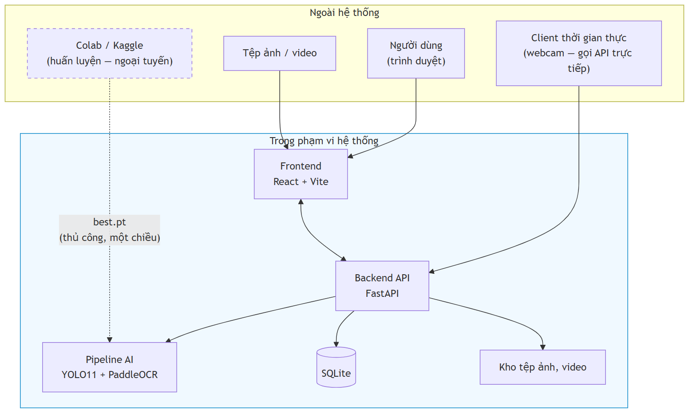

**Hình 1.1.** Ranh giới hệ thống — phần bên trong là hệ thống bàn giao, Colab/Kaggle nằm ngoài

Colab/Kaggle nằm **ngoài** ranh giới khi vận hành — chỉ là công cụ ngoại tuyến sản xuất best.pt; hệ thống khi chạy **không phụ thuộc dịch vụ ngoài nào** (mục 1.2.3). Sau khi trang webcam bị gỡ, client gửi khung hình trực tiếp qua `POST /api/detect/frame`.

## 1.4. Phương pháp nghiên cứu

Đề tài dùng **ba phương pháp bổ trợ nhau**: nghiên cứu lý thuyết (khảo sát tài liệu có trích dẫn, đối chiếu văn bản pháp quy hiện hành); nghiên cứu thực nghiệm (**mọi khẳng định về hiệu năng và độ chính xác đều phải có số đo tái lập được**, kèm cấu hình phần cứng và cỡ mẫu); và quy trình phát triển theo giai đoạn, mỗi giai đoạn khép lại bằng một bộ tài liệu và một mốc kiểm chứng.

### 1.4.1. Phân định phần tự xây dựng và phần dùng lại

Để tránh mọi nhập nhằng khi đánh giá, bảng dưới nêu rõ với từng thành phần: nguồn gốc của nó và **phần việc nhóm thực hiện đã làm**.

**Bảng 1.3.** Phân định công việc theo từng thành phần

| Thành phần | Nguồn gốc | Nhóm thực hiện đã làm gì |
|---|---|---|
| Bộ phát hiện biển số | Kiến trúc YOLO11n có sẵn, trọng số khởi đầu từ COCO | **Tự huấn luyện** trên dữ liệu Việt Nam do nhóm hợp nhất; chọn siêu tham số; đánh giá |
| Bộ nhận dạng ký tự | Mô hình PP-OCRv5 mobile tiền huấn luyện | Tích hợp; **tự đo** so với hai bộ nhận dạng khác; thử tinh chỉnh và **báo cáo cả kết quả âm** |
| **Khối xử lý ảnh vùng biển** | — | **Tự thiết kế và cài đặt toàn bộ**: nắn hình, phân loại bố cục, tách hai nửa, ghép ngang |
| **Khối hậu xử lý theo quy chuẩn** | — | **Tự thiết kế và cài đặt toàn bộ**: mặt nạ vị trí, tập mã tỉnh, bảng ánh xạ nhầm lẫn |
| Bộ dữ liệu | 7 bộ ảnh công khai, giấy phép ở Phụ lục C | **Tự hợp nhất, khử trùng lặp chéo bộ, chia tập có kiểm soát rò rỉ**; gán nhãn chuỗi cho tập con |
| Máy chủ, giao diện, đóng gói | Thư viện mã nguồn mở (FastAPI, React, Docker) | **Tự thiết kế kiến trúc và cài đặt**; viết bộ kiểm thử |
| Quy trình đo và báo cáo | — | **Tự xây dựng toàn bộ**: công cụ đo, giao thức, phân tích lỗi |

Hai khối in đậm ở giữa bảng là phần **không có sẵn trong bất kỳ thư viện nào** và là đóng góp kỹ thuật chính của đề tài.

## 1.5. Đóng góp của đề tài

### 1.5.1. Tuyên bố trung thực về mức đóng góp

> **Đề tài này không tạo ra kết quả state-of-the-art.**

Các kết quả trên 99% trong tài liệu ALPR quốc tế thường dựa trên hạ tầng GPU và dữ liệu riêng. Nhóm thực hiện làm việc trên máy không có GPU CUDA nên không đặt mục tiêu tương tự. Đóng góp tập trung ở sáu nội dung có thể kiểm chứng.

**Sáu đóng góp.**

**(a) Hệ thống hoàn chỉnh, có kiến trúc phần mềm** — không phải tập script rời rạc: đường ống AI tách hoàn toàn khỏi tầng API (NFR-M1), interface trừu tượng cho phép thay bộ nhận dạng ký tự mà không sửa tầng API (NFR-M5), REST API có tài liệu tự sinh, giao diện web ba màn hình, cơ sở dữ liệu có migration, Docker một lệnh. Trạng thái đã đo: bao phủ kiểm thử tầng nghiệp vụ **87,7%**, **1.002 test thu thập / 1.002 đạt / 0 thất bại**. Khảo sát cho thấy mã nguồn mở ALPR Việt Nam chủ yếu là script rời rạc **không công bố số liệu độ chính xác** — đây là **khoảng trống kỹ nghệ**, không phải khoảng trống thuật toán, nhưng vẫn có thật.

**(b) Bộ luật hậu xử lý ràng buộc theo VỊ TRÍ** cho biển số Việt Nam, khai thác ba ràng buộc đặc thù: tập hợp lệ **khác nhau theo từng vị trí** — mã địa phương thuộc **81 giá trị** chứ không phải `\d{2}`, seri **thứ nhất** thuộc 20 chữ cái có `G` không có `R` [7]<!-- bocongan_2024_nhandienbienso -->, seri **thứ hai** của biển xe mô tô thuộc **20 chữ cái KHÁC** có `R` không có `G`; cấu trúc chuỗi và độ dài theo quy chuẩn; và bảng ánh xạ nhầm lẫn ký tự **không đối xứng**.

> **Ghi chú về mức độ của đóng góp này.** Luận điểm dự kiến ban đầu — *"khai thác bộ 20 chữ cái, loại trừ 6 chữ `I J O Q R W`"* — **sai và đã bị bác bỏ**: tập loại trừ toàn hệ thống chỉ có **5 chữ**, còn `R` **hợp lệ** ở vị trí seri thứ hai của biển xe mô tô. Sửa lại **làm yếu đi** phần đóng góp nếu tính theo "số ký tự loại trừ được". Đổi lại, phần có giá trị nằm ở ràng buộc **phụ thuộc vị trí**: một hệ thống dùng danh sách phẳng 20 chữ cái sẽ sai hệ thống trên mọi biển xe máy có `R`.

**(c) Đo được ĐỊNH LƯỢNG đóng góp của bước hậu xử lý.** Phần lớn công trình mô tả bước này ở mức định tính, không trả lời được *nó đóng góp bao nhiêu*. Đề tài giải quyết ở tầng dữ liệu — **lưu đồng thời chuỗi OCR thô và chuỗi đã sửa** — nên hiệu số giữa **NFR-A5** (trước) và **NFR-A6** (sau) là một **con số đo được**.

**(d) Đánh giá tách riêng biển một dòng và biển hai dòng.** **NFR-A8** biến phép tách này thành **nghĩa vụ báo cáo bắt buộc** chứ không phải phân tích tuỳ chọn, kèm **NFR-A9** — báo cáo theo điều kiện ảnh, nếu bộ dữ liệu có nhãn phù hợp.

**(e) Công bố hiệu năng kèm cấu hình phần cứng CPU cụ thể** — mọi số liệu kèm model CPU, số luồng, kích thước ảnh đầu vào, nền tảng suy luận và cỡ mẫu đo. FPS không kèm phần cứng thì không tái lập được, cũng không so sánh được.

**(f) Đo trên chính ảnh biển số Việt Nam.** Khảo sát xác định **không tồn tại benchmark công khai nào so sánh các bộ nhận dạng ký tự trên riêng ảnh biển số xe máy Việt Nam hai dòng**, và hai số liệu thường được viện dẫn để chứng minh ưu thế của một bộ nhận dạng đã **bị bác bỏ khi truy ngược về nguồn gốc** (mục 3.3). Đề tài đã chạy ba phép so sánh trên chính ảnh biển số Việt Nam, cùng máy và cùng ngữ liệu: **PP-OCRv5_mobile ↔ PP-OCRv6_medium** (mục 3.3.2), **bộ nhận dạng gốc ↔ bản tinh chỉnh** (mục 4.5.3), và **PaddleOCR ↔ EasyOCR ↔ Tesseract trên toàn bộ 2.801 biển** (mục 3.3.3) — kết quả PaddleOCR **68,87%**, hơn EasyOCR 54,59 điểm và hơn Tesseract 58,59 điểm, **bác bỏ** tài liệu công khai vốn nghiêng về EasyOCR. Một kết quả **khác với dự đoán ban đầu**: kỹ thuật tách và ghép ngang giúp độ chính xác của PaddleOCR tăng **34,92%** nhưng chỉ cải thiện **0,03%** đối với Tesseract, nên đây **không** phải kỹ thuật độc lập bộ nhận dạng như giả định ban đầu.

### 1.5.2. Những gì đề tài KHÔNG tuyên bố

Bốn điều loại trừ. **Không** tuyên bố vượt các con số độ chính xác cao nhất trong nước — chúng đo trên tập dữ liệu riêng không công khai, **không có cơ sở so sánh công bằng**. **Không** đề xuất kiến trúc mạng nơ-ron mới; đề tài **tích hợp và tinh chỉnh**. **Không** giải quyết các thách thức mở — độ phân giải rất thấp, tổng quát hoá xuyên tập dữ liệu, che khuất nặng (**Hướng phát triển, Chương 6**). Mọi số liệu hiệu năng là **số liệu CPU**, **không so sánh trực tiếp được** với FPS đo trên GPU.


```{=openxml}
<w:p><w:r><w:br w:type="page"/></w:r></w:p>
```

# CHƯƠNG 2. CƠ SỞ LÝ THUYẾT

Chương đặt nền lý thuyết và tư liệu cho phần thiết kế. Nguyên tắc xuyên suốt: **mọi con số gắn nguồn tại chỗ, mọi cảnh báo về phạm vi áp dụng giữ nguyên** — lĩnh vực này hay công bố số trên 99% nhưng đo trên tập dữ liệu và giao thức rất khác nhau.

## 2.1. Phạm vi và bố cục cơ sở lý thuyết

Một hệ thống ALPR gồm bốn khối nối tiếp — **phát hiện vùng biển**, **nắn chỉnh và tiền xử lý**, **nhận dạng ký tự**, **hậu xử lý theo quy chuẩn** — và độ chính xác cuối cùng là **tích** của độ chính xác từng khối, nên một khối yếu kéo cả chuỗi xuống. Đồ án đi theo hướng **two-stage** (phát hiện rồi nhận dạng riêng) kết hợp bộ nhận dạng **segmentation-free**; căn cứ của lựa chọn đó trình bày ở Chương 3.

Chương này chỉ giữ phần lý thuyết **ràng buộc trực tiếp một quyết định của hệ thống**: quy chuẩn biển số Việt Nam (2.2) — cơ sở của bộ luật hậu xử lý; kiến trúc YOLO11 và các chỉ số đánh giá khối phát hiện (2.3); kiến trúc CRNN/CTC cùng **giới hạn của nó trên văn bản nhiều dòng** (2.4) — nền tảng lý thuyết của rủi ro R-04 và của đóng góp kỹ thuật lõi; và khảo sát công trình liên quan cùng sáu khoảng trống nghiên cứu (2.5).

## 2.2. Quy chuẩn biển số xe Việt Nam

### 2.2.1. Căn cứ pháp lý hiện hành

**Ghi chú về hiệu lực văn bản.** Nhiều tài liệu, kể cả bài báo 2023 – 2024, vẫn viện dẫn **Thông tư 24/2023/TT-BCA** — văn bản này **đã hết hiệu lực từ 01/01/2025**, bị thay bởi TT 79/2024 [3]<!-- bocongan_2024_tt79 -->; đồ án chỉ nhắc như bối cảnh lịch sử.

Bốn văn bản căn cứ: **TT 79/2024/TT-BCA** hiệu lực 01/01/2025, thay TT 24/2023, quy định cấu trúc biển, seri, màu sắc [3]<!-- bocongan_2024_tt79 -->; **TT 13/2025/TT-BCA** sửa đổi TT 79/2024 [4]<!-- bocongan_2025_tt13 -->; **TT 51/2025/TT-BCA** hiệu lực 01/7/2025, **thay toàn bộ Phụ lục mã tỉnh** sau sáp nhập còn 34 tỉnh/thành [5]<!-- bocongan_2025_tt51 -->; **QCVN 08:2024/BCA** kèm TT 81/2024/TT-BCA, hiệu lực 01/01/2025, quy chuẩn quốc gia về kết cấu, kích thước, vật liệu [6]<!-- bocongan_2024_qcvn08 -->. Biển quân đội thuộc TT 169/2021/TT-BQP [8]<!-- boquocphong_2021_tt169 -->, **ngoài phạm vi** TT 79/2024.

TT 79/2024 quy định **nội dung** biển — cơ sở biểu thức chính quy; QCVN 08:2024/BCA quy định **hình thức vật lý** — cơ sở ngưỡng tỷ lệ khung hình; module chuẩn hoá cần cả hai. Khung pháp lý đổi **ba lần trong hai năm** là rủi ro kỹ thuật trực tiếp; hệ quả ở mục 2.2.7.

### 2.2.2. Cấu trúc biển số ô tô và xe máy

**a) Biển số ô tô** trong nước: **8 ký tự chữ–số**, ba thành phần — **mã địa phương** 2 chữ số trong 81 mã hợp lệ thuộc dải 11 – 99 [5]; **seri 1 chữ cái** trong 20 chữ với biển trắng và vàng, 11 chữ với biển xanh [7]<!-- bocongan_2024_nhandienbienso -->; **số thứ tự 5 chữ số**, 000.01 – 999.99 [3] — ví dụ `30A-123.45`, `51K-999.99`, `80B-123.45` (Cục CSGT). Trên đường vẫn còn **biển 4 chữ số kiểu cũ** (`29A-1234`); xe đã đăng ký **không bắt buộc đổi biển** [11]<!-- chinhphu_2025_kyhieubienso --> nên biểu thức chính quy phải chấp nhận nhóm thứ tự **4 hoặc 5 chữ số**.

### 2.2.3. Mã tỉnh, thành phố

Từ 01/7/2025 cả nước còn **34 tỉnh, thành phố**; ký hiệu sau hợp nhất **bao gồm toàn bộ ký hiệu của các địa phương được hợp nhất** [11]<!-- chinhphu_2025_kyhieubienso -->, biển cũ không mất giá trị pháp lý. Dải 11 – 99 có **89 số**; theo Phụ lục TT 51/2025 có **81 mã đang dùng** (80 mã địa phương + mã 80 của Cục CSGT) và **8 mã không dùng**: **13, 42, 44, 45, 46, 87, 91, 96**. TP. Hồ Chí Minh 13 mã (41; 50 – 59; 61; 72); Hà Nội 6 mã (29; 30 – 33; 40).

Kiểm tra mã tỉnh loại khoảng 9,0% không gian tìm kiếm ở hai ký tự đầu, và quan trọng hơn: biến lỗi OCR hai vị trí đầu từ **sai âm thầm** thành **sai phát hiện được** — đọc ra `46A-123.45` thì biết ngay mã 46 không tồn tại và hạ cờ hợp lệ. Giả thuyết mã 13 là mã cũ của Hà Bắc **chưa kiểm chứng được nguồn chính thức**, chỉ nêu tham khảo.

### 2.2.4. Tập ký tự seri và các chữ cái bị loại trừ

Đây là nội dung dễ gây nhầm lẫn. Biển trắng và vàng chữ đen dùng seri gồm **một trong 20 chữ cái** [7]; khi đối chiếu với 26 chữ cái Latin, sẽ vắng mặt `I, J, O, Q, R, W`. Tuy nhiên, **suy luận "26 − 20 = 6 chữ bị loại trừ" là chưa chính xác**: danh sách 20 chữ cái này **chỉ áp dụng cho vị trí thứ nhất** của seri; ở **vị trí thứ hai** của seri xe máy lại sử dụng một tập hợp khác — **có chữ R, không có chữ G**. Kết hợp cả hai vị trí, tập chữ cái hoàn toàn không xuất hiện trên hệ thống biển số Việt Nam chỉ bao gồm **5 chữ: I, J, O, Q, W**; chữ R vẫn xuất hiện ở các ký hiệu đặc biệt như `R` hay `RM` của rơ moóc.

**Bảng 2.1.** Tổng hợp các tập ký tự seri

| Tập | Số lượng | Nội dung |
|---|:--:|---|
| Chữ cái thứ nhất của seri | 20 | A B C D E F **G** H K L M N P S T U V X Y Z |
| Chữ cái thứ hai của seri xe máy | 20 | A B C D E F H K L M N P **R** S T U V X Y Z |
| Seri biển nền xanh | 11 | A B C D E F G H K L M |
| **Bị loại trừ khỏi toàn hệ thống** | **5** | **I, J, O, Q, W** |
| Tập ký tự an toàn tối thiểu cho OCR | 21 | 20 chữ ở vị trí thứ nhất, hợp thêm R |

### 2.2.5. Màu nền và ý nghĩa

**Bảng 2.2.** Màu nền biển số và đối tượng áp dụng [7]

| Màu nền / màu chữ | Đối tượng | Ghi chú cho ALPR |
|---|---|---|
| Trắng / đen | Tổ chức, cá nhân trong nước, xe **không** kinh doanh vận tải | Phổ biến nhất |
| Vàng / đen | Xe **kinh doanh vận tải** | Tín hiệu phân loại **duy nhất còn hợp lệ** |
| Xanh dương / trắng | Cơ quan Đảng, Nhà nước, công an | Seri chỉ dùng 11 chữ cái |
| Trắng / **đỏ** | Xe ngoại giao (`NG`) và tổ chức quốc tế (`QT`) | Cấu trúc chuỗi khác hẳn |
| Đỏ / trắng | Xe quân đội và doanh nghiệp quân đội | **Ngoài phạm vi** TT 79/2024, thuộc TT 169/2021/TT-BQP [8] |

QCVN 08:2024/BCA chỉ quy định **4 tổ hợp màu**, **không có nền đỏ** [6] — biển quân đội do Bộ Quốc phòng quản lý riêng [8]. **Xe điện không có biển riêng**: xe năng lượng sạch **không được cấp biển xanh lá**, dùng biển thường kèm biểu tượng — không phát hiện được xe điện qua màu biển. Màu nền là tín hiệu phân loại duy nhất còn hợp lệ; nhưng module chuẩn hoá làm việc trên chuỗi ký tự, phân loại theo màu ngoài phạm vi của nó.

### 2.2.6. Kích thước vật lý và tỷ lệ khung hình

Cơ sở định lượng phân biệt biển một dòng với hai dòng — then chốt với rủi ro R-04 (mục 2.4.3). Ô tô được cấp **02** biển: 01 ngắn (**2 dòng**), 01 dài (**1 dòng**); xe mô tô, xe gắn máy, rơ moóc được cấp **01** biển **2 dòng** — **một ô tô mang cùng chuỗi ký tự trên hai biển hình dạng hoàn toàn khác nhau**.

**Bảng 2.3.** Kích thước và tỷ lệ khung hình của các loại biển số [6]

| Loại biển | Kích thước (dài × cao) | Tỷ lệ khung hình | Số dòng |
|---|---|:--:|:--:|
| Ô tô — biển **dài** | **520 × 110 mm** | **4,727** | **1 dòng** |
| Ô tô — biển **ngắn** | **330 × 165 mm** | **2,000** | **2 dòng** |
| **Xe mô tô, xe gắn máy** | **190 × 140 mm** | **1,357** | **2 dòng** |


> **Ghi chú về mốc hiệu lực.** Cần lưu ý rằng bộ số liệu kích thước trên **chỉ đúng từ 01/01/2025**; tiêu chuẩn trước đó quy định biển ô tô ngắn **200 × 280 mm**, biển dài **110 × 470 mm**, và rất nhiều tài liệu thứ cấp — kể cả bài báo năm 2023 — vẫn dùng bộ số cũ. Mọi trích dẫn kích thước biển số **bắt buộc ghi kèm mốc hiệu lực**; nếu không, người phản biện đối chiếu văn bản hiện hành sẽ kết luận là sai.

### 2.2.7. Ý nghĩa đối với thiết kế hệ thống nhận dạng

Bảy dữ kiện kéo theo bảy quyết định thiết kế: **81 mã tỉnh trong dải 89 số** biến lỗi OCR hai ký tự đầu thành sai phát hiện được; **tập seri khác theo vị trí** buộc ràng buộc **theo vị trí** và tập huấn luyện OCR đủ 36 ký tự; **hai kiểu seri xe máy, nhóm thứ tự 4 hoặc 5 chữ số** buộc biểu thức chính quy đa nhánh; **chuỗi 8 ký tự khớp hai loại biển** nên phải lưu số dòng độc lập; **seri không còn cho biết loại xe** nên cấm heuristic suy loại phương tiện; **khoảng trống tỷ lệ khung hình 2,727** là cơ sở ngưỡng phân loại bố cục; **khung pháp lý đổi ba lần trong hai năm** buộc hậu xử lý tách rời mô hình để cập nhật độc lập.

Về mức đóng góp: luận điểm dự kiến ban đầu — "loại trừ 6 chữ I J O Q R W" — là **sai**, và việc sửa làm **yếu đi** đóng góp theo tiêu chí thu hẹp không gian tìm kiếm; đổi lại phần giá trị chuyển sang ràng buộc **phụ thuộc vị trí trong chuỗi**: danh sách phẳng sẽ sai hệ thống trên toàn bộ lớp biển xe máy có R ở vị trí thứ hai — lỗi mà bộ luật của đồ án ngăn được. Đóng góp là **đúng đắn về pháp lý và cấu trúc**, không phải cải thiện lớn về không gian tìm kiếm.

## 2.3. Cơ sở lý thuyết về phát hiện đối tượng

### 2.3.1. Kiến trúc YOLO: nguyên lý one-stage và anchor-free

**Họ two-stage** (Faster R-CNN) sinh vùng đề xuất rồi phân loại từng đề xuất — độ trễ cao; **họ one-stage** (YOLO, SSD, RetinaNet) hồi quy trực tiếp trong một lần lan truyền xuôi — thời gian thực. Ràng buộc CPU loại họ two-stage từ đầu; một nghiên cứu ALPR trên 50.000 ảnh và 10.000 video clip kết luận nhóm YOLO (v5–v10) vượt trội Faster R-CNN và SSD cả độ chính xác lẫn thời gian suy luận [12]<!-- scirep_2025_advanceddl -->.

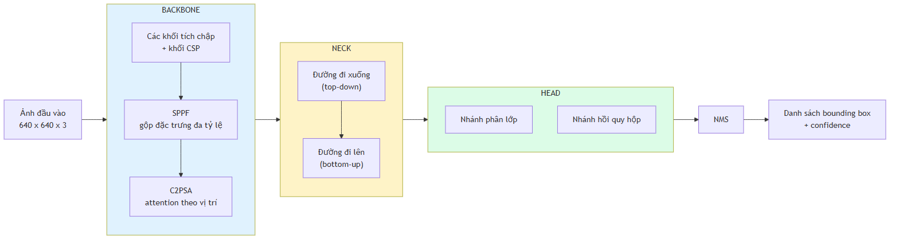

**Hình 2.1.** Kiến trúc tổng quát backbone – neck – head của YOLO11 *(theo [13], [9])*

Ba phần: **backbone** trích đặc trưng, kết thúc bằng SPPF gộp đa tỷ lệ; **neck** hợp nhất đặc trưng nhiều tầng; **head** sinh dự đoán — từ YOLOv8 dùng **anchor-free split head** [13]<!-- jocher_2023_yolov8 -->. Anchor-free có ý nghĩa riêng với biển số: anchor-based hồi quy theo tập hộp mẫu thiết kế theo phân bố COCO — biển số nằm ngoài phân bố đó (một dòng ≈ 4,7:1, hai dòng ≈ 1,4:1); anchor-free hồi quy **trực tiếp khoảng cách tâm đến bốn cạnh**, xử lý cả hai chế độ tỷ lệ bằng một cơ chế [9]<!-- jocher_2024_yolo11 -->.

### 2.3.2. YOLO11: các cải tiến kiến trúc

Ba thành phần chính của YOLO11 là **C3k2**, **SPPF** và **C2PSA**; phần dưới đối chiếu trực tiếp mã nguồn Ultralytics [14]<!-- ultralytics_2026_blockpy -->, tức nguồn sơ cấp thay vì mô tả thứ cấp. **a) C3k2 — là C2f có thể hoán đổi khối con:** `C3k2` **kế thừa trực tiếp từ `C2f`** của YOLOv8; khác biệt duy nhất là một cờ — tắt thì **giống hệt C2f**, bật thì dùng khối `C3k` tuỳ chỉnh kích thước nhân [14]. YOLO11 giảm tham số mà giữ độ chính xác vì không đổi triết lý CSP, chỉ cấu hình linh hoạt hơn. **b) C2PSA — thành phần YOLOv8 hoàn toàn không có**, khác biệt kiến trúc thực sự; đặt **ngay sau SPPF** để attention tái phân bổ trọng số theo vị trí không gian. Ultralytics khẳng định cơ chế này cải thiện phát hiện **đối tượng nhỏ** và **che khuất phức tạp** so với YOLOv8 [9]<!-- jocher_2024_yolo11 -->.

> **Lưu ý về mức độ chứng minh.** Phát biểu về đối tượng nhỏ là **định tính**: Ultralytics không công bố AP_small/AP_medium/AP_large theo chuẩn COCO cho từng biến thể, nên không thể chứng minh định lượng YOLO11 hơn YOLOv8 bao nhiêu trên đối tượng nhỏ [9]. Đồ án phải **tự đo trên dữ liệu của mình**; kết quả ở Chương 5.

**Bảng 2.4.** So sánh khác biệt kiến trúc giữa các phiên bản YOLO gần đây

| Phiên bản | Khối backbone | Cơ chế attention | Đầu dự đoán | NMS | Điểm mới chính |
|---|---|---|---|:--:|---|
| YOLOv8 [13] | C2f | Không có | Anchor-free, tách nhánh | Có | Chuyển sang anchor-free |
| YOLOv10 | Rank-guided blocks | Partial self-attention | Hai đầu song song | **Không** | Consistent dual assignments |
| **YOLO11** [9] | **C3k2** (kế thừa C2f) | **C2PSA** sau SPPF | Anchor-free, tách nhánh | Có | C2PSA cải thiện đối tượng nhỏ |
| YOLO26 | Kế thừa dòng Ultralytics | Kế thừa dòng Ultralytics | **Bỏ DFL** | **Không** (mặc định) | Bỏ DFL, dễ xuất và lượng tử hoá |

Bảng chỉ giữ bốn phiên bản có khác biệt kiến trúc đáng kể với bài toán biển số; **danh sách đầy đủ bảy thế hệ đã xét** và luận cứ chọn YOLO11 trình bày ở mục 3.2.

### 2.3.3. Các chỉ số đánh giá khối phát hiện

**a) Precision, Recall và F1.** Với $TP$ dự đoán đúng, $FP$ dự đoán sai, $FN$ đối tượng bỏ sót:

$$\mathrm{Precision} = \frac{TP}{TP + FP}, \qquad \mathrm{Recall} = \frac{TP}{TP + FN}, \qquad F_1 = \frac{2 \cdot \mathrm{Precision} \cdot \mathrm{Recall}}{\mathrm{Precision} + \mathrm{Recall}}$$

<div align="right">(2.2)</div>

Với ALPR, **recall của bước phát hiện quan trọng hơn precision**: biển bỏ sót là mất vĩnh viễn, vùng báo nhầm bị hậu xử lý loại vì chuỗi không khớp cú pháp.

**b) AP và mAP.** AP là diện tích dưới đường cong Precision–Recall; mAP là trung bình AP trên $N$ lớp — đồ án có $N = 1$ nên mAP trùng AP:

$$\mathrm{AP} = \int_0^1 p(r)\, \mathrm{d}r, \qquad \mathrm{mAP} = \frac{1}{N}\sum_{i=1}^{N} \mathrm{AP}_i$$

<div align="right">(2.3)</div>

**c) mAP@0.5 và mAP@0.5:0.95 — hai chỉ số khác nhau, không được so sánh chéo.** **mAP@0.5** tính tại **một ngưỡng IoU cố định 0,5**; **mAP@0.5:0.95** lấy **trung bình trên 10 ngưỡng** từ 0,5 đến 0,95 bước 0,05:

$$\mathrm{mAP@0.5\!:\!0.95} = \frac{1}{10}\sum_{t \in \{0{,}50;\, 0{,}55;\, \ldots;\, 0{,}95\}} \mathrm{mAP@}t$$

<div align="right">(2.4)</div>

> **Trên cùng một mô hình và cùng một tập dữ liệu, mAP@0.5:0.95 LUÔN nhỏ hơn hoặc bằng mAP@0.5** — vì mAP@0.5 là một trong mười số hạng của phép trung bình ở (2.4), và là số hạng lớn nhất.

Khoảng cách giữa hai chỉ số với biển số thường rất lớn do hộp bao dẹt. Nhóm thực hiện đối chiếu ba công trình đã công bố; giá trị được quy về cùng đơn vị phần trăm để so sánh được.

**Bảng 2.5.** Khoảng cách giữa mAP@0.5 và mAP@0.5:0.95 ở ba công trình về biển số

| Công trình | Bộ dữ liệu · quốc gia | mAP@0.5 | mAP@0.5:0.95 | Chênh (điểm %) |
|---|---|---:|---:|---:|
| Batra và cộng sự (2022) [15]<!-- batra_2022_yolov5 --> | biển số Ấn Độ | 87,2% | 46,5% | **40,7** |
| Một nghiên cứu YOLOv11 (2025) [16]<!-- jaic_2025_yolov11alpr --> | không nêu rõ | 90,6% | 63,1% | **27,5** |
| Biển xe máy Indonesia (2025) [17]<!-- jcosine_2025_yolo11plate --> | Indonesia | 99,5% | 80,7% | **18,8** |

Cả ba xác nhận cùng một điều: **biển số dễ phát hiện nhưng khó khớp hộp bao chính xác**.

> **Ghi chú phương pháp luận.** Cần lưu ý một cách trình bày phổ biến nhưng thiếu cơ sở khoa học: đặt mAP@0.5 của một nghiên cứu ALPR (khoảng 0,90 – 0,99) cạnh mAP@0.5:0.95 trên tập dữ liệu COCO của cùng lớp mô hình (khoảng 0,395 ở phân khúc nano [9]) rồi kết luận "bài toán biển số dễ hơn bài toán COCO". Đây là **so sánh giữa hai chỉ số có định nghĩa hoàn toàn khác nhau**, và chênh lệch giữa chúng **không phản ánh** độ khó tương đối. Phép đối chiếu hợp lệ duy nhất là so sánh các chỉ số cùng loại (mAP@0.5 với mAP@0.5, hoặc mAP@0.5:0.95 với mAP@0.5:0.95) **trên cùng một tập dữ liệu**. Việc đối chiếu chéo tập dữ liệu chỉ có giá trị tham khảo, không thể dùng làm luận cứ cho quyết định kỹ thuật.

**d) Chỉ tiêu của đồ án.** Vì mục tiêu phát hiện là cắt vùng biển đủ tốt để OCR đọc, nhóm thực hiện chọn **mAP@0.5 làm chỉ tiêu chính**, **mAP@0.5:0.95 vẫn báo cáo** nhưng không đặt ngưỡng chấp nhận; giá trị ở Chương 5. **e) mIoU.** Một số công trình dùng IoU trung bình toàn tập; đây là chỉ số khác mAP nên không so sánh chéo được, và đồ án không dùng.

## 2.4. Cơ sở lý thuyết về nhận dạng ký tự

### 2.4.1. Bài toán OCR và đặc thù khi áp dụng cho biển số

**OCR** (*Optical Character Recognition*) chuyển văn bản trong ảnh thành chuỗi, thường gồm **text detection** khoanh vùng rồi **text recognition** đọc từng vùng. Sai lầm phổ biến: lấy thẳng bảng xếp hạng OCR phổ thông làm căn cứ chọn bộ nhận dạng cho ALPR.

**Bảng 2.6.** So sánh OCR văn bản tài liệu và OCR biển số xe

| Chiều so sánh | OCR văn bản tài liệu | OCR biển số xe |
|---|---|---|
| Nguồn ảnh | Ảnh quét hoặc chụp tài liệu, gần chính diện | Ảnh cảnh ngoài trời, phối cảnh nghiêng, chói sáng, nhoè do chuyển động |
| Độ dài chuỗi và tập ký tự | Hàng trăm đến hàng nghìn ký tự; tập lớn, mở, kèm dấu | 7 – 9 ký tự; tập đóng — **chỉ A–Z và 0–9** |
| Bố cục | Nhiều dòng, đa cột, ngắt dòng tuỳ ý | Cố định: 1 hoặc 2 dòng theo quy chuẩn nhà nước |
| Ràng buộc cú pháp và vai trò hậu xử lý | Gần như không có; hậu xử lý phụ trợ | Rất chặt, kiểm tra được bằng biểu thức chính quy; hậu xử lý **bắt buộc**, là lớp sửa lỗi chính |
| Tiêu chí đánh giá | CER / WER — chấp nhận sai lẻ tẻ | **Khớp chuỗi tuyệt đối** — sai 1 ký tự là hỏng cả bản ghi |
| Giá trị của thông tin ngôn ngữ | Cao — mô hình ngôn ngữ sửa lỗi hiệu quả | **Thấp** — không có từ vựng để dựa vào |

### 2.4.2. Kiến trúc CRNN và hàm mất mát CTC

**CRNN** gồm ba tầng: **tầng tích chập** trích đặc trưng và — điểm mấu chốt — downsample chiều cao **về 1**, biến bản đồ đặc trưng thành **chuỗi vector theo chiều rộng**; **tầng hồi quy** (Bi-LSTM) mô hình hoá ngữ cảnh hai chiều; **tầng phiên mã** giải mã thành chuỗi, thường bằng CTC. EasyOCR dùng đúng kiến trúc này; PaddleOCR dùng SVTR-LCNet kết hợp GTC [10]<!-- cui_2026_ppocrv5 -->, vẫn thuộc họ CTC.

**Hàm mất mát CTC** giải vấn đề: biết chuỗi nhãn đúng nhưng **không biết mỗi ký tự nằm ở cột đặc trưng nào**. CTC thêm ký hiệu trống $\varepsilon$, định nghĩa ánh xạ $\mathcal{B}$ gộp ký tự lặp rồi xoá $\varepsilon$ — ví dụ $\mathcal{B}(\texttt{3}\varepsilon\texttt{00}\varepsilon\texttt{A}) = \texttt{30A}$ — và tính xác suất chuỗi nhãn $\mathbf{l}$ bằng tổng xác suất **mọi** đường đi thô $\boldsymbol{\pi}$ ánh xạ về nó:

$$p(\mathbf{l} \mid \mathbf{x}) = \sum_{\boldsymbol{\pi} \in \mathcal{B}^{-1}(\mathbf{l})} \prod_{t=1}^{T} y^{t}_{\pi_t}, \qquad \mathcal{L}_{\mathrm{CTC}} = -\log p(\mathbf{l} \mid \mathbf{x})$$

<div align="right">(2.3)</div>

Tổng ở (2.3) tính hiệu quả bằng quy hoạch động tiến–lùi. Ưu điểm quyết định: **không cần nhãn vị trí từng ký tự** — lý do CTC là mặc định của hầu hết bộ nhận dạng ký tự mã nguồn mở.

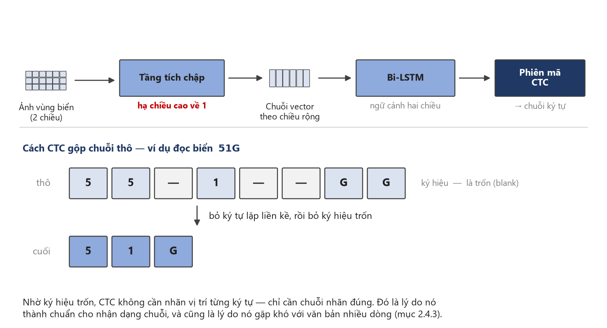

**Hình 2.3.** Kiến trúc CRNN và cách CTC gộp chuỗi thô. Điểm mấu chốt nằm ở
tầng tích chập: nó hạ **chiều cao về 1**, biến bản đồ đặc trưng hai chiều thành
một chuỗi vector — nhờ đó bài toán đọc ảnh trở thành bài toán đọc chuỗi.

### 2.4.3. Vì sao kiến trúc CTC gặp khó với văn bản nhiều dòng

Mục kỹ thuật quan trọng nhất của chương: nền tảng lý thuyết cho rủi ro **R-04** ("khả năng Cao, ảnh hưởng Cao") — ở Việt Nam nơi xe máy áp đảo, biển hai dòng là dạng phổ biến chứ không phải ngoại lệ.

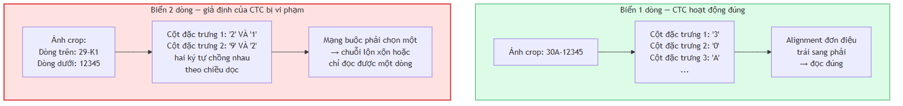

**Hình 2.2.** Cơ chế sụp đổ của CTC trên ảnh văn bản hai dòng

> **Ghi chú về phạm vi áp dụng.** Cặp số liệu 94,3% / 45,7% được đo trên bộ **RodoSol-ALPR của Brazil**, **không phải trên dữ liệu Việt Nam**. Nó được dẫn ở đây như một *analogue* định lượng về độ khó vượt trội của biển hai dòng xe máy tại một quốc gia cũng có tỷ lệ xe máy cao. Trích dẫn nhầm cặp số này thành số liệu Việt Nam là lỗi trích dẫn nghiêm trọng.

**Bảng 2.7.** Các phương pháp phân biệt biển một dòng và biển hai dòng

| Phương án | Cơ chế | Ưu điểm và hạn chế |
|---|---|---|
| **PA-1.** Lấy lớp từ chính detector | YOLO xuất thêm một lớp: `0` = một dòng, `1` = hai dòng | Chính xác nhất, chi phí gần 0 khi tự gán nhãn; phải gán nhãn hai lớp từ đầu |
| **PA-2.** Cắt đôi theo tỷ lệ hình học | Bổ nửa ảnh hoặc chia theo ngưỡng heuristic | Nhanh; sai nếu biển cong, che khuất hoặc góc nghiêng lớn |
| **PA-3.** Chiếu ngang tìm điểm trũng | Tổng cường độ pixel theo hàng; biển hai dòng có điểm trũng sâu ở giữa | Vị trí cắt thích nghi từng ảnh; điểm trũng biến mất khi biển nghiêng |
| **PA-4.** Phân cụm hộp bao theo toạ độ dọc | Dùng text detection của bộ nhận dạng ký tự, gom nhóm theo tâm dọc [10]<!-- cui_2026_ppocrv5 --> | Tái dùng kết quả sẵn có; phụ thuộc chất lượng text detection trên vùng cắt nhỏ |
| **PA-5.** Kiểm tra tính thẳng hàng của ký tự | Nối tâm ký tự trái nhất và phải nhất, đo độ lệch các ký tự còn lại | Trực quan, dễ gỡ lỗi; cần phát hiện từng ký tự, ngưỡng pixel phụ thuộc độ phân giải |


> **Lưu ý cách đọc số liệu này.** Tài liệu gốc ghi recognition pre-trained 0,00%, nhưng con số đó **không** nghĩa là PaddleOCR không đọc được biển: mô hình pre-trained sinh thêm một ký tự đặc biệt khiến chuỗi trượt tiêu chí khớp tuyệt đối; hậu xử lý loại ký tự đó là đạt 90,97%. Luận điểm đúng là **tinh chỉnh nâng 90,97% → 94,54%**; số liệu đo trên **biển Trung Quốc một dòng**, không chứng minh điều gì về biển hai dòng Việt Nam.

### 2.4.4. Chỉ số CER và độ chính xác mức chuỗi

**a) CER** (*Character Error Rate*) dựa trên khoảng cách Levenshtein, với $S$ thay thế, $D$ xoá, $I$ chèn, $N$ tổng ký tự chuỗi thực; độ chính xác mức ký tự là $1 - \mathrm{CER}$:

$$\mathrm{CER} = \frac{S + D + I}{N}$$

<div align="right">(2.4)</div>

CER **có thể vượt 1** khi chuỗi dự đoán dài hơn chuỗi thực rất nhiều — đúng tình huống CTC gặp ảnh hai dòng. **b) WER** tương tự nhưng đơn vị là từ; đồ án không dùng chỉ số này vì biển số không có ranh giới từ. **c) Độ chính xác mức chuỗi** (*plate-level accuracy*, *exact match*) là chỉ số nghiêm ngặt nhất:

$$\mathrm{Acc}_{\text{plate}} = \frac{\#\{\text{biển số có TOÀN BỘ chuỗi ký tự khớp chính xác}\}}{\#\{\text{tổng số biển số trong tập kiểm thử}\}}$$

<div align="right">(2.5)</div>

**Độ chính xác mức chuỗi** đếm số biển có **toàn bộ** chuỗi khớp chính xác. Đây là chỉ số phản ánh đúng giá trị sử dụng, và quan hệ của nó với CER là **bất lợi phi tuyến tính**: với biển 8 ký tự, nếu xác suất đọc đúng mỗi ký tự là $p$ thì xác suất đúng cả chuỗi là $p^{8}$. Với $p = 0{,}99$ con số này chỉ còn khoảng $0{,}923$; với $p = 0{,}95$ nó tụt xuống khoảng $0{,}663$. Đây là lý do một bộ nhận dạng có CER rất tốt trên văn bản tài liệu vẫn có thể thất bại trên biển số. **d) End-to-end Recognition Rate** — tỷ lệ biển đọc đúng hoàn toàn trên **toàn bộ đường ống** — là chỉ số duy nhất phản ánh lỗi tích luỹ, chỉ tiêu quan trọng nhất của đồ án; cuộc thi ICPR 2026 về biển độ phân giải thấp dùng chỉ số này làm chính, đội vô địch đạt 82,13% [18]<!-- laroca_2026_icprlrlpr -->. Kèm theo là chỉ số vận hành: **độ trễ** p50, p95, p99 (bắt buộc kèm cấu hình phần cứng), **kích thước mô hình**, **bộ nhớ thường trú**, **số tham số**; giá trị ở Chương 5.

## 2.5. Các công trình liên quan

### 2.5.1. Công trình quốc tế tiêu biểu

Nhiều công trình quốc tế gần đây (2018-2026) tập trung vào nhận dạng đầu cuối bằng học sâu, cải thiện độ phân giải thấp và sử dụng siêu mô hình ngôn ngữ lớn để khắc phục hạn chế của các hệ thống cũ. Tuy nhiên, ít nghiên cứu nào bóc tách số liệu cho riêng biển hai dòng phức tạp giống như ở Việt Nam.

### 2.5.2. Công trình về biển số Việt Nam

Nghiên cứu ALPR cho biển Việt Nam chủ yếu công bố tại hội nghị, tạp chí khu vực, **không xuất hiện trên các benchmark quốc tế lớn**, phần lớn đánh giá trên tập tự thu thập không công khai — so sánh công bằng gần như bất khả thi.

### 2.5.3. Các bộ dữ liệu chuẩn trong lĩnh vực

Khảo sát đối chiếu **chín bộ dữ liệu chuẩn** của lĩnh vực theo quy mô, đặc điểm và **giấy phép sử dụng** — cột giấy phép quyết định bộ nào dùng được cho đồ án này.

### 2.5.4. Khoảng trống nghiên cứu và định vị đề tài

**Bảng 2.8.** Sáu khoảng trống nghiên cứu và cách nhóm thực hiện lấp

| # | Khoảng trống được xác định từ khảo sát | Cách nhóm thực hiện lấp |
|:--:|---|---|
| 1 | **Chưa có nghiên cứu Việt Nam nào công bố bảng so sánh tách riêng độ chính xác biển một dòng và biển hai dòng trên cùng một hệ thống** (mục 2.5.2) | Nhóm thực hiện báo cáo tách bạch hai con số này |
| 2 | **Chưa có nghiên cứu Việt Nam nào mô tả có hệ thống bộ luật hậu xử lý ràng buộc theo VỊ TRÍ trong chuỗi** — các mô tả hiện có dừng ở danh sách phẳng, phần lớn dùng nhầm con số 20 chữ cái cho toàn chuỗi (mục 2.2.4) | Thiết kế hậu xử lý **theo từng vị trí**, **đo tách bạch trước và sau hậu xử lý**; hiệu số là đóng góp định lượng |
| 3 | **Hầu hết công trình trong nước chỉ báo cáo mAP của bước phát hiện**, không báo cáo end-to-end mức chuỗi (mục 2.5.2) | Báo cáo cả hai, end-to-end là chỉ tiêu quan trọng nhất |
| 4 | **Không tồn tại benchmark công khai nào so sánh các bộ nhận dạng ký tự trên riêng ảnh biển số xe máy Việt Nam hai dòng** (mục 3.3) | ✅ **Đã lấp** — đo ba bộ nhận dạng trên 2.801 biển, cùng tầng bao quanh: PaddleOCR 68,87% · EasyOCR 14,28% · Tesseract 10,28% (mục 3.3.3) |
| 5 | **Số liệu hiệu năng thường công bố không kèm phần cứng** (mục 2.5.1) | Mọi số liệu hiệu năng kèm: model CPU, số luồng, kích thước ảnh vào, nền tảng suy luận, cỡ mẫu đo |
| 6 | **Hầu hết kho mã nguồn mở Việt Nam không công bố số liệu và không có kiến trúc phần mềm** (mục 2.5.2) | Công bố đầy đủ giao thức đo, tập kiểm thử, toàn bộ chỉ số; bàn giao hệ thống có API, giao diện, cơ sở dữ liệu, kiểm thử, đóng gói |

Sáu khoảng trống đều thuộc loại **kỹ nghệ và báo cáo**, không phải thuật toán: đồ án không đặt mục tiêu vượt các con số trên 99% đã khảo sát — trong đó 99,28% của nhóm Học viện Kỹ thuật Quân sự đo trên tập riêng không công khai — và mọi số liệu hiệu năng của đồ án là **số liệu CPU**, không so trực tiếp với FPS đo trên GPU.

> Tuyên bố trung thực đầy đủ về mức đóng góp, cùng bốn điều đồ án **không** tuyên bố, đặt ở **mục 1.5.1 và 1.5.2** (Chương 1) — nơi chính danh để tuyên bố đóng góp.


```{=openxml}
<w:p><w:r><w:br w:type="page"/></w:r></w:p>
```

# CHƯƠNG 3. KHẢO SÁT CÔNG NGHỆ VÀ LỰA CHỌN MÔ HÌNH

## 3.1. Phương pháp khảo sát và tiêu chí lựa chọn

Mỗi lựa chọn trình bày theo cùng một khuôn: phương án đã xét, tiêu chí, kết luận, **đánh đổi phải chấp nhận**. Khi bằng chứng không đủ phân định, mục này nói rõ là không đủ.

### 3.1.1. Bốn ràng buộc chi phối mọi lựa chọn

Bốn ràng buộc sau thu hẹp không gian phương án **trước khi** so sánh — vì sao một số ứng viên mạnh bị loại sớm.

|  #  | Ràng buộc                                                    | Hệ quả trực tiếp lên việc chọn                                                                                      |
| :-: | ------------------------------------------------------------ | ------------------------------------------------------------------------------------------------------------------- |
|  1  | **Suy luận trên CPU, không có GPU CUDA** (CON-02, mục 4.3.1) | Phương án không công bố tốc độ CPU đều **không có căn cứ để đánh giá**; mô hình hàng trăm triệu tham số loại từ đầu |
|  2  | **Biển số Việt Nam có biển hai dòng**                        | Bộ nhận dạng giả định văn bản một dòng sẽ hỏng ở đây; tiêu chí phân loại, không phải điểm cộng                                |
|  3  | **Phải đóng gói và bàn giao được**                           | Giấy phép, dung lượng mô hình, số phụ thuộc là tiêu chí thật                                                        |
|  4  | **Ngân sách thời gian CPU hữu hạn**                          | Một số phép so sánh đã thiết kế nhưng **không chạy được**; mục 3.1.2 nói rõ là những phép nào                       |

### 3.1.2. Ranh giới giữa cái đã đo và cái mới chỉ khảo sát tài liệu

Các lựa chọn có mức độ kiểm chứng khác nhau: một số được đo trên máy và dữ liệu của đồ án, một số dựa trên số liệu nhà phát hành, và một số chưa được đo trực tiếp.

**Bảng 3.1.** Mức bằng chứng của từng phép so sánh trong chương

| Phép so sánh                              | Mức bằng chứng                                                                                      | Trình bày ở |
| ----------------------------------------- | --------------------------------------------------------------------------------------------------- | :---------: |
| PP-OCRv5_mobile ↔ PP-OCRv6_medium         | ✅ **Tự đo** — 200 vùng cắt biển số, cùng máy, cùng thứ tự ảnh                                      |    3.3.2    |
| Bộ nhận dạng gốc ↔ bản tinh chỉnh         | ✅ **Tự đo** — 2.801 biển có nhãn chuỗi, bốn cấu hình                                               |     5.4     |
| YOLO11n ↔ YOLOv8n và năm thế hệ YOLO khác | 📄 **Khảo sát tài liệu** — theo benchmark chính thức của nhà phát hành, đồ án **không tự chạy lại** |     3.2     |
| PaddleOCR ↔ EasyOCR ↔ Tesseract           | ✅ **Tự đo** — 2.801 biển có nhãn chuỗi, ba nhánh, cùng tầng bao quanh                   |    3.3.3    |
| PyTorch ↔ ONNX Runtime ↔ OpenVINO         | ✅ **Tự đo** — 50 ảnh thật, 50 lượt mỗi nền tảng, kèm mAP sau khi xuất                                   | 3.4 · 5.6.3 |
| Độ phân giải 416 ↔ 640                    | 🟡 **Có số đo nhưng không quy kết được** — ba biến đổi đồng thời và ngược chiều nhau                |     3.6     |

Dòng ❌ còn lại được ghi nhận ở mục 6.3:

- **So sánh nền tảng suy luận đã chạy** (5.6.3): PyTorch 33,09 ms · ONNX Runtime 24,48 ms (1,35×) · **OpenVINO 21,12 ms (1,57×)**, mAP không suy giảm. Lựa chọn ban đầu nghiêng về ONNX Runtime vì **lý do vận hành** — một nền tảng suy luận duy nhất cho cả hai mô hình, tránh xung đột hai framework học sâu — và số liệu tự đo về sau cho thấy OpenVINO còn nhanh hơn. Bản giao hàng vẫn giữ PyTorch làm mặc định; lý do ở 5.6.3.

## 3.2. Mô hình phát hiện: YOLO11

**Các phương án đã xét.** Các thế hệ YOLO từ YOLOv8 trở về sau — mốc chuyển sang anchor-free, có ý nghĩa trực tiếp với bài toán biển số (mục 2.3.1). Bốn thế hệ có khác biệt kiến trúc đáng kể với bài toán này được đối chiếu ở Bảng 2.4: YOLOv8 [13], YOLOv10 [19]<!-- wang_2024_yolov10paper -->, YOLO11 [9] và YOLO26 [20]<!-- jocher_2025_yolo26 -->. Họ two-stage (Faster R-CNN, Mask R-CNN) loại từ đầu vì chi phí tính toán không hợp ràng buộc CPU.

## 3.3. Bộ nhận dạng ký tự

Đây là lựa chọn trình bày **trung thực nhất về mức độ chắc chắn**: chọn _họ bộ nhận dạng_ theo khảo sát tài liệu (3.3.1), rồi chọn _bậc mô hình_ theo phép đo tự chạy (3.3.2).

### 3.3.1. PaddleOCR, EasyOCR, Tesseract — khảo sát tài liệu

**Các phương án đã xét:** tám bộ nhận dạng — PaddleOCR, EasyOCR, Tesseract, TrOCR, docTR, MMOCR, fast-plate-ocr và RapidOCR/OnnxTR.

### 3.3.2. PP-OCRv5 mobile so với PP-OCRv6 — đo trên máy đồ án

Mục này chọn **bậc mô hình** bên trong họ đã chọn, dựa trên số liệu **tự đo**.

**Bảng 3.2.** PP-OCRv6_medium_rec so với PP-OCRv5_mobile_rec, đo trên 200 vùng cắt biển số của đồ án

| Mô hình                               |          Đúng chuỗi |    Trung vị |      p95 |
| ------------------------------------- | ------------------: | ----------: | -------: |
| **PP-OCRv5_mobile_rec** — _đang dùng_ | 134/200 = **67,0%** | **23,0 ms** |  31,9 ms |
| PP-OCRv6_medium_rec                   | 145/200 = **72,5%** |    386,9 ms | 429,0 ms |

> **Ghi chú: kết quả này dựa trên phép chiếu, không phải phép đo trực tiếp.** Khi cộng thêm 364 ms vào độ trễ p95 hiện tại, tổng thời gian ước tính là khoảng **1.507 ms**, **vượt qua giới hạn tối đa 1.500 ms** và khiến chỉ tiêu NFR-P1 chuyển từ trạng thái Đạt ngưỡng tối thiểu (🟡) sang Không đạt (❌). Con số này được nội suy từ độ trễ của riêng nhánh nhận dạng và **chưa được đo lường lại trên toàn bộ đường ống xử lý**; để công bố chính thức, cần phải đo đạc thực tế. Tuy nhiên, dù có tính đến sai số, kết luận cốt lõi vẫn không thay đổi: khi NFR-P2 đã không đạt yêu cầu ban đầu, độ trễ tăng thêm sẽ làm chỉ tiêu này càng khó được đáp ứng.

> **Lưu ý bắt buộc khi trích bài PP-OCRv6.** Cặp _"+5,1 / +4,6 điểm"_ mà bài v6 công bố được tính trên **mốc so sánh của chính nó** (v5_server 78,1% / 81,6%), không phải trên mốc so sánh trong tài liệu PaddleX (86,38% / 83,8%). Ghép hai nguồn sẽ **đảo chiều kết luận**. Trích thì phải trích kèm mốc so sánh gốc.

### 3.3.3. Benchmark ba bộ nhận dạng trên 2.801 biển số Việt Nam

Mục 3.3.1 kết thúc bằng một hạng mục chưa giải quyết: giữ PaddleOCR dựa trên lý do kỹ thuật, **không** dựa trên bằng chứng độ chính xác, trong khi tài liệu công khai nghiêng về EasyOCR. Mục này trả nợ đó.

**a) Thiết lập phép đo.** Bốn lượt chạy đầu không hợp lệ do thiếu điều kiện cần: truyền tên mô hình tường minh, tắt thư viện tăng tốc oneDNN (mục 4.6.3), khôi phục tỷ lệ khung hình và lọc mảnh nhiễu ở mép dải ghép. Hiệu năng phụ thuộc vào cả bộ nhận dạng ký tự lẫn tiền xử lý, hậu xử lý; vì vậy, so sánh các bộ nhận dạng phải dùng cùng một tầng bao quanh.

**b) Thiết kế.** Cả ba bộ nhận dạng chạy trong **đúng một tầng bao quanh** — sao đúng chuỗi bước của bộ nhận dạng bản bàn giao — trên **cùng một mảng NumPy đã chuẩn bị xong**; khác biệt duy nhất còn lại là bộ nhận dạng. Đây cũng là bằng chứng thực nghiệm cho NFR-M5. Một chỗ cố ý không cào bằng: Tesseract chạy kèm whitelist `A-Z0-9`, vì giới hạn tập ký tự là **năng lực gốc** của nó; cắt bỏ "cho công bằng" mới là làm sai.

_Kiểm chứng công cụ đo:_ nhánh có tách đôi của PaddleOCR đạt **63,73%**, khớp NFR-A5 = 0,6373 đã công bố.

**Bảng 3.3.** So sánh ba bộ nhận dạng ký tự trên 2.801 biển số Việt Nam (567 một dòng, 2.234 hai dòng)

| Bộ nhận dạng        | Nhánh       |    Toàn bộ |    1 dòng |    2 dòng |       CER | Rỗng |    p50 |
| ------------- | ----------- | ---------: | --------: | --------: | --------: | ---: | -----: |
| **PaddleOCR** | tắt tách đôi   |     28,81% |     94,2% |     12,2% |     0,588 |    6 | 295 ms |
| **PaddleOCR** | có tách đôi    | **63,73%** |     94,2% |     56,0% |     0,094 |   11 | 405 ms |
| **PaddleOCR** | + hậu xử lý | **68,87%** | **94,9%** | **62,3%** | **0,089** |   11 | 402 ms |
| EasyOCR       | tắt tách đôi   |      6,53% |     15,3% |      4,3% |     0,647 |    4 |  84 ms |
| EasyOCR       | có tách đôi    |     10,35% |     15,3% |      9,1% |     0,282 |    1 | 248 ms |
| EasyOCR       | + hậu xử lý |     14,28% |     28,6% |     10,7% |     0,269 |    1 | 249 ms |
| Tesseract     | tắt tách đôi   |      9,57% |     47,3% |  **0,0%** |     0,777 |  960 | 101 ms |
| Tesseract     | có tách đôi    |      9,60% |     47,3% |  **0,0%** |     0,565 |  700 | 108 ms |
| Tesseract     | + hậu xử lý |     10,28% |     50,4% |  **0,1%** |     0,567 |  700 | 106 ms |

**c) Kết quả so sánh trong cấu hình của đồ án.** Ở cấu hình bản bàn giao, PaddleOCR đạt **68,87%**, cao hơn EasyOCR **54,59 điểm** và Tesseract **58,59 điểm**. Kết luận _"tài liệu công khai không cho thấy PaddleOCR vượt EasyOCR trên ảnh biển số"_ ở mục 3.3.1 vẫn đúng đối với các tài liệu đã khảo sát. Tuy nhiên, phép đo trên biển số Việt Nam trong cùng tầng bao quanh của đồ án cho kết quả khác; do đó, quyết định giữ PaddleOCR có thêm căn cứ thực nghiệm **trong phạm vi cấu hình đánh giá này**.

**d) Bước tách rồi ghép ngang không độc lập với bộ nhận dạng.**

| Bộ nhận dạng    | tắt tách đôi → có tách đôi |        Mức tăng |
| --------- | -------------------- | --------------: |
| PaddleOCR | 28,81% → 63,73%      | **+34,92 điểm** |
| EasyOCR   | 6,53% → 10,35%       |      +3,82 điểm |
| Tesseract | 9,57% → 9,60%        |  **+0,03 điểm** |

Nếu cả ba bộ nhận dạng đều có sự gia tăng đáng kể về độ chính xác, có thể kết luận kỹ thuật của đồ án mang tính độc lập với bộ nhận dạng. Tuy nhiên, **kết quả thực nghiệm không ủng hộ giả định này.** Thực tế cho thấy, kỹ thuật tách và ghép ngang chỉ là điều kiện **cần** để xử lý biển hai dòng bằng cách chuyển đổi bài toán đa dòng về một dòng, nhưng **chưa đủ**; nó đòi hỏi bộ nhận dạng ký tự phải có đủ năng lực để trích xuất thông tin từ dải ảnh đã ghép hiệu quả.

Ngược lại, **bộ luật hậu xử lý giúp cả ba** (+5,14 · +3,93 · +0,68 điểm). Đóng góp (b) của đồ án vì vậy **là** đóng góp độc lập bộ nhận dạng, khác với tách rồi ghép ngang.

**e) Tesseract không đọc được biển hai dòng.** **0,0% trên 2.234 biển hai dòng**, kể cả sau khi đã ghép thành một dòng, trong khi đọc được 47,3% biển một dòng. Đã kiểm bằng mắt để loại khả năng lỗi công cụ: nó **có** đọc ra chữ nhưng luôn kèm ký tự rác, và 700/2.801 lần trả chuỗi rỗng. Dự đoán _"Tesseract hỏng khi vùng cắt nhiều dòng"_ ở mục 3.3.1 được xác nhận, ở mức nghiêm trọng hơn.

> **Hai điều phép đo này không trả lời.** Thứ nhất, nó đo trên **vùng biển đã cắt sẵn**; báo cáo 31 cho thấy thứ tự xếp hạng có thể **đảo ngược** trên ảnh toàn cảnh qua bộ phát hiện thật, nên kết luận chỉ áp cho tầng nhận dạng. Thứ hai, nó **không** kết luận bộ nhận dạng nào tốt hơn nói chung — chỉ kết luận bộ nhận dạng nào đọc biển số Việt Nam tốt hơn _bên trong tầng bao quanh của đồ án_; một hệ thống thiết kế quanh EasyOCR, với tiền xử lý riêng của nó, có thể cho số khác.

## 3.4. Nền tảng suy luận trên CPU: ONNX Runtime

**Các phương án đã xét:** chạy trực tiếp tệp trọng số PyTorch, ONNX Runtime, OpenVINO. **Tiêu chí:** tốc độ CPU, mức đa nền tảng, độ nặng phụ thuộc khi đóng gói, khả năng cùng tồn tại với framework khác.

> **Ghi chú về cách trích dẫn.** Chỉ được dùng **phần số liệu tốc độ** của bảng benchmark này. Các con số mAP đi kèm được đo trên tập `coco8` chỉ gồm **8 ảnh**, nên **vô nghĩa về mặt thống kê** và không được trích dẫn dưới bất kỳ hình thức nào.

## 3.5. Các lựa chọn công nghệ nền tảng khác

Phần lớn quyết định còn lại là **ràng buộc của đề bài**; ghi lại kèm lý do và đánh đổi để Chương 4 tham chiếu.

**Bảng 3.4.** Tổng hợp quyết định công nghệ nền tảng

|  #  | Hạng mục              | Lựa chọn (phương án thay thế)                                      | Lý do chính                                                                                  | Đánh đổi phải chấp nhận                                                                   |
| :-: | --------------------- | ------------------------------------------------------------------ | -------------------------------------------------------------------------------------------- | ----------------------------------------------------------------------------------------- |
|  1  | Nền tảng web phía máy chủ | **FastAPI** (Django, Flask)                                        | Tự sinh đặc tả OpenAPI — tạo sẵn một sản phẩm bàn giao; có sẵn WebSocket và tác vụ nền       | Phải biết khi nào **không** dùng hàm bất đồng bộ; nguy cơ tranh chấp với luồng suy luận   |
|  2  | ORM và migration      | **SQLAlchemy 2.0 + Alembic** (Tortoise ORM, Peewee)                | Tích hợp sâu kiểu tĩnh; lược đồ đã thay đổi nên nhu cầu migration là có thật                 | Đường cong học dốc nhất trong nhóm                                                        |
|  3  | Cơ sở dữ liệu         | **SQLite** (PostgreSQL, MySQL)                                     | Ghi có thể xếp hàng vì suy luận CPU mới là nút cổ chai; không thêm dịch vụ khi đóng gói      | **Chỉ một tiến trình ghi tại một thời điểm**; vượt ngưỡng tải phải chuyển PostgreSQL      |
|  4  | Giao diện              | **React + TypeScript + Vite + TailwindCSS** (Vue, Angular, Svelte) | Hệ sinh thái lớn nhất; công cụ build tiền nhiệm ngừng bảo trì; kiểu tĩnh nối tiếp từ máy chủ | Tự lắp ghép routing, quản lý trạng thái, thành phần giao diện                             |
|  5  | Framework học sâu     | **PyTorch** (TensorFlow)                                           | Ultralytics khai báo PyTorch là phụ thuộc lõi — chọn YOLO11 là chọn PyTorch                  | Kéo theo framework học sâu **thứ hai** (PaddlePaddle) do lựa chọn OCR — giải bằng mục 3.4 |
|  6  | Đóng gói              | **Docker + Compose**                                               | Yêu cầu tái lập và khởi động bằng một lệnh                                                   | Kích thước image là rủi ro do có framework học sâu                                        |

## 3.6. Độ phân giải đầu vào: 640 thay vì 416

Đồ án có sẵn hai mô hình để đối chiếu — `baseline-416-v1.pt` và `best.pt` — nhưng **phép so sánh giữa chúng không quy kết được nguyên nhân**: giữa hai lượt huấn luyện có **ba biến thay đổi đồng thời và ngược chiều nhau** (độ phân giải 416 → 640, bộ dữ liệu v1 → v3 đã khử rò rỉ, số epoch), nên chênh lệch chỉ số **không gán được cho riêng biến nào**. Cần nêu rõ điều này để tránh kết luận sai: ở tầng phát hiện, best.pt **vượt mọi ngưỡng đã đặt ra** (mục 5.4.1).

Lựa chọn **640** vì vậy đứng trên căn cứ khác: đó là độ phân giải mà chỉ tiêu NFR-A1/A2 đặt ra và là độ phân giải mọi số liệu tốc độ CPU chính thức của Ultralytics được đo. Muốn quy kết nguyên nhân cần một ma trận thí nghiệm cô lập từng biến (E1 – E3), ước tính **≈ 33 giờ CPU** — vượt ngân sách còn lại, ghi nhận là **chưa thực hiện** ở mục 6.3.


```{=openxml}
<w:p><w:r><w:br w:type="page"/></w:r></w:p>
```

# CHƯƠNG 4. THIẾT KẾ VÀ CÀI ĐẶT HỆ THỐNG

Trên cơ sở lý thuyết ở Chương 2 và lựa chọn công nghệ ở Chương 3, chương này trình bày thiết kế và hiện thực của hệ thống trong cùng một mạch. Nguyên tắc trình bày: mọi mô tả đều phản ánh đúng mã nguồn thực tế; các chức năng chưa hoàn thiện và các số liệu chưa được đo lường đều được ghi chú rõ ràng. Chương gồm phân tích yêu cầu (4.1), kiến trúc (4.2), môi trường phát triển (4.3), bộ dữ liệu (4.4), huấn luyện mô hình (4.5), tầng AI (4.6), máy chủ và cơ sở dữ liệu (4.7), giao diện (4.8), Docker (4.9) và bảng đối chiếu cài đặt lệch thiết kế (4.10).

Trạng thái bản này: hệ thống chạy ALPRPipeline với mô hình chính thức models/best.pt (`/health` báo `model_loaded: true`, bộ nhận dạng `yolo:best.pt+paddleocr-PP-OCRv5-mobile`, mAP@0.5 = 0,9829); `StubPipeline` đã ra khỏi đường chạy chính. Mọi kết quả thực nghiệm trình bày ở Chương 5.

---

## 4.1. Phân tích yêu cầu

### 4.1.1. Khảo sát nhu cầu và các tác nhân

Nhận dạng biển số là bài toán nền tảng của bãi đỗ tự động, thu phí không dừng,
kiểm soát ra vào và giám sát giao thông. Áp một mô hình ALPR huấn luyện trên dữ
liệu nước ngoài vào Việt Nam gặp bốn trở ngại.

<!-- {{T4.0}} bon tro ngai khi ap mo hinh nuoc ngoai vao Viet Nam -->

**Bảng 4.1.** Bốn trở ngại khi áp mô hình ALPR nước ngoài vào bối cảnh Việt Nam

| # | Trở ngại | Biểu hiện định lượng hoặc căn cứ |
|:--:|---|---|
| 1 | **Biển hai dòng chiếm tỉ trọng lớn** — toàn bộ xe máy và một phần ô tô — trong khi đa số bộ dữ liệu quốc tế giả định biển một dòng | Mức suy giảm **đã đo được**: trên **bộ RodoSol-ALPR của Brazil**, OpenALPR đọc đúng 3.772/4.000 ô tô biển một dòng (**94,3%**) nhưng chỉ 1.827/4.000 xe máy biển hai dòng (**45,7%**) — chênh **48,6 điểm phần trăm** [2]<!-- laroca_2022_crossdataset --> |
| 2 | **Quy chuẩn biển số có tính pháp lý và cấu trúc chặt** | TT 79/2024/TT-BCA [3]<!-- bocongan_2024_tt79 -->, sửa đổi bởi TT 13/2025 [4]<!-- bocongan_2025_tt13 --> và TT 51/2025 [5]<!-- bocongan_2025_tt51 -->; thông số vật lý theo QCVN 08:2024/BCA [6]<!-- bocongan_2024_qcvn08 -->. Cấu trúc chặt vừa là ràng buộc, vừa là **cơ hội thiết kế** cho khối hậu xử lý dựa trên luật |
| 3 | **Điều kiện thu nhận ảnh khắc nghiệt** | Che khuất, bụi bẩn, chụp nghiêng, ngược sáng, ban đêm |
| 4 | **Không có phần cứng tăng tốc** | Máy thực hiện không có GPU CUDA; mọi suy luận và trình diễn chạy trên CPU (mục 4.1.4a, 4.3.1) |

> **Lưu ý phạm vi số liệu.** Cặp 94,3% / 45,7% đo trên **bộ RodoSol-ALPR của Brazil**, **không phải dữ liệu Việt Nam**; nhóm thực hiện chỉ dùng nó làm dẫn chứng định lượng rằng "biển hai dòng khó hơn" là sự kiện đo được, không phải cảm nhận.

Hệ thống có bốn tác nhân: **người vận hành** (đưa ảnh/video, xem kết quả, tra cứu), **người phân tích** (thống kê, lọc, xuất báo cáo), **nhà phát triển** (tích hợp REST API), **hội đồng đánh giá** (quan sát, phản biện). Do hệ thống chạy nội bộ/`localhost` (giả định A-04), đồ án **không xây dựng xác thực và phân quyền**; ba tác nhân đầu là các _vai trò_ trên cùng một giao diện, không phải các _tài khoản_.

### 4.1.2. Sơ đồ use case và ba use case chính

Ba use case chính — nhận dạng từ ảnh (UC-01), từ video (UC-02) và tra cứu lịch sử (UC-05) — đều được đặc tả theo cùng một khuôn: tác nhân, tiền điều kiện, luồng chính, luồng thay thế và hậu điều kiện.

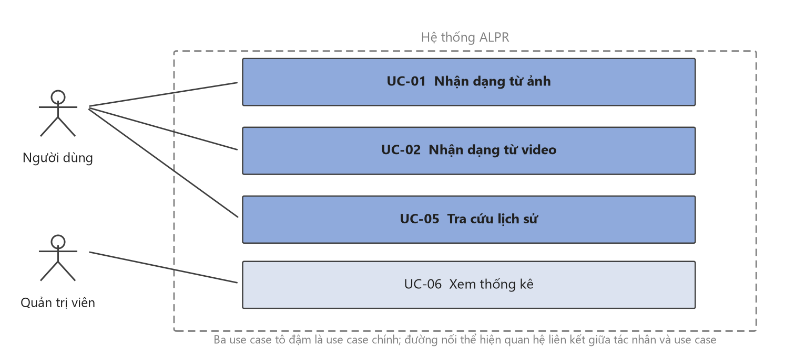

**Hình 4.1.** Sơ đồ use case — hai tác nhân và bốn use case. Ba use case tô đậm là
use case chính được đặc tả đầy đủ theo khuôn tác nhân · tiền điều kiện · luồng
chính · luồng thay thế.

### 4.1.3. Yêu cầu chức năng

Hệ thống có **34 yêu cầu chức năng** chia sáu nhóm, phân mức theo MoSCoW: 20 _Must_, 5 _Should_, 3 _Could_, 6 _Won't_. Sáu yêu cầu mức _Won't_ đến từ ba đợt thu gọn phạm vi: bốn yêu cầu thuần giao diện chuyển mức ở đợt thu gọn giao diện, và hai yêu cầu của nhóm video — xuất video đã chú thích cùng huỷ tác vụ đang chạy — chuyển mức ở đợt thu gọn nhóm video. **Hai yêu cầu mức _Must_ đã bị đưa ra khỏi phạm vi là FR-4.1 và FR-2.5**, nêu rõ ở mục 6.2. Bảng đầy đủ từng mã yêu cầu ở **Phụ lục H.2**.

### 4.1.4. Yêu cầu phi chức năng

Các chỉ tiêu phi chức năng chia bảy nhóm — độ chính xác (NFR-A), hiệu năng (NFR-P), độ tin cậy (NFR-R), khả năng chịu tải (NFR-SC), khả năng bảo trì (NFR-M), bảo mật (NFR-S) và khả dụng (NFR-U) — mỗi chỉ tiêu kèm **ngưỡng tối thiểu, mục tiêu và phương pháp đo**. Hai ràng buộc chi phối toàn bộ nhóm hiệu năng: suy luận **chỉ trên CPU** (CON-02) và ngân sách độ trễ đầu cuối. Bảng đầy đủ ở **Phụ lục H.3**; kết quả đối chiếu từng chỉ tiêu ở mục 5.7.

## 4.2. Kiến trúc hệ thống

### 4.2.1. Nguyên tắc kiến trúc

**Kiến trúc sạch và quy tắc phụ thuộc:** phụ thuộc chỉ hướng vào trong, từ chi tiết dễ thay đổi (framework web, CSDL, giao diện) về quy tắc nghiệp vụ ổn định. Ở bài toán này, thứ ổn định là thuật toán nhận dạng biển số — phát hiện, cắt, đọc, chuẩn hoá theo quy chuẩn Việt Nam; thứ dễ đổi là FastAPI hay Flask, SQLite hay PostgreSQL. Do đó **đường ống AI nằm ở vòng trong cùng**, tầng web phụ thuộc nó chứ không ngược lại. SOLID vận dụng: _trách nhiệm đơn nhất_ — detector chỉ trả bounding box, recognizer chỉ trả chuỗi, normalizer chỉ chuẩn hoá — cho phép đo từng khối riêng; _thay thế Liskov_ — dùng theo nghĩa đen khi hệ thống chạy đường ống giả lập đúng hợp đồng đường ống thật; _đảo ngược phụ thuộc_ — tầng nghiệp vụ phụ thuộc hợp đồng trừu tượng, cài đặt tiêm từ ngoài.

<!-- {{T4.1a}} bon rang buoc kien truc va cach kiem chung -->

**Bảng 4.2.** Bốn ràng buộc kiến trúc và cách kiểm chứng từng ràng buộc

| # | Ràng buộc | Mã chỉ tiêu | Cách hiện thực | Kiểm chứng bằng gì |
|:--:|---|:--:|---|---|
| 1 | Không trộn mã AI với mã API | NFR-M1 | `ai/` là gói Python độc lập, không import framework web | Kiểm thử tự động quét `sys.modules` lúc chạy |
| 2 | Mọi thành phần AI thay thế được | NFR-M5 | Ba lớp trừu tượng, đường ống chỉ giữ tham chiếu tới lớp cha (Hình 4.6) | Đổi bộ nhận dạng không phải sửa nơi khác |
| 3 | Không gán cứng đường dẫn | NFR-M4 | Mọi đường dẫn qua đối tượng cấu hình đọc từ biến môi trường | Đổi `ALPR_MODEL_PATH` là đổi được mô hình |
| 4 | Chạy được không cần GPU | CON-02 · NFR-C2 | Thiết bị suy luận là tham số, **mặc định `cpu`** | Toàn bộ số liệu Chương 5 đo trên CPU |

Ràng buộc thứ tư phát biểu là **cấu hình mặc định**, không phải "chế độ dự
phòng" — nên đường chạy CPU là đường được kiểm thử thường xuyên nhất, chứ không
phải nhánh ít ai đụng tới.

### 4.2.2. Kiến trúc phân tầng


**Hình 4.2.** Kiến trúc phân tầng năm tầng và chiều phụ thuộc

Năm tầng: **1 — Trình bày** (giao diện, chỉ biết hợp đồng HTTP của tầng 2); **2 — API** (định tuyến, kiểm tra hợp lệ, ánh xạ ngoại lệ thành mã HTTP, sinh OpenAPI); **3 — Nghiệp vụ** (điều phối: tạo tác vụ, gọi đường ống, lưu tệp, ghi CSDL, gộp trùng, thống kê); **4 — AI** (phát hiện, nhận dạng, chuẩn hoá — **chỉ biết NumPy, OpenCV và thư viện học sâu**); **5 — Dữ liệu** (CSDL, kho tệp). **Điểm mấu chốt:** khối tầng AI **không có mũi tên nào đi lên**. Sau hai đợt thu gọn, tầng trình bày còn **ba trang** nhưng **tầng 2–5 không đổi một dòng**: `POST /detect/frame`, `GET /statistics`, `GET /health` vẫn phục vụ và vẫn có kiểm thử tích hợp — phép thử ngoài dự kiến cho nguyên tắc phụ thuộc một chiều.

### 4.2.3. Tách tầng AI khỏi tầng API và cách kiểm chứng ràng buộc

**Ba lợi ích.** _Kiểm thử độc lập_: test chỉ cần nạp mảng NumPy, không phải dựng ứng dụng web. _Tái sử dụng trong script huấn luyện và đánh giá_: nếu logic tiền xử lý nằm lẫn trong hàm HTTP thì script đánh giá phải sao chép, hai bản sẽ lệch nhau, dẫn tới hệ quả nghiêm trọng nhất có thể xảy ra: **con số công bố không phản ánh đúng kết quả thực tế của hệ thống**. Mục 4.6.4g và 4.10 phân tích một trường hợp thuộc loại này. _Thay thế bộ nhận dạng mà không cần sửa mã tầng API_ đã được **kiểm chứng trên thực tế**: trong suốt giai đoạn xây dựng phần mềm và kiểm thử, hệ thống chạy với `StubPipeline`, toàn bộ tầng API, nghiệp vụ, cơ sở dữ liệu và giao diện đã được xây dựng và kiểm chứng **trước khi mô hình được huấn luyện**; khi trọng số đã sẵn sàng, việc chuyển sang `ALPRPipeline` chỉ là thao tác đổi thành phần phụ thuộc được tiêm vào, **không cần sửa đổi** router, service hay schema. Để tránh nhầm lẫn giữa trạng thái mô phỏng và vận hành thực tế, endpoint `/health` sẽ báo `degraded` khi `StubPipeline` còn đang hoạt động.

### 4.2.4. Luồng xử lý của đường ống AI và nhánh biển hai dòng

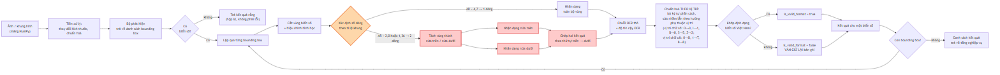

**Hình 4.3.** Luồng xử lý của đường ống AI, các khối tô đỏ là nhánh biển hai dòng

**Nhánh biển hai dòng** là phần khó nhất của đồ án và là rủi ro đã xác định từ khâu lập kế hoạch (R-04). Bộ OCR dựng sẵn giả định văn bản một dòng ngang, nên với biển hai dòng chúng đọc theo thứ tự không xác định, ghép lẫn hoặc bỏ sót một dòng — cơ chế đứng sau chênh lệch 48,6 điểm phần trăm **đo trên bộ RodoSol-ALPR của Brazil** đã dẫn ở 4.1.1 [2]<!-- laroca_2022_crossdataset -->. Giải pháp: **tách vùng biển thành hai nửa, nhận dạng từng nửa, ghép theo thứ tự trên trước dưới sau** — mỗi nửa lúc này là một dòng ngang đúng giả định của bộ OCR (cài đặt ở 4.6.4).

### 4.2.5. Bảng tổng hợp các quyết định kiến trúc

Mỗi quyết định ghi kèm lý do và **đánh đổi phải chấp nhận** — một quyết định trình bày như không có nhược điểm là quyết định chưa cân nhắc đủ.

<!-- {{T4.2}} cac quyet dinh kien truc AD-01 den AD-08 -->

**Bảng 4.3.** Tám quyết định kiến trúc — mỗi dòng kèm đánh đổi phải chấp nhận

| Mã | Quyết định | Lựa chọn | Đánh đổi phải chấp nhận |
|:--:|---|---|---|
| AD-01 | Tách tầng AI khỏi tầng API | Gói Python độc lập | Thêm một lớp gián tiếp |
| AD-02 | Xử lý video | Bất đồng bộ, trả `job_id` ngay | Giao diện phải hỏi tiến độ định kỳ |
| AD-03 | Nhận dạng thời gian thực | Client gửi từng khung qua HTTP | Muốn FPS cao hơn phải chuyển WebSocket |
| AD-04 | Gộp trùng biển số | Theo chuỗi ký tự + cửa sổ thời gian | Kém chính xác khi hai xe cùng biển đi gần nhau |
| AD-05 | Nền tảng suy luận | PyTorch trước, ONNX/OpenVINO nếu cần | Có thể phải làm lại bước xuất mô hình |
| AD-06 | Thiết bị | Cấu hình được, mặc định `cpu` | — |
| AD-07 | Lưu trữ ảnh | Tệp trên đĩa, chỉ lưu đường dẫn trong CSDL | Phải giữ đồng bộ giữa tệp và bản ghi |
| AD-08 | Đặt tên tệp | UUID, không dùng tên gốc | Cần lưu tên gốc riêng nếu muốn hiển thị |

Tám quyết định kiến trúc được ghi thành hồ sơ AD-01 … AD-08, mỗi hồ sơ nêu **bối cảnh, phương án đã cân nhắc, quyết định và hệ quả phải chấp nhận** — dạng ghi chép này khiến một quyết định về sau có thể bị lật lại mà người lật hiểu được vì sao nó từng đúng. Các mục 4.2.1 – 4.2.4 trình bày bốn quyết định có ảnh hưởng rộng nhất.

Ghi chú: AD-03 không đổi sau khi gỡ trang Webcam vì ở ~5 FPS trên CPU, điểm nghẽn là suy luận chứ không phải giao thức. AD-04 cố ý **không** chọn tracking vì phức tạp hơn đáng kể và thêm một họ siêu tham số. AD-05 là quyết định duy nhất **đã thay đổi** so với phác thảo (_"PyTorch trước, ONNX nếu cần"_) — ghi nhận tường minh thay vì lặng lẽ sửa bảng. AD-06 kéo theo hai quyết định phái sinh đã cài đặt: `yolo11n` và **PP-OCRv5 mobile** — ràng buộc CPU thay đổi _lựa chọn mô hình_, không chỉ tốc độ.

---

## 4.3. Môi trường và công cụ phát triển

### 4.3.1. Cấu hình máy thực hiện và hệ quả của ràng buộc CPU

Toàn bộ cài đặt, kiểm thử và đo đạc chạy trên một máy trạm duy nhất: Windows 11 Pro; Intel Core i5-14600K, 14 nhân / 20 luồng; RAM 31,77 GiB; Intel UHD 770 — **không có GPU CUDA**; Python 3.13.12; Node.js 18.20.8; Docker 29.4.3. Cấu hình này **mâu thuẫn với mô tả môi trường ban đầu** (macOS Apple Silicon, Python 3.12); ghi nhận sai lệch thành văn bản là bước đầu của giai đoạn phân tích yêu cầu. Ràng buộc CPU để lại dấu vết cụ thể: NFR-P1 phát biểu thẳng cho CPU; AD-06 kéo theo `yolo11n` và PP-OCRv5 mobile; và vì huấn luyện trên CPU mất 1–3 ngày mỗi lượt, quy trình huấn luyện chạy được cả trên máy cá nhân lẫn nền tảng đám mây, với toàn bộ siêu tham số đặt trong một tệp cấu hình duy nhất. Trước khi bật bậc thử lại, p95 đầu cuối trên `models/best.pt` là **731 ms** (client-side) / **780 ms** (in-process); phép đo này dùng để định lượng đánh đổi. Ở cấu hình giao hàng, p95 chính thức là **1.143,10 ms**, đạt ngưỡng tối thiểu 1.500 ms nhưng chưa đạt mục tiêu 800 ms. Phân rã suy luận thuần cho thấy OCR chiếm **~64,3%**, phát hiện **~34,2%** (đối chiếu NFR-P1 ở 4.10).

### 4.3.2. Môi trường Python và bộ công cụ

Trong giai đoạn huấn luyện, nhóm thực hiện dùng **ba môi trường ảo tách biệt** — một cho huấn luyện và xuất mô hình, một cho tầng nhận dạng ký tự, một cho máy chủ — vì cài `paddleocr` vào môi trường đang huấn luyện sẽ hạ cấp `numpy` và kéo theo một gói thứ hai cùng ghi vào không gian tên `cv2`. Không được để điều đó xảy ra giữa một lượt huấn luyện kéo dài mười giờ. **Việc tách là tạm thời và nay đã kết thúc:** bản giao hàng chỉ còn một môi trường, và xung đột được hoá giải bằng cách ghim mọi gói cùng ghi vào `cv2` về **cùng một phiên bản**.

**Bộ công cụ:** FastAPI + Uvicorn; SQLAlchemy 2.x + Alembic; Pydantic v2; Ultralytics 8.4.101 chạy YOLO11 [9]<!-- jocher_2024_yolo11 -->; PaddleOCR 3.7.0 cho PP-OCRv5 [10]<!-- cui_2026_ppocrv5 -->; Vite + React + TypeScript; pytest + pytest-cov; Docker Compose. Docker dùng Python 3.12 trong khi local dùng 3.13 là **chủ ý**: container là nơi lấy lại phiên bản mục tiêu (NFR-C1).

---

## 4.4. Xây dựng bộ dữ liệu

### 4.4.1. Đường ống sáu bước và thành phần bộ dữ liệu

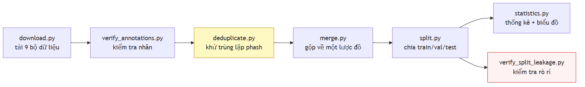

**Hình 4.4.** Đường ống sáu bước xây dựng bộ dữ liệu

Mỗi bước là một kịch bản độc lập có giao diện dòng lệnh riêng và sinh báo cáo dạng dữ liệu có cấu trúc; một kịch bản điều phối chạy toàn chuỗi bằng một lệnh. **Kết quả:** **15.133 ảnh** hợp nhất từ **7 bộ công khai** (Roboflow, HuggingFace, Kaggle), còn **6 nguồn nguyên tố** sau khi loại **11.978 ảnh (44,2%)** bản sao từ **27.111 ảnh**; tổng 9 bộ tải về, 2 bộ nhãn mức ký tự tách riêng cho đánh giá OCR. Chia 70/20/10 thành **10.592 / 3.027 / 1.514 ảnh**. Bảng dưới **phải trích khi nói về dữ liệu của đồ án**; nguồn và giấy phép từng bộ ở **Phụ lục C.1**.

<!-- {{T4.4}} dong gop cua tung bo du lieu truoc va sau khu trung lap -->

**Bảng 4.4.** Đóng góp của từng bộ dữ liệu trước và sau khử trùng lặp

| #   | Bộ (slug)                   |    Vào gộp |        **Còn lại** |   Bị loại |
| --- | --------------------------- | ---------: | -----------------: | --------: |
| 1   | roboflow_school_fuhih       |      8.357 | **6.868** (45,38%) |     17,8% |
| 2   | hf_vn_plates_segment        |      4.578 | **4.375** (28,91%) |      4,4% |
| 3   | roboflow_traffic_camera     |      3.843 | **3.162** (20,89%) |     17,7% |
| 4   | roboflow_eric_nguyen        |        840 |    **353** (2,33%) |     58,0% |
| 5   | roboflow_demo_tracking      |        236 |    **235** (1,55%) |      0,4% |
| 6   | roboflow_cuong_ta           |      8.254 |    **140** (0,93%) | **98,3%** |
| 7   | roboflow_tran_ngoc_xuan_tin |      1.005 |              **0** |  **100%** |
|     | **Tổng**                    | **27.113** |         **15.133** | **44,2%** |

> **Ghi chú về phạm vi của mọi số liệu OCR.** Phân loại màu nền trên 2.801 ảnh cho: **2.736 biển trắng (97,68%)**, 20 vàng, 4 xanh, **0 đỏ, 0 ngoại giao**. Phát biểu đúng là _"1 − CER = 0,9483 trên một tập gồm 97,7% biển trắng"_, **không phải** _"trên biển số Việt Nam"_.

### 4.4.2. Khử trùng lặp chéo bộ và con số 44,2%

Các bộ công khai fork lẫn nhau, nên một ảnh nằm ở `train` dưới tên bộ này và `test` dưới tên bộ khác thì **độ chính xác test đang đo khả năng ghi nhớ**; con số tiêu đề vì vậy là số nhóm trùng **chéo bộ**. Vét cạn ~690 triệu cặp là bất khả thi nên script dùng **multi-index hashing**: cắt mã băm 64 bit thành `threshold + 1` dải — theo nguyên lý chuồng bồ câu, hai mã khác nhau tối đa `threshold` bit bắt buộc trùng khớp trên ít nhất một dải — nên tập ứng viên chứa mọi cặp thật rồi được xác minh chính xác: **thuật toán chính xác, không xấp xỉ**.

Có **hai phép đo trên hai mẫu số khác nhau**, trích một con số trần không nêu mẫu số là gây hiểu nhầm: **(a)** trên 7 bộ vào hợp nhất — mẫu số 27.111, ngưỡng Hamming 5, loại **11.978 = 44,2%**, **đã xoá thật**; **(b)** trên ngữ liệu còn lại — mẫu số 15.133, ngưỡng 10, chỉ ra **47,8% có thể loại** nhưng **chưa xoá**. 47,8% không mâu thuẫn 44,2%: ngưỡng lỏng hơn, và chỉ đo chứ chưa xoá. Hai hệ quả của tỷ lệ 44,2%: quy mô thật khác hẳn danh nghĩa (trường hợp cực đoan: một bộ vào hợp nhất với 1.005 ảnh và ra với **0** ảnh — lý do **không được cộng dồn số ảnh công bố của từng bộ**), và phân bố huấn luyện lệch vì bản sao tập trung ở các bộ được chép nhiều nhất. Bước chia tập giữ **mọi thành viên của một nhóm trùng lặp trong cùng một tập con** nên bản trùng không bị xoá cũng không rò rỉ được.

### 4.4.3. Giới hạn của perceptual hash: nó tóm tắt bố cục khung ảnh, không tóm tắt chiếc xe

Đây là **giới hạn không khắc phục được** bằng công cụ hiện có. Một lần kiểm tra độc lập ở ngưỡng Hamming 10 trên bộ v1 tìm thấy **619 cặp gần trùng giữa `train` và `test`**, toàn bộ ở dải d = 6–10; kiểm bằng mắt cho thấy **cùng một chiếc xe, cùng chuỗi biển số, ở cả hai phép chia tập**. Đường ống không bắt được vì bộ chia gom nhóm ở ngưỡng 5 rồi lần kiểm đầu cũng đo lại ở ngưỡng 5 và báo "0 cặp" — **lập luận vòng tròn**. Nâng ngưỡng cũng không giải quyết: phash rút ảnh thành 64 bit mô tả **cấu trúc tần số thấp của toàn khung**, nên hai xe khác nhau qua cùng một camera có khoảng cách phash rất nhỏ vì 90% khung hình giống hệt. Đánh đổi không thoát được: ngưỡng thấp bỏ sót cặp cùng xe khác ngày; ngưỡng cao gộp nhầm hàng nghìn ảnh xe khác nhau cùng camera. Bộ v3 chia lại với gom nhóm ngưỡng cao hơn và kiểm độc lập ở ngưỡng 10, nhưng nhóm thực hiện ghi nhận: **vẫn còn rò rỉ tồn dư không khử được bằng phash** — khắc phục đòi hỏi so khớp mức chuỗi biển số hoặc đặc trưng phương tiện. Hệ quả: `baseline-416-v1.pt` đạt mAP@0.5 = 0,9933 trên bộ v1 nhưng con số đó **không được báo cáo là "đạt"** vì tập test có rò rỉ đã đo được (4.10).

---

## 4.5. Huấn luyện mô hình

### 4.5.1. Siêu tham số và chi phí huấn luyện bộ phát hiện

Cấu hình lượt huấn luyện chính thức được trích từ tệp tham số do thư viện tự sinh — bản ghi _đã thực thi_ chứ không phải _dự định_; bảng đầy đủ ở **Phụ lục B.1**. Các giá trị chịu lực: mô hình khởi đầu YOLO11n tiền huấn luyện trên COCO (**2.590.035** tham số, biến thể nhỏ nhất do ràng buộc CPU); độ phân giải đầu vào **640** đúng theo NFR-A1 và NFR-A2; **20** epoch với kích thước lô 8; thuật toán tối ưu AdamW, tốc độ học ban đầu 0,001 theo lịch cosine; thiết bị CPU; hạt giống ngẫu nhiên cố định ở 42 kèm chế độ tất định. Riêng phép tăng cường lật ngang được **tắt hoàn toàn**, lệch có chủ ý so với giá trị mặc định: lật ngang sinh ra ký tự đối xứng gương, một phân bố không bao giờ xuất hiện trong thực tế. Vì giới hạn thời gian CPU chỉ chạy được **một lượt huấn luyện duy nhất**, không có nhiều seed để ước lượng phương sai; cố định seed ít nhất bảo đảm lượt này tái lập được — mọi chỉ số là kết quả **một lần chạy**, không có khoảng tin cậy (hạn chế ghi ở 5.9.3). **Chi phí:** mô hình đối chứng 40 epoch ở độ phân giải 416 trên bộ dữ liệu phiên bản 1 tiêu tốn **156 phút**; mô hình chính thức 20 epoch ở độ phân giải 640 trên bộ dữ liệu phiên bản 3 tiêu tốn **30,2 phút mỗi epoch, tổng 36.181 giây tương đương 10,05 giờ** trên CPU, số liệu lấy từ nhật ký huấn luyện do thư viện tự ghi. Ba yếu tố cùng thay đổi (số ảnh ×3,3, diện tích ×2,37, epoch giảm nửa) khiến so sánh ở mục 3.6 **không quy kết được nguyên nhân cho từng biến**.

### 4.5.2. Tiến triển của quá trình huấn luyện

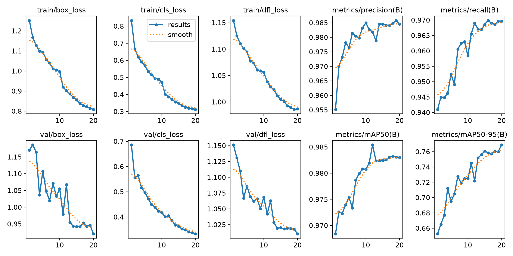

**Hình 4.5.** Đường cong huấn luyện theo epoch — ba hàm mất mát và bốn chỉ số trên tập kiểm định

Ba hàm mất mát giảm đơn điệu và **không có dấu hiệu quá khớp**: mất mát hộp bao 1,252 → 0,809, mất mát phân lớp 0,833 → 0,313, mất mát phân phối 1,154 → 0,987; đường validation bám sát đường train suốt 20 epoch. Chỉ số trên tập validation đi lên rồi bão hoà sớm: mAP@0,5 đạt **0,9684 ngay ở epoch 1** và chỉ nhích lên **0,9830** ở epoch 20, trong khi mAP@0,5:0,95 — chỉ số nhạy với độ khít của hộp — tăng đáng kể hơn, **0,6526 → 0,7688**.

<!-- {{T4.5a}} tien trien chi so tren tap validation theo epoch -->

**Bảng 4.5.** Tiến triển chỉ số trên tập validation theo mốc epoch

|           Epoch           | Mất mát hộp bao | Mất mát phân lớp | Mất mát phân phối |    mAP@0.5 | mAP@0.5:0.95 |  Precision |     Recall |
| :-----------------------: | --------------: | ---------------: | ----------------: | ---------: | -----------: | ---------: | ---------: |
|             1             |          1,1705 |           0,6858 |            1,1513 | **0,9684** |   **0,6526** |     0,9552 |     0,9410 |
|             2             |          1,1861 |           0,5554 |            1,1307 | **0,9726** |   **0,6653** |     0,9700 |     0,9450 |
|             3             |          1,1647 |           0,5651 |            1,1098 | **0,9723** |   **0,6770** |     0,9731 |     0,9449 |
|             5             |          1,1074 |           0,4977 |            1,0863 | **0,9754** |   **0,6950** |     0,9765 |     0,9525 |
|            10             |          1,0548 |           0,4168 |            1,0686 | **0,9808** |   **0,7248** |     0,9850 |     0,9584 |
|            15             |          0,9420 |           0,3619 |            1,0205 | **0,9824** |   **0,7609** |     0,9846 |     0,9686 |
|            20             |          0,9204 |           0,3331 |            1,0105 | **0,9830** |   **0,7688** |     0,9846 |     0,9697 |
| **Epoch tốt nhất (= 20)** |      **0,9204** |       **0,3331** |        **1,0105** | **0,9830** |   **0,7688** | **0,9846** | **0,9697** |

### 4.5.3. Tinh chỉnh bộ nhận dạng ký tự và lý do không đưa vào bản bàn giao

PP-OCRv5 mobile huấn luyện trên chữ cảnh tổng quát; mục này trả lời bằng số câu hỏi fine-tune trên đúng miền dữ liệu thì được gì. **Cấu hình:** 30 epoch trên 6.672 mẫu (2.801 ảnh gốc + hai biến thể tăng cường mỗi ảnh), kiểm định 571 mẫu, charset đủ 36, khởi đầu từ `en_PP-OCRv5_mobile_rec_pretrained`; kết thúc train acc **0,9449**, val acc **0,8809**.

<!-- {{T4.5b}} so sanh fine-tune va model goc -->

**Bảng 4.6.** So sánh bộ nhận dạng gốc và bản tinh chỉnh trên cùng ngữ liệu

| Cấu hình                                   | A5 (chuỗi thô) | A6 (sau hậu xử lý) | Đúng định dạng | ms/ảnh |
| ------------------------------------------ | -------------: | -----------------: | -------------: | -----: |
| **Model gốc, det + rec** — _bản bàn giao_ |         0,6373 |         **0,7701** |         0,9443 |  328,8 |
| Model fine-tune, det + rec                 |         0,5998 |             0,6762 |         0,9018 |      — |
| Model gốc, chỉ rec                         |         0,6776 |             0,7508 |         0,9568 |   35,7 |
| Model fine-tune, chỉ rec                   |     **0,8618** |         **0,8758** |     **0,9886** |   38,5 |

## 4.6. Tầng AI — thiết kế và cài đặt

### 4.6.1. Tổ chức gói suy luận và ba lớp trừu tượng

Tầng AI là một gói Python độc lập, không phụ thuộc bất kỳ thành phần nào của tầng API; ràng buộc được kiểm chứng tự động (mục 4.2.3) để gói vận hành được trong môi trường notebook, kịch bản đo đạc và nền tảng huấn luyện đám mây.

Kiến trúc dựa trên ba lớp trừu tượng có hợp đồng thống nhất. Lớp phát hiện trả về danh sách vùng biển đã lọc ngưỡng và khử chồng lấn, trong đó danh sách rỗng là kết quả hợp lệ chứ không phải trạng thái lỗi. Lớp nhận dạng trả về chuỗi thô kèm độ tin cậy; việc sửa lỗi ký tự và kiểm tra hợp lệ không thuộc trách nhiệm của lớp này, và chính sự tách biệt đó cho phép định lượng đóng góp của khối hậu xử lý (mục 5.5.2). Lớp chuẩn hoá trả về cả chuỗi không hợp lệ, vì loại bỏ chúng sẽ làm mất đúng các trường hợp mà chương đánh giá cần thống kê. Hợp đồng chung là trả kết quả rỗng thay vì ném ngoại lệ, nhất quán với NFR-R2: không tìm thấy đối tượng và lỗi hệ thống là hai trạng thái khác nhau.

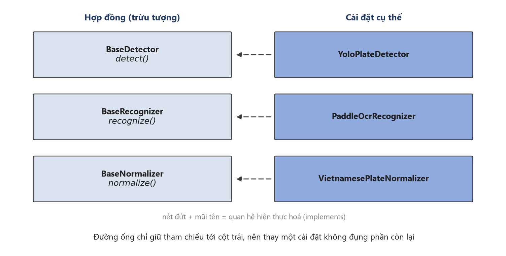

**Hình 4.6.** Ba lớp trừu tượng và cài đặt tương ứng. Đường ống chỉ giữ tham chiếu
tới cột trái, nên thay một cài đặt — ví dụ đổi bộ nhận dạng ký tự — không đụng
tới phần còn lại của hệ thống. Đây là bằng chứng cài đặt cho NFR-M5.

### 4.6.2. Bộ phát hiện

Bộ phát hiện là lớp thích ứng mỏng bao quanh thư viện Ultralytics: không thành phần nào ngoài lớp này tiếp xúc với cấu trúc dữ liệu nội bộ của thư viện. Phiên bản mô hình được ghim tường minh trong định danh mà lớp công bố, để mọi kết quả đo truy được về đúng bộ trọng số và việc nâng cấp thư viện không thay đổi ngầm mô hình đứng sau một kết quả đã công bố. Trọng số nạp ngay khi khởi tạo, nên lỗi thiếu tệp bộc lộ lúc khởi động thay vì lúc phục vụ yêu cầu đầu tiên. Lớp chấp nhận cả tệp trọng số đơn lẻ lẫn thư mục mô hình đã tối ưu cho CPU, do giới hạn ở một dạng sẽ loại bỏ cấu hình suy luận nhanh nhất trên phần cứng mục tiêu. Mọi hộp bao được kẹp về biên ảnh và hộp suy biến bị loại, nên tầng trên không nhận toạ độ ngoài khung.

### 4.6.3. Bộ nhận dạng ký tự

Bộ nhận dạng tuân theo cùng mô hình lớp thích ứng và cũng ghim phiên bản mô hình tường minh. Các mảnh văn bản được lọc theo tiêu chí hình học thay vì ngưỡng tin cậy, do bước nâng tương phản có thể sinh mảnh nhiễu được đọc thành chuỗi vô nghĩa ở độ tin cậy cao; độ tin cậy của cả chuỗi tổng hợp bằng trung bình có trọng số theo độ dài mảnh, vì trung bình cộng cho phép một mảnh một ký tự che lấp mảnh dài mang danh tính thực của biển số.

Cần lưu ý một giới hạn kỹ thuật ảnh hưởng trực tiếp đến hiệu năng: trên nền tảng mục tiêu, thư viện nhận dạng không cho phép kích hoạt thư viện tăng tốc oneDNN do khiếm khuyết phía thư viện, nên thư viện này bị vô hiệu hoá bằng một hằng số cấu hình có tài liệu kèm theo. Đây là tham số hiệu năng chứ không phải tham số độ chính xác, và giải thích một phần kết quả NFR-P1 ở mục 5.6: một hướng tăng tốc suy luận CPU thông dụng hiện không khả dụng vì lý do nằm ngoài phạm vi kiểm soát của đồ án.

### 4.6.4. Mô-đun xử lý biển hai dòng

**a) Cơ sở của bài toán.** Bộ nhận dạng dựa trên kiến trúc CRNN kết hợp hàm mất mát CTC, vốn giả định căn chỉnh đơn điệu giữa cột ảnh và chuỗi ký tự — giả định chỉ đúng với văn bản một dòng. Chồng lên đó, mô-đun nhận dạng chuẩn hoá mọi ảnh về chiều cao cố định 48 điểm ảnh [21]<!-- paddlepaddle_2026_textrecognition -->. Biển xe máy Việt Nam 140 × 190 mm theo QCVN 08:2024/BCA [6]<!-- bocongan_2024_qcvn08 --> có tỉ lệ khung hình xấp xỉ 1,36; sau chuẩn hoá, mỗi hàng ký tự chỉ còn khoảng 24 điểm ảnh, thấp hơn ngưỡng mà nét chữ còn tách rời. Mức nghiêm trọng đã được định lượng: trên bộ RodoSol-ALPR của Brazil, OpenALPR đạt 94,3% trên biển ô tô một dòng nhưng chỉ 45,7% trên biển xe máy hai dòng [2]<!-- laroca_2022_crossdataset -->. Cần lưu ý cặp số liệu này đo trên dữ liệu Brazil, chỉ được trích như dẫn chứng tương đương về định lượng chứ không phải số liệu Việt Nam.

**b) Ước lượng số dòng.** Số dòng suy từ tỉ lệ chiều rộng trên chiều cao của vùng biển, ngưỡng phân loại 2,5: tỉ lệ nhỏ hơn ngưỡng được xếp vào nhóm hai dòng. Đây là đề xuất của đồ án, không phải quy định pháp lý — quy chuẩn chỉ cung cấp ba tỉ lệ vật lý 4,727, 2,000 và 1,357. Ngưỡng được chọn lệch về phía hai dòng vì đường xử lý hai dòng suy giảm êm khi gặp đầu vào một dòng, chiều ngược lại thì không. Dải 2,5–3,0 vẫn là vùng bất định do biển một dòng chụp nghiêng lớn có thể cho tỉ lệ rơi vào khoảng này; định lượng tần suất thuộc Chương 5.

**c) Phân tách hai nửa có chồng lấn.** Vùng biển được cắt thành hai nửa theo chiều dọc, nửa trên kết thúc tại 5/12 chiều cao và nửa dưới bắt đầu tại 1/3, tạo vùng chồng lấn bằng 1/12 chiều cao biển. Thiết kế xuất phát từ tính bất đối xứng của chi phí sai sót: cắt cụt chân hoặc đỉnh ký tự phá huỷ thông tin không phục hồi được, trong khi lọt vài hàng điểm ảnh của nửa còn lại chỉ được xử lý như nền.

**d) Ghép ngang.** Hai nửa được ghép theo chiều ngang bằng phép `hstack`, chiều cao chung lấy bằng giá trị lớn nhất trong ba đại lượng: chiều cao nửa trên, chiều cao nửa dưới và 48 điểm ảnh — đúng bằng chiều cao đầu vào cố định của mô-đun nhận dạng. Nửa trên đặt bên trái để bảo toàn thứ tự đọc. Sau khi ghép, một hàng ký tự duy nhất nhận trọn ngân sách 48 điểm ảnh thay vì hai hàng chia nhau, vô hiệu hoá đúng nguyên nhân đã phân tích ở mục a.

**e) Tiền xử lý ảnh biển.** Ba bước độc lập, mỗi bước bật tắt riêng để phục vụ thí nghiệm bóc tách đóng góp: chuyển thang xám, do ký tự không mang thông tin phân biệt trong kênh màu; cân bằng lược đồ xám thích nghi có giới hạn tương phản (CLAHE, hệ số 2,0 trên ô 8 × 8), vì bề mặt phản quang tạo mảng chói cục bộ mà cân bằng toàn cục không xử lý được [22]<!-- sutikno_2025_clahe -->; và khử nhiễu bằng lọc song phương thay cho làm mờ Gauss, vì lọc song phương bảo toàn biên — yếu tố quyết định để phân biệt các cặp ký tự đồng hình như `8` và `B`. Ảnh biển do bộ phát hiện sinh ra thường chỉ cao 20–40 điểm ảnh nên được phóng đại về 64 điểm ảnh trước khi đọc.

**f) Bước phục hồi dòng trên.** Chế độ hỏng quan sát được: chuỗi `29E-015.66` chỉ đọc được thành `015.66` do sau khi ghép, bộ phát hiện văn bản chỉ xác định một vùng chữ và bỏ qua cụm mã tỉnh cùng ký tự sê-ri. Giả thuyết ban đầu — loại bỏ phép ghép, đọc riêng từng nửa rồi nối chuỗi — được kiểm chứng trên 200 biển hai dòng có nhãn và bị bác bỏ dứt khoát: độ chính xác giảm từ 64,5% xuống 3,5%, không thắng ở trường hợp nào (mục 5.5.6). Nguyên nhân nằm ở chính vùng chồng lấn tại mục c: khi hai nửa được đọc riêng, dải chồng lấn bị nhận dạng hai lần và sinh ký tự thừa giữa chuỗi. Kết quả đảo ngược cách hiểu ban đầu — trên dải liền mạch, vùng lặp nằm giữa hai cụm ký tự và bị bộ phát hiện văn bản loại bỏ, điều không xảy ra khi hai ảnh được xử lý tách biệt.

Thiết kế cuối cùng vì vậy giữ nguyên chiến lược ghép, chỉ bổ sung một bước phục hồi có điều kiện chặt: chỉ kích hoạt khi đồng thời vùng biển được phân loại hai dòng, chuỗi sau chuẩn hoá không hợp lệ, và chuỗi thô khác rỗng. Khi đó hệ thống nhận dạng thêm một lượt trên riêng nửa trên, ghép với chuỗi thô rồi chuẩn hoá lại; kết quả mới chỉ được chấp nhận nếu vượt kiểm tra định dạng. Tính chất không làm suy giảm kết quả mang bản chất cấu trúc: cổng chỉ mở khi kết quả đã không hợp lệ, nên tập bị can thiệp và tập đang đúng là hai tập rời nhau. Mức cải thiện đo được là +1,86 và +0,50 điểm phần trăm trên hai mẫu độc lập, 0 trường hợp bị làm hỏng, chi phí khoảng 15–21 ms mỗi biển hai dòng — khắc phục một chế độ hỏng cụ thể chứ không tác động tới điểm nghẽn chính.

**g) Một giới hạn về phương pháp đo.** Kịch bản sinh các chỉ số NFR-A4 đến NFR-A7 ban đầu gọi trực tiếp bộ nhận dạng và bộ chuẩn hoá thay vì đi qua tầng điều phối, khiến logic đặt tại tầng điều phối không được phản ánh trong số liệu công bố. Biện pháp khắc phục là tách bước phục hồi thành hàm độc lập cấp mô-đun để cả đường chạy sản phẩm lẫn công cụ đo cùng gọi một cài đặt. Bài học vượt ra ngoài phạm vi biển hai dòng: một công cụ đo đi tắt qua tầng điều phối sẽ đo một hệ thống khác với hệ thống được bàn giao. Cần lưu ý biện pháp này về sau vẫn chưa đủ — cùng loại sai lệch đã tái diễn, phân tích tại mục 5.5.6.

### 4.6.5. Bộ luật hậu xử lý theo vị trí

Bộ phát hiện và bộ nhận dạng đều dùng mô hình có sẵn; khối hậu xử lý là thành phần do nhóm thực hiện tự thiết kế và là đóng góp kỹ thuật chính. Khối tuân ba nguyên tắc: thuần khiết về mặt hàm số, không vào/ra và không giữ trạng thái toàn cục khả biến; biểu thức chính quy sinh tự động từ các tập ký tự thay vì viết tay, loại trừ khả năng mẫu lệch khỏi bảng dữ liệu mà nó mã hoá; mọi lớp ký tự là hằng số có tên.

**a) Tập mã tỉnh.** Khối lưu 81 mã tỉnh đang sử dụng theo phụ lục Thông tư 51/2025/TT-BCA [5]<!-- bocongan_2025_tt51 -->, song song tập 8 mã không bao giờ được cấp: 13, 42, 44, 45, 46, 87, 91 và 96. So với biểu thức tổng quát chấp nhận mọi cặp chữ số, ràng buộc này bác bỏ được các chuỗi không tồn tại trên thực tế; lưu tường minh cả tập không sử dụng cho phép kiểm thử khẳng định hai tập phủ đúng dải 11–99.

**b) Các lớp ký tự sê-ri.** Bốn lớp được định nghĩa: tập 20 chữ cái cho sê-ri ô tô và ký tự thứ nhất của sê-ri xe máy; tập 20 chữ cái cho ký tự thứ hai của sê-ri xe máy; tập 11 chữ cái cho biển nền xanh; và tập mở rộng 21 chữ cái. Hai tập đầu là ảnh gương của nhau tại đúng hai ký tự — tập thứ nhất chứa `G` không chứa `R`, tập thứ hai ngược lại — nên `29-AR 123.45` hợp lệ còn `29-AG 123.45` thì không.

Tập mở rộng tồn tại vì mô hình huấn luyện trên bộ ký tự chỉ gồm 20 chữ cái sẽ không bao giờ dự đoán được `R`, gây sai sót có hệ thống trên mọi biển xe máy mang ký tự này ở vị trí sê-ri thứ hai — loại sai sót hậu xử lý không khắc phục được vì thông tin đã bị loại ở tầng mô hình. Theo cùng lập luận, mô hình được huấn luyện trên bộ 36 ký tự đầy đủ rồi mới ràng buộc về 31 ký tự hợp lệ ở tầng hậu xử lý: mô hình được phép dự đoán ký tự bất hợp lệ tạo sai lầm quan sát được và sửa được, còn mô hình không thể dự đoán ký tự đó về mặt kiến trúc tạo sai lầm không quan sát được. Tập bị loại trừ toàn hệ thống gồm 5 chữ cái `I`, `J`, `O`, `Q`, `W`; chính việc loại `I`, `O`, `Q` làm việc sửa lỗi nhận dạng trở nên khả thi.

**c) Mặt nạ vị trí và ký tự đại diện.** Ba mặt nạ tương ứng ba độ dài chuỗi hợp lệ, trong đó `D` bắt buộc chữ số, `L` bắt buộc chữ cái, `?` là ký tự đại diện không áp đặt kiểu:

- chuỗi 8 ký tự (ô tô, sê-ri 5 chữ số): `DDLDDDDD`
- chuỗi 7 ký tự (ô tô, sê-ri 4 chữ số kiểu cũ): `DDLDDDD`
- chuỗi 9 ký tự (xe máy): `DDL?DDDDD`

Ký tự đại diện tại chỉ số 3 của chuỗi 9 ký tự là chi tiết thiết kế then chốt. Hai kiểu biển xe máy cùng 9 ký tự nhưng khác nhau đúng tại vị trí này: kiểu mới dùng sê-ri hai chữ cái, kiểu cũ dùng một chữ cái kết hợp một chữ số và vẫn lưu hành hợp pháp. Nếu tách thành hai mặt nạ riêng thì việc áp kiểu tại chỉ số 3 trở thành bắt buộc, và kiểm chứng bằng chạy thật cho thấy một trong hai kiểu sẽ bị phá huỷ. Chỉ số 3 của chuỗi 9 ký tự là vị trí duy nhất trong toàn hệ thống biển số Việt Nam mà cả chữ cái lẫn chữ số đều hợp lệ.

**d) Bảng ánh xạ nhầm lẫn và tính không đối xứng.** Hai bảng ánh xạ riêng biệt được áp tại vị trí bắt buộc chữ số và vị trí bắt buộc chữ cái. Phát hiện trung tâm là hai bảng không đối xứng: `O → 0` tại vị trí chữ số là hợp lý, nhưng `0 → O` không bao giờ hợp lý vì `O` không thuộc tập sê-ri hợp lệ. Do cả `O` và `Q` đều bị loại trừ, ứng viên đồng hình duy nhất còn lại tại vị trí chữ cái là `D`, nên chiều đúng là `0 → D`. Ký tự `R` không được ánh xạ trong mọi trường hợp vì hợp lệ tại vị trí sê-ri thứ hai của biển xe máy (mục 2.2.4). Nguyên tắc an toàn: ký tự không có mục trong bảng thì giữ nguyên. Cần lưu ý hai bảng này suy từ lập luận hình dạng ký tự chứ không từ đo đạc, và một số cặp mang tính phỏng đoán; việc thay thế bằng bảng trích từ ma trận nhầm lẫn đo được thuộc Chương 5.

**e) Thuật toán chuẩn hoá.**

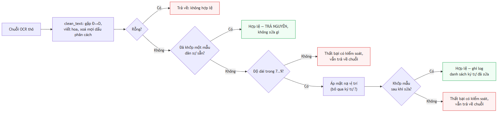

**Hình 4.7.** Thuật toán chuẩn hoá chuỗi biển số theo bộ luật ràng buộc vị trí

Thuật toán tuân ba nguyên tắc. Biểu thức chính quy được thử trước khi thực hiện bất kỳ chỉnh sửa nào, bởi với chuỗi vốn đã hợp lệ thì mọi can thiệp chỉ có thể làm sai đi. Không chuỗi nào bị loại bỏ: chuỗi không sửa được vẫn trả về kèm cờ không hợp lệ và vẫn được lưu. Chuỗi thô được giữ song song với chuỗi đã sửa. Kết quả là một cấu trúc bất biến chứa chuỗi thô, chuỗi cuối, cờ hợp lệ, kết quả phân loại họ biển và danh sách vị trí ký tự đã chỉnh sửa — dấu vết kiểm toán mà chương đánh giá dựa vào để định lượng đóng góp của khối.

**f) Xử lý nhập nhằng bằng số dòng.** Số dòng bằng một chứng minh chuỗi thuộc biển ô tô, do biển xe máy luôn hai dòng; ngược lại, số dòng bằng hai không chứng minh gì vì biển ô tô loại ngắn cũng hai dòng. Trong trường hợp thứ hai, hệ thống giữ cờ nhập nhằng và trả về tập ứng viên thay vì suy đoán kết luận mà dữ liệu đầu vào không chứa. Thứ tự kiểm tra các mẫu sắp xếp theo mức đặc trưng giảm dần, trong đó biển quân đội đặt cuối vì đây là trường hợp nhận dạng nhằm loại trừ: chuỗi khớp mẫu biển quân đội không bao giờ được báo cáo là biển dân sự hợp lệ.

### 4.6.6. Tổ hợp đường ống bằng tiêm phụ thuộc

Đường ống suy luận là đối tượng tổ hợp: nó không sở hữu mô hình mà chỉ điều phối thứ tự giai đoạn, cắt vùng ảnh, đo thời gian từng giai đoạn và cô lập lỗi ở mức từng biển số; do không chứa logic học sâu, đường ống kiểm thử được đầy đủ bằng thành phần giả lập. Thời gian của cả năm giai đoạn luôn được ghi nhận, giai đoạn không thực thi báo giá trị 0 thay vì vắng mặt — cơ sở cho phép phân rã ngân sách độ trễ ở mục 5.6.2, theo đó khối nhận dạng chiếm 64,3% và khối phát hiện 34,0% tổng thời gian suy luận thuần.

Chính sách xử lý lỗi phân tầng theo mức ảnh hưởng: ảnh không chứa biển số trả kết quả rỗng; lỗi nhận dạng trên một biển chỉ vô hiệu hoá biển đó, các biển còn lại vẫn được xử lý; lỗi ở bộ phát hiện làm dừng toàn bộ yêu cầu; lỗi chuẩn hoá giữ nguyên kết quả thô. Thao tác cắt ảnh kẹp toạ độ **thêm một lần nữa** dù lớp phát hiện đã bảo đảm, vì cắt ảnh là nơi duy nhất mà sai lệch một đơn vị tạo mảng rỗng không kèm cảnh báo; ảnh cắt được tạo dưới dạng bản sao thay vì khung nhìn, tránh giữ toàn bộ khung hình gốc trong bộ nhớ khi xử lý video.

### 4.6.7. Nhận dạng họ biển và màu nền

**a) Vấn đề đặt ra.** Hệ thống ban đầu tính ra họ biển và chuỗi hiển thị có dấu phân cách nhưng loại bỏ chúng trước khi ghi vào cơ sở dữ liệu, nên một biển quân đội được nhận dạng chính xác ở độ tin cậy 0,999 vẫn bị hiển thị là sai định dạng — phát biểu không chính xác, do biển quân đội là biển hợp lệ nằm ngoài hệ dân sự (mục 4.6.5f). Hướng khắc phục gồm hai phần: lưu giữ thông tin đã tính (mục 4.7.2), và bổ sung nguồn bằng chứng mà chuỗi ký tự về nguyên tắc không thể mang, đó là màu nền.

**b) Cơ sở của bằng chứng bổ trợ.** Hai nguồn bằng chứng bù trừ cho nhau. Theo Thông tư 79/2024/TT-BCA, biển vàng của xe kinh doanh vận tải mang đúng cùng cấu trúc ký tự với biển trắng của xe cá nhân nên không biểu thức chính quy nào phân biệt được; ngược lại, biển ngoại giao có nền trắng giống biển cá nhân nên riêng màu nền cũng không đủ. Chỉ cặp thuộc tính gồm chuỗi ký tự và màu nền mới định danh được loại phương tiện.

**c) Thiết kế bộ phân loại màu.** Bộ phân loại chuyển ảnh sang không gian HSV, thống kê tỉ lệ điểm ảnh theo từng dải màu và chọn dải chiếm ưu thế, với ba quyết định đáng lưu ý. Chỉ vùng trung tâm được lấy mẫu, biên thu vào 18% mỗi phía, do khung phát hiện hiếm khi ôm sát mép biển và màu thân xe phía sau có thể chiếm ưu thế nếu lấy cả rìa. Điểm ảnh thuộc ký tự không bị loại trừ, vì ký tự chiếm thiểu số diện tích và việc bổ sung một bước phân đoạn ký tự sẽ đưa vào khâu kém ổn định hơn chính khâu nó bảo vệ. Bộ phân loại trả kết quả không xác định khi tỉ lệ dải chiếm ưu thế không đạt 30%: kết luận sai về màu tương đương khẳng định một loại phương tiện không chứng minh được, trong khi thừa nhận không xác định được chỉ là ghi nhận một giới hạn.

**d) Hợp nhất chuỗi ký tự và màu nền.** Với chuỗi như `80A12345`, bốn họ biển đều là ứng viên hợp lệ và bộ chuẩn hoá mặc định chọn họ phổ biến nhất — đúng với đa số nhưng gây sai lệch ngầm đối với xe cơ quan nhà nước mang biển nền xanh. Cơ chế hợp nhất cho phép màu nền nâng cấp một ứng viên mà bộ luật ký tự đã coi là hợp lý. Ràng buộc an toàn quan trọng hơn chính tác dụng của cơ chế: nếu phán quyết ban đầu không nằm trong tập ứng viên thì kết quả giữ nguyên, nên màu nền không thể tạo ra họ biển mà bộ luật ký tự đã bác bỏ. Khi họ biển ưu tiên có cả biến thể ô tô và xe máy, hệ thống phân định theo số dòng; nếu số dòng mâu thuẫn cả hai thì giữ phán quyết ban đầu, theo nguyên tắc đại lượng đo được từ hình học ưu tiên hơn đại lượng suy ra từ thống kê điểm ảnh. Chỉ màu xanh nằm trong bảng ưu tiên vì đây là màu duy nhất chuỗi ký tự hoàn toàn không phân biệt được; màu vàng không đổi họ biển mà chỉ đổi mục đích sử dụng nên được lưu như trường độc lập.

**e) Độ chính xác đo được.** Bộ phân loại được đánh giá trên bộ dữ liệu ảnh biển cắt sẵn có nhãn màu do người gán và chưa từng được hiệu chỉnh theo bộ này — phép đo vì vậy nằm ngoài dữ liệu hiệu chỉnh.

<!-- {{T4.6}} do chinh xac bo nhan mau nen bien so -->

**Bảng 4.7.** Độ chính xác bộ nhận màu nền trên bộ dữ liệu ngoài hiệu chỉnh

| Lớp nhãn người gán |    Số ảnh |      Đúng | Độ chính xác |
| ------------------ | --------: | --------: | -----------: |
| Biển vàng          |       694 |       684 |   **98,56%** |
| Biển trắng         |       808 |       787 |   **97,40%** |
| Biển xanh          |        63 |        61 |   **96,83%** |
| **Tổng**           | **1.565** | **1.532** |   **97,89%** |

Ba giới hạn cần nêu kèm kết quả trên.

<!-- {{T4.6a}} ba gioi han cua phep do mau nen -->

**Bảng 4.8.** Ba giới hạn của phép đo bộ nhận màu nền

| # | Giới hạn | Chi tiết |
|:--:|---|---|
| 1 | **542 ảnh bị loại khỏi phép đo** | Toàn bộ lớp không xác định, cùng các ảnh chụp ban đêm hoặc hồng ngoại mà chính người gán nhãn cũng không xác định được màu |
| 2 | **Dạng lỗi chủ đạo: biển trắng bị xếp thành biển xanh** | **21 trên 33** trường hợp sai, do một số điểm ảnh ám lạnh vượt ngưỡng bão hoà |
| 3 | **Phạm vi phép đo hẹp hơn phạm vi mô-đun** | Bộ dữ liệu không chứa biển đỏ và biển ngoại giao nên hai nhánh này chưa có số liệu đánh giá — ghi thành **hạn chế số 10** ở mục 6.2 |

Cần lưu ý thêm rằng toàn bộ ảnh của bộ dữ liệu này đã bị biến đổi tỉ lệ về khung vuông trước khi công bố, nên bộ không dùng được để đánh giá độ chính xác nhận dạng ký tự — phép biến đổi phá huỷ tỉ lệ khung hình mà thuật toán ước lượng số dòng dựa vào. Màu nền không chịu ảnh hưởng, do đó bộ dữ liệu chỉ được dùng cho đúng câu hỏi về màu sắc.

## 4.7. Máy chủ và cơ sở dữ liệu

### 4.7.1. Kiến trúc phân tầng và tầng nghiệp vụ

Máy chủ tổ chức thành năm tầng với luồng phụ thuộc một chiều nghiêm ngặt: tầng
lõi được mọi tầng khác dùng nhưng không phụ thuộc tầng nào. Kiến trúc và các
thành phần cụ thể của từng tầng đã trình bày ở **Hình 4.2**; mục này nêu ba quy
tắc riêng khiến tầng nghiệp vụ tách biệt được khỏi hai tầng kề nó.

<!-- {{T4.7a}} ba quy tac cua tang nghiep vu -->

**Bảng 4.9.** Ba quy tắc giữ cho tầng nghiệp vụ tách biệt

| Quy tắc | Nội dung | Hệ quả |
|---|---|---|
| Tầng định tuyến **không chứa truy vấn** | Mọi truy cập dữ liệu đi qua tầng kho dữ liệu | Một thay đổi lược đồ có **bán kính ảnh hưởng gói trong một mô-đun**, không lan ra tầng định tuyến |
| Tầng kho **không tự xác nhận giao dịch** | Chỉ đẩy thay đổi xuống phiên làm việc; việc xác nhận thuộc về tầng gọi | Lưu một lượt nhận dạng cùng toàn bộ biển số thuộc lượt đó là **một thao tác logic duy nhất** — xác nhận giữa chừng sẽ để lại bản ghi nửa vời |
| Mỗi ngoại lệ mang **hai mô tả** | Thông điệp tiếng Việt kèm hành động khắc phục đi vào thân phản hồi HTTP; mô tả kỹ thuật chỉ đi vào nhật ký | Cây ngoại lệ ánh xạ thẳng sang mã trạng thái HTTP, kèm bộ xử lý bắt tất cả để ngoại lệ ngoài dự kiến **không làm lộ vết ngăn xếp** ra người dùng (NFR-S4) |

Phần lớn sự cố gặp trong quá trình cài đặt nằm ở **ranh giới giữa mã nguồn và
môi trường thực thi** — nguồn cấu hình, tầng lưu trữ, bảng mã đầu ra — và đều
vượt qua được kiểm thử đơn vị. Đây là lập luận thực nghiệm cho việc bộ kiểm thử
phải có kiểm thử tích hợp chạy trên đường dẫn thật, không chỉ kiểm thử đơn vị
với thành phần giả lập.

### 4.7.2. Thiết kế cơ sở dữ liệu

**a) Lược đồ.** Cơ sở dữ liệu gồm hai bảng có quan hệ một–nhiều: bảng tác vụ ghi nhận mỗi lần sử dụng hệ thống, và bảng lịch sử ghi nhận mỗi biển số được phát hiện. Việc tách thành hai bảng là điều kiện để thống kê đếm đúng, bởi _lượt nhận dạng_ và _biển số phát hiện được_ là hai đại lượng khác nhau: một ảnh chứa ba phương tiện tạo ra một lượt và ba bản ghi. Gộp hai khái niệm sẽ làm số lượt sử dụng bị đánh giá cao hơn thực tế đúng bằng số biển số trung bình trên mỗi ảnh.

<!-- {{T4.7}} luoc do hai bang cua co so du lieu -->

**Bảng 4.10.** Lược đồ cơ sở dữ liệu — hai bảng, quan hệ một–nhiều

| Bảng | Cột | Kiểu | Ghi chú |
|---|---|---|---|
| **`detection_job`** _(11 cột)_ | `id` | `VARCHAR(36)` | Khoá chính, UUID |
| | `input_type` · `status` | `VARCHAR(16)` | `image`\|`video`\|`webcam`; `pending`\|`processing`\|`completed`\|`failed`\|`cancelled` |
| | `progress` | `FLOAT` | 0,0 – 1,0 |
| | `source_path` · `output_path` | `VARCHAR(512)` | Cho phép rỗng |
| | `error_message` | `TEXT` | Chỉ phía máy chủ, không trả ra API |
| | `total_frames` · `processed_frames` | `INTEGER` | Dùng cho tác vụ video |
| | `created_at` · `completed_at` | `DATETIME` | |
| **`detection_history`** _(23 cột)_ | `id` | `INTEGER` | Khoá chính |
| | `plate_number` · `raw_ocr_text` | `VARCHAR(32)` | **Lưu song song** chuỗi đã chuẩn hoá và chuỗi thô |
| | `confidence` · `ocr_confidence` | `FLOAT` | Của **bộ phát hiện** và của **bộ nhận dạng** — hai đại lượng khác nhau |
| | `image_path` · `plate_image_path` | `VARCHAR(512)` | Ảnh gốc và vùng biển đã cắt |
| | `bbox_x` · `bbox_y` · `bbox_w` · `bbox_h` | `INTEGER` | Hộp giới hạn |
| | `is_valid_format` | `BOOLEAN` | Có khớp quy chuẩn Việt Nam không |
| | `plate_line_count` · `upper_char_count` | `INTEGER` | 1 hoặc 2 dòng; số ký tự dòng trên (3 hoặc 4) |
| | `plate_kind` · `plate_color` · `plate_color_confidence` | `VARCHAR(16)` · `FLOAT` | Họ biển và màu nền, cho phép rỗng |
| | `video_time_seconds` | `FLOAT` | Mốc thời gian trong video, rỗng với ảnh tĩnh |
| | `processing_time` · `detected_time` · `created_at` | `FLOAT` · `DATETIME` | |
| | `source_job_id` | `VARCHAR(36)` | **Khoá ngoại** trỏ `detection_job.id` |

Ba cột đáng chú ý vì chúng là **hệ quả trực tiếp của các quyết định đã nêu**:
`raw_ocr_text` cho phép đo đóng góp thuần của khối hậu xử lý (mục 5.5.2);
`source_job_id` gom nhiều biển của cùng một lần tải lên về một nhóm, nếu thiếu
thì thống kê đếm sai; và `upper_char_count` lưu *bằng chứng* để suy ra cách trình
bày biển hai dòng lúc đọc, thay vì đoán từ chuỗi phẳng vốn nhập nhằng.

**b) Hai quyết định thiết kế dữ liệu đáng chú ý.** Thứ nhất, chuỗi ký tự thô do bộ nhận dạng trả về và chuỗi đã qua chuẩn hoá được lưu song song trong hai cột riêng biệt. Đây là điều kiện cần để định lượng đóng góp của khối hậu xử lý: hiệu số giữa độ chính xác tính trên hai cột này chính là chỉ số NFR-A6 trừ NFR-A5 báo cáo ở mục 5.5.2. Thứ hai, hệ thống lưu số ký tự thuộc dòng trên của biển hai dòng, nhằm giải quyết một trường hợp nhập nhằng về nguyên tắc: chuỗi tám ký tự của biển hai dòng có thể được nhóm theo hai cách đều hợp lệ, và ranh giới giữa hai dòng — thông tin duy nhất phân định được — bị chính bước ghép ngang loại bỏ. Giá trị này thu được không tốn thêm chi phí tính toán vì bộ nhận dạng trả về một mảnh kết quả cho mỗi nửa ảnh.

### 4.7.3. Giao diện lập trình

Hệ thống cung cấp giao diện theo phong cách REST với tài liệu đặc tả sinh tự động. Các điểm cuối nghiệp vụ nằm dưới một tiền tố chung, riêng điểm cuối kiểm tra tình trạng đặt ở gốc để hệ thống giám sát và cơ chế kiểm tra sức khoẻ của môi trường container không phụ thuộc vào phiên bản giao diện. Tổng cộng có mười thao tác HTTP trên chín đường dẫn; bảng đặc tả đầy đủ từng điểm cuối được trình bày ở **Phụ lục F.1**.

Bốn quyết định thiết kế đáng ghi nhận. Yêu cầu xử lý video trả về mã trạng thái chấp nhận thay vì mã thành công, do một video 60 giây cần khoảng 200 giây xử lý trên CPU và không client nào chờ được; mã chấp nhận phản ánh đúng ngữ nghĩa "đã tiếp nhận, đang xử lý". Trường hợp ảnh không chứa biển số trả về mã thành công kèm danh sách rỗng thay vì mã lỗi, vì kết quả nhận dạng vẫn tồn tại và là tập rỗng (NFR-R2); trả về mã lỗi sẽ loại toàn bộ trường hợp âm khỏi thống kê. Chức năng tìm kiếm đối chiếu đồng thời chuỗi đã chuẩn hoá và chuỗi thô, để người dùng nhớ dạng nào cũng tra được. Cuối cùng, hai chỉ số thống kê về số lượt và số biển số được trả về tách biệt, kèm mô tả tường minh trong tài liệu đặc tả nhằm ngăn việc gộp nhầm hai đại lượng đã phân tích tại mục 4.7.2a.

### 4.7.4. Phương án lùi phải thất bại theo cách quan sát được

Trong giai đoạn chưa có mô hình đã huấn luyện, hệ thống vận hành với một đường ống mô phỏng sinh kết quả có cấu trúc hợp lệ nhưng không phản ánh nội dung ảnh. Cách làm này chính đáng ở thời điểm đó vì cho phép xây dựng và kiểm thử toàn bộ giao diện lập trình, cơ sở dữ liệu và giao diện người dùng trước khi mô hình sẵn sàng.

Vấn đề nảy sinh khi đường ống mô phỏng được đặt làm phương án lùi cho tình huống không nạp được mô hình. Khi đó một triển khai bị cấu hình sai sẽ đáp lại mọi yêu cầu bằng một biển số có định dạng thuyết phục nhưng hoàn toàn hư cấu — chế độ hỏng mang biểu hiện của một hệ thống hoạt động bình thường, và là dạng nguy hiểm nhất đối với hệ thống có ghi dữ liệu vào cơ sở dữ liệu.

Thiết kế hiện tại phân vai rõ ba đường ống. Đường ống thật thực hiện nhận dạng và báo trạng thái bình thường. Đường ống không khả dụng là phương án lùi mặc định: nó ném ngoại lệ và không sinh ra bất kỳ kết quả nào, đồng thời báo trạng thái suy giảm. Đường ống mô phỏng chỉ được kích hoạt khi người vận hành đặt biến môi trường tương ứng một cách tường minh. Khi thiếu trọng số, dịch vụ vẫn khởi động — một tiến trình từ chối khởi động không truyền đạt được nguyên nhân — nhưng mỗi yêu cầu đều trả về lỗi rõ ràng. Nguyên tắc rút ra: một phương án lùi phải thất bại rõ ràng và quan sát được, thay vì thay thế thất bại bằng dữ liệu thiếu cơ sở.

## 4.8. Giao diện người dùng

### 4.8.1. Cấu trúc và các màn hình

Giao diện là ứng dụng một trang xây dựng trên React và TypeScript, gồm ba màn hình: nhận dạng ảnh, nhận dạng video và tra cứu lịch sử. Điều hướng được thiết kế phẳng có chủ ý — cả ba màn hình truy cập trực tiếp từ thanh điều hướng — còn chi tiết bản ghi và hộp xác nhận xoá hiển thị dưới dạng hộp thoại chồng lên trang lịch sử để không làm mất ngữ cảnh bộ lọc đang áp dụng.

Toàn bộ giao tiếp với máy chủ tập trung tại một tầng gọi API duy nhất, nơi duy nhất trong giao diện có hiểu biết về thư viện HTTP và mã trạng thái; các thành phần hiển thị chỉ nhận dữ liệu đã có kiểu hoặc đối tượng lỗi đã chuẩn hoá. Không địa chỉ máy chủ nào được viết cứng: gốc địa chỉ đọc từ biến môi trường tại thời điểm biên dịch và mặc định là rỗng, tương ứng cấu hình cùng nguồn gốc.

Cần lưu ý rằng thiết kế ban đầu có năm màn hình. Màn hình nhận dạng thời gian thực và màn hình tổng quan đã được đưa ra khỏi phạm vi trong hai đợt thu gọn giao diện, kéo theo bốn yêu cầu chức năng chuyển sang mức không thực hiện — trong đó có một yêu cầu ở mức bắt buộc, được nêu rõ tại mục 6.2. Các điểm cuối tương ứng ở phía máy chủ vẫn hoạt động và vẫn có kiểm thử tích hợp; điều bị loại bỏ là hàm gọi phía giao diện, không phải bản thân điểm cuối.

### 4.8.2. Nguyên tắc trải nghiệm người dùng

Mọi thành phần hiển thị dữ liệu đều cài đặt đủ bốn trạng thái: đang tải, có dữ liệu, rỗng và lỗi. Thiếu trạng thái đang tải khiến giao diện có biểu hiện như bị treo và người dùng thao tác lại, làm tăng tải không cần thiết; thiếu trạng thái rỗng khiến màn hình trắng không phân biệt được với lỗi hệ thống. Trạng thái rỗng xuất hiện với ba ý nghĩa cần ba thông điệp khác nhau: chưa có lượt nhận dạng nào, bộ lọc không khớp bản ghi nào, và ảnh không chứa biển số. Ý nghĩa thứ ba là biểu hiện ở tầng giao diện của cùng một quyết định đã áp dụng tại tầng giao diện lập trình và tầng suy luận: không tìm thấy đối tượng không phải là lỗi.

Thông báo lỗi được viết bằng tiếng Việt theo cấu trúc ba phần — hiện tượng, nguyên nhân và hành động khắc phục (NFR-U3) — trong khi chi tiết kỹ thuật được chuyển hướng vào nhật ký phía máy chủ thay vì bị loại bỏ. Giao diện hiển thị đồng thời chuỗi thô và chuỗi đã chuẩn hoá khi hai chuỗi khác nhau, qua đó biến một cột dữ liệu phục vụ nghiên cứu thành bằng chứng quan sát được ngay trong quá trình trình diễn; do chỉ hiển thị khi có thay đổi, giao diện không bị rối bởi phần lớn trường hợp mà khối hậu xử lý không can thiệp.

Một nguyên tắc thiết kế đáng ghi nhận thuộc về client nhận dạng thời gian thực. Do tốc độ suy luận trên CPU chỉ đạt khoảng 5 khung hình mỗi giây, một vòng lặp gửi yêu cầu theo chu kỳ cố định sẽ khởi tạo yêu cầu mới trước khi yêu cầu trước đó hoàn tất, khiến hàng đợi tăng không giới hạn. Giải pháp là duy trì đúng một yêu cầu đang xử lý tại mỗi thời điểm; khung hình đến trong lúc kênh bận sẽ bị bỏ qua thay vì xếp hàng, do khung hình kế tiếp luôn cập nhật hơn khung hình bị bỏ. Màn hình tương ứng đã được đưa ra khỏi phạm vi, nhưng nguyên tắc này vẫn là khuyến nghị bắt buộc cho mọi client sử dụng điểm cuối nhận dạng theo khung hình.

## 4.9. Triển khai bằng Docker

Đóng gói phục vụ NFR-C1: môi trường chạy tái lập được, không phụ thuộc máy cá nhân. Ảnh Docker của máy chủ được dựng hai giai đoạn, cài **hai tệp khai báo phụ thuộc thành hai lớp riêng** để thay đổi một tầng không làm mất bộ đệm tầng kia (hệ quả trực tiếp của mục 4.3.2), chạy dưới người dùng không đặc quyền, giới hạn tường minh số luồng tính toán để hai container không cạnh tranh nhân CPU đến mức cùng chậm, và đặt thời gian chờ khởi động của cơ chế kiểm tra sức khoẻ đủ dài cho việc nạp trọng số. Ảnh Docker của giao diện được dựng rồi phục vụ tĩnh qua máy chủ web nhẹ — ảnh chạy không chứa Node hay mã nguồn. **Trọng số mô hình không nằm trong ảnh Docker** mà gắn từ ngoài, cùng một volume riêng cho bộ đệm mô hình PaddleOCR — không có volume này thì mỗi lần `down && up` phải tải lại vài trăm MB và không có mạng thì container không khởi động được. Bảng biến môi trường ở **Phụ lục F.2**. **Trạng thái kiểm chứng:** `docker compose config` hợp lệ; đo hiệu năng trong container thuộc Chương 5.

---

## 4.10. Những chỗ cài đặt lệch khỏi thiết kế, và lý do

Nguyên tắc: **mọi điểm lệch đều được nêu, kể cả những điểm chưa được giải quyết.**

<!-- {{T4.10a}} tong hop cac diem lech giua thiet ke va cai dat -->

**Bảng 4.11.** Tổng hợp chín điểm lệch giữa thiết kế và cài đặt

|  #  | Thiết kế                                          | Cài đặt thực tế                                                             | Loại lệch                       | Trạng thái             |
| :-: | ------------------------------------------------- | --------------------------------------------------------------------------- | ------------------------------- | ---------------------- |
|  1  | `StubPipeline` là phương án lùi khi thiếu mô hình | `UnavailablePipeline` là phương án lùi; stub chỉ chạy khi opt-in tường minh | **Cải tiến so với thiết kế**    | Đã giải quyết          |
|  2  | Một môi trường ảo Python                          | **Ba** môi trường ảo tách biệt                                              | Bắt buộc bởi xung đột phụ thuộc | Đã giải quyết          |
|  3  | FR-2.6: có nút huỷ tác vụ video                   | Đưa ra khỏi phạm vi; nút đã gỡ khỏi giao diện                    | **Thu hẹp phạm vi**             | ➖ Không áp dụng       |
|  4  | Mô hình chính thức imgsz=640 trên phép chia tập sạch      | Đã có models/best.pt (imgsz=640, phép chia tập v3, mAP@0.5 0,9829)                  | Đúng thiết kế                   | ✅ Đã giải quyết       |
|  5  | NFR-P1: độ trễ E2E p95 ≤ 800 ms                   | Đo được **1.143,10 ms** — dưới sàn 1.500 ms nhưng vượt mục tiêu 800 ms      | 🟡 **Chỉ đạt sàn**              | 🟡 Chưa đạt mục tiêu   |
|  6  | FR-2.5: tác vụ video xuất video đã chú thích      | Đưa ra khỏi phạm vi                                                          | **Thu hẹp phạm vi**             | ➖ Không áp dụng       |
|  7  | Bật oneDNN để tăng tốc CPU                        | Buộc phải tắt do lỗi thư viện                                               | Bắt buộc bởi lỗi thượng nguồn   | Đã ghi nhận            |
|  8  | Khử rò rỉ bằng phash                              | Còn rò rỉ tồn dư không khử được bằng phash                                  | **Giới hạn phương pháp**        | Đã ghi nhận            |
|  9  | Bộ đo độ chính xác OCR đo hệ thống đang giao      | Bộ đo gọi thẳng recognizer + normalizer, **bỏ qua tầng điều phối**          | **Lỗi phương pháp đo**          | ✅ Đã phát hiện và sửa |


```{=openxml}
<w:p><w:r><w:br w:type="page"/></w:r></w:p>
```

# CHƯƠNG 5. THỰC NGHIỆM VÀ ĐÁNH GIÁ

Chương 5 trình bày kết quả đánh giá hệ thống sau khi xây dựng. Chương này tập trung trả lời hai câu hỏi trọng tâm: hệ thống **đáp ứng yêu cầu kỹ thuật ở mức độ nào**, và **độ tin cậy của các số liệu đo lường**; do đó, mọi số liệu đều được trình bày kèm theo ngữ cảnh thực nghiệm cụ thể.

---

## 5.1. Mục tiêu và phương pháp đánh giá

### 5.1.1. Các câu hỏi nghiên cứu mà chương này trả lời

Chương này trả lời sáu câu hỏi từ đặc tả phi chức năng: **RQ1** — YOLO11n có đạt chỉ tiêu phát hiện biển số Việt Nam không (5.4; NFR-A1…A3)? **RQ2** — độ chính xác khác nhau thế nào giữa biển một dòng và hai dòng (NFR-A8; 5.4.2, 5.5.3)? **RQ3** — hậu xử lý đóng góp bao nhiêu vào độ chính xác chuỗi (NFR-A5 ↔ A6; 5.5.2)? **RQ4** — hệ thống có đạt chỉ tiêu độ trễ trên CPU không và điểm nghẽn ở đâu (5.6; NFR-P1…P7)? **RQ5** — bảng luật sửa ký tự có khớp các cặp nhầm lẫn đo được không (5.5.4)? **RQ6** — yếu tố nào đe doạ tính hợp lệ của kết quả (5.9.3)? RQ3 và RQ5 lần lượt lượng hoá đóng góp của hậu xử lý và thay giả định bằng dữ liệu đo được.

### 5.1.2. Hai nguyên tắc trình bày bắt buộc

**Một — mọi số hiệu năng phải kèm cấu hình phần cứng**: đồ án suy luận **hoàn toàn trên CPU** nên so với các con số FPS đo trên GPU là không hợp lệ nếu không ghi rõ; cấu hình ở 5.2 là điều kiện diễn giải cho toàn mục 5.6. **Hai — mọi số độ chính xác phải kèm tên tập dữ liệu và số mẫu**, vì độ chính xác là thuộc tính của **cặp (mô hình, tập đánh giá)**; hệ quả: NFR-A4…A7 chỉ đo được trên tập con có nhãn chuỗi, nhỏ hơn nhiều tập test phát hiện, mẫu số đó không được giấu. **Ký hiệu:** ✅ đạt mục tiêu · 🟡 chỉ đạt ngưỡng tối thiểu · ❌ không đạt · ⬜ chưa đo · ➖ không áp dụng.

> **Ghi chú về cách trích dẫn.** Cặp số **94,3%** (biển một dòng) ↔ **45,7%** (biển hai dòng), chênh **48,6 điểm phần trăm**, đo trên bộ dữ liệu **RodoSol-ALPR của Brazil** [2]<!-- laroca_2022_crossdataset -->. Đây **không phải** số liệu Việt Nam; mỗi lần dẫn, tên bộ dữ liệu và quốc gia phải xuất hiện **ngay trong câu**, và nó chỉ dùng như _analogue định lượng_ về độ khó tương đối của biển hai dòng, không bao giờ như mốc chuẩn phải vượt.

### 5.1.3. Giao thức đo


**Hình 5.1.** Giao thức đo và ràng buộc phụ thuộc giữa các bước đánh giá.

**Không bước đo nào chạy trước khi trọng số được đóng băng**; **tập test không được chạm vào trong huấn luyện lẫn chọn epoch** — chọn epoch chỉ dựa vào validation. Ba quy ước: **kích thước lô = 1 khi đo độ trễ** (riêng mAP dùng lô lớn hơn vì không phụ thuộc kích thước lô); **bỏ 3 lượt khởi động nóng**; **báo cáo p50/p95/p99, không báo cáo trung bình**, vì trung bình che đuôi phân bố còn NFR-P1 phát biểu ở p95.

<!-- {{T5.1a}} cac luot do va vi sao phai do lai -->

**Bảng 5.1.** Các lượt đo độ chính xác nhận dạng, và lý do phải đo lại

| Lượt | Lượt này thêm gì so với lượt trước |     A4 |     A6 | Vì sao con số không còn dùng |
| :--: | ---------------------------------- | -----: | -----: | ---------------------------- |
|  1   | Lượt đo đầu tiên | 0,8734 | 0,6555 | Ảnh trong bộ dữ liệu được xuất ra ở **khung vuông**, làm biển số bị kéo méo; hệ thống lúc đó chưa trả lại tỷ lệ đúng trước khi đọc |
|  2   | Trả lại **tỷ lệ đúng** cho ảnh biển trước khi đọc, và đọc lại dòng trên của biển hai dòng khi lần đầu thất bại _(5.5.6)_ | 0,8848 | 0,6730 | Bốn đợt sửa độ chính xác sau đó làm mọi con số cũ mô tả **một hệ thống không còn tồn tại** |
|  3   | Bốn đợt sửa độ chính xác ở khối đọc ký tự | 0,9416 | 0,7437 | **Công cụ đo bị sai.** Nó tự dựng lại các bước xử lý thay vì gọi đúng đường mà hệ thống thật chạy, nên **bỏ sót hẳn** bước đọc lại khi thất bại — tức là đo một hệ thống *thiếu bước* so với bản giao hàng |
|  4   | Cho công cụ đo chạy **đúng đường xử lý** của bản giao hàng _(5.5.7)_ | 0,9454 | 0,7512 | Bảng sửa ký tự đọc nhầm vẫn dựa trên **hình dạng chữ giống nhau**, chưa dùng số liệu nhầm lẫn thật đã đo được |
| **5** | **Bảng sửa ký tự dựng từ số liệu nhầm lẫn đo được** _(5.5.4)_ | **0,9483** | **0,7701** | — **đây là cấu hình bản giao hàng; mọi con số trong chương này thuộc lượt 5** |
|  ✗   | _(nhánh đối chứng)_ Thử dùng bộ đọc ký tự đã huấn luyện thêm trên biển số Việt Nam | 0,9252 | 0,6762 | **Kém hơn bản gốc** khi chạy đầy đủ như hệ thống thật; đã bác bỏ, không đưa vào bản giao hàng _(4.5.3)_ |

**Vì sao phải đo nhiều lần?** Ba lý do, và chúng khác hẳn nhau về tính chất.

**Lý do thứ nhất — hệ thống thật sự thay đổi.** Đây là các lượt 2, 3 và 5. Mỗi
lần cải tiến một khâu xử lý là mọi con số cũ trở thành mô tả của một hệ thống
**không còn tồn tại**. Trong trường hợp này, *không* đo lại mới là sai.

**Lý do thứ hai — công cụ đo bị sai.** Đây là lượt 4, và là lý do đáng lo nhất.
Công cụ đo được viết riêng, tự dựng lại các bước xử lý thay vì gọi đúng đường mà
hệ thống thật chạy. Hai bên vì thế trôi xa nhau mà không ai thấy: công cụ vẫn
chạy trơn tru, vẫn in ra số đẹp, chỉ có điều nó đang đo **một hệ thống khác**.
Lỗi cùng loại này lặp lại **bốn lần** trong đồ án và được ghi thành một mối đe
doạ tính hợp lệ ở mục 5.9.3.

**Lý do thứ ba — điều kiện đo sai.** Gặp một lần, ở phép đo tốc độ khung hình:
máy lúc đo đang chạy nhiều chương trình nặng khác nên con số thu được phản ánh
tình trạng máy nhiều hơn phản ánh hệ thống (mục 5.6.4).

Từ đó đồ án rút ra và áp dụng một nguyên tắc: **một con số chỉ được đưa vào
quyển khi công cụ đo đi qua đúng đường xử lý mà bản giao hàng đi**, và mọi tuỳ
chọn cấu hình phải đọc từ cùng một nguồn với hệ thống đang chạy thật.

---

## 5.2. Môi trường thực nghiệm

Toàn bộ số liệu đo trên **một máy trạm cá nhân duy nhất**: **Windows 11 Pro 10.0.26200**, **Python 3.13.12**, CPU **Intel Raptor Lake** (Family 6, Model 183) — **14 nhân vật lý / 20 nhân logic**, **không có GPU CUDA** nên mọi suy luận và huấn luyện chạy trên CPU; chế độ đo **lô = 1, bỏ 3 lượt khởi động nóng**. Đây là **tiền tố ngầm định của mọi con số hiệu năng ở 5.6**.

Phiên bản thư viện được trích từ môi trường thực thi đúng thời điểm chạy phép đo cuối cùng chứ không lấy từ tệp khai báo phụ thuộc, vì tệp khai báo ghi _ràng buộc phiên bản_ chứ không ghi _phiên bản đã cài đặt_: `ultralytics` 8.4.101 · `torch` 2.13.0+cpu · `torchvision` 0.28.0+cpu · `paddleocr` 3.7.0 (PP-OCRv5 mobile) · `paddlepaddle` 3.3.1 · `onnxruntime` 1.27.0 · `openvino` 2026.2.1 (nền tảng suy luận thay thế, 5.6.3) · `opencv-python` 4.10.0.84 · `numpy` 2.4.5 · `fastapi` 0.139.2 · `uvicorn` 0.51.0 · `sqlalchemy` 2.0.51 · `imagehash` 4.7.2 · `pytest` 9.1.1.

### 5.2.1. Ràng buộc CPU-only: Quyết định thiết kế cốt lõi

Lập luận đầy đủ ở **4.3.1**. NFR-P1 phát biểu _kèm_ ràng buộc CPU, nên kết luận "đạt sàn, không đạt mục tiêu" ở 5.6 là kết luận về hệ thống trong đúng bối cảnh vận hành thật, không phải con số chờ nâng cấp phần cứng. Cấu hình mô hình cũng do ràng buộc phần cứng quyết định — **YOLO11n** (2.590.035 tham số) [9]<!-- jocher_2024_yolo11 --> và **PP-OCRv5 mobile** [10]<!-- cui_2026_ppocrv5 -->. Về quy mô: **30,2 phút mỗi epoch**, một lượt 20 epoch mất **10,05 giờ** liên tục, khiến **tìm kiếm siêu tham số bất khả thi**; chương này báo cáo _một_ cấu hình huấn luyện, không phải kết quả của một quá trình tối ưu — giới hạn thật, ghi ở 5.9.3.

---

## 5.3. Bộ dữ liệu thực nghiệm

> **Lưu ý về cách đặt tên.** Thư mục `yolo_v2/` và `yolo_v3/` chỉ **phiên bản của bộ dữ liệu**, **không** liên quan đến kiến trúc YOLOv2 hay YOLOv3. Mô hình dùng trong toàn đồ án là **YOLO11n**.

<!-- {{T5.3a}} so sanh ba phien ban bo du lieu — DA CO SO, khong can dien -->

<!-- {{T5.3b}} so cap gan trung xuyen split theo nguong Hamming -->

**Bảng 5.2.** Ba phiên bản bộ dữ liệu và số cặp ảnh gần trùng xuyên tập con theo ngưỡng Hamming

| Thuộc tính / ngưỡng                  |                   v1 |         v2 |                                                             **v3** |
| ------------------------------------ | -------------------: | ---------: | -----------------------------------------------------------------: |
| Tổng số ảnh                          |                4.578 |     15.133 |                                                         **15.133** |
| Ngưỡng Hamming gộp trùng lặp         |                    5 |          5 |                                                             **10** |
| Số ảnh train / val / test            |                    — |          — |                                         **10.592 / 3.027 / 1.514** |
| Dùng cho                             | `baseline-416-v1.pt` | bị loại bỏ |                                                      **`best.pt`** |
| Cặp gần trùng xuyên tập con, Hamming 0 |                    — |          — |                                            **0** _(thông tin mới)_ |
| Hamming 5                            |                    — |          — |           **0** _(= ngưỡng gộp v1, v2 — không mang thông tin mới)_ |
| **Hamming 10**                       |              **619** |  **2.699** |               **0** _(= ngưỡng gộp v3 — không mang thông tin mới)_ |
| Hamming 12 · 15                      |                    — |          — |                              **791** · **3.529** _(thông tin mới)_ |
| Hamming 20                           |                    — |          — | **137.506** _(ngưỡng đã lỏng tới mức nhiều cặp là dương tính giả)_ |

**v1 quá nhỏ và chỉ một nguồn** (1 bộ vào hợp nhất, 1 nguồn nguyên tố) — động cơ tải thêm **tám bộ** (tổng **9 bộ**), trong đó **sáu bộ** vào hợp nhất cho bài toán phát hiện cùng bộ gốc (v2, v3: **7 bộ vào hợp nhất, 6 nguồn nguyên tố**), hai bộ nhãn mức ký tự tách riêng cho OCR. **v2 sửa được quy mô nhưng không sửa được rò rỉ:** lên 15.133 ảnh lại _tăng_ cặp gần trùng xuyên tập con lên 2.699 vì các nguồn chứa ảnh có nguồn gốc chung. **v3 giữ nguyên ngữ liệu** (cùng 15.133 ảnh), khác biệt duy nhất là ngưỡng khử trùng lặp 5 → 10 và phép chia tập sinh lại — cô lập biến có chủ ý, cho phép quy kết mọi thay đổi kết quả cho _chất lượng phép chia tập_, không cho _lượng dữ liệu_.

### 5.3.1. Khử trùng lặp: hai tỉ lệ, hai mẫu số khác nhau

Có **hai tỉ lệ khử trùng lặp trên hai mẫu số khác nhau**: **44,2%** (11.978/27.111, trước hợp nhất, trên 7 bộ vào hợp nhất cho bài toán phát hiện) và **47,8%** (7.227/15.133, sau hợp nhất). Hai số **không cộng dồn và không thay thế nhau**; cơ chế và cách đọc trình bày ở mục 4.4.2. Điểm phải nhớ khi trích: mẫu số 27.111 là tổng ảnh của **7 bộ vào hợp nhất cho bài toán phát hiện**, **không phải** 9 bộ đã tải — hai bộ còn lại mang **nhãn mức ký tự**, tách riêng cho tầng OCR.

### 5.3.2. Kiểm chứng rò rỉ dữ liệu — và vì sao con số "0 cặp rò rỉ" không chứng minh được điều gì

Rò rỉ xảy ra khi tập test chứa ảnh gần trùng ảnh train: mô hình _ghi nhớ_ thay vì _tổng quát hoá_, mọi chỉ số bị đánh giá cao hơn thực tế — với ngữ liệu ghép từ nhiều nguồn công khai đây là rủi ro hệ thống [2]<!-- laroca_2022_crossdataset -->. Công cụ đo là **băm tri giác** (`imagehash.phash`, 64 bit).

> **Tính hợp lệ của phép đo.** Bộ dữ liệu v3 được khử trùng lặp ở ngưỡng Hamming 10; việc đo đạc rò rỉ tại đúng ngưỡng này chỉ mang tính chất **kiểm chứng lại quy trình**, không phải là một phép đo độc lập. Kết quả bằng 0 tại ngưỡng này chứng minh rằng bước khử trùng lặp _đã thực thi đúng đặc tả_, nhưng **không đủ cơ sở để khẳng định** tính "sạch" tuyệt đối của tập kiểm thử.

Chỉ các ngưỡng **12 (791 cặp), 15 (3.529 cặp), 20 (137.506 cặp)** mang thông tin mới, và ngay cả chúng cũng **không** chứng minh tập test sạch. **Ba giới hạn của phash:** (1) phash chỉ bắt tương đồng ở mức **bố cục sáng-tối tổng thể** — hai ảnh _cùng một chiếc xe_ ở hai góc khác nhau, hay hai khung hình cách nhau vài giây trong cùng video, vẫn mang **cùng một biển số** dù Hamming lớn; loại rò rỉ ngữ nghĩa này **không khử được bằng bất kỳ ngưỡng phash nào**; (2) **không có định danh phương tiện hay chuỗi biển cho toàn ngữ liệu** nên không chia phép chia tập theo **nhóm biển số** được — chính hạn chế dẫn tới mẫu số nhỏ của các bảng OCR ở 5.5; (3) **ngưỡng cao sinh dương tính giả**, nên 137.506 là **cận trên bi quan**. **Kết luận trung thực:** khẳng định được _bước khử trùng lặp ở ngưỡng 10 đã chạy đúng đặc tả_; **không** khẳng định được _tập test độc lập với tập train_. Rò rỉ tồn dư ở mức ngữ nghĩa **không đo được bằng công cụ hiện có** — mối đe doạ đầu tiên ở 5.9.3; mọi chỉ số ở 5.4 phải đọc kèm ghi chú này.

### 5.3.3. Phân bố nguồn dữ liệu giữa các phép chia tập

Toàn tập chia **15.133 = 10.592 / 3.027 / 1.514**, tức **70,0% / 20,0% / 10,0%**. Hai đặc điểm cần lưu ý khi đọc mọi kết quả của chương. **Thứ nhất, tập test nghiêng về ảnh camera giao thông** — một nguồn ảnh camera giao thông có **20,3%** số ảnh rơi vào test, gấp đôi tỉ lệ tổng thể 10,0% — nên khi đọc mAP theo dải kích thước (5.4.3) phải nhớ rằng đối tượng nhỏ trong tập test tập trung ở một nguồn. **Thứ hai, một bộ dữ liệu dư thừa hoàn toàn:** một bộ vào hợp nhất với 1.005 ảnh và ra khỏi khử trùng lặp chéo bộ với **0 ảnh — loại 100,0%**, bằng chứng định lượng cho việc các bộ Roboflow tái sử dụng ảnh của nhau rất nặng và là lý do **không được cộng dồn số ảnh công bố của từng bộ để suy ra quy mô thật**.

---

## 5.4. Đánh giá bộ phát hiện biển số

Toàn bộ 5.4 đo trên **tập test v3: 1.514 ảnh, 1.611 đối tượng nhãn thật**, `imgsz=640`, `device=cpu`; tập test chưa từng dùng trong huấn luyện hay chọn epoch.

### 5.4.1. Chỉ số tổng thể

<!-- {{T5.4a}} ket qua detection tong the tren tap test v3 (1.514 anh) — chuyen thanh van xuoi, doi chieu nguong o T5.7 -->

**Cả bốn chỉ tiêu bắt buộc đều đạt mục tiêu**, đo bằng công cụ đánh giá chuẩn của thư viện: **mAP@0.5 = 0,9829** (NFR-A1; sàn 0,85, mục tiêu 0,90 ✅), **mAP@0.5:0.95 = 0,7834** (NFR-A2; sàn 0,55, mục tiêu 0,65 ✅), **Precision = 0,9837** và **Recall = 0,9714** (NFR-A3; sàn 0,88 / 0,85, mục tiêu 0,92 / 0,90 ✅), **F1 = 0,9775** tại ngưỡng confidence 0,25; đối chiếu ở Bảng 5.14. Ba lưu ý: (1) **bài toán chỉ có một lớp**, mAP một lớp không so trực tiếp được với mAP nhiều lớp trên COCO nên giá trị cao là bình thường, **không phải bằng chứng về độ khó đã vượt qua**; (2) chỉ số quyết định là **mAP@0.5:0.95** vì độ khớp box ảnh hưởng trực tiếp đến chất lượng vùng cắt đưa sang OCR; (3) **chỉ số tổng thể che giấu phân bố**.

### 5.4.2. Tách theo biển một dòng và biển hai dòng (NFR-A8)

Bố cục xác định theo nhãn lớp khi bộ dữ liệu có khai báo, và theo **ngưỡng tỉ lệ khung hình 2,5** khi không có — nằm giữa tỉ lệ chuẩn của biển một dòng (4,727) và biển hai dòng (2,000 / 1,357) theo QCVN 08:2024/BCA.

<!-- {{T5.4b}} detection tach theo layout mot dong / hai dong (NFR-A8) -->

**Bảng 5.3.** Kết quả phát hiện tách theo biển một dòng và hai dòng (NFR-A8)

| Chỉ số                                |        Biển **một dòng** |        Biển **hai dòng** |     Chênh (điểm %) |
| ------------------------------------- | -----------------------: | -----------------------: | -----------------: |
| Số đối tượng nhãn thật _(tổng 1.611)_ |                      286 |                    1.325 |                n/a |
| mAP@0.5                               |                   0,9884 |                   0,9675 |               2,09 |
| mAP@0.5:0.95                          |                   0,7526 |                   0,7649 |              −1,23 |
| Precision · Recall · F1               | 0,9861 · 0,9895 · 0,9878 | 0,9735 · 0,9691 · 0,9713 | 1,26 · 2,04 · 1,65 |

### 5.4.3. Tách theo dải kích thước hộp giới hạn

Mục này tồn tại vì **bộ dữ liệu không đạt tiêu chí chất lượng Q6**: **10,91% số hộp có diện tích dưới 0,5% diện tích ảnh**, vượt ngưỡng 10%. Đối tượng nhỏ là chế độ thất bại đã ghi nhận rộng rãi của bộ phát hiện một giai đoạn, và biển số độ phân giải thấp đã thành hướng nghiên cứu riêng [18]<!-- laroca_2026_icprlrlpr -->; một con số mAP tổng sẽ **giấu chế độ thất bại sau giá trị trung bình**.

<!-- {{T5.4c}} detection tach theo dai kich thuoc hop gioi han -->

**Bảng 5.4.** Kết quả phát hiện tách theo dải kích thước hộp giới hạn

| Dải (diện tích box / diện tích ảnh) | Số đối tượng | Tỉ lệ tập test | mAP@0.5 | mAP@0.5:0.95 | Recall |
| ----------------------------------- | -----------: | -------------: | ------: | -----------: | -----: |
| **Rất nhỏ** — dưới 0,5%             |          262 |         16,26% |  0,8553 |       0,5249 | 0,8740 |
| **Nhỏ** — 0,5% đến 1%               |          124 |          7,70% |  0,9755 |       0,7055 | 0,9758 |
| **Trung bình** — 1% đến 5%          |          900 |         55,87% |  0,9913 |       0,8005 | 0,9922 |
| **Lớn** — 5% đến 15%                |          297 |         18,44% |  0,9966 |       0,8394 | 0,9966 |
| **Rất lớn** — trên 15%              |         28 † |          1,74% |  1,0000 |       0,8562 | 1,0000 |
| **Toàn tập test**                   |    **1.611** |           100% |  0,9711 |       0,7625 | 0,9727 |

> Dòng đánh dấu (†) chỉ có 28 đối tượng, dưới ngưỡng 30 nên không có ý nghĩa thống kê và không được đưa vào so sánh. Dải được tính bằng diện tích hộp nhãn thật chia cho diện tích ảnh gốc; không hộp nào thiếu dải.

## 5.5. Đánh giá khối OCR và hậu xử lý

> **Ràng buộc mẫu số.** NFR-A4…A7 chỉ đo được trên **tập con có nhãn chuỗi ký tự** — **2.801 biển**, không phải trên 1.514 ảnh test. Thiếu nhãn chuỗi cho phần lớn ngữ liệu là hạn chế thật, ghi ở 5.9.3.

### 5.5.1. Độ chính xác mức ký tự (NFR-A4)

Chỉ số là **CER** theo khoảng cách Levenshtein, chuẩn hoá theo độ dài nhãn thật, với $S$ ký tự thay thế, $D$ bị xoá, $I$ chèn thừa, $N$ tổng ký tự nhãn thật; NFR-A4 phát biểu theo **1 − CER**.

### 5.5.2. Chuỗi đầy đủ: trước và sau hậu xử lý (NFR-A5 ↔ NFR-A6)

Khối hậu xử lý theo luật — chuẩn hoá ký tự, áp mặt nạ vị trí chữ số / chữ cái theo định dạng biển số Việt Nam, sửa cặp ký tự đồng hình, kiểm tra mã tỉnh — là **đóng góp kỹ thuật riêng** của đồ án, không có sẵn trong thư viện nào. Câu hỏi _khối đó đóng góp bao nhiêu?_ chỉ trả lời được nếu **đo hai lần trên cùng một tập mẫu**: chuỗi thô PaddleOCR trả về (A5) và chuỗi sau khi áp toàn bộ luật (A6). Đây cũng là lý do kỹ thuật khiến hai cột riêng cho chuỗi thô và chuỗi đã chuẩn hoá cùng tồn tại trong lược đồ cơ sở dữ liệu — **điều kiện cần để phép đo này thực hiện được**, phải có từ giai đoạn thiết kế.

<!-- {{T5.5a}} do chinh xac muc ky tu NFR-A4 -->

<!-- {{T5.5b}} do chinh xac chuoi day du truoc va sau hau xu ly — DONG GOP DINH LUONG CUA KHOI HAU XU LY -->

**Bảng 5.5.** Độ chính xác OCR trước và sau hậu xử lý, trên 2.801 biển có nhãn chuỗi

| Chỉ số                                                     |         Sàn |    Mục tiêu |        **Trước hậu xử lý** |         **Sau hậu xử lý** | Chênh (điểm %) |
| ---------------------------------------------------------- | ----------: | ----------: | -------------------------: | ------------------------: | -------------: |
| 1 − CER (NFR-A4)                                           |        0,92 |        0,95 |                     0,9061 |             **0,9483** 🟡 |            n/a |
| CER                                                        |      ≤ 0,08 |      ≤ 0,05 |                     0,0939 |                    0,0546 |            n/a |
| Chuỗi đầy đủ đúng (A5 → A6)                                | 0,80 → 0,85 | 0,85 → 0,90 |              **0,6373** ❌ |             **0,7701** ❌ |     **+13,28** |
| $N$ / $S$ / $D$ / $I$ trên chuỗi thô                       |           — |           — | 23.855 / 862 / 1.272 / 107 |               (không đổi) |            n/a |
| Biển **sửa đúng** / **bị làm hỏng** / sai cả trước lẫn sau |           — |           — |                          — | **372** / **0** / **644** |            n/a |

### 5.5.3. Tách theo biển một dòng và hai dòng cho OCR

<!-- {{T5.5c}} OCR tach theo layout mot dong / hai dong -->

**Bảng 5.6.** Độ chính xác nhận dạng tách theo biển một dòng và hai dòng

| Chỉ số                              | Biển **một dòng** | Biển **hai dòng** | Chênh (điểm %) |
| ----------------------------------- | ----------------: | ----------------: | -------------: |
| Số mẫu có nhãn chuỗi _(tổng 2.801)_ |           **567** |         **2.234** |            n/a |
| 1 − CER (NFR-A4)                    |            0,9925 |            0,9380 |           5,81 |
| Chuỗi đúng **trước** hậu xử lý (A5) |            0,9418 |            0,5600 |          38,18 |
| Chuỗi đúng **sau** hậu xử lý (A6)   |            0,9541 |            0,7234 |          23,07 |
| Cải thiện do hậu xử lý (A6 − A5)    |             +1,23 |            +16,34 |            n/a |
| Độ chính xác E2E (A7)               |            0,6861 |            0,5219 |              — |

Chênh lệch 2,09 điểm ở tầng phát hiện tăng lên ở tầng OCR: 5,45 điểm ở mức ký tự, **23,07 điểm** ở A6 và **38,18 điểm** ở A5. Biển một dòng đạt A6 = 0,9541, vượt mục tiêu 0,90; kết quả OCR chung chưa đạt chủ yếu do biển hai dòng, chiếm **2.234 / 2.801 = 79,8%** tập có nhãn chuỗi. Sau hai bậc cứu chữa (5.5.6, 5.5.7), khoảng cách A6 giảm từ 36,79 xuống **23,07 điểm**, tức giảm **13,72 điểm**. Phần còn lại thuộc về năng lực nhận dạng ký tự, không phải khâu cắt, ghép hoặc hiệu chỉnh hình học.

### 5.5.4. Ma trận nhầm lẫn ký tự 36×36

**Bảng 5.7.** Các cặp ký tự bị nhầm nhiều nhất, đối chiếu bảng luật hiện hành

| Hạng | Ký tự thật → bị đọc thành | Số lần | Tỉ lệ trong tổng lỗi thay thế | Bảng luật có phủ không? |
| :--: | :-----------------------: | -----: | ----------------------------: | ----------------------- |
|  1   |           L → 1           |     90 |                        10,44% | có — đúng chiều         |
|  2   |           E → F           |     73 |                         8,47% | không                   |
|  3   |           4 → L           |     53 |                         6,15% | **có — đã bổ sung**     |
|  4   |           U → 1           |     38 |                         4,41% | không                   |
|  5   |           D → 0           |     34 |                         3,94% | có — đúng chiều         |
|  6   |           Z → 7           |     32 |                         3,71% | **có — đã bổ sung**     |
|  7   |           2 → 7           |     26 |                         3,02% | không                   |
|  8   |           X → Y           |     21 |                         2,44% | không                   |
|  9   |           B → R           |     20 |                         2,32% | không                   |
|  10  |           9 → 0           |     19 |                         2,20% | không                   |


**Bảng luật ban đầu suy từ hình dạng ký tự chỉ phủ 2 trong 10 cặp, và một trong
hai suy sai chiều.** Cặp `4 → L` là ví dụ rõ nhất: khi một vị trí bắt buộc là số
mà bộ nhận dạng đọc ra `L`, sự thật là `4` **53 lần** và là `1` **đúng một lần** —
bảng cũ lại sửa `L` thành `1`. Trực giác hình dạng ghép **đúng cặp nhưng sai
chiều**.

Nhóm thực hiện thay bảng bằng bảng trích từ chính ma trận này, với ngưỡng thống
kê: **một mục chỉ được đổi khi ứng viên đo được xuất hiện ít nhất 10 lần và ít
nhất gấp đôi ứng viên đứng nhì**. Lấy argmax thô sẽ cho 23 mục, nhưng phần lớn
dựa trên một đến ba lần xuất hiện — đó là nhiễu, không phải tín hiệu. Qua ngưỡng
chỉ có **hai mục**: `L → 4` và `7 → Z`; năm mục khác được số liệu **xác nhận** là
đã đúng, phần còn lại giữ nguyên phỏng đoán cũ vì bằng chứng quá mỏng.

Hai mục đó nâng số cặp được phủ từ **2 lên 4 trên 10**, và đo lại trên toàn bộ
2.801 biển cho **A6 = 0,7701** so với 0,7512 — thêm **53 biển đọc đúng, làm hỏng
0 biển**, toàn bộ nằm ở biển hai dòng (Bảng 5.1, lượt 5).

**Sáu cặp còn lại không sửa được bằng cơ chế này**, và lý do đáng nói: `E → F`,
`X → Y`, `B → R`, `2 → 7` và `9 → 0` là những cặp mà **cả hai ký tự cùng loại** —
cùng là chữ, hoặc cùng là số. Bộ luật hậu xử lý chỉ can thiệp khi loại ký tự đọc
được mâu thuẫn với loại mà vị trí đó bắt buộc; hai chữ cái nhầm lẫn nhau thì
không vị trí nào phát hiện được. Sửa chúng đòi hỏi mô hình nhận dạng đọc đúng
ngay từ đầu, không phải thêm luật.

### 5.5.5. Độ chính xác đầu cuối toàn trình (NFR-A7)

<!-- {{T5.5e}} do chinh xac E2E toan trinh NFR-A7 — chuyen thanh van xuoi -->

NFR-A7 đo **ảnh đầu vào → phát hiện → cắt → OCR → hậu xử lý → chuỗi cuối**; khác A6 ở chỗ A6 đo trên **vùng biển cắt chuẩn theo nhãn thật** còn A7 đo trên vùng biển do **chính bộ phát hiện** tìm ra, nên A7 tích luỹ cả hai nguồn sai số và theo lý thuyết luôn ≤ A6. Trên 2.801 mẫu, lượt 4 (Bảng 5.1) cho **A7 = 0,5552**; **E2E với điều kiện đã phát hiện được biển = 0,6306**; tỉ lệ biển **bỏ sót** ở tầng phát hiện **0,1196**; phát hiện đúng nhưng **đọc sai chuỗi 0,3694**; chênh **A6 − A7 = 19,60 điểm**.

> **E2 không áp dụng cho ngữ liệu này, và đó là kết luận chứ không phải khoảng trống.** Cả 2.801 mẫu đều là **vùng biển đã cắt sẵn**, nên không có bước phát hiện nào chạy và một ca *phát hiện nhầm* về nguyên tắc không thể xuất hiện. Tỉ lệ phát hiện nhầm thật được đo ở **tầng bộ phát hiện**, trên 1.514 ảnh toàn cảnh của tập kiểm tra: **39 dương tính giả trên 1.606 phát hiện**, tương ứng precision **0,9757** (mục 5.4).

> **NFR-A7 chuyển sang ⬜ _không đo được một cách có ý nghĩa_.** Chạy lại trên **cùng 2.801 mẫu, cùng bộ phát hiện, cùng `imgsz = 640`** cho **A7 = 0,0000** — con số 0,5552 của lượt 4 **không tái lập được**. Đây không phải hệ thống tệ đi: đường ống bản giao hàng chạy trên **ảnh toàn cảnh thật** đọc đúng **17/22 biển**, gồm cả biển đỏ quân đội, hai biển ngoại giao, biển vàng kinh doanh và hai biển xanh nhà nước. Nguyên nhân nằm ở **thiết kế của phép đo**, và lập luận đầy đủ ở [báo cáo 41](../reports/41-measured-confusion-tables.md).
>
> Cần lưu ý rằng con số 0,5552 được đo trên **ảnh vùng biển đã cắt**, không phải ảnh hiện trường, vì không bộ dữ liệu nào trong đồ án có đồng thời ảnh toàn cảnh _và_ chuỗi biển số nhãn thật. Bộ phát hiện được huấn luyện trên ảnh giao thông đầy đủ nên ảnh chỉ có biển số chiếm gần hết khung là **ngoài phân bố huấn luyện**: phần lớn thất bại ở đây do bộ phát hiện không bắt được box trên ảnh vùng biển đã cắt (bỏ sót 11,96%), **không** phải do OCR đọc sai. Bằng chứng: trên ảnh hiện trường thật, phép đo ở giai đoạn kiểm thử cho mAP@0.5 = 0,9829, tương thích với 5.4.1. Muốn đo NFR-A7 đúng cách cần gán nhãn chuỗi cho một phân bố test có ảnh hiện trường; đây là **hướng phát triển số 3** ở mục 6.3, không phải một phép đo bị bỏ quên.

### 5.5.6. Bước "phục hồi dòng trên" cho biển hai dòng — thiết kế, kiểm chứng A/B và kết quả trên toàn tập

<!-- {{T5.5f}} A/B hai chien luoc doc bien hai dong — chuyen thanh van xuoi -->

<!-- {{T5.5g}} A/B buoc cuu dong tren, hai mau doc lap — chuyen thanh van xuoi -->

<!-- {{T5.5h}} truoc/sau buoc cuu dong tren tren toan tap co nhan chuoi — chuyen thanh van xuoi -->

Hồ sơ lỗi thiên về _xoá_ ($D$ = 1.272 > $S$ = 862) trên biển hai dòng có cách giải thích tự nhiên: **mất hẳn một dòng**. Hệ thống đọc biển hai dòng bằng **ghép rồi đọc** (_split-then-hstack_): cắt vùng biển thành hai nửa chồng lấn, xếp cạnh nhau thành dải ngang, chạy OCR **một lần**. Phương án thay thế — đọc riêng từng nửa rồi nối chuỗi — đã được đo A/B chứ không bị loại bằng lập luận, trên 200 biển hai dòng với hạt giống ngẫu nhiên cố định: **A, ghép rồi OCR một lần** _(đang dùng)_ đúng **129/200 = 64,50%**, 2 ca OCR trả chuỗi rỗng, 340,11 ms; **B, OCR từng nửa rồi nối** đúng **7/200 = 3,50%**, 9 ca chuỗi rỗng, 391,35 ms — B kém A **61,00 điểm phần trăm** và tốn thêm **51,24 ms**; **122** ca A thắng B, **0** ca B thắng A. **Giả thuyết "đọc riêng từng dòng thì chính xác hơn" bị bác bỏ dứt khoát.** Nguyên nhân đọc được ngay trong dữ liệu: hai nửa **cố ý chồng lấn** để không cắt cụt ký tự, nên đọc riêng thì dải chồng lấn bị đọc **hai lần** và ký tự bị nhân đôi — `84G122593` thành `84-G124E009.01225.93`. Một kết quả âm có giá trị: lựa chọn kiến trúc ở Chương 5 không tuỳ tiện.

> **Ghi chú về mốc thời gian.** Số liệu toàn tập của riêng bước phục hồi dòng trên thuộc lượt 2 (Bảng 5.1) và được giữ nguyên mốc. Trên 2.801 ảnh có nhãn chuỗi (cùng mô hình và cùng độ phân giải đầu vào; cột "trước" là lượt đo trước đó trên đúng cùng tập mẫu và cùng mô hình): A4 0,8734 → **0,8848** (**+1,14**; sàn 0,92 ❌); A5 0,6098 → **0,6098** (**0,00**; sàn 0,80 ❌); A6 0,6555 → **0,6730** (**+1,75**; sàn 0,85 ❌); A7 0,5227 → **0,5295** (**+0,68**; sàn 0,82 ❌); A6 riêng biển **một dòng** 0,9489 → **0,9489** (**0,00**); A6 riêng biển **hai dòng** 0,5810 → **0,6030** (**+2,20**); biển bị can thiệp / thành đúng hoàn toàn / bị làm hỏng = **89 / 2.801** · **49** · **0**. Bảng số này trả lời đúng một câu hỏi — _riêng bước phục hồi dòng trên đóng góp bao nhiêu_ — và câu trả lời ấy không đổi theo thời gian; nhưng **các giá trị tuyệt đối đã bị vượt qua** (A6 hiện là 0,7701 chứ không phải 0,6730) nên **không được trích cột "sau bước cứu" như số hiện hành**. Trên lượt 2, bước phục hồi dòng trên cho câu trả lời cuối ở **209 biển**.

### 5.5.7. Bậc thang thử lại cho biển nghiêng/méo — chi phí, lợi ích và một quyết định tắt tính năng

## 5.6. Đánh giá hiệu năng

> Mọi số trong 5.6 phải đọc cùng cấu hình ở 5.2: **Intel Raptor Lake 14 nhân / 20 luồng, Windows 11, CPU-only, kích thước lô = 1**.

### 5.6.1. Độ trễ đầu cuối (NFR-P1)

<!-- {{T5.6a}} do tre dau-cuoi mot anh, doi chieu NFR-P1 -->

**Bảng 5.8.** Độ trễ đầu cuối một ảnh, đối chiếu NFR-P1

| Chỉ số                       |        Sàn |  Mục tiêu | **Trước bậc thang** | **Cấu hình giao hàng** | Kết quả |
| ---------------------------- | ---------: | --------: | --------------------------: | -----------------------------: | :-----: |
| p50 (ms)                     |          — |         — |                      414,67 |                         405,77 |   n/a   |
| **p95 (ms)**                 | **≤ 1500** | **≤ 800** |                  **731,15** |                   **1.143,10** | **🟡**  |
| p99 (ms)                     |          — |         — |                      947,83 |                       1.420,07 |   n/a   |
| Trung bình (ms)              |          — |         — |                      400,74 |                         447,38 |   n/a   |
| Số ảnh đo                    |          — |         — |                         100 |                            100 |   n/a   |
| Bội số so với sàn / mục tiêu |          — |         — |               0,49× / 0,91× |          **0,76×** / **1,43×** |   n/a   |

**NFR-P1 đạt ngưỡng tối thiểu nhưng không đạt mục tiêu**, và đây là **thoái lui có chủ ý và đã định lượng**: tắt hẳn bậc thang thử lại đưa p95 về **866,3 ms**, tức toàn bộ **+277 ms** là của nó; nhưng vì bậc thang chỉ chạy **sau khi lần đọc đầu thất bại** nên nó không chạm vào trường hợp thường — **trung vị thậm chí giảm nhẹ** (414,67 → 405,77 ms), chi phí dồn hết vào đuôi. Với hệ thống mà 95% ảnh xong dưới 1,15 giây và một nửa xong dưới 0,41 giây, p50 mô tả trải nghiệm điển hình còn p95 mô tả trường hợp xấu; NFR-P1 phát biểu theo p95 nên kết luận chính thức là **đạt sàn, không đạt mục tiêu**. Ở lượt đo đầu với cả ba biến thể bật, p95 là **1.514,26 ms** — **vượt cả ngưỡng tối thiểu**; bóc tách chỉ ra bậc siêu phân giải chiếm hơn nửa chi phí đó mà không cải thiện được biển nào đo được nên nó bị **tắt mặc định**, đưa p95 về 1.143,10 ms.

### 5.6.2. Phân rã ngân sách độ trễ theo từng bước

<!-- {{T5.6b}} phan ra ngan sach do tre theo tung buoc, doi chieu uoc luong ban dau -->

**Bảng 5.9.** Phân rã ngân sách độ trễ theo từng bước

| Bước xử lý                        | Ước lượng ban đầu (ms) | **Đo thật (ms)** | Chênh (lần) |    % tổng |
| --------------------------------- | ---------------------: | ---------------: | ----------: | --------: |
| Giải mã ảnh + tiền xử lý          |                     50 |         **2,83** |        0,06 |  **1,7%** |
| Suy luận YOLO11n @ 640px (CPU)    |                    150 |        **57,27** |        0,38 | **34,0%** |
| Cắt + tiền xử lý vùng biển số     |                     30 |         **0,00** |        0,00 |  **0,0%** |
| **PaddleOCR (mỗi biển)**          |                **120** |       **108,28** |        0,90 | **64,3%** |
| Hậu xử lý regex + kiểm tra hợp lệ |                      5 |         **0,03** |        0,01 |  **0,0%** |
| Ghi CSDL + lưu ảnh                |                     50 |                — |           — |         — |
| **Tổng (một biển số)**            |                **405** |       **168,41** |        0,47 |  **100%** |

Ba phát hiện. **Một, ước lượng ở giai đoạn phân tích yêu cầu khá sát ở tổng nhưng lệch ở phân bổ:** tổng suy luận thuần **168,41 ms/biển**, nhỏ hơn cả ước lượng ban đầu. Sai lệch **không** tới một bậc độ lớn. **Hai, điểm nghẽn là PaddleOCR nhưng KHÔNG áp đảo như báo cáo cũ:** 64,3% so với 34,0% của bộ phát hiện, **thay thế** con số cũ "OCR 93,3% / detect 6,5%" vốn đo trên hệ thống đang có lỗi cắt ảnh (~1.322 ms/ảnh); nguyên nhân OCR đắt vẫn đúng — PaddleOCR là **đường ống nhiều giai đoạn** (phát hiện văn bản → phân loại hướng → nhận dạng) thiết kế cho ảnh tài liệu tổng quát, nên hệ thống trả chi phí cho năng lực mà vùng biển đã cắt không cần. **Ba, chiến lược tối ưu đổi hẳn:** theo định luật Amdahl, tăng tốc detector 2–3× có thể kéo E2E xuống quãng **15–23%**, khác hẳn kết luận cũ "chỉ giảm tối đa 6,7%". Dự đoán này **đã được kiểm chứng** ở 5.6.3: OpenVINO nhanh 1,57× ở tầng bộ phát hiện và nâng thông lượng đầu cuối **+20,0%** — nằm trong khoảng dự đoán. Vì NFR-P1 mới đạt sàn, tối ưu hiệu năng vẫn nằm trên đường tới chỉ tiêu chứ không chỉ là _dư địa cải thiện thêm_.

### 5.6.3. So sánh nền tảng suy luận: PyTorch, ONNX Runtime và OpenVINO

Nhóm thực hiện xuất mô hình sang cả hai định dạng rồi đo trên 50 ảnh thật của tập kiểm tra, 50 lượt suy luận mỗi nền tảng, 5 lượt làm nóng bị bỏ, `imgsz = 640`, batch = 1 [23]<!-- ultralytics_2026_openvinoexport --> [24]<!-- onnxruntime_2025_threading -->.

<!-- {{T5.8b}} do tre bo phat hien tren ba nen tang suy luan CPU -->

**Bảng 5.10.** Độ trễ riêng bộ phát hiện trên ba nền tảng suy luận CPU

| Nền tảng | Trung bình | p50 | p95 | p99 | FPS | Nhanh hơn PyTorch |
|---|---:|---:|---:|---:|---:|---:|
| PyTorch 2.13 (CPU) | 33,09 ms | 32,37 | 40,54 | 54,42 | 30,2 | 1,00× |
| ONNX Runtime 1.27 | 24,48 ms | 24,01 | 27,18 | 31,75 | 40,9 | **1,35×** |
| **OpenVINO 2026.2** | **21,12 ms** | 20,98 | 23,37 | 25,68 | 47,4 | **1,57×** |

OpenVINO thắng ở mọi phân vị, và thắng đậm nhất ở **đuôi**: p99 từ 54,42 ms xuống 25,68 ms, hẹp lại 2,1 lần. Với kỷ luật hàng đợi một khe ở chế độ thời gian thực — nơi thông lượng bị chi phối bởi những lần chậm nhất — đuôi hẹp đáng giá hơn trung bình thấp.

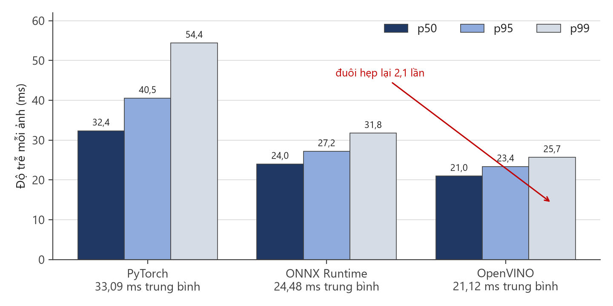

**Hình 5.2.** Độ trễ bộ phát hiện trên ba nền tảng suy luận CPU, tách theo phân vị. Khoảng cách giữa ba nền tảng **giãn ra** khi đi từ p50 sang p99 — đó là dấu hiệu OpenVINO không chỉ nhanh hơn mà còn **ổn định hơn**.

**Độ chính xác sau khi xuất: không suy giảm.** Điều kiện đặt ra ban đầu là phải đo mAP cùng lúc, vì tăng tốc kèm mất độ chính xác là một *đánh đổi* chứ không phải khoản lãi. Đo trên toàn bộ 1.514 ảnh tập kiểm tra, qua **hai đường đo độc lập**: validator Ultralytics cho mAP@0,5 = **0,983** so với 0,9829 của PyTorch, và mAP@0,5:0,95 = 0,781 so với 0,7834; harness riêng của đồ án cho 0,9718 so với 0,9712. Không chỉ số nào giảm quá 0,0024 — nằm trong dao động giữa các lượt chạy. Vậy **1,57× là khoản lãi thật**.

> **Một cái bẫy đã suýt mắc.** So thẳng 0,9718 (harness riêng, OpenVINO) với 0,9829 (validator Ultralytics, PyTorch) sẽ kết luận sai rằng xuất mô hình làm mất 1,1 điểm mAP. Hai vế đi qua **hai đường đo khác nhau** nên chênh lệch là chuyện đương nhiên. Chỉ khi chạy lại chính bản PyTorch qua chính harness riêng (0,9712) mới thấy OpenVINO thực ra nhỉnh hơn. So sánh chỉ có nghĩa khi hai vế cùng đường đo.

Đầu cuối, đổi sang OpenVINO nâng tốc độ khung hình thời gian thực từ **5,257 lên 6,310 FPS (+20,0%)** — xác nhận lập luận Amdahl ở 5.6.2 bằng số đo. Nhóm thực hiện **vẫn giữ PyTorch làm mặc định của bản giao hàng**: NFR-P2 đã đạt mà không cần đổi, còn đổi mô hình mặc định sẽ làm mọi con số độ trễ trong chương này lệch khỏi bản đang giao. Cả `best.onnx` lẫn `best_openvino_model/` đều nằm sẵn trong kho; bật lên chỉ cần đổi một dòng `ALPR_MODEL_PATH` vì tầng nạp mô hình đã hỗ trợ sẵn thư mục OpenVINO. Chi tiết ở [báo cáo 38](../reports/38-runtime-backend-and-nfr-p2.md).

Bốn hướng tấn công khối OCR theo chi phí tăng dần (chi tiết ở Chương 6): **tắt các giai đoạn không cần thiết của đường ống PaddleOCR**; **bật MKL-DNN và chỉnh số luồng CPU**; **xuất mô hình nhận dạng sang ONNX Runtime**; **thay bằng mô hình nhận dạng chuyên cho biển số** huấn luyện trên tập ký tự hẹp — tiềm năng lớn nhất, tốn công nhất.

### 5.6.4. Chế độ webcam (tầng API) và xử lý video (NFR-P2, NFR-P3)

<!-- {{T5.6d}} hieu nang che do webcam va xu ly video — gop vao T5.7 -->

**NFR-P2 đạt: 5,257 FPS** (sàn 3, mục tiêu 5) — vượt cả mục tiêu, không chỉ sàn. Giao diện thời gian thực dùng **hàng đợi một khe**: chỉ một yêu cầu bay tại một thời điểm, khung sinh ra trong lúc chờ bị bỏ thay vì xếp hàng; ở kỷ luật đó thông lượng bị chi phối bởi những lần chậm nhất, nên phân vị đuôi mới là đại lượng quyết định. Đo được p50 = **164,08 ms**, p95 = **204,52 ms** — đuôi chỉ rộng gấp 1,25 lần trung vị. NFR-P3 cũng **đạt**: video 14,25 giây xử lý hết **18,2 giây** (sàn ≤ 95 s, mục tiêu ≤ 47,5 s), tức **0,785×** thời gian thực, `vid_stride = 5`.

**Con số này thay thế một số liệu cũ đã công bố, và lý do phải kể ra.** Một lượt đo trước đó cho **2,379 FPS — trượt sàn**, và quyển từng quy nguyên nhân cho bậc thang thử-lại. Đo lại trên **mã nguồn giống hệt từng byte** (`git diff` trên `ai/` giữa hai thời điểm chỉ trả về một công cụ đo mới thêm), cùng cấu hình, cùng dãy ảnh phát lại, cho 5,257 rồi 5,213 FPS ở hai lần chạy độc lập.

<!-- {{T5.9b}} sau lan do NFR-P2 trong cac dieu kien may khac nhau -->

**Bảng 5.11.** Sáu lần đo NFR-P2 trong các điều kiện máy khác nhau

| Điều kiện | FPS hiệu dụng | p50 | p95 | p95/p50 | Kết luận |
|---|---:|---:|---:|---:|:--:|
| Lượt đo cũ — máy đang tải nặng | 2,379 | 180,05 | **1.247,70** | **6,93** | ❌ |
| Máy rảnh, lần 1 | **5,257** | 164,08 | 204,52 | 1,25 | ✅ |
| Máy rảnh, lần 2 | **5,213** | 165,13 | 199,33 | 1,21 | ✅ |
| Ép tải 6 lõi | 4,367 | 201,76 | 238,97 | 1,18 | 🟡 |
| Ép tải 12 lõi | 4,057 | 215,69 | 268,40 | 1,24 | 🟡 |
| OpenVINO, máy rảnh | **6,310** | 129,60 | 148,50 | 1,15 | ✅ |

Log lần đo cũ cho thấy máy khi đó đang cõng khoảng **560% CPU** của tiến trình khác (Explorer, VS Code, Visual Studio, một bản dựng đang chạy), và harness **đã in cảnh báo** rằng mọi số liệu bên dưới là *bi quan*. Giả thuyết đầu tiên vì thế là tải cạnh tranh. Nhóm thực hiện **kiểm chứng thay vì tin**: dựng tải tổng hợp 6 rồi 12 lõi và đo lại — và **thí nghiệm bác bỏ chính giả thuyết đó**. Tải cạnh tranh nâng *cả* phân bố một cách đều tay, giữ tỉ lệ p95/p50 quanh 1,2; còn lượt đo cũ có trung vị gần như của máy rảnh (180 ms) nhưng đuôi **gấp 6,93 lần trung vị**. Hai chữ ký khác hẳn nhau.

**Quy kết cũ cho bậc thang thử-lại cũng không đứng vững:** log máy chủ lần đó cho thấy bậc thang chỉ nổ **6 lần trên 144 khung**, và với giá trị chậm nhất đo được là 1.484,91 ms thì 6 lần nổ chỉ giải thích khoảng **52 ms** trong khoảng chênh 225 ms của trung bình. Nguyên nhân *chính xác* của đuôi hôm đó **không xác định được** — ứng viên còn lại là tranh chấp đĩa (tiến trình `System` chiếm 136% là thời gian nhân, thường đi kèm quét đĩa) mà tải tổng hợp thuần CPU ở đây không mô phỏng. Đây là **suy đoán có cơ sở, không phải kết luận đã đo**, và được ghi đúng như vậy.

**Con số nên dùng khi nói về biên an toàn là 4,057 FPS** — mức xấu nhất đo được, khi 12 trên 20 luồng bị tiến trình khác chiếm trọn, vẫn **trên sàn 35%**.

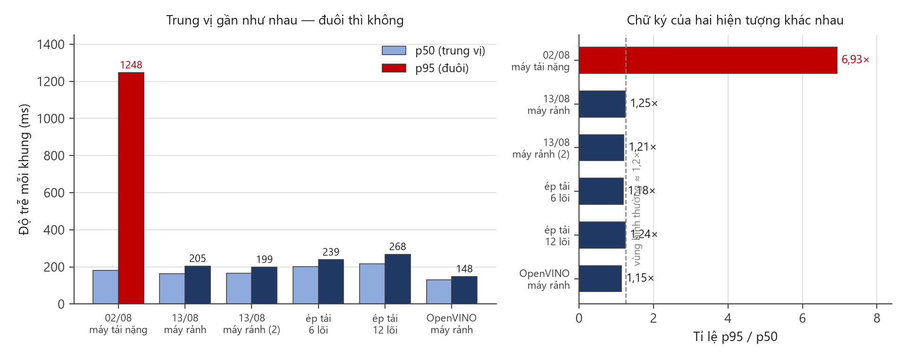

**Hình 5.3.** Sáu lần đo NFR-P2. Bên trái: trung vị của lượt đo cũ nằm ngang với các lần đo trên máy rảnh, nhưng đuôi p95 cao gấp sáu lần. Bên phải: cùng dữ liệu, biểu diễn bằng tỉ lệ p95/p50 — **ép tải tới 12 lõi cũng chỉ đẩy tỉ lệ này lên 1,24× trong khi lượt đo cũ là 6,93×**. Tải cạnh tranh nâng cả phân bố đều tay; thứ xảy ra ở lượt đo cũ thì không.

### 5.6.5. Chịu tải, bộ nhớ và độ tin cậy (NFR-SC1, NFR-P4…P7, NFR-R4)

<!-- {{T5.6e}} chiu tai, bo nho, do tin cay — gop vao T5.7 -->

**Mọi chỉ tiêu hiệu năng _ngoài đường xử lý ảnh_ đều đạt với biên rất rộng.**

**Bảng 5.12.** Các chỉ tiêu hiệu năng ngoài đường xử lý ảnh

| Chỉ tiêu | Đo được | Ngưỡng | Biên |
|---|---:|---:|---:|
| Nạp mô hình | **6,41 s** | ≤ 30 s | 4,7× |
| Khởi động tới khi `/health` sẵn sàng | **8,36 s** | ≤ 30 s | 3,6× |
| Overhead tầng API (p95) | **19,01 ms** | ≤ 100 ms | 5,3× |
| Truy vấn lịch sử 10.000 bản ghi (p95) | **18,71 ms** | ≤ 500 ms | **~27×** |
| Bộ nhớ thường trú — đường ống · máy chủ | **0,759 · 0,806 GB** | ≤ 4 GB | ~5× |
| Yêu cầu đồng thời ổn định | **10** | ≥ 5 | 2× |
| Chạy liên tục 15 phút | **100,0% / 2.028 yêu cầu**, bộ nhớ chỉ tăng 0,094 GB | ≥ 99% | — |
| Khởi động lại cơ sở dữ liệu | **0/9.031 bản ghi mất** | 0 mất | — |

Hai dòng cuối là bằng chứng **không rò rỉ bộ nhớ** và **không mất dữ liệu**; đối chiếu đầy đủ từng mã chỉ tiêu ở Bảng 5.14.

**Trên chính đường xử lý ảnh, chỉ còn NFR-P1 là chưa trọn:** p95 một ảnh **1.143,10 ms** — đạt sàn 1.500 ms nhưng chưa tới mục tiêu 800 ms, đây là **thoái lui có chủ ý** đổi lấy 34 biển đọc thêm (5.5.7). NFR-P2 và NFR-P3 đều đạt. **Kiến trúc phần mềm không còn là vấn đề** — tầng API, tầng dữ liệu, bộ nhớ, độ ổn định đều dư biên. Hai nhánh đi tiếp: nâng _độ chính xác_ OCR biển hai dòng (5.5), và cắt _đuôi độ trễ_ của chế độ ảnh tĩnh — đặt trần thời gian cho bậc thang, hoặc chuyển bộ phát hiện sang OpenVINO, hướng đã đo được **1,57×** ở 5.6.3.

### 5.6.6. Ảnh hưởng của việc bỏ bước phát hiện chữ trong PaddleOCR

Mục 4.5.3 để ngỏ một câu hỏi: chế độ **chỉ nhận dạng** cho model fine-tune thêm **12,46 điểm** A6 và tiết kiệm **~290 ms** mỗi ảnh — vì sao không bật? Vì ngữ liệu chứng minh nó **không có thẩm quyền trả lời câu hỏi đó**.

<!-- {{T5.6f}} bo buoc phat hien chu: hai ngu lieu, hai ket luan nguoc nhau -->

**Bảng 5.13.** Bỏ bước phát hiện chữ — ba ngữ liệu, hai kết luận ngược nhau

| Cấu hình                               | A6 trên 2.801 ảnh **cắt sẵn** | Bộ demo **ảnh toàn cảnh** | Tầng dễ _(n=372)_ | Tầng khó _(n=236)_ | **A7 hiện trường** |    KTC 95%    |
| -------------------------------------- | ----------------------------: | ------------------------: | ----------------: | -----------------: | -----------------: | :-----------: |
| Model gốc, det + rec — _bản bàn giao_ |                        0,7701 |               **17 / 22** |             96,8% |              44,1% |          **56,3%** | [52,0 ; 60,7] |
| Model gốc, chỉ rec                     |                        0,7508 |                   13 / 22 |             96,8% |              19,9% |              37,8% | [34,3 ; 41,3] |
| Model fine-tune, det + rec             |                        0,6762 |                   14 / 22 |             96,8% |              30,9% |              46,3% | [42,2 ; 50,3] |
| Model fine-tune, chỉ rec               |                    **0,8758** |                   15 / 22 |         **94,1%** |              44,5% |              56,0% | [51,7 ; 60,4] |

## 5.7. Đối chiếu toàn bộ chỉ tiêu phi chức năng

Bảng tổng hợp trình bày khi bảo vệ, liệt kê **đầy đủ mọi mã chỉ tiêu phi chức năng** đã đặt ra ở giai đoạn phân tích yêu cầu, không lọc bỏ mã nào — kể cả những mã không đạt.

<!-- {{T5.7}} doi chieu toan bo chi tieu NFR -->

**Bảng 5.14.** Đối chiếu chỉ tiêu phi chức năng, gom theo nhóm

| Nhóm                                                   | Số chỉ tiêu | Kết quả                     | Con số quyết định                                                                                                                                          |
| ------------------------------------------------------ | :---------: | --------------------------- | ---------------------------------------------------------------------------------------------------------------------------------------------------------- |
| **Độ chính xác — phát hiện** (A1, A2, A3)              |      3      | ✅ **đạt cả ba, biên rộng** | mAP@0,5 = **0,9829** (mục tiêu 0,90); Precision · Recall = 0,9837 · 0,9714                                                                                 |
| **Độ chính xác — nhận dạng chuỗi** (A4 – A7)           |      4      | 🟡 **một**, ❌ **hai**, ⬜ **một** | A4 = **0,9483** (vượt sàn 0,92, dưới mục tiêu 0,95); A5 · A6 = **0,6373 · 0,7701**, cả hai dưới sàn; **A7 ⬜ không đo được** (giao thức đo không đại diện — xem 5.9.2)                                           |
| **Đóng góp hậu xử lý** (A6 − A5)                       |      1      | ✅                          | **+13,28 điểm** — 372 sửa đúng, **0 làm hỏng**, trên 2.801 biển                                                                                            |
| **Báo cáo tách bạch** (A8, A9)                         |      2      | 🟡 A8, ⬜ A9                | Chênh lệch bố cục: **2,09 điểm** ở phát hiện so với **23,07 điểm** ở nhận dạng. A9 không đo được — bộ dữ liệu **không có nhãn điều kiện chụp**             |
| **Hiệu năng — độ trễ** (P1, P2, P3)                    |      3      | 🟡 P1, ✅ P2, ✅ P3         | p95 một ảnh **1.143,10 ms** (sàn 1.500, mục tiêu 800; p50 chỉ 405,77 ms). FPS thời gian thực **5,257** — vượt cả mục tiêu 5; xấu nhất đo được dưới tải nặng **4,057**, vẫn trên sàn 3. Video **0,785×** — vượt mục tiêu 0,3× |
| **Hiệu năng — tài nguyên** (P4 – P7)                   |      5      | ✅ **đạt cả năm**           | Nạp mô hình **6,41 s**; overhead API **19,01 ms**; truy vấn 10.000 bản ghi **18,71 ms**; RSS **0,806 GB**                                                  |
| **Độ tin cậy và chịu tải** (R1 – R5, SC1 – SC3)        |      8      | ✅ **đạt cả tám**           | **100,0%** thành công qua 2.028 yêu cầu soak 15 phút; **0/9.031** bản ghi mất sau khởi động lại; **10** yêu cầu đồng thời ổn định                          |
| **Bảo trì, bảo mật, khả dụng, ràng buộc** (M, S, U, C) |     14      | ✅ **đạt cả mười bốn**      | Bao phủ kiểm thử tầng nghiệp vụ **87,7%** (sàn 70%); chạy không cần GPU; M6 đã sạch — `ruff check` trả về **0 cảnh báo** trên toàn kho                     |

## 5.8. Phân tích lỗi

**Bảng 5.15.** Tần suất từng loại lỗi

| Mã  | Loại lỗi                      |       Số ca | Tỉ lệ trong tổng ca sai | Tỉ lệ toàn tập đánh giá | Một dòng | Hai dòng |
| :-: | ----------------------------- | ----------: | ----------------------: | ----------------------: | -------: | -------: |
| E1  | Bỏ sót biển                   |         335 |                       — |                       — |        — |        — |
| E2  | Phát hiện nhầm                |          ➖ |                       — |                       — |        — |        — |
| E3  | Nhầm ký tự                    |         445 |                  63,85% |                  15,89% |       17 |      428 |
| E4  | Thiếu ký tự                   |          73 |                  10,47% |                   2,61% |        0 |       73 |
| E5  | Thừa ký tự                    |          18 |                   2,58% |                   0,64% |        5 |       13 |
| E6  | Sai thứ tự                    |           0 |                   0,00% |                   0,00% |        0 |        0 |
|     | **Tổng số ca sai**            |     **697** |                    100% |                  24,88% |        — |        — |
|     | **Tổng ca đánh giá (mẫu số)** |   **2.801** |                     n/a |                    100% |        — |        — |

## 5.9. Bàn luận

### 5.9.1. Đọc kết quả: đạt gì, không đạt gì

Chương 6 tổng hợp đầy đủ kết quả và hạn chế; mục này chỉ nêu **cách đọc** bộ số liệu vừa trình bày. **Vạch ngăn nằm giữa hai tầng, không rải đều:** bộ phát hiện đạt toàn bộ chỉ tiêu với biên rộng và điểm yếu duy nhất — dải "rất nhỏ" ở 5.4.3 — được phơi bày chứ không giấu; khối hậu xử lý đóng góp **thuần dương, không rủi ro** (+13,28 điểm, 0 ca hồi quy); còn ba chỉ tiêu độ chính xác chuỗi thì không đạt.

### 5.9.2. Hai hạng mục không đo được, và vì sao

Cần phân biệt **"chưa đo vì chưa tới lượt"** với **"không đo được vì thiếu điều kiện"**. Nhóm thứ nhất — so sánh nền tảng suy luận, huấn luyện mô hình đối chứng, phân rã đóng góp theo từng nhóm luật — đều có phương pháp và công cụ sẵn sàng, chỉ thiếu thời gian máy, và được ghi thành hướng phát triển ở mục 6.3. Chỉ hai hạng mục dưới đây là hạn chế thật của công trình.

**NFR-A9 — độ chính xác theo điều kiện ảnh.** Chỉ tiêu này được phát biểu có điều kiện ngay từ giai đoạn phân tích: _báo cáo độ chính xác theo điều kiện chụp, nếu bộ dữ liệu có nhãn phù hợp_. Điều kiện đó không thoả — không bộ dữ liệu nguồn nào gán nhãn ban ngày, ban đêm, chụp nghiêng hay ảnh mờ. Đây là lý do bảng đối chiếu ghi ⬜ _không đo được_ thay vì ❌ _không đạt_: một chỉ tiêu chưa có dữ liệu để đo khác hẳn một chỉ tiêu đã đo và trượt.

**NFR-A7 — giao thức đo bị giới hạn tới mức không dùng được.** Con số 0,5552 đã công bố **không tái lập được**: chạy lại trên cùng ngữ liệu, cùng cấu hình cho **0,0000**. Trên đầu vào nằm ngoài phân bố huấn luyện, một thay đổi nhỏ ở tầng suy luận đủ lật hoàn toàn kết quả — đó là dấu hiệu phép đo **không đo cái nó tưởng đang đo**, nên chỉ tiêu này ghi ⬜ chứ không ghi ❌. Con số đại diện cho năng lực đầu-cuối là **17/22 biển trên ảnh toàn cảnh thật**. Con số 0,5552 đo trên ảnh biển đã cắt sẵn chứ không phải ảnh hiện trường, vì ở thời điểm đo không bộ dữ liệu nào có đồng thời ảnh toàn cảnh và nhãn chuỗi ký tự. Bộ phát hiện được huấn luyện trên ảnh giao thông đầy đủ, nên ảnh mà biển số chiếm gần hết khung nằm ngoài phân bố huấn luyện và tỉ lệ bỏ sót bị đánh giá cao hơn thực tế. Giá trị này vì vậy phải đọc như **cận dưới bi quan**, không phải ước lượng trung tâm.

### 5.9.3. Các mối đe doạ đến tính hợp lệ của kết quả

Nguyên tắc: **nêu mối đe doạ, đánh giá mức nghiêm trọng, nói rõ đã làm gì để giảm thiểu — kể cả khi biện pháp giảm thiểu là "không có".**

**Bảng 5.16.** Tám mối đe doạ đến tính hợp lệ của kết quả

|  #  | Mối đe doạ                                                               |    Mức     | Biện pháp giảm thiểu đã áp dụng                                                                                                                                                                                                                   |
| :-: | ------------------------------------------------------------------------ | :--------: | ------------------------------------------------------------------------------------------------------------------------------------------------------------------------------------------------------------------------------------------------- |
|  1  | **Rò rỉ dữ liệu tồn dư không khử được bằng băm tri giác**                |    Cao     | Nâng ngưỡng gộp 5 → 10 và đo ở nhiều ngưỡng cao hơn ngưỡng gộp. Vẫn còn **791 cặp** ở Hamming 12; rò rỉ _ngữ nghĩa_ (cùng một xe, góc khác) **không ngưỡng phash nào phát hiện được** ⇒ mọi chỉ số ở 5.4 và 5.6 phải coi là **cận trên lạc quan** |
|  2  | **Tập test không xuyên bộ dữ liệu**                                      |    Cao     | **Không có** — cách đúng là giữ lại một nguồn hoàn toàn không dùng để huấn luyện; **chưa thực hiện**                                                                                                                                              |
|  3  | **Mẫu số nhỏ cho các chỉ số OCR** (2.801 / 15.133 ảnh có nhãn chuỗi)     |    Cao     | Công bố mẫu số ở mọi bảng của 5.5; **không** rút kết luận về chênh lệch nhỏ                                                                                                                                                                       |
|  4  | Đo trên **một cấu hình phần cứng duy nhất**                              | Trung bình | Công bố cấu hình đầy đủ ở 5.2; **không ngoại suy** sang CPU, hệ điều hành hay số nhân khác                                                                                                                                                        |
|  5  | **Một lượt huấn luyện duy nhất**, không ước lượng được phương sai        | Trung bình | Cố định `seed = 42` để tái lập; không phát biểu so sánh dựa trên chênh lệch nhỏ                                                                                                                                                                   |
|  6  | Bộ dữ liệu **không đạt tiêu chí Q6** về tỉ lệ đối tượng nhỏ (10,91%)     | Trung bình | Báo cáo mAP **tách theo dải kích thước** ở 5.4.3                                                                                                                                                                                                  |
|  7  | Nhãn bố cục **suy ra từ tỉ lệ khung hình** khi bộ dữ liệu không khai báo | Thấp – TB  | Ưu tiên nhãn lớp tường minh khi có; ghi rõ tỉ lệ ô suy bằng heuristic                                                                                                                                                                             |
|  8  | Ma trận nhầm lẫn ký tự **phụ thuộc thuật toán căn chỉnh chuỗi**          |    Thấp    | Áp ngưỡng tần suất tối thiểu trước khi đưa một cặp vào bảng luật (5.5.4)                                                                                                                                                                          |

## 5.10. Đối chiếu với các công trình đã công bố

Ba khác biệt khiến việc đặt cạnh nhau hai con số độ chính xác của hai công trình là **không hợp lệ về phương pháp**, trừ khi cả ba đều trùng. **Bộ dữ liệu và quốc gia:** biển Trung Quốc chủ yếu một dòng, biển Brazil có bố cục và phông chữ riêng, biển Việt Nam có tỷ lệ biển hai dòng cao. **Định nghĩa chỉ số:** _"accuracy"_ trong các bài được khảo sát khi thì là mức ký tự, khi là mức chuỗi, khi là toàn trình tính cả bước phát hiện. **Điều kiện ảnh:** camera tĩnh ở trạm thu phí khác hẳn ảnh chụp tự do. Bằng chứng mạnh nhất đến từ chính lĩnh vực: Laroca và cộng sự (2022) chạy **12 mô hình OCR trên 9 tập dữ liệu công khai**, độ chính xác trung bình **sụt từ 82,4% xuống 45,2%** khi đánh giá xuyên tập dữ liệu.

> **Hệ quả áp dụng cho toàn mục này.** Mọi con số của công trình khác đều **kèm tên bộ dữ liệu và quốc gia ngay trong bảng**, và không con số nào được dùng để kết luận rằng hệ thống của đồ án tốt hơn hay kém hơn. Chúng chỉ trả lời một câu hỏi hẹp hơn nhiều: _kết quả của đồ án có nằm trong vùng giá trị mà lĩnh vực đã ghi nhận hay không._

<!-- {{T5.10}} doi chieu ket qua voi cac cong trinh da cong bo -->

**Bảng 5.17.** Đối chiếu với các công trình đã công bố — mọi dòng kèm bộ dữ liệu và quốc gia

| Khối      | Công trình                                   | Bộ dữ liệu · quốc gia                        | Chỉ số công bố                   |             Giá trị |
| --------- | -------------------------------------------- | -------------------------------------------- | -------------------------------- | ------------------: |
| Phát hiện | Batra và cộng sự (2022)                      | Google Open Images + biển Ấn Độ, 5.991 ảnh   | mAP@0.5                          |               87,2% |
| Phát hiện | Ba nghiên cứu dùng YOLO11 cho ALPR (mục 3.2) | các tập khác nhau                            | mAP@0.5                          |       90,6% – 99,5% |
| Phát hiện | **Đồ án này**                                | **ngữ liệu Việt Nam hợp nhất, 1.514 ảnh test** | mAP@0.5                          |          **98,29%** |
| Nhận dạng | Xu và cộng sự — RPnet (2018)                 | CCPD · Trung Quốc                            | accuracy end-to-end              |               98,5% |
| Nhận dạng | Laroca và cộng sự (2021)                     | 8 tập từ 5 khu vực                           | recognition rate trung bình      |               96,9% |
| Nhận dạng | Xu và cộng sự — LPTR-AFLNet (2025)           | biển Trung Quốc                              | accuracy **riêng biển hai dòng** |              99,37% |
| Nhận dạng | Tran và Bui (2024)                           | biển Việt Nam, chạy trên Raspberry Pi 4      | accuracy                         |              95,68% |
| Nhận dạng | **Đồ án này**                                | **2.801 biển Việt Nam có nhãn chuỗi**        | **A6 / A7**                      | **75,12% / 55,52%** |


```{=openxml}
<w:p><w:r><w:br w:type="page"/></w:r></w:p>
```

# CHƯƠNG 6. KẾT LUẬN VÀ HƯỚNG PHÁT TRIỂN

## 6.1. Kết quả đạt được

Đồ án đã bàn giao một hệ thống nhận dạng biển số xe Việt Nam hoàn chỉnh, chạy đầu cuối trên máy **không có GPU**: bộ phát hiện tự huấn luyện, khối nhận dạng ký tự, bộ luật hậu xử lý theo quy chuẩn Việt Nam, REST API, giao diện web, cơ sở dữ liệu và đóng gói Docker. Trạng thái xác minh bằng HTTP thật — 10 thao tác trên 9 đường dẫn phản hồi đúng, **1.002/1.002** kiểm thử tự động đạt, bao phủ tầng nghiệp vụ 87,7%.

**Bảng 6.1.** Đối chiếu chỉ tiêu đặt ra ở giai đoạn phân tích yêu cầu với số đo trên `models/best.pt`

|      Mã       | Chỉ tiêu                                                      |            Mục tiêu |                  Đo được |       |
| :-----------: | ------------------------------------------------------------- | ------------------: | -----------------------: | :---: |
|    A1 · A2    | mAP@0,5 · mAP@0,5:0,95 (phát hiện)                            |         0,90 · 0,65 |      **0,9829 · 0,7834** |  ✅   |
|      A3       | Precision · Recall (phát hiện)                                |         0,92 · 0,90 |      **0,9837 · 0,9714** |  ✅   |
|      A4       | 1 − CER (mức ký tự)                                           |                0,95 |               **0,9483** |  🟡   |
|    A5 · A6    | Chuỗi trước · sau hậu xử lý                                   |         0,85 · 0,90 |      **0,6373 · 0,7701** |  ❌   |
|      A7       | Toàn trình từ ảnh gốc                                         |                0,88 |          **không đo được** | ⬜ \* |
|      A8       | Chênh lệch bố cục ở tầng phát hiện (điểm %)                   |                   — |                 **2,09** |   —   |
|      P1       | Độ trễ p95 một ảnh (ms)                                       |               ≤ 800 |             **1.143,10** |  🟡   |
| P4 · P5 · P6  | Nạp mô hình (s) · Overhead API · Truy vấn 10.000 bản ghi (ms) | ≤ 15 · ≤ 50 · ≤ 500 | **6,41 · 19,01 · 18,71** |  ✅   |
| P7 · R4 · SC1 | RSS (GB) · Thành công khi chạy liên tục · Yêu cầu đồng thời   |   ≤ 2 · ≥ 99% · ≥ 5 |    **0,806 · 100% · 10** |  ✅   |

\* A7 phải đọc như **cận dưới bi quan** — đo trên ảnh nằm ngoài phân bố huấn luyện của bộ phát hiện nên tỉ lệ bỏ sót bị đánh giá cao hơn thực tế.

Các chỉ tiêu về phát hiện, thông lượng, độ tin cậy và chịu tải đều đạt; các chỉ tiêu về độ chính xác chuỗi chưa đạt ngưỡng. Riêng NFR-P1 chỉ đạt ngưỡng tối thiểu do bậc thử lại tăng thêm 34 biển nhận dạng đúng nhưng làm tăng độ trễ p95 — một thoái lui có chủ ý.

**Bốn đại lượng đo được mà khảo sát không tìm thấy tương đương trong tài liệu Việt Nam.**

1. **Đóng góp thuần của khối hậu xử lý theo vị trí: +13,28 điểm** — sửa đúng 372 biển, làm hỏng 0 biển trên 2.801 mẫu.
2. **Chênh lệch giữa hai bố cục biển trên dữ liệu Việt Nam thật: 23,07 điểm** ở khối nhận dạng, so với chỉ 2,09 điểm ở khối phát hiện. Rủi ro R-04 vì vậy nằm trọn ở tầng đọc ký tự.
3. **Benchmark ba bộ nhận dạng ký tự trên 2.801 biển, cùng một tầng bao quanh:** PaddleOCR đạt **68,87%**, so với EasyOCR (14,28%) và Tesseract (10,28%). Phép đo bổ sung bằng chứng thực nghiệm trên biển số Việt Nam cho lựa chọn bộ nhận dạng trong cấu hình của đồ án; kết quả này không được suy rộng thành so sánh tuyệt đối giữa các bộ nhận dạng. Thực nghiệm cũng cho một kết quả khác với dự đoán ban đầu: kỹ thuật tách và ghép ngang giúp độ chính xác của PaddleOCR tăng 34,92% nhưng chỉ cải thiện 0,03% đối với Tesseract; do đó, đây là **điều kiện cần, nhưng chưa đủ**.
4. **Bộ nhận màu nền biển đạt 97,89%** trên 1.565 ảnh có nhãn, cung cấp nguồn bằng chứng mà chuỗi ký tự không mang được: phân giải nhập nhằng giữa biển xanh nhà nước và biển trắng cá nhân khi hai chuỗi giống hệt nhau.

Ngoài các con số, đồ án để lại **một quy trình đánh giá có kiểm chứng**: mọi số liệu sinh lại được bằng một lệnh, mọi phép so sánh kèm điều kiện đo, và các kết quả âm — hai lượt tinh chỉnh bộ nhận dạng đều không thắng model gốc ở chế độ vận hành — được ghi lại thay vì bỏ đi.

## 6.2. Hạn chế

**Bảng 6.2.** Mười hạn chế của đồ án

|  #  | Hạn chế                                                             |    Mức     | Hệ quả cần lưu ý                                                                                       |
| :-: | ------------------------------------------------------------------- | :--------: | ------------------------------------------------------------------------------------------------------ |
|  1  | **OCR biển hai dòng còn yếu, kéo độ chính xác toàn trình chưa đạt** |    Cao     | A6 = 0,7701 dưới ngưỡng — điểm nghẽn lớn nhất. A7 không đo được vì giao thức đo không đại diện (5.9.2)                                        |
|  2  | **Bộ dữ liệu lệch nặng về biển trắng**                              |    Cao     | 97,68% mẫu thuộc một lớp, nên kết luận về độ chính xác OCR **chỉ áp cho biển trắng**                   |
|  3  | Rò rỉ dữ liệu tồn dư không khử được bằng băm tri giác               | Trung bình | phash chỉ bắt tương đồng bố cục sáng-tối, không bắt "cùng xe, khác ngày"                               |
|  4  | Tập test không xuyên bộ dữ liệu                                     | Trung bình | mAP 0,9829 **lạc quan hơn** mức gặp khi triển khai với nguồn ảnh mới                                   |
|  5  | Độ trễ chỉ đạt ngưỡng tối thiểu                                     | Trung bình | p95 = 1.143,10 ms; đánh đổi có chủ ý lấy 34 biển đọc thêm                                              |
|  6  | **Hai** yêu cầu mức _Must_ (FR-4.1, FR-2.5) bị đưa ra khỏi phạm vi  | Trung bình | Trang Tổng quan, xuất video đã chú thích và huỷ tác vụ đều đã gỡ — nêu rõ khi bảo vệ |
|  7  | SQLite chỉ cho phép một tiến trình ghi tại một thời điểm            |    Thấp    | Đủ cho quy mô đồ án, chặn ở triển khai đa người dùng                                                   |
|  8  | Xem trực tiếp và xử lý nền tranh chấp CPU với nhau                  |    Thấp    | Chạy video nền làm chậm luồng nhận dạng ảnh                                                            |
|  9  | **NFR-A9 không đo được** — độ chính xác theo điều kiện ảnh           | Trung bình | Không bộ dữ liệu nguồn nào gán nhãn ban ngày, ban đêm, chụp nghiêng hay ảnh mờ. Đây là **thiếu điều kiện quan sát**, không phải phép đo bị bỏ quên: chỉ tiêu ghi ⬜ chứ không ghi ❌ (mục 5.9.2) |
| 10  | **Biển đỏ quân đội và biển ngoại giao không có mẫu đánh giá**        | Trung bình | Bộ dữ liệu không chứa hai loại này, nên hai nhánh phân loại tuy đã cài đặt và chạy đúng trên ảnh demo vẫn **chưa có số liệu định lượng** |

## 6.3. Hướng phát triển

**Bảng 6.3.** Mười một hướng phát triển, xếp theo mức tác động

|  #  | Hướng                                                          | Giải hạn chế | Ghi chú                                                                                            |
| :-: | -------------------------------------------------------------- | :----------: | -------------------------------------------------------------------------------------------------- |
|  1  | **Huấn luyện lại module nhận dạng riêng cho biển số Việt Nam** |      1       | Hướng quan trọng nhất. Hai lượt tinh chỉnh đã thực hiện đều chưa thắng model gốc ở chế độ vận hành |
|  2  | Thu thập dữ liệu cho các loại biển hiếm                        |    2, 10     | Điều kiện để mở rộng kết luận ra ngoài biển trắng, và để hai nhánh biển đỏ · ngoại giao có số liệu đánh giá                                                  |
|  3  | Bổ sung nhãn chuỗi cho toàn tập                                |     1, 2     | Hiện chỉ 2.801/15.133 ảnh có nhãn chuỗi                                                            |
|  4  | Xây dựng tập test xuyên bộ dữ liệu                             |     3, 4     | Giữ nguyên một nguồn hoàn toàn không dùng để huấn luyện                                            |
|  5  | Tăng tốc suy luận: lượng tử hoá OCR, bật OpenVINO cho bộ phát hiện |      5       | **Đã đo** (5.6.3): OpenVINO nhanh **1,57×**, mAP không giảm, đầu cuối **+20%**. Còn lại là lượng tử hoá khối OCR — phần chiếm 64,3% ngân sách |
|  6  | Thí nghiệm cô lập biến độ phân giải · dữ liệu · số epoch       |      4       | Ma trận E1–E3, ước tính ≈ 33 giờ CPU                                                               |
|  7  | **Gán nhãn điều kiện chụp cho tập kiểm tra** (ban ngày · ban đêm · nghiêng · mờ) |      9       | Điều kiện **duy nhất** để NFR-A9 đo được. Rẻ: gán nhãn bốn lớp trên một tập con, không cần huấn luyện lại gì |
|  8  | Bám vết đối tượng qua khung hình cho video (SORT/DeepSORT)     |      —       | Gộp nhiều lần đọc cùng một biển thành một kết quả                                                  |
|  9  | Tách lịch chạy giữa xem trực tiếp và xử lý nền                 |      8       | Hàng đợi ưu tiên hoặc giới hạn luồng cho tác vụ nền                                                |
| 10  | Chuyển sang PostgreSQL nếu triển khai đa người dùng            |      7       | Chỉ cần khi vượt quy mô một tiến trình ghi                                                         |
| 11  | **Khôi phục hai yêu cầu _Must_ đã đưa ra khỏi phạm vi** — trang Tổng quan và xuất video đã chú thích |      6       | Thuần giao diện, không đụng tầng AI. Cả hai endpoint phục vụ chúng (`GET /api/statistics`, worker video) **vẫn chạy và vẫn có kiểm thử**, nên chỉ còn phần hiển thị |

## 6.4. Kết luận chung

Đề tài nhận dạng biển số xe Việt Nam, hỗ trợ biển một dòng, hai dòng và suy luận trên CPU. Hệ thống đạt các chỉ tiêu phát hiện nhưng chưa đạt chỉ tiêu độ chính xác nhận dạng ký tự; hạn chế chủ yếu nằm ở biển hai dòng.

Giá trị của đồ án vì vậy không nằm ở một con số cao nhất. Nó nằm ở ba chỗ: **một hệ thống hoàn chỉnh chạy được trong đúng ràng buộc phần cứng đã tuyên bố**; **bốn đại lượng đo được mà tài liệu trong nước chưa công bố tách bạch**, trong đó có benchmark ba bộ nhận dạng ký tự trên chính ảnh biển số Việt Nam; và **lối trình bày trong đó phần chưa đạt được phản ánh với cùng mức chi tiết như phần đạt** — kể cả khi điều đó có nghĩa là công bố rằng một đóng góp kỹ thuật lõi không độc lập với bộ nhận dạng như đã kỳ vọng.

Hướng ưu tiên là thay module nhận dạng ký tự bằng mô hình huấn luyện riêng cho biển số Việt Nam. Kiến trúc NFR-M5 cho phép thay bộ nhận dạng mà không sửa phần còn lại của hệ thống.


```{=openxml}
<w:p><w:r><w:br w:type="page"/></w:r></w:p>
```

# TÀI LIỆU THAM KHẢO

<!-- Sinh tự động bằng scripts/build_bibliography.py từ docs/references.bib.
     Không sửa tay. Đánh số theo thứ tự xuất hiện lần đầu trong quyển (IEEE);
     chạy lại script sau mỗi lần thêm hoặc đổi chỗ trích dẫn. -->


[1] S. Du, M. Ibrahim, M. Shehata, W. Badawy, "Automatic License Plate Recognition (ALPR): A State-of-the-Art Review," *IEEE Transactions on Circuits and Systems for Video Technology*, q. 23, s. 2, tr. 311–325, 2013. doi: 10.1109/TCSVT.2012.2203741.

[2] R. Laroca, E. V. Cardoso, D. R. Lucio, V. Estevam, D. Menotti, "On the Cross-Dataset Generalization in License Plate Recognition," trong *International Conference on Computer Vision Theory and Applications (VISAPP)*, 2022. [Trực tuyến]. Địa chỉ: <https://arxiv.org/abs/2201.00267> (truy cập ngày 2026-07-19).

[3] Bộ Công an, "Thông tư số 79/2024/TT-BCA quy định về cấp, thu hồi chứng nhận đăng ký xe, biển số xe cơ giới, xe máy chuyên dùng," 2024. [Trực tuyến]. Địa chỉ: <https://chinhphu.vn/?pageid=27160&docid=211945&classid=1&orggroupid=4> (truy cập ngày 2026-07-19).

[4] Bộ Công an, "Thông tư số 13/2025/TT-BCA sửa đổi, bổ sung một số điều của Thông tư số 79/2024/TT-BCA," 2025.

[5] Bộ Công an, "Thông tư số 51/2025/TT-BCA sửa đổi, bổ sung một số điều của Thông tư số 79/2024/TT-BCA đã được sửa đổi tại Thông tư số 13/2025/TT-BCA," 2025. [Trực tuyến]. Địa chỉ: <https://congbao.chinhphu.vn/van-ban/thong-tu-so-51-2025-tt-bca-45356.htm> (truy cập ngày 2026-07-19).

[6] Bộ Công an, "Quy chuẩn kỹ thuật quốc gia về biển số xe QCVN 08:2024/BCA," 2024. [Trực tuyến]. Địa chỉ: <https://mps.gov.vn/chinh-sach-phap-luat/bai-viet/quy-chuan-ky-thuat-quoc-gia-ve-bien-so-xe-d1-t1592> (truy cập ngày 2026-07-19).

[7] Bộ Công an, "Nhận diện màu sắc, seri, ký hiệu biển số xe của cơ quan, tổ chức, cá nhân từ 01/01/2025," Cổng Thông tin điện tử Bộ Công an, 2024. [Trực tuyến]. Địa chỉ: <https://bocongan.gov.vn/chinh-sach-phap-luat/bai-viet/nhan-dien-mau-sac-seri-ky-hieu-bien-so-xe-cua-co-quan-to-chuc-ca-nhan-tu-01012025-d1-t1617> (truy cập ngày 2026-07-19).

[8] Bộ Quốc phòng, "Thông tư 169/2021/TT-BQP quy định về đăng ký, quản lý, sử dụng xe cơ giới, xe máy chuyên dùng trong Bộ Quốc phòng," 2021. [Trực tuyến]. Địa chỉ: <https://luatvietnam.vn/giao-thong/thong-tu-169-2021-tt-bqp-bo-quoc-phong-216143-d1.html> (truy cập ngày 2026-07-19).

[9] G. Jocher, J. Qiu, "Ultralytics YOLO11," Ultralytics, 2024. [Trực tuyến]. Địa chỉ: <https://docs.ultralytics.com/models/yolo11/> (truy cập ngày 2026-07-19).

[10] C. Cui, "PP-OCRv5: A Specialized 5M-Parameter Model Rivaling Billion-Parameter Vision-Language Models on OCR Tasks," *CVPR 2026 / arXiv:2603.24373*, 2026. [Trực tuyến]. Địa chỉ: <https://arxiv.org/html/2603.24373v1> (truy cập ngày 2026-07-19).

[11] Cổng Thông tin điện tử Chính phủ, "Quy định ký hiệu biển số xe ô tô, xe máy tại các địa phương (theo Thông tư 51/2025/TT-BCA)," Xây dựng chính sách, pháp luật — Chinhphu.vn, 2025. [Trực tuyến]. Địa chỉ: <https://xaydungchinhsach.chinhphu.vn/quy-dinh-ky-hieu-bien-so-xe-o-to-xe-may-tai-cac-dia-phuong-119250704073354464.htm> (truy cập ngày 2026-07-19).

[12] "Advanced deep learning techniques for automated license plate recognition," *Scientific Reports*, 2025. [Trực tuyến]. Địa chỉ: <https://pmc.ncbi.nlm.nih.gov/articles/PMC12639091/> (truy cập ngày 2026-07-19).

[13] G. Jocher, A. Chaurasia, J. Qiu, "Ultralytics YOLOv8," Ultralytics, 2023. [Trực tuyến]. Địa chỉ: <https://docs.ultralytics.com/models/yolov8/> (truy cập ngày 2026-07-19).


[14] Ultralytics, "ultralytics/nn/modules/block.py — dinh nghia C2f, C3k, C3k2, C2PSA, PSABlock, Attention," GitHub, 2026. [Trực tuyến]. Địa chỉ: <https://github.com/ultralytics/ultralytics/blob/main/ultralytics/nn/modules/block.py> (truy cập ngày 2026-07-19).


[15] P. Batra và cộng sự, "A Novel Memory and Time-Efficient ALPR System Based on YOLOv5," *Sensors*, q. 22, s. 14, tr. 5283, 2022. doi: 10.3390/s22145283.

[16] "Automatic License Plate Detection System with YOLOv11 Algorithm," *Journal of Applied Informatics and Computing (JAIC)*, 2025. [Trực tuyến]. Địa chỉ: <https://jurnal.polibatam.ac.id/index.php/JAIC/article/view/11484> (truy cập ngày 2026-07-19).

[17] "Vehicle License Plate Number Detection with YOLO11," *Journal of Computer Science and Informatics Engineering (J-Cosine)*, 2025. [Trực tuyến]. Địa chỉ: <https://jcosine.if.unram.ac.id/index.php/jcosine/article/view/656> (truy cập ngày 2026-07-19).


[18] R. Laroca và cộng sự, "ICPR 2026 Competition on Low-Resolution License Plate Recognition," trong *International Conference on Pattern Recognition (ICPR)*, 2026. [Trực tuyến]. Địa chỉ: <https://arxiv.org/abs/2604.22506> (truy cập ngày 2026-07-19).


[19] A. Wang và cộng sự, "YOLOv10: Real-Time End-to-End Object Detection," *arXiv preprint arXiv:2405.14458*, 2024. doi: 10.48550/arXiv.2405.14458.


[20] G. Jocher, J. Qiu, M. Liu, S. Lyu, F. C. Akyon, M. E. Kalfaoglu, "Ultralytics YOLO26," Ultralytics, 2025. [Trực tuyến]. Địa chỉ: <https://docs.ultralytics.com/models/yolo26/> (truy cập ngày 2026-07-19).


[21] PaddlePaddle, "Text Recognition Module — PaddleOCR/PaddleX Documentation," PaddleOCR / PaddleX, 2026. [Trực tuyến]. Địa chỉ: <http://www.paddleocr.ai/main/en/version3.x/module_usage/text_recognition.html> (truy cập ngày 2026-07-19).

[22] Sutikno, A. Sugiharto, R. Kusumaningrum, "Enhanced Automatic License Plate Detection and Recognition using CLAHE and YOLOv11 for Seat Belt Compliance Detection," *Engineering, Technology & Applied Science Research*, q. 15, s. 1, tr. 20271–20278, 2025. doi: 10.48084/etasr.9629.


[23] Ultralytics, "Intel OpenVINO Export — Ultralytics Docs (ma nguon markdown, day du bang benchmark CPU/GPU/NPU)," GitHub / Ultralytics Docs, 2026. [Trực tuyến]. Địa chỉ: <https://raw.githubusercontent.com/ultralytics/ultralytics/main/docs/en/integrations/openvino.md> (truy cập ngày 2026-07-19).

[24] Microsoft ONNX Runtime, "Thread management — ONNX Runtime Performance Tuning (intra/inter op threads, spinning, NUMA)," Microsoft, 2025. [Trực tuyến]. Địa chỉ: <https://onnxruntime.ai/docs/performance/tune-performance/threading.html> (truy cập ngày 2026-07-19).

```{=openxml}
<w:p><w:r><w:br w:type="page"/></w:r></w:p>
```

# PHỤ LỤC

Phụ lục cung cấp các thông tin chi tiết được nhắc tới trong thân đồ án nhưng
không đưa vào thân bài để giữ mạch đọc: quy mô và tổ chức mã nguồn, cấu hình
huấn luyện đầy đủ, xuất xứ và giấy phép của từng bộ dữ liệu, hướng dẫn cài đặt,
kết quả kiểm thử và đặc tả giao diện lập trình.

Mọi số liệu trong phụ lục lấy trực tiếp từ kho mã nguồn và các tệp kết quả đã
được lưu, không có số nào nhập tay.

---

## Phụ lục A. Mã nguồn

### A.1. Quy mô

Số liệu đếm trên kho mã tại thời điểm nộp, không tính thư mục phụ thuộc
(`node_modules`, môi trường ảo), dữ liệu ảnh, trọng số mô hình và các tệp sinh
tự động.

**Bảng A.1.** Quy mô mã nguồn theo thành phần

| Thành phần                                               | Ngôn ngữ               |  Số tệp |    Số dòng |
| -------------------------------------------------------- | ---------------------- | ------: | ---------: |
| `ai/` — tầng trí tuệ nhân tạo                            | Python                 |      31 |     16.949 |
| `scripts/` — công cụ dựng dữ liệu, đo đạc, xuất tài liệu | Python                 |      32 |     17.395 |
| `tests/` — kiểm thử tự động                              | Python                 |      23 |      9.246 |
| `backend/` — dịch vụ web và truy cập dữ liệu             | Python                 |      29 |      9.992 |
| `frontend/` — giao diện người dùng                       | TypeScript / TSX / CSS |      52 |     10.471 |
| `ai/` — cấu hình huấn luyện và bộ dữ liệu                | YAML                   |       3 |        328 |
| `deployment/`, `docker-compose.yml`                      | Dockerfile / YAML      |       5 |        780 |
| **Tổng**                                                 |                        | **178** | **65.805** |

Tỷ trọng đáng chú ý: phần **kiểm thử và công cụ đo đạc** (`tests/` + `scripts/`)
chiếm **26.641 dòng, tức 40,5%** toàn bộ mã nguồn — nhiều hơn cả tầng AI. Đây là
hệ quả trực tiếp của nguyên tắc trình bày đã nêu ở mục 5.1.2: mỗi con số công bố
trong Chương 5 phải sinh ra được bằng một lệnh chạy lại được.

### A.2. Tổ chức thư mục

```
ai/
  inference/      pipeline suy luận — detector, recognizer, hậu xử lý, hai dòng
  evaluation/     đo độ chính xác, hiệu năng, phân tích lỗi, kiểm rò rỉ
  training/       cấu hình và notebook huấn luyện
backend/
  api/            các route FastAPI
  services/       tầng nghiệp vụ — điều phối, không chứa logic AI
  repositories/   truy cập cơ sở dữ liệu
  models/         mô hình dữ liệu SQLAlchemy
  migrations/     Alembic
frontend/
  src/pages/      ba trang: nhận dạng ảnh, nhận dạng video, lịch sử
  src/components/ thành phần dùng chung
  src/api/        tầng gọi API và ánh xạ kiểu dữ liệu
tests/            kiểm thử đơn vị, tích hợp, kiến trúc
scripts/          dựng bộ dữ liệu, đo đạc, dựng quyển và slide
deployment/       Dockerfile, nginx, entrypoint
models/           trọng số đã huấn luyện
docs/             tài liệu, báo cáo, quyển đồ án
```

Ranh giới quan trọng nhất trong cây thư mục: **`ai/` không được import bất cứ
thứ gì từ `backend/`**. Ràng buộc này là NFR-M1 và được canh giữ tự động bởi
`tests/test_architecture.py` — không phải bằng quy ước mà bằng một test sẽ fail
nếu ai đó vi phạm. Lý do và hệ quả trình bày ở mục 4.2.1 và 5.5.1.

---

## Phụ lục B. Siêu tham số huấn luyện

Cấu hình đầy đủ của lượt huấn luyện sinh ra `models/best.pt` — mô hình được dùng
cho mọi số liệu công bố trong Chương 5. Nguồn: `runs/final-640-v3/args.yaml`.

**Bảng B.1.** Siêu tham số huấn luyện YOLO11n

| Nhóm               | Tham số                     |             Giá trị | Ghi chú                                     |
| ------------------ | --------------------------- | ------------------: | ------------------------------------------- |
| Mô hình            | `model`                     |        `yolo11n.pt` | Khởi tạo từ trọng số tiền huấn luyện COCO   |
|                    | Số tham số                  |           2.590.035 | Biến thể nano — do ràng buộc CPU            |
| Dữ liệu            | `data`                      | `yolo_v3/data.yaml` | Phép chia tập v3                                    |
|                    | `imgsz`                     |                 640 | Đúng độ phân giải mà NFR-A1/A2 đặt chỉ tiêu |
|                    | `fraction`                  |                 1,0 | Dùng toàn bộ dữ liệu                        |
| Lịch huấn luyện    | `epochs`                    |                  20 |                                             |
|                    | `patience`                  |                  20 | Dừng sớm không kích hoạt                    |
|                    | `batch`                     |                   8 | Giới hạn bởi RAM và tốc độ CPU              |
|                    | `close_mosaic`              |                  10 | Tắt mosaic trong 10 epoch cuối              |
| Tối ưu hoá         | `optimizer`                 |               AdamW |                                             |
|                    | `lr0` / `lrf`               |        0,001 / 0,01 | Tốc độ học đầu và hệ số cuối                |
|                    | `cos_lr`                    |              `true` | Lịch cosine                                 |
|                    | `momentum`                  |               0,937 |                                             |
|                    | `weight_decay`              |              0,0005 |                                             |
|                    | `warmup_epochs`             |                 3,0 |                                             |
| Trọng số mất mát   | `box` / `cls` / `dfl`       |     8,0 / 0,5 / 1,5 |                                             |
| Tăng cường dữ liệu | `hsv_h` / `hsv_s` / `hsv_v` |   0,015 / 0,7 / 0,4 |                                             |
| Thiết bị           | `device`                    |               `cpu` | Không có GPU CUDA (ràng buộc CON-02)        |

**Giải thích chi tiết hai giá trị.** `batch = 8` không phải lựa chọn tối ưu mà
là giới hạn phần cứng; `epochs = 20` là con số bị ngân sách thời gian CPU quyết
định chứ không phải điểm hội tụ — chi phí và hệ quả của cả hai trình bày ở mục
4.5.1 và 3.6.

Cấu hình tinh chỉnh bộ nhận dạng ký tự (30 epoch, 6.672 mẫu, bộ ký tự 36) trình
bày tại mục 4.5.3 cùng kết quả đo bốn cấu hình. **Bản bàn giao không dùng mô hình
tinh chỉnh** — lý do ở cùng mục.

---

## Phụ lục C. Bộ dữ liệu

### C.1. Nguồn và giấy phép — nhánh phát hiện biển số

**Bảng C.1.** Bảy bộ dữ liệu đã hợp nhất, kèm giấy phép và số ảnh còn lại

| #   | Bộ (slug)                     | Nguồn                                                                      | Giấy phép                            |    Vào gộp |    Còn lại |
| --- | ----------------------------- | -------------------------------------------------------------------------- | ------------------------------------ | ---------: | ---------: |
| 1   | `roboflow_school_fuhih`       | Roboflow `school-fuhih/vietnamese-license-plate-tptd0` v1                  | CC BY 4.0                            |      8.357 |      6.868 |
| 2   | `hf_vn_plates_segment`        | HuggingFace `hoanglvuit/Vietnam_License_Plate_Segment_Datasets`            | ⚠️ chưa xác nhận                     |      4.578 |      4.375 |
| 3   | `roboflow_traffic_camera`     | Roboflow `traffic-camera/vietnam-license-plate-hayn8` v4                   | CC BY 4.0                            |      3.843 |      3.162 |
| 4   | `roboflow_eric_nguyen`        | Roboflow `eric-nguyen-knfxn/vietnam-license-plate-curhr` v1                | CC BY 4.0                            |        840 |        353 |
| 5   | `roboflow_demo_tracking`      | Roboflow `demo-tracking/license-plate-vietnam-car` v2                      | CC BY 4.0                            |        236 |        235 |
| 6   | `roboflow_cuong_ta`           | Roboflow `cuong-ta-ulxex/vietnamese-car-license-plate` v1                  | Public Domain _(người đăng tự khai)_ |      8.254 |        140 |
| 7   | `roboflow_tran_ngoc_xuan_tin` | Roboflow `tran-ngoc-xuan-tin-k15-hcm-dpuid/vietnam-license-plate-h8t3n` v1 | CC BY 4.0                            |      1.005 |          0 |
|     | **Tổng**                      |                                                                            |                                      | **27.113** | **15.133** |

**Ghi công theo giấy phép.** Năm bộ ở trên phát hành theo **CC BY 4.0**, bắt buộc
ghi công tác giả — bảng này chính là phần ghi công đó. Một bộ được người đăng tự
khai **Public Domain**, nhưng đồ án **không khẳng định** đó là Public Domain thật
vì ảnh nguồn có dấu hiệu là ảnh báo chí. Một bộ trên HuggingFace **chưa xác nhận
được giấy phép**; nó đóng góp 28,91% ngữ liệu nên đây là rủi ro pháp lý phải nêu
chứ không phải chi tiết bỏ qua được.

**Bộ thứ bảy còn lại 0 ảnh** sau khử trùng lặp — toàn bộ 1.005 ảnh của nó trùng
với ảnh đã có ở các bộ khác. Con số "hợp nhất từ 7 bộ" vì vậy phải đọc là **6
nguồn nguyên tố**, và điều này được nêu nhất quán ở mục 4.4.2 và 6.3.1.

## Phụ lục D. Cài đặt và chạy hệ thống

Quy trình cài đặt, lệnh chạy bằng Docker Compose, cách chạy trực tiếp không
dùng Docker và danh sách biến môi trường được trình bày đầy đủ ở hai tài liệu
vận hành đi kèm, nên không lặp lại ở đây:

| Nội dung | Tài liệu |
|---|---|
| Yêu cầu hệ thống, cài đặt từng bước, biến môi trường | `docs/manuals/installation-guide.md` |
| Dựng ảnh Docker, kiểm chứng container, bốn lỗi thật đã gặp | `docs/reports/08-deployment-guide.md` |

Kiến trúc triển khai và lý do chọn Docker trình bày ở **mục 4.9**.

## Phụ lục E. Kết quả kiểm thử

### E.1. Tổng hợp

**Bảng E.1.** Kết quả chạy bộ kiểm thử tự động

| Hạng mục                               | Kết quả    |
| -------------------------------------- | ---------- |
| Số test thu thập                       | **1.002**  |
| Đạt                                    | **1.002**  |
| `xfail` _(dự kiến hỏng)_               | 0          |
| Fail                                   | **0**      |
| Skip                                   | 0          |

### E.2. Phân nhóm

| Nhóm               | Kiểm chứng điều gì                                                                 |
| ------------------ | ---------------------------------------------------------------------------------- |
| Kiểm thử đơn vị    | Bộ luật hậu xử lý theo vị trí, phân loại bố cục, chuẩn hoá chuỗi, quy tắc hiển thị |
| Kiểm thử tích hợp  | Toàn bộ 10 endpoint qua HTTP thật, kèm cơ sở dữ liệu thật và migration             |
| Kiểm thử kiến trúc | Ranh giới `ai/` không import `backend/` (NFR-M1) — fail nếu ai đó vi phạm          |
| Kiểm thử hồi quy   | Các ca lỗi đã từng xảy ra, mỗi ca một test để không tái diễn                       |

**Lưu ý về kết quả kiểm thử.** Kết quả 0 thất bại thể hiện hệ thống đã vượt qua các kịch bản kiểm thử tự động được thiết lập, nhưng **không** đồng nghĩa với việc hoàn thành tất cả chỉ tiêu phi chức năng. Ba
chỉ tiêu phi chức năng hiện không đạt (NFR-A5, A6, A7) và một chỉ tiêu chỉ đạt
sàn chứ chưa đạt mục tiêu (NFR-P1) — bảng đối chiếu đầy đủ ở mục 5.7 và phân tích
ở mục 5.9.2.

Báo cáo kiểm thử chi tiết theo từng nhóm: `docs/reports/07-testing-report.md`.

---

## Phụ lục F. Giao diện lập trình và cấu hình triển khai

### F.1. Danh sách endpoint

**Bảng F.1.** Mười endpoint của hệ thống

|  #  | Phương thức | Đường dẫn                     | Chức năng                                                 |
| :-: | ----------- | ----------------------------- | --------------------------------------------------------- |
|  1  | `POST`      | `/api/detect/image`           | Nhận dạng biển số từ một ảnh tĩnh                         |
|  2  | `POST`      | `/api/detect/video`           | Tạo tác vụ nhận dạng trên video, xử lý nền                |
|  3  | `POST`      | `/api/detect/frame`           | Nhận dạng một khung hình — dùng cho chế độ thời gian thực |
|  4  | `GET`       | `/api/jobs/{job_id}`          | Trạng thái và tiến độ của một tác vụ video                |
|  5  | `GET`       | `/api/history`                | Danh sách lịch sử, có tìm kiếm, lọc, phân trang           |
|  6  | `GET`       | `/api/history/{detection_id}` | Chi tiết một lần nhận dạng                                |
|  7  | `GET`       | `/api/history/export`         | Xuất lịch sử theo bộ lọc hiện hành                        |
|  8  | `DELETE`    | `/api/history/{detection_id}` | Xoá một bản ghi                                           |
|  9  | `GET`       | `/api/statistics`             | Số liệu thống kê tổng hợp theo cửa sổ thời gian           |
| 10  | `GET`       | `/health`                     | Trạng thái hệ thống và tình trạng nạp mô hình             |

Đặc tả đầy đủ — kiểu dữ liệu đầu vào, cấu trúc đầu ra, mã trạng thái và các
quyết định thiết kế API — ở mục 4.7.3. Tài liệu OpenAPI do FastAPI **tự sinh**
tại `/docs` và `/openapi.json`, nên nó không bao giờ lệch với mã nguồn.

### F.2. Cấu hình Docker Compose

**Bảng F.2.** Thành phần trong `docker-compose.yml`

| Thành phần         | Loại    | Vai trò                                                       |
| ------------------ | ------- | ------------------------------------------------------------- |
| `backend`          | dịch vụ | FastAPI + uvicorn, chạy đường ống AI trên CPU                  |
| `frontend`         | dịch vụ | nginx:alpine — phục vụ tệp tĩnh và chuyển tiếp yêu cầu sang máy chủ |
| `alpr-net`         | mạng    | Mạng nội bộ giữa hai dịch vụ                                  |
| `alpr-data`        | volume  | Cơ sở dữ liệu SQLite — dữ liệu sống qua lần khởi động lại     |
| `alpr-model-cache` | volume  | Bộ nhớ đệm trọng số PaddleOCR — tránh tải lại mỗi lần dựng    |

Ngoài hai volume có tên ở trên, thư mục `./storage` (ảnh và video đã tải lên) và
`./models` (trọng số bộ phát hiện, gắn **chỉ đọc**) được gắn trực tiếp từ máy chủ.

Bộ ba tệp triển khai: `deployment/docker/Dockerfile.backend` (build hai giai
đoạn), `Dockerfile.frontend` (build rồi phục vụ tĩnh) và `nginx.conf`. Phân tích
từng tệp ở mục 4.9.

---

## Phụ lục H. Đặc tả yêu cầu và thiết kế dữ liệu

Bốn mục dưới đây là **tài liệu tra cứu**, không phải mạch lập luận: đặc tả
từng use case, bảng 34 yêu cầu chức năng, bảng chỉ tiêu phi chức năng, và đặc
tả từng trường của cơ sở dữ liệu. Chương 4 nêu quyết định thiết kế và lý do;
phần liệt kê đầy đủ để ở đây.

---

### H.2. Bảng 34 yêu cầu chức năng

Đồ án đặc tả **34 yêu cầu chức năng** trong **6 nhóm**, mỗi yêu cầu có mã, mức MoSCoW và một tiêu chí chấp nhận kiểm chứng được. Phân bố: FR-1 (ảnh tĩnh) **7 Must**; FR-2 (video) **4 Must + 2 Won't**; FR-3 (thời gian thực, tầng API) **3 Must + 2 Won't**; FR-4 (thống kê – lịch sử – tra cứu) **4 Must + 1 Should + 1 Could + 2 Won't**; FR-5 (quản lý dữ liệu) **2 Should + 2 Could**; FR-6 (hệ thống, vận hành) **2 Must + 2 Should**. Tổng **20 Must, 5 Should, 3 Could, 6 Won't = 34**.

**FR-1:** tiếp nhận, kiểm tra hợp lệ, phát hiện _tất cả_ vùng biển, cắt và nhận dạng, hậu xử lý, lưu kết quả, hiển thị có bounding box. FR-1.5 quy định lưu **cả chuỗi OCR thô lẫn chuỗi đã sửa** — điều kiện cần để đo đóng góp hậu xử lý ở Chương 5 (4.7.2b). **FR-2:** thêm trích khung theo bước nhảy, **gộp trùng** (FR-2.4 — thiếu nó một video 30 giây sinh hàng nghìn bản ghi về cùng vài chiếc xe, phá hỏng thống kê FR-4), kết xuất video gắn nhãn và huỷ tác vụ — hai yêu cầu cuối đưa ra khỏi phạm vi. **FR-3:** theo quyết định thu gọn giao diện, hai yêu cầu thuần giao diện FR-3.1, FR-3.4 chuyển **M → W**; FR-3.2/3.3/3.5 vẫn Must, kiểm chứng ở tầng API. **FR-4:** chỉ số tổng hợp (FR-4.1), biểu đồ theo thời gian (FR-4.2), danh sách phân trang, tìm kiếm khớp một phần, lọc, chi tiết, tải ảnh, sắp xếp; **FR-4.3 → 4.8 không đổi**. **FR-5:** xoá bản ghi kèm tệp, xuất CSV/JSON (CSV phải UTF-8 **có BOM** kẻo Excel hiển thị sai tiếng Việt), dọn tệp mồ côi, xoá hàng loạt. **FR-6:** health check báo trạng thái mô hình và CSDL; log có cấu trúc; thông báo lỗi thân thiện không lộ stack trace; cấu hình qua biến môi trường.

> ### Bốn yêu cầu mức Won't và hai đợt thu gọn phạm vi
>
> Bốn yêu cầu Won't đầu tiên đều **thuần giao diện**, chuyển mức trong cùng ngày qua hai đợt: đợt 1 gỡ trang Webcam (FR-3.1, FR-3.4 **M → W**; năng lực còn ở `POST /api/detect/frame`); đợt 2 gỡ trang Tổng quan (**FR-4.1 M → W**, FR-4.2 S → W; năng lực còn ở `GET /api/statistics` và `GET /health`).
>
> **Lưu ý về phạm vi:** Hai yêu cầu mức _Must_ đã được điều chỉnh ra khỏi phạm vi thực hiện — FR-4.1 và FR-2.5. Phân bố các mức yêu cầu được cập nhật thành **20 Must, 5 Should, 3 Could, 6 Won't**, và được ghi nhận minh bạch tại mục 6.2. Cần lưu ý rằng hai đợt điều chỉnh này chỉ thu gọn **giao diện hiển thị**, không làm mất đi **năng lực xử lý của hệ thống** — các endpoint API vẫn phục vụ bình thường, nằm trong tài liệu OpenAPI và được kiểm thử tự động đầy đủ (`tests/integration/test_api_statistics.py`, `test_api_health.py`). Đánh đổi đo được: việc loại bỏ `recharts` giúp dung lượng gói tải về của giao diện giảm từ ~730 KB xuống **328,8 KB** (−55%).

**Ma trận truy vết:** mỗi nhóm truy vết tới giai đoạn cài đặt và hình thức kiểm chứng (FR-1: unit + integration; FR-2: integration + performance; FR-3: performance ở tầng API; FR-4: integration + UI test cho FR-4.3→4.8; FR-5: unit; FR-6: smoke + stress). Kết quả ở Chương 5.

---

### H.3. Bảng chỉ tiêu phi chức năng

Bảy nhóm: hiệu năng (NFR-P), độ chính xác (NFR-A), tin cậy (NFR-R), khả dụng (NFR-U), bảo trì (NFR-M), bảo mật (NFR-S), tương thích – triển khai (NFR-C), mở rộng (NFR-SC).

#### a) Nguyên tắc nền tảng: mọi chỉ tiêu hiệu năng đều là chỉ tiêu CPU

> **Toàn bộ chỉ tiêu hiệu năng của đồ án là chỉ tiêu đo trên CPU.**

Máy thực hiện chạy Windows 11, Python 3.13, **không có GPU CUDA** (Intel UHD 770 tích hợp, PyTorch không dùng được để tăng tốc). Huấn luyện trên GPU miễn phí Colab/Kaggle, nhưng **suy luận và buổi bảo vệ chạy trên CPU máy cá nhân**. Đây là **ràng buộc thiết kế**, không phải hạn chế tạm thời, vì bốn lẽ: nó cố định trong toàn bộ vòng đời và tại chính buổi bảo vệ; nó đổi _bậc độ lớn_ của độ trễ (ở 20 ms/khung, video đồng bộ và webcam xử lý mọi khung là hợp lý — ở mốc thực tế 400 ms cả hai bất khả thi, trực tiếp sinh ra hai quyết định kiến trúc: video bất đồng bộ AD-02 và webcam bỏ khung hàng đợi một khe); nó chi phối chọn biến thể mô hình (n/s/m), biến thể OCR (mobile/server), kích thước ảnh và **nền tảng suy luận** — benchmark chính thức trên CPU i7-13700H cho thấy YOLOv8n qua ONNX Runtime nhanh hơn PyTorch khoảng **3,73 lần** (104,61 → 28,02 ms) [23]<!-- ultralytics_2026_openvinoexport -->, lợi ích lớn nhất đúng ở phân khúc mô hình nhỏ [24]<!-- onnxruntime_2025_threading -->; và nó buộc phương pháp công bố chặt hơn — quy tắc CON-06: **mọi số liệu hiệu năng phải kèm model CPU, số luồng, kích thước ảnh, nền tảng suy luận và cỡ mẫu đo**. Các chỉ tiêu độ trễ vì vậy "rộng rãi" hơn văn liệu quốc tế đo trên GPU — đó là trung thực về điều kiện đo, không phải dễ dãi.

> **Cảnh báo trích dẫn.** Bảng benchmark nguồn có cột mAP nhưng đo trên tập `coco8` chỉ **8 ảnh**, không có ý nghĩa thống kê; nhóm thực hiện chỉ dùng cột thời gian và cố ý lược bỏ cột độ chính xác.

#### b) Chỉ tiêu định lượng nhóm hiệu năng và nhóm độ chính xác

<!-- {{T4.1}} chi tieu phi chuc nang dinh luong NFR-P va NFR-A -->

**Bảng 4.1.** Chỉ tiêu phi chức năng định lượng: hiệu năng (NFR-P) và độ chính xác (NFR-A)

| Mã         | Chỉ tiêu                                                  | Mục tiêu              | Ngưỡng tối thiểu |
| ---------- | --------------------------------------------------------- | --------------------- | ---------------- |
| **NFR-P1** | Độ trễ toàn trình một ảnh (p95)                           | ≤ 800 ms              | ≤ 1500 ms        |
| **NFR-P2** | Tốc độ khung hình thời gian thực (webcam — đo ở tầng API) | ≥ 5 FPS hiệu dụng     | ≥ 3 FPS          |
| **NFR-P3** | Tốc độ xử lý video                                        | ≥ 0,3× thời gian thực | ≥ 0,15×          |
| **NFR-P4** | Thời gian nạp mô hình khi khởi động                       | ≤ 15 giây             | ≤ 30 giây        |
| **NFR-P5** | Overhead của tầng API (không tính suy luận)               | ≤ 50 ms               | ≤ 100 ms         |
| **NFR-P6** | Thời gian truy vấn lịch sử (10.000 bản ghi)               | ≤ 500 ms              | ≤ 1000 ms        |
| **NFR-P7** | Bộ nhớ thường trú của máy chủ                             | ≤ 2 GB                | ≤ 4 GB           |
| **NFR-A1** | mAP@0.5 của bộ phát hiện                                  | ≥ 0,90                | ≥ 0,85           |
| **NFR-A2** | mAP@0.5:0.95 của bộ phát hiện                             | ≥ 0,65                | ≥ 0,55           |
| **NFR-A3** | Precision / Recall phát hiện                              | ≥ 0,92 / ≥ 0,90       | ≥ 0,88 / ≥ 0,85  |
| **NFR-A4** | Độ chính xác OCR mức ký tự (1 − CER)                      | ≥ 0,95                | ≥ 0,92           |
| **NFR-A5** | Độ chính xác biển đầy đủ **trước** hậu xử lý              | ≥ 0,85                | ≥ 0,80           |
| **NFR-A6** | Độ chính xác biển đầy đủ **sau** hậu xử lý                | ≥ 0,90                | ≥ 0,85           |
| **NFR-A7** | Độ chính xác toàn trình (ảnh vào → biển đúng)             | ≥ 0,88                | ≥ 0,82           |

**Phương pháp đo NFR-P:** P1 trên 100 ảnh test, báo p50/p95/p99; P2 đo liên tục 60 giây; P3 bằng video 60 giây phải xong trong ≤ 200 giây; P4 từ khởi động đến khi `/health` sẵn sàng; P5 là hiệu tổng thời gian request trừ thời gian đường ống; P6 có phân trang và bộ lọc trên 10.000 bản ghi; P7 theo dõi RSS khi chạy tải liên tục.

NFR-P1 xuất phát từ **phân rã ngân sách độ trễ**: giải mã ~50 ms; phát hiện @640 px ~150 ms; cắt ~30 ms; OCR mỗi biển ~120 ms; hậu xử lý < 5 ms; ghi CSDL ~50 ms — **tổng ~405 ms cho ảnh một biển**; ngân sách 800 ms để dự phòng ảnh nhiều biển và biến động tải. Đây là **ước lượng thiết kế, không phải kết quả đo** (số đo ở Chương 5). Ngân sách lập cho nền tảng suy luận mặc định đã chốt ở mục 3.4 là **ONNX Runtime** — điểm đã đổi so với AD-05 sơ bộ. Nếu vượt ngưỡng, thứ tự giảm tải định trước: (1) INT8 OpenVINO; (2) giảm ảnh xuống 480 px; (3) biến thể OCR nhẹ hơn — chỉ hạ chỉ tiêu **sau khi** thử hết ba phương án.

Cặp NFR-A5/A6 đặt **tách bạch** có chủ đích: hiệu số giữa chúng là đóng góp định lượng của khối hậu xử lý — đo được nhờ quyết định lưu cả chuỗi thô lẫn chuỗi sửa ở tầng dữ liệu (4.7.2b). Bổ sung: **NFR-A8** — báo cáo độ chính xác **tách riêng biển một dòng và hai dòng**, căn cứ số liệu 94,3% / 45,7% **đo trên bộ RodoSol-ALPR (Brazil)** đã dẫn ở 4.1.1, vì một con số tổng thể sẽ che giấu đúng chế độ thất bại cần phân tích; **NFR-A9** — báo cáo theo điều kiện ảnh nếu bộ dữ liệu có nhãn phù hợp.

#### c) Các nhóm yêu cầu phi chức năng còn lại

**NFR-R:** không sập với đầu vào hỏng/độc hại (100% lỗi bị bắt); ảnh không biển trả rỗng hợp lệ HTTP 200; video thất bại không để lại rác; tỉ lệ thành công chạy liên tục một giờ ≥ 99%; CSDL sống sót khởi động lại. **NFR-U:** lượt nhận dạng đầu tiên ≤ 3 nhấp chuột, không cần tài liệu; thao tác > 500 ms có phản hồi trực quan; thông báo lỗi tiếng Việt nêu nguyên nhân và cách khắc phục; dùng được từ 1366×768; tương phản WCAG AA ≥ 4,5:1. **NFR-M:** mã AI tách hoàn toàn khỏi mã API (M1); bao phủ test tầng nghiệp vụ ≥ 70% (M2); type hint + docstring (M3); không hard-code đường dẫn (M4); thay bộ OCR không sửa tầng API (M5); lint tự động (M6) — M1 và M5 **là yêu cầu kiến trúc**, lý do tồn tại của tầng AI độc lập (4.2). **NFR-S:** kiểm tra magic bytes; chống path traversal bằng tên tệp UUID; giới hạn kích thước phía máy chủ; CORS không ký tự đại diện; không log dữ liệu nhạy cảm; truy vấn tham số hoá qua ORM. **NFR-C:** chạy Windows/Linux/macOS qua Docker một lệnh; **không cần GPU là chế độ mặc định**; Chrome/Edge/Firefox; cài từ máy sạch ≤ 15 phút. **NFR-SC:** ổn định ≥ 5 yêu cầu đồng thời; không suy giảm ở 100.000 bản ghi; video nền không chặn yêu cầu khác.

> **Giới hạn đã biết cần công bố.** SQLite chỉ cho **một tiến trình ghi tại một thời điểm** — chấp nhận được ở quy mô đồ án, nhưng phải nêu trong phần Hạn chế kèm hướng khắc phục (PostgreSQL) nếu triển khai thực tế.

---

---

## Phụ lục O. Tệp cấu hình gốc, báo cáo đo và mã nguồn

Phụ lục này giữ **hiện vật thô** — thứ cần để tái lập chứ không cần để đọc hiểu.
Phụ lục B trình bày siêu tham số dưới dạng bảng đã biên tập. Tệp tham số nguyên
văn do thư viện sinh ra nằm trong kho mã tại `runs/`, vì một bảng biên tập lại
không thay được tệp gốc khi có người muốn chạy lại đúng lượt huấn luyện ấy.

---

### O.2. Danh mục báo cáo đo dạng JSON

Toàn bộ số liệu công bố trong báo cáo được tổng hợp từ các tệp dữ liệu kiểm thử nằm tại thư mục `docs/reports/`. Danh mục **không chép nguyên văn nội dung tệp** để tránh làm tăng dung lượng tài liệu không cần thiết. Thay vào đó, mỗi dòng trình bày rõ **mục đích kiểm chứng của tệp** và **mục tham chiếu tương ứng**, đảm bảo mọi số liệu đều có thể truy xuất nguồn gốc minh bạch.

**Bảng O.1.** Báo cáo đo dạng JSON và mục sử dụng

| Tệp trong `docs/reports/`          | Mục đích kiểm chứng / Nội dung đo đạc                                           |  Dùng ở mục  |
| ---------------------------------- | ------------------------------------------------------------------------------- | :----------: |
| `03-evaluation-ch5-best-test.json` | mAP, Precision, Recall của `best.pt` trên tập test v3                           |    5.4.1     |
| `07-leak-check-t10.json`           | Số cặp ảnh gần trùng train↔test theo từng ngưỡng Hamming                        |    5.3.2     |
| `17-plate-type-audit.json`         | Phân bố màu nền của 2.801 mẫu có nhãn chuỗi — căn cứ cảnh báo 97,68% biển trắng |   5.3, 6.2   |
| `04-ocr-accuracy.json`             | A4–A7 lượt đo cơ sở                                                             |     5.5      |
| `16-ocr-accuracy-rescued.json`     | A4–A7 sau khi thêm bước phục hồi dòng trên                                           |    5.5.6     |
| `28-ocr-accuracy-finetuned.json`   | A4–A7 của bộ nhận dạng đã tinh chỉnh                                            |    4.5.3     |
| `29-reconly-ablation.json`         | Bốn cấu hình det+rec ↔ chỉ nhận dạng, hai model                                       | 4.5.3, 5.6.6 |
| `15-two-line-ab.json`              | A/B ghép rồi đọc ↔ đọc từng nửa, 200 biển hai dòng                              |    5.5.6     |
| `15-two-line-fallback-700.json`    | A/B bước phục hồi dòng trên, mẫu 700 biển                                            |    5.5.6     |
| `15-two-line-fallback.json`        | A/B bước phục hồi dòng trên, mẫu 200 biển                                            |    5.5.6     |
| `15-two-line-rescue-ladder.json`   | Chi phí và lợi ích từng bậc của bậc thang thử lại                               |    5.5.7     |
| `15-fragment-height-ab.json`       | Ngưỡng lọc mảnh văn bản theo hình học                                           |    4.6.3     |
| `19-color-accuracy.json`           | Độ chính xác bộ nhận màu nền trên 1.565 ảnh ngoài hiệu chỉnh                    |    4.6.7     |
| `07-benchmark-p1-resolved.json`    | Độ trễ đầu cuối p50/p95 và phân rã theo bước                                    | 5.6.1, 5.6.2 |
| `07-api-overhead.json`             | Overhead của tầng API so với gọi đường ống trực tiếp                             |    5.6.5     |
| `07-stress-load.json`              | Chịu tải đồng thời và tỉ lệ thành công khi chạy liên tục                        |    5.6.5     |
| `07-stress-db.json`                | Thời gian truy vấn lịch sử trên 10.000 bản ghi                                  |    5.6.5     |
| `03-cpu-benchmark.json`            | So sánh PyTorch ↔ ONNX Runtime ↔ OpenVINO trên CPU                              |    5.6.3     |

Thư mục còn **23 tệp JSON khác** thuộc các lượt đo trung gian đã bị lượt sau
thay thế; chúng được giữ lại trong kho để đối chiếu lịch sử chứ không được trích
dẫn trong quyển. Nguyên tắc áp dụng xuyên suốt: **một số liệu chỉ được đưa vào**
**quyển khi tệp sinh ra nó còn trong kho và chạy lại được.**

---


```{=openxml}
<w:p><w:r><w:br w:type="page"/></w:r></w:p>
```

