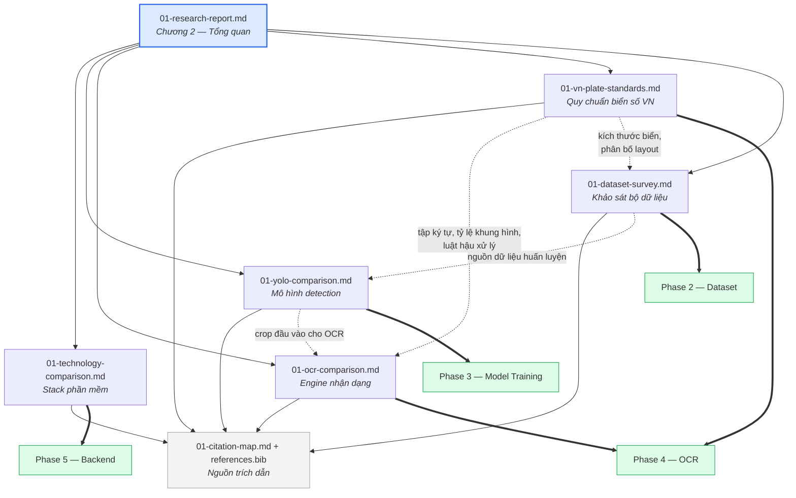

# Phase 1 — Research · Chỉ mục tài liệu

**Thuộc:** Phase 1 (*Research*) theo `CLAUDE.md` · **Ngày lập:** 19/07/2026
**Trạng thái:** ✅ Hoàn thành — đề nghị chốt **M1**

---

## 0. Tài liệu này dùng để làm gì

Phase 1 sinh ra **7 tài liệu, 5.555 dòng**. Không ai đọc hết cả bảy để tìm một con số. Tài liệu này là **cửa vào duy nhất** của Phase 1, trả lời bốn câu hỏi:

1. Task nào trong `CLAUDE.md` được hoàn thành ở file nào? → [Mục 1](#1-ánh-xạ-task-claudemd--tài-liệu)
2. Bảng so sánh nào nằm ở đâu? → [Mục 2](#2-danh-mục-bảng-so-sánh)
3. Phase 1 kết luận gì, và căn cứ ở đâu? → [Mục 3](#3-kết-luận-và-khuyến-nghị-chính)
4. Việc gì chưa xong, ai gánh? → [Mục 4](#4-việc-còn-treo-chuyển-sang-phase-sau)

---

## 1. Ánh xạ task CLAUDE.md → tài liệu

`CLAUDE.md` quy định Phase 1 gồm **6 task** và **3 deliverable**. Bảng dưới ánh xạ sang các file thực tế trong `docs/reports/`.

### 1.1. Sáu task

| # | Task (CLAUDE.md) | Tài liệu phụ trách | Mục cụ thể | Trạng thái |
|:-:|---|---|---|:--:|
| 1 | **Literature Review** | [01-research-report.md](01-research-report.md) | 2.2 (tổng quan bài toán) · 2.3 (lịch sử) · 2.4 (phân loại hướng tiếp cận) · 2.6 (bộ dữ liệu chuẩn) · 2.9 (chỉ số đánh giá) · 2.10 (thách thức & xu hướng) | ✅ |
| 2 | **Related Works** | [01-research-report.md](01-research-report.md) | 2.5 (công trình tiêu biểu quốc tế) · 2.7 (nghiên cứu biển số Việt Nam) · 2.11 (định vị đồ án) | ✅ |
| | | [01-dataset-survey.md](01-dataset-survey.md) | 2, 3, 4 — khảo sát bộ dữ liệu, phần "related works" ở tầng dữ liệu | ✅ |
| 3 | **Technology Comparison** | [01-technology-comparison.md](01-technology-comparison.md) | Toàn bộ — backend, ORM, CSDL, frontend, build tool, CSS, framework học sâu, runtime suy luận | ✅ |
| 4 | **YOLO Comparison** | [01-yolo-comparison.md](01-yolo-comparison.md) | Toàn bộ — YOLOv8 → YOLO26, benchmark, biến thể, giấy phép AGPL | ✅ |
| 5 | **OCR Comparison** | [01-ocr-comparison.md](01-ocr-comparison.md) | Toàn bộ — 9 engine, chuyên sâu biển 2 dòng, đánh giá lại PaddleOCR | ✅ |
| 6 | **Vietnamese License Plate Standards** | [01-vn-plate-standards.md](01-vn-plate-standards.md) | Toàn bộ — căn cứ pháp lý, cấu trúc biển, mã tỉnh, tập ký tự, regex, luật sửa lỗi OCR | ✅ |

> **Vì sao task 2 trải trên hai file.** *Related Works* của bài toán ALPR có hai tầng: tầng **phương pháp** (mô hình, kiến trúc) và tầng **dữ liệu** (bộ dữ liệu công khai nào đã tồn tại). Gộp cả hai vào một chương làm chương tổng quan phình quá 1.500 dòng và trộn hai mạch lập luận khác nhau. Tầng dữ liệu được tách riêng vì nó còn là **đầu vào trực tiếp của Phase 2**.

### 1.2. Ba deliverable

| Deliverable (CLAUDE.md) | Sản phẩm thực tế | Ghi chú |
|---|---|---|
| **Research Report** | [01-research-report.md](01-research-report.md) — 825 dòng | Viết sẵn theo cấu trúc **Chương 2** của quyển đồ án, dùng lại trực tiếp ở Phase 9 |
| **References** | [`docs/references.bib`](../references.bib) — **232 entry** BibTeX [01-citation-map.md](01-citation-map.md) — bản đồ ánh xạ | 211 entry đã được trích dẫn, 21 entry thuộc nhóm *further reading*. Bản đồ trích dẫn giữ **cả hai** dạng: URL nội tuyến (đọc được trên GitHub) và khóa `\cite{}` (dùng ở Phase 9) |
| **Comparison Tables** | **76 bảng so sánh** trên tổng số 148 bảng dữ liệu | Danh mục đầy đủ ở [Mục 2](#2-danh-mục-bảng-so-sánh) |

### 1.3. Sơ đồ quan hệ giữa các tài liệu

---

## 2. Danh mục bảng so sánh

Deliverable **Comparison Tables** của `CLAUDE.md`. Sáu báo cáo chứa **148 bảng dữ liệu**, trong đó **76 bảng là bảng so sánh / đối chiếu trực tiếp** — liệt kê đầy đủ dưới đây. Các bảng còn lại là bảng liệt kê, bảng hằng số, bảng tham chiếu nguồn và bảng ghi chú kiểm chứng.

Ký hiệu ⭐ = bảng cốt lõi, cần đọc trước khi bảo vệ.

### 2.1. `01-research-report.md` — 11 bảng

| Mục | Bảng | Nội dung so sánh |
|:--:|---|---|
| 2.4.2 | Segmentation-based ↔ segmentation-free | Hai nhánh xử lý ký tự, công trình đại diện |
| ⭐ 2.5.1 | Tổng hợp công trình tiêu biểu | 16 công trình quốc tế: phương pháp, dataset, kết quả |
| 2.6.1 | Bộ dữ liệu chuẩn quốc tế | Quy mô, vùng lãnh thổ, giấy phép |
| 2.6.2 | Phân bố subset CCPD | Quy mô từng subset (bản ECCV 2018) |
| ⭐ 2.7.1 | Dòng chảy nghiên cứu trong nước | 6+ nhóm tác giả Việt Nam, hội nghị, kết quả |
| 2.7.3 | Bộ dữ liệu biển số Việt Nam công khai | Quy mô, loại nhãn, giấy phép |
| 2.7.5 | Hệ sinh thái mã nguồn mở Việt Nam | Repository, số sao, giấy phép |
| 2.7.6 | Giải pháp thương mại | Con số công bố kèm cảnh báo kiểm chứng |
| ⭐ 2.8.3a | **Kích thước biển & tỷ lệ khung hình** | 520×110 / 330×165 / 190×140 mm theo QCVN 08:2024/BCA |
| ⭐ 2.8.3b | **Tập ký tự seri** | 20 chữ vị trí 1 · 20 chữ vị trí 2 (có `R`) · 5 chữ loại trừ · charset OCR |
| 2.8.4 | Mốc thay đổi định dạng biển số | Timeline các thông tư và trạng thái hiệu lực |

### 2.2. `01-technology-comparison.md` — 11 bảng

| Mục | Bảng | Nội dung so sánh |
|:--:|---|---|
| 1.3 | Bộ tiêu chí đánh giá | 5 tiêu chí kèm trọng số |
| 2.1 | FastAPI ↔ Django ↔ Flask | Khác biệt kiến trúc gốc |
| 2.2b | Tự sinh OpenAPI | Mức hỗ trợ theo framework |
| 2.2d | Độ phù hợp cho API phục vụ AI | 3 framework × các yếu tố |
| 3.2 | SQLAlchemy 2.0 ↔ Tortoise ↔ Peewee | ORM và migration |
| 4.2 | SQLite ↔ PostgreSQL ↔ MySQL | Hệ quản trị CSDL |
| 5.1 | React ↔ Vue ↔ Angular ↔ Svelte | Frontend framework |
| 7.1 | Tailwind ↔ CSS Modules ↔ styled-components ↔ MUI | Bốn triết lý CSS |
| 8.2 | PyTorch ↔ TensorFlow | Framework học sâu, kèm cảnh báo chất lượng số liệu |
| ⭐ 9.2 | PyTorch `.pt` ↔ ONNX Runtime ↔ OpenVINO | Runtime suy luận trên CPU |
| ⭐ 10 | **Bảng tổng hợp quyết định** | Mọi hạng mục: lựa chọn · lý do · phương án thay thế · đánh đổi |

### 2.3. `01-yolo-comparison.md` — 23 bảng

| Mục | Bảng | Nội dung so sánh |
|:--:|---|---|
| 1.2 | One-stage ↔ two-stage | Hai họ phương pháp detection |
| ⭐ 2.2 | Lịch sử phát triển YOLO | Phiên bản, đơn vị, nơi công bố, giấy phép |
| ⭐ 3.8 | Khác biệt kiến trúc | Backbone, attention, head, NMS theo phiên bản |
| 4.2 | Benchmark YOLOv8 | CPU ONNX + **A100** TensorRT |
| 4.3 | Benchmark YOLOv9 | **Không có cột tốc độ nào** |
| 4.4 | Benchmark YOLOv10 | **T4** TensorRT FP16, không có CPU |
| ⭐ 4.5 | Benchmark YOLO11 | CPU ONNX + **T4** — bộ số liệu đầy đủ nhất |
| 4.6a | Benchmark YOLO12 | Cột CPU để trống |
| 4.6b | Benchmark YOLOv13 | Cột CPU để trống |
| 4.7 | Benchmark YOLO26 | CPU ONNX + **T4** TensorRT10 |
| ⭐ 4.8 | Ma trận sẵn có số liệu | Phiên bản nào có/không có tốc độ CPU chính thức |
| ⭐ 4.9 | **So sánh chéo nhóm nano** | Chỉ giữ các cột đối chiếu được — bảng chốt lựa chọn |
| 4.10 | Phát biểu so sánh chính thức | Đối chiếu tuyên bố marketing với bảng số |
| ⭐ 5.2 | Ba biến thể ứng viên | YOLO11n ↔ YOLO26n ↔ ứng viên thứ ba |
| ⭐ 5.3 | Định dạng xuất mô hình | PyTorch ↔ TorchScript ↔ ONNX ↔ OpenVINO |
| 5.4 | Lượng tử hóa INT8 | FP32 ↔ INT8: tăng tốc đổi lấy mất mAP |
| 6.2 | Tỷ lệ khung hình biển số | AR theo loại biển |
| 6.3 | Anchor-based ↔ anchor-free | Ảnh hưởng tới bài toán biển số |
| 6.5 | Tổng hợp mức phù hợp | Đặc thù bài toán ↔ cơ chế đối ứng |
| ⭐ 7.1 | Giấy phép từng phiên bản YOLO | AGPL-3.0 và hệ quả |
| 8.3 | Kết quả nghiên cứu ALPR dùng YOLO | Tổng hợp công trình đã công bố |
| 8.4 | So sánh nhiều thế hệ YOLO trên tập lớn | Accuracy/Precision/Recall/F1 |
| ⭐ 9.3 | **YOLO11n ↔ YOLO26n** | Bảng đối chứng, cơ sở cho khuyến nghị Phase 3 |

### 2.4. `01-ocr-comparison.md` — 13 bảng

| Mục | Bảng | Nội dung so sánh |
|:--:|---|---|
| 1.2 | OCR tài liệu ↔ OCR biển số | Vì sao không thể suy từ benchmark tài liệu |
| 2.1 | Các model PaddleOCR | PP-OCRv4 / v5 / v6: thời gian CPU, kích thước, độ chính xác |
| 2.5 | Các model docTR | Tham số, FUNSD, CORD, tốc độ (bs=64) |
| 2.8 | RapidOCR / OnnxTR runtime | Mức tăng tốc theo runtime |
| ⭐ 3.1 | **Bảng so sánh chính 7 engine** | PaddleOCR · EasyOCR · Tesseract · TrOCR · docTR · MMOCR · fast-plate-ocr |
| ⭐ 4.1.1a | **OpenALPR: 1 dòng ↔ 2 dòng** | 94,3% ↔ 45,7% — bằng chứng định lượng của rủi ro R-04 |
| 4.1.1b | Ảnh hưởng kích thước đầu vào | Biển 1 dòng ↔ 2 dòng ↔ tổng thể |
| 4.1.4 | PaddleOCR pretrained ↔ fine-tuned | Pretrained gần như vô dụng trên biển số |
| 4.3.1 | Kỹ thuật rectify | Perspective transform ↔ STN ↔ khác |
| ⭐ 4.4 | **Đánh giá từng engine về biển 2 dòng** | Cơ chế đa dòng và xếp loại |
| 5.3 | Những gì PaddleOCR **thua** | Điểm yếu và engine nào tốt hơn |
| ⭐ 6.1 | **Shortlist cuối cùng** | Xếp hạng 9 engine kèm vai trò trong Phase 4 |
| 6.5 | Giấy phép các gói | Phiên bản + giấy phép, xác minh từng trang PyPI riêng |

### 2.5. `01-vn-plate-standards.md` — 9 bảng

| Mục | Bảng | Nội dung so sánh |
|:--:|---|---|
| ⭐ 1.2 | **Chuỗi văn bản pháp lý hiện hành** | TT 79/2024 · TT 13/2025 · TT 51/2025 · QCVN 08:2024/BCA + trạng thái TT 24/2023 |
| 3.2 | Hai kiểu biển xe máy song song | Seri 2 chữ cái (mới) ↔ 1 chữ + 1 số (cũ) |
| ⭐ 5.3 | **Tổng hợp các tập ký tự** | `L20` · `L20B` (có `R`) · `L11` · `L21` + character class Python |
| 6.1 | Bảng màu nền biển số | 4 tổ hợp màu theo QCVN 08:2024/BCA |
| 7.1 | Loại xe ↔ loại biển | Số biển được cấp, dạng, vị trí gắn |
| ⭐ 7.2 | **Kích thước vật lý & tỷ lệ khung hình** | 520×110 (AR 4,727) · 330×165 (AR 2,000) · 190×140 (AR 1,357) |
| ⭐ 9.1 | **Mặt nạ vị trí ký tự** | Vị trí bắt buộc SỐ / bắt buộc CHỮ / **không ép kiểu** theo loại biển |
| 9.2 | Bảng A — ép về chữ SỐ | Ánh xạ sửa lỗi OCR kèm độ tin cậy |
| 9.3 | Bảng B — ép về chữ CÁI | Ánh xạ sửa lỗi OCR kèm độ tin cậy |

### 2.6. `01-dataset-survey.md` — 9 bảng

| Mục | Bảng | Nội dung so sánh |
|:--:|---|---|
| ⭐ 2.1 | **Bộ dữ liệu Việt Nam đã kiểm chứng** | Số ảnh · định dạng nhãn · mức gán nhãn · giấy phép |
| 2.2 | Bộ ghi nhận nhưng **không dùng được** | Lý do loại |
| ⭐ 3 | **Bộ dữ liệu quốc tế cho pre-train** | Quốc gia · quy mô · giấy phép · vai trò khả dĩ |
| 3.1 | Phân bố subset CCPD | Đặc trưng và vai trò từng subset |
| 4.1.6 | Usability rating theo bộ | Rủi ro chất lượng nhãn |
| ⭐ 5.3a | **Phương án A** (có VNLP) | Bộ chính + bộ bổ sung theo 4 nhánh |
| 5.3b | Phương án B (không có VNLP) | Phương án dự phòng |
| ⭐ 6.1 | **Phân loại rủi ro pháp lý** | Mức rủi ro · giấy phép · điều kiện sử dụng |
| 7.2 | Ước lượng quy mô cần thiết | Ngưỡng tối thiểu ↔ khuyến nghị ↔ kho hiện có |

---

## 3. Kết luận và khuyến nghị chính

Mỗi khuyến nghị dưới đây trỏ tới **file và mục** chứa luận cứ đầy đủ. Không khuyến nghị nào được nêu ở đây mà không có căn cứ ở tài liệu gốc.

### 3.1. Bảng khuyến nghị

| # | Khuyến nghị | Mức độ chốt | Căn cứ |
|:-:|---|:--:|---|
| **K1** | **YOLO11n làm mô hình detection chính** cho Phase 3 | 🟢 **Đã chốt** | [01-yolo-comparison.md](01-yolo-comparison.md) mục **9.2** (khuyến nghị chính), **4.9** (so sánh chéo nhóm nano), **3.4** (C3k2 + C2PSA), **6.5** (mức phù hợp) |
| **K2** | **Huấn luyện YOLO26n song song làm đối chứng** — vượt trội trên giấy tờ nhưng chưa có tiền lệ trên bài toán biển số | 🟢 Đã chốt | [01-yolo-comparison.md](01-yolo-comparison.md) mục **9.3**, **4.7** |
| **K3** | **Tự đo toàn bộ số liệu tốc độ trên máy thật**, không trích dẫn benchmark công bố (đo trên A100/T4, không đại diện cho CPU) | 🟢 Đã chốt | [01-yolo-comparison.md](01-yolo-comparison.md) mục **4.8**, **5.1**, **9.4** |
| **K4** | **Xuất ONNX / OpenVINO** — quyết định này ảnh hưởng tốc độ nhiều hơn cả việc chọn biến thể mô hình | 🟢 Đã chốt | [01-yolo-comparison.md](01-yolo-comparison.md) mục **5.3**; [01-technology-comparison.md](01-technology-comparison.md) mục **9.2**, **9.3** |
| **K5** | **PaddleOCR PP-OCRv5_mobile làm baseline** — nhưng **EasyOCR là ứng viên ngang hàng**, phải benchmark và **quyết ở Phase 4** | 🟡 **Chưa chốt cuối** | [01-ocr-comparison.md](01-ocr-comparison.md) mục **6.1** (shortlist), **5.1–5.4** (đánh giá lại PaddleOCR), **6.3** (thiết kế benchmark) |
| **K6** | **split-then-hstack** cho biển 2 dòng: rectify → phân loại → tách trên/dưới → resize + ghép ngang → **OCR một lần** → validate từng dòng | 🟢 Đã chốt | [01-ocr-comparison.md](01-ocr-comparison.md) mục **4.5** (khuyến nghị 3), **4.3**, **4.1.1** |
| **K7** | **VNLP làm dataset chính** (~37.300 ảnh) — điều kiện: xin được xác nhận giấy phép; nếu không, chuyển **Phương án B** | 🟡 Có điều kiện | [01-dataset-survey.md](01-dataset-survey.md) mục **5.3** (Phương án A/B), **6.1** (rủi ro pháp lý), **2.1** |
| **K8** | **Charset OCR huấn luyện đủ A–Z + 0–9 (36 ký tự)**, ràng buộc hợp lệ đặt ở **tầng hậu xử lý** | 🟢 Đã chốt | [01-vn-plate-standards.md](01-vn-plate-standards.md) mục **5.2**, **5.3**; [01-research-report.md](01-research-report.md) mục **2.8.3** |
| **K9** | **Sửa lỗi OCR theo VỊ TRÍ, không sửa toàn cục** — có vùng cấm sửa | 🟢 Đã chốt | [01-vn-plate-standards.md](01-vn-plate-standards.md) mục **9.1**, **9.4**, **9.5** |
| **K10** | **Phân loại 1 dòng / 2 dòng bằng class của detector**, ngưỡng AR chỉ làm lớp dự phòng; đo AR trên ảnh **đã rectify** | 🟢 Đã chốt | [01-vn-plate-standards.md](01-vn-plate-standards.md) mục **7.3**; [01-ocr-comparison.md](01-ocr-comparison.md) mục **4.2**, **4.5** (khuyến nghị 2) |
| **K11** | **Giữ nguyên stack** FastAPI + SQLAlchemy 2.0 + Alembic + SQLite + React + Vite + TypeScript + Tailwind | 🟢 Đã chốt | [01-technology-comparison.md](01-technology-comparison.md) mục **10** (bảng tổng hợp quyết định), **11** (các lựa chọn không chọn) |
| **K12** | **SQLite kèm 6 ràng buộc bắt buộc** (WAL, `busy_timeout`, transaction ngắn, volume cục bộ, ảnh lưu ngoài CSDL, giới hạn đồng thời) + ngưỡng chuyển PostgreSQL | 🟢 Đã chốt | [01-technology-comparison.md](01-technology-comparison.md) mục **4.4**, **4.5** |
| **K13** | **Căn cứ pháp lý:** TT 79/2024/TT-BCA (sửa bởi TT 13/2025, TT 51/2025) + QCVN 08:2024/BCA. TT 24/2023 **đã hết hiệu lực từ 01/01/2025**, chỉ nhắc như bối cảnh lịch sử | 🟢 Đã chốt | [01-vn-plate-standards.md](01-vn-plate-standards.md) mục **1.1**, **1.2** — **nguồn chuẩn của toàn dự án** |
| **K14** | **Báo cáo tách riêng biển 1 dòng và biển 2 dòng** ở mọi bảng kết quả — con số tổng thể che giấu điểm gãy | 🟢 Đã chốt | [01-ocr-comparison.md](01-ocr-comparison.md) mục **6.3**, **4.1.1** |
| **K15** | **Bổ sung dữ liệu tổng hợp** cho nhánh OCR — biện pháp bắt buộc, không phải tùy chọn | 🟢 Đã chốt | [01-dataset-survey.md](01-dataset-survey.md) mục **5.4**, **7.2** |

### 3.2. Ba khuyến nghị quan trọng nhất, nói gọn

1. **YOLO11n** — phiên bản duy nhất trong nhóm gần đây vừa có **số liệu tốc độ CPU chính thức**, vừa có cơ chế kiến trúc phù hợp trực tiếp với đối tượng nhỏ và tỷ lệ khung hình dẹt, vừa có bằng chứng thực nghiệm dày trên đúng bài toán ALPR.
2. **PaddleOCR là baseline, không phải kết luận.** Hai bằng chứng từng dùng để biện minh cho PaddleOCR đã **bị bác bỏ** ở vòng kiểm chứng ([01-ocr-comparison.md](01-ocr-comparison.md) mục 5.1). Quyết định cuối cùng thuộc về **benchmark của Phase 4**, không thuộc Phase 1.
3. **Biển 2 dòng là điểm gãy đã được đo, không phải rủi ro giả định** — OpenALPR đạt 94,3% trên biển 1 dòng nhưng chỉ **45,7%** trên biển 2 dòng. Đây là lý do tồn tại của toàn bộ mục 4 trong báo cáo OCR.

---

## 4. Việc còn treo chuyển sang phase sau

Hợp nhất từ phụ lục "việc còn treo" của cả 6 báo cáo. Mọi khoảng trống dữ liệu đều được ghi nhận **kèm phase phụ trách** thay vì suy đoán.

### 4.1. Ba việc mức 🔴 Cao

| # | Việc | Vì sao là mức cao | Phase | Nguồn |
|:-:|---|---|:--:|---|
| **H1** | **Đối chiếu toàn văn Điều 34 TT 79/2024/TT-BCA** để chốt **hai** danh sách chữ cái seri (vị trí 1: 20 chữ, có `G` không có `R`; vị trí 2 của seri xe máy: có `R` không có `G`). **Hiện chưa truy cập được:** PDF chính thức trên cổng Chính phủ là **bản scan không có lớp text**; `thuvienphapluat.vn` trả **HTTP 403** với truy cập tự động. Cần OCR bản PDF hoặc lấy bản DOC có tài khoản. | Nếu bỏ sót chữ `R`, mô hình OCR **sai hệ thống trên toàn bộ một lớp biển xe máy**. Mất mát xảy ra ở tầng mô hình ⇒ hậu xử lý không cứu được | **2** (giai đoạn 4) → xác nhận lại ở **4** | [vn-plate 11.2 #1](01-vn-plate-standards.md) · [dataset A11](01-dataset-survey.md) · [research Phụ lục A #3](01-research-report.md) |
| **H2** | **Thay bảng ánh xạ lỗi OCR suy luận theo hình dạng bằng confusion matrix cấp ký tự 36×36 đo thật** trên dữ liệu Việt Nam | Bảng A và Bảng B hiện dựa trên **suy luận hình dạng ký tự**, không phải số liệu đo. Sửa sai hướng còn tệ hơn không sửa | **4** | [vn-plate 11.2 #2](01-vn-plate-standards.md) mục 9.2, 9.3, 9.8 |
| **H3** | **Xin xác nhận bằng văn bản về giấy phép bộ dữ liệu VNLP** (fict-labs) — và cùng đợt: `duydieunguyen`, `bomaich`, các bộ Kaggle ghi giấy phép "Unknown" | VNLP là **dataset chính** của cả ba nhánh (detector, layout classifier, OCR). Không có xác nhận ⇒ buộc chuyển sang Phương án B, nơi nhánh layout classifier chỉ còn ~5.000 ảnh — **nút thắt lớn nhất** | **2** (giai đoạn 0, làm **trước tiên**) | [dataset A5, 6.2](01-dataset-survey.md) · [research Phụ lục A #4](01-research-report.md) |

> **H1 và H3 phải khởi động ngay đầu Phase 2.** Cả hai có **độ trễ ngoài tầm kiểm soát** (chờ phản hồi từ bên thứ ba, xử lý PDF scan). Để muộn sẽ chặn đường găng.

### 4.2. Toàn bộ việc còn treo theo phase

#### Phase 2 — Dataset

| # | Việc | Mức | Nguồn |
|:-:|---|:--:|---|
| P2-1 | Xin xác nhận giấy phép VNLP + duydieunguyen + bomaich *(= H3)* | 🔴 | dataset A5, 6.2 |
| P2-2 | Đối chiếu toàn văn Điều 34 TT 79/2024 *(= H1)* | 🔴 | dataset A11 · vn-plate 11.2 |
| P2-3 | Ánh xạ 32 class của bộ "Viet Nam OCR plate" sang ký tự thực tế; làm rõ class `words` | 🟡 | dataset A2 |
| P2-4 | Đo tỉ lệ trùng lặp ảnh giữa các bộ Roboflow (perceptual hash) — con số cộng dồn 21.646 **chưa đáng tin** | 🟡 | dataset A3 · research Phụ lục A #6 |
| P2-5 | Thống kê tỷ lệ biển **4 số / 5 số** trong dataset | 🟡 | vn-plate 11.2 #3 |
| P2-6 | Khảo sát **tỷ lệ ảnh biển 2 dòng** trong các bộ công khai | 🟡 | ocr 6.6 #6 |
| P2-7 | Thí nghiệm A/B: **CCPD-pretrain ↔ COCO-pretrain** cho biển Việt Nam (trước khi cam kết tải 13,16 GB) | 🟡 | dataset A10 |
| P2-8 | Đánh giá độ lệch phân phối theo thời gian: mọi dataset khảo sát được đều thu thập **trước 01/01/2025** (trước QCVN 08:2024/BCA) | 🟡 | dataset A12 |
| P2-9 | Số ảnh + giấy phép của 4 bộ Google Drive trong repo `winter2897` | 🟢 | dataset A1 |
| P2-10 | Tỉ lệ ảnh ban đêm / mờ / nghiêng của từng bộ (bằng số liệu) | 🟢 | dataset A4 |
| P2-11 | Global License Plate Dataset có phần Việt Nam không, quy mô bao nhiêu | 🟢 | dataset A6 · research Phụ lục A #5 |
| P2-12 | Điều khoản bản miễn phí UniDataPro (HuggingFace) và RodoSol-ALPR | 🟢 | dataset A7, A8 |
| P2-13 | Tìm bộ dữ liệu biển 2 dòng Việt Nam có **nhãn theo từng dòng** (hiện chỉ có nhãn cả biển) | 🟢 | ocr 6.6 #7 |

#### Phase 3 — Model Training

| # | Việc | Mức | Nguồn |
|:-:|---|:--:|---|
| P3-1 | Xác nhận wheel `onnxruntime` / `openvino` cho **Python 3.13 / Windows x86-64** — rủi ro phải hạ về Python 3.12 | 🔴 | yolo 9.5 · tech A2 |
| P3-2 | Khóa phiên bản `torch` trong `requirements.txt`, **loại trừ 2.4.0** (Ultralytics khai báo `!=2.4.0` cho Windows) | 🟡 | tech A3 |
| P3-3 | Xác nhận quy định của trường về công bố mã nguồn — **AGPL-3.0 yêu cầu công bố cả model weights** | 🔴 | yolo 7.5, 9.5 |
| P3-4 | Kiểm tra CPU máy chạy có hỗ trợ **AVX512-VNNI** không (quyết định INT8 có đáng đầu tư) | 🟡 | tech A4 |
| P3-5 | Lấy toàn văn nghiên cứu so sánh YOLO trên tập Oman qua thư viện trường — hiện **chưa kiểm chứng được nguồn** (ScienceDirect HTTP 403) | 🟡 | yolo 8.2, 9.5 |
| P3-6 | Kết quả xếp hạng chính thức của **MAPR 2018 UIT Challenge** — mốc benchmark công khai cho xe máy Việt Nam | 🟢 | dataset A9 · research Phụ lục A #2 |

#### Phase 4 — OCR

| # | Việc | Mức | Nguồn |
|:-:|---|:--:|---|
| P4-1 | Dựng **confusion matrix cấp ký tự 36×36** thay bảng ánh xạ suy luận *(= H2)* | 🔴 | vn-plate 11.2 #2, 9.8 |
| P4-2 | **Quyết định cuối cùng PaddleOCR ↔ EasyOCR ↔ Tesseract** bằng benchmark trên tập test biển số VN | 🔴 | ocr 6.1, 6.3 |
| P4-3 | Kiểm chứng PaddleOCR và PyTorch **cùng tồn tại được trong một môi trường trên Windows 11** — làm sớm | 🔴 | tech A1, tech 8.3 |
| P4-4 | Kiểm chứng thực nghiệm **ngưỡng AR 2,5–3,0** (hiện là suy luận của tác giả, **không có trong văn bản pháp luật**) | 🟡 | vn-plate 11.2 #4, 7.3 |
| P4-5 | Kiểm tra có thông tư nào **sửa TT 79/2024 sau TT 51/2025** không — đã phát hiện một **dự thảo** (~09/2025) trên `vanban.bocongan.gov.vn`, chưa xác minh đã ban hành chính thức chưa | 🟡 | vn-plate 11.2 #9 |
| P4-6 | Xác định PP-OCRv5 det (DB) có phát hiện đúng **2 text box** trên crop biển xe máy nhỏ (100–300 px) không, và ở hệ số upscale nào thì ổn định | 🟡 | ocr 6.6 #1 |
| P4-7 | Đánh giá khả năng **bỏ hẳn bước text detection** của PaddleOCR (chỉ gọi text recognition trên crop từ YOLO) | 🟡 | yolo 9.5 |
| P4-8 | Lấy toàn văn 3 nguồn IEEE bị paywall (10725878, 10009215, 9585279) qua thư viện trường **trước khi trích dẫn trong quyển** | 🟡 | ocr 6.6 #5, Phụ lục A.2 |
| P4-9 | Số liệu CPU cho `fast-plate-ocr`, TransLPRNet, LPTR-AFLNet; dung lượng model PP-OCRv6 | 🟢 | ocr 6.6 #3, #4 |
| P4-10 | Xác minh quy tắc cấp **tổ hợp 2 chữ cái** của seri xe máy | 🟢 | vn-plate 11.2 #5 |
| P4-11 | Làm rõ ý nghĩa hai ký hiệu seri `CT` và `LB` | 🟢 | vn-plate 11.2 #6 |
| P4-12 | Nghiên cứu trường hợp **biển 2 dòng bị che một phần** (giá đỡ biển, bùn đất) — chưa có công trình nào xử lý | 🟢 | ocr 6.6 #8 |

#### Phase 5 → 9

| # | Việc | Phase | Mức | Nguồn |
|:-:|---|:--:|:--:|---|
| P5-1 | Thực hiện R1–R6 của ràng buộc SQLite (WAL, `busy_timeout`, transaction ngắn, volume cục bộ, ảnh ngoài CSDL, giới hạn đồng thời) | 5 | 🔴 | tech A5, 4.4 |
| P5-2 | Đo và đặt tường minh `intra_op_num_threads` + giới hạn request suy luận đồng thời (chống oversubscription luồng) | 5 / 7 | 🟡 | tech A6, yolo 5.5 |
| P6-1 | Đánh giá lại quyết định **Tailwind thuần ↔ Headless UI / shadcn** khi bắt đầu Phase 6 | 6 | 🟡 | tech A7, 7.3 |
| P7-1 | Đo **ngân sách độ trễ đầu-cuối và p95 thực tế** — hiện chỉ có giá trị `[EST]` không nguồn | 7 | 🔴 | yolo 5.8, 9.5 |
| P8-1 | Đo kích thước Docker image sau khi gộp các framework học sâu | 8 | 🟡 | tech A8 |
| P9-1 | Bổ sung metadata đầy đủ bài review trên *Neural Networks* (Elsevier), PII S0893608026003047 | 9 | 🟢 | research Phụ lục A #1 |
| P9-2 | Bổ sung trích dẫn Cục CSGT cho số liệu đăng ký xe máy 2025 (nguồn cũ **không chứa** số liệu này, đã gỡ khỏi chương) | 9 | 🟢 | research Phụ lục A |
| — | Lấy Phụ lục II/III TT 169/2021/TT-BQP (biển quân đội); bảng mã nước 3 chữ số biển ngoại giao | — | 🟢 | vn-plate 11.2 #7, #8 |

---

## 5. Thống kê Phase 1

### 5.1. Quy mô tài liệu

| Tài liệu | Dòng | URL nguồn duy nhất | Bảng | Vai trò |
|---|--:|--:|--:|---|
| [01-vn-plate-standards.md](01-vn-plate-standards.md) | 1.186 | 18 | 36 | **Nguồn chuẩn** về căn cứ pháp lý và quy chuẩn biển số |
| [01-yolo-comparison.md](01-yolo-comparison.md) | 985 | 43 | 35 | Chốt mô hình detection cho Phase 3 |
| [01-ocr-comparison.md](01-ocr-comparison.md) | 966 | 81 | 26 | Chốt shortlist OCR + kiến trúc biển 2 dòng |
| [01-research-report.md](01-research-report.md) | 825 | 72 | 15 | Chương 2 của quyển đồ án |
| [01-technology-comparison.md](01-technology-comparison.md) | 685 | 17 | 23 | Luận cứ cho toàn bộ stack phần mềm |
| [01-dataset-survey.md](01-dataset-survey.md) | 585 | 34 | 13 | Đầu vào trực tiếp của Phase 2 |
| [01-citation-map.md](01-citation-map.md) | 323 | — | — | Ánh xạ URL nội tuyến ↔ khóa BibTeX |
| **Tổng** | **5.555** | **265** | **148** | |

*Cột "URL nguồn duy nhất" đếm theo từng file; một số nguồn được trích ở nhiều báo cáo nên tổng 265 lớn hơn số nguồn phân biệt thực tế.*

### 5.2. Nguồn trích dẫn

| Chỉ số | Giá trị |
|---|--:|
| Entry trong [`docs/references.bib`](../references.bib) | **232** |
| Trong đó **đã được trích dẫn** trong 6 báo cáo | **211** |
| Nhóm *further reading* — có trong `.bib` nhưng **không trích ở báo cáo nào** | 21 |
| Bảng so sánh (deliverable *Comparison Tables*) | **76** |
| Tổng bảng dữ liệu | 148 |

### 5.3. Kết quả vòng kiểm chứng đối kháng

Mọi con số định lượng trong Phase 1 đều đi qua một vòng **kiểm chứng đối kháng**: truy ngược về **chính nguồn được trích dẫn** và kiểm tra xem nguồn đó có thực sự chứa được khẳng định hay không.

| Nhãn | Số lượng | Ý nghĩa |
|---|--:|---|
| ✅ **CONFIRMED** | **210** | Khớp với nguồn được trích dẫn |
| 🔧 **CORRECTED** | **15** | Sai lệch so với nguồn — đã sửa, dùng giá trị đã sửa |
| ⚠️ **UNVERIFIABLE** | **17** | Không xác minh được trong điều kiện hiện có — **đã loại khỏi mọi bảng chính**, chỉ nhắc kèm ghi chú "chưa kiểm chứng được nguồn" |
| ❌ **REFUTED** | **5** | Nguồn nói khác hẳn — **tuyệt đối không dùng** |
| | **247** | Tổng khẳng định định lượng, trên **8 chủ đề** |

> **Nhãn UNVERIFIABLE nghĩa là "không xác minh được trong điều kiện này", KHÔNG có nghĩa là sai.** Phân biệt này phải giữ nguyên khi bảo vệ.

**Giới hạn của chính đợt kiểm chứng — phải nêu trung thực:**

- Phần lớn việc kiểm chứng thực hiện bằng cách **fetch trực tiếp từng URL được trích**, **không tìm được nguồn độc lập thứ hai** cho đa số số liệu.
- Nhãn *CONFIRMED* nghĩa là **khớp với nguồn được trích** — không bảo đảm bản thân nguồn đó đúng.
- Các giá trị đọc từ mã nguồn GitHub (nhánh `main`, ngày truy cập 19/07/2026) **có thể đổi theo commit**.

---

## 6. Các lỗi đã phát hiện và sửa trong vòng phản biện

> **Mục này có giá trị học thuật và cần giữ nguyên khi bảo vệ.** Nó chứng minh Phase 1 đi qua một **quy trình có kiểm chứng**, không phải chép lại kết quả tìm kiếm. Một hội đồng phản biện tinh ý sẽ hỏi "em kiểm chứng thế nào?" — câu trả lời nằm ở đây.

Vòng phản biện phát hiện **25 lỗi**: **20 lỗi số liệu** (15 CORRECTED + 5 REFUTED) và **5 lỗi trích dẫn / phương pháp luận**. Ba lỗi dưới đây ở mức **critical** — nếu không phát hiện, mỗi lỗi đều đủ sức làm hỏng một phần thiết kế hệ thống hoặc mất uy tín toàn bộ tài liệu.

### 6.1. Lỗi critical (a) — Kích thước biển số dùng tiêu chuẩn cũ, **và** trích sai nguồn

| Hạng mục | Nội dung |
|---|---|
| **Bản sai** | Kích thước biển số ghi **190×140 / 280×200 / 470×110 mm**, dẫn nguồn [Tran et al., IJMRAP 2023](http://ijmrap.com/wp-content/uploads/2023/05/IJMRAP-V5N11P102Y23.pdf) |
| **Hai lỗi cùng lúc** | **(a1) Trích dẫn không hợp lệ** — bài IJMRAP 2023 **không chứa** thông tin kích thước biển số. Trích dẫn đã bị gỡ bỏ hoàn toàn. **(a2) Số liệu hết hiệu lực** — bộ số đó thuộc tiêu chuẩn cũ (TT 58/2020, TT 24/2023), **đã bị thay từ 01/01/2025** |
| **Giá trị đúng** | Theo **QCVN 08:2024/BCA** (hiệu lực 01/01/2025): ô tô biển dài **520 × 110 mm** (AR 4,727) · ô tô biển ngắn **330 × 165 mm** (AR 2,000) · xe mô tô **190 × 140 mm** (AR 1,357) |
| **Nguồn thay thế** | [Bộ Công an — Quy chuẩn kỹ thuật quốc gia về biển số xe](https://mps.gov.vn/chinh-sach-phap-luat/bai-viet/quy-chuan-ky-thuat-quoc-gia-ve-bien-so-xe-d1-t1592) |
| **Hệ quả nếu không sửa** | Ngưỡng phân loại 1 dòng / 2 dòng dựa trên tỷ lệ khung hình **sai hoàn toàn**. Bộ số cũ cho AR 1,4 / 0,71 / 4,27 — giá trị 0,71 (biển cao hơn rộng) khiến khoảng trống phân loại biến mất. Toàn bộ mục 7.3 của tài liệu quy chuẩn sẽ không có cơ sở |
| **Đã sửa tại** | [01-vn-plate-standards.md](01-vn-plate-standards.md) mục 7.2, 7.3 · [01-research-report.md](01-research-report.md) mục 2.8.3, Phụ lục A |
| **Bài học** | Bài báo học thuật xuất bản **05/2023** không thể là căn cứ cho quy chuẩn **hiệu lực 01/2025**. Mọi trích dẫn kích thước biển số **bắt buộc ghi kèm mốc hiệu lực** |

### 6.2. Lỗi critical (b) — Mệnh đề "6 chữ cái I J O Q R W" là **SAI**; chữ `R` hợp lệ

| Hạng mục | Nội dung |
|---|---|
| **Bản sai** | "6 chữ cái `I`, `J`, `O`, `Q`, `R`, `W` không bao giờ xuất hiện trên biển số Việt Nam" |
| **Bản chất lỗi** | **Suy diễn số học** 26 − 20 = 6, áp nhầm cho toàn hệ thống. Danh sách 20 chữ cái chỉ áp dụng cho **chữ cái thứ nhất** của seri |
| **Sự thật** | Seri xe mô tô gồm **hai chữ cái**. Danh sách hợp lệ ở **vị trí thứ hai** là `A B C D E F H K L M N P R S T U V X Y Z` — **có `R`**, **không có `G`**. Hợp hai vị trí: tập loại trừ khỏi toàn hệ thống chỉ gồm **5 chữ: `I`, `J`, `O`, `Q`, `W`** |
| **Hệ quả nếu không sửa** | Đây là lỗi **nguy hiểm nhất** của cả Phase 1. Nếu xây charset OCR theo "20 chữ cái", mô hình **không bao giờ có khả năng dự đoán chữ `R`** ⇒ **sai hệ thống trên mọi biển xe máy có `R` ở vị trí thứ hai**. Mất mát thông tin xảy ra ở **tầng mô hình** — hậu xử lý **không thể cứu được**. Tệ hơn: luật sửa lỗi sẽ **ánh xạ `R` đi** ở những biển vốn đúng |
| **Khuyến nghị kỹ thuật đã chốt** | Huấn luyện charset **đầy đủ A–Z + 0–9 (36 ký tự)**, áp ràng buộc hợp lệ ở **tầng hậu xử lý** (nơi ghi log và hiệu chỉnh được). Nếu bắt buộc thu hẹp: dùng **21 chữ cái** = 20 ∪ {`R`} → `[A-HK-NPR-VXYZ]`, **tuyệt đối không dùng 20** |
| **Đã sửa tại** | [01-vn-plate-standards.md](01-vn-plate-standards.md) mục 5.2, 5.3 · [01-research-report.md](01-research-report.md) mục 2.8.3 (và sửa lại 2.11.3, 2.11.4 vốn được xây trên mệnh đề sai này) · [01-dataset-survey.md](01-dataset-survey.md) mục 5.5 |
| **⚠️ Hạn chế còn giữ** | Hai danh sách chữ cái **chưa đối chiếu được toàn văn Điều 34 TT 79/2024** (PDF chính phủ là bản scan; `thuvienphapluat.vn` trả HTTP 403). Kết luận về `R` dựa trên trích dẫn điều khoản qua nguồn thứ cấp. **Mọi tài liệu nhắc tới hai danh sách này PHẢI ghi rõ hạn chế kiểm chứng đó** — xem [H1](#41-ba-việc-mức--cao) |

### 6.3. Lỗi critical (c) — Bảy trích dẫn PyPI cùng trỏ về **một URL** `paddleocr`

| Hạng mục | Nội dung |
|---|---|
| **Bản sai** | Bảy khẳng định về giấy phép và phiên bản của bảy gói khác nhau — `easyocr`, `pytesseract`, `python-doctr`, `onnxtr`, `mmocr`, `fast-plate-ocr`, `rapidocr` — **cùng trỏ tới một URL duy nhất**: `pypi.org/project/paddleocr/` |
| **Bản chất lỗi** | Trang PyPI của `paddleocr` **không thể chứa** thông tin giấy phép của bảy gói khác. Trích dẫn hỏng ở mức cấu trúc |
| **Kết quả kiểm chứng lại** | Đã truy vấn **từng trang PyPI tương ứng** qua PyPI JSON API (19/07/2026): **toàn bộ phiên bản và giấy phép đều ĐÚNG**. Chỉ có **nguồn dẫn là sai** |
| **Đã sửa** | Mỗi trích dẫn được trỏ về đúng gói của nó: `easyocr` 1.7.2 · `pytesseract` 0.3.13 · `python-doctr` 1.0.1 · `onnxtr` 0.8.1 · `mmocr` 1.0.1 · `fast-plate-ocr` 1.1.0 · `rapidocr` 3.9.1 — [01-ocr-comparison.md](01-ocr-comparison.md) mục 6.5, 7.5 |
| **Vì sao lỗi này quan trọng dù số liệu đúng** | Nó chứng minh một điều then chốt về phương pháp: **một con số có thể đúng trong khi nguồn dẫn của nó hoàn toàn sai**. Kiểm chứng chỉ nhìn con số sẽ bỏ lọt toàn bộ lớp lỗi này. Nếu người phản biện mở URL và không thấy thông tin, **độ tin cậy của cả tài liệu sụp đổ** — dù mọi con số đều đúng |
| **Quy tắc rút ra, đã đưa vào nguyên tắc trích dẫn của dự án** | 1. Mỗi khẳng định phải trỏ tới nguồn **thực sự chứa** khẳng định đó. 2. **"Nhiều khẳng định khác nhau cùng trỏ một URL" là dấu hiệu cảnh báo bịa trích dẫn** — phải soát lại toàn bộ. |

### 6.4. Hai lỗi trích dẫn / phương pháp luận còn lại

| Lỗi | Sửa thành |
|---|---|
| **Căn cứ pháp lý** trình bày **TT 24/2023/TT-BCA** như văn bản đang có hiệu lực | TT 24/2023 **đã hết hiệu lực từ 01/01/2025**. Văn bản hiện hành: **TT 79/2024/TT-BCA** (ký 15/11/2024), sửa đổi bởi **TT 13/2025** và **TT 51/2025**; kích thước theo **QCVN 08:2024/BCA**. TT 24/2023 chỉ còn được nhắc như **bối cảnh lịch sử**, **luôn kèm ghi chú hết hiệu lực** |
| So sánh **mAP@0.5** (kết quả trên biển số: 0,906–0,995) với **mAP@0.5:0.95** (COCO: 0,395–0,409) rồi kết luận "biển số dễ hơn hẳn" | **Đã loại bỏ khỏi mục 5.7 và 8.5(a)** của báo cáo YOLO, thay bằng đính chính phương pháp luận: đây là **hai định nghĩa chỉ số khác nhau** (1 ngưỡng IoU ↔ trung bình 10 ngưỡng), lại còn khác tập dữ liệu — **không thể kết luận gì** từ chênh lệch giữa chúng |

### 6.5. Bốn nguyên tắc trích dẫn rút ra, áp dụng cho toàn bộ phase sau

1. **Mỗi khẳng định phải trỏ tới nguồn thực sự chứa khẳng định đó.** Nhiều khẳng định khác nhau cùng trỏ một URL là **dấu hiệu bịa trích dẫn**.
2. **Không so sánh mAP@0.5 với mAP@0.5:0.95** như cùng một chỉ số.
3. **Không ghép số liệu đo trên phần cứng / giai đoạn / tập dữ liệu khác nhau** rồi trình bày như một chỉ số. Mọi tỷ số tốc độ **phải ghi kèm batch size và phần cứng**.
4. **Số không kiểm chứng được: giữ ngoài bảng chính**, ghi rõ *"chưa kiểm chứng được nguồn"*.

---

## 7. Tuyên bố hoàn thành Phase 1

### 7.1. Đối chiếu với yêu cầu của `CLAUDE.md`

| Yêu cầu | Trạng thái |
|---|:--:|
| Task 1 — Literature Review | ✅ |
| Task 2 — Related Works | ✅ |
| Task 3 — Technology Comparison | ✅ |
| Task 4 — YOLO Comparison | ✅ |
| Task 5 — OCR Comparison | ✅ |
| Task 6 — Vietnamese License Plate Standards | ✅ |
| Deliverable — Research Report | ✅ |
| Deliverable — References | ✅ |
| Deliverable — Comparison Tables | ✅ |

**6/6 task · 3/3 deliverable.**

### 7.2. Đối chiếu với điều kiện thông qua chốt M1

Điều kiện M1 theo [timeline.md](../00-requirements/timeline.md) mục 6: *"Đã chọn xong công nghệ, có căn cứ trích dẫn"*.

| Điều kiện | Bằng chứng |
|---|---|
| **Đã chọn xong công nghệ** | Stack phần mềm: [01-technology-comparison.md](01-technology-comparison.md) mục 10 (bảng tổng hợp quyết định). Mô hình detection: **YOLO11n** + YOLO26n đối chứng ([K1](#31-bảng-khuyến-nghị), [K2](#31-bảng-khuyến-nghị)). Dataset: **VNLP** (Phương án A) / Phương án B dự phòng ([K7](#31-bảng-khuyến-nghị)). Kiến trúc xử lý biển 2 dòng: **split-then-hstack** ([K6](#31-bảng-khuyến-nghị)) |
| **Có căn cứ trích dẫn** | **232 entry BibTeX**, 211 đã trích dẫn; mọi con số định lượng đều kèm liên kết nguồn ngay tại vị trí xuất hiện; **247 khẳng định** đã qua vòng kiểm chứng đối kháng ([Mục 5.3](#53-kết-quả-vòng-kiểm-chứng-đối-kháng)) |

### 7.3. Điểm cần nêu rõ khi phê duyệt

Ba điểm dưới đây **không phải lý do hoãn chốt M1**, nhưng phải được ghi nhận khi phê duyệt:

1. **Lựa chọn OCR chưa chốt cuối cùng.** PaddleOCR PP-OCRv5_mobile là **baseline**, EasyOCR là **ứng viên ngang hàng**. Quyết định thuộc benchmark của **Phase 4** — đây là kết luận có chủ đích của Phase 1, không phải việc còn dở ([01-ocr-comparison.md](01-ocr-comparison.md) mục 5.4, 6.1).
2. **Hai danh sách chữ cái seri là giả thuyết có căn cứ, chưa chốt** — chưa đối chiếu được toàn văn Điều 34 TT 79/2024. Hạn chế này phải **giữ nguyên** ở mọi tài liệu nhắc tới chúng ([H1](#41-ba-việc-mức--cao)).
3. **Dataset chính phụ thuộc điều kiện pháp lý.** VNLP chỉ dùng được nếu xin được xác nhận giấy phép — việc **đầu tiên** của Phase 2 ([H3](#41-ba-việc-mức--cao)).

### 7.4. Đề nghị

> **Đề nghị phê duyệt Phase 1 và chốt mốc M1.**
>
> Sau khi chốt M1, chuyển sang **Phase 2 — Dataset**, khởi động ngay hai việc có độ trễ ngoài tầm kiểm soát:
> **H3** (xin xác nhận giấy phép VNLP) và **H1** (đối chiếu toàn văn Điều 34 TT 79/2024).

---

*Chỉ mục lập ngày 19/07/2026. Nguồn chuẩn về căn cứ pháp lý và quy chuẩn biển số của toàn dự án là [01-vn-plate-standards.md](01-vn-plate-standards.md) — mọi tài liệu khác phải thống nhất theo tài liệu này.*
