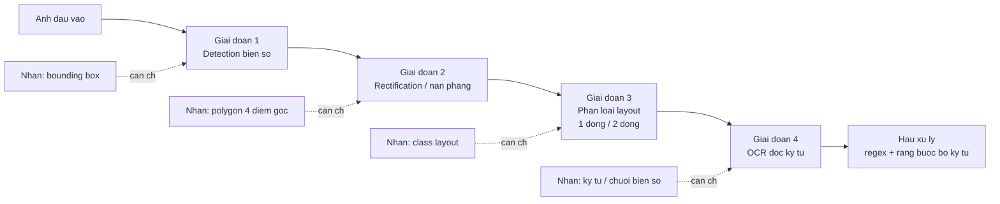
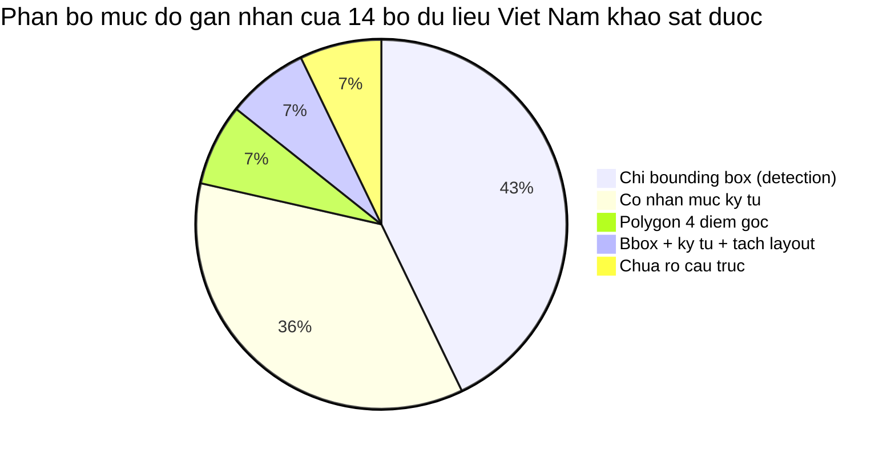
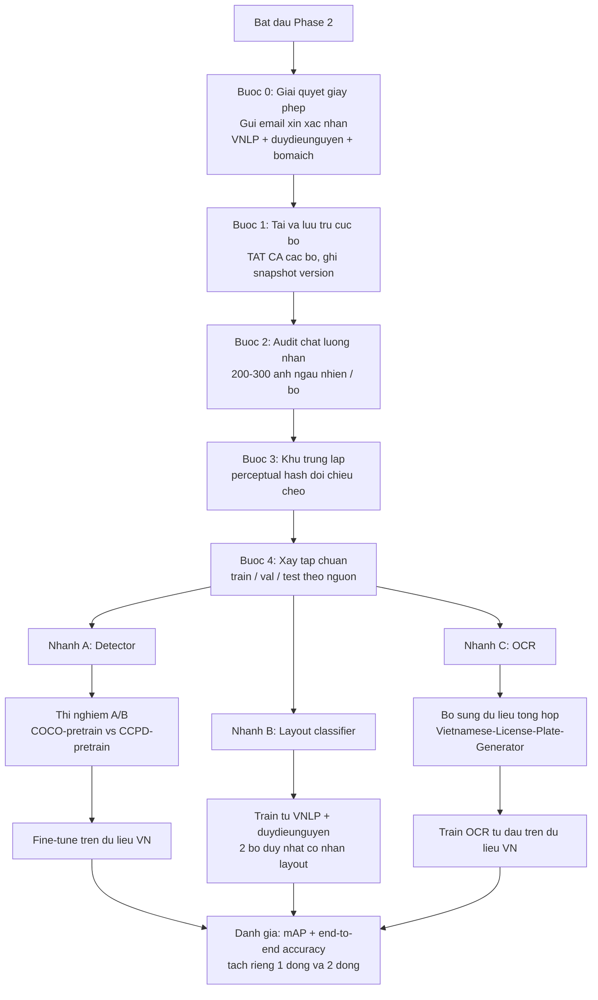

# Báo cáo 01 — Khảo sát sơ bộ các bộ dữ liệu biển số xe

**Mục đích:** chuẩn bị đầu vào dữ liệu cho Phase 2 (xây dựng tập huấn luyện cho module detection và recognition).
**Ngày truy cập và kiểm chứng toàn bộ số liệu:** 19/07/2026.
**Trạng thái:** bản khảo sát sơ bộ — mọi con số trong tài liệu đều đã qua một vòng kiểm chứng đối kháng; các mục chưa kiểm chứng được đều được đánh dấu tường minh.

> **Quy ước trình bày trong tài liệu này**
> - Mọi con số định lượng đều kèm nguồn trích dẫn ngay cạnh.
> - Các giá trị đã được hiệu chỉnh sau kiểm chứng được đánh dấu **(đã hiệu chỉnh)** và nêu rõ giá trị gốc bị bác bỏ.
> - Các thông tin không kiểm chứng được nguồn được ghi rõ "chưa kiểm chứng được nguồn" và **không** đưa vào bảng so sánh chính.
> - Thuật ngữ tiếng Anh thông dụng trong ngành (bounding box, mAP, dataset, pipeline, confidence, ground truth, augmentation, fine-tune...) được giữ nguyên.

---

## 1. Mở đầu — Tiêu chí đánh giá một bộ dữ liệu tốt cho bài toán này

Bài toán của đồ án là nhận dạng biển số xe Việt Nam trong điều kiện thực tế (unconstrained), bao gồm cả biển 1 dòng của ô tô và biển 2 dòng của xe máy. Do đó, một bộ dữ liệu được coi là "tốt" khi thỏa mãn đồng thời nhiều tiêu chí, chứ không chỉ đơn thuần là "nhiều ảnh".

### 1.1. Bảy tiêu chí đánh giá

| # | Tiêu chí | Nội dung cụ thể | Vì sao quan trọng với bài toán này |
|---|---|---|---|
| T1 | **Mức độ gán nhãn (annotation depth)** | Bounding box biển số → polygon 4 điểm góc → nhãn từng ký tự → chuỗi biển số dạng text | Pipeline gồm 2–3 giai đoạn; mỗi giai đoạn cần một mức nhãn khác nhau. Bộ chỉ có bounding box chỉ dùng được cho giai đoạn detection. |
| T2 | **Phân biệt layout 1 dòng / 2 dòng** | Có class riêng, hoặc ít nhất có metadata cho biết biển thuộc dạng nào | Đây là đặc thù cốt lõi của Việt Nam. Bằng chứng định lượng tương đương từ Brazil: OpenALPR đạt 94,3% trên ô tô biển 1 dòng nhưng **chỉ 45,7%** trên xe máy biển 2 dòng ([Laroca et al., VISAPP 2022](https://arxiv.org/pdf/2201.00267)). Không tách được layout thì không đo được điểm yếu này. |
| T3 | **Độ đa dạng điều kiện chụp** | Ban ngày/ban đêm, mưa/nắng, góc nghiêng, ảnh mờ, khoảng cách xa/gần, che khuất một phần | Mô hình huấn luyện trên dữ liệu đồng nhất sẽ sụp đổ khi triển khai thực tế. |
| T4 | **Tính đại diện thời gian** | Dữ liệu có phản ánh mẫu biển số đang lưu hành hay không | Có **hai mốc** phải xét. (1) Thông tư 24/2023/TT-BCA (hiệu lực 15/08/2023) đưa vào cơ chế biển số định danh — văn bản này **đã hết hiệu lực từ 01/01/2025**, chỉ còn giá trị bối cảnh lịch sử. (2) Văn bản hiện hành là **Thông tư 79/2024/TT-BCA** (ký 15/11/2024, hiệu lực 01/01/2025, sửa đổi bởi TT 13/2025/TT-BCA và TT 51/2025/TT-BCA), kèm **QCVN 08:2024/BCA** thay đổi **kích thước biển** từ 01/01/2025. Bộ dữ liệu thu thập trước 01/01/2025 có thể thiếu đại diện cả về nội dung biển lẫn tỷ lệ khung hình ([báo cáo 01-vn-plate-standards.md](01-vn-plate-standards.md)). |
| T5 | **Giấy phép rõ ràng** | Có license tường minh, cho phép mục đích học thuật | Đồ án tốt nghiệp là sản phẩm công bố. Dùng dữ liệu không rõ bản quyền là rủi ro pháp lý thật. |
| T6 | **Khả năng truy cập và tái lập** | Tải được ổn định, có version cố định, không phụ thuộc một link dễ chết | Đã ghi nhận 1 trường hợp dataset bị xóa khỏi Roboflow Universe (mục 4.1.7). |
| T7 | **Chất lượng nhãn kiểm chứng được** | Có báo cáo về tỉ lệ nhãn sai, hoặc ít nhất có thể tự audit được | Ngay cả dataset lớn và uy tín cũng có lỗi nhãn — CCPD là ví dụ điển hình (mục 4.2.1). |

### 1.2. Sơ đồ ánh xạ mức nhãn sang giai đoạn pipeline

Cách đọc sơ đồ: một bộ dữ liệu **chỉ có bounding box** thì chỉ phục vụ được giai đoạn 1. Đây chính là tình trạng của phần lớn dataset biển số Việt Nam công khai — sẽ được chứng minh bằng số liệu ở mục 2.

---

## 2. Bảng tổng hợp các bộ dữ liệu biển số Việt Nam

### 2.1. Bảng chính — các bộ đã kiểm chứng số liệu

Sắp xếp theo mức độ hữu ích cho Phase 2 (giảm dần).

| # | Tên bộ | Nguồn | Số lượng ảnh | Định dạng nhãn | Mức độ gán nhãn | Giấy phép | Link |
|---|---|---|---|---|---|---|---|
| 1 | **VNLP** (fict-labs) | GitHub | **~37.300** (19.086 biển 1 dòng + 18.211 biển 2 dòng) [[VNLP]](https://github.com/fict-labs/VNLP) | Bounding box + nhãn ký tự | ★★★★☆ — bbox **và** ký tự, **tách riêng 1 dòng / 2 dòng** | **KHÔNG ghi rõ** ⚠️ | [github.com/fict-labs/VNLP](https://github.com/fict-labs/VNLP) |
| 2 | **Vietnam License Plate Segment Datasets** (duydieunguyen) | Kaggle | **~5.000** (3.510 biển 1 dòng LpD + 1.625 biển 2 dòng LpV = 5.135) [[Kaggle]](https://www.kaggle.com/datasets/duydieunguyen/licenseplates) | **Polygon 4 điểm góc** | ★★★★☆ — polygon + **phân biệt 1/2 dòng**, chia sẵn 70% train / 30% eval | **Unknown** ⚠️⚠️ | [kaggle.com/datasets/duydieunguyen/licenseplates](https://www.kaggle.com/datasets/duydieunguyen/licenseplates) |
| 3 | **vietnamese license plate** (school-fuhih) | Roboflow Universe | **8.397** ở cấp project; bản phát hành v1 chỉ có **8.357** (5.845 train + 1.680 valid + 832 test) [[Roboflow]](https://universe.roboflow.com/school-fuhih/vietnamese-license-plate-tptd0) | Bounding box, 1 class | ★★☆☆☆ — chỉ detection; tên class đặt là `0` | CC BY 4.0 | [universe.roboflow.com/school-fuhih/...](https://universe.roboflow.com/school-fuhih/vietnamese-license-plate-tptd0) |
| 4 | **Vietnamese Car License Plate** (Cuong Ta) | Roboflow Universe | **8.255** [[Roboflow]](https://universe.roboflow.com/cuong-ta-ulxex/vietnamese-car-license-plate) | Bounding box, 1 class `plate` | ★★☆☆☆ — chỉ detection | **Public Domain** ✅ | [universe.roboflow.com/cuong-ta-ulxex/...](https://universe.roboflow.com/cuong-ta-ulxex/vietnamese-car-license-plate) |
| 5 | **Viet Nam OCR plate** (license-plate-reg) | Roboflow Universe | **3.819** / **32 class** [[Roboflow]](https://universe.roboflow.com/license-plate-reg/viet-nam-ocr-plate) | Object detection trên **từng ký tự** | ★★★☆☆ — nhãn mức ký tự lớn nhất trên Roboflow VN | **Public Domain** ✅ | [universe.roboflow.com/license-plate-reg/...](https://universe.roboflow.com/license-plate-reg/viet-nam-ocr-plate) |
| 6 | **Vietnam License plate** (Traffic Camera) | Roboflow Universe | **3.149** (tại 19/07/2026 — bộ này đang được cập nhật liên tục, hiện ở version 4) [[Roboflow]](https://universe.roboflow.com/traffic-camera/vietnam-license-plate-hayn8) | Bounding box, 1 class `plate` | ★★☆☆☆ — chỉ detection | CC BY 4.0 | [universe.roboflow.com/traffic-camera/...](https://universe.roboflow.com/traffic-camera/vietnam-license-plate-hayn8) |
| 7 | **Vietnam license-plate** (Tran Ngoc Xuan Tin K15 HCM) | Roboflow Universe | **1.005** [[Roboflow]](https://universe.roboflow.com/tran-ngoc-xuan-tin-k15-hcm-dpuid/vietnam-license-plate-h8t3n) | Bounding box, 1 class | ★★☆☆☆ — chỉ detection; có sẵn pre-trained model + API | CC BY 4.0 | [universe.roboflow.com/tran-ngoc-xuan-tin.../...](https://universe.roboflow.com/tran-ngoc-xuan-tin-k15-hcm-dpuid/vietnam-license-plate-h8t3n) |
| 8 | **VNLicensePlate_yolov7** (bomaich) | Kaggle | **1.000** [[Kaggle]](https://www.kaggle.com/datasets/bomaich/vnlicenseplate) | YOLO `.txt` (xywh) | ★★☆☆☆ — có cả biển 1 và 2 dòng nhưng **không tách class**; đã chia sẵn train/valid/test | **Unknown** ⚠️⚠️ | [kaggle.com/datasets/bomaich/vnlicenseplate](https://www.kaggle.com/datasets/bomaich/vnlicenseplate) |
| 9 | **vietnam license plate** (Eric Nguyen) | Roboflow Universe | **840** *(đã hiệu chỉnh — con số 350 lưu hành trước đó đã bị bác bỏ)* [[Roboflow]](https://universe.roboflow.com/eric-nguyen-knfxn/vietnam-license-plate-curhr) | Bounding box, 1 class | ★★☆☆☆ — chỉ detection; mới có 8 lượt tải | CC BY 4.0 | [universe.roboflow.com/eric-nguyen-knfxn/...](https://universe.roboflow.com/eric-nguyen-knfxn/vietnam-license-plate-curhr) |
| 10 | **Vietnamese License Plate Detection** (miahuynh04) | Kaggle | Không công bố số ảnh; dung lượng **366 MB** [[Kaggle]](https://www.kaggle.com/datasets/miahuynh04/vietnamese-license-plate-detection) | Chưa rõ — không có mô tả | ★☆☆☆☆ — usability chỉ **0.125**, thấp nhất danh sách | **MIT** ✅ | [kaggle.com/datasets/miahuynh04/...](https://www.kaggle.com/datasets/miahuynh04/vietnamese-license-plate-detection) |
| 11 | **Vietnamese License Plate OCR** (topkek69) | Kaggle | Không công bố số ảnh; **~37,1 MB** *(đã hiệu chỉnh từ 36,5 MB)*; thư mục gốc chứa `cropped(6643 files)` [[Kaggle]](https://www.kaggle.com/datasets/topkek69/vietnamese-license-plate-ocr) | Ảnh crop biển số cho OCR | ★★★☆☆ — dữ liệu OCR, không phải ảnh toàn cảnh | **Apache 2.0** ✅ | [kaggle.com/datasets/topkek69/...](https://www.kaggle.com/datasets/topkek69/vietnamese-license-plate-ocr) |
| 12 | **Vietnam-License-Plate-Recognition** (dataset-format-conversion) | Roboflow Universe | **200** / **22 class** alphanumeric [[Roboflow]](https://universe.roboflow.com/dataset-format-conversion-iidaz/vietnam-license-plate-recognition) | Object detection trên từng ký tự | ★★★☆☆ — nhãn ký tự nhưng quá nhỏ để train độc lập | CC BY 4.0 | [universe.roboflow.com/dataset-format-conversion-iidaz/...](https://universe.roboflow.com/dataset-format-conversion-iidaz/vietnam-license-plate-recognition) |
| 13 | **Character Dataset For VietNam License Plate** (nguyenquanglinh0109) | Kaggle | Không công bố số ảnh; **~911 KB** *(đã hiệu chỉnh từ 613 KB)*; cấu trúc nhiều thư mục nhỏ, mỗi thư mục ~41–83 file [[Kaggle]](https://www.kaggle.com/datasets/nguyenquanglinh0109/character-dataset-for-vietnam-license-plate) | Ảnh crop **từng ký tự** theo thư mục | ★★★☆☆ — dùng cho classification ký tự | **CC0 Public Domain** ✅ | [kaggle.com/datasets/nguyenquanglinh0109/...](https://www.kaggle.com/datasets/nguyenquanglinh0109/character-dataset-for-vietnam-license-plate) |
| 14 | **Jetson Nano ALPR datasets** (winter2897) | GitHub + Google Drive | **Không công bố** — *Cần bổ sung ở Phase sau: tải về và đếm thủ công* | 2 bộ riêng (detection + recognition ký tự), mỗi bộ có **cả VOC/Pascal và YOLO** [[doc/dataset.md]](https://github.com/winter2897/Real-time-Auto-License-Plate-Recognition-with-Jetson-Nano/blob/main/doc/dataset.md) | ★★★☆☆ — có nhãn ký tự; tải trực tiếp Google Drive, không cần đăng ký | **KHÔNG ghi** ⚠️ | [github.com/winter2897/.../doc/dataset.md](https://github.com/winter2897/Real-time-Auto-License-Plate-Recognition-with-Jetson-Nano/blob/main/doc/dataset.md) |

### 2.2. Các bộ ghi nhận nhưng KHÔNG dùng được

| Tên bộ | Lý do loại | Nguồn |
|---|---|---|
| **PTITPlates** | 500 ảnh, gán nhãn bằng LabelMe (dạng polygon), thu từ camera ở khu công nghiệp và đường giao thông. **Không thấy thông tin phát hành công khai** — bài báo chỉ gọi đây là dữ liệu tự thu thập. Muốn dùng phải liên hệ tác giả. | [Tran-Anh et al., arXiv:2309.12972](https://ar5iv.labs.arxiv.org/html/2309.12972) |
| **VNRNP** (vnu-tvtgl) | Đã bị xóa khỏi Roboflow Universe — truy cập trả về HTTP 404 "the vnrnp dataset does not exist, has been deleted, or is not shared with you". | [universe.roboflow.com/vnu-tvtgl/vnrnp](https://universe.roboflow.com/vnu-tvtgl/vnrnp) |
| **MAPR 2018 UIT Challenge dataset** | 3.000 ảnh xe máy chụp tại bãi giữ xe một khách sạn ở Việt Nam (2.000 train / 1.000 test), 2 task detection + recognition. Trang challenge **không công bố kết quả và không có link tải công khai**. *Cần bổ sung ở Phase sau: liên hệ UIT/VAPR.* | [mapr.uit.edu.vn/2018](https://mapr.uit.edu.vn/2018/vietnamese-bike-license-plate-recognition) |

### 2.3. Nhận định định lượng rút ra từ bảng

Ba kết luận quan trọng nhất:

1. **Chỉ có 2/14 bộ phân biệt tường minh biển 1 dòng và 2 dòng**: VNLP ([37.300 ảnh, tỉ lệ gần 50/50](https://github.com/fict-labs/VNLP)) và Kaggle duydieunguyen ([3.510 vs 1.625](https://www.kaggle.com/datasets/duydieunguyen/licenseplates)). Đây là tài nguyên quý hiếm nhất.
2. **Chỉ có 1 bộ gán nhãn polygon 4 điểm góc**: Kaggle duydieunguyen — mô tả gốc nêu rõ mục đích "to accurately localize the corner points" ([Kaggle](https://www.kaggle.com/datasets/duydieunguyen/licenseplates)). Đây là nhãn duy nhất phục vụ trực tiếp bước rectification/perspective warp.
3. **KHÔNG có bộ dữ liệu Việt Nam công khai nào gán nhãn chuỗi biển số đầy đủ dạng text** (kiểu `30A-12345`). Tất cả đều dừng ở mức bounding box hoặc bounding box từng ký tự rời. **Đây là khoảng trống lớn nhất của toàn bộ hệ sinh thái dữ liệu biển số Việt Nam.**

---

## 3. Bảng các bộ dữ liệu quốc tế dùng cho pre-train

| # | Tên bộ | Quốc gia | Số lượng ảnh | Mức độ gán nhãn | Giấy phép | Cách tải | Vai trò khả dĩ |
|---|---|---|---|---|---|---|---|
| 1 | **CCPD 2019** | Trung Quốc | **hơn 300.000** theo README bản cập nhật 2019 [[CCPD repo]](https://github.com/detectRecog/CCPD). Bản CCPD 2018 gốc là **250k** ảnh unique [[Xu et al., ECCV 2018]](https://openaccess.thecvf.com/content_ECCV_2018/papers/Zhenbo_Xu_Towards_End-to-End_License_ECCV_2018_paper.pdf) | Nhãn mã hóa **trong tên file**: tỉ lệ diện tích biển, độ nghiêng ngang+dọc, bbox, **4 điểm góc**, chỉ số từng ký tự, độ sáng, độ mờ [[CCPD repo]](https://github.com/detectRecog/CCPD) | **MIT** ✅ | Google Drive / BaiduYun; hoặc mirror Kaggle **13,16 GB, CC0** [[Kaggle]](https://www.kaggle.com/datasets/binh234/ccpd2019) | **Pre-train cho DETECTOR** — ứng viên số 1 về quy mô |
| 2 | **RodoSol-ALPR** | Brazil | 20.000 ảnh biển Brazil/Mercosur theo mô tả repo [[repo]](https://github.com/raysonlaroca/rodosol-alpr-dataset). Tập test được xác nhận gồm **4.000 ô tô + 4.000 xe máy** [[Laroca et al. 2022]](https://arxiv.org/pdf/2201.00267) | Bbox + chuỗi biển số; **có cân bằng ô tô (biển 1 dòng) và xe máy (biển 2 dòng)** | *Cần bổ sung ở Phase sau: đọc điều khoản trên repo* | GitHub | **Nguồn bổ trợ quan trọng cho nhánh biển 2 dòng** — xem mục 5.4 |
| 3 | **UFPR-ALPR** | Brazil | **4.500** ảnh, PNG 1920×1080, chia 40% train / 40% test / 20% val [[trang chính thức]](https://web.inf.ufpr.br/vri/databases/ufpr-alpr/) | Gán nhãn đầy đủ, hơn 30.000 ký tự biển số [[trang chính thức]](https://web.inf.ufpr.br/vri/databases/ufpr-alpr/) | **Học thuật only** — cấm thương mại, **cấm phân phối lại** ⚠️ | Phải gửi email từ địa chỉ trường đại học, chờ 1–5 ngày làm việc [[license agreement]](https://github.com/raysonlaroca/ufpr-alpr-dataset/blob/master/license-agreement.md) | Tập đối chiếu chất lượng cao; quy mô quá nhỏ để pre-train |
| 4 | **OpenALPR benchmarks** | EU / US / BR | **445** ảnh tổng cộng: EU 108 + US 222 + BR 115 [[repo]](https://github.com/openalpr/benchmarks) | Bbox biển số + **text biển số** | **AGPL-3.0** ⚠️ (copyleft mạnh) | GitHub trực tiếp | **CHỈ dùng làm benchmark**, tuyệt đối không đủ để pre-train |
| 5 | **Global License Plate Dataset** | 74 quốc gia | **hơn 5.000.000** ảnh; ~20% có nhãn COCO multi-class [[arXiv:2405.10949]](https://arxiv.org/html/2405.10949v1) | Ký tự biển số, mask segmentation, **4 điểm góc**, hãng/màu/model/năm xe, metadata độ sáng và độ tương phản | **Mơ hồ** ⚠️ — chỉ dựa trên điều khoản của Platesmania.com (nguồn ảnh) | [Repo splits](https://github.com/siddagra/Global-License-Plate-Dataset) | Tiềm năng lớn **nhưng chưa xác nhận có phần Việt Nam** |
| 6 | **UniDataPro/license-plate-detection** | 32+ quốc gia (tuyên bố có Việt Nam) | 1,2 triệu ảnh theo tuyên bố của nhà cung cấp [[HuggingFace]](https://huggingface.co/datasets/UniDataPro/license-plate-detection) | Chưa khảo sát | **Nhà cung cấp thương mại** ⚠️ — chưa rõ điều khoản bản miễn phí | HuggingFace | *Cần bổ sung ở Phase sau: đọc kỹ điều khoản* |

### 3.1. Ghi chú bắt buộc về phân bố subset của CCPD

Đây là điểm dễ trích dẫn sai nhất và cần nêu rõ trong đồ án:

> Bảng phân bố subset chi tiết dưới đây thuộc về **CCPD 2018** (tổng **250k** ảnh unique), **không phải** bản CCPD 2019 (tổng "hơn 300k"). Repo phiên bản 2019 **không công bố bảng phân bố mới**. Không được trình bày bảng phân bố 2018 dưới tiêu đề tổng số của bản 2019.

| Subset | Số ảnh | Đặc trưng | Vai trò |
|---|---|---|---|
| CCPD-Base | 200k | Ảnh cơ bản | Train / val |
| CCPD-FN | 20k | Khoảng cách xa hoặc gần bất thường | Test |
| CCPD-DB | 20k | Vùng sáng/tối bất thường | Test |
| CCPD-Rotate | 10k | Xoay | Test |
| CCPD-Tilt | 10k | Nghiêng ngang + dọc | Test |
| CCPD-Weather | 10k | Mưa, tuyết, sương | Test |
| CCPD-Challenge | 10k | Tổng hợp khó | Test |
| CCPD-Blur | 5k | Mờ | Test |
| CCPD-NP | **5k** *(đã hiệu chỉnh — con số 3k lưu hành trước đó là sai)* | Xe chưa gắn biển | Test |

Nguồn của bảng: [Xu et al., ECCV 2018, Fig. 2](https://openaccess.thecvf.com/content_ECCV_2018/papers/Zhenbo_Xu_Towards_End-to-End_License_ECCV_2018_paper.pdf). Việc chia train/val trên CCPD-Base và dùng các subset còn lại làm test được xác nhận trong [README repo CCPD](https://github.com/detectRecog/CCPD). Bản CCPD-Green (2020) bổ sung biển năng lượng mới 8 ký tự.

---

## 4. Đánh giá từng bộ: ưu điểm, nhược điểm, rủi ro chất lượng nhãn

### 4.1. Các bộ dữ liệu Việt Nam

#### 4.1.1. VNLP (fict-labs) — ứng viên bộ chính

**Ưu điểm.** Đây là bộ dữ liệu biển số Việt Nam công khai lớn nhất khảo sát được, với **~37.300 ảnh**, chia gần cân bằng **19.086 biển 1 dòng và 18.211 biển 2 dòng** ([VNLP](https://github.com/fict-labs/VNLP)). Triết lý cân bằng layout này giống RodoSol-ALPR và là điều không bộ dữ liệu Việt Nam nào khác làm được. Bộ có **cả nhãn bounding box lẫn nhãn mức ký tự**, kích thước ảnh biển từ 30–638 px chiều rộng và 26–240 px chiều cao. Nhóm tác giả còn công bố benchmark kèm theo: detection precision **98,9%**, shape classification (phân loại 1 dòng/2 dòng) **99,0%**, recognition **96,6%** trên crop ground-truth, hệ thống đầy đủ precision/recall **>95,3%** ([VNLP](https://github.com/fict-labs/VNLP)). Đặc biệt có giá trị với đồ án: toàn bộ số liệu tốc độ **91,2 FPS (detection) và 38,6 FPS (full pipeline) đều đo trên CPU** ([VNLP](https://github.com/fict-labs/VNLP)) — đã kiểm chứng riêng là không có nhầm lẫn ngữ cảnh GPU/CPU.

**Nhược điểm và rủi ro.** Repo **không ghi rõ giấy phép**. Đây là rủi ro pháp lý phải giải quyết sớm. Ngoài ra repo có mức độ phổ biến thấp (4 sao), nghĩa là chưa có nhiều nhóm độc lập kiểm chứng chất lượng nhãn. Các con số benchmark đều do chính nhóm tác giả đo, chưa có bên thứ ba tái lập.

#### 4.1.2. Kaggle duydieunguyen/licenseplates — bộ giá trị nhất về mặt nhãn, rủi ro nhất về pháp lý

**Ưu điểm.** Bộ duy nhất gán nhãn **polygon 4 điểm góc**, với mục đích được tác giả nêu tường minh là định vị chính xác các điểm góc biển số ([Kaggle](https://www.kaggle.com/datasets/duydieunguyen/licenseplates)) — đúng thứ cần cho bước rectification. Phân biệt rõ **3.510 mẫu biển 1 dòng (LpD) và 1.625 mẫu biển 2 dòng (LpV)**, chia sẵn 70% train / 30% eval. Tác giả nêu rõ đã thu thập cả từ internet lẫn môi trường thực với "many different environmental conditions, weather and time and different shooting angles" ([Kaggle](https://www.kaggle.com/datasets/duydieunguyen/licenseplates)). Dung lượng 1,0 GB, 2.814 lượt tải, 26 vote.

**Nhược điểm và rủi ro.** `licenseName = "Unknown"` — **đây là rủi ro pháp lý lớn nhất trong toàn bộ danh sách**, vì bộ này lại là bộ mình muốn dùng nhiều nhất. Usability rating chỉ **0.5625** ([Kaggle API](https://www.kaggle.com/datasets/duydieunguyen/licenseplates)), dưới mức trung bình. Phân bố 1 dòng / 2 dòng lệch khoảng 2:1 nghiêng về biển 1 dòng, trong khi thực tế giao thông Việt Nam thì xe máy (biển 2 dòng) mới chiếm đa số — nghĩa là bộ này **lệch ngược so với phân bố thực tế**.

#### 4.1.3. Nhóm Roboflow chỉ có bounding box (school-fuhih, Cuong Ta, Traffic Camera, Tran Ngoc Xuan Tin, Eric Nguyen)

**Ưu điểm.** Quy mô cộng dồn lớn: 8.397 + 8.255 + 3.149 + 1.005 + 840 ≈ **21.646 ảnh**. Giấy phép thuận lợi (Public Domain hoặc CC BY 4.0). Roboflow hỗ trợ export ra hơn 50 định dạng gồm YOLO (v3–v11), COCO JSON, Pascal VOC XML, CreateML, TFRecords, Darknet ([Roboflow Docs](https://docs.roboflow.com/datasets/download-a-dataset)) — lợi thế lớn vì không phải viết script chuyển đổi.

**Nhược điểm và rủi ro.**
- Tất cả đều **Classes(1)**, chỉ dùng được cho giai đoạn detection. Không có nhãn ký tự, không phân biệt 1 dòng / 2 dòng.
- Bộ school-fuhih đặt tên class là `0` thay vì tên có nghĩa, và **không có mô tả dự án** — dấu hiệu bộ dữ liệu được upload cẩu thả.
- Bộ Cuong Ta cập nhật lần cuối **5 năm trước** ([Roboflow](https://universe.roboflow.com/cuong-ta-ulxex/vietnamese-car-license-plate)) — cũ nhất danh sách, có nguy cơ không đại diện cho mẫu biển đang lưu hành theo **Thông tư 79/2024/TT-BCA** (hiệu lực 01/01/2025) và **QCVN 08:2024/BCA** (kích thước biển mới từ 01/01/2025).
- Bộ Traffic Camera hiện ở **version 4 và mới cập nhật 9 ngày trước** — số liệu 3.149 sẽ trôi. Bắt buộc ghi rõ ngày truy cập và version trong đồ án.
- **Cảnh báo kỹ thuật:** Roboflow hiển thị hai con số ảnh khác nhau cho cùng một dự án — số ở header (tổng ảnh trong project) và số ở trang version (sau khi chia train/val/test). Ví dụ school-fuhih: header ghi **8.397** nhưng version 1 chỉ có **8.357** ([Roboflow](https://universe.roboflow.com/school-fuhih/vietnamese-license-plate-tptd0)). Tải về sẽ chỉ được 8.357 ảnh.
- **Rủi ro trùng lặp chưa đo được:** chưa xác minh các bộ Roboflow có trùng ảnh với nhau hay không. Nhiều bộ có thể fork hoặc re-upload từ cùng nguồn gốc. Nếu trùng nhiều thì con số 21.646 ở trên là ảo. *Cần bổ sung ở Phase 2: chạy perceptual hash đối chiếu chéo — xem checklist mục 8.*

#### 4.1.4. Nhóm Roboflow có nhãn ký tự (Viet Nam OCR plate, Vietnam-License-Plate-Recognition)

**Ưu điểm.** "Viet Nam OCR plate" có **3.819 ảnh / 32 class**, giấy phép **Public Domain** ([Roboflow](https://universe.roboflow.com/license-plate-reg/viet-nam-ocr-plate)) — bộ nhãn mức ký tự lớn nhất và thoáng nhất về pháp lý cho biển Việt Nam trên nền tảng này.

**Nhược điểm và rủi ro.** 32 class được đặt tên là các chỉ số 0–29 cộng thêm class `C` và class `words` — **chưa rõ ánh xạ từ index sang ký tự thực tế**. Ý nghĩa của class `words` cũng chưa rõ. Bắt buộc phải tải về đọc file `data.yaml` / `_darknet.labels` để giải mã. Bộ "Vietnam-License-Plate-Recognition" chỉ có **200 ảnh** — quá nhỏ để train độc lập, chỉ dùng bổ sung hoặc validation.

#### 4.1.5. Nhóm Kaggle nhỏ (topkek69 OCR, nguyenquanglinh0109 Character, miahuynh04 Detection)

Ba bộ này có giấy phép rõ ràng và thuận lợi nhất (**Apache 2.0**, **CC0**, **MIT** tương ứng), nhưng đều nhỏ và usability thấp. Bộ topkek69 (~37,1 MB) có thư mục `cropped(6643 files)` ([Kaggle](https://www.kaggle.com/datasets/topkek69/vietnamese-license-plate-ocr)) nên nhiều khả năng là ảnh crop biển số đã cắt sẵn cho OCR, không phải ảnh toàn cảnh. Bộ nguyenquanglinh0109 (~911 KB) có cấu trúc nhiều thư mục nhỏ, mỗi thư mục vài chục file ([Kaggle](https://www.kaggle.com/datasets/nguyenquanglinh0109/character-dataset-for-vietnam-license-plate)) — đúng mô hình "một thư mục một ký tự" cho bài toán classification. Bộ miahuynh04 có usability **0.125** — thấp nhất toàn danh sách, không có mô tả, phải kiểm tra thủ công hoàn toàn trước khi dùng.

#### 4.1.6. Rủi ro chất lượng nhãn chung — không có báo cáo chính thức nào

**Đây là phát hiện quan trọng cần nêu rõ trong đồ án:** không tìm thấy bất kỳ bài báo hay issue nào đánh giá tỉ lệ nhãn sai của riêng các dataset biển số Việt Nam. Chỉ có các tín hiệu gián tiếp:

| Bộ | Usability rating | Diễn giải |
|---|---|---|
| miahuynh04 | **0.125** | Không mô tả, không rõ cấu trúc |
| nguyenquanglinh0109 | **0.3125** | Thiếu metadata |
| duydieunguyen | **0.5625** | Trung bình thấp dù nội dung tốt |
| bomaich | **0.6875** | Cao nhất nhóm Kaggle VN nhưng vẫn dưới trung bình chung |

Nguồn: [Kaggle](https://www.kaggle.com/datasets/miahuynh04/vietnamese-license-plate-detection), [Kaggle](https://www.kaggle.com/datasets/nguyenquanglinh0109/character-dataset-for-vietnam-license-plate), [Kaggle](https://www.kaggle.com/datasets/duydieunguyen/licenseplates), [Kaggle](https://www.kaggle.com/datasets/bomaich/vnlicenseplate).

**Hệ quả bắt buộc cho Phase 2:** phải tự chạy kiểm định nhãn (visual audit ngẫu nhiên và kiểm tra bounding box degenerate/ngoài biên) trước khi tin dùng bất kỳ bộ nào. Quy trình cụ thể ở mục 8.

#### 4.1.7. Rủi ro biến mất của dataset — đã có tiền lệ

Bộ **VNRNP** (vnu-tvtgl, khoảng 1,83k ảnh) từng xuất hiện trong kết quả gợi ý liên quan nhưng khi truy cập trực tiếp trả về HTTP 404 với thông báo dataset "does not exist, has been deleted, or is not shared with you" ([Roboflow](https://universe.roboflow.com/vnu-tvtgl/vnrnp)).

**Hàm ý bắt buộc:** phải tải về và lưu trữ cục bộ ngay khi khảo sát xong, không được phụ thuộc vào link Roboflow trong suốt vòng đời đồ án, và phải ghi lại snapshot version cụ thể của từng dataset.

### 4.2. Các bộ dữ liệu quốc tế

#### 4.2.1. CCPD — lớn nhất, nhưng CÓ LỖI NHÃN đã được ghi nhận trong tài liệu khoa học

**Ưu điểm.** Hơn 300.000 ảnh, giấy phép **MIT**, có sẵn subset chuyên biệt cho từng điều kiện khó (nghiêng, mờ, thời tiết, sáng tối, xa gần) — điều mà không dataset Việt Nam nào có ([CCPD repo](https://github.com/detectRecog/CCPD)). Nhãn mã hóa trực tiếp trong tên file nên không cần parser phức tạp. Có mirror Kaggle **13,16 GB, CC0, 944 lượt tải** ([Kaggle](https://www.kaggle.com/datasets/binh234/ccpd2019)) để tải dễ hơn Google Drive/BaiduYun.

**Rủi ro chất lượng nhãn — nghiêm trọng và đã được ghi nhận.** Trong nghiên cứu cross-dataset của Laroca et al., CCPD **bị loại trừ tường minh** khỏi thí nghiệm vì hai lý do: ảnh nén quá mạnh ("highly compressed images") và **"large errors in the corners' annotations"** ([Laroca et al., VISAPP 2022](https://arxiv.org/pdf/2201.00267)).

Các nhóm khác phải tự sửa lỗi này bằng cách chạy mô hình detection rồi đối chiếu IoU giữa bbox dự đoán và bbox gán nhãn: nếu **IoU > 0,6** thì coi là nhãn đúng, ngược lại coi là nhãn lỗi ([TransLPRNet, arXiv:2507.17335](https://arxiv.org/pdf/2507.17335)).

> **Ghi chú đính chính quan trọng.** Một cách giải thích lưu hành phổ biến cho rằng lỗi nhãn CCPD phát sinh do nhãn được sinh bán tự động bằng mô hình RPnet. Điều này **không đúng theo nguồn**: bài TransLPRNet nêu ngược lại — "Because these datasets are annotated manually, a degree of mislabeling is unavoidable" ([arXiv:2507.17335](https://arxiv.org/pdf/2507.17335)). Ngưỡng IoU 0,6 là đúng, nhưng nguyên nhân là sai sót của quá trình gán nhãn thủ công.

**Hàm ý kiến trúc:** dùng CCPD để pre-train **detection** thì chấp nhận được, nhưng **không nên tin tọa độ 4 điểm góc của CCPD làm ground truth** cho bài toán rectification.

**Hạn chế cấu trúc riêng cho bài toán Việt Nam:** CCPD chỉ có biển Trung Quốc **1 dòng**, 7 ký tự, có ký tự tỉnh là Hán tự. **Không có biển 2 dòng nào.** Vì vậy CCPD **hoàn toàn không giúp gì** cho nhánh phân loại layout 1 dòng / 2 dòng — nhánh đặc thù nhất của Việt Nam.

#### 4.2.2. UFPR-ALPR — chất lượng cao, ràng buộc pháp lý chặt

**Ưu điểm.** 4.500 ảnh gán nhãn đầy đủ với hơn 30.000 ký tự biển số, PNG 1920×1080, chia 40/40/20 ([trang chính thức](https://web.inf.ufpr.br/vri/databases/ufpr-alpr/)). Điều kiện chụp cực khó và rất giống thực tế: **cả xe và camera (đặt trong một xe khác) đều đang di chuyển**, chụp bằng 3 thiết bị khác nhau (GoPro Hero4 Silver, Huawei P9 Lite, iPhone 7 Plus), gồm cả xe máy ([trang chính thức](https://web.inf.ufpr.br/vri/databases/ufpr-alpr/)).

**Rủi ro pháp lý.** Dataset thuộc sở hữu của Laboratory of Vision, Robotics and Imaging (VRI), Federal University of Paraná. Điều khoản: chỉ dành cho nghiên cứu học thuật phi thương mại; sử dụng thương mại dưới mọi hình thức mà không xin phép "will be considered illegal"; **cấm phân phối lại** và cấm sửa đổi trừ khi được cho phép ([license agreement](https://github.com/raysonlaroca/ufpr-alpr-dataset/blob/master/license-agreement.md)). Quy trình xin: gửi email từ **địa chỉ email trường đại học** tới `rblsantos@inf.ufpr.br`, kèm tên, đơn vị, khoa, chức vụ **và câu cam kết đã đọc điều khoản** — thiếu câu cam kết thì không được xử lý. Chờ 1–5 ngày làm việc.

**Đánh giá.** Quy mô 4.500 ảnh quá nhỏ để pre-train hiệu quả. Giá trị thực nằm ở vai trò tập đối chiếu chất lượng cao. Chi phí thủ tục (email, chờ đợi, ràng buộc phân phối) cao so với lợi ích. **Ưu tiên thấp cho Phase 2.**

#### 4.2.3. RodoSol-ALPR — nguồn bổ trợ quan trọng nhất cho nhánh biển 2 dòng

Đây là bộ đáng chú ý nhất sau CCPD, vì lý do đặc biệt: RodoSol có **số lượng mẫu "dễ" (ô tô biển 1 dòng) và "khó" (xe máy biển 2 dòng) bằng nhau**, với tập test gồm 4.000 ô tô và 4.000 xe máy ([Laroca et al., VISAPP 2022](https://arxiv.org/pdf/2201.00267)).

Bằng chứng định lượng nổi bật nhất về độ khó của biển 2 dòng đến từ chính bộ này: OpenALPR nhận đúng **3.772/4.000 ô tô (94,3%)** nhưng **chỉ 1.827/4.000 xe máy (45,7%)** ([Laroca et al., VISAPP 2022](https://arxiv.org/pdf/2201.00267)). Chênh lệch **48,6 điểm phần trăm**. Ngoài ra, toàn bộ 12 phương pháp và 2 hệ thống thương mại được đánh giá đều **không vượt quá 70%** recognition rate trên bộ này.

> **Cảnh báo trích dẫn bắt buộc.** Cặp số 94,3% / 45,7% được đo trên **RodoSol-ALPR (Brazil)**, **không phải trên dữ liệu Việt Nam**. Chỉ được dùng làm dẫn chứng tương đương (analogue) về độ khó của biển 2 dòng, tuyệt đối không được trình bày như số liệu Việt Nam.

#### 4.2.4. OpenALPR benchmarks — chỉ để benchmark

Quy mô được xác minh bằng cách **đếm file thực tế**: `endtoend/eu` 108 ảnh, `endtoend/us` 222 ảnh, `endtoend/br` 115 ảnh, tổng **445 ảnh** ([repo](https://github.com/openalpr/benchmarks)). Nhãn gồm bbox và text biển số, phù hợp cả detection lẫn recognition. Giấy phép **AGPL-3.0** — copyleft mạnh, cần lưu ý nếu đồ án có phần code phát hành. **Quá nhỏ để pre-train; chỉ dùng làm bộ benchmark đối chiếu.**

#### 4.2.5. Global License Plate Dataset — tiềm năng lớn, chưa xác nhận có phần Việt Nam

Hơn 5 triệu ảnh từ 74 quốc gia, nhãn rất đầy đủ: ký tự biển số, mask segmentation, **tọa độ 4 điểm góc**, thông tin hãng/màu/model/năm xe, cùng metadata độ sáng và độ tương phản (đo bằng Variance of the Laplacian) ([arXiv:2405.10949](https://arxiv.org/html/2405.10949v1)). Nguồn ảnh là Platesmania.com.

**Hai vấn đề.** Thứ nhất, tài liệu **không xác nhận tường minh Việt Nam nằm trong 74 nước** và không cho số lượng ảnh Việt Nam — đã kiểm tra và không tìm thấy Việt Nam được nêu tên trong phần phân bố quốc gia. Thứ hai, giấy phép chỉ dựa trên điều khoản của Platesmania ("copying of data is allowed as long as an obligatory link is provided") — **không phải giấy phép chuẩn**, rủi ro pháp lý trung bình.

*Cần bổ sung ở Phase sau: kiểm tra trực tiếp [repo splits](https://github.com/siddagra/Global-License-Plate-Dataset) xem có phân vùng Việt Nam không. Nếu có, đây sẽ là nguồn tốt nhất vì có sẵn 4 điểm góc và nhãn ký tự.*

---

## 5. Khuyến nghị chiến lược dữ liệu cho Phase 2

> ## ⚠️ ĐÍNH CHÍNH SAU KHI THỰC HIỆN (cập nhật 19/07/2026)
>
> Mục 5 dưới đây được viết ở Phase 1, **trước khi thử tải dữ liệu thật**. Sau khi thực hiện, hai
> khuyến nghị chính đã phải thay đổi. Phần đính chính này được giữ ở đầu mục để người đọc đồ án
> không đi theo một khuyến nghị đã lỗi thời.
>
> ### Đ-1. VNLP — bộ được khuyến nghị làm bộ chính — KHÔNG TRUY CẬP ĐƯỢC
>
> Kho `fict-labs/vnlp` trên HuggingFace trả về **HTTP 401** ở mọi lần thử, kể cả khi không cần
> token. Kho đã chuyển sang chế độ *gated* hoặc không còn public. **Toàn bộ khuyến nghị ở Câu hỏi 1
> (mục 5.2) vì vậy không thực hiện được**, và mọi con số benchmark tham chiếu của VNLP
> (98,9% / 99,0% / 96,6%) không dùng để đối chiếu được.
>
> **Đây là một đính chính, không phải một thất bại của Phase 2.** Việc một kho dữ liệu công khai
> đóng lại sau khi được khảo sát là rủi ro đã được chính mục 6 của tài liệu này cảnh báo. Điều
> Phase 2 phải làm — và đã làm — là **phát hiện sớm, ghi nhận trung thực, và chuyển sang phương án
> dự phòng** thay vì che giấu hoặc trích dẫn số liệu của một bộ chưa từng chạm tới được.
>
> ### Đ-2. Phương án thực tế đã dùng: 8 bộ Roboflow + 1 bộ HuggingFace
>
> Đúng như **phương án dự phòng B** đã ghi ở Câu hỏi 1 (*"dùng tổ hợp Roboflow Public Domain +
> CC BY 4.0 làm bộ chính cho detection"*). Kết quả thực tế:
>
> | | Kế hoạch Phase 1 | **Thực tế Phase 2** |
> |---|---|---|
> | Bộ chính | VNLP, ~37.300 ảnh | **8 bộ Roboflow + 1 bộ HuggingFace** |
> | Ảnh tải về | — | 27.113 |
> | **Ảnh sau khử trùng lặp** | — | **15.133** (40,6% quy mô kế hoạch) |
> | Nhãn ký tự | Có sẵn trong VNLP | **Tái tạo từ 2 bộ nhãn ký tự Roboflow** — 2.801 chuỗi hợp lệ |
> | Giấy phép | Chưa xác nhận | **8/9 bộ có giấy phép tường minh** (6× CC BY 4.0, 2× CC0) |
>
> Chi tiết đầy đủ ở [02-dataset-report.md](02-dataset-report.md) mục 2.
>
> ### Đ-3. Cảnh báo "21.646 ảnh cộng dồn không đáng tin" — ĐÃ ĐƯỢC XÁC NHẬN
>
> Điều kiện 1 ở Câu hỏi 2 (*"Nếu trùng nhiều, tổng kho thực tế nhỏ hơn nhiều so với con số cộng dồn
> 21.646"*) là **cảnh báo chính xác nhất của toàn bộ tài liệu Phase 1**. Đo thực tế bằng perceptual
> hash 64 bit:
>
> - **14.715 cặp ảnh trùng lặp CHÉO GIỮA CÁC BỘ** (75,3% tổng số cặp trùng).
> - **11.978 / 27.111 ảnh (44,2%) bị loại** vì là bản sao.
> - Hai bộ `cuong-ta-ulxex/vietnamese-car-license-plate` và
>   `school-fuhih/vietnamese-license-plate-tptd0` trùng nhau **11.426 cặp** — gần như là cùng một bộ.
> - Bộ `tran-ngoc-xuan-tin-k15-hcm-dpuid/vietnam-license-plate-h8t3n` bị loại **1.005/1.005 ảnh**:
>   toàn bộ nội dung của nó đã có ở hai bộ trên.
>
> Nếu Phase 2 tin vào con số cộng dồn, báo cáo sẽ **thổi phồng quy mô dữ liệu 1,72 lần**.
> Ma trận trùng lặp đầy đủ ở [02-dataset-report.md](02-dataset-report.md) mục 5.3.
>
> ### Đ-4. Điều kiện 3 (*"không trộn tập test"*) — VẪN CHƯA LÀM
>
> Khuyến nghị giữ tập test tách biệt theo nguồn để đo tổng quát hoá xuyên dataset **chưa được thực
> hiện**: tập test hiện tại là mẫu ngẫu nhiên phân tầng từ cả 6 bộ. Đây là việc còn nợ, ghi nhận ở
> rủi ro D-03.

### 5.1. Bằng chứng định lượng làm cơ sở cho quyết định

Ba nhóm bằng chứng chi phối toàn bộ chiến lược dưới đây:

**Bằng chứng 1 — Pre-train xong BẮT BUỘC phải fine-tune.** Laroca et al. đo độ tổng quát hóa xuyên dataset trên 9 bộ công khai (Caltech Cars, EnglishLP, UCSD-Stills, ChineseLP, AOLP, OpenALPR-EU, SSIG-SegPlate, UFPR-ALPR, RodoSol-ALPR). Độ chính xác nhận dạng trung bình **tụt từ 82,4% xuống 74,5%** (giảm 7,9 điểm) khi chuyển từ giao thức chia truyền thống sang giao thức leave-one-dataset-out. Trường hợp nặng nhất là AOLP: **tụt từ 90,8% xuống 62,7%** (giảm 28,1 điểm), nguyên nhân được tác giả quy cho khác biệt về font ký tự ([Laroca et al., VISAPP 2022](https://arxiv.org/pdf/2201.00267)).

**Bằng chứng 2 — Số lượng ảnh cần gán nhãn ít hơn nhiều so với lo ngại ban đầu.** Nghiên cứu "How many labeled license plates are needed?" cho thấy chỉ cần **300 ảnh biển số thật có gán nhãn**, kết hợp sinh dữ liệu và augmentation, là đạt hiệu năng tương đương train trên **200.000 ảnh thật** ([arXiv:1808.08410](https://ar5iv.labs.arxiv.org/html/1808.08410)). Với chỉ 60 ảnh thật: augmentation đơn thuần đạt **47,5%**, còn augmentation kết hợp sinh dữ liệu đạt **79,3%** — chênh 31,8 điểm.

**Bằng chứng 3 — Ngưỡng bão hòa ở 4.750 ảnh thật.** "When the number of real license plate images exceeds 4,750, license plate recognition accuracy and character recognition accuracy are not improving", tại ngưỡng này đạt **99,0%** độ chính xác ([arXiv:1808.08410](https://ar5iv.labs.arxiv.org/html/1808.08410)).

### 5.2. Trả lời ba câu hỏi chiến lược

#### Câu hỏi 1: Nên dùng bộ nào làm chính?

**Khuyến nghị: VNLP (fict-labs) làm bộ chính, với điều kiện xin được xác nhận quyền sử dụng.**

> ❌ **KHUYẾN NGHỊ NÀY KHÔNG THỰC HIỆN ĐƯỢC — xem đính chính Đ-1 ở đầu mục 5.**
> Kho trả về HTTP 401. Phương án dự phòng ở cuối mục này chính là phương án đã dùng thật.

Lý do (giữ nguyên để người đọc thấy căn cứ ban đầu):
- Là bộ Việt Nam duy nhất thỏa mãn đồng thời T1 (nhãn ký tự), T2 (tách 1 dòng / 2 dòng) và quy mô lớn (~37.300 ảnh) ([VNLP](https://github.com/fict-labs/VNLP)).
- Quy mô này vượt xa ngưỡng bão hòa 4.750 ảnh ([arXiv:1808.08410](https://ar5iv.labs.arxiv.org/html/1808.08410)) đối với giai đoạn detection.
- Có benchmark tham chiếu sẵn để so sánh (98,9% / 99,0% / 96,6%), giúp đồ án biết mình đang ở đâu.

**Phương án dự phòng nếu không xin được quyền:** dùng tổ hợp Roboflow Public Domain + CC BY 4.0 làm bộ chính cho detection (mục 5.3, phương án B).

> ✅ **ĐÂY LÀ PHƯƠNG ÁN ĐÃ THỰC HIỆN THẬT.** 8 bộ Roboflow đã tải qua REST API (format `yolov11`),
> cho **15.133 ảnh unique** sau khử trùng lặp. Chi tiết: [02-dataset-report.md](02-dataset-report.md).

#### Câu hỏi 2: Có nên gộp nhiều bộ không?

**Khuyến nghị: CÓ, nhưng gộp có điều kiện và theo từng nhánh nhiệm vụ, không gộp mù.**

Lập luận ủng hộ gộp:
- Gộp làm tăng độ đa dạng điều kiện chụp (tiêu chí T3), là yếu tố quyết định độ bền của mô hình.
- Mỗi bộ mạnh ở một mức nhãn khác nhau — gộp cho phép bù đắp lẫn nhau theo sơ đồ ở mục 1.2.

Ba điều kiện bắt buộc trước khi gộp:
1. **Khử trùng lặp bằng perceptual hash.** Chưa xác minh được các bộ Roboflow có trùng ảnh với nhau hay không. Nếu trùng nhiều, tổng kho thực tế nhỏ hơn nhiều so với con số cộng dồn 21.646.
   → ✅ **ĐÃ ĐO. Cảnh báo này chính xác: 11.978 / 27.111 ảnh của 7 bộ vào hợp nhất detection (44,2%) là bản sao, 14.715 cặp trùng chéo bộ.** Trường hợp cực đoan nhất: `roboflow_tran_ngoc_xuan_tin` bị loại **1.005/1.005 = 100%**, tức một bộ dư thừa hoàn toàn — đây là lý do **không được cộng dồn `expected_images`** để suy ra quy mô thật. Xem Đ-3.
2. **Thống nhất định dạng nhãn.** Roboflow export được hơn 50 định dạng ([Roboflow Docs](https://docs.roboflow.com/datasets/download-a-dataset)) nên nên chọn YOLO làm định dạng chuẩn chung và convert các bộ Kaggle/GitHub về đó.
3. **Không trộn tập test.** Tập test phải được giữ tách biệt hoàn toàn theo nguồn để đo được độ tổng quát hóa xuyên dataset — chính là hiện tượng mà Laroca et al. cảnh báo ([arXiv:2201.00267](https://arxiv.org/pdf/2201.00267)).

#### Câu hỏi 3: Có nên pre-train trên dữ liệu quốc tế rồi fine-tune không?

**Khuyến nghị: CÓ, nhưng CHỈ cho DETECTOR, và phải chạy thí nghiệm A/B xác nhận trước khi cam kết tải 13 GB.**

| Nhánh | Pre-train quốc tế? | Lý do |
|---|---|---|
| **Detector biển số** | **Có** — CCPD là ứng viên | Đặc trưng hình dạng biển, khả năng chịu nghiêng/mờ/thiếu sáng có tính chuyển giao. CCPD có sẵn subset cho từng điều kiện khó ([CCPD repo](https://github.com/detectRecog/CCPD)). |
| **Phân loại layout 1/2 dòng** | **Không** — CCPD vô dụng ở đây | CCPD chỉ có biển Trung Quốc 1 dòng, không có biển 2 dòng nào. Cân nhắc RodoSol-ALPR thay thế ([Laroca et al. 2022](https://arxiv.org/pdf/2201.00267)). |
| **OCR / recognition** | **Không** — phải train lại từ đầu trên dữ liệu Việt Nam | Biển Trung Quốc có ký tự Hán tự và cấu trúc 7 ký tự 1 dòng, khác hẳn biển Việt Nam. Mức tụt tới 28,1 điểm khi đổi dataset ([arXiv:2201.00267](https://arxiv.org/pdf/2201.00267)) chủ yếu do khác biệt font ký tự. |

**Thí nghiệm A/B bắt buộc trước khi cam kết:** hiện chưa tìm thấy nghiên cứu nào đo trực tiếp hiệu quả của chuỗi CCPD → Việt Nam. Do đó Phase 2 nên chạy một thí nghiệm ngắn so sánh detector khởi tạo từ COCO-pretrained với detector khởi tạo từ CCPD-pretrained, cùng fine-tune trên cùng tập dữ liệu Việt Nam. Chỉ khi CCPD-pretrained thắng rõ ràng mới đầu tư tải và xử lý 13,16 GB ([Kaggle mirror](https://www.kaggle.com/datasets/binh234/ccpd2019)).

### 5.3. Phương án cụ thể cho Phase 2

**Phương án A (ưu tiên) — nếu xin được quyền dùng VNLP:**

| Nhánh | Bộ dữ liệu chính | Bộ bổ sung | Ghi chú |
|---|---|---|---|
| Detector | VNLP (~37.300 ảnh) | Roboflow Public Domain (Cuong Ta 8.255 + Viet Nam OCR plate 3.819) | Cân nhắc CCPD pre-train sau thí nghiệm A/B |
| Rectification | Kaggle duydieunguyen (polygon 4 góc, ~5.000 ảnh) | — | Bộ duy nhất có nhãn góc |
| Layout classifier | VNLP (19.086 / 18.211) | Kaggle duydieunguyen (3.510 / 1.625) | Chỉ 2 bộ này có nhãn layout |
| OCR | VNLP (nhãn ký tự) + Viet Nam OCR plate (3.819 / 32 class) | Kaggle topkek69 (~6.643 ảnh crop) + Character Dataset + dữ liệu tổng hợp | Phải tự gán nhãn chuỗi cho một tập con |

**Phương án B (dự phòng) — nếu VNLP không dùng được:**

| Nhánh | Bộ dữ liệu chính | Ghi chú |
|---|---|---|
| Detector | Roboflow gộp: Cuong Ta 8.255 (Public Domain) + school-fuhih 8.357 (CC BY 4.0) + Traffic Camera 3.149 (CC BY 4.0) + Tran Ngoc Xuan Tin 1.005 + Eric Nguyen 840 | Sau khử trùng lặp; giấy phép hoàn toàn sạch |
| Rectification | Kaggle duydieunguyen (cần xin xác nhận) | Không có phương án thay thế trong nước |
| Layout classifier | Kaggle duydieunguyen (chỉ ~5.000 ảnh) | Rủi ro cao — nút thắt lớn nhất của phương án B |
| OCR | Viet Nam OCR plate (Public Domain) + Character Dataset (CC0) + **dữ liệu tổng hợp** | Bù thiếu hụt bằng generator |

### 5.4. Bổ sung dữ liệu tổng hợp — biện pháp bắt buộc cho nhánh OCR

Tồn tại công cụ sinh dữ liệu tổng hợp riêng cho biển số Việt Nam: **NNDam/Vietnamese-License-Plate-Generator**, hỗ trợ **cả hai dạng** — rectangle type (biển dài 1 dòng) và square type (biển vuông 2 dòng), sinh hàng loạt bằng lệnh và xuất nhãn ở định dạng YOLO ([repo](https://github.com/NNDam/Vietnamese-License-Plate-Generator)).

Đây là công cụ quan trọng vì hai lý do:
1. Bằng chứng 2 ở mục 5.1 cho thấy sinh dữ liệu mang lại lợi ích rất lớn khi số ảnh thật ít — chênh **31,8 điểm** tại mốc 60 ảnh thật ([arXiv:1808.08410](https://ar5iv.labs.arxiv.org/html/1808.08410)).
2. Cho phép **cân bằng phân bố ký tự**. Chữ cái **thứ nhất** của seri biển số Việt Nam chỉ lấy trong tập 20 chữ (A B C D E F G H K L M N P S T U V X Y Z), còn chữ cái **thứ hai** của seri xe máy lấy trong một tập 20 chữ khác — tập này **có R** và **không có G**; do đó **charset an toàn cho mô hình OCR là 21 chữ cái** (20 chữ ∪ {R}) ([báo cáo 01-vn-plate-standards.md, mục 5.2–5.3](01-vn-plate-standards.md)). Dữ liệu thật thường thiếu nghiêm trọng các ký tự hiếm — đặc biệt là chính chữ **R**, vốn chỉ xuất hiện ở vị trí thứ hai của seri xe máy. Generator bù được đúng chỗ này.

### 5.5. Khai thác ràng buộc miền — lợi thế miễn phí

Bộ ký tự chữ cái dùng trên biển số Việt Nam là tập con của A–Z, nên đây là ràng buộc miền mạnh có thể khai thác trong hậu xử lý để tự động sửa các nhầm lẫn kinh điển `O→0`, `I→1`, `Q→0`. Đây là lợi thế mà hệ thống quốc tế (ví dụ OpenALPR cấu hình mặc định cho US/EU) không khai thác được.

> ### ⚠️ Đính chính bắt buộc: tập loại trừ chỉ có **5 chữ**, chữ **R hợp lệ**
>
> Một mệnh đề lưu hành rộng — và **sai** — là "6 chữ cái I, J, O, Q, R, W không bao giờ xuất hiện trên biển số Việt Nam". Nó xuất phát từ phép trừ số học 26 − 20 = 6 áp dụng cho **duy nhất** danh sách chữ cái ở **vị trí thứ nhất** của seri.
>
> Thực tế theo Thông tư 79/2024/TT-BCA có **hai danh sách chữ cái khác nhau**:
> - Chữ cái **thứ nhất** của seri: 20 chữ — A B C D E F G H K L M N P S T U V X Y Z;
> - Chữ cái **thứ hai** của seri xe máy: một tập 20 chữ khác — **có R**, **không có G**.
>
> Hợp của hai danh sách cho tập ký tự thực sự dùng được. Vì vậy tập **bị loại trừ khỏi toàn hệ thống chỉ gồm 5 chữ: `I`, `J`, `O`, `Q`, `W`**. Chữ **`R` là hợp lệ** và phải được giữ.
>
> **Hệ quả cho hậu xử lý:** chỉ được ánh xạ sửa lỗi cho `O→0`, `I→1`, `Q→0` (và cân nhắc `J`, `W`). **Tuyệt đối không** đưa `R` vào danh sách ký tự cấm — làm vậy sẽ sai hệ thống trên mọi biển xe máy có `R` ở vị trí thứ hai của seri.
>
> **Hệ quả cho charset của mô hình OCR:** charset an toàn là **21 chữ cái** = 20 chữ ∪ {R}, tức `[A-HK-NPR-VXYZ]`. **Khuyến nghị kỹ thuật:** huấn luyện với charset đầy đủ **A–Z + 0–9** (36 ký tự) và chỉ áp ràng buộc hợp lệ ở **tầng hậu xử lý**. Lý do: nếu mô hình không học chữ `R`, thông tin mất ngay ở tầng mô hình và hậu xử lý **không thể cứu được**; ngược lại, ràng buộc ở hậu xử lý thì sửa được và ghi log được.
>
> Nguồn: [báo cáo 01-vn-plate-standards.md, mục 5.2–5.3](01-vn-plate-standards.md), dẫn Thông tư 79/2024/TT-BCA (hiệu lực 01/01/2025).

*Lưu ý kiểm chứng — hạn chế phải ghi kèm mỗi khi nhắc tới hai danh sách chữ cái này: **chưa đối chiếu được toàn văn Điều 34 Thông tư 79/2024/TT-BCA**. Bản PDF chính thức trên cổng Chính phủ là bản scan không có lớp text, còn `thuvienphapluat.vn` trả về HTTP 403 với truy cập tự động. Phải OCR bản PDF hoặc lấy bản DOC trước khi hard-code vào regex validation. Nguồn [Tran et al., IJMRAP 2023](http://ijmrap.com/wp-content/uploads/2023/05/IJMRAP-V5N11P102Y23.pdf) xuất bản 05/2023 — **trước cả TT 24/2023 lẫn TT 79/2024** — nên chỉ được dùng làm tham chiếu lịch sử, không phải căn cứ pháp lý.*

---

## 6. Cảnh báo về giấy phép

### 6.1. Bảng phân loại rủi ro pháp lý

| Mức rủi ro | Bộ dữ liệu | Giấy phép | Điều kiện sử dụng cho đồ án |
|---|---|---|---|
| 🟢 **An toàn** | Vietnamese Car License Plate (Cuong Ta) | **Public Domain** | Dùng tự do |
| 🟢 **An toàn** | Viet Nam OCR plate | **Public Domain** | Dùng tự do |
| 🟢 **An toàn** | Character Dataset (nguyenquanglinh0109) | **CC0 Public Domain** | Dùng tự do |
| 🟢 **An toàn** | CCPD (repo gốc) | **MIT** | Dùng tự do, giữ nguyên thông báo bản quyền |
| 🟢 **An toàn** | ccpd2019 (Kaggle mirror) | **CC0 Public Domain** | Dùng tự do |
| 🟡 **Cần ghi công** | school-fuhih, Traffic Camera, Tran Ngoc Xuan Tin, Eric Nguyen, Vietnam-License-Plate-Recognition | **CC BY 4.0** | Dùng được cho học thuật, **bắt buộc ghi công tác giả** trong phần Tài liệu tham khảo |
| 🟡 **Cần ghi công** | Vietnamese License Plate Detection (miahuynh04) | **MIT** | Dùng được, giữ thông báo bản quyền |
| 🟡 **Cần ghi công** | Vietnamese License Plate OCR (topkek69) | **Apache 2.0** | Dùng được, giữ thông báo bản quyền và file NOTICE nếu có |
| 🟠 **Ràng buộc chặt** | UFPR-ALPR | **Học thuật only** | Phải email từ địa chỉ trường đại học kèm câu cam kết; **CẤM phân phối lại**; bắt buộc trích dẫn Laroca et al. IJCNN 2018 ([license](https://github.com/raysonlaroca/ufpr-alpr-dataset/blob/master/license-agreement.md)) |
| 🟠 **Copyleft mạnh** | OpenALPR benchmarks | **AGPL-3.0** | Cần rất thận trọng nếu đồ án có phần code phát hành — AGPL lan sang code phái sinh |
| 🔴 **KHÔNG RÕ** | **Kaggle duydieunguyen/licenseplates** | **Unknown** | **Bộ giá trị nhất nhưng rủi ro nhất.** Phải liên hệ tác giả xin xác nhận văn bản trước khi đưa vào luận văn |
| 🔴 **KHÔNG RÕ** | **Kaggle bomaich/vnlicenseplate** | **Unknown** | Cần xin xác nhận hoặc tìm bộ thay thế |
| 🔴 **KHÔNG RÕ** | **VNLP (fict-labs)** | **Không ghi trong repo** | Bộ được khuyến nghị làm bộ chính — **bắt buộc phải giải quyết trước tiên** |
| 🔴 **KHÔNG RÕ** | Jetson Nano ALPR datasets (winter2897) | **Không ghi** | Phải tải về kiểm tra xem có file license kèm theo không |
| 🔴 **MƠ HỒ** | Global License Plate Dataset | Chỉ dựa trên điều khoản Platesmania | Không phải giấy phép chuẩn |
| 🔴 **THƯƠNG MẠI** | UniDataPro (HuggingFace) | Nhà cung cấp dữ liệu thương mại | Phải đọc kỹ điều khoản bản miễn phí |

### 6.2. Hành động bắt buộc — làm ngay đầu Phase 2

Ba email cần gửi **ngay khi bắt đầu Phase 2**, vì thời gian chờ phản hồi có thể kéo dài:

1. **fict-labs (VNLP)** — xin xác nhận bằng văn bản về quyền sử dụng cho mục đích học thuật. Ưu tiên cao nhất vì đây là bộ được khuyến nghị làm bộ chính.
2. **Duy Dieu Nguyen (Kaggle)** — xin xác nhận cho bộ polygon 4 điểm góc. Không có phương án thay thế trong nước cho nhãn này.
3. **UFPR-ALPR** (`rblsantos@inf.ufpr.br`) — chỉ gửi nếu quyết định dùng; nhớ kèm **câu cam kết đã đọc điều khoản**, thiếu câu này sẽ không được xử lý ([license agreement](https://github.com/raysonlaroca/ufpr-alpr-dataset/blob/master/license-agreement.md)).

### 6.3. Nguyên tắc ghi trong luận văn

Với các bộ giấy phép "Unknown", nếu vẫn quyết định dùng sau khi cân nhắc, phải:
- Ghi rõ trong phần mô tả dữ liệu: "bộ dữ liệu không khai báo giấy phép, sử dụng cho mục đích nghiên cứu học thuật phi thương mại".
- **Không redistribute** dữ liệu kèm theo sản phẩm đồ án.
- Ghi rõ ngày truy cập và nguồn gốc.

---

## 7. Ước lượng quy mô dữ liệu cần thiết để đạt mục tiêu mAP ≥ 0,90

### 7.1. Cơ sở ước lượng

Ước lượng dưới đây dựa trên hai kết quả định lượng đã kiểm chứng:

| Cơ sở | Giá trị | Nguồn |
|---|---|---|
| Ngưỡng bão hòa số ảnh thật | **4.750 ảnh**, đạt 99,0% độ chính xác; vượt ngưỡng này thì cả độ chính xác nhận dạng biển số lẫn nhận dạng ký tự đều không cải thiện | [arXiv:1808.08410](https://ar5iv.labs.arxiv.org/html/1808.08410) |
| Số ảnh tối thiểu khi có sinh dữ liệu | **300 ảnh thật** + augmentation ≈ hiệu quả của 200.000 ảnh thật | [arXiv:1808.08410](https://ar5iv.labs.arxiv.org/html/1808.08410) |
| Mức tụt khi không fine-tune | Trung bình **82,4% → 74,5%**; xấu nhất **90,8% → 62,7%** | [arXiv:2201.00267](https://arxiv.org/pdf/2201.00267) |

### 7.2. Bảng ước lượng theo từng nhánh

| Nhánh | Ngưỡng tối thiểu | Ngưỡng khuyến nghị | Kho hiện có | Đánh giá |
|---|---|---|---|---|
| **Detector biển số** | ~4.750 ảnh thật ([nguồn](https://ar5iv.labs.arxiv.org/html/1808.08410)) | 8.000–12.000 ảnh sau khử trùng lặp, phủ đủ điều kiện chụp | VNLP ~37.300, hoặc Roboflow gộp ~21.646 trước khử trùng | ✅ **THỪA** — không phải nút thắt |
| **Rectification (4 điểm góc)** | Chưa có nghiên cứu định lượng riêng cho tác vụ này | Ước lượng theo cùng ngưỡng 4.750 | Kaggle duydieunguyen ~5.135 mẫu | ⚠️ **VỪA ĐỦ** — không có biên an toàn, và giấy phép chưa rõ |
| **Layout classifier 1/2 dòng** | Thấp — đây là bài toán binary classification tương đối dễ; VNLP báo cáo đạt 99,0% ([nguồn](https://github.com/fict-labs/VNLP)) | ~2.000–3.000 mẫu mỗi lớp | VNLP 19.086 / 18.211; hoặc duydieunguyen 3.510 / 1.625 | ✅ **ĐỦ** với VNLP; ⚠️ **sát ngưỡng** với phương án B |
| **OCR mức ký tự** | ~4.750 ảnh biển ([nguồn](https://ar5iv.labs.arxiv.org/html/1808.08410)) | Cần phủ đủ **21 chữ cái** (20 chữ cái seri ∪ {`R`} — xem mục 5.5) và 10 chữ số | Viet Nam OCR plate 3.819 + topkek69 ~6.643 crop + VNLP | ⚠️ **ĐỦ VỀ SỐ LƯỢNG, NGHI NGỜ VỀ CÂN BẰNG LỚP** |
| **OCR mức chuỗi biển số** | ~300 ảnh nếu kết hợp sinh dữ liệu ([nguồn](https://ar5iv.labs.arxiv.org/html/1808.08410)) | 300–1.000 mẫu tự gán nhãn | **0** — không bộ Việt Nam công khai nào có | 🔴 **THIẾU HOÀN TOÀN** — nút thắt thực sự |

### 7.3. Kết luận về quy mô

**Nút thắt của Phase 2 KHÔNG phải là số lượng ảnh.** Kho dữ liệu Việt Nam hiện có đã vượt xa ngưỡng bão hòa 4.750 ảnh ([arXiv:1808.08410](https://ar5iv.labs.arxiv.org/html/1808.08410)) đối với giai đoạn detection. Với mục tiêu **mAP ≥ 0,90 cho detection**, dữ liệu hiện có là **thừa đủ** — đây cũng là kết luận nhất quán với thực tế rằng nhiều công trình đạt mAP50 trên 0,90 cho khâu detection.

Ba nút thắt thực sự, theo thứ tự ưu tiên:

1. 🔴 **Nhãn chuỗi biển số dạng text** — không tồn tại trong bất kỳ bộ Việt Nam công khai nào. Phải tự gán nhãn cho một tập con. Tin tốt: chỉ cần **300–1.000 mẫu** nếu kết hợp sinh dữ liệu, không cần hàng chục nghìn.
2. 🟠 **Cân bằng phân bố ký tự** — dữ liệu thật thường thiếu các chữ cái hiếm. Giải quyết bằng generator ([NNDam](https://github.com/NNDam/Vietnamese-License-Plate-Generator)).
3. 🟡 **Cân bằng phân bố layout** — kho hiện có nghiêng về biển 1 dòng (duydieunguyen: 3.510 vs 1.625), trong khi biển 2 dòng mới là loại khó hơn nhiều (chênh 48,6 điểm trên RodoSol, [arXiv:2201.00267](https://arxiv.org/pdf/2201.00267)).

### 7.4. Cảnh báo quan trọng về cách đo mục tiêu

**mAP ≥ 0,90 chỉ đo được giai đoạn detection — là giai đoạn DỄ nhất của pipeline.** Chỉ số thực sự có ý nghĩa với người dùng cuối là **end-to-end plate-level accuracy** (tỉ lệ đọc đúng **toàn bộ** biển số).

Khuyến nghị mạnh: đồ án nên báo cáo **đồng thời cả hai chỉ số**, và **tách riêng cho biển 1 dòng và biển 2 dòng**. Hiện chưa tìm thấy nghiên cứu Việt Nam nào công bố bảng so sánh tách riêng độ chính xác giữa hai loại layout trên cùng một hệ thống — chỉ riêng việc báo cáo hai con số này đã là một đóng góp có giá trị của đồ án.

---

## 8. Checklist kiểm tra chất lượng dữ liệu cho Phase 2

### 8.1. Giai đoạn 0 — Pháp lý và lưu trữ (làm trước tiên)

- [ ] Gửi email xin xác nhận quyền sử dụng: **fict-labs (VNLP)**, **Duy Dieu Nguyen (Kaggle)**, **bomaich (Kaggle)**.
- [ ] Nếu dùng UFPR-ALPR: gửi email từ địa chỉ trường đại học tới `rblsantos@inf.ufpr.br`, **kèm câu cam kết đã đọc điều khoản** ([license](https://github.com/raysonlaroca/ufpr-alpr-dataset/blob/master/license-agreement.md)).
- [ ] **Tải về và lưu trữ cục bộ TOÀN BỘ** các bộ dữ liệu ngay lập tức — đã có tiền lệ dataset bị xóa khỏi Roboflow ([VNRNP](https://universe.roboflow.com/vnu-tvtgl/vnrnp)).
- [ ] Ghi lại **snapshot version cụ thể** của từng dataset (đặc biệt Traffic Camera đang ở version 4 và cập nhật liên tục).
- [ ] Lập bảng theo dõi: tên bộ, URL, version, ngày tải, số ảnh thực tế đếm được, giấy phép, checksum.
- [ ] Kiểm tra file license kèm theo trong 4 file Google Drive của repo winter2897 ([doc/dataset.md](https://github.com/winter2897/Real-time-Auto-License-Plate-Recognition-with-Jetson-Nano/blob/main/doc/dataset.md)).

### 8.2. Giai đoạn 1 — Đối chiếu metadata

- [ ] **Đếm số ảnh thực tế** sau khi giải nén và đối chiếu với số công bố. Chú ý riêng Roboflow: header ghi 8.397 nhưng bản phát hành chỉ có 8.357 ([school-fuhih](https://universe.roboflow.com/school-fuhih/vietnamese-license-plate-tptd0)).
- [ ] Đọc `data.yaml` / `_darknet.labels` của bộ "Viet Nam OCR plate" để **giải mã ánh xạ 32 class** (index 0–29 + `C` + `words`) sang ký tự thực tế ([Roboflow](https://universe.roboflow.com/license-plate-reg/viet-nam-ocr-plate)).
- [ ] Đếm số ảnh và kiểm tra cấu trúc của các bộ không công bố số lượng: winter2897, miahuynh04, topkek69, nguyenquanglinh0109.
- [ ] Xác minh bộ topkek69 là ảnh crop hay ảnh toàn cảnh (thư mục `cropped(6643 files)` gợi ý là crop).

### 8.3. Giai đoạn 2 — Audit chất lượng nhãn

- [ ] **Visual audit ngẫu nhiên 200–300 ảnh mỗi bộ** — bắt buộc, vì không tồn tại báo cáo chất lượng nhãn chính thức nào cho các dataset Việt Nam.
- [ ] **Audit tự động bằng ngưỡng IoU**: chạy một detector tham chiếu, đối chiếu bbox dự đoán với bbox gán nhãn — **IoU > 0,6 coi là nhãn đúng, ngược lại đánh dấu nhãn nghi lỗi** ([TransLPRNet, arXiv:2507.17335](https://arxiv.org/pdf/2507.17335)). Kỹ thuật này vốn được dùng để lọc lỗi nhãn CCPD, áp dụng được nguyên vẹn cho dataset Việt Nam.
- [ ] Kiểm tra **bounding box degenerate**: width hoặc height bằng 0 hoặc âm.
- [ ] Kiểm tra **bounding box ngoài biên ảnh**: tọa độ vượt quá kích thước ảnh.
- [ ] Kiểm tra ảnh hỏng, ảnh trùng lặp trong cùng một bộ, ảnh không chứa biển số nào.
- [ ] Ưu tiên audit kỹ nhất các bộ usability thấp: **miahuynh04 (0.125)**, **nguyenquanglinh0109 (0.3125)**.
- [ ] Nếu dùng CCPD: **không tin tọa độ 4 điểm góc làm ground truth cho rectification** — lỗi nhãn góc đã được ghi nhận ([Laroca et al. 2022](https://arxiv.org/pdf/2201.00267)).

### 8.4. Giai đoạn 3 — Khử trùng lặp

- [ ] Chạy **perceptual hash (pHash/dHash)** đối chiếu chéo giữa các bộ Roboflow: Cuong Ta (8.255), school-fuhih (8.357), Traffic Camera (3.149), Tran Ngoc Xuan Tin (1.005), Eric Nguyen (840).
- [ ] Đối chiếu chéo giữa nhóm Roboflow và nhóm Kaggle.
- [ ] Đối chiếu chéo giữa VNLP và tất cả các bộ còn lại.
- [ ] **Ghi lại số ảnh unique thực tế** sau khử trùng — con số cộng dồn 21.646 nhiều khả năng là ảo.
- [ ] Đảm bảo **không có ảnh nào của tập test xuất hiện trong tập train** (data leakage) sau khi gộp.

### 8.5. Giai đoạn 4 — Phân tầng và cân bằng

- [ ] **Tính độ sáng trung bình** từng ảnh để lập bảng phân tầng ban ngày / ban đêm / thiếu sáng. *Hiện chưa có bộ nào công bố tỉ lệ này bằng số liệu — chỉ có mô tả định tính.*
- [ ] **Tính variance of the Laplacian** để đo độ nét, lập bảng phân tầng ảnh rõ / ảnh mờ. (Đây cũng là kỹ thuật Global License Plate Dataset dùng để đo độ mờ, [arXiv:2405.10949](https://arxiv.org/html/2405.10949v1).)
- [ ] Lập **bảng phân bố tỉ lệ khung (aspect ratio)** của bounding box để suy ra tỉ lệ biển 1 dòng / 2 dòng cho các bộ không có nhãn layout. Tham chiếu theo **QCVN 08:2024/BCA** (hiệu lực 01/01/2025): ô tô biển **dài 520 × 110 mm → AR ≈ 4,727** (1 dòng); ô tô biển **ngắn 330 × 165 mm → AR = 2,000** (2 dòng); xe mô tô **190 × 140 mm → AR ≈ 1,357** (2 dòng) ([Bộ Công an](https://mps.gov.vn/chinh-sach-phap-luat/bai-viet/quy-chuan-ky-thuat-quoc-gia-ve-bien-so-xe-d1-t1592); tổng hợp tại [01-vn-plate-standards.md mục 7.2](01-vn-plate-standards.md)). **Không dùng các con số cũ 470 × 110 và 280 × 200 mm** (tiêu chuẩn TT 58/2020 và TT 24/2023, đã bị thay thế) — lưu ý các dataset thu thập trước 2025 sẽ chứa biển theo kích thước cũ, cần ghi rõ khi phân tầng.
- [ ] Lập **bảng tần suất từng ký tự** trên toàn bộ nhãn ký tự thu được; xác định các ký tự thiếu hụt để bù bằng generator.
- [ ] Kiểm tra **tính đại diện thời gian** theo văn bản **hiện hành**: tỉ lệ ảnh chứa biển theo quy định của **Thông tư 79/2024/TT-BCA** (hiệu lực 01/01/2025, sửa đổi bởi TT 13/2025 và TT 51/2025) và **kích thước biển theo QCVN 08:2024/BCA** (hiệu lực 01/01/2025). Mốc phụ để đối chiếu lịch sử: TT 24/2023/TT-BCA (hiệu lực 15/08/2023, **đã hết hiệu lực từ 01/01/2025**) — thời điểm bắt đầu áp dụng biển số định danh. Các dataset công khai khảo sát được **đều thu thập trước 01/01/2025**, nên gần như chắc chắn không phủ mẫu biển theo kích thước mới.
- [ ] Đối chiếu **Điều 34 Thông tư 79/2024/TT-BCA** để chốt **hai** danh sách chữ cái seri (chữ thứ nhất: 20 chữ; chữ thứ hai của seri xe máy: có `R`, không có `G`) trước khi hard-code vào regex hậu xử lý. Tập loại trừ toàn hệ thống là **5 chữ `I J O Q W`**, **không phải 6 chữ** — chữ `R` hợp lệ (mục 5.5). ⚠️ **Đây vẫn là việc còn treo:** chưa truy cập được toàn văn Điều 34 (PDF chính phủ là bản scan, `thuvienphapluat.vn` trả HTTP 403), nên hai danh sách hiện chỉ dựa trên nguồn thứ cấp.

### 8.6. Giai đoạn 5 — Chuẩn hóa và bàn giao

- [ ] Chuyển toàn bộ về **một định dạng nhãn chuẩn** (khuyến nghị YOLO). Roboflow export sẵn hơn 50 định dạng ([Roboflow Docs](https://docs.roboflow.com/datasets/download-a-dataset)); các bộ Kaggle và GitHub cần script convert.
- [ ] Chia tập **train / val / test theo nguồn**, giữ ít nhất một bộ hoàn toàn tách biệt làm tập kiểm tra độ tổng quát hóa xuyên dataset.
- [ ] Tạo tập test **tách riêng biển 1 dòng và biển 2 dòng** để báo cáo hai con số độc lập.
- [ ] Viết `DATASET_CARD.md` cho tập dữ liệu cuối cùng: nguồn gốc từng phần, số lượng, giấy phép, các phép biến đổi đã áp dụng, ngày tạo.
- [ ] Lưu trữ bản sao lưu tập dữ liệu cuối cùng ở ít nhất 2 vị trí.

---

## 9. Tài liệu tham khảo

### 9.1. Bài báo khoa học

1. Xu, Z., Yang, W., Meng, A., Lu, N., Huang, H., Ying, C., Huang, L. (2018). *Towards End-to-End License Plate Detection and Recognition: A Large Dataset and Baseline*. ECCV 2018. https://openaccess.thecvf.com/content_ECCV_2018/papers/Zhenbo_Xu_Towards_End-to-End_License_ECCV_2018_paper.pdf
2. Laroca, R., Cardoso, E. V., Lucio, D. R., Estevam, V., Menotti, D. (2022). *On the Cross-dataset Generalization in License Plate Recognition*. VISAPP 2022. https://arxiv.org/pdf/2201.00267
3. *How many labeled license plates are needed?* (2018). https://ar5iv.labs.arxiv.org/html/1808.08410
4. Tran-Anh, D., Tran, K. L., Vu, H.-N. (2023). *License Plate Recognition Based on Multi-Angle View Model* (giới thiệu PTITPlates). arXiv:2309.12972. https://ar5iv.labs.arxiv.org/html/2309.12972
5. *TransLPRNet* (2025). arXiv:2507.17335 — mô tả kỹ thuật lọc lỗi nhãn CCPD bằng ngưỡng IoU. https://arxiv.org/pdf/2507.17335
6. Agrawal, S. (2024). *Global License Plate Dataset*. arXiv:2405.10949. https://arxiv.org/html/2405.10949v1
7. Tran, H., Ma, G., Nguyen, T., Cao, T. (2023). *Building Vietnam's License Plate Recognition System Based on OpenALPR*. IJMRAP, Vol. 5, Issue 11, tr. 133–137. http://ijmrap.com/wp-content/uploads/2023/05/IJMRAP-V5N11P102Y23.pdf

### 9.2. Bộ dữ liệu Việt Nam

8. fict-labs. *VNLP — Vietnamese license plate dataset*. https://github.com/fict-labs/VNLP
9. Duy Dieu Nguyen. *Vietnam License Plate Segment Datasets*. Kaggle, 2023. https://www.kaggle.com/datasets/duydieunguyen/licenseplates
10. school. *vietnamese license plate*. Roboflow Universe, 2023. CC BY 4.0. https://universe.roboflow.com/school-fuhih/vietnamese-license-plate-tptd0
11. Cuong Ta. *Vietnamese Car License Plate*. Roboflow Universe. Public Domain. https://universe.roboflow.com/cuong-ta-ulxex/vietnamese-car-license-plate
12. License Plate Reg. *Viet Nam OCR plate*. Roboflow Universe, 2025. Public Domain. https://universe.roboflow.com/license-plate-reg/viet-nam-ocr-plate
13. Traffic Camera. *Vietnam License plate*. Roboflow Universe. CC BY 4.0. https://universe.roboflow.com/traffic-camera/vietnam-license-plate-hayn8
14. Tran Ngoc Xuan Tin. *Vietnam license-plate*. Roboflow Universe. CC BY 4.0. https://universe.roboflow.com/tran-ngoc-xuan-tin-k15-hcm-dpuid/vietnam-license-plate-h8t3n
15. Eric Nguyen. *vietnam license plate*. Roboflow Universe. CC BY 4.0. https://universe.roboflow.com/eric-nguyen-knfxn/vietnam-license-plate-curhr
16. Dataset Format Conversion. *Vietnam-License-Plate-Recognition*. Roboflow Universe. CC BY 4.0. https://universe.roboflow.com/dataset-format-conversion-iidaz/vietnam-license-plate-recognition
17. bomaich. *VNLicensePlate_yolov7*. Kaggle, 2022. https://www.kaggle.com/datasets/bomaich/vnlicenseplate
18. topkek69. *Vietnamese License Plate OCR*. Kaggle, 2024. Apache 2.0. https://www.kaggle.com/datasets/topkek69/vietnamese-license-plate-ocr
19. nguyenquanglinh0109. *Character Dataset For VietNam License Plate*. Kaggle, 2024. CC0. https://www.kaggle.com/datasets/nguyenquanglinh0109/character-dataset-for-vietnam-license-plate
20. miahuynh04. *Vietnamese License Plate Detection*. Kaggle, 2025. MIT. https://www.kaggle.com/datasets/miahuynh04/vietnamese-license-plate-detection
21. winter2897. *Dataset documentation — Real-time Auto License Plate Recognition with Jetson Nano*. https://github.com/winter2897/Real-time-Auto-License-Plate-Recognition-with-Jetson-Nano/blob/main/doc/dataset.md
22. Vietnamese Association for Pattern Recognition, UIT. *Vietnamese Bike License Plate Recognition Challenge*, MAPR 2018. https://mapr.uit.edu.vn/2018/vietnamese-bike-license-plate-recognition
23. vnu-tvtgl. *VNRNP* (đã bị xóa — dẫn để ghi nhận rủi ro). https://universe.roboflow.com/vnu-tvtgl/vnrnp

### 9.3. Bộ dữ liệu quốc tế

24. detectRecog. *CCPD — Chinese City Parking Dataset*. MIT License. https://github.com/detectRecog/CCPD
25. binh234. *ccpd2019* (Kaggle mirror, 13,16 GB, CC0). https://www.kaggle.com/datasets/binh234/ccpd2019
26. VRI Lab, Federal University of Paraná. *UFPR-ALPR Dataset*. https://web.inf.ufpr.br/vri/databases/ufpr-alpr/
27. Laroca, R. *UFPR-ALPR license agreement*. https://github.com/raysonlaroca/ufpr-alpr-dataset/blob/master/license-agreement.md
28. Laroca, R. *RodoSol-ALPR Dataset*, 2022. https://github.com/raysonlaroca/rodosol-alpr-dataset
29. OpenALPR. *benchmarks* (AGPL-3.0). https://github.com/openalpr/benchmarks
30. siddagra. *Global License Plate Dataset — official splits*. https://github.com/siddagra/Global-License-Plate-Dataset
31. UniDataPro. *license-plate-detection*. HuggingFace. https://huggingface.co/datasets/UniDataPro/license-plate-detection

### 9.4. Công cụ và tài liệu kỹ thuật

32. NNDam. *Vietnamese License Plate Generator* — sinh dữ liệu tổng hợp, hỗ trợ cả biển 1 dòng và 2 dòng. https://github.com/NNDam/Vietnamese-License-Plate-Generator
33. Roboflow. *Download a Universe Dataset*. https://docs.roboflow.com/universe/download-a-universe-dataset
34. Roboflow. *Download a Dataset* — các định dạng export. https://docs.roboflow.com/datasets/download-a-dataset

### 9.5. Văn bản pháp lý

**Văn bản hiện hành (dùng làm căn cứ):**

35. Bộ Công an. *Thông tư 79/2024/TT-BCA* — quy định về cấp, thu hồi chứng nhận đăng ký xe, biển số xe cơ giới, xe máy chuyên dùng. Ký 15/11/2024, **hiệu lực 01/01/2025**, thay thế Thông tư 24/2023/TT-BCA. https://chinhphu.vn/?pageid=27160&docid=211945&classid=1&orggroupid=4
36. Bộ Công an. *Thông tư 13/2025/TT-BCA* (28/02/2025) — sửa đổi, bổ sung Thông tư 79/2024/TT-BCA.
37. Bộ Công an. *Thông tư 51/2025/TT-BCA* (30/6/2025, hiệu lực 01/7/2025) — sửa đổi Thông tư 79/2024/TT-BCA, **thay toàn bộ Phụ lục mã tỉnh** sau sáp nhập. https://congbao.chinhphu.vn/van-ban/thong-tu-so-51-2025-tt-bca-45356.htm
38. Bộ Công an. *QCVN 08:2024/BCA* — Quy chuẩn kỹ thuật quốc gia về biển số xe (ban hành kèm Thông tư 81/2024/TT-BCA), **hiệu lực 01/01/2025**; quy định kích thước biển: ô tô dài 520 × 110 mm, ô tô ngắn 330 × 165 mm, xe mô tô 190 × 140 mm. https://mps.gov.vn/chinh-sach-phap-luat/bai-viet/quy-chuan-ky-thuat-quoc-gia-ve-bien-so-xe-d1-t1592

**Văn bản đã hết hiệu lực (chỉ dẫn làm bối cảnh lịch sử):**

39. Bộ Công an. *Thông tư 24/2023/TT-BCA* — quy định về cấp, thu hồi đăng ký, biển số xe cơ giới; đưa vào cơ chế biển số định danh, hiệu lực 15/08/2023, **đã hết hiệu lực từ 01/01/2025**. https://thuvienphapluat.vn/van-ban/EN/Giao-thong-Van-tai/Circular-24-2023-TT-BCA-procedures-issuance-and-revocation-of-vehicle-registration-and-license-plates/577385/tieng-anh.aspx

**Tài liệu nội bộ liên quan:**

40. *Báo cáo 01 — Chuẩn biển số xe Việt Nam* (`docs/reports/01-vn-plate-standards.md`) — nguồn chuẩn của đồ án về căn cứ pháp lý, tập ký tự seri và kích thước biển.

---

## Phụ lục A — Danh mục các điểm cần bổ sung ở Phase sau

Liệt kê tường minh mọi chỗ dữ liệu còn thiếu, để không bị lẫn với nội dung đã kiểm chứng.

| # | Nội dung thiếu | Ảnh hưởng | Phase xử lý |
|---|---|---|---|
| A1 | Số lượng ảnh và giấy phép của 4 bộ Google Drive trong repo winter2897 | Không xếp hạng được bộ này | Phase 2, giai đoạn 1 |
| A2 | Ánh xạ 32 class của "Viet Nam OCR plate" sang ký tự thực tế; ý nghĩa class `words` | Không dùng được bộ nhãn ký tự Public Domain lớn nhất | Phase 2, giai đoạn 1 |
| A3 | Tỉ lệ trùng lặp ảnh giữa các bộ Roboflow | Con số cộng dồn 21.646 chưa đáng tin | Phase 2, giai đoạn 3 |
| A4 | Tỉ lệ ảnh ban đêm / mờ / nghiêng của từng bộ (bằng số liệu) | Chưa đánh giá được tiêu chí T3 | Phase 2, giai đoạn 4 |
| A5 | Giấy phép chính thức của VNLP, duydieunguyen, bomaich | Rủi ro pháp lý chưa được gỡ | Phase 2, giai đoạn 0 |
| A6 | Global License Plate Dataset có phần Việt Nam hay không, bao nhiêu ảnh | Bỏ lỡ nguồn có sẵn 4 điểm góc + ký tự | Phase 2 |
| A7 | Điều khoản bản miễn phí của UniDataPro trên HuggingFace | Chưa đánh giá được nguồn 1,2 triệu ảnh | Phase 2 |
| A8 | Điều khoản sử dụng của RodoSol-ALPR | Chưa chốt được nguồn bổ trợ cho nhánh biển 2 dòng | Phase 2 |
| A9 | Kết quả xếp hạng chính thức của MAPR 2018 UIT Challenge | Thiếu mốc benchmark công khai cho xe máy Việt Nam | Phase 3 (Related Works) |
| A10 | Hiệu quả thực tế của CCPD-pretrain so với COCO-pretrain cho biển Việt Nam | Chưa có cơ sở để cam kết tải 13,16 GB | Phase 2, thí nghiệm A/B |
| A11 | Đối chiếu **toàn văn Điều 34 Thông tư 79/2024/TT-BCA** để chốt **hai** danh sách chữ cái seri (chữ thứ nhất: 20 chữ; chữ thứ hai của seri xe máy: có `R`, không có `G`). Hiện **chưa truy cập được**: PDF chính phủ là bản scan, `thuvienphapluat.vn` trả HTTP 403 | Regex hậu xử lý và charset OCR có thể sai; đặc biệt nếu bỏ sót chữ `R` thì sai hệ thống trên biển xe máy | Phase 2, giai đoạn 4 |
| A12 | Mức độ đại diện của dữ liệu hiện có với **kích thước biển theo QCVN 08:2024/BCA** (hiệu lực 01/01/2025: 520×110, 330×165, 190×140 mm) và nội dung biển theo TT 79/2024 | Rủi ro lệch phân phối theo thời gian: mọi dataset khảo sát được đều thu thập trước 01/01/2025 | Phase 2, giai đoạn 4 |
