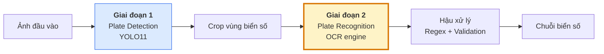
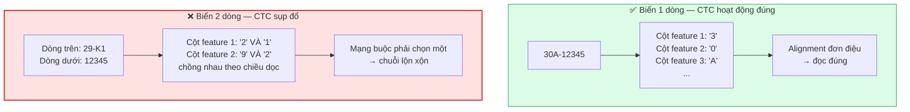
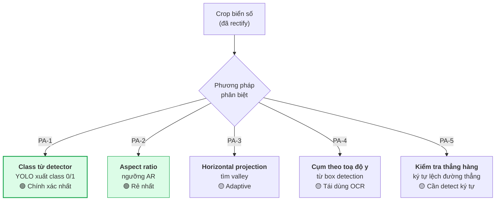
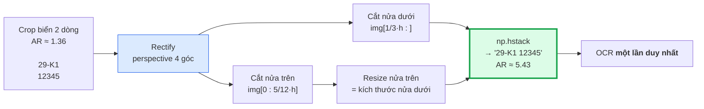
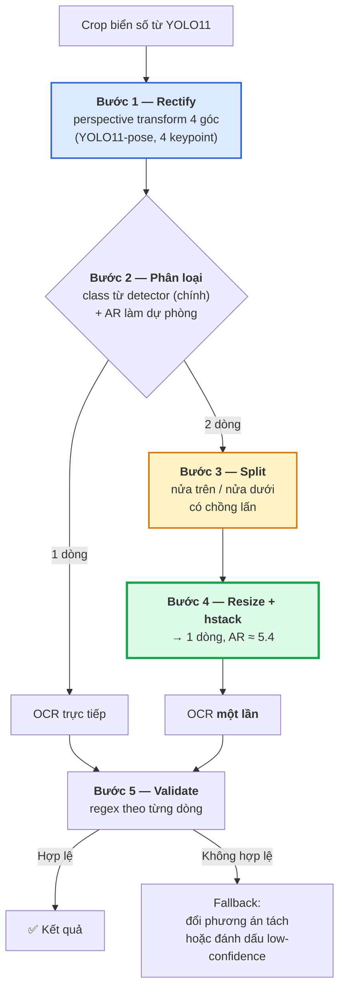

# Báo cáo so sánh các engine OCR cho hệ thống nhận dạng biển số xe Việt Nam

**Thuộc:** Phase 1 — Nghiên cứu tổng quan
**Mục đích:** (1) Làm căn cứ có trích dẫn để chọn engine OCR cho Phase 4; (2) Đánh giá sớm rủi ro **R-04 — biển số 2 dòng** ([project-scope.md](../00-requirements/project-scope.md#7-rủi-ro-và-phương-án-ứng-phó))
**Phiên bản:** 1.0 · **Ngày:** 2026-07-19

---

## Quy ước trích dẫn và mức độ tin cậy

Toàn bộ số liệu định lượng trong tài liệu này đã qua một vòng **kiểm chứng đối kháng** (đối chiếu ngược lại chính nguồn được trích dẫn). Tài liệu áp dụng các quy ước sau:

| Ký hiệu | Ý nghĩa |
|:---:|---|
| *(không ký hiệu)* | Số liệu đã đối chiếu khớp với nguồn gốc |
| ⚠️ | Số liệu khớp nguồn nhưng **nguồn có hạn chế về phương pháp** (blog cá nhân, cỡ mẫu nhỏ, chỉ đọc được abstract) |
| ❌ | Số liệu **không kiểm chứng được nguồn** hoặc **đã bị bác bỏ** — không đưa vào bảng so sánh chính |

> **Nguyên tắc biên tập:** những khẳng định không kiểm chứng được đã bị loại khỏi các bảng quyết định. Chúng chỉ xuất hiện trong [Phụ lục A](#phụ-lục-a--các-số-liệu-đã-bị-loại-bỏ), kèm lý do loại bỏ. Đây là phần nên đọc kỹ trước khi bảo vệ, vì đó chính là những chỗ hội đồng dễ hỏi vặn nhất.

---

## 1. Mở đầu

### 1.1. Vai trò của OCR trong pipeline ALPR

Một hệ thống ALPR (Automatic License Plate Recognition) hoàn chỉnh gồm hai bài toán con nối tiếp nhau. Kiến trúc AI của đồ án ([system-architecture.md](../architecture/system-architecture.md#3-luồng-xử-lý-ai)) phản ánh đúng cấu trúc này:



Quan hệ giữa hai giai đoạn là **quan hệ nhân quả một chiều và không có khả năng phục hồi**: nếu detection cho bounding box lệch, phần ký tự bị cắt cụt sẽ vĩnh viễn không xuất hiện trong ảnh đưa vào OCR, và không engine OCR nào — dù mạnh đến đâu — khôi phục được thông tin đã mất. Ngược lại, detection hoàn hảo mà OCR đọc sai thì toàn bộ chuỗi trả về cho người dùng vẫn sai. Vì chỉ tiêu đánh giá cuối cùng của ALPR là **plate-level exact match** (đúng toàn bộ chuỗi, sai một ký tự cũng tính là sai), sai số của hai giai đoạn nhân lên chứ không bù trừ cho nhau.

Điều này đặt ra một ràng buộc thiết kế quan trọng cho Phase 4: **OCR không được đánh giá tách rời**. Một engine có accuracy cao trên ảnh crop chuẩn nhưng nhạy cảm với sai lệch bounding box sẽ tệ hơn trong thực tế so với một engine kém hơn nhưng bền vững hơn.

### 1.2. Vì sao OCR văn bản tài liệu ≠ OCR biển số

Đây là điểm phân biệt nền tảng, và cũng là lý do không thể lấy thẳng bảng xếp hạng OCR phổ thông làm căn cứ chọn engine cho ALPR. Chính nhóm tác giả LPTR-AFLNet đã nhận định rằng các OCR đa dụng nhẹ như PP-OCRv3 **thiếu tập trung vào định dạng biển số và thiếu tối ưu cho vùng cố định, chuỗi ký tự ngắn**, nên **không phù hợp để triển khai trực tiếp** cho nhận dạng biển số ([LPTR-AFLNet, arXiv:2507.16362](https://arxiv.org/html/2507.16362v2)).

| Chiều so sánh | OCR văn bản tài liệu | OCR biển số xe |
|---|---|---|
| **Nguồn ảnh** | Scan / ảnh chụp tài liệu, gần chính diện | Ảnh scene ngoài trời, phối cảnh nghiêng, chói, mờ do chuyển động |
| **Độ dài chuỗi** | Hàng trăm đến hàng nghìn ký tự | 7–9 ký tự |
| **Tập ký tự** | Lớn, mở, kèm dấu và dấu câu | Đóng, **chỉ A–Z và 0–9** |
| **Bố cục** | Nhiều dòng, đa cột, ngắt dòng tùy ý | Cố định: 1 hoặc 2 dòng, theo quy chuẩn nhà nước |
| **Ràng buộc cú pháp** | Gần như không có | Rất chặt — cho phép validate bằng regex |
| **Tiêu chí đánh giá** | CER / WER (chấp nhận sai lẻ tẻ) | **Exact match** — sai 1 ký tự là hỏng cả bản ghi |
| **Giá trị của ngôn ngữ học** | Cao (language model sửa lỗi hiệu quả) | **Thấp** — không có từ vựng để dựa vào |
| **Vai trò hậu xử lý** | Phụ trợ | **Bắt buộc** — regex theo định dạng là lớp sửa lỗi chính |

Bốn hệ quả trực tiếp cho việc chọn engine:

1. **Tập ký tự đóng là tài sản, không phải hạn chế.** Biển số Việt Nam chỉ dùng A–Z và 0–9, **không dấu**. Do đó toàn bộ ưu thế "hỗ trợ tiếng Việt" của các engine (`latin_PP-OCRv5_mobile_rec`, EasyOCR `vi`, Tesseract `vie`) là **vô nghĩa** với bài toán này. Tệ hơn, model đa ngôn ngữ hệ Latin mang theo từ điển hàng trăm ký tự kèm dấu, làm **tăng không gian nhầm lẫn** và **tăng thời gian suy luận** — tài liệu PaddleOCR ghi rõ PP-OCRv5 dùng từ điển lớn hơn trong model nhận dạng, làm tăng thời gian suy luận so với các phiên bản trước ([PaddleOCR docs](https://www.paddleocr.ai/main/en/version3.x/algorithm/PP-OCRv5/PP-OCRv5.html)). Chênh lệch đo được: PP-OCRv4_mobile_rec chạy 17,48 ms còn PP-OCRv5_mobile_rec chạy 21,20 ms trên cùng phần cứng ([PaddleOCR docs](https://www.paddleocr.ai/main/en/version3.x/module_usage/text_recognition.html)).

2. **Ràng buộc cú pháp bù được điểm yếu whitelist.** Vì định dạng biển VN rất chặt, một lớp hậu xử lý regex có thể ép `O→0`, `I→1`, `B→8`, `S→5` theo vị trí. Đây chính là lớp `PlateNormalizer` đã có trong kiến trúc ([system-architecture.md](../architecture/system-architecture.md#3-luồng-xử-lý-ai)).

3. **Ảnh scene, không phải ảnh tài liệu.** Các benchmark trên hóa đơn hay trang văn bản chỉ có giá trị tham chiếu xu hướng, không thể dùng làm căn cứ quyết định.

4. **Bố cục 2 dòng là một lớp bài toán riêng.** Đây là nội dung của [Mục 4](#4-chuyên-sâu-xử-lý-biển-số-2-dòng-rủi-ro-r-04).

---

## 2. Giới thiệu từng engine

### 2.1. PaddleOCR (PP-OCRv4 / v5 / v6) — Baidu

**Kiến trúc.** Hệ thống 2 giai đoạn: detection dùng DB (Differentiable Binarization) với backbone PP-LCNetV3 cho bản mobile, recognition dùng SVTR-LCNet kết hợp chiến lược GTC (CTC được hướng dẫn bởi attention). PP-OCRv4 giới thiệu SVTR-LCNet; PP-OCRv5 kế thừa kiến trúc nhẹ này và cải tiến chủ yếu bằng quy trình tuyển chọn dữ liệu quy mô lớn ([PP-OCRv5 preprint, arXiv:2603.24373](https://arxiv.org/html/2603.24373v1)).

**Bối cảnh dòng đời kiến trúc.** Ràng buộc "siêu nhẹ" không phải lựa chọn của riêng phiên bản v5 mà là **chủ đích thiết kế xuyên suốt** của dòng PP-OCR ngay từ đầu: bài gốc *PP-OCR: A Practical Ultra Lightweight OCR System* ([arXiv:2009.09941](https://arxiv.org/pdf/2009.09941)) đặt nền cho kiến trúc det → cls → rec, và *PP-OCRv2: Bag of Tricks for Ultra Lightweight OCR System* ([arXiv:2109.03144](https://arxiv.org/pdf/2109.03144)) tiếp tục theo hướng tối ưu chi phí suy luận. Điều này đáng nêu trong quyển vì nó cho thấy ưu thế "nhẹ" của PaddleOCR là **thuộc tính kiến trúc bền vững qua nhiều thế hệ**, không phải kết quả ngẫu nhiên của một bản phát hành — đúng thứ mà ràng buộc CPU-only của đồ án cần.

Ở cấp toolkit (chứ không phải cấp model), *PaddleOCR 3.0 Technical Report* ([arXiv:2507.05595](https://arxiv.org/pdf/2507.05595)) mô tả PaddleOCR là **bộ công cụ mã nguồn mở giấy phép Apache** cho OCR và phân tích tài liệu, và phát biểu rằng các model **dưới 100 triệu tham số** của nó đạt độ chính xác và hiệu quả cạnh tranh với các VLM cỡ tỷ tham số. *(Lưu ý: đây là tuyên bố **tự báo cáo của chính nhóm Baidu** và đo trên tác vụ tài liệu, không phải biển số — xem [Mục 3.2](#32-đánh-giá-độ-tin-cậy-của-nguồn-trong-bảng).)*

**Quy mô.** Bản mobile chỉ **5 triệu tham số** ([PP-OCRv5 preprint](https://arxiv.org/html/2603.24373v1)) — đủ nhẹ để triển khai trên CPU và thiết bị hạn chế tài nguyên.

> **Đính chính trích dẫn.** Tài liệu PP-OCRv5 là **preprint arXiv:2603.24373**, phân loại `cs.CV`. Nguồn này **không phải bài CVPR 2026** — không có bằng chứng nào cho thấy nó đã được nhận tại hội nghị. Cần trích dẫn đúng dạng preprint trong quyển đồ án.

**Ý nghĩa cho ALPR.** Vì detection và recognition tách rời, module detection trả về **mỗi dòng text là một bounding box độc lập**. Đây chính xác là hành vi cần có cho biển 2 dòng — chi tiết ở [Mục 4](#4-chuyên-sâu-xử-lý-biển-số-2-dòng-rủi-ro-r-04).

**Điểm số then chốt.**

| Model | Thời gian CPU | Kích thước | Độ chính xác | Nguồn |
|---|---:|---:|---:|---|
| PP-OCRv5_mobile_det | 57,77 ms | 4,7 MB | Hmean 79,0% | [PaddleX docs](https://paddlepaddle.github.io/PaddleX/3.4/en/module_usage/tutorials/ocr_modules/text_detection.html) |
| PP-OCRv5_mobile_rec | 21,20 ms | 16 MB | 81,29% | [PaddleOCR docs](https://www.paddleocr.ai/main/en/version3.x/module_usage/text_recognition.html) |
| PP-OCRv5_server_det | 383,15 ms | 84,3 MB | Hmean 83,8% | [PaddleX docs](https://paddlepaddle.github.io/PaddleX/3.4/en/module_usage/tutorials/ocr_modules/text_detection.html) |
| PP-OCRv5_server_rec | 31,21 ms | 81 MB | 86,38% | [PaddleOCR docs](https://www.paddleocr.ai/main/en/version3.x/module_usage/text_recognition.html) |
| PP-OCRv4_mobile_det | 56,60 ms | 4,7 MB | Hmean 63,8% | [PaddleX docs](https://paddlepaddle.github.io/PaddleX/3.4/en/module_usage/tutorials/ocr_modules/text_detection.html) |
| PP-OCRv4_mobile_rec | 17,48 ms | 10,5 MB | 78,74% | [PaddleOCR docs](https://www.paddleocr.ai/main/en/version3.x/module_usage/text_recognition.html) |

*Toàn bộ số liệu CPU đo trên Intel Xeon Gold 6271C @ 2.60 GHz, chế độ FP32, **chế độ thường (normal mode)**. Tập đánh giá detection là bộ đa ngôn ngữ 2677 ảnh (Trung, Trung phồn thể, Anh, Nhật), bao phủ cảnh đường phố, ảnh web, tài liệu, chữ viết tay, ảnh mờ/xoay/biến dạng ([PaddleX docs](https://paddlepaddle.github.io/PaddleX/3.4/en/module_usage/tutorials/ocr_modules/text_detection.html), truy cập 19/07/2026).*

> **Ghi chú về phiên bản nguồn — cần thống nhất toàn bộ tài liệu Phase 1.** Tài liệu này trích **PaddleX 3.4** (phiên bản mới hơn), trong khi [01-yolo-comparison.md](01-yolo-comparison.md) trích **PaddleX 3.2** cho **cùng các con số** 57,77 ms / 383,15 ms / 21,20 ms. Đã đối chiếu lại trực tiếp trang PaddleX 3.4 ngày 19/07/2026: **cả ba con số vẫn giữ nguyên** giữa hai phiên bản tài liệu, nên không có mâu thuẫn số liệu — chỉ là khác phiên bản URL được trích. **Thống nhất dùng PaddleX 3.4** cho toàn bộ Phase 1; cần sửa 5 trích dẫn PaddleX 3.2 trong `01-yolo-comparison.md` cho khớp. Các trang `www.paddleocr.ai` cũng đã thống nhất dùng lược đồ **`https://`** (tài liệu này trước đây dùng `http://`).

**Hai quan sát đáng chú ý.** Thứ nhất, `mobile_det` **rẻ hơn `server_det` 6.6 lần** về thời gian CPU (57,77 ms so với 383,15 ms) mà chỉ kém 4,8 điểm Hmean — với môi trường CPU-only của đồ án, bản server gần như bị loại ngay. Thứ hai, PP-OCRv5 cải thiện **+15,2 điểm Hmean** so với PP-OCRv4 ở phần detection *với cùng kích thước 4,7 MB* (79,0% so với 63,8%) — một cải tiến "miễn phí" hiếm gặp.

**Chất lượng trên ảnh xoay — rất liên quan tới biển số chụp nghiêng.** Trên OmniDocBench (normalized edit distance, thấp hơn là tốt hơn), PP-OCRv5 đạt **0.012 ở hạng mục Rotate90**, vượt cả GPT-4o (0.132) và Qwen3-VL-235B (0.029) ([PP-OCRv5 preprint](https://arxiv.org/html/2603.24373v1)).

> **Trình bày cân bằng — bắt buộc.** PP-OCRv5 chỉ thắng ở hạng mục ảnh xoay. Ở **cột tổng thể**, Qwen3-VL-235B đạt 0.026 so với PP-OCRv5 0.067; ở **cột tiếng Anh**, cả GPT-4o (0.020) và Qwen3-VL-235B (0.016) đều vượt PP-OCRv5 (0.058) ([PP-OCRv5 preprint](https://arxiv.org/html/2603.24373v1)). Nếu quyển đồ án chỉ nêu thế mạnh Rotate90 mà giấu hai cột kia thì đó là trích dẫn chọn lọc. Luận điểm đúng là: *PP-OCRv5 đạt hiệu năng cạnh tranh với model lớn hơn hàng nghìn lần, và đặc biệt mạnh ở ảnh xoay*.

**PP-OCRv6 — phát hành 11/06/2026.** Ba bậc model với số tham số: Tiny **1.5M** (0.43M det + 1.1M rec), Small **7.7M** (2.48M + 5.2M), Medium **34.5M** (15.5M + 19M) ([PP-OCRv6, arXiv:2606.13108](https://arxiv.org/html/2606.13108v1)). Thời gian CPU trên Intel Xeon 8350C với OpenVINO: **Tiny 0.20 s/ảnh, Small 0.59 s, Medium 1.40 s** — bản Tiny nhanh hơn PP-OCRv5_mobile (0.78 s cùng hàng) **3.9 lần** ([PP-OCRv6](https://arxiv.org/html/2606.13108v1)). Độ chính xác nhận dạng: Tiny 73,5%, Small 81,3%, Medium 83,2%; detection Hmean: Tiny 80,6%, Small 84,1%, Medium 86,2% ([PP-OCRv6](https://arxiv.org/html/2606.13108v1)). Bài báo phát biểu bản Medium vượt PP-OCRv5_server **+5,1 điểm** nhận dạng và **+4,6 điểm** detection Hmean, đồng thời vượt Qwen3-VL-235B **8,3 điểm** trong khi dùng ít hơn khoảng **6800 lần** tham số ([PP-OCRv6](https://arxiv.org/html/2606.13108v1)).

> ### ⚠️ Bắt buộc đọc kèm: hai bộ số PP-OCRv5_server KHÔNG cùng tập đánh giá
>
> Phát biểu "+5.1 / +4.6" ở trên là **đúng so với chính bài PP-OCRv6**, nhưng **không được đối chiếu với bảng ở đầu Mục 2.1**. Lý do: hai tài liệu đo PP-OCRv5_server trên **hai tập đánh giá khác nhau**, cho hai con số baseline khác nhau:
>
> | PP-OCRv5_server | Theo bảng PaddleX/PaddleOCR docs (đầu Mục 2.1) | Theo bài PP-OCRv6 (Bảng 4 và 6) |
> |---|---:|---:|
> | Nhận dạng | **86,38%** | **78,1%** |
> | Detection Hmean | **83,8%** | **81,6%** |
>
> Bài PP-OCRv6 tính chênh lệch trên **baseline của chính nó**: 83.2 − 78.1 = **+5.1** điểm nhận dạng; 86.2 − 81.6 = **+4.6** điểm Hmean — hoàn toàn nhất quán nội bộ ([PP-OCRv6](https://arxiv.org/html/2606.13108v1)).
>
> Nếu lấy nhầm baseline từ bảng PaddleX (86,38% / 83,8%) thì kết luận **đảo chiều**: v6 Medium sẽ *thấp hơn* 3,2 điểm nhận dạng và chỉ cao hơn 2,4 điểm detection. **Đây là phép trừ SAI** vì ghép số đo trên hai tập đánh giá khác nhau — đúng loại lỗi mà [Mục 3.2](#32-đánh-giá-độ-tin-cậy-của-nguồn-trong-bảng) cảnh báo.
>
> **Quy tắc khi viết vào quyển:** chỉ trích dẫn cặp "+5.1 / +4.6" **kèm nguyên văn baseline 78,1% / 81,6% của bài v6**, và tuyệt đối **không đặt cạnh** bảng PaddleX ở đầu mục này như thể cùng một thang đo. **Cần bổ sung ở Phase 4:** bài PP-OCRv6 không mô tả đầy đủ tập đánh giá của nó, nên **chưa kiểm chứng được** vì sao baseline v5_server lệch tới 8,3 điểm so với số PaddleX công bố.

> **Cần bổ sung ở Phase 4:** kích thước lưu trữ (MB) của các model PP-OCRv6 **không được công bố trong bài báo** — bài chỉ báo cáo số tham số. Phải lấy con số này từ model zoo chính thức trước khi đưa vào quyển.
>
> ### ✅ Đã trả lời 02/08/2026 — xem [35-ppocrv6-evaluation.md](35-ppocrv6-evaluation.md)
>
> `paddleocr 3.7.0` **có** PP-OCRv6, nhưng **chỉ bậc Medium** (`PP-OCRv6_medium_det`,
> `PP-OCRv6_medium_rec`) — **không có Tiny, không có Small**. Đây là điểm quyết định,
> vì bậc hấp dẫn cho hệ thống CPU chính là Tiny.
>
> Đo trên 200 vùng cắt biển số của đồ án, chỉ nhánh nhận dạng, cùng máy:
>
> | Mô hình | Đúng chuỗi | Trung vị |
> |---|---:|---:|
> | PP-OCRv5_mobile_rec *(đang dùng)* | 67,0% | **23,0 ms** |
> | PP-OCRv6_medium_rec | **72,5%** | 386,9 ms |
>
> **Chính xác hơn 5,5 điểm, chậm hơn 16,8 lần.** Đồ án giữ v5 mobile: đổi sang v6
> Medium sẽ đẩy NFR-P1 vượt sàn 1.500 ms và làm NFR-P2 (vốn đã trượt) tệ thêm.

### 2.2. EasyOCR — Jaided AI

**Kiến trúc.** Detection dùng **CRAFT** (Character Region Awareness for Text Detection) — một CNN phát hiện vùng từng **ký tự** rồi liên kết thành từ, rất hợp với scene text và layout tùy ý. Recognition dùng **CRNN**: CNN sâu (backbone ResNet mặc định) trích xuất chuỗi đặc trưng, 2 lớp Bi-LSTM mô hình hóa chuỗi, CTC decoder ([EasyOCR DeepWiki](https://deepwiki.com/JaidedAI/EasyOCR)).

Cách tiếp cận nhận biết theo vùng ký tự của CRAFT về lý thuyết là **lợi thế tiềm năng cho biển số**, vì biển số là chuỗi ký tự rời rạc chứ không phải từ ngữ nghĩa.

**Ưu điểm quyết định.** Đây là engine **dễ cài và dễ dùng nhất** trong nhóm khảo sát: `pip install easyocr`, tự tải model lần đầu, chỉ phụ thuộc PyTorch. Đồng thời hỗ trợ **whitelist native lúc suy luận** qua tham số `allowlist` của `readtext()` (kèm `blocklist`, bị bỏ qua nếu đã cho `allowlist`) ([EasyOCR API docs](https://www.jaided.ai/easyocr/documentation/)).

**Nhược điểm.** Nặng hơn PaddleOCR đáng kể: khoảng **200 MB** cho toàn bộ model ⚠️ ([TildAlice benchmark](https://tildalice.io/ocr-tesseract-easyocr-paddleocr-benchmark/)) so với ~21 MB của PP-OCRv5 mobile. Tiếng Việt (`vi`) được liệt kê là hỗ trợ nhưng **đánh dấu "need revisit"**, dùng chung model `latin.pth` / `latin_g2.pth` ([EasyOCR DeepWiki](https://deepwiki.com/JaidedAI/EasyOCR/7.3-supported-languages)) — điểm này không quan trọng với biển số vì lý do đã nêu ở [Mục 1.2](#12-vì-sao-ocr-văn-bản-tài-liệu--ocr-biển-số).

**Giấy phép:** Apache 2.0; phiên bản PyPI hiện tại `easyocr 1.7.2` ([PyPI easyocr](https://pypi.org/project/easyocr/) — xác minh qua PyPI JSON API, truy cập 19/07/2026).

### 2.3. Tesseract — Google / cộng đồng

**Kiến trúc.** Tesseract 5.5 dùng engine mạng neural **LSTM tập trung vào nhận dạng theo dòng**, vẫn giữ engine legacy nhận dạng theo mẫu ký tự (`--oem 0`). Giấy phép Apache 2.0 từ năm 2005 ([Tesseract Release Notes](https://tesseract-ocr.github.io/tessdoc/ReleaseNotes.html)).

**Ưu điểm tuyệt đối: nhẹ và whitelist tốt nhất.** Tham số `tessedit_char_whitelist` giới hạn tập ký tự được phép xuất ra — ký tự ngoài whitelist **không thể xuất hiện** trong kết quả. Đây là cách dùng chuẩn cho biển số, kết hợp với PSM 7 ([PyImageSearch](https://pyimagesearch.com/2021/09/06/whitelisting-and-blacklisting-characters-with-tesseract-and-python/)). Về tài nguyên: khoảng **30 MB** model và **~300 MB RAM** khi chạy ⚠️ ([TildAlice](https://tildalice.io/ocr-tesseract-easyocr-paddleocr-benchmark/)); binary khoảng **10 MB**, chạy được trên Raspberry Pi ⚠️ ([CodeSOTA](https://www.codesota.com/ocr/paddleocr-vs-tesseract)).

**Nhược điểm quyết định: độ chính xác trên ảnh scene.** Tesseract hoạt động chính xác với text tài liệu và độ chính xác nhìn chung bị giới hạn trong điều kiện được kiểm soát — tức yếu với ảnh scene ngoài trời ([Tesseract Release Notes](https://tesseract-ocr.github.io/tessdoc/ReleaseNotes.html)). Trên ảnh tài liệu tổng hợp, CER của Tesseract là **0.18**, gấp đôi EasyOCR (0.09) và PaddleOCR (0.10) ⚠️ ([TildAlice](https://tildalice.io/ocr-tesseract-easyocr-paddleocr-benchmark/)).

**Chế độ phân đoạn trang (PSM) — trực tiếp liên quan tới biển 2 dòng.** Tesseract có 14 chế độ PSM. **PSM 7** xử lý ảnh như *một dòng text đơn* (đúng cho biển 1 dòng); **PSM 6** xử lý như *một khối text đồng nhất* (về lý thuyết đọc được nhiều dòng) ([PyImageSearch](https://pyimagesearch.com/2021/11/15/tesseract-page-segmentation-modes-psms-explained-how-to-improve-your-ocr-accuracy/)). Trên thực tế PSM 6 kém với biển 2 dòng vì layout analysis của nó được thiết kế cho trang tài liệu; cách làm được khuyến nghị là **tách 2 nửa rồi chạy PSM 7 hai lần**.

### 2.4. TrOCR — Microsoft

**Kiến trúc.** Encoder-decoder thuần transformer: ảnh được resize thành ô vuông **384×384**, chia thành **576 patch** (lưới 24×24, patch 16×16), mã hóa bởi BEiT và giải mã bởi RoBERTa ([TrOCR, arXiv:2109.10282](https://arxiv.org/abs/2109.10282)).

**Quy mô.** TrOCR-base **334M tham số** (BEiT-Base + RoBERTa-Large), TrOCR-large **558M** (BEiT-Large + RoBERTa-Large) ([TrOCR](https://arxiv.org/abs/2109.10282)) — nặng hơn PP-OCRv5 mobile (5M) từ **67 đến 112 lần**. Tồn tại thêm bản TrOCR-Small 62M (DeiT-Small + MiniLM), là biến thể duy nhất còn có thể bàn tới trên CPU ([TrOCR](https://arxiv.org/abs/2109.10282)).

**Vì sao phải loại khỏi shortlist.** TrOCR cung cấp nhận dạng SOTA cho vùng text **một dòng**. Khác với các model OCR khác, TrOCR hoạt động kém trên ảnh chưa crop hoặc text nhiều dòng; cụ thể nó **thất bại khi nhận dạng text trong tài liệu nhiều dòng**, và vì được huấn luyện để nhận dạng text một dòng, khi đưa vào ảnh text nhiều dòng model **có thể sinh ra ảo giác (hallucinate)** ([Roboflow Inference Models](https://inference-models.roboflow.com/models/trocr/)).

Thêm một bất lợi hình học: việc ép ảnh về ô vuông 384×384 **bất kể tỷ lệ gốc** là bất lợi cho crop biển số, vốn có tỷ lệ rất rộng (biển 1 dòng, AR ≈ 4.73) hoặc gần vuông (biển 2 dòng, AR ≈ 1.36). *(Nhận định về tỷ lệ khung hình là suy luận thiết kế của tài liệu này, không phải phát biểu từ nguồn.)*

**Kết luận:** loại TrOCR. Ba lý do độc lập cùng chỉ về một hướng: ảo giác trên đa dòng, quá nặng cho CPU, và biến dạng tỷ lệ khung hình.

### 2.5. docTR — Mindee

**Kiến trúc.** Hai giai đoạn: detection (DBNet backbone ResNet-50 mặc định, hoặc FAST, hoặc LinkNet cho text dày đặc) rồi recognition (CRNN VGG16-BN + BiLSTM + CTC, hoặc PARSeq transformer). Giấy phép Apache 2.0 ([docTR docs](https://mindee.github.io/doctr/latest/using_doctr/using_models.html)).

**Số liệu model zoo.**

| Model | Tham số | FUNSD | CORD | Tốc độ | Nguồn |
|---|---:|---:|---:|---:|---|
| db_resnet50 (det) | 25,4M | R 83,56 / P 86,68 | R 92,61 / P 86,39 | 1,1 s/it (bs=1) | [docTR](https://mindee.github.io/doctr/latest/using_doctr/using_models.html) |
| crnn_vgg16_bn (rec) | 15,8M | 88,21% | 95,47% | 0,6 s/it (**bs=64**) | [docTR](https://mindee.github.io/doctr/latest/using_doctr/using_models.html) |
| crnn_mobilenet_v3_small (rec) | 2,1M | 87,25% | 93,91% | 0,05 s/it (**bs=64**) | [docTR](https://mindee.github.io/doctr/latest/using_doctr/using_models.html) |
| parseq (rec) | 23,8M | 88,53% | 95,56% | 2,2 s/it (**bs=64**) | [docTR](https://mindee.github.io/doctr/latest/using_doctr/using_models.html) |

> ⚠️ **Cảnh báo đọc số liệu.** Cả **ba** model recognition trong bảng đều đo ở **cùng batch size 64** — chú thích bảng docTR ghi rõ: *"Seconds per iteration (with a batch size of 64) is computed after a warmup phase of 100 tensors, by measuring the average number of processed tensors per second over 1000 samples"* ([docTR](https://mindee.github.io/doctr/latest/using_doctr/using_models.html), truy cập 19/07/2026). Do đó `0,6 s/it` của `crnn_vgg16_bn` tương đương khoảng **9,4 ms mỗi ảnh cắt**. Nếu trình bày `0.6 s` như thời gian cho một crop biển số thì sai lệch **64 lần**. Phải luôn ghi kèm batch size.

**Đánh giá.** Vì cả ba model dùng **chung một batch size (64)** và chung quy trình đo, các tỷ số dưới đây là so sánh **cùng điều kiện** — hợp lệ để đối chiếu trực tiếp:

- `parseq` chỉ hơn `crnn_vgg16_bn` **0,32 điểm** trên FUNSD nhưng chậm hơn **3.7 lần** (2,2 s/it so với 0,6 s/it, cùng bs=64) — không đáng cho ALPR trên CPU.
- Ứng viên đáng chú ý nhất lại là **`crnn_mobilenet_v3_small`**: chỉ kém `crnn_vgg16_bn` khoảng 1 điểm nhưng nhanh hơn **12 lần** (0,05 s/it so với 0,6 s/it, cùng bs=64) với 2,1M tham số.

> ⚠️ **Hạn chế còn lại.** docTR **không công bố phần cứng** dùng cho bảng tốc độ này. Vì vậy các tỷ số trên chỉ so sánh **tương đối giữa các model với nhau**, **không** dùng được làm dự báo thời gian tuyệt đối trên CPU máy đồ án — phải tự đo ở Phase 4.

**Điểm yếu cho ALPR.** Model detection nhận ảnh đầu vào chuẩn hóa `(1024, 1024, 3)` và recognition `(32, 128, 3)` — tối ưu cho **trang tài liệu**, không phải cho crop biển số nhỏ. Chỉ số `exact match` mà docTR báo cáo lại rất sát tiêu chí đánh giá biển số, nên bộ số liệu này vẫn có giá trị tham chiếu.

**OnnxTR — con đường tăng tốc.** Xem [Mục 2.8](#28-rapidocr--onnxtr--đường-tăng-tốc-cpu).

### 2.6. MMOCR — OpenMMLab

Toolbox mã nguồn mở dựa trên PyTorch và mmdetection, thuộc dự án OpenMMLab, giấy phép Apache 2.0, phiên bản PyPI 1.0.1 ([MMOCR GitHub](https://github.com/open-mmlab/mmocr)).

**Vấn đề then chốt: chuỗi phụ thuộc 4 tầng.** README chính thức ghi rõ *"MMOCR depends on PyTorch, MMEngine, MMCV and MMDetection"*, và nhánh main yêu cầu PyTorch 1.6+ ([MMOCR GitHub](https://github.com/open-mmlab/mmocr)). Trong đó MMCV thường phải biên dịch khớp chính xác cấp phiên bản CUDA/PyTorch, gây khó khăn lớn khi cài trên Windows không GPU. Triển khai phải đi qua MMDeploy để export sang onnxruntime/openvino/ncnn ([MMDeploy docs](https://mmdeploy.readthedocs.io/en/latest/04-supported-codebases/mmocr.html)).

**Đánh giá.** MMOCR có thiết kế modular cho phép tự định nghĩa backbone, neck, head, loss — rất phù hợp nếu mục tiêu là **nghiên cứu kiến trúc mới**, không phù hợp nếu mục tiêu là **sản phẩm chạy được**. Đồ án này thuộc nhóm thứ hai. **Loại khỏi shortlist.**

### 2.7. fast-plate-ocr — model chuyên biển số

Kiến trúc **CCT (Compact Convolutional Transformer)**, giấy phép **MIT** ([fast-plate-ocr GitHub](https://github.com/ankandrew/fast-plate-ocr)). Ba model pretrained: `argentinian-plates-cnn-synth-model`, `european-plates-mobile-vit-v2-model`, và `global-plates-mobile-vit-v2-model` (65+ quốc gia, backbone MobileViT-2).

**Whitelist ở cấp kiến trúc.** Cơ chế `max_plate_slots` quy định số slot ký tự (= số đầu phân loại của model) và `alphabet` quy định tập ký tự — đây là **whitelist native ở cấp kiến trúc**, mạnh hơn mọi cơ chế whitelist runtime ([fast-plate-ocr DeepWiki](https://deepwiki.com/ankandrew/fast-plate-ocr/4.1-onnxplaterecognizer)).

**Tốc độ.** Độ trễ các model pretrained: `cct-xs-v1` 0.3232 ms, `cct-xs-v2` 0.4664 ms, `cct-s-v1` 0.5877 ms, `cct-s-v2` 0.6758 ms, đạt khoảng 3094 biển/giây với bản XS — nhưng **đo trên GPU NVIDIA RTX 3090** với TensorRT + CUDA ([fast-plate-ocr GitHub](https://github.com/ankandrew/fast-plate-ocr)).

> **Cần bổ sung ở Phase sau:** **không có số liệu CPU chính thức nào** cho fast-plate-ocr. Nếu cân nhắc phương án này, phải tự đo bản ONNX trên CPU của máy đồ án.

**Hai hạn chế loại nó khỏi vai trò engine chính.** Thứ nhất, **không có model biển Việt Nam sẵn** — muốn dùng phải tự huấn luyện từ đầu. Thứ hai, cơ chế fixed-slot đọc **toàn bộ ảnh crop biển một lần, không có khái niệm dòng** — nghĩa là biển 2 dòng **chỉ đọc được nếu model được huấn luyện trên chính dữ liệu biển 2 dòng đó**. *(Kết luận rằng biển xe máy VN cần `max_plate_slots=9` và `alphabet` 36 ký tự là suy luận thiết kế của tài liệu này, không phải trích dẫn.)*

### 2.8. RapidOCR / OnnxTR — đường tăng tốc CPU

Không phải engine mới mà là **runtime thay thế**, và đây là một trong những phát hiện có giá trị thực dụng cao nhất của báo cáo.

**RapidOCR** chuyển đổi các model trong PaddleOCR sang định dạng ONNX tương thích cao để đơn giản hóa và tăng tốc triển khai trên nhiều thiết bị đầu cuối, **loại bỏ phụ thuộc PaddlePaddle** ([RapidOCR GitHub](https://github.com/rapidai/rapidocr)). Mô hình dùng: *huấn luyện bằng PaddleOCR, triển khai bằng RapidOCR*.

**Bằng chứng định lượng mạnh nhất về tăng tốc CPU** đến từ hệ sinh thái docTR. Trên CPU Intel i7-14700K ([OnnxTR GitHub](https://github.com/felixdittrich92/OnnxTR)):

| Runtime | FUNSD (199 trang) | CORD (900 trang) |
|---|---:|---:|
| docTR (PyTorch) | 1,29 s/trang | 0,60 s/trang |
| OnnxTR | 0,57 s/trang | 0,25 s/trang |
| OnnxTR 8-bit lượng tử | 0,38 s/trang | 0,14 s/trang |
| **OnnxTR + OpenVINO** | **0,15 s/trang** | **0,14 s/trang** |

Tăng tốc tối đa **8.6 lần** so với PyTorch gốc. Đây là **số liệu CPU thật**, đo trên phần cứng tiêu dùng — bằng chứng vững chắc nhất trong toàn bộ khảo sát cho luận điểm export ONNX + OpenVINO, và trực tiếp phục vụ phương án ứng phó rủi ro **R-03** ([project-scope.md](../00-requirements/project-scope.md#7-rủi-ro-và-phương-án-ứng-phó)).

> ⚠️ **Lưu ý cân bằng.** Mức tăng tốc không phải lúc nào cũng ngoạn mục như vậy. Với PP-OCRv4_mobile trên Intel Xeon 8350C, thời gian là 0.62 s (PaddlePaddle) → 0.60 s (OpenVINO) → 0.49 s (ONNX Runtime) ([PP-OCRv6](https://arxiv.org/html/2606.13108v1)) — chỉ giảm **3–21%**, không phải "giảm mạnh". Mức lợi thực tế phụ thuộc mạnh vào model và phần cứng, **phải tự đo ở Phase 4**.

> ⚠️ **Bẫy cài đặt đã kiểm chứng.** Gói `rapidocr-onnxruntime 1.4.4` khai báo `requires_python = ">=3.6,<3.13"` nên **không cài được** trên máy đồ án (Python 3.13) ([PyPI rapidocr-onnxruntime](https://pypi.org/project/rapidocr-onnxruntime/)). Phải dùng gói `rapidocr 3.9.1` thay thế — gói này khai báo `requires_python = ">=3.8,<4"`, có classifier cho Python 3.13, giấy phép Apache-2.0 ([PyPI rapidocr](https://pypi.org/project/rapidocr/)). *Cả hai xác minh qua PyPI JSON API, truy cập 19/07/2026.*

### 2.9. Model chuyên biển số cao cấp — LPTR-AFLNet và TransLPRNet

Hai công trình này không phải engine dùng ngay được (không có bản pip, không có model tiếng Việt), nhưng **cung cấp kỹ thuật cốt lõi** cho Mục 4 và là cột mốc so sánh cho phần đánh giá.

**LPTR-AFLNet** đạt **98,87%** tổng thể và **99,37% riêng trên biển 2 dòng**, với chỉ **2.7M tham số** và **2459 FPS** trên GPU TITAN X ([LPTR-AFLNet](https://arxiv.org/html/2507.16362v2)). So sánh cùng bảng: LPRNet 98,35% / 3072 FPS / 1.8M; EULpr 98,64% / 1547 FPS / 3.9M.

> **Đính chính ngữ cảnh quan trọng.** Con số 99,37% được báo cáo trong bảng có tiêu đề *"Performance Comparisons on CCPD"*, nhưng mục 3.4 của bài cho biết nhóm tác giả **tự xây tập biển 2 dòng gồm 200.000 ảnh tổng hợp** (chia 8:1:1), dùng ảnh CCPD làm nền. **CCPD gốc không chứa biển 2 tầng.** Phải viết là *"trên tập biển 2 dòng tổng hợp dựng từ CCPD"*, không được viết *"trên CCPD"*.

**TransLPRNet** đạt **98,70%** trên test set biển 2 dòng, **99,34%** trên CCPD với định vị thô và **99,58%** với định vị tinh, tốc độ tới **167 FPS** ([TransLPRNet, arXiv:2507.17335](https://arxiv.org/abs/2507.17335)).

> **Cần bổ sung ở Phase sau:** cả hai bài đều **không công bố số liệu CPU**. LPTR-AFLNet có 2.7M tham số nhưng 2459 FPS đo trên TITAN X; TransLPRNet không nêu rõ phần cứng cho con số 167 FPS. Chưa đánh giá được liệu chúng có chạy nổi trên CPU-only hay không.

---

## 3. Bảng so sánh tổng hợp

> **Phạm vi bảng.** Chỉ chứa số liệu đã kiểm chứng khớp nguồn. Các số liệu bị bác bỏ hoặc không kiểm chứng được nằm ở [Phụ lục A](#phụ-lục-a--các-số-liệu-đã-bị-loại-bỏ).

### 3.1. Bảng so sánh chính

| Tiêu chí | **PaddleOCR** (PP-OCRv5 mobile) | **EasyOCR** | **Tesseract** | **TrOCR** | **docTR** | **MMOCR** | **fast-plate-ocr** |
|---|---|---|---|---|---|---|---|
| **Kiến trúc** | 2 giai đoạn: DB + SVTR-LCNet/CTC ([arXiv](https://arxiv.org/html/2603.24373v1)) | 2 giai đoạn: CRAFT + CRNN/CTC ([DeepWiki](https://deepwiki.com/JaidedAI/EasyOCR)) | LSTM theo dòng ([docs](https://tesseract-ocr.github.io/tessdoc/ReleaseNotes.html)) | Encoder-decoder BEiT+RoBERTa ([arXiv](https://arxiv.org/abs/2109.10282)) | 2 giai đoạn: DBNet/FAST + CRNN/PARSeq ([docs](https://mindee.github.io/doctr/latest/using_doctr/using_models.html)) | Modular, PyTorch ([GitHub](https://github.com/open-mmlab/mmocr)) | CCT fixed-slot ([GitHub](https://github.com/ankandrew/fast-plate-ocr)) |
| **Độ chính xác** *(bối cảnh khác nhau — xem ghi chú)* | rec 81,29% nội bộ ([docs](https://www.paddleocr.ai/main/en/version3.x/module_usage/text_recognition.html)); CER 0.10 ⚠️ ([TildAlice](https://tildalice.io/ocr-tesseract-easyocr-paddleocr-benchmark/)) | CER 0.09 ⚠️ ([TildAlice](https://tildalice.io/ocr-tesseract-easyocr-paddleocr-benchmark/)); >95% trên biển số ⚠️ ([IEEE](https://ieeexplore.ieee.org/document/10009215/)) | CER 0.18 ⚠️ ([TildAlice](https://tildalice.io/ocr-tesseract-easyocr-paddleocr-benchmark/)); 90% trên biển số ⚠️ ([IEEE](https://ieeexplore.ieee.org/document/10009215/)) | *Không có số liệu trên ảnh biển số* | crnn_vgg16_bn: 88,21% FUNSD / 95,47% CORD exact match ([docs](https://mindee.github.io/doctr/latest/using_doctr/using_models.html)) | *Cần bổ sung ở Phase sau* | *Cần bổ sung ở Phase sau* |
| **Tốc độ CPU** | det 57,77 ms + rec 21,20 ms ([PaddleX](https://paddlepaddle.github.io/PaddleX/3.4/en/module_usage/tutorials/ocr_modules/text_detection.html), [PaddleOCR](https://www.paddleocr.ai/main/en/version3.x/module_usage/text_recognition.html)); pipeline 1.75 s/ảnh tài liệu ([docs](https://www.paddleocr.ai/main/en/version3.x/algorithm/PP-OCRv5/PP-OCRv5.html)) | *Cần bổ sung ở Phase 4* | 0.77 s/ảnh ⚠️ n=1 ([CodeSOTA](https://www.codesota.com/ocr/paddleocr-vs-tesseract)) | *Không đo — đã loại* | 1,29 s/trang PyTorch → 0.15 s OnnxTR+OpenVINO ([OnnxTR](https://github.com/felixdittrich92/OnnxTR)) | *Cần bổ sung ở Phase sau* | **Không có số liệu CPU** (chỉ có GPU RTX 3090) ([GitHub](https://github.com/ankandrew/fast-plate-ocr)) |
| **Kích thước model** | **4,7 MB det + 16 MB rec ≈ 21 MB** ([PaddleX](https://paddlepaddle.github.io/PaddleX/3.4/en/module_usage/tutorials/ocr_modules/text_detection.html), [PaddleOCR](https://www.paddleocr.ai/main/en/version3.x/module_usage/text_recognition.html)) | ~200 MB ⚠️ ([TildAlice](https://tildalice.io/ocr-tesseract-easyocr-paddleocr-benchmark/)) | ~30 MB model / ~300 MB RAM ⚠️ ([TildAlice](https://tildalice.io/ocr-tesseract-easyocr-paddleocr-benchmark/)) | 334M/558M tham số ([arXiv](https://arxiv.org/abs/2109.10282)) | 25,4M + 15,8M tham số ([docs](https://mindee.github.io/doctr/latest/using_doctr/using_models.html)) | *Cần bổ sung ở Phase sau* | *Cần bổ sung ở Phase sau* |
| **Giấy phép** | Apache 2.0 ([PyPI paddleocr](https://pypi.org/project/paddleocr/)) | Apache 2.0 ([PyPI easyocr](https://pypi.org/project/easyocr/)) | Apache 2.0 ([docs](https://tesseract-ocr.github.io/tessdoc/ReleaseNotes.html); binding Python: [PyPI pytesseract](https://pypi.org/project/pytesseract/)) | MIT (repo microsoft/unilm) | Apache 2.0 ([PyPI python-doctr](https://pypi.org/project/python-doctr/)) | Apache 2.0 ([PyPI mmocr](https://pypi.org/project/mmocr/)) | MIT ([PyPI fast-plate-ocr](https://pypi.org/project/fast-plate-ocr/)) |
| **Hỗ trợ nhiều dòng** | ✅ Tự nhiên — mỗi dòng một box, **cần tự sort** | ✅ Tự nhiên — CRAFT tách vùng | ⚠️ PSM 6 về lý thuyết; kém thực tế ([PyImageSearch](https://pyimagesearch.com/2021/11/15/tesseract-page-segmentation-modes-psms-explained-how-to-improve-your-ocr-accuracy/)) | ❌ **Ảo giác trên đa dòng** ([Roboflow](https://inference-models.roboflow.com/models/trocr/)) | ✅ Tự nhiên | ✅ Tự nhiên | ❌ Không có khái niệm dòng |
| **Whitelist ký tự** | ❌ **Không có runtime** — phải fine-tune ([Discussion 7515](https://github.com/PaddlePaddle/PaddleOCR/discussions/7515)) | ✅ `allowlist` native ([API docs](https://www.jaided.ai/easyocr/documentation/)) | ✅ **Tốt nhất** — `tessedit_char_whitelist` ([PyImageSearch](https://pyimagesearch.com/2021/09/06/whitelisting-and-blacklisting-characters-with-tesseract-and-python/)) | ❌ Subword tokenizer | ⚠️ Có `vocab` nhưng đổi phải train lại | ⚠️ Qua cấu hình, cần train lại | ✅ **Cấp kiến trúc** — `alphabet` + `max_plate_slots` ([DeepWiki](https://deepwiki.com/ankandrew/fast-plate-ocr/4.1-onnxplaterecognizer)) |
| **Độ khó triển khai** *(Windows + CPU + Py3.13)* | 🟡 Trung bình — có wheel cp313 ([PyPI](https://pypi.org/project/paddlepaddle/)), nhưng framework riêng | 🟢 **Dễ nhất** — chỉ PyTorch | 🟡 Cần cài binary hệ thống ngoài pip | 🟢 Dễ cài, nhưng tải 1.3–2,2 GB | 🟡 Cần chọn backend; yêu cầu Python ≥3.10,<4 ([PyPI python-doctr](https://pypi.org/project/python-doctr/)) | 🔴 **Khó nhất** — 4 tầng phụ thuộc ([GitHub](https://github.com/open-mmlab/mmocr)) | 🟡 Dễ cài nhưng **phải tự train** |

**Ghi chú bắt buộc về cột "Độ chính xác":** các con số trong cột này **đến từ những bối cảnh khác nhau và không so sánh trực tiếp được với nhau**. `81,29%` là trên tập nội bộ PaddleOCR (ảnh tài liệu đa ngôn ngữ); `CER 0.09/0.10/0.18` là trên ảnh tài liệu tổng hợp chạy GPU; `88,21%/95,47%` là exact match trên FUNSD/CORD. **Không có số nào trong bảng là accuracy trên ảnh biển số xe máy Việt Nam 2 dòng** — xem [Mục 3.3](#33-khoảng-trống-nghiên-cứu).

### 3.2. Đánh giá độ tin cậy của nguồn trong bảng

| Nguồn | Loại | Hạn chế phải nêu khi bảo vệ |
|---|---|---|
| PaddleOCR / PaddleX docs | Tài liệu chính thức | Self-reported bởi Baidu; tập test nội bộ |
| docTR model zoo, OnnxTR | Tài liệu chính thức / repo | Đo trên ảnh tài liệu, không phải biển số |
| arXiv (PP-OCRv5/v6, TrOCR, LPTR-AFLNet, TransLPRNet) | Preprint | **Chưa bình duyệt**; PP-OCRv5/v6 self-reported bởi chính Baidu |
| TildAlice ⚠️ | Blog cá nhân | **Không bình duyệt, không công bố dữ liệu/mã nguồn, không tái lập được**; chạy GPU RTX 3080; **không phải ảnh biển số** |
| CodeSOTA ⚠️ | Blog cá nhân | **Cỡ mẫu n = 1 ảnh** (`invoice.png`). Tỷ số "6.3 lần" **không có ý nghĩa thống kê** |
| IEEE 10009215 ⚠️ | Bài báo IEEE | **Paywall — chỉ đọc được abstract**. Cần lấy toàn văn qua thư viện trường trước khi trích dẫn trong quyển |

> **Khuyến nghị biên tập:** hai nguồn blog (TildAlice, CodeSOTA) **không nên dùng làm bằng chứng định lượng** trong quyển đồ án. Chúng được giữ ở đây để cho thấy đã khảo sát đầy đủ, và để minh họa **xu hướng** (Tesseract nhanh nhưng kém chính xác hơn). Số liệu quyết định phải đến từ benchmark tự chạy ở Phase 4.

### 3.3. Khoảng trống nghiên cứu

Khảo sát đã tìm được ba nghiên cứu so sánh engine trên ảnh biển số:

1. **Reddy & Shruthi, IEEE ICCCNT 2024** — *License Plate Detection using YOLO v8 and Performance Evaluation of EasyOCR, PaddleOCR and Tesseract*. Đây là công trình so sánh **đúng ba engine** trong shortlist, kết luận Tesseract được khuyến nghị về hiệu năng còn EasyOCR được ưa chuộng về độ chính xác. **Toàn văn nằm sau paywall IEEE** nên chưa lấy được bảng số liệu chi tiết ([IEEE 10725878](https://ieeexplore.ieee.org/document/10725878/)).
2. **IEEE 10009215 (2022)** — so sánh EasyOCR và Tesseract, chỉ đọc được abstract ⚠️.
3. **arXiv 2410.13622** — chỉ test EasyOCR trên biển số Brazil; Tesseract/PaddleOCR chỉ nêu ở phần future work, nên **không dùng được** làm so sánh ba engine.

> ### 🎯 Khoảng trống nghiên cứu — cơ hội đóng góp khoa học của đồ án
>
> **Không tồn tại benchmark công khai nào so sánh PaddleOCR / EasyOCR / Tesseract / docTR trên riêng ảnh biển số xe máy Việt Nam 2 dòng.**
>
> Đây là khoảng trống đồ án có thể tự lấp ở **Phase 4**, và là **đóng góp khoa học có giá trị nhất** mà đồ án có thể tuyên bố. Đề xuất thiết kế benchmark ở [Mục 6.3](#63-thiết-kế-benchmark-phase-4).

---

## 4. Chuyên sâu: Xử lý biển số 2 dòng (rủi ro R-04)

> Đây là mục quan trọng nhất của báo cáo. Rủi ro **R-04** được xếp mức *Khả năng: Cao / Ảnh hưởng: Cao* trong [project-scope.md](../00-requirements/project-scope.md#7-rủi-ro-và-phương-án-ứng-phó), và là nhánh màu đỏ trong sơ đồ luồng xử lý AI.

### 4.1. Vì sao biển 2 dòng là vấn đề

#### 4.1.1. Bằng chứng định lượng: điểm gãy đo được, không phải rủi ro giả định

Nghiên cứu *On the Cross-dataset Generalization in License Plate Recognition* thiết kế một test set **cân bằng có chủ ý**: 4000 ảnh ô tô (biển 1 dòng) và 4000 ảnh xe máy (biển 2 dòng). Kết quả của OpenALPR — một hệ thống ALPR thương mại trưởng thành:

| Loại xe | Bố cục biển | Nhận đúng | Tỷ lệ |
|---|---|---:|---:|
| Ô tô | **1 dòng** | 3772 / 4000 | **94,3%** |
| Xe máy | **2 dòng** | 1827 / 4000 | **45,7%** |
| | | **Chênh lệch** | **48,6 điểm %** |

*Nguồn: [Laroca et al., arXiv:2201.00267](https://ar5iv.labs.arxiv.org/html/2201.00267)*

**Gần 49 điểm phần trăm chênh lệch trên cùng một hệ thống, cùng một bộ test.** Không có biến số nào khác thay đổi ngoài bố cục biển.

Chi tiết còn đáng lo hơn: chính bài báo ghi nhận có công trình **không thể sửa được phương pháp để xử lý biển nhiều dòng** nên đã phải **loại bỏ hoàn toàn xe máy** khỏi thí nghiệm ([Laroca et al.](https://ar5iv.labs.arxiv.org/html/2201.00267)).

> ### ⚠️ Hệ quả trực tiếp cho đồ án
>
> Xe máy chiếm đa số phương tiện tại Việt Nam. Nếu không xử lý riêng biển 2 dòng, hệ thống sẽ **hoạt động tốt trên demo** (chọn ảnh ô tô) và **thất bại trên thực tế**. Đây là kiểu lỗi tệ nhất có thể xảy ra khi bảo vệ: chỉ lộ ra khi hội đồng đưa ảnh của chính họ vào.

Bằng chứng thứ hai đến từ PatrolVision, cho thấy chỉ riêng việc **chọn sai kích thước ảnh đầu vào** đã đủ phá hủy hiệu năng trên biển 2 dòng:

| Kích thước đầu vào | Biển 1 dòng | Biển 2 dòng | Tổng thể |
|---|---:|---:|---:|
| 240×80 *(dạng dài, kiểu 1 dòng)* | **83%** | **30%** | 56,6% |
| 160×120 | — | — | 64,4% |
| 200×160 | — | — | 63,6% |
| **288×200** *(AR ≈ 3:2)* | — | — | **67%** |

*Nguồn: [PatrolVision, arXiv:2504.10810](https://arxiv.org/html/2504.10810v1)*

Đây là bảng ablation rất có giá trị: cùng một model, chỉ đổi kích thước đầu vào, hiệu năng trên biển 2 dòng dao động từ 30% đến mức khả dụng. Lý do PatrolVision chọn 288×200 là để bao phủ cả hai loại: biển 1 dòng có AR ≈ 3:1 còn biển 2 dòng gần 3:2 ([PatrolVision](https://arxiv.org/html/2504.10810v1)).

#### 4.1.2. Nguyên nhân gốc: giới hạn kiến trúc CRNN/CTC

Vấn đề **không phải bug cấu hình** mà là giới hạn kiến trúc.

CTC (Connectionist Temporal Classification) giả định **alignment đơn điệu**: ký tự xuất hiện tuần tự trái-sang-phải theo trục thời gian, mà trục thời gian ở đây chính là **trục chiều rộng của ảnh**. CNN backbone của CRNN downsample chiều cao về 1 rồi đẩy feature sequence vào BiLSTM.

Khi ảnh có 2 dòng, **mỗi cột feature chứa cả hai ký tự chồng nhau theo chiều dọc** — mạng bị ép phải chọn một, cho ra chuỗi lộn xộn hoặc chỉ đọc được một dòng ([A Feasible Framework for Arbitrary-Shaped Scene Text Recognition, arXiv:1912.04561](https://arxiv.org/pdf/1912.04561)).



#### 4.1.3. Bằng chứng cụ thể trong PaddleOCR: `rec_image_shape`

Module recognition của PP-OCRv3/v4/v5 resize ảnh về **chiều cao cố định 48 px**, cấu hình `rec_image_shape = 3 × 48 × 320` ([PaddleOCR config, verified 19/07/2026](https://raw.githubusercontent.com/PaddlePaddle/PaddleOCR/main/configs/rec/PP-OCRv5/PP-OCRv5_server_rec.yml)).

Áp vào biển xe máy Việt Nam (AR = 1.357):

| Tình huống | Chiều rộng sau resize | Chiều cao mỗi dòng | Đọc được? |
|---|---:|---:|:---:|
| Đưa thẳng crop biển 2 dòng | 48 × 1,357 ≈ **65 px** | ≈ **24 px** | ❌ |
| Sau split + hstack (AR ≈ 5,43) | 48 × 5,43 ≈ **261 px** | **48 px** (trọn) | ✅ |

**Đây là con số giải thích gọn toàn bộ rủi ro R-04.** Một crop biển xe máy đưa thẳng vào module rec bị nén còn 65 px rộng, mỗi dòng chỉ còn ~24 px cao — không đủ để đọc. Sau khi tách và ghép ngang, chiều rộng tăng **4 lần** và mỗi dòng được trọn 48 px.

**Kết luận:** không có cấu hình nào của PP-OCR rec giải được bài toán này. Phải giải ở **tầng trên** (tách dòng) hoặc **thay model rec**.

#### 4.1.4. Bằng chứng bổ sung: PaddleOCR pretrained gần như vô dụng trên biển số

Ứng dụng "nhận dạng biển số nhẹ" chính thức của PaddleOCR, thử nghiệm trên CCPD ([PaddleOCR applications](https://www.paddleocr.ai/v2.9/applications/%E8%BD%BB%E9%87%8F%E7%BA%A7%E8%BD%A6%E7%89%8C%E8%AF%86%E5%88%AB.html)):

| Giai đoạn | Model | Pretrained | Fine-tuned | Fine-tuned + lượng tử |
|---|---|---:|---:|---:|
| Detection (Hmean) | PP-OCRv3 det, 2.5M | 76,12% | **99,00%** | 98,91% |
| Recognition | PP-OCRv3 rec, 10.3M | **0,00%** | **94,54%** | 93,40% |

> **Đọc đúng con số 0,00%.** Con số này *không* có nghĩa PaddleOCR không đọc được biển số. Nguyên nhân là model pretrained sinh thêm một **ký tự đặc biệt** khiến toàn bộ chuỗi sai theo tiêu chí exact match; chỉ cần một bước hậu xử lý bỏ ký tự đó là đạt **90,97%** ([PaddleOCR applications](https://www.paddleocr.ai/v2.9/applications/%E8%BD%BB%E9%87%8F%E7%BA%A7%E8%BD%A6%E7%89%8C%E8%AF%86%E5%88%AB.html)). Không được trình bày "0% ⇒ pretrained vô dụng" — đó là kết luận quá mạnh và dễ bị hội đồng bắt lỗi.
>
> Luận điểm đúng và vẫn rất mạnh: **fine-tune nâng recognition từ 90,97% lên 94,54% và detection từ 76,12% lên 99,00%**. Fine-tune là bắt buộc, không phải tùy chọn.

### 4.2. Các phương pháp phân biệt biển 1 dòng / 2 dòng



#### PA-1 — Dùng chính mạng detection xuất class *(khuyến nghị chính)*

Đây là cách chính xác nhất và gần như miễn phí với đồ án này.

Repo tham chiếu huấn luyện YOLOv5 xuất **vừa 4 landmark góc vừa một class**, với `0` = biển 1 tầng, `1` = biển 2 tầng. Luồng xử lý: `four_point_transform()` dùng 4 landmark tính `cv2.getPerspectiveTransform()` và `cv2.warpPerspective()` để **nắn phẳng** biển trước; sau đó `if class_label: roi_img = get_split_merge(roi_img)` — tức **split chỉ chạy khi class = 1, và chạy SAU khi đã rectify** ([detect_plate.py, truy cập 19/07/2026](https://raw.githubusercontent.com/we0091234/Chinese_license_plate_detection_recognition/main/detect_plate.py)).

**Vì sao phù hợp với đồ án:** đồ án đang **tự gán nhãn dataset** ở Phase 2. Thêm một class (`plate_1line` / `plate_2line`) có chi phí gần bằng 0, và độ chính xác cao hơn hẳn heuristic vì model "nhìn" được nội dung biển chứ không chỉ hình dạng.

#### PA-2 — Ngưỡng aspect ratio *(khuyến nghị làm lớp dự phòng)*

Quy chuẩn biển số Việt Nam tạo ra một khoảng trống AR **rất rộng**, khiến ngưỡng AR trở nên đáng tin cậy:

| Loại biển | Kích thước | **AR** | Bố cục |
|---|---|---:|:---:|
| Mô tô (xe máy) | 190 × 140 mm | **1.357** | **2 dòng** |
| Ô tô — biển ngắn | 330 × 165 mm | **2.000** | **2 dòng** |
| Ô tô — biển dài | 520 × 110 mm | **4.727** | **1 dòng** |

*Nguồn kích thước: **QCVN 08:2024/BCA** — Quy chuẩn kỹ thuật quốc gia về biển số xe, hiệu lực 01/01/2025 ([Báo Chính phủ](https://baochinhphu.vn/quy-chuan-ky-thuat-quoc-gia-ve-bien-so-xe-102241209094144236.htm)). Văn bản quản lý biển số hiện hành là **Thông tư 79/2024/TT-BCA** (ký 15/11/2024, hiệu lực 01/01/2025), sửa đổi bởi TT 13/2025 và TT 51/2025 ([tổng hợp](https://thuvienphapluat.vn/chinh-sach-phap-luat-moi/vn/ho-tro-phap-luat/chinh-sach-moi/76322/quy-dinh-ve-bien-so-xe-tu-ngay-01-01-2025-theo-thong-tu-79-2024)). Thông tư 24/2023/TT-BCA **đã hết hiệu lực từ 01/01/2025** — không được trích như văn bản đang có hiệu lực.*

**Không có loại biển nào rơi vào khoảng (2.000, 4.727)** — vùng trống rộng **2.727 đơn vị**.

> **Ngưỡng AR = 2.5–3.0 là đề xuất của chính đồ án này, KHÔNG phải quy định trong Thông tư.**
>
> Thông tư 79/2024/TT-BCA chỉ quy định **kích thước vật lý** của biển số, không chứa bất kỳ ngưỡng aspect ratio nào cho phân loại thị giác máy tính. Ba giá trị AR nền tảng (1.357 / 2.000 / 4.727) là số liệu trích dẫn được; ngưỡng 2.5–3.0 là **suy luận thiết kế** phải được kiểm chứng bằng thực nghiệm ở Phase 4. Trình bày sai điểm này sẽ bị hội đồng bắt lỗi trích dẫn.

Quy tắc đề xuất: `AR < 2.5` → 2 dòng; `AR > 3.0` → 1 dòng; `2.5 ≤ AR ≤ 3.0` → vùng nghi ngờ, thử cả hai và chọn theo confidence.

> ⚠️ **Bẫy triển khai.** AR đo trên **bounding box axis-aligned** của YOLO sẽ bị biến dạng khi biển nghiêng: một biển 1 dòng nghiêng 30° có thể cho bbox AR tụt xuống dưới 3 và bị phân loại nhầm. Phải đo AR **trên ảnh đã rectify** hoặc trên `cv2.minAreaRect`, **không đo trên bbox thô**.

#### PA-3 — Horizontal projection (peak-to-valley)

Tính vector tổng cường độ pixel trên từng hàng; biển 2 dòng sẽ có một **valley sâu ở giữa**. Nếu valley vượt ngưỡng thì kết luận 2 dòng và cắt tại vị trí valley.

Phương pháp này có cơ sở học thuật **trên chính biển số Việt Nam**: nghiên cứu *Research on Characters Segmentation in One-Row and Two-Row of Vietnam License Plates* thử nghiệm trên **600 biển Việt Nam (300 một dòng + 300 hai dòng)** đạt độ chính xác trung bình **98,03%** ([Advanced Materials Research, vol. 479-481, 2012](https://www.scientific.net/AMR.479-481.2293)). Quy trình gồm hai module: tiền xử lý (lượng tử hóa, chuẩn hóa, **điều chỉnh contour ngang / deskew**, morphology opening khử nhiễu) rồi phân đoạn ký tự bằng phương pháp peak-to-valley theo tham số thống kê.

**Điểm mạnh:** vị trí cắt **adaptive theo từng ảnh**, khác hẳn cắt cứng theo tỷ lệ. **Điểm yếu:** valley biến mất khi biển nghiêng — chính vì vậy bài báo phải deskew ở bước 1. Lưu ý đây là công trình **2012, không dùng deep learning**, nên định vị nó đúng vai trò *baseline cổ điển*.

#### PA-4 — Phân cụm bounding box theo toạ độ y

Tận dụng chính output detection của PaddleOCR. Hàm `predict()` trả về dict với các key `rec_texts`, `rec_scores`, `rec_polys`, `dt_polys` và **`rec_boxes`** — mảng shape `(n, 4)` định dạng `[x_min, y_min, x_max, y_max]` ([PaddleOCR 3.x docs](https://www.paddleocr.ai/latest/en/version3.x/pipeline_usage/OCR.html)).

Vì có `y_min` tường minh, hoàn toàn có thể **bỏ qua thứ tự mặc định** và tự gom nhóm: sort theo `y_center`, cluster thành 2 nhóm với ngưỡng = 0,5 × chiều cao trung bình box, rồi trong mỗi nhóm sort theo `x_min`.

#### PA-5 — Kiểm tra tính thẳng hàng của ký tự

Repo ALPR Việt Nam `trungdinh22/License-Plate-Recognition` (YOLOv5 hai tầng: detect biển → detect từng ký tự) quyết định 1 hay 2 dòng bằng cách lấy tâm mỗi ký tự, nối ký tự trái nhất và phải nhất thành đường thẳng, rồi kiểm tra mọi ký tự bằng `math.isclose(y_pred, y, abs_tol=3)`. Nếu **bất kỳ** điểm nào lệch quá 3 pixel → kết luận biển 2 dòng ([helper.py, truy cập 19/07/2026](https://raw.githubusercontent.com/trungdinh22/License-Plate-Recognition/main/function/helper.py)). Repo báo cáo tốc độ **15–20 FPS** khi có 1 biển trong khung hình ⚠️ *(tự báo cáo, không nêu rõ CPU/GPU)* ([GitHub](https://github.com/trungdinh22/License-Plate-Recognition)).

> ⚠️ **Điểm yếu phải sửa nếu áp dụng:** `abs_tol=3` là **pixel tuyệt đối**, nên kết quả phụ thuộc độ phân giải crop. Nên đổi sang tỷ lệ, ví dụ `abs_tol = 0,25 × chiều_cao_ký_tự_trung_bình`.

### 4.3. Các phương pháp tách và ghép

#### 4.3.1. Bắt buộc: rectify TRƯỚC khi tách

Cả hai công trình và repo tham chiếu đều đặt **rectification trước bước split**, và đây không phải ngẫu nhiên: **horizontal projection và ngưỡng y-coordinate đều vô hiệu khi biển nghiêng**.

Ba lớp kỹ thuật, xếp theo độ mạnh:

| Kỹ thuật | Xử lý được | Đánh giá |
|---|---|---|
| **Hough transform** | Xoay trong mặt phẳng | Repo `mrzaizai2k` dùng cách này, ghi rõ nó **thay thế** phương pháp contour cũ vì contour "tỏ ra không đáng tin cậy" |
| **Radon transform** | Xoay trong mặt phẳng | Độ chính xác khá cao nhưng **thời gian chạy lâu** |
| **Perspective transform 4 góc** | **Biến dạng phối cảnh 3D** | 🟢 **Mạnh nhất** — khuyến nghị |

Với văn bản nghiêng 3D, kỹ thuật chống nghiêng thông thường như Hough hay Radon **có thể thất bại**, cần dùng projective transform ([Ultralytics Issue #2533](https://github.com/ultralytics/ultralytics/issues/2533)).

**Cách lấy 4 góc phù hợp với đồ án:** huấn luyện **YOLO11-pose với 4 keypoint** thay vì 17 keypoint mặc định. Vì đồ án đã dùng YOLO11 cho detection, đây là lựa chọn trực tiếp; chi phí thêm chỉ là công gán nhãn 4 góc ở Phase 2.

> **Vì sao KHÔNG dùng STN (Spatial Transformer Network).** Ba nhược điểm được chỉ rõ: (1) STN chỉ xét biến đổi **affine** nên **không phù hợp với ảnh biển số có biến dạng phối cảnh** — mà biển số chụp từ camera giao thông gần như luôn có perspective; (2) STN phụ thuộc tín hiệu giám sát ngược từ mạng nhận dạng phía sau nên **đòi hỏi pre-train mạng nhận dạng trước**, làm quy trình huấn luyện phức tạp; (3) vấn đề hội tụ — chính là lý do LPTR-AFLNet chuyển sang ước lượng offset đỉnh ([LPTR-AFLNet](https://arxiv.org/html/2507.16362v2)). Với một đồ án sinh viên, perspective transform từ 4 góc **đơn giản hơn, deterministic, dễ debug và dễ viết vào quyển**.

#### 4.3.2. Kỹ thuật chuẩn công nghiệp: Split-then-hstack

Đây là **phương án được khuyến nghị chính** cho đồ án. Ý tưởng: cắt biển thành nửa trên và nửa dưới **có chồng lấn**, resize nửa trên bằng nửa dưới, rồi `np.hstack` thành **một dải 1 dòng duy nhất** trước khi đưa vào OCR.



Mã nguồn tham chiếu đã được kiểm chứng ([double_plate_split_merge.py, truy cập 19/07/2026](https://raw.githubusercontent.com/we0091234/Chinese_license_plate_detection_recognition/main/plate_recognition/double_plate_split_merge.py)):

```python
img_upper = img[0:int(5/12*h), :]              # nửa trên: 0 → 41,67% chiều cao
img_lower = img[int(1/3*h):, :]                # nửa dưới: 33,33% → hết
img_upper = cv2.resize(img_upper, (img_lower.shape[1], img_lower.shape[0]))
new_img = np.hstack((img_upper, img_lower))    # ghép ngang thành 1 dòng
```

**Ba chi tiết thiết kế đáng học:**

1. **Vùng chồng lấn 8,33%.** Ngưỡng trên là `5/12 = 41,67%` còn ngưỡng dưới là `1/3 = 33,33%`, tạo vùng chồng lấn `5/12 − 1/3 = 1/12 = 8,33%` chiều cao. Đây là biên an toàn để không cắt cụt chân ký tự dòng trên hay đỉnh ký tự dòng dưới khi biển hơi lệch. *(Việc chồng lấn là có chủ ý về mặt kỹ thuật — thấy rõ trong code — nhưng tác giả repo không viết comment giải thích, nên diễn giải nguyên nhân là suy luận của tài liệu này.)*
2. **Không chia đều 50/50**, vì dòng trên của biển 2 tầng thấp hơn dòng dưới.
3. **Resize nửa trên về đúng kích thước nửa dưới trước khi hstack** — để chiều cao ký tự hai dòng đồng nhất. Đây là **điều kiện bắt buộc** để CRNN/CTC hoạt động.

**Ba lợi ích:**

- ✅ Chỉ gọi OCR **một lần**, không cần ghép chuỗi thủ công → tránh hoàn toàn vấn đề thứ tự đọc.
- ✅ AR tăng từ 1.36 lên ≈ 5.43, khớp với `rec_image_shape` 48×320 (xem [Mục 4.1.3](#413-bằng-chứng-cụ-thể-trong-paddleocr-rec_image_shape)).
- ✅ **Giảm thời gian OCR.** Repo Việt Nam `LeNguyenGiaBao/license_plates_recognition` (WPOD + PaddleOCR) ghi nhận trực tiếp: *"crop plate into 2 parts → ocr time decreases 0.25s → 0.05~0.1s"* trên CPU i5-8250 ([GitHub](https://github.com/LeNguyenGiaBao/license_plates_recognition)). *(Lý do — bỏ qua được bước DB detection khi đã tự cắt sẵn từng dòng — là suy luận của tài liệu này; README không giải thích nguyên nhân.)*

> ⚠️ **Cảnh báo hiệu chỉnh — phải thực nghiệm ở Phase 4.** Tỷ lệ `5/12` và `1/3` được calibrate cho **biển 2 tầng Trung Quốc**, nơi dòng trên rất thấp (chỉ chứa chữ Hán + 1 chữ cái). **Biển xe máy Việt Nam có tỷ lệ hai dòng khác hẳn** — dòng trên (`29-K1`) và dòng dưới (`12345`) có chiều cao gần bằng nhau. Đề xuất thí nghiệm riêng: gán nhãn thủ công vị trí đường cắt trên 100–200 ảnh biển 2 dòng Việt Nam, lấy trung bình và độ lệch chuẩn, rồi đặt vùng chồng lấn = 2 × độ lệch chuẩn.

#### 4.3.3. Cùng nguyên lý, làm bên trong mạng: LPTR-AFLNet

LPTR-AFLNet dùng **đúng nguyên lý split-then-hstack** nhưng đưa vào trong mạng và có học. Biển 2 dòng được mô tả bằng **6 đỉnh**, trong đó hai đỉnh `(x3,y3)` và `(x4,y4)` **dùng chung** giữa vùng trên và vùng dưới. Mạng hồi quy **12 tham số cho biển 2 dòng** (so với **8 tham số cho biển 1 dòng**), tương ứng offset các đỉnh của vùng ký tự trên và dưới; sau đó nắn từng vùng bằng hai ma trận perspective riêng rồi **ghép ngang** trước khi đưa vào mạng nhận dạng 1 dòng ([LPTR-AFLNet](https://arxiv.org/html/2507.16362v2)).

Kết quả: **99,37% trên tập biển 2 dòng tổng hợp dựng từ CCPD**, với 2.7M tham số và 2459 FPS trên TITAN X ([LPTR-AFLNet](https://arxiv.org/html/2507.16362v2)). Huấn luyện weak-supervised với Focal CTC loss.

**Ý nghĩa:** con số 99,37% chứng minh rằng **nguyên lý split-then-hstack là đúng và có thể đạt độ chính xác rất cao** — nó không phải một mẹo tạm bợ.

#### 4.3.4. Phương án không tách: model vision-language

TransLPRNet **chỉ trích trực tiếp** hướng split: các phương pháp này *"thường gặp thách thức đáng kể khi xử lý biển 2 dòng, vì kiến trúc CNN hoặc CRNN truyền thống thường khó xử lý hiệu quả thông tin nhiều dòng; các phương pháp thường phải phân đoạn biển 2 dòng thành vùng trên và vùng dưới rồi tích hợp kết quả nhận dạng riêng lẻ"* ([TransLPRNet](https://arxiv.org/abs/2507.17335)).

Giải pháp: visual encoder nhẹ + text decoder trong khung pre-training, xử lý toàn bộ ảnh biển một lần **bất kể bố cục 1 hay 2 dòng**. Đạt **98,70%** trên test set biển 2 dòng và tới **167 FPS**.

> **Cần bổ sung ở Phase sau:** chưa xác định được số tham số và kích thước model của TransLPRNet (bài chỉ công bố accuracy và FPS), nên **chưa đánh giá được liệu nó có chạy nổi trên CPU-only hay không**. Ngoài ra chưa tìm được mã nguồn công khai.

#### 4.3.5. Phương án không OCR: detect từng ký tự

Coi mỗi ký tự là một object của mạng detection, rồi sắp xếp lại theo toạ độ. Ưu điểm: **cho toạ độ từng ký tự**, giúp tái tạo thứ tự đọc 2 dòng chính xác hơn OCR đa dụng.

PatrolVision theo hướng này, đạt **67%** đúng toàn bộ ký tự, **89%** khi cho phép sai ≤1 ký tự, **95%** khi cho phép sai ≤2 ký tự; detection RFBNet đạt **86% precision** ([PatrolVision](https://arxiv.org/html/2504.10810v1)). Cách ghép: biển 1 dòng sort tăng dần theo x; biển 2 dòng chia 2 nhóm theo ngưỡng y, sort từng nhóm theo x, rồi nối tuần tự.

> ⚠️ **Đính chính số liệu tốc độ PatrolVision.** Hai con số tốc độ của bài thuộc **hai giai đoạn khác nhau** và không được ghép lại: **64 FPS** (Tesla P4, INT8) là của giai đoạn **character recognition**; **7.5 FPS** (Jetson TX2, TensorRT, **batch size 2**) là của giai đoạn **plate detection** bằng RFBNet ([PatrolVision](https://arxiv.org/html/2504.10810v1)). Bài còn ghi character recognition đạt 68 FPS trên GTX 1080Ti — rất dễ nhầm với 64 FPS. **Không có con số nào trong bài đo chi phí của hướng detect-từng-ký-tự trên thiết bị biên như một pipeline hoàn chỉnh.**

Một điểm tham chiếu độc lập cho chi phí biên đến từ *An Embedded Real-Time License Plate Recognition System for Complex Traffic Scenes*, dùng mạng nhẹ cho cả phát hiện lẫn nhận dạng ký tự trong giao thông không có cấu trúc, đạt **93,6% mAP** phát hiện và **87,88%** độ chính xác nhận dạng, chạy **11.5 FPS** trên nền tảng nhúng Xilinx Kria KV260 nhờ lượng tử hóa và tăng tốc FPGA; nhóm tác giả cũng công bố bộ dữ liệu **SL-LPR** (ảnh đường bộ Sri Lanka) ([arXiv:2606.27772](https://arxiv.org/pdf/2606.27772)).

> ⚠️ **Không dùng con số này làm mốc cho đồ án.** 11.5 FPS đo trên **FPGA có lượng tử hóa**, không phải CPU x86 thuần như máy đồ án, và trên **biển Sri Lanka** chứ không phải biển Việt Nam — bài cũng **không tách riêng kết quả biển 1 dòng và 2 dòng**. Giá trị tham chiếu duy nhất ở đây là: hướng nhận dạng theo từng ký tự bằng mạng nhẹ **có tiền lệ chạy được thời gian thực trên thiết bị biên**.

Hướng này đã được dùng trong nghiên cứu ALPR Việt Nam: công trình *Robust Vietnam's Motorcycle License Plate Detection and Recognition* dùng kiến trúc 3 giai đoạn (phát hiện xe máy → phát hiện biển trong bbox xe máy → nhận dạng biển bằng YOLOv8), đạt mAP cao nhất **93%** sau 300 epoch ([Le D.H. et al., FDSE 2023](https://link.springer.com/chapter/10.1007/978-981-99-8296-7_5)).

#### 4.3.6. Ghép kết quả và phát hiện lỗi tách

Cấu trúc biển Việt Nam rất chặt, cho phép dùng chính nó làm **checksum**:

- **Dòng trên:** 2 chữ số mã tỉnh + 1 chữ cái seri (+ có thể 1 chữ số) — ví dụ `29-K1`
- **Dòng dưới:** 4 hoặc 5 chữ số thứ tự đăng ký

*(Nguồn mô tả cấu trúc: [Vehicle registration plates of Vietnam](https://en.wikipedia.org/wiki/Vehicle_registration_plates_of_Vietnam). **Cần bổ sung ở Phase sau:** nên thay bằng trích dẫn trực tiếp Thông tư của Bộ Công an để có giá trị pháp lý khi bảo vệ — nguồn học thuật đã khảo sát không mô tả cấu trúc này.)*

**Bốn chiến lược xử lý lỗi đề xuất:**

1. **Luôn ghép dòng-trên + dòng-dưới, không bao giờ đảo.**
2. **Validate ở mức từng dòng**, không chỉ trên chuỗi cuối: dòng trên phải khớp `^[0-9]{2}-?[A-Z][0-9]?$`, dòng dưới khớp `^[0-9]{4,5}$`. Nếu không tách được thành hai nhóm hợp lệ → **đánh dấu tách thất bại** và fallback sang phương án tách khác. Đây là mở rộng của lớp `PlateNormalizer` đã có ([system-architecture.md](../architecture/system-architecture.md#3-luồng-xử-lý-ai)) — điểm mới là áp dụng **ở mức từng dòng**.
3. **Lưu confidence riêng cho từng dòng**, lấy `min()` làm confidence tổng thể — vì một dòng sai là cả biển sai.
4. **Voting qua nhiều frame** khi chạy video/webcam. Phương pháp multi-angle view fusion hợp nhất nhiều frame nhiều góc nhìn đạt **F1 91,3%** trên dataset biển Việt Nam PTITPlates (500 ảnh gán nhãn bằng LabelMe) ([arXiv:2309.12972](https://ar5iv.labs.arxiv.org/html/2309.12972)). *Lưu ý: công trình này **không bàn riêng về biển 2 dòng**.*

> **Lưu ý cấu trúc:** biển Việt Nam tồn tại **song song cả loại 4 chữ số (cũ) và 5 chữ số (mới)** ở dòng dưới. Regex validation **phải chấp nhận cả hai**. **Cần bổ sung ở Phase 4:** kiểm chứng xem có thể dùng chính số lượng chữ số này làm tín hiệu phát hiện lỗi tách dòng hay không.

### 4.4. Đánh giá từng engine về khả năng xử lý biển 2 dòng

| Engine | Cơ chế đa dòng | Đánh giá cho biển 2 dòng VN | Xếp loại |
|---|---|---|:---:|
| **PaddleOCR** | DB detection trả mỗi dòng một box; có `rec_boxes` với `y_min` tường minh ([docs](https://www.paddleocr.ai/latest/en/version3.x/pipeline_usage/OCR.html)) | ✅ Khả thi cả hai đường: tự sort box theo y, **hoặc** split-then-hstack rồi gọi rec một lần. Có bẫy `sorted_boxes` (xem dưới) | 🟢 **Tốt** |
| **EasyOCR** | CRAFT phát hiện vùng từng ký tự rồi liên kết ([DeepWiki](https://deepwiki.com/JaidedAI/EasyOCR)) | ✅ Tương tự PaddleOCR. Có thêm `paragraph=True` để gộp kết quả — *cần kiểm chứng thứ tự ở Phase 4* | 🟢 **Tốt** |
| **docTR** | DBNet/FAST detection tách dòng | ✅ Về cơ chế thì được, nhưng input chuẩn hóa `(1024,1024,3)` tối ưu cho trang tài liệu, không cho crop biển nhỏ | 🟡 Khá |
| **Tesseract** | PSM 6 (khối text đồng nhất) ([PyImageSearch](https://pyimagesearch.com/2021/11/15/tesseract-page-segmentation-modes-psms-explained-how-to-improve-your-ocr-accuracy/)) | ⚠️ Về lý thuyết đọc được, thực tế kém vì layout analysis thiết kế cho tài liệu. Cách dùng đúng: **tách 2 nửa rồi chạy PSM 7 hai lần** | 🟡 Khá |
| **MMOCR** | Detection tách dòng | ✅ Về cơ chế thì được, nhưng bị loại vì độ khó triển khai | 🟡 Khá |
| **TrOCR** | Không có | ❌ Chỉ hỗ trợ text **một dòng**, **sinh ảo giác** trên ảnh nhiều dòng ([Roboflow](https://inference-models.roboflow.com/models/trocr/)) | 🔴 **Loại** |
| **fast-plate-ocr** | Fixed-slot, đọc toàn ảnh một lần | ❌ **Không có khái niệm dòng.** Chỉ đọc được biển 2 dòng nếu train trên chính dữ liệu đó, mà không có model VN sẵn | 🔴 **Loại** |

> **Nhận định then chốt:** **không có engine dựng sẵn nào miễn cho ta bước tách/gom dòng.** Ngay cả EasyOCR — được mô tả là mạnh với văn bản nhiều dòng — về bản chất tầng recognition vẫn là CRNN single-line; lợi thế của nó đến từ **bước detection tách dòng tốt hơn**, chứ không phải vì nó "đọc được 2 dòng". *(Diễn giải này là suy luận kiến trúc của tài liệu, không phải kết luận của nguồn IEEE 10009215 — bài đó không bàn về biển 2 dòng.)*

#### Ba bẫy cụ thể của PaddleOCR — phải xử lý ở Phase 4

**Bẫy 1 — `sorted_boxes` với ngưỡng 10 pixel tuyệt đối.**

Pipeline PP-OCR chạy `det → sorted_boxes → rec`. Hàm `sorted_boxes` sắp xếp sơ bộ theo `(y, x)` rồi insertion-sort lại bằng điều kiện:

```python
if abs(_boxes[j + 1][0][1] - _boxes[j][0][1]) < 10 and (_boxes[j + 1][0][0] < _boxes[j][0][0]):
```

*([predict_system.py, truy cập 19/07/2026](https://raw.githubusercontent.com/PaddlePaddle/PaddleOCR/main/tools/infer/predict_system.py))*

> **Mô tả đúng cơ chế — quan trọng để không bị hỏi vặn.** Đây là **điều kiện tie-break khi sắp xếp** (đổi chỗ hai box gần cùng độ cao để đọc trái→phải), **không phải ngưỡng "gộp dòng"** và nó **không hợp nhất hai box thành một**. Tuy nhiên hệ quả thực tế vẫn có thật: với crop biển nhỏ (ví dụ 140×100 px), khoảng cách y giữa hai dòng có thể < 10 px, khiến hai dòng bị sắp xếp lẫn theo trục x thay vì trên→dưới, sinh ra **chuỗi đan xen sai thứ tự**.
>
> **Khuyến nghị:** **upscale crop biển trước khi đưa vào PaddleOCR full pipeline**, hoặc an toàn hơn — bỏ qua thứ tự mặc định và tự sort bằng `rec_boxes` (PA-4).

**Bẫy 2 — `unclip_ratio` có thể làm 2 dòng dính thành 1 box.**

Với biển 2 dòng nằm rất sát nhau, `unclip_ratio` cao sẽ phóng to box theo chiều dọc và làm hai box dính vào nhau thành một box duy nhất chứa cả hai dòng — quay lại đúng bài toán ban đầu.

> **Đính chính quan trọng.** Giá trị mặc định của tham số này là **1.5**, **không phải 2.0**: `parser.add_argument("--det_db_unclip_ratio", type=float, default=1.5)` ([utility.py, truy cập 19/07/2026](https://raw.githubusercontent.com/PaddlePaddle/PaddleOCR/main/tools/infer/utility.py)). Do đó **khuyến nghị "hạ xuống 1.5" là vô nghĩa** — mặc định đã là 1.5. Luận điểm đúng là: **giữ ở mặc định 1.5, tránh nâng lên** theo lời khuyên phổ biến dành cho văn bản tài liệu (cộng đồng thường khuyên nâng lên 2.0–2.2 để box ôm trọn chữ), vì với biển 2 dòng việc nâng này gây hại.

**Bẫy 3 — thiếu whitelist runtime.**

PaddleOCR **không có tham số whitelist/blacklist lúc suy luận** ([Discussion 7515](https://github.com/PaddlePaddle/PaddleOCR/discussions/7515)). Chỉ có `rec_char_dict_path` để chỉ định từ điển ký tự, nhưng từ PaddleOCR 3.0 từ điển được lưu trong `inference.yaml` của model đã export và đọc lúc suy luận — nghĩa là muốn đổi tập ký tự **phải huấn luyện lại / fine-tune**. Bù đắp bằng lớp Regex Correction (xem [Mục 4.3.6](#436-ghép-kết-quả-và-phát-hiện-lỗi-tách)).

### 4.5. Khuyến nghị cụ thể cho đồ án



**Năm khuyến nghị bắt buộc:**

| # | Khuyến nghị | Cơ sở |
|:---:|---|---|
| **1** | **Rectify trước, tách sau.** Dùng perspective transform từ 4 góc (YOLO11-pose, 4 keypoint). **Không dùng STN.** | Cả repo và paper tham chiếu đều đặt rectify trước split; STN chỉ xét affine, không xử lý được perspective ([LPTR-AFLNet](https://arxiv.org/html/2507.16362v2)) |
| **2** | **Phân loại 1/2 dòng bằng class của detector**, dùng ngưỡng AR làm lớp dự phòng | Chi phí ~0 vì đang tự gán nhãn ở Phase 2; chính xác hơn heuristic ([detect_plate.py](https://raw.githubusercontent.com/we0091234/Chinese_license_plate_detection_recognition/main/detect_plate.py)) |
| **3** | **Ưu tiên split-then-hstack** (gọi OCR một lần) hơn là sort box theo y (gọi OCR hai lần) | Tránh hoàn toàn vấn đề thứ tự đọc; khớp `rec_image_shape` 48×320; giảm thời gian OCR ([LeNguyenGiaBao](https://github.com/LeNguyenGiaBao/license_plates_recognition)) |
| **4** | **Hiệu chỉnh lại tỷ lệ cắt trên dữ liệu Việt Nam** — không dùng thẳng 5/12 và 1/3 | Tỷ lệ đó calibrate cho biển Trung Quốc, nơi dòng trên thấp hơn hẳn |
| **5** | **Validate regex ở mức từng dòng**, lưu confidence riêng từng dòng, lấy `min()` | Cấu trúc biển VN đủ chặt để dùng làm checksum phát hiện lỗi tách |

---

## 5. Đánh giá tính phù hợp của PaddleOCR — có thực sự là lựa chọn đúng không?

> Mục này đánh giá lại quyết định đã ghi trong [CLAUDE.md](../../CLAUDE.md). Nguyên tắc: **theo dữ liệu, không hợp thức hóa lựa chọn có sẵn**.

### 5.1. ⚠️ Hai bằng chứng từng dùng để biện minh cho PaddleOCR đã BỊ BÁC BỎ

Đây là phát hiện nghiêm trọng nhất của vòng kiểm chứng và **phải được sửa trước khi đưa vào quyển**.

Hai số liệu thường được viện dẫn để chứng minh "PaddleOCR tốt cho biển số" đều đến từ bài *Enhancing automated vehicle identification by integrating YOLO v8 and OCR techniques* trên Scientific Reports:

| Khẳng định thường gặp | Sự thật theo nguồn gốc |
|---|---|
| ❌ "YOLOv8n + **PaddleOCR** đạt 99% độ chính xác OCR, cải thiện 4,16%" | Bài này dùng **EasyOCR**, KHÔNG phải PaddleOCR. Con số 99% là tỷ lệ **phát hiện**, không phải OCR (OCR thật là 98%). **Không có con số 4,16% nào trong bài.** |
| ❌ "Hệ thống ANPR dùng **PaddleOCR** đạt 97% phát hiện / 95% nhận dạng trên 1000 ảnh" | Thực tế là **99% / 98% trên 270 ảnh**, cũng với **EasyOCR**. Cả ba thành phần (hai tỷ lệ, cỡ mẫu, tên engine) đều sai. |

*Nguồn gốc: [Scientific Reports, s41598-024-65272-1](https://www.nature.com/articles/s41598-024-65272-1)*

> ### 🚨 Vì sao điều này đặc biệt nghiêm trọng
>
> Cả hai số liệu đều được dùng làm luận điểm **"PaddleOCR tốt cho biển số"**, trong khi nguồn gốc lại chứng minh cho **EasyOCR**. Nếu hội đồng mở bài Nature ra đọc, đây là lỗi bị bắt ngay lập tức — và nó phá hỏng độ tin cậy của toàn bộ chương lựa chọn công nghệ.
>
> **Cách xử lý:** loại bỏ hoàn toàn hai khẳng định này. Nếu muốn trích dẫn bài Nature, phải ghi đúng: *YOLOv8 + EasyOCR đạt 99% phát hiện và 98% nhận dạng ký tự trên 270 ảnh; bài không xác định quốc gia của biển số (ảnh lấy từ ba nguồn công khai, có thể đa quốc gia), nên không dùng làm baseline cho biển số Việt Nam được.*

### 5.2. Vậy còn lại bằng chứng gì thực sự ủng hộ PaddleOCR?

Sau khi loại các số liệu bị bác bỏ, đây là những gì **thực sự đứng vững**:

| # | Bằng chứng | Mức độ vững |
|:---:|---|:---:|
| 1 | **Nhẹ nhất trong nhóm khả dụng:** 4,7 MB det + 16 MB rec ≈ 21 MB, so với ~200 MB của EasyOCR ⚠️ | 🟢 Vững — tài liệu chính thức |
| 2 | **Thời gian CPU khả thi:** det 57,77 ms + rec 21,20 ms trên Xeon Gold 6271C ([PaddleX](https://paddlepaddle.github.io/PaddleX/3.4/en/module_usage/tutorials/ocr_modules/text_detection.html), [PaddleOCR](https://www.paddleocr.ai/main/en/version3.x/module_usage/text_recognition.html)) | 🟢 Vững |
| 3 | **Fine-tune trên biển số cho kết quả tốt:** recognition 90,97% → **94,54%**, detection Hmean 76,12% → **99,00%** ([PaddleOCR applications](https://www.paddleocr.ai/v2.9/applications/%E8%BD%BB%E9%87%8F%E7%BA%A7%E8%BD%A6%E7%89%8C%E8%AF%86%E5%88%AB.html)) | 🟢 Vững — nhưng là **biển Trung Quốc 1 dòng** |
| 4 | **Mạnh trên ảnh xoay:** OmniDocBench Rotate90 đạt 0.012, vượt GPT-4o và Qwen3-VL-235B ([arXiv](https://arxiv.org/html/2603.24373v1)) | 🟢 Vững — rất liên quan tới biển chụp nghiêng |
| 5 | **Kiến trúc 2 giai đoạn trả mỗi dòng một box** — đúng thứ cần cho biển 2 dòng | 🟢 Vững về mặt kiến trúc |
| 6 | **Apache 2.0**, không ràng buộc copyleft — `paddleocr 3.7.0` ([PyPI paddleocr](https://pypi.org/project/paddleocr/), truy cập 19/07/2026). *Giấy phép các engine khác được xác minh riêng từng gói ở [Mục 6.5](#65-ghi-chú-về-giấy-phép).* | 🟢 Vững |
| 7 | **Đã kiểm chứng chạy được trên máy đồ án:** có wheel `cp313/win_amd64` từ phiên bản **3.0.0** đến 3.3.1 ([PyPI](https://pypi.org/project/paddlepaddle/)) | 🟢 Vững — kiểm chứng trực tiếp qua PyPI JSON API |
| 8 | **Lộ trình nâng cấp rõ ràng:** PP-OCRv6 Tiny 1.5M tham số, **0.20 s/ảnh** CPU, nhanh hơn v5 mobile 3.9 lần ([arXiv](https://arxiv.org/html/2606.13108v1)) | 🟢 Vững |

### 5.3. Những gì PaddleOCR THUA

| Điểm yếu | Chi tiết | Ai tốt hơn |
|---|---|---|
| **Không có whitelist runtime** | Phải fine-tune hoặc hậu xử lý regex ([Discussion 7515](https://github.com/PaddlePaddle/PaddleOCR/discussions/7515)) | Tesseract (`tessedit_char_whitelist`), EasyOCR (`allowlist`), fast-plate-ocr (cấp kiến trúc) |
| **CER cao hơn EasyOCR** | 0.10 so với 0.09 ⚠️ ([TildAlice](https://tildalice.io/ocr-tesseract-easyocr-paddleocr-benchmark/)) | EasyOCR — *nhưng chênh lệch 0.01 trên ảnh tài liệu chạy GPU là không có ý nghĩa quyết định* |
| **Khó cài hơn EasyOCR** | PaddlePaddle là framework riêng (không phải PyTorch), thêm ~500 MB–1 GB dependency, đôi khi xung đột numpy/protobuf | EasyOCR — chỉ cần `pip install easyocr` |
| **Chậm hơn Tesseract nhiều lần** | 4.85 s so với 0.77 s ⚠️ **n=1 ảnh** ([CodeSOTA](https://www.codesota.com/ocr/paddleocr-vs-tesseract)) | Tesseract — *nhưng cỡ mẫu 1 ảnh không có ý nghĩa thống kê, và Tesseract mắc 3 lỗi ký tự trong khi PaddleOCR mắc 0* |
| **Kém xa model chuyên biển số** | LPTR-AFLNet đạt **99,37%** riêng trên biển 2 dòng với 2.7M tham số ([arXiv](https://arxiv.org/html/2507.16362v2)) | LPTR-AFLNet, TransLPRNet — *nhưng không có bản pip, không có model VN, không có số liệu CPU* |
| **Không phải OCR đa dụng nào cũng hợp** | Chính LPTR-AFLNet nhận định PP-OCRv3 **không phù hợp để triển khai trực tiếp** cho biển số ([arXiv](https://arxiv.org/html/2507.16362v2)) | — |

### 5.4. 🎯 Kết luận thẳng thắn

**PaddleOCR là lựa chọn hợp lý, nhưng KHÔNG phải lựa chọn đã được chứng minh là tốt nhất cho bài toán này.** Ba điểm phải nói rõ:

1. **Bằng chứng trực tiếp ủng hộ PaddleOCR trên biển số yếu hơn ta tưởng.** Hai số liệu mạnh nhất từng được viện dẫn đã bị bác bỏ ([Mục 5.1](#51-️-hai-bằng-chứng-từng-dùng-để-biện-minh-cho-paddleocr-đã-bị-bác-bỏ)). Các so sánh engine-vs-engine trên ảnh biển số mà khảo sát kiểm chứng được lại **nghiêng về EasyOCR** (>95% so với Tesseract 90% ⚠️, chỉ xác minh được ở mức abstract). **Không tồn tại số liệu công khai nào cho thấy PaddleOCR vượt EasyOCR trên ảnh biển số.**

2. **Lý do giữ PaddleOCR là lý do KỸ THUẬT và VẬN HÀNH, không phải lý do độ chính xác.** Cụ thể: nhẹ hơn EasyOCR gần **10 lần** (21 MB so với ~200 MB ⚠️) — yếu tố quyết định với ràng buộc CPU-only và NFR-P7 (bộ nhớ ≤ 2 GB); có lộ trình PP-OCRv6 Tiny **0.20 s/ảnh** phục vụ NFR-P2 (webcam ≥ 5 FPS); có bằng chứng fine-tune trên biển số đạt 94,54%; mạnh trên ảnh xoay.

3. **Không engine nào giải sẵn bài toán 2 dòng.** Việc chọn engine **không quyết định** thành bại của R-04 — module tách/ghép mới quyết định. Đây là lý do mạnh nhất để **không tốn thời gian đổi engine** mà dồn công vào Mục 4.

> ### 📌 Khuyến nghị về mặt phương pháp — điều quan trọng nhất của mục này
>
> Vì **không có dữ liệu công khai nào phân định được PaddleOCR và EasyOCR trên biển số Việt Nam**, việc khẳng định engine nào tốt hơn **ở thời điểm Phase 1 là không có căn cứ**.
>
> Cách xử lý đúng về mặt học thuật: **giữ PaddleOCR làm baseline** (vì các lý do kỹ thuật ở điểm 2), nhưng **coi quyết định cuối cùng là kết luận của Phase 4**, dựa trên benchmark tự chạy. Đây vừa là cách trung thực nhất, vừa biến điểm yếu ("chưa chứng minh được") thành **đóng góp khoa học** ("chúng tôi là người đầu tiên đo").
>
> **EasyOCR phải được coi là ứng viên nghiêm túc, không phải phương án dự phòng hình thức.**

---

## 6. Kết luận và khuyến nghị cho Phase 4

### 6.1. Shortlist cuối cùng

| Xếp hạng | Engine | Vai trò | Lý do |
|:---:|---|---|---|
| 🥇 | **PaddleOCR PP-OCRv5_mobile** | **Engine chính (baseline)** | 21 MB, 79 ms CPU (det+rec), Apache 2.0, wheel cp313 Windows đã kiểm chứng, kiến trúc 2 giai đoạn hợp với biển 2 dòng |
| 🥈 | **EasyOCR** | **Ứng viên ngang hàng — phải benchmark** | Bằng chứng trên ảnh biển số nhỉnh hơn ⚠️; whitelist native; dễ cài nhất |
| 🥉 | **Tesseract** | **Đối chứng (baseline dưới)** | Nhẹ nhất, whitelist tốt nhất; dùng làm mốc so sánh dưới trong benchmark |
| 4 | **PP-OCRv6_tiny** | **Phương án tăng tốc** | 0.20 s/ảnh CPU, nhanh hơn v5 mobile 3.9 lần — nếu không đạt NFR-P2 |
| 5 | **RapidOCR / OnnxTR + OpenVINO** | **Đường tăng tốc runtime** | Tăng tốc tới 8.6 lần trên CPU thật ([OnnxTR](https://github.com/felixdittrich92/OnnxTR)) |
| — | ~~TrOCR~~ | ❌ **Loại** | Ảo giác trên đa dòng; 334M–558M tham số quá nặng cho CPU |
| — | ~~MMOCR~~ | ❌ **Loại** | Chuỗi phụ thuộc 4 tầng, rủi ro cài đặt cao nhất trên Windows không GPU |
| — | ~~fast-plate-ocr~~ | ❌ **Loại khỏi vai trò chính** | Không có model VN; fixed-slot không xử lý được biển 2 dòng nếu chưa train |
| — | docTR | ⚪ Không ưu tiên | Tối ưu cho trang tài liệu, không cho crop biển nhỏ |

### 6.2. Bảy hành động bắt buộc cho Phase 4

| # | Hành động | Liên quan |
|:---:|---|---|
| **1** | **Xây dựng module xử lý biển 2 dòng** theo kiến trúc ở [Mục 4.5](#45-khuyến-nghị-cụ-thể-cho-đồ-án): rectify → phân loại → split → hstack → OCR một lần → validate từng dòng | **R-04** |
| **2** | **Fine-tune PP-OCRv5 recognition** với từ điển tùy chỉnh **36 ký tự (A–Z, 0–9)** trên dữ liệu biển số VN. Đây là **cách duy nhất có whitelist thực sự** trong PaddleOCR | R-04, độ chính xác |
| **3** | **Chạy OCR Benchmark** so sánh tối thiểu PaddleOCR / EasyOCR / Tesseract trên chính tập test biển số VN — xem [Mục 6.3](#63-thiết-kế-benchmark-phase-4) | Đóng góp khoa học |
| **4** | **Bổ sung lớp Regex Correction ở mức từng dòng** vào `PlateNormalizer`, chấp nhận cả biển 4 và 5 chữ số | R-04 |
| **5** | **Export ONNX + OpenVINO** và đo mức tăng tốc thực tế trên CPU máy đồ án | **R-03**, NFR-P1/P2 |
| **6** | **Thực nghiệm tham số detection** trên crop biển: giữ `unclip_ratio` ở mặc định 1.5, thử các hệ số upscale (2×, 3×, 4×), điều chỉnh `det_limit_side_len` | R-04 |
| **7** | **Đánh giá `use_textline_orientation` và `use_doc_unwarping`** (mặc định `True`) — hai module này thiết kế cho tài liệu, có thể gây hại hoặc tăng latency vô ích trên crop biển số | NFR-P1 |

### 6.3. Thiết kế benchmark Phase 4

Đề xuất thiết kế để lấp khoảng trống nghiên cứu ở [Mục 3.3](#33-khoảng-trống-nghiên-cứu):

**Chỉ số đo:**
- **Plate-level Exact Match** *(chỉ số chính — sai 1 ký tự là sai cả biển)*
- **Character Accuracy** / CER
- **Thời gian suy luận trên CPU** (p50 / p95 / p99), đo trên chính máy Windows 11 / Python 3.13 của đồ án
- **Bộ nhớ thường trú** (phục vụ NFR-P7)

**Phân tách kết quả bắt buộc:** báo cáo **riêng biển 1 dòng và biển 2 dòng**. Đây chính là bài học rút ra từ số liệu OpenALPR 94,3% / 45,7% ([Laroca et al.](https://ar5iv.labs.arxiv.org/html/2201.00267)) — con số tổng thể che giấu điểm gãy.

**Ma trận thí nghiệm đề xuất:**

| Trục | Các mức |
|---|---|
| **Engine** | PaddleOCR (pretrained), PaddleOCR (fine-tuned), EasyOCR, Tesseract |
| **Phương án xử lý 2 dòng** | (A) OCR thẳng không tách · (B) sort box theo y · (C) split-then-hstack · (D) split + OCR hai lần |
| **Rectify** | Có / Không |
| **Runtime** | PaddlePaddle gốc / ONNX / OpenVINO |

**Câu hỏi nghiên cứu chính:** *Với biển số xe máy Việt Nam 2 dòng chạy trên CPU, phương án xử lý 2 dòng nào cho plate-level exact match cao nhất trong ngân sách độ trễ NFR-P1 (≤ 800 ms p95)?*

### 6.4. Phương án dự phòng

| Kịch bản | Dấu hiệu nhận biết | Phương án ứng phó |
|---|---|---|
| **DP-1: PaddleOCR kém trên biển 2 dòng VN** ngay cả sau fine-tune | Exact match biển 2 dòng < 80% trong khi biển 1 dòng > 90% | Chuyển sang **EasyOCR** — whitelist native, CRAFT tách vùng ký tự, đã shortlist sẵn |
| **DP-2: Không đạt NFR-P1/P2 về độ trễ** | p95 > 1500 ms hoặc webcam < 3 FPS | Theo thứ tự: (a) **ONNX + OpenVINO**; (b) **PP-OCRv6_tiny** (0.20 s/ảnh); (c) giảm `det_limit_side_len`; (d) bỏ `use_doc_unwarping` |
| **DP-3: Cả hai engine đa dụng đều kém trên biển 2 dòng** | Exact match 2 dòng < 70% với mọi cấu hình | Chuyển sang **detect từng ký tự bằng YOLO** (coi mỗi ký tự là một class). Hướng này đã được dùng trong ALPR Việt Nam ([FDSE 2023](https://link.springer.com/chapter/10.1007/978-981-99-8296-7_5)) và cho toạ độ từng ký tự nên tái tạo thứ tự đọc 2 dòng chính xác hơn |
| **DP-4: Không cài được PaddlePaddle** trên Windows/Python 3.13 | Lỗi wheel hoặc xung đột numpy/protobuf | Dùng **RapidOCR** (chạy model PP-OCR qua ONNXRuntime, bỏ phụ thuộc PaddlePaddle). ⚠️ Phải dùng gói `rapidocr 3.9.1`, **không** dùng `rapidocr-onnxruntime 1.4.4` (yêu cầu Python < 3.13) |
| **DP-5: Không đủ dữ liệu biển 2 dòng để fine-tune** | Tỷ lệ ảnh 2 dòng trong dataset < 30% | Tổng hợp dữ liệu nhân tạo theo hướng TransLPRNet (texture mapping + blend vào cảnh thật) ([arXiv](https://arxiv.org/abs/2507.17335)). Hướng này có bằng chứng hệ thống hơn ở *Advancing Multinational License Plate Recognition Through Synthetic and Real Data Fusion*, đánh giá **16 model OCR trên 12 bộ dữ liệu công khai** và kết luận rằng bổ sung lượng lớn dữ liệu tổng hợp cải thiện đáng kể hiệu năng, với ba cách sinh dữ liệu: **template-based, hoán vị ký tự, và GAN** ([arXiv:2601.07671](https://arxiv.org/pdf/2601.07671)). **Cần bổ sung ở Phase 2:** khảo sát tỷ lệ ảnh 2 dòng trong từng bộ dữ liệu công khai |

### 6.5. Ghi chú về giấy phép

Toàn bộ engine khảo sát đều **thân thiện thương mại**. Mỗi dòng dưới đây được xác minh trực tiếp trên **trang PyPI của chính gói đó** (PyPI JSON API, truy cập 19/07/2026) — không suy ra từ một nguồn chung:

| Gói | Phiên bản | Giấy phép | Nguồn xác minh |
|---|---|---|---|
| `paddleocr` | 3.7.0 | Apache 2.0 | <https://pypi.org/project/paddleocr/> |
| `easyocr` | 1.7.2 | Apache 2.0 | <https://pypi.org/project/easyocr/> |
| `pytesseract` | 0.3.13 | Apache 2.0 | <https://pypi.org/project/pytesseract/> |
| `python-doctr` | 1.0.1 | Apache 2.0 | <https://pypi.org/project/python-doctr/> |
| `onnxtr` | 0.8.1 | Apache 2.0 | <https://pypi.org/project/onnxtr/> |
| `mmocr` | 1.0.1 | Apache 2.0 | <https://pypi.org/project/mmocr/> |
| `fast-plate-ocr` | 1.1.0 | MIT | <https://pypi.org/project/fast-plate-ocr/> |
| `rapidocr` | 3.9.1 | Apache 2.0 | <https://pypi.org/project/rapidocr/> |

**Không engine nào dùng GPL/AGPL**, nên không có nghĩa vụ copyleft.

> **Ghi chú về giấy phép Tesseract.** `pytesseract` chỉ là **lớp bọc Python** (Apache 2.0); bản thân binary Tesseract là một chương trình riêng phải cài ngoài pip, cũng Apache 2.0 nhưng theo giấy phép của **dự án tesseract-ocr**, không phải theo metadata PyPI ([Tesseract Release Notes](https://tesseract-ocr.github.io/tessdoc/ReleaseNotes.html)). Khi viết vào quyển phải phân biệt hai thực thể này.

> **Lưu ý phân biệt quan trọng.** Đây là điểm **khác biệt** so với YOLO của Ultralytics (**AGPL-3.0**), vốn có ràng buộc copyleft. Nếu đồ án dùng YOLO11 của Ultralytics thì **rào cản giấy phép nằm ở phần detection, không phải phần OCR**. Cần ghi rõ điều này trong chương triển khai.

### 6.6. Các câu hỏi còn mở

Những điểm chưa đủ dữ liệu để kết luận ở Phase 1 — **cần bổ sung ở Phase sau**:

1. Chưa rõ PP-OCRv5 det (DB) có phát hiện đúng **2 text box** trên một crop biển xe máy nhỏ (thường 100–300 px rộng) hay không, và ở hệ số upscale nào thì ổn định. Rủi ro: DB có thể gộp 2 dòng thành 1 box, hoặc bỏ sót dòng trên vốn có ký tự nhỏ hơn.
2. Chưa so sánh định lượng bốn phương án xử lý 2 dòng trên dữ liệu Việt Nam — đây chính là nội dung của [Mục 6.3](#63-thiết-kế-benchmark-phase-4).
3. Chưa xác định kích thước lưu trữ (MB) của các model PP-OCRv6, và PP-OCRv6 đã có trong gói `paddleocr 3.7.0` hay chưa.
4. Chưa có số liệu CPU cho fast-plate-ocr, TransLPRNet và LPTR-AFLNet.
5. Chưa lấy được toàn văn ba nguồn IEEE quan trọng ([10725878](https://ieeexplore.ieee.org/document/10725878/), [10009215](https://ieeexplore.ieee.org/document/10009215/), [9585279](https://ieeexplore.ieee.org/document/9585279/)) — **cần truy cập qua thư viện trường** trước khi trích dẫn trong quyển.
6. Chưa khảo sát **tỷ lệ ảnh biển 2 dòng** trong các bộ dữ liệu công khai (PTITPlates, Roboflow Universe, Kaggle) — đây mới là phần khó của bài toán, phải kiểm tra ở Phase 2.
7. Chưa tìm được bộ dữ liệu biển 2 dòng Việt Nam có **nhãn theo từng dòng** (hiện chỉ có nhãn cả biển).
8. Chưa có nghiên cứu nào xử lý trường hợp **biển 2 dòng bị che một phần** (giá đỡ biển, bùn đất) — rất phổ biến với xe máy Việt Nam.

---

## Phụ lục A — Các số liệu đã bị loại bỏ

Mục này liệt kê các số liệu **không được phép** đưa vào bảng so sánh chính, kèm lý do. Đây là phần cần đọc kỹ trước khi bảo vệ.

### A.1. Số liệu BỊ BÁC BỎ (REFUTED) — tuyệt đối không dùng

| Khẳng định sai | Sự thật | Nguồn |
|---|---|---|
| "YOLOv8n + PaddleOCR đạt 99% OCR, cải thiện 4,16%" | Bài dùng **EasyOCR**; 99% là tỷ lệ **phát hiện**, OCR thật là 98%; không có con số 4,16% | [Scientific Reports](https://www.nature.com/articles/s41598-024-65272-1) |
| "ANPR dùng PaddleOCR: 97% phát hiện / 95% nhận dạng trên 1000 ảnh" | Thực tế **99% / 98% trên 270 ảnh**, với **EasyOCR** | [Scientific Reports](https://www.nature.com/articles/s41598-024-65272-1) |
| "`text_det_unclip_ratio` mặc định là 2.0, nên hạ về 1.5" | Mặc định **đã là 1.5**; khuyến nghị hạ xuống là vô nghĩa | [utility.py](https://raw.githubusercontent.com/PaddlePaddle/PaddleOCR/main/tools/infer/utility.py) |

### A.2. Số liệu KHÔNG KIỂM CHỨNG ĐƯỢC NGUỒN

Các số liệu sau **chưa kiểm chứng được nguồn** và đã bị loại khỏi bảng so sánh chính:

| Số liệu | Lý do không kiểm chứng được |
|---|---|
| Độ chính xác trên ký tự dễ nhầm **O/0: Tesseract 36%, EasyOCR 50%** | Nguồn IEEE 10009215 bị paywall. Số liệu đến từ nguồn thứ cấp không rõ danh tính. **Luận điểm "cần lớp Regex Correction" vẫn giữ được, nhưng phải biện minh bằng lập luận thiết kế hoặc thực nghiệm của chính đồ án, KHÔNG được chống bằng hai con số này.** |
| **ALPR Việt Nam: mIOU 95,01%, OCR 99,28%** | IEEE 9585279 bị paywall, không đọc được toàn văn. Đây là con số Việt Nam quan trọng nhất mà không có bằng chứng — rủi ro cao nếu bị hỏi "em lấy 99,28% ở đâu". |
| **YOLOv11 + EasyOCR: mAP 92,4% / 88,2%** | URL nguồn trả về **HTTP 404** — trích dẫn trỏ tới trang chết. |
| **`latin_PP-OCRv5_mobile_rec` hỗ trợ 47 ngôn ngữ Latin** | Model card không liệt kê danh sách ngôn ngữ và không nêu con số 47. *(Lập luận "dùng model Latin cho biển số chỉ A–Z0–9 là lãng phí" vẫn giữ được — nó độc lập với con số này.)* |
| **fast-plate-ocr: `max_plate_slots = 7` (Mercosur AB123CD), 6 slot (JUH697)** | Khái niệm `max_plate_slots` và `alphabet` là có thật, nhưng các **giá trị ví dụ cụ thể** không có trong nguồn được trích. |
| **Biển xe máy Việt Nam gồm 9 ký tự** | Nguồn Springer được trích **không mô tả** số ký tự, số dòng hay tập ký tự của biển VN. **Nên thay bằng trích dẫn trực tiếp Thông tư của Bộ Công an** — vừa chắc chắn vừa có giá trị pháp lý khi bảo vệ. |
| **Kích thước model EasyOCR ~90 MB** | Trang DeepWiki được trích mô tả kiến trúc nhưng **không chứa con số dung lượng nào**. *(Con số ~200 MB dùng trong bảng chính đến từ nguồn khác — TildAlice — và đã khớp với nguồn đó.)* |
| **fast-plate-ocr: CoreML tăng tốc 5 lần trên Mac M1** | Không tìm thấy trong nguồn được trích. |
| **Benchmark hóa đơn: Tesseract 40.56 s/ảnh; EasyOCR CER 14,2%** | Không tìm thấy trong bài. *(Xác nhận được: pipeline đề xuất 3.64 s/ảnh, nhanh hơn EasyOCR 6.4 lần → EasyOCR ≈ 23.3 s/ảnh, trên 360 ảnh hóa đơn; CER 18,4% / WER 27,6% là của **pipeline đề xuất**, không phải EasyOCR.)* |

### A.3. Số liệu ĐÃ ĐƯỢC SỬA (dùng giá trị đã sửa)

| Khẳng định gốc | Giá trị đã sửa — **dùng giá trị này** |
|---|---|
| PP-OCRv5 mobile "5M tham số (0.07 tỷ tổng pipeline)"; "CVPR 2026" | **5 triệu tham số**; bỏ "0.07 tỷ" (tự mâu thuẫn); trích dẫn là **preprint arXiv:2603.24373 (cs.CV)**, KHÔNG phải CVPR 2026 |
| PP-OCRv6 "Tiny 4,4 MB / Small 20,4 MB / Medium 73,3 MB" | **Chỉ dùng số tham số**: Tiny 1.5M, Small 7.7M, Medium 34.5M. **Ba con số MB không có trong bài** |
| PaddleOCR "hàm `order_by_tbyx()`, ngưỡng 20 pixel" | Hàm **`sorted_boxes`**, ngưỡng **10 pixel** |
| paddlepaddle "wheel cp313 từ 3.1.0" | Có từ phiên bản **3.0.0** đến 3.3.1 |
| "PTITPlates F1 91,3%; các bộ khác: CarTGMT, MB10000, car_long, GreenPark" | **F1 91,3% đúng**; bộ dữ liệu thứ hai trong bài là **Stanford Cars 90,8%**. Bốn tên bộ dữ liệu kia **không được nhắc trong bài** |
| PatrolVision input 240×80 "tổng 56,5%" | **56,6%** |
| PatrolVision "64 FPS / 7.5 FPS (batch 8)" | **64 FPS = giai đoạn character recognition** (Tesla P4, INT8); **7.5 FPS = giai đoạn plate detection** RFBNet-TensorRT trên Jetson TX2, **batch size 2** |
| PaddleOCR CCPD "rec 12.4M, det 3.8M" | **rec 10.3M**, **det 2.5M** |
| LPTR-AFLNet "2.459 FPS" | **2459 FPS** *(dấu chấm ngăn cách hàng nghìn kiểu Việt gây hiểu nhầm nghiêm trọng)*. Ghi chú "dưới 10 ms trên GPU tầm trung-thấp" **không khớp** (2459 FPS ≈ 0,4 ms) và là số **GPU**, không áp dụng cho máy không GPU |
| fast-plate-ocr độ trễ | Độ trễ **GPU RTX 3090** chính xác; **bỏ** câu về Mac M1 / CoreML |
| PP-OCRv5 det "tập test tiếng Trung viết tay + in + tiếng Anh" | Thực tế: **bộ đa ngôn ngữ 2677 ảnh** (Trung, Trung phồn thể, Anh, Nhật), gồm cảnh đường phố, ảnh web, tài liệu, chữ viết tay, ảnh mờ/xoay/biến dạng |
| PP-OCRv4 runtime tối ưu "giảm mạnh thời gian" | Thực tế chỉ giảm **3–21%** so với baseline PaddlePaddle (0.62 → 0.60 OpenVINO / 0.49 ONNX Runtime) |
| **Bảy khẳng định giấy phép/phiên bản** (`easyocr`, `pytesseract`, `python-doctr`, `onnxtr`, `mmocr`, `fast-plate-ocr`, `rapidocr`) cùng trỏ tới **một URL duy nhất** `pypi.org/project/paddleocr/` | **Trích dẫn hỏng — trang paddleocr không thể chứa các thông tin đó.** Đã truy cập lại **từng trang PyPI tương ứng** (19/07/2026): **toàn bộ phiên bản và giấy phép đều ĐÚNG**, chỉ có **nguồn dẫn là sai**. Đã sửa từng trích dẫn trỏ đúng gói của nó ([Mục 6.5](#65-ghi-chú-về-giấy-phép), [Mục 7.5](#75-metadata-gói-phần-mềm-pypi)) |
| PP-OCRv6 Medium "vượt PP-OCRv5_server +5.1 / +4,6 điểm" đặt cạnh bảng PaddleX | Con số **+5.1 / +4.6 là đúng theo bài PP-OCRv6**, nhưng tính trên baseline **của chính bài đó** (v5_server = 78,1% rec / 81,6% Hmean), **không phải** baseline PaddleX (86,38% / 83,8%). **Hai tập đánh giá khác nhau — cấm trừ chéo.** Xem hộp cảnh báo ở [Mục 2.1](#21-paddleocr-pp-ocrv4--v5--v6--baidu) |
| docTR: tỷ số "parseq chậm hơn 3.7 lần", "crnn_mobilenet_v3_small nhanh hơn 12 lần" nêu không kèm batch size | **Cả ba model đều đo ở bs=64** (chú thích bảng docTR). Tỷ số **hợp lệ** vì cùng điều kiện; đã ghi rõ bs vào bảng và vào từng tỷ số. Vẫn còn hạn chế: docTR **không công bố phần cứng** |

### A.4. Hạn chế của chính đợt kiểm chứng

Cần nêu rõ để trung thực về mặt phương pháp:

- Ngân sách tìm kiếm web đã cạn ở đợt kiểm chứng thứ nhất, nên phần lớn việc kiểm chứng được thực hiện bằng cách **fetch trực tiếp từng URL được cung cấp**, **không tìm được nguồn độc lập thứ hai** cho phần lớn số liệu.
- Do đó, nhãn *"không kiểm chứng được"* có nghĩa là **không xác minh được trong điều kiện này**, **chưa chắc là sai**.
- Các nhãn *"đã xác nhận"* dựa trên số khớp với **chính nguồn được trích dẫn** — điều này không đảm bảo bản thân nguồn đó đúng (xem đánh giá độ tin cậy nguồn ở [Mục 3.2](#32-đánh-giá-độ-tin-cậy-của-nguồn-trong-bảng)).
- Các giá trị đọc từ mã nguồn (5/12, 1/3, `abs_tol=3`, ngưỡng 10, `3×48×320`, `unclip_ratio=1.5`) đọc trực tiếp từ nhánh `main` trên GitHub, **ngày truy cập 19/07/2026** — các giá trị này có thể đổi theo commit.
- **Đợt kiểm chứng thứ hai (19/07/2026)** tập trung vào *tính toàn vẹn trích dẫn* chứ không chỉ tính đúng của con số. Phát hiện chính: một con số **có thể đúng trong khi nguồn dẫn của nó hoàn toàn sai** — bảy khẳng định về gói phần mềm đều đúng nhưng cùng trỏ nhầm về trang `paddleocr`. Bài học phương pháp: **kiểm tra xem mỗi URL có thực sự chứa được khẳng định đó không**, và coi *"nhiều khẳng định khác nhau cùng trỏ một URL"* là **dấu hiệu cảnh báo cần soát lại**.
- Toàn bộ metadata PyPI trong tài liệu này lấy qua **PyPI JSON API** (`pypi.org/pypi/<tên gói>/json`). Đây là dữ liệu **do tác giả gói tự khai**, không phải kết quả rà soát pháp lý — với mục đích tuân thủ giấy phép trong sản phẩm thương mại vẫn nên đối chiếu **file `LICENSE` trong kho mã nguồn**.
- Số liệu tốc độ docTR **không kèm thông tin phần cứng** trong tài liệu gốc, nên chỉ dùng để so sánh tương đối giữa các model, **không** dùng làm dự báo tuyệt đối.

---

## 7. Tài liệu tham khảo

### 7.1. Bài báo khoa học

1. **PP-OCRv5: A Specialized 5M-Parameter Model Rivaling Billion-Parameter Vision-Language Models on OCR Tasks** — Cui et al. (Baidu), preprint arXiv:2603.24373 (cs.CV), 2026. <https://arxiv.org/html/2603.24373v1>
2. **PP-OCRv6: From 1.5M to 34.5M Parameters, Surpassing Billion-Scale VLMs on OCR Tasks** — PaddlePaddle Team (Baidu), arXiv:2606.13108, 2026. <https://arxiv.org/html/2606.13108v1>
3. **PP-OCR: A Practical Ultra Lightweight OCR System** — Du et al. (Baidu), arXiv:2009.09941, 2020 *(nền tảng dòng đời kiến trúc — trích ở [Mục 2.1](#21-paddleocr-pp-ocrv4--v5--v6--baidu))*. <https://arxiv.org/pdf/2009.09941>
4. **PP-OCRv2: Bag of Tricks for Ultra Lightweight OCR System** — Du et al. (Baidu), arXiv:2109.03144, 2021 *(trích ở [Mục 2.1](#21-paddleocr-pp-ocrv4--v5--v6--baidu))*. <https://arxiv.org/pdf/2109.03144>
5. **PaddleOCR 3.0 Technical Report** — PaddlePaddle Team, arXiv:2507.05595, 2025 *(toolkit Apache; model <100M tham số — trích ở [Mục 2.1](#21-paddleocr-pp-ocrv4--v5--v6--baidu))*. <https://arxiv.org/pdf/2507.05595>
6. **TrOCR: Transformer-based Optical Character Recognition with Pre-trained Models** — Li et al. (Microsoft), AAAI 2023 / arXiv:2109.10282, 2021. <https://arxiv.org/abs/2109.10282>
7. **MMOCR: A Comprehensive Toolbox for Text Detection, Recognition and Understanding** — Kuang et al., ACM MM 2021, arXiv:2108.06543. <https://arxiv.org/pdf/2108.06543>
8. **LPTR-AFLNet: Lightweight Integrated Chinese License Plate Rectification and Recognition Network** — arXiv:2507.16362, 2025. <https://arxiv.org/html/2507.16362v2>
9. **TransLPRNet: Lite Vision-Language Network for Single/Dual-line Chinese License Plate Recognition** — arXiv:2507.17335, 2025. <https://arxiv.org/abs/2507.17335>
10. **PatrolVision: Automated License Plate Recognition in the wild** — arXiv:2504.10810, 2025. <https://arxiv.org/html/2504.10810v1>
11. **On the Cross-dataset Generalization in License Plate Recognition** — Laroca et al., VISAPP / arXiv:2201.00267, 2022. <https://ar5iv.labs.arxiv.org/html/2201.00267>
12. **LPRNet: License Plate Recognition via Deep Neural Networks** — arXiv:1806.10447, 2018. <https://ar5iv.labs.arxiv.org/html/1806.10447>
13. **A Feasible Framework for Arbitrary-Shaped Scene Text Recognition** — arXiv:1912.04561, 2019. <https://arxiv.org/pdf/1912.04561>
14. **Robust Vietnam's Motorcycle License Plate Detection and Recognition Using Deep Learning Model** — Le D.H., Mazumder D., Quach L.D., Banerjee S., Nguyen V.D., FDSE 2023. <https://link.springer.com/chapter/10.1007/978-981-99-8296-7_5>
15. **License Plate Recognition Based on Multi-Angle View Model** *(bộ dữ liệu PTITPlates)* — arXiv:2309.12972, 2023. <https://ar5iv.labs.arxiv.org/html/2309.12972>
16. **Research on Characters Segmentation in One-Row and Two-Row of Vietnam License Plates** — Advanced Materials Research, Vol. 479-481, 2012. <https://www.scientific.net/AMR.479-481.2293>
17. **Enhancing automated vehicle identification by integrating YOLO v8 and OCR techniques** — Scientific Reports, 2024. <https://www.nature.com/articles/s41598-024-65272-1> ⚠️ *(bài dùng EasyOCR — xem [Phụ lục A.1](#a1-số-liệu-bị-bác-bỏ-refuted--tuyệt-đối-không-dùng))*
18. **Implementation of a License Plate Recognition System in Vietnam Using Embedding Devices** — MIWAI 2024. <https://link.springer.com/chapter/10.1007/978-981-96-0695-5_19>
19. **Benchmarking OCR Pipelines with Adaptive Enhancement for Multi-Domain Retail Bill Digitization** — arXiv:2604.25176, 2026. <https://arxiv.org/abs/2604.25176>
20. **Advancing Multinational License Plate Recognition Through Synthetic and Real Data Fusion: A Comprehensive Evaluation** — arXiv:2601.07671, 2026; đăng trên *IET Intelligent Transport Systems*, vol. 19, no. 1, 2025 *(16 model OCR / 12 bộ dữ liệu; template-based + hoán vị ký tự + GAN — trích ở [Mục 6.4](#64-phương-án-dự-phòng) DP-5)*. <https://arxiv.org/pdf/2601.07671>
21. **An Embedded Real-Time License Plate Recognition System for Complex Traffic Scenes** — arXiv:2606.27772, 2026; chấp nhận tại IEEE ITSC 2026 *(bộ dữ liệu SL-LPR; 93,6% mAP / 87,88%; 11.5 FPS trên Xilinx Kria KV260 — trích ở [Mục 4.3.5](#435-phương-án-không-ocr-detect-từng-ký-tự))*. <https://arxiv.org/pdf/2606.27772>
22. **Comparison of Image Preprocessing Techniques for Vehicle License Plate Recognition Using OCR** — arXiv:2410.13622, 2024. <https://arxiv.org/html/2410.13622v1>

### 7.2. Nguồn IEEE — chưa lấy được toàn văn ⚠️

> Ba nguồn sau **bị paywall**, mới chỉ đọc được abstract hoặc chưa truy cập được. **Phải lấy toàn văn qua thư viện trường trước khi trích dẫn trong quyển đồ án.**

23. **License Plate Detection using YOLO v8 and Performance Evaluation of EasyOCR, PaddleOCR and Tesseract** — Reddy, Shruthi et al., IEEE ICCCNT 2024. <https://ieeexplore.ieee.org/document/10725878/>
24. **Comparative Analysis of EasyOCR and TesseractOCR for Automatic License Plate Recognition using Deep Learning Algorithm** — IEEE, 2022. <https://ieeexplore.ieee.org/document/10009215/>
25. **An efficient method to improve the accuracy of Vietnamese vehicle license plate recognition in unconstrained environment** — IEEE, 2021. <https://ieeexplore.ieee.org/document/9585279/>

### 7.3. Tài liệu kỹ thuật chính thức

26. **Introduction to PP-OCRv5** — PaddleOCR Documentation. <https://www.paddleocr.ai/main/en/version3.x/algorithm/PP-OCRv5/PP-OCRv5.html>
27. **Text Recognition Module** — PaddleOCR Documentation. <https://www.paddleocr.ai/main/en/version3.x/module_usage/text_recognition.html>
28. **Text Detection Module** — PaddleX Documentation. <https://paddlepaddle.github.io/PaddleX/3.4/en/module_usage/tutorials/ocr_modules/text_detection.html>
29. **OCR Pipeline Usage Tutorial** — PaddleOCR 3.x. <https://www.paddleocr.ai/latest/en/version3.x/pipeline_usage/OCR.html>
30. **Ứng dụng nhận dạng biển số nhẹ** — PaddleOCR v2.9 applications. <https://www.paddleocr.ai/v2.9/applications/%E8%BD%BB%E9%87%8F%E7%BA%A7%E8%BD%A6%E7%89%8C%E8%AF%86%E5%88%AB.html>
31. **Choosing the right model** — docTR documentation, Mindee. <https://mindee.github.io/doctr/latest/using_doctr/using_models.html>
32. **EasyOCR API Documentation** *(`allowlist`, `blocklist`, `paragraph`)* — Jaided AI. <https://www.jaided.ai/easyocr/documentation/>
33. **Tesseract Release Notes** *(v5.5, engine LSTM, Apache 2.0)*. <https://tesseract-ocr.github.io/tessdoc/ReleaseNotes.html>
34. **MMOCR Deployment** — MMDeploy documentation. <https://mmdeploy.readthedocs.io/en/latest/04-supported-codebases/mmocr.html>
35. **TrOCR** — Roboflow Inference Models *(giới hạn text một dòng, ảo giác trên đa dòng)*. <https://inference-models.roboflow.com/models/trocr/>

### 7.4. Kho mã nguồn và tài liệu cộng đồng

36. **PaddleOCR — `tools/infer/predict_system.py`** *(hàm `sorted_boxes`, ngưỡng 10 pixel)*. <https://raw.githubusercontent.com/PaddlePaddle/PaddleOCR/main/tools/infer/predict_system.py>
37. **PaddleOCR — `tools/infer/utility.py`** *(`det_db_unclip_ratio` mặc định 1.5)*. <https://raw.githubusercontent.com/PaddlePaddle/PaddleOCR/main/tools/infer/utility.py>
38. **PaddleOCR — `configs/rec/PP-OCRv5/PP-OCRv5_server_rec.yml`** *(`rec_image_shape` 3×48×320)*. <https://raw.githubusercontent.com/PaddlePaddle/PaddleOCR/main/configs/rec/PP-OCRv5/PP-OCRv5_server_rec.yml>
39. **PaddleOCR Discussion #7515** — *Is there any option to whitelist or blacklist character*. <https://github.com/PaddlePaddle/PaddleOCR/discussions/7515>
40. **PaddleOCR Discussion #13457** — *Regarding Reading order instructions*. <https://github.com/PaddlePaddle/PaddleOCR/discussions/13457>
41. **PaddleOCR Discussion #15011** — *Word Detection Configuration*. <https://github.com/PaddlePaddle/PaddleOCR/discussions/15011>
42. **PaddleOCR Issue #14109** — *`rec_image_shape` mặc định từ PP-OCRv3*. <https://github.com/PaddlePaddle/PaddleOCR/issues/14109>
43. **we0091234/Chinese_license_plate_detection_recognition** *(hỗ trợ 12 loại biển Trung Quốc kể cả biển 2 tầng)*. <https://github.com/we0091234/Chinese_license_plate_detection_recognition>
44. **`double_plate_split_merge.py`** *(code tách và ghép biển 2 tầng: 5/12, 1/3, hstack)*. <https://raw.githubusercontent.com/we0091234/Chinese_license_plate_detection_recognition/main/plate_recognition/double_plate_split_merge.py>
45. **`detect_plate.py`** *(phân loại class 0/1, `four_point_transform`, `get_split_merge`)*. <https://raw.githubusercontent.com/we0091234/Chinese_license_plate_detection_recognition/main/detect_plate.py>
46. **trungdinh22/License-Plate-Recognition** *(ALPR Việt Nam, YOLOv5 hai tầng)*. <https://github.com/trungdinh22/License-Plate-Recognition>
47. **`function/helper.py`** *(logic phân biệt 1/2 dòng bằng `abs_tol=3`)*. <https://raw.githubusercontent.com/trungdinh22/License-Plate-Recognition/main/function/helper.py>
48. **LeNguyenGiaBao/license_plates_recognition** *(WPOD + PaddleOCR, lợi ích thời gian của việc cắt biển)*. <https://github.com/LeNguyenGiaBao/license_plates_recognition>
49. **mrzaizai2k/License-Plate-Recognition-YOLOv7-and-CNN** *(Hough transform alignment)*. <https://github.com/mrzaizai2k/License-Plate-Recognition-YOLOv7-and-CNN>
50. **mrzaizai2k/VIETNAMESE_LICENSE_PLATE** *(KNN + OpenCV cho cả biển 1 và 2 dòng)*. <https://github.com/mrzaizai2k/VIETNAMESE_LICENSE_PLATE>
51. **felixdittrich92/OnnxTR** *(benchmark CPU i7-14700K: ONNX / 8-bit / OpenVINO)*. <https://github.com/felixdittrich92/OnnxTR>
52. **RapidAI/RapidOCR** *(model PP-OCR chuyển sang ONNX)*. <https://github.com/rapidai/rapidocr>
53. **mindee/doctr**. <https://github.com/mindee/doctr>
54. **open-mmlab/mmocr**. <https://github.com/open-mmlab/mmocr>
55. **JaidedAI/EasyOCR**. <https://github.com/jaidedai/easyocr>
56. **JaidedAI/EasyOCR — DeepWiki** *(kiến trúc CRAFT + CRNN)*. <https://deepwiki.com/JaidedAI/EasyOCR>
57. **EasyOCR Supported Languages — DeepWiki** *(tiếng Việt `vi` đánh dấu "need revisit")*. <https://deepwiki.com/JaidedAI/EasyOCR/7.3-supported-languages>
58. **ankandrew/fast-plate-ocr** *(model CCT chuyên biển số, MIT)*. <https://github.com/ankandrew/fast-plate-ocr>
59. **ONNXPlateRecognizer — fast-plate-ocr DeepWiki** *(`max_plate_slots`, `alphabet`)*. <https://deepwiki.com/ankandrew/fast-plate-ocr/4.1-onnxplaterecognizer>
60. **ankandrew/fast-alpr**. <https://github.com/ankandrew/fast-alpr>
61. **xiaofuqing13/chinese-license-plate-recognition**. <https://github.com/xiaofuqing13/chinese-license-plate-recognition>
62. **Ultralytics Issue #2533** *(train YOLOv8-pose với 4 keypoint để lấy 4 góc biển)*. <https://github.com/ultralytics/ultralytics/issues/2533>
63. **PaddlePaddle/latin_PP-OCRv5_mobile_rec — Hugging Face**. <https://huggingface.co/PaddlePaddle/latin_PP-OCRv5_mobile_rec>

### 7.5. Metadata gói phần mềm (PyPI)

> **Phương pháp xác minh.** Mỗi gói dưới đây được truy vấn **trên trang PyPI của chính nó** qua PyPI JSON API, **ngày truy cập 19/07/2026**. Các trường đọc: `info.version`, `info.license` / license classifiers, `info.requires_python`. Không có khẳng định nào về gói này được suy ra từ trang của gói khác.

64. **paddlepaddle — PyPI** *(xác minh wheel `cp313/win_amd64`)*. <https://pypi.org/project/paddlepaddle/>
65. **paddleocr — PyPI** *(3.7.0, Apache 2.0)*. <https://pypi.org/project/paddleocr/>
65a. **easyocr — PyPI** *(1.7.2, Apache 2.0)*. <https://pypi.org/project/easyocr/>
65b. **pytesseract — PyPI** *(0.3.13, Apache 2.0 — lớp bọc Python, không phải binary Tesseract)*. <https://pypi.org/project/pytesseract/>
65c. **python-doctr — PyPI** *(1.0.1, Apache 2.0, `requires_python = ">=3.10,<4"`)*. <https://pypi.org/project/python-doctr/>
65d. **onnxtr — PyPI** *(0.8.1, Apache 2.0, `requires_python = ">=3.10,<4"`)*. <https://pypi.org/project/onnxtr/>
65e. **mmocr — PyPI** *(1.0.1, Apache 2.0)*. <https://pypi.org/project/mmocr/>
65f. **fast-plate-ocr — PyPI** *(1.1.0, MIT)*. <https://pypi.org/project/fast-plate-ocr/>
65g. **rapidocr — PyPI** *(3.9.1, Apache-2.0, `requires_python = ">=3.8,<4"` — có classifier Python 3.13)*. <https://pypi.org/project/rapidocr/>
65h. **rapidocr-onnxruntime — PyPI** *(1.4.4, `requires_python = ">=3.6,<3.13"` — lý do không cài được trên máy đồ án)*. <https://pypi.org/project/rapidocr-onnxruntime/>

### 7.6. Văn bản pháp quy

66. **Thông tư 79/2024/TT-BCA** — Quy định về biển số xe từ ngày 01/01/2025 *(kích thước biển mô tô 190×140 mm, ô tô 330×165 mm và 520×110 mm)*. <https://thuvienphapluat.vn/chinh-sach-phap-luat-moi/vn/ho-tro-phap-luat/chinh-sach-moi/76322/quy-dinh-ve-bien-so-xe-tu-ngay-01-01-2025-theo-thong-tu-79-2024>
67. **Quy chuẩn kỹ thuật quốc gia về biển số xe** — Báo Chính phủ. <https://baochinhphu.vn/quy-chuan-ky-thuat-quoc-gia-ve-bien-so-xe-102241209094144236.htm>

### 7.7. Benchmark và blog kỹ thuật ⚠️

> Các nguồn sau **không bình duyệt**, có hạn chế về phương pháp (xem [Mục 3.2](#32-đánh-giá-độ-tin-cậy-của-nguồn-trong-bảng)). Chỉ dùng để tham chiếu xu hướng, **không dùng làm bằng chứng định lượng trong quyển đồ án**.

68. **PaddleOCR vs EasyOCR vs Tesseract benchmark** — TildAlice, 2025 *(CER, kích thước model; chạy GPU RTX 3080, không phải ảnh biển số)*. <https://tildalice.io/ocr-tesseract-easyocr-paddleocr-benchmark/>
69. **PaddleOCR vs Tesseract vs EasyOCR: OCR Speed and Accuracy 2026** — CodeSOTA *(cỡ mẫu n=1 ảnh)*. <https://www.codesota.com/ocr/paddleocr-vs-tesseract>
70. **Tesseract Page Segmentation Modes (PSMs) Explained** — Adrian Rosebrock, PyImageSearch, 2021. <https://pyimagesearch.com/2021/11/15/tesseract-page-segmentation-modes-psms-explained-how-to-improve-your-ocr-accuracy/>
71. **Whitelisting and Blacklisting Characters with Tesseract and Python** — Adrian Rosebrock, PyImageSearch, 2021. <https://pyimagesearch.com/2021/09/06/whitelisting-and-blacklisting-characters-with-tesseract-and-python/>
72. **Technical Analysis of Modern Non-LLM OCR Engines** — IntuitionLabs, 2025. <https://intuitionlabs.ai/articles/non-llm-ocr-technologies>
73. **Vehicle registration plates of Vietnam** — Wikipedia *(cấu trúc biển 2 dòng)*. <https://en.wikipedia.org/wiki/Vehicle_registration_plates_of_Vietnam>

---

*Tài liệu thuộc Phase 1 — Nghiên cứu tổng quan. Cập nhật lần cuối: 2026-07-19.*
*Các quyết định trong tài liệu này sẽ được kiểm chứng bằng thực nghiệm ở Phase 4 (OCR Benchmark) và cập nhật lại nếu số liệu thực nghiệm mâu thuẫn.*
