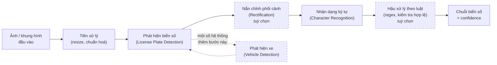
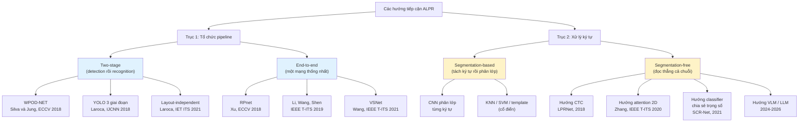
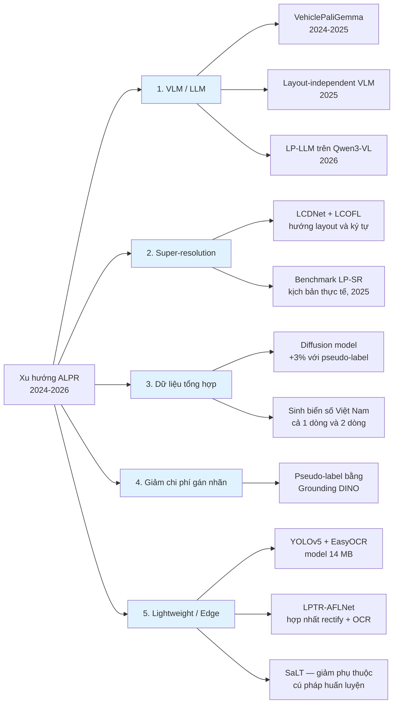

# Chương 2. Tổng quan nghiên cứu

**Thuộc:** Đồ án tốt nghiệp — Hệ thống nhận dạng biển số xe Việt Nam
**Giai đoạn:** Phase 1 — Nghiên cứu tổng quan
**Phiên bản:** 1.0 · **Ngày:** 2026-07-19

> **Quy ước trích dẫn của chương.** Mọi con số định lượng trong chương này đều được gắn liên kết tới nguồn gốc ngay tại vị trí xuất hiện. Các con số không kiểm chứng được nguồn gốc đều bị loại khỏi các bảng so sánh chính và chỉ được nhắc lại kèm ghi chú tường minh. Các thuật ngữ tiếng Anh đã trở thành chuẩn dùng trong ngành (*bounding box*, *pipeline*, *dataset*, *mAP*, *confidence*, *end-to-end*, *layout*...) được giữ nguyên, không dịch.

---

## 2.1. Mở đầu chương

Nhận dạng biển số xe tự động — Automatic License Plate Recognition (ALPR) — là một trong những bài toán thị giác máy tính có lịch sử dài nhất và đồng thời có mức độ ứng dụng thương mại rộng nhất. Sau gần hai thập kỷ nghiên cứu liên tục, bài toán này thường bị hiểu nhầm là "đã giải quyết xong": nhiều công trình gần đây báo cáo độ chính xác vượt 99% trên các benchmark phổ biến, và các sản phẩm thương mại được quảng bá với con số tương đương.

Chương này đặt mục tiêu chứng minh điều ngược lại, bằng bằng chứng định lượng có nguồn gốc: (i) các con số vượt 99% chủ yếu đạt được trên những tập dữ liệu tương đối dễ và theo giao thức đánh giá dễ dãi; (ii) khi chuyển sang giao thức đánh giá nghiêm ngặt hơn — huấn luyện trên một tập, kiểm thử trên tập khác — hiệu năng sụt giảm rõ rệt; và (iii) đối với bài toán biển số Việt Nam, nơi xe máy chiếm áp đảo và biển hai dòng là dạng phổ biến chứ không phải ngoại lệ, việc áp dụng trực tiếp mô hình huấn luyện trên dữ liệu nước ngoài là không khả thi về mặt kỹ thuật.

Chương được tổ chức như sau. Mục 2.2 định nghĩa bài toán và các thành phần cấu thành một hệ thống ALPR. Mục 2.3 tóm lược quá trình phát triển từ xử lý ảnh cổ điển sang deep learning. Mục 2.4 phân loại các hướng tiếp cận hiện có. Mục 2.5 khảo sát các công trình tiêu biểu, ưu tiên giai đoạn 2020–2026. Mục 2.6 so sánh các bộ dữ liệu chuẩn quốc tế. Mục 2.7 và 2.8 dành riêng cho bối cảnh Việt Nam — các công trình trong nước, hiện trạng dữ liệu, và những đặc thù khiến bài toán Việt Nam không thể giải bằng mô hình nhập khẩu. Mục 2.9 chuẩn hoá các chỉ số đánh giá. Mục 2.10 tổng hợp các thách thức còn bỏ ngỏ và xu hướng nghiên cứu mới. Mục 2.11 định vị đóng góp của đồ án một cách trung thực trong bức tranh đó.

---

## 2.2. Tổng quan bài toán ALPR

### 2.2.1. Định nghĩa

ALPR là bài toán tự động xác định vị trí biển số xe trong ảnh hoặc khung hình video và chuyển đổi nội dung ký tự trên biển thành chuỗi văn bản có thể xử lý bằng máy. Đầu vào là ảnh chụp cảnh giao thông không ràng buộc chặt về góc chụp, ánh sáng hay khoảng cách; đầu ra là danh sách các chuỗi biển số kèm vị trí và độ tin cậy (*confidence*).

Điểm khiến ALPR khác biệt với bài toán nhận dạng văn bản trong ảnh (*scene text recognition*) tổng quát là ở các ràng buộc mạnh về cấu trúc: biển số có kích thước vật lý chuẩn hoá, tỉ lệ khung hình cố định, bộ ký tự giới hạn, và cú pháp chuỗi tuân theo quy định pháp luật của từng quốc gia. Những ràng buộc này vừa là lợi thế — cho phép thiết kế bước hậu xử lý (*post-processing*) hiệu quả — vừa là bẫy: mô hình dễ học thuộc cú pháp của tập huấn luyện và sụt giảm khi định dạng biển số thay đổi theo thời gian, một vấn đề được nêu tường minh trong công trình về Transformer "future-proof" của [Meyer và cộng sự (2025)](https://arxiv.org/abs/2506.17051).

### 2.2.2. Ứng dụng thực tế

Các nhóm ứng dụng chính của ALPR bao gồm:

| Nhóm ứng dụng | Mô tả | Đặc điểm điều kiện vận hành |
|---|---|---|
| Quản lý bãi đỗ xe | Ghi nhận xe vào/ra, tính phí, đối soát | Camera cố định, khoảng cách gần, ánh sáng kiểm soát được — điều kiện **ràng buộc** (*constrained*) |
| Thu phí không dừng (ETC) | Nhận diện phương tiện tại trạm thu phí | Camera cố định, xe di chuyển tốc độ trung bình |
| Giám sát và xử phạt nguội | Phát hiện vi phạm, truy vết phương tiện | Camera ngoài trời, mọi điều kiện thời tiết và ánh sáng — điều kiện **không ràng buộc** (*unconstrained*) |
| An ninh, kiểm soát ra vào | Kiểm soát cổng khu công nghiệp, khu dân cư | Ràng buộc, thường có barrier |
| Điều tra, thực thi pháp luật | Camera tuần tra gắn trên xe đang di chuyển | Khó nhất — cả camera lẫn đối tượng đều chuyển động |

Sự phân biệt giữa điều kiện **ràng buộc** và **không ràng buộc** là then chốt khi đọc số liệu trong tài liệu. Bộ dữ liệu AOLP tách rõ ba kịch bản này thành ba subset riêng: AC (*Access Control*) với xe đi qua lối vào cố định, LE (*Law Enforcement*) với camera ven đường, và RP (*Road Patrol*) với camera đặt trên xe đang di chuyển; hai subset sau khó hơn đáng kể ([Hsu, Chen & Chung, IEEE T-VT 2013](https://www.researchgate.net/publication/260498098_Application-Oriented_License_Plate_Recognition)). Bộ UFPR-ALPR đi xa hơn, thiết kế toàn bộ dữ liệu ở tình huống **cả xe mục tiêu lẫn camera đều đang chuyển động** ([Laroca và cộng sự, IJCNN 2018](https://github.com/raysonlaroca/ufpr-alpr-dataset)).

### 2.2.3. Các thành phần của một hệ thống ALPR

Hai khảo sát kinh điển đã chuẩn hoá mô tả ALPR thành ba bước xử lý nối tiếp: trích xuất vùng biển số, phân đoạn ký tự, và nhận dạng ký tự ([Anagnostopoulos và cộng sự, IEEE T-ITS 2008](https://dl.acm.org/doi/10.1109/TITS.2008.922938); [Du, Ibrahim, Shehata & Badawy, IEEE T-CSVT 2013](https://www.semanticscholar.org/paper/Automatic-License-Plate-Recognition-(ALPR):-A-Du-Ibrahim/fabf4efa0ce7837f24b91c617cf9954fee1df50f)). Bài review cập nhật nhất của [Li & Ghaffar (JTTE 2026)](https://jtte.chd.edu.cn/en/article/id/1b9e30a7-fd97-44e7-be8a-bb7256a2e5e4) vẫn giữ nguyên cách phân rã ba thành phần này, đồng thời bổ sung các thách thức mới về biển số đa quốc gia, camera chuyển động và góc nhìn thay đổi.

Trong thực tế các hệ thống hiện đại, sơ đồ đầy đủ thường có thêm hai khối tuỳ chọn nhưng quan trọng: **nắn chỉnh phối cảnh** (*rectification*) và **hậu xử lý theo luật** (*rule-based post-processing*):



Vai trò của từng khối:

- **Phát hiện xe (tuỳ chọn).** Một số hệ thống phát hiện phương tiện trước rồi mới tìm biển số bên trong vùng phương tiện, nhằm giảm *false positive* trong cảnh đông đúc. Kiến trúc ba giai đoạn kiểu này được áp dụng cho xe máy Việt Nam trong công trình [FDSE 2023](https://link.springer.com/chapter/10.1007/978-981-99-8296-7_5), và cũng là kiến trúc của WPOD-NET ([Silva & Jung, ECCV 2018](https://link.springer.com/chapter/10.1007/978-3-030-01258-8_36)).
- **Phát hiện biển số.** Trả về bounding box hoặc bốn đỉnh (*vertices*) của vùng biển.
- **Nắn chỉnh phối cảnh.** Chuyển vùng biển bị nghiêng về dạng chính diện bằng phép biến đổi *planar homography*. Đây chính là đóng góp cốt lõi của WPOD-NET, mạng vừa phát hiện vừa nắn chỉnh biển số bị biến dạng góc xiên ([Silva & Jung, ECCV 2018](https://link.springer.com/chapter/10.1007/978-3-030-01258-8_36)).
- **Nhận dạng ký tự.** Có thể theo hướng phân đoạn từng ký tự rồi phân lớp, hoặc đọc thẳng cả chuỗi (xem Mục 2.4).
- **Hậu xử lý theo luật.** Sửa các nhầm lẫn hình dạng phổ biến và loại chuỗi không hợp lệ dựa trên cú pháp biển số của vùng lãnh thổ. [Laroca và cộng sự (IET ITS 2021)](https://ietresearch.onlinelibrary.wiley.com/doi/abs/10.1049/itr2.12030) hợp nhất hẳn một bộ phân loại layout vào detector để chọn đúng luật hậu xử lý cho từng khu vực.

---

## 2.3. Lịch sử phát triển

### 2.3.1. Giai đoạn xử lý ảnh cổ điển (trước khoảng 2015)

Trước kỷ nguyên deep learning, ALPR được giải bằng đặc trưng thủ công (*hand-crafted features*). Quy trình phát hiện biển số điển hình gồm: xám hoá ảnh → lọc cạnh dọc bằng toán tử **Sobel** (biển số có mật độ cạnh dọc cao bất thường do các ký tự đứng cạnh nhau) → nhị phân hoá → phép **đóng/mở hình thái học** (*morphological closing/opening*) để nối các cạnh rời rạc thành khối liền → chiếu ngang và chiếu dọc (*projection*) để khoanh vùng ứng viên. Các công trình đại diện cho họ phương pháp này gồm chương sách [Springer LNEE 2012 "License Plate Localization Based on Edge Detection and Morphology"](https://link.springer.com/chapter/10.1007/978-3-642-25899-2_92) và bài [IEEE 2013 "License plate localization based on edge-geometrical features using morphological approach"](https://ieeexplore.ieee.org/document/6738937/).

Bước phân đoạn ký tự dựa trên thành phần liên thông (*connected components*) hoặc phân tích histogram chiếu. Bước phân lớp ký tự cuối cùng dùng template matching, mạng nơ-ron nông, hoặc **SVM**.

Điểm yếu cố hữu của toàn bộ họ phương pháp này là tính giòn: mỗi tham số ngưỡng phải hiệu chỉnh thủ công theo điều kiện chụp, và hiệu năng sụt nhanh khi gặp ánh sáng không đều, nền phức tạp, hoặc biển bị nghiêng. Bằng chứng định lượng rõ nhất về khoảng cách giữa hai thế hệ công nghệ đến từ một cài đặt cổ điển công khai cho biển số Việt Nam dùng KNN kết hợp OpenCV: tỉ lệ phát hiện chỉ đạt **49,2% với biển một dòng (182/370 mẫu) và 39,3% với biển hai dòng (924/2.349 mẫu)**, và trong số biển đã phát hiện được thì tỉ lệ đọc đúng hoàn toàn chỉ **33,5%** (biển một dòng) và **31%** (biển hai dòng) ([mrzaizai2k/VIETNAMESE_LICENSE_PLATE](https://github.com/mrzaizai2k/VIETNAMESE_LICENSE_PLATE)).

> **Lưu ý đọc số liệu.** Hai con số 33,5% và 31% được tính **trên số biển đã phát hiện được**, không phải trên toàn bộ tập kiểm thử. Nếu quy về tỉ lệ end-to-end (ảnh vào → chuỗi đúng hoàn toàn) thì con số thực tế còn thấp hơn nhiều. Đây là ví dụ điển hình về việc phải đọc kỹ mẫu số của một chỉ số trước khi so sánh.

### 2.3.2. Giai đoạn deep learning hai giai đoạn (khoảng 2016–2020)

Sự trưởng thành của các detector một giai đoạn (YOLO) và hai giai đoạn (Faster R-CNN) đã thay thế hoàn toàn khối phát hiện thủ công. Kiến trúc chủ đạo giai đoạn này là *pipeline* nối tiếp: một detector định vị biển số, một mạng khác đọc ký tự.

Ba mốc tiêu biểu:

- [Laroca và cộng sự (IJCNN 2018)](https://arxiv.org/abs/1802.09567) dùng YOLO cho từng giai đoạn của pipeline, kết hợp CNN tinh chỉnh riêng cho mỗi bước, đạt **93,53% recognition rate ở 47 FPS** trên tập SSIG (2.000 khung hình từ video của 101 xe) — vượt cả hai hệ thống thương mại trên cùng benchmark (Sighthound 89,80%, OpenALPR 93,03%) và vượt công trình trước đó đạt 81,80%.
- [Silva & Jung (ECCV 2018)](https://link.springer.com/chapter/10.1007/978-3-030-01258-8_36) giới thiệu WPOD-NET, giải bài toán biển nghiêng bằng cách để mạng học luôn phép biến đổi nắn chỉnh.
- [Xu và cộng sự (ECCV 2018)](https://www.ecva.net/papers/eccv_2018/papers_ECCV/html/Zhenbo_Xu_Towards_End-to-End_License_ECCV_2018_paper.php) công bố CCPD — bộ dữ liệu quy mô lớn đầu tiên của lĩnh vực — cùng mạng baseline RPnet đạt **98,5% accuracy ở tốc độ trên 61 FPS**.

### 2.3.3. Giai đoạn end-to-end, Transformer và mô hình ngôn ngữ–thị giác (2020–2026)

Hướng phát triển gần đây đi theo ba nhánh song song:

1. **Hợp nhất detection và recognition vào một mạng duy nhất**, huấn luyện end-to-end trong một lần forward pass, tránh tích luỹ lỗi giữa các module trung gian ([Li, Wang & Shen, IEEE T-ITS 2019](https://dblp.org/rec/journals/tits/LiWS19.html)).
2. **Loại bỏ hoàn toàn bước phân đoạn ký tự**, chuyển sang đọc chuỗi bằng CTC loss hoặc cơ chế attention (xem Mục 2.4.2).
3. **Đưa Vision-Language Model (VLM) và LLM vào ALPR**, cho phép nhận dạng không phụ thuộc layout ([Shabaninia và cộng sự, 2025](https://arxiv.org/abs/2510.10533); [AlDahoul và cộng sự, 2024](https://arxiv.org/abs/2412.14197); [Gong & Liu, 2026](https://arxiv.org/abs/2601.09116)).

---

## 2.4. Phân loại các hướng tiếp cận

Có hai trục phân loại độc lập nhau, thường bị nhầm lẫn trong tài liệu. Trục thứ nhất mô tả **cách tổ chức pipeline tổng thể** (two-stage hay end-to-end). Trục thứ hai mô tả **cách xử lý ký tự bên trong khối nhận dạng** (segmentation-based hay segmentation-free). Một hệ thống two-stage hoàn toàn có thể dùng bộ nhận dạng segmentation-free, và ngược lại.



### 2.4.1. Two-stage và end-to-end

**Two-stage** tách bạch detection và recognition thành hai mô hình huấn luyện độc lập. Ưu điểm: mỗi khối có thể tối ưu và thay thế riêng, dễ gỡ lỗi, dễ tận dụng mô hình OCR pre-trained sẵn có. Nhược điểm: lỗi ở khối detection lan truyền sang khối recognition mà không có cơ chế phục hồi, và tổng thời gian suy luận là tổng của hai bước.

**End-to-end** hợp nhất mọi thứ vào một mạng. [Li, Wang & Shen (IEEE T-ITS 2019)](https://dblp.org/rec/journals/tits/LiWS19.html) trình bày một mạng thống nhất định vị biển số và nhận dạng ký tự trong **một lần forward pass duy nhất**, với lập luận rằng cách này vừa tránh tích luỹ lỗi trung gian vừa tăng tốc độ. RPnet của [Xu và cộng sự (ECCV 2018)](https://www.ecva.net/papers/eccv_2018/papers_ECCV/html/Zhenbo_Xu_Towards_End-to-End_License_ECCV_2018_paper.php) cũng đồng thời dự đoán bounding box và đọc số biển.

### 2.4.2. Segmentation-based và segmentation-free

**Segmentation-based** tách từng ký tự khỏi vùng biển rồi phân lớp riêng lẻ. [Laroca và cộng sự (IJCNN 2018)](https://arxiv.org/abs/1802.09567) vẫn theo hướng này, kết hợp *data augmentation* bằng biển số đảo ngược và ký tự lật. Nhược điểm: chất lượng phân đoạn quyết định toàn bộ kết quả, và biển mờ, dính bẩn hoặc ký tự sát nhau khiến phân đoạn thất bại.

**Segmentation-free** bỏ hẳn bước tách ký tự. Ba nhánh kỹ thuật chính:

| Nhánh | Cơ chế | Công trình đại diện |
|---|---|---|
| CTC | Huấn luyện end-to-end bằng *Connectionist Temporal Classification loss*, không cần căn chỉnh vị trí ký tự | LPRNet — [Zherzdev & Gruzdev, 2018](https://arxiv.org/abs/1806.10447), đáng chú ý vì là hệ thống real-time không dùng RNN |
| Attention / seq2seq | Attention hai chiều trên bản đồ đặc trưng 2D, không cần heuristic hay hậu xử lý | [Zhang và cộng sự, IEEE T-ITS 2020](https://arxiv.org/abs/2006.03919), dùng encoder Xception |
| Classifier chia sẻ trọng số | Bỏ cả RNN lẫn phân đoạn ký tự, dùng bộ phân lớp ký tự chia sẻ trọng số | SCR-Net trong VSNet — [Wang, Bian, Zhou & Chau, IEEE T-ITS 2021](https://arxiv.org/abs/2011.14936) |
| VLM / LLM | Mô hình ngôn ngữ–thị giác đọc trực tiếp, loại bỏ luôn bước phân loại layout thủ công | [Shabaninia và cộng sự, 2025](https://arxiv.org/abs/2510.10533); [Gong & Liu, 2026](https://arxiv.org/abs/2601.09116) |

### 2.4.3. Hai chiến lược đối lập cho vấn đề đa layout

Khi hệ thống phải xử lý nhiều định dạng biển số khác nhau (nhiều quốc gia, hoặc biển một dòng và hai dòng trong cùng một quốc gia như Việt Nam), tài liệu ghi nhận hai chiến lược trái ngược:

1. **Phân loại layout tường minh.** [Laroca và cộng sự (IET ITS 2021)](https://ietresearch.onlinelibrary.wiley.com/doi/abs/10.1049/itr2.12030) hợp nhất phát hiện biển số và phân loại layout vào cùng một mạng, để chọn đúng luật hậu xử lý cho từng vùng lãnh thổ, đạt **96,9% end-to-end recognition rate trung bình trên 8 tập dữ liệu công khai từ 5 khu vực**.
2. **Không phụ thuộc layout.** [Shabaninia và cộng sự (2025)](https://arxiv.org/abs/2510.10533) dùng VLM kết hợp cơ chế *iterative language modeling* để vừa nhận dạng ký tự vừa tinh chỉnh hậu-OCR, loại bỏ hoàn toàn bước phân loại layout thủ công.

Lựa chọn giữa hai chiến lược này là một quyết định kiến trúc trực tiếp liên quan tới đồ án — sẽ được bàn ở Mục 2.11.

---

## 2.5. Các công trình tiêu biểu

### 2.5.1. Bảng tổng hợp

Bảng dưới ưu tiên các công trình giai đoạn 2020–2026, có bổ sung ba mốc năm 2018 vì tính nền tảng của chúng. Mọi con số trong bảng đều đã được kiểm chứng ngược về nguồn gốc (abstract hoặc toàn văn bài báo).

| # | Tác giả | Năm | Phương pháp / đóng góp | Dataset đánh giá | Kết quả chính |
|---|---|:---:|---|---|---|
| 1 | Zherzdev & Gruzdev | 2018 | **LPRNet** — segmentation-free, CTC loss, không dùng RNN | Biển số Trung Quốc | Tới **95%** accuracy; **3 ms/biển** trên GTX 1080 và **1,3 ms/biển** trên CPU i7-6700K [(nguồn)](https://arxiv.org/abs/1806.10447) |
| 2 | Laroca, Severo, Zanlorensi, Oliveira, Gonçalves, Schwartz, Menotti | 2018 | Pipeline YOLO nhiều giai đoạn + CNN tinh chỉnh, augmentation biển đảo ngược | SSIG (2.000 khung hình / 101 xe) | **93,53%** recognition rate, **47 FPS** [(nguồn)](https://arxiv.org/abs/1802.09567) |
| 3 | Xu, Yang, Meng, Lu, Huang, Ying, Huang | 2018 | **RPnet** — end-to-end, dự đoán đồng thời bbox và chuỗi biển; công bố **CCPD** | CCPD | **98,5%** accuracy, **>61 FPS** [(nguồn)](https://www.ecva.net/papers/eccv_2018/papers_ECCV/html/Zhenbo_Xu_Towards_End-to-End_License_ECCV_2018_paper.php) |
| 4 | Li, Wang & Shen | 2019 | Mạng thống nhất detection + recognition trong một forward pass | — | Mốc kiến trúc end-to-end; *số liệu chi tiết cần bổ sung ở Phase sau* [(nguồn)](https://dblp.org/rec/journals/tits/LiWS19.html) |
| 5 | Zhang, Wang, Li, Li, Shen, Zhang | 2020 | Attention 2D + encoder Xception, segmentation-free; công bố **CLPD** | CCPD, CLPD | Khung attention không cần heuristic/hậu xử lý [(nguồn)](https://arxiv.org/abs/2006.03919) |
| 6 | Laroca, Zanlorensi, Gonçalves, Todt, Schwartz, Menotti | 2021 | Hợp nhất detection + **phân loại layout** trong một mạng YOLO | 8 tập công khai từ 5 khu vực | **96,9%** end-to-end recognition rate trung bình [(nguồn)](https://ietresearch.onlinelibrary.wiley.com/doi/abs/10.1049/itr2.12030) |
| 7 | Wang, Bian, Zhou & Chau | 2021 | **VSNet** (VertexNet + SCR-Net) — cascade dựa trên resampling, dùng thông tin đỉnh | CCPD, AOLP; kiểm tra tổng quát hoá trên PKUData, CLPD | **>99%** trên CCPD và AOLP; **149 FPS (trên GPU)**; giảm **>50%** tỉ lệ lỗi tương đối [(nguồn)](https://arxiv.org/abs/2011.14936) |
| 8 | Laroca, Cardoso, Lúcio, Estevam, Menotti | 2022 | Nghiên cứu **cross-dataset generalization**; công bố **RodoSol-ALPR** | 9 tập công khai, 12 mô hình OCR | Trung bình sụt từ **82,4% → 74,5%** khi chuyển sang giao thức *leave-one-dataset-out*; AOLP sụt **90,8% → 62,7%** [(nguồn)](https://arxiv.org/pdf/2201.00267) |
| 9 | Batra, Hussain, Ahad, Casalino, Alam, Khalique, Hassan | 2022 | YOLOv5 transfer-learned + EasyOCR (LSTM), hướng thiết bị hạn chế tài nguyên | Google Open Images + Indian LP (5.991 ảnh) | **mAP@0.5 = 87,2%**, **mAP@0.5:0.95 = 46,5%**, Recall **82,2%**, Precision **88,2%**; model **14 MB**; detection **4,8 ms trên Nvidia T4**, toàn hệ thống **85 ms** [(nguồn)](https://pmc.ncbi.nlm.nih.gov/articles/PMC9317241/) |
| 10 | Velarde & Velarde | 2022 | Benchmark độc lập LPRNet vs Tesseract, dùng Levenshtein Distance | 1.000 ảnh mỗi tập | LPRNet **90%** trên biển thật, **89%** trên biển tổng hợp; Tesseract **93%** *chỉ* trên dữ liệu tổng hợp *và chỉ sau tiền xử lý* [(nguồn)](https://arxiv.org/abs/2203.14298) |
| 11 | Tao, Hong, Lin, Chen, He, Tie | 2024 | **YOLOv5-PDLPR** — Multi-Head Attention + parallel decoder, không cần phân đoạn ký tự và không cần nắn chỉnh | CCPD, PKUData, AOLP | CCPD tổng thể **99,4%** @ **159,8 FPS (GPU)**; Base **99,9%**; DB **99,5%**; **Challenge chỉ 94,1%**; PKUData **95,5%**; AOLP-AC **98,5%** [(nguồn)](https://pmc.ncbi.nlm.nih.gov/articles/PMC11086086/) |
| 12 | Nascimento, Laroca, Ribeiro, Schwartz, Menotti | 2024 | **LCDNet** + hàm mất mát **LCOFL** — super-resolution hướng layout và hướng ký tự | — | Deformable conv + shared-weight attention + GAN với OCR discriminator [(nguồn)](https://arxiv.org/abs/2408.15103) |
| 13 | AlDahoul, Tan, Tera, Karim, Lim, Mishra, Zaki | 2024–2025 | **VehiclePaliGemma** — fine-tune VLM PaliGemma cho biển số Malaysia | Biển số Malaysia, điều kiện phức tạp | **87,6%** accuracy; **7 FPS trên GPU A100-80GB** [(nguồn)](https://arxiv.org/abs/2412.14197) |
| 14 | Shpir, Shvai & Nakib | 2025 | Sinh dữ liệu biển số bằng **diffusion model** | Biển số Ukraine | Mở rộng tập huấn luyện bằng dữ liệu tổng hợp **đã pseudo-label** cải thiện **+3%** so với baseline [(nguồn)](https://arxiv.org/abs/2501.03374) |
| 15 | Meyer, Guichard, Coquenet, Gravier, Soullard, Couasnon | 2025 | **SaLT** (Syntax-Less Transformer) — giảm phụ thuộc vào cú pháp thời điểm huấn luyện | — | Giữ độ chính xác trên cả định dạng biển cũ lẫn định dạng mới [(nguồn)](https://arxiv.org/abs/2506.17051) |
| 16 | Xu, Zuo, Ke & Lei | 2025 | **LPTR-AFLNet** — hợp nhất nắn chỉnh phối cảnh và nhận dạng; xử lý cả biển 1 dòng và 2 dòng | Biển số Trung Quốc | Mốc kiến trúc hợp nhất rectification + recognition; *số liệu tốc độ xem ghi chú dưới bảng — **không** đưa vào cột so sánh* [(nguồn)](https://arxiv.org/abs/2507.16362) |
| 17 | Wójcik, Lima, Nascimento, Nascimento Jr., Laroca, Menotti | 2025 | **LPLC** — bộ dữ liệu và bài toán phân loại độ đọc được của biển số | LPLC | Cả ba baseline (ViT, ResNet, YOLO) đều đạt **F1 dưới 80%** [(nguồn)](https://arxiv.org/abs/2508.18425) |
| 18 | Shabaninia, Asadi-zeydabadi, Nezamabadi-pour | 2025 | Nhận dạng **không phụ thuộc layout** bằng tích hợp vision transformer và language model | IR-LPR, UFPR-ALPR, AOLP | Loại bỏ hoàn toàn bước phân loại layout thủ công [(nguồn)](https://arxiv.org/abs/2510.10533) |
| 19 | Vargoorani, Ghoreyshi, Suen | 2025 | Pseudo-labeling bằng **Grounding DINO** + YOLOv8 để giảm chi phí gán nhãn | CENPARMI, UFPR-ALPR | **Recall phát hiện** 94% (CENPARMI) và 91% (UFPR-ALPR) [(nguồn)](https://arxiv.org/abs/2510.25032) |
| 20 | Gong & Liu | 2026 | **LP-LLM** — framework end-to-end trên Qwen3-VL, Character Slot Queries + LoRA | Biển số xuống cấp | Hướng LLM đa phương thức cho biển số chất lượng thấp [(nguồn)](https://arxiv.org/abs/2601.09116) |
| 21 | Laroca, Nascimento, Kim, Chung, Bae, Seo, Oh, Phung, Vo, Ye, Du, Su, Chen, Heo, Lee, Na, Nguyen, Pham, Phung, Le, Vo Tran, Menotti | 2026 | **Cuộc thi ICPR 2026 LRLPR** — benchmark nhận dạng biển số độ phân giải thấp trên dữ liệu thật | LRLPR-26 | Đội vô địch chỉ đạt **Recognition Rate 82,13%**; chỉ **4/99 đội** vượt mốc 80% [(nguồn)](https://arxiv.org/abs/2604.22506) |

> **Ghi chú về con số tốc độ của LPTR-AFLNet (dòng 16) — đã bị loại khỏi bảng chính.** Con số "<10 ms trên GPU tầm trung–thấp" từng được lưu truyền cho công trình này **không khớp với số liệu gốc** và đã bị vòng kiểm chứng đối kháng bác bỏ (chi tiết trong [01-ocr-comparison.md, Phụ lục A.3](./01-ocr-comparison.md)): bài gốc báo cáo **2459 FPS trên GPU TITAN X** (2,7M tham số), tương đương **~0,4 ms/biển** — chênh hơn một bậc độ lớn so với "<10 ms". Ngoài ra đây là **số đo trên GPU**, bài **không công bố bất kỳ số liệu CPU nào**, nên không suy ra được gì cho cấu hình chạy CPU của đồ án; nguồn thứ cấp cũng không kèm batch size. Vì chưa xác định được cặp (giá trị · batch size · phần cứng) nhất quán, con số này **không được đưa vào cột kết quả** và **không được dùng làm mốc so sánh** ở bất kỳ đâu trong đồ án.

### 2.5.2. Ba nhận xét quan trọng khi đọc bảng trên

**Thứ nhất: không được so sánh trực tiếp các con số giữa các dòng.** Mỗi công trình đánh giá trên tập dữ liệu khác nhau, với định nghĩa chỉ số khác nhau (có công trình báo cáo *plate-level accuracy* nghiêm ngặt, có công trình cho phép sai 1–2 ký tự, có công trình chỉ báo cáo CER). Ví dụ nghiêm trọng nhất là dòng số 10: **tuyệt đối không được rút gọn thành "Tesseract (93%) tốt hơn LPRNet (90%)"**, vì con số 93% của Tesseract chỉ đạt được trên dữ liệu **tổng hợp** và chỉ **sau tiền xử lý**, trong khi 90% của LPRNet là trên biển số **thật**. Đây là hai mẫu số hoàn toàn khác nhau.

**Thứ hai: các con số FPS phải luôn đi kèm phần cứng.** VSNet đạt 149 FPS và YOLOv5-PDLPR đạt 159,8 FPS — cả hai đều đo **trên GPU**. Ngược lại, con số 1,3 ms/biển của LPRNet là **trên CPU**. Riêng trường hợp LPRNet có một điểm phản trực giác đáng lưu ý: con số CPU (1,3 ms) *nhanh hơn* con số GPU (3 ms) — đây là số liệu đúng theo bài báo gốc, thường được giải thích bằng chi phí khởi tạo và truyền dữ liệu trên GPU khi batch size nhỏ. Tương tự, bài của Batra và cộng sự tuy được mô tả là hướng tới thiết bị hạn chế tài nguyên nhưng phép đo 4,8 ms lại chạy trên **Nvidia T4** — một GPU datacenter, không phải thiết bị biên.

**Thứ ba: hướng VLM đánh đổi tốc độ lấy khả năng tổng quát.** VehiclePaliGemma đạt 87,6% accuracy nhưng chỉ **7 FPS trên A100-80GB** ([nguồn](https://arxiv.org/abs/2412.14197)) — chậm hơn hai bậc độ lớn so với 149–160 FPS của các CNN chuyên dụng, dù chạy trên phần cứng đắt hơn nhiều. Đây là dữ kiện quan trọng khi cân nhắc kiến trúc cho một hệ thống phải chạy trên CPU.

---

## 2.6. Các bộ dữ liệu chuẩn trong lĩnh vực

### 2.6.1. Bảng so sánh

| Bộ dữ liệu | Năm | Quy mô | Vùng lãnh thổ | Đặc điểm nổi bật | Giấy phép |
|---|:---:|---|---|---|---|
| **CCPD** | 2018 / 2019 | **>250.000** ảnh (bản ECCV 2018); **>300.000** ảnh sau cập nhật 10/2019 [(nguồn)](https://github.com/detectRecog/CCPD) | Trung Quốc (Hợp Phì) | Annotation nhúng trực tiếp trong **tên file**: tỉ lệ diện tích biển, độ nghiêng ngang/dọc, bbox, **4 đỉnh**, chỉ số ký tự, độ sáng, độ mờ. Có subset riêng cho từng điều kiện khó | MIT |
| **AOLP** | 2013 | **2.049** ảnh: AC = 681, LE = 757, RP = 611 [(nguồn)](https://hyper.ai/en/datasets/19309) | Đài Loan | Tách rõ ba kịch bản ứng dụng theo độ khó tăng dần | Học thuật, cấm thương mại |
| **UFPR-ALPR** | 2018 | **4.500** ảnh gán nhãn đầy đủ, **>30.000** ký tự, từ **150** xe [(nguồn)](https://github.com/raysonlaroca/ufpr-alpr-dataset) | Brazil | **Cả xe mục tiêu lẫn camera đều đang chuyển động**; ảnh PNG 1920×1080, chia 40% train / 40% test / 20% val [(nguồn)](https://web.inf.ufpr.br/vri/databases/ufpr-alpr/) | Học thuật, cấm thương mại, **cấm phân phối lại**, phải email xin quyền [(nguồn)](https://github.com/raysonlaroca/ufpr-alpr-dataset/blob/master/license-agreement.md) |
| **RodoSol-ALPR** | 2022 | **20.000** ảnh, chia đều 4 nhóm × 5.000 [(nguồn)](https://github.com/raysonlaroca/rodosol-alpr-dataset) | Brazil | Camera **tĩnh** tại trạm thu phí đường ES-060; ngày và đêm, nhiều làn, nắng và mưa; chứa **2 layout** Brazil và Mercosur; **số mẫu dễ và khó bằng nhau** | Xem repo chính thức |
| **CLPD** | 2020 | **1.200** ảnh từ cả **31** tỉnh thành Trung Quốc đại lục [(nguồn)](https://arxiv.org/abs/2006.03919) | Trung Quốc | Thiết kế để kiểm tra tổng quát hoá trên phạm vi địa lý rộng, đối lập với CCPD chỉ ở Hợp Phì | Xem repo |
| **PKUData** (tập con dùng trong VSNet/PDLPR) | — | **2.253** ảnh gán nhãn thủ công [(nguồn)](https://pmc.ncbi.nlm.nih.gov/articles/PMC11086086/) | Trung Quốc | Dùng làm tập *unseen* để đo tổng quát hoá | Xem nguồn gốc |
| **OpenALPR benchmark** | 2016 | EU **108** + US **222** + BR **115** = **445** ảnh [(nguồn)](https://github.com/openalpr/benchmarks) | Châu Âu / Mỹ / Brazil | Quá nhỏ để huấn luyện; **chỉ dùng để benchmark cross-dataset** | AGPL-3.0 |
| **LPLC** | 2025 | **10.210** ảnh xe, **12.687** biển số gán nhãn [(nguồn)](https://arxiv.org/abs/2508.18425) | — | Gán nhãn occlusion ở cả cấp độ xe và cấp độ biển; **4 mức legibility** (perfect / good / poor / illegible) | Xem repo |
| **LRLPR-26** | 2026 | **20.000** training tracks + **3.000** test tracks; mỗi training track có 5 ảnh độ phân giải thấp + 5 ảnh độ phân giải cao của **cùng một biển** [(nguồn)](https://arxiv.org/abs/2604.22506) | Đa quốc gia | Benchmark quốc tế quy mô lớn đầu tiên dành riêng cho biển số độ phân giải thấp với **dữ liệu thật**, không phải downsample nhân tạo | Theo điều lệ cuộc thi |
| **Global License Plate Dataset** | 2024 | **>5.000.000** ảnh từ **74** quốc gia; ~20% có nhãn COCO multi-class [(nguồn)](https://arxiv.org/html/2405.10949v1) | 74 quốc gia | Nhãn rất đầy đủ: ký tự, mask segmentation, 4 đỉnh, hãng/màu/model/năm xe, metadata độ sáng và tương phản | Dựa trên điều khoản Platesmania — **không phải giấy phép chuẩn**, rủi ro pháp lý trung bình |

> **Đính chính về mô tả loại phương tiện.** Cả UFPR-ALPR và RodoSol-ALPR đều **chỉ gồm ô tô và xe máy**, không chứa xe buýt hay xe tải như một số nguồn thứ cấp mô tả nhầm. UFPR-ALPR gồm 900 ảnh ô tô biển xám, 300 ảnh ô tô biển đỏ và 300 ảnh xe máy biển xám (×3 camera); RodoSol-ALPR gồm bốn tổ hợp ô tô/xe máy × biển Brazil/Mercosur, mỗi tổ hợp 5.000 ảnh [(nguồn)](https://github.com/raysonlaroca/rodosol-alpr-dataset).

### 2.6.2. Về phân bố subset của CCPD

CCPD là bộ dữ liệu được trích dẫn nhiều nhất trong lĩnh vực, nhưng có một điểm dễ gây nhầm lẫn về phiên bản. Bảng phân bố subset dưới đây thuộc **bản công bố tại ECCV 2018** với tổng quy mô trên 250.000 ảnh; repository chính thức của bản cập nhật tháng 10/2019 công bố tổng trên 300.000 ảnh nhưng **không công bố bảng phân bố mới**.

| Subset | Quy mô (bản ECCV 2018) | Vai trò |
|---|---:|---|
| CCPD-Base | 200k | Train / val |
| CCPD-DB | 20k | Test — vùng sáng/tối bất thường |
| CCPD-FN | 20k | Test — khoảng cách xa/gần |
| CCPD-Rotate | 10k | Test — xoay |
| CCPD-Tilt | 10k | Test — nghiêng ngang và dọc |
| CCPD-Weather | 10k | Test — mưa, tuyết, sương |
| CCPD-Challenge | 10k | Test — trường hợp khó tổng hợp |
| CCPD-Blur | 5k | Test — mờ |
| CCPD-NP | 5k | Xe chưa gắn biển |

*Nguồn phân bố: bài báo ECCV 2018 gốc, Hình 2 [(nguồn)](https://www.ecva.net/papers/eccv_2018/papers_ECCV/papers/Zhenbo_Xu_Towards_End-to-End_License_ECCV_2018_paper.pdf). Bổ sung năm 2020: CCPD-Green chứa biển xe năng lượng mới 8 ký tự [(nguồn)](https://github.com/detectRecog/CCPD).*

### 2.6.3. Cảnh báo về chất lượng nhãn của CCPD

CCPD tuy lớn nhất nhưng **không sạch nhất**. Trong nghiên cứu cross-dataset của mình, [Laroca và cộng sự (2022)](https://arxiv.org/pdf/2201.00267) đã **loại trừ tường minh** CCPD khỏi thí nghiệm với hai lý do: ảnh bị nén quá mạnh (*highly compressed images*) và sai số lớn trong annotation các đỉnh (*large errors in the corners' annotations*).

Các nhóm nghiên cứu khác xử lý vấn đề này bằng cách chạy một mô hình detection rồi đối chiếu IoU giữa box dự đoán và box gán nhãn: nếu **IoU > 0,6** thì coi nhãn là đúng, ngược lại coi là nhãn lỗi [(nguồn)](https://arxiv.org/abs/2507.17335). Đây là một kỹ thuật audit nhãn có thể áp dụng lại cho bất kỳ bộ dữ liệu nào.

Hệ quả kiến trúc: có thể dùng CCPD để pre-train khối **detection**, nhưng **không nên** tin toạ độ 4 đỉnh của CCPD làm ground truth cho bài toán nắn chỉnh phối cảnh.

### 2.6.4. Bài học then chốt: CCPD đã gần bão hoà trên subset dễ nhưng chưa trên subset khó

Số liệu của [YOLOv5-PDLPR (Tao và cộng sự, 2024)](https://pmc.ncbi.nlm.nih.gov/articles/PMC11086086/) cho thấy khoảng cách rõ rệt **ngay trong cùng một bộ dữ liệu**: 99,9% trên CCPD-Base nhưng chỉ **94,1% trên CCPD-Challenge** — chênh lệch khoảng 5,8 điểm phần trăm.

Hàm ý phương pháp luận: **báo cáo kết quả chỉ trên subset dễ là không đủ thuyết phục**. Một đồ án nghiêm túc phải báo cáo tách bạch theo từng nhóm điều kiện, để thể hiện được độ bền vững chứ không chỉ độ chính xác trung bình.

---

## 2.7. Nghiên cứu về biển số Việt Nam

### 2.7.1. Dòng chảy nghiên cứu trong nước

Nghiên cứu ALPR cho biển số Việt Nam có một dòng chảy riêng, chủ yếu do tác giả Việt Nam thực hiện và công bố tại các hội nghị và tạp chí như MAPR, FDSE, MIWAI, SoICT, IJITSR và các tạp chí khoa học trường đại học. Các công trình này **không xuất hiện trên các benchmark quốc tế lớn**, và phần lớn đánh giá trên tập dữ liệu tự thu thập không công khai — điều làm cho việc so sánh công bằng giữa chúng gần như bất khả thi.

| # | Nhóm tác giả / đơn vị | Năm | Hội nghị / tạp chí | Phương pháp | Kết quả |
|---|---|:---:|---|---|---|
| 1 | Nhóm Học viện Kỹ thuật Quân sự (Lê Quý Đôn) | 2021 | **MAPR 2021** (IEEE) | Key-point detection cho khâu phát hiện + encoder-decoder **segmentation-free** cho khâu OCR, môi trường *unconstrained* | Detection **mIoU 95,01%**, **precision P75 99,5%**; OCR **99,28%** mức chuỗi và **99,7%** mức ký tự [(nguồn)](https://ieeexplore.ieee.org/document/9585279/) |
| 2 | Trần Anh Đạt (ĐH Thuỷ Lợi), Trần Khánh Linh, Vũ Hoài Nam (PTIT) | 2023 | arXiv:2309.12972 | **Multi-angle view model** — trích đặc trưng mô tả thành phần văn bản từ 3 góc nhìn, kết hợp CnOCR; công bố tập **PTITPlates** (500 ảnh) | **F1 91,3%** trên PTITPlates (baselines: YOLOv5+Base OCR 75,2%; YOLOv8+Tesseract 82,9%; YOLOv8+CnOCR 85,2%); **F1 90,8%** trên Stanford Cars [(nguồn)](https://ar5iv.labs.arxiv.org/html/2309.12972) |
| 3 | Le D.H., Mazumder D., Quach L.D., Banerjee S., Nguyen V.D. | 2023 | **FDSE 2023**, Springer CCIS vol. 1925 | Kiến trúc **3 giai đoạn** toàn bằng YOLOv8: phát hiện xe máy → phát hiện biển bên trong bbox xe máy → nhận dạng ký tự | **mAP 93%** sau 300 epoch [(nguồn)](https://link.springer.com/chapter/10.1007/978-981-99-8296-7_5) |
| 4 | Tran, Bui | 2024 | **MIWAI 2024**, Springer | SSD backbone MobileNetV2 (phát hiện) + YOLOv8-nano (nhận dạng ký tự), triển khai trên **Raspberry Pi 4** | **95,68%** độ chính xác nhận dạng trung bình; **0,478 giây/ảnh** [(nguồn)](https://dl.acm.org/doi/abs/10.1007/978-981-96-0695-5_19) |
| 5 | L. Dang, Vong Duong Ngọc, Phạm Cung Lê Thiên Vũ và cộng sự | 2024 | **IJITSR** (Springer) | YOLO (phát hiện xe) → WPOD-NET (trích và nắn phẳng biển) → **CRNN cải tiến** huấn luyện đồng thời với CTC + Attention | **WER 0,014** trên dữ liệu bãi đỗ xe **trong nhà** (môi trường ràng buộc) [(nguồn)](https://link.springer.com/article/10.1007/s13177-024-00402-7) |
| 6 | Hải Trần, Giang Mã (HCMUE), Thanh Nguyễn (HCMUTE), Thanh Cao (SGU) | 2023 | **IJMRAP** vol.5 issue 11, tr.133–137 | Tuỳ chỉnh OpenALPR cho Việt Nam, OCR incremental training, template hậu xử lý theo định dạng biển Việt Nam | Tập test chỉ 120 ảnh; bài **không công bố** con số độ chính xác cuối cùng [(nguồn)](http://ijmrap.com/wp-content/uploads/2023/05/IJMRAP-V5N11P102Y23.pdf) |
| 7 | Đặng Thị Dung và cộng sự (ĐH Kỹ thuật – Công nghệ Cần Thơ) | 2024 | **TNU Journal of Science and Technology** 229(07):156–167 | So sánh các phiên bản YOLOv8 và YOLO-NAS cho phát hiện biển số; 1.567 ảnh (1.334 train / 133 val / 100 test) | YOLO-NAS-S: Accuracy **83,92%**, Precision **0,9125**, Recall **0,9125**, F1 **0,9125**. YOLOv8n: Accuracy **81,4%**, Precision **0,9625**, Recall **0,8415**, F1 **0,8979**. Bài **không đo FPS**; thí nghiệm chạy trên Google Colab GPU Tesla V100 [(nguồn)](https://scholar.dlu.edu.vn/thuvienso/bitstream/DLU123456789/290338/1/100567-1297-209737-1-10-20240806.pdf) |
| 8 | — (kỷ yếu SoICT 2012) | 2012 | **SoICT 2012**, ACM | Hệ ALPR cho trạm thu phí, 3 module; dùng phương pháp *peak-to-valley* và tham số thống kê của biển Việt Nam để tách ký tự trên **cả biển 1 dòng và 2 dòng** | Công trình nền tảng giai đoạn tiền deep learning [(nguồn)](https://dl.acm.org/doi/10.1145/2350716.2350734) |
| 9 | VAPR / UIT – ĐHQG TP.HCM | 2018 | **MAPR 2018 Challenge** | Cuộc thi *Vietnamese Bike License Plate Recognition*, 2 task: plate detection và plate recognition | Dataset **3.000** ảnh xe máy chụp tại bãi giữ xe khách sạn (2.000 train / 1.000 test); **kết quả xếp hạng các đội không được công bố trên trang challenge** [(nguồn)](https://mapr.uit.edu.vn/2018/vietnamese-bike-license-plate-recognition) |
| 10 | Nguyễn Thanh Lợi, Đào Xuân Phúc, Nguyễn Thị Tố Uyên, Nguyễn Hữu Phát | 2023 | Tạp chí Khoa học Trường ĐH Mở Hà Nội | Đề xuất mô hình YOLOv5 cho nhận diện biển số | Bài chỉ ghi "mô hình có độ chính xác cao", **không công bố số liệu cụ thể** [(nguồn)](https://vjol.info.vn/index.php/jshou/article/view/86449) |

> **Đính chính hai lỗi quy nguồn đã phát hiện trong quá trình khảo sát.**
> (a) Công trình số 1 thường bị ghi nhầm hội nghị là NICS 2021; hội nghị đúng là **MAPR 2021** (4th International Conference on Multimedia Analysis and Pattern Recognition, 15–16/10/2021), DOI 10.1109/MAPR53640.2021.9585279.
> (b) Công trình số 7 lưu tại thư viện số ĐH Đà Lạt nhưng **không phải** công trình của ĐH Đà Lạt — đây là bài trên TNU Journal của nhóm Trường ĐH Kỹ thuật – Công nghệ Cần Thơ. Bộ số liệu "mAP 92,68% / Precision 95,83% / 45 FPS" từng được lưu truyền cho bài này **không tồn tại trong toàn văn bài báo** và đã bị bác bỏ khi kiểm chứng trực tiếp; bảng trên dùng các giá trị đã kiểm chứng lại. Kết luận của bài cũng ngược với cách hiểu phổ biến: **YOLO-NAS-S mới là mô hình tốt nhất về độ chính xác**, YOLOv8n chỉ được khuyến dùng khi ưu tiên tốc độ.

### 2.7.2. Hiện trạng SOTA cho biển số Việt Nam

Kết quả cao nhất được công bố cho biển số Việt Nam là **99,28% ở mức chuỗi** của nhóm Học viện Kỹ thuật Quân sự [(nguồn)](https://ieeexplore.ieee.org/document/9585279/). Tuy nhiên con số này **không thể dùng làm mốc so sánh trực tiếp**, vì ba lý do:

1. Nó được đo trên **tập dữ liệu riêng không công khai** của nhóm tác giả — không ai tái lập hay đối chứng được.
2. Độ khó của tập dữ liệu đó không được mô tả định lượng, nên không so sánh được với 96,6% của VNLP hay 91,3% của PTITPlates.
3. Chưa tồn tại một **benchmark công khai chuẩn** cho biển số Việt Nam theo kiểu UFPR-ALPR hay RodoSol-ALPR của Brazil.

Đây chính là một khoảng trống nghiên cứu đáng ghi nhận, và cũng là một cơ hội đóng góp (xem Mục 2.11).

### 2.7.3. Bộ dữ liệu biển số Việt Nam công khai

Khảo sát cho thấy **không tồn tại bộ dữ liệu biển số Việt Nam công khai nào được bình duyệt học thuật** theo nghĩa chặt chẽ. Các nguồn hiện có thuộc ba loại: repository GitHub cá nhân, Roboflow Universe, và Kaggle.

**Bộ lớn nhất và đầy đủ nhãn nhất — VNLP (fict-labs):**

| Chỉ số | Giá trị | Nguồn |
|---|---|---|
| Tổng số ảnh | **~37.300** (19.086 biển 1 dòng + 18.211 biển 2 dòng) | [github.com/fict-labs/VNLP](https://github.com/fict-labs/VNLP) |
| Detection precision | **98,9%** | như trên |
| Shape classification (1 dòng vs 2 dòng) | **99,0%** | như trên |
| Recognition accuracy (trên crop ground-truth) | **96,6%** | như trên |
| Hệ thống đầy đủ (precision / recall) | **>95,3%** | như trên |
| Tốc độ **trên CPU** | **~91,2 FPS** (detection) / **~38,6 FPS** (full pipeline) | như trên |

VNLP là bộ Việt Nam duy nhất vừa có quy mô lớn, vừa có annotation mức ký tự, vừa **tách rõ biển một dòng và biển hai dòng** với tỉ lệ gần 50/50 — triết lý thiết kế tương tự RodoSol-ALPR. Con số FPS trên CPU đặc biệt liên quan tới đồ án này vì máy phát triển không có GPU CUDA. **Rủi ro:** repository **không ghi rõ giấy phép**, cần liên hệ tác giả xin xác nhận trước khi sử dụng trong công bố.

**Các bộ dữ liệu Việt Nam công khai khác:**

| Nguồn | Quy mô | Loại nhãn | Giấy phép |
|---|---:|---|---|
| Roboflow — `school-fuhih/vietnamese-license-plate` | **8.397** ảnh [(nguồn)](https://universe.roboflow.com/school-fuhih/vietnamese-license-plate-tptd0) | 1 class, chỉ bbox | CC BY 4.0 *(chưa tự kiểm chứng được)* |
| Roboflow — `cuong-ta/vietnamese-car-license-plate` | **8.255** ảnh [(nguồn)](https://universe.roboflow.com/cuong-ta-ulxex/vietnamese-car-license-plate) | 1 class `plate`, chỉ bbox | Public Domain |
| Roboflow — `license-plate-reg/viet-nam-ocr-plate` | **3.819** ảnh, **32** class [(nguồn)](https://universe.roboflow.com/license-plate-reg/viet-nam-ocr-plate) | **Nhãn mức ký tự** | Public Domain |
| Roboflow — `traffic-camera/vietnam-license-plate` | **3.149** ảnh [(nguồn)](https://universe.roboflow.com/traffic-camera/vietnam-license-plate-hayn8) | 1 class, chỉ bbox | CC BY 4.0 |
| Roboflow — `tran-ngoc-xuan-tin/vietnam-license-plate` | **1.005** ảnh [(nguồn)](https://universe.roboflow.com/tran-ngoc-xuan-tin-k15-hcm-dpuid/vietnam-license-plate-h8t3n) | 1 class, chỉ bbox | CC BY 4.0 |
| Roboflow — `eric-nguyen/vietnam-license-plate` | **840** ảnh [(nguồn)](https://universe.roboflow.com/eric-nguyen-knfxn/vietnam-license-plate-curhr) | 1 class, chỉ bbox | CC BY 4.0 |
| Roboflow — `dataset-format-conversion/Vietnam-License-Plate-Recognition` | **200** ảnh, **22** class [(nguồn)](https://universe.roboflow.com/dataset-format-conversion-iidaz/vietnam-license-plate-recognition) | **Nhãn mức ký tự** | CC BY 4.0 |
| Kaggle — `duydieunguyen/licenseplates` | **3.510** mẫu biển 1 dòng + **1.625** mẫu biển 2 dòng (~5.000 ảnh) [(nguồn)](https://www.kaggle.com/datasets/duydieunguyen/licenseplates) | **Polygon 4 đỉnh**, tách rõ 1 dòng / 2 dòng | **Unknown** — rủi ro pháp lý |
| Kaggle — `bomaich/vnlicenseplate` | **1.000** ảnh [(nguồn)](https://www.kaggle.com/datasets/bomaich/vnlicenseplate) | YOLO txt (xywh), đã chia sẵn train/valid/test | **Unknown** |
| Kaggle — `miahuynh04/vietnamese-license-plate-detection` | 366 MB [(nguồn)](https://www.kaggle.com/datasets/miahuynh04/vietnamese-license-plate-detection) | bbox | MIT |
| Kaggle — `topkek69/vietnamese-license-plate-ocr` | ~37,1 MB [(nguồn)](https://www.kaggle.com/datasets/topkek69/vietnamese-license-plate-ocr) | Ảnh crop biển cho OCR | Apache 2.0 |
| Kaggle — `nguyenquanglinh0109/character-dataset-...` | ~911 KB [(nguồn)](https://www.kaggle.com/datasets/nguyenquanglinh0109/character-dataset-for-vietnam-license-plate) | Ảnh crop **từng ký tự** | CC0 Public Domain |

Ba nhận xét quan trọng về bức tranh dữ liệu này:

1. **Phần lớn các bộ chỉ có bbox một class.** Chúng chỉ dùng được cho khâu detection; muốn làm OCR hoặc phân loại layout thì phải tự gán nhãn lại.
2. **Chỉ một bộ duy nhất phân biệt tường minh biển 1 dòng và 2 dòng** ở dạng class riêng (Kaggle `duydieunguyen`), và cũng là bộ duy nhất gán nhãn polygon 4 đỉnh phục vụ nắn chỉnh — nhưng lại là bộ có giấy phép "Unknown".
3. **Không bộ nào gán nhãn chuỗi biển số đầy đủ** dạng ground-truth văn bản (kiểu `30A-12345`). Đây là khoảng trống lớn nhất về dữ liệu cho bài toán Việt Nam.

Ngoài ra, dữ liệu trên Roboflow **có thể bị xoá bất cứ lúc nào** — quá trình khảo sát đã ghi nhận một trường hợp bộ dữ liệu trả về HTTP 404 với thông báo đã bị xoá. Hàm ý thực hành: phải tải về và lưu trữ cục bộ ngay, kèm ghi lại số phiên bản và ngày truy cập.

### 2.7.4. Công cụ sinh dữ liệu tổng hợp

Tồn tại một công cụ sinh ảnh biển số Việt Nam tổng hợp hỗ trợ **cả biển chữ nhật một dòng và biển vuông hai dòng**, xuất nhãn ở định dạng YOLO [(NNDam/Vietnamese-License-Plate-Generator)](https://github.com/NNDam/Vietnamese-License-Plate-Generator). Công cụ này có giá trị thực tiễn cao cho việc cân bằng phân bố ký tự, vì các ký tự hiếm gặp trong dữ liệu thật thường bị thiếu đại diện nghiêm trọng.

Giá trị của hướng này được củng cố bởi bằng chứng định lượng từ nghiên cứu về nhu cầu dữ liệu: chỉ cần **300 ảnh biển số thật có gán nhãn**, kết hợp sinh dữ liệu và augmentation, là đạt hiệu năng **tương đương với huấn luyện trên 200.000 ảnh thật**; và với chỉ 60 ảnh thật, việc có sinh dữ liệu nâng độ chính xác từ **47,5% lên 79,3%** [(nguồn)](https://ar5iv.labs.arxiv.org/html/1808.08410).

### 2.7.5. Hệ sinh thái mã nguồn mở Việt Nam

| Repository | Sao | Giấy phép | Đặc điểm |
|---|---:|---|---|
| `winter2897/Real-time-Auto-License-Plate-Recognition-with-Jetson-Nano` | **226** | Không ghi | Công bố **40 FPS trên Jetson Nano** (GPU nhúng); cung cấp cả dataset detection và recognition ở hai định dạng VOC/Pascal và YOLO |
| `quangnhat185/Plate_detect_and_recognize` | **183** | MIT | Đa quốc gia (gồm Việt Nam), dùng WPOD-NET |
| `trungdinh22/License-Plate-Recognition` | **99** | NOASSERTION | YOLOv5 hai giai đoạn, hỗ trợ cả biển 1 và 2 dòng; **không công bố accuracy** |
| `longphungtuan94/ALPR_System` | **99** | Apache-2.0 | — |
| `mrzaizai2k/License-Plate-Recognition-YOLOv7-and-CNN` | **39** | MIT | YOLOv7 + Hough transform nắn nghiêng + CNN; **không công bố accuracy** |
| `mrzaizai2k/VIETNAMESE_LICENSE_PLATE` | **35** | MIT | KNN + OpenCV; **hiếm hoi công bố số liệu thật** (xem Mục 2.3.1) |
| `tungedng2710/AI-Traffic-Analysis` | **31** | — | Còn hoạt động, đã chuyển sang FastAPI + PPOCRv5 |
| `NNDam/Vietnamese-License-Plate-Generator` | **26** | — | Sinh dữ liệu tổng hợp |

*Số sao kiểm chứng qua GitHub API ngày 19/07/2026 [(nguồn tham chiếu)](https://github.com/winter2897/Real-time-Auto-License-Plate-Recognition-with-Jetson-Nano). Số sao biến động theo thời gian nên luôn phải ghi kèm ngày truy cập.*

Nhận xét: **hầu như không repository nào công bố số liệu độ chính xác đầy đủ**, và phần lớn không ghi rõ giấy phép. Chúng là tài liệu tham khảo về kỹ thuật cài đặt, không phải mốc so sánh học thuật.

### 2.7.6. Giải pháp thương mại và triển khai thực tế

| Giải pháp | Con số công bố | Ghi chú |
|---|---|---|
| **VietANPR** (VisCom Solution) | **>98%** trên "tập ảnh chuẩn"; **200–400 ms/ảnh HD 720p**, **chạy CPU không cần GPU** [(nguồn)](https://viscomsolution.com/viet-anpr-phan-mem-nhan-dien-bien-so-xe-may-xe-hoi/) | "Tập ảnh chuẩn" được định nghĩa rất chặt: ảnh đúng tỉ lệ, không biến dạng, rõ nét, không bị che, nghiêng không quá 30°; yêu cầu bề rộng biển tối thiểu ~100 px (biển vuông) và ~150 px (biển chữ nhật) |
| **eParking** | — | Pipeline 5 bước, **vẫn dùng SVM** để phân lớp ký tự; thừa nhận rõ các hạn chế về độ phân giải, nhoè chuyển động, thiếu sáng, che khuất, góc camera sai [(nguồn)](https://eparking.vn/nhan-dang-bien-so-xe/) |
| **ETC — VETC và ePass** | VETC **79** trạm, VDTC/ePass **35** trạm (tổng 114, tức ~69% / ~31%) [(nguồn)](https://vetc.com.vn/o-to-di-qua-tram-thu-phi-khong-dung-se-quet-bien-hay-quet-ma-the-n114.html) | **VETC chỉ dùng RFID để trừ tiền**, ảnh biển số chỉ phục vụ tra cứu và đối soát; ePass bổ sung **OCR làm lớp dự phòng** khi đọc thẻ thất bại |

Hai kết luận quan trọng:

- **Không tồn tại số liệu độ chính xác công khai, độc lập, được kiểm chứng của bất kỳ giải pháp thương mại nào tại Việt Nam.** Các con số 98–99,9% đều do chính nhà cung cấp công bố, trên định nghĩa "ảnh chuẩn" không thống nhất giữa các bên. Chúng chỉ nên dùng để tham khảo bối cảnh, **không dùng làm mốc so sánh học thuật**.
- **Trong hệ thống thu phí không dừng của Việt Nam, ALPR đóng vai trò hệ thống dự phòng/đối soát chứ không phải hệ thống chính** — cơ chế chính là RFID. Đây là một góc nhìn thực tế đáng nêu khi trình bày phần ứng dụng.

> Một số nguồn thứ cấp nêu con số về quy mô hệ thống camera AI giao thông tại Hà Nội (khoảng 600 cụm camera tại 550 nút giao). **Con số này chưa kiểm chứng được nguồn** — bài viết được dẫn không chứa số liệu đó — nên không được đưa vào bảng so sánh nào. *Cần bổ sung nguồn chính thống ở Phase sau nếu muốn sử dụng.*

---

## 2.8. Đặc thù bài toán biển số Việt Nam

Mục này trả lời câu hỏi then chốt của chương: **vì sao không thể áp dụng trực tiếp mô hình huấn luyện trên dữ liệu nước ngoài cho biển số Việt Nam?**

### 2.8.1. Mật độ xe máy áp đảo

Tính đến tháng 9/2024, Việt Nam có **77 triệu xe máy đăng ký, tương đương 770 xe trên 1.000 dân**, thuộc hàng cao nhất thế giới; xe máy chiếm **85–90% lưu lượng phương tiện trên đường** [(nguồn)](https://dantri.com.vn/thoi-su/viet-nam-co-77-trieu-xe-may-cu-1000-dan-co-770-nguoi-so-huu-xe-may-20241104141910472.htm).

Hệ quả kỹ thuật trực tiếp:

- **Biển hai dòng dạng vuông chiếm đa số tuyệt đối**, chứ không phải thiểu số như ở Mỹ hay châu Âu.
- **Mật độ phương tiện cao gây che khuất (occlusion)** giữa các xe trong cùng khung hình.
- **Biển số xe máy đặt thấp, gần mặt đất**, dễ dính bùn đất, dễ bị che bởi chân người lái, và dễ biến dạng cơ học do va chạm.

Trong khi đó, các bộ dữ liệu quốc tế lớn nhất — CCPD, AOLP, SSIG — đều lấy ô tô làm trung tâm và **không phản ánh phân bố này**.

### 2.8.2. Biển hai dòng là loại mẫu khó nhất — bằng chứng định lượng

Chưa có nghiên cứu Việt Nam nào công bố bảng so sánh tách riêng độ chính xác giữa biển một dòng và biển hai dòng trên cùng một hệ thống. Tuy nhiên có một bằng chứng tương đương rất mạnh từ Brazil — quốc gia cũng có tỉ lệ xe máy cao.

Bộ RodoSol-ALPR được thiết kế với số mẫu "dễ" (ô tô, biển một dòng) và "khó" (xe máy, biển hai dòng) **bằng nhau**. Trên tập test của bộ này, hệ thống OpenALPR nhận đúng **3.772/4.000 ô tô (94,3%)** nhưng chỉ **1.827/4.000 xe máy (45,7%)** — chênh lệch **48,6 điểm phần trăm**. Rộng hơn, cả 12 phương pháp và 2 hệ thống thương mại được đánh giá đều **không vượt quá 70% recognition rate** trên bộ này [(nguồn)](https://arxiv.org/pdf/2201.00267).

> **Lưu ý phạm vi áp dụng.** Cặp số 94,3% / 45,7% được đo trên **RodoSol-ALPR của Brazil, không phải trên dữ liệu Việt Nam**. Nó được dẫn ở đây như một *analogue* định lượng về độ khó vượt trội của biển hai dòng xe máy, tuyệt đối không được trích dẫn nhầm thành số liệu Việt Nam.

Đây chính là lý do rủi ro **R-04** trong hồ sơ yêu cầu của đồ án (PaddleOCR đọc kém trên biển hai dòng) được đánh giá là khả năng xảy ra "Cao" và mức ảnh hưởng "Cao".

### 2.8.3. Quy chuẩn kích thước và bộ ký tự riêng

**Kích thước vật lý theo QCVN 08:2024/BCA** (ban hành kèm Thông tư 81/2024/TT-BCA, hiệu lực **01/01/2025**):

| Loại biển | Kích thước (dài × cao) | Tỷ lệ khung hình | Số dòng |
|---|---|:--:|:--:|
| Ô tô — biển **dài** | **520 × 110 mm** | **4,727** | 1 dòng |
| Ô tô — biển **ngắn** | **330 × 165 mm** | **2,000** | 2 dòng |
| **Xe mô tô, xe gắn máy** | **190 × 140 mm** | **1,357** | 2 dòng |

*Nguồn: [Bộ Công an — Quy chuẩn kỹ thuật quốc gia về biển số xe](https://mps.gov.vn/chinh-sach-phap-luat/bai-viet/quy-chuan-ky-thuat-quoc-gia-ve-bien-so-xe-d1-t1592). Đối chiếu chi tiết và dẫn xuất ngưỡng phân loại: [01-vn-plate-standards.md, mục 7.2](./01-vn-plate-standards.md#72-kích-thước-vật-lý-và-tỷ-lệ-khung-hình).*

> **Cảnh báo về mốc hiệu lực của số liệu kích thước.** Bộ số liệu trên **chỉ đúng từ 01/01/2025**. Tiêu chuẩn trước đó (TT 58/2020, TT 24/2023) quy định biển ô tô ngắn là **200 × 280 mm** và biển dài là **110 × 470 mm**. Nhiều tài liệu thứ cấp về biển số Việt Nam — kể cả các bài báo công bố năm 2023 — vẫn dùng bộ số cũ. Mọi trích dẫn kích thước biển số trong đồ án đều **bắt buộc ghi kèm mốc hiệu lực**, nếu không người phản biện đối chiếu văn bản hiện hành sẽ kết luận là sai.

Ba giá trị tỷ lệ khung hình trên cách nhau đủ xa để dùng làm tín hiệu phân loại layout: không có loại biển nào rơi vào khoảng (2,000 — 4,727). Đây là cơ sở định lượng cho ngưỡng phân biệt biển 1 dòng / 2 dòng được đề xuất trong [01-vn-plate-standards.md, mục 7.3](./01-vn-plate-standards.md#73-khoảng-trống-tỷ-lệ-khung-hình--cơ-sở-cho-ngưỡng-phân-loại).

**Bộ ký tự seri — và một hiểu nhầm phổ biến cần tránh.** Seri đăng ký của biển nền trắng và nền vàng dùng **một trong 20 chữ cái** ở vị trí chữ cái thứ nhất: A B C D E F G H K L M N P S T U V X Y Z ([Bộ Công an](https://bocongan.gov.vn/chinh-sach-phap-luat/bai-viet/nhan-dien-mau-sac-seri-ky-hieu-bien-so-xe-cua-co-quan-to-chuc-ca-nhan-tu-01012025-d1-t1617)). Số đăng ký gồm 5 chữ số từ 000.01 đến 999.99 (biển cấp theo quy định cũ có 4 chữ số và vẫn lưu hành hợp pháp).

Tuy nhiên, **suy diễn số học "26 − 20 = 6 chữ cái bị loại trừ" là sai**. Danh sách 20 chữ cái nêu trên chỉ áp dụng cho **chữ cái thứ nhất** của seri. Với biển xe mô tô, seri gồm **hai chữ cái**, và danh sách hợp lệ ở **vị trí thứ hai** là:

```
A  B  C  D  E  F  H  K  L  M  N  P  R  S  T  U  V  X  Y  Z
```

Danh sách này **có chữ R** và **không có chữ G**. Hợp hai vị trí lại, tập chữ cái thực sự không bao giờ xuất hiện trên biển số Việt Nam chỉ gồm **5 chữ: I, J, O, Q, W**. Chữ R còn xuất hiện thêm ở các ký hiệu seri đặc biệt `R` và `RM` (rơ moóc, sơ mi rơ moóc).

| Tập | Số lượng | Nội dung |
|---|:--:|---|
| Chữ cái thứ nhất của seri | 20 | A B C D E F G H K L M N P S T U V X Y Z |
| Chữ cái thứ hai của seri xe máy | 20 | A B C D E F H K L M N P **R** S T U V X Y Z |
| **Bị loại trừ khỏi toàn hệ thống** | **5** | **I, J, O, Q, W** |
| Charset an toàn cho OCR (20 ∪ {R}) | 21 | A–H, K–N, P, R–V, X, Y, Z |

**Hệ quả kỹ thuật.** Ràng buộc thực sự khai thác được trong hậu xử lý là tập 5 chữ `{I, J, O, Q, W}`: bất kỳ ký tự nào trong nhóm này được OCR đọc ra ở vị trí chữ cái đều chắc chắn là lỗi và ánh xạ được về ký tự đúng: `O → 0`, `I → 1`, `Q → 0` là ba ánh xạ có cơ sở hình dạng rõ ràng; `J` và `W` không có ứng viên thay thế hiển nhiên nên chỉ dùng để **hạ cờ hợp lệ** chứ không tự động sửa. Chữ R **không** thuộc nhóm này và **tuyệt đối không được ánh xạ đi**.

Quan trọng hơn, đây là ràng buộc **theo vị trí trong chuỗi**, không phải ràng buộc trên một bộ ký tự phẳng. Chữ G hợp lệ ở vị trí 1 nhưng không hợp lệ ở vị trí 2 của seri xe máy; chữ R thì ngược lại. Một bộ luật hậu xử lý chỉ dùng "danh sách ký tự cho phép" toàn cục sẽ vừa bỏ sót lỗi vừa sửa nhầm ký tự đúng.

> **Khuyến nghị về charset của mô hình OCR.** Nếu xây charset huấn luyện theo "20 chữ cái", mô hình sẽ **không bao giờ có khả năng dự đoán chữ R** và sẽ sai hệ thống trên mọi biển xe máy có R ở vị trí thứ hai. Mất mát thông tin này xảy ra ở **tầng mô hình**, nên hậu xử lý không thể cứu được. Khuyến nghị: huấn luyện charset **đầy đủ A–Z + 0–9 (36 ký tự)** và áp ràng buộc hợp lệ ở tầng hậu xử lý, nơi có thể ghi log và hiệu chỉnh. Nếu bắt buộc thu hẹp charset, phải dùng **21 chữ cái** (20 ∪ {R}), tuyệt đối không dùng 20.
>
> **Hạn chế kiểm chứng cần giữ nguyên khi trình bày.** Hai danh sách chữ cái trên **chưa đối chiếu được với toàn văn Điều 34 Thông tư 79/2024/TT-BCA**: bản PDF chính thức trên cổng Chính phủ là bản scan không có lớp text, còn `thuvienphapluat.vn` chặn truy cập tự động (HTTP 403). Kết luận về chữ R do đó dựa trên trích dẫn điều khoản qua nguồn thứ cấp và cần được xác nhận lại khi tiếp cận được toàn văn. Chi tiết: [01-vn-plate-standards.md, mục 5.2](./01-vn-plate-standards.md#52-ký-tự-bị-loại-trừ--và-ngoại-lệ-quan-trọng-của-chữ-r).

Các hệ thống ALPR quốc tế cấu hình mặc định cho Mỹ/EU không khai thác được bất kỳ ràng buộc nào trong số này.

### 2.8.4. Định dạng biển số đang thay đổi

Khung pháp lý về biển số xe Việt Nam đã thay đổi ba lần chỉ trong hai năm gần đây, và đây là nguồn rủi ro trực tiếp cho một hệ thống ALPR có bước hậu xử lý theo luật.

> **Đính chính căn cứ pháp lý.** Đề bài ban đầu của đồ án viện dẫn **Thông tư 24/2023/TT-BCA**. Văn bản này **đã hết hiệu lực từ 01/01/2025**, bị thay thế bởi **Thông tư 79/2024/TT-BCA** (ký ngày 15/11/2024), sau đó được sửa đổi bởi **TT 13/2025/TT-BCA** và **TT 51/2025/TT-BCA** (hiệu lực 01/7/2025, thay toàn bộ phụ lục mã tỉnh sau sáp nhập còn 34 tỉnh/thành). Về kích thước và kết cấu vật lý, văn bản áp dụng là **QCVN 08:2024/BCA** kèm TT 81/2024/TT-BCA, hiệu lực 01/01/2025. Toàn bộ chương này viện dẫn theo chuỗi văn bản đang có hiệu lực; TT 24/2023 chỉ được nhắc tới như **bối cảnh lịch sử**.

Chuỗi thay đổi và ảnh hưởng tới đồ án:

| Mốc | Thay đổi | Trạng thái |
|---|---|---|
| 15/8/2023 — TT 24/2023 | Chuyển sang cơ chế **biển số định danh** (biển gắn với mã định danh chủ xe, không chuyển nhượng khi bán xe); seri xe mô tô cá nhân chuyển từ *1 chữ cái + 1 chữ số* sang **2 chữ cái** | **Đã hết hiệu lực 01/01/2025** — nhưng các quy tắc trên được **giữ nguyên** trong TT 79/2024 |
| 01/01/2025 — TT 79/2024 + QCVN 08:2024/BCA | Văn bản hiện hành về nội dung biển số; **bãi bỏ** quy tắc seri phân biệt loại xe (A = xe con, C = xe tải…); kích thước biển đổi sang bộ số mới (mục 2.8.3) | **Đang có hiệu lực** |
| 01/7/2025 — TT 51/2025 | Thay toàn bộ bảng mã tỉnh sau sáp nhập đơn vị hành chính | **Đang có hiệu lực** |

Điều này tạo ra ba vấn đề trực tiếp cho đồ án:

1. **Regex hậu xử lý phải chấp nhận nhiều dạng cú pháp cùng lúc.** Biển xe máy kiểu cũ (*1 chữ cái + 1 chữ số*) và kiểu mới (*2 chữ cái*) cùng lưu hành hợp pháp; biển 4 chữ số và 5 chữ số ở nhóm số thứ tự cũng vậy. Xe đã đăng ký **không bắt buộc đổi biển**, nên các nhánh cũ sẽ còn trên đường hàng chục năm.
2. **Không được suy ra loại phương tiện từ chữ cái seri.** Quy tắc này bị bãi bỏ từ 01/01/2025; mọi heuristic dạng "seri C ⇒ xe tải" đều sai về mặt pháp lý kể từ thời điểm đó.
3. **Các bộ dữ liệu công khai đều thu thập trước các mốc trên**, nghĩa là có thể thiếu đại diện cho định dạng mới — một dạng lệch phân bố theo thời gian.

Đây chính xác là kịch bản mà [Meyer và cộng sự (2025)](https://arxiv.org/abs/2506.17051) mô tả khi đề xuất SaLT: mô hình học quá chặt cú pháp của tập huấn luyện sẽ sụt giảm hiệu năng đáng kể theo thời gian khi định dạng biển số mới xuất hiện.

> **Chi tiết cấu trúc seri đã được giải quyết trong Phase 1.** Bảng mã tỉnh đầy đủ theo TT 51/2025, tập ký tự seri hợp lệ theo từng vị trí, hai kiểu biển xe máy, và bộ regex đã kiểm chứng chạy được — tất cả được đặc tả trọn vẹn trong tài liệu đồng cấp [01-vn-plate-standards.md](./01-vn-plate-standards.md) (mục 4, mục 5 và mục 8). Đây **không còn là hạng mục treo**; chương này tham chiếu chéo thay vì lặp lại nội dung.

### 2.8.5. Bằng chứng định lượng: vì sao bắt buộc phải fine-tune

Lập luận trên có thể bị phản biện: "tại sao không lấy mô hình huấn luyện trên CCPD dùng luôn?". Câu trả lời có bằng chứng số học.

[Laroca và cộng sự (VISAPP 2022)](https://arxiv.org/pdf/2201.00267) đánh giá **12 mô hình OCR trên 9 bộ dữ liệu công khai** theo hai giao thức: chia truyền thống (*traditional split*) và **leave-one-dataset-out**. Kết quả: độ chính xác trung bình tụt từ **82,4% xuống 74,5%** (giảm 7,9 điểm); trường hợp nặng nhất là AOLP, tụt từ **90,8% xuống 62,7%** (giảm 28,1 điểm) — mà nguyên nhân được tác giả quy cho khác biệt về **font chữ của ký tự trên biển**.

Với bài toán Việt Nam, mức độ dịch chuyển miền còn lớn hơn nhiều so với các cặp dataset trong thí nghiệm đó, vì:

- CCPD chỉ chứa **biển Trung Quốc một dòng**, có ký tự Hán tự và cấu trúc 7 ký tự — **hoàn toàn không có biển hai dòng**.
- Bộ ký tự, font chữ, tỉ lệ khung, màu nền và cú pháp chuỗi đều khác.

**Kết luận kiến trúc:** pre-train trên dữ liệu quốc tế chỉ nên áp dụng cho khối **detection** (nơi mô hình học đặc trưng hình dạng biển, khả năng chịu nghiêng và mờ). Khối **recognition/OCR bắt buộc phải được huấn luyện hoặc tinh chỉnh trên dữ liệu Việt Nam**, và bước hậu xử lý phải viết riêng theo quy chuẩn Việt Nam.

Tin tốt là khối lượng dữ liệu cần bổ sung có thể nhỏ hơn lo ngại ban đầu: hiệu năng bão hoà quanh ngưỡng **4.750 ảnh thật, tại đó đạt 99,0% độ chính xác**, và vượt ngưỡng này thì cả độ chính xác nhận dạng biển số lẫn độ chính xác nhận dạng ký tự đều **không cải thiện thêm** [(nguồn)](https://ar5iv.labs.arxiv.org/html/1808.08410). Tổng kho dữ liệu Việt Nam công khai hiện có đã vượt xa ngưỡng này cho khâu detection; nút thắt thực sự nằm ở **nhãn mức ký tự và nhãn chuỗi biển số**, không phải ở số lượng ảnh.

---

## 2.9. Các chỉ số đánh giá

Các chỉ số dùng trong ALPR chia làm ba nhóm theo giai đoạn của pipeline.

### 2.9.1. Nhóm chỉ số phát hiện (detection)

**Intersection over Union (IoU)** đo mức chồng lấp giữa bounding box dự đoán $B_p$ và bounding box thực $B_{gt}$:

$$
\mathrm{IoU} = \frac{|B_p \cap B_{gt}|}{|B_p \cup B_{gt}|}
$$

Một dự đoán được coi là đúng (*true positive*) khi IoU vượt một ngưỡng cho trước, thông thường là 0,5. Ký hiệu $P_{75}$ trong một số bài báo nghĩa là precision đo tại ngưỡng IoU 0,75 — chặt hơn đáng kể.

**Precision và Recall:**

$$
\mathrm{Precision} = \frac{TP}{TP + FP}, \qquad
\mathrm{Recall} = \frac{TP}{TP + FN}, \qquad
F_1 = \frac{2 \cdot P \cdot R}{P + R}
$$

**Average Precision (AP) và mean Average Precision (mAP).** AP là diện tích dưới đường cong Precision–Recall của một lớp:

$$
\mathrm{AP} = \int_0^1 p(r)\, dr
$$

$$
\mathrm{mAP} = \frac{1}{N}\sum_{i=1}^{N} \mathrm{AP}_i
$$

Hai biến thể thường gặp: **mAP@0.5** tính AP tại ngưỡng IoU cố định 0,5, và **mAP@0.5:0.95** lấy trung bình AP trên dải ngưỡng IoU từ 0,5 đến 0,95 với bước 0,05 — chỉ số chặt hơn, phản ánh chất lượng khớp box chứ không chỉ khả năng phát hiện.

Khoảng cách giữa hai chỉ số này thường rất lớn: trong công trình của [Batra và cộng sự (2022)](https://pmc.ncbi.nlm.nih.gov/articles/PMC9317241/), mAP@0.5 đạt 87,2% trong khi mAP@0.5:0.95 chỉ đạt 46,5%. **Báo cáo mAP@0.5 mà không báo cáo mAP@0.5:0.95 là che giấu thông tin về chất lượng định vị.**

**mIoU** (mean IoU) là IoU trung bình trên toàn tập, được dùng làm chỉ số chính trong công trình MAPR 2021 về biển số Việt Nam (mIoU 95,01%) [(nguồn)](https://ieeexplore.ieee.org/document/9585279/).

### 2.9.2. Nhóm chỉ số nhận dạng (recognition)

**Character Error Rate (CER)** dựa trên khoảng cách Levenshtein giữa chuỗi dự đoán và chuỗi thực:

$$
\mathrm{CER} = \frac{S + D + I}{N}
$$

trong đó $S$ là số phép thay thế (*substitutions*), $D$ là số phép xoá (*deletions*), $I$ là số phép chèn (*insertions*), và $N$ là tổng số ký tự trong chuỗi thực. Độ chính xác mức ký tự tương ứng là $1 - \mathrm{CER}$.

**Word Error Rate (WER)** định nghĩa tương tự nhưng ở đơn vị từ; công trình IJITSR 2024 về biển số Việt Nam báo cáo WER 0,014 [(nguồn)](https://link.springer.com/article/10.1007/s13177-024-00402-7).

**Plate-level accuracy (sequence-level accuracy)** — chỉ số nghiêm ngặt và quan trọng nhất:

$$
\mathrm{Acc}_{\text{plate}} = \frac{\#\{\text{biển số có TOÀN BỘ chuỗi ký tự khớp chính xác}\}}{\#\{\text{tổng số biển số}\}}
$$

Một biển đọc sai đúng một ký tự vẫn bị tính là sai hoàn toàn. Đây là chỉ số mà hầu hết các bài báo trên CCPD báo cáo, và là chỉ số phản ánh đúng giá trị sử dụng thực tế — vì một chuỗi biển số sai một ký tự thì vô dụng với hệ thống tra cứu.

### 2.9.3. Nhóm chỉ số end-to-end

**End-to-end Recognition Rate** là tỉ lệ biển số được đọc đúng hoàn toàn tính trên **toàn bộ pipeline**, từ ảnh đầu vào tới chuỗi đầu ra. Đây là chỉ số duy nhất phản ánh được lỗi tích luỹ qua các giai đoạn. Cuộc thi ICPR 2026 LRLPR dùng "Recognition Rate" làm chỉ số chính, với đội vô địch đạt 82,13% [(nguồn)](https://arxiv.org/abs/2604.22506).

Kèm theo đó, các chỉ số vận hành cần báo cáo gồm: **FPS hoặc độ trễ** (bắt buộc kèm cấu hình phần cứng), **kích thước mô hình** (MB), và **số tham số**.

### 2.9.4. Cảnh báo về tính so sánh được

Lĩnh vực ALPR **chưa có chuẩn hoá thống nhất về chỉ số đánh giá**. Một số bài báo báo cáo plate-level accuracy nghiêm ngặt (100% ký tự phải đúng), một số cho phép sai 1–2 ký tự, một số chỉ báo cáo CER. Ngoài ra, các con số như "recall 94% / 91%" của [Vargoorani và cộng sự (2025)](https://arxiv.org/abs/2510.25032) là **recall của khâu phát hiện**, không phải độ chính xác nhận dạng end-to-end, nên không được đặt chung cột với các con số accuracy.

Do đó, khi trình bày bảng so sánh trong đồ án, **bắt buộc phải ghi rõ định nghĩa chỉ số của từng nguồn** để tránh so sánh khập khiễng.

---

## 2.10. Thách thức còn tồn tại và xu hướng nghiên cứu mới

### 2.10.1. Sáu thách thức còn bỏ ngỏ

**(1) Khả năng tổng quát hoá xuyên tập dữ liệu.** Đây là luận điểm mạnh nhất chống lại nhận định "ALPR đã giải quyết xong". Khi chuyển từ giao thức chia truyền thống sang leave-one-dataset-out, độ chính xác trung bình sụt từ 82,4% xuống 74,5%, trường hợp nặng nhất sụt 28,1 điểm [(nguồn)](https://arxiv.org/pdf/2201.00267). Các con số vượt 99% thường phản ánh *overfitting theo tập dữ liệu* chứ không phải khả năng tổng quát hoá.

**(2) Biển số độ phân giải thấp và xuống cấp.** Được đo lường chính thức qua cuộc thi ICPR 2026 LRLPR trên dữ liệu thật (không phải downsample nhân tạo): với **269 đội từ 41 quốc gia đăng ký và 99 đội nộp bài hợp lệ**, đội vô địch chỉ đạt **Recognition Rate 82,13%** và chỉ **4/99 đội** vượt mốc 80% [(nguồn)](https://arxiv.org/abs/2604.22506). Sự tương phản giữa con số này và các con số >99% trên CCPD là bằng chứng định lượng mạnh nhất cho thấy bài toán chưa được giải quyết.

**(3) Che khuất và độ đọc được.** Bài toán phân loại độ đọc được của biển số đã trở thành một hướng nghiên cứu riêng. Trên bộ LPLC, cả ba baseline ViT, ResNet và YOLO đều đạt **F1 dưới 80%** cho bài toán ba lớp (đủ chất lượng / cần super-resolution / không thể phục hồi) [(nguồn)](https://arxiv.org/abs/2508.18425) — nghĩa là ngay cả việc *đánh giá* chất lượng biển số cũng còn khó.

**(4) Đánh đổi giữa độ chính xác và tốc độ.** Vẫn là vấn đề mở, được ghi nhận trong hầu hết các bài review. Khoảng cách hiện tại rất rõ: các CNN chuyên dụng đạt 149–160 FPS trên GPU [(VSNet)](https://arxiv.org/abs/2011.14936) [(PDLPR)](https://pmc.ncbi.nlm.nih.gov/articles/PMC11086086/), trong khi hướng VLM chỉ đạt 7 FPS trên A100-80GB [(nguồn)](https://arxiv.org/abs/2412.14197).

**(5) Khan hiếm dữ liệu do ràng buộc quyền riêng tư.** Biển số là dữ liệu định danh, nên các ràng buộc kiểu GDPR hạn chế nghiêm trọng việc công bố dữ liệu thật — động cơ chính của hướng sinh dữ liệu tổng hợp [(nguồn)](https://arxiv.org/abs/2501.03374).

**(6) Định dạng biển số thay đổi theo thời gian.** Mô hình học quá chặt cú pháp của tập huấn luyện sẽ suy giảm khi định dạng mới xuất hiện [(nguồn)](https://arxiv.org/abs/2506.17051) — vấn đề đặc biệt cấp thiết với Việt Nam, nơi khung pháp lý về biển số đã thay đổi ba lần trong hai năm (TT 24/2023 → TT 79/2024 hiệu lực 01/01/2025 → TT 51/2025 hiệu lực 01/7/2025; xem Mục 2.8.4).

### 2.10.2. Năm xu hướng nghiên cứu mới (2024–2026)



1. **Vision-Language Model và LLM.** Hướng này cho phép nhận dạng không phụ thuộc layout, loại bỏ bước phân loại layout thủ công [(Shabaninia và cộng sự, 2025)](https://arxiv.org/abs/2510.10533), và xử lý biển số xuống cấp bằng cơ chế Character Slot Queries kết hợp LoRA fine-tuning trên Qwen3-VL [(Gong & Liu, 2026)](https://arxiv.org/abs/2601.09116). Đánh đổi là tốc độ suy luận thấp và yêu cầu phần cứng cao.

2. **Super-resolution hướng layout.** LCDNet với hàm mất mát LCOFL dùng deformable convolution, shared-weight attention và GAN có OCR discriminator [(Nascimento và cộng sự, 2024)](https://arxiv.org/abs/2408.15103); tiếp nối bằng benchmark super-resolution biển số trong kịch bản thực tế [(Nascimento và cộng sự, 2025)](https://arxiv.org/abs/2505.06393).

3. **Sinh dữ liệu tổng hợp bằng diffusion model.** Mở rộng tập huấn luyện bằng dữ liệu tổng hợp **đã pseudo-label** cải thiện độ chính xác **+3%** so với baseline [(nguồn)](https://arxiv.org/abs/2501.03374).

4. **Giảm chi phí gán nhãn bằng pseudo-labeling.** Kết hợp một lượng nhỏ dữ liệu gán nhãn thủ công với pseudo-label sinh bởi Grounding DINO đạt **recall phát hiện 94% (CENPARMI) và 91% (UFPR-ALPR)** [(nguồn)](https://arxiv.org/abs/2510.25032).

5. **Lightweight và triển khai biên.** Hướng đối trọng với VLM: mô hình 14 MB hướng thiết bị IoT [(Batra và cộng sự, 2022)](https://pmc.ncbi.nlm.nih.gov/articles/PMC9317241/), mạng hợp nhất nắn chỉnh phối cảnh và nhận dạng vào một mô hình nhẹ duy nhất [(Xu và cộng sự, 2025)](https://arxiv.org/abs/2507.16362) — *con số độ trễ của công trình này không được trích dẫn, lý do xem ghi chú ở Mục 2.5.1*, và kiến trúc Transformer giảm phụ thuộc cú pháp để bền vững theo thời gian [(Meyer và cộng sự, 2025)](https://arxiv.org/abs/2506.17051).

---

## 2.11. Định vị đồ án

### 2.11.1. Tuyên bố trung thực về mức đóng góp

Trước hết cần nói rõ, và nói trước: **đồ án này không tạo ra kết quả state-of-the-art.** Các con số vượt 99% trong Mục 2.5 là sản phẩm của những nhóm nghiên cứu chuyên nghiệp với nhiều năm tích luỹ, hạ tầng GPU quy mô lớn và các tập dữ liệu độc quyền. Một đồ án tốt nghiệp đại học, thực hiện trên máy không có GPU CUDA và trong khung thời gian giới hạn, không đặt mục tiêu đó — và việc tuyên bố ngược lại sẽ là thiếu trung thực học thuật.

Đóng góp của đồ án nằm ở hai chỗ khác, đều là những khoảng trống có thật được xác định từ khảo sát trên.

### 2.11.2. Đồ án làm gì

Đồ án xây dựng một **hệ thống ALPR hoàn chỉnh cho biển số Việt Nam**, gồm: mô hình phát hiện YOLO11 tự huấn luyện trên dữ liệu biển số Việt Nam, khối nhận dạng dựa trên PaddleOCR, khối hậu xử lý theo luật biển số Việt Nam, backend FastAPI, frontend React, cơ sở dữ liệu, và đóng gói Docker. Hệ thống hỗ trợ **cả biển một dòng và biển hai dòng**, và **suy luận trên CPU**.

Định vị theo hai trục phân loại ở Mục 2.4: đồ án theo hướng **two-stage** (detection tách khỏi recognition) và dùng bộ nhận dạng **segmentation-free** có sẵn (PaddleOCR). Lựa chọn two-stage là có chủ đích: nó cho phép thay thế bộ OCR mà không phải huấn luyện lại toàn hệ thống — một yêu cầu kiến trúc đã được ghi thành ràng buộc cứng trong đặc tả.

### 2.11.3. Đồ án khác gì các công trình đã có

| Khoảng trống được xác định từ khảo sát | Cách đồ án lấp |
|---|---|
| **Chưa nghiên cứu Việt Nam nào công bố bảng so sánh tách riêng độ chính xác biển 1 dòng và biển 2 dòng trên cùng một hệ thống** (Mục 2.8.2) | Đồ án báo cáo tách bạch hai con số này (yêu cầu NFR-A8). Chỉ cần hai con số riêng biệt là đã lấp được khoảng trống này |
| **Chưa có nghiên cứu Việt Nam nào mô tả có hệ thống bộ luật hậu xử lý ràng buộc theo VỊ TRÍ trong chuỗi biển số** — các mô tả hiện có đều dừng ở mức "danh sách ký tự cho phép" phẳng và phần lớn dùng nhầm con số 20 chữ cái cho toàn chuỗi (Mục 2.8.3) | Đồ án thiết kế bộ luật hậu xử lý **theo từng vị trí** (mã tỉnh · chữ cái seri 1 · chữ cái seri 2 hoặc chữ số · nhóm số thứ tự), phân biệt đúng tập hợp lệ ở vị trí 1 và vị trí 2, và **đo tách bạch độ chính xác trước và sau hậu xử lý** (NFR-A5 và NFR-A6). Hiệu số giữa hai con số là đóng góp định lượng của khối này |
| **Hầu hết công trình trong nước chỉ báo cáo mAP của khâu detection**, không báo cáo end-to-end plate-level accuracy (Mục 2.7.1) | Đồ án báo cáo cả hai, với end-to-end accuracy là chỉ tiêu quan trọng nhất (NFR-A7) |
| **Hầu hết repository mã nguồn mở Việt Nam không công bố số liệu độ chính xác** (Mục 2.7.5) | Đồ án công bố đầy đủ giao thức đo, tập test, và toàn bộ chỉ số kèm cấu hình phần cứng |
| **Số liệu FPS thường được công bố mà không kèm phần cứng** (Mục 2.5.2) | Mọi số liệu hiệu năng của đồ án bắt buộc kèm: model CPU, số luồng, kích thước ảnh đầu vào, backend suy luận, và cỡ mẫu đo |
| **Chưa có benchmark công khai chuẩn cho biển số Việt Nam** (Mục 2.7.2) | Đồ án đánh giá trên bộ dữ liệu công khai có tên rõ ràng và ghi rõ nguồn gốc, để các nhóm sau có thể đối chứng |

### 2.11.4. Ba đóng góp cụ thể

1. **Đóng góp kỹ thuật — bộ luật hậu xử lý ràng buộc theo vị trí cho biển số Việt Nam.** Khai thác ba ràng buộc đặc thù đã xác định trong Mục 2.8: (i) **tập hợp lệ khác nhau theo từng vị trí** trong chuỗi — mã tỉnh thuộc 81 giá trị hợp lệ, chữ cái seri thứ nhất thuộc tập 20 chữ, chữ cái seri thứ hai của biển xe máy thuộc một tập 20 chữ **khác** (có R, không có G), vị trí thứ hai cũng có thể là chữ số 1–9 với biển kiểu cũ; (ii) cấu trúc chuỗi và độ dài theo quy chuẩn; (iii) sự cùng tồn tại của định dạng cũ và mới. Đóng góp này **được đo lường định lượng** qua hiệu số giữa độ chính xác trước và sau hậu xử lý, chứ không chỉ mô tả định tính.

   > **Nói thẳng về độ lớn của đóng góp này.** Trước khi rà soát lại căn cứ pháp lý, luận điểm dự kiến là "khai thác bộ 20 chữ cái, loại trừ 6 chữ I J O Q R W". Mệnh đề đó **sai**: tập loại trừ thực sự chỉ có **5 chữ** (I, J, O, Q, W), và chữ R hợp lệ. Việc sửa lại làm **yếu đi** phần đóng góp tính theo "số ký tự loại trừ được" — không gian tìm kiếm bị thu hẹp ít hơn so với dự kiến ban đầu. Đổi lại, phần thực sự có giá trị của đóng góp chuyển sang chỗ khác và khó hơn: ràng buộc **phụ thuộc vị trí**, chứ không phải một bộ ký tự phẳng áp cho cả chuỗi. Một hệ thống dùng danh sách phẳng 20 chữ cái sẽ **sai hệ thống trên toàn bộ lớp biển xe máy có R ở vị trí thứ hai** — và đây mới là lỗi mà bộ luật của đồ án ngăn được. Đóng góp vì vậy nên được trình bày là **đúng đắn về mặt pháp lý và đúng cấu trúc**, không nên trình bày như một cải thiện lớn về không gian tìm kiếm.

2. **Đóng góp thực nghiệm — báo cáo hiệu năng tách theo layout và theo điều kiện ảnh.** Bao gồm bảng so sánh biển một dòng với biển hai dòng, và bảng theo điều kiện ảnh nếu bộ dữ liệu có nhãn phù hợp. Đây là dạng báo cáo mà Mục 2.6.4 đã chỉ ra là bắt buộc để chứng minh độ bền vững, nhưng phần lớn công trình trong nước bỏ qua.

3. **Đóng góp kỹ nghệ — một hệ thống hoàn chỉnh, tái lập được, chạy trên CPU.** Không phải notebook demo mà là hệ thống có API, giao diện, cơ sở dữ liệu, kiểm thử và đóng góp triển khai bằng Docker, khởi động bằng một lệnh duy nhất và hoạt động không cần kết nối Internet. Khảo sát ở Mục 2.7.5 cho thấy hệ sinh thái mã nguồn mở Việt Nam chủ yếu là các script rời rạc không có số liệu và không có kiến trúc phần mềm — đây là khoảng trống kỹ nghệ chứ không phải khoảng trống thuật toán, nhưng vẫn là khoảng trống có thật.

### 2.11.5. Những gì đồ án không tuyên bố

Để tránh mọi hiểu nhầm khi bảo vệ, cần ghi rõ:

- Đồ án **không** tuyên bố vượt qua con số 99,28% của nhóm Học viện Kỹ thuật Quân sự — con số đó đo trên tập dữ liệu riêng không công khai, không tồn tại cơ sở để so sánh công bằng.
- Đồ án **không** đề xuất kiến trúc mạng nơ-ron mới; nó tích hợp và tinh chỉnh các thành phần đã có.
- Đồ án **không** giải quyết các thách thức mở nêu ở Mục 2.10 (độ phân giải thấp, tổng quát hoá xuyên tập dữ liệu, che khuất nặng). Những vấn đề này được nêu trong phần Hướng phát triển.
- Mọi số liệu hiệu năng của đồ án là **số liệu CPU**, không so sánh trực tiếp được với các con số FPS đo trên GPU trong Mục 2.5.

---

## Tài liệu tham khảo

### A. Khảo sát và tổng quan

1. C.-N. E. Anagnostopoulos, I. E. Anagnostopoulos, I. D. Psoroulas, V. Loumos, E. Kayafas, "License Plate Recognition From Still Images and Video Sequences: A Survey", *IEEE Transactions on Intelligent Transportation Systems*, vol. 9, no. 3, pp. 377–391, 2008. DOI: 10.1109/TITS.2008.922938. https://dl.acm.org/doi/10.1109/TITS.2008.922938
2. S. Du, M. Ibrahim, M. Shehata, W. Badawy, "Automatic License Plate Recognition (ALPR): A State-of-the-Art Review", *IEEE Transactions on Circuits and Systems for Video Technology*, vol. 23, no. 2, pp. 311–325, 2013. DOI: 10.1109/TCSVT.2012.2203741. https://www.semanticscholar.org/paper/Automatic-License-Plate-Recognition-(ALPR):-A-Du-Ibrahim/fabf4efa0ce7837f24b91c617cf9954fee1df50f
3. Z. Li, M. A. Ghaffar, "A detailed review on license plate detection and recognition methods", *Journal of Traffic and Transportation Engineering (English Edition)*, vol. 13, no. 3, pp. 974–1005, 2026. DOI: 10.1016/j.jtte.2024.10.007. https://jtte.chd.edu.cn/en/article/id/1b9e30a7-fd97-44e7-be8a-bb7256a2e5e4

> *Ghi chú:* Trong quá trình khảo sát có ghi nhận một bài review khác trên tạp chí *Neural Networks* (Elsevier), PII S0893608026003047, năm 2026, tiêu đề "Deep learning algorithms for license plate recognition: A review". **Danh sách tác giả, số volume và số trang của bài này không xác minh được** do ScienceDirect chặn truy cập. Bài **không được trích dẫn** trong chương này và **không được đưa vào BibTeX** cho tới khi tra cứu lại được metadata đầy đủ. **Cần bổ sung ở Phase sau.**

### B. Phương pháp cổ điển

4. "License Plate Localization Based on Edge Detection and Morphology", Springer *Lecture Notes in Electrical Engineering*, 2012. DOI: 10.1007/978-3-642-25899-2_92. https://link.springer.com/chapter/10.1007/978-3-642-25899-2_92
5. "License plate localization based on edge-geometrical features using morphological approach", *IEEE International Conference*, 2013. https://ieeexplore.ieee.org/document/6738937/

### C. Deep learning — kiến trúc và phương pháp

6. S. Zherzdev, A. Gruzdev, "LPRNet: License Plate Recognition via Deep Neural Networks", arXiv:1806.10447, 2018. https://arxiv.org/abs/1806.10447
7. R. Laroca, E. Severo, L. A. Zanlorensi, L. S. Oliveira, G. R. Gonçalves, W. R. Schwartz, D. Menotti, "A Robust Real-Time Automatic License Plate Recognition Based on the YOLO Detector", *IJCNN*, 2018. arXiv:1802.09567. https://arxiv.org/abs/1802.09567
8. S. M. Silva, C. R. Jung, "License Plate Detection and Recognition in Unconstrained Scenarios", *ECCV 2018*, LNCS vol. 11217, pp. 593–609. DOI: 10.1007/978-3-030-01258-8_36. https://link.springer.com/chapter/10.1007/978-3-030-01258-8_36
9. Z. Xu, W. Yang, A. Meng, N. Lu, H. Huang, C. Ying, L. Huang, "Towards End-to-End License Plate Detection and Recognition: A Large Dataset and Baseline", *ECCV 2018*. https://www.ecva.net/papers/eccv_2018/papers_ECCV/html/Zhenbo_Xu_Towards_End-to-End_License_ECCV_2018_paper.php
10. H. Li, P. Wang, C. Shen, "Toward End-to-End Car License Plate Detection and Recognition With Deep Neural Networks", *IEEE T-ITS*, vol. 20, no. 3, pp. 1126–1136, 2019. DOI: 10.1109/TITS.2018.2847291. https://dblp.org/rec/journals/tits/LiWS19.html
11. L. Zhang, P. Wang, H. Li, Z. Li, C. Shen, Y. Zhang, "A Robust Attentional Framework for License Plate Recognition in the Wild", *IEEE T-ITS*, vol. 22, no. 11, pp. 6967–6976, 2020. DOI: 10.1109/TITS.2020.3000072. https://arxiv.org/abs/2006.03919
12. R. Laroca, L. A. Zanlorensi, G. R. Gonçalves, E. Todt, W. R. Schwartz, D. Menotti, "An efficient and layout-independent automatic license plate recognition system based on the YOLO detector", *IET Intelligent Transport Systems*, vol. 15, no. 4, pp. 483–503, 2021. DOI: 10.1049/itr2.12030. https://ietresearch.onlinelibrary.wiley.com/doi/abs/10.1049/itr2.12030
13. Y. Wang, Z.-P. Bian, Y. Zhou, L.-P. Chau, "Rethinking and Designing a High-performing Automatic License Plate Recognition Approach", *IEEE T-ITS*, 2021. DOI: 10.1109/TITS.2021.3087158. arXiv:2011.14936. https://arxiv.org/abs/2011.14936
14. P. Batra, I. Hussain, M. A. Ahad, G. Casalino, M. A. Alam, A. Khalique, S. I. Hassan, "A Novel Memory and Time-Efficient ALPR System Based on YOLOv5", *Sensors*, vol. 22, no. 14, art. 5283, 2022. DOI: 10.3390/s22145283. https://pmc.ncbi.nlm.nih.gov/articles/PMC9317241/
15. L. Tao, S. Hong, Y. Lin, Y. Chen, P. He, Z. Tie, "A Real-Time License Plate Detection and Recognition Model in Unconstrained Scenarios", *Sensors*, vol. 24, no. 9, art. 2791, 2024. DOI: 10.3390/s24092791. https://www.mdpi.com/1424-8220/24/9/2791
16. G. Xu, P. Zuo, Z. Ke, B. Lei, "LPTR-AFLNet: Lightweight Integrated Chinese License Plate Rectification and Recognition Network", arXiv:2507.16362, 2025. https://arxiv.org/abs/2507.16362
17. F. Meyer, L. Guichard, D. Coquenet, G. Gravier, Y. Soullard, B. Couasnon, "Relaxed syntax modeling in Transformers for future-proof license plate recognition", arXiv:2506.17051, 2025. https://arxiv.org/abs/2506.17051
18. "TransLPRNet", arXiv:2507.17335, 2025 — nguồn mô tả kỹ thuật lọc lỗi nhãn CCPD bằng ngưỡng IoU. https://arxiv.org/abs/2507.17335

### D. Vision-Language Model và hướng sinh dữ liệu

19. N. AlDahoul, M. J. T. Tan, R. R. Tera, H. A. Karim, C. H. Lim, M. K. Mishra, Y. Zaki, "Advancing Vehicle Plate Recognition: Multitasking Visual Language Models with VehiclePaliGemma", arXiv:2412.14197, 2024. Bản tạp chí: *Scientific Reports*, vol. 15, 2025, DOI: 10.1038/s41598-025-10774-9. https://arxiv.org/abs/2412.14197
20. E. Shabaninia, F. Asadi-zeydabadi, H. Nezamabadi-pour, "Layout-Independent License Plate Recognition via Integrated Vision and Language Models", arXiv:2510.10533, 2025. https://arxiv.org/abs/2510.10533
21. H. Gong, H. Liu, "LP-LLM: End-to-End Real-World Degraded License Plate Text Recognition via Large Multimodal Models", arXiv:2601.09116, 2026. https://arxiv.org/abs/2601.09116
22. M. Shpir, N. Shvai, A. Nakib, "License Plate Images Generation with Diffusion Models", arXiv:2501.03374, 2025. https://arxiv.org/abs/2501.03374
23. Z. E. Vargoorani, A. M. Ghoreyshi, C. Y. Suen, "Efficient License Plate Recognition via Pseudo-Labeled Supervision with Grounding DINO and YOLOv8", arXiv:2510.25032, 2025. https://arxiv.org/abs/2510.25032
24. V. Nascimento, R. Laroca, R. O. Ribeiro, W. R. Schwartz, D. Menotti, "Enhancing License Plate Super-Resolution: A Layout-Aware and Character-Driven Approach", *SIBGRAPI 2024*. arXiv:2408.15103. https://arxiv.org/abs/2408.15103
25. V. Nascimento, R. Laroca, D. Menotti và cộng sự, "Toward Advancing License Plate Super-Resolution in Real-World Scenarios: A Dataset and Benchmark", *Journal of the Brazilian Computer Society*, 2025. arXiv:2505.06393. https://arxiv.org/abs/2505.06393

### E. Bộ dữ liệu và benchmark

26. G.-S. Hsu, J.-C. Chen, Y.-Z. Chung, "Application-Oriented License Plate Recognition", *IEEE Transactions on Vehicular Technology*, vol. 62, no. 2, pp. 552–561, 2013 (bộ AOLP). https://www.researchgate.net/publication/260498098_Application-Oriented_License_Plate_Recognition
27. CCPD — repository chính thức, giấy phép MIT. https://github.com/detectRecog/CCPD
28. CCPD — bản PDF gốc ECCV 2018 (nguồn bảng phân bố subset). https://www.ecva.net/papers/eccv_2018/papers_ECCV/papers/Zhenbo_Xu_Towards_End-to-End_License_ECCV_2018_paper.pdf
29. UFPR-ALPR dataset — trang chính thức. https://web.inf.ufpr.br/vri/databases/ufpr-alpr/
30. UFPR-ALPR dataset — repository và điều khoản sử dụng. https://github.com/raysonlaroca/ufpr-alpr-dataset · https://github.com/raysonlaroca/ufpr-alpr-dataset/blob/master/license-agreement.md
31. RodoSol-ALPR dataset — repository chính thức. https://github.com/raysonlaroca/rodosol-alpr-dataset
32. OpenALPR benchmarks — repository chính thức, AGPL-3.0. https://github.com/openalpr/benchmarks
33. AVLab-AOLP dataset — trang tải chính thức. https://sites.google.com/site/avlabaolp/download
34. R. Laroca, E. V. Cardoso, D. R. Lúcio, V. Estevam, D. Menotti, "On the Cross-Dataset Generalization in License Plate Recognition", *VISAPP 2022*. arXiv:2201.00267. https://arxiv.org/abs/2201.00267 · https://arxiv.org/pdf/2201.00267
35. L. Wójcik, G. E. Lima, V. Nascimento, E. Nascimento Jr., R. Laroca, D. Menotti, "LPLC: A Dataset for License Plate Legibility Classification", *SIBGRAPI 2025*. arXiv:2508.18425. https://arxiv.org/abs/2508.18425
36. R. Laroca, V. Nascimento, D. Kim, S. Chung, S. Bae, U. Seo, S. Oh, C. M. Phung, M. G. Vo, X. Ye, Y. Du, Y. Su, Z. Chen, S. Heo, H. Lee, K. Na, K. V. V. Nguyen, S. T. Pham, D. N. N. Phung, T. P. Le, V. N. V. Tran, D. Menotti, "ICPR 2026 Competition on Low-Resolution License Plate Recognition", *ICPR 2026*. arXiv:2604.22506. https://arxiv.org/abs/2604.22506 · https://icpr26lrlpr.github.io/
37. M. Del Castillo Velarde, G. Velarde, "Benchmarking Algorithms for Automatic License Plate Recognition", arXiv:2203.14298, 2022. https://arxiv.org/abs/2203.14298
38. "How many labeled license plates are needed?", arXiv:1808.08410, 2018. https://ar5iv.labs.arxiv.org/html/1808.08410
39. S. Agrawal, "Global License Plate Dataset", arXiv:2405.10949, 2024. https://arxiv.org/html/2405.10949v1 · https://github.com/siddagra/Global-License-Plate-Dataset
40. CCPD2019 — bản mirror trên Kaggle, CC0. https://www.kaggle.com/datasets/binh234/ccpd2019

### F. Công trình và dữ liệu về biển số Việt Nam

41. Nhóm tác giả Học viện Kỹ thuật Quân sự (Lê Quý Đôn), "An efficient method to improve the accuracy of Vietnamese vehicle license plate recognition in unconstrained environment", *MAPR 2021* (IEEE). DOI: 10.1109/MAPR53640.2021.9585279. https://ieeexplore.ieee.org/document/9585279/
42. D. Tran-Anh, K. L. Tran, H.-N. Vu, "License Plate Recognition Based on Multi-Angle View Model", arXiv:2309.12972, 2023. https://ar5iv.labs.arxiv.org/html/2309.12972
43. D. H. Le, D. Mazumder, L. D. Quach, S. Banerjee, V. D. Nguyen, "Robust Vietnam's Motorcycle License Plate Detection and Recognition Using Deep Learning Model", *FDSE 2023*, Springer CCIS vol. 1925. DOI: 10.1007/978-981-99-8296-7_5. https://link.springer.com/chapter/10.1007/978-981-99-8296-7_5
44. Tran, Bui, "Implementation of a License Plate Recognition System in Vietnam Using Embedding Devices", *MIWAI 2024*, Springer. DOI: 10.1007/978-981-96-0695-5_19. https://dl.acm.org/doi/abs/10.1007/978-981-96-0695-5_19
45. L. Dang, Vong Duong Ngọc, Phạm Cung Lê Thiên Vũ và cộng sự, "Vietnam Vehicle Number Recognition Based on an Improved CRNN with Attention Mechanism", *International Journal of Intelligent Transportation Systems Research*, 2024. DOI: 10.1007/s13177-024-00402-7. https://link.springer.com/article/10.1007/s13177-024-00402-7
46. Hải Trần, Giang Mã, Thanh Nguyễn, Thanh Cao, "Building Vietnam's License Plate Recognition System Based on OpenALPR", *IJMRAP*, vol. 5, issue 11, pp. 133–137, 2023. http://ijmrap.com/wp-content/uploads/2023/05/IJMRAP-V5N11P102Y23.pdf
47. "Building a license plate recognition system for Vietnam tollbooth", *SoICT 2012*, ACM. DOI: 10.1145/2350716.2350734. https://dl.acm.org/doi/10.1145/2350716.2350734
48. "Vietnam License Plate Recognition System based on Edge Detection and Neural Networks", *Journal of Information and Computing Science*. https://www.global-sci.com/jics/article/view/15203
49. Vietnamese Association for Pattern Recognition (VAPR), UIT – ĐHQG TP.HCM, "Vietnamese Bike License Plate Recognition Challenge", *MAPR 2018*. https://mapr.uit.edu.vn/2018/vietnamese-bike-license-plate-recognition
50. Nguyễn Thanh Lợi, Đào Xuân Phúc, Nguyễn Thị Tố Uyên, Nguyễn Hữu Phát, "Đề xuất mô hình YOLO V5 ứng dụng trong nhận diện biển số xe", *Tạp chí Khoa học Trường Đại học Mở Hà Nội*, 2023. https://vjol.info.vn/index.php/jshou/article/view/86449
51. Đặng Thị Dung và cộng sự, "Nghiên cứu các phiên bản YOLOv8 và YOLO-NAS trong phát hiện biển số xe", *TNU Journal of Science and Technology*, vol. 229, no. 07, pp. 156–167, 2024. https://scholar.dlu.edu.vn/thuvienso/bitstream/DLU123456789/290338/1/100567-1297-209737-1-10-20240806.pdf
52. VNLP — Vietnamese license plate dataset, fict-labs. https://github.com/fict-labs/VNLP

### G. Bộ dữ liệu công khai về biển số Việt Nam

53. Roboflow Universe — `school-fuhih/vietnamese-license-plate` (8.397 ảnh). https://universe.roboflow.com/school-fuhih/vietnamese-license-plate-tptd0
54. Roboflow Universe — `cuong-ta/vietnamese-car-license-plate` (8.255 ảnh, Public Domain). https://universe.roboflow.com/cuong-ta-ulxex/vietnamese-car-license-plate
55. Roboflow Universe — `license-plate-reg/viet-nam-ocr-plate` (3.819 ảnh, 32 class ký tự). https://universe.roboflow.com/license-plate-reg/viet-nam-ocr-plate
56. Roboflow Universe — `traffic-camera/vietnam-license-plate` (3.149 ảnh). https://universe.roboflow.com/traffic-camera/vietnam-license-plate-hayn8
57. Roboflow Universe — `tran-ngoc-xuan-tin-k15-hcm/vietnam-license-plate` (1.005 ảnh). https://universe.roboflow.com/tran-ngoc-xuan-tin-k15-hcm-dpuid/vietnam-license-plate-h8t3n
58. Roboflow Universe — `eric-nguyen/vietnam-license-plate` (840 ảnh). https://universe.roboflow.com/eric-nguyen-knfxn/vietnam-license-plate-curhr
59. Roboflow Universe — `dataset-format-conversion/Vietnam-License-Plate-Recognition` (200 ảnh, 22 class ký tự). https://universe.roboflow.com/dataset-format-conversion-iidaz/vietnam-license-plate-recognition
60. Kaggle — `duydieunguyen/licenseplates`, Vietnam License Plate Segment Datasets (polygon 4 đỉnh, tách biển 1/2 dòng). https://www.kaggle.com/datasets/duydieunguyen/licenseplates
61. Kaggle — `bomaich/vnlicenseplate`, VNLicensePlate_yolov7 (1.000 ảnh). https://www.kaggle.com/datasets/bomaich/vnlicenseplate
62. Kaggle — `topkek69/vietnamese-license-plate-ocr` (Apache 2.0). https://www.kaggle.com/datasets/topkek69/vietnamese-license-plate-ocr
63. Kaggle — `nguyenquanglinh0109/character-dataset-for-vietnam-license-plate` (CC0). https://www.kaggle.com/datasets/nguyenquanglinh0109/character-dataset-for-vietnam-license-plate
64. Kaggle — `miahuynh04/vietnamese-license-plate-detection` (MIT). https://www.kaggle.com/datasets/miahuynh04/vietnamese-license-plate-detection

### H. Mã nguồn mở về biển số Việt Nam

65. winter2897, "Real-time Auto License Plate Recognition with Jetson Nano". https://github.com/winter2897/Real-time-Auto-License-Plate-Recognition-with-Jetson-Nano · tài liệu dataset: https://github.com/winter2897/Real-time-Auto-License-Plate-Recognition-with-Jetson-Nano/blob/main/doc/dataset.md
66. quangnhat185, "Plate_detect_and_recognize" (MIT). https://github.com/quangnhat185/Plate_detect_and_recognize
67. trungdinh22, "License-Plate-Recognition". https://github.com/trungdinh22/License-Plate-Recognition
68. longphungtuan94, "ALPR_System" (Apache-2.0). https://github.com/longphungtuan94/ALPR_System
69. mrzaizai2k, "License-Plate-Recognition-YOLOv7-and-CNN" (MIT). https://github.com/mrzaizai2k/License-Plate-Recognition-YOLOv7-and-CNN
70. mrzaizai2k, "VIETNAMESE_LICENSE_PLATE" (MIT). https://github.com/mrzaizai2k/VIETNAMESE_LICENSE_PLATE
71. tungedng2710, "AI-Traffic-Analysis". https://github.com/tungedng2710/AI-Traffic-Analysis
72. NNDam, "Vietnamese-License-Plate-Generator". https://github.com/NNDam/Vietnamese-License-Plate-Generator

### I. Bối cảnh, giải pháp thương mại và văn bản pháp quy

73. **Thông tư 79/2024/TT-BCA** — quy định về cấp, thu hồi chứng nhận đăng ký xe, biển số xe cơ giới, xe máy chuyên dùng; ký ngày 15/11/2024, **hiệu lực 01/01/2025**, thay thế Thông tư 24/2023/TT-BCA. *Văn bản căn cứ hiện hành của đồ án.* https://chinhphu.vn/?pageid=27160&docid=211945&classid=1&orggroupid=4
73a. **QCVN 08:2024/BCA** — Quy chuẩn kỹ thuật quốc gia về biển số xe (kết cấu, kích thước, vật liệu), ban hành kèm Thông tư 81/2024/TT-BCA, hiệu lực 01/01/2025. *Nguồn của bộ số kích thước dùng ở Mục 2.8.3.* https://mps.gov.vn/chinh-sach-phap-luat/bai-viet/quy-chuan-ky-thuat-quoc-gia-ve-bien-so-xe-d1-t1592
73b. **Thông tư 51/2025/TT-BCA** — ngày 30/6/2025, hiệu lực 01/7/2025; thay toàn bộ Phụ lục mã tỉnh sau sáp nhập đơn vị hành chính (34 tỉnh/thành). https://congbao.chinhphu.vn/van-ban/thong-tu-so-51-2025-tt-bca-45356.htm
73c. Bộ Công an — "Nhận diện màu sắc, seri, ký hiệu biển số xe của cơ quan, tổ chức, cá nhân từ 01/01/2025". *Nguồn của tập ký tự seri ở Mục 2.8.3.* https://bocongan.gov.vn/chinh-sach-phap-luat/bai-viet/nhan-dien-mau-sac-seri-ky-hieu-bien-so-xe-cua-co-quan-to-chuc-ca-nhan-tu-01012025-d1-t1617
73d. Thông tư 24/2023/TT-BCA — hiệu lực 15/08/2023, **ĐÃ HẾT HIỆU LỰC TỪ 01/01/2025**. Chỉ được dẫn trong chương này như **bối cảnh lịch sử** (cơ chế biển số định danh, mốc chuyển seri xe mô tô sang 2 chữ cái), **không** dùng làm căn cứ pháp lý hiện hành. https://thuvienphapluat.vn/van-ban/EN/Giao-thong-Van-tai/Circular-24-2023-TT-BCA-procedures-issuance-and-revocation-of-vehicle-registration-and-license-plates/577385/tieng-anh.aspx
74. Báo Dân trí, "Việt Nam có 77 triệu xe máy, cứ 1.000 dân có 770 người sở hữu xe máy", 04/11/2024. https://dantri.com.vn/thoi-su/viet-nam-co-77-trieu-xe-may-cu-1000-dan-co-770-nguoi-so-huu-xe-may-20241104141910472.htm
75. VisCom Solution, "VietANPR — phần mềm nhận diện biển số xe máy và xe hơi". https://viscomsolution.com/viet-anpr-phan-mem-nhan-dien-bien-so-xe-may-xe-hoi/
76. eParking, "Nhận dạng biển số xe tự động trong bãi giữ xe thông minh". https://eparking.vn/nhan-dang-bien-so-xe/
77. VETC, "Ô tô đi qua trạm thu phí không dừng sẽ quét biển hay quét mã thẻ". https://vetc.com.vn/o-to-di-qua-tram-thu-phi-khong-dung-se-quet-bien-hay-quet-ma-the-n114.html
78. Roboflow Docs, "Download a Universe Dataset". https://docs.roboflow.com/universe/download-a-universe-dataset

---

## Phụ lục A. Ghi chú về độ tin cậy của số liệu trong chương

Toàn bộ số liệu định lượng trong chương này đã trải qua một vòng kiểm chứng đối kháng, truy ngược về nguồn gốc (abstract hoặc toàn văn bài báo, hoặc repository dataset chính thức). Các trường hợp cần lưu ý được ghi lại dưới đây để bảo đảm tính minh bạch:

| Nội dung | Xử lý trong chương |
|---|---|
| Mô tả loại phương tiện của UFPR-ALPR và RodoSol-ALPR | Đã đính chính: **chỉ gồm ô tô và xe máy**, không có xe buýt/xe tải (Mục 2.6.1) |
| Hội nghị của công trình biển số Việt Nam đạt 99,28% | Đã đính chính: **MAPR 2021**, không phải NICS 2021 (Mục 2.7.1) |
| Số liệu "mAP 92,68% / Precision 95,83% / 45 FPS" gán cho bài TNU Journal 2024 | **Bị bác bỏ khi kiểm chứng** — không tồn tại trong toàn văn. Chương dùng các giá trị đã kiểm chứng lại (Mục 2.7.1) |
| Quy mô bộ Roboflow `eric-nguyen` | Số 350 bị bác bỏ; chương dùng giá trị đã kiểm chứng **840 ảnh** (Mục 2.7.3) |
| Dung lượng hai bộ Kaggle (`topkek69`, `nguyenquanglinh0109`) | Đã hiệu chỉnh về giá trị kiểm chứng từ Kaggle API (Mục 2.7.3) |
| Bảng phân bố subset CCPD | Ghi rõ thuộc **bản ECCV 2018 (>250k)**, không phải bản 2019 (>300k); CCPD-NP là **5k** (Mục 2.6.2) |
| Lý do CCPD có lỗi nhãn | Đã đính chính: nguồn cho biết nhãn được gán **thủ công**, không phải sinh tự động bằng RPnet (Mục 2.6.3) |
| Số liệu camera AI giao thông Hà Nội | **Chưa kiểm chứng được nguồn** — loại khỏi mọi bảng, chỉ nhắc kèm ghi chú (Mục 2.7.6) |
| Số liệu đăng ký xe máy mới năm 2025 | Nguồn được dẫn không chứa số liệu này — **đã loại khỏi chương**; cần bổ sung trích dẫn Cục CSGT ở Phase sau |
| Tỉ lệ trạm ETC | Ghi đúng **~69% / ~31%** (79/114 và 35/114), không làm tròn thành 70/30 (Mục 2.7.6) |
| Kích thước biển số (bản trước đây ghi 190×140 / 280×200 / 470×110 mm, dẫn nguồn IJMRAP 2023) | **Đã thay thế hoàn toàn.** Hai lỗi cùng lúc: (a) nguồn IJMRAP 2023 **không chứa** thông tin này — trích dẫn không hợp lệ, đã gỡ bỏ; (b) bộ số đó là **tiêu chuẩn cũ đã hết hiệu lực**. Chương nay dùng số theo **QCVN 08:2024/BCA** (520×110 / 330×165 / 190×140 mm), trích nguồn Bộ Công an, kèm mốc hiệu lực 01/01/2025 (Mục 2.8.3) |
| Căn cứ pháp lý về biển số xe | **Đã đính chính:** TT 24/2023/TT-BCA **hết hiệu lực từ 01/01/2025**; văn bản hiện hành là **TT 79/2024/TT-BCA**, sửa đổi bởi TT 13/2025 và TT 51/2025; kích thước theo **QCVN 08:2024/BCA**. TT 24/2023 chỉ còn được nhắc như bối cảnh lịch sử, luôn kèm ghi chú hết hiệu lực (Mục 2.8.4) |
| Khẳng định "6 chữ cái I, J, O, Q, R, W không bao giờ xuất hiện trên biển số Việt Nam" | **Bị bác bỏ.** Đây là suy diễn số học (26 − 20 = 6) áp nhầm cho toàn hệ thống. Danh sách 20 chữ chỉ áp dụng cho **chữ cái thứ nhất** của seri; danh sách chữ cái **thứ hai** của seri xe máy **có R** và **không có G**. Tập loại trừ đúng là **5 chữ: I, J, O, Q, W**. Đã sửa tại Mục 2.8.3, và sửa lại phần định vị đóng góp ở Mục 2.11.3 và 2.11.4 vốn được xây trên mệnh đề sai này |
| Hai danh sách chữ cái seri (vị trí 1 và vị trí 2) | **Chưa đối chiếu được toàn văn Điều 34 TT 79/2024**: PDF chính thức là bản scan không có lớp text, `thuvienphapluat.vn` trả HTTP 403. Hạn chế kiểm chứng này được ghi rõ tại Mục 2.8.3 và **phải giữ nguyên** ở mọi tài liệu nhắc tới hai danh sách này |
| "<10 ms trên GPU tầm trung–thấp" của LPTR-AFLNet (Xu và cộng sự, 2025) | **Bị bác bỏ khi kiểm chứng** — không khớp số liệu gốc (2459 FPS trên GPU TITAN X ≈ 0,4 ms/biển) và là số đo GPU, không áp dụng cho cấu hình CPU của đồ án. **Đã loại khỏi cột kết quả** của bảng 2.5.1 và khỏi Mục 2.10.2; thay bằng ghi chú tường minh (Mục 2.5.1) |
| FPS của Laroca và cộng sự (IET ITS 2021) | Bài gốc **không công bố con số FPS cụ thể**; chương không gán bất kỳ con số nào |
| Số sao GitHub | Kiểm chứng qua GitHub API **ngày 19/07/2026**; đã ghi kèm ngày truy cập (Mục 2.7.5) |

**Các hạng mục cần bổ sung ở Phase sau:**

1. Metadata đầy đủ (tác giả, volume, số trang) của bài review trên *Neural Networks* (Elsevier), PII S0893608026003047.
2. Số liệu kết quả xếp hạng chính thức của cuộc thi MAPR 2018 (UIT/VAPR) — cần tra kỷ yếu hoặc liên hệ đơn vị tổ chức.
3. Toàn văn **Điều 34 Thông tư 79/2024/TT-BCA** để chốt chính xác hai danh sách chữ cái seri (vị trí 1 và vị trí 2). Cần OCR bản PDF scan trên cổng Chính phủ hoặc lấy bản DOC có tài khoản. *(Lưu ý: cấu trúc seri, bảng mã tỉnh và bộ regex nói chung **đã được giải quyết** trong Phase 1 tại [01-vn-plate-standards.md](./01-vn-plate-standards.md) mục 4, 5 và 8 — hạng mục còn treo chỉ là việc đối chiếu toàn văn điều khoản.)*
4. Xác nhận bằng văn bản về giấy phép sử dụng bộ VNLP (fict-labs) và các bộ Kaggle có giấy phép "Unknown".
5. Kiểm tra bộ Global License Plate Dataset có chứa phần dữ liệu Việt Nam hay không, và quy mô nếu có.
6. Kiểm tra trùng lặp ảnh (perceptual hash) giữa các bộ dữ liệu Việt Nam công khai trước khi cộng dồn quy mô.
7. Số liệu benchmark của PaddleOCR trên biển số Việt Nam — chưa tìm thấy công bố nào; sẽ do đồ án tự đo ở Phase 4.
