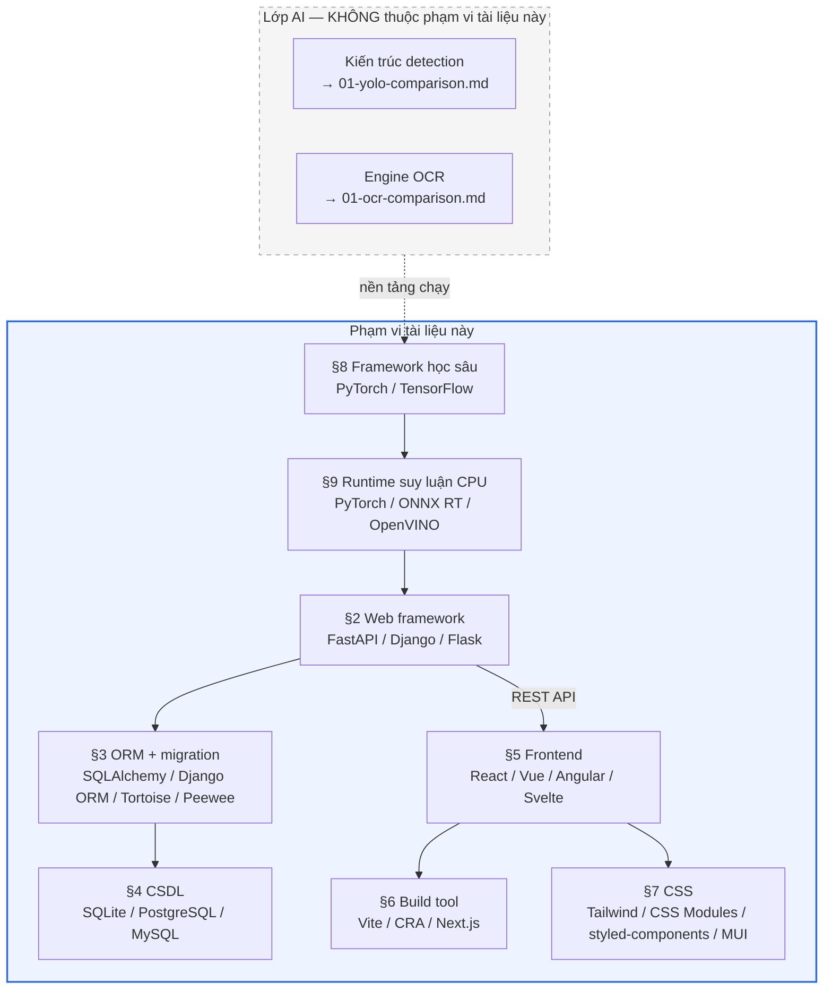

# Báo cáo 01 — So sánh công nghệ và luận cứ lựa chọn stack phần mềm

**Đồ án:** Xây dựng hệ thống nhận dạng biển số xe Việt Nam bằng AI (ALPR)
**Giai đoạn:** Phase 1 — Research (hạng mục *Technology Comparison* theo `CLAUDE.md`)
**Ngày lập:** 19/07/2026
**Phạm vi:** Stack phần mềm (backend, ORM, CSDL, frontend, build tool, CSS, framework học sâu, runtime suy luận CPU)
**Trạng thái:** Bản trình duyệt (draft for approval)

---

## Mục lục

1. [Mở đầu — phạm vi và tiêu chí đánh giá](#1-mở-đầu--phạm-vi-và-tiêu-chí-đánh-giá)
2. [Web framework backend: FastAPI vs Django vs Flask](#2-web-framework-backend-fastapi-vs-django-vs-flask)
3. [ORM và migration: SQLAlchemy 2.0 + Alembic vs Django ORM vs Tortoise vs Peewee](#3-orm-và-migration-sqlalchemy-20--alembic-vs-django-orm-vs-tortoise-vs-peewee)
4. [Cơ sở dữ liệu: SQLite vs PostgreSQL vs MySQL](#4-cơ-sở-dữ-liệu-sqlite-vs-postgresql-vs-mysql)
5. [Frontend framework: React vs Vue vs Angular vs Svelte](#5-frontend-framework-react-vs-vue-vs-angular-vs-svelte)
6. [Build tool: Vite vs Create React App vs Next.js](#6-build-tool-vite-vs-create-react-app-vs-nextjs)
7. [CSS: TailwindCSS vs CSS Modules vs styled-components vs MUI](#7-css-tailwindcss-vs-css-modules-vs-styled-components-vs-mui)
8. [Framework học sâu: PyTorch vs TensorFlow](#8-framework-học-sâu-pytorch-vs-tensorflow)
9. [Runtime suy luận trên CPU: PyTorch thuần vs ONNX Runtime vs OpenVINO](#9-runtime-suy-luận-trên-cpu-pytorch-thuần-vs-onnx-runtime-vs-openvino)
10. [Bảng tổng hợp quyết định](#10-bảng-tổng-hợp-quyết-định)
11. [Các lựa chọn KHÔNG chọn và vì sao](#11-các-lựa-chọn-không-chọn-và-vì-sao)
12. [Tài liệu tham khảo](#12-tài-liệu-tham-khảo)

---

## Quy ước trình bày và cảnh báo phương pháp luận

Báo cáo này áp dụng cùng bộ quy ước với [01-yolo-comparison.md](01-yolo-comparison.md):

| Ký hiệu | Ý nghĩa |
|---|---|
| **[✓]** | Số liệu/khẳng định đã đối chiếu trực tiếp với **tài liệu chính thức của chính dự án đó** (docs, repo, spec) |
| **[?]** | **Chưa kiểm chứng được nguồn gốc** — chỉ có ở nguồn thứ cấp (blog, bài tổng hợp). Không dùng làm luận cứ chính |
| **[RB]** | **Ràng buộc đề bài** — công nghệ đã được ấn định sẵn trong `CLAUDE.md`, không phải kết quả của một quá trình lựa chọn tự do |
| **[EST]** | Ước lượng thiết kế của tác giả, không phải số liệu công bố |

> **Cảnh báo 1 — Tính trung thực của quá trình lựa chọn.** Phần lớn stack trong báo cáo này **đã được ấn định trong `CLAUDE.md` trước khi Phase 1 bắt đầu** (mục *Technology Stack*, dòng 74–115). Báo cáo này **không giả vờ** rằng tác giả đã khảo sát tự do rồi mới chọn. Nhiệm vụ thực sự của tài liệu là: (a) đánh giá xem lựa chọn có sẵn **có hợp lý hay không** theo các tiêu chí kỹ thuật khách quan; (b) chỉ ra **trường hợp nào lựa chọn đó sẽ sai** và ngưỡng phải đổi; (c) chuẩn bị luận cứ trả lời câu hỏi bảo vệ *"tại sao chọn cái này?"*. Mỗi mục đều ghi rõ ký hiệu **[RB]** khi đó là ràng buộc đề bài.
>
> **Cảnh báo 2 — Benchmark web framework có độ tin cậy thấp.** Các con số kiểu "FastAPI nhanh gấp 6–8 lần Flask" lan truyền rộng trên blog nhưng **hầu như không kèm cấu hình đo** (số worker, ASGI/WSGI server, loại endpoint, phần cứng). Báo cáo này **không đưa các con số đó vào bảng chính** và đánh dấu **[?]**. Luận cứ chọn framework ở đây dựa trên **đặc tính kiến trúc kiểm chứng được** (mô hình đồng thời, chuẩn OpenAPI, hệ thống kiểu), không dựa trên requests-per-second không nguồn.
>
> **Cảnh báo 3 — Không so sánh chéo số liệu đo trên phần cứng khác nhau.** Áp dụng nguyên văn cho mục 9. Mọi tỷ số tăng tốc runtime đều ghi kèm phần cứng và định dạng đo. Số liệu chi tiết đặt tại [01-yolo-comparison.md §5.3–5.4](01-yolo-comparison.md) và **không lặp lại** ở đây.
>
> **Cảnh báo 4 — Phạm vi loại trừ.** Báo cáo này **không** so sánh kiến trúc detection (đã có ở [01-yolo-comparison.md](01-yolo-comparison.md)) và **không** so sánh engine OCR (đã có ở [01-ocr-comparison.md](01-ocr-comparison.md)). Mục 8 và 9 chỉ bàn **framework và runtime** làm nền cho hai tài liệu đó, không bàn lại kiến trúc mô hình.

---

## 1. Mở đầu — phạm vi và tiêu chí đánh giá

### 1.1. Vị trí của tài liệu trong Phase 1

`CLAUDE.md` liệt kê Phase 1 gồm sáu hạng mục nghiên cứu, trong đó *Technology Comparison* là một hạng mục **riêng biệt**, tách khỏi *YOLO Comparison* và *OCR Comparison*. Sự phân tách này có ý nghĩa rõ ràng về mặt nội dung:

| Hạng mục | Tài liệu | Đối tượng so sánh |
|---|---|---|
| YOLO Comparison | `01-yolo-comparison.md` | Kiến trúc mô hình phát hiện đối tượng |
| OCR Comparison | `01-ocr-comparison.md` | Engine nhận dạng ký tự |
| Vietnamese License Plate Standards | `01-vn-plate-standards.md` | Chuẩn pháp lý biển số |
| Dataset | `01-dataset-survey.md` | Nguồn dữ liệu |
| **Technology Comparison** | **`01-technology-comparison.md` (tài liệu này)** | **Stack phần mềm bao quanh mô hình AI** |

Nói cách khác: bốn tài liệu kia trả lời câu hỏi *"mô hình nào và dữ liệu nào?"*, còn tài liệu này trả lời câu hỏi *"phần mềm nào bọc quanh mô hình đó để nó trở thành một hệ thống?"*.

### 1.2. Sơ đồ phạm vi

### 1.3. Bộ tiêu chí đánh giá

Toàn bộ báo cáo dùng chung sáu tiêu chí. Trọng số phản ánh **bối cảnh cụ thể của đồ án tốt nghiệp**: một người thực hiện, chạy CPU-only, mục tiêu là bảo vệ được chứ không phải phục vụ hàng triệu người dùng.

| # | Tiêu chí | Vì sao quan trọng với đồ án này | Trọng số |
|---|---|---|---|
| **C1** | **Phù hợp bài toán phục vụ AI** | Endpoint có tác vụ CPU nặng (suy luận), khác hẳn CRUD thuần. Framework phải xử lý được cả I/O-bound lẫn CPU-bound | Cao |
| **C2** | **Chi phí học và chi phí vận hành cho một người** | Đồ án do một người làm toàn bộ 11 phase. Công nghệ nào đòi hai người trở lên là loại | Cao |
| **C3** | **Chất lượng tài liệu tự sinh** | `CLAUDE.md` yêu cầu deliverable *API Documentation* ở Phase 5 và Phase 9. Tự sinh được thì tiết kiệm một deliverable | Cao |
| **C4** | **Khả năng đóng gói Docker đơn giản** | Phase 8 yêu cầu Docker + Docker Compose. Stack nào cần nhiều service phụ trợ thì tăng rủi ro | Trung bình |
| **C5** | **Độ trưởng thành và tính sẵn có của tài liệu tiếng Việt/quốc tế** | Ảnh hưởng trực tiếp tới khả năng gỡ lỗi khi gặp sự cố | Trung bình |
| **C6** | **Đường thoát khi mở rộng** | Nếu sau bảo vệ muốn nâng lên quy mô thật, chi phí chuyển đổi phải chấp nhận được | Thấp–Trung bình |

**Tiêu chí bị loại có chủ ý:** *thông lượng cực đại (requests/second)*. Lý do: kịch bản sử dụng thực tế của đồ án là **demo trước hội đồng và một vài người dùng đồng thời**, trong khi nút cổ chai tuyệt đối là **thời gian suy luận trên CPU** (hàng chục tới hàng trăm mili-giây mỗi ảnh — xem [01-yolo-comparison.md §5.3](01-yolo-comparison.md)). Khi một request tốn hàng trăm mili-giây CPU, chênh lệch overhead giữa các web framework (đơn vị micro-giây) là **không đáng kể**. Đưa requests/second thành tiêu chí chính sẽ là một sai lầm phương pháp luận.

---

## 2. Web framework backend: FastAPI vs Django vs Flask

> **[RB] Đây là ràng buộc đề bài.** `CLAUDE.md` chỉ định FastAPI ở mục *Technology Stack* và Phase 5. Phần dưới đánh giá tính hợp lý của ràng buộc đó.

### 2.1. Khác biệt kiến trúc gốc

Ba framework này **không cùng loại sản phẩm**, đây là điểm phải nói rõ trước khi so sánh:

| | **FastAPI** | **Django** | **Flask** |
|---|---|---|---|
| Loại | API framework | Full-stack web framework | Micro-framework |
| Giao thức nền | **ASGI** (async) | WSGI, có lớp ASGI bổ sung | **WSGI** (sync) |
| Nền tảng kế thừa | Starlette + Pydantic [✓] | Tự thân (ORM, admin, template, auth tích hợp) | Werkzeug + Jinja2 |
| Triết lý | "Chỉ làm API, làm thật tốt" | "Batteries included" | "Tối giản, tự lắp ráp" |

Tài liệu chính thức xác nhận FastAPI là **lớp con của Starlette** và kế thừa toàn bộ tính năng Starlette gồm WebSocket, background task, CORS, GZip, static file, streaming response ([FastAPI — Features](https://fastapi.tiangolo.com/features/)) [✓].

### 2.2. Đánh giá theo năm tiêu chí đề bài yêu cầu

#### (a) Hiệu năng async

FastAPI chạy trên ASGI, hỗ trợ `async def` nguyên bản. Django là WSGI-first, có lớp ASGI bổ sung nhưng ORM của nó vẫn đồng bộ ở cốt lõi. Flask là WSGI thuần đồng bộ.

**Nhưng — và đây là điểm quan trọng nhất của cả mục này — async KHÔNG giúp gì cho tác vụ suy luận AI.** Suy luận YOLO/OCR là tác vụ **CPU-bound**, không phải I/O-bound. Nếu viết endpoint suy luận dưới dạng `async def` rồi gọi thẳng mô hình trong đó, tác vụ sẽ **chặn toàn bộ event loop** và làm hệ thống tệ hơn cả Flask đồng bộ. Cách dùng đúng là:

- Định nghĩa endpoint suy luận bằng **`def` thường** (không `async`) để FastAPI tự đẩy nó vào threadpool, **hoặc**
- Dùng `async def` nhưng đẩy phần suy luận qua `run_in_threadpool` / hàng đợi tác vụ nền.

Lợi ích async thực sự trong đồ án này nằm ở chỗ khác: **tải file lên** (ảnh, và nhất là video hàng chục MB) và **ghi file xuống đĩa** — đây mới là I/O-bound thật. Với video, FastAPI còn cung cấp `BackgroundTasks` kế thừa từ Starlette, khớp đúng với thiết kế bảng `DetectionJob` đã được phê duyệt ở Phase 0.

> ⚠️ **Rủi ro chưa được đánh giá — phải xử lý ở Phase 5/7.** Khi FastAPI đẩy endpoint đồng bộ vào threadpool, **nhiều request đồng thời sẽ sinh nhiều luồng suy luận song song**. Mỗi luồng ONNX Runtime lại tự sinh số luồng bằng số lõi vật lý theo mặc định ([ONNX Runtime — Threading](https://onnxruntime.ai/docs/performance/tune-performance/threading.html)) [✓], gây **oversubscription** trên máy 4–8 lõi. Rủi ro này đã được ghi nhận tại [01-yolo-comparison.md §5.5](01-yolo-comparison.md) và **bắt buộc phải giới hạn đồng thời ở tầng ứng dụng** (semaphore hoặc hàng đợi một-worker) — không phải bằng cách đổi web framework.

#### (b) Tự sinh OpenAPI

Đây là khác biệt **rõ rệt và kiểm chứng được** nhất giữa ba framework.

| Framework | OpenAPI tự sinh | Ghi chú |
|---|---|---|
| **FastAPI** | **Có, tích hợp sẵn** — sinh OpenAPI + Swagger UI + ReDoc từ chính type hint ([FastAPI — Features](https://fastapi.tiangolo.com/features/)) [✓] | Không cần thư viện ngoài, không cần viết schema tay |
| Django | Không có trong core; cần `drf-spectacular`/`drf-yasg` cùng Django REST Framework | Thêm phụ thuộc, schema dễ lệch khỏi code |
| Flask | **Không có OpenAPI tích hợp sẵn**; cần `flask-smorest`, `apispec`… | Tương tự Django, phải tự lắp |

Với đồ án, tính năng này quy đổi trực tiếp thành **một deliverable của Phase 5 (*API Documentation*) và Phase 9 được tạo tự động và luôn đồng bộ với mã nguồn**. Đây là lợi ích thực chất, không phải tiện nghi.

#### (c) Tích hợp Pydantic

FastAPI dùng Pydantic làm lớp xác thực dữ liệu chính thức ([FastAPI — Features](https://fastapi.tiangolo.com/features/)) [✓]. Điều này khớp với hai quy tắc bắt buộc trong `CLAUDE.md` (mục *Coding Rules*): **type hints** và **validation**.

Về hiệu năng, tài liệu chính thức hiện tại của Pydantic chỉ nêu định tính: *"Pydantic's core validation logic is written in Rust. As a result, Pydantic is among the fastest data validation libraries for Python"* ([Pydantic — Get started](https://pydantic.dev/docs/validation/latest/get-started/)) [✓]. Con số cụ thể "v2 nhanh hơn v1 khoảng 4–50 lần, điển hình ~17 lần" xuất hiện ở bài giới thiệu v2 của chính Pydantic ([Introducing Pydantic V2](https://pydantic.dev/articles/pydantic-v2)) nhưng **không tái lập được trên trang tài liệu hiện hành**, nên đánh dấu **[?]** và **không dùng làm luận cứ**. Luận cứ thực sự ở đây là **an toàn kiểu và tự sinh JSON Schema**, không phải tốc độ xác thực — vì như đã nói ở §1.3, chi phí xác thực là không đáng kể so với chi phí suy luận.

Một chi tiết thực dụng đáng ghi: Pydantic sẽ được dùng **hai lần** trong đồ án — vừa cho schema request/response của API, vừa cho **cấu hình ứng dụng** (`pydantic-settings`), qua đó thực thi quy tắc *"Never hardcode paths"* của `CLAUDE.md` bằng cách nạp đường dẫn mô hình, ngưỡng confidence, thư mục lưu trữ từ biến môi trường và xác thực chúng ngay lúc khởi động.

#### (d) Độ phù hợp cho API phục vụ AI

| Yếu tố | FastAPI | Django | Flask |
|---|---|---|---|
| Không kèm ORM/admin/template không dùng đến | ✅ | ❌ Kèm rất nhiều thứ đồ án không cần | ✅ |
| Dependency Injection tích hợp (yêu cầu của `CLAUDE.md`) | ✅ Có hệ thống DI riêng ([FastAPI — Features](https://fastapi.tiangolo.com/features/)) [✓] | ⚠️ Không có DI kiểu này | ⚠️ Không có |
| WebSocket cho realtime webcam | ✅ Kế thừa Starlette [✓] | ⚠️ Cần Django Channels | ❌ Cần thư viện ngoài |
| Background task cho xử lý video | ✅ Kế thừa Starlette [✓] | ⚠️ Thường phải dùng Celery + broker | ⚠️ Tương tự |

Cột **WebSocket** và **Background task** đặc biệt quan trọng vì `CLAUDE.md` yêu cầu cả *Realtime Detection* (webcam) lẫn *Video Detection*. Với Django hoặc Flask, hai yêu cầu này kéo theo **thêm service phụ trợ trong `docker-compose.yml`** (Redis làm broker cho Celery, chẳng hạn), làm phức tạp Phase 8 — vi phạm tiêu chí **C4**.

#### (e) Đường cong học

Đánh giá định tính, thừa nhận là chủ quan:

- **Flask** dễ bắt đầu nhất nhưng chi phí dồn về sau: mọi thứ (xác thực, OpenAPI, cấu trúc dự án) phải tự lắp, dễ dẫn tới mã không nhất quán — mâu thuẫn với yêu cầu *Clean Architecture* của `CLAUDE.md`.
- **Django** có chi phí học ban đầu cao nhất do khối lượng khái niệm lớn (app, middleware, settings, migration, admin, DRF serializer), phần lớn **không dùng tới** trong một dự án chỉ cung cấp REST API.
- **FastAPI** yêu cầu người học nắm hai khái niệm không tầm thường: **async/await** (và biết khi nào **không** dùng — xem mục (a)) và **type hints/Pydantic**. Đổi lại, cấu trúc dự án được định hình rõ hơn Flask.

### 2.3. Kết luận mục 2

Ràng buộc đề bài **FastAPI là hợp lý**, và luận cứ mạnh nhất **không phải là tốc độ** mà là: (1) OpenAPI tự sinh → trực tiếp tạo ra một deliverable bắt buộc; (2) WebSocket + BackgroundTasks có sẵn → không phát sinh service phụ trợ ở Phase 8; (3) DI và type hints tích hợp → khớp với *Coding Rules*.

**Trường hợp lựa chọn này sẽ sai:** nếu đồ án cần **giao diện quản trị dữ liệu dựng sẵn** và **hệ thống người dùng/phân quyền đầy đủ**, Django sẽ tiết kiệm hơn rất nhiều nhờ Django Admin và `django.contrib.auth`. Yêu cầu chức năng hiện tại của `CLAUDE.md` **không có** hạng mục quản lý người dùng, nên điều kiện này không xảy ra.

---

## 3. ORM và migration: SQLAlchemy 2.0 + Alembic vs Django ORM vs Tortoise vs Peewee

> **[RB] Đây là ràng buộc đề bài.** `CLAUDE.md` chỉ định SQLAlchemy + Alembic.

### 3.1. Loại trừ theo ràng buộc kiến trúc

**Django ORM bị loại ngay ở bước đầu, không phải vì kém.** Django ORM là một ORM tốt và có hệ thống migration tích hợp vào bậc nhất trong hệ sinh thái Python. Nhưng nó **gắn chặt với vòng đời ứng dụng Django** (`settings.py`, `INSTALLED_APPS`, `django.setup()`). Dùng Django ORM tách rời trong một ứng dụng FastAPI là việc làm được nhưng phản mẫu, và ORM này vẫn đồng bộ ở cốt lõi. Khi §2 đã chốt FastAPI thì Django ORM **tự động bị loại theo**. Đây là một **quyết định kéo theo**, cần nêu rõ khi bảo vệ thay vì trình bày như một cuộc so sánh ngang hàng.

### 3.2. So sánh ba ứng viên còn lại

| Tiêu chí | **SQLAlchemy 2.0** | **Tortoise ORM** | **Peewee** |
|---|---|---|---|
| Kiểu API | Core + ORM, hai tầng | Kiểu Django, async-first | Tối giản, gọn nhẹ |
| Async | Có (`asyncio` + `aiosqlite`) | Async-first theo thiết kế | **Hỗ trợ async còn thực nghiệm** [?] |
| Typing | **Tích hợp sâu PEP 484, không cần stub/plugin ngoài**; `Mapped[]` cho kiểu chính xác toàn tuyến ([SQLAlchemy 2.0 — What's New](https://docs.sqlalchemy.org/en/20/changelog/whatsnew_20.html)) [✓] | Có, mức khá | Hạn chế |
| Migration | **Alembic** — autogenerate, branching, rollback, multi-head merge [?] | Aerich, hoặc công cụ migration nội bộ từ Tortoise 1.0.0 [?] | **Không có cơ chế migration nguyên bản** [?] |
| Tích hợp dataclass | Có, qua `MappedAsDataclass` ([SQLAlchemy 2.0 — What's New](https://docs.sqlalchemy.org/en/20/changelog/whatsnew_20.html)) [✓] | — | — |
| Quy mô cộng đồng | Lớn nhất trong ba | Trung bình | Trung bình |

> ⚠️ **Cảnh báo trích dẫn.** Các ô đánh **[?]** ở cột migration và async lấy từ bài so sánh thứ cấp ([Better Stack — TortoiseORM vs SQLAlchemy](https://betterstack.com/community/guides/scaling-python/tortoiseorm-vs-sqlalchemy/), [InfoWorld — ORMs for Python](https://www.infoworld.com/article/2335270/6-orms-for-every-database-powered-python-app.html)), **chưa đối chiếu được với tài liệu gốc của Peewee và Tortoise** (trang playhouse của Peewee trả về HTTP 404 tại thời điểm lập báo cáo). **Không dùng các ô này làm luận cứ chính khi bảo vệ.** Con số "Tortoise nhanh hơn SQLAlchemy 33% ở p50 (1,2 ms vs 1,8 ms)" xuất hiện trong nguồn thứ cấp **đã bị loại khỏi báo cáo** vì không ghi phần cứng, không ghi truy vấn đo, không ghi backend CSDL — vi phạm nguyên tắc trích dẫn của đồ án.

### 3.3. Luận cứ chọn SQLAlchemy 2.0 + Alembic

**(1) Hệ thống kiểu là lợi ích lớn nhất, không phải hiệu năng.** SQLAlchemy 2.0 tích hợp PEP 484 **mà không cần stub hay plugin ngoài** — biểu thức SQL trở thành generic trên kiểu Python (`Column('id', Integer)` có kiểu `Column[int]`), cho kiểu chính xác từ lúc dựng câu lệnh tới lúc lấy kết quả ([SQLAlchemy 2.0 — What's New](https://docs.sqlalchemy.org/en/20/changelog/whatsnew_20.html)) [✓]. Kết hợp với Pydantic ở tầng API, đồ án có **một chuỗi kiểu liên tục từ HTTP request → model ORM → cột CSDL**, thỏa quy tắc *type hints* bắt buộc.

**(2) Alembic khớp với một yêu cầu đã phát sinh thật.** Schema CSDL của đồ án **đã thay đổi một lần ngay ở Phase 0**: bổ sung 6 trường (`raw_ocr_text`, `ocr_confidence`, `bbox_x/y/w/h`, `is_valid_format`, `plate_line_count`, `source_job_id`) và thêm bảng `DetectionJob`. Đây là bằng chứng thực nghiệm rằng schema **sẽ còn tiếp tục đổi** qua Phase 3–7 (ví dụ khi thêm chỉ số đánh giá mô hình). Có công cụ migration với autogenerate là nhu cầu thật, không phải trang trí.

**(3) Tính khả chuyển CSDL là đường thoát cho §4.** SQLAlchemy trừu tượng hóa dialect, nên khi cần chuyển SQLite → PostgreSQL (xem ngưỡng ở §4.5), phần lớn mã ORM giữ nguyên. Đây chính là cơ chế biến rủi ro của SQLite thành rủi ro **có kiểm soát**.

**Đánh đổi phải thừa nhận:** SQLAlchemy có **đường cong học dốc nhất** trong ba ứng viên — khái niệm `Session`, `unit of work`, `identity map`, lazy loading và lỗi `DetachedInstanceError` là những thứ người mới thường vấp. Tortoise ORM sẽ cho tốc độ viết code ban đầu nhanh hơn. Đây là **đánh đổi có chủ ý**: chấp nhận học chậm hơn để đổi lấy tài liệu phong phú hơn khi gỡ lỗi (tiêu chí **C5**) và đường thoát mở rộng (**C6**).

---

## 4. Cơ sở dữ liệu: SQLite vs PostgreSQL vs MySQL

> **[RB] Đây là ràng buộc đề bài.** `CLAUDE.md` chỉ định SQLite ở cả mục *Technology Stack*, mục *Database* và Phase 5. **Đây cũng là lựa chọn có rủi ro kỹ thuật cao nhất trong toàn bộ stack**, nên mục này được phân tích kỹ nhất.

### 4.1. Giới hạn cốt lõi của SQLite — trình bày trung thực

Giới hạn phải nói thẳng, bằng chính lời tài liệu SQLite:

> *"Since there is only one WAL file, there can only be one writer at a time."* — [SQLite — Write-Ahead Logging](https://sqlite.org/wal.html) [✓]

Và ở tài liệu hướng dẫn lựa chọn:

> SQLite hỗ trợ **không giới hạn số người đọc đồng thời**, nhưng **chỉ một người ghi tại bất kỳ thời điểm nào** trên mỗi file CSDL — [SQLite — Appropriate Uses For SQLite](https://www.sqlite.org/whentouse.html) [✓]

**Cần nói rõ để tránh hiểu sai:** khóa ghi này là **toàn cục trên toàn file CSDL**, không phải khóa mức dòng hay mức bảng. Hai request cùng ghi vào hai bảng khác nhau (`DetectionHistory` và `DetectionJob`) **vẫn tranh chấp cùng một khóa ghi**. Đây là điểm khác biệt bản chất so với PostgreSQL/MySQL (MVCC + khóa mức dòng), và là lý do không thể "tối ưu" SQLite thoát khỏi giới hạn này bằng cách tách bảng.

Chế độ WAL **giảm nhẹ nhưng không xóa bỏ** vấn đề. WAL cho phép *"writers and readers can run at the same time"* ([SQLite — WAL](https://sqlite.org/wal.html)) [✓] — tức người đọc không còn bị chặn bởi người ghi, một cải thiện lớn cho dashboard/thống kê chạy song song với việc nhận dạng. Nhưng **số người ghi đồng thời vẫn là một**, và request ghi thứ hai sẽ chờ hoặc nhận `SQLITE_BUSY`.

Hai giới hạn phụ của WAL cũng cần ghi nhận:

- *"WAL does not work over a network filesystem"* ([SQLite — WAL](https://sqlite.org/wal.html)) [✓] — vì WAL đòi các tiến trình chia sẻ một vùng nhớ nhỏ. **Hệ quả cho Phase 8: file CSDL phải nằm trên Docker volume cục bộ, tuyệt đối không đặt trên NFS/SMB.**
- WAL không phù hợp với giao dịch rất lớn (vượt khoảng 100 MB) ([SQLite — WAL](https://sqlite.org/wal.html)) [✓] — không ảnh hưởng đồ án vì mỗi giao dịch chỉ ghi vài dòng metadata, ảnh lưu ngoài dưới dạng file.

### 4.2. So sánh ba hệ quản trị

| Tiêu chí | **SQLite** | **PostgreSQL** | **MySQL** |
|---|---|---|---|
| Kiến trúc | Nhúng, không tiến trình máy chủ | Client/server | Client/server |
| Ghi đồng thời | **Một người ghi tại một thời điểm** [✓] | Nhiều, MVCC | Nhiều, MVCC (InnoDB) |
| Thêm service vào `docker-compose.yml` | **Không** | Có | Có |
| Cần cấu hình user/password/network | **Không** | Có | Có |
| Sao lưu | **Sao chép một file** | `pg_dump` + quy trình | `mysqldump` + quy trình |
| Bàn giao đồ án | **Kèm luôn file `.db` trong package nộp** | Phải kèm dump + hướng dẫn khôi phục | Tương tự |
| Kiểu dữ liệu | Kiểu động, ràng buộc lỏng | Phong phú, nghiêm ngặt (JSONB, array, kiểu tự định nghĩa) | Trung gian |
| Toàn văn / vector | FTS5 | Rất mạnh (`pg_trgm`, `tsvector`, `pgvector`) | Trung bình |

### 4.3. Vì sao SQLite vẫn chấp nhận được ở quy mô đồ án

Luận cứ dựa trên chính tài liệu SQLite, **không phải phỏng đoán**:

**(1) Ngưỡng lưu lượng chính thức cao hơn nhu cầu đồ án nhiều bậc.** SQLite nêu mức **100 nghìn lượt truy cập/ngày là ước lượng bảo thủ**, và đã có trường hợp chạy tốt ở mức gấp 10 lần; chính máy chủ `sqlite.org` phục vụ 400–500 nghìn HTTP request/ngày trên một máy ảo dùng chung ([SQLite — Appropriate Uses](https://www.sqlite.org/whentouse.html)) [✓]. Kịch bản đồ án — demo trước hội đồng, vài người dùng đồng thời — thấp hơn ngưỡng này vài bậc độ lớn.

**(2) Điều kiện "xếp hàng chờ tới lượt" được thỏa.** Tài liệu SQLite phát biểu điều kiện chuyển sang client/server rất rõ: *"If many threads and/or processes need to write the database at the same instant **(and they cannot queue up and take turns)** then it is best to select a database engine that supports that capability"* ([SQLite — Appropriate Uses](https://www.sqlite.org/whentouse.html)) [✓]. Vế trong ngoặc là mấu chốt. Trong đồ án này, các request **hoàn toàn có thể xếp hàng**, vì đằng nào chúng cũng đã bị tuần tự hóa bởi nút cổ chai suy luận CPU (§2.2a). Giao dịch ghi chỉ là vài dòng metadata, hoàn tất trong đơn vị mili-giây, trong khi bước suy luận trước đó tốn hàng chục–hàng trăm mili-giây. **Nói cách khác: khóa ghi của SQLite không phải nút cổ chai — mô hình AI mới là.**

**(3) Tỷ lệ đọc/ghi rất thiên về đọc.** Chức năng theo `CLAUDE.md`: Dashboard, Statistics, History, Search, Filter, Preview — toàn bộ là **đọc**. Chỉ có bước lưu kết quả nhận dạng là ghi. Đây đúng là hình dạng tải mà WAL phục vụ tốt nhất (đọc không bị chặn bởi ghi).

**(4) Đơn giản hóa Phase 8 và Phase 11.** Không có SQLite thì `docker-compose.yml` phải thêm một service CSDL, một volume, một bộ biến môi trường bí mật, và một quy trình chờ-sẵn-sàng (health check + retry) trước khi backend khởi động. Với SQLite, toàn bộ phần này biến mất. Ở Phase 11, gói nộp cuối có thể **kèm luôn file `.db` chứa dữ liệu demo**, giúp người chấm chạy lại kết quả mà không cần khôi phục dump.

### 4.4. Điều kiện bắt buộc khi dùng SQLite trong đồ án này

Đây là các ràng buộc kỹ thuật **bắt buộc** phải thực hiện ở Phase 5, không phải khuyến nghị:

| # | Ràng buộc | Lý do |
|---|---|---|
| **R1** | Bật `PRAGMA journal_mode=WAL` | Cho phép đọc song song với ghi ([SQLite — WAL](https://sqlite.org/wal.html)) [✓] |
| **R2** | Đặt `busy_timeout` đủ lớn (ví dụ 5000 ms) | Để request ghi thứ hai **chờ** thay vì lỗi `SQLITE_BUSY` ngay |
| **R3** | Giữ giao dịch ghi ngắn nhất có thể — **không** ôm bước suy luận trong transaction | Suy luận xong mới mở transaction ghi; nếu không, khóa ghi bị giữ hàng trăm ms |
| **R4** | File `.db` phải nằm trên **volume cục bộ**, không NFS/SMB | WAL không hoạt động trên network filesystem [✓] |
| **R5** | **Ảnh và video lưu ra file, chỉ lưu đường dẫn trong CSDL** | Tránh transaction lớn; khớp thiết kế schema đã duyệt (`ImagePath`, `PlateImagePath`) |
| **R6** | Đặt giới hạn đồng thời ở tầng ứng dụng | Xử lý cùng lúc rủi ro oversubscription luồng (§2.2a) và tranh chấp khóa ghi |

### 4.5. Ngưỡng bắt buộc chuyển sang PostgreSQL

Nêu ngưỡng cụ thể là điều hội đồng nhiều khả năng sẽ hỏi. Bốn ngưỡng dưới đây suy ra trực tiếp từ tiêu chí của tài liệu SQLite ([SQLite — Appropriate Uses](https://www.sqlite.org/whentouse.html)):

| # | Ngưỡng | Vì sao |
|---|---|---|
| **N1** | **Backend chạy nhiều tiến trình/nhiều bản sao (replica)** hoặc scale ngang | Nhiều tiến trình ghi thật sự đồng thời, không còn xếp hàng được → đúng điều kiện chuyển đổi mà tài liệu SQLite nêu [✓] |
| **N2** | **Tách CSDL sang máy khác qua mạng** | *"Data separated from application by network → Client/Server"* [✓]; đồng thời WAL không chạy trên network filesystem [✓] |
| **N3** | **Ghi đồng thời liên tục** — ví dụ nhiều camera stream cùng ghi kết quả không ngừng | Không còn thỏa điều kiện "queue up and take turns" |
| **N4** | **Nhu cầu tìm kiếm/phân tích nâng cao** vượt khả năng FTS5 | PostgreSQL có `pg_trgm`, `tsvector`, và `pgvector` nếu về sau cần tìm kiếm theo vector đặc trưng biển số |

**Chi phí chuyển đổi ước tính là thấp** nhờ SQLAlchemy (§3.3): chủ yếu là đổi connection string, rà lại các chỗ dùng cú pháp riêng của SQLite, và chạy lại Alembic trên backend mới. **[EST]** — chưa thực hiện nên chưa có số đo.

**Vì sao là PostgreSQL chứ không phải MySQL nếu phải chuyển:** kiểu dữ liệu phong phú hơn (JSONB rất hợp để lưu kết quả OCR thô có cấu trúc), khả năng tìm kiếm mạnh hơn, hệ sinh thái extension (`pgvector`) mở đường cho tính năng tương lai. Không có đặc tính nào của MySQL vượt trội cho bài toán này để bù lại. Đánh giá này là **định tính**, chưa có benchmark riêng cho đồ án.

---

## 5. Frontend framework: React vs Vue vs Angular vs Svelte

> **[RB] Đây là ràng buộc đề bài.** `CLAUDE.md` chỉ định React + TypeScript.

### 5.1. So sánh định tính

| Tiêu chí | **React** | **Vue** | **Angular** | **Svelte** |
|---|---|---|---|---|
| Mô hình | Thư viện UI + hệ sinh thái ngoài | Framework tiệm tiến, có bộ chính thức (Router, Pinia) | Framework đầy đủ, ý kiến mạnh (DI, RxJS, module) | Compiler — biên dịch bỏ runtime |
| TypeScript | Hỗ trợ tốt qua JSX/TSX | Hỗ trợ tốt từ Vue 3 | **Viết bằng TypeScript, bắt buộc trên thực tế** | Hỗ trợ tốt |
| Kích thước bundle | Trung bình | Trung bình | Lớn nhất | **Nhỏ nhất** (không runtime framework) |
| Đường cong học | Trung bình | **Thấp nhất** trong nhóm | **Cao nhất** (RxJS, DI, decorator) | Thấp |
| Quy mô hệ sinh thái | **Lớn nhất** | Lớn | Lớn (thiên về doanh nghiệp) | Nhỏ nhất trong bốn |
| Thư viện biểu đồ cho Dashboard | Rất nhiều (Recharts, visx, Chart.js wrapper…) | Nhiều | Có | Ít hơn |

### 5.2. Về số liệu khảo sát — nêu rõ giới hạn kiểm chứng

> ⚠️ **Không đưa được số liệu khảo sát vào bảng chính.** Đã thử truy xuất trực tiếp trang [State of JavaScript 2025 — Front-end Frameworks](https://2025.stateofjs.com/en-US/libraries/front-end-frameworks/) nhưng **các giá trị phần trăm nằm trong biểu đồ tương tác, không có trong nội dung văn bản** — không đọc được bằng công cụ hiện có. Các con số lan truyền trên blog tổng hợp (ví dụ "React 44,7% usage", "Svelte retention 91%", "Svelte retention 88%") **mâu thuẫn lẫn nhau ngay giữa các nguồn thứ cấp** và không đối chiếu được với nguồn gốc. **Do đó báo cáo này không dùng bất kỳ con số khảo sát nào làm luận cứ** [?]. Kết luận của mục 5 dựa hoàn toàn trên đặc tính kỹ thuật và bối cảnh đồ án.

Điều **có thể** khẳng định mà không cần số: cả bốn framework đều **đủ trưởng thành** để xây dựng dashboard trong `CLAUDE.md` (Upload, Webcam, History, Statistics, Search, Filter). **Không framework nào trong bốn là lựa chọn sai về mặt kỹ thuật.** Vì vậy tiêu chí quyết định phải là yếu tố ngoài kỹ thuật thuần túy.

### 5.3. Luận cứ chấp nhận ràng buộc React

**(1) Yêu cầu webcam realtime quyết định nhiều hơn framework.** Chức năng *Realtime Detection* phụ thuộc vào `navigator.mediaDevices.getUserMedia`, `<video>`, `<canvas>` và WebSocket — đều là **API trình duyệt thuần**, không phải tính năng framework. Phần khó nhất của Phase 6 vì thế **độc lập với việc chọn React hay Vue**. Điều này làm giảm mạnh trọng số của việc chọn framework, và củng cố lập luận "chấp nhận ràng buộc đề bài là hợp lý".

**(2) Hệ sinh thái là tiêu chí có ý nghĩa nhất với người làm một mình.** Khi gặp lỗi ở 2 giờ sáng trước hạn nộp, xác suất tìm được câu trả lời chính xác cho React cao hơn cho Svelte đơn giản vì khối lượng nội dung sẵn có lớn hơn. Đây là tiêu chí **C5**, và với đồ án một người, nó quan trọng hơn hiệu năng runtime.

**(3) Angular bị loại vì mất cân đối chi phí/lợi ích.** Angular giải quyết bài toán **đội ngũ lớn, dự án dài hạn** bằng cấu trúc cứng và DI. Đồ án này có **một người và một dashboard**. Chi phí học RxJS và hệ thống module không được bù lại bằng bất kỳ lợi ích nào ở quy mô này.

**(4) Svelte tốt về kỹ thuật nhưng thua ở tiêu chí phụ trợ.** Svelte cho bundle nhỏ nhất và cú pháp gọn nhất. Nhưng ở đồ án này, **kích thước bundle không phải ràng buộc** (ứng dụng chạy nội bộ, không phải trang thương mại tối ưu tốc độ tải), trong khi hệ sinh thái nhỏ hơn là bất lợi thật.

**Đánh đổi phải thừa nhận:** React đòi người viết tự quản lý nhiều thứ mà Vue/Angular cho sẵn — quản lý trạng thái, routing, form. Với dashboard quy mô này, chi phí đó ở mức thấp và được xử lý bằng React Router cùng state cục bộ, **không cần Redux**.

---

## 6. Build tool: Vite vs Create React App vs Next.js

> **[RB] Đây là ràng buộc đề bài.** `CLAUDE.md` chỉ định Vite.

### 6.1. Create React App đã bị khai tử — đây là dữ kiện, không phải ý kiến

Ngày **14/02/2025**, đội ngũ React chính thức khai tử Create React App ([React — Sunsetting Create React App](https://react.dev/blog/2025/02/14/sunsetting-create-react-app)) [✓]. Lý do chính thức:

- *"Create React App currently has no active maintainers"* [✓]
- CRA có nhiều hạn chế khiến khó xây ứng dụng production hiệu năng cao: **không có routing tích hợp**, **không có giải pháp chống network waterfall khi lấy dữ liệu**, **không có code splitting tích hợp** (gói thành một bundle duy nhất) [✓]

**Hệ quả: CRA bị loại tuyệt đối.** Đây không phải một so sánh có đánh đổi — dùng một công cụ không còn người bảo trì cho một đồ án phải bảo vệ trước hội đồng là rủi ro không thể biện minh.

### 6.2. Vì sao SPA thuần (Vite) đủ, dù React khuyến nghị framework trước

Cần trung thực: bài viết khai tử CRA **khuyến nghị chuyển sang framework (Next.js, React Router, Expo) trước**, và chỉ xếp build tool (Vite, Parcel, Rsbuild) là lựa chọn thứ hai [✓]. Vậy vì sao đồ án đi ngược khuyến nghị mặc định?

Vì chính bài viết đó nêu điều kiện chấp nhận được, và đồ án thỏa điều kiện:

> *"Most apps would benefit from a framework, but there are valid cases to build a React app from scratch."* — [React — Sunsetting CRA](https://react.dev/blog/2025/02/14/sunsetting-create-react-app) [✓]

Các trường hợp hợp lệ được liệt kê gồm **công cụ quản trị nội bộ (internal admin tools)**, mục đích học tập, và ứng dụng có ràng buộc bất thường [✓]. Dashboard của đồ án này **đúng là một internal admin tool**: phạm vi hẹp, người dùng nội bộ, không cần SEO, không cần chia sẻ URL công khai.

Ba lý do bổ sung, cụ thể cho đồ án:

**(1) Next.js sẽ tạo ra một backend thứ hai — mâu thuẫn kiến trúc.** Next.js là framework full-stack có server riêng (Node.js). Đồ án **đã có backend FastAPI** chứa toàn bộ logic AI, ORM và CSDL. Thêm Next.js nghĩa là `docker-compose.yml` phải chạy **hai tiến trình máy chủ**, và phải trả lời câu hỏi khó chịu "logic đặt ở đâu?" cho từng tính năng. Điều này vi phạm trực tiếp quy tắc *"Never mix AI code with API logic"* và làm phức tạp Phase 8.

**(2) Ưu thế chính của Next.js là SSR/SSG — đồ án không dùng đến.** SSR có giá trị cho SEO và thời gian hiển thị lần đầu trên trang công khai. Dashboard nội bộ có đăng nhập/dùng cục bộ **không được lợi gì** từ hai điều đó.

**(3) SPA thuần cho phép đóng gói tĩnh.** Build ra tệp tĩnh, phục vụ bằng Nginx hoặc bằng chính FastAPI qua `StaticFiles`. Kết quả: **một container ít hơn** trong Phase 8.

### 6.3. Đặc tính kỹ thuật của Vite

Từ tài liệu chính thức ([Vite — Why Vite](https://vite.dev/guide/why.html)) [✓]:

- Vấn đề Vite giải quyết: bundler truyền thống phải đóng gói **toàn bộ ứng dụng trước khi phục vụ**, gây *"painfully slow dev server startups, sluggish hot updates, and long production build times"* [✓]
- Cách tiếp cận: phục vụ mã nguồn **theo yêu cầu qua native ESM**; trình duyệt chỉ nạp thứ cần cho trang hiện tại, Vite biến đổi từng file khi được yêu cầu → khởi động dev server **gần như tức thì bất kể kích thước ứng dụng** [✓]
- Production build: dùng **Rollup**; dự án đang chuyển sang **Rolldown** (bundler viết bằng Rust) [✓]

> ⚠️ **Con số "esbuild nhanh hơn 10–100 lần" đã bị loại khỏi báo cáo.** Đã kiểm tra trực tiếp trang *Why Vite* và **không tìm thấy hệ số tốc độ cụ thể nào** cho bước pre-bundling; trang chỉ nói định tính *"pre-bundled once using fast native tooling"* [✓]. Con số kia lan truyền rộng nhưng **không tái lập được từ tài liệu Vite hiện hành**.

---

## 7. CSS: TailwindCSS vs CSS Modules vs styled-components vs MUI

> **[RB] Đây là ràng buộc đề bài.** `CLAUDE.md` chỉ định TailwindCSS.

### 7.1. Bốn phương án thuộc bốn triết lý khác nhau

| Phương án | Triết lý | Chi phí runtime | Thiết kế sẵn có |
|---|---|---|---|
| **TailwindCSS** | Utility-first — tổ hợp class nhỏ ngay trong markup | Không (biên dịch ra CSS tĩnh) | Không có component, chỉ có hệ thống ràng buộc thiết kế |
| **CSS Modules** | CSS truyền thống, tên class được cô lập theo file | Không | Không |
| **styled-components** | CSS-in-JS, viết style trong JS | **Có** — sinh style lúc chạy | Không |
| **MUI** | Thư viện component hoàn chỉnh theo Material Design | Có | **Có, rất đầy đủ** |

### 7.2. Luận điểm của Tailwind — trích từ tài liệu chính thức

Tài liệu Tailwind nêu các luận điểm sau ([Tailwind — Styling with utility classes](https://tailwindcss.com/docs/styling-with-utility-classes)) [✓]:

1. **Không tốn công đặt tên:** *"you don't spend any time coming up with class names, making decisions about selectors, or switching between HTML and CSS files"* [✓]
2. **CSS ngừng phình to:** *"Your CSS stops growing — since utility classes are so reusable, your CSS doesn't continue to grow linearly with every new feature"* [✓]
3. **Thay đổi an toàn hơn nhờ tính cục bộ:** *"adding or removing a utility class to an element only ever affects that element, so you never have to worry about accidentally breaking something [on] another page"* [✓]
4. **Thiết kế trong ràng buộc:** khác với inline style nơi *"every value is a magic number"*, utility class chọn giá trị từ một hệ thống thiết kế định sẵn [✓]

Luận điểm (3) đặc biệt phù hợp bối cảnh đồ án: người thực hiện làm việc một mình qua nhiều phase cách xa nhau về thời gian. Rủi ro lớn nhất với CSS toàn cục là **sửa style ở màn hình History làm hỏng màn hình Statistics mà không hay biết**. Tính cục bộ của utility class loại bỏ rủi ro này ở mức thiết kế — CSS Modules cũng đạt được điều tương tự, nhưng qua cơ chế khác (cô lập tên class).

### 7.3. Vì sao không chọn ba phương án còn lại

**CSS Modules** — lựa chọn hợp lý nhất trong ba phương án bị loại. Không tốn runtime, cô lập tốt, không cần học cú pháp mới. Bất lợi so với Tailwind: vẫn phải đặt tên class cho từng phần tử, và **không có hệ thống ràng buộc thiết kế** — mọi khoảng cách, màu sắc lại trở thành magic number, dễ dẫn tới giao diện thiếu nhất quán khi làm rải rác qua nhiều phiên.

**styled-components** — bị loại vì **chi phí runtime**. Đây là hệ thống sinh CSS lúc chạy, cộng thêm chi phí vào phía client. Đồ án đã có ngân sách hiệu năng eo hẹp ở phía server (suy luận CPU); không có lý do gì thêm chi phí runtime ở phía client trong khi phương án không-runtime hoàn toàn khả dụng. Ngoài ra, xu hướng của hệ sinh thái React đang dịch khỏi CSS-in-JS runtime — **đây là nhận định định tính, chưa dẫn nguồn định lượng** [?].

**MUI** — trường hợp thú vị nhất và **cần thừa nhận rằng đây là lựa chọn thay thế mạnh**. MUI cung cấp sẵn `DataGrid` (phân trang, sắp xếp, lọc), `DatePicker`, `Dialog`, `Snackbar` — tức gần như toàn bộ nhu cầu giao diện của mục *Dashboard/History/Search/Filter* trong `CLAUDE.md`. Chọn MUI có thể **tiết kiệm đáng kể thời gian Phase 6**.

Vì sao vẫn không chọn:
- **Giao diện bị đóng khung trong Material Design** — mọi đồ án dùng MUI đều trông giống nhau, một bất lợi khi trình bày trước hội đồng.
- **Kích thước bundle lớn hơn nhiều** so với Tailwind (Tailwind chỉ sinh CSS cho class thực sự dùng [✓]).
- **Tùy biến MUI ngoài phạm vi theme mặc định lại khó hơn viết Tailwind từ đầu.**

> **Ghi nhận trung thực:** đây là mục mà **ràng buộc đề bài đánh đổi rõ nhất** — chọn Tailwind là chọn **tự do thiết kế + bundle nhỏ**, đổi lấy **nhiều thời gian Phase 6 hơn** so với MUI. Nếu Phase 6 bị chậm tiến độ, dùng một thư viện component headless dựng trên Tailwind (như Headless UI hoặc shadcn/ui) là phương án giảm nhẹ, giữ được cả hai ưu điểm. Điều này **chưa được quyết định**, sẽ đánh giá lại đầu Phase 6.

---

## 8. Framework học sâu: PyTorch vs TensorFlow

> **[RB] Đây là ràng buộc đề bài.** `CLAUDE.md` chỉ định PyTorch.

### 8.1. Luận cứ quyết định: Ultralytics YOLO chỉ có bản PyTorch

Đây là luận cứ **mạnh nhất và kiểm chứng được**, và nó khiến toàn bộ phần so sánh còn lại chỉ mang tính bổ trợ.

Kiểm tra trực tiếp `pyproject.toml` trên nhánh `main` của Ultralytics ([ultralytics/pyproject.toml](https://raw.githubusercontent.com/ultralytics/ultralytics/main/pyproject.toml)) [✓]:

| Mục | Giá trị | Ý nghĩa |
|---|---|---|
| `requires-python` | `>=3.8` | Tương thích Python 3.13 của máy phát triển |
| Phụ thuộc **bắt buộc** | `torch>=1.8.0`, `torchvision>=0.9.0` | **PyTorch là phụ thuộc lõi, không thể thay** |
| Ràng buộc riêng Windows | `torch>=1.8.0,!=2.4.0` — do lỗi CPU trên Windows | ⚠️ **Liên quan trực tiếp máy phát triển (Windows 11)** — phải tránh torch 2.4.0 |
| TensorFlow | Chỉ nằm trong nhóm **tùy chọn** `export-tensorflow` | TF chỉ dùng để **xuất** mô hình, không phải để chạy |

**Kết luận: chọn YOLO11 (đã chốt tại [01-yolo-comparison.md](01-yolo-comparison.md)) đồng nghĩa với chọn PyTorch.** Đây là hệ quả bắt buộc, không phải một cuộc lựa chọn tự do. Trình bày nó như kết quả của một quá trình cân nhắc PyTorch vs TensorFlow sẽ là không trung thực.

**Phát hiện phụ đáng ghi nhận:** dòng ràng buộc `!=2.4.0` cho Windows là một cảnh báo cụ thể cho môi trường phát triển của đồ án (Windows 11 — xem `docs/00-requirements/environment.md`). Cần khóa phiên bản `torch` trong `requirements.txt` để tránh vô tình cài đúng bản lỗi.

### 8.2. So sánh bổ trợ — với cảnh báo về chất lượng số liệu

> ⚠️ **Cảnh báo nghiêm trọng về số liệu "thị phần nghiên cứu".** Các con số lưu hành rộng về tỷ lệ áp dụng PyTorch **mâu thuẫn trực tiếp với nhau**: cùng khung thời gian 2025–2026, có nguồn thứ cấp ghi "85% số bài báo", nguồn khác ghi "~55% triển khai production mới", nguồn khác nữa ghi "70% nhà nghiên cứu ưa dùng" — **ba con số đo ba thứ khác nhau nhưng thường bị trích dẫn như cùng một chỉ số**. Toàn bộ nhóm số liệu này bị đánh **[?]** và **không đưa vào bảng chính**.

Số liệu **có nguồn học thuật** lấy từ một khảo sát trên arXiv ([*A Comparative Survey of PyTorch vs TensorFlow for Deep Learning*](https://arxiv.org/html/2508.04035v1)):

| Chỉ số | Giá trị | Ghi chú bắt buộc |
|---|---|---|
| Tỷ lệ bài NeurIPS có nêu framework dùng PyTorch | ~80% (2023) | Chỉ **một hội nghị, một năm** — không suy rộng ra toàn ngành |
| Stack Overflow Survey 2023 | TensorFlow 8,41% vs PyTorch 7,89% | Đo **lập trình viên nói chung**, không phải nhà nghiên cứu — cho kết quả **ngược lại**, cần nêu để tránh trích dẫn thiên lệch |

> ⚠️ **Không dùng bảng benchmark tốc độ PyTorch vs TensorFlow.** Khảo sát trên có tổng hợp các số đo huấn luyện/suy luận (ví dụ Novac et al. 2022: PyTorch 16,98 giờ vs TensorFlow 21,95 giờ; Bećirović et al. 2025 trên BloodMNIST), nhưng **phần lớn không ghi rõ phần cứng**, đo trên **mô hình và tập dữ liệu khác hoàn toàn** với bài toán biển số, và không có batch size. Theo nguyên tắc trích dẫn của đồ án, các số này **bị loại khỏi mọi bảng kết luận**.

Khác biệt **định tính** có thể khẳng định an toàn:

| Khía cạnh | PyTorch | TensorFlow | Liên quan đồ án |
|---|---|---|---|
| Chế độ thực thi | Eager mặc định | Graph-first (TF2 có eager) | Eager cho **thông báo lỗi trực tiếp hơn**, dễ đặt breakpoint và in tensor giữa chừng [✓ — theo khảo sát arXiv] |
| Bề mặt API | Gọn hơn | Lớn, dễ gây choáng với người mới [✓ — theo khảo sát arXiv] | Quan trọng với người làm một mình |
| Triển khai di động/nhúng | Yếu hơn; **không hỗ trợ vi điều khiển** | TFLite dẫn trước rõ, có TF.js | **Không liên quan** — đồ án chạy trên máy tính, không nhúng |
| Xuất mô hình | TorchScript, **ONNX** | SavedModel, TFLite, TF.js | ONNX là con đường dùng ở §9 |

Cột "triển khai di động" là ưu thế rõ rệt và duy nhất còn lại của TensorFlow, và nó **không áp dụng cho bài toán này**.

### 8.3. Sự thật phải nêu: đồ án thực tế dùng HAI framework học sâu

Đây là điểm dễ bị hội đồng hỏi và cần chuẩn bị trước.

`CLAUDE.md` liệt kê PyTorch và PaddleOCR **cùng lúc**. Nhưng PaddleOCR **không chạy trên PyTorch** — nó chạy trên **PaddlePaddle**, một framework học sâu độc lập của Baidu, yêu cầu PaddlePaddle 3.0 trở lên [?]. Do đó môi trường vận hành của đồ án chứa **hai framework học sâu song song**, kéo theo hai hệ quả:

**(1) Kích thước image Docker tăng đáng kể.** Hai framework, mỗi cái vài trăm MB tới trên 1 GB. Cần đánh giá ở Phase 8.

**(2) ⚠️ Rủi ro xung đột đã được ghi nhận trên Windows.** Có báo cáo lỗi mở trên repo PyTorch: khi cài PaddleOCR 2.9.1 cùng PyTorch 2.6.0 trên Windows, việc `import torch` thất bại với `OSError: [WinError 127] ... shm.dll or one of its dependencies`; issue đã được đội PyTorch gắn nhãn *triaged* thuộc nhóm *module: binaries* / *module: windows* ([pytorch/pytorch#147274](https://github.com/pytorch/pytorch/issues/147274)) [✓]. **Máy phát triển của đồ án chạy Windows 11 — đây là rủi ro trực tiếp, không phải giả định.**

**Phương án giảm nhẹ cần kiểm chứng ở Phase 4:**
- **Ưu tiên:** xuất **cả** mô hình detection **và** mô hình OCR sang **ONNX**, rồi chạy suy luận hoàn toàn bằng ONNX Runtime. Khi đó môi trường vận hành **không cần PyTorch lẫn PaddlePaddle**, xóa bỏ hoàn toàn xung đột và giảm mạnh kích thước image. Đây cũng chính là hướng đã khuyến nghị ở §9.
- **Dự phòng:** tách hai môi trường Python (hoặc hai container) và giao tiếp qua API nội bộ. Tốn kém hơn về vận hành.

> **Việc phải làm — đưa vào danh mục rủi ro Phase 4:** kiểm chứng thực tế xem PaddleOCR và PyTorch có cùng tồn tại được trong một môi trường trên máy Windows 11 của đồ án hay không, **trước khi** viết mã tích hợp. Nếu không, chuyển ngay sang phương án ONNX toàn tuyến.

---

## 9. Runtime suy luận trên CPU: PyTorch thuần vs ONNX Runtime vs OpenVINO

> **Đây là mục quan trọng nhất về mặt kỹ thuật của báo cáo**, vì đồ án chạy **CPU-only** (quyết định đã chốt ngày 19/07/2026, xem `docs/00-requirements/environment.md`). Đây **không phải ràng buộc đề bài** — `CLAUDE.md` không quy định runtime suy luận, nên đây là một trong số ít lựa chọn thực sự tự do trong tài liệu này.

### 9.1. Nguyên tắc trỏ chiếu — không lặp lại số liệu

Toàn bộ bảng benchmark định lượng đã có tại **[01-yolo-comparison.md §5.3–5.4](01-yolo-comparison.md)**. Theo nguyên tắc chống trùng lặp trích dẫn, mục này **chỉ tóm tắt kết luận và trỏ chiếu**, không sao chép lại bảng số.

| Kết luận đã thiết lập | Vị trí gốc |
|---|---|
| ONNX Runtime nhanh hơn PyTorch thuần đáng kể ở phân khúc nano/small; lợi ích **thu hẹp dần** khi mô hình lớn lên | [01-yolo-comparison.md §5.3](01-yolo-comparison.md) |
| **OpenVINO KHÔNG phải luôn nhanh hơn.** Trên CPU Intel Core Ultra thế hệ mới, OpenVINO FP32 **chậm hơn PyTorch** ở các biến thể lớn | [01-yolo-comparison.md §5.3](01-yolo-comparison.md) |
| **FP16 vô ích trên CPU** — OpenVINO chuyển nội bộ FP16 về FP32 khi chạy trên CPU; chênh lệch đo được dưới 1% | [01-yolo-comparison.md §5.3](01-yolo-comparison.md), nguồn gốc [OpenVINO — Precision Control](https://docs.openvino.ai/2025/openvino-workflow/running-inference/optimize-inference/precision-control.html) |
| INT8 mới là lợi thế thực sự của OpenVINO trên CPU, nhưng phải dùng **static quantization** kèm tập hiệu chuẩn cho mô hình CNN | [01-yolo-comparison.md §5.4](01-yolo-comparison.md) |
| Phần cứng thiếu tập lệnh phù hợp có thể khiến INT8 **chậm hơn**; cần kiểm tra hỗ trợ AVX512-VNNI trước | [01-yolo-comparison.md §5.4](01-yolo-comparison.md) |

### 9.2. So sánh ba runtime theo góc độ kỹ thuật phần mềm

Phần này bổ sung góc nhìn **chưa có** ở tài liệu YOLO — góc nhìn vận hành và đóng gói:

| Tiêu chí | **PyTorch thuần (`.pt`)** | **ONNX Runtime** | **OpenVINO** |
|---|---|---|---|
| Phụ thuộc cần trong image production | `torch` + `torchvision` + `ultralytics` (rất nặng) | `onnxruntime` (nhẹ hơn hẳn) | `openvino` |
| Tính đa nền tảng | Cao | **Cao nhất** — chuẩn mở, chạy trên nhiều nền | Tối ưu nhất cho **CPU Intel**; khác nhà sản xuất thì bấp bênh |
| Tương thích Python 3.13 / Windows | Có (tránh 2.4.0 [✓]) | **Có** — wheel `cp313-win_amd64` từ ONNX Runtime 1.27.0 [?] | Cần kiểm chứng riêng |
| Kiểm soát luồng | Qua `torch.set_num_threads` | `intra_op_num_threads`, `execution_mode` [✓] | Performance hint LATENCY/THROUGHPUT [✓] |
| Rủi ro cùng tồn tại với PaddlePaddle | **Có rủi ro trên Windows** (§8.3) [✓] | **Loại bỏ rủi ro nếu chạy cả hai mô hình bằng ONNX** | Tương tự ONNX |

> ⚠️ Dòng "wheel `cp313-win_amd64` từ ONNX Runtime 1.27.0" đánh dấu **[?]**: thông tin đến từ kết quả tìm kiếm về trang PyPI, **chưa đối chiếu trực tiếp danh sách file wheel trên PyPI**. Đây vốn đã là một hạng mục cần kiểm chứng được ghi nhận sẵn tại [01-yolo-comparison.md](01-yolo-comparison.md) và **phải xác nhận thực tế ở đầu Phase 3**.

### 9.3. Khuyến nghị

**(1) Không dùng file `.pt` khi vận hành.** Kết luận này giữ nguyên từ [01-yolo-comparison.md](01-yolo-comparison.md), và ở đây có thêm **hai luận cứ độc lập với tốc độ**:
- Image Docker mỏng đi rõ rệt vì không cần `torch` + `torchvision` trong môi trường production (Phase 8).
- Nếu **cả** detection **và** OCR đều chạy bằng ONNX Runtime, rủi ro xung đột PyTorch ↔ PaddlePaddle trên Windows (§8.3) **biến mất hoàn toàn** — đây có thể là lý do quan trọng nhất trong cả mục 9.

**(2) Mặc định chọn ONNX Runtime, coi OpenVINO là phương án tối ưu bổ sung.** Lý do: ONNX Runtime là chuẩn mở, không ràng buộc nhà sản xuất CPU, và cùng một tệp `.onnx` phục vụ được cho cả detection lẫn OCR. OpenVINO chỉ được đưa vào nếu **đo trên đúng máy chạy** cho thấy lợi ích rõ ràng — nhất là ở chế độ INT8.

**(3) Bắt buộc tự benchmark, không tin số liệu chung.** Nguyên tắc này đã được thiết lập ở [01-yolo-comparison.md §5.3](01-yolo-comparison.md) và áp dụng nguyên vẹn. Thí nghiệm **E2** (so sánh PyTorch vs ONNX RT vs OpenVINO FP32 vs OpenVINO INT8) đã được lên kế hoạch trong tài liệu đó.

**(4) Vấn đề luồng phải giải ở tầng ứng dụng.** Kết hợp §2.2a và §4.4-R6: FastAPI sinh nhiều luồng xử lý, mỗi phiên ONNX Runtime lại sinh số luồng bằng số lõi vật lý theo mặc định [✓]. Phải **đồng thời** đặt `intra_op_num_threads` tường minh **và** giới hạn số request suy luận đồng thời. Nếu chỉ làm một trong hai, oversubscription vẫn xảy ra.

---

## 10. Bảng tổng hợp quyết định

| # | Hạng mục | **Lựa chọn** | Nguồn gốc | Lý do chính | Phương án thay thế | Đánh đổi phải chấp nhận |
|---|---|---|---|---|---|---|
| 1 | Web framework | **FastAPI** | **[RB]** | OpenAPI tự sinh → tạo sẵn một deliverable; WebSocket + BackgroundTasks có sẵn → không phát sinh service phụ trợ | Django (nếu cần admin + auth), Flask | Phải hiểu khi nào **không** dùng `async def`; nguy cơ oversubscription luồng |
| 2 | ORM | **SQLAlchemy 2.0** | **[RB]** | Typing PEP 484 tích hợp sâu, không cần plugin [✓]; khả chuyển CSDL | Tortoise ORM (async-first, viết nhanh hơn) | Đường cong học dốc nhất nhóm |
| 3 | Migration | **Alembic** | **[RB]** | Schema **đã đổi một lần ở Phase 0** → nhu cầu có thật | Aerich, migration nội bộ Tortoise | Cần học quy trình revision/head |
| 4 | CSDL | **SQLite** | **[RB]** | Ghi xếp hàng được vì suy luận CPU mới là nút cổ chai; không thêm service Docker; nộp kèm file `.db` | PostgreSQL (khi chạm N1–N4) | **Một người ghi tại một thời điểm** [✓]; bắt buộc R1–R6 |
| 5 | Frontend | **React** | **[RB]** | Hệ sinh thái lớn nhất → quan trọng nhất với người làm một mình | Vue (dễ học hơn), Svelte (nhẹ hơn) | Phải tự lắp routing/state |
| 6 | Ngôn ngữ FE | **TypeScript** | **[RB]** | Nối tiếp chuỗi kiểu Pydantic → SQLAlchemy sang phía client | JavaScript thuần | Thêm bước biên dịch, tốn thời gian khai báo kiểu |
| 7 | Build tool | **Vite** | **[RB]** | **CRA đã bị khai tử 14/02/2025, không còn người bảo trì** [✓]; dev server khởi động gần như tức thì [✓] | Rsbuild, Parcel | Đi ngược khuyến nghị "framework trước" của React — nhưng thỏa đúng ngoại lệ *internal admin tool* [✓] |
| 8 | Kiến trúc FE | **SPA thuần** | Suy ra | Next.js sẽ tạo backend thứ hai, mâu thuẫn với FastAPI | Next.js | Không có SSR/SEO — **không cần** cho dashboard nội bộ |
| 9 | CSS | **TailwindCSS** | **[RB]** | Thay đổi cục bộ, an toàn khi làm rải rác qua nhiều phase [✓]; không tốn runtime | **MUI** (nhanh hơn nhiều ở Phase 6), CSS Modules | **Mất nhiều thời gian Phase 6 hơn** vì phải tự dựng component |
| 10 | Framework học sâu | **PyTorch** | **[RB]** + hệ quả bắt buộc | Ultralytics khai báo `torch>=1.8.0` là **phụ thuộc lõi** [✓] → chọn YOLO11 là chọn PyTorch | TensorFlow (chỉ hợp lý nếu đổi sang kiến trúc detection khác) | ⚠️ Windows phải tránh `torch==2.4.0` [✓]; xung đột tiềm tàng với PaddlePaddle [✓] |
| 11 | Engine OCR | **PaddleOCR** | **[RB]** | Xem [01-ocr-comparison.md](01-ocr-comparison.md) | — | **Kéo theo framework học sâu thứ hai** (PaddlePaddle) — §8.3 |
| 12 | Runtime suy luận | **ONNX Runtime** (OpenVINO là tối ưu bổ sung) | **Lựa chọn tự do** | Nhanh hơn `.pt` ở phân khúc nano; image mỏng hơn; **loại bỏ xung đột PyTorch↔Paddle nếu dùng cho cả hai mô hình** | OpenVINO INT8 (cần đo trên máy thật) | Thêm bước xuất mô hình; phải kiểm chứng wheel Python 3.13/Windows |
| 13 | Đóng gói | **Docker + Compose** | **[RB]** | Yêu cầu Phase 8 | — | Kích thước image là rủi ro do có framework học sâu |

---

## 11. Các lựa chọn KHÔNG chọn và vì sao

Phần này chuẩn bị trực tiếp cho phần hỏi–đáp bảo vệ. Mỗi mục nêu **điều kiện mà lựa chọn bị loại sẽ trở thành lựa chọn đúng** — đây là cách trả lời trung thực nhất.

### 11.1. Django

**Bị loại vì:** đồ án chỉ cần một REST API phục vụ mô hình AI. Django mang theo ORM, template engine, admin, hệ thống auth — phần lớn không dùng. WebSocket cần thêm Channels, tác vụ nền thường cần Celery + broker → **thêm service vào `docker-compose.yml`**, làm nặng Phase 8.
**Sẽ đúng nếu:** đồ án có yêu cầu **quản lý người dùng và phân quyền**, hoặc cần **giao diện quản trị dữ liệu dựng sẵn**. Django Admin khi đó tiết kiệm hàng tuần công sức. Yêu cầu chức năng hiện tại **không có** hạng mục nào như vậy.

### 11.2. Flask

**Bị loại vì:** không có OpenAPI tích hợp sẵn → phải tự lắp để tạo ra deliverable *API Documentation*. Không có DI, không có WebSocket/background task sẵn. Mô hình WSGI đồng bộ không phù hợp với phần tải file lên (video hàng chục MB).
**Sẽ đúng nếu:** đồ án chỉ cần **một endpoint duy nhất** và không có yêu cầu tài liệu API — tức là một demo, không phải hệ thống "production-like" như `CLAUDE.md` yêu cầu.

### 11.3. Tortoise ORM

**Bị loại vì:** cộng đồng nhỏ hơn (tiêu chí **C5**), và công cụ migration chưa bằng Alembic về autogenerate/rollback [?]. Đường thoát khi đổi CSDL kém rõ ràng hơn.
**Sẽ đúng nếu:** ưu tiên hàng đầu là **tốc độ viết code ban đầu** và toàn bộ endpoint đều `async` thuần. Với đồ án này, endpoint quan trọng nhất lại là **CPU-bound** (§2.2a), làm giảm mạnh lợi thế async-first của Tortoise.

### 11.4. Peewee

**Bị loại vì:** hỗ trợ async còn ở mức thực nghiệm và **không có cơ chế migration nguyên bản** [?] — trong khi schema của đồ án đã chứng minh là sẽ thay đổi.
**Sẽ đúng nếu:** script phân tích dữ liệu một lần, dùng xong bỏ, không cần migration.

### 11.5. PostgreSQL / MySQL

**Chưa chọn (không phải bị loại vĩnh viễn) vì:** ở quy mô hiện tại, chúng thêm một service, một bộ bí mật, một quy trình health-check vào Docker Compose mà không mang lại lợi ích nào có thể đo được — vì khóa ghi của SQLite không phải nút cổ chai (§4.3).
**Sẽ đúng ngay khi chạm bất kỳ ngưỡng N1–N4 (§4.5)**, đặc biệt là **N1: backend chạy nhiều tiến trình/replica**. **Đây là ngưỡng dễ chạm nhất trong thực tế**: chỉ cần tăng số worker Uvicorn lên >1 là điều kiện "xếp hàng chờ tới lượt" bị phá vỡ.

> **Câu trả lời chuẩn bị sẵn cho hội đồng** khi bị hỏi *"SQLite thì làm sao dùng thật được?"*:
> *"SQLite chỉ cho phép một tiến trình ghi tại một thời điểm — đây là giới hạn thật, được nêu trong chính tài liệu SQLite. Nhưng tài liệu đó cũng nêu rõ điều kiện chuyển đổi là 'nhiều tiến trình ghi cùng lúc mà không thể xếp hàng chờ'. Ở hệ thống này, các request đằng nào cũng đã bị tuần tự hóa bởi bước suy luận CPU tốn hàng chục tới hàng trăm mili-giây, trong khi giao dịch ghi chỉ vài mili-giây. Nút cổ chai là mô hình AI, không phải CSDL. Khi triển khai nhiều worker hoặc nhiều bản sao, điều kiện đó bị phá vỡ và phải chuyển sang PostgreSQL — chi phí chuyển đổi thấp vì đã dùng SQLAlchemy."*

### 11.6. Vue / Angular / Svelte

**Vue** — bị loại chủ yếu vì **ràng buộc đề bài**, không phải vì kém. Trung thực mà nói, Vue có đường cong học thấp hơn React và bộ công cụ chính thức đầy đủ hơn (Router, Pinia). **Đây là lựa chọn thay thế hợp lý nhất trong ba.**
**Angular** — bị loại vì thiết kế cho **đội ngũ lớn, dự án dài hạn**; chi phí học RxJS + DI + module không được bù lại ở quy mô một dashboard do một người làm.
**Svelte** — tốt về kỹ thuật (bundle nhỏ nhất, cú pháp gọn) nhưng hệ sinh thái nhỏ nhất. Ở đồ án này **kích thước bundle không phải ràng buộc**, nên ưu thế chính của Svelte không có giá trị thực tế.

### 11.7. Create React App

**Bị loại tuyệt đối** — đây là mục duy nhất trong toàn báo cáo **không có đánh đổi**. Đội React đã khai tử CRA ngày 14/02/2025 với lý do chính thức *"no active maintainers"*, kèm các hạn chế về routing, data fetching và code splitting [✓]. Dùng công cụ không còn bảo trì cho một đồ án tốt nghiệp là rủi ro không thể biện minh.

### 11.8. Next.js

**Bị loại vì:** là framework full-stack có server Node.js riêng. Đồ án **đã có backend FastAPI** chứa toàn bộ logic AI, ORM và CSDL. Thêm Next.js tạo ra hai tiến trình máy chủ và câu hỏi thường trực "logic nằm ở đâu?", làm phức tạp Phase 8 và mâu thuẫn với quy tắc *"Never mix AI code with API logic"*.
**Sẽ đúng nếu:** cần SEO, server-side rendering, hoặc chọn kiến trúc full-stack JavaScript **thay cho** FastAPI. Cả hai điều kiện đều không có ở đây.

### 11.9. MUI

**Bị loại vì:** giao diện đóng khung trong Material Design (mọi đồ án dùng MUI trông giống nhau), bundle lớn hơn, tùy biến sâu khó hơn.
**Sẽ đúng nếu:** Phase 6 bị áp lực tiến độ. `DataGrid` của MUI gần như phủ trọn nhu cầu History/Search/Filter. **Đây là lựa chọn thay thế mạnh nhất bị loại trong toàn báo cáo**, và việc loại nó là một đánh đổi thật, không phải một chiến thắng hiển nhiên.

### 11.10. styled-components

**Bị loại vì:** sinh CSS lúc chạy → thêm chi phí runtime phía client, trong khi phương án không-runtime (Tailwind, CSS Modules) hoàn toàn khả dụng.
**Sẽ đúng nếu:** cần theming động mạnh (đổi theme theo dữ liệu lúc chạy) — không có trong yêu cầu.

### 11.11. TensorFlow

**Bị loại vì hệ quả bắt buộc, không phải vì so sánh:** Ultralytics khai báo `torch>=1.8.0` là **phụ thuộc lõi**, còn TensorFlow chỉ nằm trong nhóm tùy chọn `export-tensorflow` [✓]. Chọn YOLO11 là chọn PyTorch.
**Sẽ đúng nếu:** đồ án chuyển sang **triển khai trên thiết bị di động hoặc nhúng**, nơi TFLite dẫn trước rõ rệt và PyTorch không hỗ trợ vi điều khiển. Yêu cầu hiện tại là chạy trên máy tính, nên điều kiện này không xảy ra.

### 11.12. Chạy suy luận trực tiếp bằng file `.pt`

**Bị loại vì:** chậm hơn ONNX Runtime ở phân khúc nano/small ([01-yolo-comparison.md §5.3](01-yolo-comparison.md)), buộc image Docker phải mang theo `torch` + `torchvision`, và **giữ lại rủi ro xung đột PyTorch ↔ PaddlePaddle trên Windows** (§8.3) [✓].
**Sẽ đúng nếu:** cần thay đổi mô hình liên tục trong lúc phát triển (bỏ qua bước xuất). Đây là chế độ hợp lý cho **giai đoạn phát triển**, nhưng không phải cho vận hành.

---

## 12. Tài liệu tham khảo

### 12.1. Nguồn sơ cấp — tài liệu chính thức của chính dự án [✓]

| # | Nguồn | Dùng cho mục |
|---|---|---|
| [1] | [SQLite — *Write-Ahead Logging*](https://sqlite.org/wal.html) | §4.1 — một người ghi tại một thời điểm; đọc không bị chặn bởi ghi; WAL không chạy trên network filesystem; giới hạn giao dịch ~100 MB |
| [2] | [SQLite — *Appropriate Uses For SQLite*](https://www.sqlite.org/whentouse.html) | §4.1, §4.3, §4.5 — ngưỡng 100 nghìn lượt/ngày; `sqlite.org` phục vụ 400–500 nghìn request/ngày; điều kiện "queue up and take turns"; ba tiêu chí chuyển sang client/server |
| [3] | [FastAPI — *Features*](https://fastapi.tiangolo.com/features/) | §2.1, §2.2 — kế thừa Starlette; OpenAPI + Swagger UI + ReDoc tự sinh; xác thực bằng Pydantic; hệ thống DI |
| [4] | [Pydantic — *Get started*](https://pydantic.dev/docs/validation/latest/get-started/) | §2.2c — lõi xác thực viết bằng Rust (phát biểu định tính, **không có số**) |
| [5] | [SQLAlchemy 2.0 — *What's New*](https://docs.sqlalchemy.org/en/20/changelog/whatsnew_20.html) | §3.2, §3.3 — tích hợp PEP 484 không cần stub/plugin; `Mapped[]`; `MappedAsDataclass`; cải thiện bulk insert |
| [6] | [React — *Sunsetting Create React App* (14/02/2025)](https://react.dev/blog/2025/02/14/sunsetting-create-react-app) | §6.1, §6.2 — ngày khai tử; lý do "no active maintainers"; hạn chế routing/data fetching/code splitting; ngoại lệ *internal admin tools* |
| [7] | [Vite — *Why Vite*](https://vite.dev/guide/why.html) | §6.3 — vấn đề của bundler truyền thống; dev server native ESM; Rollup → Rolldown |
| [8] | [Tailwind CSS — *Styling with utility classes*](https://tailwindcss.com/docs/styling-with-utility-classes) | §7.2 — bốn luận điểm utility-first, trích nguyên văn |
| [9] | [Ultralytics — `pyproject.toml` (nhánh `main`)](https://raw.githubusercontent.com/ultralytics/ultralytics/main/pyproject.toml) | §8.1 — `requires-python>=3.8`; `torch>=1.8.0` là phụ thuộc lõi; ràng buộc `!=2.4.0` cho Windows; TensorFlow chỉ ở nhóm tùy chọn `export-tensorflow` |
| [10] | [ONNX Runtime — *Thread management*](https://onnxruntime.ai/docs/performance/tune-performance/threading.html) | §2.2a, §9.2, §9.3 — `intra_op_num_threads` mặc định bằng số lõi vật lý |
| [11] | [OpenVINO — *Precision Control*](https://docs.openvino.ai/2025/openvino-workflow/running-inference/optimize-inference/precision-control.html) | §9.1 — FP16 được chuyển nội bộ về FP32 trên CPU |
| [12] | [pytorch/pytorch issue #147274](https://github.com/pytorch/pytorch/issues/147274) | §8.3 — xung đột PaddleOCR ↔ PyTorch trên Windows (`WinError 127`, `shm.dll`); trạng thái *triaged* |

### 12.2. Nguồn học thuật

| # | Nguồn | Dùng cho mục | Cảnh báo |
|---|---|---|---|
| [13] | [*A Comparative Survey of PyTorch vs TensorFlow for Deep Learning: Usability, Performance, and Deployment Trade-offs* — arXiv:2508.04035](https://arxiv.org/html/2508.04035v1) | §8.2 — ~80% bài NeurIPS 2023 nêu framework dùng PyTorch; Stack Overflow 2023 cho kết quả ngược; khác biệt định tính về eager execution và bề mặt API | ⚠️ **Các bảng benchmark tốc độ trong khảo sát này đã bị loại khỏi báo cáo** vì phần lớn không ghi phần cứng và đo trên mô hình/tập dữ liệu không liên quan tới bài toán biển số |

### 12.3. Nguồn thứ cấp — chỉ dùng tham khảo, KHÔNG dùng làm luận cứ [?]

| # | Nguồn | Liên quan | Vì sao không dùng làm luận cứ |
|---|---|---|---|
| [14] | [Pydantic — *Introducing Pydantic V2*](https://pydantic.dev/articles/pydantic-v2) | Con số "v2 nhanh hơn v1 4–50 lần, điển hình ~17 lần" | Không tái lập được trên trang tài liệu hiện hành; đồ án không dựa vào tốc độ xác thực |
| [15] | [Better Stack — *TortoiseORM vs SQLAlchemy*](https://betterstack.com/community/guides/scaling-python/tortoiseorm-vs-sqlalchemy/) | §3.2 — so sánh migration Alembic vs Aerich | Nguồn thứ cấp; con số "Tortoise nhanh hơn 33% ở p50" **đã bị loại** vì không ghi phần cứng/truy vấn/backend |
| [16] | [InfoWorld — *ORMs for every database-powered Python app*](https://www.infoworld.com/article/2335270/6-orms-for-every-database-powered-python-app.html) | §3.2 — hạn chế migration/async của Peewee | Chưa đối chiếu được với tài liệu gốc Peewee (trang playhouse trả về HTTP 404 khi truy xuất) |
| [17] | [State of JavaScript 2025 — *Front-end Frameworks*](https://2025.stateofjs.com/en-US/libraries/front-end-frameworks/) | §5.2 — usage/retention của React, Vue, Angular, Svelte | **Số liệu nằm trong biểu đồ tương tác, không trích xuất được**; các con số lan truyền trên blog **mâu thuẫn lẫn nhau** |
| [18] | Nhóm blog tổng hợp về "thị phần PyTorch vs TensorFlow 2025–2026" | §8.2 | Ba con số phổ biến (85% bài báo / ~55% triển khai mới / 70% nhà nghiên cứu) **đo ba thứ khác nhau nhưng bị trích như một chỉ số** — dấu hiệu điển hình của trích dẫn bịa |
| [19] | Kết quả tìm kiếm về wheel `onnxruntime` cho Python 3.13 trên Windows | §9.2 | Chưa đối chiếu trực tiếp danh sách file wheel trên PyPI — **phải xác nhận thực tế ở đầu Phase 3** |

### 12.4. Tài liệu nội bộ của đồ án

| # | Tài liệu | Quan hệ |
|---|---|---|
| [20] | [`CLAUDE.md`](../../CLAUDE.md) | Nguồn của mọi ràng buộc **[RB]**; định nghĩa Phase 1 gồm *Technology Comparison* |
| [21] | [`docs/reports/01-yolo-comparison.md`](01-yolo-comparison.md) | §9 trỏ chiếu toàn bộ số liệu benchmark runtime CPU; nguồn của quyết định YOLO11 dẫn tới §8.1 |
| [22] | [`docs/reports/01-ocr-comparison.md`](01-ocr-comparison.md) | Nguồn của quyết định PaddleOCR dẫn tới §8.3 |
| [23] | [`docs/reports/01-vn-plate-standards.md`](01-vn-plate-standards.md) | Chuẩn pháp lý biển số (căn cứ hiện hành: **TT 79/2024/TT-BCA**, kích thước theo **QCVN 08:2024/BCA**). Tài liệu này **không** lặp lại nội dung đó |
| [24] | [`docs/00-requirements/environment.md`](../00-requirements/environment.md) | Môi trường thực tế: **Windows 11 Pro, Python 3.13, không có GPU CUDA** — cơ sở của §8.1, §8.3, §9 |
| [25] | [`docs/architecture/system-architecture.md`](../architecture/system-architecture.md) | Schema mở rộng đã duyệt (6 trường + bảng `DetectionJob`) — bằng chứng cho §3.3(2) |

---

## Phụ lục A — Danh mục việc phải kiểm chứng phát sinh từ báo cáo này

| # | Việc | Phase | Rủi ro nếu bỏ qua |
|---|---|---|---|
| **A1** | Kiểm chứng PaddleOCR và PyTorch có cùng tồn tại được trong một môi trường trên Windows 11 hay không | **Phase 4** (làm sớm) | Phát hiện muộn buộc thiết kế lại toàn bộ tầng suy luận (§8.3) [✓] |
| **A2** | Xác nhận wheel `onnxruntime` và `openvino` cho **Python 3.13 / Windows x86-64** trên PyPI | **Phase 3** | Có thể phải hạ về Python 3.12 (đã ghi nhận ở [01-yolo-comparison.md](01-yolo-comparison.md)) |
| **A3** | Khóa phiên bản `torch` trong `requirements.txt`, loại trừ `2.4.0` | **Phase 3** | Ultralytics khai báo `!=2.4.0` cho Windows do lỗi CPU [✓] |
| **A4** | Kiểm tra CPU máy chạy có hỗ trợ **AVX512-VNNI** hay không | **Phase 3** | Quyết định INT8 có đáng đầu tư không (§9.1) |
| **A5** | Thực hiện R1–R6 của §4.4 (WAL, `busy_timeout`, transaction ngắn, volume cục bộ, ảnh lưu ngoài, giới hạn đồng thời) | **Phase 5** | Lỗi `SQLITE_BUSY` dưới tải; khóa ghi bị giữ suốt thời gian suy luận |
| **A6** | Đo và đặt tường minh `intra_op_num_threads` + giới hạn số request suy luận đồng thời | **Phase 5 / Phase 7** | Oversubscription luồng trên máy 4–8 lõi (§2.2a, §9.3) |
| **A7** | Đánh giá lại quyết định Tailwind-thuần vs Headless UI/shadcn khi bắt đầu Phase 6 | **Phase 6** | Chậm tiến độ Phase 6 do phải tự dựng bảng dữ liệu, date picker, dialog (§7.3) |
| **A8** | Đo kích thước image Docker sau khi gộp các framework học sâu | **Phase 8** | Image quá lớn gây khó khăn khi bàn giao Phase 11 |

---

**Kết thúc báo cáo 01 — So sánh công nghệ.**
Tài liệu này hoàn thiện hạng mục *Technology Comparison* của Phase 1 theo `CLAUDE.md`.
