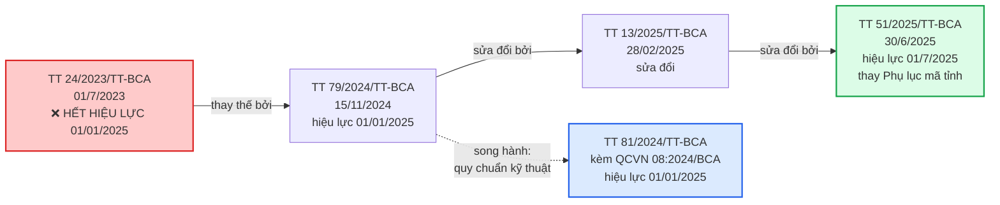
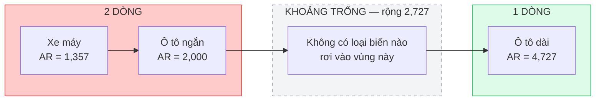
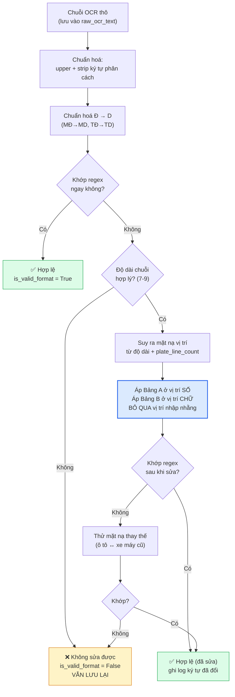

# Quy chuẩn biển số xe Việt Nam — Đặc tả kỹ thuật cho module chuẩn hoá

**Thuộc:** Phase 1 — Nghiên cứu
**Phiên bản:** 1.0 · **Ngày:** 2026-07-19
**Vai trò:** Đặc tả đầu vào trực tiếp cho `ai/inference/normalizer.py` (Phase 4)
**Trạng thái:** Hoàn thành phần quy tắc; một số hằng số cần hiệu chỉnh bằng thực nghiệm ở Phase 4

---

## 0. Tóm tắt cho người đọc vội

Năm phát hiện làm thay đổi thiết kế của module chuẩn hoá:

| # | Phát hiện | Hệ quả kỹ thuật |
|---|---|---|
| 1 | **Thông tư 24/2023/TT-BCA đã hết hiệu lực** từ 01/01/2025, bị thay bởi Thông tư 79/2024/TT-BCA | Toàn bộ căn cứ pháp lý của đồ án phải viện dẫn văn bản mới |
| 2 | Chữ **R** không nằm trong danh sách 20 chữ cái seri nhưng **vẫn hợp lệ** ở vị trí chữ cái thứ hai của seri xe máy *(hai danh sách chữ cái này **chưa đối chiếu được toàn văn Điều 34 TT 79/2024** — xem mục 5.2, 5.3)* | Nếu xây charset OCR theo "20 chữ cái", mô hình **không bao giờ** dự đoán được R ⇒ sai hệ thống trên một lớp biển |
| 3 | Từ 01/01/2025 **bỏ** quy tắc seri phân biệt loại xe (A = xe con, C = xe tải…) | **Cấm** dùng chữ cái seri để suy ra loại phương tiện |
| 4 | Biển xe máy tồn tại **song song hai kiểu**: 2 chữ cái (mới) và 1 chữ + 1 số (cũ) | Regex xe máy phải chấp nhận cả hai dạng |
| 5 | Chuỗi 8 ký tự dạng `SỐ SỐ CHỮ SỐ×5` khớp **đồng thời** biển ô tô và biển xe máy kiểu cũ | Không thể phân loại chỉ bằng chuỗi ký tự — **bắt buộc** dùng thêm số dòng / tỷ lệ khung hình |

Phát hiện số 5 là lý do kỹ thuật trực tiếp cho trường `plate_line_count` đã được phê duyệt trong [system-architecture.md](../architecture/system-architecture.md#62-mở-rộng-so-với-claudemd--đã-phê-duyệt-2026-07-19).

---

## 1. Căn cứ pháp lý và phạm vi áp dụng

### 1.1. Cảnh báo về văn bản hết hiệu lực

Đề bài ban đầu của đồ án nêu **Thông tư 24/2023/TT-BCA** làm căn cứ. Quá trình khảo sát xác định văn bản này **đã hết hiệu lực**.

Ngày 15/11/2024, Bộ trưởng Bộ Công an ký ban hành **Thông tư 79/2024/TT-BCA** quy định về cấp, thu hồi chứng nhận đăng ký xe, biển số xe cơ giới, xe máy chuyên dùng, **thay thế** Thông tư 24/2023/TT-BCA ngày 01/7/2023, hiệu lực từ 01/01/2025 ([Cổng TTĐT Chính phủ](https://chinhphu.vn/?pageid=27160&docid=211945&classid=1&orggroupid=4)).

Việc dùng sai văn bản căn cứ trong một đồ án tốt nghiệp là lỗi dễ bị hội đồng chất vấn, nên toàn bộ tài liệu này viện dẫn theo chuỗi văn bản đang có hiệu lực.

### 1.2. Chuỗi văn bản pháp lý hiện hành



| Văn bản | Ngày ban hành | Hiệu lực | Nội dung với đồ án |
|---|---|---|---|
| **TT 79/2024/TT-BCA** | 15/11/2024 | 01/01/2025 | Văn bản gốc: cấu trúc biển, seri, màu sắc, ký hiệu ([nguồn](https://chinhphu.vn/?pageid=27160&docid=211945&classid=1&orggroupid=4)) |
| TT 13/2025/TT-BCA | 28/02/2025 | — | Sửa đổi TT 79/2024 |
| **TT 51/2025/TT-BCA** | 30/6/2025 | 01/7/2025 | **Thay toàn bộ Phụ lục 02 mã tỉnh** sau sáp nhập còn 34 tỉnh/thành ([Công báo](https://congbao.chinhphu.vn/van-ban/thong-tu-so-51-2025-tt-bca-45356.htm)) |
| **QCVN 08:2024/BCA** (kèm TT 81/2024/TT-BCA) | 15/11/2024 | 01/01/2025 | **Quy chuẩn kỹ thuật quốc gia về biển số xe**: kết cấu, kích thước, vật liệu ([Bộ Công an](https://mps.gov.vn/chinh-sach-phap-luat/bai-viet/quy-chuan-ky-thuat-quoc-gia-ve-bien-so-xe-d1-t1592)) |
| TT 169/2021/TT-BQP | 2021 | — | Biển số xe quân đội — **ngoài phạm vi** TT 79/2024 |

> **Phân biệt hai loại văn bản.** Nhiều tài liệu nhầm lẫn giữa "thông tư về đăng ký xe" và "quy chuẩn về biển số xe". TT 79/2024 quy định **nội dung** biển số (mã tỉnh, seri, ký hiệu); QCVN 08:2024/BCA quy định **hình thức vật lý** (kích thước, vật liệu, độ phản quang). Module chuẩn hoá cần cả hai: nội dung cho regex, hình thức cho ngưỡng tỷ lệ khung hình.

### 1.3. Phạm vi áp dụng của tài liệu

| Trong phạm vi | Ngoài phạm vi |
|---|---|
| Biển nền trắng chữ đen (cá nhân, tổ chức trong nước) | Biển nền đỏ quân đội (chỉ mô tả để **nhận biết và loại trừ**) |
| Biển nền vàng chữ đen (kinh doanh vận tải) | Bảng mã nước đầy đủ trên biển ngoại giao |
| Biển nền xanh chữ trắng (cơ quan nhà nước) | Biển số các nước khác |
| Biển ngoại giao / nước ngoài (mức cấu trúc) | Quy trình cấp, thu hồi, đấu giá biển số |
| Ký hiệu đặc biệt (LD, DA, RM, MK, HC…) | |

**Mục tiêu cuối cùng:** cung cấp đủ dữ kiện để viết `normalizer.py` mà không phải tra cứu lại văn bản pháp luật.

---

## 2. Cấu trúc biển số ô tô

### 2.1. Phân rã thành phần

Biển số ô tô của tổ chức, cá nhân trong nước gồm **ba thành phần**, tổng cộng **8 ký tự alphanumeric**:

```
        30    A    123.45
        └┬┘   │    └──┬──┘
         │    │       │
   Nhóm 1│    │       │Nhóm 2
  Mã tỉnh│    │       │Số thứ tự đăng ký
   2 chữ số   │       5 chữ số
              │
         Seri đăng ký
         1 chữ cái
```

| Thành phần | Độ dài | Tập giá trị | Nguồn |
|---|---|---|---|
| Mã địa phương | 2 chữ số | 81 mã hợp lệ trong dải 11–99 (xem mục 4) | [TT 51/2025 Phụ lục](https://thuviennhadat.vn/phap-luat/chinh-thuc-ky-hieu-bien-so-xe-34-tinh-thanh-sau-sap-nhap-theo-thong-tu-51-2025-tt-bca-690227.html) |
| Seri đăng ký | **1 chữ cái** | 20 chữ cái (biển trắng/vàng) hoặc 11 chữ cái (biển xanh) | [Bộ Công an](https://bocongan.gov.vn/chinh-sach-phap-luat/bai-viet/nhan-dien-mau-sac-seri-ky-hieu-bien-so-xe-cua-co-quan-to-chuc-ca-nhan-tu-01012025-d1-t1617) |
| Số thứ tự | **5 chữ số** | 000.01 → 999.99 | [VnExpress dẫn TT 79/2024](https://vnexpress.net/quy-dinh-ve-bien-so-xe-tu-nam-2025-4831967.html) |

### 2.2. Ví dụ minh hoạ

| Biển số | Mã tỉnh | Seri | Số thứ tự | Diễn giải |
|---|---|---|---|---|
| `30A-123.45` | 30 | A | 123.45 | Hà Nội, biển cá nhân/tổ chức |
| `51K-999.99` | 51 | K | 999.99 | TP. Hồ Chí Minh, số thứ tự lớn nhất |
| `43C-000.01` | 43 | C | 000.01 | Đà Nẵng, số thứ tự nhỏ nhất |
| `80B-123.45` | 80 | B | 123.45 | Cục CSGT — **không phải địa phương** |

> **Bẫy quan trọng — seri không còn cho biết loại xe.** Trước 2025, chữ cái seri mang ngữ nghĩa: `A` = xe con dưới 9 chỗ, `B` = xe khách trên 9 chỗ, `C`/`H`/`K` = xe tải và bán tải, `D` = xe van. **Từ 01/01/2025 quy định này bị bãi bỏ**, seri được cấp tuần tự không phân biệt loại xe — một chiếc sedan hoàn toàn có thể mang chữ `K` ([Oto.com.vn](https://oto.com.vn/thi-truong-o-to/bo-quy-dinh-phan-biet-seri-dang-ky-voi-mot-so-dong-xe-articleid-6ehu4o0)).
>
> **Hệ quả cho đồ án:** mọi ý tưởng "phân loại phương tiện từ chữ cái seri" đều **sai về mặt pháp lý** kể từ 2025. Chỉ còn **màu nền biển** là tín hiệu phân loại hợp lệ (xem mục 6).

### 2.3. Biển số 4 chữ số kiểu cũ

Trên đường vẫn lưu hành biển số có **4 chữ số** ở nhóm thứ tự (ví dụ `29A-1234`), là biển cấp theo quy định cũ. Xe đã đăng ký **không bắt buộc đổi biển** ([Cổng TTĐT Chính phủ](https://xaydungchinhsach.chinhphu.vn/quy-dinh-ky-hieu-bien-so-xe-o-to-xe-may-tai-cac-dia-phuong-119250704073354464.htm)), nên biển 4 số vẫn hợp lệ vô thời hạn.

⇒ Regex bắt buộc chấp nhận `\d{4,5}` ở nhóm số thứ tự, **không** cố định `\d{5}`.

> **Cần bổ sung ở Phase sau:** tỷ lệ thực tế giữa biển 4 số và 5 số trong dataset chưa xác định. Cần thống kê ở **Phase 2** để biết nhánh nào cần ưu tiên tối ưu.

---

## 3. Cấu trúc biển số xe máy

### 3.1. Điểm khác biệt cốt lõi so với ô tô

Biển xe mô tô, xe gắn máy của cá nhân dùng seri gồm **2 chữ cái**, khác hẳn ô tô chỉ 1 chữ cái. Tổng cộng **9 ký tự alphanumeric**:

```
      29    HA    002.33
      └┬┘   └┬┘   └──┬──┘
       │     │       │
 Mã tỉnh  Seri     Số thứ tự
 2 chữ số 2 CHỮ CÁI 5 chữ số
```

Ví dụ nguyên văn từ nguồn Chính phủ: **`29 HA 002.33`** ([Xây dựng chính sách](https://xaydungchinhsach.chinhphu.vn/tu-15-8-seri-bien-so-xe-may-cap-cho-xe-ca-nhan-co-2-chu-cai-11923082122483385.htm)).

Quy tắc 2 chữ cái bắt đầu áp dụng từ **15/8/2023** (TT 24/2023) và được **giữ nguyên** trong TT 79/2024.

### 3.2. Hai kiểu biển xe máy lưu hành song song

Đây là rủi ro lớn nhất khi viết regex xe máy.

| Kiểu | Cấu trúc seri | Ví dụ | Thời điểm cấp | Còn hợp lệ? |
|---|---|---|---|---|
| **Mới** | 2 chữ cái | `29-AA 123.45` | Từ 15/8/2023 | ✅ Đang cấp |
| **Cũ** | 1 chữ cái + 1 chữ số | `29-B1 123.45` | Trước 15/8/2023 | ✅ Vẫn lưu hành |

Trước 15/8/2023, seri biển xe mô tô cá nhân là 1 chữ cái kết hợp 1 chữ số và **có phân biệt theo dung tích xi-lanh**. TT 24/2023 rồi TT 79/2024 bỏ phân loại theo dung tích. Xe đã đăng ký **không bắt buộc đổi biển** ([nguồn](https://xaydungchinhsach.chinhphu.vn/tu-15-8-seri-bien-so-xe-may-cap-cho-xe-ca-nhan-co-2-chu-cai-11923082122483385.htm)).

⇒ **Regex xe máy bắt buộc chấp nhận cả `[A-Z]{2}` lẫn `[A-Z][1-9]`.**

> **Về điều khoản chuyển tiếp 31/12/2025.** Khoản 6 Điều 39 TT 79/2024 quy định biển số có seri không nằm trong TT 79/2024 và **đã được sản xuất trước 01/01/2025** được tiếp tục sử dụng đến 31/12/2025. Một số bài báo diễn giải thành "biển xe máy 1 chữ 1 số chỉ dùng đến 31/12/2025" — cách hiểu này **không chính xác**. Điều khoản nói về việc dùng nốt **phôi biển tồn kho**, không phải bắt buộc chủ xe đang lưu hành đi đổi biển ([Thư viện Pháp luật](https://thuvienphapluat.vn/chinh-sach-phap-luat-moi/vn/ho-tro-phap-luat/chinh-sach-moi/76736/canh-bao-bien-so-xe-may-1-chu-1-so-se-chi-duoc-su-dung-den-ngay-31-12-2025)).
>
> **Kết luận thực dụng:** biển kiểu cũ sẽ còn trên đường hàng chục năm. Không được loại bỏ nhánh regex này.

### 3.3. Ví dụ minh hoạ

| Biển số | Mã tỉnh | Seri | Kiểu | Số thứ tự |
|---|---|---|---|---|
| `29-AA 123.45` | 29 (Hà Nội) | AA | Mới | 123.45 |
| `29-HA 002.33` | 29 (Hà Nội) | HA | Mới | 002.33 |
| `59-Z1 234.56` | 59 (TP.HCM) | Z1 | Cũ | 234.56 |
| `36-B1 1234` | 36 (Thanh Hoá) | B1 | Cũ | 1234 (4 số) |

> **Cần bổ sung ở Phase sau:** chưa xác minh được tổ hợp 2 chữ cái có bị loại trừ tổ hợp nào không (ví dụ `AA` có thực sự tồn tại hay bắt đầu từ tổ hợp khác), và quy tắc cấp tuần tự của tổ hợp. Tài liệu này giả định **mọi tổ hợp hợp lệ** — giả định thiên về chấp nhận rộng, an toàn hơn cho recall.

---

## 4. Bảng mã tỉnh/thành phố đầy đủ

### 4.1. Bối cảnh: sáp nhập đơn vị hành chính 2025

Từ 01/7/2025, cả nước còn **34 tỉnh, thành phố**. Nguyên tắc gán mã: **ký hiệu của địa phương sau hợp nhất bao gồm toàn bộ ký hiệu của các địa phương được hợp nhất trước đó** ([nguồn](https://xaydungchinhsach.chinhphu.vn/quy-dinh-ky-hieu-bien-so-xe-o-to-xe-may-tai-cac-dia-phuong-119250704073354464.htm)).

Hệ quả: biển số cũ **không mất giá trị pháp lý**, chỉ được gộp về địa phương mới. Bảng tra cứu vì vậy chỉ mở rộng chứ không thu hẹp.

### 4.2. Bảng mã sắp xếp theo số

Nguồn: Phụ lục Thông tư 51/2025/TT-BCA ([đối chiếu nguyên văn](https://thuviennhadat.vn/phap-luat/chinh-thuc-ky-hieu-bien-so-xe-34-tinh-thanh-sau-sap-nhap-theo-thong-tu-51-2025-tt-bca-690227.html)).

| Mã | Địa phương | Mã | Địa phương |
|:--:|---|:--:|---|
| **11** | Cao Bằng | **56** | TP. Hồ Chí Minh |
| **12** | Lạng Sơn | **57** | TP. Hồ Chí Minh |
| ~~13~~ | ⛔ **KHÔNG SỬ DỤNG** | **58** | TP. Hồ Chí Minh |
| **14** | Quảng Ninh | **59** | TP. Hồ Chí Minh |
| **15** | Hải Phòng | **60** | Đồng Nai |
| **16** | Hải Phòng | **61** | TP. Hồ Chí Minh |
| **17** | Hưng Yên | **62** | Tây Ninh |
| **18** | Ninh Bình | **63** | Đồng Tháp |
| **19** | Phú Thọ | **64** | Vĩnh Long |
| **20** | Thái Nguyên | **65** | Cần Thơ |
| **21** | Lào Cai | **66** | Đồng Tháp |
| **22** | Tuyên Quang | **67** | An Giang |
| **23** | Tuyên Quang | **68** | An Giang |
| **24** | Lào Cai | **69** | Cà Mau |
| **25** | Lai Châu | **70** | Tây Ninh |
| **26** | Sơn La | **71** | Vĩnh Long |
| **27** | Điện Biên | **72** | TP. Hồ Chí Minh |
| **28** | Phú Thọ | **73** | Quảng Trị |
| **29** | Hà Nội | **74** | Quảng Trị |
| **30** | Hà Nội | **75** | Huế |
| **31** | Hà Nội | **76** | Quảng Ngãi |
| **32** | Hà Nội | **77** | Gia Lai |
| **33** | Hà Nội | **78** | Đắk Lắk |
| **34** | Hải Phòng | **79** | Khánh Hoà |
| **35** | Ninh Bình | **80** | 🏛️ **Cục CSGT** (không phải địa phương) |
| **36** | Thanh Hoá | **81** | Gia Lai |
| **37** | Nghệ An | **82** | Quảng Ngãi |
| **38** | Hà Tĩnh | **83** | Cần Thơ |
| **39** | Đồng Nai | **84** | Vĩnh Long |
| **40** | Hà Nội | **85** | Khánh Hoà |
| **41** | TP. Hồ Chí Minh | **86** | Lâm Đồng |
| ~~42~~ | ⛔ **KHÔNG SỬ DỤNG** | ~~87~~ | ⛔ **KHÔNG SỬ DỤNG** |
| **43** | Đà Nẵng | **88** | Phú Thọ |
| ~~44~~ | ⛔ **KHÔNG SỬ DỤNG** | **89** | Hưng Yên |
| ~~45~~ | ⛔ **KHÔNG SỬ DỤNG** | **90** | Ninh Bình |
| ~~46~~ | ⛔ **KHÔNG SỬ DỤNG** | ~~91~~ | ⛔ **KHÔNG SỬ DỤNG** |
| **47** | Đắk Lắk | **92** | Đà Nẵng |
| **48** | Lâm Đồng | **93** | Đồng Nai |
| **49** | Lâm Đồng | **94** | Cà Mau |
| **50** | TP. Hồ Chí Minh | **95** | Cần Thơ |
| **51** | TP. Hồ Chí Minh | ~~96~~ | ⛔ **KHÔNG SỬ DỤNG** |
| **52** | TP. Hồ Chí Minh | **97** | Thái Nguyên |
| **53** | TP. Hồ Chí Minh | **98** | Bắc Ninh |
| **54** | TP. Hồ Chí Minh | **99** | Bắc Ninh |
| **55** | TP. Hồ Chí Minh | | |

### 4.3. Tám mã KHÔNG được sử dụng

| Mã không dùng | Ghi chú |
|---|---|
| **13, 42, 44, 45, 46, 87, 91, 96** | Nằm trong kho dự trữ, không gán cho bất kỳ địa phương nào |

Dải 11–99 có **89 số**; **81 mã** đang được sử dụng (80 mã địa phương + 01 mã Cục CSGT); còn lại đúng **8 mã trống**. Con số này được kiểm chứng bằng phép trừ tập hợp trực tiếp trên Phụ lục TT 51/2025 ([nguồn](https://thuviennhadat.vn/phap-luat/chinh-thuc-ky-hieu-bien-so-xe-34-tinh-thanh-sau-sap-nhap-theo-thong-tu-51-2025-tt-bca-690227.html)).

> **Về nguồn gốc mã 13:** một số tài liệu phổ biến cho rằng 13 là mã cũ của tỉnh Hà Bắc (đã tách thành Bắc Ninh và Bắc Giang). Thông tin này **chưa kiểm chứng được nguồn** chính thức, chỉ nêu để tham khảo, không dùng làm căn cứ.

### 4.4. Kiểm chứng tính nhất quán

Bảng trên đã được kiểm chứng bằng script Python (mục 8.2):

| Đại lượng | Giá trị | Kiểm chứng |
|---|---|---|
| Số mã trong dải 11–99 | 89 | Số học |
| Số mã đang sử dụng | **81** | Đếm trực tiếp từ tập hợp |
| Số mã trống | **8** | 89 − 81 = 8 ✅ khớp danh sách |
| Số địa phương | **34** | Đếm số tên riêng trong bảng ✅ |
| Số mã của TP. HCM | **13** (41; 50–59; 61, 72) — nhiều nhất cả nước | Đếm trực tiếp ✅ |
| Số mã của Hà Nội | **6** (29, 30–33, 40) | Đếm trực tiếp ✅ |

TP. Hồ Chí Minh có nhiều mã nhất do sáp nhập Bình Dương (61) và Bà Rịa – Vũng Tàu (72) ([nguồn](https://thuviennhadat.vn/phap-luat/chinh-thuc-ky-hieu-bien-so-xe-34-tinh-thanh-sau-sap-nhap-theo-thong-tu-51-2025-tt-bca-690227.html)).

> **Vì sao phải kiểm tra mã tỉnh trong regex.** Kiểm tra mã tỉnh biến 89 khả năng thành 81 — loại được **9,0%** không gian tìm kiếm ở hai ký tự đầu. Quan trọng hơn về mặt chất lượng: nó biến lỗi OCR ở vị trí 0–1 từ "sai âm thầm" thành "sai phát hiện được". Ví dụ OCR đọc `46A-123.45` — mã 46 không tồn tại ⇒ hệ thống **biết** mình đã đọc sai và có thể hạ cờ `is_valid_format`, thay vì trả về một biển số sai trông rất thuyết phục.

---

## 5. Ký tự seri hợp lệ và ký tự bị loại trừ

### 5.1. Tập 20 chữ cái seri chuẩn

Biển nền trắng chữ đen và nền vàng chữ đen của tổ chức, cá nhân trong nước dùng seri là **một trong 20 chữ cái** ([Bộ Công an](https://bocongan.gov.vn/chinh-sach-phap-luat/bai-viet/nhan-dien-mau-sac-seri-ky-hieu-bien-so-xe-cua-co-quan-to-chuc-ca-nhan-tu-01012025-d1-t1617)):

```
A  B  C  D  E  F  G  H  K  L  M  N  P  S  T  U  V  X  Y  Z
```

Character class Python tương đương: `[A-HK-NPS-VXYZ]` (đã kiểm chứng = đúng 20 ký tự, mục 8.2).

### 5.2. Ký tự bị loại trừ — và ngoại lệ quan trọng của chữ R

Đối chiếu với 26 chữ cái Latin, **6 chữ vắng mặt** khỏi danh sách 20: `I`, `J`, `O`, `Q`, `R`, `W`.

Lý do loại trừ có thể suy đoán khá rõ:

| Chữ | Lý do loại trừ |
|---|---|
| `I`, `O` | Dễ nhầm với chữ số `1` và `0` |
| `Q` | Dễ nhầm với `O` |
| `J`, `W` | Không có trong bảng chữ cái tiếng Việt |
| `R` | **Được giữ riêng làm ký hiệu rơ moóc** — nhưng xem cảnh báo dưới |

> ### ⚠️ Cảnh báo kỹ thuật: chữ R KHÔNG bị loại trừ hoàn toàn
>
> Kết luận "6 chữ cái bị loại trừ" là **suy diễn số học** (26 − 20 = 6) và **không chính xác** nếu áp dụng cho toàn hệ thống seri.
>
> Theo trích dẫn điều khoản TT 79/2024, danh sách chữ cái **thứ hai** của seri xe mô tô là:
>
> ```
> A  B  C  D  E  F  H  K  L  M  N  P  R  S  T  U  V  X  Y  Z
> ```
>
> Danh sách này **có R** và **không có G** — khác với danh sách 20 chữ cái ở vị trí thứ nhất.
>
> **Hệ quả kỹ thuật trực tiếp:** nếu xây charset cho mô hình OCR dựa trên "20 chữ cái", mô hình sẽ **không bao giờ dự đoán được ký tự R** và sẽ sai hệ thống trên mọi biển xe máy có R ở vị trí thứ hai. Đây là loại lỗi không thể sửa bằng hậu xử lý vì thông tin đã mất ở tầng mô hình.
>
> **Khuyến nghị:**
> 1. Charset nhận dạng dùng **đủ A–Z + 0–9** (36 ký tự), để mô hình tự do dự đoán;
> 2. Ràng buộc hợp lệ áp dụng ở **tầng hậu xử lý** bằng regex, nơi có thể sửa và ghi log được;
> 3. Nếu bắt buộc thu hẹp charset, dùng **21 chữ cái** = 20 chữ ∪ {R}: `[A-HK-NPR-VXYZ]`.
>
> **Cần bổ sung ở Phase sau:** phải đối chiếu **toàn văn Điều 34 TT 79/2024/TT-BCA** để chốt chính xác hai danh sách này. Bản PDF chính thức trên `datafiles.chinhphu.vn` là bản scan không có lớp text; `thuvienphapluat.vn` chặn truy cập tự động (HTTP 403). Cần OCR bản PDF hoặc lấy bản DOC có tài khoản.

### 5.3. Bảng tổng hợp các tập ký tự

| Tập | Ký hiệu | Số lượng | Nội dung | Character class Python |
|---|---|:--:|---|---|
| Seri chuẩn | `L20` | 20 | A B C D E F G H K L M N P S T U V X Y Z | `[A-HK-NPS-VXYZ]` |
| Chữ thứ 2 seri xe máy | `L20B` | 20 | A B C D E F H K L M N P **R** S T U V X Y Z | `[A-FHK-NPRS-VXYZ]` |
| Seri biển xanh | `L11` | 11 | A B C D E F G H K L M | `[A-HK-M]` |
| **Charset an toàn cho OCR** | `L21` | 21 | 20 chữ ∪ {R} | `[A-HK-NPR-VXYZ]` |

> **⚠️ Hạn chế kiểm chứng (áp dụng cho hai hàng `L20` và `L20B`).** Sự khác biệt giữa hai danh sách chữ cái — vị trí thứ nhất **có `G`, không có `R`**; vị trí thứ hai **có `R`, không có `G`** — **chưa đối chiếu được toàn văn Điều 34 TT 79/2024/TT-BCA**: bản PDF chính thức trên `datafiles.chinhphu.vn` là bản scan không có lớp text, còn `thuvienphapluat.vn` chặn truy cập tự động (HTTP 403). Hai hằng số này phải được coi là **giả thuyết có căn cứ, chưa chốt** cho tới khi đọc được toàn văn (mục 11.2, việc số 1).

Biển nền xanh chữ trắng chỉ dùng **11 chữ cái** A, B, C, D, E, F, G, H, K, L, M — là tập con của 20 chữ cái ([Bộ Công an](https://bocongan.gov.vn/chinh-sach-phap-luat/bai-viet/nhan-dien-mau-sac-seri-ky-hieu-bien-so-xe-cua-co-quan-to-chuc-ca-nhan-tu-01012025-d1-t1617)). Với xe mô tô biển xanh: 1 trong 11 chữ cái đó kết hợp 1 chữ số tự nhiên từ **1 đến 9** (lưu ý: **không có số 0**).

### 5.4. Ký hiệu seri đặc biệt

Ngoài seri thông thường, tồn tại các ký hiệu đặc biệt **2 ký tự** không tuân theo quy tắc trên:

| Ký hiệu | Đối tượng |
|---|---|
| `CD` | Xe máy chuyên dùng (kể cả của Công an nhân dân dùng vào mục đích an ninh) |
| `RM` | Rơ moóc, sơ mi rơ moóc |
| `R` | Rơ moóc và sơ mi rơ moóc |
| `MK` | Máy kéo |
| `HC` | Ô tô phạm vi hoạt động hạn chế; xe chở người/hàng bốn bánh gắn động cơ |
| `KT` | Xe của doanh nghiệp quân đội (do Cục Xe – Máy BQP đề nghị) |
| `LD` | Xe của doanh nghiệp có vốn đầu tư nước ngoài, xe thuê từ nước ngoài, công ty nước ngoài trúng thầu |
| `DA` | Xe của Ban quản lý dự án có vốn đầu tư nước ngoài |
| `T` | Xe đăng ký tạm thời |
| `TĐ` | Xe sản xuất lắp ráp trong nước được thí điểm |
| `MĐ` | Xe máy điện |

Nguồn: [tổng hợp quy định biển số từ 2025](https://khobiensodep.vn/blogs/news/nhung-quy-dinh-ban-can-biet-ve-bien-so-xe-ke-tu-nam-2025) (nguồn thương mại, độ tin cậy trung bình — cần đối chiếu toàn văn TT 79/2024).

> **Hai bẫy kỹ thuật ở nhóm ký hiệu đặc biệt:**
>
> 1. **Chữ R xuất hiện ở đây** (`RM`, `R`) mặc dù nằm ngoài tập 20 chữ cái ⇒ củng cố khuyến nghị ở mục 5.2: regex **không được cấm tuyệt đối** chữ R.
> 2. **Ký hiệu `TĐ` và `MĐ` chứa chữ `Đ`** — ký tự này **không thuộc bảng chữ cái Latin ASCII**. Mô hình OCR huấn luyện trên charset Latin gần như chắc chắn sẽ trả về `D` thay vì `Đ`. Module chuẩn hoá phải chấp nhận **cả hai dạng** (`TD`/`TĐ`, `MD`/`MĐ`) và chuẩn hoá về một dạng canonical duy nhất.
>
> **Cần bổ sung ở Phase sau:** hai ký hiệu `CT` và `LB` được liệt kê trong TT 79/2024 nhưng không nguồn nào giải thích ý nghĩa. Cần đọc toàn văn để bổ sung.

---

## 6. Ý nghĩa màu nền biển số

### 6.1. Bảng màu

| Màu nền | Màu chữ | Đối tượng | Ghi chú cho ALPR |
|---|---|---|---|
| ⬜ **Trắng** | Đen | Tổ chức, cá nhân trong nước (xe **không** kinh doanh vận tải) | Phổ biến nhất |
| 🟨 **Vàng** | Đen | Xe hoạt động **kinh doanh vận tải** (taxi, xe tải/khách kinh doanh) | Tín hiệu phân loại **duy nhất còn hợp lệ** |
| 🟦 **Xanh dương** | Trắng | Cơ quan Đảng, Quốc hội, Chính phủ, Toà án, Viện kiểm sát, cơ quan nhà nước, công an | Seri chỉ dùng 11 chữ cái |
| ⬜ **Trắng** | **Đỏ** | Xe ngoại giao (`NG`) và tổ chức quốc tế (`QT`) | Cấu trúc khác hẳn (mục 10.4) |
| 🟥 **Đỏ** | Trắng | Xe quân đội / doanh nghiệp quân đội | **Ngoài phạm vi** TT 79/2024 |

Nguồn: [Bộ Công an — nhận diện màu sắc, seri, ký hiệu biển số từ 01/01/2025](https://bocongan.gov.vn/chinh-sach-phap-luat/bai-viet/nhan-dien-mau-sac-seri-ky-hieu-bien-so-xe-cua-co-quan-to-chuc-ca-nhan-tu-01012025-d1-t1617).

### 6.2. Điểm dễ hiểu nhầm: QCVN 08:2024/BCA chỉ có 4 tổ hợp màu

Quy chuẩn kỹ thuật quốc gia về biển số xe cho phép **4 tổ hợp màu**, **không có nền đỏ** ([Bộ Công an](https://mps.gov.vn/chinh-sach-phap-luat/bai-viet/quy-chuan-ky-thuat-quoc-gia-ve-bien-so-xe-d1-t1592)):

1. Nền trắng, chữ/viền đen
2. Nền vàng, chữ/viền đen
3. Nền xanh, chữ/viền trắng
4. Nền trắng, chữ đỏ và số/ký hiệu đen

Biển **nền đỏ chữ trắng** của quân đội nằm ngoài phạm vi QCVN này vì do **Bộ Quốc phòng** (Cục Xe – Máy) quản lý theo Thông tư 169/2021/TT-BQP. Đây là nguyên nhân của nhiều mâu thuẫn khi tra cứu tài liệu.

### 6.3. Xe điện: KHÔNG có biển số riêng

Theo TT 79/2024 hiệu lực 01/01/2025, xe sử dụng năng lượng sạch/năng lượng xanh **không được cấp biển số riêng màu xanh lá cây**. Xe vẫn dùng biển số thông thường, chỉ gắn thêm **biểu tượng nhận diện màu xanh lá cây** ([Công an tỉnh Lạng Sơn](https://congan.langson.gov.vn/9688/pho-bien-giao-duc-phap-luat/68/mot-so-quy-dinh-moi-cua-thong-tu-so-79-2024-tt-bca-quy-dinh-ve-cap-thu-hoi-chung-nhan-dang-ky-xe-bien-so-xe-co-gioi-xe-may-chuyen-dung/9688.aspx)).

> Một số nguồn mô tả biểu tượng này là "tem hình tròn đường kính 30 mm". Con số và hình dạng cụ thể **chưa kiểm chứng được nguồn** — nguồn chính thức chỉ xác nhận **màu xanh lá cây**, không nêu kích thước. Không đưa con số này vào đồ án.

**Hệ quả cho ALPR:** **không thể phát hiện xe điện qua màu biển số.** Ký hiệu `MĐ` chỉ dùng cho xe máy điện, không dùng cho ô tô điện. Nếu đồ án cần thống kê xe điện, phải tìm hướng khác (Cần bổ sung ở Phase sau).

### 6.4. Hệ quả kiến trúc: màu nền là tín hiệu, nhưng không thuộc phạm vi Phase 4

Vì seri không còn phân biệt loại xe (mục 2.2), **màu nền là tín hiệu phân loại duy nhất còn hợp lệ**. Tuy nhiên module `normalizer.py` làm việc trên **chuỗi ký tự**, không trên ảnh — nên phân loại theo màu nằm ngoài phạm vi của nó.

⇒ Nếu muốn phân loại xe kinh doanh vận tải, cần thêm một bước phân loại màu trên ảnh crop (tính histogram HSV vùng nền). **Cần bổ sung ở Phase sau** — hiện chưa nằm trong yêu cầu chức năng.

---

## 7. Biển 1 dòng và biển 2 dòng

### 7.1. Loại xe nào dùng loại biển nào

| Loại xe | Số biển được cấp | Dạng | Vị trí gắn |
|---|:--:|---|---|
| **Ô tô**, xe máy chuyên dùng | **02** | 01 biển ngắn (**2 dòng**) + 01 biển dài (**1 dòng**) | Trước và sau |
| **Xe mô tô, xe gắn máy** | **01** | **2 dòng** | Phía sau |
| Rơ moóc, sơ mi rơ moóc | **01** | 2 dòng | Phía sau |

Nguồn: [Thư viện Pháp luật — quy định màu sắc, seri, kích thước biển số từ 2025](https://thuvienphapluat.vn/banan/tin-tuc/quy-dinh-ve-mau-sac-seri-bien-so-xe-cua-co-quan-to-chuc-ca-nhan-trong-nuoc-tu-nam-2025-12612.html).

> **Điều này có nghĩa là:** một chiếc ô tô mang **cùng một chuỗi ký tự** trên hai biển có **hình dạng vật lý khác nhau**. Camera đặt phía trước bắt được biển 1 dòng; camera phía sau bắt được biển 2 dòng. Cùng một xe, hai bài toán OCR khác nhau.

### 7.2. Kích thước vật lý và tỷ lệ khung hình

Theo QCVN 08:2024/BCA, hiệu lực **01/01/2025**:

| Loại biển | Kích thước (cao × dài) | Tỷ lệ khung hình | Số dòng | Nguồn |
|---|---|:--:|:--:|---|
| Ô tô — **dài** | 110 × 520 mm | **4,727** | **1 dòng** | [Bộ Công an](https://mps.gov.vn/chinh-sach-phap-luat/bai-viet/quy-chuan-ky-thuat-quoc-gia-ve-bien-so-xe-d1-t1592) |
| Ô tô — **ngắn** | 165 × 330 mm | **2,000** | **2 dòng** | [Bộ Công an](https://mps.gov.vn/chinh-sach-phap-luat/bai-viet/quy-chuan-ky-thuat-quoc-gia-ve-bien-so-xe-d1-t1592) |
| **Xe mô tô** | 140 × 190 mm | **1,357** | **2 dòng** | [Bộ Công an](https://mps.gov.vn/chinh-sach-phap-luat/bai-viet/quy-chuan-ky-thuat-quoc-gia-ve-bien-so-xe-d1-t1592) |

> ### ⚠️ Cảnh báo về mốc thời gian của kích thước
>
> Các con số trên **chỉ đúng từ 01/01/2025**. Tiêu chuẩn cũ (TT 58/2020, TT 24/2023) quy định biển ô tô ngắn là **200 × 280 mm** và biển dài là **110 × 470 mm**.
>
> Nếu tài liệu tham khảo của đồ án trích dẫn nguồn trước 2025 sẽ thấy số liệu khác — **bắt buộc ghi rõ mốc hiệu lực** khi trích dẫn, nếu không người phản biện đối chiếu sẽ cho là sai.

### 7.3. Khoảng trống tỷ lệ khung hình — cơ sở cho ngưỡng phân loại



Không có loại biển nào có tỷ lệ khung hình nằm trong khoảng (2,000 — 4,727). Khoảng trống rộng **2,727 đơn vị** này khiến việc phân biệt biển 1 dòng / 2 dòng bằng tỷ lệ khung hình trở nên đáng tin cậy.

> **Đề xuất ngưỡng — đóng góp của đồ án, KHÔNG phải quy định pháp luật.**
>
> | Điều kiện | Kết luận |
> |---|---|
> | AR < 2,5 | Biển **2 dòng** |
> | AR > 3,0 | Biển **1 dòng** |
> | 2,5 ≤ AR ≤ 3,0 | **Vùng nghi ngờ** — thử cả hai nhánh, chọn kết quả có confidence cao hơn |
>
> Ngưỡng 2,5–3,0 là **suy luận của tác giả** dựa trên ba giá trị AR đã được quy chuẩn xác nhận, **không có trong Thông tư 79/2024**. Phải trình bày như heuristic tự đề xuất kèm thực nghiệm kiểm chứng, tuyệt đối không gán cho văn bản pháp luật.
>
> **Điều kiện áp dụng bắt buộc:** phải đo AR trên ảnh **đã rectify** hoặc trên `cv2.minAreaRect`, **không** đo trên bounding box axis-aligned của YOLO. Biển 1 dòng chụp nghiêng 30° có bbox AR tụt xuống dưới 3 và sẽ bị phân loại nhầm.

### 7.4. Bố cục hai dòng

| Loại biển | Dòng trên | Dòng dưới | Ví dụ |
|---|---|---|---|
| Ô tô ngắn | Mã tỉnh + seri | 5 chữ số | `30A` / `123.45` |
| Xe máy (mới) | Mã tỉnh + 2 chữ cái | 5 chữ số | `29-AA` / `123.45` |
| Xe máy (cũ) | Mã tỉnh + chữ + số | 4–5 chữ số | `29-B1` / `123.45` |

### 7.5. Quy tắc dấu phân cách — và lý do phải strip toàn bộ

| Dấu | Vai trò |
|---|---|
| Dấu **chấm** `.` | Phân cách 3 chữ số đầu với 2 chữ số sau của nhóm thứ tự (`123.45`) |
| Dấu **gạch ngang** `-` | Phân cách giữa ký hiệu địa phương và seri, và giữa hai nhóm |

> **Mâu thuẫn giữa các nguồn — và cách xử lý an toàn.**
>
> Nguồn pháp lý mô tả "giữa ký hiệu địa phương và seri đăng ký được phân cách bằng dấu gạch ngang", suy ra dạng `30-A-123.45`. Nhưng biển ô tô thực tế in liền là `30A-123.45` — gạch ngang chỉ nằm giữa seri và nhóm số. Trong khi biển xe máy 2 dòng lại in `29-AA` ở dòng trên.
>
> Không tra cứu được nguyên văn phần quy cách in ấn của QCVN 08:2024/BCA để chốt (bản PDF là scan, cổng luật chặn HTTP 403).
>
> **⇒ Khuyến nghị thiết kế:** module chuẩn hoá **loại bỏ toàn bộ ký tự phân cách** rồi validate trên chuỗi alphanumeric thuần. **Tuyệt đối không hard-code vị trí dấu gạch ngang**, vì vị trí này khác nhau giữa ô tô và xe máy, giữa biển 1 dòng và 2 dòng, và bản thân quy định còn chưa rõ ràng.
>
> Đây là ví dụ điển hình của việc **biến một điểm không chắc chắn thành một quyết định thiết kế an toàn**, thay vì đoán bừa.

Kích thước dấu chấm: một số nguồn nêu 10 × 10 mm, nhưng **chưa kiểm chứng được nguồn** — trang chính thức về QCVN 08:2024/BCA khi được truy vấn trực tiếp đã xác nhận **không đề cập** kích thước dấu chấm. Không đưa con số này vào đồ án.

### 7.6. Thông số vật lý khác

| Thông số | Giá trị | Nguồn |
|---|---|---|
| Vật liệu | Hợp kim nhôm, có màng/mực (hoặc sơn) phản quang, 4 góc bo tròn | [Bộ Công an](https://mps.gov.vn/chinh-sach-phap-luat/bai-viet/quy-chuan-ky-thuat-quoc-gia-ve-bien-so-xe-d1-t1592) |
| Chiều cao dập nổi của chữ, số | **(1,7 ± 0,1) mm** | [Bộ Công an](https://mps.gov.vn/chinh-sach-phap-luat/bai-viet/quy-chuan-ky-thuat-quoc-gia-ve-bien-so-xe-d1-t1592) |
| Chu kỳ kiểm tra cơ sở sản xuất | **2 năm/lần** | [Bộ Công an](https://mps.gov.vn/chinh-sach-phap-luat/bai-viet/tu-01012025-co-so-san-xuat-bien-so-xe-phai-duoc-kiem-tra-danh-gia-dinh-ky-2-nam-mot-lan-d1-t1619) |

> **Vì sao hai thông số này liên quan đến ALPR.** Chữ **dập nổi** tạo bóng đổ và highlight phụ thuộc góc chiếu sáng — đây là nguồn nhiễu đặc thù của biển số kim loại mà văn bản in giấy không có, và là nguyên nhân của các lỗi OCR kiểu `B → 3` do loá sáng. Chu kỳ kiểm tra định kỳ gián tiếp bảo đảm **tính đồng nhất về font chữ và kích thước** trên toàn quốc — yếu tố tốt cho độ ổn định của mô hình OCR.

---

## 8. Đề xuất REGEX

Đây là phần đặc tả trực tiếp cho `normalizer.py`. Toàn bộ regex trong mục này **đã được kiểm chứng chạy được bằng Python 3.13** (kết quả ở mục 8.6).

### 8.1. Nguyên tắc thiết kế

| # | Nguyên tắc | Lý do |
|---|---|---|
| 1 | **Chuẩn hoá trước, validate sau** | Vị trí dấu phân cách không nhất quán (mục 7.5) |
| 2 | Sinh regex mã tỉnh **từ tập hợp**, không viết tay | Mã tỉnh thay đổi theo văn bản pháp luật; viết tay dễ sai và khó rà |
| 3 | Dùng **named group** | Trích được từng thành phần để lưu CSDL và phân tích lỗi |
| 4 | Regex **không quyết định** loại xe một mình | Chuỗi 8 ký tự nhập nhằng (mục 8.5) |
| 5 | Thất bại phải **có thông tin** | Trả lý do thất bại, không chỉ `True/False` |

### 8.2. Định nghĩa hằng số

```python
"""Hằng số quy chuẩn biển số Việt Nam.

Căn cứ: Thông tư 79/2024/TT-BCA (hiệu lực 01/01/2025),
        sửa đổi bởi TT 13/2025/TT-BCA và TT 51/2025/TT-BCA (hiệu lực 01/7/2025).
"""
import re
from typing import Final

# --- Mã tỉnh/thành phố hợp lệ (Phụ lục TT 51/2025/TT-BCA) ---
# 81 mã = 80 mã địa phương + 01 mã Cục CSGT (80).
# Tám mã KHÔNG sử dụng: 13, 42, 44, 45, 46, 87, 91, 96.
VALID_PROVINCE_CODES: Final[frozenset[str]] = frozenset({
    "11", "12", "14", "15", "16", "17", "18", "19", "20",
    "21", "22", "23", "24", "25", "26", "27", "28", "29", "30",
    "31", "32", "33", "34", "35", "36", "37", "38", "39", "40",
    "41", "43", "47", "48", "49", "50",
    "51", "52", "53", "54", "55", "56", "57", "58", "59", "60",
    "61", "62", "63", "64", "65", "66", "67", "68", "69", "70",
    "71", "72", "73", "74", "75", "76", "77", "78", "79", "80",
    "81", "82", "83", "84", "85", "86", "88", "89", "90",
    "92", "93", "94", "95", "97", "98", "99",
})

# Sinh nhóm regex từ tập hợp — KHÔNG viết tay để tránh sai sót khi cập nhật.
_PROVINCE: Final[str] = "(?:" + "|".join(sorted(VALID_PROVINCE_CODES)) + ")"

# --- Tập ký tự seri ---
_L20:  Final[str] = r"[A-HK-NPS-VXYZ]"      # 20 chữ cái seri chuẩn
_L20B: Final[str] = r"[A-FHK-NPRS-VXYZ]"    # chữ THỨ HAI của seri xe máy (có R, không G)
_L11:  Final[str] = r"[A-HK-M]"             # 11 chữ cái biển xanh

# Nhóm số thứ tự: 5 chữ số (hiện hành) hoặc 4 chữ số (biển cũ vẫn lưu hành).
_NUM: Final[str] = r"\d{4,5}"
```

### 8.3. Các mẫu regex chính

```python
# ============================================================
# BIỂN Ô TÔ — nền trắng / nền vàng
# Cấu trúc: 2 chữ số mã tỉnh + 1 chữ cái seri + 4~5 chữ số
# Áp dụng cho CẢ biển 1 dòng và biển 2 dòng — chuỗi ký tự
# giống hệt nhau, chỉ khác cách xuống dòng vật lý.
# ============================================================
RE_CAR = re.compile(
    rf"^(?P<province>{_PROVINCE})"
    rf"(?P<serial>{_L20})"
    rf"(?P<number>{_NUM})$"
)

# ============================================================
# BIỂN XE MÁY — kiểu MỚI (từ 15/8/2023): seri 2 CHỮ CÁI
# Ví dụ: 29-AA 123.45 · 29-HA 002.33
# ============================================================
RE_MOTORCYCLE_NEW = re.compile(
    rf"^(?P<province>{_PROVINCE})"
    rf"(?P<serial1>{_L20})"
    rf"(?P<serial2>{_L20B})"     # LƯU Ý: tập này CÓ R và KHÔNG có G
    rf"(?P<number>{_NUM})$"
)

# ============================================================
# BIỂN XE MÁY — kiểu CŨ (trước 15/8/2023): 1 chữ cái + 1 chữ số
# Ví dụ: 29-B1 123.45 — vẫn lưu hành hợp pháp, KHÔNG được bỏ.
# ============================================================
RE_MOTORCYCLE_OLD = re.compile(
    rf"^(?P<province>{_PROVINCE})"
    rf"(?P<serial1>{_L20})"
    rf"(?P<serial2>[1-9])"       # 1..9 — KHÔNG có số 0
    rf"(?P<number>{_NUM})$"
)

# Mẫu gộp hai kiểu xe máy — dùng khi chỉ cần kiểm tra tính hợp lệ.
RE_MOTORCYCLE_ANY = re.compile(
    rf"^(?P<province>{_PROVINCE})"
    rf"(?P<serial1>{_L20})"
    rf"(?P<serial2>[A-FHK-NPRS-VXYZ1-9])"
    rf"(?P<number>{_NUM})$"
)

# ============================================================
# BIỂN XANH — cơ quan nhà nước (chỉ 11 chữ cái)
# ============================================================
RE_BLUE_CAR = re.compile(
    rf"^(?P<province>{_PROVINCE})(?P<serial>{_L11})(?P<number>{_NUM})$"
)
RE_BLUE_MOTORCYCLE = re.compile(
    rf"^(?P<province>{_PROVINCE})(?P<serial>{_L11})"
    rf"(?P<digit>[1-9])(?P<number>{_NUM})$"
)

# ============================================================
# KÝ HIỆU ĐẶC BIỆT — LD, DA, RM, MK, HC, KT, MĐ, CD, TĐ...
# LƯU Ý: "MD"/"TD" là dạng ASCII của "MĐ"/"TĐ"; OCR charset
# Latin gần như chắc chắn trả về D thay vì Đ.
# ============================================================
RE_SPECIAL = re.compile(
    rf"^(?P<province>{_PROVINCE})"
    rf"(?P<code>LD|DA|RM|MK|HC|KT|MD|CD|TD|LB|CT|R|T)"
    rf"(?P<number>{_NUM})$"
)

# ============================================================
# BIỂN NGOẠI GIAO / NƯỚC NGOÀI — cấu trúc 3 nhóm, có MÃ NƯỚC
# Ví dụ cấu trúc: <mã tỉnh>-<mã nước 3 số>-<NG|QT|CV|NN>-<số thứ tự>
# ============================================================
RE_DIPLOMATIC = re.compile(
    rf"^(?P<province>{_PROVINCE})"
    rf"(?P<country>\d{{3}})"
    rf"(?P<code>NG|QT|CV|NN)"
    rf"(?P<number>\d{{2,3}})$"
)

# ============================================================
# BIỂN QUÂN ĐỘI — BẮT ĐẦU BẰNG 2 CHỮ CÁI (khác hẳn biển dân sự)
# Mục đích: NHẬN BIẾT ĐỂ LOẠI TRỪ, không phải để validate.
# ============================================================
RE_MILITARY = re.compile(r"^(?P<unit>[A-Z]{2})(?P<number>\d{4,6})$")
```

### 8.4. Giải thích từng nhóm

| Nhóm | Regex | Ý nghĩa | Vì sao viết như vậy |
|---|---|---|---|
| `province` | `(?:11\|12\|14\|...)` | Mã địa phương | Sinh từ `frozenset` nên **không thể lệch** với bảng ở mục 4; loại được 8 mã không tồn tại mà `\d{2}` cho qua |
| `serial` (ô tô) | `[A-HK-NPS-VXYZ]` | 1 chữ cái seri | Char class thay vì `[A-Z]` để loại 6 chữ `I J O Q R W` **tại riêng vị trí này**. Lý do loại của từng chữ là **khác nhau** — xem mục 5.2; không quy chung về "dễ nhầm với chữ số" |
| `serial1` (xe máy) | `[A-HK-NPS-VXYZ]` | Chữ cái thứ nhất | Cùng tập 20 chữ với ô tô |
| `serial2` (xe máy mới) | `[A-FHK-NPRS-VXYZ]` | Chữ cái thứ hai | **Tập khác**: có `R`, không có `G` — xem cảnh báo mục 5.2. **Chưa đối chiếu được toàn văn Điều 34 TT 79/2024** ⇒ coi là hằng số cần chốt lại ở Phase 4 |
| `serial2` (xe máy cũ) | `[1-9]` | Chữ số seri | **Không có `0`** — số 0 ở vị trí này là lỗi OCR chắc chắn (thường là `D` hoặc `O` bị đọc nhầm) |
| `number` | `\d{4,5}` | Số thứ tự | `{4,5}` chứ không `{5}` vì biển 4 số cũ vẫn hợp lệ (mục 2.3) |
| `country` | `\d{3}` | Mã nước ngoại giao | 3 chữ số ([VietnamNet](https://vietnamnet.vn/cach-doc-ky-hieu-bien-so-xe-ngoai-giao-nuoc-ngoai-o-viet-nam-333426.html)) |

**Chi tiết đáng chú ý — vì sao `[1-9]` chứ không `[0-9]`:** với biển xe máy kiểu cũ và biển xanh xe mô tô, chữ số seri chạy từ **1 đến 9**, không có 0. Ràng buộc nhỏ này có giá trị thực tế lớn: nếu OCR đọc được `0` ở vị trí đó, ta **biết chắc** đó là lỗi, và ứng viên đúng gần như luôn là `D` (vì `O` và `Q` không hợp lệ). Đây là một luật sửa lỗi có độ tin cậy rất cao — xem mục 9.

### 8.5. Hàm chuẩn hoá và phân loại

```python
def normalize(raw: str) -> str:
    """Chuẩn hoá chuỗi OCR thô về dạng canonical alphanumeric.

    Loại bỏ MỌI ký tự phân cách thay vì hard-code vị trí, vì vị trí dấu
    gạch ngang khác nhau giữa ô tô / xe máy và giữa biển 1 dòng / 2 dòng
    (xem mục 7.5 của tài liệu 01-vn-plate-standards.md).
    """
    return re.sub(r"[^0-9A-Z]", "", raw.upper())


# Mặt nạ vị trí — nền tảng cho toàn bộ luật sửa lỗi OCR ở mục 9.
# D = bắt buộc là chữ SỐ; L = bắt buộc là chữ CÁI;
# ? = WILDCARD — cả chữ cái lẫn chữ số đều hợp lệ ⇒ TUYỆT ĐỐI KHÔNG ép kiểu.
POSITION_MASKS: Final[dict[str, str]] = {
    "car_5":          "DDLDDDDD",    # 30A12345  — 8 ký tự
    "car_4":          "DDLDDDD",     # 29A1234   — 7 ký tự
    # Xe máy 9 ký tự: CẢ HAI kiểu (mới `29AA…` và cũ `29B1…`) dùng CHUNG một
    # mặt nạ, vì index 3 là vị trí nhập nhằng (mục 9.4) ⇒ phải là '?'.
    # Hai khoá "motorcycle_new"/"motorcycle_old" trước đây hợp nhất làm một:
    # tách chúng ra chỉ tạo ảo giác về thông tin mà chuỗi ký tự không hề có.
    "motorcycle_9":   "DDL?DDDDD",   # 29AA12345 hoặc 29B112345 — 9 ký tự
}
```

> **Vì sao index 3 phải là `?` chứ không phải `L` hay `D`.** Nếu giữ hai mặt nạ
> riêng `DDLLDDDDD` và `DDLDDDDDD`, hàm `apply_position_rules` sẽ ép kiểu ngay
> tại vị trí mà mục 9.4 cấm ép. Chạy thử bằng Python 3.13 cho thấy hậu quả cụ thể:
>
> ```
> 29AA12345 + mask 'DDLDDDDDD' (motorcycle_old cũ) -> 29A412345   ❌ phá biển kiểu mới
> 29B112345 + mask 'DDLLDDDDD' (motorcycle_new cũ) -> 29BL12345   ❌ phá biển kiểu cũ
> 29AA12345 + mask 'DDL?DDDDD' (motorcycle_9)      -> 29AA12345   ✅
> 29B112345 + mask 'DDL?DDDDD' (motorcycle_9)      -> 29B112345   ✅
> ```

> ### 🔴 Phát hiện quan trọng: chuỗi 8 ký tự là NHẬP NHẰNG
>
> Kiểm chứng bằng script (mục 8.6) cho kết quả:
>
> ```
> 29B11234 khớp RE_CAR        : True
> 29B11234 khớp RE_MOTORCYCLE_OLD : True
> ```
>
> Chuỗi `29B11234` khớp **đồng thời hai mẫu**:
> - Biển ô tô: `29` + `B` + `11234` (mã tỉnh + seri + 5 chữ số)
> - Biển xe máy cũ: `29` + `B` + `1` + `1234` (mã tỉnh + seri + số seri + 4 chữ số)
>
> Cả hai đều có mặt nạ vị trí giống hệt `DDLDDDDD`. **Không tồn tại thông tin nào trong chuỗi ký tự để phân biệt.**
>
> **Hệ quả thiết kế bắt buộc:**
> 1. `normalizer.py` **không được** tự quyết định loại xe từ chuỗi;
> 2. Phải nhận thêm tham số `line_count` (1 hoặc 2) hoặc `aspect_ratio` từ tầng trên;
> 3. Đây chính là lý do kỹ thuật cho trường **`plate_line_count`** đã được phê duyệt trong schema CSDL — không phải trường "cho có".
>
> Ở vị trí thứ 3 của chuỗi 9 ký tự cũng có một điểm tương tự: đây là **vị trí duy nhất trong toàn hệ thống biển số Việt Nam mà cả chữ cái lẫn chữ số đều hợp lệ** (`29AA…` so với `29B1…`). Luật sửa lỗi OCR **tuyệt đối không được** ép kiểu ở vị trí này (mục 9.4) — đó chính là lý do `POSITION_MASKS` đặt `?` tại index 3.

> ### 🔴 Trường hợp nhập nhằng THỨ HAI: seri xe máy kiểu mới ↔ ký hiệu đặc biệt
>
> Kiểm chứng bằng script (mục 8.6) cho kết quả:
>
> ```
> 29LD12345 khớp RE_SPECIAL         : True   (code = LD)
> 29LD12345 khớp RE_MOTORCYCLE_NEW  : True   (serial1 = L, serial2 = D)
> ```
>
> Mọi ký hiệu đặc biệt 2 chữ cái mà **chữ thứ nhất thuộc `L20` và chữ thứ hai thuộc `L20B`** đều rơi vào tình huống này: `LD`, `DA`, `MK`, `HC`, `KT`, `MD`, `CD`, `TD`, `LB`, `CT` — trong khi `RM` thì không (`R` không thuộc `L20`).
>
> Khác với nhập nhằng 8 ký tự ở trên, trường hợp này **không** giải quyết được bằng `plate_line_count` (cả hai đều là biển 2 dòng). Hướng xử lý đề xuất:
> 1. Thử `RE_SPECIAL` **trước** `RE_MOTORCYCLE_NEW` — tập ký hiệu đặc biệt là danh sách đóng và hiếm, khớp được thì gần như chắc chắn đúng; **hoặc**
> 2. Trả về **cả hai nhãn** kèm cờ `is_ambiguous = True` để tầng nghiệp vụ quyết định.
>
> **Cần bổ sung ở Phase sau:** chưa xác minh được liệu quy tắc cấp seri xe máy có chủ động loại trừ các tổ hợp trùng ký hiệu đặc biệt hay không. Nếu có, nhập nhằng này biến mất ở mức pháp lý — nhưng module vẫn phải xử lý an toàn cho tới khi xác minh được.

### 8.6. Kết quả kiểm chứng

Toàn bộ regex đã được chạy thử bằng Python 3.13. Kiểm chứng hằng số:

```
So ma dang su dung: 81
Ma KHONG su dung: ['13', '42', '44', '45', '46', '87', '91', '96'] = 8
L20:  20 ky tu OK -> ABCDEFGHKLMNPSTUVXYZ
L20B: 20 ky tu OK -> ABCDEFHKLMNPRSTUVXYZ
L11:  11 ky tu OK -> ABCDEFGHKLM
L21:  21 ky tu OK -> ABCDEFGHKLMNPRSTUVXYZ
```

> **Vì sao bảng dưới đây phải có cột "mẫu regex được kiểm tra".** Câu hỏi "chuỗi này hợp lệ hay không" **không có nghĩa** nếu không nói rõ đối chiếu với mẫu nào: `80N12345` là **False** với `RE_BLUE_CAR` nhưng **True** với `RE_CAR`. Một bảng kết quả chỉ ghi `True/False` là bảng mơ hồ, và mơ hồ ở đây sẽ thành bug thật ở Phase 4.

Kết quả chạy thử (cột cuối liệt kê **mọi** mẫu mà chuỗi đã chuẩn hoá khớp được):

| Chuỗi vào | Sau `normalize()` | Mẫu regex được kiểm tra | Kết quả | Mọi mẫu khớp được |
|---|---|---|:--:|---|
| `30A-123.45` | `30A12345` | `RE_CAR` | ✅ True | `RE_CAR`, `RE_MOTORCYCLE_OLD`, `RE_MOTORCYCLE_ANY`, `RE_BLUE_CAR`, `RE_BLUE_MOTORCYCLE` |
| `51K-999.99` | `51K99999` | `RE_CAR` | ✅ True | `RE_CAR`, `RE_MOTORCYCLE_OLD`, `RE_MOTORCYCLE_ANY`, `RE_BLUE_CAR`, `RE_BLUE_MOTORCYCLE` |
| `29-AA 002.33` | `29AA00233` | `RE_MOTORCYCLE_NEW` | ✅ True | `RE_MOTORCYCLE_NEW`, `RE_MOTORCYCLE_ANY` |
| `29-HA 002.33` | `29HA00233` | `RE_MOTORCYCLE_NEW` | ✅ True | `RE_MOTORCYCLE_NEW`, `RE_MOTORCYCLE_ANY` |
| `29-B1 123.45` | `29B112345` | `RE_MOTORCYCLE_OLD` | ✅ True | `RE_MOTORCYCLE_OLD`, `RE_MOTORCYCLE_ANY`, `RE_BLUE_MOTORCYCLE` |
| `80B-001.23` | `80B00123` | `RE_CAR` | ✅ True | `RE_CAR`, `RE_BLUE_CAR` |
| `80B1-234.56` | `80B123456` | `RE_MOTORCYCLE_OLD` | ✅ True | `RE_MOTORCYCLE_OLD`, `RE_MOTORCYCLE_ANY`, `RE_BLUE_MOTORCYCLE` |
| `29LD-123.45` | `29LD12345` | `RE_SPECIAL` | ✅ True | `RE_SPECIAL`, **`RE_MOTORCYCLE_NEW`**, `RE_MOTORCYCLE_ANY` ⚠️ nhập nhằng |
| `80-001-NG-01` † | `80001NG01` | `RE_DIPLOMATIC` | ✅ True | `RE_DIPLOMATIC` |
| `TM-1234` | `TM1234` | `RE_MILITARY` | ✅ True | `RE_MILITARY` |
| `13A-123.45` | `13A12345` | **tất cả 9 mẫu** | ❌ False | *không mẫu nào* — mã tỉnh 13 không tồn tại |
| `30I-123.45` | `30I12345` | **tất cả 9 mẫu** | ❌ False | *không mẫu nào* — `I` không thuộc `L20` |
| `30O-123.45` | `30O12345` | **tất cả 9 mẫu** | ❌ False | *không mẫu nào* — `O` không thuộc `L20` |
| `29-AG 123.45` | `29AG12345` | **tất cả 9 mẫu** | ❌ False | *không mẫu nào* — `G` không thuộc `L20B` |
| `29-AR 123.45` | `29AR12345` | `RE_MOTORCYCLE_NEW` | ✅ True | `RE_MOTORCYCLE_NEW`, `RE_MOTORCYCLE_ANY` — **`R` hợp lệ** |
| `80N-123.45` | `80N12345` | **`RE_BLUE_CAR`** | ❌ False | `RE_CAR`, `RE_MOTORCYCLE_OLD`, `RE_MOTORCYCLE_ANY` ⚠️ **True** nếu xét `RE_CAR` |
| `29B1-1234` | `29B11234` | `RE_CAR` **và** `RE_MOTORCYCLE_OLD` | ✅ True cả hai | 5 mẫu ⚠️ nhập nhằng 8 ký tự (mục 8.5) |

† Chuỗi `80-001-NG-01` là **chuỗi tổng hợp để kiểm thử cấu trúc**, không phải biển số có thật được trích từ nguồn (xem mục 10.4).

Bốn ca kiểm thử đáng chú ý:

| Ca | Mẫu đối chiếu | Ý nghĩa |
|---|---|---|
| `13A-123.45` → **False** | tất cả | Kiểm tra mã tỉnh hoạt động: bắt được mã không tồn tại mà `\d{2}` sẽ cho qua |
| `29-AR 123.45` → **True** | `RE_MOTORCYCLE_NEW` | Chữ `R` hợp lệ ở vị trí thứ hai — nếu dùng tập 20 chữ cái, ca này sẽ sai |
| `29-AG 123.45` → **False** | `RE_MOTORCYCLE_NEW` | Chữ `G` **không** hợp lệ ở vị trí thứ hai — bất đối xứng giữa hai vị trí seri |
| `80N-123.45` → **False** | **chỉ** `RE_BLUE_CAR` | `N` ngoài tập 11 chữ biển xanh. **Nhưng** chuỗi này **hợp lệ** với `RE_CAR` (biển trắng/vàng) vì `N ∈ L20` ⇒ kết luận "không hợp lệ" chỉ đúng **trong ngữ cảnh biển xanh**, không phải kết luận tổng thể |

> **Hai trường hợp nhập nhằng đã ghi nhận** (đều đã kiểm chứng bằng script):
>
> | # | Nhập nhằng | Ví dụ | Phân giải được bằng |
> |:--:|---|---|---|
> | 1 | Ô tô ↔ xe máy kiểu cũ (chuỗi 8 ký tự) | `29B11234` | `plate_line_count` / tỷ lệ khung hình (mục 8.5) |
> | 2 | Ký hiệu đặc biệt ↔ seri xe máy kiểu mới (chuỗi 9 ký tự) | `29LD12345` | **Không** phân giải được bằng số dòng — cần thứ tự ưu tiên mẫu hoặc cờ `is_ambiguous` |

> **Cần bổ sung ở Phase sau:** hai ca `29-AR` và `29-AG` phụ thuộc trực tiếp vào danh sách chữ cái thứ hai **chưa được đối chiếu toàn văn Điều 34 TT 79/2024** (mục 5.2 — bản PDF chính thức là bản scan, `thuvienphapluat.vn` trả HTTP 403). Nếu đối chiếu cho kết quả khác, chỉ cần sửa hằng số `_L20B` — kiến trúc regex **không phải thay đổi**. Đây là lý do tách hằng số ra khỏi mẫu regex.

---

## 9. Đề xuất LUẬT SỬA LỖI OCR

Đây là phần có giá trị kỹ thuật cao nhất của tài liệu, và là đóng góp cốt lõi của module `normalizer.py`.

### 9.1. Ý tưởng trung tâm: sửa lỗi theo VỊ TRÍ, không sửa lỗi toàn cục

Cách làm ngây thơ là dùng một bảng ánh xạ toàn cục kiểu `{"O": "0", "I": "1"}` rồi thay thế trên toàn chuỗi. Cách này **sai** và làm hỏng dữ liệu đúng: biển `30O-123.45` không tồn tại, nhưng nếu áp dụng `O → 0` toàn cục lên `29-DA 123.45` thì không sao, còn áp dụng `0 → O` toàn cục sẽ phá huỷ toàn bộ nhóm số.

Ý tưởng đúng dựa trên một quan sát: **cấu trúc biển số Việt Nam quy định trước, tại mỗi vị trí, ký tự PHẢI là chữ số hay PHẢI là chữ cái.** Thông tin này là một ràng buộc rất mạnh mà ta có được **miễn phí** từ quy chuẩn.

| Loại biển | Khoá mặt nạ | Mặt nạ vị trí | Vị trí bắt buộc SỐ | Vị trí bắt buộc CHỮ | Vị trí **KHÔNG ép kiểu** |
|---|---|---|---|---|---|
| Ô tô (5 số) | `car_5` | `D D L D D D D D` | 0, 1, 3, 4, 5, 6, 7 | **2** | — |
| Ô tô (4 số) | `car_4` | `D D L D D D D` | 0, 1, 3, 4, 5, 6 | **2** | — |
| Xe máy 9 ký tự — **cả hai kiểu** | `motorcycle_9` | `D D L ? D D D D D` | 0, 1, 4, 5, 6, 7, 8 | **2** | **3** (wildcard) |

> **Vì sao hai kiểu xe máy chung một hàng.** Ở chuỗi 9 ký tự, index 3 là chữ cái với kiểu mới (`29AA…`) và chữ số với kiểu cũ (`29B1…`). Chuỗi ký tự **không chứa** thông tin để biết đang ở kiểu nào — nên mặt nạ **không được phép** khẳng định `L` hay `D` tại đó. Ghi riêng hai hàng "Xe máy mới = `DDLLDDDDD`" và "Xe máy cũ = `DDLDDDDDD`" như phiên bản trước là **tự mâu thuẫn với mục 9.4**: nó buộc hàm sửa lỗi phải ép kiểu đúng tại vị trí bị cấm ép.

Từ đó rút ra hai luật nền tảng:

> **Luật 1.** Ở vị trí bắt buộc là **chữ số**, mọi ký tự chữ cái đọc được đều là **lỗi** ⇒ ánh xạ về chữ số hình dạng gần nhất.
>
> **Luật 2.** Ở vị trí bắt buộc là **chữ cái**, mọi chữ số đọc được đều là **lỗi** ⇒ ánh xạ về chữ cái hình dạng gần nhất **nằm trong tập seri hợp lệ**.

Ví dụ cụ thể theo đúng yêu cầu đặt ra:

- Vị trí 0–1 luôn là **số** ⇒ ký tự `O` đọc được ở đây phải sửa thành `0`.
- Vị trí seri luôn là **chữ** ⇒ chữ số `0` đọc được ở đây phải sửa thành `D` (không phải `O`, vì `O` không hợp lệ — xem mục 9.3).

### 9.2. Bảng A — Ép về chữ SỐ

Áp dụng tại các vị trí bắt buộc là chữ số.

| Ký tự OCR đọc được | Sửa thành | Cơ sở | Độ tin cậy |
|:--:|:--:|---|:--:|
| `O` | `0` | Đồng hình kinh điển; `O` không thuộc tập seri nên không bao giờ đúng | ⭐⭐⭐ |
| `Q` | `0` | `Q` không thuộc tập seri | ⭐⭐⭐ |
| `D` | `0` | `D` tròn ở font biển số; nhầm lẫn phổ biến | ⭐⭐ |
| `I` | `1` | `I` không thuộc tập seri | ⭐⭐⭐ |
| `J` | `1` | `J` không thuộc tập seri | ⭐⭐ |
| `L` | `1` | Nét dọc chủ đạo | ⭐ |
| `Z` | `2` | Đồng hình kinh điển | ⭐⭐⭐ |
| `A` | `4` | Đỉnh nhọn + gạch ngang | ⭐⭐ |
| `S` | `5` | Đồng hình kinh điển | ⭐⭐⭐ |
| `G` | `6` | Đồng hình kinh điển | ⭐⭐ |
| `T` | `7` | Nét ngang trên + nét dọc | ⭐⭐ |
| `B` | `8` | Đồng hình kinh điển | ⭐⭐⭐ |

### 9.3. Bảng B — Ép về chữ CÁI

Áp dụng tại các vị trí bắt buộc là chữ cái. **Đây là bảng có insight quan trọng nhất.**

| Ký tự OCR đọc được | Sửa thành | Cơ sở | Độ tin cậy |
|:--:|:--:|---|:--:|
| `0` | **`D`** | 🔑 `O` và `Q` **không hợp lệ** ⇒ `D` là ứng viên đồng hình **duy nhất** trong tập seri | ⭐⭐⭐ |
| `1` | `L` hoặc `T` | `I` không hợp lệ ⇒ phải chọn ứng viên khác | ⭐ |
| `2` | `Z` | Đồng hình kinh điển | ⭐⭐⭐ |
| `3` | `B` | Có dẫn chứng thực nghiệm: lỗi `B → 3` do loá sáng ([repo Việt Nam](https://github.com/LeNguyenGiaBao/license_plates_recognition)) | ⭐⭐ |
| `4` | `A` | Đối xứng với Bảng A | ⭐⭐ |
| `5` | `S` | Đồng hình kinh điển | ⭐⭐⭐ |
| `6` | `G` | Đồng hình kinh điển | ⭐⭐ |
| `7` | `T` | Đối xứng với Bảng A | ⭐⭐ |
| `8` | `B` | Đồng hình kinh điển | ⭐⭐⭐ |

> ### 🔑 Insight cốt lõi: phép ánh xạ KHÔNG đối xứng
>
> Cặp `O ↔ 0` là ví dụ hoàn hảo. Người ta hay giả định ánh xạ hai chiều:
>
> ```
> SAI:  O → 0  và  0 → O
> ```
>
> Nhưng chiều `0 → O` **không bao giờ đúng** trong hệ thống biển số Việt Nam, vì `O` **không nằm trong tập 20 chữ cái seri**. Chiều đúng là:
>
> ```
> ĐÚNG: O → 0   (ở vị trí số)
>       0 → D   (ở vị trí chữ)
> ```
>
> Chính việc quy chuẩn **đã loại bỏ sẵn** các chữ cái dễ nhầm (`I`, `O`, `Q`) là điều làm cho bài toán sửa lỗi trở nên **dễ hơn nhiều** so với OCR văn bản tổng quát: không gian ứng viên bị thu hẹp mạnh, và nhiều trường hợp chỉ còn **đúng một** ứng viên hợp lệ.
>
> Áp dụng tương tự: ở vị trí chữ, ký tự `R` đọc được trên **biển ô tô** gần như chắc chắn là lỗi (thường là `P` hoặc `B`), vì `R` chỉ hợp lệ ở vị trí thứ hai của seri xe máy và trong ký hiệu `RM`/`R`.

### 9.4. Vùng CẤM sửa lỗi

Không phải vị trí nào cũng được phép sửa. Có đúng một vị trí phải để nguyên:

> **Vị trí thứ 3 (index 3) của chuỗi xe máy 9 ký tự là vị trí DUY NHẤT trong toàn hệ thống biển số Việt Nam mà cả chữ cái lẫn chữ số đều hợp lệ.**
>
> - `29 A A 12345` — kiểu mới, vị trí 3 là **chữ**
> - `29 B 1 12345` — kiểu cũ, vị trí 3 là **số**
>
> Ép kiểu ở vị trí này sẽ **phá huỷ** một trong hai kiểu biển. Bắt buộc để nguyên và để bước phân loại kiểu biển quyết định sau.

**Cách hiện thực ràng buộc này trong mã nguồn** — quy tắc trên chỉ có hiệu lực nếu **cả hai** điều kiện sau cùng đúng:

| # | Điều kiện | Ở đâu |
|:--:|---|---|
| 1 | Mặt nạ 9 ký tự phải mang ký tự wildcard `?` tại index 3 (`DDL?DDDDD`) | `POSITION_MASKS`, mục 8.5 |
| 2 | `apply_position_rules` phải **bỏ qua** mọi vị trí có `?`, không tra bảng ánh xạ | `apply_position_rules`, mục 9.6 |

Thiếu điều kiện 1, hàm sửa lỗi vẫn ép kiểu đúng tại vị trí bị cấm dù docstring có ghi gì đi nữa — mặt nạ mới là thứ quyết định hành vi. Kết quả chạy thử chứng minh hậu quả đã nêu ở mục 8.5 (`29AA12345 → 29A412345`).

### 9.5. Thứ tự áp dụng



> **Ghi chú về bước "thử mặt nạ thay thế".** Sau khi hợp nhất mặt nạ xe máy (mục 8.5), số mặt nạ chỉ còn **3** và được chọn **theo độ dài chuỗi**: 7 → `car_4`, 8 → `car_5`, 9 → `motorcycle_9`. Cặp "ô tô ↔ xe máy cũ" ở chuỗi 8 ký tự **không cần** mặt nạ thay thế vì hai kiểu này có mặt nạ **giống hệt nhau** (`DDLDDDDD`) — chúng chỉ khác nhau ở **cách diễn giải nhóm**, không khác ở ràng buộc kiểu ký tự. Mặt nạ thay thế chỉ có ý nghĩa khi nghi ngờ độ dài chuỗi sai do OCR thừa/thiếu ký tự.

**Ba quy tắc vận hành bắt buộc:**

| # | Quy tắc | Lý do |
|---|---|---|
| 1 | **Thử khớp regex TRƯỚC khi sửa** | Nếu chuỗi đã hợp lệ, mọi thao tác sửa chỉ có thể làm hỏng |
| 2 | **Luôn lưu chuỗi gốc** vào `raw_ocr_text` | Không có nó thì không đo được đóng góp của hậu xử lý (NFR-A5 vs A6) |
| 3 | **Không sửa ký tự có confidence cao** | Nếu OCR chắc chắn 0,99 về một ký tự mà regex bảo sai, nhiều khả năng lỗi nằm ở bước phân loại loại biển, không phải ở ký tự |

### 9.6. Mã minh hoạ

```python
# Áp dụng tại vị trí BẮT BUỘC là chữ số.
TO_DIGIT: Final[dict[str, str]] = {
    "O": "0", "Q": "0", "D": "0",
    "I": "1", "J": "1", "L": "1",
    "Z": "2", "A": "4", "S": "5",
    "G": "6", "T": "7", "B": "8",
}

# Áp dụng tại vị trí BẮT BUỘC là chữ cái.
# LƯU Ý: 0 -> D chứ KHÔNG phải 0 -> O, vì O không thuộc tập seri hợp lệ.
TO_LETTER: Final[dict[str, str]] = {
    "0": "D", "1": "L", "2": "Z", "3": "B", "4": "A",
    "5": "S", "6": "G", "7": "T", "8": "B",
}


def apply_position_rules(text: str, mask: str) -> str:
    """Sửa lỗi OCR theo mặt nạ vị trí.

    Args:
        text: Chuỗi đã chuẩn hoá (chỉ gồm 0-9 và A-Z).
        mask: Mặt nạ cùng độ dài — 'D' = bắt buộc số, 'L' = bắt buộc chữ,
              '?' = nhập nhằng, KHÔNG sửa (xem mục 9.4).

    Returns:
        Chuỗi đã sửa. Ký tự không có trong bảng ánh xạ được GIỮ NGUYÊN
        (không thay bằng ký tự thay thế nào) — xem ví dụ cuối mục 9.7.
    """
    if len(text) != len(mask):
        return text

    out: list[str] = []
    for char, kind in zip(text, mask):
        if kind == "?":
            # VÙNG CẤM (mục 9.4): cả chữ cái lẫn chữ số đều hợp lệ tại đây.
            # Trả về nguyên trạng — KHÔNG tra TO_DIGIT, KHÔNG tra TO_LETTER.
            out.append(char)
        elif kind == "D" and char.isalpha():
            out.append(TO_DIGIT.get(char, char))
        elif kind == "L" and char.isdigit():
            out.append(TO_LETTER.get(char, char))
        else:
            out.append(char)
    return "".join(out)
```

Nhánh `kind == "?"` được tách ra tường minh thay vì để rơi vào `else`: ràng buộc ở mục 9.4 là ràng buộc **đúng đắn**, không phải hệ quả tình cờ của thứ tự điều kiện, nên nó phải đọc được ngay trong mã.

### 9.7. Ví dụ minh hoạ luật sửa lỗi

Toàn bộ bảng dưới đây là **đầu ra thực tế** của `apply_position_rules` chạy bằng Python 3.13, không phải kết quả suy đoán.

| Chuỗi OCR thô | Mặt nạ (khoá) | Sau khi sửa | Diễn giải |
|---|---|---|---|
| `3OA12345` | `DDLDDDDD` (`car_5`) | `30A12345` | `O` ở vị trí 1 (số) → `0` |
| `30012345` | `DDLDDDDD` (`car_5`) | `30D12345` | `0` ở vị trí 2 (chữ) → **`D`**, không phải `O` |
| `29AA1234S` | `DDL?DDDDD` (`motorcycle_9`) | `29AA12345` | `S` ở vị trí 8 (số) → `5`; vị trí 3 (`A`) **không bị đụng đến** |
| `Z9AA12345` | `DDL?DDDDD` (`motorcycle_9`) | `29AA12345` | `Z` ở vị trí 0 (số) → `2` |
| `29B112345` | `DDL?DDDDD` (`motorcycle_9`) | `29B112345` | Biển kiểu **cũ** đi qua cùng mặt nạ mà **không bị hỏng** — vị trí 3 (`1`) giữ nguyên |
| `3OB12E45` | `DDLDDDDD` (`car_5`) | `30B12E45` | `O` → `0`; còn `E` ở vị trí 5 (số) **không có trong `TO_DIGIT`** ⇒ **giữ nguyên là `E`** → chuỗi vẫn trượt regex → **thất bại có kiểm soát** |

> **Lưu ý về ca cuối.** Hàm dùng `TO_DIGIT.get(char, char)`, tức ký tự lạ được **giữ nguyên**, chứ **không** bị thay bằng ký tự placeholder nào. Kết quả thực tế là `30B12E45` — phiên bản trước của tài liệu ghi `30B12?45` là **sai**, vì `?` chỉ là ký hiệu của **mặt nạ**, không bao giờ xuất hiện trong **chuỗi đầu ra**. Đây đúng là loại sai lệch tài liệu–hành vi sẽ sinh ra test case sai ở Phase 4.

Ca cuối cùng minh hoạ nguyên tắc quan trọng: khi không sửa được, module **thất bại một cách có kiểm soát** — đánh dấu `is_valid_format = False` nhưng **vẫn lưu bản ghi**, đúng theo nhánh `WARN` đã thiết kế trong kiến trúc hệ thống. Những ca này là nguồn phân tích lỗi quý giá cho chương Đánh giá.

### 9.8. Giới hạn và kế hoạch hiệu chỉnh

> **Cần bổ sung ở Phase sau — điểm quan trọng cần nêu rõ với hội đồng.**
>
> Bảng ánh xạ ở mục 9.2 và 9.3 được xây dựng từ **suy luận về hình dạng ký tự**, chưa phải từ số liệu thực nghiệm. Các cặp đánh ⭐ (một sao) như `L → 1` hay `1 → L` là **phỏng đoán yếu**.
>
> **Kế hoạch hiệu chỉnh ở Phase 4:**
> 1. Chạy OCR trên tập test có nhãn, dựng **confusion matrix cấp ký tự** (36 × 36);
> 2. Thay thế bảng suy luận bằng bảng **rút ra từ confusion matrix thực đo**;
> 3. Với mỗi cặp, chỉ giữ luật khi tần suất nhầm lẫn vượt ngưỡng thống kê;
> 4. Đo **độ chính xác trước và sau hậu xử lý** trên cùng tập test — đây chính là đóng góp định lượng của đồ án và là lý do trường `raw_ocr_text` được đưa vào schema.
>
> Trình bày trung thực rằng bảng hiện tại là giả thuyết cần kiểm chứng sẽ **mạnh hơn** nhiều so với trình bày nó như một kết quả chắc chắn.

---

## 10. Các trường hợp đặc biệt và ngoại lệ

### 10.1. Bảng tổng hợp

| # | Trường hợp | Ảnh hưởng | Xử lý đề xuất |
|---|---|---|---|
| 1 | Biển **4 chữ số** kiểu cũ | Regex `\d{5}` sẽ trượt | Dùng `\d{4,5}` |
| 2 | Biển xe máy **1 chữ 1 số** kiểu cũ | Regex 2 chữ cái sẽ trượt | Hai nhánh regex song song |
| 3 | Chuỗi 8 ký tự **nhập nhằng** ô tô ↔ xe máy cũ | Phân loại sai loại xe | Bắt buộc dùng `plate_line_count` |
| 4 | Chữ **R** hợp lệ ở vị trí thứ hai seri xe máy | Charset thiếu R ⇒ sai hệ thống | Charset đủ A–Z, ràng buộc ở hậu xử lý |
| 5 | Ký hiệu **`MĐ`, `TĐ`** chứa chữ `Đ` ngoài ASCII | OCR Latin trả về `D` | Chấp nhận cả `MD`/`MĐ`, chuẩn hoá về một dạng |
| 6 | Biển **quân đội** bắt đầu bằng **2 chữ cái** | Phá vỡ mọi regex bắt đầu bằng chữ số | Nhận biết để loại trừ, không validate |
| 7 | Biển **ngoại giao** có 3 nhóm, mã nước 3 chữ số | Cấu trúc khác hẳn | Regex riêng |
| 8 | Mã **80** không phải địa phương | Thống kê theo tỉnh sẽ sai | Đánh dấu riêng trong bảng tra cứu |
| 9 | Biển **màu vàng** cùng cấu trúc biển trắng | Không phân biệt được qua chuỗi | Chỉ phân biệt được qua ảnh |
| 10 | Xe điện **không có biển riêng** | Không thống kê được qua biển số | Ghi rõ là hạn chế của hệ thống |
| 11 | Biển **định danh** giữ lại 5 năm | Biển số **không** ánh xạ 1-1 với xe theo thời gian | Ghi rõ giới hạn ngữ nghĩa dữ liệu |
| 12 | Biển địa phương cũ sau **sáp nhập** | Bảng tra cứu chỉ mở rộng, không thu hẹp | Giữ toàn bộ mã cũ là hợp lệ |

### 10.2. Biển số quân đội

Do **Bộ Quốc phòng** quản lý theo Thông tư 169/2021/TT-BQP, **không** thuộc phạm vi TT 79/2024.

| Đặc điểm | Mô tả |
|---|---|
| Màu | Nền **đỏ**, chữ và số màu **trắng** dập chìm |
| Cấu trúc | **2 chữ cái** ký hiệu đơn vị + dãy số — **khác biển dân sự vốn bắt đầu bằng chữ số** |
| Ký hiệu ví dụ | `TM` = Bộ Tổng Tham mưu · `TC` = Tổng cục Chính trị · `TH` = Tổng cục Hậu cần · `KA` = Quân khu 1 · `KB` = Quân khu 2 · `QA` = Phòng không–Không quân · `QH` = Hải quân · `BB` = Binh chủng Tăng–Thiết giáp · `BC` = Binh chủng Công binh |

Nguồn: [tổng hợp ký hiệu biển số xe quân đội](https://thuvienphapluat.vn/chinh-sach-phap-luat-moi/vn/ho-tro-phap-luat/tu-van-phap-luat/42917/tong-hop-ky-hieu-bien-so-xe-quan-doi).

> **Cần bổ sung ở Phase sau — ba thông tin chưa kiểm chứng được:**
> 1. **Số chữ số** chính xác sau 2 chữ cái ký hiệu đơn vị (4, 5 hay 6) và cách phân nhóm;
> 2. **Danh sách đầy đủ** các ký hiệu đơn vị — chỉ xác minh được khoảng 10 ký hiệu nêu trên. Một số tài liệu nêu con số "khoảng 63–64 ký hiệu" nhưng **chưa kiểm chứng được nguồn**, và bản thân dạng "khoảng X–Y" đã cho thấy đó là ước lượng chứ không phải trích dẫn;
> 3. Có quy định về **quân hiệu dập nổi** trên biển, nhưng đường kính cụ thể **chưa kiểm chứng được nguồn**.
>
> Mọi mirror của Phụ lục II và III TT 169/2021/TT-BQP đều trả về HTTP 403/404 hoặc trả sai văn bản. Cần mở bản PDF chính thức trước khi đưa bất kỳ con số nào vào đồ án.

**Hướng xử lý thực dụng:** biển quân đội **hiếm** trong dataset công khai và nằm ngoài phạm vi đồ án. Đề xuất chỉ **nhận biết để loại trừ** bằng `RE_MILITARY` (chuỗi bắt đầu bằng 2 chữ cái) và đánh dấu `is_valid_format = False` kèm ghi chú, thay vì cố validate.

### 10.3. Biển số định danh — hệ quả về ngữ nghĩa dữ liệu

Biển số được cấp và quản lý theo **mã định danh của chủ xe**. Khi xe hết niên hạn, hư hỏng hoặc chuyển quyền sở hữu, biển số định danh được **thu hồi và giữ lại 5 năm** để cấp lại cho xe khác của **chính chủ xe đó**; sau 5 năm mới chuyển vào kho cấp cho người khác ([LuatVietnam dẫn TT 79/2024](https://luatvietnam.vn/giao-thong/thong-tu-79-2024-tt-bca-cap-thu-hoi-chung-nhan-dang-ky-xe-bien-so-xe-co-gioi-xe-may-chuyen-dung-377888-d1.html)).

> **Hệ quả cho CSDL của đồ án — không phải chi tiết vụn vặt.** Một chuỗi biển số **không ánh xạ 1-1 với một chiếc xe theo thời gian**. Cùng một chuỗi có thể thuộc hai xe khác nhau ở hai thời điểm cách nhau vài năm.
>
> Vì vậy mọi truy vấn thống kê theo biển số phải **kèm ràng buộc thời gian**, và tài liệu đồ án nên ghi rõ giới hạn này thay vì ngầm giả định biển số là định danh xe vĩnh viễn. Đây là điểm hội đồng có thể hỏi.

### 10.4. Biển số ngoại giao và nước ngoài

Cấu trúc **3 nhóm**, khác hẳn biển thường:

```
<mã tỉnh 2 số> - <MÃ NƯỚC 3 số> - <ký hiệu> - <số thứ tự>
```

| Ký hiệu | Màu chữ | Đối tượng |
|---|---|---|
| `NG` | **Đỏ** | Cơ quan đại diện ngoại giao, cơ quan lãnh sự, nhân viên có thân phận ngoại giao |
| `QT` | **Đỏ** | Tổ chức quốc tế và nhân viên có thân phận ngoại giao của tổ chức đó |
| `CV` | Đen | Nhân viên hành chính, kỹ thuật mang chứng minh thư công vụ |
| `NN` | Đen | Tổ chức, văn phòng đại diện, cá nhân nước ngoài |

Nhóm thứ hai là **mã nước gồm 3 chữ số** ([VietnamNet](https://vietnamnet.vn/cach-doc-ky-hieu-bien-so-xe-ngoai-giao-nuoc-ngoai-o-viet-nam-333426.html)).

> **Cần bổ sung ở Phase sau:** bảng mã nước 3 chữ số đầy đủ chưa lấy được. Ngoài ra **số chữ số của nhóm thứ tự cuối** (2 hay 3) chưa kiểm chứng được — regex `RE_DIPLOMATIC` hiện dùng `\d{2,3}` để chấp nhận rộng.
>
> Một số tài liệu lưu hành các ví dụ cụ thể như `80-001-NG-01`; các ví dụ này **không xuất hiện trong nguồn được trích dẫn** nên tài liệu này chỉ trình bày **cấu trúc**, không đưa ví dụ cụ thể chưa xác minh.

### 10.5. Giá trị pháp lý của biển số sau sáp nhập

Xe đã đăng ký trước 01/7/2025: chủ xe **không bắt buộc đổi biển**; giấy tờ và biển số cũ **vẫn giữ nguyên giá trị pháp lý** ([Cổng TTĐT Chính phủ](https://xaydungchinhsach.chinhphu.vn/quy-dinh-ky-hieu-bien-so-xe-o-to-xe-may-tai-cac-dia-phuong-119250704073354464.htm)).

Thứ tự cấp biển sau sáp nhập: ký hiệu của địa phương **giữ nguyên tên** được cấp trước (Hưng Yên cấp 89 trước, Ninh Bình cấp 35 trước, Đồng Tháp cấp 66 trước); **riêng An Giang cấp ký hiệu 68 trước** (không phải 67). Sau khi cấp hết mới đến các ký hiệu còn lại từ thấp đến cao.

⇒ Bảng mã tỉnh ở mục 4 chỉ dùng để **kiểm tra tính hợp lệ**, không dùng để suy ra thời điểm đăng ký.

---

## 11. Tổng kết cho Phase 4

### 11.1. Danh sách hằng số cần đưa vào `normalizer.py`

| Hằng số | Giá trị | Mục |
|---|---|---|
| `VALID_PROVINCE_CODES` | 81 mã | 8.2 |
| `_L20` — seri chuẩn | `[A-HK-NPS-VXYZ]` | 5.3 |
| `_L20B` — chữ thứ hai seri xe máy | `[A-FHK-NPRS-VXYZ]` | 5.3 |
| `_L11` — seri biển xanh | `[A-HK-M]` | 5.3 |
| `POSITION_MASKS` | **3 mặt nạ** (`car_5`, `car_4`, `motorcycle_9`) — mặt nạ 9 ký tự có wildcard `?` tại index 3 | 8.5 |
| `TO_DIGIT`, `TO_LETTER` | 12 + 9 cặp | 9.6 |
| Ngưỡng AR phân loại số dòng | 2,5 / 3,0 (**heuristic tự đề xuất**) | 7.3 |

### 11.2. Việc còn treo

| # | Việc | Phase | Mức độ |
|---|---|:--:|:--:|
| 1 | Đối chiếu **toàn văn Điều 34 TT 79/2024** để chốt hai danh sách chữ cái seri | 4 | 🔴 Cao |
| 2 | Dựng **confusion matrix cấp ký tự** để thay bảng ánh xạ suy luận | 4 | 🔴 Cao |
| 3 | Thống kê tỷ lệ biển 4 số / 5 số trong dataset | 2 | 🟡 Vừa |
| 4 | Kiểm chứng thực nghiệm ngưỡng AR 2,5–3,0 | 4 | 🟡 Vừa |
| 5 | Xác minh quy tắc cấp tổ hợp 2 chữ cái của seri xe máy | 4 | 🟢 Thấp |
| 6 | Làm rõ ý nghĩa hai ký hiệu `CT` và `LB` | 4 | 🟢 Thấp |
| 7 | Lấy Phụ lục II/III TT 169/2021/TT-BQP (biển quân đội) | — | 🟢 Thấp |
| 8 | Bảng mã nước 3 chữ số biển ngoại giao | — | 🟢 Thấp |
| 9 | Kiểm tra có thông tư nào sửa TT 79/2024 sau TT 51/2025 không | 4 | 🟡 Vừa |

> **Về mục 9:** phát hiện có một **dự thảo** trên `vanban.bocongan.gov.vn` (khoảng tháng 9/2025) sửa đổi TT 79/2024, nhưng **chưa xác minh được** dự thảo này đã ban hành thành thông tư chính thức hay chưa. Cần kiểm tra lại tại thời điểm triển khai.

### 11.3. Ghi chú về độ tin cậy của tài liệu

Tài liệu này được xây dựng từ một quá trình khảo sát có **bước kiểm chứng đối kháng** riêng biệt. Trong 20 con số định lượng ban đầu: **13 được xác nhận**, **2 phải sửa**, **5 không kiểm chứng được**, 0 bị bác bỏ.

Năm con số **không kiểm chứng được** đã bị **loại khỏi các bảng chính** và chỉ được nhắc kèm ghi chú "chưa kiểm chứng được nguồn":

| Con số bị loại | Lý do |
|---|---|
| Dấu chấm phân cách 10 × 10 mm | Trang chính thức QCVN xác nhận **không đề cập** |
| Tem xe năng lượng sạch 30 mm, hình tròn | Nguồn chỉ xác nhận **màu xanh lá cây**, không có kích thước |
| Quân hiệu 20 mm trên biển quân đội | Không tiếp cận được văn bản gốc |
| "Khoảng 63–64" ký hiệu đơn vị quân đội | Dạng ước lượng, không phải trích dẫn |
| Ngưỡng AR 2,5–3,0 | Là **suy luận của tác giả**, không có trong văn bản pháp luật |

Hai con số **đã sửa** và dùng giá trị sau khi sửa:

| Nội dung | Giá trị gốc (sai) | Giá trị đã sửa (dùng trong tài liệu) |
|---|---|---|
| Chữ cái bị loại trừ khỏi seri | 6 chữ: `I J O Q R W` | **5 chữ chắc chắn**: `I J O Q W` — `R` vẫn hợp lệ ở vị trí thứ hai của seri xe máy *(kết luận này dựa trên danh sách chữ cái thứ hai **chưa đối chiếu được toàn văn Điều 34 TT 79/2024**)* |
| Chu kỳ kiểm tra cơ sở sản xuất | 2 năm/lần (tối đa không quá 3 năm) | **2 năm/lần** — bỏ vế trong ngoặc vì không nguồn nào quy định |

---

## 12. Tài liệu tham khảo

### 12.1. Văn bản pháp luật

1. **Thông tư 79/2024/TT-BCA** — Quy định về cấp, thu hồi chứng nhận đăng ký xe, biển số xe cơ giới, xe máy chuyên dùng. Bộ Công an, 15/11/2024, hiệu lực 01/01/2025. https://chinhphu.vn/?pageid=27160&docid=211945&classid=1&orggroupid=4
2. **Thông tư 51/2025/TT-BCA** — Sửa đổi, bổ sung một số điều của TT 79/2024/TT-BCA (đã sửa đổi tại TT 13/2025/TT-BCA). Công báo số 887+888 ngày 15/7/2025. https://congbao.chinhphu.vn/van-ban/thong-tu-so-51-2025-tt-bca-45356.htm
3. **QCVN 08:2024/BCA** — Quy chuẩn kỹ thuật quốc gia về biển số xe, ban hành kèm Thông tư 81/2024/TT-BCA. Cổng TTĐT Bộ Công an. https://mps.gov.vn/chinh-sach-phap-luat/bai-viet/quy-chuan-ky-thuat-quoc-gia-ve-bien-so-xe-d1-t1592
4. **Thông tư 24/2023/TT-BCA** — *(ĐÃ HẾT HIỆU LỰC từ 01/01/2025 — chỉ tham chiếu lịch sử)*. https://xaydungchinhsach.chinhphu.vn/toan-van-thong-tu-24-2023-tt-bca-quy-dinh-ve-cap-thu-hoi-dang-ky-bien-so-xe-co-gioi-119230712221629971.htm
5. **Thông tư 169/2021/TT-BQP** — Đăng ký, quản lý, sử dụng xe cơ giới trong Bộ Quốc phòng. https://luatvietnam.vn/giao-thong/thong-tu-169-2021-tt-bqp-bo-quoc-phong-216143-d1.html

### 12.2. Cổng thông tin cơ quan nhà nước

6. Bộ Công an — *Nhận diện màu sắc, seri, ký hiệu biển số xe của cơ quan, tổ chức, cá nhân từ 01/01/2025*. https://bocongan.gov.vn/chinh-sach-phap-luat/bai-viet/nhan-dien-mau-sac-seri-ky-hieu-bien-so-xe-cua-co-quan-to-chuc-ca-nhan-tu-01012025-d1-t1617
7. Bộ Công an — *Từ 01/01/2025, cơ sở sản xuất biển số xe phải được kiểm tra, đánh giá định kỳ 2 năm một lần*. https://mps.gov.vn/chinh-sach-phap-luat/bai-viet/tu-01012025-co-so-san-xuat-bien-so-xe-phai-duoc-kiem-tra-danh-gia-dinh-ky-2-nam-mot-lan-d1-t1619
8. Cổng TTĐT Chính phủ — *Quy định ký hiệu biển số xe ô tô, xe máy tại các địa phương (theo TT 51/2025/TT-BCA)*. https://xaydungchinhsach.chinhphu.vn/quy-dinh-ky-hieu-bien-so-xe-o-to-xe-may-tai-cac-dia-phuong-119250704073354464.htm
9. Cổng TTĐT Chính phủ — *Từ 15/8, sêri biển số xe máy cấp cho xe cá nhân có 2 chữ cái*. https://xaydungchinhsach.chinhphu.vn/tu-15-8-seri-bien-so-xe-may-cap-cho-xe-ca-nhan-co-2-chu-cai-11923082122483385.htm
10. Công an tỉnh Lạng Sơn — *Một số quy định mới của Thông tư số 79/2024/TT-BCA*. https://congan.langson.gov.vn/9688/pho-bien-giao-duc-phap-luat/68/mot-so-quy-dinh-moi-cua-thong-tu-so-79-2024-tt-bca-quy-dinh-ve-cap-thu-hoi-chung-nhan-dang-ky-xe-bien-so-xe-co-gioi-xe-may-chuyen-dung/9688.aspx

### 12.3. Nguồn tra cứu pháp luật

11. Thư viện Nhà đất — *Chính thức ký hiệu biển số xe 34 tỉnh thành sau sáp nhập theo Thông tư 51/2025/TT-BCA*. https://thuviennhadat.vn/phap-luat/chinh-thuc-ky-hieu-bien-so-xe-34-tinh-thanh-sau-sap-nhap-theo-thong-tu-51-2025-tt-bca-690227.html
12. Thư viện Pháp luật — *Quy định về màu sắc, seri biển số xe của cơ quan, tổ chức, cá nhân trong nước từ năm 2025*. https://thuvienphapluat.vn/banan/tin-tuc/quy-dinh-ve-mau-sac-seri-bien-so-xe-cua-co-quan-to-chuc-ca-nhan-trong-nuoc-tu-nam-2025-12612.html
13. Thư viện Pháp luật — *Các số không gắn trên biển số xe của bất kỳ địa phương nào*. https://thuvienphapluat.vn/chinh-sach-phap-luat-moi/vn/iThong/56529/cac-so-khong-gan-tren-bien-so-xe-cua-bat-ky-dia-phuong-nao
14. Thư viện Pháp luật — *Biển số xe máy 1 chữ 1 số chỉ được sử dụng đến 31/12/2025 (khoản 6 Điều 39 TT 79/2024)*. https://thuvienphapluat.vn/chinh-sach-phap-luat-moi/vn/ho-tro-phap-luat/chinh-sach-moi/76736/canh-bao-bien-so-xe-may-1-chu-1-so-se-chi-duoc-su-dung-den-ngay-31-12-2025
15. Thư viện Pháp luật — *Tổng hợp ký hiệu biển số xe quân đội (TT 169/2021/TT-BQP)*. https://thuvienphapluat.vn/chinh-sach-phap-luat-moi/vn/ho-tro-phap-luat/tu-van-phap-luat/42917/tong-hop-ky-hieu-bien-so-xe-quan-doi
16. Thư viện Pháp luật — *Quy định về biển số xe từ ngày 01/01/2025 theo Thông tư 79/2024 (kích thước biển)*. https://thuvienphapluat.vn/chinh-sach-phap-luat-moi/vn/ho-tro-phap-luat/chinh-sach-moi/76322/quy-dinh-ve-bien-so-xe-tu-ngay-01-01-2025-theo-thong-tu-79-2024
17. LuatVietnam — *Thông tư 79/2024/TT-BCA (biển số định danh, thời hạn giữ lại 5 năm)*. https://luatvietnam.vn/giao-thong/thong-tu-79-2024-tt-bca-cap-thu-hoi-chung-nhan-dang-ky-xe-bien-so-xe-co-gioi-xe-may-chuyen-dung-377888-d1.html
18. LuatVietnam — *Bảng tra cứu biển số xe các tỉnh, thành cả nước mới nhất*. https://luatvietnam.vn/hanh-chinh/bang-tra-cuu-bien-so-xe-cac-tinh-570-19547-article.html

### 12.4. Báo chí và nguồn tham khảo bổ sung

19. VnExpress — *Quy định về biển số xe từ năm 2025*. https://vnexpress.net/quy-dinh-ve-bien-so-xe-tu-nam-2025-4831967.html
20. Oto.com.vn — *Bỏ quy định phân biệt seri đăng ký với một số dòng xe*. https://oto.com.vn/thi-truong-o-to/bo-quy-dinh-phan-biet-seri-dang-ky-voi-mot-so-dong-xe-articleid-6ehu4o0
21. VietNamNet — *Cách đọc ký hiệu biển số xe ngoại giao, nước ngoài ở Việt Nam*. https://vietnamnet.vn/cach-doc-ky-hieu-bien-so-xe-ngoai-giao-nuoc-ngoai-o-viet-nam-333426.html
22. Dân trí — *Từ 2025, ô tô điện được gắn tem nhận diện*. https://dantri.com.vn/thoi-su/tu-2025-o-to-dien-duoc-gan-tem-nhan-dien-20250109160045325.htm
23. VOV.VN — *Sau ngày 1/7/2025, biển số xe ở 34 tỉnh, thành sẽ được cấp thế nào?*. https://vov.vn/xa-hoi/sau-ngay-172025-bien-so-xe-o-34-tinh-thanh-se-duoc-cap-the-nao-post1211001.vov
24. Kho Biển Số Đẹp — *Những quy định cần biết về biển số xe kể từ năm 2025 (danh sách ký hiệu đặc biệt)*. *(Nguồn thương mại — độ tin cậy trung bình, cần đối chiếu toàn văn)*. https://khobiensodep.vn/blogs/news/nhung-quy-dinh-ban-can-biet-ve-bien-so-xe-ke-tu-nam-2025
25. Wikipedia tiếng Việt — *Biển xe cơ giới Việt Nam*. https://vi.wikipedia.org/wiki/Bi%E1%BB%83n_xe_c%C6%A1_gi%E1%BB%9Bi_Vi%E1%BB%87t_Nam

### 12.5. Nguồn kỹ thuật (dẫn chứng lỗi OCR)

26. LeNguyenGiaBao — *license_plates_recognition* (WPOD + PaddleOCR, ghi nhận lỗi `B → 3` do loá sáng). https://github.com/LeNguyenGiaBao/license_plates_recognition

---

**Tài liệu liên quan trong đồ án:**
- [system-architecture.md](../architecture/system-architecture.md) — kiến trúc hệ thống, schema CSDL
- [SRS.md](../00-requirements/SRS.md) — đặc tả yêu cầu
