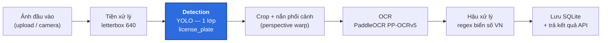
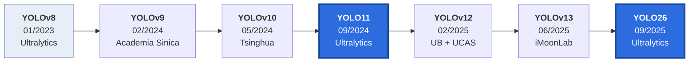
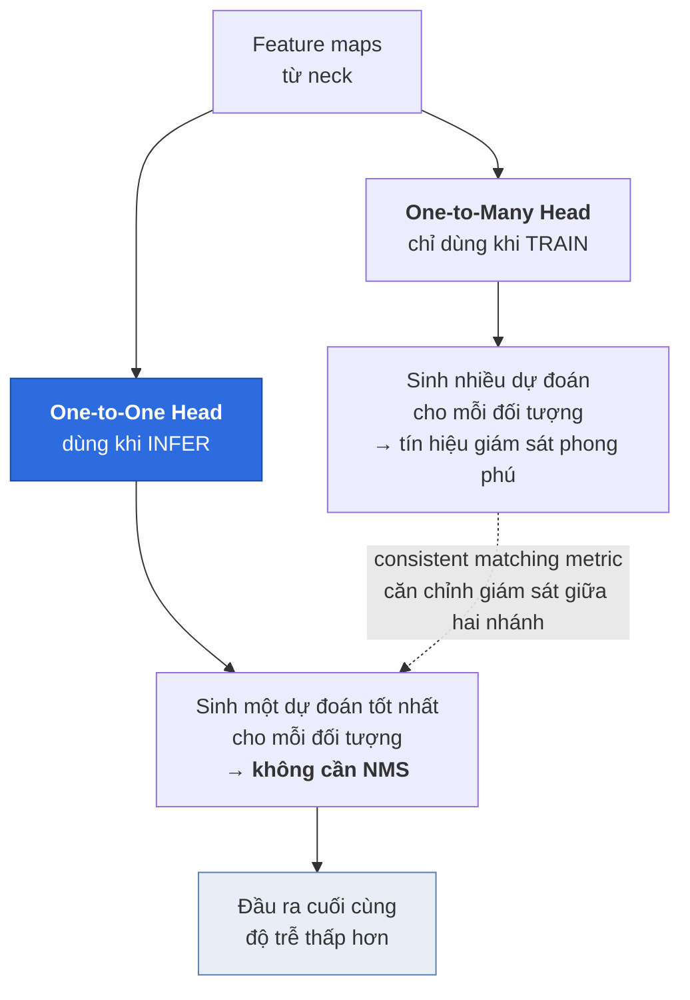
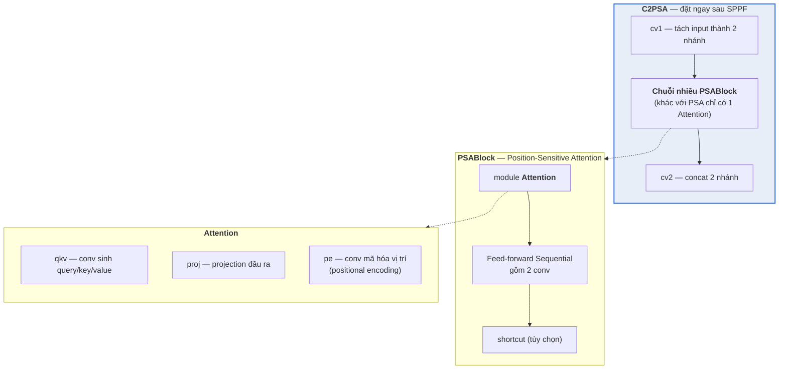
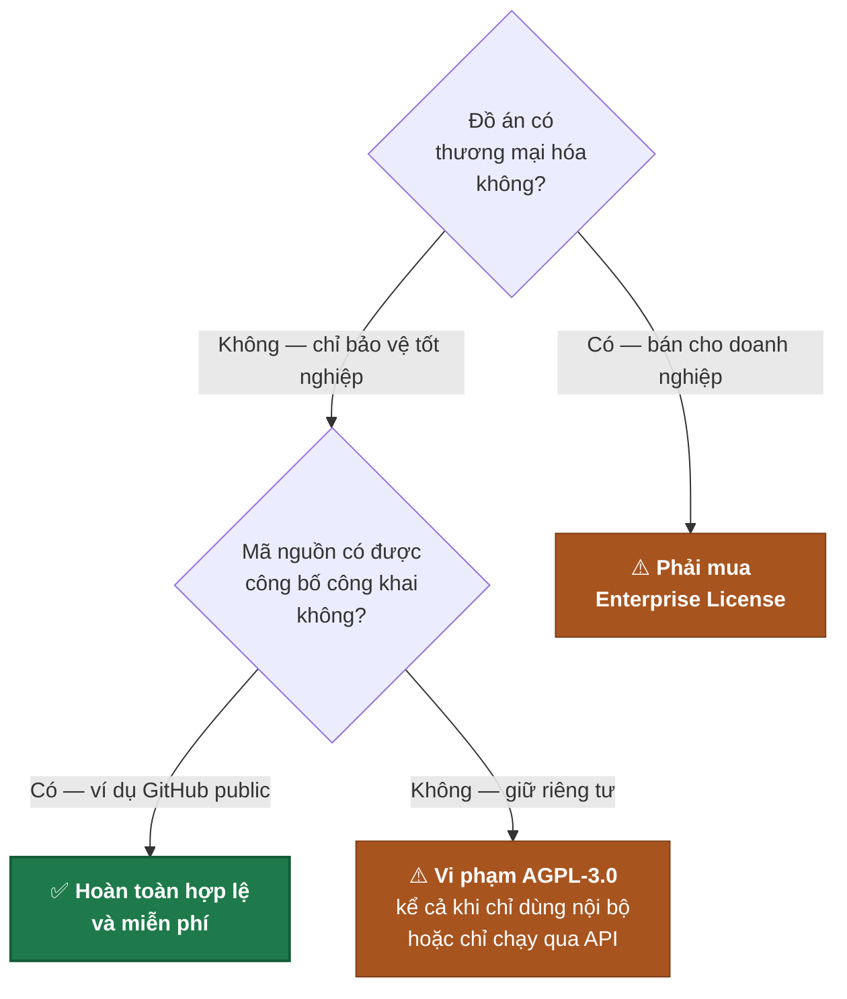
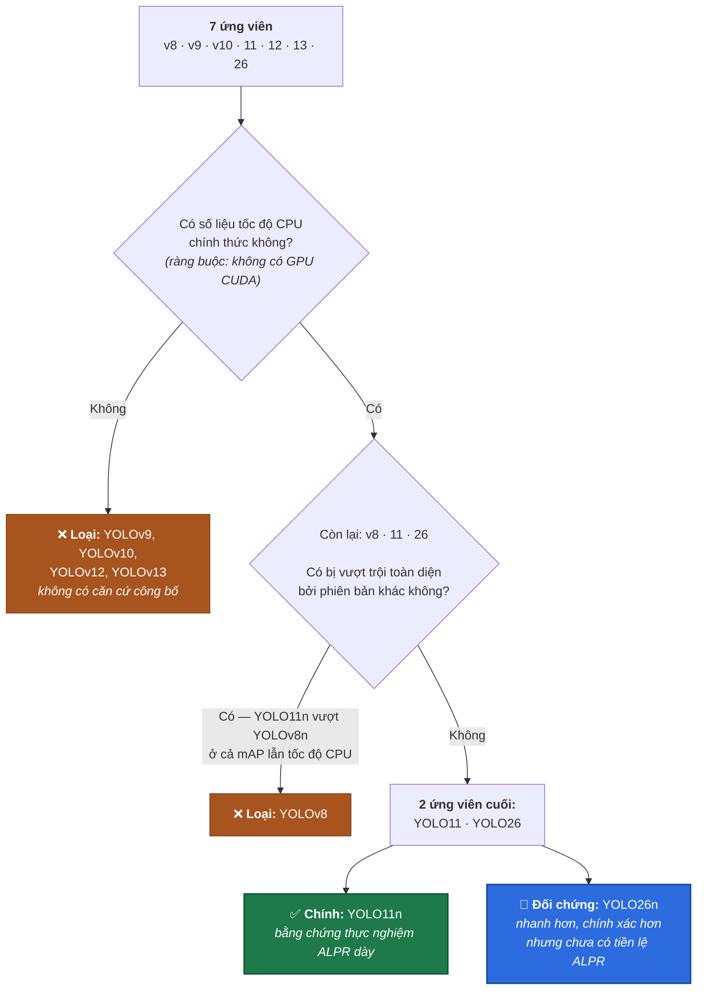

# Báo cáo 01 — So sánh các phiên bản YOLO và lựa chọn mô hình detection cho Phase 3

**Đồ án:** Xây dựng hệ thống nhận dạng biển số xe Việt Nam bằng AI (ALPR)
**Giai đoạn:** Chuẩn bị Phase 3 — Model Training
**Ngày lập:** 19/07/2026
**Phạm vi:** Lựa chọn kiến trúc detection cho khâu phát hiện biển số (plate detection), không bao gồm khâu OCR
**Trạng thái:** Bản trình duyệt (draft for approval)

---

## Mục lục

1. [Mở đầu — vì sao chọn họ YOLO](#1-mở-đầu--vì-sao-chọn-họ-yolo)
2. [Lịch sử phát triển các phiên bản YOLO](#2-lịch-sử-phát-triển-các-phiên-bản-yolo)
3. [Khác biệt kiến trúc giữa các phiên bản gần đây](#3-khác-biệt-kiến-trúc-giữa-các-phiên-bản-gần-đây)
4. [Bảng so sánh benchmark chính thức trên COCO](#4-bảng-so-sánh-benchmark-chính-thức-trên-coco)
5. [Phân tích lựa chọn biến thể cho đồ án (inference trên CPU)](#5-phân-tích-lựa-chọn-biến-thể-cho-đồ-án-inference-trên-cpu)
6. [Tính phù hợp với bài toán biển số](#6-tính-phù-hợp-với-bài-toán-biển-số)
7. [Vấn đề giấy phép AGPL-3.0](#7-vấn-đề-giấy-phép-agpl-30)
8. [Các nghiên cứu đã dùng YOLO cho biển số](#8-các-nghiên-cứu-đã-dùng-yolo-cho-biển-số)
9. [Kết luận và khuyến nghị cho Phase 3](#9-kết-luận-và-khuyến-nghị-cho-phase-3)
10. [Tài liệu tham khảo](#10-tài-liệu-tham-khảo)

---

## Quy ước trình bày và cảnh báo phương pháp luận

Trước khi đi vào nội dung, báo cáo nêu rõ một số quy ước để người đọc đánh giá đúng độ tin cậy của từng con số:

| Ký hiệu | Ý nghĩa |
|---|---|
| **[✓]** | Số liệu đã đối chiếu trực tiếp với file nguồn gốc (markdown trên nhánh `main` của repo, hoặc bản HTML của arXiv) |
| **[?]** | Số liệu **chưa kiểm chứng được nguồn** — chỉ lấy từ đoạn trích của công cụ tìm kiếm, không đọc được toàn văn. Không dùng làm luận cứ chính |
| **[EST]** | Ước lượng thiết kế của tác giả đồ án, **không phải số liệu công bố**. Bắt buộc phải thay bằng số đo thực tế |

Bốn cảnh báo phương pháp luận **bắt buộc phải giữ** khi trích dẫn lại báo cáo này:

> **Cảnh báo 1 — Không so sánh chéo cột GPU.** Bảng benchmark của YOLOv8 đo trên **NVIDIA A100 + TensorRT**, còn YOLO11, YOLO12 và YOLO26 đo trên **NVIDIA T4 + TensorRT10**, YOLOv10 và YOLOv13 đo trên **T4 + TensorRT FP16**. A100 mạnh hơn T4 đáng kể, do đó **tuyệt đối không đặt các cột này cạnh nhau** trong một bảng so sánh tốc độ. Vì lý do này, báo cáo tách riêng bảng cho từng họ mô hình thay vì gộp chung.
>
> **Cảnh báo 2 — "CPU ONNX" của Ultralytics không phải CPU máy tính cá nhân.** Chú thích chính thức ghi tốc độ được đo trên một **Amazon EC2 P4d instance** ([Ultralytics — tasks/detect.md](https://github.com/ultralytics/ultralytics/blob/main/docs/en/tasks/detect.md)). P4d là instance GPU 8×A100, CPU chủ của nó là Intel Xeon Platinum lớp máy chủ với hàng chục nhân vật lý. Do đó con số CPU công bố **lạc quan hơn đáng kể** so với laptop 4–8 nhân mà đồ án đang dùng. Mọi kết luận về ngân sách độ trễ phải được xác nhận lại bằng đo đạc trên máy thật.
>
> **Cảnh báo 3 — Không trộn mAP giữa các tập dữ liệu.** Các bảng benchmark chính thức của Ultralytics đo trên **COCO val2017** (5000 ảnh). Ngược lại, các bảng benchmark định dạng xuất (ONNX/OpenVINO) trên trang tích hợp lại chạy trên `coco8.yaml` — **chỉ 8 ảnh**, không có ý nghĩa thống kê. Chính tài liệu Ultralytics khuyến cáo dùng `coco128.yaml` hoặc `coco.yaml` để có kết quả tin cậy ([Ultralytics — OpenVINO integration](https://raw.githubusercontent.com/ultralytics/ultralytics/main/docs/en/integrations/openvino.md)). Báo cáo này **chỉ trích cột thời gian** từ các bảng đó và loại bỏ cột mAP tương ứng.
>
> **Cảnh báo 4 — mAP trên COCO không phải mAP trên biển số.** COCO là bài toán 80 lớp với đối tượng đa dạng; bài toán của đồ án chỉ có **1 lớp** (`license_plate`). Số liệu COCO chỉ dùng để **xếp hạng tương đối** giữa các kiến trúc, không phải để dự đoán độ chính xác cuối cùng của hệ thống ALPR.

---

## 1. Mở đầu — vì sao chọn họ YOLO

### 1.1. Vị trí của bài toán trong pipeline ALPR

Hệ thống ALPR của đồ án được thiết kế theo kiến trúc hai giai đoạn (two-stage pipeline), trong đó khâu detection đứng ở vị trí đầu tiên và quyết định chất lượng của toàn bộ chuỗi xử lý phía sau:

Vai trò của khâu detection ở đây có ba đặc điểm quyết định việc lựa chọn kiến trúc:

- **Là điểm nghẽn chất lượng.** Nếu detection bỏ sót biển số (false negative), khâu OCR không có gì để đọc và lỗi không thể phục hồi ở bất kỳ bước nào phía sau. Ngược lại, nếu bounding box lệch, vùng crop bị cắt mất ký tự và OCR đọc sai.
- **Là điểm nghẽn tốc độ.** Detection chạy trên **ảnh gốc** (thường 2–5 megapixel), trong khi OCR chỉ chạy trên vùng crop nhỏ. Do đó chi phí tính toán của detection lớn hơn nhiều lần và chi phối độ trễ đầu-cuối.
- **Là bài toán một lớp.** Không cần phân biệt 80 lớp như COCO, chỉ cần trả lời "vùng nào là biển số". Điều này cho phép chọn mô hình nhỏ hơn nhiều so với mức thường dùng cho bài toán tổng quát.

### 1.2. So sánh hai họ phương pháp: one-stage và two-stage

Trong lĩnh vực object detection, các phương pháp học sâu chia thành hai họ chính:

| Tiêu chí | **Two-stage** (Faster R-CNN, Mask R-CNN...) | **One-stage** (YOLO, SSD, RetinaNet...) |
|---|---|---|
| Nguyên lý | Giai đoạn 1 sinh region proposals, giai đoạn 2 phân loại và tinh chỉnh từng proposal | Hồi quy trực tiếp bounding box và class score trong một lần forward pass duy nhất |
| Độ trễ | Cao — chi phí tỉ lệ với số proposals | Thấp — chi phí cố định theo kích thước ảnh |
| Khả năng real-time | Khó đạt trên CPU | Là mục tiêu thiết kế cốt lõi |
| Ưu thế truyền thống | Độ chính xác định vị nhỉnh hơn ở đối tượng khó | Cân bằng tốc độ/độ chính xác |

Với bài toán ALPR triển khai trên máy **không có GPU CUDA** (xem [environment.md](../00-requirements/environment.md) — máy thực tế là Windows 11 Pro, Python 3.13, không có GPU CUDA), họ two-stage bị loại ngay từ đầu vì chi phí tính toán không tương thích với yêu cầu phản hồi tương tác của giao diện web.

Đáng chú ý là khoảng cách độ chính xác giữa hai họ đã thu hẹp gần như hoàn toàn. Một nghiên cứu ALPR quy mô lớn trên tập 50.000 ảnh và 10.000 video clip đã so sánh trực tiếp YOLOv5, YOLOv8, YOLOv9, YOLOv10 với **Faster R-CNN và SSD**, và kết luận nhóm YOLO vượt trội cả về accuracy lẫn thời gian suy luận ([Scientific Reports 2025](https://pmc.ncbi.nlm.nih.gov/articles/PMC12639091/)). Với bài toán một lớp và đối tượng có biên rõ ràng như biển số, lợi thế lý thuyết của two-stage về định vị chính xác gần như không còn ý nghĩa thực tiễn.

### 1.3. Lý do cụ thể chọn họ YOLO

Bốn lý do kỹ thuật, xếp theo mức độ quan trọng đối với đồ án:

**(1) Đặc tính real-time là mục tiêu thiết kế gốc, không phải tối ưu hậu kỳ.** Toàn bộ họ YOLO được thiết kế xoay quanh ràng buộc độ trễ. Điều này thể hiện rõ ở việc mọi phiên bản đều phát hành theo **thang biến thể** (n/s/m/l/x) cho phép người dùng chọn điểm cân bằng tốc độ–độ chính xác phù hợp phần cứng, thay vì chỉ có một cấu hình duy nhất.

**(2) Hệ sinh thái xuất mô hình trưởng thành.** Đây là yếu tố sống còn với đồ án chạy trên CPU. Ultralytics hỗ trợ **hơn 20 định dạng xuất**, trong đó nhóm liên quan CPU gồm `onnx`, `openvino`, `ncnn`, `mnn`, `torchscript`, `paddle`, `litert` ([Ultralytics — Export mode](https://docs.ultralytics.com/modes/export/)). Lợi ích định lượng của việc này rất lớn và được trình bày chi tiết ở [mục 5.3](#53-định-dạng-xuất-mô-hình--yếu-tố-quyết-định-hơn-cả-việc-chọn-biến-thể).

**(3) Công cụ benchmark tích hợp sẵn.** Ultralytics cung cấp chế độ benchmark tự động so sánh mọi định dạng xuất trên CPU, trả về mAP50-95, thời gian suy luận và dung lượng mô hình cho từng định dạng ([Ultralytics — Benchmark mode](https://docs.ultralytics.com/modes/benchmark/)). Đây chính là công cụ sẽ sinh ra Benchmark Report mà Phase 7 yêu cầu, đồng thời giải quyết đúng vấn đề số liệu công bố không khớp phần cứng thật đã nêu ở Cảnh báo 2.

**(4) Bằng chứng thực nghiệm dày đặc trên đúng bài toán biển số.** Như trình bày ở [mục 8](#8-các-nghiên-cứu-đã-dùng-yolo-cho-biển-số), có ít nhất năm nghiên cứu độc lập được xuất bản trong giai đoạn 2025–2026 áp dụng YOLO cho ALPR với kết quả mAP50 trong khoảng 0,906–0,995. Điều này giảm mạnh rủi ro kỹ thuật cho một đồ án có thời hạn.

---

## 2. Lịch sử phát triển các phiên bản YOLO

### 2.1. Dòng thời gian các phiên bản đang cân nhắc

Tính đến tháng 07/2026, có **bảy thế hệ YOLO** thuộc phạm vi cân nhắc của đồ án. Báo cáo giới hạn ở YOLOv8 trở về sau vì đây là mốc chuyển sang kiến trúc **anchor-free**, có ý nghĩa trực tiếp với bài toán biển số (xem [mục 6.3](#63-ảnh-hưởng-của-kiến-trúc-anchor-free)).

*(Hai khối tô đậm là hai ứng viên cuối cùng — lý do trình bày ở mục 4.8 và mục 9.)*

### 2.2. Bảng lịch sử phát triển

| Phiên bản | Thời điểm phát hành | Đơn vị / tác giả | Nơi công bố | Giấy phép | Biến thể |
|---|---|---|---|---|---|
| **YOLOv8** | 10/01/2023 | Glenn Jocher, Ayush Chaurasia, Jing Qiu — Ultralytics | Ultralytics docs (không có paper chính thức) | AGPL-3.0 + Enterprise | n / s / m / l / x |
| **YOLOv9** | 02/2024 | Chien-Yao Wang, I-Hau Yeh, Hong-Yuan Mark Liao — Academia Sinica | **ECCV 2024** | **GPL-3.0** (repo gốc `WongKinYiu/yolov9`); bản tích hợp trong package Ultralytics theo AGPL-3.0 | t / s / m / c / e |
| **YOLOv10** | 05/2024 | Ao Wang, Hui Chen, Lihao Liu, Kai Chen, Zijia Lin, Jungong Han, Guiguang Ding — Tsinghua University | **NeurIPS 2024** | AGPL-3.0 | n / s / m / **b** / l / x |
| **YOLO11** | 09/2024 (ra mắt 30/09/2024, sau sự kiện YOLO Vision 2024 ngày 27/09/2024 tại Madrid) | Glenn Jocher, Jing Qiu — Ultralytics | Ultralytics docs; có bài tổng quan độc lập arXiv:2410.17725 | AGPL-3.0 + Enterprise | n / s / m / l / x |
| **YOLOv12** | 18/02/2025 | Yunjie Tian, Qixiang Ye, David Doermann — University at Buffalo & University of Chinese Academy of Sciences | **NeurIPS 2025**; arXiv:2502.12524 | AGPL-3.0 | n / s / m / l / x |
| **YOLOv13** | 21/06/2025 | Mengqi Lei, Siqi Li, Yihong Wu, Han Hu, You Zhou, Xinhu Zheng, Guiguang Ding, Shaoyi Du, Zongze Wu, Yue Gao — iMoonLab | arXiv:2506.17733 | AGPL-3.0 | N / S / **L / X** — **không có biến thể M** |
| **YOLO26** | 25/09/2025 | Glenn Jocher, Jing Qiu, Mengyu Liu, Shuai Lyu, Fatih Cagatay Akyon, Muhammet Esat Kalfaoglu — Ultralytics | Ultralytics docs | AGPL-3.0 + Enterprise | n / s / m / l / x |

**Nguồn cho từng dòng:** YOLOv8 — [docs.ultralytics.com/models/yolov8](https://docs.ultralytics.com/models/yolov8/); YOLOv9 — [docs.ultralytics.com/models/yolov9](https://docs.ultralytics.com/models/yolov9/) và [WongKinYiu/yolov9 LICENSE.md](https://github.com/WongKinYiu/yolov9/blob/main/LICENSE.md); YOLOv10 — [github.com/THU-MIG/yolov10](https://github.com/THU-MIG/yolov10); YOLO11 — [docs.ultralytics.com/models/yolo11](https://docs.ultralytics.com/models/yolo11/) và [arXiv:2410.17725](https://arxiv.org/abs/2410.17725); YOLOv12 — [docs.ultralytics.com/models/yolo12](https://docs.ultralytics.com/models/yolo12/) và [arXiv:2502.12524](https://arxiv.org/abs/2502.12524); YOLOv13 — [github.com/iMoonLab/yolov13](https://github.com/iMoonLab/yolov13) và [arXiv:2506.17733](https://arxiv.org/abs/2506.17733); YOLO26 — [docs.ultralytics.com/models/yolo26](https://docs.ultralytics.com/models/yolo26/).

### 2.3. Ba nhận xét rút ra từ bảng lịch sử

**(a) Tên gọi "YOLO" không thuộc về một tổ chức duy nhất.** Ultralytics phát hành YOLOv8, YOLO11 và YOLO26; các nhóm học thuật độc lập phát hành YOLOv9 (Academia Sinica), YOLOv10 (Tsinghua), YOLOv12 (University at Buffalo & UCAS), YOLOv13 (iMoonLab). Hệ quả thực tiễn: **mức độ tích hợp và bảo trì rất khác nhau**. YOLOv9, YOLOv10 và YOLOv12 đã được tích hợp vào package `ultralytics`, nhưng repo `iMoonLab/yolov13` **không được tích hợp chính thức** — dùng YOLOv13 đồng nghĩa với việc phải tự duy trì một repo riêng, là rủi ro kỹ thuật đáng kể cho một đồ án có thời hạn.

**(b) Đặt tên biến thể không thống nhất.** YOLOv9 dùng `t/s/m/c/e` thay vì `n/s/m/l/x`; YOLOv10 có thêm biến thể `b` (balanced) không tồn tại ở bất kỳ phiên bản nào khác; YOLOv13 **không phát hành biến thể M**. Điều này có nghĩa là câu "so sánh biến thể m của các phiên bản" không luôn luôn có nghĩa — cần đối chiếu theo **số tham số và FLOPs** thay vì theo tên chữ cái.

**(c) Chỉ có bản phát hành từ Ultralytics công bố tốc độ CPU.** Đây là phát hiện quan trọng nhất của khảo sát này và được phân tích riêng ở [mục 4.7](#47-vấn-đề-cốt-lõi--thiếu-số-liệu-tốc-độ-cpu-chính-thức).

---

## 3. Khác biệt kiến trúc giữa các phiên bản gần đây

Phần này trình bày khác biệt kiến trúc ở mức **thành phần cụ thể**, đối chiếu trực tiếp với mã nguồn và tài liệu, thay vì mô tả chung chung kiểu "cải tiến backbone và neck".

### 3.1. YOLOv8 — mốc chuyển sang anchor-free

YOLOv8 giới thiệu **anchor-free split Ultralytics head**: một detection head tách rời (decoupled) nhánh phân loại và nhánh hồi quy, đồng thời **loại bỏ hoàn toàn nhu cầu tinh chỉnh anchor box thủ công** ([Ultralytics — YOLOv8](https://docs.ultralytics.com/models/yolov8/)). Khối cơ bản của backbone là **C2f**, được mô tả trong mã nguồn là *"Faster Implementation of CSP Bottleneck with 2 convolutions"* — tức là một biến thể CSP tách luồng đặc trưng thành hai nhánh, một nhánh đi qua chuỗi các khối `Bottleneck`, sau đó concat lại.

Ý nghĩa với đồ án: việc bỏ anchor box là bước ngoặt cho các bài toán có **tỷ lệ khung hình bất thường** như biển số (phân tích chi tiết ở [mục 6.3](#63-ảnh-hưởng-của-kiến-trúc-anchor-free)).

### 3.2. YOLOv9 — PGI và GELAN

YOLOv9 đưa ra hai đóng góp, cả hai đều xuất phát từ nguyên lý **information bottleneck** và lý thuyết **hàm khả nghịch (reversible functions)** ([Ultralytics — YOLOv9](https://docs.ultralytics.com/models/yolov9/)):

- **PGI (Programmable Gradient Information)** — cơ chế chống mất mát thông tin khi dữ liệu đi qua các lớp sâu của mạng, tạo ra gradient đáng tin cậy hơn cho quá trình cập nhật trọng số.
- **GELAN (Generalized Efficient Layer Aggregation Network)** — kiến trúc tổng hợp lớp, tối ưu hóa đồng thời việc sử dụng tham số và hiệu quả tính toán.

### 3.3. YOLOv10 — bỏ NMS bằng consistent dual assignments

Đóng góp nổi bật nhất của YOLOv10 là loại bỏ bước **Non-Maximum Suppression** khỏi quy trình suy luận, thông qua cơ chế **consistent dual assignments** với hai head song song ([THU-MIG/yolov10](https://github.com/THU-MIG/yolov10)):

Ngoài ra YOLOv10 áp dụng thiết kế **"holistic efficiency-accuracy driven"** gồm bốn thành phần: head phân loại nhẹ dùng depth-wise separable convolution, spatial-channel decoupled downsampling, rank-guided block design (nhóm hiệu quả), và large-kernel convolution kết hợp partial self-attention (nhóm độ chính xác).

Hiệu quả định lượng: theo paper, **YOLOv10-B có độ trễ thấp hơn 46% và ít hơn 25% tham số so với YOLOv9-C ở cùng mức độ chính xác** ([Ultralytics — YOLOv10](https://docs.ultralytics.com/models/yolov10/); [arXiv:2405.14458](https://arxiv.org/abs/2405.14458)) — độ trễ đo trên T4 với TensorRT FP16.

### 3.4. YOLO11 — C3k2 và C2PSA

Đây là phần được khảo sát kỹ nhất vì YOLO11 là một trong hai ứng viên cuối cùng. Nội dung dưới đây được đối chiếu **trực tiếp với mã nguồn** `ultralytics/nn/modules/block.py` ([Ultralytics — block.py](https://github.com/ultralytics/ultralytics/blob/main/ultralytics/nn/modules/block.py)), không dựa vào mô tả thứ cấp.

Bài tổng quan độc lập arXiv:2410.17725 xác định ba thành phần chính của YOLO11 là **C3k2**, **SPPF** và **C2PSA** ([arXiv:2410.17725](https://arxiv.org/abs/2410.17725)).

#### 3.4.1. C3k2 — không phải kiến trúc mới, mà là C2f có thể hoán đổi khối con

Đọc trực tiếp mã nguồn cho thấy một sự thật thường bị mô tả sai trong các tài liệu thứ cấp:

- Class `C3k2` **kế thừa trực tiếp từ class `C2f`**, và mang đúng docstring *"Faster Implementation of CSP Bottleneck with 2 convolutions"* của C2f.
- Điểm khác biệt duy nhất là cờ `c3k`, quyết định nội dung của `ModuleList`:
  - `c3k=False` → dùng khối `Bottleneck` tiêu chuẩn → **giống hệt C2f**;
  - `c3k=True` → dùng các khối `C3k`.
- Class `C3k` kế thừa từ `C3` và cho phép **tùy chỉnh kernel size `k`** (mặc định 3).

Nói cách khác, **C3k2 là một C2f có thể hoán đổi khối con**, chứ không phải một kiến trúc được thiết kế lại từ đầu. Chi tiết này giải thích chính xác vì sao YOLO11 giảm được số tham số mà vẫn giữ hoặc tăng độ chính xác: nó không thay đổi triết lý CSP mà chỉ cho phép cấu hình linh hoạt hơn ở mức khối.

#### 3.4.2. C2PSA — thành phần YOLOv8 hoàn toàn không có

Đây mới là khác biệt kiến trúc thực sự giữa YOLO11 và YOLOv8. Cấu trúc phân cấp theo mã nguồn:

Vị trí đặt C2PSA — **ngay sau SPPF trong backbone** — có ý nghĩa: đây là điểm mà feature map đã tổng hợp thông tin đa tỷ lệ, và cơ chế spatial attention được áp dụng để tái phân bổ trọng số theo vị trí không gian.

#### 3.4.3. Luận cứ quan trọng nhất cho bài toán biển số

Trang so sánh chính thức của Ultralytics khẳng định trực tiếp rằng YOLO11 *"replaces C2f blocks with advanced C3k2 blocks, which enhance spatial feature processing without ballooning the parameter count"* và bổ sung *"C2PSA (Cross-Stage Partial Spatial Attention) module within its backbone"*. Về lợi ích, tài liệu nêu rõ cơ chế spatial attention của YOLO11 cải thiện mạnh **small object detection** và khả năng xử lý **complex occlusions** so với YOLOv8 ([Ultralytics — YOLO11 vs YOLOv8](https://docs.ultralytics.com/compare/yolo11-vs-yolov8/)).

> **Lưu ý về mức độ chứng minh:** phát biểu trên là **định tính**. Ultralytics **không công bố AP_small / AP_medium / AP_large** theo chuẩn COCO cho từng biến thể, nên **không thể trích dẫn số liệu chính thức** để chứng minh định lượng rằng YOLO11 tốt hơn YOLOv8 trên vật thể nhỏ cụ thể bao nhiêu ([Ultralytics — YOLO11](https://docs.ultralytics.com/models/yolo11/)). Nếu đồ án cần luận cứ định lượng cho điểm này, **bắt buộc phải tự chạy thực nghiệm** trên tập biển số của mình — nội dung này được đưa vào kế hoạch Phase 3 ở [mục 9.4](#94-kế-hoạch-thực-nghiệm-bắt-buộc-của-phase-3).

### 3.5. YOLOv12 — chuyển hướng sang kiến trúc attention-centric

YOLOv12 là bước chuyển triết lý rõ rệt nhất trong nhóm: từ kiến trúc CNN-centric sang **attention-centric** ([Ultralytics — YOLO12](https://docs.ultralytics.com/models/yolo12/)). Ba thành phần:

- **Area Attention** — chia feature map thành **l vùng bằng nhau, mặc định l = 4** ([Ultralytics — YOLO12](https://docs.ultralytics.com/models/yolo12/)), theo chiều ngang **hoặc** chiều dọc. Mục tiêu là giảm chi phí tính toán so với attention chuẩn (vốn có độ phức tạp bậc hai theo số token) trong khi vẫn giữ trường tiếp nhận lớn.
- **R-ELAN (Residual Efficient Layer Aggregation Networks)** — bổ sung kết nối residual ở mức khối kèm scaling, nhằm ổn định quá trình tối ưu hóa cho các kiến trúc attention quy mô lớn.
- **Tối ưu hóa attention** — tích hợp **FlashAttention** để giảm overhead bộ nhớ, **bỏ positional encoding**, giảm **tỷ lệ MLP xuống 1,2 hoặc 2** thay vì giá trị thông thường là 4 ([Ultralytics — YOLO12](https://docs.ultralytics.com/models/yolo12/)), và thêm **separable convolution 7×7** đóng vai trò "position perceiver".

### 3.6. YOLOv13 — hypergraph

YOLOv13 giới thiệu ba thành phần ([iMoonLab/yolov13](https://github.com/iMoonLab/yolov13); [arXiv:2506.17733](https://arxiv.org/abs/2506.17733)):

- **HyperACE (Hypergraph-based Adaptive Correlation Enhancement)** — khai thác tương quan bậc cao tiềm ẩn giữa các vùng đặc trưng, vượt qua hạn chế của các phương pháp trước vốn chỉ mô hình hóa tương quan **theo cặp (pairwise)**.
- **FullPAD (Full-Pipeline Aggregation-and-Distribution)** — phân phối đặc trưng đã tăng cường tương quan ra toàn bộ pipeline mạng thay vì chỉ ở một tầng.
- **DS-C3k2** — dùng depthwise separable convolution thay cho convolution kernel lớn để giảm số tham số.

### 3.7. YOLO26 — bỏ DFL, NMS-free mặc định

YOLO26 là phiên bản mới nhất từ Ultralytics, với bốn thay đổi ([Ultralytics — YOLO26](https://docs.ultralytics.com/models/yolo26/)):

- **DFL-free regression** — loại bỏ Distribution Focal Loss, đơn giản hóa detection head. Hệ quả thực tiễn rất quan trọng với đồ án: việc **export và quantize trở nên dễ hơn**, đúng hướng triển khai CPU.
- **End-to-end NMS-free inference** làm mặc định.
- **ProgLoss (Progressive Loss) + STAL** — tối ưu căn chỉnh trong quá trình huấn luyện.
- **Optimizer MuSGD** — kết hợp SGD với kỹ thuật lấy cảm hứng từ Muon.

### 3.8. Bảng tổng hợp khác biệt kiến trúc

| Phiên bản | Khối backbone đặc trưng | Cơ chế attention | Head | NMS khi infer | Điểm mới đáng chú ý nhất |
|---|---|---|---|---|---|
| YOLOv8 | **C2f** | Không có | Anchor-free, decoupled | Có | Chuyển sang anchor-free |
| YOLOv9 | **GELAN** | Không có | Anchor-free | Có | **PGI** chống mất mát thông tin |
| YOLOv10 | Rank-guided blocks | Partial self-attention | **Dual head** (one-to-many + one-to-one) | **Không** | Consistent dual assignments |
| YOLO11 | **C3k2** (kế thừa C2f) | **C2PSA** sau SPPF | Anchor-free, decoupled | Có | C2PSA cải thiện vật thể nhỏ |
| YOLOv12 | **R-ELAN** | **Area Attention** (l = 4) + FlashAttention | Anchor-free | Có | Kiến trúc attention-centric |
| YOLOv13 | **DS-C3k2** | **HyperACE** (hypergraph) | Anchor-free | Có | Tương quan bậc cao, FullPAD |
| YOLO26 | Kế thừa dòng Ultralytics | Kế thừa dòng Ultralytics | **DFL-free** | **Không** (mặc định) | Bỏ DFL, dễ export/quantize |

---

## 4. Bảng so sánh benchmark chính thức trên COCO

### 4.1. Phương pháp và điều kiện đo

Toàn bộ số liệu trong mục này lấy từ bảng benchmark chính thức của đơn vị phát hành, đo trên **COCO val2017**, `imgsz = 640`, chế độ single-model single-scale. Vì lý do nêu ở **Cảnh báo 1**, báo cáo **tách riêng bảng cho từng họ mô hình** và ghi rõ phần cứng ở tiêu đề mỗi bảng.

Điều kiện đo của Ultralytics: *"Speed averaged over COCO val images using an Amazon EC2 P4d instance. Reproduce by `yolo val detect data=coco.yaml batch=1 device=0|cpu`"* — tốc độ CPU đo bằng export **ONNX**, tốc độ GPU đo bằng export **TensorRT** ([Ultralytics — tasks/detect.md](https://github.com/ultralytics/ultralytics/blob/main/docs/en/tasks/detect.md)).

### 4.2. YOLOv8 — CPU ONNX + **A100** TensorRT

| Biến thể | mAPval 50-95 | Speed CPU ONNX (ms) | Speed **A100** TensorRT (ms) | Params (M) | FLOPs (B) | Nguồn |
|---|---|---|---|---|---|---|
| YOLOv8n | 37,3 | 80,4 | 0,99 | 3,2 | 8,7 | [Ultralytics YOLOv8](https://docs.ultralytics.com/models/yolov8/) |
| YOLOv8s | 44,9 | 128,4 | 1,20 | 11,2 | 28,6 | [Ultralytics YOLOv8](https://docs.ultralytics.com/models/yolov8/) |
| YOLOv8m | 50,2 | 234,7 | 1,83 | 25,9 | 78,9 | [Ultralytics YOLOv8](https://docs.ultralytics.com/models/yolov8/) |
| YOLOv8l | 52,9 | 375,2 | 2,39 | 43,7 | 165,2 | [Ultralytics YOLOv8](https://docs.ultralytics.com/models/yolov8/) |
| YOLOv8x | 53,9 | 479,1 | 3,53 | 68,2 | 257,8 | [Ultralytics YOLOv8](https://docs.ultralytics.com/models/yolov8/) |

⚠️ Cột GPU của bảng này đo trên **A100**, không so sánh được với cột T4 của các bảng sau.

### 4.3. YOLOv9 — **không có bất kỳ cột tốc độ nào**

| Biến thể | mAPval 50-95 | mAPval 50 | Params (M) | FLOPs (B) | Tốc độ | Nguồn |
|---|---|---|---|---|---|---|
| YOLOv9t | 38,3 | 53,1 | 2,0 | 7,7 | *không công bố* | [Ultralytics YOLOv9](https://docs.ultralytics.com/models/yolov9/) |
| YOLOv9s | 46,8 | 63,4 | 7,2 | 26,7 | *không công bố* | [Ultralytics YOLOv9](https://docs.ultralytics.com/models/yolov9/) |
| YOLOv9m | 51,4 | 68,1 | 20,1 | 76,8 | *không công bố* | [Ultralytics YOLOv9](https://docs.ultralytics.com/models/yolov9/) |
| YOLOv9c | 53,0 | 70,2 | 25,5 | 102,8 | *không công bố* | [Ultralytics YOLOv9](https://docs.ultralytics.com/models/yolov9/) |
| YOLOv9e | 55,6 | 72,8 | 58,1 | 192,5 | *không công bố* | [Ultralytics YOLOv9](https://docs.ultralytics.com/models/yolov9/) |

Đã kiểm tra header cột của bảng gốc: chỉ gồm `size / mAPval 50-95 / mAPval 50 / params / FLOPs`. **Không tồn tại cột tốc độ CPU, cũng không có cột tốc độ GPU.**

### 4.4. YOLOv10 — **T4** TensorRT FP16, không có CPU

| Biến thể | APval (%) | Params (M) | FLOPs (G) | Latency **T4** TensorRT FP16 (ms) | Nguồn |
|---|---|---|---|---|---|
| YOLOv10-N | 38,5 | 2,3 | 6,7 | 1,84 | [THU-MIG/yolov10](https://github.com/THU-MIG/yolov10) |
| YOLOv10-S | 46,3 | 7,2 | 21,6 | 2,49 | [THU-MIG/yolov10](https://github.com/THU-MIG/yolov10) |
| YOLOv10-M | 51,1 | 15,4 | 59,1 | 4,74 | [THU-MIG/yolov10](https://github.com/THU-MIG/yolov10) |
| YOLOv10-B | 52,5 | 19,1 | 92,0 | 5,74 | [THU-MIG/yolov10](https://github.com/THU-MIG/yolov10) |
| YOLOv10-L | 53,2 | 24,4 | 120,3 | 7,28 | [THU-MIG/yolov10](https://github.com/THU-MIG/yolov10) |
| YOLOv10-X | 54,4 | 29,5 | 160,4 | 10,70 | [THU-MIG/yolov10](https://github.com/THU-MIG/yolov10) |

Số liệu đã kiểm chứng chéo với bản HTML của paper ([arXiv:2405.14458](https://arxiv.org/html/2405.14458v2)), trong đó ghi rõ *"the latencies of all models are tested on T4 GPU with TensorRT FP16"*. **Biến thể B chỉ tồn tại ở YOLOv10.** Cả repo gốc lẫn tài liệu Ultralytics đều **không công bố latency CPU**.

### 4.5. YOLO11 — CPU ONNX + **T4** TensorRT10 (bộ số liệu đầy đủ nhất)

| Biến thể | mAPval 50-95 | **Speed CPU ONNX (ms)** | Speed **T4** TensorRT10 (ms) | Params (M) | FLOPs (B) | Nguồn |
|---|---|---|---|---|---|---|
| YOLO11n | 39,5 | **56,1 ± 0,8** | 1,5 ± 0,0 | 2,6 | 6,5 | [Ultralytics YOLO11](https://docs.ultralytics.com/models/yolo11/) |
| YOLO11s | 47,0 | **90,0 ± 1,2** | 2,5 ± 0,0 | 9,4 | 21,5 | [Ultralytics YOLO11](https://docs.ultralytics.com/models/yolo11/) |
| YOLO11m | 51,5 | **183,2 ± 2,0** | 4,7 ± 0,1 | 20,1 | 68,0 | [Ultralytics YOLO11](https://docs.ultralytics.com/models/yolo11/) |
| YOLO11l | 53,4 | **238,6 ± 1,4** | 6,2 ± 0,1 | 25,3 | 86,9 | [Ultralytics YOLO11](https://docs.ultralytics.com/models/yolo11/) |
| YOLO11x | 54,7 | **462,8 ± 6,7** | 11,3 ± 0,2 | 56,9 | 194,9 | [Ultralytics YOLO11](https://docs.ultralytics.com/models/yolo11/) |

### 4.6. YOLO12 và YOLOv13 — có GPU, **cột CPU để trống**

**YOLO12** (T4 TensorRT FP16):

| Biến thể | mAPval 50-95 | Speed CPU ONNX | Speed **T4** TensorRT (ms) | Params (M) | FLOPs (B) | Nguồn |
|---|---|---|---|---|---|---|
| YOLO12n | 40,6 | **—** *(để trống)* | 1,64 | 2,6 | 6,5 | [Ultralytics YOLO12](https://docs.ultralytics.com/models/yolo12/) |
| YOLO12s | 48,0 | **—** | 2,61 | 9,3 | 21,4 | [Ultralytics YOLO12](https://docs.ultralytics.com/models/yolo12/) |
| YOLO12m | 52,5 | **—** | 4,86 | 20,2 | 67,5 | [Ultralytics YOLO12](https://docs.ultralytics.com/models/yolo12/) |
| YOLO12l | 53,7 | **—** | 6,77 | 26,4 | 88,9 | [Ultralytics YOLO12](https://docs.ultralytics.com/models/yolo12/) |
| YOLO12x | 55,2 | **—** | 11,79 | 59,1 | 199,0 | [Ultralytics YOLO12](https://docs.ultralytics.com/models/yolo12/) |

Đã kiểm tra trực tiếp file nguồn `docs/en/models/yolo12.md` trên GitHub của Ultralytics: cột `Speed CPU ONNX` chỉ chứa dấu gạch ngang cho **cả 5 biến thể**; chú thích ghi rõ *"Inference speed measured on an NVIDIA T4 GPU with TensorRT FP16 precision"*.

**YOLOv13** (T4 TensorRT FP16 — **đã xác nhận phần cứng từ paper**):

| Biến thể | mAP50-95 | mAP50 | mAP75 | Params (M) | FLOPs (G) | Latency **T4** TensorRT FP16 (ms) | Nguồn |
|---|---|---|---|---|---|---|---|
| YOLOv13-N | 41,6 | 57,8 | 45,1 | 2,5 | 6,4 | 1,97 | [iMoonLab/yolov13](https://github.com/iMoonLab/yolov13) |
| YOLOv13-S | 48,0 | 65,2 | 52,0 | 9,0 | 20,8 | 2,98 | [iMoonLab/yolov13](https://github.com/iMoonLab/yolov13) |
| *(không có biến thể M)* | — | — | — | — | — | — | — |
| YOLOv13-L | 53,4 | 70,9 | 58,1 | 27,6 | 88,4 | 8,63 | [iMoonLab/yolov13](https://github.com/iMoonLab/yolov13) |
| YOLOv13-X | 54,8 | 72,0 | 59,8 | 64,0 | 199,2 | 14,67 | [iMoonLab/yolov13](https://github.com/iMoonLab/yolov13) |

Paper ghi rõ điều kiện đo: *"Following the standard practice of previous YOLO series, we evaluate the latency on a single Tesla T4 GPU using TensorRT FP16 for all models"* ([arXiv:2506.17733](https://arxiv.org/html/2506.17733v1)). Do đó latency của YOLOv13 **đối chiếu được trực tiếp** với YOLOv10 và YOLOv12. Vẫn **không có số liệu CPU**.

### 4.7. YOLO26 — CPU ONNX + **T4** TensorRT10

| Biến thể | mAPval 50-95 | mAP e2e | **Speed CPU ONNX (ms)** | Speed **T4** TensorRT10 (ms) | Params (M) | FLOPs (B) | Nguồn |
|---|---|---|---|---|---|---|---|
| YOLO26n | 40,9 | 40,1 | **38,9 ± 0,7** | 1,7 ± 0,0 | 2,4 | 5,4 | [Ultralytics — yolo-det-perf.md](https://raw.githubusercontent.com/ultralytics/ultralytics/main/docs/macros/yolo-det-perf.md) |
| YOLO26s | 48,6 | 47,8 | **87,2 ± 0,9** | 2,5 ± 0,0 | 9,5 | 20,7 | [Ultralytics — yolo-det-perf.md](https://raw.githubusercontent.com/ultralytics/ultralytics/main/docs/macros/yolo-det-perf.md) |
| YOLO26m | 53,1 | 52,5 | **220,0 ± 1,4** | 4,7 ± 0,1 | 20,4 | 68,2 | [Ultralytics — yolo-det-perf.md](https://raw.githubusercontent.com/ultralytics/ultralytics/main/docs/macros/yolo-det-perf.md) |
| YOLO26l | 55,0 | 54,4 | **286,2 ± 2,0** | 6,2 ± 0,2 | 24,8 | 86,4 | [Ultralytics — yolo-det-perf.md](https://raw.githubusercontent.com/ultralytics/ultralytics/main/docs/macros/yolo-det-perf.md) |
| YOLO26x | 57,5 | 56,9 | **525,8 ± 4,0** | 11,8 ± 0,2 | 55,7 | 193,9 | [Ultralytics — yolo-det-perf.md](https://raw.githubusercontent.com/ultralytics/ultralytics/main/docs/macros/yolo-det-perf.md) |

*Ghi chú kỹ thuật khi trích dẫn:* bảng của YOLO26 **không nằm trong** file `yolo26.md` mà được include từ macro `docs/macros/yolo-det-perf.md` — cần trỏ tới đúng nguồn này. Params/FLOPs là của mô hình đã fuse, đã bỏ head one-to-many phụ trợ. Giá trị **57,5 mAP của YOLO26x là cao nhất trong toàn bộ các phiên bản YOLO của Ultralytics**.

### 4.8. Vấn đề cốt lõi — thiếu số liệu tốc độ CPU chính thức

Đây là phát hiện quyết định của toàn bộ khảo sát và cần được nêu thẳng:

> **YOLOv9, YOLOv10, YOLOv12 và YOLOv13 hoàn toàn KHÔNG có số liệu tốc độ CPU chính thức.** Việc này đã được kiểm chứng ở cả hai phía: trên tài liệu Ultralytics (cột `Speed CPU ONNX` để trống hoặc không tồn tại) và trên repo gốc của tác giả (chỉ có cột latency GPU).

Bảng tổng hợp tình trạng số liệu:

| Phiên bản | Có mAP COCO | Có params/FLOPs | Có tốc độ **GPU** | Có tốc độ **CPU** | So sánh CPU công bằng được? |
|---|:---:|:---:|:---:|:---:|:---:|
| YOLOv8 | ✅ | ✅ | ✅ (A100) | ✅ | **✅ Có** |
| YOLOv9 | ✅ | ✅ | ❌ | ❌ | ❌ Không |
| YOLOv10 | ✅ | ✅ | ✅ (T4 FP16) | ❌ | ❌ Không |
| YOLO11 | ✅ | ✅ | ✅ (T4 TRT10) | ✅ | **✅ Có** |
| YOLO12 | ✅ | ✅ | ✅ (T4 FP16) | ❌ | ❌ Không |
| YOLOv13 | ✅ | ✅ | ✅ (T4 FP16) | ❌ | ❌ Không |
| YOLO26 | ✅ | ✅ | ✅ (T4 TRT10) | ✅ | **✅ Có** |

**Hệ quả trực tiếp cho quyết định của đồ án:** vì đồ án triển khai trên máy không có GPU CUDA, tiêu chí tốc độ CPU là ràng buộc chi phối. Chỉ có **ba phiên bản** — YOLOv8, YOLO11, YOLO26 — cung cấp cơ sở chính thức để đánh giá theo tiêu chí này. Đây là **luận cứ kỹ thuật mạnh nhất để loại YOLOv9, YOLOv10, YOLOv12 và YOLOv13** khỏi danh sách ứng viên, độc lập với việc chúng có mAP cao hơn trên COCO hay không.

Cần nói thẳng: điều này **không có nghĩa YOLOv12 hay YOLOv13 chậm trên CPU**. Nó chỉ có nghĩa là **không tồn tại căn cứ công bố nào để khẳng định**, và một đồ án học thuật không nên chọn mô hình dựa trên suy đoán. Nếu muốn đưa các phiên bản này vào so sánh, Phase 3 **phải tự chạy benchmark** — xem [mục 9.4](#94-kế-hoạch-thực-nghiệm-bắt-buộc-của-phase-3).

### 4.9. Bảng so sánh chéo nhóm nano — chỉ các cột đối chiếu được

Bảng sau chỉ đặt cạnh nhau những đại lượng **thực sự so sánh được** (mAP trên COCO val2017, params, FLOPs) và ghi rõ "không công bố" ở cột CPU thay vì bỏ trống hay điền số suy đoán:

| Mô hình (biến thể nhỏ nhất) | mAPval 50-95 | Params (M) | FLOPs (B/G) | Speed CPU ONNX (ms) | Nguồn |
|---|---|---|---|---|---|
| YOLOv8n | 37,3 | 3,2 | 8,7 | 80,4 | [Ultralytics YOLOv8](https://docs.ultralytics.com/models/yolov8/) |
| YOLOv9t | 38,3 | 2,0 | 7,7 | *không công bố* | [Ultralytics YOLOv9](https://docs.ultralytics.com/models/yolov9/) |
| YOLOv10-N | 38,5 | 2,3 | 6,7 | *không công bố* | [THU-MIG/yolov10](https://github.com/THU-MIG/yolov10) |
| **YOLO11n** | **39,5** | **2,6** | **6,5** | **56,1 ± 0,8** | [Ultralytics YOLO11](https://docs.ultralytics.com/models/yolo11/) |
| YOLO12n | 40,6 | 2,6 | 6,5 | *không công bố* | [Ultralytics YOLO12](https://docs.ultralytics.com/models/yolo12/) |
| YOLOv13-N | 41,6 | 2,5 | 6,4 | *không công bố* | [iMoonLab/yolov13](https://github.com/iMoonLab/yolov13) |
| **YOLO26n** | **40,9** | **2,4** | **5,4** | **38,9 ± 0,7** | [Ultralytics — yolo-det-perf.md](https://raw.githubusercontent.com/ultralytics/ultralytics/main/docs/macros/yolo-det-perf.md) |

Hai quan sát:

- Ở phân khúc nano, **toàn bộ dải mAP từ giá trị thấp nhất đến cao nhất chỉ khoảng 4,3 điểm** (YOLOv8n 37,3 → YOLOv13-N 41,6), trong khi số tham số dao động hẹp (2,0–3,2 M). Cần nói rõ đây là **khoảng min–max của bảng, không phải so sánh giữa phiên bản cũ nhất và mới nhất theo trục thời gian**: mô hình mới nhất trong bảng là **YOLO26n** (phát hành 09/2025, mAP 40,9), chứ không phải YOLOv13-N (phát hành 06/2025, mAP 41,6). Nói cách khác, các thế hệ gần đây cải thiện **tăng dần chứ không đột phá** ở phân khúc này, và **thứ tự mAP không đơn điệu theo thời gian phát hành**.
- **YOLO26n là mô hình duy nhất đồng thời dẫn đầu ở cả ba tiêu chí quan trọng nhất với đồ án**: FLOPs thấp nhất (5,4 B), params thấp nhất (2,4 M) và tốc độ CPU nhanh nhất (38,9 ms) trong số các mô hình **có công bố** tốc độ CPU.

### 4.10. Các phát biểu so sánh chính thức và cách trích dẫn đúng

Một số tuyên bố cải thiện được các tác giả công bố dưới dạng phần trăm. Cần **giữ nguyên cách diễn đạt của nguồn**, không tự chuyển "%" thành "điểm mAP":

| Tuyên bố | Nguồn phát biểu | Đối chiếu với bảng số |
|---|---|---|
| YOLOv10-B có **độ trễ thấp hơn 46%** và **ít hơn 25% tham số** so với YOLOv9-C ở cùng mức hiệu năng | [Ultralytics YOLOv10](https://docs.ultralytics.com/models/yolov10/); [arXiv:2405.14458](https://arxiv.org/abs/2405.14458) | Độ trễ so sánh trên T4 TensorRT FP16 |
| YOLO11m đạt mAP cao hơn YOLOv8m với **ít hơn 22% tham số** | [Ultralytics YOLO11](https://docs.ultralytics.com/models/yolo11/) | 20,1 M so với 25,9 M → (25,9−20,1)/25,9 = 22,4% ✓; mAP 51,5 so với 50,2 |
| YOLOv12-N vượt YOLOv10-N **2,1% mAP** và YOLO11-N **1,2% mAP** ở tốc độ tương đương | [arXiv:2502.12524](https://arxiv.org/abs/2502.12524) | ⚠️ Đối chiếu bảng mục 4.9: 40,6 so với 38,5 = **+2,1 điểm tuyệt đối** (khớp); nhưng 40,6 so với 39,5 = **+1,1 điểm tuyệt đối**, **không phải 1,2**. Phải giữ nguyên chữ "%" của paper và ghi kèm sai lệch này. Phát biểu gốc: *"achieves 40.6% mAP with an inference latency of 1.64 ms on a T4 GPU"* |
| YOLOv13-N cải thiện mAP **3,0% so với YOLO11-N** và **1,5% so với YOLOv12-N** | [arXiv:2506.17733](https://arxiv.org/abs/2506.17733) | ⚠️ Đối chiếu bảng: 41,6 so với 39,5 = **+2,1 điểm tuyệt đối**; 41,6 so với 40,6 = **+1,0 điểm tuyệt đối**. Phải giữ nguyên chữ "%" của paper |
| YOLO26n **nhanh hơn tới 43%** khi suy luận CPU ONNX so với YOLO11n, trên Intel Xeon CPU @ 2.00 GHz | [Ultralytics YOLO26](https://docs.ultralytics.com/models/yolo26/) | ⚠️ **Không tái lập được từ bảng chính thức**: 38,9 ms so với 56,1 ms chỉ ra ~30,7%. Xem cảnh báo dưới |
| YOLO11n nhanh hơn YOLOv8n trên CPU: **56,1 ms so với 80,4 ms**, mAP **39,5 so với 37,3** | [Ultralytics — YOLO11 vs YOLOv8](https://docs.ultralytics.com/compare/yolo11-vs-yolov8/) | Tỷ lệ ~30,2% là **phép tính của tác giả đồ án**, trang gốc không tự nêu con số phần trăm này |

> **Cảnh báo về tuyên bố "43%".** Tài liệu Ultralytics tồn tại **mâu thuẫn nội bộ đã được xác nhận**: trang `tasks/detect.md` ghi phần cứng benchmark là *"Amazon EC2 P4d instance"*, trong khi trang `yolo26.md` dẫn *"Intel Xeon CPU @ 2.00 GHz"* cho tuyên bố 43%. Hai mô tả này mâu thuẫn (P4d dùng Xeon Platinum lớp 3,0 GHz). Khuyến nghị cho đồ án: **chỉ trích bảng benchmark chính thức và không trộn với tuyên bố 43%**; nếu vẫn nhắc đến, phải ghi rõ đây là tuyên bố của nhà phát hành trên một cấu hình không công bố đầy đủ.

---

## 5. Phân tích lựa chọn biến thể cho đồ án (inference trên CPU)

### 5.1. Ràng buộc thực tế của môi trường triển khai

Bối cảnh triển khai quyết định hoàn toàn phân tích ở mục này:

| Ràng buộc | Giá trị | Hệ quả |
|---|---|---|
| Nền tảng | Windows 11 Pro, Python 3.13 | Cần kiểm tra tương thích wheel cho `onnxruntime` / `openvino` |
| Tăng tốc phần cứng | **Không có GPU CUDA** | Loại bỏ hoàn toàn TensorRT; mọi số liệu GPU chỉ có giá trị tham khảo |
| Kịch bản sử dụng | Upload ảnh qua web, xử lý **từng ảnh một** | Tối ưu theo **latency**, không phải throughput |
| Số lớp cần phát hiện | **1** (`license_plate`) | Detection head và bước NMS nhẹ hơn đáng kể so với 80 lớp COCO |

**TensorRT phải bị loại khỏi mọi bảng so sánh của đồ án hoặc ghi rõ "không áp dụng".** TensorRT xây dựng trên mô hình lập trình song song CUDA và bắt buộc NVIDIA CUDA Toolkit, yêu cầu GPU NVIDIA kiến trúc Turing trở lên — **không có hỗ trợ CPU gốc** ([NVIDIA — TensorRT Prerequisites](https://docs.nvidia.com/deeplearning/tensorrt/latest/installing-tensorrt/prerequisites.html)). Trình bày TensorRT ở một cột riêng ghi "không áp dụng — yêu cầu GPU NVIDIA" vừa chính xác về kỹ thuật, vừa thể hiện hiểu biết khi bảo vệ.

### 5.2. So sánh ba biến thể ứng viên

Xét trên hai ứng viên phiên bản (YOLO11 và YOLO26) với ba biến thể n/s/m:

| Biến thể | mAPval 50-95 | Params (M) | FLOPs (B) | Speed CPU ONNX (ms) | Nguồn |
|---|---|---|---|---|---|
| YOLO11n | 39,5 | 2,6 | 6,5 | 56,1 ± 0,8 | [Ultralytics YOLO11](https://docs.ultralytics.com/models/yolo11/) |
| YOLO11s | 47,0 | 9,4 | 21,5 | 90,0 ± 1,2 | [Ultralytics YOLO11](https://docs.ultralytics.com/models/yolo11/) |
| YOLO11m | 51,5 | 20,1 | 68,0 | 183,2 ± 2,0 | [Ultralytics YOLO11](https://docs.ultralytics.com/models/yolo11/) |
| YOLO26n | 40,9 | 2,4 | 5,4 | 38,9 ± 0,7 | [Ultralytics — yolo-det-perf.md](https://raw.githubusercontent.com/ultralytics/ultralytics/main/docs/macros/yolo-det-perf.md) |
| YOLO26s | 48,6 | 9,5 | 20,7 | 87,2 ± 0,9 | [Ultralytics — yolo-det-perf.md](https://raw.githubusercontent.com/ultralytics/ultralytics/main/docs/macros/yolo-det-perf.md) |
| YOLO26m | 53,1 | 20,4 | 68,2 | 220,0 ± 1,4 | [Ultralytics — yolo-det-perf.md](https://raw.githubusercontent.com/ultralytics/ultralytics/main/docs/macros/yolo-det-perf.md) |

Phân tích chi phí biên (tính từ số liệu trong bảng trên):

- **n → s (YOLO11):** đổi 33,9 ms độ trễ lấy 7,5 điểm mAP → **~4,5 ms cho mỗi điểm mAP**
- **s → m (YOLO11):** đổi 93,2 ms độ trễ lấy 4,5 điểm mAP → **~20,7 ms cho mỗi điểm mAP**
- **n → s (YOLO26):** đổi 48,3 ms lấy 7,7 điểm mAP → **~6,3 ms cho mỗi điểm mAP**
- **s → m (YOLO26):** đổi 132,8 ms lấy 4,5 điểm mAP → **~29,5 ms cho mỗi điểm mAP**

Quy luật rõ rệt: **chi phí biên tăng gấp 4–5 lần khi đi từ bước n→s sang bước s→m.** Biến thể m nằm ở vùng lợi ích giảm dần rất mạnh.

### 5.3. Định dạng xuất mô hình — yếu tố quyết định hơn cả việc chọn biến thể

Đây là kết luận quan trọng nhất của mục 5 và cần được nhấn mạnh: **việc chọn đúng định dạng xuất tạo ra chênh lệch tốc độ lớn hơn việc chọn giữa biến thể n và s.**

Benchmark chính thức của Ultralytics trên **Intel Core i7-13700H** (CPU laptop, FP32, `imgsz` 640):

| Mô hình | PyTorch (ms) | TorchScript (ms) | ONNX (ms) | OpenVINO (ms) | Nguồn |
|---|---|---|---|---|---|
| YOLOv8n | 104,61 | 112,39 | **28,02** | **23,53** | [Ultralytics — OpenVINO integration](https://raw.githubusercontent.com/ultralytics/ultralytics/main/docs/en/integrations/openvino.md) |
| YOLOv8s | 194,83 | 202,01 | 65,74 | 38,66 | [Ultralytics — OpenVINO integration](https://raw.githubusercontent.com/ultralytics/ultralytics/main/docs/en/integrations/openvino.md) |
| YOLOv8m | 355,23 | 424,78 | 173,39 | 69,80 | [Ultralytics — OpenVINO integration](https://raw.githubusercontent.com/ultralytics/ultralytics/main/docs/en/integrations/openvino.md) |
| YOLOv8x | 804,65 | 921,46 | 526,66 | 158,73 | [Ultralytics — OpenVINO integration](https://raw.githubusercontent.com/ultralytics/ultralytics/main/docs/en/integrations/openvino.md) |

> ⚠️ **Cột mAP của bảng gốc này đã bị lược bỏ có chủ ý.** Bảng đó chạy trên `coco8.yaml` (8 ảnh) nên mAP không có ý nghĩa thống kê (xem Cảnh báo 3). Ngoài ra bảng gốc có ít nhất **một ô dữ liệu hỏng** (YOLOv8l OpenVINO ghi mAP = 0,0708, rõ ràng là lỗi validation), nên chỉ cột thời gian được sử dụng.

Bốn nhận định rút ra:

**(1) ONNX Runtime nhanh gấp ~3,7 lần PyTorch thuần ở phân khúc nano.** 104,61 → 28,02 ms cho YOLOv8n. Lợi ích này **lớn nhất đúng ở phân khúc n/s** mà đồ án dùng, và thu hẹp dần khi mô hình lớn lên (YOLOv8m còn ~2,05 lần; YOLOv8x còn ~1,53 lần).

**(2) TorchScript chậm hơn cả PyTorch.** 112,39 so với 104,61 ms. Nghịch lý này lặp lại nhất quán ở mọi kích thước trong cùng bảng (8s: 202,01 vs 194,83; 8m: 424,78 vs 355,23; 8x: 921,46 vs 804,65), nên đây là xu hướng thật chứ không phải nhiễu đo. **TorchScript không phải phương án tối ưu CPU.**

**(3) Không được kết luận "OpenVINO luôn nhanh hơn".** Trên CPU Intel Core Ultra thế hệ mới, OpenVINO FP32 **chậm hơn PyTorch** ở các biến thể lớn — YOLO26s: PyTorch 50,09 ms so với OpenVINO FP32 56,99 ms; YOLO26m: 135,10 so với 169,83 ms; YOLO26x: 407,56 so với 499,71 ms ([Ultralytics — OpenVINO integration](https://raw.githubusercontent.com/ultralytics/ultralytics/main/docs/en/integrations/openvino.md)). Nguyên nhân là PyTorch hiện đại đã tối ưu tốt oneDNN/AMX trên CPU mới. **Hệ quả bắt buộc: đồ án phải tự benchmark trên đúng máy chạy, không được tin số liệu chung.**

**(4) FP16 hoàn toàn vô ích trên CPU.** Đây là hiểu nhầm phổ biến cần nêu rõ trong đồ án. Trên CPU, plugin của OpenVINO chuyển nội bộ toàn bộ giá trị FP16 sang FP32 và thực hiện mọi phép tính ở FP32 ([OpenVINO — Precision Control](https://docs.openvino.ai/2025/openvino-workflow/running-inference/optimize-inference/precision-control.html)). Số liệu benchmark xác nhận chính xác điều này — chênh lệch dưới 1%: YOLO26n 19,66 vs 19,60 ms; YOLO26s 56,99 vs 56,75 ms; YOLO26m 169,83 vs 168,95 ms; YOLO26x 499,71 vs 498,27 ms ([Ultralytics — OpenVINO integration](https://raw.githubusercontent.com/ultralytics/ultralytics/main/docs/en/integrations/openvino.md)). FP16 chỉ giảm một nửa dung lượng đĩa. **Kết luận: bỏ qua FP16 trên CPU, đi thẳng từ FP32 sang INT8.**

### 5.4. Lượng tử hóa INT8 — phương án dự phòng nếu cần thêm tốc độ

Lợi thế thực sự của OpenVINO trên CPU nằm ở INT8. Số liệu trên Intel Core Ultra X7 358H:

| Mô hình | OpenVINO FP32 (ms) | OpenVINO INT8 (ms) | Tăng tốc | mAP FP32 → INT8 | Mất mAP tương đối | Nguồn |
|---|---|---|---|---|---|---|
| YOLO26n | 19,66 | 8,55 | 2,30× | 0,4734 → 0,4652 | 1,73% | [Ultralytics — OpenVINO integration](https://raw.githubusercontent.com/ultralytics/ultralytics/main/docs/en/integrations/openvino.md) |
| YOLO26m | 169,83 | 54,98 | 3,09× | 0,6191 → 0,6038 | 2,47% | [Ultralytics — OpenVINO integration](https://raw.githubusercontent.com/ultralytics/ultralytics/main/docs/en/integrations/openvino.md) |
| YOLO26x | 499,71 | 140,67 | 3,55× | — | — | [Ultralytics — OpenVINO integration](https://raw.githubusercontent.com/ultralytics/ultralytics/main/docs/en/integrations/openvino.md) |

Mức đánh đổi **1,73–2,47% mAP tương đối để lấy 2,3–3,6 lần tốc độ** là rất tốt. Với bài toán biển số (1 lớp, đối tượng tương phản cao), mức mất mát dự kiến còn thấp hơn so với COCO 80 lớp — nhưng đây là **giả thuyết cần kiểm chứng bằng tập validation riêng**, không có số liệu công bố nào cho trường hợp 1 lớp.

Hai cảnh báo khi làm INT8:

- **Con số "INT8 nhanh gấp 6 lần" lan truyền rộng KHÔNG áp dụng cho YOLO.** Con số đó xuất phát từ đo đạc trên BERT, RoBERTa và GPT-2 — tức mô hình Transformer/NLP, không phải CNN phát hiện đối tượng. Tài liệu ONNX Runtime khuyến nghị rõ: dùng lượng tử hóa **động** cho RNN và Transformer, dùng lượng tử hóa **tĩnh (static)** cho mô hình CNN ([ONNX Runtime — Quantization](https://onnxruntime.ai/docs/performance/model-optimizations/quantization.html)). Với YOLO phải dùng static quantization kèm tập hiệu chuẩn (calibration).
- **Phần cứng cũ có thể cho kết quả tệ hơn.** Tài liệu ONNX Runtime cảnh báo phần cứng không có hoặc có ít tập lệnh cần thiết cho suy luận int8 hiệu quả sẽ chịu overhead lượng tử hóa mà không được bù lại ([ONNX Runtime — Quantization](https://onnxruntime.ai/docs/performance/model-optimizations/quantization.html)). **Cần kiểm tra CPU có hỗ trợ AVX512-VNNI hay không trước khi đầu tư vào INT8.**

### 5.5. Cấu hình luồng — rủi ro bị bỏ sót

Hai giá trị mặc định có khả năng gây oversubscription khi hệ thống FastAPI xử lý nhiều request đồng thời:

- **ONNX Runtime:** `intra_op_num_threads = 0` (mặc định) tạo số luồng bằng **số lõi vật lý** — máy 6 lõi (12 lõi logic) sinh 6 luồng ([ONNX Runtime — Threading](https://onnxruntime.ai/docs/performance/tune-performance/threading.html)). `execution_mode` mặc định là `ORT_SEQUENTIAL`, và đây là lựa chọn đúng cho YOLO vì `ORT_PARALLEL` chỉ có lợi với mô hình nhiều nhánh, thậm chí làm chậm mô hình ít nhánh.
- **OpenVINO:** ở chế độ **LATENCY**, OpenVINO tự động tắt hyper-threading vì hai bộ xử lý logic dùng chung tài nguyên phần cứng của một lõi ([OpenVINO — Performance Hints and Thread Scheduling](https://docs.openvino.ai/2024/openvino-workflow/running-inference/inference-devices-and-modes/cpu-device/performance-hint-and-thread-scheduling.html)). Với kịch bản xử lý từng ảnh của đồ án, **LATENCY là hint đúng** — không dùng THROUGHPUT vì chế độ đó tối ưu tổng thông lượng và làm p95 của một ảnh tệ đi.
- **PaddleOCR:** mặc định `cpu_threads = 10`, `enable_mkldnn = True`, `mkldnn_cache_capacity = 10` (kiểm chứng trực tiếp từ mã nguồn [`paddleocr/_constants.py`](https://github.com/PaddlePaddle/PaddleOCR/blob/main/paddleocr/_constants.py)). Giá trị 10 thường **cao hơn số lõi vật lý** của laptop (4–8), cần hạ xuống để tránh tranh chấp tài nguyên với luồng của YOLO.

### 5.6. Về kích thước ảnh đầu vào — khuyến nghị **giữ imgsz = 640**

Về lý thuyết, FLOPs tỉ lệ bậc hai với `imgsz`, nên hạ từ 640 xuống 320 giảm 4 lần số điểm ảnh. Thực tế mức tăng tốc thấp hơn vì phần overhead cố định (tiền/hậu xử lý, NMS) không co lại.

**Không tìm được bảng đo thực 320/416/640 cho YOLO11 trên CPU từ bất kỳ nguồn chính thức nào** — đây là khoảng trống số liệu, và cũng là cơ hội đóng góp riêng cho đồ án nếu tự đo.

Tuy nhiên khuyến nghị là **giữ `imgsz = 640`**, với hai lý do đặc thù bài toán:

1. Biển số là **đối tượng nhỏ** trong ảnh cảnh giao thông; hạ `imgsz` làm biển số co xuống dưới ngưỡng phát hiện tin cậy.
2. Quan trọng hơn: vùng crop thu được sẽ có **độ phân giải quá thấp để OCR đọc được ký tự**. Sai số dồn sang khâu OCR và không thể phục hồi. Đây là ví dụ điển hình của việc tối ưu cục bộ làm hỏng chỉ tiêu đầu-cuối.

*(Lưu ý kỹ thuật: `imgsz` phải là bội số của 32 do stride của mạng.)*

### 5.7. Khuyến nghị biến thể

> ### 🎯 Khuyến nghị chính: **biến thể `n` (nano)** làm cấu hình vận hành, **biến thể `s` (small)** làm đối chứng.

**Lý do chọn `n`:**

1. **Ngân sách độ trễ CPU là ràng buộc chi phối — đây là luận cứ chính.** Trên bảng CPU ONNX chính thức (batch = 1, `imgsz` 640, đo trên CPU của instance Amazon EC2 P4d — xem **Cảnh báo 2**), bước từ `n` lên `s` làm độ trễ tăng **56,1 → 90,0 ms** với YOLO11 và **38,9 → 87,2 ms** với YOLO26, tức tăng **1,60 lần** và **2,24 lần**. Trên laptop 4–8 nhân của đồ án, con số tuyệt đối còn cao hơn đáng kể. Trong một pipeline hai giai đoạn mà khâu OCR cũng tiêu tốn thời gian đáng kể (mục 5.8), phần độ trễ dành cho detection phải được giữ ở mức thấp nhất còn chấp nhận được — đây là căn cứ trực tiếp và kiểm chứng được cho việc chọn `n`, khác với mọi lập luận dựa trên mAP.
2. **Bài toán một lớp không đòi hỏi năng lực biểu diễn của mô hình lớn** — luận cứ **kiến trúc**, chưa được chứng minh định lượng. mAP trên COCO phản ánh khả năng phân biệt 80 lớp đối tượng đa dạng; năng lực này gần như dư thừa khi chỉ cần trả lời "vùng nào là biển số". **Không được dùng phép so sánh mAP50 của các nghiên cứu ALPR với mAP50-95 trên COCO để chứng minh điều này** — hai chỉ số có định nghĩa khác nhau, xem đính chính ở [mục 8.5(a)](#85-nhận-xét-tổng-hợp). Bằng chứng thực nghiệm dùng được ở đây là ETASR 9983: đạt mAP 99,3% với biến thể **YOLOv8-s** trên ba benchmark quốc tế, ở tốc độ trên 30 FPS, đúng kịch bản thiết bị hạn chế tài nguyên ([mục 8.5c](#85-nhận-xét-tổng-hợp)) — tức biến thể nhỏ đã đủ cho bài toán biển số ở một công trình đã công bố.
3. **Lợi ích của định dạng xuất lớn nhất ở phân khúc nano** (~3,7 lần với ONNX, ~4,5 lần với OpenVINO — mục 5.3), khiến `n` càng có lợi thế tương đối.
4. **Có tiền lệ thực nghiệm trực tiếp.** Một nghiên cứu so sánh trên tập biển số Oman kết luận biến thể nano của YOLO11 tốt nhất trong bốn ứng viên — tuy nhiên số liệu này **chưa kiểm chứng được nguồn**, xem [mục 8.2](#82-nghiên-cứu-so-sánh-trực-tiếp-trên-bài-toán-biển-số-chưa-kiểm-chứng-được-nguồn).

> **Ghi chú về mức độ vững của luận cứ.** Sau khi loại bỏ phép so sánh mAP50 / mAP50-95 sai lệch, luận cứ chọn `n` **không còn dựa trên bất kỳ so sánh mAP nào**. Nó dựa trên (i) ngân sách độ trễ CPU đo được, (ii) suy luận kiến trúc về bài toán một lớp, và (iii) một tiền lệ đã công bố ở biến thể `s`. Việc `n` có đạt ngưỡng recall yêu cầu trên tập biển số Việt Nam hay không **chưa được chứng minh** và phải được kiểm định bằng thực nghiệm E1–E4 ở [mục 9.4](#94-kế-hoạch-thực-nghiệm-bắt-buộc-của-phase-3); nếu không đạt, phương án leo thang sang `s` đã được chuẩn bị sẵn ngay dưới đây.

**Lý do giữ `s` làm đối chứng:** chi phí biên n→s là **~4,5 ms cho mỗi điểm mAP** (mục 5.2) — vẫn rẻ. Nếu thực nghiệm Phase 3 cho thấy biến thể `n` không đạt ngưỡng recall mong muốn trên tập biển số Việt Nam (đặc biệt ở các trường hợp khó: biển bẩn, nghiêng, thiếu sáng, xe máy ở xa), việc chuyển sang `s` là bước leo thang hợp lý và vẫn nằm trong ngân sách.

**Lý do loại `m`:** chi phí biên s→m là **~20,7 ms cho mỗi điểm mAP** (YOLO11) — đắt gấp hơn 4,5 lần bước trước. Với YOLO11m ở 183,2 ms và YOLO26m ở 220,0 ms trên CPU **của máy chủ EC2 P4d**, con số trên laptop của đồ án sẽ còn cao hơn đáng kể. Biến thể `m` không được biện minh cho một bài toán một lớp.

### 5.8. Về mục tiêu độ trễ đầu-cuối

Ngân sách độ trễ đầu-cuối của pipeline ALPR **chưa có cơ sở số liệu đo đạc** tại thời điểm lập báo cáo. Các thành phần có nguồn công bố:

| Thành phần | Số liệu công bố | Nguồn |
|---|---|---|
| YOLO11n ONNX, `imgsz` 640 | 56,1 ± 0,8 ms *(trên CPU máy chủ EC2 P4d — xem Cảnh báo 2)* | [Ultralytics YOLO11](https://docs.ultralytics.com/models/yolo11/) |
| PP-OCRv5_mobile_det (phát hiện chữ) | 57,77 ms chế độ thường / 28,15 ms chế độ hiệu năng cao | [PaddleX — Text Detection](https://paddlepaddle.github.io/PaddleX/3.4/en/module_usage/tutorials/ocr_modules/text_detection.html) |
| PP-OCRv5_mobile_rec (nhận dạng chữ) | 21,20 ms / 5,32 ms, mỗi dòng chữ | [PaddleX — Text Recognition](https://paddlepaddle.github.io/PaddleX/3.4/en/module_usage/tutorials/ocr_modules/text_recognition.html) |
| PP-OCRv5_server_det (**cần tránh**) | 383,15 ms — chậm gấp 6,63 lần bản mobile | [PaddleX — Text Detection](https://paddlepaddle.github.io/PaddleX/3.4/en/module_usage/tutorials/ocr_modules/text_detection.html) |

Cả bốn con số OCR đo trên **Intel Xeon Gold 6271C @ 2.60GHz, 8 luồng, FP32**, và nguồn ghi rõ *"The inference time only includes the model inference time and does not include the time for pre- or post-processing"* — nên **không thể cộng thẳng thành độ trễ đầu-cuối**.

> **Rủi ro lớn nhất cần nêu rõ:** benchmark pipeline PP-OCRv5 **đầu-cuối chạy trên ảnh gốc** mất **1,75 giây/ảnh** với bản mobile và **4,34 giây/ảnh** với bản server, đo trên 200 ảnh tài liệu và ảnh cảnh thường ([PaddleOCR — PP-OCRv5](https://www.paddleocr.ai/main/en/version3.x/algorithm/PP-OCRv5/PP-OCRv5.html)). Kiến trúc hai giai đoạn của đồ án (YOLO → crop → OCR) **phải được giữ tuyệt đối**: OCR chỉ chạy trên vùng crop nhỏ, không bao giờ chạy trên ảnh gốc.

**[EST] — Ước lượng thiết kế, không phải số liệu công bố.** Cộng dồn các thành phần trên với ước lượng kỹ thuật cho các bước còn lại (giải mã ảnh, letterbox, NMS, crop, regex, ghi SQLite), tổng độ trễ điển hình dự kiến ở mức vài trăm mili-giây trên CPU x86 hiện đại khi dùng ONNX Runtime hoặc OpenVINO. **Con số này không có nguồn trích dẫn và không được đưa vào bất kỳ bảng kết quả nào.** Ngân sách thực tế và giá trị p95 chỉ được công bố sau khi có đo đạc ở Phase 7 (Stress Test), bao gồm cả kịch bản nhiều request đồng thời — đây là rủi ro chưa được đánh giá vì FastAPI mặc định chạy đa luồng và mỗi request sinh N luồng suy luận có thể gây oversubscription trên máy 4–8 lõi.

Bốn điều kiện kỹ thuật bắt buộc để giữ độ trễ trong tầm kiểm soát:

1. **Không dùng file `.pt` PyTorch khi vận hành** — bắt buộc xuất ONNX hoặc OpenVINO (mục 5.3).
2. **OCR chỉ chạy trên vùng crop**, không bao giờ trên ảnh gốc.
3. **Chỉ dùng mô hình PP-OCRv5_mobile**, không dùng bản server.
4. **Warm-up mô hình lúc khởi động ứng dụng** và đặt tường minh số luồng, loại lần chạy đầu khỏi thống kê p95.

---

## 6. Tính phù hợp với bài toán biển số

### 6.1. Đối tượng nhỏ

Biển số xe trong ảnh giám sát giao thông thường chiếm tỷ lệ pixel rất nhỏ so với toàn khung hình, đặc biệt với xe ở xa hoặc camera đặt cao. Đây là đặc tính bất lợi kinh điển cho object detection vì:

- Sau nhiều tầng downsampling, đối tượng nhỏ chỉ còn chiếm vài pixel trên feature map tầng sâu;
- Thông tin chi tiết cần thiết để định vị chính xác bị mất trong quá trình pooling.

**Luận cứ kiến trúc:** cơ chế **C2PSA** của YOLO11 được Ultralytics khẳng định trực tiếp là cải thiện mạnh *small object detection* và xử lý *complex occlusions* so với YOLOv8 ([Ultralytics — YOLO11 vs YOLOv8](https://docs.ultralytics.com/compare/yolo11-vs-yolov8/)). Vị trí đặt C2PSA ngay sau SPPF (mục 3.4.2) cho phép tái phân bổ trọng số theo vị trí không gian tại điểm mà thông tin đa tỷ lệ đã được tổng hợp.

**Giới hạn của luận cứ này:** như đã nêu ở mục 3.4.3, đây là phát biểu **định tính**. Ultralytics không công bố AP_small tách riêng, nên **không thể chứng minh định lượng bằng tài liệu chính thức**. Cần thực nghiệm ở Phase 3.

**Ba kỹ thuật hỗ trợ được khuyến nghị chính thức** ([Ultralytics — Model Evaluation Insights](https://docs.ultralytics.com/guides/model-evaluation-insights/)):

- **Image tiling** — chia ảnh lớn thành các mảnh nhỏ (ví dụ ảnh 1280×1280 chia thành nhiều mảnh 640×640) để giữ nguyên độ phân giải gốc, hỗ trợ qua SAHI tiled inference khi suy luận;
- **Điều chỉnh `imgsz`** theo kích thước tập dữ liệu và bộ nhớ khả dụng;
- **`rect=true`** — nhóm ảnh theo tỷ lệ khung hình và padding theo từng batch.

### 6.2. Tỷ lệ khung hình dẹt

Biển số có tỷ lệ khung hình rất khác so với đa số đối tượng trong COCO:

| Loại biển số | Tỷ lệ khung hình xấp xỉ |
|---|---|
| Biển số Việt Nam **1 hàng** | ~4,5 : 1 |
| Biển số Việt Nam **2 hàng** (thường gặp ở xe máy) | ~1,4 : 1 |
| Dải chung của biển số các nước | thường 3:1 đến 5:1 |

Đặc điểm này gây hai vấn đề:

1. **Với mô hình anchor-based:** anchor box mặc định được thiết kế cho phân bố tỷ lệ của COCO, không khớp với dải 3:1–5:1. Mô hình anchor-based (YOLOv5 trở về trước) đòi hỏi **thiết kế lại anchor box** hoặc chạy k-means clustering trên tập dữ liệu để tìm anchor phù hợp — một công đoạn tốn công và dễ sai.
2. **Với bước tiền xử lý:** ép ảnh về hình vuông làm méo tỷ lệ khung hình. Khuyến nghị **`rect=true`** giới hạn cạnh dài bằng `imgsz` và padding cạnh ngắn, **giữ nguyên tỷ lệ khung hình** ([Ultralytics — Model Evaluation Insights](https://docs.ultralytics.com/guides/model-evaluation-insights/)).

**Hệ quả đo lường quan trọng:** tỷ lệ khung hình dẹt làm cho **IoU rất nhạy với sai số định vị**. Với một bounding box dẹt, lệch vài pixel theo chiều cao làm IoU giảm mạnh hơn nhiều so với box vuông cùng diện tích. Đây chính là nguyên nhân của hiện tượng được quan sát nhất quán trong các nghiên cứu ALPR: **khoảng cách rất lớn giữa mAP50 (~0,9–0,99) và mAP50-95 (~0,63–0,81)** — xem [mục 8.3](#83-tổng-hợp-kết-quả-các-nghiên-cứu-alpr-dùng-yolo). Biển số **dễ phát hiện nhưng khó khớp bounding box chính xác**.

Khuyến nghị thực tiễn cho Phase 3: **dùng mAP50 làm chỉ tiêu chính** cho khâu detection, vì mục tiêu cuối cùng là cắt được vùng crop đủ tốt để OCR đọc, chứ không phải khớp bounding box đến từng pixel. mAP50-95 vẫn được báo cáo nhưng không nên đặt ngưỡng chấp nhận dựa trên nó.

### 6.3. Ảnh hưởng của kiến trúc anchor-free

Cả YOLOv8 và YOLO11 đều dùng **anchor-free split head**, loại bỏ hoàn toàn nhu cầu tinh chỉnh anchor box thủ công ([Ultralytics — YOLO11](https://docs.ultralytics.com/models/yolo11/)). Cơ chế: thay vì hồi quy độ lệch so với một tập anchor box định trước, mô hình **hồi quy trực tiếp khoảng cách từ tâm đến bốn cạnh** của bounding box.

Ba lợi ích trực tiếp cho bài toán biển số:

| Vấn đề của bài toán | Anchor-based | Anchor-free |
|---|---|---|
| Tỷ lệ khung hình 3:1–5:1 nằm ngoài phân bố COCO | Phải thiết kế lại anchor hoặc chạy k-means clustering | **Không cần bước nào** — hồi quy trực tiếp |
| Biển số 1 hàng (~4,5:1) và 2 hàng (~1,4:1) có tỷ lệ rất khác nhau | Cần anchor phủ cả hai chế độ → tăng số anchor → tăng chi phí | Một cơ chế xử lý cả hai |
| Số siêu tham số cần tinh chỉnh | Nhiều (kích thước, tỷ lệ, số lượng anchor mỗi tầng) | Ít hơn đáng kể |

Với đồ án có thời hạn, việc **loại bỏ hoàn toàn một nhóm siêu tham số** là lợi ích thực tiễn đáng kể, không chỉ là ưu điểm lý thuyết.

### 6.4. Một lớp duy nhất

Bài toán chỉ có lớp `license_plate`, khác hẳn 80 lớp của COCO. Bốn hệ quả:

1. **Detection head nhẹ hơn.** Số kênh đầu ra của nhánh phân loại giảm từ 80 xuống 1, làm giảm chi phí tính toán ở head và giảm chi phí bước NMS.
2. **Bài toán dễ hơn đáng kể.** Không có nhầm lẫn giữa các lớp; mô hình chỉ cần học phân biệt "biển số" với "nền". Đây là **giả thuyết kiến trúc** phù hợp với việc các nghiên cứu ALPR báo cáo mAP50 rất cao ([mục 8.3](#83-tổng-hợp-kết-quả-các-nghiên-cứu-alpr-dùng-yolo)); **không được chứng minh bằng cách đặt mAP50 đó cạnh mAP50-95 trên COCO** — hai chỉ số khác định nghĩa, xem đính chính ở [mục 8.5(a)](#85-nhận-xét-tổng-hợp).
3. **Biến thể nhỏ là đủ.** Năng lực biểu diễn cần cho 80 lớp là dư thừa cho 1 lớp — luận cứ chính cho khuyến nghị chọn biến thể `n` ở mục 5.7.
4. **Rủi ro dịch chuyển: từ recall sang precision định vị.** Vì bài toán phân loại dễ, thách thức thực sự chuyển sang **chất lượng bounding box** (mục 6.2) và các trường hợp biên: biển bị che một phần, biển nghiêng mạnh, biển bẩn/mờ, nhiều biển trong một khung hình, biển phản quang ban đêm. Phase 3 cần thiết kế tập validation phản ánh đủ các trường hợp này thay vì chỉ tối ưu mAP trung bình.

### 6.5. Tổng hợp mức phù hợp

| Đặc thù bài toán | Cơ chế đối ứng | Mức độ được chứng minh |
|---|---|---|
| Đối tượng nhỏ | C2PSA (YOLO11); image tiling / SAHI; giữ `imgsz`=640 | **Định tính** — chưa có AP_small chính thức |
| Tỷ lệ khung hình dẹt | Anchor-free head; `rect=true` | **Định tính** — cơ chế rõ ràng, chưa đo riêng |
| Một lớp duy nhất | Head nhẹ hơn; cho phép dùng biến thể `n` | **Định tính** — các nghiên cứu ALPR báo cáo mAP50 cao, nhưng không đối chiếu được với mAP50-95 của COCO (mục 8.5a) |
| Thời gian thực trên CPU | Xuất ONNX/OpenVINO; INT8 dự phòng | **Định lượng** — có bảng benchmark chính thức |

---

## 7. Vấn đề giấy phép AGPL-3.0

### 7.1. Tình trạng giấy phép của từng phiên bản

| Phiên bản | Giấy phép | Ghi chú |
|---|---|---|
| YOLOv8, YOLO11, YOLO26 (Ultralytics) | **AGPL-3.0** + Enterprise License | [Ultralytics Licensing](https://www.ultralytics.com/license) |
| YOLOv9 | **GPL-3.0** ở repo gốc `WongKinYiu/yolov9`; bản tích hợp trong package Ultralytics theo **AGPL-3.0** | Repo gốc ban đầu không có giấy phép, sau đó cập nhật thành GPL-3.0 ([LICENSE.md](https://github.com/WongKinYiu/yolov9/blob/main/LICENSE.md)) |
| YOLOv10 | **AGPL-3.0** | [THU-MIG/yolov10](https://github.com/THU-MIG/yolov10) |
| YOLOv12 | **AGPL-3.0** | [Ultralytics YOLO12](https://docs.ultralytics.com/models/yolo12/) |
| YOLOv13 | **AGPL-3.0** | [iMoonLab/yolov13](https://github.com/iMoonLab/yolov13) |

Nhận xét: **không có phương án nào tránh được nghĩa vụ copyleft** trong nhóm ứng viên. YOLOv9 dùng GPL-3.0 thay vì AGPL-3.0, tức nhẹ hơn một chút (không có điều khoản mạng), nhưng YOLOv9 đã bị loại vì lý do kỹ thuật ở mục 4.8.

### 7.2. Nghĩa vụ cụ thể của AGPL-3.0

Ultralytics nêu rõ nghĩa vụ khi sử dụng theo AGPL-3.0 ([Ultralytics Licensing](https://www.ultralytics.com/license)):

- Phải **công bố công khai toàn bộ mã nguồn tương ứng** của bản dẫn xuất;
- Phạm vi công bố bao gồm: **ứng dụng lớn hơn**, các **sửa đổi**, **script**, **file cấu hình**, và cả **trọng số mô hình (model weights)** khi áp dụng;
- Nghĩa vụ này áp dụng **ngay cả khi huấn luyện mô hình từ đầu** hoặc chỉ dùng nội bộ.

**Điều khoản mạng (network/SaaS clause)** — đây là khác biệt then chốt giữa AGPL-3.0 và GPL-3.0. Tài liệu nêu rõ người dùng **không thể tránh nghĩa vụ công bố mã nguồn bằng cách triển khai qua "a SaaS platform, API, or other private system"**. Với GPL-3.0, việc chỉ cung cấp dịch vụ qua mạng mà không phân phối phần mềm sẽ không kích hoạt nghĩa vụ; với AGPL-3.0 thì có.

### 7.3. Ý nghĩa với đồ án học thuật

**Ultralytics khẳng định rõ ràng rằng giấy phép AGPL-3.0 miễn phí bao phủ "academic research and university coursework"**, cũng như "non-profit or government research if the project is completely disclosed" ([Ultralytics Licensing](https://www.ultralytics.com/license)). Sinh viên và nghiên cứu viên chỉ cần tuân thủ yêu cầu mã nguồn mở, **không cần mua Enterprise License**.

Đánh giá cho đồ án này:

**Kết luận:** với phạm vi của đồ án (demo và bảo vệ tốt nghiệp, mã nguồn được công bố công khai), việc dùng YOLO theo AGPL-3.0 là **hoàn toàn hợp lệ và miễn phí**. Rủi ro chỉ phát sinh nếu sau này thương mại hóa hoặc bán cho doanh nghiệp — khi đó phải mua Enterprise License.

### 7.4. Ba việc bắt buộc phải làm

1. **Đưa mục "Giấy phép" vào quyển báo cáo tốt nghiệp**, ghi rõ mô hình sử dụng theo AGPL-3.0, nghĩa vụ công bố mã nguồn, và điều khoản mạng.
2. **Đặt file `LICENSE` với nội dung AGPL-3.0 ở gốc repo** và ghi chú xuất xứ của mã nguồn kế thừa từ Ultralytics.
3. **Công bố cả trọng số mô hình đã huấn luyện (`best.pt`), không chỉ mã nguồn** — đây là điểm thường bị bỏ sót vì nghĩa vụ AGPL-3.0 mở rộng đến model weights khi áp dụng.

### 7.5. Điểm cần xác nhận thêm

> ⚠️ **Cần bổ sung ở Phase sau.** Chưa kiểm chứng được quy định cụ thể của trường về việc công bố mã nguồn đồ án. AGPL-3.0 yêu cầu công bố **toàn bộ** mã nguồn dẫn xuất kể cả trọng số mô hình. Cần xác nhận trường không có ràng buộc bảo mật nào mâu thuẫn với nghĩa vụ này **trước khi** hoàn tất Phase 3.

---

## 8. Các nghiên cứu đã dùng YOLO cho biển số

### 8.1. Tổng quan

Khảo sát tìm được năm nghiên cứu độc lập xuất bản trong giai đoạn 2025–2026 áp dụng YOLO cho bài toán ALPR, cùng một nghiên cứu so sánh trực tiếp các phiên bản (nhưng chưa kiểm chứng được nguồn). Các nghiên cứu này khác nhau về tập dữ liệu, quốc gia và chỉ tiêu báo cáo, nên được trình bày riêng thay vì gộp thành một bảng xếp hạng.

### 8.2. Nghiên cứu so sánh trực tiếp trên bài toán biển số *(chưa kiểm chứng được nguồn)*

> **[?] CẢNH BÁO — chưa kiểm chứng được nguồn.** Nghiên cứu *"Comparative study of YOLO models for Oman car plate detection"* trên ScienceDirect là **nguồn trực tiếp nhất** cho quyết định chọn mô hình, nhưng ScienceDirect trả về **HTTP 403** khi truy cập, nên **không đọc được bảng số liệu gốc**. Các con số dưới đây lấy từ đoạn trích của công cụ tìm kiếm và **không được dùng làm luận cứ chính**.

Nội dung theo đoạn trích: nghiên cứu so sánh bốn kiến trúc **YOLOv8n, YOLOv9t, YOLOv10n và YOLOv11n** trên tập Oman ANPR gồm 1686 ảnh gán nhãn, chụp trong điều kiện ánh sáng và thời tiết khác nhau, biển số song ngữ. Các mô hình được huấn luyện với cấu hình và hyperparameter đồng nhất để so sánh công bằng. Kết quả được báo cáo: **YOLOv11n tối ưu nhất với 99,0% accuracy, 97,0% precision và chi phí tính toán thấp nhất 6,6 GFLOPs** ([ScienceDirect S277318632600068X](https://www.sciencedirect.com/science/article/pii/S277318632600068X)).

Hai điểm đáng ngờ cần kiểm tra khi có toàn văn:

1. **6,6 GFLOPs lệch với 6,5 B FLOPs chính thức của YOLO11n** ([Ultralytics YOLO11](https://docs.ultralytics.com/models/yolo11/)) — có thể do khác cấu hình số lớp, cần giải thích.
2. **Precision 97,0% thấp hơn accuracy 99,0% là bất thường** với bài toán phát hiện — cần xem định nghĩa metric của tác giả.

**Khuyến nghị:** lấy toàn văn qua thư viện trường trước khi trích dẫn, hoặc hạ xuống mức trích dẫn phụ. Không dùng làm căn cứ duy nhất cho quyết định chọn mô hình.

### 8.3. Tổng hợp kết quả các nghiên cứu ALPR dùng YOLO

| Nghiên cứu | Mô hình | Kết quả chính | Tập dữ liệu / bối cảnh | Nguồn |
|---|---|---|---|---|
| **JAIC Polibatam** — *Automatic License Plate Detection System with YOLOv11 Algorithm* | YOLOv11 — **phát hiện biển số** | precision **0,891**, recall **0,911**, mAP50 **0,906**, mAP50-95 **0,631** | 4.000 ảnh biển số | [JAIC](https://jurnal.polibatam.ac.id/index.php/JAIC/article/view/11484) |
| **JAIC Polibatam** (cùng nghiên cứu) | YOLOv11 — **nhận diện ký tự** | precision **0,889**, recall **0,912**, mAP50 **0,907**, mAP50-95 **0,629** | 3.000 ảnh ký tự | [JAIC](https://jurnal.polibatam.ac.id/index.php/JAIC/article/view/11484) |
| **J-Cosine Unram** — *Vehicle License Plate Number Detection with YOLO11* | YOLO11 + PaddleOCR | precision **99,8%**, recall **100%**, mAP@50 **99,5%**, mAP@50-95 **80,7%** | **Xe máy** ở Indonesia, ảnh ban ngày và thiếu sáng | [J-Cosine](https://jcosine.if.unram.ac.id/index.php/jcosine/article/view/656) |
| **ETASR 15(1)/2025** — CLAHE + YOLOv11 | YOLOv11 — nhận diện ký tự | precision **0,922**, mAP **0,931**; khâu phát hiện biển số đạt precision và recall gần tuyệt đối | Đường cao tốc và trạm thu phí Semarang, Indonesia | [ETASR 9629](https://etasr.com/index.php/ETASR/article/view/9629) |
| **ETASR 15(2)/2025** — *Optimized YOLOv8 for ALPR on Resource Constrained Devices* | **YOLOv8-s** | mAP **99,3%**, trên **30 FPS**; tăng cường ảnh cải thiện độ chính xác OCR thêm **5,1%** trong điều kiện thiếu sáng | **CCPD** (250.000 ảnh), **UFPR-ALPR** (4.500 ảnh), **RodoSol-ALPR** (20.000 ảnh) | [ETASR 9983](https://etasr.com/index.php/ETASR/article/view/9983) |

**Ba lưu ý về ngữ cảnh khi diễn giải bảng trên:**

- **J-Cosine:** recall 100% và mAP@50 99,5% là dấu hiệu tập dữ liệu hẹp/dễ, và đây là kết quả của "mô hình tốt nhất" sau khi thử nhiều cấu hình epoch. **Không nên dùng làm chuẩn tham chiếu chung.**
- **ETASR 9629:** mục đích thực sự của hệ thống là **phát hiện vi phạm thắt dây an toàn** (gồm ba hệ con: phát hiện kính chắn gió, phát hiện biển số, nhận diện ký tự), không phải ALPR thuần túy. Cần mô tả đúng phạm vi khi trích dẫn.
- **ETASR 9983:** ba tập dữ liệu CCPD, UFPR-ALPR và RodoSol-ALPR đều là **benchmark công khai được cộng đồng ALPR công nhận**. Đây là lựa chọn tham chiếu tốt cho Phase 2 của đồ án.

### 8.4. Nghiên cứu so sánh nhiều thế hệ YOLO trên tập lớn

Nghiên cứu đăng trên **Scientific Reports** (Nature, 21/11/2025) so sánh YOLOv5, YOLOv8, YOLOv9, YOLOv10 cùng Faster R-CNN và SSD trên tập **50.000 ảnh và 10.000 video clip** trong điều kiện đa dạng (ban ngày, ban đêm, mưa, sương mù):

| Mô hình | Accuracy | Precision | Recall | F1 | Specificity | Thời gian/ảnh | Nguồn |
|---|---|---|---|---|---|---|---|
| **YOLOv10** | **99,16%** | 99,80% | 98,60% | **0,992** | 96,5% | **1,0 ms** | [Scientific Reports](https://pmc.ncbi.nlm.nih.gov/articles/PMC12639091/) |
| YOLOv9 | 98,96% | 99,80% | 97,80% | 0,988 | 96,0% | **1,4 ms** | [Scientific Reports](https://pmc.ncbi.nlm.nih.gov/articles/PMC12639091/) |
| YOLOv8 | 97,79% | 98,20% | 97,30% | 0,977 | 94,0% | 1,4 ms | [Scientific Reports](https://pmc.ncbi.nlm.nih.gov/articles/PMC12639091/) |
| YOLOv5 | 96,97% | 97,90% | 97,10% | 0,975 | 91,0% | 1,4 ms | [Scientific Reports](https://pmc.ncbi.nlm.nih.gov/articles/PMC12639091/) |

**Ba giới hạn quan trọng của nghiên cứu này đối với quyết định của đồ án:**

1. **Không bao gồm YOLO11.** Nghiên cứu dừng ở YOLOv10, nên **không thể dùng làm căn cứ trực tiếp** để so sánh YOLO11 hay YOLO26.
2. **Không báo cáo mAP@0.5 hay mAP@0.5:0.95** — chỉ báo cáo accuracy/precision/recall/F1, nên không đối chiếu được với các nghiên cứu ở mục 8.3.
3. **Xu hướng tốc độ không đơn điệu.** Cần đọc kỹ cột thời gian: **YOLOv5, YOLOv8 và YOLOv9 đều là 1,4 ms**, chỉ YOLOv10 đạt 1,0 ms. Nói cách khác, **tốc độ không cải thiện đều theo thế hệ** — chỉ có bước nhảy ở YOLOv10 nhờ cơ chế NMS-free. Đây là điểm dễ diễn giải sai.

*(Nghiên cứu cũng ghi nhận đạt 30 FPS trên NVIDIA Jetson Nano. Lưu ý con số 1,0 ms/ảnh và 30 FPS thuộc **hai cấu hình phần cứng khác nhau** — 30 FPS tương đương ~33 ms/frame — nên không được ghép chung một câu.)*

### 8.5. Nhận xét tổng hợp

**(a) mAP50 trong bài toán biển số đạt mức rất cao — nhưng không được chứng minh bằng phép so sánh chéo chỉ số.** Các nghiên cứu ở mục 8.3 đạt mAP50 trong khoảng **0,906–0,995**.

> ⚠️ **Đính chính phương pháp luận (bắt buộc giữ).** Một cách trình bày phổ biến — và **sai** — là đặt con số mAP50 này cạnh mAP50-95 trên COCO của cùng lớp mô hình (khoảng 0,395–0,409 ở phân khúc nano, mục 4.9) rồi kết luận "cao hơn hẳn". Đây là **hai chỉ số có định nghĩa khác nhau**: mAP@0.5 chỉ dùng một ngưỡng IoU = 0,5, còn mAP@0.5:0.95 lấy trung bình trên **10 ngưỡng IoU** từ 0,5 đến 0,95. Trên cùng một mô hình và cùng một tập dữ liệu, mAP@0.5:0.95 **luôn** nhỏ hơn mAP@0.5 — chênh lệch giữa hai con số vì vậy **không mang thông tin nào** về độ khó tương đối của hai bài toán.

Phép đối chiếu duy nhất có cùng định nghĩa chỉ số là so mAP50 với mAP50: trên COCO, mAP50 của họ YOLOv9 nằm trong khoảng **53,1% (YOLOv9t) đến 72,8% (YOLOv9e)** (mục 4.3) — đây là bộ số liệu mAP50 chính thức duy nhất trong toàn bộ các bảng benchmark ở mục 4. Ngay cả phép đối chiếu này cũng **vẫn khác tập dữ liệu** (COCO 80 lớp so với biển số 1 lớp), nên theo **Cảnh báo 3 và Cảnh báo 4** nó chỉ được dùng để cảm nhận độ khó, **không được dùng làm luận cứ** cho bất kỳ quyết định nào của đồ án.

Cách giải thích hợp lý cho mức mAP50 cao trong bài toán biển số — bài toán chỉ có **1 lớp**, đối tượng có biên rõ, tương phản cao và tương đối dễ tách nền — là một **giả thuyết mang tính kiến trúc**, cần được kiểm chứng bằng thực nghiệm riêng của đồ án (mục 9.4), chứ không phải kết luận rút ra từ so sánh số liệu chéo.

**(b) Khoảng cách mAP50 – mAP50-95 rất lớn.** Đối chiếu hai nghiên cứu có báo cáo cả hai chỉ số: JAIC đạt mAP50 **0,906** nhưng mAP50-95 chỉ **0,631**; J-Cosine đạt mAP@50 **99,5%** nhưng mAP@50-95 chỉ **80,7%**. Điều này **xác nhận đúng phân tích lý thuyết ở mục 6.2**: biển số dễ phát hiện nhưng khó khớp bounding box chính xác, do tỷ lệ khung hình dẹt khiến IoU nhạy với sai số định vị.

**(c) Cả biến thể nhỏ cũng đủ dùng.** ETASR 9983 đạt mAP 99,3% với **YOLOv8-s** trên ba benchmark quốc tế, ở tốc độ trên 30 FPS, và bài báo hướng tới đúng kịch bản **thiết bị hạn chế tài nguyên** — ủng hộ trực tiếp khuyến nghị chọn biến thể `n`/`s` ở mục 5.7.

**(d) Chưa có tiền lệ cho YOLO26 trên bài toán biển số.** Không tìm được nghiên cứu nào so sánh trực tiếp YOLO11 với YOLO26 trên ALPR (YOLO26 mới phát hành 09/2025). Nếu đồ án dùng YOLO26, đó sẽ là **đóng góp mới** nhưng **thiếu tiền lệ để đối chiếu** — cân nhắc này được đưa vào quyết định ở mục 9.

### 8.6. Khoảng trống dữ liệu

> ⚠️ **Cần bổ sung ở Phase sau.** Chưa khảo sát được tập dữ liệu biển số **Việt Nam**. Biển số Việt Nam có định dạng 1 hàng và 2 hàng khác hẳn biển số Trung Quốc trong CCPD hay Brazil trong RodoSol-ALPR (khác cả về ký tự, bố cục, tỷ lệ khung hình và màu nền). Việc tìm hoặc tự xây dựng tập dữ liệu phù hợp là nhiệm vụ của **Phase 2 (Dataset)** và là điều kiện tiên quyết của Phase 3.

---

## 9. Kết luận và khuyến nghị cho Phase 3

### 9.1. Quá trình loại trừ

**Bước 1 — loại theo tiêu chí tốc độ CPU (mục 4.8).** YOLOv9, YOLOv10, YOLOv12 và YOLOv13 không có số liệu tốc độ CPU chính thức. Vì đồ án triển khai trên máy không có GPU CUDA, đây là ràng buộc chi phối và bốn phiên bản này bị loại vì **không có căn cứ để đánh giá**. YOLOv13 còn có rủi ro bổ sung: repo `iMoonLab/yolov13` không được tích hợp chính thức vào package Ultralytics.

**Bước 2 — loại YOLOv8.** YOLO11n vượt trội YOLOv8n đồng thời ở **cả hai chiều**: mAP 39,5 so với 37,3 (+2,2 điểm) và tốc độ CPU 56,1 ms so với 80,4 ms (nhanh hơn ~30,2% — phép tính của tác giả từ số liệu gốc) ([Ultralytics — YOLO11 vs YOLOv8](https://docs.ultralytics.com/compare/yolo11-vs-yolov8/)). Không có lý do kỹ thuật nào để chọn YOLOv8. *(Đây là so sánh CPU hợp lệ duy nhất có sẵn, vì cả hai đều đo bằng export ONNX theo cùng quy trình.)*

### 9.2. Khuyến nghị chính

> ## ✅ Khuyến nghị: **YOLO11n** làm mô hình chính của Phase 3

**Cấu hình đề xuất:**

| Hạng mục | Giá trị | Căn cứ |
|---|---|---|
| Kiến trúc | **YOLO11** | Mục 4.8, 9.1 |
| Biến thể | **n (nano)**, giữ **s** làm phương án leo thang | Mục 5.2, 5.7 |
| Số lớp | **1** (`license_plate`) | Mục 6.4 |
| `imgsz` | **640** | Mục 5.6 |
| `rect` | **true** (giữ tỷ lệ khung hình) | Mục 6.2 |
| Định dạng vận hành | **ONNX Runtime** hoặc **OpenVINO** — **không dùng `.pt`** | Mục 5.3 |
| Precision | **FP32**, dự phòng **INT8** nếu cần; **bỏ qua FP16** | Mục 5.3, 5.4 |
| Chỉ tiêu chính | **mAP50** (mAP50-95 báo cáo kèm nhưng không đặt ngưỡng) | Mục 6.2, 8.5(b) |

**Năm lý do:**

1. **Là phiên bản duy nhất trong nhóm v9–v13 có số liệu tốc độ CPU chính thức** (56,1 ± 0,8 ms cho YOLO11n) — cho phép lập luận có căn cứ khi bảo vệ, thay vì suy đoán.
2. **Có cơ chế kiến trúc phù hợp trực tiếp với bài toán:** C2PSA được khẳng định cải thiện small object detection ([Ultralytics — YOLO11 vs YOLOv8](https://docs.ultralytics.com/compare/yolo11-vs-yolov8/)), và anchor-free head giải quyết vấn đề tỷ lệ khung hình dẹt (mục 6.3).
3. **Có bằng chứng thực nghiệm dày nhất trên đúng bài toán biển số:** ba nghiên cứu độc lập (JAIC, J-Cosine, ETASR 9629) dùng YOLO11/YOLOv11 cho ALPR với mAP50 từ 0,906 đến 0,995 (mục 8.3).
4. **Hệ sinh thái trưởng thành và ổn định:** tích hợp chính thức trong package `ultralytics`, hỗ trợ đầy đủ hơn 20 định dạng xuất ([Ultralytics — Export](https://docs.ultralytics.com/modes/export/)) và chế độ benchmark tự động ([Ultralytics — Benchmark](https://docs.ultralytics.com/modes/benchmark/)).
5. **Giấy phép hợp lệ:** AGPL-3.0 miễn phí cho "academic research and university coursework" ([Ultralytics Licensing](https://www.ultralytics.com/license)), với điều kiện công bố mã nguồn — hoàn toàn chấp nhận được với đồ án tốt nghiệp (mục 7.3).

### 9.3. Khuyến nghị đối chứng

> ## 🔬 **YOLO26n** — huấn luyện song song làm đối chứng, không thay thế mặc định

**Lập luận ủng hộ YOLO26n:** trên giấy tờ, YOLO26n **vượt YOLO11n ở cả ba tiêu chí quan trọng nhất với đồ án**:

| Tiêu chí | YOLO11n | YOLO26n | Chênh lệch |
|---|---|---|---|
| mAPval 50-95 | 39,5 | **40,9** | +1,4 điểm |
| Speed CPU ONNX | 56,1 ± 0,8 ms | **38,9 ± 0,7 ms** | nhanh hơn ~30,7% |
| Params | 2,6 M | **2,4 M** | ít hơn 0,2 M |
| FLOPs | 6,5 B | **5,4 B** | ít hơn 1,1 B |

*(Nguồn: [Ultralytics YOLO11](https://docs.ultralytics.com/models/yolo11/) và [Ultralytics — yolo-det-perf.md](https://raw.githubusercontent.com/ultralytics/ultralytics/main/docs/macros/yolo-det-perf.md). Tỷ lệ 30,7% là phép tính của tác giả.)*

Ngoài ra, thiết kế **DFL-free** của YOLO26 giúp việc export và quantize dễ hơn ([Ultralytics YOLO26](https://docs.ultralytics.com/models/yolo26/)) — đúng hướng triển khai CPU của đồ án.

**Lý do vẫn không chọn làm mặc định:**

1. **Không có tiền lệ ALPR nào để đối chiếu.** YOLO26 phát hành 09/2025, chưa có nghiên cứu biển số nào công bố kết quả (mục 8.5d). Với một đồ án tốt nghiệp, việc chọn mô hình chưa có tiền lệ làm phương án duy nhất là rủi ro không cần thiết.
2. **Tồn tại mâu thuẫn trong tài liệu của chính nhà phát hành.** Tuyên bố "nhanh hơn tới 43%" không tái lập được từ bảng benchmark chính thức (~30,7%), và phần cứng đo được mô tả khác nhau giữa hai trang tài liệu (mục 4.10).
3. **Hệ sinh thái mới hơn** đồng nghĩa với ít tài liệu khắc phục sự cố hơn khi gặp vấn đề trong quá trình huấn luyện.

**Cách xử lý:** huấn luyện YOLO26n **song song** với YOLO11n trên cùng tập dữ liệu, cùng siêu tham số, cùng số epoch. Nếu YOLO26n cho kết quả tốt hơn trên tập validation biển số Việt Nam **và** ổn định trong quá trình export, chuyển sang YOLO26n và ghi nhận đây là **đóng góp mới của đồ án**. Nếu không, giữ YOLO11n và báo cáo kết quả so sánh — dù theo hướng nào thì đây cũng là nội dung có giá trị cho quyển báo cáo.

### 9.4. Kế hoạch thực nghiệm bắt buộc của Phase 3

Do các khoảng trống số liệu đã nêu, Phase 3 **bắt buộc phải tự đo** thay vì trích dẫn số liệu công bố. Đây là cách làm **đúng đắn hơn về mặt học thuật** so với việc trích một con số không kiểm chứng được, đồng thời tạo đóng góp riêng khi bảo vệ.

| # | Thí nghiệm | Mục đích | Lấp khoảng trống nào |
|---|---|---|---|
| **E1** | Benchmark tốc độ CPU trên **máy thật của đồ án** cho YOLO11n/s và YOLO26n/s, qua `benchmark(model=..., data=..., imgsz=640, device='cpu')` ([Ultralytics — Benchmark](https://docs.ultralytics.com/modes/benchmark/)) | Thay thế số liệu đo trên EC2 P4d bằng số đo thực tế | **Cảnh báo 2** — số liệu CPU công bố không đại diện cho laptop |
| **E2** | So sánh định dạng: PyTorch vs ONNX Runtime vs OpenVINO FP32 vs OpenVINO INT8 | Xác định định dạng vận hành tối ưu trên đúng phần cứng | Mục 5.3 — "OpenVINO không phải luôn thắng" |
| **E3** | Đo `imgsz` 320 / 416 / 640 trên CPU, kèm đánh giá **chất lượng OCR trên vùng crop** ở mỗi mức | Kiểm chứng khuyến nghị giữ 640; đánh giá tác động dây chuyền sang OCR | Mục 5.6 — không có bảng đo chính thức nào |
| **E4** | Đo **AP_small** trên tập biển số riêng, so sánh YOLO11n với YOLOv8n | Chuyển luận cứ "C2PSA tốt cho vật thể nhỏ" từ **định tính** sang **định lượng** | Mục 3.4.3, 6.1 — Ultralytics không công bố AP_small |
| **E5** | Đo mất mát mAP do lượng tử hóa **INT8 trên mô hình 1 lớp** | Kiểm chứng giả thuyết mất mát thấp hơn so với COCO 80 lớp | Mục 5.4 — mọi số liệu công bố đều trên COCO |
| **E6** | Đo p95 **dưới tải đồng thời** qua FastAPI, không chỉ đo một ảnh đơn lẻ | Phát hiện oversubscription luồng | Mục 5.5, 5.8 — rủi ro chưa được đánh giá |
| **E7** | Kiểm tra CPU có hỗ trợ **AVX512-VNNI** hay không | Quyết định có đầu tư vào INT8 hay không | Mục 5.4 — cảnh báo phần cứng cũ có thể tệ hơn |

**Nguyên tắc phương pháp cho toàn bộ E1–E7:** mọi thí nghiệm phải **warm-up mô hình trước khi đo** và **loại lần chạy đầu tiên khỏi thống kê**, vì lần suy luận đầu luôn chậm hơn đáng kể do khởi tạo session và cấp phát bộ nhớ. Chi phí warm-up cụ thể hiện **chưa có số liệu định lượng** cho ONNX Runtime, OpenVINO và PaddleOCR — cần đo và ghi nhận.

### 9.5. Các điểm cần bổ sung ở Phase sau

| Nội dung | Phase phụ trách | Ghi chú |
|---|---|---|
| Tập dữ liệu biển số **Việt Nam** (1 hàng và 2 hàng) | **Phase 2** | Điều kiện tiên quyết của Phase 3 (mục 8.6) |
| Toàn văn nghiên cứu so sánh trên tập Oman | Phase 3 | Lấy qua thư viện trường; hiện **chưa kiểm chứng được nguồn** (mục 8.2) |
| Xác nhận quy định của trường về công bố mã nguồn | Trước khi chốt Phase 3 | AGPL-3.0 yêu cầu công bố cả model weights (mục 7.5) |
| Kiểm tra tương thích wheel `onnxruntime` / `openvino` với **Python 3.13 trên Windows 11** | Phase 3 | Rủi ro phải hạ về Python 3.12 |
| Khả năng **bỏ hẳn bước text detection** của PaddleOCR (chỉ gọi text recognition trên crop từ YOLO) | **Phase 4** | Về nguyên tắc khả thi vì YOLO đã định vị; tiết kiệm được thời gian của bước det |
| Ngân sách độ trễ đầu-cuối và giá trị **p95 thực tế** | **Phase 7** | Hiện chỉ có **[EST]** không nguồn (mục 5.8) |

### 9.6. Tóm tắt một câu

**Chọn YOLO11n làm mô hình detection chính cho Phase 3** vì đây là phiên bản duy nhất trong nhóm phiên bản gần đây vừa có số liệu tốc độ CPU chính thức, vừa có cơ chế kiến trúc (C2PSA, anchor-free head) phù hợp trực tiếp với đặc thù đối tượng nhỏ và tỷ lệ khung hình dẹt của biển số, vừa có bằng chứng thực nghiệm dày trên đúng bài toán ALPR; **huấn luyện YOLO26n song song làm đối chứng** vì nó vượt trội trên giấy tờ nhưng chưa có tiền lệ; và **tự đo toàn bộ số liệu tốc độ trên máy thật** thay vì trích dẫn benchmark công bố vốn được đo trên phần cứng máy chủ không đại diện.

---

## 10. Tài liệu tham khảo

### 10.1. Tài liệu chính thức của mô hình

| # | Nguồn | Loại | Tác giả / đơn vị | Năm |
|---|---|---|---|---|
| [1] | [Ultralytics YOLOv8](https://docs.ultralytics.com/models/yolov8/) | Tài liệu | Glenn Jocher, Ayush Chaurasia, Jing Qiu — Ultralytics | 2023 |
| [2] | [Ultralytics YOLOv9 — *Learning What You Want to Learn Using Programmable Gradient Information*](https://docs.ultralytics.com/models/yolov9/) | Tài liệu / ECCV 2024 | Chien-Yao Wang, I-Hau Yeh, Hong-Yuan Mark Liao | 2024 |
| [3] | [THU-MIG/yolov10 — *YOLOv10: Real-Time End-to-End Object Detection*](https://github.com/THU-MIG/yolov10) | Repo / NeurIPS 2024 | Ao Wang, Hui Chen, Lihao Liu, Kai Chen, Zijia Lin, Jungong Han, Guiguang Ding — Tsinghua University | 2024 |
| [4] | [arXiv:2405.14458 — YOLOv10 (paper)](https://arxiv.org/abs/2405.14458) | Paper | *nt* | 2024 |
| [5] | [YOLOv10 — tài liệu Ultralytics](https://docs.ultralytics.com/models/yolov10/) | Tài liệu | Ultralytics | 2024 |
| [6] | [Ultralytics YOLO11](https://docs.ultralytics.com/models/yolo11/) | Tài liệu | Glenn Jocher, Jing Qiu — Ultralytics | 2024 |
| [7] | [arXiv:2410.17725 — *YOLOv11: An Overview of the Key Architectural Enhancements*](https://arxiv.org/abs/2410.17725) | Paper | Rahima Khanam, Muhammad Hussain | 2024 |
| [8] | [YOLO12 — *Attention-Centric Object Detection*](https://docs.ultralytics.com/models/yolo12/) | Tài liệu | Yunjie Tian, Qixiang Ye, David Doermann | 2025 |
| [9] | [arXiv:2502.12524 — *YOLOv12: Attention-Centric Real-Time Object Detectors*](https://arxiv.org/abs/2502.12524) | Paper / NeurIPS 2025 | Yunjie Tian, Qixiang Ye, David Doermann — University at Buffalo, UCAS | 2025 |
| [10] | [arXiv:2506.17733 — *YOLOv13: Real-Time Object Detection with Hypergraph-Enhanced Adaptive Visual Perception*](https://arxiv.org/abs/2506.17733) | Paper | Mengqi Lei, Siqi Li, Yihong Wu, Han Hu, You Zhou, Xinhu Zheng, Guiguang Ding, Shaoyi Du, Zongze Wu, Yue Gao | 2025 |
| [11] | [iMoonLab/yolov13](https://github.com/iMoonLab/yolov13) | Repo | iMoonLab | 2025 |
| [12] | [Ultralytics YOLO26](https://docs.ultralytics.com/models/yolo26/) | Tài liệu | Glenn Jocher, Jing Qiu, Mengyu Liu, Shuai Lyu, Fatih Cagatay Akyon, Muhammet Esat Kalfaoglu — Ultralytics | 2025 |

### 10.2. Mã nguồn và bảng benchmark gốc

| # | Nguồn | Nội dung sử dụng |
|---|---|---|
| [13] | [`ultralytics/nn/modules/block.py`](https://github.com/ultralytics/ultralytics/blob/main/ultralytics/nn/modules/block.py) | Định nghĩa C2f, C3k, C3k2, C2PSA, PSABlock, Attention (mục 3.4) |
| [14] | [`docs/macros/yolo-det-perf.md`](https://raw.githubusercontent.com/ultralytics/ultralytics/main/docs/macros/yolo-det-perf.md) | Bảng benchmark thực tế của YOLO26 (mục 4.7) |
| [15] | [`docs/en/tasks/detect.md`](https://github.com/ultralytics/ultralytics/blob/main/docs/en/tasks/detect.md) | Chú thích phần cứng benchmark: Amazon EC2 P4d (Cảnh báo 2) |
| [16] | [`docs/en/integrations/openvino.md`](https://raw.githubusercontent.com/ultralytics/ultralytics/main/docs/en/integrations/openvino.md) | Bảng so sánh định dạng xuất trên CPU; số liệu INT8 và FP16 (mục 5.3, 5.4) |
| [17] | [YOLO11 vs YOLOv8 — so sánh chính thức](https://docs.ultralytics.com/compare/yolo11-vs-yolov8/) | Phát biểu về C2PSA và small object detection; so sánh CPU (mục 3.4.3, 9.1) |

### 10.3. Tài liệu về triển khai và tối ưu trên CPU

| # | Nguồn | Nội dung sử dụng |
|---|---|---|
| [18] | [Ultralytics — Model Export](https://docs.ultralytics.com/modes/export/) | Danh sách hơn 20 định dạng xuất và tham số (mục 1.3, 9.2) |
| [19] | [Ultralytics — Model Benchmarking](https://docs.ultralytics.com/modes/benchmark/) | Chế độ benchmark tự động trên CPU (mục 1.3, 9.4) |
| [20] | [Ultralytics — Model Evaluation Insights](https://docs.ultralytics.com/guides/model-evaluation-insights/) | Image tiling / SAHI, `imgsz`, `rect=true` (mục 6.1, 6.2) |
| [21] | [ONNX Runtime — Thread management](https://onnxruntime.ai/docs/performance/tune-performance/threading.html) | `intra_op_num_threads`, `ORT_SEQUENTIAL`, NUMA (mục 5.5) |
| [22] | [ONNX Runtime — Quantize ONNX models](https://onnxruntime.ai/docs/performance/model-optimizations/quantization.html) | Static vs dynamic quantization; cảnh báo phần cứng cũ (mục 5.4) |
| [23] | [OpenVINO — Precision Control](https://docs.openvino.ai/2025/openvino-workflow/running-inference/optimize-inference/precision-control.html) | FP16 chuyển nội bộ về FP32 trên CPU (mục 5.3) |
| [24] | [OpenVINO — Performance Hints and Thread Scheduling](https://docs.openvino.ai/2024/openvino-workflow/running-inference/inference-devices-and-modes/cpu-device/performance-hint-and-thread-scheduling.html) | Hint LATENCY, hyper-threading (mục 5.5) |
| [25] | [NVIDIA — TensorRT Prerequisites](https://docs.nvidia.com/deeplearning/tensorrt/latest/installing-tensorrt/prerequisites.html) | TensorRT bắt buộc GPU NVIDIA + CUDA (mục 5.1) |
| [26] | [PaddleX — Text Detection Module](https://paddlepaddle.github.io/PaddleX/3.4/en/module_usage/tutorials/ocr_modules/text_detection.html) | Benchmark CPU cho PP-OCRv5 mobile/server det (mục 5.8) |
| [27] | [PaddleX — Text Recognition Module](https://paddlepaddle.github.io/PaddleX/3.4/en/module_usage/tutorials/ocr_modules/text_recognition.html) | Benchmark CPU cho PP-OCRv5 mobile/server rec (mục 5.8) |
| [28] | [PaddleOCR — Introduction to PP-OCRv5](https://www.paddleocr.ai/main/en/version3.x/algorithm/PP-OCRv5/PP-OCRv5.html) | Benchmark pipeline đầu-cuối trên ảnh gốc (mục 5.8) |
| [29] | [`paddleocr/_constants.py`](https://github.com/PaddlePaddle/PaddleOCR/blob/main/paddleocr/_constants.py) | Giá trị mặc định `cpu_threads`, `enable_mkldnn`, `mkldnn_cache_capacity` (mục 5.5) |

### 10.4. Nghiên cứu ứng dụng YOLO cho biển số

| # | Nguồn | Nơi công bố | Năm |
|---|---|---|---|
| [30] | [*Advanced deep learning techniques for automated license plate recognition*](https://pmc.ncbi.nlm.nih.gov/articles/PMC12639091/) | Scientific Reports (Nature) | 2025 |
| [31] | [*Automatic License Plate Detection System with YOLOv11 Algorithm*](https://jurnal.polibatam.ac.id/index.php/JAIC/article/view/11484) | Journal of Applied Informatics and Computing (JAIC) | 2025 |
| [32] | [*Vehicle License Plate Number Detection with YOLO11*](https://jcosine.if.unram.ac.id/index.php/jcosine/article/view/656) | Journal of Computer Science and Informatics Engineering (J-Cosine) | 2025 |
| [33] | [*Enhanced Automatic License Plate Detection and Recognition using CLAHE and YOLOv11 for Seat Belt Compliance Detection*](https://etasr.com/index.php/ETASR/article/view/9629) | ETASR Vol. 15 No. 1 — DOI 10.48084/etasr.9629 | 2025 |
| [34] | [*Optimized YOLOv8 for Automatic License Plate Recognition on Resource Constrained Devices*](https://etasr.com/index.php/ETASR/article/view/9983) | ETASR Vol. 15 No. 2 — DOI 10.48084/etasr.9983 | 2025 |
| [35] | [*Comparative study of YOLO models for Oman car plate detection*](https://www.sciencedirect.com/science/article/pii/S277318632600068X) ⚠️ **chưa kiểm chứng được nguồn** | ScienceDirect | 2026 |
| [36] | [*Using Ultralytics YOLO11 for Automatic Number Plate Recognition*](https://www.ultralytics.com/blog/using-ultralytics-yolo11-for-automatic-number-plate-recognition) | Ultralytics Blog | 2025 |

### 10.5. Nguồn benchmark bổ trợ

| # | Nguồn | Nội dung sử dụng |
|---|---|---|
| [37] | [Ultralytics Licensing (AGPL-3.0 và Enterprise)](https://www.ultralytics.com/license) | Toàn bộ mục 7 |
| [38] | [WongKinYiu/yolov9 — LICENSE.md (GPL-3.0)](https://github.com/WongKinYiu/yolov9/blob/main/LICENSE.md) | Mục 7.1 |
| [39] | [LearnOpenCV — *YOLO11 on Raspberry Pi*](https://learnopencv.com/yolo11-on-raspberry-pi/) | So sánh định dạng xuất trên CPU ARM (tham khảo, không dùng làm căn cứ quyết định) |
| [40] | [Lenovo Press LP2345 — *Accelerating Real-Time Object Detection: Running YOLO Models on Intel Xeon 6 Processors with OpenVINO*](https://lenovopress.lenovo.com/lp2345-accelerating-real-time-object-detection-yolo-models-intel-xeon-6-openvino) | Kịch bản mở rộng lên máy chủ (tham khảo) |
| [41] | [arXiv:2504.09900 — *Small Object Detection with YOLO: A Performance Analysis Across Model Versions and Hardware*](https://arxiv.org/html/2504.09900v1) | Tham khảo về ảnh hưởng của kích thước ảnh (mục 5.6) |

---

## Phụ lục — Danh mục các con số **không được** đưa vào bảng so sánh chính

Để đảm bảo tính minh bạch, báo cáo liệt kê rõ những số liệu đã bị loại hoặc phải hiệu chỉnh:

| Số liệu | Xử lý | Lý do |
|---|---|---|
| Nghiên cứu Oman: 99,0% accuracy / 97,0% precision / 6,6 GFLOPs cho YOLOv11n | **Không đưa vào bảng chính**; nhắc ở mục 8.2 kèm nhãn "chưa kiểm chứng được nguồn" | ScienceDirect trả về HTTP 403; số liệu chỉ từ đoạn trích tìm kiếm |
| Scientific Reports — thời gian suy luận YOLOv9 | **Dùng giá trị đã hiệu chỉnh: 1,4 ms** (không phải 1,3 ms) | Bảng gốc ghi YOLOv5/v8/v9 đều 1,4 ms; chỉ YOLOv10 đạt 1,0 ms. Hệ quả: nhận định "thế hệ mới hơn luôn nhanh hơn" **không đúng** |
| Ngân sách độ trễ pipeline ALPR (điển hình / p95) | **Gắn nhãn [EST]**, không đưa vào bảng kết quả nào | Ước lượng thiết kế không có nguồn; phải thay bằng đo đạc Phase 7 |
| Cột mAP của bảng benchmark định dạng xuất (i7-13700H, Raspberry Pi) | **Lược bỏ**, chỉ giữ cột thời gian | Đo trên `coco8.yaml` (8 ảnh) — không có ý nghĩa thống kê; bảng còn chứa ô dữ liệu hỏng |
| Tuyên bố "YOLO26n nhanh hơn tới 43% so với YOLO11n" | **Không dùng làm căn cứ**; nhắc kèm cảnh báo ở mục 4.10 | Không tái lập được từ bảng chính thức (~30,7%); mâu thuẫn phần cứng giữa hai trang tài liệu |
| Cột GPU (A100 vs T4) đặt cạnh nhau | **Không gộp bảng** | Phần cứng khác nhau — Cảnh báo 1 |
| Phép so sánh "mAP50 biển số 0,906–0,995 **cao hơn hẳn** mAP50-95 COCO 0,395–0,409" | **Đã loại bỏ khỏi mục 5.7 và 8.5(a)**; thay bằng đính chính phương pháp luận | mAP@0.5 và mAP@0.5:0.95 là **hai định nghĩa chỉ số khác nhau** (1 ngưỡng IoU so với trung bình 10 ngưỡng), lại còn khác tập dữ liệu — không thể kết luận gì từ chênh lệch giữa chúng (Cảnh báo 3, 4) |

---

*Báo cáo lập ngày 19/07/2026. Mọi số liệu định lượng đều kèm trích dẫn nguồn ngay cạnh. Các số liệu chưa kiểm chứng được nguồn đã được đánh dấu rõ và loại khỏi bảng so sánh chính. Các khoảng trống dữ liệu được ghi nhận kèm phase phụ trách thay vì suy đoán.*
