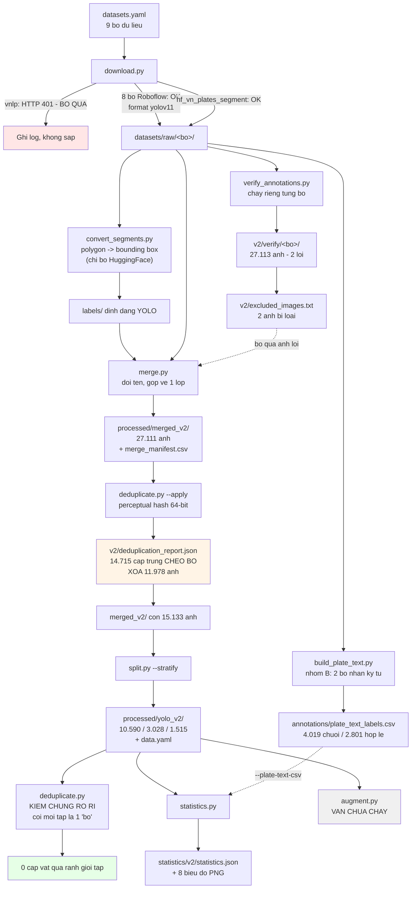
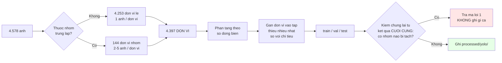
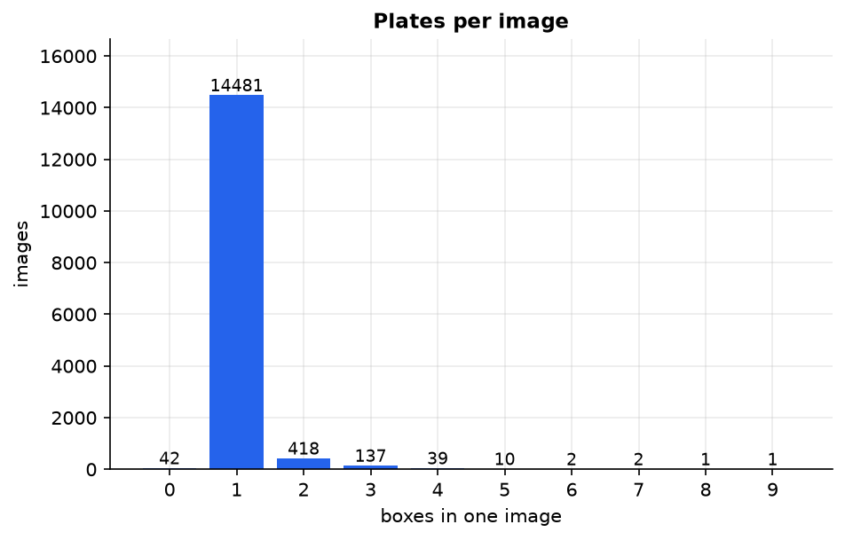
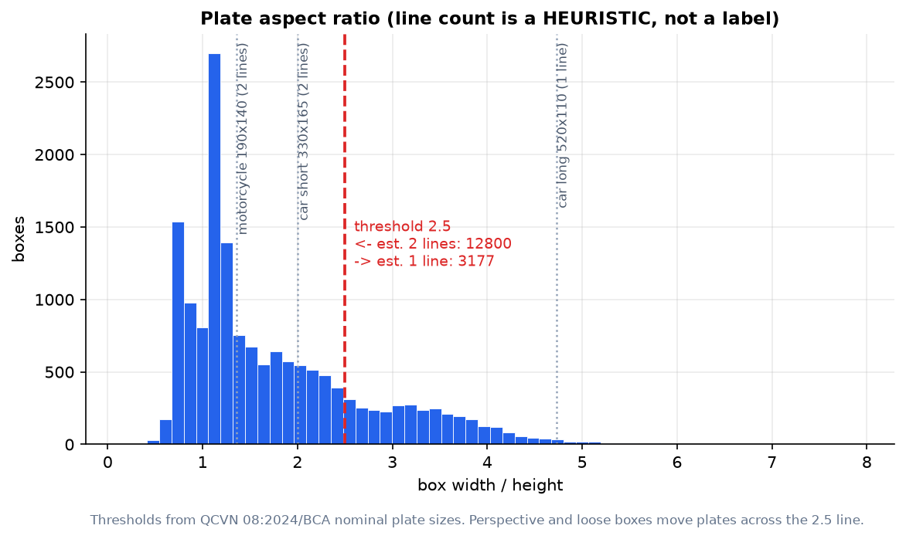
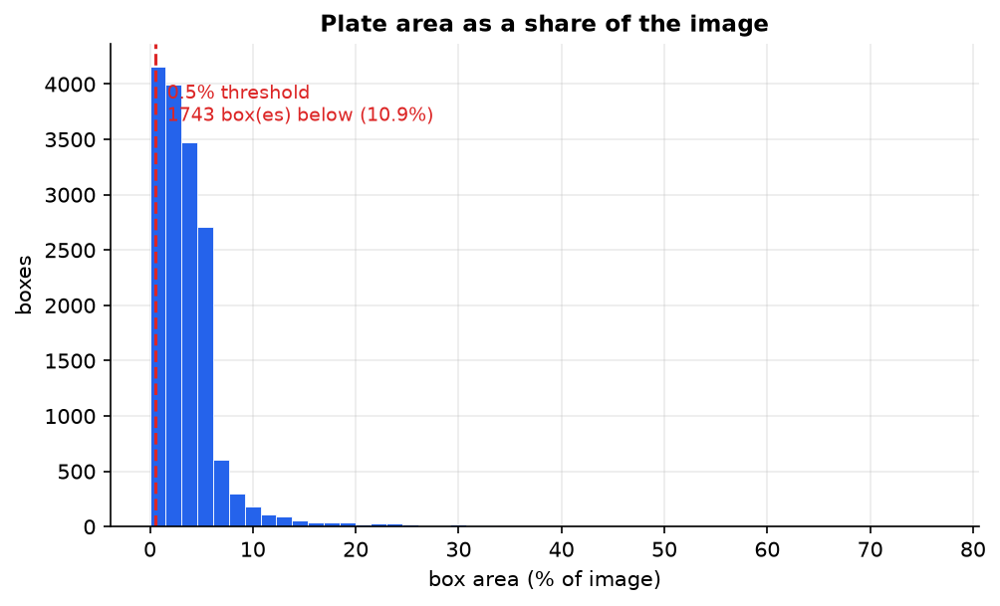
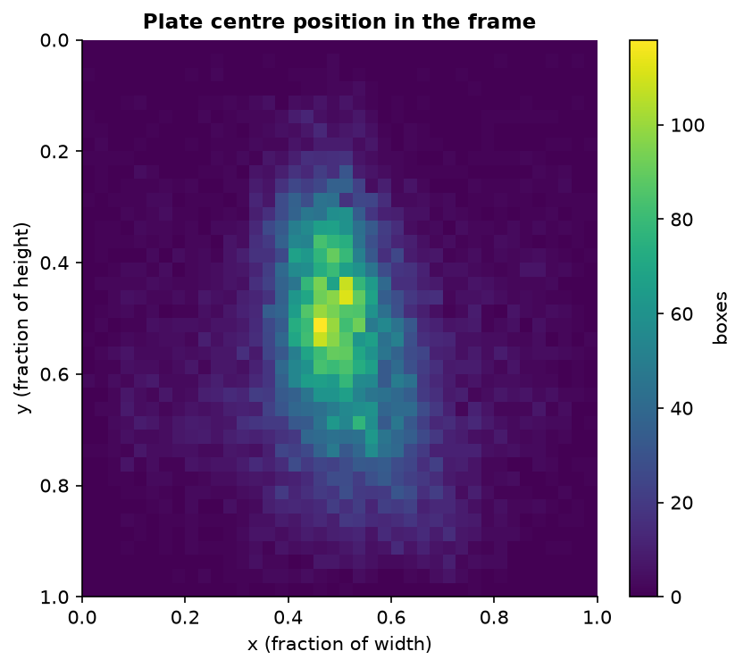
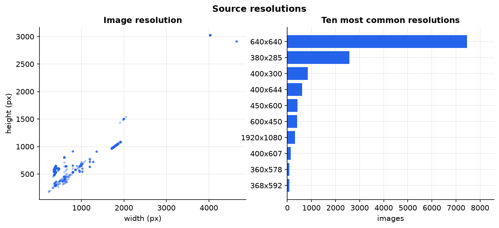
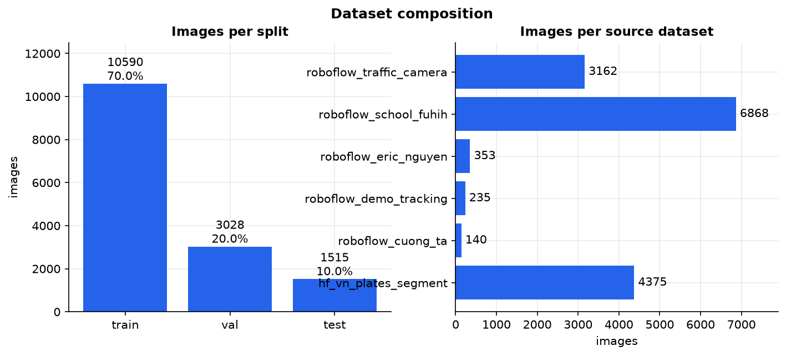
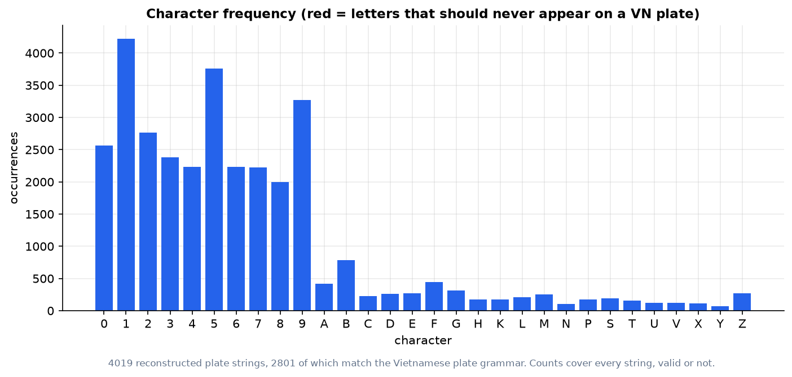
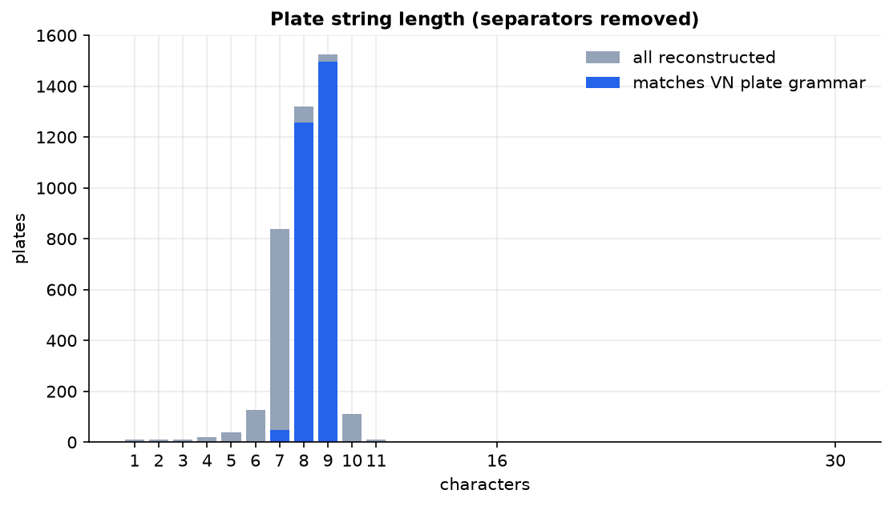

# Báo cáo 02 — Xây dựng và phân tích tập dữ liệu (Phase 2)

**Phạm vi:** chuẩn bị dữ liệu cho module **detection** biển số xe Việt Nam, và bước đầu cho **OCR**.
**Ngày chạy pipeline và sinh toàn bộ số liệu trong tài liệu này:** 19/07/2026.
**Phiên bản dữ liệu:** **v2** — mở rộng từ 1 nguồn lên **9 bộ dữ liệu tải về** (8 Roboflow + 1
HuggingFace). Trong đó **7 bộ vào bước hợp nhất detection** (2 bộ nhãn ký tự `roboflow_ocr_plate`
và `roboflow_ocr_conversion` được tách riêng phục vụ đánh giá OCR), và tập cuối chỉ còn **6 nguồn
nguyên tố** sau khử trùng lặp chéo bộ — xem mục 5.3.1.
**Trạng thái:** tập detection `processed/yolo_v2/` đã sẵn sàng huấn luyện (**15.133 ảnh**);
nhánh OCR đã có **4.019 chuỗi biển số tái tạo được** từ hai bộ nhãn ký tự — xem mục 2.3 và 7.9.

> **Về phiên bản v1 và v2.** Bản báo cáo trước mô tả tập **v1** (`processed/yolo/`, 4.578 ảnh, một
> nguồn HuggingFace duy nhất). Bản này mô tả tập **v2** (`processed/yolo_v2/`). Tập v1 **vẫn còn
> nguyên trên đĩa** và đang được một lần huấn luyện sử dụng, nên không bị ghi đè. Mọi con số dưới
> đây là của **v2** trừ khi ghi rõ "(v1)".

> **Nguồn của mọi con số trong báo cáo.** Tất cả số liệu định lượng dưới đây được đọc trực tiếp từ
> các file do pipeline sinh ra, không có con số nào ước lượng bằng tay:
>
> | Số liệu | File nguồn |
> |---|---|
> | Tải dữ liệu | `datasets/reports/download_report_roboflow.json` |
> | Kiểm tra nhãn | `datasets/reports/v2/verify/<bộ>/annotation_verification.json` (7 file) |
> | Khử trùng lặp | `datasets/reports/v2/deduplication_report.json`, `duplicate_pairs.csv`, `duplicate_groups.json` |
> | Gộp bộ | `datasets/reports/merge_report.json`, `processed/merged_v2/merge_manifest.csv` |
> | Chia tập | `datasets/reports/split_report.json`, `processed/yolo_v2/split_manifest.csv`, `processed/yolo_v3/split_manifest.csv` |
> | **Kiểm chứng rò rỉ (v2)** | `datasets/reports/v2/leakage_yolo_v2/deduplication_report.json` (ngưỡng 5), `leakage_yolo_v2_t10/` (ngưỡng 10) |
> | **Chia lại thành v3 (mục 6bis)** | `datasets/reports/v3/grouping_threshold_sweep.json` (quét ngưỡng 5→20), `leakage_by_threshold.json` (kiểm ở 5/10/12/15/20), `regroup_cost.json` (chi phí), `visual_inspection.json` (kiểm bằng mắt + tính chẵn `phash`), `cross_split_samples/` (ảnh ghép đôi) |
> | **Kiểm chứng rò rỉ (v1)** | `datasets/reports/v2/leakage_yolo_old/`, `docs/reports/07-leak-check.json`, `07-leak-check-t10.json` |
> | Nhãn ký tự | `datasets/reports/plate_text_report.json`, `datasets/annotations/plate_text_labels.csv` |
> | Thống kê + biểu đồ | `datasets/statistics/v2/statistics.json` + **8 file PNG** trong cùng thư mục |
>
> Các số liệu được tính bổ sung riêng cho báo cáo này (mục 5.3, 7.6) đều nêu rõ cách tính và đều tái
> lập được từ các file trên.

---

## 1. Mục tiêu Phase 2 và tiêu chí chất lượng dữ liệu

### 1.1. Mục tiêu

Phase 1 kết thúc bằng một bản khảo sát ([01-dataset-survey.md](01-dataset-survey.md)) chứ chưa có một
byte dữ liệu nào trên đĩa. Phase 2 có bốn mục tiêu:

1. **Biến khảo sát thành dữ liệu thật**: tải về, lưu trữ cục bộ, kiểm chứng số lượng thực tế so với số công bố.
2. **Xây dựng một pipeline xử lý dữ liệu tái lập được**, chạy được bằng một lệnh, không hard-code đường dẫn, có báo cáo cho từng bước.
3. **Bảo đảm tính trung thực của phép đánh giá về sau** — cụ thể là chống rò rỉ dữ liệu (data leakage) giữa train và test.
4. **Đo và công bố phân bố của dữ liệu**, đặc biệt trên trục biển 1 dòng / 2 dòng, vì đây là rủi ro R-04 đã chốt ở Phase 1.

Người dùng đã quyết định **"train sau"**: Phase 2 **không** chạy huấn luyện thật. Yêu cầu là hạ tầng
dữ liệu phải ở trạng thái "bấm nút là chạy được" — thư mục bàn giao (`processed/yolo/` ở v1,
`processed/yolo_v2/` ở v2) phải nạp được vào Ultralytics ngay lập tức, không cần thao tác tay nào.

### 1.2. Tám tiêu chí chất lượng (Q1–Q8)

Các tiêu chí T1–T7 ở Phase 1 dùng để **chọn** dataset. Phase 2 cần các tiêu chí **đo được trên dữ liệu đã có**.
Bảng dưới là hợp đồng chất lượng của Phase 2; mục 9 đối chiếu lại từng dòng.

| # | Tiêu chí | Ngưỡng đạt | Vì sao đặt ngưỡng đó |
|---|---|---|---|
| **Q1** | **Tính hợp lệ của nhãn** | **0 lỗi mức `error`** trên toàn bộ ảnh: nhãn tồn tại, parse được, toạ độ trong `[0,1]`, diện tích > 0, không vượt khung, ảnh giải mã được bằng OpenCV | Một nhãn hỏng đủ để Ultralytics âm thầm loại cả ảnh khỏi tập huấn luyện mà không báo lỗi |
| **Q2** | **Tính đúng đắn hình học của box** | Nhãn phải ở đúng định dạng YOLO 5 trường `class xc yc w h`; nếu nguồn phát hành polygon thì phải chuyển tường minh | Bộ đọc detection vẫn parse trót lọt dòng polygon (lấy 4 số đầu làm `x y w h`) → huấn luyện trên box vô nghĩa mà không có triệu chứng nào |
| **Q3** | **Không rò rỉ dữ liệu** | **0 nhóm ảnh trùng lặp bị tách sang hai tập khác nhau**, kiểm chứng lại từ kết quả cuối cùng | Rò rỉ khiến độ chính xác trên test đo khả năng học thuộc thay vì khả năng tổng quát hoá |
| **Q4** | **Cân bằng layout giữa các tập** | Tỷ lệ biển 2 dòng ở `train`, `val`, `test` lệch nhau **< 2 điểm phần trăm** | Tập test vô tình thiếu biển 2 dòng sẽ che mất đúng điểm yếu cần đo (R-04) |
| **Q5** | **Đại diện biển 2 dòng** | Biển 2 dòng chiếm **≥ 30%** tổng số box | Dưới ngưỡng này mô hình sẽ coi biển 2 dòng là ngoại lệ hiếm |
| **Q6** | **Kích thước đối tượng học được** | **≥ 90%** box có diện tích ≥ 0,5% diện tích ảnh | Ở đầu vào 640 px, biển nhỏ hơn mức này gần như không còn tín hiệu để học |
| **Q7** | **Truy vết được nguồn gốc** | Mỗi ảnh trong tập cuối truy ngược được về file gốc và bộ gốc | Không truy vết được thì không trích dẫn được giấy phép trong đồ án |
| **Q8** | **Tái lập được** | Cùng seed → cùng kết quả chia tập, cùng tên file | Điều kiện cần để so sánh công bằng giữa các lần huấn luyện ở Phase 3 |

---

## 2. Nguồn dữ liệu đã sử dụng

### 2.1. Chín nguồn dữ liệu đã tải được

Danh mục nguồn được khai báo trong `scripts/dataset/configs/datasets.yaml`. Trạng thái thực tế sau
đợt mở rộng v2 — **8 bộ Roboflow tải thành công qua REST API (format `yolov11` cho cả 8 bộ)**, cộng
bộ HuggingFace đã có từ v1:

**Nhóm A — detection, 1 lớp, gộp chung vào tập `yolo_v2`:**

| # | Bộ (slug) | Workspace / project | Ver | Giấy phép | Ảnh công bố | **Ảnh export thật** |
|---|---|---|---|---|---|---|
| 1 | `roboflow_school_fuhih` | `school-fuhih` / `vietnamese-license-plate-tptd0` | v1 | **CC BY 4.0** | 8.397 | **8.357** |
| 2 | `roboflow_cuong_ta` | `cuong-ta-ulxex` / `vietnamese-car-license-plate` | v1 | **Public Domain (CC0)** | 8.255 | **8.254** |
| 3 | `roboflow_traffic_camera` | `traffic-camera` / `vietnam-license-plate-hayn8` | v4 | **CC BY 4.0** | 3.149 | **3.843** |
| 4 | `roboflow_tran_ngoc_xuan_tin` | `tran-ngoc-xuan-tin-k15-hcm-dpuid` / `vietnam-license-plate-h8t3n` | v1 | **CC BY 4.0** | 1.005 | **1.005** |
| 5 | `roboflow_eric_nguyen` | `eric-nguyen-knfxn` / `vietnam-license-plate-curhr` | v1 | **CC BY 4.0** | 350 | **840** |
| 6 | `roboflow_demo_tracking` | `demo-tracking` / `license-plate-vietnam-car` | v2 | **CC BY 4.0** | 235 | **236** |
| 7 | `hf_vn_plates_segment` | HuggingFace `hoanglvuit/Vietnam_License_Plate_Segment_Datasets` | — | ⚠️ **chưa xác nhận** | — | **4.578** |
|  | **Tổng đưa vào merge** | | | | | **27.113** |

**Nhóm B — nhãn ký tự, nhiều lớp, XỬ LÝ RIÊNG (không gộp vào nhóm A):**

| # | Bộ (slug) | Workspace / project | Ver | Giấy phép | Số lớp | **Ảnh export thật** |
|---|---|---|---|---|---|---|
| 8 | `roboflow_ocr_plate` | `license-plate-reg` / `viet-nam-ocr-plate` | v1 | **Public Domain (CC0)** | 30 (công bố 32) | **3.819** |
| 9 | `roboflow_ocr_conversion` | `dataset-format-conversion-iidaz` / `vietnam-license-plate-recognition` | v1 | **CC BY 4.0** | 22 | **200** |

Link giấy phép: CC BY 4.0 → `https://creativecommons.org/licenses/by/4.0/` ·
CC0/Public Domain → `https://creativecommons.org/publicdomain/zero/1.0/`.
Link trang dự án Roboflow theo mẫu `https://universe.roboflow.com/<workspace>/<project>`.

**Một bộ bị loại có chủ đích:** `vietnam-license-plate/vietnam-license-plate-lf9sg` — lớp duy nhất
của bộ này tên `Tire` (lốp xe), tức là nhãn gán sai hoàn toàn so với mô tả. **Không tải.**

### 2.2. Giấy phép — điểm mạnh mới của v2

Đây là thay đổi có ý nghĩa nhất về mặt pháp lý so với v1:

> **Ở v1, toàn bộ dữ liệu đến từ một bộ duy nhất có giấy phép "chưa xác nhận"** — trường `license`
> ghi *"Kiem tra tren trang nguon truoc khi dung cho muc dich xuat ban"*. Đó là rủi ro D-04, xếp mức
> 🔴 Cao, và nó nằm trên **100%** dữ liệu.
>
> **Ở v2, 8/9 bộ có giấy phép tường minh** (6 bộ CC BY 4.0, 2 bộ Public Domain/CC0). Bộ chưa xác
> nhận giấy phép chỉ còn chiếm **4.375 / 15.133 = 28,9%** tập cuối.

Nghĩa là rủi ro pháp lý **không biến mất nhưng đã bị thu hẹp từ 100% xuống 28,9%**, và quan trọng
hơn: **đã có phương án thay thế khả thi**. Nếu tác giả bộ HuggingFace không phản hồi, có thể dựng
lại tập dữ liệu **chỉ từ 8 bộ có giấy phép rõ ràng** và vẫn còn 10.758 ảnh — nhiều hơn gấp đôi toàn
bộ tập v1. Ở v1 phương án này không tồn tại.

Nghĩa vụ đi kèm CC BY 4.0 là **ghi công tác giả**. Danh sách 6 workspace ở bảng mục 2.1 chính là
danh sách phải trích dẫn trong đồ án; `merge_manifest.csv` cho phép truy ngược từng ảnh về bộ gốc
(tiêu chí Q7).

### 2.3. Khoảng trống OCR — đã được lấp một phần

Ở v1 mục này ghi *"không có bất kỳ nhãn ký tự nào"*. Điều đó **không còn đúng**:

Hai bộ nhóm B (`roboflow_ocr_plate` 3.819 ảnh + `roboflow_ocr_conversion` 200 ảnh) mang **nhãn hộp
cho từng ký tự**. Script `build_plate_text.py` gom các hộp ký tự thành dòng, sắp theo toạ độ và
**tái tạo chuỗi biển số**: **4.019 / 4.019 ảnh tái tạo được chuỗi**, trong đó **2.801 chuỗi khớp
đúng ngữ pháp biển số Việt Nam** (69,69%). Chi tiết ở mục 7.9.

Vẫn phải nói rõ giới hạn: **ảnh của nhóm B không nằm trong tập detection `yolo_v2`** — đó là một
corpus riêng, ở dạng ảnh biển số đã cắt sẵn. Chúng dùng để huấn luyện/đo **tầng OCR**, không cộng
vào 15.133 ảnh detection.

### 2.4. Ghi nhận trung thực — những gì vẫn chưa đạt kế hoạch

- **Bộ dữ liệu chính đã chốt ở Phase 1 (VNLP `fict-labs/vnlp`, ~37.300 ảnh) vẫn KHÔNG tải được** —
  HuggingFace trả **HTTP 401**. Đính chính này đã được ghi vào
  [01-dataset-survey.md](01-dataset-survey.md) mục khuyến nghị.
- **Quy mô:** 15.133 / 37.300 ≈ **40,6%** kế hoạch (v1 là 12,3%). Đã cải thiện hơn 3 lần nhưng
  chưa bằng bộ VNLP đơn lẻ.
- **Không có dữ liệu tổng hợp (synthetic).** Toàn bộ 15.133 ảnh là ảnh thật.
- **Không có phép tăng cường nào do dự án tự áp vào tập bàn giao** — `augment.py` vẫn chưa chạy
  (mục 8.4). Lưu ý: một phần ảnh Roboflow **đã được chính Roboflow augment sẵn** trước khi export,
  và đó là nguyên nhân chính của mục 5.

### 2.5. Số công bố không đáng tin — bằng chứng đầu tiên

Ba bộ có chênh lệch lớn giữa số ảnh trang dự án công bố và số ảnh export thật:

| Bộ | Công bố | Export thật | Chênh | Giải thích |
|---|---|---|---|---|
| `roboflow_eric_nguyen` | 350 | **840** | **×2,4** | Export chứa bản augment sẵn của Roboflow |
| `roboflow_traffic_camera` | 3.149 | **3.843** | +694 | v4 có augmentation |
| `roboflow_school_fuhih` | 8.397 | 8.357 | −40 | Sai lệch nhỏ, không đáng kể |

Điểm đáng chú ý — và sẽ được xác nhận lại ở mục 5: sau khi khử trùng lặp nội bộ, `eric_nguyen` còn
**353 ảnh** (rất sát con số 350 trang dự án công bố) và `traffic_camera` còn **3.162 ảnh** (rất sát
3.149). Nói cách khác, **phép khử trùng lặp đã tự động khôi phục đúng quy mô thật của từng bộ**, và
phần dôi ra đúng là bản sao augment. Đây là một phép kiểm chứng chéo độc lập cho thấy ngưỡng dedup
đang hoạt động hợp lý.

Ngoài ra `roboflow_eric_nguyen` khai `nc=2` với lớp thứ hai tên `vehicle` — thực tế chỉ có **4 hộp**
mang lớp này. `merge.py` đã lọc bỏ (`boxes_dropped_by_class_filter: 4`).

### 2.6. Cấu trúc nội bộ của bộ HuggingFace — ghép của 5 tiểu tập

*(Phân tích này thực hiện trên bộ `hf_vn_plates_segment` ở v1 và vẫn còn giá trị, vì bộ này được
đưa nguyên vẹn vào v2.)*

Tên file trong bộ chia thành 5 tiền tố rõ rệt. Phân bố số dòng theo từng tiền tố (tính từ
`merge_manifest.csv` của v1, cột `dominant_line_count`):

| Tiền tố | Số ảnh | Biển 1 dòng | Biển 2 dòng |
|---|---|---|---|
| `greenpack` | 1.747 | 0 (0,0%) | 1.747 (**100,0%**) |
| `carlong` | 989 | 983 (**99,4%**) | 6 (0,6%) |
| `Tgmt` | 917 | 533 (58,1%) | 384 (41,9%) |
| `Dieu` | 495 | 40 (8,1%) | 455 (91,9%) |
| `Hung` | 430 | 22 (5,1%) | 408 (94,9%) |
| **Tổng** | **4.578** | **1.578** | **3.000** |

*(Số ở bảng này đếm theo **ảnh**, theo layout chiếm đa số trong ảnh; các bảng khác đếm theo **box** — nên tổng khác nhau.)*

Phát hiện này quan trọng và sẽ được dùng lại ở mục 10: **bộ dữ liệu không đồng nhất mà là ghép của
5 tiểu tập, mỗi tiểu tập gần như thuần một loại biển**. `greenpack` toàn biển 2 dòng, `carlong` gần
như toàn biển 1 dòng. Cấu trúc này gợi ý mỗi tiểu tập được thu từ một buổi/một bối cảnh riêng, và
kéo theo hệ quả về tính độc lập giữa các ảnh (mục 10.3).

---

## 3. Quy trình xử lý

### 3.1. Sơ đồ pipeline

Sơ đồ dưới đây là pipeline **v2**. Khác biệt so với v1: 8 bộ Roboflow được tải thêm, bước dedup
chạy **sau merge** và **xoá thật**, và có thêm nhánh nhóm B tái tạo chuỗi biển số.



> **Một thay đổi thứ tự quan trọng so với v1.** Ở v1, `deduplicate.py` chạy **trước** `merge.py`
> (trên `datasets/raw/`) và chỉ báo cáo. Ở v2, nó chạy **sau** `merge.py` và xoá thật. Lý do: chỉ
> sau khi merge thì mọi ảnh của 7 bộ mới nằm chung một không gian tên và mới **so sánh chéo bộ
> được** — mà trùng lặp chéo bộ chính là thứ cần bắt (mục 5.3). Chạy dedup trên từng bộ riêng lẻ
> sẽ bỏ sót toàn bộ 14.715 cặp đó.

### 3.2. Vì sao thứ tự này

| Bước | Đứng sau | Lý do bắt buộc phải ở vị trí đó |
|---|---|---|
| `convert_segments` | `download` | Phải sửa hình học nhãn **trước** khi bất kỳ bước nào đọc nhãn, nếu không mọi thống kê phía sau đều tính trên box sai |
| `verify` | `convert_segments` | Kiểm tra trên đúng thứ sẽ được huấn luyện, và khi còn truy được về đường dẫn gốc |
| `dedup` | `download` | Chạy trên `raw/` để báo cáo theo đường dẫn gốc, dễ đối chiếu thủ công |
| `merge` | `convert_segments` | Thống nhất không gian lớp và đặt tên duy nhất |
| `split` | `merge` **và** `dedup` | **Bắt buộc cần đầu ra của dedup** để chống rò rỉ; thiếu thì script từ chối chạy |
| `augment` | `split` | Chỉ được phép tác động lên tập train |
| `stats` | `split` | Thống kê phải phản ánh tập dữ liệu cuối cùng |

### 3.3. Bước chuyển polygon → box (chi tiết, vì đây là bước dễ hỏng nhất)

Nhãn gốc là polygon YOLO-segment. Phân bố số trường trên mỗi dòng nhãn gốc:

| Số trường / dòng | Số dòng | Diễn giải |
|---|---|---|
| 9 | 5.143 | polygon 4 đỉnh |
| 11 | 22 | polygon 5 đỉnh |
| 13 | 35 | polygon 6 đỉnh |

Kết quả chuyển đổi (`segment_conversion.json`):

| Chỉ số | Giá trị |
|---|---|
| File nhãn ghi ra | 4.578 |
| Polygon đã chuyển | **5.200** |
| Box đi thẳng (đã là box sẵn) | 0 |
| Dòng bị bỏ qua | **0** |
| Box phải cắt về biên `[0,1]` | **6** |
| Ánh xạ số dòng | `0 → 1 dòng` (BSD), `1 → 2 dòng` (BSV) |

Hai điểm đáng chú ý:

1. **Nếu bỏ qua bước này, lỗi sẽ hoàn toàn im lặng.** Dòng polygon có ≥ 9 trường nên bộ đọc
   detection vẫn parse được: nó lấy `x1 y1 x2 y2` làm `xc yc w h`. Không có exception, `verify`
   gần như vẫn qua, và mô hình được huấn luyện trên box vô nghĩa về mặt hình học. Đây là lý do Q2
   được đặt thành tiêu chí riêng.
2. **`--line-count-map 0=1,1=2` giữ lại thông tin quý nhất của bộ dữ liệu.** Hai lớp `BSD`/`BSV`
   chính là **nhãn số dòng thật**. Không khai báo ánh xạ thì thông tin này bị vứt bỏ ngay ở bước
   đầu, và `split --stratify` cùng `statistics.py` buộc phải **đoán** bằng tỷ lệ khung hình.
   Mục 7.3 định lượng chính xác cái giá của việc phải đoán.

---

## 4. Kết quả kiểm tra nhãn

Nguồn: 7 file `datasets/reports/v2/verify/<bộ>/annotation_verification.json`, mỗi bộ nguồn một file.

### 4.1. Tổng hợp

Cộng dồn 7 bộ nhóm A:

| Chỉ số | Giá trị |
|---|---|
| Ảnh kiểm tra | **27.113** |
| Ảnh đạt | **27.111 (99,993%)** |
| Ảnh có lỗi | **2** |
| Box kiểm tra | **28.346** |
| **Lỗi mức `error`** | **2** (`invalid_box`, đều thuộc `roboflow_traffic_camera`) |
| Cảnh báo mức `warning` | **3.275** |
| Ngưỡng diện tích tối thiểu | 0,005 (0,5% diện tích ảnh) |

Theo từng bộ:

| Bộ | Ảnh | Box | `error` | `warning` |
|---|---|---|---|---|
| `hf_vn_plates_segment` | 4.578 | 5.200 | 0 | 477 |
| `roboflow_school_fuhih` | 8.357 | 8.548 | 0 | 1.181 |
| `roboflow_cuong_ta` | 8.254 | 8.445 | 0 | 1.172 |
| `roboflow_traffic_camera` | 3.843 | 3.849 | **2** | 36 |
| `roboflow_tran_ngoc_xuan_tin` | 1.005 | 1.006 | 0 | **0** |
| `roboflow_eric_nguyen` | 840 | 1.058 | 0 | 356 |
| `roboflow_demo_tracking` | 236 | 240 | 0 | 53 |

### 4.2. Phân loại vấn đề

| Mã | Mức | Số lượng | Xử lý |
|---|---|---|---|
| `small_box` | warning | **3.231** | Giữ lại toàn bộ (lập luận ở 4.3) |
| `empty_label` | warning | **44** | Giữ lại — thành ảnh nền (background), có ích |
| `invalid_box` | **error** | **2** | **Đã loại 2 ảnh khỏi tập** |

Hai ảnh lỗi được ghi tường minh vào `datasets/reports/v2/excluded_images.txt` và `merge.py` đọc file
này để bỏ qua (`skipped_excluded: 2`). Đây là điểm khác v1: v1 có **0 lỗi** nên chưa có cơ hội chạy
đường dẫn loại trừ; v2 đã chạy thật.

**Các phép kiểm tra sau vẫn không phát hiện vi phạm nào trên cả 27.113 ảnh**: thiếu file nhãn, nhãn
không parse được, toạ độ ngoài `[0,1]`, box diện tích 0, ảnh không giải mã được bằng OpenCV.

Điểm cần nhấn mạnh về phép kiểm tra ảnh: script **giải mã đầy đủ bằng OpenCV**, không chỉ đọc header.
Một file JPEG/PNG bị cụt vẫn có header hợp lệ; nếu chỉ đọc header thì lỗi sẽ nổ ra giữa lúc huấn
luyện chứ không phải ở đây. Việc 4.578/4.578 ảnh giải mã trọn vẹn là một kết quả có ý nghĩa, không
phải phép kiểm tra hình thức.

### 4.3. Đã xử lý thế nào

| Nhóm | Cách xử lý | Lý do |
|---|---|---|
| **0 lỗi `error`** | Không cần xử lý | Q1 đạt |
| **477 `small_box`** | **Giữ lại toàn bộ**, ghi nhận và theo dõi | Xem lập luận dưới |
| **6 box vượt biên nhẹ** | Đã tự động cắt về `[0,1]` ở bước `convert_segments` | Sai lệch dưới một pixel do làm tròn polygon, cắt là đúng |

**Vì sao giữ lại các box nhỏ thay vì loại bỏ.** Ở v1, 477 box chiếm **9,17%** tổng số box, nằm rải trên
**280 ảnh (6,12%)**; ở v2 tỷ lệ này tăng lên **10,91%** (mục 7.4). Loại chúng đi sẽ tạo ra một lỗi tệ hơn nhiều lỗi đang có: ảnh vẫn còn biển số
trong khung nhưng nhãn đã bị xoá, tức là **dạy mô hình rằng biển số nhỏ không phải biển số** — dạy
sai chủ động, tệ hơn hẳn dạy một mục tiêu khó. Loại cả ảnh cũng không ổn vì đa số ảnh trong nhóm này
còn chứa cả box lớn hợp lệ. Cách xử lý đúng là **giữ nguyên và ghi nhận**, rồi ở Phase 3 đánh giá
riêng theo dải kích thước để biết chính xác mô hình hỏng từ ngưỡng nào.

---

## 5. Kết quả khử trùng lặp

Nguồn: `datasets/reports/v2/deduplication_report.json`, `duplicate_pairs.csv`, `duplicate_groups.json`.

**Đây là mục quan trọng nhất của báo cáo v2.** Cảnh báo từ Phase 1 — *"các bộ Roboflow tái sử dụng
ảnh của nhau, con số cộng dồn 21.400 không đáng tin"* — đã được **kiểm chứng bằng số và xác nhận là
đúng, ở mức nghiêm trọng hơn dự đoán**.

### 5.1. Tổng hợp

| Chỉ số | Giá trị |
|---|---|
| Thuật toán băm | `imagehash.phash`, **64 bit** |
| Ngưỡng khoảng cách Hamming | **5** |
| Ảnh đã quét | **27.111** |
| Ảnh không đọc được | **0** |
| **Cặp trùng lặp** | **19.554** |
| **Nhóm trùng lặp** | **7.861** |
| **Nhóm trùng lặp CHÉO BỘ** | **7.044 (89,6% số nhóm)** |
| **Ảnh bị loại** | **11.978 (44,2%)** |
| **Ảnh unique sau khử trùng** | **15.133** |
| Đã xoá thật chưa | **Rồi** (`applied: true`, `deleted_images: 11978`) |

> **Gần một nửa số ảnh vào hợp nhất là bản sao.** 27.111 ảnh của 7 bộ vào hợp nhất detection chỉ còn **15.133 ảnh thật sự khác
> nhau**. Nếu cộng dồn số công bố của các trang dự án (21.391 ảnh Roboflow + 4.578 ảnh HuggingFace
> = 25.969) và tin vào con số đó, báo cáo sẽ **thổi phồng quy mô dữ liệu lên 1,72 lần**.

Khác v1 ở một điểm vận hành: v2 chạy `--apply` (xoá thật), vì với 11.978 ảnh dư thì chi phí lưu trữ
và thời gian huấn luyện là đáng kể, và mọi bản gốc vẫn còn nguyên trong `datasets/raw/`.

### 5.2. Về thuật toán

So sánh vét cạn 27.111 ảnh là ~367 triệu cặp — vượt xa khả năng chạy trong Python thuần. Script dùng
**multi-index hashing**: cắt hash 64 bit thành `threshold + 1 = 6` dải; theo nguyên lý chuồng bồ câu,
hai hash lệch nhau tối đa 5 bit **bắt buộc** phải trùng khít ít nhất một dải. Đây là thuật toán
**chính xác chứ không phải xấp xỉ** — không bỏ sót cặp trùng nào. Các cặp sau đó gộp thành nhóm bằng
union-find, bảo đảm tính bắc cầu (A≡B, B≡C ⟹ A, B, C cùng một nhóm).

### 5.3. MA TRẬN TRÙNG LẶP CHÉO BỘ — bộ nào trùng bộ nào

Số cặp trùng lặp giữa mỗi cặp bộ (từ `cross_dataset_pairs_by_dataset`). Tổng **14.715 / 19.554 cặp
(75,3%) là trùng lặp CHÉO BỘ**:

| Bộ A | Bộ B | Số cặp trùng |
|---|---|---|
| `roboflow_cuong_ta` | `roboflow_school_fuhih` | **11.426** |
| `roboflow_school_fuhih` | `roboflow_tran_ngoc_xuan_tin` | **1.577** |
| `roboflow_cuong_ta` | `roboflow_tran_ngoc_xuan_tin` | **1.569** |
| `roboflow_demo_tracking` | `roboflow_traffic_camera` | 40 |
| `hf_vn_plates_segment` | `roboflow_school_fuhih` | 32 |
| `hf_vn_plates_segment` | `roboflow_cuong_ta` | 29 |
| `roboflow_cuong_ta` | `roboflow_traffic_camera` | 15 |
| `roboflow_school_fuhih` | `roboflow_traffic_camera` | 15 |
| `hf_vn_plates_segment` | `roboflow_tran_ngoc_xuan_tin` | 8 |
| `roboflow_cuong_ta` | `roboflow_demo_tracking` | 2 |
| `roboflow_demo_tracking` | `roboflow_school_fuhih` | 2 |
| | **Tổng chéo bộ** | **14.715** |
| | *(trong cùng một bộ)* | *4.839* |

Đọc ma trận này ra ba kết luận:

1. **`cuong_ta` và `school_fuhih` gần như là cùng một bộ dữ liệu.** 11.426 cặp trùng giữa hai bộ lần
   lượt có 8.254 và 8.357 ảnh — nghĩa là **phần lớn ảnh của bộ này có bản sao ở bộ kia**. Nghi ngờ
   ghi trong `datasets.yaml` (*"Nghi ngo trung lap nang voi roboflow_school_fuhih"*) là chính xác.
2. **`tran_ngoc_xuan_tin` là tập con của hai bộ trên.** Bộ này bị loại **1.005/1.005 ảnh — không còn
   một ảnh nào** trong tập cuối. Toàn bộ nội dung của nó đã có sẵn ở nơi khác.
3. **Bộ HuggingFace gần như độc lập.** Chỉ 69 cặp trùng với các bộ Roboflow trên 4.578 ảnh (1,5%).
   Đây là bộ duy nhất đóng góp nội dung thực sự mới — và trớ trêu thay cũng là bộ duy nhất chưa rõ
   giấy phép.

**Ảnh sống sót theo từng bộ** (từ `removable_per_dataset` và `images_per_source` của
`statistics/v2/statistics.json`):

| Bộ | Vào merge | Bị loại | **Còn lại** | **Tỷ lệ sống sót** |
|---|---|---|---|---|
| `roboflow_school_fuhih` | 8.357 | 1.489 | **6.868** | 82,2% |
| `hf_vn_plates_segment` | 4.578 | 203 | **4.375** | **95,6%** |
| `roboflow_traffic_camera` | 3.841 | 679 | **3.162** | 82,3% |
| `roboflow_eric_nguyen` | 840 | 487 | **353** | 42,0% |
| `roboflow_demo_tracking` | 236 | 1 | **235** | 99,6% |
| `roboflow_cuong_ta` | 8.254 | 8.114 | **140** | **1,7%** |
| `roboflow_tran_ngoc_xuan_tin` | 1.005 | 1.005 | **0** | **0,0%** |
| **Tổng** | **27.111** | **11.978** | **15.133** | 55,8% |

*(Thứ tự giữ ảnh do `--keep-strategy` và `--priority` quyết định; `cuong_ta` mất gần hết vì các bản
sao của nó được giữ dưới tên `school_fuhih`. Nội dung ảnh **không mất**, chỉ đổi bộ ghi công — nhưng
điều đó cũng có nghĩa là nghĩa vụ ghi công CC BY vẫn phải nêu cả hai bộ.)*

#### 5.3.1. Một bộ dữ liệu dư thừa hoàn toàn — `roboflow_tran_ngoc_xuan_tin`

Trong bảng sống sót ở trên có đúng một dòng bằng **0**. Nó đáng được tách ra thành một mục riêng, vì
đây không phải một trường hợp biên mà là **bằng chứng định lượng mạnh nhất** cho cảnh báo đã nêu ở
Phase 1 về việc các bộ Roboflow tái sử dụng ảnh của nhau.

**Sự việc:** bộ `roboflow_tran_ngoc_xuan_tin` vào bước hợp nhất với **1.005 ảnh**. Sau khử trùng lặp
chéo bộ ở ngưỡng Hamming 5, nó còn lại **0 ảnh — tỷ lệ loại 100,0% (1.005/1.005)**. Không một ảnh
nào của bộ này sống sót vào tập cuối.

**Phân rã số cặp gần trùng liên quan đến bộ này** (đếm trực tiếp từ
`datasets/reports/v2/duplicate_pairs.csv`, lọc các dòng có `dataset_a` hoặc `dataset_b` bằng
`roboflow_tran_ngoc_xuan_tin`):

| Trùng với bộ | Số cặp |
|---|---:|
| `roboflow_school_fuhih` | **1.577** |
| `roboflow_cuong_ta` | **1.569** |
| `hf_vn_plates_segment` | 8 |
| *(trùng nội bộ trong chính bộ này)* | *35* |
| **Số ảnh phân biệt của bộ dính vào ít nhất một cặp** | **1.005 / 1.005 (100%)** |

Con số quan trọng nhất là dòng cuối: **cả 1.005 ảnh đều dính vào ít nhất một cặp gần trùng**, không
sót ảnh nào. Đây là lý do tỷ lệ sống sót bằng 0 chứ không phải "gần 0". Toàn bộ nội dung của bộ này
đã có sẵn trong `school_fuhih` và `cuong_ta`.

**Kiểm chứng độc lập:** cột `source_dataset` của
`datasets/processed/yolo_v3/split_manifest.csv` chỉ còn **6 giá trị nguồn nguyên tố**
(`roboflow_school_fuhih`, `hf_vn_plates_segment`, `roboflow_traffic_camera`,
`roboflow_eric_nguyen`, `roboflow_cuong_ta`, `roboflow_demo_tracking`).
`roboflow_tran_ngoc_xuan_tin` **không xuất hiện dù chỉ một lần** trong manifest cuối cùng.

**Ba ý nghĩa cần rút ra:**

1. **Đây là một phát hiện, không phải một lỗi.** Pipeline chạy đúng đặc tả. Việc một bộ 1.005 ảnh
   hoá ra dư thừa **hoàn toàn** là kết quả đo được, và nó chỉ có được sau khi đã tải bộ đó về và
   đối chiếu tri giác — không thể biết trước từ mô tả của bộ trên Roboflow.
2. **KHÔNG được cộng dồn `expected_images` của các bộ Roboflow để suy ra quy mô thật.** Đây là hệ
   quả trực tiếp và là bài học vận hành quan trọng nhất của mục này. Phép cộng đó giả định các bộ
   độc lập với nhau; trường hợp `tran_ngoc_xuan_tin` chứng minh giả định đó **sai tới mức một bộ có
   thể đóng góp đúng 0**. Quy mô thật chỉ xác định được **sau** khử trùng lặp chéo bộ.
3. **Cảnh báo Phase 1 được xác nhận bằng số.** Nghi ngờ ghi trong `datasets.yaml` về trùng lặp giữa
   các bộ Roboflow không chỉ đúng về hướng mà còn đúng ở mức nghiêm trọng hơn dự kiến: ngoài cặp
   `cuong_ta` ↔ `school_fuhih` (11.426 cặp), còn có một bộ là **tập con thực sự** của hai bộ đó.

*Ghi chú cách đếm:* cột `source_dataset` chứa một **tập xuất xứ** ngăn cách bằng `|` — sau khử trùng
lặp, một ảnh giữ lại có thể mang nhiều nguồn cùng lúc. Vì vậy phải đếm theo **tập ảnh**, không đếm
theo dòng tách rời: cộng dồn số đếm của từng nguồn nguyên tố cho ra 33.828, vượt xa 15.133, vì ảnh
đa nguồn bị đếm nhiều lần. Con số 33.828 **không được dùng làm mẫu số** ở bất kỳ đâu.

### 5.4. Vì sao con số này quan trọng hơn nó thoạt nhìn

Lý do trùng lặp chéo bộ nguy hiểm hơn hẳn trùng lặp trong bộ:

- **Trùng trong cùng một bộ** chỉ gây lãng phí: mô hình nhìn cùng một ảnh nhiều lần, tốn thời gian
  huấn luyện, hơi thiên lệch phân bố. Tốn kém nhưng **không làm sai kết quả đánh giá**.
- **Trùng chéo giữa hai bộ** làm hỏng phép đánh giá: cùng một tấm ảnh vào `train` dưới tên bộ A và
  vào `test` dưới tên bộ B. Mô hình gặp lại đúng ảnh đã học. Độ chính xác báo cáo lúc đó **đo khả
  năng học thuộc, không đo khả năng tổng quát hoá** — và không có triệu chứng nào để phát hiện:
  các chỉ số chỉ đơn giản là **đẹp hơn sự thật**, đúng hướng mà người làm mong muốn, nên càng khó nghi ngờ.

Ở v2, kịch bản nguy hiểm này **đã xảy ra thật với quy mô lớn**: 14.715 cặp ảnh nằm dưới hai tên bộ
khác nhau. Nếu chia tập theo từng ảnh mà không gom nhóm, phần lớn ảnh trong `test` sẽ có bản sao
trong `train`, và mAP báo cáo sẽ **đo khả năng học thuộc chứ không đo khả năng tổng quát hoá** — mà
không có triệu chứng nào để phát hiện: các chỉ số chỉ đơn giản **đẹp hơn sự thật**. Cơ chế chống rò
rỉ ở mục 6.2 và phép kiểm chứng ở mục 6.5 tồn tại chính vì lý do này.

**Một dạng rò rỉ tương đương cũng đã được phát hiện ở v1.** Phân tích
193 cặp trùng của bộ HuggingFace theo vị trí train/val **trong bản chia gốc của tác giả bộ dữ liệu**:

| Cặp nằm ở | Số cặp | Tỷ lệ |
|---|---|---|
| train ↔ train | 111 | 57,5% |
| **train ↔ val** | **73** | **37,8%** |
| val ↔ val | 9 | 4,7% |

> **Phát hiện quan trọng: bản chia train/val gốc của bộ dữ liệu đã bị rò rỉ sẵn.**
> **73 cặp ảnh trùng lặp nằm vắt qua ranh giới train/val của tác giả** — trong đó có những cặp
> **hash giống hệt nhau (khoảng cách Hamming = 0)**, ví dụ
> `train/Tgmt_0002.png` ≡ `val/Tgmt_0711.png`.
> Bất kỳ ai dùng thẳng bản chia sẵn của bộ dữ liệu này đều đang đo trên một tập val đã ô nhiễm.

Đây chính là căn cứ để **loại bỏ hoàn toàn bản chia gốc (3.433 / 1.145)** và chia lại từ đầu theo
đơn vị nhóm. Nó cũng là bằng chứng thực nghiệm cho thấy bước dedup không phải thủ tục hình thức:
nó bắt được một lỗi thật, trong chính bộ dữ liệu đang dùng.

### 5.5. Vì sao lần này xoá thật (khác v1)

Ở v1, dedup chạy chế độ báo cáo (`applied: false`) vì chỉ có 181 ảnh trùng (3,95%) — không đáng đánh
đổi rủi ro xoá nhầm. Ở v2, quyết định đảo ngược, vì ba lý do:

1. **Quy mô khác hẳn.** 11.978 / 27.111 ảnh (44,2%) dư thừa không chỉ tốn đĩa mà còn **làm lệch phân bố huấn
   luyện**: ảnh có 5 bản sao được mô hình nhìn 5 lần mỗi epoch. Ở mức 3,95% điều này bỏ qua được;
   ở mức 44,2% thì không.
2. **Bản gốc vẫn còn nguyên.** `datasets/raw/` giữ đủ 8 archive đã tải, kèm `sha256` trong
   `download_report_roboflow.json`. Thao tác xoá **hoàn tác được** bằng cách chạy lại pipeline.
3. **Chống rò rỉ vẫn không phụ thuộc vào việc xoá.** `split.py` đọc `duplicate_groups.json` và giữ
   nguyên vẹn mỗi nhóm trong cùng một tập; xoá chỉ là tối ưu, không phải cơ chế an toàn.

**Ngưỡng Hamming = 5 vẫn là một lựa chọn, không phải chân lý** — độ nhạy theo ngưỡng được đo tường
minh ở mục 6.5.

---

## 6. Chia tập train / val / test

Nguồn: `datasets/reports/split_report.json` và `processed/yolo_v2/split_manifest.csv`.

### 6.1. Kết quả

| Tập | Số ảnh | Tỷ lệ đạt được | Tỷ lệ yêu cầu |
|---|---|---|---|
| `train` | **10.590** | 0,6998 | 0,70 |
| `val` | **3.028** | 0,2001 | 0,20 |
| `test` | **1.515** | 0,1001 | 0,10 |
| **Tổng** | **15.133** | 1,0000 | 1,00 |

| Tham số | Giá trị |
|---|---|
| Seed | **42** |
| Phân tầng | **Bật** (`--stratify`) |
| Số **đơn vị** chia | **15.133** |
| Đơn vị chứa nhiều hơn 1 ảnh | **0** |
| Đơn vị lớn nhất | **1 ảnh** |
| Kiểm chứng chống rò rỉ | **Đạt** (`leakage_protection: true`) |

**Vì sao lần này mỗi đơn vị chỉ có 1 ảnh — và vì sao đó KHÔNG phải dấu hiệu cơ chế bị tắt.**
Ở v1, dedup chạy chế độ báo cáo nên 325 ảnh trùng vẫn nằm trên đĩa và phải gom thành 144 nhóm để
bảo vệ. Ở v2, dedup đã **xoá thật** 11.978 bản sao trước khi chia, nên tại thời điểm `split.py`
chạy, **không còn cặp ảnh trùng nào để gom nhóm**. Bảo vệ nhóm vẫn bật và vẫn kiểm chứng lại từ kết
quả cuối; nó chỉ đơn giản không tìm thấy vi phạm nào vì nguy cơ đã bị loại ở bước trước. Mục 6.5
kiểm chứng lại điều này một cách độc lập.

### 6.2. Cơ chế chống rò rỉ

Chia theo từng ảnh là **sai** khi tập dữ liệu còn chứa các nhóm ảnh gần trùng nhau — đúng tình huống
của v1 (325 ảnh / 144 nhóm) và của v2 **trước** khi dedup xoá. Đơn vị chia phải là **nhóm**, không
phải ảnh:



Ba chi tiết thiết kế đáng nêu:

1. **Gán theo mức thiếu hụt tương đối, không cắt theo vị trí.** Các đơn vị có kích thước khác nhau
   (1–5 ảnh) nên cắt danh sách theo tỷ lệ vị trí sẽ lệch. Mỗi đơn vị được gán vào tập đang thiếu
   nhiều nhất **so với chỉ tiêu, tính theo phần trăm chỉ tiêu** — chuẩn hoá theo chỉ tiêu là điều
   kiện để tập `test` (chỉ 10%) không bị tập `train` (70%) nuốt hết.
2. **Kiểm chứng lại từ kết quả cuối cùng, không tin vào logic gán.** Sau khi chia xong, script đọc
   lại kết quả thực tế và kiểm tra không nhóm nào nằm ở hai tập. Phát hiện vi phạm thì **trả mã lỗi 1
   và không ghi gì cả**. Kiểm chứng độc lập với thuật toán sinh ra nó — một lỗi logic trong bước gán
   vẫn sẽ bị bắt.
3. **Không có `duplicate_groups.json` thì script từ chối chạy.** Muốn bỏ qua phải nêu tường minh
   `--allow-no-groups`. Bảo vệ mặc định, không phải tuỳ chọn.

### 6.3. Cân bằng layout giữa ba tập (Q4)

Phân tầng theo số dòng biển (`stratum` trong `split_manifest.csv`). Ở v2, đa số bộ nguồn **không có
nhãn layout thật**, nên tầng được suy ra bằng heuristic tỷ lệ khung hình (mục 7.3); tầng `unknown`
là các ảnh nền không có box.

| Tập | 1 dòng | 2 dòng | `unknown` | Tổng | **% 2 dòng** |
|---|---|---|---|---|---|
| `train` | 2.154 | 8.408 | 28 | 10.590 | **79,40%** |
| `val` | 616 | 2.403 | 9 | 3.028 | **79,36%** |
| `test` | 308 | 1.202 | 5 | 1.515 | **79,34%** |

**Độ lệch lớn nhất giữa ba tập: 0,06 điểm phần trăm.** Ngưỡng Q4 là < 2 điểm phần trăm → **đạt với
biên độ rất lớn**. Tính theo **box** thay vì theo ảnh (`statistics/v2/statistics.json`,
`line_count_estimate.per_split`) độ lệch cũng chỉ **0,37 đpt** (80,20% / 79,83% / 80,10%).

Ý nghĩa thực tế: tập `test` chứa **1.202 ảnh biển 2 dòng** (v1 chỉ có 300). Đây là điều kiện cần để Phase 3 báo cáo
**hai con số độc lập** (biển 1 dòng và biển 2 dòng) thay vì một con số trung bình che mất điểm yếu.
Nhắc lại căn cứ R-04: OpenALPR đạt **94,3%** trên ô tô biển 1 dòng nhưng chỉ **45,7%** trên xe máy
biển 2 dòng ([Laroca et al., VISAPP 2022](https://arxiv.org/pdf/2201.00267)). Một tập test lệch về
biển 1 dòng sẽ báo cáo một con số đẹp và hoàn toàn vô nghĩa.

### 6.4. Định dạng bàn giao

`processed/yolo_v2/` theo đúng chuẩn Ultralytics: `images/{train,val,test}/`, `labels/{train,val,test}/`,
`data.yaml` (`nc: 1`, `names: {0: license_plate}`), `split_manifest.csv`.

Một chi tiết bắt buộc phải đúng: **nhãn trong `processed/yolo_v2/` phải là YOLO 5 trường thuần**.

Lý do điều này quan trọng: `merge.py --include-extras` ghi thêm `plate_text` và `line_count` vào cuối
mỗi dòng (kiểm chứng ở `processed/merged/labels/`: `0 0.409230 0.599669 0.220442 0.093567 - 1`).
Đó là **phần mở rộng riêng của dự án**, và bộ nạp của Ultralytics coi mọi trường sau class id là toạ
độ polygon; gặp ký tự `-` (chỗ giữ chỗ cho `plate_text` rỗng) nó ném
`could not convert string to float: '-'` rồi **bỏ luôn ảnh đó vì "corrupt"**. Nguy hiểm ở chỗ nó
**không sập** — chỉ in cảnh báo rồi huấn luyện tiếp trên phần còn lại, mà phần còn lại có thể là
**rỗng**. Cả 15.133 ảnh có thể biến mất trong khi log vẫn trông bình thường.

Giải pháp đã áp dụng: `split.py` **mặc định gỡ extras** khi ghi vào `processed/yolo_v2/`, còn
`processed/merged_v2/` **giữ nguyên** extras. Nhờ vậy thông tin số dòng không mất — đó chính là
nơi `--stratify` đọc để phân tầng và là nơi sinh ra bảng thống kê ở mục 7.

### 6.5. KIỂM CHỨNG RÒ RỈ DỮ LIỆU — phép đo độc lập trên kết quả cuối cùng

Mục 6.2 mô tả **cơ chế** chống rò rỉ. Mục này báo cáo phép **kiểm chứng lại từ bên ngoài**: quét
lại tập đã chia xong bằng `deduplicate.py`, coi mỗi **tập** (`train`/`val`/`test`) như một "bộ dữ
liệu" riêng. Khi đó `cross_dataset_pairs` chính là **số cặp ảnh gần trùng vắt qua ranh giới tập** —
tức là số đo rò rỉ trực tiếp. Phép đo này **độc lập với logic đã sinh ra bản chia**.

#### 6.5.1. Kết quả trên tập v2 (ngưỡng dedup = 5)

Nguồn: `datasets/reports/v2/leakage_yolo_v2/deduplication_report.json`.

| Chỉ số | Giá trị |
|---|---|
| Ảnh quét | **15.133** |
| **Cặp gần trùng train ↔ val** | **0** |
| **Cặp gần trùng train ↔ test** | **0** |
| **Cặp gần trùng val ↔ test** | **0** |
| Cặp gần trùng trong cùng một tập | **0** |

> ✅ **0 cặp gần trùng giữa train và val/test. Đúng bằng kỳ vọng.**
> Con số 0 ở đây mạnh hơn con số 0 ở v1: nó được đo trên một tập gộp từ 7 bộ nguồn có 14.715 cặp
> trùng chéo bộ đã biết. Nói cách khác, phép đo này **có cơ hội thất bại và đã không thất bại**.

#### 6.5.2. Vì sao mAP50 của v1 đạt 0,97 chỉ sau 1 epoch — kiểm tra bộ CŨ

Con số này gây nghi ngờ chính đáng: một mô hình đạt mAP50 = 0,97 sau **một** epoch thường là dấu
hiệu của rò rỉ dữ liệu. Đã kiểm tra bộ v1 (`processed/yolo/`) bằng hai ngưỡng:

| Phép đo trên tập v1 | Ngưỡng 5 | Ngưỡng 10 |
|---|---|---|
| Cặp train ↔ val | **0** | *(chưa chạy)* |
| Cặp train ↔ test | **0** | **619** |
| Cặp val ↔ test | **0** | *(chưa chạy)* |
| Khoảng cách Hamming **nhỏ nhất** giữa train và test | **6** | 6 |
| Kết luận | `"verdict": "CLEAN"` | Có ảnh rất giống nhau ở hai tập |

Nguồn: `docs/reports/07-leak-check.json` (ngưỡng 5, đủ 3 cặp tập) và `07-leak-check-t10.json`
(ngưỡng 10, train ↔ test).

**Kết luận trung thực: mAP50 = 0,97 KHÔNG phải do rò rỉ theo nghĩa trùng lặp ảnh.** Ở ngưỡng 5 —
ngưỡng dùng để chia tập — không có một cặp nào vắt qua ranh giới, và khoảng cách nhỏ nhất giữa mọi
cặp train/test là **6 bit**, tức nằm ngoài ngưỡng chứ không sát ngưỡng.

Nguyên nhân thật sự là **tính đồng nhất cực cao của bộ v1**, đúng như rủi ro D-09 đã ghi ở mục 10.2:

- Bộ v1 chỉ có **một nguồn duy nhất**, ghép từ 5 tiểu tập, mỗi tiểu tập là một đợt chụp riêng
  (mục 2.6).
- Chỉ **34 kích thước ảnh phân biệt** trên 4.578 ảnh, 59,76% trùng đúng một kích thước 380×285.
- 90,8% ảnh chỉ có **1 biển**, nằm gần **giữa khung hình** (mục 7.5).

Với phân bố hẹp như vậy, tập test **không đặt ra câu hỏi mới nào** so với tập train: cùng camera,
cùng bố cục, cùng kích thước, cùng một biển ở giữa khung. mAP50 cao đo đúng cái nó đo — khả năng
tìm một vật thể lớn ở giữa một tấm ảnh có phân bố đã biết — nhưng **con số đó không dự đoán được
hiệu năng trên ảnh camera thật**. Ở ngưỡng nới rộng 10, 619 cặp train↔test gần giống nhau xuất hiện,
xác nhận định lượng cho nhận định "hai tập quá giống nhau".

#### 6.5.3. Phân tích độ nhạy theo ngưỡng — v2 so với v1

Để so sánh công bằng, đã chạy lại phép đo trên **v2 ở đúng ngưỡng 10**
(`datasets/reports/v2/leakage_yolo_v2_t10/`):

| Cặp tập | Số cặp gần trùng (ngưỡng 10) | Số cặp so sánh | **Tỷ lệ** |
|---|---|---|---|
| **v1** train ↔ test | 619 | 1.466.974 | **0,0422%** |
| **v2** train ↔ test | 2.699 | 16.043.850 | **0,0168%** |
| **v2** train ↔ val | 5.637 | 32.066.520 | **0,0176%** |
| **v2** val ↔ test | 790 | 4.587.420 | **0,0172%** |

Hai điều cần đọc từ bảng này, cả hai đều phải nói thẳng:

1. **Về mặt tương đối, v2 tốt hơn v1 khoảng 2,5 lần.** Tỷ lệ cặp ảnh "gần giống" giữa train và test
   giảm từ 0,0422% xuống 0,0168%. Việc gộp 7 bộ nguồn đã làm phân bố dữ liệu rộng ra thật, chứ
   không chỉ làm số ảnh to ra.
2. **Nhưng bảo đảm "0 rò rỉ" chỉ đúng ở đúng ngưỡng đã dùng để chia (Hamming ≤ 5).** Nới lên 10 thì
   v2 vẫn còn 9.126 cặp vắt qua ranh giới. Ngưỡng 10 trên hash 64 bit là **rất lỏng** và bắt nhiều
   cặp ảnh khác nhau thật sự, nên con số này **không nên đọc là "9.126 ảnh bị rò rỉ"**; nó là giới
   hạn trên của mức tương tự giữa các tập. Cách đọc đúng: *bảo đảm chống trùng lặp là tuyệt đối ở
   ngưỡng 5; ngoài ngưỡng đó, mức độ tương tự giữa các tập là một đại lượng liên tục, và v2 nằm ở
   mức thấp hơn v1.*

**Hệ quả cho Phase 3:** mọi con số mAP đo trên `yolo_v2` vẫn cần được đọc kèm cảnh báo D-09 — cách
duy nhất để loại bỏ hoàn toàn nghi ngờ là **giữ nguyên một bộ nguồn làm tập test xuyên dataset**
(rủi ro D-03). Với 7 bộ nguồn, v2 lần đầu tiên **có đủ điều kiện làm việc này**; v1 thì không.

---

## 6bis. Chia lại thành bộ v3 — nguyên nhân, ngưỡng đã chọn, chi phí và kiểm chứng

Mục 6.5.3 kết luận rằng bảo đảm "0 rò rỉ" của v2 **chỉ đúng ở đúng ngưỡng đã dùng để chia**. Phase 7
tiếp nhận kết luận đó và làm rõ nó thành một lỗi phương pháp có tên: **lập luận vòng tròn** — đo bằng
chính thước đã dùng để cắt. Mục này báo cáo việc chia lại thành `datasets/processed/yolo_v3/`.

**Nguồn số liệu:** `datasets/reports/split_report.json`, `datasets/reports/v3/grouping_threshold_sweep.json`,
`datasets/reports/v3/leakage_by_threshold.json`, `datasets/reports/v3/regroup_cost.json`,
`datasets/reports/v3/visual_inspection.json`.

### 6bis.1. Một tính chất của `phash` phải biết trước khi chọn ngưỡng

**Khoảng cách Hamming giữa hai giá trị `imagehash.phash` trên corpus này LUÔN là số chẵn.**

`phash` đặt một bit cho mỗi hệ số DCT lớn hơn **trung vị**, nên **mọi** hash đều có đúng 32 bit bật.
Hai hash cùng trọng số `w` thoả `d = 2·(w − |A ∧ B|)`, tức `d` luôn chẵn. Kiểm chứng trên chính corpus:
cả **15.133** hash đều có popcount chẵn (parity-0: 15.133 · parity-1: **0**), và trong **4.498.500** cặp
lấy mẫu có **4.498.500 cặp chẵn, 0 cặp lẻ**.

**Ba hệ quả trực tiếp:**

1. **Mọi ngưỡng lẻ đều lãng phí** — 11 hành xử hệt 10, 13 hệt 12, **15 hệt 14**. Đề xuất "kiểm chứng ở
   ngưỡng 15" của Phase 7 vì vậy tương đương kiểm ở 14.
2. Chi tiết *"khoảng cách nhỏ nhất giữa train và test luôn bằng 6"* — vốn được cả mục 6.5.2 lẫn báo cáo
   Phase 7 diễn giải là **dấu hiệu phân bố bị cắt cụt tại ngưỡng** — **KHÔNG phải như vậy**. Số 6 đơn
   giản là **giá trị chẵn kế tiếp sau ngưỡng 5**. Không có gì bị cắt cụt.
3. Kết luận **vòng tròn** thì vẫn đứng vững: nó chỉ cần một sự kiện là cùng hàm băm, cùng ngưỡng, dùng
   cho cả khâu chia lẫn khâu kiểm.

### 6bis.2. Quét ngưỡng gom nhóm từ 5 đến 20 — và trở ngại không lường trước

Đề xuất ban đầu là nâng ngưỡng lên **10–12**. Việc quét toàn dải cho thấy vì sao không thể nâng tuỳ ý:

| Ngưỡng | Số cặp | Số nhóm | Ảnh trong nhóm | % corpus | **Thành phần liên thông lớn nhất** | % corpus | Chia 70/20/10 khả thi? |
|---:|---:|---:|---:|---:|---:|---:|:---:|
| 5 | 0 | 0 | 0 | 0,0% | 1 | 0,0% | ✅ |
| 6 | 1.637 | 965 | 2.510 | 16,6% | 50 | 0,3% | ✅ |
| 8 | 6.303 | 1.244 | 5.634 | 37,2% | 1.171 | 7,7% | ✅ |
| **10** | 19.277 | 1.171 | 8.398 | 55,5% | **4.411** | **29,1%** | ✅ **← đã chọn** |
| 12 | 51.467 | 852 | 10.596 | 70,0% | **8.262** | **54,6%** | ⚠️ về số học thì được, nhưng vô nghĩa |
| 14 | 122.837 | 382 | 12.690 | 83,9% | **11.673** | **77,1%** | ❌ |
| 15 | 122.837 | 382 | 12.690 | 83,9% | 11.673 | 77,1% | ❌ *(hệt 14 — tính chẵn)* |
| 20 | 1.471.347 | **1** | 15.133 | **100,0%** | **15.133** | **100,0%** | ❌ |

**Hiện tượng chi phối: bao đóng bắc cầu bị thẩm thấu (percolation).** "Gần nhau ở ngưỡng t" là quan hệ
**không bắc cầu**, nhưng `union-find` buộc phải lấy bao đóng bắc cầu. Trên corpus bị **camera tĩnh** chi
phối (mục 5.3 đã ghi nhận `roboflow_school_fuhih` và `roboflow_traffic_camera` là camera cố định), A gần
B và B gần C kéo A với C vào cùng nhóm dù chúng chẳng liên quan. Nâng ngưỡng nối dài chuỗi này cho tới
khi **toàn bộ corpus sụp vào một thành phần duy nhất** — ở ngưỡng 20 thì đúng nghĩa đen: **1 nhóm chứa
cả 15.133 ảnh**.

- **Ngưỡng 12:** thành phần lớn nhất đã là **54,6%** corpus. Nó vẫn "vừa" train (70%) về số học nhưng sẽ
  chiếm **78% tập train** — train gần như chỉ còn một cụm cảnh, phân tầng mất hết ý nghĩa.
- **Ngưỡng 14 trở lên:** thành phần lớn nhất vượt 70% ⇒ **không thể** chia 70/20/10.
- **Ngưỡng 10:** thành phần lớn nhất 4.411 ảnh = 29,1% corpus, **vừa gọn trong train** (41,6% tập train).

### 6bis.3. Kiểm tra bằng mắt — trùng lặp thật nằm ở khoảng cách nào

Ngưỡng không được chọn bằng suy luận suông. Đã dựng ảnh ghép đôi ở từng khoảng cách cố định
(`datasets/reports/v3/cross_split_samples/`) và trả lời một câu hỏi duy nhất cho mỗi cặp: **cùng một
chiếc xe (cùng chuỗi biển số)**, hay chỉ **cùng một cảnh camera**?

| d | Phán quyết | Trùng thật quan sát được | Dương tính giả |
|:-:|---|---|---|
| **6** | HỖN HỢP | Hyundai đỏ 30F-322.45 hai lần; xe máy trắng cùng dấu thời gian | 63-H5 1336 vs 72-C1 050.18 |
| **8** | HỖN HỢP | Hyundai trắng 30A-620.43, hai khung liên tiếp | 63-B8 552.46 vs 93-L1 012.80 |
| **10** | HỖN HỢP — **có trùng chéo nguồn thật** | Biển **59-L2 237.14** có mặt trong **cả** `hf_vn_plates_segment_001346.png` **và** `roboflow_school_fuhih_005961.jpg` | 61-D1 079.11 vs 59-Y1 919.82 |
| **12** | **KHÔNG có trùng thật nào** trong mẫu | *(không có)* | Mazda 30F-204.49 vs Chevrolet 29D-215.96 |
| **14** | Hầu hết dương tính giả | Biển **51F-155.85**, cùng xe, **hai lần ghé** cùng barrier (04/12 và 02/12/2017) | 51F-222.61 vs Audi 51G-510.08 |

**Ngưỡng 10 vì vậy là giá trị cao nhất thoả đồng thời hai điều kiện:** (a) vẫn còn xác nhận được trùng
lặp thật bằng mắt, và (b) chưa làm phép chia sụp đổ. Từ d = 12 trở lên chỉ mua thêm nhiễu.

> #### ⚠️ Đính chính một cáo buộc của Phase 7
>
> Phase 7 nêu: *"`hf_vn_plates_segment_000032.png` ↔ `roboflow_school_fuhih_001383.jpg` (d = 10) là cùng
> một tấm ảnh nằm ở hai bộ dữ liệu."* **Kiểm bằng mắt cho thấy cáo buộc này SAI:** ảnh trái là Toyota
> Land Cruiser biển **52Y-6490**, ảnh phải là Toyota Hiace biển **51F-220.29** (06/12/2017 10:37:53).
> **Hai xe khác nhau, hai biển khác nhau, chung một camera barrier cố định.** Kết luận "cùng một tấm ảnh"
> đã được rút ra **chỉ từ khoảng cách hash, không mở ảnh ra xem**.
>
> Điều này **không** bác bỏ hiện tượng trùng chéo nguồn — mục 6bis.3 xác nhận một ca thật (59-L2 237.14).
> Nó chỉ bác bỏ **ví dụ cụ thể** đã được nêu.

### 6bis.4. Kết quả bộ v3

| Chỉ số | v2 | **v3** |
|---|---:|---:|
| Ngưỡng gom nhóm | 5 | **10** |
| Ảnh tổng | 15.133 | 15.133 |
| train / val / test | 10.590 / 3.028 / 1.515 | **10.592 / 3.027 / 1.514** |
| Tỷ lệ thực hiện | 0,700 / 0,200 / 0,100 | 0,6999 / 0,200 / 0,100 |
| **Đơn vị chia** | 15.133 *(gần như)* | **7.906** |
| Nhóm nhiều hơn 1 ảnh | — | 1.171 |
| Ảnh bị ràng buộc vào nhóm | — | **8.398 (55,49%)** |
| Nhóm lớn nhất | — | **4.411 ảnh** (29,15% corpus) |

Kiểm chứng rò rỉ ở **năm** ngưỡng (`leakage_by_threshold.json`):

| Ngưỡng | Trạng thái phép đo | **Tổng cặp vắt split** | train↔val | train↔test | val↔test |
|---:|---|---:|---:|---:|---:|
| 5 | *bảo đảm bởi cấu tạo* | **0** | 0 | 0 | 0 |
| **10** | *bảo đảm bởi cấu tạo* | **0** | 0 | 0 | 0 |
| **12** | **ĐỘC LẬP** | **2.462** | 1.454 | 791 | 217 |
| **15** | **ĐỘC LẬP** | **10.798** | 6.391 | 3.529 | 878 |
| **20** | **ĐỘC LẬP** | **429.548** | 256.557 | 137.506 | 35.485 |

Đối chiếu trực tiếp ở **cùng ngưỡng 10**:

| Bộ | Cặp vắt split ở ngưỡng 10 |
|---|---:|
| v1 (train↔test) | 619 |
| **v2 (cả ba cặp)** | **9.126** |
| **v3 (cả ba cặp)** | **0** |

**Đây là cải thiện tuyệt đối, không phải tương đối** — khác hẳn cách diễn đạt ở mục 6.5.3, nơi v2 chỉ
tốt hơn v1 theo tỷ lệ. Nhưng phải giữ đúng mức khiêm tốn: số 0 ở ngưỡng 10 là **bảo đảm bởi cấu tạo**
(chia theo nhóm gom ở đúng ngưỡng 10). Giá trị của nó **không** nằm ở bản thân con số 0, mà ở chỗ ngưỡng
10 đã được **kiểm chứng độc lập bằng mắt** (mục 6bis.3) là nơi trùng lặp thật kết thúc.

### 6bis.5. Chi phí của việc chia lại — phải công bố

Gom nhóm ở ngưỡng 10 **không miễn phí** (`regroup_cost.json`):

| Chi phí | Số đo | Ý nghĩa |
|---|---:|---|
| Ảnh bị ràng buộc vào nhóm | **8.398 / 15.133 (55,49%)** | Hơn nửa corpus mất tự do phân bổ |
| Số đơn vị chia thật sự | **7.906** *(thay vì 15.133)* | Bậc tự do của phép chia giảm **48%** |
| Thành phần lớn nhất | **4.411 ảnh** = **41,64% tập train** | Một khối duy nhất **buộc** phải vào train |
| Đơn vị đơn lẻ | 6.735 | Phần thật sự phân bổ được tự do |
| Mười nhóm lớn nhất | 4.411 · 368 · 170 · 168 · 70 · 63 · 44 · 35 · 20 · 18 | Đuôi dài cực đoan: một nhóm áp đảo |

**Hệ quả bắt buộc chấp nhận: tỷ lệ nguồn giữa ba split không còn cân bằng như v2.**

| Nguồn | train | val | test | % train | % test |
|---|---:|---:|---:|---:|---:|
| `roboflow_school_fuhih` | 4.912 | 1.387 | 569 | 46,4% | 37,6% |
| `hf_vn_plates_segment` | 3.304 | 743 | **328** | 31,2% | **21,7%** |
| `roboflow_traffic_camera` | 1.902 | 725 | **535** | 18,0% | **35,3%** |
| `roboflow_eric_nguyen` | 230 | 77 | 46 | 2,2% | 3,0% |
| `roboflow_demo_tracking` | 153 | 61 | 21 | 1,4% | 1,4% |
| `roboflow_cuong_ta` | 91 | 34 | 15 | 0,9% | 1,0% |

Tập test nghiêng mạnh về `roboflow_traffic_camera` (35,3% test so với 18,0% train) và nhẹ đi ở
`hf_vn_plates_segment`. **Đây thực chất là hiệu ứng có lợi** — tập test lệch **ra xa** phân bố train làm
nó khó hơn, nên ước lượng thu được là **bi quan** chứ không lạc quan. Nhưng phải công bố, vì nó có nghĩa
là v3 test **không** phải mẫu ngẫu nhiên đại diện cho corpus.

Cân bằng **số dòng biển** (tiêu chí phân tầng Q4, mục 6.3) thì vẫn giữ được:

| Split | 1 dòng | 2 dòng | không rõ | % 2 dòng |
|---|---:|---:|---:|---:|
| train | 1.634 | 8.930 | 28 | 84,3% |
| val | 467 | 2.552 | 8 | 84,3% |
| test | 234 | 1.276 | 4 | 84,3% |

### 6bis.6. Rủi ro tồn dư — điều `phash` không thể xoá

Cặp **51F-155.85** ở d = 14 (mục 6bis.3) là **cùng một chiếc xe rơi vào hai split khác nhau của chính
`yolo_v3`**: cùng chiếc Hyundai trắng, cùng barrier, hai ngày khác nhau (04/12/2017 07:47:33 và
02/12/2017 13:08:21).

**Không hàm băm tri giác nào tách được trường hợp này** khỏi một chiếc xe lạ trong cùng khung cảnh — hai
tấm ảnh khác nhau thật sự về mặt điểm ảnh. Chỉ có gom nhóm **theo chuỗi biển số** mới làm được, mà corpus
phát hiện này **không có** bản chép chuỗi biển số (chỉ bộ `roboflow_ocr_plate` riêng biệt mới có, và bộ
đó không nằm trong `merged_v2`).

**Kết luận trung thực:** bộ v3 **sạch về trùng ảnh** ở ngưỡng đã kiểm chứng, **chưa sạch tuyệt đối về
trùng phương tiện**. Cách duy nhất khép lại rủi ro này vẫn là **tách một bộ nguồn nguyên vẹn làm tập
test** (rủi ro D-03, mục 10.1) — chưa làm.

### 6bis.7. Hai việc mã nguồn còn nợ

| # | Việc | Vì sao |
|:-:|---|---|
| **1** | Sửa `DEFAULT_THRESHOLD` trong `scripts/dataset/deduplicate.py` từ **5** lên **10** | Bộ v3 đã chia ở ngưỡng 10, nhưng giá trị mặc định trong mã **vẫn là 5**. Ai chạy lại đường dây mà không truyền tham số sẽ tái tạo đúng lỗi cũ |
| **2** | Ghi chú **tính chẵn của `phash`** (mục 6bis.1) vào docstring của `deduplicate.py` | Ngăn người sau chọn ngưỡng lẻ và tưởng mình đã siết chặt hơn |

---

## 7. Thống kê dữ liệu

Nguồn: `datasets/statistics/v2/statistics.json` và **8 biểu đồ PNG** trong cùng thư mục, sinh bằng:

```bash
python scripts/dataset/statistics.py \
    --input-dir datasets/processed/yolo_v2 \
    --output-dir datasets/statistics/v2
```

### 7.1. Tổng quan

| Chỉ số | v1 | **v2** | Thay đổi |
|---|---|---|---|
| Tổng số ảnh | 4.578 | **15.133** | **×3,31** |
| Tổng số box | 5.200 | **15.977** | **×3,07** |
| Ảnh nền (không có box) | 0 | **42** | mới |
| Số bộ nguồn | 1 | **6 trong tập cuối** (7 vào merge) | mới |
| Số lớp | 1 (`license_plate`) | 1 (`license_plate`) | — |

*(6 bộ có mặt trong tập cuối: `roboflow_tran_ngoc_xuan_tin` bị dedup loại hết 1.005 ảnh — mục 5.3.)*

### 7.2. Số box trên mỗi ảnh



| Thống kê | Giá trị |
|---|---|
| min / median / max | 0 / 1 / **9** |
| mean ± stdev | **1,056** ± 0,336 |
| p05 / p95 | 1 / 1 |

| Số box | Số ảnh | Tỷ lệ |
|---|---|---|
| 0 (ảnh nền) | **42** | 0,28% |
| 1 | **14.481** | **95,69%** |
| 2 | 418 | 2,76% |
| 3 | 137 | 0,91% |
| 4 | 39 | 0,26% |
| 5–9 | 16 | 0,11% |

**Phân tích.** Thiên lệch "một biển một khung" **nặng hơn v1, không nhẹ hơn**: 95,69% so với 90,80%.
Các bộ Roboflow bổ sung phần lớn là ảnh chụp gần một xe, nên chúng làm tăng quy mô mà không sửa được
khuyết điểm này.

- *Điểm mạnh*: bài toán detection đơn giản, hội tụ nhanh, phù hợp với ngân sách tính toán CPU-only.
- *Hạn chế nghiêm trọng — vẫn còn nguyên*: kịch bản triển khai thật là **camera giao thông nhìn cả
  làn đường**, nơi 5–15 xe cùng xuất hiện là bình thường. Tập v2 chỉ có **16 ảnh** chứa từ 5 box trở
  lên (0,11%, v1 là 0,20%). Ngưỡng NMS và tham số `max_det` vẫn **sẽ không được hiệu chỉnh trên dữ
  liệu đại diện**.
- *Điểm mới tích cực*: v2 có **42 ảnh nền** không chứa biển số nào. Ít (0,28%, mục tiêu là 5–10%)
  nhưng khác 0 — rủi ro D-12 đã chuyển từ "không có" sang "chưa đủ".

### 7.3. Tỷ lệ khung hình và số dòng biển — biểu đồ quan trọng nhất



| Thống kê AR (toàn bộ 15.977 box) | v1 | **v2** |
|---|---|---|
| min | 0,3167 | **0,1562** |
| p05 | 1,0801 | **0,7368** |
| **median** | 1,4035 | **1,3795** |
| mean ± stdev | 1,9549 ± 1,0679 | **1,7594 ± 0,9746** |
| p95 | 3,9651 | **3,7536** |
| max | 8,2224 | **8,2224** |

Ước lượng số dòng theo ngưỡng 2,5 (`method: HEURISTIC`, **0 box có nhãn thật** trong tập v2 vì các
bộ Roboflow không phát hành nhãn layout):

| | Số box | Tỷ lệ |
|---|---|---|
| Ước lượng **1 dòng** (AR ≥ 2,5) | 3.177 | 19,88% |
| Ước lượng **2 dòng** (AR < 2,5) | **12.800** | **80,12%** |

**Tỷ lệ biển 2 dòng tăng từ 68,44% (v1, nhãn thật) lên 80,12% (v2, heuristic).** Cần đọc con số này
thận trọng: mục 7.3.1 đã đo được rằng heuristic **thổi phồng** tỷ lệ 2 dòng khoảng +2,4 đpt. Ngay cả
sau khi trừ đi sai số đó, v2 vẫn lệch mạnh về biển 2 dòng (xe máy) hơn v1.

Phân rã theo bộ nguồn (từ 7 file `verify/*/annotation_verification.json`) cho thấy vì sao:

| Bộ | % box ước lượng 2 dòng |
|---|---|
| `roboflow_school_fuhih` | **90,73%** |
| `roboflow_eric_nguyen` | **88,85%** |
| `hf_vn_plates_segment` | 70,85% |
| `roboflow_traffic_camera` | 69,39% |
| `roboflow_demo_tracking` | 65,00% |
| `roboflow_tran_ngoc_xuan_tin` | 60,83% |
| `roboflow_cuong_ta` | **51,04%** |

Bộ đóng góp nhiều ảnh nhất vào tập cuối (`school_fuhih`, 6.868 ảnh) cũng là bộ lệch về biển 2 dòng
nặng nhất. Còn bộ cân bằng nhất (`cuong_ta`, 51,04%) lại **gần như bị dedup loại sạch** (còn 140
ảnh). Đây là một hệ quả **ngoài ý muốn** của bước khử trùng lặp mà cần ghi nhận: thứ tự ưu tiên giữ
ảnh đã vô tình làm tập dữ liệu lệch layout hơn.

**Phân bố lưỡng đỉnh vẫn rõ.** Biểu đồ giữ nguyên hai cụm tách biệt với vùng trũng quanh AR 2,2–2,6,
và ngưỡng 2,5 vẫn rơi vào vùng trũng — kết luận của v1 về việc ngưỡng QCVN được dữ liệu xác nhận
độc lập **vẫn đúng trên một tập lớn gấp 3 lần và đa nguồn**, đây là một củng cố đáng kể.

#### 7.3.1. Đối chiếu nhãn thật với heuristic — định lượng cái giá của việc phải đoán

*(Phân tích này thực hiện trên bộ `hf_vn_plates_segment` ở v1 — bộ **duy nhất** trong cả 9 bộ tải về có
nhãn số dòng thật. Kết luận của nó được dùng để hiệu chỉnh cách đọc số liệu v2 ở trên.)*

Bộ dữ liệu này có **cả hai**: nhãn số dòng thật (từ `BSD`/`BSV`) và tỷ lệ khung hình. Đây là cơ hội
hiếm để đo trực tiếp độ chính xác của heuristic — điều mà các bộ dữ liệu khác không cho phép.

| Nguồn số liệu | 1 dòng | 2 dòng | % 2 dòng |
|---|---|---|---|
| **Nhãn THẬT** (`merged_ground_truth/statistics.json`, `method: LABEL`) | **1.641** | **3.559** | **68,44%** |
| **Heuristic AR ≥ 2,5** (`statistics.json`, `method: HEURISTIC`) | 1.516 | 3.684 | 70,85% |
| Chênh lệch | −125 | +125 | +2,41 đpt |

Ma trận nhầm lẫn của heuristic (tính riêng cho báo cáo này từ `merge_manifest.csv` + nhãn `merged/`,
AR tính trên pixel thật, không phải toạ độ chuẩn hoá):

| | Đoán 1 dòng | Đoán 2 dòng |
|---|---|---|
| **Thật 1 dòng** (1.641) | **1.509** ✓ | 132 ✗ |
| **Thật 2 dòng** (3.559) | 7 ✗ | **3.552** ✓ |

**Độ chính xác của heuristic: 97,33%** (5.061 / 5.200).

Kết quả này nói ba điều:

1. **Heuristic AR đủ tốt để dùng** khi không có nhãn thật — 97,33% là mức chấp nhận được cho việc
   phân tầng khi chia tập và cho thống kê mô tả.
2. **Nhưng nó lệch một chiều.** 132 lỗi ở hướng "biển 1 dòng bị đoán nhầm thành 2 dòng", chỉ 7 lỗi ở
   hướng ngược lại — tỷ lệ **19:1**. Nguyên nhân ở mục 7.3.2. Hệ quả: heuristic **thổi phồng** tỷ lệ
   biển 2 dòng (70,85% so với 68,44% thật), tức là nó khiến bộ dữ liệu trông cân bằng hơn thực tế.
3. **Vì vậy nhãn thật luôn phải được ưu tiên.** Đây là lý do `--line-count-map` được khai báo ở bước
   `convert_segments`, và là lý do trường `line_count_estimate.method` được ghi vào mọi file thống kê —
   để người đọc luôn biết con số đang xem đến từ đâu.

#### 7.3.2. Vì sao AR quan sát được lệch thấp so với danh nghĩa QCVN

Thống kê AR tách theo **nhãn thật**:

| Nhóm | n | AR p05 | **AR median** | AR p95 | AR danh nghĩa QCVN 08:2024/BCA |
|---|---|---|---|---|---|
| **1 dòng** | 1.641 | 2,050 | **3,378** | 4,439 | 4,727 (ô tô 520×110 mm) |
| **2 dòng** | 3.559 | 1,052 | **1,192** | 1,815 | 1,357 (mô tô 190×140) / 2,000 (ô tô 330×165) |

**Cả hai nhóm đều có AR quan sát thấp hơn danh nghĩa**, và nhóm 1 dòng lệch mạnh hơn nhiều
(3,378 so với 4,727, tức **−28,5%**). Ba nguyên nhân, đều đẩy AR về phía 1:

1. **Box gán lỏng.** Bounding box bao quanh polygon luôn có phần đệm. Với biển dài mảnh, phần đệm
   theo chiều cao chiếm tỷ lệ lớn hơn nhiều so với theo chiều rộng → AR giảm mạnh. Biển càng dài thì
   hiệu ứng càng rõ, giải thích vì sao nhóm 1 dòng lệch nhiều hơn.
2. **Phối cảnh.** Biển chụp chéo bị nén theo chiều ngang → AR giảm.
3. **Biển bị móp/cong**, rất phổ biến trên xe máy ở Việt Nam.

Điều này giải thích trực tiếp tỷ lệ lỗi 19:1 ở mục 7.3.1: cả ba nguyên nhân đều kéo AR **xuống**, nên
biển 1 dòng dễ tụt qua ngưỡng 2,5 để bị đoán nhầm thành 2 dòng, còn chiều ngược lại gần như không xảy ra.

**Hàm ý cho Phase 3:** nếu phải áp dụng heuristic AR cho một bộ dữ liệu không có nhãn layout, nên cân
nhắc hạ ngưỡng từ 2,5 xuống khoảng **2,2** (đáy vùng trũng quan sát được, và nằm giữa p95 của nhóm
2 dòng là 1,815 và p05 của nhóm 1 dòng là 2,050), thay vì dùng ngưỡng lý thuyết. Nhưng cần nhớ ngưỡng
tối ưu này được hiệu chỉnh trên **một** bộ dữ liệu và có thể không chuyển giao được sang bộ khác.

### 7.4. Phân bố diện tích box



| Thống kê (tỷ lệ diện tích ảnh) | v1 | **v2** |
|---|---|---|
| min | 0,0082% | **0,0029%** |
| p05 | 0,2845% | **0,2929%** |
| **median** | 3,481% | **2,997%** |
| mean ± stdev | 4,325% ± 5,160% | **3,692% ± 4,065%** |
| p95 | 11,496% | **8,879%** |
| max | 76,74% | **76,74%** |
| **Box < 0,5%** | 477 (**9,17%**) | **1.743 (10,91%)** |

**Phân tích.**

- **Q6 chuyển từ ĐẠT SÁT NGƯỠNG sang KHÔNG ĐẠT.** Ngưỡng Q6 là ≥ 90% box có diện tích ≥ 0,5%; v2 đạt
  **89,09%**. Đây là **hồi quy có thật và phải ghi nhận**: các bộ Roboflow bổ sung chứa nhiều biển số
  nhỏ hơn bộ v1 (rõ nhất là `roboflow_eric_nguyen` với median chỉ 1,13% và `roboflow_demo_tracking`
  với median 1,00%).
- Nhìn theo hướng khác, đây **không hẳn là dữ liệu xấu đi mà là dữ liệu thực tế hơn**: biển số nhỏ,
  ở xa, chụp từ camera treo cao chính là kịch bản triển khai thật mà v1 hoàn toàn thiếu. Cái giá
  phải trả là bài toán khó hơn và mAP sẽ thấp hơn v1 — điều cần chuẩn bị tinh thần khi so sánh hai
  lần huấn luyện.
- Phân bố **vẫn lệch phải mạnh** (mean 3,692% > median 2,997%, đuôi kéo tới 76,74%). Median 2,997%
  trên ảnh 640×640 ≈ 12.275 px², tức khoảng **130×94 px** ở AR trung vị 1,38 — vẫn dư sức cho YOLO11n.
- Ở đầu vào 640×640, ngưỡng 0,5% diện tích tương đương ~45×45 px cho **cả biển số** — với biển 2 dòng
  thì mỗi ký tự chỉ còn vài pixel. **1.743 box** nằm dưới ngưỡng này: detector có thể tìm ra nhưng
  OCR chắc chắn không đọc nổi.

### 7.5. Vị trí box trong khung hình



Heatmap của v2 vẫn cho thấy phân bố **tập trung rất mạnh vào tâm khung hình**, hơi lệch xuống dưới
tâm, mật độ giảm nhanh ra biên và các góc gần như trống — **cùng hình dạng như v1**. Việc gộp thêm
6 bộ nguồn **không làm loãng được thiên lệch này**, vì phần lớn ảnh bổ sung cũng là ảnh chụp lấy xe
làm trung tâm.

**Phân tích và cảnh báo.**

- Hình dạng vùng nóng **kéo dài theo trục dọc** (dải hẹp theo x, trải rộng theo y). Nghĩa là biển số
  gần như luôn nằm giữa khung theo chiều ngang, nhưng vị trí theo chiều cao thì biến thiên nhiều hơn
  (do khoảng cách camera–xe và độ cao gắn biển).
- **Đây là một thiên lệch cần ghi nhận, không phải một đặc tính tốt.** Phân bố này là dấu hiệu của
  ảnh **đã được cắt hoặc chụp có chủ đích lấy xe làm trung tâm**, chứ không phải ảnh camera giao
  thông toàn cảnh. Nó khớp với quan sát ở mục 7.2 (95,7% ảnh chỉ có 1 box) và mục 2.6 (5 tiểu tập
  đồng nhất).
- **Việc thiên lệch này SỐNG SÓT qua đợt mở rộng gấp 3 lần là thông tin quan trọng nhất của mục
  này.** Nó chứng minh rằng vấn đề không nằm ở quy mô dữ liệu mà ở **loại dữ liệu**: thêm bao nhiêu
  ảnh chụp gần cũng không thay thế được ảnh camera giao thông toàn cảnh. Rủi ro D-07 vì vậy **không
  được hạ mức** ở v2.
- **Rủi ro cụ thể:** mô hình có thể học một prior vị trí ngầm ("biển số ở giữa khung"). Khi triển
  khai trên camera thật, biển ở rìa khung hình có nguy cơ bị bỏ sót. Đây là lý do phép biến đổi
  `Affine` với `translate_percent` được đưa vào công thức augmentation (mục 8.2).

### 7.6. Kích thước ảnh nguồn



| Thống kê | Rộng (v1) | Rộng (**v2**) | Cao (v1) | Cao (**v2**) |
|---|---|---|---|---|
| min | 324 | **234** | 243 | **176** |
| p05 | 380 | **372** | 285 | **285** |
| **median** | 380 | **640** | 285 | **640** |
| mean | 426,97 | **619,57** | 348,23 | **574,49** |
| p95 | 600 | **1.758** | 600 | **988** |
| max | 4.032 | **4.653** | 3.024 | **3.024** |

Phân bố kích thước thực tế (đo trực tiếp trên 15.133 ảnh của `yolo_v2`):

| Kích thước | Số ảnh | Tỷ lệ |
|---|---|---|
| **640 × 640** | **7.456** | **49,27%** |
| 380 × 285 | 2.578 | 17,04% |
| 400 × 300 | 853 | 5,64% |
| 400 × 644 | 607 | 4,01% |
| 450 × 600 | 426 | 2,82% |
| 600 × 450 | 400 | 2,64% |
| **1.920 × 1.080** | 318 | 2,10% |
| còn lại (206 kích thước khác) | 2.495 | 16,49% |

**213 kích thước phân biệt** (v1: 34), và **958 ảnh (6,33%) đạt từ 1 megapixel trở lên** (v1: 18 ảnh
/ 0,39%).

**Phân tích — đây là cải thiện lớn nhất về chất lượng dữ liệu ở v2.**

- **Độ phân giải trung vị tăng từ 380×285 lên 640×640**, đúng bằng kích thước đầu vào của YOLO. Ở v1,
  gần 80% ảnh phải **phóng to** để đưa vào mạng, tạo chi tiết nội suy chứ không phải thông tin thật.
  Ở v2, gần một nửa số ảnh **đã đúng 640×640** và không cần nội suy gì cả.
  *(Lưu ý: 640×640 là kích thước Roboflow tự resize khi export, không phải độ phân giải gốc của máy
  ảnh — nên đây là cải thiện về "khớp với đầu vào mô hình", chưa chắc là cải thiện về lượng thông
  tin quang học.)*
- **Số ảnh từ 1 MP trở lên tăng 53 lần** (18 → 958), trong đó 318 ảnh Full HD 1920×1080 từ
  `roboflow_traffic_camera` — đúng loại ảnh camera giao thông mà v1 hoàn toàn không có.
- **Số kích thước phân biệt tăng từ 34 lên 213.** Đây là chỉ dấu định lượng cho thấy tập v2 **đa
  dạng về nguồn gốc thật**, chứ không phải một bộ đã chuẩn hoá được nhân lên. Nó cũng làm yếu đi
  (dù không xoá bỏ) lập luận D-09 về tương quan trong tiểu tập.
- **Hệ quả cho OCR:** một biển số chiếm 2,997% (median) của ảnh 640×640 còn ≈ 12.275 px², tức khoảng
  **130×94 px**. Với biển 2 dòng 4 ký tự mỗi dòng, mỗi ký tự còn chừng **32×47 px** — **đã nằm trong
  vùng làm việc được của các mô hình OCR**, khác hẳn con số 18×26 px của v1. Kết luận "bộ dữ liệu
  này không đủ độ phân giải cho OCR" của v1 **không còn áp dụng cho v2**.

### 7.7. Phân bố theo tập và theo bộ nguồn



| Bộ nguồn | train | val | test | **Tổng** |
|---|---|---|---|---|
| `roboflow_school_fuhih` | 4.814 | 1.354 | 700 | **6.868** |
| `hf_vn_plates_segment` | 3.035 | 889 | 451 | **4.375** |
| `roboflow_traffic_camera` | 2.241 | 640 | 281 | **3.162** |
| `roboflow_eric_nguyen` | 239 | 66 | 48 | **353** |
| `roboflow_demo_tracking` | 170 | 45 | 20 | **235** |
| `roboflow_cuong_ta` | 91 | 34 | 15 | **140** |
| **Tổng** | **10.590** | **3.028** | **1.515** | **15.133** |

Biểu đồ này được thiết kế để phát hiện một bộ nguồn chiếm ưu thế bất thường trong một tập nào đó.
Ở v1 nó không mang thông tin gì; **ở v2 nó lần đầu có ý nghĩa** và kết quả là tốt: tỷ lệ mỗi bộ
trong `train`/`val`/`test` bám sát tỷ lệ 70/20/10 chung, không bộ nào dồn bất thường vào một tập.
Ví dụ `school_fuhih` chiếm 45,5% / 44,7% / 46,2% ở ba tập.

**Nhưng phải nói thẳng một điều:** hai bộ lớn nhất (`school_fuhih` 45,4% và `hf_vn_plates_segment`
28,9%) chiếm **74,3% toàn tập**. Nói "9 bộ dữ liệu" là đúng khi mô tả khâu **thu thập**, nhưng tập
cuối thực chất chỉ có **6 nguồn nguyên tố** (bộ thứ 7 vào hợp nhất bị dedup loại 100% — mục 5.3.1),
và về mặt **nội dung** thì tập v2 vẫn do hai bộ chi phối.

### 7.8. Các mục thống kê CÒN THIẾU

Ghi rõ để không ai hiểu nhầm là đã đo mà kết quả bằng 0:

| Mục thống kê | Trạng thái | Ghi chú |
|---|---|---|
| `character_frequency.png` | ✅ **ĐÃ SINH RA** | Từ 4.019 chuỗi tái tạo — mục 7.9 |
| `plate_length.png` | ✅ **ĐÃ SINH RA** | Từ 4.019 chuỗi tái tạo — mục 7.9 |
| Kiểm chứng tập ký tự an toàn | ✅ **ĐÃ KIỂM CHỨNG** | Mục 7.9.2 |
| Nhãn số dòng thật cho các bộ Roboflow | **Không có** | 6/7 bộ nhóm A không phát hành nhãn layout → mục 7.3 phải dùng heuristic |
| Phân tầng ngày/đêm (độ sáng trung bình) | **Chưa đo** | Chưa cài đặt trong `statistics.py` — checklist Phase 1 mục 8.5 |
| Phân tầng rõ/mờ (variance of Laplacian) | **Chưa đo** | Chưa cài đặt trong `statistics.py` — checklist Phase 1 mục 8.5 |
| Audit nhãn bằng ngưỡng IoU với detector tham chiếu | **Chưa chạy** | Cần một detector đã huấn luyện — thuộc Phase 3 |
| Visual audit thủ công 200–300 ảnh | **Chưa chạy** | Công việc thủ công, chưa thực hiện |

### 7.9. Nhãn ký tự và chuỗi biển số — phần hoàn toàn mới ở v2

Nguồn: `datasets/reports/plate_text_report.json` và `datasets/annotations/plate_text_labels.csv`
(4.019 dòng dữ liệu). Sinh biểu đồ bằng cùng lệnh `statistics.py` ở mục 7 — script đã được mở rộng
để nhận `--plate-text-csv` (mặc định đọc `datasets/annotations/plate_text_labels.csv` nếu có).

#### 7.9.1. Tái tạo chuỗi biển số từ nhãn ký tự

Hai bộ nhóm B đánh nhãn **từng ký tự một bằng hộp**, không có chuỗi biển số sẵn. `build_plate_text.py`
gom hộp thành dòng theo toạ độ y, sắp trong dòng theo toạ độ x, rồi nối lại:

| Bộ | Ảnh | Tái tạo được chuỗi | Khớp ngữ pháp biển VN | Tỷ lệ hợp lệ |
|---|---|---|---|---|
| `roboflow_ocr_plate` | 3.819 | **3.819 (100%)** | 2.650 | 69,39% |
| `roboflow_ocr_conversion` | 200 | **200 (100%)** | 151 | 75,50% |
| **Tổng** | **4.019** | **4.019 (100%)** | **2.801** | **69,69%** |

Nếu chỉ tính các ảnh **thực sự là biển Việt Nam** (loại 904 ảnh biển nước ngoài lẫn trong bộ nguồn),
tỷ lệ hợp lệ là **2.801 / 3.115 = 89,92%**.

Nguyên nhân của 1.218 chuỗi không hợp lệ (từ `failure_reasons`):

| Nguyên nhân | Số ảnh | Bản chất |
|---|---|---|
| Ảnh biển **nước ngoài** lẫn trong bộ | **904** | Lỗi của bộ nguồn, không phải lỗi pipeline |
| Không khớp mẫu biển số nào | 623 | Cần xem thủ công |
| Chỉ hợp lệ **sau khi** normalizer sửa | 595 | Sửa được ở hậu xử lý |
| Sê-ri xe điện `MD` chưa có trong ngữ pháp Phase 1 | **100** | **Thiếu sót của ngữ pháp, cần bổ sung** |
| Quá ít ký tự (1–5 ký tự) | 86 | Nhãn nguồn thiếu hộp |
| Hộp chồng nhau trong một dòng | 37 | Nhãn nguồn trùng hộp |
| Quá nhiều ký tự (11/16/30) | 12 | Nhãn nguồn thừa hộp |

*(Các nguyên nhân có thể chồng nhau trên cùng một ảnh nên tổng lớn hơn 1.218.)*

Phát hiện đáng giá nhất ở đây: **100 biển sê-ri `MD` (xe điện) bị ngữ pháp Phase 1 từ chối**. Đây là
lỗi của **bộ quy tắc**, không phải của dữ liệu, và phải sửa trước khi dùng ngữ pháp đó ở khâu hậu xử
lý — nếu không, hệ thống thật sẽ từ chối đúng 100% biển xe điện.

#### 7.9.2. Phân bố tần suất ký tự — kiểm chứng tập ký tự an toàn



Tập ký tự quan sát được trên toàn bộ 4.019 chuỗi có **đúng 30 ký tự phân biệt**:

```
0 1 2 3 4 5 6 7 8 9   (10 chữ số)
A B C D E F G H K L M N P S T U V X Y Z   (20 chữ cái)
```

> ✅ **Kiểm chứng quan trọng: KHÔNG có một lần xuất hiện nào của `I`, `J`, `O`, `Q`, `W`.**
> Đây là 5 chữ cái mà tài liệu [01-vn-plate-standards.md](01-vn-plate-standards.md) kết luận là
> **không bao giờ xuất hiện** trên biển số Việt Nam. Kết luận đó được suy ra từ văn bản pháp quy
> (QCVN 08:2024/BCA, Thông tư 79/2024/TT-BCA); **giờ nó được xác nhận độc lập bằng 4.019 mẫu dữ liệu
> thật, với 0 phản ví dụ.** Đây là căn cứ thực nghiệm cho khối hậu xử lý.

Một giới hạn phải nêu: **chữ `R` cũng không xuất hiện lần nào**. Tập ký tự an toàn của dự án là 21
chữ (20 chữ sê-ri + `R`, dùng cho biển rơ-moóc). Dữ liệu hiện có **không chứa mẫu `R` nào**, nên
nhánh này **chưa được kiểm chứng thực nghiệm** — và củng cố khuyến nghị ở mục 11.3: mô hình OCR phải
được huấn luyện trên **đủ 26 chữ A–Z**, chỉ áp tập an toàn ở **hậu xử lý**. Nếu thu hẹp charset ngay
ở tầng mô hình theo đúng dữ liệu quan sát được, mô hình sẽ **vĩnh viễn không thể** phát ra chữ `R`.

Phân bố tần suất rất lệch: chữ số `1` xuất hiện 4.222 lần, còn chữ `Y` chỉ 67 lần — chênh **63 lần**.
Trong nhóm chữ cái, `B` (789) và `F` (448) áp đảo, còn `Y` (67), `N` (109), `X` (114) rất hiếm.
**Hệ quả cho Phase 4:** không được đánh giá OCR bằng độ chính xác trung bình đơn thuần — phải báo
cáo **confusion matrix theo từng ký tự**, nếu không thì lỗi trên các chữ hiếm sẽ bị che hoàn toàn.

#### 7.9.3. Phân bố độ dài chuỗi



| Độ dài (ký tự, đã bỏ dấu phân cách) | Tất cả chuỗi | Chuỗi hợp lệ |
|---|---|---|
| 1–6 | 214 | 0 |
| **7** | 839 | 49 |
| **8** | **1.319** | **1.256** |
| **9** | **1.524** | **1.496** |
| 10 | 111 | 0 |
| 11 / 16 / 30 | 12 | 0 |

**Toàn bộ 2.801 chuỗi hợp lệ đều có 7, 8 hoặc 9 ký tự** — đúng bằng dải độ dài mà QCVN quy định.
Đây là một phép kiểm chứng chéo nữa cho thấy bộ tái tạo chuỗi hoạt động đúng: các chuỗi có độ dài
bất thường (1–6, 10, 11, 16, 30 ký tự) **không có chuỗi nào lọt qua bộ kiểm tra ngữ pháp**.

Phân bố số dòng của các chuỗi tái tạo: **1 dòng 1.539 · 2 dòng 2.474 · 3 dòng 6**. Sáu chuỗi "3 dòng"
là rác (nhãn nguồn hỏng) và đều bị loại. Tỷ lệ biển 2 dòng ở corpus OCR là **61,6%**, thấp hơn tỷ lệ
80,12% của corpus detection nhưng vẫn **thừa sức để đo riêng hai nhóm**.

#### 7.9.4. Ý nghĩa đối với việc đo NFR-A4 đến NFR-A7

Đây là điểm quan trọng nhất của toàn mục 7.9. Trước v2, bốn chỉ tiêu chất lượng OCR trong
[non-functional-requirements.md](../00-requirements/non-functional-requirements.md) **không có cách
nào đo được**, vì không tồn tại một cặp (ảnh biển số, chuỗi đúng) nào trong dự án:

| Chỉ tiêu | Nội dung | Ngưỡng đạt | Trạng thái ở v1 | **Trạng thái ở v2** |
|---|---|---|---|---|
| **NFR-A4** | Độ chính xác OCR mức ký tự (1 − CER) | ≥ 0,95 | ❌ Không đo được | ✅ **Đo được** — 2.801 chuỗi tham chiếu, **23.855 ký tự** |
| **NFR-A5** | Chính xác biển đầy đủ **trước** hậu xử lý | ≥ 0,85 | ❌ Không đo được | ✅ **Đo được** |
| **NFR-A6** | Chính xác biển đầy đủ **sau** hậu xử lý | ≥ 0,90 | ❌ Không đo được | ✅ **Đo được** |
| **NFR-A7** | Chính xác E2E toàn trình | ≥ 0,88 | ❌ Không đo được | ⚠️ **Đo được một phần** — xem giới hạn dưới |

Cụ thể v2 mở khoá được những gì:

1. **NFR-A4 (CER).** 2.801 chuỗi hợp lệ là **ground truth mức ký tự**. Cắt ảnh theo hộp ký tự đã có
   sẵn trong nhãn nguồn, so chuỗi dự đoán với chuỗi tham chiếu → tính được CER trực tiếp.
2. **NFR-A5 so với NFR-A6 — đóng góp định lượng của khối hậu xử lý.** Đây là chỉ số mà
   [00-thesis-outline.md](../papers/00-thesis-outline.md) gọi là *"đóng góp học thuật định lượng"*
   của đồ án. Dữ liệu v2 cho phép đo hiệu số này **ngay lập tức**, và thậm chí đã có sẵn một ước
   lượng cận dưới: `failure_reasons` ghi **595 chuỗi "chỉ hợp lệ sau khi normalizer sửa"** — tức là
   595 / 4.019 = **14,8 điểm phần trăm** là mức đóng góp mà riêng khối chuẩn hoá ký tự đem lại trên
   chính bộ dữ liệu này. Con số này chưa phải NFR-A6 − NFR-A5 (nó đo trên nhãn chứ chưa đo trên đầu
   ra mô hình) nhưng nó cho thấy **hiệu số sẽ khác 0 một cách đáng kể**, tức đóng góp là thật.
3. **NFR-A7 (E2E) chỉ đo được MỘT PHẦN.** Lý do phải nêu rõ: corpus OCR là **ảnh biển số đã cắt
   sẵn**, không phải ảnh xe toàn cảnh. Nó đo được nhánh *"biển số cắt ra → chuỗi đúng"*, nhưng
   **không** đo được nhánh *"ảnh vào → detector cắt đúng biển → chuỗi đúng"*. Muốn đo NFR-A7 đúng
   nghĩa vẫn cần một tập ảnh có **đồng thời** hộp biển số và chuỗi biển số — dự án **chưa có tập
   như vậy**. Phương án khả thi ở Phase 4: gán nhãn thủ công chuỗi biển số cho một mẫu 200–300 ảnh
   lấy từ tập test của `yolo_v2`.

**Tóm lại:** v2 chuyển ba trong bốn chỉ tiêu OCR từ *"không thể đo"* sang *"đo được"*, và chỉ tiêu
thứ tư từ *"không thể đo"* sang *"đo được một nửa, còn thiếu một tập nhãn nhỏ"*. Đây là kết quả có
giá trị nhất của đợt mở rộng dữ liệu này, quan trọng hơn cả việc tăng số ảnh detection lên 3,3 lần.

---

## 8. Augmentation

### 8.1. Trạng thái

> **Augmentation ĐÃ được cài đặt đầy đủ nhưng CHƯA được chạy ở Phase 2.**
> Kiểm chứng: `processed/yolo_v2/images/train/` chứa 10.590 file, **0 file mang hậu tố `_aug`**.
> Bộ dữ liệu bàn giao là dữ liệu gốc, chưa qua tăng cường.
>
> Lưu ý phân biệt: một phần ảnh Roboflow **đã được chính Roboflow augment sẵn** trước khi export
> (mục 2.5) — nhưng phần lớn số đó đã bị bước khử trùng lặp loại bỏ (mục 5.3).

Lý do lựa chọn này ở mục 8.4.

### 8.2. Công thức đã cài đặt và lý do từng phép biến đổi

Cài đặt bằng `albumentations`, áp dụng theo thứ tự: **hình học trước, quang học sau** — để nhiễu
quang học tác động lên hình dạng cuối cùng thay vì bị phép warp lấy mẫu lại và làm mượt bớt.

| Phép biến đổi | Tham số | Xác suất | Mô phỏng nhiễu loạn thật nào |
|---|---|---|---|
| `Affine` | xoay ±10°, phóng 0,95–1,05, tịnh tiến ±2% | 0,7 | Camera gắn nghiêng, biển gắn lệch; tịnh tiến **chống lại thiên lệch vị trí trung tâm** đã phát hiện ở mục 7.5 |
| `Perspective` | scale 0,02–0,05 | 0,3 | Camera **không bao giờ** vuông góc với mặt biển |
| `RandomBrightnessContrast` | ±0,25 cả hai | 0,7 | Thời điểm trong ngày, đèn pha, bóng râm, ngược sáng |
| `MotionBlur` | kernel 3–7 | 0,3 | **Xe đang chạy** — dạng suy giảm phổ biến nhất trong thực tế |
| `GaussNoise` | std 0,02–0,12 | 0,3 | Chụp đêm, cảm biến ISO cao |
| `ImageCompression` | JPEG chất lượng 45–95 | 0,4 | **Mọi luồng CCTV đều bị nén**; ảnh gốc là PNG không nén nên nếu thiếu phép này mô hình sẽ chưa từng gặp artefact JPEG |

Ràng buộc bounding box: `format="yolo"`, `min_visibility=0.35`, `clip=True`. Box bị biến dạng ra
ngoài khung mà còn dưới 35% sẽ bị loại; ảnh mất hết box thì bỏ luôn ảnh đó.

### 8.3. Vì sao KHÔNG lật ngang — lỗi phổ biến nhất trong bài toán này

`HorizontalFlip` xuất hiện trong gần như mọi công thức augmentation mẫu, và nó **sai** với bài toán
biển số.

**Lập luận.** Biển số **là chữ viết**. Lật gương tạo ra tấm ảnh mà **không camera nào trên đời chụp
được**: `51F-12345` trở thành một chuỗi ngược không tồn tại trong thực tế. Tệ hơn, các ký tự **ánh xạ
nhầm sang nhau**: số `2` lật giống số `5`, chữ `E` lật giống số `3`. Nghĩa là phép biến đổi không chỉ
tạo dữ liệu vô nghĩa mà còn tạo dữ liệu **gán nhãn sai**.

**Điều khiến lỗi này đặc biệt nguy hiểm: nó vô hình ở tầng detection.** Mô hình detection vẫn tìm ra
hình chữ nhật giống biển số dù ảnh bị lật, mAP vẫn đẹp, nên phép tăng cường **trông có vẻ vô hại và
thậm chí hữu ích**. Toàn bộ thiệt hại dồn sang tầng OCR — vốn đã được dạy rằng ký tự lật gương là hợp
lệ — và chỉ lộ ra rất muộn, dưới dạng nhầm lẫn ký tự không rõ nguyên nhân. Lúc đó rất khó truy ngược
về nguyên nhân gốc, vì thủ phạm nằm ở một bước xử lý dữ liệu đã chạy từ nhiều tuần trước.

Lập luận này loại bỏ luôn: **lật dọc**, **xoay 90°**, **transpose**. Nguyên tắc chung rút ra:
*mọi phép biến đổi làm thay đổi tính đọc được của văn bản đều bị cấm, bất kể nó có làm chỉ số
detection đẹp lên hay không.*

Đây cũng là lý do góc xoay được giới hạn ở **±10°**: đủ để mô phỏng camera nghiêng, nhưng không đủ để
ký tự trở nên mơ hồ về hướng.

### 8.4. Vì sao chưa chạy augmentation ở Phase 2

Bốn lý do, theo thứ tự quan trọng:

1. **Ultralytics đã có augmentation tích hợp sẵn.** Vòng huấn luyện của Ultralytics tự áp dụng
   HSV, mosaic, scale, translate, v.v. **ngay trong lúc chạy (on-the-fly)**. Sinh sẵn ảnh tăng cường
   ra đĩa rồi để Ultralytics tăng cường tiếp là **tăng cường hai lần chồng lên nhau**, dễ đẩy dữ liệu
   ra ngoài phân bố thật. Quyết định đúng về thứ tự là: cấu hình tham số augmentation của Ultralytics
   trước (**đặc biệt phải tắt `fliplr`, vốn mặc định bằng 0,5**), đo baseline, rồi mới cân nhắc tăng
   cường ngoại tuyến nếu còn thiếu.
2. **Chưa có baseline thì không biết tăng cường có ích hay không.** Chạy `--multiplier 2` sẽ nhân
   tập train từ 10.590 lên 31.770 ảnh, kéo dài mỗi epoch **gấp ba** trên phần cứng CPU-only. Bỏ ra chi
   phí đó trước khi có số đo đối chứng là quyết định không có căn cứ.
3. **Chi phí đĩa.** Bộ gốc đã chiếm ~1,9 GiB; nhân ba là bài toán thật trên máy phát triển.
4. **Người dùng đã chốt "train sau".** Augmentation chỉ có nghĩa khi gắn với một vòng huấn luyện cụ
   thể. Sinh ảnh tăng cường lúc này là tạo ra dữ liệu không ai dùng.

### 8.5. Ràng buộc an toàn đã cài sẵn

`augment.py` **từ chối ghi vào `val` hoặc `test`**, và **không có cờ nào ghi đè được điều đó**.

Lý do: tăng cường tập đánh giá phá hỏng phép đo theo hai đường độc lập. Thứ nhất, chỉ số sẽ được đo
trên ảnh tổng hợp không còn đại diện cho dữ liệu thật. Thứ hai — và tinh vi hơn — **bản tăng cường của
một ảnh val chính là bản gần trùng của nó**, nên tập val tự tạo ra rò rỉ nội bộ và điểm số bị thổi
phồng. Đây đúng là loại lỗi mà toàn bộ mục 5 và mục 6 đang cố ngăn chặn, nên nó được cài thành ràng
buộc cứng chứ không phải mặc định có thể đổi.

Ngoài ra, ảnh đã tăng cường (tên chứa `_aug`) không bị tăng cường lại ở lần chạy sau — chạy hai lần
không tạo ra ảnh tăng cường của ảnh tăng cường.

---

## 9. Đánh giá chất lượng dữ liệu theo tiêu chí mục 1

| # | Tiêu chí | Ngưỡng | Kết quả đo được trên **v2** | Kết luận | So với v1 |
|---|---|---|---|---|---|
| **Q1** | Nhãn hợp lệ | 0 lỗi `error` | **2 lỗi** phát hiện trên 27.113 ảnh → **đã loại 2 ảnh**; tập cuối 15.133 ảnh **0 lỗi** | ✅ **ĐẠT** | = |
| **Q2** | Hình học box đúng | Nhãn YOLO 5 trường | `merge.py` ghi 28.340 box; `split.py` gỡ extras khi ghi `yolo_v2` | ✅ **ĐẠT** | = |
| **Q3** | Không rò rỉ | 0 nhóm bị tách | `leakage_protection: true`; **kiểm chứng độc lập: 0 cặp gần trùng giữa 3 tập** (mục 6.5.1) | ✅ **ĐẠT** | **mạnh hơn** |
| **Q4** | Cân bằng layout | lệch < 2 đpt | 79,40% / 79,36% / 79,34% → **lệch tối đa 0,06 đpt** | ✅ **ĐẠT** | = |
| **Q5** | Đại diện biển 2 dòng | ≥ 30% | **80,12%** (heuristic) | ✅ **ĐẠT** | ↑ |
| **Q6** | Kích thước học được | ≥ 90% box ≥ 0,5% | **89,09%** (1.743/15.977 dưới ngưỡng) | ❌ **KHÔNG ĐẠT** | **↓ hồi quy** |
| **Q7** | Truy vết nguồn gốc | 100% | `merge_manifest.csv` + `split_manifest.csv` 15.133 dòng, có cột `source_dataset` | ✅ **ĐẠT** | = |
| **Q8** | Tái lập được | cùng seed → cùng kết quả | seed 42; thứ tự xử lý cố định; dedup + split đều tất định; có `sha256` cho 8 archive | ✅ **ĐẠT** | **mạnh hơn** |

**Kết luận: 7/8 tiêu chí đạt. Q6 KHÔNG đạt và đây là một hồi quy so với v1.**

Phải nói thẳng về Q6 thay vì hạ ngưỡng cho vừa kết quả: tỷ lệ box quá nhỏ tăng từ 9,17% lên 10,91%
vì các bộ Roboflow bổ sung chứa nhiều biển ở xa. Có hai cách đọc, và cả hai đều đúng:

- **Đọc theo tiêu chí:** dữ liệu đã vi phạm một hợp đồng chất lượng đã cam kết. Ghi nhận là **không
  đạt**.
- **Đọc theo bài toán:** ngưỡng Q6 được đặt ra khi chỉ có v1 trong tay, tức là được hiệu chỉnh trên
  một bộ dữ liệu **không đại diện cho kịch bản triển khai**. Biển số nhỏ và ở xa là thứ hệ thống
  thật sẽ gặp; loại chúng ra để "đạt Q6" chính là tối ưu hoá chỉ số thay vì tối ưu hoá hệ thống.

Cách xử lý đã chọn: **giữ nguyên dữ liệu, ghi nhận Q6 không đạt, và bắt buộc báo cáo mAP tách theo
dải diện tích box ở Phase 3** — để biết chính xác mô hình hỏng từ ngưỡng kích thước nào thay vì che
vấn đề bằng một con số trung bình.

### 9.1. Nhưng "đạt hết tiêu chí" KHÔNG có nghĩa là dữ liệu đủ tốt

Đây là điểm phải nói rõ để tránh kết luận sai:

> Tám tiêu chí Q1–Q8 đo **chất lượng xử lý dữ liệu**, không đo **mức độ đầy đủ của dữ liệu**.
> Chúng trả lời câu hỏi *"pipeline có làm hỏng dữ liệu không?"* — và câu trả lời là không.
> Chúng **không** trả lời câu hỏi *"dữ liệu này có đủ để xây hệ thống không?"* — và câu trả lời
> cho câu hỏi đó là **chưa đủ**.

Ba khoảng trống mà v1 mắc phải, và trạng thái của chúng ở v2:

| Khoảng trống (nêu ở v1) | Mức độ ở v1 | **Trạng thái ở v2** |
|---|---|---|
| Quy mô chỉ bằng 12,3% kế hoạch (4.578 / 37.300) | Nghiêm trọng | 🟡 **Giảm nhẹ** — 40,6% (15.133 / 37.300) |
| Không có một nhãn ký tự nào → nhánh OCR chưa có dữ liệu | Nghiêm trọng nhất | 🟢 **Đã lấp phần lớn** — 2.801 chuỗi tham chiếu, 3/4 chỉ tiêu OCR đo được (mục 7.9.4) |
| Chỉ một bộ nguồn duy nhất → không đo được tổng quát hoá xuyên dataset | Nghiêm trọng | 🟡 **Có điều kiện giải quyết** — 6 bộ trong tập cuối, đủ để tách một bộ làm test xuyên dataset; **nhưng chưa làm** |

Ba khoảng trống **mới hoặc còn nguyên** ở v2:

| Khoảng trống | Mức độ |
|---|---|
| **Q6 không đạt** — 10,91% box quá nhỏ để học ở đầu vào 640 px | Trung bình |
| **Thiên lệch một-biển-ở-giữa-khung nặng hơn v1** (95,7% ảnh 1 box) — mở rộng dữ liệu **không** sửa được | Nghiêm trọng |
| **Hai bộ chi phối 74,3% tập cuối** — "9 bộ" đúng ở khâu thu thập; tập cuối chỉ còn 6 nguồn nguyên tố, chưa đa dạng về nội dung | Trung bình |

Đánh giá tổng thể trung thực cho v2: **hạ tầng dữ liệu đạt; nội dung dữ liệu đã đủ để huấn luyện và
đánh giá nghiêm túc cả detection lẫn OCR, nhưng chưa đại diện cho kịch bản camera giao thông thật.**
So với v1 (*"nội dung dữ liệu chưa đạt"*) đây là một bước tiến thật, không phải cách diễn đạt khác
của cùng một tình trạng.

---

## 10. Rủi ro và hạn chế còn lại

### 10.1. Bảng rủi ro

| Mã | Rủi ro | Mức ở v1 | **Mức ở v2** | Bằng chứng định lượng | Giảm thiểu đề xuất |
|---|---|---|---|---|---|
| **D-01** | **Dữ liệu OCR.** Nhánh nhận dạng ký tự | 🔴 Rất cao | 🟡 **Thấp–TB** | 2.801 chuỗi tham chiếu hợp lệ; NFR-A4/A5/A6 đo được | Còn thiếu tập đo NFR-A7 đúng nghĩa (mục 7.9.4) |
| **D-02** | **Quy mô.** Số ảnh detection | 🔴 Cao | 🟠 **Trung bình** | 15.133 ảnh = 40,6% kế hoạch (v1: 12,3%) | Pre-train trên CCPD rồi fine-tune |
| **D-03** | **Không có test xuyên dataset** | 🔴 Cao | 🟠 **Trung bình** | 6 bộ trong tập cuối nhưng **chưa tách bộ nào** làm test độc lập | Giữ nguyên `roboflow_traffic_camera` (3.162 ảnh, khác biệt nhất về bối cảnh) làm tập test xuyên dataset |
| **D-04** | **Giấy phép không xác định** | 🔴 Cao | 🟡 **Thấp** | Chỉ còn 4.375/15.133 = **28,9%** tập cuối; 8/9 bộ có giấy phép rõ | Liên hệ tác giả; **đã có phương án lùi**: dựng lại tập chỉ từ 8 bộ có giấy phép (10.758 ảnh) |
| **D-05** | **Độ phân giải nguồn thấp** | 🟠 TB–cao | 🟢 **Rất thấp** | Median 640×640 (v1: 380×285); 6,33% ảnh ≥ 1 MP (v1: 0,39%) | Không còn là rào cản cho OCR |
| **D-06** | **Thiên lệch một-biển-một-khung** | 🟠 TB–cao | 🔴 **Cao** | **95,69%** ảnh chỉ có 1 box (v1: 90,80%) — **xấu đi** | Bổ sung ảnh camera giao thông toàn cảnh; đánh giá riêng trên nhóm nhiều biển |
| **D-07** | **Thiên lệch vị trí trung tâm** | 🟠 Trung bình | 🟠 **Trung bình** | Heatmap v2 giữ nguyên hình dạng của v1 dù dữ liệu ×3,3 | Bật `translate_percent` trong augmentation; đánh giá riêng trên biển ở rìa khung |
| **D-08** | **Box quá nhỏ để học** | 🟠 Trung bình | 🟠 **Trung bình** | **10,91%** dưới 0,5% (v1: 9,17%) → **Q6 không đạt** | Giữ nguyên nhãn; báo cáo mAP tách theo dải kích thước ở Phase 3 |
| **D-09** | **Tương quan trong tiểu tập / trong bộ nguồn** | 🟠 Trung bình | 🟠 **TB** → 🟡 **Thấp ở v3** | v2: 9.126 cặp gần trùng ở ngưỡng 10. **v3: 0 cặp ở ngưỡng 10** (mục 6bis.4). Nhưng rủi ro **cùng xe / khác ngày** vẫn còn: cặp `51F-155.85` ở d = 14 nằm ở hai split của chính v3 | Tách một bộ nguồn làm test (trùng D-03) — **cách duy nhất còn lại** |
| **D-10** | **Ngưỡng dedup Hamming = 5 chưa hiệu chỉnh** | 🟡 Thấp–TB | 🟢 **Đã xử lý ở v3** | Đã quét toàn dải 5→20 (mục 6bis.2), kiểm bằng mắt ở d = 6/8/10/12/14 (mục 6bis.3), **chọn ngưỡng 10** có căn cứ. Ngưỡng 3 **không cần**: `phash` cho khoảng cách luôn **chẵn**, nên 3 hành xử hệt 2 | ⚠️ **Còn nợ:** `DEFAULT_THRESHOLD` trong mã **vẫn là 5** (mục 6bis.7) |
| **D-18** | **MỚI — bộ v3 lệch tỷ lệ nguồn giữa các split.** Tập test nghiêng về `roboflow_traffic_camera` (35,3% test vs 18,0% train) | — | 🟡 **Thấp** | Hệ quả bắt buộc của việc ghim thành phần 4.411 ảnh vào train (mục 6bis.5) | **Không cần giảm thiểu** — lệch theo hướng làm test **khó hơn**, nên ước lượng là bi quan. Chỉ cần công bố kèm mọi con số mAP đo trên v3 |
| **D-19** | **MỚI — đánh giá sai bộ.** Dùng mô hình huấn luyện trên split **v1** để đo trên tập test **v3** | — | 🔴 **Cao** | **289 / 1.514 ảnh test v3 (19,1%) nằm trong train+val của v1** — trùng khớp **tên tệp chính xác**, không phải hash | **Mọi mô hình chỉ được đánh giá trên tập test của đúng bộ mà nó được huấn luyện.** Không dùng `baseline-416-v1.pt` trên test v3 |
| **D-11** | **Ảnh trùng còn trong tập train** | 🟡 Thấp | 🟢 **Đã xử lý** | `applied: true`, đã xoá 11.978 ảnh | — |
| **D-12** | **Thiếu ảnh nền (background)** | 🟡 Thấp | 🟡 **Thấp** | 42 ảnh nền = 0,28% (mục tiêu 5–10%) | Bổ sung ảnh đường phố không có biển để giảm false positive |
| **D-13** | **Chưa đo phân tầng ngày/đêm và rõ/mờ** | 🟡 Thấp | 🟡 **Thấp** | Mục 7.8 | Bổ sung vào `statistics.py` |
| **D-14** | **Tính đại diện thời gian** (trước QCVN 08:2024/BCA) | 🟡 Thấp | 🟡 **Thấp** | Không có metadata thời gian | Ghi rõ trong đồ án |
| **D-15** | **MỚI — hai bộ chi phối tập dữ liệu.** `school_fuhih` + `hf_vn_plates_segment` = 74,3% | — | 🟠 **Trung bình** | Mục 7.7 | Đọc con số nguồn đúng ngữ cảnh: **9 bộ tải về**, **7 bộ vào hợp nhất**, **6 nguồn nguyên tố** trong tập cuối — đa dạng về giấy phép, chưa đa dạng về nội dung |
| **D-16** | **MỚI — dedup vô tình làm lệch layout.** Bộ cân bằng nhất (`cuong_ta`, 51,0% hai dòng) bị loại còn 140/8.254 ảnh | — | 🟠 **Trung bình** | Mục 7.3 | Chạy lại dedup với `--priority` ưu tiên giữ `cuong_ta`, so sánh phân bố |
| **D-17** | **MỚI — ngữ pháp biển số thiếu sê-ri xe điện.** 100 biển `MD` bị từ chối | — | 🟠 **Trung bình** | `failure_reasons` mục 7.9.1 | **Bổ sung sê-ri `MD` vào ngữ pháp trước khi dùng ở hậu xử lý** |

### 10.2. Phân tích sâu về D-09 — hạn chế tinh vi nhất

Cơ chế chống rò rỉ ở mục 6.2 bảo vệ khỏi **trùng lặp gần như y hệt** (khoảng cách pHash ≤ 5). Nó
**không** bảo vệ khỏi một dạng phụ thuộc yếu hơn nhưng phổ biến hơn: **các ảnh chụp cùng một buổi,
cùng một camera, cùng một địa điểm, nhưng khác nhau đủ để pHash không coi là trùng.**

Bằng chứng gián tiếp cho thấy dạng phụ thuộc này tồn tại trong bộ dữ liệu:

- 5 tiểu tập có phân bố layout cực kỳ đồng nhất (`greenpack` 100% biển 2 dòng, `carlong` 99,4% biển 1 dòng).
- Chỉ **34 kích thước ảnh phân biệt** trên 4.578 ảnh, với 59,76% trùng đúng một kích thước.

Hai dấu hiệu này chỉ ra rằng mỗi tiểu tập là một đợt thu thập riêng, đồng nhất về thiết bị và bối
cảnh. Chia ngẫu nhiên theo nhóm — như đang làm — vẫn để các ảnh cùng một đợt thu thập rơi vào cả
`train` lẫn `test`. Kết quả là **mAP trên tập test sẽ lạc quan hơn hiệu năng thực tế**, chỉ là ở mức
độ nhẹ hơn nhiều so với rò rỉ do trùng lặp trực tiếp.

**Không sửa được điều này ở Phase 2** vì bộ dữ liệu quá nhỏ: dành nguyên một tiểu tập làm tập test sẽ
lấy đi 9,4%–38,2% dữ liệu và phá vỡ cân bằng layout (Q4) — `greenpack` toàn biển 2 dòng, `carlong`
toàn biển 1 dòng, giữ riêng bộ nào cũng làm lệch nặng. Cách xử lý đúng là **ghi nhận rõ ràng và ưu
tiên giải quyết ở Phase 3** bằng cách bổ sung một bộ nguồn độc lập làm tập test xuyên dataset (D-03).

### 10.3. Điều KHÔNG phải là rủi ro

Để tránh hiểu nhầm:

- **Việc mất 11.978 ảnh khi khử trùng lặp KHÔNG phải mất mát dữ liệu.** Đó là những bản sao; giữ lại
  chỉ làm lệch phân bố huấn luyện và thổi phồng con số báo cáo. Việc phát hiện ra chúng là **kết quả
  tích cực nhất** của v2, không phải một thất bại.
- **Việc `roboflow_tran_ngoc_xuan_tin` còn 0 ảnh KHÔNG có nghĩa là tải bộ đó vô ích.** Nó chứng minh
  bằng số rằng bộ này không đóng góp nội dung mới — một kết luận chỉ có được sau khi tải và đo.
- **`unit_size = 1` cho mọi đơn vị chia KHÔNG phải dấu hiệu cơ chế chống rò rỉ bị tắt.** Lý do đã
  giải thích ở mục 6.1 và được kiểm chứng độc lập ở mục 6.5.1.
- **Việc chưa chạy augmentation không phải thiếu sót của Phase 2.** Đó là quyết định có căn cứ ở mục 8.4.

---

## 11. Công việc chuyển sang Phase 3

### 11.1. Chặn đường (blocker) — phải xong trước khi huấn luyện

- [x] ~~**Xin quyền truy cập VNLP**~~ — **đã thử lại, vẫn HTTP 401**. Phương án thay thế (8 bộ
      Roboflow) đã được thực hiện và ghi nhận ở [01-dataset-survey.md](01-dataset-survey.md).
- [x] ~~**Tìm nguồn dữ liệu OCR**~~ — đã có 2 bộ nhãn ký tự, 2.801 chuỗi hợp lệ (mục 7.9).
- [ ] **Giải quyết giấy phép của `hf_vn_plates_segment`** (D-04, đã hạ từ 🔴 xuống 🟡). Liên hệ tác
      giả HuggingFace; nếu không có phản hồi, **dựng lại tập chỉ từ 8 bộ có giấy phép tường minh**
      (10.758 ảnh) — phương án này giờ đã khả thi, khác với v1.
- [ ] **Bổ sung sê-ri xe điện `MD` vào ngữ pháp biển số** (D-17). 100 biển hợp lệ đang bị từ chối;
      nếu không sửa, khối hậu xử lý sẽ từ chối 100% biển xe điện trong hệ thống thật.
- [ ] **Kiểm chứng `processed/yolo_v2/` nạp được vào Ultralytics**: chạy một lệnh train 1 epoch và
      **xác nhận số ảnh nạp được đúng bằng 10.590 / 3.028 / 1.515**. Ultralytics có thể âm thầm bỏ
      ảnh "corrupt" mà chỉ in cảnh báo — phải kiểm tra con số này trước mọi lần huấn luyện thật.
- [ ] **Tách một bộ nguồn làm tập test xuyên dataset** (D-03, D-09). Đề xuất
      `roboflow_traffic_camera` (3.162 ảnh) vì bối cảnh chụp khác biệt nhất so với phần còn lại.
      Đây là việc **quan trọng nhất còn lại** để mọi con số mAP trở nên đáng tin.

### 11.2. Bổ sung dữ liệu

- [ ] Bật `roboflow_vn_plates` (cần link export mới + `ROBOFLOW_API_KEY`) và `kaggle_vn_plates`
      (cần `KAGGLE_USERNAME` / `KAGGLE_KEY`).
- [ ] **Chạy lại `deduplicate.py` sau khi gộp** và **đọc kỹ `cross_dataset_groups`** — lúc này con
      số mới có ý nghĩa. Phase 1 đã cảnh báo con số cộng dồn 21.646 ảnh của nhóm Roboflow nhiều khả
      năng là ảo.
- [ ] Tải CCPD để pre-train detector. **Tuyệt đối không đưa CCPD vào tập OCR**: CCPD không có biển
      2 dòng nào và tập ký tự (có chữ Hán chỉ tỉnh thành) khác hoàn toàn biển Việt Nam.
- [ ] Bổ sung **ảnh nền không chứa biển số** (5–10%) để giảm false positive (D-12).
- [ ] Bổ sung ảnh **camera giao thông toàn cảnh nhiều xe** để giảm D-06.

### 11.3. Dữ liệu OCR (D-01 — ưu tiên cao nhất về nội dung)

- [ ] Khảo sát và tải bộ ký tự Roboflow "Viet Nam OCR plate" (3.819 ảnh / 32 class, Public Domain).
      **Bắt buộc giải mã ánh xạ 32 class** (index 0–29 + `C` + `words`) sang ký tự thật trước khi dùng.
- [ ] Cân nhắc sinh dữ liệu tổng hợp theo đúng QCVN 08:2024/BCA — khả thi vì font và bố cục biển số
      Việt Nam đều được chuẩn hoá.
- [ ] Khi có nhãn ký tự: chạy lại `merge.py --include-extras` + `statistics.py` để sinh
      `character_frequency.png` và `plate_length.png`, rồi **kiểm chứng tập ký tự an toàn**.
- [ ] **Xây charset đúng cách:** dùng **`OCR_TRAINING_CHARSET` = 10 số + đầy đủ 26 chữ A–Z** cho mô
      hình, và chỉ áp `OCR_SAFE_CHARSET` (10 số + 21 chữ = 20 chữ seri + `R`) ở **hậu xử lý**.
      Thu hẹp charset ngay ở tầng mô hình sẽ khiến mô hình **không thể** phát ra chữ `R` — thông tin
      mất trước khi hậu xử lý kịp chạy và không cách nào cứu lại. Loại trừ toàn hệ thống chỉ **5 chữ:
      `I J O Q W`**.

### 11.4. Cải tiến pipeline

- [ ] Bổ sung vào `statistics.py`: phân tầng độ sáng (ngày/đêm) và variance of Laplacian (rõ/mờ) — D-13.
- [ ] Chạy `deduplicate.py` với ngưỡng 3 và 8 để kiểm tra độ nhạy của kết quả theo ngưỡng — D-10.
- [ ] Bổ sung tuỳ chọn chia tập **theo tiểu tập / theo bộ nguồn** để tạo tập test xuyên dataset — D-03, D-09.
- [ ] Viết `DATASET_CARD.md` cho tập cuối cùng (checklist Phase 1 mục 8.6).
- [ ] Sao lưu tập dữ liệu cuối ở ít nhất 2 vị trí — đã có tiền lệ dataset bị xoá khỏi Roboflow (VNRNP).

### 11.5. Chuẩn bị huấn luyện

- [ ] Cấu hình tham số augmentation của Ultralytics, **bắt buộc đặt `fliplr = 0.0`** (mặc định là 0,5).
      Đây chính là lỗi lật ngang ở mục 8.3, và nó **bật sẵn theo mặc định**.
- [ ] Huấn luyện baseline **YOLO11n** trên CPU, đo mAP@50 và mAP@50-95.
- [ ] **Báo cáo hai con số độc lập cho biển 1 dòng và biển 2 dòng.** Tập test đã sẵn sàng cho việc
      này: **308 ảnh biển 1 dòng và 1.202 ảnh biển 2 dòng**.
- [ ] Báo cáo mAP **tách theo dải diện tích box** — **bắt buộc ở v2**, vì Q6 không đạt (1.743 box
      dưới 0,5%, D-08). Không có bảng này thì không biết mAP thấp là do biển nhỏ hay do mô hình.
- [ ] **So sánh mAP giữa v1 và v2 phải kèm cảnh báo.** Tập v2 khó hơn thật (biển nhỏ hơn, nhiều bối
      cảnh hơn), nên mAP v2 thấp hơn v1 **không** có nghĩa là mô hình kém đi.
- [ ] Chỉ chạy `augment.py` **sau khi** đã có baseline và xác định được rằng dữ liệu là nút thắt.
- [ ] Nếu YOLO11n không đạt yêu cầu, leo thang sang **YOLO11s** theo phương án đã chốt ở Phase 1.

---

## 12. Tóm tắt

| Câu hỏi | Trả lời ngắn |
|---|---|
| Dữ liệu đã mở rộng bao nhiêu? | **4.578 → 15.133 ảnh (×3,31)**, từ 1 nguồn lên **9 bộ tải về** (8 Roboflow + 1 HuggingFace); **7 bộ vào hợp nhất detection**, tập cuối còn **6 nguồn nguyên tố** (mục 5.3.1) |
| Con số cộng dồn của Phase 1 có đáng tin không? | **KHÔNG** — 27.111 ảnh của 7 bộ vào hợp nhất chỉ còn **15.133 ảnh khác nhau thật sự**; **44,2%** là bản sao. Bằng chứng mạnh nhất: `roboflow_tran_ngoc_xuan_tin` (1.005 ảnh) bị loại **100%** — mục 5.3.1 |
| Các bộ Roboflow có tái sử dụng ảnh của nhau không? | **Có, rất nặng** — **14.715 cặp trùng chéo bộ**; riêng `cuong_ta` ↔ `school_fuhih` là 11.426 cặp; `tran_ngoc_xuan_tin` bị loại **100%** |
| Giấy phép đã rõ chưa? | **Rõ hơn hẳn** — 8/9 bộ có giấy phép tường minh (6× CC BY 4.0, 2× CC0). Bộ chưa xác nhận chỉ còn **28,9%** tập cuối (v1: 100%) |
| Có rò rỉ train/test không? | **Không** — kiểm chứng độc lập trên tập cuối: **0 cặp gần trùng** giữa train và val/test ở ngưỡng dedup |
| Vì sao v1 đạt mAP50 = 0,97 sau 1 epoch? | **KHÔNG phải do trùng lặp ảnh** (0 cặp ở ngưỡng 5, khoảng cách nhỏ nhất là 6 bit). Nguyên nhân là **v1 quá đồng nhất**: 1 nguồn, 34 kích thước ảnh, 90,8% ảnh 1 biển ở giữa khung. Ở ngưỡng nới 10, v1 có 619 cặp train↔test còn v2 chỉ **0,0168%** so với **0,0422%** của v1 — v2 tốt hơn ~2,5 lần |
| Dữ liệu có sạch không? | **Có** — 2 lỗi nhãn phát hiện trên 27.113 ảnh, cả 2 đã bị loại |
| Biển 2 dòng có được đại diện không? | **Có** — 80,12% (heuristic), lệch giữa ba tập chỉ **0,06 đpt** |
| Đã có dữ liệu OCR chưa? | **Có** — **4.019 chuỗi biển số tái tạo được**, trong đó **2.801 chuỗi hợp lệ**. Đủ để đo **NFR-A4, A5, A6**; NFR-A7 mới đo được một phần |
| Tập ký tự an toàn có được xác nhận không? | **Có** — **0 lần xuất hiện** của `I J O Q W` trên 4.019 chuỗi. Nhưng `R` cũng không xuất hiện lần nào → vẫn phải huấn luyện đủ 26 chữ |
| Có tiêu chí chất lượng nào không đạt không? | **Có — Q6** (89,09% < 90%). Ghi nhận là **hồi quy**, không hạ ngưỡng cho vừa kết quả |
| Điều gì mở rộng dữ liệu KHÔNG sửa được? | **Thiên lệch một-biển-ở-giữa-khung** — còn xấu đi (90,8% → 95,7%). Vấn đề nằm ở **loại** dữ liệu, không phải lượng |
| Việc cấp bách nhất tiếp theo? | **Tách một bộ nguồn làm tập test xuyên dataset** (D-03), **bổ sung sê-ri xe điện `MD` vào ngữ pháp** (D-17), và **gán nhãn chuỗi cho 200–300 ảnh test** để đo được NFR-A7 |

---

## 13. Tài liệu liên quan

| Tài liệu | Nội dung |
|---|---|
| [01-dataset-survey.md](01-dataset-survey.md) | Khảo sát 14 bộ dữ liệu Việt Nam + 6 bộ quốc tế, checklist chất lượng Phase 2 |
| [01-vn-plate-standards.md](01-vn-plate-standards.md) | QCVN 08:2024/BCA, Thông tư 79/2024/TT-BCA, kích thước biển và tập ký tự seri |
| [01-yolo-comparison.md](01-yolo-comparison.md) | Căn cứ chọn YOLO11n / YOLO11s |
| [01-ocr-comparison.md](01-ocr-comparison.md) | So sánh phương án OCR |
| `scripts/dataset/README.md` | Hướng dẫn vận hành chi tiết 8 script của pipeline |
| `scripts/dataset/configs/datasets.yaml` | Danh mục nguồn dữ liệu — sửa ở đây, không sửa trong mã Python |
