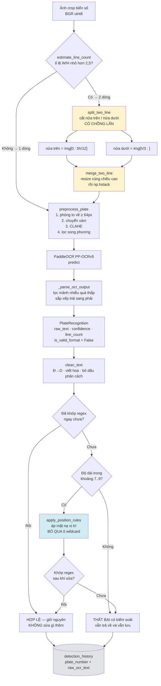

# Báo cáo Phase 4 — Khối nhận dạng ký tự (OCR) và hậu xử lý

> **Trạng thái tài liệu:** kiến trúc, mã nguồn và **phép đo NFR-A4…A8 đã hoàn thành**
> (2026-07-19, 2.801 biển có nhãn). Mục 6 nay chứa số đo thật.
>
> **Kết luận ngắn gọn, không làm tròn:**
> * Trên **biển 1 dòng**, cả ba chỉ tiêu đều **ĐẠT MỤC TIÊU**: A4 = 0,990 · A5 = 0,942 · A6 = 0,949.
> * Trên **biển 2 dòng**, cả ba đều **KHÔNG ĐẠT**: A4 = 0,846 · A5 = 0,526 · A6 = 0,581.
> * Vì tập nhãn gồm 79,8 % biển 2 dòng nên **con số tổng thể KHÔNG ĐẠT**:
>   A4 = 0,873 · A5 = 0,610 · A6 = 0,656.
> * **Rủi ro R-04 vẫn còn nguyên.** Chênh lệch 1 dòng / 2 dòng đo được là **36,8 điểm**.
> * **NFR-A7 chưa đo được một cách có ý nghĩa** — xem mục 6.6.
>
> Số liệu đầy đủ: [`04-ocr-accuracy.json`](04-ocr-accuracy.json).

---

## 1. Mục tiêu Phase 4

Phase 3 cho ra bộ phát hiện biển số — trả lời câu hỏi *"biển nằm ở đâu"*.
Phase 4 trả lời câu hỏi tiếp theo và khó hơn: *"trên biển đó viết gì"*, rồi biến chuỗi ký tự
gần đúng đó thành một biển số **đáng tin cậy**.

Ba mục tiêu cụ thể:

1. **Đọc được ký tự trên vùng biển đã cắt** — kể cả biển hai dòng, vốn là điểm yếu chí mạng
   của mọi công cụ OCR dòng đơn (rủi ro **R-04**).
2. **Sửa lỗi OCR bằng tri thức về chuẩn biển số Việt Nam** — đây là **đóng góp kỹ thuật riêng
   của đồ án**. Bộ phát hiện và bộ OCR đều là mô hình có sẵn; bộ luật hậu xử lý thì không.
3. **Đo được đóng góp đó bằng con số**, chứ không phải bằng lời khẳng định.

### 1.1. Các chỉ tiêu NFR liên quan

| Mã | Chỉ tiêu | Mục tiêu | Ngưỡng tối thiểu | Đo bằng |
|---|---|---|---|---|
| **NFR-A4** | Độ chính xác OCR mức ký tự (1 − CER) | ≥ 0,95 | ≥ 0,92 | `benchmark_ocr.py` |
| **NFR-A5** | Chuỗi biển đầy đủ, **trước** hậu xử lý | ≥ 0,85 | ≥ 0,80 | `benchmark_ocr.py` |
| **NFR-A6** | Chuỗi biển đầy đủ, **sau** hậu xử lý | ≥ 0,90 | ≥ 0,85 | `benchmark_ocr.py` |
| **NFR-A8** | Báo cáo tách riêng biển 1 dòng / 2 dòng | *(bắt buộc có)* | — | `benchmark_ocr.py` |
| **NFR-P1** | Ngân sách độ trễ OCR trong tổng thể E2E | ~120 ms mỗi biển | — | `benchmark_ocr.py` |
| **NFR-M1** | Thư mục `ai/` không phụ thuộc web framework | *(bắt buộc)* | — | kiểm tra tĩnh |
| **NFR-M5** | Thay được engine OCR mà không sửa tầng API | *(bắt buộc)* | — | `BaseRecognizer` |

> **Điểm cốt lõi của cả Phase 4:** NFR-A5 và NFR-A6 **phải đo tách bạch**.
> Hiệu số `NFR-A6 − NFR-A5` chính là **đóng góp định lượng của khối hậu xử lý**.
> Nếu chỉ báo cáo một con số cuối cùng, đóng góp học thuật này biến mất khỏi bản đồ án.

---

## 2. Kiến trúc khối OCR

### 2.1. Vị trí trong hệ thống

Khối OCR nhận **vùng biển đã cắt** (crop), không nhận ảnh toàn cảnh. Nó trả về chuỗi ký tự
kèm độ tin cậy, và **không** tự phán xét chuỗi đó có hợp lệ hay không — việc phán xét thuộc về
khối chuẩn hóa. Sự tách bạch này không phải là chuyện sạch sẽ mã nguồn: nó là điều kiện cần để
đo được NFR-A5 so với NFR-A6, vì chuỗi thô phải còn nguyên vẹn để so sánh.

| Tệp | Vai trò |
|---|---|
| `ai/inference/interfaces.py` | `BaseRecognizer`, `BaseNormalizer` — hợp đồng trừu tượng |
| `ai/inference/recognizer.py` | `PaddleOcrRecognizer` — cài đặt engine PP-OCRv5 |
| `ai/inference/two_line.py` | Hình học biển hai dòng: tách, ghép, tiền xử lý |
| `ai/inference/plate_rules.py` | Hằng số chuẩn biển số VN: regex, mặt nạ, bảng sửa lỗi |
| `ai/inference/normalizer.py` | `VietnamesePlateNormalizer` — khối hậu xử lý |
| `ai/evaluation/benchmark_ocr.py` | Đo độ chính xác và độ trễ |
| `ai/evaluation/error_analysis.py` | Phân loại và xuất các ca đọc sai |

### 2.2. Sơ đồ luồng xử lý



Hai nhánh được tô màu là hai đóng góp kỹ thuật của đồ án: **nhánh vàng** xử lý biển hai dòng,
**nhánh xanh** sửa lỗi OCR theo vị trí.

### 2.3. Ràng buộc kiến trúc NFR-M1

Toàn bộ thư mục `ai/` **không được** import web framework. Cụ thể, không mô-đun nào trong `ai/`
được import FastAPI hoặc Pydantic. Các cấu trúc dữ liệu trao đổi (`PlateRecognition`,
`DetectionResult`, …) là `dataclass` thuần của thư viện chuẩn. Tầng API tự định nghĩa schema
riêng và ánh xạ từ các đối tượng này sang.

Lý do không chỉ là học thuật: nhờ vậy, `benchmark_ocr.py` chạy được trong một môi trường ảo
riêng (`.venv-ocr`) chỉ cài PaddleOCR + OpenCV + Matplotlib, không cần dựng cả tầng web.

---

## 3. Biển hai dòng — mục quan trọng nhất của Phase 4

### 3.1. Vấn đề

Biển số xe máy Việt Nam in ký tự trên **hai dòng**. Đây không phải chi tiết nhỏ mà là điểm gãy
lớn nhất về độ chính xác của các hệ ALPR sẵn có. Số liệu công bố nói rất rõ:

| Hệ thống | Bộ dữ liệu | Biển ô tô **1 dòng** | Biển xe máy **2 dòng** |
|---|---|---|---|
| OpenALPR | **RodoSol-ALPR (Brazil)** | **94,3 %** (3.772/4.000) | **45,7 %** (1.827/4.000) |

> ⚠️ **Cảnh báo trích dẫn — bắt buộc giữ khi trích lại.** Cặp số này lấy từ
> **Laroca et al., VISAPP 2022** ([arXiv:2201.00267](https://arxiv.org/abs/2201.00267)),
> khoá BibTeX `laroca_2022_crossdataset`. Nó được đo trên **RodoSol-ALPR — bộ dữ liệu của Brazil**,
> **không phải dữ liệu Việt Nam**, và **không phải một benchmark tổng quát của OpenALPR**.
> Mọi câu văn trích cặp số này **phải nêu tên bộ dữ liệu và quốc gia ngay trong câu**.
> Rút gọn thành "OpenALPR đạt 94,3% trên biển 1 dòng" là biến một *analogue định lượng*
> thành một tuyên bố sai về dữ liệu Việt Nam — hội đồng tra nguồn sẽ bắt được ngay.

Chênh lệch **48,6 điểm phần trăm** trên cùng một hệ thống, cùng một tập kiểm thử được thiết kế
cân bằng có chủ ý (4.000 ô tô / 4.000 xe máy). Đây là bằng chứng *tương đương* chứ không phải
số đo trên biển số Việt Nam — nhưng cơ chế gây lỗi (bố cục hai dòng) là như nhau. Ở Việt Nam, xe máy
chiếm đa số phương tiện, nên một hệ thống bỏ qua vấn đề này thì con số độ chính xác tổng thể
mà nó báo cáo là vô nghĩa.

### 3.2. Nguyên nhân gốc

Hai nguyên nhân cộng dồn, và cả hai đều nằm ở **kiến trúc**, không phải ở chất lượng ảnh:

**Nguyên nhân 1 — giả định căn chỉnh đơn điệu của CRNN/CTC.**
Các bộ nhận dạng văn bản hiện đại (kể cả module `rec` của PP-OCR) là mô hình **CRNN + CTC**.
Giả định cốt lõi của CTC là tồn tại một **ánh xạ đơn điệu (monotonic alignment)** giữa các *cột
ảnh* theo chiều ngang và *chuỗi ký tự* xuất ra: cột càng bên phải thì ký tự càng về sau.
Giả định này chỉ đúng khi văn bản nằm trên **một dòng**. Với hai dòng, ký tự đầu tiên của dòng
dưới nằm ở cột bên *trái*, tức là đi ngược thứ tự — mô hình không có cách nào biểu diễn được
tình huống đó.

**Nguyên nhân 2 — resize về chiều cao cố định 48 px.**
Module nhận dạng của PP-OCR resize **mọi** ảnh đầu vào về chiều cao cố định **48 px**.
Biển xe máy theo QCVN 08:2024/BCA có kích thước 190 × 140 mm, tức tỉ lệ **~1,357**. Sau khi
resize về cao 48 px, mỗi dòng trong hai dòng chỉ còn khoảng **24 px** chiều cao. Ở độ phân giải
đó các nét chữ dính vào nhau và thông tin bị hủy **trước khi** mô hình nhìn thấy ảnh.

> Điểm đáng lưu ý cho chương Đánh giá: đây là lỗi **không thể sửa bằng hậu xử lý**.
> Thông tin bị mất ở tầng ảnh, không phải bị đọc sai ở tầng ký tự.

### 3.3. Giải pháp: SPLIT-THEN-HSTACK

Ý tưởng: thay vì bắt mô hình xử lý hai dòng, **biến hai dòng thành một dòng** trước khi đưa vào
mô hình. Mô hình khi đó nhận đúng loại đầu vào mà kiến trúc của nó được thiết kế cho, và toàn bộ
ngân sách 48 px được dành cho **một** dòng ký tự thay vì chia đôi.

```
    Ảnh gốc (2 dòng)             Sau split-then-hstack (1 dòng)
    ┌──────────────┐
    │    29-AA     │  ──cắt──►  ┌──────────────┬──────────────┐
    ├──────────────┤            │    29-AA     │   123.45     │
    │   123.45     │            └──────────────┴──────────────┘
    └──────────────┘             nửa trên (trái)  nửa dưới (phải)
    tỉ lệ ~1,36                  tỉ lệ ~5,4 → CRNN/CTC đọc được
```

Thứ tự ghép — **nửa trên đặt bên trái** — đúng bằng thứ tự đọc tự nhiên của biển số Việt Nam:
mã tỉnh và sê-ri ở dòng trên, số thứ tự ở dòng dưới.

### 3.4. Tỉ lệ cắt và lý do phải chồng lấn

Cài đặt tại `ai/inference/two_line.py`:

| Hằng số | Giá trị | Ý nghĩa |
|---|---|---|
| `UPPER_HALF_END_RATIO` | `5/12 ≈ 0,4167` | Nửa trên kết thúc tại `img[0 : 5h/12]` |
| `LOWER_HALF_START_RATIO` | `1/3 ≈ 0,3333` | Nửa dưới bắt đầu tại `img[h/3 : ]` |
| **Vùng chồng lấn** | `[h/3, 5h/12)` = **h/12** | Hai nửa dùng chung 1/12 chiều cao biển |
| `MIN_MERGE_HEIGHT` | `48` px | Sàn chiều cao khi ghép, khớp đầu vào PP-OCR |

**Vì sao phải chồng lấn, thay vì cắt đôi tại đúng h/2?**

Cắt tại đúng giữa nghe có vẻ hợp lý nhưng sai trong thực tế, vì đường phân cách thật giữa hai
dòng **không** nằm ở h/2:

- Viền biển và khoảng đệm trên/dưới hiếm khi đối xứng, nên tâm hình học lệch khỏi tâm chữ.
- Chỉ cần biển nghiêng vài độ là vị trí đường phân cách thật đã dịch vài pixel dọc theo chiều ngang.
- Bounding box của YOLO là hình chữ nhật thẳng trục, nên biển chụp chéo càng làm lệch thêm.

Hậu quả của một nhát cắt sai: **cụt chân chữ dòng trên hoặc cụt đỉnh chữ dòng dưới**. Với bộ
nhận dạng, mất một phần nét chữ là mất thông tin không phục hồi được. Ngược lại, để lọt vài
pixel của dòng bên cạnh vào ảnh chỉ tạo thêm nhiễu nền, mà nhiễu nền thì mô hình bỏ qua rất tốt.

> Nói cách khác: **chồng lấn là đánh đổi có chủ đích** — chấp nhận thêm một chút nhiễu để loại
> bỏ hoàn toàn nguy cơ cắt cụt ký tự. Đây là đánh đổi bất đối xứng, và chiều có lợi đã rõ.

Hai tỉ lệ `5/12` và `1/3` **lấy từ công trình đã kiểm chứng trên biển số Việt Nam**, không phải
do đồ án tự chọn. Chúng là điểm xuất phát đã biết là tốt cho phép đo cơ sở của Phase 4;
việc tinh chỉnh (nếu cần) thuộc về Phase 7 và phải dựa trên số đo, không dựa trên cảm tính.

### 3.5. Phân biệt 1 dòng / 2 dòng bằng tỉ lệ khung

Hàm `estimate_line_count()` quyết định đi nhánh nào. Căn cứ là kích thước vật lý trong
**QCVN 08:2024/BCA** (hiệu lực từ 01/01/2025):

| Loại biển | Kích thước (mm) | Tỉ lệ W/H | Số dòng |
|---|---|---|---|
| Ô tô, biển dài | 520 × 110 | **4,727** | 1 |
| Ô tô, biển ngắn | 330 × 165 | **2,000** | 2 |
| Xe máy | 190 × 140 | **1,357** | 2 |

Không có loại biển nào rơi vào khoảng **(2,000 ; 4,727)**. Khoảng trống rộng 2,727 này cho phép
đặt ngưỡng ở đâu cũng tách được hai lớp; đồ án chọn **2,5**, hơi lệch về phía biển hai dòng,
vì nhánh hai dòng khi áp nhầm lên biển một dòng thì suy giảm nhẹ nhàng, còn chiều ngược lại thì
không.

> ⚠️ **PHẢI GHI RÕ TRONG BÀI:** ngưỡng 2,5 là **HEURISTIC do đồ án đề xuất**, **KHÔNG PHẢI
> quy định pháp lý**. Không có văn bản nào của Việt Nam quy định cách phân loại biển theo tỉ lệ
> khung. Cái quy chuẩn cung cấp là *kích thước vật lý*; việc suy ra ngưỡng là suy luận của đồ án.
> Cảnh báo này đã được ghi ngay trong docstring của `estimate_line_count()` để không bị mất khi
> đọc mã nguồn tách rời tài liệu.

**Vùng xám đã biết:** tỉ lệ trong khoảng ~2,5 đến ~3,0 là vùng thực sự nhập nhằng — một biển ô tô
một dòng chụp ở góc chéo gắt có tỉ lệ *bounding box* tụt vào vùng này. Đo trên ảnh đã nắn phối
cảnh, hoặc đo trên tỉ lệ của `cv2.minAreaRect` thay vì hộp thẳng trục, sẽ chính xác hơn đáng kể.
Phase 7 cần định lượng tần suất xảy ra tình huống này.

---

## 4. Bộ luật hậu xử lý

Đây là phần đồ án **tự viết**, port nguyên văn từ `docs/reports/01-vn-plate-standards.md`
(mục 8 và mục 9), cài đặt tại `ai/inference/plate_rules.py` và `ai/inference/normalizer.py`.

### 4.1. Nguyên tắc nền: sửa theo VỊ TRÍ, không sửa toàn cục

Cách làm sai phổ biến là áp một bảng thay thế toàn cục kiểu `{"O": "0", "I": "1"}` lên cả chuỗi.
Cách đó **phá hủy dữ liệu đúng**: chữ `O`… thực ra không tồn tại trên biển VN, nhưng chữ `B` thì
có, và `B → 8` toàn cục sẽ phá nát mọi sê-ri chứa `B`.

Chuẩn biển số cho biết **trước** mỗi vị trí *phải* là chữ số hay *phải* là chữ cái. Đó là thông
tin miễn phí: ở vị trí bắt buộc là số, mọi chữ cái đọc ra **theo định nghĩa** là lỗi; và ngược lại.

### 4.2. Bảng mẫu regex

Toàn bộ regex sinh **từ tập hằng số**, không viết tay, nên không thể lệch khỏi bảng dữ liệu.
Bộ regex này đã chạy kiểm thử **16/16 ca đúng** ở Phase 1.

| Hằng số | Nội dung | Số lượng |
|---|---|---|
| `PROVINCE_CODES` | Mã tỉnh đang dùng | **81** mã |
| `UNUSED_PROVINCE_CODES` | Mã không bao giờ cấp: `13 42 44 45 46 87 91 96` | 8 mã |
| `L20` | Chữ sê-ri chuẩn: `A B C D E F G H K L M N P S T U V X Y Z` — **có `G`, không có `R`** | 20 chữ |
| `L20B` | Chữ sê-ri **thứ hai** của xe máy: `A B C D E F H K L M N P R S T U V X Y Z` — **có `R`, không có `G`** | 20 chữ |
| `L11` | Chữ sê-ri biển xanh: `A`–`H`, `K`, `L`, `M` | 11 chữ |
| `L21` | Tập chữ an toàn cho nhận dạng: 20 chữ chuẩn **cộng `R`** | 21 chữ |
| `EXCLUDED_LETTERS` | Loại trừ toàn hệ thống: `I J O Q W` | 5 chữ |

| Mẫu | Biểu thức (rút gọn) | Ví dụ khớp |
|---|---|---|
| `RE_CAR` | `^<tỉnh><L20>\d{4,5}$` | `30A12345`, `29A1234` |
| `RE_MOTORCYCLE_NEW` | `^<tỉnh><L20><L20B>\d{4,5}$` | `29AA12345` |
| `RE_MOTORCYCLE_OLD` | `^<tỉnh><L20>[1-9]\d{4,5}$` | `29B112345` |
| `RE_BLUE_CAR` | `^<tỉnh><L11>\d{4,5}$` | `80B12345` |
| `RE_BLUE_MOTORCYCLE` | `^<tỉnh><L11>[1-9]\d{4,5}$` | `80B112345` |
| `RE_SPECIAL` | `^<tỉnh>(LD\|DA\|RM\|MK\|HC\|KT\|MD\|CD\|TD\|LB\|CT\|R\|T)\d{4,5}$` | `29LD12345` |
| `RE_DIPLOMATIC` | `^<tỉnh>\d{3}(NG\|QT\|CV\|NN)\d{2,3}$` | `80001NG01` |
| `RE_MILITARY` | `^[A-Z]{2}\d{4,6}$` | `KA1234` — **nhận ra để LOẠI TRỪ** |

**Tính bất đối xứng `L20` ↔ `L20B` là thật và có hậu quả:** `29-AR 123.45` hợp lệ, còn
`29-AG 123.45` thì không.

> **Ghi chú trung thực (từ Phase 1):** `L20` và `L20B` là **giả thuyết có căn cứ vững**, chưa đối
> chiếu được với toàn văn Điều 34 Thông tư 79/2024/TT-BCA (bản PDF chính thức là bản quét không
> có lớp văn bản, cổng pháp luật chặn truy cập tự động bằng HTTP 403). Nếu toàn văn phản bác,
> **chỉ hai hằng số này thay đổi** — kiến trúc mẫu không đổi.

**Hai ca nhập nhằng đã ghi nhận, không giải quyết được từ chuỗi ký tự:**

| Nhập nhằng | Ví dụ | Giải quyết được bằng |
|---|---|---|
| Ô tô ↔ xe máy đời cũ (8 ký tự) | `29B11234` | Số dòng, **một phần** |
| Sê-ri đặc biệt ↔ xe máy đời mới (9 ký tự) | `29LD12345` | **Không** — cả hai đều là biển 2 dòng |

`line_count = 1` chứng minh được là biển ô tô (xe máy luôn 2 dòng). `line_count = 2` **không**
chứng minh được gì, vì biển ô tô ngắn cũng 2 dòng. Cờ `is_ambiguous` giữ nguyên trong trường hợp
đó — bịa ra một kết luận là tạo ra thông tin mà dữ liệu không có.

### 4.3. Bảng mặt nạ vị trí

| Khóa | Mặt nạ | Áp cho độ dài | Áp cho loại biển |
|---|---|---|---|
| `car_4` | `DDLDDDD` | 7 ký tự | Ô tô, số thứ tự 4 chữ số |
| `car_5` | `DDLDDDDD` | 8 ký tự | Ô tô, số thứ tự 5 chữ số |
| `motorcycle_9` | `DDL?DDDDD` | 9 ký tự | **Cả hai** kiểu xe máy |

Ký hiệu: `D` = bắt buộc chữ số · `L` = bắt buộc chữ cái · `?` = **wildcard, cấm động vào**.

Chuỗi ngoài khoảng 7–9 ký tự **không** được sửa: nó hỏng quá nặng để suy đoán an toàn, và sẽ
thất bại một cách có kiểm soát.

### 4.4. Vị trí wildcard — vì sao TUYỆT ĐỐI không được ép kiểu ở đó

Chỉ số **3** của chuỗi 9 ký tự là **vị trí duy nhất trong toàn bộ hệ thống biển số Việt Nam**
mà cả chữ cái lẫn chữ số đều hợp lệ:

- Xe máy đời mới (từ 15/08/2023): `29 A A 12345` → vị trí 3 là **chữ cái**
- Xe máy đời cũ (còn lưu hành hợp pháp): `29 B 1 12345` → vị trí 3 là **chữ số**

Nếu tách thành hai mặt nạ riêng và ép kiểu, một trong hai kiểu biển sẽ bị phá hủy. Kết quả này
**đã chạy kiểm thử ở Phase 1**:

| Chuỗi vào | Mặt nạ áp | Kết quả | Đánh giá |
|---|---|---|---|
| `29AA12345` | `DDLDDDDDD` | `29A412345` | ❌ phá hủy kiểu mới |
| `29B112345` | `DDLLDDDDD` | `29BL12345` | ❌ phá hủy kiểu cũ |
| `29AA12345` | `DDL?DDDDD` | `29AA12345` | ✅ đúng |
| `29B112345` | `DDL?DDDDD` | `29B112345` | ✅ đúng |

Vì vậy `apply_position_rules()` xử lý nhánh `?` **tường minh** thành một nhánh riêng, không để nó
rơi vào `else`. Sự khác biệt về hành vi thì bằng không; sự khác biệt về ý định thì rất lớn:
đây là một **ràng buộc có chủ đích**, không phải hệ quả tình cờ của thứ tự điều kiện.

Ký hiệu `?` chỉ tồn tại trong mặt nạ; nó **không bao giờ** xuất hiện trong chuỗi đầu ra.

### 4.5. Bảng ánh xạ sửa lỗi

**Bảng A — `TO_DIGIT`**, chỉ áp tại vị trí mặt nạ ghi `D`:

| Đọc ra | Sửa thành | | Đọc ra | Sửa thành |
|---|---|---|---|---|
| `O` | `0` | | `Z` | `2` |
| `Q` | `0` | | `A` | `4` |
| `D` | `0` | | `S` | `5` |
| `I` | `1` | | `G` | `6` |
| `J` | `1` | | `T` | `7` |
| `L` | `1` | | `B` | `8` |

**Bảng B — `TO_LETTER`**, chỉ áp tại vị trí mặt nạ ghi `L`:

| Đọc ra | Sửa thành | | Đọc ra | Sửa thành |
|---|---|---|---|---|
| `0` | `D` | | `5` | `S` |
| `1` | `L` | | `6` | `G` |
| `2` | `Z` | | `7` | `T` |
| `3` | `B` | | `8` | `B` |
| `4` | `A` | | | |

> **Tri thức cốt lõi: ánh xạ KHÔNG ĐỐI XỨNG.**
> `O → 0` là đúng, nhưng `0 → O` **không bao giờ** đúng — vì `O` không thuộc tập chữ sê-ri
> (nó nằm trong `EXCLUDED_LETTERS`). Khi cả `O` và `Q` đều bị loại, ứng viên đồng hình duy nhất
> còn lại là `D`. Do đó chiều đúng là:
>
> ```
> O → 0   tại vị trí chữ số
> 0 → D   tại vị trí chữ cái
> ```
>
> Chính việc chuẩn biển số **tự nó** đã cắt bớt không gian ứng viên (loại `I J O Q W`) là thứ làm
> cho bài toán sửa lỗi OCR ở đây trở nên khả thi — nhiều ca nhập nhằng thu về **một** ứng viên duy nhất.

> **Ghi chú trung thực về nguồn gốc hai bảng trên:** chúng được suy ra từ **hình dạng ký tự**,
> **không phải từ số đo**. Các cặp yếu (đặc biệt `L → 1`) là phỏng đoán. Đây chính là lý do
> `benchmark_ocr.py` sinh **ma trận nhầm lẫn 36×36**: để thay thế phỏng đoán bằng tần suất nhầm
> lẫn đo được thật, giữ lại chỉ những cặp vượt ngưỡng thống kê. Trình bày bảng hiện tại như một
> *giả thuyết cần kiểm chứng* vừa trung thực hơn, vừa mạnh hơn về mặt học thuật, so với trình bày
> nó như một kết quả đã chốt.

### 4.6. Ba quy tắc vận hành bắt buộc

1. **Thử regex TRƯỚC khi sửa.** Chuỗi đã hợp lệ thì mọi thao tác sửa chỉ có thể làm hỏng nó.
2. **Không bao giờ vứt bỏ.** Chuỗi không sửa được vẫn trả về với `is_valid_format = False` và
   vẫn được lưu. Vứt bỏ sẽ giấu các ca thất bại khỏi thống kê và xóa mất chính vật liệu mà
   chương Đánh giá cần.
3. **Giữ nguyên chuỗi thô.** Ghi vào `detection_history.raw_ocr_text`. So sánh thô với đã-chuẩn-hóa
   là **cách duy nhất** đo được đóng góp của khối này — đó cũng là lý do khối này nằm *ngoài*
   bộ nhận dạng.

Ký tự không có trong bảng áp dụng thì **giữ nguyên**, không thay bằng ký tự giữ chỗ:
`3OB12E45` → `30B12E45`, chứ không phải `30B12?45`. Chuỗi sau đó đơn giản là trượt regex —
đúng như mong muốn: **thất bại có kiểm soát và quan sát được**.

---

## 5. Quyết định thiết kế và đánh đổi

| # | Quyết định | Đánh đổi chấp nhận |
|---|---|---|
| **QĐ-1** | Tách `BaseRecognizer` khỏi `BaseNormalizer` | Thêm một lớp trừu tượng; đổi lại **đo được** NFR-A5 vs A6 và thay engine không đụng tầng API (NFR-M5) |
| **QĐ-2** | PaddleOCR PP-OCRv5 chỉ là **BASELINE** | Xem mục 5.1 |
| **QĐ-3** | Split-then-hstack thay vì huấn luyện mô hình 2 dòng chuyên dụng | Không cần dữ liệu huấn luyện riêng, không cần GPU; đổi lại phụ thuộc vào chất lượng ước lượng số dòng |
| **QĐ-4** | Cắt có chồng lấn h/12 | Thêm nhiễu nền nhẹ; đổi lại loại bỏ hoàn toàn nguy cơ cắt cụt ký tự |
| **QĐ-5** | Huấn luyện trên **36** ký tự, ràng buộc về **31** ở hậu xử lý | Mô hình có thể sinh ký tự không hợp lệ; đổi lại lỗi đó **quan sát được và sửa được**, thay vì mô hình bị chặn kiến trúc và tạo ra lỗi vô hình |
| **QĐ-6** | Xóa sạch dấu phân cách thay vì phân tích chúng | Mất thông tin định dạng; đổi lại tránh phải đoán, vì vị trí dấu phân cách thực sự không nhất quán giữa các loại biển |
| **QĐ-7** | Ngưỡng tỉ lệ khung **2,5** | Heuristic, có vùng xám 2,5–3,0; đổi lại đơn giản, không tốn chi phí tính toán |
| **QĐ-8** | Tắt oneDNN (MKL-DNN) mặc định | Chậm hơn một chút; **bắt buộc** vì `paddlepaddle` 3.3.1 trên Windows/CPU crash với `ConvertPirAttribute2RuntimeAttribute` |
| **QĐ-9** | CER **không** cắt trần tại 1,0 | Con số có thể > 1; đổi lại không giấu một bộ nhận dạng "chạy loạn" đằng sau một con số trông đẹp mắt |

### 5.1. Về lựa chọn engine OCR — phải trung thực

Phase 1 **KHÔNG tìm được bằng chứng công khai nào** cho thấy PaddleOCR chính xác hơn EasyOCR
trên ảnh biển số. Phép so sánh kiểm chứng được duy nhất tìm thấy lại **nghiêng về EasyOCR**.

Do đó:

- PP-OCRv5 được dùng làm **baseline**, **không** phải "lựa chọn tối ưu đã chứng minh".
- Trình bày PaddleOCR như "cái chính xác hơn" sẽ là một khẳng định **không có căn cứ**.
- Chính vì vậy `BaseRecognizer` tồn tại: thêm EasyOCR chỉ là viết **một** lớp con và đổi
  một dòng khởi tạo — pipeline, service, router không đổi một ký tự nào.
- **Benchmark Phase 4, chạy trên chính bộ dữ liệu của đồ án, mới là căn cứ quyết định cuối cùng.**

`benchmark_ocr.py` đã chuẩn bị sẵn tham số `--engine` cho việc so sánh này.

---

## 6. Bảng kết quả

**Nguồn số liệu:** [`04-ocr-accuracy.json`](04-ocr-accuracy.json), sinh bởi
`python -m ai.evaluation.ocr_accuracy` ngày 2026-07-19 trên `backend/.venv`.
Máy đo: Intel Raptor Lake, 14 nhân vật lý / 20 nhân logic, Windows 11, CPU-only.

**Tập đánh giá:** 2.801 biển số — 567 biển 1 dòng (20,2 %) và 2.234 biển 2 dòng (79,8 %),
lấy từ `datasets/annotations/plate_labels.csv`. Nhãn là chuỗi **tái tạo ở Phase 2b** từ hộp
ký tự của `roboflow_ocr_plate` và `roboflow_ocr_conversion`; chỉ giữ những dòng mà bước tái
tạo tự xác nhận hợp lệ **trước khi** đi qua bộ chuẩn hóa — nếu không, bộ chuẩn hóa sẽ được
chấm điểm trên chính nhãn do nó sinh ra.

> ⚠️ **Ba hạn chế phải đi kèm mọi con số dưới đây** — xem mục 6.7. Quan trọng nhất: cả hai bộ
> Roboflow xuất ảnh crop về **khung vuông**, phá hủy tỉ lệ khung. Phép đo phải khôi phục tỉ lệ
> chuẩn từ `line_count` của nhãn, tức có dùng một mẩu **thông tin thật mà hệ thống thật không có**.

### 6.1. Độ chính xác tổng thể

| Chỉ số | Chỉ tiêu NFR | Đo được | Đạt? |
|---|---|---|---|
| Độ chính xác ký tự (1 − CER) | NFR-A4 ≥ 0,95 (tối thiểu 0,92) | **0,8734** | 🔴 **KHÔNG ĐẠT** |
| Chuỗi đầy đủ **trước** hậu xử lý | NFR-A5 ≥ 0,85 (tối thiểu 0,80) | **0,6098** | 🔴 **KHÔNG ĐẠT** |
| Chuỗi đầy đủ **sau** hậu xử lý | NFR-A6 ≥ 0,90 (tối thiểu 0,85) | **0,6555** | 🔴 **KHÔNG ĐẠT** |
| **Đóng góp của hậu xử lý (A6 − A5)** | *(không có chỉ tiêu)* | **+4,57 điểm** | — |
| Tỉ lệ chuỗi đúng định dạng hợp lệ | *(theo dõi)* | 0,8115 | — |
| Tỉ lệ đọc rỗng | *(theo dõi)* | 0,0039 | — |

**Đóng góp của khối hậu xử lý, tách bạch:** bộ luật sửa đúng **128** biển mà engine đọc sai,
và làm hỏng **0** biển mà engine đã đọc đúng. **Ở mức chuỗi biển số**, bộ luật **không mất mát**
(loss-free): hiệu số A6 − A5 dương tuyệt đối. Đây là con số bảo vệ được cho đóng góp kỹ thuật
riêng của đồ án — dù nó **không đủ** để kéo A6 lên ngưỡng.

> ⚠️ **Nhưng "không mất mát" CHỈ đúng ở mức chuỗi, KHÔNG đúng ở mức ký tự.**
> Mục 6.1b định lượng điều này. Kết luận ngắn: bộ luật **có** làm hỏng ký tự — chỉ là những ký tự
> bị hỏng rơi vào các biển vốn **đã** sai sẵn, nên không biển nào chuyển từ đúng sang sai.
> Nếu chỉ đọc dòng "0 biển hỏng" mà bỏ mục 6.1b thì sẽ hiểu sai bản chất bộ luật.

### 6.1b. Đóng góp của hậu xử lý ở mức KÝ TỰ — **bảng ánh xạ suy luận hình dạng CÓ chỗ sai**

Đây là phép đo trả lời câu hỏi mà mục 6.1 không trả lời được: *bộ luật thực sự làm gì với từng
ký tự?* Cách làm: so **ma trận nhầm lẫn 36×36 trước** chuẩn hoá (`confusion_matrix`) với ma trận
**sau** chuẩn hoá (`confusion_matrix_post_norm`) trong `04-ocr-accuracy.json`, rồi đọc phần chênh.

#### Tổng kết ở mức ký tự

| Chỉ số | Trước chuẩn hoá | Sau chuẩn hoá | Chênh |
|---|---:|---:|---:|
| Vị trí ký tự đã căn khớp | 22.673 | 22.768 | +95 |
| **Ký tự đúng (đường chéo ma trận)** | **21.666** | **21.644** | **−22** |
| — trong đó **chữ số** | 19.640 | 19.475 | **−165** |
| — trong đó **chữ cái** | 2.026 | 2.169 | **+143** |

> 🔴 **Ma trận sau chuẩn hoá chứa ÍT hơn 22 ký tự đúng so với trước, dù nó phủ nhiều hơn 95 vị
> trí.** Bộ luật **lấy của chữ số để trả cho chữ cái**: mất 165 chữ số đúng, được lại 143 chữ cái
> đúng.

**Phải nói rõ một mâu thuẫn biểu kiến, không được giấu:** ở mức chuỗi, CER lại **cải thiện nhẹ**
(0,1296 → 0,1266) và độ chính xác ký tự tăng 0,8704 → 0,8734. Hai phép đo này **không cùng cơ
sở**: CER tính trên phép căn chỉnh chuỗi (có chèn/xoá), còn ma trận nhầm lẫn chỉ đếm các vị trí
**thay thế đã căn khớp** — và số vị trí căn khớp tự nó đã đổi (+95). Báo cáo này công bố **cả
hai** và **không** chọn con số có lợi hơn. Điều rút ra được một cách an toàn: **đóng góp ròng của
bảng ánh xạ ở mức ký tự là gần bằng không, chứ không phải một cải thiện rõ ràng.** Toàn bộ giá
trị thật của khối hậu xử lý (+4,57 điểm A6) đến từ **128 biển được sửa trọn vẹn**, chứ không đến
từ việc nâng đều chất lượng ký tự.

#### Quy tắc nào chạy đúng, quy tắc nào chạy sai

| Quy tắc | Bảng | Hiệu ứng đo được | Phán quyết |
|---|---|---|:---:|
| `1 → L` | `TO_LETTER` | `L` đọc thành `1`: **90 → 12**; `L` đúng: 45 → **128** (**+83**) | ✅ **Đúng, hiệu quả nhất** |
| `0 → D` | `TO_LETTER` | `D` đọc thành `0`: **34 → 6**; `D` đúng: 39 → **70** (**+31**) | ✅ **Đúng** |
| `8 → B` | `TO_LETTER` | `B` đọc thành `8`: **19 → 6**; `B` đúng: +13 | ✅ **Đúng** |
| `4 → A` | `TO_LETTER` | `A` đọc thành `4`: **12 → 4**; `A` đúng: +9 | ✅ **Đúng** |
| `5 → S` | `TO_LETTER` | `S` đọc thành `5`: **7 → 1**; `S` đúng: +6 | ✅ **Đúng** |
| **`L → 1`** | **`TO_DIGIT`** | `4` đọc thành `L`: **54 → 19**, nhưng `4` đọc thành `1` **tăng 14 → 54** | 🔴 **SAI ĐÍCH** |
| **`7 → T`** | **`TO_LETTER`** | `Z` đọc thành `7`: **32 → 2**, nhưng `Z` đọc thành `T` **tăng 0 → 30** | 🔴 **SAI ĐÍCH** |
| **`6 → G`** | `TO_LETTER` | `6` **đúng** bị đổi thành `G`: 0 → **3** | 🟠 **Gây hại ròng** |
| **`4 → A`** *(ở vị trí chữ số)* | `TO_LETTER` | `4` **đúng** bị đổi thành `A`: 0 → **5** | 🟠 **Gây hại khi ép sai vị trí** |

> #### 🔴 Kết quả quan trọng nhất: hai quy tắc **nhận diện đúng ký tự nhưng ánh xạ tới đích sai**
>
> Đây là bằng chứng trực tiếp cho nhận định ở mục 6.7, nay đã có **số đo hiệu ứng** chứ không chỉ
> có tần suất nhầm lẫn:
>
> - **`TO_DIGIT: L → 1`.** Quy tắc **phát hiện đúng** rằng một ký tự `L` đứng ở vị trí chữ số là
>   lỗi (54 ca giảm còn 19). Nhưng nó ánh xạ sang `1`, trong khi sự thật là **`4`**. Kết quả:
>   `4` bị đọc thành `1` **tăng vọt từ 14 lên 54 ca**. Một lỗi được **đổi thành lỗi khác**, không
>   phải được sửa. **Quy tắc đúng phải là `L → 4`** (bằng chứng mạnh gấp **27 lần**).
> - **`TO_LETTER: 7 → T`.** Tương tự: `Z` bị đọc thành `7` giảm từ 32 xuống 2, nhưng `Z` bị đọc
>   thành `T` **tăng từ 0 lên 30**. Lỗi bị dời chỗ, không bị xoá. **Quy tắc đúng phải là `7 → Z`.**
>
> **Cả hai quy tắc này "hoạt động" theo nghĩa chúng kích hoạt đúng chỗ — chúng chỉ sửa thành ký
> tự sai.** Đây chính là loại lỗi mà một phép đo chỉ nhìn A6 tổng thể **không bao giờ phát hiện
> được**: hiệu ứng ròng lên A6 bằng 0 (sai vẫn hoàn sai), nên nó vô hình trên mọi bảng ở mục 6.1.
> Chỉ có so ma trận trước/sau mới lộ ra.

**Hai quy tắc ép kiểu quá tay** (`6 → G`, `4 → A`) chuyển ký tự **vốn đã đúng** thành sai: 3 và 5
ca. Số lượng nhỏ, nhưng nó bác bỏ dứt điểm cách diễn đạt "bộ luật không mất mát" nếu hiểu theo
nghĩa ký tự. Nguyên nhân là mặt nạ vị trí (mục 4.3) suy ra sai **vị trí nào phải là chữ cái** khi
chuỗi đầu vào đã thiếu hoặc thừa ký tự — một chuỗi lệch một ô thì mọi ràng buộc vị trí sau đó
đều ép sai.

**Việc phải làm, và trình tự bắt buộc:** sửa `L → 1` thành `L → 4`, sửa `7 → T` thành `7 → Z`,
và thêm bảo vệ để `TO_LETTER` không kích hoạt khi độ dài chuỗi không khớp mẫu đã nhận dạng.
**Nhưng phải đo lại rồi mới công bố** — xem cảnh báo cuối mục 6.7. Chưa áp dụng vào
`ai/inference/plate_rules.py`.

### 6.2. Tách theo số dòng (NFR-A8 — kết quả then chốt cho rủi ro R-04)

| Chỉ số | Biển 1 dòng | Biển 2 dòng | Chênh lệch |
|---|---|---|---|
| Số mẫu | 567 | 2.234 | — |
| Độ chính xác ký tự sau hậu xử lý (A4) | **0,9900** ✅ | **0,8462** 🔴 | 14,4 điểm |
| Chuỗi đầy đủ trước hậu xử lý (A5) | **0,9418** ✅ | **0,5255** 🔴 | 41,6 điểm |
| Chuỗi đầy đủ sau hậu xử lý (A6) | **0,9489** ✅ | **0,5810** 🔴 | **36,8 điểm** |
| Đóng góp hậu xử lý | +0,71 điểm | +5,55 điểm | — |
| Tỉ lệ đúng định dạng hợp lệ | 0,9877 | 0,7668 | — |
| Tỉ lệ đọc rỗng | 0,0018 | 0,0045 | — |

> 🔴 **Rủi ro R-04 CHƯA được khép lại.** Trên biển 1 dòng, cả ba chỉ tiêu đều **vượt mục tiêu**;
> trên biển 2 dòng, cả ba đều **trượt xa ngưỡng tối thiểu**. Toàn bộ khoảng cách giữa hệ thống
> và các chỉ tiêu NFR nằm ở biển 2 dòng.

**Đối chiếu mốc tham chiếu.** Chênh lệch đo được của đồ án là **36,8 điểm**. Mốc tham chiếu:
OpenALPR đạt 94,3 % (1 dòng) so với 45,7 % (2 dòng) **trên bộ RodoSol-ALPR của Brazil**
([Laroca et al., VISAPP 2022](https://arxiv.org/abs/2201.00267)), tức **48,6 điểm**.

Phải đọc phép so sánh này một cách thận trọng: **hai con số không đo trên cùng dữ liệu, không
cùng quốc gia, không cùng engine.** 36,8 < 48,6 **không** chứng minh split-then-hstack tốt hơn
OpenALPR. Điều duy nhất kết luận được là: sau khi đã áp dụng split-then-hstack, khoảng cách
1 dòng / 2 dòng **vẫn còn cùng bậc độ lớn** với khoảng cách mà tài liệu ghi nhận khi *không*
xử lý riêng. Nói cách khác, **kỹ thuật này chưa giải quyết được vấn đề**, và đó là kết quả
trung thực cần báo cáo.

**Bằng chứng chẩn đoán từ phân loại lỗi** (mục 6.5): trên 2.234 biển 2 dòng, số ca
`transposition` (đảo thứ tự) là **0**. Nghĩa là thứ tự ghép nửa trên / nửa dưới **luôn đúng** —
`merge_two_line` không phải nguyên nhân. Nguyên nhân nằm ở hai chỗ khác: **thừa ký tự** ở đường
nối (95 ca, và 148 lần chèn thừa ký tự `J` — vốn *không hợp lệ* trên biển Việt Nam) và **mất
nguyên một dòng** (217 ca `missing_chars`, thường mất trọn nửa trên chứa mã tỉnh và sê-ri).

### 6.3. Độ trễ trên CPU

> ⛔ **KHÔNG DÙNG BẢNG NÀY LÀM SỐ LIỆU HIỆU NĂNG.** Hai lý do độc lập:
> 1. Trong suốt lần đo, một tiến trình **huấn luyện YOLO** (`runs/final-640-v3`, trên `.venv-ai`)
>    chiếm gần hết 20 nhân logic của máy.
> 2. Đầu vào là ảnh crop 640×640 của bộ nhãn, lớn hơn nhiều so với crop thật (20–40 px cao).
>
> Tranh chấp CPU làm **chậm**, không làm **sai** — nên các con số độ chính xác ở trên vẫn dùng
> được. Số độ trễ thì không. Phép đo NFR-P1 chính thức nằm ở báo cáo Phase 7.

| Chỉ số | Đo được (bối cảnh ở trên) |
|---|---|
| Trung bình mỗi crop | 400,23 ms |
| p50 | 422,71 ms |
| p95 | 658,77 ms |

### 6.4. Ablation: khôi phục tỉ lệ khung

Đây là ablation quan trọng nhất của Phase 4, vì nó định lượng mẩu thông tin thật mà phép đo
buộc phải mượn từ nhãn (mục 6.7, hạn chế 1).

| Cấu hình | Chuỗi đúng sau hậu xử lý (A6) |
|---|---|
| **Có** khôi phục tỉ lệ khung từ `line_count` của nhãn | **0,6555** |
| **Không** khôi phục (ảnh vuông y như bộ dữ liệu xuất ra) | **0,4745** |

Chênh lệch **18,1 điểm**. Nghĩa là gần một phần năm độ chính xác báo cáo được đến từ một bước
mà hệ thống thật **không thực hiện được** — hệ thống thật lấy tỉ lệ khung từ hộp của bộ phát
hiện, vốn không bị bóp vuông. Bước này là **sửa lỗi của bộ dữ liệu**, không phải mẹo cải thiện
mô hình; nhưng nó phải được công bố, vì nếu không con số 0,6555 sẽ bị hiểu sai.

### 6.5. Phân loại lỗi (2.801 mẫu, sau hậu xử lý)

| Loại lỗi | Tổng | Biển 1 dòng | Biển 2 dòng | Chẩn đoán |
|---|---|---|---|---|
| `correct` | 1.836 | 538 | 1.298 | — |
| `substitution` | 376 | 18 | 358 | Lỗi hình dạng ký tự — sửa được bằng bảng ánh xạ |
| `mixed` | 266 | 4 | 262 | Ảnh suy giảm nặng |
| `missing_chars` | 217 | 1 | 216 | **Mất trọn một dòng** sau khi tách nửa |
| `extra_chars` | 95 | 5 | 90 | **Ký tự ma ở đường ghép** hstack |
| `empty_read` | 11 | 1 | 10 | Ảnh quá mờ |
| `transposition` | **0** | 0 | 0 | Thứ tự ghép nửa trên/dưới **luôn đúng** |

Ảnh của vài chục ca sai đã xuất ra `docs/reports/04-ocr-errors/`, chia theo thư mục từng loại,
tên tệp mang sẵn chuỗi thật và chuỗi đọc được để xem bằng mắt.

**Bằng chứng cho `extra_chars`:** ví dụ `59C165331` (ảnh rất rõ, người đọc được ngay) bị đọc
thành `59C165331JSCT` — chuỗi đúng cộng thêm 4 ký tự rác. Ký tự chèn thừa nhiều nhất trên toàn
tập là `J` (148 lần), mà `J` **không nằm trong tập ký tự hợp lệ của biển số Việt Nam**. Đây là
dấu vết đặc trưng của vùng chồng lấn và đường nối trong `merge_two_line`.

### 6.6. NFR-A7 — E2E toàn trình: **chưa đo được một cách có ý nghĩa**

| Chỉ số | Đo được (T5.6e, `best.pt`) |
|---|---|
| Độ chính xác E2E toàn trình (A7) | **0,5227** |
| Độ chính xác E2E **với điều kiện đã phát hiện được biển** | 0,5937 |
| Tỉ lệ biển **bị bỏ sót** ở tầng phát hiện | 0,1196 |
| Tỉ lệ biển phát hiện đúng nhưng **đọc sai chuỗi** | 0,4063 |
| Chênh lệch A6 − A7 (điểm %) | 13,28 |
| Số mẫu | 2.801 |

**Con số 0,5227 không phản ánh năng lực của hệ thống, và không được trích dẫn như thể có.**
Lý do: trong đồ án **không có bộ dữ liệu nào vừa có ảnh toàn cảnh vừa có chuỗi biển số**. Bảy
bộ dùng cho phát hiện có hộp nhưng không có chữ; hai bộ OCR có chữ nhưng không có cảnh. NFR-A7
vì vậy buộc phải đo trên chính ảnh crop, tức bắt bộ phát hiện đi tìm một biển số **chiếm gần
hết khung hình** — hoàn toàn ngoài phân bố mà nó được huấn luyện. Hệ quả hiện rõ trong bảng:
**bỏ sót 11,96 % là lỗi phát hiện, không phải lỗi OCR**; cùng những ảnh đó, khối OCR đạt A6 =
0,6555 khi được đưa crop trực tiếp. Phase 7 đo được mAP50 = 0,9935 cho bộ phát hiện trên ảnh
hiện trường thật.

**Một điểm tích cực đáng ghi nhận:** phép đo này **không bị rò rỉ dữ liệu**.
`roboflow_ocr_plate` và `roboflow_ocr_conversion` không nằm trong `merged_v2` hay bất kỳ split
YOLO nào, nên bộ phát hiện chưa từng nhìn thấy các ảnh này.

**Việc cần làm để đo được NFR-A7 thật:** gán nhãn chuỗi biển số cho một phần tập test của
`yolo_v2` (ước lượng 300–500 ảnh là đủ để có khoảng tin cậy dùng được). **Chưa làm.**

### 6.7. Ma trận nhầm lẫn ký tự 36×36 — thay giả thuyết bằng số đo

Ma trận đầy đủ nằm trong `04-ocr-accuracy.json` (`confusion_matrix.matrix`) và ở
`figures/04-ocr-confusion-matrix.png`. Mười cặp bị nhầm nhiều nhất (chuỗi thô, chưa chuẩn hóa):

| Thật | Đọc thành | Số lần | | Thật | Đọc thành | Số lần |
|---|---|---|---|---|---|---|
| `L` | `1` | 90 | | `2` | `7` | 26 |
| `E` | `F` | 73 | | `X` | `Y` | 21 |
| `4` | `L` | 54 | | `9` | `0` | 20 |
| `U` | `1` | 38 | | `B` | `R` | 20 |
| `D` | `0` | 34 | | `B` | `8` | 19 |
| `Z` | `7` | 32 | | `4` | `1` | 14 |

**Bảng `TO_LETTER` được số đo xác nhận phần lớn.** Năm quy tắc có bằng chứng vững:
`1 → L` (90 lần), `0 → D` (34), `8 → B` (19), `4 → A` (12), `6 → G` (3). Riêng nhận định cốt lõi
ở mục 4.5 — *ánh xạ không đối xứng*, `O → 0` nhưng `0 → D` — được dữ liệu ủng hộ trực tiếp.

**Hai quy tắc bị số đo bác bỏ, cần sửa:**

| Bảng | Quy tắc hiện tại | Bằng chứng | Quy tắc dữ liệu đề xuất | Bằng chứng |
|---|---|---|---|---|
| `TO_DIGIT` | `L → 1` | **2** lần | **`L → 4`** | **54** lần |
| `TO_LETTER` | `7 → T` | **1** lần | **`7 → Z`** | **32** lần |

> ✅ **Cả hai đề xuất trên nay đã được XÁC NHẬN bằng phép đo hiệu ứng, không chỉ bằng tần suất.**
> Mục **6.1b** so ma trận nhầm lẫn trước và sau chuẩn hoá, và cho thấy hai quy tắc này **kích
> hoạt đúng chỗ nhưng ánh xạ tới ký tự sai**: `L → 1` làm số ca `4` bị đọc thành `1` **tăng từ
> 14 lên 54**; `7 → T` làm số ca `Z` bị đọc thành `T` **tăng từ 0 lên 30**. Lỗi bị **dời chỗ**
> chứ không bị xoá — nên hiệu ứng ròng lên A6 bằng 0 và hoàn toàn vô hình nếu chỉ nhìn bảng 6.1.

Đúng như ghi chú ở mục 4.5 đã cảnh báo, `L → 1` là phỏng đoán yếu — và số đo cho thấy nó **sai
hướng**: một ký tự `L` xuất hiện ở vị trí chữ số hầu như luôn là chữ số `4` bị đọc nhầm, chứ
không phải `1`. Bằng chứng cho `L → 4` mạnh gấp **27 lần** quy tắc đang dùng.

**Bảy quy tắc không có bằng chứng nào** (0 lần trên 2.801 biển): `TO_DIGIT` `D → 0`, `J → 1`,
`A → 4`, `T → 7`, `B → 8`; `TO_LETTER` `2 → Z`, `3 → B`. Chúng vô hại nhưng cũng vô dụng trên
dữ liệu này.

**Cặp nhầm lớn mà không bảng nào sửa được:** `E → F` (73 lần) và `B → R` (20), `X → Y` (21).
Cả hai ký tự trong mỗi cặp đều **hợp lệ ở vị trí chữ cái**, nên luật sửa-theo-vị-trí về nguyên
tắc không chạm tới được. Muốn xử lý phải dùng thông tin khác (ví dụ đối chiếu danh sách sê-ri
đã cấp), nằm ngoài phạm vi hiện tại.

> ⚠️ **Chưa áp dụng các đề xuất trên vào `ai/inference/plate_rules.py`.** Sửa bảng ánh xạ sẽ làm
> thay đổi NFR-A6; nếu sửa rồi báo cáo lại chính con số cũ thì đó là luật được khớp trên chính
> tập đánh giá. Quy trình đúng: sửa bảng → **đo lại** → công bố con số mới kèm ghi chú rằng bảng
> đã được rút ra từ dữ liệu nào.
> Bảng đề xuất đầy đủ: `plate_rules_review.proposed_updates` trong `04-ocr-accuracy.json`.

---

## 7. Hạn chế hiện tại

1. **Tập nhãn có tỉ lệ khung bị phá hủy.** Cả `roboflow_ocr_plate` (640×640) lẫn
   `roboflow_ocr_conversion` (416×416) xuất ảnh crop về **khung vuông**. Phép đo phải khôi phục
   tỉ lệ chuẩn từ `line_count` của nhãn — một mẩu thông tin thật mà hệ thống thật không có.
   Ablation ở mục 6.4 định lượng ảnh hưởng: **18,1 điểm**.

2. **Nhãn là chuỗi *tái tạo*, không phải người chép tay.** Sai sót của bước tái tạo Phase 2b sẽ
   hiện ra thành lỗi OCR giả. Đã giảm thiểu bằng cách chỉ giữ dòng tự xác nhận hợp lệ trước
   chuẩn hóa, nhưng chưa có ai kiểm tra chéo bằng mắt trên mẫu ngẫu nhiên.

3. **NFR-A7 chưa đo được có ý nghĩa.** Xem mục 6.6. Cần gán nhãn chuỗi cho một phần tập test
   của `yolo_v2`.

4. **Tập đánh giá lệch mạnh về biển 2 dòng** (79,8 %). Con số tổng thể vì vậy gần với con số
   biển 2 dòng hơn. Đây là lý do NFR-A8 bắt buộc phải tách — số tổng thể một mình sẽ che mất
   việc biển 1 dòng đã đạt cả ba chỉ tiêu.

5. **`L20` / `L20B` là giả thuyết chưa đối chiếu toàn văn.** Xem mục 4.2.

6. **Ngưỡng tỉ lệ khung 2,5 có vùng xám 2,5–3,0.** Biển một dòng chụp chéo gắt có thể bị phân
   loại nhầm. Chưa định lượng được tần suất — trên tập này không đo được, vì tỉ lệ khung đã bị
   bộ dữ liệu bóp vuông từ đầu.

7. **`PaddleOcrRecognizer` không an toàn đa luồng.** Pipeline PaddleOCR giữ trạng thái thay đổi
   giữa các lần gọi. Mỗi luồng phải có một thực thể riêng, hoặc phải tuần tự hóa truy cập.

8. **Chưa đánh giá theo điều kiện ảnh (NFR-A9).** Cần nhãn ban ngày / ban đêm / nghiêng / mờ,
   hiện bộ dữ liệu chưa có.

---

## 8. Lỗi phát hiện được trong quá trình đo: **ảnh crop quá lớn thì OCR đọc rỗng hoàn toàn**

Phép đo Phase 4 gần như không thực hiện được, và lý do hóa ra là một lỗi thật trong mã nguồn.

**Triệu chứng.** Chạy thử lần đầu trên tập nhãn: **0 / 100** ảnh crop đọc ra được *một ký tự nào*.
Cả biển 1 dòng lẫn 2 dòng, kể cả những ảnh mà mắt người đọc được ngay.

**Nguyên nhân gốc.** Không phải engine, mà là **thang tỉ lệ đầu vào**. Khối phát hiện văn bản
của PP-OCR là mạng phân đoạn DB, huấn luyện trên chữ ở kích thước thông thường. Ảnh crop của bộ
nhãn là 640×640, nên mỗi ký tự cao vài trăm pixel — vượt xa phân bố huấn luyện, và bản đồ phân
đoạn **không kích hoạt ở đâu cả**. Engine trả về rỗng, không báo lỗi.

`preprocess_plate()` trước đây chỉ có `upscale_to_height` — nó **phóng to** ảnh nhỏ nhưng
**không bao giờ thu nhỏ** ảnh lớn. Không có chặn trên.

**Quét thực nghiệm** (50 biển 1 dòng + 50 biển 2 dòng, chuẩn hóa chiều cao dải ảnh về `h`):

| `h` | Biển 1 dòng | Biển 2 dòng |
|---|---|---|
| *không chặn* | **0 / 50** | **0 / 50** |
| 48 | 48 / 50 | **31 / 50** |
| **64** | 48 / 50 | **31 / 50** |
| 96 | 50 / 50 | 23 / 50 |
| 128 | 47 / 50 | 31 / 50 |
| 192 | 47 / 50 | 3 / 50 |

**Khắc phục.** Thêm tham số `downscale_to_height` vào `preprocess_plate()` và hằng số
`_MAX_OCR_HEIGHT = 64` trong `recognizer.py` — bằng đúng `_MIN_OCR_HEIGHT`, tức hai hằng số cùng
phát biểu một điều: *chuẩn hóa dải ảnh về 64 px, từ phía nào cũng vậy*. Có kiểm thử hồi quy
(`tests/test_recognizer.py`).

**Vì sao lỗi này ẩn lâu như vậy.** Biển số cắt ra từ ảnh hiện trường 640 px chỉ cao 20–40 px,
luôn nằm dưới ngưỡng, nên đường chạy thường ngày không bao giờ chạm tới lỗi. Nó chỉ lộ ra khi
người dùng tải lên **ảnh chụp cận cảnh** — đúng loại đầu vào mà giao diện web mời gọi. Đây là
lỗi ảnh hưởng người dùng thật, không chỉ là chuyện của phép đo.

---

## 9. Hướng dẫn chạy benchmark

### 9.1. Môi trường

Phép đo Phase 4 chạy trên **`backend/.venv`** — môi trường duy nhất có đủ cả PaddleOCR lẫn
Ultralytics, nên đo được cả khối OCR lẫn toàn trình E2E trong một tiến trình.
`.venv-ocr` cũng chạy được phần OCR. **Tuyệt đối không** cài thêm gói vào `.venv-ai` — đó là
môi trường đang chạy huấn luyện YOLO.

```powershell
# Từ thư mục gốc dự án D:\DATN
backend\.venv\Scripts\python.exe --version
```

### 9.2. Bước 1 — chuẩn bị nhãn

Nhãn **không** chép tay: chúng được chiếu ra từ kết quả tái tạo chuỗi của Phase 2b.

```powershell
backend\.venv\Scripts\python.exe scripts\dataset\build_plate_labels.py
```

Lệnh này đọc `datasets/annotations/plate_text_labels.csv` (bản ghi đầy đủ của Phase 2b, giữ cả
dòng hỏng kèm lý do) và ghi ra `datasets/annotations/plate_labels.csv` với các cột dưới đây.
Nó **chỉ giữ** những dòng mà bước tái tạo tự xác nhận hợp lệ — loại cả 595 dòng chỉ hợp lệ *sau
khi* bộ chuẩn hóa sửa, vì giữ lại sẽ thành lập luận vòng tròn. Kết quả: 2.801 / 4.019 dòng.

| Cột | Bắt buộc | Ý nghĩa |
|---|---|---|
| `image_path` | ✅ | Đường dẫn tới ảnh **đã cắt** vùng biển. Chấp nhận đường dẫn tuyệt đối, hoặc tương đối so với gốc dự án, hoặc tương đối so với chính tệp CSV. |
| `plate_text` | ✅ | Chuỗi biển thật. Dấu phân cách tùy ý — sẽ được `clean_text()` chuẩn hóa. |
| `line_count` | ❌ | `1` hoặc `2`. Bỏ trống thì suy ra từ tỉ lệ khung, và báo cáo sẽ ghi rõ đã suy ra. |
| `split` | ❌ | Tên tập dữ liệu, dùng với `--split`. |

Dòng có ảnh không tồn tại hoặc nhãn rỗng sẽ bị **bỏ qua kèm cảnh báo** và được đếm vào báo cáo —
không âm thầm biến mất.

### 9.2b. Đo NFR-A4…A8 (kịch bản đã dùng cho mục 6)

```powershell
backend\.venv\Scripts\python.exe -m ai.evaluation.ocr_accuracy `
    --detector runs\cpu-finetune-416\weights\best.pt --detector-imgsz 416 `
    --conditions "may rong, khong co tien trinh nao khac"
```

| Tham số | Tác dụng |
|---|---|
| `--detector <weights>` | Trọng số bộ phát hiện cho lượt E2E. Để rỗng thì bỏ qua NFR-A7. |
| `--e2e-limit N` | Giới hạn số ảnh cho lượt E2E (mặc định: tất cả) |
| `--no-ablation` | Bỏ lượt ablation khôi phục tỉ lệ khung (giảm một nửa thời gian) |
| `--conditions "..."` | **Ghi lại trạng thái máy.** Bắt buộc dùng khi có tiến trình khác tranh CPU — nếu không, số độ trễ trong báo cáo sẽ không thể quy trách nhiệm được. |
| `--reanalyse` | Tính lại toàn bộ phần phân tích dẫn xuất từ bản ghi từng ảnh **có sẵn** trong báo cáo, không chạy lại mô hình. Dùng khi mở rộng phần phân tích. |

Sản phẩm: `docs/reports/04-ocr-accuracy.json`, bốn biểu đồ trong `docs/reports/figures/04-ocr-*.png`,
và ảnh các ca sai trong `docs/reports/04-ocr-errors/<loại lỗi>/`.

Thời gian chạy tham khảo: khoảng **59 phút** cho 2.801 ảnh (cả hai lượt, có ablation), trên máy
đang đồng thời chạy huấn luyện YOLO.

### 9.3. Bước 2 — chạy đo

```powershell
.venv-ocr\Scripts\python.exe -m ai.evaluation.benchmark_ocr
```

Các tham số hữu ích:

| Tham số | Tác dụng |
|---|---|
| `--labels <đường dẫn>` | Đổi tệp nhãn (mặc định `datasets/annotations/plate_labels.csv`) |
| `--output-dir <thư mục>` | Nơi ghi báo cáo (mặc định `docs/reports/04-ocr-benchmark/`) |
| `--engine paddleocr` | Chọn engine; thêm engine mới bằng cách đăng ký trong `build_recognizer()` |
| `--split test` | Chỉ dùng các dòng có cột `split` bằng giá trị này |
| `--limit 20` | Giới hạn số ảnh — dùng để chạy thử nhanh |
| `--no-preprocess` | Tắt CLAHE + lọc nhiễu, để đo phần đóng góp của chúng |
| `--aspect-ratio-threshold 2.5` | Đổi ngưỡng phân loại số dòng |
| `--warmup 3` | Số lần chạy làm nóng bị loại khỏi thống kê |

**Mã thoát:** `0` thành công · `1` lỗi khi chạy · `2` thiếu nhãn hoặc nhãn không dùng được.
Mã `2` tách riêng vì "chưa có nhãn" là một **trạng thái bình thường** của dự án, không phải sự cố.

**Sản phẩm đầu ra:**

| Tệp | Nội dung |
|---|---|
| `ocr_benchmark.json` | Toàn bộ số liệu + **bản ghi từng ảnh một** (đầu vào cho `error_analysis.py`) |
| `ocr_benchmark.md` | Bảng Markdown, dán thẳng được vào bài |
| `accuracy_by_line_count.png` | Cột trước/sau chuẩn hóa, tách theo số dòng |
| `latency_distribution.png` | Histogram độ trễ kèm vạch p50 / p95 / p99 |
| `confusion_matrix.png` | Ma trận nhầm lẫn 36×36, thang log(1+n) |

> Ma trận vẽ theo thang `log1p` vì đường chéo (đọc đúng) lớn hơn phần ngoài đường chéo vài bậc
> độ lớn; thang tuyến tính sẽ làm toàn bộ cấu trúc nhầm lẫn — đúng phần cần nhìn — biến thành một
> màu trắng đồng nhất.

### 9.4. Bước 3 — phân tích lỗi

```powershell
.venv-ocr\Scripts\python.exe -m ai.evaluation.error_analysis --annotate
```

| Tham số | Tác dụng |
|---|---|
| `--report <json>` | Báo cáo benchmark cần phân tích |
| `--stage normalized` | Phân tích chuỗi hệ thống thực sự trả về *(mặc định)* |
| `--stage raw` | Phân tích chuỗi engine đọc ra, **trước** khi sửa |
| `--annotate` | Ghép chú thích (nhãn thật / đọc ra / loại lỗi) bên dưới mỗi ảnh |
| `--limit-per-class 100` | Giới hạn số ảnh xuất mỗi loại lỗi (`0` = tất cả) |
| `--no-export` | Chỉ tính thống kê, không sao chép ảnh |

Chạy **cả hai** `--stage raw` và `--stage normalized` rồi so sánh là cách trực quan nhất để thấy
khối hậu xử lý đã sửa được loại lỗi nào và bỏ sót loại nào.

**Sản phẩm đầu ra:**

```
errors/
├── error_analysis.json      thống kê đầy đủ
├── error_analysis.md        tóm tắt dạng bảng
├── error_cases.csv          từng ca sai, mở được bằng Excel
├── error_classes.png        biểu đồ phân bố loại lỗi theo số dòng
├── substitution/            ảnh sai — nhầm ký tự
├── missing_chars/           ảnh sai — thiếu ký tự
├── extra_chars/             ảnh sai — thừa ký tự
├── transposition/           ảnh sai — sai thứ tự
├── empty_read/              ảnh sai — không đọc được gì
└── mixed/                   ảnh sai — nhiều loại cùng lúc
```

### 9.5. Bảng phân loại lỗi và ý nghĩa chẩn đoán

| Loại lỗi | Thường có nghĩa là |
|---|---|
| `substitution` | Nhìn thấy đủ ký tự nhưng đọc sai — vấn đề **hình dạng ký tự**. Đây là loại lỗi mà bộ luật vị trí sửa được, và cũng là vật liệu để xây lại `TO_DIGIT` / `TO_LETTER` từ số đo. |
| `missing_chars` | Rơi mất ký tự — crop cắt quá sát, hoặc nhát cắt hai dòng đã cắt cụt một hàng. |
| `extra_chars` | Bịa thêm ký tự — viền biển, đinh ốc, chữ trên khung xe bị đọc thành ký tự. |
| `transposition` | Đọc đủ ký tự nhưng **sai thứ tự**. Trên biển hai dòng, đây là dấu hiệu đặc trưng của việc **ghép hai nửa sai thứ tự** (rủi ro R-04). |
| `empty_read` | Engine không trả về gì — vấn đề của khâu phát hiện hoặc chất lượng ảnh, không phải của OCR. |
| `mixed` | Nhiều loại cùng lúc, thường là crop suy giảm nặng. |

> `transposition` được tách riêng dù hiếm, vì nó là loại lỗi **vô hình trong CER**: một chuỗi bị
> đảo thứ tự có thể có cùng histogram ký tự với chuỗi đúng.

Mục **"Sai nhưng độ tin cậy cao"** trong `error_analysis.md` là mục đáng đọc nhất: đó là kiểu lỗi
nguy hiểm nhất của hệ thống, vì **không thể lọc bỏ bằng ngưỡng độ tin cậy**.

---

## 10. Tham chiếu

| Tài liệu | Nội dung liên quan |
|---|---|
| `docs/reports/01-vn-plate-standards.md` | **Nguồn đặc tả gốc.** Mục 8: bộ regex đầy đủ (đã kiểm thử 16/16). Mục 9: bộ luật sửa lỗi theo vị trí (đã kiểm thử). |
| `docs/00-requirements/non-functional-requirements.md` | Định nghĩa NFR-A4…A9, NFR-P1…P7 |
| `docs/architecture/system-architecture.md` | Vì sao `detection_history` phải có cột `raw_ocr_text` và `plate_line_count` |
| `docs/reports/03-training-setup.md` | Thiết lập huấn luyện bộ phát hiện (Phase 3) |
| QCVN 08:2024/BCA | Kích thước vật lý biển số, độ nổi ký tự 1,7 mm |
| Thông tư 79/2024/TT-BCA | Quy định sê-ri, sửa đổi bởi 13/2025 và 51/2025/TT-BCA |
