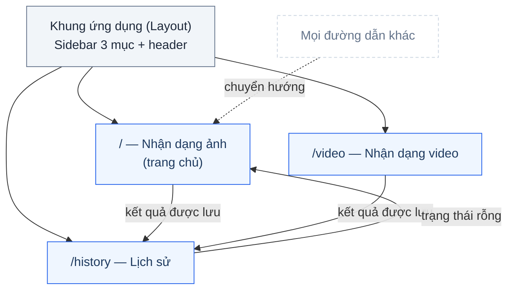
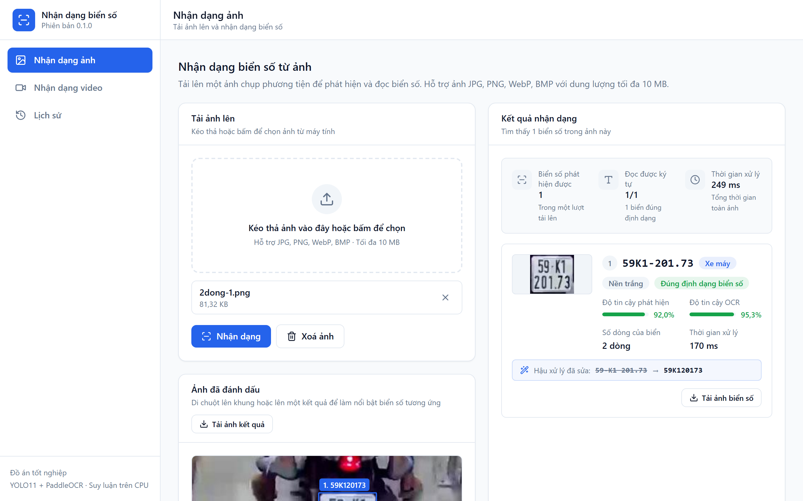
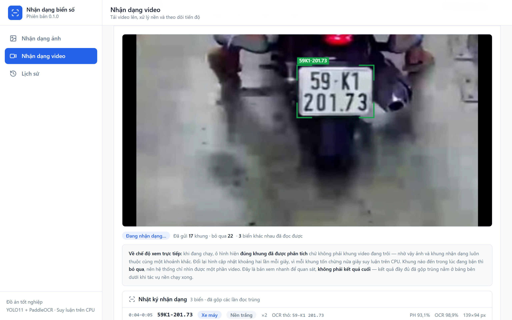
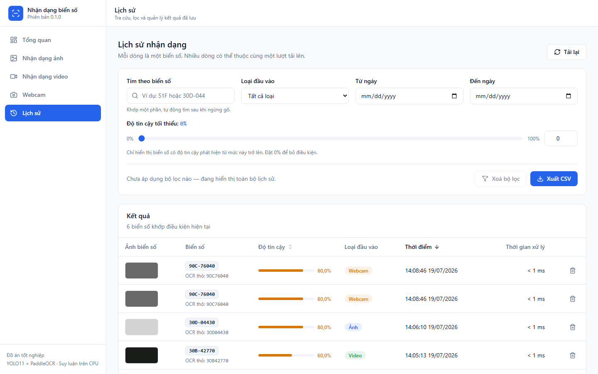
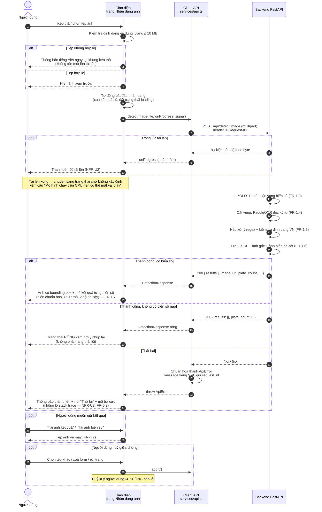

# Tài liệu giao diện người dùng

**Hệ thống nhận dạng biển số xe Việt Nam (ALPR)**
Phần giao diện web — React 18 + Vite 5 + TypeScript 5 (strict) + TailwindCSS 3

> ⚠️ **Hai thay đổi phạm vi trong ngày 2026-07-20.** Giao diện được thu gọn hai lần liên tiếp,
> nay còn **3 trang**: **Nhận dạng ảnh** (`/`, trang chủ) → **Nhận dạng video** (`/video`) →
> **Lịch sử** (`/history`). Mọi đường dẫn không khớp chuyển hướng về `/`.
>
> | # | Thay đổi | Yêu cầu bị ảnh hưởng | Năng lực còn lại |
> |---|---|---|---|
> | 1 | **Gỡ trang Webcam** | FR-3.1 / FR-3.4 chuyển **M → W** | Nhận dạng thời gian thực vẫn phục vụ và vẫn có kiểm thử ở **tầng API**: `POST /api/detect/frame` |
> | 2 | **Gỡ trang Tổng quan (Dashboard)** | FR-4.1 chuyển **M → W**, FR-4.2 chuyển **S → W** | Số liệu thống kê vẫn truy vấn được và vẫn có kiểm thử ở **tầng API**: `GET /api/statistics`, `GET /health` |
>
> FR-4.1 là **yêu cầu mức Must đầu tiên bị gỡ khỏi phạm vi** trong toàn dự án — ghi lại ở đây
> để lần đối chiếu sau không hiểu nhầm là sót việc. Xem
> [functional-requirements.md](../00-requirements/functional-requirements.md).
> Mã nguồn của cả hai trang (`pages/WebcamDetection.tsx`, `pages/Dashboard.tsx`,
> `components/dashboard/`, `components/detection/webcam/`, `hooks/useApi.ts`,
> các hàm `detectFrame` / `getStatistics` / `getHealth` trong `services/api.ts`)
> **còn nguyên trong lịch sử git**.
>
> Hệ quả đo được: gỡ thư viện biểu đồ `recharts` cùng trang Tổng quan làm **gói tải về giảm từ
> ~730 KB xuống 328,8 KB (giảm 55%)**; build thành công trong 2,14 s, `tsc --noEmit` 0 lỗi,
> ESLint sạch.

---

## 1. Mục tiêu và nguyên tắc thiết kế

### 1.1. Mục tiêu

Giao diện là **cửa duy nhất** người dùng cuối tiếp cận hệ thống. Mọi năng lực của pipeline
AI — phát hiện bằng YOLO11, đọc ký tự bằng PaddleOCR, hậu xử lý theo chuẩn biển số Việt Nam,
gộp trùng, lưu trữ — chỉ có giá trị nếu người dùng **thấy được** và **tin được**.

Ba mục tiêu cụ thể:

1. **Trình diễn được toàn bộ luồng nghiệp vụ** — hai nguồn đầu vào trên giao diện (ảnh, video)
   và tra cứu lịch sử, trên một ứng dụng duy nhất. *(Nguồn thứ ba — khung hình thời gian thực —
   phục vụ ở tầng API `POST /api/detect/frame`; số liệu thống kê tổng hợp phục vụ ở
   `GET /api/statistics`. Cả hai không còn trang riêng từ 2026-07-20.)*
2. **Trung thực về số liệu** — con số hiển thị phải nói đúng điều nó đo. Đây là yêu cầu
   nghiêm ngặt hơn thường lệ vì các số này đi thẳng vào chương Đánh giá của quyển đồ án.
3. **Không giấu sự thật kỹ thuật** — hệ thống chạy suy luận trên CPU, chậm hơn GPU nhiều lần.
   Giao diện nói rõ điều đó thay vì để người dùng đoán tại sao phải chờ.

### 1.2. Nguyên tắc thiết kế

| Nguyên tắc | Cách hiện thực |
|---|---|
| **Bốn trạng thái, không thiếu trạng thái nào** | Mỗi vùng dữ liệu đều xử lý đủ *loading / empty / error / success*. Riêng "empty" còn được tách nhỏ theo nguyên nhân (chưa gửi gì / đã xử lý nhưng không thấy biển số / không khớp bộ lọc) vì cách thoát khỏi mỗi trạng thái là khác nhau |
| **Kết quả rỗng không phải lỗi** | Ảnh xử lý xong mà không có biển số ⇒ HTTP 200 ⇒ hiện *trạng thái rỗng*, không hiện lỗi đỏ. Báo lỗi ở đây sẽ đẩy người dùng đi sửa một hệ thống đang chạy đúng |
| **Lỗi nói tiếng người** | Toàn bộ lỗi đi qua một bộ chuẩn hoá trong `services/api.ts`, ra thành `ApiError` với `message` tiếng Việt sẵn sàng hiển thị. Stack trace, traceback, mã lỗi kỹ thuật **không bao giờ** lên màn hình (NFR-U3, FR-6.3) |
| **Thao tác chậm phải có phản hồi** | Upload có thanh tiến độ thật (theo byte), suy luận có spinner + câu giải thích, tác vụ video có phần trăm, làm mới có trạng thái quay (NFR-U2) |
| **Trạng thái quan trọng nằm trên URL** | Bộ lọc, sắp xếp và số trang của Lịch sử được đồng bộ vào query string. Tải lại trang không mất bộ lọc; một kết quả tra cứu có thể gửi cho người khác bằng đường link |
| **Một quy ước đặt tên duy nhất** | Kiểu dữ liệu ở frontend dùng `snake_case` **y hệt JSON của API**. Không có lớp chuyển đổi. Backend đổi schema ⇒ TypeScript báo lỗi lúc biên dịch, thay vì trường lặng lẽ thành `undefined` lúc chạy |
| **Không hard-code hostname** | Origin backend đọc từ `VITE_API_URL`; mặc định rỗng ⇒ đi qua proxy same-origin. Triển khai là việc cấu hình, không phải build lại |

### 1.3. Ngôn ngữ

* **Văn bản người dùng nhìn thấy**: tiếng Việt, kể cả thông báo lỗi và nhãn cột.
* **Mã nguồn** (tên biến, tên hàm, comment, docstring): tiếng Anh.

Tách bạch như vậy để người đọc mã và người dùng sản phẩm không phải chia sẻ chung một vốn từ.

---

## 2. Sơ đồ điều hướng

Ứng dụng gồm **3 trang** nằm trong một khung chung (`Layout`) có sidebar cố định, theo đúng thứ tự
menu: **Nhận dạng ảnh** (trang chủ) → **Nhận dạng video** → **Lịch sử**.
Mọi đường dẫn không khớp đều chuyển hướng về trang chủ Nhận dạng ảnh, không để người dùng
rơi vào ngõ cụt. *(Trang Webcam và trang Tổng quan đều đã gỡ 2026-07-20 — xem ghi chú đầu tài liệu.)*

**Quan hệ giữa các trang:**

* Hai trang nhận dạng (ảnh / video) là **nguồn sinh dữ liệu**. Kết quả của cả hai — cùng với
  khung hình thời gian thực gửi qua API `POST /api/detect/frame` — đều chảy về cùng một bảng
  `detection_history`, nên trang Lịch sử là **đích chung**.
* Ba trang **không phụ thuộc lẫn nhau**: mỗi trang tự gọi API của mình, hỏng một trang không
  kéo đổ trang kia.
* Sau khi gỡ trang Tổng quan, giao diện **không còn màn hình chỉ-đọc-tổng-hợp** nào. Toàn bộ
  đồ thị điều hướng vì vậy có đúng một chiều chảy: *tạo dữ liệu → tra cứu dữ liệu*.

---

## 3. Mô tả từng màn hình

### 3.1. Nhận dạng ảnh (`/` — trang chủ)

**Chức năng:** tải lên một ảnh, xem vị trí và nội dung mọi biển số trong đó
(FR-1.1, FR-1.2, FR-1.7, FR-4.7).

**Bố cục hai cột:** cột trái là tải lên và ảnh đã đánh dấu, cột phải là danh sách kết quả.

**Thành phần:**

* **Khung kéo–thả** — chấp nhận JPG, PNG, WebP, BMP, tối đa 10 MB. Kiểm tra ở trình duyệt
  chỉ để **tiết kiệm cho người dùng một lần upload vô ích**; backend vẫn kiểm tra magic bytes
  và từ chối bằng 415 nếu tệp giả đuôi (FR-1.2, NFR-S1).
* **Ảnh đã đánh dấu** — bounding box vẽ chồng lên ảnh, toạ độ quy đổi theo tỉ lệ nên
  đúng ở mọi kích thước hiển thị. Rê chuột lên một khung sẽ làm nổi bật thẻ kết quả tương ứng
  và ngược lại — liên kết hai chiều giữa hình và danh sách.
* **Thẻ kết quả** cho từng biển số: ảnh biển số đã cắt, biển số sau chuẩn hoá, **chuỗi OCR thô**
  (khi khác kết quả cuối), độ tin cậy phát hiện và độ tin cậy OCR **tách riêng**, số dòng của biển,
  cờ hợp lệ theo định dạng Việt Nam.
* **Tải về** — nút xuất ảnh có vẽ sẵn bounding box (vẽ bằng canvas ở phía trình duyệt),
  và nút tải riêng từng ảnh biển số đã cắt (FR-4.7).

**Luồng thao tác (NFR-U1):** chọn ảnh → *(nhận dạng tự chạy ngay)* → xem kết quả — **một thao tác duy nhất**. Nút "Nhận dạng" riêng đã được bỏ ngày 24/07/2026: chọn ảnh chính là yêu cầu nhận dạng, cú bấm thêm không mang quyết định nào (đồng bộ với trang video, vốn đã tự phát khi chọn tệp).

**Bốn trạng thái:**

* *Loading* — thanh tiến độ upload **theo byte thật**, sau đó chuyển sang trạng thái chờ
  không xác định kèm câu "Mô hình chạy trên CPU nên bước này có thể mất vài giây".
  Nói trước để sự chậm trở thành thông tin, không thành nghi ngờ.
* *Empty (chưa gửi)* — "Chưa có kết quả", hướng dẫn thao tác tiếp theo.
* *Empty (đã xử lý, không có biển số)* — đây là **kết quả**, không phải lỗi. Hiện gợi ý cụ thể:
  chụp gần hơn, rõ nét hơn, biển ít bị che.
* *Error* — thông báo tiếng Việt + nút Thử lại + mã `request_id` để đối chiếu log máy chủ.
  Mã này thay cho việc phơi bày chi tiết nội bộ.
* *Success* — như mô tả trên.

Việc huỷ giữa chừng (chọn tệp khác, xoá form, rời trang) sẽ **abort** request đang bay và
**không** bị báo là lỗi — huỷ là ý người dùng.

### 3.2. Nhận dạng video (`/video`)

**Chức năng:** tải video lên, xử lý ở chế độ nền, theo dõi tiến độ, xem kết quả đã gộp trùng
(FR-2.1, FR-2.6, FR-2.5).

**Thành phần:**

* **Khung kéo–thả video** — MP4, MOV, AVI, MKV, tối đa 200 MB. Ngay dưới khung có ghi chú
  ước lượng thời gian: *"video 60 giây có thể mất khoảng 3–4 phút"*.
* **Bảng tiến độ tác vụ** — trạng thái (Đang chờ / Đang xử lý / Hoàn thành / Thất bại / Đã huỷ),
  phần trăm, số khung đã xử lý trên tổng số khung, nút **Làm mới** để hỏi ngay một lần.
* **Bảng kết quả** — danh sách biển số của tác vụ, đọc từ `GET /api/history?job_id=…`
  chứ không từ đối tượng tác vụ (đối tượng này chỉ mang số đếm). Nhờ vậy trang video và trang
  Lịch sử **không thể mâu thuẫn** về những gì một tác vụ đã tạo ra.
* **Tải video kết quả** — khi `output_url` có giá trị (FR-2.5).
* **Ghi chú gộp trùng** — luôn hiển thị dưới danh sách, giải thích rằng một xe xuất hiện
  trong hàng chục khung chỉ tính **một** bản ghi. Thiếu ghi chú này, người dùng đọc con số
  thấp và tưởng hệ thống bỏ sót (FR-2.4).

**Luồng thao tác:** chọn video → **Bắt đầu xử lý** → API trả `202 { job_id }` → giao diện
hỏi `GET /api/jobs/{job_id}` định kỳ cho tới khi trạng thái kết thúc → tự nạp danh sách biển số.

Trang giữ **`job_id`** làm nguồn sự thật chứ không giữ đối tượng tác vụ, vì hook
`useJobPolling` đã sở hữu đối tượng đó; giữ hai bản sao sẽ khiến chúng lệch nhau giữa các lần hỏi.
Việc hỏi tiến độ **tự dừng** khi trạng thái đã kết thúc — không dừng thì một tác vụ đã xong
vẫn bị hỏi mãi chừng nào tab còn mở.

**Bốn trạng thái:** *loading* (thanh upload rồi thanh tiến độ tác vụ) · *empty* ("Chưa có tác vụ nào")
· *error* (tách riêng lỗi tải lên, lỗi hỏi tiến độ, lỗi nạp danh sách kết quả — ba nguyên nhân khác nhau
nên ba nút thử lại khác nhau) · *success*.

### 3.3. Lịch sử (`/history`)

**Chức năng:** tra cứu, lọc, sắp xếp, xem chi tiết, xoá và xuất dữ liệu đã lưu
(FR-4.3 → FR-4.8, FR-5.1, FR-5.2).

**Thành phần:**

* **Thanh bộ lọc** — tìm theo biển số (khớp một phần, tự tìm sau khi ngừng gõ), lọc theo
  loại đầu vào, khoảng thời gian (từ ngày / đến ngày), ngưỡng độ tin cậy tối thiểu (thanh trượt
  0–100%). Kèm nút **Xoá bộ lọc** và **Xuất CSV**.
* **Bảng kết quả** — ảnh biển số đã cắt, biển số (kèm **chuỗi OCR thô** ngay bên dưới khi khác),
  thanh độ tin cậy, loại đầu vào, thời điểm, thời gian xử lý, nút xoá. Tiêu đề cột
  **Độ tin cậy** và **Thời điểm** bấm được để đảo thứ tự (FR-4.8).
* **Phân trang** — chọn 10 / 20 / 50 / 100 dòng mỗi trang; 100 là trần backend chấp nhận.
* **Modal chi tiết** — ảnh gốc, ảnh biển số đã cắt, hai độ tin cậy tách riêng, biển số sau
  chuẩn hoá, chuỗi OCR thô, số dòng của biển, thời gian xử lý, thời điểm nhận dạng, thời điểm lưu,
  toạ độ vùng chứa biển (pixel), và mã lần tải lên `source_job_id` (FR-4.6).
* **Hộp thoại xác nhận xoá** — nêu rõ rằng ảnh liên quan trên máy chủ cũng bị xoá (FR-5.1).

**Luồng thao tác:** mọi thay đổi bộ lọc đều **ghi lên URL**, URL đổi thì danh sách tự nạp lại.
Nhờ đó tải lại trang không mất bộ lọc và có thể chia sẻ kết quả tra cứu bằng đường link.

**Bốn trạng thái:** *loading* (skeleton lần đầu; các lần sau giữ bảng cũ, chỉ làm mờ nhẹ)
· *empty* (**hai kiểu khác nhau** — "không khớp bộ lọc" kèm nút xoá bộ lọc, và "chưa có dữ liệu"
kèm lối đi sang trang nhận dạng ảnh) · *error* · *success*.

Hai chi tiết kỹ thuật ảnh hưởng trực tiếp tới thứ người dùng nhìn thấy:

* Request cũ bị **abort** khi có request mới, kèm một bộ đếm tăng dần đảm bảo **chỉ phản hồi
  mới nhất được ghi vào state**. Không có cơ chế này, gõ nhanh hai ký tự có thể khiến phản hồi
  đến muộn của bộ lọc cũ ghi đè lên kết quả đúng.
* Xoá dòng **cuối cùng** của một trang sẽ lùi về trang trước, thay vì nạp lại một trang không
  còn tồn tại và hiện bảng trống.

### 3.4. Các trang đã gỡ khỏi giao diện (2026-07-20)

Hai trang dưới đây từng tồn tại và đã được **gỡ trong ngày 2026-07-20** theo hai lần thu hẹp
phạm vi liên tiếp. Mục này giữ lại để bản tài liệu sau không hiểu nhầm là sót việc, và để
người bảo trì biết năng lực tương ứng nay nằm ở đâu.

#### 3.4.1. Webcam — *trang đã gỡ 2026-07-20*

> Gỡ theo thay đổi phạm vi thứ nhất (FR-3.1/FR-3.4 chuyển M → W — xem
> [functional-requirements.md mục 4](../00-requirements/functional-requirements.md)).
> Năng lực nhận dạng thời gian thực **vẫn tồn tại ở tầng API** — `POST /api/detect/frame`
> với phiên gộp trùng theo `job_id`, có kiểm thử tự động (FR-3.2/3.3/3.5 vẫn Must ở mức API).
> Mã nguồn của trang (route, `pages/WebcamDetection.tsx`, `components/detection/webcam/`,
> hàm `detectFrame`) còn trong lịch sử git nếu cần khôi phục.

#### 3.4.2. Tổng quan (Dashboard) — *trang đã gỡ 2026-07-20*

> Gỡ theo thay đổi phạm vi thứ hai. **FR-4.1 chuyển M → W** — đây là yêu cầu mức **Must**
> đầu tiên bị gỡ khỏi phạm vi trong toàn dự án — và **FR-4.2 chuyển S → W**.
> Số liệu thống kê **vẫn truy vấn được nguyên vẹn** qua `GET /api/statistics`, tình trạng hệ thống
> qua `GET /health`; cả hai endpoint vẫn phục vụ và **vẫn có kiểm thử tự động ở backend**,
> chỉ là không còn màn hình nào của giao diện tiêu thụ chúng.
> Mã nguồn của trang (route `/dashboard`, `pages/Dashboard.tsx`, thư mục `components/dashboard/`,
> `hooks/useApi.ts`, các hàm `getStatistics` / `getHealth` trong `services/api.ts`, và gói
> `recharts`) còn trong lịch sử git nếu cần khôi phục.
> Riêng các kiểu dữ liệu `Statistics`, `StatisticsQuery`, `HealthStatus`, `InputTypeBreakdown`
> trong `src/types/index.ts` được **giữ lại có chủ đích** — chúng là bản sao hợp đồng dữ liệu của
> hai endpoint vẫn đang sống, nên vẫn phải khớp schema backend; lý do được ghi ngay trong tệp.
> Ảnh chụp màn hình cũ `docs/screenshots/dashboard.png` đã được **xoá** cùng trang: giữ lại
> một ảnh của màn hình không còn tồn tại chỉ tạo rủi ro có người dùng nhầm nó làm minh hoạ
> giao diện hiện hành. Cần xem lại thì lấy từ lịch sử git.

---

## 4. Sơ đồ tuần tự — luồng nhận dạng ảnh

Nhìn từ góc nhìn người dùng, từ lúc chọn tệp tới lúc thấy kết quả.

---

## 5. Bảng đối chiếu yêu cầu chức năng → màn hình

Danh sách yêu cầu lấy từ `docs/00-requirements/functional-requirements.md`.
Cột **Mức** giữ nguyên phân loại MoSCoW của tài liệu gốc (M = Must, S = Should, C = Could,
W = Won't). Bốn mã đổi mức theo hai thay đổi phạm vi ngày 2026-07-20:
**FR-3.1 / FR-3.4 (M → W)** khi gỡ trang Webcam, và **FR-4.1 (M → W) / FR-4.2 (S → W)**
khi gỡ trang Tổng quan.

### FR-1 — Nhận dạng từ ảnh

| Mã | Yêu cầu (rút gọn) | Mức | Màn hình đáp ứng | Trạng thái |
|---|---|---|---|---|
| FR-1.1 | Tải lên ảnh JPG/JPEG/PNG/BMP | M | Nhận dạng ảnh — khung kéo–thả (thêm cả WebP) | ✅ |
| FR-1.2 | Kiểm tra định dạng, ≤ 10 MB, ảnh giải mã được | M | Nhận dạng ảnh — kiểm tra ở trình duyệt + hiển thị lỗi 415/413 từ backend | ✅ |
| FR-1.3 | Phát hiện **tất cả** vùng biển số | M | Nhận dạng ảnh — overlay bounding box, `plate_count` | ✅ (hiển thị) |
| FR-1.4 | Cắt vùng và nhận dạng ký tự | M | Nhận dạng ảnh — ảnh biển đã cắt + `ocr_confidence` trên mỗi thẻ | ✅ (hiển thị) |
| FR-1.5 | Hậu xử lý, lưu **cả** chuỗi thô và chuỗi đã sửa | M | Nhận dạng ảnh + Lịch sử — hiện song song `raw_ocr_text` và `plate_number` | ✅ |
| FR-1.6 | Lưu CSDL kèm ảnh gốc và ảnh cắt | M | Lịch sử — bản ghi và hai ảnh xem được trong modal chi tiết | ✅ (hiển thị) |
| FR-1.7 | Hiện ảnh có bounding box, biển số, độ tin cậy, thời gian xử lý, không tải lại trang | M | Nhận dạng ảnh — cột kết quả | ✅ |

### FR-2 — Nhận dạng từ video

| Mã | Yêu cầu (rút gọn) | Mức | Màn hình đáp ứng | Trạng thái |
|---|---|---|---|---|
| FR-2.1 | Tải lên MP4/AVI/MOV ≤ 200 MB, trả mã tác vụ | M | Nhận dạng video — khung kéo–thả (thêm cả MKV) | ✅ |
| FR-2.2 | Trích khung hình theo bước nhảy cấu hình được | M | — (thuần backend) | ➖ ngoài phạm vi giao diện |
| FR-2.3 | Phát hiện và nhận dạng trên khung đã trích | M | Nhận dạng video — bảng kết quả | ✅ (hiển thị) |
| FR-2.4 | Gộp trùng cùng một biển qua nhiều khung | M | Nhận dạng video — kết quả đã gộp + ghi chú giải thích cách đếm | ✅ (hiển thị + giải thích) |
| FR-2.5 | Xuất video kết quả có vẽ sẵn nhãn | M | Nhận dạng video — nút **Tải video kết quả** khi `output_url` có giá trị | ✅ |
| FR-2.6 | Hiện tiến độ % và **cho phép huỷ** tác vụ | S | Nhận dạng video — bảng tiến độ ✅; nút **Huỷ tác vụ** hiện diện nhưng **bị vô hiệu hoá** | ⚠️ một phần |

### FR-3 — Nhận dạng thời gian thực (Webcam)

> Trang Webcam đã gỡ 2026-07-20 (xem mục 3.4). FR-3.2/3.3/3.5 vẫn **Must** nhưng được đáp ứng
> và kiểm chứng ở **tầng API**, ngoài phạm vi giao diện — tương tự FR-2.2.

| Mã | Yêu cầu (rút gọn) | Mức | Màn hình đáp ứng | Trạng thái |
|---|---|---|---|---|
| FR-3.1 | Xin quyền và hiển thị luồng webcam | W | — (trang Webcam đã gỡ 2026-07-20, mã còn trong lịch sử git) | ➖ gỡ khỏi giao diện |
| FR-3.2 | Nhận khung hình gửi về backend theo từng yêu cầu | M | — (tầng API: `POST /api/detect/frame`) | ➖ ngoài phạm vi giao diện |
| FR-3.3 | Phát hiện và nhận dạng trên khung hình trực tiếp | M | — (tầng API, cùng endpoint trên) | ➖ ngoài phạm vi giao diện |
| FR-3.4 | Vẽ bounding box và nhãn chồng lên khung hình | W | — (trang Webcam đã gỡ 2026-07-20) | ➖ gỡ khỏi giao diện |
| FR-3.5 | Lưu lịch sử phiên có gộp trùng theo `job_id` | M | — (tầng API); bản ghi tạo ra vẫn tra cứu được ở trang Lịch sử | ➖ ngoài phạm vi giao diện |

### FR-4 — Dashboard, lịch sử và tra cứu

> Trang Tổng quan đã gỡ 2026-07-20 (xem mục 3.4.2). FR-4.1 chuyển **M → W** và FR-4.2 chuyển
> **S → W**: hai yêu cầu này nói về *màn hình* thống kê, mà màn hình đó không còn.
> Dữ liệu để dựng lại chúng thì **vẫn phục vụ đầy đủ** ở `GET /api/statistics` và vẫn có
> kiểm thử ở backend. FR-4.3 → FR-4.8 **không đổi** — chúng thuộc trang Lịch sử.

| Mã | Yêu cầu (rút gọn) | Mức | Màn hình đáp ứng | Trạng thái |
|---|---|---|---|---|
| FR-4.1 | Chỉ số tổng hợp: tổng lượt, độ tin cậy TB, thời gian xử lý TB, phân bố theo nguồn | W | — (trang Tổng quan đã gỡ 2026-07-20; dữ liệu vẫn có ở `GET /api/statistics`, mã còn trong lịch sử git) | ➖ gỡ khỏi giao diện |
| FR-4.2 | Biểu đồ số lượt theo thời gian | W | — (trang Tổng quan đã gỡ 2026-07-20; `statistics.daily_counts` vẫn được API trả về) | ➖ gỡ khỏi giao diện |
| FR-4.3 | Danh sách lịch sử có phân trang | M | Lịch sử — bảng + phân trang 10/20/50/100 | ✅ |
| FR-4.4 | Tìm theo biển số, khớp một phần | M | Lịch sử — ô tìm kiếm (debounce) | ✅ |
| FR-4.5 | Lọc theo loại đầu vào, khoảng thời gian, ngưỡng tin cậy | M | Lịch sử — thanh bộ lọc, kết hợp được nhiều điều kiện | ✅ |
| FR-4.6 | Xem chi tiết: ảnh gốc, ảnh cắt, toàn bộ metadata | M | Lịch sử — modal chi tiết | ✅ |
| FR-4.7 | Tải về ảnh kết quả hoặc ảnh biển số đã cắt | S | Nhận dạng ảnh — nút tải ảnh đã đánh dấu và tải từng ảnh biển | ✅ |
| FR-4.8 | Sắp xếp theo thời gian / độ tin cậy, tăng–giảm | C | Lịch sử — bấm tiêu đề cột; trạng thái sắp xếp lưu trên URL | ✅ |

### FR-5 — Quản lý dữ liệu

| Mã | Yêu cầu (rút gọn) | Mức | Màn hình đáp ứng | Trạng thái |
|---|---|---|---|---|
| FR-5.1 | Xoá một bản ghi kèm tệp ảnh liên quan | S | Lịch sử — nút xoá trên mỗi dòng + hộp thoại xác nhận nêu rõ ảnh cũng bị xoá | ✅ |
| FR-5.2 | Xuất lịch sử **có áp bộ lọc hiện hành** ra CSV | S | Lịch sử — nút **Xuất CSV**, mang đúng bộ lọc đang áp dụng | ✅ |
| FR-5.3 | Script dọn tệp mồ côi | C | — (script vận hành) | ➖ ngoài phạm vi giao diện |
| FR-5.4 | Xoá nhiều bản ghi theo lựa chọn | C | — | ❌ chưa làm |

### FR-6 — Hệ thống và vận hành (phần liên quan giao diện)

| Mã | Yêu cầu (rút gọn) | Mức | Màn hình đáp ứng | Trạng thái |
|---|---|---|---|---|
| FR-6.1 | Endpoint sức khoẻ báo trạng thái mô hình và CSDL | S | — (tầng API: `GET /health`, vẫn phục vụ và vẫn có kiểm thử; thẻ **Trạng thái hệ thống** hiển thị nó đã đi cùng trang Tổng quan 2026-07-20) | ➖ ngoài phạm vi giao diện |
| FR-6.2 | Log có cấu trúc cho mọi lượt và mọi lỗi | S | Toàn bộ — mỗi request mang `X-Request-ID`, mã này được hiện lại khi có lỗi | ✅ (phần đóng góp của giao diện) |
| FR-6.3 | Lỗi thân thiện, **không** rò rỉ stack trace | M | Toàn bộ — bộ chuẩn hoá lỗi trong `services/api.ts` | ✅ |
| FR-6.4 | Cấu hình đọc từ biến môi trường, không hard-code | M | Toàn bộ — `VITE_API_URL`, `VITE_API_TIMEOUT_MS` | ✅ |

**Tổng kết — cách tính.** Xuất phát từ **34** yêu cầu chức năng của
`functional-requirements.md` (FR-1: 7 · FR-2: 6 · FR-3: 5 · FR-4: 8 · FR-5: 4 · FR-6: 4 = 34),
trừ đi hai nhóm không thuộc phạm vi đánh giá của giao diện:

| Nhóm | Các mã | Số lượng |
|---|---|:---:|
| **Ngoài phạm vi giao diện** — vẫn được đáp ứng và kiểm thử, nhưng ở tầng khác | FR-2.2 (trích khung hình), FR-5.3 (script dọn tệp mồ côi), FR-3.2 / FR-3.3 / FR-3.5 (tầng API `POST /api/detect/frame`), FR-6.1 (tầng API `GET /health`) | **6** |
| **Đã gỡ khỏi giao diện — mức W** theo hai thay đổi phạm vi 2026-07-20 | FR-3.1, FR-3.4 (gỡ trang Webcam) · FR-4.1, FR-4.2 (gỡ trang Tổng quan) | **4** |

⇒ Còn lại **34 − 6 − 4 = 24** yêu cầu thuộc phạm vi đánh giá của giao diện. Trong 24 yêu cầu đó:

* **22 đã đáp ứng đầy đủ**;
* **1 đáp ứng một phần** — FR-2.6 (có tiến độ, thiếu chức năng huỷ);
* **1 chưa làm** — FR-5.4 (xoá hàng loạt, mức Could).

*(22 + 1 + 1 = 24 ✓)*

**So với bản trước hai thay đổi phạm vi:** con số từng là 5 ngoài phạm vi / 2 đã gỡ /
27 còn lại với 25 đáp ứng đầy đủ. Chênh lệch đến từ đúng ba mã: FR-4.1 và FR-4.2 chuyển sang
nhóm "đã gỡ", FR-6.1 chuyển sang nhóm "ngoài phạm vi giao diện" (endpoint `GET /health` không
đổi gì, chỉ là không còn màn hình nào hiển thị nó).

**Về mức Must.** Toàn bộ yêu cầu mức **M (Must)** còn nằm trong phạm vi giao diện đều đã đáp ứng
đầy đủ. Cần nói rõ điều đã đổi: **FR-4.1 là yêu cầu mức Must đầu tiên của dự án bị gỡ khỏi
phạm vi**, chứ không phải một yêu cầu Must chưa làm xong. Đây là quyết định thu hẹp phạm vi có
chủ đích, và dữ liệu để đáp ứng lại nó bất cứ lúc nào vẫn còn nguyên ở `GET /api/statistics`.

---

## 6. Các quyết định thiết kế đáng chú ý

### 6.1. Hàng đợi một khe cho luồng khung hình thời gian thực

> *Ghi chú 2026-07-20:* trang Webcam đã gỡ khỏi giao diện. Quyết định dưới đây được **giữ lại
> làm tư liệu thiết kế** và nay là **yêu cầu đối với bất kỳ client nào gọi**
> `POST /api/detect/frame` (xem ràng buộc hiệu năng ở FR-3).

**Quyết định:** vòng lặp gửi khung hình chỉ cho phép **đúng một request đang bay**.
Khi bộ đếm thời gian kích hoạt mà khe vẫn bận, khung hình đó bị **bỏ đi**, **không xếp hàng**.
Số khung bị bỏ được hiển thị công khai trên bảng đo, kèm giải thích ngay dưới đó.

**Lý do:** suy luận chạy trên **CPU**, mỗi khung mất khoảng 300–400 ms, tức chừng 5 FPS.
Giả sử dùng cách ngây thơ — bộ đếm 700 ms, mỗi lần kích hoạt thì gửi một khung và chờ:

* Chỉ cần **một** khung mất 900 ms là request thứ hai đã khởi động trước khi khung đầu trả về.
* Từ đó trở đi hàng đợi **chỉ dài thêm**, không bao giờ ngắn lại — vì tốc độ vào (1 khung/700 ms)
  lớn hơn tốc độ ra (1 khung/900 ms).
* Hệ quả: độ trễ **cộng dồn**, bounding box tụt lại xa dần so với hình đang phát, bộ nhớ trình duyệt
  phình lên vì hàng chục blob JPEG đang chờ, và tab **treo** dưới sức nặng các request tồn đọng.

Bỏ khung hình **không mất gì**: khung tiếp theo chỉ cách 700 ms và mang hình **mới hơn**.
Giữ một khung cũ trong hàng đợi để xử lý sau là giữ lại một tấm ảnh **đã lỗi thời**.

Hệ quả thiết kế đi kèm: các mức chu kỳ trong dropdown là **tần suất thử**, không phải thông lượng
đảm bảo. Chọn 400 ms trên máy cần 600 ms mỗi khung **không** cho 2,5 FPS — nó cho đúng tốc độ như cũ,
chỉ thêm nhiều khung bị bỏ. Điều này được ghi rõ trong tài liệu mã nguồn để người bảo trì sau không
"tối ưu" bằng cách hạ chu kỳ xuống.

**Cơ chế bảo vệ đi kèm:** sau 5 lỗi liên tiếp, vòng lặp tự tạm dừng. Không có nó, một backend đã chết
sẽ bị gọi mỗi 700 ms cho tới khi người dùng đóng tab, và cùng một thông báo lỗi nhấp nháy vô tận.

### 6.2. Phân biệt "lượt nhận dạng" và "biển số phát hiện"

> *Ghi chú 2026-07-20:* trang Tổng quan đã gỡ khỏi giao diện. Quyết định dưới đây được **giữ lại
> làm tư liệu thiết kế** — phần **hợp đồng dữ liệu** của nó (`total_jobs` ≠ `total_detections`,
> `by_input_type` tách `job_count` / `detection_count`) **vẫn còn nguyên** trong phản hồi của
> `GET /api/statistics` và trong các kiểu dữ liệu giữ lại ở `src/types/index.ts`, nên nó là
> **yêu cầu đối với bất kỳ client nào tiêu thụ endpoint đó**. Phần nói về cách trình bày
> (thẻ, biểu đồ, quy ước màu) mô tả trang đã gỡ, đọc như đặc tả tham chiếu nếu dựng lại.

**Quyết định:** dashboard hiển thị `total_jobs` và `total_detections` thành **hai thẻ riêng biệt,
đặt cạnh nhau**, mỗi thẻ có nhãn khác nhau, có dòng mô tả, và có tooltip giải thích kèm ví dụ.
Cả hai biểu đồ (theo ngày và theo nguồn) cũng vẽ **hai chuỗi** thay vì một, dùng **cùng một quy ước màu
trên mọi biểu đồ**: xanh dương luôn là lượt, xanh lá luôn là biển số.

| Chỉ số | Nhãn hiển thị | Đơn vị đếm |
|---|---|---|
| `total_jobs` | **Lượt nhận dạng** | Số **tệp / phiên** đã tải lên và xử lý |
| `total_detections` | **Biển số phát hiện** | Số **biển số** đọc được |

Một ảnh chứa 3 biển số = **1 lượt** và **3 biển số**.

**Lý do:** đây là chỗ dễ sai nhất trong toàn bộ phần thống kê, và cái sai này **nguy hiểm vì trông
vẫn hợp lý**. Gọi cả hai là "số lần nhận dạng" thì:

* Người đọc coi hai con số là thay thế được cho nhau.
* Mọi tỉ lệ tính từ đó (biển/lượt, thời gian/lượt) trở nên vô nghĩa mà không có dấu hiệu báo động.
* Một phiên webcam 30 giây có thể tạo hàng chục biển số nhưng vẫn chỉ là **một** lượt — nếu gộp,
  webcam sẽ nuốt chửng thống kê và làm sai lệch so sánh giữa ba nguồn đầu vào.

Chính vì rủi ro này mà quyết định ở mục 6.1 (một `job_id` cho cả phiên webcam) là **bắt buộc**,
không phải tuỳ chọn: gửi mỗi khung hình không kèm `job_id` sẽ mở một job mới cho **từng khung**,
biến một phiên 30 giây thành ~40 lượt tải lên. Không có gì hỏng thấy được — số thống kê chỉ lặng lẽ
trở nên sai. Rủi ro này **không mất đi khi gỡ trang Tổng quan**: nó nằm ở tầng dữ liệu, và
`GET /api/statistics` vẫn đang trả về đúng những con số đó.

Bảng `by_input_type` cũng tách `job_count` và `detection_count`, và đây là lý do chọn **biểu đồ cột nhóm
thay vì biểu đồ tròn**: biểu đồ tròn chỉ mã hoá được **một** đại lượng, nên sẽ giấu mất đúng cái khác biệt
đáng nói nhất giữa webcam và ảnh tĩnh.

### 6.3. Hiển thị `raw_ocr_text` cạnh `plate_number`

**Quyết định:** khi chuỗi OCR thô **khác** biển số cuối cùng, giao diện hiển thị **cả hai**
kèm ghi chú rằng chuỗi đã qua hậu xử lý. Điều này áp dụng ở **ba nơi**: thẻ kết quả trang ảnh,
dòng trong bảng Lịch sử, và modal chi tiết. Khi hai chuỗi trùng nhau thì không hiện lặp,
tránh làm rối màn hình bằng thông tin không mang tin.

**Lý do:** FR-1.5 yêu cầu lưu song song hai chuỗi, và mục đích của việc lưu song song đó là
**đo được mức đóng góp riêng của bước hậu xử lý regex**. Nếu giao diện chỉ hiện kết quả cuối,
dữ liệu vẫn nằm trong CSDL nhưng **không ai nhìn thấy** — và một số liệu không quan sát được
thì không thể đưa vào phần Đánh giá.

Hiển thị song song cho ba lợi ích cụ thể:

1. **Thấy ngay hậu xử lý làm gì** — `90C76040` → `90C-76040` là chuẩn hoá dấu gạch;
   `51A-I234O` → `51A-12340` là sửa nhầm ký tự O/0 và I/1.
2. **Phát hiện hậu xử lý sửa sai** — nếu regex biến một chuỗi đúng thành chuỗi sai, chỉ có cách
   nhìn cả hai mới thấy được.
3. **Bằng chứng trực quan cho quyển đồ án** — ảnh chụp màn hình có sẵn cặp thô/đã sửa là minh chứng
   trực tiếp, không cần dựng thêm bảng số liệu.

Cùng tinh thần đó, `confidence` (bước phát hiện YOLO) và `ocr_confidence` (bước đọc ký tự) **luôn
hiển thị tách biệt, không gộp trung bình**. Gộp lại thì khi chất lượng kém sẽ không biết bước nào
đang kém — mà đó chính là phân tích cần cho chương Đánh giá.

### 6.4. Xử lý bất đồng bộ cho video

Trang video **không** chờ phản hồi đồng bộ. API trả `202 { job_id }` ngay, giao diện hỏi tiến độ định kỳ.
Video 60 giây cần khoảng 200 giây trên CPU — chờ đồng bộ **chắc chắn** vượt timeout HTTP,
và người dùng sẽ thấy một lỗi mạng cho một tác vụ thực ra vẫn đang chạy tốt.

Việc hỏi tiến độ **tự dừng** khi tác vụ đạt trạng thái kết thúc (`completed` / `failed` / `cancelled`).

### 6.5. Trạng thái tra cứu nằm trên URL

Bộ lọc, sắp xếp và số trang của Lịch sử được đồng bộ vào query string thay vì giữ trong state cục bộ.
Đổi lại một chút phức tạp, được ba thứ: tải lại trang không mất bộ lọc, nút Back của trình duyệt hoạt động
đúng nghĩa, và một kết quả tra cứu có thể dán vào báo cáo dưới dạng đường link tái lập được.

### 6.6. Lỗi được chuẩn hoá tại một điểm duy nhất

Mọi lỗi HTTP đi qua interceptor trong `services/api.ts` và ra thành một kiểu `ApiError` thống nhất,
với `message` **tiếng Việt sẵn sàng hiển thị**. Thông báo do backend cung cấp luôn được ưu tiên
(backend biết chính xác cái gì hỏng); chỉ khi không có mới dùng bản dự phòng theo mã HTTP.

Mỗi request mang một `X-Request-ID`. Khi lỗi, mã này được hiện cho người dùng trích dẫn — đủ để đối chiếu
ngược với log máy chủ mà **không** phơi bày bất kỳ chi tiết nội bộ nào.

### 6.7. Nút "Huỷ tác vụ" hiện diện nhưng vô hiệu hoá

FR-2.6 yêu cầu chức năng huỷ. Worker phía backend **có** tôn trọng việc huỷ — nó đọc lại trạng thái tác vụ
sau mỗi vài khung và dừng — nhưng **không có route HTTP nào đặt được trạng thái đó**: tài liệu OpenAPI
đang chạy chỉ phơi bày 9 đường dẫn (mang 10 thao tác), không đường nào huỷ tác vụ.

Nút vì vậy được để **hiện diện và vô hiệu hoá**, kèm tooltip "Chức năng đang được phát triển",
thay vì nối vào một endpoint tự bịa. Gọi một endpoint không tồn tại sẽ nhận 404 và để người dùng
**tin rằng tác vụ đã dừng trong khi nó vẫn chạy** — một lời nói dối tệ hơn hẳn một nút xám.

---

## 7. Đánh giá đối chiếu NFR-U1 → NFR-U5

| Mã | Yêu cầu | Cách đáp ứng | Kết luận |
|---|---|---|---|
| **NFR-U1** | Người dùng mới hoàn thành lượt nhận dạng ảnh đầu tiên **≤ 3 click**, không cần đọc tài liệu | Trang chủ nay chính là *Nhận dạng ảnh* (từ 2026-07-20), và từ 24/07/2026 nhận dạng **tự chạy ngay khi chọn ảnh** — chỉ còn **1 thao tác duy nhất**: bấm khung kéo–thả và chọn tệp (hoặc kéo thả). Trạng thái rỗng của trang Lịch sử cũng có lối đi thẳng sang trang chủ. Mọi khung rỗng đều ghi sẵn việc cần làm tiếp | ✅ Đạt |
| **NFR-U2** | 100% thao tác > 500 ms có phản hồi trực quan | Tải ảnh/video: thanh tiến độ **theo byte thật**. Suy luận: spinner + câu giải thích lý do chậm. Tác vụ video: phần trăm + số khung/tổng khung, cập nhật định kỳ. Tải danh sách: skeleton lần đầu, làm mờ bảng cũ ở lần sau. Nút *Làm mới* / *Tải lại*: biểu tượng xoay + nhãn *Đang tải…*. Xoá bản ghi: nút chuyển trạng thái đang xử lý. Tải tệp về: nút hiện *Đang xuất…* | ✅ Đạt |
| **NFR-U3** | Lỗi tiếng Việt, nêu nguyên nhân và cách khắc phục, không lộ mã lỗi kỹ thuật | Toàn bộ lỗi đi qua một bộ chuẩn hoá duy nhất. Lỗi camera có panel riêng gồm *nguyên nhân* + *cách sửa cụ thể theo đúng nguyên nhân*. Lỗi bộ lọc rỗng đi kèm nút *Xoá bộ lọc*. Không hiện stack trace, không hiện mã HTTP; thay vào đó là `request_id` để đối chiếu log | ✅ Đạt |
| **NFR-U4** | Dùng được từ 1366×768 trở lên, không vỡ layout | Sidebar cố định từ breakpoint `lg` (1024px) trở lên, dưới ngưỡng đó chuyển thành ngăn kéo có nút đóng. Trang ảnh dùng lưới 2 cột co giãn `minmax(0, …)` nên nội dung dài không đẩy vỡ khung. Bảng lịch sử và bảng kết quả video cuộn ngang trong khung riêng. Ảnh chụp màn hình trong tài liệu này chụp ở **1440×900**. *(Lưới thẻ chỉ số 2 cột / 4 cột từng được nêu ở đây đã đi cùng trang Tổng quan 2026-07-20.)* | ✅ Đạt (kiểm tra bằng ảnh chụp thực tế ở 1440×900; **chưa** đo thủ công ở đúng 1366×768) |
| **NFR-U5** | Tương phản màu đạt WCAG AA (≥ 4,5:1) cho chữ chính | Bảng màu định nghĩa tập trung trong `tailwind.config.js` + `index.css` theo cặp nền/chữ (`surface`/`content`, `content-muted`), không rải màu tuỳ tiện trong từng thành phần. Chữ chính dùng tông rất tối trên nền trắng/xám nhạt. Trạng thái (thành công / cảnh báo / lỗi) **không chỉ dùng màu**: luôn kèm biểu tượng và chữ, nên vẫn đọc được khi mù màu | ⚠️ Đạt theo thiết kế, **chưa đo bằng công cụ** (xem mục 8) |

---

## 8. Hạn chế hiện tại và hướng cải thiện

### 8.1. Hạn chế về chức năng

| # | Hạn chế | Ảnh hưởng | Hướng xử lý |
|---|---|---|---|
| 1 | **Không huỷ được tác vụ video** (FR-2.6, mức S). API không có endpoint huỷ; nút hiện diện nhưng vô hiệu hoá | Người dùng lỡ tải nhầm video 200 MB phải chờ hết | Backend bổ sung `POST /api/jobs/{id}/cancel`; giao diện chỉ cần bỏ `disabled` và nối hàm — phần còn lại đã sẵn sàng |
| 2 | **Không xoá được nhiều bản ghi cùng lúc** (FR-5.4, mức C) | Dọn dữ liệu thử nghiệm phải xoá từng dòng | Thêm cột checkbox + gọi `DELETE` tuần tự, hoặc backend bổ sung endpoint xoá theo lô |
| 3 | **Xuất chỉ có CSV, chưa có JSON** (FR-5.2 nêu "CSV hoặc JSON") | Nhỏ — CSV đã đáp ứng yêu cầu chấp nhận (mở được bằng Excel, UTF-8 có BOM) | Thêm tuỳ chọn định dạng khi backend hỗ trợ |
| 4 | **Trang video chưa xem trước video kết quả ngay trong giao diện** — chỉ có nút tải về | Người dùng phải tải xuống mới xem được nhãn đã vẽ | Nhúng thẻ `<video>` trỏ tới `output_url` |
| 5 | **Danh sách kết quả một tác vụ video giới hạn 100 dòng** (trần `MAX_PAGE_SIZE` của backend) | Video sinh > 100 biển số khác nhau sẽ bị cắt bớt ở trang này | Đã có lối thoát: toàn bộ dữ liệu vẫn tra cứu được ở trang Lịch sử bằng bộ lọc. Có thể thêm phân trang cho bảng này |

### 8.2. Hạn chế về kiểm chứng

| # | Hạn chế | Hướng xử lý |
|---|---|---|
| 6 | ✅ **Đã giải quyết.** Khi tài liệu này được viết lần đầu, backend còn chạy `StubPipeline` nên biển số hiển thị là giả lập. **Hiện backend đã nạp mô hình thật** (`models/baseline-416-v1.pt`, `/health` → `model_loaded: true`) và `StubPipeline` đã bị đưa ra khỏi đường chạy chính. Đúng như dự đoán, hợp đồng API không đổi ⇒ **frontend không phải sửa dòng nào** | Còn lại: chụp lại bộ ảnh minh hoạ với kết quả nhận dạng thật (xem hạn chế 10) |
| 7 | **NFR-U5 chưa được đo bằng công cụ.** Tương phản màu đạt theo thiết kế nhưng chưa chạy axe DevTools hay Lighthouse để có số liệu tỉ lệ tương phản cụ thể | Chạy Lighthouse Accessibility + axe DevTools trên cả 3 trang, ghi lại tỉ lệ đo được cho từng cặp màu chính |
| 8 | **NFR-U4 chưa kiểm tra ở đúng 1366×768.** Ảnh chụp minh hoạ ở 1440×900; bố cục đã tính cho ngưỡng 1366 nhưng chưa có bằng chứng chụp màn hình ở đúng độ phân giải đó | Chụp lại bộ ảnh ở 1366×768 và bổ sung vào `docs/screenshots/` |
| 9 | **Chưa có kiểm thử tự động cho giao diện.** `playwright` đã nằm trong devDependencies và đã dùng để chụp ảnh màn hình, nhưng chưa có bộ test hồi quy | Viết test E2E cho luồng chính: tải ảnh → thấy kết quả; lọc lịch sử → đúng số dòng; xoá → biến mất |
| 10 | **Ảnh chụp màn hình hiện chỉ ở trạng thái rỗng/ban đầu** với các trang Ảnh và Video (trang Webcam và trang Tổng quan đều đã gỡ 2026-07-20). Chưa có ảnh minh hoạ trạng thái *success* của hai trang này | Chụp bổ sung sau khi có mô hình thật và dữ liệu mẫu đủ đại diện |
| 11 | **Ba ảnh chụp còn lại được chụp khi giao diện còn năm mục điều hướng và trang chủ là Tổng quan** — thanh bên trong ảnh không khớp giao diện hiện hành. (`dashboard.png` và `webcam.png` đã xoá cùng hai trang; lấy lại được từ lịch sử git nếu cần.) | **Chụp lại cả ba ảnh** trên giao diện 3 trang trước khi ghép quyển đồ án |

### 8.3. Hướng cải thiện thêm

1. **Dựng lại màn hình thống kê nếu phạm vi được mở lại** — dữ liệu chưa mất gì: `GET /api/statistics`
   và `GET /health` vẫn phục vụ, các kiểu dữ liệu tương ứng vẫn còn trong `src/types/index.ts`,
   và toàn bộ mã trang cũ còn trong lịch sử git. Nếu dựng lại, cân nhắc thư viện biểu đồ nhẹ hơn
   `recharts` — riêng gói này chiếm phần lớn phần dung lượng đã cắt được khi gỡ trang
   (~730 KB → 328,8 KB).
2. **Chế độ tối** — bảng màu đã tập trung ở một chỗ nên chi phí thêm không lớn.
3. **Xem trước theo lô** — hiện mỗi lần chỉ xử lý một ảnh. Tải lên nhiều ảnh cùng lúc sẽ hữu ích
   khi cần dựng nhanh dữ liệu đánh giá.
4. **Điều hướng bằng bàn phím cho bảng lịch sử** — modal và nút đã hỗ trợ, nhưng chưa có phím tắt
   di chuyển giữa các dòng.
5. **Ghim so sánh** — chọn hai bản ghi để so sánh cạnh nhau chuỗi thô và chuỗi đã hậu xử lý,
   phục vụ trực tiếp cho phần đánh giá đóng góp của bước regex.

---

## 9. Tài liệu liên quan

| Tài liệu | Nội dung |
|---|---|
| `frontend/README.md` | Cài đặt, chạy, cấu trúc thư mục, biến môi trường, proxy, xử lý sự cố |
| `docs/00-requirements/functional-requirements.md` | Danh sách yêu cầu chức năng FR-1 → FR-6 |
| `docs/00-requirements/non-functional-requirements.md` | Yêu cầu phi chức năng, gồm NFR-U1 → NFR-U5 |
| `docs/architecture/system-architecture.md` | Kiến trúc tổng thể và các quyết định AD-xx |
| `docs/screenshots/` | Ảnh chụp màn hình dùng trong tài liệu này |
