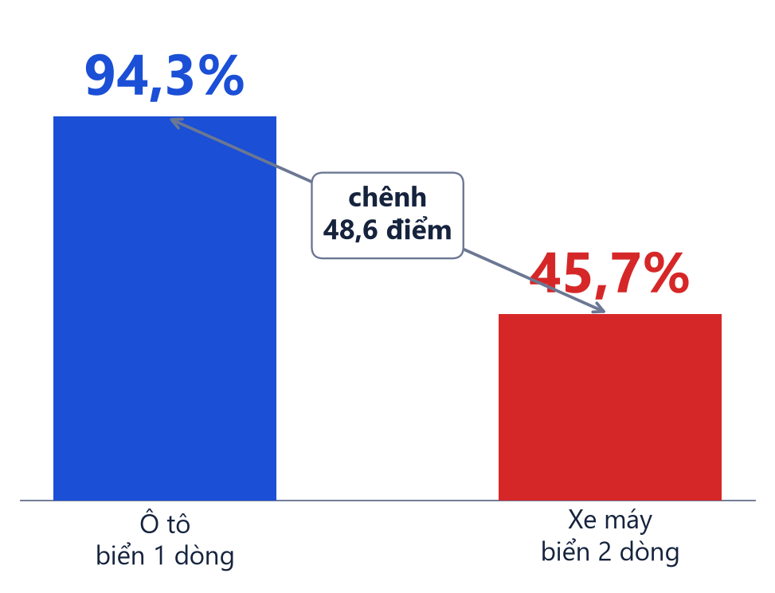
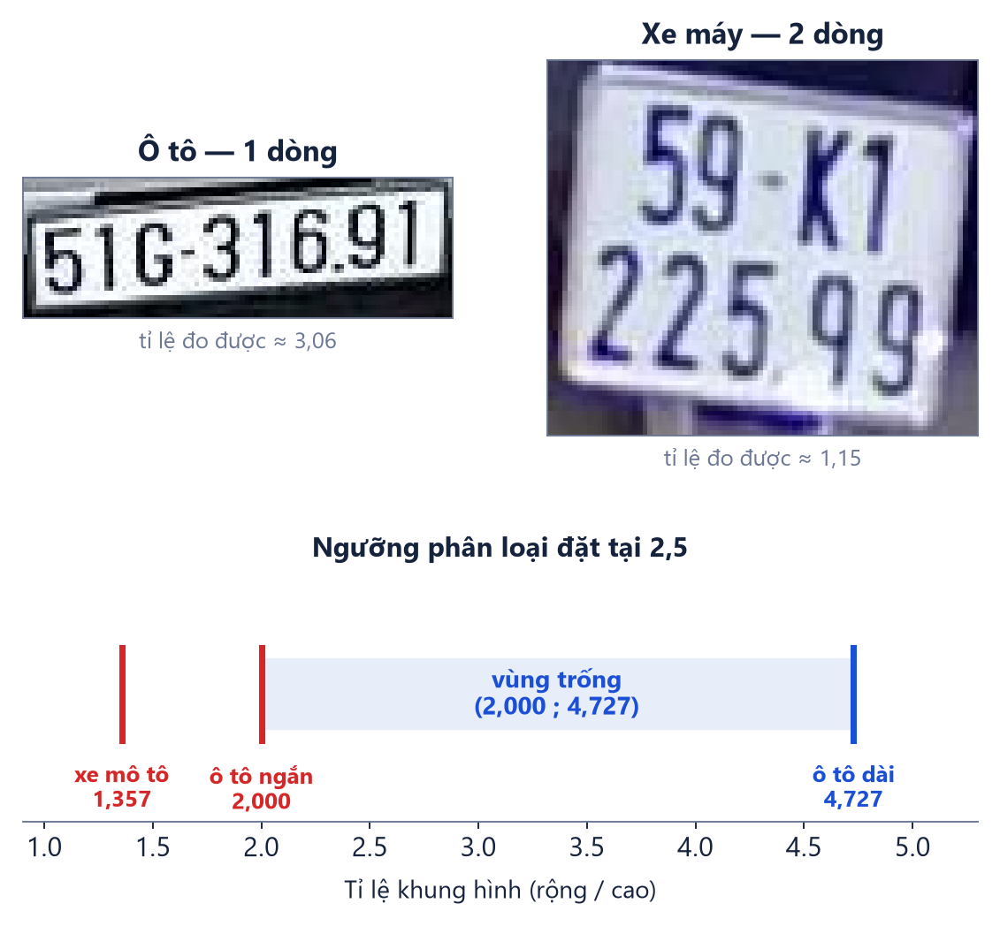
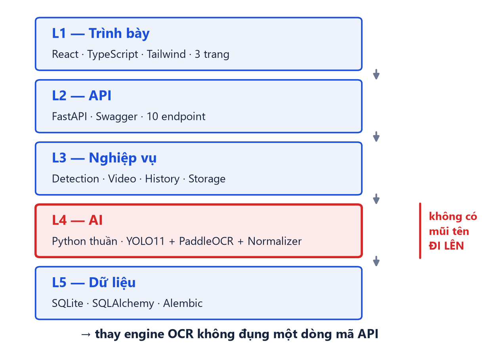
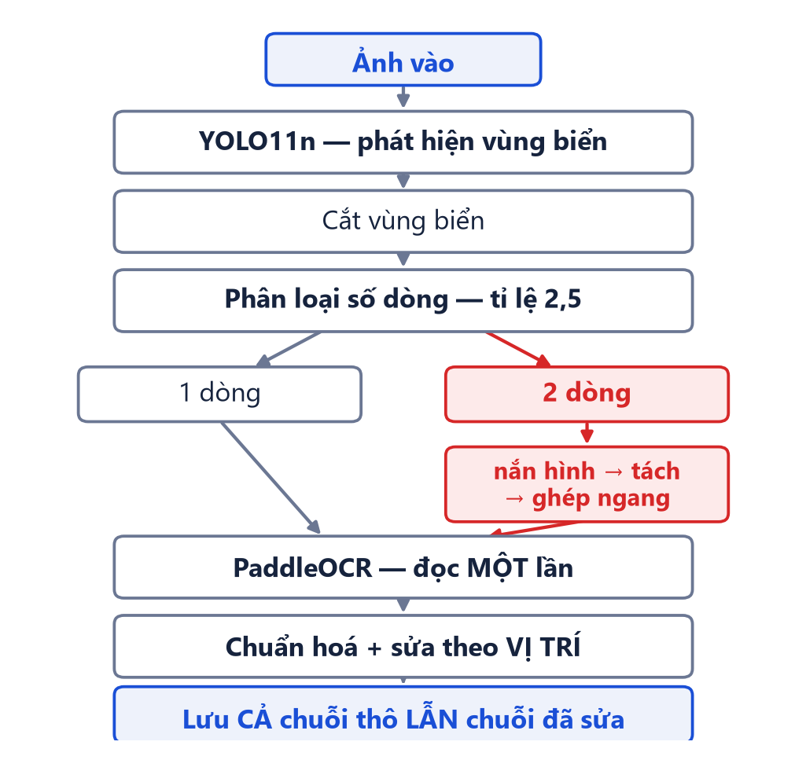
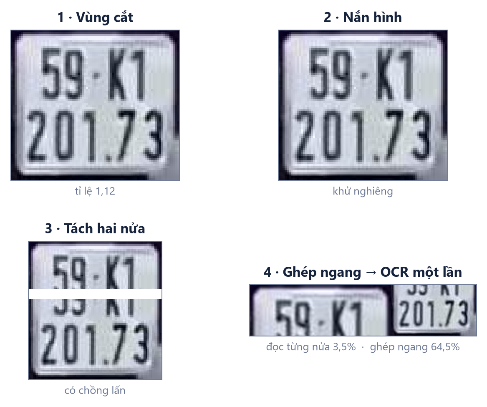
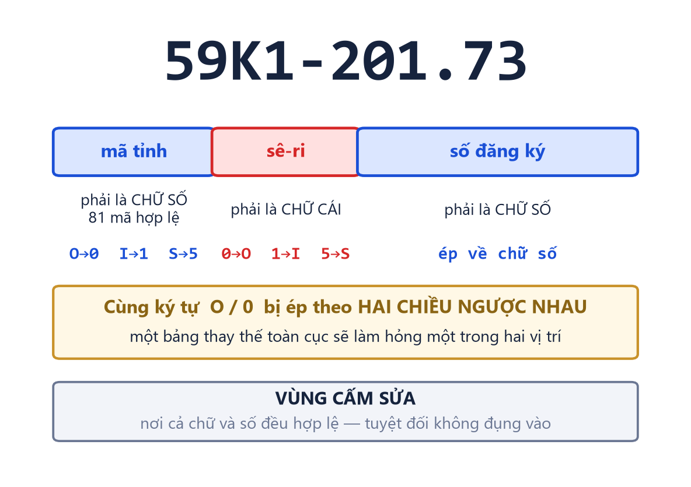
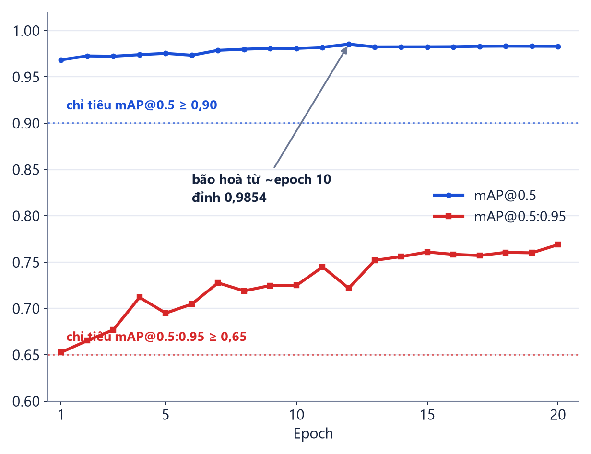
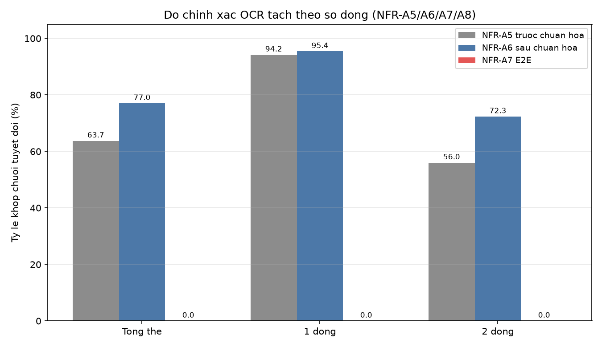
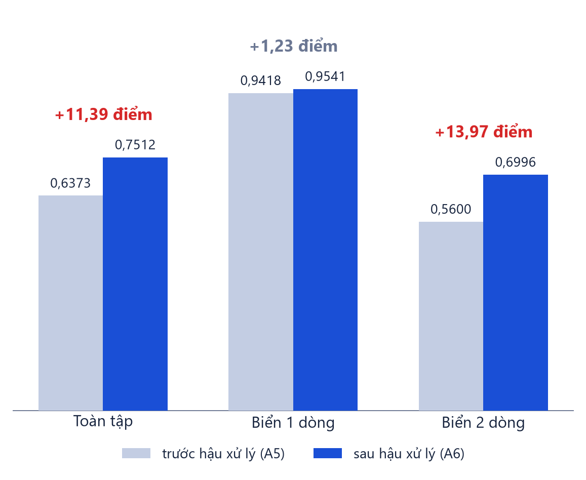
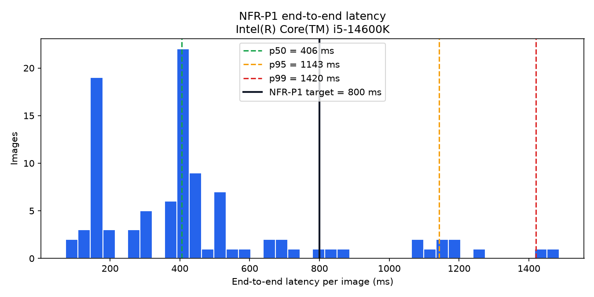

<!--
BỘ SLIDE TRÌNH CHIẾU — cố ý ngắn.

Đây là thứ CHIẾU LÊN MÀN HÌNH. Lời nói, số liệu chi tiết, bảng đầy đủ và kịch
bản trả lời phản biện nằm ở `10-slides-outline.md` và `10-defense-qa.md`.
Không chuyển nội dung từ hai file đó sang đây: một slide đọc được trong 5 giây
thì hội đồng nghe người nói; một slide đầy chữ thì hội đồng đọc slide.

HAI QUY ƯỚC BẮT BUỘC KHI SỬA FILE NÀY

1. **Chỉ dùng `##`.** Mỗi `##` là một slide. Cấp này ghim bằng
   `--slide-level=2` trong `scripts/build_thesis.py`, không suy ra từ nội dung.

   Bộ này từng có 7 slide phân đoạn (`#`) cho 7 nhóm chủ đề. Đã bỏ: trong một
   bài 15 phút chúng chiếm 7 slide mà không truyền tải gì, và người nghe vốn
   đã biết đang ở đâu nhờ slide NỘI DUNG ở đầu. Đừng thêm lại.

2. **Bảng hoặc hình phải là khối CUỐI CÙNG của slide, và chỉ được có MỘT.**
   Pandoc cắt sang slide mới ở mọi thứ đứng sau một bảng hoặc một hình, và một
   slide chỉ có một ô nội dung — đặt cả bảng lẫn hình thì cái thứ hai rơi sang
   slide mới. Mọi câu dẫn và mọi kết luận phải nằm TRÊN khối đó.

3. Hình sinh bằng `scripts/make_slide_figures.py`, dựng từ chính mã suy luận
   và ảnh demo của dự án — để một tấm hình không thể mô tả thứ hệ thống không
   làm. Biểu đồ đo đạc thì lấy thẳng từ `docs/reports/figures/`.

4. **Câu dẫn trên bảng/hình tối đa BA DÒNG khi render.** Ô chứa nó cao 124 px
   trong `scripts/make_slide_template.py`. Câu dài hơn **không bị cắt** —
   PowerPoint cho chữ tràn ra và **vẽ đè lên bảng bên dưới**, một lỗi không
   thấy được bằng phép đo chiều cao vì chẳng có gì ra khỏi slide.

5. **Thứ tự slide bám đúng năm phần của slide NỘI DUNG.** Slide mô tả *cách
   làm* nằm ở phần 3, slide *đo được bao nhiêu* nằm ở phần 4 — không trộn.
   Ba slide dự phòng đặt **sau** slide Cảm ơn, chỉ chiếu khi được hỏi.

**Kiểm tra bắt buộc sau mỗi lần sửa:**

```
python scripts/build_thesis.py
powershell -File scripts/check_slides.ps1
```

Script thứ hai bắt cả tràn đáy lẫn **đè nhau giữa các khối**. Nó tồn tại vì
loại lỗi thứ hai đã từng lọt: một câu dẫn hai dòng in đè lên bảng ở slide 9,
trong khi phép đo chiều cao báo "0 lỗi".

Mọi con số lấy từ `docs/reports/05-results.json` và `docs/reports/33-runtime-nfr.json`.
-->

## NỘI DUNG

1. **Tổng quan đề tài**
2. **Cơ sở lý thuyết**
3. **Phân tích và thiết kế hệ thống**
4. **Kết quả thực nghiệm**
5. **Kết luận và hướng phát triển**

## Vì sao đề tài này

**~77 triệu xe máy** — **85–90%** lưu lượng đường bộ Việt Nam

Cùng hệ thống, cùng phép đo: **chênh 48,6 điểm** *(số liệu Brazil)*



## Đặc thù biển số Việt Nam

Bố cục tách bạch theo **tỉ lệ khung hình** *(QCVN 08:2024/BCA)*

Tỉ lệ đo thật lệch khỏi chuẩn nhưng vẫn đúng phía ngưỡng **2,5**



## Chọn hướng tiếp cận

**Chọn hai giai đoạn:** YOLO11n phát hiện vùng biển → PaddleOCR đọc ký tự

| Thế hệ | Điểm gãy |
|---|---|
| Cổ điển *(Sobel, contour)* | Vỡ khi đổi ánh sáng, góc chụp |
| **Hai giai đoạn** | Giả định 1 dòng nằm trong hàm mất mát |
| Một giai đoạn *(YOLO đọc ký tự)* | Cần nhãn ký tự — Việt Nam gần như không có |
| End-to-end *(Transformer)* | Đói dữ liệu, nặng, không hợp CPU |

## Chọn mô hình: YOLO11n & PP-OCRv5 mobile

Đánh đổi tối ưu cho mục tiêu **suy luận trên CPU** — nhẹ, nhanh, chính xác

| Tầng | Model được chọn | So sánh với các phương án khác |
|---|---|---|
| **Phát hiện** *(Detection)* | **YOLO11n** *(2,6M params)* | • **Vs YOLOv8n / v5n:** mAP50 cao hơn, số tham số nhỏ hơn (2,6M vs 3,2M)<br>• **Vs Faster R-CNN / Transformer:** Nhanh gấp 10–20× trên CPU (~35 ms/khung)<br>• **Lý do:** Đáp ứng chỉ tiêu p95 độ trễ CPU không cần GPU |
| **Nhận dạng** *(OCR)* | **PP-OCRv5 mobile** *(4,5 MB)* | • **So với EasyOCR / Tesseract:** phép đo trên 2.801 biển trong cùng tầng bao quanh cho kết quả PaddleOCR cao hơn; kết luận chỉ áp dụng cho cấu hình này<br>• **So với PP-OCRv5 Server:** bản Server nặng hơn, không phù hợp ràng buộc CPU<br>• **Lý do chọn v5 mobile:** dung lượng nhỏ, độ chính xác mức ký tự 94,5% trên tập đánh giá |

## Mục tiêu

- Hệ thống ALPR **hoàn chỉnh**: AI · API · giao diện · CSDL · Docker
- Xử lý **cả biển 1 dòng và 2 dòng**
- Suy luận **trên CPU** — mặc định, không phải dự phòng
- Chỉ tiêu chốt **trước** khi làm, mỗi chỉ tiêu hai mức

**Ngoài phạm vi:** phân loại loại xe · tracking · barie · huấn luyện OCR từ đầu

## Kiến trúc 5 tầng

Tầng AI là **Python thuần** — cấm import FastAPI hoặc Pydantic



## Pipeline AI

Nhánh **đỏ** là đóng góp kỹ thuật lõi

Không thấy biển ⇒ trả rỗng, **HTTP 200** — không phải lỗi



## Xử lý biển 2 dòng

Giả định **một dòng** nằm trong **hàm mất mát** của CRNN/CTC — thêm dữ liệu không sửa được



## Bộ luật hậu xử lý theo vị trí

Sửa theo **VỊ TRÍ**, không sửa toàn cục — đóng góp kỹ thuật riêng của đồ án



## Bộ dữ liệu

- **15.133 ảnh · 15.977 khung** · chia **10.592 / 3.027 / 1.514**
- Hợp nhất **7 bộ công khai**, loại **44,2%** là bản sao — hai bộ mất **98%** và **100%**
- **Khử trùng lặp bằng pHash** ở ngưỡng Hamming 10 — đo lại ở **chính ngưỡng đó** cho **0 cặp** Train–Test

⇒ Số 0 đó chứng minh **bước gộp chạy đúng**, không chứng minh tập test hoàn toàn độc lập: ở Hamming 12 vẫn còn **791 cặp**

⚠️ Hai bộ chiếm **74,3%** — đa dạng giấy phép, **chưa** đa dạng nội dung

## Huấn luyện

**YOLO11n**, `imgsz 640`, 20 epoch, seed cố định — huấn luyện **và** suy luận
đều trên CPU, hết **10,05 giờ** *(30,2 phút/epoch)*



## Kết quả phát hiện — đạt cả 4 chỉ tiêu

**Chênh giữa hai bố cục chỉ 2,09 điểm** ⇒ Điểm nghẽn nằm ở tầng đọc chữ, không phải tầng phát hiện

| Nhóm | N | P | R | mAP50 | mAP50-95 |
|---|---|---|---|---|---|
| Biển 1 dòng | 286 | 0,986 | 0,990 | **0,988** | 0,753 |
| Biển 2 dòng | 1.325 | 0,973 | 0,969 | **0,968** | 0,765 |
| **TẤT CẢ** | **1.611** | **0,984** | **0,971** | **0,983** | **0,783** |
| *Chỉ tiêu* | | *≥0,92* | *≥0,90* | *≥0,90* | *≥0,65* |

## Kết quả OCR

Toàn bộ khoảng cách nằm ở **biển 2 dòng**: 0,7234 so với **0,9541** của biển 1 dòng

| Đo cái gì | Đo được | Ngưỡng | |
|---|---|---|:--:|
| Đúng từng **ký tự** | **0,9483** | 0,92 | 🟡 |
| Đúng **cả chuỗi** — chưa hậu xử lý | 0,6373 | 0,80 | ❌ |
| Đúng **cả chuỗi** — sau hậu xử lý | **0,7701** | 0,85 | ❌ |
| Đúng **đầu cuối** — ảnh vào, chuỗi ra | **0,563** *(nhãn máy sinh)* | 0,82 | ❌ |

## Khoảng cách nằm trọn ở biển 2 dòng

Cùng một hệ thống, cùng một phép đo — tách theo bố cục biển



## Đóng góp của hậu xử lý — đo được bằng số

Sửa đúng **372 biển**, làm hỏng **0** — dồn gần trọn vào biển 2 dòng



## Ba can thiệp thực nghiệm

Chênh lệch 2 dòng còn **23,07 điểm**, cùng bậc mốc quốc tế **48,6** *(Laroca 2022 — RodoSol, Brazil)*

| Can thiệp | Thu được |
|---|---|
| Bộ luật hậu xử lý theo vị trí | **+13,28 điểm** *(0,6373 → 0,7701)* |
| Phục hồi dòng trên | 209 biển |
| Nắn hình chống méo | 34 biển |

## Hiệu năng trên CPU — phân rã suy luận thuần

Điểm nghẽn thời gian là **OCR (60,8%)**; tầng phát hiện chiếm **38,0%**

| Bước trong pipeline | Ước lượng ban đầu | **Đo thật** | % tổng |
|---|---|---|---|
| Giải mã ảnh + tiền xử lý | 50 ms | **1,78 ms** | 1,2% |
| Phát hiện *(YOLO11n @ 640, CPU)* | 150 ms | **55,66 ms** | **38,0%** |
| Nhận dạng chữ *(PaddleOCR, mỗi biển)* | 120 ms | **89,16 ms** | **60,8%** |
| Hậu xử lý regex + kiểm tra hợp lệ | 5 ms | **0,03 ms** | 0,0% |
| **Tổng suy luận thuần cho một biển** | **405 ms** | **146,63 ms** | **100%** |

## Phân bố độ trễ suy luận

Phần lớn ảnh hoàn tất dưới 500 ms; độ trễ tập trung ở các ca thử lại nhiều lượt



## Kiểm thử và triển khai

- **1.004/1.004 kiểm thử tự động** đạt · bao phủ tầng nghiệp vụ **87,7%**
- Đơn vị · tích hợp · độ chính xác AI · hiệu năng · chịu tải
- Tầng AI có bộ test **chạy độc lập không cần dựng server**
- Chạy liên tục **15 phút**: 5.337 yêu cầu, **0 lỗi**, không rò rỉ bộ nhớ
- Cơ sở dữ liệu **bền vững qua khởi động lại**: 7.977 bản ghi, **0 mất**
- `docker compose up` — **một lệnh**, đã đóng gói và xác minh hoàn chỉnh

## Đối chiếu chỉ tiêu — bảng tổng hợp

✅ đạt mục tiêu · 🟡 đạt ngưỡng tối thiểu · ❌ chưa đạt

| Nhóm | Chỉ tiêu | Kết quả |
|---|---|:--:|
| Phát hiện | mAP50 **0,9829** · mAP50-95 **0,7834** · P **0,9837** · R **0,9714** | ✅ |
| Đọc ký tự | Đúng từng ký tự **0,9483** | 🟡 |
| Đọc chuỗi | Đúng cả chuỗi **0,7701** · đầu cuối **0,563** *(1.606 khung toàn cảnh, nhãn máy sinh)* | ❌ |
| Hiệu năng | p95 **510 ms** *(mục tiêu 800)* · video **0,87×** · truy vấn **18,7 ms** | ✅ |
| Thời gian thực | Luồng khung hình **5,63 FPS** *(sàn 3, mục tiêu 5 — đo ở tầng API `POST /api/detect/frame`, không qua trang web)* | ✅ |
| Độ tin cậy | Chạy liên tục **100%** · CSDL sống sót khởi động lại **0 mất** | ✅ |
| Phần mềm | **1.004 test** · bao phủ 87,7% · `docker compose up` | ✅ |

## Hạn chế và hướng phát triển

**Ba hạn chế chính** — và hướng xử lý tương ứng

| Hạn chế | Hướng phát triển |
|---|---|
| **OCR biển 2 dòng còn thấp** — 0,7234 so với 0,9541 của biển 1 dòng, mà biển 2 dòng chiếm 79,8% tập nhãn | Huấn luyện lại bộ nhận dạng riêng cho biển số Việt Nam |
| **Nhãn ảnh hiện trường do mô hình sinh, không phải người gán** — A7 = 56,3% phải đọc kèm hạn chế này | Xây dựng bộ nhãn chuỗi do người gán cho ảnh toàn cảnh |
| **Chưa đánh giá xuyên bộ dữ liệu** — giữ nguyên một nguồn không dùng để huấn luyện | Dựng tập test xuyên bộ để đo tổng quát hoá ngoài phân phối |

## Kết luận

- Hệ thống **5 tầng**, đóng gói Docker một lệnh
- Phát hiện đạt **cả 4 chỉ tiêu** — mAP50 **0,983**
- Hậu xử lý **+13,28 điểm**, đo tách bạch
- **1.004/1.004 kiểm thử** đạt · bao phủ **87,7%**
- Định lượng riêng biển **1 dòng** và **2 dòng** trên cùng hệ thống

## Backup 1 — Kiến trúc mô hình YOLO11

Cải tiến mạng trích xuất đặc trưng & head phát hiện đa tỉ lệ *(Ultralytics 2024)*

| Thành phần | Chi tiết kỹ thuật | Vai trò trong hệ thống ALPR |
|---|---|---|
| **Backbone** | Block **C3k2** & **C2PSA** *(Attention)* | Trích xuất đặc trưng vùng biển số sắc nét ở nhiều góc nghiêng |
| **Neck** | **SPPF** *(Spatial Pyramid Pooling - Fast)* | Tăng cường thông tin ngữ cảnh đa tỉ lệ mà không tăng độ trễ |
| **Head** | Anchor-free Decoupled Head | Dự đoán bounding box của lớp `license_plate`; bố cục một/hai dòng được suy ra ở bước hậu xử lý theo tỷ lệ khung hình |
| **Quy mô** | **YOLO11n** · **2,6M params** · **6,5 GFLOPs** | Đạt **mAP50 0,983** trên CPU với tốc độ ~35 ms/khung hình |

## Backup 2 — Kiến trúc mô hình PP-OCRv5

Mô hình nhận dạng ký tự siêu nhẹ chuyên biệt cho văn bản *(PaddlePaddle 2025)*

| Thành phần | Chi tiết kỹ thuật | Vai trò trong hệ thống ALPR |
|---|---|---|
| **Backbone** | **PP-LCNetV3** *(Lightweight CPU Net)* | Trích xuất chuỗi đặc trưng ký tự cực nhanh trên CPU |
| **Neck** | **SVTR-HG** *(Gated-Attention Transformer)* | Trích xuất thông tin ngữ cảnh chuỗi ký tự trên ảnh crop cao 64px |
| **Head & Loss** | **CTC Head** *(Connectionist Temporal Classification)* | Giải mã chuỗi ký tự không cần gán nhãn từng vạch đứng |
| **Quy mô** | **PP-OCRv5 Mobile** · **4,5 MB** | Đạt **94,83% accuracy từng ký tự** trên vùng cắt biển số |

## Backup 3 — Phân tích lỗi (Error Analysis)

Sáu loại lỗi **loại trừ lẫn nhau** — **644 ca sai trên 2.801 biển (22,99%)**, khớp đúng 1 − A6

| Mã | Loại lỗi | Số ca | % ca sai | 1 dòng | 2 dòng |
|:--:|---|---:|---:|---:|---:|
| E1 | **Nhầm ký tự** *(thay thế)* | **392** | **60,87%** | 17 | **375** |
| E2 | Thiếu ký tự | 76 | 11,80% | 0 | 76 |
| E3 | Thừa ký tự | 20 | 3,11% | 5 | 15 |
| E4 | Sai thứ tự | **0** | 0,00% | 0 | 0 |
| E5 | Trả chuỗi rỗng | 10 | 1,55% | 0 | 10 |
| E6 | Hỗn hợp nhiều loại | 146 | 22,67% | 4 | 142 |
| | **Tổng** | **644** | **100%** | **26** | **618** |

## Backup 4 — Bóc tách đóng góp (Ablation)

Đóng góp độc lập của từng module kỹ thuật vào độ chính xác đọc chuỗi

| Cấu hình / Thử nghiệm | Đúng cả chuỗi | Đóng góp đo được |
|---|---:|---:|
| **Baseline** *(Model gốc PaddleOCR raw)* | 0,6373 | Mức cơ sở |
| **+ Bộ luật hậu xử lý theo vị trí** | **0,7701** | **+13,28 điểm** *(Sửa đúng 372 biển)* |
| **+ Bậc thang cứu dòng trên biển 2 dòng** | — | **+209 biển** được cứu hợp lệ |
| **+ Bậc thang nắn hình chống nghiêng/méo** | — | **+34 biển** được cứu hợp lệ |
| **Fine-tune OCR (giữ detector)** | 0,6762 | ❌ Sụt -7,5 điểm do lệch phân phối |

## Backup 5 — Siêu tham số và huấn luyện

Trích `runs/final-640-v3/args.yaml` và `results.csv` — bản ghi *đã thực thi*, không phải dự định.

| Siêu tham số | Giá trị | Hàm mất mát | Epoch 1 → 20 |
|---|---:|---|---:|
| **`imgsz` / `epochs`** | **640 px** / **20** | `box_loss` | **1,252 → 0,809** |
| **`batch` / `seed`** | **8** / **42** | `cls_loss` | **0,833 → 0,313** |
| **`optimizer` / `lr0`** | **AdamW** / **0,001** | `dfl_loss` | **1,154 → 0,987** |
| **`device` / tham số mô hình** | **cpu** / **2.590.035** | **mAP@0.5** | **0,9684 → 0,9830** |
| **Thời gian huấn luyện** | **10,05 giờ** *(30,2 phút/epoch)* | | |

## Backup 6 — Tài liệu tham khảo chính

Đầy đủ **232 mục** trong `docs/references.bib` — dưới đây là các nguồn chống đỡ
những khẳng định chính của bài

| | |
|---|---|
| **Laroca** và cộng sự, VISAPP **2022** | *On the Cross-Dataset Generalization in License Plate Recognition* — **nguồn của cặp số 94,3% / 45,7%**, đo trên RodoSol-ALPR của **Brazil** |
| **Laroca** và cộng sự, IET ITS **2021** | *An efficient and layout-independent ALPR system based on the YOLO detector* |
| **Du** và cộng sự, arXiv **2020** | *PP-OCR: A Practical Ultra Lightweight OCR System* |
| PaddlePaddle Team, arXiv **2025** | *PaddleOCR 3.0 Technical Report* |
| **Jocher & Qiu**, Ultralytics **2024** | *Ultralytics YOLO11* |
| **TT 79/2024/TT-BCA** · **TT 51/2025/TT-BCA** | Cấu trúc biển, seri, màu nền · phụ lục mã tỉnh (34 tỉnh/thành) |
| **QCVN 08:2024/BCA** | Kích thước và tỉ lệ khung hình biển số |

## Backup 7 — Tra nhanh số liệu

| | |
|---|---|
| Dữ liệu | **15.133** ảnh · **15.977** khung · 6 nguồn |
| Mô hình | YOLO11n · `imgsz 640` · 20 epoch · CPU |
| Phát hiện | mAP50 **0,983** · mAP50-95 **0,783** |
| Đúng từng ký tự | **0,9483** |
| Đúng cả chuỗi | **0,7701** *(1 dòng 0,954 · 2 dòng 0,723)* |
| Độ trễ | p50 **150 ms** · p95 **510 ms** |
| Kiểm thử | **1.004** đạt · bao phủ **87,7%** |

## Backup 8 — Kịch bản demo trực tiếp

Ba tình huống minh họa trên môi trường thực tế:

| Tình huống | Mục tiêu kiểm chứng |
|---|---|
| Ảnh ô tô — biển 1 dòng | Luồng cơ bản, nhận dạng chính xác dưới 1 giây |
| Ảnh xe máy — biển 2 dòng | Luồng phân tách hai nửa và ghép ngang chạy thực tế |
| Video + Lịch sử | Xử lý bất đồng bộ, tra cứu và hiển thị lịch sử |
