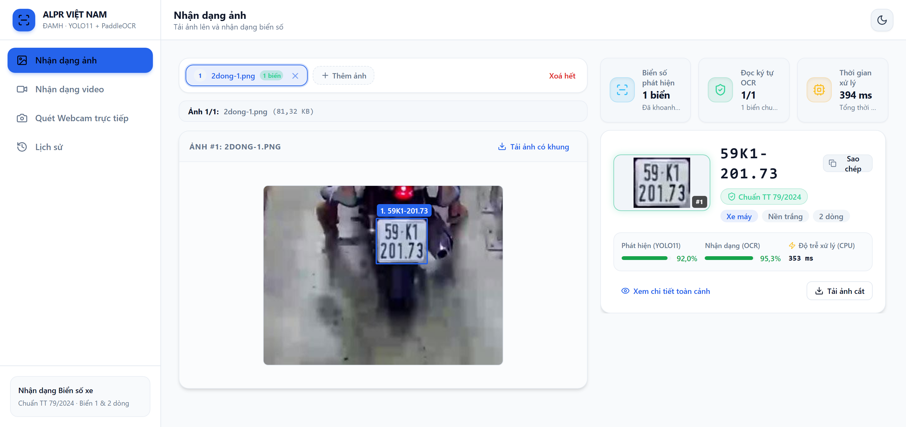

<!--
BỘ SLIDE BÁO CÁO KỸ THUẬT — 11 slide, theo cấu trúc người thực hiện đưa ra.

Khác gì `10-slides.md`: bộ kia 37 slide, bám mạch của quyển đồ án, dùng cho buổi
bảo vệ đầy đủ. Bộ này gọn theo khuôn báo cáo kỹ thuật: đặt vấn đề → mục tiêu →
công nghệ → cách làm → kết quả → khó khăn → hướng phát triển.

BỐN QUY ƯỚC BẮT BUỘC — vi phạm là vỡ layout, và `check_slides.ps1` sẽ báo:

1. **Chỉ dùng `##`.** Mỗi `##` là một slide; cấp này ghim bằng `--slide-level=2`.
2. **Bảng hoặc hình phải là khối CUỐI CÙNG của slide, và chỉ được có MỘT.**
   Pandoc cắt sang slide mới ở mọi thứ đứng sau bảng/hình.
3. **Câu dẫn trên bảng/hình: MỘT câu, tối đa ~180 ký tự.** Ô chứa nó cao 124 px.
   Dài hơn thì PowerPoint **không cắt chữ** — nó cho tràn ra và **vẽ đè lên bảng
   bên dưới**, lỗi không phát hiện được bằng phép đo chiều cao. Bản nháp đầu của
   chính tệp này viết câu dẫn ba đoạn và dính đúng lỗi đó ở 8/10 slide.
4. Mọi con số phải truy được về quyển đồ án hoặc `docs/reports/`. Cặp số
   94,3% / 45,7% đo trên bộ **RodoSol-ALPR của Brazil**, không phải số Việt Nam
   — **luôn giữ chữ "Brazil" trong cùng một câu**.

Kiểm tra sau mỗi lần sửa:

```
python scripts/build_thesis.py --slides docs/slides/11-slides-ky-thuat.md
powershell -File scripts/check_slides.ps1 -DeckPath docs/slides/11-slides-ky-thuat.pptx
```
-->

## Đặt vấn đề

- **77 triệu xe máy**, chiếm 85–90% lưu lượng ⇒ **biển hai dòng là đa số**, không phải ngoại lệ như ở Mỹ hay châu Âu
- Trên bộ **RodoSol-ALPR (Brazil)**, OpenALPR đọc đúng **94,3%** biển một dòng nhưng chỉ **45,7%** biển hai dòng — chênh **48,6 điểm**, chỉ khác bố cục biển
- Ba đặc thù **không học được từ dữ liệu nước ngoài**: cấu trúc chuỗi theo **TT 79/2024**, chỉ **81/89 mã tỉnh** được dùng, tập ký tự sê-ri **khác nhau theo từng vị trí**

## Mục tiêu và phạm vi

Hệ thống hoàn chỉnh, **suy luận hoàn toàn trên CPU**, hỗ trợ cả biển một dòng và hai dòng.

| Đo cái gì | Sàn | Mục tiêu |
|---|---:|---:|
| mAP@0,5 của bộ phát hiện | 0,85 | **0,90** |
| Đúng cả chuỗi, sau hậu xử lý | 0,85 | 0,90 |
| Đúng đầu-cuối: ảnh vào → chuỗi ra | 0,82 | 0,88 |
| Độ trễ một ảnh, p95, **trên CPU** | ≤ 1.500 ms | ≤ 800 ms |
| Bao phủ kiểm thử tầng nghiệp vụ | 70% | 70% |

## Công nghệ và kiến trúc

**YOLO11n** + **PaddleOCR PP-OCRv5 mobile** · FastAPI · SQLite · React · Docker Compose


## Quy trình: từ dữ liệu tới mô hình

Khử trùng lặp chéo bộ **loại 44,2%** — một bộ vào 1.005 ảnh, ra **0 ảnh**.

| Bước | Kết quả |
|---|---|
| Hợp nhất 7 bộ có nhãn hộp bao | 27.111 ảnh |
| Khử trùng lặp, băm tri giác ngưỡng 10 | còn **15.133** ảnh |
| Chia tập, giữ nhóm trùng cùng một bên | 10.592 / 3.027 / **1.514** |
| Huấn luyện YOLO11n, `imgsz=640`, 20 epoch | **10,05 giờ CPU** |
| Nhánh riêng: nhãn chuỗi để đánh giá OCR | **2.801** biển |

## Hai đóng góp kỹ thuật lõi

**CTC** giả định ký tự xếp trên **một dòng** ⇒ **cắt chồng lấn rồi ghép ngang**; sau đó **bộ luật ràng buộc theo từng vị trí**.


## Kết quả đo được

Phát hiện **đạt cả bốn chỉ tiêu**; phần thiếu nằm trọn ở **biển hai dòng** — chênh **25,45 điểm**.

| Đo cái gì | Đo được | Ngưỡng | |
|---|---:|---:|:--:|
| mAP@0,5 · mAP@0,5:0,95 | **0,9829** · 0,7834 | 0,90 · 0,65 | ✅ |
| Precision · Recall | 0,9837 · 0,9714 | 0,92 · 0,90 | ✅ |
| Đúng từng ký tự (1 − CER) | **0,9454** | 0,95 | 🟡 |
| Đúng cả chuỗi, sau hậu xử lý | **0,7512** | 0,90 | ❌ |
| Độ trễ p95 · trung vị, CPU | **1.143** · 406 ms | ≤ 800 ms | 🟡 |
| **Đóng góp của hậu xử lý** (A6 − A5) | **+11,39 điểm** · 319 sửa đúng / **0** hỏng | — | ✅ |
| Kiểm thử · bao phủ nghiệp vụ | **1.001/1.002** · 87,7% | — · 70% | ✅ |

## Demo: hệ thống chạy thật

Giao diện hiện **cả chuỗi OCR thô lẫn chuỗi đã sửa** khi hai chuỗi khác nhau.



## Khó khăn kỹ thuật và cách xử lý

| Vấn đề | Phát hiện nhờ | Cách xử lý |
|---|---|---|
| **Công cụ đo không chạy đúng hệ thống đang giao** — kịch bản *dựng lại* các bước thay vì *gọi* pipeline, nên mỗi bước mới thêm đều rơi ra ngoài phép đo. Xảy ra **ba lần** | Một chỉ số đứng yên vô lý: A6 tăng 1,75 điểm trong khi A7 — vốn **bao hàm** A6 — bất động ở đúng 0,5227 | Tách thành hàm dùng chung; ghi **trạng thái công tắc** và **số biển từng bậc cứu được** vào tệp kết quả, nên bước không được gọi hiện ra là số 0 có nhãn |
| **Một quyết định suýt sai** — bỏ bước phát hiện chữ của PaddleOCR cho **+12,46 điểm** và rẻ hơn ~290 ms mỗi ảnh | Chạy lại bộ demo **trước** khi đổi mặc định: trên ảnh toàn cảnh thứ tự **đảo ngược**, 17/22 xuống 13/22 | Giữ nguyên mặc định — ngữ liệu kia toàn **ảnh cắt sẵn**, và chế độ đó **không trả được chuỗi rỗng** nên nó **bịa** khi bắt nhầm biển quảng cáo |

## Hướng phát triển

| # | Hướng | Giải quyết hạn chế nào |
|:--:|---|---|
| 1 | **Huấn luyện lại bộ nhận dạng ký tự cho biển số Việt Nam** | Nút thắt lớn nhất: biển hai dòng |
| 2 | Thu thập dữ liệu biển vàng, xanh, đỏ, ngoại giao | 97,68% mẫu là biển trắng ⇒ kết luận chỉ áp cho biển trắng |
| 3 | Bổ sung nhãn chuỗi cho toàn tập | Mới 2.801/15.133 ảnh có nhãn chuỗi |
| 4 | Tập test **xuyên bộ dữ liệu** | mAP 0,9829 lạc quan hơn khi triển khai thật |
| 5 | Lượng tử hoá OCR, đóng gói ONNX / OpenVINO | Độ trễ p95 mới chỉ đạt ngưỡng tối thiểu |
| 6 | Bám vết đối tượng qua khung hình cho video | Gộp nhiều lần đọc cùng một biển |

## Cảm ơn — và mời đặt câu hỏi

- Chạy đầu-cuối trên máy **không có GPU**: bộ phát hiện **mAP@0,5 = 0,9829**
- Hậu xử lý đóng góp **+11,39 điểm**, **0 ca làm hỏng** trên 2.801 biển
- Benchmark ba engine OCR trên biển Việt Nam: PaddleOCR **68,87%** trong cấu hình đánh giá của đồ án; kết quả khác với khuynh hướng của một số tài liệu công khai
- Đọc đúng cả chuỗi **0,7512**, dưới ngưỡng 0,85

**Xin cảm ơn thầy cô và các bạn đã lắng nghe.**
