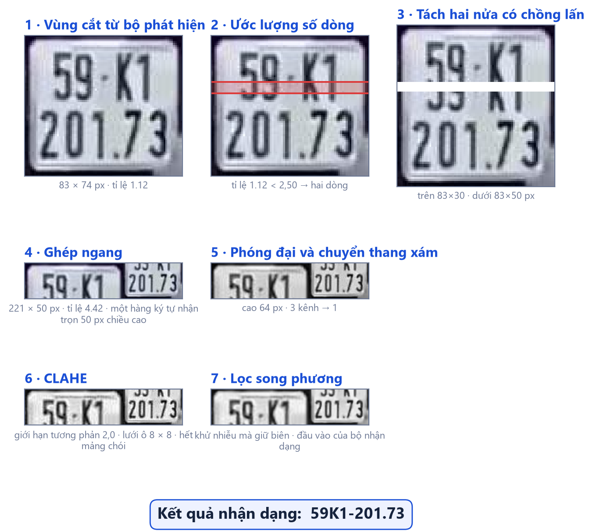

<!--
BỘ SLIDE ĐỒ ÁN MÔN HỌC — 12 slide (1 bìa + 11 nội dung).

Khác gì hai bộ kia:
  `10-slides.md`         37 slide, bám mạch quyển tốt nghiệp, dùng cho buổi bảo vệ.
  `11-slides-ky-thuat.md` 11 slide, khuôn báo cáo kỹ thuật tổng quát.
  `12-slides-mon-hoc.md`  bộ này — bám quyển `docs/papers/mon-hoc/`, trọng tâm
                          dời hẳn sang CÁC PHÉP XỬ LÝ ẢNH. YOLO và PaddleOCR
                          xuất hiện như công cụ áp dụng, không như đóng góp.

Ba khác biệt nội dung so với bộ 11 slide:
  1. BỎ cặp số 94,3% / 45,7% của RodoSol-ALPR. Đối chiếu với công trình đã công
     bố là việc của luận văn tốt nghiệp, không phải của đồ án môn học.
  2. BỎ khung "đóng góp kỹ thuật". Đồ án môn học không tuyên bố đóng góp; nó
     trình bày cách giải.
  3. THÊM slide bóc tách đóng góp đo được của từng bước xử lý ảnh, và slide
     hình chuỗi xử lý dựng từ chính mã bàn giao.

BỐN QUY ƯỚC BẮT BUỘC — vi phạm là vỡ layout, `check_slides.ps1` sẽ báo:

1. **Chỉ dùng `##`.** Mỗi `##` là một slide; cấp này ghim bằng `--slide-level=2`.
2. **Bảng hoặc hình phải là khối CUỐI CÙNG của slide, và chỉ được có MỘT.**
   Pandoc cắt sang slide mới ở mọi thứ đứng sau bảng/hình.
3. **Câu dẫn trên bảng/hình: MỘT câu, tối đa ~100 ký tự.** Dài hơn thì
   PowerPoint không cắt chữ — nó cho tràn ra và **vẽ đè lên bảng bên dưới**,
   lỗi không phát hiện được bằng phép đo chiều cao.
4. Mọi con số phải truy được về `docs/papers/mon-hoc/` hoặc `docs/reports/`.

Kiểm tra sau mỗi lần sửa:

```
python scripts/build_thesis.py --slides docs/slides/12-slides-mon-hoc.md
powershell -File scripts/check_slides.ps1 -DeckPath docs/slides/12-slides-mon-hoc.pptx
```
-->

## Đặt vấn đề

- **77 triệu xe máy**, chiếm 85–90% lưu lượng ⇒ ở Việt Nam **biển hai dòng là đa số**, không phải ngoại lệ
- Biển xe mô tô chỉ **190 × 140 mm**, tỉ lệ khung hình **1,357** — vừa là đối tượng nhỏ, vừa là bố cục hai dòng
- Mọi bộ nhận dạng ký tự dựng sẵn đều **giả định văn bản nằm trên một dòng ngang** — giả định đó **sai** với đa số biển số Việt Nam
- Ảnh thực tế còn thêm: bề mặt phản quang gây **chói cục bộ**, biển bám bụi, cong vênh, chụp nghiêng, ngược sáng

## Mục tiêu và chỉ tiêu

Hệ thống chạy đầu-cuối, **suy luận hoàn toàn trên CPU**, hỗ trợ cả biển một dòng và hai dòng.

| Đo cái gì | Sàn | Mục tiêu |
|---|---:|---:|
| mAP@0,5 của bộ phát hiện | 0,85 | **0,90** |
| Đúng mức ký tự (1 − CER) | 0,92 | 0,95 |
| Đúng cả chuỗi, **trước** hậu xử lý | 0,80 | 0,85 |
| Đúng cả chuỗi, **sau** hậu xử lý | 0,85 | 0,90 |
| Độ trễ một ảnh, p95, **trên CPU** | ≤ 1.500 ms | ≤ 800 ms |

## Vì sao biển hai dòng làm gãy bộ nhận dạng

- **CRNN hạ chiều cao bản đồ đặc trưng về 1** — đó chính là chỗ giả định "một dòng" nằm
- Ảnh hai dòng: ký tự hai hàng **bị chiếu chồng lên nhau** vào cùng một cột đặc trưng
- Mô-đun nhận dạng chuẩn hoá mọi ảnh về **48 px**, nên mỗi hàng chỉ còn khoảng **24 px**
- Hệ quả: đọc lộn thứ tự, ghép lẫn hai dòng, hoặc **mất hẳn một dòng**

## Hướng giải: sửa ảnh, không đổi mô hình

Nếu vấn đề là *ảnh có hai dòng*, thì biến nó thành **ảnh một dòng** trước khi đưa vào mô hình.

| Phép xử lý ảnh | Dùng để làm gì | Thay cho phương án hiển nhiên |
|---|---|---|
| **Ngưỡng tỉ lệ khung hình 2,50** | Phân loại một dòng / hai dòng — quy chuẩn cho 4,727 · 2,000 · 1,357 nên có khoảng trống rộng **2,727** để đặt ngưỡng | Huấn luyện thêm một bộ phân loại |
| **Tách hai nửa + ghép ngang** | Biến ảnh hai dòng thành một dòng | Đổi sang mô hình đọc đa dòng |
| **CLAHE** | Xử lý mảng chói cục bộ | Cân bằng lược đồ xám **toàn cục** |
| **Lọc song phương** | Khử nhiễu mà **giữ biên** | Làm mờ Gauss |
| **Băm tri giác (DCT)** | Khử ảnh trùng giữa các bộ dữ liệu | Băm mật mã MD5/SHA |
| **Không gian màu HSV** | Nhận màu nền bền với ánh sáng | Phân ngưỡng trên RGB |

## Chuỗi xử lý trên một biển thật

Mỗi khung là ảnh thật ở đầu ra một bước, dựng từ **chính mã bàn giao**.



## Bộ luật hậu xử lý ràng buộc theo vị trí

Ba ràng buộc đặc thù biển số Việt Nam, khai thác **theo từng vị trí trong chuỗi**.

| Ràng buộc | Nội dung | Vì sao không dùng luật phẳng |
|---|---|---|
| Mã tỉnh | **81/89** giá trị được dùng | `\d{2}` cho qua 8 chuỗi không tồn tại |
| Tập seri | Vị trí 1 **có G không R**; vị trí 2 của xe máy **có R không G** | Danh sách phẳng sai hệ thống trên mọi biển xe máy có `R` |
| Mặt nạ vị trí | `DDLDDDDD` · `DDLDDDD` · `DDL?DDDDD` | Chỉ số 3 là vị trí **duy nhất** cả chữ lẫn số đều hợp lệ |
| Ánh xạ nhầm lẫn | `O → 0` hợp lý, `0 → O` **không bao giờ** — chiều đúng là `0 → D` | Bảng đối xứng sẽ tạo ra ký tự bất hợp lệ |

## Kết quả đo được

Phát hiện **đạt cả bốn chỉ tiêu**; phần thiếu nằm trọn ở **biển hai dòng**.

| Đo cái gì | Đo được | Ngưỡng | |
|---|---:|---:|:--:|
| mAP@0,5 · mAP@0,5:0,95 | **0,9829** · 0,7834 | 0,90 · 0,65 | ✅ |
| Precision · Recall | 0,9837 · 0,9714 | 0,92 · 0,90 | ✅ |
| Đúng mức ký tự (1 − CER) | **0,9454** | 0,95 | 🟡 |
| Đúng cả chuỗi, sau hậu xử lý | **0,7512** | 0,90 | ❌ |
| — riêng biển **một dòng** | **0,9541** | 0,90 | ✅ |
| — riêng biển **hai dòng** | **0,6996** | 0,90 | ❌ |
| Độ trễ p95 · trung vị, CPU | **1.143** · 406 ms | ≤ 800 ms | 🟡 |

## Bóc tách đóng góp của từng bước

Mọi bước bật tắt độc lập, nên đóng góp của từng bước **đo được riêng** — kể cả khi bằng 0.

| Bước xử lý ảnh | Mua được | Giá phải trả |
|---|---:|---|
| **Tách hai nửa + ghép ngang** | **+34,92 điểm** | ~0 ms |
| **Bộ luật hậu xử lý** | **+11,39 điểm** · 319 sửa đúng, **0 hỏng** | 0,03 ms |
| Nắn hình + giãn dọc | **+34 biển** | +244 ms ở p95 |
| Siêu phân giải — đã **tắt** | **0 biển**, nhưng **0/120 mẫu lọt cổng** | +319 ms p95 |
| *Đối chứng:* tách-ghép trên **Tesseract** | **+0,03 điểm** | — |

## Ba kết quả trái kỳ vọng

- **Tách-ghép không độc lập engine** — 34,92 điểm cho PaddleOCR, **0,03** cho Tesseract ⇒ điều kiện cần, không đủ
- **Bảng ánh xạ suy từ hình dạng chỉ phủ 2/10 cặp** nhầm phổ biến nhất — trực giác không gợi ra `E → F` hay `4 → L`
- **Siêu phân giải mua 0 biển, nhưng 0/120 mẫu lọt cổng** ⇒ *chi phí đã đo, lợi ích chưa ai đo được*

## Demo và hướng phát triển

Hệ thống chạy thật bằng một lệnh `docker compose up`; giao diện hiện **cả chuỗi thô lẫn chuỗi đã sửa**.

| # | Hướng phát triển | Giải hạn chế nào |
|:--:|---|---|
| 1 | **Huấn luyện lại bộ nhận dạng ký tự cho biển số Việt Nam** | Nút thắt lớn nhất — biển hai dòng |
| 2 | **Thay bảng ánh xạ bằng bảng trích từ ma trận đo được** | Rẻ nhất: dữ liệu đã có sẵn |
| 3 | Khử rò rỉ theo **chuỗi biển số** thay vì theo băm tri giác | Băm tri giác tóm tắt khung ảnh, không tóm tắt chiếc xe |
| 4 | Thu thập dữ liệu biển vàng, xanh, đỏ | 97,68% mẫu là biển trắng |

## Cảm ơn — và mời đặt câu hỏi

- Chạy đầu-cuối trên máy **không có GPU**: bộ phát hiện đạt **mAP@0,5 = 0,9829**
- Bài toán biển hai dòng giải bằng **phép biến đổi ảnh**, không bằng mô hình mạnh hơn — mua **34,92 điểm**
- Hậu xử lý theo vị trí đóng góp **+11,39 điểm**, **0 ca làm hỏng** trên 2.801 biển
- Nói thẳng phần chưa đạt: đọc đúng cả chuỗi **0,7512** so với ngưỡng 0,85, và khoảng cách nằm trọn ở biển hai dòng

**Xin cảm ơn thầy cô và các bạn đã lắng nghe.**
