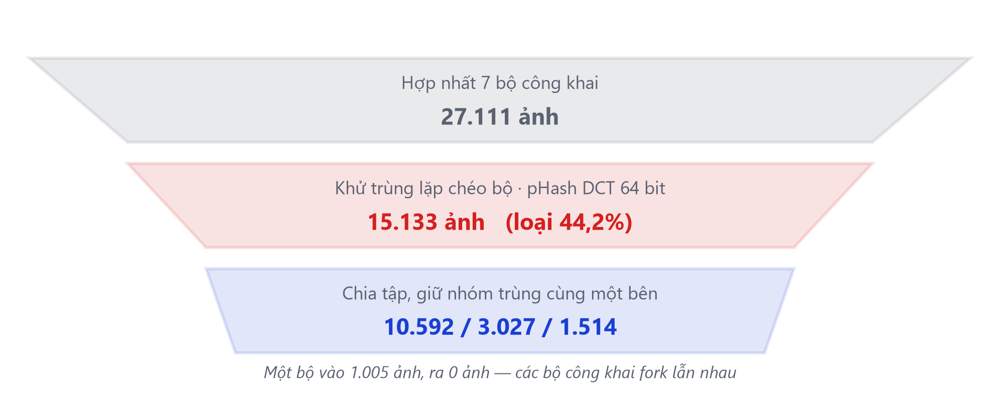
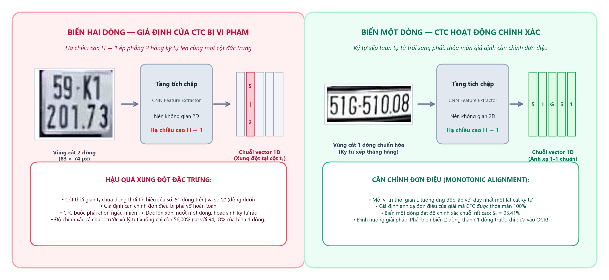
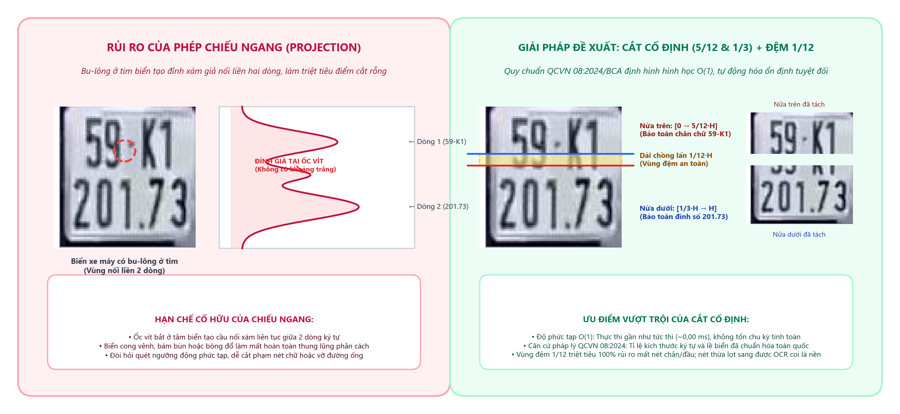
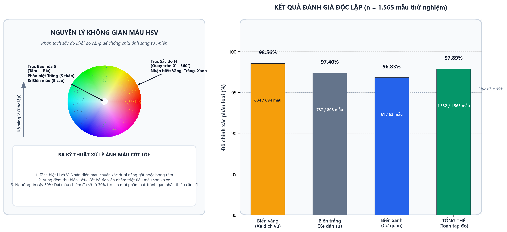
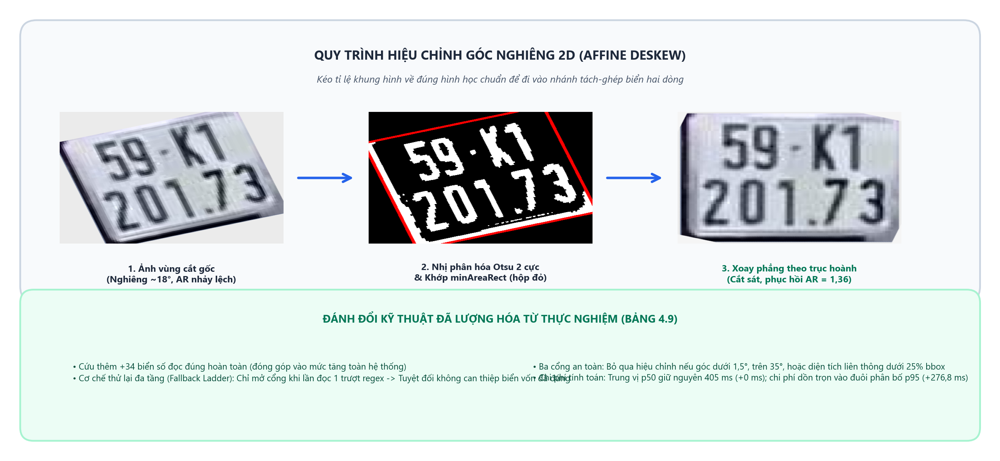
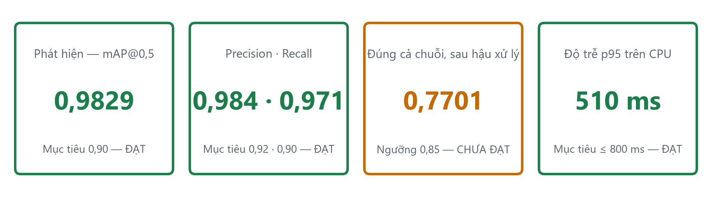
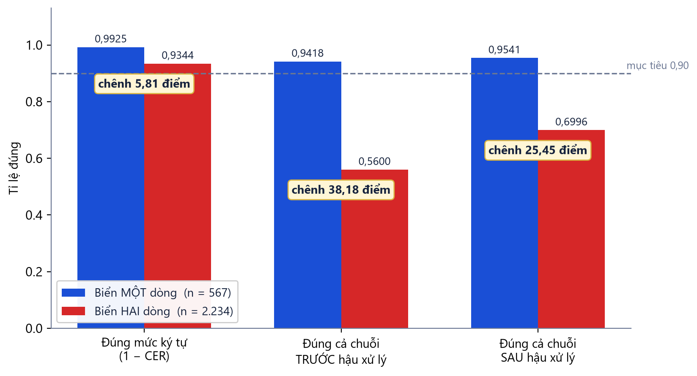
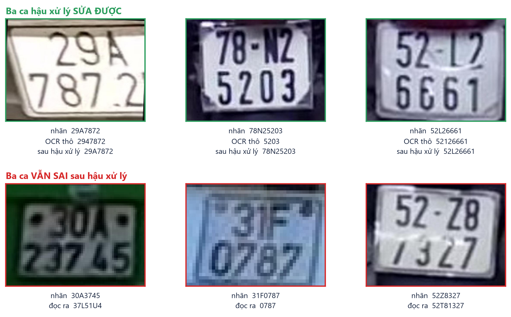
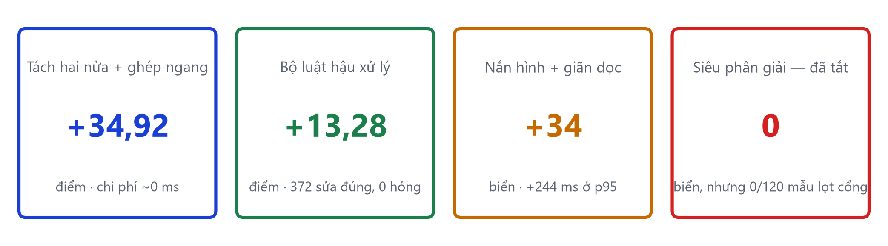
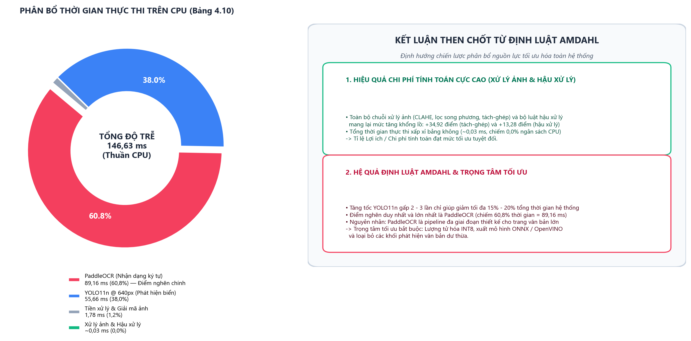

<!--
BỘ SLIDE ĐỒ ÁN MÔN HỌC — 22 slide (1 bìa + 21 nội dung), khoảng 15 phút.

Khác gì bộ kia (nằm trên nhánh `main`, không có ở nhánh này):
  `10-slides.md`         28 slide (24 chính + 4 backup), bám mạch quyển tốt
                         nghiệp, dùng cho buổi bảo vệ.
  `12-slides-mon-hoc.md`  bộ này — bám quyển `docs/papers/mon-hoc/`, trọng tâm
                          dời hẳn sang CÁC PHÉP XỬ LÝ ẢNH. YOLO và PaddleOCR
                          xuất hiện như công cụ áp dụng, không như đóng góp.

Ba khác biệt nội dung so với bộ 11 slide:
  1. BỎ cặp số 94,3% / 45,7% của RodoSol-ALPR. Đối chiếu với công trình đã công
     bố là việc của luận văn tốt nghiệp, không phải của đồ án môn học.
  2. BỎ khung "đóng góp kỹ thuật". Đồ án môn học không tuyên bố đóng góp; nó
     trình bày cách giải.
  3. THÊM slide bóc tách đóng góp đo được của từng bước xử lý ảnh, và slide
     hình chuỗi xử lý dựng từ chính mã bàn giao.

Bốn slide thêm ở lượt sau (12 -> 16), đều lấp chỗ trống có thật:
  - Bộ dữ liệu và khử trùng lặp: băm tri giác DCT là nội dung môn học mà
    bản 12 slide chỉ nhắc trong một dòng bảng.
  - Hình 4.1 và Hình 4.2 của quyển: con số quan trọng nhất và các ca lỗi
    thật, trước đó chỉ nằm trong bảng.
  - Tách Demo ra khỏi Hướng phát triển để có chỗ cho ảnh chụp giao diện.

BỐN QUY ƯỚC BẮT BUỘC — vi phạm là vỡ layout, `check_slides.ps1` sẽ báo:

1. **Chỉ dùng `##`.** Mỗi `##` là một slide; cấp này ghim bằng `--slide-level=2`.
2. **Bảng hoặc hình phải là khối CUỐI CÙNG của slide, và chỉ được có MỘT.**
   Pandoc cắt sang slide mới ở mọi thứ đứng sau bảng/hình.
3. **Câu dẫn trên bảng/hình: MỘT câu, tối đa ~100 ký tự.** Dài hơn thì
   PowerPoint không cắt chữ — nó cho tràn ra và **vẽ đè lên bảng bên dưới**,
   lỗi không phát hiện được bằng phép đo chiều cao.
4. Mọi con số phải truy được về `docs/papers/mon-hoc/` hoặc `docs/reports/` (nhánh `main`).

Kiểm tra sau mỗi lần sửa:

```
python scripts/build_thesis.py --slides docs/slides/12-slides-mon-hoc.md
powershell -File scripts/check_slides.ps1 -DeckPath docs/slides/12-slides-mon-hoc.pptx
```
-->

## Nội dung trình bày

1. Bài toán và mục tiêu
2. Phương pháp đề xuất
3. Kết quả thực nghiệm
4. Kết luận và hướng phát triển

## Đặt vấn đề

- **77 triệu xe máy**, chiếm 85–90% lưu lượng ⇒ ở Việt Nam **biển hai dòng là đa số**, không phải ngoại lệ
- Biển xe mô tô chỉ **190 × 140 mm**, tỉ lệ khung hình **1,357** — vừa là đối tượng nhỏ, vừa là bố cục hai dòng
- Mọi bộ nhận dạng ký tự dựng sẵn đều **giả định văn bản nằm trên một dòng ngang** — giả định đó **sai** với đa số biển số Việt Nam
- Ảnh thực tế còn thêm: bề mặt phản quang gây **chói cục bộ**, biển bám bụi, cong vênh, chụp nghiêng, ngược sáng

## Mục tiêu và chỉ tiêu

Hệ thống chạy đầu cuối, **suy luận hoàn toàn trên CPU**, hỗ trợ cả biển một dòng và hai dòng.

| Chỉ tiêu | Ngưỡng tối thiểu | Mục tiêu |
|---|---:|---:|
| mAP@0,5 của bộ phát hiện | 0,85 | **0,90** |
| mAP@0,5:0,95 của bộ phát hiện | 0,55 | 0,65 |
| Đúng mức ký tự (1 − CER) | 0,92 | 0,95 |
| Đúng cả chuỗi, **trước** hậu xử lý | 0,80 | 0,85 |
| Đúng cả chuỗi, **sau** hậu xử lý | 0,85 | 0,90 |
| Độ trễ một ảnh, p95, **trên CPU** | ≤ 1.500 ms | ≤ 800 ms |

## Pipeline xử lý tổng thể

Đóng góp chính nằm ở **khối xử lý ảnh** và **hậu xử lý** — cầu nối giữa hai mô hình học sâu.

| Luồng | Khối chức năng | Nội dung kỹ thuật trong pipeline |
|:---:|---|---|
| **1** | **Ảnh đầu vào** | Khung hình camera / ảnh phương tiện thực tế (1 hoặc 2 dòng) |
| ↓ | **YOLO11n** | Phát hiện vùng biển số và trích xuất bounding box |
| ↓ | **Khối xử lý ảnh** *(cốt lõi)* | Phân loại số dòng (AR = 2,50) · Tách–ghép ngang · CLAHE · Lọc song phương |
| ↓ | **PaddleOCR** | Nhận dạng ký tự quang học trên ảnh một dòng đã chuẩn hóa |
| ↓ | **Khối hậu xử lý** *(cốt lõi)* | Kiểm tra mã tỉnh (81/89) · Mặt nạ vị trí · Ánh xạ nhầm lẫn bất đối xứng |
| **6** | **Kết quả đầu ra** | Chuỗi ký tự biển số chuẩn hóa + Loại phương tiện / màu biển |

## Bộ dữ liệu: khử trùng lặp bằng băm tri giác

Các bộ công khai fork lẫn nhau, nên **44,2% ảnh là bản trùng** — không khử thì đang đo trí nhớ



## Vì sao biển hai dòng làm OCR đọc sai

Bản đồ đặc trưng bị nén H → 1 khiến ký tự hai dòng rơi chung cột đặc trưng và xung đột CTC.



## Hướng tiếp cận: Biến đổi hình học ảnh thay cho mô hình phức tạp

Tái cấu trúc hình học của ảnh để tương thích hoàn toàn với giả định của mô hình CRNN/CTC sẵn có.

| Phép xử lý ảnh | Dùng để làm gì | Thay cho phương án hiển nhiên |
|---|---|---|
| **Ngưỡng tỉ lệ khung hình 2,50** | Phân loại một dòng / hai dòng — quy chuẩn cho 4,727 · 2,000 · 1,357 nên có khoảng trống rộng **2,727** để đặt ngưỡng | Huấn luyện thêm một bộ phân loại |
| **Tách hai nửa + ghép ngang** | Biến ảnh hai dòng thành một dòng | Đổi sang mô hình đọc đa dòng |
| **CLAHE** | Xử lý mảng chói cục bộ | Cân bằng lược đồ xám **toàn cục** |
| **Lọc song phương** | Khử nhiễu mà **giữ biên** | Làm mờ Gauss |
| **Băm tri giác (DCT)** | Khử ảnh trùng giữa các bộ dữ liệu | Băm mật mã MD5/SHA |
| **Không gian màu HSV** | Nhận màu nền bền với ánh sáng | Phân ngưỡng trên RGB |

## Minh họa pipeline trên một biển thật

Mỗi khung là ảnh thật ở đầu ra một bước, dựng từ **mô hình đề xuất**.


## Cắt cố định 5/12 & 1/3 thay vì Chiếu ngang

Ốc vít ở tim biển tạo đỉnh xám giả làm gãy phép chiếu ngang; cắt cố định O(1) bảo vệ nét chữ.



## Bộ luật hậu xử lý ràng buộc theo vị trí

Ba ràng buộc đặc thù biển số Việt Nam, khai thác **theo từng vị trí trong chuỗi**.

| Ràng buộc | Nội dung | Vì sao không dùng luật phẳng |
|---|---|---|
| Mã tỉnh | **81/89** giá trị được dùng | `\d{2}` cho qua 8 chuỗi không tồn tại |
| Tập seri | Vị trí 1 **có G không R**; vị trí 2 của xe máy **có R không G** | Danh sách phẳng sai hệ thống trên mọi biển xe máy có `R` |
| Mặt nạ vị trí | `DDLDDDDD` · `DDLDDDD` · `DDL?DDDDD` | Chỉ số 3 là vị trí **duy nhất** cả chữ lẫn số đều hợp lệ |
| Ánh xạ nhầm lẫn | O → 0 hợp lý, 0 → O **không bao giờ** — chiều đúng là 0 → D | Bảng đối xứng sẽ tạo ra ký tự bất hợp lệ |

## Phân loại màu nền trong không gian màu HSV

Tách biệt sắc độ H khỏi độ sáng V giúp nhận diện bền vững; độ chính xác tổng thể đạt 97,89%.



## Xử lý biển nghiêng: Nắn 2D & Thử lại

Nắn phẳng bằng minAreaRect cứu thêm 34 biển số, chi phí dồn vào đuôi p95 mà không ảnh hưởng p50.



## Kết quả đo được

Phát hiện **đạt cả bốn chỉ tiêu**; phần thiếu nằm trọn ở **biển hai dòng** — riêng một dòng đạt 0,9541 sau hậu xử lý



## Khoảng cách nằm ở đâu

Đo mức ký tự thì hai bố cục gần bằng nhau; đo cả chuỗi thì phân hóa rõ rệt.



## Lỗi trông như thế nào

Ba ca được chuẩn hóa đúng nhờ hậu xử lý, ba ca vẫn sai — **cả ba ca sai đều gặp lỗi ở dòng trên**.



## Bóc tách đóng góp của từng bước

Mọi bước bật tắt độc lập, nên đóng góp của từng bước **đo được riêng** — kể cả khi bằng 0. *(Đối chứng: tách-ghép trên Tesseract chỉ +0,03 điểm)*



## Phân rã ngân sách độ trễ & Định luật Amdahl

PaddleOCR chiếm 60,8% độ trễ là điểm nghẽn chính; xử lý ảnh mang lại đột phá với chi phí ~0 ms.



## Ba kết quả khác với dự đoán ban đầu

- **Tách-ghép không độc lập bộ nhận dạng** — 34,92 điểm cho PaddleOCR, **0,03** cho Tesseract ⇒ điều kiện cần, không đủ
- **Bảng luật suy từ hình dạng chỉ phủ 2/10 cặp nhầm phổ biến nhất**; bảng trích từ ma trận đo được phủ **4/10** và thêm **53 biển đúng**
- **Siêu phân giải cải thiện 0 biển, nhưng 0/120 mẫu lọt cổng** ⇒ *chi phí đã đo, lợi ích chưa ai đo được*

## Demo: hệ thống chạy thật

Khởi động bằng một lệnh `docker compose up`; giao diện hiện **cả chuỗi thô lẫn chuỗi đã sửa**.


## Hướng phát triển

| # | Hướng phát triển | Giải hạn chế nào |
|:--:|---|:--:|
| 1 | **Huấn luyện lại bộ nhận dạng ký tự cho biển số Việt Nam** | 1 |
| 2 | **Mở rộng bảng ánh xạ từ ma trận nhầm lẫn khi có thêm dữ liệu** | 1 |
| 3 | Khử rò rỉ theo **chuỗi biển số** thay vì theo băm tri giác | 3, 4 |
| 4 | Thu thập dữ liệu biển vàng, xanh, đỏ | 2, 5 |
| 5 | Đo lại bậc siêu phân giải FSRCNN trên ngữ liệu có biển siêu nhỏ | — |
| 6 | Tăng tốc khối nhận dạng: lượng tử hóa, xuất OpenVINO hoặc ONNX | — |

## Kết luận chung

- Chạy đầu cuối trên CPU: phát hiện **mAP@0,5 = 0,9829**
- Đột phá trên biển hai dòng nhờ biến đổi ảnh (thay vì đổi mô hình): tăng **+34,92 điểm**
- Hậu xử lý theo vị trí **+13,28 điểm**, **0 ca làm sai lệch** / 2.801 biển
- Điểm nghẽn còn lại: **biển hai dòng** (S₁ = 0,7234)

## Cảm ơn & Hỏi đáp (Q&A)

**Đề tài: Xây dựng hệ thống nhận diện biển số xe bằng Trí tuệ nhân tạo**

- **Giảng viên hướng dẫn:** ThS. Cáp Phạm Đình Thăng
- **Sinh viên thực hiện:** Phạm Nguyễn Thế Châu | Nguyễn Công Hậu | Nguyễn Minh Hiếu | Phạm Công Thành

**Xin trân trọng cảm ơn Quý Thầy/Cô và các bạn!**

**Phiên trao đổi & Hỏi đáp (Q&A)**
