# Kế Hoạch Trình Bày Slide: Đồ Án Tốt Nghiệp & Đồ Án Môn Học

**Đề tài:** Xây dựng hệ thống nhận dạng biển số xe Việt Nam ứng dụng Trí tuệ nhân tạo (ALPR)  
**Tác giả:** Nguyễn Minh Hiếu (25410007) · Phạm Công Thành (25410013)  
**GVHD:** ThS. Cáp Phạm Đình Thăng — Trường ĐH Công nghệ Thông tin, ĐHQG-HCM  
**Cập nhật:** 22/08/2026 *(đồng bộ cấu trúc với [`10-slides.md`](10-slides.md) và [`10-slides-outline.md`](10-slides-outline.md))*

---

## 📊 1. Bảng So Sánh & Định Hướng

| Tiêu chí | 🎓 Đồ án Tốt nghiệp (ĐATN) | 📚 Đồ án Môn học (ĐAMH) |
|---|---|---|
| **Tệp nguồn slide** | [`10-slides.md`](10-slides.md) | [`12-slides-mon-hoc.md`](12-slides-mon-hoc.md) |
| **Tệp xuất PowerPoint** | [`slides.pptx`](slides.pptx) | [`12-slides-mon-hoc.pptx`](12-slides-mon-hoc.pptx) |
| **Tài liệu tham chiếu** | Quyển tốt nghiệp (`docs/papers/thesis-full.pdf`) | Báo cáo môn học (`docs/papers/mon-hoc/thesis-full.pdf`) |
| **Thời lượng trình bày** | **15 – 20 phút** (+ 10–15 phút Q&A) | **7 – 10 phút** (+ 3–5 phút Q&A) |
| **Quy mô slide** | **37 slide** `##` _(gồm khối backup)_ | **15 slide** `##` |
| **Trọng tâm nội dung** | • Tính mới & cơ sở pháp lý (TT 79/2024, TT 13/2025, TT 51/2025)<br>• Kiến trúc 5 tầng chuẩn Clean Architecture<br>• Tối ưu CPU inference & benchmark toàn diện<br>• Xử lý triệt để bài toán biển 2 dòng | • Đặt vấn đề & yêu cầu bài toán môn học<br>• Pipeline xử lý ảnh cốt lõi (YOLO11n + PP-OCRv5)<br>• Kết quả thử nghiệm & demo ứng dụng<br>• Đánh giá hoàn thành mục tiêu môn học |

---

## 🎓 2. Plan Slide Đồ Án Tốt Nghiệp (15 – 20 Phút)

> Cấu trúc chi tiết được biên soạn tại [`10-slides.md`](10-slides.md) và kịch bản thuyết trình có sẵn tại [`10-slides-outline.md`](10-slides-outline.md).

### Ngân Sách Thời Gian (37 slide, gồm khối backup)

```mermaid
gantt
    title Phân bổ thời gian trình bày ĐATN (Tổng: 15 phút / 900s)
    dateFormat  X
    axisFormat %s s
    section Khối 1
    Tổng quan & Đặc thù (S1-S8)        :0, 240
    section Khối 2
    Kiến trúc & Giải pháp AI (S9-S13)   :240, 450
    section Khối 3
    Dữ liệu & Hệ thống (S14-S17)       :450, 600
    section Khối 4
    Thực nghiệm & Đánh giá (S18-S26)    :600, 810
    section Khối 5
    Demo & Kết luận (S27-S31)          :810, 900
```



### Chi Tiết Từng Khối Nội Dung

#### Khối 1: Tổng quan & Đặc thù bài toán *(S1 – S8 · 240s / 4 phút)*
- **S1 — Bìa:** Thông tin đề tài, sinh viên thực hiện, GVHD, đơn vị.
- **S2 — Nội dung:** 5 phần chính theo chuẩn bảo vệ.
- **S3 — Vì sao đề tài này:** Xe máy chiếm ~77 triệu xe, 85–90% lưu lượng VN; chênh 48,6 điểm giữa 1 dòng / 2 dòng *(số liệu RodoSol, Brazil — Laroca 2022)*.
- **S4 — Căn cứ pháp lý:** Đề bài dẫn TT 24/2023 đã hết hiệu lực ⇒ xây trên TT 79/2024/TT-BCA · TT 13/2025 · TT 51/2025/TT-BCA (34 tỉnh thành) · QCVN 08:2024/BCA.
- **S5 — Đặc thù biển số VN:** Phân loại cấu trúc theo tỉ lệ khung hình (ngưỡng AR = 2,5).
- **S6 — Lựa chọn hướng tiếp cận:** So sánh 4 thế hệ $\rightarrow$ chọn pipeline 2-Stage (Detection $\rightarrow$ OCR).
- **S7 — Lựa chọn mô hình:** YOLO11n (2.6M params) & PP-OCRv5 mobile (4.5 MB) tối ưu cho CPU.
- **S8 — Mục tiêu và phạm vi:** Hệ thống 5 tầng hoàn chỉnh trên CPU; xác định ranh giới ngoài phạm vi.

#### Khối 2: Kiến trúc & Giải pháp AI *(S9 – S13 · 210s / 3.5 phút)*
- **S9 — Kiến trúc 5 tầng:** Clean Architecture; tầng AI viết bằng Python thuần, độc lập FastAPI/Pydantic.
- **S10 — Pipeline AI:** Detect → Crop → OCR → Normalizer; không thấy biển ⇒ trả rỗng HTTP 200.
- **S11 — Xử lý biển 2 dòng:** `split-then-hstack` — giả định một dòng nằm trong hàm mất mát CRNN/CTC.
- **S12 — Bộ luật hậu xử lý theo vị trí:** Sửa theo vị trí D/L từ chuẩn biển VN, không sửa toàn cục.
- **S13 — Bậc thang phục hồi khi nhận dạng hỏng:** Cứu dòng trên 209 biển · nắn hình chống méo 34 biển.

#### Khối 3: Dữ liệu & Hệ thống *(S14 – S17 · 150s / 2,5 phút)*
- **S14 — Bộ dữ liệu:** 15.133 ảnh · 15.977 khung (10.592 / 3.027 / 1.514); hợp nhất 7 bộ, loại 44,2% bản sao; pHash ngưỡng Hamming 10.
- **S15 — Huấn luyện:** YOLO11n `imgsz 640`, 20 epoch, CPU 10,05 giờ; biểu đồ đường cong hội tụ.
- **S16 — Cơ sở dữ liệu — lưu vết đánh giá:** Lưu song song `raw_ocr_text` và `plate_number` để đo được đóng góp hậu xử lý.
- **S17 — Giao diện:** 3 trang (Ảnh · Video · Lịch sử), đủ 4 trạng thái chờ/rỗng/lỗi/thành công.

#### Khối 4: Kết quả Thực nghiệm & Đánh giá *(S18 – S26 · 210s / 3,5 phút)*
- **S18 — Kết quả phát hiện:** mAP50 0,983 · mAP50-95 0,783 — đạt cả 4 chỉ tiêu; chênh hai bố cục chỉ 2,09 điểm.
- **S19 — Kết quả OCR:** A4 = 0,9483 (🟡) · A6 = 0,7701 (❌); khoảng cách dồn ở biển 2 dòng: 0,7234 vs 0,9541.
- **S20 — Khoảng cách nằm trọn ở biển 2 dòng:** Biểu đồ tách theo bố cục, cùng hệ thống cùng phép đo.
- **S21 — Đóng góp của hậu xử lý:** Sửa đúng 372 biển, làm hỏng 0; +13,28 điểm đo tách bạch.
- **S22 — Ba can thiệp thực nghiệm:** +13,28 điểm · cứu dòng trên 209 biển · nắn hình 34 biển; gap còn 23,07 điểm.
- **S23 — Hiệu năng CPU — phân rã suy luận thuần:** OCR 108,28 ms (64,3%) · Detect 57,27 ms (34,0%) · tổng 168,41 ms/biển.
- **S24 — Phân bố độ trễ:** p50 406 ms · p95 1.143 ms (đạt sàn 1.500).
- **S25 — Kiểm thử và triển khai:** 1.002/1.002 test · bao phủ 87,7% · soak 15 phút 2.028 request 0 lỗi · `docker compose up`.
- **S26 — Đối chiếu chỉ tiêu:** Bảng tổng hợp ✅ / 🟡 / ❌ toàn bộ NFR.

#### Khối 5: Demo, Hạn chế & Kết luận *(S27 – S31 · 90s / 1,5 phút)*
- **S27 — Demo trực tiếp:** Ảnh ô tô 1 dòng → ảnh xe máy 2 dòng → Video & Lịch sử.
- **S28 — Hạn chế:** Biển 2 dòng chưa đạt (bộ đọc dòng đơn) · đầu-cuối chưa đo trên tập lớn · 97,7% biển trắng · chưa test xuyên bộ dữ liệu.
- **S29 — Hướng phát triển:** Ngắn hạn fine-tune recognizer + nhãn chuỗi hiện trường; trung hạn test xuyên bộ dữ liệu + ONNX/OpenVINO.
- **S30 — Kết luận:** Hệ thống 5 tầng chạy thật · phát hiện đạt cả 4 chỉ tiêu · hậu xử lý +13,28 điểm đo tách bạch.
- **S31 — Cảm ơn.**

#### Khối Backup (S32 – S38 · Chiếu khi hội đồng đặt câu hỏi)
- **S32 — Backup 1:** Kiến trúc YOLO11n (C3k2, SPPF, C2PSA, anchor-free).
- **S33 — Backup 2:** Kiến trúc PP-OCRv5 Mobile (PP-LCNetV3, SVTR-HG, CTC head).
- **S34 — Backup 3:** Phân tích lỗi E1–E6 trên 697 ca sai (E3 nhầm ký tự 63,85%).
- **S35 — Backup 4:** Bóc tách đóng góp (ablation) gồm cả fine-tune thất bại −7,5 điểm.
- **S36 — Backup 5:** Siêu tham số đã thực thi (AdamW, batch 8, lr0 0,001) trích `args.yaml`.
- **S37 — Backup 6:** Tài liệu tham khảo chính (Laroca, PP-OCR, TT/QCVN).
- **S38 — Backup 7:** Tra nhanh số liệu toàn hệ thống.

---

## 📚 3. Plan Slide Đồ Án Môn Học (7 – 10 Phút)

> Cấu trúc chi tiết được biên soạn tại [`12-slides-mon-hoc.md`](12-slides-mon-hoc.md).

### Ngân Sách Thời Gian (15 slide)

| STT | Tiêu đề Slide | Nội dung trọng tâm | Thời lượng |
|:---:|---|---|:---:|
| **S1** | **Bìa** | Tên đề tài, Môn học (Xử lý ảnh & Ứng dụng), Nhóm SV, Giảng viên phụ trách | 20s |
| **S2** | **Nội dung** | 5 phần: Đặt vấn đề $\rightarrow$ Phương pháp $\rightarrow$ Cài đặt $\rightarrow$ Kết quả $\rightarrow$ Kết luận | 20s |
| **S3** | **Đặt vấn đề & Mục tiêu** | Bài toán nhận diện biển số xe máy và ô tô tại Việt Nam | 40s |
| **S4** | **Đặc thù bài toán biển số VN** | Biển 1 dòng dài vs Biển 2 dòng vuông; phân loại theo Aspect Ratio 2,5 | 40s |
| **S5** | **Kiến trúc Pipeline xử lý ảnh** | Sơ đồ toàn trình: Ảnh gốc $\rightarrow$ BBox $\rightarrow$ Crop/Warp $\rightarrow$ OCR $\rightarrow$ Text | 50s |
| **S6** | **Tầng phát hiện biển số (YOLO11n)** | Cấu trúc mô hình, dữ liệu gán nhãn, quá trình huấn luyện | 50s |
| **S7** | **Tầng nhận dạng ký tự (PP-OCRv5)** | Cơ chế nhận dạng, thuật toán phân vùng 2 dòng | 50s |
| **S8** | **Quy tắc hậu xử lý chuỗi ký tự** | Bảng luật chuẩn hóa định dạng biển số Việt Nam | 40s |
| **S9** | **Cài đặt ứng dụng & Giao diện** | Giao diện Web hiển thị kết quả và Backend API | 40s |
| **S10**| **Kết quả thực nghiệm mô hình** | Bảng độ chính xác (mAP, OCR Accuracy) trên tập Test | 50s |
| **S11**| **Tốc độ xử lý trên CPU** | Độ trễ xử lý từng bước (Tổng trễ < 100ms/ảnh) | 40s |
| **S12**| **Phân tích một số ca lỗi** | Các trường hợp nhận dạng sai và nguyên nhân | 40s |
| **S13**| **Demo sản phẩm** | Video / ảnh minh họa chạy thực tế | 60s |
| **S14**| **Đánh giá hoàn thành môn học** | Đối chiếu các mục tiêu đã đề ra ban đầu của môn học | 30s |
| **S15**| **Hướng phát triển** | Tối ưu thêm tốc độ và cải thiện nhận diện ban đêm | 20s |
| **S16**| **Cảm ơn & Hỏi đáp (Q&A)** | Lời cảm ơn Thầy/Cô và các bạn | 10s |

---

## 👥 4. Phân Công Trình Bày Giữa 2 Thành Viên

```
[Thành viên 1: Nguyễn Minh Hiếu]
├── Khối 1: Tổng quan đề tài, Căn cứ pháp lý & Đặc thù biển VN
└── Khối 2: Pipeline AI cốt lõi (Phát hiện YOLO11n & Nhận dạng PP-OCRv5)

[Thành viên 2: Phạm Công Thành]
├── Khối 3: Kiến trúc hệ thống, Backend API, Frontend & Triển khai Docker
├── Khối 4: Kết quả thực nghiệm, Đo đạc độ trễ CPU & Phân tích ca lỗi
└── Khối 5: Kịch bản Demo, Đóng góp, Hạn chế & Kết luận
```

---

## 🛠️ 5. Hướng Dẫn Biên Dịch & Kiểm Thử Slide

### Biên Dịch Sang PowerPoint (.pptx)
```bash
# Build slide tốt nghiệp và slide môn học
backend/.venv/Scripts/python.exe scripts/build_thesis.py
```

### Kiểm Tra Tràn Chữ & Đè Khối (PowerPoint COM)
```powershell
# Chạy script kiểm tra định dạng slide
powershell -File scripts/check_slides.ps1
```

### Tài Nguyên Bổ Trợ
- **Kịch bản trả lời phản biện (40+ câu):** [`docs/slides/10-defense-qa.md`](10-defense-qa.md)
- **Kịch bản Demo trực tiếp:** [`docs/slides/10-demo-script.md`](10-demo-script.md)
- **Thiết kế Poster A0:** [`docs/poster/10-poster-layout.md`](../poster/10-poster-layout.md)
