# Kế Hoạch Trình Bày Slide: Đồ Án Tốt Nghiệp & Đồ Án Môn Học

**Đề tài:** Xây dựng hệ thống nhận dạng biển số xe Việt Nam ứng dụng Trí tuệ nhân tạo (ALPR)  
**Tác giả:** Nguyễn Minh Hiếu (25410007) · Phạm Công Thành (25410013)  
**GVHD:** ThS. Cáp Phạm Đình Thăng — Trường ĐH Công nghệ Thông tin, ĐHQG-HCM  
**Cập nhật:** 16/08/2026  

---

## 📊 1. Bảng So Sánh & Định Hướng

| Tiêu chí | 🎓 Đồ án Tốt nghiệp (ĐATN) | 📚 Đồ án Môn học (ĐAMH) |
|---|---|---|
| **Tệp nguồn slide** | [`10-slides.md`](10-slides.md) | [`12-slides-mon-hoc.md`](12-slides-mon-hoc.md) |
| **Tệp xuất PowerPoint** | [`slides.pptx`](slides.pptx) | [`12-slides-mon-hoc.pptx`](12-slides-mon-hoc.pptx) |
| **Tài liệu tham chiếu** | Quyển tốt nghiệp (`docs/papers/thesis-full.pdf`) | Báo cáo môn học (`docs/papers/mon-hoc/thesis-full.pdf`) |
| **Thời lượng trình bày** | **15 – 20 phút** (+ 10–15 phút Q&A) | **7 – 10 phút** (+ 3–5 phút Q&A) |
| **Quy mô slide** | **37 slide** `##` _(gồm khối backup)_ | **15 slide** `##` |
| **Trọng tâm nội dung** | • Tính mới & cơ sở pháp lý (TT 79/2024, TT 13/2025, TT 51/2025)<br>• Kiến trúc 5 tầng chuẩn Clean Architecture<br>• Tối ưu CPU inference & benchmark toàn diện<br>• Xử lý triệt để bài toán biển 2 dòng | • Đặt vấn đề & yêu cầu bài toán môn học<br>• Pipeline xử lý ảnh cốt lõi (YOLO11n + PP-OCRv5)<br>• Kết quả thử nghiệm & demo ứng dụng<br>• Đánh giá hoàn thành mục tiêu môn học |

---

## 🎓 2. Plan Slide Đồ Án Tốt Nghiệp (15 – 20 Phút)

> Cấu trúc chi tiết được biên soạn tại [`10-slides.md`](10-slides.md) và kịch bản thuyết trình có sẵn tại [`10-slides-outline.md`](10-slides-outline.md).

### Ngân Sách Thời Gian (37 slide, gồm khối backup)

```mermaid
gantt
    title Phân bổ thời gian trình bày ĐATN (Tổng: 15 phút / 900s)
    dateFormat  X
    axisFormat %s s
    section Khối 1
    Tổng quan & Đặc thù (S1-S8)        :0, 240
    section Khối 2
    Kiến trúc & Giải pháp AI (S9-S13)   :240, 450
    section Khối 3
    Dữ liệu & Hệ thống (S14-S17)       :450, 600
    section Khối 4
    Thực nghiệm & Đánh giá (S18-S26)    :600, 810
    section Khối 5
    Demo & Kết luận (S27-S31)          :810, 900
```



### Chi Tiết Từng Khối Nội Dung

#### Khối 1: Tổng quan & Đặc thù bài toán *(S1 – S8 · 240s / 4 phút)*
- **S1 — Bìa:** Thông tin đề tài, sinh viên thực hiện, GVHD, đơn vị.
- **S2 — Nội dung:** 5 phần chính theo chuẩn bảo vệ.
- **S3 — Động lực đề tài:** Xe máy chiếm 85–90% lưu lượng VN; độ chính xác đọc biển 2 dòng sụt giảm 48.6 điểm so với 1 dòng.
- **S4 — Căn cứ pháp lý:** Cập nhật TT 79/2024/TT-BCA, TT 13/2025/TT-BCA, TT 51/2025/TT-BCA (34 tỉnh thành), QCVN 08:2024/BCA.
- **S5 — Đặc thù biển số VN:** Phân loại cấu trúc theo tỉ lệ khung hình (ngưỡng AR = 2.5).
- **S6 — Lựa chọn hướng tiếp cận:** So sánh 4 thế hệ $\rightarrow$ chọn pipeline 2-Stage (Detection $\rightarrow$ OCR).
- **S7 — Lựa chọn mô hình:** YOLO11n (2.6M params) & PP-OCRv5 mobile (4.5 MB) tối ưu cho CPU.
- **S8 — Mục tiêu và phạm vi:** Hệ thống 5 tầng hoàn chỉnh trên CPU; xác định ranh giới ngoài phạm vi.

#### Khối 2: Kiến trúc & Giải pháp AI *(S9 – S13 · 210s / 3.5 phút)*
- **S9 — Kiến trúc 5 tầng:** Clean Architecture; tầng AI viết bằng Python thuần, độc lập FastAPI/Pydantic.
- **S10 — Pipeline AI:** Preprocess $\rightarrow$ YOLO11n Detection $\rightarrow$ Crop/Warp $\rightarrow$ PP-OCRv5 Recognition $\rightarrow$ Rule-based Normalization.
- **S11 — Pipeline chi tiết tầng Nhận dạng:** Xử lý tách dòng trên/dưới cho biển vuông 2 dòng.
- **S12 — Bảng ánh xạ nhầm lẫn:** Khắc phục các cặp ký tự dễ nhầm (O/0, I/1, 8/B, D/Đ) dựa trên vị trí ký tự.
- **S13 — Phân tích thiết kế chi tiết:** Quản lý hàng đợi và luồng xử lý bất đồng bộ.

#### Khối 3: Dữ liệu & Hệ thống *(S14 – S17 · 150s / 2.5 phút)*
- **S14 — Bộ dữ liệu:** Cấu trúc tập dữ liệu biển 1 dòng & 2 dòng, phân bố nhãn tỉnh thành và góc chụp.
- **S15 — Giao diện ứng dụng:** Web UI tích hợp dashboard, live view, tra cứu và xuất báo cáo.
- **S16 — Backend API & CSDL:** Thiết kế API RESTful, schema SQLite/PostgreSQL quản lý sự kiện nhận dạng.
- **S17 — Đóng gói & Triển khai:** Docker Compose, Nginx reverse proxy, cấu hình biến môi trường production.

#### Khối 4: Kết quả Thực nghiệm & Đánh giá *(S18 – S26 · 210s / 3.5 phút)*
- **S18 — Phương pháp đo đạc & Môi trường:** Đo trực tiếp trên CPU phổ thông (x86/ARM), không phụ thuộc GPU.
- **S19 — Kết quả tầng Phát hiện:** mAP50, Precision, Recall và biểu đồ PR Curve của YOLO11n.
- **S20 — Kết quả tầng Nhận dạng:** Độ chính xác cấp ký tự (Character Accuracy) và cấp biển số (Full Plate Accuracy).
- **S21 — So sánh các Engine OCR:** Benchmark đối chứng giữa PP-OCRv5, EasyOCR và Tesseract trên CPU.
- **S22 — Đo lường độ trễ toàn trình (Latency):** Thời gian từng pha (Detection ~35ms, OCR ~45ms, Normalization ~5ms).
- **S23 — Thử nghiệm tải & Độ ổn định (NFR):** Stress test API, throughput (RPS), tiêu thụ RAM.
- **S24 — Phân tích ca lỗi điển hình:** Biển lóa sáng, góc nghiêng cực đại, biển mờ xước, đinh tán che khuất.
- **S25 — Đánh giá mức độ đáp ứng NFR:** Bảng kiểm chứng các yêu cầu phi chức năng đã cam kết.
- **S26 — So sánh tổng hợp với các công trình liên quan.**

#### Khối 5: Demo, Hạn chế & Kết luận *(S27 – S31 · 90s / 1.5 phút)*
- **S27 — Demo hệ thống:** Minh họa quy trình nhận diện từ ảnh/video thực tế.
- **S28 — Đóng góp chính của đề tài:** Giải pháp hoàn chỉnh 5 tầng, chuẩn hóa pháp lý mới nhất, chạy CPU.
- **S29 — Hạn chế còn tồn tại:** Biển số biến dạng nặng, camera ban đêm thiếu sáng.
- **S30 — Hướng phát triển:** Edge AI (OpenVINO / TensorRT), tích hợp luồng camera giao thông RTSP.
- **S31 — Lời cảm ơn & Chuyển sang Q&A.**

#### Khối Backup (S32 – S38 · Chiếu khi hội đồng đặt câu hỏi)
- **S32:** Chi tiết ma trận nhầm lẫn (Confusion Matrix).
- **S33:** Danh mục 34 tỉnh/thành theo Thông tư 51/2025/TT-BCA.
- **S34:** So sánh chi tiết tài nguyên và tốc độ giữa PyTorch CPU và OpenVINO.
- **S35:** Quy trình huấn luyện và siêu tham số của mô hình YOLO11n.
- **S36:** Cấu hình Docker multi-stage build và bảo mật hệ thống.
- **S37:** Phân tích chi tiết trường hợp biển số đặc biệt (ngoại giao, quân sự, xe biển đỏ).
- **S38:** Kiến trúc mở rộng cho hệ thống trạm thu phí nhiều làn.

---

## 📚 3. Plan Slide Đồ Án Môn Học (7 – 10 Phút)

> Cấu trúc chi tiết được biên soạn tại [`12-slides-mon-hoc.md`](12-slides-mon-hoc.md).

### Ngân Sách Thời Gian (15 slide)

| STT | Tiêu đề Slide | Nội dung trọng tâm | Thời lượng |
|:---:|---|---|:---:|
| **S1** | **Bìa** | Tên đề tài, Môn học (Xử lý ảnh & Ứng dụng), Nhóm SV, Giảng viên phụ trách | 20s |
| **S2** | **Nội dung** | 5 phần: Đặt vấn đề $\rightarrow$ Phương pháp $\rightarrow$ Cài đặt $\rightarrow$ Kết quả $\rightarrow$ Kết luận | 20s |
| **S3** | **Đặt vấn đề & Mục tiêu** | Bài toán nhận diện biển số xe máy và ô tô tại Việt Nam | 40s |
| **S4** | **Đặc thù bài toán biển số VN** | Biển 1 dòng dài vs Biển 2 dòng vuông; phân loại theo Aspect Ratio 2.5 | 40s |
| **S5** | **Kiến trúc Pipeline xử lý ảnh** | Sơ đồ toàn trình: Ảnh gốc $\rightarrow$ BBox $\rightarrow$ Crop/Warp $\rightarrow$ OCR $\rightarrow$ Text | 50s |
| **S6** | **Tầng phát hiện biển số (YOLO11n)** | Cấu trúc mô hình, dữ liệu gán nhãn, quá trình huấn luyện | 50s |
| **S7** | **Tầng nhận dạng ký tự (PP-OCRv5)** | Cơ chế nhận dạng, thuật toán phân vùng 2 dòng | 50s |
| **S8** | **Quy tắc hậu xử lý chuỗi ký tự** | Bảng luật chuẩn hóa định dạng biển số Việt Nam | 40s |
| **S9** | **Cài đặt ứng dụng & Giao diện** | Giao diện Web hiển thị kết quả và Backend API | 40s |
| **S10**| **Kết quả thực nghiệm mô hình** | Bảng độ chính xác (mAP, OCR Accuracy) trên tập Test | 50s |
| **S11**| **Tốc độ xử lý trên CPU** | Độ trễ xử lý từng bước (Tổng trễ < 100ms/ảnh) | 40s |
| **S12**| **Phân tích một số ca lỗi** | Các trường hợp nhận dạng sai và nguyên nhân | 40s |
| **S13**| **Demo sản phẩm** | Video / ảnh minh họa chạy thực tế | 60s |
| **S14**| **Đánh giá hoàn thành môn học** | Đối chiếu các mục tiêu đã đề ra ban đầu của môn học | 30s |
| **S15**| **Hướng phát triển** | Tối ưu thêm tốc độ và cải thiện nhận diện ban đêm | 20s |
| **S16**| **Cảm ơn & Hỏi đáp (Q&A)** | Lời cảm ơn Thầy/Cô và các bạn | 10s |

---

## 👥 4. Phân Công Trình Bày Giữa 2 Thành Viên

```
[Thành viên 1: Nguyễn Minh Hiếu]
├── Khối 1: Tổng quan đề tài, Căn cứ pháp lý & Đặc thù biển VN
└── Khối 2: Pipeline AI cốt lõi (Phát hiện YOLO11n & Nhận dạng PP-OCRv5)

[Thành viên 2: Phạm Công Thành]
├── Khối 3: Kiến trúc hệ thống, Backend API, Frontend & Triển khai Docker
├── Khối 4: Kết quả thực nghiệm, Đo đạc độ trễ CPU & Phân tích ca lỗi
└── Khối 5: Kịch bản Demo, Đóng góp, Hạn chế & Kết luận
```

---

## 🛠️ 5. Hướng Dẫn Biên Dịch & Kiểm Thử Slide

### Biên Dịch Sang PowerPoint (.pptx)
```bash
# Build slide tốt nghiệp và slide môn học
backend/.venv/Scripts/python.exe scripts/build_thesis.py
```

### Kiểm Tra Tràn Chữ & Đè Khối (PowerPoint COM)
```powershell
# Chạy script kiểm tra định dạng slide
powershell -File scripts/check_slides.ps1
```

### Tài Nguyên Bổ Trợ
- **Kịch bản trả lời phản biện (40+ câu):** [`docs/slides/10-defense-qa.md`](10-defense-qa.md)
- **Kịch bản Demo trực tiếp:** [`docs/slides/10-demo-script.md`](10-demo-script.md)
- **Thiết kế Poster A0:** [`docs/poster/10-poster-layout.md`](../poster/10-poster-layout.md)
